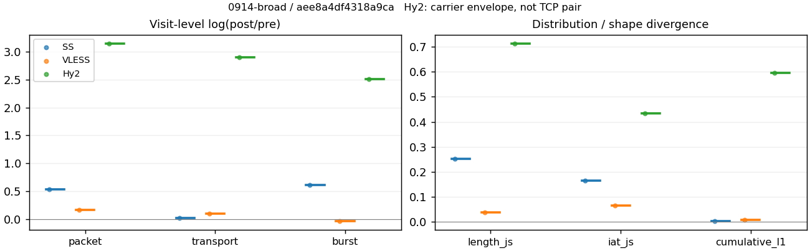
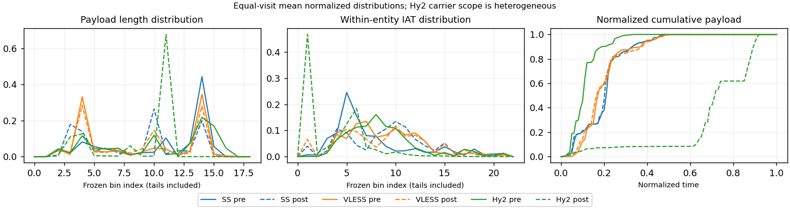

# 0914-broad · 条目 034 · rottentomatoes.com

目标：https://www.rottentomatoes.com/m/interstellar_2014

活动标签：rottentomatoes.com::page_load。选定访问 3 次。

[返回总索引](../../README.md) · [统计口径](../../methods.md)

## 覆盖与资格（每次访问均保留）

| 部署 | 重复 | 主请求路由 | 活动状态 | 代理比较 | DIRECT pre | 请求 proxy/direct/unresolved | 错误 |
| --- | --- | --- | --- | --- | --- | --- | --- |
| Hy2 | 1 | proxy | passed | 1 | 1 | 116/4/3 | [] |
| SS | 1 | proxy | passed | 1 | 0 | 114/0/0 | [] |
| VLESS | 1 | proxy | passed | 1 | 0 | 135/0/0 | [] |

主请求非 proxy 的统计仅解释为已索引的辅助代理连接或 DIRECT 观测，不代表目标业务经代理传输。播放确认与配对资格是两道不同的门。

图中散点为单次访问，短线为重复中位数；Hy2 是共享载体包络，不能与 TCP 配对作等范围因果对比。

形态图先逐访问归一化，再对访问等权平均；实线 pre，虚线 post。分箱序号及边界见 methods，不将分箱索引误解为长度或时间。

## 每次访问的关键观测

### SS

范围：`exclusive_page`。每格 pre → post；空值为不可观测/不适用。

| 重复 | 包数 | 载荷字节 | burst | TCP FR | IAT中位µs | length JS | IAT JS |
| --- | --- | --- | --- | --- | --- | --- | --- |
| 1 | 2519 → 4268 | 2.7373e+06 → 2.7888e+06 | 1658 → 3064 | 236 → 243 | 30.135 → 451.28 | 0.25271 | 0.16551 |

完整标量统计：中位数 [min,max]；Δ 为重复内逐访问变换的中位数，MAD 未缩放。n 为可用变换数；DIRECT-only 的 nΔ=0 不代表 pre 不可用。

| scope | 特征 | pre | post | Δ | IQRΔ | MADΔ | nΔ |
| --- | --- | --- | --- | --- | --- | --- | --- |
| exclusive_page | active_span_sum_s_1000ms | 43.819 [43.819, 43.819] | 48.748 [48.748, 48.748] | 0.10661 | — | — | 1 |
| exclusive_page | active_span_sum_s_100ms | 8.5167 [8.5167, 8.5167] | 15.418 [15.418, 15.418] | 0.59351 | — | — | 1 |
| exclusive_page | active_span_sum_s_500ms | 30.787 [30.787, 30.787] | 40.448 [40.448, 40.448] | 0.27294 | — | — | 1 |
| exclusive_page | burst_bytes_iqr | 2896 [2896, 2896] | 1428 [1428, 1428] | -0.70706 | — | — | 1 |
| exclusive_page | burst_bytes_mad | 31 [31, 31] | 34 [34, 34] | 0.092373 | — | — | 1 |
| exclusive_page | burst_bytes_max | 22136 [22136, 22136] | 13952 [13952, 13952] | -0.46158 | — | — | 1 |
| exclusive_page | burst_bytes_mean | 1651 [1651, 1651] | 910.17 [910.17, 910.17] | -0.59549 | — | — | 1 |
| exclusive_page | burst_bytes_median | 31 [31, 31] | 34 [34, 34] | 0.092373 | — | — | 1 |
| exclusive_page | burst_bytes_min | 0 [0, 0] | 0 [0, 0] | — | — | — | 0 |
| exclusive_page | burst_bytes_p95 | 6960.5 [6960.5, 6960.5] | 2964 [2964, 2964] | -0.85372 | — | — | 1 |
| exclusive_page | burst_bytes_q25 | 0 [0, 0] | 0 [0, 0] | — | — | — | 0 |
| exclusive_page | burst_bytes_q75 | 2896 [2896, 2896] | 1428 [1428, 1428] | -0.70706 | — | — | 1 |
| exclusive_page | burst_bytes_std | 3125.8 [3125.8, 3125.8] | 1458 [1458, 1458] | -0.76263 | — | — | 1 |
| exclusive_page | burst_count | 1658 [1658, 1658] | 3064 [3064, 3064] | 0.61411 | — | — | 1 |
| exclusive_page | burst_duration_ms_iqr | 0.039962 [0.039962, 0.039962] | 0 [0, 0] | — | — | — | 0 |
| exclusive_page | burst_duration_ms_mad | 0 [0, 0] | 0 [0, 0] | — | — | — | 0 |
| exclusive_page | burst_duration_ms_max | 15001 [15001, 15001] | 16003 [16003, 16003] | 0.06463 | — | — | 1 |
| exclusive_page | burst_duration_ms_mean | 149.47 [149.47, 149.47] | 89.089 [89.089, 89.089] | -0.51742 | — | — | 1 |
| exclusive_page | burst_duration_ms_median | 0 [0, 0] | 0 [0, 0] | — | — | — | 0 |
| exclusive_page | burst_duration_ms_min | 0 [0, 0] | 0 [0, 0] | — | — | — | 0 |
| exclusive_page | burst_duration_ms_p95 | 260.55 [260.55, 260.55] | 15.436 [15.436, 15.436] | -2.8261 | — | — | 1 |
| exclusive_page | burst_duration_ms_q25 | 0 [0, 0] | 0 [0, 0] | — | — | — | 0 |
| exclusive_page | burst_duration_ms_q75 | 0.039962 [0.039962, 0.039962] | 0 [0, 0] | — | — | — | 0 |
| exclusive_page | burst_duration_ms_std | 1167.5 [1167.5, 1167.5] | 1034.1 [1034.1, 1034.1] | -0.12132 | — | — | 1 |
| exclusive_page | burst_packets_iqr | 1 [1, 1] | 0 [0, 0] | — | — | — | 0 |
| exclusive_page | burst_packets_mad | 0 [0, 0] | 0 [0, 0] | — | — | — | 0 |
| exclusive_page | burst_packets_max | 11 [11, 11] | 7 [7, 7] | -0.45199 | — | — | 1 |
| exclusive_page | burst_packets_mean | 1.5193 [1.5193, 1.5193] | 1.393 [1.393, 1.393] | -0.086826 | — | — | 1 |
| exclusive_page | burst_packets_median | 1 [1, 1] | 1 [1, 1] | 0 | — | — | 1 |
| exclusive_page | burst_packets_min | 1 [1, 1] | 1 [1, 1] | 0 | — | — | 1 |
| exclusive_page | burst_packets_p95 | 3 [3, 3] | 3 [3, 3] | 0 | — | — | 1 |
| exclusive_page | burst_packets_q25 | 1 [1, 1] | 1 [1, 1] | 0 | — | — | 1 |
| exclusive_page | burst_packets_q75 | 2 [2, 2] | 1 [1, 1] | -0.69315 | — | — | 1 |
| exclusive_page | burst_packets_std | 1.0755 [1.0755, 1.0755] | 0.8081 [0.8081, 0.8081] | -0.28587 | — | — | 1 |
| exclusive_page | connection_span_concurrency_max | 28 [28, 28] | 28 [28, 28] | 0 | — | — | 1 |
| exclusive_page | cumulative_l1 | — | — | 0.0047385 | — | — | 1 |
| exclusive_page | cumulative_max | — | — | 0.15367 | — | — | 1 |
| exclusive_page | direction_entropy | 0.66055 [0.66055, 0.66055] | 0.52946 [0.52946, 0.52946] | -0.13109 | — | — | 1 |
| exclusive_page | down_burst_count | 815 [815, 815] | 1518 [1518, 1518] | 0.62196 | — | — | 1 |
| exclusive_page | down_ip_bytes | 2.7268e+06 [2.7268e+06, 2.7268e+06] | 2.8102e+06 [2.8102e+06, 2.8102e+06] | 0.030133 | — | — | 1 |
| exclusive_page | down_packets | 1505 [1505, 1505] | 2383 [2383, 2383] | 0.45957 | — | — | 1 |
| exclusive_page | down_transport_bytes | 2.6483e+06 [2.6483e+06, 2.6483e+06] | 2.6859e+06 [2.6859e+06, 2.6859e+06] | 0.014094 | — | — | 1 |
| exclusive_page | duration_s | 25.009 [25.009, 25.009] | 24.968 [24.968, 24.968] | -0.0016542 | — | — | 1 |
| exclusive_page | entity_count | 29 [29, 29] | 29 [29, 29] | 0 | — | — | 1 |
| exclusive_page | fr_runs | 236 [236, 236] | 243 [243, 243] | 0.02923 | — | — | 1 |
| exclusive_page | fr_runs_per_packet | 0.16631 [0.16631, 0.16631] | 0.1027 [0.1027, 0.1027] | -0.063609 | — | — | 1 |
| exclusive_page | fr_switches | 207 [207, 207] | 214 [214, 214] | 0.033257 | — | — | 1 |
| exclusive_page | fr_switches_per_possible_transition | 0.14892 [0.14892, 0.14892] | 0.09157 [0.09157, 0.09157] | -0.05735 | — | — | 1 |
| exclusive_page | full_retransmission_fraction | 0.00039698 [0.00039698, 0.00039698] | 0.0044517 [0.0044517, 0.0044517] | 0.0040548 | — | — | 1 |
| exclusive_page | full_retransmission_packets | 1 [1, 1] | 19 [19, 19] | 2.9444 | — | — | 1 |
| exclusive_page | iat_count | 2490 [2490, 2490] | 4239 [4239, 4239] | 0.53204 | — | — | 1 |
| exclusive_page | iat_js | — | — | 0.16551 | — | — | 1 |
| exclusive_page | iat_ks | — | — | 0.33109 | — | — | 1 |
| exclusive_page | iat_median_us | 30.135 [30.135, 30.135] | 451.28 [451.28, 451.28] | 2.7064 | — | — | 1 |
| exclusive_page | iat_us_iqr | 272.85 [272.85, 272.85] | 1589.5 [1589.5, 1589.5] | 1.7623 | — | — | 1 |
| exclusive_page | iat_us_mad | 24.883 [24.883, 24.883] | 442.87 [442.87, 442.87] | 2.8791 | — | — | 1 |
| exclusive_page | iat_us_max | 1.5001e+07 [1.5001e+07, 1.5001e+07] | 1.5484e+07 [1.5484e+07, 1.5484e+07] | 0.031668 | — | — | 1 |
| exclusive_page | iat_us_mean | 2.0596e+05 [2.0596e+05, 2.0596e+05] | 1.2064e+05 [1.2064e+05, 1.2064e+05] | -0.53491 | — | — | 1 |
| exclusive_page | iat_us_median | 30.135 [30.135, 30.135] | 451.28 [451.28, 451.28] | 2.7064 | — | — | 1 |
| exclusive_page | iat_us_min | 0.043 [0.043, 0.043] | 0.036 [0.036, 0.036] | -0.17768 | — | — | 1 |
| exclusive_page | iat_us_p95 | 2.1617e+05 [2.1617e+05, 2.1617e+05] | 51410 [51410, 51410] | -1.4362 | — | — | 1 |
| exclusive_page | iat_us_q25 | 13.054 [13.054, 13.054] | 18.279 [18.279, 18.279] | 0.33665 | — | — | 1 |
| exclusive_page | iat_us_q75 | 285.91 [285.91, 285.91] | 1607.8 [1607.8, 1607.8] | 1.727 | — | — | 1 |
| exclusive_page | iat_us_std | 1.5423e+06 [1.5423e+06, 1.5423e+06] | 1.1869e+06 [1.1869e+06, 1.1869e+06] | -0.26191 | — | — | 1 |
| exclusive_page | iat_wasserstein_log1p_us | — | — | 1.3303 | — | — | 1 |
| exclusive_page | idle_gap_count_1000ms | 54 [54, 54] | 52 [52, 52] | -0.03774 | — | — | 1 |
| exclusive_page | idle_gap_count_100ms | 160 [160, 160] | 169 [169, 169] | 0.054725 | — | — | 1 |
| exclusive_page | idle_gap_count_500ms | 74 [74, 74] | 63 [63, 63] | -0.16093 | — | — | 1 |
| exclusive_page | idle_gap_sum_s_1000ms | 469.03 [469.03, 469.03] | 462.63 [462.63, 462.63] | -0.013731 | — | — | 1 |
| exclusive_page | idle_gap_sum_s_100ms | 504.33 [504.33, 504.33] | 495.96 [495.96, 495.96] | -0.016732 | — | — | 1 |
| exclusive_page | idle_gap_sum_s_500ms | 482.06 [482.06, 482.06] | 470.93 [470.93, 470.93] | -0.023356 | — | — | 1 |
| exclusive_page | ip_bytes | 2.8688e+06 [2.8688e+06, 2.8688e+06] | 3.039e+06 [3.039e+06, 3.039e+06] | 0.057656 | — | — | 1 |
| exclusive_page | length_iqr | 2303.5 [2303.5, 2303.5] | 1408 [1408, 1408] | -0.49226 | — | — | 1 |
| exclusive_page | length_js | — | — | 0.25271 | — | — | 1 |
| exclusive_page | length_ks | — | — | 0.45624 | — | — | 1 |
| exclusive_page | length_mad | 872 [872, 872] | 1314 [1314, 1314] | 0.41004 | — | — | 1 |
| exclusive_page | length_max | 5792 [5792, 5792] | 5712 [5712, 5712] | -0.013908 | — | — | 1 |
| exclusive_page | length_mean | 1929 [1929, 1929] | 1178.7 [1178.7, 1178.7] | -0.49263 | — | — | 1 |
| exclusive_page | length_median | 2024 [2024, 2024] | 1428 [1428, 1428] | -0.3488 | — | — | 1 |
| exclusive_page | length_min | 15 [15, 15] | 7 [7, 7] | -0.76214 | — | — | 1 |
| exclusive_page | length_p95 | 4096 [4096, 4096] | 2856 [2856, 2856] | -0.36059 | — | — | 1 |
| exclusive_page | length_q25 | 592.5 [592.5, 592.5] | 74 [74, 74] | -2.0803 | — | — | 1 |
| exclusive_page | length_q75 | 2896 [2896, 2896] | 1482 [1482, 1482] | -0.66994 | — | — | 1 |
| exclusive_page | length_std | 1285.7 [1285.7, 1285.7] | 1058.5 [1058.5, 1058.5] | -0.19447 | — | — | 1 |
| exclusive_page | length_wasserstein_bytes | — | — | 750.54 | — | — | 1 |
| exclusive_page | nonempty_entity_count | 29 [29, 29] | 29 [29, 29] | 0 | — | — | 1 |
| exclusive_page | nonempty_packets | 1419 [1419, 1419] | 2366 [2366, 2366] | 0.51125 | — | — | 1 |
| exclusive_page | offload_suspect_fraction | 0.32314 [0.32314, 0.32314] | 0.14878 [0.14878, 0.14878] | -0.17436 | — | — | 1 |
| exclusive_page | packet_count | 2519 [2519, 2519] | 4268 [4268, 4268] | 0.52728 | — | — | 1 |
| exclusive_page | rtt_median_ms | 0.052323 [0.052323, 0.052323] | 28.352 [28.352, 28.352] | 6.295 | — | — | 1 |
| exclusive_page | rtt_sample_count | 990 [990, 990] | 786 [786, 786] | -0.23075 | — | — | 1 |
| exclusive_page | tcp_ack_count | 2490 [2490, 2490] | 4237 [4237, 4237] | 0.53157 | — | — | 1 |
| exclusive_page | tcp_fin_count | 57 [57, 57] | 57 [57, 57] | 0 | — | — | 1 |
| exclusive_page | tcp_packet_count | 2519 [2519, 2519] | 4268 [4268, 4268] | 0.52728 | — | — | 1 |
| exclusive_page | tcp_rst_count | 0 [0, 0] | 0 [0, 0] | — | — | — | 0 |
| exclusive_page | tcp_syn_count | 58 [58, 58] | 61 [61, 61] | 0.050431 | — | — | 1 |
| exclusive_page | tcp_window_raw_median | 65535 [65535, 65535] | 138 [138, 138] | -6.1631 | — | — | 1 |
| exclusive_page | transition_entropy | 0.50466 [0.50466, 0.50466] | 0.35727 [0.35727, 0.35727] | -0.14739 | — | — | 1 |
| exclusive_page | transition_n_mm | 1062 [1062, 1062] | 1965 [1965, 1965] | 0.61534 | — | — | 1 |
| exclusive_page | transition_n_mp | 93 [93, 93] | 97 [97, 97] | 0.042111 | — | — | 1 |
| exclusive_page | transition_n_pm | 114 [114, 114] | 117 [117, 117] | 0.025975 | — | — | 1 |
| exclusive_page | transition_n_pp | 121 [121, 121] | 158 [158, 158] | 0.2668 | — | — | 1 |
| exclusive_page | transition_p_mm | 0.91948 [0.91948, 0.91948] | 0.95296 [0.95296, 0.95296] | 0.033478 | — | — | 1 |
| exclusive_page | transition_p_mp | 0.080519 [0.080519, 0.080519] | 0.047042 [0.047042, 0.047042] | -0.033478 | — | — | 1 |
| exclusive_page | transition_p_pm | 0.48511 [0.48511, 0.48511] | 0.42545 [0.42545, 0.42545] | -0.059652 | — | — | 1 |
| exclusive_page | transition_p_pp | 0.51489 [0.51489, 0.51489] | 0.57455 [0.57455, 0.57455] | 0.059652 | — | — | 1 |
| exclusive_page | transport_bytes | 2.7373e+06 [2.7373e+06, 2.7373e+06] | 2.7888e+06 [2.7888e+06, 2.7888e+06] | 0.01862 | — | — | 1 |
| exclusive_page | up_burst_count | 843 [843, 843] | 1546 [1546, 1546] | 0.60646 | — | — | 1 |
| exclusive_page | up_byte_fraction | 0.032519 [0.032519, 0.032519] | 0.036887 [0.036887, 0.036887] | 0.0043686 | — | — | 1 |
| exclusive_page | up_ip_bytes | 1.4199e+05 [1.4199e+05, 1.4199e+05] | 2.2883e+05 [2.2883e+05, 2.2883e+05] | 0.47725 | — | — | 1 |
| exclusive_page | up_packets | 1014 [1014, 1014] | 1885 [1885, 1885] | 0.62002 | — | — | 1 |
| exclusive_page | up_transport_bytes | 89014 [89014, 89014] | 1.0287e+05 [1.0287e+05, 1.0287e+05] | 0.14467 | — | — | 1 |
| exclusive_page | zero_iat_count | 0 [0, 0] | 0 [0, 0] | — | — | — | 0 |
| exclusive_page | zero_iat_fraction | 0 [0, 0] | 0 [0, 0] | 0 | — | — | 1 |

### VLESS

范围：`exclusive_page`。每格 pre → post；空值为不可观测/不适用。

| 重复 | 包数 | 载荷字节 | burst | TCP FR | IAT中位µs | length JS | IAT JS |
| --- | --- | --- | --- | --- | --- | --- | --- |
| 1 | 4561 → 5399 | 3.3121e+06 → 3.6684e+06 | 3663 → 3547 | 312 → 406 | 193.45 → 373.19 | 0.03811 | 0.065838 |

完整标量统计：中位数 [min,max]；Δ 为重复内逐访问变换的中位数，MAD 未缩放。n 为可用变换数；DIRECT-only 的 nΔ=0 不代表 pre 不可用。

| scope | 特征 | pre | post | Δ | IQRΔ | MADΔ | nΔ |
| --- | --- | --- | --- | --- | --- | --- | --- |
| exclusive_page | active_span_sum_s_1000ms | 65.309 [65.309, 65.309] | 65.2 [65.2, 65.2] | -0.0016801 | — | — | 1 |
| exclusive_page | active_span_sum_s_100ms | 8.308 [8.308, 8.308] | 21.734 [21.734, 21.734] | 0.96168 | — | — | 1 |
| exclusive_page | active_span_sum_s_500ms | 32.149 [32.149, 32.149] | 58.563 [58.563, 58.563] | 0.59973 | — | — | 1 |
| exclusive_page | burst_bytes_iqr | 1732 [1732, 1732] | 2824 [2824, 2824] | 0.48888 | — | — | 1 |
| exclusive_page | burst_bytes_mad | 31 [31, 31] | 72 [72, 72] | 0.84268 | — | — | 1 |
| exclusive_page | burst_bytes_max | 17376 [17376, 17376] | 17376 [17376, 17376] | 0 | — | — | 1 |
| exclusive_page | burst_bytes_mean | 904.19 [904.19, 904.19] | 1034.2 [1034.2, 1034.2] | 0.13436 | — | — | 1 |
| exclusive_page | burst_bytes_median | 31 [31, 31] | 72 [72, 72] | 0.84268 | — | — | 1 |
| exclusive_page | burst_bytes_min | 0 [0, 0] | 0 [0, 0] | — | — | — | 0 |
| exclusive_page | burst_bytes_p95 | 2896 [2896, 2896] | 2896 [2896, 2896] | 0 | — | — | 1 |
| exclusive_page | burst_bytes_q25 | 0 [0, 0] | 0 [0, 0] | — | — | — | 0 |
| exclusive_page | burst_bytes_q75 | 1732 [1732, 1732] | 2824 [2824, 2824] | 0.48888 | — | — | 1 |
| exclusive_page | burst_bytes_std | 1479.2 [1479.2, 1479.2] | 1367.9 [1367.9, 1367.9] | -0.078235 | — | — | 1 |
| exclusive_page | burst_count | 3663 [3663, 3663] | 3547 [3547, 3547] | -0.03218 | — | — | 1 |
| exclusive_page | burst_duration_ms_iqr | 0 [0, 0] | 0.41657 [0.41657, 0.41657] | — | — | — | 0 |
| exclusive_page | burst_duration_ms_mad | 0 [0, 0] | 0 [0, 0] | — | — | — | 0 |
| exclusive_page | burst_duration_ms_max | 15001 [15001, 15001] | 15045 [15045, 15045] | 0.0029199 | — | — | 1 |
| exclusive_page | burst_duration_ms_mean | 102.56 [102.56, 102.56] | 95.37 [95.37, 95.37] | -0.07267 | — | — | 1 |
| exclusive_page | burst_duration_ms_median | 0 [0, 0] | 0 [0, 0] | — | — | — | 0 |
| exclusive_page | burst_duration_ms_min | 0 [0, 0] | 0 [0, 0] | — | — | — | 0 |
| exclusive_page | burst_duration_ms_p95 | 193.27 [193.27, 193.27] | 152.5 [152.5, 152.5] | -0.23695 | — | — | 1 |
| exclusive_page | burst_duration_ms_q25 | 0 [0, 0] | 0 [0, 0] | — | — | — | 0 |
| exclusive_page | burst_duration_ms_q75 | 0 [0, 0] | 0.41657 [0.41657, 0.41657] | — | — | — | 0 |
| exclusive_page | burst_duration_ms_std | 1040.8 [1040.8, 1040.8] | 1048.1 [1048.1, 1048.1] | 0.0069622 | — | — | 1 |
| exclusive_page | burst_packets_iqr | 0 [0, 0] | 1 [1, 1] | — | — | — | 0 |
| exclusive_page | burst_packets_mad | 0 [0, 0] | 0 [0, 0] | — | — | — | 0 |
| exclusive_page | burst_packets_max | 10 [10, 10] | 8 [8, 8] | -0.22314 | — | — | 1 |
| exclusive_page | burst_packets_mean | 1.2452 [1.2452, 1.2452] | 1.5221 [1.5221, 1.5221] | 0.20085 | — | — | 1 |
| exclusive_page | burst_packets_median | 1 [1, 1] | 1 [1, 1] | 0 | — | — | 1 |
| exclusive_page | burst_packets_min | 1 [1, 1] | 1 [1, 1] | 0 | — | — | 1 |
| exclusive_page | burst_packets_p95 | 2 [2, 2] | 3 [3, 3] | 0.40547 | — | — | 1 |
| exclusive_page | burst_packets_q25 | 1 [1, 1] | 1 [1, 1] | 0 | — | — | 1 |
| exclusive_page | burst_packets_q75 | 1 [1, 1] | 2 [2, 2] | 0.69315 | — | — | 1 |
| exclusive_page | burst_packets_std | 0.52558 [0.52558, 0.52558] | 0.91398 [0.91398, 0.91398] | 0.5533 | — | — | 1 |
| exclusive_page | connection_span_concurrency_max | 31 [31, 31] | 31 [31, 31] | 0 | — | — | 1 |
| exclusive_page | cumulative_l1 | — | — | 0.0095227 | — | — | 1 |
| exclusive_page | cumulative_max | — | — | 0.1068 | — | — | 1 |
| exclusive_page | direction_entropy | 0.54647 [0.54647, 0.54647] | 0.54619 [0.54619, 0.54619] | -0.00027362 | — | — | 1 |
| exclusive_page | down_burst_count | 1811 [1811, 1811] | 1755 [1755, 1755] | -0.03141 | — | — | 1 |
| exclusive_page | down_ip_bytes | 3.3224e+06 [3.3224e+06, 3.3224e+06] | 3.6249e+06 [3.6249e+06, 3.6249e+06] | 0.087129 | — | — | 1 |
| exclusive_page | down_packets | 2514 [2514, 2514] | 3062 [3062, 3062] | 0.19719 | — | — | 1 |
| exclusive_page | down_transport_bytes | 3.1913e+06 [3.1913e+06, 3.1913e+06] | 3.4653e+06 [3.4653e+06, 3.4653e+06] | 0.082364 | — | — | 1 |
| exclusive_page | duration_s | 21.328 [21.328, 21.328] | 21.132 [21.132, 21.132] | -0.0092061 | — | — | 1 |
| exclusive_page | entity_count | 41 [41, 41] | 41 [41, 41] | 0 | — | — | 1 |
| exclusive_page | fr_runs | 312 [312, 312] | 406 [406, 406] | 0.26335 | — | — | 1 |
| exclusive_page | fr_runs_per_packet | 0.12935 [0.12935, 0.12935] | 0.13857 [0.13857, 0.13857] | 0.0092133 | — | — | 1 |
| exclusive_page | fr_switches | 271 [271, 271] | 365 [365, 365] | 0.29778 | — | — | 1 |
| exclusive_page | fr_switches_per_possible_transition | 0.1143 [0.1143, 0.1143] | 0.12634 [0.12634, 0.12634] | 0.012044 | — | — | 1 |
| exclusive_page | full_retransmission_fraction | 0.00065775 [0.00065775, 0.00065775] | 0 [0, 0] | -0.00065775 | — | — | 1 |
| exclusive_page | full_retransmission_packets | 3 [3, 3] | 0 [0, 0] | — | — | — | 0 |
| exclusive_page | iat_count | 4520 [4520, 4520] | 5358 [5358, 5358] | 0.17008 | — | — | 1 |
| exclusive_page | iat_js | — | — | 0.065838 | — | — | 1 |
| exclusive_page | iat_ks | — | — | 0.10851 | — | — | 1 |
| exclusive_page | iat_median_us | 193.45 [193.45, 193.45] | 373.19 [373.19, 373.19] | 0.65706 | — | — | 1 |
| exclusive_page | iat_us_iqr | 1388.6 [1388.6, 1388.6] | 2407.3 [2407.3, 2407.3] | 0.55025 | — | — | 1 |
| exclusive_page | iat_us_mad | 186.08 [186.08, 186.08] | 366.02 [366.02, 366.02] | 0.67649 | — | — | 1 |
| exclusive_page | iat_us_max | 1.5001e+07 [1.5001e+07, 1.5001e+07] | 1.5048e+07 [1.5048e+07, 1.5048e+07] | 0.0031444 | — | — | 1 |
| exclusive_page | iat_us_mean | 1.1026e+05 [1.1026e+05, 1.1026e+05] | 91761 [91761, 91761] | -0.18363 | — | — | 1 |
| exclusive_page | iat_us_median | 193.45 [193.45, 193.45] | 373.19 [373.19, 373.19] | 0.65706 | — | — | 1 |
| exclusive_page | iat_us_min | 0.24 [0.24, 0.24] | 0.032 [0.032, 0.032] | -2.0149 | — | — | 1 |
| exclusive_page | iat_us_p95 | 41161 [41161, 41161] | 85487 [85487, 85487] | 0.73086 | — | — | 1 |
| exclusive_page | iat_us_q25 | 37.707 [37.707, 37.707] | 16.863 [16.863, 16.863] | -0.80469 | — | — | 1 |
| exclusive_page | iat_us_q75 | 1426.3 [1426.3, 1426.3] | 2424.2 [2424.2, 2424.2] | 0.53044 | — | — | 1 |
| exclusive_page | iat_us_std | 1.1182e+06 [1.1182e+06, 1.1182e+06] | 1.0257e+06 [1.0257e+06, 1.0257e+06] | -0.086353 | — | — | 1 |
| exclusive_page | iat_wasserstein_log1p_us | — | — | 0.56986 | — | — | 1 |
| exclusive_page | idle_gap_count_1000ms | 44 [44, 44] | 38 [38, 38] | -0.1466 | — | — | 1 |
| exclusive_page | idle_gap_count_100ms | 203 [203, 203] | 242 [242, 242] | 0.17573 | — | — | 1 |
| exclusive_page | idle_gap_count_500ms | 88 [88, 88] | 46 [46, 46] | -0.6487 | — | — | 1 |
| exclusive_page | idle_gap_sum_s_1000ms | 433.05 [433.05, 433.05] | 426.45 [426.45, 426.45] | -0.015357 | — | — | 1 |
| exclusive_page | idle_gap_sum_s_100ms | 490.05 [490.05, 490.05] | 469.92 [469.92, 469.92] | -0.041956 | — | — | 1 |
| exclusive_page | idle_gap_sum_s_500ms | 466.21 [466.21, 466.21] | 433.09 [433.09, 433.09] | -0.073697 | — | — | 1 |
| exclusive_page | ip_bytes | 3.549e+06 [3.549e+06, 3.549e+06] | 3.9523e+06 [3.9523e+06, 3.9523e+06] | 0.10762 | — | — | 1 |
| exclusive_page | length_iqr | 2752 [2752, 2752] | 2752 [2752, 2752] | 0 | — | — | 1 |
| exclusive_page | length_js | — | — | 0.03811 | — | — | 1 |
| exclusive_page | length_ks | — | — | 0.094375 | — | — | 1 |
| exclusive_page | length_mad | 1091 [1091, 1091] | 1207 [1207, 1207] | 0.10104 | — | — | 1 |
| exclusive_page | length_max | 8920 [8920, 8920] | 4344 [4344, 4344] | -0.7195 | — | — | 1 |
| exclusive_page | length_mean | 1373.2 [1373.2, 1373.2] | 1252 [1252, 1252] | -0.092365 | — | — | 1 |
| exclusive_page | length_median | 1163 [1163, 1163] | 1279 [1279, 1279] | 0.095076 | — | — | 1 |
| exclusive_page | length_min | 3 [3, 3] | 3 [3, 3] | 0 | — | — | 1 |
| exclusive_page | length_p95 | 2896 [2896, 2896] | 2824 [2824, 2824] | -0.025176 | — | — | 1 |
| exclusive_page | length_q25 | 72 [72, 72] | 72 [72, 72] | 0 | — | — | 1 |
| exclusive_page | length_q75 | 2824 [2824, 2824] | 2824 [2824, 2824] | 0 | — | — | 1 |
| exclusive_page | length_std | 1382.2 [1382.2, 1382.2] | 1125.5 [1125.5, 1125.5] | -0.20545 | — | — | 1 |
| exclusive_page | length_wasserstein_bytes | — | — | 217.85 | — | — | 1 |
| exclusive_page | nonempty_entity_count | 41 [41, 41] | 41 [41, 41] | 0 | — | — | 1 |
| exclusive_page | nonempty_packets | 2412 [2412, 2412] | 2930 [2930, 2930] | 0.19455 | — | — | 1 |
| exclusive_page | offload_suspect_fraction | 0.21355 [0.21355, 0.21355] | 0.16948 [0.16948, 0.16948] | -0.044074 | — | — | 1 |
| exclusive_page | packet_count | 4561 [4561, 4561] | 5399 [5399, 5399] | 0.16867 | — | — | 1 |
| exclusive_page | rtt_median_ms | 0.068084 [0.068084, 0.068084] | 0.41325 [0.41325, 0.41325] | 1.8033 | — | — | 1 |
| exclusive_page | rtt_sample_count | 1971 [1971, 1971] | 2232 [2232, 2232] | 0.12436 | — | — | 1 |
| exclusive_page | tcp_ack_count | 4447 [4447, 4447] | 5356 [5356, 5356] | 0.18599 | — | — | 1 |
| exclusive_page | tcp_fin_count | 79 [79, 79] | 81 [81, 81] | 0.025001 | — | — | 1 |
| exclusive_page | tcp_packet_count | 4561 [4561, 4561] | 5399 [5399, 5399] | 0.16867 | — | — | 1 |
| exclusive_page | tcp_rst_count | 73 [73, 73] | 2 [2, 2] | -3.5973 | — | — | 1 |
| exclusive_page | tcp_syn_count | 82 [82, 82] | 82 [82, 82] | 0 | — | — | 1 |
| exclusive_page | tcp_window_raw_median | 65535 [65535, 65535] | 152 [152, 152] | -6.0665 | — | — | 1 |
| exclusive_page | transition_entropy | 0.39829 [0.39829, 0.39829] | 0.42706 [0.42706, 0.42706] | 0.028765 | — | — | 1 |
| exclusive_page | transition_n_mm | 1952 [1952, 1952] | 2358 [2358, 2358] | 0.18896 | — | — | 1 |
| exclusive_page | transition_n_mp | 115 [115, 115] | 162 [162, 162] | 0.34266 | — | — | 1 |
| exclusive_page | transition_n_pm | 156 [156, 156] | 203 [203, 203] | 0.26335 | — | — | 1 |
| exclusive_page | transition_n_pp | 148 [148, 148] | 166 [166, 166] | 0.11478 | — | — | 1 |
| exclusive_page | transition_p_mm | 0.94436 [0.94436, 0.94436] | 0.93571 [0.93571, 0.93571] | -0.0086495 | — | — | 1 |
| exclusive_page | transition_p_mp | 0.055636 [0.055636, 0.055636] | 0.064286 [0.064286, 0.064286] | 0.0086495 | — | — | 1 |
| exclusive_page | transition_p_pm | 0.51316 [0.51316, 0.51316] | 0.55014 [0.55014, 0.55014] | 0.036978 | — | — | 1 |
| exclusive_page | transition_p_pp | 0.48684 [0.48684, 0.48684] | 0.44986 [0.44986, 0.44986] | -0.036978 | — | — | 1 |
| exclusive_page | transport_bytes | 3.3121e+06 [3.3121e+06, 3.3121e+06] | 3.6684e+06 [3.6684e+06, 3.6684e+06] | 0.10218 | — | — | 1 |
| exclusive_page | up_burst_count | 1852 [1852, 1852] | 1792 [1792, 1792] | -0.032934 | — | — | 1 |
| exclusive_page | up_byte_fraction | 0.036447 [0.036447, 0.036447] | 0.055354 [0.055354, 0.055354] | 0.018907 | — | — | 1 |
| exclusive_page | up_ip_bytes | 2.2665e+05 [2.2665e+05, 2.2665e+05] | 3.2745e+05 [3.2745e+05, 3.2745e+05] | 0.36795 | — | — | 1 |
| exclusive_page | up_packets | 2047 [2047, 2047] | 2337 [2337, 2337] | 0.13249 | — | — | 1 |
| exclusive_page | up_transport_bytes | 1.2071e+05 [1.2071e+05, 1.2071e+05] | 2.0306e+05 [2.0306e+05, 2.0306e+05] | 0.52007 | — | — | 1 |
| exclusive_page | zero_iat_count | 0 [0, 0] | 0 [0, 0] | — | — | — | 0 |
| exclusive_page | zero_iat_fraction | 0 [0, 0] | 0 [0, 0] | 0 | — | — | 1 |

### Hy2

范围：`carrier_context_envelope`。每格 pre → post；空值为不可观测/不适用。

| 重复 | 包数 | 载荷字节 | burst | TCP FR | IAT中位µs | length JS | IAT JS |
| --- | --- | --- | --- | --- | --- | --- | --- |
| 1 | 1977 → 45896 | 2.6469e+06 → 4.8467e+07 | 1311 → 16147 | — | 145.26 → 3.595 | 0.71155 | 0.43497 |

范围：`direct_pre_only`。每格 pre → post；空值为不可观测/不适用。

| 重复 | 包数 | 载荷字节 | burst | TCP FR | IAT中位µs | length JS | IAT JS |
| --- | --- | --- | --- | --- | --- | --- | --- |
| 1 | 199 → — | 3.0878e+05 → — | 121 → — | 23 → — | 130.17 → — | — | — |

完整标量统计：中位数 [min,max]；Δ 为重复内逐访问变换的中位数，MAD 未缩放。n 为可用变换数；DIRECT-only 的 nΔ=0 不代表 pre 不可用。

| scope | 特征 | pre | post | Δ | IQRΔ | MADΔ | nΔ |
| --- | --- | --- | --- | --- | --- | --- | --- |
| carrier_context_envelope | active_span_sum_s_1000ms | 29.319 [29.319, 29.319] | 18.313 [18.313, 18.313] | -0.47062 | — | — | 1 |
| carrier_context_envelope | active_span_sum_s_100ms | 2.5801 [2.5801, 2.5801] | 10.233 [10.233, 10.233] | 1.3778 | — | — | 1 |
| carrier_context_envelope | active_span_sum_s_500ms | 24.035 [24.035, 24.035] | 15.301 [15.301, 15.301] | -0.45158 | — | — | 1 |
| carrier_context_envelope | burst_bytes_iqr | 2119.5 [2119.5, 2119.5] | 2784 [2784, 2784] | 0.27271 | — | — | 1 |
| carrier_context_envelope | burst_bytes_mad | 39 [39, 39] | 282 [282, 282] | 1.9783 | — | — | 1 |
| carrier_context_envelope | burst_bytes_max | 21167 [21167, 21167] | 2.9307e+05 [2.9307e+05, 2.9307e+05] | 2.628 | — | — | 1 |
| carrier_context_envelope | burst_bytes_mean | 2019 [2019, 2019] | 3001.6 [3001.6, 3001.6] | 0.39655 | — | — | 1 |
| carrier_context_envelope | burst_bytes_median | 39 [39, 39] | 315 [315, 315] | 2.089 | — | — | 1 |
| carrier_context_envelope | burst_bytes_min | 0 [0, 0] | 22 [22, 22] | — | — | — | 0 |
| carrier_context_envelope | burst_bytes_p95 | 9989.5 [9989.5, 9989.5] | 10932 [10932, 10932] | 0.09016 | — | — | 1 |
| carrier_context_envelope | burst_bytes_q25 | 0 [0, 0] | 98 [98, 98] | — | — | — | 0 |
| carrier_context_envelope | burst_bytes_q75 | 2119.5 [2119.5, 2119.5] | 2882 [2882, 2882] | 0.3073 | — | — | 1 |
| carrier_context_envelope | burst_bytes_std | 3862.4 [3862.4, 3862.4] | 7262.9 [7262.9, 7262.9] | 0.63147 | — | — | 1 |
| carrier_context_envelope | burst_count | 1311 [1311, 1311] | 16147 [16147, 16147] | 2.5109 | — | — | 1 |
| carrier_context_envelope | burst_duration_ms_iqr | 0.47998 [0.47998, 0.47998] | 0.023738 [0.023738, 0.023738] | -3.0067 | — | — | 1 |
| carrier_context_envelope | burst_duration_ms_mad | 0 [0, 0] | 4.3e-05 [4.3e-05, 4.3e-05] | — | — | — | 0 |
| carrier_context_envelope | burst_duration_ms_max | 15000 [15000, 15000] | 1000.3 [1000.3, 1000.3] | -2.7078 | — | — | 1 |
| carrier_context_envelope | burst_duration_ms_mean | 173.53 [173.53, 173.53] | 0.40763 [0.40763, 0.40763] | -6.0537 | — | — | 1 |
| carrier_context_envelope | burst_duration_ms_median | 0 [0, 0] | 4.3e-05 [4.3e-05, 4.3e-05] | — | — | — | 0 |
| carrier_context_envelope | burst_duration_ms_min | 0 [0, 0] | 0 [0, 0] | — | — | — | 0 |
| carrier_context_envelope | burst_duration_ms_p95 | 199.51 [199.51, 199.51] | 0.10366 [0.10366, 0.10366] | -7.5625 | — | — | 1 |
| carrier_context_envelope | burst_duration_ms_q25 | 0 [0, 0] | 0 [0, 0] | — | — | — | 0 |
| carrier_context_envelope | burst_duration_ms_q75 | 0.47998 [0.47998, 0.47998] | 0.023738 [0.023738, 0.023738] | -3.0067 | — | — | 1 |
| carrier_context_envelope | burst_duration_ms_std | 1420.4 [1420.4, 1420.4] | 11.067 [11.067, 11.067] | -4.8547 | — | — | 1 |
| carrier_context_envelope | burst_packets_iqr | 1 [1, 1] | 2 [2, 2] | 0.69315 | — | — | 1 |
| carrier_context_envelope | burst_packets_mad | 0 [0, 0] | 1 [1, 1] | — | — | — | 0 |
| carrier_context_envelope | burst_packets_max | 6 [6, 6] | 210 [210, 210] | 3.5553 | — | — | 1 |
| carrier_context_envelope | burst_packets_mean | 1.508 [1.508, 1.508] | 2.8424 [2.8424, 2.8424] | 0.63385 | — | — | 1 |
| carrier_context_envelope | burst_packets_median | 1 [1, 1] | 2 [2, 2] | 0.69315 | — | — | 1 |
| carrier_context_envelope | burst_packets_min | 1 [1, 1] | 1 [1, 1] | 0 | — | — | 1 |
| carrier_context_envelope | burst_packets_p95 | 3 [3, 3] | 8 [8, 8] | 0.98083 | — | — | 1 |
| carrier_context_envelope | burst_packets_q25 | 1 [1, 1] | 1 [1, 1] | 0 | — | — | 1 |
| carrier_context_envelope | burst_packets_q75 | 2 [2, 2] | 3 [3, 3] | 0.40547 | — | — | 1 |
| carrier_context_envelope | burst_packets_std | 0.77019 [0.77019, 0.77019] | 5.061 [5.061, 5.061] | 1.8827 | — | — | 1 |
| carrier_context_envelope | connection_span_concurrency_max | 26 [26, 26] | 1 [1, 1] | -3.2581 | — | — | 1 |
| carrier_context_envelope | cumulative_l1 | — | — | 0.5957 | — | — | 1 |
| carrier_context_envelope | cumulative_max | — | — | 0.91727 | — | — | 1 |
| carrier_context_envelope | direction_entropy | 0.78297 [0.78297, 0.78297] | 0.78497 [0.78497, 0.78497] | 0.0019988 | — | — | 1 |
| carrier_context_envelope | direction_run_analog_runs | 251 [251, 251] | 16147 [16147, 16147] | 4.164 | — | — | 1 |
| carrier_context_envelope | direction_run_analog_runs_per_packet | 0.23568 [0.23568, 0.23568] | 0.35182 [0.35182, 0.35182] | 0.11614 | — | — | 1 |
| carrier_context_envelope | direction_run_analog_switches | 218 [218, 218] | 16146 [16146, 16146] | 4.3049 | — | — | 1 |
| carrier_context_envelope | direction_run_analog_switches_per_possible_transition | 0.21124 [0.21124, 0.21124] | 0.3518 [0.3518, 0.3518] | 0.14056 | — | — | 1 |
| carrier_context_envelope | down_burst_count | 639 [639, 639] | 8073 [8073, 8073] | 2.5364 | — | — | 1 |
| carrier_context_envelope | down_ip_bytes | 2.6097e+06 [2.6097e+06, 2.6097e+06] | 4.8507e+07 [4.8507e+07, 4.8507e+07] | 2.9225 | — | — | 1 |
| carrier_context_envelope | down_packets | 1148 [1148, 1148] | 35155 [35155, 35155] | 3.4217 | — | — | 1 |
| carrier_context_envelope | down_transport_bytes | 2.5497e+06 [2.5497e+06, 2.5497e+06] | 4.7523e+07 [4.7523e+07, 4.7523e+07] | 2.9252 | — | — | 1 |
| carrier_context_envelope | duration_s | 18.314 [18.314, 18.314] | 18.313 [18.313, 18.313] | -4.1357e-05 | — | — | 1 |
| carrier_context_envelope | entity_count | 33 [33, 33] | 1 [1, 1] | -3.4965 | — | — | 1 |
| carrier_context_envelope | full_retransmission_fraction | 0.00050582 [0.00050582, 0.00050582] | — | — | — | — | 0 |
| carrier_context_envelope | full_retransmission_packets | 1 [1, 1] | — | — | — | — | 0 |
| carrier_context_envelope | iat_count | 1944 [1944, 1944] | 45895 [45895, 45895] | 3.1616 | — | — | 1 |
| carrier_context_envelope | iat_js | — | — | 0.43497 | — | — | 1 |
| carrier_context_envelope | iat_ks | — | — | 0.6193 | — | — | 1 |
| carrier_context_envelope | iat_median_us | 145.26 [145.26, 145.26] | 3.595 [3.595, 3.595] | -3.699 | — | — | 1 |
| carrier_context_envelope | iat_us_iqr | 790.39 [790.39, 790.39] | 23.656 [23.656, 23.656] | -3.5089 | — | — | 1 |
| carrier_context_envelope | iat_us_mad | 132.3 [132.3, 132.3] | 3.559 [3.559, 3.559] | -3.6156 | — | — | 1 |
| carrier_context_envelope | iat_us_max | 1.5001e+07 [1.5001e+07, 1.5001e+07] | 9.602e+05 [9.602e+05, 9.602e+05] | -2.7488 | — | — | 1 |
| carrier_context_envelope | iat_us_mean | 2.004e+05 [2.004e+05, 2.004e+05] | 399.02 [399.02, 399.02] | -6.2191 | — | — | 1 |
| carrier_context_envelope | iat_us_median | 145.26 [145.26, 145.26] | 3.595 [3.595, 3.595] | -3.699 | — | — | 1 |
| carrier_context_envelope | iat_us_min | 0.049 [0.049, 0.049] | 0 [0, 0] | — | — | — | 0 |
| carrier_context_envelope | iat_us_p95 | 1.8435e+05 [1.8435e+05, 1.8435e+05] | 211.86 [211.86, 211.86] | -6.7686 | — | — | 1 |
| carrier_context_envelope | iat_us_q25 | 39.237 [39.237, 39.237] | 0.044 [0.044, 0.044] | -6.7932 | — | — | 1 |
| carrier_context_envelope | iat_us_q75 | 829.63 [829.63, 829.63] | 23.7 [23.7, 23.7] | -3.5555 | — | — | 1 |
| carrier_context_envelope | iat_us_std | 1.5744e+06 [1.5744e+06, 1.5744e+06] | 8893.2 [8893.2, 8893.2] | -5.1763 | — | — | 1 |
| carrier_context_envelope | iat_wasserstein_log1p_us | — | — | 3.7068 | — | — | 1 |
| carrier_context_envelope | idle_gap_count_1000ms | 31 [31, 31] | 0 [0, 0] | — | — | — | 0 |
| carrier_context_envelope | idle_gap_count_100ms | 132 [132, 132] | 33 [33, 33] | -1.3863 | — | — | 1 |
| carrier_context_envelope | idle_gap_count_500ms | 39 [39, 39] | 4 [4, 4] | -2.2773 | — | — | 1 |
| carrier_context_envelope | idle_gap_sum_s_1000ms | 360.26 [360.26, 360.26] | 0 [0, 0] | — | — | — | 0 |
| carrier_context_envelope | idle_gap_sum_s_100ms | 387 [387, 387] | 8.0799 [8.0799, 8.0799] | -3.869 | — | — | 1 |
| carrier_context_envelope | idle_gap_sum_s_500ms | 365.54 [365.54, 365.54] | 3.0118 [3.0118, 3.0118] | -4.7989 | — | — | 1 |
| carrier_context_envelope | ip_bytes | 2.7502e+06 [2.7502e+06, 2.7502e+06] | 4.9752e+07 [4.9752e+07, 4.9752e+07] | 2.8954 | — | — | 1 |
| carrier_context_envelope | length_iqr | 2715 [2715, 2715] | 1188.5 [1188.5, 1188.5] | -0.8261 | — | — | 1 |
| carrier_context_envelope | length_js | — | — | 0.71155 | — | — | 1 |
| carrier_context_envelope | length_ks | — | — | 0.53709 | — | — | 1 |
| carrier_context_envelope | length_mad | 1260 [1260, 1260] | 0 [0, 0] | — | — | — | 0 |
| carrier_context_envelope | length_max | 8920 [8920, 8920] | 1441 [1441, 1441] | -1.823 | — | — | 1 |
| carrier_context_envelope | length_mean | 2485.3 [2485.3, 2485.3] | 1056 [1056, 1056] | -0.85591 | — | — | 1 |
| carrier_context_envelope | length_median | 1662 [1662, 1662] | 1441 [1441, 1441] | -0.14268 | — | — | 1 |
| carrier_context_envelope | length_min | 28 [28, 28] | 22 [22, 22] | -0.24116 | — | — | 1 |
| carrier_context_envelope | length_p95 | 7898.8 [7898.8, 7898.8] | 1441 [1441, 1441] | -1.7014 | — | — | 1 |
| carrier_context_envelope | length_q25 | 429 [429, 429] | 252.5 [252.5, 252.5] | -0.53005 | — | — | 1 |
| carrier_context_envelope | length_q75 | 3144 [3144, 3144] | 1441 [1441, 1441] | -0.78016 | — | — | 1 |
| carrier_context_envelope | length_std | 2455.4 [2455.4, 2455.4] | 589.91 [589.91, 589.91] | -1.4261 | — | — | 1 |
| carrier_context_envelope | length_wasserstein_bytes | — | — | 1484.3 | — | — | 1 |
| carrier_context_envelope | nonempty_entity_count | 33 [33, 33] | 1 [1, 1] | -3.4965 | — | — | 1 |
| carrier_context_envelope | nonempty_packets | 1065 [1065, 1065] | 45896 [45896, 45896] | 3.7634 | — | — | 1 |
| carrier_context_envelope | offload_suspect_fraction | 0.2868 [0.2868, 0.2868] | 0 [0, 0] | -0.2868 | — | — | 1 |
| carrier_context_envelope | packet_count | 1977 [1977, 1977] | 45896 [45896, 45896] | 3.1448 | — | — | 1 |
| carrier_context_envelope | rtt_median_ms | 0.12662 [0.12662, 0.12662] | — | — | — | — | 0 |
| carrier_context_envelope | rtt_sample_count | 826 [826, 826] | 0 [0, 0] | — | — | — | 0 |
| carrier_context_envelope | tcp_ack_count | 1944 [1944, 1944] | — | — | — | — | 0 |
| carrier_context_envelope | tcp_fin_count | 66 [66, 66] | — | — | — | — | 0 |
| carrier_context_envelope | tcp_packet_count | 1977 [1977, 1977] | 0 [0, 0] | — | — | — | 0 |
| carrier_context_envelope | tcp_rst_count | 0 [0, 0] | — | — | — | — | 0 |
| carrier_context_envelope | tcp_syn_count | 66 [66, 66] | — | — | — | — | 0 |
| carrier_context_envelope | tcp_window_raw_median | 65504 [65504, 65504] | — | — | — | — | 0 |
| carrier_context_envelope | transition_entropy | 0.64224 [0.64224, 0.64224] | 0.78469 [0.78469, 0.78469] | 0.14245 | — | — | 1 |
| carrier_context_envelope | transition_n_mm | 695 [695, 695] | 27082 [27082, 27082] | 3.6627 | — | — | 1 |
| carrier_context_envelope | transition_n_mp | 96 [96, 96] | 8073 [8073, 8073] | 4.4319 | — | — | 1 |
| carrier_context_envelope | transition_n_pm | 122 [122, 122] | 8073 [8073, 8073] | 4.1923 | — | — | 1 |
| carrier_context_envelope | transition_n_pp | 119 [119, 119] | 2667 [2667, 2667] | 3.1096 | — | — | 1 |
| carrier_context_envelope | transition_p_mm | 0.87863 [0.87863, 0.87863] | 0.77036 [0.77036, 0.77036] | -0.10827 | — | — | 1 |
| carrier_context_envelope | transition_p_mp | 0.12137 [0.12137, 0.12137] | 0.22964 [0.22964, 0.22964] | 0.10827 | — | — | 1 |
| carrier_context_envelope | transition_p_pm | 0.50622 [0.50622, 0.50622] | 0.75168 [0.75168, 0.75168] | 0.24545 | — | — | 1 |
| carrier_context_envelope | transition_p_pp | 0.49378 [0.49378, 0.49378] | 0.24832 [0.24832, 0.24832] | -0.24545 | — | — | 1 |
| carrier_context_envelope | transport_bytes | 2.6469e+06 [2.6469e+06, 2.6469e+06] | 4.8467e+07 [4.8467e+07, 4.8467e+07] | 2.9075 | — | — | 1 |
| carrier_context_envelope | up_burst_count | 672 [672, 672] | 8074 [8074, 8074] | 2.4861 | — | — | 1 |
| carrier_context_envelope | up_byte_fraction | 0.036706 [0.036706, 0.036706] | 0.019478 [0.019478, 0.019478] | -0.017228 | — | — | 1 |
| carrier_context_envelope | up_ip_bytes | 1.4054e+05 [1.4054e+05, 1.4054e+05] | 1.2448e+06 [1.2448e+06, 1.2448e+06] | 2.1812 | — | — | 1 |
| carrier_context_envelope | up_packets | 829 [829, 829] | 10741 [10741, 10741] | 2.5616 | — | — | 1 |
| carrier_context_envelope | up_transport_bytes | 97157 [97157, 97157] | 9.4405e+05 [9.4405e+05, 9.4405e+05] | 2.2739 | — | — | 1 |
| carrier_context_envelope | zero_iat_count | 0 [0, 0] | 2 [2, 2] | — | — | — | 0 |
| carrier_context_envelope | zero_iat_fraction | 0 [0, 0] | 4.3578e-05 [4.3578e-05, 4.3578e-05] | 4.3578e-05 | — | — | 1 |
| direct_pre_only | active_span_sum_s_1000ms | 2.808 [2.808, 2.808] | — | — | — | — | 0 |
| direct_pre_only | active_span_sum_s_100ms | 0.42487 [0.42487, 0.42487] | — | — | — | — | 0 |
| direct_pre_only | active_span_sum_s_500ms | 1.2936 [1.2936, 1.2936] | — | — | — | — | 0 |
| direct_pre_only | burst_bytes_iqr | 3428 [3428, 3428] | — | — | — | — | 0 |
| direct_pre_only | burst_bytes_mad | 31 [31, 31] | — | — | — | — | 0 |
| direct_pre_only | burst_bytes_max | 20480 [20480, 20480] | — | — | — | — | 0 |
| direct_pre_only | burst_bytes_mean | 2551.9 [2551.9, 2551.9] | — | — | — | — | 0 |
| direct_pre_only | burst_bytes_median | 31 [31, 31] | — | — | — | — | 0 |
| direct_pre_only | burst_bytes_min | 0 [0, 0] | — | — | — | — | 0 |
| direct_pre_only | burst_bytes_p95 | 11200 [11200, 11200] | — | — | — | — | 0 |
| direct_pre_only | burst_bytes_q25 | 0 [0, 0] | — | — | — | — | 0 |
| direct_pre_only | burst_bytes_q75 | 3428 [3428, 3428] | — | — | — | — | 0 |
| direct_pre_only | burst_bytes_std | 4465.8 [4465.8, 4465.8] | — | — | — | — | 0 |
| direct_pre_only | burst_count | 121 [121, 121] | — | — | — | — | 0 |
| direct_pre_only | burst_duration_ms_iqr | 0.60783 [0.60783, 0.60783] | — | — | — | — | 0 |
| direct_pre_only | burst_duration_ms_mad | 0 [0, 0] | — | — | — | — | 0 |
| direct_pre_only | burst_duration_ms_max | 15001 [15001, 15001] | — | — | — | — | 0 |
| direct_pre_only | burst_duration_ms_mean | 263.42 [263.42, 263.42] | — | — | — | — | 0 |
| direct_pre_only | burst_duration_ms_median | 0 [0, 0] | — | — | — | — | 0 |
| direct_pre_only | burst_duration_ms_min | 0 [0, 0] | — | — | — | — | 0 |
| direct_pre_only | burst_duration_ms_p95 | 77.555 [77.555, 77.555] | — | — | — | — | 0 |
| direct_pre_only | burst_duration_ms_q25 | 0 [0, 0] | — | — | — | — | 0 |
| direct_pre_only | burst_duration_ms_q75 | 0.60783 [0.60783, 0.60783] | — | — | — | — | 0 |
| direct_pre_only | burst_duration_ms_std | 1911.9 [1911.9, 1911.9] | — | — | — | — | 0 |
| direct_pre_only | burst_packets_iqr | 1 [1, 1] | — | — | — | — | 0 |
| direct_pre_only | burst_packets_mad | 0 [0, 0] | — | — | — | — | 0 |
| direct_pre_only | burst_packets_max | 6 [6, 6] | — | — | — | — | 0 |
| direct_pre_only | burst_packets_mean | 1.6446 [1.6446, 1.6446] | — | — | — | — | 0 |
| direct_pre_only | burst_packets_median | 1 [1, 1] | — | — | — | — | 0 |
| direct_pre_only | burst_packets_min | 1 [1, 1] | — | — | — | — | 0 |
| direct_pre_only | burst_packets_p95 | 4 [4, 4] | — | — | — | — | 0 |
| direct_pre_only | burst_packets_q25 | 1 [1, 1] | — | — | — | — | 0 |
| direct_pre_only | burst_packets_q75 | 2 [2, 2] | — | — | — | — | 0 |
| direct_pre_only | burst_packets_std | 0.96088 [0.96088, 0.96088] | — | — | — | — | 0 |
| direct_pre_only | connection_span_concurrency_max | 3 [3, 3] | — | — | — | — | 0 |
| direct_pre_only | direction_entropy | 0.65985 [0.65985, 0.65985] | — | — | — | — | 0 |
| direct_pre_only | down_burst_count | 59 [59, 59] | — | — | — | — | 0 |
| direct_pre_only | down_ip_bytes | 3.074e+05 [3.074e+05, 3.074e+05] | — | — | — | — | 0 |
| direct_pre_only | down_packets | 128 [128, 128] | — | — | — | — | 0 |
| direct_pre_only | down_transport_bytes | 3.0072e+05 [3.0072e+05, 3.0072e+05] | — | — | — | — | 0 |
| direct_pre_only | duration_s | 16.95 [16.95, 16.95] | — | — | — | — | 0 |
| direct_pre_only | entity_count | 3 [3, 3] | — | — | — | — | 0 |
| direct_pre_only | fr_runs | 23 [23, 23] | — | — | — | — | 0 |
| direct_pre_only | fr_runs_per_packet | 0.19658 [0.19658, 0.19658] | — | — | — | — | 0 |
| direct_pre_only | fr_switches | 20 [20, 20] | — | — | — | — | 0 |
| direct_pre_only | fr_switches_per_possible_transition | 0.17544 [0.17544, 0.17544] | — | — | — | — | 0 |
| direct_pre_only | full_retransmission_fraction | 0 [0, 0] | — | — | — | — | 0 |
| direct_pre_only | full_retransmission_packets | 0 [0, 0] | — | — | — | — | 0 |
| direct_pre_only | iat_count | 196 [196, 196] | — | — | — | — | 0 |
| direct_pre_only | iat_median_us | 130.17 [130.17, 130.17] | — | — | — | — | 0 |
| direct_pre_only | iat_us_iqr | 602.37 [602.37, 602.37] | — | — | — | — | 0 |
| direct_pre_only | iat_us_mad | 112.72 [112.72, 112.72] | — | — | — | — | 0 |
| direct_pre_only | iat_us_max | 1.5001e+07 [1.5001e+07, 1.5001e+07] | — | — | — | — | 0 |
| direct_pre_only | iat_us_mean | 2.296e+05 [2.296e+05, 2.296e+05] | — | — | — | — | 0 |
| direct_pre_only | iat_us_median | 130.17 [130.17, 130.17] | — | — | — | — | 0 |
| direct_pre_only | iat_us_min | 0.129 [0.129, 0.129] | — | — | — | — | 0 |
| direct_pre_only | iat_us_p95 | 45267 [45267, 45267] | — | — | — | — | 0 |
| direct_pre_only | iat_us_q25 | 41.861 [41.861, 41.861] | — | — | — | — | 0 |
| direct_pre_only | iat_us_q75 | 644.23 [644.23, 644.23] | — | — | — | — | 0 |
| direct_pre_only | iat_us_std | 1.7348e+06 [1.7348e+06, 1.7348e+06] | — | — | — | — | 0 |
| direct_pre_only | idle_gap_count_1000ms | 3 [3, 3] | — | — | — | — | 0 |
| direct_pre_only | idle_gap_count_100ms | 8 [8, 8] | — | — | — | — | 0 |
| direct_pre_only | idle_gap_count_500ms | 5 [5, 5] | — | — | — | — | 0 |
| direct_pre_only | idle_gap_sum_s_1000ms | 42.194 [42.194, 42.194] | — | — | — | — | 0 |
| direct_pre_only | idle_gap_sum_s_100ms | 44.577 [44.577, 44.577] | — | — | — | — | 0 |
| direct_pre_only | idle_gap_sum_s_500ms | 43.709 [43.709, 43.709] | — | — | — | — | 0 |
| direct_pre_only | ip_bytes | 3.1918e+05 [3.1918e+05, 3.1918e+05] | — | — | — | — | 0 |
| direct_pre_only | length_iqr | 1400 [1400, 1400] | — | — | — | — | 0 |
| direct_pre_only | length_mad | 1400 [1400, 1400] | — | — | — | — | 0 |
| direct_pre_only | length_max | 8920 [8920, 8920] | — | — | — | — | 0 |
| direct_pre_only | length_mean | 2639.2 [2639.2, 2639.2] | — | — | — | — | 0 |
| direct_pre_only | length_median | 2800 [2800, 2800] | — | — | — | — | 0 |
| direct_pre_only | length_min | 31 [31, 31] | — | — | — | — | 0 |
| direct_pre_only | length_p95 | 7000 [7000, 7000] | — | — | — | — | 0 |
| direct_pre_only | length_q25 | 1400 [1400, 1400] | — | — | — | — | 0 |
| direct_pre_only | length_q75 | 2800 [2800, 2800] | — | — | — | — | 0 |
| direct_pre_only | length_std | 2056.6 [2056.6, 2056.6] | — | — | — | — | 0 |
| direct_pre_only | nonempty_entity_count | 3 [3, 3] | — | — | — | — | 0 |
| direct_pre_only | nonempty_packets | 117 [117, 117] | — | — | — | — | 0 |
| direct_pre_only | offload_suspect_fraction | 0.35176 [0.35176, 0.35176] | — | — | — | — | 0 |
| direct_pre_only | packet_count | 199 [199, 199] | — | — | — | — | 0 |
| direct_pre_only | rtt_median_ms | 0.14486 [0.14486, 0.14486] | — | — | — | — | 0 |
| direct_pre_only | rtt_sample_count | 75 [75, 75] | — | — | — | — | 0 |
| direct_pre_only | tcp_ack_count | 196 [196, 196] | — | — | — | — | 0 |
| direct_pre_only | tcp_fin_count | 6 [6, 6] | — | — | — | — | 0 |
| direct_pre_only | tcp_packet_count | 199 [199, 199] | — | — | — | — | 0 |
| direct_pre_only | tcp_rst_count | 0 [0, 0] | — | — | — | — | 0 |
| direct_pre_only | tcp_syn_count | 6 [6, 6] | — | — | — | — | 0 |
| direct_pre_only | tcp_window_raw_median | 65535 [65535, 65535] | — | — | — | — | 0 |
| direct_pre_only | transition_entropy | 0.55309 [0.55309, 0.55309] | — | — | — | — | 0 |
| direct_pre_only | transition_n_mm | 87 [87, 87] | — | — | — | — | 0 |
| direct_pre_only | transition_n_mp | 10 [10, 10] | — | — | — | — | 0 |
| direct_pre_only | transition_n_pm | 10 [10, 10] | — | — | — | — | 0 |
| direct_pre_only | transition_n_pp | 7 [7, 7] | — | — | — | — | 0 |
| direct_pre_only | transition_p_mm | 0.89691 [0.89691, 0.89691] | — | — | — | — | 0 |
| direct_pre_only | transition_p_mp | 0.10309 [0.10309, 0.10309] | — | — | — | — | 0 |
| direct_pre_only | transition_p_pm | 0.58824 [0.58824, 0.58824] | — | — | — | — | 0 |
| direct_pre_only | transition_p_pp | 0.41176 [0.41176, 0.41176] | — | — | — | — | 0 |
| direct_pre_only | transport_bytes | 3.0878e+05 [3.0878e+05, 3.0878e+05] | — | — | — | — | 0 |
| direct_pre_only | up_burst_count | 62 [62, 62] | — | — | — | — | 0 |
| direct_pre_only | up_byte_fraction | 0.026116 [0.026116, 0.026116] | — | — | — | — | 0 |
| direct_pre_only | up_ip_bytes | 11780 [11780, 11780] | — | — | — | — | 0 |
| direct_pre_only | up_packets | 71 [71, 71] | — | — | — | — | 0 |
| direct_pre_only | up_transport_bytes | 8064 [8064, 8064] | — | — | — | — | 0 |
| direct_pre_only | zero_iat_count | 0 [0, 0] | — | — | — | — | 0 |
| direct_pre_only | zero_iat_fraction | 0 [0, 0] | — | — | — | — | 0 |

## 不同部署对比

以下是各部署自身重复中位数的差异，不按重复编号强行配对。跨 TCP/Hy2 的行标记异质观测范围。

| 视角 | 特征 | 部署A | 部署B | A中位 | B中位 | B−A | 比较口径 |
| --- | --- | --- | --- | --- | --- | --- | --- |
| pre | burst_count | SS | VLESS | 1658 | 3663 | 2005 | same_scope_unpaired_visits |
| pre | burst_count | SS | Hy2 | 1658 | 1311 | -347 | heterogeneous_scope_descriptive_only |
| pre | burst_count | VLESS | Hy2 | 3663 | 1311 | -2352 | heterogeneous_scope_descriptive_only |
| pre | connection_span_concurrency_max | SS | VLESS | 28 | 31 | 3 | same_scope_unpaired_visits |
| pre | connection_span_concurrency_max | SS | Hy2 | 28 | 26 | -2 | heterogeneous_scope_descriptive_only |
| pre | connection_span_concurrency_max | VLESS | Hy2 | 31 | 26 | -5 | heterogeneous_scope_descriptive_only |
| pre | direction_entropy | SS | VLESS | 0.66055 | 0.54647 | -0.11408 | same_scope_unpaired_visits |
| pre | direction_entropy | SS | Hy2 | 0.66055 | 0.78297 | 0.12242 | heterogeneous_scope_descriptive_only |
| pre | direction_entropy | VLESS | Hy2 | 0.54647 | 0.78297 | 0.2365 | heterogeneous_scope_descriptive_only |
| pre | down_transport_bytes | SS | VLESS | 2.6483e+06 | 3.1913e+06 | 5.4305e+05 | same_scope_unpaired_visits |
| pre | down_transport_bytes | SS | Hy2 | 2.6483e+06 | 2.5497e+06 | -98564 | heterogeneous_scope_descriptive_only |
| pre | down_transport_bytes | VLESS | Hy2 | 3.1913e+06 | 2.5497e+06 | -6.4162e+05 | heterogeneous_scope_descriptive_only |
| pre | duration_s | SS | VLESS | 25.009 | 21.328 | -3.6817 | same_scope_unpaired_visits |
| pre | duration_s | SS | Hy2 | 25.009 | 18.314 | -6.6957 | heterogeneous_scope_descriptive_only |
| pre | duration_s | VLESS | Hy2 | 21.328 | 18.314 | -3.014 | heterogeneous_scope_descriptive_only |
| pre | entity_count | SS | VLESS | 29 | 41 | 12 | same_scope_unpaired_visits |
| pre | entity_count | SS | Hy2 | 29 | 33 | 4 | heterogeneous_scope_descriptive_only |
| pre | entity_count | VLESS | Hy2 | 41 | 33 | -8 | heterogeneous_scope_descriptive_only |
| pre | fr_runs | SS | VLESS | 236 | 312 | 76 | same_scope_unpaired_visits |
| pre | fr_runs_per_packet | SS | VLESS | 0.16631 | 0.12935 | -0.036961 | same_scope_unpaired_visits |
| pre | fr_switches | SS | VLESS | 207 | 271 | 64 | same_scope_unpaired_visits |
| pre | fr_switches_per_possible_transition | SS | VLESS | 0.14892 | 0.1143 | -0.034623 | same_scope_unpaired_visits |
| pre | full_retransmission_fraction | SS | VLESS | 0.00039698 | 0.00065775 | 0.00026077 | same_scope_unpaired_visits |
| pre | full_retransmission_fraction | SS | Hy2 | 0.00039698 | 0.00050582 | 0.00010883 | heterogeneous_scope_descriptive_only |
| pre | full_retransmission_fraction | VLESS | Hy2 | 0.00065775 | 0.00050582 | -0.00015193 | heterogeneous_scope_descriptive_only |
| pre | iat_median_us | SS | VLESS | 30.135 | 193.45 | 163.32 | same_scope_unpaired_visits |
| pre | iat_median_us | SS | Hy2 | 30.135 | 145.26 | 115.13 | heterogeneous_scope_descriptive_only |
| pre | iat_median_us | VLESS | Hy2 | 193.45 | 145.26 | -48.19 | heterogeneous_scope_descriptive_only |
| pre | iat_us_p95 | SS | VLESS | 2.1617e+05 | 41161 | -1.75e+05 | same_scope_unpaired_visits |
| pre | iat_us_p95 | SS | Hy2 | 2.1617e+05 | 1.8435e+05 | -31820 | heterogeneous_scope_descriptive_only |
| pre | iat_us_p95 | VLESS | Hy2 | 41161 | 1.8435e+05 | 1.4318e+05 | heterogeneous_scope_descriptive_only |
| pre | ip_bytes | SS | VLESS | 2.8688e+06 | 3.549e+06 | 6.8028e+05 | same_scope_unpaired_visits |
| pre | ip_bytes | SS | Hy2 | 2.8688e+06 | 2.7502e+06 | -1.1854e+05 | heterogeneous_scope_descriptive_only |
| pre | ip_bytes | VLESS | Hy2 | 3.549e+06 | 2.7502e+06 | -7.9882e+05 | heterogeneous_scope_descriptive_only |
| pre | length_median | SS | VLESS | 2024 | 1163 | -861 | same_scope_unpaired_visits |
| pre | length_median | SS | Hy2 | 2024 | 1662 | -362 | heterogeneous_scope_descriptive_only |
| pre | length_median | VLESS | Hy2 | 1163 | 1662 | 499 | heterogeneous_scope_descriptive_only |
| pre | length_p95 | SS | VLESS | 4096 | 2896 | -1200 | same_scope_unpaired_visits |
| pre | length_p95 | SS | Hy2 | 4096 | 7898.8 | 3802.8 | heterogeneous_scope_descriptive_only |
| pre | length_p95 | VLESS | Hy2 | 2896 | 7898.8 | 5002.8 | heterogeneous_scope_descriptive_only |
| pre | nonempty_packets | SS | VLESS | 1419 | 2412 | 993 | same_scope_unpaired_visits |
| pre | nonempty_packets | SS | Hy2 | 1419 | 1065 | -354 | heterogeneous_scope_descriptive_only |
| pre | nonempty_packets | VLESS | Hy2 | 2412 | 1065 | -1347 | heterogeneous_scope_descriptive_only |
| pre | offload_suspect_fraction | SS | VLESS | 0.32314 | 0.21355 | -0.10959 | same_scope_unpaired_visits |
| pre | offload_suspect_fraction | SS | Hy2 | 0.32314 | 0.2868 | -0.036346 | heterogeneous_scope_descriptive_only |
| pre | offload_suspect_fraction | VLESS | Hy2 | 0.21355 | 0.2868 | 0.073249 | heterogeneous_scope_descriptive_only |
| pre | packet_count | SS | VLESS | 2519 | 4561 | 2042 | same_scope_unpaired_visits |
| pre | packet_count | SS | Hy2 | 2519 | 1977 | -542 | heterogeneous_scope_descriptive_only |
| pre | packet_count | VLESS | Hy2 | 4561 | 1977 | -2584 | heterogeneous_scope_descriptive_only |
| pre | rtt_median_ms | SS | VLESS | 0.052323 | 0.068084 | 0.015762 | same_scope_unpaired_visits |
| pre | rtt_median_ms | SS | Hy2 | 0.052323 | 0.12662 | 0.074293 | heterogeneous_scope_descriptive_only |
| pre | rtt_median_ms | VLESS | Hy2 | 0.068084 | 0.12662 | 0.058531 | heterogeneous_scope_descriptive_only |
| pre | transition_entropy | SS | VLESS | 0.50466 | 0.39829 | -0.10637 | same_scope_unpaired_visits |
| pre | transition_entropy | SS | Hy2 | 0.50466 | 0.64224 | 0.13758 | heterogeneous_scope_descriptive_only |
| pre | transition_entropy | VLESS | Hy2 | 0.39829 | 0.64224 | 0.24395 | heterogeneous_scope_descriptive_only |
| pre | transport_bytes | SS | VLESS | 2.7373e+06 | 3.3121e+06 | 5.7475e+05 | same_scope_unpaired_visits |
| pre | transport_bytes | SS | Hy2 | 2.7373e+06 | 2.6469e+06 | -90421 | heterogeneous_scope_descriptive_only |
| pre | transport_bytes | VLESS | Hy2 | 3.3121e+06 | 2.6469e+06 | -6.6517e+05 | heterogeneous_scope_descriptive_only |
| pre | up_byte_fraction | SS | VLESS | 0.032519 | 0.036447 | 0.003928 | same_scope_unpaired_visits |
| pre | up_byte_fraction | SS | Hy2 | 0.032519 | 0.036706 | 0.0041873 | heterogeneous_scope_descriptive_only |
| pre | up_byte_fraction | VLESS | Hy2 | 0.036447 | 0.036706 | 0.00025935 | heterogeneous_scope_descriptive_only |
| pre | up_transport_bytes | SS | VLESS | 89014 | 1.2071e+05 | 31700 | same_scope_unpaired_visits |
| pre | up_transport_bytes | SS | Hy2 | 89014 | 97157 | 8143 | heterogeneous_scope_descriptive_only |
| pre | up_transport_bytes | VLESS | Hy2 | 1.2071e+05 | 97157 | -23557 | heterogeneous_scope_descriptive_only |
| post | burst_count | SS | VLESS | 3064 | 3547 | 483 | same_scope_unpaired_visits |
| post | burst_count | SS | Hy2 | 3064 | 16147 | 13083 | heterogeneous_scope_descriptive_only |
| post | burst_count | VLESS | Hy2 | 3547 | 16147 | 12600 | heterogeneous_scope_descriptive_only |
| post | connection_span_concurrency_max | SS | VLESS | 28 | 31 | 3 | same_scope_unpaired_visits |
| post | connection_span_concurrency_max | SS | Hy2 | 28 | 1 | -27 | heterogeneous_scope_descriptive_only |
| post | connection_span_concurrency_max | VLESS | Hy2 | 31 | 1 | -30 | heterogeneous_scope_descriptive_only |
| post | direction_entropy | SS | VLESS | 0.52946 | 0.54619 | 0.016735 | same_scope_unpaired_visits |
| post | direction_entropy | SS | Hy2 | 0.52946 | 0.78497 | 0.25551 | heterogeneous_scope_descriptive_only |
| post | direction_entropy | VLESS | Hy2 | 0.54619 | 0.78497 | 0.23878 | heterogeneous_scope_descriptive_only |
| post | down_transport_bytes | SS | VLESS | 2.6859e+06 | 3.4653e+06 | 7.7944e+05 | same_scope_unpaired_visits |
| post | down_transport_bytes | SS | Hy2 | 2.6859e+06 | 4.7523e+07 | 4.4837e+07 | heterogeneous_scope_descriptive_only |
| post | down_transport_bytes | VLESS | Hy2 | 3.4653e+06 | 4.7523e+07 | 4.4057e+07 | heterogeneous_scope_descriptive_only |
| post | duration_s | SS | VLESS | 24.968 | 21.132 | -3.8358 | same_scope_unpaired_visits |
| post | duration_s | SS | Hy2 | 24.968 | 18.313 | -6.6551 | heterogeneous_scope_descriptive_only |
| post | duration_s | VLESS | Hy2 | 21.132 | 18.313 | -2.8193 | heterogeneous_scope_descriptive_only |
| post | entity_count | SS | VLESS | 29 | 41 | 12 | same_scope_unpaired_visits |
| post | entity_count | SS | Hy2 | 29 | 1 | -28 | heterogeneous_scope_descriptive_only |
| post | entity_count | VLESS | Hy2 | 41 | 1 | -40 | heterogeneous_scope_descriptive_only |
| post | fr_runs | SS | VLESS | 243 | 406 | 163 | same_scope_unpaired_visits |
| post | fr_runs_per_packet | SS | VLESS | 0.1027 | 0.13857 | 0.035862 | same_scope_unpaired_visits |
| post | fr_switches | SS | VLESS | 214 | 365 | 151 | same_scope_unpaired_visits |
| post | fr_switches_per_possible_transition | SS | VLESS | 0.09157 | 0.12634 | 0.034771 | same_scope_unpaired_visits |
| post | full_retransmission_fraction | SS | VLESS | 0.0044517 | 0 | -0.0044517 | same_scope_unpaired_visits |
| post | iat_median_us | SS | VLESS | 451.28 | 373.19 | -78.085 | same_scope_unpaired_visits |
| post | iat_median_us | SS | Hy2 | 451.28 | 3.595 | -447.68 | heterogeneous_scope_descriptive_only |
| post | iat_median_us | VLESS | Hy2 | 373.19 | 3.595 | -369.6 | heterogeneous_scope_descriptive_only |
| post | iat_us_p95 | SS | VLESS | 51410 | 85487 | 34076 | same_scope_unpaired_visits |
| post | iat_us_p95 | SS | Hy2 | 51410 | 211.86 | -51199 | heterogeneous_scope_descriptive_only |
| post | iat_us_p95 | VLESS | Hy2 | 85487 | 211.86 | -85275 | heterogeneous_scope_descriptive_only |
| post | ip_bytes | SS | VLESS | 3.039e+06 | 3.9523e+06 | 9.1328e+05 | same_scope_unpaired_visits |
| post | ip_bytes | SS | Hy2 | 3.039e+06 | 4.9752e+07 | 4.6713e+07 | heterogeneous_scope_descriptive_only |
| post | ip_bytes | VLESS | Hy2 | 3.9523e+06 | 4.9752e+07 | 4.58e+07 | heterogeneous_scope_descriptive_only |
| post | length_median | SS | VLESS | 1428 | 1279 | -149 | same_scope_unpaired_visits |
| post | length_median | SS | Hy2 | 1428 | 1441 | 13 | heterogeneous_scope_descriptive_only |
| post | length_median | VLESS | Hy2 | 1279 | 1441 | 162 | heterogeneous_scope_descriptive_only |
| post | length_p95 | SS | VLESS | 2856 | 2824 | -32 | same_scope_unpaired_visits |
| post | length_p95 | SS | Hy2 | 2856 | 1441 | -1415 | heterogeneous_scope_descriptive_only |
| post | length_p95 | VLESS | Hy2 | 2824 | 1441 | -1383 | heterogeneous_scope_descriptive_only |
| post | nonempty_packets | SS | VLESS | 2366 | 2930 | 564 | same_scope_unpaired_visits |
| post | nonempty_packets | SS | Hy2 | 2366 | 45896 | 43530 | heterogeneous_scope_descriptive_only |
| post | nonempty_packets | VLESS | Hy2 | 2930 | 45896 | 42966 | heterogeneous_scope_descriptive_only |
| post | offload_suspect_fraction | SS | VLESS | 0.14878 | 0.16948 | 0.020694 | same_scope_unpaired_visits |
| post | offload_suspect_fraction | SS | Hy2 | 0.14878 | 0 | -0.14878 | heterogeneous_scope_descriptive_only |
| post | offload_suspect_fraction | VLESS | Hy2 | 0.16948 | 0 | -0.16948 | heterogeneous_scope_descriptive_only |
| post | packet_count | SS | VLESS | 4268 | 5399 | 1131 | same_scope_unpaired_visits |
| post | packet_count | SS | Hy2 | 4268 | 45896 | 41628 | heterogeneous_scope_descriptive_only |
| post | packet_count | VLESS | Hy2 | 5399 | 45896 | 40497 | heterogeneous_scope_descriptive_only |
| post | rtt_median_ms | SS | VLESS | 28.352 | 0.41325 | -27.939 | same_scope_unpaired_visits |
| post | transition_entropy | SS | VLESS | 0.35727 | 0.42706 | 0.069792 | same_scope_unpaired_visits |
| post | transition_entropy | SS | Hy2 | 0.35727 | 0.78469 | 0.42742 | heterogeneous_scope_descriptive_only |
| post | transition_entropy | VLESS | Hy2 | 0.42706 | 0.78469 | 0.35763 | heterogeneous_scope_descriptive_only |
| post | transport_bytes | SS | VLESS | 2.7888e+06 | 3.6684e+06 | 8.7963e+05 | same_scope_unpaired_visits |
| post | transport_bytes | SS | Hy2 | 2.7888e+06 | 4.8467e+07 | 4.5678e+07 | heterogeneous_scope_descriptive_only |
| post | transport_bytes | VLESS | Hy2 | 3.6684e+06 | 4.8467e+07 | 4.4798e+07 | heterogeneous_scope_descriptive_only |
| post | up_byte_fraction | SS | VLESS | 0.036887 | 0.055354 | 0.018466 | same_scope_unpaired_visits |
| post | up_byte_fraction | SS | Hy2 | 0.036887 | 0.019478 | -0.017409 | heterogeneous_scope_descriptive_only |
| post | up_byte_fraction | VLESS | Hy2 | 0.055354 | 0.019478 | -0.035875 | heterogeneous_scope_descriptive_only |
| post | up_transport_bytes | SS | VLESS | 1.0287e+05 | 2.0306e+05 | 1.0019e+05 | same_scope_unpaired_visits |
| post | up_transport_bytes | SS | Hy2 | 1.0287e+05 | 9.4405e+05 | 8.4118e+05 | heterogeneous_scope_descriptive_only |
| post | up_transport_bytes | VLESS | Hy2 | 2.0306e+05 | 9.4405e+05 | 7.41e+05 | heterogeneous_scope_descriptive_only |
| transformation | burst_count | SS | VLESS | 0.61411 | -0.03218 | -0.64629 | same_scope_unpaired_visits |
| transformation | burst_count | SS | Hy2 | 0.61411 | 2.5109 | 1.8968 | heterogeneous_scope_descriptive_only |
| transformation | burst_count | VLESS | Hy2 | -0.03218 | 2.5109 | 2.5431 | heterogeneous_scope_descriptive_only |
| transformation | connection_span_concurrency_max | SS | VLESS | 0 | 0 | 0 | same_scope_unpaired_visits |
| transformation | connection_span_concurrency_max | SS | Hy2 | 0 | -3.2581 | -3.2581 | heterogeneous_scope_descriptive_only |
| transformation | connection_span_concurrency_max | VLESS | Hy2 | 0 | -3.2581 | -3.2581 | heterogeneous_scope_descriptive_only |
| transformation | direction_entropy | SS | VLESS | -0.13109 | -0.00027362 | 0.13082 | same_scope_unpaired_visits |
| transformation | direction_entropy | SS | Hy2 | -0.13109 | 0.0019988 | 0.13309 | heterogeneous_scope_descriptive_only |
| transformation | direction_entropy | VLESS | Hy2 | -0.00027362 | 0.0019988 | 0.0022724 | heterogeneous_scope_descriptive_only |
| transformation | down_transport_bytes | SS | VLESS | 0.014094 | 0.082364 | 0.06827 | same_scope_unpaired_visits |
| transformation | down_transport_bytes | SS | Hy2 | 0.014094 | 2.9252 | 2.9111 | heterogeneous_scope_descriptive_only |
| transformation | down_transport_bytes | VLESS | Hy2 | 0.082364 | 2.9252 | 2.8429 | heterogeneous_scope_descriptive_only |
| transformation | duration_s | SS | VLESS | -0.0016542 | -0.0092061 | -0.007552 | same_scope_unpaired_visits |
| transformation | duration_s | SS | Hy2 | -0.0016542 | -4.1357e-05 | 0.0016128 | heterogeneous_scope_descriptive_only |
| transformation | duration_s | VLESS | Hy2 | -0.0092061 | -4.1357e-05 | 0.0091648 | heterogeneous_scope_descriptive_only |
| transformation | entity_count | SS | VLESS | 0 | 0 | 0 | same_scope_unpaired_visits |
| transformation | entity_count | SS | Hy2 | 0 | -3.4965 | -3.4965 | heterogeneous_scope_descriptive_only |
| transformation | entity_count | VLESS | Hy2 | 0 | -3.4965 | -3.4965 | heterogeneous_scope_descriptive_only |
| transformation | fr_runs | SS | VLESS | 0.02923 | 0.26335 | 0.23412 | same_scope_unpaired_visits |
| transformation | fr_runs_per_packet | SS | VLESS | -0.063609 | 0.0092133 | 0.072823 | same_scope_unpaired_visits |
| transformation | fr_switches | SS | VLESS | 0.033257 | 0.29778 | 0.26452 | same_scope_unpaired_visits |
| transformation | fr_switches_per_possible_transition | SS | VLESS | -0.05735 | 0.012044 | 0.069394 | same_scope_unpaired_visits |
| transformation | full_retransmission_fraction | SS | VLESS | 0.0040548 | -0.00065775 | -0.0047125 | same_scope_unpaired_visits |
| transformation | iat_median_us | SS | VLESS | 2.7064 | 0.65706 | -2.0493 | same_scope_unpaired_visits |
| transformation | iat_median_us | SS | Hy2 | 2.7064 | -3.699 | -6.4054 | heterogeneous_scope_descriptive_only |
| transformation | iat_median_us | VLESS | Hy2 | 0.65706 | -3.699 | -4.3561 | heterogeneous_scope_descriptive_only |
| transformation | iat_us_p95 | SS | VLESS | -1.4362 | 0.73086 | 2.1671 | same_scope_unpaired_visits |
| transformation | iat_us_p95 | SS | Hy2 | -1.4362 | -6.7686 | -5.3324 | heterogeneous_scope_descriptive_only |
| transformation | iat_us_p95 | VLESS | Hy2 | 0.73086 | -6.7686 | -7.4995 | heterogeneous_scope_descriptive_only |
| transformation | ip_bytes | SS | VLESS | 0.057656 | 0.10762 | 0.049967 | same_scope_unpaired_visits |
| transformation | ip_bytes | SS | Hy2 | 0.057656 | 2.8954 | 2.8377 | heterogeneous_scope_descriptive_only |
| transformation | ip_bytes | VLESS | Hy2 | 0.10762 | 2.8954 | 2.7877 | heterogeneous_scope_descriptive_only |
| transformation | length_median | SS | VLESS | -0.3488 | 0.095076 | 0.44388 | same_scope_unpaired_visits |
| transformation | length_median | SS | Hy2 | -0.3488 | -0.14268 | 0.20612 | heterogeneous_scope_descriptive_only |
| transformation | length_median | VLESS | Hy2 | 0.095076 | -0.14268 | -0.23776 | heterogeneous_scope_descriptive_only |
| transformation | length_p95 | SS | VLESS | -0.36059 | -0.025176 | 0.33541 | same_scope_unpaired_visits |
| transformation | length_p95 | SS | Hy2 | -0.36059 | -1.7014 | -1.3408 | heterogeneous_scope_descriptive_only |
| transformation | length_p95 | VLESS | Hy2 | -0.025176 | -1.7014 | -1.6762 | heterogeneous_scope_descriptive_only |
| transformation | nonempty_packets | SS | VLESS | 0.51125 | 0.19455 | -0.3167 | same_scope_unpaired_visits |
| transformation | nonempty_packets | SS | Hy2 | 0.51125 | 3.7634 | 3.2522 | heterogeneous_scope_descriptive_only |
| transformation | nonempty_packets | VLESS | Hy2 | 0.19455 | 3.7634 | 3.5689 | heterogeneous_scope_descriptive_only |
| transformation | offload_suspect_fraction | SS | VLESS | -0.17436 | -0.044074 | 0.13029 | same_scope_unpaired_visits |
| transformation | offload_suspect_fraction | SS | Hy2 | -0.17436 | -0.2868 | -0.11244 | heterogeneous_scope_descriptive_only |
| transformation | offload_suspect_fraction | VLESS | Hy2 | -0.044074 | -0.2868 | -0.24272 | heterogeneous_scope_descriptive_only |
| transformation | packet_count | SS | VLESS | 0.52728 | 0.16867 | -0.35861 | same_scope_unpaired_visits |
| transformation | packet_count | SS | Hy2 | 0.52728 | 3.1448 | 2.6175 | heterogeneous_scope_descriptive_only |
| transformation | packet_count | VLESS | Hy2 | 0.16867 | 3.1448 | 2.9761 | heterogeneous_scope_descriptive_only |
| transformation | rtt_median_ms | SS | VLESS | 6.295 | 1.8033 | -4.4917 | same_scope_unpaired_visits |
| transformation | transition_entropy | SS | VLESS | -0.14739 | 0.028765 | 0.17616 | same_scope_unpaired_visits |
| transformation | transition_entropy | SS | Hy2 | -0.14739 | 0.14245 | 0.28984 | heterogeneous_scope_descriptive_only |
| transformation | transition_entropy | VLESS | Hy2 | 0.028765 | 0.14245 | 0.11369 | heterogeneous_scope_descriptive_only |
| transformation | transport_bytes | SS | VLESS | 0.01862 | 0.10218 | 0.083561 | same_scope_unpaired_visits |
| transformation | transport_bytes | SS | Hy2 | 0.01862 | 2.9075 | 2.8889 | heterogeneous_scope_descriptive_only |
| transformation | transport_bytes | VLESS | Hy2 | 0.10218 | 2.9075 | 2.8053 | heterogeneous_scope_descriptive_only |
| transformation | up_byte_fraction | SS | VLESS | 0.0043686 | 0.018907 | 0.014538 | same_scope_unpaired_visits |
| transformation | up_byte_fraction | SS | Hy2 | 0.0043686 | -0.017228 | -0.021596 | heterogeneous_scope_descriptive_only |
| transformation | up_byte_fraction | VLESS | Hy2 | 0.018907 | -0.017228 | -0.036135 | heterogeneous_scope_descriptive_only |
| transformation | up_transport_bytes | SS | VLESS | 0.14467 | 0.52007 | 0.3754 | same_scope_unpaired_visits |
| transformation | up_transport_bytes | SS | Hy2 | 0.14467 | 2.2739 | 2.1292 | heterogeneous_scope_descriptive_only |
| transformation | up_transport_bytes | VLESS | Hy2 | 0.52007 | 2.2739 | 1.7538 | heterogeneous_scope_descriptive_only |
| transformation | length_js | SS | VLESS | 0.25271 | 0.03811 | -0.2146 | same_scope_unpaired_visits |
| transformation | length_js | SS | Hy2 | 0.25271 | 0.71155 | 0.45884 | heterogeneous_scope_descriptive_only |
| transformation | length_js | VLESS | Hy2 | 0.03811 | 0.71155 | 0.67344 | heterogeneous_scope_descriptive_only |
| transformation | length_ks | SS | VLESS | 0.45624 | 0.094375 | -0.36187 | same_scope_unpaired_visits |
| transformation | length_ks | SS | Hy2 | 0.45624 | 0.53709 | 0.080847 | heterogeneous_scope_descriptive_only |
| transformation | length_ks | VLESS | Hy2 | 0.094375 | 0.53709 | 0.44271 | heterogeneous_scope_descriptive_only |
| transformation | length_wasserstein_bytes | SS | VLESS | 750.54 | 217.85 | -532.7 | same_scope_unpaired_visits |
| transformation | length_wasserstein_bytes | SS | Hy2 | 750.54 | 1484.3 | 733.79 | heterogeneous_scope_descriptive_only |
| transformation | length_wasserstein_bytes | VLESS | Hy2 | 217.85 | 1484.3 | 1266.5 | heterogeneous_scope_descriptive_only |
| transformation | iat_js | SS | VLESS | 0.16551 | 0.065838 | -0.099668 | same_scope_unpaired_visits |
| transformation | iat_js | SS | Hy2 | 0.16551 | 0.43497 | 0.26946 | heterogeneous_scope_descriptive_only |
| transformation | iat_js | VLESS | Hy2 | 0.065838 | 0.43497 | 0.36913 | heterogeneous_scope_descriptive_only |
| transformation | iat_ks | SS | VLESS | 0.33109 | 0.10851 | -0.22258 | same_scope_unpaired_visits |
| transformation | iat_ks | SS | Hy2 | 0.33109 | 0.6193 | 0.28821 | heterogeneous_scope_descriptive_only |
| transformation | iat_ks | VLESS | Hy2 | 0.10851 | 0.6193 | 0.51079 | heterogeneous_scope_descriptive_only |
| transformation | iat_wasserstein_log1p_us | SS | VLESS | 1.3303 | 0.56986 | -0.76043 | same_scope_unpaired_visits |
| transformation | iat_wasserstein_log1p_us | SS | Hy2 | 1.3303 | 3.7068 | 2.3765 | heterogeneous_scope_descriptive_only |
| transformation | iat_wasserstein_log1p_us | VLESS | Hy2 | 0.56986 | 3.7068 | 3.1369 | heterogeneous_scope_descriptive_only |
| transformation | cumulative_l1 | SS | VLESS | 0.0047385 | 0.0095227 | 0.0047842 | same_scope_unpaired_visits |
| transformation | cumulative_l1 | SS | Hy2 | 0.0047385 | 0.5957 | 0.59096 | heterogeneous_scope_descriptive_only |
| transformation | cumulative_l1 | VLESS | Hy2 | 0.0095227 | 0.5957 | 0.58617 | heterogeneous_scope_descriptive_only |

## 可复核的访问标识

| 部署 | 重复 | session_id |
| --- | --- | --- |
| SS | 1 | 0870df26-1fc3-42d8-9bdb-e62641d9a4a4 |
| VLESS | 1 | 561f0b3e-1278-438a-94c4-557987ccef75 |
| Hy2 | 1 | 94b93305-bd16-4bac-b0ed-f88da229d1a2 |

全量三种 packet selection、Hy2 full 范围、Q25/Q75、直方图与曲线见机器可读产物；本页只显示 observed 主范围。
