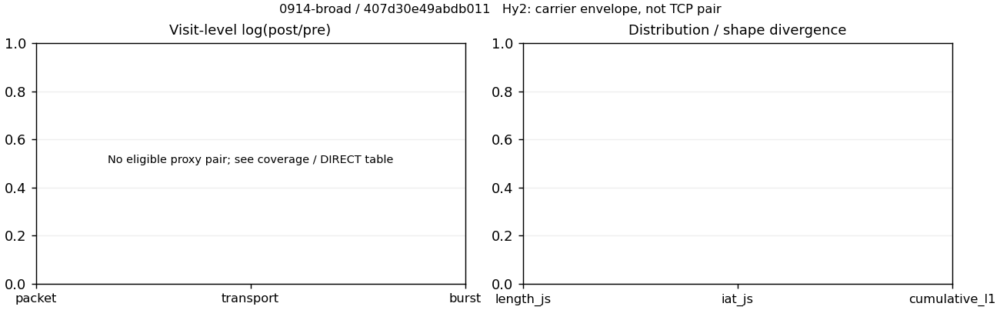

# 0914-broad · 条目 035 · zhihu.com

目标：https://www.zhihu.com/

活动标签：zhihu.com::page_load。选定访问 3 次。

[返回总索引](../../README.md) · [统计口径](../../methods.md)

## 覆盖与资格（每次访问均保留）

| 部署 | 重复 | 主请求路由 | 活动状态 | 代理比较 | DIRECT pre | 请求 proxy/direct/unresolved | 错误 |
| --- | --- | --- | --- | --- | --- | --- | --- |
| Hy2 | 1 | direct | passed | 0 | 1 | 0/114/0 | [] |
| SS | 1 | direct | passed | 0 | 1 | 0/116/0 | [] |
| VLESS | 1 | direct | passed | 0 | 1 | 0/116/0 | [] |

主请求非 proxy 的统计仅解释为已索引的辅助代理连接或 DIRECT 观测，不代表目标业务经代理传输。播放确认与配对资格是两道不同的门。

图中散点为单次访问，短线为重复中位数；Hy2 是共享载体包络，不能与 TCP 配对作等范围因果对比。

形态图先逐访问归一化，再对访问等权平均；实线 pre，虚线 post。分箱序号及边界见 methods，不将分箱索引误解为长度或时间。

## 每次访问的关键观测

### SS

范围：`direct_pre_only`。每格 pre → post；空值为不可观测/不适用。

| 重复 | 包数 | 载荷字节 | burst | TCP FR | IAT中位µs | length JS | IAT JS |
| --- | --- | --- | --- | --- | --- | --- | --- |
| 1 | 977 → — | 1.1624e+06 → — | 655 → — | 170 → — | 202.86 → — | — | — |

完整标量统计：中位数 [min,max]；Δ 为重复内逐访问变换的中位数，MAD 未缩放。n 为可用变换数；DIRECT-only 的 nΔ=0 不代表 pre 不可用。

| scope | 特征 | pre | post | Δ | IQRΔ | MADΔ | nΔ |
| --- | --- | --- | --- | --- | --- | --- | --- |
| direct_pre_only | active_span_sum_s_1000ms | 12.972 [12.972, 12.972] | — | — | — | — | 0 |
| direct_pre_only | active_span_sum_s_100ms | 4.3857 [4.3857, 4.3857] | — | — | — | — | 0 |
| direct_pre_only | active_span_sum_s_500ms | 8.8659 [8.8659, 8.8659] | — | — | — | — | 0 |
| direct_pre_only | burst_bytes_iqr | 1764.5 [1764.5, 1764.5] | — | — | — | — | 0 |
| direct_pre_only | burst_bytes_mad | 77 [77, 77] | — | — | — | — | 0 |
| direct_pre_only | burst_bytes_max | 29400 [29400, 29400] | — | — | — | — | 0 |
| direct_pre_only | burst_bytes_mean | 1774.7 [1774.7, 1774.7] | — | — | — | — | 0 |
| direct_pre_only | burst_bytes_median | 77 [77, 77] | — | — | — | — | 0 |
| direct_pre_only | burst_bytes_min | 0 [0, 0] | — | — | — | — | 0 |
| direct_pre_only | burst_bytes_p95 | 8920 [8920, 8920] | — | — | — | — | 0 |
| direct_pre_only | burst_bytes_q25 | 0 [0, 0] | — | — | — | — | 0 |
| direct_pre_only | burst_bytes_q75 | 1764.5 [1764.5, 1764.5] | — | — | — | — | 0 |
| direct_pre_only | burst_bytes_std | 3703.8 [3703.8, 3703.8] | — | — | — | — | 0 |
| direct_pre_only | burst_count | 655 [655, 655] | — | — | — | — | 0 |
| direct_pre_only | burst_duration_ms_iqr | 2.2478 [2.2478, 2.2478] | — | — | — | — | 0 |
| direct_pre_only | burst_duration_ms_mad | 0 [0, 0] | — | — | — | — | 0 |
| direct_pre_only | burst_duration_ms_max | 2329.7 [2329.7, 2329.7] | — | — | — | — | 0 |
| direct_pre_only | burst_duration_ms_mean | 52.282 [52.282, 52.282] | — | — | — | — | 0 |
| direct_pre_only | burst_duration_ms_median | 0 [0, 0] | — | — | — | — | 0 |
| direct_pre_only | burst_duration_ms_min | 0 [0, 0] | — | — | — | — | 0 |
| direct_pre_only | burst_duration_ms_p95 | 136.58 [136.58, 136.58] | — | — | — | — | 0 |
| direct_pre_only | burst_duration_ms_q25 | 0 [0, 0] | — | — | — | — | 0 |
| direct_pre_only | burst_duration_ms_q75 | 2.2478 [2.2478, 2.2478] | — | — | — | — | 0 |
| direct_pre_only | burst_duration_ms_std | 261.81 [261.81, 261.81] | — | — | — | — | 0 |
| direct_pre_only | burst_packets_iqr | 1 [1, 1] | — | — | — | — | 0 |
| direct_pre_only | burst_packets_mad | 0 [0, 0] | — | — | — | — | 0 |
| direct_pre_only | burst_packets_max | 7 [7, 7] | — | — | — | — | 0 |
| direct_pre_only | burst_packets_mean | 1.4916 [1.4916, 1.4916] | — | — | — | — | 0 |
| direct_pre_only | burst_packets_median | 1 [1, 1] | — | — | — | — | 0 |
| direct_pre_only | burst_packets_min | 1 [1, 1] | — | — | — | — | 0 |
| direct_pre_only | burst_packets_p95 | 3 [3, 3] | — | — | — | — | 0 |
| direct_pre_only | burst_packets_q25 | 1 [1, 1] | — | — | — | — | 0 |
| direct_pre_only | burst_packets_q75 | 2 [2, 2] | — | — | — | — | 0 |
| direct_pre_only | burst_packets_std | 0.77529 [0.77529, 0.77529] | — | — | — | — | 0 |
| direct_pre_only | connection_span_concurrency_max | 14 [14, 14] | — | — | — | — | 0 |
| direct_pre_only | direction_entropy | 0.85165 [0.85165, 0.85165] | — | — | — | — | 0 |
| direct_pre_only | down_burst_count | 317 [317, 317] | — | — | — | — | 0 |
| direct_pre_only | down_ip_bytes | 1.1202e+06 [1.1202e+06, 1.1202e+06] | — | — | — | — | 0 |
| direct_pre_only | down_packets | 539 [539, 539] | — | — | — | — | 0 |
| direct_pre_only | down_transport_bytes | 1.0927e+06 [1.0927e+06, 1.0927e+06] | — | — | — | — | 0 |
| direct_pre_only | duration_s | 18.746 [18.746, 18.746] | — | — | — | — | 0 |
| direct_pre_only | entity_count | 22 [22, 22] | — | — | — | — | 0 |
| direct_pre_only | fr_runs | 170 [170, 170] | — | — | — | — | 0 |
| direct_pre_only | fr_runs_per_packet | 0.33663 [0.33663, 0.33663] | — | — | — | — | 0 |
| direct_pre_only | fr_switches | 148 [148, 148] | — | — | — | — | 0 |
| direct_pre_only | fr_switches_per_possible_transition | 0.30642 [0.30642, 0.30642] | — | — | — | — | 0 |
| direct_pre_only | full_retransmission_fraction | 0.00863 [0.00863, 0.00863] | — | — | — | — | 0 |
| direct_pre_only | full_retransmission_packets | 8 [8, 8] | — | — | — | — | 0 |
| direct_pre_only | iat_count | 955 [955, 955] | — | — | — | — | 0 |
| direct_pre_only | iat_median_us | 202.86 [202.86, 202.86] | — | — | — | — | 0 |
| direct_pre_only | iat_us_iqr | 2521.9 [2521.9, 2521.9] | — | — | — | — | 0 |
| direct_pre_only | iat_us_mad | 195.17 [195.17, 195.17] | — | — | — | — | 0 |
| direct_pre_only | iat_us_max | 1.5001e+07 [1.5001e+07, 1.5001e+07] | — | — | — | — | 0 |
| direct_pre_only | iat_us_mean | 1.204e+05 [1.204e+05, 1.204e+05] | — | — | — | — | 0 |
| direct_pre_only | iat_us_median | 202.86 [202.86, 202.86] | — | — | — | — | 0 |
| direct_pre_only | iat_us_min | 0.766 [0.766, 0.766] | — | — | — | — | 0 |
| direct_pre_only | iat_us_p95 | 97346 [97346, 97346] | — | — | — | — | 0 |
| direct_pre_only | iat_us_q25 | 30.242 [30.242, 30.242] | — | — | — | — | 0 |
| direct_pre_only | iat_us_q75 | 2552.2 [2552.2, 2552.2] | — | — | — | — | 0 |
| direct_pre_only | iat_us_std | 1.0953e+06 [1.0953e+06, 1.0953e+06] | — | — | — | — | 0 |
| direct_pre_only | idle_gap_count_1000ms | 21 [21, 21] | — | — | — | — | 0 |
| direct_pre_only | idle_gap_count_100ms | 47 [47, 47] | — | — | — | — | 0 |
| direct_pre_only | idle_gap_count_500ms | 26 [26, 26] | — | — | — | — | 0 |
| direct_pre_only | idle_gap_sum_s_1000ms | 102.01 [102.01, 102.01] | — | — | — | — | 0 |
| direct_pre_only | idle_gap_sum_s_100ms | 110.6 [110.6, 110.6] | — | — | — | — | 0 |
| direct_pre_only | idle_gap_sum_s_500ms | 106.12 [106.12, 106.12] | — | — | — | — | 0 |
| direct_pre_only | ip_bytes | 1.2124e+06 [1.2124e+06, 1.2124e+06] | — | — | — | — | 0 |
| direct_pre_only | length_iqr | 2707 [2707, 2707] | — | — | — | — | 0 |
| direct_pre_only | length_mad | 1363 [1363, 1363] | — | — | — | — | 0 |
| direct_pre_only | length_max | 8920 [8920, 8920] | — | — | — | — | 0 |
| direct_pre_only | length_mean | 2301.9 [2301.9, 2301.9] | — | — | — | — | 0 |
| direct_pre_only | length_median | 1440 [1440, 1440] | — | — | — | — | 0 |
| direct_pre_only | length_min | 24 [24, 24] | — | — | — | — | 0 |
| direct_pre_only | length_p95 | 8920 [8920, 8920] | — | — | — | — | 0 |
| direct_pre_only | length_q25 | 173 [173, 173] | — | — | — | — | 0 |
| direct_pre_only | length_q75 | 2880 [2880, 2880] | — | — | — | — | 0 |
| direct_pre_only | length_std | 2646.8 [2646.8, 2646.8] | — | — | — | — | 0 |
| direct_pre_only | nonempty_entity_count | 22 [22, 22] | — | — | — | — | 0 |
| direct_pre_only | nonempty_packets | 505 [505, 505] | — | — | — | — | 0 |
| direct_pre_only | offload_suspect_fraction | 0.24974 [0.24974, 0.24974] | — | — | — | — | 0 |
| direct_pre_only | packet_count | 977 [977, 977] | — | — | — | — | 0 |
| direct_pre_only | rtt_median_ms | 0.092615 [0.092615, 0.092615] | — | — | — | — | 0 |
| direct_pre_only | rtt_sample_count | 409 [409, 409] | — | — | — | — | 0 |
| direct_pre_only | tcp_ack_count | 905 [905, 905] | — | — | — | — | 0 |
| direct_pre_only | tcp_fin_count | 38 [38, 38] | — | — | — | — | 0 |
| direct_pre_only | tcp_packet_count | 927 [927, 927] | — | — | — | — | 0 |
| direct_pre_only | tcp_rst_count | 2 [2, 2] | — | — | — | — | 0 |
| direct_pre_only | tcp_syn_count | 40 [40, 40] | — | — | — | — | 0 |
| direct_pre_only | tcp_window_raw_median | 65455 [65455, 65455] | — | — | — | — | 0 |
| direct_pre_only | transition_entropy | 0.77017 [0.77017, 0.77017] | — | — | — | — | 0 |
| direct_pre_only | transition_n_mm | 281 [281, 281] | — | — | — | — | 0 |
| direct_pre_only | transition_n_mp | 64 [64, 64] | — | — | — | — | 0 |
| direct_pre_only | transition_n_pm | 84 [84, 84] | — | — | — | — | 0 |
| direct_pre_only | transition_n_pp | 54 [54, 54] | — | — | — | — | 0 |
| direct_pre_only | transition_p_mm | 0.81449 [0.81449, 0.81449] | — | — | — | — | 0 |
| direct_pre_only | transition_p_mp | 0.18551 [0.18551, 0.18551] | — | — | — | — | 0 |
| direct_pre_only | transition_p_pm | 0.6087 [0.6087, 0.6087] | — | — | — | — | 0 |
| direct_pre_only | transition_p_pp | 0.3913 [0.3913, 0.3913] | — | — | — | — | 0 |
| direct_pre_only | transport_bytes | 1.1624e+06 [1.1624e+06, 1.1624e+06] | — | — | — | — | 0 |
| direct_pre_only | up_burst_count | 338 [338, 338] | — | — | — | — | 0 |
| direct_pre_only | up_byte_fraction | 0.060001 [0.060001, 0.060001] | — | — | — | — | 0 |
| direct_pre_only | up_ip_bytes | 92204 [92204, 92204] | — | — | — | — | 0 |
| direct_pre_only | up_packets | 438 [438, 438] | — | — | — | — | 0 |
| direct_pre_only | up_transport_bytes | 69748 [69748, 69748] | — | — | — | — | 0 |
| direct_pre_only | zero_iat_count | 0 [0, 0] | — | — | — | — | 0 |
| direct_pre_only | zero_iat_fraction | 0 [0, 0] | — | — | — | — | 0 |

### VLESS

范围：`direct_pre_only`。每格 pre → post；空值为不可观测/不适用。

| 重复 | 包数 | 载荷字节 | burst | TCP FR | IAT中位µs | length JS | IAT JS |
| --- | --- | --- | --- | --- | --- | --- | --- |
| 1 | 1378 → — | 2.6842e+06 → — | 855 → — | 171 → — | 99.269 → — | — | — |

完整标量统计：中位数 [min,max]；Δ 为重复内逐访问变换的中位数，MAD 未缩放。n 为可用变换数；DIRECT-only 的 nΔ=0 不代表 pre 不可用。

| scope | 特征 | pre | post | Δ | IQRΔ | MADΔ | nΔ |
| --- | --- | --- | --- | --- | --- | --- | --- |
| direct_pre_only | active_span_sum_s_1000ms | 14.369 [14.369, 14.369] | — | — | — | — | 0 |
| direct_pre_only | active_span_sum_s_100ms | 3.9183 [3.9183, 3.9183] | — | — | — | — | 0 |
| direct_pre_only | active_span_sum_s_500ms | 8.2927 [8.2927, 8.2927] | — | — | — | — | 0 |
| direct_pre_only | burst_bytes_iqr | 2517 [2517, 2517] | — | — | — | — | 0 |
| direct_pre_only | burst_bytes_mad | 44 [44, 44] | — | — | — | — | 0 |
| direct_pre_only | burst_bytes_max | 28672 [28672, 28672] | — | — | — | — | 0 |
| direct_pre_only | burst_bytes_mean | 3139.4 [3139.4, 3139.4] | — | — | — | — | 0 |
| direct_pre_only | burst_bytes_median | 44 [44, 44] | — | — | — | — | 0 |
| direct_pre_only | burst_bytes_min | 0 [0, 0] | — | — | — | — | 0 |
| direct_pre_only | burst_bytes_p95 | 20480 [20480, 20480] | — | — | — | — | 0 |
| direct_pre_only | burst_bytes_q25 | 0 [0, 0] | — | — | — | — | 0 |
| direct_pre_only | burst_bytes_q75 | 2517 [2517, 2517] | — | — | — | — | 0 |
| direct_pre_only | burst_bytes_std | 6198.8 [6198.8, 6198.8] | — | — | — | — | 0 |
| direct_pre_only | burst_count | 855 [855, 855] | — | — | — | — | 0 |
| direct_pre_only | burst_duration_ms_iqr | 0.67188 [0.67188, 0.67188] | — | — | — | — | 0 |
| direct_pre_only | burst_duration_ms_mad | 0 [0, 0] | — | — | — | — | 0 |
| direct_pre_only | burst_duration_ms_max | 2793.1 [2793.1, 2793.1] | — | — | — | — | 0 |
| direct_pre_only | burst_duration_ms_mean | 49.299 [49.299, 49.299] | — | — | — | — | 0 |
| direct_pre_only | burst_duration_ms_median | 0 [0, 0] | — | — | — | — | 0 |
| direct_pre_only | burst_duration_ms_min | 0 [0, 0] | — | — | — | — | 0 |
| direct_pre_only | burst_duration_ms_p95 | 111.72 [111.72, 111.72] | — | — | — | — | 0 |
| direct_pre_only | burst_duration_ms_q25 | 0 [0, 0] | — | — | — | — | 0 |
| direct_pre_only | burst_duration_ms_q75 | 0.67188 [0.67188, 0.67188] | — | — | — | — | 0 |
| direct_pre_only | burst_duration_ms_std | 271.52 [271.52, 271.52] | — | — | — | — | 0 |
| direct_pre_only | burst_packets_iqr | 1 [1, 1] | — | — | — | — | 0 |
| direct_pre_only | burst_packets_mad | 0 [0, 0] | — | — | — | — | 0 |
| direct_pre_only | burst_packets_max | 7 [7, 7] | — | — | — | — | 0 |
| direct_pre_only | burst_packets_mean | 1.6117 [1.6117, 1.6117] | — | — | — | — | 0 |
| direct_pre_only | burst_packets_median | 1 [1, 1] | — | — | — | — | 0 |
| direct_pre_only | burst_packets_min | 1 [1, 1] | — | — | — | — | 0 |
| direct_pre_only | burst_packets_p95 | 3 [3, 3] | — | — | — | — | 0 |
| direct_pre_only | burst_packets_q25 | 1 [1, 1] | — | — | — | — | 0 |
| direct_pre_only | burst_packets_q75 | 2 [2, 2] | — | — | — | — | 0 |
| direct_pre_only | burst_packets_std | 0.88197 [0.88197, 0.88197] | — | — | — | — | 0 |
| direct_pre_only | connection_span_concurrency_max | 14 [14, 14] | — | — | — | — | 0 |
| direct_pre_only | direction_entropy | 0.76937 [0.76937, 0.76937] | — | — | — | — | 0 |
| direct_pre_only | down_burst_count | 415 [415, 415] | — | — | — | — | 0 |
| direct_pre_only | down_ip_bytes | 2.6477e+06 [2.6477e+06, 2.6477e+06] | — | — | — | — | 0 |
| direct_pre_only | down_packets | 816 [816, 816] | — | — | — | — | 0 |
| direct_pre_only | down_transport_bytes | 2.6055e+06 [2.6055e+06, 2.6055e+06] | — | — | — | — | 0 |
| direct_pre_only | duration_s | 18.544 [18.544, 18.544] | — | — | — | — | 0 |
| direct_pre_only | entity_count | 25 [25, 25] | — | — | — | — | 0 |
| direct_pre_only | fr_runs | 171 [171, 171] | — | — | — | — | 0 |
| direct_pre_only | fr_runs_per_packet | 0.22122 [0.22122, 0.22122] | — | — | — | — | 0 |
| direct_pre_only | fr_switches | 146 [146, 146] | — | — | — | — | 0 |
| direct_pre_only | fr_switches_per_possible_transition | 0.19519 [0.19519, 0.19519] | — | — | — | — | 0 |
| direct_pre_only | full_retransmission_fraction | 0.012639 [0.012639, 0.012639] | — | — | — | — | 0 |
| direct_pre_only | full_retransmission_packets | 17 [17, 17] | — | — | — | — | 0 |
| direct_pre_only | iat_count | 1353 [1353, 1353] | — | — | — | — | 0 |
| direct_pre_only | iat_median_us | 99.269 [99.269, 99.269] | — | — | — | — | 0 |
| direct_pre_only | iat_us_iqr | 1040.4 [1040.4, 1040.4] | — | — | — | — | 0 |
| direct_pre_only | iat_us_mad | 90.187 [90.187, 90.187] | — | — | — | — | 0 |
| direct_pre_only | iat_us_max | 1.3692e+07 [1.3692e+07, 1.3692e+07] | — | — | — | — | 0 |
| direct_pre_only | iat_us_mean | 45490 [45490, 45490] | — | — | — | — | 0 |
| direct_pre_only | iat_us_median | 99.269 [99.269, 99.269] | — | — | — | — | 0 |
| direct_pre_only | iat_us_min | 0.08 [0.08, 0.08] | — | — | — | — | 0 |
| direct_pre_only | iat_us_p95 | 45000 [45000, 45000] | — | — | — | — | 0 |
| direct_pre_only | iat_us_q25 | 17.546 [17.546, 17.546] | — | — | — | — | 0 |
| direct_pre_only | iat_us_q75 | 1058 [1058, 1058] | — | — | — | — | 0 |
| direct_pre_only | iat_us_std | 4.3649e+05 [4.3649e+05, 4.3649e+05] | — | — | — | — | 0 |
| direct_pre_only | idle_gap_count_1000ms | 19 [19, 19] | — | — | — | — | 0 |
| direct_pre_only | idle_gap_count_100ms | 48 [48, 48] | — | — | — | — | 0 |
| direct_pre_only | idle_gap_count_500ms | 27 [27, 27] | — | — | — | — | 0 |
| direct_pre_only | idle_gap_sum_s_1000ms | 47.179 [47.179, 47.179] | — | — | — | — | 0 |
| direct_pre_only | idle_gap_sum_s_100ms | 57.63 [57.63, 57.63] | — | — | — | — | 0 |
| direct_pre_only | idle_gap_sum_s_500ms | 53.256 [53.256, 53.256] | — | — | — | — | 0 |
| direct_pre_only | ip_bytes | 2.7556e+06 [2.7556e+06, 2.7556e+06] | — | — | — | — | 0 |
| direct_pre_only | length_iqr | 5930 [5930, 5930] | — | — | — | — | 0 |
| direct_pre_only | length_mad | 2455 [2455, 2455] | — | — | — | — | 0 |
| direct_pre_only | length_max | 8920 [8920, 8920] | — | — | — | — | 0 |
| direct_pre_only | length_mean | 3472.5 [3472.5, 3472.5] | — | — | — | — | 0 |
| direct_pre_only | length_median | 2640 [2640, 2640] | — | — | — | — | 0 |
| direct_pre_only | length_min | 24 [24, 24] | — | — | — | — | 0 |
| direct_pre_only | length_p95 | 8920 [8920, 8920] | — | — | — | — | 0 |
| direct_pre_only | length_q25 | 350 [350, 350] | — | — | — | — | 0 |
| direct_pre_only | length_q75 | 6280 [6280, 6280] | — | — | — | — | 0 |
| direct_pre_only | length_std | 3299.7 [3299.7, 3299.7] | — | — | — | — | 0 |
| direct_pre_only | nonempty_entity_count | 25 [25, 25] | — | — | — | — | 0 |
| direct_pre_only | nonempty_packets | 773 [773, 773] | — | — | — | — | 0 |
| direct_pre_only | offload_suspect_fraction | 0.34688 [0.34688, 0.34688] | — | — | — | — | 0 |
| direct_pre_only | packet_count | 1378 [1378, 1378] | — | — | — | — | 0 |
| direct_pre_only | rtt_median_ms | 0.10546 [0.10546, 0.10546] | — | — | — | — | 0 |
| direct_pre_only | rtt_sample_count | 533 [533, 533] | — | — | — | — | 0 |
| direct_pre_only | tcp_ack_count | 1315 [1315, 1315] | — | — | — | — | 0 |
| direct_pre_only | tcp_fin_count | 46 [46, 46] | — | — | — | — | 0 |
| direct_pre_only | tcp_packet_count | 1345 [1345, 1345] | — | — | — | — | 0 |
| direct_pre_only | tcp_rst_count | 6 [6, 6] | — | — | — | — | 0 |
| direct_pre_only | tcp_syn_count | 48 [48, 48] | — | — | — | — | 0 |
| direct_pre_only | tcp_window_raw_median | 65535 [65535, 65535] | — | — | — | — | 0 |
| direct_pre_only | transition_entropy | 0.60822 [0.60822, 0.60822] | — | — | — | — | 0 |
| direct_pre_only | transition_n_mm | 515 [515, 515] | — | — | — | — | 0 |
| direct_pre_only | transition_n_mp | 62 [62, 62] | — | — | — | — | 0 |
| direct_pre_only | transition_n_pm | 84 [84, 84] | — | — | — | — | 0 |
| direct_pre_only | transition_n_pp | 87 [87, 87] | — | — | — | — | 0 |
| direct_pre_only | transition_p_mm | 0.89255 [0.89255, 0.89255] | — | — | — | — | 0 |
| direct_pre_only | transition_p_mp | 0.10745 [0.10745, 0.10745] | — | — | — | — | 0 |
| direct_pre_only | transition_p_pm | 0.49123 [0.49123, 0.49123] | — | — | — | — | 0 |
| direct_pre_only | transition_p_pp | 0.50877 [0.50877, 0.50877] | — | — | — | — | 0 |
| direct_pre_only | transport_bytes | 2.6842e+06 [2.6842e+06, 2.6842e+06] | — | — | — | — | 0 |
| direct_pre_only | up_burst_count | 440 [440, 440] | — | — | — | — | 0 |
| direct_pre_only | up_byte_fraction | 0.029321 [0.029321, 0.029321] | — | — | — | — | 0 |
| direct_pre_only | up_ip_bytes | 1.0789e+05 [1.0789e+05, 1.0789e+05] | — | — | — | — | 0 |
| direct_pre_only | up_packets | 562 [562, 562] | — | — | — | — | 0 |
| direct_pre_only | up_transport_bytes | 78703 [78703, 78703] | — | — | — | — | 0 |
| direct_pre_only | zero_iat_count | 0 [0, 0] | — | — | — | — | 0 |
| direct_pre_only | zero_iat_fraction | 0 [0, 0] | — | — | — | — | 0 |

### Hy2

范围：`direct_pre_only`。每格 pre → post；空值为不可观测/不适用。

| 重复 | 包数 | 载荷字节 | burst | TCP FR | IAT中位µs | length JS | IAT JS |
| --- | --- | --- | --- | --- | --- | --- | --- |
| 1 | 1963 → — | 4.7793e+06 → — | 1225 → — | 200 → — | 73.107 → — | — | — |

完整标量统计：中位数 [min,max]；Δ 为重复内逐访问变换的中位数，MAD 未缩放。n 为可用变换数；DIRECT-only 的 nΔ=0 不代表 pre 不可用。

| scope | 特征 | pre | post | Δ | IQRΔ | MADΔ | nΔ |
| --- | --- | --- | --- | --- | --- | --- | --- |
| direct_pre_only | active_span_sum_s_1000ms | 21.384 [21.384, 21.384] | — | — | — | — | 0 |
| direct_pre_only | active_span_sum_s_100ms | 4.9749 [4.9749, 4.9749] | — | — | — | — | 0 |
| direct_pre_only | active_span_sum_s_500ms | 11.067 [11.067, 11.067] | — | — | — | — | 0 |
| direct_pre_only | burst_bytes_iqr | 4477 [4477, 4477] | — | — | — | — | 0 |
| direct_pre_only | burst_bytes_mad | 38 [38, 38] | — | — | — | — | 0 |
| direct_pre_only | burst_bytes_max | 29400 [29400, 29400] | — | — | — | — | 0 |
| direct_pre_only | burst_bytes_mean | 3901.5 [3901.5, 3901.5] | — | — | — | — | 0 |
| direct_pre_only | burst_bytes_median | 38 [38, 38] | — | — | — | — | 0 |
| direct_pre_only | burst_bytes_min | 0 [0, 0] | — | — | — | — | 0 |
| direct_pre_only | burst_bytes_p95 | 20480 [20480, 20480] | — | — | — | — | 0 |
| direct_pre_only | burst_bytes_q25 | 0 [0, 0] | — | — | — | — | 0 |
| direct_pre_only | burst_bytes_q75 | 4477 [4477, 4477] | — | — | — | — | 0 |
| direct_pre_only | burst_bytes_std | 6882 [6882, 6882] | — | — | — | — | 0 |
| direct_pre_only | burst_count | 1225 [1225, 1225] | — | — | — | — | 0 |
| direct_pre_only | burst_duration_ms_iqr | 0.067865 [0.067865, 0.067865] | — | — | — | — | 0 |
| direct_pre_only | burst_duration_ms_mad | 0 [0, 0] | — | — | — | — | 0 |
| direct_pre_only | burst_duration_ms_max | 14107 [14107, 14107] | — | — | — | — | 0 |
| direct_pre_only | burst_duration_ms_mean | 31.813 [31.813, 31.813] | — | — | — | — | 0 |
| direct_pre_only | burst_duration_ms_median | 0 [0, 0] | — | — | — | — | 0 |
| direct_pre_only | burst_duration_ms_min | 0 [0, 0] | — | — | — | — | 0 |
| direct_pre_only | burst_duration_ms_p95 | 32.038 [32.038, 32.038] | — | — | — | — | 0 |
| direct_pre_only | burst_duration_ms_q25 | 0 [0, 0] | — | — | — | — | 0 |
| direct_pre_only | burst_duration_ms_q75 | 0.067865 [0.067865, 0.067865] | — | — | — | — | 0 |
| direct_pre_only | burst_duration_ms_std | 422.11 [422.11, 422.11] | — | — | — | — | 0 |
| direct_pre_only | burst_packets_iqr | 1 [1, 1] | — | — | — | — | 0 |
| direct_pre_only | burst_packets_mad | 0 [0, 0] | — | — | — | — | 0 |
| direct_pre_only | burst_packets_max | 10 [10, 10] | — | — | — | — | 0 |
| direct_pre_only | burst_packets_mean | 1.6024 [1.6024, 1.6024] | — | — | — | — | 0 |
| direct_pre_only | burst_packets_median | 1 [1, 1] | — | — | — | — | 0 |
| direct_pre_only | burst_packets_min | 1 [1, 1] | — | — | — | — | 0 |
| direct_pre_only | burst_packets_p95 | 4 [4, 4] | — | — | — | — | 0 |
| direct_pre_only | burst_packets_q25 | 1 [1, 1] | — | — | — | — | 0 |
| direct_pre_only | burst_packets_q75 | 2 [2, 2] | — | — | — | — | 0 |
| direct_pre_only | burst_packets_std | 0.97871 [0.97871, 0.97871] | — | — | — | — | 0 |
| direct_pre_only | connection_span_concurrency_max | 12 [12, 12] | — | — | — | — | 0 |
| direct_pre_only | direction_entropy | 0.65855 [0.65855, 0.65855] | — | — | — | — | 0 |
| direct_pre_only | down_burst_count | 602 [602, 602] | — | — | — | — | 0 |
| direct_pre_only | down_ip_bytes | 4.7664e+06 [4.7664e+06, 4.7664e+06] | — | — | — | — | 0 |
| direct_pre_only | down_packets | 1221 [1221, 1221] | — | — | — | — | 0 |
| direct_pre_only | down_transport_bytes | 4.7038e+06 [4.7038e+06, 4.7038e+06] | — | — | — | — | 0 |
| direct_pre_only | duration_s | 18.903 [18.903, 18.903] | — | — | — | — | 0 |
| direct_pre_only | entity_count | 22 [22, 22] | — | — | — | — | 0 |
| direct_pre_only | fr_runs | 200 [200, 200] | — | — | — | — | 0 |
| direct_pre_only | fr_runs_per_packet | 0.16461 [0.16461, 0.16461] | — | — | — | — | 0 |
| direct_pre_only | fr_switches | 178 [178, 178] | — | — | — | — | 0 |
| direct_pre_only | fr_switches_per_possible_transition | 0.1492 [0.1492, 0.1492] | — | — | — | — | 0 |
| direct_pre_only | full_retransmission_fraction | 0.012293 [0.012293, 0.012293] | — | — | — | — | 0 |
| direct_pre_only | full_retransmission_packets | 23 [23, 23] | — | — | — | — | 0 |
| direct_pre_only | iat_count | 1941 [1941, 1941] | — | — | — | — | 0 |
| direct_pre_only | iat_median_us | 73.107 [73.107, 73.107] | — | — | — | — | 0 |
| direct_pre_only | iat_us_iqr | 505.37 [505.37, 505.37] | — | — | — | — | 0 |
| direct_pre_only | iat_us_mad | 64.082 [64.082, 64.082] | — | — | — | — | 0 |
| direct_pre_only | iat_us_max | 1.5001e+07 [1.5001e+07, 1.5001e+07] | — | — | — | — | 0 |
| direct_pre_only | iat_us_mean | 73424 [73424, 73424] | — | — | — | — | 0 |
| direct_pre_only | iat_us_median | 73.107 [73.107, 73.107] | — | — | — | — | 0 |
| direct_pre_only | iat_us_min | 0.139 [0.139, 0.139] | — | — | — | — | 0 |
| direct_pre_only | iat_us_p95 | 31938 [31938, 31938] | — | — | — | — | 0 |
| direct_pre_only | iat_us_q25 | 14.856 [14.856, 14.856] | — | — | — | — | 0 |
| direct_pre_only | iat_us_q75 | 520.23 [520.23, 520.23] | — | — | — | — | 0 |
| direct_pre_only | iat_us_std | 9.0163e+05 [9.0163e+05, 9.0163e+05] | — | — | — | — | 0 |
| direct_pre_only | idle_gap_count_1000ms | 17 [17, 17] | — | — | — | — | 0 |
| direct_pre_only | idle_gap_count_100ms | 56 [56, 56] | — | — | — | — | 0 |
| direct_pre_only | idle_gap_count_500ms | 31 [31, 31] | — | — | — | — | 0 |
| direct_pre_only | idle_gap_sum_s_1000ms | 121.13 [121.13, 121.13] | — | — | — | — | 0 |
| direct_pre_only | idle_gap_sum_s_100ms | 137.54 [137.54, 137.54] | — | — | — | — | 0 |
| direct_pre_only | idle_gap_sum_s_500ms | 131.45 [131.45, 131.45] | — | — | — | — | 0 |
| direct_pre_only | ip_bytes | 4.8797e+06 [4.8797e+06, 4.8797e+06] | — | — | — | — | 0 |
| direct_pre_only | length_iqr | 7464 [7464, 7464] | — | — | — | — | 0 |
| direct_pre_only | length_mad | 2696 [2696, 2696] | — | — | — | — | 0 |
| direct_pre_only | length_max | 8920 [8920, 8920] | — | — | — | — | 0 |
| direct_pre_only | length_mean | 3933.6 [3933.6, 3933.6] | — | — | — | — | 0 |
| direct_pre_only | length_median | 2856 [2856, 2856] | — | — | — | — | 0 |
| direct_pre_only | length_min | 23 [23, 23] | — | — | — | — | 0 |
| direct_pre_only | length_p95 | 8920 [8920, 8920] | — | — | — | — | 0 |
| direct_pre_only | length_q25 | 728 [728, 728] | — | — | — | — | 0 |
| direct_pre_only | length_q75 | 8192 [8192, 8192] | — | — | — | — | 0 |
| direct_pre_only | length_std | 3390.9 [3390.9, 3390.9] | — | — | — | — | 0 |
| direct_pre_only | nonempty_entity_count | 22 [22, 22] | — | — | — | — | 0 |
| direct_pre_only | nonempty_packets | 1215 [1215, 1215] | — | — | — | — | 0 |
| direct_pre_only | offload_suspect_fraction | 0.4162 [0.4162, 0.4162] | — | — | — | — | 0 |
| direct_pre_only | packet_count | 1963 [1963, 1963] | — | — | — | — | 0 |
| direct_pre_only | rtt_median_ms | 0.10217 [0.10217, 0.10217] | — | — | — | — | 0 |
| direct_pre_only | rtt_sample_count | 680 [680, 680] | — | — | — | — | 0 |
| direct_pre_only | tcp_ack_count | 1848 [1848, 1848] | — | — | — | — | 0 |
| direct_pre_only | tcp_fin_count | 39 [39, 39] | — | — | — | — | 0 |
| direct_pre_only | tcp_packet_count | 1871 [1871, 1871] | — | — | — | — | 0 |
| direct_pre_only | tcp_rst_count | 3 [3, 3] | — | — | — | — | 0 |
| direct_pre_only | tcp_syn_count | 40 [40, 40] | — | — | — | — | 0 |
| direct_pre_only | tcp_window_raw_median | 65535 [65535, 65535] | — | — | — | — | 0 |
| direct_pre_only | transition_entropy | 0.50464 [0.50464, 0.50464] | — | — | — | — | 0 |
| direct_pre_only | transition_n_mm | 909 [909, 909] | — | — | — | — | 0 |
| direct_pre_only | transition_n_mp | 79 [79, 79] | — | — | — | — | 0 |
| direct_pre_only | transition_n_pm | 99 [99, 99] | — | — | — | — | 0 |
| direct_pre_only | transition_n_pp | 106 [106, 106] | — | — | — | — | 0 |
| direct_pre_only | transition_p_mm | 0.92004 [0.92004, 0.92004] | — | — | — | — | 0 |
| direct_pre_only | transition_p_mp | 0.07996 [0.07996, 0.07996] | — | — | — | — | 0 |
| direct_pre_only | transition_p_pm | 0.48293 [0.48293, 0.48293] | — | — | — | — | 0 |
| direct_pre_only | transition_p_pp | 0.51707 [0.51707, 0.51707] | — | — | — | — | 0 |
| direct_pre_only | transport_bytes | 4.7793e+06 [4.7793e+06, 4.7793e+06] | — | — | — | — | 0 |
| direct_pre_only | up_burst_count | 623 [623, 623] | — | — | — | — | 0 |
| direct_pre_only | up_byte_fraction | 0.015798 [0.015798, 0.015798] | — | — | — | — | 0 |
| direct_pre_only | up_ip_bytes | 1.1331e+05 [1.1331e+05, 1.1331e+05] | — | — | — | — | 0 |
| direct_pre_only | up_packets | 742 [742, 742] | — | — | — | — | 0 |
| direct_pre_only | up_transport_bytes | 75505 [75505, 75505] | — | — | — | — | 0 |
| direct_pre_only | zero_iat_count | 0 [0, 0] | — | — | — | — | 0 |
| direct_pre_only | zero_iat_fraction | 0 [0, 0] | — | — | — | — | 0 |

## 不同部署对比

以下是各部署自身重复中位数的差异，不按重复编号强行配对。跨 TCP/Hy2 的行标记异质观测范围。

| 视角 | 特征 | 部署A | 部署B | A中位 | B中位 | B−A | 比较口径 |
| --- | --- | --- | --- | --- | --- | --- | --- |
| pre | burst_count | SS | VLESS | 655 | 855 | 200 | same_scope_unpaired_visits |
| pre | burst_count | SS | Hy2 | 655 | 1225 | 570 | same_scope_unpaired_visits |
| pre | burst_count | VLESS | Hy2 | 855 | 1225 | 370 | same_scope_unpaired_visits |
| pre | connection_span_concurrency_max | SS | VLESS | 14 | 14 | 0 | same_scope_unpaired_visits |
| pre | connection_span_concurrency_max | SS | Hy2 | 14 | 12 | -2 | same_scope_unpaired_visits |
| pre | connection_span_concurrency_max | VLESS | Hy2 | 14 | 12 | -2 | same_scope_unpaired_visits |
| pre | direction_entropy | SS | VLESS | 0.85165 | 0.76937 | -0.08228 | same_scope_unpaired_visits |
| pre | direction_entropy | SS | Hy2 | 0.85165 | 0.65855 | -0.19309 | same_scope_unpaired_visits |
| pre | direction_entropy | VLESS | Hy2 | 0.76937 | 0.65855 | -0.11081 | same_scope_unpaired_visits |
| pre | down_transport_bytes | SS | VLESS | 1.0927e+06 | 2.6055e+06 | 1.5128e+06 | same_scope_unpaired_visits |
| pre | down_transport_bytes | SS | Hy2 | 1.0927e+06 | 4.7038e+06 | 3.6111e+06 | same_scope_unpaired_visits |
| pre | down_transport_bytes | VLESS | Hy2 | 2.6055e+06 | 4.7038e+06 | 2.0983e+06 | same_scope_unpaired_visits |
| pre | duration_s | SS | VLESS | 18.746 | 18.544 | -0.2021 | same_scope_unpaired_visits |
| pre | duration_s | SS | Hy2 | 18.746 | 18.903 | 0.1571 | same_scope_unpaired_visits |
| pre | duration_s | VLESS | Hy2 | 18.544 | 18.903 | 0.35921 | same_scope_unpaired_visits |
| pre | entity_count | SS | VLESS | 22 | 25 | 3 | same_scope_unpaired_visits |
| pre | entity_count | SS | Hy2 | 22 | 22 | 0 | same_scope_unpaired_visits |
| pre | entity_count | VLESS | Hy2 | 25 | 22 | -3 | same_scope_unpaired_visits |
| pre | fr_runs | SS | VLESS | 170 | 171 | 1 | same_scope_unpaired_visits |
| pre | fr_runs | SS | Hy2 | 170 | 200 | 30 | same_scope_unpaired_visits |
| pre | fr_runs | VLESS | Hy2 | 171 | 200 | 29 | same_scope_unpaired_visits |
| pre | fr_runs_per_packet | SS | VLESS | 0.33663 | 0.22122 | -0.11542 | same_scope_unpaired_visits |
| pre | fr_runs_per_packet | SS | Hy2 | 0.33663 | 0.16461 | -0.17202 | same_scope_unpaired_visits |
| pre | fr_runs_per_packet | VLESS | Hy2 | 0.22122 | 0.16461 | -0.056607 | same_scope_unpaired_visits |
| pre | fr_switches | SS | VLESS | 148 | 146 | -2 | same_scope_unpaired_visits |
| pre | fr_switches | SS | Hy2 | 148 | 178 | 30 | same_scope_unpaired_visits |
| pre | fr_switches | VLESS | Hy2 | 146 | 178 | 32 | same_scope_unpaired_visits |
| pre | fr_switches_per_possible_transition | SS | VLESS | 0.30642 | 0.19519 | -0.11123 | same_scope_unpaired_visits |
| pre | fr_switches_per_possible_transition | SS | Hy2 | 0.30642 | 0.1492 | -0.15721 | same_scope_unpaired_visits |
| pre | fr_switches_per_possible_transition | VLESS | Hy2 | 0.19519 | 0.1492 | -0.045983 | same_scope_unpaired_visits |
| pre | full_retransmission_fraction | SS | VLESS | 0.00863 | 0.012639 | 0.0040094 | same_scope_unpaired_visits |
| pre | full_retransmission_fraction | SS | Hy2 | 0.00863 | 0.012293 | 0.0036629 | same_scope_unpaired_visits |
| pre | full_retransmission_fraction | VLESS | Hy2 | 0.012639 | 0.012293 | -0.00034651 | same_scope_unpaired_visits |
| pre | iat_median_us | SS | VLESS | 202.86 | 99.269 | -103.59 | same_scope_unpaired_visits |
| pre | iat_median_us | SS | Hy2 | 202.86 | 73.107 | -129.75 | same_scope_unpaired_visits |
| pre | iat_median_us | VLESS | Hy2 | 99.269 | 73.107 | -26.162 | same_scope_unpaired_visits |
| pre | iat_us_p95 | SS | VLESS | 97346 | 45000 | -52346 | same_scope_unpaired_visits |
| pre | iat_us_p95 | SS | Hy2 | 97346 | 31938 | -65408 | same_scope_unpaired_visits |
| pre | iat_us_p95 | VLESS | Hy2 | 45000 | 31938 | -13062 | same_scope_unpaired_visits |
| pre | ip_bytes | SS | VLESS | 1.2124e+06 | 2.7556e+06 | 1.5432e+06 | same_scope_unpaired_visits |
| pre | ip_bytes | SS | Hy2 | 1.2124e+06 | 4.8797e+06 | 3.6673e+06 | same_scope_unpaired_visits |
| pre | ip_bytes | VLESS | Hy2 | 2.7556e+06 | 4.8797e+06 | 2.1241e+06 | same_scope_unpaired_visits |
| pre | length_median | SS | VLESS | 1440 | 2640 | 1200 | same_scope_unpaired_visits |
| pre | length_median | SS | Hy2 | 1440 | 2856 | 1416 | same_scope_unpaired_visits |
| pre | length_median | VLESS | Hy2 | 2640 | 2856 | 216 | same_scope_unpaired_visits |
| pre | length_p95 | SS | VLESS | 8920 | 8920 | 0 | same_scope_unpaired_visits |
| pre | length_p95 | SS | Hy2 | 8920 | 8920 | 0 | same_scope_unpaired_visits |
| pre | length_p95 | VLESS | Hy2 | 8920 | 8920 | 0 | same_scope_unpaired_visits |
| pre | nonempty_packets | SS | VLESS | 505 | 773 | 268 | same_scope_unpaired_visits |
| pre | nonempty_packets | SS | Hy2 | 505 | 1215 | 710 | same_scope_unpaired_visits |
| pre | nonempty_packets | VLESS | Hy2 | 773 | 1215 | 442 | same_scope_unpaired_visits |
| pre | offload_suspect_fraction | SS | VLESS | 0.24974 | 0.34688 | 0.097135 | same_scope_unpaired_visits |
| pre | offload_suspect_fraction | SS | Hy2 | 0.24974 | 0.4162 | 0.16646 | same_scope_unpaired_visits |
| pre | offload_suspect_fraction | VLESS | Hy2 | 0.34688 | 0.4162 | 0.06932 | same_scope_unpaired_visits |
| pre | packet_count | SS | VLESS | 977 | 1378 | 401 | same_scope_unpaired_visits |
| pre | packet_count | SS | Hy2 | 977 | 1963 | 986 | same_scope_unpaired_visits |
| pre | packet_count | VLESS | Hy2 | 1378 | 1963 | 585 | same_scope_unpaired_visits |
| pre | rtt_median_ms | SS | VLESS | 0.092615 | 0.10546 | 0.012848 | same_scope_unpaired_visits |
| pre | rtt_median_ms | SS | Hy2 | 0.092615 | 0.10217 | 0.0095575 | same_scope_unpaired_visits |
| pre | rtt_median_ms | VLESS | Hy2 | 0.10546 | 0.10217 | -0.0032905 | same_scope_unpaired_visits |
| pre | transition_entropy | SS | VLESS | 0.77017 | 0.60822 | -0.16194 | same_scope_unpaired_visits |
| pre | transition_entropy | SS | Hy2 | 0.77017 | 0.50464 | -0.26552 | same_scope_unpaired_visits |
| pre | transition_entropy | VLESS | Hy2 | 0.60822 | 0.50464 | -0.10358 | same_scope_unpaired_visits |
| pre | transport_bytes | SS | VLESS | 1.1624e+06 | 2.6842e+06 | 1.5218e+06 | same_scope_unpaired_visits |
| pre | transport_bytes | SS | Hy2 | 1.1624e+06 | 4.7793e+06 | 3.6168e+06 | same_scope_unpaired_visits |
| pre | transport_bytes | VLESS | Hy2 | 2.6842e+06 | 4.7793e+06 | 2.0951e+06 | same_scope_unpaired_visits |
| pre | up_byte_fraction | SS | VLESS | 0.060001 | 0.029321 | -0.030681 | same_scope_unpaired_visits |
| pre | up_byte_fraction | SS | Hy2 | 0.060001 | 0.015798 | -0.044203 | same_scope_unpaired_visits |
| pre | up_byte_fraction | VLESS | Hy2 | 0.029321 | 0.015798 | -0.013522 | same_scope_unpaired_visits |
| pre | up_transport_bytes | SS | VLESS | 69748 | 78703 | 8955 | same_scope_unpaired_visits |
| pre | up_transport_bytes | SS | Hy2 | 69748 | 75505 | 5757 | same_scope_unpaired_visits |
| pre | up_transport_bytes | VLESS | Hy2 | 78703 | 75505 | -3198 | same_scope_unpaired_visits |

## 可复核的访问标识

| 部署 | 重复 | session_id |
| --- | --- | --- |
| SS | 1 | 082a4e10-ce1f-4ec9-a747-b31029ab7185 |
| VLESS | 1 | 668d02a2-088f-4be5-9a0f-3364f20d12ad |
| Hy2 | 1 | 2e9d4716-a45d-4a8e-8db4-226ec4e06203 |

全量三种 packet selection、Hy2 full 范围、Q25/Q75、直方图与曲线见机器可读产物；本页只显示 observed 主范围。
