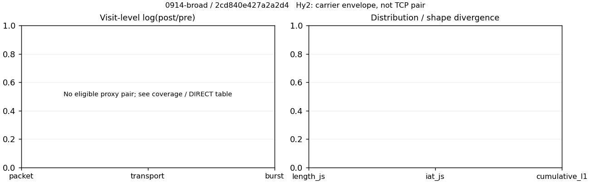

# 0914-broad · 条目 036 · sina.com.cn

目标：https://news.sina.com.cn/

活动标签：sina.com.cn::page_load。选定访问 3 次。

[返回总索引](../../README.md) · [统计口径](../../methods.md)

## 覆盖与资格（每次访问均保留）

| 部署 | 重复 | 主请求路由 | 活动状态 | 代理比较 | DIRECT pre | 请求 proxy/direct/unresolved | 错误 |
| --- | --- | --- | --- | --- | --- | --- | --- |
| Hy2 | 1 | direct | passed | 0 | 1 | 0/389/0 | [] |
| SS | 1 | direct | passed | 0 | 1 | 0/389/0 | [] |
| VLESS | 1 | direct | passed | 0 | 1 | 0/390/0 | [] |

主请求非 proxy 的统计仅解释为已索引的辅助代理连接或 DIRECT 观测，不代表目标业务经代理传输。播放确认与配对资格是两道不同的门。

图中散点为单次访问，短线为重复中位数；Hy2 是共享载体包络，不能与 TCP 配对作等范围因果对比。

形态图先逐访问归一化，再对访问等权平均；实线 pre，虚线 post。分箱序号及边界见 methods，不将分箱索引误解为长度或时间。

## 每次访问的关键观测

### SS

范围：`direct_pre_only`。每格 pre → post；空值为不可观测/不适用。

| 重复 | 包数 | 载荷字节 | burst | TCP FR | IAT中位µs | length JS | IAT JS |
| --- | --- | --- | --- | --- | --- | --- | --- |
| 1 | 4753 → — | 4.9472e+06 → — | 3118 → — | 753 → — | 308.25 → — | — | — |

完整标量统计：中位数 [min,max]；Δ 为重复内逐访问变换的中位数，MAD 未缩放。n 为可用变换数；DIRECT-only 的 nΔ=0 不代表 pre 不可用。

| scope | 特征 | pre | post | Δ | IQRΔ | MADΔ | nΔ |
| --- | --- | --- | --- | --- | --- | --- | --- |
| direct_pre_only | active_span_sum_s_1000ms | 53.895 [53.895, 53.895] | — | — | — | — | 0 |
| direct_pre_only | active_span_sum_s_100ms | 19.158 [19.158, 19.158] | — | — | — | — | 0 |
| direct_pre_only | active_span_sum_s_500ms | 44.811 [44.811, 44.811] | — | — | — | — | 0 |
| direct_pre_only | burst_bytes_iqr | 1831.2 [1831.2, 1831.2] | — | — | — | — | 0 |
| direct_pre_only | burst_bytes_mad | 63 [63, 63] | — | — | — | — | 0 |
| direct_pre_only | burst_bytes_max | 23680 [23680, 23680] | — | — | — | — | 0 |
| direct_pre_only | burst_bytes_mean | 1586.6 [1586.6, 1586.6] | — | — | — | — | 0 |
| direct_pre_only | burst_bytes_median | 63 [63, 63] | — | — | — | — | 0 |
| direct_pre_only | burst_bytes_min | 0 [0, 0] | — | — | — | — | 0 |
| direct_pre_only | burst_bytes_p95 | 7385.7 [7385.7, 7385.7] | — | — | — | — | 0 |
| direct_pre_only | burst_bytes_q25 | 0 [0, 0] | — | — | — | — | 0 |
| direct_pre_only | burst_bytes_q75 | 1831.2 [1831.2, 1831.2] | — | — | — | — | 0 |
| direct_pre_only | burst_bytes_std | 3130.3 [3130.3, 3130.3] | — | — | — | — | 0 |
| direct_pre_only | burst_count | 3118 [3118, 3118] | — | — | — | — | 0 |
| direct_pre_only | burst_duration_ms_iqr | 2.1467 [2.1467, 2.1467] | — | — | — | — | 0 |
| direct_pre_only | burst_duration_ms_mad | 0 [0, 0] | — | — | — | — | 0 |
| direct_pre_only | burst_duration_ms_max | 15001 [15001, 15001] | — | — | — | — | 0 |
| direct_pre_only | burst_duration_ms_mean | 146.8 [146.8, 146.8] | — | — | — | — | 0 |
| direct_pre_only | burst_duration_ms_median | 0 [0, 0] | — | — | — | — | 0 |
| direct_pre_only | burst_duration_ms_min | 0 [0, 0] | — | — | — | — | 0 |
| direct_pre_only | burst_duration_ms_p95 | 146.76 [146.76, 146.76] | — | — | — | — | 0 |
| direct_pre_only | burst_duration_ms_q25 | 0 [0, 0] | — | — | — | — | 0 |
| direct_pre_only | burst_duration_ms_q75 | 2.1467 [2.1467, 2.1467] | — | — | — | — | 0 |
| direct_pre_only | burst_duration_ms_std | 1182.7 [1182.7, 1182.7] | — | — | — | — | 0 |
| direct_pre_only | burst_packets_iqr | 1 [1, 1] | — | — | — | — | 0 |
| direct_pre_only | burst_packets_mad | 0 [0, 0] | — | — | — | — | 0 |
| direct_pre_only | burst_packets_max | 10 [10, 10] | — | — | — | — | 0 |
| direct_pre_only | burst_packets_mean | 1.5244 [1.5244, 1.5244] | — | — | — | — | 0 |
| direct_pre_only | burst_packets_median | 1 [1, 1] | — | — | — | — | 0 |
| direct_pre_only | burst_packets_min | 1 [1, 1] | — | — | — | — | 0 |
| direct_pre_only | burst_packets_p95 | 3 [3, 3] | — | — | — | — | 0 |
| direct_pre_only | burst_packets_q25 | 1 [1, 1] | — | — | — | — | 0 |
| direct_pre_only | burst_packets_q75 | 2 [2, 2] | — | — | — | — | 0 |
| direct_pre_only | burst_packets_std | 0.80323 [0.80323, 0.80323] | — | — | — | — | 0 |
| direct_pre_only | connection_span_concurrency_max | 44 [44, 44] | — | — | — | — | 0 |
| direct_pre_only | direction_entropy | 0.80999 [0.80999, 0.80999] | — | — | — | — | 0 |
| direct_pre_only | down_burst_count | 1516 [1516, 1516] | — | — | — | — | 0 |
| direct_pre_only | down_ip_bytes | 4.7422e+06 [4.7422e+06, 4.7422e+06] | — | — | — | — | 0 |
| direct_pre_only | down_packets | 2709 [2709, 2709] | — | — | — | — | 0 |
| direct_pre_only | down_transport_bytes | 4.6006e+06 [4.6006e+06, 4.6006e+06] | — | — | — | — | 0 |
| direct_pre_only | duration_s | 31.477 [31.477, 31.477] | — | — | — | — | 0 |
| direct_pre_only | entity_count | 89 [89, 89] | — | — | — | — | 0 |
| direct_pre_only | fr_runs | 753 [753, 753] | — | — | — | — | 0 |
| direct_pre_only | fr_runs_per_packet | 0.3061 [0.3061, 0.3061] | — | — | — | — | 0 |
| direct_pre_only | fr_switches | 664 [664, 664] | — | — | — | — | 0 |
| direct_pre_only | fr_switches_per_possible_transition | 0.28005 [0.28005, 0.28005] | — | — | — | — | 0 |
| direct_pre_only | full_retransmission_fraction | 0.0054702 [0.0054702, 0.0054702] | — | — | — | — | 0 |
| direct_pre_only | full_retransmission_packets | 26 [26, 26] | — | — | — | — | 0 |
| direct_pre_only | iat_count | 4664 [4664, 4664] | — | — | — | — | 0 |
| direct_pre_only | iat_median_us | 308.25 [308.25, 308.25] | — | — | — | — | 0 |
| direct_pre_only | iat_us_iqr | 1988.8 [1988.8, 1988.8] | — | — | — | — | 0 |
| direct_pre_only | iat_us_mad | 298.85 [298.85, 298.85] | — | — | — | — | 0 |
| direct_pre_only | iat_us_max | 1.5001e+07 [1.5001e+07, 1.5001e+07] | — | — | — | — | 0 |
| direct_pre_only | iat_us_mean | 2.0196e+05 [2.0196e+05, 2.0196e+05] | — | — | — | — | 0 |
| direct_pre_only | iat_us_median | 308.25 [308.25, 308.25] | — | — | — | — | 0 |
| direct_pre_only | iat_us_min | 0.085 [0.085, 0.085] | — | — | — | — | 0 |
| direct_pre_only | iat_us_p95 | 75858 [75858, 75858] | — | — | — | — | 0 |
| direct_pre_only | iat_us_q25 | 52.759 [52.759, 52.759] | — | — | — | — | 0 |
| direct_pre_only | iat_us_q75 | 2041.6 [2041.6, 2041.6] | — | — | — | — | 0 |
| direct_pre_only | iat_us_std | 1.5046e+06 [1.5046e+06, 1.5046e+06] | — | — | — | — | 0 |
| direct_pre_only | idle_gap_count_1000ms | 96 [96, 96] | — | — | — | — | 0 |
| direct_pre_only | idle_gap_count_100ms | 224 [224, 224] | — | — | — | — | 0 |
| direct_pre_only | idle_gap_count_500ms | 109 [109, 109] | — | — | — | — | 0 |
| direct_pre_only | idle_gap_sum_s_1000ms | 888.04 [888.04, 888.04] | — | — | — | — | 0 |
| direct_pre_only | idle_gap_sum_s_100ms | 922.78 [922.78, 922.78] | — | — | — | — | 0 |
| direct_pre_only | idle_gap_sum_s_500ms | 897.13 [897.13, 897.13] | — | — | — | — | 0 |
| direct_pre_only | ip_bytes | 5.1955e+06 [5.1955e+06, 5.1955e+06] | — | — | — | — | 0 |
| direct_pre_only | length_iqr | 2569 [2569, 2569] | — | — | — | — | 0 |
| direct_pre_only | length_mad | 1376 [1376, 1376] | — | — | — | — | 0 |
| direct_pre_only | length_max | 8920 [8920, 8920] | — | — | — | — | 0 |
| direct_pre_only | length_mean | 2011 [2011, 2011] | — | — | — | — | 0 |
| direct_pre_only | length_median | 1440 [1440, 1440] | — | — | — | — | 0 |
| direct_pre_only | length_min | 12 [12, 12] | — | — | — | — | 0 |
| direct_pre_only | length_p95 | 6744 [6744, 6744] | — | — | — | — | 0 |
| direct_pre_only | length_q25 | 311 [311, 311] | — | — | — | — | 0 |
| direct_pre_only | length_q75 | 2880 [2880, 2880] | — | — | — | — | 0 |
| direct_pre_only | length_std | 2040.7 [2040.7, 2040.7] | — | — | — | — | 0 |
| direct_pre_only | nonempty_entity_count | 89 [89, 89] | — | — | — | — | 0 |
| direct_pre_only | nonempty_packets | 2460 [2460, 2460] | — | — | — | — | 0 |
| direct_pre_only | offload_suspect_fraction | 0.24869 [0.24869, 0.24869] | — | — | — | — | 0 |
| direct_pre_only | packet_count | 4753 [4753, 4753] | — | — | — | — | 0 |
| direct_pre_only | rtt_median_ms | 0.13308 [0.13308, 0.13308] | — | — | — | — | 0 |
| direct_pre_only | rtt_sample_count | 2002 [2002, 2002] | — | — | — | — | 0 |
| direct_pre_only | tcp_ack_count | 4620 [4620, 4620] | — | — | — | — | 0 |
| direct_pre_only | tcp_fin_count | 164 [164, 164] | — | — | — | — | 0 |
| direct_pre_only | tcp_packet_count | 4753 [4753, 4753] | — | — | — | — | 0 |
| direct_pre_only | tcp_rst_count | 50 [50, 50] | — | — | — | — | 0 |
| direct_pre_only | tcp_syn_count | 178 [178, 178] | — | — | — | — | 0 |
| direct_pre_only | tcp_window_raw_median | 65535 [65535, 65535] | — | — | — | — | 0 |
| direct_pre_only | transition_entropy | 0.72577 [0.72577, 0.72577] | — | — | — | — | 0 |
| direct_pre_only | transition_n_mm | 1472 [1472, 1472] | — | — | — | — | 0 |
| direct_pre_only | transition_n_mp | 289 [289, 289] | — | — | — | — | 0 |
| direct_pre_only | transition_n_pm | 375 [375, 375] | — | — | — | — | 0 |
| direct_pre_only | transition_n_pp | 235 [235, 235] | — | — | — | — | 0 |
| direct_pre_only | transition_p_mm | 0.83589 [0.83589, 0.83589] | — | — | — | — | 0 |
| direct_pre_only | transition_p_mp | 0.16411 [0.16411, 0.16411] | — | — | — | — | 0 |
| direct_pre_only | transition_p_pm | 0.61475 [0.61475, 0.61475] | — | — | — | — | 0 |
| direct_pre_only | transition_p_pp | 0.38525 [0.38525, 0.38525] | — | — | — | — | 0 |
| direct_pre_only | transport_bytes | 4.9472e+06 [4.9472e+06, 4.9472e+06] | — | — | — | — | 0 |
| direct_pre_only | up_burst_count | 1602 [1602, 1602] | — | — | — | — | 0 |
| direct_pre_only | up_byte_fraction | 0.070047 [0.070047, 0.070047] | — | — | — | — | 0 |
| direct_pre_only | up_ip_bytes | 4.5332e+05 [4.5332e+05, 4.5332e+05] | — | — | — | — | 0 |
| direct_pre_only | up_packets | 2044 [2044, 2044] | — | — | — | — | 0 |
| direct_pre_only | up_transport_bytes | 3.4653e+05 [3.4653e+05, 3.4653e+05] | — | — | — | — | 0 |
| direct_pre_only | zero_iat_count | 0 [0, 0] | — | — | — | — | 0 |
| direct_pre_only | zero_iat_fraction | 0 [0, 0] | — | — | — | — | 0 |

### VLESS

范围：`direct_pre_only`。每格 pre → post；空值为不可观测/不适用。

| 重复 | 包数 | 载荷字节 | burst | TCP FR | IAT中位µs | length JS | IAT JS |
| --- | --- | --- | --- | --- | --- | --- | --- |
| 1 | 4036 → — | 5.1638e+06 → — | 2459 → — | 694 → — | 175.5 → — | — | — |

完整标量统计：中位数 [min,max]；Δ 为重复内逐访问变换的中位数，MAD 未缩放。n 为可用变换数；DIRECT-only 的 nΔ=0 不代表 pre 不可用。

| scope | 特征 | pre | post | Δ | IQRΔ | MADΔ | nΔ |
| --- | --- | --- | --- | --- | --- | --- | --- |
| direct_pre_only | active_span_sum_s_1000ms | 54.442 [54.442, 54.442] | — | — | — | — | 0 |
| direct_pre_only | active_span_sum_s_100ms | 16.622 [16.622, 16.622] | — | — | — | — | 0 |
| direct_pre_only | active_span_sum_s_500ms | 34.71 [34.71, 34.71] | — | — | — | — | 0 |
| direct_pre_only | burst_bytes_iqr | 1769 [1769, 1769] | — | — | — | — | 0 |
| direct_pre_only | burst_bytes_mad | 64 [64, 64] | — | — | — | — | 0 |
| direct_pre_only | burst_bytes_max | 26940 [26940, 26940] | — | — | — | — | 0 |
| direct_pre_only | burst_bytes_mean | 2100 [2100, 2100] | — | — | — | — | 0 |
| direct_pre_only | burst_bytes_median | 64 [64, 64] | — | — | — | — | 0 |
| direct_pre_only | burst_bytes_min | 0 [0, 0] | — | — | — | — | 0 |
| direct_pre_only | burst_bytes_p95 | 11520 [11520, 11520] | — | — | — | — | 0 |
| direct_pre_only | burst_bytes_q25 | 0 [0, 0] | — | — | — | — | 0 |
| direct_pre_only | burst_bytes_q75 | 1769 [1769, 1769] | — | — | — | — | 0 |
| direct_pre_only | burst_bytes_std | 4427.1 [4427.1, 4427.1] | — | — | — | — | 0 |
| direct_pre_only | burst_count | 2459 [2459, 2459] | — | — | — | — | 0 |
| direct_pre_only | burst_duration_ms_iqr | 4.6299 [4.6299, 4.6299] | — | — | — | — | 0 |
| direct_pre_only | burst_duration_ms_mad | 0 [0, 0] | — | — | — | — | 0 |
| direct_pre_only | burst_duration_ms_max | 15001 [15001, 15001] | — | — | — | — | 0 |
| direct_pre_only | burst_duration_ms_mean | 85.64 [85.64, 85.64] | — | — | — | — | 0 |
| direct_pre_only | burst_duration_ms_median | 0 [0, 0] | — | — | — | — | 0 |
| direct_pre_only | burst_duration_ms_min | 0 [0, 0] | — | — | — | — | 0 |
| direct_pre_only | burst_duration_ms_p95 | 182.45 [182.45, 182.45] | — | — | — | — | 0 |
| direct_pre_only | burst_duration_ms_q25 | 0 [0, 0] | — | — | — | — | 0 |
| direct_pre_only | burst_duration_ms_q75 | 4.6299 [4.6299, 4.6299] | — | — | — | — | 0 |
| direct_pre_only | burst_duration_ms_std | 618.63 [618.63, 618.63] | — | — | — | — | 0 |
| direct_pre_only | burst_packets_iqr | 1 [1, 1] | — | — | — | — | 0 |
| direct_pre_only | burst_packets_mad | 0 [0, 0] | — | — | — | — | 0 |
| direct_pre_only | burst_packets_max | 10 [10, 10] | — | — | — | — | 0 |
| direct_pre_only | burst_packets_mean | 1.6413 [1.6413, 1.6413] | — | — | — | — | 0 |
| direct_pre_only | burst_packets_median | 1 [1, 1] | — | — | — | — | 0 |
| direct_pre_only | burst_packets_min | 1 [1, 1] | — | — | — | — | 0 |
| direct_pre_only | burst_packets_p95 | 3 [3, 3] | — | — | — | — | 0 |
| direct_pre_only | burst_packets_q25 | 1 [1, 1] | — | — | — | — | 0 |
| direct_pre_only | burst_packets_q75 | 2 [2, 2] | — | — | — | — | 0 |
| direct_pre_only | burst_packets_std | 0.92712 [0.92712, 0.92712] | — | — | — | — | 0 |
| direct_pre_only | connection_span_concurrency_max | 53 [53, 53] | — | — | — | — | 0 |
| direct_pre_only | direction_entropy | 0.86393 [0.86393, 0.86393] | — | — | — | — | 0 |
| direct_pre_only | down_burst_count | 1186 [1186, 1186] | — | — | — | — | 0 |
| direct_pre_only | down_ip_bytes | 4.9945e+06 [4.9945e+06, 4.9945e+06] | — | — | — | — | 0 |
| direct_pre_only | down_packets | 2298 [2298, 2298] | — | — | — | — | 0 |
| direct_pre_only | down_transport_bytes | 4.8743e+06 [4.8743e+06, 4.8743e+06] | — | — | — | — | 0 |
| direct_pre_only | duration_s | 33.164 [33.164, 33.164] | — | — | — | — | 0 |
| direct_pre_only | entity_count | 88 [88, 88] | — | — | — | — | 0 |
| direct_pre_only | fr_runs | 694 [694, 694] | — | — | — | — | 0 |
| direct_pre_only | fr_runs_per_packet | 0.33174 [0.33174, 0.33174] | — | — | — | — | 0 |
| direct_pre_only | fr_switches | 606 [606, 606] | — | — | — | — | 0 |
| direct_pre_only | fr_switches_per_possible_transition | 0.3024 [0.3024, 0.3024] | — | — | — | — | 0 |
| direct_pre_only | full_retransmission_fraction | 0.0071853 [0.0071853, 0.0071853] | — | — | — | — | 0 |
| direct_pre_only | full_retransmission_packets | 29 [29, 29] | — | — | — | — | 0 |
| direct_pre_only | iat_count | 3948 [3948, 3948] | — | — | — | — | 0 |
| direct_pre_only | iat_median_us | 175.5 [175.5, 175.5] | — | — | — | — | 0 |
| direct_pre_only | iat_us_iqr | 1879.5 [1879.5, 1879.5] | — | — | — | — | 0 |
| direct_pre_only | iat_us_mad | 167.69 [167.69, 167.69] | — | — | — | — | 0 |
| direct_pre_only | iat_us_max | 1.5001e+07 [1.5001e+07, 1.5001e+07] | — | — | — | — | 0 |
| direct_pre_only | iat_us_mean | 1.1116e+05 [1.1116e+05, 1.1116e+05] | — | — | — | — | 0 |
| direct_pre_only | iat_us_median | 175.5 [175.5, 175.5] | — | — | — | — | 0 |
| direct_pre_only | iat_us_min | 0.733 [0.733, 0.733] | — | — | — | — | 0 |
| direct_pre_only | iat_us_p95 | 80235 [80235, 80235] | — | — | — | — | 0 |
| direct_pre_only | iat_us_q25 | 32.69 [32.69, 32.69] | — | — | — | — | 0 |
| direct_pre_only | iat_us_q75 | 1912.2 [1912.2, 1912.2] | — | — | — | — | 0 |
| direct_pre_only | iat_us_std | 1.0136e+06 [1.0136e+06, 1.0136e+06] | — | — | — | — | 0 |
| direct_pre_only | idle_gap_count_1000ms | 72 [72, 72] | — | — | — | — | 0 |
| direct_pre_only | idle_gap_count_100ms | 176 [176, 176] | — | — | — | — | 0 |
| direct_pre_only | idle_gap_count_500ms | 98 [98, 98] | — | — | — | — | 0 |
| direct_pre_only | idle_gap_sum_s_1000ms | 384.43 [384.43, 384.43] | — | — | — | — | 0 |
| direct_pre_only | idle_gap_sum_s_100ms | 422.25 [422.25, 422.25] | — | — | — | — | 0 |
| direct_pre_only | idle_gap_sum_s_500ms | 404.16 [404.16, 404.16] | — | — | — | — | 0 |
| direct_pre_only | ip_bytes | 5.3749e+06 [5.3749e+06, 5.3749e+06] | — | — | — | — | 0 |
| direct_pre_only | length_iqr | 2664 [2664, 2664] | — | — | — | — | 0 |
| direct_pre_only | length_mad | 1449.5 [1449.5, 1449.5] | — | — | — | — | 0 |
| direct_pre_only | length_max | 8920 [8920, 8920] | — | — | — | — | 0 |
| direct_pre_only | length_mean | 2468.4 [2468.4, 2468.4] | — | — | — | — | 0 |
| direct_pre_only | length_median | 1728.5 [1728.5, 1728.5] | — | — | — | — | 0 |
| direct_pre_only | length_min | 24 [24, 24] | — | — | — | — | 0 |
| direct_pre_only | length_p95 | 8920 [8920, 8920] | — | — | — | — | 0 |
| direct_pre_only | length_q25 | 216 [216, 216] | — | — | — | — | 0 |
| direct_pre_only | length_q75 | 2880 [2880, 2880] | — | — | — | — | 0 |
| direct_pre_only | length_std | 2712.1 [2712.1, 2712.1] | — | — | — | — | 0 |
| direct_pre_only | nonempty_entity_count | 88 [88, 88] | — | — | — | — | 0 |
| direct_pre_only | nonempty_packets | 2092 [2092, 2092] | — | — | — | — | 0 |
| direct_pre_only | offload_suspect_fraction | 0.26487 [0.26487, 0.26487] | — | — | — | — | 0 |
| direct_pre_only | packet_count | 4036 [4036, 4036] | — | — | — | — | 0 |
| direct_pre_only | rtt_median_ms | 0.12922 [0.12922, 0.12922] | — | — | — | — | 0 |
| direct_pre_only | rtt_sample_count | 1660 [1660, 1660] | — | — | — | — | 0 |
| direct_pre_only | tcp_ack_count | 3901 [3901, 3901] | — | — | — | — | 0 |
| direct_pre_only | tcp_fin_count | 172 [172, 172] | — | — | — | — | 0 |
| direct_pre_only | tcp_packet_count | 4036 [4036, 4036] | — | — | — | — | 0 |
| direct_pre_only | tcp_rst_count | 47 [47, 47] | — | — | — | — | 0 |
| direct_pre_only | tcp_syn_count | 176 [176, 176] | — | — | — | — | 0 |
| direct_pre_only | tcp_window_raw_median | 65504 [65504, 65504] | — | — | — | — | 0 |
| direct_pre_only | transition_entropy | 0.77789 [0.77789, 0.77789] | — | — | — | — | 0 |
| direct_pre_only | transition_n_mm | 1149 [1149, 1149] | — | — | — | — | 0 |
| direct_pre_only | transition_n_mp | 262 [262, 262] | — | — | — | — | 0 |
| direct_pre_only | transition_n_pm | 344 [344, 344] | — | — | — | — | 0 |
| direct_pre_only | transition_n_pp | 249 [249, 249] | — | — | — | — | 0 |
| direct_pre_only | transition_p_mm | 0.81432 [0.81432, 0.81432] | — | — | — | — | 0 |
| direct_pre_only | transition_p_mp | 0.18568 [0.18568, 0.18568] | — | — | — | — | 0 |
| direct_pre_only | transition_p_pm | 0.5801 [0.5801, 0.5801] | — | — | — | — | 0 |
| direct_pre_only | transition_p_pp | 0.4199 [0.4199, 0.4199] | — | — | — | — | 0 |
| direct_pre_only | transport_bytes | 5.1638e+06 [5.1638e+06, 5.1638e+06] | — | — | — | — | 0 |
| direct_pre_only | up_burst_count | 1273 [1273, 1273] | — | — | — | — | 0 |
| direct_pre_only | up_byte_fraction | 0.056055 [0.056055, 0.056055] | — | — | — | — | 0 |
| direct_pre_only | up_ip_bytes | 3.8032e+05 [3.8032e+05, 3.8032e+05] | — | — | — | — | 0 |
| direct_pre_only | up_packets | 1738 [1738, 1738] | — | — | — | — | 0 |
| direct_pre_only | up_transport_bytes | 2.8946e+05 [2.8946e+05, 2.8946e+05] | — | — | — | — | 0 |
| direct_pre_only | zero_iat_count | 0 [0, 0] | — | — | — | — | 0 |
| direct_pre_only | zero_iat_fraction | 0 [0, 0] | — | — | — | — | 0 |

### Hy2

范围：`direct_pre_only`。每格 pre → post；空值为不可观测/不适用。

| 重复 | 包数 | 载荷字节 | burst | TCP FR | IAT中位µs | length JS | IAT JS |
| --- | --- | --- | --- | --- | --- | --- | --- |
| 1 | 4573 → — | 5.0105e+06 → — | 2949 → — | 716 → — | 230.28 → — | — | — |

完整标量统计：中位数 [min,max]；Δ 为重复内逐访问变换的中位数，MAD 未缩放。n 为可用变换数；DIRECT-only 的 nΔ=0 不代表 pre 不可用。

| scope | 特征 | pre | post | Δ | IQRΔ | MADΔ | nΔ |
| --- | --- | --- | --- | --- | --- | --- | --- |
| direct_pre_only | active_span_sum_s_1000ms | 46.532 [46.532, 46.532] | — | — | — | — | 0 |
| direct_pre_only | active_span_sum_s_100ms | 18.257 [18.257, 18.257] | — | — | — | — | 0 |
| direct_pre_only | active_span_sum_s_500ms | 37.293 [37.293, 37.293] | — | — | — | — | 0 |
| direct_pre_only | burst_bytes_iqr | 1825 [1825, 1825] | — | — | — | — | 0 |
| direct_pre_only | burst_bytes_mad | 64 [64, 64] | — | — | — | — | 0 |
| direct_pre_only | burst_bytes_max | 29216 [29216, 29216] | — | — | — | — | 0 |
| direct_pre_only | burst_bytes_mean | 1699.1 [1699.1, 1699.1] | — | — | — | — | 0 |
| direct_pre_only | burst_bytes_median | 64 [64, 64] | — | — | — | — | 0 |
| direct_pre_only | burst_bytes_min | 0 [0, 0] | — | — | — | — | 0 |
| direct_pre_only | burst_bytes_p95 | 8640 [8640, 8640] | — | — | — | — | 0 |
| direct_pre_only | burst_bytes_q25 | 0 [0, 0] | — | — | — | — | 0 |
| direct_pre_only | burst_bytes_q75 | 1825 [1825, 1825] | — | — | — | — | 0 |
| direct_pre_only | burst_bytes_std | 3389.6 [3389.6, 3389.6] | — | — | — | — | 0 |
| direct_pre_only | burst_count | 2949 [2949, 2949] | — | — | — | — | 0 |
| direct_pre_only | burst_duration_ms_iqr | 2.1668 [2.1668, 2.1668] | — | — | — | — | 0 |
| direct_pre_only | burst_duration_ms_mad | 0 [0, 0] | — | — | — | — | 0 |
| direct_pre_only | burst_duration_ms_max | 15001 [15001, 15001] | — | — | — | — | 0 |
| direct_pre_only | burst_duration_ms_mean | 204.46 [204.46, 204.46] | — | — | — | — | 0 |
| direct_pre_only | burst_duration_ms_median | 0 [0, 0] | — | — | — | — | 0 |
| direct_pre_only | burst_duration_ms_min | 0 [0, 0] | — | — | — | — | 0 |
| direct_pre_only | burst_duration_ms_p95 | 140.55 [140.55, 140.55] | — | — | — | — | 0 |
| direct_pre_only | burst_duration_ms_q25 | 0 [0, 0] | — | — | — | — | 0 |
| direct_pre_only | burst_duration_ms_q75 | 2.1668 [2.1668, 2.1668] | — | — | — | — | 0 |
| direct_pre_only | burst_duration_ms_std | 1389.6 [1389.6, 1389.6] | — | — | — | — | 0 |
| direct_pre_only | burst_packets_iqr | 1 [1, 1] | — | — | — | — | 0 |
| direct_pre_only | burst_packets_mad | 0 [0, 0] | — | — | — | — | 0 |
| direct_pre_only | burst_packets_max | 9 [9, 9] | — | — | — | — | 0 |
| direct_pre_only | burst_packets_mean | 1.5507 [1.5507, 1.5507] | — | — | — | — | 0 |
| direct_pre_only | burst_packets_median | 1 [1, 1] | — | — | — | — | 0 |
| direct_pre_only | burst_packets_min | 1 [1, 1] | — | — | — | — | 0 |
| direct_pre_only | burst_packets_p95 | 3 [3, 3] | — | — | — | — | 0 |
| direct_pre_only | burst_packets_q25 | 1 [1, 1] | — | — | — | — | 0 |
| direct_pre_only | burst_packets_q75 | 2 [2, 2] | — | — | — | — | 0 |
| direct_pre_only | burst_packets_std | 0.87225 [0.87225, 0.87225] | — | — | — | — | 0 |
| direct_pre_only | connection_span_concurrency_max | 62 [62, 62] | — | — | — | — | 0 |
| direct_pre_only | direction_entropy | 0.83575 [0.83575, 0.83575] | — | — | — | — | 0 |
| direct_pre_only | down_burst_count | 1440 [1440, 1440] | — | — | — | — | 0 |
| direct_pre_only | down_ip_bytes | 4.7966e+06 [4.7966e+06, 4.7966e+06] | — | — | — | — | 0 |
| direct_pre_only | down_packets | 2594 [2594, 2594] | — | — | — | — | 0 |
| direct_pre_only | down_transport_bytes | 4.6611e+06 [4.6611e+06, 4.6611e+06] | — | — | — | — | 0 |
| direct_pre_only | duration_s | 28.813 [28.813, 28.813] | — | — | — | — | 0 |
| direct_pre_only | entity_count | 76 [76, 76] | — | — | — | — | 0 |
| direct_pre_only | fr_runs | 716 [716, 716] | — | — | — | — | 0 |
| direct_pre_only | fr_runs_per_packet | 0.29858 [0.29858, 0.29858] | — | — | — | — | 0 |
| direct_pre_only | fr_switches | 640 [640, 640] | — | — | — | — | 0 |
| direct_pre_only | fr_switches_per_possible_transition | 0.27562 [0.27562, 0.27562] | — | — | — | — | 0 |
| direct_pre_only | full_retransmission_fraction | 0.0061229 [0.0061229, 0.0061229] | — | — | — | — | 0 |
| direct_pre_only | full_retransmission_packets | 28 [28, 28] | — | — | — | — | 0 |
| direct_pre_only | iat_count | 4497 [4497, 4497] | — | — | — | — | 0 |
| direct_pre_only | iat_median_us | 230.28 [230.28, 230.28] | — | — | — | — | 0 |
| direct_pre_only | iat_us_iqr | 1956.4 [1956.4, 1956.4] | — | — | — | — | 0 |
| direct_pre_only | iat_us_mad | 222.97 [222.97, 222.97] | — | — | — | — | 0 |
| direct_pre_only | iat_us_max | 1.5022e+07 [1.5022e+07, 1.5022e+07] | — | — | — | — | 0 |
| direct_pre_only | iat_us_mean | 3.2425e+05 [3.2425e+05, 3.2425e+05] | — | — | — | — | 0 |
| direct_pre_only | iat_us_median | 230.28 [230.28, 230.28] | — | — | — | — | 0 |
| direct_pre_only | iat_us_min | 0.147 [0.147, 0.147] | — | — | — | — | 0 |
| direct_pre_only | iat_us_p95 | 1.2327e+05 [1.2327e+05, 1.2327e+05] | — | — | — | — | 0 |
| direct_pre_only | iat_us_q25 | 45.569 [45.569, 45.569] | — | — | — | — | 0 |
| direct_pre_only | iat_us_q75 | 2001.9 [2001.9, 2001.9] | — | — | — | — | 0 |
| direct_pre_only | iat_us_std | 1.9503e+06 [1.9503e+06, 1.9503e+06] | — | — | — | — | 0 |
| direct_pre_only | idle_gap_count_1000ms | 132 [132, 132] | — | — | — | — | 0 |
| direct_pre_only | idle_gap_count_100ms | 234 [234, 234] | — | — | — | — | 0 |
| direct_pre_only | idle_gap_count_500ms | 145 [145, 145] | — | — | — | — | 0 |
| direct_pre_only | idle_gap_sum_s_1000ms | 1411.6 [1411.6, 1411.6] | — | — | — | — | 0 |
| direct_pre_only | idle_gap_sum_s_100ms | 1439.9 [1439.9, 1439.9] | — | — | — | — | 0 |
| direct_pre_only | idle_gap_sum_s_500ms | 1420.9 [1420.9, 1420.9] | — | — | — | — | 0 |
| direct_pre_only | ip_bytes | 5.2496e+06 [5.2496e+06, 5.2496e+06] | — | — | — | — | 0 |
| direct_pre_only | length_iqr | 2561 [2561, 2561] | — | — | — | — | 0 |
| direct_pre_only | length_mad | 1376 [1376, 1376] | — | — | — | — | 0 |
| direct_pre_only | length_max | 8920 [8920, 8920] | — | — | — | — | 0 |
| direct_pre_only | length_mean | 2089.5 [2089.5, 2089.5] | — | — | — | — | 0 |
| direct_pre_only | length_median | 1440 [1440, 1440] | — | — | — | — | 0 |
| direct_pre_only | length_min | 13 [13, 13] | — | — | — | — | 0 |
| direct_pre_only | length_p95 | 7200 [7200, 7200] | — | — | — | — | 0 |
| direct_pre_only | length_q25 | 319 [319, 319] | — | — | — | — | 0 |
| direct_pre_only | length_q75 | 2880 [2880, 2880] | — | — | — | — | 0 |
| direct_pre_only | length_std | 2128.9 [2128.9, 2128.9] | — | — | — | — | 0 |
| direct_pre_only | nonempty_entity_count | 76 [76, 76] | — | — | — | — | 0 |
| direct_pre_only | nonempty_packets | 2398 [2398, 2398] | — | — | — | — | 0 |
| direct_pre_only | offload_suspect_fraction | 0.26022 [0.26022, 0.26022] | — | — | — | — | 0 |
| direct_pre_only | packet_count | 4573 [4573, 4573] | — | — | — | — | 0 |
| direct_pre_only | rtt_median_ms | 0.12268 [0.12268, 0.12268] | — | — | — | — | 0 |
| direct_pre_only | rtt_sample_count | 1887 [1887, 1887] | — | — | — | — | 0 |
| direct_pre_only | tcp_ack_count | 4477 [4477, 4477] | — | — | — | — | 0 |
| direct_pre_only | tcp_fin_count | 141 [141, 141] | — | — | — | — | 0 |
| direct_pre_only | tcp_packet_count | 4573 [4573, 4573] | — | — | — | — | 0 |
| direct_pre_only | tcp_rst_count | 28 [28, 28] | — | — | — | — | 0 |
| direct_pre_only | tcp_syn_count | 152 [152, 152] | — | — | — | — | 0 |
| direct_pre_only | tcp_window_raw_median | 65535 [65535, 65535] | — | — | — | — | 0 |
| direct_pre_only | transition_entropy | 0.7449 [0.7449, 0.7449] | — | — | — | — | 0 |
| direct_pre_only | transition_n_mm | 1403 [1403, 1403] | — | — | — | — | 0 |
| direct_pre_only | transition_n_mp | 283 [283, 283] | — | — | — | — | 0 |
| direct_pre_only | transition_n_pm | 357 [357, 357] | — | — | — | — | 0 |
| direct_pre_only | transition_n_pp | 279 [279, 279] | — | — | — | — | 0 |
| direct_pre_only | transition_p_mm | 0.83215 [0.83215, 0.83215] | — | — | — | — | 0 |
| direct_pre_only | transition_p_mp | 0.16785 [0.16785, 0.16785] | — | — | — | — | 0 |
| direct_pre_only | transition_p_pm | 0.56132 [0.56132, 0.56132] | — | — | — | — | 0 |
| direct_pre_only | transition_p_pp | 0.43868 [0.43868, 0.43868] | — | — | — | — | 0 |
| direct_pre_only | transport_bytes | 5.0105e+06 [5.0105e+06, 5.0105e+06] | — | — | — | — | 0 |
| direct_pre_only | up_burst_count | 1509 [1509, 1509] | — | — | — | — | 0 |
| direct_pre_only | up_byte_fraction | 0.069736 [0.069736, 0.069736] | — | — | — | — | 0 |
| direct_pre_only | up_ip_bytes | 4.5302e+05 [4.5302e+05, 4.5302e+05] | — | — | — | — | 0 |
| direct_pre_only | up_packets | 1979 [1979, 1979] | — | — | — | — | 0 |
| direct_pre_only | up_transport_bytes | 3.4941e+05 [3.4941e+05, 3.4941e+05] | — | — | — | — | 0 |
| direct_pre_only | zero_iat_count | 0 [0, 0] | — | — | — | — | 0 |
| direct_pre_only | zero_iat_fraction | 0 [0, 0] | — | — | — | — | 0 |

## 不同部署对比

以下是各部署自身重复中位数的差异，不按重复编号强行配对。跨 TCP/Hy2 的行标记异质观测范围。

| 视角 | 特征 | 部署A | 部署B | A中位 | B中位 | B−A | 比较口径 |
| --- | --- | --- | --- | --- | --- | --- | --- |
| pre | burst_count | SS | VLESS | 3118 | 2459 | -659 | same_scope_unpaired_visits |
| pre | burst_count | SS | Hy2 | 3118 | 2949 | -169 | same_scope_unpaired_visits |
| pre | burst_count | VLESS | Hy2 | 2459 | 2949 | 490 | same_scope_unpaired_visits |
| pre | connection_span_concurrency_max | SS | VLESS | 44 | 53 | 9 | same_scope_unpaired_visits |
| pre | connection_span_concurrency_max | SS | Hy2 | 44 | 62 | 18 | same_scope_unpaired_visits |
| pre | connection_span_concurrency_max | VLESS | Hy2 | 53 | 62 | 9 | same_scope_unpaired_visits |
| pre | direction_entropy | SS | VLESS | 0.80999 | 0.86393 | 0.053945 | same_scope_unpaired_visits |
| pre | direction_entropy | SS | Hy2 | 0.80999 | 0.83575 | 0.02576 | same_scope_unpaired_visits |
| pre | direction_entropy | VLESS | Hy2 | 0.86393 | 0.83575 | -0.028185 | same_scope_unpaired_visits |
| pre | down_transport_bytes | SS | VLESS | 4.6006e+06 | 4.8743e+06 | 2.7371e+05 | same_scope_unpaired_visits |
| pre | down_transport_bytes | SS | Hy2 | 4.6006e+06 | 4.6611e+06 | 60478 | same_scope_unpaired_visits |
| pre | down_transport_bytes | VLESS | Hy2 | 4.8743e+06 | 4.6611e+06 | -2.1324e+05 | same_scope_unpaired_visits |
| pre | duration_s | SS | VLESS | 31.477 | 33.164 | 1.6873 | same_scope_unpaired_visits |
| pre | duration_s | SS | Hy2 | 31.477 | 28.813 | -2.6642 | same_scope_unpaired_visits |
| pre | duration_s | VLESS | Hy2 | 33.164 | 28.813 | -4.3515 | same_scope_unpaired_visits |
| pre | entity_count | SS | VLESS | 89 | 88 | -1 | same_scope_unpaired_visits |
| pre | entity_count | SS | Hy2 | 89 | 76 | -13 | same_scope_unpaired_visits |
| pre | entity_count | VLESS | Hy2 | 88 | 76 | -12 | same_scope_unpaired_visits |
| pre | fr_runs | SS | VLESS | 753 | 694 | -59 | same_scope_unpaired_visits |
| pre | fr_runs | SS | Hy2 | 753 | 716 | -37 | same_scope_unpaired_visits |
| pre | fr_runs | VLESS | Hy2 | 694 | 716 | 22 | same_scope_unpaired_visits |
| pre | fr_runs_per_packet | SS | VLESS | 0.3061 | 0.33174 | 0.025642 | same_scope_unpaired_visits |
| pre | fr_runs_per_packet | SS | Hy2 | 0.3061 | 0.29858 | -0.0075154 | same_scope_unpaired_visits |
| pre | fr_runs_per_packet | VLESS | Hy2 | 0.33174 | 0.29858 | -0.033158 | same_scope_unpaired_visits |
| pre | fr_switches | SS | VLESS | 664 | 606 | -58 | same_scope_unpaired_visits |
| pre | fr_switches | SS | Hy2 | 664 | 640 | -24 | same_scope_unpaired_visits |
| pre | fr_switches | VLESS | Hy2 | 606 | 640 | 34 | same_scope_unpaired_visits |
| pre | fr_switches_per_possible_transition | SS | VLESS | 0.28005 | 0.3024 | 0.022345 | same_scope_unpaired_visits |
| pre | fr_switches_per_possible_transition | SS | Hy2 | 0.28005 | 0.27562 | -0.0044261 | same_scope_unpaired_visits |
| pre | fr_switches_per_possible_transition | VLESS | Hy2 | 0.3024 | 0.27562 | -0.026771 | same_scope_unpaired_visits |
| pre | full_retransmission_fraction | SS | VLESS | 0.0054702 | 0.0071853 | 0.0017151 | same_scope_unpaired_visits |
| pre | full_retransmission_fraction | SS | Hy2 | 0.0054702 | 0.0061229 | 0.00065267 | same_scope_unpaired_visits |
| pre | full_retransmission_fraction | VLESS | Hy2 | 0.0071853 | 0.0061229 | -0.0010624 | same_scope_unpaired_visits |
| pre | iat_median_us | SS | VLESS | 308.25 | 175.5 | -132.75 | same_scope_unpaired_visits |
| pre | iat_median_us | SS | Hy2 | 308.25 | 230.28 | -77.976 | same_scope_unpaired_visits |
| pre | iat_median_us | VLESS | Hy2 | 175.5 | 230.28 | 54.779 | same_scope_unpaired_visits |
| pre | iat_us_p95 | SS | VLESS | 75858 | 80235 | 4376.6 | same_scope_unpaired_visits |
| pre | iat_us_p95 | SS | Hy2 | 75858 | 1.2327e+05 | 47416 | same_scope_unpaired_visits |
| pre | iat_us_p95 | VLESS | Hy2 | 80235 | 1.2327e+05 | 43039 | same_scope_unpaired_visits |
| pre | ip_bytes | SS | VLESS | 5.1955e+06 | 5.3749e+06 | 1.7934e+05 | same_scope_unpaired_visits |
| pre | ip_bytes | SS | Hy2 | 5.1955e+06 | 5.2496e+06 | 54103 | same_scope_unpaired_visits |
| pre | ip_bytes | VLESS | Hy2 | 5.3749e+06 | 5.2496e+06 | -1.2524e+05 | same_scope_unpaired_visits |
| pre | length_median | SS | VLESS | 1440 | 1728.5 | 288.5 | same_scope_unpaired_visits |
| pre | length_median | SS | Hy2 | 1440 | 1440 | 0 | same_scope_unpaired_visits |
| pre | length_median | VLESS | Hy2 | 1728.5 | 1440 | -288.5 | same_scope_unpaired_visits |
| pre | length_p95 | SS | VLESS | 6744 | 8920 | 2176 | same_scope_unpaired_visits |
| pre | length_p95 | SS | Hy2 | 6744 | 7200 | 456 | same_scope_unpaired_visits |
| pre | length_p95 | VLESS | Hy2 | 8920 | 7200 | -1720 | same_scope_unpaired_visits |
| pre | nonempty_packets | SS | VLESS | 2460 | 2092 | -368 | same_scope_unpaired_visits |
| pre | nonempty_packets | SS | Hy2 | 2460 | 2398 | -62 | same_scope_unpaired_visits |
| pre | nonempty_packets | VLESS | Hy2 | 2092 | 2398 | 306 | same_scope_unpaired_visits |
| pre | offload_suspect_fraction | SS | VLESS | 0.24869 | 0.26487 | 0.016181 | same_scope_unpaired_visits |
| pre | offload_suspect_fraction | SS | Hy2 | 0.24869 | 0.26022 | 0.011538 | same_scope_unpaired_visits |
| pre | offload_suspect_fraction | VLESS | Hy2 | 0.26487 | 0.26022 | -0.0046432 | same_scope_unpaired_visits |
| pre | packet_count | SS | VLESS | 4753 | 4036 | -717 | same_scope_unpaired_visits |
| pre | packet_count | SS | Hy2 | 4753 | 4573 | -180 | same_scope_unpaired_visits |
| pre | packet_count | VLESS | Hy2 | 4036 | 4573 | 537 | same_scope_unpaired_visits |
| pre | rtt_median_ms | SS | VLESS | 0.13308 | 0.12922 | -0.0038655 | same_scope_unpaired_visits |
| pre | rtt_median_ms | SS | Hy2 | 0.13308 | 0.12268 | -0.010401 | same_scope_unpaired_visits |
| pre | rtt_median_ms | VLESS | Hy2 | 0.12922 | 0.12268 | -0.006536 | same_scope_unpaired_visits |
| pre | transition_entropy | SS | VLESS | 0.72577 | 0.77789 | 0.05212 | same_scope_unpaired_visits |
| pre | transition_entropy | SS | Hy2 | 0.72577 | 0.7449 | 0.01913 | same_scope_unpaired_visits |
| pre | transition_entropy | VLESS | Hy2 | 0.77789 | 0.7449 | -0.03299 | same_scope_unpaired_visits |
| pre | transport_bytes | SS | VLESS | 4.9472e+06 | 5.1638e+06 | 2.1664e+05 | same_scope_unpaired_visits |
| pre | transport_bytes | SS | Hy2 | 4.9472e+06 | 5.0105e+06 | 63359 | same_scope_unpaired_visits |
| pre | transport_bytes | VLESS | Hy2 | 5.1638e+06 | 5.0105e+06 | -1.5328e+05 | same_scope_unpaired_visits |
| pre | up_byte_fraction | SS | VLESS | 0.070047 | 0.056055 | -0.013992 | same_scope_unpaired_visits |
| pre | up_byte_fraction | SS | Hy2 | 0.070047 | 0.069736 | -0.00031076 | same_scope_unpaired_visits |
| pre | up_byte_fraction | VLESS | Hy2 | 0.056055 | 0.069736 | 0.013681 | same_scope_unpaired_visits |
| pre | up_transport_bytes | SS | VLESS | 3.4653e+05 | 2.8946e+05 | -57075 | same_scope_unpaired_visits |
| pre | up_transport_bytes | SS | Hy2 | 3.4653e+05 | 3.4941e+05 | 2881 | same_scope_unpaired_visits |
| pre | up_transport_bytes | VLESS | Hy2 | 2.8946e+05 | 3.4941e+05 | 59956 | same_scope_unpaired_visits |

## 可复核的访问标识

| 部署 | 重复 | session_id |
| --- | --- | --- |
| SS | 1 | 8a09955e-8093-4833-a460-52f745ba6dc4 |
| VLESS | 1 | ae24a666-9554-4f48-8800-26ff1ba69052 |
| Hy2 | 1 | c4e206ee-9830-41e2-ad64-4afdbb6c1556 |

全量三种 packet selection、Hy2 full 范围、Q25/Q75、直方图与曲线见机器可读产物；本页只显示 observed 主范围。
