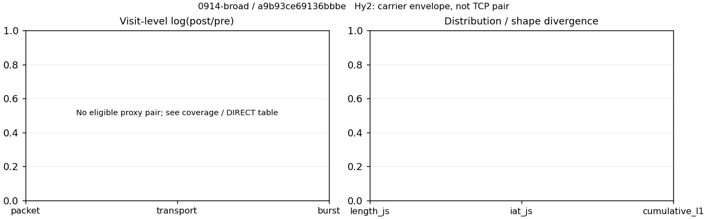

# 0914-broad · 条目 037 · qq.com

目标：https://news.qq.com/

活动标签：qq.com::page_load。选定访问 3 次。

[返回总索引](../../README.md) · [统计口径](../../methods.md)

## 覆盖与资格（每次访问均保留）

| 部署 | 重复 | 主请求路由 | 活动状态 | 代理比较 | DIRECT pre | 请求 proxy/direct/unresolved | 错误 |
| --- | --- | --- | --- | --- | --- | --- | --- |
| Hy2 | 1 | direct | passed | 0 | 1 | 0/168/1 | [] |
| SS | 1 | direct | passed | 0 | 1 | 0/173/1 | [] |
| VLESS | 1 | direct | passed | 0 | 1 | 0/178/1 | [] |

主请求非 proxy 的统计仅解释为已索引的辅助代理连接或 DIRECT 观测，不代表目标业务经代理传输。播放确认与配对资格是两道不同的门。

图中散点为单次访问，短线为重复中位数；Hy2 是共享载体包络，不能与 TCP 配对作等范围因果对比。

形态图先逐访问归一化，再对访问等权平均；实线 pre，虚线 post。分箱序号及边界见 methods，不将分箱索引误解为长度或时间。

## 每次访问的关键观测

### SS

范围：`direct_pre_only`。每格 pre → post；空值为不可观测/不适用。

| 重复 | 包数 | 载荷字节 | burst | TCP FR | IAT中位µs | length JS | IAT JS |
| --- | --- | --- | --- | --- | --- | --- | --- |
| 1 | 2772 → — | 4.8819e+06 → — | 1695 → — | 318 → — | 83.32 → — | — | — |

完整标量统计：中位数 [min,max]；Δ 为重复内逐访问变换的中位数，MAD 未缩放。n 为可用变换数；DIRECT-only 的 nΔ=0 不代表 pre 不可用。

| scope | 特征 | pre | post | Δ | IQRΔ | MADΔ | nΔ |
| --- | --- | --- | --- | --- | --- | --- | --- |
| direct_pre_only | active_span_sum_s_1000ms | 21.431 [21.431, 21.431] | — | — | — | — | 0 |
| direct_pre_only | active_span_sum_s_100ms | 7.8944 [7.8944, 7.8944] | — | — | — | — | 0 |
| direct_pre_only | active_span_sum_s_500ms | 15.535 [15.535, 15.535] | — | — | — | — | 0 |
| direct_pre_only | burst_bytes_iqr | 2856 [2856, 2856] | — | — | — | — | 0 |
| direct_pre_only | burst_bytes_mad | 64 [64, 64] | — | — | — | — | 0 |
| direct_pre_only | burst_bytes_max | 29568 [29568, 29568] | — | — | — | — | 0 |
| direct_pre_only | burst_bytes_mean | 2880.2 [2880.2, 2880.2] | — | — | — | — | 0 |
| direct_pre_only | burst_bytes_median | 64 [64, 64] | — | — | — | — | 0 |
| direct_pre_only | burst_bytes_min | 0 [0, 0] | — | — | — | — | 0 |
| direct_pre_only | burst_bytes_p95 | 15576 [15576, 15576] | — | — | — | — | 0 |
| direct_pre_only | burst_bytes_q25 | 0 [0, 0] | — | — | — | — | 0 |
| direct_pre_only | burst_bytes_q75 | 2856 [2856, 2856] | — | — | — | — | 0 |
| direct_pre_only | burst_bytes_std | 5235.7 [5235.7, 5235.7] | — | — | — | — | 0 |
| direct_pre_only | burst_count | 1695 [1695, 1695] | — | — | — | — | 0 |
| direct_pre_only | burst_duration_ms_iqr | 0.27284 [0.27284, 0.27284] | — | — | — | — | 0 |
| direct_pre_only | burst_duration_ms_mad | 0 [0, 0] | — | — | — | — | 0 |
| direct_pre_only | burst_duration_ms_max | 15001 [15001, 15001] | — | — | — | — | 0 |
| direct_pre_only | burst_duration_ms_mean | 187.59 [187.59, 187.59] | — | — | — | — | 0 |
| direct_pre_only | burst_duration_ms_median | 0 [0, 0] | — | — | — | — | 0 |
| direct_pre_only | burst_duration_ms_min | 0 [0, 0] | — | — | — | — | 0 |
| direct_pre_only | burst_duration_ms_p95 | 68.781 [68.781, 68.781] | — | — | — | — | 0 |
| direct_pre_only | burst_duration_ms_q25 | 0 [0, 0] | — | — | — | — | 0 |
| direct_pre_only | burst_duration_ms_q75 | 0.27284 [0.27284, 0.27284] | — | — | — | — | 0 |
| direct_pre_only | burst_duration_ms_std | 1392.5 [1392.5, 1392.5] | — | — | — | — | 0 |
| direct_pre_only | burst_packets_iqr | 1 [1, 1] | — | — | — | — | 0 |
| direct_pre_only | burst_packets_mad | 0 [0, 0] | — | — | — | — | 0 |
| direct_pre_only | burst_packets_max | 24 [24, 24] | — | — | — | — | 0 |
| direct_pre_only | burst_packets_mean | 1.6354 [1.6354, 1.6354] | — | — | — | — | 0 |
| direct_pre_only | burst_packets_median | 1 [1, 1] | — | — | — | — | 0 |
| direct_pre_only | burst_packets_min | 1 [1, 1] | — | — | — | — | 0 |
| direct_pre_only | burst_packets_p95 | 3 [3, 3] | — | — | — | — | 0 |
| direct_pre_only | burst_packets_q25 | 1 [1, 1] | — | — | — | — | 0 |
| direct_pre_only | burst_packets_q75 | 2 [2, 2] | — | — | — | — | 0 |
| direct_pre_only | burst_packets_std | 1.3082 [1.3082, 1.3082] | — | — | — | — | 0 |
| direct_pre_only | connection_span_concurrency_max | 31 [31, 31] | — | — | — | — | 0 |
| direct_pre_only | direction_entropy | 0.73392 [0.73392, 0.73392] | — | — | — | — | 0 |
| direct_pre_only | down_burst_count | 830 [830, 830] | — | — | — | — | 0 |
| direct_pre_only | down_ip_bytes | 4.7933e+06 [4.7933e+06, 4.7933e+06] | — | — | — | — | 0 |
| direct_pre_only | down_packets | 1658 [1658, 1658] | — | — | — | — | 0 |
| direct_pre_only | down_transport_bytes | 4.7099e+06 [4.7099e+06, 4.7099e+06] | — | — | — | — | 0 |
| direct_pre_only | duration_s | 28.841 [28.841, 28.841] | — | — | — | — | 0 |
| direct_pre_only | entity_count | 36 [36, 36] | — | — | — | — | 0 |
| direct_pre_only | fr_runs | 318 [318, 318] | — | — | — | — | 0 |
| direct_pre_only | fr_runs_per_packet | 0.19331 [0.19331, 0.19331] | — | — | — | — | 0 |
| direct_pre_only | fr_switches | 282 [282, 282] | — | — | — | — | 0 |
| direct_pre_only | fr_switches_per_possible_transition | 0.17526 [0.17526, 0.17526] | — | — | — | — | 0 |
| direct_pre_only | full_retransmission_fraction | 0.0015516 [0.0015516, 0.0015516] | — | — | — | — | 0 |
| direct_pre_only | full_retransmission_packets | 4 [4, 4] | — | — | — | — | 0 |
| direct_pre_only | iat_count | 2736 [2736, 2736] | — | — | — | — | 0 |
| direct_pre_only | iat_median_us | 83.32 [83.32, 83.32] | — | — | — | — | 0 |
| direct_pre_only | iat_us_iqr | 718.78 [718.78, 718.78] | — | — | — | — | 0 |
| direct_pre_only | iat_us_mad | 73.297 [73.297, 73.297] | — | — | — | — | 0 |
| direct_pre_only | iat_us_max | 2.5634e+07 [2.5634e+07, 2.5634e+07] | — | — | — | — | 0 |
| direct_pre_only | iat_us_mean | 2.7689e+05 [2.7689e+05, 2.7689e+05] | — | — | — | — | 0 |
| direct_pre_only | iat_us_median | 83.32 [83.32, 83.32] | — | — | — | — | 0 |
| direct_pre_only | iat_us_min | 0.306 [0.306, 0.306] | — | — | — | — | 0 |
| direct_pre_only | iat_us_p95 | 41867 [41867, 41867] | — | — | — | — | 0 |
| direct_pre_only | iat_us_q25 | 18.211 [18.211, 18.211] | — | — | — | — | 0 |
| direct_pre_only | iat_us_q75 | 736.99 [736.99, 736.99] | — | — | — | — | 0 |
| direct_pre_only | iat_us_std | 1.8965e+06 [1.8965e+06, 1.8965e+06] | — | — | — | — | 0 |
| direct_pre_only | idle_gap_count_1000ms | 58 [58, 58] | — | — | — | — | 0 |
| direct_pre_only | idle_gap_count_100ms | 100 [100, 100] | — | — | — | — | 0 |
| direct_pre_only | idle_gap_count_500ms | 66 [66, 66] | — | — | — | — | 0 |
| direct_pre_only | idle_gap_sum_s_1000ms | 736.15 [736.15, 736.15] | — | — | — | — | 0 |
| direct_pre_only | idle_gap_sum_s_100ms | 749.68 [749.68, 749.68] | — | — | — | — | 0 |
| direct_pre_only | idle_gap_sum_s_500ms | 742.04 [742.04, 742.04] | — | — | — | — | 0 |
| direct_pre_only | ip_bytes | 5.022e+06 [5.022e+06, 5.022e+06] | — | — | — | — | 0 |
| direct_pre_only | length_iqr | 3786 [3786, 3786] | — | — | — | — | 0 |
| direct_pre_only | length_mad | 1798 [1798, 1798] | — | — | — | — | 0 |
| direct_pre_only | length_max | 8948 [8948, 8948] | — | — | — | — | 0 |
| direct_pre_only | length_mean | 2967.7 [2967.7, 2967.7] | — | — | — | — | 0 |
| direct_pre_only | length_median | 2176 [2176, 2176] | — | — | — | — | 0 |
| direct_pre_only | length_min | 24 [24, 24] | — | — | — | — | 0 |
| direct_pre_only | length_p95 | 8920 [8920, 8920] | — | — | — | — | 0 |
| direct_pre_only | length_q25 | 534 [534, 534] | — | — | — | — | 0 |
| direct_pre_only | length_q75 | 4320 [4320, 4320] | — | — | — | — | 0 |
| direct_pre_only | length_std | 2902.1 [2902.1, 2902.1] | — | — | — | — | 0 |
| direct_pre_only | nonempty_entity_count | 36 [36, 36] | — | — | — | — | 0 |
| direct_pre_only | nonempty_packets | 1645 [1645, 1645] | — | — | — | — | 0 |
| direct_pre_only | offload_suspect_fraction | 0.32648 [0.32648, 0.32648] | — | — | — | — | 0 |
| direct_pre_only | packet_count | 2772 [2772, 2772] | — | — | — | — | 0 |
| direct_pre_only | rtt_median_ms | 0.10098 [0.10098, 0.10098] | — | — | — | — | 0 |
| direct_pre_only | rtt_sample_count | 994 [994, 994] | — | — | — | — | 0 |
| direct_pre_only | tcp_ack_count | 2539 [2539, 2539] | — | — | — | — | 0 |
| direct_pre_only | tcp_fin_count | 67 [67, 67] | — | — | — | — | 0 |
| direct_pre_only | tcp_packet_count | 2578 [2578, 2578] | — | — | — | — | 0 |
| direct_pre_only | tcp_rst_count | 4 [4, 4] | — | — | — | — | 0 |
| direct_pre_only | tcp_syn_count | 70 [70, 70] | — | — | — | — | 0 |
| direct_pre_only | tcp_window_raw_median | 65535 [65535, 65535] | — | — | — | — | 0 |
| direct_pre_only | transition_entropy | 0.57328 [0.57328, 0.57328] | — | — | — | — | 0 |
| direct_pre_only | transition_n_mm | 1148 [1148, 1148] | — | — | — | — | 0 |
| direct_pre_only | transition_n_mp | 124 [124, 124] | — | — | — | — | 0 |
| direct_pre_only | transition_n_pm | 158 [158, 158] | — | — | — | — | 0 |
| direct_pre_only | transition_n_pp | 179 [179, 179] | — | — | — | — | 0 |
| direct_pre_only | transition_p_mm | 0.90252 [0.90252, 0.90252] | — | — | — | — | 0 |
| direct_pre_only | transition_p_mp | 0.097484 [0.097484, 0.097484] | — | — | — | — | 0 |
| direct_pre_only | transition_p_pm | 0.46884 [0.46884, 0.46884] | — | — | — | — | 0 |
| direct_pre_only | transition_p_pp | 0.53116 [0.53116, 0.53116] | — | — | — | — | 0 |
| direct_pre_only | transport_bytes | 4.8819e+06 [4.8819e+06, 4.8819e+06] | — | — | — | — | 0 |
| direct_pre_only | up_burst_count | 865 [865, 865] | — | — | — | — | 0 |
| direct_pre_only | up_byte_fraction | 0.035237 [0.035237, 0.035237] | — | — | — | — | 0 |
| direct_pre_only | up_ip_bytes | 2.287e+05 [2.287e+05, 2.287e+05] | — | — | — | — | 0 |
| direct_pre_only | up_packets | 1114 [1114, 1114] | — | — | — | — | 0 |
| direct_pre_only | up_transport_bytes | 1.7202e+05 [1.7202e+05, 1.7202e+05] | — | — | — | — | 0 |
| direct_pre_only | zero_iat_count | 0 [0, 0] | — | — | — | — | 0 |
| direct_pre_only | zero_iat_fraction | 0 [0, 0] | — | — | — | — | 0 |

### VLESS

范围：`direct_pre_only`。每格 pre → post；空值为不可观测/不适用。

| 重复 | 包数 | 载荷字节 | burst | TCP FR | IAT中位µs | length JS | IAT JS |
| --- | --- | --- | --- | --- | --- | --- | --- |
| 1 | 3878 → — | 9.5266e+06 → — | 2356 → — | 358 → — | 58.103 → — | — | — |

完整标量统计：中位数 [min,max]；Δ 为重复内逐访问变换的中位数，MAD 未缩放。n 为可用变换数；DIRECT-only 的 nΔ=0 不代表 pre 不可用。

| scope | 特征 | pre | post | Δ | IQRΔ | MADΔ | nΔ |
| --- | --- | --- | --- | --- | --- | --- | --- |
| direct_pre_only | active_span_sum_s_1000ms | 22.065 [22.065, 22.065] | — | — | — | — | 0 |
| direct_pre_only | active_span_sum_s_100ms | 8.2417 [8.2417, 8.2417] | — | — | — | — | 0 |
| direct_pre_only | active_span_sum_s_500ms | 16.708 [16.708, 16.708] | — | — | — | — | 0 |
| direct_pre_only | burst_bytes_iqr | 6160 [6160, 6160] | — | — | — | — | 0 |
| direct_pre_only | burst_bytes_mad | 75 [75, 75] | — | — | — | — | 0 |
| direct_pre_only | burst_bytes_max | 32252 [32252, 32252] | — | — | — | — | 0 |
| direct_pre_only | burst_bytes_mean | 4043.6 [4043.6, 4043.6] | — | — | — | — | 0 |
| direct_pre_only | burst_bytes_median | 75 [75, 75] | — | — | — | — | 0 |
| direct_pre_only | burst_bytes_min | 0 [0, 0] | — | — | — | — | 0 |
| direct_pre_only | burst_bytes_p95 | 20480 [20480, 20480] | — | — | — | — | 0 |
| direct_pre_only | burst_bytes_q25 | 0 [0, 0] | — | — | — | — | 0 |
| direct_pre_only | burst_bytes_q75 | 6160 [6160, 6160] | — | — | — | — | 0 |
| direct_pre_only | burst_bytes_std | 6653.7 [6653.7, 6653.7] | — | — | — | — | 0 |
| direct_pre_only | burst_count | 2356 [2356, 2356] | — | — | — | — | 0 |
| direct_pre_only | burst_duration_ms_iqr | 0.06725 [0.06725, 0.06725] | — | — | — | — | 0 |
| direct_pre_only | burst_duration_ms_mad | 0 [0, 0] | — | — | — | — | 0 |
| direct_pre_only | burst_duration_ms_max | 13318 [13318, 13318] | — | — | — | — | 0 |
| direct_pre_only | burst_duration_ms_mean | 49.823 [49.823, 49.823] | — | — | — | — | 0 |
| direct_pre_only | burst_duration_ms_median | 0 [0, 0] | — | — | — | — | 0 |
| direct_pre_only | burst_duration_ms_min | 0 [0, 0] | — | — | — | — | 0 |
| direct_pre_only | burst_duration_ms_p95 | 31.751 [31.751, 31.751] | — | — | — | — | 0 |
| direct_pre_only | burst_duration_ms_q25 | 0 [0, 0] | — | — | — | — | 0 |
| direct_pre_only | burst_duration_ms_q75 | 0.06725 [0.06725, 0.06725] | — | — | — | — | 0 |
| direct_pre_only | burst_duration_ms_std | 529.33 [529.33, 529.33] | — | — | — | — | 0 |
| direct_pre_only | burst_packets_iqr | 1 [1, 1] | — | — | — | — | 0 |
| direct_pre_only | burst_packets_mad | 0 [0, 0] | — | — | — | — | 0 |
| direct_pre_only | burst_packets_max | 27 [27, 27] | — | — | — | — | 0 |
| direct_pre_only | burst_packets_mean | 1.646 [1.646, 1.646] | — | — | — | — | 0 |
| direct_pre_only | burst_packets_median | 1 [1, 1] | — | — | — | — | 0 |
| direct_pre_only | burst_packets_min | 1 [1, 1] | — | — | — | — | 0 |
| direct_pre_only | burst_packets_p95 | 3 [3, 3] | — | — | — | — | 0 |
| direct_pre_only | burst_packets_q25 | 1 [1, 1] | — | — | — | — | 0 |
| direct_pre_only | burst_packets_q75 | 2 [2, 2] | — | — | — | — | 0 |
| direct_pre_only | burst_packets_std | 1.3611 [1.3611, 1.3611] | — | — | — | — | 0 |
| direct_pre_only | connection_span_concurrency_max | 28 [28, 28] | — | — | — | — | 0 |
| direct_pre_only | direction_entropy | 0.62856 [0.62856, 0.62856] | — | — | — | — | 0 |
| direct_pre_only | down_burst_count | 1157 [1157, 1157] | — | — | — | — | 0 |
| direct_pre_only | down_ip_bytes | 9.4442e+06 [9.4442e+06, 9.4442e+06] | — | — | — | — | 0 |
| direct_pre_only | down_packets | 2415 [2415, 2415] | — | — | — | — | 0 |
| direct_pre_only | down_transport_bytes | 9.3215e+06 [9.3215e+06, 9.3215e+06] | — | — | — | — | 0 |
| direct_pre_only | duration_s | 29.836 [29.836, 29.836] | — | — | — | — | 0 |
| direct_pre_only | entity_count | 42 [42, 42] | — | — | — | — | 0 |
| direct_pre_only | fr_runs | 358 [358, 358] | — | — | — | — | 0 |
| direct_pre_only | fr_runs_per_packet | 0.14967 [0.14967, 0.14967] | — | — | — | — | 0 |
| direct_pre_only | fr_switches | 316 [316, 316] | — | — | — | — | 0 |
| direct_pre_only | fr_switches_per_possible_transition | 0.13447 [0.13447, 0.13447] | — | — | — | — | 0 |
| direct_pre_only | full_retransmission_fraction | 0.0051644 [0.0051644, 0.0051644] | — | — | — | — | 0 |
| direct_pre_only | full_retransmission_packets | 19 [19, 19] | — | — | — | — | 0 |
| direct_pre_only | iat_count | 3836 [3836, 3836] | — | — | — | — | 0 |
| direct_pre_only | iat_median_us | 58.103 [58.103, 58.103] | — | — | — | — | 0 |
| direct_pre_only | iat_us_iqr | 244.79 [244.79, 244.79] | — | — | — | — | 0 |
| direct_pre_only | iat_us_mad | 48.985 [48.985, 48.985] | — | — | — | — | 0 |
| direct_pre_only | iat_us_max | 2.7056e+07 [2.7056e+07, 2.7056e+07] | — | — | — | — | 0 |
| direct_pre_only | iat_us_mean | 54634 [54634, 54634] | — | — | — | — | 0 |
| direct_pre_only | iat_us_median | 58.103 [58.103, 58.103] | — | — | — | — | 0 |
| direct_pre_only | iat_us_min | 0.029 [0.029, 0.029] | — | — | — | — | 0 |
| direct_pre_only | iat_us_p95 | 23428 [23428, 23428] | — | — | — | — | 0 |
| direct_pre_only | iat_us_q25 | 16.575 [16.575, 16.575] | — | — | — | — | 0 |
| direct_pre_only | iat_us_q75 | 261.37 [261.37, 261.37] | — | — | — | — | 0 |
| direct_pre_only | iat_us_std | 7.7253e+05 [7.7253e+05, 7.7253e+05] | — | — | — | — | 0 |
| direct_pre_only | idle_gap_count_1000ms | 33 [33, 33] | — | — | — | — | 0 |
| direct_pre_only | idle_gap_count_100ms | 79 [79, 79] | — | — | — | — | 0 |
| direct_pre_only | idle_gap_count_500ms | 40 [40, 40] | — | — | — | — | 0 |
| direct_pre_only | idle_gap_sum_s_1000ms | 187.51 [187.51, 187.51] | — | — | — | — | 0 |
| direct_pre_only | idle_gap_sum_s_100ms | 201.33 [201.33, 201.33] | — | — | — | — | 0 |
| direct_pre_only | idle_gap_sum_s_500ms | 192.87 [192.87, 192.87] | — | — | — | — | 0 |
| direct_pre_only | ip_bytes | 9.7243e+06 [9.7243e+06, 9.7243e+06] | — | — | — | — | 0 |
| direct_pre_only | length_iqr | 6902 [6902, 6902] | — | — | — | — | 0 |
| direct_pre_only | length_mad | 2574.5 [2574.5, 2574.5] | — | — | — | — | 0 |
| direct_pre_only | length_max | 8948 [8948, 8948] | — | — | — | — | 0 |
| direct_pre_only | length_mean | 3982.7 [3982.7, 3982.7] | — | — | — | — | 0 |
| direct_pre_only | length_median | 2856 [2856, 2856] | — | — | — | — | 0 |
| direct_pre_only | length_min | 24 [24, 24] | — | — | — | — | 0 |
| direct_pre_only | length_p95 | 8920 [8920, 8920] | — | — | — | — | 0 |
| direct_pre_only | length_q25 | 1160 [1160, 1160] | — | — | — | — | 0 |
| direct_pre_only | length_q75 | 8062 [8062, 8062] | — | — | — | — | 0 |
| direct_pre_only | length_std | 3312.3 [3312.3, 3312.3] | — | — | — | — | 0 |
| direct_pre_only | nonempty_entity_count | 42 [42, 42] | — | — | — | — | 0 |
| direct_pre_only | nonempty_packets | 2392 [2392, 2392] | — | — | — | — | 0 |
| direct_pre_only | offload_suspect_fraction | 0.4149 [0.4149, 0.4149] | — | — | — | — | 0 |
| direct_pre_only | packet_count | 3878 [3878, 3878] | — | — | — | — | 0 |
| direct_pre_only | rtt_median_ms | 0.087242 [0.087242, 0.087242] | — | — | — | — | 0 |
| direct_pre_only | rtt_sample_count | 1389 [1389, 1389] | — | — | — | — | 0 |
| direct_pre_only | tcp_ack_count | 3634 [3634, 3634] | — | — | — | — | 0 |
| direct_pre_only | tcp_fin_count | 80 [80, 80] | — | — | — | — | 0 |
| direct_pre_only | tcp_packet_count | 3679 [3679, 3679] | — | — | — | — | 0 |
| direct_pre_only | tcp_rst_count | 4 [4, 4] | — | — | — | — | 0 |
| direct_pre_only | tcp_syn_count | 82 [82, 82] | — | — | — | — | 0 |
| direct_pre_only | tcp_window_raw_median | 65535 [65535, 65535] | — | — | — | — | 0 |
| direct_pre_only | transition_entropy | 0.46641 [0.46641, 0.46641] | — | — | — | — | 0 |
| direct_pre_only | transition_n_mm | 1837 [1837, 1837] | — | — | — | — | 0 |
| direct_pre_only | transition_n_mp | 138 [138, 138] | — | — | — | — | 0 |
| direct_pre_only | transition_n_pm | 178 [178, 178] | — | — | — | — | 0 |
| direct_pre_only | transition_n_pp | 197 [197, 197] | — | — | — | — | 0 |
| direct_pre_only | transition_p_mm | 0.93013 [0.93013, 0.93013] | — | — | — | — | 0 |
| direct_pre_only | transition_p_mp | 0.069873 [0.069873, 0.069873] | — | — | — | — | 0 |
| direct_pre_only | transition_p_pm | 0.47467 [0.47467, 0.47467] | — | — | — | — | 0 |
| direct_pre_only | transition_p_pp | 0.52533 [0.52533, 0.52533] | — | — | — | — | 0 |
| direct_pre_only | transport_bytes | 9.5266e+06 [9.5266e+06, 9.5266e+06] | — | — | — | — | 0 |
| direct_pre_only | up_burst_count | 1199 [1199, 1199] | — | — | — | — | 0 |
| direct_pre_only | up_byte_fraction | 0.021534 [0.021534, 0.021534] | — | — | — | — | 0 |
| direct_pre_only | up_ip_bytes | 2.8018e+05 [2.8018e+05, 2.8018e+05] | — | — | — | — | 0 |
| direct_pre_only | up_packets | 1463 [1463, 1463] | — | — | — | — | 0 |
| direct_pre_only | up_transport_bytes | 2.0515e+05 [2.0515e+05, 2.0515e+05] | — | — | — | — | 0 |
| direct_pre_only | zero_iat_count | 0 [0, 0] | — | — | — | — | 0 |
| direct_pre_only | zero_iat_fraction | 0 [0, 0] | — | — | — | — | 0 |

### Hy2

范围：`direct_pre_only`。每格 pre → post；空值为不可观测/不适用。

| 重复 | 包数 | 载荷字节 | burst | TCP FR | IAT中位µs | length JS | IAT JS |
| --- | --- | --- | --- | --- | --- | --- | --- |
| 1 | 3440 → — | 6.9092e+06 → — | 2139 → — | 353 → — | 67.367 → — | — | — |

完整标量统计：中位数 [min,max]；Δ 为重复内逐访问变换的中位数，MAD 未缩放。n 为可用变换数；DIRECT-only 的 nΔ=0 不代表 pre 不可用。

| scope | 特征 | pre | post | Δ | IQRΔ | MADΔ | nΔ |
| --- | --- | --- | --- | --- | --- | --- | --- |
| direct_pre_only | active_span_sum_s_1000ms | 24.873 [24.873, 24.873] | — | — | — | — | 0 |
| direct_pre_only | active_span_sum_s_100ms | 8.216 [8.216, 8.216] | — | — | — | — | 0 |
| direct_pre_only | active_span_sum_s_500ms | 16.857 [16.857, 16.857] | — | — | — | — | 0 |
| direct_pre_only | burst_bytes_iqr | 4320 [4320, 4320] | — | — | — | — | 0 |
| direct_pre_only | burst_bytes_mad | 75 [75, 75] | — | — | — | — | 0 |
| direct_pre_only | burst_bytes_max | 32687 [32687, 32687] | — | — | — | — | 0 |
| direct_pre_only | burst_bytes_mean | 3230.1 [3230.1, 3230.1] | — | — | — | — | 0 |
| direct_pre_only | burst_bytes_median | 75 [75, 75] | — | — | — | — | 0 |
| direct_pre_only | burst_bytes_min | 0 [0, 0] | — | — | — | — | 0 |
| direct_pre_only | burst_bytes_p95 | 17280 [17280, 17280] | — | — | — | — | 0 |
| direct_pre_only | burst_bytes_q25 | 0 [0, 0] | — | — | — | — | 0 |
| direct_pre_only | burst_bytes_q75 | 4320 [4320, 4320] | — | — | — | — | 0 |
| direct_pre_only | burst_bytes_std | 5581.4 [5581.4, 5581.4] | — | — | — | — | 0 |
| direct_pre_only | burst_count | 2139 [2139, 2139] | — | — | — | — | 0 |
| direct_pre_only | burst_duration_ms_iqr | 0.12174 [0.12174, 0.12174] | — | — | — | — | 0 |
| direct_pre_only | burst_duration_ms_mad | 0 [0, 0] | — | — | — | — | 0 |
| direct_pre_only | burst_duration_ms_max | 15001 [15001, 15001] | — | — | — | — | 0 |
| direct_pre_only | burst_duration_ms_mean | 45.323 [45.323, 45.323] | — | — | — | — | 0 |
| direct_pre_only | burst_duration_ms_median | 0 [0, 0] | — | — | — | — | 0 |
| direct_pre_only | burst_duration_ms_min | 0 [0, 0] | — | — | — | — | 0 |
| direct_pre_only | burst_duration_ms_p95 | 32.839 [32.839, 32.839] | — | — | — | — | 0 |
| direct_pre_only | burst_duration_ms_q25 | 0 [0, 0] | — | — | — | — | 0 |
| direct_pre_only | burst_duration_ms_q75 | 0.12174 [0.12174, 0.12174] | — | — | — | — | 0 |
| direct_pre_only | burst_duration_ms_std | 588.79 [588.79, 588.79] | — | — | — | — | 0 |
| direct_pre_only | burst_packets_iqr | 1 [1, 1] | — | — | — | — | 0 |
| direct_pre_only | burst_packets_mad | 0 [0, 0] | — | — | — | — | 0 |
| direct_pre_only | burst_packets_max | 27 [27, 27] | — | — | — | — | 0 |
| direct_pre_only | burst_packets_mean | 1.6082 [1.6082, 1.6082] | — | — | — | — | 0 |
| direct_pre_only | burst_packets_median | 1 [1, 1] | — | — | — | — | 0 |
| direct_pre_only | burst_packets_min | 1 [1, 1] | — | — | — | — | 0 |
| direct_pre_only | burst_packets_p95 | 3 [3, 3] | — | — | — | — | 0 |
| direct_pre_only | burst_packets_q25 | 1 [1, 1] | — | — | — | — | 0 |
| direct_pre_only | burst_packets_q75 | 2 [2, 2] | — | — | — | — | 0 |
| direct_pre_only | burst_packets_std | 1.1428 [1.1428, 1.1428] | — | — | — | — | 0 |
| direct_pre_only | connection_span_concurrency_max | 21 [21, 21] | — | — | — | — | 0 |
| direct_pre_only | direction_entropy | 0.65298 [0.65298, 0.65298] | — | — | — | — | 0 |
| direct_pre_only | down_burst_count | 1051 [1051, 1051] | — | — | — | — | 0 |
| direct_pre_only | down_ip_bytes | 6.8653e+06 [6.8653e+06, 6.8653e+06] | — | — | — | — | 0 |
| direct_pre_only | down_packets | 2109 [2109, 2109] | — | — | — | — | 0 |
| direct_pre_only | down_transport_bytes | 6.7585e+06 [6.7585e+06, 6.7585e+06] | — | — | — | — | 0 |
| direct_pre_only | duration_s | 18.77 [18.77, 18.77] | — | — | — | — | 0 |
| direct_pre_only | entity_count | 38 [38, 38] | — | — | — | — | 0 |
| direct_pre_only | fr_runs | 353 [353, 353] | — | — | — | — | 0 |
| direct_pre_only | fr_runs_per_packet | 0.1689 [0.1689, 0.1689] | — | — | — | — | 0 |
| direct_pre_only | fr_switches | 315 [315, 315] | — | — | — | — | 0 |
| direct_pre_only | fr_switches_per_possible_transition | 0.15351 [0.15351, 0.15351] | — | — | — | — | 0 |
| direct_pre_only | full_retransmission_fraction | 0.0037014 [0.0037014, 0.0037014] | — | — | — | — | 0 |
| direct_pre_only | full_retransmission_packets | 12 [12, 12] | — | — | — | — | 0 |
| direct_pre_only | iat_count | 3402 [3402, 3402] | — | — | — | — | 0 |
| direct_pre_only | iat_median_us | 67.367 [67.367, 67.367] | — | — | — | — | 0 |
| direct_pre_only | iat_us_iqr | 398.17 [398.17, 398.17] | — | — | — | — | 0 |
| direct_pre_only | iat_us_mad | 58.291 [58.291, 58.291] | — | — | — | — | 0 |
| direct_pre_only | iat_us_max | 1.6147e+07 [1.6147e+07, 1.6147e+07] | — | — | — | — | 0 |
| direct_pre_only | iat_us_mean | 91892 [91892, 91892] | — | — | — | — | 0 |
| direct_pre_only | iat_us_median | 67.367 [67.367, 67.367] | — | — | — | — | 0 |
| direct_pre_only | iat_us_min | 0.04 [0.04, 0.04] | — | — | — | — | 0 |
| direct_pre_only | iat_us_p95 | 30743 [30743, 30743] | — | — | — | — | 0 |
| direct_pre_only | iat_us_q25 | 17.31 [17.31, 17.31] | — | — | — | — | 0 |
| direct_pre_only | iat_us_q75 | 415.48 [415.48, 415.48] | — | — | — | — | 0 |
| direct_pre_only | iat_us_std | 1.0534e+06 [1.0534e+06, 1.0534e+06] | — | — | — | — | 0 |
| direct_pre_only | idle_gap_count_1000ms | 32 [32, 32] | — | — | — | — | 0 |
| direct_pre_only | idle_gap_count_100ms | 81 [81, 81] | — | — | — | — | 0 |
| direct_pre_only | idle_gap_count_500ms | 44 [44, 44] | — | — | — | — | 0 |
| direct_pre_only | idle_gap_sum_s_1000ms | 287.74 [287.74, 287.74] | — | — | — | — | 0 |
| direct_pre_only | idle_gap_sum_s_100ms | 304.4 [304.4, 304.4] | — | — | — | — | 0 |
| direct_pre_only | idle_gap_sum_s_500ms | 295.76 [295.76, 295.76] | — | — | — | — | 0 |
| direct_pre_only | ip_bytes | 7.084e+06 [7.084e+06, 7.084e+06] | — | — | — | — | 0 |
| direct_pre_only | length_iqr | 4973 [4973, 4973] | — | — | — | — | 0 |
| direct_pre_only | length_mad | 2222 [2222, 2222] | — | — | — | — | 0 |
| direct_pre_only | length_max | 8920 [8920, 8920] | — | — | — | — | 0 |
| direct_pre_only | length_mean | 3305.8 [3305.8, 3305.8] | — | — | — | — | 0 |
| direct_pre_only | length_median | 2832 [2832, 2832] | — | — | — | — | 0 |
| direct_pre_only | length_min | 24 [24, 24] | — | — | — | — | 0 |
| direct_pre_only | length_p95 | 8920 [8920, 8920] | — | — | — | — | 0 |
| direct_pre_only | length_q25 | 691 [691, 691] | — | — | — | — | 0 |
| direct_pre_only | length_q75 | 5664 [5664, 5664] | — | — | — | — | 0 |
| direct_pre_only | length_std | 2973 [2973, 2973] | — | — | — | — | 0 |
| direct_pre_only | nonempty_entity_count | 38 [38, 38] | — | — | — | — | 0 |
| direct_pre_only | nonempty_packets | 2090 [2090, 2090] | — | — | — | — | 0 |
| direct_pre_only | offload_suspect_fraction | 0.37297 [0.37297, 0.37297] | — | — | — | — | 0 |
| direct_pre_only | packet_count | 3440 [3440, 3440] | — | — | — | — | 0 |
| direct_pre_only | rtt_median_ms | 0.096494 [0.096494, 0.096494] | — | — | — | — | 0 |
| direct_pre_only | rtt_sample_count | 1236 [1236, 1236] | — | — | — | — | 0 |
| direct_pre_only | tcp_ack_count | 3202 [3202, 3202] | — | — | — | — | 0 |
| direct_pre_only | tcp_fin_count | 73 [73, 73] | — | — | — | — | 0 |
| direct_pre_only | tcp_packet_count | 3242 [3242, 3242] | — | — | — | — | 0 |
| direct_pre_only | tcp_rst_count | 3 [3, 3] | — | — | — | — | 0 |
| direct_pre_only | tcp_syn_count | 74 [74, 74] | — | — | — | — | 0 |
| direct_pre_only | tcp_window_raw_median | 65535 [65535, 65535] | — | — | — | — | 0 |
| direct_pre_only | transition_entropy | 0.51068 [0.51068, 0.51068] | — | — | — | — | 0 |
| direct_pre_only | transition_n_mm | 1565 [1565, 1565] | — | — | — | — | 0 |
| direct_pre_only | transition_n_mp | 141 [141, 141] | — | — | — | — | 0 |
| direct_pre_only | transition_n_pm | 174 [174, 174] | — | — | — | — | 0 |
| direct_pre_only | transition_n_pp | 172 [172, 172] | — | — | — | — | 0 |
| direct_pre_only | transition_p_mm | 0.91735 [0.91735, 0.91735] | — | — | — | — | 0 |
| direct_pre_only | transition_p_mp | 0.082649 [0.082649, 0.082649] | — | — | — | — | 0 |
| direct_pre_only | transition_p_pm | 0.50289 [0.50289, 0.50289] | — | — | — | — | 0 |
| direct_pre_only | transition_p_pp | 0.49711 [0.49711, 0.49711] | — | — | — | — | 0 |
| direct_pre_only | transport_bytes | 6.9092e+06 [6.9092e+06, 6.9092e+06] | — | — | — | — | 0 |
| direct_pre_only | up_burst_count | 1088 [1088, 1088] | — | — | — | — | 0 |
| direct_pre_only | up_byte_fraction | 0.021801 [0.021801, 0.021801] | — | — | — | — | 0 |
| direct_pre_only | up_ip_bytes | 2.1873e+05 [2.1873e+05, 2.1873e+05] | — | — | — | — | 0 |
| direct_pre_only | up_packets | 1331 [1331, 1331] | — | — | — | — | 0 |
| direct_pre_only | up_transport_bytes | 1.5063e+05 [1.5063e+05, 1.5063e+05] | — | — | — | — | 0 |
| direct_pre_only | zero_iat_count | 0 [0, 0] | — | — | — | — | 0 |
| direct_pre_only | zero_iat_fraction | 0 [0, 0] | — | — | — | — | 0 |

## 不同部署对比

以下是各部署自身重复中位数的差异，不按重复编号强行配对。跨 TCP/Hy2 的行标记异质观测范围。

| 视角 | 特征 | 部署A | 部署B | A中位 | B中位 | B−A | 比较口径 |
| --- | --- | --- | --- | --- | --- | --- | --- |
| pre | burst_count | SS | VLESS | 1695 | 2356 | 661 | same_scope_unpaired_visits |
| pre | burst_count | SS | Hy2 | 1695 | 2139 | 444 | same_scope_unpaired_visits |
| pre | burst_count | VLESS | Hy2 | 2356 | 2139 | -217 | same_scope_unpaired_visits |
| pre | connection_span_concurrency_max | SS | VLESS | 31 | 28 | -3 | same_scope_unpaired_visits |
| pre | connection_span_concurrency_max | SS | Hy2 | 31 | 21 | -10 | same_scope_unpaired_visits |
| pre | connection_span_concurrency_max | VLESS | Hy2 | 28 | 21 | -7 | same_scope_unpaired_visits |
| pre | direction_entropy | SS | VLESS | 0.73392 | 0.62856 | -0.10536 | same_scope_unpaired_visits |
| pre | direction_entropy | SS | Hy2 | 0.73392 | 0.65298 | -0.080944 | same_scope_unpaired_visits |
| pre | direction_entropy | VLESS | Hy2 | 0.62856 | 0.65298 | 0.024419 | same_scope_unpaired_visits |
| pre | down_transport_bytes | SS | VLESS | 4.7099e+06 | 9.3215e+06 | 4.6116e+06 | same_scope_unpaired_visits |
| pre | down_transport_bytes | SS | Hy2 | 4.7099e+06 | 6.7585e+06 | 2.0486e+06 | same_scope_unpaired_visits |
| pre | down_transport_bytes | VLESS | Hy2 | 9.3215e+06 | 6.7585e+06 | -2.563e+06 | same_scope_unpaired_visits |
| pre | duration_s | SS | VLESS | 28.841 | 29.836 | 0.99508 | same_scope_unpaired_visits |
| pre | duration_s | SS | Hy2 | 28.841 | 18.77 | -10.071 | same_scope_unpaired_visits |
| pre | duration_s | VLESS | Hy2 | 29.836 | 18.77 | -11.066 | same_scope_unpaired_visits |
| pre | entity_count | SS | VLESS | 36 | 42 | 6 | same_scope_unpaired_visits |
| pre | entity_count | SS | Hy2 | 36 | 38 | 2 | same_scope_unpaired_visits |
| pre | entity_count | VLESS | Hy2 | 42 | 38 | -4 | same_scope_unpaired_visits |
| pre | fr_runs | SS | VLESS | 318 | 358 | 40 | same_scope_unpaired_visits |
| pre | fr_runs | SS | Hy2 | 318 | 353 | 35 | same_scope_unpaired_visits |
| pre | fr_runs | VLESS | Hy2 | 358 | 353 | -5 | same_scope_unpaired_visits |
| pre | fr_runs_per_packet | SS | VLESS | 0.19331 | 0.14967 | -0.043648 | same_scope_unpaired_visits |
| pre | fr_runs_per_packet | SS | Hy2 | 0.19331 | 0.1689 | -0.024414 | same_scope_unpaired_visits |
| pre | fr_runs_per_packet | VLESS | Hy2 | 0.14967 | 0.1689 | 0.019234 | same_scope_unpaired_visits |
| pre | fr_switches | SS | VLESS | 282 | 316 | 34 | same_scope_unpaired_visits |
| pre | fr_switches | SS | Hy2 | 282 | 315 | 33 | same_scope_unpaired_visits |
| pre | fr_switches | VLESS | Hy2 | 316 | 315 | -1 | same_scope_unpaired_visits |
| pre | fr_switches_per_possible_transition | SS | VLESS | 0.17526 | 0.13447 | -0.040796 | same_scope_unpaired_visits |
| pre | fr_switches_per_possible_transition | SS | Hy2 | 0.17526 | 0.15351 | -0.021755 | same_scope_unpaired_visits |
| pre | fr_switches_per_possible_transition | VLESS | Hy2 | 0.13447 | 0.15351 | 0.019041 | same_scope_unpaired_visits |
| pre | full_retransmission_fraction | SS | VLESS | 0.0015516 | 0.0051644 | 0.0036129 | same_scope_unpaired_visits |
| pre | full_retransmission_fraction | SS | Hy2 | 0.0015516 | 0.0037014 | 0.0021498 | same_scope_unpaired_visits |
| pre | full_retransmission_fraction | VLESS | Hy2 | 0.0051644 | 0.0037014 | -0.001463 | same_scope_unpaired_visits |
| pre | iat_median_us | SS | VLESS | 83.32 | 58.103 | -25.217 | same_scope_unpaired_visits |
| pre | iat_median_us | SS | Hy2 | 83.32 | 67.367 | -15.953 | same_scope_unpaired_visits |
| pre | iat_median_us | VLESS | Hy2 | 58.103 | 67.367 | 9.2645 | same_scope_unpaired_visits |
| pre | iat_us_p95 | SS | VLESS | 41867 | 23428 | -18438 | same_scope_unpaired_visits |
| pre | iat_us_p95 | SS | Hy2 | 41867 | 30743 | -11123 | same_scope_unpaired_visits |
| pre | iat_us_p95 | VLESS | Hy2 | 23428 | 30743 | 7315.3 | same_scope_unpaired_visits |
| pre | ip_bytes | SS | VLESS | 5.022e+06 | 9.7243e+06 | 4.7024e+06 | same_scope_unpaired_visits |
| pre | ip_bytes | SS | Hy2 | 5.022e+06 | 7.084e+06 | 2.062e+06 | same_scope_unpaired_visits |
| pre | ip_bytes | VLESS | Hy2 | 9.7243e+06 | 7.084e+06 | -2.6403e+06 | same_scope_unpaired_visits |
| pre | length_median | SS | VLESS | 2176 | 2856 | 680 | same_scope_unpaired_visits |
| pre | length_median | SS | Hy2 | 2176 | 2832 | 656 | same_scope_unpaired_visits |
| pre | length_median | VLESS | Hy2 | 2856 | 2832 | -24 | same_scope_unpaired_visits |
| pre | length_p95 | SS | VLESS | 8920 | 8920 | 0 | same_scope_unpaired_visits |
| pre | length_p95 | SS | Hy2 | 8920 | 8920 | 0 | same_scope_unpaired_visits |
| pre | length_p95 | VLESS | Hy2 | 8920 | 8920 | 0 | same_scope_unpaired_visits |
| pre | nonempty_packets | SS | VLESS | 1645 | 2392 | 747 | same_scope_unpaired_visits |
| pre | nonempty_packets | SS | Hy2 | 1645 | 2090 | 445 | same_scope_unpaired_visits |
| pre | nonempty_packets | VLESS | Hy2 | 2392 | 2090 | -302 | same_scope_unpaired_visits |
| pre | offload_suspect_fraction | SS | VLESS | 0.32648 | 0.4149 | 0.088426 | same_scope_unpaired_visits |
| pre | offload_suspect_fraction | SS | Hy2 | 0.32648 | 0.37297 | 0.046486 | same_scope_unpaired_visits |
| pre | offload_suspect_fraction | VLESS | Hy2 | 0.4149 | 0.37297 | -0.041939 | same_scope_unpaired_visits |
| pre | packet_count | SS | VLESS | 2772 | 3878 | 1106 | same_scope_unpaired_visits |
| pre | packet_count | SS | Hy2 | 2772 | 3440 | 668 | same_scope_unpaired_visits |
| pre | packet_count | VLESS | Hy2 | 3878 | 3440 | -438 | same_scope_unpaired_visits |
| pre | rtt_median_ms | SS | VLESS | 0.10098 | 0.087242 | -0.013742 | same_scope_unpaired_visits |
| pre | rtt_median_ms | SS | Hy2 | 0.10098 | 0.096494 | -0.0044895 | same_scope_unpaired_visits |
| pre | rtt_median_ms | VLESS | Hy2 | 0.087242 | 0.096494 | 0.0092525 | same_scope_unpaired_visits |
| pre | transition_entropy | SS | VLESS | 0.57328 | 0.46641 | -0.10687 | same_scope_unpaired_visits |
| pre | transition_entropy | SS | Hy2 | 0.57328 | 0.51068 | -0.062599 | same_scope_unpaired_visits |
| pre | transition_entropy | VLESS | Hy2 | 0.46641 | 0.51068 | 0.044269 | same_scope_unpaired_visits |
| pre | transport_bytes | SS | VLESS | 4.8819e+06 | 9.5266e+06 | 4.6447e+06 | same_scope_unpaired_visits |
| pre | transport_bytes | SS | Hy2 | 4.8819e+06 | 6.9092e+06 | 2.0272e+06 | same_scope_unpaired_visits |
| pre | transport_bytes | VLESS | Hy2 | 9.5266e+06 | 6.9092e+06 | -2.6175e+06 | same_scope_unpaired_visits |
| pre | up_byte_fraction | SS | VLESS | 0.035237 | 0.021534 | -0.013703 | same_scope_unpaired_visits |
| pre | up_byte_fraction | SS | Hy2 | 0.035237 | 0.021801 | -0.013436 | same_scope_unpaired_visits |
| pre | up_byte_fraction | VLESS | Hy2 | 0.021534 | 0.021801 | 0.0002671 | same_scope_unpaired_visits |
| pre | up_transport_bytes | SS | VLESS | 1.7202e+05 | 2.0515e+05 | 33122 | same_scope_unpaired_visits |
| pre | up_transport_bytes | SS | Hy2 | 1.7202e+05 | 1.5063e+05 | -21397 | same_scope_unpaired_visits |
| pre | up_transport_bytes | VLESS | Hy2 | 2.0515e+05 | 1.5063e+05 | -54519 | same_scope_unpaired_visits |

## 可复核的访问标识

| 部署 | 重复 | session_id |
| --- | --- | --- |
| SS | 1 | 319cfd99-c9c9-4fba-9347-a19e56bf3de9 |
| VLESS | 1 | 0e0ae1d2-5fc6-4746-9fca-a1e697ea9f39 |
| Hy2 | 1 | 330eeae3-70e6-433d-b8cf-6ce926a59637 |

全量三种 packet selection、Hy2 full 范围、Q25/Q75、直方图与曲线见机器可读产物；本页只显示 observed 主范围。
