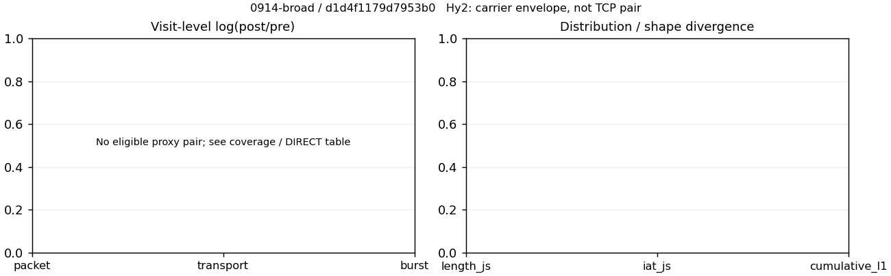

# 0914-broad · 条目 038 · 163.com

目标：https://news.163.com/

活动标签：163.com::page_load。选定访问 3 次。

[返回总索引](../../README.md) · [统计口径](../../methods.md)

## 覆盖与资格（每次访问均保留）

| 部署 | 重复 | 主请求路由 | 活动状态 | 代理比较 | DIRECT pre | 请求 proxy/direct/unresolved | 错误 |
| --- | --- | --- | --- | --- | --- | --- | --- |
| Hy2 | 1 | direct | passed | 0 | 1 | 0/155/0 | [] |
| SS | 1 | direct | passed | 0 | 1 | 0/161/0 | [] |
| VLESS | 1 | direct | passed | 0 | 1 | 0/183/0 | [] |

主请求非 proxy 的统计仅解释为已索引的辅助代理连接或 DIRECT 观测，不代表目标业务经代理传输。播放确认与配对资格是两道不同的门。

图中散点为单次访问，短线为重复中位数；Hy2 是共享载体包络，不能与 TCP 配对作等范围因果对比。

形态图先逐访问归一化，再对访问等权平均；实线 pre，虚线 post。分箱序号及边界见 methods，不将分箱索引误解为长度或时间。

## 每次访问的关键观测

### SS

范围：`direct_pre_only`。每格 pre → post；空值为不可观测/不适用。

| 重复 | 包数 | 载荷字节 | burst | TCP FR | IAT中位µs | length JS | IAT JS |
| --- | --- | --- | --- | --- | --- | --- | --- |
| 1 | 2653 → — | 4.7593e+06 → — | 1716 → — | 270 → — | 71.704 → — | — | — |

完整标量统计：中位数 [min,max]；Δ 为重复内逐访问变换的中位数，MAD 未缩放。n 为可用变换数；DIRECT-only 的 nΔ=0 不代表 pre 不可用。

| scope | 特征 | pre | post | Δ | IQRΔ | MADΔ | nΔ |
| --- | --- | --- | --- | --- | --- | --- | --- |
| direct_pre_only | active_span_sum_s_1000ms | 29.297 [29.297, 29.297] | — | — | — | — | 0 |
| direct_pre_only | active_span_sum_s_100ms | 6.0837 [6.0837, 6.0837] | — | — | — | — | 0 |
| direct_pre_only | active_span_sum_s_500ms | 21.247 [21.247, 21.247] | — | — | — | — | 0 |
| direct_pre_only | burst_bytes_iqr | 3361.2 [3361.2, 3361.2] | — | — | — | — | 0 |
| direct_pre_only | burst_bytes_mad | 35 [35, 35] | — | — | — | — | 0 |
| direct_pre_only | burst_bytes_max | 25848 [25848, 25848] | — | — | — | — | 0 |
| direct_pre_only | burst_bytes_mean | 2773.5 [2773.5, 2773.5] | — | — | — | — | 0 |
| direct_pre_only | burst_bytes_median | 35 [35, 35] | — | — | — | — | 0 |
| direct_pre_only | burst_bytes_min | 0 [0, 0] | — | — | — | — | 0 |
| direct_pre_only | burst_bytes_p95 | 14259 [14259, 14259] | — | — | — | — | 0 |
| direct_pre_only | burst_bytes_q25 | 0 [0, 0] | — | — | — | — | 0 |
| direct_pre_only | burst_bytes_q75 | 3361.2 [3361.2, 3361.2] | — | — | — | — | 0 |
| direct_pre_only | burst_bytes_std | 5038.9 [5038.9, 5038.9] | — | — | — | — | 0 |
| direct_pre_only | burst_count | 1716 [1716, 1716] | — | — | — | — | 0 |
| direct_pre_only | burst_duration_ms_iqr | 0.1962 [0.1962, 0.1962] | — | — | — | — | 0 |
| direct_pre_only | burst_duration_ms_mad | 0 [0, 0] | — | — | — | — | 0 |
| direct_pre_only | burst_duration_ms_max | 15001 [15001, 15001] | — | — | — | — | 0 |
| direct_pre_only | burst_duration_ms_mean | 84.857 [84.857, 84.857] | — | — | — | — | 0 |
| direct_pre_only | burst_duration_ms_median | 0 [0, 0] | — | — | — | — | 0 |
| direct_pre_only | burst_duration_ms_min | 0 [0, 0] | — | — | — | — | 0 |
| direct_pre_only | burst_duration_ms_p95 | 120.22 [120.22, 120.22] | — | — | — | — | 0 |
| direct_pre_only | burst_duration_ms_q25 | 0 [0, 0] | — | — | — | — | 0 |
| direct_pre_only | burst_duration_ms_q75 | 0.1962 [0.1962, 0.1962] | — | — | — | — | 0 |
| direct_pre_only | burst_duration_ms_std | 923.15 [923.15, 923.15] | — | — | — | — | 0 |
| direct_pre_only | burst_packets_iqr | 1 [1, 1] | — | — | — | — | 0 |
| direct_pre_only | burst_packets_mad | 0 [0, 0] | — | — | — | — | 0 |
| direct_pre_only | burst_packets_max | 8 [8, 8] | — | — | — | — | 0 |
| direct_pre_only | burst_packets_mean | 1.546 [1.546, 1.546] | — | — | — | — | 0 |
| direct_pre_only | burst_packets_median | 1 [1, 1] | — | — | — | — | 0 |
| direct_pre_only | burst_packets_min | 1 [1, 1] | — | — | — | — | 0 |
| direct_pre_only | burst_packets_p95 | 3 [3, 3] | — | — | — | — | 0 |
| direct_pre_only | burst_packets_q25 | 1 [1, 1] | — | — | — | — | 0 |
| direct_pre_only | burst_packets_q75 | 2 [2, 2] | — | — | — | — | 0 |
| direct_pre_only | burst_packets_std | 0.8519 [0.8519, 0.8519] | — | — | — | — | 0 |
| direct_pre_only | connection_span_concurrency_max | 20 [20, 20] | — | — | — | — | 0 |
| direct_pre_only | direction_entropy | 0.70112 [0.70112, 0.70112] | — | — | — | — | 0 |
| direct_pre_only | down_burst_count | 838 [838, 838] | — | — | — | — | 0 |
| direct_pre_only | down_ip_bytes | 4.7024e+06 [4.7024e+06, 4.7024e+06] | — | — | — | — | 0 |
| direct_pre_only | down_packets | 1569 [1569, 1569] | — | — | — | — | 0 |
| direct_pre_only | down_transport_bytes | 4.6205e+06 [4.6205e+06, 4.6205e+06] | — | — | — | — | 0 |
| direct_pre_only | duration_s | 19.853 [19.853, 19.853] | — | — | — | — | 0 |
| direct_pre_only | entity_count | 41 [41, 41] | — | — | — | — | 0 |
| direct_pre_only | fr_runs | 270 [270, 270] | — | — | — | — | 0 |
| direct_pre_only | fr_runs_per_packet | 0.18305 [0.18305, 0.18305] | — | — | — | — | 0 |
| direct_pre_only | fr_switches | 229 [229, 229] | — | — | — | — | 0 |
| direct_pre_only | fr_switches_per_possible_transition | 0.15969 [0.15969, 0.15969] | — | — | — | — | 0 |
| direct_pre_only | full_retransmission_fraction | 0.0030155 [0.0030155, 0.0030155] | — | — | — | — | 0 |
| direct_pre_only | full_retransmission_packets | 8 [8, 8] | — | — | — | — | 0 |
| direct_pre_only | iat_count | 2612 [2612, 2612] | — | — | — | — | 0 |
| direct_pre_only | iat_median_us | 71.704 [71.704, 71.704] | — | — | — | — | 0 |
| direct_pre_only | iat_us_iqr | 539.34 [539.34, 539.34] | — | — | — | — | 0 |
| direct_pre_only | iat_us_mad | 63.685 [63.685, 63.685] | — | — | — | — | 0 |
| direct_pre_only | iat_us_max | 1.5001e+07 [1.5001e+07, 1.5001e+07] | — | — | — | — | 0 |
| direct_pre_only | iat_us_mean | 98494 [98494, 98494] | — | — | — | — | 0 |
| direct_pre_only | iat_us_median | 71.704 [71.704, 71.704] | — | — | — | — | 0 |
| direct_pre_only | iat_us_min | 0.013 [0.013, 0.013] | — | — | — | — | 0 |
| direct_pre_only | iat_us_p95 | 41542 [41542, 41542] | — | — | — | — | 0 |
| direct_pre_only | iat_us_q25 | 17.503 [17.503, 17.503] | — | — | — | — | 0 |
| direct_pre_only | iat_us_q75 | 556.84 [556.84, 556.84] | — | — | — | — | 0 |
| direct_pre_only | iat_us_std | 1.0445e+06 [1.0445e+06, 1.0445e+06] | — | — | — | — | 0 |
| direct_pre_only | idle_gap_count_1000ms | 25 [25, 25] | — | — | — | — | 0 |
| direct_pre_only | idle_gap_count_100ms | 99 [99, 99] | — | — | — | — | 0 |
| direct_pre_only | idle_gap_count_500ms | 37 [37, 37] | — | — | — | — | 0 |
| direct_pre_only | idle_gap_sum_s_1000ms | 227.97 [227.97, 227.97] | — | — | — | — | 0 |
| direct_pre_only | idle_gap_sum_s_100ms | 251.18 [251.18, 251.18] | — | — | — | — | 0 |
| direct_pre_only | idle_gap_sum_s_500ms | 236.02 [236.02, 236.02] | — | — | — | — | 0 |
| direct_pre_only | ip_bytes | 4.8979e+06 [4.8979e+06, 4.8979e+06] | — | — | — | — | 0 |
| direct_pre_only | length_iqr | 4463 [4463, 4463] | — | — | — | — | 0 |
| direct_pre_only | length_mad | 2124 [2124, 2124] | — | — | — | — | 0 |
| direct_pre_only | length_max | 8920 [8920, 8920] | — | — | — | — | 0 |
| direct_pre_only | length_mean | 3226.6 [3226.6, 3226.6] | — | — | — | — | 0 |
| direct_pre_only | length_median | 2824 [2824, 2824] | — | — | — | — | 0 |
| direct_pre_only | length_min | 12 [12, 12] | — | — | — | — | 0 |
| direct_pre_only | length_p95 | 8920 [8920, 8920] | — | — | — | — | 0 |
| direct_pre_only | length_q25 | 712 [712, 712] | — | — | — | — | 0 |
| direct_pre_only | length_q75 | 5175 [5175, 5175] | — | — | — | — | 0 |
| direct_pre_only | length_std | 2862.2 [2862.2, 2862.2] | — | — | — | — | 0 |
| direct_pre_only | nonempty_entity_count | 41 [41, 41] | — | — | — | — | 0 |
| direct_pre_only | nonempty_packets | 1475 [1475, 1475] | — | — | — | — | 0 |
| direct_pre_only | offload_suspect_fraction | 0.35469 [0.35469, 0.35469] | — | — | — | — | 0 |
| direct_pre_only | packet_count | 2653 [2653, 2653] | — | — | — | — | 0 |
| direct_pre_only | rtt_median_ms | 0.080194 [0.080194, 0.080194] | — | — | — | — | 0 |
| direct_pre_only | rtt_sample_count | 1056 [1056, 1056] | — | — | — | — | 0 |
| direct_pre_only | tcp_ack_count | 2607 [2607, 2607] | — | — | — | — | 0 |
| direct_pre_only | tcp_fin_count | 81 [81, 81] | — | — | — | — | 0 |
| direct_pre_only | tcp_packet_count | 2653 [2653, 2653] | — | — | — | — | 0 |
| direct_pre_only | tcp_rst_count | 8 [8, 8] | — | — | — | — | 0 |
| direct_pre_only | tcp_syn_count | 82 [82, 82] | — | — | — | — | 0 |
| direct_pre_only | tcp_window_raw_median | 65535 [65535, 65535] | — | — | — | — | 0 |
| direct_pre_only | transition_entropy | 0.52405 [0.52405, 0.52405] | — | — | — | — | 0 |
| direct_pre_only | transition_n_mm | 1061 [1061, 1061] | — | — | — | — | 0 |
| direct_pre_only | transition_n_mp | 95 [95, 95] | — | — | — | — | 0 |
| direct_pre_only | transition_n_pm | 134 [134, 134] | — | — | — | — | 0 |
| direct_pre_only | transition_n_pp | 144 [144, 144] | — | — | — | — | 0 |
| direct_pre_only | transition_p_mm | 0.91782 [0.91782, 0.91782] | — | — | — | — | 0 |
| direct_pre_only | transition_p_mp | 0.08218 [0.08218, 0.08218] | — | — | — | — | 0 |
| direct_pre_only | transition_p_pm | 0.48201 [0.48201, 0.48201] | — | — | — | — | 0 |
| direct_pre_only | transition_p_pp | 0.51799 [0.51799, 0.51799] | — | — | — | — | 0 |
| direct_pre_only | transport_bytes | 4.7593e+06 [4.7593e+06, 4.7593e+06] | — | — | — | — | 0 |
| direct_pre_only | up_burst_count | 878 [878, 878] | — | — | — | — | 0 |
| direct_pre_only | up_byte_fraction | 0.02915 [0.02915, 0.02915] | — | — | — | — | 0 |
| direct_pre_only | up_ip_bytes | 1.9546e+05 [1.9546e+05, 1.9546e+05] | — | — | — | — | 0 |
| direct_pre_only | up_packets | 1084 [1084, 1084] | — | — | — | — | 0 |
| direct_pre_only | up_transport_bytes | 1.3873e+05 [1.3873e+05, 1.3873e+05] | — | — | — | — | 0 |
| direct_pre_only | zero_iat_count | 0 [0, 0] | — | — | — | — | 0 |
| direct_pre_only | zero_iat_fraction | 0 [0, 0] | — | — | — | — | 0 |

### VLESS

范围：`direct_pre_only`。每格 pre → post；空值为不可观测/不适用。

| 重复 | 包数 | 载荷字节 | burst | TCP FR | IAT中位µs | length JS | IAT JS |
| --- | --- | --- | --- | --- | --- | --- | --- |
| 1 | 3290 → — | 6.7892e+06 → — | 2134 → — | 320 → — | 89.904 → — | — | — |

完整标量统计：中位数 [min,max]；Δ 为重复内逐访问变换的中位数，MAD 未缩放。n 为可用变换数；DIRECT-only 的 nΔ=0 不代表 pre 不可用。

| scope | 特征 | pre | post | Δ | IQRΔ | MADΔ | nΔ |
| --- | --- | --- | --- | --- | --- | --- | --- |
| direct_pre_only | active_span_sum_s_1000ms | 34.344 [34.344, 34.344] | — | — | — | — | 0 |
| direct_pre_only | active_span_sum_s_100ms | 8.0082 [8.0082, 8.0082] | — | — | — | — | 0 |
| direct_pre_only | active_span_sum_s_500ms | 23.807 [23.807, 23.807] | — | — | — | — | 0 |
| direct_pre_only | burst_bytes_iqr | 2856 [2856, 2856] | — | — | — | — | 0 |
| direct_pre_only | burst_bytes_mad | 31 [31, 31] | — | — | — | — | 0 |
| direct_pre_only | burst_bytes_max | 28672 [28672, 28672] | — | — | — | — | 0 |
| direct_pre_only | burst_bytes_mean | 3181.4 [3181.4, 3181.4] | — | — | — | — | 0 |
| direct_pre_only | burst_bytes_median | 31 [31, 31] | — | — | — | — | 0 |
| direct_pre_only | burst_bytes_min | 0 [0, 0] | — | — | — | — | 0 |
| direct_pre_only | burst_bytes_p95 | 20480 [20480, 20480] | — | — | — | — | 0 |
| direct_pre_only | burst_bytes_q25 | 0 [0, 0] | — | — | — | — | 0 |
| direct_pre_only | burst_bytes_q75 | 2856 [2856, 2856] | — | — | — | — | 0 |
| direct_pre_only | burst_bytes_std | 6002.3 [6002.3, 6002.3] | — | — | — | — | 0 |
| direct_pre_only | burst_count | 2134 [2134, 2134] | — | — | — | — | 0 |
| direct_pre_only | burst_duration_ms_iqr | 0.10517 [0.10517, 0.10517] | — | — | — | — | 0 |
| direct_pre_only | burst_duration_ms_mad | 0 [0, 0] | — | — | — | — | 0 |
| direct_pre_only | burst_duration_ms_max | 14837 [14837, 14837] | — | — | — | — | 0 |
| direct_pre_only | burst_duration_ms_mean | 110.6 [110.6, 110.6] | — | — | — | — | 0 |
| direct_pre_only | burst_duration_ms_median | 0 [0, 0] | — | — | — | — | 0 |
| direct_pre_only | burst_duration_ms_min | 0 [0, 0] | — | — | — | — | 0 |
| direct_pre_only | burst_duration_ms_p95 | 68.379 [68.379, 68.379] | — | — | — | — | 0 |
| direct_pre_only | burst_duration_ms_q25 | 0 [0, 0] | — | — | — | — | 0 |
| direct_pre_only | burst_duration_ms_q75 | 0.10517 [0.10517, 0.10517] | — | — | — | — | 0 |
| direct_pre_only | burst_duration_ms_std | 1025.6 [1025.6, 1025.6] | — | — | — | — | 0 |
| direct_pre_only | burst_packets_iqr | 1 [1, 1] | — | — | — | — | 0 |
| direct_pre_only | burst_packets_mad | 0 [0, 0] | — | — | — | — | 0 |
| direct_pre_only | burst_packets_max | 8 [8, 8] | — | — | — | — | 0 |
| direct_pre_only | burst_packets_mean | 1.5417 [1.5417, 1.5417] | — | — | — | — | 0 |
| direct_pre_only | burst_packets_median | 1 [1, 1] | — | — | — | — | 0 |
| direct_pre_only | burst_packets_min | 1 [1, 1] | — | — | — | — | 0 |
| direct_pre_only | burst_packets_p95 | 3 [3, 3] | — | — | — | — | 0 |
| direct_pre_only | burst_packets_q25 | 1 [1, 1] | — | — | — | — | 0 |
| direct_pre_only | burst_packets_q75 | 2 [2, 2] | — | — | — | — | 0 |
| direct_pre_only | burst_packets_std | 0.86961 [0.86961, 0.86961] | — | — | — | — | 0 |
| direct_pre_only | connection_span_concurrency_max | 34 [34, 34] | — | — | — | — | 0 |
| direct_pre_only | direction_entropy | 0.67606 [0.67606, 0.67606] | — | — | — | — | 0 |
| direct_pre_only | down_burst_count | 1045 [1045, 1045] | — | — | — | — | 0 |
| direct_pre_only | down_ip_bytes | 6.7238e+06 [6.7238e+06, 6.7238e+06] | — | — | — | — | 0 |
| direct_pre_only | down_packets | 1984 [1984, 1984] | — | — | — | — | 0 |
| direct_pre_only | down_transport_bytes | 6.6203e+06 [6.6203e+06, 6.6203e+06] | — | — | — | — | 0 |
| direct_pre_only | duration_s | 24.132 [24.132, 24.132] | — | — | — | — | 0 |
| direct_pre_only | entity_count | 47 [47, 47] | — | — | — | — | 0 |
| direct_pre_only | fr_runs | 320 [320, 320] | — | — | — | — | 0 |
| direct_pre_only | fr_runs_per_packet | 0.17121 [0.17121, 0.17121] | — | — | — | — | 0 |
| direct_pre_only | fr_switches | 273 [273, 273] | — | — | — | — | 0 |
| direct_pre_only | fr_switches_per_possible_transition | 0.14984 [0.14984, 0.14984] | — | — | — | — | 0 |
| direct_pre_only | full_retransmission_fraction | 0.0072948 [0.0072948, 0.0072948] | — | — | — | — | 0 |
| direct_pre_only | full_retransmission_packets | 24 [24, 24] | — | — | — | — | 0 |
| direct_pre_only | iat_count | 3243 [3243, 3243] | — | — | — | — | 0 |
| direct_pre_only | iat_median_us | 89.904 [89.904, 89.904] | — | — | — | — | 0 |
| direct_pre_only | iat_us_iqr | 652.9 [652.9, 652.9] | — | — | — | — | 0 |
| direct_pre_only | iat_us_mad | 80.724 [80.724, 80.724] | — | — | — | — | 0 |
| direct_pre_only | iat_us_max | 1.5001e+07 [1.5001e+07, 1.5001e+07] | — | — | — | — | 0 |
| direct_pre_only | iat_us_mean | 1.584e+05 [1.584e+05, 1.584e+05] | — | — | — | — | 0 |
| direct_pre_only | iat_us_median | 89.904 [89.904, 89.904] | — | — | — | — | 0 |
| direct_pre_only | iat_us_min | 0.024 [0.024, 0.024] | — | — | — | — | 0 |
| direct_pre_only | iat_us_p95 | 58009 [58009, 58009] | — | — | — | — | 0 |
| direct_pre_only | iat_us_q25 | 19.895 [19.895, 19.895] | — | — | — | — | 0 |
| direct_pre_only | iat_us_q75 | 672.79 [672.79, 672.79] | — | — | — | — | 0 |
| direct_pre_only | iat_us_std | 1.3187e+06 [1.3187e+06, 1.3187e+06] | — | — | — | — | 0 |
| direct_pre_only | idle_gap_count_1000ms | 53 [53, 53] | — | — | — | — | 0 |
| direct_pre_only | idle_gap_count_100ms | 142 [142, 142] | — | — | — | — | 0 |
| direct_pre_only | idle_gap_count_500ms | 68 [68, 68] | — | — | — | — | 0 |
| direct_pre_only | idle_gap_sum_s_1000ms | 479.35 [479.35, 479.35] | — | — | — | — | 0 |
| direct_pre_only | idle_gap_sum_s_100ms | 505.69 [505.69, 505.69] | — | — | — | — | 0 |
| direct_pre_only | idle_gap_sum_s_500ms | 489.89 [489.89, 489.89] | — | — | — | — | 0 |
| direct_pre_only | ip_bytes | 6.9612e+06 [6.9612e+06, 6.9612e+06] | — | — | — | — | 0 |
| direct_pre_only | length_iqr | 4748 [4748, 4748] | — | — | — | — | 0 |
| direct_pre_only | length_mad | 2250 [2250, 2250] | — | — | — | — | 0 |
| direct_pre_only | length_max | 8920 [8920, 8920] | — | — | — | — | 0 |
| direct_pre_only | length_mean | 3632.5 [3632.5, 3632.5] | — | — | — | — | 0 |
| direct_pre_only | length_median | 2824 [2824, 2824] | — | — | — | — | 0 |
| direct_pre_only | length_min | 15 [15, 15] | — | — | — | — | 0 |
| direct_pre_only | length_p95 | 8920 [8920, 8920] | — | — | — | — | 0 |
| direct_pre_only | length_q25 | 964 [964, 964] | — | — | — | — | 0 |
| direct_pre_only | length_q75 | 5712 [5712, 5712] | — | — | — | — | 0 |
| direct_pre_only | length_std | 3118.5 [3118.5, 3118.5] | — | — | — | — | 0 |
| direct_pre_only | nonempty_entity_count | 47 [47, 47] | — | — | — | — | 0 |
| direct_pre_only | nonempty_packets | 1869 [1869, 1869] | — | — | — | — | 0 |
| direct_pre_only | offload_suspect_fraction | 0.38298 [0.38298, 0.38298] | — | — | — | — | 0 |
| direct_pre_only | packet_count | 3290 [3290, 3290] | — | — | — | — | 0 |
| direct_pre_only | rtt_median_ms | 0.096587 [0.096587, 0.096587] | — | — | — | — | 0 |
| direct_pre_only | rtt_sample_count | 1265 [1265, 1265] | — | — | — | — | 0 |
| direct_pre_only | tcp_ack_count | 3230 [3230, 3230] | — | — | — | — | 0 |
| direct_pre_only | tcp_fin_count | 85 [85, 85] | — | — | — | — | 0 |
| direct_pre_only | tcp_packet_count | 3290 [3290, 3290] | — | — | — | — | 0 |
| direct_pre_only | tcp_rst_count | 22 [22, 22] | — | — | — | — | 0 |
| direct_pre_only | tcp_syn_count | 94 [94, 94] | — | — | — | — | 0 |
| direct_pre_only | tcp_window_raw_median | 65535 [65535, 65535] | — | — | — | — | 0 |
| direct_pre_only | transition_entropy | 0.50027 [0.50027, 0.50027] | — | — | — | — | 0 |
| direct_pre_only | transition_n_mm | 1377 [1377, 1377] | — | — | — | — | 0 |
| direct_pre_only | transition_n_mp | 114 [114, 114] | — | — | — | — | 0 |
| direct_pre_only | transition_n_pm | 159 [159, 159] | — | — | — | — | 0 |
| direct_pre_only | transition_n_pp | 172 [172, 172] | — | — | — | — | 0 |
| direct_pre_only | transition_p_mm | 0.92354 [0.92354, 0.92354] | — | — | — | — | 0 |
| direct_pre_only | transition_p_mp | 0.076459 [0.076459, 0.076459] | — | — | — | — | 0 |
| direct_pre_only | transition_p_pm | 0.48036 [0.48036, 0.48036] | — | — | — | — | 0 |
| direct_pre_only | transition_p_pp | 0.51964 [0.51964, 0.51964] | — | — | — | — | 0 |
| direct_pre_only | transport_bytes | 6.7892e+06 [6.7892e+06, 6.7892e+06] | — | — | — | — | 0 |
| direct_pre_only | up_burst_count | 1089 [1089, 1089] | — | — | — | — | 0 |
| direct_pre_only | up_byte_fraction | 0.024882 [0.024882, 0.024882] | — | — | — | — | 0 |
| direct_pre_only | up_ip_bytes | 2.3735e+05 [2.3735e+05, 2.3735e+05] | — | — | — | — | 0 |
| direct_pre_only | up_packets | 1306 [1306, 1306] | — | — | — | — | 0 |
| direct_pre_only | up_transport_bytes | 1.6893e+05 [1.6893e+05, 1.6893e+05] | — | — | — | — | 0 |
| direct_pre_only | zero_iat_count | 0 [0, 0] | — | — | — | — | 0 |
| direct_pre_only | zero_iat_fraction | 0 [0, 0] | — | — | — | — | 0 |

### Hy2

范围：`direct_pre_only`。每格 pre → post；空值为不可观测/不适用。

| 重复 | 包数 | 载荷字节 | burst | TCP FR | IAT中位µs | length JS | IAT JS |
| --- | --- | --- | --- | --- | --- | --- | --- |
| 1 | 1729 → — | 3.6513e+06 → — | 1139 → — | 199 → — | 81.568 → — | — | — |

完整标量统计：中位数 [min,max]；Δ 为重复内逐访问变换的中位数，MAD 未缩放。n 为可用变换数；DIRECT-only 的 nΔ=0 不代表 pre 不可用。

| scope | 特征 | pre | post | Δ | IQRΔ | MADΔ | nΔ |
| --- | --- | --- | --- | --- | --- | --- | --- |
| direct_pre_only | active_span_sum_s_1000ms | 18.137 [18.137, 18.137] | — | — | — | — | 0 |
| direct_pre_only | active_span_sum_s_100ms | 4.7239 [4.7239, 4.7239] | — | — | — | — | 0 |
| direct_pre_only | active_span_sum_s_500ms | 14.398 [14.398, 14.398] | — | — | — | — | 0 |
| direct_pre_only | burst_bytes_iqr | 2824 [2824, 2824] | — | — | — | — | 0 |
| direct_pre_only | burst_bytes_mad | 53 [53, 53] | — | — | — | — | 0 |
| direct_pre_only | burst_bytes_max | 29400 [29400, 29400] | — | — | — | — | 0 |
| direct_pre_only | burst_bytes_mean | 3205.7 [3205.7, 3205.7] | — | — | — | — | 0 |
| direct_pre_only | burst_bytes_median | 53 [53, 53] | — | — | — | — | 0 |
| direct_pre_only | burst_bytes_min | 0 [0, 0] | — | — | — | — | 0 |
| direct_pre_only | burst_bytes_p95 | 20480 [20480, 20480] | — | — | — | — | 0 |
| direct_pre_only | burst_bytes_q25 | 0 [0, 0] | — | — | — | — | 0 |
| direct_pre_only | burst_bytes_q75 | 2824 [2824, 2824] | — | — | — | — | 0 |
| direct_pre_only | burst_bytes_std | 5982.5 [5982.5, 5982.5] | — | — | — | — | 0 |
| direct_pre_only | burst_count | 1139 [1139, 1139] | — | — | — | — | 0 |
| direct_pre_only | burst_duration_ms_iqr | 0.14466 [0.14466, 0.14466] | — | — | — | — | 0 |
| direct_pre_only | burst_duration_ms_mad | 0 [0, 0] | — | — | — | — | 0 |
| direct_pre_only | burst_duration_ms_max | 13159 [13159, 13159] | — | — | — | — | 0 |
| direct_pre_only | burst_duration_ms_mean | 65.993 [65.993, 65.993] | — | — | — | — | 0 |
| direct_pre_only | burst_duration_ms_median | 0 [0, 0] | — | — | — | — | 0 |
| direct_pre_only | burst_duration_ms_min | 0 [0, 0] | — | — | — | — | 0 |
| direct_pre_only | burst_duration_ms_p95 | 147.97 [147.97, 147.97] | — | — | — | — | 0 |
| direct_pre_only | burst_duration_ms_q25 | 0 [0, 0] | — | — | — | — | 0 |
| direct_pre_only | burst_duration_ms_q75 | 0.14466 [0.14466, 0.14466] | — | — | — | — | 0 |
| direct_pre_only | burst_duration_ms_std | 507.15 [507.15, 507.15] | — | — | — | — | 0 |
| direct_pre_only | burst_packets_iqr | 1 [1, 1] | — | — | — | — | 0 |
| direct_pre_only | burst_packets_mad | 0 [0, 0] | — | — | — | — | 0 |
| direct_pre_only | burst_packets_max | 6 [6, 6] | — | — | — | — | 0 |
| direct_pre_only | burst_packets_mean | 1.518 [1.518, 1.518] | — | — | — | — | 0 |
| direct_pre_only | burst_packets_median | 1 [1, 1] | — | — | — | — | 0 |
| direct_pre_only | burst_packets_min | 1 [1, 1] | — | — | — | — | 0 |
| direct_pre_only | burst_packets_p95 | 3 [3, 3] | — | — | — | — | 0 |
| direct_pre_only | burst_packets_q25 | 1 [1, 1] | — | — | — | — | 0 |
| direct_pre_only | burst_packets_q75 | 2 [2, 2] | — | — | — | — | 0 |
| direct_pre_only | burst_packets_std | 0.80406 [0.80406, 0.80406] | — | — | — | — | 0 |
| direct_pre_only | connection_span_concurrency_max | 20 [20, 20] | — | — | — | — | 0 |
| direct_pre_only | direction_entropy | 0.64307 [0.64307, 0.64307] | — | — | — | — | 0 |
| direct_pre_only | down_burst_count | 557 [557, 557] | — | — | — | — | 0 |
| direct_pre_only | down_ip_bytes | 3.6161e+06 [3.6161e+06, 3.6161e+06] | — | — | — | — | 0 |
| direct_pre_only | down_packets | 1021 [1021, 1021] | — | — | — | — | 0 |
| direct_pre_only | down_transport_bytes | 3.5628e+06 [3.5628e+06, 3.5628e+06] | — | — | — | — | 0 |
| direct_pre_only | duration_s | 17.705 [17.705, 17.705] | — | — | — | — | 0 |
| direct_pre_only | entity_count | 25 [25, 25] | — | — | — | — | 0 |
| direct_pre_only | fr_runs | 199 [199, 199] | — | — | — | — | 0 |
| direct_pre_only | fr_runs_per_packet | 0.20881 [0.20881, 0.20881] | — | — | — | — | 0 |
| direct_pre_only | fr_switches | 174 [174, 174] | — | — | — | — | 0 |
| direct_pre_only | fr_switches_per_possible_transition | 0.1875 [0.1875, 0.1875] | — | — | — | — | 0 |
| direct_pre_only | full_retransmission_fraction | 0.010411 [0.010411, 0.010411] | — | — | — | — | 0 |
| direct_pre_only | full_retransmission_packets | 18 [18, 18] | — | — | — | — | 0 |
| direct_pre_only | iat_count | 1704 [1704, 1704] | — | — | — | — | 0 |
| direct_pre_only | iat_median_us | 81.568 [81.568, 81.568] | — | — | — | — | 0 |
| direct_pre_only | iat_us_iqr | 638.84 [638.84, 638.84] | — | — | — | — | 0 |
| direct_pre_only | iat_us_mad | 73.139 [73.139, 73.139] | — | — | — | — | 0 |
| direct_pre_only | iat_us_max | 1.5001e+07 [1.5001e+07, 1.5001e+07] | — | — | — | — | 0 |
| direct_pre_only | iat_us_mean | 1.5928e+05 [1.5928e+05, 1.5928e+05] | — | — | — | — | 0 |
| direct_pre_only | iat_us_median | 81.568 [81.568, 81.568] | — | — | — | — | 0 |
| direct_pre_only | iat_us_min | 0.957 [0.957, 0.957] | — | — | — | — | 0 |
| direct_pre_only | iat_us_p95 | 91357 [91357, 91357] | — | — | — | — | 0 |
| direct_pre_only | iat_us_q25 | 15.065 [15.065, 15.065] | — | — | — | — | 0 |
| direct_pre_only | iat_us_q75 | 653.9 [653.9, 653.9] | — | — | — | — | 0 |
| direct_pre_only | iat_us_std | 1.2653e+06 [1.2653e+06, 1.2653e+06] | — | — | — | — | 0 |
| direct_pre_only | idle_gap_count_1000ms | 40 [40, 40] | — | — | — | — | 0 |
| direct_pre_only | idle_gap_count_100ms | 83 [83, 83] | — | — | — | — | 0 |
| direct_pre_only | idle_gap_count_500ms | 45 [45, 45] | — | — | — | — | 0 |
| direct_pre_only | idle_gap_sum_s_1000ms | 253.28 [253.28, 253.28] | — | — | — | — | 0 |
| direct_pre_only | idle_gap_sum_s_100ms | 266.69 [266.69, 266.69] | — | — | — | — | 0 |
| direct_pre_only | idle_gap_sum_s_500ms | 257.02 [257.02, 257.02] | — | — | — | — | 0 |
| direct_pre_only | ip_bytes | 3.7418e+06 [3.7418e+06, 3.7418e+06] | — | — | — | — | 0 |
| direct_pre_only | length_iqr | 6071 [6071, 6071] | — | — | — | — | 0 |
| direct_pre_only | length_mad | 2368 [2368, 2368] | — | — | — | — | 0 |
| direct_pre_only | length_max | 8920 [8920, 8920] | — | — | — | — | 0 |
| direct_pre_only | length_mean | 3831.4 [3831.4, 3831.4] | — | — | — | — | 0 |
| direct_pre_only | length_median | 2824 [2824, 2824] | — | — | — | — | 0 |
| direct_pre_only | length_min | 24 [24, 24] | — | — | — | — | 0 |
| direct_pre_only | length_p95 | 8920 [8920, 8920] | — | — | — | — | 0 |
| direct_pre_only | length_q25 | 989 [989, 989] | — | — | — | — | 0 |
| direct_pre_only | length_q75 | 7060 [7060, 7060] | — | — | — | — | 0 |
| direct_pre_only | length_std | 3207 [3207, 3207] | — | — | — | — | 0 |
| direct_pre_only | nonempty_entity_count | 25 [25, 25] | — | — | — | — | 0 |
| direct_pre_only | nonempty_packets | 953 [953, 953] | — | — | — | — | 0 |
| direct_pre_only | offload_suspect_fraction | 0.3771 [0.3771, 0.3771] | — | — | — | — | 0 |
| direct_pre_only | packet_count | 1729 [1729, 1729] | — | — | — | — | 0 |
| direct_pre_only | rtt_median_ms | 0.080281 [0.080281, 0.080281] | — | — | — | — | 0 |
| direct_pre_only | rtt_sample_count | 687 [687, 687] | — | — | — | — | 0 |
| direct_pre_only | tcp_ack_count | 1702 [1702, 1702] | — | — | — | — | 0 |
| direct_pre_only | tcp_fin_count | 43 [43, 43] | — | — | — | — | 0 |
| direct_pre_only | tcp_packet_count | 1729 [1729, 1729] | — | — | — | — | 0 |
| direct_pre_only | tcp_rst_count | 11 [11, 11] | — | — | — | — | 0 |
| direct_pre_only | tcp_syn_count | 50 [50, 50] | — | — | — | — | 0 |
| direct_pre_only | tcp_window_raw_median | 65535 [65535, 65535] | — | — | — | — | 0 |
| direct_pre_only | transition_entropy | 0.54038 [0.54038, 0.54038] | — | — | — | — | 0 |
| direct_pre_only | transition_n_mm | 698 [698, 698] | — | — | — | — | 0 |
| direct_pre_only | transition_n_mp | 75 [75, 75] | — | — | — | — | 0 |
| direct_pre_only | transition_n_pm | 99 [99, 99] | — | — | — | — | 0 |
| direct_pre_only | transition_n_pp | 56 [56, 56] | — | — | — | — | 0 |
| direct_pre_only | transition_p_mm | 0.90298 [0.90298, 0.90298] | — | — | — | — | 0 |
| direct_pre_only | transition_p_mp | 0.097025 [0.097025, 0.097025] | — | — | — | — | 0 |
| direct_pre_only | transition_p_pm | 0.63871 [0.63871, 0.63871] | — | — | — | — | 0 |
| direct_pre_only | transition_p_pp | 0.36129 [0.36129, 0.36129] | — | — | — | — | 0 |
| direct_pre_only | transport_bytes | 3.6513e+06 [3.6513e+06, 3.6513e+06] | — | — | — | — | 0 |
| direct_pre_only | up_burst_count | 582 [582, 582] | — | — | — | — | 0 |
| direct_pre_only | up_byte_fraction | 0.024231 [0.024231, 0.024231] | — | — | — | — | 0 |
| direct_pre_only | up_ip_bytes | 1.2568e+05 [1.2568e+05, 1.2568e+05] | — | — | — | — | 0 |
| direct_pre_only | up_packets | 708 [708, 708] | — | — | — | — | 0 |
| direct_pre_only | up_transport_bytes | 88473 [88473, 88473] | — | — | — | — | 0 |
| direct_pre_only | zero_iat_count | 0 [0, 0] | — | — | — | — | 0 |
| direct_pre_only | zero_iat_fraction | 0 [0, 0] | — | — | — | — | 0 |

## 不同部署对比

以下是各部署自身重复中位数的差异，不按重复编号强行配对。跨 TCP/Hy2 的行标记异质观测范围。

| 视角 | 特征 | 部署A | 部署B | A中位 | B中位 | B−A | 比较口径 |
| --- | --- | --- | --- | --- | --- | --- | --- |
| pre | burst_count | SS | VLESS | 1716 | 2134 | 418 | same_scope_unpaired_visits |
| pre | burst_count | SS | Hy2 | 1716 | 1139 | -577 | same_scope_unpaired_visits |
| pre | burst_count | VLESS | Hy2 | 2134 | 1139 | -995 | same_scope_unpaired_visits |
| pre | connection_span_concurrency_max | SS | VLESS | 20 | 34 | 14 | same_scope_unpaired_visits |
| pre | connection_span_concurrency_max | SS | Hy2 | 20 | 20 | 0 | same_scope_unpaired_visits |
| pre | connection_span_concurrency_max | VLESS | Hy2 | 34 | 20 | -14 | same_scope_unpaired_visits |
| pre | direction_entropy | SS | VLESS | 0.70112 | 0.67606 | -0.025059 | same_scope_unpaired_visits |
| pre | direction_entropy | SS | Hy2 | 0.70112 | 0.64307 | -0.058044 | same_scope_unpaired_visits |
| pre | direction_entropy | VLESS | Hy2 | 0.67606 | 0.64307 | -0.032985 | same_scope_unpaired_visits |
| pre | down_transport_bytes | SS | VLESS | 4.6205e+06 | 6.6203e+06 | 1.9997e+06 | same_scope_unpaired_visits |
| pre | down_transport_bytes | SS | Hy2 | 4.6205e+06 | 3.5628e+06 | -1.0577e+06 | same_scope_unpaired_visits |
| pre | down_transport_bytes | VLESS | Hy2 | 6.6203e+06 | 3.5628e+06 | -3.0574e+06 | same_scope_unpaired_visits |
| pre | duration_s | SS | VLESS | 19.853 | 24.132 | 4.2796 | same_scope_unpaired_visits |
| pre | duration_s | SS | Hy2 | 19.853 | 17.705 | -2.1479 | same_scope_unpaired_visits |
| pre | duration_s | VLESS | Hy2 | 24.132 | 17.705 | -6.4275 | same_scope_unpaired_visits |
| pre | entity_count | SS | VLESS | 41 | 47 | 6 | same_scope_unpaired_visits |
| pre | entity_count | SS | Hy2 | 41 | 25 | -16 | same_scope_unpaired_visits |
| pre | entity_count | VLESS | Hy2 | 47 | 25 | -22 | same_scope_unpaired_visits |
| pre | fr_runs | SS | VLESS | 270 | 320 | 50 | same_scope_unpaired_visits |
| pre | fr_runs | SS | Hy2 | 270 | 199 | -71 | same_scope_unpaired_visits |
| pre | fr_runs | VLESS | Hy2 | 320 | 199 | -121 | same_scope_unpaired_visits |
| pre | fr_runs_per_packet | SS | VLESS | 0.18305 | 0.17121 | -0.011836 | same_scope_unpaired_visits |
| pre | fr_runs_per_packet | SS | Hy2 | 0.18305 | 0.20881 | 0.025763 | same_scope_unpaired_visits |
| pre | fr_runs_per_packet | VLESS | Hy2 | 0.17121 | 0.20881 | 0.0376 | same_scope_unpaired_visits |
| pre | fr_switches | SS | VLESS | 229 | 273 | 44 | same_scope_unpaired_visits |
| pre | fr_switches | SS | Hy2 | 229 | 174 | -55 | same_scope_unpaired_visits |
| pre | fr_switches | VLESS | Hy2 | 273 | 174 | -99 | same_scope_unpaired_visits |
| pre | fr_switches_per_possible_transition | SS | VLESS | 0.15969 | 0.14984 | -0.0098578 | same_scope_unpaired_visits |
| pre | fr_switches_per_possible_transition | SS | Hy2 | 0.15969 | 0.1875 | 0.027807 | same_scope_unpaired_visits |
| pre | fr_switches_per_possible_transition | VLESS | Hy2 | 0.14984 | 0.1875 | 0.037665 | same_scope_unpaired_visits |
| pre | full_retransmission_fraction | SS | VLESS | 0.0030155 | 0.0072948 | 0.0042794 | same_scope_unpaired_visits |
| pre | full_retransmission_fraction | SS | Hy2 | 0.0030155 | 0.010411 | 0.0073952 | same_scope_unpaired_visits |
| pre | full_retransmission_fraction | VLESS | Hy2 | 0.0072948 | 0.010411 | 0.0031158 | same_scope_unpaired_visits |
| pre | iat_median_us | SS | VLESS | 71.704 | 89.904 | 18.2 | same_scope_unpaired_visits |
| pre | iat_median_us | SS | Hy2 | 71.704 | 81.568 | 9.864 | same_scope_unpaired_visits |
| pre | iat_median_us | VLESS | Hy2 | 89.904 | 81.568 | -8.336 | same_scope_unpaired_visits |
| pre | iat_us_p95 | SS | VLESS | 41542 | 58009 | 16467 | same_scope_unpaired_visits |
| pre | iat_us_p95 | SS | Hy2 | 41542 | 91357 | 49815 | same_scope_unpaired_visits |
| pre | iat_us_p95 | VLESS | Hy2 | 58009 | 91357 | 33348 | same_scope_unpaired_visits |
| pre | ip_bytes | SS | VLESS | 4.8979e+06 | 6.9612e+06 | 2.0632e+06 | same_scope_unpaired_visits |
| pre | ip_bytes | SS | Hy2 | 4.8979e+06 | 3.7418e+06 | -1.1561e+06 | same_scope_unpaired_visits |
| pre | ip_bytes | VLESS | Hy2 | 6.9612e+06 | 3.7418e+06 | -3.2194e+06 | same_scope_unpaired_visits |
| pre | length_median | SS | VLESS | 2824 | 2824 | 0 | same_scope_unpaired_visits |
| pre | length_median | SS | Hy2 | 2824 | 2824 | 0 | same_scope_unpaired_visits |
| pre | length_median | VLESS | Hy2 | 2824 | 2824 | 0 | same_scope_unpaired_visits |
| pre | length_p95 | SS | VLESS | 8920 | 8920 | 0 | same_scope_unpaired_visits |
| pre | length_p95 | SS | Hy2 | 8920 | 8920 | 0 | same_scope_unpaired_visits |
| pre | length_p95 | VLESS | Hy2 | 8920 | 8920 | 0 | same_scope_unpaired_visits |
| pre | nonempty_packets | SS | VLESS | 1475 | 1869 | 394 | same_scope_unpaired_visits |
| pre | nonempty_packets | SS | Hy2 | 1475 | 953 | -522 | same_scope_unpaired_visits |
| pre | nonempty_packets | VLESS | Hy2 | 1869 | 953 | -916 | same_scope_unpaired_visits |
| pre | offload_suspect_fraction | SS | VLESS | 0.35469 | 0.38298 | 0.028286 | same_scope_unpaired_visits |
| pre | offload_suspect_fraction | SS | Hy2 | 0.35469 | 0.3771 | 0.022404 | same_scope_unpaired_visits |
| pre | offload_suspect_fraction | VLESS | Hy2 | 0.38298 | 0.3771 | -0.0058821 | same_scope_unpaired_visits |
| pre | packet_count | SS | VLESS | 2653 | 3290 | 637 | same_scope_unpaired_visits |
| pre | packet_count | SS | Hy2 | 2653 | 1729 | -924 | same_scope_unpaired_visits |
| pre | packet_count | VLESS | Hy2 | 3290 | 1729 | -1561 | same_scope_unpaired_visits |
| pre | rtt_median_ms | SS | VLESS | 0.080194 | 0.096587 | 0.016394 | same_scope_unpaired_visits |
| pre | rtt_median_ms | SS | Hy2 | 0.080194 | 0.080281 | 8.75e-05 | same_scope_unpaired_visits |
| pre | rtt_median_ms | VLESS | Hy2 | 0.096587 | 0.080281 | -0.016306 | same_scope_unpaired_visits |
| pre | transition_entropy | SS | VLESS | 0.52405 | 0.50027 | -0.023779 | same_scope_unpaired_visits |
| pre | transition_entropy | SS | Hy2 | 0.52405 | 0.54038 | 0.016327 | same_scope_unpaired_visits |
| pre | transition_entropy | VLESS | Hy2 | 0.50027 | 0.54038 | 0.040106 | same_scope_unpaired_visits |
| pre | transport_bytes | SS | VLESS | 4.7593e+06 | 6.7892e+06 | 2.0299e+06 | same_scope_unpaired_visits |
| pre | transport_bytes | SS | Hy2 | 4.7593e+06 | 3.6513e+06 | -1.108e+06 | same_scope_unpaired_visits |
| pre | transport_bytes | VLESS | Hy2 | 6.7892e+06 | 3.6513e+06 | -3.1379e+06 | same_scope_unpaired_visits |
| pre | up_byte_fraction | SS | VLESS | 0.02915 | 0.024882 | -0.0042683 | same_scope_unpaired_visits |
| pre | up_byte_fraction | SS | Hy2 | 0.02915 | 0.024231 | -0.0049193 | same_scope_unpaired_visits |
| pre | up_byte_fraction | VLESS | Hy2 | 0.024882 | 0.024231 | -0.00065104 | same_scope_unpaired_visits |
| pre | up_transport_bytes | SS | VLESS | 1.3873e+05 | 1.6893e+05 | 30194 | same_scope_unpaired_visits |
| pre | up_transport_bytes | SS | Hy2 | 1.3873e+05 | 88473 | -50259 | same_scope_unpaired_visits |
| pre | up_transport_bytes | VLESS | Hy2 | 1.6893e+05 | 88473 | -80453 | same_scope_unpaired_visits |

## 可复核的访问标识

| 部署 | 重复 | session_id |
| --- | --- | --- |
| SS | 1 | c6594cb4-b35e-49f4-b9b9-579347e96fe1 |
| VLESS | 1 | 9baadb19-04b2-4125-b145-2f71a3191bef |
| Hy2 | 1 | df87d6cb-36a0-4b8a-b7d6-91ea24bfeb36 |

全量三种 packet selection、Hy2 full 范围、Q25/Q75、直方图与曲线见机器可读产物；本页只显示 observed 主范围。
