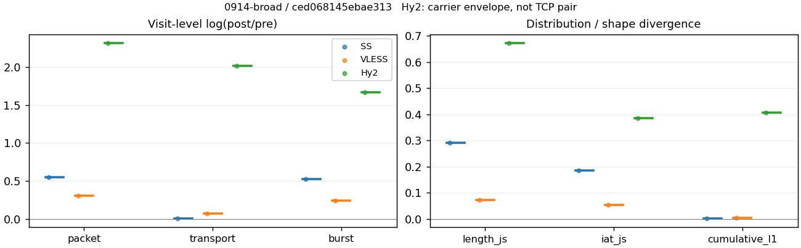
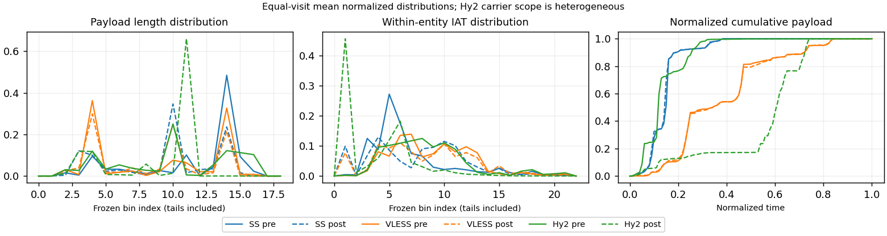

# 0914-broad · 条目 039 · bbc.com

目标：https://www.bbc.com/

活动标签：bbc.com::page_load。选定访问 3 次。

[返回总索引](../../README.md) · [统计口径](../../methods.md)

## 覆盖与资格（每次访问均保留）

| 部署 | 重复 | 主请求路由 | 活动状态 | 代理比较 | DIRECT pre | 请求 proxy/direct/unresolved | 错误 |
| --- | --- | --- | --- | --- | --- | --- | --- |
| Hy2 | 1 | proxy | passed | 1 | 1 | 276/9/1 | [] |
| SS | 1 | proxy | passed | 1 | 0 | 193/0/0 | [] |
| VLESS | 1 | proxy | passed | 1 | 0 | 233/0/4 | [] |

主请求非 proxy 的统计仅解释为已索引的辅助代理连接或 DIRECT 观测，不代表目标业务经代理传输。播放确认与配对资格是两道不同的门。

图中散点为单次访问，短线为重复中位数；Hy2 是共享载体包络，不能与 TCP 配对作等范围因果对比。

形态图先逐访问归一化，再对访问等权平均；实线 pre，虚线 post。分箱序号及边界见 methods，不将分箱索引误解为长度或时间。

## 每次访问的关键观测

### SS

范围：`exclusive_page`。每格 pre → post；空值为不可观测/不适用。

| 重复 | 包数 | 载荷字节 | burst | TCP FR | IAT中位µs | length JS | IAT JS |
| --- | --- | --- | --- | --- | --- | --- | --- |
| 1 | 4013 → 6954 | 5.6816e+06 → 5.736e+06 | 2841 → 4795 | 175 → 175 | 20.684 → 144.41 | 0.29225 | 0.18651 |

完整标量统计：中位数 [min,max]；Δ 为重复内逐访问变换的中位数，MAD 未缩放。n 为可用变换数；DIRECT-only 的 nΔ=0 不代表 pre 不可用。

| scope | 特征 | pre | post | Δ | IQRΔ | MADΔ | nΔ |
| --- | --- | --- | --- | --- | --- | --- | --- |
| exclusive_page | active_span_sum_s_1000ms | 40.344 [40.344, 40.344] | 42.492 [42.492, 42.492] | 0.051862 | — | — | 1 |
| exclusive_page | active_span_sum_s_100ms | 9.1365 [9.1365, 9.1365] | 14.084 [14.084, 14.084] | 0.43275 | — | — | 1 |
| exclusive_page | active_span_sum_s_500ms | 30.723 [30.723, 30.723] | 32.717 [32.717, 32.717] | 0.062878 | — | — | 1 |
| exclusive_page | burst_bytes_iqr | 2896 [2896, 2896] | 1885 [1885, 1885] | -0.4294 | — | — | 1 |
| exclusive_page | burst_bytes_mad | 31 [31, 31] | 34 [34, 34] | 0.092373 | — | — | 1 |
| exclusive_page | burst_bytes_max | 22904 [22904, 22904] | 19992 [19992, 19992] | -0.13598 | — | — | 1 |
| exclusive_page | burst_bytes_mean | 1999.9 [1999.9, 1999.9] | 1196.2 [1196.2, 1196.2] | -0.51391 | — | — | 1 |
| exclusive_page | burst_bytes_median | 31 [31, 31] | 34 [34, 34] | 0.092373 | — | — | 1 |
| exclusive_page | burst_bytes_min | 0 [0, 0] | 0 [0, 0] | — | — | — | 0 |
| exclusive_page | burst_bytes_p95 | 8688 [8688, 8688] | 4358 [4358, 4358] | -0.68993 | — | — | 1 |
| exclusive_page | burst_bytes_q25 | 0 [0, 0] | 0 [0, 0] | — | — | — | 0 |
| exclusive_page | burst_bytes_q75 | 2896 [2896, 2896] | 1885 [1885, 1885] | -0.4294 | — | — | 1 |
| exclusive_page | burst_bytes_std | 3788 [3788, 3788] | 1913.6 [1913.6, 1913.6] | -0.68285 | — | — | 1 |
| exclusive_page | burst_count | 2841 [2841, 2841] | 4795 [4795, 4795] | 0.52342 | — | — | 1 |
| exclusive_page | burst_duration_ms_iqr | 0 [0, 0] | 0.0001 [0.0001, 0.0001] | — | — | — | 0 |
| exclusive_page | burst_duration_ms_mad | 0 [0, 0] | 0 [0, 0] | — | — | — | 0 |
| exclusive_page | burst_duration_ms_max | 15001 [15001, 15001] | 15596 [15596, 15596] | 0.038927 | — | — | 1 |
| exclusive_page | burst_duration_ms_mean | 49.145 [49.145, 49.145] | 36.177 [36.177, 36.177] | -0.30635 | — | — | 1 |
| exclusive_page | burst_duration_ms_median | 0 [0, 0] | 0 [0, 0] | — | — | — | 0 |
| exclusive_page | burst_duration_ms_min | 0 [0, 0] | 0 [0, 0] | — | — | — | 0 |
| exclusive_page | burst_duration_ms_p95 | 11.12 [11.12, 11.12] | 0.97371 [0.97371, 0.97371] | -2.4354 | — | — | 1 |
| exclusive_page | burst_duration_ms_q25 | 0 [0, 0] | 0 [0, 0] | — | — | — | 0 |
| exclusive_page | burst_duration_ms_q75 | 0 [0, 0] | 0.0001 [0.0001, 0.0001] | — | — | — | 0 |
| exclusive_page | burst_duration_ms_std | 645.73 [645.73, 645.73] | 651.18 [651.18, 651.18] | 0.008391 | — | — | 1 |
| exclusive_page | burst_packets_iqr | 0 [0, 0] | 1 [1, 1] | — | — | — | 0 |
| exclusive_page | burst_packets_mad | 0 [0, 0] | 0 [0, 0] | — | — | — | 0 |
| exclusive_page | burst_packets_max | 12 [12, 12] | 11 [11, 11] | -0.087011 | — | — | 1 |
| exclusive_page | burst_packets_mean | 1.4125 [1.4125, 1.4125] | 1.4503 [1.4503, 1.4503] | 0.02636 | — | — | 1 |
| exclusive_page | burst_packets_median | 1 [1, 1] | 1 [1, 1] | 0 | — | — | 1 |
| exclusive_page | burst_packets_min | 1 [1, 1] | 1 [1, 1] | 0 | — | — | 1 |
| exclusive_page | burst_packets_p95 | 3 [3, 3] | 3 [3, 3] | 0 | — | — | 1 |
| exclusive_page | burst_packets_q25 | 1 [1, 1] | 1 [1, 1] | 0 | — | — | 1 |
| exclusive_page | burst_packets_q75 | 1 [1, 1] | 2 [2, 2] | 0.69315 | — | — | 1 |
| exclusive_page | burst_packets_std | 1.181 [1.181, 1.181] | 0.90335 [0.90335, 0.90335] | -0.26801 | — | — | 1 |
| exclusive_page | connection_span_concurrency_max | 16 [16, 16] | 16 [16, 16] | 0 | — | — | 1 |
| exclusive_page | cumulative_l1 | — | — | 0.0034164 | — | — | 1 |
| exclusive_page | cumulative_max | — | — | 0.18119 | — | — | 1 |
| exclusive_page | direction_entropy | 0.55803 [0.55803, 0.55803] | 0.36696 [0.36696, 0.36696] | -0.19107 | — | — | 1 |
| exclusive_page | down_burst_count | 1408 [1408, 1408] | 2385 [2385, 2385] | 0.52703 | — | — | 1 |
| exclusive_page | down_ip_bytes | 5.7116e+06 [5.7116e+06, 5.7116e+06] | 5.8354e+06 [5.8354e+06, 5.8354e+06] | 0.021441 | — | — | 1 |
| exclusive_page | down_packets | 2399 [2399, 2399] | 3963 [3963, 3963] | 0.50195 | — | — | 1 |
| exclusive_page | down_transport_bytes | 5.5866e+06 [5.5866e+06, 5.5866e+06] | 5.6291e+06 [5.6291e+06, 5.6291e+06] | 0.0075648 | — | — | 1 |
| exclusive_page | duration_s | 24.582 [24.582, 24.582] | 24.58 [24.58, 24.58] | -0.00010514 | — | — | 1 |
| exclusive_page | entity_count | 25 [25, 25] | 25 [25, 25] | 0 | — | — | 1 |
| exclusive_page | fr_runs | 175 [175, 175] | 175 [175, 175] | 0 | — | — | 1 |
| exclusive_page | fr_runs_per_packet | 0.073746 [0.073746, 0.073746] | 0.044081 [0.044081, 0.044081] | -0.029666 | — | — | 1 |
| exclusive_page | fr_switches | 150 [150, 150] | 150 [150, 150] | 0 | — | — | 1 |
| exclusive_page | fr_switches_per_possible_transition | 0.063884 [0.063884, 0.063884] | 0.038023 [0.038023, 0.038023] | -0.025861 | — | — | 1 |
| exclusive_page | full_retransmission_fraction | 0.0034887 [0.0034887, 0.0034887] | 0.00071901 [0.00071901, 0.00071901] | -0.0027697 | — | — | 1 |
| exclusive_page | full_retransmission_packets | 14 [14, 14] | 5 [5, 5] | -1.0296 | — | — | 1 |
| exclusive_page | iat_count | 3988 [3988, 3988] | 6929 [6929, 6929] | 0.55243 | — | — | 1 |
| exclusive_page | iat_js | — | — | 0.18651 | — | — | 1 |
| exclusive_page | iat_ks | — | — | 0.29402 | — | — | 1 |
| exclusive_page | iat_median_us | 20.684 [20.684, 20.684] | 144.41 [144.41, 144.41] | 1.9433 | — | — | 1 |
| exclusive_page | iat_us_iqr | 94.246 [94.246, 94.246] | 928.05 [928.05, 928.05] | 2.2872 | — | — | 1 |
| exclusive_page | iat_us_mad | 16.03 [16.03, 16.03] | 144.29 [144.29, 144.29] | 2.1974 | — | — | 1 |
| exclusive_page | iat_us_max | 1.5002e+07 [1.5002e+07, 1.5002e+07] | 1.506e+07 [1.506e+07, 1.506e+07] | 0.0038738 | — | — | 1 |
| exclusive_page | iat_us_mean | 67971 [67971, 67971] | 39026 [39026, 39026] | -0.55485 | — | — | 1 |
| exclusive_page | iat_us_median | 20.684 [20.684, 20.684] | 144.41 [144.41, 144.41] | 1.9433 | — | — | 1 |
| exclusive_page | iat_us_min | 0.013 [0.013, 0.013] | 0.031 [0.031, 0.031] | 0.86904 | — | — | 1 |
| exclusive_page | iat_us_p95 | 40866 [40866, 40866] | 19018 [19018, 19018] | -0.76494 | — | — | 1 |
| exclusive_page | iat_us_q25 | 11.607 [11.607, 11.607] | 7.972 [7.972, 7.972] | -0.37567 | — | — | 1 |
| exclusive_page | iat_us_q75 | 105.85 [105.85, 105.85] | 936.02 [936.02, 936.02] | 2.1796 | — | — | 1 |
| exclusive_page | iat_us_std | 8.623e+05 [8.623e+05, 8.623e+05] | 6.5421e+05 [6.5421e+05, 6.5421e+05] | -0.27617 | — | — | 1 |
| exclusive_page | iat_wasserstein_log1p_us | — | — | 1.1786 | — | — | 1 |
| exclusive_page | idle_gap_count_1000ms | 29 [29, 29] | 28 [28, 28] | -0.035091 | — | — | 1 |
| exclusive_page | idle_gap_count_100ms | 123 [123, 123] | 124 [124, 124] | 0.0080972 | — | — | 1 |
| exclusive_page | idle_gap_count_500ms | 43 [43, 43] | 42 [42, 42] | -0.02353 | — | — | 1 |
| exclusive_page | idle_gap_sum_s_1000ms | 230.72 [230.72, 230.72] | 227.92 [227.92, 227.92] | -0.012223 | — | — | 1 |
| exclusive_page | idle_gap_sum_s_100ms | 261.93 [261.93, 261.93] | 256.33 [256.33, 256.33] | -0.021622 | — | — | 1 |
| exclusive_page | idle_gap_sum_s_500ms | 240.34 [240.34, 240.34] | 237.7 [237.7, 237.7] | -0.011084 | — | — | 1 |
| exclusive_page | ip_bytes | 5.8909e+06 [5.8909e+06, 5.8909e+06] | 6.1576e+06 [6.1576e+06, 6.1576e+06] | 0.044282 | — | — | 1 |
| exclusive_page | length_iqr | 1468 [1468, 1468] | 2196.5 [2196.5, 2196.5] | 0.40296 | — | — | 1 |
| exclusive_page | length_js | — | — | 0.29225 | — | — | 1 |
| exclusive_page | length_ks | — | — | 0.49954 | — | — | 1 |
| exclusive_page | length_mad | 1040 [1040, 1040] | 1106 [1106, 1106] | 0.061529 | — | — | 1 |
| exclusive_page | length_max | 8920 [8920, 8920] | 9996 [9996, 9996] | 0.11389 | — | — | 1 |
| exclusive_page | length_mean | 2394.3 [2394.3, 2394.3] | 1444.8 [1444.8, 1444.8] | -0.5051 | — | — | 1 |
| exclusive_page | length_median | 2896 [2896, 2896] | 1428 [1428, 1428] | -0.70706 | — | — | 1 |
| exclusive_page | length_min | 31 [31, 31] | 17 [17, 17] | -0.60077 | — | — | 1 |
| exclusive_page | length_p95 | 5792 [5792, 5792] | 2856 [2856, 2856] | -0.70706 | — | — | 1 |
| exclusive_page | length_q25 | 1428 [1428, 1428] | 282 [282, 282] | -1.6221 | — | — | 1 |
| exclusive_page | length_q75 | 2896 [2896, 2896] | 2478.5 [2478.5, 2478.5] | -0.15568 | — | — | 1 |
| exclusive_page | length_std | 1697.5 [1697.5, 1697.5] | 1112.1 [1112.1, 1112.1] | -0.42291 | — | — | 1 |
| exclusive_page | length_wasserstein_bytes | — | — | 950.07 | — | — | 1 |
| exclusive_page | nonempty_entity_count | 25 [25, 25] | 25 [25, 25] | 0 | — | — | 1 |
| exclusive_page | nonempty_packets | 2373 [2373, 2373] | 3970 [3970, 3970] | 0.51461 | — | — | 1 |
| exclusive_page | offload_suspect_fraction | 0.38176 [0.38176, 0.38176] | 0.18133 [0.18133, 0.18133] | -0.20042 | — | — | 1 |
| exclusive_page | packet_count | 4013 [4013, 4013] | 6954 [6954, 6954] | 0.54978 | — | — | 1 |
| exclusive_page | rtt_median_ms | 0.015291 [0.015291, 0.015291] | 32.4 [32.4, 32.4] | 7.6586 | — | — | 1 |
| exclusive_page | rtt_sample_count | 1560 [1560, 1560] | 818 [818, 818] | -0.64558 | — | — | 1 |
| exclusive_page | tcp_ack_count | 3988 [3988, 3988] | 6927 [6927, 6927] | 0.55214 | — | — | 1 |
| exclusive_page | tcp_fin_count | 50 [50, 50] | 50 [50, 50] | 0 | — | — | 1 |
| exclusive_page | tcp_packet_count | 4013 [4013, 4013] | 6954 [6954, 6954] | 0.54978 | — | — | 1 |
| exclusive_page | tcp_rst_count | 0 [0, 0] | 0 [0, 0] | — | — | — | 0 |
| exclusive_page | tcp_syn_count | 50 [50, 50] | 53 [53, 53] | 0.058269 | — | — | 1 |
| exclusive_page | tcp_window_raw_median | 65535 [65535, 65535] | 153 [153, 153] | -6.0599 | — | — | 1 |
| exclusive_page | transition_entropy | 0.28654 [0.28654, 0.28654] | 0.18058 [0.18058, 0.18058] | -0.10596 | — | — | 1 |
| exclusive_page | transition_n_mm | 1978 [1978, 1978] | 3605 [3605, 3605] | 0.60024 | — | — | 1 |
| exclusive_page | transition_n_mp | 64 [64, 64] | 64 [64, 64] | 0 | — | — | 1 |
| exclusive_page | transition_n_pm | 86 [86, 86] | 86 [86, 86] | 0 | — | — | 1 |
| exclusive_page | transition_n_pp | 220 [220, 220] | 190 [190, 190] | -0.1466 | — | — | 1 |
| exclusive_page | transition_p_mm | 0.96866 [0.96866, 0.96866] | 0.98256 [0.98256, 0.98256] | 0.013898 | — | — | 1 |
| exclusive_page | transition_p_mp | 0.031342 [0.031342, 0.031342] | 0.017443 [0.017443, 0.017443] | -0.013898 | — | — | 1 |
| exclusive_page | transition_p_pm | 0.28105 [0.28105, 0.28105] | 0.31159 [0.31159, 0.31159] | 0.030548 | — | — | 1 |
| exclusive_page | transition_p_pp | 0.71895 [0.71895, 0.71895] | 0.68841 [0.68841, 0.68841] | -0.030548 | — | — | 1 |
| exclusive_page | transport_bytes | 5.6816e+06 [5.6816e+06, 5.6816e+06] | 5.736e+06 [5.736e+06, 5.736e+06] | 0.0095124 | — | — | 1 |
| exclusive_page | up_burst_count | 1433 [1433, 1433] | 2410 [2410, 2410] | 0.51986 | — | — | 1 |
| exclusive_page | up_byte_fraction | 0.016723 [0.016723, 0.016723] | 0.018636 [0.018636, 0.018636] | 0.0019132 | — | — | 1 |
| exclusive_page | up_ip_bytes | 1.7931e+05 [1.7931e+05, 1.7931e+05] | 3.2225e+05 [3.2225e+05, 3.2225e+05] | 0.58622 | — | — | 1 |
| exclusive_page | up_packets | 1614 [1614, 1614] | 2991 [2991, 2991] | 0.61689 | — | — | 1 |
| exclusive_page | up_transport_bytes | 95012 [95012, 95012] | 1.0689e+05 [1.0689e+05, 1.0689e+05] | 0.11783 | — | — | 1 |
| exclusive_page | zero_iat_count | 0 [0, 0] | 0 [0, 0] | — | — | — | 0 |
| exclusive_page | zero_iat_fraction | 0 [0, 0] | 0 [0, 0] | 0 | — | — | 1 |

### VLESS

范围：`exclusive_page`。每格 pre → post；空值为不可观测/不适用。

| 重复 | 包数 | 载荷字节 | burst | TCP FR | IAT中位µs | length JS | IAT JS |
| --- | --- | --- | --- | --- | --- | --- | --- |
| 1 | 5320 → 7225 | 4.0379e+06 → 4.3368e+06 | 4181 → 5301 | 250 → 336 | 182.72 → 119.48 | 0.072875 | 0.053794 |

完整标量统计：中位数 [min,max]；Δ 为重复内逐访问变换的中位数，MAD 未缩放。n 为可用变换数；DIRECT-only 的 nΔ=0 不代表 pre 不可用。

| scope | 特征 | pre | post | Δ | IQRΔ | MADΔ | nΔ |
| --- | --- | --- | --- | --- | --- | --- | --- |
| exclusive_page | active_span_sum_s_1000ms | 43.491 [43.491, 43.491] | 70.802 [70.802, 70.802] | 0.48733 | — | — | 1 |
| exclusive_page | active_span_sum_s_100ms | 9.8321 [9.8321, 9.8321] | 20.889 [20.889, 20.889] | 0.75354 | — | — | 1 |
| exclusive_page | active_span_sum_s_500ms | 31.994 [31.994, 31.994] | 55.605 [55.605, 55.605] | 0.55274 | — | — | 1 |
| exclusive_page | burst_bytes_iqr | 1793 [1793, 1793] | 1484 [1484, 1484] | -0.18915 | — | — | 1 |
| exclusive_page | burst_bytes_mad | 24 [24, 24] | 31 [31, 31] | 0.25593 | — | — | 1 |
| exclusive_page | burst_bytes_max | 27716 [27716, 27716] | 8760 [8760, 8760] | -1.1518 | — | — | 1 |
| exclusive_page | burst_bytes_mean | 965.78 [965.78, 965.78] | 818.1 [818.1, 818.1] | -0.16595 | — | — | 1 |
| exclusive_page | burst_bytes_median | 24 [24, 24] | 31 [31, 31] | 0.25593 | — | — | 1 |
| exclusive_page | burst_bytes_min | 0 [0, 0] | 0 [0, 0] | — | — | — | 0 |
| exclusive_page | burst_bytes_p95 | 2896 [2896, 2896] | 2896 [2896, 2896] | 0 | — | — | 1 |
| exclusive_page | burst_bytes_q25 | 0 [0, 0] | 0 [0, 0] | — | — | — | 0 |
| exclusive_page | burst_bytes_q75 | 1793 [1793, 1793] | 1484 [1484, 1484] | -0.18915 | — | — | 1 |
| exclusive_page | burst_bytes_std | 1789.9 [1789.9, 1789.9] | 1222.1 [1222.1, 1222.1] | -0.38159 | — | — | 1 |
| exclusive_page | burst_count | 4181 [4181, 4181] | 5301 [5301, 5301] | 0.23735 | — | — | 1 |
| exclusive_page | burst_duration_ms_iqr | 0 [0, 0] | 0 [0, 0] | — | — | — | 0 |
| exclusive_page | burst_duration_ms_mad | 0 [0, 0] | 0 [0, 0] | — | — | — | 0 |
| exclusive_page | burst_duration_ms_max | 15000 [15000, 15000] | 15708 [15708, 15708] | 0.046127 | — | — | 1 |
| exclusive_page | burst_duration_ms_mean | 76.252 [76.252, 76.252] | 58.71 [58.71, 58.71] | -0.26144 | — | — | 1 |
| exclusive_page | burst_duration_ms_median | 0 [0, 0] | 0 [0, 0] | — | — | — | 0 |
| exclusive_page | burst_duration_ms_min | 0 [0, 0] | 0 [0, 0] | — | — | — | 0 |
| exclusive_page | burst_duration_ms_p95 | 9.8889 [9.8889, 9.8889] | 9.6854 [9.6854, 9.6854] | -0.02079 | — | — | 1 |
| exclusive_page | burst_duration_ms_q25 | 0 [0, 0] | 0 [0, 0] | — | — | — | 0 |
| exclusive_page | burst_duration_ms_q75 | 0 [0, 0] | 0 [0, 0] | — | — | — | 0 |
| exclusive_page | burst_duration_ms_std | 740.98 [740.98, 740.98] | 799.37 [799.37, 799.37] | 0.075858 | — | — | 1 |
| exclusive_page | burst_packets_iqr | 0 [0, 0] | 0 [0, 0] | — | — | — | 0 |
| exclusive_page | burst_packets_mad | 0 [0, 0] | 0 [0, 0] | — | — | — | 0 |
| exclusive_page | burst_packets_max | 10 [10, 10] | 12 [12, 12] | 0.18232 | — | — | 1 |
| exclusive_page | burst_packets_mean | 1.2724 [1.2724, 1.2724] | 1.363 [1.363, 1.363] | 0.068729 | — | — | 1 |
| exclusive_page | burst_packets_median | 1 [1, 1] | 1 [1, 1] | 0 | — | — | 1 |
| exclusive_page | burst_packets_min | 1 [1, 1] | 1 [1, 1] | 0 | — | — | 1 |
| exclusive_page | burst_packets_p95 | 2 [2, 2] | 3 [3, 3] | 0.40547 | — | — | 1 |
| exclusive_page | burst_packets_q25 | 1 [1, 1] | 1 [1, 1] | 0 | — | — | 1 |
| exclusive_page | burst_packets_q75 | 1 [1, 1] | 1 [1, 1] | 0 | — | — | 1 |
| exclusive_page | burst_packets_std | 0.58128 [0.58128, 0.58128] | 0.84552 [0.84552, 0.84552] | 0.37471 | — | — | 1 |
| exclusive_page | connection_span_concurrency_max | 33 [33, 33] | 33 [33, 33] | 0 | — | — | 1 |
| exclusive_page | cumulative_l1 | — | — | 0.0045134 | — | — | 1 |
| exclusive_page | cumulative_max | — | — | 0.022141 | — | — | 1 |
| exclusive_page | direction_entropy | 0.55847 [0.55847, 0.55847] | 0.44183 [0.44183, 0.44183] | -0.11664 | — | — | 1 |
| exclusive_page | down_burst_count | 2072 [2072, 2072] | 2632 [2632, 2632] | 0.23923 | — | — | 1 |
| exclusive_page | down_ip_bytes | 4.0723e+06 [4.0723e+06, 4.0723e+06] | 4.342e+06 [4.342e+06, 4.342e+06] | 0.064134 | — | — | 1 |
| exclusive_page | down_packets | 2997 [2997, 2997] | 3872 [3872, 3872] | 0.25616 | — | — | 1 |
| exclusive_page | down_transport_bytes | 3.9161e+06 [3.9161e+06, 3.9161e+06] | 4.1403e+06 [4.1403e+06, 4.1403e+06] | 0.055673 | — | — | 1 |
| exclusive_page | duration_s | 25.421 [25.421, 25.421] | 25.403 [25.403, 25.403] | -0.00068753 | — | — | 1 |
| exclusive_page | entity_count | 37 [37, 37] | 37 [37, 37] | 0 | — | — | 1 |
| exclusive_page | fr_runs | 250 [250, 250] | 336 [336, 336] | 0.29565 | — | — | 1 |
| exclusive_page | fr_runs_per_packet | 0.085324 [0.085324, 0.085324] | 0.089481 [0.089481, 0.089481] | 0.0041565 | — | — | 1 |
| exclusive_page | fr_switches | 213 [213, 213] | 299 [299, 299] | 0.33915 | — | — | 1 |
| exclusive_page | fr_switches_per_possible_transition | 0.073626 [0.073626, 0.073626] | 0.08042 [0.08042, 0.08042] | 0.0067936 | — | — | 1 |
| exclusive_page | full_retransmission_fraction | 0.0015038 [0.0015038, 0.0015038] | 0.00027682 [0.00027682, 0.00027682] | -0.0012269 | — | — | 1 |
| exclusive_page | full_retransmission_packets | 8 [8, 8] | 2 [2, 2] | -1.3863 | — | — | 1 |
| exclusive_page | iat_count | 5283 [5283, 5283] | 7188 [7188, 7188] | 0.30792 | — | — | 1 |
| exclusive_page | iat_js | — | — | 0.053794 | — | — | 1 |
| exclusive_page | iat_ks | — | — | 0.12981 | — | — | 1 |
| exclusive_page | iat_median_us | 182.72 [182.72, 182.72] | 119.48 [119.48, 119.48] | -0.42479 | — | — | 1 |
| exclusive_page | iat_us_iqr | 1679.8 [1679.8, 1679.8] | 1373.3 [1373.3, 1373.3] | -0.20145 | — | — | 1 |
| exclusive_page | iat_us_mad | 176.49 [176.49, 176.49] | 119.37 [119.37, 119.37] | -0.39107 | — | — | 1 |
| exclusive_page | iat_us_max | 1.5001e+07 [1.5001e+07, 1.5001e+07] | 1.5708e+07 [1.5708e+07, 1.5708e+07] | 0.046075 | — | — | 1 |
| exclusive_page | iat_us_mean | 96212 [96212, 96212] | 72229 [72229, 72229] | -0.28672 | — | — | 1 |
| exclusive_page | iat_us_median | 182.72 [182.72, 182.72] | 119.48 [119.48, 119.48] | -0.42479 | — | — | 1 |
| exclusive_page | iat_us_min | 0.038 [0.038, 0.038] | 0.033 [0.033, 0.033] | -0.14108 | — | — | 1 |
| exclusive_page | iat_us_p95 | 10602 [10602, 10602] | 39392 [39392, 39392] | 1.3126 | — | — | 1 |
| exclusive_page | iat_us_q25 | 36.276 [36.276, 36.276] | 14.37 [14.37, 14.37] | -0.92602 | — | — | 1 |
| exclusive_page | iat_us_q75 | 1716.1 [1716.1, 1716.1] | 1387.7 [1387.7, 1387.7] | -0.21241 | — | — | 1 |
| exclusive_page | iat_us_std | 9.6114e+05 [9.6114e+05, 9.6114e+05] | 8.4176e+05 [8.4176e+05, 8.4176e+05] | -0.13263 | — | — | 1 |
| exclusive_page | iat_wasserstein_log1p_us | — | — | 0.55158 | — | — | 1 |
| exclusive_page | idle_gap_count_1000ms | 72 [72, 72] | 54 [54, 54] | -0.28768 | — | — | 1 |
| exclusive_page | idle_gap_count_100ms | 180 [180, 180] | 241 [241, 241] | 0.29184 | — | — | 1 |
| exclusive_page | idle_gap_count_500ms | 87 [87, 87] | 74 [74, 74] | -0.16184 | — | — | 1 |
| exclusive_page | idle_gap_sum_s_1000ms | 464.8 [464.8, 464.8] | 448.38 [448.38, 448.38] | -0.035963 | — | — | 1 |
| exclusive_page | idle_gap_sum_s_100ms | 498.45 [498.45, 498.45] | 498.29 [498.29, 498.29] | -0.00032963 | — | — | 1 |
| exclusive_page | idle_gap_sum_s_500ms | 476.29 [476.29, 476.29] | 463.57 [463.57, 463.57] | -0.027069 | — | — | 1 |
| exclusive_page | ip_bytes | 4.3144e+06 [4.3144e+06, 4.3144e+06] | 4.7201e+06 [4.7201e+06, 4.7201e+06] | 0.089873 | — | — | 1 |
| exclusive_page | length_iqr | 2752 [2752, 2752] | 1376 [1376, 1376] | -0.69315 | — | — | 1 |
| exclusive_page | length_js | — | — | 0.072875 | — | — | 1 |
| exclusive_page | length_ks | — | — | 0.17649 | — | — | 1 |
| exclusive_page | length_mad | 1340 [1340, 1340] | 1340 [1340, 1340] | 0 | — | — | 1 |
| exclusive_page | length_max | 8920 [8920, 8920] | 5648 [5648, 5648] | -0.45699 | — | — | 1 |
| exclusive_page | length_mean | 1378.1 [1378.1, 1378.1] | 1154.9 [1154.9, 1154.9] | -0.17669 | — | — | 1 |
| exclusive_page | length_median | 1412 [1412, 1412] | 1412 [1412, 1412] | 0 | — | — | 1 |
| exclusive_page | length_min | 4 [4, 4] | 4 [4, 4] | 0 | — | — | 1 |
| exclusive_page | length_p95 | 2896 [2896, 2896] | 2824 [2824, 2824] | -0.025176 | — | — | 1 |
| exclusive_page | length_q25 | 72 [72, 72] | 72 [72, 72] | 0 | — | — | 1 |
| exclusive_page | length_q75 | 2824 [2824, 2824] | 1448 [1448, 1448] | -0.66797 | — | — | 1 |
| exclusive_page | length_std | 1411.2 [1411.2, 1411.2] | 1049.3 [1049.3, 1049.3] | -0.29625 | — | — | 1 |
| exclusive_page | length_wasserstein_bytes | — | — | 273.66 | — | — | 1 |
| exclusive_page | nonempty_entity_count | 37 [37, 37] | 37 [37, 37] | 0 | — | — | 1 |
| exclusive_page | nonempty_packets | 2930 [2930, 2930] | 3755 [3755, 3755] | 0.24809 | — | — | 1 |
| exclusive_page | offload_suspect_fraction | 0.21128 [0.21128, 0.21128] | 0.12332 [0.12332, 0.12332] | -0.087956 | — | — | 1 |
| exclusive_page | packet_count | 5320 [5320, 5320] | 7225 [7225, 7225] | 0.30607 | — | — | 1 |
| exclusive_page | rtt_median_ms | 0.071392 [0.071392, 0.071392] | 0.049995 [0.049995, 0.049995] | -0.35627 | — | — | 1 |
| exclusive_page | rtt_sample_count | 2206 [2206, 2206] | 2899 [2899, 2899] | 0.27318 | — | — | 1 |
| exclusive_page | tcp_ack_count | 5209 [5209, 5209] | 7186 [7186, 7186] | 0.32175 | — | — | 1 |
| exclusive_page | tcp_fin_count | 74 [74, 74] | 75 [75, 75] | 0.013423 | — | — | 1 |
| exclusive_page | tcp_packet_count | 5320 [5320, 5320] | 7225 [7225, 7225] | 0.30607 | — | — | 1 |
| exclusive_page | tcp_rst_count | 74 [74, 74] | 1 [1, 1] | -4.3041 | — | — | 1 |
| exclusive_page | tcp_syn_count | 74 [74, 74] | 76 [76, 76] | 0.026668 | — | — | 1 |
| exclusive_page | tcp_window_raw_median | 65535 [65535, 65535] | 152 [152, 152] | -6.0665 | — | — | 1 |
| exclusive_page | transition_entropy | 0.3106 [0.3106, 0.3106] | 0.30745 [0.30745, 0.30745] | -0.0031442 | — | — | 1 |
| exclusive_page | transition_n_mm | 2423 [2423, 2423] | 3243 [3243, 3243] | 0.29149 | — | — | 1 |
| exclusive_page | transition_n_mp | 88 [88, 88] | 131 [131, 131] | 0.39786 | — | — | 1 |
| exclusive_page | transition_n_pm | 125 [125, 125] | 168 [168, 168] | 0.29565 | — | — | 1 |
| exclusive_page | transition_n_pp | 257 [257, 257] | 176 [176, 176] | -0.37859 | — | — | 1 |
| exclusive_page | transition_p_mm | 0.96495 [0.96495, 0.96495] | 0.96117 [0.96117, 0.96117] | -0.0037805 | — | — | 1 |
| exclusive_page | transition_p_mp | 0.035046 [0.035046, 0.035046] | 0.038826 [0.038826, 0.038826] | 0.0037805 | — | — | 1 |
| exclusive_page | transition_p_pm | 0.32723 [0.32723, 0.32723] | 0.48837 [0.48837, 0.48837] | 0.16115 | — | — | 1 |
| exclusive_page | transition_p_pp | 0.67277 [0.67277, 0.67277] | 0.51163 [0.51163, 0.51163] | -0.16115 | — | — | 1 |
| exclusive_page | transport_bytes | 4.0379e+06 [4.0379e+06, 4.0379e+06] | 4.3368e+06 [4.3368e+06, 4.3368e+06] | 0.071395 | — | — | 1 |
| exclusive_page | up_burst_count | 2109 [2109, 2109] | 2669 [2669, 2669] | 0.23549 | — | — | 1 |
| exclusive_page | up_byte_fraction | 0.030159 [0.030159, 0.030159] | 0.045288 [0.045288, 0.045288] | 0.015128 | — | — | 1 |
| exclusive_page | up_ip_bytes | 2.4208e+05 [2.4208e+05, 2.4208e+05] | 3.7805e+05 [3.7805e+05, 3.7805e+05] | 0.44576 | — | — | 1 |
| exclusive_page | up_packets | 2323 [2323, 2323] | 3353 [3353, 3353] | 0.367 | — | — | 1 |
| exclusive_page | up_transport_bytes | 1.2178e+05 [1.2178e+05, 1.2178e+05] | 1.964e+05 [1.964e+05, 1.964e+05] | 0.47794 | — | — | 1 |
| exclusive_page | zero_iat_count | 0 [0, 0] | 0 [0, 0] | — | — | — | 0 |
| exclusive_page | zero_iat_fraction | 0 [0, 0] | 0 [0, 0] | 0 | — | — | 1 |

### Hy2

范围：`carrier_context_envelope`。每格 pre → post；空值为不可观测/不适用。

| 重复 | 包数 | 载荷字节 | burst | TCP FR | IAT中位µs | length JS | IAT JS |
| --- | --- | --- | --- | --- | --- | --- | --- |
| 1 | 5151 → 52217 | 7.2358e+06 → 5.4506e+07 | 3374 → 17891 | — | 134.78 → 5.007 | 0.67157 | 0.38466 |

范围：`direct_pre_only`。每格 pre → post；空值为不可观测/不适用。

| 重复 | 包数 | 载荷字节 | burst | TCP FR | IAT中位µs | length JS | IAT JS |
| --- | --- | --- | --- | --- | --- | --- | --- |
| 1 | 521 → — | 1.0032e+06 → — | 321 → — | 43 → — | 116.3 → — | — | — |

完整标量统计：中位数 [min,max]；Δ 为重复内逐访问变换的中位数，MAD 未缩放。n 为可用变换数；DIRECT-only 的 nΔ=0 不代表 pre 不可用。

| scope | 特征 | pre | post | Δ | IQRΔ | MADΔ | nΔ |
| --- | --- | --- | --- | --- | --- | --- | --- |
| carrier_context_envelope | active_span_sum_s_1000ms | 71.191 [71.191, 71.191] | 18.36 [18.36, 18.36] | -1.3552 | — | — | 1 |
| carrier_context_envelope | active_span_sum_s_100ms | 5.6956 [5.6956, 5.6956] | 12.307 [12.307, 12.307] | 0.77051 | — | — | 1 |
| carrier_context_envelope | active_span_sum_s_500ms | 50.862 [50.862, 50.862] | 17.649 [17.649, 17.649] | -1.0584 | — | — | 1 |
| carrier_context_envelope | burst_bytes_iqr | 2234 [2234, 2234] | 4241 [4241, 4241] | 0.64101 | — | — | 1 |
| carrier_context_envelope | burst_bytes_mad | 31 [31, 31] | 288 [288, 288] | 2.229 | — | — | 1 |
| carrier_context_envelope | burst_bytes_max | 23445 [23445, 23445] | 2.3728e+05 [2.3728e+05, 2.3728e+05] | 2.3146 | — | — | 1 |
| carrier_context_envelope | burst_bytes_mean | 2144.6 [2144.6, 2144.6] | 3046.6 [3046.6, 3046.6] | 0.35108 | — | — | 1 |
| carrier_context_envelope | burst_bytes_median | 31 [31, 31] | 322 [322, 322] | 2.3406 | — | — | 1 |
| carrier_context_envelope | burst_bytes_min | 0 [0, 0] | 22 [22, 22] | — | — | — | 0 |
| carrier_context_envelope | burst_bytes_p95 | 12288 [12288, 12288] | 10932 [10932, 10932] | -0.11693 | — | — | 1 |
| carrier_context_envelope | burst_bytes_q25 | 0 [0, 0] | 82 [82, 82] | — | — | — | 0 |
| carrier_context_envelope | burst_bytes_q75 | 2234 [2234, 2234] | 4323 [4323, 4323] | 0.66016 | — | — | 1 |
| carrier_context_envelope | burst_bytes_std | 4484.6 [4484.6, 4484.6] | 6418.4 [6418.4, 6418.4] | 0.35852 | — | — | 1 |
| carrier_context_envelope | burst_count | 3374 [3374, 3374] | 17891 [17891, 17891] | 1.6682 | — | — | 1 |
| carrier_context_envelope | burst_duration_ms_iqr | 0.31118 [0.31118, 0.31118] | 0.025704 [0.025704, 0.025704] | -2.4937 | — | — | 1 |
| carrier_context_envelope | burst_duration_ms_mad | 0 [0, 0] | 4.5e-05 [4.5e-05, 4.5e-05] | — | — | — | 0 |
| carrier_context_envelope | burst_duration_ms_max | 15001 [15001, 15001] | 381.24 [381.24, 381.24] | -3.6724 | — | — | 1 |
| carrier_context_envelope | burst_duration_ms_mean | 105.61 [105.61, 105.61] | 0.39291 [0.39291, 0.39291] | -5.5939 | — | — | 1 |
| carrier_context_envelope | burst_duration_ms_median | 0 [0, 0] | 4.5e-05 [4.5e-05, 4.5e-05] | — | — | — | 0 |
| carrier_context_envelope | burst_duration_ms_min | 0 [0, 0] | 0 [0, 0] | — | — | — | 0 |
| carrier_context_envelope | burst_duration_ms_p95 | 204.25 [204.25, 204.25] | 0.22969 [0.22969, 0.22969] | -6.7903 | — | — | 1 |
| carrier_context_envelope | burst_duration_ms_q25 | 0 [0, 0] | 0 [0, 0] | — | — | — | 0 |
| carrier_context_envelope | burst_duration_ms_q75 | 0.31118 [0.31118, 0.31118] | 0.025704 [0.025704, 0.025704] | -2.4937 | — | — | 1 |
| carrier_context_envelope | burst_duration_ms_std | 984.69 [984.69, 984.69] | 6.2946 [6.2946, 6.2946] | -5.0526 | — | — | 1 |
| carrier_context_envelope | burst_packets_iqr | 1 [1, 1] | 3 [3, 3] | 1.0986 | — | — | 1 |
| carrier_context_envelope | burst_packets_mad | 0 [0, 0] | 1 [1, 1] | — | — | — | 0 |
| carrier_context_envelope | burst_packets_max | 14 [14, 14] | 171 [171, 171] | 2.5026 | — | — | 1 |
| carrier_context_envelope | burst_packets_mean | 1.5267 [1.5267, 1.5267] | 2.9186 [2.9186, 2.9186] | 0.64802 | — | — | 1 |
| carrier_context_envelope | burst_packets_median | 1 [1, 1] | 2 [2, 2] | 0.69315 | — | — | 1 |
| carrier_context_envelope | burst_packets_min | 1 [1, 1] | 1 [1, 1] | 0 | — | — | 1 |
| carrier_context_envelope | burst_packets_p95 | 3 [3, 3] | 8 [8, 8] | 0.98083 | — | — | 1 |
| carrier_context_envelope | burst_packets_q25 | 1 [1, 1] | 1 [1, 1] | 0 | — | — | 1 |
| carrier_context_envelope | burst_packets_q75 | 2 [2, 2] | 4 [4, 4] | 0.69315 | — | — | 1 |
| carrier_context_envelope | burst_packets_std | 0.89937 [0.89937, 0.89937] | 4.4908 [4.4908, 4.4908] | 1.6081 | — | — | 1 |
| carrier_context_envelope | connection_span_concurrency_max | 52 [52, 52] | 1 [1, 1] | -3.9512 | — | — | 1 |
| carrier_context_envelope | cumulative_l1 | — | — | 0.40633 | — | — | 1 |
| carrier_context_envelope | cumulative_max | — | — | 0.82742 | — | — | 1 |
| carrier_context_envelope | direction_entropy | 0.74293 [0.74293, 0.74293] | 0.79132 [0.79132, 0.79132] | 0.048389 | — | — | 1 |
| carrier_context_envelope | direction_run_analog_runs | 487 [487, 487] | 17891 [17891, 17891] | 3.6038 | — | — | 1 |
| carrier_context_envelope | direction_run_analog_runs_per_packet | 0.1669 [0.1669, 0.1669] | 0.34263 [0.34263, 0.34263] | 0.17573 | — | — | 1 |
| carrier_context_envelope | direction_run_analog_switches | 423 [423, 423] | 17890 [17890, 17890] | 3.7446 | — | — | 1 |
| carrier_context_envelope | direction_run_analog_switches_per_possible_transition | 0.14821 [0.14821, 0.14821] | 0.34262 [0.34262, 0.34262] | 0.1944 | — | — | 1 |
| carrier_context_envelope | down_burst_count | 1657 [1657, 1657] | 8945 [8945, 8945] | 1.6861 | — | — | 1 |
| carrier_context_envelope | down_ip_bytes | 7.1487e+06 [7.1487e+06, 7.1487e+06] | 5.44e+07 [5.44e+07, 5.44e+07] | 2.0294 | — | — | 1 |
| carrier_context_envelope | down_packets | 3054 [3054, 3054] | 39801 [39801, 39801] | 2.5674 | — | — | 1 |
| carrier_context_envelope | down_transport_bytes | 6.9894e+06 [6.9894e+06, 6.9894e+06] | 5.3285e+07 [5.3285e+07, 5.3285e+07] | 2.0313 | — | — | 1 |
| carrier_context_envelope | duration_s | 22.087 [22.087, 22.087] | 22.087 [22.087, 22.087] | -2.8262e-06 | — | — | 1 |
| carrier_context_envelope | entity_count | 64 [64, 64] | 1 [1, 1] | -4.1589 | — | — | 1 |
| carrier_context_envelope | full_retransmission_fraction | 0.0027179 [0.0027179, 0.0027179] | — | — | — | — | 0 |
| carrier_context_envelope | full_retransmission_packets | 14 [14, 14] | — | — | — | — | 0 |
| carrier_context_envelope | iat_count | 5087 [5087, 5087] | 52216 [52216, 52216] | 2.3287 | — | — | 1 |
| carrier_context_envelope | iat_js | — | — | 0.38466 | — | — | 1 |
| carrier_context_envelope | iat_ks | — | — | 0.55216 | — | — | 1 |
| carrier_context_envelope | iat_median_us | 134.78 [134.78, 134.78] | 5.007 [5.007, 5.007] | -3.2928 | — | — | 1 |
| carrier_context_envelope | iat_us_iqr | 860.53 [860.53, 860.53] | 25.502 [25.502, 25.502] | -3.5188 | — | — | 1 |
| carrier_context_envelope | iat_us_mad | 125.83 [125.83, 125.83] | 4.97 [4.97, 4.97] | -3.2316 | — | — | 1 |
| carrier_context_envelope | iat_us_max | 1.5001e+07 [1.5001e+07, 1.5001e+07] | 3.7261e+06 [3.7261e+06, 3.7261e+06] | -1.3928 | — | — | 1 |
| carrier_context_envelope | iat_us_mean | 1.7486e+05 [1.7486e+05, 1.7486e+05] | 422.98 [422.98, 422.98] | -6.0244 | — | — | 1 |
| carrier_context_envelope | iat_us_median | 134.78 [134.78, 134.78] | 5.007 [5.007, 5.007] | -3.2928 | — | — | 1 |
| carrier_context_envelope | iat_us_min | 0.02 [0.02, 0.02] | 0 [0, 0] | — | — | — | 0 |
| carrier_context_envelope | iat_us_p95 | 1.9534e+05 [1.9534e+05, 1.9534e+05] | 427.84 [427.84, 427.84] | -6.1237 | — | — | 1 |
| carrier_context_envelope | iat_us_q25 | 26.343 [26.343, 26.343] | 0.044 [0.044, 0.044] | -6.3948 | — | — | 1 |
| carrier_context_envelope | iat_us_q75 | 886.88 [886.88, 886.88] | 25.546 [25.546, 25.546] | -3.5472 | — | — | 1 |
| carrier_context_envelope | iat_us_std | 1.4381e+06 [1.4381e+06, 1.4381e+06] | 17373 [17373, 17373] | -4.4162 | — | — | 1 |
| carrier_context_envelope | iat_wasserstein_log1p_us | — | — | 3.443 | — | — | 1 |
| carrier_context_envelope | idle_gap_count_1000ms | 92 [92, 92] | 1 [1, 1] | -4.5218 | — | — | 1 |
| carrier_context_envelope | idle_gap_count_100ms | 308 [308, 308] | 32 [32, 32] | -2.2644 | — | — | 1 |
| carrier_context_envelope | idle_gap_count_500ms | 120 [120, 120] | 2 [2, 2] | -4.0943 | — | — | 1 |
| carrier_context_envelope | idle_gap_sum_s_1000ms | 818.34 [818.34, 818.34] | 3.7261 [3.7261, 3.7261] | -5.3919 | — | — | 1 |
| carrier_context_envelope | idle_gap_sum_s_100ms | 883.84 [883.84, 883.84] | 9.7791 [9.7791, 9.7791] | -4.504 | — | — | 1 |
| carrier_context_envelope | idle_gap_sum_s_500ms | 838.67 [838.67, 838.67] | 4.4371 [4.4371, 4.4371] | -5.2418 | — | — | 1 |
| carrier_context_envelope | ip_bytes | 7.5048e+06 [7.5048e+06, 7.5048e+06] | 5.5968e+07 [5.5968e+07, 5.5968e+07] | 2.0092 | — | — | 1 |
| carrier_context_envelope | length_iqr | 2381.8 [2381.8, 2381.8] | 1308 [1308, 1308] | -0.59934 | — | — | 1 |
| carrier_context_envelope | length_js | — | — | 0.67157 | — | — | 1 |
| carrier_context_envelope | length_ks | — | — | 0.39753 | — | — | 1 |
| carrier_context_envelope | length_mad | 1234.5 [1234.5, 1234.5] | 0 [0, 0] | — | — | — | 0 |
| carrier_context_envelope | length_max | 8948 [8948, 8948] | 1441 [1441, 1441] | -1.8261 | — | — | 1 |
| carrier_context_envelope | length_mean | 2479.7 [2479.7, 2479.7] | 1043.8 [1043.8, 1043.8] | -0.86523 | — | — | 1 |
| carrier_context_envelope | length_median | 1415 [1415, 1415] | 1441 [1441, 1441] | 0.018208 | — | — | 1 |
| carrier_context_envelope | length_min | 4 [4, 4] | 22 [22, 22] | 1.7047 | — | — | 1 |
| carrier_context_envelope | length_p95 | 8920 [8920, 8920] | 1441 [1441, 1441] | -1.823 | — | — | 1 |
| carrier_context_envelope | length_q25 | 452.25 [452.25, 452.25] | 133 [133, 133] | -1.2239 | — | — | 1 |
| carrier_context_envelope | length_q75 | 2834 [2834, 2834] | 1441 [1441, 1441] | -0.67635 | — | — | 1 |
| carrier_context_envelope | length_std | 2752.3 [2752.3, 2752.3] | 597 [597, 597] | -1.5283 | — | — | 1 |
| carrier_context_envelope | length_wasserstein_bytes | — | — | 1481.5 | — | — | 1 |
| carrier_context_envelope | nonempty_entity_count | 64 [64, 64] | 1 [1, 1] | -4.1589 | — | — | 1 |
| carrier_context_envelope | nonempty_packets | 2918 [2918, 2918] | 52217 [52217, 52217] | 2.8845 | — | — | 1 |
| carrier_context_envelope | offload_suspect_fraction | 0.22423 [0.22423, 0.22423] | 0 [0, 0] | -0.22423 | — | — | 1 |
| carrier_context_envelope | packet_count | 5151 [5151, 5151] | 52217 [52217, 52217] | 2.3162 | — | — | 1 |
| carrier_context_envelope | rtt_median_ms | 0.12117 [0.12117, 0.12117] | — | — | — | — | 0 |
| carrier_context_envelope | rtt_sample_count | 2012 [2012, 2012] | 0 [0, 0] | — | — | — | 0 |
| carrier_context_envelope | tcp_ack_count | 5087 [5087, 5087] | — | — | — | — | 0 |
| carrier_context_envelope | tcp_fin_count | 128 [128, 128] | — | — | — | — | 0 |
| carrier_context_envelope | tcp_packet_count | 5151 [5151, 5151] | 0 [0, 0] | — | — | — | 0 |
| carrier_context_envelope | tcp_rst_count | 0 [0, 0] | — | — | — | — | 0 |
| carrier_context_envelope | tcp_syn_count | 128 [128, 128] | — | — | — | — | 0 |
| carrier_context_envelope | tcp_window_raw_median | 65535 [65535, 65535] | — | — | — | — | 0 |
| carrier_context_envelope | transition_entropy | 0.53081 [0.53081, 0.53081] | 0.78919 [0.78919, 0.78919] | 0.25838 | — | — | 1 |
| carrier_context_envelope | transition_n_mm | 2070 [2070, 2070] | 30856 [30856, 30856] | 2.7018 | — | — | 1 |
| carrier_context_envelope | transition_n_mp | 190 [190, 190] | 8945 [8945, 8945] | 3.8518 | — | — | 1 |
| carrier_context_envelope | transition_n_pm | 233 [233, 233] | 8945 [8945, 8945] | 3.6478 | — | — | 1 |
| carrier_context_envelope | transition_n_pp | 361 [361, 361] | 3470 [3470, 3470] | 2.263 | — | — | 1 |
| carrier_context_envelope | transition_p_mm | 0.91593 [0.91593, 0.91593] | 0.77526 [0.77526, 0.77526] | -0.14067 | — | — | 1 |
| carrier_context_envelope | transition_p_mp | 0.084071 [0.084071, 0.084071] | 0.22474 [0.22474, 0.22474] | 0.14067 | — | — | 1 |
| carrier_context_envelope | transition_p_pm | 0.39226 [0.39226, 0.39226] | 0.7205 [0.7205, 0.7205] | 0.32824 | — | — | 1 |
| carrier_context_envelope | transition_p_pp | 0.60774 [0.60774, 0.60774] | 0.2795 [0.2795, 0.2795] | -0.32824 | — | — | 1 |
| carrier_context_envelope | transport_bytes | 7.2358e+06 [7.2358e+06, 7.2358e+06] | 5.4506e+07 [5.4506e+07, 5.4506e+07] | 2.0193 | — | — | 1 |
| carrier_context_envelope | up_burst_count | 1717 [1717, 1717] | 8946 [8946, 8946] | 1.6506 | — | — | 1 |
| carrier_context_envelope | up_byte_fraction | 0.034053 [0.034053, 0.034053] | 0.022404 [0.022404, 0.022404] | -0.011649 | — | — | 1 |
| carrier_context_envelope | up_ip_bytes | 3.5612e+05 [3.5612e+05, 3.5612e+05] | 1.5688e+06 [1.5688e+06, 1.5688e+06] | 1.4828 | — | — | 1 |
| carrier_context_envelope | up_packets | 2097 [2097, 2097] | 12416 [12416, 12416] | 1.7785 | — | — | 1 |
| carrier_context_envelope | up_transport_bytes | 2.464e+05 [2.464e+05, 2.464e+05] | 1.2212e+06 [1.2212e+06, 1.2212e+06] | 1.6006 | — | — | 1 |
| carrier_context_envelope | zero_iat_count | 0 [0, 0] | 3 [3, 3] | — | — | — | 0 |
| carrier_context_envelope | zero_iat_fraction | 0 [0, 0] | 5.7454e-05 [5.7454e-05, 5.7454e-05] | 5.7454e-05 | — | — | 1 |
| direct_pre_only | active_span_sum_s_1000ms | 3.9246 [3.9246, 3.9246] | — | — | — | — | 0 |
| direct_pre_only | active_span_sum_s_100ms | 0.73765 [0.73765, 0.73765] | — | — | — | — | 0 |
| direct_pre_only | active_span_sum_s_500ms | 3.2876 [3.2876, 3.2876] | — | — | — | — | 0 |
| direct_pre_only | burst_bytes_iqr | 5600 [5600, 5600] | — | — | — | — | 0 |
| direct_pre_only | burst_bytes_mad | 39 [39, 39] | — | — | — | — | 0 |
| direct_pre_only | burst_bytes_max | 20480 [20480, 20480] | — | — | — | — | 0 |
| direct_pre_only | burst_bytes_mean | 3125.3 [3125.3, 3125.3] | — | — | — | — | 0 |
| direct_pre_only | burst_bytes_median | 39 [39, 39] | — | — | — | — | 0 |
| direct_pre_only | burst_bytes_min | 0 [0, 0] | — | — | — | — | 0 |
| direct_pre_only | burst_bytes_p95 | 15400 [15400, 15400] | — | — | — | — | 0 |
| direct_pre_only | burst_bytes_q25 | 0 [0, 0] | — | — | — | — | 0 |
| direct_pre_only | burst_bytes_q75 | 5600 [5600, 5600] | — | — | — | — | 0 |
| direct_pre_only | burst_bytes_std | 5057.9 [5057.9, 5057.9] | — | — | — | — | 0 |
| direct_pre_only | burst_count | 321 [321, 321] | — | — | — | — | 0 |
| direct_pre_only | burst_duration_ms_iqr | 0.23989 [0.23989, 0.23989] | — | — | — | — | 0 |
| direct_pre_only | burst_duration_ms_mad | 0 [0, 0] | — | — | — | — | 0 |
| direct_pre_only | burst_duration_ms_max | 15001 [15001, 15001] | — | — | — | — | 0 |
| direct_pre_only | burst_duration_ms_mean | 265.83 [265.83, 265.83] | — | — | — | — | 0 |
| direct_pre_only | burst_duration_ms_median | 0 [0, 0] | — | — | — | — | 0 |
| direct_pre_only | burst_duration_ms_min | 0 [0, 0] | — | — | — | — | 0 |
| direct_pre_only | burst_duration_ms_p95 | 81.381 [81.381, 81.381] | — | — | — | — | 0 |
| direct_pre_only | burst_duration_ms_q25 | 0 [0, 0] | — | — | — | — | 0 |
| direct_pre_only | burst_duration_ms_q75 | 0.23989 [0.23989, 0.23989] | — | — | — | — | 0 |
| direct_pre_only | burst_duration_ms_std | 1865.8 [1865.8, 1865.8] | — | — | — | — | 0 |
| direct_pre_only | burst_packets_iqr | 1 [1, 1] | — | — | — | — | 0 |
| direct_pre_only | burst_packets_mad | 0 [0, 0] | — | — | — | — | 0 |
| direct_pre_only | burst_packets_max | 6 [6, 6] | — | — | — | — | 0 |
| direct_pre_only | burst_packets_mean | 1.6231 [1.6231, 1.6231] | — | — | — | — | 0 |
| direct_pre_only | burst_packets_median | 1 [1, 1] | — | — | — | — | 0 |
| direct_pre_only | burst_packets_min | 1 [1, 1] | — | — | — | — | 0 |
| direct_pre_only | burst_packets_p95 | 3 [3, 3] | — | — | — | — | 0 |
| direct_pre_only | burst_packets_q25 | 1 [1, 1] | — | — | — | — | 0 |
| direct_pre_only | burst_packets_q75 | 2 [2, 2] | — | — | — | — | 0 |
| direct_pre_only | burst_packets_std | 0.80765 [0.80765, 0.80765] | — | — | — | — | 0 |
| direct_pre_only | connection_span_concurrency_max | 5 [5, 5] | — | — | — | — | 0 |
| direct_pre_only | direction_entropy | 0.53691 [0.53691, 0.53691] | — | — | — | — | 0 |
| direct_pre_only | down_burst_count | 158 [158, 158] | — | — | — | — | 0 |
| direct_pre_only | down_ip_bytes | 1.0041e+06 [1.0041e+06, 1.0041e+06] | — | — | — | — | 0 |
| direct_pre_only | down_packets | 337 [337, 337] | — | — | — | — | 0 |
| direct_pre_only | down_transport_bytes | 9.8654e+05 [9.8654e+05, 9.8654e+05] | — | — | — | — | 0 |
| direct_pre_only | duration_s | 17.579 [17.579, 17.579] | — | — | — | — | 0 |
| direct_pre_only | entity_count | 5 [5, 5] | — | — | — | — | 0 |
| direct_pre_only | fr_runs | 43 [43, 43] | — | — | — | — | 0 |
| direct_pre_only | fr_runs_per_packet | 0.13522 [0.13522, 0.13522] | — | — | — | — | 0 |
| direct_pre_only | fr_switches | 38 [38, 38] | — | — | — | — | 0 |
| direct_pre_only | fr_switches_per_possible_transition | 0.12141 [0.12141, 0.12141] | — | — | — | — | 0 |
| direct_pre_only | full_retransmission_fraction | 0.0019194 [0.0019194, 0.0019194] | — | — | — | — | 0 |
| direct_pre_only | full_retransmission_packets | 1 [1, 1] | — | — | — | — | 0 |
| direct_pre_only | iat_count | 516 [516, 516] | — | — | — | — | 0 |
| direct_pre_only | iat_median_us | 116.3 [116.3, 116.3] | — | — | — | — | 0 |
| direct_pre_only | iat_us_iqr | 381.63 [381.63, 381.63] | — | — | — | — | 0 |
| direct_pre_only | iat_us_mad | 98.363 [98.363, 98.363] | — | — | — | — | 0 |
| direct_pre_only | iat_us_max | 1.5001e+07 [1.5001e+07, 1.5001e+07] | — | — | — | — | 0 |
| direct_pre_only | iat_us_mean | 1.6738e+05 [1.6738e+05, 1.6738e+05] | — | — | — | — | 0 |
| direct_pre_only | iat_us_median | 116.3 [116.3, 116.3] | — | — | — | — | 0 |
| direct_pre_only | iat_us_min | 2.273 [2.273, 2.273] | — | — | — | — | 0 |
| direct_pre_only | iat_us_p95 | 36673 [36673, 36673] | — | — | — | — | 0 |
| direct_pre_only | iat_us_q25 | 26.603 [26.603, 26.603] | — | — | — | — | 0 |
| direct_pre_only | iat_us_q75 | 408.23 [408.23, 408.23] | — | — | — | — | 0 |
| direct_pre_only | iat_us_std | 1.4772e+06 [1.4772e+06, 1.4772e+06] | — | — | — | — | 0 |
| direct_pre_only | idle_gap_count_1000ms | 9 [9, 9] | — | — | — | — | 0 |
| direct_pre_only | idle_gap_count_100ms | 19 [19, 19] | — | — | — | — | 0 |
| direct_pre_only | idle_gap_count_500ms | 10 [10, 10] | — | — | — | — | 0 |
| direct_pre_only | idle_gap_sum_s_1000ms | 82.441 [82.441, 82.441] | — | — | — | — | 0 |
| direct_pre_only | idle_gap_sum_s_100ms | 85.628 [85.628, 85.628] | — | — | — | — | 0 |
| direct_pre_only | idle_gap_sum_s_500ms | 83.078 [83.078, 83.078] | — | — | — | — | 0 |
| direct_pre_only | ip_bytes | 1.0304e+06 [1.0304e+06, 1.0304e+06] | — | — | — | — | 0 |
| direct_pre_only | length_iqr | 1916 [1916, 1916] | — | — | — | — | 0 |
| direct_pre_only | length_mad | 1400 [1400, 1400] | — | — | — | — | 0 |
| direct_pre_only | length_max | 8920 [8920, 8920] | — | — | — | — | 0 |
| direct_pre_only | length_mean | 3154.8 [3154.8, 3154.8] | — | — | — | — | 0 |
| direct_pre_only | length_median | 2800 [2800, 2800] | — | — | — | — | 0 |
| direct_pre_only | length_min | 31 [31, 31] | — | — | — | — | 0 |
| direct_pre_only | length_p95 | 8920 [8920, 8920] | — | — | — | — | 0 |
| direct_pre_only | length_q25 | 1400 [1400, 1400] | — | — | — | — | 0 |
| direct_pre_only | length_q75 | 3316 [3316, 3316] | — | — | — | — | 0 |
| direct_pre_only | length_std | 2477.8 [2477.8, 2477.8] | — | — | — | — | 0 |
| direct_pre_only | nonempty_entity_count | 5 [5, 5] | — | — | — | — | 0 |
| direct_pre_only | nonempty_packets | 318 [318, 318] | — | — | — | — | 0 |
| direct_pre_only | offload_suspect_fraction | 0.4357 [0.4357, 0.4357] | — | — | — | — | 0 |
| direct_pre_only | packet_count | 521 [521, 521] | — | — | — | — | 0 |
| direct_pre_only | rtt_median_ms | 0.16797 [0.16797, 0.16797] | — | — | — | — | 0 |
| direct_pre_only | rtt_sample_count | 187 [187, 187] | — | — | — | — | 0 |
| direct_pre_only | tcp_ack_count | 516 [516, 516] | — | — | — | — | 0 |
| direct_pre_only | tcp_fin_count | 10 [10, 10] | — | — | — | — | 0 |
| direct_pre_only | tcp_packet_count | 521 [521, 521] | — | — | — | — | 0 |
| direct_pre_only | tcp_rst_count | 0 [0, 0] | — | — | — | — | 0 |
| direct_pre_only | tcp_syn_count | 10 [10, 10] | — | — | — | — | 0 |
| direct_pre_only | tcp_window_raw_median | 65535 [65535, 65535] | — | — | — | — | 0 |
| direct_pre_only | transition_entropy | 0.42736 [0.42736, 0.42736] | — | — | — | — | 0 |
| direct_pre_only | transition_n_mm | 260 [260, 260] | — | — | — | — | 0 |
| direct_pre_only | transition_n_mp | 19 [19, 19] | — | — | — | — | 0 |
| direct_pre_only | transition_n_pm | 19 [19, 19] | — | — | — | — | 0 |
| direct_pre_only | transition_n_pp | 15 [15, 15] | — | — | — | — | 0 |
| direct_pre_only | transition_p_mm | 0.9319 [0.9319, 0.9319] | — | — | — | — | 0 |
| direct_pre_only | transition_p_mp | 0.0681 [0.0681, 0.0681] | — | — | — | — | 0 |
| direct_pre_only | transition_p_pm | 0.55882 [0.55882, 0.55882] | — | — | — | — | 0 |
| direct_pre_only | transition_p_pp | 0.44118 [0.44118, 0.44118] | — | — | — | — | 0 |
| direct_pre_only | transport_bytes | 1.0032e+06 [1.0032e+06, 1.0032e+06] | — | — | — | — | 0 |
| direct_pre_only | up_burst_count | 163 [163, 163] | — | — | — | — | 0 |
| direct_pre_only | up_byte_fraction | 0.01663 [0.01663, 0.01663] | — | — | — | — | 0 |
| direct_pre_only | up_ip_bytes | 26304 [26304, 26304] | — | — | — | — | 0 |
| direct_pre_only | up_packets | 184 [184, 184] | — | — | — | — | 0 |
| direct_pre_only | up_transport_bytes | 16684 [16684, 16684] | — | — | — | — | 0 |
| direct_pre_only | zero_iat_count | 0 [0, 0] | — | — | — | — | 0 |
| direct_pre_only | zero_iat_fraction | 0 [0, 0] | — | — | — | — | 0 |

## 不同部署对比

以下是各部署自身重复中位数的差异，不按重复编号强行配对。跨 TCP/Hy2 的行标记异质观测范围。

| 视角 | 特征 | 部署A | 部署B | A中位 | B中位 | B−A | 比较口径 |
| --- | --- | --- | --- | --- | --- | --- | --- |
| pre | burst_count | SS | VLESS | 2841 | 4181 | 1340 | same_scope_unpaired_visits |
| pre | burst_count | SS | Hy2 | 2841 | 3374 | 533 | heterogeneous_scope_descriptive_only |
| pre | burst_count | VLESS | Hy2 | 4181 | 3374 | -807 | heterogeneous_scope_descriptive_only |
| pre | connection_span_concurrency_max | SS | VLESS | 16 | 33 | 17 | same_scope_unpaired_visits |
| pre | connection_span_concurrency_max | SS | Hy2 | 16 | 52 | 36 | heterogeneous_scope_descriptive_only |
| pre | connection_span_concurrency_max | VLESS | Hy2 | 33 | 52 | 19 | heterogeneous_scope_descriptive_only |
| pre | direction_entropy | SS | VLESS | 0.55803 | 0.55847 | 0.00043959 | same_scope_unpaired_visits |
| pre | direction_entropy | SS | Hy2 | 0.55803 | 0.74293 | 0.18491 | heterogeneous_scope_descriptive_only |
| pre | direction_entropy | VLESS | Hy2 | 0.55847 | 0.74293 | 0.18447 | heterogeneous_scope_descriptive_only |
| pre | down_transport_bytes | SS | VLESS | 5.5866e+06 | 3.9161e+06 | -1.6705e+06 | same_scope_unpaired_visits |
| pre | down_transport_bytes | SS | Hy2 | 5.5866e+06 | 6.9894e+06 | 1.4027e+06 | heterogeneous_scope_descriptive_only |
| pre | down_transport_bytes | VLESS | Hy2 | 3.9161e+06 | 6.9894e+06 | 3.0732e+06 | heterogeneous_scope_descriptive_only |
| pre | duration_s | SS | VLESS | 24.582 | 25.421 | 0.83861 | same_scope_unpaired_visits |
| pre | duration_s | SS | Hy2 | 24.582 | 22.087 | -2.4956 | heterogeneous_scope_descriptive_only |
| pre | duration_s | VLESS | Hy2 | 25.421 | 22.087 | -3.3342 | heterogeneous_scope_descriptive_only |
| pre | entity_count | SS | VLESS | 25 | 37 | 12 | same_scope_unpaired_visits |
| pre | entity_count | SS | Hy2 | 25 | 64 | 39 | heterogeneous_scope_descriptive_only |
| pre | entity_count | VLESS | Hy2 | 37 | 64 | 27 | heterogeneous_scope_descriptive_only |
| pre | fr_runs | SS | VLESS | 175 | 250 | 75 | same_scope_unpaired_visits |
| pre | fr_runs_per_packet | SS | VLESS | 0.073746 | 0.085324 | 0.011578 | same_scope_unpaired_visits |
| pre | fr_switches | SS | VLESS | 150 | 213 | 63 | same_scope_unpaired_visits |
| pre | fr_switches_per_possible_transition | SS | VLESS | 0.063884 | 0.073626 | 0.0097418 | same_scope_unpaired_visits |
| pre | full_retransmission_fraction | SS | VLESS | 0.0034887 | 0.0015038 | -0.0019849 | same_scope_unpaired_visits |
| pre | full_retransmission_fraction | SS | Hy2 | 0.0034887 | 0.0027179 | -0.00077074 | heterogeneous_scope_descriptive_only |
| pre | full_retransmission_fraction | VLESS | Hy2 | 0.0015038 | 0.0027179 | 0.0012142 | heterogeneous_scope_descriptive_only |
| pre | iat_median_us | SS | VLESS | 20.684 | 182.72 | 162.04 | same_scope_unpaired_visits |
| pre | iat_median_us | SS | Hy2 | 20.684 | 134.78 | 114.1 | heterogeneous_scope_descriptive_only |
| pre | iat_median_us | VLESS | Hy2 | 182.72 | 134.78 | -47.938 | heterogeneous_scope_descriptive_only |
| pre | iat_us_p95 | SS | VLESS | 40866 | 10602 | -30265 | same_scope_unpaired_visits |
| pre | iat_us_p95 | SS | Hy2 | 40866 | 1.9534e+05 | 1.5447e+05 | heterogeneous_scope_descriptive_only |
| pre | iat_us_p95 | VLESS | Hy2 | 10602 | 1.9534e+05 | 1.8474e+05 | heterogeneous_scope_descriptive_only |
| pre | ip_bytes | SS | VLESS | 5.8909e+06 | 4.3144e+06 | -1.5765e+06 | same_scope_unpaired_visits |
| pre | ip_bytes | SS | Hy2 | 5.8909e+06 | 7.5048e+06 | 1.6139e+06 | heterogeneous_scope_descriptive_only |
| pre | ip_bytes | VLESS | Hy2 | 4.3144e+06 | 7.5048e+06 | 3.1904e+06 | heterogeneous_scope_descriptive_only |
| pre | length_median | SS | VLESS | 2896 | 1412 | -1484 | same_scope_unpaired_visits |
| pre | length_median | SS | Hy2 | 2896 | 1415 | -1481 | heterogeneous_scope_descriptive_only |
| pre | length_median | VLESS | Hy2 | 1412 | 1415 | 3 | heterogeneous_scope_descriptive_only |
| pre | length_p95 | SS | VLESS | 5792 | 2896 | -2896 | same_scope_unpaired_visits |
| pre | length_p95 | SS | Hy2 | 5792 | 8920 | 3128 | heterogeneous_scope_descriptive_only |
| pre | length_p95 | VLESS | Hy2 | 2896 | 8920 | 6024 | heterogeneous_scope_descriptive_only |
| pre | nonempty_packets | SS | VLESS | 2373 | 2930 | 557 | same_scope_unpaired_visits |
| pre | nonempty_packets | SS | Hy2 | 2373 | 2918 | 545 | heterogeneous_scope_descriptive_only |
| pre | nonempty_packets | VLESS | Hy2 | 2930 | 2918 | -12 | heterogeneous_scope_descriptive_only |
| pre | offload_suspect_fraction | SS | VLESS | 0.38176 | 0.21128 | -0.17048 | same_scope_unpaired_visits |
| pre | offload_suspect_fraction | SS | Hy2 | 0.38176 | 0.22423 | -0.15753 | heterogeneous_scope_descriptive_only |
| pre | offload_suspect_fraction | VLESS | Hy2 | 0.21128 | 0.22423 | 0.01295 | heterogeneous_scope_descriptive_only |
| pre | packet_count | SS | VLESS | 4013 | 5320 | 1307 | same_scope_unpaired_visits |
| pre | packet_count | SS | Hy2 | 4013 | 5151 | 1138 | heterogeneous_scope_descriptive_only |
| pre | packet_count | VLESS | Hy2 | 5320 | 5151 | -169 | heterogeneous_scope_descriptive_only |
| pre | rtt_median_ms | SS | VLESS | 0.015291 | 0.071392 | 0.056101 | same_scope_unpaired_visits |
| pre | rtt_median_ms | SS | Hy2 | 0.015291 | 0.12117 | 0.10588 | heterogeneous_scope_descriptive_only |
| pre | rtt_median_ms | VLESS | Hy2 | 0.071392 | 0.12117 | 0.049777 | heterogeneous_scope_descriptive_only |
| pre | transition_entropy | SS | VLESS | 0.28654 | 0.3106 | 0.024056 | same_scope_unpaired_visits |
| pre | transition_entropy | SS | Hy2 | 0.28654 | 0.53081 | 0.24427 | heterogeneous_scope_descriptive_only |
| pre | transition_entropy | VLESS | Hy2 | 0.3106 | 0.53081 | 0.22021 | heterogeneous_scope_descriptive_only |
| pre | transport_bytes | SS | VLESS | 5.6816e+06 | 4.0379e+06 | -1.6437e+06 | same_scope_unpaired_visits |
| pre | transport_bytes | SS | Hy2 | 5.6816e+06 | 7.2358e+06 | 1.5541e+06 | heterogeneous_scope_descriptive_only |
| pre | transport_bytes | VLESS | Hy2 | 4.0379e+06 | 7.2358e+06 | 3.1978e+06 | heterogeneous_scope_descriptive_only |
| pre | up_byte_fraction | SS | VLESS | 0.016723 | 0.030159 | 0.013437 | same_scope_unpaired_visits |
| pre | up_byte_fraction | SS | Hy2 | 0.016723 | 0.034053 | 0.017331 | heterogeneous_scope_descriptive_only |
| pre | up_byte_fraction | VLESS | Hy2 | 0.030159 | 0.034053 | 0.0038939 | heterogeneous_scope_descriptive_only |
| pre | up_transport_bytes | SS | VLESS | 95012 | 1.2178e+05 | 26769 | same_scope_unpaired_visits |
| pre | up_transport_bytes | SS | Hy2 | 95012 | 2.464e+05 | 1.5139e+05 | heterogeneous_scope_descriptive_only |
| pre | up_transport_bytes | VLESS | Hy2 | 1.2178e+05 | 2.464e+05 | 1.2462e+05 | heterogeneous_scope_descriptive_only |
| post | burst_count | SS | VLESS | 4795 | 5301 | 506 | same_scope_unpaired_visits |
| post | burst_count | SS | Hy2 | 4795 | 17891 | 13096 | heterogeneous_scope_descriptive_only |
| post | burst_count | VLESS | Hy2 | 5301 | 17891 | 12590 | heterogeneous_scope_descriptive_only |
| post | connection_span_concurrency_max | SS | VLESS | 16 | 33 | 17 | same_scope_unpaired_visits |
| post | connection_span_concurrency_max | SS | Hy2 | 16 | 1 | -15 | heterogeneous_scope_descriptive_only |
| post | connection_span_concurrency_max | VLESS | Hy2 | 33 | 1 | -32 | heterogeneous_scope_descriptive_only |
| post | direction_entropy | SS | VLESS | 0.36696 | 0.44183 | 0.074868 | same_scope_unpaired_visits |
| post | direction_entropy | SS | Hy2 | 0.36696 | 0.79132 | 0.42437 | heterogeneous_scope_descriptive_only |
| post | direction_entropy | VLESS | Hy2 | 0.44183 | 0.79132 | 0.3495 | heterogeneous_scope_descriptive_only |
| post | down_transport_bytes | SS | VLESS | 5.6291e+06 | 4.1403e+06 | -1.4887e+06 | same_scope_unpaired_visits |
| post | down_transport_bytes | SS | Hy2 | 5.6291e+06 | 5.3285e+07 | 4.7656e+07 | heterogeneous_scope_descriptive_only |
| post | down_transport_bytes | VLESS | Hy2 | 4.1403e+06 | 5.3285e+07 | 4.9145e+07 | heterogeneous_scope_descriptive_only |
| post | duration_s | SS | VLESS | 24.58 | 25.403 | 0.82372 | same_scope_unpaired_visits |
| post | duration_s | SS | Hy2 | 24.58 | 22.087 | -2.493 | heterogeneous_scope_descriptive_only |
| post | duration_s | VLESS | Hy2 | 25.403 | 22.087 | -3.3168 | heterogeneous_scope_descriptive_only |
| post | entity_count | SS | VLESS | 25 | 37 | 12 | same_scope_unpaired_visits |
| post | entity_count | SS | Hy2 | 25 | 1 | -24 | heterogeneous_scope_descriptive_only |
| post | entity_count | VLESS | Hy2 | 37 | 1 | -36 | heterogeneous_scope_descriptive_only |
| post | fr_runs | SS | VLESS | 175 | 336 | 161 | same_scope_unpaired_visits |
| post | fr_runs_per_packet | SS | VLESS | 0.044081 | 0.089481 | 0.0454 | same_scope_unpaired_visits |
| post | fr_switches | SS | VLESS | 150 | 299 | 149 | same_scope_unpaired_visits |
| post | fr_switches_per_possible_transition | SS | VLESS | 0.038023 | 0.08042 | 0.042397 | same_scope_unpaired_visits |
| post | full_retransmission_fraction | SS | VLESS | 0.00071901 | 0.00027682 | -0.00044219 | same_scope_unpaired_visits |
| post | iat_median_us | SS | VLESS | 144.41 | 119.48 | -24.93 | same_scope_unpaired_visits |
| post | iat_median_us | SS | Hy2 | 144.41 | 5.007 | -139.41 | heterogeneous_scope_descriptive_only |
| post | iat_median_us | VLESS | Hy2 | 119.48 | 5.007 | -114.48 | heterogeneous_scope_descriptive_only |
| post | iat_us_p95 | SS | VLESS | 19018 | 39392 | 20375 | same_scope_unpaired_visits |
| post | iat_us_p95 | SS | Hy2 | 19018 | 427.84 | -18590 | heterogeneous_scope_descriptive_only |
| post | iat_us_p95 | VLESS | Hy2 | 39392 | 427.84 | -38964 | heterogeneous_scope_descriptive_only |
| post | ip_bytes | SS | VLESS | 6.1576e+06 | 4.7201e+06 | -1.4376e+06 | same_scope_unpaired_visits |
| post | ip_bytes | SS | Hy2 | 6.1576e+06 | 5.5968e+07 | 4.9811e+07 | heterogeneous_scope_descriptive_only |
| post | ip_bytes | VLESS | Hy2 | 4.7201e+06 | 5.5968e+07 | 5.1248e+07 | heterogeneous_scope_descriptive_only |
| post | length_median | SS | VLESS | 1428 | 1412 | -16 | same_scope_unpaired_visits |
| post | length_median | SS | Hy2 | 1428 | 1441 | 13 | heterogeneous_scope_descriptive_only |
| post | length_median | VLESS | Hy2 | 1412 | 1441 | 29 | heterogeneous_scope_descriptive_only |
| post | length_p95 | SS | VLESS | 2856 | 2824 | -32 | same_scope_unpaired_visits |
| post | length_p95 | SS | Hy2 | 2856 | 1441 | -1415 | heterogeneous_scope_descriptive_only |
| post | length_p95 | VLESS | Hy2 | 2824 | 1441 | -1383 | heterogeneous_scope_descriptive_only |
| post | nonempty_packets | SS | VLESS | 3970 | 3755 | -215 | same_scope_unpaired_visits |
| post | nonempty_packets | SS | Hy2 | 3970 | 52217 | 48247 | heterogeneous_scope_descriptive_only |
| post | nonempty_packets | VLESS | Hy2 | 3755 | 52217 | 48462 | heterogeneous_scope_descriptive_only |
| post | offload_suspect_fraction | SS | VLESS | 0.18133 | 0.12332 | -0.058013 | same_scope_unpaired_visits |
| post | offload_suspect_fraction | SS | Hy2 | 0.18133 | 0 | -0.18133 | heterogeneous_scope_descriptive_only |
| post | offload_suspect_fraction | VLESS | Hy2 | 0.12332 | 0 | -0.12332 | heterogeneous_scope_descriptive_only |
| post | packet_count | SS | VLESS | 6954 | 7225 | 271 | same_scope_unpaired_visits |
| post | packet_count | SS | Hy2 | 6954 | 52217 | 45263 | heterogeneous_scope_descriptive_only |
| post | packet_count | VLESS | Hy2 | 7225 | 52217 | 44992 | heterogeneous_scope_descriptive_only |
| post | rtt_median_ms | SS | VLESS | 32.4 | 0.049995 | -32.35 | same_scope_unpaired_visits |
| post | transition_entropy | SS | VLESS | 0.18058 | 0.30745 | 0.12688 | same_scope_unpaired_visits |
| post | transition_entropy | SS | Hy2 | 0.18058 | 0.78919 | 0.60861 | heterogeneous_scope_descriptive_only |
| post | transition_entropy | VLESS | Hy2 | 0.30745 | 0.78919 | 0.48174 | heterogeneous_scope_descriptive_only |
| post | transport_bytes | SS | VLESS | 5.736e+06 | 4.3368e+06 | -1.3992e+06 | same_scope_unpaired_visits |
| post | transport_bytes | SS | Hy2 | 5.736e+06 | 5.4506e+07 | 4.877e+07 | heterogeneous_scope_descriptive_only |
| post | transport_bytes | VLESS | Hy2 | 4.3368e+06 | 5.4506e+07 | 5.017e+07 | heterogeneous_scope_descriptive_only |
| post | up_byte_fraction | SS | VLESS | 0.018636 | 0.045288 | 0.026652 | same_scope_unpaired_visits |
| post | up_byte_fraction | SS | Hy2 | 0.018636 | 0.022404 | 0.0037687 | heterogeneous_scope_descriptive_only |
| post | up_byte_fraction | VLESS | Hy2 | 0.045288 | 0.022404 | -0.022883 | heterogeneous_scope_descriptive_only |
| post | up_transport_bytes | SS | VLESS | 1.0689e+05 | 1.964e+05 | 89508 | same_scope_unpaired_visits |
| post | up_transport_bytes | SS | Hy2 | 1.0689e+05 | 1.2212e+06 | 1.1143e+06 | heterogeneous_scope_descriptive_only |
| post | up_transport_bytes | VLESS | Hy2 | 1.964e+05 | 1.2212e+06 | 1.0248e+06 | heterogeneous_scope_descriptive_only |
| transformation | burst_count | SS | VLESS | 0.52342 | 0.23735 | -0.28607 | same_scope_unpaired_visits |
| transformation | burst_count | SS | Hy2 | 0.52342 | 1.6682 | 1.1448 | heterogeneous_scope_descriptive_only |
| transformation | burst_count | VLESS | Hy2 | 0.23735 | 1.6682 | 1.4309 | heterogeneous_scope_descriptive_only |
| transformation | connection_span_concurrency_max | SS | VLESS | 0 | 0 | 0 | same_scope_unpaired_visits |
| transformation | connection_span_concurrency_max | SS | Hy2 | 0 | -3.9512 | -3.9512 | heterogeneous_scope_descriptive_only |
| transformation | connection_span_concurrency_max | VLESS | Hy2 | 0 | -3.9512 | -3.9512 | heterogeneous_scope_descriptive_only |
| transformation | direction_entropy | SS | VLESS | -0.19107 | -0.11664 | 0.074429 | same_scope_unpaired_visits |
| transformation | direction_entropy | SS | Hy2 | -0.19107 | 0.048389 | 0.23946 | heterogeneous_scope_descriptive_only |
| transformation | direction_entropy | VLESS | Hy2 | -0.11664 | 0.048389 | 0.16503 | heterogeneous_scope_descriptive_only |
| transformation | down_transport_bytes | SS | VLESS | 0.0075648 | 0.055673 | 0.048109 | same_scope_unpaired_visits |
| transformation | down_transport_bytes | SS | Hy2 | 0.0075648 | 2.0313 | 2.0237 | heterogeneous_scope_descriptive_only |
| transformation | down_transport_bytes | VLESS | Hy2 | 0.055673 | 2.0313 | 1.9756 | heterogeneous_scope_descriptive_only |
| transformation | duration_s | SS | VLESS | -0.00010514 | -0.00068753 | -0.00058239 | same_scope_unpaired_visits |
| transformation | duration_s | SS | Hy2 | -0.00010514 | -2.8262e-06 | 0.00010231 | heterogeneous_scope_descriptive_only |
| transformation | duration_s | VLESS | Hy2 | -0.00068753 | -2.8262e-06 | 0.00068471 | heterogeneous_scope_descriptive_only |
| transformation | entity_count | SS | VLESS | 0 | 0 | 0 | same_scope_unpaired_visits |
| transformation | entity_count | SS | Hy2 | 0 | -4.1589 | -4.1589 | heterogeneous_scope_descriptive_only |
| transformation | entity_count | VLESS | Hy2 | 0 | -4.1589 | -4.1589 | heterogeneous_scope_descriptive_only |
| transformation | fr_runs | SS | VLESS | 0 | 0.29565 | 0.29565 | same_scope_unpaired_visits |
| transformation | fr_runs_per_packet | SS | VLESS | -0.029666 | 0.0041565 | 0.033822 | same_scope_unpaired_visits |
| transformation | fr_switches | SS | VLESS | 0 | 0.33915 | 0.33915 | same_scope_unpaired_visits |
| transformation | fr_switches_per_possible_transition | SS | VLESS | -0.025861 | 0.0067936 | 0.032655 | same_scope_unpaired_visits |
| transformation | full_retransmission_fraction | SS | VLESS | -0.0027697 | -0.0012269 | 0.0015427 | same_scope_unpaired_visits |
| transformation | iat_median_us | SS | VLESS | 1.9433 | -0.42479 | -2.3681 | same_scope_unpaired_visits |
| transformation | iat_median_us | SS | Hy2 | 1.9433 | -3.2928 | -5.2362 | heterogeneous_scope_descriptive_only |
| transformation | iat_median_us | VLESS | Hy2 | -0.42479 | -3.2928 | -2.868 | heterogeneous_scope_descriptive_only |
| transformation | iat_us_p95 | SS | VLESS | -0.76494 | 1.3126 | 2.0775 | same_scope_unpaired_visits |
| transformation | iat_us_p95 | SS | Hy2 | -0.76494 | -6.1237 | -5.3588 | heterogeneous_scope_descriptive_only |
| transformation | iat_us_p95 | VLESS | Hy2 | 1.3126 | -6.1237 | -7.4363 | heterogeneous_scope_descriptive_only |
| transformation | ip_bytes | SS | VLESS | 0.044282 | 0.089873 | 0.04559 | same_scope_unpaired_visits |
| transformation | ip_bytes | SS | Hy2 | 0.044282 | 2.0092 | 1.965 | heterogeneous_scope_descriptive_only |
| transformation | ip_bytes | VLESS | Hy2 | 0.089873 | 2.0092 | 1.9194 | heterogeneous_scope_descriptive_only |
| transformation | length_median | SS | VLESS | -0.70706 | 0 | 0.70706 | same_scope_unpaired_visits |
| transformation | length_median | SS | Hy2 | -0.70706 | 0.018208 | 0.72526 | heterogeneous_scope_descriptive_only |
| transformation | length_median | VLESS | Hy2 | 0 | 0.018208 | 0.018208 | heterogeneous_scope_descriptive_only |
| transformation | length_p95 | SS | VLESS | -0.70706 | -0.025176 | 0.68188 | same_scope_unpaired_visits |
| transformation | length_p95 | SS | Hy2 | -0.70706 | -1.823 | -1.1159 | heterogeneous_scope_descriptive_only |
| transformation | length_p95 | VLESS | Hy2 | -0.025176 | -1.823 | -1.7978 | heterogeneous_scope_descriptive_only |
| transformation | nonempty_packets | SS | VLESS | 0.51461 | 0.24809 | -0.26653 | same_scope_unpaired_visits |
| transformation | nonempty_packets | SS | Hy2 | 0.51461 | 2.8845 | 2.3699 | heterogeneous_scope_descriptive_only |
| transformation | nonempty_packets | VLESS | Hy2 | 0.24809 | 2.8845 | 2.6364 | heterogeneous_scope_descriptive_only |
| transformation | offload_suspect_fraction | SS | VLESS | -0.20042 | -0.087956 | 0.11247 | same_scope_unpaired_visits |
| transformation | offload_suspect_fraction | SS | Hy2 | -0.20042 | -0.22423 | -0.023804 | heterogeneous_scope_descriptive_only |
| transformation | offload_suspect_fraction | VLESS | Hy2 | -0.087956 | -0.22423 | -0.13627 | heterogeneous_scope_descriptive_only |
| transformation | packet_count | SS | VLESS | 0.54978 | 0.30607 | -0.2437 | same_scope_unpaired_visits |
| transformation | packet_count | SS | Hy2 | 0.54978 | 2.3162 | 1.7664 | heterogeneous_scope_descriptive_only |
| transformation | packet_count | VLESS | Hy2 | 0.30607 | 2.3162 | 2.0101 | heterogeneous_scope_descriptive_only |
| transformation | rtt_median_ms | SS | VLESS | 7.6586 | -0.35627 | -8.0149 | same_scope_unpaired_visits |
| transformation | transition_entropy | SS | VLESS | -0.10596 | -0.0031442 | 0.10282 | same_scope_unpaired_visits |
| transformation | transition_entropy | SS | Hy2 | -0.10596 | 0.25838 | 0.36435 | heterogeneous_scope_descriptive_only |
| transformation | transition_entropy | VLESS | Hy2 | -0.0031442 | 0.25838 | 0.26153 | heterogeneous_scope_descriptive_only |
| transformation | transport_bytes | SS | VLESS | 0.0095124 | 0.071395 | 0.061883 | same_scope_unpaired_visits |
| transformation | transport_bytes | SS | Hy2 | 0.0095124 | 2.0193 | 2.0098 | heterogeneous_scope_descriptive_only |
| transformation | transport_bytes | VLESS | Hy2 | 0.071395 | 2.0193 | 1.9479 | heterogeneous_scope_descriptive_only |
| transformation | up_byte_fraction | SS | VLESS | 0.0019132 | 0.015128 | 0.013215 | same_scope_unpaired_visits |
| transformation | up_byte_fraction | SS | Hy2 | 0.0019132 | -0.011649 | -0.013562 | heterogeneous_scope_descriptive_only |
| transformation | up_byte_fraction | VLESS | Hy2 | 0.015128 | -0.011649 | -0.026777 | heterogeneous_scope_descriptive_only |
| transformation | up_transport_bytes | SS | VLESS | 0.11783 | 0.47794 | 0.3601 | same_scope_unpaired_visits |
| transformation | up_transport_bytes | SS | Hy2 | 0.11783 | 1.6006 | 1.4828 | heterogeneous_scope_descriptive_only |
| transformation | up_transport_bytes | VLESS | Hy2 | 0.47794 | 1.6006 | 1.1227 | heterogeneous_scope_descriptive_only |
| transformation | length_js | SS | VLESS | 0.29225 | 0.072875 | -0.21938 | same_scope_unpaired_visits |
| transformation | length_js | SS | Hy2 | 0.29225 | 0.67157 | 0.37932 | heterogeneous_scope_descriptive_only |
| transformation | length_js | VLESS | Hy2 | 0.072875 | 0.67157 | 0.5987 | heterogeneous_scope_descriptive_only |
| transformation | length_ks | SS | VLESS | 0.49954 | 0.17649 | -0.32306 | same_scope_unpaired_visits |
| transformation | length_ks | SS | Hy2 | 0.49954 | 0.39753 | -0.10201 | heterogeneous_scope_descriptive_only |
| transformation | length_ks | VLESS | Hy2 | 0.17649 | 0.39753 | 0.22105 | heterogeneous_scope_descriptive_only |
| transformation | length_wasserstein_bytes | SS | VLESS | 950.07 | 273.66 | -676.42 | same_scope_unpaired_visits |
| transformation | length_wasserstein_bytes | SS | Hy2 | 950.07 | 1481.5 | 531.45 | heterogeneous_scope_descriptive_only |
| transformation | length_wasserstein_bytes | VLESS | Hy2 | 273.66 | 1481.5 | 1207.9 | heterogeneous_scope_descriptive_only |
| transformation | iat_js | SS | VLESS | 0.18651 | 0.053794 | -0.13271 | same_scope_unpaired_visits |
| transformation | iat_js | SS | Hy2 | 0.18651 | 0.38466 | 0.19816 | heterogeneous_scope_descriptive_only |
| transformation | iat_js | VLESS | Hy2 | 0.053794 | 0.38466 | 0.33087 | heterogeneous_scope_descriptive_only |
| transformation | iat_ks | SS | VLESS | 0.29402 | 0.12981 | -0.16421 | same_scope_unpaired_visits |
| transformation | iat_ks | SS | Hy2 | 0.29402 | 0.55216 | 0.25814 | heterogeneous_scope_descriptive_only |
| transformation | iat_ks | VLESS | Hy2 | 0.12981 | 0.55216 | 0.42235 | heterogeneous_scope_descriptive_only |
| transformation | iat_wasserstein_log1p_us | SS | VLESS | 1.1786 | 0.55158 | -0.62702 | same_scope_unpaired_visits |
| transformation | iat_wasserstein_log1p_us | SS | Hy2 | 1.1786 | 3.443 | 2.2644 | heterogeneous_scope_descriptive_only |
| transformation | iat_wasserstein_log1p_us | VLESS | Hy2 | 0.55158 | 3.443 | 2.8914 | heterogeneous_scope_descriptive_only |
| transformation | cumulative_l1 | SS | VLESS | 0.0034164 | 0.0045134 | 0.001097 | same_scope_unpaired_visits |
| transformation | cumulative_l1 | SS | Hy2 | 0.0034164 | 0.40633 | 0.40292 | heterogeneous_scope_descriptive_only |
| transformation | cumulative_l1 | VLESS | Hy2 | 0.0045134 | 0.40633 | 0.40182 | heterogeneous_scope_descriptive_only |

## 可复核的访问标识

| 部署 | 重复 | session_id |
| --- | --- | --- |
| SS | 1 | 432ee78a-0d91-4c7f-97c5-365e5031bdde |
| VLESS | 1 | 12545ad6-00bc-4f33-9747-df2eda2d556b |
| Hy2 | 1 | 60ce0355-5316-45d7-9510-61ab2a549c2e |

全量三种 packet selection、Hy2 full 范围、Q25/Q75、直方图与曲线见机器可读产物；本页只显示 observed 主范围。
