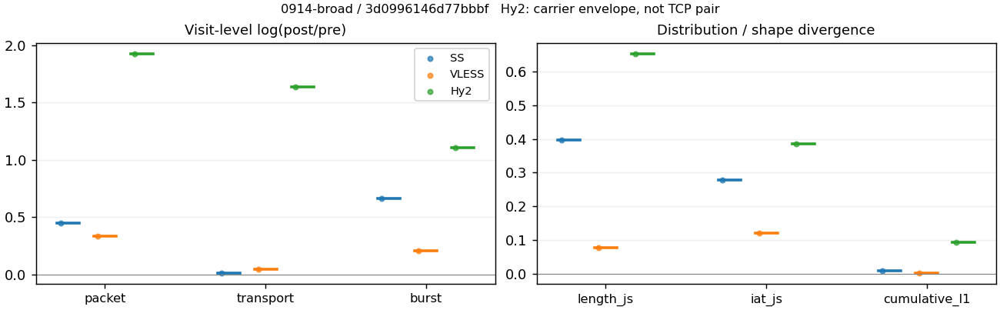
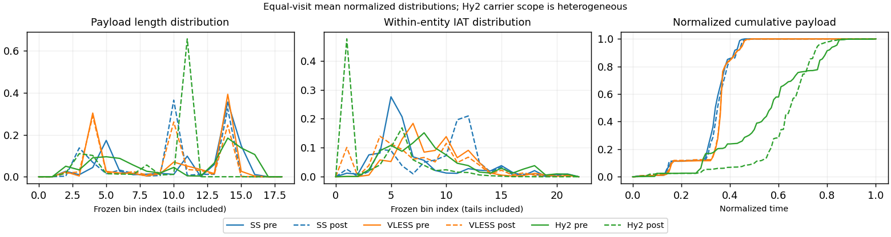

# 0914-broad · 条目 040 · reuters.com

目标：https://www.reuters.com/

活动标签：reuters.com::page_load。选定访问 3 次。

[返回总索引](../../README.md) · [统计口径](../../methods.md)

## 覆盖与资格（每次访问均保留）

| 部署 | 重复 | 主请求路由 | 活动状态 | 代理比较 | DIRECT pre | 请求 proxy/direct/unresolved | 错误 |
| --- | --- | --- | --- | --- | --- | --- | --- |
| Hy2 | 1 | proxy | passed | 1 | 1 | 503/6/0 | [] |
| SS | 1 | proxy | passed | 1 | 0 | 65/0/0 | [] |
| VLESS | 1 | proxy | passed | 1 | 0 | 62/0/0 | [] |

主请求非 proxy 的统计仅解释为已索引的辅助代理连接或 DIRECT 观测，不代表目标业务经代理传输。播放确认与配对资格是两道不同的门。

图中散点为单次访问，短线为重复中位数；Hy2 是共享载体包络，不能与 TCP 配对作等范围因果对比。

形态图先逐访问归一化，再对访问等权平均；实线 pre，虚线 post。分箱序号及边界见 methods，不将分箱索引误解为长度或时间。

## 每次访问的关键观测

### SS

范围：`exclusive_page`。每格 pre → post；空值为不可观测/不适用。

| 重复 | 包数 | 载荷字节 | burst | TCP FR | IAT中位µs | length JS | IAT JS |
| --- | --- | --- | --- | --- | --- | --- | --- |
| 1 | 2052 → 3204 | 2.557e+06 → 2.5938e+06 | 1364 → 2647 | 114 → 129 | 24.353 → 1022.7 | 0.39639 | 0.27759 |

完整标量统计：中位数 [min,max]；Δ 为重复内逐访问变换的中位数，MAD 未缩放。n 为可用变换数；DIRECT-only 的 nΔ=0 不代表 pre 不可用。

| scope | 特征 | pre | post | Δ | IQRΔ | MADΔ | nΔ |
| --- | --- | --- | --- | --- | --- | --- | --- |
| exclusive_page | active_span_sum_s_1000ms | 21.569 [21.569, 21.569] | 25.893 [25.893, 25.893] | 0.1827 | — | — | 1 |
| exclusive_page | active_span_sum_s_100ms | 6.4787 [6.4787, 6.4787] | 10.434 [10.434, 10.434] | 0.4765 | — | — | 1 |
| exclusive_page | active_span_sum_s_500ms | 19.69 [19.69, 19.69] | 23.022 [23.022, 23.022] | 0.15634 | — | — | 1 |
| exclusive_page | burst_bytes_iqr | 2896 [2896, 2896] | 1482 [1482, 1482] | -0.66994 | — | — | 1 |
| exclusive_page | burst_bytes_mad | 31 [31, 31] | 34 [34, 34] | 0.092373 | — | — | 1 |
| exclusive_page | burst_bytes_max | 22344 [22344, 22344] | 10508 [10508, 10508] | -0.75442 | — | — | 1 |
| exclusive_page | burst_bytes_mean | 1874.7 [1874.7, 1874.7] | 979.9 [979.9, 979.9] | -0.64873 | — | — | 1 |
| exclusive_page | burst_bytes_median | 31 [31, 31] | 34 [34, 34] | 0.092373 | — | — | 1 |
| exclusive_page | burst_bytes_min | 0 [0, 0] | 0 [0, 0] | — | — | — | 0 |
| exclusive_page | burst_bytes_p95 | 8688 [8688, 8688] | 2856 [2856, 2856] | -1.1125 | — | — | 1 |
| exclusive_page | burst_bytes_q25 | 0 [0, 0] | 0 [0, 0] | — | — | — | 0 |
| exclusive_page | burst_bytes_q75 | 2896 [2896, 2896] | 1482 [1482, 1482] | -0.66994 | — | — | 1 |
| exclusive_page | burst_bytes_std | 3202.6 [3202.6, 3202.6] | 1271.4 [1271.4, 1271.4] | -0.92383 | — | — | 1 |
| exclusive_page | burst_count | 1364 [1364, 1364] | 2647 [2647, 2647] | 0.66301 | — | — | 1 |
| exclusive_page | burst_duration_ms_iqr | 0.019821 [0.019821, 0.019821] | 0 [0, 0] | — | — | — | 0 |
| exclusive_page | burst_duration_ms_mad | 0 [0, 0] | 0 [0, 0] | — | — | — | 0 |
| exclusive_page | burst_duration_ms_max | 15001 [15001, 15001] | 15361 [15361, 15361] | 0.023704 | — | — | 1 |
| exclusive_page | burst_duration_ms_mean | 100.69 [100.69, 100.69] | 53.915 [53.915, 53.915] | -0.6246 | — | — | 1 |
| exclusive_page | burst_duration_ms_median | 0 [0, 0] | 0 [0, 0] | — | — | — | 0 |
| exclusive_page | burst_duration_ms_min | 0 [0, 0] | 0 [0, 0] | — | — | — | 0 |
| exclusive_page | burst_duration_ms_p95 | 132.42 [132.42, 132.42] | 0.99246 [0.99246, 0.99246] | -4.8935 | — | — | 1 |
| exclusive_page | burst_duration_ms_q25 | 0 [0, 0] | 0 [0, 0] | — | — | — | 0 |
| exclusive_page | burst_duration_ms_q75 | 0.019821 [0.019821, 0.019821] | 0 [0, 0] | — | — | — | 0 |
| exclusive_page | burst_duration_ms_std | 885.45 [885.45, 885.45] | 793.29 [793.29, 793.29] | -0.10991 | — | — | 1 |
| exclusive_page | burst_packets_iqr | 1 [1, 1] | 0 [0, 0] | — | — | — | 0 |
| exclusive_page | burst_packets_mad | 0 [0, 0] | 0 [0, 0] | — | — | — | 0 |
| exclusive_page | burst_packets_max | 11 [11, 11] | 9 [9, 9] | -0.20067 | — | — | 1 |
| exclusive_page | burst_packets_mean | 1.5044 [1.5044, 1.5044] | 1.2104 [1.2104, 1.2104] | -0.21742 | — | — | 1 |
| exclusive_page | burst_packets_median | 1 [1, 1] | 1 [1, 1] | 0 | — | — | 1 |
| exclusive_page | burst_packets_min | 1 [1, 1] | 1 [1, 1] | 0 | — | — | 1 |
| exclusive_page | burst_packets_p95 | 4 [4, 4] | 2 [2, 2] | -0.69315 | — | — | 1 |
| exclusive_page | burst_packets_q25 | 1 [1, 1] | 1 [1, 1] | 0 | — | — | 1 |
| exclusive_page | burst_packets_q75 | 2 [2, 2] | 1 [1, 1] | -0.69315 | — | — | 1 |
| exclusive_page | burst_packets_std | 1.0895 [1.0895, 1.0895] | 0.64634 [0.64634, 0.64634] | -0.52212 | — | — | 1 |
| exclusive_page | connection_span_concurrency_max | 12 [12, 12] | 12 [12, 12] | 0 | — | — | 1 |
| exclusive_page | cumulative_l1 | — | — | 0.0083974 | — | — | 1 |
| exclusive_page | cumulative_max | — | — | 0.11135 | — | — | 1 |
| exclusive_page | direction_entropy | 0.48307 [0.48307, 0.48307] | 0.43067 [0.43067, 0.43067] | -0.052399 | — | — | 1 |
| exclusive_page | down_burst_count | 675 [675, 675] | 1317 [1317, 1317] | 0.6684 | — | — | 1 |
| exclusive_page | down_ip_bytes | 2.5642e+06 [2.5642e+06, 2.5642e+06] | 2.6169e+06 [2.6169e+06, 2.6169e+06] | 0.020376 | — | — | 1 |
| exclusive_page | down_packets | 1265 [1265, 1265] | 1695 [1695, 1695] | 0.29261 | — | — | 1 |
| exclusive_page | down_transport_bytes | 2.4983e+06 [2.4983e+06, 2.4983e+06] | 2.5286e+06 [2.5286e+06, 2.5286e+06] | 0.012084 | — | — | 1 |
| exclusive_page | duration_s | 33.877 [33.877, 33.877] | 32.927 [32.927, 32.927] | -0.028437 | — | — | 1 |
| exclusive_page | entity_count | 14 [14, 14] | 14 [14, 14] | 0 | — | — | 1 |
| exclusive_page | fr_runs | 114 [114, 114] | 129 [129, 129] | 0.12361 | — | — | 1 |
| exclusive_page | fr_runs_per_packet | 0.093061 [0.093061, 0.093061] | 0.076422 [0.076422, 0.076422] | -0.016639 | — | — | 1 |
| exclusive_page | fr_switches | 100 [100, 100] | 115 [115, 115] | 0.13976 | — | — | 1 |
| exclusive_page | fr_switches_per_possible_transition | 0.082576 [0.082576, 0.082576] | 0.068698 [0.068698, 0.068698] | -0.013879 | — | — | 1 |
| exclusive_page | full_retransmission_fraction | 0.0024366 [0.0024366, 0.0024366] | 0.0037453 [0.0037453, 0.0037453] | 0.0013087 | — | — | 1 |
| exclusive_page | full_retransmission_packets | 5 [5, 5] | 12 [12, 12] | 0.87547 | — | — | 1 |
| exclusive_page | iat_count | 2038 [2038, 2038] | 3190 [3190, 3190] | 0.44805 | — | — | 1 |
| exclusive_page | iat_js | — | — | 0.27759 | — | — | 1 |
| exclusive_page | iat_ks | — | — | 0.46955 | — | — | 1 |
| exclusive_page | iat_median_us | 24.353 [24.353, 24.353] | 1022.7 [1022.7, 1022.7] | 3.7376 | — | — | 1 |
| exclusive_page | iat_us_iqr | 106.52 [106.52, 106.52] | 3255.2 [3255.2, 3255.2] | 3.4196 | — | — | 1 |
| exclusive_page | iat_us_mad | 17.615 [17.615, 17.615] | 1011.4 [1011.4, 1011.4] | 4.0503 | — | — | 1 |
| exclusive_page | iat_us_max | 1.5001e+07 [1.5001e+07, 1.5001e+07] | 1.5361e+07 [1.5361e+07, 1.5361e+07] | 0.02369 | — | — | 1 |
| exclusive_page | iat_us_mean | 1.3829e+05 [1.3829e+05, 1.3829e+05] | 87878 [87878, 87878] | -0.45337 | — | — | 1 |
| exclusive_page | iat_us_median | 24.353 [24.353, 24.353] | 1022.7 [1022.7, 1022.7] | 3.7376 | — | — | 1 |
| exclusive_page | iat_us_min | 0.029 [0.029, 0.029] | 0.036 [0.036, 0.036] | 0.21622 | — | — | 1 |
| exclusive_page | iat_us_p95 | 87442 [87442, 87442] | 33911 [33911, 33911] | -0.94724 | — | — | 1 |
| exclusive_page | iat_us_q25 | 12.381 [12.381, 12.381] | 28.339 [28.339, 28.339] | 0.82809 | — | — | 1 |
| exclusive_page | iat_us_q75 | 118.9 [118.9, 118.9] | 3283.5 [3283.5, 3283.5] | 3.3184 | — | — | 1 |
| exclusive_page | iat_us_std | 1.2137e+06 [1.2137e+06, 1.2137e+06] | 9.7172e+05 [9.7172e+05, 9.7172e+05] | -0.22239 | — | — | 1 |
| exclusive_page | iat_wasserstein_log1p_us | — | — | 2.0471 | — | — | 1 |
| exclusive_page | idle_gap_count_1000ms | 35 [35, 35] | 33 [33, 33] | -0.058841 | — | — | 1 |
| exclusive_page | idle_gap_count_100ms | 89 [89, 89] | 92 [92, 92] | 0.033152 | — | — | 1 |
| exclusive_page | idle_gap_count_500ms | 38 [38, 38] | 37 [37, 37] | -0.026668 | — | — | 1 |
| exclusive_page | idle_gap_sum_s_1000ms | 260.26 [260.26, 260.26] | 254.44 [254.44, 254.44] | -0.022614 | — | — | 1 |
| exclusive_page | idle_gap_sum_s_100ms | 275.35 [275.35, 275.35] | 269.9 [269.9, 269.9] | -0.019993 | — | — | 1 |
| exclusive_page | idle_gap_sum_s_500ms | 262.14 [262.14, 262.14] | 257.31 [257.31, 257.31] | -0.018588 | — | — | 1 |
| exclusive_page | ip_bytes | 2.664e+06 [2.664e+06, 2.664e+06] | 2.7854e+06 [2.7854e+06, 2.7854e+06] | 0.044543 | — | — | 1 |
| exclusive_page | length_iqr | 2648 [2648, 2648] | 2406.8 [2406.8, 2406.8] | -0.095527 | — | — | 1 |
| exclusive_page | length_js | — | — | 0.39639 | — | — | 1 |
| exclusive_page | length_ks | — | — | 0.48149 | — | — | 1 |
| exclusive_page | length_mad | 1240 [1240, 1240] | 1334 [1334, 1334] | 0.073071 | — | — | 1 |
| exclusive_page | length_max | 8948 [8948, 8948] | 4284 [4284, 4284] | -0.73654 | — | — | 1 |
| exclusive_page | length_mean | 2087.4 [2087.4, 2087.4] | 1536.6 [1536.6, 1536.6] | -0.30632 | — | — | 1 |
| exclusive_page | length_median | 2688 [2688, 2688] | 1428 [1428, 1428] | -0.63252 | — | — | 1 |
| exclusive_page | length_min | 31 [31, 31] | 14 [14, 14] | -0.79493 | — | — | 1 |
| exclusive_page | length_p95 | 4096 [4096, 4096] | 2856 [2856, 2856] | -0.36059 | — | — | 1 |
| exclusive_page | length_q25 | 248 [248, 248] | 449.25 [449.25, 449.25] | 0.59415 | — | — | 1 |
| exclusive_page | length_q75 | 2896 [2896, 2896] | 2856 [2856, 2856] | -0.013908 | — | — | 1 |
| exclusive_page | length_std | 1551.8 [1551.8, 1551.8] | 1055.7 [1055.7, 1055.7] | -0.38526 | — | — | 1 |
| exclusive_page | length_wasserstein_bytes | — | — | 608.52 | — | — | 1 |
| exclusive_page | nonempty_entity_count | 14 [14, 14] | 14 [14, 14] | 0 | — | — | 1 |
| exclusive_page | nonempty_packets | 1225 [1225, 1225] | 1688 [1688, 1688] | 0.3206 | — | — | 1 |
| exclusive_page | offload_suspect_fraction | 0.34211 [0.34211, 0.34211] | 0.18258 [0.18258, 0.18258] | -0.15952 | — | — | 1 |
| exclusive_page | packet_count | 2052 [2052, 2052] | 3204 [3204, 3204] | 0.44559 | — | — | 1 |
| exclusive_page | rtt_median_ms | 0.041231 [0.041231, 0.041231] | 32.756 [32.756, 32.756] | 6.6777 | — | — | 1 |
| exclusive_page | rtt_sample_count | 771 [771, 771] | 511 [511, 511] | -0.41132 | — | — | 1 |
| exclusive_page | tcp_ack_count | 2038 [2038, 2038] | 3186 [3186, 3186] | 0.4468 | — | — | 1 |
| exclusive_page | tcp_fin_count | 28 [28, 28] | 27 [27, 27] | -0.036368 | — | — | 1 |
| exclusive_page | tcp_packet_count | 2052 [2052, 2052] | 3204 [3204, 3204] | 0.44559 | — | — | 1 |
| exclusive_page | tcp_rst_count | 0 [0, 0] | 0 [0, 0] | — | — | — | 0 |
| exclusive_page | tcp_syn_count | 28 [28, 28] | 34 [34, 34] | 0.19416 | — | — | 1 |
| exclusive_page | tcp_window_raw_median | 65535 [65535, 65535] | 137 [137, 137] | -6.1704 | — | — | 1 |
| exclusive_page | transition_entropy | 0.32466 [0.32466, 0.32466] | 0.2833 [0.2833, 0.2833] | -0.041361 | — | — | 1 |
| exclusive_page | transition_n_mm | 1042 [1042, 1042] | 1477 [1477, 1477] | 0.34887 | — | — | 1 |
| exclusive_page | transition_n_mp | 45 [45, 45] | 53 [53, 53] | 0.16363 | — | — | 1 |
| exclusive_page | transition_n_pm | 55 [55, 55] | 62 [62, 62] | 0.1198 | — | — | 1 |
| exclusive_page | transition_n_pp | 69 [69, 69] | 82 [82, 82] | 0.17261 | — | — | 1 |
| exclusive_page | transition_p_mm | 0.9586 [0.9586, 0.9586] | 0.96536 [0.96536, 0.96536] | 0.0067578 | — | — | 1 |
| exclusive_page | transition_p_mp | 0.041398 [0.041398, 0.041398] | 0.034641 [0.034641, 0.034641] | -0.0067578 | — | — | 1 |
| exclusive_page | transition_p_pm | 0.44355 [0.44355, 0.44355] | 0.43056 [0.43056, 0.43056] | -0.012993 | — | — | 1 |
| exclusive_page | transition_p_pp | 0.55645 [0.55645, 0.55645] | 0.56944 [0.56944, 0.56944] | 0.012993 | — | — | 1 |
| exclusive_page | transport_bytes | 2.557e+06 [2.557e+06, 2.557e+06] | 2.5938e+06 [2.5938e+06, 2.5938e+06] | 0.01428 | — | — | 1 |
| exclusive_page | up_burst_count | 689 [689, 689] | 1330 [1330, 1330] | 0.65769 | — | — | 1 |
| exclusive_page | up_byte_fraction | 0.022977 [0.022977, 0.022977] | 0.025121 [0.025121, 0.025121] | 0.0021432 | — | — | 1 |
| exclusive_page | up_ip_bytes | 99850 [99850, 99850] | 1.6841e+05 [1.6841e+05, 1.6841e+05] | 0.52276 | — | — | 1 |
| exclusive_page | up_packets | 787 [787, 787] | 1509 [1509, 1509] | 0.65097 | — | — | 1 |
| exclusive_page | up_transport_bytes | 58754 [58754, 58754] | 65158 [65158, 65158] | 0.10346 | — | — | 1 |
| exclusive_page | zero_iat_count | 0 [0, 0] | 0 [0, 0] | — | — | — | 0 |
| exclusive_page | zero_iat_fraction | 0 [0, 0] | 0 [0, 0] | 0 | — | — | 1 |

### VLESS

范围：`exclusive_page`。每格 pre → post；空值为不可观测/不适用。

| 重复 | 包数 | 载荷字节 | burst | TCP FR | IAT中位µs | length JS | IAT JS |
| --- | --- | --- | --- | --- | --- | --- | --- |
| 1 | 2833 → 3956 | 2.5446e+06 → 2.6583e+06 | 2260 → 2774 | 122 → 152 | 166.46 → 54.306 | 0.076399 | 0.12157 |

完整标量统计：中位数 [min,max]；Δ 为重复内逐访问变换的中位数，MAD 未缩放。n 为可用变换数；DIRECT-only 的 nΔ=0 不代表 pre 不可用。

| scope | 特征 | pre | post | Δ | IQRΔ | MADΔ | nΔ |
| --- | --- | --- | --- | --- | --- | --- | --- |
| exclusive_page | active_span_sum_s_1000ms | 27.835 [27.835, 27.835] | 25.88 [25.88, 25.88] | -0.072817 | — | — | 1 |
| exclusive_page | active_span_sum_s_100ms | 4.2563 [4.2563, 4.2563] | 9.0296 [9.0296, 9.0296] | 0.75209 | — | — | 1 |
| exclusive_page | active_span_sum_s_500ms | 14.225 [14.225, 14.225] | 22.988 [22.988, 22.988] | 0.47992 | — | — | 1 |
| exclusive_page | burst_bytes_iqr | 2824 [2824, 2824] | 1936 [1936, 1936] | -0.37753 | — | — | 1 |
| exclusive_page | burst_bytes_mad | 31 [31, 31] | 66.5 [66.5, 66.5] | 0.76321 | — | — | 1 |
| exclusive_page | burst_bytes_max | 20480 [20480, 20480] | 11656 [11656, 11656] | -0.56363 | — | — | 1 |
| exclusive_page | burst_bytes_mean | 1125.9 [1125.9, 1125.9] | 958.29 [958.29, 958.29] | -0.16121 | — | — | 1 |
| exclusive_page | burst_bytes_median | 31 [31, 31] | 66.5 [66.5, 66.5] | 0.76321 | — | — | 1 |
| exclusive_page | burst_bytes_min | 0 [0, 0] | 0 [0, 0] | — | — | — | 0 |
| exclusive_page | burst_bytes_p95 | 4380 [4380, 4380] | 2896 [2896, 2896] | -0.41372 | — | — | 1 |
| exclusive_page | burst_bytes_q25 | 0 [0, 0] | 0 [0, 0] | — | — | — | 0 |
| exclusive_page | burst_bytes_q75 | 2824 [2824, 2824] | 1936 [1936, 1936] | -0.37753 | — | — | 1 |
| exclusive_page | burst_bytes_std | 2011.4 [2011.4, 2011.4] | 1326.7 [1326.7, 1326.7] | -0.41612 | — | — | 1 |
| exclusive_page | burst_count | 2260 [2260, 2260] | 2774 [2774, 2774] | 0.20493 | — | — | 1 |
| exclusive_page | burst_duration_ms_iqr | 0 [0, 0] | 0.000125 [0.000125, 0.000125] | — | — | — | 0 |
| exclusive_page | burst_duration_ms_mad | 0 [0, 0] | 0 [0, 0] | — | — | — | 0 |
| exclusive_page | burst_duration_ms_max | 14784 [14784, 14784] | 15004 [15004, 15004] | 0.014794 | — | — | 1 |
| exclusive_page | burst_duration_ms_mean | 66.167 [66.167, 66.167] | 45.453 [45.453, 45.453] | -0.37551 | — | — | 1 |
| exclusive_page | burst_duration_ms_median | 0 [0, 0] | 0 [0, 0] | — | — | — | 0 |
| exclusive_page | burst_duration_ms_min | 0 [0, 0] | 0 [0, 0] | — | — | — | 0 |
| exclusive_page | burst_duration_ms_p95 | 9.1356 [9.1356, 9.1356] | 8.48 [8.48, 8.48] | -0.074475 | — | — | 1 |
| exclusive_page | burst_duration_ms_q25 | 0 [0, 0] | 0 [0, 0] | — | — | — | 0 |
| exclusive_page | burst_duration_ms_q75 | 0 [0, 0] | 0.000125 [0.000125, 0.000125] | — | — | — | 0 |
| exclusive_page | burst_duration_ms_std | 844.28 [844.28, 844.28] | 714.26 [714.26, 714.26] | -0.16724 | — | — | 1 |
| exclusive_page | burst_packets_iqr | 0 [0, 0] | 1 [1, 1] | — | — | — | 0 |
| exclusive_page | burst_packets_mad | 0 [0, 0] | 0 [0, 0] | — | — | — | 0 |
| exclusive_page | burst_packets_max | 9 [9, 9] | 8 [8, 8] | -0.11778 | — | — | 1 |
| exclusive_page | burst_packets_mean | 1.2535 [1.2535, 1.2535] | 1.4261 [1.4261, 1.4261] | 0.12897 | — | — | 1 |
| exclusive_page | burst_packets_median | 1 [1, 1] | 1 [1, 1] | 0 | — | — | 1 |
| exclusive_page | burst_packets_min | 1 [1, 1] | 1 [1, 1] | 0 | — | — | 1 |
| exclusive_page | burst_packets_p95 | 2 [2, 2] | 3 [3, 3] | 0.40547 | — | — | 1 |
| exclusive_page | burst_packets_q25 | 1 [1, 1] | 1 [1, 1] | 0 | — | — | 1 |
| exclusive_page | burst_packets_q75 | 1 [1, 1] | 2 [2, 2] | 0.69315 | — | — | 1 |
| exclusive_page | burst_packets_std | 0.55563 [0.55563, 0.55563] | 0.81716 [0.81716, 0.81716] | 0.38573 | — | — | 1 |
| exclusive_page | connection_span_concurrency_max | 11 [11, 11] | 11 [11, 11] | 0 | — | — | 1 |
| exclusive_page | cumulative_l1 | — | — | 0.0028933 | — | — | 1 |
| exclusive_page | cumulative_max | — | — | 0.022333 | — | — | 1 |
| exclusive_page | direction_entropy | 0.38619 [0.38619, 0.38619] | 0.33682 [0.33682, 0.33682] | -0.049366 | — | — | 1 |
| exclusive_page | down_burst_count | 1123 [1123, 1123] | 1380 [1380, 1380] | 0.20608 | — | — | 1 |
| exclusive_page | down_ip_bytes | 2.5815e+06 [2.5815e+06, 2.5815e+06] | 2.6952e+06 [2.6952e+06, 2.6952e+06] | 0.043096 | — | — | 1 |
| exclusive_page | down_packets | 1618 [1618, 1618] | 2138 [2138, 2138] | 0.27868 | — | — | 1 |
| exclusive_page | down_transport_bytes | 2.4973e+06 [2.4973e+06, 2.4973e+06] | 2.5839e+06 [2.5839e+06, 2.5839e+06] | 0.034107 | — | — | 1 |
| exclusive_page | duration_s | 24.204 [24.204, 24.204] | 24.169 [24.169, 24.169] | -0.001447 | — | — | 1 |
| exclusive_page | entity_count | 14 [14, 14] | 14 [14, 14] | 0 | — | — | 1 |
| exclusive_page | fr_runs | 122 [122, 122] | 152 [152, 152] | 0.21986 | — | — | 1 |
| exclusive_page | fr_runs_per_packet | 0.076778 [0.076778, 0.076778] | 0.072381 [0.072381, 0.072381] | -0.0043969 | — | — | 1 |
| exclusive_page | fr_switches | 108 [108, 108] | 138 [138, 138] | 0.24512 | — | — | 1 |
| exclusive_page | fr_switches_per_possible_transition | 0.068571 [0.068571, 0.068571] | 0.066155 [0.066155, 0.066155] | -0.0024161 | — | — | 1 |
| exclusive_page | full_retransmission_fraction | 0.0014119 [0.0014119, 0.0014119] | 0 [0, 0] | -0.0014119 | — | — | 1 |
| exclusive_page | full_retransmission_packets | 4 [4, 4] | 0 [0, 0] | — | — | — | 0 |
| exclusive_page | iat_count | 2819 [2819, 2819] | 3942 [3942, 3942] | 0.33531 | — | — | 1 |
| exclusive_page | iat_js | — | — | 0.12157 | — | — | 1 |
| exclusive_page | iat_ks | — | — | 0.28335 | — | — | 1 |
| exclusive_page | iat_median_us | 166.46 [166.46, 166.46] | 54.306 [54.306, 54.306] | -1.1201 | — | — | 1 |
| exclusive_page | iat_us_iqr | 991.18 [991.18, 991.18] | 812.66 [812.66, 812.66] | -0.19858 | — | — | 1 |
| exclusive_page | iat_us_mad | 158.26 [158.26, 158.26] | 54.202 [54.202, 54.202] | -1.0715 | — | — | 1 |
| exclusive_page | iat_us_max | 1.5001e+07 [1.5001e+07, 1.5001e+07] | 1.5004e+07 [1.5004e+07, 1.5004e+07] | 0.00019703 | — | — | 1 |
| exclusive_page | iat_us_mean | 65840 [65840, 65840] | 46555 [46555, 46555] | -0.3466 | — | — | 1 |
| exclusive_page | iat_us_median | 166.46 [166.46, 166.46] | 54.306 [54.306, 54.306] | -1.1201 | — | — | 1 |
| exclusive_page | iat_us_min | 0.273 [0.273, 0.273] | 0.031 [0.031, 0.031] | -2.1755 | — | — | 1 |
| exclusive_page | iat_us_p95 | 9936.9 [9936.9, 9936.9] | 31897 [31897, 31897] | 1.1662 | — | — | 1 |
| exclusive_page | iat_us_q25 | 50.651 [50.651, 50.651] | 8.7115 [8.7115, 8.7115] | -1.7603 | — | — | 1 |
| exclusive_page | iat_us_q75 | 1041.8 [1041.8, 1041.8] | 821.37 [821.37, 821.37] | -0.23776 | — | — | 1 |
| exclusive_page | iat_us_std | 8.5467e+05 [8.5467e+05, 8.5467e+05] | 7.2162e+05 [7.2162e+05, 7.2162e+05] | -0.16923 | — | — | 1 |
| exclusive_page | iat_wasserstein_log1p_us | — | — | 1.0468 | — | — | 1 |
| exclusive_page | idle_gap_count_1000ms | 16 [16, 16] | 16 [16, 16] | 0 | — | — | 1 |
| exclusive_page | idle_gap_count_100ms | 79 [79, 79] | 92 [92, 92] | 0.15234 | — | — | 1 |
| exclusive_page | idle_gap_count_500ms | 34 [34, 34] | 20 [20, 20] | -0.53063 | — | — | 1 |
| exclusive_page | idle_gap_sum_s_1000ms | 157.77 [157.77, 157.77] | 157.64 [157.64, 157.64] | -0.00082117 | — | — | 1 |
| exclusive_page | idle_gap_sum_s_100ms | 181.35 [181.35, 181.35] | 174.49 [174.49, 174.49] | -0.038548 | — | — | 1 |
| exclusive_page | idle_gap_sum_s_500ms | 171.38 [171.38, 171.38] | 160.53 [160.53, 160.53] | -0.065381 | — | — | 1 |
| exclusive_page | ip_bytes | 2.6919e+06 [2.6919e+06, 2.6919e+06] | 2.8686e+06 [2.8686e+06, 2.8686e+06] | 0.063599 | — | — | 1 |
| exclusive_page | length_iqr | 2752 [2752, 2752] | 1936 [1936, 1936] | -0.3517 | — | — | 1 |
| exclusive_page | length_js | — | — | 0.076399 | — | — | 1 |
| exclusive_page | length_ks | — | — | 0.20185 | — | — | 1 |
| exclusive_page | length_mad | 1376 [1376, 1376] | 1340 [1340, 1340] | -0.026511 | — | — | 1 |
| exclusive_page | length_max | 8920 [8920, 8920] | 4236 [4236, 4236] | -0.74468 | — | — | 1 |
| exclusive_page | length_mean | 1601.4 [1601.4, 1601.4] | 1265.9 [1265.9, 1265.9] | -0.23512 | — | — | 1 |
| exclusive_page | length_median | 1448 [1448, 1448] | 1412 [1412, 1412] | -0.025176 | — | — | 1 |
| exclusive_page | length_min | 24 [24, 24] | 4 [4, 4] | -1.7918 | — | — | 1 |
| exclusive_page | length_p95 | 2896 [2896, 2896] | 2824 [2824, 2824] | -0.025176 | — | — | 1 |
| exclusive_page | length_q25 | 72 [72, 72] | 72 [72, 72] | 0 | — | — | 1 |
| exclusive_page | length_q75 | 2824 [2824, 2824] | 2008 [2008, 2008] | -0.34102 | — | — | 1 |
| exclusive_page | length_std | 1447.7 [1447.7, 1447.7] | 1070 [1070, 1070] | -0.30229 | — | — | 1 |
| exclusive_page | length_wasserstein_bytes | — | — | 350.02 | — | — | 1 |
| exclusive_page | nonempty_entity_count | 14 [14, 14] | 14 [14, 14] | 0 | — | — | 1 |
| exclusive_page | nonempty_packets | 1589 [1589, 1589] | 2100 [2100, 2100] | 0.27883 | — | — | 1 |
| exclusive_page | offload_suspect_fraction | 0.26438 [0.26438, 0.26438] | 0.15319 [0.15319, 0.15319] | -0.1112 | — | — | 1 |
| exclusive_page | packet_count | 2833 [2833, 2833] | 3956 [3956, 3956] | 0.3339 | — | — | 1 |
| exclusive_page | rtt_median_ms | 0.071847 [0.071847, 0.071847] | 0.039896 [0.039896, 0.039896] | -0.58826 | — | — | 1 |
| exclusive_page | rtt_sample_count | 1180 [1180, 1180] | 1573 [1573, 1573] | 0.28747 | — | — | 1 |
| exclusive_page | tcp_ack_count | 2791 [2791, 2791] | 3942 [3942, 3942] | 0.34529 | — | — | 1 |
| exclusive_page | tcp_fin_count | 28 [28, 28] | 28 [28, 28] | 0 | — | — | 1 |
| exclusive_page | tcp_packet_count | 2833 [2833, 2833] | 3956 [3956, 3956] | 0.3339 | — | — | 1 |
| exclusive_page | tcp_rst_count | 28 [28, 28] | 0 [0, 0] | — | — | — | 0 |
| exclusive_page | tcp_syn_count | 28 [28, 28] | 28 [28, 28] | 0 | — | — | 1 |
| exclusive_page | tcp_window_raw_median | 65535 [65535, 65535] | 182 [182, 182] | -5.8863 | — | — | 1 |
| exclusive_page | transition_entropy | 0.2663 [0.2663, 0.2663] | 0.2518 [0.2518, 0.2518] | -0.014503 | — | — | 1 |
| exclusive_page | transition_n_mm | 1408 [1408, 1408] | 1893 [1893, 1893] | 0.29599 | — | — | 1 |
| exclusive_page | transition_n_mp | 47 [47, 47] | 62 [62, 62] | 0.27699 | — | — | 1 |
| exclusive_page | transition_n_pm | 61 [61, 61] | 76 [76, 76] | 0.21986 | — | — | 1 |
| exclusive_page | transition_n_pp | 59 [59, 59] | 55 [55, 55] | -0.070204 | — | — | 1 |
| exclusive_page | transition_p_mm | 0.9677 [0.9677, 0.9677] | 0.96829 [0.96829, 0.96829] | 0.00058885 | — | — | 1 |
| exclusive_page | transition_p_mp | 0.032302 [0.032302, 0.032302] | 0.031714 [0.031714, 0.031714] | -0.00058885 | — | — | 1 |
| exclusive_page | transition_p_pm | 0.50833 [0.50833, 0.50833] | 0.58015 [0.58015, 0.58015] | 0.071819 | — | — | 1 |
| exclusive_page | transition_p_pp | 0.49167 [0.49167, 0.49167] | 0.41985 [0.41985, 0.41985] | -0.071819 | — | — | 1 |
| exclusive_page | transport_bytes | 2.5446e+06 [2.5446e+06, 2.5446e+06] | 2.6583e+06 [2.6583e+06, 2.6583e+06] | 0.043713 | — | — | 1 |
| exclusive_page | up_burst_count | 1137 [1137, 1137] | 1394 [1394, 1394] | 0.20378 | — | — | 1 |
| exclusive_page | up_byte_fraction | 0.018602 [0.018602, 0.018602] | 0.027984 [0.027984, 0.027984] | 0.0093823 | — | — | 1 |
| exclusive_page | up_ip_bytes | 1.1034e+05 [1.1034e+05, 1.1034e+05] | 1.7342e+05 [1.7342e+05, 1.7342e+05] | 0.45213 | — | — | 1 |
| exclusive_page | up_packets | 1215 [1215, 1215] | 1818 [1818, 1818] | 0.40299 | — | — | 1 |
| exclusive_page | up_transport_bytes | 47335 [47335, 47335] | 74391 [74391, 74391] | 0.45208 | — | — | 1 |
| exclusive_page | zero_iat_count | 0 [0, 0] | 0 [0, 0] | — | — | — | 0 |
| exclusive_page | zero_iat_fraction | 0 [0, 0] | 0 [0, 0] | 0 | — | — | 1 |

### Hy2

范围：`carrier_context_envelope`。每格 pre → post；空值为不可观测/不适用。

| 重复 | 包数 | 载荷字节 | burst | TCP FR | IAT中位µs | length JS | IAT JS |
| --- | --- | --- | --- | --- | --- | --- | --- |
| 1 | 8434 → 57626 | 1.1803e+07 → 6.0452e+07 | 5640 → 17040 | — | 135.75 → 4.513 | 0.65223 | 0.38572 |

范围：`direct_pre_only`。每格 pre → post；空值为不可观测/不适用。

| 重复 | 包数 | 载荷字节 | burst | TCP FR | IAT中位µs | length JS | IAT JS |
| --- | --- | --- | --- | --- | --- | --- | --- |
| 1 | 244 → — | 4.3626e+05 → — | 167 → — | 25 → — | 130.27 → — | — | — |

完整标量统计：中位数 [min,max]；Δ 为重复内逐访问变换的中位数，MAD 未缩放。n 为可用变换数；DIRECT-only 的 nΔ=0 不代表 pre 不可用。

| scope | 特征 | pre | post | Δ | IQRΔ | MADΔ | nΔ |
| --- | --- | --- | --- | --- | --- | --- | --- |
| carrier_context_envelope | active_span_sum_s_1000ms | 180.73 [180.73, 180.73] | 21.665 [21.665, 21.665] | -2.1213 | — | — | 1 |
| carrier_context_envelope | active_span_sum_s_100ms | 21.469 [21.469, 21.469] | 16.42 [16.42, 16.42] | -0.26812 | — | — | 1 |
| carrier_context_envelope | active_span_sum_s_500ms | 147.44 [147.44, 147.44] | 20.882 [20.882, 20.882] | -1.9545 | — | — | 1 |
| carrier_context_envelope | burst_bytes_iqr | 1728 [1728, 1728] | 3765.8 [3765.8, 3765.8] | 0.77898 | — | — | 1 |
| carrier_context_envelope | burst_bytes_mad | 64 [64, 64] | 323.5 [323.5, 323.5] | 1.6203 | — | — | 1 |
| carrier_context_envelope | burst_bytes_max | 27662 [27662, 27662] | 2.9085e+05 [2.9085e+05, 2.9085e+05] | 2.3528 | — | — | 1 |
| carrier_context_envelope | burst_bytes_mean | 2092.7 [2092.7, 2092.7] | 3547.6 [3547.6, 3547.6] | 0.5278 | — | — | 1 |
| carrier_context_envelope | burst_bytes_median | 64 [64, 64] | 357.5 [357.5, 357.5] | 1.7203 | — | — | 1 |
| carrier_context_envelope | burst_bytes_min | 0 [0, 0] | 22 [22, 22] | — | — | — | 0 |
| carrier_context_envelope | burst_bytes_p95 | 12288 [12288, 12288] | 13814 [13814, 13814] | 0.11706 | — | — | 1 |
| carrier_context_envelope | burst_bytes_q25 | 0 [0, 0] | 77 [77, 77] | — | — | — | 0 |
| carrier_context_envelope | burst_bytes_q75 | 1728 [1728, 1728] | 3842.8 [3842.8, 3842.8] | 0.79922 | — | — | 1 |
| carrier_context_envelope | burst_bytes_std | 4455 [4455, 4455] | 9084.2 [9084.2, 9084.2] | 0.7125 | — | — | 1 |
| carrier_context_envelope | burst_count | 5640 [5640, 5640] | 17040 [17040, 17040] | 1.1057 | — | — | 1 |
| carrier_context_envelope | burst_duration_ms_iqr | 0.27598 [0.27598, 0.27598] | 0.029276 [0.029276, 0.029276] | -2.2435 | — | — | 1 |
| carrier_context_envelope | burst_duration_ms_mad | 0 [0, 0] | 5.1e-05 [5.1e-05, 5.1e-05] | — | — | — | 0 |
| carrier_context_envelope | burst_duration_ms_max | 15001 [15001, 15001] | 783.16 [783.16, 783.16] | -2.9525 | — | — | 1 |
| carrier_context_envelope | burst_duration_ms_mean | 152.34 [152.34, 152.34] | 0.54454 [0.54454, 0.54454] | -5.6339 | — | — | 1 |
| carrier_context_envelope | burst_duration_ms_median | 0 [0, 0] | 5.1e-05 [5.1e-05, 5.1e-05] | — | — | — | 0 |
| carrier_context_envelope | burst_duration_ms_min | 0 [0, 0] | 0 [0, 0] | — | — | — | 0 |
| carrier_context_envelope | burst_duration_ms_p95 | 265.65 [265.65, 265.65] | 1.1287 [1.1287, 1.1287] | -5.4611 | — | — | 1 |
| carrier_context_envelope | burst_duration_ms_q25 | 0 [0, 0] | 0 [0, 0] | — | — | — | 0 |
| carrier_context_envelope | burst_duration_ms_q75 | 0.27598 [0.27598, 0.27598] | 0.029276 [0.029276, 0.029276] | -2.2435 | — | — | 1 |
| carrier_context_envelope | burst_duration_ms_std | 1046.9 [1046.9, 1046.9] | 7.6894 [7.6894, 7.6894] | -4.9137 | — | — | 1 |
| carrier_context_envelope | burst_packets_iqr | 1 [1, 1] | 3 [3, 3] | 1.0986 | — | — | 1 |
| carrier_context_envelope | burst_packets_mad | 0 [0, 0] | 1 [1, 1] | — | — | — | 0 |
| carrier_context_envelope | burst_packets_max | 10 [10, 10] | 208 [208, 208] | 3.035 | — | — | 1 |
| carrier_context_envelope | burst_packets_mean | 1.4954 [1.4954, 1.4954] | 3.3818 [3.3818, 3.3818] | 0.81602 | — | — | 1 |
| carrier_context_envelope | burst_packets_median | 1 [1, 1] | 2 [2, 2] | 0.69315 | — | — | 1 |
| carrier_context_envelope | burst_packets_min | 1 [1, 1] | 1 [1, 1] | 0 | — | — | 1 |
| carrier_context_envelope | burst_packets_p95 | 3 [3, 3] | 10 [10, 10] | 1.204 | — | — | 1 |
| carrier_context_envelope | burst_packets_q25 | 1 [1, 1] | 1 [1, 1] | 0 | — | — | 1 |
| carrier_context_envelope | burst_packets_q75 | 2 [2, 2] | 4 [4, 4] | 0.69315 | — | — | 1 |
| carrier_context_envelope | burst_packets_std | 0.82383 [0.82383, 0.82383] | 6.4468 [6.4468, 6.4468] | 2.0574 | — | — | 1 |
| carrier_context_envelope | connection_span_concurrency_max | 112 [112, 112] | 1 [1, 1] | -4.7185 | — | — | 1 |
| carrier_context_envelope | cumulative_l1 | — | — | 0.093987 | — | — | 1 |
| carrier_context_envelope | cumulative_max | — | — | 0.31775 | — | — | 1 |
| carrier_context_envelope | direction_entropy | 0.85503 [0.85503, 0.85503] | 0.74952 [0.74952, 0.74952] | -0.10552 | — | — | 1 |
| carrier_context_envelope | direction_run_analog_runs | 1189 [1189, 1189] | 17040 [17040, 17040] | 2.6625 | — | — | 1 |
| carrier_context_envelope | direction_run_analog_runs_per_packet | 0.26103 [0.26103, 0.26103] | 0.2957 [0.2957, 0.2957] | 0.034668 | — | — | 1 |
| carrier_context_envelope | direction_run_analog_switches | 1069 [1069, 1069] | 17039 [17039, 17039] | 2.7688 | — | — | 1 |
| carrier_context_envelope | direction_run_analog_switches_per_possible_transition | 0.24104 [0.24104, 0.24104] | 0.29569 [0.29569, 0.29569] | 0.05465 | — | — | 1 |
| carrier_context_envelope | down_burst_count | 2760 [2760, 2760] | 8520 [8520, 8520] | 1.1272 | — | — | 1 |
| carrier_context_envelope | down_ip_bytes | 1.1273e+07 [1.1273e+07, 1.1273e+07] | 5.9897e+07 [5.9897e+07, 5.9897e+07] | 1.6702 | — | — | 1 |
| carrier_context_envelope | down_packets | 4756 [4756, 4756] | 45280 [45280, 45280] | 2.2535 | — | — | 1 |
| carrier_context_envelope | down_transport_bytes | 1.1025e+07 [1.1025e+07, 1.1025e+07] | 5.863e+07 [5.863e+07, 5.863e+07] | 1.6711 | — | — | 1 |
| carrier_context_envelope | duration_s | 21.674 [21.674, 21.674] | 21.665 [21.665, 21.665] | -0.00040797 | — | — | 1 |
| carrier_context_envelope | entity_count | 120 [120, 120] | 1 [1, 1] | -4.7875 | — | — | 1 |
| carrier_context_envelope | full_retransmission_fraction | 0.0037942 [0.0037942, 0.0037942] | — | — | — | — | 0 |
| carrier_context_envelope | full_retransmission_packets | 32 [32, 32] | — | — | — | — | 0 |
| carrier_context_envelope | iat_count | 8314 [8314, 8314] | 57625 [57625, 57625] | 1.936 | — | — | 1 |
| carrier_context_envelope | iat_js | — | — | 0.38572 | — | — | 1 |
| carrier_context_envelope | iat_ks | — | — | 0.50812 | — | — | 1 |
| carrier_context_envelope | iat_median_us | 135.75 [135.75, 135.75] | 4.513 [4.513, 4.513] | -3.4038 | — | — | 1 |
| carrier_context_envelope | iat_us_iqr | 920 [920, 920] | 29.659 [29.659, 29.659] | -3.4346 | — | — | 1 |
| carrier_context_envelope | iat_us_mad | 125.65 [125.65, 125.65] | 4.477 [4.477, 4.477] | -3.3346 | — | — | 1 |
| carrier_context_envelope | iat_us_max | 1.5001e+07 [1.5001e+07, 1.5001e+07] | 7.8316e+05 [7.8316e+05, 7.8316e+05] | -2.9525 | — | — | 1 |
| carrier_context_envelope | iat_us_mean | 1.3699e+05 [1.3699e+05, 1.3699e+05] | 375.97 [375.97, 375.97] | -5.8981 | — | — | 1 |
| carrier_context_envelope | iat_us_median | 135.75 [135.75, 135.75] | 4.513 [4.513, 4.513] | -3.4038 | — | — | 1 |
| carrier_context_envelope | iat_us_min | 0.111 [0.111, 0.111] | 0 [0, 0] | — | — | — | 0 |
| carrier_context_envelope | iat_us_p95 | 2.2251e+05 [2.2251e+05, 2.2251e+05] | 823.55 [823.55, 823.55] | -5.5991 | — | — | 1 |
| carrier_context_envelope | iat_us_q25 | 26.088 [26.088, 26.088] | 0.043 [0.043, 0.043] | -6.408 | — | — | 1 |
| carrier_context_envelope | iat_us_q75 | 946.09 [946.09, 946.09] | 29.702 [29.702, 29.702] | -3.4611 | — | — | 1 |
| carrier_context_envelope | iat_us_std | 1.0228e+06 [1.0228e+06, 1.0228e+06] | 5348.9 [5348.9, 5348.9] | -5.2534 | — | — | 1 |
| carrier_context_envelope | iat_wasserstein_log1p_us | — | — | 3.5781 | — | — | 1 |
| carrier_context_envelope | idle_gap_count_1000ms | 152 [152, 152] | 0 [0, 0] | — | — | — | 0 |
| carrier_context_envelope | idle_gap_count_100ms | 740 [740, 740] | 29 [29, 29] | -3.2394 | — | — | 1 |
| carrier_context_envelope | idle_gap_count_500ms | 202 [202, 202] | 1 [1, 1] | -5.3083 | — | — | 1 |
| carrier_context_envelope | idle_gap_sum_s_1000ms | 958.19 [958.19, 958.19] | 0 [0, 0] | — | — | — | 0 |
| carrier_context_envelope | idle_gap_sum_s_100ms | 1117.4 [1117.4, 1117.4] | 5.2456 [5.2456, 5.2456] | -5.3614 | — | — | 1 |
| carrier_context_envelope | idle_gap_sum_s_500ms | 991.48 [991.48, 991.48] | 0.78316 [0.78316, 0.78316] | -7.1436 | — | — | 1 |
| carrier_context_envelope | ip_bytes | 1.2244e+07 [1.2244e+07, 1.2244e+07] | 6.2065e+07 [6.2065e+07, 6.2065e+07] | 1.6232 | — | — | 1 |
| carrier_context_envelope | length_iqr | 3591.5 [3591.5, 3591.5] | 1064.8 [1064.8, 1064.8] | -1.2158 | — | — | 1 |
| carrier_context_envelope | length_js | — | — | 0.65223 | — | — | 1 |
| carrier_context_envelope | length_ks | — | — | 0.49989 | — | — | 1 |
| carrier_context_envelope | length_mad | 1359 [1359, 1359] | 0 [0, 0] | — | — | — | 0 |
| carrier_context_envelope | length_max | 8948 [8948, 8948] | 1441 [1441, 1441] | -1.8261 | — | — | 1 |
| carrier_context_envelope | length_mean | 2591.2 [2591.2, 2591.2] | 1049 [1049, 1049] | -0.90426 | — | — | 1 |
| carrier_context_envelope | length_median | 1441 [1441, 1441] | 1441 [1441, 1441] | 0 | — | — | 1 |
| carrier_context_envelope | length_min | 14 [14, 14] | 22 [22, 22] | 0.45199 | — | — | 1 |
| carrier_context_envelope | length_p95 | 8920 [8920, 8920] | 1441 [1441, 1441] | -1.823 | — | — | 1 |
| carrier_context_envelope | length_q25 | 224 [224, 224] | 376.25 [376.25, 376.25] | 0.51861 | — | — | 1 |
| carrier_context_envelope | length_q75 | 3815.5 [3815.5, 3815.5] | 1441 [1441, 1441] | -0.97373 | — | — | 1 |
| carrier_context_envelope | length_std | 2889.6 [2889.6, 2889.6] | 587.48 [587.48, 587.48] | -1.593 | — | — | 1 |
| carrier_context_envelope | length_wasserstein_bytes | — | — | 1805.6 | — | — | 1 |
| carrier_context_envelope | nonempty_entity_count | 120 [120, 120] | 1 [1, 1] | -4.7875 | — | — | 1 |
| carrier_context_envelope | nonempty_packets | 4555 [4555, 4555] | 57626 [57626, 57626] | 2.5377 | — | — | 1 |
| carrier_context_envelope | offload_suspect_fraction | 0.26867 [0.26867, 0.26867] | 0 [0, 0] | -0.26867 | — | — | 1 |
| carrier_context_envelope | packet_count | 8434 [8434, 8434] | 57626 [57626, 57626] | 1.9217 | — | — | 1 |
| carrier_context_envelope | rtt_median_ms | 0.11082 [0.11082, 0.11082] | — | — | — | — | 0 |
| carrier_context_envelope | rtt_sample_count | 3604 [3604, 3604] | 0 [0, 0] | — | — | — | 0 |
| carrier_context_envelope | tcp_ack_count | 8314 [8314, 8314] | — | — | — | — | 0 |
| carrier_context_envelope | tcp_fin_count | 240 [240, 240] | — | — | — | — | 0 |
| carrier_context_envelope | tcp_packet_count | 8434 [8434, 8434] | 0 [0, 0] | — | — | — | 0 |
| carrier_context_envelope | tcp_rst_count | 0 [0, 0] | — | — | — | — | 0 |
| carrier_context_envelope | tcp_syn_count | 240 [240, 240] | — | — | — | — | 0 |
| carrier_context_envelope | tcp_window_raw_median | 65471 [65471, 65471] | — | — | — | — | 0 |
| carrier_context_envelope | transition_entropy | 0.72473 [0.72473, 0.72473] | 0.73949 [0.73949, 0.73949] | 0.014762 | — | — | 1 |
| carrier_context_envelope | transition_n_mm | 2703 [2703, 2703] | 36760 [36760, 36760] | 2.61 | — | — | 1 |
| carrier_context_envelope | transition_n_mp | 491 [491, 491] | 8520 [8520, 8520] | 2.8537 | — | — | 1 |
| carrier_context_envelope | transition_n_pm | 578 [578, 578] | 8519 [8519, 8519] | 2.6905 | — | — | 1 |
| carrier_context_envelope | transition_n_pp | 663 [663, 663] | 3826 [3826, 3826] | 1.7528 | — | — | 1 |
| carrier_context_envelope | transition_p_mm | 0.84627 [0.84627, 0.84627] | 0.81184 [0.81184, 0.81184] | -0.034437 | — | — | 1 |
| carrier_context_envelope | transition_p_mp | 0.15373 [0.15373, 0.15373] | 0.18816 [0.18816, 0.18816] | 0.034437 | — | — | 1 |
| carrier_context_envelope | transition_p_pm | 0.46575 [0.46575, 0.46575] | 0.69008 [0.69008, 0.69008] | 0.22432 | — | — | 1 |
| carrier_context_envelope | transition_p_pp | 0.53425 [0.53425, 0.53425] | 0.30992 [0.30992, 0.30992] | -0.22432 | — | — | 1 |
| carrier_context_envelope | transport_bytes | 1.1803e+07 [1.1803e+07, 1.1803e+07] | 6.0452e+07 [6.0452e+07, 6.0452e+07] | 1.6335 | — | — | 1 |
| carrier_context_envelope | up_burst_count | 2880 [2880, 2880] | 8520 [8520, 8520] | 1.0846 | — | — | 1 |
| carrier_context_envelope | up_byte_fraction | 0.065916 [0.065916, 0.065916] | 0.030143 [0.030143, 0.030143] | -0.035773 | — | — | 1 |
| carrier_context_envelope | up_ip_bytes | 9.7061e+05 [9.7061e+05, 9.7061e+05] | 2.1679e+06 [2.1679e+06, 2.1679e+06] | 0.80359 | — | — | 1 |
| carrier_context_envelope | up_packets | 3678 [3678, 3678] | 12346 [12346, 12346] | 1.211 | — | — | 1 |
| carrier_context_envelope | up_transport_bytes | 7.7801e+05 [7.7801e+05, 7.7801e+05] | 1.8222e+06 [1.8222e+06, 1.8222e+06] | 0.85107 | — | — | 1 |
| carrier_context_envelope | zero_iat_count | 0 [0, 0] | 2 [2, 2] | — | — | — | 0 |
| carrier_context_envelope | zero_iat_fraction | 0 [0, 0] | 3.4707e-05 [3.4707e-05, 3.4707e-05] | 3.4707e-05 | — | — | 1 |
| direct_pre_only | active_span_sum_s_1000ms | 1.3908 [1.3908, 1.3908] | — | — | — | — | 0 |
| direct_pre_only | active_span_sum_s_100ms | 0.5864 [0.5864, 0.5864] | — | — | — | — | 0 |
| direct_pre_only | active_span_sum_s_500ms | 1.3908 [1.3908, 1.3908] | — | — | — | — | 0 |
| direct_pre_only | burst_bytes_iqr | 4186.5 [4186.5, 4186.5] | — | — | — | — | 0 |
| direct_pre_only | burst_bytes_mad | 39 [39, 39] | — | — | — | — | 0 |
| direct_pre_only | burst_bytes_max | 25887 [25887, 25887] | — | — | — | — | 0 |
| direct_pre_only | burst_bytes_mean | 2612.4 [2612.4, 2612.4] | — | — | — | — | 0 |
| direct_pre_only | burst_bytes_median | 39 [39, 39] | — | — | — | — | 0 |
| direct_pre_only | burst_bytes_min | 0 [0, 0] | — | — | — | — | 0 |
| direct_pre_only | burst_bytes_p95 | 11200 [11200, 11200] | — | — | — | — | 0 |
| direct_pre_only | burst_bytes_q25 | 0 [0, 0] | — | — | — | — | 0 |
| direct_pre_only | burst_bytes_q75 | 4186.5 [4186.5, 4186.5] | — | — | — | — | 0 |
| direct_pre_only | burst_bytes_std | 4477.9 [4477.9, 4477.9] | — | — | — | — | 0 |
| direct_pre_only | burst_count | 167 [167, 167] | — | — | — | — | 0 |
| direct_pre_only | burst_duration_ms_iqr | 0.12203 [0.12203, 0.12203] | — | — | — | — | 0 |
| direct_pre_only | burst_duration_ms_mad | 0 [0, 0] | — | — | — | — | 0 |
| direct_pre_only | burst_duration_ms_max | 351.09 [351.09, 351.09] | — | — | — | — | 0 |
| direct_pre_only | burst_duration_ms_mean | 7.6462 [7.6462, 7.6462] | — | — | — | — | 0 |
| direct_pre_only | burst_duration_ms_median | 0 [0, 0] | — | — | — | — | 0 |
| direct_pre_only | burst_duration_ms_min | 0 [0, 0] | — | — | — | — | 0 |
| direct_pre_only | burst_duration_ms_p95 | 37.516 [37.516, 37.516] | — | — | — | — | 0 |
| direct_pre_only | burst_duration_ms_q25 | 0 [0, 0] | — | — | — | — | 0 |
| direct_pre_only | burst_duration_ms_q75 | 0.12203 [0.12203, 0.12203] | — | — | — | — | 0 |
| direct_pre_only | burst_duration_ms_std | 38.595 [38.595, 38.595] | — | — | — | — | 0 |
| direct_pre_only | burst_packets_iqr | 1 [1, 1] | — | — | — | — | 0 |
| direct_pre_only | burst_packets_mad | 0 [0, 0] | — | — | — | — | 0 |
| direct_pre_only | burst_packets_max | 8 [8, 8] | — | — | — | — | 0 |
| direct_pre_only | burst_packets_mean | 1.4611 [1.4611, 1.4611] | — | — | — | — | 0 |
| direct_pre_only | burst_packets_median | 1 [1, 1] | — | — | — | — | 0 |
| direct_pre_only | burst_packets_min | 1 [1, 1] | — | — | — | — | 0 |
| direct_pre_only | burst_packets_p95 | 2 [2, 2] | — | — | — | — | 0 |
| direct_pre_only | burst_packets_q25 | 1 [1, 1] | — | — | — | — | 0 |
| direct_pre_only | burst_packets_q75 | 2 [2, 2] | — | — | — | — | 0 |
| direct_pre_only | burst_packets_std | 0.85994 [0.85994, 0.85994] | — | — | — | — | 0 |
| direct_pre_only | connection_span_concurrency_max | 3 [3, 3] | — | — | — | — | 0 |
| direct_pre_only | direction_entropy | 0.65544 [0.65544, 0.65544] | — | — | — | — | 0 |
| direct_pre_only | down_burst_count | 82 [82, 82] | — | — | — | — | 0 |
| direct_pre_only | down_ip_bytes | 4.3576e+05 [4.3576e+05, 4.3576e+05] | — | — | — | — | 0 |
| direct_pre_only | down_packets | 149 [149, 149] | — | — | — | — | 0 |
| direct_pre_only | down_transport_bytes | 4.2799e+05 [4.2799e+05, 4.2799e+05] | — | — | — | — | 0 |
| direct_pre_only | duration_s | 15.985 [15.985, 15.985] | — | — | — | — | 0 |
| direct_pre_only | entity_count | 3 [3, 3] | — | — | — | — | 0 |
| direct_pre_only | fr_runs | 25 [25, 25] | — | — | — | — | 0 |
| direct_pre_only | fr_runs_per_packet | 0.17606 [0.17606, 0.17606] | — | — | — | — | 0 |
| direct_pre_only | fr_switches | 22 [22, 22] | — | — | — | — | 0 |
| direct_pre_only | fr_switches_per_possible_transition | 0.15827 [0.15827, 0.15827] | — | — | — | — | 0 |
| direct_pre_only | full_retransmission_fraction | 0.0081967 [0.0081967, 0.0081967] | — | — | — | — | 0 |
| direct_pre_only | full_retransmission_packets | 2 [2, 2] | — | — | — | — | 0 |
| direct_pre_only | iat_count | 241 [241, 241] | — | — | — | — | 0 |
| direct_pre_only | iat_median_us | 130.27 [130.27, 130.27] | — | — | — | — | 0 |
| direct_pre_only | iat_us_iqr | 685.78 [685.78, 685.78] | — | — | — | — | 0 |
| direct_pre_only | iat_us_mad | 116.77 [116.77, 116.77] | — | — | — | — | 0 |
| direct_pre_only | iat_us_max | 1.2709e+07 [1.2709e+07, 1.2709e+07] | — | — | — | — | 0 |
| direct_pre_only | iat_us_mean | 1.6631e+05 [1.6631e+05, 1.6631e+05] | — | — | — | — | 0 |
| direct_pre_only | iat_us_median | 130.27 [130.27, 130.27] | — | — | — | — | 0 |
| direct_pre_only | iat_us_min | 3.392 [3.392, 3.392] | — | — | — | — | 0 |
| direct_pre_only | iat_us_p95 | 36176 [36176, 36176] | — | — | — | — | 0 |
| direct_pre_only | iat_us_q25 | 28.686 [28.686, 28.686] | — | — | — | — | 0 |
| direct_pre_only | iat_us_q75 | 714.46 [714.46, 714.46] | — | — | — | — | 0 |
| direct_pre_only | iat_us_std | 1.2929e+06 [1.2929e+06, 1.2929e+06] | — | — | — | — | 0 |
| direct_pre_only | idle_gap_count_1000ms | 4 [4, 4] | — | — | — | — | 0 |
| direct_pre_only | idle_gap_count_100ms | 7 [7, 7] | — | — | — | — | 0 |
| direct_pre_only | idle_gap_count_500ms | 4 [4, 4] | — | — | — | — | 0 |
| direct_pre_only | idle_gap_sum_s_1000ms | 38.69 [38.69, 38.69] | — | — | — | — | 0 |
| direct_pre_only | idle_gap_sum_s_100ms | 39.494 [39.494, 39.494] | — | — | — | — | 0 |
| direct_pre_only | idle_gap_sum_s_500ms | 38.69 [38.69, 38.69] | — | — | — | — | 0 |
| direct_pre_only | ip_bytes | 4.4902e+05 [4.4902e+05, 4.4902e+05] | — | — | — | — | 0 |
| direct_pre_only | length_iqr | 1842 [1842, 1842] | — | — | — | — | 0 |
| direct_pre_only | length_mad | 1400 [1400, 1400] | — | — | — | — | 0 |
| direct_pre_only | length_max | 8920 [8920, 8920] | — | — | — | — | 0 |
| direct_pre_only | length_mean | 3072.3 [3072.3, 3072.3] | — | — | — | — | 0 |
| direct_pre_only | length_median | 2800 [2800, 2800] | — | — | — | — | 0 |
| direct_pre_only | length_min | 31 [31, 31] | — | — | — | — | 0 |
| direct_pre_only | length_p95 | 8920 [8920, 8920] | — | — | — | — | 0 |
| direct_pre_only | length_q25 | 1069.8 [1069.8, 1069.8] | — | — | — | — | 0 |
| direct_pre_only | length_q75 | 2911.8 [2911.8, 2911.8] | — | — | — | — | 0 |
| direct_pre_only | length_std | 2563.5 [2563.5, 2563.5] | — | — | — | — | 0 |
| direct_pre_only | nonempty_entity_count | 3 [3, 3] | — | — | — | — | 0 |
| direct_pre_only | nonempty_packets | 142 [142, 142] | — | — | — | — | 0 |
| direct_pre_only | offload_suspect_fraction | 0.40574 [0.40574, 0.40574] | — | — | — | — | 0 |
| direct_pre_only | packet_count | 244 [244, 244] | — | — | — | — | 0 |
| direct_pre_only | rtt_median_ms | 0.13462 [0.13462, 0.13462] | — | — | — | — | 0 |
| direct_pre_only | rtt_sample_count | 99 [99, 99] | — | — | — | — | 0 |
| direct_pre_only | tcp_ack_count | 241 [241, 241] | — | — | — | — | 0 |
| direct_pre_only | tcp_fin_count | 6 [6, 6] | — | — | — | — | 0 |
| direct_pre_only | tcp_packet_count | 244 [244, 244] | — | — | — | — | 0 |
| direct_pre_only | tcp_rst_count | 0 [0, 0] | — | — | — | — | 0 |
| direct_pre_only | tcp_syn_count | 6 [6, 6] | — | — | — | — | 0 |
| direct_pre_only | tcp_window_raw_median | 65535 [65535, 65535] | — | — | — | — | 0 |
| direct_pre_only | transition_entropy | 0.53041 [0.53041, 0.53041] | — | — | — | — | 0 |
| direct_pre_only | transition_n_mm | 107 [107, 107] | — | — | — | — | 0 |
| direct_pre_only | transition_n_mp | 11 [11, 11] | — | — | — | — | 0 |
| direct_pre_only | transition_n_pm | 11 [11, 11] | — | — | — | — | 0 |
| direct_pre_only | transition_n_pp | 10 [10, 10] | — | — | — | — | 0 |
| direct_pre_only | transition_p_mm | 0.90678 [0.90678, 0.90678] | — | — | — | — | 0 |
| direct_pre_only | transition_p_mp | 0.09322 [0.09322, 0.09322] | — | — | — | — | 0 |
| direct_pre_only | transition_p_pm | 0.52381 [0.52381, 0.52381] | — | — | — | — | 0 |
| direct_pre_only | transition_p_pp | 0.47619 [0.47619, 0.47619] | — | — | — | — | 0 |
| direct_pre_only | transport_bytes | 4.3626e+05 [4.3626e+05, 4.3626e+05] | — | — | — | — | 0 |
| direct_pre_only | up_burst_count | 85 [85, 85] | — | — | — | — | 0 |
| direct_pre_only | up_byte_fraction | 0.018961 [0.018961, 0.018961] | — | — | — | — | 0 |
| direct_pre_only | up_ip_bytes | 13260 [13260, 13260] | — | — | — | — | 0 |
| direct_pre_only | up_packets | 95 [95, 95] | — | — | — | — | 0 |
| direct_pre_only | up_transport_bytes | 8272 [8272, 8272] | — | — | — | — | 0 |
| direct_pre_only | zero_iat_count | 0 [0, 0] | — | — | — | — | 0 |
| direct_pre_only | zero_iat_fraction | 0 [0, 0] | — | — | — | — | 0 |

## 不同部署对比

以下是各部署自身重复中位数的差异，不按重复编号强行配对。跨 TCP/Hy2 的行标记异质观测范围。

| 视角 | 特征 | 部署A | 部署B | A中位 | B中位 | B−A | 比较口径 |
| --- | --- | --- | --- | --- | --- | --- | --- |
| pre | burst_count | SS | VLESS | 1364 | 2260 | 896 | same_scope_unpaired_visits |
| pre | burst_count | SS | Hy2 | 1364 | 5640 | 4276 | heterogeneous_scope_descriptive_only |
| pre | burst_count | VLESS | Hy2 | 2260 | 5640 | 3380 | heterogeneous_scope_descriptive_only |
| pre | connection_span_concurrency_max | SS | VLESS | 12 | 11 | -1 | same_scope_unpaired_visits |
| pre | connection_span_concurrency_max | SS | Hy2 | 12 | 112 | 100 | heterogeneous_scope_descriptive_only |
| pre | connection_span_concurrency_max | VLESS | Hy2 | 11 | 112 | 101 | heterogeneous_scope_descriptive_only |
| pre | direction_entropy | SS | VLESS | 0.48307 | 0.38619 | -0.096878 | same_scope_unpaired_visits |
| pre | direction_entropy | SS | Hy2 | 0.48307 | 0.85503 | 0.37196 | heterogeneous_scope_descriptive_only |
| pre | direction_entropy | VLESS | Hy2 | 0.38619 | 0.85503 | 0.46884 | heterogeneous_scope_descriptive_only |
| pre | down_transport_bytes | SS | VLESS | 2.4983e+06 | 2.4973e+06 | -1005 | same_scope_unpaired_visits |
| pre | down_transport_bytes | SS | Hy2 | 2.4983e+06 | 1.1025e+07 | 8.5268e+06 | heterogeneous_scope_descriptive_only |
| pre | down_transport_bytes | VLESS | Hy2 | 2.4973e+06 | 1.1025e+07 | 8.5278e+06 | heterogeneous_scope_descriptive_only |
| pre | duration_s | SS | VLESS | 33.877 | 24.204 | -9.6732 | same_scope_unpaired_visits |
| pre | duration_s | SS | Hy2 | 33.877 | 21.674 | -12.203 | heterogeneous_scope_descriptive_only |
| pre | duration_s | VLESS | Hy2 | 24.204 | 21.674 | -2.5296 | heterogeneous_scope_descriptive_only |
| pre | entity_count | SS | VLESS | 14 | 14 | 0 | same_scope_unpaired_visits |
| pre | entity_count | SS | Hy2 | 14 | 120 | 106 | heterogeneous_scope_descriptive_only |
| pre | entity_count | VLESS | Hy2 | 14 | 120 | 106 | heterogeneous_scope_descriptive_only |
| pre | fr_runs | SS | VLESS | 114 | 122 | 8 | same_scope_unpaired_visits |
| pre | fr_runs_per_packet | SS | VLESS | 0.093061 | 0.076778 | -0.016283 | same_scope_unpaired_visits |
| pre | fr_switches | SS | VLESS | 100 | 108 | 8 | same_scope_unpaired_visits |
| pre | fr_switches_per_possible_transition | SS | VLESS | 0.082576 | 0.068571 | -0.014005 | same_scope_unpaired_visits |
| pre | full_retransmission_fraction | SS | VLESS | 0.0024366 | 0.0014119 | -0.0010247 | same_scope_unpaired_visits |
| pre | full_retransmission_fraction | SS | Hy2 | 0.0024366 | 0.0037942 | 0.0013575 | heterogeneous_scope_descriptive_only |
| pre | full_retransmission_fraction | VLESS | Hy2 | 0.0014119 | 0.0037942 | 0.0023822 | heterogeneous_scope_descriptive_only |
| pre | iat_median_us | SS | VLESS | 24.353 | 166.46 | 142.1 | same_scope_unpaired_visits |
| pre | iat_median_us | SS | Hy2 | 24.353 | 135.75 | 111.39 | heterogeneous_scope_descriptive_only |
| pre | iat_median_us | VLESS | Hy2 | 166.46 | 135.75 | -30.711 | heterogeneous_scope_descriptive_only |
| pre | iat_us_p95 | SS | VLESS | 87442 | 9936.9 | -77505 | same_scope_unpaired_visits |
| pre | iat_us_p95 | SS | Hy2 | 87442 | 2.2251e+05 | 1.3507e+05 | heterogeneous_scope_descriptive_only |
| pre | iat_us_p95 | VLESS | Hy2 | 9936.9 | 2.2251e+05 | 2.1257e+05 | heterogeneous_scope_descriptive_only |
| pre | ip_bytes | SS | VLESS | 2.664e+06 | 2.6919e+06 | 27840 | same_scope_unpaired_visits |
| pre | ip_bytes | SS | Hy2 | 2.664e+06 | 1.2244e+07 | 9.5799e+06 | heterogeneous_scope_descriptive_only |
| pre | ip_bytes | VLESS | Hy2 | 2.6919e+06 | 1.2244e+07 | 9.5521e+06 | heterogeneous_scope_descriptive_only |
| pre | length_median | SS | VLESS | 2688 | 1448 | -1240 | same_scope_unpaired_visits |
| pre | length_median | SS | Hy2 | 2688 | 1441 | -1247 | heterogeneous_scope_descriptive_only |
| pre | length_median | VLESS | Hy2 | 1448 | 1441 | -7 | heterogeneous_scope_descriptive_only |
| pre | length_p95 | SS | VLESS | 4096 | 2896 | -1200 | same_scope_unpaired_visits |
| pre | length_p95 | SS | Hy2 | 4096 | 8920 | 4824 | heterogeneous_scope_descriptive_only |
| pre | length_p95 | VLESS | Hy2 | 2896 | 8920 | 6024 | heterogeneous_scope_descriptive_only |
| pre | nonempty_packets | SS | VLESS | 1225 | 1589 | 364 | same_scope_unpaired_visits |
| pre | nonempty_packets | SS | Hy2 | 1225 | 4555 | 3330 | heterogeneous_scope_descriptive_only |
| pre | nonempty_packets | VLESS | Hy2 | 1589 | 4555 | 2966 | heterogeneous_scope_descriptive_only |
| pre | offload_suspect_fraction | SS | VLESS | 0.34211 | 0.26438 | -0.077721 | same_scope_unpaired_visits |
| pre | offload_suspect_fraction | SS | Hy2 | 0.34211 | 0.26867 | -0.073431 | heterogeneous_scope_descriptive_only |
| pre | offload_suspect_fraction | VLESS | Hy2 | 0.26438 | 0.26867 | 0.0042904 | heterogeneous_scope_descriptive_only |
| pre | packet_count | SS | VLESS | 2052 | 2833 | 781 | same_scope_unpaired_visits |
| pre | packet_count | SS | Hy2 | 2052 | 8434 | 6382 | heterogeneous_scope_descriptive_only |
| pre | packet_count | VLESS | Hy2 | 2833 | 8434 | 5601 | heterogeneous_scope_descriptive_only |
| pre | rtt_median_ms | SS | VLESS | 0.041231 | 0.071847 | 0.030616 | same_scope_unpaired_visits |
| pre | rtt_median_ms | SS | Hy2 | 0.041231 | 0.11082 | 0.069585 | heterogeneous_scope_descriptive_only |
| pre | rtt_median_ms | VLESS | Hy2 | 0.071847 | 0.11082 | 0.038969 | heterogeneous_scope_descriptive_only |
| pre | transition_entropy | SS | VLESS | 0.32466 | 0.2663 | -0.058352 | same_scope_unpaired_visits |
| pre | transition_entropy | SS | Hy2 | 0.32466 | 0.72473 | 0.40007 | heterogeneous_scope_descriptive_only |
| pre | transition_entropy | VLESS | Hy2 | 0.2663 | 0.72473 | 0.45842 | heterogeneous_scope_descriptive_only |
| pre | transport_bytes | SS | VLESS | 2.557e+06 | 2.5446e+06 | -12424 | same_scope_unpaired_visits |
| pre | transport_bytes | SS | Hy2 | 2.557e+06 | 1.1803e+07 | 9.2461e+06 | heterogeneous_scope_descriptive_only |
| pre | transport_bytes | VLESS | Hy2 | 2.5446e+06 | 1.1803e+07 | 9.2585e+06 | heterogeneous_scope_descriptive_only |
| pre | up_byte_fraction | SS | VLESS | 0.022977 | 0.018602 | -0.0043754 | same_scope_unpaired_visits |
| pre | up_byte_fraction | SS | Hy2 | 0.022977 | 0.065916 | 0.042938 | heterogeneous_scope_descriptive_only |
| pre | up_byte_fraction | VLESS | Hy2 | 0.018602 | 0.065916 | 0.047314 | heterogeneous_scope_descriptive_only |
| pre | up_transport_bytes | SS | VLESS | 58754 | 47335 | -11419 | same_scope_unpaired_visits |
| pre | up_transport_bytes | SS | Hy2 | 58754 | 7.7801e+05 | 7.1926e+05 | heterogeneous_scope_descriptive_only |
| pre | up_transport_bytes | VLESS | Hy2 | 47335 | 7.7801e+05 | 7.3068e+05 | heterogeneous_scope_descriptive_only |
| post | burst_count | SS | VLESS | 2647 | 2774 | 127 | same_scope_unpaired_visits |
| post | burst_count | SS | Hy2 | 2647 | 17040 | 14393 | heterogeneous_scope_descriptive_only |
| post | burst_count | VLESS | Hy2 | 2774 | 17040 | 14266 | heterogeneous_scope_descriptive_only |
| post | connection_span_concurrency_max | SS | VLESS | 12 | 11 | -1 | same_scope_unpaired_visits |
| post | connection_span_concurrency_max | SS | Hy2 | 12 | 1 | -11 | heterogeneous_scope_descriptive_only |
| post | connection_span_concurrency_max | VLESS | Hy2 | 11 | 1 | -10 | heterogeneous_scope_descriptive_only |
| post | direction_entropy | SS | VLESS | 0.43067 | 0.33682 | -0.093844 | same_scope_unpaired_visits |
| post | direction_entropy | SS | Hy2 | 0.43067 | 0.74952 | 0.31885 | heterogeneous_scope_descriptive_only |
| post | direction_entropy | VLESS | Hy2 | 0.33682 | 0.74952 | 0.41269 | heterogeneous_scope_descriptive_only |
| post | down_transport_bytes | SS | VLESS | 2.5286e+06 | 2.5839e+06 | 55268 | same_scope_unpaired_visits |
| post | down_transport_bytes | SS | Hy2 | 2.5286e+06 | 5.863e+07 | 5.6101e+07 | heterogeneous_scope_descriptive_only |
| post | down_transport_bytes | VLESS | Hy2 | 2.5839e+06 | 5.863e+07 | 5.6046e+07 | heterogeneous_scope_descriptive_only |
| post | duration_s | SS | VLESS | 32.927 | 24.169 | -8.7584 | same_scope_unpaired_visits |
| post | duration_s | SS | Hy2 | 32.927 | 21.665 | -11.262 | heterogeneous_scope_descriptive_only |
| post | duration_s | VLESS | Hy2 | 24.169 | 21.665 | -2.5035 | heterogeneous_scope_descriptive_only |
| post | entity_count | SS | VLESS | 14 | 14 | 0 | same_scope_unpaired_visits |
| post | entity_count | SS | Hy2 | 14 | 1 | -13 | heterogeneous_scope_descriptive_only |
| post | entity_count | VLESS | Hy2 | 14 | 1 | -13 | heterogeneous_scope_descriptive_only |
| post | fr_runs | SS | VLESS | 129 | 152 | 23 | same_scope_unpaired_visits |
| post | fr_runs_per_packet | SS | VLESS | 0.076422 | 0.072381 | -0.0040408 | same_scope_unpaired_visits |
| post | fr_switches | SS | VLESS | 115 | 138 | 23 | same_scope_unpaired_visits |
| post | fr_switches_per_possible_transition | SS | VLESS | 0.068698 | 0.066155 | -0.0025424 | same_scope_unpaired_visits |
| post | full_retransmission_fraction | SS | VLESS | 0.0037453 | 0 | -0.0037453 | same_scope_unpaired_visits |
| post | iat_median_us | SS | VLESS | 1022.7 | 54.306 | -968.41 | same_scope_unpaired_visits |
| post | iat_median_us | SS | Hy2 | 1022.7 | 4.513 | -1018.2 | heterogeneous_scope_descriptive_only |
| post | iat_median_us | VLESS | Hy2 | 54.306 | 4.513 | -49.794 | heterogeneous_scope_descriptive_only |
| post | iat_us_p95 | SS | VLESS | 33911 | 31897 | -2014.1 | same_scope_unpaired_visits |
| post | iat_us_p95 | SS | Hy2 | 33911 | 823.55 | -33087 | heterogeneous_scope_descriptive_only |
| post | iat_us_p95 | VLESS | Hy2 | 31897 | 823.55 | -31073 | heterogeneous_scope_descriptive_only |
| post | ip_bytes | SS | VLESS | 2.7854e+06 | 2.8686e+06 | 83253 | same_scope_unpaired_visits |
| post | ip_bytes | SS | Hy2 | 2.7854e+06 | 6.2065e+07 | 5.928e+07 | heterogeneous_scope_descriptive_only |
| post | ip_bytes | VLESS | Hy2 | 2.8686e+06 | 6.2065e+07 | 5.9197e+07 | heterogeneous_scope_descriptive_only |
| post | length_median | SS | VLESS | 1428 | 1412 | -16 | same_scope_unpaired_visits |
| post | length_median | SS | Hy2 | 1428 | 1441 | 13 | heterogeneous_scope_descriptive_only |
| post | length_median | VLESS | Hy2 | 1412 | 1441 | 29 | heterogeneous_scope_descriptive_only |
| post | length_p95 | SS | VLESS | 2856 | 2824 | -32 | same_scope_unpaired_visits |
| post | length_p95 | SS | Hy2 | 2856 | 1441 | -1415 | heterogeneous_scope_descriptive_only |
| post | length_p95 | VLESS | Hy2 | 2824 | 1441 | -1383 | heterogeneous_scope_descriptive_only |
| post | nonempty_packets | SS | VLESS | 1688 | 2100 | 412 | same_scope_unpaired_visits |
| post | nonempty_packets | SS | Hy2 | 1688 | 57626 | 55938 | heterogeneous_scope_descriptive_only |
| post | nonempty_packets | VLESS | Hy2 | 2100 | 57626 | 55526 | heterogeneous_scope_descriptive_only |
| post | offload_suspect_fraction | SS | VLESS | 0.18258 | 0.15319 | -0.029399 | same_scope_unpaired_visits |
| post | offload_suspect_fraction | SS | Hy2 | 0.18258 | 0 | -0.18258 | heterogeneous_scope_descriptive_only |
| post | offload_suspect_fraction | VLESS | Hy2 | 0.15319 | 0 | -0.15319 | heterogeneous_scope_descriptive_only |
| post | packet_count | SS | VLESS | 3204 | 3956 | 752 | same_scope_unpaired_visits |
| post | packet_count | SS | Hy2 | 3204 | 57626 | 54422 | heterogeneous_scope_descriptive_only |
| post | packet_count | VLESS | Hy2 | 3956 | 57626 | 53670 | heterogeneous_scope_descriptive_only |
| post | rtt_median_ms | SS | VLESS | 32.756 | 0.039896 | -32.717 | same_scope_unpaired_visits |
| post | transition_entropy | SS | VLESS | 0.2833 | 0.2518 | -0.031494 | same_scope_unpaired_visits |
| post | transition_entropy | SS | Hy2 | 0.2833 | 0.73949 | 0.45619 | heterogeneous_scope_descriptive_only |
| post | transition_entropy | VLESS | Hy2 | 0.2518 | 0.73949 | 0.48769 | heterogeneous_scope_descriptive_only |
| post | transport_bytes | SS | VLESS | 2.5938e+06 | 2.6583e+06 | 64501 | same_scope_unpaired_visits |
| post | transport_bytes | SS | Hy2 | 2.5938e+06 | 6.0452e+07 | 5.7858e+07 | heterogeneous_scope_descriptive_only |
| post | transport_bytes | VLESS | Hy2 | 2.6583e+06 | 6.0452e+07 | 5.7793e+07 | heterogeneous_scope_descriptive_only |
| post | up_byte_fraction | SS | VLESS | 0.025121 | 0.027984 | 0.0028637 | same_scope_unpaired_visits |
| post | up_byte_fraction | SS | Hy2 | 0.025121 | 0.030143 | 0.0050226 | heterogeneous_scope_descriptive_only |
| post | up_byte_fraction | VLESS | Hy2 | 0.027984 | 0.030143 | 0.0021589 | heterogeneous_scope_descriptive_only |
| post | up_transport_bytes | SS | VLESS | 65158 | 74391 | 9233 | same_scope_unpaired_visits |
| post | up_transport_bytes | SS | Hy2 | 65158 | 1.8222e+06 | 1.7571e+06 | heterogeneous_scope_descriptive_only |
| post | up_transport_bytes | VLESS | Hy2 | 74391 | 1.8222e+06 | 1.7478e+06 | heterogeneous_scope_descriptive_only |
| transformation | burst_count | SS | VLESS | 0.66301 | 0.20493 | -0.45808 | same_scope_unpaired_visits |
| transformation | burst_count | SS | Hy2 | 0.66301 | 1.1057 | 0.44267 | heterogeneous_scope_descriptive_only |
| transformation | burst_count | VLESS | Hy2 | 0.20493 | 1.1057 | 0.90075 | heterogeneous_scope_descriptive_only |
| transformation | connection_span_concurrency_max | SS | VLESS | 0 | 0 | 0 | same_scope_unpaired_visits |
| transformation | connection_span_concurrency_max | SS | Hy2 | 0 | -4.7185 | -4.7185 | heterogeneous_scope_descriptive_only |
| transformation | connection_span_concurrency_max | VLESS | Hy2 | 0 | -4.7185 | -4.7185 | heterogeneous_scope_descriptive_only |
| transformation | direction_entropy | SS | VLESS | -0.052399 | -0.049366 | 0.0030334 | same_scope_unpaired_visits |
| transformation | direction_entropy | SS | Hy2 | -0.052399 | -0.10552 | -0.053116 | heterogeneous_scope_descriptive_only |
| transformation | direction_entropy | VLESS | Hy2 | -0.049366 | -0.10552 | -0.05615 | heterogeneous_scope_descriptive_only |
| transformation | down_transport_bytes | SS | VLESS | 0.012084 | 0.034107 | 0.022024 | same_scope_unpaired_visits |
| transformation | down_transport_bytes | SS | Hy2 | 0.012084 | 1.6711 | 1.659 | heterogeneous_scope_descriptive_only |
| transformation | down_transport_bytes | VLESS | Hy2 | 0.034107 | 1.6711 | 1.637 | heterogeneous_scope_descriptive_only |
| transformation | duration_s | SS | VLESS | -0.028437 | -0.001447 | 0.02699 | same_scope_unpaired_visits |
| transformation | duration_s | SS | Hy2 | -0.028437 | -0.00040797 | 0.028029 | heterogeneous_scope_descriptive_only |
| transformation | duration_s | VLESS | Hy2 | -0.001447 | -0.00040797 | 0.0010391 | heterogeneous_scope_descriptive_only |
| transformation | entity_count | SS | VLESS | 0 | 0 | 0 | same_scope_unpaired_visits |
| transformation | entity_count | SS | Hy2 | 0 | -4.7875 | -4.7875 | heterogeneous_scope_descriptive_only |
| transformation | entity_count | VLESS | Hy2 | 0 | -4.7875 | -4.7875 | heterogeneous_scope_descriptive_only |
| transformation | fr_runs | SS | VLESS | 0.12361 | 0.21986 | 0.096246 | same_scope_unpaired_visits |
| transformation | fr_runs_per_packet | SS | VLESS | -0.016639 | -0.0043969 | 0.012243 | same_scope_unpaired_visits |
| transformation | fr_switches | SS | VLESS | 0.13976 | 0.24512 | 0.10536 | same_scope_unpaired_visits |
| transformation | fr_switches_per_possible_transition | SS | VLESS | -0.013879 | -0.0024161 | 0.011463 | same_scope_unpaired_visits |
| transformation | full_retransmission_fraction | SS | VLESS | 0.0013087 | -0.0014119 | -0.0027206 | same_scope_unpaired_visits |
| transformation | iat_median_us | SS | VLESS | 3.7376 | -1.1201 | -4.8577 | same_scope_unpaired_visits |
| transformation | iat_median_us | SS | Hy2 | 3.7376 | -3.4038 | -7.1414 | heterogeneous_scope_descriptive_only |
| transformation | iat_median_us | VLESS | Hy2 | -1.1201 | -3.4038 | -2.2837 | heterogeneous_scope_descriptive_only |
| transformation | iat_us_p95 | SS | VLESS | -0.94724 | 1.1662 | 2.1135 | same_scope_unpaired_visits |
| transformation | iat_us_p95 | SS | Hy2 | -0.94724 | -5.5991 | -4.6518 | heterogeneous_scope_descriptive_only |
| transformation | iat_us_p95 | VLESS | Hy2 | 1.1662 | -5.5991 | -6.7653 | heterogeneous_scope_descriptive_only |
| transformation | ip_bytes | SS | VLESS | 0.044543 | 0.063599 | 0.019055 | same_scope_unpaired_visits |
| transformation | ip_bytes | SS | Hy2 | 0.044543 | 1.6232 | 1.5786 | heterogeneous_scope_descriptive_only |
| transformation | ip_bytes | VLESS | Hy2 | 0.063599 | 1.6232 | 1.5596 | heterogeneous_scope_descriptive_only |
| transformation | length_median | SS | VLESS | -0.63252 | -0.025176 | 0.60735 | same_scope_unpaired_visits |
| transformation | length_median | SS | Hy2 | -0.63252 | 0 | 0.63252 | heterogeneous_scope_descriptive_only |
| transformation | length_median | VLESS | Hy2 | -0.025176 | 0 | 0.025176 | heterogeneous_scope_descriptive_only |
| transformation | length_p95 | SS | VLESS | -0.36059 | -0.025176 | 0.33541 | same_scope_unpaired_visits |
| transformation | length_p95 | SS | Hy2 | -0.36059 | -1.823 | -1.4624 | heterogeneous_scope_descriptive_only |
| transformation | length_p95 | VLESS | Hy2 | -0.025176 | -1.823 | -1.7978 | heterogeneous_scope_descriptive_only |
| transformation | nonempty_packets | SS | VLESS | 0.3206 | 0.27883 | -0.041771 | same_scope_unpaired_visits |
| transformation | nonempty_packets | SS | Hy2 | 0.3206 | 2.5377 | 2.2171 | heterogeneous_scope_descriptive_only |
| transformation | nonempty_packets | VLESS | Hy2 | 0.27883 | 2.5377 | 2.2589 | heterogeneous_scope_descriptive_only |
| transformation | offload_suspect_fraction | SS | VLESS | -0.15952 | -0.1112 | 0.048322 | same_scope_unpaired_visits |
| transformation | offload_suspect_fraction | SS | Hy2 | -0.15952 | -0.26867 | -0.10915 | heterogeneous_scope_descriptive_only |
| transformation | offload_suspect_fraction | VLESS | Hy2 | -0.1112 | -0.26867 | -0.15748 | heterogeneous_scope_descriptive_only |
| transformation | packet_count | SS | VLESS | 0.44559 | 0.3339 | -0.11169 | same_scope_unpaired_visits |
| transformation | packet_count | SS | Hy2 | 0.44559 | 1.9217 | 1.4761 | heterogeneous_scope_descriptive_only |
| transformation | packet_count | VLESS | Hy2 | 0.3339 | 1.9217 | 1.5878 | heterogeneous_scope_descriptive_only |
| transformation | rtt_median_ms | SS | VLESS | 6.6777 | -0.58826 | -7.2659 | same_scope_unpaired_visits |
| transformation | transition_entropy | SS | VLESS | -0.041361 | -0.014503 | 0.026858 | same_scope_unpaired_visits |
| transformation | transition_entropy | SS | Hy2 | -0.041361 | 0.014762 | 0.056123 | heterogeneous_scope_descriptive_only |
| transformation | transition_entropy | VLESS | Hy2 | -0.014503 | 0.014762 | 0.029266 | heterogeneous_scope_descriptive_only |
| transformation | transport_bytes | SS | VLESS | 0.01428 | 0.043713 | 0.029434 | same_scope_unpaired_visits |
| transformation | transport_bytes | SS | Hy2 | 0.01428 | 1.6335 | 1.6192 | heterogeneous_scope_descriptive_only |
| transformation | transport_bytes | VLESS | Hy2 | 0.043713 | 1.6335 | 1.5898 | heterogeneous_scope_descriptive_only |
| transformation | up_byte_fraction | SS | VLESS | 0.0021432 | 0.0093823 | 0.0072391 | same_scope_unpaired_visits |
| transformation | up_byte_fraction | SS | Hy2 | 0.0021432 | -0.035773 | -0.037916 | heterogeneous_scope_descriptive_only |
| transformation | up_byte_fraction | VLESS | Hy2 | 0.0093823 | -0.035773 | -0.045155 | heterogeneous_scope_descriptive_only |
| transformation | up_transport_bytes | SS | VLESS | 0.10346 | 0.45208 | 0.34863 | same_scope_unpaired_visits |
| transformation | up_transport_bytes | SS | Hy2 | 0.10346 | 0.85107 | 0.74761 | heterogeneous_scope_descriptive_only |
| transformation | up_transport_bytes | VLESS | Hy2 | 0.45208 | 0.85107 | 0.39898 | heterogeneous_scope_descriptive_only |
| transformation | length_js | SS | VLESS | 0.39639 | 0.076399 | -0.31999 | same_scope_unpaired_visits |
| transformation | length_js | SS | Hy2 | 0.39639 | 0.65223 | 0.25584 | heterogeneous_scope_descriptive_only |
| transformation | length_js | VLESS | Hy2 | 0.076399 | 0.65223 | 0.57583 | heterogeneous_scope_descriptive_only |
| transformation | length_ks | SS | VLESS | 0.48149 | 0.20185 | -0.27964 | same_scope_unpaired_visits |
| transformation | length_ks | SS | Hy2 | 0.48149 | 0.49989 | 0.018402 | heterogeneous_scope_descriptive_only |
| transformation | length_ks | VLESS | Hy2 | 0.20185 | 0.49989 | 0.29804 | heterogeneous_scope_descriptive_only |
| transformation | length_wasserstein_bytes | SS | VLESS | 608.52 | 350.02 | -258.5 | same_scope_unpaired_visits |
| transformation | length_wasserstein_bytes | SS | Hy2 | 608.52 | 1805.6 | 1197.1 | heterogeneous_scope_descriptive_only |
| transformation | length_wasserstein_bytes | VLESS | Hy2 | 350.02 | 1805.6 | 1455.6 | heterogeneous_scope_descriptive_only |
| transformation | iat_js | SS | VLESS | 0.27759 | 0.12157 | -0.15602 | same_scope_unpaired_visits |
| transformation | iat_js | SS | Hy2 | 0.27759 | 0.38572 | 0.10814 | heterogeneous_scope_descriptive_only |
| transformation | iat_js | VLESS | Hy2 | 0.12157 | 0.38572 | 0.26415 | heterogeneous_scope_descriptive_only |
| transformation | iat_ks | SS | VLESS | 0.46955 | 0.28335 | -0.18619 | same_scope_unpaired_visits |
| transformation | iat_ks | SS | Hy2 | 0.46955 | 0.50812 | 0.038579 | heterogeneous_scope_descriptive_only |
| transformation | iat_ks | VLESS | Hy2 | 0.28335 | 0.50812 | 0.22477 | heterogeneous_scope_descriptive_only |
| transformation | iat_wasserstein_log1p_us | SS | VLESS | 2.0471 | 1.0468 | -1.0004 | same_scope_unpaired_visits |
| transformation | iat_wasserstein_log1p_us | SS | Hy2 | 2.0471 | 3.5781 | 1.531 | heterogeneous_scope_descriptive_only |
| transformation | iat_wasserstein_log1p_us | VLESS | Hy2 | 1.0468 | 3.5781 | 2.5313 | heterogeneous_scope_descriptive_only |
| transformation | cumulative_l1 | SS | VLESS | 0.0083974 | 0.0028933 | -0.0055041 | same_scope_unpaired_visits |
| transformation | cumulative_l1 | SS | Hy2 | 0.0083974 | 0.093987 | 0.08559 | heterogeneous_scope_descriptive_only |
| transformation | cumulative_l1 | VLESS | Hy2 | 0.0028933 | 0.093987 | 0.091094 | heterogeneous_scope_descriptive_only |

## 可复核的访问标识

| 部署 | 重复 | session_id |
| --- | --- | --- |
| SS | 1 | 539f946a-8880-434c-a058-6333b82e3458 |
| VLESS | 1 | b126106a-7159-4997-87de-b22101cff5e7 |
| Hy2 | 1 | 47b60d2f-57f5-4d6d-8f8a-a83dc04a4d9b |

全量三种 packet selection、Hy2 full 范围、Q25/Q75、直方图与曲线见机器可读产物；本页只显示 observed 主范围。
