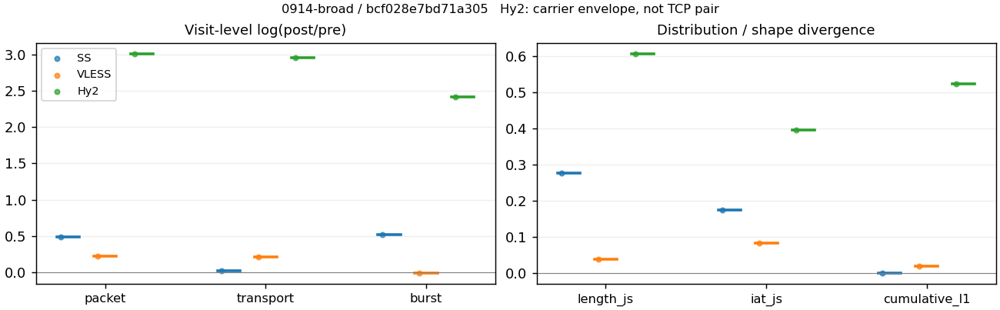
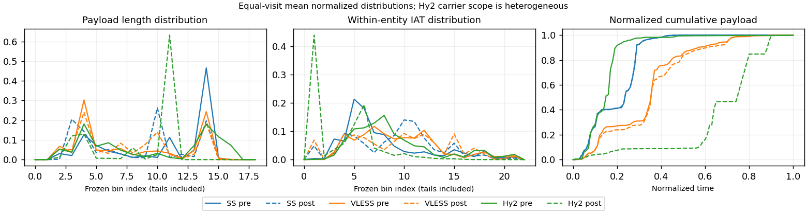

# 0914-broad · 条目 041 · theguardian.com

目标：https://www.theguardian.com/international

活动标签：theguardian.com::page_load。选定访问 3 次。

[返回总索引](../../README.md) · [统计口径](../../methods.md)

## 覆盖与资格（每次访问均保留）

| 部署 | 重复 | 主请求路由 | 活动状态 | 代理比较 | DIRECT pre | 请求 proxy/direct/unresolved | 错误 |
| --- | --- | --- | --- | --- | --- | --- | --- |
| Hy2 | 1 | proxy | passed | 1 | 1 | 172/6/0 | [] |
| SS | 1 | proxy | passed | 1 | 0 | 151/0/0 | [] |
| VLESS | 1 | proxy | passed | 1 | 0 | 237/0/1 | [] |

主请求非 proxy 的统计仅解释为已索引的辅助代理连接或 DIRECT 观测，不代表目标业务经代理传输。播放确认与配对资格是两道不同的门。

图中散点为单次访问，短线为重复中位数；Hy2 是共享载体包络，不能与 TCP 配对作等范围因果对比。

形态图先逐访问归一化，再对访问等权平均；实线 pre，虚线 post。分箱序号及边界见 methods，不将分箱索引误解为长度或时间。

## 每次访问的关键观测

### SS

范围：`exclusive_page`。每格 pre → post；空值为不可观测/不适用。

| 重复 | 包数 | 载荷字节 | burst | TCP FR | IAT中位µs | length JS | IAT JS |
| --- | --- | --- | --- | --- | --- | --- | --- |
| 1 | 2436 → 3977 | 2.3737e+06 → 2.4236e+06 | 1673 → 2825 | 232 → 234 | 41.952 → 592.88 | 0.27618 | 0.17561 |

完整标量统计：中位数 [min,max]；Δ 为重复内逐访问变换的中位数，MAD 未缩放。n 为可用变换数；DIRECT-only 的 nΔ=0 不代表 pre 不可用。

| scope | 特征 | pre | post | Δ | IQRΔ | MADΔ | nΔ |
| --- | --- | --- | --- | --- | --- | --- | --- |
| exclusive_page | active_span_sum_s_1000ms | 45.007 [45.007, 45.007] | 52.076 [52.076, 52.076] | 0.14589 | — | — | 1 |
| exclusive_page | active_span_sum_s_100ms | 8.3643 [8.3643, 8.3643] | 16.324 [16.324, 16.324] | 0.66868 | — | — | 1 |
| exclusive_page | active_span_sum_s_500ms | 33.952 [33.952, 33.952] | 42.131 [42.131, 42.131] | 0.21584 | — | — | 1 |
| exclusive_page | burst_bytes_iqr | 2575 [2575, 2575] | 1428 [1428, 1428] | -0.58957 | — | — | 1 |
| exclusive_page | burst_bytes_mad | 39 [39, 39] | 34 [34, 34] | -0.1372 | — | — | 1 |
| exclusive_page | burst_bytes_max | 20688 [20688, 20688] | 14280 [14280, 14280] | -0.37069 | — | — | 1 |
| exclusive_page | burst_bytes_mean | 1418.8 [1418.8, 1418.8] | 857.91 [857.91, 857.91] | -0.50307 | — | — | 1 |
| exclusive_page | burst_bytes_median | 39 [39, 39] | 34 [34, 34] | -0.1372 | — | — | 1 |
| exclusive_page | burst_bytes_min | 0 [0, 0] | 0 [0, 0] | — | — | — | 0 |
| exclusive_page | burst_bytes_p95 | 5792 [5792, 5792] | 2930 [2930, 2930] | -0.68148 | — | — | 1 |
| exclusive_page | burst_bytes_q25 | 0 [0, 0] | 0 [0, 0] | — | — | — | 0 |
| exclusive_page | burst_bytes_q75 | 2575 [2575, 2575] | 1428 [1428, 1428] | -0.58957 | — | — | 1 |
| exclusive_page | burst_bytes_std | 2740.4 [2740.4, 2740.4] | 1319.2 [1319.2, 1319.2] | -0.73106 | — | — | 1 |
| exclusive_page | burst_count | 1673 [1673, 1673] | 2825 [2825, 2825] | 0.52389 | — | — | 1 |
| exclusive_page | burst_duration_ms_iqr | 0.036502 [0.036502, 0.036502] | 0.000103 [0.000103, 0.000103] | -5.8704 | — | — | 1 |
| exclusive_page | burst_duration_ms_mad | 0 [0, 0] | 0 [0, 0] | — | — | — | 0 |
| exclusive_page | burst_duration_ms_max | 14942 [14942, 14942] | 15463 [15463, 15463] | 0.034286 | — | — | 1 |
| exclusive_page | burst_duration_ms_mean | 111.6 [111.6, 111.6] | 74.015 [74.015, 74.015] | -0.41066 | — | — | 1 |
| exclusive_page | burst_duration_ms_median | 0 [0, 0] | 0 [0, 0] | — | — | — | 0 |
| exclusive_page | burst_duration_ms_min | 0 [0, 0] | 0 [0, 0] | — | — | — | 0 |
| exclusive_page | burst_duration_ms_p95 | 222.6 [222.6, 222.6] | 35.862 [35.862, 35.862] | -1.8257 | — | — | 1 |
| exclusive_page | burst_duration_ms_q25 | 0 [0, 0] | 0 [0, 0] | — | — | — | 0 |
| exclusive_page | burst_duration_ms_q75 | 0.036502 [0.036502, 0.036502] | 0.000103 [0.000103, 0.000103] | -5.8704 | — | — | 1 |
| exclusive_page | burst_duration_ms_std | 1026 [1026, 1026] | 894.36 [894.36, 894.36] | -0.13734 | — | — | 1 |
| exclusive_page | burst_packets_iqr | 1 [1, 1] | 1 [1, 1] | 0 | — | — | 1 |
| exclusive_page | burst_packets_mad | 0 [0, 0] | 0 [0, 0] | — | — | — | 0 |
| exclusive_page | burst_packets_max | 11 [11, 11] | 10 [10, 10] | -0.09531 | — | — | 1 |
| exclusive_page | burst_packets_mean | 1.4561 [1.4561, 1.4561] | 1.4078 [1.4078, 1.4078] | -0.03372 | — | — | 1 |
| exclusive_page | burst_packets_median | 1 [1, 1] | 1 [1, 1] | 0 | — | — | 1 |
| exclusive_page | burst_packets_min | 1 [1, 1] | 1 [1, 1] | 0 | — | — | 1 |
| exclusive_page | burst_packets_p95 | 3 [3, 3] | 3 [3, 3] | 0 | — | — | 1 |
| exclusive_page | burst_packets_q25 | 1 [1, 1] | 1 [1, 1] | 0 | — | — | 1 |
| exclusive_page | burst_packets_q75 | 2 [2, 2] | 2 [2, 2] | 0 | — | — | 1 |
| exclusive_page | burst_packets_std | 1.0131 [1.0131, 1.0131] | 0.86018 [0.86018, 0.86018] | -0.1636 | — | — | 1 |
| exclusive_page | connection_span_concurrency_max | 21 [21, 21] | 21 [21, 21] | 0 | — | — | 1 |
| exclusive_page | cumulative_l1 | — | — | 0.001534 | — | — | 1 |
| exclusive_page | cumulative_max | — | — | 0.020288 | — | — | 1 |
| exclusive_page | direction_entropy | 0.74803 [0.74803, 0.74803] | 0.5915 [0.5915, 0.5915] | -0.15652 | — | — | 1 |
| exclusive_page | down_burst_count | 822 [822, 822] | 1398 [1398, 1398] | 0.53106 | — | — | 1 |
| exclusive_page | down_ip_bytes | 2.346e+06 [2.346e+06, 2.346e+06] | 2.4179e+06 [2.4179e+06, 2.4179e+06] | 0.030166 | — | — | 1 |
| exclusive_page | down_packets | 1421 [1421, 1421] | 2178 [2178, 2178] | 0.42705 | — | — | 1 |
| exclusive_page | down_transport_bytes | 2.2719e+06 [2.2719e+06, 2.2719e+06] | 2.3042e+06 [2.3042e+06, 2.3042e+06] | 0.014114 | — | — | 1 |
| exclusive_page | duration_s | 21.758 [21.758, 21.758] | 21.757 [21.757, 21.757] | -3.5899e-05 | — | — | 1 |
| exclusive_page | entity_count | 29 [29, 29] | 29 [29, 29] | 0 | — | — | 1 |
| exclusive_page | fr_runs | 232 [232, 232] | 234 [234, 234] | 0.0085837 | — | — | 1 |
| exclusive_page | fr_runs_per_packet | 0.16959 [0.16959, 0.16959] | 0.10813 [0.10813, 0.10813] | -0.061458 | — | — | 1 |
| exclusive_page | fr_switches | 203 [203, 203] | 205 [205, 205] | 0.009804 | — | — | 1 |
| exclusive_page | fr_switches_per_possible_transition | 0.15161 [0.15161, 0.15161] | 0.096019 [0.096019, 0.096019] | -0.055587 | — | — | 1 |
| exclusive_page | full_retransmission_fraction | 0.0020525 [0.0020525, 0.0020525] | 0.0070405 [0.0070405, 0.0070405] | 0.0049879 | — | — | 1 |
| exclusive_page | full_retransmission_packets | 5 [5, 5] | 28 [28, 28] | 1.7228 | — | — | 1 |
| exclusive_page | iat_count | 2407 [2407, 2407] | 3948 [3948, 3948] | 0.49483 | — | — | 1 |
| exclusive_page | iat_js | — | — | 0.17561 | — | — | 1 |
| exclusive_page | iat_ks | — | — | 0.33743 | — | — | 1 |
| exclusive_page | iat_median_us | 41.952 [41.952, 41.952] | 592.88 [592.88, 592.88] | 2.6485 | — | — | 1 |
| exclusive_page | iat_us_iqr | 300.7 [300.7, 300.7] | 1963.1 [1963.1, 1963.1] | 1.8762 | — | — | 1 |
| exclusive_page | iat_us_mad | 34.838 [34.838, 34.838] | 579.56 [579.56, 579.56] | 2.8116 | — | — | 1 |
| exclusive_page | iat_us_max | 1.5001e+07 [1.5001e+07, 1.5001e+07] | 1.5027e+07 [1.5027e+07, 1.5027e+07] | 0.0017197 | — | — | 1 |
| exclusive_page | iat_us_mean | 1.3655e+05 [1.3655e+05, 1.3655e+05] | 82941 [82941, 82941] | -0.49854 | — | — | 1 |
| exclusive_page | iat_us_median | 41.952 [41.952, 41.952] | 592.88 [592.88, 592.88] | 2.6485 | — | — | 1 |
| exclusive_page | iat_us_min | 0.071 [0.071, 0.071] | 0.034 [0.034, 0.034] | -0.73632 | — | — | 1 |
| exclusive_page | iat_us_p95 | 2.0138e+05 [2.0138e+05, 2.0138e+05] | 73685 [73685, 73685] | -1.0054 | — | — | 1 |
| exclusive_page | iat_us_q25 | 14.276 [14.276, 14.276] | 20.559 [20.559, 20.559] | 0.36474 | — | — | 1 |
| exclusive_page | iat_us_q75 | 314.97 [314.97, 314.97] | 1983.6 [1983.6, 1983.6] | 1.8402 | — | — | 1 |
| exclusive_page | iat_us_std | 1.177e+06 [1.177e+06, 1.177e+06] | 9.1792e+05 [9.1792e+05, 9.1792e+05] | -0.24859 | — | — | 1 |
| exclusive_page | iat_wasserstein_log1p_us | — | — | 1.3281 | — | — | 1 |
| exclusive_page | idle_gap_count_1000ms | 37 [37, 37] | 34 [34, 34] | -0.084557 | — | — | 1 |
| exclusive_page | idle_gap_count_100ms | 149 [149, 149] | 163 [163, 163] | 0.089804 | — | — | 1 |
| exclusive_page | idle_gap_count_500ms | 53 [53, 53] | 49 [49, 49] | -0.078472 | — | — | 1 |
| exclusive_page | idle_gap_sum_s_1000ms | 283.66 [283.66, 283.66] | 275.37 [275.37, 275.37] | -0.02965 | — | — | 1 |
| exclusive_page | idle_gap_sum_s_100ms | 320.3 [320.3, 320.3] | 311.12 [311.12, 311.12] | -0.029073 | — | — | 1 |
| exclusive_page | idle_gap_sum_s_500ms | 294.72 [294.72, 294.72] | 285.32 [285.32, 285.32] | -0.032404 | — | — | 1 |
| exclusive_page | ip_bytes | 2.5009e+06 [2.5009e+06, 2.5009e+06] | 2.6564e+06 [2.6564e+06, 2.6564e+06] | 0.060325 | — | — | 1 |
| exclusive_page | length_iqr | 2648 [2648, 2648] | 1374 [1374, 1374] | -0.65608 | — | — | 1 |
| exclusive_page | length_js | — | — | 0.27618 | — | — | 1 |
| exclusive_page | length_ks | — | — | 0.43078 | — | — | 1 |
| exclusive_page | length_mad | 1158 [1158, 1158] | 1330.5 [1330.5, 1330.5] | 0.13886 | — | — | 1 |
| exclusive_page | length_max | 4096 [4096, 4096] | 7140 [7140, 7140] | 0.5557 | — | — | 1 |
| exclusive_page | length_mean | 1735.1 [1735.1, 1735.1] | 1120 [1120, 1120] | -0.43779 | — | — | 1 |
| exclusive_page | length_median | 1738 [1738, 1738] | 1428 [1428, 1428] | -0.19646 | — | — | 1 |
| exclusive_page | length_min | 30 [30, 30] | 17 [17, 17] | -0.56798 | — | — | 1 |
| exclusive_page | length_p95 | 2896 [2896, 2896] | 2856 [2856, 2856] | -0.013908 | — | — | 1 |
| exclusive_page | length_q25 | 248 [248, 248] | 74 [74, 74] | -1.2094 | — | — | 1 |
| exclusive_page | length_q75 | 2896 [2896, 2896] | 1448 [1448, 1448] | -0.69315 | — | — | 1 |
| exclusive_page | length_std | 1211.2 [1211.2, 1211.2] | 1087.7 [1087.7, 1087.7] | -0.10759 | — | — | 1 |
| exclusive_page | length_wasserstein_bytes | — | — | 631.25 | — | — | 1 |
| exclusive_page | nonempty_entity_count | 29 [29, 29] | 29 [29, 29] | 0 | — | — | 1 |
| exclusive_page | nonempty_packets | 1368 [1368, 1368] | 2164 [2164, 2164] | 0.45861 | — | — | 1 |
| exclusive_page | offload_suspect_fraction | 0.29557 [0.29557, 0.29557] | 0.13201 [0.13201, 0.13201] | -0.16356 | — | — | 1 |
| exclusive_page | packet_count | 2436 [2436, 2436] | 3977 [3977, 3977] | 0.49017 | — | — | 1 |
| exclusive_page | rtt_median_ms | 0.057582 [0.057582, 0.057582] | 32.701 [32.701, 32.701] | 6.342 | — | — | 1 |
| exclusive_page | rtt_sample_count | 1003 [1003, 1003] | 774 [774, 774] | -0.25918 | — | — | 1 |
| exclusive_page | tcp_ack_count | 2407 [2407, 2407] | 3942 [3942, 3942] | 0.49331 | — | — | 1 |
| exclusive_page | tcp_fin_count | 58 [58, 58] | 62 [62, 62] | 0.066691 | — | — | 1 |
| exclusive_page | tcp_packet_count | 2436 [2436, 2436] | 3977 [3977, 3977] | 0.49017 | — | — | 1 |
| exclusive_page | tcp_rst_count | 0 [0, 0] | 0 [0, 0] | — | — | — | 0 |
| exclusive_page | tcp_syn_count | 58 [58, 58] | 67 [67, 67] | 0.14425 | — | — | 1 |
| exclusive_page | tcp_window_raw_median | 65535 [65535, 65535] | 137 [137, 137] | -6.1704 | — | — | 1 |
| exclusive_page | transition_entropy | 0.53797 [0.53797, 0.53797] | 0.38014 [0.38014, 0.38014] | -0.15783 | — | — | 1 |
| exclusive_page | transition_n_mm | 963 [963, 963] | 1741 [1741, 1741] | 0.59216 | — | — | 1 |
| exclusive_page | transition_n_mp | 90 [90, 90] | 91 [91, 91] | 0.01105 | — | — | 1 |
| exclusive_page | transition_n_pm | 113 [113, 113] | 114 [114, 114] | 0.0088106 | — | — | 1 |
| exclusive_page | transition_n_pp | 173 [173, 173] | 189 [189, 189] | 0.088455 | — | — | 1 |
| exclusive_page | transition_p_mm | 0.91453 [0.91453, 0.91453] | 0.95033 [0.95033, 0.95033] | 0.035798 | — | — | 1 |
| exclusive_page | transition_p_mp | 0.08547 [0.08547, 0.08547] | 0.049672 [0.049672, 0.049672] | -0.035798 | — | — | 1 |
| exclusive_page | transition_p_pm | 0.3951 [0.3951, 0.3951] | 0.37624 [0.37624, 0.37624] | -0.018867 | — | — | 1 |
| exclusive_page | transition_p_pp | 0.6049 [0.6049, 0.6049] | 0.62376 [0.62376, 0.62376] | 0.018867 | — | — | 1 |
| exclusive_page | transport_bytes | 2.3737e+06 [2.3737e+06, 2.3737e+06] | 2.4236e+06 [2.4236e+06, 2.4236e+06] | 0.020819 | — | — | 1 |
| exclusive_page | up_burst_count | 851 [851, 851] | 1427 [1427, 1427] | 0.51692 | — | — | 1 |
| exclusive_page | up_byte_fraction | 0.042863 [0.042863, 0.042863] | 0.049259 [0.049259, 0.049259] | 0.0063961 | — | — | 1 |
| exclusive_page | up_ip_bytes | 1.5482e+05 [1.5482e+05, 1.5482e+05] | 2.3847e+05 [2.3847e+05, 2.3847e+05] | 0.43203 | — | — | 1 |
| exclusive_page | up_packets | 1015 [1015, 1015] | 1799 [1799, 1799] | 0.57234 | — | — | 1 |
| exclusive_page | up_transport_bytes | 1.0174e+05 [1.0174e+05, 1.0174e+05] | 1.1938e+05 [1.1938e+05, 1.1938e+05] | 0.1599 | — | — | 1 |
| exclusive_page | zero_iat_count | 0 [0, 0] | 0 [0, 0] | — | — | — | 0 |
| exclusive_page | zero_iat_fraction | 0 [0, 0] | 0 [0, 0] | 0 | — | — | 1 |

### VLESS

范围：`exclusive_page`。每格 pre → post；空值为不可观测/不适用。

| 重复 | 包数 | 载荷字节 | burst | TCP FR | IAT中位µs | length JS | IAT JS |
| --- | --- | --- | --- | --- | --- | --- | --- |
| 1 | 5740 → 7178 | 3.1643e+06 → 3.9162e+06 | 4233 → 4222 | 723 → 917 | 253.23 → 591.02 | 0.039205 | 0.082536 |

完整标量统计：中位数 [min,max]；Δ 为重复内逐访问变换的中位数，MAD 未缩放。n 为可用变换数；DIRECT-only 的 nΔ=0 不代表 pre 不可用。

| scope | 特征 | pre | post | Δ | IQRΔ | MADΔ | nΔ |
| --- | --- | --- | --- | --- | --- | --- | --- |
| exclusive_page | active_span_sum_s_1000ms | 117.78 [117.78, 117.78] | 140.9 [140.9, 140.9] | 0.17919 | — | — | 1 |
| exclusive_page | active_span_sum_s_100ms | 13.997 [13.997, 13.997] | 45.508 [45.508, 45.508] | 1.1791 | — | — | 1 |
| exclusive_page | active_span_sum_s_500ms | 69.811 [69.811, 69.811] | 130.49 [130.49, 130.49] | 0.62551 | — | — | 1 |
| exclusive_page | burst_bytes_iqr | 1163 [1163, 1163] | 1851.8 [1851.8, 1851.8] | 0.46513 | — | — | 1 |
| exclusive_page | burst_bytes_mad | 31 [31, 31] | 60 [60, 60] | 0.66036 | — | — | 1 |
| exclusive_page | burst_bytes_max | 20480 [20480, 20480] | 5864 [5864, 5864] | -1.2506 | — | — | 1 |
| exclusive_page | burst_bytes_mean | 747.52 [747.52, 747.52] | 927.58 [927.58, 927.58] | 0.21581 | — | — | 1 |
| exclusive_page | burst_bytes_median | 31 [31, 31] | 60 [60, 60] | 0.66036 | — | — | 1 |
| exclusive_page | burst_bytes_min | 0 [0, 0] | 0 [0, 0] | — | — | — | 0 |
| exclusive_page | burst_bytes_p95 | 2896 [2896, 2896] | 2896 [2896, 2896] | 0 | — | — | 1 |
| exclusive_page | burst_bytes_q25 | 0 [0, 0] | 0 [0, 0] | — | — | — | 0 |
| exclusive_page | burst_bytes_q75 | 1163 [1163, 1163] | 1851.8 [1851.8, 1851.8] | 0.46513 | — | — | 1 |
| exclusive_page | burst_bytes_std | 1264.1 [1264.1, 1264.1] | 1208.8 [1208.8, 1208.8] | -0.044737 | — | — | 1 |
| exclusive_page | burst_count | 4233 [4233, 4233] | 4222 [4222, 4222] | -0.002602 | — | — | 1 |
| exclusive_page | burst_duration_ms_iqr | 0.6221 [0.6221, 0.6221] | 2.8558 [2.8558, 2.8558] | 1.524 | — | — | 1 |
| exclusive_page | burst_duration_ms_mad | 0 [0, 0] | 0 [0, 0] | — | — | — | 0 |
| exclusive_page | burst_duration_ms_max | 15000 [15000, 15000] | 15051 [15051, 15051] | 0.0034071 | — | — | 1 |
| exclusive_page | burst_duration_ms_mean | 148.61 [148.61, 148.61] | 131.26 [131.26, 131.26] | -0.12412 | — | — | 1 |
| exclusive_page | burst_duration_ms_median | 0 [0, 0] | 0 [0, 0] | — | — | — | 0 |
| exclusive_page | burst_duration_ms_min | 0 [0, 0] | 0 [0, 0] | — | — | — | 0 |
| exclusive_page | burst_duration_ms_p95 | 226.21 [226.21, 226.21] | 172.72 [172.72, 172.72] | -0.2698 | — | — | 1 |
| exclusive_page | burst_duration_ms_q25 | 0 [0, 0] | 0 [0, 0] | — | — | — | 0 |
| exclusive_page | burst_duration_ms_q75 | 0.6221 [0.6221, 0.6221] | 2.8558 [2.8558, 2.8558] | 1.524 | — | — | 1 |
| exclusive_page | burst_duration_ms_std | 1116.5 [1116.5, 1116.5] | 1107.9 [1107.9, 1107.9] | -0.007685 | — | — | 1 |
| exclusive_page | burst_packets_iqr | 1 [1, 1] | 1 [1, 1] | 0 | — | — | 1 |
| exclusive_page | burst_packets_mad | 0 [0, 0] | 0 [0, 0] | — | — | — | 0 |
| exclusive_page | burst_packets_max | 6 [6, 6] | 9 [9, 9] | 0.40547 | — | — | 1 |
| exclusive_page | burst_packets_mean | 1.356 [1.356, 1.356] | 1.7001 [1.7001, 1.7001] | 0.22616 | — | — | 1 |
| exclusive_page | burst_packets_median | 1 [1, 1] | 1 [1, 1] | 0 | — | — | 1 |
| exclusive_page | burst_packets_min | 1 [1, 1] | 1 [1, 1] | 0 | — | — | 1 |
| exclusive_page | burst_packets_p95 | 2 [2, 2] | 4 [4, 4] | 0.69315 | — | — | 1 |
| exclusive_page | burst_packets_q25 | 1 [1, 1] | 1 [1, 1] | 0 | — | — | 1 |
| exclusive_page | burst_packets_q75 | 2 [2, 2] | 2 [2, 2] | 0 | — | — | 1 |
| exclusive_page | burst_packets_std | 0.58699 [0.58699, 0.58699] | 1.0907 [1.0907, 1.0907] | 0.61955 | — | — | 1 |
| exclusive_page | connection_span_concurrency_max | 80 [80, 80] | 79 [79, 79] | -0.012579 | — | — | 1 |
| exclusive_page | cumulative_l1 | — | — | 0.01901 | — | — | 1 |
| exclusive_page | cumulative_max | — | — | 0.086655 | — | — | 1 |
| exclusive_page | direction_entropy | 0.7739 [0.7739, 0.7739] | 0.77172 [0.77172, 0.77172] | -0.0021844 | — | — | 1 |
| exclusive_page | down_burst_count | 2074 [2074, 2074] | 2074 [2074, 2074] | 0 | — | — | 1 |
| exclusive_page | down_ip_bytes | 3.043e+06 [3.043e+06, 3.043e+06] | 3.6677e+06 [3.6677e+06, 3.6677e+06] | 0.1867 | — | — | 1 |
| exclusive_page | down_packets | 3177 [3177, 3177] | 4042 [4042, 4042] | 0.2408 | — | — | 1 |
| exclusive_page | down_transport_bytes | 2.8771e+06 [2.8771e+06, 2.8771e+06] | 3.4568e+06 [3.4568e+06, 3.4568e+06] | 0.18354 | — | — | 1 |
| exclusive_page | duration_s | 22.403 [22.403, 22.403] | 22.429 [22.429, 22.429] | 0.0011466 | — | — | 1 |
| exclusive_page | entity_count | 88 [88, 88] | 88 [88, 88] | 0 | — | — | 1 |
| exclusive_page | fr_runs | 723 [723, 723] | 917 [917, 917] | 0.2377 | — | — | 1 |
| exclusive_page | fr_runs_per_packet | 0.24384 [0.24384, 0.24384] | 0.24227 [0.24227, 0.24227] | -0.0015727 | — | — | 1 |
| exclusive_page | fr_switches | 635 [635, 635] | 829 [829, 829] | 0.2666 | — | — | 1 |
| exclusive_page | fr_switches_per_possible_transition | 0.22072 [0.22072, 0.22072] | 0.22424 [0.22424, 0.22424] | 0.0035198 | — | — | 1 |
| exclusive_page | full_retransmission_fraction | 0.0033101 [0.0033101, 0.0033101] | 0 [0, 0] | -0.0033101 | — | — | 1 |
| exclusive_page | full_retransmission_packets | 19 [19, 19] | 0 [0, 0] | — | — | — | 0 |
| exclusive_page | iat_count | 5652 [5652, 5652] | 7090 [7090, 7090] | 0.22668 | — | — | 1 |
| exclusive_page | iat_js | — | — | 0.082536 | — | — | 1 |
| exclusive_page | iat_ks | — | — | 0.086726 | — | — | 1 |
| exclusive_page | iat_median_us | 253.23 [253.23, 253.23] | 591.02 [591.02, 591.02] | 0.84755 | — | — | 1 |
| exclusive_page | iat_us_iqr | 2825.5 [2825.5, 2825.5] | 6805.5 [6805.5, 6805.5] | 0.87904 | — | — | 1 |
| exclusive_page | iat_us_mad | 246.55 [246.55, 246.55] | 585.81 [585.81, 585.81] | 0.8654 | — | — | 1 |
| exclusive_page | iat_us_max | 1.5001e+07 [1.5001e+07, 1.5001e+07] | 1.5051e+07 [1.5051e+07, 1.5051e+07] | 0.0033499 | — | — | 1 |
| exclusive_page | iat_us_mean | 1.7642e+05 [1.7642e+05, 1.7642e+05] | 1.3735e+05 [1.3735e+05, 1.3735e+05] | -0.2503 | — | — | 1 |
| exclusive_page | iat_us_median | 253.23 [253.23, 253.23] | 591.02 [591.02, 591.02] | 0.84755 | — | — | 1 |
| exclusive_page | iat_us_min | 0.119 [0.119, 0.119] | 0.032 [0.032, 0.032] | -1.3134 | — | — | 1 |
| exclusive_page | iat_us_p95 | 2.1016e+05 [2.1016e+05, 2.1016e+05] | 1.5505e+05 [1.5505e+05, 1.5505e+05] | -0.30414 | — | — | 1 |
| exclusive_page | iat_us_q25 | 40.344 [40.344, 40.344] | 20.391 [20.391, 20.391] | -0.68235 | — | — | 1 |
| exclusive_page | iat_us_q75 | 2865.9 [2865.9, 2865.9] | 6825.9 [6825.9, 6825.9] | 0.86786 | — | — | 1 |
| exclusive_page | iat_us_std | 1.2603e+06 [1.2603e+06, 1.2603e+06] | 1.1222e+06 [1.1222e+06, 1.1222e+06] | -0.11606 | — | — | 1 |
| exclusive_page | iat_wasserstein_log1p_us | — | — | 0.72638 | — | — | 1 |
| exclusive_page | idle_gap_count_1000ms | 137 [137, 137] | 98 [98, 98] | -0.33501 | — | — | 1 |
| exclusive_page | idle_gap_count_100ms | 459 [459, 459] | 545 [545, 545] | 0.17174 | — | — | 1 |
| exclusive_page | idle_gap_count_500ms | 200 [200, 200] | 112 [112, 112] | -0.57982 | — | — | 1 |
| exclusive_page | idle_gap_sum_s_1000ms | 879.33 [879.33, 879.33] | 832.93 [832.93, 832.93] | -0.054209 | — | — | 1 |
| exclusive_page | idle_gap_sum_s_100ms | 983.11 [983.11, 983.11] | 928.32 [928.32, 928.32] | -0.05735 | — | — | 1 |
| exclusive_page | idle_gap_sum_s_500ms | 927.3 [927.3, 927.3] | 843.33 [843.33, 843.33] | -0.094912 | — | — | 1 |
| exclusive_page | ip_bytes | 3.4626e+06 [3.4626e+06, 3.4626e+06] | 4.2941e+06 [4.2941e+06, 4.2941e+06] | 0.21522 | — | — | 1 |
| exclusive_page | length_iqr | 2016 [2016, 2016] | 1340 [1340, 1340] | -0.40845 | — | — | 1 |
| exclusive_page | length_js | — | — | 0.039205 | — | — | 1 |
| exclusive_page | length_ks | — | — | 0.10179 | — | — | 1 |
| exclusive_page | length_mad | 464 [464, 464] | 672 [672, 672] | 0.37037 | — | — | 1 |
| exclusive_page | length_max | 8688 [8688, 8688] | 2896 [2896, 2896] | -1.0986 | — | — | 1 |
| exclusive_page | length_mean | 1067.2 [1067.2, 1067.2] | 1034.7 [1034.7, 1034.7] | -0.030957 | — | — | 1 |
| exclusive_page | length_median | 499 [499, 499] | 744 [744, 744] | 0.39943 | — | — | 1 |
| exclusive_page | length_min | 3 [3, 3] | 2 [2, 2] | -0.40547 | — | — | 1 |
| exclusive_page | length_p95 | 2824 [2824, 2824] | 2824 [2824, 2824] | 0 | — | — | 1 |
| exclusive_page | length_q25 | 72 [72, 72] | 72 [72, 72] | 0 | — | — | 1 |
| exclusive_page | length_q75 | 2088 [2088, 2088] | 1412 [1412, 1412] | -0.3912 | — | — | 1 |
| exclusive_page | length_std | 1165.9 [1165.9, 1165.9] | 1011.2 [1011.2, 1011.2] | -0.14239 | — | — | 1 |
| exclusive_page | length_wasserstein_bytes | — | — | 172.93 | — | — | 1 |
| exclusive_page | nonempty_entity_count | 88 [88, 88] | 88 [88, 88] | 0 | — | — | 1 |
| exclusive_page | nonempty_packets | 2965 [2965, 2965] | 3785 [3785, 3785] | 0.24417 | — | — | 1 |
| exclusive_page | offload_suspect_fraction | 0.15679 [0.15679, 0.15679] | 0.11507 [0.11507, 0.11507] | -0.041721 | — | — | 1 |
| exclusive_page | packet_count | 5740 [5740, 5740] | 7178 [7178, 7178] | 0.22356 | — | — | 1 |
| exclusive_page | rtt_median_ms | 0.11166 [0.11166, 0.11166] | 3.365 [3.365, 3.365] | 3.4057 | — | — | 1 |
| exclusive_page | rtt_sample_count | 2451 [2451, 2451] | 3071 [3071, 3071] | 0.22551 | — | — | 1 |
| exclusive_page | tcp_ack_count | 5512 [5512, 5512] | 7088 [7088, 7088] | 0.25148 | — | — | 1 |
| exclusive_page | tcp_fin_count | 170 [170, 170] | 176 [176, 176] | 0.034686 | — | — | 1 |
| exclusive_page | tcp_packet_count | 5740 [5740, 5740] | 7178 [7178, 7178] | 0.22356 | — | — | 1 |
| exclusive_page | tcp_rst_count | 142 [142, 142] | 2 [2, 2] | -4.2627 | — | — | 1 |
| exclusive_page | tcp_syn_count | 176 [176, 176] | 176 [176, 176] | 0 | — | — | 1 |
| exclusive_page | tcp_window_raw_median | 65471 [65471, 65471] | 141 [141, 141] | -6.1406 | — | — | 1 |
| exclusive_page | transition_entropy | 0.64912 [0.64912, 0.64912] | 0.66032 [0.66032, 0.66032] | 0.011206 | — | — | 1 |
| exclusive_page | transition_n_mm | 1931 [1931, 1931] | 2470 [2470, 2470] | 0.24618 | — | — | 1 |
| exclusive_page | transition_n_mp | 276 [276, 276] | 371 [371, 371] | 0.2958 | — | — | 1 |
| exclusive_page | transition_n_pm | 359 [359, 359] | 458 [458, 458] | 0.24355 | — | — | 1 |
| exclusive_page | transition_n_pp | 311 [311, 311] | 398 [398, 398] | 0.24666 | — | — | 1 |
| exclusive_page | transition_p_mm | 0.87494 [0.87494, 0.87494] | 0.86941 [0.86941, 0.86941] | -0.0055312 | — | — | 1 |
| exclusive_page | transition_p_mp | 0.12506 [0.12506, 0.12506] | 0.13059 [0.13059, 0.13059] | 0.0055312 | — | — | 1 |
| exclusive_page | transition_p_pm | 0.53582 [0.53582, 0.53582] | 0.53505 [0.53505, 0.53505] | -0.00077417 | — | — | 1 |
| exclusive_page | transition_p_pp | 0.46418 [0.46418, 0.46418] | 0.46495 [0.46495, 0.46495] | 0.00077417 | — | — | 1 |
| exclusive_page | transport_bytes | 3.1643e+06 [3.1643e+06, 3.1643e+06] | 3.9162e+06 [3.9162e+06, 3.9162e+06] | 0.21321 | — | — | 1 |
| exclusive_page | up_burst_count | 2159 [2159, 2159] | 2148 [2148, 2148] | -0.005108 | — | — | 1 |
| exclusive_page | up_byte_fraction | 0.090739 [0.090739, 0.090739] | 0.11733 [0.11733, 0.11733] | 0.026587 | — | — | 1 |
| exclusive_page | up_ip_bytes | 4.1958e+05 [4.1958e+05, 4.1958e+05] | 6.2644e+05 [6.2644e+05, 6.2644e+05] | 0.4008 | — | — | 1 |
| exclusive_page | up_packets | 2563 [2563, 2563] | 3136 [3136, 3136] | 0.20177 | — | — | 1 |
| exclusive_page | up_transport_bytes | 2.8712e+05 [2.8712e+05, 2.8712e+05] | 4.5948e+05 [4.5948e+05, 4.5948e+05] | 0.47018 | — | — | 1 |
| exclusive_page | zero_iat_count | 0 [0, 0] | 0 [0, 0] | — | — | — | 0 |
| exclusive_page | zero_iat_fraction | 0 [0, 0] | 0 [0, 0] | 0 | — | — | 1 |

### Hy2

范围：`carrier_context_envelope`。每格 pre → post；空值为不可观测/不适用。

| 重复 | 包数 | 载荷字节 | burst | TCP FR | IAT中位µs | length JS | IAT JS |
| --- | --- | --- | --- | --- | --- | --- | --- |
| 1 | 2497 → 50373 | 2.6878e+06 → 5.1678e+07 | 1660 → 18597 | — | 128.46 → 5.849 | 0.60653 | 0.397 |

范围：`direct_pre_only`。每格 pre → post；空值为不可观测/不适用。

| 重复 | 包数 | 载荷字节 | burst | TCP FR | IAT中位µs | length JS | IAT JS |
| --- | --- | --- | --- | --- | --- | --- | --- |
| 1 | 299 → — | 3.3146e+05 → — | 201 → — | 49 → — | 130.99 → — | — | — |

完整标量统计：中位数 [min,max]；Δ 为重复内逐访问变换的中位数，MAD 未缩放。n 为可用变换数；DIRECT-only 的 nΔ=0 不代表 pre 不可用。

| scope | 特征 | pre | post | Δ | IQRΔ | MADΔ | nΔ |
| --- | --- | --- | --- | --- | --- | --- | --- |
| carrier_context_envelope | active_span_sum_s_1000ms | 53.645 [53.645, 53.645] | 18.443 [18.443, 18.443] | -1.0677 | — | — | 1 |
| carrier_context_envelope | active_span_sum_s_100ms | 4.646 [4.646, 4.646] | 14.899 [14.899, 14.899] | 1.1653 | — | — | 1 |
| carrier_context_envelope | active_span_sum_s_500ms | 41.248 [41.248, 41.248] | 17.096 [17.096, 17.096] | -0.88079 | — | — | 1 |
| carrier_context_envelope | burst_bytes_iqr | 979.5 [979.5, 979.5] | 2783 [2783, 2783] | 1.0442 | — | — | 1 |
| carrier_context_envelope | burst_bytes_mad | 31 [31, 31] | 286 [286, 286] | 2.222 | — | — | 1 |
| carrier_context_envelope | burst_bytes_max | 27384 [27384, 27384] | 5.1469e+05 [5.1469e+05, 5.1469e+05] | 2.9336 | — | — | 1 |
| carrier_context_envelope | burst_bytes_mean | 1619.1 [1619.1, 1619.1] | 2778.8 [2778.8, 2778.8] | 0.54014 | — | — | 1 |
| carrier_context_envelope | burst_bytes_median | 31 [31, 31] | 319 [319, 319] | 2.3312 | — | — | 1 |
| carrier_context_envelope | burst_bytes_min | 0 [0, 0] | 22 [22, 22] | — | — | — | 0 |
| carrier_context_envelope | burst_bytes_p95 | 9309 [9309, 9309] | 9491 [9491, 9491] | 0.019362 | — | — | 1 |
| carrier_context_envelope | burst_bytes_q25 | 0 [0, 0] | 99 [99, 99] | — | — | — | 0 |
| carrier_context_envelope | burst_bytes_q75 | 979.5 [979.5, 979.5] | 2882 [2882, 2882] | 1.0792 | — | — | 1 |
| carrier_context_envelope | burst_bytes_std | 3817.9 [3817.9, 3817.9] | 6744 [6744, 6744] | 0.56896 | — | — | 1 |
| carrier_context_envelope | burst_count | 1660 [1660, 1660] | 18597 [18597, 18597] | 2.4162 | — | — | 1 |
| carrier_context_envelope | burst_duration_ms_iqr | 0.4504 [0.4504, 0.4504] | 0.023805 [0.023805, 0.023805] | -2.9402 | — | — | 1 |
| carrier_context_envelope | burst_duration_ms_mad | 0 [0, 0] | 4.2e-05 [4.2e-05, 4.2e-05] | — | — | — | 0 |
| carrier_context_envelope | burst_duration_ms_max | 15001 [15001, 15001] | 2348.9 [2348.9, 2348.9] | -1.8542 | — | — | 1 |
| carrier_context_envelope | burst_duration_ms_mean | 205.68 [205.68, 205.68] | 0.48654 [0.48654, 0.48654] | -6.0468 | — | — | 1 |
| carrier_context_envelope | burst_duration_ms_median | 0 [0, 0] | 4.2e-05 [4.2e-05, 4.2e-05] | — | — | — | 0 |
| carrier_context_envelope | burst_duration_ms_min | 0 [0, 0] | 0 [0, 0] | — | — | — | 0 |
| carrier_context_envelope | burst_duration_ms_p95 | 359.93 [359.93, 359.93] | 0.1719 [0.1719, 0.1719] | -7.6468 | — | — | 1 |
| carrier_context_envelope | burst_duration_ms_q25 | 0 [0, 0] | 0 [0, 0] | — | — | — | 0 |
| carrier_context_envelope | burst_duration_ms_q75 | 0.4504 [0.4504, 0.4504] | 0.023805 [0.023805, 0.023805] | -2.9402 | — | — | 1 |
| carrier_context_envelope | burst_duration_ms_std | 1411.9 [1411.9, 1411.9] | 17.88 [17.88, 17.88] | -4.369 | — | — | 1 |
| carrier_context_envelope | burst_packets_iqr | 1 [1, 1] | 2 [2, 2] | 0.69315 | — | — | 1 |
| carrier_context_envelope | burst_packets_mad | 0 [0, 0] | 1 [1, 1] | — | — | — | 0 |
| carrier_context_envelope | burst_packets_max | 8 [8, 8] | 370 [370, 370] | 3.8341 | — | — | 1 |
| carrier_context_envelope | burst_packets_mean | 1.5042 [1.5042, 1.5042] | 2.7087 [2.7087, 2.7087] | 0.58818 | — | — | 1 |
| carrier_context_envelope | burst_packets_median | 1 [1, 1] | 2 [2, 2] | 0.69315 | — | — | 1 |
| carrier_context_envelope | burst_packets_min | 1 [1, 1] | 1 [1, 1] | 0 | — | — | 1 |
| carrier_context_envelope | burst_packets_p95 | 3 [3, 3] | 7 [7, 7] | 0.8473 | — | — | 1 |
| carrier_context_envelope | burst_packets_q25 | 1 [1, 1] | 1 [1, 1] | 0 | — | — | 1 |
| carrier_context_envelope | burst_packets_q75 | 2 [2, 2] | 3 [3, 3] | 0.40547 | — | — | 1 |
| carrier_context_envelope | burst_packets_std | 0.78348 [0.78348, 0.78348] | 4.718 [4.718, 4.718] | 1.7954 | — | — | 1 |
| carrier_context_envelope | connection_span_concurrency_max | 45 [45, 45] | 1 [1, 1] | -3.8067 | — | — | 1 |
| carrier_context_envelope | cumulative_l1 | — | — | 0.52326 | — | — | 1 |
| carrier_context_envelope | cumulative_max | — | — | 0.90335 | — | — | 1 |
| carrier_context_envelope | direction_entropy | 0.93141 [0.93141, 0.93141] | 0.81168 [0.81168, 0.81168] | -0.11973 | — | — | 1 |
| carrier_context_envelope | direction_run_analog_runs | 393 [393, 393] | 18597 [18597, 18597] | 3.8569 | — | — | 1 |
| carrier_context_envelope | direction_run_analog_runs_per_packet | 0.31719 [0.31719, 0.31719] | 0.36919 [0.36919, 0.36919] | 0.051995 | — | — | 1 |
| carrier_context_envelope | direction_run_analog_switches | 342 [342, 342] | 18596 [18596, 18596] | 3.9959 | — | — | 1 |
| carrier_context_envelope | direction_run_analog_switches_per_possible_transition | 0.28788 [0.28788, 0.28788] | 0.36917 [0.36917, 0.36917] | 0.081295 | — | — | 1 |
| carrier_context_envelope | down_burst_count | 807 [807, 807] | 9298 [9298, 9298] | 2.4442 | — | — | 1 |
| carrier_context_envelope | down_ip_bytes | 2.5786e+06 [2.5786e+06, 2.5786e+06] | 5.1455e+07 [5.1455e+07, 5.1455e+07] | 2.9934 | — | — | 1 |
| carrier_context_envelope | down_packets | 1367 [1367, 1367] | 37767 [37767, 37767] | 3.3188 | — | — | 1 |
| carrier_context_envelope | down_transport_bytes | 2.5071e+06 [2.5071e+06, 2.5071e+06] | 5.0397e+07 [5.0397e+07, 5.0397e+07] | 3.0008 | — | — | 1 |
| carrier_context_envelope | duration_s | 20.657 [20.657, 20.657] | 20.638 [20.638, 20.638] | -0.00091012 | — | — | 1 |
| carrier_context_envelope | entity_count | 51 [51, 51] | 1 [1, 1] | -3.9318 | — | — | 1 |
| carrier_context_envelope | full_retransmission_fraction | 0.0056067 [0.0056067, 0.0056067] | — | — | — | — | 0 |
| carrier_context_envelope | full_retransmission_packets | 14 [14, 14] | — | — | — | — | 0 |
| carrier_context_envelope | iat_count | 2446 [2446, 2446] | 50372 [50372, 50372] | 3.025 | — | — | 1 |
| carrier_context_envelope | iat_js | — | — | 0.397 | — | — | 1 |
| carrier_context_envelope | iat_ks | — | — | 0.58822 | — | — | 1 |
| carrier_context_envelope | iat_median_us | 128.46 [128.46, 128.46] | 5.849 [5.849, 5.849] | -3.0894 | — | — | 1 |
| carrier_context_envelope | iat_us_iqr | 956.38 [956.38, 956.38] | 25.598 [25.598, 25.598] | -3.6206 | — | — | 1 |
| carrier_context_envelope | iat_us_mad | 115.88 [115.88, 115.88] | 5.812 [5.812, 5.812] | -2.9926 | — | — | 1 |
| carrier_context_envelope | iat_us_max | 1.5002e+07 [1.5002e+07, 1.5002e+07] | 2.1944e+06 [2.1944e+06, 2.1944e+06] | -1.9223 | — | — | 1 |
| carrier_context_envelope | iat_us_mean | 2.8438e+05 [2.8438e+05, 2.8438e+05] | 409.71 [409.71, 409.71] | -6.5426 | — | — | 1 |
| carrier_context_envelope | iat_us_median | 128.46 [128.46, 128.46] | 5.849 [5.849, 5.849] | -3.0894 | — | — | 1 |
| carrier_context_envelope | iat_us_min | 0.412 [0.412, 0.412] | 0 [0, 0] | — | — | — | 0 |
| carrier_context_envelope | iat_us_p95 | 3.2591e+05 [3.2591e+05, 3.2591e+05] | 528.46 [528.46, 528.46] | -6.4244 | — | — | 1 |
| carrier_context_envelope | iat_us_q25 | 36.327 [36.327, 36.327] | 0.044 [0.044, 0.044] | -6.7161 | — | — | 1 |
| carrier_context_envelope | iat_us_q75 | 992.71 [992.71, 992.71] | 25.642 [25.642, 25.642] | -3.6562 | — | — | 1 |
| carrier_context_envelope | iat_us_std | 1.8248e+06 [1.8248e+06, 1.8248e+06] | 11477 [11477, 11477] | -5.0689 | — | — | 1 |
| carrier_context_envelope | iat_wasserstein_log1p_us | — | — | 3.7616 | — | — | 1 |
| carrier_context_envelope | idle_gap_count_1000ms | 74 [74, 74] | 1 [1, 1] | -4.3041 | — | — | 1 |
| carrier_context_envelope | idle_gap_count_100ms | 250 [250, 250] | 15 [15, 15] | -2.8134 | — | — | 1 |
| carrier_context_envelope | idle_gap_count_500ms | 93 [93, 93] | 3 [3, 3] | -3.434 | — | — | 1 |
| carrier_context_envelope | idle_gap_sum_s_1000ms | 641.95 [641.95, 641.95] | 2.1944 [2.1944, 2.1944] | -5.6786 | — | — | 1 |
| carrier_context_envelope | idle_gap_sum_s_100ms | 690.95 [690.95, 690.95] | 5.7392 [5.7392, 5.7392] | -4.7908 | — | — | 1 |
| carrier_context_envelope | idle_gap_sum_s_500ms | 654.35 [654.35, 654.35] | 3.5421 [3.5421, 3.5421] | -5.2189 | — | — | 1 |
| carrier_context_envelope | ip_bytes | 2.8186e+06 [2.8186e+06, 2.8186e+06] | 5.3088e+07 [5.3088e+07, 5.3088e+07] | 2.9357 | — | — | 1 |
| carrier_context_envelope | length_iqr | 2731 [2731, 2731] | 1339 [1339, 1339] | -0.71274 | — | — | 1 |
| carrier_context_envelope | length_js | — | — | 0.60653 | — | — | 1 |
| carrier_context_envelope | length_ks | — | — | 0.45359 | — | — | 1 |
| carrier_context_envelope | length_mad | 957 [957, 957] | 0 [0, 0] | — | — | — | 0 |
| carrier_context_envelope | length_max | 8920 [8920, 8920] | 1441 [1441, 1441] | -1.823 | — | — | 1 |
| carrier_context_envelope | length_mean | 2169.3 [2169.3, 2169.3] | 1025.9 [1025.9, 1025.9] | -0.74883 | — | — | 1 |
| carrier_context_envelope | length_median | 1024 [1024, 1024] | 1441 [1441, 1441] | 0.34162 | — | — | 1 |
| carrier_context_envelope | length_min | 6 [6, 6] | 22 [22, 22] | 1.2993 | — | — | 1 |
| carrier_context_envelope | length_p95 | 8920 [8920, 8920] | 1441 [1441, 1441] | -1.823 | — | — | 1 |
| carrier_context_envelope | length_q25 | 103 [103, 103] | 102 [102, 102] | -0.0097562 | — | — | 1 |
| carrier_context_envelope | length_q75 | 2834 [2834, 2834] | 1441 [1441, 1441] | -0.67635 | — | — | 1 |
| carrier_context_envelope | length_std | 2665.9 [2665.9, 2665.9] | 603.05 [603.05, 603.05] | -1.4863 | — | — | 1 |
| carrier_context_envelope | length_wasserstein_bytes | — | — | 1532.2 | — | — | 1 |
| carrier_context_envelope | nonempty_entity_count | 51 [51, 51] | 1 [1, 1] | -3.9318 | — | — | 1 |
| carrier_context_envelope | nonempty_packets | 1239 [1239, 1239] | 50373 [50373, 50373] | 3.7052 | — | — | 1 |
| carrier_context_envelope | offload_suspect_fraction | 0.22227 [0.22227, 0.22227] | 0 [0, 0] | -0.22227 | — | — | 1 |
| carrier_context_envelope | packet_count | 2497 [2497, 2497] | 50373 [50373, 50373] | 3.0044 | — | — | 1 |
| carrier_context_envelope | rtt_median_ms | 0.10344 [0.10344, 0.10344] | — | — | — | — | 0 |
| carrier_context_envelope | rtt_sample_count | 1095 [1095, 1095] | 0 [0, 0] | — | — | — | 0 |
| carrier_context_envelope | tcp_ack_count | 2446 [2446, 2446] | — | — | — | — | 0 |
| carrier_context_envelope | tcp_fin_count | 102 [102, 102] | — | — | — | — | 0 |
| carrier_context_envelope | tcp_packet_count | 2497 [2497, 2497] | 0 [0, 0] | — | — | — | 0 |
| carrier_context_envelope | tcp_rst_count | 0 [0, 0] | — | — | — | — | 0 |
| carrier_context_envelope | tcp_syn_count | 102 [102, 102] | — | — | — | — | 0 |
| carrier_context_envelope | tcp_window_raw_median | 65379 [65379, 65379] | — | — | — | — | 0 |
| carrier_context_envelope | transition_entropy | 0.81326 [0.81326, 0.81326] | 0.81147 [0.81147, 0.81147] | -0.0017948 | — | — | 1 |
| carrier_context_envelope | transition_n_mm | 618 [618, 618] | 28469 [28469, 28469] | 3.8301 | — | — | 1 |
| carrier_context_envelope | transition_n_mp | 151 [151, 151] | 9298 [9298, 9298] | 4.1203 | — | — | 1 |
| carrier_context_envelope | transition_n_pm | 191 [191, 191] | 9298 [9298, 9298] | 3.8853 | — | — | 1 |
| carrier_context_envelope | transition_n_pp | 228 [228, 228] | 3307 [3307, 3307] | 2.6745 | — | — | 1 |
| carrier_context_envelope | transition_p_mm | 0.80364 [0.80364, 0.80364] | 0.75381 [0.75381, 0.75381] | -0.049835 | — | — | 1 |
| carrier_context_envelope | transition_p_mp | 0.19636 [0.19636, 0.19636] | 0.24619 [0.24619, 0.24619] | 0.049835 | — | — | 1 |
| carrier_context_envelope | transition_p_pm | 0.45585 [0.45585, 0.45585] | 0.73764 [0.73764, 0.73764] | 0.2818 | — | — | 1 |
| carrier_context_envelope | transition_p_pp | 0.54415 [0.54415, 0.54415] | 0.26236 [0.26236, 0.26236] | -0.2818 | — | — | 1 |
| carrier_context_envelope | transport_bytes | 2.6878e+06 [2.6878e+06, 2.6878e+06] | 5.1678e+07 [5.1678e+07, 5.1678e+07] | 2.9563 | — | — | 1 |
| carrier_context_envelope | up_burst_count | 853 [853, 853] | 9299 [9299, 9299] | 2.3889 | — | — | 1 |
| carrier_context_envelope | up_byte_fraction | 0.0672 [0.0672, 0.0672] | 0.024781 [0.024781, 0.024781] | -0.042418 | — | — | 1 |
| carrier_context_envelope | up_ip_bytes | 2.3995e+05 [2.3995e+05, 2.3995e+05] | 1.6336e+06 [1.6336e+06, 1.6336e+06] | 1.9181 | — | — | 1 |
| carrier_context_envelope | up_packets | 1130 [1130, 1130] | 12606 [12606, 12606] | 2.412 | — | — | 1 |
| carrier_context_envelope | up_transport_bytes | 1.8062e+05 [1.8062e+05, 1.8062e+05] | 1.2806e+06 [1.2806e+06, 1.2806e+06] | 1.9587 | — | — | 1 |
| carrier_context_envelope | zero_iat_count | 0 [0, 0] | 1 [1, 1] | — | — | — | 0 |
| carrier_context_envelope | zero_iat_fraction | 0 [0, 0] | 1.9852e-05 [1.9852e-05, 1.9852e-05] | 1.9852e-05 | — | — | 1 |
| direct_pre_only | active_span_sum_s_1000ms | 3.965 [3.965, 3.965] | — | — | — | — | 0 |
| direct_pre_only | active_span_sum_s_100ms | 1.0154 [1.0154, 1.0154] | — | — | — | — | 0 |
| direct_pre_only | active_span_sum_s_500ms | 2.7011 [2.7011, 2.7011] | — | — | — | — | 0 |
| direct_pre_only | burst_bytes_iqr | 1400 [1400, 1400] | — | — | — | — | 0 |
| direct_pre_only | burst_bytes_mad | 39 [39, 39] | — | — | — | — | 0 |
| direct_pre_only | burst_bytes_max | 20480 [20480, 20480] | — | — | — | — | 0 |
| direct_pre_only | burst_bytes_mean | 1649 [1649, 1649] | — | — | — | — | 0 |
| direct_pre_only | burst_bytes_median | 39 [39, 39] | — | — | — | — | 0 |
| direct_pre_only | burst_bytes_min | 0 [0, 0] | — | — | — | — | 0 |
| direct_pre_only | burst_bytes_p95 | 9773 [9773, 9773] | — | — | — | — | 0 |
| direct_pre_only | burst_bytes_q25 | 0 [0, 0] | — | — | — | — | 0 |
| direct_pre_only | burst_bytes_q75 | 1400 [1400, 1400] | — | — | — | — | 0 |
| direct_pre_only | burst_bytes_std | 3552.9 [3552.9, 3552.9] | — | — | — | — | 0 |
| direct_pre_only | burst_count | 201 [201, 201] | — | — | — | — | 0 |
| direct_pre_only | burst_duration_ms_iqr | 0.6635 [0.6635, 0.6635] | — | — | — | — | 0 |
| direct_pre_only | burst_duration_ms_mad | 0 [0, 0] | — | — | — | — | 0 |
| direct_pre_only | burst_duration_ms_max | 15001 [15001, 15001] | — | — | — | — | 0 |
| direct_pre_only | burst_duration_ms_mean | 386.65 [386.65, 386.65] | — | — | — | — | 0 |
| direct_pre_only | burst_duration_ms_median | 0 [0, 0] | — | — | — | — | 0 |
| direct_pre_only | burst_duration_ms_min | 0 [0, 0] | — | — | — | — | 0 |
| direct_pre_only | burst_duration_ms_p95 | 339.63 [339.63, 339.63] | — | — | — | — | 0 |
| direct_pre_only | burst_duration_ms_q25 | 0 [0, 0] | — | — | — | — | 0 |
| direct_pre_only | burst_duration_ms_q75 | 0.6635 [0.6635, 0.6635] | — | — | — | — | 0 |
| direct_pre_only | burst_duration_ms_std | 2177.4 [2177.4, 2177.4] | — | — | — | — | 0 |
| direct_pre_only | burst_packets_iqr | 1 [1, 1] | — | — | — | — | 0 |
| direct_pre_only | burst_packets_mad | 0 [0, 0] | — | — | — | — | 0 |
| direct_pre_only | burst_packets_max | 8 [8, 8] | — | — | — | — | 0 |
| direct_pre_only | burst_packets_mean | 1.4876 [1.4876, 1.4876] | — | — | — | — | 0 |
| direct_pre_only | burst_packets_median | 1 [1, 1] | — | — | — | — | 0 |
| direct_pre_only | burst_packets_min | 1 [1, 1] | — | — | — | — | 0 |
| direct_pre_only | burst_packets_p95 | 3 [3, 3] | — | — | — | — | 0 |
| direct_pre_only | burst_packets_q25 | 1 [1, 1] | — | — | — | — | 0 |
| direct_pre_only | burst_packets_q75 | 2 [2, 2] | — | — | — | — | 0 |
| direct_pre_only | burst_packets_std | 0.84706 [0.84706, 0.84706] | — | — | — | — | 0 |
| direct_pre_only | connection_span_concurrency_max | 5 [5, 5] | — | — | — | — | 0 |
| direct_pre_only | direction_entropy | 0.87731 [0.87731, 0.87731] | — | — | — | — | 0 |
| direct_pre_only | down_burst_count | 98 [98, 98] | — | — | — | — | 0 |
| direct_pre_only | down_ip_bytes | 3.2545e+05 [3.2545e+05, 3.2545e+05] | — | — | — | — | 0 |
| direct_pre_only | down_packets | 171 [171, 171] | — | — | — | — | 0 |
| direct_pre_only | down_transport_bytes | 3.1652e+05 [3.1652e+05, 3.1652e+05] | — | — | — | — | 0 |
| direct_pre_only | duration_s | 17.763 [17.763, 17.763] | — | — | — | — | 0 |
| direct_pre_only | entity_count | 5 [5, 5] | — | — | — | — | 0 |
| direct_pre_only | fr_runs | 49 [49, 49] | — | — | — | — | 0 |
| direct_pre_only | fr_runs_per_packet | 0.31613 [0.31613, 0.31613] | — | — | — | — | 0 |
| direct_pre_only | fr_switches | 44 [44, 44] | — | — | — | — | 0 |
| direct_pre_only | fr_switches_per_possible_transition | 0.29333 [0.29333, 0.29333] | — | — | — | — | 0 |
| direct_pre_only | full_retransmission_fraction | 0.0033445 [0.0033445, 0.0033445] | — | — | — | — | 0 |
| direct_pre_only | full_retransmission_packets | 1 [1, 1] | — | — | — | — | 0 |
| direct_pre_only | iat_count | 294 [294, 294] | — | — | — | — | 0 |
| direct_pre_only | iat_median_us | 130.99 [130.99, 130.99] | — | — | — | — | 0 |
| direct_pre_only | iat_us_iqr | 726.53 [726.53, 726.53] | — | — | — | — | 0 |
| direct_pre_only | iat_us_mad | 118.38 [118.38, 118.38] | — | — | — | — | 0 |
| direct_pre_only | iat_us_max | 1.5001e+07 [1.5001e+07, 1.5001e+07] | — | — | — | — | 0 |
| direct_pre_only | iat_us_mean | 2.9203e+05 [2.9203e+05, 2.9203e+05] | — | — | — | — | 0 |
| direct_pre_only | iat_us_median | 130.99 [130.99, 130.99] | — | — | — | — | 0 |
| direct_pre_only | iat_us_min | 2.762 [2.762, 2.762] | — | — | — | — | 0 |
| direct_pre_only | iat_us_p95 | 2.8465e+05 [2.8465e+05, 2.8465e+05] | — | — | — | — | 0 |
| direct_pre_only | iat_us_q25 | 39.393 [39.393, 39.393] | — | — | — | — | 0 |
| direct_pre_only | iat_us_q75 | 765.93 [765.93, 765.93] | — | — | — | — | 0 |
| direct_pre_only | iat_us_std | 1.8406e+06 [1.8406e+06, 1.8406e+06] | — | — | — | — | 0 |
| direct_pre_only | idle_gap_count_1000ms | 10 [10, 10] | — | — | — | — | 0 |
| direct_pre_only | idle_gap_count_100ms | 18 [18, 18] | — | — | — | — | 0 |
| direct_pre_only | idle_gap_count_500ms | 12 [12, 12] | — | — | — | — | 0 |
| direct_pre_only | idle_gap_sum_s_1000ms | 81.893 [81.893, 81.893] | — | — | — | — | 0 |
| direct_pre_only | idle_gap_sum_s_100ms | 84.842 [84.842, 84.842] | — | — | — | — | 0 |
| direct_pre_only | idle_gap_sum_s_500ms | 83.157 [83.157, 83.157] | — | — | — | — | 0 |
| direct_pre_only | ip_bytes | 3.471e+05 [3.471e+05, 3.471e+05] | — | — | — | — | 0 |
| direct_pre_only | length_iqr | 2576 [2576, 2576] | — | — | — | — | 0 |
| direct_pre_only | length_mad | 1361 [1361, 1361] | — | — | — | — | 0 |
| direct_pre_only | length_max | 8920 [8920, 8920] | — | — | — | — | 0 |
| direct_pre_only | length_mean | 2138.4 [2138.4, 2138.4] | — | — | — | — | 0 |
| direct_pre_only | length_median | 1400 [1400, 1400] | — | — | — | — | 0 |
| direct_pre_only | length_min | 31 [31, 31] | — | — | — | — | 0 |
| direct_pre_only | length_p95 | 8920 [8920, 8920] | — | — | — | — | 0 |
| direct_pre_only | length_q25 | 224 [224, 224] | — | — | — | — | 0 |
| direct_pre_only | length_q75 | 2800 [2800, 2800] | — | — | — | — | 0 |
| direct_pre_only | length_std | 2400.2 [2400.2, 2400.2] | — | — | — | — | 0 |
| direct_pre_only | nonempty_entity_count | 5 [5, 5] | — | — | — | — | 0 |
| direct_pre_only | nonempty_packets | 155 [155, 155] | — | — | — | — | 0 |
| direct_pre_only | offload_suspect_fraction | 0.22408 [0.22408, 0.22408] | — | — | — | — | 0 |
| direct_pre_only | packet_count | 299 [299, 299] | — | — | — | — | 0 |
| direct_pre_only | rtt_median_ms | 0.098027 [0.098027, 0.098027] | — | — | — | — | 0 |
| direct_pre_only | rtt_sample_count | 130 [130, 130] | — | — | — | — | 0 |
| direct_pre_only | tcp_ack_count | 294 [294, 294] | — | — | — | — | 0 |
| direct_pre_only | tcp_fin_count | 10 [10, 10] | — | — | — | — | 0 |
| direct_pre_only | tcp_packet_count | 299 [299, 299] | — | — | — | — | 0 |
| direct_pre_only | tcp_rst_count | 0 [0, 0] | — | — | — | — | 0 |
| direct_pre_only | tcp_syn_count | 10 [10, 10] | — | — | — | — | 0 |
| direct_pre_only | tcp_window_raw_median | 65496 [65496, 65496] | — | — | — | — | 0 |
| direct_pre_only | transition_entropy | 0.79953 [0.79953, 0.79953] | — | — | — | — | 0 |
| direct_pre_only | transition_n_mm | 87 [87, 87] | — | — | — | — | 0 |
| direct_pre_only | transition_n_mp | 22 [22, 22] | — | — | — | — | 0 |
| direct_pre_only | transition_n_pm | 22 [22, 22] | — | — | — | — | 0 |
| direct_pre_only | transition_n_pp | 19 [19, 19] | — | — | — | — | 0 |
| direct_pre_only | transition_p_mm | 0.79817 [0.79817, 0.79817] | — | — | — | — | 0 |
| direct_pre_only | transition_p_mp | 0.20183 [0.20183, 0.20183] | — | — | — | — | 0 |
| direct_pre_only | transition_p_pm | 0.53659 [0.53659, 0.53659] | — | — | — | — | 0 |
| direct_pre_only | transition_p_pp | 0.46341 [0.46341, 0.46341] | — | — | — | — | 0 |
| direct_pre_only | transport_bytes | 3.3146e+05 [3.3146e+05, 3.3146e+05] | — | — | — | — | 0 |
| direct_pre_only | up_burst_count | 103 [103, 103] | — | — | — | — | 0 |
| direct_pre_only | up_byte_fraction | 0.045065 [0.045065, 0.045065] | — | — | — | — | 0 |
| direct_pre_only | up_ip_bytes | 21645 [21645, 21645] | — | — | — | — | 0 |
| direct_pre_only | up_packets | 128 [128, 128] | — | — | — | — | 0 |
| direct_pre_only | up_transport_bytes | 14937 [14937, 14937] | — | — | — | — | 0 |
| direct_pre_only | zero_iat_count | 0 [0, 0] | — | — | — | — | 0 |
| direct_pre_only | zero_iat_fraction | 0 [0, 0] | — | — | — | — | 0 |

## 不同部署对比

以下是各部署自身重复中位数的差异，不按重复编号强行配对。跨 TCP/Hy2 的行标记异质观测范围。

| 视角 | 特征 | 部署A | 部署B | A中位 | B中位 | B−A | 比较口径 |
| --- | --- | --- | --- | --- | --- | --- | --- |
| pre | burst_count | SS | VLESS | 1673 | 4233 | 2560 | same_scope_unpaired_visits |
| pre | burst_count | SS | Hy2 | 1673 | 1660 | -13 | heterogeneous_scope_descriptive_only |
| pre | burst_count | VLESS | Hy2 | 4233 | 1660 | -2573 | heterogeneous_scope_descriptive_only |
| pre | connection_span_concurrency_max | SS | VLESS | 21 | 80 | 59 | same_scope_unpaired_visits |
| pre | connection_span_concurrency_max | SS | Hy2 | 21 | 45 | 24 | heterogeneous_scope_descriptive_only |
| pre | connection_span_concurrency_max | VLESS | Hy2 | 80 | 45 | -35 | heterogeneous_scope_descriptive_only |
| pre | direction_entropy | SS | VLESS | 0.74803 | 0.7739 | 0.025876 | same_scope_unpaired_visits |
| pre | direction_entropy | SS | Hy2 | 0.74803 | 0.93141 | 0.18338 | heterogeneous_scope_descriptive_only |
| pre | direction_entropy | VLESS | Hy2 | 0.7739 | 0.93141 | 0.15751 | heterogeneous_scope_descriptive_only |
| pre | down_transport_bytes | SS | VLESS | 2.2719e+06 | 2.8771e+06 | 6.0521e+05 | same_scope_unpaired_visits |
| pre | down_transport_bytes | SS | Hy2 | 2.2719e+06 | 2.5071e+06 | 2.3523e+05 | heterogeneous_scope_descriptive_only |
| pre | down_transport_bytes | VLESS | Hy2 | 2.8771e+06 | 2.5071e+06 | -3.6998e+05 | heterogeneous_scope_descriptive_only |
| pre | duration_s | SS | VLESS | 21.758 | 22.403 | 0.64578 | same_scope_unpaired_visits |
| pre | duration_s | SS | Hy2 | 21.758 | 20.657 | -1.101 | heterogeneous_scope_descriptive_only |
| pre | duration_s | VLESS | Hy2 | 22.403 | 20.657 | -1.7468 | heterogeneous_scope_descriptive_only |
| pre | entity_count | SS | VLESS | 29 | 88 | 59 | same_scope_unpaired_visits |
| pre | entity_count | SS | Hy2 | 29 | 51 | 22 | heterogeneous_scope_descriptive_only |
| pre | entity_count | VLESS | Hy2 | 88 | 51 | -37 | heterogeneous_scope_descriptive_only |
| pre | fr_runs | SS | VLESS | 232 | 723 | 491 | same_scope_unpaired_visits |
| pre | fr_runs_per_packet | SS | VLESS | 0.16959 | 0.24384 | 0.074254 | same_scope_unpaired_visits |
| pre | fr_switches | SS | VLESS | 203 | 635 | 432 | same_scope_unpaired_visits |
| pre | fr_switches_per_possible_transition | SS | VLESS | 0.15161 | 0.22072 | 0.06911 | same_scope_unpaired_visits |
| pre | full_retransmission_fraction | SS | VLESS | 0.0020525 | 0.0033101 | 0.0012576 | same_scope_unpaired_visits |
| pre | full_retransmission_fraction | SS | Hy2 | 0.0020525 | 0.0056067 | 0.0035542 | heterogeneous_scope_descriptive_only |
| pre | full_retransmission_fraction | VLESS | Hy2 | 0.0033101 | 0.0056067 | 0.0022966 | heterogeneous_scope_descriptive_only |
| pre | iat_median_us | SS | VLESS | 41.952 | 253.23 | 211.28 | same_scope_unpaired_visits |
| pre | iat_median_us | SS | Hy2 | 41.952 | 128.46 | 86.508 | heterogeneous_scope_descriptive_only |
| pre | iat_median_us | VLESS | Hy2 | 253.23 | 128.46 | -124.77 | heterogeneous_scope_descriptive_only |
| pre | iat_us_p95 | SS | VLESS | 2.0138e+05 | 2.1016e+05 | 8778.8 | same_scope_unpaired_visits |
| pre | iat_us_p95 | SS | Hy2 | 2.0138e+05 | 3.2591e+05 | 1.2453e+05 | heterogeneous_scope_descriptive_only |
| pre | iat_us_p95 | VLESS | Hy2 | 2.1016e+05 | 3.2591e+05 | 1.1575e+05 | heterogeneous_scope_descriptive_only |
| pre | ip_bytes | SS | VLESS | 2.5009e+06 | 3.4626e+06 | 9.6176e+05 | same_scope_unpaired_visits |
| pre | ip_bytes | SS | Hy2 | 2.5009e+06 | 2.8186e+06 | 3.1773e+05 | heterogeneous_scope_descriptive_only |
| pre | ip_bytes | VLESS | Hy2 | 3.4626e+06 | 2.8186e+06 | -6.4403e+05 | heterogeneous_scope_descriptive_only |
| pre | length_median | SS | VLESS | 1738 | 499 | -1239 | same_scope_unpaired_visits |
| pre | length_median | SS | Hy2 | 1738 | 1024 | -714 | heterogeneous_scope_descriptive_only |
| pre | length_median | VLESS | Hy2 | 499 | 1024 | 525 | heterogeneous_scope_descriptive_only |
| pre | length_p95 | SS | VLESS | 2896 | 2824 | -72 | same_scope_unpaired_visits |
| pre | length_p95 | SS | Hy2 | 2896 | 8920 | 6024 | heterogeneous_scope_descriptive_only |
| pre | length_p95 | VLESS | Hy2 | 2824 | 8920 | 6096 | heterogeneous_scope_descriptive_only |
| pre | nonempty_packets | SS | VLESS | 1368 | 2965 | 1597 | same_scope_unpaired_visits |
| pre | nonempty_packets | SS | Hy2 | 1368 | 1239 | -129 | heterogeneous_scope_descriptive_only |
| pre | nonempty_packets | VLESS | Hy2 | 2965 | 1239 | -1726 | heterogeneous_scope_descriptive_only |
| pre | offload_suspect_fraction | SS | VLESS | 0.29557 | 0.15679 | -0.13877 | same_scope_unpaired_visits |
| pre | offload_suspect_fraction | SS | Hy2 | 0.29557 | 0.22227 | -0.0733 | heterogeneous_scope_descriptive_only |
| pre | offload_suspect_fraction | VLESS | Hy2 | 0.15679 | 0.22227 | 0.065472 | heterogeneous_scope_descriptive_only |
| pre | packet_count | SS | VLESS | 2436 | 5740 | 3304 | same_scope_unpaired_visits |
| pre | packet_count | SS | Hy2 | 2436 | 2497 | 61 | heterogeneous_scope_descriptive_only |
| pre | packet_count | VLESS | Hy2 | 5740 | 2497 | -3243 | heterogeneous_scope_descriptive_only |
| pre | rtt_median_ms | SS | VLESS | 0.057582 | 0.11166 | 0.054075 | same_scope_unpaired_visits |
| pre | rtt_median_ms | SS | Hy2 | 0.057582 | 0.10344 | 0.045854 | heterogeneous_scope_descriptive_only |
| pre | rtt_median_ms | VLESS | Hy2 | 0.11166 | 0.10344 | -0.008221 | heterogeneous_scope_descriptive_only |
| pre | transition_entropy | SS | VLESS | 0.53797 | 0.64912 | 0.11115 | same_scope_unpaired_visits |
| pre | transition_entropy | SS | Hy2 | 0.53797 | 0.81326 | 0.27529 | heterogeneous_scope_descriptive_only |
| pre | transition_entropy | VLESS | Hy2 | 0.64912 | 0.81326 | 0.16414 | heterogeneous_scope_descriptive_only |
| pre | transport_bytes | SS | VLESS | 2.3737e+06 | 3.1643e+06 | 7.9059e+05 | same_scope_unpaired_visits |
| pre | transport_bytes | SS | Hy2 | 2.3737e+06 | 2.6878e+06 | 3.141e+05 | heterogeneous_scope_descriptive_only |
| pre | transport_bytes | VLESS | Hy2 | 3.1643e+06 | 2.6878e+06 | -4.7649e+05 | heterogeneous_scope_descriptive_only |
| pre | up_byte_fraction | SS | VLESS | 0.042863 | 0.090739 | 0.047876 | same_scope_unpaired_visits |
| pre | up_byte_fraction | SS | Hy2 | 0.042863 | 0.0672 | 0.024336 | heterogeneous_scope_descriptive_only |
| pre | up_byte_fraction | VLESS | Hy2 | 0.090739 | 0.0672 | -0.02354 | heterogeneous_scope_descriptive_only |
| pre | up_transport_bytes | SS | VLESS | 1.0174e+05 | 2.8712e+05 | 1.8538e+05 | same_scope_unpaired_visits |
| pre | up_transport_bytes | SS | Hy2 | 1.0174e+05 | 1.8062e+05 | 78874 | heterogeneous_scope_descriptive_only |
| pre | up_transport_bytes | VLESS | Hy2 | 2.8712e+05 | 1.8062e+05 | -1.0651e+05 | heterogeneous_scope_descriptive_only |
| post | burst_count | SS | VLESS | 2825 | 4222 | 1397 | same_scope_unpaired_visits |
| post | burst_count | SS | Hy2 | 2825 | 18597 | 15772 | heterogeneous_scope_descriptive_only |
| post | burst_count | VLESS | Hy2 | 4222 | 18597 | 14375 | heterogeneous_scope_descriptive_only |
| post | connection_span_concurrency_max | SS | VLESS | 21 | 79 | 58 | same_scope_unpaired_visits |
| post | connection_span_concurrency_max | SS | Hy2 | 21 | 1 | -20 | heterogeneous_scope_descriptive_only |
| post | connection_span_concurrency_max | VLESS | Hy2 | 79 | 1 | -78 | heterogeneous_scope_descriptive_only |
| post | direction_entropy | SS | VLESS | 0.5915 | 0.77172 | 0.18022 | same_scope_unpaired_visits |
| post | direction_entropy | SS | Hy2 | 0.5915 | 0.81168 | 0.22018 | heterogeneous_scope_descriptive_only |
| post | direction_entropy | VLESS | Hy2 | 0.77172 | 0.81168 | 0.039961 | heterogeneous_scope_descriptive_only |
| post | down_transport_bytes | SS | VLESS | 2.3042e+06 | 3.4568e+06 | 1.1525e+06 | same_scope_unpaired_visits |
| post | down_transport_bytes | SS | Hy2 | 2.3042e+06 | 5.0397e+07 | 4.8093e+07 | heterogeneous_scope_descriptive_only |
| post | down_transport_bytes | VLESS | Hy2 | 3.4568e+06 | 5.0397e+07 | 4.6941e+07 | heterogeneous_scope_descriptive_only |
| post | duration_s | SS | VLESS | 21.757 | 22.429 | 0.67227 | same_scope_unpaired_visits |
| post | duration_s | SS | Hy2 | 21.757 | 20.638 | -1.119 | heterogeneous_scope_descriptive_only |
| post | duration_s | VLESS | Hy2 | 22.429 | 20.638 | -1.7913 | heterogeneous_scope_descriptive_only |
| post | entity_count | SS | VLESS | 29 | 88 | 59 | same_scope_unpaired_visits |
| post | entity_count | SS | Hy2 | 29 | 1 | -28 | heterogeneous_scope_descriptive_only |
| post | entity_count | VLESS | Hy2 | 88 | 1 | -87 | heterogeneous_scope_descriptive_only |
| post | fr_runs | SS | VLESS | 234 | 917 | 683 | same_scope_unpaired_visits |
| post | fr_runs_per_packet | SS | VLESS | 0.10813 | 0.24227 | 0.13414 | same_scope_unpaired_visits |
| post | fr_switches | SS | VLESS | 205 | 829 | 624 | same_scope_unpaired_visits |
| post | fr_switches_per_possible_transition | SS | VLESS | 0.096019 | 0.22424 | 0.12822 | same_scope_unpaired_visits |
| post | full_retransmission_fraction | SS | VLESS | 0.0070405 | 0 | -0.0070405 | same_scope_unpaired_visits |
| post | iat_median_us | SS | VLESS | 592.88 | 591.02 | -1.854 | same_scope_unpaired_visits |
| post | iat_median_us | SS | Hy2 | 592.88 | 5.849 | -587.03 | heterogeneous_scope_descriptive_only |
| post | iat_median_us | VLESS | Hy2 | 591.02 | 5.849 | -585.18 | heterogeneous_scope_descriptive_only |
| post | iat_us_p95 | SS | VLESS | 73685 | 1.5505e+05 | 81361 | same_scope_unpaired_visits |
| post | iat_us_p95 | SS | Hy2 | 73685 | 528.46 | -73157 | heterogeneous_scope_descriptive_only |
| post | iat_us_p95 | VLESS | Hy2 | 1.5505e+05 | 528.46 | -1.5452e+05 | heterogeneous_scope_descriptive_only |
| post | ip_bytes | SS | VLESS | 2.6564e+06 | 4.2941e+06 | 1.6377e+06 | same_scope_unpaired_visits |
| post | ip_bytes | SS | Hy2 | 2.6564e+06 | 5.3088e+07 | 5.0432e+07 | heterogeneous_scope_descriptive_only |
| post | ip_bytes | VLESS | Hy2 | 4.2941e+06 | 5.3088e+07 | 4.8794e+07 | heterogeneous_scope_descriptive_only |
| post | length_median | SS | VLESS | 1428 | 744 | -684 | same_scope_unpaired_visits |
| post | length_median | SS | Hy2 | 1428 | 1441 | 13 | heterogeneous_scope_descriptive_only |
| post | length_median | VLESS | Hy2 | 744 | 1441 | 697 | heterogeneous_scope_descriptive_only |
| post | length_p95 | SS | VLESS | 2856 | 2824 | -32 | same_scope_unpaired_visits |
| post | length_p95 | SS | Hy2 | 2856 | 1441 | -1415 | heterogeneous_scope_descriptive_only |
| post | length_p95 | VLESS | Hy2 | 2824 | 1441 | -1383 | heterogeneous_scope_descriptive_only |
| post | nonempty_packets | SS | VLESS | 2164 | 3785 | 1621 | same_scope_unpaired_visits |
| post | nonempty_packets | SS | Hy2 | 2164 | 50373 | 48209 | heterogeneous_scope_descriptive_only |
| post | nonempty_packets | VLESS | Hy2 | 3785 | 50373 | 46588 | heterogeneous_scope_descriptive_only |
| post | offload_suspect_fraction | SS | VLESS | 0.13201 | 0.11507 | -0.016935 | same_scope_unpaired_visits |
| post | offload_suspect_fraction | SS | Hy2 | 0.13201 | 0 | -0.13201 | heterogeneous_scope_descriptive_only |
| post | offload_suspect_fraction | VLESS | Hy2 | 0.11507 | 0 | -0.11507 | heterogeneous_scope_descriptive_only |
| post | packet_count | SS | VLESS | 3977 | 7178 | 3201 | same_scope_unpaired_visits |
| post | packet_count | SS | Hy2 | 3977 | 50373 | 46396 | heterogeneous_scope_descriptive_only |
| post | packet_count | VLESS | Hy2 | 7178 | 50373 | 43195 | heterogeneous_scope_descriptive_only |
| post | rtt_median_ms | SS | VLESS | 32.701 | 3.365 | -29.336 | same_scope_unpaired_visits |
| post | transition_entropy | SS | VLESS | 0.38014 | 0.66032 | 0.28019 | same_scope_unpaired_visits |
| post | transition_entropy | SS | Hy2 | 0.38014 | 0.81147 | 0.43133 | heterogeneous_scope_descriptive_only |
| post | transition_entropy | VLESS | Hy2 | 0.66032 | 0.81147 | 0.15114 | heterogeneous_scope_descriptive_only |
| post | transport_bytes | SS | VLESS | 2.4236e+06 | 3.9162e+06 | 1.4926e+06 | same_scope_unpaired_visits |
| post | transport_bytes | SS | Hy2 | 2.4236e+06 | 5.1678e+07 | 4.9254e+07 | heterogeneous_scope_descriptive_only |
| post | transport_bytes | VLESS | Hy2 | 3.9162e+06 | 5.1678e+07 | 4.7762e+07 | heterogeneous_scope_descriptive_only |
| post | up_byte_fraction | SS | VLESS | 0.049259 | 0.11733 | 0.068067 | same_scope_unpaired_visits |
| post | up_byte_fraction | SS | Hy2 | 0.049259 | 0.024781 | -0.024478 | heterogeneous_scope_descriptive_only |
| post | up_byte_fraction | VLESS | Hy2 | 0.11733 | 0.024781 | -0.092545 | heterogeneous_scope_descriptive_only |
| post | up_transport_bytes | SS | VLESS | 1.1938e+05 | 4.5948e+05 | 3.4009e+05 | same_scope_unpaired_visits |
| post | up_transport_bytes | SS | Hy2 | 1.1938e+05 | 1.2806e+06 | 1.1613e+06 | heterogeneous_scope_descriptive_only |
| post | up_transport_bytes | VLESS | Hy2 | 4.5948e+05 | 1.2806e+06 | 8.2117e+05 | heterogeneous_scope_descriptive_only |
| transformation | burst_count | SS | VLESS | 0.52389 | -0.002602 | -0.52649 | same_scope_unpaired_visits |
| transformation | burst_count | SS | Hy2 | 0.52389 | 2.4162 | 1.8923 | heterogeneous_scope_descriptive_only |
| transformation | burst_count | VLESS | Hy2 | -0.002602 | 2.4162 | 2.4188 | heterogeneous_scope_descriptive_only |
| transformation | connection_span_concurrency_max | SS | VLESS | 0 | -0.012579 | -0.012579 | same_scope_unpaired_visits |
| transformation | connection_span_concurrency_max | SS | Hy2 | 0 | -3.8067 | -3.8067 | heterogeneous_scope_descriptive_only |
| transformation | connection_span_concurrency_max | VLESS | Hy2 | -0.012579 | -3.8067 | -3.7941 | heterogeneous_scope_descriptive_only |
| transformation | direction_entropy | SS | VLESS | -0.15652 | -0.0021844 | 0.15434 | same_scope_unpaired_visits |
| transformation | direction_entropy | SS | Hy2 | -0.15652 | -0.11973 | 0.036794 | heterogeneous_scope_descriptive_only |
| transformation | direction_entropy | VLESS | Hy2 | -0.0021844 | -0.11973 | -0.11755 | heterogeneous_scope_descriptive_only |
| transformation | down_transport_bytes | SS | VLESS | 0.014114 | 0.18354 | 0.16942 | same_scope_unpaired_visits |
| transformation | down_transport_bytes | SS | Hy2 | 0.014114 | 3.0008 | 2.9867 | heterogeneous_scope_descriptive_only |
| transformation | down_transport_bytes | VLESS | Hy2 | 0.18354 | 3.0008 | 2.8173 | heterogeneous_scope_descriptive_only |
| transformation | duration_s | SS | VLESS | -3.5899e-05 | 0.0011466 | 0.0011825 | same_scope_unpaired_visits |
| transformation | duration_s | SS | Hy2 | -3.5899e-05 | -0.00091012 | -0.00087422 | heterogeneous_scope_descriptive_only |
| transformation | duration_s | VLESS | Hy2 | 0.0011466 | -0.00091012 | -0.0020567 | heterogeneous_scope_descriptive_only |
| transformation | entity_count | SS | VLESS | 0 | 0 | 0 | same_scope_unpaired_visits |
| transformation | entity_count | SS | Hy2 | 0 | -3.9318 | -3.9318 | heterogeneous_scope_descriptive_only |
| transformation | entity_count | VLESS | Hy2 | 0 | -3.9318 | -3.9318 | heterogeneous_scope_descriptive_only |
| transformation | fr_runs | SS | VLESS | 0.0085837 | 0.2377 | 0.22911 | same_scope_unpaired_visits |
| transformation | fr_runs_per_packet | SS | VLESS | -0.061458 | -0.0015727 | 0.059885 | same_scope_unpaired_visits |
| transformation | fr_switches | SS | VLESS | 0.009804 | 0.2666 | 0.25679 | same_scope_unpaired_visits |
| transformation | fr_switches_per_possible_transition | SS | VLESS | -0.055587 | 0.0035198 | 0.059107 | same_scope_unpaired_visits |
| transformation | full_retransmission_fraction | SS | VLESS | 0.0049879 | -0.0033101 | -0.008298 | same_scope_unpaired_visits |
| transformation | iat_median_us | SS | VLESS | 2.6485 | 0.84755 | -1.8009 | same_scope_unpaired_visits |
| transformation | iat_median_us | SS | Hy2 | 2.6485 | -3.0894 | -5.7378 | heterogeneous_scope_descriptive_only |
| transformation | iat_median_us | VLESS | Hy2 | 0.84755 | -3.0894 | -3.9369 | heterogeneous_scope_descriptive_only |
| transformation | iat_us_p95 | SS | VLESS | -1.0054 | -0.30414 | 0.70125 | same_scope_unpaired_visits |
| transformation | iat_us_p95 | SS | Hy2 | -1.0054 | -6.4244 | -5.419 | heterogeneous_scope_descriptive_only |
| transformation | iat_us_p95 | VLESS | Hy2 | -0.30414 | -6.4244 | -6.1203 | heterogeneous_scope_descriptive_only |
| transformation | ip_bytes | SS | VLESS | 0.060325 | 0.21522 | 0.15489 | same_scope_unpaired_visits |
| transformation | ip_bytes | SS | Hy2 | 0.060325 | 2.9357 | 2.8754 | heterogeneous_scope_descriptive_only |
| transformation | ip_bytes | VLESS | Hy2 | 0.21522 | 2.9357 | 2.7205 | heterogeneous_scope_descriptive_only |
| transformation | length_median | SS | VLESS | -0.19646 | 0.39943 | 0.5959 | same_scope_unpaired_visits |
| transformation | length_median | SS | Hy2 | -0.19646 | 0.34162 | 0.53808 | heterogeneous_scope_descriptive_only |
| transformation | length_median | VLESS | Hy2 | 0.39943 | 0.34162 | -0.057814 | heterogeneous_scope_descriptive_only |
| transformation | length_p95 | SS | VLESS | -0.013908 | 0 | 0.013908 | same_scope_unpaired_visits |
| transformation | length_p95 | SS | Hy2 | -0.013908 | -1.823 | -1.8091 | heterogeneous_scope_descriptive_only |
| transformation | length_p95 | VLESS | Hy2 | 0 | -1.823 | -1.823 | heterogeneous_scope_descriptive_only |
| transformation | nonempty_packets | SS | VLESS | 0.45861 | 0.24417 | -0.21444 | same_scope_unpaired_visits |
| transformation | nonempty_packets | SS | Hy2 | 0.45861 | 3.7052 | 3.2465 | heterogeneous_scope_descriptive_only |
| transformation | nonempty_packets | VLESS | Hy2 | 0.24417 | 3.7052 | 3.461 | heterogeneous_scope_descriptive_only |
| transformation | offload_suspect_fraction | SS | VLESS | -0.16356 | -0.041721 | 0.12184 | same_scope_unpaired_visits |
| transformation | offload_suspect_fraction | SS | Hy2 | -0.16356 | -0.22227 | -0.058709 | heterogeneous_scope_descriptive_only |
| transformation | offload_suspect_fraction | VLESS | Hy2 | -0.041721 | -0.22227 | -0.18055 | heterogeneous_scope_descriptive_only |
| transformation | packet_count | SS | VLESS | 0.49017 | 0.22356 | -0.26661 | same_scope_unpaired_visits |
| transformation | packet_count | SS | Hy2 | 0.49017 | 3.0044 | 2.5142 | heterogeneous_scope_descriptive_only |
| transformation | packet_count | VLESS | Hy2 | 0.22356 | 3.0044 | 2.7808 | heterogeneous_scope_descriptive_only |
| transformation | rtt_median_ms | SS | VLESS | 6.342 | 3.4057 | -2.9362 | same_scope_unpaired_visits |
| transformation | transition_entropy | SS | VLESS | -0.15783 | 0.011206 | 0.16904 | same_scope_unpaired_visits |
| transformation | transition_entropy | SS | Hy2 | -0.15783 | -0.0017948 | 0.15604 | heterogeneous_scope_descriptive_only |
| transformation | transition_entropy | VLESS | Hy2 | 0.011206 | -0.0017948 | -0.013 | heterogeneous_scope_descriptive_only |
| transformation | transport_bytes | SS | VLESS | 0.020819 | 0.21321 | 0.19239 | same_scope_unpaired_visits |
| transformation | transport_bytes | SS | Hy2 | 0.020819 | 2.9563 | 2.9355 | heterogeneous_scope_descriptive_only |
| transformation | transport_bytes | VLESS | Hy2 | 0.21321 | 2.9563 | 2.7431 | heterogeneous_scope_descriptive_only |
| transformation | up_byte_fraction | SS | VLESS | 0.0063961 | 0.026587 | 0.020191 | same_scope_unpaired_visits |
| transformation | up_byte_fraction | SS | Hy2 | 0.0063961 | -0.042418 | -0.048815 | heterogeneous_scope_descriptive_only |
| transformation | up_byte_fraction | VLESS | Hy2 | 0.026587 | -0.042418 | -0.069005 | heterogeneous_scope_descriptive_only |
| transformation | up_transport_bytes | SS | VLESS | 0.1599 | 0.47018 | 0.31027 | same_scope_unpaired_visits |
| transformation | up_transport_bytes | SS | Hy2 | 0.1599 | 1.9587 | 1.7988 | heterogeneous_scope_descriptive_only |
| transformation | up_transport_bytes | VLESS | Hy2 | 0.47018 | 1.9587 | 1.4886 | heterogeneous_scope_descriptive_only |
| transformation | length_js | SS | VLESS | 0.27618 | 0.039205 | -0.23697 | same_scope_unpaired_visits |
| transformation | length_js | SS | Hy2 | 0.27618 | 0.60653 | 0.33035 | heterogeneous_scope_descriptive_only |
| transformation | length_js | VLESS | Hy2 | 0.039205 | 0.60653 | 0.56732 | heterogeneous_scope_descriptive_only |
| transformation | length_ks | SS | VLESS | 0.43078 | 0.10179 | -0.329 | same_scope_unpaired_visits |
| transformation | length_ks | SS | Hy2 | 0.43078 | 0.45359 | 0.022809 | heterogeneous_scope_descriptive_only |
| transformation | length_ks | VLESS | Hy2 | 0.10179 | 0.45359 | 0.35181 | heterogeneous_scope_descriptive_only |
| transformation | length_wasserstein_bytes | SS | VLESS | 631.25 | 172.93 | -458.33 | same_scope_unpaired_visits |
| transformation | length_wasserstein_bytes | SS | Hy2 | 631.25 | 1532.2 | 900.96 | heterogeneous_scope_descriptive_only |
| transformation | length_wasserstein_bytes | VLESS | Hy2 | 172.93 | 1532.2 | 1359.3 | heterogeneous_scope_descriptive_only |
| transformation | iat_js | SS | VLESS | 0.17561 | 0.082536 | -0.093071 | same_scope_unpaired_visits |
| transformation | iat_js | SS | Hy2 | 0.17561 | 0.397 | 0.22139 | heterogeneous_scope_descriptive_only |
| transformation | iat_js | VLESS | Hy2 | 0.082536 | 0.397 | 0.31447 | heterogeneous_scope_descriptive_only |
| transformation | iat_ks | SS | VLESS | 0.33743 | 0.086726 | -0.25071 | same_scope_unpaired_visits |
| transformation | iat_ks | SS | Hy2 | 0.33743 | 0.58822 | 0.25079 | heterogeneous_scope_descriptive_only |
| transformation | iat_ks | VLESS | Hy2 | 0.086726 | 0.58822 | 0.5015 | heterogeneous_scope_descriptive_only |
| transformation | iat_wasserstein_log1p_us | SS | VLESS | 1.3281 | 0.72638 | -0.60172 | same_scope_unpaired_visits |
| transformation | iat_wasserstein_log1p_us | SS | Hy2 | 1.3281 | 3.7616 | 2.4335 | heterogeneous_scope_descriptive_only |
| transformation | iat_wasserstein_log1p_us | VLESS | Hy2 | 0.72638 | 3.7616 | 3.0352 | heterogeneous_scope_descriptive_only |
| transformation | cumulative_l1 | SS | VLESS | 0.001534 | 0.01901 | 0.017476 | same_scope_unpaired_visits |
| transformation | cumulative_l1 | SS | Hy2 | 0.001534 | 0.52326 | 0.52173 | heterogeneous_scope_descriptive_only |
| transformation | cumulative_l1 | VLESS | Hy2 | 0.01901 | 0.52326 | 0.50425 | heterogeneous_scope_descriptive_only |

## 可复核的访问标识

| 部署 | 重复 | session_id |
| --- | --- | --- |
| SS | 1 | f86b9321-2e3c-4bf2-bddf-1be30843fde2 |
| VLESS | 1 | bae7f39a-650d-43c2-bf92-6af5e11370ef |
| Hy2 | 1 | 0e73c04a-1a0c-42fa-8bc2-a1e496d33cb3 |

全量三种 packet selection、Hy2 full 范围、Q25/Q75、直方图与曲线见机器可读产物；本页只显示 observed 主范围。
