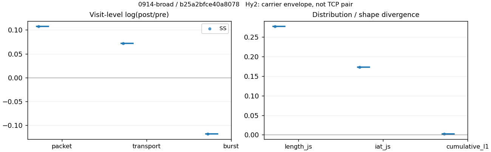
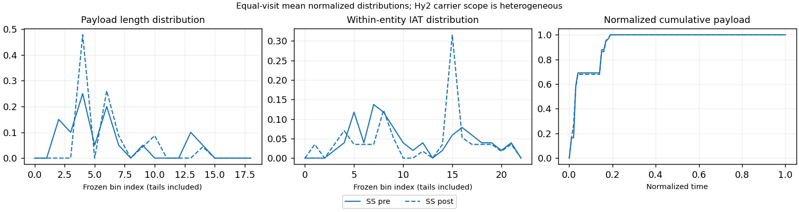

# 0914-broad · 条目 042 · jd.com

目标：https://www.jd.com/

活动标签：jd.com::page_load。选定访问 3 次。

[返回总索引](../../README.md) · [统计口径](../../methods.md)

## 覆盖与资格（每次访问均保留）

| 部署 | 重复 | 主请求路由 | 活动状态 | 代理比较 | DIRECT pre | 请求 proxy/direct/unresolved | 错误 |
| --- | --- | --- | --- | --- | --- | --- | --- |
| Hy2 | 1 | direct | passed | 0 | 1 | 0/944/1 | [] |
| SS | 1 | direct | passed | 1 | 1 | 2/959/1 | [] |
| VLESS | 1 | direct | passed | 0 | 1 | 0/949/1 | [] |

主请求非 proxy 的统计仅解释为已索引的辅助代理连接或 DIRECT 观测，不代表目标业务经代理传输。播放确认与配对资格是两道不同的门。

图中散点为单次访问，短线为重复中位数；Hy2 是共享载体包络，不能与 TCP 配对作等范围因果对比。

形态图先逐访问归一化，再对访问等权平均；实线 pre，虚线 post。分箱序号及边界见 methods，不将分箱索引误解为长度或时间。

## 每次访问的关键观测

### SS

范围：`exclusive_page`。每格 pre → post；空值为不可观测/不适用。

| 重复 | 包数 | 载荷字节 | burst | TCP FR | IAT中位µs | length JS | IAT JS |
| --- | --- | --- | --- | --- | --- | --- | --- |
| 1 | 53 → 59 | 10846 → 11652 | 36 → 32 | 12 → 12 | 253.43 → 30123 | 0.2766 | 0.17289 |

范围：`direct_pre_only`。每格 pre → post；空值为不可观测/不适用。

| 重复 | 包数 | 载荷字节 | burst | TCP FR | IAT中位µs | length JS | IAT JS |
| --- | --- | --- | --- | --- | --- | --- | --- |
| 1 | 6499 → — | 9.2035e+06 → — | 4038 → — | 906 → — | 93.687 → — | — | — |

完整标量统计：中位数 [min,max]；Δ 为重复内逐访问变换的中位数，MAD 未缩放。n 为可用变换数；DIRECT-only 的 nΔ=0 不代表 pre 不可用。

| scope | 特征 | pre | post | Δ | IQRΔ | MADΔ | nΔ |
| --- | --- | --- | --- | --- | --- | --- | --- |
| direct_pre_only | active_span_sum_s_1000ms | 74.963 [74.963, 74.963] | — | — | — | — | 0 |
| direct_pre_only | active_span_sum_s_100ms | 19.918 [19.918, 19.918] | — | — | — | — | 0 |
| direct_pre_only | active_span_sum_s_500ms | 44.669 [44.669, 44.669] | — | — | — | — | 0 |
| direct_pre_only | burst_bytes_iqr | 1767 [1767, 1767] | — | — | — | — | 0 |
| direct_pre_only | burst_bytes_mad | 80 [80, 80] | — | — | — | — | 0 |
| direct_pre_only | burst_bytes_max | 32812 [32812, 32812] | — | — | — | — | 0 |
| direct_pre_only | burst_bytes_mean | 2279.2 [2279.2, 2279.2] | — | — | — | — | 0 |
| direct_pre_only | burst_bytes_median | 80 [80, 80] | — | — | — | — | 0 |
| direct_pre_only | burst_bytes_min | 0 [0, 0] | — | — | — | — | 0 |
| direct_pre_only | burst_bytes_p95 | 14209 [14209, 14209] | — | — | — | — | 0 |
| direct_pre_only | burst_bytes_q25 | 0 [0, 0] | — | — | — | — | 0 |
| direct_pre_only | burst_bytes_q75 | 1767 [1767, 1767] | — | — | — | — | 0 |
| direct_pre_only | burst_bytes_std | 4880.8 [4880.8, 4880.8] | — | — | — | — | 0 |
| direct_pre_only | burst_count | 4038 [4038, 4038] | — | — | — | — | 0 |
| direct_pre_only | burst_duration_ms_iqr | 0.76286 [0.76286, 0.76286] | — | — | — | — | 0 |
| direct_pre_only | burst_duration_ms_mad | 0 [0, 0] | — | — | — | — | 0 |
| direct_pre_only | burst_duration_ms_max | 15001 [15001, 15001] | — | — | — | — | 0 |
| direct_pre_only | burst_duration_ms_mean | 221.29 [221.29, 221.29] | — | — | — | — | 0 |
| direct_pre_only | burst_duration_ms_median | 0 [0, 0] | — | — | — | — | 0 |
| direct_pre_only | burst_duration_ms_min | 0 [0, 0] | — | — | — | — | 0 |
| direct_pre_only | burst_duration_ms_p95 | 212.5 [212.5, 212.5] | — | — | — | — | 0 |
| direct_pre_only | burst_duration_ms_q25 | 0 [0, 0] | — | — | — | — | 0 |
| direct_pre_only | burst_duration_ms_q75 | 0.76286 [0.76286, 0.76286] | — | — | — | — | 0 |
| direct_pre_only | burst_duration_ms_std | 1517.6 [1517.6, 1517.6] | — | — | — | — | 0 |
| direct_pre_only | burst_packets_iqr | 1 [1, 1] | — | — | — | — | 0 |
| direct_pre_only | burst_packets_mad | 0 [0, 0] | — | — | — | — | 0 |
| direct_pre_only | burst_packets_max | 15 [15, 15] | — | — | — | — | 0 |
| direct_pre_only | burst_packets_mean | 1.6095 [1.6095, 1.6095] | — | — | — | — | 0 |
| direct_pre_only | burst_packets_median | 1 [1, 1] | — | — | — | — | 0 |
| direct_pre_only | burst_packets_min | 1 [1, 1] | — | — | — | — | 0 |
| direct_pre_only | burst_packets_p95 | 3 [3, 3] | — | — | — | — | 0 |
| direct_pre_only | burst_packets_q25 | 1 [1, 1] | — | — | — | — | 0 |
| direct_pre_only | burst_packets_q75 | 2 [2, 2] | — | — | — | — | 0 |
| direct_pre_only | burst_packets_std | 1.0318 [1.0318, 1.0318] | — | — | — | — | 0 |
| direct_pre_only | connection_span_concurrency_max | 44 [44, 44] | — | — | — | — | 0 |
| direct_pre_only | direction_entropy | 0.9458 [0.9458, 0.9458] | — | — | — | — | 0 |
| direct_pre_only | down_burst_count | 1973 [1973, 1973] | — | — | — | — | 0 |
| direct_pre_only | down_ip_bytes | 8.2625e+06 [8.2625e+06, 8.2625e+06] | — | — | — | — | 0 |
| direct_pre_only | down_packets | 3570 [3570, 3570] | — | — | — | — | 0 |
| direct_pre_only | down_transport_bytes | 8.0761e+06 [8.0761e+06, 8.0761e+06] | — | — | — | — | 0 |
| direct_pre_only | duration_s | 35.027 [35.027, 35.027] | — | — | — | — | 0 |
| direct_pre_only | entity_count | 92 [92, 92] | — | — | — | — | 0 |
| direct_pre_only | fr_runs | 906 [906, 906] | — | — | — | — | 0 |
| direct_pre_only | fr_runs_per_packet | 0.25414 [0.25414, 0.25414] | — | — | — | — | 0 |
| direct_pre_only | fr_switches | 814 [814, 814] | — | — | — | — | 0 |
| direct_pre_only | fr_switches_per_possible_transition | 0.23438 [0.23438, 0.23438] | — | — | — | — | 0 |
| direct_pre_only | full_retransmission_fraction | 0.0098477 [0.0098477, 0.0098477] | — | — | — | — | 0 |
| direct_pre_only | full_retransmission_packets | 64 [64, 64] | — | — | — | — | 0 |
| direct_pre_only | iat_count | 6407 [6407, 6407] | — | — | — | — | 0 |
| direct_pre_only | iat_median_us | 93.687 [93.687, 93.687] | — | — | — | — | 0 |
| direct_pre_only | iat_us_iqr | 882.42 [882.42, 882.42] | — | — | — | — | 0 |
| direct_pre_only | iat_us_mad | 85.649 [85.649, 85.649] | — | — | — | — | 0 |
| direct_pre_only | iat_us_max | 1.5002e+07 [1.5002e+07, 1.5002e+07] | — | — | — | — | 0 |
| direct_pre_only | iat_us_mean | 2.146e+05 [2.146e+05, 2.146e+05] | — | — | — | — | 0 |
| direct_pre_only | iat_us_median | 93.687 [93.687, 93.687] | — | — | — | — | 0 |
| direct_pre_only | iat_us_min | 0.093 [0.093, 0.093] | — | — | — | — | 0 |
| direct_pre_only | iat_us_p95 | 69706 [69706, 69706] | — | — | — | — | 0 |
| direct_pre_only | iat_us_q25 | 20.042 [20.042, 20.042] | — | — | — | — | 0 |
| direct_pre_only | iat_us_q75 | 902.46 [902.46, 902.46] | — | — | — | — | 0 |
| direct_pre_only | iat_us_std | 1.57e+06 [1.57e+06, 1.57e+06] | — | — | — | — | 0 |
| direct_pre_only | idle_gap_count_1000ms | 152 [152, 152] | — | — | — | — | 0 |
| direct_pre_only | idle_gap_count_100ms | 307 [307, 307] | — | — | — | — | 0 |
| direct_pre_only | idle_gap_count_500ms | 193 [193, 193] | — | — | — | — | 0 |
| direct_pre_only | idle_gap_sum_s_1000ms | 1300 [1300, 1300] | — | — | — | — | 0 |
| direct_pre_only | idle_gap_sum_s_100ms | 1355 [1355, 1355] | — | — | — | — | 0 |
| direct_pre_only | idle_gap_sum_s_500ms | 1330.3 [1330.3, 1330.3] | — | — | — | — | 0 |
| direct_pre_only | ip_bytes | 9.5437e+06 [9.5437e+06, 9.5437e+06] | — | — | — | — | 0 |
| direct_pre_only | length_iqr | 2953 [2953, 2953] | — | — | — | — | 0 |
| direct_pre_only | length_mad | 1316 [1316, 1316] | — | — | — | — | 0 |
| direct_pre_only | length_max | 8948 [8948, 8948] | — | — | — | — | 0 |
| direct_pre_only | length_mean | 2581.6 [2581.6, 2581.6] | — | — | — | — | 0 |
| direct_pre_only | length_median | 1428 [1428, 1428] | — | — | — | — | 0 |
| direct_pre_only | length_min | 24 [24, 24] | — | — | — | — | 0 |
| direct_pre_only | length_p95 | 8920 [8920, 8920] | — | — | — | — | 0 |
| direct_pre_only | length_q25 | 349 [349, 349] | — | — | — | — | 0 |
| direct_pre_only | length_q75 | 3302 [3302, 3302] | — | — | — | — | 0 |
| direct_pre_only | length_std | 2920.6 [2920.6, 2920.6] | — | — | — | — | 0 |
| direct_pre_only | nonempty_entity_count | 92 [92, 92] | — | — | — | — | 0 |
| direct_pre_only | nonempty_packets | 3565 [3565, 3565] | — | — | — | — | 0 |
| direct_pre_only | offload_suspect_fraction | 0.25958 [0.25958, 0.25958] | — | — | — | — | 0 |
| direct_pre_only | packet_count | 6499 [6499, 6499] | — | — | — | — | 0 |
| direct_pre_only | rtt_median_ms | 0.098528 [0.098528, 0.098528] | — | — | — | — | 0 |
| direct_pre_only | rtt_sample_count | 2639 [2639, 2639] | — | — | — | — | 0 |
| direct_pre_only | tcp_ack_count | 6404 [6404, 6404] | — | — | — | — | 0 |
| direct_pre_only | tcp_fin_count | 181 [181, 181] | — | — | — | — | 0 |
| direct_pre_only | tcp_packet_count | 6499 [6499, 6499] | — | — | — | — | 0 |
| direct_pre_only | tcp_rst_count | 5 [5, 5] | — | — | — | — | 0 |
| direct_pre_only | tcp_syn_count | 184 [184, 184] | — | — | — | — | 0 |
| direct_pre_only | tcp_window_raw_median | 65455 [65455, 65455] | — | — | — | — | 0 |
| direct_pre_only | transition_entropy | 0.75636 [0.75636, 0.75636] | — | — | — | — | 0 |
| direct_pre_only | transition_n_mm | 1823 [1823, 1823] | — | — | — | — | 0 |
| direct_pre_only | transition_n_mp | 369 [369, 369] | — | — | — | — | 0 |
| direct_pre_only | transition_n_pm | 445 [445, 445] | — | — | — | — | 0 |
| direct_pre_only | transition_n_pp | 836 [836, 836] | — | — | — | — | 0 |
| direct_pre_only | transition_p_mm | 0.83166 [0.83166, 0.83166] | — | — | — | — | 0 |
| direct_pre_only | transition_p_mp | 0.16834 [0.16834, 0.16834] | — | — | — | — | 0 |
| direct_pre_only | transition_p_pm | 0.34738 [0.34738, 0.34738] | — | — | — | — | 0 |
| direct_pre_only | transition_p_pp | 0.65262 [0.65262, 0.65262] | — | — | — | — | 0 |
| direct_pre_only | transport_bytes | 9.2035e+06 [9.2035e+06, 9.2035e+06] | — | — | — | — | 0 |
| direct_pre_only | up_burst_count | 2065 [2065, 2065] | — | — | — | — | 0 |
| direct_pre_only | up_byte_fraction | 0.1225 [0.1225, 0.1225] | — | — | — | — | 0 |
| direct_pre_only | up_ip_bytes | 1.2812e+06 [1.2812e+06, 1.2812e+06] | — | — | — | — | 0 |
| direct_pre_only | up_packets | 2929 [2929, 2929] | — | — | — | — | 0 |
| direct_pre_only | up_transport_bytes | 1.1274e+06 [1.1274e+06, 1.1274e+06] | — | — | — | — | 0 |
| direct_pre_only | zero_iat_count | 0 [0, 0] | — | — | — | — | 0 |
| direct_pre_only | zero_iat_fraction | 0 [0, 0] | — | — | — | — | 0 |
| exclusive_page | active_span_sum_s_1000ms | 2.8592 [2.8592, 2.8592] | 2.8892 [2.8892, 2.8892] | 0.01045 | — | — | 1 |
| exclusive_page | active_span_sum_s_100ms | 0.44585 [0.44585, 0.44585] | 0.90038 [0.90038, 0.90038] | 0.70283 | — | — | 1 |
| exclusive_page | active_span_sum_s_500ms | 1.5238 [1.5238, 1.5238] | 1.7328 [1.7328, 1.7328] | 0.12856 | — | — | 1 |
| exclusive_page | burst_bytes_iqr | 281.5 [281.5, 281.5] | 410.25 [410.25, 410.25] | 0.37663 | — | — | 1 |
| exclusive_page | burst_bytes_mad | 15.5 [15.5, 15.5] | 32.5 [32.5, 32.5] | 0.7404 | — | — | 1 |
| exclusive_page | burst_bytes_max | 2920 [2920, 2920] | 2856 [2856, 2856] | -0.022162 | — | — | 1 |
| exclusive_page | burst_bytes_mean | 301.28 [301.28, 301.28] | 364.12 [364.12, 364.12] | 0.18946 | — | — | 1 |
| exclusive_page | burst_bytes_median | 15.5 [15.5, 15.5] | 32.5 [32.5, 32.5] | 0.7404 | — | — | 1 |
| exclusive_page | burst_bytes_min | 0 [0, 0] | 0 [0, 0] | — | — | — | 0 |
| exclusive_page | burst_bytes_p95 | 1848.8 [1848.8, 1848.8] | 2009.5 [2009.5, 2009.5] | 0.083401 | — | — | 1 |
| exclusive_page | burst_bytes_q25 | 0 [0, 0] | 0 [0, 0] | — | — | — | 0 |
| exclusive_page | burst_bytes_q75 | 281.5 [281.5, 281.5] | 410.25 [410.25, 410.25] | 0.37663 | — | — | 1 |
| exclusive_page | burst_bytes_std | 643.54 [643.54, 643.54] | 690.94 [690.94, 690.94] | 0.071065 | — | — | 1 |
| exclusive_page | burst_count | 36 [36, 36] | 32 [32, 32] | -0.11778 | — | — | 1 |
| exclusive_page | burst_duration_ms_iqr | 74.41 [74.41, 74.41] | 41.494 [41.494, 41.494] | -0.58403 | — | — | 1 |
| exclusive_page | burst_duration_ms_mad | 0 [0, 0] | 0 [0, 0] | — | — | — | 0 |
| exclusive_page | burst_duration_ms_max | 12051 [12051, 12051] | 14964 [14964, 14964] | 0.21651 | — | — | 1 |
| exclusive_page | burst_duration_ms_mean | 441.16 [441.16, 441.16] | 572.97 [572.97, 572.97] | 0.26143 | — | — | 1 |
| exclusive_page | burst_duration_ms_median | 0 [0, 0] | 0 [0, 0] | — | — | — | 0 |
| exclusive_page | burst_duration_ms_min | 0 [0, 0] | 0 [0, 0] | — | — | — | 0 |
| exclusive_page | burst_duration_ms_p95 | 847.02 [847.02, 847.02] | 913.15 [913.15, 913.15] | 0.075173 | — | — | 1 |
| exclusive_page | burst_duration_ms_q25 | 0 [0, 0] | 0 [0, 0] | — | — | — | 0 |
| exclusive_page | burst_duration_ms_q75 | 74.41 [74.41, 74.41] | 41.494 [41.494, 41.494] | -0.58403 | — | — | 1 |
| exclusive_page | burst_duration_ms_std | 1980.1 [1980.1, 1980.1] | 2598.3 [2598.3, 2598.3] | 0.2717 | — | — | 1 |
| exclusive_page | burst_packets_iqr | 1 [1, 1] | 1 [1, 1] | 0 | — | — | 1 |
| exclusive_page | burst_packets_mad | 0 [0, 0] | 0 [0, 0] | — | — | — | 0 |
| exclusive_page | burst_packets_max | 4 [4, 4] | 4 [4, 4] | 0 | — | — | 1 |
| exclusive_page | burst_packets_mean | 1.4722 [1.4722, 1.4722] | 1.8438 [1.8438, 1.8438] | 0.22503 | — | — | 1 |
| exclusive_page | burst_packets_median | 1 [1, 1] | 1 [1, 1] | 0 | — | — | 1 |
| exclusive_page | burst_packets_min | 1 [1, 1] | 1 [1, 1] | 0 | — | — | 1 |
| exclusive_page | burst_packets_p95 | 2 [2, 2] | 4 [4, 4] | 0.69315 | — | — | 1 |
| exclusive_page | burst_packets_q25 | 1 [1, 1] | 1 [1, 1] | 0 | — | — | 1 |
| exclusive_page | burst_packets_q75 | 2 [2, 2] | 2 [2, 2] | 0 | — | — | 1 |
| exclusive_page | burst_packets_std | 0.6449 [0.6449, 0.6449] | 1.0929 [1.0929, 1.0929] | 0.52746 | — | — | 1 |
| exclusive_page | connection_span_concurrency_max | 1 [1, 1] | 1 [1, 1] | 0 | — | — | 1 |
| exclusive_page | cumulative_l1 | — | — | 0.00277 | — | — | 1 |
| exclusive_page | cumulative_max | — | — | 0.10265 | — | — | 1 |
| exclusive_page | direction_entropy | 1 [1, 1] | 0.96564 [0.96564, 0.96564] | -0.034364 | — | — | 1 |
| exclusive_page | down_burst_count | 17 [17, 17] | 15 [15, 15] | -0.12516 | — | — | 1 |
| exclusive_page | down_ip_bytes | 7195 [7195, 7195] | 7607 [7607, 7607] | 0.055683 | — | — | 1 |
| exclusive_page | down_packets | 27 [27, 27] | 29 [29, 29] | 0.071459 | — | — | 1 |
| exclusive_page | down_transport_bytes | 5775 [5775, 5775] | 6083 [6083, 6083] | 0.05196 | — | — | 1 |
| exclusive_page | duration_s | 33.171 [33.171, 33.171] | 33.17 [33.17, 33.17] | -3.5373e-05 | — | — | 1 |
| exclusive_page | entity_count | 2 [2, 2] | 2 [2, 2] | 0 | — | — | 1 |
| exclusive_page | fr_runs | 12 [12, 12] | 12 [12, 12] | 0 | — | — | 1 |
| exclusive_page | fr_runs_per_packet | 0.6 [0.6, 0.6] | 0.52174 [0.52174, 0.52174] | -0.078261 | — | — | 1 |
| exclusive_page | fr_switches | 10 [10, 10] | 10 [10, 10] | 0 | — | — | 1 |
| exclusive_page | fr_switches_per_possible_transition | 0.55556 [0.55556, 0.55556] | 0.47619 [0.47619, 0.47619] | -0.079365 | — | — | 1 |
| exclusive_page | full_retransmission_fraction | 0.018868 [0.018868, 0.018868] | 0 [0, 0] | -0.018868 | — | — | 1 |
| exclusive_page | full_retransmission_packets | 1 [1, 1] | 0 [0, 0] | — | — | — | 0 |
| exclusive_page | iat_count | 51 [51, 51] | 57 [57, 57] | 0.11123 | — | — | 1 |
| exclusive_page | iat_js | — | — | 0.17289 | — | — | 1 |
| exclusive_page | iat_ks | — | — | 0.22807 | — | — | 1 |
| exclusive_page | iat_median_us | 253.43 [253.43, 253.43] | 30123 [30123, 30123] | 4.7779 | — | — | 1 |
| exclusive_page | iat_us_iqr | 65563 [65563, 65563] | 41483 [41483, 41483] | -0.45773 | — | — | 1 |
| exclusive_page | iat_us_mad | 246.2 [246.2, 246.2] | 29997 [29997, 29997] | 4.8027 | — | — | 1 |
| exclusive_page | iat_us_max | 1.5001e+07 [1.5001e+07, 1.5001e+07] | 1.4964e+07 [1.4964e+07, 1.4964e+07] | -0.002463 | — | — | 1 |
| exclusive_page | iat_us_mean | 6.1239e+05 [6.1239e+05, 6.1239e+05] | 5.4789e+05 [5.4789e+05, 5.4789e+05] | -0.11128 | — | — | 1 |
| exclusive_page | iat_us_median | 253.43 [253.43, 253.43] | 30123 [30123, 30123] | 4.7779 | — | — | 1 |
| exclusive_page | iat_us_min | 3.806 [3.806, 3.806] | 0.068 [0.068, 0.068] | -4.0248 | — | — | 1 |
| exclusive_page | iat_us_p95 | 1.0049e+06 [1.0049e+06, 1.0049e+06] | 7.2769e+05 [7.2769e+05, 7.2769e+05] | -0.32275 | — | — | 1 |
| exclusive_page | iat_us_q25 | 77.76 [77.76, 77.76] | 107.48 [107.48, 107.48] | 0.32371 | — | — | 1 |
| exclusive_page | iat_us_q75 | 65641 [65641, 65641] | 41591 [41591, 41591] | -0.45633 | — | — | 1 |
| exclusive_page | iat_us_std | 2.6349e+06 [2.6349e+06, 2.6349e+06] | 2.4949e+06 [2.4949e+06, 2.4949e+06] | -0.05459 | — | — | 1 |
| exclusive_page | iat_wasserstein_log1p_us | — | — | 1.2616 | — | — | 1 |
| exclusive_page | idle_gap_count_1000ms | 3 [3, 3] | 3 [3, 3] | 0 | — | — | 1 |
| exclusive_page | idle_gap_count_100ms | 10 [10, 10] | 9 [9, 9] | -0.10536 | — | — | 1 |
| exclusive_page | idle_gap_count_500ms | 5 [5, 5] | 5 [5, 5] | 0 | — | — | 1 |
| exclusive_page | idle_gap_sum_s_1000ms | 28.373 [28.373, 28.373] | 28.341 [28.341, 28.341] | -0.0011205 | — | — | 1 |
| exclusive_page | idle_gap_sum_s_100ms | 30.786 [30.786, 30.786] | 30.33 [30.33, 30.33] | -0.014932 | — | — | 1 |
| exclusive_page | idle_gap_sum_s_500ms | 29.708 [29.708, 29.708] | 29.497 [29.497, 29.497] | -0.0071208 | — | — | 1 |
| exclusive_page | ip_bytes | 13646 [13646, 13646] | 14764 [14764, 14764] | 0.078745 | — | — | 1 |
| exclusive_page | length_iqr | 393.5 [393.5, 393.5] | 433 [433, 433] | 0.095657 | — | — | 1 |
| exclusive_page | length_js | — | — | 0.2766 | — | — | 1 |
| exclusive_page | length_ks | — | — | 0.28261 | — | — | 1 |
| exclusive_page | length_mad | 140 [140, 140] | 220 [220, 220] | 0.45199 | — | — | 1 |
| exclusive_page | length_max | 2920 [2920, 2920] | 2856 [2856, 2856] | -0.022162 | — | — | 1 |
| exclusive_page | length_mean | 542.3 [542.3, 542.3] | 506.61 [506.61, 506.61] | -0.06808 | — | — | 1 |
| exclusive_page | length_median | 171 [171, 171] | 316 [316, 316] | 0.61408 | — | — | 1 |
| exclusive_page | length_min | 31 [31, 31] | 65 [65, 65] | 0.7404 | — | — | 1 |
| exclusive_page | length_p95 | 2072.6 [2072.6, 2072.6] | 1428 [1428, 1428] | -0.37253 | — | — | 1 |
| exclusive_page | length_q25 | 68.75 [68.75, 68.75] | 100.5 [100.5, 100.5] | 0.37968 | — | — | 1 |
| exclusive_page | length_q75 | 462.25 [462.25, 462.25] | 533.5 [533.5, 533.5] | 0.14335 | — | — | 1 |
| exclusive_page | length_std | 779.26 [779.26, 779.26] | 649.35 [649.35, 649.35] | -0.18238 | — | — | 1 |
| exclusive_page | length_wasserstein_bytes | — | — | 115.59 | — | — | 1 |
| exclusive_page | nonempty_entity_count | 2 [2, 2] | 2 [2, 2] | 0 | — | — | 1 |
| exclusive_page | nonempty_packets | 20 [20, 20] | 23 [23, 23] | 0.13976 | — | — | 1 |
| exclusive_page | offload_suspect_fraction | 0.056604 [0.056604, 0.056604] | 0.016949 [0.016949, 0.016949] | -0.039655 | — | — | 1 |
| exclusive_page | packet_count | 53 [53, 53] | 59 [59, 59] | 0.10725 | — | — | 1 |
| exclusive_page | rtt_median_ms | 0.10003 [0.10003, 0.10003] | 33.138 [33.138, 33.138] | 5.8029 | — | — | 1 |
| exclusive_page | rtt_sample_count | 26 [26, 26] | 28 [28, 28] | 0.074108 | — | — | 1 |
| exclusive_page | tcp_ack_count | 51 [51, 51] | 57 [57, 57] | 0.11123 | — | — | 1 |
| exclusive_page | tcp_fin_count | 4 [4, 4] | 4 [4, 4] | 0 | — | — | 1 |
| exclusive_page | tcp_packet_count | 53 [53, 53] | 59 [59, 59] | 0.10725 | — | — | 1 |
| exclusive_page | tcp_rst_count | 0 [0, 0] | 0 [0, 0] | — | — | — | 0 |
| exclusive_page | tcp_syn_count | 4 [4, 4] | 4 [4, 4] | 0 | — | — | 1 |
| exclusive_page | tcp_window_raw_median | 64938 [64938, 64938] | 128 [128, 128] | -6.2292 | — | — | 1 |
| exclusive_page | transition_entropy | 0.98386 [0.98386, 0.98386] | 0.98523 [0.98523, 0.98523] | 0.0013667 | — | — | 1 |
| exclusive_page | transition_n_mm | 4 [4, 4] | 3 [3, 3] | -0.28768 | — | — | 1 |
| exclusive_page | transition_n_mp | 4 [4, 4] | 4 [4, 4] | 0 | — | — | 1 |
| exclusive_page | transition_n_pm | 6 [6, 6] | 6 [6, 6] | 0 | — | — | 1 |
| exclusive_page | transition_n_pp | 4 [4, 4] | 8 [8, 8] | 0.69315 | — | — | 1 |
| exclusive_page | transition_p_mm | 0.5 [0.5, 0.5] | 0.42857 [0.42857, 0.42857] | -0.071429 | — | — | 1 |
| exclusive_page | transition_p_mp | 0.5 [0.5, 0.5] | 0.57143 [0.57143, 0.57143] | 0.071429 | — | — | 1 |
| exclusive_page | transition_p_pm | 0.6 [0.6, 0.6] | 0.42857 [0.42857, 0.42857] | -0.17143 | — | — | 1 |
| exclusive_page | transition_p_pp | 0.4 [0.4, 0.4] | 0.57143 [0.57143, 0.57143] | 0.17143 | — | — | 1 |
| exclusive_page | transport_bytes | 10846 [10846, 10846] | 11652 [11652, 11652] | 0.071681 | — | — | 1 |
| exclusive_page | up_burst_count | 19 [19, 19] | 17 [17, 17] | -0.11123 | — | — | 1 |
| exclusive_page | up_byte_fraction | 0.46755 [0.46755, 0.46755] | 0.47794 [0.47794, 0.47794] | 0.010398 | — | — | 1 |
| exclusive_page | up_ip_bytes | 6451 [6451, 6451] | 7157 [7157, 7157] | 0.10386 | — | — | 1 |
| exclusive_page | up_packets | 26 [26, 26] | 30 [30, 30] | 0.1431 | — | — | 1 |
| exclusive_page | up_transport_bytes | 5071 [5071, 5071] | 5569 [5569, 5569] | 0.093677 | — | — | 1 |
| exclusive_page | zero_iat_count | 0 [0, 0] | 0 [0, 0] | — | — | — | 0 |
| exclusive_page | zero_iat_fraction | 0 [0, 0] | 0 [0, 0] | 0 | — | — | 1 |

### VLESS

范围：`direct_pre_only`。每格 pre → post；空值为不可观测/不适用。

| 重复 | 包数 | 载荷字节 | burst | TCP FR | IAT中位µs | length JS | IAT JS |
| --- | --- | --- | --- | --- | --- | --- | --- |
| 1 | 7733 → — | 1.3477e+07 → — | 4992 → — | 883 → — | 63.68 → — | — | — |

完整标量统计：中位数 [min,max]；Δ 为重复内逐访问变换的中位数，MAD 未缩放。n 为可用变换数；DIRECT-only 的 nΔ=0 不代表 pre 不可用。

| scope | 特征 | pre | post | Δ | IQRΔ | MADΔ | nΔ |
| --- | --- | --- | --- | --- | --- | --- | --- |
| direct_pre_only | active_span_sum_s_1000ms | 76.99 [76.99, 76.99] | — | — | — | — | 0 |
| direct_pre_only | active_span_sum_s_100ms | 22.087 [22.087, 22.087] | — | — | — | — | 0 |
| direct_pre_only | active_span_sum_s_500ms | 56.318 [56.318, 56.318] | — | — | — | — | 0 |
| direct_pre_only | burst_bytes_iqr | 2601.2 [2601.2, 2601.2] | — | — | — | — | 0 |
| direct_pre_only | burst_bytes_mad | 80 [80, 80] | — | — | — | — | 0 |
| direct_pre_only | burst_bytes_max | 32812 [32812, 32812] | — | — | — | — | 0 |
| direct_pre_only | burst_bytes_mean | 2699.7 [2699.7, 2699.7] | — | — | — | — | 0 |
| direct_pre_only | burst_bytes_median | 80 [80, 80] | — | — | — | — | 0 |
| direct_pre_only | burst_bytes_min | 0 [0, 0] | — | — | — | — | 0 |
| direct_pre_only | burst_bytes_p95 | 17840 [17840, 17840] | — | — | — | — | 0 |
| direct_pre_only | burst_bytes_q25 | 0 [0, 0] | — | — | — | — | 0 |
| direct_pre_only | burst_bytes_q75 | 2601.2 [2601.2, 2601.2] | — | — | — | — | 0 |
| direct_pre_only | burst_bytes_std | 5309.2 [5309.2, 5309.2] | — | — | — | — | 0 |
| direct_pre_only | burst_count | 4992 [4992, 4992] | — | — | — | — | 0 |
| direct_pre_only | burst_duration_ms_iqr | 0.11276 [0.11276, 0.11276] | — | — | — | — | 0 |
| direct_pre_only | burst_duration_ms_mad | 0 [0, 0] | — | — | — | — | 0 |
| direct_pre_only | burst_duration_ms_max | 15001 [15001, 15001] | — | — | — | — | 0 |
| direct_pre_only | burst_duration_ms_mean | 74.328 [74.328, 74.328] | — | — | — | — | 0 |
| direct_pre_only | burst_duration_ms_median | 0 [0, 0] | — | — | — | — | 0 |
| direct_pre_only | burst_duration_ms_min | 0 [0, 0] | — | — | — | — | 0 |
| direct_pre_only | burst_duration_ms_p95 | 93.829 [93.829, 93.829] | — | — | — | — | 0 |
| direct_pre_only | burst_duration_ms_q25 | 0 [0, 0] | — | — | — | — | 0 |
| direct_pre_only | burst_duration_ms_q75 | 0.11276 [0.11276, 0.11276] | — | — | — | — | 0 |
| direct_pre_only | burst_duration_ms_std | 581.73 [581.73, 581.73] | — | — | — | — | 0 |
| direct_pre_only | burst_packets_iqr | 1 [1, 1] | — | — | — | — | 0 |
| direct_pre_only | burst_packets_mad | 0 [0, 0] | — | — | — | — | 0 |
| direct_pre_only | burst_packets_max | 15 [15, 15] | — | — | — | — | 0 |
| direct_pre_only | burst_packets_mean | 1.5491 [1.5491, 1.5491] | — | — | — | — | 0 |
| direct_pre_only | burst_packets_median | 1 [1, 1] | — | — | — | — | 0 |
| direct_pre_only | burst_packets_min | 1 [1, 1] | — | — | — | — | 0 |
| direct_pre_only | burst_packets_p95 | 3 [3, 3] | — | — | — | — | 0 |
| direct_pre_only | burst_packets_q25 | 1 [1, 1] | — | — | — | — | 0 |
| direct_pre_only | burst_packets_q75 | 2 [2, 2] | — | — | — | — | 0 |
| direct_pre_only | burst_packets_std | 0.97546 [0.97546, 0.97546] | — | — | — | — | 0 |
| direct_pre_only | connection_span_concurrency_max | 48 [48, 48] | — | — | — | — | 0 |
| direct_pre_only | direction_entropy | 0.88808 [0.88808, 0.88808] | — | — | — | — | 0 |
| direct_pre_only | down_burst_count | 2449 [2449, 2449] | — | — | — | — | 0 |
| direct_pre_only | down_ip_bytes | 1.2603e+07 [1.2603e+07, 1.2603e+07] | — | — | — | — | 0 |
| direct_pre_only | down_packets | 4293 [4293, 4293] | — | — | — | — | 0 |
| direct_pre_only | down_transport_bytes | 1.2379e+07 [1.2379e+07, 1.2379e+07] | — | — | — | — | 0 |
| direct_pre_only | duration_s | 23.81 [23.81, 23.81] | — | — | — | — | 0 |
| direct_pre_only | entity_count | 94 [94, 94] | — | — | — | — | 0 |
| direct_pre_only | fr_runs | 883 [883, 883] | — | — | — | — | 0 |
| direct_pre_only | fr_runs_per_packet | 0.20602 [0.20602, 0.20602] | — | — | — | — | 0 |
| direct_pre_only | fr_switches | 789 [789, 789] | — | — | — | — | 0 |
| direct_pre_only | fr_switches_per_possible_transition | 0.18822 [0.18822, 0.18822] | — | — | — | — | 0 |
| direct_pre_only | full_retransmission_fraction | 0.010863 [0.010863, 0.010863] | — | — | — | — | 0 |
| direct_pre_only | full_retransmission_packets | 84 [84, 84] | — | — | — | — | 0 |
| direct_pre_only | iat_count | 7639 [7639, 7639] | — | — | — | — | 0 |
| direct_pre_only | iat_median_us | 63.68 [63.68, 63.68] | — | — | — | — | 0 |
| direct_pre_only | iat_us_iqr | 592.01 [592.01, 592.01] | — | — | — | — | 0 |
| direct_pre_only | iat_us_mad | 56.818 [56.818, 56.818] | — | — | — | — | 0 |
| direct_pre_only | iat_us_max | 1.5002e+07 [1.5002e+07, 1.5002e+07] | — | — | — | — | 0 |
| direct_pre_only | iat_us_mean | 1.0989e+05 [1.0989e+05, 1.0989e+05] | — | — | — | — | 0 |
| direct_pre_only | iat_us_median | 63.68 [63.68, 63.68] | — | — | — | — | 0 |
| direct_pre_only | iat_us_min | 0.032 [0.032, 0.032] | — | — | — | — | 0 |
| direct_pre_only | iat_us_p95 | 44468 [44468, 44468] | — | — | — | — | 0 |
| direct_pre_only | iat_us_q25 | 14.711 [14.711, 14.711] | — | — | — | — | 0 |
| direct_pre_only | iat_us_q75 | 606.72 [606.72, 606.72] | — | — | — | — | 0 |
| direct_pre_only | iat_us_std | 1.0356e+06 [1.0356e+06, 1.0356e+06] | — | — | — | — | 0 |
| direct_pre_only | idle_gap_count_1000ms | 118 [118, 118] | — | — | — | — | 0 |
| direct_pre_only | idle_gap_count_100ms | 292 [292, 292] | — | — | — | — | 0 |
| direct_pre_only | idle_gap_count_500ms | 149 [149, 149] | — | — | — | — | 0 |
| direct_pre_only | idle_gap_sum_s_1000ms | 762.45 [762.45, 762.45] | — | — | — | — | 0 |
| direct_pre_only | idle_gap_sum_s_100ms | 817.36 [817.36, 817.36] | — | — | — | — | 0 |
| direct_pre_only | idle_gap_sum_s_500ms | 783.13 [783.13, 783.13] | — | — | — | — | 0 |
| direct_pre_only | ip_bytes | 1.3882e+07 [1.3882e+07, 1.3882e+07] | — | — | — | — | 0 |
| direct_pre_only | length_iqr | 4883.2 [4883.2, 4883.2] | — | — | — | — | 0 |
| direct_pre_only | length_mad | 1588 [1588, 1588] | — | — | — | — | 0 |
| direct_pre_only | length_max | 8948 [8948, 8948] | — | — | — | — | 0 |
| direct_pre_only | length_mean | 3144.4 [3144.4, 3144.4] | — | — | — | — | 0 |
| direct_pre_only | length_median | 1780 [1780, 1780] | — | — | — | — | 0 |
| direct_pre_only | length_min | 24 [24, 24] | — | — | — | — | 0 |
| direct_pre_only | length_p95 | 8920 [8920, 8920] | — | — | — | — | 0 |
| direct_pre_only | length_q25 | 424 [424, 424] | — | — | — | — | 0 |
| direct_pre_only | length_q75 | 5307.2 [5307.2, 5307.2] | — | — | — | — | 0 |
| direct_pre_only | length_std | 3173.5 [3173.5, 3173.5] | — | — | — | — | 0 |
| direct_pre_only | nonempty_entity_count | 94 [94, 94] | — | — | — | — | 0 |
| direct_pre_only | nonempty_packets | 4286 [4286, 4286] | — | — | — | — | 0 |
| direct_pre_only | offload_suspect_fraction | 0.30687 [0.30687, 0.30687] | — | — | — | — | 0 |
| direct_pre_only | packet_count | 7733 [7733, 7733] | — | — | — | — | 0 |
| direct_pre_only | rtt_median_ms | 0.065979 [0.065979, 0.065979] | — | — | — | — | 0 |
| direct_pre_only | rtt_sample_count | 3127 [3127, 3127] | — | — | — | — | 0 |
| direct_pre_only | tcp_ack_count | 7637 [7637, 7637] | — | — | — | — | 0 |
| direct_pre_only | tcp_fin_count | 186 [186, 186] | — | — | — | — | 0 |
| direct_pre_only | tcp_packet_count | 7733 [7733, 7733] | — | — | — | — | 0 |
| direct_pre_only | tcp_rst_count | 3 [3, 3] | — | — | — | — | 0 |
| direct_pre_only | tcp_syn_count | 188 [188, 188] | — | — | — | — | 0 |
| direct_pre_only | tcp_window_raw_median | 65535 [65535, 65535] | — | — | — | — | 0 |
| direct_pre_only | transition_entropy | 0.65407 [0.65407, 0.65407] | — | — | — | — | 0 |
| direct_pre_only | transition_n_mm | 2538 [2538, 2538] | — | — | — | — | 0 |
| direct_pre_only | transition_n_mp | 351 [351, 351] | — | — | — | — | 0 |
| direct_pre_only | transition_n_pm | 438 [438, 438] | — | — | — | — | 0 |
| direct_pre_only | transition_n_pp | 865 [865, 865] | — | — | — | — | 0 |
| direct_pre_only | transition_p_mm | 0.8785 [0.8785, 0.8785] | — | — | — | — | 0 |
| direct_pre_only | transition_p_mp | 0.1215 [0.1215, 0.1215] | — | — | — | — | 0 |
| direct_pre_only | transition_p_pm | 0.33615 [0.33615, 0.33615] | — | — | — | — | 0 |
| direct_pre_only | transition_p_pp | 0.66385 [0.66385, 0.66385] | — | — | — | — | 0 |
| direct_pre_only | transport_bytes | 1.3477e+07 [1.3477e+07, 1.3477e+07] | — | — | — | — | 0 |
| direct_pre_only | up_burst_count | 2543 [2543, 2543] | — | — | — | — | 0 |
| direct_pre_only | up_byte_fraction | 0.081501 [0.081501, 0.081501] | — | — | — | — | 0 |
| direct_pre_only | up_ip_bytes | 1.279e+06 [1.279e+06, 1.279e+06] | — | — | — | — | 0 |
| direct_pre_only | up_packets | 3440 [3440, 3440] | — | — | — | — | 0 |
| direct_pre_only | up_transport_bytes | 1.0984e+06 [1.0984e+06, 1.0984e+06] | — | — | — | — | 0 |
| direct_pre_only | zero_iat_count | 0 [0, 0] | — | — | — | — | 0 |
| direct_pre_only | zero_iat_fraction | 0 [0, 0] | — | — | — | — | 0 |

### Hy2

范围：`direct_pre_only`。每格 pre → post；空值为不可观测/不适用。

| 重复 | 包数 | 载荷字节 | burst | TCP FR | IAT中位µs | length JS | IAT JS |
| --- | --- | --- | --- | --- | --- | --- | --- |
| 1 | 7591 → — | 1.3779e+07 → — | 4647 → — | 843 → — | 80.671 → — | — | — |

完整标量统计：中位数 [min,max]；Δ 为重复内逐访问变换的中位数，MAD 未缩放。n 为可用变换数；DIRECT-only 的 nΔ=0 不代表 pre 不可用。

| scope | 特征 | pre | post | Δ | IQRΔ | MADΔ | nΔ |
| --- | --- | --- | --- | --- | --- | --- | --- |
| direct_pre_only | active_span_sum_s_1000ms | 68.009 [68.009, 68.009] | — | — | — | — | 0 |
| direct_pre_only | active_span_sum_s_100ms | 19.389 [19.389, 19.389] | — | — | — | — | 0 |
| direct_pre_only | active_span_sum_s_500ms | 51.102 [51.102, 51.102] | — | — | — | — | 0 |
| direct_pre_only | burst_bytes_iqr | 2787 [2787, 2787] | — | — | — | — | 0 |
| direct_pre_only | burst_bytes_mad | 92 [92, 92] | — | — | — | — | 0 |
| direct_pre_only | burst_bytes_max | 49218 [49218, 49218] | — | — | — | — | 0 |
| direct_pre_only | burst_bytes_mean | 2965.2 [2965.2, 2965.2] | — | — | — | — | 0 |
| direct_pre_only | burst_bytes_median | 92 [92, 92] | — | — | — | — | 0 |
| direct_pre_only | burst_bytes_min | 0 [0, 0] | — | — | — | — | 0 |
| direct_pre_only | burst_bytes_p95 | 20480 [20480, 20480] | — | — | — | — | 0 |
| direct_pre_only | burst_bytes_q25 | 0 [0, 0] | — | — | — | — | 0 |
| direct_pre_only | burst_bytes_q75 | 2787 [2787, 2787] | — | — | — | — | 0 |
| direct_pre_only | burst_bytes_std | 5854.9 [5854.9, 5854.9] | — | — | — | — | 0 |
| direct_pre_only | burst_count | 4647 [4647, 4647] | — | — | — | — | 0 |
| direct_pre_only | burst_duration_ms_iqr | 0.17073 [0.17073, 0.17073] | — | — | — | — | 0 |
| direct_pre_only | burst_duration_ms_mad | 0 [0, 0] | — | — | — | — | 0 |
| direct_pre_only | burst_duration_ms_max | 15001 [15001, 15001] | — | — | — | — | 0 |
| direct_pre_only | burst_duration_ms_mean | 101.22 [101.22, 101.22] | — | — | — | — | 0 |
| direct_pre_only | burst_duration_ms_median | 0 [0, 0] | — | — | — | — | 0 |
| direct_pre_only | burst_duration_ms_min | 0 [0, 0] | — | — | — | — | 0 |
| direct_pre_only | burst_duration_ms_p95 | 118.08 [118.08, 118.08] | — | — | — | — | 0 |
| direct_pre_only | burst_duration_ms_q25 | 0 [0, 0] | — | — | — | — | 0 |
| direct_pre_only | burst_duration_ms_q75 | 0.17073 [0.17073, 0.17073] | — | — | — | — | 0 |
| direct_pre_only | burst_duration_ms_std | 754.52 [754.52, 754.52] | — | — | — | — | 0 |
| direct_pre_only | burst_packets_iqr | 1 [1, 1] | — | — | — | — | 0 |
| direct_pre_only | burst_packets_mad | 0 [0, 0] | — | — | — | — | 0 |
| direct_pre_only | burst_packets_max | 17 [17, 17] | — | — | — | — | 0 |
| direct_pre_only | burst_packets_mean | 1.6335 [1.6335, 1.6335] | — | — | — | — | 0 |
| direct_pre_only | burst_packets_median | 1 [1, 1] | — | — | — | — | 0 |
| direct_pre_only | burst_packets_min | 1 [1, 1] | — | — | — | — | 0 |
| direct_pre_only | burst_packets_p95 | 4 [4, 4] | — | — | — | — | 0 |
| direct_pre_only | burst_packets_q25 | 1 [1, 1] | — | — | — | — | 0 |
| direct_pre_only | burst_packets_q75 | 2 [2, 2] | — | — | — | — | 0 |
| direct_pre_only | burst_packets_std | 1.0927 [1.0927, 1.0927] | — | — | — | — | 0 |
| direct_pre_only | connection_span_concurrency_max | 54 [54, 54] | — | — | — | — | 0 |
| direct_pre_only | direction_entropy | 0.86654 [0.86654, 0.86654] | — | — | — | — | 0 |
| direct_pre_only | down_burst_count | 2288 [2288, 2288] | — | — | — | — | 0 |
| direct_pre_only | down_ip_bytes | 1.2978e+07 [1.2978e+07, 1.2978e+07] | — | — | — | — | 0 |
| direct_pre_only | down_packets | 4372 [4372, 4372] | — | — | — | — | 0 |
| direct_pre_only | down_transport_bytes | 1.275e+07 [1.275e+07, 1.275e+07] | — | — | — | — | 0 |
| direct_pre_only | duration_s | 23.144 [23.144, 23.144] | — | — | — | — | 0 |
| direct_pre_only | entity_count | 71 [71, 71] | — | — | — | — | 0 |
| direct_pre_only | fr_runs | 843 [843, 843] | — | — | — | — | 0 |
| direct_pre_only | fr_runs_per_packet | 0.19004 [0.19004, 0.19004] | — | — | — | — | 0 |
| direct_pre_only | fr_switches | 772 [772, 772] | — | — | — | — | 0 |
| direct_pre_only | fr_switches_per_possible_transition | 0.17686 [0.17686, 0.17686] | — | — | — | — | 0 |
| direct_pre_only | full_retransmission_fraction | 0.013832 [0.013832, 0.013832] | — | — | — | — | 0 |
| direct_pre_only | full_retransmission_packets | 105 [105, 105] | — | — | — | — | 0 |
| direct_pre_only | iat_count | 7520 [7520, 7520] | — | — | — | — | 0 |
| direct_pre_only | iat_median_us | 80.671 [80.671, 80.671] | — | — | — | — | 0 |
| direct_pre_only | iat_us_iqr | 639.79 [639.79, 639.79] | — | — | — | — | 0 |
| direct_pre_only | iat_us_mad | 72.41 [72.41, 72.41] | — | — | — | — | 0 |
| direct_pre_only | iat_us_max | 1.5004e+07 [1.5004e+07, 1.5004e+07] | — | — | — | — | 0 |
| direct_pre_only | iat_us_mean | 1.498e+05 [1.498e+05, 1.498e+05] | — | — | — | — | 0 |
| direct_pre_only | iat_us_median | 80.671 [80.671, 80.671] | — | — | — | — | 0 |
| direct_pre_only | iat_us_min | 0.026 [0.026, 0.026] | — | — | — | — | 0 |
| direct_pre_only | iat_us_p95 | 41442 [41442, 41442] | — | — | — | — | 0 |
| direct_pre_only | iat_us_q25 | 16.896 [16.896, 16.896] | — | — | — | — | 0 |
| direct_pre_only | iat_us_q75 | 656.69 [656.69, 656.69] | — | — | — | — | 0 |
| direct_pre_only | iat_us_std | 1.2563e+06 [1.2563e+06, 1.2563e+06] | — | — | — | — | 0 |
| direct_pre_only | idle_gap_count_1000ms | 146 [146, 146] | — | — | — | — | 0 |
| direct_pre_only | idle_gap_count_100ms | 297 [297, 297] | — | — | — | — | 0 |
| direct_pre_only | idle_gap_count_500ms | 170 [170, 170] | — | — | — | — | 0 |
| direct_pre_only | idle_gap_sum_s_1000ms | 1058.5 [1058.5, 1058.5] | — | — | — | — | 0 |
| direct_pre_only | idle_gap_sum_s_100ms | 1107.1 [1107.1, 1107.1] | — | — | — | — | 0 |
| direct_pre_only | idle_gap_sum_s_500ms | 1075.4 [1075.4, 1075.4] | — | — | — | — | 0 |
| direct_pre_only | ip_bytes | 1.4176e+07 [1.4176e+07, 1.4176e+07] | — | — | — | — | 0 |
| direct_pre_only | length_iqr | 4400 [4400, 4400] | — | — | — | — | 0 |
| direct_pre_only | length_mad | 1560 [1560, 1560] | — | — | — | — | 0 |
| direct_pre_only | length_max | 8948 [8948, 8948] | — | — | — | — | 0 |
| direct_pre_only | length_mean | 3106.3 [3106.3, 3106.3] | — | — | — | — | 0 |
| direct_pre_only | length_median | 1920 [1920, 1920] | — | — | — | — | 0 |
| direct_pre_only | length_min | 31 [31, 31] | — | — | — | — | 0 |
| direct_pre_only | length_p95 | 8920 [8920, 8920] | — | — | — | — | 0 |
| direct_pre_only | length_q25 | 424 [424, 424] | — | — | — | — | 0 |
| direct_pre_only | length_q75 | 4824 [4824, 4824] | — | — | — | — | 0 |
| direct_pre_only | length_std | 3113.1 [3113.1, 3113.1] | — | — | — | — | 0 |
| direct_pre_only | nonempty_entity_count | 71 [71, 71] | — | — | — | — | 0 |
| direct_pre_only | nonempty_packets | 4436 [4436, 4436] | — | — | — | — | 0 |
| direct_pre_only | offload_suspect_fraction | 0.32789 [0.32789, 0.32789] | — | — | — | — | 0 |
| direct_pre_only | packet_count | 7591 [7591, 7591] | — | — | — | — | 0 |
| direct_pre_only | rtt_median_ms | 0.090851 [0.090851, 0.090851] | — | — | — | — | 0 |
| direct_pre_only | rtt_sample_count | 2868 [2868, 2868] | — | — | — | — | 0 |
| direct_pre_only | tcp_ack_count | 7516 [7516, 7516] | — | — | — | — | 0 |
| direct_pre_only | tcp_fin_count | 142 [142, 142] | — | — | — | — | 0 |
| direct_pre_only | tcp_packet_count | 7591 [7591, 7591] | — | — | — | — | 0 |
| direct_pre_only | tcp_rst_count | 4 [4, 4] | — | — | — | — | 0 |
| direct_pre_only | tcp_syn_count | 142 [142, 142] | — | — | — | — | 0 |
| direct_pre_only | tcp_window_raw_median | 65535 [65535, 65535] | — | — | — | — | 0 |
| direct_pre_only | transition_entropy | 0.62985 [0.62985, 0.62985] | — | — | — | — | 0 |
| direct_pre_only | transition_n_mm | 2739 [2739, 2739] | — | — | — | — | 0 |
| direct_pre_only | transition_n_mp | 354 [354, 354] | — | — | — | — | 0 |
| direct_pre_only | transition_n_pm | 418 [418, 418] | — | — | — | — | 0 |
| direct_pre_only | transition_n_pp | 854 [854, 854] | — | — | — | — | 0 |
| direct_pre_only | transition_p_mm | 0.88555 [0.88555, 0.88555] | — | — | — | — | 0 |
| direct_pre_only | transition_p_mp | 0.11445 [0.11445, 0.11445] | — | — | — | — | 0 |
| direct_pre_only | transition_p_pm | 0.32862 [0.32862, 0.32862] | — | — | — | — | 0 |
| direct_pre_only | transition_p_pp | 0.67138 [0.67138, 0.67138] | — | — | — | — | 0 |
| direct_pre_only | transport_bytes | 1.3779e+07 [1.3779e+07, 1.3779e+07] | — | — | — | — | 0 |
| direct_pre_only | up_burst_count | 2359 [2359, 2359] | — | — | — | — | 0 |
| direct_pre_only | up_byte_fraction | 0.0747 [0.0747, 0.0747] | — | — | — | — | 0 |
| direct_pre_only | up_ip_bytes | 1.1985e+06 [1.1985e+06, 1.1985e+06] | — | — | — | — | 0 |
| direct_pre_only | up_packets | 3219 [3219, 3219] | — | — | — | — | 0 |
| direct_pre_only | up_transport_bytes | 1.0293e+06 [1.0293e+06, 1.0293e+06] | — | — | — | — | 0 |
| direct_pre_only | zero_iat_count | 0 [0, 0] | — | — | — | — | 0 |
| direct_pre_only | zero_iat_fraction | 0 [0, 0] | — | — | — | — | 0 |

## 不同部署对比

以下是各部署自身重复中位数的差异，不按重复编号强行配对。跨 TCP/Hy2 的行标记异质观测范围。

| 视角 | 特征 | 部署A | 部署B | A中位 | B中位 | B−A | 比较口径 |
| --- | --- | --- | --- | --- | --- | --- | --- |
| pre | burst_count | SS | VLESS | 4038 | 4992 | 954 | same_scope_unpaired_visits |
| pre | burst_count | SS | Hy2 | 4038 | 4647 | 609 | same_scope_unpaired_visits |
| pre | burst_count | VLESS | Hy2 | 4992 | 4647 | -345 | same_scope_unpaired_visits |
| pre | connection_span_concurrency_max | SS | VLESS | 44 | 48 | 4 | same_scope_unpaired_visits |
| pre | connection_span_concurrency_max | SS | Hy2 | 44 | 54 | 10 | same_scope_unpaired_visits |
| pre | connection_span_concurrency_max | VLESS | Hy2 | 48 | 54 | 6 | same_scope_unpaired_visits |
| pre | direction_entropy | SS | VLESS | 0.9458 | 0.88808 | -0.057721 | same_scope_unpaired_visits |
| pre | direction_entropy | SS | Hy2 | 0.9458 | 0.86654 | -0.079259 | same_scope_unpaired_visits |
| pre | direction_entropy | VLESS | Hy2 | 0.88808 | 0.86654 | -0.021539 | same_scope_unpaired_visits |
| pre | down_transport_bytes | SS | VLESS | 8.0761e+06 | 1.2379e+07 | 4.3024e+06 | same_scope_unpaired_visits |
| pre | down_transport_bytes | SS | Hy2 | 8.0761e+06 | 1.275e+07 | 4.6739e+06 | same_scope_unpaired_visits |
| pre | down_transport_bytes | VLESS | Hy2 | 1.2379e+07 | 1.275e+07 | 3.7147e+05 | same_scope_unpaired_visits |
| pre | duration_s | SS | VLESS | 35.027 | 23.81 | -11.217 | same_scope_unpaired_visits |
| pre | duration_s | SS | Hy2 | 35.027 | 23.144 | -11.883 | same_scope_unpaired_visits |
| pre | duration_s | VLESS | Hy2 | 23.81 | 23.144 | -0.66625 | same_scope_unpaired_visits |
| pre | entity_count | SS | VLESS | 92 | 94 | 2 | same_scope_unpaired_visits |
| pre | entity_count | SS | Hy2 | 92 | 71 | -21 | same_scope_unpaired_visits |
| pre | entity_count | VLESS | Hy2 | 94 | 71 | -23 | same_scope_unpaired_visits |
| pre | fr_runs | SS | VLESS | 906 | 883 | -23 | same_scope_unpaired_visits |
| pre | fr_runs | SS | Hy2 | 906 | 843 | -63 | same_scope_unpaired_visits |
| pre | fr_runs | VLESS | Hy2 | 883 | 843 | -40 | same_scope_unpaired_visits |
| pre | fr_runs_per_packet | SS | VLESS | 0.25414 | 0.20602 | -0.048118 | same_scope_unpaired_visits |
| pre | fr_runs_per_packet | SS | Hy2 | 0.25414 | 0.19004 | -0.064101 | same_scope_unpaired_visits |
| pre | fr_runs_per_packet | VLESS | Hy2 | 0.20602 | 0.19004 | -0.015984 | same_scope_unpaired_visits |
| pre | fr_switches | SS | VLESS | 814 | 789 | -25 | same_scope_unpaired_visits |
| pre | fr_switches | SS | Hy2 | 814 | 772 | -42 | same_scope_unpaired_visits |
| pre | fr_switches | VLESS | Hy2 | 789 | 772 | -17 | same_scope_unpaired_visits |
| pre | fr_switches_per_possible_transition | SS | VLESS | 0.23438 | 0.18822 | -0.046164 | same_scope_unpaired_visits |
| pre | fr_switches_per_possible_transition | SS | Hy2 | 0.23438 | 0.17686 | -0.057518 | same_scope_unpaired_visits |
| pre | fr_switches_per_possible_transition | VLESS | Hy2 | 0.18822 | 0.17686 | -0.011354 | same_scope_unpaired_visits |
| pre | full_retransmission_fraction | SS | VLESS | 0.0098477 | 0.010863 | 0.0010149 | same_scope_unpaired_visits |
| pre | full_retransmission_fraction | SS | Hy2 | 0.0098477 | 0.013832 | 0.0039845 | same_scope_unpaired_visits |
| pre | full_retransmission_fraction | VLESS | Hy2 | 0.010863 | 0.013832 | 0.0029696 | same_scope_unpaired_visits |
| pre | iat_median_us | SS | VLESS | 93.687 | 63.68 | -30.007 | same_scope_unpaired_visits |
| pre | iat_median_us | SS | Hy2 | 93.687 | 80.671 | -13.016 | same_scope_unpaired_visits |
| pre | iat_median_us | VLESS | Hy2 | 63.68 | 80.671 | 16.991 | same_scope_unpaired_visits |
| pre | iat_us_p95 | SS | VLESS | 69706 | 44468 | -25238 | same_scope_unpaired_visits |
| pre | iat_us_p95 | SS | Hy2 | 69706 | 41442 | -28264 | same_scope_unpaired_visits |
| pre | iat_us_p95 | VLESS | Hy2 | 44468 | 41442 | -3025.5 | same_scope_unpaired_visits |
| pre | ip_bytes | SS | VLESS | 9.5437e+06 | 1.3882e+07 | 4.3379e+06 | same_scope_unpaired_visits |
| pre | ip_bytes | SS | Hy2 | 9.5437e+06 | 1.4176e+07 | 4.6328e+06 | same_scope_unpaired_visits |
| pre | ip_bytes | VLESS | Hy2 | 1.3882e+07 | 1.4176e+07 | 2.9489e+05 | same_scope_unpaired_visits |
| pre | length_median | SS | VLESS | 1428 | 1780 | 352 | same_scope_unpaired_visits |
| pre | length_median | SS | Hy2 | 1428 | 1920 | 492 | same_scope_unpaired_visits |
| pre | length_median | VLESS | Hy2 | 1780 | 1920 | 140 | same_scope_unpaired_visits |
| pre | length_p95 | SS | VLESS | 8920 | 8920 | 0 | same_scope_unpaired_visits |
| pre | length_p95 | SS | Hy2 | 8920 | 8920 | 0 | same_scope_unpaired_visits |
| pre | length_p95 | VLESS | Hy2 | 8920 | 8920 | 0 | same_scope_unpaired_visits |
| pre | nonempty_packets | SS | VLESS | 3565 | 4286 | 721 | same_scope_unpaired_visits |
| pre | nonempty_packets | SS | Hy2 | 3565 | 4436 | 871 | same_scope_unpaired_visits |
| pre | nonempty_packets | VLESS | Hy2 | 4286 | 4436 | 150 | same_scope_unpaired_visits |
| pre | offload_suspect_fraction | SS | VLESS | 0.25958 | 0.30687 | 0.047288 | same_scope_unpaired_visits |
| pre | offload_suspect_fraction | SS | Hy2 | 0.25958 | 0.32789 | 0.06831 | same_scope_unpaired_visits |
| pre | offload_suspect_fraction | VLESS | Hy2 | 0.30687 | 0.32789 | 0.021022 | same_scope_unpaired_visits |
| pre | packet_count | SS | VLESS | 6499 | 7733 | 1234 | same_scope_unpaired_visits |
| pre | packet_count | SS | Hy2 | 6499 | 7591 | 1092 | same_scope_unpaired_visits |
| pre | packet_count | VLESS | Hy2 | 7733 | 7591 | -142 | same_scope_unpaired_visits |
| pre | rtt_median_ms | SS | VLESS | 0.098528 | 0.065979 | -0.032549 | same_scope_unpaired_visits |
| pre | rtt_median_ms | SS | Hy2 | 0.098528 | 0.090851 | -0.0076775 | same_scope_unpaired_visits |
| pre | rtt_median_ms | VLESS | Hy2 | 0.065979 | 0.090851 | 0.024872 | same_scope_unpaired_visits |
| pre | transition_entropy | SS | VLESS | 0.75636 | 0.65407 | -0.10229 | same_scope_unpaired_visits |
| pre | transition_entropy | SS | Hy2 | 0.75636 | 0.62985 | -0.12651 | same_scope_unpaired_visits |
| pre | transition_entropy | VLESS | Hy2 | 0.65407 | 0.62985 | -0.024219 | same_scope_unpaired_visits |
| pre | transport_bytes | SS | VLESS | 9.2035e+06 | 1.3477e+07 | 4.2734e+06 | same_scope_unpaired_visits |
| pre | transport_bytes | SS | Hy2 | 9.2035e+06 | 1.3779e+07 | 4.5758e+06 | same_scope_unpaired_visits |
| pre | transport_bytes | VLESS | Hy2 | 1.3477e+07 | 1.3779e+07 | 3.024e+05 | same_scope_unpaired_visits |
| pre | up_byte_fraction | SS | VLESS | 0.1225 | 0.081501 | -0.040997 | same_scope_unpaired_visits |
| pre | up_byte_fraction | SS | Hy2 | 0.1225 | 0.0747 | -0.047797 | same_scope_unpaired_visits |
| pre | up_byte_fraction | VLESS | Hy2 | 0.081501 | 0.0747 | -0.0068007 | same_scope_unpaired_visits |
| pre | up_transport_bytes | SS | VLESS | 1.1274e+06 | 1.0984e+06 | -29026 | same_scope_unpaired_visits |
| pre | up_transport_bytes | SS | Hy2 | 1.1274e+06 | 1.0293e+06 | -98089 | same_scope_unpaired_visits |
| pre | up_transport_bytes | VLESS | Hy2 | 1.0984e+06 | 1.0293e+06 | -69063 | same_scope_unpaired_visits |

## 可复核的访问标识

| 部署 | 重复 | session_id |
| --- | --- | --- |
| SS | 1 | 6193c71f-f316-4e15-ab68-155ba1efd6ac |
| VLESS | 1 | 5ec36ff9-61fe-4d6a-a969-4fbec242e4ef |
| Hy2 | 1 | 6cdb09c9-b8b7-46be-8962-aacd54265589 |

全量三种 packet selection、Hy2 full 范围、Q25/Q75、直方图与曲线见机器可读产物；本页只显示 observed 主范围。
