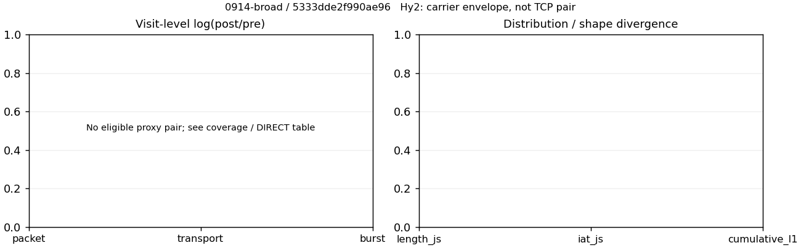

# 0914-broad · 条目 043 · taobao.com

目标：https://www.taobao.com/

活动标签：taobao.com::page_load。选定访问 3 次。

[返回总索引](../../README.md) · [统计口径](../../methods.md)

## 覆盖与资格（每次访问均保留）

| 部署 | 重复 | 主请求路由 | 活动状态 | 代理比较 | DIRECT pre | 请求 proxy/direct/unresolved | 错误 |
| --- | --- | --- | --- | --- | --- | --- | --- |
| Hy2 | 1 | direct | passed | 0 | 1 | 0/366/0 | [] |
| SS | 1 | direct | passed | 0 | 1 | 0/369/0 | [] |
| VLESS | 1 | direct | passed | 0 | 1 | 0/193/0 | [] |

主请求非 proxy 的统计仅解释为已索引的辅助代理连接或 DIRECT 观测，不代表目标业务经代理传输。播放确认与配对资格是两道不同的门。

图中散点为单次访问，短线为重复中位数；Hy2 是共享载体包络，不能与 TCP 配对作等范围因果对比。

形态图先逐访问归一化，再对访问等权平均；实线 pre，虚线 post。分箱序号及边界见 methods，不将分箱索引误解为长度或时间。

## 每次访问的关键观测

### SS

范围：`direct_pre_only`。每格 pre → post；空值为不可观测/不适用。

| 重复 | 包数 | 载荷字节 | burst | TCP FR | IAT中位µs | length JS | IAT JS |
| --- | --- | --- | --- | --- | --- | --- | --- |
| 1 | 4092 → — | 7.0193e+06 → — | 2597 → — | 502 → — | 111.18 → — | — | — |

完整标量统计：中位数 [min,max]；Δ 为重复内逐访问变换的中位数，MAD 未缩放。n 为可用变换数；DIRECT-only 的 nΔ=0 不代表 pre 不可用。

| scope | 特征 | pre | post | Δ | IQRΔ | MADΔ | nΔ |
| --- | --- | --- | --- | --- | --- | --- | --- |
| direct_pre_only | active_span_sum_s_1000ms | 32.9 [32.9, 32.9] | — | — | — | — | 0 |
| direct_pre_only | active_span_sum_s_100ms | 11.387 [11.387, 11.387] | — | — | — | — | 0 |
| direct_pre_only | active_span_sum_s_500ms | 26.346 [26.346, 26.346] | — | — | — | — | 0 |
| direct_pre_only | burst_bytes_iqr | 2678 [2678, 2678] | — | — | — | — | 0 |
| direct_pre_only | burst_bytes_mad | 82 [82, 82] | — | — | — | — | 0 |
| direct_pre_only | burst_bytes_max | 29160 [29160, 29160] | — | — | — | — | 0 |
| direct_pre_only | burst_bytes_mean | 2702.9 [2702.9, 2702.9] | — | — | — | — | 0 |
| direct_pre_only | burst_bytes_median | 82 [82, 82] | — | — | — | — | 0 |
| direct_pre_only | burst_bytes_min | 0 [0, 0] | — | — | — | — | 0 |
| direct_pre_only | burst_bytes_p95 | 18475 [18475, 18475] | — | — | — | — | 0 |
| direct_pre_only | burst_bytes_q25 | 0 [0, 0] | — | — | — | — | 0 |
| direct_pre_only | burst_bytes_q75 | 2678 [2678, 2678] | — | — | — | — | 0 |
| direct_pre_only | burst_bytes_std | 5356.2 [5356.2, 5356.2] | — | — | — | — | 0 |
| direct_pre_only | burst_count | 2597 [2597, 2597] | — | — | — | — | 0 |
| direct_pre_only | burst_duration_ms_iqr | 0.49651 [0.49651, 0.49651] | — | — | — | — | 0 |
| direct_pre_only | burst_duration_ms_mad | 0 [0, 0] | — | — | — | — | 0 |
| direct_pre_only | burst_duration_ms_max | 15001 [15001, 15001] | — | — | — | — | 0 |
| direct_pre_only | burst_duration_ms_mean | 131.7 [131.7, 131.7] | — | — | — | — | 0 |
| direct_pre_only | burst_duration_ms_median | 0 [0, 0] | — | — | — | — | 0 |
| direct_pre_only | burst_duration_ms_min | 0 [0, 0] | — | — | — | — | 0 |
| direct_pre_only | burst_duration_ms_p95 | 66.988 [66.988, 66.988] | — | — | — | — | 0 |
| direct_pre_only | burst_duration_ms_q25 | 0 [0, 0] | — | — | — | — | 0 |
| direct_pre_only | burst_duration_ms_q75 | 0.49651 [0.49651, 0.49651] | — | — | — | — | 0 |
| direct_pre_only | burst_duration_ms_std | 1075.1 [1075.1, 1075.1] | — | — | — | — | 0 |
| direct_pre_only | burst_packets_iqr | 1 [1, 1] | — | — | — | — | 0 |
| direct_pre_only | burst_packets_mad | 0 [0, 0] | — | — | — | — | 0 |
| direct_pre_only | burst_packets_max | 9 [9, 9] | — | — | — | — | 0 |
| direct_pre_only | burst_packets_mean | 1.5757 [1.5757, 1.5757] | — | — | — | — | 0 |
| direct_pre_only | burst_packets_median | 1 [1, 1] | — | — | — | — | 0 |
| direct_pre_only | burst_packets_min | 1 [1, 1] | — | — | — | — | 0 |
| direct_pre_only | burst_packets_p95 | 3 [3, 3] | — | — | — | — | 0 |
| direct_pre_only | burst_packets_q25 | 1 [1, 1] | — | — | — | — | 0 |
| direct_pre_only | burst_packets_q75 | 2 [2, 2] | — | — | — | — | 0 |
| direct_pre_only | burst_packets_std | 0.94565 [0.94565, 0.94565] | — | — | — | — | 0 |
| direct_pre_only | connection_span_concurrency_max | 34 [34, 34] | — | — | — | — | 0 |
| direct_pre_only | direction_entropy | 0.85526 [0.85526, 0.85526] | — | — | — | — | 0 |
| direct_pre_only | down_burst_count | 1276 [1276, 1276] | — | — | — | — | 0 |
| direct_pre_only | down_ip_bytes | 6.8035e+06 [6.8035e+06, 6.8035e+06] | — | — | — | — | 0 |
| direct_pre_only | down_packets | 2346 [2346, 2346] | — | — | — | — | 0 |
| direct_pre_only | down_transport_bytes | 6.6812e+06 [6.6812e+06, 6.6812e+06] | — | — | — | — | 0 |
| direct_pre_only | duration_s | 22.669 [22.669, 22.669] | — | — | — | — | 0 |
| direct_pre_only | entity_count | 45 [45, 45] | — | — | — | — | 0 |
| direct_pre_only | fr_runs | 502 [502, 502] | — | — | — | — | 0 |
| direct_pre_only | fr_runs_per_packet | 0.21416 [0.21416, 0.21416] | — | — | — | — | 0 |
| direct_pre_only | fr_switches | 457 [457, 457] | — | — | — | — | 0 |
| direct_pre_only | fr_switches_per_possible_transition | 0.19878 [0.19878, 0.19878] | — | — | — | — | 0 |
| direct_pre_only | full_retransmission_fraction | 0.012952 [0.012952, 0.012952] | — | — | — | — | 0 |
| direct_pre_only | full_retransmission_packets | 53 [53, 53] | — | — | — | — | 0 |
| direct_pre_only | iat_count | 4047 [4047, 4047] | — | — | — | — | 0 |
| direct_pre_only | iat_median_us | 111.18 [111.18, 111.18] | — | — | — | — | 0 |
| direct_pre_only | iat_us_iqr | 845.65 [845.65, 845.65] | — | — | — | — | 0 |
| direct_pre_only | iat_us_mad | 102.14 [102.14, 102.14] | — | — | — | — | 0 |
| direct_pre_only | iat_us_max | 1.5001e+07 [1.5001e+07, 1.5001e+07] | — | — | — | — | 0 |
| direct_pre_only | iat_us_mean | 94442 [94442, 94442] | — | — | — | — | 0 |
| direct_pre_only | iat_us_median | 111.18 [111.18, 111.18] | — | — | — | — | 0 |
| direct_pre_only | iat_us_min | 0.108 [0.108, 0.108] | — | — | — | — | 0 |
| direct_pre_only | iat_us_p95 | 35973 [35973, 35973] | — | — | — | — | 0 |
| direct_pre_only | iat_us_q25 | 23.165 [23.165, 23.165] | — | — | — | — | 0 |
| direct_pre_only | iat_us_q75 | 868.82 [868.82, 868.82] | — | — | — | — | 0 |
| direct_pre_only | iat_us_std | 9.0354e+05 [9.0354e+05, 9.0354e+05] | — | — | — | — | 0 |
| direct_pre_only | idle_gap_count_1000ms | 43 [43, 43] | — | — | — | — | 0 |
| direct_pre_only | idle_gap_count_100ms | 123 [123, 123] | — | — | — | — | 0 |
| direct_pre_only | idle_gap_count_500ms | 53 [53, 53] | — | — | — | — | 0 |
| direct_pre_only | idle_gap_sum_s_1000ms | 349.31 [349.31, 349.31] | — | — | — | — | 0 |
| direct_pre_only | idle_gap_sum_s_100ms | 370.82 [370.82, 370.82] | — | — | — | — | 0 |
| direct_pre_only | idle_gap_sum_s_500ms | 355.86 [355.86, 355.86] | — | — | — | — | 0 |
| direct_pre_only | ip_bytes | 7.2335e+06 [7.2335e+06, 7.2335e+06] | — | — | — | — | 0 |
| direct_pre_only | length_iqr | 4065.5 [4065.5, 4065.5] | — | — | — | — | 0 |
| direct_pre_only | length_mad | 1871.5 [1871.5, 1871.5] | — | — | — | — | 0 |
| direct_pre_only | length_max | 8920 [8920, 8920] | — | — | — | — | 0 |
| direct_pre_only | length_mean | 2994.6 [2994.6, 2994.6] | — | — | — | — | 0 |
| direct_pre_only | length_median | 2084.5 [2084.5, 2084.5] | — | — | — | — | 0 |
| direct_pre_only | length_min | 7 [7, 7] | — | — | — | — | 0 |
| direct_pre_only | length_p95 | 8920 [8920, 8920] | — | — | — | — | 0 |
| direct_pre_only | length_q25 | 274 [274, 274] | — | — | — | — | 0 |
| direct_pre_only | length_q75 | 4339.5 [4339.5, 4339.5] | — | — | — | — | 0 |
| direct_pre_only | length_std | 3076.1 [3076.1, 3076.1] | — | — | — | — | 0 |
| direct_pre_only | nonempty_entity_count | 45 [45, 45] | — | — | — | — | 0 |
| direct_pre_only | nonempty_packets | 2344 [2344, 2344] | — | — | — | — | 0 |
| direct_pre_only | offload_suspect_fraction | 0.31549 [0.31549, 0.31549] | — | — | — | — | 0 |
| direct_pre_only | packet_count | 4092 [4092, 4092] | — | — | — | — | 0 |
| direct_pre_only | rtt_median_ms | 0.10645 [0.10645, 0.10645] | — | — | — | — | 0 |
| direct_pre_only | rtt_sample_count | 1645 [1645, 1645] | — | — | — | — | 0 |
| direct_pre_only | tcp_ack_count | 4046 [4046, 4046] | — | — | — | — | 0 |
| direct_pre_only | tcp_fin_count | 90 [90, 90] | — | — | — | — | 0 |
| direct_pre_only | tcp_packet_count | 4092 [4092, 4092] | — | — | — | — | 0 |
| direct_pre_only | tcp_rst_count | 2 [2, 2] | — | — | — | — | 0 |
| direct_pre_only | tcp_syn_count | 90 [90, 90] | — | — | — | — | 0 |
| direct_pre_only | tcp_window_raw_median | 65535 [65535, 65535] | — | — | — | — | 0 |
| direct_pre_only | transition_entropy | 0.66408 [0.66408, 0.66408] | — | — | — | — | 0 |
| direct_pre_only | transition_n_mm | 1439 [1439, 1439] | — | — | — | — | 0 |
| direct_pre_only | transition_n_mp | 208 [208, 208] | — | — | — | — | 0 |
| direct_pre_only | transition_n_pm | 249 [249, 249] | — | — | — | — | 0 |
| direct_pre_only | transition_n_pp | 403 [403, 403] | — | — | — | — | 0 |
| direct_pre_only | transition_p_mm | 0.87371 [0.87371, 0.87371] | — | — | — | — | 0 |
| direct_pre_only | transition_p_mp | 0.12629 [0.12629, 0.12629] | — | — | — | — | 0 |
| direct_pre_only | transition_p_pm | 0.3819 [0.3819, 0.3819] | — | — | — | — | 0 |
| direct_pre_only | transition_p_pp | 0.6181 [0.6181, 0.6181] | — | — | — | — | 0 |
| direct_pre_only | transport_bytes | 7.0193e+06 [7.0193e+06, 7.0193e+06] | — | — | — | — | 0 |
| direct_pre_only | up_burst_count | 1321 [1321, 1321] | — | — | — | — | 0 |
| direct_pre_only | up_byte_fraction | 0.048177 [0.048177, 0.048177] | — | — | — | — | 0 |
| direct_pre_only | up_ip_bytes | 4.2993e+05 [4.2993e+05, 4.2993e+05] | — | — | — | — | 0 |
| direct_pre_only | up_packets | 1746 [1746, 1746] | — | — | — | — | 0 |
| direct_pre_only | up_transport_bytes | 3.3817e+05 [3.3817e+05, 3.3817e+05] | — | — | — | — | 0 |
| direct_pre_only | zero_iat_count | 0 [0, 0] | — | — | — | — | 0 |
| direct_pre_only | zero_iat_fraction | 0 [0, 0] | — | — | — | — | 0 |

### VLESS

范围：`direct_pre_only`。每格 pre → post；空值为不可观测/不适用。

| 重复 | 包数 | 载荷字节 | burst | TCP FR | IAT中位µs | length JS | IAT JS |
| --- | --- | --- | --- | --- | --- | --- | --- |
| 1 | 2450 → — | 4.2281e+06 → — | 1603 → — | 270 → — | 97.896 → — | — | — |

完整标量统计：中位数 [min,max]；Δ 为重复内逐访问变换的中位数，MAD 未缩放。n 为可用变换数；DIRECT-only 的 nΔ=0 不代表 pre 不可用。

| scope | 特征 | pre | post | Δ | IQRΔ | MADΔ | nΔ |
| --- | --- | --- | --- | --- | --- | --- | --- |
| direct_pre_only | active_span_sum_s_1000ms | 15.037 [15.037, 15.037] | — | — | — | — | 0 |
| direct_pre_only | active_span_sum_s_100ms | 6.5224 [6.5224, 6.5224] | — | — | — | — | 0 |
| direct_pre_only | active_span_sum_s_500ms | 13.992 [13.992, 13.992] | — | — | — | — | 0 |
| direct_pre_only | burst_bytes_iqr | 2880 [2880, 2880] | — | — | — | — | 0 |
| direct_pre_only | burst_bytes_mad | 31 [31, 31] | — | — | — | — | 0 |
| direct_pre_only | burst_bytes_max | 28672 [28672, 28672] | — | — | — | — | 0 |
| direct_pre_only | burst_bytes_mean | 2637.6 [2637.6, 2637.6] | — | — | — | — | 0 |
| direct_pre_only | burst_bytes_median | 31 [31, 31] | — | — | — | — | 0 |
| direct_pre_only | burst_bytes_min | 0 [0, 0] | — | — | — | — | 0 |
| direct_pre_only | burst_bytes_p95 | 17559 [17559, 17559] | — | — | — | — | 0 |
| direct_pre_only | burst_bytes_q25 | 0 [0, 0] | — | — | — | — | 0 |
| direct_pre_only | burst_bytes_q75 | 2880 [2880, 2880] | — | — | — | — | 0 |
| direct_pre_only | burst_bytes_std | 5177.3 [5177.3, 5177.3] | — | — | — | — | 0 |
| direct_pre_only | burst_count | 1603 [1603, 1603] | — | — | — | — | 0 |
| direct_pre_only | burst_duration_ms_iqr | 0.13491 [0.13491, 0.13491] | — | — | — | — | 0 |
| direct_pre_only | burst_duration_ms_mad | 0 [0, 0] | — | — | — | — | 0 |
| direct_pre_only | burst_duration_ms_max | 15001 [15001, 15001] | — | — | — | — | 0 |
| direct_pre_only | burst_duration_ms_mean | 165.54 [165.54, 165.54] | — | — | — | — | 0 |
| direct_pre_only | burst_duration_ms_median | 0 [0, 0] | — | — | — | — | 0 |
| direct_pre_only | burst_duration_ms_min | 0 [0, 0] | — | — | — | — | 0 |
| direct_pre_only | burst_duration_ms_p95 | 62.687 [62.687, 62.687] | — | — | — | — | 0 |
| direct_pre_only | burst_duration_ms_q25 | 0 [0, 0] | — | — | — | — | 0 |
| direct_pre_only | burst_duration_ms_q75 | 0.13491 [0.13491, 0.13491] | — | — | — | — | 0 |
| direct_pre_only | burst_duration_ms_std | 1285.3 [1285.3, 1285.3] | — | — | — | — | 0 |
| direct_pre_only | burst_packets_iqr | 1 [1, 1] | — | — | — | — | 0 |
| direct_pre_only | burst_packets_mad | 0 [0, 0] | — | — | — | — | 0 |
| direct_pre_only | burst_packets_max | 11 [11, 11] | — | — | — | — | 0 |
| direct_pre_only | burst_packets_mean | 1.5284 [1.5284, 1.5284] | — | — | — | — | 0 |
| direct_pre_only | burst_packets_median | 1 [1, 1] | — | — | — | — | 0 |
| direct_pre_only | burst_packets_min | 1 [1, 1] | — | — | — | — | 0 |
| direct_pre_only | burst_packets_p95 | 3 [3, 3] | — | — | — | — | 0 |
| direct_pre_only | burst_packets_q25 | 1 [1, 1] | — | — | — | — | 0 |
| direct_pre_only | burst_packets_q75 | 2 [2, 2] | — | — | — | — | 0 |
| direct_pre_only | burst_packets_std | 0.90312 [0.90312, 0.90312] | — | — | — | — | 0 |
| direct_pre_only | connection_span_concurrency_max | 17 [17, 17] | — | — | — | — | 0 |
| direct_pre_only | direction_entropy | 0.81709 [0.81709, 0.81709] | — | — | — | — | 0 |
| direct_pre_only | down_burst_count | 784 [784, 784] | — | — | — | — | 0 |
| direct_pre_only | down_ip_bytes | 4.1652e+06 [4.1652e+06, 4.1652e+06] | — | — | — | — | 0 |
| direct_pre_only | down_packets | 1381 [1381, 1381] | — | — | — | — | 0 |
| direct_pre_only | down_transport_bytes | 4.0931e+06 [4.0931e+06, 4.0931e+06] | — | — | — | — | 0 |
| direct_pre_only | duration_s | 50.982 [50.982, 50.982] | — | — | — | — | 0 |
| direct_pre_only | entity_count | 35 [35, 35] | — | — | — | — | 0 |
| direct_pre_only | fr_runs | 270 [270, 270] | — | — | — | — | 0 |
| direct_pre_only | fr_runs_per_packet | 0.1997 [0.1997, 0.1997] | — | — | — | — | 0 |
| direct_pre_only | fr_switches | 235 [235, 235] | — | — | — | — | 0 |
| direct_pre_only | fr_switches_per_possible_transition | 0.17844 [0.17844, 0.17844] | — | — | — | — | 0 |
| direct_pre_only | full_retransmission_fraction | 0.0061224 [0.0061224, 0.0061224] | — | — | — | — | 0 |
| direct_pre_only | full_retransmission_packets | 15 [15, 15] | — | — | — | — | 0 |
| direct_pre_only | iat_count | 2415 [2415, 2415] | — | — | — | — | 0 |
| direct_pre_only | iat_median_us | 97.896 [97.896, 97.896] | — | — | — | — | 0 |
| direct_pre_only | iat_us_iqr | 782.32 [782.32, 782.32] | — | — | — | — | 0 |
| direct_pre_only | iat_us_mad | 89.75 [89.75, 89.75] | — | — | — | — | 0 |
| direct_pre_only | iat_us_max | 1.5002e+07 [1.5002e+07, 1.5002e+07] | — | — | — | — | 0 |
| direct_pre_only | iat_us_mean | 2.2963e+05 [2.2963e+05, 2.2963e+05] | — | — | — | — | 0 |
| direct_pre_only | iat_us_median | 97.896 [97.896, 97.896] | — | — | — | — | 0 |
| direct_pre_only | iat_us_min | 0.301 [0.301, 0.301] | — | — | — | — | 0 |
| direct_pre_only | iat_us_p95 | 40651 [40651, 40651] | — | — | — | — | 0 |
| direct_pre_only | iat_us_q25 | 17.706 [17.706, 17.706] | — | — | — | — | 0 |
| direct_pre_only | iat_us_q75 | 800.03 [800.03, 800.03] | — | — | — | — | 0 |
| direct_pre_only | iat_us_std | 1.6676e+06 [1.6676e+06, 1.6676e+06] | — | — | — | — | 0 |
| direct_pre_only | idle_gap_count_1000ms | 49 [49, 49] | — | — | — | — | 0 |
| direct_pre_only | idle_gap_count_100ms | 89 [89, 89] | — | — | — | — | 0 |
| direct_pre_only | idle_gap_count_500ms | 51 [51, 51] | — | — | — | — | 0 |
| direct_pre_only | idle_gap_sum_s_1000ms | 539.52 [539.52, 539.52] | — | — | — | — | 0 |
| direct_pre_only | idle_gap_sum_s_100ms | 548.04 [548.04, 548.04] | — | — | — | — | 0 |
| direct_pre_only | idle_gap_sum_s_500ms | 540.57 [540.57, 540.57] | — | — | — | — | 0 |
| direct_pre_only | ip_bytes | 4.3562e+06 [4.3562e+06, 4.3562e+06] | — | — | — | — | 0 |
| direct_pre_only | length_iqr | 4862 [4862, 4862] | — | — | — | — | 0 |
| direct_pre_only | length_mad | 2320 [2320, 2320] | — | — | — | — | 0 |
| direct_pre_only | length_max | 8920 [8920, 8920] | — | — | — | — | 0 |
| direct_pre_only | length_mean | 3127.3 [3127.3, 3127.3] | — | — | — | — | 0 |
| direct_pre_only | length_median | 2640 [2640, 2640] | — | — | — | — | 0 |
| direct_pre_only | length_min | 31 [31, 31] | — | — | — | — | 0 |
| direct_pre_only | length_p95 | 8920 [8920, 8920] | — | — | — | — | 0 |
| direct_pre_only | length_q25 | 339 [339, 339] | — | — | — | — | 0 |
| direct_pre_only | length_q75 | 5201 [5201, 5201] | — | — | — | — | 0 |
| direct_pre_only | length_std | 3045.6 [3045.6, 3045.6] | — | — | — | — | 0 |
| direct_pre_only | nonempty_entity_count | 35 [35, 35] | — | — | — | — | 0 |
| direct_pre_only | nonempty_packets | 1352 [1352, 1352] | — | — | — | — | 0 |
| direct_pre_only | offload_suspect_fraction | 0.3249 [0.3249, 0.3249] | — | — | — | — | 0 |
| direct_pre_only | packet_count | 2450 [2450, 2450] | — | — | — | — | 0 |
| direct_pre_only | rtt_median_ms | 0.086086 [0.086086, 0.086086] | — | — | — | — | 0 |
| direct_pre_only | rtt_sample_count | 970 [970, 970] | — | — | — | — | 0 |
| direct_pre_only | tcp_ack_count | 2412 [2412, 2412] | — | — | — | — | 0 |
| direct_pre_only | tcp_fin_count | 68 [68, 68] | — | — | — | — | 0 |
| direct_pre_only | tcp_packet_count | 2450 [2450, 2450] | — | — | — | — | 0 |
| direct_pre_only | tcp_rst_count | 3 [3, 3] | — | — | — | — | 0 |
| direct_pre_only | tcp_syn_count | 70 [70, 70] | — | — | — | — | 0 |
| direct_pre_only | tcp_window_raw_median | 65535 [65535, 65535] | — | — | — | — | 0 |
| direct_pre_only | transition_entropy | 0.60802 [0.60802, 0.60802] | — | — | — | — | 0 |
| direct_pre_only | transition_n_mm | 877 [877, 877] | — | — | — | — | 0 |
| direct_pre_only | transition_n_mp | 103 [103, 103] | — | — | — | — | 0 |
| direct_pre_only | transition_n_pm | 132 [132, 132] | — | — | — | — | 0 |
| direct_pre_only | transition_n_pp | 205 [205, 205] | — | — | — | — | 0 |
| direct_pre_only | transition_p_mm | 0.8949 [0.8949, 0.8949] | — | — | — | — | 0 |
| direct_pre_only | transition_p_mp | 0.1051 [0.1051, 0.1051] | — | — | — | — | 0 |
| direct_pre_only | transition_p_pm | 0.39169 [0.39169, 0.39169] | — | — | — | — | 0 |
| direct_pre_only | transition_p_pp | 0.60831 [0.60831, 0.60831] | — | — | — | — | 0 |
| direct_pre_only | transport_bytes | 4.2281e+06 [4.2281e+06, 4.2281e+06] | — | — | — | — | 0 |
| direct_pre_only | up_burst_count | 819 [819, 819] | — | — | — | — | 0 |
| direct_pre_only | up_byte_fraction | 0.031933 [0.031933, 0.031933] | — | — | — | — | 0 |
| direct_pre_only | up_ip_bytes | 1.91e+05 [1.91e+05, 1.91e+05] | — | — | — | — | 0 |
| direct_pre_only | up_packets | 1069 [1069, 1069] | — | — | — | — | 0 |
| direct_pre_only | up_transport_bytes | 1.3502e+05 [1.3502e+05, 1.3502e+05] | — | — | — | — | 0 |
| direct_pre_only | zero_iat_count | 0 [0, 0] | — | — | — | — | 0 |
| direct_pre_only | zero_iat_fraction | 0 [0, 0] | — | — | — | — | 0 |

### Hy2

范围：`direct_pre_only`。每格 pre → post；空值为不可观测/不适用。

| 重复 | 包数 | 载荷字节 | burst | TCP FR | IAT中位µs | length JS | IAT JS |
| --- | --- | --- | --- | --- | --- | --- | --- |
| 1 | 4169 → — | 6.8473e+06 → — | 2528 → — | 461 → — | 129.35 → — | — | — |

完整标量统计：中位数 [min,max]；Δ 为重复内逐访问变换的中位数，MAD 未缩放。n 为可用变换数；DIRECT-only 的 nΔ=0 不代表 pre 不可用。

| scope | 特征 | pre | post | Δ | IQRΔ | MADΔ | nΔ |
| --- | --- | --- | --- | --- | --- | --- | --- |
| direct_pre_only | active_span_sum_s_1000ms | 38.025 [38.025, 38.025] | — | — | — | — | 0 |
| direct_pre_only | active_span_sum_s_100ms | 12.583 [12.583, 12.583] | — | — | — | — | 0 |
| direct_pre_only | active_span_sum_s_500ms | 25.46 [25.46, 25.46] | — | — | — | — | 0 |
| direct_pre_only | burst_bytes_iqr | 2498 [2498, 2498] | — | — | — | — | 0 |
| direct_pre_only | burst_bytes_mad | 80 [80, 80] | — | — | — | — | 0 |
| direct_pre_only | burst_bytes_max | 28600 [28600, 28600] | — | — | — | — | 0 |
| direct_pre_only | burst_bytes_mean | 2708.6 [2708.6, 2708.6] | — | — | — | — | 0 |
| direct_pre_only | burst_bytes_median | 80 [80, 80] | — | — | — | — | 0 |
| direct_pre_only | burst_bytes_min | 0 [0, 0] | — | — | — | — | 0 |
| direct_pre_only | burst_bytes_p95 | 20394 [20394, 20394] | — | — | — | — | 0 |
| direct_pre_only | burst_bytes_q25 | 0 [0, 0] | — | — | — | — | 0 |
| direct_pre_only | burst_bytes_q75 | 2498 [2498, 2498] | — | — | — | — | 0 |
| direct_pre_only | burst_bytes_std | 5489.8 [5489.8, 5489.8] | — | — | — | — | 0 |
| direct_pre_only | burst_count | 2528 [2528, 2528] | — | — | — | — | 0 |
| direct_pre_only | burst_duration_ms_iqr | 0.42562 [0.42562, 0.42562] | — | — | — | — | 0 |
| direct_pre_only | burst_duration_ms_mad | 0 [0, 0] | — | — | — | — | 0 |
| direct_pre_only | burst_duration_ms_max | 15001 [15001, 15001] | — | — | — | — | 0 |
| direct_pre_only | burst_duration_ms_mean | 66.349 [66.349, 66.349] | — | — | — | — | 0 |
| direct_pre_only | burst_duration_ms_median | 0 [0, 0] | — | — | — | — | 0 |
| direct_pre_only | burst_duration_ms_min | 0 [0, 0] | — | — | — | — | 0 |
| direct_pre_only | burst_duration_ms_p95 | 70.413 [70.413, 70.413] | — | — | — | — | 0 |
| direct_pre_only | burst_duration_ms_q25 | 0 [0, 0] | — | — | — | — | 0 |
| direct_pre_only | burst_duration_ms_q75 | 0.42562 [0.42562, 0.42562] | — | — | — | — | 0 |
| direct_pre_only | burst_duration_ms_std | 675.73 [675.73, 675.73] | — | — | — | — | 0 |
| direct_pre_only | burst_packets_iqr | 1 [1, 1] | — | — | — | — | 0 |
| direct_pre_only | burst_packets_mad | 0 [0, 0] | — | — | — | — | 0 |
| direct_pre_only | burst_packets_max | 9 [9, 9] | — | — | — | — | 0 |
| direct_pre_only | burst_packets_mean | 1.6491 [1.6491, 1.6491] | — | — | — | — | 0 |
| direct_pre_only | burst_packets_median | 1 [1, 1] | — | — | — | — | 0 |
| direct_pre_only | burst_packets_min | 1 [1, 1] | — | — | — | — | 0 |
| direct_pre_only | burst_packets_p95 | 4 [4, 4] | — | — | — | — | 0 |
| direct_pre_only | burst_packets_q25 | 1 [1, 1] | — | — | — | — | 0 |
| direct_pre_only | burst_packets_q75 | 2 [2, 2] | — | — | — | — | 0 |
| direct_pre_only | burst_packets_std | 1.0554 [1.0554, 1.0554] | — | — | — | — | 0 |
| direct_pre_only | connection_span_concurrency_max | 29 [29, 29] | — | — | — | — | 0 |
| direct_pre_only | direction_entropy | 0.83787 [0.83787, 0.83787] | — | — | — | — | 0 |
| direct_pre_only | down_burst_count | 1242 [1242, 1242] | — | — | — | — | 0 |
| direct_pre_only | down_ip_bytes | 6.6395e+06 [6.6395e+06, 6.6395e+06] | — | — | — | — | 0 |
| direct_pre_only | down_packets | 2438 [2438, 2438] | — | — | — | — | 0 |
| direct_pre_only | down_transport_bytes | 6.5123e+06 [6.5123e+06, 6.5123e+06] | — | — | — | — | 0 |
| direct_pre_only | duration_s | 23.2 [23.2, 23.2] | — | — | — | — | 0 |
| direct_pre_only | entity_count | 44 [44, 44] | — | — | — | — | 0 |
| direct_pre_only | fr_runs | 461 [461, 461] | — | — | — | — | 0 |
| direct_pre_only | fr_runs_per_packet | 0.18886 [0.18886, 0.18886] | — | — | — | — | 0 |
| direct_pre_only | fr_switches | 417 [417, 417] | — | — | — | — | 0 |
| direct_pre_only | fr_switches_per_possible_transition | 0.17397 [0.17397, 0.17397] | — | — | — | — | 0 |
| direct_pre_only | full_retransmission_fraction | 0.010314 [0.010314, 0.010314] | — | — | — | — | 0 |
| direct_pre_only | full_retransmission_packets | 43 [43, 43] | — | — | — | — | 0 |
| direct_pre_only | iat_count | 4125 [4125, 4125] | — | — | — | — | 0 |
| direct_pre_only | iat_median_us | 129.35 [129.35, 129.35] | — | — | — | — | 0 |
| direct_pre_only | iat_us_iqr | 924.48 [924.48, 924.48] | — | — | — | — | 0 |
| direct_pre_only | iat_us_mad | 119.59 [119.59, 119.59] | — | — | — | — | 0 |
| direct_pre_only | iat_us_max | 1.5001e+07 [1.5001e+07, 1.5001e+07] | — | — | — | — | 0 |
| direct_pre_only | iat_us_mean | 81481 [81481, 81481] | — | — | — | — | 0 |
| direct_pre_only | iat_us_median | 129.35 [129.35, 129.35] | — | — | — | — | 0 |
| direct_pre_only | iat_us_min | 0.076 [0.076, 0.076] | — | — | — | — | 0 |
| direct_pre_only | iat_us_p95 | 40379 [40379, 40379] | — | — | — | — | 0 |
| direct_pre_only | iat_us_q25 | 28.779 [28.779, 28.779] | — | — | — | — | 0 |
| direct_pre_only | iat_us_q75 | 953.26 [953.26, 953.26] | — | — | — | — | 0 |
| direct_pre_only | iat_us_std | 9.1374e+05 [9.1374e+05, 9.1374e+05] | — | — | — | — | 0 |
| direct_pre_only | idle_gap_count_1000ms | 45 [45, 45] | — | — | — | — | 0 |
| direct_pre_only | idle_gap_count_100ms | 119 [119, 119] | — | — | — | — | 0 |
| direct_pre_only | idle_gap_count_500ms | 62 [62, 62] | — | — | — | — | 0 |
| direct_pre_only | idle_gap_sum_s_1000ms | 298.08 [298.08, 298.08] | — | — | — | — | 0 |
| direct_pre_only | idle_gap_sum_s_100ms | 323.53 [323.53, 323.53] | — | — | — | — | 0 |
| direct_pre_only | idle_gap_sum_s_500ms | 310.65 [310.65, 310.65] | — | — | — | — | 0 |
| direct_pre_only | ip_bytes | 7.0653e+06 [7.0653e+06, 7.0653e+06] | — | — | — | — | 0 |
| direct_pre_only | length_iqr | 3549 [3549, 3549] | — | — | — | — | 0 |
| direct_pre_only | length_mad | 1618 [1618, 1618] | — | — | — | — | 0 |
| direct_pre_only | length_max | 8920 [8920, 8920] | — | — | — | — | 0 |
| direct_pre_only | length_mean | 2805.1 [2805.1, 2805.1] | — | — | — | — | 0 |
| direct_pre_only | length_median | 1905 [1905, 1905] | — | — | — | — | 0 |
| direct_pre_only | length_min | 31 [31, 31] | — | — | — | — | 0 |
| direct_pre_only | length_p95 | 8920 [8920, 8920] | — | — | — | — | 0 |
| direct_pre_only | length_q25 | 311 [311, 311] | — | — | — | — | 0 |
| direct_pre_only | length_q75 | 3860 [3860, 3860] | — | — | — | — | 0 |
| direct_pre_only | length_std | 2902.5 [2902.5, 2902.5] | — | — | — | — | 0 |
| direct_pre_only | nonempty_entity_count | 44 [44, 44] | — | — | — | — | 0 |
| direct_pre_only | nonempty_packets | 2441 [2441, 2441] | — | — | — | — | 0 |
| direct_pre_only | offload_suspect_fraction | 0.3171 [0.3171, 0.3171] | — | — | — | — | 0 |
| direct_pre_only | packet_count | 4169 [4169, 4169] | — | — | — | — | 0 |
| direct_pre_only | rtt_median_ms | 0.12124 [0.12124, 0.12124] | — | — | — | — | 0 |
| direct_pre_only | rtt_sample_count | 1579 [1579, 1579] | — | — | — | — | 0 |
| direct_pre_only | tcp_ack_count | 4123 [4123, 4123] | — | — | — | — | 0 |
| direct_pre_only | tcp_fin_count | 88 [88, 88] | — | — | — | — | 0 |
| direct_pre_only | tcp_packet_count | 4169 [4169, 4169] | — | — | — | — | 0 |
| direct_pre_only | tcp_rst_count | 2 [2, 2] | — | — | — | — | 0 |
| direct_pre_only | tcp_syn_count | 88 [88, 88] | — | — | — | — | 0 |
| direct_pre_only | tcp_window_raw_median | 65535 [65535, 65535] | — | — | — | — | 0 |
| direct_pre_only | transition_entropy | 0.61344 [0.61344, 0.61344] | — | — | — | — | 0 |
| direct_pre_only | transition_n_mm | 1560 [1560, 1560] | — | — | — | — | 0 |
| direct_pre_only | transition_n_mp | 189 [189, 189] | — | — | — | — | 0 |
| direct_pre_only | transition_n_pm | 228 [228, 228] | — | — | — | — | 0 |
| direct_pre_only | transition_n_pp | 420 [420, 420] | — | — | — | — | 0 |
| direct_pre_only | transition_p_mm | 0.89194 [0.89194, 0.89194] | — | — | — | — | 0 |
| direct_pre_only | transition_p_mp | 0.10806 [0.10806, 0.10806] | — | — | — | — | 0 |
| direct_pre_only | transition_p_pm | 0.35185 [0.35185, 0.35185] | — | — | — | — | 0 |
| direct_pre_only | transition_p_pp | 0.64815 [0.64815, 0.64815] | — | — | — | — | 0 |
| direct_pre_only | transport_bytes | 6.8473e+06 [6.8473e+06, 6.8473e+06] | — | — | — | — | 0 |
| direct_pre_only | up_burst_count | 1286 [1286, 1286] | — | — | — | — | 0 |
| direct_pre_only | up_byte_fraction | 0.048918 [0.048918, 0.048918] | — | — | — | — | 0 |
| direct_pre_only | up_ip_bytes | 4.2582e+05 [4.2582e+05, 4.2582e+05] | — | — | — | — | 0 |
| direct_pre_only | up_packets | 1731 [1731, 1731] | — | — | — | — | 0 |
| direct_pre_only | up_transport_bytes | 3.3496e+05 [3.3496e+05, 3.3496e+05] | — | — | — | — | 0 |
| direct_pre_only | zero_iat_count | 0 [0, 0] | — | — | — | — | 0 |
| direct_pre_only | zero_iat_fraction | 0 [0, 0] | — | — | — | — | 0 |

## 不同部署对比

以下是各部署自身重复中位数的差异，不按重复编号强行配对。跨 TCP/Hy2 的行标记异质观测范围。

| 视角 | 特征 | 部署A | 部署B | A中位 | B中位 | B−A | 比较口径 |
| --- | --- | --- | --- | --- | --- | --- | --- |
| pre | burst_count | SS | VLESS | 2597 | 1603 | -994 | same_scope_unpaired_visits |
| pre | burst_count | SS | Hy2 | 2597 | 2528 | -69 | same_scope_unpaired_visits |
| pre | burst_count | VLESS | Hy2 | 1603 | 2528 | 925 | same_scope_unpaired_visits |
| pre | connection_span_concurrency_max | SS | VLESS | 34 | 17 | -17 | same_scope_unpaired_visits |
| pre | connection_span_concurrency_max | SS | Hy2 | 34 | 29 | -5 | same_scope_unpaired_visits |
| pre | connection_span_concurrency_max | VLESS | Hy2 | 17 | 29 | 12 | same_scope_unpaired_visits |
| pre | direction_entropy | SS | VLESS | 0.85526 | 0.81709 | -0.038178 | same_scope_unpaired_visits |
| pre | direction_entropy | SS | Hy2 | 0.85526 | 0.83787 | -0.017391 | same_scope_unpaired_visits |
| pre | direction_entropy | VLESS | Hy2 | 0.81709 | 0.83787 | 0.020786 | same_scope_unpaired_visits |
| pre | down_transport_bytes | SS | VLESS | 6.6812e+06 | 4.0931e+06 | -2.5881e+06 | same_scope_unpaired_visits |
| pre | down_transport_bytes | SS | Hy2 | 6.6812e+06 | 6.5123e+06 | -1.6883e+05 | same_scope_unpaired_visits |
| pre | down_transport_bytes | VLESS | Hy2 | 4.0931e+06 | 6.5123e+06 | 2.4193e+06 | same_scope_unpaired_visits |
| pre | duration_s | SS | VLESS | 22.669 | 50.982 | 28.314 | same_scope_unpaired_visits |
| pre | duration_s | SS | Hy2 | 22.669 | 23.2 | 0.53093 | same_scope_unpaired_visits |
| pre | duration_s | VLESS | Hy2 | 50.982 | 23.2 | -27.783 | same_scope_unpaired_visits |
| pre | entity_count | SS | VLESS | 45 | 35 | -10 | same_scope_unpaired_visits |
| pre | entity_count | SS | Hy2 | 45 | 44 | -1 | same_scope_unpaired_visits |
| pre | entity_count | VLESS | Hy2 | 35 | 44 | 9 | same_scope_unpaired_visits |
| pre | fr_runs | SS | VLESS | 502 | 270 | -232 | same_scope_unpaired_visits |
| pre | fr_runs | SS | Hy2 | 502 | 461 | -41 | same_scope_unpaired_visits |
| pre | fr_runs | VLESS | Hy2 | 270 | 461 | 191 | same_scope_unpaired_visits |
| pre | fr_runs_per_packet | SS | VLESS | 0.21416 | 0.1997 | -0.01446 | same_scope_unpaired_visits |
| pre | fr_runs_per_packet | SS | Hy2 | 0.21416 | 0.18886 | -0.025307 | same_scope_unpaired_visits |
| pre | fr_runs_per_packet | VLESS | Hy2 | 0.1997 | 0.18886 | -0.010847 | same_scope_unpaired_visits |
| pre | fr_switches | SS | VLESS | 457 | 235 | -222 | same_scope_unpaired_visits |
| pre | fr_switches | SS | Hy2 | 457 | 417 | -40 | same_scope_unpaired_visits |
| pre | fr_switches | VLESS | Hy2 | 235 | 417 | 182 | same_scope_unpaired_visits |
| pre | fr_switches_per_possible_transition | SS | VLESS | 0.19878 | 0.17844 | -0.020346 | same_scope_unpaired_visits |
| pre | fr_switches_per_possible_transition | SS | Hy2 | 0.19878 | 0.17397 | -0.024815 | same_scope_unpaired_visits |
| pre | fr_switches_per_possible_transition | VLESS | Hy2 | 0.17844 | 0.17397 | -0.0044684 | same_scope_unpaired_visits |
| pre | full_retransmission_fraction | SS | VLESS | 0.012952 | 0.0061224 | -0.0068297 | same_scope_unpaired_visits |
| pre | full_retransmission_fraction | SS | Hy2 | 0.012952 | 0.010314 | -0.0026379 | same_scope_unpaired_visits |
| pre | full_retransmission_fraction | VLESS | Hy2 | 0.0061224 | 0.010314 | 0.0041918 | same_scope_unpaired_visits |
| pre | iat_median_us | SS | VLESS | 111.18 | 97.896 | -13.285 | same_scope_unpaired_visits |
| pre | iat_median_us | SS | Hy2 | 111.18 | 129.35 | 18.171 | same_scope_unpaired_visits |
| pre | iat_median_us | VLESS | Hy2 | 97.896 | 129.35 | 31.456 | same_scope_unpaired_visits |
| pre | iat_us_p95 | SS | VLESS | 35973 | 40651 | 4678.2 | same_scope_unpaired_visits |
| pre | iat_us_p95 | SS | Hy2 | 35973 | 40379 | 4405.9 | same_scope_unpaired_visits |
| pre | iat_us_p95 | VLESS | Hy2 | 40651 | 40379 | -272.24 | same_scope_unpaired_visits |
| pre | ip_bytes | SS | VLESS | 7.2335e+06 | 4.3562e+06 | -2.8773e+06 | same_scope_unpaired_visits |
| pre | ip_bytes | SS | Hy2 | 7.2335e+06 | 7.0653e+06 | -1.6817e+05 | same_scope_unpaired_visits |
| pre | ip_bytes | VLESS | Hy2 | 4.3562e+06 | 7.0653e+06 | 2.7091e+06 | same_scope_unpaired_visits |
| pre | length_median | SS | VLESS | 2084.5 | 2640 | 555.5 | same_scope_unpaired_visits |
| pre | length_median | SS | Hy2 | 2084.5 | 1905 | -179.5 | same_scope_unpaired_visits |
| pre | length_median | VLESS | Hy2 | 2640 | 1905 | -735 | same_scope_unpaired_visits |
| pre | length_p95 | SS | VLESS | 8920 | 8920 | 0 | same_scope_unpaired_visits |
| pre | length_p95 | SS | Hy2 | 8920 | 8920 | 0 | same_scope_unpaired_visits |
| pre | length_p95 | VLESS | Hy2 | 8920 | 8920 | 0 | same_scope_unpaired_visits |
| pre | nonempty_packets | SS | VLESS | 2344 | 1352 | -992 | same_scope_unpaired_visits |
| pre | nonempty_packets | SS | Hy2 | 2344 | 2441 | 97 | same_scope_unpaired_visits |
| pre | nonempty_packets | VLESS | Hy2 | 1352 | 2441 | 1089 | same_scope_unpaired_visits |
| pre | offload_suspect_fraction | SS | VLESS | 0.31549 | 0.3249 | 0.0094043 | same_scope_unpaired_visits |
| pre | offload_suspect_fraction | SS | Hy2 | 0.31549 | 0.3171 | 0.0016088 | same_scope_unpaired_visits |
| pre | offload_suspect_fraction | VLESS | Hy2 | 0.3249 | 0.3171 | -0.0077955 | same_scope_unpaired_visits |
| pre | packet_count | SS | VLESS | 4092 | 2450 | -1642 | same_scope_unpaired_visits |
| pre | packet_count | SS | Hy2 | 4092 | 4169 | 77 | same_scope_unpaired_visits |
| pre | packet_count | VLESS | Hy2 | 2450 | 4169 | 1719 | same_scope_unpaired_visits |
| pre | rtt_median_ms | SS | VLESS | 0.10645 | 0.086086 | -0.020363 | same_scope_unpaired_visits |
| pre | rtt_median_ms | SS | Hy2 | 0.10645 | 0.12124 | 0.014791 | same_scope_unpaired_visits |
| pre | rtt_median_ms | VLESS | Hy2 | 0.086086 | 0.12124 | 0.035154 | same_scope_unpaired_visits |
| pre | transition_entropy | SS | VLESS | 0.66408 | 0.60802 | -0.056053 | same_scope_unpaired_visits |
| pre | transition_entropy | SS | Hy2 | 0.66408 | 0.61344 | -0.050634 | same_scope_unpaired_visits |
| pre | transition_entropy | VLESS | Hy2 | 0.60802 | 0.61344 | 0.0054188 | same_scope_unpaired_visits |
| pre | transport_bytes | SS | VLESS | 7.0193e+06 | 4.2281e+06 | -2.7913e+06 | same_scope_unpaired_visits |
| pre | transport_bytes | SS | Hy2 | 7.0193e+06 | 6.8473e+06 | -1.7204e+05 | same_scope_unpaired_visits |
| pre | transport_bytes | VLESS | Hy2 | 4.2281e+06 | 6.8473e+06 | 2.6192e+06 | same_scope_unpaired_visits |
| pre | up_byte_fraction | SS | VLESS | 0.048177 | 0.031933 | -0.016244 | same_scope_unpaired_visits |
| pre | up_byte_fraction | SS | Hy2 | 0.048177 | 0.048918 | 0.0007418 | same_scope_unpaired_visits |
| pre | up_byte_fraction | VLESS | Hy2 | 0.031933 | 0.048918 | 0.016985 | same_scope_unpaired_visits |
| pre | up_transport_bytes | SS | VLESS | 3.3817e+05 | 1.3502e+05 | -2.0315e+05 | same_scope_unpaired_visits |
| pre | up_transport_bytes | SS | Hy2 | 3.3817e+05 | 3.3496e+05 | -3209 | same_scope_unpaired_visits |
| pre | up_transport_bytes | VLESS | Hy2 | 1.3502e+05 | 3.3496e+05 | 1.9994e+05 | same_scope_unpaired_visits |

## 可复核的访问标识

| 部署 | 重复 | session_id |
| --- | --- | --- |
| SS | 1 | ab6f09ac-96c9-4198-aabd-17ea889bcb7f |
| VLESS | 1 | d10a4a85-fc0a-4499-8bfc-673b3cfa9bed |
| Hy2 | 1 | 1a741042-5959-4539-9c44-d9af82312a9c |

全量三种 packet selection、Hy2 full 范围、Q25/Q75、直方图与曲线见机器可读产物；本页只显示 observed 主范围。
