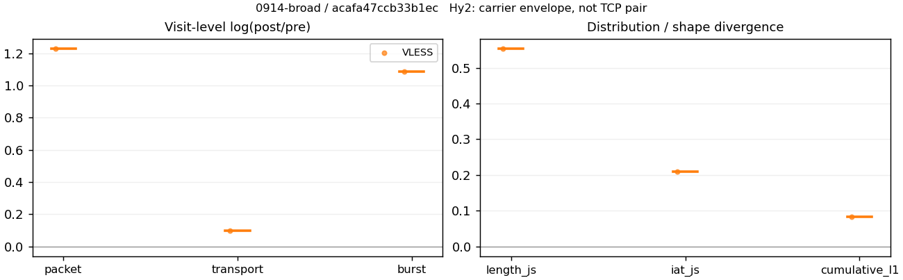
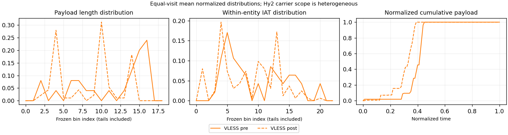

# 0914-broad · 条目 044 · mi.com

目标：https://www.mi.com/

活动标签：mi.com::page_load。选定访问 3 次。

[返回总索引](../../README.md) · [统计口径](../../methods.md)

## 覆盖与资格（每次访问均保留）

| 部署 | 重复 | 主请求路由 | 活动状态 | 代理比较 | DIRECT pre | 请求 proxy/direct/unresolved | 错误 |
| --- | --- | --- | --- | --- | --- | --- | --- |
| Hy2 | 1 | direct | passed | 0 | 1 | 0/76/0 | [] |
| SS | 1 | direct | passed | 0 | 1 | 0/75/0 | [] |
| VLESS | 1 | direct | passed | 1 | 1 | 1/74/0 | [] |

主请求非 proxy 的统计仅解释为已索引的辅助代理连接或 DIRECT 观测，不代表目标业务经代理传输。播放确认与配对资格是两道不同的门。

图中散点为单次访问，短线为重复中位数；Hy2 是共享载体包络，不能与 TCP 配对作等范围因果对比。

形态图先逐访问归一化，再对访问等权平均；实线 pre，虚线 post。分箱序号及边界见 methods，不将分箱索引误解为长度或时间。

## 每次访问的关键观测

### SS

范围：`direct_pre_only`。每格 pre → post；空值为不可观测/不适用。

| 重复 | 包数 | 载荷字节 | burst | TCP FR | IAT中位µs | length JS | IAT JS |
| --- | --- | --- | --- | --- | --- | --- | --- |
| 1 | 1162 → — | 2.307e+06 → — | 699 → — | 110 → — | 82.899 → — | — | — |

完整标量统计：中位数 [min,max]；Δ 为重复内逐访问变换的中位数，MAD 未缩放。n 为可用变换数；DIRECT-only 的 nΔ=0 不代表 pre 不可用。

| scope | 特征 | pre | post | Δ | IQRΔ | MADΔ | nΔ |
| --- | --- | --- | --- | --- | --- | --- | --- |
| direct_pre_only | active_span_sum_s_1000ms | 8.1897 [8.1897, 8.1897] | — | — | — | — | 0 |
| direct_pre_only | active_span_sum_s_100ms | 2.0991 [2.0991, 2.0991] | — | — | — | — | 0 |
| direct_pre_only | active_span_sum_s_500ms | 6.2283 [6.2283, 6.2283] | — | — | — | — | 0 |
| direct_pre_only | burst_bytes_iqr | 5760 [5760, 5760] | — | — | — | — | 0 |
| direct_pre_only | burst_bytes_mad | 64 [64, 64] | — | — | — | — | 0 |
| direct_pre_only | burst_bytes_max | 23840 [23840, 23840] | — | — | — | — | 0 |
| direct_pre_only | burst_bytes_mean | 3300.4 [3300.4, 3300.4] | — | — | — | — | 0 |
| direct_pre_only | burst_bytes_median | 64 [64, 64] | — | — | — | — | 0 |
| direct_pre_only | burst_bytes_min | 0 [0, 0] | — | — | — | — | 0 |
| direct_pre_only | burst_bytes_p95 | 15887 [15887, 15887] | — | — | — | — | 0 |
| direct_pre_only | burst_bytes_q25 | 0 [0, 0] | — | — | — | — | 0 |
| direct_pre_only | burst_bytes_q75 | 5760 [5760, 5760] | — | — | — | — | 0 |
| direct_pre_only | burst_bytes_std | 5443.5 [5443.5, 5443.5] | — | — | — | — | 0 |
| direct_pre_only | burst_count | 699 [699, 699] | — | — | — | — | 0 |
| direct_pre_only | burst_duration_ms_iqr | 0.56313 [0.56313, 0.56313] | — | — | — | — | 0 |
| direct_pre_only | burst_duration_ms_mad | 0 [0, 0] | — | — | — | — | 0 |
| direct_pre_only | burst_duration_ms_max | 9340.9 [9340.9, 9340.9] | — | — | — | — | 0 |
| direct_pre_only | burst_duration_ms_mean | 68.159 [68.159, 68.159] | — | — | — | — | 0 |
| direct_pre_only | burst_duration_ms_median | 0 [0, 0] | — | — | — | — | 0 |
| direct_pre_only | burst_duration_ms_min | 0 [0, 0] | — | — | — | — | 0 |
| direct_pre_only | burst_duration_ms_p95 | 118.42 [118.42, 118.42] | — | — | — | — | 0 |
| direct_pre_only | burst_duration_ms_q25 | 0 [0, 0] | — | — | — | — | 0 |
| direct_pre_only | burst_duration_ms_q75 | 0.56313 [0.56313, 0.56313] | — | — | — | — | 0 |
| direct_pre_only | burst_duration_ms_std | 491.16 [491.16, 491.16] | — | — | — | — | 0 |
| direct_pre_only | burst_packets_iqr | 1 [1, 1] | — | — | — | — | 0 |
| direct_pre_only | burst_packets_mad | 0 [0, 0] | — | — | — | — | 0 |
| direct_pre_only | burst_packets_max | 8 [8, 8] | — | — | — | — | 0 |
| direct_pre_only | burst_packets_mean | 1.6624 [1.6624, 1.6624] | — | — | — | — | 0 |
| direct_pre_only | burst_packets_median | 1 [1, 1] | — | — | — | — | 0 |
| direct_pre_only | burst_packets_min | 1 [1, 1] | — | — | — | — | 0 |
| direct_pre_only | burst_packets_p95 | 3 [3, 3] | — | — | — | — | 0 |
| direct_pre_only | burst_packets_q25 | 1 [1, 1] | — | — | — | — | 0 |
| direct_pre_only | burst_packets_q75 | 2 [2, 2] | — | — | — | — | 0 |
| direct_pre_only | burst_packets_std | 0.95411 [0.95411, 0.95411] | — | — | — | — | 0 |
| direct_pre_only | connection_span_concurrency_max | 12 [12, 12] | — | — | — | — | 0 |
| direct_pre_only | direction_entropy | 0.59114 [0.59114, 0.59114] | — | — | — | — | 0 |
| direct_pre_only | down_burst_count | 341 [341, 341] | — | — | — | — | 0 |
| direct_pre_only | down_ip_bytes | 2.2857e+06 [2.2857e+06, 2.2857e+06] | — | — | — | — | 0 |
| direct_pre_only | down_packets | 726 [726, 726] | — | — | — | — | 0 |
| direct_pre_only | down_transport_bytes | 2.2478e+06 [2.2478e+06, 2.2478e+06] | — | — | — | — | 0 |
| direct_pre_only | duration_s | 20.66 [20.66, 20.66] | — | — | — | — | 0 |
| direct_pre_only | entity_count | 17 [17, 17] | — | — | — | — | 0 |
| direct_pre_only | fr_runs | 110 [110, 110] | — | — | — | — | 0 |
| direct_pre_only | fr_runs_per_packet | 0.1585 [0.1585, 0.1585] | — | — | — | — | 0 |
| direct_pre_only | fr_switches | 93 [93, 93] | — | — | — | — | 0 |
| direct_pre_only | fr_switches_per_possible_transition | 0.13737 [0.13737, 0.13737] | — | — | — | — | 0 |
| direct_pre_only | full_retransmission_fraction | 0.00086059 [0.00086059, 0.00086059] | — | — | — | — | 0 |
| direct_pre_only | full_retransmission_packets | 1 [1, 1] | — | — | — | — | 0 |
| direct_pre_only | iat_count | 1145 [1145, 1145] | — | — | — | — | 0 |
| direct_pre_only | iat_median_us | 82.899 [82.899, 82.899] | — | — | — | — | 0 |
| direct_pre_only | iat_us_iqr | 519.91 [519.91, 519.91] | — | — | — | — | 0 |
| direct_pre_only | iat_us_mad | 73.306 [73.306, 73.306] | — | — | — | — | 0 |
| direct_pre_only | iat_us_max | 9.3409e+06 [9.3409e+06, 9.3409e+06] | — | — | — | — | 0 |
| direct_pre_only | iat_us_mean | 42400 [42400, 42400] | — | — | — | — | 0 |
| direct_pre_only | iat_us_median | 82.899 [82.899, 82.899] | — | — | — | — | 0 |
| direct_pre_only | iat_us_min | 0.636 [0.636, 0.636] | — | — | — | — | 0 |
| direct_pre_only | iat_us_p95 | 34659 [34659, 34659] | — | — | — | — | 0 |
| direct_pre_only | iat_us_q25 | 18.787 [18.787, 18.787] | — | — | — | — | 0 |
| direct_pre_only | iat_us_q75 | 538.7 [538.7, 538.7] | — | — | — | — | 0 |
| direct_pre_only | iat_us_std | 3.8523e+05 [3.8523e+05, 3.8523e+05] | — | — | — | — | 0 |
| direct_pre_only | idle_gap_count_1000ms | 15 [15, 15] | — | — | — | — | 0 |
| direct_pre_only | idle_gap_count_100ms | 37 [37, 37] | — | — | — | — | 0 |
| direct_pre_only | idle_gap_count_500ms | 18 [18, 18] | — | — | — | — | 0 |
| direct_pre_only | idle_gap_sum_s_1000ms | 40.358 [40.358, 40.358] | — | — | — | — | 0 |
| direct_pre_only | idle_gap_sum_s_100ms | 46.448 [46.448, 46.448] | — | — | — | — | 0 |
| direct_pre_only | idle_gap_sum_s_500ms | 42.319 [42.319, 42.319] | — | — | — | — | 0 |
| direct_pre_only | ip_bytes | 2.3676e+06 [2.3676e+06, 2.3676e+06] | — | — | — | — | 0 |
| direct_pre_only | length_iqr | 2892 [2892, 2892] | — | — | — | — | 0 |
| direct_pre_only | length_mad | 1452 [1452, 1452] | — | — | — | — | 0 |
| direct_pre_only | length_max | 8920 [8920, 8920] | — | — | — | — | 0 |
| direct_pre_only | length_mean | 3324.2 [3324.2, 3324.2] | — | — | — | — | 0 |
| direct_pre_only | length_median | 2880 [2880, 2880] | — | — | — | — | 0 |
| direct_pre_only | length_min | 31 [31, 31] | — | — | — | — | 0 |
| direct_pre_only | length_p95 | 8920 [8920, 8920] | — | — | — | — | 0 |
| direct_pre_only | length_q25 | 1428 [1428, 1428] | — | — | — | — | 0 |
| direct_pre_only | length_q75 | 4320 [4320, 4320] | — | — | — | — | 0 |
| direct_pre_only | length_std | 2630.8 [2630.8, 2630.8] | — | — | — | — | 0 |
| direct_pre_only | nonempty_entity_count | 17 [17, 17] | — | — | — | — | 0 |
| direct_pre_only | nonempty_packets | 694 [694, 694] | — | — | — | — | 0 |
| direct_pre_only | offload_suspect_fraction | 0.42771 [0.42771, 0.42771] | — | — | — | — | 0 |
| direct_pre_only | packet_count | 1162 [1162, 1162] | — | — | — | — | 0 |
| direct_pre_only | rtt_median_ms | 0.11162 [0.11162, 0.11162] | — | — | — | — | 0 |
| direct_pre_only | rtt_sample_count | 424 [424, 424] | — | — | — | — | 0 |
| direct_pre_only | tcp_ack_count | 1140 [1140, 1140] | — | — | — | — | 0 |
| direct_pre_only | tcp_fin_count | 31 [31, 31] | — | — | — | — | 0 |
| direct_pre_only | tcp_packet_count | 1162 [1162, 1162] | — | — | — | — | 0 |
| direct_pre_only | tcp_rst_count | 5 [5, 5] | — | — | — | — | 0 |
| direct_pre_only | tcp_syn_count | 34 [34, 34] | — | — | — | — | 0 |
| direct_pre_only | tcp_window_raw_median | 65535 [65535, 65535] | — | — | — | — | 0 |
| direct_pre_only | transition_entropy | 0.44361 [0.44361, 0.44361] | — | — | — | — | 0 |
| direct_pre_only | transition_n_mm | 540 [540, 540] | — | — | — | — | 0 |
| direct_pre_only | transition_n_mp | 38 [38, 38] | — | — | — | — | 0 |
| direct_pre_only | transition_n_pm | 55 [55, 55] | — | — | — | — | 0 |
| direct_pre_only | transition_n_pp | 44 [44, 44] | — | — | — | — | 0 |
| direct_pre_only | transition_p_mm | 0.93426 [0.93426, 0.93426] | — | — | — | — | 0 |
| direct_pre_only | transition_p_mp | 0.065744 [0.065744, 0.065744] | — | — | — | — | 0 |
| direct_pre_only | transition_p_pm | 0.55556 [0.55556, 0.55556] | — | — | — | — | 0 |
| direct_pre_only | transition_p_pp | 0.44444 [0.44444, 0.44444] | — | — | — | — | 0 |
| direct_pre_only | transport_bytes | 2.307e+06 [2.307e+06, 2.307e+06] | — | — | — | — | 0 |
| direct_pre_only | up_burst_count | 358 [358, 358] | — | — | — | — | 0 |
| direct_pre_only | up_byte_fraction | 0.025639 [0.025639, 0.025639] | — | — | — | — | 0 |
| direct_pre_only | up_ip_bytes | 81909 [81909, 81909] | — | — | — | — | 0 |
| direct_pre_only | up_packets | 436 [436, 436] | — | — | — | — | 0 |
| direct_pre_only | up_transport_bytes | 59149 [59149, 59149] | — | — | — | — | 0 |
| direct_pre_only | zero_iat_count | 0 [0, 0] | — | — | — | — | 0 |
| direct_pre_only | zero_iat_fraction | 0 [0, 0] | — | — | — | — | 0 |

### VLESS

范围：`exclusive_page`。每格 pre → post；空值为不可观测/不适用。

| 重复 | 包数 | 载荷字节 | burst | TCP FR | IAT中位µs | length JS | IAT JS |
| --- | --- | --- | --- | --- | --- | --- | --- |
| 1 | 48 → 164 | 96898 → 1.0688e+05 | 33 → 98 | 4 → 8 | 105.25 → 169.78 | 0.55357 | 0.20936 |

范围：`direct_pre_only`。每格 pre → post；空值为不可观测/不适用。

| 重复 | 包数 | 载荷字节 | burst | TCP FR | IAT中位µs | length JS | IAT JS |
| --- | --- | --- | --- | --- | --- | --- | --- |
| 1 | 950 → — | 1.7587e+06 → — | 601 → — | 106 → — | 112.52 → — | — | — |

完整标量统计：中位数 [min,max]；Δ 为重复内逐访问变换的中位数，MAD 未缩放。n 为可用变换数；DIRECT-only 的 nΔ=0 不代表 pre 不可用。

| scope | 特征 | pre | post | Δ | IQRΔ | MADΔ | nΔ |
| --- | --- | --- | --- | --- | --- | --- | --- |
| direct_pre_only | active_span_sum_s_1000ms | 5.4233 [5.4233, 5.4233] | — | — | — | — | 0 |
| direct_pre_only | active_span_sum_s_100ms | 1.9607 [1.9607, 1.9607] | — | — | — | — | 0 |
| direct_pre_only | active_span_sum_s_500ms | 4.5543 [4.5543, 4.5543] | — | — | — | — | 0 |
| direct_pre_only | burst_bytes_iqr | 5549 [5549, 5549] | — | — | — | — | 0 |
| direct_pre_only | burst_bytes_mad | 64 [64, 64] | — | — | — | — | 0 |
| direct_pre_only | burst_bytes_max | 20480 [20480, 20480] | — | — | — | — | 0 |
| direct_pre_only | burst_bytes_mean | 2926.2 [2926.2, 2926.2] | — | — | — | — | 0 |
| direct_pre_only | burst_bytes_median | 64 [64, 64] | — | — | — | — | 0 |
| direct_pre_only | burst_bytes_min | 0 [0, 0] | — | — | — | — | 0 |
| direct_pre_only | burst_bytes_p95 | 11520 [11520, 11520] | — | — | — | — | 0 |
| direct_pre_only | burst_bytes_q25 | 0 [0, 0] | — | — | — | — | 0 |
| direct_pre_only | burst_bytes_q75 | 5549 [5549, 5549] | — | — | — | — | 0 |
| direct_pre_only | burst_bytes_std | 4539.3 [4539.3, 4539.3] | — | — | — | — | 0 |
| direct_pre_only | burst_count | 601 [601, 601] | — | — | — | — | 0 |
| direct_pre_only | burst_duration_ms_iqr | 0.72974 [0.72974, 0.72974] | — | — | — | — | 0 |
| direct_pre_only | burst_duration_ms_mad | 0 [0, 0] | — | — | — | — | 0 |
| direct_pre_only | burst_duration_ms_max | 9977.5 [9977.5, 9977.5] | — | — | — | — | 0 |
| direct_pre_only | burst_duration_ms_mean | 57.388 [57.388, 57.388] | — | — | — | — | 0 |
| direct_pre_only | burst_duration_ms_median | 0 [0, 0] | — | — | — | — | 0 |
| direct_pre_only | burst_duration_ms_min | 0 [0, 0] | — | — | — | — | 0 |
| direct_pre_only | burst_duration_ms_p95 | 36.705 [36.705, 36.705] | — | — | — | — | 0 |
| direct_pre_only | burst_duration_ms_q25 | 0 [0, 0] | — | — | — | — | 0 |
| direct_pre_only | burst_duration_ms_q75 | 0.72974 [0.72974, 0.72974] | — | — | — | — | 0 |
| direct_pre_only | burst_duration_ms_std | 516.31 [516.31, 516.31] | — | — | — | — | 0 |
| direct_pre_only | burst_packets_iqr | 1 [1, 1] | — | — | — | — | 0 |
| direct_pre_only | burst_packets_mad | 0 [0, 0] | — | — | — | — | 0 |
| direct_pre_only | burst_packets_max | 5 [5, 5] | — | — | — | — | 0 |
| direct_pre_only | burst_packets_mean | 1.5807 [1.5807, 1.5807] | — | — | — | — | 0 |
| direct_pre_only | burst_packets_median | 1 [1, 1] | — | — | — | — | 0 |
| direct_pre_only | burst_packets_min | 1 [1, 1] | — | — | — | — | 0 |
| direct_pre_only | burst_packets_p95 | 3 [3, 3] | — | — | — | — | 0 |
| direct_pre_only | burst_packets_q25 | 1 [1, 1] | — | — | — | — | 0 |
| direct_pre_only | burst_packets_q75 | 2 [2, 2] | — | — | — | — | 0 |
| direct_pre_only | burst_packets_std | 0.69024 [0.69024, 0.69024] | — | — | — | — | 0 |
| direct_pre_only | connection_span_concurrency_max | 7 [7, 7] | — | — | — | — | 0 |
| direct_pre_only | direction_entropy | 0.59581 [0.59581, 0.59581] | — | — | — | — | 0 |
| direct_pre_only | down_burst_count | 292 [292, 292] | — | — | — | — | 0 |
| direct_pre_only | down_ip_bytes | 1.7326e+06 [1.7326e+06, 1.7326e+06] | — | — | — | — | 0 |
| direct_pre_only | down_packets | 577 [577, 577] | — | — | — | — | 0 |
| direct_pre_only | down_transport_bytes | 1.7024e+06 [1.7024e+06, 1.7024e+06] | — | — | — | — | 0 |
| direct_pre_only | duration_s | 20.991 [20.991, 20.991] | — | — | — | — | 0 |
| direct_pre_only | entity_count | 17 [17, 17] | — | — | — | — | 0 |
| direct_pre_only | fr_runs | 106 [106, 106] | — | — | — | — | 0 |
| direct_pre_only | fr_runs_per_packet | 0.19887 [0.19887, 0.19887] | — | — | — | — | 0 |
| direct_pre_only | fr_switches | 89 [89, 89] | — | — | — | — | 0 |
| direct_pre_only | fr_switches_per_possible_transition | 0.17248 [0.17248, 0.17248] | — | — | — | — | 0 |
| direct_pre_only | full_retransmission_fraction | 0 [0, 0] | — | — | — | — | 0 |
| direct_pre_only | full_retransmission_packets | 0 [0, 0] | — | — | — | — | 0 |
| direct_pre_only | iat_count | 933 [933, 933] | — | — | — | — | 0 |
| direct_pre_only | iat_median_us | 112.52 [112.52, 112.52] | — | — | — | — | 0 |
| direct_pre_only | iat_us_iqr | 761.66 [761.66, 761.66] | — | — | — | — | 0 |
| direct_pre_only | iat_us_mad | 97.872 [97.872, 97.872] | — | — | — | — | 0 |
| direct_pre_only | iat_us_max | 9.9775e+06 [9.9775e+06, 9.9775e+06] | — | — | — | — | 0 |
| direct_pre_only | iat_us_mean | 37641 [37641, 37641] | — | — | — | — | 0 |
| direct_pre_only | iat_us_median | 112.52 [112.52, 112.52] | — | — | — | — | 0 |
| direct_pre_only | iat_us_min | 1.329 [1.329, 1.329] | — | — | — | — | 0 |
| direct_pre_only | iat_us_p95 | 27480 [27480, 27480] | — | — | — | — | 0 |
| direct_pre_only | iat_us_q25 | 25.107 [25.107, 25.107] | — | — | — | — | 0 |
| direct_pre_only | iat_us_q75 | 786.77 [786.77, 786.77] | — | — | — | — | 0 |
| direct_pre_only | iat_us_std | 4.1527e+05 [4.1527e+05, 4.1527e+05] | — | — | — | — | 0 |
| direct_pre_only | idle_gap_count_1000ms | 9 [9, 9] | — | — | — | — | 0 |
| direct_pre_only | idle_gap_count_100ms | 23 [23, 23] | — | — | — | — | 0 |
| direct_pre_only | idle_gap_count_500ms | 10 [10, 10] | — | — | — | — | 0 |
| direct_pre_only | idle_gap_sum_s_1000ms | 29.696 [29.696, 29.696] | — | — | — | — | 0 |
| direct_pre_only | idle_gap_sum_s_100ms | 33.159 [33.159, 33.159] | — | — | — | — | 0 |
| direct_pre_only | idle_gap_sum_s_500ms | 30.565 [30.565, 30.565] | — | — | — | — | 0 |
| direct_pre_only | ip_bytes | 1.8082e+06 [1.8082e+06, 1.8082e+06] | — | — | — | — | 0 |
| direct_pre_only | length_iqr | 3025 [3025, 3025] | — | — | — | — | 0 |
| direct_pre_only | length_mad | 1440 [1440, 1440] | — | — | — | — | 0 |
| direct_pre_only | length_max | 8920 [8920, 8920] | — | — | — | — | 0 |
| direct_pre_only | length_mean | 3299.5 [3299.5, 3299.5] | — | — | — | — | 0 |
| direct_pre_only | length_median | 2880 [2880, 2880] | — | — | — | — | 0 |
| direct_pre_only | length_min | 31 [31, 31] | — | — | — | — | 0 |
| direct_pre_only | length_p95 | 8640 [8640, 8640] | — | — | — | — | 0 |
| direct_pre_only | length_q25 | 1440 [1440, 1440] | — | — | — | — | 0 |
| direct_pre_only | length_q75 | 4465 [4465, 4465] | — | — | — | — | 0 |
| direct_pre_only | length_std | 2444.4 [2444.4, 2444.4] | — | — | — | — | 0 |
| direct_pre_only | nonempty_entity_count | 17 [17, 17] | — | — | — | — | 0 |
| direct_pre_only | nonempty_packets | 533 [533, 533] | — | — | — | — | 0 |
| direct_pre_only | offload_suspect_fraction | 0.40211 [0.40211, 0.40211] | — | — | — | — | 0 |
| direct_pre_only | packet_count | 950 [950, 950] | — | — | — | — | 0 |
| direct_pre_only | rtt_median_ms | 0.13169 [0.13169, 0.13169] | — | — | — | — | 0 |
| direct_pre_only | rtt_sample_count | 371 [371, 371] | — | — | — | — | 0 |
| direct_pre_only | tcp_ack_count | 926 [926, 926] | — | — | — | — | 0 |
| direct_pre_only | tcp_fin_count | 31 [31, 31] | — | — | — | — | 0 |
| direct_pre_only | tcp_packet_count | 950 [950, 950] | — | — | — | — | 0 |
| direct_pre_only | tcp_rst_count | 7 [7, 7] | — | — | — | — | 0 |
| direct_pre_only | tcp_syn_count | 34 [34, 34] | — | — | — | — | 0 |
| direct_pre_only | tcp_window_raw_median | 65535 [65535, 65535] | — | — | — | — | 0 |
| direct_pre_only | transition_entropy | 0.48171 [0.48171, 0.48171] | — | — | — | — | 0 |
| direct_pre_only | transition_n_mm | 403 [403, 403] | — | — | — | — | 0 |
| direct_pre_only | transition_n_mp | 36 [36, 36] | — | — | — | — | 0 |
| direct_pre_only | transition_n_pm | 53 [53, 53] | — | — | — | — | 0 |
| direct_pre_only | transition_n_pp | 24 [24, 24] | — | — | — | — | 0 |
| direct_pre_only | transition_p_mm | 0.918 [0.918, 0.918] | — | — | — | — | 0 |
| direct_pre_only | transition_p_mp | 0.082005 [0.082005, 0.082005] | — | — | — | — | 0 |
| direct_pre_only | transition_p_pm | 0.68831 [0.68831, 0.68831] | — | — | — | — | 0 |
| direct_pre_only | transition_p_pp | 0.31169 [0.31169, 0.31169] | — | — | — | — | 0 |
| direct_pre_only | transport_bytes | 1.7587e+06 [1.7587e+06, 1.7587e+06] | — | — | — | — | 0 |
| direct_pre_only | up_burst_count | 309 [309, 309] | — | — | — | — | 0 |
| direct_pre_only | up_byte_fraction | 0.031969 [0.031969, 0.031969] | — | — | — | — | 0 |
| direct_pre_only | up_ip_bytes | 75670 [75670, 75670] | — | — | — | — | 0 |
| direct_pre_only | up_packets | 373 [373, 373] | — | — | — | — | 0 |
| direct_pre_only | up_transport_bytes | 56222 [56222, 56222] | — | — | — | — | 0 |
| direct_pre_only | zero_iat_count | 0 [0, 0] | — | — | — | — | 0 |
| direct_pre_only | zero_iat_fraction | 0 [0, 0] | — | — | — | — | 0 |
| exclusive_page | active_span_sum_s_1000ms | 0.78881 [0.78881, 0.78881] | 1.4888 [1.4888, 1.4888] | 0.63523 | — | — | 1 |
| exclusive_page | active_span_sum_s_100ms | 0.39346 [0.39346, 0.39346] | 0.60391 [0.60391, 0.60391] | 0.42845 | — | — | 1 |
| exclusive_page | active_span_sum_s_500ms | 0.78881 [0.78881, 0.78881] | 1.4888 [1.4888, 1.4888] | 0.63523 | — | — | 1 |
| exclusive_page | burst_bytes_iqr | 2372 [2372, 2372] | 2606.2 [2606.2, 2606.2] | 0.094179 | — | — | 1 |
| exclusive_page | burst_bytes_mad | 0 [0, 0] | 66 [66, 66] | — | — | — | 0 |
| exclusive_page | burst_bytes_max | 16442 [16442, 16442] | 2896 [2896, 2896] | -1.7365 | — | — | 1 |
| exclusive_page | burst_bytes_mean | 2936.3 [2936.3, 2936.3] | 1090.6 [1090.6, 1090.6] | -0.99038 | — | — | 1 |
| exclusive_page | burst_bytes_median | 0 [0, 0] | 66 [66, 66] | — | — | — | 0 |
| exclusive_page | burst_bytes_min | 0 [0, 0] | 0 [0, 0] | — | — | — | 0 |
| exclusive_page | burst_bytes_p95 | 16396 [16396, 16396] | 2896 [2896, 2896] | -1.7337 | — | — | 1 |
| exclusive_page | burst_bytes_q25 | 0 [0, 0] | 0 [0, 0] | — | — | — | 0 |
| exclusive_page | burst_bytes_q75 | 2372 [2372, 2372] | 2606.2 [2606.2, 2606.2] | 0.094179 | — | — | 1 |
| exclusive_page | burst_bytes_std | 5434.8 [5434.8, 5434.8] | 1222.4 [1222.4, 1222.4] | -1.492 | — | — | 1 |
| exclusive_page | burst_count | 33 [33, 33] | 98 [98, 98] | 1.0885 | — | — | 1 |
| exclusive_page | burst_duration_ms_iqr | 3.4368 [3.4368, 3.4368] | 7.3023 [7.3023, 7.3023] | 0.75364 | — | — | 1 |
| exclusive_page | burst_duration_ms_mad | 0 [0, 0] | 9.95e-05 [9.95e-05, 9.95e-05] | — | — | — | 0 |
| exclusive_page | burst_duration_ms_max | 1738.3 [1738.3, 1738.3] | 1779.7 [1779.7, 1779.7] | 0.023557 | — | — | 1 |
| exclusive_page | burst_duration_ms_mean | 97.846 [97.846, 97.846] | 28.153 [28.153, 28.153] | -1.2457 | — | — | 1 |
| exclusive_page | burst_duration_ms_median | 0 [0, 0] | 9.95e-05 [9.95e-05, 9.95e-05] | — | — | — | 0 |
| exclusive_page | burst_duration_ms_min | 0 [0, 0] | 0 [0, 0] | — | — | — | 0 |
| exclusive_page | burst_duration_ms_p95 | 526.49 [526.49, 526.49] | 31.532 [31.532, 31.532] | -2.8152 | — | — | 1 |
| exclusive_page | burst_duration_ms_q25 | 0 [0, 0] | 0 [0, 0] | — | — | — | 0 |
| exclusive_page | burst_duration_ms_q75 | 3.4368 [3.4368, 3.4368] | 7.3023 [7.3023, 7.3023] | 0.75364 | — | — | 1 |
| exclusive_page | burst_duration_ms_std | 340.15 [340.15, 340.15] | 182.38 [182.38, 182.38] | -0.62327 | — | — | 1 |
| exclusive_page | burst_packets_iqr | 1 [1, 1] | 1 [1, 1] | 0 | — | — | 1 |
| exclusive_page | burst_packets_mad | 0 [0, 0] | 1 [1, 1] | — | — | — | 0 |
| exclusive_page | burst_packets_max | 3 [3, 3] | 6 [6, 6] | 0.69315 | — | — | 1 |
| exclusive_page | burst_packets_mean | 1.4545 [1.4545, 1.4545] | 1.6735 [1.6735, 1.6735] | 0.14021 | — | — | 1 |
| exclusive_page | burst_packets_median | 1 [1, 1] | 2 [2, 2] | 0.69315 | — | — | 1 |
| exclusive_page | burst_packets_min | 1 [1, 1] | 1 [1, 1] | 0 | — | — | 1 |
| exclusive_page | burst_packets_p95 | 2.4 [2.4, 2.4] | 3 [3, 3] | 0.22314 | — | — | 1 |
| exclusive_page | burst_packets_q25 | 1 [1, 1] | 1 [1, 1] | 0 | — | — | 1 |
| exclusive_page | burst_packets_q75 | 2 [2, 2] | 2 [2, 2] | 0 | — | — | 1 |
| exclusive_page | burst_packets_std | 0.60757 [0.60757, 0.60757] | 0.83024 [0.83024, 0.83024] | 0.31224 | — | — | 1 |
| exclusive_page | connection_span_concurrency_max | 1 [1, 1] | 1 [1, 1] | 0 | — | — | 1 |
| exclusive_page | cumulative_l1 | — | — | 0.082071 | — | — | 1 |
| exclusive_page | cumulative_max | — | — | 0.66922 | — | — | 1 |
| exclusive_page | direction_entropy | 0.52936 [0.52936, 0.52936] | 0.38529 [0.38529, 0.38529] | -0.14408 | — | — | 1 |
| exclusive_page | down_burst_count | 16 [16, 16] | 49 [49, 49] | 1.1192 | — | — | 1 |
| exclusive_page | down_ip_bytes | 95845 [95845, 95845] | 1.0722e+05 [1.0722e+05, 1.0722e+05] | 0.11215 | — | — | 1 |
| exclusive_page | down_packets | 28 [28, 28] | 97 [97, 97] | 1.2425 | — | — | 1 |
| exclusive_page | down_transport_bytes | 94381 [94381, 94381] | 1.0217e+05 [1.0217e+05, 1.0217e+05] | 0.079279 | — | — | 1 |
| exclusive_page | duration_s | 3.5423 [3.5423, 3.5423] | 3.2685 [3.2685, 3.2685] | -0.080429 | — | — | 1 |
| exclusive_page | entity_count | 1 [1, 1] | 1 [1, 1] | 0 | — | — | 1 |
| exclusive_page | fr_runs | 4 [4, 4] | 8 [8, 8] | 0.69315 | — | — | 1 |
| exclusive_page | fr_runs_per_packet | 0.16 [0.16, 0.16] | 0.086022 [0.086022, 0.086022] | -0.073978 | — | — | 1 |
| exclusive_page | fr_switches | 3 [3, 3] | 7 [7, 7] | 0.8473 | — | — | 1 |
| exclusive_page | fr_switches_per_possible_transition | 0.125 [0.125, 0.125] | 0.076087 [0.076087, 0.076087] | -0.048913 | — | — | 1 |
| exclusive_page | full_retransmission_fraction | 0 [0, 0] | 0 [0, 0] | 0 | — | — | 1 |
| exclusive_page | full_retransmission_packets | 0 [0, 0] | 0 [0, 0] | — | — | — | 0 |
| exclusive_page | iat_count | 47 [47, 47] | 163 [163, 163] | 1.2436 | — | — | 1 |
| exclusive_page | iat_js | — | — | 0.20936 | — | — | 1 |
| exclusive_page | iat_ks | — | — | 0.18457 | — | — | 1 |
| exclusive_page | iat_median_us | 105.25 [105.25, 105.25] | 169.78 [169.78, 169.78] | 0.4781 | — | — | 1 |
| exclusive_page | iat_us_iqr | 13547 [13547, 13547] | 5113 [5113, 5113] | -0.97435 | — | — | 1 |
| exclusive_page | iat_us_mad | 98.175 [98.175, 98.175] | 169.68 [169.68, 169.68] | 0.54714 | — | — | 1 |
| exclusive_page | iat_us_max | 1.7383e+06 [1.7383e+06, 1.7383e+06] | 1.7797e+06 [1.7797e+06, 1.7797e+06] | 0.023557 | — | — | 1 |
| exclusive_page | iat_us_mean | 75368 [75368, 75368] | 20052 [20052, 20052] | -1.324 | — | — | 1 |
| exclusive_page | iat_us_median | 105.25 [105.25, 105.25] | 169.78 [169.78, 169.78] | 0.4781 | — | — | 1 |
| exclusive_page | iat_us_min | 4.266 [4.266, 4.266] | 0.039 [0.039, 0.039] | -4.6949 | — | — | 1 |
| exclusive_page | iat_us_p95 | 1.9853e+05 [1.9853e+05, 1.9853e+05] | 42930 [42930, 42930] | -1.5314 | — | — | 1 |
| exclusive_page | iat_us_q25 | 17.252 [17.252, 17.252] | 8.3095 [8.3095, 8.3095] | -0.73056 | — | — | 1 |
| exclusive_page | iat_us_q75 | 13564 [13564, 13564] | 5121.3 [5121.3, 5121.3] | -0.974 | — | — | 1 |
| exclusive_page | iat_us_std | 2.8743e+05 [2.8743e+05, 2.8743e+05] | 1.4224e+05 [1.4224e+05, 1.4224e+05] | -0.70345 | — | — | 1 |
| exclusive_page | iat_wasserstein_log1p_us | — | — | 0.96085 | — | — | 1 |
| exclusive_page | idle_gap_count_1000ms | 2 [2, 2] | 1 [1, 1] | -0.69315 | — | — | 1 |
| exclusive_page | idle_gap_count_100ms | 4 [4, 4] | 6 [6, 6] | 0.40547 | — | — | 1 |
| exclusive_page | idle_gap_count_500ms | 2 [2, 2] | 1 [1, 1] | -0.69315 | — | — | 1 |
| exclusive_page | idle_gap_sum_s_1000ms | 2.7535 [2.7535, 2.7535] | 1.7797 [1.7797, 1.7797] | -0.43642 | — | — | 1 |
| exclusive_page | idle_gap_sum_s_100ms | 3.1488 [3.1488, 3.1488] | 2.6646 [2.6646, 2.6646] | -0.16697 | — | — | 1 |
| exclusive_page | idle_gap_sum_s_500ms | 2.7535 [2.7535, 2.7535] | 1.7797 [1.7797, 1.7797] | -0.43642 | — | — | 1 |
| exclusive_page | ip_bytes | 99410 [99410, 99410] | 1.1557e+05 [1.1557e+05, 1.1557e+05] | 0.15063 | — | — | 1 |
| exclusive_page | length_iqr | 6812 [6812, 6812] | 1376 [1376, 1376] | -1.5995 | — | — | 1 |
| exclusive_page | length_js | — | — | 0.55357 | — | — | 1 |
| exclusive_page | length_ks | — | — | 0.48 | — | — | 1 |
| exclusive_page | length_mad | 2250 [2250, 2250] | 1340 [1340, 1340] | -0.51826 | — | — | 1 |
| exclusive_page | length_max | 8920 [8920, 8920] | 2824 [2824, 2824] | -1.1501 | — | — | 1 |
| exclusive_page | length_mean | 3875.9 [3875.9, 3875.9] | 1149.3 [1149.3, 1149.3] | -1.2156 | — | — | 1 |
| exclusive_page | length_median | 2524 [2524, 2524] | 1412 [1412, 1412] | -0.58084 | — | — | 1 |
| exclusive_page | length_min | 29 [29, 29] | 24 [24, 24] | -0.18924 | — | — | 1 |
| exclusive_page | length_p95 | 8920 [8920, 8920] | 2824 [2824, 2824] | -1.1501 | — | — | 1 |
| exclusive_page | length_q25 | 652 [652, 652] | 72 [72, 72] | -2.2034 | — | — | 1 |
| exclusive_page | length_q75 | 7464 [7464, 7464] | 1448 [1448, 1448] | -1.6399 | — | — | 1 |
| exclusive_page | length_std | 3382.7 [3382.7, 3382.7] | 984.81 [984.81, 984.81] | -1.234 | — | — | 1 |
| exclusive_page | length_wasserstein_bytes | — | — | 2729 | — | — | 1 |
| exclusive_page | nonempty_entity_count | 1 [1, 1] | 1 [1, 1] | 0 | — | — | 1 |
| exclusive_page | nonempty_packets | 25 [25, 25] | 93 [93, 93] | 1.3137 | — | — | 1 |
| exclusive_page | offload_suspect_fraction | 0.3125 [0.3125, 0.3125] | 0.11585 [0.11585, 0.11585] | -0.19665 | — | — | 1 |
| exclusive_page | packet_count | 48 [48, 48] | 164 [164, 164] | 1.2287 | — | — | 1 |
| exclusive_page | rtt_median_ms | 0.084606 [0.084606, 0.084606] | 7.144 [7.144, 7.144] | 4.436 | — | — | 1 |
| exclusive_page | rtt_sample_count | 20 [20, 20] | 59 [59, 59] | 1.0818 | — | — | 1 |
| exclusive_page | tcp_ack_count | 47 [47, 47] | 163 [163, 163] | 1.2436 | — | — | 1 |
| exclusive_page | tcp_fin_count | 2 [2, 2] | 2 [2, 2] | 0 | — | — | 1 |
| exclusive_page | tcp_packet_count | 48 [48, 48] | 164 [164, 164] | 1.2287 | — | — | 1 |
| exclusive_page | tcp_rst_count | 0 [0, 0] | 0 [0, 0] | — | — | — | 0 |
| exclusive_page | tcp_syn_count | 2 [2, 2] | 2 [2, 2] | 0 | — | — | 1 |
| exclusive_page | tcp_window_raw_median | 65535 [65535, 65535] | 153 [153, 153] | -6.0599 | — | — | 1 |
| exclusive_page | transition_entropy | 0.35646 [0.35646, 0.35646] | 0.27849 [0.27849, 0.27849] | -0.077972 | — | — | 1 |
| exclusive_page | transition_n_mm | 20 [20, 20] | 82 [82, 82] | 1.411 | — | — | 1 |
| exclusive_page | transition_n_mp | 1 [1, 1] | 3 [3, 3] | 1.0986 | — | — | 1 |
| exclusive_page | transition_n_pm | 2 [2, 2] | 4 [4, 4] | 0.69315 | — | — | 1 |
| exclusive_page | transition_n_pp | 1 [1, 1] | 3 [3, 3] | 1.0986 | — | — | 1 |
| exclusive_page | transition_p_mm | 0.95238 [0.95238, 0.95238] | 0.96471 [0.96471, 0.96471] | 0.012325 | — | — | 1 |
| exclusive_page | transition_p_mp | 0.047619 [0.047619, 0.047619] | 0.035294 [0.035294, 0.035294] | -0.012325 | — | — | 1 |
| exclusive_page | transition_p_pm | 0.66667 [0.66667, 0.66667] | 0.57143 [0.57143, 0.57143] | -0.095238 | — | — | 1 |
| exclusive_page | transition_p_pp | 0.33333 [0.33333, 0.33333] | 0.42857 [0.42857, 0.42857] | 0.095238 | — | — | 1 |
| exclusive_page | transport_bytes | 96898 [96898, 96898] | 1.0688e+05 [1.0688e+05, 1.0688e+05] | 0.098076 | — | — | 1 |
| exclusive_page | up_burst_count | 17 [17, 17] | 49 [49, 49] | 1.0586 | — | — | 1 |
| exclusive_page | up_byte_fraction | 0.025976 [0.025976, 0.025976] | 0.044114 [0.044114, 0.044114] | 0.018138 | — | — | 1 |
| exclusive_page | up_ip_bytes | 3565 [3565, 3565] | 8351 [8351, 8351] | 0.85122 | — | — | 1 |
| exclusive_page | up_packets | 20 [20, 20] | 67 [67, 67] | 1.209 | — | — | 1 |
| exclusive_page | up_transport_bytes | 2517 [2517, 2517] | 4715 [4715, 4715] | 0.62768 | — | — | 1 |
| exclusive_page | zero_iat_count | 0 [0, 0] | 0 [0, 0] | — | — | — | 0 |
| exclusive_page | zero_iat_fraction | 0 [0, 0] | 0 [0, 0] | 0 | — | — | 1 |

### Hy2

范围：`direct_pre_only`。每格 pre → post；空值为不可观测/不适用。

| 重复 | 包数 | 载荷字节 | burst | TCP FR | IAT中位µs | length JS | IAT JS |
| --- | --- | --- | --- | --- | --- | --- | --- |
| 1 | 2796 → — | 6.5396e+06 → — | 1858 → — | 116 → — | 105.56 → — | — | — |

完整标量统计：中位数 [min,max]；Δ 为重复内逐访问变换的中位数，MAD 未缩放。n 为可用变换数；DIRECT-only 的 nΔ=0 不代表 pre 不可用。

| scope | 特征 | pre | post | Δ | IQRΔ | MADΔ | nΔ |
| --- | --- | --- | --- | --- | --- | --- | --- |
| direct_pre_only | active_span_sum_s_1000ms | 9.0661 [9.0661, 9.0661] | — | — | — | — | 0 |
| direct_pre_only | active_span_sum_s_100ms | 2.8645 [2.8645, 2.8645] | — | — | — | — | 0 |
| direct_pre_only | active_span_sum_s_500ms | 6.8707 [6.8707, 6.8707] | — | — | — | — | 0 |
| direct_pre_only | burst_bytes_iqr | 5760 [5760, 5760] | — | — | — | — | 0 |
| direct_pre_only | burst_bytes_mad | 31 [31, 31] | — | — | — | — | 0 |
| direct_pre_only | burst_bytes_max | 26560 [26560, 26560] | — | — | — | — | 0 |
| direct_pre_only | burst_bytes_mean | 3519.7 [3519.7, 3519.7] | — | — | — | — | 0 |
| direct_pre_only | burst_bytes_median | 31 [31, 31] | — | — | — | — | 0 |
| direct_pre_only | burst_bytes_min | 0 [0, 0] | — | — | — | — | 0 |
| direct_pre_only | burst_bytes_p95 | 15840 [15840, 15840] | — | — | — | — | 0 |
| direct_pre_only | burst_bytes_q25 | 0 [0, 0] | — | — | — | — | 0 |
| direct_pre_only | burst_bytes_q75 | 5760 [5760, 5760] | — | — | — | — | 0 |
| direct_pre_only | burst_bytes_std | 5355.5 [5355.5, 5355.5] | — | — | — | — | 0 |
| direct_pre_only | burst_count | 1858 [1858, 1858] | — | — | — | — | 0 |
| direct_pre_only | burst_duration_ms_iqr | 0.11419 [0.11419, 0.11419] | — | — | — | — | 0 |
| direct_pre_only | burst_duration_ms_mad | 0 [0, 0] | — | — | — | — | 0 |
| direct_pre_only | burst_duration_ms_max | 9425.9 [9425.9, 9425.9] | — | — | — | — | 0 |
| direct_pre_only | burst_duration_ms_mean | 22.454 [22.454, 22.454] | — | — | — | — | 0 |
| direct_pre_only | burst_duration_ms_median | 0 [0, 0] | — | — | — | — | 0 |
| direct_pre_only | burst_duration_ms_min | 0 [0, 0] | — | — | — | — | 0 |
| direct_pre_only | burst_duration_ms_p95 | 5.8966 [5.8966, 5.8966] | — | — | — | — | 0 |
| direct_pre_only | burst_duration_ms_q25 | 0 [0, 0] | — | — | — | — | 0 |
| direct_pre_only | burst_duration_ms_q75 | 0.11419 [0.11419, 0.11419] | — | — | — | — | 0 |
| direct_pre_only | burst_duration_ms_std | 313.88 [313.88, 313.88] | — | — | — | — | 0 |
| direct_pre_only | burst_packets_iqr | 1 [1, 1] | — | — | — | — | 0 |
| direct_pre_only | burst_packets_mad | 0 [0, 0] | — | — | — | — | 0 |
| direct_pre_only | burst_packets_max | 8 [8, 8] | — | — | — | — | 0 |
| direct_pre_only | burst_packets_mean | 1.5048 [1.5048, 1.5048] | — | — | — | — | 0 |
| direct_pre_only | burst_packets_median | 1 [1, 1] | — | — | — | — | 0 |
| direct_pre_only | burst_packets_min | 1 [1, 1] | — | — | — | — | 0 |
| direct_pre_only | burst_packets_p95 | 3 [3, 3] | — | — | — | — | 0 |
| direct_pre_only | burst_packets_q25 | 1 [1, 1] | — | — | — | — | 0 |
| direct_pre_only | burst_packets_q75 | 2 [2, 2] | — | — | — | — | 0 |
| direct_pre_only | burst_packets_std | 0.82495 [0.82495, 0.82495] | — | — | — | — | 0 |
| direct_pre_only | connection_span_concurrency_max | 11 [11, 11] | — | — | — | — | 0 |
| direct_pre_only | direction_entropy | 0.37139 [0.37139, 0.37139] | — | — | — | — | 0 |
| direct_pre_only | down_burst_count | 920 [920, 920] | — | — | — | — | 0 |
| direct_pre_only | down_ip_bytes | 6.5668e+06 [6.5668e+06, 6.5668e+06] | — | — | — | — | 0 |
| direct_pre_only | down_packets | 1769 [1769, 1769] | — | — | — | — | 0 |
| direct_pre_only | down_transport_bytes | 6.4747e+06 [6.4747e+06, 6.4747e+06] | — | — | — | — | 0 |
| direct_pre_only | duration_s | 20.359 [20.359, 20.359] | — | — | — | — | 0 |
| direct_pre_only | entity_count | 18 [18, 18] | — | — | — | — | 0 |
| direct_pre_only | fr_runs | 116 [116, 116] | — | — | — | — | 0 |
| direct_pre_only | fr_runs_per_packet | 0.067403 [0.067403, 0.067403] | — | — | — | — | 0 |
| direct_pre_only | fr_switches | 98 [98, 98] | — | — | — | — | 0 |
| direct_pre_only | fr_switches_per_possible_transition | 0.057546 [0.057546, 0.057546] | — | — | — | — | 0 |
| direct_pre_only | full_retransmission_fraction | 0.0042918 [0.0042918, 0.0042918] | — | — | — | — | 0 |
| direct_pre_only | full_retransmission_packets | 12 [12, 12] | — | — | — | — | 0 |
| direct_pre_only | iat_count | 2778 [2778, 2778] | — | — | — | — | 0 |
| direct_pre_only | iat_median_us | 105.56 [105.56, 105.56] | — | — | — | — | 0 |
| direct_pre_only | iat_us_iqr | 599.61 [599.61, 599.61] | — | — | — | — | 0 |
| direct_pre_only | iat_us_mad | 93.127 [93.127, 93.127] | — | — | — | — | 0 |
| direct_pre_only | iat_us_max | 1.5001e+07 [1.5001e+07, 1.5001e+07] | — | — | — | — | 0 |
| direct_pre_only | iat_us_mean | 42379 [42379, 42379] | — | — | — | — | 0 |
| direct_pre_only | iat_us_median | 105.56 [105.56, 105.56] | — | — | — | — | 0 |
| direct_pre_only | iat_us_min | 0.075 [0.075, 0.075] | — | — | — | — | 0 |
| direct_pre_only | iat_us_p95 | 3224.8 [3224.8, 3224.8] | — | — | — | — | 0 |
| direct_pre_only | iat_us_q25 | 25.973 [25.973, 25.973] | — | — | — | — | 0 |
| direct_pre_only | iat_us_q75 | 625.59 [625.59, 625.59] | — | — | — | — | 0 |
| direct_pre_only | iat_us_std | 6.8516e+05 [6.8516e+05, 6.8516e+05] | — | — | — | — | 0 |
| direct_pre_only | idle_gap_count_1000ms | 13 [13, 13] | — | — | — | — | 0 |
| direct_pre_only | idle_gap_count_100ms | 35 [35, 35] | — | — | — | — | 0 |
| direct_pre_only | idle_gap_count_500ms | 17 [17, 17] | — | — | — | — | 0 |
| direct_pre_only | idle_gap_sum_s_1000ms | 108.66 [108.66, 108.66] | — | — | — | — | 0 |
| direct_pre_only | idle_gap_sum_s_100ms | 114.87 [114.87, 114.87] | — | — | — | — | 0 |
| direct_pre_only | idle_gap_sum_s_500ms | 110.86 [110.86, 110.86] | — | — | — | — | 0 |
| direct_pre_only | ip_bytes | 6.6854e+06 [6.6854e+06, 6.6854e+06] | — | — | — | — | 0 |
| direct_pre_only | length_iqr | 4320 [4320, 4320] | — | — | — | — | 0 |
| direct_pre_only | length_mad | 1440 [1440, 1440] | — | — | — | — | 0 |
| direct_pre_only | length_max | 8920 [8920, 8920] | — | — | — | — | 0 |
| direct_pre_only | length_mean | 3799.9 [3799.9, 3799.9] | — | — | — | — | 0 |
| direct_pre_only | length_median | 2880 [2880, 2880] | — | — | — | — | 0 |
| direct_pre_only | length_min | 31 [31, 31] | — | — | — | — | 0 |
| direct_pre_only | length_p95 | 8920 [8920, 8920] | — | — | — | — | 0 |
| direct_pre_only | length_q25 | 1440 [1440, 1440] | — | — | — | — | 0 |
| direct_pre_only | length_q75 | 5760 [5760, 5760] | — | — | — | — | 0 |
| direct_pre_only | length_std | 2691.1 [2691.1, 2691.1] | — | — | — | — | 0 |
| direct_pre_only | nonempty_entity_count | 18 [18, 18] | — | — | — | — | 0 |
| direct_pre_only | nonempty_packets | 1721 [1721, 1721] | — | — | — | — | 0 |
| direct_pre_only | offload_suspect_fraction | 0.46066 [0.46066, 0.46066] | — | — | — | — | 0 |
| direct_pre_only | packet_count | 2796 [2796, 2796] | — | — | — | — | 0 |
| direct_pre_only | rtt_median_ms | 0.13415 [0.13415, 0.13415] | — | — | — | — | 0 |
| direct_pre_only | rtt_sample_count | 1011 [1011, 1011] | — | — | — | — | 0 |
| direct_pre_only | tcp_ack_count | 2775 [2775, 2775] | — | — | — | — | 0 |
| direct_pre_only | tcp_fin_count | 35 [35, 35] | — | — | — | — | 0 |
| direct_pre_only | tcp_packet_count | 2796 [2796, 2796] | — | — | — | — | 0 |
| direct_pre_only | tcp_rst_count | 3 [3, 3] | — | — | — | — | 0 |
| direct_pre_only | tcp_syn_count | 36 [36, 36] | — | — | — | — | 0 |
| direct_pre_only | tcp_window_raw_median | 65535 [65535, 65535] | — | — | — | — | 0 |
| direct_pre_only | transition_entropy | 0.23009 [0.23009, 0.23009] | — | — | — | — | 0 |
| direct_pre_only | transition_n_mm | 1540 [1540, 1540] | — | — | — | — | 0 |
| direct_pre_only | transition_n_mp | 40 [40, 40] | — | — | — | — | 0 |
| direct_pre_only | transition_n_pm | 58 [58, 58] | — | — | — | — | 0 |
| direct_pre_only | transition_n_pp | 65 [65, 65] | — | — | — | — | 0 |
| direct_pre_only | transition_p_mm | 0.97468 [0.97468, 0.97468] | — | — | — | — | 0 |
| direct_pre_only | transition_p_mp | 0.025316 [0.025316, 0.025316] | — | — | — | — | 0 |
| direct_pre_only | transition_p_pm | 0.47154 [0.47154, 0.47154] | — | — | — | — | 0 |
| direct_pre_only | transition_p_pp | 0.52846 [0.52846, 0.52846] | — | — | — | — | 0 |
| direct_pre_only | transport_bytes | 6.5396e+06 [6.5396e+06, 6.5396e+06] | — | — | — | — | 0 |
| direct_pre_only | up_burst_count | 938 [938, 938] | — | — | — | — | 0 |
| direct_pre_only | up_byte_fraction | 0.0099231 [0.0099231, 0.0099231] | — | — | — | — | 0 |
| direct_pre_only | up_ip_bytes | 1.1855e+05 [1.1855e+05, 1.1855e+05] | — | — | — | — | 0 |
| direct_pre_only | up_packets | 1027 [1027, 1027] | — | — | — | — | 0 |
| direct_pre_only | up_transport_bytes | 64893 [64893, 64893] | — | — | — | — | 0 |
| direct_pre_only | zero_iat_count | 0 [0, 0] | — | — | — | — | 0 |
| direct_pre_only | zero_iat_fraction | 0 [0, 0] | — | — | — | — | 0 |

## 不同部署对比

以下是各部署自身重复中位数的差异，不按重复编号强行配对。跨 TCP/Hy2 的行标记异质观测范围。

| 视角 | 特征 | 部署A | 部署B | A中位 | B中位 | B−A | 比较口径 |
| --- | --- | --- | --- | --- | --- | --- | --- |
| pre | burst_count | SS | VLESS | 699 | 601 | -98 | same_scope_unpaired_visits |
| pre | burst_count | SS | Hy2 | 699 | 1858 | 1159 | same_scope_unpaired_visits |
| pre | burst_count | VLESS | Hy2 | 601 | 1858 | 1257 | same_scope_unpaired_visits |
| pre | connection_span_concurrency_max | SS | VLESS | 12 | 7 | -5 | same_scope_unpaired_visits |
| pre | connection_span_concurrency_max | SS | Hy2 | 12 | 11 | -1 | same_scope_unpaired_visits |
| pre | connection_span_concurrency_max | VLESS | Hy2 | 7 | 11 | 4 | same_scope_unpaired_visits |
| pre | direction_entropy | SS | VLESS | 0.59114 | 0.59581 | 0.0046742 | same_scope_unpaired_visits |
| pre | direction_entropy | SS | Hy2 | 0.59114 | 0.37139 | -0.21975 | same_scope_unpaired_visits |
| pre | direction_entropy | VLESS | Hy2 | 0.59581 | 0.37139 | -0.22443 | same_scope_unpaired_visits |
| pre | down_transport_bytes | SS | VLESS | 2.2478e+06 | 1.7024e+06 | -5.4538e+05 | same_scope_unpaired_visits |
| pre | down_transport_bytes | SS | Hy2 | 2.2478e+06 | 6.4747e+06 | 4.2269e+06 | same_scope_unpaired_visits |
| pre | down_transport_bytes | VLESS | Hy2 | 1.7024e+06 | 6.4747e+06 | 4.7723e+06 | same_scope_unpaired_visits |
| pre | duration_s | SS | VLESS | 20.66 | 20.991 | 0.33116 | same_scope_unpaired_visits |
| pre | duration_s | SS | Hy2 | 20.66 | 20.359 | -0.30124 | same_scope_unpaired_visits |
| pre | duration_s | VLESS | Hy2 | 20.991 | 20.359 | -0.6324 | same_scope_unpaired_visits |
| pre | entity_count | SS | VLESS | 17 | 17 | 0 | same_scope_unpaired_visits |
| pre | entity_count | SS | Hy2 | 17 | 18 | 1 | same_scope_unpaired_visits |
| pre | entity_count | VLESS | Hy2 | 17 | 18 | 1 | same_scope_unpaired_visits |
| pre | fr_runs | SS | VLESS | 110 | 106 | -4 | same_scope_unpaired_visits |
| pre | fr_runs | SS | Hy2 | 110 | 116 | 6 | same_scope_unpaired_visits |
| pre | fr_runs | VLESS | Hy2 | 106 | 116 | 10 | same_scope_unpaired_visits |
| pre | fr_runs_per_packet | SS | VLESS | 0.1585 | 0.19887 | 0.040373 | same_scope_unpaired_visits |
| pre | fr_runs_per_packet | SS | Hy2 | 0.1585 | 0.067403 | -0.091099 | same_scope_unpaired_visits |
| pre | fr_runs_per_packet | VLESS | Hy2 | 0.19887 | 0.067403 | -0.13147 | same_scope_unpaired_visits |
| pre | fr_switches | SS | VLESS | 93 | 89 | -4 | same_scope_unpaired_visits |
| pre | fr_switches | SS | Hy2 | 93 | 98 | 5 | same_scope_unpaired_visits |
| pre | fr_switches | VLESS | Hy2 | 89 | 98 | 9 | same_scope_unpaired_visits |
| pre | fr_switches_per_possible_transition | SS | VLESS | 0.13737 | 0.17248 | 0.03511 | same_scope_unpaired_visits |
| pre | fr_switches_per_possible_transition | SS | Hy2 | 0.13737 | 0.057546 | -0.079825 | same_scope_unpaired_visits |
| pre | fr_switches_per_possible_transition | VLESS | Hy2 | 0.17248 | 0.057546 | -0.11494 | same_scope_unpaired_visits |
| pre | full_retransmission_fraction | SS | VLESS | 0.00086059 | 0 | -0.00086059 | same_scope_unpaired_visits |
| pre | full_retransmission_fraction | SS | Hy2 | 0.00086059 | 0.0042918 | 0.0034313 | same_scope_unpaired_visits |
| pre | full_retransmission_fraction | VLESS | Hy2 | 0 | 0.0042918 | 0.0042918 | same_scope_unpaired_visits |
| pre | iat_median_us | SS | VLESS | 82.899 | 112.52 | 29.621 | same_scope_unpaired_visits |
| pre | iat_median_us | SS | Hy2 | 82.899 | 105.56 | 22.666 | same_scope_unpaired_visits |
| pre | iat_median_us | VLESS | Hy2 | 112.52 | 105.56 | -6.955 | same_scope_unpaired_visits |
| pre | iat_us_p95 | SS | VLESS | 34659 | 27480 | -7179 | same_scope_unpaired_visits |
| pre | iat_us_p95 | SS | Hy2 | 34659 | 3224.8 | -31434 | same_scope_unpaired_visits |
| pre | iat_us_p95 | VLESS | Hy2 | 27480 | 3224.8 | -24255 | same_scope_unpaired_visits |
| pre | ip_bytes | SS | VLESS | 2.3676e+06 | 1.8082e+06 | -5.5937e+05 | same_scope_unpaired_visits |
| pre | ip_bytes | SS | Hy2 | 2.3676e+06 | 6.6854e+06 | 4.3178e+06 | same_scope_unpaired_visits |
| pre | ip_bytes | VLESS | Hy2 | 1.8082e+06 | 6.6854e+06 | 4.8771e+06 | same_scope_unpaired_visits |
| pre | length_median | SS | VLESS | 2880 | 2880 | 0 | same_scope_unpaired_visits |
| pre | length_median | SS | Hy2 | 2880 | 2880 | 0 | same_scope_unpaired_visits |
| pre | length_median | VLESS | Hy2 | 2880 | 2880 | 0 | same_scope_unpaired_visits |
| pre | length_p95 | SS | VLESS | 8920 | 8640 | -280 | same_scope_unpaired_visits |
| pre | length_p95 | SS | Hy2 | 8920 | 8920 | 0 | same_scope_unpaired_visits |
| pre | length_p95 | VLESS | Hy2 | 8640 | 8920 | 280 | same_scope_unpaired_visits |
| pre | nonempty_packets | SS | VLESS | 694 | 533 | -161 | same_scope_unpaired_visits |
| pre | nonempty_packets | SS | Hy2 | 694 | 1721 | 1027 | same_scope_unpaired_visits |
| pre | nonempty_packets | VLESS | Hy2 | 533 | 1721 | 1188 | same_scope_unpaired_visits |
| pre | offload_suspect_fraction | SS | VLESS | 0.42771 | 0.40211 | -0.025606 | same_scope_unpaired_visits |
| pre | offload_suspect_fraction | SS | Hy2 | 0.42771 | 0.46066 | 0.032947 | same_scope_unpaired_visits |
| pre | offload_suspect_fraction | VLESS | Hy2 | 0.40211 | 0.46066 | 0.058553 | same_scope_unpaired_visits |
| pre | packet_count | SS | VLESS | 1162 | 950 | -212 | same_scope_unpaired_visits |
| pre | packet_count | SS | Hy2 | 1162 | 2796 | 1634 | same_scope_unpaired_visits |
| pre | packet_count | VLESS | Hy2 | 950 | 2796 | 1846 | same_scope_unpaired_visits |
| pre | rtt_median_ms | SS | VLESS | 0.11162 | 0.13169 | 0.020071 | same_scope_unpaired_visits |
| pre | rtt_median_ms | SS | Hy2 | 0.11162 | 0.13415 | 0.022535 | same_scope_unpaired_visits |
| pre | rtt_median_ms | VLESS | Hy2 | 0.13169 | 0.13415 | 0.002464 | same_scope_unpaired_visits |
| pre | transition_entropy | SS | VLESS | 0.44361 | 0.48171 | 0.038106 | same_scope_unpaired_visits |
| pre | transition_entropy | SS | Hy2 | 0.44361 | 0.23009 | -0.21352 | same_scope_unpaired_visits |
| pre | transition_entropy | VLESS | Hy2 | 0.48171 | 0.23009 | -0.25163 | same_scope_unpaired_visits |
| pre | transport_bytes | SS | VLESS | 2.307e+06 | 1.7587e+06 | -5.4831e+05 | same_scope_unpaired_visits |
| pre | transport_bytes | SS | Hy2 | 2.307e+06 | 6.5396e+06 | 4.2326e+06 | same_scope_unpaired_visits |
| pre | transport_bytes | VLESS | Hy2 | 1.7587e+06 | 6.5396e+06 | 4.7809e+06 | same_scope_unpaired_visits |
| pre | up_byte_fraction | SS | VLESS | 0.025639 | 0.031969 | 0.0063294 | same_scope_unpaired_visits |
| pre | up_byte_fraction | SS | Hy2 | 0.025639 | 0.0099231 | -0.015716 | same_scope_unpaired_visits |
| pre | up_byte_fraction | VLESS | Hy2 | 0.031969 | 0.0099231 | -0.022046 | same_scope_unpaired_visits |
| pre | up_transport_bytes | SS | VLESS | 59149 | 56222 | -2927 | same_scope_unpaired_visits |
| pre | up_transport_bytes | SS | Hy2 | 59149 | 64893 | 5744 | same_scope_unpaired_visits |
| pre | up_transport_bytes | VLESS | Hy2 | 56222 | 64893 | 8671 | same_scope_unpaired_visits |

## 可复核的访问标识

| 部署 | 重复 | session_id |
| --- | --- | --- |
| SS | 1 | 08104ae2-2b93-4e20-86f0-219fc2c1c048 |
| VLESS | 1 | 5a6c4b95-04ff-4b4a-97da-8e3458b499aa |
| Hy2 | 1 | f7b384c6-5baf-4d30-bfac-5092b57d899b |

全量三种 packet selection、Hy2 full 范围、Q25/Q75、直方图与曲线见机器可读产物；本页只显示 observed 主范围。
