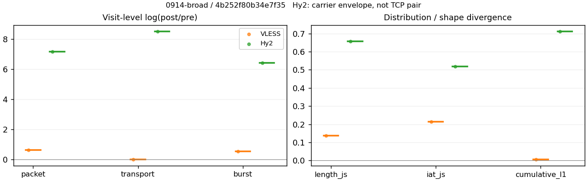
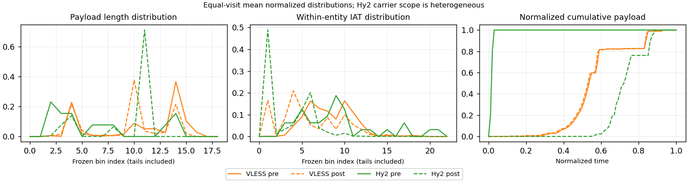

# 0914-broad · 条目 045 · apple.com

目标：https://www.apple.com/

活动标签：apple.com::page_load。选定访问 3 次。

[返回总索引](../../README.md) · [统计口径](../../methods.md)

## 覆盖与资格（每次访问均保留）

| 部署 | 重复 | 主请求路由 | 活动状态 | 代理比较 | DIRECT pre | 请求 proxy/direct/unresolved | 错误 |
| --- | --- | --- | --- | --- | --- | --- | --- |
| Hy2 | 1 | direct | passed | 1 | 1 | 1/44/0 | [] |
| SS | 1 | direct | passed | 0 | 1 | 0/47/0 | [] |
| VLESS | 1 | proxy | passed | 1 | 0 | 48/0/0 | [] |

主请求非 proxy 的统计仅解释为已索引的辅助代理连接或 DIRECT 观测，不代表目标业务经代理传输。播放确认与配对资格是两道不同的门。

图中散点为单次访问，短线为重复中位数；Hy2 是共享载体包络，不能与 TCP 配对作等范围因果对比。

形态图先逐访问归一化，再对访问等权平均；实线 pre，虚线 post。分箱序号及边界见 methods，不将分箱索引误解为长度或时间。

## 每次访问的关键观测

### SS

范围：`direct_pre_only`。每格 pre → post；空值为不可观测/不适用。

| 重复 | 包数 | 载荷字节 | burst | TCP FR | IAT中位µs | length JS | IAT JS |
| --- | --- | --- | --- | --- | --- | --- | --- |
| 1 | 760 → — | 2.2361e+06 → — | 437 → — | 38 → — | 46.597 → — | — | — |

完整标量统计：中位数 [min,max]；Δ 为重复内逐访问变换的中位数，MAD 未缩放。n 为可用变换数；DIRECT-only 的 nΔ=0 不代表 pre 不可用。

| scope | 特征 | pre | post | Δ | IQRΔ | MADΔ | nΔ |
| --- | --- | --- | --- | --- | --- | --- | --- |
| direct_pre_only | active_span_sum_s_1000ms | 2.1501 [2.1501, 2.1501] | — | — | — | — | 0 |
| direct_pre_only | active_span_sum_s_100ms | 0.94925 [0.94925, 0.94925] | — | — | — | — | 0 |
| direct_pre_only | active_span_sum_s_500ms | 1.6013 [1.6013, 1.6013] | — | — | — | — | 0 |
| direct_pre_only | burst_bytes_iqr | 9760 [9760, 9760] | — | — | — | — | 0 |
| direct_pre_only | burst_bytes_mad | 92 [92, 92] | — | — | — | — | 0 |
| direct_pre_only | burst_bytes_max | 25760 [25760, 25760] | — | — | — | — | 0 |
| direct_pre_only | burst_bytes_mean | 5117 [5117, 5117] | — | — | — | — | 0 |
| direct_pre_only | burst_bytes_median | 92 [92, 92] | — | — | — | — | 0 |
| direct_pre_only | burst_bytes_min | 0 [0, 0] | — | — | — | — | 0 |
| direct_pre_only | burst_bytes_p95 | 20480 [20480, 20480] | — | — | — | — | 0 |
| direct_pre_only | burst_bytes_q25 | 0 [0, 0] | — | — | — | — | 0 |
| direct_pre_only | burst_bytes_q75 | 9760 [9760, 9760] | — | — | — | — | 0 |
| direct_pre_only | burst_bytes_std | 7309.2 [7309.2, 7309.2] | — | — | — | — | 0 |
| direct_pre_only | burst_count | 437 [437, 437] | — | — | — | — | 0 |
| direct_pre_only | burst_duration_ms_iqr | 0.073162 [0.073162, 0.073162] | — | — | — | — | 0 |
| direct_pre_only | burst_duration_ms_mad | 0 [0, 0] | — | — | — | — | 0 |
| direct_pre_only | burst_duration_ms_max | 4172.9 [4172.9, 4172.9] | — | — | — | — | 0 |
| direct_pre_only | burst_duration_ms_mean | 23.083 [23.083, 23.083] | — | — | — | — | 0 |
| direct_pre_only | burst_duration_ms_median | 0 [0, 0] | — | — | — | — | 0 |
| direct_pre_only | burst_duration_ms_min | 0 [0, 0] | — | — | — | — | 0 |
| direct_pre_only | burst_duration_ms_p95 | 14.737 [14.737, 14.737] | — | — | — | — | 0 |
| direct_pre_only | burst_duration_ms_q25 | 0 [0, 0] | — | — | — | — | 0 |
| direct_pre_only | burst_duration_ms_q75 | 0.073162 [0.073162, 0.073162] | — | — | — | — | 0 |
| direct_pre_only | burst_duration_ms_std | 280.23 [280.23, 280.23] | — | — | — | — | 0 |
| direct_pre_only | burst_packets_iqr | 1 [1, 1] | — | — | — | — | 0 |
| direct_pre_only | burst_packets_mad | 0 [0, 0] | — | — | — | — | 0 |
| direct_pre_only | burst_packets_max | 7 [7, 7] | — | — | — | — | 0 |
| direct_pre_only | burst_packets_mean | 1.7391 [1.7391, 1.7391] | — | — | — | — | 0 |
| direct_pre_only | burst_packets_median | 1 [1, 1] | — | — | — | — | 0 |
| direct_pre_only | burst_packets_min | 1 [1, 1] | — | — | — | — | 0 |
| direct_pre_only | burst_packets_p95 | 4 [4, 4] | — | — | — | — | 0 |
| direct_pre_only | burst_packets_q25 | 1 [1, 1] | — | — | — | — | 0 |
| direct_pre_only | burst_packets_q75 | 2 [2, 2] | — | — | — | — | 0 |
| direct_pre_only | burst_packets_std | 1.0592 [1.0592, 1.0592] | — | — | — | — | 0 |
| direct_pre_only | connection_span_concurrency_max | 3 [3, 3] | — | — | — | — | 0 |
| direct_pre_only | direction_entropy | 0.51817 [0.51817, 0.51817] | — | — | — | — | 0 |
| direct_pre_only | down_burst_count | 217 [217, 217] | — | — | — | — | 0 |
| direct_pre_only | down_ip_bytes | 2.2488e+06 [2.2488e+06, 2.2488e+06] | — | — | — | — | 0 |
| direct_pre_only | down_packets | 507 [507, 507] | — | — | — | — | 0 |
| direct_pre_only | down_transport_bytes | 2.2224e+06 [2.2224e+06, 2.2224e+06] | — | — | — | — | 0 |
| direct_pre_only | duration_s | 5.4973 [5.4973, 5.4973] | — | — | — | — | 0 |
| direct_pre_only | entity_count | 3 [3, 3] | — | — | — | — | 0 |
| direct_pre_only | fr_runs | 38 [38, 38] | — | — | — | — | 0 |
| direct_pre_only | fr_runs_per_packet | 0.074803 [0.074803, 0.074803] | — | — | — | — | 0 |
| direct_pre_only | fr_switches | 35 [35, 35] | — | — | — | — | 0 |
| direct_pre_only | fr_switches_per_possible_transition | 0.069307 [0.069307, 0.069307] | — | — | — | — | 0 |
| direct_pre_only | full_retransmission_fraction | 0.0039474 [0.0039474, 0.0039474] | — | — | — | — | 0 |
| direct_pre_only | full_retransmission_packets | 3 [3, 3] | — | — | — | — | 0 |
| direct_pre_only | iat_count | 757 [757, 757] | — | — | — | — | 0 |
| direct_pre_only | iat_median_us | 46.597 [46.597, 46.597] | — | — | — | — | 0 |
| direct_pre_only | iat_us_iqr | 144.08 [144.08, 144.08] | — | — | — | — | 0 |
| direct_pre_only | iat_us_mad | 37.331 [37.331, 37.331] | — | — | — | — | 0 |
| direct_pre_only | iat_us_max | 4.1729e+06 [4.1729e+06, 4.1729e+06] | — | — | — | — | 0 |
| direct_pre_only | iat_us_mean | 13751 [13751, 13751] | — | — | — | — | 0 |
| direct_pre_only | iat_us_median | 46.597 [46.597, 46.597] | — | — | — | — | 0 |
| direct_pre_only | iat_us_min | 0.618 [0.618, 0.618] | — | — | — | — | 0 |
| direct_pre_only | iat_us_p95 | 5172.8 [5172.8, 5172.8] | — | — | — | — | 0 |
| direct_pre_only | iat_us_q25 | 15.785 [15.785, 15.785] | — | — | — | — | 0 |
| direct_pre_only | iat_us_q75 | 159.86 [159.86, 159.86] | — | — | — | — | 0 |
| direct_pre_only | iat_us_std | 2.1325e+05 [2.1325e+05, 2.1325e+05] | — | — | — | — | 0 |
| direct_pre_only | idle_gap_count_1000ms | 2 [2, 2] | — | — | — | — | 0 |
| direct_pre_only | idle_gap_count_100ms | 7 [7, 7] | — | — | — | — | 0 |
| direct_pre_only | idle_gap_count_500ms | 3 [3, 3] | — | — | — | — | 0 |
| direct_pre_only | idle_gap_sum_s_1000ms | 8.2597 [8.2597, 8.2597] | — | — | — | — | 0 |
| direct_pre_only | idle_gap_sum_s_100ms | 9.4606 [9.4606, 9.4606] | — | — | — | — | 0 |
| direct_pre_only | idle_gap_sum_s_500ms | 8.8085 [8.8085, 8.8085] | — | — | — | — | 0 |
| direct_pre_only | ip_bytes | 2.2757e+06 [2.2757e+06, 2.2757e+06] | — | — | — | — | 0 |
| direct_pre_only | length_iqr | 5682 [5682, 5682] | — | — | — | — | 0 |
| direct_pre_only | length_mad | 2497 [2497, 2497] | — | — | — | — | 0 |
| direct_pre_only | length_max | 8920 [8920, 8920] | — | — | — | — | 0 |
| direct_pre_only | length_mean | 4401.8 [4401.8, 4401.8] | — | — | — | — | 0 |
| direct_pre_only | length_median | 3368 [3368, 3368] | — | — | — | — | 0 |
| direct_pre_only | length_min | 31 [31, 31] | — | — | — | — | 0 |
| direct_pre_only | length_p95 | 8920 [8920, 8920] | — | — | — | — | 0 |
| direct_pre_only | length_q25 | 2049.5 [2049.5, 2049.5] | — | — | — | — | 0 |
| direct_pre_only | length_q75 | 7731.5 [7731.5, 7731.5] | — | — | — | — | 0 |
| direct_pre_only | length_std | 3132.2 [3132.2, 3132.2] | — | — | — | — | 0 |
| direct_pre_only | nonempty_entity_count | 3 [3, 3] | — | — | — | — | 0 |
| direct_pre_only | nonempty_packets | 508 [508, 508] | — | — | — | — | 0 |
| direct_pre_only | offload_suspect_fraction | 0.51974 [0.51974, 0.51974] | — | — | — | — | 0 |
| direct_pre_only | packet_count | 760 [760, 760] | — | — | — | — | 0 |
| direct_pre_only | rtt_median_ms | 0.12216 [0.12216, 0.12216] | — | — | — | — | 0 |
| direct_pre_only | rtt_sample_count | 246 [246, 246] | — | — | — | — | 0 |
| direct_pre_only | tcp_ack_count | 757 [757, 757] | — | — | — | — | 0 |
| direct_pre_only | tcp_fin_count | 6 [6, 6] | — | — | — | — | 0 |
| direct_pre_only | tcp_packet_count | 760 [760, 760] | — | — | — | — | 0 |
| direct_pre_only | tcp_rst_count | 0 [0, 0] | — | — | — | — | 0 |
| direct_pre_only | tcp_syn_count | 6 [6, 6] | — | — | — | — | 0 |
| direct_pre_only | tcp_window_raw_median | 65535 [65535, 65535] | — | — | — | — | 0 |
| direct_pre_only | transition_entropy | 0.3029 [0.3029, 0.3029] | — | — | — | — | 0 |
| direct_pre_only | transition_n_mm | 430 [430, 430] | — | — | — | — | 0 |
| direct_pre_only | transition_n_mp | 16 [16, 16] | — | — | — | — | 0 |
| direct_pre_only | transition_n_pm | 19 [19, 19] | — | — | — | — | 0 |
| direct_pre_only | transition_n_pp | 40 [40, 40] | — | — | — | — | 0 |
| direct_pre_only | transition_p_mm | 0.96413 [0.96413, 0.96413] | — | — | — | — | 0 |
| direct_pre_only | transition_p_mp | 0.035874 [0.035874, 0.035874] | — | — | — | — | 0 |
| direct_pre_only | transition_p_pm | 0.32203 [0.32203, 0.32203] | — | — | — | — | 0 |
| direct_pre_only | transition_p_pp | 0.67797 [0.67797, 0.67797] | — | — | — | — | 0 |
| direct_pre_only | transport_bytes | 2.2361e+06 [2.2361e+06, 2.2361e+06] | — | — | — | — | 0 |
| direct_pre_only | up_burst_count | 220 [220, 220] | — | — | — | — | 0 |
| direct_pre_only | up_byte_fraction | 0.0061392 [0.0061392, 0.0061392] | — | — | — | — | 0 |
| direct_pre_only | up_ip_bytes | 26944 [26944, 26944] | — | — | — | — | 0 |
| direct_pre_only | up_packets | 253 [253, 253] | — | — | — | — | 0 |
| direct_pre_only | up_transport_bytes | 13728 [13728, 13728] | — | — | — | — | 0 |
| direct_pre_only | zero_iat_count | 0 [0, 0] | — | — | — | — | 0 |
| direct_pre_only | zero_iat_fraction | 0 [0, 0] | — | — | — | — | 0 |

### VLESS

范围：`exclusive_page`。每格 pre → post；空值为不可观测/不适用。

| 重复 | 包数 | 载荷字节 | burst | TCP FR | IAT中位µs | length JS | IAT JS |
| --- | --- | --- | --- | --- | --- | --- | --- |
| 1 | 1463 → 2696 | 2.0876e+06 → 2.1047e+06 | 960 → 1644 | 46 → 48 | 143.98 → 11.948 | 0.13778 | 0.21444 |

完整标量统计：中位数 [min,max]；Δ 为重复内逐访问变换的中位数，MAD 未缩放。n 为可用变换数；DIRECT-only 的 nΔ=0 不代表 pre 不可用。

| scope | 特征 | pre | post | Δ | IQRΔ | MADΔ | nΔ |
| --- | --- | --- | --- | --- | --- | --- | --- |
| exclusive_page | active_span_sum_s_1000ms | 5.2462 [5.2462, 5.2462] | 5.1834 [5.1834, 5.1834] | -0.01205 | — | — | 1 |
| exclusive_page | active_span_sum_s_100ms | 1.4749 [1.4749, 1.4749] | 2.2936 [2.2936, 2.2936] | 0.44158 | — | — | 1 |
| exclusive_page | active_span_sum_s_500ms | 3.36 [3.36, 3.36] | 4.6611 [4.6611, 4.6611] | 0.32732 | — | — | 1 |
| exclusive_page | burst_bytes_iqr | 2896 [2896, 2896] | 2824 [2824, 2824] | -0.025176 | — | — | 1 |
| exclusive_page | burst_bytes_mad | 91.5 [91.5, 91.5] | 92.5 [92.5, 92.5] | 0.01087 | — | — | 1 |
| exclusive_page | burst_bytes_max | 20480 [20480, 20480] | 11404 [11404, 11404] | -0.58548 | — | — | 1 |
| exclusive_page | burst_bytes_mean | 2174.6 [2174.6, 2174.6] | 1280.2 [1280.2, 1280.2] | -0.52979 | — | — | 1 |
| exclusive_page | burst_bytes_median | 91.5 [91.5, 91.5] | 92.5 [92.5, 92.5] | 0.01087 | — | — | 1 |
| exclusive_page | burst_bytes_min | 0 [0, 0] | 0 [0, 0] | — | — | — | 0 |
| exclusive_page | burst_bytes_p95 | 8688 [8688, 8688] | 4236 [4236, 4236] | -0.71832 | — | — | 1 |
| exclusive_page | burst_bytes_q25 | 0 [0, 0] | 0 [0, 0] | — | — | — | 0 |
| exclusive_page | burst_bytes_q75 | 2896 [2896, 2896] | 2824 [2824, 2824] | -0.025176 | — | — | 1 |
| exclusive_page | burst_bytes_std | 3250.6 [3250.6, 3250.6] | 1626.7 [1626.7, 1626.7] | -0.69227 | — | — | 1 |
| exclusive_page | burst_count | 960 [960, 960] | 1644 [1644, 1644] | 0.53795 | — | — | 1 |
| exclusive_page | burst_duration_ms_iqr | 0.36529 [0.36529, 0.36529] | 0.0059385 [0.0059385, 0.0059385] | -4.1192 | — | — | 1 |
| exclusive_page | burst_duration_ms_mad | 0 [0, 0] | 0 [0, 0] | — | — | — | 0 |
| exclusive_page | burst_duration_ms_max | 688.75 [688.75, 688.75] | 525.87 [525.87, 525.87] | -0.26983 | — | — | 1 |
| exclusive_page | burst_duration_ms_mean | 4.6184 [4.6184, 4.6184] | 2.1578 [2.1578, 2.1578] | -0.76098 | — | — | 1 |
| exclusive_page | burst_duration_ms_median | 0 [0, 0] | 0 [0, 0] | — | — | — | 0 |
| exclusive_page | burst_duration_ms_min | 0 [0, 0] | 0 [0, 0] | — | — | — | 0 |
| exclusive_page | burst_duration_ms_p95 | 2.5106 [2.5106, 2.5106] | 2.3808 [2.3808, 2.3808] | -0.053079 | — | — | 1 |
| exclusive_page | burst_duration_ms_q25 | 0 [0, 0] | 0 [0, 0] | — | — | — | 0 |
| exclusive_page | burst_duration_ms_q75 | 0.36529 [0.36529, 0.36529] | 0.0059385 [0.0059385, 0.0059385] | -4.1192 | — | — | 1 |
| exclusive_page | burst_duration_ms_std | 40.986 [40.986, 40.986] | 21.966 [21.966, 21.966] | -0.62371 | — | — | 1 |
| exclusive_page | burst_packets_iqr | 1 [1, 1] | 1 [1, 1] | 0 | — | — | 1 |
| exclusive_page | burst_packets_mad | 0 [0, 0] | 0 [0, 0] | — | — | — | 0 |
| exclusive_page | burst_packets_max | 10 [10, 10] | 7 [7, 7] | -0.35667 | — | — | 1 |
| exclusive_page | burst_packets_mean | 1.524 [1.524, 1.524] | 1.6399 [1.6399, 1.6399] | 0.073326 | — | — | 1 |
| exclusive_page | burst_packets_median | 1 [1, 1] | 1 [1, 1] | 0 | — | — | 1 |
| exclusive_page | burst_packets_min | 1 [1, 1] | 1 [1, 1] | 0 | — | — | 1 |
| exclusive_page | burst_packets_p95 | 3 [3, 3] | 3 [3, 3] | 0 | — | — | 1 |
| exclusive_page | burst_packets_q25 | 1 [1, 1] | 1 [1, 1] | 0 | — | — | 1 |
| exclusive_page | burst_packets_q75 | 2 [2, 2] | 2 [2, 2] | 0 | — | — | 1 |
| exclusive_page | burst_packets_std | 0.74544 [0.74544, 0.74544] | 0.88473 [0.88473, 0.88473] | 0.17131 | — | — | 1 |
| exclusive_page | connection_span_concurrency_max | 2 [2, 2] | 2 [2, 2] | 0 | — | — | 1 |
| exclusive_page | cumulative_l1 | — | — | 0.0072591 | — | — | 1 |
| exclusive_page | cumulative_max | — | — | 0.095073 | — | — | 1 |
| exclusive_page | direction_entropy | 0.32276 [0.32276, 0.32276] | 0.19173 [0.19173, 0.19173] | -0.13103 | — | — | 1 |
| exclusive_page | down_burst_count | 479 [479, 479] | 821 [821, 821] | 0.53882 | — | — | 1 |
| exclusive_page | down_ip_bytes | 2.126e+06 [2.126e+06, 2.126e+06] | 2.1669e+06 [2.1669e+06, 2.1669e+06] | 0.01907 | — | — | 1 |
| exclusive_page | down_packets | 948 [948, 948] | 1481 [1481, 1481] | 0.44612 | — | — | 1 |
| exclusive_page | down_transport_bytes | 2.0766e+06 [2.0766e+06, 2.0766e+06] | 2.0899e+06 [2.0899e+06, 2.0899e+06] | 0.0063439 | — | — | 1 |
| exclusive_page | duration_s | 3.5429 [3.5429, 3.5429] | 3.4971 [3.4971, 3.4971] | -0.013021 | — | — | 1 |
| exclusive_page | entity_count | 2 [2, 2] | 2 [2, 2] | 0 | — | — | 1 |
| exclusive_page | fr_runs | 46 [46, 46] | 48 [48, 48] | 0.04256 | — | — | 1 |
| exclusive_page | fr_runs_per_packet | 0.048319 [0.048319, 0.048319] | 0.03215 [0.03215, 0.03215] | -0.016169 | — | — | 1 |
| exclusive_page | fr_switches | 44 [44, 44] | 46 [46, 46] | 0.044452 | — | — | 1 |
| exclusive_page | fr_switches_per_possible_transition | 0.046316 [0.046316, 0.046316] | 0.030852 [0.030852, 0.030852] | -0.015464 | — | — | 1 |
| exclusive_page | full_retransmission_fraction | 0 [0, 0] | 0 [0, 0] | 0 | — | — | 1 |
| exclusive_page | full_retransmission_packets | 0 [0, 0] | 0 [0, 0] | — | — | — | 0 |
| exclusive_page | iat_count | 1461 [1461, 1461] | 2694 [2694, 2694] | 0.61191 | — | — | 1 |
| exclusive_page | iat_js | — | — | 0.21444 | — | — | 1 |
| exclusive_page | iat_ks | — | — | 0.44908 | — | — | 1 |
| exclusive_page | iat_median_us | 143.98 [143.98, 143.98] | 11.948 [11.948, 11.948] | -2.4891 | — | — | 1 |
| exclusive_page | iat_us_iqr | 804.84 [804.84, 804.84] | 183.9 [183.9, 183.9] | -1.4762 | — | — | 1 |
| exclusive_page | iat_us_mad | 130.78 [130.78, 130.78] | 11.866 [11.866, 11.866] | -2.3999 | — | — | 1 |
| exclusive_page | iat_us_max | 6.8875e+05 [6.8875e+05, 6.8875e+05] | 5.2225e+05 [5.2225e+05, 5.2225e+05] | -0.27673 | — | — | 1 |
| exclusive_page | iat_us_mean | 3590.8 [3590.8, 3590.8] | 1924 [1924, 1924] | -0.62396 | — | — | 1 |
| exclusive_page | iat_us_median | 143.98 [143.98, 143.98] | 11.948 [11.948, 11.948] | -2.4891 | — | — | 1 |
| exclusive_page | iat_us_min | 0.434 [0.434, 0.434] | 0.027 [0.027, 0.027] | -2.7772 | — | — | 1 |
| exclusive_page | iat_us_p95 | 3203.8 [3203.8, 3203.8] | 2406.8 [2406.8, 2406.8] | -0.28607 | — | — | 1 |
| exclusive_page | iat_us_q25 | 36.505 [36.505, 36.505] | 5.0168 [5.0168, 5.0168] | -1.9847 | — | — | 1 |
| exclusive_page | iat_us_q75 | 841.34 [841.34, 841.34] | 188.92 [188.92, 188.92] | -1.4937 | — | — | 1 |
| exclusive_page | iat_us_std | 33356 [33356, 33356] | 17504 [17504, 17504] | -0.6448 | — | — | 1 |
| exclusive_page | iat_wasserstein_log1p_us | — | — | 1.7554 | — | — | 1 |
| exclusive_page | idle_gap_count_1000ms | 0 [0, 0] | 0 [0, 0] | — | — | — | 0 |
| exclusive_page | idle_gap_count_100ms | 12 [12, 12] | 14 [14, 14] | 0.15415 | — | — | 1 |
| exclusive_page | idle_gap_count_500ms | 3 [3, 3] | 1 [1, 1] | -1.0986 | — | — | 1 |
| exclusive_page | idle_gap_sum_s_1000ms | 0 [0, 0] | 0 [0, 0] | — | — | — | 0 |
| exclusive_page | idle_gap_sum_s_100ms | 3.7714 [3.7714, 3.7714] | 2.8897 [2.8897, 2.8897] | -0.26627 | — | — | 1 |
| exclusive_page | idle_gap_sum_s_500ms | 1.8862 [1.8862, 1.8862] | 0.52225 [0.52225, 0.52225] | -1.2842 | — | — | 1 |
| exclusive_page | ip_bytes | 2.1637e+06 [2.1637e+06, 2.1637e+06] | 2.2514e+06 [2.2514e+06, 2.2514e+06] | 0.039753 | — | — | 1 |
| exclusive_page | length_iqr | 2644.5 [2644.5, 2644.5] | 1304 [1304, 1304] | -0.70705 | — | — | 1 |
| exclusive_page | length_js | — | — | 0.13778 | — | — | 1 |
| exclusive_page | length_ks | — | — | 0.30446 | — | — | 1 |
| exclusive_page | length_mad | 1149 [1149, 1149] | 1160 [1160, 1160] | 0.009528 | — | — | 1 |
| exclusive_page | length_max | 8920 [8920, 8920] | 7060 [7060, 7060] | -0.23385 | — | — | 1 |
| exclusive_page | length_mean | 2192.8 [2192.8, 2192.8] | 1409.7 [1409.7, 1409.7] | -0.44181 | — | — | 1 |
| exclusive_page | length_median | 1747 [1747, 1747] | 1412 [1412, 1412] | -0.21289 | — | — | 1 |
| exclusive_page | length_min | 24 [24, 24] | 24 [24, 24] | 0 | — | — | 1 |
| exclusive_page | length_p95 | 5844.2 [5844.2, 5844.2] | 2824 [2824, 2824] | -0.7273 | — | — | 1 |
| exclusive_page | length_q25 | 251.5 [251.5, 251.5] | 216 [216, 216] | -0.15216 | — | — | 1 |
| exclusive_page | length_q75 | 2896 [2896, 2896] | 1520 [1520, 1520] | -0.64462 | — | — | 1 |
| exclusive_page | length_std | 1935.1 [1935.1, 1935.1] | 1074 [1074, 1074] | -0.58872 | — | — | 1 |
| exclusive_page | length_wasserstein_bytes | — | — | 783.78 | — | — | 1 |
| exclusive_page | nonempty_entity_count | 2 [2, 2] | 2 [2, 2] | 0 | — | — | 1 |
| exclusive_page | nonempty_packets | 952 [952, 952] | 1493 [1493, 1493] | 0.44998 | — | — | 1 |
| exclusive_page | offload_suspect_fraction | 0.37321 [0.37321, 0.37321] | 0.1569 [0.1569, 0.1569] | -0.21631 | — | — | 1 |
| exclusive_page | packet_count | 1463 [1463, 1463] | 2696 [2696, 2696] | 0.61128 | — | — | 1 |
| exclusive_page | rtt_median_ms | 0.27346 [0.27346, 0.27346] | 0.041591 [0.041591, 0.041591] | -1.8833 | — | — | 1 |
| exclusive_page | rtt_sample_count | 507 [507, 507] | 949 [949, 949] | 0.6269 | — | — | 1 |
| exclusive_page | tcp_ack_count | 1457 [1457, 1457] | 2694 [2694, 2694] | 0.61465 | — | — | 1 |
| exclusive_page | tcp_fin_count | 4 [4, 4] | 4 [4, 4] | 0 | — | — | 1 |
| exclusive_page | tcp_packet_count | 1463 [1463, 1463] | 2696 [2696, 2696] | 0.61128 | — | — | 1 |
| exclusive_page | tcp_rst_count | 4 [4, 4] | 0 [0, 0] | — | — | — | 0 |
| exclusive_page | tcp_syn_count | 4 [4, 4] | 4 [4, 4] | 0 | — | — | 1 |
| exclusive_page | tcp_window_raw_median | 65535 [65535, 65535] | 223 [223, 223] | -5.6832 | — | — | 1 |
| exclusive_page | transition_entropy | 0.20873 [0.20873, 0.20873] | 0.13957 [0.13957, 0.13957] | -0.069156 | — | — | 1 |
| exclusive_page | transition_n_mm | 873 [873, 873] | 1425 [1425, 1425] | 0.48999 | — | — | 1 |
| exclusive_page | transition_n_mp | 21 [21, 21] | 22 [22, 22] | 0.04652 | — | — | 1 |
| exclusive_page | transition_n_pm | 23 [23, 23] | 24 [24, 24] | 0.04256 | — | — | 1 |
| exclusive_page | transition_n_pp | 33 [33, 33] | 20 [20, 20] | -0.50078 | — | — | 1 |
| exclusive_page | transition_p_mm | 0.97651 [0.97651, 0.97651] | 0.9848 [0.9848, 0.9848] | 0.0082861 | — | — | 1 |
| exclusive_page | transition_p_mp | 0.02349 [0.02349, 0.02349] | 0.015204 [0.015204, 0.015204] | -0.0082861 | — | — | 1 |
| exclusive_page | transition_p_pm | 0.41071 [0.41071, 0.41071] | 0.54545 [0.54545, 0.54545] | 0.13474 | — | — | 1 |
| exclusive_page | transition_p_pp | 0.58929 [0.58929, 0.58929] | 0.45455 [0.45455, 0.45455] | -0.13474 | — | — | 1 |
| exclusive_page | transport_bytes | 2.0876e+06 [2.0876e+06, 2.0876e+06] | 2.1047e+06 [2.1047e+06, 2.1047e+06] | 0.0081674 | — | — | 1 |
| exclusive_page | up_burst_count | 481 [481, 481] | 823 [823, 823] | 0.53709 | — | — | 1 |
| exclusive_page | up_byte_fraction | 0.0052424 [0.0052424, 0.0052424] | 0.0070546 [0.0070546, 0.0070546] | 0.0018122 | — | — | 1 |
| exclusive_page | up_ip_bytes | 37692 [37692, 37692] | 84504 [84504, 84504] | 0.80735 | — | — | 1 |
| exclusive_page | up_packets | 515 [515, 515] | 1215 [1215, 1215] | 0.85833 | — | — | 1 |
| exclusive_page | up_transport_bytes | 10944 [10944, 10944] | 14848 [14848, 14848] | 0.30507 | — | — | 1 |
| exclusive_page | zero_iat_count | 0 [0, 0] | 0 [0, 0] | — | — | — | 0 |
| exclusive_page | zero_iat_fraction | 0 [0, 0] | 0 [0, 0] | 0 | — | — | 1 |

### Hy2

范围：`carrier_context_envelope`。每格 pre → post；空值为不可观测/不适用。

| 重复 | 包数 | 载荷字节 | burst | TCP FR | IAT中位µs | length JS | IAT JS |
| --- | --- | --- | --- | --- | --- | --- | --- |
| 1 | 33 → 42604 | 9404 → 4.6801e+07 | 23 → 14269 | — | 223.95 → 1.9 | 0.65802 | 0.51724 |

范围：`direct_pre_only`。每格 pre → post；空值为不可观测/不适用。

| 重复 | 包数 | 载荷字节 | burst | TCP FR | IAT中位µs | length JS | IAT JS |
| --- | --- | --- | --- | --- | --- | --- | --- |
| 1 | 770 → — | 2.0145e+06 → — | 477 → — | 32 → — | 57.792 → — | — | — |

完整标量统计：中位数 [min,max]；Δ 为重复内逐访问变换的中位数，MAD 未缩放。n 为可用变换数；DIRECT-only 的 nΔ=0 不代表 pre 不可用。

| scope | 特征 | pre | post | Δ | IQRΔ | MADΔ | nΔ |
| --- | --- | --- | --- | --- | --- | --- | --- |
| carrier_context_envelope | active_span_sum_s_1000ms | 0.43257 [0.43257, 0.43257] | 9.2105 [9.2105, 9.2105] | 3.0584 | — | — | 1 |
| carrier_context_envelope | active_span_sum_s_100ms | 0.058326 [0.058326, 0.058326] | 4.001 [4.001, 4.001] | 4.2283 | — | — | 1 |
| carrier_context_envelope | active_span_sum_s_500ms | 0.43257 [0.43257, 0.43257] | 7.7201 [7.7201, 7.7201] | 2.8818 | — | — | 1 |
| carrier_context_envelope | burst_bytes_iqr | 328 [328, 328] | 2959 [2959, 2959] | 2.1996 | — | — | 1 |
| carrier_context_envelope | burst_bytes_mad | 31 [31, 31] | 274 [274, 274] | 2.1791 | — | — | 1 |
| carrier_context_envelope | burst_bytes_max | 2834 [2834, 2834] | 3.535e+05 [3.535e+05, 3.535e+05] | 4.8262 | — | — | 1 |
| carrier_context_envelope | burst_bytes_mean | 408.87 [408.87, 408.87] | 3279.9 [3279.9, 3279.9] | 2.0822 | — | — | 1 |
| carrier_context_envelope | burst_bytes_median | 31 [31, 31] | 307 [307, 307] | 2.2929 | — | — | 1 |
| carrier_context_envelope | burst_bytes_min | 0 [0, 0] | 26 [26, 26] | — | — | — | 0 |
| carrier_context_envelope | burst_bytes_p95 | 2190.1 [2190.1, 2190.1] | 10932 [10932, 10932] | 1.6077 | — | — | 1 |
| carrier_context_envelope | burst_bytes_q25 | 0 [0, 0] | 100 [100, 100] | — | — | — | 0 |
| carrier_context_envelope | burst_bytes_q75 | 328 [328, 328] | 3059 [3059, 3059] | 2.2328 | — | — | 1 |
| carrier_context_envelope | burst_bytes_std | 784.72 [784.72, 784.72] | 8688.5 [8688.5, 8688.5] | 2.4044 | — | — | 1 |
| carrier_context_envelope | burst_count | 23 [23, 23] | 14269 [14269, 14269] | 6.4304 | — | — | 1 |
| carrier_context_envelope | burst_duration_ms_iqr | 0.86606 [0.86606, 0.86606] | 0.022881 [0.022881, 0.022881] | -3.6336 | — | — | 1 |
| carrier_context_envelope | burst_duration_ms_mad | 0 [0, 0] | 4.2e-05 [4.2e-05, 4.2e-05] | — | — | — | 0 |
| carrier_context_envelope | burst_duration_ms_max | 15000 [15000, 15000] | 775.56 [775.56, 775.56] | -2.9622 | — | — | 1 |
| carrier_context_envelope | burst_duration_ms_mean | 780.87 [780.87, 780.87] | 0.18799 [0.18799, 0.18799] | -8.3318 | — | — | 1 |
| carrier_context_envelope | burst_duration_ms_median | 0 [0, 0] | 4.2e-05 [4.2e-05, 4.2e-05] | — | — | — | 0 |
| carrier_context_envelope | burst_duration_ms_min | 0 [0, 0] | 0 [0, 0] | — | — | — | 0 |
| carrier_context_envelope | burst_duration_ms_p95 | 2342.5 [2342.5, 2342.5] | 0.079573 [0.079573, 0.079573] | -10.29 | — | — | 1 |
| carrier_context_envelope | burst_duration_ms_q25 | 0 [0, 0] | 0 [0, 0] | — | — | — | 0 |
| carrier_context_envelope | burst_duration_ms_q75 | 0.86606 [0.86606, 0.86606] | 0.022881 [0.022881, 0.022881] | -3.6336 | — | — | 1 |
| carrier_context_envelope | burst_duration_ms_std | 3076.6 [3076.6, 3076.6] | 7.2651 [7.2651, 7.2651] | -6.0485 | — | — | 1 |
| carrier_context_envelope | burst_packets_iqr | 1 [1, 1] | 2 [2, 2] | 0.69315 | — | — | 1 |
| carrier_context_envelope | burst_packets_mad | 0 [0, 0] | 1 [1, 1] | — | — | — | 0 |
| carrier_context_envelope | burst_packets_max | 3 [3, 3] | 254 [254, 254] | 4.4387 | — | — | 1 |
| carrier_context_envelope | burst_packets_mean | 1.4348 [1.4348, 1.4348] | 2.9858 [2.9858, 2.9858] | 0.73285 | — | — | 1 |
| carrier_context_envelope | burst_packets_median | 1 [1, 1] | 2 [2, 2] | 0.69315 | — | — | 1 |
| carrier_context_envelope | burst_packets_min | 1 [1, 1] | 1 [1, 1] | 0 | — | — | 1 |
| carrier_context_envelope | burst_packets_p95 | 2 [2, 2] | 8 [8, 8] | 1.3863 | — | — | 1 |
| carrier_context_envelope | burst_packets_q25 | 1 [1, 1] | 1 [1, 1] | 0 | — | — | 1 |
| carrier_context_envelope | burst_packets_q75 | 2 [2, 2] | 3 [3, 3] | 0.40547 | — | — | 1 |
| carrier_context_envelope | burst_packets_std | 0.5768 [0.5768, 0.5768] | 6.0998 [6.0998, 6.0998] | 2.3585 | — | — | 1 |
| carrier_context_envelope | connection_span_concurrency_max | 1 [1, 1] | 1 [1, 1] | 0 | — | — | 1 |
| carrier_context_envelope | cumulative_l1 | — | — | 0.71056 | — | — | 1 |
| carrier_context_envelope | cumulative_max | — | — | 0.99946 | — | — | 1 |
| carrier_context_envelope | direction_entropy | 0.99573 [0.99573, 0.99573] | 0.75299 [0.75299, 0.75299] | -0.24273 | — | — | 1 |
| carrier_context_envelope | direction_run_analog_runs | 7 [7, 7] | 14269 [14269, 14269] | 7.6199 | — | — | 1 |
| carrier_context_envelope | direction_run_analog_runs_per_packet | 0.53846 [0.53846, 0.53846] | 0.33492 [0.33492, 0.33492] | -0.20354 | — | — | 1 |
| carrier_context_envelope | direction_run_analog_switches | 6 [6, 6] | 14268 [14268, 14268] | 7.774 | — | — | 1 |
| carrier_context_envelope | direction_run_analog_switches_per_possible_transition | 0.5 [0.5, 0.5] | 0.33491 [0.33491, 0.33491] | -0.16509 | — | — | 1 |
| carrier_context_envelope | down_burst_count | 11 [11, 11] | 7134 [7134, 7134] | 6.4747 | — | — | 1 |
| carrier_context_envelope | down_ip_bytes | 7723 [7723, 7723] | 4.7012e+07 [4.7012e+07, 4.7012e+07] | 8.7139 | — | — | 1 |
| carrier_context_envelope | down_packets | 16 [16, 16] | 33397 [33397, 33397] | 7.6436 | — | — | 1 |
| carrier_context_envelope | down_transport_bytes | 6883 [6883, 6883] | 4.6077e+07 [4.6077e+07, 4.6077e+07] | 8.809 | — | — | 1 |
| carrier_context_envelope | duration_s | 18.014 [18.014, 18.014] | 17.994 [17.994, 17.994] | -0.0010764 | — | — | 1 |
| carrier_context_envelope | entity_count | 1 [1, 1] | 1 [1, 1] | 0 | — | — | 1 |
| carrier_context_envelope | full_retransmission_fraction | 0 [0, 0] | — | — | — | — | 0 |
| carrier_context_envelope | full_retransmission_packets | 0 [0, 0] | — | — | — | — | 0 |
| carrier_context_envelope | iat_count | 32 [32, 32] | 42603 [42603, 42603] | 7.1939 | — | — | 1 |
| carrier_context_envelope | iat_js | — | — | 0.51724 | — | — | 1 |
| carrier_context_envelope | iat_ks | — | — | 0.63518 | — | — | 1 |
| carrier_context_envelope | iat_median_us | 223.95 [223.95, 223.95] | 1.9 [1.9, 1.9] | -4.7696 | — | — | 1 |
| carrier_context_envelope | iat_us_iqr | 855.7 [855.7, 855.7] | 22.9 [22.9, 22.9] | -3.6208 | — | — | 1 |
| carrier_context_envelope | iat_us_mad | 213.77 [213.77, 213.77] | 1.864 [1.864, 1.864] | -4.7422 | — | — | 1 |
| carrier_context_envelope | iat_us_max | 1.5e+07 [1.5e+07, 1.5e+07] | 5.8252e+06 [5.8252e+06, 5.8252e+06] | -0.94587 | — | — | 1 |
| carrier_context_envelope | iat_us_mean | 5.6293e+05 [5.6293e+05, 5.6293e+05] | 422.37 [422.37, 422.37] | -7.195 | — | — | 1 |
| carrier_context_envelope | iat_us_median | 223.95 [223.95, 223.95] | 1.9 [1.9, 1.9] | -4.7696 | — | — | 1 |
| carrier_context_envelope | iat_us_min | 3.813 [3.813, 3.813] | 0.002 [0.002, 0.002] | -7.553 | — | — | 1 |
| carrier_context_envelope | iat_us_p95 | 1.2697e+06 [1.2697e+06, 1.2697e+06] | 94.016 [94.016, 94.016] | -9.5108 | — | — | 1 |
| carrier_context_envelope | iat_us_q25 | 21.753 [21.753, 21.753] | 0.045 [0.045, 0.045] | -6.1808 | — | — | 1 |
| carrier_context_envelope | iat_us_q75 | 877.45 [877.45, 877.45] | 22.945 [22.945, 22.945] | -3.6439 | — | — | 1 |
| carrier_context_envelope | iat_us_std | 2.6315e+06 [2.6315e+06, 2.6315e+06] | 30745 [30745, 30745] | -4.4496 | — | — | 1 |
| carrier_context_envelope | iat_wasserstein_log1p_us | — | — | 4.3389 | — | — | 1 |
| carrier_context_envelope | idle_gap_count_1000ms | 2 [2, 2] | 3 [3, 3] | 0.40547 | — | — | 1 |
| carrier_context_envelope | idle_gap_count_100ms | 4 [4, 4] | 28 [28, 28] | 1.9459 | — | — | 1 |
| carrier_context_envelope | idle_gap_count_500ms | 2 [2, 2] | 5 [5, 5] | 0.91629 | — | — | 1 |
| carrier_context_envelope | idle_gap_sum_s_1000ms | 17.581 [17.581, 17.581] | 8.7838 [8.7838, 8.7838] | -0.69391 | — | — | 1 |
| carrier_context_envelope | idle_gap_sum_s_100ms | 17.955 [17.955, 17.955] | 13.993 [13.993, 13.993] | -0.24931 | — | — | 1 |
| carrier_context_envelope | idle_gap_sum_s_500ms | 17.581 [17.581, 17.581] | 10.274 [10.274, 10.274] | -0.53719 | — | — | 1 |
| carrier_context_envelope | ip_bytes | 11136 [11136, 11136] | 4.7994e+07 [4.7994e+07, 4.7994e+07] | 8.3686 | — | — | 1 |
| carrier_context_envelope | length_iqr | 921 [921, 921] | 596 [596, 596] | -0.43522 | — | — | 1 |
| carrier_context_envelope | length_js | — | — | 0.65802 | — | — | 1 |
| carrier_context_envelope | length_ks | — | — | 0.48207 | — | — | 1 |
| carrier_context_envelope | length_mad | 61 [61, 61] | 0 [0, 0] | — | — | — | 0 |
| carrier_context_envelope | length_max | 2834 [2834, 2834] | 1441 [1441, 1441] | -0.67635 | — | — | 1 |
| carrier_context_envelope | length_mean | 723.38 [723.38, 723.38] | 1098.5 [1098.5, 1098.5] | 0.41777 | — | — | 1 |
| carrier_context_envelope | length_median | 92 [92, 92] | 1441 [1441, 1441] | 2.7513 | — | — | 1 |
| carrier_context_envelope | length_min | 31 [31, 31] | 22 [22, 22] | -0.34294 | — | — | 1 |
| carrier_context_envelope | length_p95 | 2474 [2474, 2474] | 1441 [1441, 1441] | -0.5405 | — | — | 1 |
| carrier_context_envelope | length_q25 | 39 [39, 39] | 845 [845, 845] | 3.0758 | — | — | 1 |
| carrier_context_envelope | length_q75 | 960 [960, 960] | 1441 [1441, 1441] | 0.40616 | — | — | 1 |
| carrier_context_envelope | length_std | 927.85 [927.85, 927.85] | 565.8 [565.8, 565.8] | -0.49462 | — | — | 1 |
| carrier_context_envelope | length_wasserstein_bytes | — | — | 765.93 | — | — | 1 |
| carrier_context_envelope | nonempty_entity_count | 1 [1, 1] | 1 [1, 1] | 0 | — | — | 1 |
| carrier_context_envelope | nonempty_packets | 13 [13, 13] | 42604 [42604, 42604] | 8.0948 | — | — | 1 |
| carrier_context_envelope | offload_suspect_fraction | 0.090909 [0.090909, 0.090909] | 0 [0, 0] | -0.090909 | — | — | 1 |
| carrier_context_envelope | packet_count | 33 [33, 33] | 42604 [42604, 42604] | 7.1632 | — | — | 1 |
| carrier_context_envelope | rtt_median_ms | 0.09035 [0.09035, 0.09035] | — | — | — | — | 0 |
| carrier_context_envelope | rtt_sample_count | 16 [16, 16] | 0 [0, 0] | — | — | — | 0 |
| carrier_context_envelope | tcp_ack_count | 32 [32, 32] | — | — | — | — | 0 |
| carrier_context_envelope | tcp_fin_count | 2 [2, 2] | — | — | — | — | 0 |
| carrier_context_envelope | tcp_packet_count | 33 [33, 33] | 0 [0, 0] | — | — | — | 0 |
| carrier_context_envelope | tcp_rst_count | 0 [0, 0] | — | — | — | — | 0 |
| carrier_context_envelope | tcp_syn_count | 2 [2, 2] | — | — | — | — | 0 |
| carrier_context_envelope | tcp_window_raw_median | 62720 [62720, 62720] | — | — | — | — | 0 |
| carrier_context_envelope | transition_entropy | 0.97928 [0.97928, 0.97928] | 0.75287 [0.75287, 0.75287] | -0.22641 | — | — | 1 |
| carrier_context_envelope | transition_n_mm | 4 [4, 4] | 26263 [26263, 26263] | 8.7896 | — | — | 1 |
| carrier_context_envelope | transition_n_mp | 3 [3, 3] | 7134 [7134, 7134] | 7.774 | — | — | 1 |
| carrier_context_envelope | transition_n_pm | 3 [3, 3] | 7134 [7134, 7134] | 7.774 | — | — | 1 |
| carrier_context_envelope | transition_n_pp | 2 [2, 2] | 2072 [2072, 2072] | 6.9431 | — | — | 1 |
| carrier_context_envelope | transition_p_mm | 0.57143 [0.57143, 0.57143] | 0.78639 [0.78639, 0.78639] | 0.21496 | — | — | 1 |
| carrier_context_envelope | transition_p_mp | 0.42857 [0.42857, 0.42857] | 0.21361 [0.21361, 0.21361] | -0.21496 | — | — | 1 |
| carrier_context_envelope | transition_p_pm | 0.6 [0.6, 0.6] | 0.77493 [0.77493, 0.77493] | 0.17493 | — | — | 1 |
| carrier_context_envelope | transition_p_pp | 0.4 [0.4, 0.4] | 0.22507 [0.22507, 0.22507] | -0.17493 | — | — | 1 |
| carrier_context_envelope | transport_bytes | 9404 [9404, 9404] | 4.6801e+07 [4.6801e+07, 4.6801e+07] | 8.5125 | — | — | 1 |
| carrier_context_envelope | up_burst_count | 12 [12, 12] | 7135 [7135, 7135] | 6.3879 | — | — | 1 |
| carrier_context_envelope | up_byte_fraction | 0.26808 [0.26808, 0.26808] | 0.015483 [0.015483, 0.015483] | -0.25259 | — | — | 1 |
| carrier_context_envelope | up_ip_bytes | 3413 [3413, 3413] | 9.824e+05 [9.824e+05, 9.824e+05] | 5.6624 | — | — | 1 |
| carrier_context_envelope | up_packets | 17 [17, 17] | 9207 [9207, 9207] | 6.2945 | — | — | 1 |
| carrier_context_envelope | up_transport_bytes | 2521 [2521, 2521] | 7.246e+05 [7.246e+05, 7.246e+05] | 5.661 | — | — | 1 |
| carrier_context_envelope | zero_iat_count | 0 [0, 0] | 0 [0, 0] | — | — | — | 0 |
| carrier_context_envelope | zero_iat_fraction | 0 [0, 0] | 0 [0, 0] | 0 | — | — | 1 |
| direct_pre_only | active_span_sum_s_1000ms | 3.0088 [3.0088, 3.0088] | — | — | — | — | 0 |
| direct_pre_only | active_span_sum_s_100ms | 1.1828 [1.1828, 1.1828] | — | — | — | — | 0 |
| direct_pre_only | active_span_sum_s_500ms | 3.0088 [3.0088, 3.0088] | — | — | — | — | 0 |
| direct_pre_only | burst_bytes_iqr | 6839 [6839, 6839] | — | — | — | — | 0 |
| direct_pre_only | burst_bytes_mad | 82 [82, 82] | — | — | — | — | 0 |
| direct_pre_only | burst_bytes_max | 20560 [20560, 20560] | — | — | — | — | 0 |
| direct_pre_only | burst_bytes_mean | 4223.2 [4223.2, 4223.2] | — | — | — | — | 0 |
| direct_pre_only | burst_bytes_median | 82 [82, 82] | — | — | — | — | 0 |
| direct_pre_only | burst_bytes_min | 0 [0, 0] | — | — | — | — | 0 |
| direct_pre_only | burst_bytes_p95 | 20480 [20480, 20480] | — | — | — | — | 0 |
| direct_pre_only | burst_bytes_q25 | 0 [0, 0] | — | — | — | — | 0 |
| direct_pre_only | burst_bytes_q75 | 6839 [6839, 6839] | — | — | — | — | 0 |
| direct_pre_only | burst_bytes_std | 6563.7 [6563.7, 6563.7] | — | — | — | — | 0 |
| direct_pre_only | burst_count | 477 [477, 477] | — | — | — | — | 0 |
| direct_pre_only | burst_duration_ms_iqr | 0.049836 [0.049836, 0.049836] | — | — | — | — | 0 |
| direct_pre_only | burst_duration_ms_mad | 0 [0, 0] | — | — | — | — | 0 |
| direct_pre_only | burst_duration_ms_max | 499.15 [499.15, 499.15] | — | — | — | — | 0 |
| direct_pre_only | burst_duration_ms_mean | 5.2285 [5.2285, 5.2285] | — | — | — | — | 0 |
| direct_pre_only | burst_duration_ms_median | 0 [0, 0] | — | — | — | — | 0 |
| direct_pre_only | burst_duration_ms_min | 0 [0, 0] | — | — | — | — | 0 |
| direct_pre_only | burst_duration_ms_p95 | 9.1038 [9.1038, 9.1038] | — | — | — | — | 0 |
| direct_pre_only | burst_duration_ms_q25 | 0 [0, 0] | — | — | — | — | 0 |
| direct_pre_only | burst_duration_ms_q75 | 0.049836 [0.049836, 0.049836] | — | — | — | — | 0 |
| direct_pre_only | burst_duration_ms_std | 37.586 [37.586, 37.586] | — | — | — | — | 0 |
| direct_pre_only | burst_packets_iqr | 1 [1, 1] | — | — | — | — | 0 |
| direct_pre_only | burst_packets_mad | 0 [0, 0] | — | — | — | — | 0 |
| direct_pre_only | burst_packets_max | 8 [8, 8] | — | — | — | — | 0 |
| direct_pre_only | burst_packets_mean | 1.6143 [1.6143, 1.6143] | — | — | — | — | 0 |
| direct_pre_only | burst_packets_median | 1 [1, 1] | — | — | — | — | 0 |
| direct_pre_only | burst_packets_min | 1 [1, 1] | — | — | — | — | 0 |
| direct_pre_only | burst_packets_p95 | 4 [4, 4] | — | — | — | — | 0 |
| direct_pre_only | burst_packets_q25 | 1 [1, 1] | — | — | — | — | 0 |
| direct_pre_only | burst_packets_q75 | 2 [2, 2] | — | — | — | — | 0 |
| direct_pre_only | burst_packets_std | 1.031 [1.031, 1.031] | — | — | — | — | 0 |
| direct_pre_only | connection_span_concurrency_max | 2 [2, 2] | — | — | — | — | 0 |
| direct_pre_only | direction_entropy | 0.50058 [0.50058, 0.50058] | — | — | — | — | 0 |
| direct_pre_only | down_burst_count | 237 [237, 237] | — | — | — | — | 0 |
| direct_pre_only | down_ip_bytes | 2.0273e+06 [2.0273e+06, 2.0273e+06] | — | — | — | — | 0 |
| direct_pre_only | down_packets | 494 [494, 494] | — | — | — | — | 0 |
| direct_pre_only | down_transport_bytes | 2.0016e+06 [2.0016e+06, 2.0016e+06] | — | — | — | — | 0 |
| direct_pre_only | duration_s | 1.6675 [1.6675, 1.6675] | — | — | — | — | 0 |
| direct_pre_only | entity_count | 3 [3, 3] | — | — | — | — | 0 |
| direct_pre_only | fr_runs | 32 [32, 32] | — | — | — | — | 0 |
| direct_pre_only | fr_runs_per_packet | 0.064128 [0.064128, 0.064128] | — | — | — | — | 0 |
| direct_pre_only | fr_switches | 29 [29, 29] | — | — | — | — | 0 |
| direct_pre_only | fr_switches_per_possible_transition | 0.058468 [0.058468, 0.058468] | — | — | — | — | 0 |
| direct_pre_only | full_retransmission_fraction | 0.0038961 [0.0038961, 0.0038961] | — | — | — | — | 0 |
| direct_pre_only | full_retransmission_packets | 3 [3, 3] | — | — | — | — | 0 |
| direct_pre_only | iat_count | 767 [767, 767] | — | — | — | — | 0 |
| direct_pre_only | iat_median_us | 57.792 [57.792, 57.792] | — | — | — | — | 0 |
| direct_pre_only | iat_us_iqr | 174.93 [174.93, 174.93] | — | — | — | — | 0 |
| direct_pre_only | iat_us_mad | 48.646 [48.646, 48.646] | — | — | — | — | 0 |
| direct_pre_only | iat_us_max | 4.9915e+05 [4.9915e+05, 4.9915e+05] | — | — | — | — | 0 |
| direct_pre_only | iat_us_mean | 3922.8 [3922.8, 3922.8] | — | — | — | — | 0 |
| direct_pre_only | iat_us_median | 57.792 [57.792, 57.792] | — | — | — | — | 0 |
| direct_pre_only | iat_us_min | 0.138 [0.138, 0.138] | — | — | — | — | 0 |
| direct_pre_only | iat_us_p95 | 3991.7 [3991.7, 3991.7] | — | — | — | — | 0 |
| direct_pre_only | iat_us_q25 | 16.754 [16.754, 16.754] | — | — | — | — | 0 |
| direct_pre_only | iat_us_q75 | 191.69 [191.69, 191.69] | — | — | — | — | 0 |
| direct_pre_only | iat_us_std | 30352 [30352, 30352] | — | — | — | — | 0 |
| direct_pre_only | idle_gap_count_1000ms | 0 [0, 0] | — | — | — | — | 0 |
| direct_pre_only | idle_gap_count_100ms | 7 [7, 7] | — | — | — | — | 0 |
| direct_pre_only | idle_gap_count_500ms | 0 [0, 0] | — | — | — | — | 0 |
| direct_pre_only | idle_gap_sum_s_1000ms | 0 [0, 0] | — | — | — | — | 0 |
| direct_pre_only | idle_gap_sum_s_100ms | 1.826 [1.826, 1.826] | — | — | — | — | 0 |
| direct_pre_only | idle_gap_sum_s_500ms | 0 [0, 0] | — | — | — | — | 0 |
| direct_pre_only | ip_bytes | 2.0546e+06 [2.0546e+06, 2.0546e+06] | — | — | — | — | 0 |
| direct_pre_only | length_iqr | 5296 [5296, 5296] | — | — | — | — | 0 |
| direct_pre_only | length_mad | 2381 [2381, 2381] | — | — | — | — | 0 |
| direct_pre_only | length_max | 8920 [8920, 8920] | — | — | — | — | 0 |
| direct_pre_only | length_mean | 4037 [4037, 4037] | — | — | — | — | 0 |
| direct_pre_only | length_median | 2880 [2880, 2880] | — | — | — | — | 0 |
| direct_pre_only | length_min | 31 [31, 31] | — | — | — | — | 0 |
| direct_pre_only | length_p95 | 8920 [8920, 8920] | — | — | — | — | 0 |
| direct_pre_only | length_q25 | 1440 [1440, 1440] | — | — | — | — | 0 |
| direct_pre_only | length_q75 | 6736 [6736, 6736] | — | — | — | — | 0 |
| direct_pre_only | length_std | 3034.1 [3034.1, 3034.1] | — | — | — | — | 0 |
| direct_pre_only | nonempty_entity_count | 3 [3, 3] | — | — | — | — | 0 |
| direct_pre_only | nonempty_packets | 499 [499, 499] | — | — | — | — | 0 |
| direct_pre_only | offload_suspect_fraction | 0.48442 [0.48442, 0.48442] | — | — | — | — | 0 |
| direct_pre_only | packet_count | 770 [770, 770] | — | — | — | — | 0 |
| direct_pre_only | rtt_median_ms | 0.096211 [0.096211, 0.096211] | — | — | — | — | 0 |
| direct_pre_only | rtt_sample_count | 261 [261, 261] | — | — | — | — | 0 |
| direct_pre_only | tcp_ack_count | 767 [767, 767] | — | — | — | — | 0 |
| direct_pre_only | tcp_fin_count | 6 [6, 6] | — | — | — | — | 0 |
| direct_pre_only | tcp_packet_count | 770 [770, 770] | — | — | — | — | 0 |
| direct_pre_only | tcp_rst_count | 0 [0, 0] | — | — | — | — | 0 |
| direct_pre_only | tcp_syn_count | 6 [6, 6] | — | — | — | — | 0 |
| direct_pre_only | tcp_window_raw_median | 65535 [65535, 65535] | — | — | — | — | 0 |
| direct_pre_only | transition_entropy | 0.26696 [0.26696, 0.26696] | — | — | — | — | 0 |
| direct_pre_only | transition_n_mm | 428 [428, 428] | — | — | — | — | 0 |
| direct_pre_only | transition_n_mp | 13 [13, 13] | — | — | — | — | 0 |
| direct_pre_only | transition_n_pm | 16 [16, 16] | — | — | — | — | 0 |
| direct_pre_only | transition_n_pp | 39 [39, 39] | — | — | — | — | 0 |
| direct_pre_only | transition_p_mm | 0.97052 [0.97052, 0.97052] | — | — | — | — | 0 |
| direct_pre_only | transition_p_mp | 0.029478 [0.029478, 0.029478] | — | — | — | — | 0 |
| direct_pre_only | transition_p_pm | 0.29091 [0.29091, 0.29091] | — | — | — | — | 0 |
| direct_pre_only | transition_p_pp | 0.70909 [0.70909, 0.70909] | — | — | — | — | 0 |
| direct_pre_only | transport_bytes | 2.0145e+06 [2.0145e+06, 2.0145e+06] | — | — | — | — | 0 |
| direct_pre_only | up_burst_count | 240 [240, 240] | — | — | — | — | 0 |
| direct_pre_only | up_byte_fraction | 0.0064041 [0.0064041, 0.0064041] | — | — | — | — | 0 |
| direct_pre_only | up_ip_bytes | 27313 [27313, 27313] | — | — | — | — | 0 |
| direct_pre_only | up_packets | 276 [276, 276] | — | — | — | — | 0 |
| direct_pre_only | up_transport_bytes | 12901 [12901, 12901] | — | — | — | — | 0 |
| direct_pre_only | zero_iat_count | 0 [0, 0] | — | — | — | — | 0 |
| direct_pre_only | zero_iat_fraction | 0 [0, 0] | — | — | — | — | 0 |

## 不同部署对比

以下是各部署自身重复中位数的差异，不按重复编号强行配对。跨 TCP/Hy2 的行标记异质观测范围。

| 视角 | 特征 | 部署A | 部署B | A中位 | B中位 | B−A | 比较口径 |
| --- | --- | --- | --- | --- | --- | --- | --- |
| pre | burst_count | SS | Hy2 | 437 | 477 | 40 | same_scope_unpaired_visits |
| pre | burst_count | VLESS | Hy2 | 960 | 23 | -937 | heterogeneous_scope_descriptive_only |
| pre | connection_span_concurrency_max | SS | Hy2 | 3 | 2 | -1 | same_scope_unpaired_visits |
| pre | connection_span_concurrency_max | VLESS | Hy2 | 2 | 1 | -1 | heterogeneous_scope_descriptive_only |
| pre | direction_entropy | SS | Hy2 | 0.51817 | 0.50058 | -0.017587 | same_scope_unpaired_visits |
| pre | direction_entropy | VLESS | Hy2 | 0.32276 | 0.99573 | 0.67297 | heterogeneous_scope_descriptive_only |
| pre | down_transport_bytes | SS | Hy2 | 2.2224e+06 | 2.0016e+06 | -2.208e+05 | same_scope_unpaired_visits |
| pre | down_transport_bytes | VLESS | Hy2 | 2.0766e+06 | 6883 | -2.0698e+06 | heterogeneous_scope_descriptive_only |
| pre | duration_s | SS | Hy2 | 5.4973 | 1.6675 | -3.8299 | same_scope_unpaired_visits |
| pre | duration_s | VLESS | Hy2 | 3.5429 | 18.014 | 14.471 | heterogeneous_scope_descriptive_only |
| pre | entity_count | SS | Hy2 | 3 | 3 | 0 | same_scope_unpaired_visits |
| pre | entity_count | VLESS | Hy2 | 2 | 1 | -1 | heterogeneous_scope_descriptive_only |
| pre | fr_runs | SS | Hy2 | 38 | 32 | -6 | same_scope_unpaired_visits |
| pre | fr_runs_per_packet | SS | Hy2 | 0.074803 | 0.064128 | -0.010675 | same_scope_unpaired_visits |
| pre | fr_switches | SS | Hy2 | 35 | 29 | -6 | same_scope_unpaired_visits |
| pre | fr_switches_per_possible_transition | SS | Hy2 | 0.069307 | 0.058468 | -0.010839 | same_scope_unpaired_visits |
| pre | full_retransmission_fraction | SS | Hy2 | 0.0039474 | 0.0038961 | -5.1265e-05 | same_scope_unpaired_visits |
| pre | full_retransmission_fraction | VLESS | Hy2 | 0 | 0 | 0 | heterogeneous_scope_descriptive_only |
| pre | iat_median_us | SS | Hy2 | 46.597 | 57.792 | 11.195 | same_scope_unpaired_visits |
| pre | iat_median_us | VLESS | Hy2 | 143.98 | 223.95 | 79.968 | heterogeneous_scope_descriptive_only |
| pre | iat_us_p95 | SS | Hy2 | 5172.8 | 3991.7 | -1181.1 | same_scope_unpaired_visits |
| pre | iat_us_p95 | VLESS | Hy2 | 3203.8 | 1.2697e+06 | 1.2665e+06 | heterogeneous_scope_descriptive_only |
| pre | ip_bytes | SS | Hy2 | 2.2757e+06 | 2.0546e+06 | -2.2111e+05 | same_scope_unpaired_visits |
| pre | ip_bytes | VLESS | Hy2 | 2.1637e+06 | 11136 | -2.1525e+06 | heterogeneous_scope_descriptive_only |
| pre | length_median | SS | Hy2 | 3368 | 2880 | -488 | same_scope_unpaired_visits |
| pre | length_median | VLESS | Hy2 | 1747 | 92 | -1655 | heterogeneous_scope_descriptive_only |
| pre | length_p95 | SS | Hy2 | 8920 | 8920 | 0 | same_scope_unpaired_visits |
| pre | length_p95 | VLESS | Hy2 | 5844.2 | 2474 | -3370.2 | heterogeneous_scope_descriptive_only |
| pre | nonempty_packets | SS | Hy2 | 508 | 499 | -9 | same_scope_unpaired_visits |
| pre | nonempty_packets | VLESS | Hy2 | 952 | 13 | -939 | heterogeneous_scope_descriptive_only |
| pre | offload_suspect_fraction | SS | Hy2 | 0.51974 | 0.48442 | -0.035321 | same_scope_unpaired_visits |
| pre | offload_suspect_fraction | VLESS | Hy2 | 0.37321 | 0.090909 | -0.2823 | heterogeneous_scope_descriptive_only |
| pre | packet_count | SS | Hy2 | 760 | 770 | 10 | same_scope_unpaired_visits |
| pre | packet_count | VLESS | Hy2 | 1463 | 33 | -1430 | heterogeneous_scope_descriptive_only |
| pre | rtt_median_ms | SS | Hy2 | 0.12216 | 0.096211 | -0.025954 | same_scope_unpaired_visits |
| pre | rtt_median_ms | VLESS | Hy2 | 0.27346 | 0.09035 | -0.18311 | heterogeneous_scope_descriptive_only |
| pre | transition_entropy | SS | Hy2 | 0.3029 | 0.26696 | -0.03594 | same_scope_unpaired_visits |
| pre | transition_entropy | VLESS | Hy2 | 0.20873 | 0.97928 | 0.77055 | heterogeneous_scope_descriptive_only |
| pre | transport_bytes | SS | Hy2 | 2.2361e+06 | 2.0145e+06 | -2.2163e+05 | same_scope_unpaired_visits |
| pre | transport_bytes | VLESS | Hy2 | 2.0876e+06 | 9404 | -2.0782e+06 | heterogeneous_scope_descriptive_only |
| pre | up_byte_fraction | SS | Hy2 | 0.0061392 | 0.0064041 | 0.0002649 | same_scope_unpaired_visits |
| pre | up_byte_fraction | VLESS | Hy2 | 0.0052424 | 0.26808 | 0.26284 | heterogeneous_scope_descriptive_only |
| pre | up_transport_bytes | SS | Hy2 | 13728 | 12901 | -827 | same_scope_unpaired_visits |
| pre | up_transport_bytes | VLESS | Hy2 | 10944 | 2521 | -8423 | heterogeneous_scope_descriptive_only |
| post | burst_count | VLESS | Hy2 | 1644 | 14269 | 12625 | heterogeneous_scope_descriptive_only |
| post | connection_span_concurrency_max | VLESS | Hy2 | 2 | 1 | -1 | heterogeneous_scope_descriptive_only |
| post | direction_entropy | VLESS | Hy2 | 0.19173 | 0.75299 | 0.56126 | heterogeneous_scope_descriptive_only |
| post | down_transport_bytes | VLESS | Hy2 | 2.0899e+06 | 4.6077e+07 | 4.3987e+07 | heterogeneous_scope_descriptive_only |
| post | duration_s | VLESS | Hy2 | 3.4971 | 17.994 | 14.497 | heterogeneous_scope_descriptive_only |
| post | entity_count | VLESS | Hy2 | 2 | 1 | -1 | heterogeneous_scope_descriptive_only |
| post | iat_median_us | VLESS | Hy2 | 11.948 | 1.9 | -10.048 | heterogeneous_scope_descriptive_only |
| post | iat_us_p95 | VLESS | Hy2 | 2406.8 | 94.016 | -2312.7 | heterogeneous_scope_descriptive_only |
| post | ip_bytes | VLESS | Hy2 | 2.2514e+06 | 4.7994e+07 | 4.5743e+07 | heterogeneous_scope_descriptive_only |
| post | length_median | VLESS | Hy2 | 1412 | 1441 | 29 | heterogeneous_scope_descriptive_only |
| post | length_p95 | VLESS | Hy2 | 2824 | 1441 | -1383 | heterogeneous_scope_descriptive_only |
| post | nonempty_packets | VLESS | Hy2 | 1493 | 42604 | 41111 | heterogeneous_scope_descriptive_only |
| post | offload_suspect_fraction | VLESS | Hy2 | 0.1569 | 0 | -0.1569 | heterogeneous_scope_descriptive_only |
| post | packet_count | VLESS | Hy2 | 2696 | 42604 | 39908 | heterogeneous_scope_descriptive_only |
| post | transition_entropy | VLESS | Hy2 | 0.13957 | 0.75287 | 0.61329 | heterogeneous_scope_descriptive_only |
| post | transport_bytes | VLESS | Hy2 | 2.1047e+06 | 4.6801e+07 | 4.4696e+07 | heterogeneous_scope_descriptive_only |
| post | up_byte_fraction | VLESS | Hy2 | 0.0070546 | 0.015483 | 0.0084279 | heterogeneous_scope_descriptive_only |
| post | up_transport_bytes | VLESS | Hy2 | 14848 | 7.246e+05 | 7.0975e+05 | heterogeneous_scope_descriptive_only |
| transformation | burst_count | VLESS | Hy2 | 0.53795 | 6.4304 | 5.8924 | heterogeneous_scope_descriptive_only |
| transformation | connection_span_concurrency_max | VLESS | Hy2 | 0 | 0 | 0 | heterogeneous_scope_descriptive_only |
| transformation | direction_entropy | VLESS | Hy2 | -0.13103 | -0.24273 | -0.11171 | heterogeneous_scope_descriptive_only |
| transformation | down_transport_bytes | VLESS | Hy2 | 0.0063439 | 8.809 | 8.8027 | heterogeneous_scope_descriptive_only |
| transformation | duration_s | VLESS | Hy2 | -0.013021 | -0.0010764 | 0.011945 | heterogeneous_scope_descriptive_only |
| transformation | entity_count | VLESS | Hy2 | 0 | 0 | 0 | heterogeneous_scope_descriptive_only |
| transformation | iat_median_us | VLESS | Hy2 | -2.4891 | -4.7696 | -2.2804 | heterogeneous_scope_descriptive_only |
| transformation | iat_us_p95 | VLESS | Hy2 | -0.28607 | -9.5108 | -9.2247 | heterogeneous_scope_descriptive_only |
| transformation | ip_bytes | VLESS | Hy2 | 0.039753 | 8.3686 | 8.3289 | heterogeneous_scope_descriptive_only |
| transformation | length_median | VLESS | Hy2 | -0.21289 | 2.7513 | 2.9642 | heterogeneous_scope_descriptive_only |
| transformation | length_p95 | VLESS | Hy2 | -0.7273 | -0.5405 | 0.1868 | heterogeneous_scope_descriptive_only |
| transformation | nonempty_packets | VLESS | Hy2 | 0.44998 | 8.0948 | 7.6448 | heterogeneous_scope_descriptive_only |
| transformation | offload_suspect_fraction | VLESS | Hy2 | -0.21631 | -0.090909 | 0.1254 | heterogeneous_scope_descriptive_only |
| transformation | packet_count | VLESS | Hy2 | 0.61128 | 7.1632 | 6.5519 | heterogeneous_scope_descriptive_only |
| transformation | transition_entropy | VLESS | Hy2 | -0.069156 | -0.22641 | -0.15726 | heterogeneous_scope_descriptive_only |
| transformation | transport_bytes | VLESS | Hy2 | 0.0081674 | 8.5125 | 8.5044 | heterogeneous_scope_descriptive_only |
| transformation | up_byte_fraction | VLESS | Hy2 | 0.0018122 | -0.25259 | -0.25441 | heterogeneous_scope_descriptive_only |
| transformation | up_transport_bytes | VLESS | Hy2 | 0.30507 | 5.661 | 5.3559 | heterogeneous_scope_descriptive_only |
| transformation | length_js | VLESS | Hy2 | 0.13778 | 0.65802 | 0.52024 | heterogeneous_scope_descriptive_only |
| transformation | length_ks | VLESS | Hy2 | 0.30446 | 0.48207 | 0.17762 | heterogeneous_scope_descriptive_only |
| transformation | length_wasserstein_bytes | VLESS | Hy2 | 783.78 | 765.93 | -17.85 | heterogeneous_scope_descriptive_only |
| transformation | iat_js | VLESS | Hy2 | 0.21444 | 0.51724 | 0.3028 | heterogeneous_scope_descriptive_only |
| transformation | iat_ks | VLESS | Hy2 | 0.44908 | 0.63518 | 0.1861 | heterogeneous_scope_descriptive_only |
| transformation | iat_wasserstein_log1p_us | VLESS | Hy2 | 1.7554 | 4.3389 | 2.5835 | heterogeneous_scope_descriptive_only |
| transformation | cumulative_l1 | VLESS | Hy2 | 0.0072591 | 0.71056 | 0.7033 | heterogeneous_scope_descriptive_only |

## 可复核的访问标识

| 部署 | 重复 | session_id |
| --- | --- | --- |
| SS | 1 | a5cc2de6-168a-4f4a-a615-a140956976d3 |
| VLESS | 1 | bf054e53-9022-42f9-ae32-689697cb6e00 |
| Hy2 | 1 | 86551dac-e877-47e7-afa8-190ece1662cf |

全量三种 packet selection、Hy2 full 范围、Q25/Q75、直方图与曲线见机器可读产物；本页只显示 observed 主范围。
