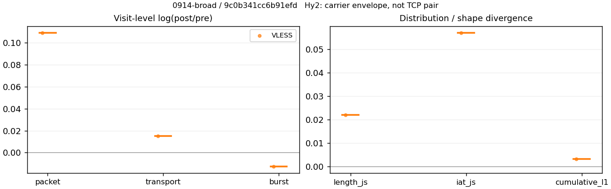
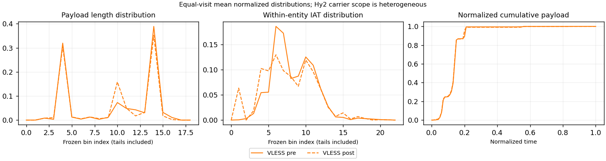

# 0914-broad · 条目 046 · apple.com

目标：https://www.apple.com/iphone/

活动标签：apple.com::page_load。选定访问 3 次。

[返回总索引](../../README.md) · [统计口径](../../methods.md)

## 覆盖与资格（每次访问均保留）

| 部署 | 重复 | 主请求路由 | 活动状态 | 代理比较 | DIRECT pre | 请求 proxy/direct/unresolved | 错误 |
| --- | --- | --- | --- | --- | --- | --- | --- |
| Hy2 | 1 | direct | passed | 0 | 1 | 0/56/0 | [] |
| SS | 1 | direct | passed | 0 | 1 | 0/60/0 | [] |
| VLESS | 1 | proxy | passed | 1 | 0 | 57/0/0 | [] |

主请求非 proxy 的统计仅解释为已索引的辅助代理连接或 DIRECT 观测，不代表目标业务经代理传输。播放确认与配对资格是两道不同的门。

图中散点为单次访问，短线为重复中位数；Hy2 是共享载体包络，不能与 TCP 配对作等范围因果对比。

形态图先逐访问归一化，再对访问等权平均；实线 pre，虚线 post。分箱序号及边界见 methods，不将分箱索引误解为长度或时间。

## 每次访问的关键观测

### SS

范围：`direct_pre_only`。每格 pre → post；空值为不可观测/不适用。

| 重复 | 包数 | 载荷字节 | burst | TCP FR | IAT中位µs | length JS | IAT JS |
| --- | --- | --- | --- | --- | --- | --- | --- |
| 1 | 862 → — | 2.3374e+06 → — | 528 → — | 59 → — | 53.076 → — | — | — |

完整标量统计：中位数 [min,max]；Δ 为重复内逐访问变换的中位数，MAD 未缩放。n 为可用变换数；DIRECT-only 的 nΔ=0 不代表 pre 不可用。

| scope | 特征 | pre | post | Δ | IQRΔ | MADΔ | nΔ |
| --- | --- | --- | --- | --- | --- | --- | --- |
| direct_pre_only | active_span_sum_s_1000ms | 5.5356 [5.5356, 5.5356] | — | — | — | — | 0 |
| direct_pre_only | active_span_sum_s_100ms | 2.1764 [2.1764, 2.1764] | — | — | — | — | 0 |
| direct_pre_only | active_span_sum_s_500ms | 4.7529 [4.7529, 4.7529] | — | — | — | — | 0 |
| direct_pre_only | burst_bytes_iqr | 7766 [7766, 7766] | — | — | — | — | 0 |
| direct_pre_only | burst_bytes_mad | 92 [92, 92] | — | — | — | — | 0 |
| direct_pre_only | burst_bytes_max | 24514 [24514, 24514] | — | — | — | — | 0 |
| direct_pre_only | burst_bytes_mean | 4427 [4427, 4427] | — | — | — | — | 0 |
| direct_pre_only | burst_bytes_median | 92 [92, 92] | — | — | — | — | 0 |
| direct_pre_only | burst_bytes_min | 0 [0, 0] | — | — | — | — | 0 |
| direct_pre_only | burst_bytes_p95 | 20480 [20480, 20480] | — | — | — | — | 0 |
| direct_pre_only | burst_bytes_q25 | 0 [0, 0] | — | — | — | — | 0 |
| direct_pre_only | burst_bytes_q75 | 7766 [7766, 7766] | — | — | — | — | 0 |
| direct_pre_only | burst_bytes_std | 6930.4 [6930.4, 6930.4] | — | — | — | — | 0 |
| direct_pre_only | burst_count | 528 [528, 528] | — | — | — | — | 0 |
| direct_pre_only | burst_duration_ms_iqr | 0.048623 [0.048623, 0.048623] | — | — | — | — | 0 |
| direct_pre_only | burst_duration_ms_mad | 0 [0, 0] | — | — | — | — | 0 |
| direct_pre_only | burst_duration_ms_max | 6314.5 [6314.5, 6314.5] | — | — | — | — | 0 |
| direct_pre_only | burst_duration_ms_mean | 17.206 [17.206, 17.206] | — | — | — | — | 0 |
| direct_pre_only | burst_duration_ms_median | 0 [0, 0] | — | — | — | — | 0 |
| direct_pre_only | burst_duration_ms_min | 0 [0, 0] | — | — | — | — | 0 |
| direct_pre_only | burst_duration_ms_p95 | 18.698 [18.698, 18.698] | — | — | — | — | 0 |
| direct_pre_only | burst_duration_ms_q25 | 0 [0, 0] | — | — | — | — | 0 |
| direct_pre_only | burst_duration_ms_q75 | 0.048623 [0.048623, 0.048623] | — | — | — | — | 0 |
| direct_pre_only | burst_duration_ms_std | 275.7 [275.7, 275.7] | — | — | — | — | 0 |
| direct_pre_only | burst_packets_iqr | 1 [1, 1] | — | — | — | — | 0 |
| direct_pre_only | burst_packets_mad | 0 [0, 0] | — | — | — | — | 0 |
| direct_pre_only | burst_packets_max | 9 [9, 9] | — | — | — | — | 0 |
| direct_pre_only | burst_packets_mean | 1.6326 [1.6326, 1.6326] | — | — | — | — | 0 |
| direct_pre_only | burst_packets_median | 1 [1, 1] | — | — | — | — | 0 |
| direct_pre_only | burst_packets_min | 1 [1, 1] | — | — | — | — | 0 |
| direct_pre_only | burst_packets_p95 | 4 [4, 4] | — | — | — | — | 0 |
| direct_pre_only | burst_packets_q25 | 1 [1, 1] | — | — | — | — | 0 |
| direct_pre_only | burst_packets_q75 | 2 [2, 2] | — | — | — | — | 0 |
| direct_pre_only | burst_packets_std | 1.0268 [1.0268, 1.0268] | — | — | — | — | 0 |
| direct_pre_only | connection_span_concurrency_max | 3 [3, 3] | — | — | — | — | 0 |
| direct_pre_only | direction_entropy | 0.61768 [0.61768, 0.61768] | — | — | — | — | 0 |
| direct_pre_only | down_burst_count | 262 [262, 262] | — | — | — | — | 0 |
| direct_pre_only | down_ip_bytes | 2.3458e+06 [2.3458e+06, 2.3458e+06] | — | — | — | — | 0 |
| direct_pre_only | down_packets | 549 [549, 549] | — | — | — | — | 0 |
| direct_pre_only | down_transport_bytes | 2.3173e+06 [2.3173e+06, 2.3173e+06] | — | — | — | — | 0 |
| direct_pre_only | duration_s | 21.057 [21.057, 21.057] | — | — | — | — | 0 |
| direct_pre_only | entity_count | 4 [4, 4] | — | — | — | — | 0 |
| direct_pre_only | fr_runs | 59 [59, 59] | — | — | — | — | 0 |
| direct_pre_only | fr_runs_per_packet | 0.10631 [0.10631, 0.10631] | — | — | — | — | 0 |
| direct_pre_only | fr_switches | 55 [55, 55] | — | — | — | — | 0 |
| direct_pre_only | fr_switches_per_possible_transition | 0.099819 [0.099819, 0.099819] | — | — | — | — | 0 |
| direct_pre_only | full_retransmission_fraction | 0.0023202 [0.0023202, 0.0023202] | — | — | — | — | 0 |
| direct_pre_only | full_retransmission_packets | 2 [2, 2] | — | — | — | — | 0 |
| direct_pre_only | iat_count | 858 [858, 858] | — | — | — | — | 0 |
| direct_pre_only | iat_median_us | 53.076 [53.076, 53.076] | — | — | — | — | 0 |
| direct_pre_only | iat_us_iqr | 240.5 [240.5, 240.5] | — | — | — | — | 0 |
| direct_pre_only | iat_us_mad | 43.819 [43.819, 43.819] | — | — | — | — | 0 |
| direct_pre_only | iat_us_max | 6.3145e+06 [6.3145e+06, 6.3145e+06] | — | — | — | — | 0 |
| direct_pre_only | iat_us_mean | 19115 [19115, 19115] | — | — | — | — | 0 |
| direct_pre_only | iat_us_median | 53.076 [53.076, 53.076] | — | — | — | — | 0 |
| direct_pre_only | iat_us_min | 0.338 [0.338, 0.338] | — | — | — | — | 0 |
| direct_pre_only | iat_us_p95 | 28009 [28009, 28009] | — | — | — | — | 0 |
| direct_pre_only | iat_us_q25 | 15.407 [15.407, 15.407] | — | — | — | — | 0 |
| direct_pre_only | iat_us_q75 | 255.91 [255.91, 255.91] | — | — | — | — | 0 |
| direct_pre_only | iat_us_std | 2.6782e+05 [2.6782e+05, 2.6782e+05] | — | — | — | — | 0 |
| direct_pre_only | idle_gap_count_1000ms | 2 [2, 2] | — | — | — | — | 0 |
| direct_pre_only | idle_gap_count_100ms | 17 [17, 17] | — | — | — | — | 0 |
| direct_pre_only | idle_gap_count_500ms | 3 [3, 3] | — | — | — | — | 0 |
| direct_pre_only | idle_gap_sum_s_1000ms | 10.865 [10.865, 10.865] | — | — | — | — | 0 |
| direct_pre_only | idle_gap_sum_s_100ms | 14.224 [14.224, 14.224] | — | — | — | — | 0 |
| direct_pre_only | idle_gap_sum_s_500ms | 11.648 [11.648, 11.648] | — | — | — | — | 0 |
| direct_pre_only | ip_bytes | 2.3823e+06 [2.3823e+06, 2.3823e+06] | — | — | — | — | 0 |
| direct_pre_only | length_iqr | 6838.5 [6838.5, 6838.5] | — | — | — | — | 0 |
| direct_pre_only | length_mad | 2806 [2806, 2806] | — | — | — | — | 0 |
| direct_pre_only | length_max | 8920 [8920, 8920] | — | — | — | — | 0 |
| direct_pre_only | length_mean | 4211.6 [4211.6, 4211.6] | — | — | — | — | 0 |
| direct_pre_only | length_median | 3126 [3126, 3126] | — | — | — | — | 0 |
| direct_pre_only | length_min | 9 [9, 9] | — | — | — | — | 0 |
| direct_pre_only | length_p95 | 8920 [8920, 8920] | — | — | — | — | 0 |
| direct_pre_only | length_q25 | 1194 [1194, 1194] | — | — | — | — | 0 |
| direct_pre_only | length_q75 | 8032.5 [8032.5, 8032.5] | — | — | — | — | 0 |
| direct_pre_only | length_std | 3323.9 [3323.9, 3323.9] | — | — | — | — | 0 |
| direct_pre_only | nonempty_entity_count | 4 [4, 4] | — | — | — | — | 0 |
| direct_pre_only | nonempty_packets | 555 [555, 555] | — | — | — | — | 0 |
| direct_pre_only | offload_suspect_fraction | 0.45128 [0.45128, 0.45128] | — | — | — | — | 0 |
| direct_pre_only | packet_count | 862 [862, 862] | — | — | — | — | 0 |
| direct_pre_only | rtt_median_ms | 0.10596 [0.10596, 0.10596] | — | — | — | — | 0 |
| direct_pre_only | rtt_sample_count | 302 [302, 302] | — | — | — | — | 0 |
| direct_pre_only | tcp_ack_count | 858 [858, 858] | — | — | — | — | 0 |
| direct_pre_only | tcp_fin_count | 8 [8, 8] | — | — | — | — | 0 |
| direct_pre_only | tcp_packet_count | 862 [862, 862] | — | — | — | — | 0 |
| direct_pre_only | tcp_rst_count | 0 [0, 0] | — | — | — | — | 0 |
| direct_pre_only | tcp_syn_count | 8 [8, 8] | — | — | — | — | 0 |
| direct_pre_only | tcp_window_raw_median | 65535 [65535, 65535] | — | — | — | — | 0 |
| direct_pre_only | transition_entropy | 0.4045 [0.4045, 0.4045] | — | — | — | — | 0 |
| direct_pre_only | transition_n_mm | 441 [441, 441] | — | — | — | — | 0 |
| direct_pre_only | transition_n_mp | 26 [26, 26] | — | — | — | — | 0 |
| direct_pre_only | transition_n_pm | 29 [29, 29] | — | — | — | — | 0 |
| direct_pre_only | transition_n_pp | 55 [55, 55] | — | — | — | — | 0 |
| direct_pre_only | transition_p_mm | 0.94433 [0.94433, 0.94433] | — | — | — | — | 0 |
| direct_pre_only | transition_p_mp | 0.055675 [0.055675, 0.055675] | — | — | — | — | 0 |
| direct_pre_only | transition_p_pm | 0.34524 [0.34524, 0.34524] | — | — | — | — | 0 |
| direct_pre_only | transition_p_pp | 0.65476 [0.65476, 0.65476] | — | — | — | — | 0 |
| direct_pre_only | transport_bytes | 2.3374e+06 [2.3374e+06, 2.3374e+06] | — | — | — | — | 0 |
| direct_pre_only | up_burst_count | 266 [266, 266] | — | — | — | — | 0 |
| direct_pre_only | up_byte_fraction | 0.00863 [0.00863, 0.00863] | — | — | — | — | 0 |
| direct_pre_only | up_ip_bytes | 36504 [36504, 36504] | — | — | — | — | 0 |
| direct_pre_only | up_packets | 313 [313, 313] | — | — | — | — | 0 |
| direct_pre_only | up_transport_bytes | 20172 [20172, 20172] | — | — | — | — | 0 |
| direct_pre_only | zero_iat_count | 0 [0, 0] | — | — | — | — | 0 |
| direct_pre_only | zero_iat_fraction | 0 [0, 0] | — | — | — | — | 0 |

### VLESS

范围：`exclusive_page`。每格 pre → post；空值为不可观测/不适用。

| 重复 | 包数 | 载荷字节 | burst | TCP FR | IAT中位µs | length JS | IAT JS |
| --- | --- | --- | --- | --- | --- | --- | --- |
| 1 | 2081 → 2320 | 2.0754e+06 → 2.107e+06 | 1624 → 1604 | 40 → 50 | 115.71 → 92.663 | 0.02188 | 0.056859 |

完整标量统计：中位数 [min,max]；Δ 为重复内逐访问变换的中位数，MAD 未缩放。n 为可用变换数；DIRECT-only 的 nΔ=0 不代表 pre 不可用。

| scope | 特征 | pre | post | Δ | IQRΔ | MADΔ | nΔ |
| --- | --- | --- | --- | --- | --- | --- | --- |
| exclusive_page | active_span_sum_s_1000ms | 7.8926 [7.8926, 7.8926] | 7.8608 [7.8608, 7.8608] | -0.0040412 | — | — | 1 |
| exclusive_page | active_span_sum_s_100ms | 2.1681 [2.1681, 2.1681] | 3.4135 [3.4135, 3.4135] | 0.4539 | — | — | 1 |
| exclusive_page | active_span_sum_s_500ms | 5.2703 [5.2703, 5.2703] | 7.8608 [7.8608, 7.8608] | 0.39979 | — | — | 1 |
| exclusive_page | burst_bytes_iqr | 2824 [2824, 2824] | 2824 [2824, 2824] | 0 | — | — | 1 |
| exclusive_page | burst_bytes_mad | 33 [33, 33] | 90 [90, 90] | 1.0033 | — | — | 1 |
| exclusive_page | burst_bytes_max | 20480 [20480, 20480] | 11584 [11584, 11584] | -0.56982 | — | — | 1 |
| exclusive_page | burst_bytes_mean | 1278 [1278, 1278] | 1313.6 [1313.6, 1313.6] | 0.02748 | — | — | 1 |
| exclusive_page | burst_bytes_median | 33 [33, 33] | 90 [90, 90] | 1.0033 | — | — | 1 |
| exclusive_page | burst_bytes_min | 0 [0, 0] | 0 [0, 0] | — | — | — | 0 |
| exclusive_page | burst_bytes_p95 | 4344 [4344, 4344] | 2968 [2968, 2968] | -0.38091 | — | — | 1 |
| exclusive_page | burst_bytes_q25 | 0 [0, 0] | 0 [0, 0] | — | — | — | 0 |
| exclusive_page | burst_bytes_q75 | 2824 [2824, 2824] | 2824 [2824, 2824] | 0 | — | — | 1 |
| exclusive_page | burst_bytes_std | 2151.6 [2151.6, 2151.6] | 1594.9 [1594.9, 1594.9] | -0.29941 | — | — | 1 |
| exclusive_page | burst_count | 1624 [1624, 1624] | 1604 [1604, 1604] | -0.012392 | — | — | 1 |
| exclusive_page | burst_duration_ms_iqr | 0 [0, 0] | 0.13321 [0.13321, 0.13321] | — | — | — | 0 |
| exclusive_page | burst_duration_ms_mad | 0 [0, 0] | 0 [0, 0] | — | — | — | 0 |
| exclusive_page | burst_duration_ms_max | 5672.9 [5672.9, 5672.9] | 5673.2 [5673.2, 5673.2] | 5.0604e-05 | — | — | 1 |
| exclusive_page | burst_duration_ms_mean | 8.0146 [8.0146, 8.0146] | 7.7171 [7.7171, 7.7171] | -0.037822 | — | — | 1 |
| exclusive_page | burst_duration_ms_median | 0 [0, 0] | 0 [0, 0] | — | — | — | 0 |
| exclusive_page | burst_duration_ms_min | 0 [0, 0] | 0 [0, 0] | — | — | — | 0 |
| exclusive_page | burst_duration_ms_p95 | 1.5705 [1.5705, 1.5705] | 5.1743 [5.1743, 5.1743] | 1.1923 | — | — | 1 |
| exclusive_page | burst_duration_ms_q25 | 0 [0, 0] | 0 [0, 0] | — | — | — | 0 |
| exclusive_page | burst_duration_ms_q75 | 0 [0, 0] | 0.13321 [0.13321, 0.13321] | — | — | — | 0 |
| exclusive_page | burst_duration_ms_std | 150.15 [150.15, 150.15] | 148.19 [148.19, 148.19] | -0.013186 | — | — | 1 |
| exclusive_page | burst_packets_iqr | 0 [0, 0] | 1 [1, 1] | — | — | — | 0 |
| exclusive_page | burst_packets_mad | 0 [0, 0] | 0 [0, 0] | — | — | — | 0 |
| exclusive_page | burst_packets_max | 11 [11, 11] | 10 [10, 10] | -0.09531 | — | — | 1 |
| exclusive_page | burst_packets_mean | 1.2814 [1.2814, 1.2814] | 1.4464 [1.4464, 1.4464] | 0.12111 | — | — | 1 |
| exclusive_page | burst_packets_median | 1 [1, 1] | 1 [1, 1] | 0 | — | — | 1 |
| exclusive_page | burst_packets_min | 1 [1, 1] | 1 [1, 1] | 0 | — | — | 1 |
| exclusive_page | burst_packets_p95 | 2 [2, 2] | 3 [3, 3] | 0.40547 | — | — | 1 |
| exclusive_page | burst_packets_q25 | 1 [1, 1] | 1 [1, 1] | 0 | — | — | 1 |
| exclusive_page | burst_packets_q75 | 1 [1, 1] | 2 [2, 2] | 0.69315 | — | — | 1 |
| exclusive_page | burst_packets_std | 0.69587 [0.69587, 0.69587] | 0.76487 [0.76487, 0.76487] | 0.094546 | — | — | 1 |
| exclusive_page | connection_span_concurrency_max | 3 [3, 3] | 3 [3, 3] | 0 | — | — | 1 |
| exclusive_page | cumulative_l1 | — | — | 0.0031049 | — | — | 1 |
| exclusive_page | cumulative_max | — | — | 0.063674 | — | — | 1 |
| exclusive_page | direction_entropy | 0.33589 [0.33589, 0.33589] | 0.24797 [0.24797, 0.24797] | -0.087921 | — | — | 1 |
| exclusive_page | down_burst_count | 810 [810, 810] | 800 [800, 800] | -0.012423 | — | — | 1 |
| exclusive_page | down_ip_bytes | 2.12e+06 [2.12e+06, 2.12e+06] | 2.1515e+06 [2.1515e+06, 2.1515e+06] | 0.014761 | — | — | 1 |
| exclusive_page | down_packets | 1221 [1221, 1221] | 1381 [1381, 1381] | 0.12314 | — | — | 1 |
| exclusive_page | down_transport_bytes | 2.0564e+06 [2.0564e+06, 2.0564e+06] | 2.0796e+06 [2.0796e+06, 2.0796e+06] | 0.011221 | — | — | 1 |
| exclusive_page | duration_s | 21.676 [21.676, 21.676] | 21.66 [21.66, 21.66] | -0.00076835 | — | — | 1 |
| exclusive_page | entity_count | 4 [4, 4] | 4 [4, 4] | 0 | — | — | 1 |
| exclusive_page | fr_runs | 40 [40, 40] | 50 [50, 50] | 0.22314 | — | — | 1 |
| exclusive_page | fr_runs_per_packet | 0.032706 [0.032706, 0.032706] | 0.036179 [0.036179, 0.036179] | 0.003473 | — | — | 1 |
| exclusive_page | fr_switches | 36 [36, 36] | 46 [46, 46] | 0.24512 | — | — | 1 |
| exclusive_page | fr_switches_per_possible_transition | 0.029532 [0.029532, 0.029532] | 0.033382 [0.033382, 0.033382] | 0.0038493 | — | — | 1 |
| exclusive_page | full_retransmission_fraction | 0.00048054 [0.00048054, 0.00048054] | 0 [0, 0] | -0.00048054 | — | — | 1 |
| exclusive_page | full_retransmission_packets | 1 [1, 1] | 0 [0, 0] | — | — | — | 0 |
| exclusive_page | iat_count | 2077 [2077, 2077] | 2316 [2316, 2316] | 0.10892 | — | — | 1 |
| exclusive_page | iat_js | — | — | 0.056859 | — | — | 1 |
| exclusive_page | iat_ks | — | — | 0.15716 | — | — | 1 |
| exclusive_page | iat_median_us | 115.71 [115.71, 115.71] | 92.663 [92.663, 92.663] | -0.22208 | — | — | 1 |
| exclusive_page | iat_us_iqr | 832.85 [832.85, 832.85] | 828.03 [828.03, 828.03] | -0.0057957 | — | — | 1 |
| exclusive_page | iat_us_mad | 105.24 [105.24, 105.24] | 87.165 [87.165, 87.165] | -0.18847 | — | — | 1 |
| exclusive_page | iat_us_max | 5.6729e+06 [5.6729e+06, 5.6729e+06] | 5.6732e+06 [5.6732e+06, 5.6732e+06] | 5.0604e-05 | — | — | 1 |
| exclusive_page | iat_us_mean | 8782.2 [8782.2, 8782.2] | 7844 [7844, 7844] | -0.11297 | — | — | 1 |
| exclusive_page | iat_us_median | 115.71 [115.71, 115.71] | 92.663 [92.663, 92.663] | -0.22208 | — | — | 1 |
| exclusive_page | iat_us_min | 0.569 [0.569, 0.569] | 0.033 [0.033, 0.033] | -2.8474 | — | — | 1 |
| exclusive_page | iat_us_p95 | 4922.9 [4922.9, 4922.9] | 7443.4 [7443.4, 7443.4] | 0.41343 | — | — | 1 |
| exclusive_page | iat_us_q25 | 39.374 [39.374, 39.374] | 16.43 [16.43, 16.43] | -0.87398 | — | — | 1 |
| exclusive_page | iat_us_q75 | 872.22 [872.22, 872.22] | 844.46 [844.46, 844.46] | -0.032341 | — | — | 1 |
| exclusive_page | iat_us_std | 1.5031e+05 [1.5031e+05, 1.5031e+05] | 1.3984e+05 [1.3984e+05, 1.3984e+05] | -0.072253 | — | — | 1 |
| exclusive_page | iat_wasserstein_log1p_us | — | — | 0.46799 | — | — | 1 |
| exclusive_page | idle_gap_count_1000ms | 3 [3, 3] | 3 [3, 3] | 0 | — | — | 1 |
| exclusive_page | idle_gap_count_100ms | 21 [21, 21] | 26 [26, 26] | 0.21357 | — | — | 1 |
| exclusive_page | idle_gap_count_500ms | 7 [7, 7] | 3 [3, 3] | -0.8473 | — | — | 1 |
| exclusive_page | idle_gap_sum_s_1000ms | 10.348 [10.348, 10.348] | 10.306 [10.306, 10.306] | -0.0040639 | — | — | 1 |
| exclusive_page | idle_gap_sum_s_100ms | 16.073 [16.073, 16.073] | 14.753 [14.753, 14.753] | -0.085643 | — | — | 1 |
| exclusive_page | idle_gap_sum_s_500ms | 12.97 [12.97, 12.97] | 10.306 [10.306, 10.306] | -0.22993 | — | — | 1 |
| exclusive_page | ip_bytes | 2.1836e+06 [2.1836e+06, 2.1836e+06] | 2.2288e+06 [2.2288e+06, 2.2288e+06] | 0.020468 | — | — | 1 |
| exclusive_page | length_iqr | 2752 [2752, 2752] | 2752 [2752, 2752] | 0 | — | — | 1 |
| exclusive_page | length_js | — | — | 0.02188 | — | — | 1 |
| exclusive_page | length_ks | — | — | 0.083368 | — | — | 1 |
| exclusive_page | length_mad | 1340 [1340, 1340] | 1340 [1340, 1340] | 0 | — | — | 1 |
| exclusive_page | length_max | 8920 [8920, 8920] | 8688 [8688, 8688] | -0.026353 | — | — | 1 |
| exclusive_page | length_mean | 1697 [1697, 1697] | 1524.6 [1524.6, 1524.6] | -0.10714 | — | — | 1 |
| exclusive_page | length_median | 1484 [1484, 1484] | 1412 [1412, 1412] | -0.049734 | — | — | 1 |
| exclusive_page | length_min | 24 [24, 24] | 6 [6, 6] | -1.3863 | — | — | 1 |
| exclusive_page | length_p95 | 2932 [2932, 2932] | 2896 [2896, 2896] | -0.012354 | — | — | 1 |
| exclusive_page | length_q25 | 72 [72, 72] | 72 [72, 72] | 0 | — | — | 1 |
| exclusive_page | length_q75 | 2824 [2824, 2824] | 2824 [2824, 2824] | 0 | — | — | 1 |
| exclusive_page | length_std | 1550.5 [1550.5, 1550.5] | 1275.1 [1275.1, 1275.1] | -0.19557 | — | — | 1 |
| exclusive_page | length_wasserstein_bytes | — | — | 184.94 | — | — | 1 |
| exclusive_page | nonempty_entity_count | 4 [4, 4] | 4 [4, 4] | 0 | — | — | 1 |
| exclusive_page | nonempty_packets | 1223 [1223, 1223] | 1382 [1382, 1382] | 0.12222 | — | — | 1 |
| exclusive_page | offload_suspect_fraction | 0.29649 [0.29649, 0.29649] | 0.25086 [0.25086, 0.25086] | -0.04563 | — | — | 1 |
| exclusive_page | packet_count | 2081 [2081, 2081] | 2320 [2320, 2320] | 0.10872 | — | — | 1 |
| exclusive_page | rtt_median_ms | 0.059797 [0.059797, 0.059797] | 0.16874 [0.16874, 0.16874] | 1.0374 | — | — | 1 |
| exclusive_page | rtt_sample_count | 839 [839, 839] | 897 [897, 897] | 0.066845 | — | — | 1 |
| exclusive_page | tcp_ack_count | 2069 [2069, 2069] | 2316 [2316, 2316] | 0.11278 | — | — | 1 |
| exclusive_page | tcp_fin_count | 8 [8, 8] | 8 [8, 8] | 0 | — | — | 1 |
| exclusive_page | tcp_packet_count | 2081 [2081, 2081] | 2320 [2320, 2320] | 0.10872 | — | — | 1 |
| exclusive_page | tcp_rst_count | 8 [8, 8] | 0 [0, 0] | — | — | — | 0 |
| exclusive_page | tcp_syn_count | 8 [8, 8] | 8 [8, 8] | 0 | — | — | 1 |
| exclusive_page | tcp_window_raw_median | 65535 [65535, 65535] | 180 [180, 180] | -5.8974 | — | — | 1 |
| exclusive_page | transition_entropy | 0.15148 [0.15148, 0.15148] | 0.15378 [0.15378, 0.15378] | 0.0023036 | — | — | 1 |
| exclusive_page | transition_n_mm | 1127 [1127, 1127] | 1300 [1300, 1300] | 0.14281 | — | — | 1 |
| exclusive_page | transition_n_mp | 16 [16, 16] | 21 [21, 21] | 0.27193 | — | — | 1 |
| exclusive_page | transition_n_pm | 20 [20, 20] | 25 [25, 25] | 0.22314 | — | — | 1 |
| exclusive_page | transition_n_pp | 56 [56, 56] | 32 [32, 32] | -0.55962 | — | — | 1 |
| exclusive_page | transition_p_mm | 0.986 [0.986, 0.986] | 0.9841 [0.9841, 0.9841] | -0.0018988 | — | — | 1 |
| exclusive_page | transition_p_mp | 0.013998 [0.013998, 0.013998] | 0.015897 [0.015897, 0.015897] | 0.0018988 | — | — | 1 |
| exclusive_page | transition_p_pm | 0.26316 [0.26316, 0.26316] | 0.4386 [0.4386, 0.4386] | 0.17544 | — | — | 1 |
| exclusive_page | transition_p_pp | 0.73684 [0.73684, 0.73684] | 0.5614 [0.5614, 0.5614] | -0.17544 | — | — | 1 |
| exclusive_page | transport_bytes | 2.0754e+06 [2.0754e+06, 2.0754e+06] | 2.107e+06 [2.107e+06, 2.107e+06] | 0.015088 | — | — | 1 |
| exclusive_page | up_burst_count | 814 [814, 814] | 804 [804, 804] | -0.012361 | — | — | 1 |
| exclusive_page | up_byte_fraction | 0.0091413 [0.0091413, 0.0091413] | 0.012966 [0.012966, 0.012966] | 0.0038243 | — | — | 1 |
| exclusive_page | up_ip_bytes | 63640 [63640, 63640] | 77270 [77270, 77270] | 0.19406 | — | — | 1 |
| exclusive_page | up_packets | 860 [860, 860] | 939 [939, 939] | 0.087883 | — | — | 1 |
| exclusive_page | up_transport_bytes | 18972 [18972, 18972] | 27318 [27318, 27318] | 0.36458 | — | — | 1 |
| exclusive_page | zero_iat_count | 0 [0, 0] | 0 [0, 0] | — | — | — | 0 |
| exclusive_page | zero_iat_fraction | 0 [0, 0] | 0 [0, 0] | 0 | — | — | 1 |

### Hy2

范围：`direct_pre_only`。每格 pre → post；空值为不可观测/不适用。

| 重复 | 包数 | 载荷字节 | burst | TCP FR | IAT中位µs | length JS | IAT JS |
| --- | --- | --- | --- | --- | --- | --- | --- |
| 1 | 820 → — | 2.2208e+06 → — | 504 → — | 55 → — | 95.65 → — | — | — |

完整标量统计：中位数 [min,max]；Δ 为重复内逐访问变换的中位数，MAD 未缩放。n 为可用变换数；DIRECT-only 的 nΔ=0 不代表 pre 不可用。

| scope | 特征 | pre | post | Δ | IQRΔ | MADΔ | nΔ |
| --- | --- | --- | --- | --- | --- | --- | --- |
| direct_pre_only | active_span_sum_s_1000ms | 4.9091 [4.9091, 4.9091] | — | — | — | — | 0 |
| direct_pre_only | active_span_sum_s_100ms | 1.8392 [1.8392, 1.8392] | — | — | — | — | 0 |
| direct_pre_only | active_span_sum_s_500ms | 4.3576 [4.3576, 4.3576] | — | — | — | — | 0 |
| direct_pre_only | burst_bytes_iqr | 6803.5 [6803.5, 6803.5] | — | — | — | — | 0 |
| direct_pre_only | burst_bytes_mad | 92 [92, 92] | — | — | — | — | 0 |
| direct_pre_only | burst_bytes_max | 23369 [23369, 23369] | — | — | — | — | 0 |
| direct_pre_only | burst_bytes_mean | 4406.4 [4406.4, 4406.4] | — | — | — | — | 0 |
| direct_pre_only | burst_bytes_median | 92 [92, 92] | — | — | — | — | 0 |
| direct_pre_only | burst_bytes_min | 0 [0, 0] | — | — | — | — | 0 |
| direct_pre_only | burst_bytes_p95 | 20480 [20480, 20480] | — | — | — | — | 0 |
| direct_pre_only | burst_bytes_q25 | 0 [0, 0] | — | — | — | — | 0 |
| direct_pre_only | burst_bytes_q75 | 6803.5 [6803.5, 6803.5] | — | — | — | — | 0 |
| direct_pre_only | burst_bytes_std | 7071.3 [7071.3, 7071.3] | — | — | — | — | 0 |
| direct_pre_only | burst_count | 504 [504, 504] | — | — | — | — | 0 |
| direct_pre_only | burst_duration_ms_iqr | 0.083728 [0.083728, 0.083728] | — | — | — | — | 0 |
| direct_pre_only | burst_duration_ms_mad | 0 [0, 0] | — | — | — | — | 0 |
| direct_pre_only | burst_duration_ms_max | 6168.3 [6168.3, 6168.3] | — | — | — | — | 0 |
| direct_pre_only | burst_duration_ms_mean | 23.019 [23.019, 23.019] | — | — | — | — | 0 |
| direct_pre_only | burst_duration_ms_median | 0 [0, 0] | — | — | — | — | 0 |
| direct_pre_only | burst_duration_ms_min | 0 [0, 0] | — | — | — | — | 0 |
| direct_pre_only | burst_duration_ms_p95 | 21.279 [21.279, 21.279] | — | — | — | — | 0 |
| direct_pre_only | burst_duration_ms_q25 | 0 [0, 0] | — | — | — | — | 0 |
| direct_pre_only | burst_duration_ms_q75 | 0.083728 [0.083728, 0.083728] | — | — | — | — | 0 |
| direct_pre_only | burst_duration_ms_std | 299.93 [299.93, 299.93] | — | — | — | — | 0 |
| direct_pre_only | burst_packets_iqr | 1 [1, 1] | — | — | — | — | 0 |
| direct_pre_only | burst_packets_mad | 0 [0, 0] | — | — | — | — | 0 |
| direct_pre_only | burst_packets_max | 5 [5, 5] | — | — | — | — | 0 |
| direct_pre_only | burst_packets_mean | 1.627 [1.627, 1.627] | — | — | — | — | 0 |
| direct_pre_only | burst_packets_median | 1 [1, 1] | — | — | — | — | 0 |
| direct_pre_only | burst_packets_min | 1 [1, 1] | — | — | — | — | 0 |
| direct_pre_only | burst_packets_p95 | 4 [4, 4] | — | — | — | — | 0 |
| direct_pre_only | burst_packets_q25 | 1 [1, 1] | — | — | — | — | 0 |
| direct_pre_only | burst_packets_q75 | 2 [2, 2] | — | — | — | — | 0 |
| direct_pre_only | burst_packets_std | 0.94478 [0.94478, 0.94478] | — | — | — | — | 0 |
| direct_pre_only | connection_span_concurrency_max | 3 [3, 3] | — | — | — | — | 0 |
| direct_pre_only | direction_entropy | 0.58314 [0.58314, 0.58314] | — | — | — | — | 0 |
| direct_pre_only | down_burst_count | 250 [250, 250] | — | — | — | — | 0 |
| direct_pre_only | down_ip_bytes | 2.2291e+06 [2.2291e+06, 2.2291e+06] | — | — | — | — | 0 |
| direct_pre_only | down_packets | 523 [523, 523] | — | — | — | — | 0 |
| direct_pre_only | down_transport_bytes | 2.2018e+06 [2.2018e+06, 2.2018e+06] | — | — | — | — | 0 |
| direct_pre_only | duration_s | 20.733 [20.733, 20.733] | — | — | — | — | 0 |
| direct_pre_only | entity_count | 4 [4, 4] | — | — | — | — | 0 |
| direct_pre_only | fr_runs | 55 [55, 55] | — | — | — | — | 0 |
| direct_pre_only | fr_runs_per_packet | 0.10516 [0.10516, 0.10516] | — | — | — | — | 0 |
| direct_pre_only | fr_switches | 51 [51, 51] | — | — | — | — | 0 |
| direct_pre_only | fr_switches_per_possible_transition | 0.098266 [0.098266, 0.098266] | — | — | — | — | 0 |
| direct_pre_only | full_retransmission_fraction | 0.004878 [0.004878, 0.004878] | — | — | — | — | 0 |
| direct_pre_only | full_retransmission_packets | 4 [4, 4] | — | — | — | — | 0 |
| direct_pre_only | iat_count | 816 [816, 816] | — | — | — | — | 0 |
| direct_pre_only | iat_median_us | 95.65 [95.65, 95.65] | — | — | — | — | 0 |
| direct_pre_only | iat_us_iqr | 392.15 [392.15, 392.15] | — | — | — | — | 0 |
| direct_pre_only | iat_us_mad | 81.317 [81.317, 81.317] | — | — | — | — | 0 |
| direct_pre_only | iat_us_max | 1.5e+07 [1.5e+07, 1.5e+07] | — | — | — | — | 0 |
| direct_pre_only | iat_us_mean | 40927 [40927, 40927] | — | — | — | — | 0 |
| direct_pre_only | iat_us_median | 95.65 [95.65, 95.65] | — | — | — | — | 0 |
| direct_pre_only | iat_us_min | 0.081 [0.081, 0.081] | — | — | — | — | 0 |
| direct_pre_only | iat_us_p95 | 23081 [23081, 23081] | — | — | — | — | 0 |
| direct_pre_only | iat_us_q25 | 23.099 [23.099, 23.099] | — | — | — | — | 0 |
| direct_pre_only | iat_us_q75 | 415.25 [415.25, 415.25] | — | — | — | — | 0 |
| direct_pre_only | iat_us_std | 5.9772e+05 [5.9772e+05, 5.9772e+05] | — | — | — | — | 0 |
| direct_pre_only | idle_gap_count_1000ms | 4 [4, 4] | — | — | — | — | 0 |
| direct_pre_only | idle_gap_count_100ms | 17 [17, 17] | — | — | — | — | 0 |
| direct_pre_only | idle_gap_count_500ms | 5 [5, 5] | — | — | — | — | 0 |
| direct_pre_only | idle_gap_sum_s_1000ms | 28.487 [28.487, 28.487] | — | — | — | — | 0 |
| direct_pre_only | idle_gap_sum_s_100ms | 31.557 [31.557, 31.557] | — | — | — | — | 0 |
| direct_pre_only | idle_gap_sum_s_500ms | 29.039 [29.039, 29.039] | — | — | — | — | 0 |
| direct_pre_only | ip_bytes | 2.2636e+06 [2.2636e+06, 2.2636e+06] | — | — | — | — | 0 |
| direct_pre_only | length_iqr | 7050 [7050, 7050] | — | — | — | — | 0 |
| direct_pre_only | length_mad | 2751 [2751, 2751] | — | — | — | — | 0 |
| direct_pre_only | length_max | 8920 [8920, 8920] | — | — | — | — | 0 |
| direct_pre_only | length_mean | 4246.3 [4246.3, 4246.3] | — | — | — | — | 0 |
| direct_pre_only | length_median | 2889 [2889, 2889] | — | — | — | — | 0 |
| direct_pre_only | length_min | 16 [16, 16] | — | — | — | — | 0 |
| direct_pre_only | length_p95 | 8920 [8920, 8920] | — | — | — | — | 0 |
| direct_pre_only | length_q25 | 1393.5 [1393.5, 1393.5] | — | — | — | — | 0 |
| direct_pre_only | length_q75 | 8443.5 [8443.5, 8443.5] | — | — | — | — | 0 |
| direct_pre_only | length_std | 3342.5 [3342.5, 3342.5] | — | — | — | — | 0 |
| direct_pre_only | nonempty_entity_count | 4 [4, 4] | — | — | — | — | 0 |
| direct_pre_only | nonempty_packets | 523 [523, 523] | — | — | — | — | 0 |
| direct_pre_only | offload_suspect_fraction | 0.45366 [0.45366, 0.45366] | — | — | — | — | 0 |
| direct_pre_only | packet_count | 820 [820, 820] | — | — | — | — | 0 |
| direct_pre_only | rtt_median_ms | 0.1473 [0.1473, 0.1473] | — | — | — | — | 0 |
| direct_pre_only | rtt_sample_count | 289 [289, 289] | — | — | — | — | 0 |
| direct_pre_only | tcp_ack_count | 816 [816, 816] | — | — | — | — | 0 |
| direct_pre_only | tcp_fin_count | 8 [8, 8] | — | — | — | — | 0 |
| direct_pre_only | tcp_packet_count | 820 [820, 820] | — | — | — | — | 0 |
| direct_pre_only | tcp_rst_count | 0 [0, 0] | — | — | — | — | 0 |
| direct_pre_only | tcp_syn_count | 8 [8, 8] | — | — | — | — | 0 |
| direct_pre_only | tcp_window_raw_median | 65535 [65535, 65535] | — | — | — | — | 0 |
| direct_pre_only | transition_entropy | 0.3924 [0.3924, 0.3924] | — | — | — | — | 0 |
| direct_pre_only | transition_n_mm | 423 [423, 423] | — | — | — | — | 0 |
| direct_pre_only | transition_n_mp | 24 [24, 24] | — | — | — | — | 0 |
| direct_pre_only | transition_n_pm | 27 [27, 27] | — | — | — | — | 0 |
| direct_pre_only | transition_n_pp | 45 [45, 45] | — | — | — | — | 0 |
| direct_pre_only | transition_p_mm | 0.94631 [0.94631, 0.94631] | — | — | — | — | 0 |
| direct_pre_only | transition_p_mp | 0.053691 [0.053691, 0.053691] | — | — | — | — | 0 |
| direct_pre_only | transition_p_pm | 0.375 [0.375, 0.375] | — | — | — | — | 0 |
| direct_pre_only | transition_p_pp | 0.625 [0.625, 0.625] | — | — | — | — | 0 |
| direct_pre_only | transport_bytes | 2.2208e+06 [2.2208e+06, 2.2208e+06] | — | — | — | — | 0 |
| direct_pre_only | up_burst_count | 254 [254, 254] | — | — | — | — | 0 |
| direct_pre_only | up_byte_fraction | 0.0085558 [0.0085558, 0.0085558] | — | — | — | — | 0 |
| direct_pre_only | up_ip_bytes | 34525 [34525, 34525] | — | — | — | — | 0 |
| direct_pre_only | up_packets | 297 [297, 297] | — | — | — | — | 0 |
| direct_pre_only | up_transport_bytes | 19001 [19001, 19001] | — | — | — | — | 0 |
| direct_pre_only | zero_iat_count | 0 [0, 0] | — | — | — | — | 0 |
| direct_pre_only | zero_iat_fraction | 0 [0, 0] | — | — | — | — | 0 |

## 不同部署对比

以下是各部署自身重复中位数的差异，不按重复编号强行配对。跨 TCP/Hy2 的行标记异质观测范围。

| 视角 | 特征 | 部署A | 部署B | A中位 | B中位 | B−A | 比较口径 |
| --- | --- | --- | --- | --- | --- | --- | --- |
| pre | burst_count | SS | Hy2 | 528 | 504 | -24 | same_scope_unpaired_visits |
| pre | connection_span_concurrency_max | SS | Hy2 | 3 | 3 | 0 | same_scope_unpaired_visits |
| pre | direction_entropy | SS | Hy2 | 0.61768 | 0.58314 | -0.034539 | same_scope_unpaired_visits |
| pre | down_transport_bytes | SS | Hy2 | 2.3173e+06 | 2.2018e+06 | -1.1543e+05 | same_scope_unpaired_visits |
| pre | duration_s | SS | Hy2 | 21.057 | 20.733 | -0.32446 | same_scope_unpaired_visits |
| pre | entity_count | SS | Hy2 | 4 | 4 | 0 | same_scope_unpaired_visits |
| pre | fr_runs | SS | Hy2 | 59 | 55 | -4 | same_scope_unpaired_visits |
| pre | fr_runs_per_packet | SS | Hy2 | 0.10631 | 0.10516 | -0.0011438 | same_scope_unpaired_visits |
| pre | fr_switches | SS | Hy2 | 55 | 51 | -4 | same_scope_unpaired_visits |
| pre | fr_switches_per_possible_transition | SS | Hy2 | 0.099819 | 0.098266 | -0.0015526 | same_scope_unpaired_visits |
| pre | full_retransmission_fraction | SS | Hy2 | 0.0023202 | 0.004878 | 0.0025579 | same_scope_unpaired_visits |
| pre | iat_median_us | SS | Hy2 | 53.076 | 95.65 | 42.574 | same_scope_unpaired_visits |
| pre | iat_us_p95 | SS | Hy2 | 28009 | 23081 | -4928.1 | same_scope_unpaired_visits |
| pre | ip_bytes | SS | Hy2 | 2.3823e+06 | 2.2636e+06 | -1.1876e+05 | same_scope_unpaired_visits |
| pre | length_median | SS | Hy2 | 3126 | 2889 | -237 | same_scope_unpaired_visits |
| pre | length_p95 | SS | Hy2 | 8920 | 8920 | 0 | same_scope_unpaired_visits |
| pre | nonempty_packets | SS | Hy2 | 555 | 523 | -32 | same_scope_unpaired_visits |
| pre | offload_suspect_fraction | SS | Hy2 | 0.45128 | 0.45366 | 0.0023824 | same_scope_unpaired_visits |
| pre | packet_count | SS | Hy2 | 862 | 820 | -42 | same_scope_unpaired_visits |
| pre | rtt_median_ms | SS | Hy2 | 0.10596 | 0.1473 | 0.041338 | same_scope_unpaired_visits |
| pre | transition_entropy | SS | Hy2 | 0.4045 | 0.3924 | -0.012102 | same_scope_unpaired_visits |
| pre | transport_bytes | SS | Hy2 | 2.3374e+06 | 2.2208e+06 | -1.166e+05 | same_scope_unpaired_visits |
| pre | up_byte_fraction | SS | Hy2 | 0.00863 | 0.0085558 | -7.4181e-05 | same_scope_unpaired_visits |
| pre | up_transport_bytes | SS | Hy2 | 20172 | 19001 | -1171 | same_scope_unpaired_visits |

## 可复核的访问标识

| 部署 | 重复 | session_id |
| --- | --- | --- |
| SS | 1 | 70e2bcd4-6962-42d0-8f8e-4b87d86f4389 |
| VLESS | 1 | 5a243cf7-d712-4a6c-b3e7-7da39f2fa333 |
| Hy2 | 1 | f2eba4c9-439b-433e-b00d-13a783526aa4 |

全量三种 packet selection、Hy2 full 范围、Q25/Q75、直方图与曲线见机器可读产物；本页只显示 observed 主范围。
