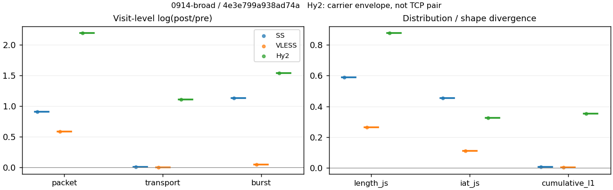
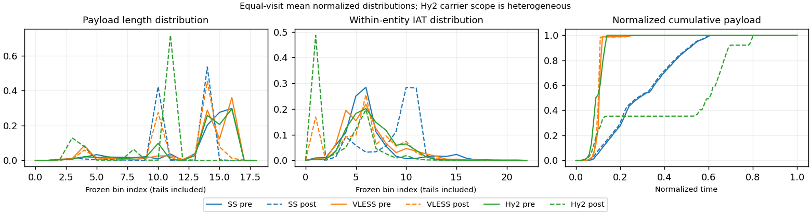

# 0914-broad · 条目 047 · ikea.com

目标：https://www.ikea.com/

活动标签：ikea.com::page_load。选定访问 3 次。

[返回总索引](../../README.md) · [统计口径](../../methods.md)

## 覆盖与资格（每次访问均保留）

| 部署 | 重复 | 主请求路由 | 活动状态 | 代理比较 | DIRECT pre | 请求 proxy/direct/unresolved | 错误 |
| --- | --- | --- | --- | --- | --- | --- | --- |
| Hy2 | 1 | proxy | passed | 1 | 0 | 103/0/0 | [] |
| SS | 1 | proxy | passed | 1 | 0 | 106/0/0 | [] |
| VLESS | 1 | proxy | passed | 1 | 0 | 108/0/0 | [] |

主请求非 proxy 的统计仅解释为已索引的辅助代理连接或 DIRECT 观测，不代表目标业务经代理传输。播放确认与配对资格是两道不同的门。

图中散点为单次访问，短线为重复中位数；Hy2 是共享载体包络，不能与 TCP 配对作等范围因果对比。

形态图先逐访问归一化，再对访问等权平均；实线 pre，虚线 post。分箱序号及边界见 methods，不将分箱索引误解为长度或时间。

## 每次访问的关键观测

### SS

范围：`exclusive_page`。每格 pre → post；空值为不可观测/不适用。

| 重复 | 包数 | 载荷字节 | burst | TCP FR | IAT中位µs | length JS | IAT JS |
| --- | --- | --- | --- | --- | --- | --- | --- |
| 1 | 9642 → 23871 | 2.9702e+07 → 2.9859e+07 | 6425 → 19891 | 135 → 151 | 23.529 → 674.77 | 0.59 | 0.45334 |

完整标量统计：中位数 [min,max]；Δ 为重复内逐访问变换的中位数，MAD 未缩放。n 为可用变换数；DIRECT-only 的 nΔ=0 不代表 pre 不可用。

| scope | 特征 | pre | post | Δ | IQRΔ | MADΔ | nΔ |
| --- | --- | --- | --- | --- | --- | --- | --- |
| exclusive_page | active_span_sum_s_1000ms | 24.941 [24.941, 24.941] | 26.497 [26.497, 26.497] | 0.06053 | — | — | 1 |
| exclusive_page | active_span_sum_s_100ms | 17.16 [17.16, 17.16] | 19.599 [19.599, 19.599] | 0.13286 | — | — | 1 |
| exclusive_page | active_span_sum_s_500ms | 23.616 [23.616, 23.616] | 24.933 [24.933, 24.933] | 0.054272 | — | — | 1 |
| exclusive_page | burst_bytes_iqr | 8192 [8192, 8192] | 2856 [2856, 2856] | -1.0537 | — | — | 1 |
| exclusive_page | burst_bytes_mad | 92 [92, 92] | 54 [54, 54] | -0.5328 | — | — | 1 |
| exclusive_page | burst_bytes_max | 25921 [25921, 25921] | 19992 [19992, 19992] | -0.25972 | — | — | 1 |
| exclusive_page | burst_bytes_mean | 4622.9 [4622.9, 4622.9] | 1501.1 [1501.1, 1501.1] | -1.1248 | — | — | 1 |
| exclusive_page | burst_bytes_median | 92 [92, 92] | 54 [54, 54] | -0.5328 | — | — | 1 |
| exclusive_page | burst_bytes_min | 0 [0, 0] | 0 [0, 0] | — | — | — | 0 |
| exclusive_page | burst_bytes_p95 | 19608 [19608, 19608] | 5712 [5712, 5712] | -1.2334 | — | — | 1 |
| exclusive_page | burst_bytes_q25 | 0 [0, 0] | 0 [0, 0] | — | — | — | 0 |
| exclusive_page | burst_bytes_q75 | 8192 [8192, 8192] | 2856 [2856, 2856] | -1.0537 | — | — | 1 |
| exclusive_page | burst_bytes_std | 6272.8 [6272.8, 6272.8] | 1820.5 [1820.5, 1820.5] | -1.2371 | — | — | 1 |
| exclusive_page | burst_count | 6425 [6425, 6425] | 19891 [19891, 19891] | 1.1301 | — | — | 1 |
| exclusive_page | burst_duration_ms_iqr | 0.024675 [0.024675, 0.024675] | 0 [0, 0] | — | — | — | 0 |
| exclusive_page | burst_duration_ms_mad | 0 [0, 0] | 0 [0, 0] | — | — | — | 0 |
| exclusive_page | burst_duration_ms_max | 15001 [15001, 15001] | 15018 [15018, 15018] | 0.0011645 | — | — | 1 |
| exclusive_page | burst_duration_ms_mean | 8.4512 [8.4512, 8.4512] | 2.5927 [2.5927, 2.5927] | -1.1816 | — | — | 1 |
| exclusive_page | burst_duration_ms_median | 0 [0, 0] | 0 [0, 0] | — | — | — | 0 |
| exclusive_page | burst_duration_ms_min | 0 [0, 0] | 0 [0, 0] | — | — | — | 0 |
| exclusive_page | burst_duration_ms_p95 | 0.14852 [0.14852, 0.14852] | 0.91181 [0.91181, 0.91181] | 1.8147 | — | — | 1 |
| exclusive_page | burst_duration_ms_q25 | 0 [0, 0] | 0 [0, 0] | — | — | — | 0 |
| exclusive_page | burst_duration_ms_q75 | 0.024675 [0.024675, 0.024675] | 0 [0, 0] | — | — | — | 0 |
| exclusive_page | burst_duration_ms_std | 260.28 [260.28, 260.28] | 169.39 [169.39, 169.39] | -0.42955 | — | — | 1 |
| exclusive_page | burst_packets_iqr | 1 [1, 1] | 0 [0, 0] | — | — | — | 0 |
| exclusive_page | burst_packets_mad | 0 [0, 0] | 0 [0, 0] | — | — | — | 0 |
| exclusive_page | burst_packets_max | 17 [17, 17] | 8 [8, 8] | -0.75377 | — | — | 1 |
| exclusive_page | burst_packets_mean | 1.5007 [1.5007, 1.5007] | 1.2001 [1.2001, 1.2001] | -0.22353 | — | — | 1 |
| exclusive_page | burst_packets_median | 1 [1, 1] | 1 [1, 1] | 0 | — | — | 1 |
| exclusive_page | burst_packets_min | 1 [1, 1] | 1 [1, 1] | 0 | — | — | 1 |
| exclusive_page | burst_packets_p95 | 3 [3, 3] | 2 [2, 2] | -0.40547 | — | — | 1 |
| exclusive_page | burst_packets_q25 | 1 [1, 1] | 1 [1, 1] | 0 | — | — | 1 |
| exclusive_page | burst_packets_q75 | 2 [2, 2] | 1 [1, 1] | -0.69315 | — | — | 1 |
| exclusive_page | burst_packets_std | 0.96879 [0.96879, 0.96879] | 0.46601 [0.46601, 0.46601] | -0.73184 | — | — | 1 |
| exclusive_page | connection_span_concurrency_max | 5 [5, 5] | 5 [5, 5] | 0 | — | — | 1 |
| exclusive_page | cumulative_l1 | — | — | 0.0071989 | — | — | 1 |
| exclusive_page | cumulative_max | — | — | 0.040296 | — | — | 1 |
| exclusive_page | direction_entropy | 0.19804 [0.19804, 0.19804] | 0.084592 [0.084592, 0.084592] | -0.11345 | — | — | 1 |
| exclusive_page | down_burst_count | 3209 [3209, 3209] | 9942 [9942, 9942] | 1.1308 | — | — | 1 |
| exclusive_page | down_ip_bytes | 2.9995e+07 [2.9995e+07, 2.9995e+07] | 3.0536e+07 [3.0536e+07, 3.0536e+07] | 0.017875 | — | — | 1 |
| exclusive_page | down_packets | 6223 [6223, 6223] | 13752 [13752, 13752] | 0.79293 | — | — | 1 |
| exclusive_page | down_transport_bytes | 2.9671e+07 [2.9671e+07, 2.9671e+07] | 2.9821e+07 [2.9821e+07, 2.9821e+07] | 0.0050195 | — | — | 1 |
| exclusive_page | duration_s | 27.338 [27.338, 27.338] | 27.172 [27.172, 27.172] | -0.0060957 | — | — | 1 |
| exclusive_page | entity_count | 7 [7, 7] | 7 [7, 7] | 0 | — | — | 1 |
| exclusive_page | fr_runs | 135 [135, 135] | 151 [151, 151] | 0.11201 | — | — | 1 |
| exclusive_page | fr_runs_per_packet | 0.021607 [0.021607, 0.021607] | 0.010939 [0.010939, 0.010939] | -0.010668 | — | — | 1 |
| exclusive_page | fr_switches | 128 [128, 128] | 144 [144, 144] | 0.11778 | — | — | 1 |
| exclusive_page | fr_switches_per_possible_transition | 0.02051 [0.02051, 0.02051] | 0.010437 [0.010437, 0.010437] | -0.010072 | — | — | 1 |
| exclusive_page | full_retransmission_fraction | 0.00062228 [0.00062228, 0.00062228] | 0.00046081 [0.00046081, 0.00046081] | -0.00016147 | — | — | 1 |
| exclusive_page | full_retransmission_packets | 6 [6, 6] | 11 [11, 11] | 0.60614 | — | — | 1 |
| exclusive_page | iat_count | 9635 [9635, 9635] | 23864 [23864, 23864] | 0.90697 | — | — | 1 |
| exclusive_page | iat_js | — | — | 0.45334 | — | — | 1 |
| exclusive_page | iat_ks | — | — | 0.60837 | — | — | 1 |
| exclusive_page | iat_median_us | 23.529 [23.529, 23.529] | 674.77 [674.77, 674.77] | 3.3561 | — | — | 1 |
| exclusive_page | iat_us_iqr | 44.776 [44.776, 44.776] | 896.83 [896.83, 896.83] | 2.9972 | — | — | 1 |
| exclusive_page | iat_us_mad | 14.846 [14.846, 14.846] | 372.09 [372.09, 372.09] | 3.2214 | — | — | 1 |
| exclusive_page | iat_us_max | 1.5001e+07 [1.5001e+07, 1.5001e+07] | 1.5052e+07 [1.5052e+07, 1.5052e+07] | 0.0033849 | — | — | 1 |
| exclusive_page | iat_us_mean | 10588 [10588, 10588] | 4265 [4265, 4265] | -0.90923 | — | — | 1 |
| exclusive_page | iat_us_median | 23.529 [23.529, 23.529] | 674.77 [674.77, 674.77] | 3.3561 | — | — | 1 |
| exclusive_page | iat_us_min | 0.017 [0.017, 0.017] | 0.037 [0.037, 0.037] | 0.7777 | — | — | 1 |
| exclusive_page | iat_us_p95 | 10266 [10266, 10266] | 1602 [1602, 1602] | -1.8576 | — | — | 1 |
| exclusive_page | iat_us_q25 | 12.497 [12.497, 12.497] | 123.65 [123.65, 123.65] | 2.2919 | — | — | 1 |
| exclusive_page | iat_us_q75 | 57.274 [57.274, 57.274] | 1020.5 [1020.5, 1020.5] | 2.8802 | — | — | 1 |
| exclusive_page | iat_us_std | 3.0376e+05 [3.0376e+05, 3.0376e+05] | 1.9272e+05 [1.9272e+05, 1.9272e+05] | -0.455 | — | — | 1 |
| exclusive_page | iat_wasserstein_log1p_us | — | — | 2.2792 | — | — | 1 |
| exclusive_page | idle_gap_count_1000ms | 11 [11, 11] | 10 [10, 10] | -0.09531 | — | — | 1 |
| exclusive_page | idle_gap_count_100ms | 42 [42, 42] | 37 [37, 37] | -0.12675 | — | — | 1 |
| exclusive_page | idle_gap_count_500ms | 13 [13, 13] | 12 [12, 12] | -0.080043 | — | — | 1 |
| exclusive_page | idle_gap_sum_s_1000ms | 77.07 [77.07, 77.07] | 75.284 [75.284, 75.284] | -0.023458 | — | — | 1 |
| exclusive_page | idle_gap_sum_s_100ms | 84.851 [84.851, 84.851] | 82.182 [82.182, 82.182] | -0.03196 | — | — | 1 |
| exclusive_page | idle_gap_sum_s_500ms | 78.395 [78.395, 78.395] | 76.847 [76.847, 76.847] | -0.01994 | — | — | 1 |
| exclusive_page | ip_bytes | 3.0204e+07 [3.0204e+07, 3.0204e+07] | 3.1375e+07 [3.1375e+07, 3.1375e+07] | 0.038033 | — | — | 1 |
| exclusive_page | length_iqr | 5528 [5528, 5528] | 1428 [1428, 1428] | -1.3536 | — | — | 1 |
| exclusive_page | length_js | — | — | 0.59 | — | — | 1 |
| exclusive_page | length_ks | — | — | 0.72972 | — | — | 1 |
| exclusive_page | length_mad | 2705 [2705, 2705] | 0 [0, 0] | — | — | — | 0 |
| exclusive_page | length_max | 8920 [8920, 8920] | 7140 [7140, 7140] | -0.22258 | — | — | 1 |
| exclusive_page | length_mean | 4753.9 [4753.9, 4753.9] | 2163.1 [2163.1, 2163.1] | -0.78743 | — | — | 1 |
| exclusive_page | length_median | 4096 [4096, 4096] | 2856 [2856, 2856] | -0.36059 | — | — | 1 |
| exclusive_page | length_min | 16 [16, 16] | 13 [13, 13] | -0.20764 | — | — | 1 |
| exclusive_page | length_p95 | 8920 [8920, 8920] | 2856 [2856, 2856] | -1.1389 | — | — | 1 |
| exclusive_page | length_q25 | 2664 [2664, 2664] | 1428 [1428, 1428] | -0.62355 | — | — | 1 |
| exclusive_page | length_q75 | 8192 [8192, 8192] | 2856 [2856, 2856] | -1.0537 | — | — | 1 |
| exclusive_page | length_std | 2910.2 [2910.2, 2910.2] | 803.93 [803.93, 803.93] | -1.2865 | — | — | 1 |
| exclusive_page | length_wasserstein_bytes | — | — | 2773.7 | — | — | 1 |
| exclusive_page | nonempty_entity_count | 7 [7, 7] | 7 [7, 7] | 0 | — | — | 1 |
| exclusive_page | nonempty_packets | 6248 [6248, 6248] | 13804 [13804, 13804] | 0.7927 | — | — | 1 |
| exclusive_page | offload_suspect_fraction | 0.52862 [0.52862, 0.52862] | 0.31398 [0.31398, 0.31398] | -0.21465 | — | — | 1 |
| exclusive_page | packet_count | 9642 [9642, 9642] | 23871 [23871, 23871] | 0.90654 | — | — | 1 |
| exclusive_page | rtt_median_ms | 0.052581 [0.052581, 0.052581] | 44.777 [44.777, 44.777] | 6.7471 | — | — | 1 |
| exclusive_page | rtt_sample_count | 3388 [3388, 3388] | 1095 [1095, 1095] | -1.1295 | — | — | 1 |
| exclusive_page | tcp_ack_count | 9635 [9635, 9635] | 23863 [23863, 23863] | 0.90693 | — | — | 1 |
| exclusive_page | tcp_fin_count | 14 [14, 14] | 14 [14, 14] | 0 | — | — | 1 |
| exclusive_page | tcp_packet_count | 9642 [9642, 9642] | 23871 [23871, 23871] | 0.90654 | — | — | 1 |
| exclusive_page | tcp_rst_count | 0 [0, 0] | 0 [0, 0] | — | — | — | 0 |
| exclusive_page | tcp_syn_count | 14 [14, 14] | 16 [16, 16] | 0.13353 | — | — | 1 |
| exclusive_page | tcp_window_raw_median | 65535 [65535, 65535] | 168 [168, 168] | -5.9664 | — | — | 1 |
| exclusive_page | transition_entropy | 0.10746 [0.10746, 0.10746] | 0.055847 [0.055847, 0.055847] | -0.051612 | — | — | 1 |
| exclusive_page | transition_n_mm | 5989 [5989, 5989] | 13583 [13583, 13583] | 0.81889 | — | — | 1 |
| exclusive_page | transition_n_mp | 61 [61, 61] | 69 [69, 69] | 0.12323 | — | — | 1 |
| exclusive_page | transition_n_pm | 67 [67, 67] | 75 [75, 75] | 0.1128 | — | — | 1 |
| exclusive_page | transition_n_pp | 124 [124, 124] | 70 [70, 70] | -0.57179 | — | — | 1 |
| exclusive_page | transition_p_mm | 0.98992 [0.98992, 0.98992] | 0.99495 [0.99495, 0.99495] | 0.0050284 | — | — | 1 |
| exclusive_page | transition_p_mp | 0.010083 [0.010083, 0.010083] | 0.0050542 [0.0050542, 0.0050542] | -0.0050284 | — | — | 1 |
| exclusive_page | transition_p_pm | 0.35079 [0.35079, 0.35079] | 0.51724 [0.51724, 0.51724] | 0.16646 | — | — | 1 |
| exclusive_page | transition_p_pp | 0.64921 [0.64921, 0.64921] | 0.48276 [0.48276, 0.48276] | -0.16646 | — | — | 1 |
| exclusive_page | transport_bytes | 2.9702e+07 [2.9702e+07, 2.9702e+07] | 2.9859e+07 [2.9859e+07, 2.9859e+07] | 0.0052708 | — | — | 1 |
| exclusive_page | up_burst_count | 3216 [3216, 3216] | 9949 [9949, 9949] | 1.1293 | — | — | 1 |
| exclusive_page | up_byte_fraction | 0.0010403 [0.0010403, 0.0010403] | 0.0012914 [0.0012914, 0.0012914] | 0.00025104 | — | — | 1 |
| exclusive_page | up_ip_bytes | 2.0882e+05 [2.0882e+05, 2.0882e+05] | 8.3869e+05 [8.3869e+05, 8.3869e+05] | 1.3904 | — | — | 1 |
| exclusive_page | up_packets | 3419 [3419, 3419] | 10119 [10119, 10119] | 1.0851 | — | — | 1 |
| exclusive_page | up_transport_bytes | 30900 [30900, 30900] | 38559 [38559, 38559] | 0.22143 | — | — | 1 |
| exclusive_page | zero_iat_count | 0 [0, 0] | 0 [0, 0] | — | — | — | 0 |
| exclusive_page | zero_iat_fraction | 0 [0, 0] | 0 [0, 0] | 0 | — | — | 1 |

### VLESS

范围：`exclusive_page`。每格 pre → post；空值为不可观测/不适用。

| 重复 | 包数 | 载荷字节 | burst | TCP FR | IAT中位µs | length JS | IAT JS |
| --- | --- | --- | --- | --- | --- | --- | --- |
| 1 | 4044 → 7224 | 1.3191e+07 → 1.3234e+07 | 2596 → 2722 | 76 → 92 | 27.501 → 26.077 | 0.26406 | 0.11035 |

完整标量统计：中位数 [min,max]；Δ 为重复内逐访问变换的中位数，MAD 未缩放。n 为可用变换数；DIRECT-only 的 nΔ=0 不代表 pre 不可用。

| scope | 特征 | pre | post | Δ | IQRΔ | MADΔ | nΔ |
| --- | --- | --- | --- | --- | --- | --- | --- |
| exclusive_page | active_span_sum_s_1000ms | 10.253 [10.253, 10.253] | 10.007 [10.007, 10.007] | -0.024264 | — | — | 1 |
| exclusive_page | active_span_sum_s_100ms | 2.3256 [2.3256, 2.3256] | 4.0142 [4.0142, 4.0142] | 0.54588 | — | — | 1 |
| exclusive_page | active_span_sum_s_500ms | 5.0142 [5.0142, 5.0142] | 9.1069 [9.1069, 9.1069] | 0.59676 | — | — | 1 |
| exclusive_page | burst_bytes_iqr | 9707 [9707, 9707] | 4236 [4236, 4236] | -0.82923 | — | — | 1 |
| exclusive_page | burst_bytes_mad | 64 [64, 64] | 148 [148, 148] | 0.83833 | — | — | 1 |
| exclusive_page | burst_bytes_max | 25512 [25512, 25512] | 75896 [75896, 75896] | 1.0902 | — | — | 1 |
| exclusive_page | burst_bytes_mean | 5081.2 [5081.2, 5081.2] | 4861.8 [4861.8, 4861.8] | -0.044139 | — | — | 1 |
| exclusive_page | burst_bytes_median | 64 [64, 64] | 148 [148, 148] | 0.83833 | — | — | 1 |
| exclusive_page | burst_bytes_min | 0 [0, 0] | 0 [0, 0] | — | — | — | 0 |
| exclusive_page | burst_bytes_p95 | 20480 [20480, 20480] | 26098 [26098, 26098] | 0.24242 | — | — | 1 |
| exclusive_page | burst_bytes_q25 | 0 [0, 0] | 0 [0, 0] | — | — | — | 0 |
| exclusive_page | burst_bytes_q75 | 9707 [9707, 9707] | 4236 [4236, 4236] | -0.82923 | — | — | 1 |
| exclusive_page | burst_bytes_std | 7216.9 [7216.9, 7216.9] | 9853.5 [9853.5, 9853.5] | 0.3114 | — | — | 1 |
| exclusive_page | burst_count | 2596 [2596, 2596] | 2722 [2722, 2722] | 0.047395 | — | — | 1 |
| exclusive_page | burst_duration_ms_iqr | 0.02889 [0.02889, 0.02889] | 0.19545 [0.19545, 0.19545] | 1.9118 | — | — | 1 |
| exclusive_page | burst_duration_ms_mad | 0 [0, 0] | 0 [0, 0] | — | — | — | 0 |
| exclusive_page | burst_duration_ms_max | 2528.1 [2528.1, 2528.1] | 15080 [15080, 15080] | 1.7859 | — | — | 1 |
| exclusive_page | burst_duration_ms_mean | 5.4285 [5.4285, 5.4285] | 14.033 [14.033, 14.033] | 0.94978 | — | — | 1 |
| exclusive_page | burst_duration_ms_median | 0 [0, 0] | 0 [0, 0] | — | — | — | 0 |
| exclusive_page | burst_duration_ms_min | 0 [0, 0] | 0 [0, 0] | — | — | — | 0 |
| exclusive_page | burst_duration_ms_p95 | 2.9547 [2.9547, 2.9547] | 2.5249 [2.5249, 2.5249] | -0.15719 | — | — | 1 |
| exclusive_page | burst_duration_ms_q25 | 0 [0, 0] | 0 [0, 0] | — | — | — | 0 |
| exclusive_page | burst_duration_ms_q75 | 0.02889 [0.02889, 0.02889] | 0.19545 [0.19545, 0.19545] | 1.9118 | — | — | 1 |
| exclusive_page | burst_duration_ms_std | 72.567 [72.567, 72.567] | 409.38 [409.38, 409.38] | 1.7301 | — | — | 1 |
| exclusive_page | burst_packets_iqr | 1 [1, 1] | 1 [1, 1] | 0 | — | — | 1 |
| exclusive_page | burst_packets_mad | 0 [0, 0] | 0 [0, 0] | — | — | — | 0 |
| exclusive_page | burst_packets_max | 7 [7, 7] | 27 [27, 27] | 1.3499 | — | — | 1 |
| exclusive_page | burst_packets_mean | 1.5578 [1.5578, 1.5578] | 2.6539 [2.6539, 2.6539] | 0.53278 | — | — | 1 |
| exclusive_page | burst_packets_median | 1 [1, 1] | 1 [1, 1] | 0 | — | — | 1 |
| exclusive_page | burst_packets_min | 1 [1, 1] | 1 [1, 1] | 0 | — | — | 1 |
| exclusive_page | burst_packets_p95 | 3 [3, 3] | 10 [10, 10] | 1.204 | — | — | 1 |
| exclusive_page | burst_packets_q25 | 1 [1, 1] | 1 [1, 1] | 0 | — | — | 1 |
| exclusive_page | burst_packets_q75 | 2 [2, 2] | 2 [2, 2] | 0 | — | — | 1 |
| exclusive_page | burst_packets_std | 0.79539 [0.79539, 0.79539] | 3.4291 [3.4291, 3.4291] | 1.4612 | — | — | 1 |
| exclusive_page | connection_span_concurrency_max | 4 [4, 4] | 4 [4, 4] | 0 | — | — | 1 |
| exclusive_page | cumulative_l1 | — | — | 0.0048139 | — | — | 1 |
| exclusive_page | cumulative_max | — | — | 0.2462 | — | — | 1 |
| exclusive_page | direction_entropy | 0.22594 [0.22594, 0.22594] | 0.11471 [0.11471, 0.11471] | -0.11123 | — | — | 1 |
| exclusive_page | down_burst_count | 1295 [1295, 1295] | 1358 [1358, 1358] | 0.047502 | — | — | 1 |
| exclusive_page | down_ip_bytes | 1.331e+07 [1.331e+07, 1.331e+07] | 1.3494e+07 [1.3494e+07, 1.3494e+07] | 0.01374 | — | — | 1 |
| exclusive_page | down_packets | 2687 [2687, 2687] | 5647 [5647, 5647] | 0.7427 | — | — | 1 |
| exclusive_page | down_transport_bytes | 1.317e+07 [1.317e+07, 1.317e+07] | 1.32e+07 [1.32e+07, 1.32e+07] | 0.0022924 | — | — | 1 |
| exclusive_page | duration_s | 21.929 [21.929, 21.929] | 21.889 [21.889, 21.889] | -0.0018237 | — | — | 1 |
| exclusive_page | entity_count | 6 [6, 6] | 6 [6, 6] | 0 | — | — | 1 |
| exclusive_page | fr_runs | 76 [76, 76] | 92 [92, 92] | 0.19106 | — | — | 1 |
| exclusive_page | fr_runs_per_packet | 0.028295 [0.028295, 0.028295] | 0.016275 [0.016275, 0.016275] | -0.01202 | — | — | 1 |
| exclusive_page | fr_switches | 70 [70, 70] | 86 [86, 86] | 0.20585 | — | — | 1 |
| exclusive_page | fr_switches_per_possible_transition | 0.026119 [0.026119, 0.026119] | 0.015229 [0.015229, 0.015229] | -0.01089 | — | — | 1 |
| exclusive_page | full_retransmission_fraction | 0.00024728 [0.00024728, 0.00024728] | 0 [0, 0] | -0.00024728 | — | — | 1 |
| exclusive_page | full_retransmission_packets | 1 [1, 1] | 0 [0, 0] | — | — | — | 0 |
| exclusive_page | iat_count | 4038 [4038, 4038] | 7218 [7218, 7218] | 0.58083 | — | — | 1 |
| exclusive_page | iat_js | — | — | 0.11035 | — | — | 1 |
| exclusive_page | iat_ks | — | — | 0.16494 | — | — | 1 |
| exclusive_page | iat_median_us | 27.501 [27.501, 27.501] | 26.077 [26.077, 26.077] | -0.053169 | — | — | 1 |
| exclusive_page | iat_us_iqr | 82.094 [82.094, 82.094] | 147.69 [147.69, 147.69] | 0.58725 | — | — | 1 |
| exclusive_page | iat_us_mad | 20.728 [20.728, 20.728] | 25.932 [25.932, 25.932] | 0.22399 | — | — | 1 |
| exclusive_page | iat_us_max | 1.5001e+07 [1.5001e+07, 1.5001e+07] | 1.5051e+07 [1.5051e+07, 1.5051e+07] | 0.0033392 | — | — | 1 |
| exclusive_page | iat_us_mean | 14946 [14946, 14946] | 8328.7 [8328.7, 8328.7] | -0.58475 | — | — | 1 |
| exclusive_page | iat_us_median | 27.501 [27.501, 27.501] | 26.077 [26.077, 26.077] | -0.053169 | — | — | 1 |
| exclusive_page | iat_us_min | 0.023 [0.023, 0.023] | 0.031 [0.031, 0.031] | 0.29849 | — | — | 1 |
| exclusive_page | iat_us_p95 | 2765.6 [2765.6, 2765.6] | 1262.8 [1262.8, 1262.8] | -0.78389 | — | — | 1 |
| exclusive_page | iat_us_q25 | 9.3637 [9.3637, 9.3637] | 7.3165 [7.3165, 7.3165] | -0.24671 | — | — | 1 |
| exclusive_page | iat_us_q75 | 91.458 [91.458, 91.458] | 155.01 [155.01, 155.01] | 0.52759 | — | — | 1 |
| exclusive_page | iat_us_std | 4.1276e+05 [4.1276e+05, 4.1276e+05] | 3.0879e+05 [3.0879e+05, 3.0879e+05] | -0.29021 | — | — | 1 |
| exclusive_page | iat_wasserstein_log1p_us | — | — | 0.48494 | — | — | 1 |
| exclusive_page | idle_gap_count_1000ms | 6 [6, 6] | 6 [6, 6] | 0 | — | — | 1 |
| exclusive_page | idle_gap_count_100ms | 28 [28, 28] | 33 [33, 33] | 0.1643 | — | — | 1 |
| exclusive_page | idle_gap_count_500ms | 14 [14, 14] | 7 [7, 7] | -0.69315 | — | — | 1 |
| exclusive_page | idle_gap_sum_s_1000ms | 50.1 [50.1, 50.1] | 50.11 [50.11, 50.11] | 0.00019558 | — | — | 1 |
| exclusive_page | idle_gap_sum_s_100ms | 58.027 [58.027, 58.027] | 56.103 [56.103, 56.103] | -0.033731 | — | — | 1 |
| exclusive_page | idle_gap_sum_s_500ms | 55.339 [55.339, 55.339] | 51.01 [51.01, 51.01] | -0.081451 | — | — | 1 |
| exclusive_page | ip_bytes | 1.3401e+07 [1.3401e+07, 1.3401e+07] | 1.3627e+07 [1.3627e+07, 1.3627e+07] | 0.016745 | — | — | 1 |
| exclusive_page | length_iqr | 6280 [6280, 6280] | 1412 [1412, 1412] | -1.4924 | — | — | 1 |
| exclusive_page | length_js | — | — | 0.26406 | — | — | 1 |
| exclusive_page | length_ks | — | — | 0.47594 | — | — | 1 |
| exclusive_page | length_mad | 3269 [3269, 3269] | 1376 [1376, 1376] | -0.8653 | — | — | 1 |
| exclusive_page | length_max | 8920 [8920, 8920] | 16384 [16384, 16384] | 0.60801 | — | — | 1 |
| exclusive_page | length_mean | 4911 [4911, 4911] | 2341 [2341, 2341] | -0.74088 | — | — | 1 |
| exclusive_page | length_median | 3368 [3368, 3368] | 2824 [2824, 2824] | -0.17616 | — | — | 1 |
| exclusive_page | length_min | 24 [24, 24] | 12 [12, 12] | -0.69315 | — | — | 1 |
| exclusive_page | length_p95 | 8920 [8920, 8920] | 5648 [5648, 5648] | -0.45699 | — | — | 1 |
| exclusive_page | length_q25 | 2640 [2640, 2640] | 1412 [1412, 1412] | -0.62577 | — | — | 1 |
| exclusive_page | length_q75 | 8920 [8920, 8920] | 2824 [2824, 2824] | -1.1501 | — | — | 1 |
| exclusive_page | length_std | 3329.1 [3329.1, 3329.1] | 1606.3 [1606.3, 1606.3] | -0.72874 | — | — | 1 |
| exclusive_page | length_wasserstein_bytes | — | — | 2676 | — | — | 1 |
| exclusive_page | nonempty_entity_count | 6 [6, 6] | 6 [6, 6] | 0 | — | — | 1 |
| exclusive_page | nonempty_packets | 2686 [2686, 2686] | 5653 [5653, 5653] | 0.74413 | — | — | 1 |
| exclusive_page | offload_suspect_fraction | 0.54179 [0.54179, 0.54179] | 0.45778 [0.45778, 0.45778] | -0.084011 | — | — | 1 |
| exclusive_page | packet_count | 4044 [4044, 4044] | 7224 [7224, 7224] | 0.58017 | — | — | 1 |
| exclusive_page | rtt_median_ms | 0.059164 [0.059164, 0.059164] | 0.056309 [0.056309, 0.056309] | -0.049459 | — | — | 1 |
| exclusive_page | rtt_sample_count | 1340 [1340, 1340] | 795 [795, 795] | -0.52208 | — | — | 1 |
| exclusive_page | tcp_ack_count | 4026 [4026, 4026] | 7218 [7218, 7218] | 0.5838 | — | — | 1 |
| exclusive_page | tcp_fin_count | 12 [12, 12] | 12 [12, 12] | 0 | — | — | 1 |
| exclusive_page | tcp_packet_count | 4044 [4044, 4044] | 7224 [7224, 7224] | 0.58017 | — | — | 1 |
| exclusive_page | tcp_rst_count | 12 [12, 12] | 0 [0, 0] | — | — | — | 0 |
| exclusive_page | tcp_syn_count | 12 [12, 12] | 12 [12, 12] | 0 | — | — | 1 |
| exclusive_page | tcp_window_raw_median | 65535 [65535, 65535] | 251 [251, 251] | -5.5649 | — | — | 1 |
| exclusive_page | transition_entropy | 0.12798 [0.12798, 0.12798] | 0.075978 [0.075978, 0.075978] | -0.052 | — | — | 1 |
| exclusive_page | transition_n_mm | 2550 [2550, 2550] | 5520 [5520, 5520] | 0.77228 | — | — | 1 |
| exclusive_page | transition_n_mp | 32 [32, 32] | 40 [40, 40] | 0.22314 | — | — | 1 |
| exclusive_page | transition_n_pm | 38 [38, 38] | 46 [46, 46] | 0.19106 | — | — | 1 |
| exclusive_page | transition_n_pp | 60 [60, 60] | 41 [41, 41] | -0.38077 | — | — | 1 |
| exclusive_page | transition_p_mm | 0.98761 [0.98761, 0.98761] | 0.99281 [0.99281, 0.99281] | 0.0051992 | — | — | 1 |
| exclusive_page | transition_p_mp | 0.012393 [0.012393, 0.012393] | 0.0071942 [0.0071942, 0.0071942] | -0.0051992 | — | — | 1 |
| exclusive_page | transition_p_pm | 0.38776 [0.38776, 0.38776] | 0.52874 [0.52874, 0.52874] | 0.14098 | — | — | 1 |
| exclusive_page | transition_p_pp | 0.61224 [0.61224, 0.61224] | 0.47126 [0.47126, 0.47126] | -0.14098 | — | — | 1 |
| exclusive_page | transport_bytes | 1.3191e+07 [1.3191e+07, 1.3191e+07] | 1.3234e+07 [1.3234e+07, 1.3234e+07] | 0.0032563 | — | — | 1 |
| exclusive_page | up_burst_count | 1301 [1301, 1301] | 1364 [1364, 1364] | 0.047288 | — | — | 1 |
| exclusive_page | up_byte_fraction | 0.0015805 [0.0015805, 0.0015805] | 0.0025425 [0.0025425, 0.0025425] | 0.000962 | — | — | 1 |
| exclusive_page | up_ip_bytes | 91328 [91328, 91328] | 1.3348e+05 [1.3348e+05, 1.3348e+05] | 0.37949 | — | — | 1 |
| exclusive_page | up_packets | 1357 [1357, 1357] | 1577 [1577, 1577] | 0.15025 | — | — | 1 |
| exclusive_page | up_transport_bytes | 20848 [20848, 20848] | 33647 [33647, 33647] | 0.47867 | — | — | 1 |
| exclusive_page | zero_iat_count | 0 [0, 0] | 0 [0, 0] | — | — | — | 0 |
| exclusive_page | zero_iat_fraction | 0 [0, 0] | 0 [0, 0] | 0 | — | — | 1 |

### Hy2

范围：`carrier_context_envelope`。每格 pre → post；空值为不可观测/不适用。

| 重复 | 包数 | 载荷字节 | burst | TCP FR | IAT中位µs | length JS | IAT JS |
| --- | --- | --- | --- | --- | --- | --- | --- |
| 1 | 6959 → 62100 | 2.2641e+07 → 6.8694e+07 | 4345 → 20175 | — | 40.659 → 2.491 | 0.87553 | 0.32634 |

完整标量统计：中位数 [min,max]；Δ 为重复内逐访问变换的中位数，MAD 未缩放。n 为可用变换数；DIRECT-only 的 nΔ=0 不代表 pre 不可用。

| scope | 特征 | pre | post | Δ | IQRΔ | MADΔ | nΔ |
| --- | --- | --- | --- | --- | --- | --- | --- |
| carrier_context_envelope | active_span_sum_s_1000ms | 6.298 [6.298, 6.298] | 10.131 [10.131, 10.131] | 0.47534 | — | — | 1 |
| carrier_context_envelope | active_span_sum_s_100ms | 2.133 [2.133, 2.133] | 5.6868 [5.6868, 5.6868] | 0.98065 | — | — | 1 |
| carrier_context_envelope | active_span_sum_s_500ms | 6.298 [6.298, 6.298] | 9.2228 [9.2228, 9.2228] | 0.38144 | — | — | 1 |
| carrier_context_envelope | burst_bytes_iqr | 9309 [9309, 9309] | 5096.5 [5096.5, 5096.5] | -0.60243 | — | — | 1 |
| carrier_context_envelope | burst_bytes_mad | 91 [91, 91] | 499 [499, 499] | 1.7017 | — | — | 1 |
| carrier_context_envelope | burst_bytes_max | 28821 [28821, 28821] | 2.3663e+05 [2.3663e+05, 2.3663e+05] | 2.1054 | — | — | 1 |
| carrier_context_envelope | burst_bytes_mean | 5210.7 [5210.7, 5210.7] | 3404.9 [3404.9, 3404.9] | -0.42551 | — | — | 1 |
| carrier_context_envelope | burst_bytes_median | 91 [91, 91] | 533 [533, 533] | 1.7677 | — | — | 1 |
| carrier_context_envelope | burst_bytes_min | 0 [0, 0] | 25 [25, 25] | — | — | — | 0 |
| carrier_context_envelope | burst_bytes_p95 | 20480 [20480, 20480] | 11528 [11528, 11528] | -0.57467 | — | — | 1 |
| carrier_context_envelope | burst_bytes_q25 | 0 [0, 0] | 71.5 [71.5, 71.5] | — | — | — | 0 |
| carrier_context_envelope | burst_bytes_q75 | 9309 [9309, 9309] | 5168 [5168, 5168] | -0.5885 | — | — | 1 |
| carrier_context_envelope | burst_bytes_std | 7066.5 [7066.5, 7066.5] | 6900.2 [6900.2, 6900.2] | -0.023815 | — | — | 1 |
| carrier_context_envelope | burst_count | 4345 [4345, 4345] | 20175 [20175, 20175] | 1.5354 | — | — | 1 |
| carrier_context_envelope | burst_duration_ms_iqr | 0.039417 [0.039417, 0.039417] | 0.025317 [0.025317, 0.025317] | -0.44272 | — | — | 1 |
| carrier_context_envelope | burst_duration_ms_mad | 0 [0, 0] | 4.6e-05 [4.6e-05, 4.6e-05] | — | — | — | 0 |
| carrier_context_envelope | burst_duration_ms_max | 3779.5 [3779.5, 3779.5] | 5448.5 [5448.5, 5448.5] | 0.36575 | — | — | 1 |
| carrier_context_envelope | burst_duration_ms_mean | 4.0056 [4.0056, 4.0056] | 0.44407 [0.44407, 0.44407] | -2.1995 | — | — | 1 |
| carrier_context_envelope | burst_duration_ms_median | 0 [0, 0] | 4.6e-05 [4.6e-05, 4.6e-05] | — | — | — | 0 |
| carrier_context_envelope | burst_duration_ms_min | 0 [0, 0] | 0 [0, 0] | — | — | — | 0 |
| carrier_context_envelope | burst_duration_ms_p95 | 0.95765 [0.95765, 0.95765] | 0.094828 [0.094828, 0.094828] | -2.3124 | — | — | 1 |
| carrier_context_envelope | burst_duration_ms_q25 | 0 [0, 0] | 0 [0, 0] | — | — | — | 0 |
| carrier_context_envelope | burst_duration_ms_q75 | 0.039417 [0.039417, 0.039417] | 0.025317 [0.025317, 0.025317] | -0.44272 | — | — | 1 |
| carrier_context_envelope | burst_duration_ms_std | 97.658 [97.658, 97.658] | 38.645 [38.645, 38.645] | -0.92706 | — | — | 1 |
| carrier_context_envelope | burst_packets_iqr | 1 [1, 1] | 3 [3, 3] | 1.0986 | — | — | 1 |
| carrier_context_envelope | burst_packets_mad | 0 [0, 0] | 1 [1, 1] | — | — | — | 0 |
| carrier_context_envelope | burst_packets_max | 10 [10, 10] | 170 [170, 170] | 2.8332 | — | — | 1 |
| carrier_context_envelope | burst_packets_mean | 1.6016 [1.6016, 1.6016] | 3.0781 [3.0781, 3.0781] | 0.65329 | — | — | 1 |
| carrier_context_envelope | burst_packets_median | 1 [1, 1] | 2 [2, 2] | 0.69315 | — | — | 1 |
| carrier_context_envelope | burst_packets_min | 1 [1, 1] | 1 [1, 1] | 0 | — | — | 1 |
| carrier_context_envelope | burst_packets_p95 | 3 [3, 3] | 8 [8, 8] | 0.98083 | — | — | 1 |
| carrier_context_envelope | burst_packets_q25 | 1 [1, 1] | 1 [1, 1] | 0 | — | — | 1 |
| carrier_context_envelope | burst_packets_q75 | 2 [2, 2] | 4 [4, 4] | 0.69315 | — | — | 1 |
| carrier_context_envelope | burst_packets_std | 0.92022 [0.92022, 0.92022] | 4.757 [4.757, 4.757] | 1.6428 | — | — | 1 |
| carrier_context_envelope | connection_span_concurrency_max | 4 [4, 4] | 1 [1, 1] | -1.3863 | — | — | 1 |
| carrier_context_envelope | cumulative_l1 | — | — | 0.35189 | — | — | 1 |
| carrier_context_envelope | cumulative_max | — | — | 0.64696 | — | — | 1 |
| carrier_context_envelope | direction_entropy | 0.21714 [0.21714, 0.21714] | 0.73777 [0.73777, 0.73777] | 0.52064 | — | — | 1 |
| carrier_context_envelope | direction_run_analog_runs | 128 [128, 128] | 20175 [20175, 20175] | 5.0602 | — | — | 1 |
| carrier_context_envelope | direction_run_analog_runs_per_packet | 0.027199 [0.027199, 0.027199] | 0.32488 [0.32488, 0.32488] | 0.29768 | — | — | 1 |
| carrier_context_envelope | direction_run_analog_switches | 121 [121, 121] | 20174 [20174, 20174] | 5.1164 | — | — | 1 |
| carrier_context_envelope | direction_run_analog_switches_per_possible_transition | 0.02575 [0.02575, 0.02575] | 0.32487 [0.32487, 0.32487] | 0.29912 | — | — | 1 |
| carrier_context_envelope | down_burst_count | 2169 [2169, 2169] | 10087 [10087, 10087] | 1.537 | — | — | 1 |
| carrier_context_envelope | down_ip_bytes | 2.2856e+07 [2.2856e+07, 2.2856e+07] | 6.9216e+07 [6.9216e+07, 6.9216e+07] | 1.108 | — | — | 1 |
| carrier_context_envelope | down_packets | 4698 [4698, 4698] | 49179 [49179, 49179] | 2.3483 | — | — | 1 |
| carrier_context_envelope | down_transport_bytes | 2.2611e+07 [2.2611e+07, 2.2611e+07] | 6.7839e+07 [6.7839e+07, 6.7839e+07] | 1.0987 | — | — | 1 |
| carrier_context_envelope | duration_s | 20.842 [20.842, 20.842] | 20.842 [20.842, 20.842] | -4.1336e-05 | — | — | 1 |
| carrier_context_envelope | entity_count | 7 [7, 7] | 1 [1, 1] | -1.9459 | — | — | 1 |
| carrier_context_envelope | full_retransmission_fraction | 0.0034488 [0.0034488, 0.0034488] | — | — | — | — | 0 |
| carrier_context_envelope | full_retransmission_packets | 24 [24, 24] | — | — | — | — | 0 |
| carrier_context_envelope | iat_count | 6952 [6952, 6952] | 62099 [62099, 62099] | 2.1897 | — | — | 1 |
| carrier_context_envelope | iat_js | — | — | 0.32634 | — | — | 1 |
| carrier_context_envelope | iat_ks | — | — | 0.4883 | — | — | 1 |
| carrier_context_envelope | iat_median_us | 40.659 [40.659, 40.659] | 2.491 [2.491, 2.491] | -2.7925 | — | — | 1 |
| carrier_context_envelope | iat_us_iqr | 116.47 [116.47, 116.47] | 24.348 [24.348, 24.348] | -1.5652 | — | — | 1 |
| carrier_context_envelope | iat_us_mad | 31.928 [31.928, 31.928] | 2.455 [2.455, 2.455] | -2.5654 | — | — | 1 |
| carrier_context_envelope | iat_us_max | 1.5001e+07 [1.5001e+07, 1.5001e+07] | 5.4485e+06 [5.4485e+06, 5.4485e+06] | -1.0128 | — | — | 1 |
| carrier_context_envelope | iat_us_mean | 11351 [11351, 11351] | 335.62 [335.62, 335.62] | -3.5211 | — | — | 1 |
| carrier_context_envelope | iat_us_median | 40.659 [40.659, 40.659] | 2.491 [2.491, 2.491] | -2.7925 | — | — | 1 |
| carrier_context_envelope | iat_us_min | 0.012 [0.012, 0.012] | 0.002 [0.002, 0.002] | -1.7918 | — | — | 1 |
| carrier_context_envelope | iat_us_p95 | 1134.4 [1134.4, 1134.4] | 131.05 [131.05, 131.05] | -2.1583 | — | — | 1 |
| carrier_context_envelope | iat_us_q25 | 13.678 [13.678, 13.678] | 0.044 [0.044, 0.044] | -5.7393 | — | — | 1 |
| carrier_context_envelope | iat_us_q75 | 130.15 [130.15, 130.15] | 24.392 [24.392, 24.392] | -1.6744 | — | — | 1 |
| carrier_context_envelope | iat_us_std | 3.6786e+05 [3.6786e+05, 3.6786e+05] | 27974 [27974, 27974] | -2.5764 | — | — | 1 |
| carrier_context_envelope | iat_wasserstein_log1p_us | — | — | 2.2083 | — | — | 1 |
| carrier_context_envelope | idle_gap_count_1000ms | 8 [8, 8] | 3 [3, 3] | -0.98083 | — | — | 1 |
| carrier_context_envelope | idle_gap_count_100ms | 27 [27, 27] | 25 [25, 25] | -0.076961 | — | — | 1 |
| carrier_context_envelope | idle_gap_count_500ms | 8 [8, 8] | 4 [4, 4] | -0.69315 | — | — | 1 |
| carrier_context_envelope | idle_gap_sum_s_1000ms | 72.613 [72.613, 72.613] | 10.711 [10.711, 10.711] | -1.9139 | — | — | 1 |
| carrier_context_envelope | idle_gap_sum_s_100ms | 76.778 [76.778, 76.778] | 15.155 [15.155, 15.155] | -1.6226 | — | — | 1 |
| carrier_context_envelope | idle_gap_sum_s_500ms | 72.613 [72.613, 72.613] | 11.619 [11.619, 11.619] | -1.8325 | — | — | 1 |
| carrier_context_envelope | ip_bytes | 2.3003e+07 [2.3003e+07, 2.3003e+07] | 7.0433e+07 [7.0433e+07, 7.0433e+07] | 1.119 | — | — | 1 |
| carrier_context_envelope | length_iqr | 6414 [6414, 6414] | 596 [596, 596] | -2.376 | — | — | 1 |
| carrier_context_envelope | length_js | — | — | 0.87553 | — | — | 1 |
| carrier_context_envelope | length_ks | — | — | 0.79303 | — | — | 1 |
| carrier_context_envelope | length_mad | 2681 [2681, 2681] | 0 [0, 0] | — | — | — | 0 |
| carrier_context_envelope | length_max | 8920 [8920, 8920] | 1441 [1441, 1441] | -1.823 | — | — | 1 |
| carrier_context_envelope | length_mean | 4811 [4811, 4811] | 1106.2 [1106.2, 1106.2] | -1.47 | — | — | 1 |
| carrier_context_envelope | length_median | 4096 [4096, 4096] | 1441 [1441, 1441] | -1.0447 | — | — | 1 |
| carrier_context_envelope | length_min | 31 [31, 31] | 22 [22, 22] | -0.34294 | — | — | 1 |
| carrier_context_envelope | length_p95 | 8920 [8920, 8920] | 1441 [1441, 1441] | -1.823 | — | — | 1 |
| carrier_context_envelope | length_q25 | 2234 [2234, 2234] | 845 [845, 845] | -0.97221 | — | — | 1 |
| carrier_context_envelope | length_q75 | 8648 [8648, 8648] | 1441 [1441, 1441] | -1.792 | — | — | 1 |
| carrier_context_envelope | length_std | 3128 [3128, 3128] | 565.07 [565.07, 565.07] | -1.7112 | — | — | 1 |
| carrier_context_envelope | length_wasserstein_bytes | — | — | 3704.8 | — | — | 1 |
| carrier_context_envelope | nonempty_entity_count | 7 [7, 7] | 1 [1, 1] | -1.9459 | — | — | 1 |
| carrier_context_envelope | nonempty_packets | 4706 [4706, 4706] | 62100 [62100, 62100] | 2.5799 | — | — | 1 |
| carrier_context_envelope | offload_suspect_fraction | 0.53628 [0.53628, 0.53628] | 0 [0, 0] | -0.53628 | — | — | 1 |
| carrier_context_envelope | packet_count | 6959 [6959, 6959] | 62100 [62100, 62100] | 2.1887 | — | — | 1 |
| carrier_context_envelope | rtt_median_ms | 0.08559 [0.08559, 0.08559] | — | — | — | — | 0 |
| carrier_context_envelope | rtt_sample_count | 2253 [2253, 2253] | 0 [0, 0] | — | — | — | 0 |
| carrier_context_envelope | tcp_ack_count | 6952 [6952, 6952] | — | — | — | — | 0 |
| carrier_context_envelope | tcp_fin_count | 14 [14, 14] | — | — | — | — | 0 |
| carrier_context_envelope | tcp_packet_count | 6959 [6959, 6959] | 0 [0, 0] | — | — | — | 0 |
| carrier_context_envelope | tcp_rst_count | 0 [0, 0] | — | — | — | — | 0 |
| carrier_context_envelope | tcp_syn_count | 14 [14, 14] | — | — | — | — | 0 |
| carrier_context_envelope | tcp_window_raw_median | 65535 [65535, 65535] | — | — | — | — | 0 |
| carrier_context_envelope | transition_entropy | 0.12751 [0.12751, 0.12751] | 0.7376 [0.7376, 0.7376] | 0.6101 | — | — | 1 |
| carrier_context_envelope | transition_n_mm | 4479 [4479, 4479] | 39092 [39092, 39092] | 2.1665 | — | — | 1 |
| carrier_context_envelope | transition_n_mp | 57 [57, 57] | 10087 [10087, 10087] | 5.176 | — | — | 1 |
| carrier_context_envelope | transition_n_pm | 64 [64, 64] | 10087 [10087, 10087] | 5.0601 | — | — | 1 |
| carrier_context_envelope | transition_n_pp | 99 [99, 99] | 2833 [2833, 2833] | 3.354 | — | — | 1 |
| carrier_context_envelope | transition_p_mm | 0.98743 [0.98743, 0.98743] | 0.79489 [0.79489, 0.79489] | -0.19254 | — | — | 1 |
| carrier_context_envelope | transition_p_mp | 0.012566 [0.012566, 0.012566] | 0.20511 [0.20511, 0.20511] | 0.19254 | — | — | 1 |
| carrier_context_envelope | transition_p_pm | 0.39264 [0.39264, 0.39264] | 0.78073 [0.78073, 0.78073] | 0.38809 | — | — | 1 |
| carrier_context_envelope | transition_p_pp | 0.60736 [0.60736, 0.60736] | 0.21927 [0.21927, 0.21927] | -0.38809 | — | — | 1 |
| carrier_context_envelope | transport_bytes | 2.2641e+07 [2.2641e+07, 2.2641e+07] | 6.8694e+07 [6.8694e+07, 6.8694e+07] | 1.1099 | — | — | 1 |
| carrier_context_envelope | up_burst_count | 2176 [2176, 2176] | 10088 [10088, 10088] | 1.5339 | — | — | 1 |
| carrier_context_envelope | up_byte_fraction | 0.001289 [0.001289, 0.001289] | 0.012437 [0.012437, 0.012437] | 0.011148 | — | — | 1 |
| carrier_context_envelope | up_ip_bytes | 1.471e+05 [1.471e+05, 1.471e+05] | 1.2162e+06 [1.2162e+06, 1.2162e+06] | 2.1123 | — | — | 1 |
| carrier_context_envelope | up_packets | 2261 [2261, 2261] | 12921 [12921, 12921] | 1.743 | — | — | 1 |
| carrier_context_envelope | up_transport_bytes | 29184 [29184, 29184] | 8.5437e+05 [8.5437e+05, 8.5437e+05] | 3.3767 | — | — | 1 |
| carrier_context_envelope | zero_iat_count | 0 [0, 0] | 0 [0, 0] | — | — | — | 0 |
| carrier_context_envelope | zero_iat_fraction | 0 [0, 0] | 0 [0, 0] | 0 | — | — | 1 |

## 不同部署对比

以下是各部署自身重复中位数的差异，不按重复编号强行配对。跨 TCP/Hy2 的行标记异质观测范围。

| 视角 | 特征 | 部署A | 部署B | A中位 | B中位 | B−A | 比较口径 |
| --- | --- | --- | --- | --- | --- | --- | --- |
| pre | burst_count | SS | VLESS | 6425 | 2596 | -3829 | same_scope_unpaired_visits |
| pre | burst_count | SS | Hy2 | 6425 | 4345 | -2080 | heterogeneous_scope_descriptive_only |
| pre | burst_count | VLESS | Hy2 | 2596 | 4345 | 1749 | heterogeneous_scope_descriptive_only |
| pre | connection_span_concurrency_max | SS | VLESS | 5 | 4 | -1 | same_scope_unpaired_visits |
| pre | connection_span_concurrency_max | SS | Hy2 | 5 | 4 | -1 | heterogeneous_scope_descriptive_only |
| pre | connection_span_concurrency_max | VLESS | Hy2 | 4 | 4 | 0 | heterogeneous_scope_descriptive_only |
| pre | direction_entropy | SS | VLESS | 0.19804 | 0.22594 | 0.027901 | same_scope_unpaired_visits |
| pre | direction_entropy | SS | Hy2 | 0.19804 | 0.21714 | 0.019097 | heterogeneous_scope_descriptive_only |
| pre | direction_entropy | VLESS | Hy2 | 0.22594 | 0.21714 | -0.0088032 | heterogeneous_scope_descriptive_only |
| pre | down_transport_bytes | SS | VLESS | 2.9671e+07 | 1.317e+07 | -1.6501e+07 | same_scope_unpaired_visits |
| pre | down_transport_bytes | SS | Hy2 | 2.9671e+07 | 2.2611e+07 | -7.0598e+06 | heterogeneous_scope_descriptive_only |
| pre | down_transport_bytes | VLESS | Hy2 | 1.317e+07 | 2.2611e+07 | 9.4415e+06 | heterogeneous_scope_descriptive_only |
| pre | duration_s | SS | VLESS | 27.338 | 21.929 | -5.4094 | same_scope_unpaired_visits |
| pre | duration_s | SS | Hy2 | 27.338 | 20.842 | -6.4954 | heterogeneous_scope_descriptive_only |
| pre | duration_s | VLESS | Hy2 | 21.929 | 20.842 | -1.0861 | heterogeneous_scope_descriptive_only |
| pre | entity_count | SS | VLESS | 7 | 6 | -1 | same_scope_unpaired_visits |
| pre | entity_count | SS | Hy2 | 7 | 7 | 0 | heterogeneous_scope_descriptive_only |
| pre | entity_count | VLESS | Hy2 | 6 | 7 | 1 | heterogeneous_scope_descriptive_only |
| pre | fr_runs | SS | VLESS | 135 | 76 | -59 | same_scope_unpaired_visits |
| pre | fr_runs_per_packet | SS | VLESS | 0.021607 | 0.028295 | 0.0066879 | same_scope_unpaired_visits |
| pre | fr_switches | SS | VLESS | 128 | 70 | -58 | same_scope_unpaired_visits |
| pre | fr_switches_per_possible_transition | SS | VLESS | 0.02051 | 0.026119 | 0.0056099 | same_scope_unpaired_visits |
| pre | full_retransmission_fraction | SS | VLESS | 0.00062228 | 0.00024728 | -0.000375 | same_scope_unpaired_visits |
| pre | full_retransmission_fraction | SS | Hy2 | 0.00062228 | 0.0034488 | 0.0028265 | heterogeneous_scope_descriptive_only |
| pre | full_retransmission_fraction | VLESS | Hy2 | 0.00024728 | 0.0034488 | 0.0032015 | heterogeneous_scope_descriptive_only |
| pre | iat_median_us | SS | VLESS | 23.529 | 27.501 | 3.972 | same_scope_unpaired_visits |
| pre | iat_median_us | SS | Hy2 | 23.529 | 40.659 | 17.13 | heterogeneous_scope_descriptive_only |
| pre | iat_median_us | VLESS | Hy2 | 27.501 | 40.659 | 13.158 | heterogeneous_scope_descriptive_only |
| pre | iat_us_p95 | SS | VLESS | 10266 | 2765.6 | -7500.8 | same_scope_unpaired_visits |
| pre | iat_us_p95 | SS | Hy2 | 10266 | 1134.4 | -9132 | heterogeneous_scope_descriptive_only |
| pre | iat_us_p95 | VLESS | Hy2 | 2765.6 | 1134.4 | -1631.2 | heterogeneous_scope_descriptive_only |
| pre | ip_bytes | SS | VLESS | 3.0204e+07 | 1.3401e+07 | -1.6803e+07 | same_scope_unpaired_visits |
| pre | ip_bytes | SS | Hy2 | 3.0204e+07 | 2.3003e+07 | -7.2008e+06 | heterogeneous_scope_descriptive_only |
| pre | ip_bytes | VLESS | Hy2 | 1.3401e+07 | 2.3003e+07 | 9.6018e+06 | heterogeneous_scope_descriptive_only |
| pre | length_median | SS | VLESS | 4096 | 3368 | -728 | same_scope_unpaired_visits |
| pre | length_median | SS | Hy2 | 4096 | 4096 | 0 | heterogeneous_scope_descriptive_only |
| pre | length_median | VLESS | Hy2 | 3368 | 4096 | 728 | heterogeneous_scope_descriptive_only |
| pre | length_p95 | SS | VLESS | 8920 | 8920 | 0 | same_scope_unpaired_visits |
| pre | length_p95 | SS | Hy2 | 8920 | 8920 | 0 | heterogeneous_scope_descriptive_only |
| pre | length_p95 | VLESS | Hy2 | 8920 | 8920 | 0 | heterogeneous_scope_descriptive_only |
| pre | nonempty_packets | SS | VLESS | 6248 | 2686 | -3562 | same_scope_unpaired_visits |
| pre | nonempty_packets | SS | Hy2 | 6248 | 4706 | -1542 | heterogeneous_scope_descriptive_only |
| pre | nonempty_packets | VLESS | Hy2 | 2686 | 4706 | 2020 | heterogeneous_scope_descriptive_only |
| pre | offload_suspect_fraction | SS | VLESS | 0.52862 | 0.54179 | 0.013166 | same_scope_unpaired_visits |
| pre | offload_suspect_fraction | SS | Hy2 | 0.52862 | 0.53628 | 0.0076592 | heterogeneous_scope_descriptive_only |
| pre | offload_suspect_fraction | VLESS | Hy2 | 0.54179 | 0.53628 | -0.0055064 | heterogeneous_scope_descriptive_only |
| pre | packet_count | SS | VLESS | 9642 | 4044 | -5598 | same_scope_unpaired_visits |
| pre | packet_count | SS | Hy2 | 9642 | 6959 | -2683 | heterogeneous_scope_descriptive_only |
| pre | packet_count | VLESS | Hy2 | 4044 | 6959 | 2915 | heterogeneous_scope_descriptive_only |
| pre | rtt_median_ms | SS | VLESS | 0.052581 | 0.059164 | 0.006583 | same_scope_unpaired_visits |
| pre | rtt_median_ms | SS | Hy2 | 0.052581 | 0.08559 | 0.033009 | heterogeneous_scope_descriptive_only |
| pre | rtt_median_ms | VLESS | Hy2 | 0.059164 | 0.08559 | 0.026426 | heterogeneous_scope_descriptive_only |
| pre | transition_entropy | SS | VLESS | 0.10746 | 0.12798 | 0.02052 | same_scope_unpaired_visits |
| pre | transition_entropy | SS | Hy2 | 0.10746 | 0.12751 | 0.020051 | heterogeneous_scope_descriptive_only |
| pre | transition_entropy | VLESS | Hy2 | 0.12798 | 0.12751 | -0.00046909 | heterogeneous_scope_descriptive_only |
| pre | transport_bytes | SS | VLESS | 2.9702e+07 | 1.3191e+07 | -1.6511e+07 | same_scope_unpaired_visits |
| pre | transport_bytes | SS | Hy2 | 2.9702e+07 | 2.2641e+07 | -7.0615e+06 | heterogeneous_scope_descriptive_only |
| pre | transport_bytes | VLESS | Hy2 | 1.3191e+07 | 2.2641e+07 | 9.4498e+06 | heterogeneous_scope_descriptive_only |
| pre | up_byte_fraction | SS | VLESS | 0.0010403 | 0.0015805 | 0.00054016 | same_scope_unpaired_visits |
| pre | up_byte_fraction | SS | Hy2 | 0.0010403 | 0.001289 | 0.00024868 | heterogeneous_scope_descriptive_only |
| pre | up_byte_fraction | VLESS | Hy2 | 0.0015805 | 0.001289 | -0.00029148 | heterogeneous_scope_descriptive_only |
| pre | up_transport_bytes | SS | VLESS | 30900 | 20848 | -10052 | same_scope_unpaired_visits |
| pre | up_transport_bytes | SS | Hy2 | 30900 | 29184 | -1716 | heterogeneous_scope_descriptive_only |
| pre | up_transport_bytes | VLESS | Hy2 | 20848 | 29184 | 8336 | heterogeneous_scope_descriptive_only |
| post | burst_count | SS | VLESS | 19891 | 2722 | -17169 | same_scope_unpaired_visits |
| post | burst_count | SS | Hy2 | 19891 | 20175 | 284 | heterogeneous_scope_descriptive_only |
| post | burst_count | VLESS | Hy2 | 2722 | 20175 | 17453 | heterogeneous_scope_descriptive_only |
| post | connection_span_concurrency_max | SS | VLESS | 5 | 4 | -1 | same_scope_unpaired_visits |
| post | connection_span_concurrency_max | SS | Hy2 | 5 | 1 | -4 | heterogeneous_scope_descriptive_only |
| post | connection_span_concurrency_max | VLESS | Hy2 | 4 | 1 | -3 | heterogeneous_scope_descriptive_only |
| post | direction_entropy | SS | VLESS | 0.084592 | 0.11471 | 0.030116 | same_scope_unpaired_visits |
| post | direction_entropy | SS | Hy2 | 0.084592 | 0.73777 | 0.65318 | heterogeneous_scope_descriptive_only |
| post | direction_entropy | VLESS | Hy2 | 0.11471 | 0.73777 | 0.62306 | heterogeneous_scope_descriptive_only |
| post | down_transport_bytes | SS | VLESS | 2.9821e+07 | 1.32e+07 | -1.662e+07 | same_scope_unpaired_visits |
| post | down_transport_bytes | SS | Hy2 | 2.9821e+07 | 6.7839e+07 | 3.8019e+07 | heterogeneous_scope_descriptive_only |
| post | down_transport_bytes | VLESS | Hy2 | 1.32e+07 | 6.7839e+07 | 5.4639e+07 | heterogeneous_scope_descriptive_only |
| post | duration_s | SS | VLESS | 27.172 | 21.889 | -5.2832 | same_scope_unpaired_visits |
| post | duration_s | SS | Hy2 | 27.172 | 20.842 | -6.3302 | heterogeneous_scope_descriptive_only |
| post | duration_s | VLESS | Hy2 | 21.889 | 20.842 | -1.047 | heterogeneous_scope_descriptive_only |
| post | entity_count | SS | VLESS | 7 | 6 | -1 | same_scope_unpaired_visits |
| post | entity_count | SS | Hy2 | 7 | 1 | -6 | heterogeneous_scope_descriptive_only |
| post | entity_count | VLESS | Hy2 | 6 | 1 | -5 | heterogeneous_scope_descriptive_only |
| post | fr_runs | SS | VLESS | 151 | 92 | -59 | same_scope_unpaired_visits |
| post | fr_runs_per_packet | SS | VLESS | 0.010939 | 0.016275 | 0.0053357 | same_scope_unpaired_visits |
| post | fr_switches | SS | VLESS | 144 | 86 | -58 | same_scope_unpaired_visits |
| post | fr_switches_per_possible_transition | SS | VLESS | 0.010437 | 0.015229 | 0.0047923 | same_scope_unpaired_visits |
| post | full_retransmission_fraction | SS | VLESS | 0.00046081 | 0 | -0.00046081 | same_scope_unpaired_visits |
| post | iat_median_us | SS | VLESS | 674.77 | 26.077 | -648.69 | same_scope_unpaired_visits |
| post | iat_median_us | SS | Hy2 | 674.77 | 2.491 | -672.28 | heterogeneous_scope_descriptive_only |
| post | iat_median_us | VLESS | Hy2 | 26.077 | 2.491 | -23.586 | heterogeneous_scope_descriptive_only |
| post | iat_us_p95 | SS | VLESS | 1602 | 1262.8 | -339.15 | same_scope_unpaired_visits |
| post | iat_us_p95 | SS | Hy2 | 1602 | 131.05 | -1470.9 | heterogeneous_scope_descriptive_only |
| post | iat_us_p95 | VLESS | Hy2 | 1262.8 | 131.05 | -1131.8 | heterogeneous_scope_descriptive_only |
| post | ip_bytes | SS | VLESS | 3.1375e+07 | 1.3627e+07 | -1.7747e+07 | same_scope_unpaired_visits |
| post | ip_bytes | SS | Hy2 | 3.1375e+07 | 7.0433e+07 | 3.9058e+07 | heterogeneous_scope_descriptive_only |
| post | ip_bytes | VLESS | Hy2 | 1.3627e+07 | 7.0433e+07 | 5.6805e+07 | heterogeneous_scope_descriptive_only |
| post | length_median | SS | VLESS | 2856 | 2824 | -32 | same_scope_unpaired_visits |
| post | length_median | SS | Hy2 | 2856 | 1441 | -1415 | heterogeneous_scope_descriptive_only |
| post | length_median | VLESS | Hy2 | 2824 | 1441 | -1383 | heterogeneous_scope_descriptive_only |
| post | length_p95 | SS | VLESS | 2856 | 5648 | 2792 | same_scope_unpaired_visits |
| post | length_p95 | SS | Hy2 | 2856 | 1441 | -1415 | heterogeneous_scope_descriptive_only |
| post | length_p95 | VLESS | Hy2 | 5648 | 1441 | -4207 | heterogeneous_scope_descriptive_only |
| post | nonempty_packets | SS | VLESS | 13804 | 5653 | -8151 | same_scope_unpaired_visits |
| post | nonempty_packets | SS | Hy2 | 13804 | 62100 | 48296 | heterogeneous_scope_descriptive_only |
| post | nonempty_packets | VLESS | Hy2 | 5653 | 62100 | 56447 | heterogeneous_scope_descriptive_only |
| post | offload_suspect_fraction | SS | VLESS | 0.31398 | 0.45778 | 0.1438 | same_scope_unpaired_visits |
| post | offload_suspect_fraction | SS | Hy2 | 0.31398 | 0 | -0.31398 | heterogeneous_scope_descriptive_only |
| post | offload_suspect_fraction | VLESS | Hy2 | 0.45778 | 0 | -0.45778 | heterogeneous_scope_descriptive_only |
| post | packet_count | SS | VLESS | 23871 | 7224 | -16647 | same_scope_unpaired_visits |
| post | packet_count | SS | Hy2 | 23871 | 62100 | 38229 | heterogeneous_scope_descriptive_only |
| post | packet_count | VLESS | Hy2 | 7224 | 62100 | 54876 | heterogeneous_scope_descriptive_only |
| post | rtt_median_ms | SS | VLESS | 44.777 | 0.056309 | -44.721 | same_scope_unpaired_visits |
| post | transition_entropy | SS | VLESS | 0.055847 | 0.075978 | 0.020131 | same_scope_unpaired_visits |
| post | transition_entropy | SS | Hy2 | 0.055847 | 0.7376 | 0.68176 | heterogeneous_scope_descriptive_only |
| post | transition_entropy | VLESS | Hy2 | 0.075978 | 0.7376 | 0.66163 | heterogeneous_scope_descriptive_only |
| post | transport_bytes | SS | VLESS | 2.9859e+07 | 1.3234e+07 | -1.6625e+07 | same_scope_unpaired_visits |
| post | transport_bytes | SS | Hy2 | 2.9859e+07 | 6.8694e+07 | 3.8835e+07 | heterogeneous_scope_descriptive_only |
| post | transport_bytes | VLESS | Hy2 | 1.3234e+07 | 6.8694e+07 | 5.546e+07 | heterogeneous_scope_descriptive_only |
| post | up_byte_fraction | SS | VLESS | 0.0012914 | 0.0025425 | 0.0012511 | same_scope_unpaired_visits |
| post | up_byte_fraction | SS | Hy2 | 0.0012914 | 0.012437 | 0.011146 | heterogeneous_scope_descriptive_only |
| post | up_byte_fraction | VLESS | Hy2 | 0.0025425 | 0.012437 | 0.0098949 | heterogeneous_scope_descriptive_only |
| post | up_transport_bytes | SS | VLESS | 38559 | 33647 | -4912 | same_scope_unpaired_visits |
| post | up_transport_bytes | SS | Hy2 | 38559 | 8.5437e+05 | 8.1581e+05 | heterogeneous_scope_descriptive_only |
| post | up_transport_bytes | VLESS | Hy2 | 33647 | 8.5437e+05 | 8.2072e+05 | heterogeneous_scope_descriptive_only |
| transformation | burst_count | SS | VLESS | 1.1301 | 0.047395 | -1.0827 | same_scope_unpaired_visits |
| transformation | burst_count | SS | Hy2 | 1.1301 | 1.5354 | 0.40535 | heterogeneous_scope_descriptive_only |
| transformation | burst_count | VLESS | Hy2 | 0.047395 | 1.5354 | 1.488 | heterogeneous_scope_descriptive_only |
| transformation | connection_span_concurrency_max | SS | VLESS | 0 | 0 | 0 | same_scope_unpaired_visits |
| transformation | connection_span_concurrency_max | SS | Hy2 | 0 | -1.3863 | -1.3863 | heterogeneous_scope_descriptive_only |
| transformation | connection_span_concurrency_max | VLESS | Hy2 | 0 | -1.3863 | -1.3863 | heterogeneous_scope_descriptive_only |
| transformation | direction_entropy | SS | VLESS | -0.11345 | -0.11123 | 0.0022155 | same_scope_unpaired_visits |
| transformation | direction_entropy | SS | Hy2 | -0.11345 | 0.52064 | 0.63408 | heterogeneous_scope_descriptive_only |
| transformation | direction_entropy | VLESS | Hy2 | -0.11123 | 0.52064 | 0.63187 | heterogeneous_scope_descriptive_only |
| transformation | down_transport_bytes | SS | VLESS | 0.0050195 | 0.0022924 | -0.0027271 | same_scope_unpaired_visits |
| transformation | down_transport_bytes | SS | Hy2 | 0.0050195 | 1.0987 | 1.0937 | heterogeneous_scope_descriptive_only |
| transformation | down_transport_bytes | VLESS | Hy2 | 0.0022924 | 1.0987 | 1.0964 | heterogeneous_scope_descriptive_only |
| transformation | duration_s | SS | VLESS | -0.0060957 | -0.0018237 | 0.004272 | same_scope_unpaired_visits |
| transformation | duration_s | SS | Hy2 | -0.0060957 | -4.1336e-05 | 0.0060544 | heterogeneous_scope_descriptive_only |
| transformation | duration_s | VLESS | Hy2 | -0.0018237 | -4.1336e-05 | 0.0017824 | heterogeneous_scope_descriptive_only |
| transformation | entity_count | SS | VLESS | 0 | 0 | 0 | same_scope_unpaired_visits |
| transformation | entity_count | SS | Hy2 | 0 | -1.9459 | -1.9459 | heterogeneous_scope_descriptive_only |
| transformation | entity_count | VLESS | Hy2 | 0 | -1.9459 | -1.9459 | heterogeneous_scope_descriptive_only |
| transformation | fr_runs | SS | VLESS | 0.11201 | 0.19106 | 0.07905 | same_scope_unpaired_visits |
| transformation | fr_runs_per_packet | SS | VLESS | -0.010668 | -0.01202 | -0.0013523 | same_scope_unpaired_visits |
| transformation | fr_switches | SS | VLESS | 0.11778 | 0.20585 | 0.088069 | same_scope_unpaired_visits |
| transformation | fr_switches_per_possible_transition | SS | VLESS | -0.010072 | -0.01089 | -0.0008176 | same_scope_unpaired_visits |
| transformation | full_retransmission_fraction | SS | VLESS | -0.00016147 | -0.00024728 | -8.5813e-05 | same_scope_unpaired_visits |
| transformation | iat_median_us | SS | VLESS | 3.3561 | -0.053169 | -3.4093 | same_scope_unpaired_visits |
| transformation | iat_median_us | SS | Hy2 | 3.3561 | -2.7925 | -6.1487 | heterogeneous_scope_descriptive_only |
| transformation | iat_median_us | VLESS | Hy2 | -0.053169 | -2.7925 | -2.7394 | heterogeneous_scope_descriptive_only |
| transformation | iat_us_p95 | SS | VLESS | -1.8576 | -0.78389 | 1.0737 | same_scope_unpaired_visits |
| transformation | iat_us_p95 | SS | Hy2 | -1.8576 | -2.1583 | -0.30063 | heterogeneous_scope_descriptive_only |
| transformation | iat_us_p95 | VLESS | Hy2 | -0.78389 | -2.1583 | -1.3744 | heterogeneous_scope_descriptive_only |
| transformation | ip_bytes | SS | VLESS | 0.038033 | 0.016745 | -0.021287 | same_scope_unpaired_visits |
| transformation | ip_bytes | SS | Hy2 | 0.038033 | 1.119 | 1.081 | heterogeneous_scope_descriptive_only |
| transformation | ip_bytes | VLESS | Hy2 | 0.016745 | 1.119 | 1.1023 | heterogeneous_scope_descriptive_only |
| transformation | length_median | SS | VLESS | -0.36059 | -0.17616 | 0.18442 | same_scope_unpaired_visits |
| transformation | length_median | SS | Hy2 | -0.36059 | -1.0447 | -0.68408 | heterogeneous_scope_descriptive_only |
| transformation | length_median | VLESS | Hy2 | -0.17616 | -1.0447 | -0.86851 | heterogeneous_scope_descriptive_only |
| transformation | length_p95 | SS | VLESS | -1.1389 | -0.45699 | 0.68188 | same_scope_unpaired_visits |
| transformation | length_p95 | SS | Hy2 | -1.1389 | -1.823 | -0.68408 | heterogeneous_scope_descriptive_only |
| transformation | length_p95 | VLESS | Hy2 | -0.45699 | -1.823 | -1.366 | heterogeneous_scope_descriptive_only |
| transformation | nonempty_packets | SS | VLESS | 0.7927 | 0.74413 | -0.048564 | same_scope_unpaired_visits |
| transformation | nonempty_packets | SS | Hy2 | 0.7927 | 2.5799 | 1.7872 | heterogeneous_scope_descriptive_only |
| transformation | nonempty_packets | VLESS | Hy2 | 0.74413 | 2.5799 | 1.8358 | heterogeneous_scope_descriptive_only |
| transformation | offload_suspect_fraction | SS | VLESS | -0.21465 | -0.084011 | 0.13063 | same_scope_unpaired_visits |
| transformation | offload_suspect_fraction | SS | Hy2 | -0.21465 | -0.53628 | -0.32164 | heterogeneous_scope_descriptive_only |
| transformation | offload_suspect_fraction | VLESS | Hy2 | -0.084011 | -0.53628 | -0.45227 | heterogeneous_scope_descriptive_only |
| transformation | packet_count | SS | VLESS | 0.90654 | 0.58017 | -0.32636 | same_scope_unpaired_visits |
| transformation | packet_count | SS | Hy2 | 0.90654 | 2.1887 | 1.2822 | heterogeneous_scope_descriptive_only |
| transformation | packet_count | VLESS | Hy2 | 0.58017 | 2.1887 | 1.6085 | heterogeneous_scope_descriptive_only |
| transformation | rtt_median_ms | SS | VLESS | 6.7471 | -0.049459 | -6.7966 | same_scope_unpaired_visits |
| transformation | transition_entropy | SS | VLESS | -0.051612 | -0.052 | -0.00038842 | same_scope_unpaired_visits |
| transformation | transition_entropy | SS | Hy2 | -0.051612 | 0.6101 | 0.66171 | heterogeneous_scope_descriptive_only |
| transformation | transition_entropy | VLESS | Hy2 | -0.052 | 0.6101 | 0.6621 | heterogeneous_scope_descriptive_only |
| transformation | transport_bytes | SS | VLESS | 0.0052708 | 0.0032563 | -0.0020145 | same_scope_unpaired_visits |
| transformation | transport_bytes | SS | Hy2 | 0.0052708 | 1.1099 | 1.1046 | heterogeneous_scope_descriptive_only |
| transformation | transport_bytes | VLESS | Hy2 | 0.0032563 | 1.1099 | 1.1067 | heterogeneous_scope_descriptive_only |
| transformation | up_byte_fraction | SS | VLESS | 0.00025104 | 0.000962 | 0.00071097 | same_scope_unpaired_visits |
| transformation | up_byte_fraction | SS | Hy2 | 0.00025104 | 0.011148 | 0.010897 | heterogeneous_scope_descriptive_only |
| transformation | up_byte_fraction | VLESS | Hy2 | 0.000962 | 0.011148 | 0.010186 | heterogeneous_scope_descriptive_only |
| transformation | up_transport_bytes | SS | VLESS | 0.22143 | 0.47867 | 0.25723 | same_scope_unpaired_visits |
| transformation | up_transport_bytes | SS | Hy2 | 0.22143 | 3.3767 | 3.1553 | heterogeneous_scope_descriptive_only |
| transformation | up_transport_bytes | VLESS | Hy2 | 0.47867 | 3.3767 | 2.8981 | heterogeneous_scope_descriptive_only |
| transformation | length_js | SS | VLESS | 0.59 | 0.26406 | -0.32594 | same_scope_unpaired_visits |
| transformation | length_js | SS | Hy2 | 0.59 | 0.87553 | 0.28553 | heterogeneous_scope_descriptive_only |
| transformation | length_js | VLESS | Hy2 | 0.26406 | 0.87553 | 0.61147 | heterogeneous_scope_descriptive_only |
| transformation | length_ks | SS | VLESS | 0.72972 | 0.47594 | -0.25378 | same_scope_unpaired_visits |
| transformation | length_ks | SS | Hy2 | 0.72972 | 0.79303 | 0.063313 | heterogeneous_scope_descriptive_only |
| transformation | length_ks | VLESS | Hy2 | 0.47594 | 0.79303 | 0.31709 | heterogeneous_scope_descriptive_only |
| transformation | length_wasserstein_bytes | SS | VLESS | 2773.7 | 2676 | -97.7 | same_scope_unpaired_visits |
| transformation | length_wasserstein_bytes | SS | Hy2 | 2773.7 | 3704.8 | 931.16 | heterogeneous_scope_descriptive_only |
| transformation | length_wasserstein_bytes | VLESS | Hy2 | 2676 | 3704.8 | 1028.9 | heterogeneous_scope_descriptive_only |
| transformation | iat_js | SS | VLESS | 0.45334 | 0.11035 | -0.343 | same_scope_unpaired_visits |
| transformation | iat_js | SS | Hy2 | 0.45334 | 0.32634 | -0.127 | heterogeneous_scope_descriptive_only |
| transformation | iat_js | VLESS | Hy2 | 0.11035 | 0.32634 | 0.216 | heterogeneous_scope_descriptive_only |
| transformation | iat_ks | SS | VLESS | 0.60837 | 0.16494 | -0.44343 | same_scope_unpaired_visits |
| transformation | iat_ks | SS | Hy2 | 0.60837 | 0.4883 | -0.12007 | heterogeneous_scope_descriptive_only |
| transformation | iat_ks | VLESS | Hy2 | 0.16494 | 0.4883 | 0.32336 | heterogeneous_scope_descriptive_only |
| transformation | iat_wasserstein_log1p_us | SS | VLESS | 2.2792 | 0.48494 | -1.7942 | same_scope_unpaired_visits |
| transformation | iat_wasserstein_log1p_us | SS | Hy2 | 2.2792 | 2.2083 | -0.07089 | heterogeneous_scope_descriptive_only |
| transformation | iat_wasserstein_log1p_us | VLESS | Hy2 | 0.48494 | 2.2083 | 1.7234 | heterogeneous_scope_descriptive_only |
| transformation | cumulative_l1 | SS | VLESS | 0.0071989 | 0.0048139 | -0.002385 | same_scope_unpaired_visits |
| transformation | cumulative_l1 | SS | Hy2 | 0.0071989 | 0.35189 | 0.34469 | heterogeneous_scope_descriptive_only |
| transformation | cumulative_l1 | VLESS | Hy2 | 0.0048139 | 0.35189 | 0.34707 | heterogeneous_scope_descriptive_only |

## 可复核的访问标识

| 部署 | 重复 | session_id |
| --- | --- | --- |
| SS | 1 | c28c3842-7b60-481d-abda-21b525391383 |
| VLESS | 1 | 41f7e370-3d0e-4432-93bc-e927e7ffb885 |
| Hy2 | 1 | 496e7065-99cf-4dc7-bbf6-dc2b4428dece |

全量三种 packet selection、Hy2 full 范围、Q25/Q75、直方图与曲线见机器可读产物；本页只显示 observed 主范围。
