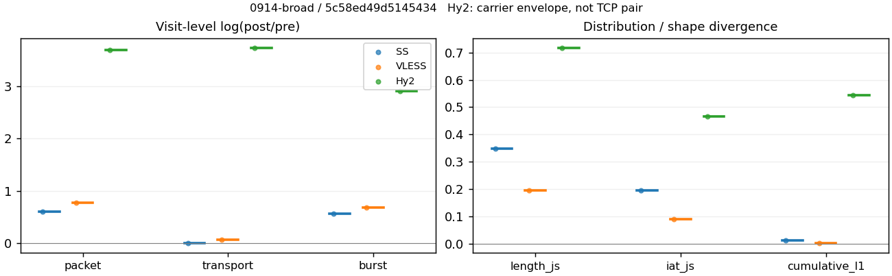
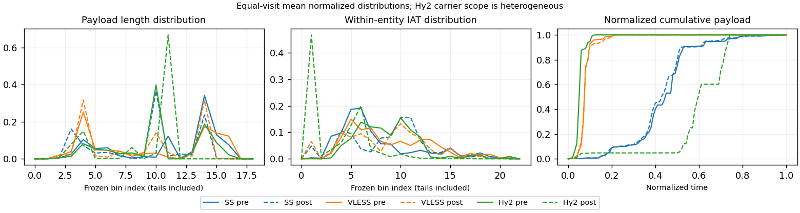

# 0914-broad · 条目 048 · unsplash.com

目标：https://unsplash.com/

活动标签：unsplash.com::page_load。选定访问 3 次。

[返回总索引](../../README.md) · [统计口径](../../methods.md)

## 覆盖与资格（每次访问均保留）

| 部署 | 重复 | 主请求路由 | 活动状态 | 代理比较 | DIRECT pre | 请求 proxy/direct/unresolved | 错误 |
| --- | --- | --- | --- | --- | --- | --- | --- |
| Hy2 | 1 | proxy | passed | 1 | 0 | 48/0/0 | [] |
| SS | 1 | proxy | passed | 1 | 0 | 51/0/0 | [] |
| VLESS | 1 | proxy | passed | 1 | 0 | 52/0/0 | [] |

主请求非 proxy 的统计仅解释为已索引的辅助代理连接或 DIRECT 观测，不代表目标业务经代理传输。播放确认与配对资格是两道不同的门。

图中散点为单次访问，短线为重复中位数；Hy2 是共享载体包络，不能与 TCP 配对作等范围因果对比。

形态图先逐访问归一化，再对访问等权平均；实线 pre，虚线 post。分箱序号及边界见 methods，不将分箱索引误解为长度或时间。

## 每次访问的关键观测

### SS

范围：`exclusive_page`。每格 pre → post；空值为不可观测/不适用。

| 重复 | 包数 | 载荷字节 | burst | TCP FR | IAT中位µs | length JS | IAT JS |
| --- | --- | --- | --- | --- | --- | --- | --- |
| 1 | 816 → 1492 | 1.1194e+06 → 1.1319e+06 | 625 → 1095 | 57 → 57 | 36.22 → 504.33 | 0.34859 | 0.19476 |

完整标量统计：中位数 [min,max]；Δ 为重复内逐访问变换的中位数，MAD 未缩放。n 为可用变换数；DIRECT-only 的 nΔ=0 不代表 pre 不可用。

| scope | 特征 | pre | post | Δ | IQRΔ | MADΔ | nΔ |
| --- | --- | --- | --- | --- | --- | --- | --- |
| exclusive_page | active_span_sum_s_1000ms | 14.079 [14.079, 14.079] | 13.875 [13.875, 13.875] | -0.014595 | — | — | 1 |
| exclusive_page | active_span_sum_s_100ms | 2.4732 [2.4732, 2.4732] | 4.6975 [4.6975, 4.6975] | 0.64154 | — | — | 1 |
| exclusive_page | active_span_sum_s_500ms | 9.3417 [9.3417, 9.3417] | 10.326 [10.326, 10.326] | 0.10014 | — | — | 1 |
| exclusive_page | burst_bytes_iqr | 2896 [2896, 2896] | 1468 [1468, 1468] | -0.67943 | — | — | 1 |
| exclusive_page | burst_bytes_mad | 38 [38, 38] | 34 [34, 34] | -0.11123 | — | — | 1 |
| exclusive_page | burst_bytes_max | 20480 [20480, 20480] | 11424 [11424, 11424] | -0.58373 | — | — | 1 |
| exclusive_page | burst_bytes_mean | 1791 [1791, 1791] | 1033.7 [1033.7, 1033.7] | -0.54961 | — | — | 1 |
| exclusive_page | burst_bytes_median | 38 [38, 38] | 34 [34, 34] | -0.11123 | — | — | 1 |
| exclusive_page | burst_bytes_min | 0 [0, 0] | 0 [0, 0] | — | — | — | 0 |
| exclusive_page | burst_bytes_p95 | 8192 [8192, 8192] | 4284 [4284, 4284] | -0.64827 | — | — | 1 |
| exclusive_page | burst_bytes_q25 | 0 [0, 0] | 0 [0, 0] | — | — | — | 0 |
| exclusive_page | burst_bytes_q75 | 2896 [2896, 2896] | 1468 [1468, 1468] | -0.67943 | — | — | 1 |
| exclusive_page | burst_bytes_std | 3155.7 [3155.7, 3155.7] | 1528.5 [1528.5, 1528.5] | -0.72493 | — | — | 1 |
| exclusive_page | burst_count | 625 [625, 625] | 1095 [1095, 1095] | 0.56076 | — | — | 1 |
| exclusive_page | burst_duration_ms_iqr | 0 [0, 0] | 0 [0, 0] | — | — | — | 0 |
| exclusive_page | burst_duration_ms_mad | 0 [0, 0] | 0 [0, 0] | — | — | — | 0 |
| exclusive_page | burst_duration_ms_max | 2852.5 [2852.5, 2852.5] | 2851.7 [2851.7, 2851.7] | -0.00027137 | — | — | 1 |
| exclusive_page | burst_duration_ms_mean | 28.744 [28.744, 28.744] | 14.441 [14.441, 14.441] | -0.68833 | — | — | 1 |
| exclusive_page | burst_duration_ms_median | 0 [0, 0] | 0 [0, 0] | — | — | — | 0 |
| exclusive_page | burst_duration_ms_min | 0 [0, 0] | 0 [0, 0] | — | — | — | 0 |
| exclusive_page | burst_duration_ms_p95 | 97.798 [97.798, 97.798] | 2.0037 [2.0037, 2.0037] | -3.8879 | — | — | 1 |
| exclusive_page | burst_duration_ms_q25 | 0 [0, 0] | 0 [0, 0] | — | — | — | 0 |
| exclusive_page | burst_duration_ms_q75 | 0 [0, 0] | 0 [0, 0] | — | — | — | 0 |
| exclusive_page | burst_duration_ms_std | 186.54 [186.54, 186.54] | 138.17 [138.17, 138.17] | -0.30016 | — | — | 1 |
| exclusive_page | burst_packets_iqr | 0 [0, 0] | 0 [0, 0] | — | — | — | 0 |
| exclusive_page | burst_packets_mad | 0 [0, 0] | 0 [0, 0] | — | — | — | 0 |
| exclusive_page | burst_packets_max | 10 [10, 10] | 7 [7, 7] | -0.35667 | — | — | 1 |
| exclusive_page | burst_packets_mean | 1.3056 [1.3056, 1.3056] | 1.3626 [1.3626, 1.3626] | 0.0427 | — | — | 1 |
| exclusive_page | burst_packets_median | 1 [1, 1] | 1 [1, 1] | 0 | — | — | 1 |
| exclusive_page | burst_packets_min | 1 [1, 1] | 1 [1, 1] | 0 | — | — | 1 |
| exclusive_page | burst_packets_p95 | 3 [3, 3] | 3 [3, 3] | 0 | — | — | 1 |
| exclusive_page | burst_packets_q25 | 1 [1, 1] | 1 [1, 1] | 0 | — | — | 1 |
| exclusive_page | burst_packets_q75 | 1 [1, 1] | 1 [1, 1] | 0 | — | — | 1 |
| exclusive_page | burst_packets_std | 0.78652 [0.78652, 0.78652] | 0.79327 [0.79327, 0.79327] | 0.0085541 | — | — | 1 |
| exclusive_page | connection_span_concurrency_max | 7 [7, 7] | 7 [7, 7] | 0 | — | — | 1 |
| exclusive_page | cumulative_l1 | — | — | 0.012535 | — | — | 1 |
| exclusive_page | cumulative_max | — | — | 0.13736 | — | — | 1 |
| exclusive_page | direction_entropy | 0.70407 [0.70407, 0.70407] | 0.44131 [0.44131, 0.44131] | -0.26276 | — | — | 1 |
| exclusive_page | down_burst_count | 308 [308, 308] | 543 [543, 543] | 0.56701 | — | — | 1 |
| exclusive_page | down_ip_bytes | 1.1135e+06 [1.1135e+06, 1.1135e+06] | 1.1426e+06 [1.1426e+06, 1.1426e+06] | 0.025824 | — | — | 1 |
| exclusive_page | down_packets | 450 [450, 450] | 838 [838, 838] | 0.62177 | — | — | 1 |
| exclusive_page | down_transport_bytes | 1.09e+06 [1.09e+06, 1.09e+06] | 1.099e+06 [1.099e+06, 1.099e+06] | 0.00817 | — | — | 1 |
| exclusive_page | duration_s | 4.8573 [4.8573, 4.8573] | 4.8568 [4.8568, 4.8568] | -0.00011236 | — | — | 1 |
| exclusive_page | entity_count | 9 [9, 9] | 9 [9, 9] | 0 | — | — | 1 |
| exclusive_page | fr_runs | 57 [57, 57] | 57 [57, 57] | 0 | — | — | 1 |
| exclusive_page | fr_runs_per_packet | 0.13134 [0.13134, 0.13134] | 0.068592 [0.068592, 0.068592] | -0.062744 | — | — | 1 |
| exclusive_page | fr_switches | 48 [48, 48] | 48 [48, 48] | 0 | — | — | 1 |
| exclusive_page | fr_switches_per_possible_transition | 0.11294 [0.11294, 0.11294] | 0.058394 [0.058394, 0.058394] | -0.054547 | — | — | 1 |
| exclusive_page | full_retransmission_fraction | 0.0012255 [0.0012255, 0.0012255] | 0.0013405 [0.0013405, 0.0013405] | 0.00011499 | — | — | 1 |
| exclusive_page | full_retransmission_packets | 1 [1, 1] | 2 [2, 2] | 0.69315 | — | — | 1 |
| exclusive_page | iat_count | 807 [807, 807] | 1483 [1483, 1483] | 0.6085 | — | — | 1 |
| exclusive_page | iat_js | — | — | 0.19476 | — | — | 1 |
| exclusive_page | iat_ks | — | — | 0.33605 | — | — | 1 |
| exclusive_page | iat_median_us | 36.22 [36.22, 36.22] | 504.33 [504.33, 504.33] | 2.6336 | — | — | 1 |
| exclusive_page | iat_us_iqr | 290.78 [290.78, 290.78] | 1129.3 [1129.3, 1129.3] | 1.3568 | — | — | 1 |
| exclusive_page | iat_us_mad | 30.602 [30.602, 30.602] | 495.56 [495.56, 495.56] | 2.7846 | — | — | 1 |
| exclusive_page | iat_us_max | 2.8525e+06 [2.8525e+06, 2.8525e+06] | 2.8517e+06 [2.8517e+06, 2.8517e+06] | -0.00027137 | — | — | 1 |
| exclusive_page | iat_us_mean | 27115 [27115, 27115] | 14619 [14619, 14619] | -0.61774 | — | — | 1 |
| exclusive_page | iat_us_median | 36.22 [36.22, 36.22] | 504.33 [504.33, 504.33] | 2.6336 | — | — | 1 |
| exclusive_page | iat_us_min | 0.297 [0.297, 0.297] | 0.037 [0.037, 0.037] | -2.0828 | — | — | 1 |
| exclusive_page | iat_us_p95 | 93613 [93613, 93613] | 33447 [33447, 33447] | -1.0292 | — | — | 1 |
| exclusive_page | iat_us_q25 | 13.411 [13.411, 13.411] | 16.452 [16.452, 16.452] | 0.20437 | — | — | 1 |
| exclusive_page | iat_us_q75 | 304.2 [304.2, 304.2] | 1145.8 [1145.8, 1145.8] | 1.3262 | — | — | 1 |
| exclusive_page | iat_us_std | 1.6766e+05 [1.6766e+05, 1.6766e+05] | 1.2094e+05 [1.2094e+05, 1.2094e+05] | -0.32663 | — | — | 1 |
| exclusive_page | iat_wasserstein_log1p_us | — | — | 1.2597 | — | — | 1 |
| exclusive_page | idle_gap_count_1000ms | 4 [4, 4] | 4 [4, 4] | 0 | — | — | 1 |
| exclusive_page | idle_gap_count_100ms | 39 [39, 39] | 34 [34, 34] | -0.1372 | — | — | 1 |
| exclusive_page | idle_gap_count_500ms | 11 [11, 11] | 9 [9, 9] | -0.20067 | — | — | 1 |
| exclusive_page | idle_gap_sum_s_1000ms | 7.8032 [7.8032, 7.8032] | 7.8058 [7.8058, 7.8058] | 0.00033345 | — | — | 1 |
| exclusive_page | idle_gap_sum_s_100ms | 19.409 [19.409, 19.409] | 16.983 [16.983, 16.983] | -0.13351 | — | — | 1 |
| exclusive_page | idle_gap_sum_s_500ms | 12.54 [12.54, 12.54] | 11.355 [11.355, 11.355] | -0.099293 | — | — | 1 |
| exclusive_page | ip_bytes | 1.162e+06 [1.162e+06, 1.162e+06] | 1.221e+06 [1.221e+06, 1.221e+06] | 0.049584 | — | — | 1 |
| exclusive_page | length_iqr | 2359.2 [2359.2, 2359.2] | 1425 [1425, 1425] | -0.50417 | — | — | 1 |
| exclusive_page | length_js | — | — | 0.34859 | — | — | 1 |
| exclusive_page | length_ks | — | — | 0.51933 | — | — | 1 |
| exclusive_page | length_mad | 1448 [1448, 1448] | 1223 [1223, 1223] | -0.16888 | — | — | 1 |
| exclusive_page | length_max | 8192 [8192, 8192] | 5712 [5712, 5712] | -0.36059 | — | — | 1 |
| exclusive_page | length_mean | 2579.2 [2579.2, 2579.2] | 1362.1 [1362.1, 1362.1] | -0.63843 | — | — | 1 |
| exclusive_page | length_median | 2896 [2896, 2896] | 1428 [1428, 1428] | -0.70706 | — | — | 1 |
| exclusive_page | length_min | 31 [31, 31] | 19 [19, 19] | -0.48955 | — | — | 1 |
| exclusive_page | length_p95 | 8192 [8192, 8192] | 2856 [2856, 2856] | -1.0537 | — | — | 1 |
| exclusive_page | length_q25 | 536.75 [536.75, 536.75] | 148 [148, 148] | -1.2883 | — | — | 1 |
| exclusive_page | length_q75 | 2896 [2896, 2896] | 1573 [1573, 1573] | -0.61035 | — | — | 1 |
| exclusive_page | length_std | 2239.5 [2239.5, 2239.5] | 1034.6 [1034.6, 1034.6] | -0.77228 | — | — | 1 |
| exclusive_page | length_wasserstein_bytes | — | — | 1217.1 | — | — | 1 |
| exclusive_page | nonempty_entity_count | 9 [9, 9] | 9 [9, 9] | 0 | — | — | 1 |
| exclusive_page | nonempty_packets | 434 [434, 434] | 831 [831, 831] | 0.64959 | — | — | 1 |
| exclusive_page | offload_suspect_fraction | 0.3125 [0.3125, 0.3125] | 0.16086 [0.16086, 0.16086] | -0.15164 | — | — | 1 |
| exclusive_page | packet_count | 816 [816, 816] | 1492 [1492, 1492] | 0.60346 | — | — | 1 |
| exclusive_page | rtt_median_ms | 0.029624 [0.029624, 0.029624] | 33.705 [33.705, 33.705] | 7.0368 | — | — | 1 |
| exclusive_page | rtt_sample_count | 358 [358, 358] | 261 [261, 261] | -0.31601 | — | — | 1 |
| exclusive_page | tcp_ack_count | 807 [807, 807] | 1483 [1483, 1483] | 0.6085 | — | — | 1 |
| exclusive_page | tcp_fin_count | 18 [18, 18] | 18 [18, 18] | 0 | — | — | 1 |
| exclusive_page | tcp_packet_count | 816 [816, 816] | 1492 [1492, 1492] | 0.60346 | — | — | 1 |
| exclusive_page | tcp_rst_count | 0 [0, 0] | 0 [0, 0] | — | — | — | 0 |
| exclusive_page | tcp_syn_count | 18 [18, 18] | 18 [18, 18] | 0 | — | — | 1 |
| exclusive_page | tcp_window_raw_median | 65535 [65535, 65535] | 145 [145, 145] | -6.1136 | — | — | 1 |
| exclusive_page | transition_entropy | 0.43752 [0.43752, 0.43752] | 0.24868 [0.24868, 0.24868] | -0.18885 | — | — | 1 |
| exclusive_page | transition_n_mm | 323 [323, 323] | 727 [727, 727] | 0.81127 | — | — | 1 |
| exclusive_page | transition_n_mp | 20 [20, 20] | 20 [20, 20] | 0 | — | — | 1 |
| exclusive_page | transition_n_pm | 28 [28, 28] | 28 [28, 28] | 0 | — | — | 1 |
| exclusive_page | transition_n_pp | 54 [54, 54] | 47 [47, 47] | -0.13884 | — | — | 1 |
| exclusive_page | transition_p_mm | 0.94169 [0.94169, 0.94169] | 0.97323 [0.97323, 0.97323] | 0.031535 | — | — | 1 |
| exclusive_page | transition_p_mp | 0.058309 [0.058309, 0.058309] | 0.026774 [0.026774, 0.026774] | -0.031535 | — | — | 1 |
| exclusive_page | transition_p_pm | 0.34146 [0.34146, 0.34146] | 0.37333 [0.37333, 0.37333] | 0.03187 | — | — | 1 |
| exclusive_page | transition_p_pp | 0.65854 [0.65854, 0.65854] | 0.62667 [0.62667, 0.62667] | -0.03187 | — | — | 1 |
| exclusive_page | transport_bytes | 1.1194e+06 [1.1194e+06, 1.1194e+06] | 1.1319e+06 [1.1319e+06, 1.1319e+06] | 0.011151 | — | — | 1 |
| exclusive_page | up_burst_count | 317 [317, 317] | 552 [552, 552] | 0.55465 | — | — | 1 |
| exclusive_page | up_byte_fraction | 0.026228 [0.026228, 0.026228] | 0.029126 [0.029126, 0.029126] | 0.0028984 | — | — | 1 |
| exclusive_page | up_ip_bytes | 48475 [48475, 48475] | 78413 [78413, 78413] | 0.48094 | — | — | 1 |
| exclusive_page | up_packets | 366 [366, 366] | 654 [654, 654] | 0.58047 | — | — | 1 |
| exclusive_page | up_transport_bytes | 29359 [29359, 29359] | 32969 [32969, 32969] | 0.11597 | — | — | 1 |
| exclusive_page | zero_iat_count | 0 [0, 0] | 0 [0, 0] | — | — | — | 0 |
| exclusive_page | zero_iat_fraction | 0 [0, 0] | 0 [0, 0] | 0 | — | — | 1 |

### VLESS

范围：`exclusive_page`。每格 pre → post；空值为不可观测/不适用。

| 重复 | 包数 | 载荷字节 | burst | TCP FR | IAT中位µs | length JS | IAT JS |
| --- | --- | --- | --- | --- | --- | --- | --- |
| 1 | 749 → 1620 | 1.1289e+06 → 1.2177e+06 | 522 → 1040 | 65 → 98 | 123.31 → 392.39 | 0.19519 | 0.090624 |

完整标量统计：中位数 [min,max]；Δ 为重复内逐访问变换的中位数，MAD 未缩放。n 为可用变换数；DIRECT-only 的 nΔ=0 不代表 pre 不可用。

| scope | 特征 | pre | post | Δ | IQRΔ | MADΔ | nΔ |
| --- | --- | --- | --- | --- | --- | --- | --- |
| exclusive_page | active_span_sum_s_1000ms | 16.963 [16.963, 16.963] | 16.715 [16.715, 16.715] | -0.014748 | — | — | 1 |
| exclusive_page | active_span_sum_s_100ms | 2.0782 [2.0782, 2.0782] | 5.5486 [5.5486, 5.5486] | 0.98203 | — | — | 1 |
| exclusive_page | active_span_sum_s_500ms | 7.2691 [7.2691, 7.2691] | 14.125 [14.125, 14.125] | 0.66428 | — | — | 1 |
| exclusive_page | burst_bytes_iqr | 2372 [2372, 2372] | 2824 [2824, 2824] | 0.17442 | — | — | 1 |
| exclusive_page | burst_bytes_mad | 24 [24, 24] | 46 [46, 46] | 0.65059 | — | — | 1 |
| exclusive_page | burst_bytes_max | 25119 [25119, 25119] | 20077 [20077, 20077] | -0.22405 | — | — | 1 |
| exclusive_page | burst_bytes_mean | 2162.6 [2162.6, 2162.6] | 1170.9 [1170.9, 1170.9] | -0.61358 | — | — | 1 |
| exclusive_page | burst_bytes_median | 24 [24, 24] | 46 [46, 46] | 0.65059 | — | — | 1 |
| exclusive_page | burst_bytes_min | 0 [0, 0] | 0 [0, 0] | — | — | — | 0 |
| exclusive_page | burst_bytes_p95 | 16384 [16384, 16384] | 2896 [2896, 2896] | -1.733 | — | — | 1 |
| exclusive_page | burst_bytes_q25 | 0 [0, 0] | 0 [0, 0] | — | — | — | 0 |
| exclusive_page | burst_bytes_q75 | 2372 [2372, 2372] | 2824 [2824, 2824] | 0.17442 | — | — | 1 |
| exclusive_page | burst_bytes_std | 4619.8 [4619.8, 4619.8] | 1462.3 [1462.3, 1462.3] | -1.1503 | — | — | 1 |
| exclusive_page | burst_count | 522 [522, 522] | 1040 [1040, 1040] | 0.68931 | — | — | 1 |
| exclusive_page | burst_duration_ms_iqr | 0.27974 [0.27974, 0.27974] | 0.88113 [0.88113, 0.88113] | 1.1474 | — | — | 1 |
| exclusive_page | burst_duration_ms_mad | 0 [0, 0] | 0 [0, 0] | — | — | — | 0 |
| exclusive_page | burst_duration_ms_max | 5248.7 [5248.7, 5248.7] | 15035 [15035, 15035] | 1.0524 | — | — | 1 |
| exclusive_page | burst_duration_ms_mean | 66.056 [66.056, 66.056] | 54.455 [54.455, 54.455] | -0.19314 | — | — | 1 |
| exclusive_page | burst_duration_ms_median | 0 [0, 0] | 0 [0, 0] | — | — | — | 0 |
| exclusive_page | burst_duration_ms_min | 0 [0, 0] | 0 [0, 0] | — | — | — | 0 |
| exclusive_page | burst_duration_ms_p95 | 201.21 [201.21, 201.21] | 32.678 [32.678, 32.678] | -1.8176 | — | — | 1 |
| exclusive_page | burst_duration_ms_q25 | 0 [0, 0] | 0 [0, 0] | — | — | — | 0 |
| exclusive_page | burst_duration_ms_q75 | 0.27974 [0.27974, 0.27974] | 0.88113 [0.88113, 0.88113] | 1.1474 | — | — | 1 |
| exclusive_page | burst_duration_ms_std | 430.26 [430.26, 430.26] | 806.56 [806.56, 806.56] | 0.62839 | — | — | 1 |
| exclusive_page | burst_packets_iqr | 1 [1, 1] | 1 [1, 1] | 0 | — | — | 1 |
| exclusive_page | burst_packets_mad | 0 [0, 0] | 0 [0, 0] | — | — | — | 0 |
| exclusive_page | burst_packets_max | 12 [12, 12] | 8 [8, 8] | -0.40547 | — | — | 1 |
| exclusive_page | burst_packets_mean | 1.4349 [1.4349, 1.4349] | 1.5577 [1.5577, 1.5577] | 0.082134 | — | — | 1 |
| exclusive_page | burst_packets_median | 1 [1, 1] | 1 [1, 1] | 0 | — | — | 1 |
| exclusive_page | burst_packets_min | 1 [1, 1] | 1 [1, 1] | 0 | — | — | 1 |
| exclusive_page | burst_packets_p95 | 2 [2, 2] | 3 [3, 3] | 0.40547 | — | — | 1 |
| exclusive_page | burst_packets_q25 | 1 [1, 1] | 1 [1, 1] | 0 | — | — | 1 |
| exclusive_page | burst_packets_q75 | 2 [2, 2] | 2 [2, 2] | 0 | — | — | 1 |
| exclusive_page | burst_packets_std | 0.75593 [0.75593, 0.75593] | 0.90327 [0.90327, 0.90327] | 0.17808 | — | — | 1 |
| exclusive_page | connection_span_concurrency_max | 7 [7, 7] | 7 [7, 7] | 0 | — | — | 1 |
| exclusive_page | cumulative_l1 | — | — | 0.0034182 | — | — | 1 |
| exclusive_page | cumulative_max | — | — | 0.034188 | — | — | 1 |
| exclusive_page | direction_entropy | 0.73828 [0.73828, 0.73828] | 0.46486 [0.46486, 0.46486] | -0.27343 | — | — | 1 |
| exclusive_page | down_burst_count | 256 [256, 256] | 518 [518, 518] | 0.7048 | — | — | 1 |
| exclusive_page | down_ip_bytes | 1.1187e+06 [1.1187e+06, 1.1187e+06] | 1.2151e+06 [1.2151e+06, 1.2151e+06] | 0.082718 | — | — | 1 |
| exclusive_page | down_packets | 424 [424, 424] | 957 [957, 957] | 0.81407 | — | — | 1 |
| exclusive_page | down_transport_bytes | 1.0965e+06 [1.0965e+06, 1.0965e+06] | 1.1653e+06 [1.1653e+06, 1.1653e+06] | 0.060803 | — | — | 1 |
| exclusive_page | duration_s | 24.6 [24.6, 24.6] | 24.628 [24.628, 24.628] | 0.0011469 | — | — | 1 |
| exclusive_page | entity_count | 10 [10, 10] | 10 [10, 10] | 0 | — | — | 1 |
| exclusive_page | fr_runs | 65 [65, 65] | 98 [98, 98] | 0.41058 | — | — | 1 |
| exclusive_page | fr_runs_per_packet | 0.15931 [0.15931, 0.15931] | 0.10629 [0.10629, 0.10629] | -0.053023 | — | — | 1 |
| exclusive_page | fr_switches | 55 [55, 55] | 88 [88, 88] | 0.47 | — | — | 1 |
| exclusive_page | fr_switches_per_possible_transition | 0.13819 [0.13819, 0.13819] | 0.096491 [0.096491, 0.096491] | -0.0417 | — | — | 1 |
| exclusive_page | full_retransmission_fraction | 0.0013351 [0.0013351, 0.0013351] | 0 [0, 0] | -0.0013351 | — | — | 1 |
| exclusive_page | full_retransmission_packets | 1 [1, 1] | 0 [0, 0] | — | — | — | 0 |
| exclusive_page | iat_count | 739 [739, 739] | 1610 [1610, 1610] | 0.77869 | — | — | 1 |
| exclusive_page | iat_js | — | — | 0.090624 | — | — | 1 |
| exclusive_page | iat_ks | — | — | 0.10107 | — | — | 1 |
| exclusive_page | iat_median_us | 123.31 [123.31, 123.31] | 392.39 [392.39, 392.39] | 1.1575 | — | — | 1 |
| exclusive_page | iat_us_iqr | 3262.6 [3262.6, 3262.6] | 1473 [1473, 1473] | -0.79518 | — | — | 1 |
| exclusive_page | iat_us_mad | 115.75 [115.75, 115.75] | 384.37 [384.37, 384.37] | 1.2002 | — | — | 1 |
| exclusive_page | iat_us_max | 1.5001e+07 [1.5001e+07, 1.5001e+07] | 1.5035e+07 [1.5035e+07, 1.5035e+07] | 0.0022291 | — | — | 1 |
| exclusive_page | iat_us_mean | 1.3139e+05 [1.3139e+05, 1.3139e+05] | 60009 [60009, 60009] | -0.78364 | — | — | 1 |
| exclusive_page | iat_us_median | 123.31 [123.31, 123.31] | 392.39 [392.39, 392.39] | 1.1575 | — | — | 1 |
| exclusive_page | iat_us_min | 2.299 [2.299, 2.299] | 0.033 [0.033, 0.033] | -4.2437 | — | — | 1 |
| exclusive_page | iat_us_p95 | 1.9633e+05 [1.9633e+05, 1.9633e+05] | 45654 [45654, 45654] | -1.4587 | — | — | 1 |
| exclusive_page | iat_us_q25 | 19.694 [19.694, 19.694] | 17.178 [17.178, 17.178] | -0.13668 | — | — | 1 |
| exclusive_page | iat_us_q75 | 3282.2 [3282.2, 3282.2] | 1490.2 [1490.2, 1490.2] | -0.7896 | — | — | 1 |
| exclusive_page | iat_us_std | 1.1557e+06 [1.1557e+06, 1.1557e+06] | 7.8358e+05 [7.8358e+05, 7.8358e+05] | -0.38863 | — | — | 1 |
| exclusive_page | iat_wasserstein_log1p_us | — | — | 0.60478 | — | — | 1 |
| exclusive_page | idle_gap_count_1000ms | 9 [9, 9] | 9 [9, 9] | 0 | — | — | 1 |
| exclusive_page | idle_gap_count_100ms | 48 [48, 48] | 56 [56, 56] | 0.15415 | — | — | 1 |
| exclusive_page | idle_gap_count_500ms | 22 [22, 22] | 12 [12, 12] | -0.60614 | — | — | 1 |
| exclusive_page | idle_gap_sum_s_1000ms | 80.131 [80.131, 80.131] | 79.9 [79.9, 79.9] | -0.0028884 | — | — | 1 |
| exclusive_page | idle_gap_sum_s_100ms | 95.016 [95.016, 95.016] | 91.066 [91.066, 91.066] | -0.042459 | — | — | 1 |
| exclusive_page | idle_gap_sum_s_500ms | 89.825 [89.825, 89.825] | 82.49 [82.49, 82.49] | -0.085185 | — | — | 1 |
| exclusive_page | ip_bytes | 1.1679e+06 [1.1679e+06, 1.1679e+06] | 1.3029e+06 [1.3029e+06, 1.3029e+06] | 0.10933 | — | — | 1 |
| exclusive_page | length_iqr | 4008.2 [4008.2, 4008.2] | 2752 [2752, 2752] | -0.37603 | — | — | 1 |
| exclusive_page | length_js | — | — | 0.19519 | — | — | 1 |
| exclusive_page | length_ks | — | — | 0.26772 | — | — | 1 |
| exclusive_page | length_mad | 1340 [1340, 1340] | 1340 [1340, 1340] | 0 | — | — | 1 |
| exclusive_page | length_max | 8920 [8920, 8920] | 5792 [5792, 5792] | -0.43182 | — | — | 1 |
| exclusive_page | length_mean | 2766.9 [2766.9, 2766.9] | 1320.7 [1320.7, 1320.7] | -0.73955 | — | — | 1 |
| exclusive_page | length_median | 1412 [1412, 1412] | 1412 [1412, 1412] | 0 | — | — | 1 |
| exclusive_page | length_min | 24 [24, 24] | 24 [24, 24] | 0 | — | — | 1 |
| exclusive_page | length_p95 | 8920 [8920, 8920] | 2896 [2896, 2896] | -1.125 | — | — | 1 |
| exclusive_page | length_q25 | 87.75 [87.75, 87.75] | 72 [72, 72] | -0.19783 | — | — | 1 |
| exclusive_page | length_q75 | 4096 [4096, 4096] | 2824 [2824, 2824] | -0.37186 | — | — | 1 |
| exclusive_page | length_std | 3221.3 [3221.3, 3221.3] | 1187.1 [1187.1, 1187.1] | -0.99826 | — | — | 1 |
| exclusive_page | length_wasserstein_bytes | — | — | 1483.1 | — | — | 1 |
| exclusive_page | nonempty_entity_count | 10 [10, 10] | 10 [10, 10] | 0 | — | — | 1 |
| exclusive_page | nonempty_packets | 408 [408, 408] | 922 [922, 922] | 0.81528 | — | — | 1 |
| exclusive_page | offload_suspect_fraction | 0.25634 [0.25634, 0.25634] | 0.19568 [0.19568, 0.19568] | -0.060663 | — | — | 1 |
| exclusive_page | packet_count | 749 [749, 749] | 1620 [1620, 1620] | 0.77144 | — | — | 1 |
| exclusive_page | rtt_median_ms | 0.079383 [0.079383, 0.079383] | 0.94031 [0.94031, 0.94031] | 2.4719 | — | — | 1 |
| exclusive_page | rtt_sample_count | 302 [302, 302] | 638 [638, 638] | 0.74791 | — | — | 1 |
| exclusive_page | tcp_ack_count | 733 [733, 733] | 1610 [1610, 1610] | 0.78684 | — | — | 1 |
| exclusive_page | tcp_fin_count | 20 [20, 20] | 20 [20, 20] | 0 | — | — | 1 |
| exclusive_page | tcp_packet_count | 749 [749, 749] | 1620 [1620, 1620] | 0.77144 | — | — | 1 |
| exclusive_page | tcp_rst_count | 6 [6, 6] | 0 [0, 0] | — | — | — | 0 |
| exclusive_page | tcp_syn_count | 20 [20, 20] | 20 [20, 20] | 0 | — | — | 1 |
| exclusive_page | tcp_window_raw_median | 65535 [65535, 65535] | 162 [162, 162] | -6.0027 | — | — | 1 |
| exclusive_page | transition_entropy | 0.50051 [0.50051, 0.50051] | 0.34754 [0.34754, 0.34754] | -0.15297 | — | — | 1 |
| exclusive_page | transition_n_mm | 291 [291, 291] | 782 [782, 782] | 0.98853 | — | — | 1 |
| exclusive_page | transition_n_mp | 23 [23, 23] | 39 [39, 39] | 0.52807 | — | — | 1 |
| exclusive_page | transition_n_pm | 32 [32, 32] | 49 [49, 49] | 0.42608 | — | — | 1 |
| exclusive_page | transition_n_pp | 52 [52, 52] | 42 [42, 42] | -0.21357 | — | — | 1 |
| exclusive_page | transition_p_mm | 0.92675 [0.92675, 0.92675] | 0.9525 [0.9525, 0.9525] | 0.025745 | — | — | 1 |
| exclusive_page | transition_p_mp | 0.073248 [0.073248, 0.073248] | 0.047503 [0.047503, 0.047503] | -0.025745 | — | — | 1 |
| exclusive_page | transition_p_pm | 0.38095 [0.38095, 0.38095] | 0.53846 [0.53846, 0.53846] | 0.15751 | — | — | 1 |
| exclusive_page | transition_p_pp | 0.61905 [0.61905, 0.61905] | 0.46154 [0.46154, 0.46154] | -0.15751 | — | — | 1 |
| exclusive_page | transport_bytes | 1.1289e+06 [1.1289e+06, 1.1289e+06] | 1.2177e+06 [1.2177e+06, 1.2177e+06] | 0.075727 | — | — | 1 |
| exclusive_page | up_burst_count | 266 [266, 266] | 522 [522, 522] | 0.67417 | — | — | 1 |
| exclusive_page | up_byte_fraction | 0.02865 [0.02865, 0.02865] | 0.043039 [0.043039, 0.043039] | 0.014389 | — | — | 1 |
| exclusive_page | up_ip_bytes | 49262 [49262, 49262] | 87720 [87720, 87720] | 0.577 | — | — | 1 |
| exclusive_page | up_packets | 325 [325, 325] | 663 [663, 663] | 0.71295 | — | — | 1 |
| exclusive_page | up_transport_bytes | 32342 [32342, 32342] | 52408 [52408, 52408] | 0.48269 | — | — | 1 |
| exclusive_page | zero_iat_count | 0 [0, 0] | 0 [0, 0] | — | — | — | 0 |
| exclusive_page | zero_iat_fraction | 0 [0, 0] | 0 [0, 0] | 0 | — | — | 1 |

### Hy2

范围：`carrier_context_envelope`。每格 pre → post；空值为不可观测/不适用。

| 重复 | 包数 | 载荷字节 | burst | TCP FR | IAT中位µs | length JS | IAT JS |
| --- | --- | --- | --- | --- | --- | --- | --- |
| 1 | 1085 → 43415 | 1.1287e+06 → 4.688e+07 | 832 → 15155 | — | 190.86 → 3.6175 | 0.71605 | 0.46529 |

完整标量统计：中位数 [min,max]；Δ 为重复内逐访问变换的中位数，MAD 未缩放。n 为可用变换数；DIRECT-only 的 nΔ=0 不代表 pre 不可用。

| scope | 特征 | pre | post | Δ | IQRΔ | MADΔ | nΔ |
| --- | --- | --- | --- | --- | --- | --- | --- |
| carrier_context_envelope | active_span_sum_s_1000ms | 8.8129 [8.8129, 8.8129] | 10.468 [10.468, 10.468] | 0.17207 | — | — | 1 |
| carrier_context_envelope | active_span_sum_s_100ms | 1.2534 [1.2534, 1.2534] | 5.5952 [5.5952, 5.5952] | 1.496 | — | — | 1 |
| carrier_context_envelope | active_span_sum_s_500ms | 8.0197 [8.0197, 8.0197] | 9.6847 [9.6847, 9.6847] | 0.18864 | — | — | 1 |
| carrier_context_envelope | burst_bytes_iqr | 1406 [1406, 1406] | 4190 [4190, 4190] | 1.092 | — | — | 1 |
| carrier_context_envelope | burst_bytes_mad | 34.5 [34.5, 34.5] | 367 [367, 367] | 2.3644 | — | — | 1 |
| carrier_context_envelope | burst_bytes_max | 20480 [20480, 20480] | 2.5741e+05 [2.5741e+05, 2.5741e+05] | 2.5312 | — | — | 1 |
| carrier_context_envelope | burst_bytes_mean | 1356.7 [1356.7, 1356.7] | 3093.4 [3093.4, 3093.4] | 0.82424 | — | — | 1 |
| carrier_context_envelope | burst_bytes_median | 34.5 [34.5, 34.5] | 400 [400, 400] | 2.4505 | — | — | 1 |
| carrier_context_envelope | burst_bytes_min | 0 [0, 0] | 25 [25, 25] | — | — | — | 0 |
| carrier_context_envelope | burst_bytes_p95 | 5616 [5616, 5616] | 10932 [10932, 10932] | 0.66607 | — | — | 1 |
| carrier_context_envelope | burst_bytes_q25 | 0 [0, 0] | 100 [100, 100] | — | — | — | 0 |
| carrier_context_envelope | burst_bytes_q75 | 1406 [1406, 1406] | 4290 [4290, 4290] | 1.1155 | — | — | 1 |
| carrier_context_envelope | burst_bytes_std | 2639.2 [2639.2, 2639.2] | 6899.5 [6899.5, 6899.5] | 0.96099 | — | — | 1 |
| carrier_context_envelope | burst_count | 832 [832, 832] | 15155 [15155, 15155] | 2.9023 | — | — | 1 |
| carrier_context_envelope | burst_duration_ms_iqr | 0 [0, 0] | 0.023955 [0.023955, 0.023955] | — | — | — | 0 |
| carrier_context_envelope | burst_duration_ms_mad | 0 [0, 0] | 4.3e-05 [4.3e-05, 4.3e-05] | — | — | — | 0 |
| carrier_context_envelope | burst_duration_ms_max | 15000 [15000, 15000] | 208.27 [208.27, 208.27] | -4.277 | — | — | 1 |
| carrier_context_envelope | burst_duration_ms_mean | 58.632 [58.632, 58.632] | 0.21931 [0.21931, 0.21931] | -5.5885 | — | — | 1 |
| carrier_context_envelope | burst_duration_ms_median | 0 [0, 0] | 4.3e-05 [4.3e-05, 4.3e-05] | — | — | — | 0 |
| carrier_context_envelope | burst_duration_ms_min | 0 [0, 0] | 0 [0, 0] | — | — | — | 0 |
| carrier_context_envelope | burst_duration_ms_p95 | 7.9149 [7.9149, 7.9149] | 0.08608 [0.08608, 0.08608] | -4.5212 | — | — | 1 |
| carrier_context_envelope | burst_duration_ms_q25 | 0 [0, 0] | 0 [0, 0] | — | — | — | 0 |
| carrier_context_envelope | burst_duration_ms_q75 | 0 [0, 0] | 0.023955 [0.023955, 0.023955] | — | — | — | 0 |
| carrier_context_envelope | burst_duration_ms_std | 655.64 [655.64, 655.64] | 4.1117 [4.1117, 4.1117] | -5.0718 | — | — | 1 |
| carrier_context_envelope | burst_packets_iqr | 0 [0, 0] | 2 [2, 2] | — | — | — | 0 |
| carrier_context_envelope | burst_packets_mad | 0 [0, 0] | 1 [1, 1] | — | — | — | 0 |
| carrier_context_envelope | burst_packets_max | 8 [8, 8] | 192 [192, 192] | 3.1781 | — | — | 1 |
| carrier_context_envelope | burst_packets_mean | 1.3041 [1.3041, 1.3041] | 2.8647 [2.8647, 2.8647] | 0.78697 | — | — | 1 |
| carrier_context_envelope | burst_packets_median | 1 [1, 1] | 2 [2, 2] | 0.69315 | — | — | 1 |
| carrier_context_envelope | burst_packets_min | 1 [1, 1] | 1 [1, 1] | 0 | — | — | 1 |
| carrier_context_envelope | burst_packets_p95 | 2 [2, 2] | 8 [8, 8] | 1.3863 | — | — | 1 |
| carrier_context_envelope | burst_packets_q25 | 1 [1, 1] | 1 [1, 1] | 0 | — | — | 1 |
| carrier_context_envelope | burst_packets_q75 | 1 [1, 1] | 3 [3, 3] | 1.0986 | — | — | 1 |
| carrier_context_envelope | burst_packets_std | 0.68646 [0.68646, 0.68646] | 4.8575 [4.8575, 4.8575] | 1.9567 | — | — | 1 |
| carrier_context_envelope | connection_span_concurrency_max | 5 [5, 5] | 1 [1, 1] | -1.6094 | — | — | 1 |
| carrier_context_envelope | cumulative_l1 | — | — | 0.54309 | — | — | 1 |
| carrier_context_envelope | cumulative_max | — | — | 0.95216 | — | — | 1 |
| carrier_context_envelope | direction_entropy | 0.60963 [0.60963, 0.60963] | 0.77363 [0.77363, 0.77363] | 0.164 | — | — | 1 |
| carrier_context_envelope | direction_run_analog_runs | 66 [66, 66] | 15155 [15155, 15155] | 5.4364 | — | — | 1 |
| carrier_context_envelope | direction_run_analog_runs_per_packet | 0.11244 [0.11244, 0.11244] | 0.34907 [0.34907, 0.34907] | 0.23664 | — | — | 1 |
| carrier_context_envelope | direction_run_analog_switches | 56 [56, 56] | 15154 [15154, 15154] | 5.6007 | — | — | 1 |
| carrier_context_envelope | direction_run_analog_switches_per_possible_transition | 0.097054 [0.097054, 0.097054] | 0.34906 [0.34906, 0.34906] | 0.252 | — | — | 1 |
| carrier_context_envelope | down_burst_count | 411 [411, 411] | 7577 [7577, 7577] | 2.9143 | — | — | 1 |
| carrier_context_envelope | down_ip_bytes | 1.1277e+06 [1.1277e+06, 1.1277e+06] | 4.6979e+07 [4.6979e+07, 4.6979e+07] | 3.7295 | — | — | 1 |
| carrier_context_envelope | down_packets | 604 [604, 604] | 33538 [33538, 33538] | 4.0169 | — | — | 1 |
| carrier_context_envelope | down_transport_bytes | 1.0963e+06 [1.0963e+06, 1.0963e+06] | 4.604e+07 [4.604e+07, 4.604e+07] | 3.7376 | — | — | 1 |
| carrier_context_envelope | duration_s | 22.664 [22.664, 22.664] | 22.664 [22.664, 22.664] | -2.0252e-05 | — | — | 1 |
| carrier_context_envelope | entity_count | 10 [10, 10] | 1 [1, 1] | -2.3026 | — | — | 1 |
| carrier_context_envelope | full_retransmission_fraction | 0.002765 [0.002765, 0.002765] | — | — | — | — | 0 |
| carrier_context_envelope | full_retransmission_packets | 3 [3, 3] | — | — | — | — | 0 |
| carrier_context_envelope | iat_count | 1075 [1075, 1075] | 43414 [43414, 43414] | 3.6985 | — | — | 1 |
| carrier_context_envelope | iat_js | — | — | 0.46529 | — | — | 1 |
| carrier_context_envelope | iat_ks | — | — | 0.67452 | — | — | 1 |
| carrier_context_envelope | iat_median_us | 190.86 [190.86, 190.86] | 3.6175 [3.6175, 3.6175] | -3.9658 | — | — | 1 |
| carrier_context_envelope | iat_us_iqr | 948.84 [948.84, 948.84] | 23.482 [23.482, 23.482] | -3.699 | — | — | 1 |
| carrier_context_envelope | iat_us_mad | 179.71 [179.71, 179.71] | 3.5815 [3.5815, 3.5815] | -3.9156 | — | — | 1 |
| carrier_context_envelope | iat_us_max | 1.5001e+07 [1.5001e+07, 1.5001e+07] | 5.536e+06 [5.536e+06, 5.536e+06] | -0.99685 | — | — | 1 |
| carrier_context_envelope | iat_us_mean | 1.0194e+05 [1.0194e+05, 1.0194e+05] | 522.03 [522.03, 522.03] | -5.2744 | — | — | 1 |
| carrier_context_envelope | iat_us_median | 190.86 [190.86, 190.86] | 3.6175 [3.6175, 3.6175] | -3.9658 | — | — | 1 |
| carrier_context_envelope | iat_us_min | 0.28 [0.28, 0.28] | 0 [0, 0] | — | — | — | 0 |
| carrier_context_envelope | iat_us_p95 | 9346.4 [9346.4, 9346.4] | 139.18 [139.18, 139.18] | -4.207 | — | — | 1 |
| carrier_context_envelope | iat_us_q25 | 45.421 [45.421, 45.421] | 0.043 [0.043, 0.043] | -6.9625 | — | — | 1 |
| carrier_context_envelope | iat_us_q75 | 994.26 [994.26, 994.26] | 23.525 [23.525, 23.525] | -3.7439 | — | — | 1 |
| carrier_context_envelope | iat_us_std | 1.0781e+06 [1.0781e+06, 1.0781e+06] | 33726 [33726, 33726] | -3.4647 | — | — | 1 |
| carrier_context_envelope | iat_wasserstein_log1p_us | — | — | 3.793 | — | — | 1 |
| carrier_context_envelope | idle_gap_count_1000ms | 10 [10, 10] | 4 [4, 4] | -0.91629 | — | — | 1 |
| carrier_context_envelope | idle_gap_count_100ms | 38 [38, 38] | 30 [30, 30] | -0.23639 | — | — | 1 |
| carrier_context_envelope | idle_gap_count_500ms | 11 [11, 11] | 5 [5, 5] | -0.78846 | — | — | 1 |
| carrier_context_envelope | idle_gap_sum_s_1000ms | 100.77 [100.77, 100.77] | 12.196 [12.196, 12.196] | -2.1118 | — | — | 1 |
| carrier_context_envelope | idle_gap_sum_s_100ms | 108.33 [108.33, 108.33] | 17.068 [17.068, 17.068] | -1.848 | — | — | 1 |
| carrier_context_envelope | idle_gap_sum_s_500ms | 101.57 [101.57, 101.57] | 12.979 [12.979, 12.979] | -2.0574 | — | — | 1 |
| carrier_context_envelope | ip_bytes | 1.1854e+06 [1.1854e+06, 1.1854e+06] | 4.8096e+07 [4.8096e+07, 4.8096e+07] | 3.7032 | — | — | 1 |
| carrier_context_envelope | length_iqr | 1854 [1854, 1854] | 596 [596, 596] | -1.1349 | — | — | 1 |
| carrier_context_envelope | length_js | — | — | 0.71605 | — | — | 1 |
| carrier_context_envelope | length_ks | — | — | 0.36938 | — | — | 1 |
| carrier_context_envelope | length_mad | 819 [819, 819] | 0 [0, 0] | — | — | — | 0 |
| carrier_context_envelope | length_max | 8920 [8920, 8920] | 1441 [1441, 1441] | -1.823 | — | — | 1 |
| carrier_context_envelope | length_mean | 1922.9 [1922.9, 1922.9] | 1079.8 [1079.8, 1079.8] | -0.57704 | — | — | 1 |
| carrier_context_envelope | length_median | 1404 [1404, 1404] | 1441 [1441, 1441] | 0.026012 | — | — | 1 |
| carrier_context_envelope | length_min | 31 [31, 31] | 22 [22, 22] | -0.34294 | — | — | 1 |
| carrier_context_envelope | length_p95 | 6319.3 [6319.3, 6319.3] | 1441 [1441, 1441] | -1.4783 | — | — | 1 |
| carrier_context_envelope | length_q25 | 954 [954, 954] | 845 [845, 845] | -0.12133 | — | — | 1 |
| carrier_context_envelope | length_q75 | 2808 [2808, 2808] | 1441 [1441, 1441] | -0.66714 | — | — | 1 |
| carrier_context_envelope | length_std | 1833.8 [1833.8, 1833.8] | 576.27 [576.27, 576.27] | -1.1576 | — | — | 1 |
| carrier_context_envelope | length_wasserstein_bytes | — | — | 869.77 | — | — | 1 |
| carrier_context_envelope | nonempty_entity_count | 10 [10, 10] | 1 [1, 1] | -2.3026 | — | — | 1 |
| carrier_context_envelope | nonempty_packets | 587 [587, 587] | 43415 [43415, 43415] | 4.3035 | — | — | 1 |
| carrier_context_envelope | offload_suspect_fraction | 0.17788 [0.17788, 0.17788] | 0 [0, 0] | -0.17788 | — | — | 1 |
| carrier_context_envelope | packet_count | 1085 [1085, 1085] | 43415 [43415, 43415] | 3.6892 | — | — | 1 |
| carrier_context_envelope | rtt_median_ms | 0.092768 [0.092768, 0.092768] | — | — | — | — | 0 |
| carrier_context_envelope | rtt_sample_count | 464 [464, 464] | 0 [0, 0] | — | — | — | 0 |
| carrier_context_envelope | tcp_ack_count | 1075 [1075, 1075] | — | — | — | — | 0 |
| carrier_context_envelope | tcp_fin_count | 20 [20, 20] | — | — | — | — | 0 |
| carrier_context_envelope | tcp_packet_count | 1085 [1085, 1085] | 0 [0, 0] | — | — | — | 0 |
| carrier_context_envelope | tcp_rst_count | 0 [0, 0] | — | — | — | — | 0 |
| carrier_context_envelope | tcp_syn_count | 20 [20, 20] | — | — | — | — | 0 |
| carrier_context_envelope | tcp_window_raw_median | 65535 [65535, 65535] | — | — | — | — | 0 |
| carrier_context_envelope | transition_entropy | 0.38158 [0.38158, 0.38158] | 0.77357 [0.77357, 0.77357] | 0.39199 | — | — | 1 |
| carrier_context_envelope | transition_n_mm | 467 [467, 467] | 25961 [25961, 25961] | 4.018 | — | — | 1 |
| carrier_context_envelope | transition_n_mp | 24 [24, 24] | 7577 [7577, 7577] | 5.7548 | — | — | 1 |
| carrier_context_envelope | transition_n_pm | 32 [32, 32] | 7577 [7577, 7577] | 5.4671 | — | — | 1 |
| carrier_context_envelope | transition_n_pp | 54 [54, 54] | 2299 [2299, 2299] | 3.7512 | — | — | 1 |
| carrier_context_envelope | transition_p_mm | 0.95112 [0.95112, 0.95112] | 0.77408 [0.77408, 0.77408] | -0.17704 | — | — | 1 |
| carrier_context_envelope | transition_p_mp | 0.04888 [0.04888, 0.04888] | 0.22592 [0.22592, 0.22592] | 0.17704 | — | — | 1 |
| carrier_context_envelope | transition_p_pm | 0.37209 [0.37209, 0.37209] | 0.76721 [0.76721, 0.76721] | 0.39512 | — | — | 1 |
| carrier_context_envelope | transition_p_pp | 0.62791 [0.62791, 0.62791] | 0.23279 [0.23279, 0.23279] | -0.39512 | — | — | 1 |
| carrier_context_envelope | transport_bytes | 1.1287e+06 [1.1287e+06, 1.1287e+06] | 4.688e+07 [4.688e+07, 4.688e+07] | 3.7265 | — | — | 1 |
| carrier_context_envelope | up_burst_count | 421 [421, 421] | 7578 [7578, 7578] | 2.8904 | — | — | 1 |
| carrier_context_envelope | up_byte_fraction | 0.028783 [0.028783, 0.028783] | 0.017925 [0.017925, 0.017925] | -0.010858 | — | — | 1 |
| carrier_context_envelope | up_ip_bytes | 57617 [57617, 57617] | 1.1169e+06 [1.1169e+06, 1.1169e+06] | 2.9645 | — | — | 1 |
| carrier_context_envelope | up_packets | 481 [481, 481] | 9877 [9877, 9877] | 3.0221 | — | — | 1 |
| carrier_context_envelope | up_transport_bytes | 32489 [32489, 32489] | 8.4033e+05 [8.4033e+05, 8.4033e+05] | 3.2529 | — | — | 1 |
| carrier_context_envelope | zero_iat_count | 0 [0, 0] | 1 [1, 1] | — | — | — | 0 |
| carrier_context_envelope | zero_iat_fraction | 0 [0, 0] | 2.3034e-05 [2.3034e-05, 2.3034e-05] | 2.3034e-05 | — | — | 1 |

## 不同部署对比

以下是各部署自身重复中位数的差异，不按重复编号强行配对。跨 TCP/Hy2 的行标记异质观测范围。

| 视角 | 特征 | 部署A | 部署B | A中位 | B中位 | B−A | 比较口径 |
| --- | --- | --- | --- | --- | --- | --- | --- |
| pre | burst_count | SS | VLESS | 625 | 522 | -103 | same_scope_unpaired_visits |
| pre | burst_count | SS | Hy2 | 625 | 832 | 207 | heterogeneous_scope_descriptive_only |
| pre | burst_count | VLESS | Hy2 | 522 | 832 | 310 | heterogeneous_scope_descriptive_only |
| pre | connection_span_concurrency_max | SS | VLESS | 7 | 7 | 0 | same_scope_unpaired_visits |
| pre | connection_span_concurrency_max | SS | Hy2 | 7 | 5 | -2 | heterogeneous_scope_descriptive_only |
| pre | connection_span_concurrency_max | VLESS | Hy2 | 7 | 5 | -2 | heterogeneous_scope_descriptive_only |
| pre | direction_entropy | SS | VLESS | 0.70407 | 0.73828 | 0.034218 | same_scope_unpaired_visits |
| pre | direction_entropy | SS | Hy2 | 0.70407 | 0.60963 | -0.09444 | heterogeneous_scope_descriptive_only |
| pre | direction_entropy | VLESS | Hy2 | 0.73828 | 0.60963 | -0.12866 | heterogeneous_scope_descriptive_only |
| pre | down_transport_bytes | SS | VLESS | 1.09e+06 | 1.0965e+06 | 6506 | same_scope_unpaired_visits |
| pre | down_transport_bytes | SS | Hy2 | 1.09e+06 | 1.0963e+06 | 6221 | heterogeneous_scope_descriptive_only |
| pre | down_transport_bytes | VLESS | Hy2 | 1.0965e+06 | 1.0963e+06 | -285 | heterogeneous_scope_descriptive_only |
| pre | duration_s | SS | VLESS | 4.8573 | 24.6 | 19.743 | same_scope_unpaired_visits |
| pre | duration_s | SS | Hy2 | 4.8573 | 22.664 | 17.807 | heterogeneous_scope_descriptive_only |
| pre | duration_s | VLESS | Hy2 | 24.6 | 22.664 | -1.9359 | heterogeneous_scope_descriptive_only |
| pre | entity_count | SS | VLESS | 9 | 10 | 1 | same_scope_unpaired_visits |
| pre | entity_count | SS | Hy2 | 9 | 10 | 1 | heterogeneous_scope_descriptive_only |
| pre | entity_count | VLESS | Hy2 | 10 | 10 | 0 | heterogeneous_scope_descriptive_only |
| pre | fr_runs | SS | VLESS | 57 | 65 | 8 | same_scope_unpaired_visits |
| pre | fr_runs_per_packet | SS | VLESS | 0.13134 | 0.15931 | 0.027977 | same_scope_unpaired_visits |
| pre | fr_switches | SS | VLESS | 48 | 55 | 7 | same_scope_unpaired_visits |
| pre | fr_switches_per_possible_transition | SS | VLESS | 0.11294 | 0.13819 | 0.02525 | same_scope_unpaired_visits |
| pre | full_retransmission_fraction | SS | VLESS | 0.0012255 | 0.0013351 | 0.00010962 | same_scope_unpaired_visits |
| pre | full_retransmission_fraction | SS | Hy2 | 0.0012255 | 0.002765 | 0.0015395 | heterogeneous_scope_descriptive_only |
| pre | full_retransmission_fraction | VLESS | Hy2 | 0.0013351 | 0.002765 | 0.0014299 | heterogeneous_scope_descriptive_only |
| pre | iat_median_us | SS | VLESS | 36.22 | 123.31 | 87.093 | same_scope_unpaired_visits |
| pre | iat_median_us | SS | Hy2 | 36.22 | 190.86 | 154.64 | heterogeneous_scope_descriptive_only |
| pre | iat_median_us | VLESS | Hy2 | 123.31 | 190.86 | 67.549 | heterogeneous_scope_descriptive_only |
| pre | iat_us_p95 | SS | VLESS | 93613 | 1.9633e+05 | 1.0272e+05 | same_scope_unpaired_visits |
| pre | iat_us_p95 | SS | Hy2 | 93613 | 9346.4 | -84267 | heterogeneous_scope_descriptive_only |
| pre | iat_us_p95 | VLESS | Hy2 | 1.9633e+05 | 9346.4 | -1.8698e+05 | heterogeneous_scope_descriptive_only |
| pre | ip_bytes | SS | VLESS | 1.162e+06 | 1.1679e+06 | 5949 | same_scope_unpaired_visits |
| pre | ip_bytes | SS | Hy2 | 1.162e+06 | 1.1854e+06 | 23379 | heterogeneous_scope_descriptive_only |
| pre | ip_bytes | VLESS | Hy2 | 1.1679e+06 | 1.1854e+06 | 17430 | heterogeneous_scope_descriptive_only |
| pre | length_median | SS | VLESS | 2896 | 1412 | -1484 | same_scope_unpaired_visits |
| pre | length_median | SS | Hy2 | 2896 | 1404 | -1492 | heterogeneous_scope_descriptive_only |
| pre | length_median | VLESS | Hy2 | 1412 | 1404 | -8 | heterogeneous_scope_descriptive_only |
| pre | length_p95 | SS | VLESS | 8192 | 8920 | 728 | same_scope_unpaired_visits |
| pre | length_p95 | SS | Hy2 | 8192 | 6319.3 | -1872.7 | heterogeneous_scope_descriptive_only |
| pre | length_p95 | VLESS | Hy2 | 8920 | 6319.3 | -2600.7 | heterogeneous_scope_descriptive_only |
| pre | nonempty_packets | SS | VLESS | 434 | 408 | -26 | same_scope_unpaired_visits |
| pre | nonempty_packets | SS | Hy2 | 434 | 587 | 153 | heterogeneous_scope_descriptive_only |
| pre | nonempty_packets | VLESS | Hy2 | 408 | 587 | 179 | heterogeneous_scope_descriptive_only |
| pre | offload_suspect_fraction | SS | VLESS | 0.3125 | 0.25634 | -0.056158 | same_scope_unpaired_visits |
| pre | offload_suspect_fraction | SS | Hy2 | 0.3125 | 0.17788 | -0.13462 | heterogeneous_scope_descriptive_only |
| pre | offload_suspect_fraction | VLESS | Hy2 | 0.25634 | 0.17788 | -0.078462 | heterogeneous_scope_descriptive_only |
| pre | packet_count | SS | VLESS | 816 | 749 | -67 | same_scope_unpaired_visits |
| pre | packet_count | SS | Hy2 | 816 | 1085 | 269 | heterogeneous_scope_descriptive_only |
| pre | packet_count | VLESS | Hy2 | 749 | 1085 | 336 | heterogeneous_scope_descriptive_only |
| pre | rtt_median_ms | SS | VLESS | 0.029624 | 0.079383 | 0.049759 | same_scope_unpaired_visits |
| pre | rtt_median_ms | SS | Hy2 | 0.029624 | 0.092768 | 0.063144 | heterogeneous_scope_descriptive_only |
| pre | rtt_median_ms | VLESS | Hy2 | 0.079383 | 0.092768 | 0.013384 | heterogeneous_scope_descriptive_only |
| pre | transition_entropy | SS | VLESS | 0.43752 | 0.50051 | 0.062983 | same_scope_unpaired_visits |
| pre | transition_entropy | SS | Hy2 | 0.43752 | 0.38158 | -0.055948 | heterogeneous_scope_descriptive_only |
| pre | transition_entropy | VLESS | Hy2 | 0.50051 | 0.38158 | -0.11893 | heterogeneous_scope_descriptive_only |
| pre | transport_bytes | SS | VLESS | 1.1194e+06 | 1.1289e+06 | 9489 | same_scope_unpaired_visits |
| pre | transport_bytes | SS | Hy2 | 1.1194e+06 | 1.1287e+06 | 9351 | heterogeneous_scope_descriptive_only |
| pre | transport_bytes | VLESS | Hy2 | 1.1289e+06 | 1.1287e+06 | -138 | heterogeneous_scope_descriptive_only |
| pre | up_byte_fraction | SS | VLESS | 0.026228 | 0.02865 | 0.002422 | same_scope_unpaired_visits |
| pre | up_byte_fraction | SS | Hy2 | 0.026228 | 0.028783 | 0.0025557 | heterogeneous_scope_descriptive_only |
| pre | up_byte_fraction | VLESS | Hy2 | 0.02865 | 0.028783 | 0.00013374 | heterogeneous_scope_descriptive_only |
| pre | up_transport_bytes | SS | VLESS | 29359 | 32342 | 2983 | same_scope_unpaired_visits |
| pre | up_transport_bytes | SS | Hy2 | 29359 | 32489 | 3130 | heterogeneous_scope_descriptive_only |
| pre | up_transport_bytes | VLESS | Hy2 | 32342 | 32489 | 147 | heterogeneous_scope_descriptive_only |
| post | burst_count | SS | VLESS | 1095 | 1040 | -55 | same_scope_unpaired_visits |
| post | burst_count | SS | Hy2 | 1095 | 15155 | 14060 | heterogeneous_scope_descriptive_only |
| post | burst_count | VLESS | Hy2 | 1040 | 15155 | 14115 | heterogeneous_scope_descriptive_only |
| post | connection_span_concurrency_max | SS | VLESS | 7 | 7 | 0 | same_scope_unpaired_visits |
| post | connection_span_concurrency_max | SS | Hy2 | 7 | 1 | -6 | heterogeneous_scope_descriptive_only |
| post | connection_span_concurrency_max | VLESS | Hy2 | 7 | 1 | -6 | heterogeneous_scope_descriptive_only |
| post | direction_entropy | SS | VLESS | 0.44131 | 0.46486 | 0.023545 | same_scope_unpaired_visits |
| post | direction_entropy | SS | Hy2 | 0.44131 | 0.77363 | 0.33232 | heterogeneous_scope_descriptive_only |
| post | direction_entropy | VLESS | Hy2 | 0.46486 | 0.77363 | 0.30878 | heterogeneous_scope_descriptive_only |
| post | down_transport_bytes | SS | VLESS | 1.099e+06 | 1.1653e+06 | 66305 | same_scope_unpaired_visits |
| post | down_transport_bytes | SS | Hy2 | 1.099e+06 | 4.604e+07 | 4.4941e+07 | heterogeneous_scope_descriptive_only |
| post | down_transport_bytes | VLESS | Hy2 | 1.1653e+06 | 4.604e+07 | 4.4875e+07 | heterogeneous_scope_descriptive_only |
| post | duration_s | SS | VLESS | 4.8568 | 24.628 | 19.771 | same_scope_unpaired_visits |
| post | duration_s | SS | Hy2 | 4.8568 | 22.664 | 17.807 | heterogeneous_scope_descriptive_only |
| post | duration_s | VLESS | Hy2 | 24.628 | 22.664 | -1.9646 | heterogeneous_scope_descriptive_only |
| post | entity_count | SS | VLESS | 9 | 10 | 1 | same_scope_unpaired_visits |
| post | entity_count | SS | Hy2 | 9 | 1 | -8 | heterogeneous_scope_descriptive_only |
| post | entity_count | VLESS | Hy2 | 10 | 1 | -9 | heterogeneous_scope_descriptive_only |
| post | fr_runs | SS | VLESS | 57 | 98 | 41 | same_scope_unpaired_visits |
| post | fr_runs_per_packet | SS | VLESS | 0.068592 | 0.10629 | 0.037699 | same_scope_unpaired_visits |
| post | fr_switches | SS | VLESS | 48 | 88 | 40 | same_scope_unpaired_visits |
| post | fr_switches_per_possible_transition | SS | VLESS | 0.058394 | 0.096491 | 0.038097 | same_scope_unpaired_visits |
| post | full_retransmission_fraction | SS | VLESS | 0.0013405 | 0 | -0.0013405 | same_scope_unpaired_visits |
| post | iat_median_us | SS | VLESS | 504.33 | 392.39 | -111.95 | same_scope_unpaired_visits |
| post | iat_median_us | SS | Hy2 | 504.33 | 3.6175 | -500.72 | heterogeneous_scope_descriptive_only |
| post | iat_median_us | VLESS | Hy2 | 392.39 | 3.6175 | -388.77 | heterogeneous_scope_descriptive_only |
| post | iat_us_p95 | SS | VLESS | 33447 | 45654 | 12207 | same_scope_unpaired_visits |
| post | iat_us_p95 | SS | Hy2 | 33447 | 139.18 | -33307 | heterogeneous_scope_descriptive_only |
| post | iat_us_p95 | VLESS | Hy2 | 45654 | 139.18 | -45515 | heterogeneous_scope_descriptive_only |
| post | ip_bytes | SS | VLESS | 1.221e+06 | 1.3029e+06 | 81808 | same_scope_unpaired_visits |
| post | ip_bytes | SS | Hy2 | 1.221e+06 | 4.8096e+07 | 4.6875e+07 | heterogeneous_scope_descriptive_only |
| post | ip_bytes | VLESS | Hy2 | 1.3029e+06 | 4.8096e+07 | 4.6793e+07 | heterogeneous_scope_descriptive_only |
| post | length_median | SS | VLESS | 1428 | 1412 | -16 | same_scope_unpaired_visits |
| post | length_median | SS | Hy2 | 1428 | 1441 | 13 | heterogeneous_scope_descriptive_only |
| post | length_median | VLESS | Hy2 | 1412 | 1441 | 29 | heterogeneous_scope_descriptive_only |
| post | length_p95 | SS | VLESS | 2856 | 2896 | 40 | same_scope_unpaired_visits |
| post | length_p95 | SS | Hy2 | 2856 | 1441 | -1415 | heterogeneous_scope_descriptive_only |
| post | length_p95 | VLESS | Hy2 | 2896 | 1441 | -1455 | heterogeneous_scope_descriptive_only |
| post | nonempty_packets | SS | VLESS | 831 | 922 | 91 | same_scope_unpaired_visits |
| post | nonempty_packets | SS | Hy2 | 831 | 43415 | 42584 | heterogeneous_scope_descriptive_only |
| post | nonempty_packets | VLESS | Hy2 | 922 | 43415 | 42493 | heterogeneous_scope_descriptive_only |
| post | offload_suspect_fraction | SS | VLESS | 0.16086 | 0.19568 | 0.034821 | same_scope_unpaired_visits |
| post | offload_suspect_fraction | SS | Hy2 | 0.16086 | 0 | -0.16086 | heterogeneous_scope_descriptive_only |
| post | offload_suspect_fraction | VLESS | Hy2 | 0.19568 | 0 | -0.19568 | heterogeneous_scope_descriptive_only |
| post | packet_count | SS | VLESS | 1492 | 1620 | 128 | same_scope_unpaired_visits |
| post | packet_count | SS | Hy2 | 1492 | 43415 | 41923 | heterogeneous_scope_descriptive_only |
| post | packet_count | VLESS | Hy2 | 1620 | 43415 | 41795 | heterogeneous_scope_descriptive_only |
| post | rtt_median_ms | SS | VLESS | 33.705 | 0.94031 | -32.765 | same_scope_unpaired_visits |
| post | transition_entropy | SS | VLESS | 0.24868 | 0.34754 | 0.09886 | same_scope_unpaired_visits |
| post | transition_entropy | SS | Hy2 | 0.24868 | 0.77357 | 0.52489 | heterogeneous_scope_descriptive_only |
| post | transition_entropy | VLESS | Hy2 | 0.34754 | 0.77357 | 0.42603 | heterogeneous_scope_descriptive_only |
| post | transport_bytes | SS | VLESS | 1.1319e+06 | 1.2177e+06 | 85744 | same_scope_unpaired_visits |
| post | transport_bytes | SS | Hy2 | 1.1319e+06 | 4.688e+07 | 4.5748e+07 | heterogeneous_scope_descriptive_only |
| post | transport_bytes | VLESS | Hy2 | 1.2177e+06 | 4.688e+07 | 4.5663e+07 | heterogeneous_scope_descriptive_only |
| post | up_byte_fraction | SS | VLESS | 0.029126 | 0.043039 | 0.013913 | same_scope_unpaired_visits |
| post | up_byte_fraction | SS | Hy2 | 0.029126 | 0.017925 | -0.011201 | heterogeneous_scope_descriptive_only |
| post | up_byte_fraction | VLESS | Hy2 | 0.043039 | 0.017925 | -0.025114 | heterogeneous_scope_descriptive_only |
| post | up_transport_bytes | SS | VLESS | 32969 | 52408 | 19439 | same_scope_unpaired_visits |
| post | up_transport_bytes | SS | Hy2 | 32969 | 8.4033e+05 | 8.0736e+05 | heterogeneous_scope_descriptive_only |
| post | up_transport_bytes | VLESS | Hy2 | 52408 | 8.4033e+05 | 7.8792e+05 | heterogeneous_scope_descriptive_only |
| transformation | burst_count | SS | VLESS | 0.56076 | 0.68931 | 0.12855 | same_scope_unpaired_visits |
| transformation | burst_count | SS | Hy2 | 0.56076 | 2.9023 | 2.3415 | heterogeneous_scope_descriptive_only |
| transformation | burst_count | VLESS | Hy2 | 0.68931 | 2.9023 | 2.2129 | heterogeneous_scope_descriptive_only |
| transformation | connection_span_concurrency_max | SS | VLESS | 0 | 0 | 0 | same_scope_unpaired_visits |
| transformation | connection_span_concurrency_max | SS | Hy2 | 0 | -1.6094 | -1.6094 | heterogeneous_scope_descriptive_only |
| transformation | connection_span_concurrency_max | VLESS | Hy2 | 0 | -1.6094 | -1.6094 | heterogeneous_scope_descriptive_only |
| transformation | direction_entropy | SS | VLESS | -0.26276 | -0.27343 | -0.010673 | same_scope_unpaired_visits |
| transformation | direction_entropy | SS | Hy2 | -0.26276 | 0.164 | 0.42676 | heterogeneous_scope_descriptive_only |
| transformation | direction_entropy | VLESS | Hy2 | -0.27343 | 0.164 | 0.43743 | heterogeneous_scope_descriptive_only |
| transformation | down_transport_bytes | SS | VLESS | 0.00817 | 0.060803 | 0.052633 | same_scope_unpaired_visits |
| transformation | down_transport_bytes | SS | Hy2 | 0.00817 | 3.7376 | 3.7294 | heterogeneous_scope_descriptive_only |
| transformation | down_transport_bytes | VLESS | Hy2 | 0.060803 | 3.7376 | 3.6768 | heterogeneous_scope_descriptive_only |
| transformation | duration_s | SS | VLESS | -0.00011236 | 0.0011469 | 0.0012593 | same_scope_unpaired_visits |
| transformation | duration_s | SS | Hy2 | -0.00011236 | -2.0252e-05 | 9.2107e-05 | heterogeneous_scope_descriptive_only |
| transformation | duration_s | VLESS | Hy2 | 0.0011469 | -2.0252e-05 | -0.0011672 | heterogeneous_scope_descriptive_only |
| transformation | entity_count | SS | VLESS | 0 | 0 | 0 | same_scope_unpaired_visits |
| transformation | entity_count | SS | Hy2 | 0 | -2.3026 | -2.3026 | heterogeneous_scope_descriptive_only |
| transformation | entity_count | VLESS | Hy2 | 0 | -2.3026 | -2.3026 | heterogeneous_scope_descriptive_only |
| transformation | fr_runs | SS | VLESS | 0 | 0.41058 | 0.41058 | same_scope_unpaired_visits |
| transformation | fr_runs_per_packet | SS | VLESS | -0.062744 | -0.053023 | 0.0097213 | same_scope_unpaired_visits |
| transformation | fr_switches | SS | VLESS | 0 | 0.47 | 0.47 | same_scope_unpaired_visits |
| transformation | fr_switches_per_possible_transition | SS | VLESS | -0.054547 | -0.0417 | 0.012847 | same_scope_unpaired_visits |
| transformation | full_retransmission_fraction | SS | VLESS | 0.00011499 | -0.0013351 | -0.0014501 | same_scope_unpaired_visits |
| transformation | iat_median_us | SS | VLESS | 2.6336 | 1.1575 | -1.4761 | same_scope_unpaired_visits |
| transformation | iat_median_us | SS | Hy2 | 2.6336 | -3.9658 | -6.5994 | heterogeneous_scope_descriptive_only |
| transformation | iat_median_us | VLESS | Hy2 | 1.1575 | -3.9658 | -5.1233 | heterogeneous_scope_descriptive_only |
| transformation | iat_us_p95 | SS | VLESS | -1.0292 | -1.4587 | -0.42948 | same_scope_unpaired_visits |
| transformation | iat_us_p95 | SS | Hy2 | -1.0292 | -4.207 | -3.1777 | heterogeneous_scope_descriptive_only |
| transformation | iat_us_p95 | VLESS | Hy2 | -1.4587 | -4.207 | -2.7482 | heterogeneous_scope_descriptive_only |
| transformation | ip_bytes | SS | VLESS | 0.049584 | 0.10933 | 0.059743 | same_scope_unpaired_visits |
| transformation | ip_bytes | SS | Hy2 | 0.049584 | 3.7032 | 3.6536 | heterogeneous_scope_descriptive_only |
| transformation | ip_bytes | VLESS | Hy2 | 0.10933 | 3.7032 | 3.5938 | heterogeneous_scope_descriptive_only |
| transformation | length_median | SS | VLESS | -0.70706 | 0 | 0.70706 | same_scope_unpaired_visits |
| transformation | length_median | SS | Hy2 | -0.70706 | 0.026012 | 0.73307 | heterogeneous_scope_descriptive_only |
| transformation | length_median | VLESS | Hy2 | 0 | 0.026012 | 0.026012 | heterogeneous_scope_descriptive_only |
| transformation | length_p95 | SS | VLESS | -1.0537 | -1.125 | -0.071229 | same_scope_unpaired_visits |
| transformation | length_p95 | SS | Hy2 | -1.0537 | -1.4783 | -0.42454 | heterogeneous_scope_descriptive_only |
| transformation | length_p95 | VLESS | Hy2 | -1.125 | -1.4783 | -0.35331 | heterogeneous_scope_descriptive_only |
| transformation | nonempty_packets | SS | VLESS | 0.64959 | 0.81528 | 0.16569 | same_scope_unpaired_visits |
| transformation | nonempty_packets | SS | Hy2 | 0.64959 | 4.3035 | 3.654 | heterogeneous_scope_descriptive_only |
| transformation | nonempty_packets | VLESS | Hy2 | 0.81528 | 4.3035 | 3.4883 | heterogeneous_scope_descriptive_only |
| transformation | offload_suspect_fraction | SS | VLESS | -0.15164 | -0.060663 | 0.090979 | same_scope_unpaired_visits |
| transformation | offload_suspect_fraction | SS | Hy2 | -0.15164 | -0.17788 | -0.026238 | heterogeneous_scope_descriptive_only |
| transformation | offload_suspect_fraction | VLESS | Hy2 | -0.060663 | -0.17788 | -0.11722 | heterogeneous_scope_descriptive_only |
| transformation | packet_count | SS | VLESS | 0.60346 | 0.77144 | 0.16798 | same_scope_unpaired_visits |
| transformation | packet_count | SS | Hy2 | 0.60346 | 3.6892 | 3.0858 | heterogeneous_scope_descriptive_only |
| transformation | packet_count | VLESS | Hy2 | 0.77144 | 3.6892 | 2.9178 | heterogeneous_scope_descriptive_only |
| transformation | rtt_median_ms | SS | VLESS | 7.0368 | 2.4719 | -4.5649 | same_scope_unpaired_visits |
| transformation | transition_entropy | SS | VLESS | -0.18885 | -0.15297 | 0.035877 | same_scope_unpaired_visits |
| transformation | transition_entropy | SS | Hy2 | -0.18885 | 0.39199 | 0.58083 | heterogeneous_scope_descriptive_only |
| transformation | transition_entropy | VLESS | Hy2 | -0.15297 | 0.39199 | 0.54496 | heterogeneous_scope_descriptive_only |
| transformation | transport_bytes | SS | VLESS | 0.011151 | 0.075727 | 0.064576 | same_scope_unpaired_visits |
| transformation | transport_bytes | SS | Hy2 | 0.011151 | 3.7265 | 3.7153 | heterogeneous_scope_descriptive_only |
| transformation | transport_bytes | VLESS | Hy2 | 0.075727 | 3.7265 | 3.6508 | heterogeneous_scope_descriptive_only |
| transformation | up_byte_fraction | SS | VLESS | 0.0028984 | 0.014389 | 0.011491 | same_scope_unpaired_visits |
| transformation | up_byte_fraction | SS | Hy2 | 0.0028984 | -0.010858 | -0.013757 | heterogeneous_scope_descriptive_only |
| transformation | up_byte_fraction | VLESS | Hy2 | 0.014389 | -0.010858 | -0.025248 | heterogeneous_scope_descriptive_only |
| transformation | up_transport_bytes | SS | VLESS | 0.11597 | 0.48269 | 0.36672 | same_scope_unpaired_visits |
| transformation | up_transport_bytes | SS | Hy2 | 0.11597 | 3.2529 | 3.1369 | heterogeneous_scope_descriptive_only |
| transformation | up_transport_bytes | VLESS | Hy2 | 0.48269 | 3.2529 | 2.7702 | heterogeneous_scope_descriptive_only |
| transformation | length_js | SS | VLESS | 0.34859 | 0.19519 | -0.15339 | same_scope_unpaired_visits |
| transformation | length_js | SS | Hy2 | 0.34859 | 0.71605 | 0.36746 | heterogeneous_scope_descriptive_only |
| transformation | length_js | VLESS | Hy2 | 0.19519 | 0.71605 | 0.52085 | heterogeneous_scope_descriptive_only |
| transformation | length_ks | SS | VLESS | 0.51933 | 0.26772 | -0.25161 | same_scope_unpaired_visits |
| transformation | length_ks | SS | Hy2 | 0.51933 | 0.36938 | -0.14995 | heterogeneous_scope_descriptive_only |
| transformation | length_ks | VLESS | Hy2 | 0.26772 | 0.36938 | 0.10166 | heterogeneous_scope_descriptive_only |
| transformation | length_wasserstein_bytes | SS | VLESS | 1217.1 | 1483.1 | 265.99 | same_scope_unpaired_visits |
| transformation | length_wasserstein_bytes | SS | Hy2 | 1217.1 | 869.77 | -347.33 | heterogeneous_scope_descriptive_only |
| transformation | length_wasserstein_bytes | VLESS | Hy2 | 1483.1 | 869.77 | -613.32 | heterogeneous_scope_descriptive_only |
| transformation | iat_js | SS | VLESS | 0.19476 | 0.090624 | -0.10414 | same_scope_unpaired_visits |
| transformation | iat_js | SS | Hy2 | 0.19476 | 0.46529 | 0.27053 | heterogeneous_scope_descriptive_only |
| transformation | iat_js | VLESS | Hy2 | 0.090624 | 0.46529 | 0.37467 | heterogeneous_scope_descriptive_only |
| transformation | iat_ks | SS | VLESS | 0.33605 | 0.10107 | -0.23498 | same_scope_unpaired_visits |
| transformation | iat_ks | SS | Hy2 | 0.33605 | 0.67452 | 0.33846 | heterogeneous_scope_descriptive_only |
| transformation | iat_ks | VLESS | Hy2 | 0.10107 | 0.67452 | 0.57345 | heterogeneous_scope_descriptive_only |
| transformation | iat_wasserstein_log1p_us | SS | VLESS | 1.2597 | 0.60478 | -0.65491 | same_scope_unpaired_visits |
| transformation | iat_wasserstein_log1p_us | SS | Hy2 | 1.2597 | 3.793 | 2.5333 | heterogeneous_scope_descriptive_only |
| transformation | iat_wasserstein_log1p_us | VLESS | Hy2 | 0.60478 | 3.793 | 3.1882 | heterogeneous_scope_descriptive_only |
| transformation | cumulative_l1 | SS | VLESS | 0.012535 | 0.0034182 | -0.0091171 | same_scope_unpaired_visits |
| transformation | cumulative_l1 | SS | Hy2 | 0.012535 | 0.54309 | 0.53056 | heterogeneous_scope_descriptive_only |
| transformation | cumulative_l1 | VLESS | Hy2 | 0.0034182 | 0.54309 | 0.53968 | heterogeneous_scope_descriptive_only |

## 可复核的访问标识

| 部署 | 重复 | session_id |
| --- | --- | --- |
| SS | 1 | dde17882-360a-4fc6-9360-eaca002c0386 |
| VLESS | 1 | 9818d874-e2a8-44cb-86bf-d0caa3a70512 |
| Hy2 | 1 | 5254d884-bec8-4319-b129-f8e1c8712cb0 |

全量三种 packet selection、Hy2 full 范围、Q25/Q75、直方图与曲线见机器可读产物；本页只显示 observed 主范围。
