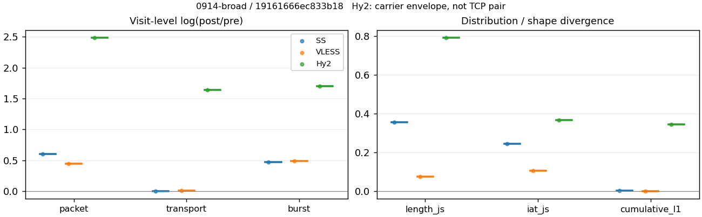
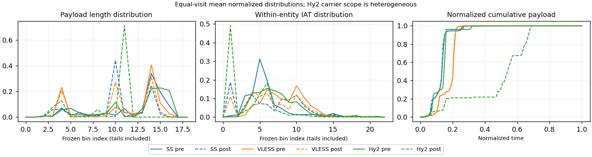

# 0914-broad · 条目 049 · pinterest.com

目标：https://www.pinterest.com/

活动标签：pinterest.com::page_load。选定访问 3 次。

[返回总索引](../../README.md) · [统计口径](../../methods.md)

## 覆盖与资格（每次访问均保留）

| 部署 | 重复 | 主请求路由 | 活动状态 | 代理比较 | DIRECT pre | 请求 proxy/direct/unresolved | 错误 |
| --- | --- | --- | --- | --- | --- | --- | --- |
| Hy2 | 1 | proxy | passed | 1 | 1 | 162/2/0 | [] |
| SS | 1 | proxy | passed | 1 | 0 | 159/0/0 | [] |
| VLESS | 1 | proxy | passed | 1 | 0 | 159/0/0 | [] |

主请求非 proxy 的统计仅解释为已索引的辅助代理连接或 DIRECT 观测，不代表目标业务经代理传输。播放确认与配对资格是两道不同的门。

图中散点为单次访问，短线为重复中位数；Hy2 是共享载体包络，不能与 TCP 配对作等范围因果对比。

形态图先逐访问归一化，再对访问等权平均；实线 pre，虚线 post。分箱序号及边界见 methods，不将分箱索引误解为长度或时间。

## 每次访问的关键观测

### SS

范围：`exclusive_page`。每格 pre → post；空值为不可观测/不适用。

| 重复 | 包数 | 载荷字节 | burst | TCP FR | IAT中位µs | length JS | IAT JS |
| --- | --- | --- | --- | --- | --- | --- | --- |
| 1 | 5160 → 9465 | 1.0006e+07 → 1.0065e+07 | 3406 → 5480 | 132 → 142 | 16.687 → 36.065 | 0.35588 | 0.24472 |

完整标量统计：中位数 [min,max]；Δ 为重复内逐访问变换的中位数，MAD 未缩放。n 为可用变换数；DIRECT-only 的 nΔ=0 不代表 pre 不可用。

| scope | 特征 | pre | post | Δ | IQRΔ | MADΔ | nΔ |
| --- | --- | --- | --- | --- | --- | --- | --- |
| exclusive_page | active_span_sum_s_1000ms | 27.541 [27.541, 27.541] | 30.103 [30.103, 30.103] | 0.088944 | — | — | 1 |
| exclusive_page | active_span_sum_s_100ms | 7.7792 [7.7792, 7.7792] | 12.001 [12.001, 12.001] | 0.43356 | — | — | 1 |
| exclusive_page | active_span_sum_s_500ms | 21.509 [21.509, 21.509] | 24.169 [24.169, 24.169] | 0.11664 | — | — | 1 |
| exclusive_page | burst_bytes_iqr | 4096 [4096, 4096] | 2856 [2856, 2856] | -0.36059 | — | — | 1 |
| exclusive_page | burst_bytes_mad | 39 [39, 39] | 34 [34, 34] | -0.1372 | — | — | 1 |
| exclusive_page | burst_bytes_max | 65535 [65535, 65535] | 86377 [86377, 86377] | 0.27614 | — | — | 1 |
| exclusive_page | burst_bytes_mean | 2937.8 [2937.8, 2937.8] | 1836.7 [1836.7, 1836.7] | -0.46966 | — | — | 1 |
| exclusive_page | burst_bytes_median | 39 [39, 39] | 34 [34, 34] | -0.1372 | — | — | 1 |
| exclusive_page | burst_bytes_min | 0 [0, 0] | 0 [0, 0] | — | — | — | 0 |
| exclusive_page | burst_bytes_p95 | 14382 [14382, 14382] | 7140 [7140, 7140] | -0.70026 | — | — | 1 |
| exclusive_page | burst_bytes_q25 | 0 [0, 0] | 0 [0, 0] | — | — | — | 0 |
| exclusive_page | burst_bytes_q75 | 4096 [4096, 4096] | 2856 [2856, 2856] | -0.36059 | — | — | 1 |
| exclusive_page | burst_bytes_std | 5443.9 [5443.9, 5443.9] | 3349.9 [3349.9, 3349.9] | -0.48555 | — | — | 1 |
| exclusive_page | burst_count | 3406 [3406, 3406] | 5480 [5480, 5480] | 0.47557 | — | — | 1 |
| exclusive_page | burst_duration_ms_iqr | 0 [0, 0] | 0.005327 [0.005327, 0.005327] | — | — | — | 0 |
| exclusive_page | burst_duration_ms_mad | 0 [0, 0] | 0 [0, 0] | — | — | — | 0 |
| exclusive_page | burst_duration_ms_max | 15001 [15001, 15001] | 15051 [15051, 15051] | 0.0033674 | — | — | 1 |
| exclusive_page | burst_duration_ms_mean | 23.155 [23.155, 23.155] | 11.536 [11.536, 11.536] | -0.6967 | — | — | 1 |
| exclusive_page | burst_duration_ms_median | 0 [0, 0] | 0 [0, 0] | — | — | — | 0 |
| exclusive_page | burst_duration_ms_min | 0 [0, 0] | 0 [0, 0] | — | — | — | 0 |
| exclusive_page | burst_duration_ms_p95 | 0.58577 [0.58577, 0.58577] | 0.90674 [0.90674, 0.90674] | 0.43693 | — | — | 1 |
| exclusive_page | burst_duration_ms_q25 | 0 [0, 0] | 0 [0, 0] | — | — | — | 0 |
| exclusive_page | burst_duration_ms_q75 | 0 [0, 0] | 0.005327 [0.005327, 0.005327] | — | — | — | 0 |
| exclusive_page | burst_duration_ms_std | 399.97 [399.97, 399.97] | 293.61 [293.61, 293.61] | -0.30911 | — | — | 1 |
| exclusive_page | burst_packets_iqr | 0 [0, 0] | 1 [1, 1] | — | — | — | 0 |
| exclusive_page | burst_packets_mad | 0 [0, 0] | 0 [0, 0] | — | — | — | 0 |
| exclusive_page | burst_packets_max | 12 [12, 12] | 62 [62, 62] | 1.6422 | — | — | 1 |
| exclusive_page | burst_packets_mean | 1.515 [1.515, 1.515] | 1.7272 [1.7272, 1.7272] | 0.1311 | — | — | 1 |
| exclusive_page | burst_packets_median | 1 [1, 1] | 1 [1, 1] | 0 | — | — | 1 |
| exclusive_page | burst_packets_min | 1 [1, 1] | 1 [1, 1] | 0 | — | — | 1 |
| exclusive_page | burst_packets_p95 | 4 [4, 4] | 4 [4, 4] | 0 | — | — | 1 |
| exclusive_page | burst_packets_q25 | 1 [1, 1] | 1 [1, 1] | 0 | — | — | 1 |
| exclusive_page | burst_packets_q75 | 1 [1, 1] | 2 [2, 2] | 0.69315 | — | — | 1 |
| exclusive_page | burst_packets_std | 1.3075 [1.3075, 1.3075] | 1.8188 [1.8188, 1.8188] | 0.33004 | — | — | 1 |
| exclusive_page | connection_span_concurrency_max | 12 [12, 12] | 12 [12, 12] | 0 | — | — | 1 |
| exclusive_page | cumulative_l1 | — | — | 0.002641 | — | — | 1 |
| exclusive_page | cumulative_max | — | — | 0.095642 | — | — | 1 |
| exclusive_page | direction_entropy | 0.46052 [0.46052, 0.46052] | 0.46751 [0.46751, 0.46751] | 0.0069856 | — | — | 1 |
| exclusive_page | down_burst_count | 1695 [1695, 1695] | 2732 [2732, 2732] | 0.47735 | — | — | 1 |
| exclusive_page | down_ip_bytes | 9.4843e+06 [9.4843e+06, 9.4843e+06] | 9.6705e+06 [9.6705e+06, 9.6705e+06] | 0.019444 | — | — | 1 |
| exclusive_page | down_packets | 3210 [3210, 3210] | 5856 [5856, 5856] | 0.6012 | — | — | 1 |
| exclusive_page | down_transport_bytes | 9.3173e+06 [9.3173e+06, 9.3173e+06] | 9.3657e+06 [9.3657e+06, 9.3657e+06] | 0.0051854 | — | — | 1 |
| exclusive_page | duration_s | 31.879 [31.879, 31.879] | 31.879 [31.879, 31.879] | -1.8753e-05 | — | — | 1 |
| exclusive_page | entity_count | 16 [16, 16] | 16 [16, 16] | 0 | — | — | 1 |
| exclusive_page | fr_runs | 132 [132, 132] | 142 [142, 142] | 0.073025 | — | — | 1 |
| exclusive_page | fr_runs_per_packet | 0.040281 [0.040281, 0.040281] | 0.022944 [0.022944, 0.022944] | -0.017337 | — | — | 1 |
| exclusive_page | fr_switches | 116 [116, 116] | 126 [126, 126] | 0.082692 | — | — | 1 |
| exclusive_page | fr_switches_per_possible_transition | 0.035572 [0.035572, 0.035572] | 0.020411 [0.020411, 0.020411] | -0.01516 | — | — | 1 |
| exclusive_page | full_retransmission_fraction | 0.0032946 [0.0032946, 0.0032946] | 0.0010565 [0.0010565, 0.0010565] | -0.002238 | — | — | 1 |
| exclusive_page | full_retransmission_packets | 17 [17, 17] | 10 [10, 10] | -0.53063 | — | — | 1 |
| exclusive_page | iat_count | 5144 [5144, 5144] | 9449 [9449, 9449] | 0.60808 | — | — | 1 |
| exclusive_page | iat_js | — | — | 0.24472 | — | — | 1 |
| exclusive_page | iat_ks | — | — | 0.28715 | — | — | 1 |
| exclusive_page | iat_median_us | 16.687 [16.687, 16.687] | 36.065 [36.065, 36.065] | 0.77069 | — | — | 1 |
| exclusive_page | iat_us_iqr | 33.736 [33.736, 33.736] | 535.95 [535.95, 535.95] | 2.7655 | — | — | 1 |
| exclusive_page | iat_us_mad | 10.834 [10.834, 10.834] | 36.025 [36.025, 36.025] | 1.2015 | — | — | 1 |
| exclusive_page | iat_us_max | 1.5001e+07 [1.5001e+07, 1.5001e+07] | 1.5051e+07 [1.5051e+07, 1.5051e+07] | 0.0033674 | — | — | 1 |
| exclusive_page | iat_us_mean | 22231 [22231, 22231] | 12101 [12101, 12101] | -0.60822 | — | — | 1 |
| exclusive_page | iat_us_median | 16.687 [16.687, 16.687] | 36.065 [36.065, 36.065] | 0.77069 | — | — | 1 |
| exclusive_page | iat_us_min | 0.01 [0.01, 0.01] | 0.03 [0.03, 0.03] | 1.0986 | — | — | 1 |
| exclusive_page | iat_us_p95 | 9812.7 [9812.7, 9812.7] | 4888.6 [4888.6, 4888.6] | -0.69676 | — | — | 1 |
| exclusive_page | iat_us_q25 | 9.613 [9.613, 9.613] | 4.752 [4.752, 4.752] | -0.70455 | — | — | 1 |
| exclusive_page | iat_us_q75 | 43.349 [43.349, 43.349] | 540.7 [540.7, 540.7] | 2.5236 | — | — | 1 |
| exclusive_page | iat_us_std | 3.9543e+05 [3.9543e+05, 3.9543e+05] | 2.9089e+05 [2.9089e+05, 2.9089e+05] | -0.30702 | — | — | 1 |
| exclusive_page | iat_wasserstein_log1p_us | — | — | 1.264 | — | — | 1 |
| exclusive_page | idle_gap_count_1000ms | 19 [19, 19] | 18 [18, 18] | -0.054067 | — | — | 1 |
| exclusive_page | idle_gap_count_100ms | 78 [78, 78] | 77 [77, 77] | -0.012903 | — | — | 1 |
| exclusive_page | idle_gap_count_500ms | 26 [26, 26] | 25 [25, 25] | -0.039221 | — | — | 1 |
| exclusive_page | idle_gap_sum_s_1000ms | 86.818 [86.818, 86.818] | 84.24 [84.24, 84.24] | -0.030142 | — | — | 1 |
| exclusive_page | idle_gap_sum_s_100ms | 106.58 [106.58, 106.58] | 102.34 [102.34, 102.34] | -0.040577 | — | — | 1 |
| exclusive_page | idle_gap_sum_s_500ms | 92.85 [92.85, 92.85] | 90.173 [90.173, 90.173] | -0.029254 | — | — | 1 |
| exclusive_page | ip_bytes | 1.0275e+07 [1.0275e+07, 1.0275e+07] | 1.0631e+07 [1.0631e+07, 1.0631e+07] | 0.034029 | — | — | 1 |
| exclusive_page | length_iqr | 2648 [2648, 2648] | 1428 [1428, 1428] | -0.61753 | — | — | 1 |
| exclusive_page | length_js | — | — | 0.35588 | — | — | 1 |
| exclusive_page | length_ks | — | — | 0.52962 | — | — | 1 |
| exclusive_page | length_mad | 1448 [1448, 1448] | 154 [154, 154] | -2.241 | — | — | 1 |
| exclusive_page | length_max | 8948 [8948, 8948] | 11424 [11424, 11424] | 0.24429 | — | — | 1 |
| exclusive_page | length_mean | 3053.4 [3053.4, 3053.4] | 1626.3 [1626.3, 1626.3] | -0.62994 | — | — | 1 |
| exclusive_page | length_median | 2896 [2896, 2896] | 1428 [1428, 1428] | -0.70706 | — | — | 1 |
| exclusive_page | length_min | 8 [8, 8] | 6 [6, 6] | -0.28768 | — | — | 1 |
| exclusive_page | length_p95 | 8192 [8192, 8192] | 2856 [2856, 2856] | -1.0537 | — | — | 1 |
| exclusive_page | length_q25 | 1448 [1448, 1448] | 1428 [1428, 1428] | -0.013908 | — | — | 1 |
| exclusive_page | length_q75 | 4096 [4096, 4096] | 2856 [2856, 2856] | -0.36059 | — | — | 1 |
| exclusive_page | length_std | 2390.9 [2390.9, 2390.9] | 1057.9 [1057.9, 1057.9] | -0.81538 | — | — | 1 |
| exclusive_page | length_wasserstein_bytes | — | — | 1438 | — | — | 1 |
| exclusive_page | nonempty_entity_count | 16 [16, 16] | 16 [16, 16] | 0 | — | — | 1 |
| exclusive_page | nonempty_packets | 3277 [3277, 3277] | 6189 [6189, 6189] | 0.63585 | — | — | 1 |
| exclusive_page | offload_suspect_fraction | 0.4376 [0.4376, 0.4376] | 0.21025 [0.21025, 0.21025] | -0.22735 | — | — | 1 |
| exclusive_page | packet_count | 5160 [5160, 5160] | 9465 [9465, 9465] | 0.60666 | — | — | 1 |
| exclusive_page | rtt_median_ms | 0.019426 [0.019426, 0.019426] | 33.986 [33.986, 33.986] | 7.4671 | — | — | 1 |
| exclusive_page | rtt_sample_count | 1839 [1839, 1839] | 768 [768, 768] | -0.87319 | — | — | 1 |
| exclusive_page | tcp_ack_count | 5144 [5144, 5144] | 9447 [9447, 9447] | 0.60787 | — | — | 1 |
| exclusive_page | tcp_fin_count | 32 [32, 32] | 33 [33, 33] | 0.030772 | — | — | 1 |
| exclusive_page | tcp_packet_count | 5160 [5160, 5160] | 9465 [9465, 9465] | 0.60666 | — | — | 1 |
| exclusive_page | tcp_rst_count | 0 [0, 0] | 0 [0, 0] | — | — | — | 0 |
| exclusive_page | tcp_syn_count | 32 [32, 32] | 35 [35, 35] | 0.089612 | — | — | 1 |
| exclusive_page | tcp_window_raw_median | 65535 [65535, 65535] | 146 [146, 146] | -6.1067 | — | — | 1 |
| exclusive_page | transition_entropy | 0.187 [0.187, 0.187] | 0.12518 [0.12518, 0.12518] | -0.061818 | — | — | 1 |
| exclusive_page | transition_n_mm | 2895 [2895, 2895] | 5505 [5505, 5505] | 0.64267 | — | — | 1 |
| exclusive_page | transition_n_mp | 53 [53, 53] | 58 [58, 58] | 0.090151 | — | — | 1 |
| exclusive_page | transition_n_pm | 63 [63, 63] | 68 [68, 68] | 0.076373 | — | — | 1 |
| exclusive_page | transition_n_pp | 250 [250, 250] | 542 [542, 542] | 0.77381 | — | — | 1 |
| exclusive_page | transition_p_mm | 0.98202 [0.98202, 0.98202] | 0.98957 [0.98957, 0.98957] | 0.0075523 | — | — | 1 |
| exclusive_page | transition_p_mp | 0.017978 [0.017978, 0.017978] | 0.010426 [0.010426, 0.010426] | -0.0075523 | — | — | 1 |
| exclusive_page | transition_p_pm | 0.20128 [0.20128, 0.20128] | 0.11148 [0.11148, 0.11148] | -0.089803 | — | — | 1 |
| exclusive_page | transition_p_pp | 0.79872 [0.79872, 0.79872] | 0.88852 [0.88852, 0.88852] | 0.089803 | — | — | 1 |
| exclusive_page | transport_bytes | 1.0006e+07 [1.0006e+07, 1.0006e+07] | 1.0065e+07 [1.0065e+07, 1.0065e+07] | 0.005904 | — | — | 1 |
| exclusive_page | up_burst_count | 1711 [1711, 1711] | 2748 [2748, 2748] | 0.4738 | — | — | 1 |
| exclusive_page | up_byte_fraction | 0.068842 [0.068842, 0.068842] | 0.069511 [0.069511, 0.069511] | 0.00066893 | — | — | 1 |
| exclusive_page | up_ip_bytes | 7.9057e+05 [7.9057e+05, 7.9057e+05] | 9.6002e+05 [9.6002e+05, 9.6002e+05] | 0.19419 | — | — | 1 |
| exclusive_page | up_packets | 1950 [1950, 1950] | 3609 [3609, 3609] | 0.6156 | — | — | 1 |
| exclusive_page | up_transport_bytes | 6.8884e+05 [6.8884e+05, 6.8884e+05] | 6.9965e+05 [6.9965e+05, 6.9965e+05] | 0.015574 | — | — | 1 |
| exclusive_page | zero_iat_count | 0 [0, 0] | 0 [0, 0] | — | — | — | 0 |
| exclusive_page | zero_iat_fraction | 0 [0, 0] | 0 [0, 0] | 0 | — | — | 1 |

### VLESS

范围：`exclusive_page`。每格 pre → post；空值为不可观测/不适用。

| 重复 | 包数 | 载荷字节 | burst | TCP FR | IAT中位µs | length JS | IAT JS |
| --- | --- | --- | --- | --- | --- | --- | --- |
| 1 | 5924 → 9226 | 8.5389e+06 → 8.6331e+06 | 4105 → 6697 | 98 → 124 | 169.88 → 36.279 | 0.073986 | 0.10465 |

完整标量统计：中位数 [min,max]；Δ 为重复内逐访问变换的中位数，MAD 未缩放。n 为可用变换数；DIRECT-only 的 nΔ=0 不代表 pre 不可用。

| scope | 特征 | pre | post | Δ | IQRΔ | MADΔ | nΔ |
| --- | --- | --- | --- | --- | --- | --- | --- |
| exclusive_page | active_span_sum_s_1000ms | 21.916 [21.916, 21.916] | 22.416 [22.416, 22.416] | 0.022563 | — | — | 1 |
| exclusive_page | active_span_sum_s_100ms | 6.8725 [6.8725, 6.8725] | 11.313 [11.313, 11.313] | 0.49843 | — | — | 1 |
| exclusive_page | active_span_sum_s_500ms | 13.889 [13.889, 13.889] | 22.416 [22.416, 22.416] | 0.47864 | — | — | 1 |
| exclusive_page | burst_bytes_iqr | 2896 [2896, 2896] | 2824 [2824, 2824] | -0.025176 | — | — | 1 |
| exclusive_page | burst_bytes_mad | 24 [24, 24] | 36 [36, 36] | 0.40547 | — | — | 1 |
| exclusive_page | burst_bytes_max | 25008 [25008, 25008] | 27512 [27512, 27512] | 0.095426 | — | — | 1 |
| exclusive_page | burst_bytes_mean | 2080.1 [2080.1, 2080.1] | 1289.1 [1289.1, 1289.1] | -0.47849 | — | — | 1 |
| exclusive_page | burst_bytes_median | 24 [24, 24] | 36 [36, 36] | 0.40547 | — | — | 1 |
| exclusive_page | burst_bytes_min | 0 [0, 0] | 0 [0, 0] | — | — | — | 0 |
| exclusive_page | burst_bytes_p95 | 8688 [8688, 8688] | 4344 [4344, 4344] | -0.69315 | — | — | 1 |
| exclusive_page | burst_bytes_q25 | 0 [0, 0] | 0 [0, 0] | — | — | — | 0 |
| exclusive_page | burst_bytes_q75 | 2896 [2896, 2896] | 2824 [2824, 2824] | -0.025176 | — | — | 1 |
| exclusive_page | burst_bytes_std | 3394.8 [3394.8, 3394.8] | 1857.2 [1857.2, 1857.2] | -0.60318 | — | — | 1 |
| exclusive_page | burst_count | 4105 [4105, 4105] | 6697 [6697, 6697] | 0.48945 | — | — | 1 |
| exclusive_page | burst_duration_ms_iqr | 0.33129 [0.33129, 0.33129] | 4.8e-05 [4.8e-05, 4.8e-05] | -8.8395 | — | — | 1 |
| exclusive_page | burst_duration_ms_mad | 0 [0, 0] | 0 [0, 0] | — | — | — | 0 |
| exclusive_page | burst_duration_ms_max | 15001 [15001, 15001] | 15061 [15061, 15061] | 0.0040096 | — | — | 1 |
| exclusive_page | burst_duration_ms_mean | 38.834 [38.834, 38.834] | 13.511 [13.511, 13.511] | -1.0558 | — | — | 1 |
| exclusive_page | burst_duration_ms_median | 0 [0, 0] | 0 [0, 0] | — | — | — | 0 |
| exclusive_page | burst_duration_ms_min | 0 [0, 0] | 0 [0, 0] | — | — | — | 0 |
| exclusive_page | burst_duration_ms_p95 | 2.931 [2.931, 2.931] | 1.4923 [1.4923, 1.4923] | -0.67499 | — | — | 1 |
| exclusive_page | burst_duration_ms_q25 | 0 [0, 0] | 0 [0, 0] | — | — | — | 0 |
| exclusive_page | burst_duration_ms_q75 | 0.33129 [0.33129, 0.33129] | 4.8e-05 [4.8e-05, 4.8e-05] | -8.8395 | — | — | 1 |
| exclusive_page | burst_duration_ms_std | 627.65 [627.65, 627.65] | 412.15 [412.15, 412.15] | -0.42059 | — | — | 1 |
| exclusive_page | burst_packets_iqr | 1 [1, 1] | 1 [1, 1] | 0 | — | — | 1 |
| exclusive_page | burst_packets_mad | 0 [0, 0] | 0 [0, 0] | — | — | — | 0 |
| exclusive_page | burst_packets_max | 14 [14, 14] | 12 [12, 12] | -0.15415 | — | — | 1 |
| exclusive_page | burst_packets_mean | 1.4431 [1.4431, 1.4431] | 1.3776 [1.3776, 1.3776] | -0.04644 | — | — | 1 |
| exclusive_page | burst_packets_median | 1 [1, 1] | 1 [1, 1] | 0 | — | — | 1 |
| exclusive_page | burst_packets_min | 1 [1, 1] | 1 [1, 1] | 0 | — | — | 1 |
| exclusive_page | burst_packets_p95 | 2 [2, 2] | 3 [3, 3] | 0.40547 | — | — | 1 |
| exclusive_page | burst_packets_q25 | 1 [1, 1] | 1 [1, 1] | 0 | — | — | 1 |
| exclusive_page | burst_packets_q75 | 2 [2, 2] | 2 [2, 2] | 0 | — | — | 1 |
| exclusive_page | burst_packets_std | 0.70026 [0.70026, 0.70026] | 0.79999 [0.79999, 0.79999] | 0.13314 | — | — | 1 |
| exclusive_page | connection_span_concurrency_max | 10 [10, 10] | 10 [10, 10] | 0 | — | — | 1 |
| exclusive_page | cumulative_l1 | — | — | 0.0013261 | — | — | 1 |
| exclusive_page | cumulative_max | — | — | 0.048141 | — | — | 1 |
| exclusive_page | direction_entropy | 0.29208 [0.29208, 0.29208] | 0.17661 [0.17661, 0.17661] | -0.11546 | — | — | 1 |
| exclusive_page | down_burst_count | 2046 [2046, 2046] | 3342 [3342, 3342] | 0.49068 | — | — | 1 |
| exclusive_page | down_ip_bytes | 8.6904e+06 [8.6904e+06, 8.6904e+06] | 8.8304e+06 [8.8304e+06, 8.8304e+06] | 0.015985 | — | — | 1 |
| exclusive_page | down_packets | 3768 [3768, 3768] | 5142 [5142, 5142] | 0.3109 | — | — | 1 |
| exclusive_page | down_transport_bytes | 8.4943e+06 [8.4943e+06, 8.4943e+06] | 8.5629e+06 [8.5629e+06, 8.5629e+06] | 0.0080414 | — | — | 1 |
| exclusive_page | duration_s | 30.508 [30.508, 30.508] | 30.481 [30.481, 30.481] | -0.00088057 | — | — | 1 |
| exclusive_page | entity_count | 13 [13, 13] | 13 [13, 13] | 0 | — | — | 1 |
| exclusive_page | fr_runs | 98 [98, 98] | 124 [124, 124] | 0.23531 | — | — | 1 |
| exclusive_page | fr_runs_per_packet | 0.026071 [0.026071, 0.026071] | 0.024357 [0.024357, 0.024357] | -0.0017141 | — | — | 1 |
| exclusive_page | fr_switches | 85 [85, 85] | 111 [111, 111] | 0.26688 | — | — | 1 |
| exclusive_page | fr_switches_per_possible_transition | 0.022691 [0.022691, 0.022691] | 0.021859 [0.021859, 0.021859] | -0.00083187 | — | — | 1 |
| exclusive_page | full_retransmission_fraction | 0.00067522 [0.00067522, 0.00067522] | 0 [0, 0] | -0.00067522 | — | — | 1 |
| exclusive_page | full_retransmission_packets | 4 [4, 4] | 0 [0, 0] | — | — | — | 0 |
| exclusive_page | iat_count | 5911 [5911, 5911] | 9213 [9213, 9213] | 0.4438 | — | — | 1 |
| exclusive_page | iat_js | — | — | 0.10465 | — | — | 1 |
| exclusive_page | iat_ks | — | — | 0.27664 | — | — | 1 |
| exclusive_page | iat_median_us | 169.88 [169.88, 169.88] | 36.279 [36.279, 36.279] | -1.5438 | — | — | 1 |
| exclusive_page | iat_us_iqr | 887.72 [887.72, 887.72] | 638.69 [638.69, 638.69] | -0.32924 | — | — | 1 |
| exclusive_page | iat_us_mad | 161.76 [161.76, 161.76] | 36.162 [36.162, 36.162] | -1.4981 | — | — | 1 |
| exclusive_page | iat_us_max | 1.5001e+07 [1.5001e+07, 1.5001e+07] | 1.5061e+07 [1.5061e+07, 1.5061e+07] | 0.0040096 | — | — | 1 |
| exclusive_page | iat_us_mean | 41019 [41019, 41019] | 26165 [26165, 26165] | -0.44963 | — | — | 1 |
| exclusive_page | iat_us_median | 169.88 [169.88, 169.88] | 36.279 [36.279, 36.279] | -1.5438 | — | — | 1 |
| exclusive_page | iat_us_min | 0.142 [0.142, 0.142] | 0.031 [0.031, 0.031] | -1.5218 | — | — | 1 |
| exclusive_page | iat_us_p95 | 7625.7 [7625.7, 7625.7] | 5655.2 [5655.2, 5655.2] | -0.29895 | — | — | 1 |
| exclusive_page | iat_us_q25 | 36.425 [36.425, 36.425] | 7.573 [7.573, 7.573] | -1.5707 | — | — | 1 |
| exclusive_page | iat_us_q75 | 924.15 [924.15, 924.15] | 646.26 [646.26, 646.26] | -0.35767 | — | — | 1 |
| exclusive_page | iat_us_std | 6.8122e+05 [6.8122e+05, 6.8122e+05] | 5.4483e+05 [5.4483e+05, 5.4483e+05] | -0.22341 | — | — | 1 |
| exclusive_page | iat_wasserstein_log1p_us | — | — | 1.2448 | — | — | 1 |
| exclusive_page | idle_gap_count_1000ms | 22 [22, 22] | 21 [21, 21] | -0.04652 | — | — | 1 |
| exclusive_page | idle_gap_count_100ms | 69 [69, 69] | 81 [81, 81] | 0.16034 | — | — | 1 |
| exclusive_page | idle_gap_count_500ms | 34 [34, 34] | 21 [21, 21] | -0.48184 | — | — | 1 |
| exclusive_page | idle_gap_sum_s_1000ms | 220.55 [220.55, 220.55] | 218.64 [218.64, 218.64] | -0.0086954 | — | — | 1 |
| exclusive_page | idle_gap_sum_s_100ms | 235.59 [235.59, 235.59] | 229.74 [229.74, 229.74] | -0.025144 | — | — | 1 |
| exclusive_page | idle_gap_sum_s_500ms | 228.58 [228.58, 228.58] | 218.64 [218.64, 218.64] | -0.044441 | — | — | 1 |
| exclusive_page | ip_bytes | 8.8469e+06 [8.8469e+06, 8.8469e+06] | 9.123e+06 [9.123e+06, 9.123e+06] | 0.030727 | — | — | 1 |
| exclusive_page | length_iqr | 2586.5 [2586.5, 2586.5] | 2521 [2521, 2521] | -0.02565 | — | — | 1 |
| exclusive_page | length_js | — | — | 0.073986 | — | — | 1 |
| exclusive_page | length_ks | — | — | 0.19817 | — | — | 1 |
| exclusive_page | length_mad | 1376 [1376, 1376] | 1340 [1340, 1340] | -0.026511 | — | — | 1 |
| exclusive_page | length_max | 8920 [8920, 8920] | 13032 [13032, 13032] | 0.37911 | — | — | 1 |
| exclusive_page | length_mean | 2271.6 [2271.6, 2271.6] | 1695.8 [1695.8, 1695.8] | -0.29235 | — | — | 1 |
| exclusive_page | length_median | 2824 [2824, 2824] | 1412 [1412, 1412] | -0.69315 | — | — | 1 |
| exclusive_page | length_min | 24 [24, 24] | 1 [1, 1] | -3.1781 | — | — | 1 |
| exclusive_page | length_p95 | 5792 [5792, 5792] | 2986 [2986, 2986] | -0.66254 | — | — | 1 |
| exclusive_page | length_q25 | 309.5 [309.5, 309.5] | 303 [303, 303] | -0.021225 | — | — | 1 |
| exclusive_page | length_q75 | 2896 [2896, 2896] | 2824 [2824, 2824] | -0.025176 | — | — | 1 |
| exclusive_page | length_std | 1928.8 [1928.8, 1928.8] | 1371.6 [1371.6, 1371.6] | -0.3409 | — | — | 1 |
| exclusive_page | length_wasserstein_bytes | — | — | 591.57 | — | — | 1 |
| exclusive_page | nonempty_entity_count | 13 [13, 13] | 13 [13, 13] | 0 | — | — | 1 |
| exclusive_page | nonempty_packets | 3759 [3759, 3759] | 5091 [5091, 5091] | 0.30332 | — | — | 1 |
| exclusive_page | offload_suspect_fraction | 0.38656 [0.38656, 0.38656] | 0.22729 [0.22729, 0.22729] | -0.15927 | — | — | 1 |
| exclusive_page | packet_count | 5924 [5924, 5924] | 9226 [9226, 9226] | 0.44301 | — | — | 1 |
| exclusive_page | rtt_median_ms | 0.365 [0.365, 0.365] | 0.033587 [0.033587, 0.033587] | -2.3857 | — | — | 1 |
| exclusive_page | rtt_sample_count | 2096 [2096, 2096] | 3692 [3692, 3692] | 0.56614 | — | — | 1 |
| exclusive_page | tcp_ack_count | 5886 [5886, 5886] | 9213 [9213, 9213] | 0.44804 | — | — | 1 |
| exclusive_page | tcp_fin_count | 25 [25, 25] | 26 [26, 26] | 0.039221 | — | — | 1 |
| exclusive_page | tcp_packet_count | 5924 [5924, 5924] | 9226 [9226, 9226] | 0.44301 | — | — | 1 |
| exclusive_page | tcp_rst_count | 25 [25, 25] | 0 [0, 0] | — | — | — | 0 |
| exclusive_page | tcp_syn_count | 26 [26, 26] | 26 [26, 26] | 0 | — | — | 1 |
| exclusive_page | tcp_window_raw_median | 65535 [65535, 65535] | 178 [178, 178] | -5.9086 | — | — | 1 |
| exclusive_page | transition_entropy | 0.11957 [0.11957, 0.11957] | 0.10454 [0.10454, 0.10454] | -0.015033 | — | — | 1 |
| exclusive_page | transition_n_mm | 3517 [3517, 3517] | 4894 [4894, 4894] | 0.3304 | — | — | 1 |
| exclusive_page | transition_n_mp | 36 [36, 36] | 49 [49, 49] | 0.3083 | — | — | 1 |
| exclusive_page | transition_n_pm | 49 [49, 49] | 62 [62, 62] | 0.23531 | — | — | 1 |
| exclusive_page | transition_n_pp | 144 [144, 144] | 73 [73, 73] | -0.67935 | — | — | 1 |
| exclusive_page | transition_p_mm | 0.98987 [0.98987, 0.98987] | 0.99009 [0.99009, 0.99009] | 0.00021927 | — | — | 1 |
| exclusive_page | transition_p_mp | 0.010132 [0.010132, 0.010132] | 0.009913 [0.009913, 0.009913] | -0.00021927 | — | — | 1 |
| exclusive_page | transition_p_pm | 0.25389 [0.25389, 0.25389] | 0.45926 [0.45926, 0.45926] | 0.20537 | — | — | 1 |
| exclusive_page | transition_p_pp | 0.74611 [0.74611, 0.74611] | 0.54074 [0.54074, 0.54074] | -0.20537 | — | — | 1 |
| exclusive_page | transport_bytes | 8.5389e+06 [8.5389e+06, 8.5389e+06] | 8.6331e+06 [8.6331e+06, 8.6331e+06] | 0.010968 | — | — | 1 |
| exclusive_page | up_burst_count | 2059 [2059, 2059] | 3355 [3355, 3355] | 0.48823 | — | — | 1 |
| exclusive_page | up_byte_fraction | 0.0052244 [0.0052244, 0.0052244] | 0.008131 [0.008131, 0.008131] | 0.0029066 | — | — | 1 |
| exclusive_page | up_ip_bytes | 1.5658e+05 [1.5658e+05, 1.5658e+05] | 2.926e+05 [2.926e+05, 2.926e+05] | 0.62527 | — | — | 1 |
| exclusive_page | up_packets | 2156 [2156, 2156] | 4084 [4084, 4084] | 0.63882 | — | — | 1 |
| exclusive_page | up_transport_bytes | 44611 [44611, 44611] | 70196 [70196, 70196] | 0.45331 | — | — | 1 |
| exclusive_page | zero_iat_count | 0 [0, 0] | 0 [0, 0] | — | — | — | 0 |
| exclusive_page | zero_iat_fraction | 0 [0, 0] | 0 [0, 0] | 0 | — | — | 1 |

### Hy2

范围：`carrier_context_envelope`。每格 pre → post；空值为不可观测/不适用。

| 重复 | 包数 | 载荷字节 | burst | TCP FR | IAT中位µs | length JS | IAT JS |
| --- | --- | --- | --- | --- | --- | --- | --- |
| 1 | 4329 → 51772 | 1.1094e+07 → 5.7135e+07 | 2987 → 16364 | — | 56.281 → 1.95 | 0.79115 | 0.36571 |

范围：`direct_pre_only`。每格 pre → post；空值为不可观测/不适用。

| 重复 | 包数 | 载荷字节 | burst | TCP FR | IAT中位µs | length JS | IAT JS |
| --- | --- | --- | --- | --- | --- | --- | --- |
| 1 | 78 → — | 62285 → — | 50 → — | 16 → — | 202.64 → — | — | — |

完整标量统计：中位数 [min,max]；Δ 为重复内逐访问变换的中位数，MAD 未缩放。n 为可用变换数；DIRECT-only 的 nΔ=0 不代表 pre 不可用。

| scope | 特征 | pre | post | Δ | IQRΔ | MADΔ | nΔ |
| --- | --- | --- | --- | --- | --- | --- | --- |
| carrier_context_envelope | active_span_sum_s_1000ms | 17.978 [17.978, 17.978] | 12.444 [12.444, 12.444] | -0.36791 | — | — | 1 |
| carrier_context_envelope | active_span_sum_s_100ms | 3.5819 [3.5819, 3.5819] | 8.4295 [8.4295, 8.4295] | 0.85584 | — | — | 1 |
| carrier_context_envelope | active_span_sum_s_500ms | 13.263 [13.263, 13.263] | 12.444 [12.444, 12.444] | -0.063799 | — | — | 1 |
| carrier_context_envelope | burst_bytes_iqr | 5660 [5660, 5660] | 4224 [4224, 4224] | -0.29264 | — | — | 1 |
| carrier_context_envelope | burst_bytes_mad | 35 [35, 35] | 537.5 [537.5, 537.5] | 2.7316 | — | — | 1 |
| carrier_context_envelope | burst_bytes_max | 65535 [65535, 65535] | 3.368e+05 [3.368e+05, 3.368e+05] | 1.6369 | — | — | 1 |
| carrier_context_envelope | burst_bytes_mean | 3714.1 [3714.1, 3714.1] | 3491.5 [3491.5, 3491.5] | -0.061786 | — | — | 1 |
| carrier_context_envelope | burst_bytes_median | 35 [35, 35] | 563.5 [563.5, 563.5] | 2.7788 | — | — | 1 |
| carrier_context_envelope | burst_bytes_min | 0 [0, 0] | 22 [22, 22] | — | — | — | 0 |
| carrier_context_envelope | burst_bytes_p95 | 19343 [19343, 19343] | 11528 [11528, 11528] | -0.51755 | — | — | 1 |
| carrier_context_envelope | burst_bytes_q25 | 0 [0, 0] | 99 [99, 99] | — | — | — | 0 |
| carrier_context_envelope | burst_bytes_q75 | 5660 [5660, 5660] | 4323 [4323, 4323] | -0.26947 | — | — | 1 |
| carrier_context_envelope | burst_bytes_std | 6041.7 [6041.7, 6041.7] | 8679.3 [8679.3, 8679.3] | 0.36226 | — | — | 1 |
| carrier_context_envelope | burst_count | 2987 [2987, 2987] | 16364 [16364, 16364] | 1.7008 | — | — | 1 |
| carrier_context_envelope | burst_duration_ms_iqr | 0.00854 [0.00854, 0.00854] | 0.024543 [0.024543, 0.024543] | 1.0556 | — | — | 1 |
| carrier_context_envelope | burst_duration_ms_mad | 0 [0, 0] | 4.4e-05 [4.4e-05, 4.4e-05] | — | — | — | 0 |
| carrier_context_envelope | burst_duration_ms_max | 15001 [15001, 15001] | 5335.2 [5335.2, 5335.2] | -1.0338 | — | — | 1 |
| carrier_context_envelope | burst_duration_ms_mean | 41.115 [41.115, 41.115] | 0.7732 [0.7732, 0.7732] | -3.9736 | — | — | 1 |
| carrier_context_envelope | burst_duration_ms_median | 0 [0, 0] | 4.4e-05 [4.4e-05, 4.4e-05] | — | — | — | 0 |
| carrier_context_envelope | burst_duration_ms_min | 0 [0, 0] | 0 [0, 0] | — | — | — | 0 |
| carrier_context_envelope | burst_duration_ms_p95 | 1.5202 [1.5202, 1.5202] | 0.13144 [0.13144, 0.13144] | -2.448 | — | — | 1 |
| carrier_context_envelope | burst_duration_ms_q25 | 0 [0, 0] | 0 [0, 0] | — | — | — | 0 |
| carrier_context_envelope | burst_duration_ms_q75 | 0.00854 [0.00854, 0.00854] | 0.024543 [0.024543, 0.024543] | 1.0556 | — | — | 1 |
| carrier_context_envelope | burst_duration_ms_std | 575.04 [575.04, 575.04] | 45.884 [45.884, 45.884] | -2.5283 | — | — | 1 |
| carrier_context_envelope | burst_packets_iqr | 1 [1, 1] | 3 [3, 3] | 1.0986 | — | — | 1 |
| carrier_context_envelope | burst_packets_mad | 0 [0, 0] | 1 [1, 1] | — | — | — | 0 |
| carrier_context_envelope | burst_packets_max | 10 [10, 10] | 242 [242, 242] | 3.1864 | — | — | 1 |
| carrier_context_envelope | burst_packets_mean | 1.4493 [1.4493, 1.4493] | 3.1638 [3.1638, 3.1638] | 0.7807 | — | — | 1 |
| carrier_context_envelope | burst_packets_median | 1 [1, 1] | 2 [2, 2] | 0.69315 | — | — | 1 |
| carrier_context_envelope | burst_packets_min | 1 [1, 1] | 1 [1, 1] | 0 | — | — | 1 |
| carrier_context_envelope | burst_packets_p95 | 3 [3, 3] | 8 [8, 8] | 0.98083 | — | — | 1 |
| carrier_context_envelope | burst_packets_q25 | 1 [1, 1] | 1 [1, 1] | 0 | — | — | 1 |
| carrier_context_envelope | burst_packets_q75 | 2 [2, 2] | 4 [4, 4] | 0.69315 | — | — | 1 |
| carrier_context_envelope | burst_packets_std | 0.98177 [0.98177, 0.98177] | 6.1056 [6.1056, 6.1056] | 1.8276 | — | — | 1 |
| carrier_context_envelope | connection_span_concurrency_max | 12 [12, 12] | 1 [1, 1] | -2.4849 | — | — | 1 |
| carrier_context_envelope | cumulative_l1 | — | — | 0.34383 | — | — | 1 |
| carrier_context_envelope | cumulative_max | — | — | 0.78268 | — | — | 1 |
| carrier_context_envelope | direction_entropy | 0.51233 [0.51233, 0.51233] | 0.748 [0.748, 0.748] | 0.23567 | — | — | 1 |
| carrier_context_envelope | direction_run_analog_runs | 116 [116, 116] | 16364 [16364, 16364] | 4.9492 | — | — | 1 |
| carrier_context_envelope | direction_run_analog_runs_per_packet | 0.042995 [0.042995, 0.042995] | 0.31608 [0.31608, 0.31608] | 0.27308 | — | — | 1 |
| carrier_context_envelope | direction_run_analog_switches | 103 [103, 103] | 16363 [16363, 16363] | 5.068 | — | — | 1 |
| carrier_context_envelope | direction_run_analog_switches_per_possible_transition | 0.038361 [0.038361, 0.038361] | 0.31606 [0.31606, 0.31606] | 0.2777 | — | — | 1 |
| carrier_context_envelope | down_burst_count | 1487 [1487, 1487] | 8182 [8182, 8182] | 1.7052 | — | — | 1 |
| carrier_context_envelope | down_ip_bytes | 1.0581e+07 [1.0581e+07, 1.0581e+07] | 5.6735e+07 [5.6735e+07, 5.6735e+07] | 1.6793 | — | — | 1 |
| carrier_context_envelope | down_packets | 2638 [2638, 2638] | 40722 [40722, 40722] | 2.7367 | — | — | 1 |
| carrier_context_envelope | down_transport_bytes | 1.0444e+07 [1.0444e+07, 1.0444e+07] | 5.5594e+07 [5.5594e+07, 5.5594e+07] | 1.672 | — | — | 1 |
| carrier_context_envelope | duration_s | 22.572 [22.572, 22.572] | 22.571 [22.571, 22.571] | -3.859e-05 | — | — | 1 |
| carrier_context_envelope | entity_count | 13 [13, 13] | 1 [1, 1] | -2.5649 | — | — | 1 |
| carrier_context_envelope | full_retransmission_fraction | 0.006699 [0.006699, 0.006699] | — | — | — | — | 0 |
| carrier_context_envelope | full_retransmission_packets | 29 [29, 29] | — | — | — | — | 0 |
| carrier_context_envelope | iat_count | 4316 [4316, 4316] | 51771 [51771, 51771] | 2.4845 | — | — | 1 |
| carrier_context_envelope | iat_js | — | — | 0.36571 | — | — | 1 |
| carrier_context_envelope | iat_ks | — | — | 0.49947 | — | — | 1 |
| carrier_context_envelope | iat_median_us | 56.281 [56.281, 56.281] | 1.95 [1.95, 1.95] | -3.3625 | — | — | 1 |
| carrier_context_envelope | iat_us_iqr | 206.33 [206.33, 206.33] | 23.315 [23.315, 23.315] | -2.1804 | — | — | 1 |
| carrier_context_envelope | iat_us_mad | 48.869 [48.869, 48.869] | 1.914 [1.914, 1.914] | -3.2399 | — | — | 1 |
| carrier_context_envelope | iat_us_max | 1.5001e+07 [1.5001e+07, 1.5001e+07] | 5.2767e+06 [5.2767e+06, 5.2767e+06] | -1.0448 | — | — | 1 |
| carrier_context_envelope | iat_us_mean | 58532 [58532, 58532] | 435.97 [435.97, 435.97] | -4.8997 | — | — | 1 |
| carrier_context_envelope | iat_us_median | 56.281 [56.281, 56.281] | 1.95 [1.95, 1.95] | -3.3625 | — | — | 1 |
| carrier_context_envelope | iat_us_min | 0.011 [0.011, 0.011] | 0 [0, 0] | — | — | — | 0 |
| carrier_context_envelope | iat_us_p95 | 2321.3 [2321.3, 2321.3] | 149.84 [149.84, 149.84] | -2.7403 | — | — | 1 |
| carrier_context_envelope | iat_us_q25 | 13.782 [13.782, 13.782] | 0.044 [0.044, 0.044] | -5.7469 | — | — | 1 |
| carrier_context_envelope | iat_us_q75 | 220.11 [220.11, 220.11] | 23.359 [23.359, 23.359] | -2.2431 | — | — | 1 |
| carrier_context_envelope | iat_us_std | 8.051e+05 [8.051e+05, 8.051e+05] | 26860 [26860, 26860] | -3.4003 | — | — | 1 |
| carrier_context_envelope | iat_wasserstein_log1p_us | — | — | 2.6222 | — | — | 1 |
| carrier_context_envelope | idle_gap_count_1000ms | 26 [26, 26] | 4 [4, 4] | -1.8718 | — | — | 1 |
| carrier_context_envelope | idle_gap_count_100ms | 79 [79, 79] | 27 [27, 27] | -1.0736 | — | — | 1 |
| carrier_context_envelope | idle_gap_count_500ms | 33 [33, 33] | 4 [4, 4] | -2.1102 | — | — | 1 |
| carrier_context_envelope | idle_gap_sum_s_1000ms | 234.65 [234.65, 234.65] | 10.127 [10.127, 10.127] | -3.1429 | — | — | 1 |
| carrier_context_envelope | idle_gap_sum_s_100ms | 249.04 [249.04, 249.04] | 14.141 [14.141, 14.141] | -2.8685 | — | — | 1 |
| carrier_context_envelope | idle_gap_sum_s_500ms | 239.36 [239.36, 239.36] | 10.127 [10.127, 10.127] | -3.1628 | — | — | 1 |
| carrier_context_envelope | ip_bytes | 1.132e+07 [1.132e+07, 1.132e+07] | 5.8585e+07 [5.8585e+07, 5.8585e+07] | 1.6439 | — | — | 1 |
| carrier_context_envelope | length_iqr | 5725 [5725, 5725] | 596 [596, 596] | -2.2624 | — | — | 1 |
| carrier_context_envelope | length_js | — | — | 0.79115 | — | — | 1 |
| carrier_context_envelope | length_ks | — | — | 0.70163 | — | — | 1 |
| carrier_context_envelope | length_mad | 2088.5 [2088.5, 2088.5] | 0 [0, 0] | — | — | — | 0 |
| carrier_context_envelope | length_max | 8948 [8948, 8948] | 1441 [1441, 1441] | -1.8261 | — | — | 1 |
| carrier_context_envelope | length_mean | 4111.9 [4111.9, 4111.9] | 1103.6 [1103.6, 1103.6] | -1.3153 | — | — | 1 |
| carrier_context_envelope | length_median | 2834 [2834, 2834] | 1441 [1441, 1441] | -0.67635 | — | — | 1 |
| carrier_context_envelope | length_min | 7 [7, 7] | 22 [22, 22] | 1.1451 | — | — | 1 |
| carrier_context_envelope | length_p95 | 8920 [8920, 8920] | 1441 [1441, 1441] | -1.823 | — | — | 1 |
| carrier_context_envelope | length_q25 | 1415 [1415, 1415] | 845 [845, 845] | -0.51555 | — | — | 1 |
| carrier_context_envelope | length_q75 | 7140 [7140, 7140] | 1441 [1441, 1441] | -1.6004 | — | — | 1 |
| carrier_context_envelope | length_std | 3109 [3109, 3109] | 564.24 [564.24, 564.24] | -1.7066 | — | — | 1 |
| carrier_context_envelope | length_wasserstein_bytes | — | — | 3008.9 | — | — | 1 |
| carrier_context_envelope | nonempty_entity_count | 13 [13, 13] | 1 [1, 1] | -2.5649 | — | — | 1 |
| carrier_context_envelope | nonempty_packets | 2698 [2698, 2698] | 51772 [51772, 51772] | 2.9543 | — | — | 1 |
| carrier_context_envelope | offload_suspect_fraction | 0.43682 [0.43682, 0.43682] | 0 [0, 0] | -0.43682 | — | — | 1 |
| carrier_context_envelope | packet_count | 4329 [4329, 4329] | 51772 [51772, 51772] | 2.4815 | — | — | 1 |
| carrier_context_envelope | rtt_median_ms | 0.055496 [0.055496, 0.055496] | — | — | — | — | 0 |
| carrier_context_envelope | rtt_sample_count | 1575 [1575, 1575] | 0 [0, 0] | — | — | — | 0 |
| carrier_context_envelope | tcp_ack_count | 4316 [4316, 4316] | — | — | — | — | 0 |
| carrier_context_envelope | tcp_fin_count | 26 [26, 26] | — | — | — | — | 0 |
| carrier_context_envelope | tcp_packet_count | 4329 [4329, 4329] | 0 [0, 0] | — | — | — | 0 |
| carrier_context_envelope | tcp_rst_count | 0 [0, 0] | — | — | — | — | 0 |
| carrier_context_envelope | tcp_syn_count | 26 [26, 26] | — | — | — | — | 0 |
| carrier_context_envelope | tcp_window_raw_median | 65535 [65535, 65535] | — | — | — | — | 0 |
| carrier_context_envelope | transition_entropy | 0.20216 [0.20216, 0.20216] | 0.74561 [0.74561, 0.74561] | 0.54345 | — | — | 1 |
| carrier_context_envelope | transition_n_mm | 2334 [2334, 2334] | 32540 [32540, 32540] | 2.6349 | — | — | 1 |
| carrier_context_envelope | transition_n_mp | 47 [47, 47] | 8182 [8182, 8182] | 5.1595 | — | — | 1 |
| carrier_context_envelope | transition_n_pm | 56 [56, 56] | 8181 [8181, 8181] | 4.9842 | — | — | 1 |
| carrier_context_envelope | transition_n_pp | 248 [248, 248] | 2868 [2868, 2868] | 2.4479 | — | — | 1 |
| carrier_context_envelope | transition_p_mm | 0.98026 [0.98026, 0.98026] | 0.79908 [0.79908, 0.79908] | -0.18118 | — | — | 1 |
| carrier_context_envelope | transition_p_mp | 0.01974 [0.01974, 0.01974] | 0.20092 [0.20092, 0.20092] | 0.18118 | — | — | 1 |
| carrier_context_envelope | transition_p_pm | 0.18421 [0.18421, 0.18421] | 0.74043 [0.74043, 0.74043] | 0.55622 | — | — | 1 |
| carrier_context_envelope | transition_p_pp | 0.81579 [0.81579, 0.81579] | 0.25957 [0.25957, 0.25957] | -0.55622 | — | — | 1 |
| carrier_context_envelope | transport_bytes | 1.1094e+07 [1.1094e+07, 1.1094e+07] | 5.7135e+07 [5.7135e+07, 5.7135e+07] | 1.639 | — | — | 1 |
| carrier_context_envelope | up_burst_count | 1500 [1500, 1500] | 8182 [8182, 8182] | 1.6965 | — | — | 1 |
| carrier_context_envelope | up_byte_fraction | 0.058573 [0.058573, 0.058573] | 0.02697 [0.02697, 0.02697] | -0.031604 | — | — | 1 |
| carrier_context_envelope | up_ip_bytes | 7.3819e+05 [7.3819e+05, 7.3819e+05] | 1.8503e+06 [1.8503e+06, 1.8503e+06] | 0.91892 | — | — | 1 |
| carrier_context_envelope | up_packets | 1691 [1691, 1691] | 11050 [11050, 11050] | 1.8771 | — | — | 1 |
| carrier_context_envelope | up_transport_bytes | 6.4981e+05 [6.4981e+05, 6.4981e+05] | 1.5409e+06 [1.5409e+06, 1.5409e+06] | 0.86347 | — | — | 1 |
| carrier_context_envelope | zero_iat_count | 0 [0, 0] | 1 [1, 1] | — | — | — | 0 |
| carrier_context_envelope | zero_iat_fraction | 0 [0, 0] | 1.9316e-05 [1.9316e-05, 1.9316e-05] | 1.9316e-05 | — | — | 1 |
| direct_pre_only | active_span_sum_s_1000ms | 0.99796 [0.99796, 0.99796] | — | — | — | — | 0 |
| direct_pre_only | active_span_sum_s_100ms | 0.31349 [0.31349, 0.31349] | — | — | — | — | 0 |
| direct_pre_only | active_span_sum_s_500ms | 0.48087 [0.48087, 0.48087] | — | — | — | — | 0 |
| direct_pre_only | burst_bytes_iqr | 1062.5 [1062.5, 1062.5] | — | — | — | — | 0 |
| direct_pre_only | burst_bytes_mad | 35 [35, 35] | — | — | — | — | 0 |
| direct_pre_only | burst_bytes_max | 12136 [12136, 12136] | — | — | — | — | 0 |
| direct_pre_only | burst_bytes_mean | 1245.7 [1245.7, 1245.7] | — | — | — | — | 0 |
| direct_pre_only | burst_bytes_median | 35 [35, 35] | — | — | — | — | 0 |
| direct_pre_only | burst_bytes_min | 0 [0, 0] | — | — | — | — | 0 |
| direct_pre_only | burst_bytes_p95 | 6370 [6370, 6370] | — | — | — | — | 0 |
| direct_pre_only | burst_bytes_q25 | 0 [0, 0] | — | — | — | — | 0 |
| direct_pre_only | burst_bytes_q75 | 1062.5 [1062.5, 1062.5] | — | — | — | — | 0 |
| direct_pre_only | burst_bytes_std | 2619.8 [2619.8, 2619.8] | — | — | — | — | 0 |
| direct_pre_only | burst_count | 50 [50, 50] | — | — | — | — | 0 |
| direct_pre_only | burst_duration_ms_iqr | 7.4541 [7.4541, 7.4541] | — | — | — | — | 0 |
| direct_pre_only | burst_duration_ms_mad | 0 [0, 0] | — | — | — | — | 0 |
| direct_pre_only | burst_duration_ms_max | 15001 [15001, 15001] | — | — | — | — | 0 |
| direct_pre_only | burst_duration_ms_mean | 773.12 [773.12, 773.12] | — | — | — | — | 0 |
| direct_pre_only | burst_duration_ms_median | 0 [0, 0] | — | — | — | — | 0 |
| direct_pre_only | burst_duration_ms_min | 0 [0, 0] | — | — | — | — | 0 |
| direct_pre_only | burst_duration_ms_p95 | 4183.3 [4183.3, 4183.3] | — | — | — | — | 0 |
| direct_pre_only | burst_duration_ms_q25 | 0 [0, 0] | — | — | — | — | 0 |
| direct_pre_only | burst_duration_ms_q75 | 7.4541 [7.4541, 7.4541] | — | — | — | — | 0 |
| direct_pre_only | burst_duration_ms_std | 3017.5 [3017.5, 3017.5] | — | — | — | — | 0 |
| direct_pre_only | burst_packets_iqr | 1 [1, 1] | — | — | — | — | 0 |
| direct_pre_only | burst_packets_mad | 0 [0, 0] | — | — | — | — | 0 |
| direct_pre_only | burst_packets_max | 5 [5, 5] | — | — | — | — | 0 |
| direct_pre_only | burst_packets_mean | 1.56 [1.56, 1.56] | — | — | — | — | 0 |
| direct_pre_only | burst_packets_median | 1 [1, 1] | — | — | — | — | 0 |
| direct_pre_only | burst_packets_min | 1 [1, 1] | — | — | — | — | 0 |
| direct_pre_only | burst_packets_p95 | 3.55 [3.55, 3.55] | — | — | — | — | 0 |
| direct_pre_only | burst_packets_q25 | 1 [1, 1] | — | — | — | — | 0 |
| direct_pre_only | burst_packets_q75 | 2 [2, 2] | — | — | — | — | 0 |
| direct_pre_only | burst_packets_std | 0.87544 [0.87544, 0.87544] | — | — | — | — | 0 |
| direct_pre_only | connection_span_concurrency_max | 2 [2, 2] | — | — | — | — | 0 |
| direct_pre_only | direction_entropy | 0.95689 [0.95689, 0.95689] | — | — | — | — | 0 |
| direct_pre_only | down_burst_count | 24 [24, 24] | — | — | — | — | 0 |
| direct_pre_only | down_ip_bytes | 58948 [58948, 58948] | — | — | — | — | 0 |
| direct_pre_only | down_packets | 44 [44, 44] | — | — | — | — | 0 |
| direct_pre_only | down_transport_bytes | 56644 [56644, 56644] | — | — | — | — | 0 |
| direct_pre_only | duration_s | 20.225 [20.225, 20.225] | — | — | — | — | 0 |
| direct_pre_only | entity_count | 2 [2, 2] | — | — | — | — | 0 |
| direct_pre_only | fr_runs | 16 [16, 16] | — | — | — | — | 0 |
| direct_pre_only | fr_runs_per_packet | 0.43243 [0.43243, 0.43243] | — | — | — | — | 0 |
| direct_pre_only | fr_switches | 14 [14, 14] | — | — | — | — | 0 |
| direct_pre_only | fr_switches_per_possible_transition | 0.4 [0.4, 0.4] | — | — | — | — | 0 |
| direct_pre_only | full_retransmission_fraction | 0 [0, 0] | — | — | — | — | 0 |
| direct_pre_only | full_retransmission_packets | 0 [0, 0] | — | — | — | — | 0 |
| direct_pre_only | iat_count | 76 [76, 76] | — | — | — | — | 0 |
| direct_pre_only | iat_median_us | 202.64 [202.64, 202.64] | — | — | — | — | 0 |
| direct_pre_only | iat_us_iqr | 916.35 [916.35, 916.35] | — | — | — | — | 0 |
| direct_pre_only | iat_us_mad | 186.92 [186.92, 186.92] | — | — | — | — | 0 |
| direct_pre_only | iat_us_max | 1.5001e+07 [1.5001e+07, 1.5001e+07] | — | — | — | — | 0 |
| direct_pre_only | iat_us_mean | 5.1566e+05 [5.1566e+05, 5.1566e+05] | — | — | — | — | 0 |
| direct_pre_only | iat_us_median | 202.64 [202.64, 202.64] | — | — | — | — | 0 |
| direct_pre_only | iat_us_min | 3.14 [3.14, 3.14] | — | — | — | — | 0 |
| direct_pre_only | iat_us_p95 | 1.192e+06 [1.192e+06, 1.192e+06] | — | — | — | — | 0 |
| direct_pre_only | iat_us_q25 | 66.316 [66.316, 66.316] | — | — | — | — | 0 |
| direct_pre_only | iat_us_q75 | 982.67 [982.67, 982.67] | — | — | — | — | 0 |
| direct_pre_only | iat_us_std | 2.4741e+06 [2.4741e+06, 2.4741e+06] | — | — | — | — | 0 |
| direct_pre_only | idle_gap_count_1000ms | 4 [4, 4] | — | — | — | — | 0 |
| direct_pre_only | idle_gap_count_100ms | 6 [6, 6] | — | — | — | — | 0 |
| direct_pre_only | idle_gap_count_500ms | 5 [5, 5] | — | — | — | — | 0 |
| direct_pre_only | idle_gap_sum_s_1000ms | 38.192 [38.192, 38.192] | — | — | — | — | 0 |
| direct_pre_only | idle_gap_sum_s_100ms | 38.876 [38.876, 38.876] | — | — | — | — | 0 |
| direct_pre_only | idle_gap_sum_s_500ms | 38.709 [38.709, 38.709] | — | — | — | — | 0 |
| direct_pre_only | ip_bytes | 66373 [66373, 66373] | — | — | — | — | 0 |
| direct_pre_only | length_iqr | 2111 [2111, 2111] | — | — | — | — | 0 |
| direct_pre_only | length_mad | 993 [993, 993] | — | — | — | — | 0 |
| direct_pre_only | length_max | 8920 [8920, 8920] | — | — | — | — | 0 |
| direct_pre_only | length_mean | 1683.4 [1683.4, 1683.4] | — | — | — | — | 0 |
| direct_pre_only | length_median | 1085 [1085, 1085] | — | — | — | — | 0 |
| direct_pre_only | length_min | 31 [31, 31] | — | — | — | — | 0 |
| direct_pre_only | length_p95 | 5880 [5880, 5880] | — | — | — | — | 0 |
| direct_pre_only | length_q25 | 288 [288, 288] | — | — | — | — | 0 |
| direct_pre_only | length_q75 | 2399 [2399, 2399] | — | — | — | — | 0 |
| direct_pre_only | length_std | 2001.6 [2001.6, 2001.6] | — | — | — | — | 0 |
| direct_pre_only | nonempty_entity_count | 2 [2, 2] | — | — | — | — | 0 |
| direct_pre_only | nonempty_packets | 37 [37, 37] | — | — | — | — | 0 |
| direct_pre_only | offload_suspect_fraction | 0.15385 [0.15385, 0.15385] | — | — | — | — | 0 |
| direct_pre_only | packet_count | 78 [78, 78] | — | — | — | — | 0 |
| direct_pre_only | rtt_median_ms | 0.13473 [0.13473, 0.13473] | — | — | — | — | 0 |
| direct_pre_only | rtt_sample_count | 35 [35, 35] | — | — | — | — | 0 |
| direct_pre_only | tcp_ack_count | 76 [76, 76] | — | — | — | — | 0 |
| direct_pre_only | tcp_fin_count | 4 [4, 4] | — | — | — | — | 0 |
| direct_pre_only | tcp_packet_count | 78 [78, 78] | — | — | — | — | 0 |
| direct_pre_only | tcp_rst_count | 0 [0, 0] | — | — | — | — | 0 |
| direct_pre_only | tcp_syn_count | 4 [4, 4] | — | — | — | — | 0 |
| direct_pre_only | tcp_window_raw_median | 65478 [65478, 65478] | — | — | — | — | 0 |
| direct_pre_only | transition_entropy | 0.91854 [0.91854, 0.91854] | — | — | — | — | 0 |
| direct_pre_only | transition_n_mm | 16 [16, 16] | — | — | — | — | 0 |
| direct_pre_only | transition_n_mp | 7 [7, 7] | — | — | — | — | 0 |
| direct_pre_only | transition_n_pm | 7 [7, 7] | — | — | — | — | 0 |
| direct_pre_only | transition_n_pp | 5 [5, 5] | — | — | — | — | 0 |
| direct_pre_only | transition_p_mm | 0.69565 [0.69565, 0.69565] | — | — | — | — | 0 |
| direct_pre_only | transition_p_mp | 0.30435 [0.30435, 0.30435] | — | — | — | — | 0 |
| direct_pre_only | transition_p_pm | 0.58333 [0.58333, 0.58333] | — | — | — | — | 0 |
| direct_pre_only | transition_p_pp | 0.41667 [0.41667, 0.41667] | — | — | — | — | 0 |
| direct_pre_only | transport_bytes | 62285 [62285, 62285] | — | — | — | — | 0 |
| direct_pre_only | up_burst_count | 26 [26, 26] | — | — | — | — | 0 |
| direct_pre_only | up_byte_fraction | 0.090568 [0.090568, 0.090568] | — | — | — | — | 0 |
| direct_pre_only | up_ip_bytes | 7425 [7425, 7425] | — | — | — | — | 0 |
| direct_pre_only | up_packets | 34 [34, 34] | — | — | — | — | 0 |
| direct_pre_only | up_transport_bytes | 5641 [5641, 5641] | — | — | — | — | 0 |
| direct_pre_only | zero_iat_count | 0 [0, 0] | — | — | — | — | 0 |
| direct_pre_only | zero_iat_fraction | 0 [0, 0] | — | — | — | — | 0 |

## 不同部署对比

以下是各部署自身重复中位数的差异，不按重复编号强行配对。跨 TCP/Hy2 的行标记异质观测范围。

| 视角 | 特征 | 部署A | 部署B | A中位 | B中位 | B−A | 比较口径 |
| --- | --- | --- | --- | --- | --- | --- | --- |
| pre | burst_count | SS | VLESS | 3406 | 4105 | 699 | same_scope_unpaired_visits |
| pre | burst_count | SS | Hy2 | 3406 | 2987 | -419 | heterogeneous_scope_descriptive_only |
| pre | burst_count | VLESS | Hy2 | 4105 | 2987 | -1118 | heterogeneous_scope_descriptive_only |
| pre | connection_span_concurrency_max | SS | VLESS | 12 | 10 | -2 | same_scope_unpaired_visits |
| pre | connection_span_concurrency_max | SS | Hy2 | 12 | 12 | 0 | heterogeneous_scope_descriptive_only |
| pre | connection_span_concurrency_max | VLESS | Hy2 | 10 | 12 | 2 | heterogeneous_scope_descriptive_only |
| pre | direction_entropy | SS | VLESS | 0.46052 | 0.29208 | -0.16845 | same_scope_unpaired_visits |
| pre | direction_entropy | SS | Hy2 | 0.46052 | 0.51233 | 0.051811 | heterogeneous_scope_descriptive_only |
| pre | direction_entropy | VLESS | Hy2 | 0.29208 | 0.51233 | 0.22026 | heterogeneous_scope_descriptive_only |
| pre | down_transport_bytes | SS | VLESS | 9.3173e+06 | 8.4943e+06 | -8.2296e+05 | same_scope_unpaired_visits |
| pre | down_transport_bytes | SS | Hy2 | 9.3173e+06 | 1.0444e+07 | 1.1268e+06 | heterogeneous_scope_descriptive_only |
| pre | down_transport_bytes | VLESS | Hy2 | 8.4943e+06 | 1.0444e+07 | 1.9498e+06 | heterogeneous_scope_descriptive_only |
| pre | duration_s | SS | VLESS | 31.879 | 30.508 | -1.3709 | same_scope_unpaired_visits |
| pre | duration_s | SS | Hy2 | 31.879 | 22.572 | -9.3074 | heterogeneous_scope_descriptive_only |
| pre | duration_s | VLESS | Hy2 | 30.508 | 22.572 | -7.9365 | heterogeneous_scope_descriptive_only |
| pre | entity_count | SS | VLESS | 16 | 13 | -3 | same_scope_unpaired_visits |
| pre | entity_count | SS | Hy2 | 16 | 13 | -3 | heterogeneous_scope_descriptive_only |
| pre | entity_count | VLESS | Hy2 | 13 | 13 | 0 | heterogeneous_scope_descriptive_only |
| pre | fr_runs | SS | VLESS | 132 | 98 | -34 | same_scope_unpaired_visits |
| pre | fr_runs_per_packet | SS | VLESS | 0.040281 | 0.026071 | -0.01421 | same_scope_unpaired_visits |
| pre | fr_switches | SS | VLESS | 116 | 85 | -31 | same_scope_unpaired_visits |
| pre | fr_switches_per_possible_transition | SS | VLESS | 0.035572 | 0.022691 | -0.012881 | same_scope_unpaired_visits |
| pre | full_retransmission_fraction | SS | VLESS | 0.0032946 | 0.00067522 | -0.0026194 | same_scope_unpaired_visits |
| pre | full_retransmission_fraction | SS | Hy2 | 0.0032946 | 0.006699 | 0.0034044 | heterogeneous_scope_descriptive_only |
| pre | full_retransmission_fraction | VLESS | Hy2 | 0.00067522 | 0.006699 | 0.0060238 | heterogeneous_scope_descriptive_only |
| pre | iat_median_us | SS | VLESS | 16.687 | 169.88 | 153.19 | same_scope_unpaired_visits |
| pre | iat_median_us | SS | Hy2 | 16.687 | 56.281 | 39.594 | heterogeneous_scope_descriptive_only |
| pre | iat_median_us | VLESS | Hy2 | 169.88 | 56.281 | -113.6 | heterogeneous_scope_descriptive_only |
| pre | iat_us_p95 | SS | VLESS | 9812.7 | 7625.7 | -2187 | same_scope_unpaired_visits |
| pre | iat_us_p95 | SS | Hy2 | 9812.7 | 2321.3 | -7491.4 | heterogeneous_scope_descriptive_only |
| pre | iat_us_p95 | VLESS | Hy2 | 7625.7 | 2321.3 | -5304.4 | heterogeneous_scope_descriptive_only |
| pre | ip_bytes | SS | VLESS | 1.0275e+07 | 8.8469e+06 | -1.428e+06 | same_scope_unpaired_visits |
| pre | ip_bytes | SS | Hy2 | 1.0275e+07 | 1.132e+07 | 1.0447e+06 | heterogeneous_scope_descriptive_only |
| pre | ip_bytes | VLESS | Hy2 | 8.8469e+06 | 1.132e+07 | 2.4726e+06 | heterogeneous_scope_descriptive_only |
| pre | length_median | SS | VLESS | 2896 | 2824 | -72 | same_scope_unpaired_visits |
| pre | length_median | SS | Hy2 | 2896 | 2834 | -62 | heterogeneous_scope_descriptive_only |
| pre | length_median | VLESS | Hy2 | 2824 | 2834 | 10 | heterogeneous_scope_descriptive_only |
| pre | length_p95 | SS | VLESS | 8192 | 5792 | -2400 | same_scope_unpaired_visits |
| pre | length_p95 | SS | Hy2 | 8192 | 8920 | 728 | heterogeneous_scope_descriptive_only |
| pre | length_p95 | VLESS | Hy2 | 5792 | 8920 | 3128 | heterogeneous_scope_descriptive_only |
| pre | nonempty_packets | SS | VLESS | 3277 | 3759 | 482 | same_scope_unpaired_visits |
| pre | nonempty_packets | SS | Hy2 | 3277 | 2698 | -579 | heterogeneous_scope_descriptive_only |
| pre | nonempty_packets | VLESS | Hy2 | 3759 | 2698 | -1061 | heterogeneous_scope_descriptive_only |
| pre | offload_suspect_fraction | SS | VLESS | 0.4376 | 0.38656 | -0.051034 | same_scope_unpaired_visits |
| pre | offload_suspect_fraction | SS | Hy2 | 0.4376 | 0.43682 | -0.00077546 | heterogeneous_scope_descriptive_only |
| pre | offload_suspect_fraction | VLESS | Hy2 | 0.38656 | 0.43682 | 0.050258 | heterogeneous_scope_descriptive_only |
| pre | packet_count | SS | VLESS | 5160 | 5924 | 764 | same_scope_unpaired_visits |
| pre | packet_count | SS | Hy2 | 5160 | 4329 | -831 | heterogeneous_scope_descriptive_only |
| pre | packet_count | VLESS | Hy2 | 5924 | 4329 | -1595 | heterogeneous_scope_descriptive_only |
| pre | rtt_median_ms | SS | VLESS | 0.019426 | 0.365 | 0.34558 | same_scope_unpaired_visits |
| pre | rtt_median_ms | SS | Hy2 | 0.019426 | 0.055496 | 0.03607 | heterogeneous_scope_descriptive_only |
| pre | rtt_median_ms | VLESS | Hy2 | 0.365 | 0.055496 | -0.30951 | heterogeneous_scope_descriptive_only |
| pre | transition_entropy | SS | VLESS | 0.187 | 0.11957 | -0.067426 | same_scope_unpaired_visits |
| pre | transition_entropy | SS | Hy2 | 0.187 | 0.20216 | 0.015161 | heterogeneous_scope_descriptive_only |
| pre | transition_entropy | VLESS | Hy2 | 0.11957 | 0.20216 | 0.082586 | heterogeneous_scope_descriptive_only |
| pre | transport_bytes | SS | VLESS | 1.0006e+07 | 8.5389e+06 | -1.4672e+06 | same_scope_unpaired_visits |
| pre | transport_bytes | SS | Hy2 | 1.0006e+07 | 1.1094e+07 | 1.0878e+06 | heterogeneous_scope_descriptive_only |
| pre | transport_bytes | VLESS | Hy2 | 8.5389e+06 | 1.1094e+07 | 2.555e+06 | heterogeneous_scope_descriptive_only |
| pre | up_byte_fraction | SS | VLESS | 0.068842 | 0.0052244 | -0.063617 | same_scope_unpaired_visits |
| pre | up_byte_fraction | SS | Hy2 | 0.068842 | 0.058573 | -0.010268 | heterogeneous_scope_descriptive_only |
| pre | up_byte_fraction | VLESS | Hy2 | 0.0052244 | 0.058573 | 0.053349 | heterogeneous_scope_descriptive_only |
| pre | up_transport_bytes | SS | VLESS | 6.8884e+05 | 44611 | -6.4423e+05 | same_scope_unpaired_visits |
| pre | up_transport_bytes | SS | Hy2 | 6.8884e+05 | 6.4981e+05 | -39032 | heterogeneous_scope_descriptive_only |
| pre | up_transport_bytes | VLESS | Hy2 | 44611 | 6.4981e+05 | 6.052e+05 | heterogeneous_scope_descriptive_only |
| post | burst_count | SS | VLESS | 5480 | 6697 | 1217 | same_scope_unpaired_visits |
| post | burst_count | SS | Hy2 | 5480 | 16364 | 10884 | heterogeneous_scope_descriptive_only |
| post | burst_count | VLESS | Hy2 | 6697 | 16364 | 9667 | heterogeneous_scope_descriptive_only |
| post | connection_span_concurrency_max | SS | VLESS | 12 | 10 | -2 | same_scope_unpaired_visits |
| post | connection_span_concurrency_max | SS | Hy2 | 12 | 1 | -11 | heterogeneous_scope_descriptive_only |
| post | connection_span_concurrency_max | VLESS | Hy2 | 10 | 1 | -9 | heterogeneous_scope_descriptive_only |
| post | direction_entropy | SS | VLESS | 0.46751 | 0.17661 | -0.29089 | same_scope_unpaired_visits |
| post | direction_entropy | SS | Hy2 | 0.46751 | 0.748 | 0.28049 | heterogeneous_scope_descriptive_only |
| post | direction_entropy | VLESS | Hy2 | 0.17661 | 0.748 | 0.57139 | heterogeneous_scope_descriptive_only |
| post | down_transport_bytes | SS | VLESS | 9.3657e+06 | 8.5629e+06 | -8.0281e+05 | same_scope_unpaired_visits |
| post | down_transport_bytes | SS | Hy2 | 9.3657e+06 | 5.5594e+07 | 4.6229e+07 | heterogeneous_scope_descriptive_only |
| post | down_transport_bytes | VLESS | Hy2 | 8.5629e+06 | 5.5594e+07 | 4.7032e+07 | heterogeneous_scope_descriptive_only |
| post | duration_s | SS | VLESS | 31.879 | 30.481 | -1.3972 | same_scope_unpaired_visits |
| post | duration_s | SS | Hy2 | 31.879 | 22.571 | -9.3077 | heterogeneous_scope_descriptive_only |
| post | duration_s | VLESS | Hy2 | 30.481 | 22.571 | -7.9105 | heterogeneous_scope_descriptive_only |
| post | entity_count | SS | VLESS | 16 | 13 | -3 | same_scope_unpaired_visits |
| post | entity_count | SS | Hy2 | 16 | 1 | -15 | heterogeneous_scope_descriptive_only |
| post | entity_count | VLESS | Hy2 | 13 | 1 | -12 | heterogeneous_scope_descriptive_only |
| post | fr_runs | SS | VLESS | 142 | 124 | -18 | same_scope_unpaired_visits |
| post | fr_runs_per_packet | SS | VLESS | 0.022944 | 0.024357 | 0.0014128 | same_scope_unpaired_visits |
| post | fr_switches | SS | VLESS | 126 | 111 | -15 | same_scope_unpaired_visits |
| post | fr_switches_per_possible_transition | SS | VLESS | 0.020411 | 0.021859 | 0.0014475 | same_scope_unpaired_visits |
| post | full_retransmission_fraction | SS | VLESS | 0.0010565 | 0 | -0.0010565 | same_scope_unpaired_visits |
| post | iat_median_us | SS | VLESS | 36.065 | 36.279 | 0.214 | same_scope_unpaired_visits |
| post | iat_median_us | SS | Hy2 | 36.065 | 1.95 | -34.115 | heterogeneous_scope_descriptive_only |
| post | iat_median_us | VLESS | Hy2 | 36.279 | 1.95 | -34.329 | heterogeneous_scope_descriptive_only |
| post | iat_us_p95 | SS | VLESS | 4888.6 | 5655.2 | 766.55 | same_scope_unpaired_visits |
| post | iat_us_p95 | SS | Hy2 | 4888.6 | 149.84 | -4738.8 | heterogeneous_scope_descriptive_only |
| post | iat_us_p95 | VLESS | Hy2 | 5655.2 | 149.84 | -5505.3 | heterogeneous_scope_descriptive_only |
| post | ip_bytes | SS | VLESS | 1.0631e+07 | 9.123e+06 | -1.5076e+06 | same_scope_unpaired_visits |
| post | ip_bytes | SS | Hy2 | 1.0631e+07 | 5.8585e+07 | 4.7954e+07 | heterogeneous_scope_descriptive_only |
| post | ip_bytes | VLESS | Hy2 | 9.123e+06 | 5.8585e+07 | 4.9462e+07 | heterogeneous_scope_descriptive_only |
| post | length_median | SS | VLESS | 1428 | 1412 | -16 | same_scope_unpaired_visits |
| post | length_median | SS | Hy2 | 1428 | 1441 | 13 | heterogeneous_scope_descriptive_only |
| post | length_median | VLESS | Hy2 | 1412 | 1441 | 29 | heterogeneous_scope_descriptive_only |
| post | length_p95 | SS | VLESS | 2856 | 2986 | 130 | same_scope_unpaired_visits |
| post | length_p95 | SS | Hy2 | 2856 | 1441 | -1415 | heterogeneous_scope_descriptive_only |
| post | length_p95 | VLESS | Hy2 | 2986 | 1441 | -1545 | heterogeneous_scope_descriptive_only |
| post | nonempty_packets | SS | VLESS | 6189 | 5091 | -1098 | same_scope_unpaired_visits |
| post | nonempty_packets | SS | Hy2 | 6189 | 51772 | 45583 | heterogeneous_scope_descriptive_only |
| post | nonempty_packets | VLESS | Hy2 | 5091 | 51772 | 46681 | heterogeneous_scope_descriptive_only |
| post | offload_suspect_fraction | SS | VLESS | 0.21025 | 0.22729 | 0.017044 | same_scope_unpaired_visits |
| post | offload_suspect_fraction | SS | Hy2 | 0.21025 | 0 | -0.21025 | heterogeneous_scope_descriptive_only |
| post | offload_suspect_fraction | VLESS | Hy2 | 0.22729 | 0 | -0.22729 | heterogeneous_scope_descriptive_only |
| post | packet_count | SS | VLESS | 9465 | 9226 | -239 | same_scope_unpaired_visits |
| post | packet_count | SS | Hy2 | 9465 | 51772 | 42307 | heterogeneous_scope_descriptive_only |
| post | packet_count | VLESS | Hy2 | 9226 | 51772 | 42546 | heterogeneous_scope_descriptive_only |
| post | rtt_median_ms | SS | VLESS | 33.986 | 0.033587 | -33.953 | same_scope_unpaired_visits |
| post | transition_entropy | SS | VLESS | 0.12518 | 0.10454 | -0.02064 | same_scope_unpaired_visits |
| post | transition_entropy | SS | Hy2 | 0.12518 | 0.74561 | 0.62043 | heterogeneous_scope_descriptive_only |
| post | transition_entropy | VLESS | Hy2 | 0.10454 | 0.74561 | 0.64107 | heterogeneous_scope_descriptive_only |
| post | transport_bytes | SS | VLESS | 1.0065e+07 | 8.6331e+06 | -1.4323e+06 | same_scope_unpaired_visits |
| post | transport_bytes | SS | Hy2 | 1.0065e+07 | 5.7135e+07 | 4.707e+07 | heterogeneous_scope_descriptive_only |
| post | transport_bytes | VLESS | Hy2 | 8.6331e+06 | 5.7135e+07 | 4.8502e+07 | heterogeneous_scope_descriptive_only |
| post | up_byte_fraction | SS | VLESS | 0.069511 | 0.008131 | -0.06138 | same_scope_unpaired_visits |
| post | up_byte_fraction | SS | Hy2 | 0.069511 | 0.02697 | -0.042541 | heterogeneous_scope_descriptive_only |
| post | up_byte_fraction | VLESS | Hy2 | 0.008131 | 0.02697 | 0.018839 | heterogeneous_scope_descriptive_only |
| post | up_transport_bytes | SS | VLESS | 6.9965e+05 | 70196 | -6.2946e+05 | same_scope_unpaired_visits |
| post | up_transport_bytes | SS | Hy2 | 6.9965e+05 | 1.5409e+06 | 8.4128e+05 | heterogeneous_scope_descriptive_only |
| post | up_transport_bytes | VLESS | Hy2 | 70196 | 1.5409e+06 | 1.4707e+06 | heterogeneous_scope_descriptive_only |
| transformation | burst_count | SS | VLESS | 0.47557 | 0.48945 | 0.013887 | same_scope_unpaired_visits |
| transformation | burst_count | SS | Hy2 | 0.47557 | 1.7008 | 1.2252 | heterogeneous_scope_descriptive_only |
| transformation | burst_count | VLESS | Hy2 | 0.48945 | 1.7008 | 1.2114 | heterogeneous_scope_descriptive_only |
| transformation | connection_span_concurrency_max | SS | VLESS | 0 | 0 | 0 | same_scope_unpaired_visits |
| transformation | connection_span_concurrency_max | SS | Hy2 | 0 | -2.4849 | -2.4849 | heterogeneous_scope_descriptive_only |
| transformation | connection_span_concurrency_max | VLESS | Hy2 | 0 | -2.4849 | -2.4849 | heterogeneous_scope_descriptive_only |
| transformation | direction_entropy | SS | VLESS | 0.0069856 | -0.11546 | -0.12245 | same_scope_unpaired_visits |
| transformation | direction_entropy | SS | Hy2 | 0.0069856 | 0.23567 | 0.22868 | heterogeneous_scope_descriptive_only |
| transformation | direction_entropy | VLESS | Hy2 | -0.11546 | 0.23567 | 0.35113 | heterogeneous_scope_descriptive_only |
| transformation | down_transport_bytes | SS | VLESS | 0.0051854 | 0.0080414 | 0.0028561 | same_scope_unpaired_visits |
| transformation | down_transport_bytes | SS | Hy2 | 0.0051854 | 1.672 | 1.6669 | heterogeneous_scope_descriptive_only |
| transformation | down_transport_bytes | VLESS | Hy2 | 0.0080414 | 1.672 | 1.664 | heterogeneous_scope_descriptive_only |
| transformation | duration_s | SS | VLESS | -1.8753e-05 | -0.00088057 | -0.00086182 | same_scope_unpaired_visits |
| transformation | duration_s | SS | Hy2 | -1.8753e-05 | -3.859e-05 | -1.9838e-05 | heterogeneous_scope_descriptive_only |
| transformation | duration_s | VLESS | Hy2 | -0.00088057 | -3.859e-05 | 0.00084198 | heterogeneous_scope_descriptive_only |
| transformation | entity_count | SS | VLESS | 0 | 0 | 0 | same_scope_unpaired_visits |
| transformation | entity_count | SS | Hy2 | 0 | -2.5649 | -2.5649 | heterogeneous_scope_descriptive_only |
| transformation | entity_count | VLESS | Hy2 | 0 | -2.5649 | -2.5649 | heterogeneous_scope_descriptive_only |
| transformation | fr_runs | SS | VLESS | 0.073025 | 0.23531 | 0.16229 | same_scope_unpaired_visits |
| transformation | fr_runs_per_packet | SS | VLESS | -0.017337 | -0.0017141 | 0.015623 | same_scope_unpaired_visits |
| transformation | fr_switches | SS | VLESS | 0.082692 | 0.26688 | 0.18419 | same_scope_unpaired_visits |
| transformation | fr_switches_per_possible_transition | SS | VLESS | -0.01516 | -0.00083187 | 0.014329 | same_scope_unpaired_visits |
| transformation | full_retransmission_fraction | SS | VLESS | -0.002238 | -0.00067522 | 0.0015628 | same_scope_unpaired_visits |
| transformation | iat_median_us | SS | VLESS | 0.77069 | -1.5438 | -2.3145 | same_scope_unpaired_visits |
| transformation | iat_median_us | SS | Hy2 | 0.77069 | -3.3625 | -4.1332 | heterogeneous_scope_descriptive_only |
| transformation | iat_median_us | VLESS | Hy2 | -1.5438 | -3.3625 | -1.8187 | heterogeneous_scope_descriptive_only |
| transformation | iat_us_p95 | SS | VLESS | -0.69676 | -0.29895 | 0.39781 | same_scope_unpaired_visits |
| transformation | iat_us_p95 | SS | Hy2 | -0.69676 | -2.7403 | -2.0435 | heterogeneous_scope_descriptive_only |
| transformation | iat_us_p95 | VLESS | Hy2 | -0.29895 | -2.7403 | -2.4414 | heterogeneous_scope_descriptive_only |
| transformation | ip_bytes | SS | VLESS | 0.034029 | 0.030727 | -0.0033026 | same_scope_unpaired_visits |
| transformation | ip_bytes | SS | Hy2 | 0.034029 | 1.6439 | 1.6099 | heterogeneous_scope_descriptive_only |
| transformation | ip_bytes | VLESS | Hy2 | 0.030727 | 1.6439 | 1.6132 | heterogeneous_scope_descriptive_only |
| transformation | length_median | SS | VLESS | -0.70706 | -0.69315 | 0.013908 | same_scope_unpaired_visits |
| transformation | length_median | SS | Hy2 | -0.70706 | -0.67635 | 0.030704 | heterogeneous_scope_descriptive_only |
| transformation | length_median | VLESS | Hy2 | -0.69315 | -0.67635 | 0.016795 | heterogeneous_scope_descriptive_only |
| transformation | length_p95 | SS | VLESS | -1.0537 | -0.66254 | 0.39119 | same_scope_unpaired_visits |
| transformation | length_p95 | SS | Hy2 | -1.0537 | -1.823 | -0.76922 | heterogeneous_scope_descriptive_only |
| transformation | length_p95 | VLESS | Hy2 | -0.66254 | -1.823 | -1.1604 | heterogeneous_scope_descriptive_only |
| transformation | nonempty_packets | SS | VLESS | 0.63585 | 0.30332 | -0.33252 | same_scope_unpaired_visits |
| transformation | nonempty_packets | SS | Hy2 | 0.63585 | 2.9543 | 2.3185 | heterogeneous_scope_descriptive_only |
| transformation | nonempty_packets | VLESS | Hy2 | 0.30332 | 2.9543 | 2.651 | heterogeneous_scope_descriptive_only |
| transformation | offload_suspect_fraction | SS | VLESS | -0.22735 | -0.15927 | 0.068078 | same_scope_unpaired_visits |
| transformation | offload_suspect_fraction | SS | Hy2 | -0.22735 | -0.43682 | -0.20947 | heterogeneous_scope_descriptive_only |
| transformation | offload_suspect_fraction | VLESS | Hy2 | -0.15927 | -0.43682 | -0.27755 | heterogeneous_scope_descriptive_only |
| transformation | packet_count | SS | VLESS | 0.60666 | 0.44301 | -0.16365 | same_scope_unpaired_visits |
| transformation | packet_count | SS | Hy2 | 0.60666 | 2.4815 | 1.8748 | heterogeneous_scope_descriptive_only |
| transformation | packet_count | VLESS | Hy2 | 0.44301 | 2.4815 | 2.0385 | heterogeneous_scope_descriptive_only |
| transformation | rtt_median_ms | SS | VLESS | 7.4671 | -2.3857 | -9.8528 | same_scope_unpaired_visits |
| transformation | transition_entropy | SS | VLESS | -0.061818 | -0.015033 | 0.046785 | same_scope_unpaired_visits |
| transformation | transition_entropy | SS | Hy2 | -0.061818 | 0.54345 | 0.60527 | heterogeneous_scope_descriptive_only |
| transformation | transition_entropy | VLESS | Hy2 | -0.015033 | 0.54345 | 0.55848 | heterogeneous_scope_descriptive_only |
| transformation | transport_bytes | SS | VLESS | 0.005904 | 0.010968 | 0.0050636 | same_scope_unpaired_visits |
| transformation | transport_bytes | SS | Hy2 | 0.005904 | 1.639 | 1.6331 | heterogeneous_scope_descriptive_only |
| transformation | transport_bytes | VLESS | Hy2 | 0.010968 | 1.639 | 1.6281 | heterogeneous_scope_descriptive_only |
| transformation | up_byte_fraction | SS | VLESS | 0.00066893 | 0.0029066 | 0.0022377 | same_scope_unpaired_visits |
| transformation | up_byte_fraction | SS | Hy2 | 0.00066893 | -0.031604 | -0.032273 | heterogeneous_scope_descriptive_only |
| transformation | up_byte_fraction | VLESS | Hy2 | 0.0029066 | -0.031604 | -0.03451 | heterogeneous_scope_descriptive_only |
| transformation | up_transport_bytes | SS | VLESS | 0.015574 | 0.45331 | 0.43774 | same_scope_unpaired_visits |
| transformation | up_transport_bytes | SS | Hy2 | 0.015574 | 0.86347 | 0.84789 | heterogeneous_scope_descriptive_only |
| transformation | up_transport_bytes | VLESS | Hy2 | 0.45331 | 0.86347 | 0.41015 | heterogeneous_scope_descriptive_only |
| transformation | length_js | SS | VLESS | 0.35588 | 0.073986 | -0.28189 | same_scope_unpaired_visits |
| transformation | length_js | SS | Hy2 | 0.35588 | 0.79115 | 0.43527 | heterogeneous_scope_descriptive_only |
| transformation | length_js | VLESS | Hy2 | 0.073986 | 0.79115 | 0.71716 | heterogeneous_scope_descriptive_only |
| transformation | length_ks | SS | VLESS | 0.52962 | 0.19817 | -0.33145 | same_scope_unpaired_visits |
| transformation | length_ks | SS | Hy2 | 0.52962 | 0.70163 | 0.17201 | heterogeneous_scope_descriptive_only |
| transformation | length_ks | VLESS | Hy2 | 0.19817 | 0.70163 | 0.50346 | heterogeneous_scope_descriptive_only |
| transformation | length_wasserstein_bytes | SS | VLESS | 1438 | 591.57 | -846.48 | same_scope_unpaired_visits |
| transformation | length_wasserstein_bytes | SS | Hy2 | 1438 | 3008.9 | 1570.8 | heterogeneous_scope_descriptive_only |
| transformation | length_wasserstein_bytes | VLESS | Hy2 | 591.57 | 3008.9 | 2417.3 | heterogeneous_scope_descriptive_only |
| transformation | iat_js | SS | VLESS | 0.24472 | 0.10465 | -0.14007 | same_scope_unpaired_visits |
| transformation | iat_js | SS | Hy2 | 0.24472 | 0.36571 | 0.12099 | heterogeneous_scope_descriptive_only |
| transformation | iat_js | VLESS | Hy2 | 0.10465 | 0.36571 | 0.26106 | heterogeneous_scope_descriptive_only |
| transformation | iat_ks | SS | VLESS | 0.28715 | 0.27664 | -0.010507 | same_scope_unpaired_visits |
| transformation | iat_ks | SS | Hy2 | 0.28715 | 0.49947 | 0.21233 | heterogeneous_scope_descriptive_only |
| transformation | iat_ks | VLESS | Hy2 | 0.27664 | 0.49947 | 0.22283 | heterogeneous_scope_descriptive_only |
| transformation | iat_wasserstein_log1p_us | SS | VLESS | 1.264 | 1.2448 | -0.019266 | same_scope_unpaired_visits |
| transformation | iat_wasserstein_log1p_us | SS | Hy2 | 1.264 | 2.6222 | 1.3582 | heterogeneous_scope_descriptive_only |
| transformation | iat_wasserstein_log1p_us | VLESS | Hy2 | 1.2448 | 2.6222 | 1.3774 | heterogeneous_scope_descriptive_only |
| transformation | cumulative_l1 | SS | VLESS | 0.002641 | 0.0013261 | -0.0013149 | same_scope_unpaired_visits |
| transformation | cumulative_l1 | SS | Hy2 | 0.002641 | 0.34383 | 0.34119 | heterogeneous_scope_descriptive_only |
| transformation | cumulative_l1 | VLESS | Hy2 | 0.0013261 | 0.34383 | 0.34251 | heterogeneous_scope_descriptive_only |

## 可复核的访问标识

| 部署 | 重复 | session_id |
| --- | --- | --- |
| SS | 1 | 88c26dce-1287-4b19-be60-bf963112de3f |
| VLESS | 1 | 16b4aac3-00ad-4696-a7d3-23758c0382b4 |
| Hy2 | 1 | 86d75bd0-df32-4353-a906-f044dbfd8a54 |

全量三种 packet selection、Hy2 full 范围、Q25/Q75、直方图与曲线见机器可读产物；本页只显示 observed 主范围。
