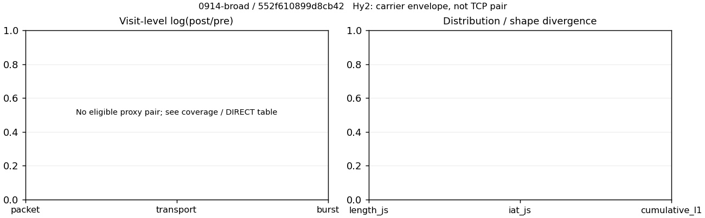

# 0914-broad · 条目 050 · qq.com

目标：https://v.qq.com/

活动标签：qq.com::page_load。选定访问 3 次。

[返回总索引](../../README.md) · [统计口径](../../methods.md)

## 覆盖与资格（每次访问均保留）

| 部署 | 重复 | 主请求路由 | 活动状态 | 代理比较 | DIRECT pre | 请求 proxy/direct/unresolved | 错误 |
| --- | --- | --- | --- | --- | --- | --- | --- |
| Hy2 | 1 | direct | passed | 0 | 1 | 0/329/0 | [] |
| SS | 1 | direct | passed | 0 | 1 | 0/288/1 | [] |
| VLESS | 1 | direct | degraded | 0 | 1 | 0/7/0 | [] |

主请求非 proxy 的统计仅解释为已索引的辅助代理连接或 DIRECT 观测，不代表目标业务经代理传输。播放确认与配对资格是两道不同的门。

图中散点为单次访问，短线为重复中位数；Hy2 是共享载体包络，不能与 TCP 配对作等范围因果对比。

形态图先逐访问归一化，再对访问等权平均；实线 pre，虚线 post。分箱序号及边界见 methods，不将分箱索引误解为长度或时间。

## 每次访问的关键观测

### SS

范围：`direct_pre_only`。每格 pre → post；空值为不可观测/不适用。

| 重复 | 包数 | 载荷字节 | burst | TCP FR | IAT中位µs | length JS | IAT JS |
| --- | --- | --- | --- | --- | --- | --- | --- |
| 1 | 3762 → — | 6.099e+06 → — | 2383 → — | 531 → — | 86.711 → — | — | — |

完整标量统计：中位数 [min,max]；Δ 为重复内逐访问变换的中位数，MAD 未缩放。n 为可用变换数；DIRECT-only 的 nΔ=0 不代表 pre 不可用。

| scope | 特征 | pre | post | Δ | IQRΔ | MADΔ | nΔ |
| --- | --- | --- | --- | --- | --- | --- | --- |
| direct_pre_only | active_span_sum_s_1000ms | 45.815 [45.815, 45.815] | — | — | — | — | 0 |
| direct_pre_only | active_span_sum_s_100ms | 11.669 [11.669, 11.669] | — | — | — | — | 0 |
| direct_pre_only | active_span_sum_s_500ms | 26.263 [26.263, 26.263] | — | — | — | — | 0 |
| direct_pre_only | burst_bytes_iqr | 1830 [1830, 1830] | — | — | — | — | 0 |
| direct_pre_only | burst_bytes_mad | 68 [68, 68] | — | — | — | — | 0 |
| direct_pre_only | burst_bytes_max | 32826 [32826, 32826] | — | — | — | — | 0 |
| direct_pre_only | burst_bytes_mean | 2559.4 [2559.4, 2559.4] | — | — | — | — | 0 |
| direct_pre_only | burst_bytes_median | 68 [68, 68] | — | — | — | — | 0 |
| direct_pre_only | burst_bytes_min | 0 [0, 0] | — | — | — | — | 0 |
| direct_pre_only | burst_bytes_p95 | 16354 [16354, 16354] | — | — | — | — | 0 |
| direct_pre_only | burst_bytes_q25 | 0 [0, 0] | — | — | — | — | 0 |
| direct_pre_only | burst_bytes_q75 | 1830 [1830, 1830] | — | — | — | — | 0 |
| direct_pre_only | burst_bytes_std | 5197.2 [5197.2, 5197.2] | — | — | — | — | 0 |
| direct_pre_only | burst_count | 2383 [2383, 2383] | — | — | — | — | 0 |
| direct_pre_only | burst_duration_ms_iqr | 0.38336 [0.38336, 0.38336] | — | — | — | — | 0 |
| direct_pre_only | burst_duration_ms_mad | 0 [0, 0] | — | — | — | — | 0 |
| direct_pre_only | burst_duration_ms_max | 24272 [24272, 24272] | — | — | — | — | 0 |
| direct_pre_only | burst_duration_ms_mean | 106.5 [106.5, 106.5] | — | — | — | — | 0 |
| direct_pre_only | burst_duration_ms_median | 0 [0, 0] | — | — | — | — | 0 |
| direct_pre_only | burst_duration_ms_min | 0 [0, 0] | — | — | — | — | 0 |
| direct_pre_only | burst_duration_ms_p95 | 111.48 [111.48, 111.48] | — | — | — | — | 0 |
| direct_pre_only | burst_duration_ms_q25 | 0 [0, 0] | — | — | — | — | 0 |
| direct_pre_only | burst_duration_ms_q75 | 0.38336 [0.38336, 0.38336] | — | — | — | — | 0 |
| direct_pre_only | burst_duration_ms_std | 850.71 [850.71, 850.71] | — | — | — | — | 0 |
| direct_pre_only | burst_packets_iqr | 1 [1, 1] | — | — | — | — | 0 |
| direct_pre_only | burst_packets_mad | 0 [0, 0] | — | — | — | — | 0 |
| direct_pre_only | burst_packets_max | 9 [9, 9] | — | — | — | — | 0 |
| direct_pre_only | burst_packets_mean | 1.5787 [1.5787, 1.5787] | — | — | — | — | 0 |
| direct_pre_only | burst_packets_median | 1 [1, 1] | — | — | — | — | 0 |
| direct_pre_only | burst_packets_min | 1 [1, 1] | — | — | — | — | 0 |
| direct_pre_only | burst_packets_p95 | 3 [3, 3] | — | — | — | — | 0 |
| direct_pre_only | burst_packets_q25 | 1 [1, 1] | — | — | — | — | 0 |
| direct_pre_only | burst_packets_q75 | 2 [2, 2] | — | — | — | — | 0 |
| direct_pre_only | burst_packets_std | 0.88038 [0.88038, 0.88038] | — | — | — | — | 0 |
| direct_pre_only | connection_span_concurrency_max | 28 [28, 28] | — | — | — | — | 0 |
| direct_pre_only | direction_entropy | 0.85711 [0.85711, 0.85711] | — | — | — | — | 0 |
| direct_pre_only | down_burst_count | 1167 [1167, 1167] | — | — | — | — | 0 |
| direct_pre_only | down_ip_bytes | 5.5614e+06 [5.5614e+06, 5.5614e+06] | — | — | — | — | 0 |
| direct_pre_only | down_packets | 2142 [2142, 2142] | — | — | — | — | 0 |
| direct_pre_only | down_transport_bytes | 5.45e+06 [5.45e+06, 5.45e+06] | — | — | — | — | 0 |
| direct_pre_only | duration_s | 26.878 [26.878, 26.878] | — | — | — | — | 0 |
| direct_pre_only | entity_count | 51 [51, 51] | — | — | — | — | 0 |
| direct_pre_only | fr_runs | 531 [531, 531] | — | — | — | — | 0 |
| direct_pre_only | fr_runs_per_packet | 0.2531 [0.2531, 0.2531] | — | — | — | — | 0 |
| direct_pre_only | fr_switches | 480 [480, 480] | — | — | — | — | 0 |
| direct_pre_only | fr_switches_per_possible_transition | 0.23449 [0.23449, 0.23449] | — | — | — | — | 0 |
| direct_pre_only | full_retransmission_fraction | 0.0013405 [0.0013405, 0.0013405] | — | — | — | — | 0 |
| direct_pre_only | full_retransmission_packets | 5 [5, 5] | — | — | — | — | 0 |
| direct_pre_only | iat_count | 3711 [3711, 3711] | — | — | — | — | 0 |
| direct_pre_only | iat_median_us | 86.711 [86.711, 86.711] | — | — | — | — | 0 |
| direct_pre_only | iat_us_iqr | 759.98 [759.98, 759.98] | — | — | — | — | 0 |
| direct_pre_only | iat_us_mad | 77.09 [77.09, 77.09] | — | — | — | — | 0 |
| direct_pre_only | iat_us_max | 2.4272e+07 [2.4272e+07, 2.4272e+07] | — | — | — | — | 0 |
| direct_pre_only | iat_us_mean | 1.6886e+05 [1.6886e+05, 1.6886e+05] | — | — | — | — | 0 |
| direct_pre_only | iat_us_median | 86.711 [86.711, 86.711] | — | — | — | — | 0 |
| direct_pre_only | iat_us_min | 0.057 [0.057, 0.057] | — | — | — | — | 0 |
| direct_pre_only | iat_us_p95 | 57943 [57943, 57943] | — | — | — | — | 0 |
| direct_pre_only | iat_us_q25 | 19.741 [19.741, 19.741] | — | — | — | — | 0 |
| direct_pre_only | iat_us_q75 | 779.72 [779.72, 779.72] | — | — | — | — | 0 |
| direct_pre_only | iat_us_std | 1.3647e+06 [1.3647e+06, 1.3647e+06] | — | — | — | — | 0 |
| direct_pre_only | idle_gap_count_1000ms | 69 [69, 69] | — | — | — | — | 0 |
| direct_pre_only | idle_gap_count_100ms | 155 [155, 155] | — | — | — | — | 0 |
| direct_pre_only | idle_gap_count_500ms | 94 [94, 94] | — | — | — | — | 0 |
| direct_pre_only | idle_gap_sum_s_1000ms | 580.81 [580.81, 580.81] | — | — | — | — | 0 |
| direct_pre_only | idle_gap_sum_s_100ms | 614.96 [614.96, 614.96] | — | — | — | — | 0 |
| direct_pre_only | idle_gap_sum_s_500ms | 600.37 [600.37, 600.37] | — | — | — | — | 0 |
| direct_pre_only | ip_bytes | 6.2946e+06 [6.2946e+06, 6.2946e+06] | — | — | — | — | 0 |
| direct_pre_only | length_iqr | 4483 [4483, 4483] | — | — | — | — | 0 |
| direct_pre_only | length_mad | 1829 [1829, 1829] | — | — | — | — | 0 |
| direct_pre_only | length_max | 8948 [8948, 8948] | — | — | — | — | 0 |
| direct_pre_only | length_mean | 2907.1 [2907.1, 2907.1] | — | — | — | — | 0 |
| direct_pre_only | length_median | 1966 [1966, 1966] | — | — | — | — | 0 |
| direct_pre_only | length_min | 30 [30, 30] | — | — | — | — | 0 |
| direct_pre_only | length_p95 | 8920 [8920, 8920] | — | — | — | — | 0 |
| direct_pre_only | length_q25 | 270 [270, 270] | — | — | — | — | 0 |
| direct_pre_only | length_q75 | 4753 [4753, 4753] | — | — | — | — | 0 |
| direct_pre_only | length_std | 3029.2 [3029.2, 3029.2] | — | — | — | — | 0 |
| direct_pre_only | nonempty_entity_count | 51 [51, 51] | — | — | — | — | 0 |
| direct_pre_only | nonempty_packets | 2098 [2098, 2098] | — | — | — | — | 0 |
| direct_pre_only | offload_suspect_fraction | 0.30463 [0.30463, 0.30463] | — | — | — | — | 0 |
| direct_pre_only | packet_count | 3762 [3762, 3762] | — | — | — | — | 0 |
| direct_pre_only | rtt_median_ms | 0.093807 [0.093807, 0.093807] | — | — | — | — | 0 |
| direct_pre_only | rtt_sample_count | 1515 [1515, 1515] | — | — | — | — | 0 |
| direct_pre_only | tcp_ack_count | 3672 [3672, 3672] | — | — | — | — | 0 |
| direct_pre_only | tcp_fin_count | 100 [100, 100] | — | — | — | — | 0 |
| direct_pre_only | tcp_packet_count | 3730 [3730, 3730] | — | — | — | — | 0 |
| direct_pre_only | tcp_rst_count | 8 [8, 8] | — | — | — | — | 0 |
| direct_pre_only | tcp_syn_count | 100 [100, 100] | — | — | — | — | 0 |
| direct_pre_only | tcp_window_raw_median | 65535 [65535, 65535] | — | — | — | — | 0 |
| direct_pre_only | transition_entropy | 0.71547 [0.71547, 0.71547] | — | — | — | — | 0 |
| direct_pre_only | transition_n_mm | 1243 [1243, 1243] | — | — | — | — | 0 |
| direct_pre_only | transition_n_mp | 215 [215, 215] | — | — | — | — | 0 |
| direct_pre_only | transition_n_pm | 265 [265, 265] | — | — | — | — | 0 |
| direct_pre_only | transition_n_pp | 324 [324, 324] | — | — | — | — | 0 |
| direct_pre_only | transition_p_mm | 0.85254 [0.85254, 0.85254] | — | — | — | — | 0 |
| direct_pre_only | transition_p_mp | 0.14746 [0.14746, 0.14746] | — | — | — | — | 0 |
| direct_pre_only | transition_p_pm | 0.44992 [0.44992, 0.44992] | — | — | — | — | 0 |
| direct_pre_only | transition_p_pp | 0.55008 [0.55008, 0.55008] | — | — | — | — | 0 |
| direct_pre_only | transport_bytes | 6.099e+06 [6.099e+06, 6.099e+06] | — | — | — | — | 0 |
| direct_pre_only | up_burst_count | 1216 [1216, 1216] | — | — | — | — | 0 |
| direct_pre_only | up_byte_fraction | 0.10642 [0.10642, 0.10642] | — | — | — | — | 0 |
| direct_pre_only | up_ip_bytes | 7.3328e+05 [7.3328e+05, 7.3328e+05] | — | — | — | — | 0 |
| direct_pre_only | up_packets | 1620 [1620, 1620] | — | — | — | — | 0 |
| direct_pre_only | up_transport_bytes | 6.4904e+05 [6.4904e+05, 6.4904e+05] | — | — | — | — | 0 |
| direct_pre_only | zero_iat_count | 0 [0, 0] | — | — | — | — | 0 |
| direct_pre_only | zero_iat_fraction | 0 [0, 0] | — | — | — | — | 0 |

### VLESS

范围：`direct_pre_only`。每格 pre → post；空值为不可观测/不适用。

| 重复 | 包数 | 载荷字节 | burst | TCP FR | IAT中位µs | length JS | IAT JS |
| --- | --- | --- | --- | --- | --- | --- | --- |
| 1 | 235 → — | 2.1232e+05 → — | 154 → — | 36 → — | 129.75 → — | — | — |

完整标量统计：中位数 [min,max]；Δ 为重复内逐访问变换的中位数，MAD 未缩放。n 为可用变换数；DIRECT-only 的 nΔ=0 不代表 pre 不可用。

| scope | 特征 | pre | post | Δ | IQRΔ | MADΔ | nΔ |
| --- | --- | --- | --- | --- | --- | --- | --- |
| direct_pre_only | active_span_sum_s_1000ms | 4.3292 [4.3292, 4.3292] | — | — | — | — | 0 |
| direct_pre_only | active_span_sum_s_100ms | 0.60096 [0.60096, 0.60096] | — | — | — | — | 0 |
| direct_pre_only | active_span_sum_s_500ms | 2.3568 [2.3568, 2.3568] | — | — | — | — | 0 |
| direct_pre_only | burst_bytes_iqr | 1240 [1240, 1240] | — | — | — | — | 0 |
| direct_pre_only | burst_bytes_mad | 31 [31, 31] | — | — | — | — | 0 |
| direct_pre_only | burst_bytes_max | 20480 [20480, 20480] | — | — | — | — | 0 |
| direct_pre_only | burst_bytes_mean | 1378.7 [1378.7, 1378.7] | — | — | — | — | 0 |
| direct_pre_only | burst_bytes_median | 31 [31, 31] | — | — | — | — | 0 |
| direct_pre_only | burst_bytes_min | 0 [0, 0] | — | — | — | — | 0 |
| direct_pre_only | burst_bytes_p95 | 6686.4 [6686.4, 6686.4] | — | — | — | — | 0 |
| direct_pre_only | burst_bytes_q25 | 0 [0, 0] | — | — | — | — | 0 |
| direct_pre_only | burst_bytes_q75 | 1240 [1240, 1240] | — | — | — | — | 0 |
| direct_pre_only | burst_bytes_std | 3073.8 [3073.8, 3073.8] | — | — | — | — | 0 |
| direct_pre_only | burst_count | 154 [154, 154] | — | — | — | — | 0 |
| direct_pre_only | burst_duration_ms_iqr | 0.95868 [0.95868, 0.95868] | — | — | — | — | 0 |
| direct_pre_only | burst_duration_ms_mad | 0 [0, 0] | — | — | — | — | 0 |
| direct_pre_only | burst_duration_ms_max | 10156 [10156, 10156] | — | — | — | — | 0 |
| direct_pre_only | burst_duration_ms_mean | 90.64 [90.64, 90.64] | — | — | — | — | 0 |
| direct_pre_only | burst_duration_ms_median | 0 [0, 0] | — | — | — | — | 0 |
| direct_pre_only | burst_duration_ms_min | 0 [0, 0] | — | — | — | — | 0 |
| direct_pre_only | burst_duration_ms_p95 | 153.33 [153.33, 153.33] | — | — | — | — | 0 |
| direct_pre_only | burst_duration_ms_q25 | 0 [0, 0] | — | — | — | — | 0 |
| direct_pre_only | burst_duration_ms_q75 | 0.95868 [0.95868, 0.95868] | — | — | — | — | 0 |
| direct_pre_only | burst_duration_ms_std | 820.79 [820.79, 820.79] | — | — | — | — | 0 |
| direct_pre_only | burst_packets_iqr | 1 [1, 1] | — | — | — | — | 0 |
| direct_pre_only | burst_packets_mad | 0 [0, 0] | — | — | — | — | 0 |
| direct_pre_only | burst_packets_max | 7 [7, 7] | — | — | — | — | 0 |
| direct_pre_only | burst_packets_mean | 1.526 [1.526, 1.526] | — | — | — | — | 0 |
| direct_pre_only | burst_packets_median | 1 [1, 1] | — | — | — | — | 0 |
| direct_pre_only | burst_packets_min | 1 [1, 1] | — | — | — | — | 0 |
| direct_pre_only | burst_packets_p95 | 3 [3, 3] | — | — | — | — | 0 |
| direct_pre_only | burst_packets_q25 | 1 [1, 1] | — | — | — | — | 0 |
| direct_pre_only | burst_packets_q75 | 2 [2, 2] | — | — | — | — | 0 |
| direct_pre_only | burst_packets_std | 0.78292 [0.78292, 0.78292] | — | — | — | — | 0 |
| direct_pre_only | connection_span_concurrency_max | 5 [5, 5] | — | — | — | — | 0 |
| direct_pre_only | direction_entropy | 0.85976 [0.85976, 0.85976] | — | — | — | — | 0 |
| direct_pre_only | down_burst_count | 74 [74, 74] | — | — | — | — | 0 |
| direct_pre_only | down_ip_bytes | 2.0336e+05 [2.0336e+05, 2.0336e+05] | — | — | — | — | 0 |
| direct_pre_only | down_packets | 131 [131, 131] | — | — | — | — | 0 |
| direct_pre_only | down_transport_bytes | 1.965e+05 [1.965e+05, 1.965e+05] | — | — | — | — | 0 |
| direct_pre_only | duration_s | 39.733 [39.733, 39.733] | — | — | — | — | 0 |
| direct_pre_only | entity_count | 6 [6, 6] | — | — | — | — | 0 |
| direct_pre_only | fr_runs | 36 [36, 36] | — | — | — | — | 0 |
| direct_pre_only | fr_runs_per_packet | 0.31858 [0.31858, 0.31858] | — | — | — | — | 0 |
| direct_pre_only | fr_switches | 30 [30, 30] | — | — | — | — | 0 |
| direct_pre_only | fr_switches_per_possible_transition | 0.28037 [0.28037, 0.28037] | — | — | — | — | 0 |
| direct_pre_only | full_retransmission_fraction | 0 [0, 0] | — | — | — | — | 0 |
| direct_pre_only | full_retransmission_packets | 0 [0, 0] | — | — | — | — | 0 |
| direct_pre_only | iat_count | 229 [229, 229] | — | — | — | — | 0 |
| direct_pre_only | iat_median_us | 129.75 [129.75, 129.75] | — | — | — | — | 0 |
| direct_pre_only | iat_us_iqr | 1269.5 [1269.5, 1269.5] | — | — | — | — | 0 |
| direct_pre_only | iat_us_mad | 119.07 [119.07, 119.07] | — | — | — | — | 0 |
| direct_pre_only | iat_us_max | 1.5001e+07 [1.5001e+07, 1.5001e+07] | — | — | — | — | 0 |
| direct_pre_only | iat_us_mean | 1.2876e+05 [1.2876e+05, 1.2876e+05] | — | — | — | — | 0 |
| direct_pre_only | iat_us_median | 129.75 [129.75, 129.75] | — | — | — | — | 0 |
| direct_pre_only | iat_us_min | 3.729 [3.729, 3.729] | — | — | — | — | 0 |
| direct_pre_only | iat_us_p95 | 42830 [42830, 42830] | — | — | — | — | 0 |
| direct_pre_only | iat_us_q25 | 43.157 [43.157, 43.157] | — | — | — | — | 0 |
| direct_pre_only | iat_us_q75 | 1312.6 [1312.6, 1312.6] | — | — | — | — | 0 |
| direct_pre_only | iat_us_std | 1.1937e+06 [1.1937e+06, 1.1937e+06] | — | — | — | — | 0 |
| direct_pre_only | idle_gap_count_1000ms | 2 [2, 2] | — | — | — | — | 0 |
| direct_pre_only | idle_gap_count_100ms | 11 [11, 11] | — | — | — | — | 0 |
| direct_pre_only | idle_gap_count_500ms | 5 [5, 5] | — | — | — | — | 0 |
| direct_pre_only | idle_gap_sum_s_1000ms | 25.157 [25.157, 25.157] | — | — | — | — | 0 |
| direct_pre_only | idle_gap_sum_s_100ms | 28.885 [28.885, 28.885] | — | — | — | — | 0 |
| direct_pre_only | idle_gap_sum_s_500ms | 27.129 [27.129, 27.129] | — | — | — | — | 0 |
| direct_pre_only | ip_bytes | 2.2464e+05 [2.2464e+05, 2.2464e+05] | — | — | — | — | 0 |
| direct_pre_only | length_iqr | 2757 [2757, 2757] | — | — | — | — | 0 |
| direct_pre_only | length_mad | 1096 [1096, 1096] | — | — | — | — | 0 |
| direct_pre_only | length_max | 8920 [8920, 8920] | — | — | — | — | 0 |
| direct_pre_only | length_mean | 1879 [1879, 1879] | — | — | — | — | 0 |
| direct_pre_only | length_median | 1176 [1176, 1176] | — | — | — | — | 0 |
| direct_pre_only | length_min | 31 [31, 31] | — | — | — | — | 0 |
| direct_pre_only | length_p95 | 7682.4 [7682.4, 7682.4] | — | — | — | — | 0 |
| direct_pre_only | length_q25 | 99 [99, 99] | — | — | — | — | 0 |
| direct_pre_only | length_q75 | 2856 [2856, 2856] | — | — | — | — | 0 |
| direct_pre_only | length_std | 2226 [2226, 2226] | — | — | — | — | 0 |
| direct_pre_only | nonempty_entity_count | 6 [6, 6] | — | — | — | — | 0 |
| direct_pre_only | nonempty_packets | 113 [113, 113] | — | — | — | — | 0 |
| direct_pre_only | offload_suspect_fraction | 0.21277 [0.21277, 0.21277] | — | — | — | — | 0 |
| direct_pre_only | packet_count | 235 [235, 235] | — | — | — | — | 0 |
| direct_pre_only | rtt_median_ms | 0.099381 [0.099381, 0.099381] | — | — | — | — | 0 |
| direct_pre_only | rtt_sample_count | 104 [104, 104] | — | — | — | — | 0 |
| direct_pre_only | tcp_ack_count | 229 [229, 229] | — | — | — | — | 0 |
| direct_pre_only | tcp_fin_count | 12 [12, 12] | — | — | — | — | 0 |
| direct_pre_only | tcp_packet_count | 235 [235, 235] | — | — | — | — | 0 |
| direct_pre_only | tcp_rst_count | 0 [0, 0] | — | — | — | — | 0 |
| direct_pre_only | tcp_syn_count | 12 [12, 12] | — | — | — | — | 0 |
| direct_pre_only | tcp_window_raw_median | 65455 [65455, 65455] | — | — | — | — | 0 |
| direct_pre_only | transition_entropy | 0.7403 [0.7403, 0.7403] | — | — | — | — | 0 |
| direct_pre_only | transition_n_mm | 63 [63, 63] | — | — | — | — | 0 |
| direct_pre_only | transition_n_mp | 12 [12, 12] | — | — | — | — | 0 |
| direct_pre_only | transition_n_pm | 18 [18, 18] | — | — | — | — | 0 |
| direct_pre_only | transition_n_pp | 14 [14, 14] | — | — | — | — | 0 |
| direct_pre_only | transition_p_mm | 0.84 [0.84, 0.84] | — | — | — | — | 0 |
| direct_pre_only | transition_p_mp | 0.16 [0.16, 0.16] | — | — | — | — | 0 |
| direct_pre_only | transition_p_pm | 0.5625 [0.5625, 0.5625] | — | — | — | — | 0 |
| direct_pre_only | transition_p_pp | 0.4375 [0.4375, 0.4375] | — | — | — | — | 0 |
| direct_pre_only | transport_bytes | 2.1232e+05 [2.1232e+05, 2.1232e+05] | — | — | — | — | 0 |
| direct_pre_only | up_burst_count | 80 [80, 80] | — | — | — | — | 0 |
| direct_pre_only | up_byte_fraction | 0.074523 [0.074523, 0.074523] | — | — | — | — | 0 |
| direct_pre_only | up_ip_bytes | 21279 [21279, 21279] | — | — | — | — | 0 |
| direct_pre_only | up_packets | 104 [104, 104] | — | — | — | — | 0 |
| direct_pre_only | up_transport_bytes | 15823 [15823, 15823] | — | — | — | — | 0 |
| direct_pre_only | zero_iat_count | 0 [0, 0] | — | — | — | — | 0 |
| direct_pre_only | zero_iat_fraction | 0 [0, 0] | — | — | — | — | 0 |

### Hy2

范围：`direct_pre_only`。每格 pre → post；空值为不可观测/不适用。

| 重复 | 包数 | 载荷字节 | burst | TCP FR | IAT中位µs | length JS | IAT JS |
| --- | --- | --- | --- | --- | --- | --- | --- |
| 1 | 4443 → — | 6.6508e+06 → — | 2558 → — | 712 → — | 100.97 → — | — | — |

完整标量统计：中位数 [min,max]；Δ 为重复内逐访问变换的中位数，MAD 未缩放。n 为可用变换数；DIRECT-only 的 nΔ=0 不代表 pre 不可用。

| scope | 特征 | pre | post | Δ | IQRΔ | MADΔ | nΔ |
| --- | --- | --- | --- | --- | --- | --- | --- |
| direct_pre_only | active_span_sum_s_1000ms | 35.647 [35.647, 35.647] | — | — | — | — | 0 |
| direct_pre_only | active_span_sum_s_100ms | 13.825 [13.825, 13.825] | — | — | — | — | 0 |
| direct_pre_only | active_span_sum_s_500ms | 27.092 [27.092, 27.092] | — | — | — | — | 0 |
| direct_pre_only | burst_bytes_iqr | 1804 [1804, 1804] | — | — | — | — | 0 |
| direct_pre_only | burst_bytes_mad | 75 [75, 75] | — | — | — | — | 0 |
| direct_pre_only | burst_bytes_max | 47530 [47530, 47530] | — | — | — | — | 0 |
| direct_pre_only | burst_bytes_mean | 2600 [2600, 2600] | — | — | — | — | 0 |
| direct_pre_only | burst_bytes_median | 75 [75, 75] | — | — | — | — | 0 |
| direct_pre_only | burst_bytes_min | 0 [0, 0] | — | — | — | — | 0 |
| direct_pre_only | burst_bytes_p95 | 16476 [16476, 16476] | — | — | — | — | 0 |
| direct_pre_only | burst_bytes_q25 | 0 [0, 0] | — | — | — | — | 0 |
| direct_pre_only | burst_bytes_q75 | 1804 [1804, 1804] | — | — | — | — | 0 |
| direct_pre_only | burst_bytes_std | 5297.7 [5297.7, 5297.7] | — | — | — | — | 0 |
| direct_pre_only | burst_count | 2558 [2558, 2558] | — | — | — | — | 0 |
| direct_pre_only | burst_duration_ms_iqr | 0.55257 [0.55257, 0.55257] | — | — | — | — | 0 |
| direct_pre_only | burst_duration_ms_mad | 0 [0, 0] | — | — | — | — | 0 |
| direct_pre_only | burst_duration_ms_max | 27078 [27078, 27078] | — | — | — | — | 0 |
| direct_pre_only | burst_duration_ms_mean | 143.48 [143.48, 143.48] | — | — | — | — | 0 |
| direct_pre_only | burst_duration_ms_median | 0 [0, 0] | — | — | — | — | 0 |
| direct_pre_only | burst_duration_ms_min | 0 [0, 0] | — | — | — | — | 0 |
| direct_pre_only | burst_duration_ms_p95 | 76.463 [76.463, 76.463] | — | — | — | — | 0 |
| direct_pre_only | burst_duration_ms_q25 | 0 [0, 0] | — | — | — | — | 0 |
| direct_pre_only | burst_duration_ms_q75 | 0.55257 [0.55257, 0.55257] | — | — | — | — | 0 |
| direct_pre_only | burst_duration_ms_std | 1301.4 [1301.4, 1301.4] | — | — | — | — | 0 |
| direct_pre_only | burst_packets_iqr | 1 [1, 1] | — | — | — | — | 0 |
| direct_pre_only | burst_packets_mad | 0 [0, 0] | — | — | — | — | 0 |
| direct_pre_only | burst_packets_max | 39 [39, 39] | — | — | — | — | 0 |
| direct_pre_only | burst_packets_mean | 1.7369 [1.7369, 1.7369] | — | — | — | — | 0 |
| direct_pre_only | burst_packets_median | 1 [1, 1] | — | — | — | — | 0 |
| direct_pre_only | burst_packets_min | 1 [1, 1] | — | — | — | — | 0 |
| direct_pre_only | burst_packets_p95 | 4 [4, 4] | — | — | — | — | 0 |
| direct_pre_only | burst_packets_q25 | 1 [1, 1] | — | — | — | — | 0 |
| direct_pre_only | burst_packets_q75 | 2 [2, 2] | — | — | — | — | 0 |
| direct_pre_only | burst_packets_std | 1.532 [1.532, 1.532] | — | — | — | — | 0 |
| direct_pre_only | connection_span_concurrency_max | 32 [32, 32] | — | — | — | — | 0 |
| direct_pre_only | direction_entropy | 0.91492 [0.91492, 0.91492] | — | — | — | — | 0 |
| direct_pre_only | down_burst_count | 1252 [1252, 1252] | — | — | — | — | 0 |
| direct_pre_only | down_ip_bytes | 6.032e+06 [6.032e+06, 6.032e+06] | — | — | — | — | 0 |
| direct_pre_only | down_packets | 2504 [2504, 2504] | — | — | — | — | 0 |
| direct_pre_only | down_transport_bytes | 5.9092e+06 [5.9092e+06, 5.9092e+06] | — | — | — | — | 0 |
| direct_pre_only | duration_s | 28.277 [28.277, 28.277] | — | — | — | — | 0 |
| direct_pre_only | entity_count | 58 [58, 58] | — | — | — | — | 0 |
| direct_pre_only | fr_runs | 712 [712, 712] | — | — | — | — | 0 |
| direct_pre_only | fr_runs_per_packet | 0.25456 [0.25456, 0.25456] | — | — | — | — | 0 |
| direct_pre_only | fr_switches | 654 [654, 654] | — | — | — | — | 0 |
| direct_pre_only | fr_switches_per_possible_transition | 0.23877 [0.23877, 0.23877] | — | — | — | — | 0 |
| direct_pre_only | full_retransmission_fraction | 0.0023885 [0.0023885, 0.0023885] | — | — | — | — | 0 |
| direct_pre_only | full_retransmission_packets | 9 [9, 9] | — | — | — | — | 0 |
| direct_pre_only | iat_count | 4385 [4385, 4385] | — | — | — | — | 0 |
| direct_pre_only | iat_median_us | 100.97 [100.97, 100.97] | — | — | — | — | 0 |
| direct_pre_only | iat_us_iqr | 989.27 [989.27, 989.27] | — | — | — | — | 0 |
| direct_pre_only | iat_us_mad | 90.044 [90.044, 90.044] | — | — | — | — | 0 |
| direct_pre_only | iat_us_max | 2.7082e+07 [2.7082e+07, 2.7082e+07] | — | — | — | — | 0 |
| direct_pre_only | iat_us_mean | 1.6975e+05 [1.6975e+05, 1.6975e+05] | — | — | — | — | 0 |
| direct_pre_only | iat_us_median | 100.97 [100.97, 100.97] | — | — | — | — | 0 |
| direct_pre_only | iat_us_min | 0.028 [0.028, 0.028] | — | — | — | — | 0 |
| direct_pre_only | iat_us_p95 | 41858 [41858, 41858] | — | — | — | — | 0 |
| direct_pre_only | iat_us_q25 | 22.518 [22.518, 22.518] | — | — | — | — | 0 |
| direct_pre_only | iat_us_q75 | 1011.8 [1011.8, 1011.8] | — | — | — | — | 0 |
| direct_pre_only | iat_us_std | 1.498e+06 [1.498e+06, 1.498e+06] | — | — | — | — | 0 |
| direct_pre_only | idle_gap_count_1000ms | 83 [83, 83] | — | — | — | — | 0 |
| direct_pre_only | idle_gap_count_100ms | 153 [153, 153] | — | — | — | — | 0 |
| direct_pre_only | idle_gap_count_500ms | 95 [95, 95] | — | — | — | — | 0 |
| direct_pre_only | idle_gap_sum_s_1000ms | 708.69 [708.69, 708.69] | — | — | — | — | 0 |
| direct_pre_only | idle_gap_sum_s_100ms | 730.52 [730.52, 730.52] | — | — | — | — | 0 |
| direct_pre_only | idle_gap_sum_s_500ms | 717.25 [717.25, 717.25] | — | — | — | — | 0 |
| direct_pre_only | ip_bytes | 6.8666e+06 [6.8666e+06, 6.8666e+06] | — | — | — | — | 0 |
| direct_pre_only | length_iqr | 2781 [2781, 2781] | — | — | — | — | 0 |
| direct_pre_only | length_mad | 1199 [1199, 1199] | — | — | — | — | 0 |
| direct_pre_only | length_max | 8948 [8948, 8948] | — | — | — | — | 0 |
| direct_pre_only | length_mean | 2377.8 [2377.8, 2377.8] | — | — | — | — | 0 |
| direct_pre_only | length_median | 1250 [1250, 1250] | — | — | — | — | 0 |
| direct_pre_only | length_min | 9 [9, 9] | — | — | — | — | 0 |
| direct_pre_only | length_p95 | 8920 [8920, 8920] | — | — | — | — | 0 |
| direct_pre_only | length_q25 | 99 [99, 99] | — | — | — | — | 0 |
| direct_pre_only | length_q75 | 2880 [2880, 2880] | — | — | — | — | 0 |
| direct_pre_only | length_std | 2908.6 [2908.6, 2908.6] | — | — | — | — | 0 |
| direct_pre_only | nonempty_entity_count | 58 [58, 58] | — | — | — | — | 0 |
| direct_pre_only | nonempty_packets | 2797 [2797, 2797] | — | — | — | — | 0 |
| direct_pre_only | offload_suspect_fraction | 0.25883 [0.25883, 0.25883] | — | — | — | — | 0 |
| direct_pre_only | packet_count | 4443 [4443, 4443] | — | — | — | — | 0 |
| direct_pre_only | rtt_median_ms | 0.1077 [0.1077, 0.1077] | — | — | — | — | 0 |
| direct_pre_only | rtt_sample_count | 1492 [1492, 1492] | — | — | — | — | 0 |
| direct_pre_only | tcp_ack_count | 3711 [3711, 3711] | — | — | — | — | 0 |
| direct_pre_only | tcp_fin_count | 102 [102, 102] | — | — | — | — | 0 |
| direct_pre_only | tcp_packet_count | 3768 [3768, 3768] | — | — | — | — | 0 |
| direct_pre_only | tcp_rst_count | 5 [5, 5] | — | — | — | — | 0 |
| direct_pre_only | tcp_syn_count | 104 [104, 104] | — | — | — | — | 0 |
| direct_pre_only | tcp_window_raw_median | 65535 [65535, 65535] | — | — | — | — | 0 |
| direct_pre_only | transition_entropy | 0.75231 [0.75231, 0.75231] | — | — | — | — | 0 |
| direct_pre_only | transition_n_mm | 1522 [1522, 1522] | — | — | — | — | 0 |
| direct_pre_only | transition_n_mp | 302 [302, 302] | — | — | — | — | 0 |
| direct_pre_only | transition_n_pm | 352 [352, 352] | — | — | — | — | 0 |
| direct_pre_only | transition_n_pp | 563 [563, 563] | — | — | — | — | 0 |
| direct_pre_only | transition_p_mm | 0.83443 [0.83443, 0.83443] | — | — | — | — | 0 |
| direct_pre_only | transition_p_mp | 0.16557 [0.16557, 0.16557] | — | — | — | — | 0 |
| direct_pre_only | transition_p_pm | 0.3847 [0.3847, 0.3847] | — | — | — | — | 0 |
| direct_pre_only | transition_p_pp | 0.6153 [0.6153, 0.6153] | — | — | — | — | 0 |
| direct_pre_only | transport_bytes | 6.6508e+06 [6.6508e+06, 6.6508e+06] | — | — | — | — | 0 |
| direct_pre_only | up_burst_count | 1306 [1306, 1306] | — | — | — | — | 0 |
| direct_pre_only | up_byte_fraction | 0.11152 [0.11152, 0.11152] | — | — | — | — | 0 |
| direct_pre_only | up_ip_bytes | 8.3458e+05 [8.3458e+05, 8.3458e+05] | — | — | — | — | 0 |
| direct_pre_only | up_packets | 1939 [1939, 1939] | — | — | — | — | 0 |
| direct_pre_only | up_transport_bytes | 7.4169e+05 [7.4169e+05, 7.4169e+05] | — | — | — | — | 0 |
| direct_pre_only | zero_iat_count | 0 [0, 0] | — | — | — | — | 0 |
| direct_pre_only | zero_iat_fraction | 0 [0, 0] | — | — | — | — | 0 |

## 不同部署对比

以下是各部署自身重复中位数的差异，不按重复编号强行配对。跨 TCP/Hy2 的行标记异质观测范围。

| 视角 | 特征 | 部署A | 部署B | A中位 | B中位 | B−A | 比较口径 |
| --- | --- | --- | --- | --- | --- | --- | --- |
| pre | burst_count | SS | VLESS | 2383 | 154 | -2229 | same_scope_unpaired_visits |
| pre | burst_count | SS | Hy2 | 2383 | 2558 | 175 | same_scope_unpaired_visits |
| pre | burst_count | VLESS | Hy2 | 154 | 2558 | 2404 | same_scope_unpaired_visits |
| pre | connection_span_concurrency_max | SS | VLESS | 28 | 5 | -23 | same_scope_unpaired_visits |
| pre | connection_span_concurrency_max | SS | Hy2 | 28 | 32 | 4 | same_scope_unpaired_visits |
| pre | connection_span_concurrency_max | VLESS | Hy2 | 5 | 32 | 27 | same_scope_unpaired_visits |
| pre | direction_entropy | SS | VLESS | 0.85711 | 0.85976 | 0.0026474 | same_scope_unpaired_visits |
| pre | direction_entropy | SS | Hy2 | 0.85711 | 0.91492 | 0.057815 | same_scope_unpaired_visits |
| pre | direction_entropy | VLESS | Hy2 | 0.85976 | 0.91492 | 0.055167 | same_scope_unpaired_visits |
| pre | down_transport_bytes | SS | VLESS | 5.45e+06 | 1.965e+05 | -5.2535e+06 | same_scope_unpaired_visits |
| pre | down_transport_bytes | SS | Hy2 | 5.45e+06 | 5.9092e+06 | 4.5916e+05 | same_scope_unpaired_visits |
| pre | down_transport_bytes | VLESS | Hy2 | 1.965e+05 | 5.9092e+06 | 5.7126e+06 | same_scope_unpaired_visits |
| pre | duration_s | SS | VLESS | 26.878 | 39.733 | 12.855 | same_scope_unpaired_visits |
| pre | duration_s | SS | Hy2 | 26.878 | 28.277 | 1.3996 | same_scope_unpaired_visits |
| pre | duration_s | VLESS | Hy2 | 39.733 | 28.277 | -11.455 | same_scope_unpaired_visits |
| pre | entity_count | SS | VLESS | 51 | 6 | -45 | same_scope_unpaired_visits |
| pre | entity_count | SS | Hy2 | 51 | 58 | 7 | same_scope_unpaired_visits |
| pre | entity_count | VLESS | Hy2 | 6 | 58 | 52 | same_scope_unpaired_visits |
| pre | fr_runs | SS | VLESS | 531 | 36 | -495 | same_scope_unpaired_visits |
| pre | fr_runs | SS | Hy2 | 531 | 712 | 181 | same_scope_unpaired_visits |
| pre | fr_runs | VLESS | Hy2 | 36 | 712 | 676 | same_scope_unpaired_visits |
| pre | fr_runs_per_packet | SS | VLESS | 0.2531 | 0.31858 | 0.065486 | same_scope_unpaired_visits |
| pre | fr_runs_per_packet | SS | Hy2 | 0.2531 | 0.25456 | 0.0014603 | same_scope_unpaired_visits |
| pre | fr_runs_per_packet | VLESS | Hy2 | 0.31858 | 0.25456 | -0.064026 | same_scope_unpaired_visits |
| pre | fr_switches | SS | VLESS | 480 | 30 | -450 | same_scope_unpaired_visits |
| pre | fr_switches | SS | Hy2 | 480 | 654 | 174 | same_scope_unpaired_visits |
| pre | fr_switches | VLESS | Hy2 | 30 | 654 | 624 | same_scope_unpaired_visits |
| pre | fr_switches_per_possible_transition | SS | VLESS | 0.23449 | 0.28037 | 0.045884 | same_scope_unpaired_visits |
| pre | fr_switches_per_possible_transition | SS | Hy2 | 0.23449 | 0.23877 | 0.0042838 | same_scope_unpaired_visits |
| pre | fr_switches_per_possible_transition | VLESS | Hy2 | 0.28037 | 0.23877 | -0.041601 | same_scope_unpaired_visits |
| pre | full_retransmission_fraction | SS | VLESS | 0.0013405 | 0 | -0.0013405 | same_scope_unpaired_visits |
| pre | full_retransmission_fraction | SS | Hy2 | 0.0013405 | 0.0023885 | 0.0010481 | same_scope_unpaired_visits |
| pre | full_retransmission_fraction | VLESS | Hy2 | 0 | 0.0023885 | 0.0023885 | same_scope_unpaired_visits |
| pre | iat_median_us | SS | VLESS | 86.711 | 129.75 | 43.04 | same_scope_unpaired_visits |
| pre | iat_median_us | SS | Hy2 | 86.711 | 100.97 | 14.256 | same_scope_unpaired_visits |
| pre | iat_median_us | VLESS | Hy2 | 129.75 | 100.97 | -28.784 | same_scope_unpaired_visits |
| pre | iat_us_p95 | SS | VLESS | 57943 | 42830 | -15112 | same_scope_unpaired_visits |
| pre | iat_us_p95 | SS | Hy2 | 57943 | 41858 | -16085 | same_scope_unpaired_visits |
| pre | iat_us_p95 | VLESS | Hy2 | 42830 | 41858 | -972.44 | same_scope_unpaired_visits |
| pre | ip_bytes | SS | VLESS | 6.2946e+06 | 2.2464e+05 | -6.07e+06 | same_scope_unpaired_visits |
| pre | ip_bytes | SS | Hy2 | 6.2946e+06 | 6.8666e+06 | 5.7191e+05 | same_scope_unpaired_visits |
| pre | ip_bytes | VLESS | Hy2 | 2.2464e+05 | 6.8666e+06 | 6.6419e+06 | same_scope_unpaired_visits |
| pre | length_median | SS | VLESS | 1966 | 1176 | -790 | same_scope_unpaired_visits |
| pre | length_median | SS | Hy2 | 1966 | 1250 | -716 | same_scope_unpaired_visits |
| pre | length_median | VLESS | Hy2 | 1176 | 1250 | 74 | same_scope_unpaired_visits |
| pre | length_p95 | SS | VLESS | 8920 | 7682.4 | -1237.6 | same_scope_unpaired_visits |
| pre | length_p95 | SS | Hy2 | 8920 | 8920 | 0 | same_scope_unpaired_visits |
| pre | length_p95 | VLESS | Hy2 | 7682.4 | 8920 | 1237.6 | same_scope_unpaired_visits |
| pre | nonempty_packets | SS | VLESS | 2098 | 113 | -1985 | same_scope_unpaired_visits |
| pre | nonempty_packets | SS | Hy2 | 2098 | 2797 | 699 | same_scope_unpaired_visits |
| pre | nonempty_packets | VLESS | Hy2 | 113 | 2797 | 2684 | same_scope_unpaired_visits |
| pre | offload_suspect_fraction | SS | VLESS | 0.30463 | 0.21277 | -0.091859 | same_scope_unpaired_visits |
| pre | offload_suspect_fraction | SS | Hy2 | 0.30463 | 0.25883 | -0.045791 | same_scope_unpaired_visits |
| pre | offload_suspect_fraction | VLESS | Hy2 | 0.21277 | 0.25883 | 0.046068 | same_scope_unpaired_visits |
| pre | packet_count | SS | VLESS | 3762 | 235 | -3527 | same_scope_unpaired_visits |
| pre | packet_count | SS | Hy2 | 3762 | 4443 | 681 | same_scope_unpaired_visits |
| pre | packet_count | VLESS | Hy2 | 235 | 4443 | 4208 | same_scope_unpaired_visits |
| pre | rtt_median_ms | SS | VLESS | 0.093807 | 0.099381 | 0.0055745 | same_scope_unpaired_visits |
| pre | rtt_median_ms | SS | Hy2 | 0.093807 | 0.1077 | 0.013897 | same_scope_unpaired_visits |
| pre | rtt_median_ms | VLESS | Hy2 | 0.099381 | 0.1077 | 0.008322 | same_scope_unpaired_visits |
| pre | transition_entropy | SS | VLESS | 0.71547 | 0.7403 | 0.024827 | same_scope_unpaired_visits |
| pre | transition_entropy | SS | Hy2 | 0.71547 | 0.75231 | 0.036839 | same_scope_unpaired_visits |
| pre | transition_entropy | VLESS | Hy2 | 0.7403 | 0.75231 | 0.012012 | same_scope_unpaired_visits |
| pre | transport_bytes | SS | VLESS | 6.099e+06 | 2.1232e+05 | -5.8867e+06 | same_scope_unpaired_visits |
| pre | transport_bytes | SS | Hy2 | 6.099e+06 | 6.6508e+06 | 5.5181e+05 | same_scope_unpaired_visits |
| pre | transport_bytes | VLESS | Hy2 | 2.1232e+05 | 6.6508e+06 | 6.4385e+06 | same_scope_unpaired_visits |
| pre | up_byte_fraction | SS | VLESS | 0.10642 | 0.074523 | -0.031894 | same_scope_unpaired_visits |
| pre | up_byte_fraction | SS | Hy2 | 0.10642 | 0.11152 | 0.0051009 | same_scope_unpaired_visits |
| pre | up_byte_fraction | VLESS | Hy2 | 0.074523 | 0.11152 | 0.036995 | same_scope_unpaired_visits |
| pre | up_transport_bytes | SS | VLESS | 6.4904e+05 | 15823 | -6.3322e+05 | same_scope_unpaired_visits |
| pre | up_transport_bytes | SS | Hy2 | 6.4904e+05 | 7.4169e+05 | 92647 | same_scope_unpaired_visits |
| pre | up_transport_bytes | VLESS | Hy2 | 15823 | 7.4169e+05 | 7.2586e+05 | same_scope_unpaired_visits |

## 可复核的访问标识

| 部署 | 重复 | session_id |
| --- | --- | --- |
| SS | 1 | ca61183d-3fd9-481f-b63e-af898a47000b |
| VLESS | 1 | bffdfa45-9803-4d97-bfb4-6ed2bcf2ccd7 |
| Hy2 | 1 | 0b6914a3-1370-47fe-9eef-a2fb2d8af83e |

全量三种 packet selection、Hy2 full 范围、Q25/Q75、直方图与曲线见机器可读产物；本页只显示 observed 主范围。
