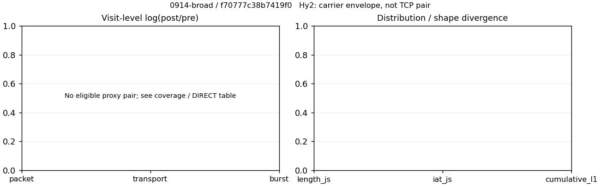

# 0914-broad · 条目 051 · iqiyi.com

目标：https://www.iqiyi.com/

活动标签：iqiyi.com::page_load。选定访问 3 次。

[返回总索引](../../README.md) · [统计口径](../../methods.md)

## 覆盖与资格（每次访问均保留）

| 部署 | 重复 | 主请求路由 | 活动状态 | 代理比较 | DIRECT pre | 请求 proxy/direct/unresolved | 错误 |
| --- | --- | --- | --- | --- | --- | --- | --- |
| Hy2 | 1 | direct | passed | 0 | 1 | 0/350/8 | [] |
| SS | 1 | direct | passed | 0 | 1 | 0/318/10 | [] |
| VLESS | 1 | direct | passed | 0 | 1 | 0/309/8 | [] |

主请求非 proxy 的统计仅解释为已索引的辅助代理连接或 DIRECT 观测，不代表目标业务经代理传输。播放确认与配对资格是两道不同的门。

图中散点为单次访问，短线为重复中位数；Hy2 是共享载体包络，不能与 TCP 配对作等范围因果对比。

形态图先逐访问归一化，再对访问等权平均；实线 pre，虚线 post。分箱序号及边界见 methods，不将分箱索引误解为长度或时间。

## 每次访问的关键观测

### SS

范围：`direct_pre_only`。每格 pre → post；空值为不可观测/不适用。

| 重复 | 包数 | 载荷字节 | burst | TCP FR | IAT中位µs | length JS | IAT JS |
| --- | --- | --- | --- | --- | --- | --- | --- |
| 1 | 10494 → — | 2.6344e+07 → — | 5275 → — | 851 → — | 34.152 → — | — | — |

完整标量统计：中位数 [min,max]；Δ 为重复内逐访问变换的中位数，MAD 未缩放。n 为可用变换数；DIRECT-only 的 nΔ=0 不代表 pre 不可用。

| scope | 特征 | pre | post | Δ | IQRΔ | MADΔ | nΔ |
| --- | --- | --- | --- | --- | --- | --- | --- |
| direct_pre_only | active_span_sum_s_1000ms | 47.344 [47.344, 47.344] | — | — | — | — | 0 |
| direct_pre_only | active_span_sum_s_100ms | 13.379 [13.379, 13.379] | — | — | — | — | 0 |
| direct_pre_only | active_span_sum_s_500ms | 23.351 [23.351, 23.351] | — | — | — | — | 0 |
| direct_pre_only | burst_bytes_iqr | 8920 [8920, 8920] | — | — | — | — | 0 |
| direct_pre_only | burst_bytes_mad | 89 [89, 89] | — | — | — | — | 0 |
| direct_pre_only | burst_bytes_max | 68027 [68027, 68027] | — | — | — | — | 0 |
| direct_pre_only | burst_bytes_mean | 4994.1 [4994.1, 4994.1] | — | — | — | — | 0 |
| direct_pre_only | burst_bytes_median | 89 [89, 89] | — | — | — | — | 0 |
| direct_pre_only | burst_bytes_min | 0 [0, 0] | — | — | — | — | 0 |
| direct_pre_only | burst_bytes_p95 | 20480 [20480, 20480] | — | — | — | — | 0 |
| direct_pre_only | burst_bytes_q25 | 0 [0, 0] | — | — | — | — | 0 |
| direct_pre_only | burst_bytes_q75 | 8920 [8920, 8920] | — | — | — | — | 0 |
| direct_pre_only | burst_bytes_std | 7397.3 [7397.3, 7397.3] | — | — | — | — | 0 |
| direct_pre_only | burst_count | 5275 [5275, 5275] | — | — | — | — | 0 |
| direct_pre_only | burst_duration_ms_iqr | 0.061168 [0.061168, 0.061168] | — | — | — | — | 0 |
| direct_pre_only | burst_duration_ms_mad | 0 [0, 0] | — | — | — | — | 0 |
| direct_pre_only | burst_duration_ms_max | 17657 [17657, 17657] | — | — | — | — | 0 |
| direct_pre_only | burst_duration_ms_mean | 56.381 [56.381, 56.381] | — | — | — | — | 0 |
| direct_pre_only | burst_duration_ms_median | 0 [0, 0] | — | — | — | — | 0 |
| direct_pre_only | burst_duration_ms_min | 0 [0, 0] | — | — | — | — | 0 |
| direct_pre_only | burst_duration_ms_p95 | 20.739 [20.739, 20.739] | — | — | — | — | 0 |
| direct_pre_only | burst_duration_ms_q25 | 0 [0, 0] | — | — | — | — | 0 |
| direct_pre_only | burst_duration_ms_q75 | 0.061168 [0.061168, 0.061168] | — | — | — | — | 0 |
| direct_pre_only | burst_duration_ms_std | 657.01 [657.01, 657.01] | — | — | — | — | 0 |
| direct_pre_only | burst_packets_iqr | 1 [1, 1] | — | — | — | — | 0 |
| direct_pre_only | burst_packets_mad | 0 [0, 0] | — | — | — | — | 0 |
| direct_pre_only | burst_packets_max | 60 [60, 60] | — | — | — | — | 0 |
| direct_pre_only | burst_packets_mean | 1.9894 [1.9894, 1.9894] | — | — | — | — | 0 |
| direct_pre_only | burst_packets_median | 1 [1, 1] | — | — | — | — | 0 |
| direct_pre_only | burst_packets_min | 1 [1, 1] | — | — | — | — | 0 |
| direct_pre_only | burst_packets_p95 | 4 [4, 4] | — | — | — | — | 0 |
| direct_pre_only | burst_packets_q25 | 1 [1, 1] | — | — | — | — | 0 |
| direct_pre_only | burst_packets_q75 | 2 [2, 2] | — | — | — | — | 0 |
| direct_pre_only | burst_packets_std | 2.4848 [2.4848, 2.4848] | — | — | — | — | 0 |
| direct_pre_only | connection_span_concurrency_max | 23 [23, 23] | — | — | — | — | 0 |
| direct_pre_only | direction_entropy | 0.55084 [0.55084, 0.55084] | — | — | — | — | 0 |
| direct_pre_only | down_burst_count | 2607 [2607, 2607] | — | — | — | — | 0 |
| direct_pre_only | down_ip_bytes | 2.6294e+07 [2.6294e+07, 2.6294e+07] | — | — | — | — | 0 |
| direct_pre_only | down_packets | 7189 [7189, 7189] | — | — | — | — | 0 |
| direct_pre_only | down_transport_bytes | 2.596e+07 [2.596e+07, 2.596e+07] | — | — | — | — | 0 |
| direct_pre_only | duration_s | 39.244 [39.244, 39.244] | — | — | — | — | 0 |
| direct_pre_only | entity_count | 64 [64, 64] | — | — | — | — | 0 |
| direct_pre_only | fr_runs | 851 [851, 851] | — | — | — | — | 0 |
| direct_pre_only | fr_runs_per_packet | 0.11242 [0.11242, 0.11242] | — | — | — | — | 0 |
| direct_pre_only | fr_switches | 787 [787, 787] | — | — | — | — | 0 |
| direct_pre_only | fr_switches_per_possible_transition | 0.10485 [0.10485, 0.10485] | — | — | — | — | 0 |
| direct_pre_only | full_retransmission_fraction | 0.0040989 [0.0040989, 0.0040989] | — | — | — | — | 0 |
| direct_pre_only | full_retransmission_packets | 34 [34, 34] | — | — | — | — | 0 |
| direct_pre_only | iat_count | 10430 [10430, 10430] | — | — | — | — | 0 |
| direct_pre_only | iat_median_us | 34.152 [34.152, 34.152] | — | — | — | — | 0 |
| direct_pre_only | iat_us_iqr | 120.49 [120.49, 120.49] | — | — | — | — | 0 |
| direct_pre_only | iat_us_mad | 25.827 [25.827, 25.827] | — | — | — | — | 0 |
| direct_pre_only | iat_us_max | 2.5682e+07 [2.5682e+07, 2.5682e+07] | — | — | — | — | 0 |
| direct_pre_only | iat_us_mean | 60450 [60450, 60450] | — | — | — | — | 0 |
| direct_pre_only | iat_us_median | 34.152 [34.152, 34.152] | — | — | — | — | 0 |
| direct_pre_only | iat_us_min | 0.004 [0.004, 0.004] | — | — | — | — | 0 |
| direct_pre_only | iat_us_p95 | 9708 [9708, 9708] | — | — | — | — | 0 |
| direct_pre_only | iat_us_q25 | 14.639 [14.639, 14.639] | — | — | — | — | 0 |
| direct_pre_only | iat_us_q75 | 135.13 [135.13, 135.13] | — | — | — | — | 0 |
| direct_pre_only | iat_us_std | 8.4324e+05 [8.4324e+05, 8.4324e+05] | — | — | — | — | 0 |
| direct_pre_only | idle_gap_count_1000ms | 68 [68, 68] | — | — | — | — | 0 |
| direct_pre_only | idle_gap_count_100ms | 146 [146, 146] | — | — | — | — | 0 |
| direct_pre_only | idle_gap_count_500ms | 100 [100, 100] | — | — | — | — | 0 |
| direct_pre_only | idle_gap_sum_s_1000ms | 583.15 [583.15, 583.15] | — | — | — | — | 0 |
| direct_pre_only | idle_gap_sum_s_100ms | 617.12 [617.12, 617.12] | — | — | — | — | 0 |
| direct_pre_only | idle_gap_sum_s_500ms | 607.14 [607.14, 607.14] | — | — | — | — | 0 |
| direct_pre_only | ip_bytes | 2.6838e+07 [2.6838e+07, 2.6838e+07] | — | — | — | — | 0 |
| direct_pre_only | length_iqr | 4560 [4560, 4560] | — | — | — | — | 0 |
| direct_pre_only | length_mad | 1916 [1916, 1916] | — | — | — | — | 0 |
| direct_pre_only | length_max | 8948 [8948, 8948] | — | — | — | — | 0 |
| direct_pre_only | length_mean | 3480.1 [3480.1, 3480.1] | — | — | — | — | 0 |
| direct_pre_only | length_median | 2640 [2640, 2640] | — | — | — | — | 0 |
| direct_pre_only | length_min | 2 [2, 2] | — | — | — | — | 0 |
| direct_pre_only | length_p95 | 8920 [8920, 8920] | — | — | — | — | 0 |
| direct_pre_only | length_q25 | 1200 [1200, 1200] | — | — | — | — | 0 |
| direct_pre_only | length_q75 | 5760 [5760, 5760] | — | — | — | — | 0 |
| direct_pre_only | length_std | 3165.8 [3165.8, 3165.8] | — | — | — | — | 0 |
| direct_pre_only | nonempty_entity_count | 64 [64, 64] | — | — | — | — | 0 |
| direct_pre_only | nonempty_packets | 7570 [7570, 7570] | — | — | — | — | 0 |
| direct_pre_only | offload_suspect_fraction | 0.41338 [0.41338, 0.41338] | — | — | — | — | 0 |
| direct_pre_only | packet_count | 10494 [10494, 10494] | — | — | — | — | 0 |
| direct_pre_only | rtt_median_ms | 0.083064 [0.083064, 0.083064] | — | — | — | — | 0 |
| direct_pre_only | rtt_sample_count | 2744 [2744, 2744] | — | — | — | — | 0 |
| direct_pre_only | tcp_ack_count | 8234 [8234, 8234] | — | — | — | — | 0 |
| direct_pre_only | tcp_fin_count | 108 [108, 108] | — | — | — | — | 0 |
| direct_pre_only | tcp_packet_count | 8295 [8295, 8295] | — | — | — | — | 0 |
| direct_pre_only | tcp_rst_count | 6 [6, 6] | — | — | — | — | 0 |
| direct_pre_only | tcp_syn_count | 110 [110, 110] | — | — | — | — | 0 |
| direct_pre_only | tcp_window_raw_median | 65535 [65535, 65535] | — | — | — | — | 0 |
| direct_pre_only | transition_entropy | 0.39742 [0.39742, 0.39742] | — | — | — | — | 0 |
| direct_pre_only | transition_n_mm | 6183 [6183, 6183] | — | — | — | — | 0 |
| direct_pre_only | transition_n_mp | 366 [366, 366] | — | — | — | — | 0 |
| direct_pre_only | transition_n_pm | 421 [421, 421] | — | — | — | — | 0 |
| direct_pre_only | transition_n_pp | 536 [536, 536] | — | — | — | — | 0 |
| direct_pre_only | transition_p_mm | 0.94411 [0.94411, 0.94411] | — | — | — | — | 0 |
| direct_pre_only | transition_p_mp | 0.055886 [0.055886, 0.055886] | — | — | — | — | 0 |
| direct_pre_only | transition_p_pm | 0.43992 [0.43992, 0.43992] | — | — | — | — | 0 |
| direct_pre_only | transition_p_pp | 0.56008 [0.56008, 0.56008] | — | — | — | — | 0 |
| direct_pre_only | transport_bytes | 2.6344e+07 [2.6344e+07, 2.6344e+07] | — | — | — | — | 0 |
| direct_pre_only | up_burst_count | 2668 [2668, 2668] | — | — | — | — | 0 |
| direct_pre_only | up_byte_fraction | 0.01457 [0.01457, 0.01457] | — | — | — | — | 0 |
| direct_pre_only | up_ip_bytes | 5.4412e+05 [5.4412e+05, 5.4412e+05] | — | — | — | — | 0 |
| direct_pre_only | up_packets | 3305 [3305, 3305] | — | — | — | — | 0 |
| direct_pre_only | up_transport_bytes | 3.8382e+05 [3.8382e+05, 3.8382e+05] | — | — | — | — | 0 |
| direct_pre_only | zero_iat_count | 0 [0, 0] | — | — | — | — | 0 |
| direct_pre_only | zero_iat_fraction | 0 [0, 0] | — | — | — | — | 0 |

### VLESS

范围：`direct_pre_only`。每格 pre → post；空值为不可观测/不适用。

| 重复 | 包数 | 载荷字节 | burst | TCP FR | IAT中位µs | length JS | IAT JS |
| --- | --- | --- | --- | --- | --- | --- | --- |
| 1 | 16235 → — | 2.6087e+07 → — | 5243 → — | 2013 → — | 18.963 → — | — | — |

完整标量统计：中位数 [min,max]；Δ 为重复内逐访问变换的中位数，MAD 未缩放。n 为可用变换数；DIRECT-only 的 nΔ=0 不代表 pre 不可用。

| scope | 特征 | pre | post | Δ | IQRΔ | MADΔ | nΔ |
| --- | --- | --- | --- | --- | --- | --- | --- |
| direct_pre_only | active_span_sum_s_1000ms | 39.5 [39.5, 39.5] | — | — | — | — | 0 |
| direct_pre_only | active_span_sum_s_100ms | 12.692 [12.692, 12.692] | — | — | — | — | 0 |
| direct_pre_only | active_span_sum_s_500ms | 24.807 [24.807, 24.807] | — | — | — | — | 0 |
| direct_pre_only | burst_bytes_iqr | 8700 [8700, 8700] | — | — | — | — | 0 |
| direct_pre_only | burst_bytes_mad | 96 [96, 96] | — | — | — | — | 0 |
| direct_pre_only | burst_bytes_max | 1.224e+05 [1.224e+05, 1.224e+05] | — | — | — | — | 0 |
| direct_pre_only | burst_bytes_mean | 4975.5 [4975.5, 4975.5] | — | — | — | — | 0 |
| direct_pre_only | burst_bytes_median | 96 [96, 96] | — | — | — | — | 0 |
| direct_pre_only | burst_bytes_min | 0 [0, 0] | — | — | — | — | 0 |
| direct_pre_only | burst_bytes_p95 | 20480 [20480, 20480] | — | — | — | — | 0 |
| direct_pre_only | burst_bytes_q25 | 0 [0, 0] | — | — | — | — | 0 |
| direct_pre_only | burst_bytes_q75 | 8700 [8700, 8700] | — | — | — | — | 0 |
| direct_pre_only | burst_bytes_std | 7577.5 [7577.5, 7577.5] | — | — | — | — | 0 |
| direct_pre_only | burst_count | 5243 [5243, 5243] | — | — | — | — | 0 |
| direct_pre_only | burst_duration_ms_iqr | 0.2622 [0.2622, 0.2622] | — | — | — | — | 0 |
| direct_pre_only | burst_duration_ms_mad | 0 [0, 0] | — | — | — | — | 0 |
| direct_pre_only | burst_duration_ms_max | 27851 [27851, 27851] | — | — | — | — | 0 |
| direct_pre_only | burst_duration_ms_mean | 57.306 [57.306, 57.306] | — | — | — | — | 0 |
| direct_pre_only | burst_duration_ms_median | 0 [0, 0] | — | — | — | — | 0 |
| direct_pre_only | burst_duration_ms_min | 0 [0, 0] | — | — | — | — | 0 |
| direct_pre_only | burst_duration_ms_p95 | 16.379 [16.379, 16.379] | — | — | — | — | 0 |
| direct_pre_only | burst_duration_ms_q25 | 0 [0, 0] | — | — | — | — | 0 |
| direct_pre_only | burst_duration_ms_q75 | 0.2622 [0.2622, 0.2622] | — | — | — | — | 0 |
| direct_pre_only | burst_duration_ms_std | 808.41 [808.41, 808.41] | — | — | — | — | 0 |
| direct_pre_only | burst_packets_iqr | 2 [2, 2] | — | — | — | — | 0 |
| direct_pre_only | burst_packets_mad | 0 [0, 0] | — | — | — | — | 0 |
| direct_pre_only | burst_packets_max | 105 [105, 105] | — | — | — | — | 0 |
| direct_pre_only | burst_packets_mean | 3.0965 [3.0965, 3.0965] | — | — | — | — | 0 |
| direct_pre_only | burst_packets_median | 1 [1, 1] | — | — | — | — | 0 |
| direct_pre_only | burst_packets_min | 1 [1, 1] | — | — | — | — | 0 |
| direct_pre_only | burst_packets_p95 | 13 [13, 13] | — | — | — | — | 0 |
| direct_pre_only | burst_packets_q25 | 1 [1, 1] | — | — | — | — | 0 |
| direct_pre_only | burst_packets_q75 | 3 [3, 3] | — | — | — | — | 0 |
| direct_pre_only | burst_packets_std | 4.8415 [4.8415, 4.8415] | — | — | — | — | 0 |
| direct_pre_only | connection_span_concurrency_max | 32 [32, 32] | — | — | — | — | 0 |
| direct_pre_only | direction_entropy | 0.49861 [0.49861, 0.49861] | — | — | — | — | 0 |
| direct_pre_only | down_burst_count | 2595 [2595, 2595] | — | — | — | — | 0 |
| direct_pre_only | down_ip_bytes | 2.6205e+07 [2.6205e+07, 2.6205e+07] | — | — | — | — | 0 |
| direct_pre_only | down_packets | 12953 [12953, 12953] | — | — | — | — | 0 |
| direct_pre_only | down_transport_bytes | 2.5755e+07 [2.5755e+07, 2.5755e+07] | — | — | — | — | 0 |
| direct_pre_only | duration_s | 30.461 [30.461, 30.461] | — | — | — | — | 0 |
| direct_pre_only | entity_count | 54 [54, 54] | — | — | — | — | 0 |
| direct_pre_only | fr_runs | 2013 [2013, 2013] | — | — | — | — | 0 |
| direct_pre_only | fr_runs_per_packet | 0.14341 [0.14341, 0.14341] | — | — | — | — | 0 |
| direct_pre_only | fr_switches | 1959 [1959, 1959] | — | — | — | — | 0 |
| direct_pre_only | fr_switches_per_possible_transition | 0.1401 [0.1401, 0.1401] | — | — | — | — | 0 |
| direct_pre_only | full_retransmission_fraction | 0.0095619 [0.0095619, 0.0095619] | — | — | — | — | 0 |
| direct_pre_only | full_retransmission_packets | 55 [55, 55] | — | — | — | — | 0 |
| direct_pre_only | iat_count | 16181 [16181, 16181] | — | — | — | — | 0 |
| direct_pre_only | iat_median_us | 18.963 [18.963, 18.963] | — | — | — | — | 0 |
| direct_pre_only | iat_us_iqr | 68.6 [68.6, 68.6] | — | — | — | — | 0 |
| direct_pre_only | iat_us_mad | 6.546 [6.546, 6.546] | — | — | — | — | 0 |
| direct_pre_only | iat_us_max | 2.7851e+07 [2.7851e+07, 2.7851e+07] | — | — | — | — | 0 |
| direct_pre_only | iat_us_mean | 26892 [26892, 26892] | — | — | — | — | 0 |
| direct_pre_only | iat_us_median | 18.963 [18.963, 18.963] | — | — | — | — | 0 |
| direct_pre_only | iat_us_min | 0.001 [0.001, 0.001] | — | — | — | — | 0 |
| direct_pre_only | iat_us_p95 | 2087.2 [2087.2, 2087.2] | — | — | — | — | 0 |
| direct_pre_only | iat_us_q25 | 14.902 [14.902, 14.902] | — | — | — | — | 0 |
| direct_pre_only | iat_us_q75 | 83.502 [83.502, 83.502] | — | — | — | — | 0 |
| direct_pre_only | iat_us_std | 5.991e+05 [5.991e+05, 5.991e+05] | — | — | — | — | 0 |
| direct_pre_only | idle_gap_count_1000ms | 61 [61, 61] | — | — | — | — | 0 |
| direct_pre_only | idle_gap_count_100ms | 133 [133, 133] | — | — | — | — | 0 |
| direct_pre_only | idle_gap_count_500ms | 80 [80, 80] | — | — | — | — | 0 |
| direct_pre_only | idle_gap_sum_s_1000ms | 395.65 [395.65, 395.65] | — | — | — | — | 0 |
| direct_pre_only | idle_gap_sum_s_100ms | 422.45 [422.45, 422.45] | — | — | — | — | 0 |
| direct_pre_only | idle_gap_sum_s_500ms | 410.34 [410.34, 410.34] | — | — | — | — | 0 |
| direct_pre_only | ip_bytes | 2.6681e+07 [2.6681e+07, 2.6681e+07] | — | — | — | — | 0 |
| direct_pre_only | length_iqr | 0 [0, 0] | — | — | — | — | 0 |
| direct_pre_only | length_mad | 0 [0, 0] | — | — | — | — | 0 |
| direct_pre_only | length_max | 8920 [8920, 8920] | — | — | — | — | 0 |
| direct_pre_only | length_mean | 1858.4 [1858.4, 1858.4] | — | — | — | — | 0 |
| direct_pre_only | length_median | 1200 [1200, 1200] | — | — | — | — | 0 |
| direct_pre_only | length_min | 23 [23, 23] | — | — | — | — | 0 |
| direct_pre_only | length_p95 | 8920 [8920, 8920] | — | — | — | — | 0 |
| direct_pre_only | length_q25 | 1200 [1200, 1200] | — | — | — | — | 0 |
| direct_pre_only | length_q75 | 1200 [1200, 1200] | — | — | — | — | 0 |
| direct_pre_only | length_std | 2156.4 [2156.4, 2156.4] | — | — | — | — | 0 |
| direct_pre_only | nonempty_entity_count | 54 [54, 54] | — | — | — | — | 0 |
| direct_pre_only | nonempty_packets | 14037 [14037, 14037] | — | — | — | — | 0 |
| direct_pre_only | offload_suspect_fraction | 0.16748 [0.16748, 0.16748] | — | — | — | — | 0 |
| direct_pre_only | packet_count | 16235 [16235, 16235] | — | — | — | — | 0 |
| direct_pre_only | rtt_median_ms | 0.1128 [0.1128, 0.1128] | — | — | — | — | 0 |
| direct_pre_only | rtt_sample_count | 2065 [2065, 2065] | — | — | — | — | 0 |
| direct_pre_only | tcp_ack_count | 5698 [5698, 5698] | — | — | — | — | 0 |
| direct_pre_only | tcp_fin_count | 89 [89, 89] | — | — | — | — | 0 |
| direct_pre_only | tcp_packet_count | 5752 [5752, 5752] | — | — | — | — | 0 |
| direct_pre_only | tcp_rst_count | 8 [8, 8] | — | — | — | — | 0 |
| direct_pre_only | tcp_syn_count | 92 [92, 92] | — | — | — | — | 0 |
| direct_pre_only | tcp_window_raw_median | 65535 [65535, 65535] | — | — | — | — | 0 |
| direct_pre_only | transition_entropy | 0.44981 [0.44981, 0.44981] | — | — | — | — | 0 |
| direct_pre_only | transition_n_mm | 11497 [11497, 11497] | — | — | — | — | 0 |
| direct_pre_only | transition_n_mp | 957 [957, 957] | — | — | — | — | 0 |
| direct_pre_only | transition_n_pm | 1002 [1002, 1002] | — | — | — | — | 0 |
| direct_pre_only | transition_n_pp | 527 [527, 527] | — | — | — | — | 0 |
| direct_pre_only | transition_p_mm | 0.92316 [0.92316, 0.92316] | — | — | — | — | 0 |
| direct_pre_only | transition_p_mp | 0.076843 [0.076843, 0.076843] | — | — | — | — | 0 |
| direct_pre_only | transition_p_pm | 0.65533 [0.65533, 0.65533] | — | — | — | — | 0 |
| direct_pre_only | transition_p_pp | 0.34467 [0.34467, 0.34467] | — | — | — | — | 0 |
| direct_pre_only | transport_bytes | 2.6087e+07 [2.6087e+07, 2.6087e+07] | — | — | — | — | 0 |
| direct_pre_only | up_burst_count | 2648 [2648, 2648] | — | — | — | — | 0 |
| direct_pre_only | up_byte_fraction | 0.012719 [0.012719, 0.012719] | — | — | — | — | 0 |
| direct_pre_only | up_ip_bytes | 4.753e+05 [4.753e+05, 4.753e+05] | — | — | — | — | 0 |
| direct_pre_only | up_packets | 3282 [3282, 3282] | — | — | — | — | 0 |
| direct_pre_only | up_transport_bytes | 3.3179e+05 [3.3179e+05, 3.3179e+05] | — | — | — | — | 0 |
| direct_pre_only | zero_iat_count | 0 [0, 0] | — | — | — | — | 0 |
| direct_pre_only | zero_iat_fraction | 0 [0, 0] | — | — | — | — | 0 |

### Hy2

范围：`direct_pre_only`。每格 pre → post；空值为不可观测/不适用。

| 重复 | 包数 | 载荷字节 | burst | TCP FR | IAT中位µs | length JS | IAT JS |
| --- | --- | --- | --- | --- | --- | --- | --- |
| 1 | 19119 → — | 2.7938e+07 → — | 6667 → — | 2460 → — | 23.587 → — | — | — |

完整标量统计：中位数 [min,max]；Δ 为重复内逐访问变换的中位数，MAD 未缩放。n 为可用变换数；DIRECT-only 的 nΔ=0 不代表 pre 不可用。

| scope | 特征 | pre | post | Δ | IQRΔ | MADΔ | nΔ |
| --- | --- | --- | --- | --- | --- | --- | --- |
| direct_pre_only | active_span_sum_s_1000ms | 34.399 [34.399, 34.399] | — | — | — | — | 0 |
| direct_pre_only | active_span_sum_s_100ms | 14.68 [14.68, 14.68] | — | — | — | — | 0 |
| direct_pre_only | active_span_sum_s_500ms | 19.375 [19.375, 19.375] | — | — | — | — | 0 |
| direct_pre_only | burst_bytes_iqr | 5584 [5584, 5584] | — | — | — | — | 0 |
| direct_pre_only | burst_bytes_mad | 135 [135, 135] | — | — | — | — | 0 |
| direct_pre_only | burst_bytes_max | 82200 [82200, 82200] | — | — | — | — | 0 |
| direct_pre_only | burst_bytes_mean | 4190.4 [4190.4, 4190.4] | — | — | — | — | 0 |
| direct_pre_only | burst_bytes_median | 135 [135, 135] | — | — | — | — | 0 |
| direct_pre_only | burst_bytes_min | 0 [0, 0] | — | — | — | — | 0 |
| direct_pre_only | burst_bytes_p95 | 20480 [20480, 20480] | — | — | — | — | 0 |
| direct_pre_only | burst_bytes_q25 | 0 [0, 0] | — | — | — | — | 0 |
| direct_pre_only | burst_bytes_q75 | 5584 [5584, 5584] | — | — | — | — | 0 |
| direct_pre_only | burst_bytes_std | 6882.2 [6882.2, 6882.2] | — | — | — | — | 0 |
| direct_pre_only | burst_count | 6667 [6667, 6667] | — | — | — | — | 0 |
| direct_pre_only | burst_duration_ms_iqr | 0.2268 [0.2268, 0.2268] | — | — | — | — | 0 |
| direct_pre_only | burst_duration_ms_mad | 0 [0, 0] | — | — | — | — | 0 |
| direct_pre_only | burst_duration_ms_max | 27064 [27064, 27064] | — | — | — | — | 0 |
| direct_pre_only | burst_duration_ms_mean | 77.337 [77.337, 77.337] | — | — | — | — | 0 |
| direct_pre_only | burst_duration_ms_median | 0 [0, 0] | — | — | — | — | 0 |
| direct_pre_only | burst_duration_ms_min | 0 [0, 0] | — | — | — | — | 0 |
| direct_pre_only | burst_duration_ms_p95 | 11.76 [11.76, 11.76] | — | — | — | — | 0 |
| direct_pre_only | burst_duration_ms_q25 | 0 [0, 0] | — | — | — | — | 0 |
| direct_pre_only | burst_duration_ms_q75 | 0.2268 [0.2268, 0.2268] | — | — | — | — | 0 |
| direct_pre_only | burst_duration_ms_std | 929.3 [929.3, 929.3] | — | — | — | — | 0 |
| direct_pre_only | burst_packets_iqr | 1 [1, 1] | — | — | — | — | 0 |
| direct_pre_only | burst_packets_mad | 0 [0, 0] | — | — | — | — | 0 |
| direct_pre_only | burst_packets_max | 72 [72, 72] | — | — | — | — | 0 |
| direct_pre_only | burst_packets_mean | 2.8677 [2.8677, 2.8677] | — | — | — | — | 0 |
| direct_pre_only | burst_packets_median | 1 [1, 1] | — | — | — | — | 0 |
| direct_pre_only | burst_packets_min | 1 [1, 1] | — | — | — | — | 0 |
| direct_pre_only | burst_packets_p95 | 12 [12, 12] | — | — | — | — | 0 |
| direct_pre_only | burst_packets_q25 | 1 [1, 1] | — | — | — | — | 0 |
| direct_pre_only | burst_packets_q75 | 2 [2, 2] | — | — | — | — | 0 |
| direct_pre_only | burst_packets_std | 4.4804 [4.4804, 4.4804] | — | — | — | — | 0 |
| direct_pre_only | connection_span_concurrency_max | 39 [39, 39] | — | — | — | — | 0 |
| direct_pre_only | direction_entropy | 0.52257 [0.52257, 0.52257] | — | — | — | — | 0 |
| direct_pre_only | down_burst_count | 3306 [3306, 3306] | — | — | — | — | 0 |
| direct_pre_only | down_ip_bytes | 2.8037e+07 [2.8037e+07, 2.8037e+07] | — | — | — | — | 0 |
| direct_pre_only | down_packets | 14964 [14964, 14964] | — | — | — | — | 0 |
| direct_pre_only | down_transport_bytes | 2.7518e+07 [2.7518e+07, 2.7518e+07] | — | — | — | — | 0 |
| direct_pre_only | duration_s | 27.529 [27.529, 27.529] | — | — | — | — | 0 |
| direct_pre_only | entity_count | 55 [55, 55] | — | — | — | — | 0 |
| direct_pre_only | fr_runs | 2460 [2460, 2460] | — | — | — | — | 0 |
| direct_pre_only | fr_runs_per_packet | 0.15019 [0.15019, 0.15019] | — | — | — | — | 0 |
| direct_pre_only | fr_switches | 2405 [2405, 2405] | — | — | — | — | 0 |
| direct_pre_only | fr_switches_per_possible_transition | 0.14733 [0.14733, 0.14733] | — | — | — | — | 0 |
| direct_pre_only | full_retransmission_fraction | 0.005585 [0.005585, 0.005585] | — | — | — | — | 0 |
| direct_pre_only | full_retransmission_packets | 38 [38, 38] | — | — | — | — | 0 |
| direct_pre_only | iat_count | 19064 [19064, 19064] | — | — | — | — | 0 |
| direct_pre_only | iat_median_us | 23.587 [23.587, 23.587] | — | — | — | — | 0 |
| direct_pre_only | iat_us_iqr | 96.218 [96.218, 96.218] | — | — | — | — | 0 |
| direct_pre_only | iat_us_mad | 10.968 [10.968, 10.968] | — | — | — | — | 0 |
| direct_pre_only | iat_us_max | 2.7039e+07 [2.7039e+07, 2.7039e+07] | — | — | — | — | 0 |
| direct_pre_only | iat_us_mean | 50899 [50899, 50899] | — | — | — | — | 0 |
| direct_pre_only | iat_us_median | 23.587 [23.587, 23.587] | — | — | — | — | 0 |
| direct_pre_only | iat_us_min | 0.009 [0.009, 0.009] | — | — | — | — | 0 |
| direct_pre_only | iat_us_p95 | 2177.3 [2177.3, 2177.3] | — | — | — | — | 0 |
| direct_pre_only | iat_us_q25 | 15.364 [15.364, 15.364] | — | — | — | — | 0 |
| direct_pre_only | iat_us_q75 | 111.58 [111.58, 111.58] | — | — | — | — | 0 |
| direct_pre_only | iat_us_std | 8.225e+05 [8.225e+05, 8.225e+05] | — | — | — | — | 0 |
| direct_pre_only | idle_gap_count_1000ms | 96 [96, 96] | — | — | — | — | 0 |
| direct_pre_only | idle_gap_count_100ms | 140 [140, 140] | — | — | — | — | 0 |
| direct_pre_only | idle_gap_count_500ms | 116 [116, 116] | — | — | — | — | 0 |
| direct_pre_only | idle_gap_sum_s_1000ms | 935.93 [935.93, 935.93] | — | — | — | — | 0 |
| direct_pre_only | idle_gap_sum_s_100ms | 955.65 [955.65, 955.65] | — | — | — | — | 0 |
| direct_pre_only | idle_gap_sum_s_500ms | 950.96 [950.96, 950.96] | — | — | — | — | 0 |
| direct_pre_only | ip_bytes | 2.8637e+07 [2.8637e+07, 2.8637e+07] | — | — | — | — | 0 |
| direct_pre_only | length_iqr | 0 [0, 0] | — | — | — | — | 0 |
| direct_pre_only | length_mad | 0 [0, 0] | — | — | — | — | 0 |
| direct_pre_only | length_max | 8948 [8948, 8948] | — | — | — | — | 0 |
| direct_pre_only | length_mean | 1705.7 [1705.7, 1705.7] | — | — | — | — | 0 |
| direct_pre_only | length_median | 1200 [1200, 1200] | — | — | — | — | 0 |
| direct_pre_only | length_min | 23 [23, 23] | — | — | — | — | 0 |
| direct_pre_only | length_p95 | 7212.4 [7212.4, 7212.4] | — | — | — | — | 0 |
| direct_pre_only | length_q25 | 1200 [1200, 1200] | — | — | — | — | 0 |
| direct_pre_only | length_q75 | 1200 [1200, 1200] | — | — | — | — | 0 |
| direct_pre_only | length_std | 1894.4 [1894.4, 1894.4] | — | — | — | — | 0 |
| direct_pre_only | nonempty_entity_count | 55 [55, 55] | — | — | — | — | 0 |
| direct_pre_only | nonempty_packets | 16379 [16379, 16379] | — | — | — | — | 0 |
| direct_pre_only | offload_suspect_fraction | 0.16706 [0.16706, 0.16706] | — | — | — | — | 0 |
| direct_pre_only | packet_count | 19119 [19119, 19119] | — | — | — | — | 0 |
| direct_pre_only | rtt_median_ms | 0.088206 [0.088206, 0.088206] | — | — | — | — | 0 |
| direct_pre_only | rtt_sample_count | 2560 [2560, 2560] | — | — | — | — | 0 |
| direct_pre_only | tcp_ack_count | 6752 [6752, 6752] | — | — | — | — | 0 |
| direct_pre_only | tcp_fin_count | 91 [91, 91] | — | — | — | — | 0 |
| direct_pre_only | tcp_packet_count | 6804 [6804, 6804] | — | — | — | — | 0 |
| direct_pre_only | tcp_rst_count | 6 [6, 6] | — | — | — | — | 0 |
| direct_pre_only | tcp_syn_count | 94 [94, 94] | — | — | — | — | 0 |
| direct_pre_only | tcp_window_raw_median | 65535 [65535, 65535] | — | — | — | — | 0 |
| direct_pre_only | transition_entropy | 0.47174 [0.47174, 0.47174] | — | — | — | — | 0 |
| direct_pre_only | transition_n_mm | 13228 [13228, 13228] | — | — | — | — | 0 |
| direct_pre_only | transition_n_mp | 1181 [1181, 1181] | — | — | — | — | 0 |
| direct_pre_only | transition_n_pm | 1224 [1224, 1224] | — | — | — | — | 0 |
| direct_pre_only | transition_n_pp | 691 [691, 691] | — | — | — | — | 0 |
| direct_pre_only | transition_p_mm | 0.91804 [0.91804, 0.91804] | — | — | — | — | 0 |
| direct_pre_only | transition_p_mp | 0.081963 [0.081963, 0.081963] | — | — | — | — | 0 |
| direct_pre_only | transition_p_pm | 0.63916 [0.63916, 0.63916] | — | — | — | — | 0 |
| direct_pre_only | transition_p_pp | 0.36084 [0.36084, 0.36084] | — | — | — | — | 0 |
| direct_pre_only | transport_bytes | 2.7938e+07 [2.7938e+07, 2.7938e+07] | — | — | — | — | 0 |
| direct_pre_only | up_burst_count | 3361 [3361, 3361] | — | — | — | — | 0 |
| direct_pre_only | up_byte_fraction | 0.015031 [0.015031, 0.015031] | — | — | — | — | 0 |
| direct_pre_only | up_ip_bytes | 6.0007e+05 [6.0007e+05, 6.0007e+05] | — | — | — | — | 0 |
| direct_pre_only | up_packets | 4155 [4155, 4155] | — | — | — | — | 0 |
| direct_pre_only | up_transport_bytes | 4.1993e+05 [4.1993e+05, 4.1993e+05] | — | — | — | — | 0 |
| direct_pre_only | zero_iat_count | 0 [0, 0] | — | — | — | — | 0 |
| direct_pre_only | zero_iat_fraction | 0 [0, 0] | — | — | — | — | 0 |

## 不同部署对比

以下是各部署自身重复中位数的差异，不按重复编号强行配对。跨 TCP/Hy2 的行标记异质观测范围。

| 视角 | 特征 | 部署A | 部署B | A中位 | B中位 | B−A | 比较口径 |
| --- | --- | --- | --- | --- | --- | --- | --- |
| pre | burst_count | SS | VLESS | 5275 | 5243 | -32 | same_scope_unpaired_visits |
| pre | burst_count | SS | Hy2 | 5275 | 6667 | 1392 | same_scope_unpaired_visits |
| pre | burst_count | VLESS | Hy2 | 5243 | 6667 | 1424 | same_scope_unpaired_visits |
| pre | connection_span_concurrency_max | SS | VLESS | 23 | 32 | 9 | same_scope_unpaired_visits |
| pre | connection_span_concurrency_max | SS | Hy2 | 23 | 39 | 16 | same_scope_unpaired_visits |
| pre | connection_span_concurrency_max | VLESS | Hy2 | 32 | 39 | 7 | same_scope_unpaired_visits |
| pre | direction_entropy | SS | VLESS | 0.55084 | 0.49861 | -0.052234 | same_scope_unpaired_visits |
| pre | direction_entropy | SS | Hy2 | 0.55084 | 0.52257 | -0.028274 | same_scope_unpaired_visits |
| pre | direction_entropy | VLESS | Hy2 | 0.49861 | 0.52257 | 0.02396 | same_scope_unpaired_visits |
| pre | down_transport_bytes | SS | VLESS | 2.596e+07 | 2.5755e+07 | -2.0539e+05 | same_scope_unpaired_visits |
| pre | down_transport_bytes | SS | Hy2 | 2.596e+07 | 2.7518e+07 | 1.5574e+06 | same_scope_unpaired_visits |
| pre | down_transport_bytes | VLESS | Hy2 | 2.5755e+07 | 2.7518e+07 | 1.7628e+06 | same_scope_unpaired_visits |
| pre | duration_s | SS | VLESS | 39.244 | 30.461 | -8.7829 | same_scope_unpaired_visits |
| pre | duration_s | SS | Hy2 | 39.244 | 27.529 | -11.715 | same_scope_unpaired_visits |
| pre | duration_s | VLESS | Hy2 | 30.461 | 27.529 | -2.9324 | same_scope_unpaired_visits |
| pre | entity_count | SS | VLESS | 64 | 54 | -10 | same_scope_unpaired_visits |
| pre | entity_count | SS | Hy2 | 64 | 55 | -9 | same_scope_unpaired_visits |
| pre | entity_count | VLESS | Hy2 | 54 | 55 | 1 | same_scope_unpaired_visits |
| pre | fr_runs | SS | VLESS | 851 | 2013 | 1162 | same_scope_unpaired_visits |
| pre | fr_runs | SS | Hy2 | 851 | 2460 | 1609 | same_scope_unpaired_visits |
| pre | fr_runs | VLESS | Hy2 | 2013 | 2460 | 447 | same_scope_unpaired_visits |
| pre | fr_runs_per_packet | SS | VLESS | 0.11242 | 0.14341 | 0.030989 | same_scope_unpaired_visits |
| pre | fr_runs_per_packet | SS | Hy2 | 0.11242 | 0.15019 | 0.037775 | same_scope_unpaired_visits |
| pre | fr_runs_per_packet | VLESS | Hy2 | 0.14341 | 0.15019 | 0.0067856 | same_scope_unpaired_visits |
| pre | fr_switches | SS | VLESS | 787 | 1959 | 1172 | same_scope_unpaired_visits |
| pre | fr_switches | SS | Hy2 | 787 | 2405 | 1618 | same_scope_unpaired_visits |
| pre | fr_switches | VLESS | Hy2 | 1959 | 2405 | 446 | same_scope_unpaired_visits |
| pre | fr_switches_per_possible_transition | SS | VLESS | 0.10485 | 0.1401 | 0.035249 | same_scope_unpaired_visits |
| pre | fr_switches_per_possible_transition | SS | Hy2 | 0.10485 | 0.14733 | 0.04248 | same_scope_unpaired_visits |
| pre | fr_switches_per_possible_transition | VLESS | Hy2 | 0.1401 | 0.14733 | 0.0072304 | same_scope_unpaired_visits |
| pre | full_retransmission_fraction | SS | VLESS | 0.0040989 | 0.0095619 | 0.005463 | same_scope_unpaired_visits |
| pre | full_retransmission_fraction | SS | Hy2 | 0.0040989 | 0.005585 | 0.0014861 | same_scope_unpaired_visits |
| pre | full_retransmission_fraction | VLESS | Hy2 | 0.0095619 | 0.005585 | -0.0039769 | same_scope_unpaired_visits |
| pre | iat_median_us | SS | VLESS | 34.152 | 18.963 | -15.189 | same_scope_unpaired_visits |
| pre | iat_median_us | SS | Hy2 | 34.152 | 23.587 | -10.565 | same_scope_unpaired_visits |
| pre | iat_median_us | VLESS | Hy2 | 18.963 | 23.587 | 4.6245 | same_scope_unpaired_visits |
| pre | iat_us_p95 | SS | VLESS | 9708 | 2087.2 | -7620.8 | same_scope_unpaired_visits |
| pre | iat_us_p95 | SS | Hy2 | 9708 | 2177.3 | -7530.8 | same_scope_unpaired_visits |
| pre | iat_us_p95 | VLESS | Hy2 | 2087.2 | 2177.3 | 90.012 | same_scope_unpaired_visits |
| pre | ip_bytes | SS | VLESS | 2.6838e+07 | 2.6681e+07 | -1.5763e+05 | same_scope_unpaired_visits |
| pre | ip_bytes | SS | Hy2 | 2.6838e+07 | 2.8637e+07 | 1.7992e+06 | same_scope_unpaired_visits |
| pre | ip_bytes | VLESS | Hy2 | 2.6681e+07 | 2.8637e+07 | 1.9568e+06 | same_scope_unpaired_visits |
| pre | length_median | SS | VLESS | 2640 | 1200 | -1440 | same_scope_unpaired_visits |
| pre | length_median | SS | Hy2 | 2640 | 1200 | -1440 | same_scope_unpaired_visits |
| pre | length_median | VLESS | Hy2 | 1200 | 1200 | 0 | same_scope_unpaired_visits |
| pre | length_p95 | SS | VLESS | 8920 | 8920 | 0 | same_scope_unpaired_visits |
| pre | length_p95 | SS | Hy2 | 8920 | 7212.4 | -1707.6 | same_scope_unpaired_visits |
| pre | length_p95 | VLESS | Hy2 | 8920 | 7212.4 | -1707.6 | same_scope_unpaired_visits |
| pre | nonempty_packets | SS | VLESS | 7570 | 14037 | 6467 | same_scope_unpaired_visits |
| pre | nonempty_packets | SS | Hy2 | 7570 | 16379 | 8809 | same_scope_unpaired_visits |
| pre | nonempty_packets | VLESS | Hy2 | 14037 | 16379 | 2342 | same_scope_unpaired_visits |
| pre | offload_suspect_fraction | SS | VLESS | 0.41338 | 0.16748 | -0.2459 | same_scope_unpaired_visits |
| pre | offload_suspect_fraction | SS | Hy2 | 0.41338 | 0.16706 | -0.24632 | same_scope_unpaired_visits |
| pre | offload_suspect_fraction | VLESS | Hy2 | 0.16748 | 0.16706 | -0.00041873 | same_scope_unpaired_visits |
| pre | packet_count | SS | VLESS | 10494 | 16235 | 5741 | same_scope_unpaired_visits |
| pre | packet_count | SS | Hy2 | 10494 | 19119 | 8625 | same_scope_unpaired_visits |
| pre | packet_count | VLESS | Hy2 | 16235 | 19119 | 2884 | same_scope_unpaired_visits |
| pre | rtt_median_ms | SS | VLESS | 0.083064 | 0.1128 | 0.029735 | same_scope_unpaired_visits |
| pre | rtt_median_ms | SS | Hy2 | 0.083064 | 0.088206 | 0.0051425 | same_scope_unpaired_visits |
| pre | rtt_median_ms | VLESS | Hy2 | 0.1128 | 0.088206 | -0.024593 | same_scope_unpaired_visits |
| pre | transition_entropy | SS | VLESS | 0.39742 | 0.44981 | 0.05239 | same_scope_unpaired_visits |
| pre | transition_entropy | SS | Hy2 | 0.39742 | 0.47174 | 0.074317 | same_scope_unpaired_visits |
| pre | transition_entropy | VLESS | Hy2 | 0.44981 | 0.47174 | 0.021926 | same_scope_unpaired_visits |
| pre | transport_bytes | SS | VLESS | 2.6344e+07 | 2.6087e+07 | -2.5742e+05 | same_scope_unpaired_visits |
| pre | transport_bytes | SS | Hy2 | 2.6344e+07 | 2.7938e+07 | 1.5935e+06 | same_scope_unpaired_visits |
| pre | transport_bytes | VLESS | Hy2 | 2.6087e+07 | 2.7938e+07 | 1.8509e+06 | same_scope_unpaired_visits |
| pre | up_byte_fraction | SS | VLESS | 0.01457 | 0.012719 | -0.0018507 | same_scope_unpaired_visits |
| pre | up_byte_fraction | SS | Hy2 | 0.01457 | 0.015031 | 0.00046156 | same_scope_unpaired_visits |
| pre | up_byte_fraction | VLESS | Hy2 | 0.012719 | 0.015031 | 0.0023123 | same_scope_unpaired_visits |
| pre | up_transport_bytes | SS | VLESS | 3.8382e+05 | 3.3179e+05 | -52030 | same_scope_unpaired_visits |
| pre | up_transport_bytes | SS | Hy2 | 3.8382e+05 | 4.1993e+05 | 36112 | same_scope_unpaired_visits |
| pre | up_transport_bytes | VLESS | Hy2 | 3.3179e+05 | 4.1993e+05 | 88142 | same_scope_unpaired_visits |

## 可复核的访问标识

| 部署 | 重复 | session_id |
| --- | --- | --- |
| SS | 1 | da24ee5e-b404-49b3-b304-3dd3da5e5dde |
| VLESS | 1 | 98b95665-8ee3-49a7-9bb9-ea283b063e97 |
| Hy2 | 1 | e7ed9dd9-cd31-48e3-befc-ef5f64de5bbb |

全量三种 packet selection、Hy2 full 范围、Q25/Q75、直方图与曲线见机器可读产物；本页只显示 observed 主范围。
