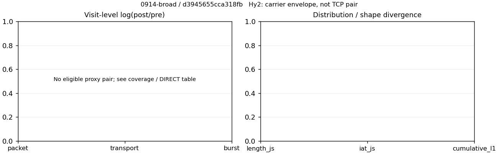
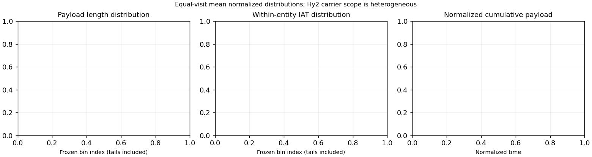

# 0914-broad · 条目 052 · youku.com

目标：https://www.youku.com/

活动标签：youku.com::page_load。选定访问 3 次。

[返回总索引](../../README.md) · [统计口径](../../methods.md)

## 覆盖与资格（每次访问均保留）

| 部署 | 重复 | 主请求路由 | 活动状态 | 代理比较 | DIRECT pre | 请求 proxy/direct/unresolved | 错误 |
| --- | --- | --- | --- | --- | --- | --- | --- |
| Hy2 | 1 | direct | passed | 0 | 1 | 0/181/0 | [] |
| SS | 1 | direct | passed | 0 | 1 | 0/182/0 | [] |
| VLESS | 1 | direct | passed | 0 | 1 | 0/152/0 | [] |

主请求非 proxy 的统计仅解释为已索引的辅助代理连接或 DIRECT 观测，不代表目标业务经代理传输。播放确认与配对资格是两道不同的门。

图中散点为单次访问，短线为重复中位数；Hy2 是共享载体包络，不能与 TCP 配对作等范围因果对比。

形态图先逐访问归一化，再对访问等权平均；实线 pre，虚线 post。分箱序号及边界见 methods，不将分箱索引误解为长度或时间。

## 每次访问的关键观测

### SS

范围：`direct_pre_only`。每格 pre → post；空值为不可观测/不适用。

| 重复 | 包数 | 载荷字节 | burst | TCP FR | IAT中位µs | length JS | IAT JS |
| --- | --- | --- | --- | --- | --- | --- | --- |
| 1 | 4380 → — | 1.2461e+07 → — | 2788 → — | 238 → — | 46.07 → — | — | — |

完整标量统计：中位数 [min,max]；Δ 为重复内逐访问变换的中位数，MAD 未缩放。n 为可用变换数；DIRECT-only 的 nΔ=0 不代表 pre 不可用。

| scope | 特征 | pre | post | Δ | IQRΔ | MADΔ | nΔ |
| --- | --- | --- | --- | --- | --- | --- | --- |
| direct_pre_only | active_span_sum_s_1000ms | 15.58 [15.58, 15.58] | — | — | — | — | 0 |
| direct_pre_only | active_span_sum_s_100ms | 4.9311 [4.9311, 4.9311] | — | — | — | — | 0 |
| direct_pre_only | active_span_sum_s_500ms | 9.327 [9.327, 9.327] | — | — | — | — | 0 |
| direct_pre_only | burst_bytes_iqr | 8640 [8640, 8640] | — | — | — | — | 0 |
| direct_pre_only | burst_bytes_mad | 74.5 [74.5, 74.5] | — | — | — | — | 0 |
| direct_pre_only | burst_bytes_max | 32414 [32414, 32414] | — | — | — | — | 0 |
| direct_pre_only | burst_bytes_mean | 4469.6 [4469.6, 4469.6] | — | — | — | — | 0 |
| direct_pre_only | burst_bytes_median | 74.5 [74.5, 74.5] | — | — | — | — | 0 |
| direct_pre_only | burst_bytes_min | 0 [0, 0] | — | — | — | — | 0 |
| direct_pre_only | burst_bytes_p95 | 20480 [20480, 20480] | — | — | — | — | 0 |
| direct_pre_only | burst_bytes_q25 | 0 [0, 0] | — | — | — | — | 0 |
| direct_pre_only | burst_bytes_q75 | 8640 [8640, 8640] | — | — | — | — | 0 |
| direct_pre_only | burst_bytes_std | 6622.8 [6622.8, 6622.8] | — | — | — | — | 0 |
| direct_pre_only | burst_count | 2788 [2788, 2788] | — | — | — | — | 0 |
| direct_pre_only | burst_duration_ms_iqr | 0.046136 [0.046136, 0.046136] | — | — | — | — | 0 |
| direct_pre_only | burst_duration_ms_mad | 0 [0, 0] | — | — | — | — | 0 |
| direct_pre_only | burst_duration_ms_max | 9905.4 [9905.4, 9905.4] | — | — | — | — | 0 |
| direct_pre_only | burst_duration_ms_mean | 36.386 [36.386, 36.386] | — | — | — | — | 0 |
| direct_pre_only | burst_duration_ms_median | 0 [0, 0] | — | — | — | — | 0 |
| direct_pre_only | burst_duration_ms_min | 0 [0, 0] | — | — | — | — | 0 |
| direct_pre_only | burst_duration_ms_p95 | 12.97 [12.97, 12.97] | — | — | — | — | 0 |
| direct_pre_only | burst_duration_ms_q25 | 0 [0, 0] | — | — | — | — | 0 |
| direct_pre_only | burst_duration_ms_q75 | 0.046136 [0.046136, 0.046136] | — | — | — | — | 0 |
| direct_pre_only | burst_duration_ms_std | 360.28 [360.28, 360.28] | — | — | — | — | 0 |
| direct_pre_only | burst_packets_iqr | 1 [1, 1] | — | — | — | — | 0 |
| direct_pre_only | burst_packets_mad | 0 [0, 0] | — | — | — | — | 0 |
| direct_pre_only | burst_packets_max | 10 [10, 10] | — | — | — | — | 0 |
| direct_pre_only | burst_packets_mean | 1.571 [1.571, 1.571] | — | — | — | — | 0 |
| direct_pre_only | burst_packets_median | 1 [1, 1] | — | — | — | — | 0 |
| direct_pre_only | burst_packets_min | 1 [1, 1] | — | — | — | — | 0 |
| direct_pre_only | burst_packets_p95 | 3 [3, 3] | — | — | — | — | 0 |
| direct_pre_only | burst_packets_q25 | 1 [1, 1] | — | — | — | — | 0 |
| direct_pre_only | burst_packets_q75 | 2 [2, 2] | — | — | — | — | 0 |
| direct_pre_only | burst_packets_std | 0.88688 [0.88688, 0.88688] | — | — | — | — | 0 |
| direct_pre_only | connection_span_concurrency_max | 20 [20, 20] | — | — | — | — | 0 |
| direct_pre_only | direction_entropy | 0.45111 [0.45111, 0.45111] | — | — | — | — | 0 |
| direct_pre_only | down_burst_count | 1379 [1379, 1379] | — | — | — | — | 0 |
| direct_pre_only | down_ip_bytes | 1.2406e+07 [1.2406e+07, 1.2406e+07] | — | — | — | — | 0 |
| direct_pre_only | down_packets | 2782 [2782, 2782] | — | — | — | — | 0 |
| direct_pre_only | down_transport_bytes | 1.2262e+07 [1.2262e+07, 1.2262e+07] | — | — | — | — | 0 |
| direct_pre_only | duration_s | 27.671 [27.671, 27.671] | — | — | — | — | 0 |
| direct_pre_only | entity_count | 30 [30, 30] | — | — | — | — | 0 |
| direct_pre_only | fr_runs | 238 [238, 238] | — | — | — | — | 0 |
| direct_pre_only | fr_runs_per_packet | 0.087116 [0.087116, 0.087116] | — | — | — | — | 0 |
| direct_pre_only | fr_switches | 208 [208, 208] | — | — | — | — | 0 |
| direct_pre_only | fr_switches_per_possible_transition | 0.07698 [0.07698, 0.07698] | — | — | — | — | 0 |
| direct_pre_only | full_retransmission_fraction | 0.0050228 [0.0050228, 0.0050228] | — | — | — | — | 0 |
| direct_pre_only | full_retransmission_packets | 22 [22, 22] | — | — | — | — | 0 |
| direct_pre_only | iat_count | 4350 [4350, 4350] | — | — | — | — | 0 |
| direct_pre_only | iat_median_us | 46.07 [46.07, 46.07] | — | — | — | — | 0 |
| direct_pre_only | iat_us_iqr | 182.32 [182.32, 182.32] | — | — | — | — | 0 |
| direct_pre_only | iat_us_mad | 38.751 [38.751, 38.751] | — | — | — | — | 0 |
| direct_pre_only | iat_us_max | 1.5001e+07 [1.5001e+07, 1.5001e+07] | — | — | — | — | 0 |
| direct_pre_only | iat_us_mean | 37481 [37481, 37481] | — | — | — | — | 0 |
| direct_pre_only | iat_us_median | 46.07 [46.07, 46.07] | — | — | — | — | 0 |
| direct_pre_only | iat_us_min | 0.032 [0.032, 0.032] | — | — | — | — | 0 |
| direct_pre_only | iat_us_p95 | 6267.1 [6267.1, 6267.1] | — | — | — | — | 0 |
| direct_pre_only | iat_us_q25 | 13.271 [13.271, 13.271] | — | — | — | — | 0 |
| direct_pre_only | iat_us_q75 | 195.59 [195.59, 195.59] | — | — | — | — | 0 |
| direct_pre_only | iat_us_std | 5.381e+05 [5.381e+05, 5.381e+05] | — | — | — | — | 0 |
| direct_pre_only | idle_gap_count_1000ms | 33 [33, 33] | — | — | — | — | 0 |
| direct_pre_only | idle_gap_count_100ms | 66 [66, 66] | — | — | — | — | 0 |
| direct_pre_only | idle_gap_count_500ms | 42 [42, 42] | — | — | — | — | 0 |
| direct_pre_only | idle_gap_sum_s_1000ms | 147.46 [147.46, 147.46] | — | — | — | — | 0 |
| direct_pre_only | idle_gap_sum_s_100ms | 158.11 [158.11, 158.11] | — | — | — | — | 0 |
| direct_pre_only | idle_gap_sum_s_500ms | 153.71 [153.71, 153.71] | — | — | — | — | 0 |
| direct_pre_only | ip_bytes | 1.269e+07 [1.269e+07, 1.269e+07] | — | — | — | — | 0 |
| direct_pre_only | length_iqr | 5552 [5552, 5552] | — | — | — | — | 0 |
| direct_pre_only | length_mad | 2392 [2392, 2392] | — | — | — | — | 0 |
| direct_pre_only | length_max | 8948 [8948, 8948] | — | — | — | — | 0 |
| direct_pre_only | length_mean | 4561.2 [4561.2, 4561.2] | — | — | — | — | 0 |
| direct_pre_only | length_median | 3368 [3368, 3368] | — | — | — | — | 0 |
| direct_pre_only | length_min | 31 [31, 31] | — | — | — | — | 0 |
| direct_pre_only | length_p95 | 8920 [8920, 8920] | — | — | — | — | 0 |
| direct_pre_only | length_q25 | 2640 [2640, 2640] | — | — | — | — | 0 |
| direct_pre_only | length_q75 | 8192 [8192, 8192] | — | — | — | — | 0 |
| direct_pre_only | length_std | 3074.9 [3074.9, 3074.9] | — | — | — | — | 0 |
| direct_pre_only | nonempty_entity_count | 30 [30, 30] | — | — | — | — | 0 |
| direct_pre_only | nonempty_packets | 2732 [2732, 2732] | — | — | — | — | 0 |
| direct_pre_only | offload_suspect_fraction | 0.5089 [0.5089, 0.5089] | — | — | — | — | 0 |
| direct_pre_only | packet_count | 4380 [4380, 4380] | — | — | — | — | 0 |
| direct_pre_only | rtt_median_ms | 0.077399 [0.077399, 0.077399] | — | — | — | — | 0 |
| direct_pre_only | rtt_sample_count | 1561 [1561, 1561] | — | — | — | — | 0 |
| direct_pre_only | tcp_ack_count | 4349 [4349, 4349] | — | — | — | — | 0 |
| direct_pre_only | tcp_fin_count | 59 [59, 59] | — | — | — | — | 0 |
| direct_pre_only | tcp_packet_count | 4380 [4380, 4380] | — | — | — | — | 0 |
| direct_pre_only | tcp_rst_count | 1 [1, 1] | — | — | — | — | 0 |
| direct_pre_only | tcp_syn_count | 60 [60, 60] | — | — | — | — | 0 |
| direct_pre_only | tcp_window_raw_median | 65535 [65535, 65535] | — | — | — | — | 0 |
| direct_pre_only | transition_entropy | 0.29914 [0.29914, 0.29914] | — | — | — | — | 0 |
| direct_pre_only | transition_n_mm | 2355 [2355, 2355] | — | — | — | — | 0 |
| direct_pre_only | transition_n_mp | 89 [89, 89] | — | — | — | — | 0 |
| direct_pre_only | transition_n_pm | 119 [119, 119] | — | — | — | — | 0 |
| direct_pre_only | transition_n_pp | 139 [139, 139] | — | — | — | — | 0 |
| direct_pre_only | transition_p_mm | 0.96358 [0.96358, 0.96358] | — | — | — | — | 0 |
| direct_pre_only | transition_p_mp | 0.036416 [0.036416, 0.036416] | — | — | — | — | 0 |
| direct_pre_only | transition_p_pm | 0.46124 [0.46124, 0.46124] | — | — | — | — | 0 |
| direct_pre_only | transition_p_pp | 0.53876 [0.53876, 0.53876] | — | — | — | — | 0 |
| direct_pre_only | transport_bytes | 1.2461e+07 [1.2461e+07, 1.2461e+07] | — | — | — | — | 0 |
| direct_pre_only | up_burst_count | 1409 [1409, 1409] | — | — | — | — | 0 |
| direct_pre_only | up_byte_fraction | 0.016021 [0.016021, 0.016021] | — | — | — | — | 0 |
| direct_pre_only | up_ip_bytes | 2.8323e+05 [2.8323e+05, 2.8323e+05] | — | — | — | — | 0 |
| direct_pre_only | up_packets | 1598 [1598, 1598] | — | — | — | — | 0 |
| direct_pre_only | up_transport_bytes | 1.9964e+05 [1.9964e+05, 1.9964e+05] | — | — | — | — | 0 |
| direct_pre_only | zero_iat_count | 0 [0, 0] | — | — | — | — | 0 |
| direct_pre_only | zero_iat_fraction | 0 [0, 0] | — | — | — | — | 0 |

### VLESS

范围：`direct_pre_only`。每格 pre → post；空值为不可观测/不适用。

| 重复 | 包数 | 载荷字节 | burst | TCP FR | IAT中位µs | length JS | IAT JS |
| --- | --- | --- | --- | --- | --- | --- | --- |
| 1 | 2819 → — | 8.0628e+06 → — | 1806 → — | 190 → — | 54.425 → — | — | — |

完整标量统计：中位数 [min,max]；Δ 为重复内逐访问变换的中位数，MAD 未缩放。n 为可用变换数；DIRECT-only 的 nΔ=0 不代表 pre 不可用。

| scope | 特征 | pre | post | Δ | IQRΔ | MADΔ | nΔ |
| --- | --- | --- | --- | --- | --- | --- | --- |
| direct_pre_only | active_span_sum_s_1000ms | 10.441 [10.441, 10.441] | — | — | — | — | 0 |
| direct_pre_only | active_span_sum_s_100ms | 5.1714 [5.1714, 5.1714] | — | — | — | — | 0 |
| direct_pre_only | active_span_sum_s_500ms | 7.7926 [7.7926, 7.7926] | — | — | — | — | 0 |
| direct_pre_only | burst_bytes_iqr | 7464 [7464, 7464] | — | — | — | — | 0 |
| direct_pre_only | burst_bytes_mad | 38 [38, 38] | — | — | — | — | 0 |
| direct_pre_only | burst_bytes_max | 28672 [28672, 28672] | — | — | — | — | 0 |
| direct_pre_only | burst_bytes_mean | 4464.5 [4464.5, 4464.5] | — | — | — | — | 0 |
| direct_pre_only | burst_bytes_median | 38 [38, 38] | — | — | — | — | 0 |
| direct_pre_only | burst_bytes_min | 0 [0, 0] | — | — | — | — | 0 |
| direct_pre_only | burst_bytes_p95 | 20480 [20480, 20480] | — | — | — | — | 0 |
| direct_pre_only | burst_bytes_q25 | 0 [0, 0] | — | — | — | — | 0 |
| direct_pre_only | burst_bytes_q75 | 7464 [7464, 7464] | — | — | — | — | 0 |
| direct_pre_only | burst_bytes_std | 6964.9 [6964.9, 6964.9] | — | — | — | — | 0 |
| direct_pre_only | burst_count | 1806 [1806, 1806] | — | — | — | — | 0 |
| direct_pre_only | burst_duration_ms_iqr | 0.052138 [0.052138, 0.052138] | — | — | — | — | 0 |
| direct_pre_only | burst_duration_ms_mad | 0 [0, 0] | — | — | — | — | 0 |
| direct_pre_only | burst_duration_ms_max | 8700.8 [8700.8, 8700.8] | — | — | — | — | 0 |
| direct_pre_only | burst_duration_ms_mean | 34.244 [34.244, 34.244] | — | — | — | — | 0 |
| direct_pre_only | burst_duration_ms_median | 0 [0, 0] | — | — | — | — | 0 |
| direct_pre_only | burst_duration_ms_min | 0 [0, 0] | — | — | — | — | 0 |
| direct_pre_only | burst_duration_ms_p95 | 25.297 [25.297, 25.297] | — | — | — | — | 0 |
| direct_pre_only | burst_duration_ms_q25 | 0 [0, 0] | — | — | — | — | 0 |
| direct_pre_only | burst_duration_ms_q75 | 0.052138 [0.052138, 0.052138] | — | — | — | — | 0 |
| direct_pre_only | burst_duration_ms_std | 338.59 [338.59, 338.59] | — | — | — | — | 0 |
| direct_pre_only | burst_packets_iqr | 1 [1, 1] | — | — | — | — | 0 |
| direct_pre_only | burst_packets_mad | 0 [0, 0] | — | — | — | — | 0 |
| direct_pre_only | burst_packets_max | 8 [8, 8] | — | — | — | — | 0 |
| direct_pre_only | burst_packets_mean | 1.5609 [1.5609, 1.5609] | — | — | — | — | 0 |
| direct_pre_only | burst_packets_median | 1 [1, 1] | — | — | — | — | 0 |
| direct_pre_only | burst_packets_min | 1 [1, 1] | — | — | — | — | 0 |
| direct_pre_only | burst_packets_p95 | 3 [3, 3] | — | — | — | — | 0 |
| direct_pre_only | burst_packets_q25 | 1 [1, 1] | — | — | — | — | 0 |
| direct_pre_only | burst_packets_q75 | 2 [2, 2] | — | — | — | — | 0 |
| direct_pre_only | burst_packets_std | 0.85906 [0.85906, 0.85906] | — | — | — | — | 0 |
| direct_pre_only | connection_span_concurrency_max | 14 [14, 14] | — | — | — | — | 0 |
| direct_pre_only | direction_entropy | 0.53778 [0.53778, 0.53778] | — | — | — | — | 0 |
| direct_pre_only | down_burst_count | 890 [890, 890] | — | — | — | — | 0 |
| direct_pre_only | down_ip_bytes | 8.0583e+06 [8.0583e+06, 8.0583e+06] | — | — | — | — | 0 |
| direct_pre_only | down_packets | 1752 [1752, 1752] | — | — | — | — | 0 |
| direct_pre_only | down_transport_bytes | 7.967e+06 [7.967e+06, 7.967e+06] | — | — | — | — | 0 |
| direct_pre_only | duration_s | 28.751 [28.751, 28.751] | — | — | — | — | 0 |
| direct_pre_only | entity_count | 26 [26, 26] | — | — | — | — | 0 |
| direct_pre_only | fr_runs | 190 [190, 190] | — | — | — | — | 0 |
| direct_pre_only | fr_runs_per_packet | 0.11124 [0.11124, 0.11124] | — | — | — | — | 0 |
| direct_pre_only | fr_switches | 164 [164, 164] | — | — | — | — | 0 |
| direct_pre_only | fr_switches_per_possible_transition | 0.097503 [0.097503, 0.097503] | — | — | — | — | 0 |
| direct_pre_only | full_retransmission_fraction | 0.0078042 [0.0078042, 0.0078042] | — | — | — | — | 0 |
| direct_pre_only | full_retransmission_packets | 22 [22, 22] | — | — | — | — | 0 |
| direct_pre_only | iat_count | 2793 [2793, 2793] | — | — | — | — | 0 |
| direct_pre_only | iat_median_us | 54.425 [54.425, 54.425] | — | — | — | — | 0 |
| direct_pre_only | iat_us_iqr | 265.44 [265.44, 265.44] | — | — | — | — | 0 |
| direct_pre_only | iat_us_mad | 47.332 [47.332, 47.332] | — | — | — | — | 0 |
| direct_pre_only | iat_us_max | 1.5001e+07 [1.5001e+07, 1.5001e+07] | — | — | — | — | 0 |
| direct_pre_only | iat_us_mean | 49506 [49506, 49506] | — | — | — | — | 0 |
| direct_pre_only | iat_us_median | 54.425 [54.425, 54.425] | — | — | — | — | 0 |
| direct_pre_only | iat_us_min | 0.106 [0.106, 0.106] | — | — | — | — | 0 |
| direct_pre_only | iat_us_p95 | 15522 [15522, 15522] | — | — | — | — | 0 |
| direct_pre_only | iat_us_q25 | 12.507 [12.507, 12.507] | — | — | — | — | 0 |
| direct_pre_only | iat_us_q75 | 277.94 [277.94, 277.94] | — | — | — | — | 0 |
| direct_pre_only | iat_us_std | 6.8942e+05 [6.8942e+05, 6.8942e+05] | — | — | — | — | 0 |
| direct_pre_only | idle_gap_count_1000ms | 24 [24, 24] | — | — | — | — | 0 |
| direct_pre_only | idle_gap_count_100ms | 41 [41, 41] | — | — | — | — | 0 |
| direct_pre_only | idle_gap_count_500ms | 27 [27, 27] | — | — | — | — | 0 |
| direct_pre_only | idle_gap_sum_s_1000ms | 127.83 [127.83, 127.83] | — | — | — | — | 0 |
| direct_pre_only | idle_gap_sum_s_100ms | 133.1 [133.1, 133.1] | — | — | — | — | 0 |
| direct_pre_only | idle_gap_sum_s_500ms | 130.48 [130.48, 130.48] | — | — | — | — | 0 |
| direct_pre_only | ip_bytes | 8.2101e+06 [8.2101e+06, 8.2101e+06] | — | — | — | — | 0 |
| direct_pre_only | length_iqr | 6573.5 [6573.5, 6573.5] | — | — | — | — | 0 |
| direct_pre_only | length_mad | 3060 [3060, 3060] | — | — | — | — | 0 |
| direct_pre_only | length_max | 8920 [8920, 8920] | — | — | — | — | 0 |
| direct_pre_only | length_mean | 4720.6 [4720.6, 4720.6] | — | — | — | — | 0 |
| direct_pre_only | length_median | 3368 [3368, 3368] | — | — | — | — | 0 |
| direct_pre_only | length_min | 31 [31, 31] | — | — | — | — | 0 |
| direct_pre_only | length_p95 | 8920 [8920, 8920] | — | — | — | — | 0 |
| direct_pre_only | length_q25 | 2346.5 [2346.5, 2346.5] | — | — | — | — | 0 |
| direct_pre_only | length_q75 | 8920 [8920, 8920] | — | — | — | — | 0 |
| direct_pre_only | length_std | 3310.5 [3310.5, 3310.5] | — | — | — | — | 0 |
| direct_pre_only | nonempty_entity_count | 26 [26, 26] | — | — | — | — | 0 |
| direct_pre_only | nonempty_packets | 1708 [1708, 1708] | — | — | — | — | 0 |
| direct_pre_only | offload_suspect_fraction | 0.48421 [0.48421, 0.48421] | — | — | — | — | 0 |
| direct_pre_only | packet_count | 2819 [2819, 2819] | — | — | — | — | 0 |
| direct_pre_only | rtt_median_ms | 0.092097 [0.092097, 0.092097] | — | — | — | — | 0 |
| direct_pre_only | rtt_sample_count | 1030 [1030, 1030] | — | — | — | — | 0 |
| direct_pre_only | tcp_ack_count | 2791 [2791, 2791] | — | — | — | — | 0 |
| direct_pre_only | tcp_fin_count | 51 [51, 51] | — | — | — | — | 0 |
| direct_pre_only | tcp_packet_count | 2819 [2819, 2819] | — | — | — | — | 0 |
| direct_pre_only | tcp_rst_count | 2 [2, 2] | — | — | — | — | 0 |
| direct_pre_only | tcp_syn_count | 52 [52, 52] | — | — | — | — | 0 |
| direct_pre_only | tcp_window_raw_median | 65535 [65535, 65535] | — | — | — | — | 0 |
| direct_pre_only | transition_entropy | 0.36439 [0.36439, 0.36439] | — | — | — | — | 0 |
| direct_pre_only | transition_n_mm | 1404 [1404, 1404] | — | — | — | — | 0 |
| direct_pre_only | transition_n_mp | 70 [70, 70] | — | — | — | — | 0 |
| direct_pre_only | transition_n_pm | 94 [94, 94] | — | — | — | — | 0 |
| direct_pre_only | transition_n_pp | 114 [114, 114] | — | — | — | — | 0 |
| direct_pre_only | transition_p_mm | 0.95251 [0.95251, 0.95251] | — | — | — | — | 0 |
| direct_pre_only | transition_p_mp | 0.04749 [0.04749, 0.04749] | — | — | — | — | 0 |
| direct_pre_only | transition_p_pm | 0.45192 [0.45192, 0.45192] | — | — | — | — | 0 |
| direct_pre_only | transition_p_pp | 0.54808 [0.54808, 0.54808] | — | — | — | — | 0 |
| direct_pre_only | transport_bytes | 8.0628e+06 [8.0628e+06, 8.0628e+06] | — | — | — | — | 0 |
| direct_pre_only | up_burst_count | 916 [916, 916] | — | — | — | — | 0 |
| direct_pre_only | up_byte_fraction | 0.011888 [0.011888, 0.011888] | — | — | — | — | 0 |
| direct_pre_only | up_ip_bytes | 1.5177e+05 [1.5177e+05, 1.5177e+05] | — | — | — | — | 0 |
| direct_pre_only | up_packets | 1067 [1067, 1067] | — | — | — | — | 0 |
| direct_pre_only | up_transport_bytes | 95854 [95854, 95854] | — | — | — | — | 0 |
| direct_pre_only | zero_iat_count | 0 [0, 0] | — | — | — | — | 0 |
| direct_pre_only | zero_iat_fraction | 0 [0, 0] | — | — | — | — | 0 |

### Hy2

范围：`direct_pre_only`。每格 pre → post；空值为不可观测/不适用。

| 重复 | 包数 | 载荷字节 | burst | TCP FR | IAT中位µs | length JS | IAT JS |
| --- | --- | --- | --- | --- | --- | --- | --- |
| 1 | 6769 → — | 1.9417e+07 → — | 4348 → — | 231 → — | 44.207 → — | — | — |

完整标量统计：中位数 [min,max]；Δ 为重复内逐访问变换的中位数，MAD 未缩放。n 为可用变换数；DIRECT-only 的 nΔ=0 不代表 pre 不可用。

| scope | 特征 | pre | post | Δ | IQRΔ | MADΔ | nΔ |
| --- | --- | --- | --- | --- | --- | --- | --- |
| direct_pre_only | active_span_sum_s_1000ms | 17.802 [17.802, 17.802] | — | — | — | — | 0 |
| direct_pre_only | active_span_sum_s_100ms | 7.2898 [7.2898, 7.2898] | — | — | — | — | 0 |
| direct_pre_only | active_span_sum_s_500ms | 11.584 [11.584, 11.584] | — | — | — | — | 0 |
| direct_pre_only | burst_bytes_iqr | 7200 [7200, 7200] | — | — | — | — | 0 |
| direct_pre_only | burst_bytes_mad | 68.5 [68.5, 68.5] | — | — | — | — | 0 |
| direct_pre_only | burst_bytes_max | 32917 [32917, 32917] | — | — | — | — | 0 |
| direct_pre_only | burst_bytes_mean | 4465.7 [4465.7, 4465.7] | — | — | — | — | 0 |
| direct_pre_only | burst_bytes_median | 68.5 [68.5, 68.5] | — | — | — | — | 0 |
| direct_pre_only | burst_bytes_min | 0 [0, 0] | — | — | — | — | 0 |
| direct_pre_only | burst_bytes_p95 | 20480 [20480, 20480] | — | — | — | — | 0 |
| direct_pre_only | burst_bytes_q25 | 0 [0, 0] | — | — | — | — | 0 |
| direct_pre_only | burst_bytes_q75 | 7200 [7200, 7200] | — | — | — | — | 0 |
| direct_pre_only | burst_bytes_std | 6543 [6543, 6543] | — | — | — | — | 0 |
| direct_pre_only | burst_count | 4348 [4348, 4348] | — | — | — | — | 0 |
| direct_pre_only | burst_duration_ms_iqr | 0.038571 [0.038571, 0.038571] | — | — | — | — | 0 |
| direct_pre_only | burst_duration_ms_mad | 0 [0, 0] | — | — | — | — | 0 |
| direct_pre_only | burst_duration_ms_max | 15000 [15000, 15000] | — | — | — | — | 0 |
| direct_pre_only | burst_duration_ms_mean | 42.652 [42.652, 42.652] | — | — | — | — | 0 |
| direct_pre_only | burst_duration_ms_median | 0 [0, 0] | — | — | — | — | 0 |
| direct_pre_only | burst_duration_ms_min | 0 [0, 0] | — | — | — | — | 0 |
| direct_pre_only | burst_duration_ms_p95 | 3.9518 [3.9518, 3.9518] | — | — | — | — | 0 |
| direct_pre_only | burst_duration_ms_q25 | 0 [0, 0] | — | — | — | — | 0 |
| direct_pre_only | burst_duration_ms_q75 | 0.038571 [0.038571, 0.038571] | — | — | — | — | 0 |
| direct_pre_only | burst_duration_ms_std | 608.37 [608.37, 608.37] | — | — | — | — | 0 |
| direct_pre_only | burst_packets_iqr | 1 [1, 1] | — | — | — | — | 0 |
| direct_pre_only | burst_packets_mad | 0 [0, 0] | — | — | — | — | 0 |
| direct_pre_only | burst_packets_max | 8 [8, 8] | — | — | — | — | 0 |
| direct_pre_only | burst_packets_mean | 1.5568 [1.5568, 1.5568] | — | — | — | — | 0 |
| direct_pre_only | burst_packets_median | 1 [1, 1] | — | — | — | — | 0 |
| direct_pre_only | burst_packets_min | 1 [1, 1] | — | — | — | — | 0 |
| direct_pre_only | burst_packets_p95 | 3 [3, 3] | — | — | — | — | 0 |
| direct_pre_only | burst_packets_q25 | 1 [1, 1] | — | — | — | — | 0 |
| direct_pre_only | burst_packets_q75 | 2 [2, 2] | — | — | — | — | 0 |
| direct_pre_only | burst_packets_std | 0.86096 [0.86096, 0.86096] | — | — | — | — | 0 |
| direct_pre_only | connection_span_concurrency_max | 14 [14, 14] | — | — | — | — | 0 |
| direct_pre_only | direction_entropy | 0.33271 [0.33271, 0.33271] | — | — | — | — | 0 |
| direct_pre_only | down_burst_count | 2161 [2161, 2161] | — | — | — | — | 0 |
| direct_pre_only | down_ip_bytes | 1.9457e+07 [1.9457e+07, 1.9457e+07] | — | — | — | — | 0 |
| direct_pre_only | down_packets | 4386 [4386, 4386] | — | — | — | — | 0 |
| direct_pre_only | down_transport_bytes | 1.9228e+07 [1.9228e+07, 1.9228e+07] | — | — | — | — | 0 |
| direct_pre_only | duration_s | 28.066 [28.066, 28.066] | — | — | — | — | 0 |
| direct_pre_only | entity_count | 26 [26, 26] | — | — | — | — | 0 |
| direct_pre_only | fr_runs | 231 [231, 231] | — | — | — | — | 0 |
| direct_pre_only | fr_runs_per_packet | 0.053263 [0.053263, 0.053263] | — | — | — | — | 0 |
| direct_pre_only | fr_switches | 205 [205, 205] | — | — | — | — | 0 |
| direct_pre_only | fr_switches_per_possible_transition | 0.047553 [0.047553, 0.047553] | — | — | — | — | 0 |
| direct_pre_only | full_retransmission_fraction | 0.0072389 [0.0072389, 0.0072389] | — | — | — | — | 0 |
| direct_pre_only | full_retransmission_packets | 49 [49, 49] | — | — | — | — | 0 |
| direct_pre_only | iat_count | 6743 [6743, 6743] | — | — | — | — | 0 |
| direct_pre_only | iat_median_us | 44.207 [44.207, 44.207] | — | — | — | — | 0 |
| direct_pre_only | iat_us_iqr | 162.06 [162.06, 162.06] | — | — | — | — | 0 |
| direct_pre_only | iat_us_mad | 36.084 [36.084, 36.084] | — | — | — | — | 0 |
| direct_pre_only | iat_us_max | 1.5001e+07 [1.5001e+07, 1.5001e+07] | — | — | — | — | 0 |
| direct_pre_only | iat_us_mean | 53583 [53583, 53583] | — | — | — | — | 0 |
| direct_pre_only | iat_us_median | 44.207 [44.207, 44.207] | — | — | — | — | 0 |
| direct_pre_only | iat_us_min | 0.001 [0.001, 0.001] | — | — | — | — | 0 |
| direct_pre_only | iat_us_p95 | 3590.3 [3590.3, 3590.3] | — | — | — | — | 0 |
| direct_pre_only | iat_us_q25 | 14.665 [14.665, 14.665] | — | — | — | — | 0 |
| direct_pre_only | iat_us_q75 | 176.72 [176.72, 176.72] | — | — | — | — | 0 |
| direct_pre_only | iat_us_std | 7.8108e+05 [7.8108e+05, 7.8108e+05] | — | — | — | — | 0 |
| direct_pre_only | idle_gap_count_1000ms | 37 [37, 37] | — | — | — | — | 0 |
| direct_pre_only | idle_gap_count_100ms | 63 [63, 63] | — | — | — | — | 0 |
| direct_pre_only | idle_gap_count_500ms | 46 [46, 46] | — | — | — | — | 0 |
| direct_pre_only | idle_gap_sum_s_1000ms | 343.51 [343.51, 343.51] | — | — | — | — | 0 |
| direct_pre_only | idle_gap_sum_s_100ms | 354.02 [354.02, 354.02] | — | — | — | — | 0 |
| direct_pre_only | idle_gap_sum_s_500ms | 349.73 [349.73, 349.73] | — | — | — | — | 0 |
| direct_pre_only | ip_bytes | 1.977e+07 [1.977e+07, 1.977e+07] | — | — | — | — | 0 |
| direct_pre_only | length_iqr | 4320 [4320, 4320] | — | — | — | — | 0 |
| direct_pre_only | length_mad | 1720 [1720, 1720] | — | — | — | — | 0 |
| direct_pre_only | length_max | 8948 [8948, 8948] | — | — | — | — | 0 |
| direct_pre_only | length_mean | 4477 [4477, 4477] | — | — | — | — | 0 |
| direct_pre_only | length_median | 2880 [2880, 2880] | — | — | — | — | 0 |
| direct_pre_only | length_min | 31 [31, 31] | — | — | — | — | 0 |
| direct_pre_only | length_p95 | 8920 [8920, 8920] | — | — | — | — | 0 |
| direct_pre_only | length_q25 | 2880 [2880, 2880] | — | — | — | — | 0 |
| direct_pre_only | length_q75 | 7200 [7200, 7200] | — | — | — | — | 0 |
| direct_pre_only | length_std | 2866.3 [2866.3, 2866.3] | — | — | — | — | 0 |
| direct_pre_only | nonempty_entity_count | 26 [26, 26] | — | — | — | — | 0 |
| direct_pre_only | nonempty_packets | 4337 [4337, 4337] | — | — | — | — | 0 |
| direct_pre_only | offload_suspect_fraction | 0.54646 [0.54646, 0.54646] | — | — | — | — | 0 |
| direct_pre_only | packet_count | 6769 [6769, 6769] | — | — | — | — | 0 |
| direct_pre_only | rtt_median_ms | 0.079068 [0.079068, 0.079068] | — | — | — | — | 0 |
| direct_pre_only | rtt_sample_count | 2335 [2335, 2335] | — | — | — | — | 0 |
| direct_pre_only | tcp_ack_count | 6742 [6742, 6742] | — | — | — | — | 0 |
| direct_pre_only | tcp_fin_count | 51 [51, 51] | — | — | — | — | 0 |
| direct_pre_only | tcp_packet_count | 6769 [6769, 6769] | — | — | — | — | 0 |
| direct_pre_only | tcp_rst_count | 1 [1, 1] | — | — | — | — | 0 |
| direct_pre_only | tcp_syn_count | 52 [52, 52] | — | — | — | — | 0 |
| direct_pre_only | tcp_window_raw_median | 65535 [65535, 65535] | — | — | — | — | 0 |
| direct_pre_only | transition_entropy | 0.20591 [0.20591, 0.20591] | — | — | — | — | 0 |
| direct_pre_only | transition_n_mm | 3957 [3957, 3957] | — | — | — | — | 0 |
| direct_pre_only | transition_n_mp | 91 [91, 91] | — | — | — | — | 0 |
| direct_pre_only | transition_n_pm | 114 [114, 114] | — | — | — | — | 0 |
| direct_pre_only | transition_n_pp | 149 [149, 149] | — | — | — | — | 0 |
| direct_pre_only | transition_p_mm | 0.97752 [0.97752, 0.97752] | — | — | — | — | 0 |
| direct_pre_only | transition_p_mp | 0.02248 [0.02248, 0.02248] | — | — | — | — | 0 |
| direct_pre_only | transition_p_pm | 0.43346 [0.43346, 0.43346] | — | — | — | — | 0 |
| direct_pre_only | transition_p_pp | 0.56654 [0.56654, 0.56654] | — | — | — | — | 0 |
| direct_pre_only | transport_bytes | 1.9417e+07 [1.9417e+07, 1.9417e+07] | — | — | — | — | 0 |
| direct_pre_only | up_burst_count | 2187 [2187, 2187] | — | — | — | — | 0 |
| direct_pre_only | up_byte_fraction | 0.009699 [0.009699, 0.009699] | — | — | — | — | 0 |
| direct_pre_only | up_ip_bytes | 3.1302e+05 [3.1302e+05, 3.1302e+05] | — | — | — | — | 0 |
| direct_pre_only | up_packets | 2383 [2383, 2383] | — | — | — | — | 0 |
| direct_pre_only | up_transport_bytes | 1.8832e+05 [1.8832e+05, 1.8832e+05] | — | — | — | — | 0 |
| direct_pre_only | zero_iat_count | 0 [0, 0] | — | — | — | — | 0 |
| direct_pre_only | zero_iat_fraction | 0 [0, 0] | — | — | — | — | 0 |

## 不同部署对比

以下是各部署自身重复中位数的差异，不按重复编号强行配对。跨 TCP/Hy2 的行标记异质观测范围。

| 视角 | 特征 | 部署A | 部署B | A中位 | B中位 | B−A | 比较口径 |
| --- | --- | --- | --- | --- | --- | --- | --- |
| pre | burst_count | SS | VLESS | 2788 | 1806 | -982 | same_scope_unpaired_visits |
| pre | burst_count | SS | Hy2 | 2788 | 4348 | 1560 | same_scope_unpaired_visits |
| pre | burst_count | VLESS | Hy2 | 1806 | 4348 | 2542 | same_scope_unpaired_visits |
| pre | connection_span_concurrency_max | SS | VLESS | 20 | 14 | -6 | same_scope_unpaired_visits |
| pre | connection_span_concurrency_max | SS | Hy2 | 20 | 14 | -6 | same_scope_unpaired_visits |
| pre | connection_span_concurrency_max | VLESS | Hy2 | 14 | 14 | 0 | same_scope_unpaired_visits |
| pre | direction_entropy | SS | VLESS | 0.45111 | 0.53778 | 0.086677 | same_scope_unpaired_visits |
| pre | direction_entropy | SS | Hy2 | 0.45111 | 0.33271 | -0.11839 | same_scope_unpaired_visits |
| pre | direction_entropy | VLESS | Hy2 | 0.53778 | 0.33271 | -0.20507 | same_scope_unpaired_visits |
| pre | down_transport_bytes | SS | VLESS | 1.2262e+07 | 7.967e+06 | -4.2945e+06 | same_scope_unpaired_visits |
| pre | down_transport_bytes | SS | Hy2 | 1.2262e+07 | 1.9228e+07 | 6.967e+06 | same_scope_unpaired_visits |
| pre | down_transport_bytes | VLESS | Hy2 | 7.967e+06 | 1.9228e+07 | 1.1261e+07 | same_scope_unpaired_visits |
| pre | duration_s | SS | VLESS | 27.671 | 28.751 | 1.0802 | same_scope_unpaired_visits |
| pre | duration_s | SS | Hy2 | 27.671 | 28.066 | 0.39501 | same_scope_unpaired_visits |
| pre | duration_s | VLESS | Hy2 | 28.751 | 28.066 | -0.6852 | same_scope_unpaired_visits |
| pre | entity_count | SS | VLESS | 30 | 26 | -4 | same_scope_unpaired_visits |
| pre | entity_count | SS | Hy2 | 30 | 26 | -4 | same_scope_unpaired_visits |
| pre | entity_count | VLESS | Hy2 | 26 | 26 | 0 | same_scope_unpaired_visits |
| pre | fr_runs | SS | VLESS | 238 | 190 | -48 | same_scope_unpaired_visits |
| pre | fr_runs | SS | Hy2 | 238 | 231 | -7 | same_scope_unpaired_visits |
| pre | fr_runs | VLESS | Hy2 | 190 | 231 | 41 | same_scope_unpaired_visits |
| pre | fr_runs_per_packet | SS | VLESS | 0.087116 | 0.11124 | 0.024126 | same_scope_unpaired_visits |
| pre | fr_runs_per_packet | SS | Hy2 | 0.087116 | 0.053263 | -0.033853 | same_scope_unpaired_visits |
| pre | fr_runs_per_packet | VLESS | Hy2 | 0.11124 | 0.053263 | -0.057979 | same_scope_unpaired_visits |
| pre | fr_switches | SS | VLESS | 208 | 164 | -44 | same_scope_unpaired_visits |
| pre | fr_switches | SS | Hy2 | 208 | 205 | -3 | same_scope_unpaired_visits |
| pre | fr_switches | VLESS | Hy2 | 164 | 205 | 41 | same_scope_unpaired_visits |
| pre | fr_switches_per_possible_transition | SS | VLESS | 0.07698 | 0.097503 | 0.020523 | same_scope_unpaired_visits |
| pre | fr_switches_per_possible_transition | SS | Hy2 | 0.07698 | 0.047553 | -0.029427 | same_scope_unpaired_visits |
| pre | fr_switches_per_possible_transition | VLESS | Hy2 | 0.097503 | 0.047553 | -0.04995 | same_scope_unpaired_visits |
| pre | full_retransmission_fraction | SS | VLESS | 0.0050228 | 0.0078042 | 0.0027814 | same_scope_unpaired_visits |
| pre | full_retransmission_fraction | SS | Hy2 | 0.0050228 | 0.0072389 | 0.0022161 | same_scope_unpaired_visits |
| pre | full_retransmission_fraction | VLESS | Hy2 | 0.0078042 | 0.0072389 | -0.0005653 | same_scope_unpaired_visits |
| pre | iat_median_us | SS | VLESS | 46.07 | 54.425 | 8.3555 | same_scope_unpaired_visits |
| pre | iat_median_us | SS | Hy2 | 46.07 | 44.207 | -1.8625 | same_scope_unpaired_visits |
| pre | iat_median_us | VLESS | Hy2 | 54.425 | 44.207 | -10.218 | same_scope_unpaired_visits |
| pre | iat_us_p95 | SS | VLESS | 6267.1 | 15522 | 9254.9 | same_scope_unpaired_visits |
| pre | iat_us_p95 | SS | Hy2 | 6267.1 | 3590.3 | -2676.8 | same_scope_unpaired_visits |
| pre | iat_us_p95 | VLESS | Hy2 | 15522 | 3590.3 | -11932 | same_scope_unpaired_visits |
| pre | ip_bytes | SS | VLESS | 1.269e+07 | 8.2101e+06 | -4.4796e+06 | same_scope_unpaired_visits |
| pre | ip_bytes | SS | Hy2 | 1.269e+07 | 1.977e+07 | 7.0801e+06 | same_scope_unpaired_visits |
| pre | ip_bytes | VLESS | Hy2 | 8.2101e+06 | 1.977e+07 | 1.156e+07 | same_scope_unpaired_visits |
| pre | length_median | SS | VLESS | 3368 | 3368 | 0 | same_scope_unpaired_visits |
| pre | length_median | SS | Hy2 | 3368 | 2880 | -488 | same_scope_unpaired_visits |
| pre | length_median | VLESS | Hy2 | 3368 | 2880 | -488 | same_scope_unpaired_visits |
| pre | length_p95 | SS | VLESS | 8920 | 8920 | 0 | same_scope_unpaired_visits |
| pre | length_p95 | SS | Hy2 | 8920 | 8920 | 0 | same_scope_unpaired_visits |
| pre | length_p95 | VLESS | Hy2 | 8920 | 8920 | 0 | same_scope_unpaired_visits |
| pre | nonempty_packets | SS | VLESS | 2732 | 1708 | -1024 | same_scope_unpaired_visits |
| pre | nonempty_packets | SS | Hy2 | 2732 | 4337 | 1605 | same_scope_unpaired_visits |
| pre | nonempty_packets | VLESS | Hy2 | 1708 | 4337 | 2629 | same_scope_unpaired_visits |
| pre | offload_suspect_fraction | SS | VLESS | 0.5089 | 0.48421 | -0.02469 | same_scope_unpaired_visits |
| pre | offload_suspect_fraction | SS | Hy2 | 0.5089 | 0.54646 | 0.037558 | same_scope_unpaired_visits |
| pre | offload_suspect_fraction | VLESS | Hy2 | 0.48421 | 0.54646 | 0.062248 | same_scope_unpaired_visits |
| pre | packet_count | SS | VLESS | 4380 | 2819 | -1561 | same_scope_unpaired_visits |
| pre | packet_count | SS | Hy2 | 4380 | 6769 | 2389 | same_scope_unpaired_visits |
| pre | packet_count | VLESS | Hy2 | 2819 | 6769 | 3950 | same_scope_unpaired_visits |
| pre | rtt_median_ms | SS | VLESS | 0.077399 | 0.092097 | 0.014699 | same_scope_unpaired_visits |
| pre | rtt_median_ms | SS | Hy2 | 0.077399 | 0.079068 | 0.001669 | same_scope_unpaired_visits |
| pre | rtt_median_ms | VLESS | Hy2 | 0.092097 | 0.079068 | -0.013029 | same_scope_unpaired_visits |
| pre | transition_entropy | SS | VLESS | 0.29914 | 0.36439 | 0.065249 | same_scope_unpaired_visits |
| pre | transition_entropy | SS | Hy2 | 0.29914 | 0.20591 | -0.093229 | same_scope_unpaired_visits |
| pre | transition_entropy | VLESS | Hy2 | 0.36439 | 0.20591 | -0.15848 | same_scope_unpaired_visits |
| pre | transport_bytes | SS | VLESS | 1.2461e+07 | 8.0628e+06 | -4.3983e+06 | same_scope_unpaired_visits |
| pre | transport_bytes | SS | Hy2 | 1.2461e+07 | 1.9417e+07 | 6.9556e+06 | same_scope_unpaired_visits |
| pre | transport_bytes | VLESS | Hy2 | 8.0628e+06 | 1.9417e+07 | 1.1354e+07 | same_scope_unpaired_visits |
| pre | up_byte_fraction | SS | VLESS | 0.016021 | 0.011888 | -0.0041325 | same_scope_unpaired_visits |
| pre | up_byte_fraction | SS | Hy2 | 0.016021 | 0.009699 | -0.0063219 | same_scope_unpaired_visits |
| pre | up_byte_fraction | VLESS | Hy2 | 0.011888 | 0.009699 | -0.0021894 | same_scope_unpaired_visits |
| pre | up_transport_bytes | SS | VLESS | 1.9964e+05 | 95854 | -1.0378e+05 | same_scope_unpaired_visits |
| pre | up_transport_bytes | SS | Hy2 | 1.9964e+05 | 1.8832e+05 | -11315 | same_scope_unpaired_visits |
| pre | up_transport_bytes | VLESS | Hy2 | 95854 | 1.8832e+05 | 92470 | same_scope_unpaired_visits |

## 可复核的访问标识

| 部署 | 重复 | session_id |
| --- | --- | --- |
| SS | 1 | ddbc9173-8f1e-4f76-8394-afd571c14fe6 |
| VLESS | 1 | 3df508da-c0d7-418d-b86c-b0267d772f1b |
| Hy2 | 1 | b7a5bdfb-a055-40a6-848c-e025defc31ff |

全量三种 packet selection、Hy2 full 范围、Q25/Q75、直方图与曲线见机器可读产物；本页只显示 observed 主范围。
