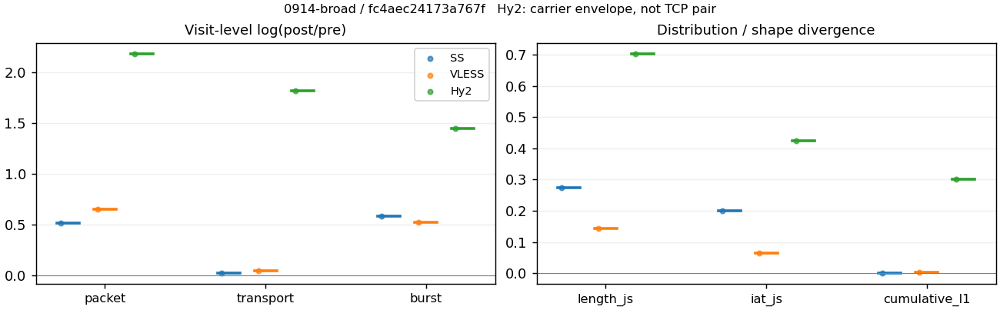
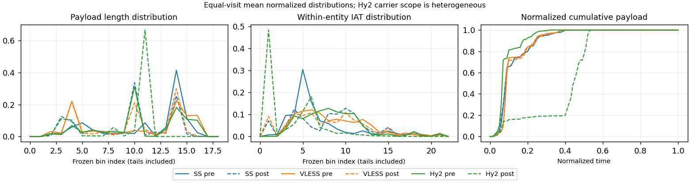

# 0914-broad · 条目 053 · vimeo.com

目标：https://vimeo.com/

活动标签：vimeo.com::page_load。选定访问 3 次。

[返回总索引](../../README.md) · [统计口径](../../methods.md)

## 覆盖与资格（每次访问均保留）

| 部署 | 重复 | 主请求路由 | 活动状态 | 代理比较 | DIRECT pre | 请求 proxy/direct/unresolved | 错误 |
| --- | --- | --- | --- | --- | --- | --- | --- |
| Hy2 | 1 | proxy | passed | 1 | 1 | 225/9/4 | [] |
| SS | 1 | proxy | passed | 1 | 0 | 277/0/3 | [] |
| VLESS | 1 | proxy | passed | 1 | 1 | 282/2/6 | [] |

主请求非 proxy 的统计仅解释为已索引的辅助代理连接或 DIRECT 观测，不代表目标业务经代理传输。播放确认与配对资格是两道不同的门。

图中散点为单次访问，短线为重复中位数；Hy2 是共享载体包络，不能与 TCP 配对作等范围因果对比。

形态图先逐访问归一化，再对访问等权平均；实线 pre，虚线 post。分箱序号及边界见 methods，不将分箱索引误解为长度或时间。

## 每次访问的关键观测

### SS

范围：`exclusive_page`。每格 pre → post；空值为不可观测/不适用。

| 重复 | 包数 | 载荷字节 | burst | TCP FR | IAT中位µs | length JS | IAT JS |
| --- | --- | --- | --- | --- | --- | --- | --- |
| 1 | 7249 → 12079 | 1.0034e+07 → 1.0274e+07 | 4635 → 8287 | 440 → 455 | 18.779 → 203.14 | 0.27465 | 0.2 |

完整标量统计：中位数 [min,max]；Δ 为重复内逐访问变换的中位数，MAD 未缩放。n 为可用变换数；DIRECT-only 的 nΔ=0 不代表 pre 不可用。

| scope | 特征 | pre | post | Δ | IQRΔ | MADΔ | nΔ |
| --- | --- | --- | --- | --- | --- | --- | --- |
| exclusive_page | active_span_sum_s_1000ms | 92.385 [92.385, 92.385] | 98.62 [98.62, 98.62] | 0.065308 | — | — | 1 |
| exclusive_page | active_span_sum_s_100ms | 16.379 [16.379, 16.379] | 34.669 [34.669, 34.669] | 0.74983 | — | — | 1 |
| exclusive_page | active_span_sum_s_500ms | 67.225 [67.225, 67.225] | 86.343 [86.343, 86.343] | 0.25028 | — | — | 1 |
| exclusive_page | burst_bytes_iqr | 2896 [2896, 2896] | 1902.5 [1902.5, 1902.5] | -0.42016 | — | — | 1 |
| exclusive_page | burst_bytes_mad | 31 [31, 31] | 34 [34, 34] | 0.092373 | — | — | 1 |
| exclusive_page | burst_bytes_max | 23584 [23584, 23584] | 24276 [24276, 24276] | 0.02892 | — | — | 1 |
| exclusive_page | burst_bytes_mean | 2164.9 [2164.9, 2164.9] | 1239.8 [1239.8, 1239.8] | -0.55745 | — | — | 1 |
| exclusive_page | burst_bytes_median | 31 [31, 31] | 34 [34, 34] | 0.092373 | — | — | 1 |
| exclusive_page | burst_bytes_min | 0 [0, 0] | 0 [0, 0] | — | — | — | 0 |
| exclusive_page | burst_bytes_p95 | 11376 [11376, 11376] | 5168.2 [5168.2, 5168.2] | -0.78898 | — | — | 1 |
| exclusive_page | burst_bytes_q25 | 0 [0, 0] | 0 [0, 0] | — | — | — | 0 |
| exclusive_page | burst_bytes_q75 | 2896 [2896, 2896] | 1902.5 [1902.5, 1902.5] | -0.42016 | — | — | 1 |
| exclusive_page | burst_bytes_std | 4121 [4121, 4121] | 2046.4 [2046.4, 2046.4] | -0.70001 | — | — | 1 |
| exclusive_page | burst_count | 4635 [4635, 4635] | 8287 [8287, 8287] | 0.58105 | — | — | 1 |
| exclusive_page | burst_duration_ms_iqr | 0.019888 [0.019888, 0.019888] | 0.000122 [0.000122, 0.000122] | -5.0939 | — | — | 1 |
| exclusive_page | burst_duration_ms_mad | 0 [0, 0] | 0 [0, 0] | — | — | — | 0 |
| exclusive_page | burst_duration_ms_max | 15001 [15001, 15001] | 27643 [27643, 27643] | 0.61124 | — | — | 1 |
| exclusive_page | burst_duration_ms_mean | 120.01 [120.01, 120.01] | 77.795 [77.795, 77.795] | -0.43354 | — | — | 1 |
| exclusive_page | burst_duration_ms_median | 0 [0, 0] | 0 [0, 0] | — | — | — | 0 |
| exclusive_page | burst_duration_ms_min | 0 [0, 0] | 0 [0, 0] | — | — | — | 0 |
| exclusive_page | burst_duration_ms_p95 | 160.57 [160.57, 160.57] | 2.1843 [2.1843, 2.1843] | -4.2974 | — | — | 1 |
| exclusive_page | burst_duration_ms_q25 | 0 [0, 0] | 0 [0, 0] | — | — | — | 0 |
| exclusive_page | burst_duration_ms_q75 | 0.019888 [0.019888, 0.019888] | 0.000122 [0.000122, 0.000122] | -5.0939 | — | — | 1 |
| exclusive_page | burst_duration_ms_std | 1087.2 [1087.2, 1087.2] | 1097.2 [1097.2, 1097.2] | 0.0091718 | — | — | 1 |
| exclusive_page | burst_packets_iqr | 1 [1, 1] | 1 [1, 1] | 0 | — | — | 1 |
| exclusive_page | burst_packets_mad | 0 [0, 0] | 0 [0, 0] | — | — | — | 0 |
| exclusive_page | burst_packets_max | 12 [12, 12] | 13 [13, 13] | 0.080043 | — | — | 1 |
| exclusive_page | burst_packets_mean | 1.564 [1.564, 1.564] | 1.4576 [1.4576, 1.4576] | -0.070447 | — | — | 1 |
| exclusive_page | burst_packets_median | 1 [1, 1] | 1 [1, 1] | 0 | — | — | 1 |
| exclusive_page | burst_packets_min | 1 [1, 1] | 1 [1, 1] | 0 | — | — | 1 |
| exclusive_page | burst_packets_p95 | 4 [4, 4] | 3 [3, 3] | -0.28768 | — | — | 1 |
| exclusive_page | burst_packets_q25 | 1 [1, 1] | 1 [1, 1] | 0 | — | — | 1 |
| exclusive_page | burst_packets_q75 | 2 [2, 2] | 2 [2, 2] | 0 | — | — | 1 |
| exclusive_page | burst_packets_std | 1.2845 [1.2845, 1.2845] | 0.92762 [0.92762, 0.92762] | -0.32552 | — | — | 1 |
| exclusive_page | connection_span_concurrency_max | 41 [41, 41] | 41 [41, 41] | 0 | — | — | 1 |
| exclusive_page | cumulative_l1 | — | — | 0.0017424 | — | — | 1 |
| exclusive_page | cumulative_max | — | — | 0.058355 | — | — | 1 |
| exclusive_page | direction_entropy | 0.53577 [0.53577, 0.53577] | 0.47519 [0.47519, 0.47519] | -0.06058 | — | — | 1 |
| exclusive_page | down_burst_count | 2292 [2292, 2292] | 4118 [4118, 4118] | 0.58594 | — | — | 1 |
| exclusive_page | down_ip_bytes | 9.8567e+06 [9.8567e+06, 9.8567e+06] | 1.016e+07 [1.016e+07, 1.016e+07] | 0.030267 | — | — | 1 |
| exclusive_page | down_packets | 4516 [4516, 4516] | 6979 [6979, 6979] | 0.43528 | — | — | 1 |
| exclusive_page | down_transport_bytes | 9.6215e+06 [9.6215e+06, 9.6215e+06] | 9.7956e+06 [9.7956e+06, 9.7956e+06] | 0.017933 | — | — | 1 |
| exclusive_page | duration_s | 39.935 [39.935, 39.935] | 39.934 [39.934, 39.934] | -1.7943e-05 | — | — | 1 |
| exclusive_page | entity_count | 51 [51, 51] | 51 [51, 51] | 0 | — | — | 1 |
| exclusive_page | fr_runs | 440 [440, 440] | 455 [455, 455] | 0.033523 | — | — | 1 |
| exclusive_page | fr_runs_per_packet | 0.10016 [0.10016, 0.10016] | 0.064704 [0.064704, 0.064704] | -0.035455 | — | — | 1 |
| exclusive_page | fr_switches | 389 [389, 389] | 404 [404, 404] | 0.037836 | — | — | 1 |
| exclusive_page | fr_switches_per_possible_transition | 0.08959 [0.08959, 0.08959] | 0.057871 [0.057871, 0.057871] | -0.031719 | — | — | 1 |
| exclusive_page | full_retransmission_fraction | 0.0022072 [0.0022072, 0.0022072] | 0.0093551 [0.0093551, 0.0093551] | 0.0071479 | — | — | 1 |
| exclusive_page | full_retransmission_packets | 16 [16, 16] | 113 [113, 113] | 1.9548 | — | — | 1 |
| exclusive_page | iat_count | 7198 [7198, 7198] | 12028 [12028, 12028] | 0.51343 | — | — | 1 |
| exclusive_page | iat_js | — | — | 0.2 | — | — | 1 |
| exclusive_page | iat_ks | — | — | 0.35547 | — | — | 1 |
| exclusive_page | iat_median_us | 18.779 [18.779, 18.779] | 203.14 [203.14, 203.14] | 2.3811 | — | — | 1 |
| exclusive_page | iat_us_iqr | 95.066 [95.066, 95.066] | 1012 [1012, 1012] | 2.3651 | — | — | 1 |
| exclusive_page | iat_us_mad | 13.619 [13.619, 13.619] | 201.15 [201.15, 201.15] | 2.6926 | — | — | 1 |
| exclusive_page | iat_us_max | 1.5003e+07 [1.5003e+07, 1.5003e+07] | 1.5461e+07 [1.5461e+07, 1.5461e+07] | 0.030104 | — | — | 1 |
| exclusive_page | iat_us_mean | 1.7454e+05 [1.7454e+05, 1.7454e+05] | 1.0433e+05 [1.0433e+05, 1.0433e+05] | -0.51456 | — | — | 1 |
| exclusive_page | iat_us_median | 18.779 [18.779, 18.779] | 203.14 [203.14, 203.14] | 2.3811 | — | — | 1 |
| exclusive_page | iat_us_min | 0.025 [0.025, 0.025] | 0.031 [0.031, 0.031] | 0.21511 | — | — | 1 |
| exclusive_page | iat_us_p95 | 94589 [94589, 94589] | 37290 [37290, 37290] | -0.93082 | — | — | 1 |
| exclusive_page | iat_us_q25 | 11.567 [11.567, 11.567] | 10.413 [10.413, 10.413] | -0.1051 | — | — | 1 |
| exclusive_page | iat_us_q75 | 106.63 [106.63, 106.63] | 1022.4 [1022.4, 1022.4] | 2.2606 | — | — | 1 |
| exclusive_page | iat_us_std | 1.4656e+06 [1.4656e+06, 1.4656e+06] | 1.1374e+06 [1.1374e+06, 1.1374e+06] | -0.25348 | — | — | 1 |
| exclusive_page | iat_wasserstein_log1p_us | — | — | 1.3498 | — | — | 1 |
| exclusive_page | idle_gap_count_1000ms | 108 [108, 108] | 105 [105, 105] | -0.028171 | — | — | 1 |
| exclusive_page | idle_gap_count_100ms | 343 [343, 343] | 348 [348, 348] | 0.014472 | — | — | 1 |
| exclusive_page | idle_gap_count_500ms | 146 [146, 146] | 122 [122, 122] | -0.17959 | — | — | 1 |
| exclusive_page | idle_gap_sum_s_1000ms | 1163.9 [1163.9, 1163.9] | 1156.3 [1156.3, 1156.3] | -0.0065926 | — | — | 1 |
| exclusive_page | idle_gap_sum_s_100ms | 1240 [1240, 1240] | 1220.2 [1220.2, 1220.2] | -0.016018 | — | — | 1 |
| exclusive_page | idle_gap_sum_s_500ms | 1189.1 [1189.1, 1189.1] | 1168.6 [1168.6, 1168.6] | -0.017417 | — | — | 1 |
| exclusive_page | ip_bytes | 1.0412e+07 [1.0412e+07, 1.0412e+07] | 1.0996e+07 [1.0996e+07, 1.0996e+07] | 0.054499 | — | — | 1 |
| exclusive_page | length_iqr | 2003 [2003, 2003] | 2574 [2574, 2574] | 0.25082 | — | — | 1 |
| exclusive_page | length_js | — | — | 0.27465 | — | — | 1 |
| exclusive_page | length_ks | — | — | 0.47014 | — | — | 1 |
| exclusive_page | length_mad | 1200 [1200, 1200] | 1240.5 [1240.5, 1240.5] | 0.033193 | — | — | 1 |
| exclusive_page | length_max | 8948 [8948, 8948] | 9252 [9252, 9252] | 0.03341 | — | — | 1 |
| exclusive_page | length_mean | 2284.2 [2284.2, 2284.2] | 1461 [1461, 1461] | -0.44686 | — | — | 1 |
| exclusive_page | length_median | 2896 [2896, 2896] | 1428 [1428, 1428] | -0.70706 | — | — | 1 |
| exclusive_page | length_min | 6 [6, 6] | 4 [4, 4] | -0.40547 | — | — | 1 |
| exclusive_page | length_p95 | 5088 [5088, 5088] | 2856 [2856, 2856] | -0.57746 | — | — | 1 |
| exclusive_page | length_q25 | 893 [893, 893] | 282 [282, 282] | -1.1527 | — | — | 1 |
| exclusive_page | length_q75 | 2896 [2896, 2896] | 2856 [2856, 2856] | -0.013908 | — | — | 1 |
| exclusive_page | length_std | 1753.1 [1753.1, 1753.1] | 1134.2 [1134.2, 1134.2] | -0.43541 | — | — | 1 |
| exclusive_page | length_wasserstein_bytes | — | — | 823.31 | — | — | 1 |
| exclusive_page | nonempty_entity_count | 51 [51, 51] | 51 [51, 51] | 0 | — | — | 1 |
| exclusive_page | nonempty_packets | 4393 [4393, 4393] | 7032 [7032, 7032] | 0.47046 | — | — | 1 |
| exclusive_page | offload_suspect_fraction | 0.36971 [0.36971, 0.36971] | 0.1866 [0.1866, 0.1866] | -0.1831 | — | — | 1 |
| exclusive_page | packet_count | 7249 [7249, 7249] | 12079 [12079, 12079] | 0.5106 | — | — | 1 |
| exclusive_page | rtt_median_ms | 0.037711 [0.037711, 0.037711] | 32.625 [32.625, 32.625] | 6.7629 | — | — | 1 |
| exclusive_page | rtt_sample_count | 2637 [2637, 2637] | 1631 [1631, 1631] | -0.48045 | — | — | 1 |
| exclusive_page | tcp_ack_count | 7198 [7198, 7198] | 12023 [12023, 12023] | 0.51302 | — | — | 1 |
| exclusive_page | tcp_fin_count | 102 [102, 102] | 108 [108, 108] | 0.057158 | — | — | 1 |
| exclusive_page | tcp_packet_count | 7249 [7249, 7249] | 12079 [12079, 12079] | 0.5106 | — | — | 1 |
| exclusive_page | tcp_rst_count | 0 [0, 0] | 0 [0, 0] | — | — | — | 0 |
| exclusive_page | tcp_syn_count | 102 [102, 102] | 109 [109, 109] | 0.066375 | — | — | 1 |
| exclusive_page | tcp_window_raw_median | 65535 [65535, 65535] | 142 [142, 142] | -6.1345 | — | — | 1 |
| exclusive_page | transition_entropy | 0.35337 [0.35337, 0.35337] | 0.26106 [0.26106, 0.26106] | -0.092313 | — | — | 1 |
| exclusive_page | transition_n_mm | 3641 [3641, 3641] | 6093 [6093, 6093] | 0.51488 | — | — | 1 |
| exclusive_page | transition_n_mp | 174 [174, 174] | 182 [182, 182] | 0.044951 | — | — | 1 |
| exclusive_page | transition_n_pm | 215 [215, 215] | 222 [222, 222] | 0.032039 | — | — | 1 |
| exclusive_page | transition_n_pp | 312 [312, 312] | 484 [484, 484] | 0.43908 | — | — | 1 |
| exclusive_page | transition_p_mm | 0.95439 [0.95439, 0.95439] | 0.971 [0.971, 0.971] | 0.016605 | — | — | 1 |
| exclusive_page | transition_p_mp | 0.045609 [0.045609, 0.045609] | 0.029004 [0.029004, 0.029004] | -0.016605 | — | — | 1 |
| exclusive_page | transition_p_pm | 0.40797 [0.40797, 0.40797] | 0.31445 [0.31445, 0.31445] | -0.093522 | — | — | 1 |
| exclusive_page | transition_p_pp | 0.59203 [0.59203, 0.59203] | 0.68555 [0.68555, 0.68555] | 0.093522 | — | — | 1 |
| exclusive_page | transport_bytes | 1.0034e+07 [1.0034e+07, 1.0034e+07] | 1.0274e+07 [1.0274e+07, 1.0274e+07] | 0.023599 | — | — | 1 |
| exclusive_page | up_burst_count | 2343 [2343, 2343] | 4169 [4169, 4169] | 0.57624 | — | — | 1 |
| exclusive_page | up_byte_fraction | 0.041156 [0.041156, 0.041156] | 0.046574 [0.046574, 0.046574] | 0.0054173 | — | — | 1 |
| exclusive_page | up_ip_bytes | 5.557e+05 [5.557e+05, 5.557e+05] | 8.3602e+05 [8.3602e+05, 8.3602e+05] | 0.40843 | — | — | 1 |
| exclusive_page | up_packets | 2733 [2733, 2733] | 5100 [5100, 5100] | 0.62384 | — | — | 1 |
| exclusive_page | up_transport_bytes | 4.1298e+05 [4.1298e+05, 4.1298e+05] | 4.785e+05 [4.785e+05, 4.785e+05] | 0.14726 | — | — | 1 |
| exclusive_page | zero_iat_count | 0 [0, 0] | 0 [0, 0] | — | — | — | 0 |
| exclusive_page | zero_iat_fraction | 0 [0, 0] | 0 [0, 0] | 0 | — | — | 1 |

### VLESS

范围：`exclusive_page`。每格 pre → post；空值为不可观测/不适用。

| 重复 | 包数 | 载荷字节 | burst | TCP FR | IAT中位µs | length JS | IAT JS |
| --- | --- | --- | --- | --- | --- | --- | --- |
| 1 | 6036 → 11507 | 9.6982e+06 → 1.011e+07 | 4492 → 7569 | 447 → 570 | 107.83 → 83.429 | 0.14231 | 0.064635 |

范围：`direct_pre_only`。每格 pre → post；空值为不可观测/不适用。

| 重复 | 包数 | 载荷字节 | burst | TCP FR | IAT中位µs | length JS | IAT JS |
| --- | --- | --- | --- | --- | --- | --- | --- |
| 1 | 59 → — | 50231 → — | 43 → — | 8 → — | 278.29 → — | — | — |

完整标量统计：中位数 [min,max]；Δ 为重复内逐访问变换的中位数，MAD 未缩放。n 为可用变换数；DIRECT-only 的 nΔ=0 不代表 pre 不可用。

| scope | 特征 | pre | post | Δ | IQRΔ | MADΔ | nΔ |
| --- | --- | --- | --- | --- | --- | --- | --- |
| direct_pre_only | active_span_sum_s_1000ms | 1.8013 [1.8013, 1.8013] | — | — | — | — | 0 |
| direct_pre_only | active_span_sum_s_100ms | 0.11735 [0.11735, 0.11735] | — | — | — | — | 0 |
| direct_pre_only | active_span_sum_s_500ms | 0.97383 [0.97383, 0.97383] | — | — | — | — | 0 |
| direct_pre_only | burst_bytes_iqr | 2832 [2832, 2832] | — | — | — | — | 0 |
| direct_pre_only | burst_bytes_mad | 24 [24, 24] | — | — | — | — | 0 |
| direct_pre_only | burst_bytes_max | 5664 [5664, 5664] | — | — | — | — | 0 |
| direct_pre_only | burst_bytes_mean | 1168.2 [1168.2, 1168.2] | — | — | — | — | 0 |
| direct_pre_only | burst_bytes_median | 24 [24, 24] | — | — | — | — | 0 |
| direct_pre_only | burst_bytes_min | 0 [0, 0] | — | — | — | — | 0 |
| direct_pre_only | burst_bytes_p95 | 4741 [4741, 4741] | — | — | — | — | 0 |
| direct_pre_only | burst_bytes_q25 | 0 [0, 0] | — | — | — | — | 0 |
| direct_pre_only | burst_bytes_q75 | 2832 [2832, 2832] | — | — | — | — | 0 |
| direct_pre_only | burst_bytes_std | 1703.9 [1703.9, 1703.9] | — | — | — | — | 0 |
| direct_pre_only | burst_count | 43 [43, 43] | — | — | — | — | 0 |
| direct_pre_only | burst_duration_ms_iqr | 1.8575 [1.8575, 1.8575] | — | — | — | — | 0 |
| direct_pre_only | burst_duration_ms_mad | 0 [0, 0] | — | — | — | — | 0 |
| direct_pre_only | burst_duration_ms_max | 13065 [13065, 13065] | — | — | — | — | 0 |
| direct_pre_only | burst_duration_ms_mean | 344.3 [344.3, 344.3] | — | — | — | — | 0 |
| direct_pre_only | burst_duration_ms_median | 0 [0, 0] | — | — | — | — | 0 |
| direct_pre_only | burst_duration_ms_min | 0 [0, 0] | — | — | — | — | 0 |
| direct_pre_only | burst_duration_ms_p95 | 297.6 [297.6, 297.6] | — | — | — | — | 0 |
| direct_pre_only | burst_duration_ms_q25 | 0 [0, 0] | — | — | — | — | 0 |
| direct_pre_only | burst_duration_ms_q75 | 1.8575 [1.8575, 1.8575] | — | — | — | — | 0 |
| direct_pre_only | burst_duration_ms_std | 1967.9 [1967.9, 1967.9] | — | — | — | — | 0 |
| direct_pre_only | burst_packets_iqr | 1 [1, 1] | — | — | — | — | 0 |
| direct_pre_only | burst_packets_mad | 0 [0, 0] | — | — | — | — | 0 |
| direct_pre_only | burst_packets_max | 3 [3, 3] | — | — | — | — | 0 |
| direct_pre_only | burst_packets_mean | 1.3721 [1.3721, 1.3721] | — | — | — | — | 0 |
| direct_pre_only | burst_packets_median | 1 [1, 1] | — | — | — | — | 0 |
| direct_pre_only | burst_packets_min | 1 [1, 1] | — | — | — | — | 0 |
| direct_pre_only | burst_packets_p95 | 2.9 [2.9, 2.9] | — | — | — | — | 0 |
| direct_pre_only | burst_packets_q25 | 1 [1, 1] | — | — | — | — | 0 |
| direct_pre_only | burst_packets_q75 | 2 [2, 2] | — | — | — | — | 0 |
| direct_pre_only | burst_packets_std | 0.61088 [0.61088, 0.61088] | — | — | — | — | 0 |
| direct_pre_only | connection_span_concurrency_max | 1 [1, 1] | — | — | — | — | 0 |
| direct_pre_only | direction_entropy | 0.7496 [0.7496, 0.7496] | — | — | — | — | 0 |
| direct_pre_only | down_burst_count | 21 [21, 21] | — | — | — | — | 0 |
| direct_pre_only | down_ip_bytes | 49476 [49476, 49476] | — | — | — | — | 0 |
| direct_pre_only | down_packets | 32 [32, 32] | — | — | — | — | 0 |
| direct_pre_only | down_transport_bytes | 47804 [47804, 47804] | — | — | — | — | 0 |
| direct_pre_only | duration_s | 29.867 [29.867, 29.867] | — | — | — | — | 0 |
| direct_pre_only | entity_count | 1 [1, 1] | — | — | — | — | 0 |
| direct_pre_only | fr_runs | 8 [8, 8] | — | — | — | — | 0 |
| direct_pre_only | fr_runs_per_packet | 0.28571 [0.28571, 0.28571] | — | — | — | — | 0 |
| direct_pre_only | fr_switches | 7 [7, 7] | — | — | — | — | 0 |
| direct_pre_only | fr_switches_per_possible_transition | 0.25926 [0.25926, 0.25926] | — | — | — | — | 0 |
| direct_pre_only | full_retransmission_fraction | 0.016949 [0.016949, 0.016949] | — | — | — | — | 0 |
| direct_pre_only | full_retransmission_packets | 1 [1, 1] | — | — | — | — | 0 |
| direct_pre_only | iat_count | 58 [58, 58] | — | — | — | — | 0 |
| direct_pre_only | iat_median_us | 278.29 [278.29, 278.29] | — | — | — | — | 0 |
| direct_pre_only | iat_us_iqr | 5914 [5914, 5914] | — | — | — | — | 0 |
| direct_pre_only | iat_us_mad | 262.97 [262.97, 262.97] | — | — | — | — | 0 |
| direct_pre_only | iat_us_max | 1.5001e+07 [1.5001e+07, 1.5001e+07] | — | — | — | — | 0 |
| direct_pre_only | iat_us_mean | 5.1495e+05 [5.1495e+05, 5.1495e+05] | — | — | — | — | 0 |
| direct_pre_only | iat_us_median | 278.29 [278.29, 278.29] | — | — | — | — | 0 |
| direct_pre_only | iat_us_min | 5.175 [5.175, 5.175] | — | — | — | — | 0 |
| direct_pre_only | iat_us_p95 | 3.7663e+05 [3.7663e+05, 3.7663e+05] | — | — | — | — | 0 |
| direct_pre_only | iat_us_q25 | 45.375 [45.375, 45.375] | — | — | — | — | 0 |
| direct_pre_only | iat_us_q75 | 5959.3 [5959.3, 5959.3] | — | — | — | — | 0 |
| direct_pre_only | iat_us_std | 2.5639e+06 [2.5639e+06, 2.5639e+06] | — | — | — | — | 0 |
| direct_pre_only | idle_gap_count_1000ms | 2 [2, 2] | — | — | — | — | 0 |
| direct_pre_only | idle_gap_count_100ms | 6 [6, 6] | — | — | — | — | 0 |
| direct_pre_only | idle_gap_count_500ms | 3 [3, 3] | — | — | — | — | 0 |
| direct_pre_only | idle_gap_sum_s_1000ms | 28.066 [28.066, 28.066] | — | — | — | — | 0 |
| direct_pre_only | idle_gap_sum_s_100ms | 29.75 [29.75, 29.75] | — | — | — | — | 0 |
| direct_pre_only | idle_gap_sum_s_500ms | 28.893 [28.893, 28.893] | — | — | — | — | 0 |
| direct_pre_only | ip_bytes | 53303 [53303, 53303] | — | — | — | — | 0 |
| direct_pre_only | length_iqr | 2556.2 [2556.2, 2556.2] | — | — | — | — | 0 |
| direct_pre_only | length_mad | 423 [423, 423] | — | — | — | — | 0 |
| direct_pre_only | length_max | 4048 [4048, 4048] | — | — | — | — | 0 |
| direct_pre_only | length_mean | 1794 [1794, 1794] | — | — | — | — | 0 |
| direct_pre_only | length_median | 2832 [2832, 2832] | — | — | — | — | 0 |
| direct_pre_only | length_min | 24 [24, 24] | — | — | — | — | 0 |
| direct_pre_only | length_p95 | 2832 [2832, 2832] | — | — | — | — | 0 |
| direct_pre_only | length_q25 | 275.75 [275.75, 275.75] | — | — | — | — | 0 |
| direct_pre_only | length_q75 | 2832 [2832, 2832] | — | — | — | — | 0 |
| direct_pre_only | length_std | 1294.9 [1294.9, 1294.9] | — | — | — | — | 0 |
| direct_pre_only | nonempty_entity_count | 1 [1, 1] | — | — | — | — | 0 |
| direct_pre_only | nonempty_packets | 28 [28, 28] | — | — | — | — | 0 |
| direct_pre_only | offload_suspect_fraction | 0.28814 [0.28814, 0.28814] | — | — | — | — | 0 |
| direct_pre_only | packet_count | 59 [59, 59] | — | — | — | — | 0 |
| direct_pre_only | rtt_median_ms | 0.07415 [0.07415, 0.07415] | — | — | — | — | 0 |
| direct_pre_only | rtt_sample_count | 23 [23, 23] | — | — | — | — | 0 |
| direct_pre_only | tcp_ack_count | 56 [56, 56] | — | — | — | — | 0 |
| direct_pre_only | tcp_fin_count | 2 [2, 2] | — | — | — | — | 0 |
| direct_pre_only | tcp_packet_count | 59 [59, 59] | — | — | — | — | 0 |
| direct_pre_only | tcp_rst_count | 2 [2, 2] | — | — | — | — | 0 |
| direct_pre_only | tcp_syn_count | 2 [2, 2] | — | — | — | — | 0 |
| direct_pre_only | tcp_window_raw_median | 65454 [65454, 65454] | — | — | — | — | 0 |
| direct_pre_only | transition_entropy | 0.66426 [0.66426, 0.66426] | — | — | — | — | 0 |
| direct_pre_only | transition_n_mm | 18 [18, 18] | — | — | — | — | 0 |
| direct_pre_only | transition_n_mp | 3 [3, 3] | — | — | — | — | 0 |
| direct_pre_only | transition_n_pm | 4 [4, 4] | — | — | — | — | 0 |
| direct_pre_only | transition_n_pp | 2 [2, 2] | — | — | — | — | 0 |
| direct_pre_only | transition_p_mm | 0.85714 [0.85714, 0.85714] | — | — | — | — | 0 |
| direct_pre_only | transition_p_mp | 0.14286 [0.14286, 0.14286] | — | — | — | — | 0 |
| direct_pre_only | transition_p_pm | 0.66667 [0.66667, 0.66667] | — | — | — | — | 0 |
| direct_pre_only | transition_p_pp | 0.33333 [0.33333, 0.33333] | — | — | — | — | 0 |
| direct_pre_only | transport_bytes | 50231 [50231, 50231] | — | — | — | — | 0 |
| direct_pre_only | up_burst_count | 22 [22, 22] | — | — | — | — | 0 |
| direct_pre_only | up_byte_fraction | 0.048317 [0.048317, 0.048317] | — | — | — | — | 0 |
| direct_pre_only | up_ip_bytes | 3827 [3827, 3827] | — | — | — | — | 0 |
| direct_pre_only | up_packets | 27 [27, 27] | — | — | — | — | 0 |
| direct_pre_only | up_transport_bytes | 2427 [2427, 2427] | — | — | — | — | 0 |
| direct_pre_only | zero_iat_count | 0 [0, 0] | — | — | — | — | 0 |
| direct_pre_only | zero_iat_fraction | 0 [0, 0] | — | — | — | — | 0 |
| exclusive_page | active_span_sum_s_1000ms | 88.962 [88.962, 88.962] | 90.119 [90.119, 90.119] | 0.012923 | — | — | 1 |
| exclusive_page | active_span_sum_s_100ms | 13.052 [13.052, 13.052] | 33.726 [33.726, 33.726] | 0.94936 | — | — | 1 |
| exclusive_page | active_span_sum_s_500ms | 48.049 [48.049, 48.049] | 84.273 [84.273, 84.273] | 0.56184 | — | — | 1 |
| exclusive_page | burst_bytes_iqr | 2824 [2824, 2824] | 2824 [2824, 2824] | 0 | — | — | 1 |
| exclusive_page | burst_bytes_mad | 24 [24, 24] | 60 [60, 60] | 0.91629 | — | — | 1 |
| exclusive_page | burst_bytes_max | 23848 [23848, 23848] | 31928 [31928, 31928] | 0.29178 | — | — | 1 |
| exclusive_page | burst_bytes_mean | 2159 [2159, 2159] | 1335.7 [1335.7, 1335.7] | -0.48021 | — | — | 1 |
| exclusive_page | burst_bytes_median | 24 [24, 24] | 60 [60, 60] | 0.91629 | — | — | 1 |
| exclusive_page | burst_bytes_min | 0 [0, 0] | 0 [0, 0] | — | — | — | 0 |
| exclusive_page | burst_bytes_p95 | 13984 [13984, 13984] | 4236 [4236, 4236] | -1.1943 | — | — | 1 |
| exclusive_page | burst_bytes_q25 | 0 [0, 0] | 0 [0, 0] | — | — | — | 0 |
| exclusive_page | burst_bytes_q75 | 2824 [2824, 2824] | 2824 [2824, 2824] | 0 | — | — | 1 |
| exclusive_page | burst_bytes_std | 4273.5 [4273.5, 4273.5] | 2188.5 [2188.5, 2188.5] | -0.66922 | — | — | 1 |
| exclusive_page | burst_count | 4492 [4492, 4492] | 7569 [7569, 7569] | 0.52176 | — | — | 1 |
| exclusive_page | burst_duration_ms_iqr | 0.022707 [0.022707, 0.022707] | 0.004725 [0.004725, 0.004725] | -1.5698 | — | — | 1 |
| exclusive_page | burst_duration_ms_mad | 0 [0, 0] | 0 [0, 0] | — | — | — | 0 |
| exclusive_page | burst_duration_ms_max | 15001 [15001, 15001] | 15462 [15462, 15462] | 0.030242 | — | — | 1 |
| exclusive_page | burst_duration_ms_mean | 117.37 [117.37, 117.37] | 63.405 [63.405, 63.405] | -0.61582 | — | — | 1 |
| exclusive_page | burst_duration_ms_median | 0 [0, 0] | 0 [0, 0] | — | — | — | 0 |
| exclusive_page | burst_duration_ms_min | 0 [0, 0] | 0 [0, 0] | — | — | — | 0 |
| exclusive_page | burst_duration_ms_p95 | 195.92 [195.92, 195.92] | 9.891 [9.891, 9.891] | -2.9861 | — | — | 1 |
| exclusive_page | burst_duration_ms_q25 | 0 [0, 0] | 0 [0, 0] | — | — | — | 0 |
| exclusive_page | burst_duration_ms_q75 | 0.022707 [0.022707, 0.022707] | 0.004725 [0.004725, 0.004725] | -1.5698 | — | — | 1 |
| exclusive_page | burst_duration_ms_std | 1088.9 [1088.9, 1088.9] | 899.48 [899.48, 899.48] | -0.19112 | — | — | 1 |
| exclusive_page | burst_packets_iqr | 1 [1, 1] | 1 [1, 1] | 0 | — | — | 1 |
| exclusive_page | burst_packets_mad | 0 [0, 0] | 0 [0, 0] | — | — | — | 0 |
| exclusive_page | burst_packets_max | 11 [11, 11] | 14 [14, 14] | 0.24116 | — | — | 1 |
| exclusive_page | burst_packets_mean | 1.3437 [1.3437, 1.3437] | 1.5203 [1.5203, 1.5203] | 0.12345 | — | — | 1 |
| exclusive_page | burst_packets_median | 1 [1, 1] | 1 [1, 1] | 0 | — | — | 1 |
| exclusive_page | burst_packets_min | 1 [1, 1] | 1 [1, 1] | 0 | — | — | 1 |
| exclusive_page | burst_packets_p95 | 2 [2, 2] | 3 [3, 3] | 0.40547 | — | — | 1 |
| exclusive_page | burst_packets_q25 | 1 [1, 1] | 1 [1, 1] | 0 | — | — | 1 |
| exclusive_page | burst_packets_q75 | 2 [2, 2] | 2 [2, 2] | 0 | — | — | 1 |
| exclusive_page | burst_packets_std | 0.63149 [0.63149, 0.63149] | 1.0821 [1.0821, 1.0821] | 0.5386 | — | — | 1 |
| exclusive_page | connection_span_concurrency_max | 39 [39, 39] | 39 [39, 39] | 0 | — | — | 1 |
| exclusive_page | cumulative_l1 | — | — | 0.0041327 | — | — | 1 |
| exclusive_page | cumulative_max | — | — | 0.051368 | — | — | 1 |
| exclusive_page | direction_entropy | 0.60969 [0.60969, 0.60969] | 0.48164 [0.48164, 0.48164] | -0.12805 | — | — | 1 |
| exclusive_page | down_burst_count | 2220 [2220, 2220] | 3762 [3762, 3762] | 0.52744 | — | — | 1 |
| exclusive_page | down_ip_bytes | 9.4832e+06 [9.4832e+06, 9.4832e+06] | 9.9553e+06 [9.9553e+06, 9.9553e+06] | 0.048583 | — | — | 1 |
| exclusive_page | down_packets | 3435 [3435, 3435] | 6598 [6598, 6598] | 0.65275 | — | — | 1 |
| exclusive_page | down_transport_bytes | 9.3042e+06 [9.3042e+06, 9.3042e+06] | 9.6118e+06 [9.6118e+06, 9.6118e+06] | 0.032528 | — | — | 1 |
| exclusive_page | duration_s | 38.652 [38.652, 38.652] | 38.654 [38.654, 38.654] | 5.2138e-05 | — | — | 1 |
| exclusive_page | entity_count | 52 [52, 52] | 52 [52, 52] | 0 | — | — | 1 |
| exclusive_page | fr_runs | 447 [447, 447] | 570 [570, 570] | 0.24308 | — | — | 1 |
| exclusive_page | fr_runs_per_packet | 0.13513 [0.13513, 0.13513] | 0.087977 [0.087977, 0.087977] | -0.04715 | — | — | 1 |
| exclusive_page | fr_switches | 395 [395, 395] | 518 [518, 518] | 0.27109 | — | — | 1 |
| exclusive_page | fr_switches_per_possible_transition | 0.12131 [0.12131, 0.12131] | 0.080597 [0.080597, 0.080597] | -0.040717 | — | — | 1 |
| exclusive_page | full_retransmission_fraction | 0.0016567 [0.0016567, 0.0016567] | 8.6904e-05 [8.6904e-05, 8.6904e-05] | -0.0015698 | — | — | 1 |
| exclusive_page | full_retransmission_packets | 10 [10, 10] | 1 [1, 1] | -2.3026 | — | — | 1 |
| exclusive_page | iat_count | 5984 [5984, 5984] | 11455 [11455, 11455] | 0.64934 | — | — | 1 |
| exclusive_page | iat_js | — | — | 0.064635 | — | — | 1 |
| exclusive_page | iat_ks | — | — | 0.1119 | — | — | 1 |
| exclusive_page | iat_median_us | 107.83 [107.83, 107.83] | 83.429 [83.429, 83.429] | -0.25651 | — | — | 1 |
| exclusive_page | iat_us_iqr | 1494.6 [1494.6, 1494.6] | 987.08 [987.08, 987.08] | -0.41486 | — | — | 1 |
| exclusive_page | iat_us_mad | 101.61 [101.61, 101.61] | 83.318 [83.318, 83.318] | -0.19845 | — | — | 1 |
| exclusive_page | iat_us_max | 1.5002e+07 [1.5002e+07, 1.5002e+07] | 1.5462e+07 [1.5462e+07, 1.5462e+07] | 0.030218 | — | — | 1 |
| exclusive_page | iat_us_mean | 2.0092e+05 [2.0092e+05, 2.0092e+05] | 1.0442e+05 [1.0442e+05, 1.0442e+05] | -0.65449 | — | — | 1 |
| exclusive_page | iat_us_median | 107.83 [107.83, 107.83] | 83.429 [83.429, 83.429] | -0.25651 | — | — | 1 |
| exclusive_page | iat_us_min | 0.503 [0.503, 0.503] | 0.031 [0.031, 0.031] | -2.7866 | — | — | 1 |
| exclusive_page | iat_us_p95 | 1.6633e+05 [1.6633e+05, 1.6633e+05] | 43929 [43929, 43929] | -1.3314 | — | — | 1 |
| exclusive_page | iat_us_q25 | 18.16 [18.16, 18.16] | 9.8965 [9.8965, 9.8965] | -0.60705 | — | — | 1 |
| exclusive_page | iat_us_q75 | 1512.8 [1512.8, 1512.8] | 996.98 [996.98, 996.98] | -0.41696 | — | — | 1 |
| exclusive_page | iat_us_std | 1.5862e+06 [1.5862e+06, 1.5862e+06] | 1.1519e+06 [1.1519e+06, 1.1519e+06] | -0.31997 | — | — | 1 |
| exclusive_page | iat_wasserstein_log1p_us | — | — | 0.59127 | — | — | 1 |
| exclusive_page | idle_gap_count_1000ms | 99 [99, 99] | 93 [93, 93] | -0.06252 | — | — | 1 |
| exclusive_page | idle_gap_count_100ms | 315 [315, 315] | 360 [360, 360] | 0.13353 | — | — | 1 |
| exclusive_page | idle_gap_count_500ms | 156 [156, 156] | 101 [101, 101] | -0.43474 | — | — | 1 |
| exclusive_page | idle_gap_sum_s_1000ms | 1113.3 [1113.3, 1113.3] | 1106 [1106, 1106] | -0.006608 | — | — | 1 |
| exclusive_page | idle_gap_sum_s_100ms | 1189.3 [1189.3, 1189.3] | 1162.4 [1162.4, 1162.4] | -0.022836 | — | — | 1 |
| exclusive_page | idle_gap_sum_s_500ms | 1154.3 [1154.3, 1154.3] | 1111.9 [1111.9, 1111.9] | -0.037425 | — | — | 1 |
| exclusive_page | ip_bytes | 1.0012e+07 [1.0012e+07, 1.0012e+07] | 1.0722e+07 [1.0722e+07, 1.0722e+07] | 0.068493 | — | — | 1 |
| exclusive_page | length_iqr | 3999 [3999, 3999] | 2716 [2716, 2716] | -0.38688 | — | — | 1 |
| exclusive_page | length_js | — | — | 0.14231 | — | — | 1 |
| exclusive_page | length_ks | — | — | 0.24993 | — | — | 1 |
| exclusive_page | length_mad | 1682 [1682, 1682] | 1340 [1340, 1340] | -0.22731 | — | — | 1 |
| exclusive_page | length_max | 8948 [8948, 8948] | 21180 [21180, 21180] | 0.86163 | — | — | 1 |
| exclusive_page | length_mean | 2931.7 [2931.7, 2931.7] | 1560.4 [1560.4, 1560.4] | -0.63067 | — | — | 1 |
| exclusive_page | length_median | 1774 [1774, 1774] | 1412 [1412, 1412] | -0.22823 | — | — | 1 |
| exclusive_page | length_min | 6 [6, 6] | 4 [4, 4] | -0.40547 | — | — | 1 |
| exclusive_page | length_p95 | 8920 [8920, 8920] | 2896 [2896, 2896] | -1.125 | — | — | 1 |
| exclusive_page | length_q25 | 97 [97, 97] | 108 [108, 108] | 0.10742 | — | — | 1 |
| exclusive_page | length_q75 | 4096 [4096, 4096] | 2824 [2824, 2824] | -0.37186 | — | — | 1 |
| exclusive_page | length_std | 3135 [3135, 3135] | 1363.8 [1363.8, 1363.8] | -0.83234 | — | — | 1 |
| exclusive_page | length_wasserstein_bytes | — | — | 1490.9 | — | — | 1 |
| exclusive_page | nonempty_entity_count | 52 [52, 52] | 52 [52, 52] | 0 | — | — | 1 |
| exclusive_page | nonempty_packets | 3308 [3308, 3308] | 6479 [6479, 6479] | 0.67222 | — | — | 1 |
| exclusive_page | offload_suspect_fraction | 0.28827 [0.28827, 0.28827] | 0.21483 [0.21483, 0.21483] | -0.073445 | — | — | 1 |
| exclusive_page | packet_count | 6036 [6036, 6036] | 11507 [11507, 11507] | 0.64521 | — | — | 1 |
| exclusive_page | rtt_median_ms | 0.074215 [0.074215, 0.074215] | 0.055982 [0.055982, 0.055982] | -0.28194 | — | — | 1 |
| exclusive_page | rtt_sample_count | 2430 [2430, 2430] | 4241 [4241, 4241] | 0.55691 | — | — | 1 |
| exclusive_page | tcp_ack_count | 5896 [5896, 5896] | 11453 [11453, 11453] | 0.66398 | — | — | 1 |
| exclusive_page | tcp_fin_count | 102 [102, 102] | 104 [104, 104] | 0.019418 | — | — | 1 |
| exclusive_page | tcp_packet_count | 6036 [6036, 6036] | 11507 [11507, 11507] | 0.64521 | — | — | 1 |
| exclusive_page | tcp_rst_count | 88 [88, 88] | 1 [1, 1] | -4.4773 | — | — | 1 |
| exclusive_page | tcp_syn_count | 104 [104, 104] | 105 [105, 105] | 0.0095695 | — | — | 1 |
| exclusive_page | tcp_window_raw_median | 65535 [65535, 65535] | 166 [166, 166] | -5.9784 | — | — | 1 |
| exclusive_page | transition_entropy | 0.43629 [0.43629, 0.43629] | 0.322 [0.322, 0.322] | -0.11429 | — | — | 1 |
| exclusive_page | transition_n_mm | 2589 [2589, 2589] | 5520 [5520, 5520] | 0.75711 | — | — | 1 |
| exclusive_page | transition_n_mp | 172 [172, 172] | 233 [233, 233] | 0.30354 | — | — | 1 |
| exclusive_page | transition_n_pm | 223 [223, 223] | 285 [285, 285] | 0.24532 | — | — | 1 |
| exclusive_page | transition_n_pp | 272 [272, 272] | 389 [389, 389] | 0.35778 | — | — | 1 |
| exclusive_page | transition_p_mm | 0.9377 [0.9377, 0.9377] | 0.9595 [0.9595, 0.9595] | 0.021796 | — | — | 1 |
| exclusive_page | transition_p_mp | 0.062296 [0.062296, 0.062296] | 0.040501 [0.040501, 0.040501] | -0.021796 | — | — | 1 |
| exclusive_page | transition_p_pm | 0.45051 [0.45051, 0.45051] | 0.42285 [0.42285, 0.42285] | -0.027656 | — | — | 1 |
| exclusive_page | transition_p_pp | 0.54949 [0.54949, 0.54949] | 0.57715 [0.57715, 0.57715] | 0.027656 | — | — | 1 |
| exclusive_page | transport_bytes | 9.6982e+06 [9.6982e+06, 9.6982e+06] | 1.011e+07 [1.011e+07, 1.011e+07] | 0.041552 | — | — | 1 |
| exclusive_page | up_burst_count | 2272 [2272, 2272] | 3807 [3807, 3807] | 0.51618 | — | — | 1 |
| exclusive_page | up_byte_fraction | 0.04063 [0.04063, 0.04063] | 0.049248 [0.049248, 0.049248] | 0.0086178 | — | — | 1 |
| exclusive_page | up_ip_bytes | 5.2877e+05 [5.2877e+05, 5.2877e+05] | 7.6645e+05 [7.6645e+05, 7.6645e+05] | 0.37121 | — | — | 1 |
| exclusive_page | up_packets | 2601 [2601, 2601] | 4909 [4909, 4909] | 0.63517 | — | — | 1 |
| exclusive_page | up_transport_bytes | 3.9404e+05 [3.9404e+05, 3.9404e+05] | 4.9788e+05 [4.9788e+05, 4.9788e+05] | 0.23391 | — | — | 1 |
| exclusive_page | zero_iat_count | 0 [0, 0] | 0 [0, 0] | — | — | — | 0 |
| exclusive_page | zero_iat_fraction | 0 [0, 0] | 0 [0, 0] | 0 | — | — | 1 |

### Hy2

范围：`carrier_context_envelope`。每格 pre → post；空值为不可观测/不适用。

| 重复 | 包数 | 载荷字节 | burst | TCP FR | IAT中位µs | length JS | IAT JS |
| --- | --- | --- | --- | --- | --- | --- | --- |
| 1 | 5827 → 51411 | 9.0875e+06 → 5.5794e+07 | 3936 → 16640 | — | 139.03 → 2.552 | 0.70187 | 0.4237 |

范围：`direct_pre_only`。每格 pre → post；空值为不可观测/不适用。

| 重复 | 包数 | 载荷字节 | burst | TCP FR | IAT中位µs | length JS | IAT JS |
| --- | --- | --- | --- | --- | --- | --- | --- |
| 1 | 278 → — | 4.6253e+05 → — | 175 → — | 32 → — | 115.08 → — | — | — |

完整标量统计：中位数 [min,max]；Δ 为重复内逐访问变换的中位数，MAD 未缩放。n 为可用变换数；DIRECT-only 的 nΔ=0 不代表 pre 不可用。

| scope | 特征 | pre | post | Δ | IQRΔ | MADΔ | nΔ |
| --- | --- | --- | --- | --- | --- | --- | --- |
| carrier_context_envelope | active_span_sum_s_1000ms | 58.046 [58.046, 58.046] | 15.405 [15.405, 15.405] | -1.3266 | — | — | 1 |
| carrier_context_envelope | active_span_sum_s_100ms | 6.3032 [6.3032, 6.3032] | 11.286 [11.286, 11.286] | 0.58254 | — | — | 1 |
| carrier_context_envelope | active_span_sum_s_500ms | 44.803 [44.803, 44.803] | 15.405 [15.405, 15.405] | -1.0676 | — | — | 1 |
| carrier_context_envelope | burst_bytes_iqr | 2753.2 [2753.2, 2753.2] | 2795 [2795, 2795] | 0.01505 | — | — | 1 |
| carrier_context_envelope | burst_bytes_mad | 31 [31, 31] | 385.5 [385.5, 385.5] | 2.5206 | — | — | 1 |
| carrier_context_envelope | burst_bytes_max | 27944 [27944, 27944] | 3.0414e+05 [3.0414e+05, 3.0414e+05] | 2.3873 | — | — | 1 |
| carrier_context_envelope | burst_bytes_mean | 2308.8 [2308.8, 2308.8] | 3353 [3353, 3353] | 0.37312 | — | — | 1 |
| carrier_context_envelope | burst_bytes_median | 31 [31, 31] | 418.5 [418.5, 418.5] | 2.6027 | — | — | 1 |
| carrier_context_envelope | burst_bytes_min | 0 [0, 0] | 22 [22, 22] | — | — | — | 0 |
| carrier_context_envelope | burst_bytes_p95 | 12288 [12288, 12288] | 11528 [11528, 11528] | -0.063844 | — | — | 1 |
| carrier_context_envelope | burst_bytes_q25 | 0 [0, 0] | 92 [92, 92] | — | — | — | 0 |
| carrier_context_envelope | burst_bytes_q75 | 2753.2 [2753.2, 2753.2] | 2887 [2887, 2887] | 0.047436 | — | — | 1 |
| carrier_context_envelope | burst_bytes_std | 4575.2 [4575.2, 4575.2] | 8476.7 [8476.7, 8476.7] | 0.61666 | — | — | 1 |
| carrier_context_envelope | burst_count | 3936 [3936, 3936] | 16640 [16640, 16640] | 1.4416 | — | — | 1 |
| carrier_context_envelope | burst_duration_ms_iqr | 0.066334 [0.066334, 0.066334] | 0.024697 [0.024697, 0.024697] | -0.98801 | — | — | 1 |
| carrier_context_envelope | burst_duration_ms_mad | 0 [0, 0] | 4.3e-05 [4.3e-05, 4.3e-05] | — | — | — | 0 |
| carrier_context_envelope | burst_duration_ms_max | 15001 [15001, 15001] | 246.97 [246.97, 246.97] | -4.1066 | — | — | 1 |
| carrier_context_envelope | burst_duration_ms_mean | 109.99 [109.99, 109.99] | 0.38836 [0.38836, 0.38836] | -5.6462 | — | — | 1 |
| carrier_context_envelope | burst_duration_ms_median | 0 [0, 0] | 4.3e-05 [4.3e-05, 4.3e-05] | — | — | — | 0 |
| carrier_context_envelope | burst_duration_ms_min | 0 [0, 0] | 0 [0, 0] | — | — | — | 0 |
| carrier_context_envelope | burst_duration_ms_p95 | 169.09 [169.09, 169.09] | 0.21717 [0.21717, 0.21717] | -6.6575 | — | — | 1 |
| carrier_context_envelope | burst_duration_ms_q25 | 0 [0, 0] | 0 [0, 0] | — | — | — | 0 |
| carrier_context_envelope | burst_duration_ms_q75 | 0.066334 [0.066334, 0.066334] | 0.024697 [0.024697, 0.024697] | -0.98801 | — | — | 1 |
| carrier_context_envelope | burst_duration_ms_std | 958.36 [958.36, 958.36] | 5.2552 [5.2552, 5.2552] | -5.206 | — | — | 1 |
| carrier_context_envelope | burst_packets_iqr | 1 [1, 1] | 2 [2, 2] | 0.69315 | — | — | 1 |
| carrier_context_envelope | burst_packets_mad | 0 [0, 0] | 1 [1, 1] | — | — | — | 0 |
| carrier_context_envelope | burst_packets_max | 16 [16, 16] | 219 [219, 219] | 2.6165 | — | — | 1 |
| carrier_context_envelope | burst_packets_mean | 1.4804 [1.4804, 1.4804] | 3.0896 [3.0896, 3.0896] | 0.73571 | — | — | 1 |
| carrier_context_envelope | burst_packets_median | 1 [1, 1] | 2 [2, 2] | 0.69315 | — | — | 1 |
| carrier_context_envelope | burst_packets_min | 1 [1, 1] | 1 [1, 1] | 0 | — | — | 1 |
| carrier_context_envelope | burst_packets_p95 | 3 [3, 3] | 8 [8, 8] | 0.98083 | — | — | 1 |
| carrier_context_envelope | burst_packets_q25 | 1 [1, 1] | 1 [1, 1] | 0 | — | — | 1 |
| carrier_context_envelope | burst_packets_q75 | 2 [2, 2] | 3 [3, 3] | 0.40547 | — | — | 1 |
| carrier_context_envelope | burst_packets_std | 1.0581 [1.0581, 1.0581] | 5.9316 [5.9316, 5.9316] | 1.7238 | — | — | 1 |
| carrier_context_envelope | connection_span_concurrency_max | 39 [39, 39] | 1 [1, 1] | -3.6636 | — | — | 1 |
| carrier_context_envelope | cumulative_l1 | — | — | 0.30076 | — | — | 1 |
| carrier_context_envelope | cumulative_max | — | — | 0.80647 | — | — | 1 |
| carrier_context_envelope | direction_entropy | 0.56787 [0.56787, 0.56787] | 0.75766 [0.75766, 0.75766] | 0.18979 | — | — | 1 |
| carrier_context_envelope | direction_run_analog_runs | 377 [377, 377] | 16640 [16640, 16640] | 3.7873 | — | — | 1 |
| carrier_context_envelope | direction_run_analog_runs_per_packet | 0.10969 [0.10969, 0.10969] | 0.32367 [0.32367, 0.32367] | 0.21398 | — | — | 1 |
| carrier_context_envelope | direction_run_analog_switches | 327 [327, 327] | 16639 [16639, 16639] | 3.9295 | — | — | 1 |
| carrier_context_envelope | direction_run_analog_switches_per_possible_transition | 0.096546 [0.096546, 0.096546] | 0.32365 [0.32365, 0.32365] | 0.22711 | — | — | 1 |
| carrier_context_envelope | down_burst_count | 1943 [1943, 1943] | 8320 [8320, 8320] | 1.4544 | — | — | 1 |
| carrier_context_envelope | down_ip_bytes | 8.9047e+06 [8.9047e+06, 8.9047e+06] | 5.5654e+07 [5.5654e+07, 5.5654e+07] | 1.8326 | — | — | 1 |
| carrier_context_envelope | down_packets | 3547 [3547, 3547] | 40171 [40171, 40171] | 2.427 | — | — | 1 |
| carrier_context_envelope | down_transport_bytes | 8.7198e+06 [8.7198e+06, 8.7198e+06] | 5.4529e+07 [5.4529e+07, 5.4529e+07] | 1.8331 | — | — | 1 |
| carrier_context_envelope | duration_s | 29.84 [29.84, 29.84] | 29.837 [29.837, 29.837] | -0.00012622 | — | — | 1 |
| carrier_context_envelope | entity_count | 50 [50, 50] | 1 [1, 1] | -3.912 | — | — | 1 |
| carrier_context_envelope | full_retransmission_fraction | 0.0063498 [0.0063498, 0.0063498] | — | — | — | — | 0 |
| carrier_context_envelope | full_retransmission_packets | 37 [37, 37] | — | — | — | — | 0 |
| carrier_context_envelope | iat_count | 5777 [5777, 5777] | 51410 [51410, 51410] | 2.1859 | — | — | 1 |
| carrier_context_envelope | iat_js | — | — | 0.4237 | — | — | 1 |
| carrier_context_envelope | iat_ks | — | — | 0.57985 | — | — | 1 |
| carrier_context_envelope | iat_median_us | 139.03 [139.03, 139.03] | 2.552 [2.552, 2.552] | -3.9978 | — | — | 1 |
| carrier_context_envelope | iat_us_iqr | 862.81 [862.81, 862.81] | 24.388 [24.388, 24.388] | -3.5661 | — | — | 1 |
| carrier_context_envelope | iat_us_mad | 131.07 [131.07, 131.07] | 2.516 [2.516, 2.516] | -3.9531 | — | — | 1 |
| carrier_context_envelope | iat_us_max | 1.5001e+07 [1.5001e+07, 1.5001e+07] | 1e+07 [1e+07, 1e+07] | -0.40551 | — | — | 1 |
| carrier_context_envelope | iat_us_mean | 1.6723e+05 [1.6723e+05, 1.6723e+05] | 580.37 [580.37, 580.37] | -5.6635 | — | — | 1 |
| carrier_context_envelope | iat_us_median | 139.03 [139.03, 139.03] | 2.552 [2.552, 2.552] | -3.9978 | — | — | 1 |
| carrier_context_envelope | iat_us_min | 0.266 [0.266, 0.266] | 0.001 [0.001, 0.001] | -5.5835 | — | — | 1 |
| carrier_context_envelope | iat_us_p95 | 40327 [40327, 40327] | 274.33 [274.33, 274.33] | -4.9904 | — | — | 1 |
| carrier_context_envelope | iat_us_q25 | 30.184 [30.184, 30.184] | 0.044 [0.044, 0.044] | -6.5309 | — | — | 1 |
| carrier_context_envelope | iat_us_q75 | 892.99 [892.99, 892.99] | 24.432 [24.432, 24.432] | -3.5987 | — | — | 1 |
| carrier_context_envelope | iat_us_std | 1.4035e+06 [1.4035e+06, 1.4035e+06] | 46772 [46772, 46772] | -3.4014 | — | — | 1 |
| carrier_context_envelope | iat_wasserstein_log1p_us | — | — | 3.4883 | — | — | 1 |
| carrier_context_envelope | idle_gap_count_1000ms | 80 [80, 80] | 3 [3, 3] | -3.2834 | — | — | 1 |
| carrier_context_envelope | idle_gap_count_100ms | 252 [252, 252] | 30 [30, 30] | -2.1282 | — | — | 1 |
| carrier_context_envelope | idle_gap_count_500ms | 101 [101, 101] | 3 [3, 3] | -3.5165 | — | — | 1 |
| carrier_context_envelope | idle_gap_sum_s_1000ms | 908.05 [908.05, 908.05] | 14.432 [14.432, 14.432] | -4.1419 | — | — | 1 |
| carrier_context_envelope | idle_gap_sum_s_100ms | 959.79 [959.79, 959.79] | 18.55 [18.55, 18.55] | -3.9462 | — | — | 1 |
| carrier_context_envelope | idle_gap_sum_s_500ms | 921.29 [921.29, 921.29] | 14.432 [14.432, 14.432] | -4.1563 | — | — | 1 |
| carrier_context_envelope | ip_bytes | 9.3918e+06 [9.3918e+06, 9.3918e+06] | 5.7234e+07 [5.7234e+07, 5.7234e+07] | 1.8073 | — | — | 1 |
| carrier_context_envelope | length_iqr | 1525 [1525, 1525] | 596 [596, 596] | -0.93951 | — | — | 1 |
| carrier_context_envelope | length_js | — | — | 0.70187 | — | — | 1 |
| carrier_context_envelope | length_ks | — | — | 0.43963 | — | — | 1 |
| carrier_context_envelope | length_mad | 1072 [1072, 1072] | 0 [0, 0] | — | — | — | 0 |
| carrier_context_envelope | length_max | 8948 [8948, 8948] | 1441 [1441, 1441] | -1.8261 | — | — | 1 |
| carrier_context_envelope | length_mean | 2644 [2644, 2644] | 1085.3 [1085.3, 1085.3] | -0.89048 | — | — | 1 |
| carrier_context_envelope | length_median | 1415 [1415, 1415] | 1441 [1441, 1441] | 0.018208 | — | — | 1 |
| carrier_context_envelope | length_min | 7 [7, 7] | 22 [22, 22] | 1.1451 | — | — | 1 |
| carrier_context_envelope | length_p95 | 8920 [8920, 8920] | 1441 [1441, 1441] | -1.823 | — | — | 1 |
| carrier_context_envelope | length_q25 | 1309 [1309, 1309] | 845 [845, 845] | -0.43768 | — | — | 1 |
| carrier_context_envelope | length_q75 | 2834 [2834, 2834] | 1441 [1441, 1441] | -0.67635 | — | — | 1 |
| carrier_context_envelope | length_std | 2606.1 [2606.1, 2606.1] | 575.31 [575.31, 575.31] | -1.5107 | — | — | 1 |
| carrier_context_envelope | length_wasserstein_bytes | — | — | 1574.7 | — | — | 1 |
| carrier_context_envelope | nonempty_entity_count | 50 [50, 50] | 1 [1, 1] | -3.912 | — | — | 1 |
| carrier_context_envelope | nonempty_packets | 3437 [3437, 3437] | 51411 [51411, 51411] | 2.7053 | — | — | 1 |
| carrier_context_envelope | offload_suspect_fraction | 0.25914 [0.25914, 0.25914] | 0 [0, 0] | -0.25914 | — | — | 1 |
| carrier_context_envelope | packet_count | 5827 [5827, 5827] | 51411 [51411, 51411] | 2.1773 | — | — | 1 |
| carrier_context_envelope | rtt_median_ms | 0.10664 [0.10664, 0.10664] | — | — | — | — | 0 |
| carrier_context_envelope | rtt_sample_count | 2200 [2200, 2200] | 0 [0, 0] | — | — | — | 0 |
| carrier_context_envelope | tcp_ack_count | 5777 [5777, 5777] | — | — | — | — | 0 |
| carrier_context_envelope | tcp_fin_count | 100 [100, 100] | — | — | — | — | 0 |
| carrier_context_envelope | tcp_packet_count | 5827 [5827, 5827] | 0 [0, 0] | — | — | — | 0 |
| carrier_context_envelope | tcp_rst_count | 0 [0, 0] | — | — | — | — | 0 |
| carrier_context_envelope | tcp_syn_count | 100 [100, 100] | — | — | — | — | 0 |
| carrier_context_envelope | tcp_window_raw_median | 65535 [65535, 65535] | — | — | — | — | 0 |
| carrier_context_envelope | transition_entropy | 0.37265 [0.37265, 0.37265] | 0.75572 [0.75572, 0.75572] | 0.38307 | — | — | 1 |
| carrier_context_envelope | transition_n_mm | 2792 [2792, 2792] | 31851 [31851, 31851] | 2.4343 | — | — | 1 |
| carrier_context_envelope | transition_n_mp | 142 [142, 142] | 8320 [8320, 8320] | 4.0706 | — | — | 1 |
| carrier_context_envelope | transition_n_pm | 185 [185, 185] | 8319 [8319, 8319] | 3.8059 | — | — | 1 |
| carrier_context_envelope | transition_n_pp | 268 [268, 268] | 2920 [2920, 2920] | 2.3884 | — | — | 1 |
| carrier_context_envelope | transition_p_mm | 0.9516 [0.9516, 0.9516] | 0.79289 [0.79289, 0.79289] | -0.15872 | — | — | 1 |
| carrier_context_envelope | transition_p_mp | 0.048398 [0.048398, 0.048398] | 0.20711 [0.20711, 0.20711] | 0.15872 | — | — | 1 |
| carrier_context_envelope | transition_p_pm | 0.40839 [0.40839, 0.40839] | 0.74019 [0.74019, 0.74019] | 0.3318 | — | — | 1 |
| carrier_context_envelope | transition_p_pp | 0.59161 [0.59161, 0.59161] | 0.25981 [0.25981, 0.25981] | -0.3318 | — | — | 1 |
| carrier_context_envelope | transport_bytes | 9.0875e+06 [9.0875e+06, 9.0875e+06] | 5.5794e+07 [5.5794e+07, 5.5794e+07] | 1.8148 | — | — | 1 |
| carrier_context_envelope | up_burst_count | 1993 [1993, 1993] | 8320 [8320, 8320] | 1.429 | — | — | 1 |
| carrier_context_envelope | up_byte_fraction | 0.040465 [0.040465, 0.040465] | 0.022683 [0.022683, 0.022683] | -0.017781 | — | — | 1 |
| carrier_context_envelope | up_ip_bytes | 4.8712e+05 [4.8712e+05, 4.8712e+05] | 1.5803e+06 [1.5803e+06, 1.5803e+06] | 1.1769 | — | — | 1 |
| carrier_context_envelope | up_packets | 2280 [2280, 2280] | 11240 [11240, 11240] | 1.5953 | — | — | 1 |
| carrier_context_envelope | up_transport_bytes | 3.6772e+05 [3.6772e+05, 3.6772e+05] | 1.2656e+06 [1.2656e+06, 1.2656e+06] | 1.236 | — | — | 1 |
| carrier_context_envelope | zero_iat_count | 0 [0, 0] | 0 [0, 0] | — | — | — | 0 |
| carrier_context_envelope | zero_iat_fraction | 0 [0, 0] | 0 [0, 0] | 0 | — | — | 1 |
| direct_pre_only | active_span_sum_s_1000ms | 2.2763 [2.2763, 2.2763] | — | — | — | — | 0 |
| direct_pre_only | active_span_sum_s_100ms | 0.6715 [0.6715, 0.6715] | — | — | — | — | 0 |
| direct_pre_only | active_span_sum_s_500ms | 2.2763 [2.2763, 2.2763] | — | — | — | — | 0 |
| direct_pre_only | burst_bytes_iqr | 4741 [4741, 4741] | — | — | — | — | 0 |
| direct_pre_only | burst_bytes_mad | 69 [69, 69] | — | — | — | — | 0 |
| direct_pre_only | burst_bytes_max | 20480 [20480, 20480] | — | — | — | — | 0 |
| direct_pre_only | burst_bytes_mean | 2643 [2643, 2643] | — | — | — | — | 0 |
| direct_pre_only | burst_bytes_median | 69 [69, 69] | — | — | — | — | 0 |
| direct_pre_only | burst_bytes_min | 0 [0, 0] | — | — | — | — | 0 |
| direct_pre_only | burst_bytes_p95 | 12961 [12961, 12961] | — | — | — | — | 0 |
| direct_pre_only | burst_bytes_q25 | 0 [0, 0] | — | — | — | — | 0 |
| direct_pre_only | burst_bytes_q75 | 4741 [4741, 4741] | — | — | — | — | 0 |
| direct_pre_only | burst_bytes_std | 4398 [4398, 4398] | — | — | — | — | 0 |
| direct_pre_only | burst_count | 175 [175, 175] | — | — | — | — | 0 |
| direct_pre_only | burst_duration_ms_iqr | 0.49773 [0.49773, 0.49773] | — | — | — | — | 0 |
| direct_pre_only | burst_duration_ms_mad | 0 [0, 0] | — | — | — | — | 0 |
| direct_pre_only | burst_duration_ms_max | 15001 [15001, 15001] | — | — | — | — | 0 |
| direct_pre_only | burst_duration_ms_mean | 319.67 [319.67, 319.67] | — | — | — | — | 0 |
| direct_pre_only | burst_duration_ms_median | 0 [0, 0] | — | — | — | — | 0 |
| direct_pre_only | burst_duration_ms_min | 0 [0, 0] | — | — | — | — | 0 |
| direct_pre_only | burst_duration_ms_p95 | 152.38 [152.38, 152.38] | — | — | — | — | 0 |
| direct_pre_only | burst_duration_ms_q25 | 0 [0, 0] | — | — | — | — | 0 |
| direct_pre_only | burst_duration_ms_q75 | 0.49773 [0.49773, 0.49773] | — | — | — | — | 0 |
| direct_pre_only | burst_duration_ms_std | 1889.2 [1889.2, 1889.2] | — | — | — | — | 0 |
| direct_pre_only | burst_packets_iqr | 1 [1, 1] | — | — | — | — | 0 |
| direct_pre_only | burst_packets_mad | 0 [0, 0] | — | — | — | — | 0 |
| direct_pre_only | burst_packets_max | 5 [5, 5] | — | — | — | — | 0 |
| direct_pre_only | burst_packets_mean | 1.5886 [1.5886, 1.5886] | — | — | — | — | 0 |
| direct_pre_only | burst_packets_median | 1 [1, 1] | — | — | — | — | 0 |
| direct_pre_only | burst_packets_min | 1 [1, 1] | — | — | — | — | 0 |
| direct_pre_only | burst_packets_p95 | 3 [3, 3] | — | — | — | — | 0 |
| direct_pre_only | burst_packets_q25 | 1 [1, 1] | — | — | — | — | 0 |
| direct_pre_only | burst_packets_q75 | 2 [2, 2] | — | — | — | — | 0 |
| direct_pre_only | burst_packets_std | 0.72655 [0.72655, 0.72655] | — | — | — | — | 0 |
| direct_pre_only | connection_span_concurrency_max | 3 [3, 3] | — | — | — | — | 0 |
| direct_pre_only | direction_entropy | 0.63549 [0.63549, 0.63549] | — | — | — | — | 0 |
| direct_pre_only | down_burst_count | 86 [86, 86] | — | — | — | — | 0 |
| direct_pre_only | down_ip_bytes | 4.6193e+05 [4.6193e+05, 4.6193e+05] | — | — | — | — | 0 |
| direct_pre_only | down_packets | 173 [173, 173] | — | — | — | — | 0 |
| direct_pre_only | down_transport_bytes | 4.5291e+05 [4.5291e+05, 4.5291e+05] | — | — | — | — | 0 |
| direct_pre_only | duration_s | 24.098 [24.098, 24.098] | — | — | — | — | 0 |
| direct_pre_only | entity_count | 3 [3, 3] | — | — | — | — | 0 |
| direct_pre_only | fr_runs | 32 [32, 32] | — | — | — | — | 0 |
| direct_pre_only | fr_runs_per_packet | 0.19753 [0.19753, 0.19753] | — | — | — | — | 0 |
| direct_pre_only | fr_switches | 29 [29, 29] | — | — | — | — | 0 |
| direct_pre_only | fr_switches_per_possible_transition | 0.18239 [0.18239, 0.18239] | — | — | — | — | 0 |
| direct_pre_only | full_retransmission_fraction | 0 [0, 0] | — | — | — | — | 0 |
| direct_pre_only | full_retransmission_packets | 0 [0, 0] | — | — | — | — | 0 |
| direct_pre_only | iat_count | 275 [275, 275] | — | — | — | — | 0 |
| direct_pre_only | iat_median_us | 115.08 [115.08, 115.08] | — | — | — | — | 0 |
| direct_pre_only | iat_us_iqr | 662.9 [662.9, 662.9] | — | — | — | — | 0 |
| direct_pre_only | iat_us_mad | 100.5 [100.5, 100.5] | — | — | — | — | 0 |
| direct_pre_only | iat_us_max | 1.5001e+07 [1.5001e+07, 1.5001e+07] | — | — | — | — | 0 |
| direct_pre_only | iat_us_mean | 2.5902e+05 [2.5902e+05, 2.5902e+05] | — | — | — | — | 0 |
| direct_pre_only | iat_us_median | 115.08 [115.08, 115.08] | — | — | — | — | 0 |
| direct_pre_only | iat_us_min | 2.236 [2.236, 2.236] | — | — | — | — | 0 |
| direct_pre_only | iat_us_p95 | 1.1447e+05 [1.1447e+05, 1.1447e+05] | — | — | — | — | 0 |
| direct_pre_only | iat_us_q25 | 22.268 [22.268, 22.268] | — | — | — | — | 0 |
| direct_pre_only | iat_us_q75 | 685.17 [685.17, 685.17] | — | — | — | — | 0 |
| direct_pre_only | iat_us_std | 1.7571e+06 [1.7571e+06, 1.7571e+06] | — | — | — | — | 0 |
| direct_pre_only | idle_gap_count_1000ms | 6 [6, 6] | — | — | — | — | 0 |
| direct_pre_only | idle_gap_count_100ms | 15 [15, 15] | — | — | — | — | 0 |
| direct_pre_only | idle_gap_count_500ms | 6 [6, 6] | — | — | — | — | 0 |
| direct_pre_only | idle_gap_sum_s_1000ms | 68.953 [68.953, 68.953] | — | — | — | — | 0 |
| direct_pre_only | idle_gap_sum_s_100ms | 70.558 [70.558, 70.558] | — | — | — | — | 0 |
| direct_pre_only | idle_gap_sum_s_500ms | 68.953 [68.953, 68.953] | — | — | — | — | 0 |
| direct_pre_only | ip_bytes | 4.7703e+05 [4.7703e+05, 4.7703e+05] | — | — | — | — | 0 |
| direct_pre_only | length_iqr | 1559.2 [1559.2, 1559.2] | — | — | — | — | 0 |
| direct_pre_only | length_mad | 1344.5 [1344.5, 1344.5] | — | — | — | — | 0 |
| direct_pre_only | length_max | 8920 [8920, 8920] | — | — | — | — | 0 |
| direct_pre_only | length_mean | 2855.1 [2855.1, 2855.1] | — | — | — | — | 0 |
| direct_pre_only | length_median | 2800 [2800, 2800] | — | — | — | — | 0 |
| direct_pre_only | length_min | 31 [31, 31] | — | — | — | — | 0 |
| direct_pre_only | length_p95 | 8920 [8920, 8920] | — | — | — | — | 0 |
| direct_pre_only | length_q25 | 1240.8 [1240.8, 1240.8] | — | — | — | — | 0 |
| direct_pre_only | length_q75 | 2800 [2800, 2800] | — | — | — | — | 0 |
| direct_pre_only | length_std | 2321.9 [2321.9, 2321.9] | — | — | — | — | 0 |
| direct_pre_only | nonempty_entity_count | 3 [3, 3] | — | — | — | — | 0 |
| direct_pre_only | nonempty_packets | 162 [162, 162] | — | — | — | — | 0 |
| direct_pre_only | offload_suspect_fraction | 0.40647 [0.40647, 0.40647] | — | — | — | — | 0 |
| direct_pre_only | packet_count | 278 [278, 278] | — | — | — | — | 0 |
| direct_pre_only | rtt_median_ms | 0.13365 [0.13365, 0.13365] | — | — | — | — | 0 |
| direct_pre_only | rtt_sample_count | 106 [106, 106] | — | — | — | — | 0 |
| direct_pre_only | tcp_ack_count | 275 [275, 275] | — | — | — | — | 0 |
| direct_pre_only | tcp_fin_count | 6 [6, 6] | — | — | — | — | 0 |
| direct_pre_only | tcp_packet_count | 278 [278, 278] | — | — | — | — | 0 |
| direct_pre_only | tcp_rst_count | 0 [0, 0] | — | — | — | — | 0 |
| direct_pre_only | tcp_syn_count | 6 [6, 6] | — | — | — | — | 0 |
| direct_pre_only | tcp_window_raw_median | 65535 [65535, 65535] | — | — | — | — | 0 |
| direct_pre_only | transition_entropy | 0.55215 [0.55215, 0.55215] | — | — | — | — | 0 |
| direct_pre_only | transition_n_mm | 121 [121, 121] | — | — | — | — | 0 |
| direct_pre_only | transition_n_mp | 14 [14, 14] | — | — | — | — | 0 |
| direct_pre_only | transition_n_pm | 15 [15, 15] | — | — | — | — | 0 |
| direct_pre_only | transition_n_pp | 9 [9, 9] | — | — | — | — | 0 |
| direct_pre_only | transition_p_mm | 0.8963 [0.8963, 0.8963] | — | — | — | — | 0 |
| direct_pre_only | transition_p_mp | 0.1037 [0.1037, 0.1037] | — | — | — | — | 0 |
| direct_pre_only | transition_p_pm | 0.625 [0.625, 0.625] | — | — | — | — | 0 |
| direct_pre_only | transition_p_pp | 0.375 [0.375, 0.375] | — | — | — | — | 0 |
| direct_pre_only | transport_bytes | 4.6253e+05 [4.6253e+05, 4.6253e+05] | — | — | — | — | 0 |
| direct_pre_only | up_burst_count | 89 [89, 89] | — | — | — | — | 0 |
| direct_pre_only | up_byte_fraction | 0.020794 [0.020794, 0.020794] | — | — | — | — | 0 |
| direct_pre_only | up_ip_bytes | 15102 [15102, 15102] | — | — | — | — | 0 |
| direct_pre_only | up_packets | 105 [105, 105] | — | — | — | — | 0 |
| direct_pre_only | up_transport_bytes | 9618 [9618, 9618] | — | — | — | — | 0 |
| direct_pre_only | zero_iat_count | 0 [0, 0] | — | — | — | — | 0 |
| direct_pre_only | zero_iat_fraction | 0 [0, 0] | — | — | — | — | 0 |

## 不同部署对比

以下是各部署自身重复中位数的差异，不按重复编号强行配对。跨 TCP/Hy2 的行标记异质观测范围。

| 视角 | 特征 | 部署A | 部署B | A中位 | B中位 | B−A | 比较口径 |
| --- | --- | --- | --- | --- | --- | --- | --- |
| pre | burst_count | SS | VLESS | 4635 | 4492 | -143 | same_scope_unpaired_visits |
| pre | burst_count | SS | Hy2 | 4635 | 3936 | -699 | heterogeneous_scope_descriptive_only |
| pre | burst_count | VLESS | Hy2 | 4492 | 3936 | -556 | heterogeneous_scope_descriptive_only |
| pre | burst_count | VLESS | Hy2 | 43 | 175 | 132 | same_scope_unpaired_visits |
| pre | connection_span_concurrency_max | SS | VLESS | 41 | 39 | -2 | same_scope_unpaired_visits |
| pre | connection_span_concurrency_max | SS | Hy2 | 41 | 39 | -2 | heterogeneous_scope_descriptive_only |
| pre | connection_span_concurrency_max | VLESS | Hy2 | 39 | 39 | 0 | heterogeneous_scope_descriptive_only |
| pre | connection_span_concurrency_max | VLESS | Hy2 | 1 | 3 | 2 | same_scope_unpaired_visits |
| pre | direction_entropy | SS | VLESS | 0.53577 | 0.60969 | 0.073924 | same_scope_unpaired_visits |
| pre | direction_entropy | SS | Hy2 | 0.53577 | 0.56787 | 0.032104 | heterogeneous_scope_descriptive_only |
| pre | direction_entropy | VLESS | Hy2 | 0.60969 | 0.56787 | -0.041819 | heterogeneous_scope_descriptive_only |
| pre | direction_entropy | VLESS | Hy2 | 0.7496 | 0.63549 | -0.11411 | same_scope_unpaired_visits |
| pre | down_transport_bytes | SS | VLESS | 9.6215e+06 | 9.3042e+06 | -3.1729e+05 | same_scope_unpaired_visits |
| pre | down_transport_bytes | SS | Hy2 | 9.6215e+06 | 8.7198e+06 | -9.0164e+05 | heterogeneous_scope_descriptive_only |
| pre | down_transport_bytes | VLESS | Hy2 | 9.3042e+06 | 8.7198e+06 | -5.8434e+05 | heterogeneous_scope_descriptive_only |
| pre | down_transport_bytes | VLESS | Hy2 | 47804 | 4.5291e+05 | 4.0511e+05 | same_scope_unpaired_visits |
| pre | duration_s | SS | VLESS | 39.935 | 38.652 | -1.2832 | same_scope_unpaired_visits |
| pre | duration_s | SS | Hy2 | 39.935 | 29.84 | -10.094 | heterogeneous_scope_descriptive_only |
| pre | duration_s | VLESS | Hy2 | 38.652 | 29.84 | -8.8112 | heterogeneous_scope_descriptive_only |
| pre | duration_s | VLESS | Hy2 | 29.867 | 24.098 | -5.7686 | same_scope_unpaired_visits |
| pre | entity_count | SS | VLESS | 51 | 52 | 1 | same_scope_unpaired_visits |
| pre | entity_count | SS | Hy2 | 51 | 50 | -1 | heterogeneous_scope_descriptive_only |
| pre | entity_count | VLESS | Hy2 | 52 | 50 | -2 | heterogeneous_scope_descriptive_only |
| pre | entity_count | VLESS | Hy2 | 1 | 3 | 2 | same_scope_unpaired_visits |
| pre | fr_runs | SS | VLESS | 440 | 447 | 7 | same_scope_unpaired_visits |
| pre | fr_runs | VLESS | Hy2 | 8 | 32 | 24 | same_scope_unpaired_visits |
| pre | fr_runs_per_packet | SS | VLESS | 0.10016 | 0.13513 | 0.034968 | same_scope_unpaired_visits |
| pre | fr_runs_per_packet | VLESS | Hy2 | 0.28571 | 0.19753 | -0.088183 | same_scope_unpaired_visits |
| pre | fr_switches | SS | VLESS | 389 | 395 | 6 | same_scope_unpaired_visits |
| pre | fr_switches | VLESS | Hy2 | 7 | 29 | 22 | same_scope_unpaired_visits |
| pre | fr_switches_per_possible_transition | SS | VLESS | 0.08959 | 0.12131 | 0.031724 | same_scope_unpaired_visits |
| pre | fr_switches_per_possible_transition | VLESS | Hy2 | 0.25926 | 0.18239 | -0.076869 | same_scope_unpaired_visits |
| pre | full_retransmission_fraction | SS | VLESS | 0.0022072 | 0.0016567 | -0.00055047 | same_scope_unpaired_visits |
| pre | full_retransmission_fraction | SS | Hy2 | 0.0022072 | 0.0063498 | 0.0041426 | heterogeneous_scope_descriptive_only |
| pre | full_retransmission_fraction | VLESS | Hy2 | 0.0016567 | 0.0063498 | 0.004693 | heterogeneous_scope_descriptive_only |
| pre | full_retransmission_fraction | VLESS | Hy2 | 0.016949 | 0 | -0.016949 | same_scope_unpaired_visits |
| pre | iat_median_us | SS | VLESS | 18.779 | 107.83 | 89.046 | same_scope_unpaired_visits |
| pre | iat_median_us | SS | Hy2 | 18.779 | 139.03 | 120.25 | heterogeneous_scope_descriptive_only |
| pre | iat_median_us | VLESS | Hy2 | 107.83 | 139.03 | 31.206 | heterogeneous_scope_descriptive_only |
| pre | iat_median_us | VLESS | Hy2 | 278.29 | 115.08 | -163.21 | same_scope_unpaired_visits |
| pre | iat_us_p95 | SS | VLESS | 94589 | 1.6633e+05 | 71744 | same_scope_unpaired_visits |
| pre | iat_us_p95 | SS | Hy2 | 94589 | 40327 | -54262 | heterogeneous_scope_descriptive_only |
| pre | iat_us_p95 | VLESS | Hy2 | 1.6633e+05 | 40327 | -1.2601e+05 | heterogeneous_scope_descriptive_only |
| pre | iat_us_p95 | VLESS | Hy2 | 3.7663e+05 | 1.1447e+05 | -2.6216e+05 | same_scope_unpaired_visits |
| pre | ip_bytes | SS | VLESS | 1.0412e+07 | 1.0012e+07 | -4.0042e+05 | same_scope_unpaired_visits |
| pre | ip_bytes | SS | Hy2 | 1.0412e+07 | 9.3918e+06 | -1.0206e+06 | heterogeneous_scope_descriptive_only |
| pre | ip_bytes | VLESS | Hy2 | 1.0012e+07 | 9.3918e+06 | -6.2019e+05 | heterogeneous_scope_descriptive_only |
| pre | ip_bytes | VLESS | Hy2 | 53303 | 4.7703e+05 | 4.2373e+05 | same_scope_unpaired_visits |
| pre | length_median | SS | VLESS | 2896 | 1774 | -1122 | same_scope_unpaired_visits |
| pre | length_median | SS | Hy2 | 2896 | 1415 | -1481 | heterogeneous_scope_descriptive_only |
| pre | length_median | VLESS | Hy2 | 1774 | 1415 | -359 | heterogeneous_scope_descriptive_only |
| pre | length_median | VLESS | Hy2 | 2832 | 2800 | -32 | same_scope_unpaired_visits |
| pre | length_p95 | SS | VLESS | 5088 | 8920 | 3832 | same_scope_unpaired_visits |
| pre | length_p95 | SS | Hy2 | 5088 | 8920 | 3832 | heterogeneous_scope_descriptive_only |
| pre | length_p95 | VLESS | Hy2 | 8920 | 8920 | 0 | heterogeneous_scope_descriptive_only |
| pre | length_p95 | VLESS | Hy2 | 2832 | 8920 | 6088 | same_scope_unpaired_visits |
| pre | nonempty_packets | SS | VLESS | 4393 | 3308 | -1085 | same_scope_unpaired_visits |
| pre | nonempty_packets | SS | Hy2 | 4393 | 3437 | -956 | heterogeneous_scope_descriptive_only |
| pre | nonempty_packets | VLESS | Hy2 | 3308 | 3437 | 129 | heterogeneous_scope_descriptive_only |
| pre | nonempty_packets | VLESS | Hy2 | 28 | 162 | 134 | same_scope_unpaired_visits |
| pre | offload_suspect_fraction | SS | VLESS | 0.36971 | 0.28827 | -0.081436 | same_scope_unpaired_visits |
| pre | offload_suspect_fraction | SS | Hy2 | 0.36971 | 0.25914 | -0.11057 | heterogeneous_scope_descriptive_only |
| pre | offload_suspect_fraction | VLESS | Hy2 | 0.28827 | 0.25914 | -0.029132 | heterogeneous_scope_descriptive_only |
| pre | offload_suspect_fraction | VLESS | Hy2 | 0.28814 | 0.40647 | 0.11834 | same_scope_unpaired_visits |
| pre | packet_count | SS | VLESS | 7249 | 6036 | -1213 | same_scope_unpaired_visits |
| pre | packet_count | SS | Hy2 | 7249 | 5827 | -1422 | heterogeneous_scope_descriptive_only |
| pre | packet_count | VLESS | Hy2 | 6036 | 5827 | -209 | heterogeneous_scope_descriptive_only |
| pre | packet_count | VLESS | Hy2 | 59 | 278 | 219 | same_scope_unpaired_visits |
| pre | rtt_median_ms | SS | VLESS | 0.037711 | 0.074215 | 0.036504 | same_scope_unpaired_visits |
| pre | rtt_median_ms | SS | Hy2 | 0.037711 | 0.10664 | 0.068933 | heterogeneous_scope_descriptive_only |
| pre | rtt_median_ms | VLESS | Hy2 | 0.074215 | 0.10664 | 0.032429 | heterogeneous_scope_descriptive_only |
| pre | rtt_median_ms | VLESS | Hy2 | 0.07415 | 0.13365 | 0.059503 | same_scope_unpaired_visits |
| pre | transition_entropy | SS | VLESS | 0.35337 | 0.43629 | 0.082914 | same_scope_unpaired_visits |
| pre | transition_entropy | SS | Hy2 | 0.35337 | 0.37265 | 0.019279 | heterogeneous_scope_descriptive_only |
| pre | transition_entropy | VLESS | Hy2 | 0.43629 | 0.37265 | -0.063635 | heterogeneous_scope_descriptive_only |
| pre | transition_entropy | VLESS | Hy2 | 0.66426 | 0.55215 | -0.11211 | same_scope_unpaired_visits |
| pre | transport_bytes | SS | VLESS | 1.0034e+07 | 9.6982e+06 | -3.3623e+05 | same_scope_unpaired_visits |
| pre | transport_bytes | SS | Hy2 | 1.0034e+07 | 9.0875e+06 | -9.4689e+05 | heterogeneous_scope_descriptive_only |
| pre | transport_bytes | VLESS | Hy2 | 9.6982e+06 | 9.0875e+06 | -6.1066e+05 | heterogeneous_scope_descriptive_only |
| pre | transport_bytes | VLESS | Hy2 | 50231 | 4.6253e+05 | 4.123e+05 | same_scope_unpaired_visits |
| pre | up_byte_fraction | SS | VLESS | 0.041156 | 0.04063 | -0.00052617 | same_scope_unpaired_visits |
| pre | up_byte_fraction | SS | Hy2 | 0.041156 | 0.040465 | -0.00069156 | heterogeneous_scope_descriptive_only |
| pre | up_byte_fraction | VLESS | Hy2 | 0.04063 | 0.040465 | -0.00016539 | heterogeneous_scope_descriptive_only |
| pre | up_byte_fraction | VLESS | Hy2 | 0.048317 | 0.020794 | -0.027522 | same_scope_unpaired_visits |
| pre | up_transport_bytes | SS | VLESS | 4.1298e+05 | 3.9404e+05 | -18941 | same_scope_unpaired_visits |
| pre | up_transport_bytes | SS | Hy2 | 4.1298e+05 | 3.6772e+05 | -45255 | heterogeneous_scope_descriptive_only |
| pre | up_transport_bytes | VLESS | Hy2 | 3.9404e+05 | 3.6772e+05 | -26314 | heterogeneous_scope_descriptive_only |
| pre | up_transport_bytes | VLESS | Hy2 | 2427 | 9618 | 7191 | same_scope_unpaired_visits |
| post | burst_count | SS | VLESS | 8287 | 7569 | -718 | same_scope_unpaired_visits |
| post | burst_count | SS | Hy2 | 8287 | 16640 | 8353 | heterogeneous_scope_descriptive_only |
| post | burst_count | VLESS | Hy2 | 7569 | 16640 | 9071 | heterogeneous_scope_descriptive_only |
| post | connection_span_concurrency_max | SS | VLESS | 41 | 39 | -2 | same_scope_unpaired_visits |
| post | connection_span_concurrency_max | SS | Hy2 | 41 | 1 | -40 | heterogeneous_scope_descriptive_only |
| post | connection_span_concurrency_max | VLESS | Hy2 | 39 | 1 | -38 | heterogeneous_scope_descriptive_only |
| post | direction_entropy | SS | VLESS | 0.47519 | 0.48164 | 0.006451 | same_scope_unpaired_visits |
| post | direction_entropy | SS | Hy2 | 0.47519 | 0.75766 | 0.28247 | heterogeneous_scope_descriptive_only |
| post | direction_entropy | VLESS | Hy2 | 0.48164 | 0.75766 | 0.27602 | heterogeneous_scope_descriptive_only |
| post | down_transport_bytes | SS | VLESS | 9.7956e+06 | 9.6118e+06 | -1.8377e+05 | same_scope_unpaired_visits |
| post | down_transport_bytes | SS | Hy2 | 9.7956e+06 | 5.4529e+07 | 4.4733e+07 | heterogeneous_scope_descriptive_only |
| post | down_transport_bytes | VLESS | Hy2 | 9.6118e+06 | 5.4529e+07 | 4.4917e+07 | heterogeneous_scope_descriptive_only |
| post | duration_s | SS | VLESS | 39.934 | 38.654 | -1.2805 | same_scope_unpaired_visits |
| post | duration_s | SS | Hy2 | 39.934 | 29.837 | -10.097 | heterogeneous_scope_descriptive_only |
| post | duration_s | VLESS | Hy2 | 38.654 | 29.837 | -8.8169 | heterogeneous_scope_descriptive_only |
| post | entity_count | SS | VLESS | 51 | 52 | 1 | same_scope_unpaired_visits |
| post | entity_count | SS | Hy2 | 51 | 1 | -50 | heterogeneous_scope_descriptive_only |
| post | entity_count | VLESS | Hy2 | 52 | 1 | -51 | heterogeneous_scope_descriptive_only |
| post | fr_runs | SS | VLESS | 455 | 570 | 115 | same_scope_unpaired_visits |
| post | fr_runs_per_packet | SS | VLESS | 0.064704 | 0.087977 | 0.023272 | same_scope_unpaired_visits |
| post | fr_switches | SS | VLESS | 404 | 518 | 114 | same_scope_unpaired_visits |
| post | fr_switches_per_possible_transition | SS | VLESS | 0.057871 | 0.080597 | 0.022726 | same_scope_unpaired_visits |
| post | full_retransmission_fraction | SS | VLESS | 0.0093551 | 8.6904e-05 | -0.0092682 | same_scope_unpaired_visits |
| post | iat_median_us | SS | VLESS | 203.14 | 83.429 | -119.71 | same_scope_unpaired_visits |
| post | iat_median_us | SS | Hy2 | 203.14 | 2.552 | -200.59 | heterogeneous_scope_descriptive_only |
| post | iat_median_us | VLESS | Hy2 | 83.429 | 2.552 | -80.877 | heterogeneous_scope_descriptive_only |
| post | iat_us_p95 | SS | VLESS | 37290 | 43929 | 6639.1 | same_scope_unpaired_visits |
| post | iat_us_p95 | SS | Hy2 | 37290 | 274.33 | -37016 | heterogeneous_scope_descriptive_only |
| post | iat_us_p95 | VLESS | Hy2 | 43929 | 274.33 | -43655 | heterogeneous_scope_descriptive_only |
| post | ip_bytes | SS | VLESS | 1.0996e+07 | 1.0722e+07 | -2.7386e+05 | same_scope_unpaired_visits |
| post | ip_bytes | SS | Hy2 | 1.0996e+07 | 5.7234e+07 | 4.6238e+07 | heterogeneous_scope_descriptive_only |
| post | ip_bytes | VLESS | Hy2 | 1.0722e+07 | 5.7234e+07 | 4.6512e+07 | heterogeneous_scope_descriptive_only |
| post | length_median | SS | VLESS | 1428 | 1412 | -16 | same_scope_unpaired_visits |
| post | length_median | SS | Hy2 | 1428 | 1441 | 13 | heterogeneous_scope_descriptive_only |
| post | length_median | VLESS | Hy2 | 1412 | 1441 | 29 | heterogeneous_scope_descriptive_only |
| post | length_p95 | SS | VLESS | 2856 | 2896 | 40 | same_scope_unpaired_visits |
| post | length_p95 | SS | Hy2 | 2856 | 1441 | -1415 | heterogeneous_scope_descriptive_only |
| post | length_p95 | VLESS | Hy2 | 2896 | 1441 | -1455 | heterogeneous_scope_descriptive_only |
| post | nonempty_packets | SS | VLESS | 7032 | 6479 | -553 | same_scope_unpaired_visits |
| post | nonempty_packets | SS | Hy2 | 7032 | 51411 | 44379 | heterogeneous_scope_descriptive_only |
| post | nonempty_packets | VLESS | Hy2 | 6479 | 51411 | 44932 | heterogeneous_scope_descriptive_only |
| post | offload_suspect_fraction | SS | VLESS | 0.1866 | 0.21483 | 0.028221 | same_scope_unpaired_visits |
| post | offload_suspect_fraction | SS | Hy2 | 0.1866 | 0 | -0.1866 | heterogeneous_scope_descriptive_only |
| post | offload_suspect_fraction | VLESS | Hy2 | 0.21483 | 0 | -0.21483 | heterogeneous_scope_descriptive_only |
| post | packet_count | SS | VLESS | 12079 | 11507 | -572 | same_scope_unpaired_visits |
| post | packet_count | SS | Hy2 | 12079 | 51411 | 39332 | heterogeneous_scope_descriptive_only |
| post | packet_count | VLESS | Hy2 | 11507 | 51411 | 39904 | heterogeneous_scope_descriptive_only |
| post | rtt_median_ms | SS | VLESS | 32.625 | 0.055982 | -32.569 | same_scope_unpaired_visits |
| post | transition_entropy | SS | VLESS | 0.26106 | 0.322 | 0.060934 | same_scope_unpaired_visits |
| post | transition_entropy | SS | Hy2 | 0.26106 | 0.75572 | 0.49466 | heterogeneous_scope_descriptive_only |
| post | transition_entropy | VLESS | Hy2 | 0.322 | 0.75572 | 0.43373 | heterogeneous_scope_descriptive_only |
| post | transport_bytes | SS | VLESS | 1.0274e+07 | 1.011e+07 | -1.6439e+05 | same_scope_unpaired_visits |
| post | transport_bytes | SS | Hy2 | 1.0274e+07 | 5.5794e+07 | 4.552e+07 | heterogeneous_scope_descriptive_only |
| post | transport_bytes | VLESS | Hy2 | 1.011e+07 | 5.5794e+07 | 4.5685e+07 | heterogeneous_scope_descriptive_only |
| post | up_byte_fraction | SS | VLESS | 0.046574 | 0.049248 | 0.0026743 | same_scope_unpaired_visits |
| post | up_byte_fraction | SS | Hy2 | 0.046574 | 0.022683 | -0.02389 | heterogeneous_scope_descriptive_only |
| post | up_byte_fraction | VLESS | Hy2 | 0.049248 | 0.022683 | -0.026564 | heterogeneous_scope_descriptive_only |
| post | up_transport_bytes | SS | VLESS | 4.785e+05 | 4.9788e+05 | 19380 | same_scope_unpaired_visits |
| post | up_transport_bytes | SS | Hy2 | 4.785e+05 | 1.2656e+06 | 7.8711e+05 | heterogeneous_scope_descriptive_only |
| post | up_transport_bytes | VLESS | Hy2 | 4.9788e+05 | 1.2656e+06 | 7.6773e+05 | heterogeneous_scope_descriptive_only |
| transformation | burst_count | SS | VLESS | 0.58105 | 0.52176 | -0.059289 | same_scope_unpaired_visits |
| transformation | burst_count | SS | Hy2 | 0.58105 | 1.4416 | 0.86059 | heterogeneous_scope_descriptive_only |
| transformation | burst_count | VLESS | Hy2 | 0.52176 | 1.4416 | 0.91988 | heterogeneous_scope_descriptive_only |
| transformation | connection_span_concurrency_max | SS | VLESS | 0 | 0 | 0 | same_scope_unpaired_visits |
| transformation | connection_span_concurrency_max | SS | Hy2 | 0 | -3.6636 | -3.6636 | heterogeneous_scope_descriptive_only |
| transformation | connection_span_concurrency_max | VLESS | Hy2 | 0 | -3.6636 | -3.6636 | heterogeneous_scope_descriptive_only |
| transformation | direction_entropy | SS | VLESS | -0.06058 | -0.12805 | -0.067473 | same_scope_unpaired_visits |
| transformation | direction_entropy | SS | Hy2 | -0.06058 | 0.18979 | 0.25037 | heterogeneous_scope_descriptive_only |
| transformation | direction_entropy | VLESS | Hy2 | -0.12805 | 0.18979 | 0.31784 | heterogeneous_scope_descriptive_only |
| transformation | down_transport_bytes | SS | VLESS | 0.017933 | 0.032528 | 0.014595 | same_scope_unpaired_visits |
| transformation | down_transport_bytes | SS | Hy2 | 0.017933 | 1.8331 | 1.8152 | heterogeneous_scope_descriptive_only |
| transformation | down_transport_bytes | VLESS | Hy2 | 0.032528 | 1.8331 | 1.8006 | heterogeneous_scope_descriptive_only |
| transformation | duration_s | SS | VLESS | -1.7943e-05 | 5.2138e-05 | 7.008e-05 | same_scope_unpaired_visits |
| transformation | duration_s | SS | Hy2 | -1.7943e-05 | -0.00012622 | -0.00010828 | heterogeneous_scope_descriptive_only |
| transformation | duration_s | VLESS | Hy2 | 5.2138e-05 | -0.00012622 | -0.00017836 | heterogeneous_scope_descriptive_only |
| transformation | entity_count | SS | VLESS | 0 | 0 | 0 | same_scope_unpaired_visits |
| transformation | entity_count | SS | Hy2 | 0 | -3.912 | -3.912 | heterogeneous_scope_descriptive_only |
| transformation | entity_count | VLESS | Hy2 | 0 | -3.912 | -3.912 | heterogeneous_scope_descriptive_only |
| transformation | fr_runs | SS | VLESS | 0.033523 | 0.24308 | 0.20956 | same_scope_unpaired_visits |
| transformation | fr_runs_per_packet | SS | VLESS | -0.035455 | -0.04715 | -0.011695 | same_scope_unpaired_visits |
| transformation | fr_switches | SS | VLESS | 0.037836 | 0.27109 | 0.23325 | same_scope_unpaired_visits |
| transformation | fr_switches_per_possible_transition | SS | VLESS | -0.031719 | -0.040717 | -0.0089983 | same_scope_unpaired_visits |
| transformation | full_retransmission_fraction | SS | VLESS | 0.0071479 | -0.0015698 | -0.0087177 | same_scope_unpaired_visits |
| transformation | iat_median_us | SS | VLESS | 2.3811 | -0.25651 | -2.6376 | same_scope_unpaired_visits |
| transformation | iat_median_us | SS | Hy2 | 2.3811 | -3.9978 | -6.3789 | heterogeneous_scope_descriptive_only |
| transformation | iat_median_us | VLESS | Hy2 | -0.25651 | -3.9978 | -3.7413 | heterogeneous_scope_descriptive_only |
| transformation | iat_us_p95 | SS | VLESS | -0.93082 | -1.3314 | -0.4006 | same_scope_unpaired_visits |
| transformation | iat_us_p95 | SS | Hy2 | -0.93082 | -4.9904 | -4.0596 | heterogeneous_scope_descriptive_only |
| transformation | iat_us_p95 | VLESS | Hy2 | -1.3314 | -4.9904 | -3.659 | heterogeneous_scope_descriptive_only |
| transformation | ip_bytes | SS | VLESS | 0.054499 | 0.068493 | 0.013994 | same_scope_unpaired_visits |
| transformation | ip_bytes | SS | Hy2 | 0.054499 | 1.8073 | 1.7528 | heterogeneous_scope_descriptive_only |
| transformation | ip_bytes | VLESS | Hy2 | 0.068493 | 1.8073 | 1.7388 | heterogeneous_scope_descriptive_only |
| transformation | length_median | SS | VLESS | -0.70706 | -0.22823 | 0.47883 | same_scope_unpaired_visits |
| transformation | length_median | SS | Hy2 | -0.70706 | 0.018208 | 0.72526 | heterogeneous_scope_descriptive_only |
| transformation | length_median | VLESS | Hy2 | -0.22823 | 0.018208 | 0.24644 | heterogeneous_scope_descriptive_only |
| transformation | length_p95 | SS | VLESS | -0.57746 | -1.125 | -0.5475 | same_scope_unpaired_visits |
| transformation | length_p95 | SS | Hy2 | -0.57746 | -1.823 | -1.2455 | heterogeneous_scope_descriptive_only |
| transformation | length_p95 | VLESS | Hy2 | -1.125 | -1.823 | -0.69799 | heterogeneous_scope_descriptive_only |
| transformation | nonempty_packets | SS | VLESS | 0.47046 | 0.67222 | 0.20176 | same_scope_unpaired_visits |
| transformation | nonempty_packets | SS | Hy2 | 0.47046 | 2.7053 | 2.2348 | heterogeneous_scope_descriptive_only |
| transformation | nonempty_packets | VLESS | Hy2 | 0.67222 | 2.7053 | 2.033 | heterogeneous_scope_descriptive_only |
| transformation | offload_suspect_fraction | SS | VLESS | -0.1831 | -0.073445 | 0.10966 | same_scope_unpaired_visits |
| transformation | offload_suspect_fraction | SS | Hy2 | -0.1831 | -0.25914 | -0.076037 | heterogeneous_scope_descriptive_only |
| transformation | offload_suspect_fraction | VLESS | Hy2 | -0.073445 | -0.25914 | -0.18569 | heterogeneous_scope_descriptive_only |
| transformation | packet_count | SS | VLESS | 0.5106 | 0.64521 | 0.13461 | same_scope_unpaired_visits |
| transformation | packet_count | SS | Hy2 | 0.5106 | 2.1773 | 1.6667 | heterogeneous_scope_descriptive_only |
| transformation | packet_count | VLESS | Hy2 | 0.64521 | 2.1773 | 1.5321 | heterogeneous_scope_descriptive_only |
| transformation | rtt_median_ms | SS | VLESS | 6.7629 | -0.28194 | -7.0448 | same_scope_unpaired_visits |
| transformation | transition_entropy | SS | VLESS | -0.092313 | -0.11429 | -0.02198 | same_scope_unpaired_visits |
| transformation | transition_entropy | SS | Hy2 | -0.092313 | 0.38307 | 0.47538 | heterogeneous_scope_descriptive_only |
| transformation | transition_entropy | VLESS | Hy2 | -0.11429 | 0.38307 | 0.49736 | heterogeneous_scope_descriptive_only |
| transformation | transport_bytes | SS | VLESS | 0.023599 | 0.041552 | 0.017953 | same_scope_unpaired_visits |
| transformation | transport_bytes | SS | Hy2 | 0.023599 | 1.8148 | 1.7912 | heterogeneous_scope_descriptive_only |
| transformation | transport_bytes | VLESS | Hy2 | 0.041552 | 1.8148 | 1.7732 | heterogeneous_scope_descriptive_only |
| transformation | up_byte_fraction | SS | VLESS | 0.0054173 | 0.0086178 | 0.0032005 | same_scope_unpaired_visits |
| transformation | up_byte_fraction | SS | Hy2 | 0.0054173 | -0.017781 | -0.023199 | heterogeneous_scope_descriptive_only |
| transformation | up_byte_fraction | VLESS | Hy2 | 0.0086178 | -0.017781 | -0.026399 | heterogeneous_scope_descriptive_only |
| transformation | up_transport_bytes | SS | VLESS | 0.14726 | 0.23391 | 0.086652 | same_scope_unpaired_visits |
| transformation | up_transport_bytes | SS | Hy2 | 0.14726 | 1.236 | 1.0887 | heterogeneous_scope_descriptive_only |
| transformation | up_transport_bytes | VLESS | Hy2 | 0.23391 | 1.236 | 1.0021 | heterogeneous_scope_descriptive_only |
| transformation | length_js | SS | VLESS | 0.27465 | 0.14231 | -0.13234 | same_scope_unpaired_visits |
| transformation | length_js | SS | Hy2 | 0.27465 | 0.70187 | 0.42722 | heterogeneous_scope_descriptive_only |
| transformation | length_js | VLESS | Hy2 | 0.14231 | 0.70187 | 0.55956 | heterogeneous_scope_descriptive_only |
| transformation | length_ks | SS | VLESS | 0.47014 | 0.24993 | -0.2202 | same_scope_unpaired_visits |
| transformation | length_ks | SS | Hy2 | 0.47014 | 0.43963 | -0.030511 | heterogeneous_scope_descriptive_only |
| transformation | length_ks | VLESS | Hy2 | 0.24993 | 0.43963 | 0.18969 | heterogeneous_scope_descriptive_only |
| transformation | length_wasserstein_bytes | SS | VLESS | 823.31 | 1490.9 | 667.6 | same_scope_unpaired_visits |
| transformation | length_wasserstein_bytes | SS | Hy2 | 823.31 | 1574.7 | 751.36 | heterogeneous_scope_descriptive_only |
| transformation | length_wasserstein_bytes | VLESS | Hy2 | 1490.9 | 1574.7 | 83.763 | heterogeneous_scope_descriptive_only |
| transformation | iat_js | SS | VLESS | 0.2 | 0.064635 | -0.13536 | same_scope_unpaired_visits |
| transformation | iat_js | SS | Hy2 | 0.2 | 0.4237 | 0.2237 | heterogeneous_scope_descriptive_only |
| transformation | iat_js | VLESS | Hy2 | 0.064635 | 0.4237 | 0.35906 | heterogeneous_scope_descriptive_only |
| transformation | iat_ks | SS | VLESS | 0.35547 | 0.1119 | -0.24356 | same_scope_unpaired_visits |
| transformation | iat_ks | SS | Hy2 | 0.35547 | 0.57985 | 0.22438 | heterogeneous_scope_descriptive_only |
| transformation | iat_ks | VLESS | Hy2 | 0.1119 | 0.57985 | 0.46794 | heterogeneous_scope_descriptive_only |
| transformation | iat_wasserstein_log1p_us | SS | VLESS | 1.3498 | 0.59127 | -0.75855 | same_scope_unpaired_visits |
| transformation | iat_wasserstein_log1p_us | SS | Hy2 | 1.3498 | 3.4883 | 2.1384 | heterogeneous_scope_descriptive_only |
| transformation | iat_wasserstein_log1p_us | VLESS | Hy2 | 0.59127 | 3.4883 | 2.897 | heterogeneous_scope_descriptive_only |
| transformation | cumulative_l1 | SS | VLESS | 0.0017424 | 0.0041327 | 0.0023903 | same_scope_unpaired_visits |
| transformation | cumulative_l1 | SS | Hy2 | 0.0017424 | 0.30076 | 0.29902 | heterogeneous_scope_descriptive_only |
| transformation | cumulative_l1 | VLESS | Hy2 | 0.0041327 | 0.30076 | 0.29663 | heterogeneous_scope_descriptive_only |

## 可复核的访问标识

| 部署 | 重复 | session_id |
| --- | --- | --- |
| SS | 1 | 4f875767-4a54-4a72-8798-4532cea3ae4b |
| VLESS | 1 | ced471b5-5cb7-4b79-be8b-2694d9f0b222 |
| Hy2 | 1 | 53838653-e6a7-48ff-a5bc-68b61ceca8a4 |

全量三种 packet selection、Hy2 full 范围、Q25/Q75、直方图与曲线见机器可读产物；本页只显示 observed 主范围。
