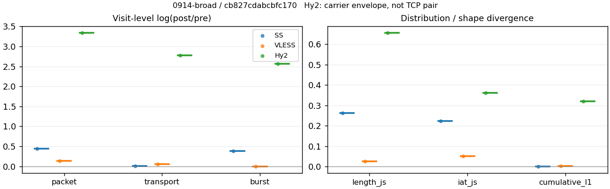
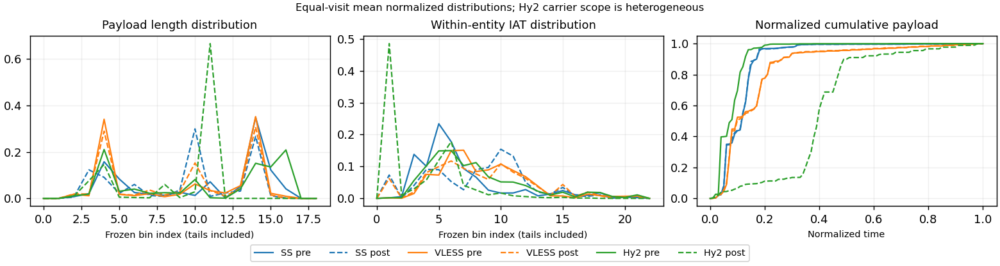

# 0914-broad · 条目 054 · twitch.tv

目标：https://www.twitch.tv/

活动标签：twitch.tv::page_load。选定访问 3 次。

[返回总索引](../../README.md) · [统计口径](../../methods.md)

## 覆盖与资格（每次访问均保留）

| 部署 | 重复 | 主请求路由 | 活动状态 | 代理比较 | DIRECT pre | 请求 proxy/direct/unresolved | 错误 |
| --- | --- | --- | --- | --- | --- | --- | --- |
| Hy2 | 1 | proxy | passed | 1 | 0 | 286/0/1 | [] |
| SS | 1 | proxy | passed | 1 | 0 | 272/0/0 | [] |
| VLESS | 1 | proxy | passed | 1 | 0 | 305/0/0 | [] |

主请求非 proxy 的统计仅解释为已索引的辅助代理连接或 DIRECT 观测，不代表目标业务经代理传输。播放确认与配对资格是两道不同的门。

图中散点为单次访问，短线为重复中位数；Hy2 是共享载体包络，不能与 TCP 配对作等范围因果对比。

形态图先逐访问归一化，再对访问等权平均；实线 pre，虚线 post。分箱序号及边界见 methods，不将分箱索引误解为长度或时间。

## 每次访问的关键观测

### SS

范围：`exclusive_page`。每格 pre → post；空值为不可观测/不适用。

| 重复 | 包数 | 载荷字节 | burst | TCP FR | IAT中位µs | length JS | IAT JS |
| --- | --- | --- | --- | --- | --- | --- | --- |
| 1 | 3322 → 5191 | 4.3438e+06 → 4.3701e+06 | 2469 → 3631 | 198 → 218 | 22.174 → 301.78 | 0.26385 | 0.22296 |

完整标量统计：中位数 [min,max]；Δ 为重复内逐访问变换的中位数，MAD 未缩放。n 为可用变换数；DIRECT-only 的 nΔ=0 不代表 pre 不可用。

| scope | 特征 | pre | post | Δ | IQRΔ | MADΔ | nΔ |
| --- | --- | --- | --- | --- | --- | --- | --- |
| exclusive_page | active_span_sum_s_1000ms | 33.682 [33.682, 33.682] | 36.609 [36.609, 36.609] | 0.08333 | — | — | 1 |
| exclusive_page | active_span_sum_s_100ms | 6.9041 [6.9041, 6.9041] | 12.792 [12.792, 12.792] | 0.61668 | — | — | 1 |
| exclusive_page | active_span_sum_s_500ms | 30.61 [30.61, 30.61] | 34.595 [34.595, 34.595] | 0.1224 | — | — | 1 |
| exclusive_page | burst_bytes_iqr | 2896 [2896, 2896] | 2506 [2506, 2506] | -0.14464 | — | — | 1 |
| exclusive_page | burst_bytes_mad | 67 [67, 67] | 34 [34, 34] | -0.67833 | — | — | 1 |
| exclusive_page | burst_bytes_max | 24487 [24487, 24487] | 17136 [17136, 17136] | -0.35696 | — | — | 1 |
| exclusive_page | burst_bytes_mean | 1759.3 [1759.3, 1759.3] | 1203.6 [1203.6, 1203.6] | -0.37965 | — | — | 1 |
| exclusive_page | burst_bytes_median | 67 [67, 67] | 34 [34, 34] | -0.67833 | — | — | 1 |
| exclusive_page | burst_bytes_min | 0 [0, 0] | 0 [0, 0] | — | — | — | 0 |
| exclusive_page | burst_bytes_p95 | 8688 [8688, 8688] | 4364 [4364, 4364] | -0.68855 | — | — | 1 |
| exclusive_page | burst_bytes_q25 | 0 [0, 0] | 0 [0, 0] | — | — | — | 0 |
| exclusive_page | burst_bytes_q75 | 2896 [2896, 2896] | 2506 [2506, 2506] | -0.14464 | — | — | 1 |
| exclusive_page | burst_bytes_std | 3499.9 [3499.9, 3499.9] | 1794.2 [1794.2, 1794.2] | -0.66818 | — | — | 1 |
| exclusive_page | burst_count | 2469 [2469, 2469] | 3631 [3631, 3631] | 0.38569 | — | — | 1 |
| exclusive_page | burst_duration_ms_iqr | 0 [0, 0] | 0.0001245 [0.0001245, 0.0001245] | — | — | — | 0 |
| exclusive_page | burst_duration_ms_mad | 0 [0, 0] | 0 [0, 0] | — | — | — | 0 |
| exclusive_page | burst_duration_ms_max | 15001 [15001, 15001] | 25921 [25921, 25921] | 0.54692 | — | — | 1 |
| exclusive_page | burst_duration_ms_mean | 58.28 [58.28, 58.28] | 36.981 [36.981, 36.981] | -0.45485 | — | — | 1 |
| exclusive_page | burst_duration_ms_median | 0 [0, 0] | 0 [0, 0] | — | — | — | 0 |
| exclusive_page | burst_duration_ms_min | 0 [0, 0] | 0 [0, 0] | — | — | — | 0 |
| exclusive_page | burst_duration_ms_p95 | 30.703 [30.703, 30.703] | 1.2363 [1.2363, 1.2363] | -3.2123 | — | — | 1 |
| exclusive_page | burst_duration_ms_q25 | 0 [0, 0] | 0 [0, 0] | — | — | — | 0 |
| exclusive_page | burst_duration_ms_q75 | 0 [0, 0] | 0.0001245 [0.0001245, 0.0001245] | — | — | — | 0 |
| exclusive_page | burst_duration_ms_std | 648.46 [648.46, 648.46] | 637.13 [637.13, 637.13] | -0.01763 | — | — | 1 |
| exclusive_page | burst_packets_iqr | 0 [0, 0] | 1 [1, 1] | — | — | — | 0 |
| exclusive_page | burst_packets_mad | 0 [0, 0] | 0 [0, 0] | — | — | — | 0 |
| exclusive_page | burst_packets_max | 12 [12, 12] | 12 [12, 12] | 0 | — | — | 1 |
| exclusive_page | burst_packets_mean | 1.3455 [1.3455, 1.3455] | 1.4296 [1.4296, 1.4296] | 0.060664 | — | — | 1 |
| exclusive_page | burst_packets_median | 1 [1, 1] | 1 [1, 1] | 0 | — | — | 1 |
| exclusive_page | burst_packets_min | 1 [1, 1] | 1 [1, 1] | 0 | — | — | 1 |
| exclusive_page | burst_packets_p95 | 3 [3, 3] | 3 [3, 3] | 0 | — | — | 1 |
| exclusive_page | burst_packets_q25 | 1 [1, 1] | 1 [1, 1] | 0 | — | — | 1 |
| exclusive_page | burst_packets_q75 | 1 [1, 1] | 2 [2, 2] | 0.69315 | — | — | 1 |
| exclusive_page | burst_packets_std | 1.0392 [1.0392, 1.0392] | 0.89149 [0.89149, 0.89149] | -0.1533 | — | — | 1 |
| exclusive_page | connection_span_concurrency_max | 10 [10, 10] | 10 [10, 10] | 0 | — | — | 1 |
| exclusive_page | cumulative_l1 | — | — | 0.0016631 | — | — | 1 |
| exclusive_page | cumulative_max | — | — | 0.025363 | — | — | 1 |
| exclusive_page | direction_entropy | 0.72319 [0.72319, 0.72319] | 0.44488 [0.44488, 0.44488] | -0.2783 | — | — | 1 |
| exclusive_page | down_burst_count | 1226 [1226, 1226] | 1807 [1807, 1807] | 0.38791 | — | — | 1 |
| exclusive_page | down_ip_bytes | 4.314e+06 [4.314e+06, 4.314e+06] | 4.3835e+06 [4.3835e+06, 4.3835e+06] | 0.01597 | — | — | 1 |
| exclusive_page | down_packets | 1862 [1862, 1862] | 2966 [2966, 2966] | 0.46556 | — | — | 1 |
| exclusive_page | down_transport_bytes | 4.217e+06 [4.217e+06, 4.217e+06] | 4.228e+06 [4.228e+06, 4.228e+06] | 0.002602 | — | — | 1 |
| exclusive_page | duration_s | 38.615 [38.615, 38.615] | 38.614 [38.614, 38.614] | -1.7012e-05 | — | — | 1 |
| exclusive_page | entity_count | 17 [17, 17] | 17 [17, 17] | 0 | — | — | 1 |
| exclusive_page | fr_runs | 198 [198, 198] | 218 [218, 218] | 0.096228 | — | — | 1 |
| exclusive_page | fr_runs_per_packet | 0.10399 [0.10399, 0.10399] | 0.072305 [0.072305, 0.072305] | -0.031686 | — | — | 1 |
| exclusive_page | fr_switches | 181 [181, 181] | 201 [201, 201] | 0.10481 | — | — | 1 |
| exclusive_page | fr_switches_per_possible_transition | 0.095919 [0.095919, 0.095919] | 0.067045 [0.067045, 0.067045] | -0.028875 | — | — | 1 |
| exclusive_page | full_retransmission_fraction | 0.0060205 [0.0060205, 0.0060205] | 0.0050087 [0.0050087, 0.0050087] | -0.0010118 | — | — | 1 |
| exclusive_page | full_retransmission_packets | 20 [20, 20] | 26 [26, 26] | 0.26236 | — | — | 1 |
| exclusive_page | iat_count | 3305 [3305, 3305] | 5174 [5174, 5174] | 0.44821 | — | — | 1 |
| exclusive_page | iat_js | — | — | 0.22296 | — | — | 1 |
| exclusive_page | iat_ks | — | — | 0.38134 | — | — | 1 |
| exclusive_page | iat_median_us | 22.174 [22.174, 22.174] | 301.78 [301.78, 301.78] | 2.6108 | — | — | 1 |
| exclusive_page | iat_us_iqr | 88.948 [88.948, 88.948] | 1011.1 [1011.1, 1011.1] | 2.4307 | — | — | 1 |
| exclusive_page | iat_us_mad | 17.776 [17.776, 17.776] | 298.32 [298.32, 298.32] | 2.8203 | — | — | 1 |
| exclusive_page | iat_us_max | 1.5001e+07 [1.5001e+07, 1.5001e+07] | 1.503e+07 [1.503e+07, 1.503e+07] | 0.001922 | — | — | 1 |
| exclusive_page | iat_us_mean | 67712 [67712, 67712] | 43160 [43160, 43160] | -0.45036 | — | — | 1 |
| exclusive_page | iat_us_median | 22.174 [22.174, 22.174] | 301.78 [301.78, 301.78] | 2.6108 | — | — | 1 |
| exclusive_page | iat_us_min | 0.25 [0.25, 0.25] | 0.031 [0.031, 0.031] | -2.0875 | — | — | 1 |
| exclusive_page | iat_us_p95 | 50066 [50066, 50066] | 32116 [32116, 32116] | -0.44398 | — | — | 1 |
| exclusive_page | iat_us_q25 | 10.422 [10.422, 10.422] | 13.537 [13.537, 13.537] | 0.26151 | — | — | 1 |
| exclusive_page | iat_us_q75 | 99.37 [99.37, 99.37] | 1024.6 [1024.6, 1024.6] | 2.3332 | — | — | 1 |
| exclusive_page | iat_us_std | 7.7977e+05 [7.7977e+05, 7.7977e+05] | 6.2212e+05 [6.2212e+05, 6.2212e+05] | -0.22586 | — | — | 1 |
| exclusive_page | iat_wasserstein_log1p_us | — | — | 1.4412 | — | — | 1 |
| exclusive_page | idle_gap_count_1000ms | 33 [33, 33] | 32 [32, 32] | -0.030772 | — | — | 1 |
| exclusive_page | idle_gap_count_100ms | 129 [129, 129] | 126 [126, 126] | -0.02353 | — | — | 1 |
| exclusive_page | idle_gap_count_500ms | 38 [38, 38] | 35 [35, 35] | -0.082238 | — | — | 1 |
| exclusive_page | idle_gap_sum_s_1000ms | 190.11 [190.11, 190.11] | 186.7 [186.7, 186.7] | -0.018085 | — | — | 1 |
| exclusive_page | idle_gap_sum_s_100ms | 216.88 [216.88, 216.88] | 210.52 [210.52, 210.52] | -0.029799 | — | — | 1 |
| exclusive_page | idle_gap_sum_s_500ms | 193.18 [193.18, 193.18] | 188.71 [188.71, 188.71] | -0.023388 | — | — | 1 |
| exclusive_page | ip_bytes | 4.517e+06 [4.517e+06, 4.517e+06] | 4.6847e+06 [4.6847e+06, 4.6847e+06] | 0.03645 | — | — | 1 |
| exclusive_page | length_iqr | 2648 [2648, 2648] | 2574 [2574, 2574] | -0.028344 | — | — | 1 |
| exclusive_page | length_js | — | — | 0.26385 | — | — | 1 |
| exclusive_page | length_ks | — | — | 0.43648 | — | — | 1 |
| exclusive_page | length_mad | 1303.5 [1303.5, 1303.5] | 1274 [1274, 1274] | -0.022891 | — | — | 1 |
| exclusive_page | length_max | 8920 [8920, 8920] | 14280 [14280, 14280] | 0.47056 | — | — | 1 |
| exclusive_page | length_mean | 2281.4 [2281.4, 2281.4] | 1449.5 [1449.5, 1449.5] | -0.45359 | — | — | 1 |
| exclusive_page | length_median | 2406.5 [2406.5, 2406.5] | 1428 [1428, 1428] | -0.5219 | — | — | 1 |
| exclusive_page | length_min | 6 [6, 6] | 12 [12, 12] | 0.69315 | — | — | 1 |
| exclusive_page | length_p95 | 7205.2 [7205.2, 7205.2] | 2856 [2856, 2856] | -0.92538 | — | — | 1 |
| exclusive_page | length_q25 | 248 [248, 248] | 282 [282, 282] | 0.12848 | — | — | 1 |
| exclusive_page | length_q75 | 2896 [2896, 2896] | 2856 [2856, 2856] | -0.013908 | — | — | 1 |
| exclusive_page | length_std | 2102 [2102, 2102] | 1146.7 [1146.7, 1146.7] | -0.60604 | — | — | 1 |
| exclusive_page | length_wasserstein_bytes | — | — | 844.91 | — | — | 1 |
| exclusive_page | nonempty_entity_count | 17 [17, 17] | 17 [17, 17] | 0 | — | — | 1 |
| exclusive_page | nonempty_packets | 1904 [1904, 1904] | 3015 [3015, 3015] | 0.45964 | — | — | 1 |
| exclusive_page | offload_suspect_fraction | 0.3239 [0.3239, 0.3239] | 0.19457 [0.19457, 0.19457] | -0.12933 | — | — | 1 |
| exclusive_page | packet_count | 3322 [3322, 3322] | 5191 [5191, 5191] | 0.44636 | — | — | 1 |
| exclusive_page | rtt_median_ms | 0.011881 [0.011881, 0.011881] | 32.659 [32.659, 32.659] | 7.9189 | — | — | 1 |
| exclusive_page | rtt_sample_count | 1373 [1373, 1373] | 656 [656, 656] | -0.73859 | — | — | 1 |
| exclusive_page | tcp_ack_count | 3305 [3305, 3305] | 5170 [5170, 5170] | 0.44744 | — | — | 1 |
| exclusive_page | tcp_fin_count | 34 [34, 34] | 35 [35, 35] | 0.028988 | — | — | 1 |
| exclusive_page | tcp_packet_count | 3322 [3322, 3322] | 5191 [5191, 5191] | 0.44636 | — | — | 1 |
| exclusive_page | tcp_rst_count | 0 [0, 0] | 0 [0, 0] | — | — | — | 0 |
| exclusive_page | tcp_syn_count | 34 [34, 34] | 39 [39, 39] | 0.1372 | — | — | 1 |
| exclusive_page | tcp_window_raw_median | 65535 [65535, 65535] | 155 [155, 155] | -6.0469 | — | — | 1 |
| exclusive_page | transition_entropy | 0.41149 [0.41149, 0.41149] | 0.28421 [0.28421, 0.28421] | -0.12728 | — | — | 1 |
| exclusive_page | transition_n_mm | 1424 [1424, 1424] | 2628 [2628, 2628] | 0.61275 | — | — | 1 |
| exclusive_page | transition_n_mp | 83 [83, 83] | 93 [93, 93] | 0.11376 | — | — | 1 |
| exclusive_page | transition_n_pm | 98 [98, 98] | 108 [108, 108] | 0.097164 | — | — | 1 |
| exclusive_page | transition_n_pp | 282 [282, 282] | 169 [169, 169] | -0.51201 | — | — | 1 |
| exclusive_page | transition_p_mm | 0.94492 [0.94492, 0.94492] | 0.96582 [0.96582, 0.96582] | 0.020898 | — | — | 1 |
| exclusive_page | transition_p_mp | 0.055076 [0.055076, 0.055076] | 0.034179 [0.034179, 0.034179] | -0.020898 | — | — | 1 |
| exclusive_page | transition_p_pm | 0.25789 [0.25789, 0.25789] | 0.38989 [0.38989, 0.38989] | 0.132 | — | — | 1 |
| exclusive_page | transition_p_pp | 0.74211 [0.74211, 0.74211] | 0.61011 [0.61011, 0.61011] | -0.132 | — | — | 1 |
| exclusive_page | transport_bytes | 4.3438e+06 [4.3438e+06, 4.3438e+06] | 4.3701e+06 [4.3701e+06, 4.3701e+06] | 0.0060494 | — | — | 1 |
| exclusive_page | up_burst_count | 1243 [1243, 1243] | 1824 [1824, 1824] | 0.3835 | — | — | 1 |
| exclusive_page | up_byte_fraction | 0.029172 [0.029172, 0.029172] | 0.032513 [0.032513, 0.032513] | 0.0033411 | — | — | 1 |
| exclusive_page | up_ip_bytes | 2.0301e+05 [2.0301e+05, 2.0301e+05] | 3.0125e+05 [3.0125e+05, 3.0125e+05] | 0.39467 | — | — | 1 |
| exclusive_page | up_packets | 1460 [1460, 1460] | 2225 [2225, 2225] | 0.42132 | — | — | 1 |
| exclusive_page | up_transport_bytes | 1.2672e+05 [1.2672e+05, 1.2672e+05] | 1.4209e+05 [1.4209e+05, 1.4209e+05] | 0.11448 | — | — | 1 |
| exclusive_page | zero_iat_count | 0 [0, 0] | 0 [0, 0] | — | — | — | 0 |
| exclusive_page | zero_iat_fraction | 0 [0, 0] | 0 [0, 0] | 0 | — | — | 1 |

### VLESS

范围：`exclusive_page`。每格 pre → post；空值为不可观测/不适用。

| 重复 | 包数 | 载荷字节 | burst | TCP FR | IAT中位µs | length JS | IAT JS |
| --- | --- | --- | --- | --- | --- | --- | --- |
| 1 | 3973 → 4542 | 3.3436e+06 → 3.5235e+06 | 3121 → 3129 | 208 → 256 | 132.44 → 124.47 | 0.026996 | 0.050791 |

完整标量统计：中位数 [min,max]；Δ 为重复内逐访问变换的中位数，MAD 未缩放。n 为可用变换数；DIRECT-only 的 nΔ=0 不代表 pre 不可用。

| scope | 特征 | pre | post | Δ | IQRΔ | MADΔ | nΔ |
| --- | --- | --- | --- | --- | --- | --- | --- |
| exclusive_page | active_span_sum_s_1000ms | 41.004 [41.004, 41.004] | 40.181 [40.181, 40.181] | -0.020294 | — | — | 1 |
| exclusive_page | active_span_sum_s_100ms | 5.2067 [5.2067, 5.2067] | 14.171 [14.171, 14.171] | 1.0013 | — | — | 1 |
| exclusive_page | active_span_sum_s_500ms | 24.173 [24.173, 24.173] | 38.933 [38.933, 38.933] | 0.47659 | — | — | 1 |
| exclusive_page | burst_bytes_iqr | 2372 [2372, 2372] | 2824 [2824, 2824] | 0.17442 | — | — | 1 |
| exclusive_page | burst_bytes_mad | 35 [35, 35] | 72 [72, 72] | 0.72132 | — | — | 1 |
| exclusive_page | burst_bytes_max | 22710 [22710, 22710] | 29137 [29137, 29137] | 0.2492 | — | — | 1 |
| exclusive_page | burst_bytes_mean | 1071.3 [1071.3, 1071.3] | 1126.1 [1126.1, 1126.1] | 0.049835 | — | — | 1 |
| exclusive_page | burst_bytes_median | 35 [35, 35] | 72 [72, 72] | 0.72132 | — | — | 1 |
| exclusive_page | burst_bytes_min | 0 [0, 0] | 0 [0, 0] | — | — | — | 0 |
| exclusive_page | burst_bytes_p95 | 3006 [3006, 3006] | 2912.6 [2912.6, 2912.6] | -0.031564 | — | — | 1 |
| exclusive_page | burst_bytes_q25 | 0 [0, 0] | 0 [0, 0] | — | — | — | 0 |
| exclusive_page | burst_bytes_q75 | 2372 [2372, 2372] | 2824 [2824, 2824] | 0.17442 | — | — | 1 |
| exclusive_page | burst_bytes_std | 1983.1 [1983.1, 1983.1] | 1577.6 [1577.6, 1577.6] | -0.22874 | — | — | 1 |
| exclusive_page | burst_count | 3121 [3121, 3121] | 3129 [3129, 3129] | 0.00256 | — | — | 1 |
| exclusive_page | burst_duration_ms_iqr | 0 [0, 0] | 0.010564 [0.010564, 0.010564] | — | — | — | 0 |
| exclusive_page | burst_duration_ms_mad | 0 [0, 0] | 0 [0, 0] | — | — | — | 0 |
| exclusive_page | burst_duration_ms_max | 15001 [15001, 15001] | 15046 [15046, 15046] | 0.0030132 | — | — | 1 |
| exclusive_page | burst_duration_ms_mean | 75.855 [75.855, 75.855] | 83.102 [83.102, 83.102] | 0.091239 | — | — | 1 |
| exclusive_page | burst_duration_ms_median | 0 [0, 0] | 0 [0, 0] | — | — | — | 0 |
| exclusive_page | burst_duration_ms_min | 0 [0, 0] | 0 [0, 0] | — | — | — | 0 |
| exclusive_page | burst_duration_ms_p95 | 10.108 [10.108, 10.108] | 105.18 [105.18, 105.18] | 2.3423 | — | — | 1 |
| exclusive_page | burst_duration_ms_q25 | 0 [0, 0] | 0 [0, 0] | — | — | — | 0 |
| exclusive_page | burst_duration_ms_q75 | 0 [0, 0] | 0.010564 [0.010564, 0.010564] | — | — | — | 0 |
| exclusive_page | burst_duration_ms_std | 840.05 [840.05, 840.05] | 987.86 [987.86, 987.86] | 0.16208 | — | — | 1 |
| exclusive_page | burst_packets_iqr | 0 [0, 0] | 1 [1, 1] | — | — | — | 0 |
| exclusive_page | burst_packets_mad | 0 [0, 0] | 0 [0, 0] | — | — | — | 0 |
| exclusive_page | burst_packets_max | 15 [15, 15] | 12 [12, 12] | -0.22314 | — | — | 1 |
| exclusive_page | burst_packets_mean | 1.273 [1.273, 1.273] | 1.4516 [1.4516, 1.4516] | 0.13129 | — | — | 1 |
| exclusive_page | burst_packets_median | 1 [1, 1] | 1 [1, 1] | 0 | — | — | 1 |
| exclusive_page | burst_packets_min | 1 [1, 1] | 1 [1, 1] | 0 | — | — | 1 |
| exclusive_page | burst_packets_p95 | 2 [2, 2] | 3 [3, 3] | 0.40547 | — | — | 1 |
| exclusive_page | burst_packets_q25 | 1 [1, 1] | 1 [1, 1] | 0 | — | — | 1 |
| exclusive_page | burst_packets_q75 | 1 [1, 1] | 2 [2, 2] | 0.69315 | — | — | 1 |
| exclusive_page | burst_packets_std | 0.70094 [0.70094, 0.70094] | 0.8983 [0.8983, 0.8983] | 0.24808 | — | — | 1 |
| exclusive_page | connection_span_concurrency_max | 16 [16, 16] | 16 [16, 16] | 0 | — | — | 1 |
| exclusive_page | cumulative_l1 | — | — | 0.0027572 | — | — | 1 |
| exclusive_page | cumulative_max | — | — | 0.016913 | — | — | 1 |
| exclusive_page | direction_entropy | 0.54943 [0.54943, 0.54943] | 0.48378 [0.48378, 0.48378] | -0.065647 | — | — | 1 |
| exclusive_page | down_burst_count | 1550 [1550, 1550] | 1555 [1555, 1555] | 0.0032206 | — | — | 1 |
| exclusive_page | down_ip_bytes | 3.3479e+06 [3.3479e+06, 3.3479e+06] | 3.5053e+06 [3.5053e+06, 3.5053e+06] | 0.045944 | — | — | 1 |
| exclusive_page | down_packets | 2228 [2228, 2228] | 2584 [2584, 2584] | 0.14823 | — | — | 1 |
| exclusive_page | down_transport_bytes | 3.2318e+06 [3.2318e+06, 3.2318e+06] | 3.3707e+06 [3.3707e+06, 3.3707e+06] | 0.042078 | — | — | 1 |
| exclusive_page | duration_s | 35.579 [35.579, 35.579] | 35.598 [35.598, 35.598] | 0.00051386 | — | — | 1 |
| exclusive_page | entity_count | 21 [21, 21] | 21 [21, 21] | 0 | — | — | 1 |
| exclusive_page | fr_runs | 208 [208, 208] | 256 [256, 256] | 0.20764 | — | — | 1 |
| exclusive_page | fr_runs_per_packet | 0.094417 [0.094417, 0.094417] | 0.10155 [0.10155, 0.10155] | 0.0071303 | — | — | 1 |
| exclusive_page | fr_switches | 187 [187, 187] | 235 [235, 235] | 0.22848 | — | — | 1 |
| exclusive_page | fr_switches_per_possible_transition | 0.085701 [0.085701, 0.085701] | 0.094 [0.094, 0.094] | 0.0082988 | — | — | 1 |
| exclusive_page | full_retransmission_fraction | 0.0010068 [0.0010068, 0.0010068] | 0 [0, 0] | -0.0010068 | — | — | 1 |
| exclusive_page | full_retransmission_packets | 4 [4, 4] | 0 [0, 0] | — | — | — | 0 |
| exclusive_page | iat_count | 3952 [3952, 3952] | 4521 [4521, 4521] | 0.13451 | — | — | 1 |
| exclusive_page | iat_js | — | — | 0.050791 | — | — | 1 |
| exclusive_page | iat_ks | — | — | 0.10388 | — | — | 1 |
| exclusive_page | iat_median_us | 132.44 [132.44, 132.44] | 124.47 [124.47, 124.47] | -0.062093 | — | — | 1 |
| exclusive_page | iat_us_iqr | 984.21 [984.21, 984.21] | 1230.3 [1230.3, 1230.3] | 0.22315 | — | — | 1 |
| exclusive_page | iat_us_mad | 124.06 [124.06, 124.06] | 123.94 [123.94, 123.94] | -0.00097982 | — | — | 1 |
| exclusive_page | iat_us_max | 1.5002e+07 [1.5002e+07, 1.5002e+07] | 1.5376e+07 [1.5376e+07, 1.5376e+07] | 0.024638 | — | — | 1 |
| exclusive_page | iat_us_mean | 1.2314e+05 [1.2314e+05, 1.2314e+05] | 1.0723e+05 [1.0723e+05, 1.0723e+05] | -0.1384 | — | — | 1 |
| exclusive_page | iat_us_median | 132.44 [132.44, 132.44] | 124.47 [124.47, 124.47] | -0.062093 | — | — | 1 |
| exclusive_page | iat_us_min | 0.119 [0.119, 0.119] | 0.036 [0.036, 0.036] | -1.1956 | — | — | 1 |
| exclusive_page | iat_us_p95 | 32536 [32536, 32536] | 46057 [46057, 46057] | 0.34753 | — | — | 1 |
| exclusive_page | iat_us_q25 | 34.672 [34.672, 34.672] | 18.181 [18.181, 18.181] | -0.64554 | — | — | 1 |
| exclusive_page | iat_us_q75 | 1018.9 [1018.9, 1018.9] | 1248.5 [1248.5, 1248.5] | 0.2032 | — | — | 1 |
| exclusive_page | iat_us_std | 1.1969e+06 [1.1969e+06, 1.1969e+06] | 1.1195e+06 [1.1195e+06, 1.1195e+06] | -0.066886 | — | — | 1 |
| exclusive_page | iat_wasserstein_log1p_us | — | — | 0.48577 | — | — | 1 |
| exclusive_page | idle_gap_count_1000ms | 56 [56, 56] | 55 [55, 55] | -0.018019 | — | — | 1 |
| exclusive_page | idle_gap_count_100ms | 167 [167, 167] | 184 [184, 184] | 0.096942 | — | — | 1 |
| exclusive_page | idle_gap_count_500ms | 80 [80, 80] | 57 [57, 57] | -0.33898 | — | — | 1 |
| exclusive_page | idle_gap_sum_s_1000ms | 445.66 [445.66, 445.66] | 444.59 [444.59, 444.59] | -0.0023946 | — | — | 1 |
| exclusive_page | idle_gap_sum_s_100ms | 481.46 [481.46, 481.46] | 470.6 [470.6, 470.6] | -0.022802 | — | — | 1 |
| exclusive_page | idle_gap_sum_s_500ms | 462.49 [462.49, 462.49] | 445.84 [445.84, 445.84] | -0.036663 | — | — | 1 |
| exclusive_page | ip_bytes | 3.5502e+06 [3.5502e+06, 3.5502e+06] | 3.7619e+06 [3.7619e+06, 3.7619e+06] | 0.057934 | — | — | 1 |
| exclusive_page | length_iqr | 2752 [2752, 2752] | 2752 [2752, 2752] | 0 | — | — | 1 |
| exclusive_page | length_js | — | — | 0.026996 | — | — | 1 |
| exclusive_page | length_ks | — | — | 0.08712 | — | — | 1 |
| exclusive_page | length_mad | 1340 [1340, 1340] | 1340 [1340, 1340] | 0 | — | — | 1 |
| exclusive_page | length_max | 8948 [8948, 8948] | 11584 [11584, 11584] | 0.25819 | — | — | 1 |
| exclusive_page | length_mean | 1517.8 [1517.8, 1517.8] | 1397.7 [1397.7, 1397.7] | -0.082441 | — | — | 1 |
| exclusive_page | length_median | 1412 [1412, 1412] | 1412 [1412, 1412] | 0 | — | — | 1 |
| exclusive_page | length_min | 5 [5, 5] | 5 [5, 5] | 0 | — | — | 1 |
| exclusive_page | length_p95 | 2896 [2896, 2896] | 2896 [2896, 2896] | 0 | — | — | 1 |
| exclusive_page | length_q25 | 72 [72, 72] | 72 [72, 72] | 0 | — | — | 1 |
| exclusive_page | length_q75 | 2824 [2824, 2824] | 2824 [2824, 2824] | 0 | — | — | 1 |
| exclusive_page | length_std | 1492.5 [1492.5, 1492.5] | 1231.9 [1231.9, 1231.9] | -0.19193 | — | — | 1 |
| exclusive_page | length_wasserstein_bytes | — | — | 194.59 | — | — | 1 |
| exclusive_page | nonempty_entity_count | 21 [21, 21] | 21 [21, 21] | 0 | — | — | 1 |
| exclusive_page | nonempty_packets | 2203 [2203, 2203] | 2521 [2521, 2521] | 0.13484 | — | — | 1 |
| exclusive_page | offload_suspect_fraction | 0.25522 [0.25522, 0.25522] | 0.20806 [0.20806, 0.20806] | -0.047165 | — | — | 1 |
| exclusive_page | packet_count | 3973 [3973, 3973] | 4542 [4542, 4542] | 0.13385 | — | — | 1 |
| exclusive_page | rtt_median_ms | 0.0612 [0.0612, 0.0612] | 0.084692 [0.084692, 0.084692] | 0.32487 | — | — | 1 |
| exclusive_page | rtt_sample_count | 1662 [1662, 1662] | 1872 [1872, 1872] | 0.11899 | — | — | 1 |
| exclusive_page | tcp_ack_count | 3916 [3916, 3916] | 4521 [4521, 4521] | 0.14366 | — | — | 1 |
| exclusive_page | tcp_fin_count | 40 [40, 40] | 42 [42, 42] | 0.04879 | — | — | 1 |
| exclusive_page | tcp_packet_count | 3973 [3973, 3973] | 4542 [4542, 4542] | 0.13385 | — | — | 1 |
| exclusive_page | tcp_rst_count | 36 [36, 36] | 0 [0, 0] | — | — | — | 0 |
| exclusive_page | tcp_syn_count | 42 [42, 42] | 42 [42, 42] | 0 | — | — | 1 |
| exclusive_page | tcp_window_raw_median | 65535 [65535, 65535] | 194 [194, 194] | -5.8225 | — | — | 1 |
| exclusive_page | transition_entropy | 0.34766 [0.34766, 0.34766] | 0.35346 [0.35346, 0.35346] | 0.0058006 | — | — | 1 |
| exclusive_page | transition_n_mm | 1819 [1819, 1819] | 2129 [2129, 2129] | 0.15737 | — | — | 1 |
| exclusive_page | transition_n_mp | 83 [83, 83] | 107 [107, 107] | 0.25399 | — | — | 1 |
| exclusive_page | transition_n_pm | 104 [104, 104] | 128 [128, 128] | 0.20764 | — | — | 1 |
| exclusive_page | transition_n_pp | 176 [176, 176] | 136 [136, 136] | -0.25783 | — | — | 1 |
| exclusive_page | transition_p_mm | 0.95636 [0.95636, 0.95636] | 0.95215 [0.95215, 0.95215] | -0.004215 | — | — | 1 |
| exclusive_page | transition_p_mp | 0.043638 [0.043638, 0.043638] | 0.047853 [0.047853, 0.047853] | 0.004215 | — | — | 1 |
| exclusive_page | transition_p_pm | 0.37143 [0.37143, 0.37143] | 0.48485 [0.48485, 0.48485] | 0.11342 | — | — | 1 |
| exclusive_page | transition_p_pp | 0.62857 [0.62857, 0.62857] | 0.51515 [0.51515, 0.51515] | -0.11342 | — | — | 1 |
| exclusive_page | transport_bytes | 3.3436e+06 [3.3436e+06, 3.3436e+06] | 3.5235e+06 [3.5235e+06, 3.5235e+06] | 0.052395 | — | — | 1 |
| exclusive_page | up_burst_count | 1571 [1571, 1571] | 1574 [1574, 1574] | 0.0019078 | — | — | 1 |
| exclusive_page | up_byte_fraction | 0.033437 [0.033437, 0.033437] | 0.043358 [0.043358, 0.043358] | 0.0099206 | — | — | 1 |
| exclusive_page | up_ip_bytes | 2.0233e+05 [2.0233e+05, 2.0233e+05] | 2.5668e+05 [2.5668e+05, 2.5668e+05] | 0.23793 | — | — | 1 |
| exclusive_page | up_packets | 1745 [1745, 1745] | 1958 [1958, 1958] | 0.11517 | — | — | 1 |
| exclusive_page | up_transport_bytes | 1.118e+05 [1.118e+05, 1.118e+05] | 1.5277e+05 [1.5277e+05, 1.5277e+05] | 0.31221 | — | — | 1 |
| exclusive_page | zero_iat_count | 0 [0, 0] | 0 [0, 0] | — | — | — | 0 |
| exclusive_page | zero_iat_fraction | 0 [0, 0] | 0 [0, 0] | 0 | — | — | 1 |

### Hy2

范围：`carrier_context_envelope`。每格 pre → post；空值为不可观测/不适用。

| 重复 | 包数 | 载荷字节 | burst | TCP FR | IAT中位µs | length JS | IAT JS |
| --- | --- | --- | --- | --- | --- | --- | --- |
| 1 | 2033 → 57084 | 3.8357e+06 → 6.1431e+07 | 1425 → 18445 | — | 64.493 → 2.457 | 0.65561 | 0.36103 |

完整标量统计：中位数 [min,max]；Δ 为重复内逐访问变换的中位数，MAD 未缩放。n 为可用变换数；DIRECT-only 的 nΔ=0 不代表 pre 不可用。

| scope | 特征 | pre | post | Δ | IQRΔ | MADΔ | nΔ |
| --- | --- | --- | --- | --- | --- | --- | --- |
| carrier_context_envelope | active_span_sum_s_1000ms | 28.549 [28.549, 28.549] | 31.725 [31.725, 31.725] | 0.10549 | — | — | 1 |
| carrier_context_envelope | active_span_sum_s_100ms | 3.2035 [3.2035, 3.2035] | 15.431 [15.431, 15.431] | 1.5721 | — | — | 1 |
| carrier_context_envelope | active_span_sum_s_500ms | 20.646 [20.646, 20.646] | 28.816 [28.816, 28.816] | 0.33341 | — | — | 1 |
| carrier_context_envelope | burst_bytes_iqr | 2554 [2554, 2554] | 4225 [4225, 4225] | 0.50336 | — | — | 1 |
| carrier_context_envelope | burst_bytes_mad | 44 [44, 44] | 359 [359, 359] | 2.0991 | — | — | 1 |
| carrier_context_envelope | burst_bytes_max | 28672 [28672, 28672] | 1.993e+05 [1.993e+05, 1.993e+05] | 1.9389 | — | — | 1 |
| carrier_context_envelope | burst_bytes_mean | 2691.7 [2691.7, 2691.7] | 3330.5 [3330.5, 3330.5] | 0.21293 | — | — | 1 |
| carrier_context_envelope | burst_bytes_median | 44 [44, 44] | 392 [392, 392] | 2.1871 | — | — | 1 |
| carrier_context_envelope | burst_bytes_min | 0 [0, 0] | 22 [22, 22] | — | — | — | 0 |
| carrier_context_envelope | burst_bytes_p95 | 20022 [20022, 20022] | 11528 [11528, 11528] | -0.55203 | — | — | 1 |
| carrier_context_envelope | burst_bytes_q25 | 0 [0, 0] | 98 [98, 98] | — | — | — | 0 |
| carrier_context_envelope | burst_bytes_q75 | 2554 [2554, 2554] | 4323 [4323, 4323] | 0.52629 | — | — | 1 |
| carrier_context_envelope | burst_bytes_std | 5433.7 [5433.7, 5433.7] | 7877.1 [7877.1, 7877.1] | 0.37133 | — | — | 1 |
| carrier_context_envelope | burst_count | 1425 [1425, 1425] | 18445 [18445, 18445] | 2.5606 | — | — | 1 |
| carrier_context_envelope | burst_duration_ms_iqr | 0.036703 [0.036703, 0.036703] | 0.025058 [0.025058, 0.025058] | -0.38167 | — | — | 1 |
| carrier_context_envelope | burst_duration_ms_mad | 0 [0, 0] | 4.4e-05 [4.4e-05, 4.4e-05] | — | — | — | 0 |
| carrier_context_envelope | burst_duration_ms_max | 15001 [15001, 15001] | 1333.2 [1333.2, 1333.2] | -2.4205 | — | — | 1 |
| carrier_context_envelope | burst_duration_ms_mean | 89.604 [89.604, 89.604] | 0.85106 [0.85106, 0.85106] | -4.6567 | — | — | 1 |
| carrier_context_envelope | burst_duration_ms_median | 0 [0, 0] | 4.4e-05 [4.4e-05, 4.4e-05] | — | — | — | 0 |
| carrier_context_envelope | burst_duration_ms_min | 0 [0, 0] | 0 [0, 0] | — | — | — | 0 |
| carrier_context_envelope | burst_duration_ms_p95 | 172.6 [172.6, 172.6] | 0.13413 [0.13413, 0.13413] | -7.1599 | — | — | 1 |
| carrier_context_envelope | burst_duration_ms_q25 | 0 [0, 0] | 0 [0, 0] | — | — | — | 0 |
| carrier_context_envelope | burst_duration_ms_q75 | 0.036703 [0.036703, 0.036703] | 0.025058 [0.025058, 0.025058] | -0.38167 | — | — | 1 |
| carrier_context_envelope | burst_duration_ms_std | 965.23 [965.23, 965.23] | 21.013 [21.013, 21.013] | -3.8272 | — | — | 1 |
| carrier_context_envelope | burst_packets_iqr | 1 [1, 1] | 3 [3, 3] | 1.0986 | — | — | 1 |
| carrier_context_envelope | burst_packets_mad | 0 [0, 0] | 1 [1, 1] | — | — | — | 0 |
| carrier_context_envelope | burst_packets_max | 9 [9, 9] | 144 [144, 144] | 2.7726 | — | — | 1 |
| carrier_context_envelope | burst_packets_mean | 1.4267 [1.4267, 1.4267] | 3.0948 [3.0948, 3.0948] | 0.77439 | — | — | 1 |
| carrier_context_envelope | burst_packets_median | 1 [1, 1] | 2 [2, 2] | 0.69315 | — | — | 1 |
| carrier_context_envelope | burst_packets_min | 1 [1, 1] | 1 [1, 1] | 0 | — | — | 1 |
| carrier_context_envelope | burst_packets_p95 | 3 [3, 3] | 8 [8, 8] | 0.98083 | — | — | 1 |
| carrier_context_envelope | burst_packets_q25 | 1 [1, 1] | 1 [1, 1] | 0 | — | — | 1 |
| carrier_context_envelope | burst_packets_q75 | 2 [2, 2] | 4 [4, 4] | 0.69315 | — | — | 1 |
| carrier_context_envelope | burst_packets_std | 0.85536 [0.85536, 0.85536] | 5.5425 [5.5425, 5.5425] | 1.8687 | — | — | 1 |
| carrier_context_envelope | connection_span_concurrency_max | 11 [11, 11] | 1 [1, 1] | -2.3979 | — | — | 1 |
| carrier_context_envelope | cumulative_l1 | — | — | 0.32026 | — | — | 1 |
| carrier_context_envelope | cumulative_max | — | — | 0.88425 | — | — | 1 |
| carrier_context_envelope | direction_entropy | 0.85321 [0.85321, 0.85321] | 0.75993 [0.75993, 0.75993] | -0.093278 | — | — | 1 |
| carrier_context_envelope | direction_run_analog_runs | 167 [167, 167] | 18445 [18445, 18445] | 4.7046 | — | — | 1 |
| carrier_context_envelope | direction_run_analog_runs_per_packet | 0.14572 [0.14572, 0.14572] | 0.32312 [0.32312, 0.32312] | 0.1774 | — | — | 1 |
| carrier_context_envelope | direction_run_analog_switches | 150 [150, 150] | 18444 [18444, 18444] | 4.8119 | — | — | 1 |
| carrier_context_envelope | direction_run_analog_switches_per_possible_transition | 0.13286 [0.13286, 0.13286] | 0.32311 [0.32311, 0.32311] | 0.19025 | — | — | 1 |
| carrier_context_envelope | down_burst_count | 704 [704, 704] | 9222 [9222, 9222] | 2.5726 | — | — | 1 |
| carrier_context_envelope | down_ip_bytes | 3.76e+06 [3.76e+06, 3.76e+06] | 6.1382e+07 [6.1382e+07, 6.1382e+07] | 2.7927 | — | — | 1 |
| carrier_context_envelope | down_packets | 1146 [1146, 1146] | 44533 [44533, 44533] | 3.66 | — | — | 1 |
| carrier_context_envelope | down_transport_bytes | 3.7002e+06 [3.7002e+06, 3.7002e+06] | 6.0135e+07 [6.0135e+07, 6.0135e+07] | 2.7882 | — | — | 1 |
| carrier_context_envelope | duration_s | 35.275 [35.275, 35.275] | 35.274 [35.274, 35.274] | -2.9273e-05 | — | — | 1 |
| carrier_context_envelope | entity_count | 17 [17, 17] | 1 [1, 1] | -2.8332 | — | — | 1 |
| carrier_context_envelope | full_retransmission_fraction | 0.011313 [0.011313, 0.011313] | — | — | — | — | 0 |
| carrier_context_envelope | full_retransmission_packets | 23 [23, 23] | — | — | — | — | 0 |
| carrier_context_envelope | iat_count | 2016 [2016, 2016] | 57083 [57083, 57083] | 3.3434 | — | — | 1 |
| carrier_context_envelope | iat_js | — | — | 0.36103 | — | — | 1 |
| carrier_context_envelope | iat_ks | — | — | 0.49266 | — | — | 1 |
| carrier_context_envelope | iat_median_us | 64.493 [64.493, 64.493] | 2.457 [2.457, 2.457] | -3.2676 | — | — | 1 |
| carrier_context_envelope | iat_us_iqr | 549.18 [549.18, 549.18] | 23.836 [23.836, 23.836] | -3.1372 | — | — | 1 |
| carrier_context_envelope | iat_us_mad | 57.393 [57.393, 57.393] | 2.421 [2.421, 2.421] | -3.1657 | — | — | 1 |
| carrier_context_envelope | iat_us_max | 1.5001e+07 [1.5001e+07, 1.5001e+07] | 1.2096e+06 [1.2096e+06, 1.2096e+06] | -2.5178 | — | — | 1 |
| carrier_context_envelope | iat_us_mean | 1.7429e+05 [1.7429e+05, 1.7429e+05] | 617.95 [617.95, 617.95] | -5.6421 | — | — | 1 |
| carrier_context_envelope | iat_us_median | 64.493 [64.493, 64.493] | 2.457 [2.457, 2.457] | -3.2676 | — | — | 1 |
| carrier_context_envelope | iat_us_min | 0.053 [0.053, 0.053] | 0 [0, 0] | — | — | — | 0 |
| carrier_context_envelope | iat_us_p95 | 1.6992e+05 [1.6992e+05, 1.6992e+05] | 236.85 [236.85, 236.85] | -6.5757 | — | — | 1 |
| carrier_context_envelope | iat_us_q25 | 15.012 [15.012, 15.012] | 0.044 [0.044, 0.044] | -5.8324 | — | — | 1 |
| carrier_context_envelope | iat_us_q75 | 564.19 [564.19, 564.19] | 23.88 [23.88, 23.88] | -3.1623 | — | — | 1 |
| carrier_context_envelope | iat_us_std | 1.4842e+06 [1.4842e+06, 1.4842e+06] | 12760 [12760, 12760] | -4.7564 | — | — | 1 |
| carrier_context_envelope | iat_wasserstein_log1p_us | — | — | 3.1416 | — | — | 1 |
| carrier_context_envelope | idle_gap_count_1000ms | 28 [28, 28] | 3 [3, 3] | -2.2336 | — | — | 1 |
| carrier_context_envelope | idle_gap_count_100ms | 116 [116, 116] | 86 [86, 86] | -0.29924 | — | — | 1 |
| carrier_context_envelope | idle_gap_count_500ms | 40 [40, 40] | 7 [7, 7] | -1.743 | — | — | 1 |
| carrier_context_envelope | idle_gap_sum_s_1000ms | 322.82 [322.82, 322.82] | 3.5491 [3.5491, 3.5491] | -4.5104 | — | — | 1 |
| carrier_context_envelope | idle_gap_sum_s_100ms | 348.16 [348.16, 348.16] | 19.844 [19.844, 19.844] | -2.8648 | — | — | 1 |
| carrier_context_envelope | idle_gap_sum_s_500ms | 330.72 [330.72, 330.72] | 6.4582 [6.4582, 6.4582] | -3.9359 | — | — | 1 |
| carrier_context_envelope | ip_bytes | 3.942e+06 [3.942e+06, 3.942e+06] | 6.3029e+07 [6.3029e+07, 6.3029e+07] | 2.7719 | — | — | 1 |
| carrier_context_envelope | length_iqr | 6635.5 [6635.5, 6635.5] | 596 [596, 596] | -2.4099 | — | — | 1 |
| carrier_context_envelope | length_js | — | — | 0.65561 | — | — | 1 |
| carrier_context_envelope | length_ks | — | — | 0.53927 | — | — | 1 |
| carrier_context_envelope | length_mad | 1831 [1831, 1831] | 0 [0, 0] | — | — | — | 0 |
| carrier_context_envelope | length_max | 8948 [8948, 8948] | 1441 [1441, 1441] | -1.8261 | — | — | 1 |
| carrier_context_envelope | length_mean | 3347 [3347, 3347] | 1076.1 [1076.1, 1076.1] | -1.1347 | — | — | 1 |
| carrier_context_envelope | length_median | 1913 [1913, 1913] | 1441 [1441, 1441] | -0.28334 | — | — | 1 |
| carrier_context_envelope | length_min | 5 [5, 5] | 22 [22, 22] | 1.4816 | — | — | 1 |
| carrier_context_envelope | length_p95 | 8920 [8920, 8920] | 1441 [1441, 1441] | -1.823 | — | — | 1 |
| carrier_context_envelope | length_q25 | 139.5 [139.5, 139.5] | 845 [845, 845] | 1.8013 | — | — | 1 |
| carrier_context_envelope | length_q75 | 6775 [6775, 6775] | 1441 [1441, 1441] | -1.5479 | — | — | 1 |
| carrier_context_envelope | length_std | 3381 [3381, 3381] | 577.75 [577.75, 577.75] | -1.7668 | — | — | 1 |
| carrier_context_envelope | length_wasserstein_bytes | — | — | 2444.6 | — | — | 1 |
| carrier_context_envelope | nonempty_entity_count | 17 [17, 17] | 1 [1, 1] | -2.8332 | — | — | 1 |
| carrier_context_envelope | nonempty_packets | 1146 [1146, 1146] | 57084 [57084, 57084] | 3.9082 | — | — | 1 |
| carrier_context_envelope | offload_suspect_fraction | 0.30398 [0.30398, 0.30398] | 0 [0, 0] | -0.30398 | — | — | 1 |
| carrier_context_envelope | packet_count | 2033 [2033, 2033] | 57084 [57084, 57084] | 3.335 | — | — | 1 |
| carrier_context_envelope | rtt_median_ms | 0.073378 [0.073378, 0.073378] | — | — | — | — | 0 |
| carrier_context_envelope | rtt_sample_count | 824 [824, 824] | 0 [0, 0] | — | — | — | 0 |
| carrier_context_envelope | tcp_ack_count | 2016 [2016, 2016] | — | — | — | — | 0 |
| carrier_context_envelope | tcp_fin_count | 34 [34, 34] | — | — | — | — | 0 |
| carrier_context_envelope | tcp_packet_count | 2033 [2033, 2033] | 0 [0, 0] | — | — | — | 0 |
| carrier_context_envelope | tcp_rst_count | 0 [0, 0] | — | — | — | — | 0 |
| carrier_context_envelope | tcp_syn_count | 34 [34, 34] | — | — | — | — | 0 |
| carrier_context_envelope | tcp_window_raw_median | 65535 [65535, 65535] | — | — | — | — | 0 |
| carrier_context_envelope | transition_entropy | 0.52994 [0.52994, 0.52994] | 0.75754 [0.75754, 0.75754] | 0.2276 | — | — | 1 |
| carrier_context_envelope | transition_n_mm | 745 [745, 745] | 35311 [35311, 35311] | 3.8586 | — | — | 1 |
| carrier_context_envelope | transition_n_mp | 68 [68, 68] | 9222 [9222, 9222] | 4.9098 | — | — | 1 |
| carrier_context_envelope | transition_n_pm | 82 [82, 82] | 9222 [9222, 9222] | 4.7226 | — | — | 1 |
| carrier_context_envelope | transition_n_pp | 234 [234, 234] | 3328 [3328, 3328] | 2.6548 | — | — | 1 |
| carrier_context_envelope | transition_p_mm | 0.91636 [0.91636, 0.91636] | 0.79292 [0.79292, 0.79292] | -0.12344 | — | — | 1 |
| carrier_context_envelope | transition_p_mp | 0.083641 [0.083641, 0.083641] | 0.20708 [0.20708, 0.20708] | 0.12344 | — | — | 1 |
| carrier_context_envelope | transition_p_pm | 0.25949 [0.25949, 0.25949] | 0.73482 [0.73482, 0.73482] | 0.47533 | — | — | 1 |
| carrier_context_envelope | transition_p_pp | 0.74051 [0.74051, 0.74051] | 0.26518 [0.26518, 0.26518] | -0.47533 | — | — | 1 |
| carrier_context_envelope | transport_bytes | 3.8357e+06 [3.8357e+06, 3.8357e+06] | 6.1431e+07 [6.1431e+07, 6.1431e+07] | 2.7736 | — | — | 1 |
| carrier_context_envelope | up_burst_count | 721 [721, 721] | 9223 [9223, 9223] | 2.5488 | — | — | 1 |
| carrier_context_envelope | up_byte_fraction | 0.035319 [0.035319, 0.035319] | 0.021086 [0.021086, 0.021086] | -0.014233 | — | — | 1 |
| carrier_context_envelope | up_ip_bytes | 1.82e+05 [1.82e+05, 1.82e+05] | 1.6468e+06 [1.6468e+06, 1.6468e+06] | 2.2026 | — | — | 1 |
| carrier_context_envelope | up_packets | 887 [887, 887] | 12551 [12551, 12551] | 2.6497 | — | — | 1 |
| carrier_context_envelope | up_transport_bytes | 1.3548e+05 [1.3548e+05, 1.3548e+05] | 1.2953e+06 [1.2953e+06, 1.2953e+06] | 2.2577 | — | — | 1 |
| carrier_context_envelope | zero_iat_count | 0 [0, 0] | 2 [2, 2] | — | — | — | 0 |
| carrier_context_envelope | zero_iat_fraction | 0 [0, 0] | 3.5037e-05 [3.5037e-05, 3.5037e-05] | 3.5037e-05 | — | — | 1 |

## 不同部署对比

以下是各部署自身重复中位数的差异，不按重复编号强行配对。跨 TCP/Hy2 的行标记异质观测范围。

| 视角 | 特征 | 部署A | 部署B | A中位 | B中位 | B−A | 比较口径 |
| --- | --- | --- | --- | --- | --- | --- | --- |
| pre | burst_count | SS | VLESS | 2469 | 3121 | 652 | same_scope_unpaired_visits |
| pre | burst_count | SS | Hy2 | 2469 | 1425 | -1044 | heterogeneous_scope_descriptive_only |
| pre | burst_count | VLESS | Hy2 | 3121 | 1425 | -1696 | heterogeneous_scope_descriptive_only |
| pre | connection_span_concurrency_max | SS | VLESS | 10 | 16 | 6 | same_scope_unpaired_visits |
| pre | connection_span_concurrency_max | SS | Hy2 | 10 | 11 | 1 | heterogeneous_scope_descriptive_only |
| pre | connection_span_concurrency_max | VLESS | Hy2 | 16 | 11 | -5 | heterogeneous_scope_descriptive_only |
| pre | direction_entropy | SS | VLESS | 0.72319 | 0.54943 | -0.17376 | same_scope_unpaired_visits |
| pre | direction_entropy | SS | Hy2 | 0.72319 | 0.85321 | 0.13002 | heterogeneous_scope_descriptive_only |
| pre | direction_entropy | VLESS | Hy2 | 0.54943 | 0.85321 | 0.30378 | heterogeneous_scope_descriptive_only |
| pre | down_transport_bytes | SS | VLESS | 4.217e+06 | 3.2318e+06 | -9.8522e+05 | same_scope_unpaired_visits |
| pre | down_transport_bytes | SS | Hy2 | 4.217e+06 | 3.7002e+06 | -5.1682e+05 | heterogeneous_scope_descriptive_only |
| pre | down_transport_bytes | VLESS | Hy2 | 3.2318e+06 | 3.7002e+06 | 4.684e+05 | heterogeneous_scope_descriptive_only |
| pre | duration_s | SS | VLESS | 38.615 | 35.579 | -3.0353 | same_scope_unpaired_visits |
| pre | duration_s | SS | Hy2 | 38.615 | 35.275 | -3.3393 | heterogeneous_scope_descriptive_only |
| pre | duration_s | VLESS | Hy2 | 35.579 | 35.275 | -0.30407 | heterogeneous_scope_descriptive_only |
| pre | entity_count | SS | VLESS | 17 | 21 | 4 | same_scope_unpaired_visits |
| pre | entity_count | SS | Hy2 | 17 | 17 | 0 | heterogeneous_scope_descriptive_only |
| pre | entity_count | VLESS | Hy2 | 21 | 17 | -4 | heterogeneous_scope_descriptive_only |
| pre | fr_runs | SS | VLESS | 198 | 208 | 10 | same_scope_unpaired_visits |
| pre | fr_runs_per_packet | SS | VLESS | 0.10399 | 0.094417 | -0.0095749 | same_scope_unpaired_visits |
| pre | fr_switches | SS | VLESS | 181 | 187 | 6 | same_scope_unpaired_visits |
| pre | fr_switches_per_possible_transition | SS | VLESS | 0.095919 | 0.085701 | -0.010218 | same_scope_unpaired_visits |
| pre | full_retransmission_fraction | SS | VLESS | 0.0060205 | 0.0010068 | -0.0050137 | same_scope_unpaired_visits |
| pre | full_retransmission_fraction | SS | Hy2 | 0.0060205 | 0.011313 | 0.0052929 | heterogeneous_scope_descriptive_only |
| pre | full_retransmission_fraction | VLESS | Hy2 | 0.0010068 | 0.011313 | 0.010307 | heterogeneous_scope_descriptive_only |
| pre | iat_median_us | SS | VLESS | 22.174 | 132.44 | 110.27 | same_scope_unpaired_visits |
| pre | iat_median_us | SS | Hy2 | 22.174 | 64.493 | 42.319 | heterogeneous_scope_descriptive_only |
| pre | iat_median_us | VLESS | Hy2 | 132.44 | 64.493 | -67.947 | heterogeneous_scope_descriptive_only |
| pre | iat_us_p95 | SS | VLESS | 50066 | 32536 | -17530 | same_scope_unpaired_visits |
| pre | iat_us_p95 | SS | Hy2 | 50066 | 1.6992e+05 | 1.1986e+05 | heterogeneous_scope_descriptive_only |
| pre | iat_us_p95 | VLESS | Hy2 | 32536 | 1.6992e+05 | 1.3739e+05 | heterogeneous_scope_descriptive_only |
| pre | ip_bytes | SS | VLESS | 4.517e+06 | 3.5502e+06 | -9.6685e+05 | same_scope_unpaired_visits |
| pre | ip_bytes | SS | Hy2 | 4.517e+06 | 3.942e+06 | -5.7506e+05 | heterogeneous_scope_descriptive_only |
| pre | ip_bytes | VLESS | Hy2 | 3.5502e+06 | 3.942e+06 | 3.9178e+05 | heterogeneous_scope_descriptive_only |
| pre | length_median | SS | VLESS | 2406.5 | 1412 | -994.5 | same_scope_unpaired_visits |
| pre | length_median | SS | Hy2 | 2406.5 | 1913 | -493.5 | heterogeneous_scope_descriptive_only |
| pre | length_median | VLESS | Hy2 | 1412 | 1913 | 501 | heterogeneous_scope_descriptive_only |
| pre | length_p95 | SS | VLESS | 7205.2 | 2896 | -4309.2 | same_scope_unpaired_visits |
| pre | length_p95 | SS | Hy2 | 7205.2 | 8920 | 1714.8 | heterogeneous_scope_descriptive_only |
| pre | length_p95 | VLESS | Hy2 | 2896 | 8920 | 6024 | heterogeneous_scope_descriptive_only |
| pre | nonempty_packets | SS | VLESS | 1904 | 2203 | 299 | same_scope_unpaired_visits |
| pre | nonempty_packets | SS | Hy2 | 1904 | 1146 | -758 | heterogeneous_scope_descriptive_only |
| pre | nonempty_packets | VLESS | Hy2 | 2203 | 1146 | -1057 | heterogeneous_scope_descriptive_only |
| pre | offload_suspect_fraction | SS | VLESS | 0.3239 | 0.25522 | -0.068679 | same_scope_unpaired_visits |
| pre | offload_suspect_fraction | SS | Hy2 | 0.3239 | 0.30398 | -0.019917 | heterogeneous_scope_descriptive_only |
| pre | offload_suspect_fraction | VLESS | Hy2 | 0.25522 | 0.30398 | 0.048762 | heterogeneous_scope_descriptive_only |
| pre | packet_count | SS | VLESS | 3322 | 3973 | 651 | same_scope_unpaired_visits |
| pre | packet_count | SS | Hy2 | 3322 | 2033 | -1289 | heterogeneous_scope_descriptive_only |
| pre | packet_count | VLESS | Hy2 | 3973 | 2033 | -1940 | heterogeneous_scope_descriptive_only |
| pre | rtt_median_ms | SS | VLESS | 0.011881 | 0.0612 | 0.049319 | same_scope_unpaired_visits |
| pre | rtt_median_ms | SS | Hy2 | 0.011881 | 0.073378 | 0.061497 | heterogeneous_scope_descriptive_only |
| pre | rtt_median_ms | VLESS | Hy2 | 0.0612 | 0.073378 | 0.012178 | heterogeneous_scope_descriptive_only |
| pre | transition_entropy | SS | VLESS | 0.41149 | 0.34766 | -0.063823 | same_scope_unpaired_visits |
| pre | transition_entropy | SS | Hy2 | 0.41149 | 0.52994 | 0.11846 | heterogeneous_scope_descriptive_only |
| pre | transition_entropy | VLESS | Hy2 | 0.34766 | 0.52994 | 0.18228 | heterogeneous_scope_descriptive_only |
| pre | transport_bytes | SS | VLESS | 4.3438e+06 | 3.3436e+06 | -1.0001e+06 | same_scope_unpaired_visits |
| pre | transport_bytes | SS | Hy2 | 4.3438e+06 | 3.8357e+06 | -5.0806e+05 | heterogeneous_scope_descriptive_only |
| pre | transport_bytes | VLESS | Hy2 | 3.3436e+06 | 3.8357e+06 | 4.9208e+05 | heterogeneous_scope_descriptive_only |
| pre | up_byte_fraction | SS | VLESS | 0.029172 | 0.033437 | 0.0042649 | same_scope_unpaired_visits |
| pre | up_byte_fraction | SS | Hy2 | 0.029172 | 0.035319 | 0.0061471 | heterogeneous_scope_descriptive_only |
| pre | up_byte_fraction | VLESS | Hy2 | 0.033437 | 0.035319 | 0.0018821 | heterogeneous_scope_descriptive_only |
| pre | up_transport_bytes | SS | VLESS | 1.2672e+05 | 1.118e+05 | -14916 | same_scope_unpaired_visits |
| pre | up_transport_bytes | SS | Hy2 | 1.2672e+05 | 1.3548e+05 | 8757 | heterogeneous_scope_descriptive_only |
| pre | up_transport_bytes | VLESS | Hy2 | 1.118e+05 | 1.3548e+05 | 23673 | heterogeneous_scope_descriptive_only |
| post | burst_count | SS | VLESS | 3631 | 3129 | -502 | same_scope_unpaired_visits |
| post | burst_count | SS | Hy2 | 3631 | 18445 | 14814 | heterogeneous_scope_descriptive_only |
| post | burst_count | VLESS | Hy2 | 3129 | 18445 | 15316 | heterogeneous_scope_descriptive_only |
| post | connection_span_concurrency_max | SS | VLESS | 10 | 16 | 6 | same_scope_unpaired_visits |
| post | connection_span_concurrency_max | SS | Hy2 | 10 | 1 | -9 | heterogeneous_scope_descriptive_only |
| post | connection_span_concurrency_max | VLESS | Hy2 | 16 | 1 | -15 | heterogeneous_scope_descriptive_only |
| post | direction_entropy | SS | VLESS | 0.44488 | 0.48378 | 0.0389 | same_scope_unpaired_visits |
| post | direction_entropy | SS | Hy2 | 0.44488 | 0.75993 | 0.31505 | heterogeneous_scope_descriptive_only |
| post | direction_entropy | VLESS | Hy2 | 0.48378 | 0.75993 | 0.27615 | heterogeneous_scope_descriptive_only |
| post | down_transport_bytes | SS | VLESS | 4.228e+06 | 3.3707e+06 | -8.5732e+05 | same_scope_unpaired_visits |
| post | down_transport_bytes | SS | Hy2 | 4.228e+06 | 6.0135e+07 | 5.5907e+07 | heterogeneous_scope_descriptive_only |
| post | down_transport_bytes | VLESS | Hy2 | 3.3707e+06 | 6.0135e+07 | 5.6765e+07 | heterogeneous_scope_descriptive_only |
| post | duration_s | SS | VLESS | 38.614 | 35.598 | -3.0163 | same_scope_unpaired_visits |
| post | duration_s | SS | Hy2 | 38.614 | 35.274 | -3.3397 | heterogeneous_scope_descriptive_only |
| post | duration_s | VLESS | Hy2 | 35.598 | 35.274 | -0.32339 | heterogeneous_scope_descriptive_only |
| post | entity_count | SS | VLESS | 17 | 21 | 4 | same_scope_unpaired_visits |
| post | entity_count | SS | Hy2 | 17 | 1 | -16 | heterogeneous_scope_descriptive_only |
| post | entity_count | VLESS | Hy2 | 21 | 1 | -20 | heterogeneous_scope_descriptive_only |
| post | fr_runs | SS | VLESS | 218 | 256 | 38 | same_scope_unpaired_visits |
| post | fr_runs_per_packet | SS | VLESS | 0.072305 | 0.10155 | 0.029242 | same_scope_unpaired_visits |
| post | fr_switches | SS | VLESS | 201 | 235 | 34 | same_scope_unpaired_visits |
| post | fr_switches_per_possible_transition | SS | VLESS | 0.067045 | 0.094 | 0.026955 | same_scope_unpaired_visits |
| post | full_retransmission_fraction | SS | VLESS | 0.0050087 | 0 | -0.0050087 | same_scope_unpaired_visits |
| post | iat_median_us | SS | VLESS | 301.78 | 124.47 | -177.31 | same_scope_unpaired_visits |
| post | iat_median_us | SS | Hy2 | 301.78 | 2.457 | -299.32 | heterogeneous_scope_descriptive_only |
| post | iat_median_us | VLESS | Hy2 | 124.47 | 2.457 | -122.01 | heterogeneous_scope_descriptive_only |
| post | iat_us_p95 | SS | VLESS | 32116 | 46057 | 13941 | same_scope_unpaired_visits |
| post | iat_us_p95 | SS | Hy2 | 32116 | 236.85 | -31879 | heterogeneous_scope_descriptive_only |
| post | iat_us_p95 | VLESS | Hy2 | 46057 | 236.85 | -45820 | heterogeneous_scope_descriptive_only |
| post | ip_bytes | SS | VLESS | 4.6847e+06 | 3.7619e+06 | -9.2278e+05 | same_scope_unpaired_visits |
| post | ip_bytes | SS | Hy2 | 4.6847e+06 | 6.3029e+07 | 5.8344e+07 | heterogeneous_scope_descriptive_only |
| post | ip_bytes | VLESS | Hy2 | 3.7619e+06 | 6.3029e+07 | 5.9267e+07 | heterogeneous_scope_descriptive_only |
| post | length_median | SS | VLESS | 1428 | 1412 | -16 | same_scope_unpaired_visits |
| post | length_median | SS | Hy2 | 1428 | 1441 | 13 | heterogeneous_scope_descriptive_only |
| post | length_median | VLESS | Hy2 | 1412 | 1441 | 29 | heterogeneous_scope_descriptive_only |
| post | length_p95 | SS | VLESS | 2856 | 2896 | 40 | same_scope_unpaired_visits |
| post | length_p95 | SS | Hy2 | 2856 | 1441 | -1415 | heterogeneous_scope_descriptive_only |
| post | length_p95 | VLESS | Hy2 | 2896 | 1441 | -1455 | heterogeneous_scope_descriptive_only |
| post | nonempty_packets | SS | VLESS | 3015 | 2521 | -494 | same_scope_unpaired_visits |
| post | nonempty_packets | SS | Hy2 | 3015 | 57084 | 54069 | heterogeneous_scope_descriptive_only |
| post | nonempty_packets | VLESS | Hy2 | 2521 | 57084 | 54563 | heterogeneous_scope_descriptive_only |
| post | offload_suspect_fraction | SS | VLESS | 0.19457 | 0.20806 | 0.013491 | same_scope_unpaired_visits |
| post | offload_suspect_fraction | SS | Hy2 | 0.19457 | 0 | -0.19457 | heterogeneous_scope_descriptive_only |
| post | offload_suspect_fraction | VLESS | Hy2 | 0.20806 | 0 | -0.20806 | heterogeneous_scope_descriptive_only |
| post | packet_count | SS | VLESS | 5191 | 4542 | -649 | same_scope_unpaired_visits |
| post | packet_count | SS | Hy2 | 5191 | 57084 | 51893 | heterogeneous_scope_descriptive_only |
| post | packet_count | VLESS | Hy2 | 4542 | 57084 | 52542 | heterogeneous_scope_descriptive_only |
| post | rtt_median_ms | SS | VLESS | 32.659 | 0.084692 | -32.574 | same_scope_unpaired_visits |
| post | transition_entropy | SS | VLESS | 0.28421 | 0.35346 | 0.069254 | same_scope_unpaired_visits |
| post | transition_entropy | SS | Hy2 | 0.28421 | 0.75754 | 0.47333 | heterogeneous_scope_descriptive_only |
| post | transition_entropy | VLESS | Hy2 | 0.35346 | 0.75754 | 0.40408 | heterogeneous_scope_descriptive_only |
| post | transport_bytes | SS | VLESS | 4.3701e+06 | 3.5235e+06 | -8.4664e+05 | same_scope_unpaired_visits |
| post | transport_bytes | SS | Hy2 | 4.3701e+06 | 6.1431e+07 | 5.7061e+07 | heterogeneous_scope_descriptive_only |
| post | transport_bytes | VLESS | Hy2 | 3.5235e+06 | 6.1431e+07 | 5.7907e+07 | heterogeneous_scope_descriptive_only |
| post | up_byte_fraction | SS | VLESS | 0.032513 | 0.043358 | 0.010844 | same_scope_unpaired_visits |
| post | up_byte_fraction | SS | Hy2 | 0.032513 | 0.021086 | -0.011427 | heterogeneous_scope_descriptive_only |
| post | up_byte_fraction | VLESS | Hy2 | 0.043358 | 0.021086 | -0.022272 | heterogeneous_scope_descriptive_only |
| post | up_transport_bytes | SS | VLESS | 1.4209e+05 | 1.5277e+05 | 10683 | same_scope_unpaired_visits |
| post | up_transport_bytes | SS | Hy2 | 1.4209e+05 | 1.2953e+06 | 1.1532e+06 | heterogeneous_scope_descriptive_only |
| post | up_transport_bytes | VLESS | Hy2 | 1.5277e+05 | 1.2953e+06 | 1.1426e+06 | heterogeneous_scope_descriptive_only |
| transformation | burst_count | SS | VLESS | 0.38569 | 0.00256 | -0.38313 | same_scope_unpaired_visits |
| transformation | burst_count | SS | Hy2 | 0.38569 | 2.5606 | 2.1749 | heterogeneous_scope_descriptive_only |
| transformation | burst_count | VLESS | Hy2 | 0.00256 | 2.5606 | 2.5581 | heterogeneous_scope_descriptive_only |
| transformation | connection_span_concurrency_max | SS | VLESS | 0 | 0 | 0 | same_scope_unpaired_visits |
| transformation | connection_span_concurrency_max | SS | Hy2 | 0 | -2.3979 | -2.3979 | heterogeneous_scope_descriptive_only |
| transformation | connection_span_concurrency_max | VLESS | Hy2 | 0 | -2.3979 | -2.3979 | heterogeneous_scope_descriptive_only |
| transformation | direction_entropy | SS | VLESS | -0.2783 | -0.065647 | 0.21266 | same_scope_unpaired_visits |
| transformation | direction_entropy | SS | Hy2 | -0.2783 | -0.093278 | 0.18503 | heterogeneous_scope_descriptive_only |
| transformation | direction_entropy | VLESS | Hy2 | -0.065647 | -0.093278 | -0.027631 | heterogeneous_scope_descriptive_only |
| transformation | down_transport_bytes | SS | VLESS | 0.002602 | 0.042078 | 0.039476 | same_scope_unpaired_visits |
| transformation | down_transport_bytes | SS | Hy2 | 0.002602 | 2.7882 | 2.7856 | heterogeneous_scope_descriptive_only |
| transformation | down_transport_bytes | VLESS | Hy2 | 0.042078 | 2.7882 | 2.7461 | heterogeneous_scope_descriptive_only |
| transformation | duration_s | SS | VLESS | -1.7012e-05 | 0.00051386 | 0.00053087 | same_scope_unpaired_visits |
| transformation | duration_s | SS | Hy2 | -1.7012e-05 | -2.9273e-05 | -1.2261e-05 | heterogeneous_scope_descriptive_only |
| transformation | duration_s | VLESS | Hy2 | 0.00051386 | -2.9273e-05 | -0.00054313 | heterogeneous_scope_descriptive_only |
| transformation | entity_count | SS | VLESS | 0 | 0 | 0 | same_scope_unpaired_visits |
| transformation | entity_count | SS | Hy2 | 0 | -2.8332 | -2.8332 | heterogeneous_scope_descriptive_only |
| transformation | entity_count | VLESS | Hy2 | 0 | -2.8332 | -2.8332 | heterogeneous_scope_descriptive_only |
| transformation | fr_runs | SS | VLESS | 0.096228 | 0.20764 | 0.11141 | same_scope_unpaired_visits |
| transformation | fr_runs_per_packet | SS | VLESS | -0.031686 | 0.0071303 | 0.038817 | same_scope_unpaired_visits |
| transformation | fr_switches | SS | VLESS | 0.10481 | 0.22848 | 0.12367 | same_scope_unpaired_visits |
| transformation | fr_switches_per_possible_transition | SS | VLESS | -0.028875 | 0.0082988 | 0.037174 | same_scope_unpaired_visits |
| transformation | full_retransmission_fraction | SS | VLESS | -0.0010118 | -0.0010068 | 5.0049e-06 | same_scope_unpaired_visits |
| transformation | iat_median_us | SS | VLESS | 2.6108 | -0.062093 | -2.6729 | same_scope_unpaired_visits |
| transformation | iat_median_us | SS | Hy2 | 2.6108 | -3.2676 | -5.8784 | heterogeneous_scope_descriptive_only |
| transformation | iat_median_us | VLESS | Hy2 | -0.062093 | -3.2676 | -3.2055 | heterogeneous_scope_descriptive_only |
| transformation | iat_us_p95 | SS | VLESS | -0.44398 | 0.34753 | 0.79151 | same_scope_unpaired_visits |
| transformation | iat_us_p95 | SS | Hy2 | -0.44398 | -6.5757 | -6.1317 | heterogeneous_scope_descriptive_only |
| transformation | iat_us_p95 | VLESS | Hy2 | 0.34753 | -6.5757 | -6.9232 | heterogeneous_scope_descriptive_only |
| transformation | ip_bytes | SS | VLESS | 0.03645 | 0.057934 | 0.021484 | same_scope_unpaired_visits |
| transformation | ip_bytes | SS | Hy2 | 0.03645 | 2.7719 | 2.7355 | heterogeneous_scope_descriptive_only |
| transformation | ip_bytes | VLESS | Hy2 | 0.057934 | 2.7719 | 2.714 | heterogeneous_scope_descriptive_only |
| transformation | length_median | SS | VLESS | -0.5219 | 0 | 0.5219 | same_scope_unpaired_visits |
| transformation | length_median | SS | Hy2 | -0.5219 | -0.28334 | 0.23856 | heterogeneous_scope_descriptive_only |
| transformation | length_median | VLESS | Hy2 | 0 | -0.28334 | -0.28334 | heterogeneous_scope_descriptive_only |
| transformation | length_p95 | SS | VLESS | -0.92538 | 0 | 0.92538 | same_scope_unpaired_visits |
| transformation | length_p95 | SS | Hy2 | -0.92538 | -1.823 | -0.89758 | heterogeneous_scope_descriptive_only |
| transformation | length_p95 | VLESS | Hy2 | 0 | -1.823 | -1.823 | heterogeneous_scope_descriptive_only |
| transformation | nonempty_packets | SS | VLESS | 0.45964 | 0.13484 | -0.32481 | same_scope_unpaired_visits |
| transformation | nonempty_packets | SS | Hy2 | 0.45964 | 3.9082 | 3.4486 | heterogeneous_scope_descriptive_only |
| transformation | nonempty_packets | VLESS | Hy2 | 0.13484 | 3.9082 | 3.7734 | heterogeneous_scope_descriptive_only |
| transformation | offload_suspect_fraction | SS | VLESS | -0.12933 | -0.047165 | 0.082169 | same_scope_unpaired_visits |
| transformation | offload_suspect_fraction | SS | Hy2 | -0.12933 | -0.30398 | -0.17465 | heterogeneous_scope_descriptive_only |
| transformation | offload_suspect_fraction | VLESS | Hy2 | -0.047165 | -0.30398 | -0.25682 | heterogeneous_scope_descriptive_only |
| transformation | packet_count | SS | VLESS | 0.44636 | 0.13385 | -0.31251 | same_scope_unpaired_visits |
| transformation | packet_count | SS | Hy2 | 0.44636 | 3.335 | 2.8887 | heterogeneous_scope_descriptive_only |
| transformation | packet_count | VLESS | Hy2 | 0.13385 | 3.335 | 3.2012 | heterogeneous_scope_descriptive_only |
| transformation | rtt_median_ms | SS | VLESS | 7.9189 | 0.32487 | -7.5941 | same_scope_unpaired_visits |
| transformation | transition_entropy | SS | VLESS | -0.12728 | 0.0058006 | 0.13308 | same_scope_unpaired_visits |
| transformation | transition_entropy | SS | Hy2 | -0.12728 | 0.2276 | 0.35488 | heterogeneous_scope_descriptive_only |
| transformation | transition_entropy | VLESS | Hy2 | 0.0058006 | 0.2276 | 0.2218 | heterogeneous_scope_descriptive_only |
| transformation | transport_bytes | SS | VLESS | 0.0060494 | 0.052395 | 0.046346 | same_scope_unpaired_visits |
| transformation | transport_bytes | SS | Hy2 | 0.0060494 | 2.7736 | 2.7675 | heterogeneous_scope_descriptive_only |
| transformation | transport_bytes | VLESS | Hy2 | 0.052395 | 2.7736 | 2.7212 | heterogeneous_scope_descriptive_only |
| transformation | up_byte_fraction | SS | VLESS | 0.0033411 | 0.0099206 | 0.0065794 | same_scope_unpaired_visits |
| transformation | up_byte_fraction | SS | Hy2 | 0.0033411 | -0.014233 | -0.017574 | heterogeneous_scope_descriptive_only |
| transformation | up_byte_fraction | VLESS | Hy2 | 0.0099206 | -0.014233 | -0.024154 | heterogeneous_scope_descriptive_only |
| transformation | up_transport_bytes | SS | VLESS | 0.11448 | 0.31221 | 0.19773 | same_scope_unpaired_visits |
| transformation | up_transport_bytes | SS | Hy2 | 0.11448 | 2.2577 | 2.1433 | heterogeneous_scope_descriptive_only |
| transformation | up_transport_bytes | VLESS | Hy2 | 0.31221 | 2.2577 | 1.9455 | heterogeneous_scope_descriptive_only |
| transformation | length_js | SS | VLESS | 0.26385 | 0.026996 | -0.23685 | same_scope_unpaired_visits |
| transformation | length_js | SS | Hy2 | 0.26385 | 0.65561 | 0.39176 | heterogeneous_scope_descriptive_only |
| transformation | length_js | VLESS | Hy2 | 0.026996 | 0.65561 | 0.62862 | heterogeneous_scope_descriptive_only |
| transformation | length_ks | SS | VLESS | 0.43648 | 0.08712 | -0.34936 | same_scope_unpaired_visits |
| transformation | length_ks | SS | Hy2 | 0.43648 | 0.53927 | 0.10279 | heterogeneous_scope_descriptive_only |
| transformation | length_ks | VLESS | Hy2 | 0.08712 | 0.53927 | 0.45215 | heterogeneous_scope_descriptive_only |
| transformation | length_wasserstein_bytes | SS | VLESS | 844.91 | 194.59 | -650.32 | same_scope_unpaired_visits |
| transformation | length_wasserstein_bytes | SS | Hy2 | 844.91 | 2444.6 | 1599.7 | heterogeneous_scope_descriptive_only |
| transformation | length_wasserstein_bytes | VLESS | Hy2 | 194.59 | 2444.6 | 2250 | heterogeneous_scope_descriptive_only |
| transformation | iat_js | SS | VLESS | 0.22296 | 0.050791 | -0.17217 | same_scope_unpaired_visits |
| transformation | iat_js | SS | Hy2 | 0.22296 | 0.36103 | 0.13807 | heterogeneous_scope_descriptive_only |
| transformation | iat_js | VLESS | Hy2 | 0.050791 | 0.36103 | 0.31024 | heterogeneous_scope_descriptive_only |
| transformation | iat_ks | SS | VLESS | 0.38134 | 0.10388 | -0.27746 | same_scope_unpaired_visits |
| transformation | iat_ks | SS | Hy2 | 0.38134 | 0.49266 | 0.11132 | heterogeneous_scope_descriptive_only |
| transformation | iat_ks | VLESS | Hy2 | 0.10388 | 0.49266 | 0.38878 | heterogeneous_scope_descriptive_only |
| transformation | iat_wasserstein_log1p_us | SS | VLESS | 1.4412 | 0.48577 | -0.95546 | same_scope_unpaired_visits |
| transformation | iat_wasserstein_log1p_us | SS | Hy2 | 1.4412 | 3.1416 | 1.7004 | heterogeneous_scope_descriptive_only |
| transformation | iat_wasserstein_log1p_us | VLESS | Hy2 | 0.48577 | 3.1416 | 2.6559 | heterogeneous_scope_descriptive_only |
| transformation | cumulative_l1 | SS | VLESS | 0.0016631 | 0.0027572 | 0.0010942 | same_scope_unpaired_visits |
| transformation | cumulative_l1 | SS | Hy2 | 0.0016631 | 0.32026 | 0.3186 | heterogeneous_scope_descriptive_only |
| transformation | cumulative_l1 | VLESS | Hy2 | 0.0027572 | 0.32026 | 0.31751 | heterogeneous_scope_descriptive_only |

## 可复核的访问标识

| 部署 | 重复 | session_id |
| --- | --- | --- |
| SS | 1 | 2c9ada6b-69a2-4047-bb64-7e4ff89c84d3 |
| VLESS | 1 | 77ba904c-e1d9-43f1-bdd5-72d4a932e150 |
| Hy2 | 1 | 1bcc527f-0f47-45ed-bd7b-e0801dfbd562 |

全量三种 packet selection、Hy2 full 范围、Q25/Q75、直方图与曲线见机器可读产物；本页只显示 observed 主范围。
