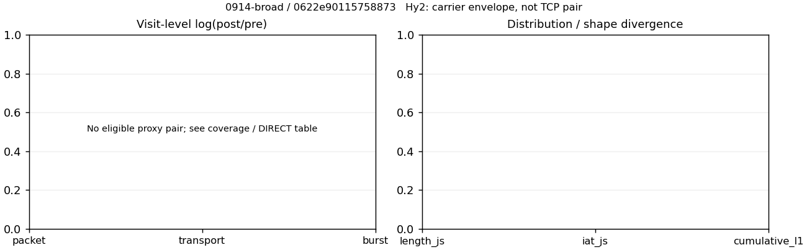

# 0914-broad · 条目 055 · douyu.com

目标：https://www.douyu.com/

活动标签：douyu.com::page_load。选定访问 3 次。

[返回总索引](../../README.md) · [统计口径](../../methods.md)

## 覆盖与资格（每次访问均保留）

| 部署 | 重复 | 主请求路由 | 活动状态 | 代理比较 | DIRECT pre | 请求 proxy/direct/unresolved | 错误 |
| --- | --- | --- | --- | --- | --- | --- | --- |
| Hy2 | 1 | direct | passed | 0 | 1 | 0/255/0 | [] |
| SS | 1 | direct | passed | 0 | 1 | 0/256/0 | [] |
| VLESS | 1 | direct | passed | 0 | 1 | 0/261/0 | [] |

主请求非 proxy 的统计仅解释为已索引的辅助代理连接或 DIRECT 观测，不代表目标业务经代理传输。播放确认与配对资格是两道不同的门。

图中散点为单次访问，短线为重复中位数；Hy2 是共享载体包络，不能与 TCP 配对作等范围因果对比。

形态图先逐访问归一化，再对访问等权平均；实线 pre，虚线 post。分箱序号及边界见 methods，不将分箱索引误解为长度或时间。

## 每次访问的关键观测

### SS

范围：`direct_pre_only`。每格 pre → post；空值为不可观测/不适用。

| 重复 | 包数 | 载荷字节 | burst | TCP FR | IAT中位µs | length JS | IAT JS |
| --- | --- | --- | --- | --- | --- | --- | --- |
| 1 | 7621 → — | 1.1827e+07 → — | 5623 → — | 354 → — | 110.65 → — | — | — |

完整标量统计：中位数 [min,max]；Δ 为重复内逐访问变换的中位数，MAD 未缩放。n 为可用变换数；DIRECT-only 的 nΔ=0 不代表 pre 不可用。

| scope | 特征 | pre | post | Δ | IQRΔ | MADΔ | nΔ |
| --- | --- | --- | --- | --- | --- | --- | --- |
| direct_pre_only | active_span_sum_s_1000ms | 88.082 [88.082, 88.082] | — | — | — | — | 0 |
| direct_pre_only | active_span_sum_s_100ms | 24.809 [24.809, 24.809] | — | — | — | — | 0 |
| direct_pre_only | active_span_sum_s_500ms | 80.41 [80.41, 80.41] | — | — | — | — | 0 |
| direct_pre_only | burst_bytes_iqr | 1987 [1987, 1987] | — | — | — | — | 0 |
| direct_pre_only | burst_bytes_mad | 31 [31, 31] | — | — | — | — | 0 |
| direct_pre_only | burst_bytes_max | 28840 [28840, 28840] | — | — | — | — | 0 |
| direct_pre_only | burst_bytes_mean | 2103.3 [2103.3, 2103.3] | — | — | — | — | 0 |
| direct_pre_only | burst_bytes_median | 31 [31, 31] | — | — | — | — | 0 |
| direct_pre_only | burst_bytes_min | 0 [0, 0] | — | — | — | — | 0 |
| direct_pre_only | burst_bytes_p95 | 11774 [11774, 11774] | — | — | — | — | 0 |
| direct_pre_only | burst_bytes_q25 | 0 [0, 0] | — | — | — | — | 0 |
| direct_pre_only | burst_bytes_q75 | 1987 [1987, 1987] | — | — | — | — | 0 |
| direct_pre_only | burst_bytes_std | 4356.1 [4356.1, 4356.1] | — | — | — | — | 0 |
| direct_pre_only | burst_count | 5623 [5623, 5623] | — | — | — | — | 0 |
| direct_pre_only | burst_duration_ms_iqr | 0.023908 [0.023908, 0.023908] | — | — | — | — | 0 |
| direct_pre_only | burst_duration_ms_mad | 0 [0, 0] | — | — | — | — | 0 |
| direct_pre_only | burst_duration_ms_max | 13875 [13875, 13875] | — | — | — | — | 0 |
| direct_pre_only | burst_duration_ms_mean | 55.92 [55.92, 55.92] | — | — | — | — | 0 |
| direct_pre_only | burst_duration_ms_median | 0 [0, 0] | — | — | — | — | 0 |
| direct_pre_only | burst_duration_ms_min | 0 [0, 0] | — | — | — | — | 0 |
| direct_pre_only | burst_duration_ms_p95 | 15.363 [15.363, 15.363] | — | — | — | — | 0 |
| direct_pre_only | burst_duration_ms_q25 | 0 [0, 0] | — | — | — | — | 0 |
| direct_pre_only | burst_duration_ms_q75 | 0.023908 [0.023908, 0.023908] | — | — | — | — | 0 |
| direct_pre_only | burst_duration_ms_std | 762.81 [762.81, 762.81] | — | — | — | — | 0 |
| direct_pre_only | burst_packets_iqr | 1 [1, 1] | — | — | — | — | 0 |
| direct_pre_only | burst_packets_mad | 0 [0, 0] | — | — | — | — | 0 |
| direct_pre_only | burst_packets_max | 9 [9, 9] | — | — | — | — | 0 |
| direct_pre_only | burst_packets_mean | 1.3553 [1.3553, 1.3553] | — | — | — | — | 0 |
| direct_pre_only | burst_packets_median | 1 [1, 1] | — | — | — | — | 0 |
| direct_pre_only | burst_packets_min | 1 [1, 1] | — | — | — | — | 0 |
| direct_pre_only | burst_packets_p95 | 3 [3, 3] | — | — | — | — | 0 |
| direct_pre_only | burst_packets_q25 | 1 [1, 1] | — | — | — | — | 0 |
| direct_pre_only | burst_packets_q75 | 2 [2, 2] | — | — | — | — | 0 |
| direct_pre_only | burst_packets_std | 0.68443 [0.68443, 0.68443] | — | — | — | — | 0 |
| direct_pre_only | connection_span_concurrency_max | 29 [29, 29] | — | — | — | — | 0 |
| direct_pre_only | direction_entropy | 0.43881 [0.43881, 0.43881] | — | — | — | — | 0 |
| direct_pre_only | down_burst_count | 2786 [2786, 2786] | — | — | — | — | 0 |
| direct_pre_only | down_ip_bytes | 1.1849e+07 [1.1849e+07, 1.1849e+07] | — | — | — | — | 0 |
| direct_pre_only | down_packets | 4507 [4507, 4507] | — | — | — | — | 0 |
| direct_pre_only | down_transport_bytes | 1.1614e+07 [1.1614e+07, 1.1614e+07] | — | — | — | — | 0 |
| direct_pre_only | duration_s | 32.846 [32.846, 32.846] | — | — | — | — | 0 |
| direct_pre_only | entity_count | 51 [51, 51] | — | — | — | — | 0 |
| direct_pre_only | fr_runs | 354 [354, 354] | — | — | — | — | 0 |
| direct_pre_only | fr_runs_per_packet | 0.080473 [0.080473, 0.080473] | — | — | — | — | 0 |
| direct_pre_only | fr_switches | 303 [303, 303] | — | — | — | — | 0 |
| direct_pre_only | fr_switches_per_possible_transition | 0.069687 [0.069687, 0.069687] | — | — | — | — | 0 |
| direct_pre_only | full_retransmission_fraction | 0.0036741 [0.0036741, 0.0036741] | — | — | — | — | 0 |
| direct_pre_only | full_retransmission_packets | 28 [28, 28] | — | — | — | — | 0 |
| direct_pre_only | iat_count | 7570 [7570, 7570] | — | — | — | — | 0 |
| direct_pre_only | iat_median_us | 110.65 [110.65, 110.65] | — | — | — | — | 0 |
| direct_pre_only | iat_us_iqr | 2715.7 [2715.7, 2715.7] | — | — | — | — | 0 |
| direct_pre_only | iat_us_mad | 102.28 [102.28, 102.28] | — | — | — | — | 0 |
| direct_pre_only | iat_us_max | 1.5002e+07 [1.5002e+07, 1.5002e+07] | — | — | — | — | 0 |
| direct_pre_only | iat_us_mean | 93617 [93617, 93617] | — | — | — | — | 0 |
| direct_pre_only | iat_us_median | 110.65 [110.65, 110.65] | — | — | — | — | 0 |
| direct_pre_only | iat_us_min | 0.033 [0.033, 0.033] | — | — | — | — | 0 |
| direct_pre_only | iat_us_p95 | 58255 [58255, 58255] | — | — | — | — | 0 |
| direct_pre_only | iat_us_q25 | 32.576 [32.576, 32.576] | — | — | — | — | 0 |
| direct_pre_only | iat_us_q75 | 2748.3 [2748.3, 2748.3] | — | — | — | — | 0 |
| direct_pre_only | iat_us_std | 1.0381e+06 [1.0381e+06, 1.0381e+06] | — | — | — | — | 0 |
| direct_pre_only | idle_gap_count_1000ms | 53 [53, 53] | — | — | — | — | 0 |
| direct_pre_only | idle_gap_count_100ms | 362 [362, 362] | — | — | — | — | 0 |
| direct_pre_only | idle_gap_count_500ms | 63 [63, 63] | — | — | — | — | 0 |
| direct_pre_only | idle_gap_sum_s_1000ms | 620.6 [620.6, 620.6] | — | — | — | — | 0 |
| direct_pre_only | idle_gap_sum_s_100ms | 683.87 [683.87, 683.87] | — | — | — | — | 0 |
| direct_pre_only | idle_gap_sum_s_500ms | 628.27 [628.27, 628.27] | — | — | — | — | 0 |
| direct_pre_only | ip_bytes | 1.2224e+07 [1.2224e+07, 1.2224e+07] | — | — | — | — | 0 |
| direct_pre_only | length_iqr | 2352.5 [2352.5, 2352.5] | — | — | — | — | 0 |
| direct_pre_only | length_mad | 1200 [1200, 1200] | — | — | — | — | 0 |
| direct_pre_only | length_max | 8948 [8948, 8948] | — | — | — | — | 0 |
| direct_pre_only | length_mean | 2688.5 [2688.5, 2688.5] | — | — | — | — | 0 |
| direct_pre_only | length_median | 1440 [1440, 1440] | — | — | — | — | 0 |
| direct_pre_only | length_min | 2 [2, 2] | — | — | — | — | 0 |
| direct_pre_only | length_p95 | 8920 [8920, 8920] | — | — | — | — | 0 |
| direct_pre_only | length_q25 | 527.5 [527.5, 527.5] | — | — | — | — | 0 |
| direct_pre_only | length_q75 | 2880 [2880, 2880] | — | — | — | — | 0 |
| direct_pre_only | length_std | 2691.1 [2691.1, 2691.1] | — | — | — | — | 0 |
| direct_pre_only | nonempty_entity_count | 51 [51, 51] | — | — | — | — | 0 |
| direct_pre_only | nonempty_packets | 4399 [4399, 4399] | — | — | — | — | 0 |
| direct_pre_only | offload_suspect_fraction | 0.28631 [0.28631, 0.28631] | — | — | — | — | 0 |
| direct_pre_only | packet_count | 7621 [7621, 7621] | — | — | — | — | 0 |
| direct_pre_only | rtt_median_ms | 0.075152 [0.075152, 0.075152] | — | — | — | — | 0 |
| direct_pre_only | rtt_sample_count | 3044 [3044, 3044] | — | — | — | — | 0 |
| direct_pre_only | tcp_ack_count | 7564 [7564, 7564] | — | — | — | — | 0 |
| direct_pre_only | tcp_fin_count | 95 [95, 95] | — | — | — | — | 0 |
| direct_pre_only | tcp_packet_count | 7621 [7621, 7621] | — | — | — | — | 0 |
| direct_pre_only | tcp_rst_count | 10 [10, 10] | — | — | — | — | 0 |
| direct_pre_only | tcp_syn_count | 102 [102, 102] | — | — | — | — | 0 |
| direct_pre_only | tcp_window_raw_median | 65535 [65535, 65535] | — | — | — | — | 0 |
| direct_pre_only | transition_entropy | 0.27608 [0.27608, 0.27608] | — | — | — | — | 0 |
| direct_pre_only | transition_n_mm | 3823 [3823, 3823] | — | — | — | — | 0 |
| direct_pre_only | transition_n_mp | 126 [126, 126] | — | — | — | — | 0 |
| direct_pre_only | transition_n_pm | 177 [177, 177] | — | — | — | — | 0 |
| direct_pre_only | transition_n_pp | 222 [222, 222] | — | — | — | — | 0 |
| direct_pre_only | transition_p_mm | 0.96809 [0.96809, 0.96809] | — | — | — | — | 0 |
| direct_pre_only | transition_p_mp | 0.031907 [0.031907, 0.031907] | — | — | — | — | 0 |
| direct_pre_only | transition_p_pm | 0.44361 [0.44361, 0.44361] | — | — | — | — | 0 |
| direct_pre_only | transition_p_pp | 0.55639 [0.55639, 0.55639] | — | — | — | — | 0 |
| direct_pre_only | transport_bytes | 1.1827e+07 [1.1827e+07, 1.1827e+07] | — | — | — | — | 0 |
| direct_pre_only | up_burst_count | 2837 [2837, 2837] | — | — | — | — | 0 |
| direct_pre_only | up_byte_fraction | 0.017969 [0.017969, 0.017969] | — | — | — | — | 0 |
| direct_pre_only | up_ip_bytes | 3.7511e+05 [3.7511e+05, 3.7511e+05] | — | — | — | — | 0 |
| direct_pre_only | up_packets | 3114 [3114, 3114] | — | — | — | — | 0 |
| direct_pre_only | up_transport_bytes | 2.1251e+05 [2.1251e+05, 2.1251e+05] | — | — | — | — | 0 |
| direct_pre_only | zero_iat_count | 0 [0, 0] | — | — | — | — | 0 |
| direct_pre_only | zero_iat_fraction | 0 [0, 0] | — | — | — | — | 0 |

### VLESS

范围：`direct_pre_only`。每格 pre → post；空值为不可观测/不适用。

| 重复 | 包数 | 载荷字节 | burst | TCP FR | IAT中位µs | length JS | IAT JS |
| --- | --- | --- | --- | --- | --- | --- | --- |
| 1 | 10889 → — | 2.2087e+07 → — | 8429 → — | 355 → — | 60.128 → — | — | — |

完整标量统计：中位数 [min,max]；Δ 为重复内逐访问变换的中位数，MAD 未缩放。n 为可用变换数；DIRECT-only 的 nΔ=0 不代表 pre 不可用。

| scope | 特征 | pre | post | Δ | IQRΔ | MADΔ | nΔ |
| --- | --- | --- | --- | --- | --- | --- | --- |
| direct_pre_only | active_span_sum_s_1000ms | 60.576 [60.576, 60.576] | — | — | — | — | 0 |
| direct_pre_only | active_span_sum_s_100ms | 32.448 [32.448, 32.448] | — | — | — | — | 0 |
| direct_pre_only | active_span_sum_s_500ms | 51.327 [51.327, 51.327] | — | — | — | — | 0 |
| direct_pre_only | burst_bytes_iqr | 2880 [2880, 2880] | — | — | — | — | 0 |
| direct_pre_only | burst_bytes_mad | 31 [31, 31] | — | — | — | — | 0 |
| direct_pre_only | burst_bytes_max | 29400 [29400, 29400] | — | — | — | — | 0 |
| direct_pre_only | burst_bytes_mean | 2620.4 [2620.4, 2620.4] | — | — | — | — | 0 |
| direct_pre_only | burst_bytes_median | 31 [31, 31] | — | — | — | — | 0 |
| direct_pre_only | burst_bytes_min | 0 [0, 0] | — | — | — | — | 0 |
| direct_pre_only | burst_bytes_p95 | 12960 [12960, 12960] | — | — | — | — | 0 |
| direct_pre_only | burst_bytes_q25 | 0 [0, 0] | — | — | — | — | 0 |
| direct_pre_only | burst_bytes_q75 | 2880 [2880, 2880] | — | — | — | — | 0 |
| direct_pre_only | burst_bytes_std | 4728.3 [4728.3, 4728.3] | — | — | — | — | 0 |
| direct_pre_only | burst_count | 8429 [8429, 8429] | — | — | — | — | 0 |
| direct_pre_only | burst_duration_ms_iqr | 0 [0, 0] | — | — | — | — | 0 |
| direct_pre_only | burst_duration_ms_mad | 0 [0, 0] | — | — | — | — | 0 |
| direct_pre_only | burst_duration_ms_max | 14224 [14224, 14224] | — | — | — | — | 0 |
| direct_pre_only | burst_duration_ms_mean | 34.738 [34.738, 34.738] | — | — | — | — | 0 |
| direct_pre_only | burst_duration_ms_median | 0 [0, 0] | — | — | — | — | 0 |
| direct_pre_only | burst_duration_ms_min | 0 [0, 0] | — | — | — | — | 0 |
| direct_pre_only | burst_duration_ms_p95 | 1.0631 [1.0631, 1.0631] | — | — | — | — | 0 |
| direct_pre_only | burst_duration_ms_q25 | 0 [0, 0] | — | — | — | — | 0 |
| direct_pre_only | burst_duration_ms_q75 | 0 [0, 0] | — | — | — | — | 0 |
| direct_pre_only | burst_duration_ms_std | 621.17 [621.17, 621.17] | — | — | — | — | 0 |
| direct_pre_only | burst_packets_iqr | 0 [0, 0] | — | — | — | — | 0 |
| direct_pre_only | burst_packets_mad | 0 [0, 0] | — | — | — | — | 0 |
| direct_pre_only | burst_packets_max | 9 [9, 9] | — | — | — | — | 0 |
| direct_pre_only | burst_packets_mean | 1.2918 [1.2918, 1.2918] | — | — | — | — | 0 |
| direct_pre_only | burst_packets_median | 1 [1, 1] | — | — | — | — | 0 |
| direct_pre_only | burst_packets_min | 1 [1, 1] | — | — | — | — | 0 |
| direct_pre_only | burst_packets_p95 | 3 [3, 3] | — | — | — | — | 0 |
| direct_pre_only | burst_packets_q25 | 1 [1, 1] | — | — | — | — | 0 |
| direct_pre_only | burst_packets_q75 | 1 [1, 1] | — | — | — | — | 0 |
| direct_pre_only | burst_packets_std | 0.68265 [0.68265, 0.68265] | — | — | — | — | 0 |
| direct_pre_only | connection_span_concurrency_max | 28 [28, 28] | — | — | — | — | 0 |
| direct_pre_only | direction_entropy | 0.29673 [0.29673, 0.29673] | — | — | — | — | 0 |
| direct_pre_only | down_burst_count | 4187 [4187, 4187] | — | — | — | — | 0 |
| direct_pre_only | down_ip_bytes | 2.2213e+07 [2.2213e+07, 2.2213e+07] | — | — | — | — | 0 |
| direct_pre_only | down_packets | 6349 [6349, 6349] | — | — | — | — | 0 |
| direct_pre_only | down_transport_bytes | 2.1882e+07 [2.1882e+07, 2.1882e+07] | — | — | — | — | 0 |
| direct_pre_only | duration_s | 34.027 [34.027, 34.027] | — | — | — | — | 0 |
| direct_pre_only | entity_count | 55 [55, 55] | — | — | — | — | 0 |
| direct_pre_only | fr_runs | 355 [355, 355] | — | — | — | — | 0 |
| direct_pre_only | fr_runs_per_packet | 0.05712 [0.05712, 0.05712] | — | — | — | — | 0 |
| direct_pre_only | fr_switches | 300 [300, 300] | — | — | — | — | 0 |
| direct_pre_only | fr_switches_per_possible_transition | 0.048701 [0.048701, 0.048701] | — | — | — | — | 0 |
| direct_pre_only | full_retransmission_fraction | 0.0029387 [0.0029387, 0.0029387] | — | — | — | — | 0 |
| direct_pre_only | full_retransmission_packets | 32 [32, 32] | — | — | — | — | 0 |
| direct_pre_only | iat_count | 10834 [10834, 10834] | — | — | — | — | 0 |
| direct_pre_only | iat_median_us | 60.128 [60.128, 60.128] | — | — | — | — | 0 |
| direct_pre_only | iat_us_iqr | 568.7 [568.7, 568.7] | — | — | — | — | 0 |
| direct_pre_only | iat_us_mad | 49.957 [49.957, 49.957] | — | — | — | — | 0 |
| direct_pre_only | iat_us_max | 1.5003e+07 [1.5003e+07, 1.5003e+07] | — | — | — | — | 0 |
| direct_pre_only | iat_us_mean | 57516 [57516, 57516] | — | — | — | — | 0 |
| direct_pre_only | iat_us_median | 60.128 [60.128, 60.128] | — | — | — | — | 0 |
| direct_pre_only | iat_us_min | 0.01 [0.01, 0.01] | — | — | — | — | 0 |
| direct_pre_only | iat_us_p95 | 22251 [22251, 22251] | — | — | — | — | 0 |
| direct_pre_only | iat_us_q25 | 20.198 [20.198, 20.198] | — | — | — | — | 0 |
| direct_pre_only | iat_us_q75 | 588.9 [588.9, 588.9] | — | — | — | — | 0 |
| direct_pre_only | iat_us_std | 8.3123e+05 [8.3123e+05, 8.3123e+05] | — | — | — | — | 0 |
| direct_pre_only | idle_gap_count_1000ms | 51 [51, 51] | — | — | — | — | 0 |
| direct_pre_only | idle_gap_count_100ms | 155 [155, 155] | — | — | — | — | 0 |
| direct_pre_only | idle_gap_count_500ms | 63 [63, 63] | — | — | — | — | 0 |
| direct_pre_only | idle_gap_sum_s_1000ms | 562.56 [562.56, 562.56] | — | — | — | — | 0 |
| direct_pre_only | idle_gap_sum_s_100ms | 590.68 [590.68, 590.68] | — | — | — | — | 0 |
| direct_pre_only | idle_gap_sum_s_500ms | 571.8 [571.8, 571.8] | — | — | — | — | 0 |
| direct_pre_only | ip_bytes | 2.2655e+07 [2.2655e+07, 2.2655e+07] | — | — | — | — | 0 |
| direct_pre_only | length_iqr | 4992 [4992, 4992] | — | — | — | — | 0 |
| direct_pre_only | length_mad | 2332 [2332, 2332] | — | — | — | — | 0 |
| direct_pre_only | length_max | 8948 [8948, 8948] | — | — | — | — | 0 |
| direct_pre_only | length_mean | 3553.8 [3553.8, 3553.8] | — | — | — | — | 0 |
| direct_pre_only | length_median | 2880 [2880, 2880] | — | — | — | — | 0 |
| direct_pre_only | length_min | 3 [3, 3] | — | — | — | — | 0 |
| direct_pre_only | length_p95 | 8920 [8920, 8920] | — | — | — | — | 0 |
| direct_pre_only | length_q25 | 768 [768, 768] | — | — | — | — | 0 |
| direct_pre_only | length_q75 | 5760 [5760, 5760] | — | — | — | — | 0 |
| direct_pre_only | length_std | 2912.8 [2912.8, 2912.8] | — | — | — | — | 0 |
| direct_pre_only | nonempty_entity_count | 55 [55, 55] | — | — | — | — | 0 |
| direct_pre_only | nonempty_packets | 6215 [6215, 6215] | — | — | — | — | 0 |
| direct_pre_only | offload_suspect_fraction | 0.39122 [0.39122, 0.39122] | — | — | — | — | 0 |
| direct_pre_only | packet_count | 10889 [10889, 10889] | — | — | — | — | 0 |
| direct_pre_only | rtt_median_ms | 0.053865 [0.053865, 0.053865] | — | — | — | — | 0 |
| direct_pre_only | rtt_sample_count | 4487 [4487, 4487] | — | — | — | — | 0 |
| direct_pre_only | tcp_ack_count | 10825 [10825, 10825] | — | — | — | — | 0 |
| direct_pre_only | tcp_fin_count | 98 [98, 98] | — | — | — | — | 0 |
| direct_pre_only | tcp_packet_count | 10889 [10889, 10889] | — | — | — | — | 0 |
| direct_pre_only | tcp_rst_count | 15 [15, 15] | — | — | — | — | 0 |
| direct_pre_only | tcp_syn_count | 110 [110, 110] | — | — | — | — | 0 |
| direct_pre_only | tcp_window_raw_median | 65535 [65535, 65535] | — | — | — | — | 0 |
| direct_pre_only | transition_entropy | 0.19214 [0.19214, 0.19214] | — | — | — | — | 0 |
| direct_pre_only | transition_n_mm | 5712 [5712, 5712] | — | — | — | — | 0 |
| direct_pre_only | transition_n_mp | 123 [123, 123] | — | — | — | — | 0 |
| direct_pre_only | transition_n_pm | 177 [177, 177] | — | — | — | — | 0 |
| direct_pre_only | transition_n_pp | 148 [148, 148] | — | — | — | — | 0 |
| direct_pre_only | transition_p_mm | 0.97892 [0.97892, 0.97892] | — | — | — | — | 0 |
| direct_pre_only | transition_p_mp | 0.02108 [0.02108, 0.02108] | — | — | — | — | 0 |
| direct_pre_only | transition_p_pm | 0.54462 [0.54462, 0.54462] | — | — | — | — | 0 |
| direct_pre_only | transition_p_pp | 0.45538 [0.45538, 0.45538] | — | — | — | — | 0 |
| direct_pre_only | transport_bytes | 2.2087e+07 [2.2087e+07, 2.2087e+07] | — | — | — | — | 0 |
| direct_pre_only | up_burst_count | 4242 [4242, 4242] | — | — | — | — | 0 |
| direct_pre_only | up_byte_fraction | 0.0092806 [0.0092806, 0.0092806] | — | — | — | — | 0 |
| direct_pre_only | up_ip_bytes | 4.4178e+05 [4.4178e+05, 4.4178e+05] | — | — | — | — | 0 |
| direct_pre_only | up_packets | 4540 [4540, 4540] | — | — | — | — | 0 |
| direct_pre_only | up_transport_bytes | 2.0498e+05 [2.0498e+05, 2.0498e+05] | — | — | — | — | 0 |
| direct_pre_only | zero_iat_count | 0 [0, 0] | — | — | — | — | 0 |
| direct_pre_only | zero_iat_fraction | 0 [0, 0] | — | — | — | — | 0 |

### Hy2

范围：`direct_pre_only`。每格 pre → post；空值为不可观测/不适用。

| 重复 | 包数 | 载荷字节 | burst | TCP FR | IAT中位µs | length JS | IAT JS |
| --- | --- | --- | --- | --- | --- | --- | --- |
| 1 | 13466 → — | 2.555e+07 → — | 10904 → — | 342 → — | 70.37 → — | — | — |

完整标量统计：中位数 [min,max]；Δ 为重复内逐访问变换的中位数，MAD 未缩放。n 为可用变换数；DIRECT-only 的 nΔ=0 不代表 pre 不可用。

| scope | 特征 | pre | post | Δ | IQRΔ | MADΔ | nΔ |
| --- | --- | --- | --- | --- | --- | --- | --- |
| direct_pre_only | active_span_sum_s_1000ms | 97.719 [97.719, 97.719] | — | — | — | — | 0 |
| direct_pre_only | active_span_sum_s_100ms | 38.431 [38.431, 38.431] | — | — | — | — | 0 |
| direct_pre_only | active_span_sum_s_500ms | 89.516 [89.516, 89.516] | — | — | — | — | 0 |
| direct_pre_only | burst_bytes_iqr | 2880 [2880, 2880] | — | — | — | — | 0 |
| direct_pre_only | burst_bytes_mad | 51 [51, 51] | — | — | — | — | 0 |
| direct_pre_only | burst_bytes_max | 27944 [27944, 27944] | — | — | — | — | 0 |
| direct_pre_only | burst_bytes_mean | 2343.2 [2343.2, 2343.2] | — | — | — | — | 0 |
| direct_pre_only | burst_bytes_median | 51 [51, 51] | — | — | — | — | 0 |
| direct_pre_only | burst_bytes_min | 0 [0, 0] | — | — | — | — | 0 |
| direct_pre_only | burst_bytes_p95 | 11520 [11520, 11520] | — | — | — | — | 0 |
| direct_pre_only | burst_bytes_q25 | 0 [0, 0] | — | — | — | — | 0 |
| direct_pre_only | burst_bytes_q75 | 2880 [2880, 2880] | — | — | — | — | 0 |
| direct_pre_only | burst_bytes_std | 4282.6 [4282.6, 4282.6] | — | — | — | — | 0 |
| direct_pre_only | burst_count | 10904 [10904, 10904] | — | — | — | — | 0 |
| direct_pre_only | burst_duration_ms_iqr | 0 [0, 0] | — | — | — | — | 0 |
| direct_pre_only | burst_duration_ms_mad | 0 [0, 0] | — | — | — | — | 0 |
| direct_pre_only | burst_duration_ms_max | 14952 [14952, 14952] | — | — | — | — | 0 |
| direct_pre_only | burst_duration_ms_mean | 34.093 [34.093, 34.093] | — | — | — | — | 0 |
| direct_pre_only | burst_duration_ms_median | 0 [0, 0] | — | — | — | — | 0 |
| direct_pre_only | burst_duration_ms_min | 0 [0, 0] | — | — | — | — | 0 |
| direct_pre_only | burst_duration_ms_p95 | 0.92734 [0.92734, 0.92734] | — | — | — | — | 0 |
| direct_pre_only | burst_duration_ms_q25 | 0 [0, 0] | — | — | — | — | 0 |
| direct_pre_only | burst_duration_ms_q75 | 0 [0, 0] | — | — | — | — | 0 |
| direct_pre_only | burst_duration_ms_std | 626.55 [626.55, 626.55] | — | — | — | — | 0 |
| direct_pre_only | burst_packets_iqr | 0 [0, 0] | — | — | — | — | 0 |
| direct_pre_only | burst_packets_mad | 0 [0, 0] | — | — | — | — | 0 |
| direct_pre_only | burst_packets_max | 7 [7, 7] | — | — | — | — | 0 |
| direct_pre_only | burst_packets_mean | 1.235 [1.235, 1.235] | — | — | — | — | 0 |
| direct_pre_only | burst_packets_median | 1 [1, 1] | — | — | — | — | 0 |
| direct_pre_only | burst_packets_min | 1 [1, 1] | — | — | — | — | 0 |
| direct_pre_only | burst_packets_p95 | 2 [2, 2] | — | — | — | — | 0 |
| direct_pre_only | burst_packets_q25 | 1 [1, 1] | — | — | — | — | 0 |
| direct_pre_only | burst_packets_q75 | 1 [1, 1] | — | — | — | — | 0 |
| direct_pre_only | burst_packets_std | 0.60188 [0.60188, 0.60188] | — | — | — | — | 0 |
| direct_pre_only | connection_span_concurrency_max | 32 [32, 32] | — | — | — | — | 0 |
| direct_pre_only | direction_entropy | 0.29039 [0.29039, 0.29039] | — | — | — | — | 0 |
| direct_pre_only | down_burst_count | 5430 [5430, 5430] | — | — | — | — | 0 |
| direct_pre_only | down_ip_bytes | 2.5755e+07 [2.5755e+07, 2.5755e+07] | — | — | — | — | 0 |
| direct_pre_only | down_packets | 7665 [7665, 7665] | — | — | — | — | 0 |
| direct_pre_only | down_transport_bytes | 2.5356e+07 [2.5356e+07, 2.5356e+07] | — | — | — | — | 0 |
| direct_pre_only | duration_s | 32.325 [32.325, 32.325] | — | — | — | — | 0 |
| direct_pre_only | entity_count | 44 [44, 44] | — | — | — | — | 0 |
| direct_pre_only | fr_runs | 342 [342, 342] | — | — | — | — | 0 |
| direct_pre_only | fr_runs_per_packet | 0.045137 [0.045137, 0.045137] | — | — | — | — | 0 |
| direct_pre_only | fr_switches | 298 [298, 298] | — | — | — | — | 0 |
| direct_pre_only | fr_switches_per_possible_transition | 0.039559 [0.039559, 0.039559] | — | — | — | — | 0 |
| direct_pre_only | full_retransmission_fraction | 0.0026734 [0.0026734, 0.0026734] | — | — | — | — | 0 |
| direct_pre_only | full_retransmission_packets | 36 [36, 36] | — | — | — | — | 0 |
| direct_pre_only | iat_count | 13422 [13422, 13422] | — | — | — | — | 0 |
| direct_pre_only | iat_median_us | 70.37 [70.37, 70.37] | — | — | — | — | 0 |
| direct_pre_only | iat_us_iqr | 1014 [1014, 1014] | — | — | — | — | 0 |
| direct_pre_only | iat_us_mad | 59.849 [59.849, 59.849] | — | — | — | — | 0 |
| direct_pre_only | iat_us_max | 1.5001e+07 [1.5001e+07, 1.5001e+07] | — | — | — | — | 0 |
| direct_pre_only | iat_us_mean | 61583 [61583, 61583] | — | — | — | — | 0 |
| direct_pre_only | iat_us_median | 70.37 [70.37, 70.37] | — | — | — | — | 0 |
| direct_pre_only | iat_us_min | 0.027 [0.027, 0.027] | — | — | — | — | 0 |
| direct_pre_only | iat_us_p95 | 25515 [25515, 25515] | — | — | — | — | 0 |
| direct_pre_only | iat_us_q25 | 25.781 [25.781, 25.781] | — | — | — | — | 0 |
| direct_pre_only | iat_us_q75 | 1039.8 [1039.8, 1039.8] | — | — | — | — | 0 |
| direct_pre_only | iat_us_std | 8.5677e+05 [8.5677e+05, 8.5677e+05] | — | — | — | — | 0 |
| direct_pre_only | idle_gap_count_1000ms | 61 [61, 61] | — | — | — | — | 0 |
| direct_pre_only | idle_gap_count_100ms | 365 [365, 365] | — | — | — | — | 0 |
| direct_pre_only | idle_gap_count_500ms | 71 [71, 71] | — | — | — | — | 0 |
| direct_pre_only | idle_gap_sum_s_1000ms | 728.85 [728.85, 728.85] | — | — | — | — | 0 |
| direct_pre_only | idle_gap_sum_s_100ms | 788.14 [788.14, 788.14] | — | — | — | — | 0 |
| direct_pre_only | idle_gap_sum_s_500ms | 737.05 [737.05, 737.05] | — | — | — | — | 0 |
| direct_pre_only | ip_bytes | 2.6252e+07 [2.6252e+07, 2.6252e+07] | — | — | — | — | 0 |
| direct_pre_only | length_iqr | 3887 [3887, 3887] | — | — | — | — | 0 |
| direct_pre_only | length_mad | 1919 [1919, 1919] | — | — | — | — | 0 |
| direct_pre_only | length_max | 8948 [8948, 8948] | — | — | — | — | 0 |
| direct_pre_only | length_mean | 3372.1 [3372.1, 3372.1] | — | — | — | — | 0 |
| direct_pre_only | length_median | 2880 [2880, 2880] | — | — | — | — | 0 |
| direct_pre_only | length_min | 2 [2, 2] | — | — | — | — | 0 |
| direct_pre_only | length_p95 | 8920 [8920, 8920] | — | — | — | — | 0 |
| direct_pre_only | length_q25 | 999 [999, 999] | — | — | — | — | 0 |
| direct_pre_only | length_q75 | 4886 [4886, 4886] | — | — | — | — | 0 |
| direct_pre_only | length_std | 2742.6 [2742.6, 2742.6] | — | — | — | — | 0 |
| direct_pre_only | nonempty_entity_count | 44 [44, 44] | — | — | — | — | 0 |
| direct_pre_only | nonempty_packets | 7577 [7577, 7577] | — | — | — | — | 0 |
| direct_pre_only | offload_suspect_fraction | 0.3918 [0.3918, 0.3918] | — | — | — | — | 0 |
| direct_pre_only | packet_count | 13466 [13466, 13466] | — | — | — | — | 0 |
| direct_pre_only | rtt_median_ms | 0.056457 [0.056457, 0.056457] | — | — | — | — | 0 |
| direct_pre_only | rtt_sample_count | 5718 [5718, 5718] | — | — | — | — | 0 |
| direct_pre_only | tcp_ack_count | 13416 [13416, 13416] | — | — | — | — | 0 |
| direct_pre_only | tcp_fin_count | 81 [81, 81] | — | — | — | — | 0 |
| direct_pre_only | tcp_packet_count | 13466 [13466, 13466] | — | — | — | — | 0 |
| direct_pre_only | tcp_rst_count | 10 [10, 10] | — | — | — | — | 0 |
| direct_pre_only | tcp_syn_count | 88 [88, 88] | — | — | — | — | 0 |
| direct_pre_only | tcp_window_raw_median | 65535 [65535, 65535] | — | — | — | — | 0 |
| direct_pre_only | transition_entropy | 0.17289 [0.17289, 0.17289] | — | — | — | — | 0 |
| direct_pre_only | transition_n_mm | 7020 [7020, 7020] | — | — | — | — | 0 |
| direct_pre_only | transition_n_mp | 127 [127, 127] | — | — | — | — | 0 |
| direct_pre_only | transition_n_pm | 171 [171, 171] | — | — | — | — | 0 |
| direct_pre_only | transition_n_pp | 215 [215, 215] | — | — | — | — | 0 |
| direct_pre_only | transition_p_mm | 0.98223 [0.98223, 0.98223] | — | — | — | — | 0 |
| direct_pre_only | transition_p_mp | 0.01777 [0.01777, 0.01777] | — | — | — | — | 0 |
| direct_pre_only | transition_p_pm | 0.44301 [0.44301, 0.44301] | — | — | — | — | 0 |
| direct_pre_only | transition_p_pp | 0.55699 [0.55699, 0.55699] | — | — | — | — | 0 |
| direct_pre_only | transport_bytes | 2.555e+07 [2.555e+07, 2.555e+07] | — | — | — | — | 0 |
| direct_pre_only | up_burst_count | 5474 [5474, 5474] | — | — | — | — | 0 |
| direct_pre_only | up_byte_fraction | 0.0076049 [0.0076049, 0.0076049] | — | — | — | — | 0 |
| direct_pre_only | up_ip_bytes | 4.9667e+05 [4.9667e+05, 4.9667e+05] | — | — | — | — | 0 |
| direct_pre_only | up_packets | 5801 [5801, 5801] | — | — | — | — | 0 |
| direct_pre_only | up_transport_bytes | 1.9431e+05 [1.9431e+05, 1.9431e+05] | — | — | — | — | 0 |
| direct_pre_only | zero_iat_count | 0 [0, 0] | — | — | — | — | 0 |
| direct_pre_only | zero_iat_fraction | 0 [0, 0] | — | — | — | — | 0 |

## 不同部署对比

以下是各部署自身重复中位数的差异，不按重复编号强行配对。跨 TCP/Hy2 的行标记异质观测范围。

| 视角 | 特征 | 部署A | 部署B | A中位 | B中位 | B−A | 比较口径 |
| --- | --- | --- | --- | --- | --- | --- | --- |
| pre | burst_count | SS | VLESS | 5623 | 8429 | 2806 | same_scope_unpaired_visits |
| pre | burst_count | SS | Hy2 | 5623 | 10904 | 5281 | same_scope_unpaired_visits |
| pre | burst_count | VLESS | Hy2 | 8429 | 10904 | 2475 | same_scope_unpaired_visits |
| pre | connection_span_concurrency_max | SS | VLESS | 29 | 28 | -1 | same_scope_unpaired_visits |
| pre | connection_span_concurrency_max | SS | Hy2 | 29 | 32 | 3 | same_scope_unpaired_visits |
| pre | connection_span_concurrency_max | VLESS | Hy2 | 28 | 32 | 4 | same_scope_unpaired_visits |
| pre | direction_entropy | SS | VLESS | 0.43881 | 0.29673 | -0.14208 | same_scope_unpaired_visits |
| pre | direction_entropy | SS | Hy2 | 0.43881 | 0.29039 | -0.14842 | same_scope_unpaired_visits |
| pre | direction_entropy | VLESS | Hy2 | 0.29673 | 0.29039 | -0.0063382 | same_scope_unpaired_visits |
| pre | down_transport_bytes | SS | VLESS | 1.1614e+07 | 2.1882e+07 | 1.0268e+07 | same_scope_unpaired_visits |
| pre | down_transport_bytes | SS | Hy2 | 1.1614e+07 | 2.5356e+07 | 1.3742e+07 | same_scope_unpaired_visits |
| pre | down_transport_bytes | VLESS | Hy2 | 2.1882e+07 | 2.5356e+07 | 3.474e+06 | same_scope_unpaired_visits |
| pre | duration_s | SS | VLESS | 32.846 | 34.027 | 1.1812 | same_scope_unpaired_visits |
| pre | duration_s | SS | Hy2 | 32.846 | 32.325 | -0.52097 | same_scope_unpaired_visits |
| pre | duration_s | VLESS | Hy2 | 34.027 | 32.325 | -1.7021 | same_scope_unpaired_visits |
| pre | entity_count | SS | VLESS | 51 | 55 | 4 | same_scope_unpaired_visits |
| pre | entity_count | SS | Hy2 | 51 | 44 | -7 | same_scope_unpaired_visits |
| pre | entity_count | VLESS | Hy2 | 55 | 44 | -11 | same_scope_unpaired_visits |
| pre | fr_runs | SS | VLESS | 354 | 355 | 1 | same_scope_unpaired_visits |
| pre | fr_runs | SS | Hy2 | 354 | 342 | -12 | same_scope_unpaired_visits |
| pre | fr_runs | VLESS | Hy2 | 355 | 342 | -13 | same_scope_unpaired_visits |
| pre | fr_runs_per_packet | SS | VLESS | 0.080473 | 0.05712 | -0.023353 | same_scope_unpaired_visits |
| pre | fr_runs_per_packet | SS | Hy2 | 0.080473 | 0.045137 | -0.035336 | same_scope_unpaired_visits |
| pre | fr_runs_per_packet | VLESS | Hy2 | 0.05712 | 0.045137 | -0.011983 | same_scope_unpaired_visits |
| pre | fr_switches | SS | VLESS | 303 | 300 | -3 | same_scope_unpaired_visits |
| pre | fr_switches | SS | Hy2 | 303 | 298 | -5 | same_scope_unpaired_visits |
| pre | fr_switches | VLESS | Hy2 | 300 | 298 | -2 | same_scope_unpaired_visits |
| pre | fr_switches_per_possible_transition | SS | VLESS | 0.069687 | 0.048701 | -0.020986 | same_scope_unpaired_visits |
| pre | fr_switches_per_possible_transition | SS | Hy2 | 0.069687 | 0.039559 | -0.030128 | same_scope_unpaired_visits |
| pre | fr_switches_per_possible_transition | VLESS | Hy2 | 0.048701 | 0.039559 | -0.009142 | same_scope_unpaired_visits |
| pre | full_retransmission_fraction | SS | VLESS | 0.0036741 | 0.0029387 | -0.00073531 | same_scope_unpaired_visits |
| pre | full_retransmission_fraction | SS | Hy2 | 0.0036741 | 0.0026734 | -0.0010007 | same_scope_unpaired_visits |
| pre | full_retransmission_fraction | VLESS | Hy2 | 0.0029387 | 0.0026734 | -0.00026535 | same_scope_unpaired_visits |
| pre | iat_median_us | SS | VLESS | 110.65 | 60.128 | -50.523 | same_scope_unpaired_visits |
| pre | iat_median_us | SS | Hy2 | 110.65 | 70.37 | -40.282 | same_scope_unpaired_visits |
| pre | iat_median_us | VLESS | Hy2 | 60.128 | 70.37 | 10.242 | same_scope_unpaired_visits |
| pre | iat_us_p95 | SS | VLESS | 58255 | 22251 | -36005 | same_scope_unpaired_visits |
| pre | iat_us_p95 | SS | Hy2 | 58255 | 25515 | -32740 | same_scope_unpaired_visits |
| pre | iat_us_p95 | VLESS | Hy2 | 22251 | 25515 | 3264.5 | same_scope_unpaired_visits |
| pre | ip_bytes | SS | VLESS | 1.2224e+07 | 2.2655e+07 | 1.0431e+07 | same_scope_unpaired_visits |
| pre | ip_bytes | SS | Hy2 | 1.2224e+07 | 2.6252e+07 | 1.4028e+07 | same_scope_unpaired_visits |
| pre | ip_bytes | VLESS | Hy2 | 2.2655e+07 | 2.6252e+07 | 3.5972e+06 | same_scope_unpaired_visits |
| pre | length_median | SS | VLESS | 1440 | 2880 | 1440 | same_scope_unpaired_visits |
| pre | length_median | SS | Hy2 | 1440 | 2880 | 1440 | same_scope_unpaired_visits |
| pre | length_median | VLESS | Hy2 | 2880 | 2880 | 0 | same_scope_unpaired_visits |
| pre | length_p95 | SS | VLESS | 8920 | 8920 | 0 | same_scope_unpaired_visits |
| pre | length_p95 | SS | Hy2 | 8920 | 8920 | 0 | same_scope_unpaired_visits |
| pre | length_p95 | VLESS | Hy2 | 8920 | 8920 | 0 | same_scope_unpaired_visits |
| pre | nonempty_packets | SS | VLESS | 4399 | 6215 | 1816 | same_scope_unpaired_visits |
| pre | nonempty_packets | SS | Hy2 | 4399 | 7577 | 3178 | same_scope_unpaired_visits |
| pre | nonempty_packets | VLESS | Hy2 | 6215 | 7577 | 1362 | same_scope_unpaired_visits |
| pre | offload_suspect_fraction | SS | VLESS | 0.28631 | 0.39122 | 0.10491 | same_scope_unpaired_visits |
| pre | offload_suspect_fraction | SS | Hy2 | 0.28631 | 0.3918 | 0.10549 | same_scope_unpaired_visits |
| pre | offload_suspect_fraction | VLESS | Hy2 | 0.39122 | 0.3918 | 0.00058108 | same_scope_unpaired_visits |
| pre | packet_count | SS | VLESS | 7621 | 10889 | 3268 | same_scope_unpaired_visits |
| pre | packet_count | SS | Hy2 | 7621 | 13466 | 5845 | same_scope_unpaired_visits |
| pre | packet_count | VLESS | Hy2 | 10889 | 13466 | 2577 | same_scope_unpaired_visits |
| pre | rtt_median_ms | SS | VLESS | 0.075152 | 0.053865 | -0.021287 | same_scope_unpaired_visits |
| pre | rtt_median_ms | SS | Hy2 | 0.075152 | 0.056457 | -0.018696 | same_scope_unpaired_visits |
| pre | rtt_median_ms | VLESS | Hy2 | 0.053865 | 0.056457 | 0.0025915 | same_scope_unpaired_visits |
| pre | transition_entropy | SS | VLESS | 0.27608 | 0.19214 | -0.083944 | same_scope_unpaired_visits |
| pre | transition_entropy | SS | Hy2 | 0.27608 | 0.17289 | -0.10319 | same_scope_unpaired_visits |
| pre | transition_entropy | VLESS | Hy2 | 0.19214 | 0.17289 | -0.019245 | same_scope_unpaired_visits |
| pre | transport_bytes | SS | VLESS | 1.1827e+07 | 2.2087e+07 | 1.0261e+07 | same_scope_unpaired_visits |
| pre | transport_bytes | SS | Hy2 | 1.1827e+07 | 2.555e+07 | 1.3724e+07 | same_scope_unpaired_visits |
| pre | transport_bytes | VLESS | Hy2 | 2.2087e+07 | 2.555e+07 | 3.4633e+06 | same_scope_unpaired_visits |
| pre | up_byte_fraction | SS | VLESS | 0.017969 | 0.0092806 | -0.0086883 | same_scope_unpaired_visits |
| pre | up_byte_fraction | SS | Hy2 | 0.017969 | 0.0076049 | -0.010364 | same_scope_unpaired_visits |
| pre | up_byte_fraction | VLESS | Hy2 | 0.0092806 | 0.0076049 | -0.0016757 | same_scope_unpaired_visits |
| pre | up_transport_bytes | SS | VLESS | 2.1251e+05 | 2.0498e+05 | -7529 | same_scope_unpaired_visits |
| pre | up_transport_bytes | SS | Hy2 | 2.1251e+05 | 1.9431e+05 | -18202 | same_scope_unpaired_visits |
| pre | up_transport_bytes | VLESS | Hy2 | 2.0498e+05 | 1.9431e+05 | -10673 | same_scope_unpaired_visits |

## 可复核的访问标识

| 部署 | 重复 | session_id |
| --- | --- | --- |
| SS | 1 | e3e00c5e-149d-4d86-923b-4cd33b845e27 |
| VLESS | 1 | 6c2166b7-9de4-462b-a196-6630544d84b9 |
| Hy2 | 1 | 1ba81a27-282f-4d51-ba4a-39475cd89fe4 |

全量三种 packet selection、Hy2 full 范围、Q25/Q75、直方图与曲线见机器可读产物；本页只显示 observed 主范围。
