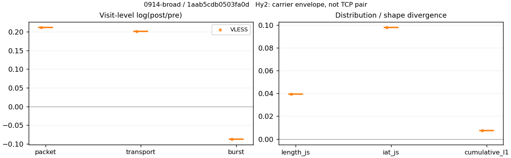
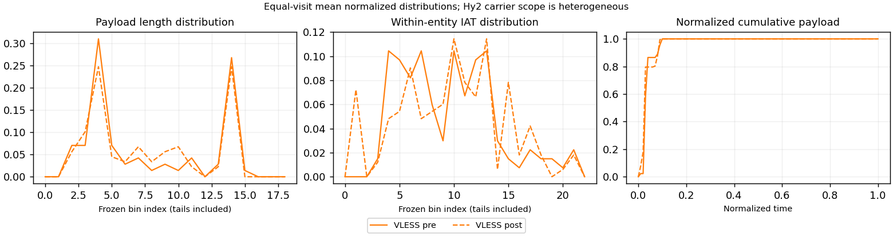

# 0914-broad · 条目 056 · huya.com

目标：https://www.huya.com/

活动标签：huya.com::page_load。选定访问 3 次。

[返回总索引](../../README.md) · [统计口径](../../methods.md)

## 覆盖与资格（每次访问均保留）

| 部署 | 重复 | 主请求路由 | 活动状态 | 代理比较 | DIRECT pre | 请求 proxy/direct/unresolved | 错误 |
| --- | --- | --- | --- | --- | --- | --- | --- |
| Hy2 | 1 | direct | passed | 0 | 1 | 0/352/0 | [] |
| SS | 1 | direct | passed | 0 | 1 | 0/359/0 | [] |
| VLESS | 1 | direct | passed | 1 | 1 | 6/349/0 | [] |

主请求非 proxy 的统计仅解释为已索引的辅助代理连接或 DIRECT 观测，不代表目标业务经代理传输。播放确认与配对资格是两道不同的门。

图中散点为单次访问，短线为重复中位数；Hy2 是共享载体包络，不能与 TCP 配对作等范围因果对比。

形态图先逐访问归一化，再对访问等权平均；实线 pre，虚线 post。分箱序号及边界见 methods，不将分箱索引误解为长度或时间。

## 每次访问的关键观测

### SS

范围：`direct_pre_only`。每格 pre → post；空值为不可观测/不适用。

| 重复 | 包数 | 载荷字节 | burst | TCP FR | IAT中位µs | length JS | IAT JS |
| --- | --- | --- | --- | --- | --- | --- | --- |
| 1 | 9753 → — | 1.9596e+07 → — | 7132 → — | 667 → — | 65.004 → — | — | — |

完整标量统计：中位数 [min,max]；Δ 为重复内逐访问变换的中位数，MAD 未缩放。n 为可用变换数；DIRECT-only 的 nΔ=0 不代表 pre 不可用。

| scope | 特征 | pre | post | Δ | IQRΔ | MADΔ | nΔ |
| --- | --- | --- | --- | --- | --- | --- | --- |
| direct_pre_only | active_span_sum_s_1000ms | 105.94 [105.94, 105.94] | — | — | — | — | 0 |
| direct_pre_only | active_span_sum_s_100ms | 25.922 [25.922, 25.922] | — | — | — | — | 0 |
| direct_pre_only | active_span_sum_s_500ms | 93.941 [93.941, 93.941] | — | — | — | — | 0 |
| direct_pre_only | burst_bytes_iqr | 3278.2 [3278.2, 3278.2] | — | — | — | — | 0 |
| direct_pre_only | burst_bytes_mad | 31 [31, 31] | — | — | — | — | 0 |
| direct_pre_only | burst_bytes_max | 49327 [49327, 49327] | — | — | — | — | 0 |
| direct_pre_only | burst_bytes_mean | 2747.6 [2747.6, 2747.6] | — | — | — | — | 0 |
| direct_pre_only | burst_bytes_median | 31 [31, 31] | — | — | — | — | 0 |
| direct_pre_only | burst_bytes_min | 0 [0, 0] | — | — | — | — | 0 |
| direct_pre_only | burst_bytes_p95 | 14055 [14055, 14055] | — | — | — | — | 0 |
| direct_pre_only | burst_bytes_q25 | 0 [0, 0] | — | — | — | — | 0 |
| direct_pre_only | burst_bytes_q75 | 3278.2 [3278.2, 3278.2] | — | — | — | — | 0 |
| direct_pre_only | burst_bytes_std | 4876.5 [4876.5, 4876.5] | — | — | — | — | 0 |
| direct_pre_only | burst_count | 7132 [7132, 7132] | — | — | — | — | 0 |
| direct_pre_only | burst_duration_ms_iqr | 0.012553 [0.012553, 0.012553] | — | — | — | — | 0 |
| direct_pre_only | burst_duration_ms_mad | 0 [0, 0] | — | — | — | — | 0 |
| direct_pre_only | burst_duration_ms_max | 14999 [14999, 14999] | — | — | — | — | 0 |
| direct_pre_only | burst_duration_ms_mean | 42.08 [42.08, 42.08] | — | — | — | — | 0 |
| direct_pre_only | burst_duration_ms_median | 0 [0, 0] | — | — | — | — | 0 |
| direct_pre_only | burst_duration_ms_min | 0 [0, 0] | — | — | — | — | 0 |
| direct_pre_only | burst_duration_ms_p95 | 25.244 [25.244, 25.244] | — | — | — | — | 0 |
| direct_pre_only | burst_duration_ms_q25 | 0 [0, 0] | — | — | — | — | 0 |
| direct_pre_only | burst_duration_ms_q75 | 0.012553 [0.012553, 0.012553] | — | — | — | — | 0 |
| direct_pre_only | burst_duration_ms_std | 571.11 [571.11, 571.11] | — | — | — | — | 0 |
| direct_pre_only | burst_packets_iqr | 1 [1, 1] | — | — | — | — | 0 |
| direct_pre_only | burst_packets_mad | 0 [0, 0] | — | — | — | — | 0 |
| direct_pre_only | burst_packets_max | 12 [12, 12] | — | — | — | — | 0 |
| direct_pre_only | burst_packets_mean | 1.3675 [1.3675, 1.3675] | — | — | — | — | 0 |
| direct_pre_only | burst_packets_median | 1 [1, 1] | — | — | — | — | 0 |
| direct_pre_only | burst_packets_min | 1 [1, 1] | — | — | — | — | 0 |
| direct_pre_only | burst_packets_p95 | 3 [3, 3] | — | — | — | — | 0 |
| direct_pre_only | burst_packets_q25 | 1 [1, 1] | — | — | — | — | 0 |
| direct_pre_only | burst_packets_q75 | 2 [2, 2] | — | — | — | — | 0 |
| direct_pre_only | burst_packets_std | 0.73585 [0.73585, 0.73585] | — | — | — | — | 0 |
| direct_pre_only | connection_span_concurrency_max | 39 [39, 39] | — | — | — | — | 0 |
| direct_pre_only | direction_entropy | 0.54467 [0.54467, 0.54467] | — | — | — | — | 0 |
| direct_pre_only | down_burst_count | 3532 [3532, 3532] | — | — | — | — | 0 |
| direct_pre_only | down_ip_bytes | 1.9153e+07 [1.9153e+07, 1.9153e+07] | — | — | — | — | 0 |
| direct_pre_only | down_packets | 5611 [5611, 5611] | — | — | — | — | 0 |
| direct_pre_only | down_transport_bytes | 1.8861e+07 [1.8861e+07, 1.8861e+07] | — | — | — | — | 0 |
| direct_pre_only | duration_s | 60.482 [60.482, 60.482] | — | — | — | — | 0 |
| direct_pre_only | entity_count | 68 [68, 68] | — | — | — | — | 0 |
| direct_pre_only | fr_runs | 667 [667, 667] | — | — | — | — | 0 |
| direct_pre_only | fr_runs_per_packet | 0.12318 [0.12318, 0.12318] | — | — | — | — | 0 |
| direct_pre_only | fr_switches | 599 [599, 599] | — | — | — | — | 0 |
| direct_pre_only | fr_switches_per_possible_transition | 0.11203 [0.11203, 0.11203] | — | — | — | — | 0 |
| direct_pre_only | full_retransmission_fraction | 0.0027684 [0.0027684, 0.0027684] | — | — | — | — | 0 |
| direct_pre_only | full_retransmission_packets | 27 [27, 27] | — | — | — | — | 0 |
| direct_pre_only | iat_count | 9685 [9685, 9685] | — | — | — | — | 0 |
| direct_pre_only | iat_median_us | 65.004 [65.004, 65.004] | — | — | — | — | 0 |
| direct_pre_only | iat_us_iqr | 540.51 [540.51, 540.51] | — | — | — | — | 0 |
| direct_pre_only | iat_us_mad | 56.925 [56.925, 56.925] | — | — | — | — | 0 |
| direct_pre_only | iat_us_max | 1.5001e+07 [1.5001e+07, 1.5001e+07] | — | — | — | — | 0 |
| direct_pre_only | iat_us_mean | 2.3325e+05 [2.3325e+05, 2.3325e+05] | — | — | — | — | 0 |
| direct_pre_only | iat_us_median | 65.004 [65.004, 65.004] | — | — | — | — | 0 |
| direct_pre_only | iat_us_min | 0.018 [0.018, 0.018] | — | — | — | — | 0 |
| direct_pre_only | iat_us_p95 | 1.1276e+05 [1.1276e+05, 1.1276e+05] | — | — | — | — | 0 |
| direct_pre_only | iat_us_q25 | 17.834 [17.834, 17.834] | — | — | — | — | 0 |
| direct_pre_only | iat_us_q75 | 558.34 [558.34, 558.34] | — | — | — | — | 0 |
| direct_pre_only | iat_us_std | 1.7281e+06 [1.7281e+06, 1.7281e+06] | — | — | — | — | 0 |
| direct_pre_only | idle_gap_count_1000ms | 183 [183, 183] | — | — | — | — | 0 |
| direct_pre_only | idle_gap_count_100ms | 661 [661, 661] | — | — | — | — | 0 |
| direct_pre_only | idle_gap_count_500ms | 200 [200, 200] | — | — | — | — | 0 |
| direct_pre_only | idle_gap_sum_s_1000ms | 2153 [2153, 2153] | — | — | — | — | 0 |
| direct_pre_only | idle_gap_sum_s_100ms | 2233.1 [2233.1, 2233.1] | — | — | — | — | 0 |
| direct_pre_only | idle_gap_sum_s_500ms | 2165 [2165, 2165] | — | — | — | — | 0 |
| direct_pre_only | ip_bytes | 2.0105e+07 [2.0105e+07, 2.0105e+07] | — | — | — | — | 0 |
| direct_pre_only | length_iqr | 4520 [4520, 4520] | — | — | — | — | 0 |
| direct_pre_only | length_mad | 2130 [2130, 2130] | — | — | — | — | 0 |
| direct_pre_only | length_max | 8948 [8948, 8948] | — | — | — | — | 0 |
| direct_pre_only | length_mean | 3618.9 [3618.9, 3618.9] | — | — | — | — | 0 |
| direct_pre_only | length_median | 2856 [2856, 2856] | — | — | — | — | 0 |
| direct_pre_only | length_min | 5 [5, 5] | — | — | — | — | 0 |
| direct_pre_only | length_p95 | 8920 [8920, 8920] | — | — | — | — | 0 |
| direct_pre_only | length_q25 | 1192 [1192, 1192] | — | — | — | — | 0 |
| direct_pre_only | length_q75 | 5712 [5712, 5712] | — | — | — | — | 0 |
| direct_pre_only | length_std | 2956.3 [2956.3, 2956.3] | — | — | — | — | 0 |
| direct_pre_only | nonempty_entity_count | 68 [68, 68] | — | — | — | — | 0 |
| direct_pre_only | nonempty_packets | 5415 [5415, 5415] | — | — | — | — | 0 |
| direct_pre_only | offload_suspect_fraction | 0.38183 [0.38183, 0.38183] | — | — | — | — | 0 |
| direct_pre_only | packet_count | 9753 [9753, 9753] | — | — | — | — | 0 |
| direct_pre_only | rtt_median_ms | 0.053191 [0.053191, 0.053191] | — | — | — | — | 0 |
| direct_pre_only | rtt_sample_count | 3920 [3920, 3920] | — | — | — | — | 0 |
| direct_pre_only | tcp_ack_count | 9679 [9679, 9679] | — | — | — | — | 0 |
| direct_pre_only | tcp_fin_count | 131 [131, 131] | — | — | — | — | 0 |
| direct_pre_only | tcp_packet_count | 9753 [9753, 9753] | — | — | — | — | 0 |
| direct_pre_only | tcp_rst_count | 7 [7, 7] | — | — | — | — | 0 |
| direct_pre_only | tcp_syn_count | 136 [136, 136] | — | — | — | — | 0 |
| direct_pre_only | tcp_window_raw_median | 65535 [65535, 65535] | — | — | — | — | 0 |
| direct_pre_only | transition_entropy | 0.40209 [0.40209, 0.40209] | — | — | — | — | 0 |
| direct_pre_only | transition_n_mm | 4403 [4403, 4403] | — | — | — | — | 0 |
| direct_pre_only | transition_n_mp | 266 [266, 266] | — | — | — | — | 0 |
| direct_pre_only | transition_n_pm | 333 [333, 333] | — | — | — | — | 0 |
| direct_pre_only | transition_n_pp | 345 [345, 345] | — | — | — | — | 0 |
| direct_pre_only | transition_p_mm | 0.94303 [0.94303, 0.94303] | — | — | — | — | 0 |
| direct_pre_only | transition_p_mp | 0.056972 [0.056972, 0.056972] | — | — | — | — | 0 |
| direct_pre_only | transition_p_pm | 0.49115 [0.49115, 0.49115] | — | — | — | — | 0 |
| direct_pre_only | transition_p_pp | 0.50885 [0.50885, 0.50885] | — | — | — | — | 0 |
| direct_pre_only | transport_bytes | 1.9596e+07 [1.9596e+07, 1.9596e+07] | — | — | — | — | 0 |
| direct_pre_only | up_burst_count | 3600 [3600, 3600] | — | — | — | — | 0 |
| direct_pre_only | up_byte_fraction | 0.037532 [0.037532, 0.037532] | — | — | — | — | 0 |
| direct_pre_only | up_ip_bytes | 9.5165e+05 [9.5165e+05, 9.5165e+05] | — | — | — | — | 0 |
| direct_pre_only | up_packets | 4142 [4142, 4142] | — | — | — | — | 0 |
| direct_pre_only | up_transport_bytes | 7.3548e+05 [7.3548e+05, 7.3548e+05] | — | — | — | — | 0 |
| direct_pre_only | zero_iat_count | 0 [0, 0] | — | — | — | — | 0 |
| direct_pre_only | zero_iat_fraction | 0 [0, 0] | — | — | — | — | 0 |

### VLESS

范围：`exclusive_page`。每格 pre → post；空值为不可观测/不适用。

| 重复 | 包数 | 载荷字节 | burst | TCP FR | IAT中位µs | length JS | IAT JS |
| --- | --- | --- | --- | --- | --- | --- | --- |
| 1 | 136 → 168 | 76999 → 94156 | 96 → 88 | 18 → 22 | 584.2 → 731.65 | 0.039329 | 0.097678 |

范围：`direct_pre_only`。每格 pre → post；空值为不可观测/不适用。

| 重复 | 包数 | 载荷字节 | burst | TCP FR | IAT中位µs | length JS | IAT JS |
| --- | --- | --- | --- | --- | --- | --- | --- |
| 1 | 8463 → — | 1.6555e+07 → — | 6041 → — | 650 → — | 78.506 → — | — | — |

完整标量统计：中位数 [min,max]；Δ 为重复内逐访问变换的中位数，MAD 未缩放。n 为可用变换数；DIRECT-only 的 nΔ=0 不代表 pre 不可用。

| scope | 特征 | pre | post | Δ | IQRΔ | MADΔ | nΔ |
| --- | --- | --- | --- | --- | --- | --- | --- |
| direct_pre_only | active_span_sum_s_1000ms | 96.251 [96.251, 96.251] | — | — | — | — | 0 |
| direct_pre_only | active_span_sum_s_100ms | 25.721 [25.721, 25.721] | — | — | — | — | 0 |
| direct_pre_only | active_span_sum_s_500ms | 76.881 [76.881, 76.881] | — | — | — | — | 0 |
| direct_pre_only | burst_bytes_iqr | 2880 [2880, 2880] | — | — | — | — | 0 |
| direct_pre_only | burst_bytes_mad | 80 [80, 80] | — | — | — | — | 0 |
| direct_pre_only | burst_bytes_max | 58187 [58187, 58187] | — | — | — | — | 0 |
| direct_pre_only | burst_bytes_mean | 2740.5 [2740.5, 2740.5] | — | — | — | — | 0 |
| direct_pre_only | burst_bytes_median | 80 [80, 80] | — | — | — | — | 0 |
| direct_pre_only | burst_bytes_min | 0 [0, 0] | — | — | — | — | 0 |
| direct_pre_only | burst_bytes_p95 | 14080 [14080, 14080] | — | — | — | — | 0 |
| direct_pre_only | burst_bytes_q25 | 0 [0, 0] | — | — | — | — | 0 |
| direct_pre_only | burst_bytes_q75 | 2880 [2880, 2880] | — | — | — | — | 0 |
| direct_pre_only | burst_bytes_std | 4923.4 [4923.4, 4923.4] | — | — | — | — | 0 |
| direct_pre_only | burst_count | 6041 [6041, 6041] | — | — | — | — | 0 |
| direct_pre_only | burst_duration_ms_iqr | 0.017318 [0.017318, 0.017318] | — | — | — | — | 0 |
| direct_pre_only | burst_duration_ms_mad | 0 [0, 0] | — | — | — | — | 0 |
| direct_pre_only | burst_duration_ms_max | 11373 [11373, 11373] | — | — | — | — | 0 |
| direct_pre_only | burst_duration_ms_mean | 31.128 [31.128, 31.128] | — | — | — | — | 0 |
| direct_pre_only | burst_duration_ms_median | 0 [0, 0] | — | — | — | — | 0 |
| direct_pre_only | burst_duration_ms_min | 0 [0, 0] | — | — | — | — | 0 |
| direct_pre_only | burst_duration_ms_p95 | 27.691 [27.691, 27.691] | — | — | — | — | 0 |
| direct_pre_only | burst_duration_ms_q25 | 0 [0, 0] | — | — | — | — | 0 |
| direct_pre_only | burst_duration_ms_q75 | 0.017318 [0.017318, 0.017318] | — | — | — | — | 0 |
| direct_pre_only | burst_duration_ms_std | 348.53 [348.53, 348.53] | — | — | — | — | 0 |
| direct_pre_only | burst_packets_iqr | 1 [1, 1] | — | — | — | — | 0 |
| direct_pre_only | burst_packets_mad | 0 [0, 0] | — | — | — | — | 0 |
| direct_pre_only | burst_packets_max | 9 [9, 9] | — | — | — | — | 0 |
| direct_pre_only | burst_packets_mean | 1.4009 [1.4009, 1.4009] | — | — | — | — | 0 |
| direct_pre_only | burst_packets_median | 1 [1, 1] | — | — | — | — | 0 |
| direct_pre_only | burst_packets_min | 1 [1, 1] | — | — | — | — | 0 |
| direct_pre_only | burst_packets_p95 | 3 [3, 3] | — | — | — | — | 0 |
| direct_pre_only | burst_packets_q25 | 1 [1, 1] | — | — | — | — | 0 |
| direct_pre_only | burst_packets_q75 | 2 [2, 2] | — | — | — | — | 0 |
| direct_pre_only | burst_packets_std | 0.78924 [0.78924, 0.78924] | — | — | — | — | 0 |
| direct_pre_only | connection_span_concurrency_max | 44 [44, 44] | — | — | — | — | 0 |
| direct_pre_only | direction_entropy | 0.59475 [0.59475, 0.59475] | — | — | — | — | 0 |
| direct_pre_only | down_burst_count | 2985 [2985, 2985] | — | — | — | — | 0 |
| direct_pre_only | down_ip_bytes | 1.6089e+07 [1.6089e+07, 1.6089e+07] | — | — | — | — | 0 |
| direct_pre_only | down_packets | 4850 [4850, 4850] | — | — | — | — | 0 |
| direct_pre_only | down_transport_bytes | 1.5836e+07 [1.5836e+07, 1.5836e+07] | — | — | — | — | 0 |
| direct_pre_only | duration_s | 45.185 [45.185, 45.185] | — | — | — | — | 0 |
| direct_pre_only | entity_count | 71 [71, 71] | — | — | — | — | 0 |
| direct_pre_only | fr_runs | 650 [650, 650] | — | — | — | — | 0 |
| direct_pre_only | fr_runs_per_packet | 0.1359 [0.1359, 0.1359] | — | — | — | — | 0 |
| direct_pre_only | fr_switches | 579 [579, 579] | — | — | — | — | 0 |
| direct_pre_only | fr_switches_per_possible_transition | 0.12288 [0.12288, 0.12288] | — | — | — | — | 0 |
| direct_pre_only | full_retransmission_fraction | 0.0047265 [0.0047265, 0.0047265] | — | — | — | — | 0 |
| direct_pre_only | full_retransmission_packets | 40 [40, 40] | — | — | — | — | 0 |
| direct_pre_only | iat_count | 8392 [8392, 8392] | — | — | — | — | 0 |
| direct_pre_only | iat_median_us | 78.506 [78.506, 78.506] | — | — | — | — | 0 |
| direct_pre_only | iat_us_iqr | 660.87 [660.87, 660.87] | — | — | — | — | 0 |
| direct_pre_only | iat_us_mad | 69.439 [69.439, 69.439] | — | — | — | — | 0 |
| direct_pre_only | iat_us_max | 1.5001e+07 [1.5001e+07, 1.5001e+07] | — | — | — | — | 0 |
| direct_pre_only | iat_us_mean | 46047 [46047, 46047] | — | — | — | — | 0 |
| direct_pre_only | iat_us_median | 78.506 [78.506, 78.506] | — | — | — | — | 0 |
| direct_pre_only | iat_us_min | 0.033 [0.033, 0.033] | — | — | — | — | 0 |
| direct_pre_only | iat_us_p95 | 98800 [98800, 98800] | — | — | — | — | 0 |
| direct_pre_only | iat_us_q25 | 20.684 [20.684, 20.684] | — | — | — | — | 0 |
| direct_pre_only | iat_us_q75 | 681.56 [681.56, 681.56] | — | — | — | — | 0 |
| direct_pre_only | iat_us_std | 5.957e+05 [5.957e+05, 5.957e+05] | — | — | — | — | 0 |
| direct_pre_only | idle_gap_count_1000ms | 53 [53, 53] | — | — | — | — | 0 |
| direct_pre_only | idle_gap_count_100ms | 406 [406, 406] | — | — | — | — | 0 |
| direct_pre_only | idle_gap_count_500ms | 80 [80, 80] | — | — | — | — | 0 |
| direct_pre_only | idle_gap_sum_s_1000ms | 290.18 [290.18, 290.18] | — | — | — | — | 0 |
| direct_pre_only | idle_gap_sum_s_100ms | 360.71 [360.71, 360.71] | — | — | — | — | 0 |
| direct_pre_only | idle_gap_sum_s_500ms | 309.55 [309.55, 309.55] | — | — | — | — | 0 |
| direct_pre_only | ip_bytes | 1.6997e+07 [1.6997e+07, 1.6997e+07] | — | — | — | — | 0 |
| direct_pre_only | length_iqr | 4883 [4883, 4883] | — | — | — | — | 0 |
| direct_pre_only | length_mad | 2247 [2247, 2247] | — | — | — | — | 0 |
| direct_pre_only | length_max | 8948 [8948, 8948] | — | — | — | — | 0 |
| direct_pre_only | length_mean | 3461.3 [3461.3, 3461.3] | — | — | — | — | 0 |
| direct_pre_only | length_median | 2856 [2856, 2856] | — | — | — | — | 0 |
| direct_pre_only | length_min | 2 [2, 2] | — | — | — | — | 0 |
| direct_pre_only | length_p95 | 8920 [8920, 8920] | — | — | — | — | 0 |
| direct_pre_only | length_q25 | 829 [829, 829] | — | — | — | — | 0 |
| direct_pre_only | length_q75 | 5712 [5712, 5712] | — | — | — | — | 0 |
| direct_pre_only | length_std | 3014.7 [3014.7, 3014.7] | — | — | — | — | 0 |
| direct_pre_only | nonempty_entity_count | 71 [71, 71] | — | — | — | — | 0 |
| direct_pre_only | nonempty_packets | 4783 [4783, 4783] | — | — | — | — | 0 |
| direct_pre_only | offload_suspect_fraction | 0.36358 [0.36358, 0.36358] | — | — | — | — | 0 |
| direct_pre_only | packet_count | 8463 [8463, 8463] | — | — | — | — | 0 |
| direct_pre_only | rtt_median_ms | 0.061651 [0.061651, 0.061651] | — | — | — | — | 0 |
| direct_pre_only | rtt_sample_count | 3485 [3485, 3485] | — | — | — | — | 0 |
| direct_pre_only | tcp_ack_count | 8383 [8383, 8383] | — | — | — | — | 0 |
| direct_pre_only | tcp_fin_count | 139 [139, 139] | — | — | — | — | 0 |
| direct_pre_only | tcp_packet_count | 8463 [8463, 8463] | — | — | — | — | 0 |
| direct_pre_only | tcp_rst_count | 9 [9, 9] | — | — | — | — | 0 |
| direct_pre_only | tcp_syn_count | 142 [142, 142] | — | — | — | — | 0 |
| direct_pre_only | tcp_window_raw_median | 65535 [65535, 65535] | — | — | — | — | 0 |
| direct_pre_only | transition_entropy | 0.43598 [0.43598, 0.43598] | — | — | — | — | 0 |
| direct_pre_only | transition_n_mm | 3769 [3769, 3769] | — | — | — | — | 0 |
| direct_pre_only | transition_n_mp | 254 [254, 254] | — | — | — | — | 0 |
| direct_pre_only | transition_n_pm | 325 [325, 325] | — | — | — | — | 0 |
| direct_pre_only | transition_n_pp | 364 [364, 364] | — | — | — | — | 0 |
| direct_pre_only | transition_p_mm | 0.93686 [0.93686, 0.93686] | — | — | — | — | 0 |
| direct_pre_only | transition_p_mp | 0.063137 [0.063137, 0.063137] | — | — | — | — | 0 |
| direct_pre_only | transition_p_pm | 0.4717 [0.4717, 0.4717] | — | — | — | — | 0 |
| direct_pre_only | transition_p_pp | 0.5283 [0.5283, 0.5283] | — | — | — | — | 0 |
| direct_pre_only | transport_bytes | 1.6555e+07 [1.6555e+07, 1.6555e+07] | — | — | — | — | 0 |
| direct_pre_only | up_burst_count | 3056 [3056, 3056] | — | — | — | — | 0 |
| direct_pre_only | up_byte_fraction | 0.043468 [0.043468, 0.043468] | — | — | — | — | 0 |
| direct_pre_only | up_ip_bytes | 9.0843e+05 [9.0843e+05, 9.0843e+05] | — | — | — | — | 0 |
| direct_pre_only | up_packets | 3613 [3613, 3613] | — | — | — | — | 0 |
| direct_pre_only | up_transport_bytes | 7.1964e+05 [7.1964e+05, 7.1964e+05] | — | — | — | — | 0 |
| direct_pre_only | zero_iat_count | 0 [0, 0] | — | — | — | — | 0 |
| direct_pre_only | zero_iat_fraction | 0 [0, 0] | — | — | — | — | 0 |
| exclusive_page | active_span_sum_s_1000ms | 2.9039 [2.9039, 2.9039] | 2.7762 [2.7762, 2.7762] | -0.044981 | — | — | 1 |
| exclusive_page | active_span_sum_s_100ms | 0.34111 [0.34111, 0.34111] | 0.98989 [0.98989, 0.98989] | 1.0654 | — | — | 1 |
| exclusive_page | active_span_sum_s_500ms | 1.3911 [1.3911, 1.3911] | 2.7762 [2.7762, 2.7762] | 0.69097 | — | — | 1 |
| exclusive_page | burst_bytes_iqr | 1234 [1234, 1234] | 2391.5 [2391.5, 2391.5] | 0.66166 | — | — | 1 |
| exclusive_page | burst_bytes_mad | 27.5 [27.5, 27.5] | 59 [59, 59] | 0.76335 | — | — | 1 |
| exclusive_page | burst_bytes_max | 8616 [8616, 8616] | 5792 [5792, 5792] | -0.39714 | — | — | 1 |
| exclusive_page | burst_bytes_mean | 802.07 [802.07, 802.07] | 1070 [1070, 1070] | 0.28817 | — | — | 1 |
| exclusive_page | burst_bytes_median | 27.5 [27.5, 27.5] | 59 [59, 59] | 0.76335 | — | — | 1 |
| exclusive_page | burst_bytes_min | 0 [0, 0] | 0 [0, 0] | — | — | — | 0 |
| exclusive_page | burst_bytes_p95 | 2896 [2896, 2896] | 2896 [2896, 2896] | 0 | — | — | 1 |
| exclusive_page | burst_bytes_q25 | 0 [0, 0] | 0 [0, 0] | — | — | — | 0 |
| exclusive_page | burst_bytes_q75 | 1234 [1234, 1234] | 2391.5 [2391.5, 2391.5] | 0.66166 | — | — | 1 |
| exclusive_page | burst_bytes_std | 1390.4 [1390.4, 1390.4] | 1343.9 [1343.9, 1343.9] | -0.034049 | — | — | 1 |
| exclusive_page | burst_count | 96 [96, 96] | 88 [88, 88] | -0.087011 | — | — | 1 |
| exclusive_page | burst_duration_ms_iqr | 4.2673 [4.2673, 4.2673] | 8.4864 [8.4864, 8.4864] | 0.68748 | — | — | 1 |
| exclusive_page | burst_duration_ms_mad | 0 [0, 0] | 0.000542 [0.000542, 0.000542] | — | — | — | 0 |
| exclusive_page | burst_duration_ms_max | 15000 [15000, 15000] | 1748 [1748, 1748] | -2.1496 | — | — | 1 |
| exclusive_page | burst_duration_ms_mean | 303.03 [303.03, 303.03] | 41.052 [41.052, 41.052] | -1.999 | — | — | 1 |
| exclusive_page | burst_duration_ms_median | 0 [0, 0] | 0.000542 [0.000542, 0.000542] | — | — | — | 0 |
| exclusive_page | burst_duration_ms_min | 0 [0, 0] | 0 [0, 0] | — | — | — | 0 |
| exclusive_page | burst_duration_ms_p95 | 340.42 [340.42, 340.42] | 176.2 [176.2, 176.2] | -0.65855 | — | — | 1 |
| exclusive_page | burst_duration_ms_q25 | 0 [0, 0] | 0 [0, 0] | — | — | — | 0 |
| exclusive_page | burst_duration_ms_q75 | 4.2673 [4.2673, 4.2673] | 8.4864 [8.4864, 8.4864] | 0.68748 | — | — | 1 |
| exclusive_page | burst_duration_ms_std | 1808.4 [1808.4, 1808.4] | 192.94 [192.94, 192.94] | -2.2378 | — | — | 1 |
| exclusive_page | burst_packets_iqr | 1 [1, 1] | 1 [1, 1] | 0 | — | — | 1 |
| exclusive_page | burst_packets_mad | 0 [0, 0] | 1 [1, 1] | — | — | — | 0 |
| exclusive_page | burst_packets_max | 4 [4, 4] | 6 [6, 6] | 0.40547 | — | — | 1 |
| exclusive_page | burst_packets_mean | 1.4167 [1.4167, 1.4167] | 1.9091 [1.9091, 1.9091] | 0.29832 | — | — | 1 |
| exclusive_page | burst_packets_median | 1 [1, 1] | 2 [2, 2] | 0.69315 | — | — | 1 |
| exclusive_page | burst_packets_min | 1 [1, 1] | 1 [1, 1] | 0 | — | — | 1 |
| exclusive_page | burst_packets_p95 | 2.25 [2.25, 2.25] | 5 [5, 5] | 0.79851 | — | — | 1 |
| exclusive_page | burst_packets_q25 | 1 [1, 1] | 1 [1, 1] | 0 | — | — | 1 |
| exclusive_page | burst_packets_q75 | 2 [2, 2] | 2 [2, 2] | 0 | — | — | 1 |
| exclusive_page | burst_packets_std | 0.62361 [0.62361, 0.62361] | 1.2214 [1.2214, 1.2214] | 0.6722 | — | — | 1 |
| exclusive_page | connection_span_concurrency_max | 2 [2, 2] | 2 [2, 2] | 0 | — | — | 1 |
| exclusive_page | cumulative_l1 | — | — | 0.0074385 | — | — | 1 |
| exclusive_page | cumulative_max | — | — | 0.21311 | — | — | 1 |
| exclusive_page | direction_entropy | 0.7941 [0.7941, 0.7941] | 0.76869 [0.76869, 0.76869] | -0.025411 | — | — | 1 |
| exclusive_page | down_burst_count | 47 [47, 47] | 43 [43, 43] | -0.088947 | — | — | 1 |
| exclusive_page | down_ip_bytes | 75154 [75154, 75154] | 88996 [88996, 88996] | 0.16905 | — | — | 1 |
| exclusive_page | down_packets | 79 [79, 79] | 98 [98, 98] | 0.21552 | — | — | 1 |
| exclusive_page | down_transport_bytes | 71030 [71030, 71030] | 83884 [83884, 83884] | 0.16633 | — | — | 1 |
| exclusive_page | duration_s | 44.071 [44.071, 44.071] | 43.88 [43.88, 43.88] | -0.0043385 | — | — | 1 |
| exclusive_page | entity_count | 2 [2, 2] | 2 [2, 2] | 0 | — | — | 1 |
| exclusive_page | fr_runs | 18 [18, 18] | 22 [22, 22] | 0.20067 | — | — | 1 |
| exclusive_page | fr_runs_per_packet | 0.25352 [0.25352, 0.25352] | 0.24719 [0.24719, 0.24719] | -0.0063301 | — | — | 1 |
| exclusive_page | fr_switches | 16 [16, 16] | 20 [20, 20] | 0.22314 | — | — | 1 |
| exclusive_page | fr_switches_per_possible_transition | 0.23188 [0.23188, 0.23188] | 0.22989 [0.22989, 0.22989] | -0.001999 | — | — | 1 |
| exclusive_page | full_retransmission_fraction | 0.0073529 [0.0073529, 0.0073529] | 0 [0, 0] | -0.0073529 | — | — | 1 |
| exclusive_page | full_retransmission_packets | 1 [1, 1] | 0 [0, 0] | — | — | — | 0 |
| exclusive_page | iat_count | 134 [134, 134] | 166 [166, 166] | 0.21415 | — | — | 1 |
| exclusive_page | iat_js | — | — | 0.097678 | — | — | 1 |
| exclusive_page | iat_ks | — | — | 0.098094 | — | — | 1 |
| exclusive_page | iat_median_us | 584.2 [584.2, 584.2] | 731.65 [731.65, 731.65] | 0.22506 | — | — | 1 |
| exclusive_page | iat_us_iqr | 3864.6 [3864.6, 3864.6] | 8798.1 [8798.1, 8798.1] | 0.82269 | — | — | 1 |
| exclusive_page | iat_us_mad | 574.98 [574.98, 574.98] | 724.74 [724.74, 724.74] | 0.23148 | — | — | 1 |
| exclusive_page | iat_us_max | 1.5001e+07 [1.5001e+07, 1.5001e+07] | 1.5251e+07 [1.5251e+07, 1.5251e+07] | 0.01655 | — | — | 1 |
| exclusive_page | iat_us_mean | 3.3041e+05 [3.3041e+05, 3.3041e+05] | 2.6541e+05 [2.6541e+05, 2.6541e+05] | -0.21907 | — | — | 1 |
| exclusive_page | iat_us_median | 584.2 [584.2, 584.2] | 731.65 [731.65, 731.65] | 0.22506 | — | — | 1 |
| exclusive_page | iat_us_min | 3.485 [3.485, 3.485] | 0.039 [0.039, 0.039] | -4.4927 | — | — | 1 |
| exclusive_page | iat_us_p95 | 2.2597e+05 [2.2597e+05, 2.2597e+05] | 1.5413e+05 [1.5413e+05, 1.5413e+05] | -0.38258 | — | — | 1 |
| exclusive_page | iat_us_q25 | 39.309 [39.309, 39.309] | 36.897 [36.897, 36.897] | -0.063317 | — | — | 1 |
| exclusive_page | iat_us_q75 | 3903.9 [3903.9, 3903.9] | 8835 [8835, 8835] | 0.81675 | — | — | 1 |
| exclusive_page | iat_us_std | 1.9947e+06 [1.9947e+06, 1.9947e+06] | 1.7969e+06 [1.7969e+06, 1.7969e+06] | -0.10442 | — | — | 1 |
| exclusive_page | iat_wasserstein_log1p_us | — | — | 0.639 | — | — | 1 |
| exclusive_page | idle_gap_count_1000ms | 4 [4, 4] | 4 [4, 4] | 0 | — | — | 1 |
| exclusive_page | idle_gap_count_100ms | 11 [11, 11] | 14 [14, 14] | 0.24116 | — | — | 1 |
| exclusive_page | idle_gap_count_500ms | 6 [6, 6] | 4 [4, 4] | -0.40547 | — | — | 1 |
| exclusive_page | idle_gap_sum_s_1000ms | 41.371 [41.371, 41.371] | 41.282 [41.282, 41.282] | -0.002168 | — | — | 1 |
| exclusive_page | idle_gap_sum_s_100ms | 43.934 [43.934, 43.934] | 43.068 [43.068, 43.068] | -0.019911 | — | — | 1 |
| exclusive_page | idle_gap_sum_s_500ms | 42.884 [42.884, 42.884] | 41.282 [41.282, 41.282] | -0.038082 | — | — | 1 |
| exclusive_page | ip_bytes | 84067 [84067, 84067] | 1.0298e+05 [1.0298e+05, 1.0298e+05] | 0.20296 | — | — | 1 |
| exclusive_page | length_iqr | 2435 [2435, 2435] | 1936 [1936, 1936] | -0.22932 | — | — | 1 |
| exclusive_page | length_js | — | — | 0.039329 | — | — | 1 |
| exclusive_page | length_ks | — | — | 0.094319 | — | — | 1 |
| exclusive_page | length_mad | 224 [224, 224] | 577 [577, 577] | 0.9462 | — | — | 1 |
| exclusive_page | length_max | 5792 [5792, 5792] | 2824 [2824, 2824] | -0.71832 | — | — | 1 |
| exclusive_page | length_mean | 1084.5 [1084.5, 1084.5] | 1057.9 [1057.9, 1057.9] | -0.024796 | — | — | 1 |
| exclusive_page | length_median | 255 [255, 255] | 631 [631, 631] | 0.90604 | — | — | 1 |
| exclusive_page | length_min | 24 [24, 24] | 24 [24, 24] | 0 | — | — | 1 |
| exclusive_page | length_p95 | 2824 [2824, 2824] | 2824 [2824, 2824] | 0 | — | — | 1 |
| exclusive_page | length_q25 | 72 [72, 72] | 72 [72, 72] | 0 | — | — | 1 |
| exclusive_page | length_q75 | 2507 [2507, 2507] | 2008 [2008, 2008] | -0.22195 | — | — | 1 |
| exclusive_page | length_std | 1282.3 [1282.3, 1282.3] | 1121.2 [1121.2, 1121.2] | -0.1342 | — | — | 1 |
| exclusive_page | length_wasserstein_bytes | — | — | 132.78 | — | — | 1 |
| exclusive_page | nonempty_entity_count | 2 [2, 2] | 2 [2, 2] | 0 | — | — | 1 |
| exclusive_page | nonempty_packets | 71 [71, 71] | 89 [89, 89] | 0.22596 | — | — | 1 |
| exclusive_page | offload_suspect_fraction | 0.16176 [0.16176, 0.16176] | 0.14286 [0.14286, 0.14286] | -0.018908 | — | — | 1 |
| exclusive_page | packet_count | 136 [136, 136] | 168 [168, 168] | 0.21131 | — | — | 1 |
| exclusive_page | rtt_median_ms | 0.15573 [0.15573, 0.15573] | 9.5837 [9.5837, 9.5837] | 4.1197 | — | — | 1 |
| exclusive_page | rtt_sample_count | 54 [54, 54] | 66 [66, 66] | 0.20067 | — | — | 1 |
| exclusive_page | tcp_ack_count | 130 [130, 130] | 166 [166, 166] | 0.24445 | — | — | 1 |
| exclusive_page | tcp_fin_count | 4 [4, 4] | 4 [4, 4] | 0 | — | — | 1 |
| exclusive_page | tcp_packet_count | 136 [136, 136] | 168 [168, 168] | 0.21131 | — | — | 1 |
| exclusive_page | tcp_rst_count | 4 [4, 4] | 0 [0, 0] | — | — | — | 0 |
| exclusive_page | tcp_syn_count | 4 [4, 4] | 4 [4, 4] | 0 | — | — | 1 |
| exclusive_page | tcp_window_raw_median | 65535 [65535, 65535] | 141 [141, 141] | -6.1416 | — | — | 1 |
| exclusive_page | transition_entropy | 0.6753 [0.6753, 0.6753] | 0.66657 [0.66657, 0.66657] | -0.0087316 | — | — | 1 |
| exclusive_page | transition_n_mm | 45 [45, 45] | 58 [58, 58] | 0.25378 | — | — | 1 |
| exclusive_page | transition_n_mp | 7 [7, 7] | 9 [9, 9] | 0.25131 | — | — | 1 |
| exclusive_page | transition_n_pm | 9 [9, 9] | 11 [11, 11] | 0.20067 | — | — | 1 |
| exclusive_page | transition_n_pp | 8 [8, 8] | 9 [9, 9] | 0.11778 | — | — | 1 |
| exclusive_page | transition_p_mm | 0.86538 [0.86538, 0.86538] | 0.86567 [0.86567, 0.86567] | 0.00028703 | — | — | 1 |
| exclusive_page | transition_p_mp | 0.13462 [0.13462, 0.13462] | 0.13433 [0.13433, 0.13433] | -0.00028703 | — | — | 1 |
| exclusive_page | transition_p_pm | 0.52941 [0.52941, 0.52941] | 0.55 [0.55, 0.55] | 0.020588 | — | — | 1 |
| exclusive_page | transition_p_pp | 0.47059 [0.47059, 0.47059] | 0.45 [0.45, 0.45] | -0.020588 | — | — | 1 |
| exclusive_page | transport_bytes | 76999 [76999, 76999] | 94156 [94156, 94156] | 0.20116 | — | — | 1 |
| exclusive_page | up_burst_count | 49 [49, 49] | 45 [45, 45] | -0.085158 | — | — | 1 |
| exclusive_page | up_byte_fraction | 0.07752 [0.07752, 0.07752] | 0.1091 [0.1091, 0.1091] | 0.031575 | — | — | 1 |
| exclusive_page | up_ip_bytes | 8913 [8913, 8913] | 13988 [13988, 13988] | 0.45069 | — | — | 1 |
| exclusive_page | up_packets | 57 [57, 57] | 70 [70, 70] | 0.20544 | — | — | 1 |
| exclusive_page | up_transport_bytes | 5969 [5969, 5969] | 10272 [10272, 10272] | 0.54284 | — | — | 1 |
| exclusive_page | zero_iat_count | 0 [0, 0] | 0 [0, 0] | — | — | — | 0 |
| exclusive_page | zero_iat_fraction | 0 [0, 0] | 0 [0, 0] | 0 | — | — | 1 |

### Hy2

范围：`direct_pre_only`。每格 pre → post；空值为不可观测/不适用。

| 重复 | 包数 | 载荷字节 | burst | TCP FR | IAT中位µs | length JS | IAT JS |
| --- | --- | --- | --- | --- | --- | --- | --- |
| 1 | 11166 → — | 1.9236e+07 → — | 8414 → — | 625 → — | 71.496 → — | — | — |

完整标量统计：中位数 [min,max]；Δ 为重复内逐访问变换的中位数，MAD 未缩放。n 为可用变换数；DIRECT-only 的 nΔ=0 不代表 pre 不可用。

| scope | 特征 | pre | post | Δ | IQRΔ | MADΔ | nΔ |
| --- | --- | --- | --- | --- | --- | --- | --- |
| direct_pre_only | active_span_sum_s_1000ms | 85.12 [85.12, 85.12] | — | — | — | — | 0 |
| direct_pre_only | active_span_sum_s_100ms | 41.545 [41.545, 41.545] | — | — | — | — | 0 |
| direct_pre_only | active_span_sum_s_500ms | 73.588 [73.588, 73.588] | — | — | — | — | 0 |
| direct_pre_only | burst_bytes_iqr | 2880 [2880, 2880] | — | — | — | — | 0 |
| direct_pre_only | burst_bytes_mad | 44 [44, 44] | — | — | — | — | 0 |
| direct_pre_only | burst_bytes_max | 31050 [31050, 31050] | — | — | — | — | 0 |
| direct_pre_only | burst_bytes_mean | 2286.1 [2286.1, 2286.1] | — | — | — | — | 0 |
| direct_pre_only | burst_bytes_median | 44 [44, 44] | — | — | — | — | 0 |
| direct_pre_only | burst_bytes_min | 0 [0, 0] | — | — | — | — | 0 |
| direct_pre_only | burst_bytes_p95 | 11520 [11520, 11520] | — | — | — | — | 0 |
| direct_pre_only | burst_bytes_q25 | 0 [0, 0] | — | — | — | — | 0 |
| direct_pre_only | burst_bytes_q75 | 2880 [2880, 2880] | — | — | — | — | 0 |
| direct_pre_only | burst_bytes_std | 4332.9 [4332.9, 4332.9] | — | — | — | — | 0 |
| direct_pre_only | burst_count | 8414 [8414, 8414] | — | — | — | — | 0 |
| direct_pre_only | burst_duration_ms_iqr | 0 [0, 0] | — | — | — | — | 0 |
| direct_pre_only | burst_duration_ms_mad | 0 [0, 0] | — | — | — | — | 0 |
| direct_pre_only | burst_duration_ms_max | 15001 [15001, 15001] | — | — | — | — | 0 |
| direct_pre_only | burst_duration_ms_mean | 35.856 [35.856, 35.856] | — | — | — | — | 0 |
| direct_pre_only | burst_duration_ms_median | 0 [0, 0] | — | — | — | — | 0 |
| direct_pre_only | burst_duration_ms_min | 0 [0, 0] | — | — | — | — | 0 |
| direct_pre_only | burst_duration_ms_p95 | 11.319 [11.319, 11.319] | — | — | — | — | 0 |
| direct_pre_only | burst_duration_ms_q25 | 0 [0, 0] | — | — | — | — | 0 |
| direct_pre_only | burst_duration_ms_q75 | 0 [0, 0] | — | — | — | — | 0 |
| direct_pre_only | burst_duration_ms_std | 529.55 [529.55, 529.55] | — | — | — | — | 0 |
| direct_pre_only | burst_packets_iqr | 0 [0, 0] | — | — | — | — | 0 |
| direct_pre_only | burst_packets_mad | 0 [0, 0] | — | — | — | — | 0 |
| direct_pre_only | burst_packets_max | 8 [8, 8] | — | — | — | — | 0 |
| direct_pre_only | burst_packets_mean | 1.3271 [1.3271, 1.3271] | — | — | — | — | 0 |
| direct_pre_only | burst_packets_median | 1 [1, 1] | — | — | — | — | 0 |
| direct_pre_only | burst_packets_min | 1 [1, 1] | — | — | — | — | 0 |
| direct_pre_only | burst_packets_p95 | 3 [3, 3] | — | — | — | — | 0 |
| direct_pre_only | burst_packets_q25 | 1 [1, 1] | — | — | — | — | 0 |
| direct_pre_only | burst_packets_q75 | 1 [1, 1] | — | — | — | — | 0 |
| direct_pre_only | burst_packets_std | 0.74131 [0.74131, 0.74131] | — | — | — | — | 0 |
| direct_pre_only | connection_span_concurrency_max | 50 [50, 50] | — | — | — | — | 0 |
| direct_pre_only | direction_entropy | 0.49585 [0.49585, 0.49585] | — | — | — | — | 0 |
| direct_pre_only | down_burst_count | 4170 [4170, 4170] | — | — | — | — | 0 |
| direct_pre_only | down_ip_bytes | 1.8858e+07 [1.8858e+07, 1.8858e+07] | — | — | — | — | 0 |
| direct_pre_only | down_packets | 6360 [6360, 6360] | — | — | — | — | 0 |
| direct_pre_only | down_transport_bytes | 1.8527e+07 [1.8527e+07, 1.8527e+07] | — | — | — | — | 0 |
| direct_pre_only | duration_s | 42.927 [42.927, 42.927] | — | — | — | — | 0 |
| direct_pre_only | entity_count | 74 [74, 74] | — | — | — | — | 0 |
| direct_pre_only | fr_runs | 625 [625, 625] | — | — | — | — | 0 |
| direct_pre_only | fr_runs_per_packet | 0.10002 [0.10002, 0.10002] | — | — | — | — | 0 |
| direct_pre_only | fr_switches | 551 [551, 551] | — | — | — | — | 0 |
| direct_pre_only | fr_switches_per_possible_transition | 0.089231 [0.089231, 0.089231] | — | — | — | — | 0 |
| direct_pre_only | full_retransmission_fraction | 0.0045674 [0.0045674, 0.0045674] | — | — | — | — | 0 |
| direct_pre_only | full_retransmission_packets | 51 [51, 51] | — | — | — | — | 0 |
| direct_pre_only | iat_count | 11092 [11092, 11092] | — | — | — | — | 0 |
| direct_pre_only | iat_median_us | 71.496 [71.496, 71.496] | — | — | — | — | 0 |
| direct_pre_only | iat_us_iqr | 624.91 [624.91, 624.91] | — | — | — | — | 0 |
| direct_pre_only | iat_us_mad | 62.191 [62.191, 62.191] | — | — | — | — | 0 |
| direct_pre_only | iat_us_max | 1.5001e+07 [1.5001e+07, 1.5001e+07] | — | — | — | — | 0 |
| direct_pre_only | iat_us_mean | 81166 [81166, 81166] | — | — | — | — | 0 |
| direct_pre_only | iat_us_median | 71.496 [71.496, 71.496] | — | — | — | — | 0 |
| direct_pre_only | iat_us_min | 0.008 [0.008, 0.008] | — | — | — | — | 0 |
| direct_pre_only | iat_us_p95 | 41377 [41377, 41377] | — | — | — | — | 0 |
| direct_pre_only | iat_us_q25 | 21.855 [21.855, 21.855] | — | — | — | — | 0 |
| direct_pre_only | iat_us_q75 | 646.76 [646.76, 646.76] | — | — | — | — | 0 |
| direct_pre_only | iat_us_std | 9.731e+05 [9.731e+05, 9.731e+05] | — | — | — | — | 0 |
| direct_pre_only | idle_gap_count_1000ms | 89 [89, 89] | — | — | — | — | 0 |
| direct_pre_only | idle_gap_count_100ms | 306 [306, 306] | — | — | — | — | 0 |
| direct_pre_only | idle_gap_count_500ms | 105 [105, 105] | — | — | — | — | 0 |
| direct_pre_only | idle_gap_sum_s_1000ms | 815.17 [815.17, 815.17] | — | — | — | — | 0 |
| direct_pre_only | idle_gap_sum_s_100ms | 858.75 [858.75, 858.75] | — | — | — | — | 0 |
| direct_pre_only | idle_gap_sum_s_500ms | 826.7 [826.7, 826.7] | — | — | — | — | 0 |
| direct_pre_only | ip_bytes | 1.9818e+07 [1.9818e+07, 1.9818e+07] | — | — | — | — | 0 |
| direct_pre_only | length_iqr | 3675 [3675, 3675] | — | — | — | — | 0 |
| direct_pre_only | length_mad | 2049 [2049, 2049] | — | — | — | — | 0 |
| direct_pre_only | length_max | 8948 [8948, 8948] | — | — | — | — | 0 |
| direct_pre_only | length_mean | 3078.2 [3078.2, 3078.2] | — | — | — | — | 0 |
| direct_pre_only | length_median | 2856 [2856, 2856] | — | — | — | — | 0 |
| direct_pre_only | length_min | 15 [15, 15] | — | — | — | — | 0 |
| direct_pre_only | length_p95 | 8920 [8920, 8920] | — | — | — | — | 0 |
| direct_pre_only | length_q25 | 738 [738, 738] | — | — | — | — | 0 |
| direct_pre_only | length_q75 | 4413 [4413, 4413] | — | — | — | — | 0 |
| direct_pre_only | length_std | 2744.5 [2744.5, 2744.5] | — | — | — | — | 0 |
| direct_pre_only | nonempty_entity_count | 74 [74, 74] | — | — | — | — | 0 |
| direct_pre_only | nonempty_packets | 6249 [6249, 6249] | — | — | — | — | 0 |
| direct_pre_only | offload_suspect_fraction | 0.34901 [0.34901, 0.34901] | — | — | — | — | 0 |
| direct_pre_only | packet_count | 11166 [11166, 11166] | — | — | — | — | 0 |
| direct_pre_only | rtt_median_ms | 0.059095 [0.059095, 0.059095] | — | — | — | — | 0 |
| direct_pre_only | rtt_sample_count | 4675 [4675, 4675] | — | — | — | — | 0 |
| direct_pre_only | tcp_ack_count | 11083 [11083, 11083] | — | — | — | — | 0 |
| direct_pre_only | tcp_fin_count | 143 [143, 143] | — | — | — | — | 0 |
| direct_pre_only | tcp_packet_count | 11166 [11166, 11166] | — | — | — | — | 0 |
| direct_pre_only | tcp_rst_count | 10 [10, 10] | — | — | — | — | 0 |
| direct_pre_only | tcp_syn_count | 148 [148, 148] | — | — | — | — | 0 |
| direct_pre_only | tcp_window_raw_median | 65535 [65535, 65535] | — | — | — | — | 0 |
| direct_pre_only | transition_entropy | 0.3394 [0.3394, 0.3394] | — | — | — | — | 0 |
| direct_pre_only | transition_n_mm | 5259 [5259, 5259] | — | — | — | — | 0 |
| direct_pre_only | transition_n_mp | 240 [240, 240] | — | — | — | — | 0 |
| direct_pre_only | transition_n_pm | 311 [311, 311] | — | — | — | — | 0 |
| direct_pre_only | transition_n_pp | 365 [365, 365] | — | — | — | — | 0 |
| direct_pre_only | transition_p_mm | 0.95636 [0.95636, 0.95636] | — | — | — | — | 0 |
| direct_pre_only | transition_p_mp | 0.043644 [0.043644, 0.043644] | — | — | — | — | 0 |
| direct_pre_only | transition_p_pm | 0.46006 [0.46006, 0.46006] | — | — | — | — | 0 |
| direct_pre_only | transition_p_pp | 0.53994 [0.53994, 0.53994] | — | — | — | — | 0 |
| direct_pre_only | transport_bytes | 1.9236e+07 [1.9236e+07, 1.9236e+07] | — | — | — | — | 0 |
| direct_pre_only | up_burst_count | 4244 [4244, 4244] | — | — | — | — | 0 |
| direct_pre_only | up_byte_fraction | 0.036848 [0.036848, 0.036848] | — | — | — | — | 0 |
| direct_pre_only | up_ip_bytes | 9.598e+05 [9.598e+05, 9.598e+05] | — | — | — | — | 0 |
| direct_pre_only | up_packets | 4806 [4806, 4806] | — | — | — | — | 0 |
| direct_pre_only | up_transport_bytes | 7.088e+05 [7.088e+05, 7.088e+05] | — | — | — | — | 0 |
| direct_pre_only | zero_iat_count | 0 [0, 0] | — | — | — | — | 0 |
| direct_pre_only | zero_iat_fraction | 0 [0, 0] | — | — | — | — | 0 |

## 不同部署对比

以下是各部署自身重复中位数的差异，不按重复编号强行配对。跨 TCP/Hy2 的行标记异质观测范围。

| 视角 | 特征 | 部署A | 部署B | A中位 | B中位 | B−A | 比较口径 |
| --- | --- | --- | --- | --- | --- | --- | --- |
| pre | burst_count | SS | VLESS | 7132 | 6041 | -1091 | same_scope_unpaired_visits |
| pre | burst_count | SS | Hy2 | 7132 | 8414 | 1282 | same_scope_unpaired_visits |
| pre | burst_count | VLESS | Hy2 | 6041 | 8414 | 2373 | same_scope_unpaired_visits |
| pre | connection_span_concurrency_max | SS | VLESS | 39 | 44 | 5 | same_scope_unpaired_visits |
| pre | connection_span_concurrency_max | SS | Hy2 | 39 | 50 | 11 | same_scope_unpaired_visits |
| pre | connection_span_concurrency_max | VLESS | Hy2 | 44 | 50 | 6 | same_scope_unpaired_visits |
| pre | direction_entropy | SS | VLESS | 0.54467 | 0.59475 | 0.050088 | same_scope_unpaired_visits |
| pre | direction_entropy | SS | Hy2 | 0.54467 | 0.49585 | -0.048812 | same_scope_unpaired_visits |
| pre | direction_entropy | VLESS | Hy2 | 0.59475 | 0.49585 | -0.0989 | same_scope_unpaired_visits |
| pre | down_transport_bytes | SS | VLESS | 1.8861e+07 | 1.5836e+07 | -3.0248e+06 | same_scope_unpaired_visits |
| pre | down_transport_bytes | SS | Hy2 | 1.8861e+07 | 1.8527e+07 | -3.3378e+05 | same_scope_unpaired_visits |
| pre | down_transport_bytes | VLESS | Hy2 | 1.5836e+07 | 1.8527e+07 | 2.691e+06 | same_scope_unpaired_visits |
| pre | duration_s | SS | VLESS | 60.482 | 45.185 | -15.297 | same_scope_unpaired_visits |
| pre | duration_s | SS | Hy2 | 60.482 | 42.927 | -17.555 | same_scope_unpaired_visits |
| pre | duration_s | VLESS | Hy2 | 45.185 | 42.927 | -2.2584 | same_scope_unpaired_visits |
| pre | entity_count | SS | VLESS | 68 | 71 | 3 | same_scope_unpaired_visits |
| pre | entity_count | SS | Hy2 | 68 | 74 | 6 | same_scope_unpaired_visits |
| pre | entity_count | VLESS | Hy2 | 71 | 74 | 3 | same_scope_unpaired_visits |
| pre | fr_runs | SS | VLESS | 667 | 650 | -17 | same_scope_unpaired_visits |
| pre | fr_runs | SS | Hy2 | 667 | 625 | -42 | same_scope_unpaired_visits |
| pre | fr_runs | VLESS | Hy2 | 650 | 625 | -25 | same_scope_unpaired_visits |
| pre | fr_runs_per_packet | SS | VLESS | 0.12318 | 0.1359 | 0.012722 | same_scope_unpaired_visits |
| pre | fr_runs_per_packet | SS | Hy2 | 0.12318 | 0.10002 | -0.02316 | same_scope_unpaired_visits |
| pre | fr_runs_per_packet | VLESS | Hy2 | 0.1359 | 0.10002 | -0.035882 | same_scope_unpaired_visits |
| pre | fr_switches | SS | VLESS | 599 | 579 | -20 | same_scope_unpaired_visits |
| pre | fr_switches | SS | Hy2 | 599 | 551 | -48 | same_scope_unpaired_visits |
| pre | fr_switches | VLESS | Hy2 | 579 | 551 | -28 | same_scope_unpaired_visits |
| pre | fr_switches_per_possible_transition | SS | VLESS | 0.11203 | 0.12288 | 0.010852 | same_scope_unpaired_visits |
| pre | fr_switches_per_possible_transition | SS | Hy2 | 0.11203 | 0.089231 | -0.022795 | same_scope_unpaired_visits |
| pre | fr_switches_per_possible_transition | VLESS | Hy2 | 0.12288 | 0.089231 | -0.033647 | same_scope_unpaired_visits |
| pre | full_retransmission_fraction | SS | VLESS | 0.0027684 | 0.0047265 | 0.0019581 | same_scope_unpaired_visits |
| pre | full_retransmission_fraction | SS | Hy2 | 0.0027684 | 0.0045674 | 0.0017991 | same_scope_unpaired_visits |
| pre | full_retransmission_fraction | VLESS | Hy2 | 0.0047265 | 0.0045674 | -0.00015902 | same_scope_unpaired_visits |
| pre | iat_median_us | SS | VLESS | 65.004 | 78.506 | 13.502 | same_scope_unpaired_visits |
| pre | iat_median_us | SS | Hy2 | 65.004 | 71.496 | 6.4925 | same_scope_unpaired_visits |
| pre | iat_median_us | VLESS | Hy2 | 78.506 | 71.496 | -7.009 | same_scope_unpaired_visits |
| pre | iat_us_p95 | SS | VLESS | 1.1276e+05 | 98800 | -13958 | same_scope_unpaired_visits |
| pre | iat_us_p95 | SS | Hy2 | 1.1276e+05 | 41377 | -71382 | same_scope_unpaired_visits |
| pre | iat_us_p95 | VLESS | Hy2 | 98800 | 41377 | -57423 | same_scope_unpaired_visits |
| pre | ip_bytes | SS | VLESS | 2.0105e+07 | 1.6997e+07 | -3.1075e+06 | same_scope_unpaired_visits |
| pre | ip_bytes | SS | Hy2 | 2.0105e+07 | 1.9818e+07 | -2.8663e+05 | same_scope_unpaired_visits |
| pre | ip_bytes | VLESS | Hy2 | 1.6997e+07 | 1.9818e+07 | 2.8209e+06 | same_scope_unpaired_visits |
| pre | length_median | SS | VLESS | 2856 | 2856 | 0 | same_scope_unpaired_visits |
| pre | length_median | SS | Hy2 | 2856 | 2856 | 0 | same_scope_unpaired_visits |
| pre | length_median | VLESS | Hy2 | 2856 | 2856 | 0 | same_scope_unpaired_visits |
| pre | length_p95 | SS | VLESS | 8920 | 8920 | 0 | same_scope_unpaired_visits |
| pre | length_p95 | SS | Hy2 | 8920 | 8920 | 0 | same_scope_unpaired_visits |
| pre | length_p95 | VLESS | Hy2 | 8920 | 8920 | 0 | same_scope_unpaired_visits |
| pre | nonempty_packets | SS | VLESS | 5415 | 4783 | -632 | same_scope_unpaired_visits |
| pre | nonempty_packets | SS | Hy2 | 5415 | 6249 | 834 | same_scope_unpaired_visits |
| pre | nonempty_packets | VLESS | Hy2 | 4783 | 6249 | 1466 | same_scope_unpaired_visits |
| pre | offload_suspect_fraction | SS | VLESS | 0.38183 | 0.36358 | -0.018249 | same_scope_unpaired_visits |
| pre | offload_suspect_fraction | SS | Hy2 | 0.38183 | 0.34901 | -0.032825 | same_scope_unpaired_visits |
| pre | offload_suspect_fraction | VLESS | Hy2 | 0.36358 | 0.34901 | -0.014577 | same_scope_unpaired_visits |
| pre | packet_count | SS | VLESS | 9753 | 8463 | -1290 | same_scope_unpaired_visits |
| pre | packet_count | SS | Hy2 | 9753 | 11166 | 1413 | same_scope_unpaired_visits |
| pre | packet_count | VLESS | Hy2 | 8463 | 11166 | 2703 | same_scope_unpaired_visits |
| pre | rtt_median_ms | SS | VLESS | 0.053191 | 0.061651 | 0.00846 | same_scope_unpaired_visits |
| pre | rtt_median_ms | SS | Hy2 | 0.053191 | 0.059095 | 0.005904 | same_scope_unpaired_visits |
| pre | rtt_median_ms | VLESS | Hy2 | 0.061651 | 0.059095 | -0.002556 | same_scope_unpaired_visits |
| pre | transition_entropy | SS | VLESS | 0.40209 | 0.43598 | 0.033881 | same_scope_unpaired_visits |
| pre | transition_entropy | SS | Hy2 | 0.40209 | 0.3394 | -0.062694 | same_scope_unpaired_visits |
| pre | transition_entropy | VLESS | Hy2 | 0.43598 | 0.3394 | -0.096575 | same_scope_unpaired_visits |
| pre | transport_bytes | SS | VLESS | 1.9596e+07 | 1.6555e+07 | -3.0406e+06 | same_scope_unpaired_visits |
| pre | transport_bytes | SS | Hy2 | 1.9596e+07 | 1.9236e+07 | -3.6046e+05 | same_scope_unpaired_visits |
| pre | transport_bytes | VLESS | Hy2 | 1.6555e+07 | 1.9236e+07 | 2.6801e+06 | same_scope_unpaired_visits |
| pre | up_byte_fraction | SS | VLESS | 0.037532 | 0.043468 | 0.0059363 | same_scope_unpaired_visits |
| pre | up_byte_fraction | SS | Hy2 | 0.037532 | 0.036848 | -0.00068399 | same_scope_unpaired_visits |
| pre | up_byte_fraction | VLESS | Hy2 | 0.043468 | 0.036848 | -0.0066203 | same_scope_unpaired_visits |
| pre | up_transport_bytes | SS | VLESS | 7.3548e+05 | 7.1964e+05 | -15842 | same_scope_unpaired_visits |
| pre | up_transport_bytes | SS | Hy2 | 7.3548e+05 | 7.088e+05 | -26686 | same_scope_unpaired_visits |
| pre | up_transport_bytes | VLESS | Hy2 | 7.1964e+05 | 7.088e+05 | -10844 | same_scope_unpaired_visits |

## 可复核的访问标识

| 部署 | 重复 | session_id |
| --- | --- | --- |
| SS | 1 | 2c91a5d8-b405-400b-9a61-b3700c8aa6f2 |
| VLESS | 1 | 769e621b-5a67-4a78-a20a-b1d2a55f2b84 |
| Hy2 | 1 | 4e2d09fe-ef5f-4555-94d4-ee7791686adb |

全量三种 packet selection、Hy2 full 范围、Q25/Q75、直方图与曲线见机器可读产物；本页只显示 observed 主范围。
