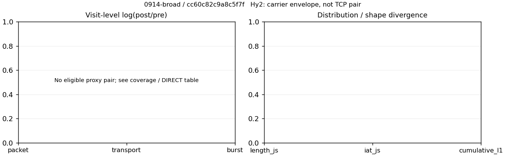

# 0914-broad · 条目 057 · music.163.com

目标：https://music.163.com/

活动标签：music.163.com::page_load。选定访问 3 次。

[返回总索引](../../README.md) · [统计口径](../../methods.md)

## 覆盖与资格（每次访问均保留）

| 部署 | 重复 | 主请求路由 | 活动状态 | 代理比较 | DIRECT pre | 请求 proxy/direct/unresolved | 错误 |
| --- | --- | --- | --- | --- | --- | --- | --- |
| Hy2 | 1 | direct | passed | 0 | 1 | 0/143/0 | [] |
| SS | 1 | direct | passed | 0 | 1 | 0/124/0 | [] |
| VLESS | 1 | direct | passed | 0 | 1 | 0/144/0 | [] |

主请求非 proxy 的统计仅解释为已索引的辅助代理连接或 DIRECT 观测，不代表目标业务经代理传输。播放确认与配对资格是两道不同的门。

图中散点为单次访问，短线为重复中位数；Hy2 是共享载体包络，不能与 TCP 配对作等范围因果对比。

形态图先逐访问归一化，再对访问等权平均；实线 pre，虚线 post。分箱序号及边界见 methods，不将分箱索引误解为长度或时间。

## 每次访问的关键观测

### SS

范围：`direct_pre_only`。每格 pre → post；空值为不可观测/不适用。

| 重复 | 包数 | 载荷字节 | burst | TCP FR | IAT中位µs | length JS | IAT JS |
| --- | --- | --- | --- | --- | --- | --- | --- |
| 1 | 2388 → — | 4.3075e+06 → — | 1548 → — | 229 → — | 139.5 → — | — | — |

完整标量统计：中位数 [min,max]；Δ 为重复内逐访问变换的中位数，MAD 未缩放。n 为可用变换数；DIRECT-only 的 nΔ=0 不代表 pre 不可用。

| scope | 特征 | pre | post | Δ | IQRΔ | MADΔ | nΔ |
| --- | --- | --- | --- | --- | --- | --- | --- |
| direct_pre_only | active_span_sum_s_1000ms | 13.877 [13.877, 13.877] | — | — | — | — | 0 |
| direct_pre_only | active_span_sum_s_100ms | 5.1442 [5.1442, 5.1442] | — | — | — | — | 0 |
| direct_pre_only | active_span_sum_s_500ms | 9.8383 [9.8383, 9.8383] | — | — | — | — | 0 |
| direct_pre_only | burst_bytes_iqr | 2880 [2880, 2880] | — | — | — | — | 0 |
| direct_pre_only | burst_bytes_mad | 31 [31, 31] | — | — | — | — | 0 |
| direct_pre_only | burst_bytes_max | 28672 [28672, 28672] | — | — | — | — | 0 |
| direct_pre_only | burst_bytes_mean | 2782.6 [2782.6, 2782.6] | — | — | — | — | 0 |
| direct_pre_only | burst_bytes_median | 31 [31, 31] | — | — | — | — | 0 |
| direct_pre_only | burst_bytes_min | 0 [0, 0] | — | — | — | — | 0 |
| direct_pre_only | burst_bytes_p95 | 14501 [14501, 14501] | — | — | — | — | 0 |
| direct_pre_only | burst_bytes_q25 | 0 [0, 0] | — | — | — | — | 0 |
| direct_pre_only | burst_bytes_q75 | 2880 [2880, 2880] | — | — | — | — | 0 |
| direct_pre_only | burst_bytes_std | 5149.8 [5149.8, 5149.8] | — | — | — | — | 0 |
| direct_pre_only | burst_count | 1548 [1548, 1548] | — | — | — | — | 0 |
| direct_pre_only | burst_duration_ms_iqr | 0.48879 [0.48879, 0.48879] | — | — | — | — | 0 |
| direct_pre_only | burst_duration_ms_mad | 0 [0, 0] | — | — | — | — | 0 |
| direct_pre_only | burst_duration_ms_max | 15001 [15001, 15001] | — | — | — | — | 0 |
| direct_pre_only | burst_duration_ms_mean | 107.13 [107.13, 107.13] | — | — | — | — | 0 |
| direct_pre_only | burst_duration_ms_median | 0 [0, 0] | — | — | — | — | 0 |
| direct_pre_only | burst_duration_ms_min | 0 [0, 0] | — | — | — | — | 0 |
| direct_pre_only | burst_duration_ms_p95 | 34.522 [34.522, 34.522] | — | — | — | — | 0 |
| direct_pre_only | burst_duration_ms_q25 | 0 [0, 0] | — | — | — | — | 0 |
| direct_pre_only | burst_duration_ms_q75 | 0.48879 [0.48879, 0.48879] | — | — | — | — | 0 |
| direct_pre_only | burst_duration_ms_std | 892.24 [892.24, 892.24] | — | — | — | — | 0 |
| direct_pre_only | burst_packets_iqr | 1 [1, 1] | — | — | — | — | 0 |
| direct_pre_only | burst_packets_mad | 0 [0, 0] | — | — | — | — | 0 |
| direct_pre_only | burst_packets_max | 7 [7, 7] | — | — | — | — | 0 |
| direct_pre_only | burst_packets_mean | 1.5426 [1.5426, 1.5426] | — | — | — | — | 0 |
| direct_pre_only | burst_packets_median | 1 [1, 1] | — | — | — | — | 0 |
| direct_pre_only | burst_packets_min | 1 [1, 1] | — | — | — | — | 0 |
| direct_pre_only | burst_packets_p95 | 3 [3, 3] | — | — | — | — | 0 |
| direct_pre_only | burst_packets_q25 | 1 [1, 1] | — | — | — | — | 0 |
| direct_pre_only | burst_packets_q75 | 2 [2, 2] | — | — | — | — | 0 |
| direct_pre_only | burst_packets_std | 0.83069 [0.83069, 0.83069] | — | — | — | — | 0 |
| direct_pre_only | connection_span_concurrency_max | 18 [18, 18] | — | — | — | — | 0 |
| direct_pre_only | direction_entropy | 0.7255 [0.7255, 0.7255] | — | — | — | — | 0 |
| direct_pre_only | down_burst_count | 757 [757, 757] | — | — | — | — | 0 |
| direct_pre_only | down_ip_bytes | 4.2573e+06 [4.2573e+06, 4.2573e+06] | — | — | — | — | 0 |
| direct_pre_only | down_packets | 1413 [1413, 1413] | — | — | — | — | 0 |
| direct_pre_only | down_transport_bytes | 4.1835e+06 [4.1835e+06, 4.1835e+06] | — | — | — | — | 0 |
| direct_pre_only | duration_s | 25.856 [25.856, 25.856] | — | — | — | — | 0 |
| direct_pre_only | entity_count | 34 [34, 34] | — | — | — | — | 0 |
| direct_pre_only | fr_runs | 229 [229, 229] | — | — | — | — | 0 |
| direct_pre_only | fr_runs_per_packet | 0.17115 [0.17115, 0.17115] | — | — | — | — | 0 |
| direct_pre_only | fr_switches | 195 [195, 195] | — | — | — | — | 0 |
| direct_pre_only | fr_switches_per_possible_transition | 0.14954 [0.14954, 0.14954] | — | — | — | — | 0 |
| direct_pre_only | full_retransmission_fraction | 0.0067002 [0.0067002, 0.0067002] | — | — | — | — | 0 |
| direct_pre_only | full_retransmission_packets | 16 [16, 16] | — | — | — | — | 0 |
| direct_pre_only | iat_count | 2354 [2354, 2354] | — | — | — | — | 0 |
| direct_pre_only | iat_median_us | 139.5 [139.5, 139.5] | — | — | — | — | 0 |
| direct_pre_only | iat_us_iqr | 809.24 [809.24, 809.24] | — | — | — | — | 0 |
| direct_pre_only | iat_us_mad | 130.69 [130.69, 130.69] | — | — | — | — | 0 |
| direct_pre_only | iat_us_max | 1.5002e+07 [1.5002e+07, 1.5002e+07] | — | — | — | — | 0 |
| direct_pre_only | iat_us_mean | 1.677e+05 [1.677e+05, 1.677e+05] | — | — | — | — | 0 |
| direct_pre_only | iat_us_median | 139.5 [139.5, 139.5] | — | — | — | — | 0 |
| direct_pre_only | iat_us_min | 0.265 [0.265, 0.265] | — | — | — | — | 0 |
| direct_pre_only | iat_us_p95 | 34357 [34357, 34357] | — | — | — | — | 0 |
| direct_pre_only | iat_us_q25 | 31.652 [31.652, 31.652] | — | — | — | — | 0 |
| direct_pre_only | iat_us_q75 | 840.9 [840.9, 840.9] | — | — | — | — | 0 |
| direct_pre_only | iat_us_std | 1.3593e+06 [1.3593e+06, 1.3593e+06] | — | — | — | — | 0 |
| direct_pre_only | idle_gap_count_1000ms | 41 [41, 41] | — | — | — | — | 0 |
| direct_pre_only | idle_gap_count_100ms | 75 [75, 75] | — | — | — | — | 0 |
| direct_pre_only | idle_gap_count_500ms | 48 [48, 48] | — | — | — | — | 0 |
| direct_pre_only | idle_gap_sum_s_1000ms | 380.89 [380.89, 380.89] | — | — | — | — | 0 |
| direct_pre_only | idle_gap_sum_s_100ms | 389.62 [389.62, 389.62] | — | — | — | — | 0 |
| direct_pre_only | idle_gap_sum_s_500ms | 384.92 [384.92, 384.92] | — | — | — | — | 0 |
| direct_pre_only | ip_bytes | 4.4323e+06 [4.4323e+06, 4.4323e+06] | — | — | — | — | 0 |
| direct_pre_only | length_iqr | 5012 [5012, 5012] | — | — | — | — | 0 |
| direct_pre_only | length_mad | 2311 [2311, 2311] | — | — | — | — | 0 |
| direct_pre_only | length_max | 8920 [8920, 8920] | — | — | — | — | 0 |
| direct_pre_only | length_mean | 3219.3 [3219.3, 3219.3] | — | — | — | — | 0 |
| direct_pre_only | length_median | 2824 [2824, 2824] | — | — | — | — | 0 |
| direct_pre_only | length_min | 13 [13, 13] | — | — | — | — | 0 |
| direct_pre_only | length_p95 | 8920 [8920, 8920] | — | — | — | — | 0 |
| direct_pre_only | length_q25 | 636 [636, 636] | — | — | — | — | 0 |
| direct_pre_only | length_q75 | 5648 [5648, 5648] | — | — | — | — | 0 |
| direct_pre_only | length_std | 2836.1 [2836.1, 2836.1] | — | — | — | — | 0 |
| direct_pre_only | nonempty_entity_count | 34 [34, 34] | — | — | — | — | 0 |
| direct_pre_only | nonempty_packets | 1338 [1338, 1338] | — | — | — | — | 0 |
| direct_pre_only | offload_suspect_fraction | 0.35553 [0.35553, 0.35553] | — | — | — | — | 0 |
| direct_pre_only | packet_count | 2388 [2388, 2388] | — | — | — | — | 0 |
| direct_pre_only | rtt_median_ms | 0.11695 [0.11695, 0.11695] | — | — | — | — | 0 |
| direct_pre_only | rtt_sample_count | 925 [925, 925] | — | — | — | — | 0 |
| direct_pre_only | tcp_ack_count | 2349 [2349, 2349] | — | — | — | — | 0 |
| direct_pre_only | tcp_fin_count | 65 [65, 65] | — | — | — | — | 0 |
| direct_pre_only | tcp_packet_count | 2388 [2388, 2388] | — | — | — | — | 0 |
| direct_pre_only | tcp_rst_count | 7 [7, 7] | — | — | — | — | 0 |
| direct_pre_only | tcp_syn_count | 68 [68, 68] | — | — | — | — | 0 |
| direct_pre_only | tcp_window_raw_median | 65535 [65535, 65535] | — | — | — | — | 0 |
| direct_pre_only | transition_entropy | 0.51849 [0.51849, 0.51849] | — | — | — | — | 0 |
| direct_pre_only | transition_n_mm | 955 [955, 955] | — | — | — | — | 0 |
| direct_pre_only | transition_n_mp | 82 [82, 82] | — | — | — | — | 0 |
| direct_pre_only | transition_n_pm | 113 [113, 113] | — | — | — | — | 0 |
| direct_pre_only | transition_n_pp | 154 [154, 154] | — | — | — | — | 0 |
| direct_pre_only | transition_p_mm | 0.92093 [0.92093, 0.92093] | — | — | — | — | 0 |
| direct_pre_only | transition_p_mp | 0.079074 [0.079074, 0.079074] | — | — | — | — | 0 |
| direct_pre_only | transition_p_pm | 0.42322 [0.42322, 0.42322] | — | — | — | — | 0 |
| direct_pre_only | transition_p_pp | 0.57678 [0.57678, 0.57678] | — | — | — | — | 0 |
| direct_pre_only | transport_bytes | 4.3075e+06 [4.3075e+06, 4.3075e+06] | — | — | — | — | 0 |
| direct_pre_only | up_burst_count | 791 [791, 791] | — | — | — | — | 0 |
| direct_pre_only | up_byte_fraction | 0.028772 [0.028772, 0.028772] | — | — | — | — | 0 |
| direct_pre_only | up_ip_bytes | 1.7504e+05 [1.7504e+05, 1.7504e+05] | — | — | — | — | 0 |
| direct_pre_only | up_packets | 975 [975, 975] | — | — | — | — | 0 |
| direct_pre_only | up_transport_bytes | 1.2393e+05 [1.2393e+05, 1.2393e+05] | — | — | — | — | 0 |
| direct_pre_only | zero_iat_count | 0 [0, 0] | — | — | — | — | 0 |
| direct_pre_only | zero_iat_fraction | 0 [0, 0] | — | — | — | — | 0 |

### VLESS

范围：`direct_pre_only`。每格 pre → post；空值为不可观测/不适用。

| 重复 | 包数 | 载荷字节 | burst | TCP FR | IAT中位µs | length JS | IAT JS |
| --- | --- | --- | --- | --- | --- | --- | --- |
| 1 | 2492 → — | 4.4934e+06 → — | 1610 → — | 276 → — | 111.97 → — | — | — |

完整标量统计：中位数 [min,max]；Δ 为重复内逐访问变换的中位数，MAD 未缩放。n 为可用变换数；DIRECT-only 的 nΔ=0 不代表 pre 不可用。

| scope | 特征 | pre | post | Δ | IQRΔ | MADΔ | nΔ |
| --- | --- | --- | --- | --- | --- | --- | --- |
| direct_pre_only | active_span_sum_s_1000ms | 13.6 [13.6, 13.6] | — | — | — | — | 0 |
| direct_pre_only | active_span_sum_s_100ms | 6.8925 [6.8925, 6.8925] | — | — | — | — | 0 |
| direct_pre_only | active_span_sum_s_500ms | 11.161 [11.161, 11.161] | — | — | — | — | 0 |
| direct_pre_only | burst_bytes_iqr | 2862 [2862, 2862] | — | — | — | — | 0 |
| direct_pre_only | burst_bytes_mad | 31 [31, 31] | — | — | — | — | 0 |
| direct_pre_only | burst_bytes_max | 26560 [26560, 26560] | — | — | — | — | 0 |
| direct_pre_only | burst_bytes_mean | 2790.9 [2790.9, 2790.9] | — | — | — | — | 0 |
| direct_pre_only | burst_bytes_median | 31 [31, 31] | — | — | — | — | 0 |
| direct_pre_only | burst_bytes_min | 0 [0, 0] | — | — | — | — | 0 |
| direct_pre_only | burst_bytes_p95 | 16367 [16367, 16367] | — | — | — | — | 0 |
| direct_pre_only | burst_bytes_q25 | 0 [0, 0] | — | — | — | — | 0 |
| direct_pre_only | burst_bytes_q75 | 2862 [2862, 2862] | — | — | — | — | 0 |
| direct_pre_only | burst_bytes_std | 5249.9 [5249.9, 5249.9] | — | — | — | — | 0 |
| direct_pre_only | burst_count | 1610 [1610, 1610] | — | — | — | — | 0 |
| direct_pre_only | burst_duration_ms_iqr | 0.23628 [0.23628, 0.23628] | — | — | — | — | 0 |
| direct_pre_only | burst_duration_ms_mad | 0 [0, 0] | — | — | — | — | 0 |
| direct_pre_only | burst_duration_ms_max | 15001 [15001, 15001] | — | — | — | — | 0 |
| direct_pre_only | burst_duration_ms_mean | 164.7 [164.7, 164.7] | — | — | — | — | 0 |
| direct_pre_only | burst_duration_ms_median | 0 [0, 0] | — | — | — | — | 0 |
| direct_pre_only | burst_duration_ms_min | 0 [0, 0] | — | — | — | — | 0 |
| direct_pre_only | burst_duration_ms_p95 | 91.762 [91.762, 91.762] | — | — | — | — | 0 |
| direct_pre_only | burst_duration_ms_q25 | 0 [0, 0] | — | — | — | — | 0 |
| direct_pre_only | burst_duration_ms_q75 | 0.23628 [0.23628, 0.23628] | — | — | — | — | 0 |
| direct_pre_only | burst_duration_ms_std | 1088.5 [1088.5, 1088.5] | — | — | — | — | 0 |
| direct_pre_only | burst_packets_iqr | 1 [1, 1] | — | — | — | — | 0 |
| direct_pre_only | burst_packets_mad | 0 [0, 0] | — | — | — | — | 0 |
| direct_pre_only | burst_packets_max | 10 [10, 10] | — | — | — | — | 0 |
| direct_pre_only | burst_packets_mean | 1.5478 [1.5478, 1.5478] | — | — | — | — | 0 |
| direct_pre_only | burst_packets_median | 1 [1, 1] | — | — | — | — | 0 |
| direct_pre_only | burst_packets_min | 1 [1, 1] | — | — | — | — | 0 |
| direct_pre_only | burst_packets_p95 | 3 [3, 3] | — | — | — | — | 0 |
| direct_pre_only | burst_packets_q25 | 1 [1, 1] | — | — | — | — | 0 |
| direct_pre_only | burst_packets_q75 | 2 [2, 2] | — | — | — | — | 0 |
| direct_pre_only | burst_packets_std | 0.96807 [0.96807, 0.96807] | — | — | — | — | 0 |
| direct_pre_only | connection_span_concurrency_max | 23 [23, 23] | — | — | — | — | 0 |
| direct_pre_only | direction_entropy | 0.77334 [0.77334, 0.77334] | — | — | — | — | 0 |
| direct_pre_only | down_burst_count | 786 [786, 786] | — | — | — | — | 0 |
| direct_pre_only | down_ip_bytes | 4.4188e+06 [4.4188e+06, 4.4188e+06] | — | — | — | — | 0 |
| direct_pre_only | down_packets | 1429 [1429, 1429] | — | — | — | — | 0 |
| direct_pre_only | down_transport_bytes | 4.3442e+06 [4.3442e+06, 4.3442e+06] | — | — | — | — | 0 |
| direct_pre_only | duration_s | 26.144 [26.144, 26.144] | — | — | — | — | 0 |
| direct_pre_only | entity_count | 38 [38, 38] | — | — | — | — | 0 |
| direct_pre_only | fr_runs | 276 [276, 276] | — | — | — | — | 0 |
| direct_pre_only | fr_runs_per_packet | 0.20175 [0.20175, 0.20175] | — | — | — | — | 0 |
| direct_pre_only | fr_switches | 238 [238, 238] | — | — | — | — | 0 |
| direct_pre_only | fr_switches_per_possible_transition | 0.17895 [0.17895, 0.17895] | — | — | — | — | 0 |
| direct_pre_only | full_retransmission_fraction | 0.0088283 [0.0088283, 0.0088283] | — | — | — | — | 0 |
| direct_pre_only | full_retransmission_packets | 22 [22, 22] | — | — | — | — | 0 |
| direct_pre_only | iat_count | 2454 [2454, 2454] | — | — | — | — | 0 |
| direct_pre_only | iat_median_us | 111.97 [111.97, 111.97] | — | — | — | — | 0 |
| direct_pre_only | iat_us_iqr | 839.83 [839.83, 839.83] | — | — | — | — | 0 |
| direct_pre_only | iat_us_mad | 103.19 [103.19, 103.19] | — | — | — | — | 0 |
| direct_pre_only | iat_us_max | 1.5002e+07 [1.5002e+07, 1.5002e+07] | — | — | — | — | 0 |
| direct_pre_only | iat_us_mean | 2.2458e+05 [2.2458e+05, 2.2458e+05] | — | — | — | — | 0 |
| direct_pre_only | iat_us_median | 111.97 [111.97, 111.97] | — | — | — | — | 0 |
| direct_pre_only | iat_us_min | 0.314 [0.314, 0.314] | — | — | — | — | 0 |
| direct_pre_only | iat_us_p95 | 55906 [55906, 55906] | — | — | — | — | 0 |
| direct_pre_only | iat_us_q25 | 19.61 [19.61, 19.61] | — | — | — | — | 0 |
| direct_pre_only | iat_us_q75 | 859.44 [859.44, 859.44] | — | — | — | — | 0 |
| direct_pre_only | iat_us_std | 1.5418e+06 [1.5418e+06, 1.5418e+06] | — | — | — | — | 0 |
| direct_pre_only | idle_gap_count_1000ms | 72 [72, 72] | — | — | — | — | 0 |
| direct_pre_only | idle_gap_count_100ms | 102 [102, 102] | — | — | — | — | 0 |
| direct_pre_only | idle_gap_count_500ms | 76 [76, 76] | — | — | — | — | 0 |
| direct_pre_only | idle_gap_sum_s_1000ms | 537.52 [537.52, 537.52] | — | — | — | — | 0 |
| direct_pre_only | idle_gap_sum_s_100ms | 544.23 [544.23, 544.23] | — | — | — | — | 0 |
| direct_pre_only | idle_gap_sum_s_500ms | 539.96 [539.96, 539.96] | — | — | — | — | 0 |
| direct_pre_only | ip_bytes | 4.6238e+06 [4.6238e+06, 4.6238e+06] | — | — | — | — | 0 |
| direct_pre_only | length_iqr | 5150 [5150, 5150] | — | — | — | — | 0 |
| direct_pre_only | length_mad | 2416.5 [2416.5, 2416.5] | — | — | — | — | 0 |
| direct_pre_only | length_max | 8920 [8920, 8920] | — | — | — | — | 0 |
| direct_pre_only | length_mean | 3284.6 [3284.6, 3284.6] | — | — | — | — | 0 |
| direct_pre_only | length_median | 2824 [2824, 2824] | — | — | — | — | 0 |
| direct_pre_only | length_min | 31 [31, 31] | — | — | — | — | 0 |
| direct_pre_only | length_p95 | 8920 [8920, 8920] | — | — | — | — | 0 |
| direct_pre_only | length_q25 | 498 [498, 498] | — | — | — | — | 0 |
| direct_pre_only | length_q75 | 5648 [5648, 5648] | — | — | — | — | 0 |
| direct_pre_only | length_std | 3048.7 [3048.7, 3048.7] | — | — | — | — | 0 |
| direct_pre_only | nonempty_entity_count | 38 [38, 38] | — | — | — | — | 0 |
| direct_pre_only | nonempty_packets | 1368 [1368, 1368] | — | — | — | — | 0 |
| direct_pre_only | offload_suspect_fraction | 0.32905 [0.32905, 0.32905] | — | — | — | — | 0 |
| direct_pre_only | packet_count | 2492 [2492, 2492] | — | — | — | — | 0 |
| direct_pre_only | rtt_median_ms | 0.099522 [0.099522, 0.099522] | — | — | — | — | 0 |
| direct_pre_only | rtt_sample_count | 973 [973, 973] | — | — | — | — | 0 |
| direct_pre_only | tcp_ack_count | 2450 [2450, 2450] | — | — | — | — | 0 |
| direct_pre_only | tcp_fin_count | 72 [72, 72] | — | — | — | — | 0 |
| direct_pre_only | tcp_packet_count | 2492 [2492, 2492] | — | — | — | — | 0 |
| direct_pre_only | tcp_rst_count | 6 [6, 6] | — | — | — | — | 0 |
| direct_pre_only | tcp_syn_count | 76 [76, 76] | — | — | — | — | 0 |
| direct_pre_only | tcp_window_raw_median | 65535 [65535, 65535] | — | — | — | — | 0 |
| direct_pre_only | transition_entropy | 0.58868 [0.58868, 0.58868] | — | — | — | — | 0 |
| direct_pre_only | transition_n_mm | 921 [921, 921] | — | — | — | — | 0 |
| direct_pre_only | transition_n_mp | 102 [102, 102] | — | — | — | — | 0 |
| direct_pre_only | transition_n_pm | 136 [136, 136] | — | — | — | — | 0 |
| direct_pre_only | transition_n_pp | 171 [171, 171] | — | — | — | — | 0 |
| direct_pre_only | transition_p_mm | 0.90029 [0.90029, 0.90029] | — | — | — | — | 0 |
| direct_pre_only | transition_p_mp | 0.099707 [0.099707, 0.099707] | — | — | — | — | 0 |
| direct_pre_only | transition_p_pm | 0.443 [0.443, 0.443] | — | — | — | — | 0 |
| direct_pre_only | transition_p_pp | 0.557 [0.557, 0.557] | — | — | — | — | 0 |
| direct_pre_only | transport_bytes | 4.4934e+06 [4.4934e+06, 4.4934e+06] | — | — | — | — | 0 |
| direct_pre_only | up_burst_count | 824 [824, 824] | — | — | — | — | 0 |
| direct_pre_only | up_byte_fraction | 0.033207 [0.033207, 0.033207] | — | — | — | — | 0 |
| direct_pre_only | up_ip_bytes | 2.0501e+05 [2.0501e+05, 2.0501e+05] | — | — | — | — | 0 |
| direct_pre_only | up_packets | 1063 [1063, 1063] | — | — | — | — | 0 |
| direct_pre_only | up_transport_bytes | 1.4921e+05 [1.4921e+05, 1.4921e+05] | — | — | — | — | 0 |
| direct_pre_only | zero_iat_count | 0 [0, 0] | — | — | — | — | 0 |
| direct_pre_only | zero_iat_fraction | 0 [0, 0] | — | — | — | — | 0 |

### Hy2

范围：`direct_pre_only`。每格 pre → post；空值为不可观测/不适用。

| 重复 | 包数 | 载荷字节 | burst | TCP FR | IAT中位µs | length JS | IAT JS |
| --- | --- | --- | --- | --- | --- | --- | --- |
| 1 | 2442 → — | 4.3812e+06 → — | 1516 → — | 275 → — | 112.25 → — | — | — |

完整标量统计：中位数 [min,max]；Δ 为重复内逐访问变换的中位数，MAD 未缩放。n 为可用变换数；DIRECT-only 的 nΔ=0 不代表 pre 不可用。

| scope | 特征 | pre | post | Δ | IQRΔ | MADΔ | nΔ |
| --- | --- | --- | --- | --- | --- | --- | --- |
| direct_pre_only | active_span_sum_s_1000ms | 11.546 [11.546, 11.546] | — | — | — | — | 0 |
| direct_pre_only | active_span_sum_s_100ms | 6.1455 [6.1455, 6.1455] | — | — | — | — | 0 |
| direct_pre_only | active_span_sum_s_500ms | 8.9467 [8.9467, 8.9467] | — | — | — | — | 0 |
| direct_pre_only | burst_bytes_iqr | 2862 [2862, 2862] | — | — | — | — | 0 |
| direct_pre_only | burst_bytes_mad | 31 [31, 31] | — | — | — | — | 0 |
| direct_pre_only | burst_bytes_max | 28672 [28672, 28672] | — | — | — | — | 0 |
| direct_pre_only | burst_bytes_mean | 2889.9 [2889.9, 2889.9] | — | — | — | — | 0 |
| direct_pre_only | burst_bytes_median | 31 [31, 31] | — | — | — | — | 0 |
| direct_pre_only | burst_bytes_min | 0 [0, 0] | — | — | — | — | 0 |
| direct_pre_only | burst_bytes_p95 | 18060 [18060, 18060] | — | — | — | — | 0 |
| direct_pre_only | burst_bytes_q25 | 0 [0, 0] | — | — | — | — | 0 |
| direct_pre_only | burst_bytes_q75 | 2862 [2862, 2862] | — | — | — | — | 0 |
| direct_pre_only | burst_bytes_std | 5510.1 [5510.1, 5510.1] | — | — | — | — | 0 |
| direct_pre_only | burst_count | 1516 [1516, 1516] | — | — | — | — | 0 |
| direct_pre_only | burst_duration_ms_iqr | 0.41699 [0.41699, 0.41699] | — | — | — | — | 0 |
| direct_pre_only | burst_duration_ms_mad | 0 [0, 0] | — | — | — | — | 0 |
| direct_pre_only | burst_duration_ms_max | 13058 [13058, 13058] | — | — | — | — | 0 |
| direct_pre_only | burst_duration_ms_mean | 137.28 [137.28, 137.28] | — | — | — | — | 0 |
| direct_pre_only | burst_duration_ms_median | 0 [0, 0] | — | — | — | — | 0 |
| direct_pre_only | burst_duration_ms_min | 0 [0, 0] | — | — | — | — | 0 |
| direct_pre_only | burst_duration_ms_p95 | 54.82 [54.82, 54.82] | — | — | — | — | 0 |
| direct_pre_only | burst_duration_ms_q25 | 0 [0, 0] | — | — | — | — | 0 |
| direct_pre_only | burst_duration_ms_q75 | 0.41699 [0.41699, 0.41699] | — | — | — | — | 0 |
| direct_pre_only | burst_duration_ms_std | 955.21 [955.21, 955.21] | — | — | — | — | 0 |
| direct_pre_only | burst_packets_iqr | 1 [1, 1] | — | — | — | — | 0 |
| direct_pre_only | burst_packets_mad | 0 [0, 0] | — | — | — | — | 0 |
| direct_pre_only | burst_packets_max | 10 [10, 10] | — | — | — | — | 0 |
| direct_pre_only | burst_packets_mean | 1.6108 [1.6108, 1.6108] | — | — | — | — | 0 |
| direct_pre_only | burst_packets_median | 1 [1, 1] | — | — | — | — | 0 |
| direct_pre_only | burst_packets_min | 1 [1, 1] | — | — | — | — | 0 |
| direct_pre_only | burst_packets_p95 | 3 [3, 3] | — | — | — | — | 0 |
| direct_pre_only | burst_packets_q25 | 1 [1, 1] | — | — | — | — | 0 |
| direct_pre_only | burst_packets_q75 | 2 [2, 2] | — | — | — | — | 0 |
| direct_pre_only | burst_packets_std | 0.96522 [0.96522, 0.96522] | — | — | — | — | 0 |
| direct_pre_only | connection_span_concurrency_max | 22 [22, 22] | — | — | — | — | 0 |
| direct_pre_only | direction_entropy | 0.758 [0.758, 0.758] | — | — | — | — | 0 |
| direct_pre_only | down_burst_count | 739 [739, 739] | — | — | — | — | 0 |
| direct_pre_only | down_ip_bytes | 4.3058e+06 [4.3058e+06, 4.3058e+06] | — | — | — | — | 0 |
| direct_pre_only | down_packets | 1453 [1453, 1453] | — | — | — | — | 0 |
| direct_pre_only | down_transport_bytes | 4.2299e+06 [4.2299e+06, 4.2299e+06] | — | — | — | — | 0 |
| direct_pre_only | duration_s | 25.309 [25.309, 25.309] | — | — | — | — | 0 |
| direct_pre_only | entity_count | 38 [38, 38] | — | — | — | — | 0 |
| direct_pre_only | fr_runs | 275 [275, 275] | — | — | — | — | 0 |
| direct_pre_only | fr_runs_per_packet | 0.20058 [0.20058, 0.20058] | — | — | — | — | 0 |
| direct_pre_only | fr_switches | 237 [237, 237] | — | — | — | — | 0 |
| direct_pre_only | fr_switches_per_possible_transition | 0.17779 [0.17779, 0.17779] | — | — | — | — | 0 |
| direct_pre_only | full_retransmission_fraction | 0.0053235 [0.0053235, 0.0053235] | — | — | — | — | 0 |
| direct_pre_only | full_retransmission_packets | 13 [13, 13] | — | — | — | — | 0 |
| direct_pre_only | iat_count | 2404 [2404, 2404] | — | — | — | — | 0 |
| direct_pre_only | iat_median_us | 112.25 [112.25, 112.25] | — | — | — | — | 0 |
| direct_pre_only | iat_us_iqr | 785.01 [785.01, 785.01] | — | — | — | — | 0 |
| direct_pre_only | iat_us_mad | 101.84 [101.84, 101.84] | — | — | — | — | 0 |
| direct_pre_only | iat_us_max | 1.5001e+07 [1.5001e+07, 1.5001e+07] | — | — | — | — | 0 |
| direct_pre_only | iat_us_mean | 2.0853e+05 [2.0853e+05, 2.0853e+05] | — | — | — | — | 0 |
| direct_pre_only | iat_us_median | 112.25 [112.25, 112.25] | — | — | — | — | 0 |
| direct_pre_only | iat_us_min | 0.004 [0.004, 0.004] | — | — | — | — | 0 |
| direct_pre_only | iat_us_p95 | 40835 [40835, 40835] | — | — | — | — | 0 |
| direct_pre_only | iat_us_q25 | 22.846 [22.846, 22.846] | — | — | — | — | 0 |
| direct_pre_only | iat_us_q75 | 807.86 [807.86, 807.86] | — | — | — | — | 0 |
| direct_pre_only | iat_us_std | 1.4915e+06 [1.4915e+06, 1.4915e+06] | — | — | — | — | 0 |
| direct_pre_only | idle_gap_count_1000ms | 67 [67, 67] | — | — | — | — | 0 |
| direct_pre_only | idle_gap_count_100ms | 87 [87, 87] | — | — | — | — | 0 |
| direct_pre_only | idle_gap_count_500ms | 70 [70, 70] | — | — | — | — | 0 |
| direct_pre_only | idle_gap_sum_s_1000ms | 489.75 [489.75, 489.75] | — | — | — | — | 0 |
| direct_pre_only | idle_gap_sum_s_100ms | 495.15 [495.15, 495.15] | — | — | — | — | 0 |
| direct_pre_only | idle_gap_sum_s_500ms | 492.35 [492.35, 492.35] | — | — | — | — | 0 |
| direct_pre_only | ip_bytes | 4.5089e+06 [4.5089e+06, 4.5089e+06] | — | — | — | — | 0 |
| direct_pre_only | length_iqr | 4822 [4822, 4822] | — | — | — | — | 0 |
| direct_pre_only | length_mad | 2305 [2305, 2305] | — | — | — | — | 0 |
| direct_pre_only | length_max | 8920 [8920, 8920] | — | — | — | — | 0 |
| direct_pre_only | length_mean | 3195.6 [3195.6, 3195.6] | — | — | — | — | 0 |
| direct_pre_only | length_median | 2824 [2824, 2824] | — | — | — | — | 0 |
| direct_pre_only | length_min | 13 [13, 13] | — | — | — | — | 0 |
| direct_pre_only | length_p95 | 8920 [8920, 8920] | — | — | — | — | 0 |
| direct_pre_only | length_q25 | 618 [618, 618] | — | — | — | — | 0 |
| direct_pre_only | length_q75 | 5440 [5440, 5440] | — | — | — | — | 0 |
| direct_pre_only | length_std | 2970.8 [2970.8, 2970.8] | — | — | — | — | 0 |
| direct_pre_only | nonempty_entity_count | 38 [38, 38] | — | — | — | — | 0 |
| direct_pre_only | nonempty_packets | 1371 [1371, 1371] | — | — | — | — | 0 |
| direct_pre_only | offload_suspect_fraction | 0.34439 [0.34439, 0.34439] | — | — | — | — | 0 |
| direct_pre_only | packet_count | 2442 [2442, 2442] | — | — | — | — | 0 |
| direct_pre_only | rtt_median_ms | 0.11521 [0.11521, 0.11521] | — | — | — | — | 0 |
| direct_pre_only | rtt_sample_count | 942 [942, 942] | — | — | — | — | 0 |
| direct_pre_only | tcp_ack_count | 2400 [2400, 2400] | — | — | — | — | 0 |
| direct_pre_only | tcp_fin_count | 72 [72, 72] | — | — | — | — | 0 |
| direct_pre_only | tcp_packet_count | 2442 [2442, 2442] | — | — | — | — | 0 |
| direct_pre_only | tcp_rst_count | 6 [6, 6] | — | — | — | — | 0 |
| direct_pre_only | tcp_syn_count | 76 [76, 76] | — | — | — | — | 0 |
| direct_pre_only | tcp_window_raw_median | 65535 [65535, 65535] | — | — | — | — | 0 |
| direct_pre_only | transition_entropy | 0.57994 [0.57994, 0.57994] | — | — | — | — | 0 |
| direct_pre_only | transition_n_mm | 935 [935, 935] | — | — | — | — | 0 |
| direct_pre_only | transition_n_mp | 101 [101, 101] | — | — | — | — | 0 |
| direct_pre_only | transition_n_pm | 136 [136, 136] | — | — | — | — | 0 |
| direct_pre_only | transition_n_pp | 161 [161, 161] | — | — | — | — | 0 |
| direct_pre_only | transition_p_mm | 0.90251 [0.90251, 0.90251] | — | — | — | — | 0 |
| direct_pre_only | transition_p_mp | 0.09749 [0.09749, 0.09749] | — | — | — | — | 0 |
| direct_pre_only | transition_p_pm | 0.45791 [0.45791, 0.45791] | — | — | — | — | 0 |
| direct_pre_only | transition_p_pp | 0.54209 [0.54209, 0.54209] | — | — | — | — | 0 |
| direct_pre_only | transport_bytes | 4.3812e+06 [4.3812e+06, 4.3812e+06] | — | — | — | — | 0 |
| direct_pre_only | up_burst_count | 777 [777, 777] | — | — | — | — | 0 |
| direct_pre_only | up_byte_fraction | 0.034527 [0.034527, 0.034527] | — | — | — | — | 0 |
| direct_pre_only | up_ip_bytes | 2.0311e+05 [2.0311e+05, 2.0311e+05] | — | — | — | — | 0 |
| direct_pre_only | up_packets | 989 [989, 989] | — | — | — | — | 0 |
| direct_pre_only | up_transport_bytes | 1.5127e+05 [1.5127e+05, 1.5127e+05] | — | — | — | — | 0 |
| direct_pre_only | zero_iat_count | 0 [0, 0] | — | — | — | — | 0 |
| direct_pre_only | zero_iat_fraction | 0 [0, 0] | — | — | — | — | 0 |

## 不同部署对比

以下是各部署自身重复中位数的差异，不按重复编号强行配对。跨 TCP/Hy2 的行标记异质观测范围。

| 视角 | 特征 | 部署A | 部署B | A中位 | B中位 | B−A | 比较口径 |
| --- | --- | --- | --- | --- | --- | --- | --- |
| pre | burst_count | SS | VLESS | 1548 | 1610 | 62 | same_scope_unpaired_visits |
| pre | burst_count | SS | Hy2 | 1548 | 1516 | -32 | same_scope_unpaired_visits |
| pre | burst_count | VLESS | Hy2 | 1610 | 1516 | -94 | same_scope_unpaired_visits |
| pre | connection_span_concurrency_max | SS | VLESS | 18 | 23 | 5 | same_scope_unpaired_visits |
| pre | connection_span_concurrency_max | SS | Hy2 | 18 | 22 | 4 | same_scope_unpaired_visits |
| pre | connection_span_concurrency_max | VLESS | Hy2 | 23 | 22 | -1 | same_scope_unpaired_visits |
| pre | direction_entropy | SS | VLESS | 0.7255 | 0.77334 | 0.047843 | same_scope_unpaired_visits |
| pre | direction_entropy | SS | Hy2 | 0.7255 | 0.758 | 0.032503 | same_scope_unpaired_visits |
| pre | direction_entropy | VLESS | Hy2 | 0.77334 | 0.758 | -0.01534 | same_scope_unpaired_visits |
| pre | down_transport_bytes | SS | VLESS | 4.1835e+06 | 4.3442e+06 | 1.6063e+05 | same_scope_unpaired_visits |
| pre | down_transport_bytes | SS | Hy2 | 4.1835e+06 | 4.2299e+06 | 46370 | same_scope_unpaired_visits |
| pre | down_transport_bytes | VLESS | Hy2 | 4.3442e+06 | 4.2299e+06 | -1.1426e+05 | same_scope_unpaired_visits |
| pre | duration_s | SS | VLESS | 25.856 | 26.144 | 0.28828 | same_scope_unpaired_visits |
| pre | duration_s | SS | Hy2 | 25.856 | 25.309 | -0.54705 | same_scope_unpaired_visits |
| pre | duration_s | VLESS | Hy2 | 26.144 | 25.309 | -0.83533 | same_scope_unpaired_visits |
| pre | entity_count | SS | VLESS | 34 | 38 | 4 | same_scope_unpaired_visits |
| pre | entity_count | SS | Hy2 | 34 | 38 | 4 | same_scope_unpaired_visits |
| pre | entity_count | VLESS | Hy2 | 38 | 38 | 0 | same_scope_unpaired_visits |
| pre | fr_runs | SS | VLESS | 229 | 276 | 47 | same_scope_unpaired_visits |
| pre | fr_runs | SS | Hy2 | 229 | 275 | 46 | same_scope_unpaired_visits |
| pre | fr_runs | VLESS | Hy2 | 276 | 275 | -1 | same_scope_unpaired_visits |
| pre | fr_runs_per_packet | SS | VLESS | 0.17115 | 0.20175 | 0.030603 | same_scope_unpaired_visits |
| pre | fr_runs_per_packet | SS | Hy2 | 0.17115 | 0.20058 | 0.029433 | same_scope_unpaired_visits |
| pre | fr_runs_per_packet | VLESS | Hy2 | 0.20175 | 0.20058 | -0.0011709 | same_scope_unpaired_visits |
| pre | fr_switches | SS | VLESS | 195 | 238 | 43 | same_scope_unpaired_visits |
| pre | fr_switches | SS | Hy2 | 195 | 237 | 42 | same_scope_unpaired_visits |
| pre | fr_switches | VLESS | Hy2 | 238 | 237 | -1 | same_scope_unpaired_visits |
| pre | fr_switches_per_possible_transition | SS | VLESS | 0.14954 | 0.17895 | 0.029407 | same_scope_unpaired_visits |
| pre | fr_switches_per_possible_transition | SS | Hy2 | 0.14954 | 0.17779 | 0.028255 | same_scope_unpaired_visits |
| pre | fr_switches_per_possible_transition | VLESS | Hy2 | 0.17895 | 0.17779 | -0.0011529 | same_scope_unpaired_visits |
| pre | full_retransmission_fraction | SS | VLESS | 0.0067002 | 0.0088283 | 0.0021281 | same_scope_unpaired_visits |
| pre | full_retransmission_fraction | SS | Hy2 | 0.0067002 | 0.0053235 | -0.0013767 | same_scope_unpaired_visits |
| pre | full_retransmission_fraction | VLESS | Hy2 | 0.0088283 | 0.0053235 | -0.0035047 | same_scope_unpaired_visits |
| pre | iat_median_us | SS | VLESS | 139.5 | 111.97 | -27.521 | same_scope_unpaired_visits |
| pre | iat_median_us | SS | Hy2 | 139.5 | 112.25 | -27.244 | same_scope_unpaired_visits |
| pre | iat_median_us | VLESS | Hy2 | 111.97 | 112.25 | 0.2765 | same_scope_unpaired_visits |
| pre | iat_us_p95 | SS | VLESS | 34357 | 55906 | 21548 | same_scope_unpaired_visits |
| pre | iat_us_p95 | SS | Hy2 | 34357 | 40835 | 6477 | same_scope_unpaired_visits |
| pre | iat_us_p95 | VLESS | Hy2 | 55906 | 40835 | -15071 | same_scope_unpaired_visits |
| pre | ip_bytes | SS | VLESS | 4.4323e+06 | 4.6238e+06 | 1.9147e+05 | same_scope_unpaired_visits |
| pre | ip_bytes | SS | Hy2 | 4.4323e+06 | 4.5089e+06 | 76553 | same_scope_unpaired_visits |
| pre | ip_bytes | VLESS | Hy2 | 4.6238e+06 | 4.5089e+06 | -1.1491e+05 | same_scope_unpaired_visits |
| pre | length_median | SS | VLESS | 2824 | 2824 | 0 | same_scope_unpaired_visits |
| pre | length_median | SS | Hy2 | 2824 | 2824 | 0 | same_scope_unpaired_visits |
| pre | length_median | VLESS | Hy2 | 2824 | 2824 | 0 | same_scope_unpaired_visits |
| pre | length_p95 | SS | VLESS | 8920 | 8920 | 0 | same_scope_unpaired_visits |
| pre | length_p95 | SS | Hy2 | 8920 | 8920 | 0 | same_scope_unpaired_visits |
| pre | length_p95 | VLESS | Hy2 | 8920 | 8920 | 0 | same_scope_unpaired_visits |
| pre | nonempty_packets | SS | VLESS | 1338 | 1368 | 30 | same_scope_unpaired_visits |
| pre | nonempty_packets | SS | Hy2 | 1338 | 1371 | 33 | same_scope_unpaired_visits |
| pre | nonempty_packets | VLESS | Hy2 | 1368 | 1371 | 3 | same_scope_unpaired_visits |
| pre | offload_suspect_fraction | SS | VLESS | 0.35553 | 0.32905 | -0.026475 | same_scope_unpaired_visits |
| pre | offload_suspect_fraction | SS | Hy2 | 0.35553 | 0.34439 | -0.011138 | same_scope_unpaired_visits |
| pre | offload_suspect_fraction | VLESS | Hy2 | 0.32905 | 0.34439 | 0.015337 | same_scope_unpaired_visits |
| pre | packet_count | SS | VLESS | 2388 | 2492 | 104 | same_scope_unpaired_visits |
| pre | packet_count | SS | Hy2 | 2388 | 2442 | 54 | same_scope_unpaired_visits |
| pre | packet_count | VLESS | Hy2 | 2492 | 2442 | -50 | same_scope_unpaired_visits |
| pre | rtt_median_ms | SS | VLESS | 0.11695 | 0.099522 | -0.017425 | same_scope_unpaired_visits |
| pre | rtt_median_ms | SS | Hy2 | 0.11695 | 0.11521 | -0.001738 | same_scope_unpaired_visits |
| pre | rtt_median_ms | VLESS | Hy2 | 0.099522 | 0.11521 | 0.015687 | same_scope_unpaired_visits |
| pre | transition_entropy | SS | VLESS | 0.51849 | 0.58868 | 0.070193 | same_scope_unpaired_visits |
| pre | transition_entropy | SS | Hy2 | 0.51849 | 0.57994 | 0.061455 | same_scope_unpaired_visits |
| pre | transition_entropy | VLESS | Hy2 | 0.58868 | 0.57994 | -0.0087375 | same_scope_unpaired_visits |
| pre | transport_bytes | SS | VLESS | 4.3075e+06 | 4.4934e+06 | 1.8591e+05 | same_scope_unpaired_visits |
| pre | transport_bytes | SS | Hy2 | 4.3075e+06 | 4.3812e+06 | 73705 | same_scope_unpaired_visits |
| pre | transport_bytes | VLESS | Hy2 | 4.4934e+06 | 4.3812e+06 | -1.122e+05 | same_scope_unpaired_visits |
| pre | up_byte_fraction | SS | VLESS | 0.028772 | 0.033207 | 0.0044348 | same_scope_unpaired_visits |
| pre | up_byte_fraction | SS | Hy2 | 0.028772 | 0.034527 | 0.0057552 | same_scope_unpaired_visits |
| pre | up_byte_fraction | VLESS | Hy2 | 0.033207 | 0.034527 | 0.0013204 | same_scope_unpaired_visits |
| pre | up_transport_bytes | SS | VLESS | 1.2393e+05 | 1.4921e+05 | 25276 | same_scope_unpaired_visits |
| pre | up_transport_bytes | SS | Hy2 | 1.2393e+05 | 1.5127e+05 | 27335 | same_scope_unpaired_visits |
| pre | up_transport_bytes | VLESS | Hy2 | 1.4921e+05 | 1.5127e+05 | 2059 | same_scope_unpaired_visits |

## 可复核的访问标识

| 部署 | 重复 | session_id |
| --- | --- | --- |
| SS | 1 | 27303ad3-83ab-44bd-91c2-a9d855863f7a |
| VLESS | 1 | bacf97e4-a4a0-4092-8f06-1ecd59ffd480 |
| Hy2 | 1 | b8e52772-cb3d-4ac8-bd97-db24d191da0c |

全量三种 packet selection、Hy2 full 范围、Q25/Q75、直方图与曲线见机器可读产物；本页只显示 observed 主范围。
