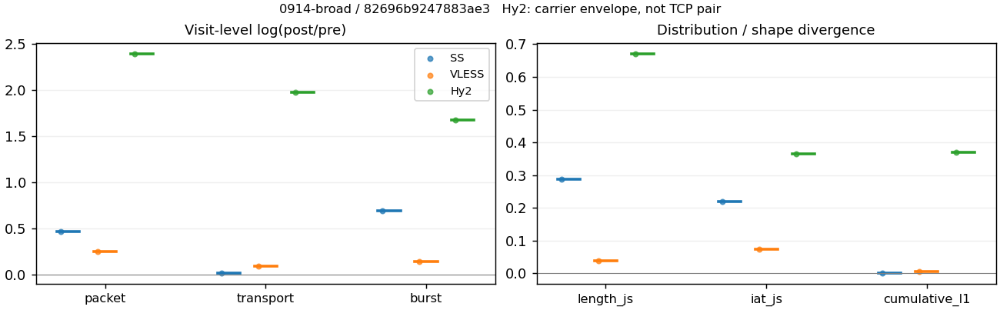
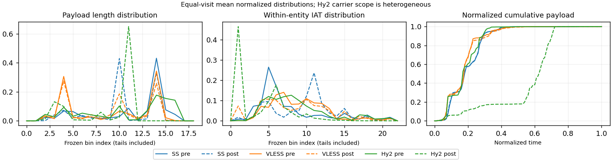

# 0914-broad · 条目 058 · soundcloud.com

目标：https://soundcloud.com/

活动标签：soundcloud.com::page_load。选定访问 3 次。

[返回总索引](../../README.md) · [统计口径](../../methods.md)

## 覆盖与资格（每次访问均保留）

| 部署 | 重复 | 主请求路由 | 活动状态 | 代理比较 | DIRECT pre | 请求 proxy/direct/unresolved | 错误 |
| --- | --- | --- | --- | --- | --- | --- | --- |
| Hy2 | 1 | proxy | passed | 1 | 1 | 214/15/1 | [] |
| SS | 1 | proxy | passed | 1 | 0 | 160/0/0 | [] |
| VLESS | 1 | proxy | passed | 1 | 0 | 195/0/0 | [] |

主请求非 proxy 的统计仅解释为已索引的辅助代理连接或 DIRECT 观测，不代表目标业务经代理传输。播放确认与配对资格是两道不同的门。

图中散点为单次访问，短线为重复中位数；Hy2 是共享载体包络，不能与 TCP 配对作等范围因果对比。

形态图先逐访问归一化，再对访问等权平均；实线 pre，虚线 post。分箱序号及边界见 methods，不将分箱索引误解为长度或时间。

## 每次访问的关键观测

### SS

范围：`exclusive_page`。每格 pre → post；空值为不可观测/不适用。

| 重复 | 包数 | 载荷字节 | burst | TCP FR | IAT中位µs | length JS | IAT JS |
| --- | --- | --- | --- | --- | --- | --- | --- |
| 1 | 4672 → 7417 | 6.1828e+06 → 6.3067e+06 | 3072 → 6130 | 404 → 411 | 28.006 → 1015.4 | 0.28654 | 0.21984 |

完整标量统计：中位数 [min,max]；Δ 为重复内逐访问变换的中位数，MAD 未缩放。n 为可用变换数；DIRECT-only 的 nΔ=0 不代表 pre 不可用。

| scope | 特征 | pre | post | Δ | IQRΔ | MADΔ | nΔ |
| --- | --- | --- | --- | --- | --- | --- | --- |
| exclusive_page | active_span_sum_s_1000ms | 85.806 [85.806, 85.806] | 103.92 [103.92, 103.92] | 0.1915 | — | — | 1 |
| exclusive_page | active_span_sum_s_100ms | 13.97 [13.97, 13.97] | 29.479 [29.479, 29.479] | 0.74678 | — | — | 1 |
| exclusive_page | active_span_sum_s_500ms | 61.506 [61.506, 61.506] | 86.14 [86.14, 86.14] | 0.33684 | — | — | 1 |
| exclusive_page | burst_bytes_iqr | 2896 [2896, 2896] | 1482 [1482, 1482] | -0.66994 | — | — | 1 |
| exclusive_page | burst_bytes_mad | 35 [35, 35] | 40 [40, 40] | 0.13353 | — | — | 1 |
| exclusive_page | burst_bytes_max | 20480 [20480, 20480] | 9996 [9996, 9996] | -0.71726 | — | — | 1 |
| exclusive_page | burst_bytes_mean | 2012.6 [2012.6, 2012.6] | 1028.8 [1028.8, 1028.8] | -0.67103 | — | — | 1 |
| exclusive_page | burst_bytes_median | 35 [35, 35] | 40 [40, 40] | 0.13353 | — | — | 1 |
| exclusive_page | burst_bytes_min | 0 [0, 0] | 0 [0, 0] | — | — | — | 0 |
| exclusive_page | burst_bytes_p95 | 9639.1 [9639.1, 9639.1] | 2856 [2856, 2856] | -1.2164 | — | — | 1 |
| exclusive_page | burst_bytes_q25 | 0 [0, 0] | 0 [0, 0] | — | — | — | 0 |
| exclusive_page | burst_bytes_q75 | 2896 [2896, 2896] | 1482 [1482, 1482] | -0.66994 | — | — | 1 |
| exclusive_page | burst_bytes_std | 3674.6 [3674.6, 3674.6] | 1288.1 [1288.1, 1288.1] | -1.0483 | — | — | 1 |
| exclusive_page | burst_count | 3072 [3072, 3072] | 6130 [6130, 6130] | 0.69087 | — | — | 1 |
| exclusive_page | burst_duration_ms_iqr | 0.035875 [0.035875, 0.035875] | 0 [0, 0] | — | — | — | 0 |
| exclusive_page | burst_duration_ms_mad | 0 [0, 0] | 0 [0, 0] | — | — | — | 0 |
| exclusive_page | burst_duration_ms_max | 15001 [15001, 15001] | 26615 [26615, 26615] | 0.57339 | — | — | 1 |
| exclusive_page | burst_duration_ms_mean | 190.14 [190.14, 190.14] | 106.61 [106.61, 106.61] | -0.57861 | — | — | 1 |
| exclusive_page | burst_duration_ms_median | 0 [0, 0] | 0 [0, 0] | — | — | — | 0 |
| exclusive_page | burst_duration_ms_min | 0 [0, 0] | 0 [0, 0] | — | — | — | 0 |
| exclusive_page | burst_duration_ms_p95 | 377.84 [377.84, 377.84] | 5.9221 [5.9221, 5.9221] | -4.1558 | — | — | 1 |
| exclusive_page | burst_duration_ms_q25 | 0 [0, 0] | 0 [0, 0] | — | — | — | 0 |
| exclusive_page | burst_duration_ms_q75 | 0.035875 [0.035875, 0.035875] | 0 [0, 0] | — | — | — | 0 |
| exclusive_page | burst_duration_ms_std | 1219.8 [1219.8, 1219.8] | 1223.3 [1223.3, 1223.3] | 0.0028147 | — | — | 1 |
| exclusive_page | burst_packets_iqr | 1 [1, 1] | 0 [0, 0] | — | — | — | 0 |
| exclusive_page | burst_packets_mad | 0 [0, 0] | 0 [0, 0] | — | — | — | 0 |
| exclusive_page | burst_packets_max | 10 [10, 10] | 8 [8, 8] | -0.22314 | — | — | 1 |
| exclusive_page | burst_packets_mean | 1.5208 [1.5208, 1.5208] | 1.21 [1.21, 1.21] | -0.22868 | — | — | 1 |
| exclusive_page | burst_packets_median | 1 [1, 1] | 1 [1, 1] | 0 | — | — | 1 |
| exclusive_page | burst_packets_min | 1 [1, 1] | 1 [1, 1] | 0 | — | — | 1 |
| exclusive_page | burst_packets_p95 | 4 [4, 4] | 2 [2, 2] | -0.69315 | — | — | 1 |
| exclusive_page | burst_packets_q25 | 1 [1, 1] | 1 [1, 1] | 0 | — | — | 1 |
| exclusive_page | burst_packets_q75 | 2 [2, 2] | 1 [1, 1] | -0.69315 | — | — | 1 |
| exclusive_page | burst_packets_std | 1.062 [1.062, 1.062] | 0.61078 [0.61078, 0.61078] | -0.55317 | — | — | 1 |
| exclusive_page | connection_span_concurrency_max | 42 [42, 42] | 43 [43, 43] | 0.02353 | — | — | 1 |
| exclusive_page | cumulative_l1 | — | — | 0.0020065 | — | — | 1 |
| exclusive_page | cumulative_max | — | — | 0.021576 | — | — | 1 |
| exclusive_page | direction_entropy | 0.58504 [0.58504, 0.58504] | 0.5456 [0.5456, 0.5456] | -0.039442 | — | — | 1 |
| exclusive_page | down_burst_count | 1512 [1512, 1512] | 3041 [3041, 3041] | 0.69875 | — | — | 1 |
| exclusive_page | down_ip_bytes | 6.155e+06 [6.155e+06, 6.155e+06] | 6.2889e+06 [6.2889e+06, 6.2889e+06] | 0.021518 | — | — | 1 |
| exclusive_page | down_packets | 2820 [2820, 2820] | 3803 [3803, 3803] | 0.29905 | — | — | 1 |
| exclusive_page | down_transport_bytes | 6.008e+06 [6.008e+06, 6.008e+06] | 6.0903e+06 [6.0903e+06, 6.0903e+06] | 0.0136 | — | — | 1 |
| exclusive_page | duration_s | 34.669 [34.669, 34.669] | 34.734 [34.734, 34.734] | 0.0018786 | — | — | 1 |
| exclusive_page | entity_count | 48 [48, 48] | 48 [48, 48] | 0 | — | — | 1 |
| exclusive_page | fr_runs | 404 [404, 404] | 411 [411, 411] | 0.017178 | — | — | 1 |
| exclusive_page | fr_runs_per_packet | 0.15035 [0.15035, 0.15035] | 0.10833 [0.10833, 0.10833] | -0.042025 | — | — | 1 |
| exclusive_page | fr_switches | 356 [356, 356] | 363 [363, 363] | 0.019472 | — | — | 1 |
| exclusive_page | fr_switches_per_possible_transition | 0.1349 [0.1349, 0.1349] | 0.096903 [0.096903, 0.096903] | -0.037996 | — | — | 1 |
| exclusive_page | full_retransmission_fraction | 0.00021404 [0.00021404, 0.00021404] | 0.010112 [0.010112, 0.010112] | 0.0098979 | — | — | 1 |
| exclusive_page | full_retransmission_packets | 1 [1, 1] | 75 [75, 75] | 4.3175 | — | — | 1 |
| exclusive_page | iat_count | 4624 [4624, 4624] | 7369 [7369, 7369] | 0.46602 | — | — | 1 |
| exclusive_page | iat_js | — | — | 0.21984 | — | — | 1 |
| exclusive_page | iat_ks | — | — | 0.42534 | — | — | 1 |
| exclusive_page | iat_median_us | 28.006 [28.006, 28.006] | 1015.4 [1015.4, 1015.4] | 3.5906 | — | — | 1 |
| exclusive_page | iat_us_iqr | 211.01 [211.01, 211.01] | 2269.7 [2269.7, 2269.7] | 2.3755 | — | — | 1 |
| exclusive_page | iat_us_mad | 22.004 [22.004, 22.004] | 993.94 [993.94, 993.94] | 3.8105 | — | — | 1 |
| exclusive_page | iat_us_max | 1.5003e+07 [1.5003e+07, 1.5003e+07] | 1.5456e+07 [1.5456e+07, 1.5456e+07] | 0.029773 | — | — | 1 |
| exclusive_page | iat_us_mean | 2.3314e+05 [2.3314e+05, 2.3314e+05] | 1.4618e+05 [1.4618e+05, 1.4618e+05] | -0.46682 | — | — | 1 |
| exclusive_page | iat_us_median | 28.006 [28.006, 28.006] | 1015.4 [1015.4, 1015.4] | 3.5906 | — | — | 1 |
| exclusive_page | iat_us_min | 0.06 [0.06, 0.06] | 0.038 [0.038, 0.038] | -0.45676 | — | — | 1 |
| exclusive_page | iat_us_p95 | 3.0208e+05 [3.0208e+05, 3.0208e+05] | 97506 [97506, 97506] | -1.1308 | — | — | 1 |
| exclusive_page | iat_us_q25 | 12.812 [12.812, 12.812] | 29.572 [29.572, 29.572] | 0.83641 | — | — | 1 |
| exclusive_page | iat_us_q75 | 223.82 [223.82, 223.82] | 2299.3 [2299.3, 2299.3] | 2.3295 | — | — | 1 |
| exclusive_page | iat_us_std | 1.5642e+06 [1.5642e+06, 1.5642e+06] | 1.24e+06 [1.24e+06, 1.24e+06] | -0.23226 | — | — | 1 |
| exclusive_page | iat_wasserstein_log1p_us | — | — | 1.7877 | — | — | 1 |
| exclusive_page | idle_gap_count_1000ms | 124 [124, 124] | 120 [120, 120] | -0.03279 | — | — | 1 |
| exclusive_page | idle_gap_count_100ms | 332 [332, 332] | 367 [367, 367] | 0.10023 | — | — | 1 |
| exclusive_page | idle_gap_count_500ms | 160 [160, 160] | 147 [147, 147] | -0.084741 | — | — | 1 |
| exclusive_page | idle_gap_sum_s_1000ms | 992.26 [992.26, 992.26] | 973.29 [973.29, 973.29] | -0.019303 | — | — | 1 |
| exclusive_page | idle_gap_sum_s_100ms | 1064.1 [1064.1, 1064.1] | 1047.7 [1047.7, 1047.7] | -0.015502 | — | — | 1 |
| exclusive_page | idle_gap_sum_s_500ms | 1016.6 [1016.6, 1016.6] | 991.06 [991.06, 991.06] | -0.025397 | — | — | 1 |
| exclusive_page | ip_bytes | 6.4265e+06 [6.4265e+06, 6.4265e+06] | 6.7527e+06 [6.7527e+06, 6.7527e+06] | 0.049503 | — | — | 1 |
| exclusive_page | length_iqr | 1728 [1728, 1728] | 1428 [1428, 1428] | -0.19069 | — | — | 1 |
| exclusive_page | length_js | — | — | 0.28654 | — | — | 1 |
| exclusive_page | length_ks | — | — | 0.51684 | — | — | 1 |
| exclusive_page | length_mad | 1200 [1200, 1200] | 948 [948, 948] | -0.23572 | — | — | 1 |
| exclusive_page | length_max | 8920 [8920, 8920] | 4284 [4284, 4284] | -0.73341 | — | — | 1 |
| exclusive_page | length_mean | 2301 [2301, 2301] | 1662.3 [1662.3, 1662.3] | -0.32516 | — | — | 1 |
| exclusive_page | length_median | 2896 [2896, 2896] | 1428 [1428, 1428] | -0.70706 | — | — | 1 |
| exclusive_page | length_min | 24 [24, 24] | 10 [10, 10] | -0.87547 | — | — | 1 |
| exclusive_page | length_p95 | 4344 [4344, 4344] | 2856 [2856, 2856] | -0.41937 | — | — | 1 |
| exclusive_page | length_q25 | 1168 [1168, 1168] | 1428 [1428, 1428] | 0.20098 | — | — | 1 |
| exclusive_page | length_q75 | 2896 [2896, 2896] | 2856 [2856, 2856] | -0.013908 | — | — | 1 |
| exclusive_page | length_std | 1777.5 [1777.5, 1777.5] | 965.56 [965.56, 965.56] | -0.61025 | — | — | 1 |
| exclusive_page | length_wasserstein_bytes | — | — | 725.49 | — | — | 1 |
| exclusive_page | nonempty_entity_count | 48 [48, 48] | 48 [48, 48] | 0 | — | — | 1 |
| exclusive_page | nonempty_packets | 2687 [2687, 2687] | 3794 [3794, 3794] | 0.345 | — | — | 1 |
| exclusive_page | offload_suspect_fraction | 0.35638 [0.35638, 0.35638] | 0.18094 [0.18094, 0.18094] | -0.17544 | — | — | 1 |
| exclusive_page | packet_count | 4672 [4672, 4672] | 7417 [7417, 7417] | 0.46219 | — | — | 1 |
| exclusive_page | rtt_median_ms | 0.053769 [0.053769, 0.053769] | 32.586 [32.586, 32.586] | 6.4069 | — | — | 1 |
| exclusive_page | rtt_sample_count | 1812 [1812, 1812] | 1336 [1336, 1336] | -0.30475 | — | — | 1 |
| exclusive_page | tcp_ack_count | 4624 [4624, 4624] | 7359 [7359, 7359] | 0.46466 | — | — | 1 |
| exclusive_page | tcp_fin_count | 94 [94, 94] | 105 [105, 105] | 0.11067 | — | — | 1 |
| exclusive_page | tcp_packet_count | 4672 [4672, 4672] | 7417 [7417, 7417] | 0.46219 | — | — | 1 |
| exclusive_page | tcp_rst_count | 1 [1, 1] | 0 [0, 0] | — | — | — | 0 |
| exclusive_page | tcp_syn_count | 96 [96, 96] | 110 [110, 110] | 0.13613 | — | — | 1 |
| exclusive_page | tcp_window_raw_median | 65535 [65535, 65535] | 138 [138, 138] | -6.1631 | — | — | 1 |
| exclusive_page | transition_entropy | 0.45203 [0.45203, 0.45203] | 0.37096 [0.37096, 0.37096] | -0.081077 | — | — | 1 |
| exclusive_page | transition_n_mm | 2111 [2111, 2111] | 3115 [3115, 3115] | 0.38907 | — | — | 1 |
| exclusive_page | transition_n_mp | 157 [157, 157] | 161 [161, 161] | 0.025159 | — | — | 1 |
| exclusive_page | transition_n_pm | 199 [199, 199] | 202 [202, 202] | 0.014963 | — | — | 1 |
| exclusive_page | transition_n_pp | 172 [172, 172] | 268 [268, 268] | 0.44349 | — | — | 1 |
| exclusive_page | transition_p_mm | 0.93078 [0.93078, 0.93078] | 0.95085 [0.95085, 0.95085] | 0.020079 | — | — | 1 |
| exclusive_page | transition_p_mp | 0.069224 [0.069224, 0.069224] | 0.049145 [0.049145, 0.049145] | -0.020079 | — | — | 1 |
| exclusive_page | transition_p_pm | 0.53639 [0.53639, 0.53639] | 0.42979 [0.42979, 0.42979] | -0.1066 | — | — | 1 |
| exclusive_page | transition_p_pp | 0.46361 [0.46361, 0.46361] | 0.57021 [0.57021, 0.57021] | 0.1066 | — | — | 1 |
| exclusive_page | transport_bytes | 6.1828e+06 [6.1828e+06, 6.1828e+06] | 6.3067e+06 [6.3067e+06, 6.3067e+06] | 0.019836 | — | — | 1 |
| exclusive_page | up_burst_count | 1560 [1560, 1560] | 3089 [3089, 3089] | 0.68316 | — | — | 1 |
| exclusive_page | up_byte_fraction | 0.028274 [0.028274, 0.028274] | 0.034315 [0.034315, 0.034315] | 0.006041 | — | — | 1 |
| exclusive_page | up_ip_bytes | 2.7151e+05 [2.7151e+05, 2.7151e+05] | 4.6378e+05 [4.6378e+05, 4.6378e+05] | 0.5354 | — | — | 1 |
| exclusive_page | up_packets | 1852 [1852, 1852] | 3614 [3614, 3614] | 0.66855 | — | — | 1 |
| exclusive_page | up_transport_bytes | 1.7481e+05 [1.7481e+05, 1.7481e+05] | 2.1641e+05 [2.1641e+05, 2.1641e+05] | 0.21348 | — | — | 1 |
| exclusive_page | zero_iat_count | 0 [0, 0] | 0 [0, 0] | — | — | — | 0 |
| exclusive_page | zero_iat_fraction | 0 [0, 0] | 0 [0, 0] | 0 | — | — | 1 |

### VLESS

范围：`exclusive_page`。每格 pre → post；空值为不可观测/不适用。

| 重复 | 包数 | 载荷字节 | burst | TCP FR | IAT中位µs | length JS | IAT JS |
| --- | --- | --- | --- | --- | --- | --- | --- |
| 1 | 8818 → 11322 | 6.8862e+06 → 7.5407e+06 | 6833 → 7881 | 575 → 726 | 190.85 → 142.02 | 0.038305 | 0.07364 |

完整标量统计：中位数 [min,max]；Δ 为重复内逐访问变换的中位数，MAD 未缩放。n 为可用变换数；DIRECT-only 的 nΔ=0 不代表 pre 不可用。

| scope | 特征 | pre | post | Δ | IQRΔ | MADΔ | nΔ |
| --- | --- | --- | --- | --- | --- | --- | --- |
| exclusive_page | active_span_sum_s_1000ms | 118.64 [118.64, 118.64] | 125.03 [125.03, 125.03] | 0.05243 | — | — | 1 |
| exclusive_page | active_span_sum_s_100ms | 13.571 [13.571, 13.571] | 40.85 [40.85, 40.85] | 1.1019 | — | — | 1 |
| exclusive_page | active_span_sum_s_500ms | 67.141 [67.141, 67.141] | 118.72 [118.72, 118.72] | 0.56994 | — | — | 1 |
| exclusive_page | burst_bytes_iqr | 2120 [2120, 2120] | 1992 [1992, 1992] | -0.062277 | — | — | 1 |
| exclusive_page | burst_bytes_mad | 24 [24, 24] | 36 [36, 36] | 0.40547 | — | — | 1 |
| exclusive_page | burst_bytes_max | 22064 [22064, 22064] | 39096 [39096, 39096] | 0.57207 | — | — | 1 |
| exclusive_page | burst_bytes_mean | 1007.8 [1007.8, 1007.8] | 956.82 [956.82, 956.82] | -0.051896 | — | — | 1 |
| exclusive_page | burst_bytes_median | 24 [24, 24] | 36 [36, 36] | 0.40547 | — | — | 1 |
| exclusive_page | burst_bytes_min | 0 [0, 0] | 0 [0, 0] | — | — | — | 0 |
| exclusive_page | burst_bytes_p95 | 2968 [2968, 2968] | 2896 [2896, 2896] | -0.024558 | — | — | 1 |
| exclusive_page | burst_bytes_q25 | 0 [0, 0] | 0 [0, 0] | — | — | — | 0 |
| exclusive_page | burst_bytes_q75 | 2120 [2120, 2120] | 1992 [1992, 1992] | -0.062277 | — | — | 1 |
| exclusive_page | burst_bytes_std | 1634.3 [1634.3, 1634.3] | 1362.2 [1362.2, 1362.2] | -0.18213 | — | — | 1 |
| exclusive_page | burst_count | 6833 [6833, 6833] | 7881 [7881, 7881] | 0.14269 | — | — | 1 |
| exclusive_page | burst_duration_ms_iqr | 0.036073 [0.036073, 0.036073] | 0.00018 [0.00018, 0.00018] | -5.3003 | — | — | 1 |
| exclusive_page | burst_duration_ms_mad | 0 [0, 0] | 0 [0, 0] | — | — | — | 0 |
| exclusive_page | burst_duration_ms_max | 15001 [15001, 15001] | 15061 [15061, 15061] | 0.0039736 | — | — | 1 |
| exclusive_page | burst_duration_ms_mean | 128.76 [128.76, 128.76] | 78.454 [78.454, 78.454] | -0.49542 | — | — | 1 |
| exclusive_page | burst_duration_ms_median | 0 [0, 0] | 0 [0, 0] | — | — | — | 0 |
| exclusive_page | burst_duration_ms_min | 0 [0, 0] | 0 [0, 0] | — | — | — | 0 |
| exclusive_page | burst_duration_ms_p95 | 195.3 [195.3, 195.3] | 110.51 [110.51, 110.51] | -0.56946 | — | — | 1 |
| exclusive_page | burst_duration_ms_q25 | 0 [0, 0] | 0 [0, 0] | — | — | — | 0 |
| exclusive_page | burst_duration_ms_q75 | 0.036073 [0.036073, 0.036073] | 0.00018 [0.00018, 0.00018] | -5.3003 | — | — | 1 |
| exclusive_page | burst_duration_ms_std | 1149.1 [1149.1, 1149.1] | 956.95 [956.95, 956.95] | -0.18298 | — | — | 1 |
| exclusive_page | burst_packets_iqr | 1 [1, 1] | 1 [1, 1] | 0 | — | — | 1 |
| exclusive_page | burst_packets_mad | 0 [0, 0] | 0 [0, 0] | — | — | — | 0 |
| exclusive_page | burst_packets_max | 10 [10, 10] | 14 [14, 14] | 0.33647 | — | — | 1 |
| exclusive_page | burst_packets_mean | 1.2905 [1.2905, 1.2905] | 1.4366 [1.4366, 1.4366] | 0.10726 | — | — | 1 |
| exclusive_page | burst_packets_median | 1 [1, 1] | 1 [1, 1] | 0 | — | — | 1 |
| exclusive_page | burst_packets_min | 1 [1, 1] | 1 [1, 1] | 0 | — | — | 1 |
| exclusive_page | burst_packets_p95 | 2 [2, 2] | 3 [3, 3] | 0.40547 | — | — | 1 |
| exclusive_page | burst_packets_q25 | 1 [1, 1] | 1 [1, 1] | 0 | — | — | 1 |
| exclusive_page | burst_packets_q75 | 2 [2, 2] | 2 [2, 2] | 0 | — | — | 1 |
| exclusive_page | burst_packets_std | 0.55469 [0.55469, 0.55469] | 0.872 [0.872, 0.872] | 0.45239 | — | — | 1 |
| exclusive_page | connection_span_concurrency_max | 60 [60, 60] | 60 [60, 60] | 0 | — | — | 1 |
| exclusive_page | cumulative_l1 | — | — | 0.0050367 | — | — | 1 |
| exclusive_page | cumulative_max | — | — | 0.023946 | — | — | 1 |
| exclusive_page | direction_entropy | 0.48831 [0.48831, 0.48831] | 0.5023 [0.5023, 0.5023] | 0.013996 | — | — | 1 |
| exclusive_page | down_burst_count | 3380 [3380, 3380] | 3908 [3908, 3908] | 0.14515 | — | — | 1 |
| exclusive_page | down_ip_bytes | 6.9039e+06 [6.9039e+06, 6.9039e+06] | 7.4707e+06 [7.4707e+06, 7.4707e+06] | 0.0789 | — | — | 1 |
| exclusive_page | down_packets | 5022 [5022, 5022] | 6223 [6223, 6223] | 0.21442 | — | — | 1 |
| exclusive_page | down_transport_bytes | 6.6421e+06 [6.6421e+06, 6.6421e+06] | 7.1465e+06 [7.1465e+06, 7.1465e+06] | 0.073188 | — | — | 1 |
| exclusive_page | duration_s | 36.708 [36.708, 36.708] | 36.713 [36.713, 36.713] | 0.00013833 | — | — | 1 |
| exclusive_page | entity_count | 74 [74, 74] | 74 [74, 74] | 0 | — | — | 1 |
| exclusive_page | fr_runs | 575 [575, 575] | 726 [726, 726] | 0.23318 | — | — | 1 |
| exclusive_page | fr_runs_per_packet | 0.12019 [0.12019, 0.12019] | 0.12224 [0.12224, 0.12224] | 0.0020505 | — | — | 1 |
| exclusive_page | fr_switches | 501 [501, 501] | 652 [652, 652] | 0.26344 | — | — | 1 |
| exclusive_page | fr_switches_per_possible_transition | 0.10637 [0.10637, 0.10637] | 0.11117 [0.11117, 0.11117] | 0.0047985 | — | — | 1 |
| exclusive_page | full_retransmission_fraction | 0.00079383 [0.00079383, 0.00079383] | 0.0012365 [0.0012365, 0.0012365] | 0.0004427 | — | — | 1 |
| exclusive_page | full_retransmission_packets | 7 [7, 7] | 14 [14, 14] | 0.69315 | — | — | 1 |
| exclusive_page | iat_count | 8744 [8744, 8744] | 11248 [11248, 11248] | 0.25182 | — | — | 1 |
| exclusive_page | iat_js | — | — | 0.07364 | — | — | 1 |
| exclusive_page | iat_ks | — | — | 0.15583 | — | — | 1 |
| exclusive_page | iat_median_us | 190.85 [190.85, 190.85] | 142.02 [142.02, 142.02] | -0.2955 | — | — | 1 |
| exclusive_page | iat_us_iqr | 1410.2 [1410.2, 1410.2] | 1623.4 [1623.4, 1623.4] | 0.14078 | — | — | 1 |
| exclusive_page | iat_us_mad | 183.24 [183.24, 183.24] | 141.92 [141.92, 141.92] | -0.25551 | — | — | 1 |
| exclusive_page | iat_us_max | 1.5006e+07 [1.5006e+07, 1.5006e+07] | 1.5277e+07 [1.5277e+07, 1.5277e+07] | 0.017947 | — | — | 1 |
| exclusive_page | iat_us_mean | 1.8374e+05 [1.8374e+05, 1.8374e+05] | 1.4051e+05 [1.4051e+05, 1.4051e+05] | -0.2682 | — | — | 1 |
| exclusive_page | iat_us_median | 190.85 [190.85, 190.85] | 142.02 [142.02, 142.02] | -0.2955 | — | — | 1 |
| exclusive_page | iat_us_min | 0.262 [0.262, 0.262] | 0.031 [0.031, 0.031] | -2.1344 | — | — | 1 |
| exclusive_page | iat_us_p95 | 1.007e+05 [1.007e+05, 1.007e+05] | 87154 [87154, 87154] | -0.14443 | — | — | 1 |
| exclusive_page | iat_us_q25 | 40.212 [40.212, 40.212] | 13.779 [13.779, 13.779] | -1.071 | — | — | 1 |
| exclusive_page | iat_us_q75 | 1450.4 [1450.4, 1450.4] | 1637.1 [1637.1, 1637.1] | 0.12112 | — | — | 1 |
| exclusive_page | iat_us_std | 1.479e+06 [1.479e+06, 1.479e+06] | 1.2952e+06 [1.2952e+06, 1.2952e+06] | -0.13266 | — | — | 1 |
| exclusive_page | iat_wasserstein_log1p_us | — | — | 0.62975 | — | — | 1 |
| exclusive_page | idle_gap_count_1000ms | 144 [144, 144] | 137 [137, 137] | -0.049832 | — | — | 1 |
| exclusive_page | idle_gap_count_100ms | 438 [438, 438] | 522 [522, 522] | 0.17545 | — | — | 1 |
| exclusive_page | idle_gap_count_500ms | 214 [214, 214] | 144 [144, 144] | -0.39616 | — | — | 1 |
| exclusive_page | idle_gap_sum_s_1000ms | 1488 [1488, 1488] | 1455.5 [1455.5, 1455.5] | -0.022068 | — | — | 1 |
| exclusive_page | idle_gap_sum_s_100ms | 1593 [1593, 1593] | 1539.7 [1539.7, 1539.7] | -0.034076 | — | — | 1 |
| exclusive_page | idle_gap_sum_s_500ms | 1539.5 [1539.5, 1539.5] | 1461.8 [1461.8, 1461.8] | -0.051767 | — | — | 1 |
| exclusive_page | ip_bytes | 7.3445e+06 [7.3445e+06, 7.3445e+06] | 8.138e+06 [8.138e+06, 8.138e+06] | 0.10259 | — | — | 1 |
| exclusive_page | length_iqr | 2752 [2752, 2752] | 2752 [2752, 2752] | 0 | — | — | 1 |
| exclusive_page | length_js | — | — | 0.038305 | — | — | 1 |
| exclusive_page | length_ks | — | — | 0.12947 | — | — | 1 |
| exclusive_page | length_mad | 1340 [1340, 1340] | 1340 [1340, 1340] | 0 | — | — | 1 |
| exclusive_page | length_max | 8920 [8920, 8920] | 5792 [5792, 5792] | -0.43182 | — | — | 1 |
| exclusive_page | length_mean | 1439.4 [1439.4, 1439.4] | 1269.7 [1269.7, 1269.7] | -0.12547 | — | — | 1 |
| exclusive_page | length_median | 1412 [1412, 1412] | 1412 [1412, 1412] | 0 | — | — | 1 |
| exclusive_page | length_min | 4 [4, 4] | 1 [1, 1] | -1.3863 | — | — | 1 |
| exclusive_page | length_p95 | 2896 [2896, 2896] | 2824 [2824, 2824] | -0.025176 | — | — | 1 |
| exclusive_page | length_q25 | 72 [72, 72] | 72 [72, 72] | 0 | — | — | 1 |
| exclusive_page | length_q75 | 2824 [2824, 2824] | 2824 [2824, 2824] | 0 | — | — | 1 |
| exclusive_page | length_std | 1340 [1340, 1340] | 1105.3 [1105.3, 1105.3] | -0.19258 | — | — | 1 |
| exclusive_page | length_wasserstein_bytes | — | — | 220.88 | — | — | 1 |
| exclusive_page | nonempty_entity_count | 74 [74, 74] | 74 [74, 74] | 0 | — | — | 1 |
| exclusive_page | nonempty_packets | 4784 [4784, 4784] | 5939 [5939, 5939] | 0.21626 | — | — | 1 |
| exclusive_page | offload_suspect_fraction | 0.231 [0.231, 0.231] | 0.16119 [0.16119, 0.16119] | -0.069814 | — | — | 1 |
| exclusive_page | packet_count | 8818 [8818, 8818] | 11322 [11322, 11322] | 0.24995 | — | — | 1 |
| exclusive_page | rtt_median_ms | 0.08534 [0.08534, 0.08534] | 0.053641 [0.053641, 0.053641] | -0.46433 | — | — | 1 |
| exclusive_page | rtt_sample_count | 3651 [3651, 3651] | 4701 [4701, 4701] | 0.25277 | — | — | 1 |
| exclusive_page | tcp_ack_count | 8617 [8617, 8617] | 11226 [11226, 11226] | 0.2645 | — | — | 1 |
| exclusive_page | tcp_fin_count | 140 [140, 140] | 148 [148, 148] | 0.05557 | — | — | 1 |
| exclusive_page | tcp_packet_count | 8818 [8818, 8818] | 11322 [11322, 11322] | 0.24995 | — | — | 1 |
| exclusive_page | tcp_rst_count | 129 [129, 129] | 11 [11, 11] | -2.4619 | — | — | 1 |
| exclusive_page | tcp_syn_count | 148 [148, 148] | 159 [159, 159] | 0.071692 | — | — | 1 |
| exclusive_page | tcp_window_raw_median | 65535 [65535, 65535] | 157 [157, 157] | -6.0341 | — | — | 1 |
| exclusive_page | transition_entropy | 0.36531 [0.36531, 0.36531] | 0.38595 [0.38595, 0.38595] | 0.020634 | — | — | 1 |
| exclusive_page | transition_n_mm | 3989 [3989, 3989] | 4918 [4918, 4918] | 0.20936 | — | — | 1 |
| exclusive_page | transition_n_mp | 214 [214, 214] | 289 [289, 289] | 0.30045 | — | — | 1 |
| exclusive_page | transition_n_pm | 287 [287, 287] | 363 [363, 363] | 0.23492 | — | — | 1 |
| exclusive_page | transition_n_pp | 220 [220, 220] | 295 [295, 295] | 0.29335 | — | — | 1 |
| exclusive_page | transition_p_mm | 0.94908 [0.94908, 0.94908] | 0.9445 [0.9445, 0.9445] | -0.0045862 | — | — | 1 |
| exclusive_page | transition_p_mp | 0.050916 [0.050916, 0.050916] | 0.055502 [0.055502, 0.055502] | 0.0045862 | — | — | 1 |
| exclusive_page | transition_p_pm | 0.56607 [0.56607, 0.56607] | 0.55167 [0.55167, 0.55167] | -0.014403 | — | — | 1 |
| exclusive_page | transition_p_pp | 0.43393 [0.43393, 0.43393] | 0.44833 [0.44833, 0.44833] | 0.014403 | — | — | 1 |
| exclusive_page | transport_bytes | 6.8862e+06 [6.8862e+06, 6.8862e+06] | 7.5407e+06 [7.5407e+06, 7.5407e+06] | 0.090795 | — | — | 1 |
| exclusive_page | up_burst_count | 3453 [3453, 3453] | 3973 [3973, 3973] | 0.14028 | — | — | 1 |
| exclusive_page | up_byte_fraction | 0.035444 [0.035444, 0.035444] | 0.052279 [0.052279, 0.052279] | 0.016834 | — | — | 1 |
| exclusive_page | up_ip_bytes | 4.4062e+05 [4.4062e+05, 4.4062e+05] | 6.673e+05 [6.673e+05, 6.673e+05] | 0.41506 | — | — | 1 |
| exclusive_page | up_packets | 3796 [3796, 3796] | 5099 [5099, 5099] | 0.2951 | — | — | 1 |
| exclusive_page | up_transport_bytes | 2.4408e+05 [2.4408e+05, 2.4408e+05] | 3.9422e+05 [3.9422e+05, 3.9422e+05] | 0.47942 | — | — | 1 |
| exclusive_page | zero_iat_count | 0 [0, 0] | 0 [0, 0] | — | — | — | 0 |
| exclusive_page | zero_iat_fraction | 0 [0, 0] | 0 [0, 0] | 0 | — | — | 1 |

### Hy2

范围：`carrier_context_envelope`。每格 pre → post；空值为不可观测/不适用。

| 重复 | 包数 | 载荷字节 | burst | TCP FR | IAT中位µs | length JS | IAT JS |
| --- | --- | --- | --- | --- | --- | --- | --- |
| 1 | 4721 → 51521 | 7.5365e+06 → 5.4117e+07 | 3224 → 17165 | — | 121.04 → 6.418 | 0.66964 | 0.36553 |

范围：`direct_pre_only`。每格 pre → post；空值为不可观测/不适用。

| 重复 | 包数 | 载荷字节 | burst | TCP FR | IAT中位µs | length JS | IAT JS |
| --- | --- | --- | --- | --- | --- | --- | --- |
| 1 | 306 → — | 3.4222e+05 → — | 200 → — | 44 → — | 158.55 → — | — | — |

完整标量统计：中位数 [min,max]；Δ 为重复内逐访问变换的中位数，MAD 未缩放。n 为可用变换数；DIRECT-only 的 nΔ=0 不代表 pre 不可用。

| scope | 特征 | pre | post | Δ | IQRΔ | MADΔ | nΔ |
| --- | --- | --- | --- | --- | --- | --- | --- |
| carrier_context_envelope | active_span_sum_s_1000ms | 96.451 [96.451, 96.451] | 19.622 [19.622, 19.622] | -1.5924 | — | — | 1 |
| carrier_context_envelope | active_span_sum_s_100ms | 6.9874 [6.9874, 6.9874] | 14.508 [14.508, 14.508] | 0.7306 | — | — | 1 |
| carrier_context_envelope | active_span_sum_s_500ms | 67.886 [67.886, 67.886] | 18.158 [18.158, 18.158] | -1.3187 | — | — | 1 |
| carrier_context_envelope | burst_bytes_iqr | 1957.5 [1957.5, 1957.5] | 5100 [5100, 5100] | 0.95757 | — | — | 1 |
| carrier_context_envelope | burst_bytes_mad | 31 [31, 31] | 280 [280, 280] | 2.2008 | — | — | 1 |
| carrier_context_envelope | burst_bytes_max | 28672 [28672, 28672] | 2.9999e+05 [2.9999e+05, 2.9999e+05] | 2.3478 | — | — | 1 |
| carrier_context_envelope | burst_bytes_mean | 2337.6 [2337.6, 2337.6] | 3152.8 [3152.8, 3152.8] | 0.29914 | — | — | 1 |
| carrier_context_envelope | burst_bytes_median | 31 [31, 31] | 314 [314, 314] | 2.3154 | — | — | 1 |
| carrier_context_envelope | burst_bytes_min | 0 [0, 0] | 22 [22, 22] | — | — | — | 0 |
| carrier_context_envelope | burst_bytes_p95 | 13118 [13118, 13118] | 11592 [11592, 11592] | -0.12368 | — | — | 1 |
| carrier_context_envelope | burst_bytes_q25 | 0 [0, 0] | 68 [68, 68] | — | — | — | 0 |
| carrier_context_envelope | burst_bytes_q75 | 1957.5 [1957.5, 1957.5] | 5168 [5168, 5168] | 0.97082 | — | — | 1 |
| carrier_context_envelope | burst_bytes_std | 4753.5 [4753.5, 4753.5] | 5373.1 [5373.1, 5373.1] | 0.12252 | — | — | 1 |
| carrier_context_envelope | burst_count | 3224 [3224, 3224] | 17165 [17165, 17165] | 1.6722 | — | — | 1 |
| carrier_context_envelope | burst_duration_ms_iqr | 0.2335 [0.2335, 0.2335] | 0.028896 [0.028896, 0.028896] | -2.0895 | — | — | 1 |
| carrier_context_envelope | burst_duration_ms_mad | 0 [0, 0] | 6.3e-05 [6.3e-05, 6.3e-05] | — | — | — | 0 |
| carrier_context_envelope | burst_duration_ms_max | 15001 [15001, 15001] | 940.34 [940.34, 940.34] | -2.7696 | — | — | 1 |
| carrier_context_envelope | burst_duration_ms_mean | 149.52 [149.52, 149.52] | 0.47216 [0.47216, 0.47216] | -5.7578 | — | — | 1 |
| carrier_context_envelope | burst_duration_ms_median | 0 [0, 0] | 6.3e-05 [6.3e-05, 6.3e-05] | — | — | — | 0 |
| carrier_context_envelope | burst_duration_ms_min | 0 [0, 0] | 0 [0, 0] | — | — | — | 0 |
| carrier_context_envelope | burst_duration_ms_p95 | 332.99 [332.99, 332.99] | 0.32324 [0.32324, 0.32324] | -6.9375 | — | — | 1 |
| carrier_context_envelope | burst_duration_ms_q25 | 0 [0, 0] | 0 [0, 0] | — | — | — | 0 |
| carrier_context_envelope | burst_duration_ms_q75 | 0.2335 [0.2335, 0.2335] | 0.028896 [0.028896, 0.028896] | -2.0895 | — | — | 1 |
| carrier_context_envelope | burst_duration_ms_std | 1142.3 [1142.3, 1142.3] | 9.6589 [9.6589, 9.6589] | -4.773 | — | — | 1 |
| carrier_context_envelope | burst_packets_iqr | 1 [1, 1] | 3 [3, 3] | 1.0986 | — | — | 1 |
| carrier_context_envelope | burst_packets_mad | 0 [0, 0] | 1 [1, 1] | — | — | — | 0 |
| carrier_context_envelope | burst_packets_max | 9 [9, 9] | 217 [217, 217] | 3.1827 | — | — | 1 |
| carrier_context_envelope | burst_packets_mean | 1.4643 [1.4643, 1.4643] | 3.0015 [3.0015, 3.0015] | 0.71772 | — | — | 1 |
| carrier_context_envelope | burst_packets_median | 1 [1, 1] | 2 [2, 2] | 0.69315 | — | — | 1 |
| carrier_context_envelope | burst_packets_min | 1 [1, 1] | 1 [1, 1] | 0 | — | — | 1 |
| carrier_context_envelope | burst_packets_p95 | 3 [3, 3] | 9 [9, 9] | 1.0986 | — | — | 1 |
| carrier_context_envelope | burst_packets_q25 | 1 [1, 1] | 1 [1, 1] | 0 | — | — | 1 |
| carrier_context_envelope | burst_packets_q75 | 2 [2, 2] | 4 [4, 4] | 0.69315 | — | — | 1 |
| carrier_context_envelope | burst_packets_std | 0.75091 [0.75091, 0.75091] | 3.6557 [3.6557, 3.6557] | 1.5828 | — | — | 1 |
| carrier_context_envelope | connection_span_concurrency_max | 66 [66, 66] | 1 [1, 1] | -4.1897 | — | — | 1 |
| carrier_context_envelope | cumulative_l1 | — | — | 0.37069 | — | — | 1 |
| carrier_context_envelope | cumulative_max | — | — | 0.82028 | — | — | 1 |
| carrier_context_envelope | direction_entropy | 0.75036 [0.75036, 0.75036] | 0.77311 [0.77311, 0.77311] | 0.022758 | — | — | 1 |
| carrier_context_envelope | direction_run_analog_runs | 602 [602, 602] | 17165 [17165, 17165] | 3.3504 | — | — | 1 |
| carrier_context_envelope | direction_run_analog_runs_per_packet | 0.24432 [0.24432, 0.24432] | 0.33317 [0.33317, 0.33317] | 0.088847 | — | — | 1 |
| carrier_context_envelope | direction_run_analog_switches | 526 [526, 526] | 17164 [17164, 17164] | 3.4853 | — | — | 1 |
| carrier_context_envelope | direction_run_analog_switches_per_possible_transition | 0.22027 [0.22027, 0.22027] | 0.33315 [0.33315, 0.33315] | 0.11288 | — | — | 1 |
| carrier_context_envelope | down_burst_count | 1576 [1576, 1576] | 8582 [8582, 8582] | 1.6948 | — | — | 1 |
| carrier_context_envelope | down_ip_bytes | 7.3913e+06 [7.3913e+06, 7.3913e+06] | 5.4056e+07 [5.4056e+07, 5.4056e+07] | 1.9897 | — | — | 1 |
| carrier_context_envelope | down_packets | 2704 [2704, 2704] | 39815 [39815, 39815] | 2.6895 | — | — | 1 |
| carrier_context_envelope | down_transport_bytes | 7.2501e+06 [7.2501e+06, 7.2501e+06] | 5.2941e+07 [5.2941e+07, 5.2941e+07] | 1.9882 | — | — | 1 |
| carrier_context_envelope | duration_s | 22.276 [22.276, 22.276] | 22.275 [22.275, 22.275] | -3.3618e-05 | — | — | 1 |
| carrier_context_envelope | entity_count | 76 [76, 76] | 1 [1, 1] | -4.3307 | — | — | 1 |
| carrier_context_envelope | full_retransmission_fraction | 0.0036009 [0.0036009, 0.0036009] | — | — | — | — | 0 |
| carrier_context_envelope | full_retransmission_packets | 17 [17, 17] | — | — | — | — | 0 |
| carrier_context_envelope | iat_count | 4645 [4645, 4645] | 51520 [51520, 51520] | 2.4062 | — | — | 1 |
| carrier_context_envelope | iat_js | — | — | 0.36553 | — | — | 1 |
| carrier_context_envelope | iat_ks | — | — | 0.47233 | — | — | 1 |
| carrier_context_envelope | iat_median_us | 121.04 [121.04, 121.04] | 6.418 [6.418, 6.418] | -2.937 | — | — | 1 |
| carrier_context_envelope | iat_us_iqr | 892.04 [892.04, 892.04] | 33.229 [33.229, 33.229] | -3.2901 | — | — | 1 |
| carrier_context_envelope | iat_us_mad | 111.59 [111.59, 111.59] | 6.381 [6.381, 6.381] | -2.8615 | — | — | 1 |
| carrier_context_envelope | iat_us_max | 1.5002e+07 [1.5002e+07, 1.5002e+07] | 2.6529e+06 [2.6529e+06, 2.6529e+06] | -1.7326 | — | — | 1 |
| carrier_context_envelope | iat_us_mean | 2.4631e+05 [2.4631e+05, 2.4631e+05] | 432.36 [432.36, 432.36] | -6.3451 | — | — | 1 |
| carrier_context_envelope | iat_us_median | 121.04 [121.04, 121.04] | 6.418 [6.418, 6.418] | -2.937 | — | — | 1 |
| carrier_context_envelope | iat_us_min | 0.144 [0.144, 0.144] | 0 [0, 0] | — | — | — | 0 |
| carrier_context_envelope | iat_us_p95 | 2.5986e+05 [2.5986e+05, 2.5986e+05] | 749.83 [749.83, 749.83] | -5.8481 | — | — | 1 |
| carrier_context_envelope | iat_us_q25 | 21.787 [21.787, 21.787] | 0.044 [0.044, 0.044] | -6.2049 | — | — | 1 |
| carrier_context_envelope | iat_us_q75 | 913.83 [913.83, 913.83] | 33.273 [33.273, 33.273] | -3.3129 | — | — | 1 |
| carrier_context_envelope | iat_us_std | 1.7033e+06 [1.7033e+06, 1.7033e+06] | 13302 [13302, 13302] | -4.8524 | — | — | 1 |
| carrier_context_envelope | iat_wasserstein_log1p_us | — | — | 3.4243 | — | — | 1 |
| carrier_context_envelope | idle_gap_count_1000ms | 117 [117, 117] | 1 [1, 1] | -4.7622 | — | — | 1 |
| carrier_context_envelope | idle_gap_count_100ms | 415 [415, 415] | 25 [25, 25] | -2.8094 | — | — | 1 |
| carrier_context_envelope | idle_gap_count_500ms | 158 [158, 158] | 3 [3, 3] | -3.964 | — | — | 1 |
| carrier_context_envelope | idle_gap_sum_s_1000ms | 1047.6 [1047.6, 1047.6] | 2.6529 [2.6529, 2.6529] | -5.9787 | — | — | 1 |
| carrier_context_envelope | idle_gap_sum_s_100ms | 1137.1 [1137.1, 1137.1] | 7.7669 [7.7669, 7.7669] | -4.9864 | — | — | 1 |
| carrier_context_envelope | idle_gap_sum_s_500ms | 1076.2 [1076.2, 1076.2] | 4.1166 [4.1166, 4.1166] | -5.5662 | — | — | 1 |
| carrier_context_envelope | ip_bytes | 7.7834e+06 [7.7834e+06, 7.7834e+06] | 5.556e+07 [5.556e+07, 5.556e+07] | 1.9655 | — | — | 1 |
| carrier_context_envelope | length_iqr | 4523 [4523, 4523] | 1183 [1183, 1183] | -1.3411 | — | — | 1 |
| carrier_context_envelope | length_js | — | — | 0.66964 | — | — | 1 |
| carrier_context_envelope | length_ks | — | — | 0.55479 | — | — | 1 |
| carrier_context_envelope | length_mad | 1567.5 [1567.5, 1567.5] | 0 [0, 0] | — | — | — | 0 |
| carrier_context_envelope | length_max | 8920 [8920, 8920] | 1441 [1441, 1441] | -1.823 | — | — | 1 |
| carrier_context_envelope | length_mean | 3058.6 [3058.6, 3058.6] | 1050.4 [1050.4, 1050.4] | -1.0688 | — | — | 1 |
| carrier_context_envelope | length_median | 1800.5 [1800.5, 1800.5] | 1441 [1441, 1441] | -0.22273 | — | — | 1 |
| carrier_context_envelope | length_min | 22 [22, 22] | 22 [22, 22] | 0 | — | — | 1 |
| carrier_context_envelope | length_p95 | 8920 [8920, 8920] | 1441 [1441, 1441] | -1.823 | — | — | 1 |
| carrier_context_envelope | length_q25 | 513.5 [513.5, 513.5] | 258 [258, 258] | -0.68829 | — | — | 1 |
| carrier_context_envelope | length_q75 | 5036.5 [5036.5, 5036.5] | 1441 [1441, 1441] | -1.2514 | — | — | 1 |
| carrier_context_envelope | length_std | 3025.5 [3025.5, 3025.5] | 592.71 [592.71, 592.71] | -1.6301 | — | — | 1 |
| carrier_context_envelope | length_wasserstein_bytes | — | — | 2032.9 | — | — | 1 |
| carrier_context_envelope | nonempty_entity_count | 76 [76, 76] | 1 [1, 1] | -4.3307 | — | — | 1 |
| carrier_context_envelope | nonempty_packets | 2464 [2464, 2464] | 51521 [51521, 51521] | 3.0402 | — | — | 1 |
| carrier_context_envelope | offload_suspect_fraction | 0.28935 [0.28935, 0.28935] | 0 [0, 0] | -0.28935 | — | — | 1 |
| carrier_context_envelope | packet_count | 4721 [4721, 4721] | 51521 [51521, 51521] | 2.39 | — | — | 1 |
| carrier_context_envelope | rtt_median_ms | 0.10042 [0.10042, 0.10042] | — | — | — | — | 0 |
| carrier_context_envelope | rtt_sample_count | 1991 [1991, 1991] | 0 [0, 0] | — | — | — | 0 |
| carrier_context_envelope | tcp_ack_count | 4645 [4645, 4645] | — | — | — | — | 0 |
| carrier_context_envelope | tcp_fin_count | 152 [152, 152] | — | — | — | — | 0 |
| carrier_context_envelope | tcp_packet_count | 4721 [4721, 4721] | 0 [0, 0] | — | — | — | 0 |
| carrier_context_envelope | tcp_rst_count | 1 [1, 1] | — | — | — | — | 0 |
| carrier_context_envelope | tcp_syn_count | 152 [152, 152] | — | — | — | — | 0 |
| carrier_context_envelope | tcp_window_raw_median | 65535 [65535, 65535] | — | — | — | — | 0 |
| carrier_context_envelope | transition_entropy | 0.63734 [0.63734, 0.63734] | 0.77124 [0.77124, 0.77124] | 0.1339 | — | — | 1 |
| carrier_context_envelope | transition_n_mm | 1643 [1643, 1643] | 31233 [31233, 31233] | 2.945 | — | — | 1 |
| carrier_context_envelope | transition_n_mp | 234 [234, 234] | 8582 [8582, 8582] | 3.6021 | — | — | 1 |
| carrier_context_envelope | transition_n_pm | 292 [292, 292] | 8582 [8582, 8582] | 3.3807 | — | — | 1 |
| carrier_context_envelope | transition_n_pp | 219 [219, 219] | 3123 [3123, 3123] | 2.6575 | — | — | 1 |
| carrier_context_envelope | transition_p_mm | 0.87533 [0.87533, 0.87533] | 0.78445 [0.78445, 0.78445] | -0.09088 | — | — | 1 |
| carrier_context_envelope | transition_p_mp | 0.12467 [0.12467, 0.12467] | 0.21555 [0.21555, 0.21555] | 0.09088 | — | — | 1 |
| carrier_context_envelope | transition_p_pm | 0.57143 [0.57143, 0.57143] | 0.73319 [0.73319, 0.73319] | 0.16176 | — | — | 1 |
| carrier_context_envelope | transition_p_pp | 0.42857 [0.42857, 0.42857] | 0.26681 [0.26681, 0.26681] | -0.16176 | — | — | 1 |
| carrier_context_envelope | transport_bytes | 7.5365e+06 [7.5365e+06, 7.5365e+06] | 5.4117e+07 [5.4117e+07, 5.4117e+07] | 1.9714 | — | — | 1 |
| carrier_context_envelope | up_burst_count | 1648 [1648, 1648] | 8583 [8583, 8583] | 1.6502 | — | — | 1 |
| carrier_context_envelope | up_byte_fraction | 0.038004 [0.038004, 0.038004] | 0.021729 [0.021729, 0.021729] | -0.016275 | — | — | 1 |
| carrier_context_envelope | up_ip_bytes | 3.9211e+05 [3.9211e+05, 3.9211e+05] | 1.5037e+06 [1.5037e+06, 1.5037e+06] | 1.3441 | — | — | 1 |
| carrier_context_envelope | up_packets | 2017 [2017, 2017] | 11706 [11706, 11706] | 1.7585 | — | — | 1 |
| carrier_context_envelope | up_transport_bytes | 2.8641e+05 [2.8641e+05, 2.8641e+05] | 1.1759e+06 [1.1759e+06, 1.1759e+06] | 1.4123 | — | — | 1 |
| carrier_context_envelope | zero_iat_count | 0 [0, 0] | 2 [2, 2] | — | — | — | 0 |
| carrier_context_envelope | zero_iat_fraction | 0 [0, 0] | 3.882e-05 [3.882e-05, 3.882e-05] | 3.882e-05 | — | — | 1 |
| direct_pre_only | active_span_sum_s_1000ms | 3.8499 [3.8499, 3.8499] | — | — | — | — | 0 |
| direct_pre_only | active_span_sum_s_100ms | 0.73667 [0.73667, 0.73667] | — | — | — | — | 0 |
| direct_pre_only | active_span_sum_s_500ms | 2.4001 [2.4001, 2.4001] | — | — | — | — | 0 |
| direct_pre_only | burst_bytes_iqr | 1842 [1842, 1842] | — | — | — | — | 0 |
| direct_pre_only | burst_bytes_mad | 31 [31, 31] | — | — | — | — | 0 |
| direct_pre_only | burst_bytes_max | 13562 [13562, 13562] | — | — | — | — | 0 |
| direct_pre_only | burst_bytes_mean | 1711.1 [1711.1, 1711.1] | — | — | — | — | 0 |
| direct_pre_only | burst_bytes_median | 31 [31, 31] | — | — | — | — | 0 |
| direct_pre_only | burst_bytes_min | 0 [0, 0] | — | — | — | — | 0 |
| direct_pre_only | burst_bytes_p95 | 8400 [8400, 8400] | — | — | — | — | 0 |
| direct_pre_only | burst_bytes_q25 | 0 [0, 0] | — | — | — | — | 0 |
| direct_pre_only | burst_bytes_q75 | 1842 [1842, 1842] | — | — | — | — | 0 |
| direct_pre_only | burst_bytes_std | 2963.9 [2963.9, 2963.9] | — | — | — | — | 0 |
| direct_pre_only | burst_count | 200 [200, 200] | — | — | — | — | 0 |
| direct_pre_only | burst_duration_ms_iqr | 1.3131 [1.3131, 1.3131] | — | — | — | — | 0 |
| direct_pre_only | burst_duration_ms_mad | 0 [0, 0] | — | — | — | — | 0 |
| direct_pre_only | burst_duration_ms_max | 15001 [15001, 15001] | — | — | — | — | 0 |
| direct_pre_only | burst_duration_ms_mean | 462.92 [462.92, 462.92] | — | — | — | — | 0 |
| direct_pre_only | burst_duration_ms_median | 0 [0, 0] | — | — | — | — | 0 |
| direct_pre_only | burst_duration_ms_min | 0 [0, 0] | — | — | — | — | 0 |
| direct_pre_only | burst_duration_ms_p95 | 405.58 [405.58, 405.58] | — | — | — | — | 0 |
| direct_pre_only | burst_duration_ms_q25 | 0 [0, 0] | — | — | — | — | 0 |
| direct_pre_only | burst_duration_ms_q75 | 1.3131 [1.3131, 1.3131] | — | — | — | — | 0 |
| direct_pre_only | burst_duration_ms_std | 2383.5 [2383.5, 2383.5] | — | — | — | — | 0 |
| direct_pre_only | burst_packets_iqr | 1 [1, 1] | — | — | — | — | 0 |
| direct_pre_only | burst_packets_mad | 0 [0, 0] | — | — | — | — | 0 |
| direct_pre_only | burst_packets_max | 4 [4, 4] | — | — | — | — | 0 |
| direct_pre_only | burst_packets_mean | 1.53 [1.53, 1.53] | — | — | — | — | 0 |
| direct_pre_only | burst_packets_median | 1 [1, 1] | — | — | — | — | 0 |
| direct_pre_only | burst_packets_min | 1 [1, 1] | — | — | — | — | 0 |
| direct_pre_only | burst_packets_p95 | 3 [3, 3] | — | — | — | — | 0 |
| direct_pre_only | burst_packets_q25 | 1 [1, 1] | — | — | — | — | 0 |
| direct_pre_only | burst_packets_q75 | 2 [2, 2] | — | — | — | — | 0 |
| direct_pre_only | burst_packets_std | 0.65506 [0.65506, 0.65506] | — | — | — | — | 0 |
| direct_pre_only | connection_span_concurrency_max | 5 [5, 5] | — | — | — | — | 0 |
| direct_pre_only | direction_entropy | 0.81376 [0.81376, 0.81376] | — | — | — | — | 0 |
| direct_pre_only | down_burst_count | 97 [97, 97] | — | — | — | — | 0 |
| direct_pre_only | down_ip_bytes | 3.276e+05 [3.276e+05, 3.276e+05] | — | — | — | — | 0 |
| direct_pre_only | down_packets | 180 [180, 180] | — | — | — | — | 0 |
| direct_pre_only | down_transport_bytes | 3.182e+05 [3.182e+05, 3.182e+05] | — | — | — | — | 0 |
| direct_pre_only | duration_s | 20.184 [20.184, 20.184] | — | — | — | — | 0 |
| direct_pre_only | entity_count | 6 [6, 6] | — | — | — | — | 0 |
| direct_pre_only | fr_runs | 44 [44, 44] | — | — | — | — | 0 |
| direct_pre_only | fr_runs_per_packet | 0.27673 [0.27673, 0.27673] | — | — | — | — | 0 |
| direct_pre_only | fr_switches | 38 [38, 38] | — | — | — | — | 0 |
| direct_pre_only | fr_switches_per_possible_transition | 0.24837 [0.24837, 0.24837] | — | — | — | — | 0 |
| direct_pre_only | full_retransmission_fraction | 0 [0, 0] | — | — | — | — | 0 |
| direct_pre_only | full_retransmission_packets | 0 [0, 0] | — | — | — | — | 0 |
| direct_pre_only | iat_count | 300 [300, 300] | — | — | — | — | 0 |
| direct_pre_only | iat_median_us | 158.55 [158.55, 158.55] | — | — | — | — | 0 |
| direct_pre_only | iat_us_iqr | 860.5 [860.5, 860.5] | — | — | — | — | 0 |
| direct_pre_only | iat_us_mad | 142.9 [142.9, 142.9] | — | — | — | — | 0 |
| direct_pre_only | iat_us_max | 1.5001e+07 [1.5001e+07, 1.5001e+07] | — | — | — | — | 0 |
| direct_pre_only | iat_us_mean | 3.1371e+05 [3.1371e+05, 3.1371e+05] | — | — | — | — | 0 |
| direct_pre_only | iat_us_median | 158.55 [158.55, 158.55] | — | — | — | — | 0 |
| direct_pre_only | iat_us_min | 0.824 [0.824, 0.824] | — | — | — | — | 0 |
| direct_pre_only | iat_us_p95 | 2.814e+05 [2.814e+05, 2.814e+05] | — | — | — | — | 0 |
| direct_pre_only | iat_us_q25 | 31.2 [31.2, 31.2] | — | — | — | — | 0 |
| direct_pre_only | iat_us_q75 | 891.7 [891.7, 891.7] | — | — | — | — | 0 |
| direct_pre_only | iat_us_std | 1.9585e+06 [1.9585e+06, 1.9585e+06] | — | — | — | — | 0 |
| direct_pre_only | idle_gap_count_1000ms | 10 [10, 10] | — | — | — | — | 0 |
| direct_pre_only | idle_gap_count_100ms | 18 [18, 18] | — | — | — | — | 0 |
| direct_pre_only | idle_gap_count_500ms | 12 [12, 12] | — | — | — | — | 0 |
| direct_pre_only | idle_gap_sum_s_1000ms | 90.262 [90.262, 90.262] | — | — | — | — | 0 |
| direct_pre_only | idle_gap_sum_s_100ms | 93.375 [93.375, 93.375] | — | — | — | — | 0 |
| direct_pre_only | idle_gap_sum_s_500ms | 91.712 [91.712, 91.712] | — | — | — | — | 0 |
| direct_pre_only | ip_bytes | 3.5823e+05 [3.5823e+05, 3.5823e+05] | — | — | — | — | 0 |
| direct_pre_only | length_iqr | 2086 [2086, 2086] | — | — | — | — | 0 |
| direct_pre_only | length_mad | 1400 [1400, 1400] | — | — | — | — | 0 |
| direct_pre_only | length_max | 8400 [8400, 8400] | — | — | — | — | 0 |
| direct_pre_only | length_mean | 2152.3 [2152.3, 2152.3] | — | — | — | — | 0 |
| direct_pre_only | length_median | 2800 [2800, 2800] | — | — | — | — | 0 |
| direct_pre_only | length_min | 31 [31, 31] | — | — | — | — | 0 |
| direct_pre_only | length_p95 | 5600 [5600, 5600] | — | — | — | — | 0 |
| direct_pre_only | length_q25 | 714 [714, 714] | — | — | — | — | 0 |
| direct_pre_only | length_q75 | 2800 [2800, 2800] | — | — | — | — | 0 |
| direct_pre_only | length_std | 1744.8 [1744.8, 1744.8] | — | — | — | — | 0 |
| direct_pre_only | nonempty_entity_count | 6 [6, 6] | — | — | — | — | 0 |
| direct_pre_only | nonempty_packets | 159 [159, 159] | — | — | — | — | 0 |
| direct_pre_only | offload_suspect_fraction | 0.30719 [0.30719, 0.30719] | — | — | — | — | 0 |
| direct_pre_only | packet_count | 306 [306, 306] | — | — | — | — | 0 |
| direct_pre_only | rtt_median_ms | 0.15289 [0.15289, 0.15289] | — | — | — | — | 0 |
| direct_pre_only | rtt_sample_count | 128 [128, 128] | — | — | — | — | 0 |
| direct_pre_only | tcp_ack_count | 300 [300, 300] | — | — | — | — | 0 |
| direct_pre_only | tcp_fin_count | 12 [12, 12] | — | — | — | — | 0 |
| direct_pre_only | tcp_packet_count | 306 [306, 306] | — | — | — | — | 0 |
| direct_pre_only | tcp_rst_count | 0 [0, 0] | — | — | — | — | 0 |
| direct_pre_only | tcp_syn_count | 12 [12, 12] | — | — | — | — | 0 |
| direct_pre_only | tcp_window_raw_median | 65520 [65520, 65520] | — | — | — | — | 0 |
| direct_pre_only | transition_entropy | 0.71272 [0.71272, 0.71272] | — | — | — | — | 0 |
| direct_pre_only | transition_n_mm | 100 [100, 100] | — | — | — | — | 0 |
| direct_pre_only | transition_n_mp | 19 [19, 19] | — | — | — | — | 0 |
| direct_pre_only | transition_n_pm | 19 [19, 19] | — | — | — | — | 0 |
| direct_pre_only | transition_n_pp | 15 [15, 15] | — | — | — | — | 0 |
| direct_pre_only | transition_p_mm | 0.84034 [0.84034, 0.84034] | — | — | — | — | 0 |
| direct_pre_only | transition_p_mp | 0.15966 [0.15966, 0.15966] | — | — | — | — | 0 |
| direct_pre_only | transition_p_pm | 0.55882 [0.55882, 0.55882] | — | — | — | — | 0 |
| direct_pre_only | transition_p_pp | 0.44118 [0.44118, 0.44118] | — | — | — | — | 0 |
| direct_pre_only | transport_bytes | 3.4222e+05 [3.4222e+05, 3.4222e+05] | — | — | — | — | 0 |
| direct_pre_only | up_burst_count | 103 [103, 103] | — | — | — | — | 0 |
| direct_pre_only | up_byte_fraction | 0.070206 [0.070206, 0.070206] | — | — | — | — | 0 |
| direct_pre_only | up_ip_bytes | 30626 [30626, 30626] | — | — | — | — | 0 |
| direct_pre_only | up_packets | 126 [126, 126] | — | — | — | — | 0 |
| direct_pre_only | up_transport_bytes | 24026 [24026, 24026] | — | — | — | — | 0 |
| direct_pre_only | zero_iat_count | 0 [0, 0] | — | — | — | — | 0 |
| direct_pre_only | zero_iat_fraction | 0 [0, 0] | — | — | — | — | 0 |

## 不同部署对比

以下是各部署自身重复中位数的差异，不按重复编号强行配对。跨 TCP/Hy2 的行标记异质观测范围。

| 视角 | 特征 | 部署A | 部署B | A中位 | B中位 | B−A | 比较口径 |
| --- | --- | --- | --- | --- | --- | --- | --- |
| pre | burst_count | SS | VLESS | 3072 | 6833 | 3761 | same_scope_unpaired_visits |
| pre | burst_count | SS | Hy2 | 3072 | 3224 | 152 | heterogeneous_scope_descriptive_only |
| pre | burst_count | VLESS | Hy2 | 6833 | 3224 | -3609 | heterogeneous_scope_descriptive_only |
| pre | connection_span_concurrency_max | SS | VLESS | 42 | 60 | 18 | same_scope_unpaired_visits |
| pre | connection_span_concurrency_max | SS | Hy2 | 42 | 66 | 24 | heterogeneous_scope_descriptive_only |
| pre | connection_span_concurrency_max | VLESS | Hy2 | 60 | 66 | 6 | heterogeneous_scope_descriptive_only |
| pre | direction_entropy | SS | VLESS | 0.58504 | 0.48831 | -0.09673 | same_scope_unpaired_visits |
| pre | direction_entropy | SS | Hy2 | 0.58504 | 0.75036 | 0.16532 | heterogeneous_scope_descriptive_only |
| pre | direction_entropy | VLESS | Hy2 | 0.48831 | 0.75036 | 0.26205 | heterogeneous_scope_descriptive_only |
| pre | down_transport_bytes | SS | VLESS | 6.008e+06 | 6.6421e+06 | 6.3414e+05 | same_scope_unpaired_visits |
| pre | down_transport_bytes | SS | Hy2 | 6.008e+06 | 7.2501e+06 | 1.2421e+06 | heterogeneous_scope_descriptive_only |
| pre | down_transport_bytes | VLESS | Hy2 | 6.6421e+06 | 7.2501e+06 | 6.0793e+05 | heterogeneous_scope_descriptive_only |
| pre | duration_s | SS | VLESS | 34.669 | 36.708 | 2.0391 | same_scope_unpaired_visits |
| pre | duration_s | SS | Hy2 | 34.669 | 22.276 | -12.393 | heterogeneous_scope_descriptive_only |
| pre | duration_s | VLESS | Hy2 | 36.708 | 22.276 | -14.432 | heterogeneous_scope_descriptive_only |
| pre | entity_count | SS | VLESS | 48 | 74 | 26 | same_scope_unpaired_visits |
| pre | entity_count | SS | Hy2 | 48 | 76 | 28 | heterogeneous_scope_descriptive_only |
| pre | entity_count | VLESS | Hy2 | 74 | 76 | 2 | heterogeneous_scope_descriptive_only |
| pre | fr_runs | SS | VLESS | 404 | 575 | 171 | same_scope_unpaired_visits |
| pre | fr_runs_per_packet | SS | VLESS | 0.15035 | 0.12019 | -0.030161 | same_scope_unpaired_visits |
| pre | fr_switches | SS | VLESS | 356 | 501 | 145 | same_scope_unpaired_visits |
| pre | fr_switches_per_possible_transition | SS | VLESS | 0.1349 | 0.10637 | -0.02853 | same_scope_unpaired_visits |
| pre | full_retransmission_fraction | SS | VLESS | 0.00021404 | 0.00079383 | 0.00057979 | same_scope_unpaired_visits |
| pre | full_retransmission_fraction | SS | Hy2 | 0.00021404 | 0.0036009 | 0.0033869 | heterogeneous_scope_descriptive_only |
| pre | full_retransmission_fraction | VLESS | Hy2 | 0.00079383 | 0.0036009 | 0.0028071 | heterogeneous_scope_descriptive_only |
| pre | iat_median_us | SS | VLESS | 28.006 | 190.85 | 162.85 | same_scope_unpaired_visits |
| pre | iat_median_us | SS | Hy2 | 28.006 | 121.04 | 93.034 | heterogeneous_scope_descriptive_only |
| pre | iat_median_us | VLESS | Hy2 | 190.85 | 121.04 | -69.813 | heterogeneous_scope_descriptive_only |
| pre | iat_us_p95 | SS | VLESS | 3.0208e+05 | 1.007e+05 | -2.0139e+05 | same_scope_unpaired_visits |
| pre | iat_us_p95 | SS | Hy2 | 3.0208e+05 | 2.5986e+05 | -42222 | heterogeneous_scope_descriptive_only |
| pre | iat_us_p95 | VLESS | Hy2 | 1.007e+05 | 2.5986e+05 | 1.5916e+05 | heterogeneous_scope_descriptive_only |
| pre | ip_bytes | SS | VLESS | 6.4265e+06 | 7.3445e+06 | 9.1796e+05 | same_scope_unpaired_visits |
| pre | ip_bytes | SS | Hy2 | 6.4265e+06 | 7.7834e+06 | 1.3569e+06 | heterogeneous_scope_descriptive_only |
| pre | ip_bytes | VLESS | Hy2 | 7.3445e+06 | 7.7834e+06 | 4.389e+05 | heterogeneous_scope_descriptive_only |
| pre | length_median | SS | VLESS | 2896 | 1412 | -1484 | same_scope_unpaired_visits |
| pre | length_median | SS | Hy2 | 2896 | 1800.5 | -1095.5 | heterogeneous_scope_descriptive_only |
| pre | length_median | VLESS | Hy2 | 1412 | 1800.5 | 388.5 | heterogeneous_scope_descriptive_only |
| pre | length_p95 | SS | VLESS | 4344 | 2896 | -1448 | same_scope_unpaired_visits |
| pre | length_p95 | SS | Hy2 | 4344 | 8920 | 4576 | heterogeneous_scope_descriptive_only |
| pre | length_p95 | VLESS | Hy2 | 2896 | 8920 | 6024 | heterogeneous_scope_descriptive_only |
| pre | nonempty_packets | SS | VLESS | 2687 | 4784 | 2097 | same_scope_unpaired_visits |
| pre | nonempty_packets | SS | Hy2 | 2687 | 2464 | -223 | heterogeneous_scope_descriptive_only |
| pre | nonempty_packets | VLESS | Hy2 | 4784 | 2464 | -2320 | heterogeneous_scope_descriptive_only |
| pre | offload_suspect_fraction | SS | VLESS | 0.35638 | 0.231 | -0.12537 | same_scope_unpaired_visits |
| pre | offload_suspect_fraction | SS | Hy2 | 0.35638 | 0.28935 | -0.067033 | heterogeneous_scope_descriptive_only |
| pre | offload_suspect_fraction | VLESS | Hy2 | 0.231 | 0.28935 | 0.058341 | heterogeneous_scope_descriptive_only |
| pre | packet_count | SS | VLESS | 4672 | 8818 | 4146 | same_scope_unpaired_visits |
| pre | packet_count | SS | Hy2 | 4672 | 4721 | 49 | heterogeneous_scope_descriptive_only |
| pre | packet_count | VLESS | Hy2 | 8818 | 4721 | -4097 | heterogeneous_scope_descriptive_only |
| pre | rtt_median_ms | SS | VLESS | 0.053769 | 0.08534 | 0.031571 | same_scope_unpaired_visits |
| pre | rtt_median_ms | SS | Hy2 | 0.053769 | 0.10042 | 0.046654 | heterogeneous_scope_descriptive_only |
| pre | rtt_median_ms | VLESS | Hy2 | 0.08534 | 0.10042 | 0.015083 | heterogeneous_scope_descriptive_only |
| pre | transition_entropy | SS | VLESS | 0.45203 | 0.36531 | -0.08672 | same_scope_unpaired_visits |
| pre | transition_entropy | SS | Hy2 | 0.45203 | 0.63734 | 0.18531 | heterogeneous_scope_descriptive_only |
| pre | transition_entropy | VLESS | Hy2 | 0.36531 | 0.63734 | 0.27203 | heterogeneous_scope_descriptive_only |
| pre | transport_bytes | SS | VLESS | 6.1828e+06 | 6.8862e+06 | 7.034e+05 | same_scope_unpaired_visits |
| pre | transport_bytes | SS | Hy2 | 6.1828e+06 | 7.5365e+06 | 1.3537e+06 | heterogeneous_scope_descriptive_only |
| pre | transport_bytes | VLESS | Hy2 | 6.8862e+06 | 7.5365e+06 | 6.5027e+05 | heterogeneous_scope_descriptive_only |
| pre | up_byte_fraction | SS | VLESS | 0.028274 | 0.035444 | 0.0071701 | same_scope_unpaired_visits |
| pre | up_byte_fraction | SS | Hy2 | 0.028274 | 0.038004 | 0.0097295 | heterogeneous_scope_descriptive_only |
| pre | up_byte_fraction | VLESS | Hy2 | 0.035444 | 0.038004 | 0.0025594 | heterogeneous_scope_descriptive_only |
| pre | up_transport_bytes | SS | VLESS | 1.7481e+05 | 2.4408e+05 | 69263 | same_scope_unpaired_visits |
| pre | up_transport_bytes | SS | Hy2 | 1.7481e+05 | 2.8641e+05 | 1.116e+05 | heterogeneous_scope_descriptive_only |
| pre | up_transport_bytes | VLESS | Hy2 | 2.4408e+05 | 2.8641e+05 | 42337 | heterogeneous_scope_descriptive_only |
| post | burst_count | SS | VLESS | 6130 | 7881 | 1751 | same_scope_unpaired_visits |
| post | burst_count | SS | Hy2 | 6130 | 17165 | 11035 | heterogeneous_scope_descriptive_only |
| post | burst_count | VLESS | Hy2 | 7881 | 17165 | 9284 | heterogeneous_scope_descriptive_only |
| post | connection_span_concurrency_max | SS | VLESS | 43 | 60 | 17 | same_scope_unpaired_visits |
| post | connection_span_concurrency_max | SS | Hy2 | 43 | 1 | -42 | heterogeneous_scope_descriptive_only |
| post | connection_span_concurrency_max | VLESS | Hy2 | 60 | 1 | -59 | heterogeneous_scope_descriptive_only |
| post | direction_entropy | SS | VLESS | 0.5456 | 0.5023 | -0.043292 | same_scope_unpaired_visits |
| post | direction_entropy | SS | Hy2 | 0.5456 | 0.77311 | 0.22752 | heterogeneous_scope_descriptive_only |
| post | direction_entropy | VLESS | Hy2 | 0.5023 | 0.77311 | 0.27081 | heterogeneous_scope_descriptive_only |
| post | down_transport_bytes | SS | VLESS | 6.0903e+06 | 7.1465e+06 | 1.0562e+06 | same_scope_unpaired_visits |
| post | down_transport_bytes | SS | Hy2 | 6.0903e+06 | 5.2941e+07 | 4.6851e+07 | heterogeneous_scope_descriptive_only |
| post | down_transport_bytes | VLESS | Hy2 | 7.1465e+06 | 5.2941e+07 | 4.5795e+07 | heterogeneous_scope_descriptive_only |
| post | duration_s | SS | VLESS | 34.734 | 36.713 | 1.9789 | same_scope_unpaired_visits |
| post | duration_s | SS | Hy2 | 34.734 | 22.275 | -12.459 | heterogeneous_scope_descriptive_only |
| post | duration_s | VLESS | Hy2 | 36.713 | 22.275 | -14.438 | heterogeneous_scope_descriptive_only |
| post | entity_count | SS | VLESS | 48 | 74 | 26 | same_scope_unpaired_visits |
| post | entity_count | SS | Hy2 | 48 | 1 | -47 | heterogeneous_scope_descriptive_only |
| post | entity_count | VLESS | Hy2 | 74 | 1 | -73 | heterogeneous_scope_descriptive_only |
| post | fr_runs | SS | VLESS | 411 | 726 | 315 | same_scope_unpaired_visits |
| post | fr_runs_per_packet | SS | VLESS | 0.10833 | 0.12224 | 0.013914 | same_scope_unpaired_visits |
| post | fr_switches | SS | VLESS | 363 | 652 | 289 | same_scope_unpaired_visits |
| post | fr_switches_per_possible_transition | SS | VLESS | 0.096903 | 0.11117 | 0.014265 | same_scope_unpaired_visits |
| post | full_retransmission_fraction | SS | VLESS | 0.010112 | 0.0012365 | -0.0088754 | same_scope_unpaired_visits |
| post | iat_median_us | SS | VLESS | 1015.4 | 142.02 | -873.38 | same_scope_unpaired_visits |
| post | iat_median_us | SS | Hy2 | 1015.4 | 6.418 | -1009 | heterogeneous_scope_descriptive_only |
| post | iat_median_us | VLESS | Hy2 | 142.02 | 6.418 | -135.61 | heterogeneous_scope_descriptive_only |
| post | iat_us_p95 | SS | VLESS | 97506 | 87154 | -10352 | same_scope_unpaired_visits |
| post | iat_us_p95 | SS | Hy2 | 97506 | 749.83 | -96756 | heterogeneous_scope_descriptive_only |
| post | iat_us_p95 | VLESS | Hy2 | 87154 | 749.83 | -86404 | heterogeneous_scope_descriptive_only |
| post | ip_bytes | SS | VLESS | 6.7527e+06 | 8.138e+06 | 1.3853e+06 | same_scope_unpaired_visits |
| post | ip_bytes | SS | Hy2 | 6.7527e+06 | 5.556e+07 | 4.8807e+07 | heterogeneous_scope_descriptive_only |
| post | ip_bytes | VLESS | Hy2 | 8.138e+06 | 5.556e+07 | 4.7422e+07 | heterogeneous_scope_descriptive_only |
| post | length_median | SS | VLESS | 1428 | 1412 | -16 | same_scope_unpaired_visits |
| post | length_median | SS | Hy2 | 1428 | 1441 | 13 | heterogeneous_scope_descriptive_only |
| post | length_median | VLESS | Hy2 | 1412 | 1441 | 29 | heterogeneous_scope_descriptive_only |
| post | length_p95 | SS | VLESS | 2856 | 2824 | -32 | same_scope_unpaired_visits |
| post | length_p95 | SS | Hy2 | 2856 | 1441 | -1415 | heterogeneous_scope_descriptive_only |
| post | length_p95 | VLESS | Hy2 | 2824 | 1441 | -1383 | heterogeneous_scope_descriptive_only |
| post | nonempty_packets | SS | VLESS | 3794 | 5939 | 2145 | same_scope_unpaired_visits |
| post | nonempty_packets | SS | Hy2 | 3794 | 51521 | 47727 | heterogeneous_scope_descriptive_only |
| post | nonempty_packets | VLESS | Hy2 | 5939 | 51521 | 45582 | heterogeneous_scope_descriptive_only |
| post | offload_suspect_fraction | SS | VLESS | 0.18094 | 0.16119 | -0.019745 | same_scope_unpaired_visits |
| post | offload_suspect_fraction | SS | Hy2 | 0.18094 | 0 | -0.18094 | heterogeneous_scope_descriptive_only |
| post | offload_suspect_fraction | VLESS | Hy2 | 0.16119 | 0 | -0.16119 | heterogeneous_scope_descriptive_only |
| post | packet_count | SS | VLESS | 7417 | 11322 | 3905 | same_scope_unpaired_visits |
| post | packet_count | SS | Hy2 | 7417 | 51521 | 44104 | heterogeneous_scope_descriptive_only |
| post | packet_count | VLESS | Hy2 | 11322 | 51521 | 40199 | heterogeneous_scope_descriptive_only |
| post | rtt_median_ms | SS | VLESS | 32.586 | 0.053641 | -32.533 | same_scope_unpaired_visits |
| post | transition_entropy | SS | VLESS | 0.37096 | 0.38595 | 0.014992 | same_scope_unpaired_visits |
| post | transition_entropy | SS | Hy2 | 0.37096 | 0.77124 | 0.40029 | heterogeneous_scope_descriptive_only |
| post | transition_entropy | VLESS | Hy2 | 0.38595 | 0.77124 | 0.38529 | heterogeneous_scope_descriptive_only |
| post | transport_bytes | SS | VLESS | 6.3067e+06 | 7.5407e+06 | 1.234e+06 | same_scope_unpaired_visits |
| post | transport_bytes | SS | Hy2 | 6.3067e+06 | 5.4117e+07 | 4.781e+07 | heterogeneous_scope_descriptive_only |
| post | transport_bytes | VLESS | Hy2 | 7.5407e+06 | 5.4117e+07 | 4.6576e+07 | heterogeneous_scope_descriptive_only |
| post | up_byte_fraction | SS | VLESS | 0.034315 | 0.052279 | 0.017963 | same_scope_unpaired_visits |
| post | up_byte_fraction | SS | Hy2 | 0.034315 | 0.021729 | -0.012587 | heterogeneous_scope_descriptive_only |
| post | up_byte_fraction | VLESS | Hy2 | 0.052279 | 0.021729 | -0.03055 | heterogeneous_scope_descriptive_only |
| post | up_transport_bytes | SS | VLESS | 2.1641e+05 | 3.9422e+05 | 1.778e+05 | same_scope_unpaired_visits |
| post | up_transport_bytes | SS | Hy2 | 2.1641e+05 | 1.1759e+06 | 9.5947e+05 | heterogeneous_scope_descriptive_only |
| post | up_transport_bytes | VLESS | Hy2 | 3.9422e+05 | 1.1759e+06 | 7.8167e+05 | heterogeneous_scope_descriptive_only |
| transformation | burst_count | SS | VLESS | 0.69087 | 0.14269 | -0.54817 | same_scope_unpaired_visits |
| transformation | burst_count | SS | Hy2 | 0.69087 | 1.6722 | 0.98138 | heterogeneous_scope_descriptive_only |
| transformation | burst_count | VLESS | Hy2 | 0.14269 | 1.6722 | 1.5296 | heterogeneous_scope_descriptive_only |
| transformation | connection_span_concurrency_max | SS | VLESS | 0.02353 | 0 | -0.02353 | same_scope_unpaired_visits |
| transformation | connection_span_concurrency_max | SS | Hy2 | 0.02353 | -4.1897 | -4.2132 | heterogeneous_scope_descriptive_only |
| transformation | connection_span_concurrency_max | VLESS | Hy2 | 0 | -4.1897 | -4.1897 | heterogeneous_scope_descriptive_only |
| transformation | direction_entropy | SS | VLESS | -0.039442 | 0.013996 | 0.053438 | same_scope_unpaired_visits |
| transformation | direction_entropy | SS | Hy2 | -0.039442 | 0.022758 | 0.062199 | heterogeneous_scope_descriptive_only |
| transformation | direction_entropy | VLESS | Hy2 | 0.013996 | 0.022758 | 0.0087617 | heterogeneous_scope_descriptive_only |
| transformation | down_transport_bytes | SS | VLESS | 0.0136 | 0.073188 | 0.059588 | same_scope_unpaired_visits |
| transformation | down_transport_bytes | SS | Hy2 | 0.0136 | 1.9882 | 1.9746 | heterogeneous_scope_descriptive_only |
| transformation | down_transport_bytes | VLESS | Hy2 | 0.073188 | 1.9882 | 1.915 | heterogeneous_scope_descriptive_only |
| transformation | duration_s | SS | VLESS | 0.0018786 | 0.00013833 | -0.0017402 | same_scope_unpaired_visits |
| transformation | duration_s | SS | Hy2 | 0.0018786 | -3.3618e-05 | -0.0019122 | heterogeneous_scope_descriptive_only |
| transformation | duration_s | VLESS | Hy2 | 0.00013833 | -3.3618e-05 | -0.00017195 | heterogeneous_scope_descriptive_only |
| transformation | entity_count | SS | VLESS | 0 | 0 | 0 | same_scope_unpaired_visits |
| transformation | entity_count | SS | Hy2 | 0 | -4.3307 | -4.3307 | heterogeneous_scope_descriptive_only |
| transformation | entity_count | VLESS | Hy2 | 0 | -4.3307 | -4.3307 | heterogeneous_scope_descriptive_only |
| transformation | fr_runs | SS | VLESS | 0.017178 | 0.23318 | 0.216 | same_scope_unpaired_visits |
| transformation | fr_runs_per_packet | SS | VLESS | -0.042025 | 0.0020505 | 0.044075 | same_scope_unpaired_visits |
| transformation | fr_switches | SS | VLESS | 0.019472 | 0.26344 | 0.24397 | same_scope_unpaired_visits |
| transformation | fr_switches_per_possible_transition | SS | VLESS | -0.037996 | 0.0047985 | 0.042795 | same_scope_unpaired_visits |
| transformation | full_retransmission_fraction | SS | VLESS | 0.0098979 | 0.0004427 | -0.0094552 | same_scope_unpaired_visits |
| transformation | iat_median_us | SS | VLESS | 3.5906 | -0.2955 | -3.8861 | same_scope_unpaired_visits |
| transformation | iat_median_us | SS | Hy2 | 3.5906 | -2.937 | -6.5276 | heterogeneous_scope_descriptive_only |
| transformation | iat_median_us | VLESS | Hy2 | -0.2955 | -2.937 | -2.6415 | heterogeneous_scope_descriptive_only |
| transformation | iat_us_p95 | SS | VLESS | -1.1308 | -0.14443 | 0.98636 | same_scope_unpaired_visits |
| transformation | iat_us_p95 | SS | Hy2 | -1.1308 | -5.8481 | -4.7173 | heterogeneous_scope_descriptive_only |
| transformation | iat_us_p95 | VLESS | Hy2 | -0.14443 | -5.8481 | -5.7036 | heterogeneous_scope_descriptive_only |
| transformation | ip_bytes | SS | VLESS | 0.049503 | 0.10259 | 0.053085 | same_scope_unpaired_visits |
| transformation | ip_bytes | SS | Hy2 | 0.049503 | 1.9655 | 1.916 | heterogeneous_scope_descriptive_only |
| transformation | ip_bytes | VLESS | Hy2 | 0.10259 | 1.9655 | 1.8629 | heterogeneous_scope_descriptive_only |
| transformation | length_median | SS | VLESS | -0.70706 | 0 | 0.70706 | same_scope_unpaired_visits |
| transformation | length_median | SS | Hy2 | -0.70706 | -0.22273 | 0.48433 | heterogeneous_scope_descriptive_only |
| transformation | length_median | VLESS | Hy2 | 0 | -0.22273 | -0.22273 | heterogeneous_scope_descriptive_only |
| transformation | length_p95 | SS | VLESS | -0.41937 | -0.025176 | 0.3942 | same_scope_unpaired_visits |
| transformation | length_p95 | SS | Hy2 | -0.41937 | -1.823 | -1.4036 | heterogeneous_scope_descriptive_only |
| transformation | length_p95 | VLESS | Hy2 | -0.025176 | -1.823 | -1.7978 | heterogeneous_scope_descriptive_only |
| transformation | nonempty_packets | SS | VLESS | 0.345 | 0.21626 | -0.12873 | same_scope_unpaired_visits |
| transformation | nonempty_packets | SS | Hy2 | 0.345 | 3.0402 | 2.6952 | heterogeneous_scope_descriptive_only |
| transformation | nonempty_packets | VLESS | Hy2 | 0.21626 | 3.0402 | 2.8239 | heterogeneous_scope_descriptive_only |
| transformation | offload_suspect_fraction | SS | VLESS | -0.17544 | -0.069814 | 0.10563 | same_scope_unpaired_visits |
| transformation | offload_suspect_fraction | SS | Hy2 | -0.17544 | -0.28935 | -0.1139 | heterogeneous_scope_descriptive_only |
| transformation | offload_suspect_fraction | VLESS | Hy2 | -0.069814 | -0.28935 | -0.21953 | heterogeneous_scope_descriptive_only |
| transformation | packet_count | SS | VLESS | 0.46219 | 0.24995 | -0.21223 | same_scope_unpaired_visits |
| transformation | packet_count | SS | Hy2 | 0.46219 | 2.39 | 1.9278 | heterogeneous_scope_descriptive_only |
| transformation | packet_count | VLESS | Hy2 | 0.24995 | 2.39 | 2.14 | heterogeneous_scope_descriptive_only |
| transformation | rtt_median_ms | SS | VLESS | 6.4069 | -0.46433 | -6.8713 | same_scope_unpaired_visits |
| transformation | transition_entropy | SS | VLESS | -0.081077 | 0.020634 | 0.10171 | same_scope_unpaired_visits |
| transformation | transition_entropy | SS | Hy2 | -0.081077 | 0.1339 | 0.21498 | heterogeneous_scope_descriptive_only |
| transformation | transition_entropy | VLESS | Hy2 | 0.020634 | 0.1339 | 0.11327 | heterogeneous_scope_descriptive_only |
| transformation | transport_bytes | SS | VLESS | 0.019836 | 0.090795 | 0.070959 | same_scope_unpaired_visits |
| transformation | transport_bytes | SS | Hy2 | 0.019836 | 1.9714 | 1.9516 | heterogeneous_scope_descriptive_only |
| transformation | transport_bytes | VLESS | Hy2 | 0.090795 | 1.9714 | 1.8806 | heterogeneous_scope_descriptive_only |
| transformation | up_byte_fraction | SS | VLESS | 0.006041 | 0.016834 | 0.010793 | same_scope_unpaired_visits |
| transformation | up_byte_fraction | SS | Hy2 | 0.006041 | -0.016275 | -0.022316 | heterogeneous_scope_descriptive_only |
| transformation | up_byte_fraction | VLESS | Hy2 | 0.016834 | -0.016275 | -0.033109 | heterogeneous_scope_descriptive_only |
| transformation | up_transport_bytes | SS | VLESS | 0.21348 | 0.47942 | 0.26595 | same_scope_unpaired_visits |
| transformation | up_transport_bytes | SS | Hy2 | 0.21348 | 1.4123 | 1.1989 | heterogeneous_scope_descriptive_only |
| transformation | up_transport_bytes | VLESS | Hy2 | 0.47942 | 1.4123 | 0.93292 | heterogeneous_scope_descriptive_only |
| transformation | length_js | SS | VLESS | 0.28654 | 0.038305 | -0.24823 | same_scope_unpaired_visits |
| transformation | length_js | SS | Hy2 | 0.28654 | 0.66964 | 0.38311 | heterogeneous_scope_descriptive_only |
| transformation | length_js | VLESS | Hy2 | 0.038305 | 0.66964 | 0.63134 | heterogeneous_scope_descriptive_only |
| transformation | length_ks | SS | VLESS | 0.51684 | 0.12947 | -0.38737 | same_scope_unpaired_visits |
| transformation | length_ks | SS | Hy2 | 0.51684 | 0.55479 | 0.037948 | heterogeneous_scope_descriptive_only |
| transformation | length_ks | VLESS | Hy2 | 0.12947 | 0.55479 | 0.42532 | heterogeneous_scope_descriptive_only |
| transformation | length_wasserstein_bytes | SS | VLESS | 725.49 | 220.88 | -504.6 | same_scope_unpaired_visits |
| transformation | length_wasserstein_bytes | SS | Hy2 | 725.49 | 2032.9 | 1307.4 | heterogeneous_scope_descriptive_only |
| transformation | length_wasserstein_bytes | VLESS | Hy2 | 220.88 | 2032.9 | 1812 | heterogeneous_scope_descriptive_only |
| transformation | iat_js | SS | VLESS | 0.21984 | 0.07364 | -0.1462 | same_scope_unpaired_visits |
| transformation | iat_js | SS | Hy2 | 0.21984 | 0.36553 | 0.14569 | heterogeneous_scope_descriptive_only |
| transformation | iat_js | VLESS | Hy2 | 0.07364 | 0.36553 | 0.29189 | heterogeneous_scope_descriptive_only |
| transformation | iat_ks | SS | VLESS | 0.42534 | 0.15583 | -0.26951 | same_scope_unpaired_visits |
| transformation | iat_ks | SS | Hy2 | 0.42534 | 0.47233 | 0.046996 | heterogeneous_scope_descriptive_only |
| transformation | iat_ks | VLESS | Hy2 | 0.15583 | 0.47233 | 0.31651 | heterogeneous_scope_descriptive_only |
| transformation | iat_wasserstein_log1p_us | SS | VLESS | 1.7877 | 0.62975 | -1.1579 | same_scope_unpaired_visits |
| transformation | iat_wasserstein_log1p_us | SS | Hy2 | 1.7877 | 3.4243 | 1.6367 | heterogeneous_scope_descriptive_only |
| transformation | iat_wasserstein_log1p_us | VLESS | Hy2 | 0.62975 | 3.4243 | 2.7946 | heterogeneous_scope_descriptive_only |
| transformation | cumulative_l1 | SS | VLESS | 0.0020065 | 0.0050367 | 0.0030303 | same_scope_unpaired_visits |
| transformation | cumulative_l1 | SS | Hy2 | 0.0020065 | 0.37069 | 0.36868 | heterogeneous_scope_descriptive_only |
| transformation | cumulative_l1 | VLESS | Hy2 | 0.0050367 | 0.37069 | 0.36565 | heterogeneous_scope_descriptive_only |

## 可复核的访问标识

| 部署 | 重复 | session_id |
| --- | --- | --- |
| SS | 1 | 90a71e90-d669-417b-9a8e-ef4144f82b17 |
| VLESS | 1 | 3d434bd6-7c38-455e-b583-32c5445f7a02 |
| Hy2 | 1 | efdc253d-da08-43b5-ac14-60d54fc92f74 |

全量三种 packet selection、Hy2 full 范围、Q25/Q75、直方图与曲线见机器可读产物；本页只显示 observed 主范围。
