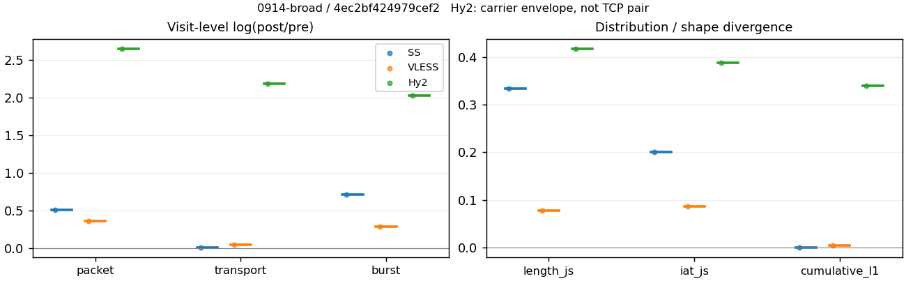
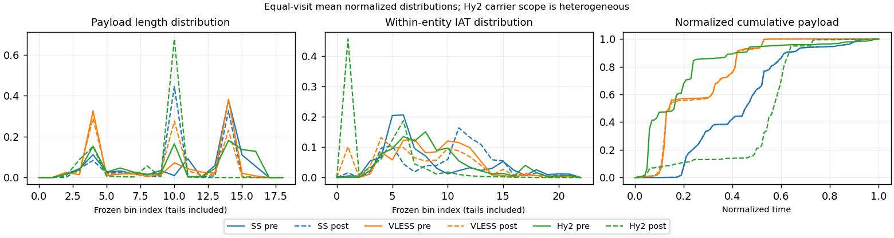

# 0914-broad · 条目 059 · spotify.com

目标：https://open.spotify.com/

活动标签：spotify.com::page_load。选定访问 3 次。

[返回总索引](../../README.md) · [统计口径](../../methods.md)

## 覆盖与资格（每次访问均保留）

| 部署 | 重复 | 主请求路由 | 活动状态 | 代理比较 | DIRECT pre | 请求 proxy/direct/unresolved | 错误 |
| --- | --- | --- | --- | --- | --- | --- | --- |
| Hy2 | 1 | proxy | passed | 1 | 1 | 270/4/0 | [] |
| SS | 1 | proxy | passed | 1 | 0 | 234/0/0 | [] |
| VLESS | 1 | proxy | passed | 1 | 0 | 281/0/0 | [] |

主请求非 proxy 的统计仅解释为已索引的辅助代理连接或 DIRECT 观测，不代表目标业务经代理传输。播放确认与配对资格是两道不同的门。

图中散点为单次访问，短线为重复中位数；Hy2 是共享载体包络，不能与 TCP 配对作等范围因果对比。

形态图先逐访问归一化，再对访问等权平均；实线 pre，虚线 post。分箱序号及边界见 methods，不将分箱索引误解为长度或时间。

## 每次访问的关键观测

### SS

范围：`exclusive_page`。每格 pre → post；空值为不可观测/不适用。

| 重复 | 包数 | 载荷字节 | burst | TCP FR | IAT中位µs | length JS | IAT JS |
| --- | --- | --- | --- | --- | --- | --- | --- |
| 1 | 4317 → 7166 | 6.2754e+06 → 6.3527e+06 | 2917 → 5961 | 361 → 369 | 41.072 → 1032.3 | 0.33293 | 0.20023 |

完整标量统计：中位数 [min,max]；Δ 为重复内逐访问变换的中位数，MAD 未缩放。n 为可用变换数；DIRECT-only 的 nΔ=0 不代表 pre 不可用。

| scope | 特征 | pre | post | Δ | IQRΔ | MADΔ | nΔ |
| --- | --- | --- | --- | --- | --- | --- | --- |
| exclusive_page | active_span_sum_s_1000ms | 85.094 [85.094, 85.094] | 99.071 [99.071, 99.071] | 0.15207 | — | — | 1 |
| exclusive_page | active_span_sum_s_100ms | 18.309 [18.309, 18.309] | 32.924 [32.924, 32.924] | 0.58684 | — | — | 1 |
| exclusive_page | active_span_sum_s_500ms | 54.061 [54.061, 54.061] | 69.602 [69.602, 69.602] | 0.25269 | — | — | 1 |
| exclusive_page | burst_bytes_iqr | 2896 [2896, 2896] | 1508 [1508, 1508] | -0.65255 | — | — | 1 |
| exclusive_page | burst_bytes_mad | 64 [64, 64] | 69 [69, 69] | 0.075223 | — | — | 1 |
| exclusive_page | burst_bytes_max | 23441 [23441, 23441] | 17136 [17136, 17136] | -0.31331 | — | — | 1 |
| exclusive_page | burst_bytes_mean | 2151.3 [2151.3, 2151.3] | 1065.7 [1065.7, 1065.7] | -0.70244 | — | — | 1 |
| exclusive_page | burst_bytes_median | 64 [64, 64] | 69 [69, 69] | 0.075223 | — | — | 1 |
| exclusive_page | burst_bytes_min | 0 [0, 0] | 0 [0, 0] | — | — | — | 0 |
| exclusive_page | burst_bytes_p95 | 10136 [10136, 10136] | 2856 [2856, 2856] | -1.2667 | — | — | 1 |
| exclusive_page | burst_bytes_q25 | 0 [0, 0] | 0 [0, 0] | — | — | — | 0 |
| exclusive_page | burst_bytes_q75 | 2896 [2896, 2896] | 1508 [1508, 1508] | -0.65255 | — | — | 1 |
| exclusive_page | burst_bytes_std | 3727.4 [3727.4, 3727.4] | 1409.8 [1409.8, 1409.8] | -0.97226 | — | — | 1 |
| exclusive_page | burst_count | 2917 [2917, 2917] | 5961 [5961, 5961] | 0.71468 | — | — | 1 |
| exclusive_page | burst_duration_ms_iqr | 0.032102 [0.032102, 0.032102] | 0 [0, 0] | — | — | — | 0 |
| exclusive_page | burst_duration_ms_mad | 0 [0, 0] | 0 [0, 0] | — | — | — | 0 |
| exclusive_page | burst_duration_ms_max | 15001 [15001, 15001] | 24682 [24682, 24682] | 0.49797 | — | — | 1 |
| exclusive_page | burst_duration_ms_mean | 169.23 [169.23, 169.23] | 64.131 [64.131, 64.131] | -0.97034 | — | — | 1 |
| exclusive_page | burst_duration_ms_median | 0 [0, 0] | 0 [0, 0] | — | — | — | 0 |
| exclusive_page | burst_duration_ms_min | 0 [0, 0] | 0 [0, 0] | — | — | — | 0 |
| exclusive_page | burst_duration_ms_p95 | 286.19 [286.19, 286.19] | 9.1181 [9.1181, 9.1181] | -3.4464 | — | — | 1 |
| exclusive_page | burst_duration_ms_q25 | 0 [0, 0] | 0 [0, 0] | — | — | — | 0 |
| exclusive_page | burst_duration_ms_q75 | 0.032102 [0.032102, 0.032102] | 0 [0, 0] | — | — | — | 0 |
| exclusive_page | burst_duration_ms_std | 1220.1 [1220.1, 1220.1] | 845.57 [845.57, 845.57] | -0.3667 | — | — | 1 |
| exclusive_page | burst_packets_iqr | 1 [1, 1] | 0 [0, 0] | — | — | — | 0 |
| exclusive_page | burst_packets_mad | 0 [0, 0] | 0 [0, 0] | — | — | — | 0 |
| exclusive_page | burst_packets_max | 12 [12, 12] | 11 [11, 11] | -0.087011 | — | — | 1 |
| exclusive_page | burst_packets_mean | 1.4799 [1.4799, 1.4799] | 1.2021 [1.2021, 1.2021] | -0.2079 | — | — | 1 |
| exclusive_page | burst_packets_median | 1 [1, 1] | 1 [1, 1] | 0 | — | — | 1 |
| exclusive_page | burst_packets_min | 1 [1, 1] | 1 [1, 1] | 0 | — | — | 1 |
| exclusive_page | burst_packets_p95 | 3 [3, 3] | 2 [2, 2] | -0.40547 | — | — | 1 |
| exclusive_page | burst_packets_q25 | 1 [1, 1] | 1 [1, 1] | 0 | — | — | 1 |
| exclusive_page | burst_packets_q75 | 2 [2, 2] | 1 [1, 1] | -0.69315 | — | — | 1 |
| exclusive_page | burst_packets_std | 0.98568 [0.98568, 0.98568] | 0.62619 [0.62619, 0.62619] | -0.45368 | — | — | 1 |
| exclusive_page | connection_span_concurrency_max | 25 [25, 25] | 25 [25, 25] | 0 | — | — | 1 |
| exclusive_page | cumulative_l1 | — | — | 0.00077793 | — | — | 1 |
| exclusive_page | cumulative_max | — | — | 0.0055014 | — | — | 1 |
| exclusive_page | direction_entropy | 0.65975 [0.65975, 0.65975] | 0.50903 [0.50903, 0.50903] | -0.15072 | — | — | 1 |
| exclusive_page | down_burst_count | 1445 [1445, 1445] | 2967 [2967, 2967] | 0.71944 | — | — | 1 |
| exclusive_page | down_ip_bytes | 6.2858e+06 [6.2858e+06, 6.2858e+06] | 6.401e+06 [6.401e+06, 6.401e+06] | 0.018161 | — | — | 1 |
| exclusive_page | down_packets | 2561 [2561, 2561] | 3775 [3775, 3775] | 0.388 | — | — | 1 |
| exclusive_page | down_transport_bytes | 6.1525e+06 [6.1525e+06, 6.1525e+06] | 6.2042e+06 [6.2042e+06, 6.2042e+06] | 0.0083734 | — | — | 1 |
| exclusive_page | duration_s | 49.054 [49.054, 49.054] | 49.053 [49.053, 49.053] | -2.8356e-05 | — | — | 1 |
| exclusive_page | entity_count | 27 [27, 27] | 27 [27, 27] | 0 | — | — | 1 |
| exclusive_page | fr_runs | 361 [361, 361] | 369 [369, 369] | 0.021919 | — | — | 1 |
| exclusive_page | fr_runs_per_packet | 0.14314 [0.14314, 0.14314] | 0.097233 [0.097233, 0.097233] | -0.045907 | — | — | 1 |
| exclusive_page | fr_switches | 334 [334, 334] | 342 [342, 342] | 0.02367 | — | — | 1 |
| exclusive_page | fr_switches_per_possible_transition | 0.13387 [0.13387, 0.13387] | 0.090764 [0.090764, 0.090764] | -0.043103 | — | — | 1 |
| exclusive_page | full_retransmission_fraction | 0.0020848 [0.0020848, 0.0020848] | 0.0065587 [0.0065587, 0.0065587] | 0.004474 | — | — | 1 |
| exclusive_page | full_retransmission_packets | 9 [9, 9] | 47 [47, 47] | 1.6529 | — | — | 1 |
| exclusive_page | iat_count | 4290 [4290, 4290] | 7139 [7139, 7139] | 0.50929 | — | — | 1 |
| exclusive_page | iat_js | — | — | 0.20023 | — | — | 1 |
| exclusive_page | iat_ks | — | — | 0.37714 | — | — | 1 |
| exclusive_page | iat_median_us | 41.072 [41.072, 41.072] | 1032.3 [1032.3, 1032.3] | 3.2243 | — | — | 1 |
| exclusive_page | iat_us_iqr | 917.15 [917.15, 917.15] | 5499.3 [5499.3, 5499.3] | 1.7911 | — | — | 1 |
| exclusive_page | iat_us_mad | 33.46 [33.46, 33.46] | 1023.6 [1023.6, 1023.6] | 3.4207 | — | — | 1 |
| exclusive_page | iat_us_max | 1.5002e+07 [1.5002e+07, 1.5002e+07] | 1.5502e+07 [1.5502e+07, 1.5502e+07] | 0.032819 | — | — | 1 |
| exclusive_page | iat_us_mean | 1.8219e+05 [1.8219e+05, 1.8219e+05] | 1.0949e+05 [1.0949e+05, 1.0949e+05] | -0.50924 | — | — | 1 |
| exclusive_page | iat_us_median | 41.072 [41.072, 41.072] | 1032.3 [1032.3, 1032.3] | 3.2243 | — | — | 1 |
| exclusive_page | iat_us_min | 0.025 [0.025, 0.025] | 0.038 [0.038, 0.038] | 0.41871 | — | — | 1 |
| exclusive_page | iat_us_p95 | 2.3807e+05 [2.3807e+05, 2.3807e+05] | 44477 [44477, 44477] | -1.6776 | — | — | 1 |
| exclusive_page | iat_us_q25 | 14.758 [14.758, 14.758] | 24.511 [24.511, 24.511] | 0.50737 | — | — | 1 |
| exclusive_page | iat_us_q75 | 931.9 [931.9, 931.9] | 5523.8 [5523.8, 5523.8] | 1.7796 | — | — | 1 |
| exclusive_page | iat_us_std | 1.3449e+06 [1.3449e+06, 1.3449e+06] | 1.0449e+06 [1.0449e+06, 1.0449e+06] | -0.25237 | — | — | 1 |
| exclusive_page | iat_wasserstein_log1p_us | — | — | 1.6662 | — | — | 1 |
| exclusive_page | idle_gap_count_1000ms | 98 [98, 98] | 97 [97, 97] | -0.010257 | — | — | 1 |
| exclusive_page | idle_gap_count_100ms | 279 [279, 279] | 289 [289, 289] | 0.035215 | — | — | 1 |
| exclusive_page | idle_gap_count_500ms | 139 [139, 139] | 136 [136, 136] | -0.021819 | — | — | 1 |
| exclusive_page | idle_gap_sum_s_1000ms | 696.52 [696.52, 696.52] | 682.58 [682.58, 682.58] | -0.020219 | — | — | 1 |
| exclusive_page | idle_gap_sum_s_100ms | 763.31 [763.31, 763.31] | 748.73 [748.73, 748.73] | -0.019287 | — | — | 1 |
| exclusive_page | idle_gap_sum_s_500ms | 727.55 [727.55, 727.55] | 712.05 [712.05, 712.05] | -0.021543 | — | — | 1 |
| exclusive_page | ip_bytes | 6.5004e+06 [6.5004e+06, 6.5004e+06] | 6.7713e+06 [6.7713e+06, 6.7713e+06] | 0.040826 | — | — | 1 |
| exclusive_page | length_iqr | 2046.2 [2046.2, 2046.2] | 1428 [1428, 1428] | -0.35973 | — | — | 1 |
| exclusive_page | length_js | — | — | 0.33293 | — | — | 1 |
| exclusive_page | length_ks | — | — | 0.50928 | — | — | 1 |
| exclusive_page | length_mad | 1448 [1448, 1448] | 962 [962, 962] | -0.40892 | — | — | 1 |
| exclusive_page | length_max | 8948 [8948, 8948] | 8568 [8568, 8568] | -0.043396 | — | — | 1 |
| exclusive_page | length_mean | 2488.3 [2488.3, 2488.3] | 1674 [1674, 1674] | -0.39639 | — | — | 1 |
| exclusive_page | length_median | 2896 [2896, 2896] | 1428 [1428, 1428] | -0.70706 | — | — | 1 |
| exclusive_page | length_min | 24 [24, 24] | 20 [20, 20] | -0.18232 | — | — | 1 |
| exclusive_page | length_p95 | 8192 [8192, 8192] | 2856 [2856, 2856] | -1.0537 | — | — | 1 |
| exclusive_page | length_q25 | 849.75 [849.75, 849.75] | 1428 [1428, 1428] | 0.51909 | — | — | 1 |
| exclusive_page | length_q75 | 2896 [2896, 2896] | 2856 [2856, 2856] | -0.013908 | — | — | 1 |
| exclusive_page | length_std | 2171.4 [2171.4, 2171.4] | 1001.6 [1001.6, 1001.6] | -0.77377 | — | — | 1 |
| exclusive_page | length_wasserstein_bytes | — | — | 980.61 | — | — | 1 |
| exclusive_page | nonempty_entity_count | 27 [27, 27] | 27 [27, 27] | 0 | — | — | 1 |
| exclusive_page | nonempty_packets | 2522 [2522, 2522] | 3795 [3795, 3795] | 0.40863 | — | — | 1 |
| exclusive_page | offload_suspect_fraction | 0.35349 [0.35349, 0.35349] | 0.18378 [0.18378, 0.18378] | -0.1697 | — | — | 1 |
| exclusive_page | packet_count | 4317 [4317, 4317] | 7166 [7166, 7166] | 0.50679 | — | — | 1 |
| exclusive_page | rtt_median_ms | 0.063343 [0.063343, 0.063343] | 32.438 [32.438, 32.438] | 6.2385 | — | — | 1 |
| exclusive_page | rtt_sample_count | 1699 [1699, 1699] | 1395 [1395, 1395] | -0.19715 | — | — | 1 |
| exclusive_page | tcp_ack_count | 4288 [4288, 4288] | 7134 [7134, 7134] | 0.50905 | — | — | 1 |
| exclusive_page | tcp_fin_count | 53 [53, 53] | 59 [59, 59] | 0.10725 | — | — | 1 |
| exclusive_page | tcp_packet_count | 4317 [4317, 4317] | 7166 [7166, 7166] | 0.50679 | — | — | 1 |
| exclusive_page | tcp_rst_count | 2 [2, 2] | 0 [0, 0] | — | — | — | 0 |
| exclusive_page | tcp_syn_count | 54 [54, 54] | 61 [61, 61] | 0.12189 | — | — | 1 |
| exclusive_page | tcp_window_raw_median | 65535 [65535, 65535] | 140 [140, 140] | -6.1487 | — | — | 1 |
| exclusive_page | transition_entropy | 0.49016 [0.49016, 0.49016] | 0.35944 [0.35944, 0.35944] | -0.13071 | — | — | 1 |
| exclusive_page | transition_n_mm | 1917 [1917, 1917] | 3188 [3188, 3188] | 0.50863 | — | — | 1 |
| exclusive_page | transition_n_mp | 160 [160, 160] | 164 [164, 164] | 0.024693 | — | — | 1 |
| exclusive_page | transition_n_pm | 174 [174, 174] | 178 [178, 178] | 0.022728 | — | — | 1 |
| exclusive_page | transition_n_pp | 244 [244, 244] | 238 [238, 238] | -0.024898 | — | — | 1 |
| exclusive_page | transition_p_mm | 0.92297 [0.92297, 0.92297] | 0.95107 [0.95107, 0.95107] | 0.028108 | — | — | 1 |
| exclusive_page | transition_p_mp | 0.077034 [0.077034, 0.077034] | 0.048926 [0.048926, 0.048926] | -0.028108 | — | — | 1 |
| exclusive_page | transition_p_pm | 0.41627 [0.41627, 0.41627] | 0.42788 [0.42788, 0.42788] | 0.011617 | — | — | 1 |
| exclusive_page | transition_p_pp | 0.58373 [0.58373, 0.58373] | 0.57212 [0.57212, 0.57212] | -0.011617 | — | — | 1 |
| exclusive_page | transport_bytes | 6.2754e+06 [6.2754e+06, 6.2754e+06] | 6.3527e+06 [6.3527e+06, 6.3527e+06] | 0.012241 | — | — | 1 |
| exclusive_page | up_burst_count | 1472 [1472, 1472] | 2994 [2994, 2994] | 0.70999 | — | — | 1 |
| exclusive_page | up_byte_fraction | 0.019592 [0.019592, 0.019592] | 0.023377 [0.023377, 0.023377] | 0.003785 | — | — | 1 |
| exclusive_page | up_ip_bytes | 2.1456e+05 [2.1456e+05, 2.1456e+05] | 3.7024e+05 [3.7024e+05, 3.7024e+05] | 0.54556 | — | — | 1 |
| exclusive_page | up_packets | 1756 [1756, 1756] | 3391 [3391, 3391] | 0.65809 | — | — | 1 |
| exclusive_page | up_transport_bytes | 1.2295e+05 [1.2295e+05, 1.2295e+05] | 1.4851e+05 [1.4851e+05, 1.4851e+05] | 0.18887 | — | — | 1 |
| exclusive_page | zero_iat_count | 0 [0, 0] | 0 [0, 0] | — | — | — | 0 |
| exclusive_page | zero_iat_fraction | 0 [0, 0] | 0 [0, 0] | 0 | — | — | 1 |

### VLESS

范围：`exclusive_page`。每格 pre → post；空值为不可观测/不适用。

| 重复 | 包数 | 载荷字节 | burst | TCP FR | IAT中位µs | length JS | IAT JS |
| --- | --- | --- | --- | --- | --- | --- | --- |
| 1 | 5406 → 7765 | 4.907e+06 → 5.1484e+06 | 4027 → 5376 | 258 → 320 | 261.73 → 62.788 | 0.077745 | 0.086974 |

完整标量统计：中位数 [min,max]；Δ 为重复内逐访问变换的中位数，MAD 未缩放。n 为可用变换数；DIRECT-only 的 nΔ=0 不代表 pre 不可用。

| scope | 特征 | pre | post | Δ | IQRΔ | MADΔ | nΔ |
| --- | --- | --- | --- | --- | --- | --- | --- |
| exclusive_page | active_span_sum_s_1000ms | 47.745 [47.745, 47.745] | 49.682 [49.682, 49.682] | 0.039781 | — | — | 1 |
| exclusive_page | active_span_sum_s_100ms | 8.3714 [8.3714, 8.3714] | 19.107 [19.107, 19.107] | 0.82522 | — | — | 1 |
| exclusive_page | active_span_sum_s_500ms | 25.73 [25.73, 25.73] | 46.864 [46.864, 46.864] | 0.59959 | — | — | 1 |
| exclusive_page | burst_bytes_iqr | 2824 [2824, 2824] | 2639.8 [2639.8, 2639.8] | -0.06747 | — | — | 1 |
| exclusive_page | burst_bytes_mad | 31 [31, 31] | 39 [39, 39] | 0.22957 | — | — | 1 |
| exclusive_page | burst_bytes_max | 23860 [23860, 23860] | 13032 [13032, 13032] | -0.6048 | — | — | 1 |
| exclusive_page | burst_bytes_mean | 1218.5 [1218.5, 1218.5] | 957.67 [957.67, 957.67] | -0.2409 | — | — | 1 |
| exclusive_page | burst_bytes_median | 31 [31, 31] | 39 [39, 39] | 0.22957 | — | — | 1 |
| exclusive_page | burst_bytes_min | 0 [0, 0] | 0 [0, 0] | — | — | — | 0 |
| exclusive_page | burst_bytes_p95 | 4344 [4344, 4344] | 2896 [2896, 2896] | -0.40547 | — | — | 1 |
| exclusive_page | burst_bytes_q25 | 0 [0, 0] | 0 [0, 0] | — | — | — | 0 |
| exclusive_page | burst_bytes_q75 | 2824 [2824, 2824] | 2639.8 [2639.8, 2639.8] | -0.06747 | — | — | 1 |
| exclusive_page | burst_bytes_std | 2039.2 [2039.2, 2039.2] | 1336.8 [1336.8, 1336.8] | -0.42225 | — | — | 1 |
| exclusive_page | burst_count | 4027 [4027, 4027] | 5376 [5376, 5376] | 0.28892 | — | — | 1 |
| exclusive_page | burst_duration_ms_iqr | 0.2207 [0.2207, 0.2207] | 0.000136 [0.000136, 0.000136] | -7.3919 | — | — | 1 |
| exclusive_page | burst_duration_ms_mad | 0 [0, 0] | 0 [0, 0] | — | — | — | 0 |
| exclusive_page | burst_duration_ms_max | 15001 [15001, 15001] | 15046 [15046, 15046] | 0.003014 | — | — | 1 |
| exclusive_page | burst_duration_ms_mean | 52.939 [52.939, 52.939] | 33.412 [33.412, 33.412] | -0.46023 | — | — | 1 |
| exclusive_page | burst_duration_ms_median | 0 [0, 0] | 0 [0, 0] | — | — | — | 0 |
| exclusive_page | burst_duration_ms_min | 0 [0, 0] | 0 [0, 0] | — | — | — | 0 |
| exclusive_page | burst_duration_ms_p95 | 9.592 [9.592, 9.592] | 9.2448 [9.2448, 9.2448] | -0.036869 | — | — | 1 |
| exclusive_page | burst_duration_ms_q25 | 0 [0, 0] | 0 [0, 0] | — | — | — | 0 |
| exclusive_page | burst_duration_ms_q75 | 0.2207 [0.2207, 0.2207] | 0.000136 [0.000136, 0.000136] | -7.3919 | — | — | 1 |
| exclusive_page | burst_duration_ms_std | 707.53 [707.53, 707.53] | 625.89 [625.89, 625.89] | -0.1226 | — | — | 1 |
| exclusive_page | burst_packets_iqr | 1 [1, 1] | 1 [1, 1] | 0 | — | — | 1 |
| exclusive_page | burst_packets_mad | 0 [0, 0] | 0 [0, 0] | — | — | — | 0 |
| exclusive_page | burst_packets_max | 16 [16, 16] | 8 [8, 8] | -0.69315 | — | — | 1 |
| exclusive_page | burst_packets_mean | 1.3424 [1.3424, 1.3424] | 1.4444 [1.4444, 1.4444] | 0.073194 | — | — | 1 |
| exclusive_page | burst_packets_median | 1 [1, 1] | 1 [1, 1] | 0 | — | — | 1 |
| exclusive_page | burst_packets_min | 1 [1, 1] | 1 [1, 1] | 0 | — | — | 1 |
| exclusive_page | burst_packets_p95 | 2 [2, 2] | 3 [3, 3] | 0.40547 | — | — | 1 |
| exclusive_page | burst_packets_q25 | 1 [1, 1] | 1 [1, 1] | 0 | — | — | 1 |
| exclusive_page | burst_packets_q75 | 2 [2, 2] | 2 [2, 2] | 0 | — | — | 1 |
| exclusive_page | burst_packets_std | 0.60311 [0.60311, 0.60311] | 0.83668 [0.83668, 0.83668] | 0.32734 | — | — | 1 |
| exclusive_page | connection_span_concurrency_max | 20 [20, 20] | 20 [20, 20] | 0 | — | — | 1 |
| exclusive_page | cumulative_l1 | — | — | 0.0039304 | — | — | 1 |
| exclusive_page | cumulative_max | — | — | 0.056051 | — | — | 1 |
| exclusive_page | direction_entropy | 0.42524 [0.42524, 0.42524] | 0.37567 [0.37567, 0.37567] | -0.049578 | — | — | 1 |
| exclusive_page | down_burst_count | 1998 [1998, 1998] | 2673 [2673, 2673] | 0.29105 | — | — | 1 |
| exclusive_page | down_ip_bytes | 4.9781e+06 [4.9781e+06, 4.9781e+06] | 5.2108e+06 [5.2108e+06, 5.2108e+06] | 0.045673 | — | — | 1 |
| exclusive_page | down_packets | 3222 [3222, 3222] | 4257 [4257, 4257] | 0.27856 | — | — | 1 |
| exclusive_page | down_transport_bytes | 4.8103e+06 [4.8103e+06, 4.8103e+06] | 4.9891e+06 [4.9891e+06, 4.9891e+06] | 0.0365 | — | — | 1 |
| exclusive_page | duration_s | 27.133 [27.133, 27.133] | 27.061 [27.061, 27.061] | -0.0026639 | — | — | 1 |
| exclusive_page | entity_count | 31 [31, 31] | 31 [31, 31] | 0 | — | — | 1 |
| exclusive_page | fr_runs | 258 [258, 258] | 320 [320, 320] | 0.21536 | — | — | 1 |
| exclusive_page | fr_runs_per_packet | 0.081905 [0.081905, 0.081905] | 0.07696 [0.07696, 0.07696] | -0.0049447 | — | — | 1 |
| exclusive_page | fr_switches | 227 [227, 227] | 289 [289, 289] | 0.24148 | — | — | 1 |
| exclusive_page | fr_switches_per_possible_transition | 0.07278 [0.07278, 0.07278] | 0.070027 [0.070027, 0.070027] | -0.0027531 | — | — | 1 |
| exclusive_page | full_retransmission_fraction | 0.0009249 [0.0009249, 0.0009249] | 0 [0, 0] | -0.0009249 | — | — | 1 |
| exclusive_page | full_retransmission_packets | 5 [5, 5] | 0 [0, 0] | — | — | — | 0 |
| exclusive_page | iat_count | 5375 [5375, 5375] | 7734 [7734, 7734] | 0.36387 | — | — | 1 |
| exclusive_page | iat_js | — | — | 0.086974 | — | — | 1 |
| exclusive_page | iat_ks | — | — | 0.21605 | — | — | 1 |
| exclusive_page | iat_median_us | 261.73 [261.73, 261.73] | 62.788 [62.788, 62.788] | -1.4275 | — | — | 1 |
| exclusive_page | iat_us_iqr | 1438.5 [1438.5, 1438.5] | 1069.4 [1069.4, 1069.4] | -0.29651 | — | — | 1 |
| exclusive_page | iat_us_mad | 253.66 [253.66, 253.66] | 62.697 [62.697, 62.697] | -1.3977 | — | — | 1 |
| exclusive_page | iat_us_max | 1.5001e+07 [1.5001e+07, 1.5001e+07] | 1.5065e+07 [1.5065e+07, 1.5065e+07] | 0.0042174 | — | — | 1 |
| exclusive_page | iat_us_mean | 71136 [71136, 71136] | 48937 [48937, 48937] | -0.37406 | — | — | 1 |
| exclusive_page | iat_us_median | 261.73 [261.73, 261.73] | 62.788 [62.788, 62.788] | -1.4275 | — | — | 1 |
| exclusive_page | iat_us_min | 0.055 [0.055, 0.055] | 0.03 [0.03, 0.03] | -0.60614 | — | — | 1 |
| exclusive_page | iat_us_p95 | 9810.4 [9810.4, 9810.4] | 39669 [39669, 39669] | 1.3971 | — | — | 1 |
| exclusive_page | iat_us_q25 | 42.474 [42.474, 42.474] | 8.9277 [8.9277, 8.9277] | -1.5597 | — | — | 1 |
| exclusive_page | iat_us_q75 | 1481 [1481, 1481] | 1078.3 [1078.3, 1078.3] | -0.31729 | — | — | 1 |
| exclusive_page | iat_us_std | 8.852e+05 [8.852e+05, 8.852e+05] | 7.3682e+05 [7.3682e+05, 7.3682e+05] | -0.18346 | — | — | 1 |
| exclusive_page | iat_wasserstein_log1p_us | — | — | 0.9842 | — | — | 1 |
| exclusive_page | idle_gap_count_1000ms | 41 [41, 41] | 37 [37, 37] | -0.10265 | — | — | 1 |
| exclusive_page | idle_gap_count_100ms | 159 [159, 159] | 190 [190, 190] | 0.17812 | — | — | 1 |
| exclusive_page | idle_gap_count_500ms | 74 [74, 74] | 41 [41, 41] | -0.59049 | — | — | 1 |
| exclusive_page | idle_gap_sum_s_1000ms | 334.61 [334.61, 334.61] | 328.8 [328.8, 328.8] | -0.017529 | — | — | 1 |
| exclusive_page | idle_gap_sum_s_100ms | 373.98 [373.98, 373.98] | 359.37 [359.37, 359.37] | -0.039855 | — | — | 1 |
| exclusive_page | idle_gap_sum_s_500ms | 356.63 [356.63, 356.63] | 331.62 [331.62, 331.62] | -0.072711 | — | — | 1 |
| exclusive_page | ip_bytes | 5.188e+06 [5.188e+06, 5.188e+06] | 5.5613e+06 [5.5613e+06, 5.5613e+06] | 0.06949 | — | — | 1 |
| exclusive_page | length_iqr | 2752 [2752, 2752] | 1448 [1448, 1448] | -0.64214 | — | — | 1 |
| exclusive_page | length_js | — | — | 0.077745 | — | — | 1 |
| exclusive_page | length_ks | — | — | 0.20648 | — | — | 1 |
| exclusive_page | length_mad | 1376 [1376, 1376] | 1340 [1340, 1340] | -0.026511 | — | — | 1 |
| exclusive_page | length_max | 8920 [8920, 8920] | 7060 [7060, 7060] | -0.23385 | — | — | 1 |
| exclusive_page | length_mean | 1557.8 [1557.8, 1557.8] | 1238.2 [1238.2, 1238.2] | -0.22961 | — | — | 1 |
| exclusive_page | length_median | 1448 [1448, 1448] | 1412 [1412, 1412] | -0.025176 | — | — | 1 |
| exclusive_page | length_min | 12 [12, 12] | 1 [1, 1] | -2.4849 | — | — | 1 |
| exclusive_page | length_p95 | 2896 [2896, 2896] | 2824 [2824, 2824] | -0.025176 | — | — | 1 |
| exclusive_page | length_q25 | 72 [72, 72] | 72 [72, 72] | 0 | — | — | 1 |
| exclusive_page | length_q75 | 2824 [2824, 2824] | 1520 [1520, 1520] | -0.61944 | — | — | 1 |
| exclusive_page | length_std | 1473 [1473, 1473] | 1067.9 [1067.9, 1067.9] | -0.32164 | — | — | 1 |
| exclusive_page | length_wasserstein_bytes | — | — | 359.42 | — | — | 1 |
| exclusive_page | nonempty_entity_count | 31 [31, 31] | 31 [31, 31] | 0 | — | — | 1 |
| exclusive_page | nonempty_packets | 3150 [3150, 3150] | 4158 [4158, 4158] | 0.27763 | — | — | 1 |
| exclusive_page | offload_suspect_fraction | 0.2673 [0.2673, 0.2673] | 0.14102 [0.14102, 0.14102] | -0.12628 | — | — | 1 |
| exclusive_page | packet_count | 5406 [5406, 5406] | 7765 [7765, 7765] | 0.36212 | — | — | 1 |
| exclusive_page | rtt_median_ms | 0.16063 [0.16063, 0.16063] | 0.048105 [0.048105, 0.048105] | -1.2057 | — | — | 1 |
| exclusive_page | rtt_sample_count | 2123 [2123, 2123] | 3115 [3115, 3115] | 0.3834 | — | — | 1 |
| exclusive_page | tcp_ack_count | 5317 [5317, 5317] | 7734 [7734, 7734] | 0.37472 | — | — | 1 |
| exclusive_page | tcp_fin_count | 58 [58, 58] | 62 [62, 62] | 0.066691 | — | — | 1 |
| exclusive_page | tcp_packet_count | 5406 [5406, 5406] | 7765 [7765, 7765] | 0.36212 | — | — | 1 |
| exclusive_page | tcp_rst_count | 58 [58, 58] | 0 [0, 0] | — | — | — | 0 |
| exclusive_page | tcp_syn_count | 62 [62, 62] | 62 [62, 62] | 0 | — | — | 1 |
| exclusive_page | tcp_window_raw_median | 65535 [65535, 65535] | 157 [157, 157] | -6.0341 | — | — | 1 |
| exclusive_page | transition_entropy | 0.28458 [0.28458, 0.28458] | 0.27017 [0.27017, 0.27017] | -0.014416 | — | — | 1 |
| exclusive_page | transition_n_mm | 2748 [2748, 2748] | 3696 [3696, 3696] | 0.29638 | — | — | 1 |
| exclusive_page | transition_n_mp | 98 [98, 98] | 129 [129, 129] | 0.27484 | — | — | 1 |
| exclusive_page | transition_n_pm | 129 [129, 129] | 160 [160, 160] | 0.21536 | — | — | 1 |
| exclusive_page | transition_n_pp | 144 [144, 144] | 142 [142, 142] | -0.013986 | — | — | 1 |
| exclusive_page | transition_p_mm | 0.96557 [0.96557, 0.96557] | 0.96627 [0.96627, 0.96627] | 0.0007088 | — | — | 1 |
| exclusive_page | transition_p_mp | 0.034434 [0.034434, 0.034434] | 0.033725 [0.033725, 0.033725] | -0.0007088 | — | — | 1 |
| exclusive_page | transition_p_pm | 0.47253 [0.47253, 0.47253] | 0.5298 [0.5298, 0.5298] | 0.057274 | — | — | 1 |
| exclusive_page | transition_p_pp | 0.52747 [0.52747, 0.52747] | 0.4702 [0.4702, 0.4702] | -0.057274 | — | — | 1 |
| exclusive_page | transport_bytes | 4.907e+06 [4.907e+06, 4.907e+06] | 5.1484e+06 [5.1484e+06, 5.1484e+06] | 0.048021 | — | — | 1 |
| exclusive_page | up_burst_count | 2029 [2029, 2029] | 2703 [2703, 2703] | 0.28682 | — | — | 1 |
| exclusive_page | up_byte_fraction | 0.019709 [0.019709, 0.019709] | 0.030938 [0.030938, 0.030938] | 0.011229 | — | — | 1 |
| exclusive_page | up_ip_bytes | 2.0989e+05 [2.0989e+05, 2.0989e+05] | 3.5059e+05 [3.5059e+05, 3.5059e+05] | 0.51301 | — | — | 1 |
| exclusive_page | up_packets | 2184 [2184, 2184] | 3508 [3508, 3508] | 0.47389 | — | — | 1 |
| exclusive_page | up_transport_bytes | 96714 [96714, 96714] | 1.5928e+05 [1.5928e+05, 1.5928e+05] | 0.49893 | — | — | 1 |
| exclusive_page | zero_iat_count | 0 [0, 0] | 0 [0, 0] | — | — | — | 0 |
| exclusive_page | zero_iat_fraction | 0 [0, 0] | 0 [0, 0] | 0 | — | — | 1 |

### Hy2

范围：`carrier_context_envelope`。每格 pre → post；空值为不可观测/不适用。

| 重复 | 包数 | 载荷字节 | burst | TCP FR | IAT中位µs | length JS | IAT JS |
| --- | --- | --- | --- | --- | --- | --- | --- |
| 1 | 3560 → 50092 | 5.92e+06 → 5.272e+07 | 2345 → 17721 | — | 126.33 → 5.173 | 0.41641 | 0.38716 |

范围：`direct_pre_only`。每格 pre → post；空值为不可观测/不适用。

| 重复 | 包数 | 载荷字节 | burst | TCP FR | IAT中位µs | length JS | IAT JS |
| --- | --- | --- | --- | --- | --- | --- | --- |
| 1 | 263 → — | 5.262e+05 → — | 160 → — | 18 → — | 111.31 → — | — | — |

完整标量统计：中位数 [min,max]；Δ 为重复内逐访问变换的中位数，MAD 未缩放。n 为可用变换数；DIRECT-only 的 nΔ=0 不代表 pre 不可用。

| scope | 特征 | pre | post | Δ | IQRΔ | MADΔ | nΔ |
| --- | --- | --- | --- | --- | --- | --- | --- |
| carrier_context_envelope | active_span_sum_s_1000ms | 51.741 [51.741, 51.741] | 23.435 [23.435, 23.435] | -0.79202 | — | — | 1 |
| carrier_context_envelope | active_span_sum_s_100ms | 5.2465 [5.2465, 5.2465] | 13.024 [13.024, 13.024] | 0.90924 | — | — | 1 |
| carrier_context_envelope | active_span_sum_s_500ms | 44.65 [44.65, 44.65] | 22.684 [22.684, 22.684] | -0.6772 | — | — | 1 |
| carrier_context_envelope | burst_bytes_iqr | 2818 [2818, 2818] | 3419 [3419, 3419] | 0.19332 | — | — | 1 |
| carrier_context_envelope | burst_bytes_mad | 81 [81, 81] | 264 [264, 264] | 1.1815 | — | — | 1 |
| carrier_context_envelope | burst_bytes_max | 28672 [28672, 28672] | 2.2349e+05 [2.2349e+05, 2.2349e+05] | 2.0534 | — | — | 1 |
| carrier_context_envelope | burst_bytes_mean | 2524.5 [2524.5, 2524.5] | 2975 [2975, 2975] | 0.16419 | — | — | 1 |
| carrier_context_envelope | burst_bytes_median | 81 [81, 81] | 297 [297, 297] | 1.2993 | — | — | 1 |
| carrier_context_envelope | burst_bytes_min | 0 [0, 0] | 22 [22, 22] | — | — | — | 0 |
| carrier_context_envelope | burst_bytes_p95 | 14360 [14360, 14360] | 10956 [10956, 10956] | -0.27056 | — | — | 1 |
| carrier_context_envelope | burst_bytes_q25 | 0 [0, 0] | 96 [96, 96] | — | — | — | 0 |
| carrier_context_envelope | burst_bytes_q75 | 2818 [2818, 2818] | 3515 [3515, 3515] | 0.22101 | — | — | 1 |
| carrier_context_envelope | burst_bytes_std | 4898.2 [4898.2, 4898.2] | 5888.9 [5888.9, 5888.9] | 0.18422 | — | — | 1 |
| carrier_context_envelope | burst_count | 2345 [2345, 2345] | 17721 [17721, 17721] | 2.0225 | — | — | 1 |
| carrier_context_envelope | burst_duration_ms_iqr | 0.16955 [0.16955, 0.16955] | 0.024805 [0.024805, 0.024805] | -1.9221 | — | — | 1 |
| carrier_context_envelope | burst_duration_ms_mad | 0 [0, 0] | 4.4e-05 [4.4e-05, 4.4e-05] | — | — | — | 0 |
| carrier_context_envelope | burst_duration_ms_max | 15001 [15001, 15001] | 247.98 [247.98, 247.98] | -4.1025 | — | — | 1 |
| carrier_context_envelope | burst_duration_ms_mean | 80.205 [80.205, 80.205] | 0.33349 [0.33349, 0.33349] | -5.4827 | — | — | 1 |
| carrier_context_envelope | burst_duration_ms_median | 0 [0, 0] | 4.4e-05 [4.4e-05, 4.4e-05] | — | — | — | 0 |
| carrier_context_envelope | burst_duration_ms_min | 0 [0, 0] | 0 [0, 0] | — | — | — | 0 |
| carrier_context_envelope | burst_duration_ms_p95 | 190.51 [190.51, 190.51] | 0.14083 [0.14083, 0.14083] | -7.2099 | — | — | 1 |
| carrier_context_envelope | burst_duration_ms_q25 | 0 [0, 0] | 0 [0, 0] | — | — | — | 0 |
| carrier_context_envelope | burst_duration_ms_q75 | 0.16955 [0.16955, 0.16955] | 0.024805 [0.024805, 0.024805] | -1.9221 | — | — | 1 |
| carrier_context_envelope | burst_duration_ms_std | 815.07 [815.07, 815.07] | 4.4872 [4.4872, 4.4872] | -5.202 | — | — | 1 |
| carrier_context_envelope | burst_packets_iqr | 1 [1, 1] | 2 [2, 2] | 0.69315 | — | — | 1 |
| carrier_context_envelope | burst_packets_mad | 0 [0, 0] | 1 [1, 1] | — | — | — | 0 |
| carrier_context_envelope | burst_packets_max | 9 [9, 9] | 169 [169, 169] | 2.9327 | — | — | 1 |
| carrier_context_envelope | burst_packets_mean | 1.5181 [1.5181, 1.5181] | 2.8267 [2.8267, 2.8267] | 0.62164 | — | — | 1 |
| carrier_context_envelope | burst_packets_median | 1 [1, 1] | 2 [2, 2] | 0.69315 | — | — | 1 |
| carrier_context_envelope | burst_packets_min | 1 [1, 1] | 1 [1, 1] | 0 | — | — | 1 |
| carrier_context_envelope | burst_packets_p95 | 3 [3, 3] | 8 [8, 8] | 0.98083 | — | — | 1 |
| carrier_context_envelope | burst_packets_q25 | 1 [1, 1] | 1 [1, 1] | 0 | — | — | 1 |
| carrier_context_envelope | burst_packets_q75 | 2 [2, 2] | 3 [3, 3] | 0.40547 | — | — | 1 |
| carrier_context_envelope | burst_packets_std | 0.82897 [0.82897, 0.82897] | 4.0783 [4.0783, 4.0783] | 1.5932 | — | — | 1 |
| carrier_context_envelope | connection_span_concurrency_max | 21 [21, 21] | 1 [1, 1] | -3.0445 | — | — | 1 |
| carrier_context_envelope | cumulative_l1 | — | — | 0.33867 | — | — | 1 |
| carrier_context_envelope | cumulative_max | — | — | 0.79192 | — | — | 1 |
| carrier_context_envelope | direction_entropy | 0.74716 [0.74716, 0.74716] | 0.78871 [0.78871, 0.78871] | 0.041548 | — | — | 1 |
| carrier_context_envelope | direction_run_analog_runs | 435 [435, 435] | 17721 [17721, 17721] | 3.7072 | — | — | 1 |
| carrier_context_envelope | direction_run_analog_runs_per_packet | 0.20774 [0.20774, 0.20774] | 0.35377 [0.35377, 0.35377] | 0.14603 | — | — | 1 |
| carrier_context_envelope | direction_run_analog_switches | 408 [408, 408] | 17720 [17720, 17720] | 3.7712 | — | — | 1 |
| carrier_context_envelope | direction_run_analog_switches_per_possible_transition | 0.19739 [0.19739, 0.19739] | 0.35376 [0.35376, 0.35376] | 0.15637 | — | — | 1 |
| carrier_context_envelope | down_burst_count | 1159 [1159, 1159] | 8860 [8860, 8860] | 2.034 | — | — | 1 |
| carrier_context_envelope | down_ip_bytes | 5.9023e+06 [5.9023e+06, 5.9023e+06] | 5.2641e+07 [5.2641e+07, 5.2641e+07] | 2.1881 | — | — | 1 |
| carrier_context_envelope | down_packets | 2138 [2138, 2138] | 38259 [38259, 38259] | 2.8845 | — | — | 1 |
| carrier_context_envelope | down_transport_bytes | 5.791e+06 [5.791e+06, 5.791e+06] | 5.1569e+07 [5.1569e+07, 5.1569e+07] | 2.1866 | — | — | 1 |
| carrier_context_envelope | duration_s | 23.436 [23.436, 23.436] | 23.435 [23.435, 23.435] | -4.2463e-05 | — | — | 1 |
| carrier_context_envelope | entity_count | 27 [27, 27] | 1 [1, 1] | -3.2958 | — | — | 1 |
| carrier_context_envelope | full_retransmission_fraction | 0.0030899 [0.0030899, 0.0030899] | — | — | — | — | 0 |
| carrier_context_envelope | full_retransmission_packets | 11 [11, 11] | — | — | — | — | 0 |
| carrier_context_envelope | iat_count | 3533 [3533, 3533] | 50091 [50091, 50091] | 2.6517 | — | — | 1 |
| carrier_context_envelope | iat_js | — | — | 0.38716 | — | — | 1 |
| carrier_context_envelope | iat_ks | — | — | 0.56137 | — | — | 1 |
| carrier_context_envelope | iat_median_us | 126.33 [126.33, 126.33] | 5.173 [5.173, 5.173] | -3.1955 | — | — | 1 |
| carrier_context_envelope | iat_us_iqr | 791.57 [791.57, 791.57] | 25.16 [25.16, 25.16] | -3.4488 | — | — | 1 |
| carrier_context_envelope | iat_us_mad | 114.23 [114.23, 114.23] | 5.136 [5.136, 5.136] | -3.1019 | — | — | 1 |
| carrier_context_envelope | iat_us_max | 1.5001e+07 [1.5001e+07, 1.5001e+07] | 7.5161e+05 [7.5161e+05, 7.5161e+05] | -2.9937 | — | — | 1 |
| carrier_context_envelope | iat_us_mean | 1.1346e+05 [1.1346e+05, 1.1346e+05] | 467.85 [467.85, 467.85] | -5.4911 | — | — | 1 |
| carrier_context_envelope | iat_us_median | 126.33 [126.33, 126.33] | 5.173 [5.173, 5.173] | -3.1955 | — | — | 1 |
| carrier_context_envelope | iat_us_min | 0.073 [0.073, 0.073] | 0.001 [0.001, 0.001] | -4.2905 | — | — | 1 |
| carrier_context_envelope | iat_us_p95 | 1.7905e+05 [1.7905e+05, 1.7905e+05] | 314.67 [314.67, 314.67] | -6.3439 | — | — | 1 |
| carrier_context_envelope | iat_us_q25 | 29.086 [29.086, 29.086] | 0.045 [0.045, 0.045] | -6.4713 | — | — | 1 |
| carrier_context_envelope | iat_us_q75 | 820.66 [820.66, 820.66] | 25.205 [25.205, 25.205] | -3.4831 | — | — | 1 |
| carrier_context_envelope | iat_us_std | 1.089e+06 [1.089e+06, 1.089e+06] | 7375.6 [7375.6, 7375.6] | -4.9948 | — | — | 1 |
| carrier_context_envelope | iat_wasserstein_log1p_us | — | — | 3.4849 | — | — | 1 |
| carrier_context_envelope | idle_gap_count_1000ms | 41 [41, 41] | 0 [0, 0] | — | — | — | 0 |
| carrier_context_envelope | idle_gap_count_100ms | 249 [249, 249] | 56 [56, 56] | -1.4921 | — | — | 1 |
| carrier_context_envelope | idle_gap_count_500ms | 50 [50, 50] | 1 [1, 1] | -3.912 | — | — | 1 |
| carrier_context_envelope | idle_gap_sum_s_1000ms | 349.12 [349.12, 349.12] | 0 [0, 0] | — | — | — | 0 |
| carrier_context_envelope | idle_gap_sum_s_100ms | 395.61 [395.61, 395.61] | 10.411 [10.411, 10.411] | -3.6376 | — | — | 1 |
| carrier_context_envelope | idle_gap_sum_s_500ms | 356.21 [356.21, 356.21] | 0.75161 [0.75161, 0.75161] | -6.1611 | — | — | 1 |
| carrier_context_envelope | ip_bytes | 6.1057e+06 [6.1057e+06, 6.1057e+06] | 5.4122e+07 [5.4122e+07, 5.4122e+07] | 2.182 | — | — | 1 |
| carrier_context_envelope | length_iqr | 3874.8 [3874.8, 3874.8] | 1274 [1274, 1274] | -1.1123 | — | — | 1 |
| carrier_context_envelope | length_js | — | — | 0.41641 | — | — | 1 |
| carrier_context_envelope | length_ks | — | — | 0.49475 | — | — | 1 |
| carrier_context_envelope | length_mad | 1330 [1330, 1330] | 0 [0, 0] | — | — | — | 0 |
| carrier_context_envelope | length_max | 8920 [8920, 8920] | 1441 [1441, 1441] | -1.823 | — | — | 1 |
| carrier_context_envelope | length_mean | 2827.1 [2827.1, 2827.1] | 1052.5 [1052.5, 1052.5] | -0.98813 | — | — | 1 |
| carrier_context_envelope | length_median | 1411 [1411, 1411] | 1435 [1435, 1435] | 0.016866 | — | — | 1 |
| carrier_context_envelope | length_min | 9 [9, 9] | 22 [22, 22] | 0.89382 | — | — | 1 |
| carrier_context_envelope | length_p95 | 8920 [8920, 8920] | 1435 [1435, 1435] | -1.8271 | — | — | 1 |
| carrier_context_envelope | length_q25 | 352.25 [352.25, 352.25] | 161 [161, 161] | -0.78294 | — | — | 1 |
| carrier_context_envelope | length_q75 | 4227 [4227, 4227] | 1435 [1435, 1435] | -1.0803 | — | — | 1 |
| carrier_context_envelope | length_std | 2944.3 [2944.3, 2944.3] | 587.51 [587.51, 587.51] | -1.6117 | — | — | 1 |
| carrier_context_envelope | length_wasserstein_bytes | — | — | 1832.9 | — | — | 1 |
| carrier_context_envelope | nonempty_entity_count | 27 [27, 27] | 1 [1, 1] | -3.2958 | — | — | 1 |
| carrier_context_envelope | nonempty_packets | 2094 [2094, 2094] | 50092 [50092, 50092] | 3.1748 | — | — | 1 |
| carrier_context_envelope | offload_suspect_fraction | 0.29045 [0.29045, 0.29045] | 0 [0, 0] | -0.29045 | — | — | 1 |
| carrier_context_envelope | packet_count | 3560 [3560, 3560] | 50092 [50092, 50092] | 2.6441 | — | — | 1 |
| carrier_context_envelope | rtt_median_ms | 0.1249 [0.1249, 0.1249] | — | — | — | — | 0 |
| carrier_context_envelope | rtt_sample_count | 1429 [1429, 1429] | 0 [0, 0] | — | — | — | 0 |
| carrier_context_envelope | tcp_ack_count | 3532 [3532, 3532] | — | — | — | — | 0 |
| carrier_context_envelope | tcp_fin_count | 54 [54, 54] | — | — | — | — | 0 |
| carrier_context_envelope | tcp_packet_count | 3560 [3560, 3560] | 0 [0, 0] | — | — | — | 0 |
| carrier_context_envelope | tcp_rst_count | 1 [1, 1] | — | — | — | — | 0 |
| carrier_context_envelope | tcp_syn_count | 54 [54, 54] | — | — | — | — | 0 |
| carrier_context_envelope | tcp_window_raw_median | 65535 [65535, 65535] | — | — | — | — | 0 |
| carrier_context_envelope | transition_entropy | 0.62853 [0.62853, 0.62853] | 0.78841 [0.78841, 0.78841] | 0.15987 | — | — | 1 |
| carrier_context_envelope | transition_n_mm | 1436 [1436, 1436] | 29399 [29399, 29399] | 3.0191 | — | — | 1 |
| carrier_context_envelope | transition_n_mp | 196 [196, 196] | 8860 [8860, 8860] | 3.8112 | — | — | 1 |
| carrier_context_envelope | transition_n_pm | 212 [212, 212] | 8860 [8860, 8860] | 3.7327 | — | — | 1 |
| carrier_context_envelope | transition_n_pp | 223 [223, 223] | 2972 [2972, 2972] | 2.5898 | — | — | 1 |
| carrier_context_envelope | transition_p_mm | 0.8799 [0.8799, 0.8799] | 0.76842 [0.76842, 0.76842] | -0.11148 | — | — | 1 |
| carrier_context_envelope | transition_p_mp | 0.1201 [0.1201, 0.1201] | 0.23158 [0.23158, 0.23158] | 0.11148 | — | — | 1 |
| carrier_context_envelope | transition_p_pm | 0.48736 [0.48736, 0.48736] | 0.74882 [0.74882, 0.74882] | 0.26146 | — | — | 1 |
| carrier_context_envelope | transition_p_pp | 0.51264 [0.51264, 0.51264] | 0.25118 [0.25118, 0.25118] | -0.26146 | — | — | 1 |
| carrier_context_envelope | transport_bytes | 5.92e+06 [5.92e+06, 5.92e+06] | 5.272e+07 [5.272e+07, 5.272e+07] | 2.1867 | — | — | 1 |
| carrier_context_envelope | up_burst_count | 1186 [1186, 1186] | 8861 [8861, 8861] | 2.0111 | — | — | 1 |
| carrier_context_envelope | up_byte_fraction | 0.021802 [0.021802, 0.021802] | 0.021822 [0.021822, 0.021822] | 1.9313e-05 | — | — | 1 |
| carrier_context_envelope | up_ip_bytes | 2.0335e+05 [2.0335e+05, 2.0335e+05] | 1.4818e+06 [1.4818e+06, 1.4818e+06] | 1.9861 | — | — | 1 |
| carrier_context_envelope | up_packets | 1422 [1422, 1422] | 11833 [11833, 11833] | 2.1188 | — | — | 1 |
| carrier_context_envelope | up_transport_bytes | 1.2907e+05 [1.2907e+05, 1.2907e+05] | 1.1504e+06 [1.1504e+06, 1.1504e+06] | 2.1875 | — | — | 1 |
| carrier_context_envelope | zero_iat_count | 0 [0, 0] | 0 [0, 0] | — | — | — | 0 |
| carrier_context_envelope | zero_iat_fraction | 0 [0, 0] | 0 [0, 0] | 0 | — | — | 1 |
| direct_pre_only | active_span_sum_s_1000ms | 1.3324 [1.3324, 1.3324] | — | — | — | — | 0 |
| direct_pre_only | active_span_sum_s_100ms | 0.35775 [0.35775, 0.35775] | — | — | — | — | 0 |
| direct_pre_only | active_span_sum_s_500ms | 0.80494 [0.80494, 0.80494] | — | — | — | — | 0 |
| direct_pre_only | burst_bytes_iqr | 5564 [5564, 5564] | — | — | — | — | 0 |
| direct_pre_only | burst_bytes_mad | 39 [39, 39] | — | — | — | — | 0 |
| direct_pre_only | burst_bytes_max | 20480 [20480, 20480] | — | — | — | — | 0 |
| direct_pre_only | burst_bytes_mean | 3288.7 [3288.7, 3288.7] | — | — | — | — | 0 |
| direct_pre_only | burst_bytes_median | 39 [39, 39] | — | — | — | — | 0 |
| direct_pre_only | burst_bytes_min | 0 [0, 0] | — | — | — | — | 0 |
| direct_pre_only | burst_bytes_p95 | 14228 [14228, 14228] | — | — | — | — | 0 |
| direct_pre_only | burst_bytes_q25 | 0 [0, 0] | — | — | — | — | 0 |
| direct_pre_only | burst_bytes_q75 | 5564 [5564, 5564] | — | — | — | — | 0 |
| direct_pre_only | burst_bytes_std | 5051 [5051, 5051] | — | — | — | — | 0 |
| direct_pre_only | burst_count | 160 [160, 160] | — | — | — | — | 0 |
| direct_pre_only | burst_duration_ms_iqr | 0.19779 [0.19779, 0.19779] | — | — | — | — | 0 |
| direct_pre_only | burst_duration_ms_mad | 0 [0, 0] | — | — | — | — | 0 |
| direct_pre_only | burst_duration_ms_max | 15001 [15001, 15001] | — | — | — | — | 0 |
| direct_pre_only | burst_duration_ms_mean | 219.32 [219.32, 219.32] | — | — | — | — | 0 |
| direct_pre_only | burst_duration_ms_median | 0 [0, 0] | — | — | — | — | 0 |
| direct_pre_only | burst_duration_ms_min | 0 [0, 0] | — | — | — | — | 0 |
| direct_pre_only | burst_duration_ms_p95 | 38.654 [38.654, 38.654] | — | — | — | — | 0 |
| direct_pre_only | burst_duration_ms_q25 | 0 [0, 0] | — | — | — | — | 0 |
| direct_pre_only | burst_duration_ms_q75 | 0.19779 [0.19779, 0.19779] | — | — | — | — | 0 |
| direct_pre_only | burst_duration_ms_std | 1680.8 [1680.8, 1680.8] | — | — | — | — | 0 |
| direct_pre_only | burst_packets_iqr | 1 [1, 1] | — | — | — | — | 0 |
| direct_pre_only | burst_packets_mad | 0 [0, 0] | — | — | — | — | 0 |
| direct_pre_only | burst_packets_max | 7 [7, 7] | — | — | — | — | 0 |
| direct_pre_only | burst_packets_mean | 1.6438 [1.6438, 1.6438] | — | — | — | — | 0 |
| direct_pre_only | burst_packets_median | 1 [1, 1] | — | — | — | — | 0 |
| direct_pre_only | burst_packets_min | 1 [1, 1] | — | — | — | — | 0 |
| direct_pre_only | burst_packets_p95 | 3 [3, 3] | — | — | — | — | 0 |
| direct_pre_only | burst_packets_q25 | 1 [1, 1] | — | — | — | — | 0 |
| direct_pre_only | burst_packets_q75 | 2 [2, 2] | — | — | — | — | 0 |
| direct_pre_only | burst_packets_std | 0.91068 [0.91068, 0.91068] | — | — | — | — | 0 |
| direct_pre_only | connection_span_concurrency_max | 2 [2, 2] | — | — | — | — | 0 |
| direct_pre_only | direction_entropy | 0.45743 [0.45743, 0.45743] | — | — | — | — | 0 |
| direct_pre_only | down_burst_count | 79 [79, 79] | — | — | — | — | 0 |
| direct_pre_only | down_ip_bytes | 5.2983e+05 [5.2983e+05, 5.2983e+05] | — | — | — | — | 0 |
| direct_pre_only | down_packets | 174 [174, 174] | — | — | — | — | 0 |
| direct_pre_only | down_transport_bytes | 5.2077e+05 [5.2077e+05, 5.2077e+05] | — | — | — | — | 0 |
| direct_pre_only | duration_s | 19.591 [19.591, 19.591] | — | — | — | — | 0 |
| direct_pre_only | entity_count | 2 [2, 2] | — | — | — | — | 0 |
| direct_pre_only | fr_runs | 18 [18, 18] | — | — | — | — | 0 |
| direct_pre_only | fr_runs_per_packet | 0.10843 [0.10843, 0.10843] | — | — | — | — | 0 |
| direct_pre_only | fr_switches | 16 [16, 16] | — | — | — | — | 0 |
| direct_pre_only | fr_switches_per_possible_transition | 0.097561 [0.097561, 0.097561] | — | — | — | — | 0 |
| direct_pre_only | full_retransmission_fraction | 0 [0, 0] | — | — | — | — | 0 |
| direct_pre_only | full_retransmission_packets | 0 [0, 0] | — | — | — | — | 0 |
| direct_pre_only | iat_count | 261 [261, 261] | — | — | — | — | 0 |
| direct_pre_only | iat_median_us | 111.31 [111.31, 111.31] | — | — | — | — | 0 |
| direct_pre_only | iat_us_iqr | 360.09 [360.09, 360.09] | — | — | — | — | 0 |
| direct_pre_only | iat_us_mad | 89.324 [89.324, 89.324] | — | — | — | — | 0 |
| direct_pre_only | iat_us_max | 1.5001e+07 [1.5001e+07, 1.5001e+07] | — | — | — | — | 0 |
| direct_pre_only | iat_us_mean | 1.4137e+05 [1.4137e+05, 1.4137e+05] | — | — | — | — | 0 |
| direct_pre_only | iat_us_median | 111.31 [111.31, 111.31] | — | — | — | — | 0 |
| direct_pre_only | iat_us_min | 3.235 [3.235, 3.235] | — | — | — | — | 0 |
| direct_pre_only | iat_us_p95 | 16204 [16204, 16204] | — | — | — | — | 0 |
| direct_pre_only | iat_us_q25 | 28.851 [28.851, 28.851] | — | — | — | — | 0 |
| direct_pre_only | iat_us_q75 | 388.94 [388.94, 388.94] | — | — | — | — | 0 |
| direct_pre_only | iat_us_std | 1.3222e+06 [1.3222e+06, 1.3222e+06] | — | — | — | — | 0 |
| direct_pre_only | idle_gap_count_1000ms | 5 [5, 5] | — | — | — | — | 0 |
| direct_pre_only | idle_gap_count_100ms | 8 [8, 8] | — | — | — | — | 0 |
| direct_pre_only | idle_gap_count_500ms | 6 [6, 6] | — | — | — | — | 0 |
| direct_pre_only | idle_gap_sum_s_1000ms | 35.566 [35.566, 35.566] | — | — | — | — | 0 |
| direct_pre_only | idle_gap_sum_s_100ms | 36.54 [36.54, 36.54] | — | — | — | — | 0 |
| direct_pre_only | idle_gap_sum_s_500ms | 36.093 [36.093, 36.093] | — | — | — | — | 0 |
| direct_pre_only | ip_bytes | 5.3991e+05 [5.3991e+05, 5.3991e+05] | — | — | — | — | 0 |
| direct_pre_only | length_iqr | 2411.8 [2411.8, 2411.8] | — | — | — | — | 0 |
| direct_pre_only | length_mad | 1324 [1324, 1324] | — | — | — | — | 0 |
| direct_pre_only | length_max | 8920 [8920, 8920] | — | — | — | — | 0 |
| direct_pre_only | length_mean | 3169.9 [3169.9, 3169.9] | — | — | — | — | 0 |
| direct_pre_only | length_median | 2800 [2800, 2800] | — | — | — | — | 0 |
| direct_pre_only | length_min | 31 [31, 31] | — | — | — | — | 0 |
| direct_pre_only | length_p95 | 8346 [8346, 8346] | — | — | — | — | 0 |
| direct_pre_only | length_q25 | 1714.2 [1714.2, 1714.2] | — | — | — | — | 0 |
| direct_pre_only | length_q75 | 4126 [4126, 4126] | — | — | — | — | 0 |
| direct_pre_only | length_std | 2209.5 [2209.5, 2209.5] | — | — | — | — | 0 |
| direct_pre_only | nonempty_entity_count | 2 [2, 2] | — | — | — | — | 0 |
| direct_pre_only | nonempty_packets | 166 [166, 166] | — | — | — | — | 0 |
| direct_pre_only | offload_suspect_fraction | 0.47529 [0.47529, 0.47529] | — | — | — | — | 0 |
| direct_pre_only | packet_count | 263 [263, 263] | — | — | — | — | 0 |
| direct_pre_only | rtt_median_ms | 0.15003 [0.15003, 0.15003] | — | — | — | — | 0 |
| direct_pre_only | rtt_sample_count | 91 [91, 91] | — | — | — | — | 0 |
| direct_pre_only | tcp_ack_count | 261 [261, 261] | — | — | — | — | 0 |
| direct_pre_only | tcp_fin_count | 4 [4, 4] | — | — | — | — | 0 |
| direct_pre_only | tcp_packet_count | 263 [263, 263] | — | — | — | — | 0 |
| direct_pre_only | tcp_rst_count | 0 [0, 0] | — | — | — | — | 0 |
| direct_pre_only | tcp_syn_count | 4 [4, 4] | — | — | — | — | 0 |
| direct_pre_only | tcp_window_raw_median | 65535 [65535, 65535] | — | — | — | — | 0 |
| direct_pre_only | transition_entropy | 0.35885 [0.35885, 0.35885] | — | — | — | — | 0 |
| direct_pre_only | transition_n_mm | 142 [142, 142] | — | — | — | — | 0 |
| direct_pre_only | transition_n_mp | 8 [8, 8] | — | — | — | — | 0 |
| direct_pre_only | transition_n_pm | 8 [8, 8] | — | — | — | — | 0 |
| direct_pre_only | transition_n_pp | 6 [6, 6] | — | — | — | — | 0 |
| direct_pre_only | transition_p_mm | 0.94667 [0.94667, 0.94667] | — | — | — | — | 0 |
| direct_pre_only | transition_p_mp | 0.053333 [0.053333, 0.053333] | — | — | — | — | 0 |
| direct_pre_only | transition_p_pm | 0.57143 [0.57143, 0.57143] | — | — | — | — | 0 |
| direct_pre_only | transition_p_pp | 0.42857 [0.42857, 0.42857] | — | — | — | — | 0 |
| direct_pre_only | transport_bytes | 5.262e+05 [5.262e+05, 5.262e+05] | — | — | — | — | 0 |
| direct_pre_only | up_burst_count | 81 [81, 81] | — | — | — | — | 0 |
| direct_pre_only | up_byte_fraction | 0.010317 [0.010317, 0.010317] | — | — | — | — | 0 |
| direct_pre_only | up_ip_bytes | 10073 [10073, 10073] | — | — | — | — | 0 |
| direct_pre_only | up_packets | 89 [89, 89] | — | — | — | — | 0 |
| direct_pre_only | up_transport_bytes | 5429 [5429, 5429] | — | — | — | — | 0 |
| direct_pre_only | zero_iat_count | 0 [0, 0] | — | — | — | — | 0 |
| direct_pre_only | zero_iat_fraction | 0 [0, 0] | — | — | — | — | 0 |

## 不同部署对比

以下是各部署自身重复中位数的差异，不按重复编号强行配对。跨 TCP/Hy2 的行标记异质观测范围。

| 视角 | 特征 | 部署A | 部署B | A中位 | B中位 | B−A | 比较口径 |
| --- | --- | --- | --- | --- | --- | --- | --- |
| pre | burst_count | SS | VLESS | 2917 | 4027 | 1110 | same_scope_unpaired_visits |
| pre | burst_count | SS | Hy2 | 2917 | 2345 | -572 | heterogeneous_scope_descriptive_only |
| pre | burst_count | VLESS | Hy2 | 4027 | 2345 | -1682 | heterogeneous_scope_descriptive_only |
| pre | connection_span_concurrency_max | SS | VLESS | 25 | 20 | -5 | same_scope_unpaired_visits |
| pre | connection_span_concurrency_max | SS | Hy2 | 25 | 21 | -4 | heterogeneous_scope_descriptive_only |
| pre | connection_span_concurrency_max | VLESS | Hy2 | 20 | 21 | 1 | heterogeneous_scope_descriptive_only |
| pre | direction_entropy | SS | VLESS | 0.65975 | 0.42524 | -0.23451 | same_scope_unpaired_visits |
| pre | direction_entropy | SS | Hy2 | 0.65975 | 0.74716 | 0.087408 | heterogeneous_scope_descriptive_only |
| pre | direction_entropy | VLESS | Hy2 | 0.42524 | 0.74716 | 0.32191 | heterogeneous_scope_descriptive_only |
| pre | down_transport_bytes | SS | VLESS | 6.1525e+06 | 4.8103e+06 | -1.3421e+06 | same_scope_unpaired_visits |
| pre | down_transport_bytes | SS | Hy2 | 6.1525e+06 | 5.791e+06 | -3.615e+05 | heterogeneous_scope_descriptive_only |
| pre | down_transport_bytes | VLESS | Hy2 | 4.8103e+06 | 5.791e+06 | 9.8063e+05 | heterogeneous_scope_descriptive_only |
| pre | duration_s | SS | VLESS | 49.054 | 27.133 | -21.921 | same_scope_unpaired_visits |
| pre | duration_s | SS | Hy2 | 49.054 | 23.436 | -25.618 | heterogeneous_scope_descriptive_only |
| pre | duration_s | VLESS | Hy2 | 27.133 | 23.436 | -3.6971 | heterogeneous_scope_descriptive_only |
| pre | entity_count | SS | VLESS | 27 | 31 | 4 | same_scope_unpaired_visits |
| pre | entity_count | SS | Hy2 | 27 | 27 | 0 | heterogeneous_scope_descriptive_only |
| pre | entity_count | VLESS | Hy2 | 31 | 27 | -4 | heterogeneous_scope_descriptive_only |
| pre | fr_runs | SS | VLESS | 361 | 258 | -103 | same_scope_unpaired_visits |
| pre | fr_runs_per_packet | SS | VLESS | 0.14314 | 0.081905 | -0.061236 | same_scope_unpaired_visits |
| pre | fr_switches | SS | VLESS | 334 | 227 | -107 | same_scope_unpaired_visits |
| pre | fr_switches_per_possible_transition | SS | VLESS | 0.13387 | 0.07278 | -0.061088 | same_scope_unpaired_visits |
| pre | full_retransmission_fraction | SS | VLESS | 0.0020848 | 0.0009249 | -0.0011599 | same_scope_unpaired_visits |
| pre | full_retransmission_fraction | SS | Hy2 | 0.0020848 | 0.0030899 | 0.0010051 | heterogeneous_scope_descriptive_only |
| pre | full_retransmission_fraction | VLESS | Hy2 | 0.0009249 | 0.0030899 | 0.002165 | heterogeneous_scope_descriptive_only |
| pre | iat_median_us | SS | VLESS | 41.072 | 261.73 | 220.66 | same_scope_unpaired_visits |
| pre | iat_median_us | SS | Hy2 | 41.072 | 126.33 | 85.258 | heterogeneous_scope_descriptive_only |
| pre | iat_median_us | VLESS | Hy2 | 261.73 | 126.33 | -135.4 | heterogeneous_scope_descriptive_only |
| pre | iat_us_p95 | SS | VLESS | 2.3807e+05 | 9810.4 | -2.2826e+05 | same_scope_unpaired_visits |
| pre | iat_us_p95 | SS | Hy2 | 2.3807e+05 | 1.7905e+05 | -59024 | heterogeneous_scope_descriptive_only |
| pre | iat_us_p95 | VLESS | Hy2 | 9810.4 | 1.7905e+05 | 1.6924e+05 | heterogeneous_scope_descriptive_only |
| pre | ip_bytes | SS | VLESS | 6.5004e+06 | 5.188e+06 | -1.3124e+06 | same_scope_unpaired_visits |
| pre | ip_bytes | SS | Hy2 | 6.5004e+06 | 6.1057e+06 | -3.9471e+05 | heterogeneous_scope_descriptive_only |
| pre | ip_bytes | VLESS | Hy2 | 5.188e+06 | 6.1057e+06 | 9.1769e+05 | heterogeneous_scope_descriptive_only |
| pre | length_median | SS | VLESS | 2896 | 1448 | -1448 | same_scope_unpaired_visits |
| pre | length_median | SS | Hy2 | 2896 | 1411 | -1485 | heterogeneous_scope_descriptive_only |
| pre | length_median | VLESS | Hy2 | 1448 | 1411 | -37 | heterogeneous_scope_descriptive_only |
| pre | length_p95 | SS | VLESS | 8192 | 2896 | -5296 | same_scope_unpaired_visits |
| pre | length_p95 | SS | Hy2 | 8192 | 8920 | 728 | heterogeneous_scope_descriptive_only |
| pre | length_p95 | VLESS | Hy2 | 2896 | 8920 | 6024 | heterogeneous_scope_descriptive_only |
| pre | nonempty_packets | SS | VLESS | 2522 | 3150 | 628 | same_scope_unpaired_visits |
| pre | nonempty_packets | SS | Hy2 | 2522 | 2094 | -428 | heterogeneous_scope_descriptive_only |
| pre | nonempty_packets | VLESS | Hy2 | 3150 | 2094 | -1056 | heterogeneous_scope_descriptive_only |
| pre | offload_suspect_fraction | SS | VLESS | 0.35349 | 0.2673 | -0.086191 | same_scope_unpaired_visits |
| pre | offload_suspect_fraction | SS | Hy2 | 0.35349 | 0.29045 | -0.063037 | heterogeneous_scope_descriptive_only |
| pre | offload_suspect_fraction | VLESS | Hy2 | 0.2673 | 0.29045 | 0.023154 | heterogeneous_scope_descriptive_only |
| pre | packet_count | SS | VLESS | 4317 | 5406 | 1089 | same_scope_unpaired_visits |
| pre | packet_count | SS | Hy2 | 4317 | 3560 | -757 | heterogeneous_scope_descriptive_only |
| pre | packet_count | VLESS | Hy2 | 5406 | 3560 | -1846 | heterogeneous_scope_descriptive_only |
| pre | rtt_median_ms | SS | VLESS | 0.063343 | 0.16063 | 0.097287 | same_scope_unpaired_visits |
| pre | rtt_median_ms | SS | Hy2 | 0.063343 | 0.1249 | 0.06156 | heterogeneous_scope_descriptive_only |
| pre | rtt_median_ms | VLESS | Hy2 | 0.16063 | 0.1249 | -0.035727 | heterogeneous_scope_descriptive_only |
| pre | transition_entropy | SS | VLESS | 0.49016 | 0.28458 | -0.20558 | same_scope_unpaired_visits |
| pre | transition_entropy | SS | Hy2 | 0.49016 | 0.62853 | 0.13837 | heterogeneous_scope_descriptive_only |
| pre | transition_entropy | VLESS | Hy2 | 0.28458 | 0.62853 | 0.34395 | heterogeneous_scope_descriptive_only |
| pre | transport_bytes | SS | VLESS | 6.2754e+06 | 4.907e+06 | -1.3684e+06 | same_scope_unpaired_visits |
| pre | transport_bytes | SS | Hy2 | 6.2754e+06 | 5.92e+06 | -3.5538e+05 | heterogeneous_scope_descriptive_only |
| pre | transport_bytes | VLESS | Hy2 | 4.907e+06 | 5.92e+06 | 1.013e+06 | heterogeneous_scope_descriptive_only |
| pre | up_byte_fraction | SS | VLESS | 0.019592 | 0.019709 | 0.00011705 | same_scope_unpaired_visits |
| pre | up_byte_fraction | SS | Hy2 | 0.019592 | 0.021802 | 0.0022102 | heterogeneous_scope_descriptive_only |
| pre | up_byte_fraction | VLESS | Hy2 | 0.019709 | 0.021802 | 0.0020932 | heterogeneous_scope_descriptive_only |
| pre | up_transport_bytes | SS | VLESS | 1.2295e+05 | 96714 | -26235 | same_scope_unpaired_visits |
| pre | up_transport_bytes | SS | Hy2 | 1.2295e+05 | 1.2907e+05 | 6122 | heterogeneous_scope_descriptive_only |
| pre | up_transport_bytes | VLESS | Hy2 | 96714 | 1.2907e+05 | 32357 | heterogeneous_scope_descriptive_only |
| post | burst_count | SS | VLESS | 5961 | 5376 | -585 | same_scope_unpaired_visits |
| post | burst_count | SS | Hy2 | 5961 | 17721 | 11760 | heterogeneous_scope_descriptive_only |
| post | burst_count | VLESS | Hy2 | 5376 | 17721 | 12345 | heterogeneous_scope_descriptive_only |
| post | connection_span_concurrency_max | SS | VLESS | 25 | 20 | -5 | same_scope_unpaired_visits |
| post | connection_span_concurrency_max | SS | Hy2 | 25 | 1 | -24 | heterogeneous_scope_descriptive_only |
| post | connection_span_concurrency_max | VLESS | Hy2 | 20 | 1 | -19 | heterogeneous_scope_descriptive_only |
| post | direction_entropy | SS | VLESS | 0.50903 | 0.37567 | -0.13336 | same_scope_unpaired_visits |
| post | direction_entropy | SS | Hy2 | 0.50903 | 0.78871 | 0.27968 | heterogeneous_scope_descriptive_only |
| post | direction_entropy | VLESS | Hy2 | 0.37567 | 0.78871 | 0.41304 | heterogeneous_scope_descriptive_only |
| post | down_transport_bytes | SS | VLESS | 6.2042e+06 | 4.9891e+06 | -1.215e+06 | same_scope_unpaired_visits |
| post | down_transport_bytes | SS | Hy2 | 6.2042e+06 | 5.1569e+07 | 4.5365e+07 | heterogeneous_scope_descriptive_only |
| post | down_transport_bytes | VLESS | Hy2 | 4.9891e+06 | 5.1569e+07 | 4.658e+07 | heterogeneous_scope_descriptive_only |
| post | duration_s | SS | VLESS | 49.053 | 27.061 | -21.992 | same_scope_unpaired_visits |
| post | duration_s | SS | Hy2 | 49.053 | 23.435 | -25.617 | heterogeneous_scope_descriptive_only |
| post | duration_s | VLESS | Hy2 | 27.061 | 23.435 | -3.6259 | heterogeneous_scope_descriptive_only |
| post | entity_count | SS | VLESS | 27 | 31 | 4 | same_scope_unpaired_visits |
| post | entity_count | SS | Hy2 | 27 | 1 | -26 | heterogeneous_scope_descriptive_only |
| post | entity_count | VLESS | Hy2 | 31 | 1 | -30 | heterogeneous_scope_descriptive_only |
| post | fr_runs | SS | VLESS | 369 | 320 | -49 | same_scope_unpaired_visits |
| post | fr_runs_per_packet | SS | VLESS | 0.097233 | 0.07696 | -0.020273 | same_scope_unpaired_visits |
| post | fr_switches | SS | VLESS | 342 | 289 | -53 | same_scope_unpaired_visits |
| post | fr_switches_per_possible_transition | SS | VLESS | 0.090764 | 0.070027 | -0.020738 | same_scope_unpaired_visits |
| post | full_retransmission_fraction | SS | VLESS | 0.0065587 | 0 | -0.0065587 | same_scope_unpaired_visits |
| post | iat_median_us | SS | VLESS | 1032.3 | 62.788 | -969.56 | same_scope_unpaired_visits |
| post | iat_median_us | SS | Hy2 | 1032.3 | 5.173 | -1027.2 | heterogeneous_scope_descriptive_only |
| post | iat_median_us | VLESS | Hy2 | 62.788 | 5.173 | -57.615 | heterogeneous_scope_descriptive_only |
| post | iat_us_p95 | SS | VLESS | 44477 | 39669 | -4808.3 | same_scope_unpaired_visits |
| post | iat_us_p95 | SS | Hy2 | 44477 | 314.67 | -44162 | heterogeneous_scope_descriptive_only |
| post | iat_us_p95 | VLESS | Hy2 | 39669 | 314.67 | -39354 | heterogeneous_scope_descriptive_only |
| post | ip_bytes | SS | VLESS | 6.7713e+06 | 5.5613e+06 | -1.2099e+06 | same_scope_unpaired_visits |
| post | ip_bytes | SS | Hy2 | 6.7713e+06 | 5.4122e+07 | 4.7351e+07 | heterogeneous_scope_descriptive_only |
| post | ip_bytes | VLESS | Hy2 | 5.5613e+06 | 5.4122e+07 | 4.8561e+07 | heterogeneous_scope_descriptive_only |
| post | length_median | SS | VLESS | 1428 | 1412 | -16 | same_scope_unpaired_visits |
| post | length_median | SS | Hy2 | 1428 | 1435 | 7 | heterogeneous_scope_descriptive_only |
| post | length_median | VLESS | Hy2 | 1412 | 1435 | 23 | heterogeneous_scope_descriptive_only |
| post | length_p95 | SS | VLESS | 2856 | 2824 | -32 | same_scope_unpaired_visits |
| post | length_p95 | SS | Hy2 | 2856 | 1435 | -1421 | heterogeneous_scope_descriptive_only |
| post | length_p95 | VLESS | Hy2 | 2824 | 1435 | -1389 | heterogeneous_scope_descriptive_only |
| post | nonempty_packets | SS | VLESS | 3795 | 4158 | 363 | same_scope_unpaired_visits |
| post | nonempty_packets | SS | Hy2 | 3795 | 50092 | 46297 | heterogeneous_scope_descriptive_only |
| post | nonempty_packets | VLESS | Hy2 | 4158 | 50092 | 45934 | heterogeneous_scope_descriptive_only |
| post | offload_suspect_fraction | SS | VLESS | 0.18378 | 0.14102 | -0.042767 | same_scope_unpaired_visits |
| post | offload_suspect_fraction | SS | Hy2 | 0.18378 | 0 | -0.18378 | heterogeneous_scope_descriptive_only |
| post | offload_suspect_fraction | VLESS | Hy2 | 0.14102 | 0 | -0.14102 | heterogeneous_scope_descriptive_only |
| post | packet_count | SS | VLESS | 7166 | 7765 | 599 | same_scope_unpaired_visits |
| post | packet_count | SS | Hy2 | 7166 | 50092 | 42926 | heterogeneous_scope_descriptive_only |
| post | packet_count | VLESS | Hy2 | 7765 | 50092 | 42327 | heterogeneous_scope_descriptive_only |
| post | rtt_median_ms | SS | VLESS | 32.438 | 0.048105 | -32.39 | same_scope_unpaired_visits |
| post | transition_entropy | SS | VLESS | 0.35944 | 0.27017 | -0.089279 | same_scope_unpaired_visits |
| post | transition_entropy | SS | Hy2 | 0.35944 | 0.78841 | 0.42896 | heterogeneous_scope_descriptive_only |
| post | transition_entropy | VLESS | Hy2 | 0.27017 | 0.78841 | 0.51824 | heterogeneous_scope_descriptive_only |
| post | transport_bytes | SS | VLESS | 6.3527e+06 | 5.1484e+06 | -1.2043e+06 | same_scope_unpaired_visits |
| post | transport_bytes | SS | Hy2 | 6.3527e+06 | 5.272e+07 | 4.6367e+07 | heterogeneous_scope_descriptive_only |
| post | transport_bytes | VLESS | Hy2 | 5.1484e+06 | 5.272e+07 | 4.7571e+07 | heterogeneous_scope_descriptive_only |
| post | up_byte_fraction | SS | VLESS | 0.023377 | 0.030938 | 0.0075612 | same_scope_unpaired_visits |
| post | up_byte_fraction | SS | Hy2 | 0.023377 | 0.021822 | -0.0015554 | heterogeneous_scope_descriptive_only |
| post | up_byte_fraction | VLESS | Hy2 | 0.030938 | 0.021822 | -0.0091166 | heterogeneous_scope_descriptive_only |
| post | up_transport_bytes | SS | VLESS | 1.4851e+05 | 1.5928e+05 | 10776 | same_scope_unpaired_visits |
| post | up_transport_bytes | SS | Hy2 | 1.4851e+05 | 1.1504e+06 | 1.0019e+06 | heterogeneous_scope_descriptive_only |
| post | up_transport_bytes | VLESS | Hy2 | 1.5928e+05 | 1.1504e+06 | 9.9116e+05 | heterogeneous_scope_descriptive_only |
| transformation | burst_count | SS | VLESS | 0.71468 | 0.28892 | -0.42576 | same_scope_unpaired_visits |
| transformation | burst_count | SS | Hy2 | 0.71468 | 2.0225 | 1.3078 | heterogeneous_scope_descriptive_only |
| transformation | burst_count | VLESS | Hy2 | 0.28892 | 2.0225 | 1.7335 | heterogeneous_scope_descriptive_only |
| transformation | connection_span_concurrency_max | SS | VLESS | 0 | 0 | 0 | same_scope_unpaired_visits |
| transformation | connection_span_concurrency_max | SS | Hy2 | 0 | -3.0445 | -3.0445 | heterogeneous_scope_descriptive_only |
| transformation | connection_span_concurrency_max | VLESS | Hy2 | 0 | -3.0445 | -3.0445 | heterogeneous_scope_descriptive_only |
| transformation | direction_entropy | SS | VLESS | -0.15072 | -0.049578 | 0.10114 | same_scope_unpaired_visits |
| transformation | direction_entropy | SS | Hy2 | -0.15072 | 0.041548 | 0.19227 | heterogeneous_scope_descriptive_only |
| transformation | direction_entropy | VLESS | Hy2 | -0.049578 | 0.041548 | 0.091126 | heterogeneous_scope_descriptive_only |
| transformation | down_transport_bytes | SS | VLESS | 0.0083734 | 0.0365 | 0.028127 | same_scope_unpaired_visits |
| transformation | down_transport_bytes | SS | Hy2 | 0.0083734 | 2.1866 | 2.1783 | heterogeneous_scope_descriptive_only |
| transformation | down_transport_bytes | VLESS | Hy2 | 0.0365 | 2.1866 | 2.1501 | heterogeneous_scope_descriptive_only |
| transformation | duration_s | SS | VLESS | -2.8356e-05 | -0.0026639 | -0.0026355 | same_scope_unpaired_visits |
| transformation | duration_s | SS | Hy2 | -2.8356e-05 | -4.2463e-05 | -1.4107e-05 | heterogeneous_scope_descriptive_only |
| transformation | duration_s | VLESS | Hy2 | -0.0026639 | -4.2463e-05 | 0.0026214 | heterogeneous_scope_descriptive_only |
| transformation | entity_count | SS | VLESS | 0 | 0 | 0 | same_scope_unpaired_visits |
| transformation | entity_count | SS | Hy2 | 0 | -3.2958 | -3.2958 | heterogeneous_scope_descriptive_only |
| transformation | entity_count | VLESS | Hy2 | 0 | -3.2958 | -3.2958 | heterogeneous_scope_descriptive_only |
| transformation | fr_runs | SS | VLESS | 0.021919 | 0.21536 | 0.19344 | same_scope_unpaired_visits |
| transformation | fr_runs_per_packet | SS | VLESS | -0.045907 | -0.0049447 | 0.040962 | same_scope_unpaired_visits |
| transformation | fr_switches | SS | VLESS | 0.02367 | 0.24148 | 0.21781 | same_scope_unpaired_visits |
| transformation | fr_switches_per_possible_transition | SS | VLESS | -0.043103 | -0.0027531 | 0.04035 | same_scope_unpaired_visits |
| transformation | full_retransmission_fraction | SS | VLESS | 0.004474 | -0.0009249 | -0.0053989 | same_scope_unpaired_visits |
| transformation | iat_median_us | SS | VLESS | 3.2243 | -1.4275 | -4.6518 | same_scope_unpaired_visits |
| transformation | iat_median_us | SS | Hy2 | 3.2243 | -3.1955 | -6.4197 | heterogeneous_scope_descriptive_only |
| transformation | iat_median_us | VLESS | Hy2 | -1.4275 | -3.1955 | -1.7679 | heterogeneous_scope_descriptive_only |
| transformation | iat_us_p95 | SS | VLESS | -1.6776 | 1.3971 | 3.0747 | same_scope_unpaired_visits |
| transformation | iat_us_p95 | SS | Hy2 | -1.6776 | -6.3439 | -4.6663 | heterogeneous_scope_descriptive_only |
| transformation | iat_us_p95 | VLESS | Hy2 | 1.3971 | -6.3439 | -7.741 | heterogeneous_scope_descriptive_only |
| transformation | ip_bytes | SS | VLESS | 0.040826 | 0.06949 | 0.028663 | same_scope_unpaired_visits |
| transformation | ip_bytes | SS | Hy2 | 0.040826 | 2.182 | 2.1412 | heterogeneous_scope_descriptive_only |
| transformation | ip_bytes | VLESS | Hy2 | 0.06949 | 2.182 | 2.1125 | heterogeneous_scope_descriptive_only |
| transformation | length_median | SS | VLESS | -0.70706 | -0.025176 | 0.68188 | same_scope_unpaired_visits |
| transformation | length_median | SS | Hy2 | -0.70706 | 0.016866 | 0.72392 | heterogeneous_scope_descriptive_only |
| transformation | length_median | VLESS | Hy2 | -0.025176 | 0.016866 | 0.042042 | heterogeneous_scope_descriptive_only |
| transformation | length_p95 | SS | VLESS | -1.0537 | -0.025176 | 1.0286 | same_scope_unpaired_visits |
| transformation | length_p95 | SS | Hy2 | -1.0537 | -1.8271 | -0.7734 | heterogeneous_scope_descriptive_only |
| transformation | length_p95 | VLESS | Hy2 | -0.025176 | -1.8271 | -1.802 | heterogeneous_scope_descriptive_only |
| transformation | nonempty_packets | SS | VLESS | 0.40863 | 0.27763 | -0.131 | same_scope_unpaired_visits |
| transformation | nonempty_packets | SS | Hy2 | 0.40863 | 3.1748 | 2.7662 | heterogeneous_scope_descriptive_only |
| transformation | nonempty_packets | VLESS | Hy2 | 0.27763 | 3.1748 | 2.8972 | heterogeneous_scope_descriptive_only |
| transformation | offload_suspect_fraction | SS | VLESS | -0.1697 | -0.12628 | 0.043423 | same_scope_unpaired_visits |
| transformation | offload_suspect_fraction | SS | Hy2 | -0.1697 | -0.29045 | -0.12075 | heterogeneous_scope_descriptive_only |
| transformation | offload_suspect_fraction | VLESS | Hy2 | -0.12628 | -0.29045 | -0.16417 | heterogeneous_scope_descriptive_only |
| transformation | packet_count | SS | VLESS | 0.50679 | 0.36212 | -0.14467 | same_scope_unpaired_visits |
| transformation | packet_count | SS | Hy2 | 0.50679 | 2.6441 | 2.1373 | heterogeneous_scope_descriptive_only |
| transformation | packet_count | VLESS | Hy2 | 0.36212 | 2.6441 | 2.282 | heterogeneous_scope_descriptive_only |
| transformation | rtt_median_ms | SS | VLESS | 6.2385 | -1.2057 | -7.4442 | same_scope_unpaired_visits |
| transformation | transition_entropy | SS | VLESS | -0.13071 | -0.014416 | 0.1163 | same_scope_unpaired_visits |
| transformation | transition_entropy | SS | Hy2 | -0.13071 | 0.15987 | 0.29059 | heterogeneous_scope_descriptive_only |
| transformation | transition_entropy | VLESS | Hy2 | -0.014416 | 0.15987 | 0.17429 | heterogeneous_scope_descriptive_only |
| transformation | transport_bytes | SS | VLESS | 0.012241 | 0.048021 | 0.03578 | same_scope_unpaired_visits |
| transformation | transport_bytes | SS | Hy2 | 0.012241 | 2.1867 | 2.1744 | heterogeneous_scope_descriptive_only |
| transformation | transport_bytes | VLESS | Hy2 | 0.048021 | 2.1867 | 2.1386 | heterogeneous_scope_descriptive_only |
| transformation | up_byte_fraction | SS | VLESS | 0.003785 | 0.011229 | 0.0074442 | same_scope_unpaired_visits |
| transformation | up_byte_fraction | SS | Hy2 | 0.003785 | 1.9313e-05 | -0.0037656 | heterogeneous_scope_descriptive_only |
| transformation | up_byte_fraction | VLESS | Hy2 | 0.011229 | 1.9313e-05 | -0.01121 | heterogeneous_scope_descriptive_only |
| transformation | up_transport_bytes | SS | VLESS | 0.18887 | 0.49893 | 0.31006 | same_scope_unpaired_visits |
| transformation | up_transport_bytes | SS | Hy2 | 0.18887 | 2.1875 | 1.9987 | heterogeneous_scope_descriptive_only |
| transformation | up_transport_bytes | VLESS | Hy2 | 0.49893 | 2.1875 | 1.6886 | heterogeneous_scope_descriptive_only |
| transformation | length_js | SS | VLESS | 0.33293 | 0.077745 | -0.25519 | same_scope_unpaired_visits |
| transformation | length_js | SS | Hy2 | 0.33293 | 0.41641 | 0.083474 | heterogeneous_scope_descriptive_only |
| transformation | length_js | VLESS | Hy2 | 0.077745 | 0.41641 | 0.33866 | heterogeneous_scope_descriptive_only |
| transformation | length_ks | SS | VLESS | 0.50928 | 0.20648 | -0.3028 | same_scope_unpaired_visits |
| transformation | length_ks | SS | Hy2 | 0.50928 | 0.49475 | -0.014533 | heterogeneous_scope_descriptive_only |
| transformation | length_ks | VLESS | Hy2 | 0.20648 | 0.49475 | 0.28826 | heterogeneous_scope_descriptive_only |
| transformation | length_wasserstein_bytes | SS | VLESS | 980.61 | 359.42 | -621.19 | same_scope_unpaired_visits |
| transformation | length_wasserstein_bytes | SS | Hy2 | 980.61 | 1832.9 | 852.34 | heterogeneous_scope_descriptive_only |
| transformation | length_wasserstein_bytes | VLESS | Hy2 | 359.42 | 1832.9 | 1473.5 | heterogeneous_scope_descriptive_only |
| transformation | iat_js | SS | VLESS | 0.20023 | 0.086974 | -0.11325 | same_scope_unpaired_visits |
| transformation | iat_js | SS | Hy2 | 0.20023 | 0.38716 | 0.18693 | heterogeneous_scope_descriptive_only |
| transformation | iat_js | VLESS | Hy2 | 0.086974 | 0.38716 | 0.30019 | heterogeneous_scope_descriptive_only |
| transformation | iat_ks | SS | VLESS | 0.37714 | 0.21605 | -0.16109 | same_scope_unpaired_visits |
| transformation | iat_ks | SS | Hy2 | 0.37714 | 0.56137 | 0.18424 | heterogeneous_scope_descriptive_only |
| transformation | iat_ks | VLESS | Hy2 | 0.21605 | 0.56137 | 0.34532 | heterogeneous_scope_descriptive_only |
| transformation | iat_wasserstein_log1p_us | SS | VLESS | 1.6662 | 0.9842 | -0.68202 | same_scope_unpaired_visits |
| transformation | iat_wasserstein_log1p_us | SS | Hy2 | 1.6662 | 3.4849 | 1.8187 | heterogeneous_scope_descriptive_only |
| transformation | iat_wasserstein_log1p_us | VLESS | Hy2 | 0.9842 | 3.4849 | 2.5007 | heterogeneous_scope_descriptive_only |
| transformation | cumulative_l1 | SS | VLESS | 0.00077793 | 0.0039304 | 0.0031525 | same_scope_unpaired_visits |
| transformation | cumulative_l1 | SS | Hy2 | 0.00077793 | 0.33867 | 0.33789 | heterogeneous_scope_descriptive_only |
| transformation | cumulative_l1 | VLESS | Hy2 | 0.0039304 | 0.33867 | 0.33474 | heterogeneous_scope_descriptive_only |

## 可复核的访问标识

| 部署 | 重复 | session_id |
| --- | --- | --- |
| SS | 1 | f8050c44-721c-4bdb-a645-780789d39fba |
| VLESS | 1 | 4cfbed37-35ef-4acb-bef9-a860098635fd |
| Hy2 | 1 | 6ec663e8-e150-45b0-b0d4-85e8613d1072 |

全量三种 packet selection、Hy2 full 范围、Q25/Q75、直方图与曲线见机器可读产物；本页只显示 observed 主范围。
