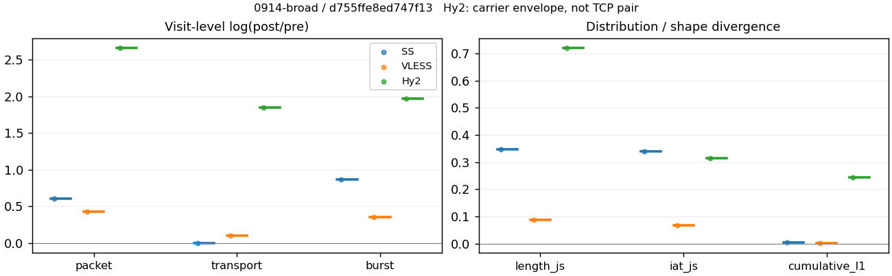
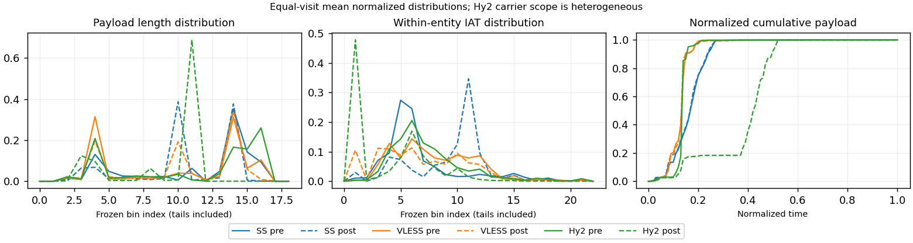

# 0914-broad · 条目 060 · tradingview.com

目标：https://www.tradingview.com/

活动标签：tradingview.com::page_load。选定访问 3 次。

[返回总索引](../../README.md) · [统计口径](../../methods.md)

## 覆盖与资格（每次访问均保留）

| 部署 | 重复 | 主请求路由 | 活动状态 | 代理比较 | DIRECT pre | 请求 proxy/direct/unresolved | 错误 |
| --- | --- | --- | --- | --- | --- | --- | --- |
| Hy2 | 1 | proxy | passed | 1 | 1 | 455/7/0 | [] |
| SS | 1 | proxy | passed | 1 | 0 | 459/0/0 | [] |
| VLESS | 1 | proxy | passed | 1 | 0 | 463/0/0 | [] |

主请求非 proxy 的统计仅解释为已索引的辅助代理连接或 DIRECT 观测，不代表目标业务经代理传输。播放确认与配对资格是两道不同的门。

图中散点为单次访问，短线为重复中位数；Hy2 是共享载体包络，不能与 TCP 配对作等范围因果对比。

形态图先逐访问归一化，再对访问等权平均；实线 pre，虚线 post。分箱序号及边界见 methods，不将分箱索引误解为长度或时间。

## 每次访问的关键观测

### SS

范围：`exclusive_page`。每格 pre → post；空值为不可观测/不适用。

| 重复 | 包数 | 载荷字节 | burst | TCP FR | IAT中位µs | length JS | IAT JS |
| --- | --- | --- | --- | --- | --- | --- | --- |
| 1 | 5004 → 9150 | 8.7819e+06 → 8.8195e+06 | 3210 → 7660 | 184 → 196 | 22.912 → 1016.2 | 0.34618 | 0.34057 |

完整标量统计：中位数 [min,max]；Δ 为重复内逐访问变换的中位数，MAD 未缩放。n 为可用变换数；DIRECT-only 的 nΔ=0 不代表 pre 不可用。

| scope | 特征 | pre | post | Δ | IQRΔ | MADΔ | nΔ |
| --- | --- | --- | --- | --- | --- | --- | --- |
| exclusive_page | active_span_sum_s_1000ms | 38.887 [38.887, 38.887] | 42.689 [42.689, 42.689] | 0.093271 | — | — | 1 |
| exclusive_page | active_span_sum_s_100ms | 11.6 [11.6, 11.6] | 18.208 [18.208, 18.208] | 0.45085 | — | — | 1 |
| exclusive_page | active_span_sum_s_500ms | 31.052 [31.052, 31.052] | 36.323 [36.323, 36.323] | 0.15678 | — | — | 1 |
| exclusive_page | burst_bytes_iqr | 2896 [2896, 2896] | 2856 [2856, 2856] | -0.013908 | — | — | 1 |
| exclusive_page | burst_bytes_mad | 31.5 [31.5, 31.5] | 34 [34, 34] | 0.076373 | — | — | 1 |
| exclusive_page | burst_bytes_max | 28672 [28672, 28672] | 24496 [24496, 24496] | -0.15741 | — | — | 1 |
| exclusive_page | burst_bytes_mean | 2735.8 [2735.8, 2735.8] | 1151.4 [1151.4, 1151.4] | -0.86547 | — | — | 1 |
| exclusive_page | burst_bytes_median | 31.5 [31.5, 31.5] | 34 [34, 34] | 0.076373 | — | — | 1 |
| exclusive_page | burst_bytes_min | 0 [0, 0] | 0 [0, 0] | — | — | — | 0 |
| exclusive_page | burst_bytes_p95 | 14006 [14006, 14006] | 2930 [2930, 2930] | -1.5645 | — | — | 1 |
| exclusive_page | burst_bytes_q25 | 0 [0, 0] | 0 [0, 0] | — | — | — | 0 |
| exclusive_page | burst_bytes_q75 | 2896 [2896, 2896] | 2856 [2856, 2856] | -0.013908 | — | — | 1 |
| exclusive_page | burst_bytes_std | 4862.7 [4862.7, 4862.7] | 1593.8 [1593.8, 1593.8] | -1.1155 | — | — | 1 |
| exclusive_page | burst_count | 3210 [3210, 3210] | 7660 [7660, 7660] | 0.86974 | — | — | 1 |
| exclusive_page | burst_duration_ms_iqr | 0.02276 [0.02276, 0.02276] | 0 [0, 0] | — | — | — | 0 |
| exclusive_page | burst_duration_ms_mad | 0 [0, 0] | 0 [0, 0] | — | — | — | 0 |
| exclusive_page | burst_duration_ms_max | 15001 [15001, 15001] | 29246 [29246, 29246] | 0.6676 | — | — | 1 |
| exclusive_page | burst_duration_ms_mean | 98.139 [98.139, 98.139] | 28.451 [28.451, 28.451] | -1.2382 | — | — | 1 |
| exclusive_page | burst_duration_ms_median | 0 [0, 0] | 0 [0, 0] | — | — | — | 0 |
| exclusive_page | burst_duration_ms_min | 0 [0, 0] | 0 [0, 0] | — | — | — | 0 |
| exclusive_page | burst_duration_ms_p95 | 8.7145 [8.7145, 8.7145] | 0.76694 [0.76694, 0.76694] | -2.4303 | — | — | 1 |
| exclusive_page | burst_duration_ms_q25 | 0 [0, 0] | 0 [0, 0] | — | — | — | 0 |
| exclusive_page | burst_duration_ms_q75 | 0.02276 [0.02276, 0.02276] | 0 [0, 0] | — | — | — | 0 |
| exclusive_page | burst_duration_ms_std | 1077.9 [1077.9, 1077.9] | 675.78 [675.78, 675.78] | -0.46688 | — | — | 1 |
| exclusive_page | burst_packets_iqr | 1 [1, 1] | 0 [0, 0] | — | — | — | 0 |
| exclusive_page | burst_packets_mad | 0 [0, 0] | 0 [0, 0] | — | — | — | 0 |
| exclusive_page | burst_packets_max | 11 [11, 11] | 12 [12, 12] | 0.087011 | — | — | 1 |
| exclusive_page | burst_packets_mean | 1.5589 [1.5589, 1.5589] | 1.1945 [1.1945, 1.1945] | -0.26622 | — | — | 1 |
| exclusive_page | burst_packets_median | 1 [1, 1] | 1 [1, 1] | 0 | — | — | 1 |
| exclusive_page | burst_packets_min | 1 [1, 1] | 1 [1, 1] | 0 | — | — | 1 |
| exclusive_page | burst_packets_p95 | 4 [4, 4] | 2 [2, 2] | -0.69315 | — | — | 1 |
| exclusive_page | burst_packets_q25 | 1 [1, 1] | 1 [1, 1] | 0 | — | — | 1 |
| exclusive_page | burst_packets_q75 | 2 [2, 2] | 1 [1, 1] | -0.69315 | — | — | 1 |
| exclusive_page | burst_packets_std | 1.2344 [1.2344, 1.2344] | 0.6227 [0.6227, 0.6227] | -0.6843 | — | — | 1 |
| exclusive_page | connection_span_concurrency_max | 16 [16, 16] | 16 [16, 16] | 0 | — | — | 1 |
| exclusive_page | cumulative_l1 | — | — | 0.0033123 | — | — | 1 |
| exclusive_page | cumulative_max | — | — | 0.052747 | — | — | 1 |
| exclusive_page | direction_entropy | 0.63018 [0.63018, 0.63018] | 0.29029 [0.29029, 0.29029] | -0.33989 | — | — | 1 |
| exclusive_page | down_burst_count | 1595 [1595, 1595] | 3820 [3820, 3820] | 0.87338 | — | — | 1 |
| exclusive_page | down_ip_bytes | 8.8446e+06 [8.8446e+06, 8.8446e+06] | 8.9662e+06 [8.9662e+06, 8.9662e+06] | 0.013658 | — | — | 1 |
| exclusive_page | down_packets | 3058 [3058, 3058] | 4989 [4989, 4989] | 0.48947 | — | — | 1 |
| exclusive_page | down_transport_bytes | 8.6854e+06 [8.6854e+06, 8.6854e+06] | 8.7046e+06 [8.7046e+06, 8.7046e+06] | 0.0021976 | — | — | 1 |
| exclusive_page | duration_s | 36.897 [36.897, 36.897] | 36.896 [36.896, 36.896] | -3.5058e-05 | — | — | 1 |
| exclusive_page | entity_count | 20 [20, 20] | 20 [20, 20] | 0 | — | — | 1 |
| exclusive_page | fr_runs | 184 [184, 184] | 196 [196, 196] | 0.063179 | — | — | 1 |
| exclusive_page | fr_runs_per_packet | 0.058599 [0.058599, 0.058599] | 0.039137 [0.039137, 0.039137] | -0.019461 | — | — | 1 |
| exclusive_page | fr_switches | 164 [164, 164] | 176 [176, 176] | 0.070618 | — | — | 1 |
| exclusive_page | fr_switches_per_possible_transition | 0.052564 [0.052564, 0.052564] | 0.035285 [0.035285, 0.035285] | -0.017279 | — | — | 1 |
| exclusive_page | full_retransmission_fraction | 0.004996 [0.004996, 0.004996] | 0.0014208 [0.0014208, 0.0014208] | -0.0035752 | — | — | 1 |
| exclusive_page | full_retransmission_packets | 25 [25, 25] | 13 [13, 13] | -0.65393 | — | — | 1 |
| exclusive_page | iat_count | 4984 [4984, 4984] | 9130 [9130, 9130] | 0.60533 | — | — | 1 |
| exclusive_page | iat_js | — | — | 0.34057 | — | — | 1 |
| exclusive_page | iat_ks | — | — | 0.53407 | — | — | 1 |
| exclusive_page | iat_median_us | 22.912 [22.912, 22.912] | 1016.2 [1016.2, 1016.2] | 3.7922 | — | — | 1 |
| exclusive_page | iat_us_iqr | 61.931 [61.931, 61.931] | 1174.5 [1174.5, 1174.5] | 2.9426 | — | — | 1 |
| exclusive_page | iat_us_mad | 14.773 [14.773, 14.773] | 768.19 [768.19, 768.19] | 3.9512 | — | — | 1 |
| exclusive_page | iat_us_max | 1.5001e+07 [1.5001e+07, 1.5001e+07] | 1.5465e+07 [1.5465e+07, 1.5465e+07] | 0.030434 | — | — | 1 |
| exclusive_page | iat_us_mean | 94079 [94079, 94079] | 51354 [51354, 51354] | -0.60539 | — | — | 1 |
| exclusive_page | iat_us_median | 22.912 [22.912, 22.912] | 1016.2 [1016.2, 1016.2] | 3.7922 | — | — | 1 |
| exclusive_page | iat_us_min | 0.011 [0.011, 0.011] | 0.031 [0.031, 0.031] | 1.0361 | — | — | 1 |
| exclusive_page | iat_us_p95 | 35193 [35193, 35193] | 7653.9 [7653.9, 7653.9] | -1.5256 | — | — | 1 |
| exclusive_page | iat_us_q25 | 12.375 [12.375, 12.375] | 98.396 [98.396, 98.396] | 2.0733 | — | — | 1 |
| exclusive_page | iat_us_q75 | 74.306 [74.306, 74.306] | 1272.9 [1272.9, 1272.9] | 2.8408 | — | — | 1 |
| exclusive_page | iat_us_std | 1.0751e+06 [1.0751e+06, 1.0751e+06] | 7.9411e+05 [7.9411e+05, 7.9411e+05] | -0.30294 | — | — | 1 |
| exclusive_page | iat_wasserstein_log1p_us | — | — | 2.1727 | — | — | 1 |
| exclusive_page | idle_gap_count_1000ms | 37 [37, 37] | 35 [35, 35] | -0.05557 | — | — | 1 |
| exclusive_page | idle_gap_count_100ms | 123 [123, 123] | 116 [116, 116] | -0.058594 | — | — | 1 |
| exclusive_page | idle_gap_count_500ms | 49 [49, 49] | 44 [44, 44] | -0.10763 | — | — | 1 |
| exclusive_page | idle_gap_sum_s_1000ms | 430 [430, 430] | 426.18 [426.18, 426.18] | -0.00894 | — | — | 1 |
| exclusive_page | idle_gap_sum_s_100ms | 457.29 [457.29, 457.29] | 450.66 [450.66, 450.66] | -0.014612 | — | — | 1 |
| exclusive_page | idle_gap_sum_s_500ms | 437.84 [437.84, 437.84] | 432.54 [432.54, 432.54] | -0.01217 | — | — | 1 |
| exclusive_page | ip_bytes | 9.0428e+06 [9.0428e+06, 9.0428e+06] | 9.3936e+06 [9.3936e+06, 9.3936e+06] | 0.03806 | — | — | 1 |
| exclusive_page | length_iqr | 2640.8 [2640.8, 2640.8] | 1428 [1428, 1428] | -0.61479 | — | — | 1 |
| exclusive_page | length_js | — | — | 0.34618 | — | — | 1 |
| exclusive_page | length_ks | — | — | 0.52467 | — | — | 1 |
| exclusive_page | length_mad | 1448 [1448, 1448] | 1324.5 [1324.5, 1324.5] | -0.089148 | — | — | 1 |
| exclusive_page | length_max | 8920 [8920, 8920] | 15928 [15928, 15928] | 0.57978 | — | — | 1 |
| exclusive_page | length_mean | 2796.8 [2796.8, 2796.8] | 1761.1 [1761.1, 1761.1] | -0.46254 | — | — | 1 |
| exclusive_page | length_median | 2896 [2896, 2896] | 1428 [1428, 1428] | -0.70706 | — | — | 1 |
| exclusive_page | length_min | 8 [8, 8] | 20 [20, 20] | 0.91629 | — | — | 1 |
| exclusive_page | length_p95 | 8192 [8192, 8192] | 2856 [2856, 2856] | -1.0537 | — | — | 1 |
| exclusive_page | length_q25 | 751.25 [751.25, 751.25] | 1428 [1428, 1428] | 0.64229 | — | — | 1 |
| exclusive_page | length_q75 | 3392 [3392, 3392] | 2856 [2856, 2856] | -0.172 | — | — | 1 |
| exclusive_page | length_std | 2429.1 [2429.1, 2429.1] | 1060.9 [1060.9, 1060.9] | -0.82838 | — | — | 1 |
| exclusive_page | length_wasserstein_bytes | — | — | 1227.6 | — | — | 1 |
| exclusive_page | nonempty_entity_count | 20 [20, 20] | 20 [20, 20] | 0 | — | — | 1 |
| exclusive_page | nonempty_packets | 3140 [3140, 3140] | 5008 [5008, 5008] | 0.46681 | — | — | 1 |
| exclusive_page | offload_suspect_fraction | 0.39888 [0.39888, 0.39888] | 0.22448 [0.22448, 0.22448] | -0.1744 | — | — | 1 |
| exclusive_page | packet_count | 5004 [5004, 5004] | 9150 [9150, 9150] | 0.60352 | — | — | 1 |
| exclusive_page | rtt_median_ms | 0.045255 [0.045255, 0.045255] | 35.78 [35.78, 35.78] | 6.6728 | — | — | 1 |
| exclusive_page | rtt_sample_count | 1784 [1784, 1784] | 908 [908, 908] | -0.67537 | — | — | 1 |
| exclusive_page | tcp_ack_count | 4984 [4984, 4984] | 9129 [9129, 9129] | 0.60522 | — | — | 1 |
| exclusive_page | tcp_fin_count | 40 [40, 40] | 41 [41, 41] | 0.024693 | — | — | 1 |
| exclusive_page | tcp_packet_count | 5004 [5004, 5004] | 9150 [9150, 9150] | 0.60352 | — | — | 1 |
| exclusive_page | tcp_rst_count | 0 [0, 0] | 0 [0, 0] | — | — | — | 0 |
| exclusive_page | tcp_syn_count | 40 [40, 40] | 42 [42, 42] | 0.04879 | — | — | 1 |
| exclusive_page | tcp_window_raw_median | 65535 [65535, 65535] | 138 [138, 138] | -6.1631 | — | — | 1 |
| exclusive_page | transition_entropy | 0.26576 [0.26576, 0.26576] | 0.1672 [0.1672, 0.1672] | -0.098565 | — | — | 1 |
| exclusive_page | transition_n_mm | 2555 [2555, 2555] | 4659 [4659, 4659] | 0.60075 | — | — | 1 |
| exclusive_page | transition_n_mp | 76 [76, 76] | 82 [82, 82] | 0.075986 | — | — | 1 |
| exclusive_page | transition_n_pm | 88 [88, 88] | 94 [94, 94] | 0.065958 | — | — | 1 |
| exclusive_page | transition_n_pp | 401 [401, 401] | 153 [153, 153] | -0.96352 | — | — | 1 |
| exclusive_page | transition_p_mm | 0.97111 [0.97111, 0.97111] | 0.9827 [0.9827, 0.9827] | 0.01159 | — | — | 1 |
| exclusive_page | transition_p_mp | 0.028886 [0.028886, 0.028886] | 0.017296 [0.017296, 0.017296] | -0.01159 | — | — | 1 |
| exclusive_page | transition_p_pm | 0.17996 [0.17996, 0.17996] | 0.38057 [0.38057, 0.38057] | 0.20061 | — | — | 1 |
| exclusive_page | transition_p_pp | 0.82004 [0.82004, 0.82004] | 0.61943 [0.61943, 0.61943] | -0.20061 | — | — | 1 |
| exclusive_page | transport_bytes | 8.7819e+06 [8.7819e+06, 8.7819e+06] | 8.8195e+06 [8.8195e+06, 8.8195e+06] | 0.0042729 | — | — | 1 |
| exclusive_page | up_burst_count | 1615 [1615, 1615] | 3840 [3840, 3840] | 0.86614 | — | — | 1 |
| exclusive_page | up_byte_fraction | 0.010987 [0.010987, 0.010987] | 0.013037 [0.013037, 0.013037] | 0.0020504 | — | — | 1 |
| exclusive_page | up_ip_bytes | 1.9814e+05 [1.9814e+05, 1.9814e+05] | 4.2731e+05 [4.2731e+05, 4.2731e+05] | 0.76856 | — | — | 1 |
| exclusive_page | up_packets | 1946 [1946, 1946] | 4161 [4161, 4161] | 0.75998 | — | — | 1 |
| exclusive_page | up_transport_bytes | 96484 [96484, 96484] | 1.1498e+05 [1.1498e+05, 1.1498e+05] | 0.17539 | — | — | 1 |
| exclusive_page | zero_iat_count | 0 [0, 0] | 0 [0, 0] | — | — | — | 0 |
| exclusive_page | zero_iat_fraction | 0 [0, 0] | 0 [0, 0] | 0 | — | — | 1 |

### VLESS

范围：`exclusive_page`。每格 pre → post；空值为不可观测/不适用。

| 重复 | 包数 | 载荷字节 | burst | TCP FR | IAT中位µs | length JS | IAT JS |
| --- | --- | --- | --- | --- | --- | --- | --- |
| 1 | 5897 → 9050 | 8.3178e+06 → 9.1918e+06 | 4352 → 6185 | 260 → 308 | 85.922 → 39.246 | 0.088335 | 0.067362 |

完整标量统计：中位数 [min,max]；Δ 为重复内逐访问变换的中位数，MAD 未缩放。n 为可用变换数；DIRECT-only 的 nΔ=0 不代表 pre 不可用。

| scope | 特征 | pre | post | Δ | IQRΔ | MADΔ | nΔ |
| --- | --- | --- | --- | --- | --- | --- | --- |
| exclusive_page | active_span_sum_s_1000ms | 36.935 [36.935, 36.935] | 36.779 [36.779, 36.779] | -0.0042258 | — | — | 1 |
| exclusive_page | active_span_sum_s_100ms | 7.6154 [7.6154, 7.6154] | 15.745 [15.745, 15.745] | 0.72638 | — | — | 1 |
| exclusive_page | active_span_sum_s_500ms | 20.933 [20.933, 20.933] | 36.779 [36.779, 36.779] | 0.56363 | — | — | 1 |
| exclusive_page | burst_bytes_iqr | 2870.5 [2870.5, 2870.5] | 2824 [2824, 2824] | -0.016332 | — | — | 1 |
| exclusive_page | burst_bytes_mad | 64 [64, 64] | 72 [72, 72] | 0.11778 | — | — | 1 |
| exclusive_page | burst_bytes_max | 28672 [28672, 28672] | 37864 [37864, 37864] | 0.27808 | — | — | 1 |
| exclusive_page | burst_bytes_mean | 1911.3 [1911.3, 1911.3] | 1486.1 [1486.1, 1486.1] | -0.25158 | — | — | 1 |
| exclusive_page | burst_bytes_median | 64 [64, 64] | 72 [72, 72] | 0.11778 | — | — | 1 |
| exclusive_page | burst_bytes_min | 0 [0, 0] | 0 [0, 0] | — | — | — | 0 |
| exclusive_page | burst_bytes_p95 | 8920 [8920, 8920] | 5648 [5648, 5648] | -0.45699 | — | — | 1 |
| exclusive_page | burst_bytes_q25 | 0 [0, 0] | 0 [0, 0] | — | — | — | 0 |
| exclusive_page | burst_bytes_q75 | 2870.5 [2870.5, 2870.5] | 2824 [2824, 2824] | -0.016332 | — | — | 1 |
| exclusive_page | burst_bytes_std | 3645.3 [3645.3, 3645.3] | 2446.3 [2446.3, 2446.3] | -0.39889 | — | — | 1 |
| exclusive_page | burst_count | 4352 [4352, 4352] | 6185 [6185, 6185] | 0.35149 | — | — | 1 |
| exclusive_page | burst_duration_ms_iqr | 0.0098725 [0.0098725, 0.0098725] | 9.7e-05 [9.7e-05, 9.7e-05] | -4.6228 | — | — | 1 |
| exclusive_page | burst_duration_ms_mad | 0 [0, 0] | 0 [0, 0] | — | — | — | 0 |
| exclusive_page | burst_duration_ms_max | 15001 [15001, 15001] | 15063 [15063, 15063] | 0.0040981 | — | — | 1 |
| exclusive_page | burst_duration_ms_mean | 74.939 [74.939, 74.939] | 21.09 [21.09, 21.09] | -1.2679 | — | — | 1 |
| exclusive_page | burst_duration_ms_median | 0 [0, 0] | 0 [0, 0] | — | — | — | 0 |
| exclusive_page | burst_duration_ms_min | 0 [0, 0] | 0 [0, 0] | — | — | — | 0 |
| exclusive_page | burst_duration_ms_p95 | 4.5619 [4.5619, 4.5619] | 4.9106 [4.9106, 4.9106] | 0.073663 | — | — | 1 |
| exclusive_page | burst_duration_ms_q25 | 0 [0, 0] | 0 [0, 0] | — | — | — | 0 |
| exclusive_page | burst_duration_ms_q75 | 0.0098725 [0.0098725, 0.0098725] | 9.7e-05 [9.7e-05, 9.7e-05] | -4.6228 | — | — | 1 |
| exclusive_page | burst_duration_ms_std | 908.73 [908.73, 908.73] | 481.99 [481.99, 481.99] | -0.63412 | — | — | 1 |
| exclusive_page | burst_packets_iqr | 1 [1, 1] | 1 [1, 1] | 0 | — | — | 1 |
| exclusive_page | burst_packets_mad | 0 [0, 0] | 0 [0, 0] | — | — | — | 0 |
| exclusive_page | burst_packets_max | 12 [12, 12] | 15 [15, 15] | 0.22314 | — | — | 1 |
| exclusive_page | burst_packets_mean | 1.355 [1.355, 1.355] | 1.4632 [1.4632, 1.4632] | 0.07683 | — | — | 1 |
| exclusive_page | burst_packets_median | 1 [1, 1] | 1 [1, 1] | 0 | — | — | 1 |
| exclusive_page | burst_packets_min | 1 [1, 1] | 1 [1, 1] | 0 | — | — | 1 |
| exclusive_page | burst_packets_p95 | 3 [3, 3] | 3 [3, 3] | 0 | — | — | 1 |
| exclusive_page | burst_packets_q25 | 1 [1, 1] | 1 [1, 1] | 0 | — | — | 1 |
| exclusive_page | burst_packets_q75 | 2 [2, 2] | 2 [2, 2] | 0 | — | — | 1 |
| exclusive_page | burst_packets_std | 0.79093 [0.79093, 0.79093] | 0.96552 [0.96552, 0.96552] | 0.19946 | — | — | 1 |
| exclusive_page | connection_span_concurrency_max | 16 [16, 16] | 16 [16, 16] | 0 | — | — | 1 |
| exclusive_page | cumulative_l1 | — | — | 0.0028375 | — | — | 1 |
| exclusive_page | cumulative_max | — | — | 0.11912 | — | — | 1 |
| exclusive_page | direction_entropy | 0.62502 [0.62502, 0.62502] | 0.36556 [0.36556, 0.36556] | -0.25946 | — | — | 1 |
| exclusive_page | down_burst_count | 2164 [2164, 2164] | 3081 [3081, 3081] | 0.3533 | — | — | 1 |
| exclusive_page | down_ip_bytes | 8.3902e+06 [8.3902e+06, 8.3902e+06] | 9.3021e+06 [9.3021e+06, 9.3021e+06] | 0.10317 | — | — | 1 |
| exclusive_page | down_packets | 3397 [3397, 3397] | 5030 [5030, 5030] | 0.39253 | — | — | 1 |
| exclusive_page | down_transport_bytes | 8.2134e+06 [8.2134e+06, 8.2134e+06] | 9.0403e+06 [9.0403e+06, 9.0403e+06] | 0.095933 | — | — | 1 |
| exclusive_page | duration_s | 32.48 [32.48, 32.48] | 32.438 [32.438, 32.438] | -0.0012748 | — | — | 1 |
| exclusive_page | entity_count | 24 [24, 24] | 24 [24, 24] | 0 | — | — | 1 |
| exclusive_page | fr_runs | 260 [260, 260] | 308 [308, 308] | 0.16942 | — | — | 1 |
| exclusive_page | fr_runs_per_packet | 0.074906 [0.074906, 0.074906] | 0.061514 [0.061514, 0.061514] | -0.013392 | — | — | 1 |
| exclusive_page | fr_switches | 236 [236, 236] | 284 [284, 284] | 0.18514 | — | — | 1 |
| exclusive_page | fr_switches_per_possible_transition | 0.068465 [0.068465, 0.068465] | 0.056994 [0.056994, 0.056994] | -0.011472 | — | — | 1 |
| exclusive_page | full_retransmission_fraction | 0.0040699 [0.0040699, 0.0040699] | 0 [0, 0] | -0.0040699 | — | — | 1 |
| exclusive_page | full_retransmission_packets | 24 [24, 24] | 0 [0, 0] | — | — | — | 0 |
| exclusive_page | iat_count | 5873 [5873, 5873] | 9026 [9026, 9026] | 0.42974 | — | — | 1 |
| exclusive_page | iat_js | — | — | 0.067362 | — | — | 1 |
| exclusive_page | iat_ks | — | — | 0.15935 | — | — | 1 |
| exclusive_page | iat_median_us | 85.922 [85.922, 85.922] | 39.246 [39.246, 39.246] | -0.78358 | — | — | 1 |
| exclusive_page | iat_us_iqr | 920.04 [920.04, 920.04] | 688.25 [688.25, 688.25] | -0.29025 | — | — | 1 |
| exclusive_page | iat_us_mad | 80.297 [80.297, 80.297] | 39.156 [39.156, 39.156] | -0.71817 | — | — | 1 |
| exclusive_page | iat_us_max | 1.5001e+07 [1.5001e+07, 1.5001e+07] | 1.5063e+07 [1.5063e+07, 1.5063e+07] | 0.0040854 | — | — | 1 |
| exclusive_page | iat_us_mean | 71833 [71833, 71833] | 46612 [46612, 46612] | -0.43247 | — | — | 1 |
| exclusive_page | iat_us_median | 85.922 [85.922, 85.922] | 39.246 [39.246, 39.246] | -0.78358 | — | — | 1 |
| exclusive_page | iat_us_min | 0.006 [0.006, 0.006] | 0.03 [0.03, 0.03] | 1.6094 | — | — | 1 |
| exclusive_page | iat_us_p95 | 9148.5 [9148.5, 9148.5] | 9621.2 [9621.2, 9621.2] | 0.050379 | — | — | 1 |
| exclusive_page | iat_us_q25 | 17.019 [17.019, 17.019] | 6.1113 [6.1113, 6.1113] | -1.0242 | — | — | 1 |
| exclusive_page | iat_us_q75 | 937.05 [937.05, 937.05] | 694.37 [694.37, 694.37] | -0.29974 | — | — | 1 |
| exclusive_page | iat_us_std | 9.1698e+05 [9.1698e+05, 9.1698e+05] | 7.385e+05 [7.385e+05, 7.385e+05] | -0.21646 | — | — | 1 |
| exclusive_page | iat_wasserstein_log1p_us | — | — | 0.76037 | — | — | 1 |
| exclusive_page | idle_gap_count_1000ms | 32 [32, 32] | 32 [32, 32] | 0 | — | — | 1 |
| exclusive_page | idle_gap_count_100ms | 121 [121, 121] | 145 [145, 145] | 0.18094 | — | — | 1 |
| exclusive_page | idle_gap_count_500ms | 56 [56, 56] | 32 [32, 32] | -0.55962 | — | — | 1 |
| exclusive_page | idle_gap_sum_s_1000ms | 384.94 [384.94, 384.94] | 383.95 [383.95, 383.95] | -0.0025841 | — | — | 1 |
| exclusive_page | idle_gap_sum_s_100ms | 414.26 [414.26, 414.26] | 404.98 [404.98, 404.98] | -0.022654 | — | — | 1 |
| exclusive_page | idle_gap_sum_s_500ms | 400.94 [400.94, 400.94] | 383.95 [383.95, 383.95] | -0.043315 | — | — | 1 |
| exclusive_page | ip_bytes | 8.6246e+06 [8.6246e+06, 8.6246e+06] | 9.6911e+06 [9.6911e+06, 9.6911e+06] | 0.11659 | — | — | 1 |
| exclusive_page | length_iqr | 2737 [2737, 2737] | 2560 [2560, 2560] | -0.066855 | — | — | 1 |
| exclusive_page | length_js | — | — | 0.088335 | — | — | 1 |
| exclusive_page | length_ks | — | — | 0.12619 | — | — | 1 |
| exclusive_page | length_mad | 1431 [1431, 1431] | 1340 [1340, 1340] | -0.065704 | — | — | 1 |
| exclusive_page | length_max | 8920 [8920, 8920] | 33888 [33888, 33888] | 1.3348 | — | — | 1 |
| exclusive_page | length_mean | 2396.4 [2396.4, 2396.4] | 1835.8 [1835.8, 1835.8] | -0.26648 | — | — | 1 |
| exclusive_page | length_median | 1520 [1520, 1520] | 1412 [1412, 1412] | -0.073703 | — | — | 1 |
| exclusive_page | length_min | 1 [1, 1] | 1 [1, 1] | 0 | — | — | 1 |
| exclusive_page | length_p95 | 8920 [8920, 8920] | 4337.7 [4337.7, 4337.7] | -0.72095 | — | — | 1 |
| exclusive_page | length_q25 | 87 [87, 87] | 264 [264, 264] | 1.11 | — | — | 1 |
| exclusive_page | length_q75 | 2824 [2824, 2824] | 2824 [2824, 2824] | 0 | — | — | 1 |
| exclusive_page | length_std | 2695.1 [2695.1, 2695.1] | 1715.7 [1715.7, 1715.7] | -0.45164 | — | — | 1 |
| exclusive_page | length_wasserstein_bytes | — | — | 870.36 | — | — | 1 |
| exclusive_page | nonempty_entity_count | 24 [24, 24] | 24 [24, 24] | 0 | — | — | 1 |
| exclusive_page | nonempty_packets | 3471 [3471, 3471] | 5007 [5007, 5007] | 0.36639 | — | — | 1 |
| exclusive_page | offload_suspect_fraction | 0.30168 [0.30168, 0.30168] | 0.24917 [0.24917, 0.24917] | -0.052508 | — | — | 1 |
| exclusive_page | packet_count | 5897 [5897, 5897] | 9050 [9050, 9050] | 0.42832 | — | — | 1 |
| exclusive_page | rtt_median_ms | 0.070461 [0.070461, 0.070461] | 0.050655 [0.050655, 0.050655] | -0.33001 | — | — | 1 |
| exclusive_page | rtt_sample_count | 2314 [2314, 2314] | 2576 [2576, 2576] | 0.10726 | — | — | 1 |
| exclusive_page | tcp_ack_count | 5833 [5833, 5833] | 9023 [9023, 9023] | 0.43625 | — | — | 1 |
| exclusive_page | tcp_fin_count | 40 [40, 40] | 47 [47, 47] | 0.16127 | — | — | 1 |
| exclusive_page | tcp_packet_count | 5897 [5897, 5897] | 9050 [9050, 9050] | 0.42832 | — | — | 1 |
| exclusive_page | tcp_rst_count | 41 [41, 41] | 3 [3, 3] | -2.615 | — | — | 1 |
| exclusive_page | tcp_syn_count | 48 [48, 48] | 48 [48, 48] | 0 | — | — | 1 |
| exclusive_page | tcp_window_raw_median | 65535 [65535, 65535] | 157 [157, 157] | -6.0341 | — | — | 1 |
| exclusive_page | transition_entropy | 0.3154 [0.3154, 0.3154] | 0.24111 [0.24111, 0.24111] | -0.074289 | — | — | 1 |
| exclusive_page | transition_n_mm | 2799 [2799, 2799] | 4503 [4503, 4503] | 0.47548 | — | — | 1 |
| exclusive_page | transition_n_mp | 106 [106, 106] | 130 [130, 130] | 0.2041 | — | — | 1 |
| exclusive_page | transition_n_pm | 130 [130, 130] | 154 [154, 154] | 0.16942 | — | — | 1 |
| exclusive_page | transition_n_pp | 412 [412, 412] | 196 [196, 196] | -0.74291 | — | — | 1 |
| exclusive_page | transition_p_mm | 0.96351 [0.96351, 0.96351] | 0.97194 [0.97194, 0.97194] | 0.0084292 | — | — | 1 |
| exclusive_page | transition_p_mp | 0.036489 [0.036489, 0.036489] | 0.02806 [0.02806, 0.02806] | -0.0084292 | — | — | 1 |
| exclusive_page | transition_p_pm | 0.23985 [0.23985, 0.23985] | 0.44 [0.44, 0.44] | 0.20015 | — | — | 1 |
| exclusive_page | transition_p_pp | 0.76015 [0.76015, 0.76015] | 0.56 [0.56, 0.56] | -0.20015 | — | — | 1 |
| exclusive_page | transport_bytes | 8.3178e+06 [8.3178e+06, 8.3178e+06] | 9.1918e+06 [9.1918e+06, 9.1918e+06] | 0.09991 | — | — | 1 |
| exclusive_page | up_burst_count | 2188 [2188, 2188] | 3104 [3104, 3104] | 0.3497 | — | — | 1 |
| exclusive_page | up_byte_fraction | 0.012556 [0.012556, 0.012556] | 0.016475 [0.016475, 0.016475] | 0.0039191 | — | — | 1 |
| exclusive_page | up_ip_bytes | 2.3442e+05 [2.3442e+05, 2.3442e+05] | 3.8904e+05 [3.8904e+05, 3.8904e+05] | 0.50655 | — | — | 1 |
| exclusive_page | up_packets | 2500 [2500, 2500] | 4020 [4020, 4020] | 0.47499 | — | — | 1 |
| exclusive_page | up_transport_bytes | 1.0444e+05 [1.0444e+05, 1.0444e+05] | 1.5143e+05 [1.5143e+05, 1.5143e+05] | 0.37157 | — | — | 1 |
| exclusive_page | zero_iat_count | 0 [0, 0] | 0 [0, 0] | — | — | — | 0 |
| exclusive_page | zero_iat_fraction | 0 [0, 0] | 0 [0, 0] | 0 | — | — | 1 |

### Hy2

范围：`carrier_context_envelope`。每格 pre → post；空值为不可观测/不适用。

| 重复 | 包数 | 载荷字节 | burst | TCP FR | IAT中位µs | length JS | IAT JS |
| --- | --- | --- | --- | --- | --- | --- | --- |
| 1 | 3549 → 50547 | 8.569e+06 → 5.4409e+07 | 2330 → 16623 | — | 50.461 → 5.646 | 0.71988 | 0.31465 |

范围：`direct_pre_only`。每格 pre → post；空值为不可观测/不适用。

| 重复 | 包数 | 载荷字节 | burst | TCP FR | IAT中位µs | length JS | IAT JS |
| --- | --- | --- | --- | --- | --- | --- | --- |
| 1 | 552 → — | 1.1435e+06 → — | 345 → — | 41 → — | 138.05 → — | — | — |

完整标量统计：中位数 [min,max]；Δ 为重复内逐访问变换的中位数，MAD 未缩放。n 为可用变换数；DIRECT-only 的 nΔ=0 不代表 pre 不可用。

| scope | 特征 | pre | post | Δ | IQRΔ | MADΔ | nΔ |
| --- | --- | --- | --- | --- | --- | --- | --- |
| carrier_context_envelope | active_span_sum_s_1000ms | 19.498 [19.498, 19.498] | 21.737 [21.737, 21.737] | 0.1087 | — | — | 1 |
| carrier_context_envelope | active_span_sum_s_100ms | 3.9409 [3.9409, 3.9409] | 11.62 [11.62, 11.62] | 1.0813 | — | — | 1 |
| carrier_context_envelope | active_span_sum_s_500ms | 16.676 [16.676, 16.676] | 18.78 [18.78, 18.78] | 0.11884 | — | — | 1 |
| carrier_context_envelope | burst_bytes_iqr | 4096 [4096, 4096] | 5099 [5099, 5099] | 0.21903 | — | — | 1 |
| carrier_context_envelope | burst_bytes_mad | 37 [37, 37] | 342 [342, 342] | 2.2239 | — | — | 1 |
| carrier_context_envelope | burst_bytes_max | 29400 [29400, 29400] | 2.7567e+05 [2.7567e+05, 2.7567e+05] | 2.2382 | — | — | 1 |
| carrier_context_envelope | burst_bytes_mean | 3677.7 [3677.7, 3677.7] | 3273.1 [3273.1, 3273.1] | -0.11654 | — | — | 1 |
| carrier_context_envelope | burst_bytes_median | 37 [37, 37] | 375 [375, 375] | 2.316 | — | — | 1 |
| carrier_context_envelope | burst_bytes_min | 0 [0, 0] | 25 [25, 25] | — | — | — | 0 |
| carrier_context_envelope | burst_bytes_p95 | 20480 [20480, 20480] | 12373 [12373, 12373] | -0.50393 | — | — | 1 |
| carrier_context_envelope | burst_bytes_q25 | 0 [0, 0] | 69 [69, 69] | — | — | — | 0 |
| carrier_context_envelope | burst_bytes_q75 | 4096 [4096, 4096] | 5168 [5168, 5168] | 0.23247 | — | — | 1 |
| carrier_context_envelope | burst_bytes_std | 6648.6 [6648.6, 6648.6] | 5287.8 [5287.8, 5287.8] | -0.22902 | — | — | 1 |
| carrier_context_envelope | burst_count | 2330 [2330, 2330] | 16623 [16623, 16623] | 1.9649 | — | — | 1 |
| carrier_context_envelope | burst_duration_ms_iqr | 0.026801 [0.026801, 0.026801] | 0.029084 [0.029084, 0.029084] | 0.08174 | — | — | 1 |
| carrier_context_envelope | burst_duration_ms_mad | 0 [0, 0] | 7.6e-05 [7.6e-05, 7.6e-05] | — | — | — | 0 |
| carrier_context_envelope | burst_duration_ms_max | 15001 [15001, 15001] | 2409.3 [2409.3, 2409.3] | -1.8288 | — | — | 1 |
| carrier_context_envelope | burst_duration_ms_mean | 114.08 [114.08, 114.08] | 0.77975 [0.77975, 0.77975] | -4.9857 | — | — | 1 |
| carrier_context_envelope | burst_duration_ms_median | 0 [0, 0] | 7.6e-05 [7.6e-05, 7.6e-05] | — | — | — | 0 |
| carrier_context_envelope | burst_duration_ms_min | 0 [0, 0] | 0 [0, 0] | — | — | — | 0 |
| carrier_context_envelope | burst_duration_ms_p95 | 8.827 [8.827, 8.827] | 0.2322 [0.2322, 0.2322] | -3.638 | — | — | 1 |
| carrier_context_envelope | burst_duration_ms_q25 | 0 [0, 0] | 0 [0, 0] | — | — | — | 0 |
| carrier_context_envelope | burst_duration_ms_q75 | 0.026801 [0.026801, 0.026801] | 0.029084 [0.029084, 0.029084] | 0.08174 | — | — | 1 |
| carrier_context_envelope | burst_duration_ms_std | 1118.4 [1118.4, 1118.4] | 28.215 [28.215, 28.215] | -3.6798 | — | — | 1 |
| carrier_context_envelope | burst_packets_iqr | 1 [1, 1] | 3 [3, 3] | 1.0986 | — | — | 1 |
| carrier_context_envelope | burst_packets_mad | 0 [0, 0] | 1 [1, 1] | — | — | — | 0 |
| carrier_context_envelope | burst_packets_max | 16 [16, 16] | 202 [202, 202] | 2.5357 | — | — | 1 |
| carrier_context_envelope | burst_packets_mean | 1.5232 [1.5232, 1.5232] | 3.0408 [3.0408, 3.0408] | 0.69132 | — | — | 1 |
| carrier_context_envelope | burst_packets_median | 1 [1, 1] | 2 [2, 2] | 0.69315 | — | — | 1 |
| carrier_context_envelope | burst_packets_min | 1 [1, 1] | 1 [1, 1] | 0 | — | — | 1 |
| carrier_context_envelope | burst_packets_p95 | 3 [3, 3] | 9 [9, 9] | 1.0986 | — | — | 1 |
| carrier_context_envelope | burst_packets_q25 | 1 [1, 1] | 1 [1, 1] | 0 | — | — | 1 |
| carrier_context_envelope | burst_packets_q75 | 2 [2, 2] | 4 [4, 4] | 0.69315 | — | — | 1 |
| carrier_context_envelope | burst_packets_std | 1.0315 [1.0315, 1.0315] | 3.6465 [3.6465, 3.6465] | 1.2627 | — | — | 1 |
| carrier_context_envelope | connection_span_concurrency_max | 15 [15, 15] | 1 [1, 1] | -2.7081 | — | — | 1 |
| carrier_context_envelope | cumulative_l1 | — | — | 0.24303 | — | — | 1 |
| carrier_context_envelope | cumulative_max | — | — | 0.81474 | — | — | 1 |
| carrier_context_envelope | direction_entropy | 0.79914 [0.79914, 0.79914] | 0.74987 [0.74987, 0.74987] | -0.049266 | — | — | 1 |
| carrier_context_envelope | direction_run_analog_runs | 169 [169, 169] | 16623 [16623, 16623] | 4.5886 | — | — | 1 |
| carrier_context_envelope | direction_run_analog_runs_per_packet | 0.077028 [0.077028, 0.077028] | 0.32886 [0.32886, 0.32886] | 0.25183 | — | — | 1 |
| carrier_context_envelope | direction_run_analog_switches | 151 [151, 151] | 16622 [16622, 16622] | 4.7012 | — | — | 1 |
| carrier_context_envelope | direction_run_analog_switches_per_possible_transition | 0.069393 [0.069393, 0.069393] | 0.32885 [0.32885, 0.32885] | 0.25946 | — | — | 1 |
| carrier_context_envelope | down_burst_count | 1156 [1156, 1156] | 8311 [8311, 8311] | 1.9726 | — | — | 1 |
| carrier_context_envelope | down_ip_bytes | 8.5898e+06 [8.5898e+06, 8.5898e+06] | 5.467e+07 [5.467e+07, 5.467e+07] | 1.8507 | — | — | 1 |
| carrier_context_envelope | down_packets | 2105 [2105, 2105] | 39708 [39708, 39708] | 2.9372 | — | — | 1 |
| carrier_context_envelope | down_transport_bytes | 8.4801e+06 [8.4801e+06, 8.4801e+06] | 5.3558e+07 [5.3558e+07, 5.3558e+07] | 1.843 | — | — | 1 |
| carrier_context_envelope | duration_s | 31.751 [31.751, 31.751] | 31.734 [31.734, 31.734] | -0.00052785 | — | — | 1 |
| carrier_context_envelope | entity_count | 18 [18, 18] | 1 [1, 1] | -2.8904 | — | — | 1 |
| carrier_context_envelope | full_retransmission_fraction | 0.012961 [0.012961, 0.012961] | — | — | — | — | 0 |
| carrier_context_envelope | full_retransmission_packets | 46 [46, 46] | — | — | — | — | 0 |
| carrier_context_envelope | iat_count | 3531 [3531, 3531] | 50546 [50546, 50546] | 2.6613 | — | — | 1 |
| carrier_context_envelope | iat_js | — | — | 0.31465 | — | — | 1 |
| carrier_context_envelope | iat_ks | — | — | 0.4761 | — | — | 1 |
| carrier_context_envelope | iat_median_us | 50.461 [50.461, 50.461] | 5.646 [5.646, 5.646] | -2.1903 | — | — | 1 |
| carrier_context_envelope | iat_us_iqr | 208.55 [208.55, 208.55] | 40.41 [40.41, 40.41] | -1.6411 | — | — | 1 |
| carrier_context_envelope | iat_us_mad | 42.053 [42.053, 42.053] | 5.61 [5.61, 5.61] | -2.0144 | — | — | 1 |
| carrier_context_envelope | iat_us_max | 1.5001e+07 [1.5001e+07, 1.5001e+07] | 2.5805e+06 [2.5805e+06, 2.5805e+06] | -1.7601 | — | — | 1 |
| carrier_context_envelope | iat_us_mean | 1.078e+05 [1.078e+05, 1.078e+05] | 627.82 [627.82, 627.82] | -5.1458 | — | — | 1 |
| carrier_context_envelope | iat_us_median | 50.461 [50.461, 50.461] | 5.646 [5.646, 5.646] | -2.1903 | — | — | 1 |
| carrier_context_envelope | iat_us_min | 0.175 [0.175, 0.175] | 0.003 [0.003, 0.003] | -4.0662 | — | — | 1 |
| carrier_context_envelope | iat_us_p95 | 11660 [11660, 11660] | 781.37 [781.37, 781.37] | -2.7029 | — | — | 1 |
| carrier_context_envelope | iat_us_q25 | 16.334 [16.334, 16.334] | 0.043 [0.043, 0.043] | -5.9398 | — | — | 1 |
| carrier_context_envelope | iat_us_q75 | 224.89 [224.89, 224.89] | 40.453 [40.453, 40.453] | -1.7155 | — | — | 1 |
| carrier_context_envelope | iat_us_std | 1.1294e+06 [1.1294e+06, 1.1294e+06] | 22161 [22161, 22161] | -3.9312 | — | — | 1 |
| carrier_context_envelope | iat_wasserstein_log1p_us | — | — | 2.4084 | — | — | 1 |
| carrier_context_envelope | idle_gap_count_1000ms | 32 [32, 32] | 5 [5, 5] | -1.8563 | — | — | 1 |
| carrier_context_envelope | idle_gap_count_100ms | 97 [97, 97] | 50 [50, 50] | -0.66269 | — | — | 1 |
| carrier_context_envelope | idle_gap_count_500ms | 36 [36, 36] | 9 [9, 9] | -1.3863 | — | — | 1 |
| carrier_context_envelope | idle_gap_sum_s_1000ms | 361.14 [361.14, 361.14] | 9.9971 [9.9971, 9.9971] | -3.587 | — | — | 1 |
| carrier_context_envelope | idle_gap_sum_s_100ms | 376.69 [376.69, 376.69] | 20.114 [20.114, 20.114] | -2.93 | — | — | 1 |
| carrier_context_envelope | idle_gap_sum_s_500ms | 363.96 [363.96, 363.96] | 12.954 [12.954, 12.954] | -3.3356 | — | — | 1 |
| carrier_context_envelope | ip_bytes | 8.7544e+06 [8.7544e+06, 8.7544e+06] | 5.5824e+07 [5.5824e+07, 5.5824e+07] | 1.8527 | — | — | 1 |
| carrier_context_envelope | length_iqr | 8035 [8035, 8035] | 596 [596, 596] | -2.6013 | — | — | 1 |
| carrier_context_envelope | length_js | — | — | 0.71988 | — | — | 1 |
| carrier_context_envelope | length_ks | — | — | 0.6258 | — | — | 1 |
| carrier_context_envelope | length_mad | 2742 [2742, 2742] | 0 [0, 0] | — | — | — | 0 |
| carrier_context_envelope | length_max | 8920 [8920, 8920] | 1441 [1441, 1441] | -1.823 | — | — | 1 |
| carrier_context_envelope | length_mean | 3905.6 [3905.6, 3905.6] | 1076.4 [1076.4, 1076.4] | -1.2888 | — | — | 1 |
| carrier_context_envelope | length_median | 2830 [2830, 2830] | 1441 [1441, 1441] | -0.67494 | — | — | 1 |
| carrier_context_envelope | length_min | 17 [17, 17] | 22 [22, 22] | 0.25783 | — | — | 1 |
| carrier_context_envelope | length_p95 | 8920 [8920, 8920] | 1441 [1441, 1441] | -1.823 | — | — | 1 |
| carrier_context_envelope | length_q25 | 157 [157, 157] | 845 [845, 845] | 1.6831 | — | — | 1 |
| carrier_context_envelope | length_q75 | 8192 [8192, 8192] | 1441 [1441, 1441] | -1.7378 | — | — | 1 |
| carrier_context_envelope | length_std | 3520.1 [3520.1, 3520.1] | 579.46 [579.46, 579.46] | -1.8041 | — | — | 1 |
| carrier_context_envelope | length_wasserstein_bytes | — | — | 2919.6 | — | — | 1 |
| carrier_context_envelope | nonempty_entity_count | 18 [18, 18] | 1 [1, 1] | -2.8904 | — | — | 1 |
| carrier_context_envelope | nonempty_packets | 2194 [2194, 2194] | 50547 [50547, 50547] | 3.1372 | — | — | 1 |
| carrier_context_envelope | offload_suspect_fraction | 0.38602 [0.38602, 0.38602] | 0 [0, 0] | -0.38602 | — | — | 1 |
| carrier_context_envelope | packet_count | 3549 [3549, 3549] | 50547 [50547, 50547] | 2.6562 | — | — | 1 |
| carrier_context_envelope | rtt_median_ms | 0.075194 [0.075194, 0.075194] | — | — | — | — | 0 |
| carrier_context_envelope | rtt_sample_count | 1296 [1296, 1296] | 0 [0, 0] | — | — | — | 0 |
| carrier_context_envelope | tcp_ack_count | 3531 [3531, 3531] | — | — | — | — | 0 |
| carrier_context_envelope | tcp_fin_count | 36 [36, 36] | — | — | — | — | 0 |
| carrier_context_envelope | tcp_packet_count | 3549 [3549, 3549] | 0 [0, 0] | — | — | — | 0 |
| carrier_context_envelope | tcp_rst_count | 0 [0, 0] | — | — | — | — | 0 |
| carrier_context_envelope | tcp_syn_count | 36 [36, 36] | — | — | — | — | 0 |
| carrier_context_envelope | tcp_window_raw_median | 65535 [65535, 65535] | — | — | — | — | 0 |
| carrier_context_envelope | transition_entropy | 0.3418 [0.3418, 0.3418] | 0.74944 [0.74944, 0.74944] | 0.40764 | — | — | 1 |
| carrier_context_envelope | transition_n_mm | 1581 [1581, 1581] | 31397 [31397, 31397] | 2.9887 | — | — | 1 |
| carrier_context_envelope | transition_n_mp | 70 [70, 70] | 8311 [8311, 8311] | 4.7768 | — | — | 1 |
| carrier_context_envelope | transition_n_pm | 81 [81, 81] | 8311 [8311, 8311] | 4.6309 | — | — | 1 |
| carrier_context_envelope | transition_n_pp | 444 [444, 444] | 2527 [2527, 2527] | 1.739 | — | — | 1 |
| carrier_context_envelope | transition_p_mm | 0.9576 [0.9576, 0.9576] | 0.7907 [0.7907, 0.7907] | -0.1669 | — | — | 1 |
| carrier_context_envelope | transition_p_mp | 0.042399 [0.042399, 0.042399] | 0.2093 [0.2093, 0.2093] | 0.1669 | — | — | 1 |
| carrier_context_envelope | transition_p_pm | 0.15429 [0.15429, 0.15429] | 0.76684 [0.76684, 0.76684] | 0.61255 | — | — | 1 |
| carrier_context_envelope | transition_p_pp | 0.84571 [0.84571, 0.84571] | 0.23316 [0.23316, 0.23316] | -0.61255 | — | — | 1 |
| carrier_context_envelope | transport_bytes | 8.569e+06 [8.569e+06, 8.569e+06] | 5.4409e+07 [5.4409e+07, 5.4409e+07] | 1.8484 | — | — | 1 |
| carrier_context_envelope | up_burst_count | 1174 [1174, 1174] | 8312 [8312, 8312] | 1.9573 | — | — | 1 |
| carrier_context_envelope | up_byte_fraction | 0.010367 [0.010367, 0.010367] | 0.015643 [0.015643, 0.015643] | 0.0052752 | — | — | 1 |
| carrier_context_envelope | up_ip_bytes | 1.6462e+05 [1.6462e+05, 1.6462e+05] | 1.1546e+06 [1.1546e+06, 1.1546e+06] | 1.9478 | — | — | 1 |
| carrier_context_envelope | up_packets | 1444 [1444, 1444] | 10839 [10839, 10839] | 2.0157 | — | — | 1 |
| carrier_context_envelope | up_transport_bytes | 88838 [88838, 88838] | 8.511e+05 [8.511e+05, 8.511e+05] | 2.2597 | — | — | 1 |
| carrier_context_envelope | zero_iat_count | 0 [0, 0] | 0 [0, 0] | — | — | — | 0 |
| carrier_context_envelope | zero_iat_fraction | 0 [0, 0] | 0 [0, 0] | 0 | — | — | 1 |
| direct_pre_only | active_span_sum_s_1000ms | 2.74 [2.74, 2.74] | — | — | — | — | 0 |
| direct_pre_only | active_span_sum_s_100ms | 0.87166 [0.87166, 0.87166] | — | — | — | — | 0 |
| direct_pre_only | active_span_sum_s_500ms | 2.0885 [2.0885, 2.0885] | — | — | — | — | 0 |
| direct_pre_only | burst_bytes_iqr | 5600 [5600, 5600] | — | — | — | — | 0 |
| direct_pre_only | burst_bytes_mad | 35 [35, 35] | — | — | — | — | 0 |
| direct_pre_only | burst_bytes_max | 20480 [20480, 20480] | — | — | — | — | 0 |
| direct_pre_only | burst_bytes_mean | 3314.4 [3314.4, 3314.4] | — | — | — | — | 0 |
| direct_pre_only | burst_bytes_median | 35 [35, 35] | — | — | — | — | 0 |
| direct_pre_only | burst_bytes_min | 0 [0, 0] | — | — | — | — | 0 |
| direct_pre_only | burst_bytes_p95 | 13677 [13677, 13677] | — | — | — | — | 0 |
| direct_pre_only | burst_bytes_q25 | 0 [0, 0] | — | — | — | — | 0 |
| direct_pre_only | burst_bytes_q75 | 5600 [5600, 5600] | — | — | — | — | 0 |
| direct_pre_only | burst_bytes_std | 4924.7 [4924.7, 4924.7] | — | — | — | — | 0 |
| direct_pre_only | burst_count | 345 [345, 345] | — | — | — | — | 0 |
| direct_pre_only | burst_duration_ms_iqr | 0.65244 [0.65244, 0.65244] | — | — | — | — | 0 |
| direct_pre_only | burst_duration_ms_mad | 0 [0, 0] | — | — | — | — | 0 |
| direct_pre_only | burst_duration_ms_max | 15001 [15001, 15001] | — | — | — | — | 0 |
| direct_pre_only | burst_duration_ms_mean | 379.33 [379.33, 379.33] | — | — | — | — | 0 |
| direct_pre_only | burst_duration_ms_median | 0 [0, 0] | — | — | — | — | 0 |
| direct_pre_only | burst_duration_ms_min | 0 [0, 0] | — | — | — | — | 0 |
| direct_pre_only | burst_duration_ms_p95 | 65.962 [65.962, 65.962] | — | — | — | — | 0 |
| direct_pre_only | burst_duration_ms_q25 | 0 [0, 0] | — | — | — | — | 0 |
| direct_pre_only | burst_duration_ms_q75 | 0.65244 [0.65244, 0.65244] | — | — | — | — | 0 |
| direct_pre_only | burst_duration_ms_std | 2193.1 [2193.1, 2193.1] | — | — | — | — | 0 |
| direct_pre_only | burst_packets_iqr | 1 [1, 1] | — | — | — | — | 0 |
| direct_pre_only | burst_packets_mad | 0 [0, 0] | — | — | — | — | 0 |
| direct_pre_only | burst_packets_max | 7 [7, 7] | — | — | — | — | 0 |
| direct_pre_only | burst_packets_mean | 1.6 [1.6, 1.6] | — | — | — | — | 0 |
| direct_pre_only | burst_packets_median | 1 [1, 1] | — | — | — | — | 0 |
| direct_pre_only | burst_packets_min | 1 [1, 1] | — | — | — | — | 0 |
| direct_pre_only | burst_packets_p95 | 3 [3, 3] | — | — | — | — | 0 |
| direct_pre_only | burst_packets_q25 | 1 [1, 1] | — | — | — | — | 0 |
| direct_pre_only | burst_packets_q75 | 2 [2, 2] | — | — | — | — | 0 |
| direct_pre_only | burst_packets_std | 0.7667 [0.7667, 0.7667] | — | — | — | — | 0 |
| direct_pre_only | connection_span_concurrency_max | 5 [5, 5] | — | — | — | — | 0 |
| direct_pre_only | direction_entropy | 0.48111 [0.48111, 0.48111] | — | — | — | — | 0 |
| direct_pre_only | down_burst_count | 170 [170, 170] | — | — | — | — | 0 |
| direct_pre_only | down_ip_bytes | 1.1485e+06 [1.1485e+06, 1.1485e+06] | — | — | — | — | 0 |
| direct_pre_only | down_packets | 357 [357, 357] | — | — | — | — | 0 |
| direct_pre_only | down_transport_bytes | 1.1299e+06 [1.1299e+06, 1.1299e+06] | — | — | — | — | 0 |
| direct_pre_only | duration_s | 27.36 [27.36, 27.36] | — | — | — | — | 0 |
| direct_pre_only | entity_count | 5 [5, 5] | — | — | — | — | 0 |
| direct_pre_only | fr_runs | 41 [41, 41] | — | — | — | — | 0 |
| direct_pre_only | fr_runs_per_packet | 0.12166 [0.12166, 0.12166] | — | — | — | — | 0 |
| direct_pre_only | fr_switches | 36 [36, 36] | — | — | — | — | 0 |
| direct_pre_only | fr_switches_per_possible_transition | 0.10843 [0.10843, 0.10843] | — | — | — | — | 0 |
| direct_pre_only | full_retransmission_fraction | 0 [0, 0] | — | — | — | — | 0 |
| direct_pre_only | full_retransmission_packets | 0 [0, 0] | — | — | — | — | 0 |
| direct_pre_only | iat_count | 547 [547, 547] | — | — | — | — | 0 |
| direct_pre_only | iat_median_us | 138.05 [138.05, 138.05] | — | — | — | — | 0 |
| direct_pre_only | iat_us_iqr | 769.43 [769.43, 769.43] | — | — | — | — | 0 |
| direct_pre_only | iat_us_mad | 128.78 [128.78, 128.78] | — | — | — | — | 0 |
| direct_pre_only | iat_us_max | 1.5001e+07 [1.5001e+07, 1.5001e+07] | — | — | — | — | 0 |
| direct_pre_only | iat_us_mean | 2.4082e+05 [2.4082e+05, 2.4082e+05] | — | — | — | — | 0 |
| direct_pre_only | iat_us_median | 138.05 [138.05, 138.05] | — | — | — | — | 0 |
| direct_pre_only | iat_us_min | 1.36 [1.36, 1.36] | — | — | — | — | 0 |
| direct_pre_only | iat_us_p95 | 18588 [18588, 18588] | — | — | — | — | 0 |
| direct_pre_only | iat_us_q25 | 24.73 [24.73, 24.73] | — | — | — | — | 0 |
| direct_pre_only | iat_us_q75 | 794.16 [794.16, 794.16] | — | — | — | — | 0 |
| direct_pre_only | iat_us_std | 1.7513e+06 [1.7513e+06, 1.7513e+06] | — | — | — | — | 0 |
| direct_pre_only | idle_gap_count_1000ms | 10 [10, 10] | — | — | — | — | 0 |
| direct_pre_only | idle_gap_count_100ms | 16 [16, 16] | — | — | — | — | 0 |
| direct_pre_only | idle_gap_count_500ms | 11 [11, 11] | — | — | — | — | 0 |
| direct_pre_only | idle_gap_sum_s_1000ms | 128.99 [128.99, 128.99] | — | — | — | — | 0 |
| direct_pre_only | idle_gap_sum_s_100ms | 130.86 [130.86, 130.86] | — | — | — | — | 0 |
| direct_pre_only | idle_gap_sum_s_500ms | 129.64 [129.64, 129.64] | — | — | — | — | 0 |
| direct_pre_only | ip_bytes | 1.1722e+06 [1.1722e+06, 1.1722e+06] | — | — | — | — | 0 |
| direct_pre_only | length_iqr | 1992 [1992, 1992] | — | — | — | — | 0 |
| direct_pre_only | length_mad | 1285 [1285, 1285] | — | — | — | — | 0 |
| direct_pre_only | length_max | 8920 [8920, 8920] | — | — | — | — | 0 |
| direct_pre_only | length_mean | 3393 [3393, 3393] | — | — | — | — | 0 |
| direct_pre_only | length_median | 2800 [2800, 2800] | — | — | — | — | 0 |
| direct_pre_only | length_min | 31 [31, 31] | — | — | — | — | 0 |
| direct_pre_only | length_p95 | 8920 [8920, 8920] | — | — | — | — | 0 |
| direct_pre_only | length_q25 | 2208 [2208, 2208] | — | — | — | — | 0 |
| direct_pre_only | length_q75 | 4200 [4200, 4200] | — | — | — | — | 0 |
| direct_pre_only | length_std | 2422.5 [2422.5, 2422.5] | — | — | — | — | 0 |
| direct_pre_only | nonempty_entity_count | 5 [5, 5] | — | — | — | — | 0 |
| direct_pre_only | nonempty_packets | 337 [337, 337] | — | — | — | — | 0 |
| direct_pre_only | offload_suspect_fraction | 0.47645 [0.47645, 0.47645] | — | — | — | — | 0 |
| direct_pre_only | packet_count | 552 [552, 552] | — | — | — | — | 0 |
| direct_pre_only | rtt_median_ms | 0.19265 [0.19265, 0.19265] | — | — | — | — | 0 |
| direct_pre_only | rtt_sample_count | 198 [198, 198] | — | — | — | — | 0 |
| direct_pre_only | tcp_ack_count | 547 [547, 547] | — | — | — | — | 0 |
| direct_pre_only | tcp_fin_count | 10 [10, 10] | — | — | — | — | 0 |
| direct_pre_only | tcp_packet_count | 552 [552, 552] | — | — | — | — | 0 |
| direct_pre_only | tcp_rst_count | 0 [0, 0] | — | — | — | — | 0 |
| direct_pre_only | tcp_syn_count | 10 [10, 10] | — | — | — | — | 0 |
| direct_pre_only | tcp_window_raw_median | 65535 [65535, 65535] | — | — | — | — | 0 |
| direct_pre_only | transition_entropy | 0.38416 [0.38416, 0.38416] | — | — | — | — | 0 |
| direct_pre_only | transition_n_mm | 284 [284, 284] | — | — | — | — | 0 |
| direct_pre_only | transition_n_mp | 18 [18, 18] | — | — | — | — | 0 |
| direct_pre_only | transition_n_pm | 18 [18, 18] | — | — | — | — | 0 |
| direct_pre_only | transition_n_pp | 12 [12, 12] | — | — | — | — | 0 |
| direct_pre_only | transition_p_mm | 0.9404 [0.9404, 0.9404] | — | — | — | — | 0 |
| direct_pre_only | transition_p_mp | 0.059603 [0.059603, 0.059603] | — | — | — | — | 0 |
| direct_pre_only | transition_p_pm | 0.6 [0.6, 0.6] | — | — | — | — | 0 |
| direct_pre_only | transition_p_pp | 0.4 [0.4, 0.4] | — | — | — | — | 0 |
| direct_pre_only | transport_bytes | 1.1435e+06 [1.1435e+06, 1.1435e+06] | — | — | — | — | 0 |
| direct_pre_only | up_burst_count | 175 [175, 175] | — | — | — | — | 0 |
| direct_pre_only | up_byte_fraction | 0.011819 [0.011819, 0.011819] | — | — | — | — | 0 |
| direct_pre_only | up_ip_bytes | 23695 [23695, 23695] | — | — | — | — | 0 |
| direct_pre_only | up_packets | 195 [195, 195] | — | — | — | — | 0 |
| direct_pre_only | up_transport_bytes | 13515 [13515, 13515] | — | — | — | — | 0 |
| direct_pre_only | zero_iat_count | 0 [0, 0] | — | — | — | — | 0 |
| direct_pre_only | zero_iat_fraction | 0 [0, 0] | — | — | — | — | 0 |

## 不同部署对比

以下是各部署自身重复中位数的差异，不按重复编号强行配对。跨 TCP/Hy2 的行标记异质观测范围。

| 视角 | 特征 | 部署A | 部署B | A中位 | B中位 | B−A | 比较口径 |
| --- | --- | --- | --- | --- | --- | --- | --- |
| pre | burst_count | SS | VLESS | 3210 | 4352 | 1142 | same_scope_unpaired_visits |
| pre | burst_count | SS | Hy2 | 3210 | 2330 | -880 | heterogeneous_scope_descriptive_only |
| pre | burst_count | VLESS | Hy2 | 4352 | 2330 | -2022 | heterogeneous_scope_descriptive_only |
| pre | connection_span_concurrency_max | SS | VLESS | 16 | 16 | 0 | same_scope_unpaired_visits |
| pre | connection_span_concurrency_max | SS | Hy2 | 16 | 15 | -1 | heterogeneous_scope_descriptive_only |
| pre | connection_span_concurrency_max | VLESS | Hy2 | 16 | 15 | -1 | heterogeneous_scope_descriptive_only |
| pre | direction_entropy | SS | VLESS | 0.63018 | 0.62502 | -0.0051581 | same_scope_unpaired_visits |
| pre | direction_entropy | SS | Hy2 | 0.63018 | 0.79914 | 0.16896 | heterogeneous_scope_descriptive_only |
| pre | direction_entropy | VLESS | Hy2 | 0.62502 | 0.79914 | 0.17412 | heterogeneous_scope_descriptive_only |
| pre | down_transport_bytes | SS | VLESS | 8.6854e+06 | 8.2134e+06 | -4.7209e+05 | same_scope_unpaired_visits |
| pre | down_transport_bytes | SS | Hy2 | 8.6854e+06 | 8.4801e+06 | -2.0529e+05 | heterogeneous_scope_descriptive_only |
| pre | down_transport_bytes | VLESS | Hy2 | 8.2134e+06 | 8.4801e+06 | 2.668e+05 | heterogeneous_scope_descriptive_only |
| pre | duration_s | SS | VLESS | 36.897 | 32.48 | -4.4174 | same_scope_unpaired_visits |
| pre | duration_s | SS | Hy2 | 36.897 | 31.751 | -5.1463 | heterogeneous_scope_descriptive_only |
| pre | duration_s | VLESS | Hy2 | 32.48 | 31.751 | -0.72882 | heterogeneous_scope_descriptive_only |
| pre | entity_count | SS | VLESS | 20 | 24 | 4 | same_scope_unpaired_visits |
| pre | entity_count | SS | Hy2 | 20 | 18 | -2 | heterogeneous_scope_descriptive_only |
| pre | entity_count | VLESS | Hy2 | 24 | 18 | -6 | heterogeneous_scope_descriptive_only |
| pre | fr_runs | SS | VLESS | 184 | 260 | 76 | same_scope_unpaired_visits |
| pre | fr_runs_per_packet | SS | VLESS | 0.058599 | 0.074906 | 0.016308 | same_scope_unpaired_visits |
| pre | fr_switches | SS | VLESS | 164 | 236 | 72 | same_scope_unpaired_visits |
| pre | fr_switches_per_possible_transition | SS | VLESS | 0.052564 | 0.068465 | 0.015901 | same_scope_unpaired_visits |
| pre | full_retransmission_fraction | SS | VLESS | 0.004996 | 0.0040699 | -0.00092614 | same_scope_unpaired_visits |
| pre | full_retransmission_fraction | SS | Hy2 | 0.004996 | 0.012961 | 0.0079654 | heterogeneous_scope_descriptive_only |
| pre | full_retransmission_fraction | VLESS | Hy2 | 0.0040699 | 0.012961 | 0.0088915 | heterogeneous_scope_descriptive_only |
| pre | iat_median_us | SS | VLESS | 22.912 | 85.922 | 63.01 | same_scope_unpaired_visits |
| pre | iat_median_us | SS | Hy2 | 22.912 | 50.461 | 27.549 | heterogeneous_scope_descriptive_only |
| pre | iat_median_us | VLESS | Hy2 | 85.922 | 50.461 | -35.461 | heterogeneous_scope_descriptive_only |
| pre | iat_us_p95 | SS | VLESS | 35193 | 9148.5 | -26045 | same_scope_unpaired_visits |
| pre | iat_us_p95 | SS | Hy2 | 35193 | 11660 | -23534 | heterogeneous_scope_descriptive_only |
| pre | iat_us_p95 | VLESS | Hy2 | 9148.5 | 11660 | 2511.3 | heterogeneous_scope_descriptive_only |
| pre | ip_bytes | SS | VLESS | 9.0428e+06 | 8.6246e+06 | -4.1814e+05 | same_scope_unpaired_visits |
| pre | ip_bytes | SS | Hy2 | 9.0428e+06 | 8.7544e+06 | -2.8838e+05 | heterogeneous_scope_descriptive_only |
| pre | ip_bytes | VLESS | Hy2 | 8.6246e+06 | 8.7544e+06 | 1.2976e+05 | heterogeneous_scope_descriptive_only |
| pre | length_median | SS | VLESS | 2896 | 1520 | -1376 | same_scope_unpaired_visits |
| pre | length_median | SS | Hy2 | 2896 | 2830 | -66 | heterogeneous_scope_descriptive_only |
| pre | length_median | VLESS | Hy2 | 1520 | 2830 | 1310 | heterogeneous_scope_descriptive_only |
| pre | length_p95 | SS | VLESS | 8192 | 8920 | 728 | same_scope_unpaired_visits |
| pre | length_p95 | SS | Hy2 | 8192 | 8920 | 728 | heterogeneous_scope_descriptive_only |
| pre | length_p95 | VLESS | Hy2 | 8920 | 8920 | 0 | heterogeneous_scope_descriptive_only |
| pre | nonempty_packets | SS | VLESS | 3140 | 3471 | 331 | same_scope_unpaired_visits |
| pre | nonempty_packets | SS | Hy2 | 3140 | 2194 | -946 | heterogeneous_scope_descriptive_only |
| pre | nonempty_packets | VLESS | Hy2 | 3471 | 2194 | -1277 | heterogeneous_scope_descriptive_only |
| pre | offload_suspect_fraction | SS | VLESS | 0.39888 | 0.30168 | -0.097202 | same_scope_unpaired_visits |
| pre | offload_suspect_fraction | SS | Hy2 | 0.39888 | 0.38602 | -0.012857 | heterogeneous_scope_descriptive_only |
| pre | offload_suspect_fraction | VLESS | Hy2 | 0.30168 | 0.38602 | 0.084345 | heterogeneous_scope_descriptive_only |
| pre | packet_count | SS | VLESS | 5004 | 5897 | 893 | same_scope_unpaired_visits |
| pre | packet_count | SS | Hy2 | 5004 | 3549 | -1455 | heterogeneous_scope_descriptive_only |
| pre | packet_count | VLESS | Hy2 | 5897 | 3549 | -2348 | heterogeneous_scope_descriptive_only |
| pre | rtt_median_ms | SS | VLESS | 0.045255 | 0.070461 | 0.025206 | same_scope_unpaired_visits |
| pre | rtt_median_ms | SS | Hy2 | 0.045255 | 0.075194 | 0.029939 | heterogeneous_scope_descriptive_only |
| pre | rtt_median_ms | VLESS | Hy2 | 0.070461 | 0.075194 | 0.0047335 | heterogeneous_scope_descriptive_only |
| pre | transition_entropy | SS | VLESS | 0.26576 | 0.3154 | 0.049635 | same_scope_unpaired_visits |
| pre | transition_entropy | SS | Hy2 | 0.26576 | 0.3418 | 0.076032 | heterogeneous_scope_descriptive_only |
| pre | transition_entropy | VLESS | Hy2 | 0.3154 | 0.3418 | 0.026398 | heterogeneous_scope_descriptive_only |
| pre | transport_bytes | SS | VLESS | 8.7819e+06 | 8.3178e+06 | -4.6414e+05 | same_scope_unpaired_visits |
| pre | transport_bytes | SS | Hy2 | 8.7819e+06 | 8.569e+06 | -2.1294e+05 | heterogeneous_scope_descriptive_only |
| pre | transport_bytes | VLESS | Hy2 | 8.3178e+06 | 8.569e+06 | 2.512e+05 | heterogeneous_scope_descriptive_only |
| pre | up_byte_fraction | SS | VLESS | 0.010987 | 0.012556 | 0.0015691 | same_scope_unpaired_visits |
| pre | up_byte_fraction | SS | Hy2 | 0.010987 | 0.010367 | -0.00061927 | heterogeneous_scope_descriptive_only |
| pre | up_byte_fraction | VLESS | Hy2 | 0.012556 | 0.010367 | -0.0021884 | heterogeneous_scope_descriptive_only |
| pre | up_transport_bytes | SS | VLESS | 96484 | 1.0444e+05 | 7952 | same_scope_unpaired_visits |
| pre | up_transport_bytes | SS | Hy2 | 96484 | 88838 | -7646 | heterogeneous_scope_descriptive_only |
| pre | up_transport_bytes | VLESS | Hy2 | 1.0444e+05 | 88838 | -15598 | heterogeneous_scope_descriptive_only |
| post | burst_count | SS | VLESS | 7660 | 6185 | -1475 | same_scope_unpaired_visits |
| post | burst_count | SS | Hy2 | 7660 | 16623 | 8963 | heterogeneous_scope_descriptive_only |
| post | burst_count | VLESS | Hy2 | 6185 | 16623 | 10438 | heterogeneous_scope_descriptive_only |
| post | connection_span_concurrency_max | SS | VLESS | 16 | 16 | 0 | same_scope_unpaired_visits |
| post | connection_span_concurrency_max | SS | Hy2 | 16 | 1 | -15 | heterogeneous_scope_descriptive_only |
| post | connection_span_concurrency_max | VLESS | Hy2 | 16 | 1 | -15 | heterogeneous_scope_descriptive_only |
| post | direction_entropy | SS | VLESS | 0.29029 | 0.36556 | 0.075272 | same_scope_unpaired_visits |
| post | direction_entropy | SS | Hy2 | 0.29029 | 0.74987 | 0.45959 | heterogeneous_scope_descriptive_only |
| post | direction_entropy | VLESS | Hy2 | 0.36556 | 0.74987 | 0.38431 | heterogeneous_scope_descriptive_only |
| post | down_transport_bytes | SS | VLESS | 8.7046e+06 | 9.0403e+06 | 3.3577e+05 | same_scope_unpaired_visits |
| post | down_transport_bytes | SS | Hy2 | 8.7046e+06 | 5.3558e+07 | 4.4853e+07 | heterogeneous_scope_descriptive_only |
| post | down_transport_bytes | VLESS | Hy2 | 9.0403e+06 | 5.3558e+07 | 4.4518e+07 | heterogeneous_scope_descriptive_only |
| post | duration_s | SS | VLESS | 36.896 | 32.438 | -4.4575 | same_scope_unpaired_visits |
| post | duration_s | SS | Hy2 | 36.896 | 31.734 | -5.1617 | heterogeneous_scope_descriptive_only |
| post | duration_s | VLESS | Hy2 | 32.438 | 31.734 | -0.7042 | heterogeneous_scope_descriptive_only |
| post | entity_count | SS | VLESS | 20 | 24 | 4 | same_scope_unpaired_visits |
| post | entity_count | SS | Hy2 | 20 | 1 | -19 | heterogeneous_scope_descriptive_only |
| post | entity_count | VLESS | Hy2 | 24 | 1 | -23 | heterogeneous_scope_descriptive_only |
| post | fr_runs | SS | VLESS | 196 | 308 | 112 | same_scope_unpaired_visits |
| post | fr_runs_per_packet | SS | VLESS | 0.039137 | 0.061514 | 0.022377 | same_scope_unpaired_visits |
| post | fr_switches | SS | VLESS | 176 | 284 | 108 | same_scope_unpaired_visits |
| post | fr_switches_per_possible_transition | SS | VLESS | 0.035285 | 0.056994 | 0.021709 | same_scope_unpaired_visits |
| post | full_retransmission_fraction | SS | VLESS | 0.0014208 | 0 | -0.0014208 | same_scope_unpaired_visits |
| post | iat_median_us | SS | VLESS | 1016.2 | 39.246 | -976.96 | same_scope_unpaired_visits |
| post | iat_median_us | SS | Hy2 | 1016.2 | 5.646 | -1010.6 | heterogeneous_scope_descriptive_only |
| post | iat_median_us | VLESS | Hy2 | 39.246 | 5.646 | -33.6 | heterogeneous_scope_descriptive_only |
| post | iat_us_p95 | SS | VLESS | 7653.9 | 9621.2 | 1967.3 | same_scope_unpaired_visits |
| post | iat_us_p95 | SS | Hy2 | 7653.9 | 781.37 | -6872.5 | heterogeneous_scope_descriptive_only |
| post | iat_us_p95 | VLESS | Hy2 | 9621.2 | 781.37 | -8839.8 | heterogeneous_scope_descriptive_only |
| post | ip_bytes | SS | VLESS | 9.3936e+06 | 9.6911e+06 | 2.9754e+05 | same_scope_unpaired_visits |
| post | ip_bytes | SS | Hy2 | 9.3936e+06 | 5.5824e+07 | 4.6431e+07 | heterogeneous_scope_descriptive_only |
| post | ip_bytes | VLESS | Hy2 | 9.6911e+06 | 5.5824e+07 | 4.6133e+07 | heterogeneous_scope_descriptive_only |
| post | length_median | SS | VLESS | 1428 | 1412 | -16 | same_scope_unpaired_visits |
| post | length_median | SS | Hy2 | 1428 | 1441 | 13 | heterogeneous_scope_descriptive_only |
| post | length_median | VLESS | Hy2 | 1412 | 1441 | 29 | heterogeneous_scope_descriptive_only |
| post | length_p95 | SS | VLESS | 2856 | 4337.7 | 1481.7 | same_scope_unpaired_visits |
| post | length_p95 | SS | Hy2 | 2856 | 1441 | -1415 | heterogeneous_scope_descriptive_only |
| post | length_p95 | VLESS | Hy2 | 4337.7 | 1441 | -2896.7 | heterogeneous_scope_descriptive_only |
| post | nonempty_packets | SS | VLESS | 5008 | 5007 | -1 | same_scope_unpaired_visits |
| post | nonempty_packets | SS | Hy2 | 5008 | 50547 | 45539 | heterogeneous_scope_descriptive_only |
| post | nonempty_packets | VLESS | Hy2 | 5007 | 50547 | 45540 | heterogeneous_scope_descriptive_only |
| post | offload_suspect_fraction | SS | VLESS | 0.22448 | 0.24917 | 0.02469 | same_scope_unpaired_visits |
| post | offload_suspect_fraction | SS | Hy2 | 0.22448 | 0 | -0.22448 | heterogeneous_scope_descriptive_only |
| post | offload_suspect_fraction | VLESS | Hy2 | 0.24917 | 0 | -0.24917 | heterogeneous_scope_descriptive_only |
| post | packet_count | SS | VLESS | 9150 | 9050 | -100 | same_scope_unpaired_visits |
| post | packet_count | SS | Hy2 | 9150 | 50547 | 41397 | heterogeneous_scope_descriptive_only |
| post | packet_count | VLESS | Hy2 | 9050 | 50547 | 41497 | heterogeneous_scope_descriptive_only |
| post | rtt_median_ms | SS | VLESS | 35.78 | 0.050655 | -35.729 | same_scope_unpaired_visits |
| post | transition_entropy | SS | VLESS | 0.1672 | 0.24111 | 0.07391 | same_scope_unpaired_visits |
| post | transition_entropy | SS | Hy2 | 0.1672 | 0.74944 | 0.58224 | heterogeneous_scope_descriptive_only |
| post | transition_entropy | VLESS | Hy2 | 0.24111 | 0.74944 | 0.50833 | heterogeneous_scope_descriptive_only |
| post | transport_bytes | SS | VLESS | 8.8195e+06 | 9.1918e+06 | 3.7222e+05 | same_scope_unpaired_visits |
| post | transport_bytes | SS | Hy2 | 8.8195e+06 | 5.4409e+07 | 4.559e+07 | heterogeneous_scope_descriptive_only |
| post | transport_bytes | VLESS | Hy2 | 9.1918e+06 | 5.4409e+07 | 4.5217e+07 | heterogeneous_scope_descriptive_only |
| post | up_byte_fraction | SS | VLESS | 0.013037 | 0.016475 | 0.0034378 | same_scope_unpaired_visits |
| post | up_byte_fraction | SS | Hy2 | 0.013037 | 0.015643 | 0.0026055 | heterogeneous_scope_descriptive_only |
| post | up_byte_fraction | VLESS | Hy2 | 0.016475 | 0.015643 | -0.00083231 | heterogeneous_scope_descriptive_only |
| post | up_transport_bytes | SS | VLESS | 1.1498e+05 | 1.5143e+05 | 36452 | same_scope_unpaired_visits |
| post | up_transport_bytes | SS | Hy2 | 1.1498e+05 | 8.511e+05 | 7.3612e+05 | heterogeneous_scope_descriptive_only |
| post | up_transport_bytes | VLESS | Hy2 | 1.5143e+05 | 8.511e+05 | 6.9966e+05 | heterogeneous_scope_descriptive_only |
| transformation | burst_count | SS | VLESS | 0.86974 | 0.35149 | -0.51825 | same_scope_unpaired_visits |
| transformation | burst_count | SS | Hy2 | 0.86974 | 1.9649 | 1.0952 | heterogeneous_scope_descriptive_only |
| transformation | burst_count | VLESS | Hy2 | 0.35149 | 1.9649 | 1.6134 | heterogeneous_scope_descriptive_only |
| transformation | connection_span_concurrency_max | SS | VLESS | 0 | 0 | 0 | same_scope_unpaired_visits |
| transformation | connection_span_concurrency_max | SS | Hy2 | 0 | -2.7081 | -2.7081 | heterogeneous_scope_descriptive_only |
| transformation | connection_span_concurrency_max | VLESS | Hy2 | 0 | -2.7081 | -2.7081 | heterogeneous_scope_descriptive_only |
| transformation | direction_entropy | SS | VLESS | -0.33989 | -0.25946 | 0.08043 | same_scope_unpaired_visits |
| transformation | direction_entropy | SS | Hy2 | -0.33989 | -0.049266 | 0.29063 | heterogeneous_scope_descriptive_only |
| transformation | direction_entropy | VLESS | Hy2 | -0.25946 | -0.049266 | 0.2102 | heterogeneous_scope_descriptive_only |
| transformation | down_transport_bytes | SS | VLESS | 0.0021976 | 0.095933 | 0.093736 | same_scope_unpaired_visits |
| transformation | down_transport_bytes | SS | Hy2 | 0.0021976 | 1.843 | 1.8408 | heterogeneous_scope_descriptive_only |
| transformation | down_transport_bytes | VLESS | Hy2 | 0.095933 | 1.843 | 1.7471 | heterogeneous_scope_descriptive_only |
| transformation | duration_s | SS | VLESS | -3.5058e-05 | -0.0012748 | -0.0012398 | same_scope_unpaired_visits |
| transformation | duration_s | SS | Hy2 | -3.5058e-05 | -0.00052785 | -0.0004928 | heterogeneous_scope_descriptive_only |
| transformation | duration_s | VLESS | Hy2 | -0.0012748 | -0.00052785 | 0.00074697 | heterogeneous_scope_descriptive_only |
| transformation | entity_count | SS | VLESS | 0 | 0 | 0 | same_scope_unpaired_visits |
| transformation | entity_count | SS | Hy2 | 0 | -2.8904 | -2.8904 | heterogeneous_scope_descriptive_only |
| transformation | entity_count | VLESS | Hy2 | 0 | -2.8904 | -2.8904 | heterogeneous_scope_descriptive_only |
| transformation | fr_runs | SS | VLESS | 0.063179 | 0.16942 | 0.10624 | same_scope_unpaired_visits |
| transformation | fr_runs_per_packet | SS | VLESS | -0.019461 | -0.013392 | 0.0060689 | same_scope_unpaired_visits |
| transformation | fr_switches | SS | VLESS | 0.070618 | 0.18514 | 0.11452 | same_scope_unpaired_visits |
| transformation | fr_switches_per_possible_transition | SS | VLESS | -0.017279 | -0.011472 | 0.0058079 | same_scope_unpaired_visits |
| transformation | full_retransmission_fraction | SS | VLESS | -0.0035752 | -0.0040699 | -0.00049463 | same_scope_unpaired_visits |
| transformation | iat_median_us | SS | VLESS | 3.7922 | -0.78358 | -4.5757 | same_scope_unpaired_visits |
| transformation | iat_median_us | SS | Hy2 | 3.7922 | -2.1903 | -5.9824 | heterogeneous_scope_descriptive_only |
| transformation | iat_median_us | VLESS | Hy2 | -0.78358 | -2.1903 | -1.4067 | heterogeneous_scope_descriptive_only |
| transformation | iat_us_p95 | SS | VLESS | -1.5256 | 0.050379 | 1.576 | same_scope_unpaired_visits |
| transformation | iat_us_p95 | SS | Hy2 | -1.5256 | -2.7029 | -1.1772 | heterogeneous_scope_descriptive_only |
| transformation | iat_us_p95 | VLESS | Hy2 | 0.050379 | -2.7029 | -2.7532 | heterogeneous_scope_descriptive_only |
| transformation | ip_bytes | SS | VLESS | 0.03806 | 0.11659 | 0.078527 | same_scope_unpaired_visits |
| transformation | ip_bytes | SS | Hy2 | 0.03806 | 1.8527 | 1.8146 | heterogeneous_scope_descriptive_only |
| transformation | ip_bytes | VLESS | Hy2 | 0.11659 | 1.8527 | 1.7361 | heterogeneous_scope_descriptive_only |
| transformation | length_median | SS | VLESS | -0.70706 | -0.073703 | 0.63335 | same_scope_unpaired_visits |
| transformation | length_median | SS | Hy2 | -0.70706 | -0.67494 | 0.032116 | heterogeneous_scope_descriptive_only |
| transformation | length_median | VLESS | Hy2 | -0.073703 | -0.67494 | -0.60124 | heterogeneous_scope_descriptive_only |
| transformation | length_p95 | SS | VLESS | -1.0537 | -0.72095 | 0.33278 | same_scope_unpaired_visits |
| transformation | length_p95 | SS | Hy2 | -1.0537 | -1.823 | -0.76922 | heterogeneous_scope_descriptive_only |
| transformation | length_p95 | VLESS | Hy2 | -0.72095 | -1.823 | -1.102 | heterogeneous_scope_descriptive_only |
| transformation | nonempty_packets | SS | VLESS | 0.46681 | 0.36639 | -0.10042 | same_scope_unpaired_visits |
| transformation | nonempty_packets | SS | Hy2 | 0.46681 | 3.1372 | 2.6704 | heterogeneous_scope_descriptive_only |
| transformation | nonempty_packets | VLESS | Hy2 | 0.36639 | 3.1372 | 2.7708 | heterogeneous_scope_descriptive_only |
| transformation | offload_suspect_fraction | SS | VLESS | -0.1744 | -0.052508 | 0.12189 | same_scope_unpaired_visits |
| transformation | offload_suspect_fraction | SS | Hy2 | -0.1744 | -0.38602 | -0.21162 | heterogeneous_scope_descriptive_only |
| transformation | offload_suspect_fraction | VLESS | Hy2 | -0.052508 | -0.38602 | -0.33352 | heterogeneous_scope_descriptive_only |
| transformation | packet_count | SS | VLESS | 0.60352 | 0.42832 | -0.1752 | same_scope_unpaired_visits |
| transformation | packet_count | SS | Hy2 | 0.60352 | 2.6562 | 2.0527 | heterogeneous_scope_descriptive_only |
| transformation | packet_count | VLESS | Hy2 | 0.42832 | 2.6562 | 2.2279 | heterogeneous_scope_descriptive_only |
| transformation | rtt_median_ms | SS | VLESS | 6.6728 | -0.33001 | -7.0028 | same_scope_unpaired_visits |
| transformation | transition_entropy | SS | VLESS | -0.098565 | -0.074289 | 0.024276 | same_scope_unpaired_visits |
| transformation | transition_entropy | SS | Hy2 | -0.098565 | 0.40764 | 0.50621 | heterogeneous_scope_descriptive_only |
| transformation | transition_entropy | VLESS | Hy2 | -0.074289 | 0.40764 | 0.48193 | heterogeneous_scope_descriptive_only |
| transformation | transport_bytes | SS | VLESS | 0.0042729 | 0.09991 | 0.095637 | same_scope_unpaired_visits |
| transformation | transport_bytes | SS | Hy2 | 0.0042729 | 1.8484 | 1.8441 | heterogeneous_scope_descriptive_only |
| transformation | transport_bytes | VLESS | Hy2 | 0.09991 | 1.8484 | 1.7485 | heterogeneous_scope_descriptive_only |
| transformation | up_byte_fraction | SS | VLESS | 0.0020504 | 0.0039191 | 0.0018687 | same_scope_unpaired_visits |
| transformation | up_byte_fraction | SS | Hy2 | 0.0020504 | 0.0052752 | 0.0032247 | heterogeneous_scope_descriptive_only |
| transformation | up_byte_fraction | VLESS | Hy2 | 0.0039191 | 0.0052752 | 0.001356 | heterogeneous_scope_descriptive_only |
| transformation | up_transport_bytes | SS | VLESS | 0.17539 | 0.37157 | 0.19618 | same_scope_unpaired_visits |
| transformation | up_transport_bytes | SS | Hy2 | 0.17539 | 2.2597 | 2.0843 | heterogeneous_scope_descriptive_only |
| transformation | up_transport_bytes | VLESS | Hy2 | 0.37157 | 2.2597 | 1.8881 | heterogeneous_scope_descriptive_only |
| transformation | length_js | SS | VLESS | 0.34618 | 0.088335 | -0.25784 | same_scope_unpaired_visits |
| transformation | length_js | SS | Hy2 | 0.34618 | 0.71988 | 0.3737 | heterogeneous_scope_descriptive_only |
| transformation | length_js | VLESS | Hy2 | 0.088335 | 0.71988 | 0.63154 | heterogeneous_scope_descriptive_only |
| transformation | length_ks | SS | VLESS | 0.52467 | 0.12619 | -0.39848 | same_scope_unpaired_visits |
| transformation | length_ks | SS | Hy2 | 0.52467 | 0.6258 | 0.10113 | heterogeneous_scope_descriptive_only |
| transformation | length_ks | VLESS | Hy2 | 0.12619 | 0.6258 | 0.49961 | heterogeneous_scope_descriptive_only |
| transformation | length_wasserstein_bytes | SS | VLESS | 1227.6 | 870.36 | -357.29 | same_scope_unpaired_visits |
| transformation | length_wasserstein_bytes | SS | Hy2 | 1227.6 | 2919.6 | 1692 | heterogeneous_scope_descriptive_only |
| transformation | length_wasserstein_bytes | VLESS | Hy2 | 870.36 | 2919.6 | 2049.3 | heterogeneous_scope_descriptive_only |
| transformation | iat_js | SS | VLESS | 0.34057 | 0.067362 | -0.27321 | same_scope_unpaired_visits |
| transformation | iat_js | SS | Hy2 | 0.34057 | 0.31465 | -0.025921 | heterogeneous_scope_descriptive_only |
| transformation | iat_js | VLESS | Hy2 | 0.067362 | 0.31465 | 0.24729 | heterogeneous_scope_descriptive_only |
| transformation | iat_ks | SS | VLESS | 0.53407 | 0.15935 | -0.37472 | same_scope_unpaired_visits |
| transformation | iat_ks | SS | Hy2 | 0.53407 | 0.4761 | -0.057967 | heterogeneous_scope_descriptive_only |
| transformation | iat_ks | VLESS | Hy2 | 0.15935 | 0.4761 | 0.31675 | heterogeneous_scope_descriptive_only |
| transformation | iat_wasserstein_log1p_us | SS | VLESS | 2.1727 | 0.76037 | -1.4124 | same_scope_unpaired_visits |
| transformation | iat_wasserstein_log1p_us | SS | Hy2 | 2.1727 | 2.4084 | 0.23566 | heterogeneous_scope_descriptive_only |
| transformation | iat_wasserstein_log1p_us | VLESS | Hy2 | 0.76037 | 2.4084 | 1.648 | heterogeneous_scope_descriptive_only |
| transformation | cumulative_l1 | SS | VLESS | 0.0033123 | 0.0028375 | -0.00047481 | same_scope_unpaired_visits |
| transformation | cumulative_l1 | SS | Hy2 | 0.0033123 | 0.24303 | 0.23972 | heterogeneous_scope_descriptive_only |
| transformation | cumulative_l1 | VLESS | Hy2 | 0.0028375 | 0.24303 | 0.24019 | heterogeneous_scope_descriptive_only |

## 可复核的访问标识

| 部署 | 重复 | session_id |
| --- | --- | --- |
| SS | 1 | fd23e683-db65-4bf1-9d2c-9c9c2c0eaf1f |
| VLESS | 1 | 25a5a7b7-2735-4529-a696-da8af5c63cd1 |
| Hy2 | 1 | 5ef1fc4a-7aeb-4f40-8bbf-57250433c91f |

全量三种 packet selection、Hy2 full 范围、Q25/Q75、直方图与曲线见机器可读产物；本页只显示 observed 主范围。
