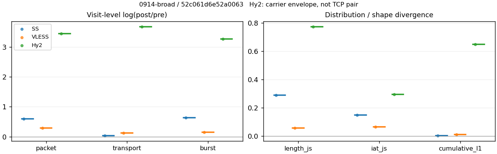
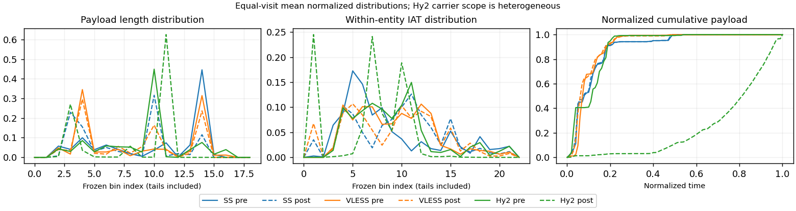

# 0914-broad · 条目 061 · weather.com

目标：https://weather.com/

活动标签：weather.com::page_load。选定访问 3 次。

[返回总索引](../../README.md) · [统计口径](../../methods.md)

## 覆盖与资格（每次访问均保留）

| 部署 | 重复 | 主请求路由 | 活动状态 | 代理比较 | DIRECT pre | 请求 proxy/direct/unresolved | 错误 |
| --- | --- | --- | --- | --- | --- | --- | --- |
| Hy2 | 1 | direct | passed | 1 | 1 | 37/109/0 | [] |
| SS | 1 | direct | passed | 1 | 1 | 31/105/0 | [] |
| VLESS | 1 | direct | passed | 1 | 1 | 44/98/0 | [] |

主请求非 proxy 的统计仅解释为已索引的辅助代理连接或 DIRECT 观测，不代表目标业务经代理传输。播放确认与配对资格是两道不同的门。

图中散点为单次访问，短线为重复中位数；Hy2 是共享载体包络，不能与 TCP 配对作等范围因果对比。

形态图先逐访问归一化，再对访问等权平均；实线 pre，虚线 post。分箱序号及边界见 methods，不将分箱索引误解为长度或时间。

## 每次访问的关键观测

### SS

范围：`exclusive_page`。每格 pre → post；空值为不可观测/不适用。

| 重复 | 包数 | 载荷字节 | burst | TCP FR | IAT中位µs | length JS | IAT JS |
| --- | --- | --- | --- | --- | --- | --- | --- |
| 1 | 1109 → 2015 | 9.218e+05 → 9.5778e+05 | 792 → 1499 | 150 → 151 | 63.419 → 698.09 | 0.2891 | 0.14847 |

范围：`direct_pre_only`。每格 pre → post；空值为不可观测/不适用。

| 重复 | 包数 | 载荷字节 | burst | TCP FR | IAT中位µs | length JS | IAT JS |
| --- | --- | --- | --- | --- | --- | --- | --- |
| 1 | 1326 → — | 1.3587e+06 → — | 962 → — | 88 → — | 298.33 → — | — | — |

完整标量统计：中位数 [min,max]；Δ 为重复内逐访问变换的中位数，MAD 未缩放。n 为可用变换数；DIRECT-only 的 nΔ=0 不代表 pre 不可用。

| scope | 特征 | pre | post | Δ | IQRΔ | MADΔ | nΔ |
| --- | --- | --- | --- | --- | --- | --- | --- |
| direct_pre_only | active_span_sum_s_1000ms | 25.776 [25.776, 25.776] | — | — | — | — | 0 |
| direct_pre_only | active_span_sum_s_100ms | 2.6018 [2.6018, 2.6018] | — | — | — | — | 0 |
| direct_pre_only | active_span_sum_s_500ms | 13.559 [13.559, 13.559] | — | — | — | — | 0 |
| direct_pre_only | burst_bytes_iqr | 2856 [2856, 2856] | — | — | — | — | 0 |
| direct_pre_only | burst_bytes_mad | 64 [64, 64] | — | — | — | — | 0 |
| direct_pre_only | burst_bytes_max | 10111 [10111, 10111] | — | — | — | — | 0 |
| direct_pre_only | burst_bytes_mean | 1412.4 [1412.4, 1412.4] | — | — | — | — | 0 |
| direct_pre_only | burst_bytes_median | 64 [64, 64] | — | — | — | — | 0 |
| direct_pre_only | burst_bytes_min | 0 [0, 0] | — | — | — | — | 0 |
| direct_pre_only | burst_bytes_p95 | 5712 [5712, 5712] | — | — | — | — | 0 |
| direct_pre_only | burst_bytes_q25 | 0 [0, 0] | — | — | — | — | 0 |
| direct_pre_only | burst_bytes_q75 | 2856 [2856, 2856] | — | — | — | — | 0 |
| direct_pre_only | burst_bytes_std | 1949.2 [1949.2, 1949.2] | — | — | — | — | 0 |
| direct_pre_only | burst_count | 962 [962, 962] | — | — | — | — | 0 |
| direct_pre_only | burst_duration_ms_iqr | 0.5658 [0.5658, 0.5658] | — | — | — | — | 0 |
| direct_pre_only | burst_duration_ms_mad | 0 [0, 0] | — | — | — | — | 0 |
| direct_pre_only | burst_duration_ms_max | 15001 [15001, 15001] | — | — | — | — | 0 |
| direct_pre_only | burst_duration_ms_mean | 123.35 [123.35, 123.35] | — | — | — | — | 0 |
| direct_pre_only | burst_duration_ms_median | 0 [0, 0] | — | — | — | — | 0 |
| direct_pre_only | burst_duration_ms_min | 0 [0, 0] | — | — | — | — | 0 |
| direct_pre_only | burst_duration_ms_p95 | 193.43 [193.43, 193.43] | — | — | — | — | 0 |
| direct_pre_only | burst_duration_ms_q25 | 0 [0, 0] | — | — | — | — | 0 |
| direct_pre_only | burst_duration_ms_q75 | 0.5658 [0.5658, 0.5658] | — | — | — | — | 0 |
| direct_pre_only | burst_duration_ms_std | 1045.6 [1045.6, 1045.6] | — | — | — | — | 0 |
| direct_pre_only | burst_packets_iqr | 1 [1, 1] | — | — | — | — | 0 |
| direct_pre_only | burst_packets_mad | 0 [0, 0] | — | — | — | — | 0 |
| direct_pre_only | burst_packets_max | 8 [8, 8] | — | — | — | — | 0 |
| direct_pre_only | burst_packets_mean | 1.3784 [1.3784, 1.3784] | — | — | — | — | 0 |
| direct_pre_only | burst_packets_median | 1 [1, 1] | — | — | — | — | 0 |
| direct_pre_only | burst_packets_min | 1 [1, 1] | — | — | — | — | 0 |
| direct_pre_only | burst_packets_p95 | 2 [2, 2] | — | — | — | — | 0 |
| direct_pre_only | burst_packets_q25 | 1 [1, 1] | — | — | — | — | 0 |
| direct_pre_only | burst_packets_q75 | 2 [2, 2] | — | — | — | — | 0 |
| direct_pre_only | burst_packets_std | 0.63366 [0.63366, 0.63366] | — | — | — | — | 0 |
| direct_pre_only | connection_span_concurrency_max | 6 [6, 6] | — | — | — | — | 0 |
| direct_pre_only | direction_entropy | 0.71774 [0.71774, 0.71774] | — | — | — | — | 0 |
| direct_pre_only | down_burst_count | 477 [477, 477] | — | — | — | — | 0 |
| direct_pre_only | down_ip_bytes | 1.3392e+06 [1.3392e+06, 1.3392e+06] | — | — | — | — | 0 |
| direct_pre_only | down_packets | 758 [758, 758] | — | — | — | — | 0 |
| direct_pre_only | down_transport_bytes | 1.2997e+06 [1.2997e+06, 1.2997e+06] | — | — | — | — | 0 |
| direct_pre_only | duration_s | 39.309 [39.309, 39.309] | — | — | — | — | 0 |
| direct_pre_only | entity_count | 8 [8, 8] | — | — | — | — | 0 |
| direct_pre_only | fr_runs | 88 [88, 88] | — | — | — | — | 0 |
| direct_pre_only | fr_runs_per_packet | 0.11458 [0.11458, 0.11458] | — | — | — | — | 0 |
| direct_pre_only | fr_switches | 80 [80, 80] | — | — | — | — | 0 |
| direct_pre_only | fr_switches_per_possible_transition | 0.10526 [0.10526, 0.10526] | — | — | — | — | 0 |
| direct_pre_only | full_retransmission_fraction | 0 [0, 0] | — | — | — | — | 0 |
| direct_pre_only | full_retransmission_packets | 0 [0, 0] | — | — | — | — | 0 |
| direct_pre_only | iat_count | 1318 [1318, 1318] | — | — | — | — | 0 |
| direct_pre_only | iat_median_us | 298.33 [298.33, 298.33] | — | — | — | — | 0 |
| direct_pre_only | iat_us_iqr | 1759.1 [1759.1, 1759.1] | — | — | — | — | 0 |
| direct_pre_only | iat_us_mad | 288.91 [288.91, 288.91] | — | — | — | — | 0 |
| direct_pre_only | iat_us_max | 1.5001e+07 [1.5001e+07, 1.5001e+07] | — | — | — | — | 0 |
| direct_pre_only | iat_us_mean | 1.3529e+05 [1.3529e+05, 1.3529e+05] | — | — | — | — | 0 |
| direct_pre_only | iat_us_median | 298.33 [298.33, 298.33] | — | — | — | — | 0 |
| direct_pre_only | iat_us_min | 0.751 [0.751, 0.751] | — | — | — | — | 0 |
| direct_pre_only | iat_us_p95 | 2.2746e+05 [2.2746e+05, 2.2746e+05] | — | — | — | — | 0 |
| direct_pre_only | iat_us_q25 | 44.822 [44.822, 44.822] | — | — | — | — | 0 |
| direct_pre_only | iat_us_q75 | 1804 [1804, 1804] | — | — | — | — | 0 |
| direct_pre_only | iat_us_std | 1.0992e+06 [1.0992e+06, 1.0992e+06] | — | — | — | — | 0 |
| direct_pre_only | idle_gap_count_1000ms | 23 [23, 23] | — | — | — | — | 0 |
| direct_pre_only | idle_gap_count_100ms | 85 [85, 85] | — | — | — | — | 0 |
| direct_pre_only | idle_gap_count_500ms | 41 [41, 41] | — | — | — | — | 0 |
| direct_pre_only | idle_gap_sum_s_1000ms | 152.54 [152.54, 152.54] | — | — | — | — | 0 |
| direct_pre_only | idle_gap_sum_s_100ms | 175.71 [175.71, 175.71] | — | — | — | — | 0 |
| direct_pre_only | idle_gap_sum_s_500ms | 164.75 [164.75, 164.75] | — | — | — | — | 0 |
| direct_pre_only | ip_bytes | 1.4277e+06 [1.4277e+06, 1.4277e+06] | — | — | — | — | 0 |
| direct_pre_only | length_iqr | 1733.8 [1733.8, 1733.8] | — | — | — | — | 0 |
| direct_pre_only | length_mad | 1315 [1315, 1315] | — | — | — | — | 0 |
| direct_pre_only | length_max | 8920 [8920, 8920] | — | — | — | — | 0 |
| direct_pre_only | length_mean | 1769.2 [1769.2, 1769.2] | — | — | — | — | 0 |
| direct_pre_only | length_median | 1428 [1428, 1428] | — | — | — | — | 0 |
| direct_pre_only | length_min | 24 [24, 24] | — | — | — | — | 0 |
| direct_pre_only | length_p95 | 2856 [2856, 2856] | — | — | — | — | 0 |
| direct_pre_only | length_q25 | 1122.2 [1122.2, 1122.2] | — | — | — | — | 0 |
| direct_pre_only | length_q75 | 2856 [2856, 2856] | — | — | — | — | 0 |
| direct_pre_only | length_std | 1162.6 [1162.6, 1162.6] | — | — | — | — | 0 |
| direct_pre_only | nonempty_entity_count | 8 [8, 8] | — | — | — | — | 0 |
| direct_pre_only | nonempty_packets | 768 [768, 768] | — | — | — | — | 0 |
| direct_pre_only | offload_suspect_fraction | 0.25415 [0.25415, 0.25415] | — | — | — | — | 0 |
| direct_pre_only | packet_count | 1326 [1326, 1326] | — | — | — | — | 0 |
| direct_pre_only | rtt_median_ms | 0.1671 [0.1671, 0.1671] | — | — | — | — | 0 |
| direct_pre_only | rtt_sample_count | 530 [530, 530] | — | — | — | — | 0 |
| direct_pre_only | tcp_ack_count | 1305 [1305, 1305] | — | — | — | — | 0 |
| direct_pre_only | tcp_fin_count | 13 [13, 13] | — | — | — | — | 0 |
| direct_pre_only | tcp_packet_count | 1326 [1326, 1326] | — | — | — | — | 0 |
| direct_pre_only | tcp_rst_count | 13 [13, 13] | — | — | — | — | 0 |
| direct_pre_only | tcp_syn_count | 16 [16, 16] | — | — | — | — | 0 |
| direct_pre_only | tcp_window_raw_median | 65535 [65535, 65535] | — | — | — | — | 0 |
| direct_pre_only | transition_entropy | 0.43305 [0.43305, 0.43305] | — | — | — | — | 0 |
| direct_pre_only | transition_n_mm | 572 [572, 572] | — | — | — | — | 0 |
| direct_pre_only | transition_n_mp | 36 [36, 36] | — | — | — | — | 0 |
| direct_pre_only | transition_n_pm | 44 [44, 44] | — | — | — | — | 0 |
| direct_pre_only | transition_n_pp | 108 [108, 108] | — | — | — | — | 0 |
| direct_pre_only | transition_p_mm | 0.94079 [0.94079, 0.94079] | — | — | — | — | 0 |
| direct_pre_only | transition_p_mp | 0.059211 [0.059211, 0.059211] | — | — | — | — | 0 |
| direct_pre_only | transition_p_pm | 0.28947 [0.28947, 0.28947] | — | — | — | — | 0 |
| direct_pre_only | transition_p_pp | 0.71053 [0.71053, 0.71053] | — | — | — | — | 0 |
| direct_pre_only | transport_bytes | 1.3587e+06 [1.3587e+06, 1.3587e+06] | — | — | — | — | 0 |
| direct_pre_only | up_burst_count | 485 [485, 485] | — | — | — | — | 0 |
| direct_pre_only | up_byte_fraction | 0.043425 [0.043425, 0.043425] | — | — | — | — | 0 |
| direct_pre_only | up_ip_bytes | 88447 [88447, 88447] | — | — | — | — | 0 |
| direct_pre_only | up_packets | 568 [568, 568] | — | — | — | — | 0 |
| direct_pre_only | up_transport_bytes | 59003 [59003, 59003] | — | — | — | — | 0 |
| direct_pre_only | zero_iat_count | 0 [0, 0] | — | — | — | — | 0 |
| direct_pre_only | zero_iat_fraction | 0 [0, 0] | — | — | — | — | 0 |
| exclusive_page | active_span_sum_s_1000ms | 30.898 [30.898, 30.898] | 37.736 [37.736, 37.736] | 0.19992 | — | — | 1 |
| exclusive_page | active_span_sum_s_100ms | 4.3932 [4.3932, 4.3932] | 10.019 [10.019, 10.019] | 0.8244 | — | — | 1 |
| exclusive_page | active_span_sum_s_500ms | 18.461 [18.461, 18.461] | 23.973 [23.973, 23.973] | 0.26128 | — | — | 1 |
| exclusive_page | burst_bytes_iqr | 1820.2 [1820.2, 1820.2] | 1428 [1428, 1428] | -0.2427 | — | — | 1 |
| exclusive_page | burst_bytes_mad | 31 [31, 31] | 34 [34, 34] | 0.092373 | — | — | 1 |
| exclusive_page | burst_bytes_max | 14480 [14480, 14480] | 4783 [4783, 4783] | -1.1077 | — | — | 1 |
| exclusive_page | burst_bytes_mean | 1163.9 [1163.9, 1163.9] | 638.94 [638.94, 638.94] | -0.5997 | — | — | 1 |
| exclusive_page | burst_bytes_median | 31 [31, 31] | 34 [34, 34] | 0.092373 | — | — | 1 |
| exclusive_page | burst_bytes_min | 0 [0, 0] | 0 [0, 0] | — | — | — | 0 |
| exclusive_page | burst_bytes_p95 | 5792 [5792, 5792] | 2856 [2856, 2856] | -0.70706 | — | — | 1 |
| exclusive_page | burst_bytes_q25 | 0 [0, 0] | 0 [0, 0] | — | — | — | 0 |
| exclusive_page | burst_bytes_q75 | 1820.2 [1820.2, 1820.2] | 1428 [1428, 1428] | -0.2427 | — | — | 1 |
| exclusive_page | burst_bytes_std | 2050.8 [2050.8, 2050.8] | 993.94 [993.94, 993.94] | -0.72432 | — | — | 1 |
| exclusive_page | burst_count | 792 [792, 792] | 1499 [1499, 1499] | 0.63799 | — | — | 1 |
| exclusive_page | burst_duration_ms_iqr | 0.05827 [0.05827, 0.05827] | 0 [0, 0] | — | — | — | 0 |
| exclusive_page | burst_duration_ms_mad | 0 [0, 0] | 0 [0, 0] | — | — | — | 0 |
| exclusive_page | burst_duration_ms_max | 15001 [15001, 15001] | 21957 [21957, 21957] | 0.38095 | — | — | 1 |
| exclusive_page | burst_duration_ms_mean | 228.45 [228.45, 228.45] | 118.51 [118.51, 118.51] | -0.6563 | — | — | 1 |
| exclusive_page | burst_duration_ms_median | 0 [0, 0] | 0 [0, 0] | — | — | — | 0 |
| exclusive_page | burst_duration_ms_min | 0 [0, 0] | 0 [0, 0] | — | — | — | 0 |
| exclusive_page | burst_duration_ms_p95 | 463.61 [463.61, 463.61] | 165.14 [165.14, 165.14] | -1.0322 | — | — | 1 |
| exclusive_page | burst_duration_ms_q25 | 0 [0, 0] | 0 [0, 0] | — | — | — | 0 |
| exclusive_page | burst_duration_ms_q75 | 0.05827 [0.05827, 0.05827] | 0 [0, 0] | — | — | — | 0 |
| exclusive_page | burst_duration_ms_std | 1517.5 [1517.5, 1517.5] | 1240.1 [1240.1, 1240.1] | -0.20185 | — | — | 1 |
| exclusive_page | burst_packets_iqr | 1 [1, 1] | 0 [0, 0] | — | — | — | 0 |
| exclusive_page | burst_packets_mad | 0 [0, 0] | 0 [0, 0] | — | — | — | 0 |
| exclusive_page | burst_packets_max | 6 [6, 6] | 6 [6, 6] | 0 | — | — | 1 |
| exclusive_page | burst_packets_mean | 1.4003 [1.4003, 1.4003] | 1.3442 [1.3442, 1.3442] | -0.040832 | — | — | 1 |
| exclusive_page | burst_packets_median | 1 [1, 1] | 1 [1, 1] | 0 | — | — | 1 |
| exclusive_page | burst_packets_min | 1 [1, 1] | 1 [1, 1] | 0 | — | — | 1 |
| exclusive_page | burst_packets_p95 | 3 [3, 3] | 3 [3, 3] | 0 | — | — | 1 |
| exclusive_page | burst_packets_q25 | 1 [1, 1] | 1 [1, 1] | 0 | — | — | 1 |
| exclusive_page | burst_packets_q75 | 2 [2, 2] | 1 [1, 1] | -0.69315 | — | — | 1 |
| exclusive_page | burst_packets_std | 0.7196 [0.7196, 0.7196] | 0.78358 [0.78358, 0.78358] | 0.085171 | — | — | 1 |
| exclusive_page | connection_span_concurrency_max | 13 [13, 13] | 13 [13, 13] | 0 | — | — | 1 |
| exclusive_page | cumulative_l1 | — | — | 0.0034447 | — | — | 1 |
| exclusive_page | cumulative_max | — | — | 0.062873 | — | — | 1 |
| exclusive_page | direction_entropy | 0.78304 [0.78304, 0.78304] | 0.63635 [0.63635, 0.63635] | -0.14669 | — | — | 1 |
| exclusive_page | down_burst_count | 386 [386, 386] | 740 [740, 740] | 0.65081 | — | — | 1 |
| exclusive_page | down_ip_bytes | 8.983e+05 [8.983e+05, 8.983e+05] | 9.4917e+05 [9.4917e+05, 9.4917e+05] | 0.055088 | — | — | 1 |
| exclusive_page | down_packets | 615 [615, 615] | 1057 [1057, 1057] | 0.54157 | — | — | 1 |
| exclusive_page | down_transport_bytes | 8.6616e+05 [8.6616e+05, 8.6616e+05] | 8.9396e+05 [8.9396e+05, 8.9396e+05] | 0.031598 | — | — | 1 |
| exclusive_page | duration_s | 37.602 [37.602, 37.602] | 37.559 [37.559, 37.559] | -0.001143 | — | — | 1 |
| exclusive_page | entity_count | 20 [20, 20] | 20 [20, 20] | 0 | — | — | 1 |
| exclusive_page | fr_runs | 150 [150, 150] | 151 [151, 151] | 0.0066445 | — | — | 1 |
| exclusive_page | fr_runs_per_packet | 0.27726 [0.27726, 0.27726] | 0.14632 [0.14632, 0.14632] | -0.13095 | — | — | 1 |
| exclusive_page | fr_switches | 130 [130, 130] | 131 [131, 131] | 0.0076629 | — | — | 1 |
| exclusive_page | fr_switches_per_possible_transition | 0.24952 [0.24952, 0.24952] | 0.12945 [0.12945, 0.12945] | -0.12007 | — | — | 1 |
| exclusive_page | full_retransmission_fraction | 0.00090171 [0.00090171, 0.00090171] | 0.0069479 [0.0069479, 0.0069479] | 0.0060462 | — | — | 1 |
| exclusive_page | full_retransmission_packets | 1 [1, 1] | 14 [14, 14] | 2.6391 | — | — | 1 |
| exclusive_page | iat_count | 1089 [1089, 1089] | 1995 [1995, 1995] | 0.60538 | — | — | 1 |
| exclusive_page | iat_js | — | — | 0.14847 | — | — | 1 |
| exclusive_page | iat_ks | — | — | 0.28938 | — | — | 1 |
| exclusive_page | iat_median_us | 63.419 [63.419, 63.419] | 698.09 [698.09, 698.09] | 2.3986 | — | — | 1 |
| exclusive_page | iat_us_iqr | 1250 [1250, 1250] | 4323.1 [4323.1, 4323.1] | 1.2409 | — | — | 1 |
| exclusive_page | iat_us_mad | 57.052 [57.052, 57.052] | 688.15 [688.15, 688.15] | 2.49 | — | — | 1 |
| exclusive_page | iat_us_max | 1.5001e+07 [1.5001e+07, 1.5001e+07] | 1.5397e+07 [1.5397e+07, 1.5397e+07] | 0.026038 | — | — | 1 |
| exclusive_page | iat_us_mean | 3.8449e+05 [3.8449e+05, 3.8449e+05] | 2.0158e+05 [2.0158e+05, 2.0158e+05] | -0.64572 | — | — | 1 |
| exclusive_page | iat_us_median | 63.419 [63.419, 63.419] | 698.09 [698.09, 698.09] | 2.3986 | — | — | 1 |
| exclusive_page | iat_us_min | 0.233 [0.233, 0.233] | 0.042 [0.042, 0.042] | -1.7134 | — | — | 1 |
| exclusive_page | iat_us_p95 | 6.6172e+05 [6.6172e+05, 6.6172e+05] | 1.7238e+05 [1.7238e+05, 1.7238e+05] | -1.3451 | — | — | 1 |
| exclusive_page | iat_us_q25 | 14.251 [14.251, 14.251] | 21.401 [21.401, 21.401] | 0.40663 | — | — | 1 |
| exclusive_page | iat_us_q75 | 1264.2 [1264.2, 1264.2] | 4344.5 [4344.5, 4344.5] | 1.2345 | — | — | 1 |
| exclusive_page | iat_us_std | 2.1656e+06 [2.1656e+06, 2.1656e+06] | 1.5824e+06 [1.5824e+06, 1.5824e+06] | -0.31378 | — | — | 1 |
| exclusive_page | iat_wasserstein_log1p_us | — | — | 1.2728 | — | — | 1 |
| exclusive_page | idle_gap_count_1000ms | 43 [43, 43] | 37 [37, 37] | -0.15028 | — | — | 1 |
| exclusive_page | idle_gap_count_100ms | 114 [114, 114] | 113 [113, 113] | -0.0088106 | — | — | 1 |
| exclusive_page | idle_gap_count_500ms | 60 [60, 60] | 55 [55, 55] | -0.087011 | — | — | 1 |
| exclusive_page | idle_gap_sum_s_1000ms | 387.81 [387.81, 387.81] | 364.42 [364.42, 364.42] | -0.062212 | — | — | 1 |
| exclusive_page | idle_gap_sum_s_100ms | 414.31 [414.31, 414.31] | 392.13 [392.13, 392.13] | -0.055018 | — | — | 1 |
| exclusive_page | idle_gap_sum_s_500ms | 400.24 [400.24, 400.24] | 378.18 [378.18, 378.18] | -0.056708 | — | — | 1 |
| exclusive_page | ip_bytes | 9.7974e+05 [9.7974e+05, 9.7974e+05] | 1.0742e+06 [1.0742e+06, 1.0742e+06] | 0.092004 | — | — | 1 |
| exclusive_page | length_iqr | 2570 [2570, 2570] | 1363 [1363, 1363] | -0.63422 | — | — | 1 |
| exclusive_page | length_js | — | — | 0.2891 | — | — | 1 |
| exclusive_page | length_ks | — | — | 0.44385 | — | — | 1 |
| exclusive_page | length_mad | 1134 [1134, 1134] | 682.5 [682.5, 682.5] | -0.50774 | — | — | 1 |
| exclusive_page | length_max | 4096 [4096, 4096] | 2856 [2856, 2856] | -0.36059 | — | — | 1 |
| exclusive_page | length_mean | 1703.9 [1703.9, 1703.9] | 928.08 [928.08, 928.08] | -0.60754 | — | — | 1 |
| exclusive_page | length_median | 1762 [1762, 1762] | 745.5 [745.5, 745.5] | -0.86015 | — | — | 1 |
| exclusive_page | length_min | 31 [31, 31] | 6 [6, 6] | -1.6422 | — | — | 1 |
| exclusive_page | length_p95 | 2896 [2896, 2896] | 2856 [2856, 2856] | -0.013908 | — | — | 1 |
| exclusive_page | length_q25 | 326 [326, 326] | 65 [65, 65] | -1.6125 | — | — | 1 |
| exclusive_page | length_q75 | 2896 [2896, 2896] | 1428 [1428, 1428] | -0.70706 | — | — | 1 |
| exclusive_page | length_std | 1222.7 [1222.7, 1222.7] | 920.12 [920.12, 920.12] | -0.2843 | — | — | 1 |
| exclusive_page | length_wasserstein_bytes | — | — | 776.09 | — | — | 1 |
| exclusive_page | nonempty_entity_count | 20 [20, 20] | 20 [20, 20] | 0 | — | — | 1 |
| exclusive_page | nonempty_packets | 541 [541, 541] | 1032 [1032, 1032] | 0.64583 | — | — | 1 |
| exclusive_page | offload_suspect_fraction | 0.25609 [0.25609, 0.25609] | 0.075931 [0.075931, 0.075931] | -0.18016 | — | — | 1 |
| exclusive_page | packet_count | 1109 [1109, 1109] | 2015 [2015, 2015] | 0.59716 | — | — | 1 |
| exclusive_page | rtt_median_ms | 0.060484 [0.060484, 0.060484] | 31.466 [31.466, 31.466] | 6.2543 | — | — | 1 |
| exclusive_page | rtt_sample_count | 482 [482, 482] | 452 [452, 452] | -0.064262 | — | — | 1 |
| exclusive_page | tcp_ack_count | 1084 [1084, 1084] | 1991 [1991, 1991] | 0.60798 | — | — | 1 |
| exclusive_page | tcp_fin_count | 39 [39, 39] | 39 [39, 39] | 0 | — | — | 1 |
| exclusive_page | tcp_packet_count | 1109 [1109, 1109] | 2015 [2015, 2015] | 0.59716 | — | — | 1 |
| exclusive_page | tcp_rst_count | 5 [5, 5] | 1 [1, 1] | -1.6094 | — | — | 1 |
| exclusive_page | tcp_syn_count | 40 [40, 40] | 44 [44, 44] | 0.09531 | — | — | 1 |
| exclusive_page | tcp_window_raw_median | 65471 [65471, 65471] | 134 [134, 134] | -6.1915 | — | — | 1 |
| exclusive_page | transition_entropy | 0.68438 [0.68438, 0.68438] | 0.46382 [0.46382, 0.46382] | -0.22056 | — | — | 1 |
| exclusive_page | transition_n_mm | 344 [344, 344] | 795 [795, 795] | 0.8377 | — | — | 1 |
| exclusive_page | transition_n_mp | 59 [59, 59] | 60 [60, 60] | 0.016807 | — | — | 1 |
| exclusive_page | transition_n_pm | 71 [71, 71] | 71 [71, 71] | 0 | — | — | 1 |
| exclusive_page | transition_n_pp | 47 [47, 47] | 86 [86, 86] | 0.6042 | — | — | 1 |
| exclusive_page | transition_p_mm | 0.8536 [0.8536, 0.8536] | 0.92982 [0.92982, 0.92982] | 0.076227 | — | — | 1 |
| exclusive_page | transition_p_mp | 0.1464 [0.1464, 0.1464] | 0.070175 [0.070175, 0.070175] | -0.076227 | — | — | 1 |
| exclusive_page | transition_p_pm | 0.60169 [0.60169, 0.60169] | 0.45223 [0.45223, 0.45223] | -0.14947 | — | — | 1 |
| exclusive_page | transition_p_pp | 0.39831 [0.39831, 0.39831] | 0.54777 [0.54777, 0.54777] | 0.14947 | — | — | 1 |
| exclusive_page | transport_bytes | 9.218e+05 [9.218e+05, 9.218e+05] | 9.5778e+05 [9.5778e+05, 9.5778e+05] | 0.03829 | — | — | 1 |
| exclusive_page | up_burst_count | 406 [406, 406] | 759 [759, 759] | 0.62565 | — | — | 1 |
| exclusive_page | up_byte_fraction | 0.060356 [0.060356, 0.060356] | 0.066623 [0.066623, 0.066623] | 0.006267 | — | — | 1 |
| exclusive_page | up_ip_bytes | 81436 [81436, 81436] | 1.2498e+05 [1.2498e+05, 1.2498e+05] | 0.42832 | — | — | 1 |
| exclusive_page | up_packets | 494 [494, 494] | 958 [958, 958] | 0.66231 | — | — | 1 |
| exclusive_page | up_transport_bytes | 55636 [55636, 55636] | 63810 [63810, 63810] | 0.13708 | — | — | 1 |
| exclusive_page | zero_iat_count | 0 [0, 0] | 0 [0, 0] | — | — | — | 0 |
| exclusive_page | zero_iat_fraction | 0 [0, 0] | 0 [0, 0] | 0 | — | — | 1 |

### VLESS

范围：`exclusive_page`。每格 pre → post；空值为不可观测/不适用。

| 重复 | 包数 | 载荷字节 | burst | TCP FR | IAT中位µs | length JS | IAT JS |
| --- | --- | --- | --- | --- | --- | --- | --- |
| 1 | 2236 → 2984 | 1.6045e+06 → 1.8228e+06 | 1675 → 1944 | 192 → 246 | 374.26 → 512.15 | 0.054953 | 0.064953 |

范围：`direct_pre_only`。每格 pre → post；空值为不可观测/不适用。

| 重复 | 包数 | 载荷字节 | burst | TCP FR | IAT中位µs | length JS | IAT JS |
| --- | --- | --- | --- | --- | --- | --- | --- |
| 1 | 1092 → — | 1.3298e+06 → — | 796 → — | 68 → — | 508.9 → — | — | — |

完整标量统计：中位数 [min,max]；Δ 为重复内逐访问变换的中位数，MAD 未缩放。n 为可用变换数；DIRECT-only 的 nΔ=0 不代表 pre 不可用。

| scope | 特征 | pre | post | Δ | IQRΔ | MADΔ | nΔ |
| --- | --- | --- | --- | --- | --- | --- | --- |
| direct_pre_only | active_span_sum_s_1000ms | 16.909 [16.909, 16.909] | — | — | — | — | 0 |
| direct_pre_only | active_span_sum_s_100ms | 2.6925 [2.6925, 2.6925] | — | — | — | — | 0 |
| direct_pre_only | active_span_sum_s_500ms | 10.992 [10.992, 10.992] | — | — | — | — | 0 |
| direct_pre_only | burst_bytes_iqr | 2856 [2856, 2856] | — | — | — | — | 0 |
| direct_pre_only | burst_bytes_mad | 65 [65, 65] | — | — | — | — | 0 |
| direct_pre_only | burst_bytes_max | 10613 [10613, 10613] | — | — | — | — | 0 |
| direct_pre_only | burst_bytes_mean | 1670.6 [1670.6, 1670.6] | — | — | — | — | 0 |
| direct_pre_only | burst_bytes_median | 65 [65, 65] | — | — | — | — | 0 |
| direct_pre_only | burst_bytes_min | 0 [0, 0] | — | — | — | — | 0 |
| direct_pre_only | burst_bytes_p95 | 5712 [5712, 5712] | — | — | — | — | 0 |
| direct_pre_only | burst_bytes_q25 | 0 [0, 0] | — | — | — | — | 0 |
| direct_pre_only | burst_bytes_q75 | 2856 [2856, 2856] | — | — | — | — | 0 |
| direct_pre_only | burst_bytes_std | 2325.8 [2325.8, 2325.8] | — | — | — | — | 0 |
| direct_pre_only | burst_count | 796 [796, 796] | — | — | — | — | 0 |
| direct_pre_only | burst_duration_ms_iqr | 0.98263 [0.98263, 0.98263] | — | — | — | — | 0 |
| direct_pre_only | burst_duration_ms_mad | 0 [0, 0] | — | — | — | — | 0 |
| direct_pre_only | burst_duration_ms_max | 15001 [15001, 15001] | — | — | — | — | 0 |
| direct_pre_only | burst_duration_ms_mean | 43.358 [43.358, 43.358] | — | — | — | — | 0 |
| direct_pre_only | burst_duration_ms_median | 0 [0, 0] | — | — | — | — | 0 |
| direct_pre_only | burst_duration_ms_min | 0 [0, 0] | — | — | — | — | 0 |
| direct_pre_only | burst_duration_ms_p95 | 10.42 [10.42, 10.42] | — | — | — | — | 0 |
| direct_pre_only | burst_duration_ms_q25 | 0 [0, 0] | — | — | — | — | 0 |
| direct_pre_only | burst_duration_ms_q75 | 0.98263 [0.98263, 0.98263] | — | — | — | — | 0 |
| direct_pre_only | burst_duration_ms_std | 563.51 [563.51, 563.51] | — | — | — | — | 0 |
| direct_pre_only | burst_packets_iqr | 1 [1, 1] | — | — | — | — | 0 |
| direct_pre_only | burst_packets_mad | 0 [0, 0] | — | — | — | — | 0 |
| direct_pre_only | burst_packets_max | 5 [5, 5] | — | — | — | — | 0 |
| direct_pre_only | burst_packets_mean | 1.3719 [1.3719, 1.3719] | — | — | — | — | 0 |
| direct_pre_only | burst_packets_median | 1 [1, 1] | — | — | — | — | 0 |
| direct_pre_only | burst_packets_min | 1 [1, 1] | — | — | — | — | 0 |
| direct_pre_only | burst_packets_p95 | 2 [2, 2] | — | — | — | — | 0 |
| direct_pre_only | burst_packets_q25 | 1 [1, 1] | — | — | — | — | 0 |
| direct_pre_only | burst_packets_q75 | 2 [2, 2] | — | — | — | — | 0 |
| direct_pre_only | burst_packets_std | 0.57364 [0.57364, 0.57364] | — | — | — | — | 0 |
| direct_pre_only | connection_span_concurrency_max | 4 [4, 4] | — | — | — | — | 0 |
| direct_pre_only | direction_entropy | 0.72945 [0.72945, 0.72945] | — | — | — | — | 0 |
| direct_pre_only | down_burst_count | 395 [395, 395] | — | — | — | — | 0 |
| direct_pre_only | down_ip_bytes | 1.3229e+06 [1.3229e+06, 1.3229e+06] | — | — | — | — | 0 |
| direct_pre_only | down_packets | 627 [627, 627] | — | — | — | — | 0 |
| direct_pre_only | down_transport_bytes | 1.2903e+06 [1.2903e+06, 1.2903e+06] | — | — | — | — | 0 |
| direct_pre_only | duration_s | 28.202 [28.202, 28.202] | — | — | — | — | 0 |
| direct_pre_only | entity_count | 6 [6, 6] | — | — | — | — | 0 |
| direct_pre_only | fr_runs | 68 [68, 68] | — | — | — | — | 0 |
| direct_pre_only | fr_runs_per_packet | 0.10742 [0.10742, 0.10742] | — | — | — | — | 0 |
| direct_pre_only | fr_switches | 62 [62, 62] | — | — | — | — | 0 |
| direct_pre_only | fr_switches_per_possible_transition | 0.098884 [0.098884, 0.098884] | — | — | — | — | 0 |
| direct_pre_only | full_retransmission_fraction | 0 [0, 0] | — | — | — | — | 0 |
| direct_pre_only | full_retransmission_packets | 0 [0, 0] | — | — | — | — | 0 |
| direct_pre_only | iat_count | 1086 [1086, 1086] | — | — | — | — | 0 |
| direct_pre_only | iat_median_us | 508.9 [508.9, 508.9] | — | — | — | — | 0 |
| direct_pre_only | iat_us_iqr | 2031.4 [2031.4, 2031.4] | — | — | — | — | 0 |
| direct_pre_only | iat_us_mad | 500.15 [500.15, 500.15] | — | — | — | — | 0 |
| direct_pre_only | iat_us_max | 1.5001e+07 [1.5001e+07, 1.5001e+07] | — | — | — | — | 0 |
| direct_pre_only | iat_us_mean | 90578 [90578, 90578] | — | — | — | — | 0 |
| direct_pre_only | iat_us_median | 508.9 [508.9, 508.9] | — | — | — | — | 0 |
| direct_pre_only | iat_us_min | 0.079 [0.079, 0.079] | — | — | — | — | 0 |
| direct_pre_only | iat_us_p95 | 1.0443e+05 [1.0443e+05, 1.0443e+05] | — | — | — | — | 0 |
| direct_pre_only | iat_us_q25 | 41.919 [41.919, 41.919] | — | — | — | — | 0 |
| direct_pre_only | iat_us_q75 | 2073.3 [2073.3, 2073.3] | — | — | — | — | 0 |
| direct_pre_only | iat_us_std | 8.7782e+05 [8.7782e+05, 8.7782e+05] | — | — | — | — | 0 |
| direct_pre_only | idle_gap_count_1000ms | 15 [15, 15] | — | — | — | — | 0 |
| direct_pre_only | idle_gap_count_100ms | 61 [61, 61] | — | — | — | — | 0 |
| direct_pre_only | idle_gap_count_500ms | 24 [24, 24] | — | — | — | — | 0 |
| direct_pre_only | idle_gap_sum_s_1000ms | 81.459 [81.459, 81.459] | — | — | — | — | 0 |
| direct_pre_only | idle_gap_sum_s_100ms | 95.675 [95.675, 95.675] | — | — | — | — | 0 |
| direct_pre_only | idle_gap_sum_s_500ms | 87.376 [87.376, 87.376] | — | — | — | — | 0 |
| direct_pre_only | ip_bytes | 1.3865e+06 [1.3865e+06, 1.3865e+06] | — | — | — | — | 0 |
| direct_pre_only | length_iqr | 1818 [1818, 1818] | — | — | — | — | 0 |
| direct_pre_only | length_mad | 0 [0, 0] | — | — | — | — | 0 |
| direct_pre_only | length_max | 7757 [7757, 7757] | — | — | — | — | 0 |
| direct_pre_only | length_mean | 2100.8 [2100.8, 2100.8] | — | — | — | — | 0 |
| direct_pre_only | length_median | 2856 [2856, 2856] | — | — | — | — | 0 |
| direct_pre_only | length_min | 24 [24, 24] | — | — | — | — | 0 |
| direct_pre_only | length_p95 | 2856 [2856, 2856] | — | — | — | — | 0 |
| direct_pre_only | length_q25 | 1038 [1038, 1038] | — | — | — | — | 0 |
| direct_pre_only | length_q75 | 2856 [2856, 2856] | — | — | — | — | 0 |
| direct_pre_only | length_std | 1221.9 [1221.9, 1221.9] | — | — | — | — | 0 |
| direct_pre_only | nonempty_entity_count | 6 [6, 6] | — | — | — | — | 0 |
| direct_pre_only | nonempty_packets | 633 [633, 633] | — | — | — | — | 0 |
| direct_pre_only | offload_suspect_fraction | 0.39469 [0.39469, 0.39469] | — | — | — | — | 0 |
| direct_pre_only | packet_count | 1092 [1092, 1092] | — | — | — | — | 0 |
| direct_pre_only | rtt_median_ms | 0.17771 [0.17771, 0.17771] | — | — | — | — | 0 |
| direct_pre_only | rtt_sample_count | 439 [439, 439] | — | — | — | — | 0 |
| direct_pre_only | tcp_ack_count | 1076 [1076, 1076] | — | — | — | — | 0 |
| direct_pre_only | tcp_fin_count | 10 [10, 10] | — | — | — | — | 0 |
| direct_pre_only | tcp_packet_count | 1092 [1092, 1092] | — | — | — | — | 0 |
| direct_pre_only | tcp_rst_count | 10 [10, 10] | — | — | — | — | 0 |
| direct_pre_only | tcp_syn_count | 12 [12, 12] | — | — | — | — | 0 |
| direct_pre_only | tcp_window_raw_median | 65535 [65535, 65535] | — | — | — | — | 0 |
| direct_pre_only | transition_entropy | 0.41922 [0.41922, 0.41922] | — | — | — | — | 0 |
| direct_pre_only | transition_n_mm | 470 [470, 470] | — | — | — | — | 0 |
| direct_pre_only | transition_n_mp | 28 [28, 28] | — | — | — | — | 0 |
| direct_pre_only | transition_n_pm | 34 [34, 34] | — | — | — | — | 0 |
| direct_pre_only | transition_n_pp | 95 [95, 95] | — | — | — | — | 0 |
| direct_pre_only | transition_p_mm | 0.94378 [0.94378, 0.94378] | — | — | — | — | 0 |
| direct_pre_only | transition_p_mp | 0.056225 [0.056225, 0.056225] | — | — | — | — | 0 |
| direct_pre_only | transition_p_pm | 0.26357 [0.26357, 0.26357] | — | — | — | — | 0 |
| direct_pre_only | transition_p_pp | 0.73643 [0.73643, 0.73643] | — | — | — | — | 0 |
| direct_pre_only | transport_bytes | 1.3298e+06 [1.3298e+06, 1.3298e+06] | — | — | — | — | 0 |
| direct_pre_only | up_burst_count | 401 [401, 401] | — | — | — | — | 0 |
| direct_pre_only | up_byte_fraction | 0.029719 [0.029719, 0.029719] | — | — | — | — | 0 |
| direct_pre_only | up_ip_bytes | 63628 [63628, 63628] | — | — | — | — | 0 |
| direct_pre_only | up_packets | 465 [465, 465] | — | — | — | — | 0 |
| direct_pre_only | up_transport_bytes | 39520 [39520, 39520] | — | — | — | — | 0 |
| direct_pre_only | zero_iat_count | 0 [0, 0] | — | — | — | — | 0 |
| direct_pre_only | zero_iat_fraction | 0 [0, 0] | — | — | — | — | 0 |
| exclusive_page | active_span_sum_s_1000ms | 39.545 [39.545, 39.545] | 42.192 [42.192, 42.192] | 0.064793 | — | — | 1 |
| exclusive_page | active_span_sum_s_100ms | 5.7558 [5.7558, 5.7558] | 14.522 [14.522, 14.522] | 0.92548 | — | — | 1 |
| exclusive_page | active_span_sum_s_500ms | 20.226 [20.226, 20.226] | 36.706 [36.706, 36.706] | 0.59595 | — | — | 1 |
| exclusive_page | burst_bytes_iqr | 2136 [2136, 2136] | 2015.5 [2015.5, 2015.5] | -0.058068 | — | — | 1 |
| exclusive_page | burst_bytes_mad | 24 [24, 24] | 53 [53, 53] | 0.79224 | — | — | 1 |
| exclusive_page | burst_bytes_max | 16368 [16368, 16368] | 5769 [5769, 5769] | -1.0428 | — | — | 1 |
| exclusive_page | burst_bytes_mean | 957.92 [957.92, 957.92] | 937.64 [937.64, 937.64] | -0.021403 | — | — | 1 |
| exclusive_page | burst_bytes_median | 24 [24, 24] | 53 [53, 53] | 0.79224 | — | — | 1 |
| exclusive_page | burst_bytes_min | 0 [0, 0] | 0 [0, 0] | — | — | — | 0 |
| exclusive_page | burst_bytes_p95 | 2896 [2896, 2896] | 2896 [2896, 2896] | 0 | — | — | 1 |
| exclusive_page | burst_bytes_q25 | 0 [0, 0] | 0 [0, 0] | — | — | — | 0 |
| exclusive_page | burst_bytes_q75 | 2136 [2136, 2136] | 2015.5 [2015.5, 2015.5] | -0.058068 | — | — | 1 |
| exclusive_page | burst_bytes_std | 1554.1 [1554.1, 1554.1] | 1254 [1254, 1254] | -0.21458 | — | — | 1 |
| exclusive_page | burst_count | 1675 [1675, 1675] | 1944 [1944, 1944] | 0.14893 | — | — | 1 |
| exclusive_page | burst_duration_ms_iqr | 0.63782 [0.63782, 0.63782] | 0.73063 [0.73063, 0.73063] | 0.13586 | — | — | 1 |
| exclusive_page | burst_duration_ms_mad | 0 [0, 0] | 0 [0, 0] | — | — | — | 0 |
| exclusive_page | burst_duration_ms_max | 15001 [15001, 15001] | 15104 [15104, 15104] | 0.0068585 | — | — | 1 |
| exclusive_page | burst_duration_ms_mean | 108.48 [108.48, 108.48] | 94.327 [94.327, 94.327] | -0.13977 | — | — | 1 |
| exclusive_page | burst_duration_ms_median | 0 [0, 0] | 0 [0, 0] | — | — | — | 0 |
| exclusive_page | burst_duration_ms_min | 0 [0, 0] | 0 [0, 0] | — | — | — | 0 |
| exclusive_page | burst_duration_ms_p95 | 199.84 [199.84, 199.84] | 155.71 [155.71, 155.71] | -0.24949 | — | — | 1 |
| exclusive_page | burst_duration_ms_q25 | 0 [0, 0] | 0 [0, 0] | — | — | — | 0 |
| exclusive_page | burst_duration_ms_q75 | 0.63782 [0.63782, 0.63782] | 0.73063 [0.73063, 0.73063] | 0.13586 | — | — | 1 |
| exclusive_page | burst_duration_ms_std | 905.64 [905.64, 905.64] | 1076.7 [1076.7, 1076.7] | 0.17304 | — | — | 1 |
| exclusive_page | burst_packets_iqr | 1 [1, 1] | 1 [1, 1] | 0 | — | — | 1 |
| exclusive_page | burst_packets_mad | 0 [0, 0] | 0 [0, 0] | — | — | — | 0 |
| exclusive_page | burst_packets_max | 4 [4, 4] | 8 [8, 8] | 0.69315 | — | — | 1 |
| exclusive_page | burst_packets_mean | 1.3349 [1.3349, 1.3349] | 1.535 [1.535, 1.535] | 0.13964 | — | — | 1 |
| exclusive_page | burst_packets_median | 1 [1, 1] | 1 [1, 1] | 0 | — | — | 1 |
| exclusive_page | burst_packets_min | 1 [1, 1] | 1 [1, 1] | 0 | — | — | 1 |
| exclusive_page | burst_packets_p95 | 2 [2, 2] | 3 [3, 3] | 0.40547 | — | — | 1 |
| exclusive_page | burst_packets_q25 | 1 [1, 1] | 1 [1, 1] | 0 | — | — | 1 |
| exclusive_page | burst_packets_q75 | 2 [2, 2] | 2 [2, 2] | 0 | — | — | 1 |
| exclusive_page | burst_packets_std | 0.53146 [0.53146, 0.53146] | 0.95571 [0.95571, 0.95571] | 0.58682 | — | — | 1 |
| exclusive_page | connection_span_concurrency_max | 15 [15, 15] | 15 [15, 15] | 0 | — | — | 1 |
| exclusive_page | cumulative_l1 | — | — | 0.0107 | — | — | 1 |
| exclusive_page | cumulative_max | — | — | 0.26457 | — | — | 1 |
| exclusive_page | direction_entropy | 0.56336 [0.56336, 0.56336] | 0.56753 [0.56753, 0.56753] | 0.0041674 | — | — | 1 |
| exclusive_page | down_burst_count | 825 [825, 825] | 961 [961, 961] | 0.15259 | — | — | 1 |
| exclusive_page | down_ip_bytes | 1.5936e+06 [1.5936e+06, 1.5936e+06] | 1.7828e+06 [1.7828e+06, 1.7828e+06] | 0.11219 | — | — | 1 |
| exclusive_page | down_packets | 1278 [1278, 1278] | 1680 [1680, 1680] | 0.2735 | — | — | 1 |
| exclusive_page | down_transport_bytes | 1.5269e+06 [1.5269e+06, 1.5269e+06] | 1.6952e+06 [1.6952e+06, 1.6952e+06] | 0.10455 | — | — | 1 |
| exclusive_page | duration_s | 26.732 [26.732, 26.732] | 26.478 [26.478, 26.478] | -0.0095335 | — | — | 1 |
| exclusive_page | entity_count | 25 [25, 25] | 25 [25, 25] | 0 | — | — | 1 |
| exclusive_page | fr_runs | 192 [192, 192] | 246 [246, 246] | 0.24784 | — | — | 1 |
| exclusive_page | fr_runs_per_packet | 0.1596 [0.1596, 0.1596] | 0.15443 [0.15443, 0.15443] | -0.0051754 | — | — | 1 |
| exclusive_page | fr_switches | 167 [167, 167] | 221 [221, 221] | 0.28017 | — | — | 1 |
| exclusive_page | fr_switches_per_possible_transition | 0.14177 [0.14177, 0.14177] | 0.14094 [0.14094, 0.14094] | -0.00082183 | — | — | 1 |
| exclusive_page | full_retransmission_fraction | 0 [0, 0] | 0 [0, 0] | 0 | — | — | 1 |
| exclusive_page | full_retransmission_packets | 0 [0, 0] | 0 [0, 0] | — | — | — | 0 |
| exclusive_page | iat_count | 2211 [2211, 2211] | 2959 [2959, 2959] | 0.29141 | — | — | 1 |
| exclusive_page | iat_js | — | — | 0.064953 | — | — | 1 |
| exclusive_page | iat_ks | — | — | 0.08967 | — | — | 1 |
| exclusive_page | iat_median_us | 374.26 [374.26, 374.26] | 512.15 [512.15, 512.15] | 0.31367 | — | — | 1 |
| exclusive_page | iat_us_iqr | 3433.4 [3433.4, 3433.4] | 3983.1 [3983.1, 3983.1] | 0.14852 | — | — | 1 |
| exclusive_page | iat_us_mad | 366.2 [366.2, 366.2] | 505.36 [505.36, 505.36] | 0.32209 | — | — | 1 |
| exclusive_page | iat_us_max | 1.5003e+07 [1.5003e+07, 1.5003e+07] | 1.5104e+07 [1.5104e+07, 1.5104e+07] | 0.0067501 | — | — | 1 |
| exclusive_page | iat_us_mean | 1.5362e+05 [1.5362e+05, 1.5362e+05] | 1.1312e+05 [1.1312e+05, 1.1312e+05] | -0.30605 | — | — | 1 |
| exclusive_page | iat_us_median | 374.26 [374.26, 374.26] | 512.15 [512.15, 512.15] | 0.31367 | — | — | 1 |
| exclusive_page | iat_us_min | 2.61 [2.61, 2.61] | 0.033 [0.033, 0.033] | -4.3706 | — | — | 1 |
| exclusive_page | iat_us_p95 | 1.9604e+05 [1.9604e+05, 1.9604e+05] | 1.093e+05 [1.093e+05, 1.093e+05] | -0.58425 | — | — | 1 |
| exclusive_page | iat_us_q25 | 32.695 [32.695, 32.695] | 16.856 [16.856, 16.856] | -0.66253 | — | — | 1 |
| exclusive_page | iat_us_q75 | 3466 [3466, 3466] | 3999.9 [3999.9, 3999.9] | 0.14327 | — | — | 1 |
| exclusive_page | iat_us_std | 1.2751e+06 [1.2751e+06, 1.2751e+06] | 1.1013e+06 [1.1013e+06, 1.1013e+06] | -0.14657 | — | — | 1 |
| exclusive_page | iat_wasserstein_log1p_us | — | — | 0.5063 | — | — | 1 |
| exclusive_page | idle_gap_count_1000ms | 37 [37, 37] | 31 [31, 31] | -0.17693 | — | — | 1 |
| exclusive_page | idle_gap_count_100ms | 132 [132, 132] | 157 [157, 157] | 0.17344 | — | — | 1 |
| exclusive_page | idle_gap_count_500ms | 64 [64, 64] | 39 [39, 39] | -0.49532 | — | — | 1 |
| exclusive_page | idle_gap_sum_s_1000ms | 300.1 [300.1, 300.1] | 292.52 [292.52, 292.52] | -0.025598 | — | — | 1 |
| exclusive_page | idle_gap_sum_s_100ms | 333.89 [333.89, 333.89] | 320.19 [320.19, 320.19] | -0.04191 | — | — | 1 |
| exclusive_page | idle_gap_sum_s_500ms | 319.42 [319.42, 319.42] | 298 [298, 298] | -0.069403 | — | — | 1 |
| exclusive_page | ip_bytes | 1.7207e+06 [1.7207e+06, 1.7207e+06] | 1.9801e+06 [1.9801e+06, 1.9801e+06] | 0.14044 | — | — | 1 |
| exclusive_page | length_iqr | 2752 [2752, 2752] | 1737 [1737, 1737] | -0.46017 | — | — | 1 |
| exclusive_page | length_js | — | — | 0.054953 | — | — | 1 |
| exclusive_page | length_ks | — | — | 0.12059 | — | — | 1 |
| exclusive_page | length_mad | 671 [671, 671] | 1092 [1092, 1092] | 0.487 | — | — | 1 |
| exclusive_page | length_max | 8920 [8920, 8920] | 2824 [2824, 2824] | -1.1501 | — | — | 1 |
| exclusive_page | length_mean | 1333.8 [1333.8, 1333.8] | 1144.2 [1144.2, 1144.2] | -0.15327 | — | — | 1 |
| exclusive_page | length_median | 707 [707, 707] | 1164 [1164, 1164] | 0.49859 | — | — | 1 |
| exclusive_page | length_min | 16 [16, 16] | 16 [16, 16] | 0 | — | — | 1 |
| exclusive_page | length_p95 | 2824 [2824, 2824] | 2824 [2824, 2824] | 0 | — | — | 1 |
| exclusive_page | length_q25 | 72 [72, 72] | 72 [72, 72] | 0 | — | — | 1 |
| exclusive_page | length_q75 | 2824 [2824, 2824] | 1809 [1809, 1809] | -0.44538 | — | — | 1 |
| exclusive_page | length_std | 1520.7 [1520.7, 1520.7] | 1075.7 [1075.7, 1075.7] | -0.34618 | — | — | 1 |
| exclusive_page | length_wasserstein_bytes | — | — | 289.09 | — | — | 1 |
| exclusive_page | nonempty_entity_count | 25 [25, 25] | 25 [25, 25] | 0 | — | — | 1 |
| exclusive_page | nonempty_packets | 1203 [1203, 1203] | 1593 [1593, 1593] | 0.2808 | — | — | 1 |
| exclusive_page | offload_suspect_fraction | 0.19991 [0.19991, 0.19991] | 0.13807 [0.13807, 0.13807] | -0.061841 | — | — | 1 |
| exclusive_page | packet_count | 2236 [2236, 2236] | 2984 [2984, 2984] | 0.28858 | — | — | 1 |
| exclusive_page | rtt_median_ms | 0.12076 [0.12076, 0.12076] | 0.5266 [0.5266, 0.5266] | 1.4727 | — | — | 1 |
| exclusive_page | rtt_sample_count | 912 [912, 912] | 1244 [1244, 1244] | 0.31045 | — | — | 1 |
| exclusive_page | tcp_ack_count | 2169 [2169, 2169] | 2957 [2957, 2957] | 0.30991 | — | — | 1 |
| exclusive_page | tcp_fin_count | 48 [48, 48] | 50 [50, 50] | 0.040822 | — | — | 1 |
| exclusive_page | tcp_packet_count | 2236 [2236, 2236] | 2984 [2984, 2984] | 0.28858 | — | — | 1 |
| exclusive_page | tcp_rst_count | 43 [43, 43] | 2 [2, 2] | -3.0681 | — | — | 1 |
| exclusive_page | tcp_syn_count | 50 [50, 50] | 50 [50, 50] | 0 | — | — | 1 |
| exclusive_page | tcp_window_raw_median | 65535 [65535, 65535] | 152 [152, 152] | -6.0665 | — | — | 1 |
| exclusive_page | transition_entropy | 0.44624 [0.44624, 0.44624] | 0.45714 [0.45714, 0.45714] | 0.010905 | — | — | 1 |
| exclusive_page | transition_n_mm | 948 [948, 948] | 1257 [1257, 1257] | 0.28213 | — | — | 1 |
| exclusive_page | transition_n_mp | 71 [71, 71] | 98 [98, 98] | 0.32229 | — | — | 1 |
| exclusive_page | transition_n_pm | 96 [96, 96] | 123 [123, 123] | 0.24784 | — | — | 1 |
| exclusive_page | transition_n_pp | 63 [63, 63] | 90 [90, 90] | 0.35667 | — | — | 1 |
| exclusive_page | transition_p_mm | 0.93032 [0.93032, 0.93032] | 0.92768 [0.92768, 0.92768] | -0.0026486 | — | — | 1 |
| exclusive_page | transition_p_mp | 0.069676 [0.069676, 0.069676] | 0.072325 [0.072325, 0.072325] | 0.0026486 | — | — | 1 |
| exclusive_page | transition_p_pm | 0.60377 [0.60377, 0.60377] | 0.57746 [0.57746, 0.57746] | -0.026309 | — | — | 1 |
| exclusive_page | transition_p_pp | 0.39623 [0.39623, 0.39623] | 0.42254 [0.42254, 0.42254] | 0.026309 | — | — | 1 |
| exclusive_page | transport_bytes | 1.6045e+06 [1.6045e+06, 1.6045e+06] | 1.8228e+06 [1.8228e+06, 1.8228e+06] | 0.12753 | — | — | 1 |
| exclusive_page | up_burst_count | 850 [850, 850] | 983 [983, 983] | 0.14537 | — | — | 1 |
| exclusive_page | up_byte_fraction | 0.048362 [0.048362, 0.048362] | 0.069981 [0.069981, 0.069981] | 0.021619 | — | — | 1 |
| exclusive_page | up_ip_bytes | 1.2711e+05 [1.2711e+05, 1.2711e+05] | 1.9736e+05 [1.9736e+05, 1.9736e+05] | 0.43996 | — | — | 1 |
| exclusive_page | up_packets | 958 [958, 958] | 1304 [1304, 1304] | 0.30834 | — | — | 1 |
| exclusive_page | up_transport_bytes | 77597 [77597, 77597] | 1.2756e+05 [1.2756e+05, 1.2756e+05] | 0.49705 | — | — | 1 |
| exclusive_page | zero_iat_count | 0 [0, 0] | 0 [0, 0] | — | — | — | 0 |
| exclusive_page | zero_iat_fraction | 0 [0, 0] | 0 [0, 0] | 0 | — | — | 1 |

### Hy2

范围：`carrier_context_envelope`。每格 pre → post；空值为不可观测/不适用。

| 重复 | 包数 | 载荷字节 | burst | TCP FR | IAT中位µs | length JS | IAT JS |
| --- | --- | --- | --- | --- | --- | --- | --- |
| 1 | 1244 → 39358 | 9.6204e+05 → 3.8072e+07 | 879 → 23281 | — | 228.43 → 87.705 | 0.77167 | 0.29511 |

范围：`direct_pre_only`。每格 pre → post；空值为不可观测/不适用。

| 重复 | 包数 | 载荷字节 | burst | TCP FR | IAT中位µs | length JS | IAT JS |
| --- | --- | --- | --- | --- | --- | --- | --- |
| 1 | 1434 → — | 1.6536e+06 → — | 1117 → — | 98 → — | 175.08 → — | — | — |

完整标量统计：中位数 [min,max]；Δ 为重复内逐访问变换的中位数，MAD 未缩放。n 为可用变换数；DIRECT-only 的 nΔ=0 不代表 pre 不可用。

| scope | 特征 | pre | post | Δ | IQRΔ | MADΔ | nΔ |
| --- | --- | --- | --- | --- | --- | --- | --- |
| carrier_context_envelope | active_span_sum_s_1000ms | 20.516 [20.516, 20.516] | 22.344 [22.344, 22.344] | 0.085366 | — | — | 1 |
| carrier_context_envelope | active_span_sum_s_100ms | 1.7054 [1.7054, 1.7054] | 18.131 [18.131, 18.131] | 2.3639 | — | — | 1 |
| carrier_context_envelope | active_span_sum_s_500ms | 17.385 [17.385, 17.385] | 20.952 [20.952, 20.952] | 0.18666 | — | — | 1 |
| carrier_context_envelope | burst_bytes_iqr | 1417 [1417, 1417] | 2844 [2844, 2844] | 0.69667 | — | — | 1 |
| carrier_context_envelope | burst_bytes_mad | 31 [31, 31] | 280 [280, 280] | 2.2008 | — | — | 1 |
| carrier_context_envelope | burst_bytes_max | 20480 [20480, 20480] | 60175 [60175, 60175] | 1.0778 | — | — | 1 |
| carrier_context_envelope | burst_bytes_mean | 1094.5 [1094.5, 1094.5] | 1635.3 [1635.3, 1635.3] | 0.40158 | — | — | 1 |
| carrier_context_envelope | burst_bytes_median | 31 [31, 31] | 313 [313, 313] | 2.3122 | — | — | 1 |
| carrier_context_envelope | burst_bytes_min | 0 [0, 0] | 25 [25, 25] | — | — | — | 0 |
| carrier_context_envelope | burst_bytes_p95 | 3653.6 [3653.6, 3653.6] | 4323 [4323, 4323] | 0.16824 | — | — | 1 |
| carrier_context_envelope | burst_bytes_q25 | 0 [0, 0] | 38 [38, 38] | — | — | — | 0 |
| carrier_context_envelope | burst_bytes_q75 | 1417 [1417, 1417] | 2882 [2882, 2882] | 0.70994 | — | — | 1 |
| carrier_context_envelope | burst_bytes_std | 2243.9 [2243.9, 2243.9] | 1841.8 [1841.8, 1841.8] | -0.19743 | — | — | 1 |
| carrier_context_envelope | burst_count | 879 [879, 879] | 23281 [23281, 23281] | 3.2766 | — | — | 1 |
| carrier_context_envelope | burst_duration_ms_iqr | 0.93932 [0.93932, 0.93932] | 0.028314 [0.028314, 0.028314] | -3.5018 | — | — | 1 |
| carrier_context_envelope | burst_duration_ms_mad | 0 [0, 0] | 0 [0, 0] | — | — | — | 0 |
| carrier_context_envelope | burst_duration_ms_max | 15001 [15001, 15001] | 803.53 [803.53, 803.53] | -2.9268 | — | — | 1 |
| carrier_context_envelope | burst_duration_ms_mean | 246.55 [246.55, 246.55] | 0.385 [0.385, 0.385] | -6.4621 | — | — | 1 |
| carrier_context_envelope | burst_duration_ms_median | 0 [0, 0] | 0 [0, 0] | — | — | — | 0 |
| carrier_context_envelope | burst_duration_ms_min | 0 [0, 0] | 0 [0, 0] | — | — | — | 0 |
| carrier_context_envelope | burst_duration_ms_p95 | 358.51 [358.51, 358.51] | 1.1434 [1.1434, 1.1434] | -5.7479 | — | — | 1 |
| carrier_context_envelope | burst_duration_ms_q25 | 0 [0, 0] | 0 [0, 0] | — | — | — | 0 |
| carrier_context_envelope | burst_duration_ms_q75 | 0.93932 [0.93932, 0.93932] | 0.028314 [0.028314, 0.028314] | -3.5018 | — | — | 1 |
| carrier_context_envelope | burst_duration_ms_std | 1510 [1510, 1510] | 8.1975 [8.1975, 8.1975] | -5.216 | — | — | 1 |
| carrier_context_envelope | burst_packets_iqr | 1 [1, 1] | 1 [1, 1] | 0 | — | — | 1 |
| carrier_context_envelope | burst_packets_mad | 0 [0, 0] | 0 [0, 0] | — | — | — | 0 |
| carrier_context_envelope | burst_packets_max | 5 [5, 5] | 43 [43, 43] | 2.1518 | — | — | 1 |
| carrier_context_envelope | burst_packets_mean | 1.4152 [1.4152, 1.4152] | 1.6906 [1.6906, 1.6906] | 0.17776 | — | — | 1 |
| carrier_context_envelope | burst_packets_median | 1 [1, 1] | 1 [1, 1] | 0 | — | — | 1 |
| carrier_context_envelope | burst_packets_min | 1 [1, 1] | 1 [1, 1] | 0 | — | — | 1 |
| carrier_context_envelope | burst_packets_p95 | 2 [2, 2] | 3 [3, 3] | 0.40547 | — | — | 1 |
| carrier_context_envelope | burst_packets_q25 | 1 [1, 1] | 1 [1, 1] | 0 | — | — | 1 |
| carrier_context_envelope | burst_packets_q75 | 2 [2, 2] | 2 [2, 2] | 0 | — | — | 1 |
| carrier_context_envelope | burst_packets_std | 0.59524 [0.59524, 0.59524] | 1.0024 [1.0024, 1.0024] | 0.52119 | — | — | 1 |
| carrier_context_envelope | connection_span_concurrency_max | 19 [19, 19] | 1 [1, 1] | -2.9444 | — | — | 1 |
| carrier_context_envelope | cumulative_l1 | — | — | 0.64935 | — | — | 1 |
| carrier_context_envelope | cumulative_max | — | — | 0.9619 | — | — | 1 |
| carrier_context_envelope | direction_entropy | 0.75359 [0.75359, 0.75359] | 0.88953 [0.88953, 0.88953] | 0.13594 | — | — | 1 |
| carrier_context_envelope | direction_run_analog_runs | 159 [159, 159] | 23281 [23281, 23281] | 4.9865 | — | — | 1 |
| carrier_context_envelope | direction_run_analog_runs_per_packet | 0.25118 [0.25118, 0.25118] | 0.59152 [0.59152, 0.59152] | 0.34033 | — | — | 1 |
| carrier_context_envelope | direction_run_analog_switches | 138 [138, 138] | 23280 [23280, 23280] | 5.1281 | — | — | 1 |
| carrier_context_envelope | direction_run_analog_switches_per_possible_transition | 0.22549 [0.22549, 0.22549] | 0.59151 [0.59151, 0.59151] | 0.36602 | — | — | 1 |
| carrier_context_envelope | down_burst_count | 429 [429, 429] | 11640 [11640, 11640] | 3.3007 | — | — | 1 |
| carrier_context_envelope | down_ip_bytes | 9.3331e+05 [9.3331e+05, 9.3331e+05] | 3.8192e+07 [3.8192e+07, 3.8192e+07] | 3.7116 | — | — | 1 |
| carrier_context_envelope | down_packets | 704 [704, 704] | 27280 [27280, 27280] | 3.6571 | — | — | 1 |
| carrier_context_envelope | down_transport_bytes | 8.9654e+05 [8.9654e+05, 8.9654e+05] | 3.7428e+07 [3.7428e+07, 3.7428e+07] | 3.7316 | — | — | 1 |
| carrier_context_envelope | duration_s | 23.722 [23.722, 23.722] | 23.722 [23.722, 23.722] | -4.1068e-06 | — | — | 1 |
| carrier_context_envelope | entity_count | 21 [21, 21] | 1 [1, 1] | -3.0445 | — | — | 1 |
| carrier_context_envelope | full_retransmission_fraction | 0 [0, 0] | — | — | — | — | 0 |
| carrier_context_envelope | full_retransmission_packets | 0 [0, 0] | — | — | — | — | 0 |
| carrier_context_envelope | iat_count | 1223 [1223, 1223] | 39357 [39357, 39357] | 3.4714 | — | — | 1 |
| carrier_context_envelope | iat_js | — | — | 0.29511 | — | — | 1 |
| carrier_context_envelope | iat_ks | — | — | 0.24567 | — | — | 1 |
| carrier_context_envelope | iat_median_us | 228.43 [228.43, 228.43] | 87.705 [87.705, 87.705] | -0.95726 | — | — | 1 |
| carrier_context_envelope | iat_us_iqr | 1256.2 [1256.2, 1256.2] | 660.62 [660.62, 660.62] | -0.64271 | — | — | 1 |
| carrier_context_envelope | iat_us_mad | 220.67 [220.67, 220.67] | 87.599 [87.599, 87.599] | -0.92392 | — | — | 1 |
| carrier_context_envelope | iat_us_max | 1.5001e+07 [1.5001e+07, 1.5001e+07] | 1.3778e+06 [1.3778e+06, 1.3778e+06] | -2.3876 | — | — | 1 |
| carrier_context_envelope | iat_us_mean | 3.2826e+05 [3.2826e+05, 3.2826e+05] | 602.74 [602.74, 602.74] | -6.3001 | — | — | 1 |
| carrier_context_envelope | iat_us_median | 228.43 [228.43, 228.43] | 87.705 [87.705, 87.705] | -0.95726 | — | — | 1 |
| carrier_context_envelope | iat_us_min | 2.687 [2.687, 2.687] | 0.03 [0.03, 0.03] | -4.495 | — | — | 1 |
| carrier_context_envelope | iat_us_p95 | 3.3154e+05 [3.3154e+05, 3.3154e+05] | 1209.3 [1209.3, 1209.3] | -5.6137 | — | — | 1 |
| carrier_context_envelope | iat_us_q25 | 38.713 [38.713, 38.713] | 10.031 [10.031, 10.031] | -1.3505 | — | — | 1 |
| carrier_context_envelope | iat_us_q75 | 1295 [1295, 1295] | 670.65 [670.65, 670.65] | -0.65799 | — | — | 1 |
| carrier_context_envelope | iat_us_std | 1.9282e+06 [1.9282e+06, 1.9282e+06] | 9594.4 [9594.4, 9594.4] | -5.3032 | — | — | 1 |
| carrier_context_envelope | iat_wasserstein_log1p_us | — | — | 1.8144 | — | — | 1 |
| carrier_context_envelope | idle_gap_count_1000ms | 42 [42, 42] | 1 [1, 1] | -3.7377 | — | — | 1 |
| carrier_context_envelope | idle_gap_count_100ms | 108 [108, 108] | 18 [18, 18] | -1.7918 | — | — | 1 |
| carrier_context_envelope | idle_gap_count_500ms | 47 [47, 47] | 3 [3, 3] | -2.7515 | — | — | 1 |
| carrier_context_envelope | idle_gap_sum_s_1000ms | 380.94 [380.94, 380.94] | 1.3778 [1.3778, 1.3778] | -5.6222 | — | — | 1 |
| carrier_context_envelope | idle_gap_sum_s_100ms | 399.75 [399.75, 399.75] | 5.5906 [5.5906, 5.5906] | -4.2698 | — | — | 1 |
| carrier_context_envelope | idle_gap_sum_s_500ms | 384.07 [384.07, 384.07] | 2.7696 [2.7696, 2.7696] | -4.9321 | — | — | 1 |
| carrier_context_envelope | ip_bytes | 1.0271e+06 [1.0271e+06, 1.0271e+06] | 3.9175e+07 [3.9175e+07, 3.9175e+07] | 3.6413 | — | — | 1 |
| carrier_context_envelope | length_iqr | 885 [885, 885] | 1391 [1391, 1391] | 0.45219 | — | — | 1 |
| carrier_context_envelope | length_js | — | — | 0.77167 | — | — | 1 |
| carrier_context_envelope | length_ks | — | — | 0.45133 | — | — | 1 |
| carrier_context_envelope | length_mad | 385 [385, 385] | 0 [0, 0] | — | — | — | 0 |
| carrier_context_envelope | length_max | 8920 [8920, 8920] | 1441 [1441, 1441] | -1.823 | — | — | 1 |
| carrier_context_envelope | length_mean | 1519.8 [1519.8, 1519.8] | 967.34 [967.34, 967.34] | -0.45179 | — | — | 1 |
| carrier_context_envelope | length_median | 1415 [1415, 1415] | 1441 [1441, 1441] | 0.018208 | — | — | 1 |
| carrier_context_envelope | length_min | 29 [29, 29] | 22 [22, 22] | -0.27625 | — | — | 1 |
| carrier_context_envelope | length_p95 | 4593.4 [4593.4, 4593.4] | 1441 [1441, 1441] | -1.1593 | — | — | 1 |
| carrier_context_envelope | length_q25 | 530 [530, 530] | 50 [50, 50] | -2.3609 | — | — | 1 |
| carrier_context_envelope | length_q75 | 1415 [1415, 1415] | 1441 [1441, 1441] | 0.018208 | — | — | 1 |
| carrier_context_envelope | length_std | 1769.1 [1769.1, 1769.1] | 638.67 [638.67, 638.67] | -1.0189 | — | — | 1 |
| carrier_context_envelope | length_wasserstein_bytes | — | — | 579.21 | — | — | 1 |
| carrier_context_envelope | nonempty_entity_count | 21 [21, 21] | 1 [1, 1] | -3.0445 | — | — | 1 |
| carrier_context_envelope | nonempty_packets | 633 [633, 633] | 39358 [39358, 39358] | 4.13 | — | — | 1 |
| carrier_context_envelope | offload_suspect_fraction | 0.087621 [0.087621, 0.087621] | 0 [0, 0] | -0.087621 | — | — | 1 |
| carrier_context_envelope | packet_count | 1244 [1244, 1244] | 39358 [39358, 39358] | 3.4544 | — | — | 1 |
| carrier_context_envelope | rtt_median_ms | 0.11112 [0.11112, 0.11112] | — | — | — | — | 0 |
| carrier_context_envelope | rtt_sample_count | 538 [538, 538] | 0 [0, 0] | — | — | — | 0 |
| carrier_context_envelope | tcp_ack_count | 1223 [1223, 1223] | — | — | — | — | 0 |
| carrier_context_envelope | tcp_fin_count | 42 [42, 42] | — | — | — | — | 0 |
| carrier_context_envelope | tcp_packet_count | 1244 [1244, 1244] | 0 [0, 0] | — | — | — | 0 |
| carrier_context_envelope | tcp_rst_count | 0 [0, 0] | — | — | — | — | 0 |
| carrier_context_envelope | tcp_syn_count | 42 [42, 42] | — | — | — | — | 0 |
| carrier_context_envelope | tcp_window_raw_median | 65504 [65504, 65504] | — | — | — | — | 0 |
| carrier_context_envelope | transition_entropy | 0.64588 [0.64588, 0.64588] | 0.75125 [0.75125, 0.75125] | 0.10537 | — | — | 1 |
| carrier_context_envelope | transition_n_mm | 421 [421, 421] | 15640 [15640, 15640] | 3.615 | — | — | 1 |
| carrier_context_envelope | transition_n_mp | 63 [63, 63] | 11640 [11640, 11640] | 5.2191 | — | — | 1 |
| carrier_context_envelope | transition_n_pm | 75 [75, 75] | 11640 [11640, 11640] | 5.0447 | — | — | 1 |
| carrier_context_envelope | transition_n_pp | 53 [53, 53] | 437 [437, 437] | 2.1096 | — | — | 1 |
| carrier_context_envelope | transition_p_mm | 0.86983 [0.86983, 0.86983] | 0.57331 [0.57331, 0.57331] | -0.29652 | — | — | 1 |
| carrier_context_envelope | transition_p_mp | 0.13017 [0.13017, 0.13017] | 0.42669 [0.42669, 0.42669] | 0.29652 | — | — | 1 |
| carrier_context_envelope | transition_p_pm | 0.58594 [0.58594, 0.58594] | 0.96382 [0.96382, 0.96382] | 0.37788 | — | — | 1 |
| carrier_context_envelope | transition_p_pp | 0.41406 [0.41406, 0.41406] | 0.036184 [0.036184, 0.036184] | -0.37788 | — | — | 1 |
| carrier_context_envelope | transport_bytes | 9.6204e+05 [9.6204e+05, 9.6204e+05] | 3.8072e+07 [3.8072e+07, 3.8072e+07] | 3.6782 | — | — | 1 |
| carrier_context_envelope | up_burst_count | 450 [450, 450] | 11641 [11641, 11641] | 3.253 | — | — | 1 |
| carrier_context_envelope | up_byte_fraction | 0.068087 [0.068087, 0.068087] | 0.016917 [0.016917, 0.016917] | -0.051169 | — | — | 1 |
| carrier_context_envelope | up_ip_bytes | 93750 [93750, 93750] | 9.8227e+05 [9.8227e+05, 9.8227e+05] | 2.3492 | — | — | 1 |
| carrier_context_envelope | up_packets | 540 [540, 540] | 12078 [12078, 12078] | 3.1076 | — | — | 1 |
| carrier_context_envelope | up_transport_bytes | 65502 [65502, 65502] | 6.4408e+05 [6.4408e+05, 6.4408e+05] | 2.2857 | — | — | 1 |
| carrier_context_envelope | zero_iat_count | 0 [0, 0] | 0 [0, 0] | — | — | — | 0 |
| carrier_context_envelope | zero_iat_fraction | 0 [0, 0] | 0 [0, 0] | 0 | — | — | 1 |
| direct_pre_only | active_span_sum_s_1000ms | 18.265 [18.265, 18.265] | — | — | — | — | 0 |
| direct_pre_only | active_span_sum_s_100ms | 3.3798 [3.3798, 3.3798] | — | — | — | — | 0 |
| direct_pre_only | active_span_sum_s_500ms | 13.86 [13.86, 13.86] | — | — | — | — | 0 |
| direct_pre_only | burst_bytes_iqr | 2856 [2856, 2856] | — | — | — | — | 0 |
| direct_pre_only | burst_bytes_mad | 64 [64, 64] | — | — | — | — | 0 |
| direct_pre_only | burst_bytes_max | 11200 [11200, 11200] | — | — | — | — | 0 |
| direct_pre_only | burst_bytes_mean | 1480.4 [1480.4, 1480.4] | — | — | — | — | 0 |
| direct_pre_only | burst_bytes_median | 64 [64, 64] | — | — | — | — | 0 |
| direct_pre_only | burst_bytes_min | 0 [0, 0] | — | — | — | — | 0 |
| direct_pre_only | burst_bytes_p95 | 5712 [5712, 5712] | — | — | — | — | 0 |
| direct_pre_only | burst_bytes_q25 | 0 [0, 0] | — | — | — | — | 0 |
| direct_pre_only | burst_bytes_q75 | 2856 [2856, 2856] | — | — | — | — | 0 |
| direct_pre_only | burst_bytes_std | 2081.8 [2081.8, 2081.8] | — | — | — | — | 0 |
| direct_pre_only | burst_count | 1117 [1117, 1117] | — | — | — | — | 0 |
| direct_pre_only | burst_duration_ms_iqr | 0 [0, 0] | — | — | — | — | 0 |
| direct_pre_only | burst_duration_ms_mad | 0 [0, 0] | — | — | — | — | 0 |
| direct_pre_only | burst_duration_ms_max | 15001 [15001, 15001] | — | — | — | — | 0 |
| direct_pre_only | burst_duration_ms_mean | 79.254 [79.254, 79.254] | — | — | — | — | 0 |
| direct_pre_only | burst_duration_ms_median | 0 [0, 0] | — | — | — | — | 0 |
| direct_pre_only | burst_duration_ms_min | 0 [0, 0] | — | — | — | — | 0 |
| direct_pre_only | burst_duration_ms_p95 | 18.618 [18.618, 18.618] | — | — | — | — | 0 |
| direct_pre_only | burst_duration_ms_q25 | 0 [0, 0] | — | — | — | — | 0 |
| direct_pre_only | burst_duration_ms_q75 | 0 [0, 0] | — | — | — | — | 0 |
| direct_pre_only | burst_duration_ms_std | 807.75 [807.75, 807.75] | — | — | — | — | 0 |
| direct_pre_only | burst_packets_iqr | 0 [0, 0] | — | — | — | — | 0 |
| direct_pre_only | burst_packets_mad | 0 [0, 0] | — | — | — | — | 0 |
| direct_pre_only | burst_packets_max | 4 [4, 4] | — | — | — | — | 0 |
| direct_pre_only | burst_packets_mean | 1.2838 [1.2838, 1.2838] | — | — | — | — | 0 |
| direct_pre_only | burst_packets_median | 1 [1, 1] | — | — | — | — | 0 |
| direct_pre_only | burst_packets_min | 1 [1, 1] | — | — | — | — | 0 |
| direct_pre_only | burst_packets_p95 | 2 [2, 2] | — | — | — | — | 0 |
| direct_pre_only | burst_packets_q25 | 1 [1, 1] | — | — | — | — | 0 |
| direct_pre_only | burst_packets_q75 | 1 [1, 1] | — | — | — | — | 0 |
| direct_pre_only | burst_packets_std | 0.52938 [0.52938, 0.52938] | — | — | — | — | 0 |
| direct_pre_only | connection_span_concurrency_max | 8 [8, 8] | — | — | — | — | 0 |
| direct_pre_only | direction_entropy | 0.73551 [0.73551, 0.73551] | — | — | — | — | 0 |
| direct_pre_only | down_burst_count | 555 [555, 555] | — | — | — | — | 0 |
| direct_pre_only | down_ip_bytes | 1.6358e+06 [1.6358e+06, 1.6358e+06] | — | — | — | — | 0 |
| direct_pre_only | down_packets | 793 [793, 793] | — | — | — | — | 0 |
| direct_pre_only | down_transport_bytes | 1.5945e+06 [1.5945e+06, 1.5945e+06] | — | — | — | — | 0 |
| direct_pre_only | duration_s | 25.448 [25.448, 25.448] | — | — | — | — | 0 |
| direct_pre_only | entity_count | 9 [9, 9] | — | — | — | — | 0 |
| direct_pre_only | fr_runs | 98 [98, 98] | — | — | — | — | 0 |
| direct_pre_only | fr_runs_per_packet | 0.12516 [0.12516, 0.12516] | — | — | — | — | 0 |
| direct_pre_only | fr_switches | 89 [89, 89] | — | — | — | — | 0 |
| direct_pre_only | fr_switches_per_possible_transition | 0.11499 [0.11499, 0.11499] | — | — | — | — | 0 |
| direct_pre_only | full_retransmission_fraction | 0.00069735 [0.00069735, 0.00069735] | — | — | — | — | 0 |
| direct_pre_only | full_retransmission_packets | 1 [1, 1] | — | — | — | — | 0 |
| direct_pre_only | iat_count | 1425 [1425, 1425] | — | — | — | — | 0 |
| direct_pre_only | iat_median_us | 175.08 [175.08, 175.08] | — | — | — | — | 0 |
| direct_pre_only | iat_us_iqr | 2416.9 [2416.9, 2416.9] | — | — | — | — | 0 |
| direct_pre_only | iat_us_mad | 167.04 [167.04, 167.04] | — | — | — | — | 0 |
| direct_pre_only | iat_us_max | 1.5001e+07 [1.5001e+07, 1.5001e+07] | — | — | — | — | 0 |
| direct_pre_only | iat_us_mean | 1.2458e+05 [1.2458e+05, 1.2458e+05] | — | — | — | — | 0 |
| direct_pre_only | iat_us_median | 175.08 [175.08, 175.08] | — | — | — | — | 0 |
| direct_pre_only | iat_us_min | 0.684 [0.684, 0.684] | — | — | — | — | 0 |
| direct_pre_only | iat_us_p95 | 1.1138e+05 [1.1138e+05, 1.1138e+05] | — | — | — | — | 0 |
| direct_pre_only | iat_us_q25 | 52.759 [52.759, 52.759] | — | — | — | — | 0 |
| direct_pre_only | iat_us_q75 | 2469.7 [2469.7, 2469.7] | — | — | — | — | 0 |
| direct_pre_only | iat_us_std | 1.0534e+06 [1.0534e+06, 1.0534e+06] | — | — | — | — | 0 |
| direct_pre_only | idle_gap_count_1000ms | 24 [24, 24] | — | — | — | — | 0 |
| direct_pre_only | idle_gap_count_100ms | 79 [79, 79] | — | — | — | — | 0 |
| direct_pre_only | idle_gap_count_500ms | 31 [31, 31] | — | — | — | — | 0 |
| direct_pre_only | idle_gap_sum_s_1000ms | 159.26 [159.26, 159.26] | — | — | — | — | 0 |
| direct_pre_only | idle_gap_sum_s_100ms | 174.14 [174.14, 174.14] | — | — | — | — | 0 |
| direct_pre_only | idle_gap_sum_s_500ms | 163.66 [163.66, 163.66] | — | — | — | — | 0 |
| direct_pre_only | ip_bytes | 1.7282e+06 [1.7282e+06, 1.7282e+06] | — | — | — | — | 0 |
| direct_pre_only | length_iqr | 1846 [1846, 1846] | — | — | — | — | 0 |
| direct_pre_only | length_mad | 56 [56, 56] | — | — | — | — | 0 |
| direct_pre_only | length_max | 8568 [8568, 8568] | — | — | — | — | 0 |
| direct_pre_only | length_mean | 2111.9 [2111.9, 2111.9] | — | — | — | — | 0 |
| direct_pre_only | length_median | 2856 [2856, 2856] | — | — | — | — | 0 |
| direct_pre_only | length_min | 24 [24, 24] | — | — | — | — | 0 |
| direct_pre_only | length_p95 | 2856 [2856, 2856] | — | — | — | — | 0 |
| direct_pre_only | length_q25 | 1010 [1010, 1010] | — | — | — | — | 0 |
| direct_pre_only | length_q75 | 2856 [2856, 2856] | — | — | — | — | 0 |
| direct_pre_only | length_std | 1296.3 [1296.3, 1296.3] | — | — | — | — | 0 |
| direct_pre_only | nonempty_entity_count | 9 [9, 9] | — | — | — | — | 0 |
| direct_pre_only | nonempty_packets | 783 [783, 783] | — | — | — | — | 0 |
| direct_pre_only | offload_suspect_fraction | 0.3682 [0.3682, 0.3682] | — | — | — | — | 0 |
| direct_pre_only | packet_count | 1434 [1434, 1434] | — | — | — | — | 0 |
| direct_pre_only | rtt_median_ms | 0.078413 [0.078413, 0.078413] | — | — | — | — | 0 |
| direct_pre_only | rtt_sample_count | 620 [620, 620] | — | — | — | — | 0 |
| direct_pre_only | tcp_ack_count | 1416 [1416, 1416] | — | — | — | — | 0 |
| direct_pre_only | tcp_fin_count | 15 [15, 15] | — | — | — | — | 0 |
| direct_pre_only | tcp_packet_count | 1434 [1434, 1434] | — | — | — | — | 0 |
| direct_pre_only | tcp_rst_count | 9 [9, 9] | — | — | — | — | 0 |
| direct_pre_only | tcp_syn_count | 18 [18, 18] | — | — | — | — | 0 |
| direct_pre_only | tcp_window_raw_median | 65535 [65535, 65535] | — | — | — | — | 0 |
| direct_pre_only | transition_entropy | 0.46506 [0.46506, 0.46506] | — | — | — | — | 0 |
| direct_pre_only | transition_n_mm | 574 [574, 574] | — | — | — | — | 0 |
| direct_pre_only | transition_n_mp | 42 [42, 42] | — | — | — | — | 0 |
| direct_pre_only | transition_n_pm | 47 [47, 47] | — | — | — | — | 0 |
| direct_pre_only | transition_n_pp | 111 [111, 111] | — | — | — | — | 0 |
| direct_pre_only | transition_p_mm | 0.93182 [0.93182, 0.93182] | — | — | — | — | 0 |
| direct_pre_only | transition_p_mp | 0.068182 [0.068182, 0.068182] | — | — | — | — | 0 |
| direct_pre_only | transition_p_pm | 0.29747 [0.29747, 0.29747] | — | — | — | — | 0 |
| direct_pre_only | transition_p_pp | 0.70253 [0.70253, 0.70253] | — | — | — | — | 0 |
| direct_pre_only | transport_bytes | 1.6536e+06 [1.6536e+06, 1.6536e+06] | — | — | — | — | 0 |
| direct_pre_only | up_burst_count | 562 [562, 562] | — | — | — | — | 0 |
| direct_pre_only | up_byte_fraction | 0.03573 [0.03573, 0.03573] | — | — | — | — | 0 |
| direct_pre_only | up_ip_bytes | 92392 [92392, 92392] | — | — | — | — | 0 |
| direct_pre_only | up_packets | 641 [641, 641] | — | — | — | — | 0 |
| direct_pre_only | up_transport_bytes | 59084 [59084, 59084] | — | — | — | — | 0 |
| direct_pre_only | zero_iat_count | 0 [0, 0] | — | — | — | — | 0 |
| direct_pre_only | zero_iat_fraction | 0 [0, 0] | — | — | — | — | 0 |

## 不同部署对比

以下是各部署自身重复中位数的差异，不按重复编号强行配对。跨 TCP/Hy2 的行标记异质观测范围。

| 视角 | 特征 | 部署A | 部署B | A中位 | B中位 | B−A | 比较口径 |
| --- | --- | --- | --- | --- | --- | --- | --- |
| pre | burst_count | SS | VLESS | 792 | 1675 | 883 | same_scope_unpaired_visits |
| pre | burst_count | SS | Hy2 | 792 | 879 | 87 | heterogeneous_scope_descriptive_only |
| pre | burst_count | SS | VLESS | 962 | 796 | -166 | same_scope_unpaired_visits |
| pre | burst_count | SS | Hy2 | 962 | 1117 | 155 | same_scope_unpaired_visits |
| pre | burst_count | VLESS | Hy2 | 1675 | 879 | -796 | heterogeneous_scope_descriptive_only |
| pre | burst_count | VLESS | Hy2 | 796 | 1117 | 321 | same_scope_unpaired_visits |
| pre | connection_span_concurrency_max | SS | VLESS | 13 | 15 | 2 | same_scope_unpaired_visits |
| pre | connection_span_concurrency_max | SS | Hy2 | 13 | 19 | 6 | heterogeneous_scope_descriptive_only |
| pre | connection_span_concurrency_max | SS | VLESS | 6 | 4 | -2 | same_scope_unpaired_visits |
| pre | connection_span_concurrency_max | SS | Hy2 | 6 | 8 | 2 | same_scope_unpaired_visits |
| pre | connection_span_concurrency_max | VLESS | Hy2 | 15 | 19 | 4 | heterogeneous_scope_descriptive_only |
| pre | connection_span_concurrency_max | VLESS | Hy2 | 4 | 8 | 4 | same_scope_unpaired_visits |
| pre | direction_entropy | SS | VLESS | 0.78304 | 0.56336 | -0.21968 | same_scope_unpaired_visits |
| pre | direction_entropy | SS | Hy2 | 0.78304 | 0.75359 | -0.029442 | heterogeneous_scope_descriptive_only |
| pre | direction_entropy | SS | VLESS | 0.71774 | 0.72945 | 0.011705 | same_scope_unpaired_visits |
| pre | direction_entropy | SS | Hy2 | 0.71774 | 0.73551 | 0.017767 | same_scope_unpaired_visits |
| pre | direction_entropy | VLESS | Hy2 | 0.56336 | 0.75359 | 0.19024 | heterogeneous_scope_descriptive_only |
| pre | direction_entropy | VLESS | Hy2 | 0.72945 | 0.73551 | 0.0060621 | same_scope_unpaired_visits |
| pre | down_transport_bytes | SS | VLESS | 8.6616e+05 | 1.5269e+06 | 6.6076e+05 | same_scope_unpaired_visits |
| pre | down_transport_bytes | SS | Hy2 | 8.6616e+05 | 8.9654e+05 | 30378 | heterogeneous_scope_descriptive_only |
| pre | down_transport_bytes | SS | VLESS | 1.2997e+06 | 1.2903e+06 | -9474 | same_scope_unpaired_visits |
| pre | down_transport_bytes | SS | Hy2 | 1.2997e+06 | 1.5945e+06 | 2.9479e+05 | same_scope_unpaired_visits |
| pre | down_transport_bytes | VLESS | Hy2 | 1.5269e+06 | 8.9654e+05 | -6.3039e+05 | heterogeneous_scope_descriptive_only |
| pre | down_transport_bytes | VLESS | Hy2 | 1.2903e+06 | 1.5945e+06 | 3.0426e+05 | same_scope_unpaired_visits |
| pre | duration_s | SS | VLESS | 37.602 | 26.732 | -10.87 | same_scope_unpaired_visits |
| pre | duration_s | SS | Hy2 | 37.602 | 23.722 | -13.88 | heterogeneous_scope_descriptive_only |
| pre | duration_s | SS | VLESS | 39.309 | 28.202 | -11.107 | same_scope_unpaired_visits |
| pre | duration_s | SS | Hy2 | 39.309 | 25.448 | -13.862 | same_scope_unpaired_visits |
| pre | duration_s | VLESS | Hy2 | 26.732 | 23.722 | -3.0099 | heterogeneous_scope_descriptive_only |
| pre | duration_s | VLESS | Hy2 | 28.202 | 25.448 | -2.7549 | same_scope_unpaired_visits |
| pre | entity_count | SS | VLESS | 20 | 25 | 5 | same_scope_unpaired_visits |
| pre | entity_count | SS | Hy2 | 20 | 21 | 1 | heterogeneous_scope_descriptive_only |
| pre | entity_count | SS | VLESS | 8 | 6 | -2 | same_scope_unpaired_visits |
| pre | entity_count | SS | Hy2 | 8 | 9 | 1 | same_scope_unpaired_visits |
| pre | entity_count | VLESS | Hy2 | 25 | 21 | -4 | heterogeneous_scope_descriptive_only |
| pre | entity_count | VLESS | Hy2 | 6 | 9 | 3 | same_scope_unpaired_visits |
| pre | fr_runs | SS | VLESS | 150 | 192 | 42 | same_scope_unpaired_visits |
| pre | fr_runs | SS | VLESS | 88 | 68 | -20 | same_scope_unpaired_visits |
| pre | fr_runs | SS | Hy2 | 88 | 98 | 10 | same_scope_unpaired_visits |
| pre | fr_runs | VLESS | Hy2 | 68 | 98 | 30 | same_scope_unpaired_visits |
| pre | fr_runs_per_packet | SS | VLESS | 0.27726 | 0.1596 | -0.11766 | same_scope_unpaired_visits |
| pre | fr_runs_per_packet | SS | VLESS | 0.11458 | 0.10742 | -0.0071584 | same_scope_unpaired_visits |
| pre | fr_runs_per_packet | SS | Hy2 | 0.11458 | 0.12516 | 0.010576 | same_scope_unpaired_visits |
| pre | fr_runs_per_packet | VLESS | Hy2 | 0.10742 | 0.12516 | 0.017735 | same_scope_unpaired_visits |
| pre | fr_switches | SS | VLESS | 130 | 167 | 37 | same_scope_unpaired_visits |
| pre | fr_switches | SS | VLESS | 80 | 62 | -18 | same_scope_unpaired_visits |
| pre | fr_switches | SS | Hy2 | 80 | 89 | 9 | same_scope_unpaired_visits |
| pre | fr_switches | VLESS | Hy2 | 62 | 89 | 27 | same_scope_unpaired_visits |
| pre | fr_switches_per_possible_transition | SS | VLESS | 0.24952 | 0.14177 | -0.10775 | same_scope_unpaired_visits |
| pre | fr_switches_per_possible_transition | SS | VLESS | 0.10526 | 0.098884 | -0.0063796 | same_scope_unpaired_visits |
| pre | fr_switches_per_possible_transition | SS | Hy2 | 0.10526 | 0.11499 | 0.0097239 | same_scope_unpaired_visits |
| pre | fr_switches_per_possible_transition | VLESS | Hy2 | 0.098884 | 0.11499 | 0.016104 | same_scope_unpaired_visits |
| pre | full_retransmission_fraction | SS | VLESS | 0.00090171 | 0 | -0.00090171 | same_scope_unpaired_visits |
| pre | full_retransmission_fraction | SS | Hy2 | 0.00090171 | 0 | -0.00090171 | heterogeneous_scope_descriptive_only |
| pre | full_retransmission_fraction | SS | VLESS | 0 | 0 | 0 | same_scope_unpaired_visits |
| pre | full_retransmission_fraction | SS | Hy2 | 0 | 0.00069735 | 0.00069735 | same_scope_unpaired_visits |
| pre | full_retransmission_fraction | VLESS | Hy2 | 0 | 0 | 0 | heterogeneous_scope_descriptive_only |
| pre | full_retransmission_fraction | VLESS | Hy2 | 0 | 0.00069735 | 0.00069735 | same_scope_unpaired_visits |
| pre | iat_median_us | SS | VLESS | 63.419 | 374.26 | 310.84 | same_scope_unpaired_visits |
| pre | iat_median_us | SS | Hy2 | 63.419 | 228.43 | 165.01 | heterogeneous_scope_descriptive_only |
| pre | iat_median_us | SS | VLESS | 298.33 | 508.9 | 210.57 | same_scope_unpaired_visits |
| pre | iat_median_us | SS | Hy2 | 298.33 | 175.08 | -123.25 | same_scope_unpaired_visits |
| pre | iat_median_us | VLESS | Hy2 | 374.26 | 228.43 | -145.83 | heterogeneous_scope_descriptive_only |
| pre | iat_median_us | VLESS | Hy2 | 508.9 | 175.08 | -333.82 | same_scope_unpaired_visits |
| pre | iat_us_p95 | SS | VLESS | 6.6172e+05 | 1.9604e+05 | -4.6568e+05 | same_scope_unpaired_visits |
| pre | iat_us_p95 | SS | Hy2 | 6.6172e+05 | 3.3154e+05 | -3.3018e+05 | heterogeneous_scope_descriptive_only |
| pre | iat_us_p95 | SS | VLESS | 2.2746e+05 | 1.0443e+05 | -1.2303e+05 | same_scope_unpaired_visits |
| pre | iat_us_p95 | SS | Hy2 | 2.2746e+05 | 1.1138e+05 | -1.1608e+05 | same_scope_unpaired_visits |
| pre | iat_us_p95 | VLESS | Hy2 | 1.9604e+05 | 3.3154e+05 | 1.3551e+05 | heterogeneous_scope_descriptive_only |
| pre | iat_us_p95 | VLESS | Hy2 | 1.0443e+05 | 1.1138e+05 | 6951 | same_scope_unpaired_visits |
| pre | ip_bytes | SS | VLESS | 9.7974e+05 | 1.7207e+06 | 7.4095e+05 | same_scope_unpaired_visits |
| pre | ip_bytes | SS | Hy2 | 9.7974e+05 | 1.0271e+06 | 47328 | heterogeneous_scope_descriptive_only |
| pre | ip_bytes | SS | VLESS | 1.4277e+06 | 1.3865e+06 | -41121 | same_scope_unpaired_visits |
| pre | ip_bytes | SS | Hy2 | 1.4277e+06 | 1.7282e+06 | 3.0056e+05 | same_scope_unpaired_visits |
| pre | ip_bytes | VLESS | Hy2 | 1.7207e+06 | 1.0271e+06 | -6.9362e+05 | heterogeneous_scope_descriptive_only |
| pre | ip_bytes | VLESS | Hy2 | 1.3865e+06 | 1.7282e+06 | 3.4168e+05 | same_scope_unpaired_visits |
| pre | length_median | SS | VLESS | 1762 | 707 | -1055 | same_scope_unpaired_visits |
| pre | length_median | SS | Hy2 | 1762 | 1415 | -347 | heterogeneous_scope_descriptive_only |
| pre | length_median | SS | VLESS | 1428 | 2856 | 1428 | same_scope_unpaired_visits |
| pre | length_median | SS | Hy2 | 1428 | 2856 | 1428 | same_scope_unpaired_visits |
| pre | length_median | VLESS | Hy2 | 707 | 1415 | 708 | heterogeneous_scope_descriptive_only |
| pre | length_median | VLESS | Hy2 | 2856 | 2856 | 0 | same_scope_unpaired_visits |
| pre | length_p95 | SS | VLESS | 2896 | 2824 | -72 | same_scope_unpaired_visits |
| pre | length_p95 | SS | Hy2 | 2896 | 4593.4 | 1697.4 | heterogeneous_scope_descriptive_only |
| pre | length_p95 | SS | VLESS | 2856 | 2856 | 0 | same_scope_unpaired_visits |
| pre | length_p95 | SS | Hy2 | 2856 | 2856 | 0 | same_scope_unpaired_visits |
| pre | length_p95 | VLESS | Hy2 | 2824 | 4593.4 | 1769.4 | heterogeneous_scope_descriptive_only |
| pre | length_p95 | VLESS | Hy2 | 2856 | 2856 | 0 | same_scope_unpaired_visits |
| pre | nonempty_packets | SS | VLESS | 541 | 1203 | 662 | same_scope_unpaired_visits |
| pre | nonempty_packets | SS | Hy2 | 541 | 633 | 92 | heterogeneous_scope_descriptive_only |
| pre | nonempty_packets | SS | VLESS | 768 | 633 | -135 | same_scope_unpaired_visits |
| pre | nonempty_packets | SS | Hy2 | 768 | 783 | 15 | same_scope_unpaired_visits |
| pre | nonempty_packets | VLESS | Hy2 | 1203 | 633 | -570 | heterogeneous_scope_descriptive_only |
| pre | nonempty_packets | VLESS | Hy2 | 633 | 783 | 150 | same_scope_unpaired_visits |
| pre | offload_suspect_fraction | SS | VLESS | 0.25609 | 0.19991 | -0.056176 | same_scope_unpaired_visits |
| pre | offload_suspect_fraction | SS | Hy2 | 0.25609 | 0.087621 | -0.16847 | heterogeneous_scope_descriptive_only |
| pre | offload_suspect_fraction | SS | VLESS | 0.25415 | 0.39469 | 0.14054 | same_scope_unpaired_visits |
| pre | offload_suspect_fraction | SS | Hy2 | 0.25415 | 0.3682 | 0.11405 | same_scope_unpaired_visits |
| pre | offload_suspect_fraction | VLESS | Hy2 | 0.19991 | 0.087621 | -0.11229 | heterogeneous_scope_descriptive_only |
| pre | offload_suspect_fraction | VLESS | Hy2 | 0.39469 | 0.3682 | -0.026488 | same_scope_unpaired_visits |
| pre | packet_count | SS | VLESS | 1109 | 2236 | 1127 | same_scope_unpaired_visits |
| pre | packet_count | SS | Hy2 | 1109 | 1244 | 135 | heterogeneous_scope_descriptive_only |
| pre | packet_count | SS | VLESS | 1326 | 1092 | -234 | same_scope_unpaired_visits |
| pre | packet_count | SS | Hy2 | 1326 | 1434 | 108 | same_scope_unpaired_visits |
| pre | packet_count | VLESS | Hy2 | 2236 | 1244 | -992 | heterogeneous_scope_descriptive_only |
| pre | packet_count | VLESS | Hy2 | 1092 | 1434 | 342 | same_scope_unpaired_visits |
| pre | rtt_median_ms | SS | VLESS | 0.060484 | 0.12076 | 0.060271 | same_scope_unpaired_visits |
| pre | rtt_median_ms | SS | Hy2 | 0.060484 | 0.11112 | 0.050634 | heterogeneous_scope_descriptive_only |
| pre | rtt_median_ms | SS | VLESS | 0.1671 | 0.17771 | 0.010611 | same_scope_unpaired_visits |
| pre | rtt_median_ms | SS | Hy2 | 0.1671 | 0.078413 | -0.088689 | same_scope_unpaired_visits |
| pre | rtt_median_ms | VLESS | Hy2 | 0.12076 | 0.11112 | -0.009636 | heterogeneous_scope_descriptive_only |
| pre | rtt_median_ms | VLESS | Hy2 | 0.17771 | 0.078413 | -0.0993 | same_scope_unpaired_visits |
| pre | transition_entropy | SS | VLESS | 0.68438 | 0.44624 | -0.23814 | same_scope_unpaired_visits |
| pre | transition_entropy | SS | Hy2 | 0.68438 | 0.64588 | -0.0385 | heterogeneous_scope_descriptive_only |
| pre | transition_entropy | SS | VLESS | 0.43305 | 0.41922 | -0.013831 | same_scope_unpaired_visits |
| pre | transition_entropy | SS | Hy2 | 0.43305 | 0.46506 | 0.032012 | same_scope_unpaired_visits |
| pre | transition_entropy | VLESS | Hy2 | 0.44624 | 0.64588 | 0.19964 | heterogeneous_scope_descriptive_only |
| pre | transition_entropy | VLESS | Hy2 | 0.41922 | 0.46506 | 0.045843 | same_scope_unpaired_visits |
| pre | transport_bytes | SS | VLESS | 9.218e+05 | 1.6045e+06 | 6.8272e+05 | same_scope_unpaired_visits |
| pre | transport_bytes | SS | Hy2 | 9.218e+05 | 9.6204e+05 | 40244 | heterogeneous_scope_descriptive_only |
| pre | transport_bytes | SS | VLESS | 1.3587e+06 | 1.3298e+06 | -28957 | same_scope_unpaired_visits |
| pre | transport_bytes | SS | Hy2 | 1.3587e+06 | 1.6536e+06 | 2.9487e+05 | same_scope_unpaired_visits |
| pre | transport_bytes | VLESS | Hy2 | 1.6045e+06 | 9.6204e+05 | -6.4248e+05 | heterogeneous_scope_descriptive_only |
| pre | transport_bytes | VLESS | Hy2 | 1.3298e+06 | 1.6536e+06 | 3.2382e+05 | same_scope_unpaired_visits |
| pre | up_byte_fraction | SS | VLESS | 0.060356 | 0.048362 | -0.011995 | same_scope_unpaired_visits |
| pre | up_byte_fraction | SS | Hy2 | 0.060356 | 0.068087 | 0.0077305 | heterogeneous_scope_descriptive_only |
| pre | up_byte_fraction | SS | VLESS | 0.043425 | 0.029719 | -0.013706 | same_scope_unpaired_visits |
| pre | up_byte_fraction | SS | Hy2 | 0.043425 | 0.03573 | -0.0076945 | same_scope_unpaired_visits |
| pre | up_byte_fraction | VLESS | Hy2 | 0.048362 | 0.068087 | 0.019725 | heterogeneous_scope_descriptive_only |
| pre | up_byte_fraction | VLESS | Hy2 | 0.029719 | 0.03573 | 0.0060112 | same_scope_unpaired_visits |
| pre | up_transport_bytes | SS | VLESS | 55636 | 77597 | 21961 | same_scope_unpaired_visits |
| pre | up_transport_bytes | SS | Hy2 | 55636 | 65502 | 9866 | heterogeneous_scope_descriptive_only |
| pre | up_transport_bytes | SS | VLESS | 59003 | 39520 | -19483 | same_scope_unpaired_visits |
| pre | up_transport_bytes | SS | Hy2 | 59003 | 59084 | 81 | same_scope_unpaired_visits |
| pre | up_transport_bytes | VLESS | Hy2 | 77597 | 65502 | -12095 | heterogeneous_scope_descriptive_only |
| pre | up_transport_bytes | VLESS | Hy2 | 39520 | 59084 | 19564 | same_scope_unpaired_visits |
| post | burst_count | SS | VLESS | 1499 | 1944 | 445 | same_scope_unpaired_visits |
| post | burst_count | SS | Hy2 | 1499 | 23281 | 21782 | heterogeneous_scope_descriptive_only |
| post | burst_count | VLESS | Hy2 | 1944 | 23281 | 21337 | heterogeneous_scope_descriptive_only |
| post | connection_span_concurrency_max | SS | VLESS | 13 | 15 | 2 | same_scope_unpaired_visits |
| post | connection_span_concurrency_max | SS | Hy2 | 13 | 1 | -12 | heterogeneous_scope_descriptive_only |
| post | connection_span_concurrency_max | VLESS | Hy2 | 15 | 1 | -14 | heterogeneous_scope_descriptive_only |
| post | direction_entropy | SS | VLESS | 0.63635 | 0.56753 | -0.06882 | same_scope_unpaired_visits |
| post | direction_entropy | SS | Hy2 | 0.63635 | 0.88953 | 0.25319 | heterogeneous_scope_descriptive_only |
| post | direction_entropy | VLESS | Hy2 | 0.56753 | 0.88953 | 0.32201 | heterogeneous_scope_descriptive_only |
| post | down_transport_bytes | SS | VLESS | 8.9396e+05 | 1.6952e+06 | 8.0124e+05 | same_scope_unpaired_visits |
| post | down_transport_bytes | SS | Hy2 | 8.9396e+05 | 3.7428e+07 | 3.6534e+07 | heterogeneous_scope_descriptive_only |
| post | down_transport_bytes | VLESS | Hy2 | 1.6952e+06 | 3.7428e+07 | 3.5733e+07 | heterogeneous_scope_descriptive_only |
| post | duration_s | SS | VLESS | 37.559 | 26.478 | -11.081 | same_scope_unpaired_visits |
| post | duration_s | SS | Hy2 | 37.559 | 23.722 | -13.837 | heterogeneous_scope_descriptive_only |
| post | duration_s | VLESS | Hy2 | 26.478 | 23.722 | -2.7563 | heterogeneous_scope_descriptive_only |
| post | entity_count | SS | VLESS | 20 | 25 | 5 | same_scope_unpaired_visits |
| post | entity_count | SS | Hy2 | 20 | 1 | -19 | heterogeneous_scope_descriptive_only |
| post | entity_count | VLESS | Hy2 | 25 | 1 | -24 | heterogeneous_scope_descriptive_only |
| post | fr_runs | SS | VLESS | 151 | 246 | 95 | same_scope_unpaired_visits |
| post | fr_runs_per_packet | SS | VLESS | 0.14632 | 0.15443 | 0.0081078 | same_scope_unpaired_visits |
| post | fr_switches | SS | VLESS | 131 | 221 | 90 | same_scope_unpaired_visits |
| post | fr_switches_per_possible_transition | SS | VLESS | 0.12945 | 0.14094 | 0.011497 | same_scope_unpaired_visits |
| post | full_retransmission_fraction | SS | VLESS | 0.0069479 | 0 | -0.0069479 | same_scope_unpaired_visits |
| post | iat_median_us | SS | VLESS | 698.09 | 512.15 | -185.94 | same_scope_unpaired_visits |
| post | iat_median_us | SS | Hy2 | 698.09 | 87.705 | -610.38 | heterogeneous_scope_descriptive_only |
| post | iat_median_us | VLESS | Hy2 | 512.15 | 87.705 | -424.45 | heterogeneous_scope_descriptive_only |
| post | iat_us_p95 | SS | VLESS | 1.7238e+05 | 1.093e+05 | -63085 | same_scope_unpaired_visits |
| post | iat_us_p95 | SS | Hy2 | 1.7238e+05 | 1209.3 | -1.7117e+05 | heterogeneous_scope_descriptive_only |
| post | iat_us_p95 | VLESS | Hy2 | 1.093e+05 | 1209.3 | -1.0809e+05 | heterogeneous_scope_descriptive_only |
| post | ip_bytes | SS | VLESS | 1.0742e+06 | 1.9801e+06 | 9.0597e+05 | same_scope_unpaired_visits |
| post | ip_bytes | SS | Hy2 | 1.0742e+06 | 3.9175e+07 | 3.81e+07 | heterogeneous_scope_descriptive_only |
| post | ip_bytes | VLESS | Hy2 | 1.9801e+06 | 3.9175e+07 | 3.7194e+07 | heterogeneous_scope_descriptive_only |
| post | length_median | SS | VLESS | 745.5 | 1164 | 418.5 | same_scope_unpaired_visits |
| post | length_median | SS | Hy2 | 745.5 | 1441 | 695.5 | heterogeneous_scope_descriptive_only |
| post | length_median | VLESS | Hy2 | 1164 | 1441 | 277 | heterogeneous_scope_descriptive_only |
| post | length_p95 | SS | VLESS | 2856 | 2824 | -32 | same_scope_unpaired_visits |
| post | length_p95 | SS | Hy2 | 2856 | 1441 | -1415 | heterogeneous_scope_descriptive_only |
| post | length_p95 | VLESS | Hy2 | 2824 | 1441 | -1383 | heterogeneous_scope_descriptive_only |
| post | nonempty_packets | SS | VLESS | 1032 | 1593 | 561 | same_scope_unpaired_visits |
| post | nonempty_packets | SS | Hy2 | 1032 | 39358 | 38326 | heterogeneous_scope_descriptive_only |
| post | nonempty_packets | VLESS | Hy2 | 1593 | 39358 | 37765 | heterogeneous_scope_descriptive_only |
| post | offload_suspect_fraction | SS | VLESS | 0.075931 | 0.13807 | 0.062139 | same_scope_unpaired_visits |
| post | offload_suspect_fraction | SS | Hy2 | 0.075931 | 0 | -0.075931 | heterogeneous_scope_descriptive_only |
| post | offload_suspect_fraction | VLESS | Hy2 | 0.13807 | 0 | -0.13807 | heterogeneous_scope_descriptive_only |
| post | packet_count | SS | VLESS | 2015 | 2984 | 969 | same_scope_unpaired_visits |
| post | packet_count | SS | Hy2 | 2015 | 39358 | 37343 | heterogeneous_scope_descriptive_only |
| post | packet_count | VLESS | Hy2 | 2984 | 39358 | 36374 | heterogeneous_scope_descriptive_only |
| post | rtt_median_ms | SS | VLESS | 31.466 | 0.5266 | -30.939 | same_scope_unpaired_visits |
| post | transition_entropy | SS | VLESS | 0.46382 | 0.45714 | -0.0066811 | same_scope_unpaired_visits |
| post | transition_entropy | SS | Hy2 | 0.46382 | 0.75125 | 0.28743 | heterogeneous_scope_descriptive_only |
| post | transition_entropy | VLESS | Hy2 | 0.45714 | 0.75125 | 0.29411 | heterogeneous_scope_descriptive_only |
| post | transport_bytes | SS | VLESS | 9.5778e+05 | 1.8228e+06 | 8.6499e+05 | same_scope_unpaired_visits |
| post | transport_bytes | SS | Hy2 | 9.5778e+05 | 3.8072e+07 | 3.7115e+07 | heterogeneous_scope_descriptive_only |
| post | transport_bytes | VLESS | Hy2 | 1.8228e+06 | 3.8072e+07 | 3.625e+07 | heterogeneous_scope_descriptive_only |
| post | up_byte_fraction | SS | VLESS | 0.066623 | 0.069981 | 0.0033578 | same_scope_unpaired_visits |
| post | up_byte_fraction | SS | Hy2 | 0.066623 | 0.016917 | -0.049706 | heterogeneous_scope_descriptive_only |
| post | up_byte_fraction | VLESS | Hy2 | 0.069981 | 0.016917 | -0.053064 | heterogeneous_scope_descriptive_only |
| post | up_transport_bytes | SS | VLESS | 63810 | 1.2756e+05 | 63749 | same_scope_unpaired_visits |
| post | up_transport_bytes | SS | Hy2 | 63810 | 6.4408e+05 | 5.8027e+05 | heterogeneous_scope_descriptive_only |
| post | up_transport_bytes | VLESS | Hy2 | 1.2756e+05 | 6.4408e+05 | 5.1652e+05 | heterogeneous_scope_descriptive_only |
| transformation | burst_count | SS | VLESS | 0.63799 | 0.14893 | -0.48906 | same_scope_unpaired_visits |
| transformation | burst_count | SS | Hy2 | 0.63799 | 3.2766 | 2.6386 | heterogeneous_scope_descriptive_only |
| transformation | burst_count | VLESS | Hy2 | 0.14893 | 3.2766 | 3.1277 | heterogeneous_scope_descriptive_only |
| transformation | connection_span_concurrency_max | SS | VLESS | 0 | 0 | 0 | same_scope_unpaired_visits |
| transformation | connection_span_concurrency_max | SS | Hy2 | 0 | -2.9444 | -2.9444 | heterogeneous_scope_descriptive_only |
| transformation | connection_span_concurrency_max | VLESS | Hy2 | 0 | -2.9444 | -2.9444 | heterogeneous_scope_descriptive_only |
| transformation | direction_entropy | SS | VLESS | -0.14669 | 0.0041674 | 0.15086 | same_scope_unpaired_visits |
| transformation | direction_entropy | SS | Hy2 | -0.14669 | 0.13594 | 0.28263 | heterogeneous_scope_descriptive_only |
| transformation | direction_entropy | VLESS | Hy2 | 0.0041674 | 0.13594 | 0.13177 | heterogeneous_scope_descriptive_only |
| transformation | down_transport_bytes | SS | VLESS | 0.031598 | 0.10455 | 0.072953 | same_scope_unpaired_visits |
| transformation | down_transport_bytes | SS | Hy2 | 0.031598 | 3.7316 | 3.7 | heterogeneous_scope_descriptive_only |
| transformation | down_transport_bytes | VLESS | Hy2 | 0.10455 | 3.7316 | 3.6271 | heterogeneous_scope_descriptive_only |
| transformation | duration_s | SS | VLESS | -0.001143 | -0.0095335 | -0.0083905 | same_scope_unpaired_visits |
| transformation | duration_s | SS | Hy2 | -0.001143 | -4.1068e-06 | 0.0011389 | heterogeneous_scope_descriptive_only |
| transformation | duration_s | VLESS | Hy2 | -0.0095335 | -4.1068e-06 | 0.0095294 | heterogeneous_scope_descriptive_only |
| transformation | entity_count | SS | VLESS | 0 | 0 | 0 | same_scope_unpaired_visits |
| transformation | entity_count | SS | Hy2 | 0 | -3.0445 | -3.0445 | heterogeneous_scope_descriptive_only |
| transformation | entity_count | VLESS | Hy2 | 0 | -3.0445 | -3.0445 | heterogeneous_scope_descriptive_only |
| transformation | fr_runs | SS | VLESS | 0.0066445 | 0.24784 | 0.24119 | same_scope_unpaired_visits |
| transformation | fr_runs_per_packet | SS | VLESS | -0.13095 | -0.0051754 | 0.12577 | same_scope_unpaired_visits |
| transformation | fr_switches | SS | VLESS | 0.0076629 | 0.28017 | 0.27251 | same_scope_unpaired_visits |
| transformation | fr_switches_per_possible_transition | SS | VLESS | -0.12007 | -0.00082183 | 0.11925 | same_scope_unpaired_visits |
| transformation | full_retransmission_fraction | SS | VLESS | 0.0060462 | 0 | -0.0060462 | same_scope_unpaired_visits |
| transformation | iat_median_us | SS | VLESS | 2.3986 | 0.31367 | -2.0849 | same_scope_unpaired_visits |
| transformation | iat_median_us | SS | Hy2 | 2.3986 | -0.95726 | -3.3558 | heterogeneous_scope_descriptive_only |
| transformation | iat_median_us | VLESS | Hy2 | 0.31367 | -0.95726 | -1.2709 | heterogeneous_scope_descriptive_only |
| transformation | iat_us_p95 | SS | VLESS | -1.3451 | -0.58425 | 0.76089 | same_scope_unpaired_visits |
| transformation | iat_us_p95 | SS | Hy2 | -1.3451 | -5.6137 | -4.2686 | heterogeneous_scope_descriptive_only |
| transformation | iat_us_p95 | VLESS | Hy2 | -0.58425 | -5.6137 | -5.0295 | heterogeneous_scope_descriptive_only |
| transformation | ip_bytes | SS | VLESS | 0.092004 | 0.14044 | 0.048432 | same_scope_unpaired_visits |
| transformation | ip_bytes | SS | Hy2 | 0.092004 | 3.6413 | 3.5493 | heterogeneous_scope_descriptive_only |
| transformation | ip_bytes | VLESS | Hy2 | 0.14044 | 3.6413 | 3.5009 | heterogeneous_scope_descriptive_only |
| transformation | length_median | SS | VLESS | -0.86015 | 0.49859 | 1.3587 | same_scope_unpaired_visits |
| transformation | length_median | SS | Hy2 | -0.86015 | 0.018208 | 0.87836 | heterogeneous_scope_descriptive_only |
| transformation | length_median | VLESS | Hy2 | 0.49859 | 0.018208 | -0.48038 | heterogeneous_scope_descriptive_only |
| transformation | length_p95 | SS | VLESS | -0.013908 | 0 | 0.013908 | same_scope_unpaired_visits |
| transformation | length_p95 | SS | Hy2 | -0.013908 | -1.1593 | -1.1454 | heterogeneous_scope_descriptive_only |
| transformation | length_p95 | VLESS | Hy2 | 0 | -1.1593 | -1.1593 | heterogeneous_scope_descriptive_only |
| transformation | nonempty_packets | SS | VLESS | 0.64583 | 0.2808 | -0.36503 | same_scope_unpaired_visits |
| transformation | nonempty_packets | SS | Hy2 | 0.64583 | 4.13 | 3.4841 | heterogeneous_scope_descriptive_only |
| transformation | nonempty_packets | VLESS | Hy2 | 0.2808 | 4.13 | 3.8492 | heterogeneous_scope_descriptive_only |
| transformation | offload_suspect_fraction | SS | VLESS | -0.18016 | -0.061841 | 0.11832 | same_scope_unpaired_visits |
| transformation | offload_suspect_fraction | SS | Hy2 | -0.18016 | -0.087621 | 0.092535 | heterogeneous_scope_descriptive_only |
| transformation | offload_suspect_fraction | VLESS | Hy2 | -0.061841 | -0.087621 | -0.02578 | heterogeneous_scope_descriptive_only |
| transformation | packet_count | SS | VLESS | 0.59716 | 0.28858 | -0.30858 | same_scope_unpaired_visits |
| transformation | packet_count | SS | Hy2 | 0.59716 | 3.4544 | 2.8572 | heterogeneous_scope_descriptive_only |
| transformation | packet_count | VLESS | Hy2 | 0.28858 | 3.4544 | 3.1658 | heterogeneous_scope_descriptive_only |
| transformation | rtt_median_ms | SS | VLESS | 6.2543 | 1.4727 | -4.7816 | same_scope_unpaired_visits |
| transformation | transition_entropy | SS | VLESS | -0.22056 | 0.010905 | 0.23146 | same_scope_unpaired_visits |
| transformation | transition_entropy | SS | Hy2 | -0.22056 | 0.10537 | 0.32592 | heterogeneous_scope_descriptive_only |
| transformation | transition_entropy | VLESS | Hy2 | 0.010905 | 0.10537 | 0.094464 | heterogeneous_scope_descriptive_only |
| transformation | transport_bytes | SS | VLESS | 0.03829 | 0.12753 | 0.089242 | same_scope_unpaired_visits |
| transformation | transport_bytes | SS | Hy2 | 0.03829 | 3.6782 | 3.6399 | heterogeneous_scope_descriptive_only |
| transformation | transport_bytes | VLESS | Hy2 | 0.12753 | 3.6782 | 3.5507 | heterogeneous_scope_descriptive_only |
| transformation | up_byte_fraction | SS | VLESS | 0.006267 | 0.021619 | 0.015352 | same_scope_unpaired_visits |
| transformation | up_byte_fraction | SS | Hy2 | 0.006267 | -0.051169 | -0.057436 | heterogeneous_scope_descriptive_only |
| transformation | up_byte_fraction | VLESS | Hy2 | 0.021619 | -0.051169 | -0.072789 | heterogeneous_scope_descriptive_only |
| transformation | up_transport_bytes | SS | VLESS | 0.13708 | 0.49705 | 0.35997 | same_scope_unpaired_visits |
| transformation | up_transport_bytes | SS | Hy2 | 0.13708 | 2.2857 | 2.1487 | heterogeneous_scope_descriptive_only |
| transformation | up_transport_bytes | VLESS | Hy2 | 0.49705 | 2.2857 | 1.7887 | heterogeneous_scope_descriptive_only |
| transformation | length_js | SS | VLESS | 0.2891 | 0.054953 | -0.23414 | same_scope_unpaired_visits |
| transformation | length_js | SS | Hy2 | 0.2891 | 0.77167 | 0.48257 | heterogeneous_scope_descriptive_only |
| transformation | length_js | VLESS | Hy2 | 0.054953 | 0.77167 | 0.71671 | heterogeneous_scope_descriptive_only |
| transformation | length_ks | SS | VLESS | 0.44385 | 0.12059 | -0.32327 | same_scope_unpaired_visits |
| transformation | length_ks | SS | Hy2 | 0.44385 | 0.45133 | 0.0074801 | heterogeneous_scope_descriptive_only |
| transformation | length_ks | VLESS | Hy2 | 0.12059 | 0.45133 | 0.33075 | heterogeneous_scope_descriptive_only |
| transformation | length_wasserstein_bytes | SS | VLESS | 776.09 | 289.09 | -487 | same_scope_unpaired_visits |
| transformation | length_wasserstein_bytes | SS | Hy2 | 776.09 | 579.21 | -196.88 | heterogeneous_scope_descriptive_only |
| transformation | length_wasserstein_bytes | VLESS | Hy2 | 289.09 | 579.21 | 290.12 | heterogeneous_scope_descriptive_only |
| transformation | iat_js | SS | VLESS | 0.14847 | 0.064953 | -0.083513 | same_scope_unpaired_visits |
| transformation | iat_js | SS | Hy2 | 0.14847 | 0.29511 | 0.14665 | heterogeneous_scope_descriptive_only |
| transformation | iat_js | VLESS | Hy2 | 0.064953 | 0.29511 | 0.23016 | heterogeneous_scope_descriptive_only |
| transformation | iat_ks | SS | VLESS | 0.28938 | 0.08967 | -0.19971 | same_scope_unpaired_visits |
| transformation | iat_ks | SS | Hy2 | 0.28938 | 0.24567 | -0.043709 | heterogeneous_scope_descriptive_only |
| transformation | iat_ks | VLESS | Hy2 | 0.08967 | 0.24567 | 0.156 | heterogeneous_scope_descriptive_only |
| transformation | iat_wasserstein_log1p_us | SS | VLESS | 1.2728 | 0.5063 | -0.76649 | same_scope_unpaired_visits |
| transformation | iat_wasserstein_log1p_us | SS | Hy2 | 1.2728 | 1.8144 | 0.54162 | heterogeneous_scope_descriptive_only |
| transformation | iat_wasserstein_log1p_us | VLESS | Hy2 | 0.5063 | 1.8144 | 1.3081 | heterogeneous_scope_descriptive_only |
| transformation | cumulative_l1 | SS | VLESS | 0.0034447 | 0.0107 | 0.0072548 | same_scope_unpaired_visits |
| transformation | cumulative_l1 | SS | Hy2 | 0.0034447 | 0.64935 | 0.6459 | heterogeneous_scope_descriptive_only |
| transformation | cumulative_l1 | VLESS | Hy2 | 0.0107 | 0.64935 | 0.63865 | heterogeneous_scope_descriptive_only |

## 可复核的访问标识

| 部署 | 重复 | session_id |
| --- | --- | --- |
| SS | 1 | 283e0e0d-21e3-46e7-9351-b4ba8bda6454 |
| VLESS | 1 | bd65896b-7101-4dde-9385-0dfa204bd509 |
| Hy2 | 1 | 98b36660-c9d9-422b-b986-75e4fa51a935 |

全量三种 packet selection、Hy2 full 范围、Q25/Q75、直方图与曲线见机器可读产物；本页只显示 observed 主范围。
