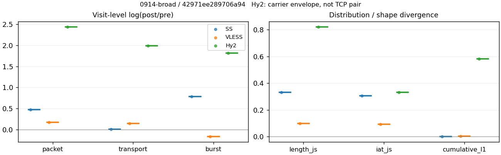
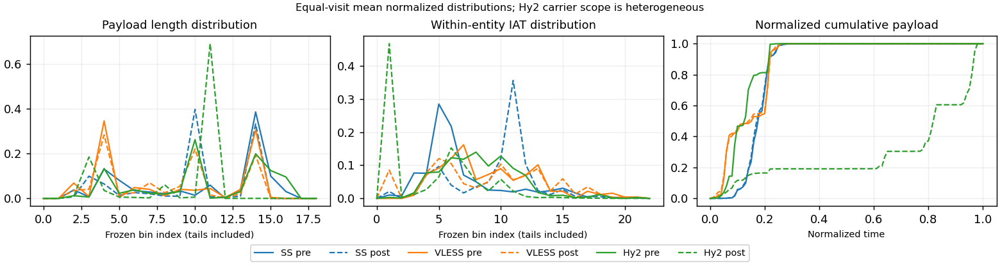

# 0914-broad · 条目 062 · cloudflare.com

目标：https://www.cloudflare.com/

活动标签：cloudflare.com::page_load。选定访问 3 次。

[返回总索引](../../README.md) · [统计口径](../../methods.md)

## 覆盖与资格（每次访问均保留）

| 部署 | 重复 | 主请求路由 | 活动状态 | 代理比较 | DIRECT pre | 请求 proxy/direct/unresolved | 错误 |
| --- | --- | --- | --- | --- | --- | --- | --- |
| Hy2 | 1 | proxy | passed | 1 | 1 | 141/2/0 | [] |
| SS | 1 | proxy | passed | 1 | 0 | 135/0/0 | [] |
| VLESS | 1 | proxy | passed | 1 | 0 | 137/0/0 | [] |

主请求非 proxy 的统计仅解释为已索引的辅助代理连接或 DIRECT 观测，不代表目标业务经代理传输。播放确认与配对资格是两道不同的门。

图中散点为单次访问，短线为重复中位数；Hy2 是共享载体包络，不能与 TCP 配对作等范围因果对比。

形态图先逐访问归一化，再对访问等权平均；实线 pre，虚线 post。分箱序号及边界见 methods，不将分箱索引误解为长度或时间。

## 每次访问的关键观测

### SS

范围：`exclusive_page`。每格 pre → post；空值为不可观测/不适用。

| 重复 | 包数 | 载荷字节 | burst | TCP FR | IAT中位µs | length JS | IAT JS |
| --- | --- | --- | --- | --- | --- | --- | --- |
| 1 | 1602 → 2565 | 2.1529e+06 → 2.1664e+06 | 1002 → 2200 | 78 → 104 | 23.916 → 1022.3 | 0.33229 | 0.30449 |

完整标量统计：中位数 [min,max]；Δ 为重复内逐访问变换的中位数，MAD 未缩放。n 为可用变换数；DIRECT-only 的 nΔ=0 不代表 pre 不可用。

| scope | 特征 | pre | post | Δ | IQRΔ | MADΔ | nΔ |
| --- | --- | --- | --- | --- | --- | --- | --- |
| exclusive_page | active_span_sum_s_1000ms | 13.755 [13.755, 13.755] | 14.5 [14.5, 14.5] | 0.052686 | — | — | 1 |
| exclusive_page | active_span_sum_s_100ms | 4.6874 [4.6874, 4.6874] | 6.2325 [6.2325, 6.2325] | 0.2849 | — | — | 1 |
| exclusive_page | active_span_sum_s_500ms | 10.827 [10.827, 10.827] | 12.151 [12.151, 12.151] | 0.11538 | — | — | 1 |
| exclusive_page | burst_bytes_iqr | 2896 [2896, 2896] | 1448 [1448, 1448] | -0.69315 | — | — | 1 |
| exclusive_page | burst_bytes_mad | 35 [35, 35] | 34 [34, 34] | -0.028988 | — | — | 1 |
| exclusive_page | burst_bytes_max | 21243 [21243, 21243] | 5712 [5712, 5712] | -1.3135 | — | — | 1 |
| exclusive_page | burst_bytes_mean | 2148.6 [2148.6, 2148.6] | 984.74 [984.74, 984.74] | -0.78018 | — | — | 1 |
| exclusive_page | burst_bytes_median | 35 [35, 35] | 34 [34, 34] | -0.028988 | — | — | 1 |
| exclusive_page | burst_bytes_min | 0 [0, 0] | 0 [0, 0] | — | — | — | 0 |
| exclusive_page | burst_bytes_p95 | 11584 [11584, 11584] | 2856 [2856, 2856] | -1.4002 | — | — | 1 |
| exclusive_page | burst_bytes_q25 | 0 [0, 0] | 0 [0, 0] | — | — | — | 0 |
| exclusive_page | burst_bytes_q75 | 2896 [2896, 2896] | 1448 [1448, 1448] | -0.69315 | — | — | 1 |
| exclusive_page | burst_bytes_std | 4100.4 [4100.4, 4100.4] | 1219.7 [1219.7, 1219.7] | -1.2125 | — | — | 1 |
| exclusive_page | burst_count | 1002 [1002, 1002] | 2200 [2200, 2200] | 0.78646 | — | — | 1 |
| exclusive_page | burst_duration_ms_iqr | 0.024022 [0.024022, 0.024022] | 0 [0, 0] | — | — | — | 0 |
| exclusive_page | burst_duration_ms_mad | 0 [0, 0] | 0 [0, 0] | — | — | — | 0 |
| exclusive_page | burst_duration_ms_max | 15000 [15000, 15000] | 15021 [15021, 15021] | 0.0014206 | — | — | 1 |
| exclusive_page | burst_duration_ms_mean | 30.86 [30.86, 30.86] | 18.368 [18.368, 18.368] | -0.51881 | — | — | 1 |
| exclusive_page | burst_duration_ms_median | 0 [0, 0] | 0 [0, 0] | — | — | — | 0 |
| exclusive_page | burst_duration_ms_min | 0 [0, 0] | 0 [0, 0] | — | — | — | 0 |
| exclusive_page | burst_duration_ms_p95 | 29.413 [29.413, 29.413] | 0.78486 [0.78486, 0.78486] | -3.6237 | — | — | 1 |
| exclusive_page | burst_duration_ms_q25 | 0 [0, 0] | 0 [0, 0] | — | — | — | 0 |
| exclusive_page | burst_duration_ms_q75 | 0.024022 [0.024022, 0.024022] | 0 [0, 0] | — | — | — | 0 |
| exclusive_page | burst_duration_ms_std | 485.23 [485.23, 485.23] | 455.81 [455.81, 455.81] | -0.062554 | — | — | 1 |
| exclusive_page | burst_packets_iqr | 1 [1, 1] | 0 [0, 0] | — | — | — | 0 |
| exclusive_page | burst_packets_mad | 0 [0, 0] | 0 [0, 0] | — | — | — | 0 |
| exclusive_page | burst_packets_max | 15 [15, 15] | 9 [9, 9] | -0.51083 | — | — | 1 |
| exclusive_page | burst_packets_mean | 1.5988 [1.5988, 1.5988] | 1.1659 [1.1659, 1.1659] | -0.31575 | — | — | 1 |
| exclusive_page | burst_packets_median | 1 [1, 1] | 1 [1, 1] | 0 | — | — | 1 |
| exclusive_page | burst_packets_min | 1 [1, 1] | 1 [1, 1] | 0 | — | — | 1 |
| exclusive_page | burst_packets_p95 | 4 [4, 4] | 2 [2, 2] | -0.69315 | — | — | 1 |
| exclusive_page | burst_packets_q25 | 1 [1, 1] | 1 [1, 1] | 0 | — | — | 1 |
| exclusive_page | burst_packets_q75 | 2 [2, 2] | 1 [1, 1] | -0.69315 | — | — | 1 |
| exclusive_page | burst_packets_std | 1.4109 [1.4109, 1.4109] | 0.55532 [0.55532, 0.55532] | -0.93246 | — | — | 1 |
| exclusive_page | connection_span_concurrency_max | 7 [7, 7] | 6 [6, 6] | -0.15415 | — | — | 1 |
| exclusive_page | cumulative_l1 | — | — | 0.0023587 | — | — | 1 |
| exclusive_page | cumulative_max | — | — | 0.050238 | — | — | 1 |
| exclusive_page | direction_entropy | 0.67995 [0.67995, 0.67995] | 0.42938 [0.42938, 0.42938] | -0.25057 | — | — | 1 |
| exclusive_page | down_burst_count | 497 [497, 497] | 1096 [1096, 1096] | 0.79083 | — | — | 1 |
| exclusive_page | down_ip_bytes | 2.1616e+06 [2.1616e+06, 2.1616e+06] | 2.1856e+06 [2.1856e+06, 2.1856e+06] | 0.011049 | — | — | 1 |
| exclusive_page | down_packets | 992 [992, 992] | 1326 [1326, 1326] | 0.2902 | — | — | 1 |
| exclusive_page | down_transport_bytes | 2.11e+06 [2.11e+06, 2.11e+06] | 2.1163e+06 [2.1163e+06, 2.1163e+06] | 0.003015 | — | — | 1 |
| exclusive_page | duration_s | 21.96 [21.96, 21.96] | 21.958 [21.958, 21.958] | -9.8584e-05 | — | — | 1 |
| exclusive_page | entity_count | 8 [8, 8] | 8 [8, 8] | 0 | — | — | 1 |
| exclusive_page | fr_runs | 78 [78, 78] | 104 [104, 104] | 0.28768 | — | — | 1 |
| exclusive_page | fr_runs_per_packet | 0.076696 [0.076696, 0.076696] | 0.076809 [0.076809, 0.076809] | 0.00011329 | — | — | 1 |
| exclusive_page | fr_switches | 70 [70, 70] | 96 [96, 96] | 0.31585 | — | — | 1 |
| exclusive_page | fr_switches_per_possible_transition | 0.069376 [0.069376, 0.069376] | 0.071322 [0.071322, 0.071322] | 0.0019468 | — | — | 1 |
| exclusive_page | full_retransmission_fraction | 0.005618 [0.005618, 0.005618] | 0.0031189 [0.0031189, 0.0031189] | -0.0024991 | — | — | 1 |
| exclusive_page | full_retransmission_packets | 9 [9, 9] | 8 [8, 8] | -0.11778 | — | — | 1 |
| exclusive_page | iat_count | 1594 [1594, 1594] | 2557 [2557, 2557] | 0.47259 | — | — | 1 |
| exclusive_page | iat_js | — | — | 0.30449 | — | — | 1 |
| exclusive_page | iat_ks | — | — | 0.50767 | — | — | 1 |
| exclusive_page | iat_median_us | 23.916 [23.916, 23.916] | 1022.3 [1022.3, 1022.3] | 3.7553 | — | — | 1 |
| exclusive_page | iat_us_iqr | 99.231 [99.231, 99.231] | 1259.6 [1259.6, 1259.6] | 2.5411 | — | — | 1 |
| exclusive_page | iat_us_mad | 16.793 [16.793, 16.793] | 758.38 [758.38, 758.38] | 3.8102 | — | — | 1 |
| exclusive_page | iat_us_max | 1.5001e+07 [1.5001e+07, 1.5001e+07] | 1.5021e+07 [1.5021e+07, 1.5021e+07] | 0.0013822 | — | — | 1 |
| exclusive_page | iat_us_mean | 40351 [40351, 40351] | 25149 [25149, 25149] | -0.47282 | — | — | 1 |
| exclusive_page | iat_us_median | 23.916 [23.916, 23.916] | 1022.3 [1022.3, 1022.3] | 3.7553 | — | — | 1 |
| exclusive_page | iat_us_min | 0.048 [0.048, 0.048] | 0.032 [0.032, 0.032] | -0.40547 | — | — | 1 |
| exclusive_page | iat_us_p95 | 38984 [38984, 38984] | 16879 [16879, 16879] | -0.83709 | — | — | 1 |
| exclusive_page | iat_us_q25 | 12.602 [12.602, 12.602] | 86.181 [86.181, 86.181] | 1.9226 | — | — | 1 |
| exclusive_page | iat_us_q75 | 111.83 [111.83, 111.83] | 1345.8 [1345.8, 1345.8] | 2.4877 | — | — | 1 |
| exclusive_page | iat_us_std | 6.553e+05 [6.553e+05, 6.553e+05] | 5.1715e+05 [5.1715e+05, 5.1715e+05] | -0.23677 | — | — | 1 |
| exclusive_page | iat_wasserstein_log1p_us | — | — | 2.0746 | — | — | 1 |
| exclusive_page | idle_gap_count_1000ms | 7 [7, 7] | 7 [7, 7] | 0 | — | — | 1 |
| exclusive_page | idle_gap_count_100ms | 36 [36, 36] | 37 [37, 37] | 0.027399 | — | — | 1 |
| exclusive_page | idle_gap_count_500ms | 11 [11, 11] | 10 [10, 10] | -0.09531 | — | — | 1 |
| exclusive_page | idle_gap_sum_s_1000ms | 50.565 [50.565, 50.565] | 49.806 [49.806, 49.806] | -0.01512 | — | — | 1 |
| exclusive_page | idle_gap_sum_s_100ms | 59.633 [59.633, 59.633] | 58.073 [58.073, 58.073] | -0.026504 | — | — | 1 |
| exclusive_page | idle_gap_sum_s_500ms | 53.493 [53.493, 53.493] | 52.155 [52.155, 52.155] | -0.025345 | — | — | 1 |
| exclusive_page | ip_bytes | 2.2364e+06 [2.2364e+06, 2.2364e+06] | 2.3273e+06 [2.3273e+06, 2.3273e+06] | 0.039856 | — | — | 1 |
| exclusive_page | length_iqr | 2648 [2648, 2648] | 1547.5 [1547.5, 1547.5] | -0.53716 | — | — | 1 |
| exclusive_page | length_js | — | — | 0.33229 | — | — | 1 |
| exclusive_page | length_ks | — | — | 0.46509 | — | — | 1 |
| exclusive_page | length_mad | 1136 [1136, 1136] | 1298.5 [1298.5, 1298.5] | 0.1337 | — | — | 1 |
| exclusive_page | length_max | 8920 [8920, 8920] | 2856 [2856, 2856] | -1.1389 | — | — | 1 |
| exclusive_page | length_mean | 2116.9 [2116.9, 2116.9] | 1600 [1600, 1600] | -0.27993 | — | — | 1 |
| exclusive_page | length_median | 2249 [2249, 2249] | 1428 [1428, 1428] | -0.45421 | — | — | 1 |
| exclusive_page | length_min | 22 [22, 22] | 12 [12, 12] | -0.60614 | — | — | 1 |
| exclusive_page | length_p95 | 5523 [5523, 5523] | 2856 [2856, 2856] | -0.6595 | — | — | 1 |
| exclusive_page | length_q25 | 248 [248, 248] | 1308.5 [1308.5, 1308.5] | 1.6632 | — | — | 1 |
| exclusive_page | length_q75 | 2896 [2896, 2896] | 2856 [2856, 2856] | -0.013908 | — | — | 1 |
| exclusive_page | length_std | 1843.2 [1843.2, 1843.2] | 1016.2 [1016.2, 1016.2] | -0.59544 | — | — | 1 |
| exclusive_page | length_wasserstein_bytes | — | — | 743.25 | — | — | 1 |
| exclusive_page | nonempty_entity_count | 8 [8, 8] | 8 [8, 8] | 0 | — | — | 1 |
| exclusive_page | nonempty_packets | 1017 [1017, 1017] | 1354 [1354, 1354] | 0.28621 | — | — | 1 |
| exclusive_page | offload_suspect_fraction | 0.35206 [0.35206, 0.35206] | 0.18285 [0.18285, 0.18285] | -0.16921 | — | — | 1 |
| exclusive_page | packet_count | 1602 [1602, 1602] | 2565 [2565, 2565] | 0.47071 | — | — | 1 |
| exclusive_page | rtt_median_ms | 0.058974 [0.058974, 0.058974] | 33.111 [33.111, 33.111] | 6.3305 | — | — | 1 |
| exclusive_page | rtt_sample_count | 559 [559, 559] | 337 [337, 337] | -0.50607 | — | — | 1 |
| exclusive_page | tcp_ack_count | 1594 [1594, 1594] | 2556 [2556, 2556] | 0.4722 | — | — | 1 |
| exclusive_page | tcp_fin_count | 16 [16, 16] | 16 [16, 16] | 0 | — | — | 1 |
| exclusive_page | tcp_packet_count | 1602 [1602, 1602] | 2565 [2565, 2565] | 0.47071 | — | — | 1 |
| exclusive_page | tcp_rst_count | 0 [0, 0] | 0 [0, 0] | — | — | — | 0 |
| exclusive_page | tcp_syn_count | 16 [16, 16] | 17 [17, 17] | 0.060625 | — | — | 1 |
| exclusive_page | tcp_window_raw_median | 65535 [65535, 65535] | 157 [157, 157] | -6.0341 | — | — | 1 |
| exclusive_page | transition_entropy | 0.3267 [0.3267, 0.3267] | 0.29275 [0.29275, 0.29275] | -0.033954 | — | — | 1 |
| exclusive_page | transition_n_mm | 796 [796, 796] | 1184 [1184, 1184] | 0.39705 | — | — | 1 |
| exclusive_page | transition_n_mp | 32 [32, 32] | 45 [45, 45] | 0.34093 | — | — | 1 |
| exclusive_page | transition_n_pm | 38 [38, 38] | 51 [51, 51] | 0.29424 | — | — | 1 |
| exclusive_page | transition_n_pp | 143 [143, 143] | 66 [66, 66] | -0.77319 | — | — | 1 |
| exclusive_page | transition_p_mm | 0.96135 [0.96135, 0.96135] | 0.96338 [0.96338, 0.96338] | 0.0020322 | — | — | 1 |
| exclusive_page | transition_p_mp | 0.038647 [0.038647, 0.038647] | 0.036615 [0.036615, 0.036615] | -0.0020322 | — | — | 1 |
| exclusive_page | transition_p_pm | 0.20994 [0.20994, 0.20994] | 0.4359 [0.4359, 0.4359] | 0.22595 | — | — | 1 |
| exclusive_page | transition_p_pp | 0.79006 [0.79006, 0.79006] | 0.5641 [0.5641, 0.5641] | -0.22595 | — | — | 1 |
| exclusive_page | transport_bytes | 2.1529e+06 [2.1529e+06, 2.1529e+06] | 2.1664e+06 [2.1664e+06, 2.1664e+06] | 0.0062765 | — | — | 1 |
| exclusive_page | up_burst_count | 505 [505, 505] | 1104 [1104, 1104] | 0.78214 | — | — | 1 |
| exclusive_page | up_byte_fraction | 0.019933 [0.019933, 0.019933] | 0.023124 [0.023124, 0.023124] | 0.0031914 | — | — | 1 |
| exclusive_page | up_ip_bytes | 74805 [74805, 74805] | 1.4172e+05 [1.4172e+05, 1.4172e+05] | 0.639 | — | — | 1 |
| exclusive_page | up_packets | 610 [610, 610] | 1239 [1239, 1239] | 0.7086 | — | — | 1 |
| exclusive_page | up_transport_bytes | 42913 [42913, 42913] | 50097 [50097, 50097] | 0.15479 | — | — | 1 |
| exclusive_page | zero_iat_count | 0 [0, 0] | 0 [0, 0] | — | — | — | 0 |
| exclusive_page | zero_iat_fraction | 0 [0, 0] | 0 [0, 0] | 0 | — | — | 1 |

### VLESS

范围：`exclusive_page`。每格 pre → post；空值为不可观测/不适用。

| 重复 | 包数 | 载荷字节 | burst | TCP FR | IAT中位µs | length JS | IAT JS |
| --- | --- | --- | --- | --- | --- | --- | --- |
| 1 | 519 → 615 | 2.9547e+05 → 3.4267e+05 | 456 → 388 | 40 → 52 | 167.31 → 422.79 | 0.099984 | 0.09266 |

完整标量统计：中位数 [min,max]；Δ 为重复内逐访问变换的中位数，MAD 未缩放。n 为可用变换数；DIRECT-only 的 nΔ=0 不代表 pre 不可用。

| scope | 特征 | pre | post | Δ | IQRΔ | MADΔ | nΔ |
| --- | --- | --- | --- | --- | --- | --- | --- |
| exclusive_page | active_span_sum_s_1000ms | 9.8242 [9.8242, 9.8242] | 9.5978 [9.5978, 9.5978] | -0.023321 | — | — | 1 |
| exclusive_page | active_span_sum_s_100ms | 1.1609 [1.1609, 1.1609] | 2.9566 [2.9566, 2.9566] | 0.93488 | — | — | 1 |
| exclusive_page | active_span_sum_s_500ms | 4.6292 [4.6292, 4.6292] | 8.3091 [8.3091, 8.3091] | 0.58497 | — | — | 1 |
| exclusive_page | burst_bytes_iqr | 1163 [1163, 1163] | 1768.2 [1768.2, 1768.2] | 0.41899 | — | — | 1 |
| exclusive_page | burst_bytes_mad | 24 [24, 24] | 53 [53, 53] | 0.79224 | — | — | 1 |
| exclusive_page | burst_bytes_max | 5792 [5792, 5792] | 4832 [4832, 4832] | -0.18122 | — | — | 1 |
| exclusive_page | burst_bytes_mean | 647.97 [647.97, 647.97] | 883.17 [883.17, 883.17] | 0.30967 | — | — | 1 |
| exclusive_page | burst_bytes_median | 24 [24, 24] | 53 [53, 53] | 0.79224 | — | — | 1 |
| exclusive_page | burst_bytes_min | 0 [0, 0] | 0 [0, 0] | — | — | — | 0 |
| exclusive_page | burst_bytes_p95 | 2824 [2824, 2824] | 2896 [2896, 2896] | 0.025176 | — | — | 1 |
| exclusive_page | burst_bytes_q25 | 0 [0, 0] | 0 [0, 0] | — | — | — | 0 |
| exclusive_page | burst_bytes_q75 | 1163 [1163, 1163] | 1768.2 [1768.2, 1768.2] | 0.41899 | — | — | 1 |
| exclusive_page | burst_bytes_std | 1105.8 [1105.8, 1105.8] | 1198.4 [1198.4, 1198.4] | 0.08044 | — | — | 1 |
| exclusive_page | burst_count | 456 [456, 456] | 388 [388, 388] | -0.16149 | — | — | 1 |
| exclusive_page | burst_duration_ms_iqr | 0 [0, 0] | 0.082224 [0.082224, 0.082224] | — | — | — | 0 |
| exclusive_page | burst_duration_ms_mad | 0 [0, 0] | 0 [0, 0] | — | — | — | 0 |
| exclusive_page | burst_duration_ms_max | 15001 [15001, 15001] | 15006 [15006, 15006] | 0.0003831 | — | — | 1 |
| exclusive_page | burst_duration_ms_mean | 59.934 [59.934, 59.934] | 59.049 [59.049, 59.049] | -0.014873 | — | — | 1 |
| exclusive_page | burst_duration_ms_median | 0 [0, 0] | 0 [0, 0] | — | — | — | 0 |
| exclusive_page | burst_duration_ms_min | 0 [0, 0] | 0 [0, 0] | — | — | — | 0 |
| exclusive_page | burst_duration_ms_p95 | 194.4 [194.4, 194.4] | 154.92 [154.92, 154.92] | -0.22701 | — | — | 1 |
| exclusive_page | burst_duration_ms_q25 | 0 [0, 0] | 0 [0, 0] | — | — | — | 0 |
| exclusive_page | burst_duration_ms_q75 | 0 [0, 0] | 0.082224 [0.082224, 0.082224] | — | — | — | 0 |
| exclusive_page | burst_duration_ms_std | 716.23 [716.23, 716.23] | 767.4 [767.4, 767.4] | 0.069004 | — | — | 1 |
| exclusive_page | burst_packets_iqr | 0 [0, 0] | 1 [1, 1] | — | — | — | 0 |
| exclusive_page | burst_packets_mad | 0 [0, 0] | 0 [0, 0] | — | — | — | 0 |
| exclusive_page | burst_packets_max | 3 [3, 3] | 8 [8, 8] | 0.98083 | — | — | 1 |
| exclusive_page | burst_packets_mean | 1.1382 [1.1382, 1.1382] | 1.5851 [1.5851, 1.5851] | 0.33121 | — | — | 1 |
| exclusive_page | burst_packets_median | 1 [1, 1] | 1 [1, 1] | 0 | — | — | 1 |
| exclusive_page | burst_packets_min | 1 [1, 1] | 1 [1, 1] | 0 | — | — | 1 |
| exclusive_page | burst_packets_p95 | 2 [2, 2] | 3 [3, 3] | 0.40547 | — | — | 1 |
| exclusive_page | burst_packets_q25 | 1 [1, 1] | 1 [1, 1] | 0 | — | — | 1 |
| exclusive_page | burst_packets_q75 | 1 [1, 1] | 2 [2, 2] | 0.69315 | — | — | 1 |
| exclusive_page | burst_packets_std | 0.3755 [0.3755, 0.3755] | 1.0232 [1.0232, 1.0232] | 1.0024 | — | — | 1 |
| exclusive_page | connection_span_concurrency_max | 4 [4, 4] | 4 [4, 4] | 0 | — | — | 1 |
| exclusive_page | cumulative_l1 | — | — | 0.0031249 | — | — | 1 |
| exclusive_page | cumulative_max | — | — | 0.026656 | — | — | 1 |
| exclusive_page | direction_entropy | 0.61633 [0.61633, 0.61633] | 0.61998 [0.61998, 0.61998] | 0.0036422 | — | — | 1 |
| exclusive_page | down_burst_count | 225 [225, 225] | 191 [191, 191] | -0.16383 | — | — | 1 |
| exclusive_page | down_ip_bytes | 2.9135e+05 [2.9135e+05, 2.9135e+05] | 3.3009e+05 [3.3009e+05, 3.3009e+05] | 0.12483 | — | — | 1 |
| exclusive_page | down_packets | 265 [265, 265] | 337 [337, 337] | 0.24035 | — | — | 1 |
| exclusive_page | down_transport_bytes | 2.7752e+05 [2.7752e+05, 2.7752e+05] | 3.1252e+05 [3.1252e+05, 3.1252e+05] | 0.11875 | — | — | 1 |
| exclusive_page | duration_s | 20.851 [20.851, 20.851] | 20.834 [20.834, 20.834] | -0.00081091 | — | — | 1 |
| exclusive_page | entity_count | 6 [6, 6] | 6 [6, 6] | 0 | — | — | 1 |
| exclusive_page | fr_runs | 40 [40, 40] | 52 [52, 52] | 0.26236 | — | — | 1 |
| exclusive_page | fr_runs_per_packet | 0.16064 [0.16064, 0.16064] | 0.16352 [0.16352, 0.16352] | 0.0028794 | — | — | 1 |
| exclusive_page | fr_switches | 34 [34, 34] | 46 [46, 46] | 0.30228 | — | — | 1 |
| exclusive_page | fr_switches_per_possible_transition | 0.13992 [0.13992, 0.13992] | 0.14744 [0.14744, 0.14744] | 0.0075182 | — | — | 1 |
| exclusive_page | full_retransmission_fraction | 0.0019268 [0.0019268, 0.0019268] | 0 [0, 0] | -0.0019268 | — | — | 1 |
| exclusive_page | full_retransmission_packets | 1 [1, 1] | 0 [0, 0] | — | — | — | 0 |
| exclusive_page | iat_count | 513 [513, 513] | 609 [609, 609] | 0.17154 | — | — | 1 |
| exclusive_page | iat_js | — | — | 0.09266 | — | — | 1 |
| exclusive_page | iat_ks | — | — | 0.15718 | — | — | 1 |
| exclusive_page | iat_median_us | 167.31 [167.31, 167.31] | 422.79 [422.79, 422.79] | 0.92707 | — | — | 1 |
| exclusive_page | iat_us_iqr | 3143.5 [3143.5, 3143.5] | 4439.8 [4439.8, 4439.8] | 0.34526 | — | — | 1 |
| exclusive_page | iat_us_mad | 158.89 [158.89, 158.89] | 416.31 [416.31, 416.31] | 0.9632 | — | — | 1 |
| exclusive_page | iat_us_max | 1.5001e+07 [1.5001e+07, 1.5001e+07] | 1.5057e+07 [1.5057e+07, 1.5057e+07] | 0.0037463 | — | — | 1 |
| exclusive_page | iat_us_mean | 84616 [84616, 84616] | 71006 [71006, 71006] | -0.17536 | — | — | 1 |
| exclusive_page | iat_us_median | 167.31 [167.31, 167.31] | 422.79 [422.79, 422.79] | 0.92707 | — | — | 1 |
| exclusive_page | iat_us_min | 4.185 [4.185, 4.185] | 0.035 [0.035, 0.035] | -4.7839 | — | — | 1 |
| exclusive_page | iat_us_p95 | 1.9115e+05 [1.9115e+05, 1.9115e+05] | 1.1146e+05 [1.1146e+05, 1.1146e+05] | -0.53943 | — | — | 1 |
| exclusive_page | iat_us_q25 | 40.761 [40.761, 40.761] | 17.079 [17.079, 17.079] | -0.86988 | — | — | 1 |
| exclusive_page | iat_us_q75 | 3184.3 [3184.3, 3184.3] | 4456.9 [4456.9, 4456.9] | 0.33622 | — | — | 1 |
| exclusive_page | iat_us_std | 9.4378e+05 [9.4378e+05, 9.4378e+05] | 8.6661e+05 [8.6661e+05, 8.6661e+05] | -0.085301 | — | — | 1 |
| exclusive_page | iat_wasserstein_log1p_us | — | — | 0.72158 | — | — | 1 |
| exclusive_page | idle_gap_count_1000ms | 4 [4, 4] | 4 [4, 4] | 0 | — | — | 1 |
| exclusive_page | idle_gap_count_100ms | 29 [29, 29] | 35 [35, 35] | 0.18805 | — | — | 1 |
| exclusive_page | idle_gap_count_500ms | 12 [12, 12] | 6 [6, 6] | -0.69315 | — | — | 1 |
| exclusive_page | idle_gap_sum_s_1000ms | 33.584 [33.584, 33.584] | 33.645 [33.645, 33.645] | 0.001822 | — | — | 1 |
| exclusive_page | idle_gap_sum_s_100ms | 42.247 [42.247, 42.247] | 40.286 [40.286, 40.286] | -0.047529 | — | — | 1 |
| exclusive_page | idle_gap_sum_s_500ms | 38.779 [38.779, 38.779] | 34.934 [34.934, 34.934] | -0.10442 | — | — | 1 |
| exclusive_page | ip_bytes | 3.2244e+05 [3.2244e+05, 3.2244e+05] | 3.7524e+05 [3.7524e+05, 3.7524e+05] | 0.15165 | — | — | 1 |
| exclusive_page | length_iqr | 2752 [2752, 2752] | 1340 [1340, 1340] | -0.71966 | — | — | 1 |
| exclusive_page | length_js | — | — | 0.099984 | — | — | 1 |
| exclusive_page | length_ks | — | — | 0.16803 | — | — | 1 |
| exclusive_page | length_mad | 513 [513, 513] | 1003.5 [1003.5, 1003.5] | 0.67097 | — | — | 1 |
| exclusive_page | length_max | 5792 [5792, 5792] | 2824 [2824, 2824] | -0.71832 | — | — | 1 |
| exclusive_page | length_mean | 1186.6 [1186.6, 1186.6] | 1077.6 [1077.6, 1077.6] | -0.096414 | — | — | 1 |
| exclusive_page | length_median | 544 [544, 544] | 1075.5 [1075.5, 1075.5] | 0.68159 | — | — | 1 |
| exclusive_page | length_min | 24 [24, 24] | 24 [24, 24] | 0 | — | — | 1 |
| exclusive_page | length_p95 | 2824 [2824, 2824] | 2824 [2824, 2824] | 0 | — | — | 1 |
| exclusive_page | length_q25 | 72 [72, 72] | 72 [72, 72] | 0 | — | — | 1 |
| exclusive_page | length_q75 | 2824 [2824, 2824] | 1412 [1412, 1412] | -0.69315 | — | — | 1 |
| exclusive_page | length_std | 1205.6 [1205.6, 1205.6] | 1010.3 [1010.3, 1010.3] | -0.1767 | — | — | 1 |
| exclusive_page | length_wasserstein_bytes | — | — | 231.01 | — | — | 1 |
| exclusive_page | nonempty_entity_count | 6 [6, 6] | 6 [6, 6] | 0 | — | — | 1 |
| exclusive_page | nonempty_packets | 249 [249, 249] | 318 [318, 318] | 0.2446 | — | — | 1 |
| exclusive_page | offload_suspect_fraction | 0.16956 [0.16956, 0.16956] | 0.11057 [0.11057, 0.11057] | -0.058988 | — | — | 1 |
| exclusive_page | packet_count | 519 [519, 519] | 615 [615, 615] | 0.16972 | — | — | 1 |
| exclusive_page | rtt_median_ms | 0.053283 [0.053283, 0.053283] | 0.17221 [0.17221, 0.17221] | 1.1731 | — | — | 1 |
| exclusive_page | rtt_sample_count | 243 [243, 243] | 259 [259, 259] | 0.063767 | — | — | 1 |
| exclusive_page | tcp_ack_count | 502 [502, 502] | 609 [609, 609] | 0.19322 | — | — | 1 |
| exclusive_page | tcp_fin_count | 11 [11, 11] | 12 [12, 12] | 0.087011 | — | — | 1 |
| exclusive_page | tcp_packet_count | 519 [519, 519] | 615 [615, 615] | 0.16972 | — | — | 1 |
| exclusive_page | tcp_rst_count | 11 [11, 11] | 0 [0, 0] | — | — | — | 0 |
| exclusive_page | tcp_syn_count | 12 [12, 12] | 12 [12, 12] | 0 | — | — | 1 |
| exclusive_page | tcp_window_raw_median | 65213 [65213, 65213] | 147 [147, 147] | -6.095 | — | — | 1 |
| exclusive_page | transition_entropy | 0.45936 [0.45936, 0.45936] | 0.48377 [0.48377, 0.48377] | 0.024402 | — | — | 1 |
| exclusive_page | transition_n_mm | 191 [191, 191] | 243 [243, 243] | 0.24079 | — | — | 1 |
| exclusive_page | transition_n_mp | 14 [14, 14] | 20 [20, 20] | 0.35667 | — | — | 1 |
| exclusive_page | transition_n_pm | 20 [20, 20] | 26 [26, 26] | 0.26236 | — | — | 1 |
| exclusive_page | transition_n_pp | 18 [18, 18] | 23 [23, 23] | 0.24512 | — | — | 1 |
| exclusive_page | transition_p_mm | 0.93171 [0.93171, 0.93171] | 0.92395 [0.92395, 0.92395] | -0.0077529 | — | — | 1 |
| exclusive_page | transition_p_mp | 0.068293 [0.068293, 0.068293] | 0.076046 [0.076046, 0.076046] | 0.0077529 | — | — | 1 |
| exclusive_page | transition_p_pm | 0.52632 [0.52632, 0.52632] | 0.53061 [0.53061, 0.53061] | 0.0042965 | — | — | 1 |
| exclusive_page | transition_p_pp | 0.47368 [0.47368, 0.47368] | 0.46939 [0.46939, 0.46939] | -0.0042965 | — | — | 1 |
| exclusive_page | transport_bytes | 2.9547e+05 [2.9547e+05, 2.9547e+05] | 3.4267e+05 [3.4267e+05, 3.4267e+05] | 0.14818 | — | — | 1 |
| exclusive_page | up_burst_count | 231 [231, 231] | 197 [197, 197] | -0.15921 | — | — | 1 |
| exclusive_page | up_byte_fraction | 0.060757 [0.060757, 0.060757] | 0.087997 [0.087997, 0.087997] | 0.027241 | — | — | 1 |
| exclusive_page | up_ip_bytes | 31088 [31088, 31088] | 45150 [45150, 45150] | 0.37317 | — | — | 1 |
| exclusive_page | up_packets | 254 [254, 254] | 278 [278, 278] | 0.090287 | — | — | 1 |
| exclusive_page | up_transport_bytes | 17952 [17952, 17952] | 30154 [30154, 30154] | 0.51862 | — | — | 1 |
| exclusive_page | zero_iat_count | 0 [0, 0] | 0 [0, 0] | — | — | — | 0 |
| exclusive_page | zero_iat_fraction | 0 [0, 0] | 0 [0, 0] | 0 | — | — | 1 |

### Hy2

范围：`carrier_context_envelope`。每格 pre → post；空值为不可观测/不适用。

| 重复 | 包数 | 载荷字节 | burst | TCP FR | IAT中位µs | length JS | IAT JS |
| --- | --- | --- | --- | --- | --- | --- | --- |
| 1 | 1605 → 18365 | 2.6763e+06 → 1.9674e+07 | 1035 → 6348 | — | 142.83 → 8.6065 | 0.81986 | 0.33313 |

范围：`direct_pre_only`。每格 pre → post；空值为不可观测/不适用。

| 重复 | 包数 | 载荷字节 | burst | TCP FR | IAT中位µs | length JS | IAT JS |
| --- | --- | --- | --- | --- | --- | --- | --- |
| 1 | 59 → — | 17017 → — | 38 → — | 14 → — | 201.2 → — | — | — |

完整标量统计：中位数 [min,max]；Δ 为重复内逐访问变换的中位数，MAD 未缩放。n 为可用变换数；DIRECT-only 的 nΔ=0 不代表 pre 不可用。

| scope | 特征 | pre | post | Δ | IQRΔ | MADΔ | nΔ |
| --- | --- | --- | --- | --- | --- | --- | --- |
| carrier_context_envelope | active_span_sum_s_1000ms | 8.4271 [8.4271, 8.4271] | 12.172 [12.172, 12.172] | 0.36771 | — | — | 1 |
| carrier_context_envelope | active_span_sum_s_100ms | 1.9994 [1.9994, 1.9994] | 6.0573 [6.0573, 6.0573] | 1.1084 | — | — | 1 |
| carrier_context_envelope | active_span_sum_s_500ms | 7.3682 [7.3682, 7.3682] | 10.697 [10.697, 10.697] | 0.3728 | — | — | 1 |
| carrier_context_envelope | burst_bytes_iqr | 2830 [2830, 2830] | 5131 [5131, 5131] | 0.59502 | — | — | 1 |
| carrier_context_envelope | burst_bytes_mad | 82 [82, 82] | 412.5 [412.5, 412.5] | 1.6155 | — | — | 1 |
| carrier_context_envelope | burst_bytes_max | 26919 [26919, 26919] | 93598 [93598, 93598] | 1.2462 | — | — | 1 |
| carrier_context_envelope | burst_bytes_mean | 2585.8 [2585.8, 2585.8] | 3099.2 [3099.2, 3099.2] | 0.18112 | — | — | 1 |
| carrier_context_envelope | burst_bytes_median | 82 [82, 82] | 445.5 [445.5, 445.5] | 1.6925 | — | — | 1 |
| carrier_context_envelope | burst_bytes_min | 0 [0, 0] | 22 [22, 22] | — | — | — | 0 |
| carrier_context_envelope | burst_bytes_p95 | 13643 [13643, 13643] | 11528 [11528, 11528] | -0.16848 | — | — | 1 |
| carrier_context_envelope | burst_bytes_q25 | 0 [0, 0] | 37 [37, 37] | — | — | — | 0 |
| carrier_context_envelope | burst_bytes_q75 | 2830 [2830, 2830] | 5168 [5168, 5168] | 0.60221 | — | — | 1 |
| carrier_context_envelope | burst_bytes_std | 4923.9 [4923.9, 4923.9] | 4532.3 [4532.3, 4532.3] | -0.082871 | — | — | 1 |
| carrier_context_envelope | burst_count | 1035 [1035, 1035] | 6348 [6348, 6348] | 1.8137 | — | — | 1 |
| carrier_context_envelope | burst_duration_ms_iqr | 0.12255 [0.12255, 0.12255] | 0.029303 [0.029303, 0.029303] | -1.4308 | — | — | 1 |
| carrier_context_envelope | burst_duration_ms_mad | 0 [0, 0] | 8.5e-05 [8.5e-05, 8.5e-05] | — | — | — | 0 |
| carrier_context_envelope | burst_duration_ms_max | 14990 [14990, 14990] | 3889.7 [3889.7, 3889.7] | -1.3491 | — | — | 1 |
| carrier_context_envelope | burst_duration_ms_mean | 34.668 [34.668, 34.668] | 1.1903 [1.1903, 1.1903] | -3.3716 | — | — | 1 |
| carrier_context_envelope | burst_duration_ms_median | 0 [0, 0] | 8.5e-05 [8.5e-05, 8.5e-05] | — | — | — | 0 |
| carrier_context_envelope | burst_duration_ms_min | 0 [0, 0] | 0 [0, 0] | — | — | — | 0 |
| carrier_context_envelope | burst_duration_ms_p95 | 6.4559 [6.4559, 6.4559] | 0.61307 [0.61307, 0.61307] | -2.3543 | — | — | 1 |
| carrier_context_envelope | burst_duration_ms_q25 | 0 [0, 0] | 0 [0, 0] | — | — | — | 0 |
| carrier_context_envelope | burst_duration_ms_q75 | 0.12255 [0.12255, 0.12255] | 0.029303 [0.029303, 0.029303] | -1.4308 | — | — | 1 |
| carrier_context_envelope | burst_duration_ms_std | 641.24 [641.24, 641.24] | 49.835 [49.835, 49.835] | -2.5547 | — | — | 1 |
| carrier_context_envelope | burst_packets_iqr | 1 [1, 1] | 3 [3, 3] | 1.0986 | — | — | 1 |
| carrier_context_envelope | burst_packets_mad | 0 [0, 0] | 1 [1, 1] | — | — | — | 0 |
| carrier_context_envelope | burst_packets_max | 9 [9, 9] | 68 [68, 68] | 2.0223 | — | — | 1 |
| carrier_context_envelope | burst_packets_mean | 1.5507 [1.5507, 1.5507] | 2.893 [2.893, 2.893] | 0.62358 | — | — | 1 |
| carrier_context_envelope | burst_packets_median | 1 [1, 1] | 2 [2, 2] | 0.69315 | — | — | 1 |
| carrier_context_envelope | burst_packets_min | 1 [1, 1] | 1 [1, 1] | 0 | — | — | 1 |
| carrier_context_envelope | burst_packets_p95 | 3 [3, 3] | 8 [8, 8] | 0.98083 | — | — | 1 |
| carrier_context_envelope | burst_packets_q25 | 1 [1, 1] | 1 [1, 1] | 0 | — | — | 1 |
| carrier_context_envelope | burst_packets_q75 | 2 [2, 2] | 4 [4, 4] | 0.69315 | — | — | 1 |
| carrier_context_envelope | burst_packets_std | 0.99762 [0.99762, 0.99762] | 3.0356 [3.0356, 3.0356] | 1.1128 | — | — | 1 |
| carrier_context_envelope | connection_span_concurrency_max | 4 [4, 4] | 1 [1, 1] | -1.3863 | — | — | 1 |
| carrier_context_envelope | cumulative_l1 | — | — | 0.58229 | — | — | 1 |
| carrier_context_envelope | cumulative_max | — | — | 0.8088 | — | — | 1 |
| carrier_context_envelope | direction_entropy | 0.68462 [0.68462, 0.68462] | 0.76527 [0.76527, 0.76527] | 0.080654 | — | — | 1 |
| carrier_context_envelope | direction_run_analog_runs | 96 [96, 96] | 6348 [6348, 6348] | 4.1915 | — | — | 1 |
| carrier_context_envelope | direction_run_analog_runs_per_packet | 0.094488 [0.094488, 0.094488] | 0.34566 [0.34566, 0.34566] | 0.25117 | — | — | 1 |
| carrier_context_envelope | direction_run_analog_switches | 89 [89, 89] | 6347 [6347, 6347] | 4.2671 | — | — | 1 |
| carrier_context_envelope | direction_run_analog_switches_per_possible_transition | 0.088206 [0.088206, 0.088206] | 0.34562 [0.34562, 0.34562] | 0.25742 | — | — | 1 |
| carrier_context_envelope | down_burst_count | 514 [514, 514] | 3174 [3174, 3174] | 1.8205 | — | — | 1 |
| carrier_context_envelope | down_ip_bytes | 2.6856e+06 [2.6856e+06, 2.6856e+06] | 1.9808e+07 [1.9808e+07, 1.9808e+07] | 1.9982 | — | — | 1 |
| carrier_context_envelope | down_packets | 1002 [1002, 1002] | 14273 [14273, 14273] | 2.6564 | — | — | 1 |
| carrier_context_envelope | down_transport_bytes | 2.6334e+06 [2.6334e+06, 2.6334e+06] | 1.9409e+07 [1.9409e+07, 1.9409e+07] | 1.9974 | — | — | 1 |
| carrier_context_envelope | duration_s | 18.387 [18.387, 18.387] | 18.384 [18.384, 18.384] | -0.00014071 | — | — | 1 |
| carrier_context_envelope | entity_count | 7 [7, 7] | 1 [1, 1] | -1.9459 | — | — | 1 |
| carrier_context_envelope | full_retransmission_fraction | 0.012461 [0.012461, 0.012461] | — | — | — | — | 0 |
| carrier_context_envelope | full_retransmission_packets | 20 [20, 20] | — | — | — | — | 0 |
| carrier_context_envelope | iat_count | 1598 [1598, 1598] | 18364 [18364, 18364] | 2.4416 | — | — | 1 |
| carrier_context_envelope | iat_js | — | — | 0.33313 | — | — | 1 |
| carrier_context_envelope | iat_ks | — | — | 0.46872 | — | — | 1 |
| carrier_context_envelope | iat_median_us | 142.83 [142.83, 142.83] | 8.6065 [8.6065, 8.6065] | -2.8092 | — | — | 1 |
| carrier_context_envelope | iat_us_iqr | 845.33 [845.33, 845.33] | 57.47 [57.47, 57.47] | -2.6885 | — | — | 1 |
| carrier_context_envelope | iat_us_mad | 133.66 [133.66, 133.66] | 8.5705 [8.5705, 8.5705] | -2.747 | — | — | 1 |
| carrier_context_envelope | iat_us_max | 1.5001e+07 [1.5001e+07, 1.5001e+07] | 3.8897e+06 [3.8897e+06, 3.8897e+06] | -1.3498 | — | — | 1 |
| carrier_context_envelope | iat_us_mean | 41503 [41503, 41503] | 1001.1 [1001.1, 1001.1] | -3.7247 | — | — | 1 |
| carrier_context_envelope | iat_us_median | 142.83 [142.83, 142.83] | 8.6065 [8.6065, 8.6065] | -2.8092 | — | — | 1 |
| carrier_context_envelope | iat_us_min | 0.264 [0.264, 0.264] | 0.01 [0.01, 0.01] | -3.2734 | — | — | 1 |
| carrier_context_envelope | iat_us_p95 | 6335.3 [6335.3, 6335.3] | 885.83 [885.83, 885.83] | -1.9674 | — | — | 1 |
| carrier_context_envelope | iat_us_q25 | 37.727 [37.727, 37.727] | 0.043 [0.043, 0.043] | -6.7769 | — | — | 1 |
| carrier_context_envelope | iat_us_q75 | 883.06 [883.06, 883.06] | 57.513 [57.513, 57.513] | -2.7314 | — | — | 1 |
| carrier_context_envelope | iat_us_std | 7.2426e+05 [7.2426e+05, 7.2426e+05] | 33172 [33172, 33172] | -3.0834 | — | — | 1 |
| carrier_context_envelope | iat_wasserstein_log1p_us | — | — | 2.93 | — | — | 1 |
| carrier_context_envelope | idle_gap_count_1000ms | 4 [4, 4] | 3 [3, 3] | -0.28768 | — | — | 1 |
| carrier_context_envelope | idle_gap_count_100ms | 30 [30, 30] | 29 [29, 29] | -0.033902 | — | — | 1 |
| carrier_context_envelope | idle_gap_count_500ms | 6 [6, 6] | 5 [5, 5] | -0.18232 | — | — | 1 |
| carrier_context_envelope | idle_gap_sum_s_1000ms | 57.895 [57.895, 57.895] | 6.2117 [6.2117, 6.2117] | -2.2322 | — | — | 1 |
| carrier_context_envelope | idle_gap_sum_s_100ms | 64.323 [64.323, 64.323] | 12.327 [12.327, 12.327] | -1.6521 | — | — | 1 |
| carrier_context_envelope | idle_gap_sum_s_500ms | 58.954 [58.954, 58.954] | 7.6869 [7.6869, 7.6869] | -2.0372 | — | — | 1 |
| carrier_context_envelope | ip_bytes | 2.7601e+06 [2.7601e+06, 2.7601e+06] | 2.0188e+07 [2.0188e+07, 2.0188e+07] | 1.9898 | — | — | 1 |
| carrier_context_envelope | length_iqr | 2027.5 [2027.5, 2027.5] | 596 [596, 596] | -1.2243 | — | — | 1 |
| carrier_context_envelope | length_js | — | — | 0.81986 | — | — | 1 |
| carrier_context_envelope | length_ks | — | — | 0.45472 | — | — | 1 |
| carrier_context_envelope | length_mad | 1313 [1313, 1313] | 0 [0, 0] | — | — | — | 0 |
| carrier_context_envelope | length_max | 8920 [8920, 8920] | 1441 [1441, 1441] | -1.823 | — | — | 1 |
| carrier_context_envelope | length_mean | 2634.1 [2634.1, 2634.1] | 1071.3 [1071.3, 1071.3] | -0.89972 | — | — | 1 |
| carrier_context_envelope | length_median | 1415 [1415, 1415] | 1441 [1441, 1441] | 0.018208 | — | — | 1 |
| carrier_context_envelope | length_min | 5 [5, 5] | 22 [22, 22] | 1.4816 | — | — | 1 |
| carrier_context_envelope | length_p95 | 8920 [8920, 8920] | 1441 [1441, 1441] | -1.823 | — | — | 1 |
| carrier_context_envelope | length_q25 | 972.5 [972.5, 972.5] | 845 [845, 845] | -0.14053 | — | — | 1 |
| carrier_context_envelope | length_q75 | 3000 [3000, 3000] | 1441 [1441, 1441] | -0.73327 | — | — | 1 |
| carrier_context_envelope | length_std | 2644 [2644, 2644] | 588.37 [588.37, 588.37] | -1.5027 | — | — | 1 |
| carrier_context_envelope | length_wasserstein_bytes | — | — | 1575.2 | — | — | 1 |
| carrier_context_envelope | nonempty_entity_count | 7 [7, 7] | 1 [1, 1] | -1.9459 | — | — | 1 |
| carrier_context_envelope | nonempty_packets | 1016 [1016, 1016] | 18365 [18365, 18365] | 2.8946 | — | — | 1 |
| carrier_context_envelope | offload_suspect_fraction | 0.28785 [0.28785, 0.28785] | 0 [0, 0] | -0.28785 | — | — | 1 |
| carrier_context_envelope | packet_count | 1605 [1605, 1605] | 18365 [18365, 18365] | 2.4373 | — | — | 1 |
| carrier_context_envelope | rtt_median_ms | 0.16992 [0.16992, 0.16992] | — | — | — | — | 0 |
| carrier_context_envelope | rtt_sample_count | 583 [583, 583] | 0 [0, 0] | — | — | — | 0 |
| carrier_context_envelope | tcp_ack_count | 1598 [1598, 1598] | — | — | — | — | 0 |
| carrier_context_envelope | tcp_fin_count | 14 [14, 14] | — | — | — | — | 0 |
| carrier_context_envelope | tcp_packet_count | 1605 [1605, 1605] | 0 [0, 0] | — | — | — | 0 |
| carrier_context_envelope | tcp_rst_count | 0 [0, 0] | — | — | — | — | 0 |
| carrier_context_envelope | tcp_syn_count | 14 [14, 14] | — | — | — | — | 0 |
| carrier_context_envelope | tcp_window_raw_median | 65535 [65535, 65535] | — | — | — | — | 0 |
| carrier_context_envelope | transition_entropy | 0.38646 [0.38646, 0.38646] | 0.76529 [0.76529, 0.76529] | 0.37883 | — | — | 1 |
| carrier_context_envelope | transition_n_mm | 784 [784, 784] | 11099 [11099, 11099] | 2.6502 | — | — | 1 |
| carrier_context_envelope | transition_n_mp | 42 [42, 42] | 3174 [3174, 3174] | 4.3251 | — | — | 1 |
| carrier_context_envelope | transition_n_pm | 47 [47, 47] | 3173 [3173, 3173] | 4.2123 | — | — | 1 |
| carrier_context_envelope | transition_n_pp | 136 [136, 136] | 918 [918, 918] | 1.9095 | — | — | 1 |
| carrier_context_envelope | transition_p_mm | 0.94915 [0.94915, 0.94915] | 0.77762 [0.77762, 0.77762] | -0.17153 | — | — | 1 |
| carrier_context_envelope | transition_p_mp | 0.050847 [0.050847, 0.050847] | 0.22238 [0.22238, 0.22238] | 0.17153 | — | — | 1 |
| carrier_context_envelope | transition_p_pm | 0.25683 [0.25683, 0.25683] | 0.7756 [0.7756, 0.7756] | 0.51877 | — | — | 1 |
| carrier_context_envelope | transition_p_pp | 0.74317 [0.74317, 0.74317] | 0.2244 [0.2244, 0.2244] | -0.51877 | — | — | 1 |
| carrier_context_envelope | transport_bytes | 2.6763e+06 [2.6763e+06, 2.6763e+06] | 1.9674e+07 [1.9674e+07, 1.9674e+07] | 1.9949 | — | — | 1 |
| carrier_context_envelope | up_burst_count | 521 [521, 521] | 3174 [3174, 3174] | 1.807 | — | — | 1 |
| carrier_context_envelope | up_byte_fraction | 0.016013 [0.016013, 0.016013] | 0.01346 [0.01346, 0.01346] | -0.0025531 | — | — | 1 |
| carrier_context_envelope | up_ip_bytes | 74508 [74508, 74508] | 3.7939e+05 [3.7939e+05, 3.7939e+05] | 1.6277 | — | — | 1 |
| carrier_context_envelope | up_packets | 603 [603, 603] | 4092 [4092, 4092] | 1.9149 | — | — | 1 |
| carrier_context_envelope | up_transport_bytes | 42856 [42856, 42856] | 2.6481e+05 [2.6481e+05, 2.6481e+05] | 1.8212 | — | — | 1 |
| carrier_context_envelope | zero_iat_count | 0 [0, 0] | 0 [0, 0] | — | — | — | 0 |
| carrier_context_envelope | zero_iat_fraction | 0 [0, 0] | 0 [0, 0] | 0 | — | — | 1 |
| direct_pre_only | active_span_sum_s_1000ms | 0.58688 [0.58688, 0.58688] | — | — | — | — | 0 |
| direct_pre_only | active_span_sum_s_100ms | 0.13694 [0.13694, 0.13694] | — | — | — | — | 0 |
| direct_pre_only | active_span_sum_s_500ms | 0.58688 [0.58688, 0.58688] | — | — | — | — | 0 |
| direct_pre_only | burst_bytes_iqr | 445.25 [445.25, 445.25] | — | — | — | — | 0 |
| direct_pre_only | burst_bytes_mad | 31 [31, 31] | — | — | — | — | 0 |
| direct_pre_only | burst_bytes_max | 4191 [4191, 4191] | — | — | — | — | 0 |
| direct_pre_only | burst_bytes_mean | 447.82 [447.82, 447.82] | — | — | — | — | 0 |
| direct_pre_only | burst_bytes_median | 31 [31, 31] | — | — | — | — | 0 |
| direct_pre_only | burst_bytes_min | 0 [0, 0] | — | — | — | — | 0 |
| direct_pre_only | burst_bytes_p95 | 1953.4 [1953.4, 1953.4] | — | — | — | — | 0 |
| direct_pre_only | burst_bytes_q25 | 0 [0, 0] | — | — | — | — | 0 |
| direct_pre_only | burst_bytes_q75 | 445.25 [445.25, 445.25] | — | — | — | — | 0 |
| direct_pre_only | burst_bytes_std | 882.83 [882.83, 882.83] | — | — | — | — | 0 |
| direct_pre_only | burst_count | 38 [38, 38] | — | — | — | — | 0 |
| direct_pre_only | burst_duration_ms_iqr | 7.0886 [7.0886, 7.0886] | — | — | — | — | 0 |
| direct_pre_only | burst_duration_ms_mad | 0 [0, 0] | — | — | — | — | 0 |
| direct_pre_only | burst_duration_ms_max | 15000 [15000, 15000] | — | — | — | — | 0 |
| direct_pre_only | burst_duration_ms_mean | 442.43 [442.43, 442.43] | — | — | — | — | 0 |
| direct_pre_only | burst_duration_ms_median | 0 [0, 0] | — | — | — | — | 0 |
| direct_pre_only | burst_duration_ms_min | 0 [0, 0] | — | — | — | — | 0 |
| direct_pre_only | burst_duration_ms_p95 | 426.5 [426.5, 426.5] | — | — | — | — | 0 |
| direct_pre_only | burst_duration_ms_q25 | 0 [0, 0] | — | — | — | — | 0 |
| direct_pre_only | burst_duration_ms_q75 | 7.0886 [7.0886, 7.0886] | — | — | — | — | 0 |
| direct_pre_only | burst_duration_ms_std | 2401.8 [2401.8, 2401.8] | — | — | — | — | 0 |
| direct_pre_only | burst_packets_iqr | 1 [1, 1] | — | — | — | — | 0 |
| direct_pre_only | burst_packets_mad | 0 [0, 0] | — | — | — | — | 0 |
| direct_pre_only | burst_packets_max | 3 [3, 3] | — | — | — | — | 0 |
| direct_pre_only | burst_packets_mean | 1.5526 [1.5526, 1.5526] | — | — | — | — | 0 |
| direct_pre_only | burst_packets_median | 1 [1, 1] | — | — | — | — | 0 |
| direct_pre_only | burst_packets_min | 1 [1, 1] | — | — | — | — | 0 |
| direct_pre_only | burst_packets_p95 | 3 [3, 3] | — | — | — | — | 0 |
| direct_pre_only | burst_packets_q25 | 1 [1, 1] | — | — | — | — | 0 |
| direct_pre_only | burst_packets_q75 | 2 [2, 2] | — | — | — | — | 0 |
| direct_pre_only | burst_packets_std | 0.67658 [0.67658, 0.67658] | — | — | — | — | 0 |
| direct_pre_only | connection_span_concurrency_max | 2 [2, 2] | — | — | — | — | 0 |
| direct_pre_only | direction_entropy | 0.99498 [0.99498, 0.99498] | — | — | — | — | 0 |
| direct_pre_only | down_burst_count | 18 [18, 18] | — | — | — | — | 0 |
| direct_pre_only | down_ip_bytes | 13408 [13408, 13408] | — | — | — | — | 0 |
| direct_pre_only | down_packets | 30 [30, 30] | — | — | — | — | 0 |
| direct_pre_only | down_transport_bytes | 11832 [11832, 11832] | — | — | — | — | 0 |
| direct_pre_only | duration_s | 16.468 [16.468, 16.468] | — | — | — | — | 0 |
| direct_pre_only | entity_count | 2 [2, 2] | — | — | — | — | 0 |
| direct_pre_only | fr_runs | 14 [14, 14] | — | — | — | — | 0 |
| direct_pre_only | fr_runs_per_packet | 0.58333 [0.58333, 0.58333] | — | — | — | — | 0 |
| direct_pre_only | fr_switches | 12 [12, 12] | — | — | — | — | 0 |
| direct_pre_only | fr_switches_per_possible_transition | 0.54545 [0.54545, 0.54545] | — | — | — | — | 0 |
| direct_pre_only | full_retransmission_fraction | 0 [0, 0] | — | — | — | — | 0 |
| direct_pre_only | full_retransmission_packets | 0 [0, 0] | — | — | — | — | 0 |
| direct_pre_only | iat_count | 57 [57, 57] | — | — | — | — | 0 |
| direct_pre_only | iat_median_us | 201.2 [201.2, 201.2] | — | — | — | — | 0 |
| direct_pre_only | iat_us_iqr | 1425.2 [1425.2, 1425.2] | — | — | — | — | 0 |
| direct_pre_only | iat_us_mad | 188.4 [188.4, 188.4] | — | — | — | — | 0 |
| direct_pre_only | iat_us_max | 1.5e+07 [1.5e+07, 1.5e+07] | — | — | — | — | 0 |
| direct_pre_only | iat_us_mean | 5.3881e+05 [5.3881e+05, 5.3881e+05] | — | — | — | — | 0 |
| direct_pre_only | iat_us_median | 201.2 [201.2, 201.2] | — | — | — | — | 0 |
| direct_pre_only | iat_us_min | 5.503 [5.503, 5.503] | — | — | — | — | 0 |
| direct_pre_only | iat_us_p95 | 4.7391e+05 [4.7391e+05, 4.7391e+05] | — | — | — | — | 0 |
| direct_pre_only | iat_us_q25 | 55.967 [55.967, 55.967] | — | — | — | — | 0 |
| direct_pre_only | iat_us_q75 | 1481.1 [1481.1, 1481.1] | — | — | — | — | 0 |
| direct_pre_only | iat_us_std | 2.6593e+06 [2.6593e+06, 2.6593e+06] | — | — | — | — | 0 |
| direct_pre_only | idle_gap_count_1000ms | 3 [3, 3] | — | — | — | — | 0 |
| direct_pre_only | idle_gap_count_100ms | 5 [5, 5] | — | — | — | — | 0 |
| direct_pre_only | idle_gap_count_500ms | 3 [3, 3] | — | — | — | — | 0 |
| direct_pre_only | idle_gap_sum_s_1000ms | 30.126 [30.126, 30.126] | — | — | — | — | 0 |
| direct_pre_only | idle_gap_sum_s_100ms | 30.575 [30.575, 30.575] | — | — | — | — | 0 |
| direct_pre_only | idle_gap_sum_s_500ms | 30.126 [30.126, 30.126] | — | — | — | — | 0 |
| direct_pre_only | ip_bytes | 20117 [20117, 20117] | — | — | — | — | 0 |
| direct_pre_only | length_iqr | 930 [930, 930] | — | — | — | — | 0 |
| direct_pre_only | length_mad | 197 [197, 197] | — | — | — | — | 0 |
| direct_pre_only | length_max | 4191 [4191, 4191] | — | — | — | — | 0 |
| direct_pre_only | length_mean | 709.04 [709.04, 709.04] | — | — | — | — | 0 |
| direct_pre_only | length_median | 228 [228, 228] | — | — | — | — | 0 |
| direct_pre_only | length_min | 31 [31, 31] | — | — | — | — | 0 |
| direct_pre_only | length_p95 | 2650.6 [2650.6, 2650.6] | — | — | — | — | 0 |
| direct_pre_only | length_q25 | 39 [39, 39] | — | — | — | — | 0 |
| direct_pre_only | length_q75 | 969 [969, 969] | — | — | — | — | 0 |
| direct_pre_only | length_std | 1020.6 [1020.6, 1020.6] | — | — | — | — | 0 |
| direct_pre_only | nonempty_entity_count | 2 [2, 2] | — | — | — | — | 0 |
| direct_pre_only | nonempty_packets | 24 [24, 24] | — | — | — | — | 0 |
| direct_pre_only | offload_suspect_fraction | 0.084746 [0.084746, 0.084746] | — | — | — | — | 0 |
| direct_pre_only | packet_count | 59 [59, 59] | — | — | — | — | 0 |
| direct_pre_only | rtt_median_ms | 0.085735 [0.085735, 0.085735] | — | — | — | — | 0 |
| direct_pre_only | rtt_sample_count | 28 [28, 28] | — | — | — | — | 0 |
| direct_pre_only | tcp_ack_count | 57 [57, 57] | — | — | — | — | 0 |
| direct_pre_only | tcp_fin_count | 4 [4, 4] | — | — | — | — | 0 |
| direct_pre_only | tcp_packet_count | 59 [59, 59] | — | — | — | — | 0 |
| direct_pre_only | tcp_rst_count | 0 [0, 0] | — | — | — | — | 0 |
| direct_pre_only | tcp_syn_count | 4 [4, 4] | — | — | — | — | 0 |
| direct_pre_only | tcp_window_raw_median | 64936 [64936, 64936] | — | — | — | — | 0 |
| direct_pre_only | transition_entropy | 0.99403 [0.99403, 0.99403] | — | — | — | — | 0 |
| direct_pre_only | transition_n_mm | 5 [5, 5] | — | — | — | — | 0 |
| direct_pre_only | transition_n_mp | 6 [6, 6] | — | — | — | — | 0 |
| direct_pre_only | transition_n_pm | 6 [6, 6] | — | — | — | — | 0 |
| direct_pre_only | transition_n_pp | 5 [5, 5] | — | — | — | — | 0 |
| direct_pre_only | transition_p_mm | 0.45455 [0.45455, 0.45455] | — | — | — | — | 0 |
| direct_pre_only | transition_p_mp | 0.54545 [0.54545, 0.54545] | — | — | — | — | 0 |
| direct_pre_only | transition_p_pm | 0.54545 [0.54545, 0.54545] | — | — | — | — | 0 |
| direct_pre_only | transition_p_pp | 0.45455 [0.45455, 0.45455] | — | — | — | — | 0 |
| direct_pre_only | transport_bytes | 17017 [17017, 17017] | — | — | — | — | 0 |
| direct_pre_only | up_burst_count | 20 [20, 20] | — | — | — | — | 0 |
| direct_pre_only | up_byte_fraction | 0.3047 [0.3047, 0.3047] | — | — | — | — | 0 |
| direct_pre_only | up_ip_bytes | 6709 [6709, 6709] | — | — | — | — | 0 |
| direct_pre_only | up_packets | 29 [29, 29] | — | — | — | — | 0 |
| direct_pre_only | up_transport_bytes | 5185 [5185, 5185] | — | — | — | — | 0 |
| direct_pre_only | zero_iat_count | 0 [0, 0] | — | — | — | — | 0 |
| direct_pre_only | zero_iat_fraction | 0 [0, 0] | — | — | — | — | 0 |

## 不同部署对比

以下是各部署自身重复中位数的差异，不按重复编号强行配对。跨 TCP/Hy2 的行标记异质观测范围。

| 视角 | 特征 | 部署A | 部署B | A中位 | B中位 | B−A | 比较口径 |
| --- | --- | --- | --- | --- | --- | --- | --- |
| pre | burst_count | SS | VLESS | 1002 | 456 | -546 | same_scope_unpaired_visits |
| pre | burst_count | SS | Hy2 | 1002 | 1035 | 33 | heterogeneous_scope_descriptive_only |
| pre | burst_count | VLESS | Hy2 | 456 | 1035 | 579 | heterogeneous_scope_descriptive_only |
| pre | connection_span_concurrency_max | SS | VLESS | 7 | 4 | -3 | same_scope_unpaired_visits |
| pre | connection_span_concurrency_max | SS | Hy2 | 7 | 4 | -3 | heterogeneous_scope_descriptive_only |
| pre | connection_span_concurrency_max | VLESS | Hy2 | 4 | 4 | 0 | heterogeneous_scope_descriptive_only |
| pre | direction_entropy | SS | VLESS | 0.67995 | 0.61633 | -0.063613 | same_scope_unpaired_visits |
| pre | direction_entropy | SS | Hy2 | 0.67995 | 0.68462 | 0.0046726 | heterogeneous_scope_descriptive_only |
| pre | direction_entropy | VLESS | Hy2 | 0.61633 | 0.68462 | 0.068286 | heterogeneous_scope_descriptive_only |
| pre | down_transport_bytes | SS | VLESS | 2.11e+06 | 2.7752e+05 | -1.8324e+06 | same_scope_unpaired_visits |
| pre | down_transport_bytes | SS | Hy2 | 2.11e+06 | 2.6334e+06 | 5.2346e+05 | heterogeneous_scope_descriptive_only |
| pre | down_transport_bytes | VLESS | Hy2 | 2.7752e+05 | 2.6334e+06 | 2.3559e+06 | heterogeneous_scope_descriptive_only |
| pre | duration_s | SS | VLESS | 21.96 | 20.851 | -1.1088 | same_scope_unpaired_visits |
| pre | duration_s | SS | Hy2 | 21.96 | 18.387 | -3.5735 | heterogeneous_scope_descriptive_only |
| pre | duration_s | VLESS | Hy2 | 20.851 | 18.387 | -2.4647 | heterogeneous_scope_descriptive_only |
| pre | entity_count | SS | VLESS | 8 | 6 | -2 | same_scope_unpaired_visits |
| pre | entity_count | SS | Hy2 | 8 | 7 | -1 | heterogeneous_scope_descriptive_only |
| pre | entity_count | VLESS | Hy2 | 6 | 7 | 1 | heterogeneous_scope_descriptive_only |
| pre | fr_runs | SS | VLESS | 78 | 40 | -38 | same_scope_unpaired_visits |
| pre | fr_runs_per_packet | SS | VLESS | 0.076696 | 0.16064 | 0.083946 | same_scope_unpaired_visits |
| pre | fr_switches | SS | VLESS | 70 | 34 | -36 | same_scope_unpaired_visits |
| pre | fr_switches_per_possible_transition | SS | VLESS | 0.069376 | 0.13992 | 0.070542 | same_scope_unpaired_visits |
| pre | full_retransmission_fraction | SS | VLESS | 0.005618 | 0.0019268 | -0.0036912 | same_scope_unpaired_visits |
| pre | full_retransmission_fraction | SS | Hy2 | 0.005618 | 0.012461 | 0.0068431 | heterogeneous_scope_descriptive_only |
| pre | full_retransmission_fraction | VLESS | Hy2 | 0.0019268 | 0.012461 | 0.010534 | heterogeneous_scope_descriptive_only |
| pre | iat_median_us | SS | VLESS | 23.916 | 167.31 | 143.39 | same_scope_unpaired_visits |
| pre | iat_median_us | SS | Hy2 | 23.916 | 142.83 | 118.92 | heterogeneous_scope_descriptive_only |
| pre | iat_median_us | VLESS | Hy2 | 167.31 | 142.83 | -24.471 | heterogeneous_scope_descriptive_only |
| pre | iat_us_p95 | SS | VLESS | 38984 | 1.9115e+05 | 1.5217e+05 | same_scope_unpaired_visits |
| pre | iat_us_p95 | SS | Hy2 | 38984 | 6335.3 | -32649 | heterogeneous_scope_descriptive_only |
| pre | iat_us_p95 | VLESS | Hy2 | 1.9115e+05 | 6335.3 | -1.8482e+05 | heterogeneous_scope_descriptive_only |
| pre | ip_bytes | SS | VLESS | 2.2364e+06 | 3.2244e+05 | -1.914e+06 | same_scope_unpaired_visits |
| pre | ip_bytes | SS | Hy2 | 2.2364e+06 | 2.7601e+06 | 5.2368e+05 | heterogeneous_scope_descriptive_only |
| pre | ip_bytes | VLESS | Hy2 | 3.2244e+05 | 2.7601e+06 | 2.4376e+06 | heterogeneous_scope_descriptive_only |
| pre | length_median | SS | VLESS | 2249 | 544 | -1705 | same_scope_unpaired_visits |
| pre | length_median | SS | Hy2 | 2249 | 1415 | -834 | heterogeneous_scope_descriptive_only |
| pre | length_median | VLESS | Hy2 | 544 | 1415 | 871 | heterogeneous_scope_descriptive_only |
| pre | length_p95 | SS | VLESS | 5523 | 2824 | -2699 | same_scope_unpaired_visits |
| pre | length_p95 | SS | Hy2 | 5523 | 8920 | 3397 | heterogeneous_scope_descriptive_only |
| pre | length_p95 | VLESS | Hy2 | 2824 | 8920 | 6096 | heterogeneous_scope_descriptive_only |
| pre | nonempty_packets | SS | VLESS | 1017 | 249 | -768 | same_scope_unpaired_visits |
| pre | nonempty_packets | SS | Hy2 | 1017 | 1016 | -1 | heterogeneous_scope_descriptive_only |
| pre | nonempty_packets | VLESS | Hy2 | 249 | 1016 | 767 | heterogeneous_scope_descriptive_only |
| pre | offload_suspect_fraction | SS | VLESS | 0.35206 | 0.16956 | -0.1825 | same_scope_unpaired_visits |
| pre | offload_suspect_fraction | SS | Hy2 | 0.35206 | 0.28785 | -0.064209 | heterogeneous_scope_descriptive_only |
| pre | offload_suspect_fraction | VLESS | Hy2 | 0.16956 | 0.28785 | 0.11829 | heterogeneous_scope_descriptive_only |
| pre | packet_count | SS | VLESS | 1602 | 519 | -1083 | same_scope_unpaired_visits |
| pre | packet_count | SS | Hy2 | 1602 | 1605 | 3 | heterogeneous_scope_descriptive_only |
| pre | packet_count | VLESS | Hy2 | 519 | 1605 | 1086 | heterogeneous_scope_descriptive_only |
| pre | rtt_median_ms | SS | VLESS | 0.058974 | 0.053283 | -0.005691 | same_scope_unpaired_visits |
| pre | rtt_median_ms | SS | Hy2 | 0.058974 | 0.16992 | 0.11094 | heterogeneous_scope_descriptive_only |
| pre | rtt_median_ms | VLESS | Hy2 | 0.053283 | 0.16992 | 0.11664 | heterogeneous_scope_descriptive_only |
| pre | transition_entropy | SS | VLESS | 0.3267 | 0.45936 | 0.13266 | same_scope_unpaired_visits |
| pre | transition_entropy | SS | Hy2 | 0.3267 | 0.38646 | 0.05976 | heterogeneous_scope_descriptive_only |
| pre | transition_entropy | VLESS | Hy2 | 0.45936 | 0.38646 | -0.072902 | heterogeneous_scope_descriptive_only |
| pre | transport_bytes | SS | VLESS | 2.1529e+06 | 2.9547e+05 | -1.8574e+06 | same_scope_unpaired_visits |
| pre | transport_bytes | SS | Hy2 | 2.1529e+06 | 2.6763e+06 | 5.2341e+05 | heterogeneous_scope_descriptive_only |
| pre | transport_bytes | VLESS | Hy2 | 2.9547e+05 | 2.6763e+06 | 2.3808e+06 | heterogeneous_scope_descriptive_only |
| pre | up_byte_fraction | SS | VLESS | 0.019933 | 0.060757 | 0.040824 | same_scope_unpaired_visits |
| pre | up_byte_fraction | SS | Hy2 | 0.019933 | 0.016013 | -0.0039197 | heterogeneous_scope_descriptive_only |
| pre | up_byte_fraction | VLESS | Hy2 | 0.060757 | 0.016013 | -0.044743 | heterogeneous_scope_descriptive_only |
| pre | up_transport_bytes | SS | VLESS | 42913 | 17952 | -24961 | same_scope_unpaired_visits |
| pre | up_transport_bytes | SS | Hy2 | 42913 | 42856 | -57 | heterogeneous_scope_descriptive_only |
| pre | up_transport_bytes | VLESS | Hy2 | 17952 | 42856 | 24904 | heterogeneous_scope_descriptive_only |
| post | burst_count | SS | VLESS | 2200 | 388 | -1812 | same_scope_unpaired_visits |
| post | burst_count | SS | Hy2 | 2200 | 6348 | 4148 | heterogeneous_scope_descriptive_only |
| post | burst_count | VLESS | Hy2 | 388 | 6348 | 5960 | heterogeneous_scope_descriptive_only |
| post | connection_span_concurrency_max | SS | VLESS | 6 | 4 | -2 | same_scope_unpaired_visits |
| post | connection_span_concurrency_max | SS | Hy2 | 6 | 1 | -5 | heterogeneous_scope_descriptive_only |
| post | connection_span_concurrency_max | VLESS | Hy2 | 4 | 1 | -3 | heterogeneous_scope_descriptive_only |
| post | direction_entropy | SS | VLESS | 0.42938 | 0.61998 | 0.1906 | same_scope_unpaired_visits |
| post | direction_entropy | SS | Hy2 | 0.42938 | 0.76527 | 0.33589 | heterogeneous_scope_descriptive_only |
| post | direction_entropy | VLESS | Hy2 | 0.61998 | 0.76527 | 0.1453 | heterogeneous_scope_descriptive_only |
| post | down_transport_bytes | SS | VLESS | 2.1163e+06 | 3.1252e+05 | -1.8038e+06 | same_scope_unpaired_visits |
| post | down_transport_bytes | SS | Hy2 | 2.1163e+06 | 1.9409e+07 | 1.7293e+07 | heterogeneous_scope_descriptive_only |
| post | down_transport_bytes | VLESS | Hy2 | 3.1252e+05 | 1.9409e+07 | 1.9096e+07 | heterogeneous_scope_descriptive_only |
| post | duration_s | SS | VLESS | 21.958 | 20.834 | -1.1235 | same_scope_unpaired_visits |
| post | duration_s | SS | Hy2 | 21.958 | 18.384 | -3.574 | heterogeneous_scope_descriptive_only |
| post | duration_s | VLESS | Hy2 | 20.834 | 18.384 | -2.4504 | heterogeneous_scope_descriptive_only |
| post | entity_count | SS | VLESS | 8 | 6 | -2 | same_scope_unpaired_visits |
| post | entity_count | SS | Hy2 | 8 | 1 | -7 | heterogeneous_scope_descriptive_only |
| post | entity_count | VLESS | Hy2 | 6 | 1 | -5 | heterogeneous_scope_descriptive_only |
| post | fr_runs | SS | VLESS | 104 | 52 | -52 | same_scope_unpaired_visits |
| post | fr_runs_per_packet | SS | VLESS | 0.076809 | 0.16352 | 0.086713 | same_scope_unpaired_visits |
| post | fr_switches | SS | VLESS | 96 | 46 | -50 | same_scope_unpaired_visits |
| post | fr_switches_per_possible_transition | SS | VLESS | 0.071322 | 0.14744 | 0.076113 | same_scope_unpaired_visits |
| post | full_retransmission_fraction | SS | VLESS | 0.0031189 | 0 | -0.0031189 | same_scope_unpaired_visits |
| post | iat_median_us | SS | VLESS | 1022.3 | 422.79 | -599.53 | same_scope_unpaired_visits |
| post | iat_median_us | SS | Hy2 | 1022.3 | 8.6065 | -1013.7 | heterogeneous_scope_descriptive_only |
| post | iat_median_us | VLESS | Hy2 | 422.79 | 8.6065 | -414.19 | heterogeneous_scope_descriptive_only |
| post | iat_us_p95 | SS | VLESS | 16879 | 1.1146e+05 | 94579 | same_scope_unpaired_visits |
| post | iat_us_p95 | SS | Hy2 | 16879 | 885.83 | -15993 | heterogeneous_scope_descriptive_only |
| post | iat_us_p95 | VLESS | Hy2 | 1.1146e+05 | 885.83 | -1.1057e+05 | heterogeneous_scope_descriptive_only |
| post | ip_bytes | SS | VLESS | 2.3273e+06 | 3.7524e+05 | -1.9521e+06 | same_scope_unpaired_visits |
| post | ip_bytes | SS | Hy2 | 2.3273e+06 | 2.0188e+07 | 1.7861e+07 | heterogeneous_scope_descriptive_only |
| post | ip_bytes | VLESS | Hy2 | 3.7524e+05 | 2.0188e+07 | 1.9813e+07 | heterogeneous_scope_descriptive_only |
| post | length_median | SS | VLESS | 1428 | 1075.5 | -352.5 | same_scope_unpaired_visits |
| post | length_median | SS | Hy2 | 1428 | 1441 | 13 | heterogeneous_scope_descriptive_only |
| post | length_median | VLESS | Hy2 | 1075.5 | 1441 | 365.5 | heterogeneous_scope_descriptive_only |
| post | length_p95 | SS | VLESS | 2856 | 2824 | -32 | same_scope_unpaired_visits |
| post | length_p95 | SS | Hy2 | 2856 | 1441 | -1415 | heterogeneous_scope_descriptive_only |
| post | length_p95 | VLESS | Hy2 | 2824 | 1441 | -1383 | heterogeneous_scope_descriptive_only |
| post | nonempty_packets | SS | VLESS | 1354 | 318 | -1036 | same_scope_unpaired_visits |
| post | nonempty_packets | SS | Hy2 | 1354 | 18365 | 17011 | heterogeneous_scope_descriptive_only |
| post | nonempty_packets | VLESS | Hy2 | 318 | 18365 | 18047 | heterogeneous_scope_descriptive_only |
| post | offload_suspect_fraction | SS | VLESS | 0.18285 | 0.11057 | -0.072277 | same_scope_unpaired_visits |
| post | offload_suspect_fraction | SS | Hy2 | 0.18285 | 0 | -0.18285 | heterogeneous_scope_descriptive_only |
| post | offload_suspect_fraction | VLESS | Hy2 | 0.11057 | 0 | -0.11057 | heterogeneous_scope_descriptive_only |
| post | packet_count | SS | VLESS | 2565 | 615 | -1950 | same_scope_unpaired_visits |
| post | packet_count | SS | Hy2 | 2565 | 18365 | 15800 | heterogeneous_scope_descriptive_only |
| post | packet_count | VLESS | Hy2 | 615 | 18365 | 17750 | heterogeneous_scope_descriptive_only |
| post | rtt_median_ms | SS | VLESS | 33.111 | 0.17221 | -32.939 | same_scope_unpaired_visits |
| post | transition_entropy | SS | VLESS | 0.29275 | 0.48377 | 0.19102 | same_scope_unpaired_visits |
| post | transition_entropy | SS | Hy2 | 0.29275 | 0.76529 | 0.47254 | heterogeneous_scope_descriptive_only |
| post | transition_entropy | VLESS | Hy2 | 0.48377 | 0.76529 | 0.28153 | heterogeneous_scope_descriptive_only |
| post | transport_bytes | SS | VLESS | 2.1664e+06 | 3.4267e+05 | -1.8238e+06 | same_scope_unpaired_visits |
| post | transport_bytes | SS | Hy2 | 2.1664e+06 | 1.9674e+07 | 1.7507e+07 | heterogeneous_scope_descriptive_only |
| post | transport_bytes | VLESS | Hy2 | 3.4267e+05 | 1.9674e+07 | 1.9331e+07 | heterogeneous_scope_descriptive_only |
| post | up_byte_fraction | SS | VLESS | 0.023124 | 0.087997 | 0.064873 | same_scope_unpaired_visits |
| post | up_byte_fraction | SS | Hy2 | 0.023124 | 0.01346 | -0.0096641 | heterogeneous_scope_descriptive_only |
| post | up_byte_fraction | VLESS | Hy2 | 0.087997 | 0.01346 | -0.074537 | heterogeneous_scope_descriptive_only |
| post | up_transport_bytes | SS | VLESS | 50097 | 30154 | -19943 | same_scope_unpaired_visits |
| post | up_transport_bytes | SS | Hy2 | 50097 | 2.6481e+05 | 2.1472e+05 | heterogeneous_scope_descriptive_only |
| post | up_transport_bytes | VLESS | Hy2 | 30154 | 2.6481e+05 | 2.3466e+05 | heterogeneous_scope_descriptive_only |
| transformation | burst_count | SS | VLESS | 0.78646 | -0.16149 | -0.94795 | same_scope_unpaired_visits |
| transformation | burst_count | SS | Hy2 | 0.78646 | 1.8137 | 1.0273 | heterogeneous_scope_descriptive_only |
| transformation | burst_count | VLESS | Hy2 | -0.16149 | 1.8137 | 1.9752 | heterogeneous_scope_descriptive_only |
| transformation | connection_span_concurrency_max | SS | VLESS | -0.15415 | 0 | 0.15415 | same_scope_unpaired_visits |
| transformation | connection_span_concurrency_max | SS | Hy2 | -0.15415 | -1.3863 | -1.2321 | heterogeneous_scope_descriptive_only |
| transformation | connection_span_concurrency_max | VLESS | Hy2 | 0 | -1.3863 | -1.3863 | heterogeneous_scope_descriptive_only |
| transformation | direction_entropy | SS | VLESS | -0.25057 | 0.0036422 | 0.25421 | same_scope_unpaired_visits |
| transformation | direction_entropy | SS | Hy2 | -0.25057 | 0.080654 | 0.33122 | heterogeneous_scope_descriptive_only |
| transformation | direction_entropy | VLESS | Hy2 | 0.0036422 | 0.080654 | 0.077012 | heterogeneous_scope_descriptive_only |
| transformation | down_transport_bytes | SS | VLESS | 0.003015 | 0.11875 | 0.11574 | same_scope_unpaired_visits |
| transformation | down_transport_bytes | SS | Hy2 | 0.003015 | 1.9974 | 1.9944 | heterogeneous_scope_descriptive_only |
| transformation | down_transport_bytes | VLESS | Hy2 | 0.11875 | 1.9974 | 1.8787 | heterogeneous_scope_descriptive_only |
| transformation | duration_s | SS | VLESS | -9.8584e-05 | -0.00081091 | -0.00071232 | same_scope_unpaired_visits |
| transformation | duration_s | SS | Hy2 | -9.8584e-05 | -0.00014071 | -4.2122e-05 | heterogeneous_scope_descriptive_only |
| transformation | duration_s | VLESS | Hy2 | -0.00081091 | -0.00014071 | 0.0006702 | heterogeneous_scope_descriptive_only |
| transformation | entity_count | SS | VLESS | 0 | 0 | 0 | same_scope_unpaired_visits |
| transformation | entity_count | SS | Hy2 | 0 | -1.9459 | -1.9459 | heterogeneous_scope_descriptive_only |
| transformation | entity_count | VLESS | Hy2 | 0 | -1.9459 | -1.9459 | heterogeneous_scope_descriptive_only |
| transformation | fr_runs | SS | VLESS | 0.28768 | 0.26236 | -0.025318 | same_scope_unpaired_visits |
| transformation | fr_runs_per_packet | SS | VLESS | 0.00011329 | 0.0028794 | 0.0027662 | same_scope_unpaired_visits |
| transformation | fr_switches | SS | VLESS | 0.31585 | 0.30228 | -0.013572 | same_scope_unpaired_visits |
| transformation | fr_switches_per_possible_transition | SS | VLESS | 0.0019468 | 0.0075182 | 0.0055714 | same_scope_unpaired_visits |
| transformation | full_retransmission_fraction | SS | VLESS | -0.0024991 | -0.0019268 | 0.00057229 | same_scope_unpaired_visits |
| transformation | iat_median_us | SS | VLESS | 3.7553 | 0.92707 | -2.8282 | same_scope_unpaired_visits |
| transformation | iat_median_us | SS | Hy2 | 3.7553 | -2.8092 | -6.5644 | heterogeneous_scope_descriptive_only |
| transformation | iat_median_us | VLESS | Hy2 | 0.92707 | -2.8092 | -3.7362 | heterogeneous_scope_descriptive_only |
| transformation | iat_us_p95 | SS | VLESS | -0.83709 | -0.53943 | 0.29766 | same_scope_unpaired_visits |
| transformation | iat_us_p95 | SS | Hy2 | -0.83709 | -1.9674 | -1.1303 | heterogeneous_scope_descriptive_only |
| transformation | iat_us_p95 | VLESS | Hy2 | -0.53943 | -1.9674 | -1.4279 | heterogeneous_scope_descriptive_only |
| transformation | ip_bytes | SS | VLESS | 0.039856 | 0.15165 | 0.11179 | same_scope_unpaired_visits |
| transformation | ip_bytes | SS | Hy2 | 0.039856 | 1.9898 | 1.95 | heterogeneous_scope_descriptive_only |
| transformation | ip_bytes | VLESS | Hy2 | 0.15165 | 1.9898 | 1.8382 | heterogeneous_scope_descriptive_only |
| transformation | length_median | SS | VLESS | -0.45421 | 0.68159 | 1.1358 | same_scope_unpaired_visits |
| transformation | length_median | SS | Hy2 | -0.45421 | 0.018208 | 0.47242 | heterogeneous_scope_descriptive_only |
| transformation | length_median | VLESS | Hy2 | 0.68159 | 0.018208 | -0.66338 | heterogeneous_scope_descriptive_only |
| transformation | length_p95 | SS | VLESS | -0.6595 | 0 | 0.6595 | same_scope_unpaired_visits |
| transformation | length_p95 | SS | Hy2 | -0.6595 | -1.823 | -1.1635 | heterogeneous_scope_descriptive_only |
| transformation | length_p95 | VLESS | Hy2 | 0 | -1.823 | -1.823 | heterogeneous_scope_descriptive_only |
| transformation | nonempty_packets | SS | VLESS | 0.28621 | 0.2446 | -0.041608 | same_scope_unpaired_visits |
| transformation | nonempty_packets | SS | Hy2 | 0.28621 | 2.8946 | 2.6084 | heterogeneous_scope_descriptive_only |
| transformation | nonempty_packets | VLESS | Hy2 | 0.2446 | 2.8946 | 2.65 | heterogeneous_scope_descriptive_only |
| transformation | offload_suspect_fraction | SS | VLESS | -0.16921 | -0.058988 | 0.11023 | same_scope_unpaired_visits |
| transformation | offload_suspect_fraction | SS | Hy2 | -0.16921 | -0.28785 | -0.11864 | heterogeneous_scope_descriptive_only |
| transformation | offload_suspect_fraction | VLESS | Hy2 | -0.058988 | -0.28785 | -0.22886 | heterogeneous_scope_descriptive_only |
| transformation | packet_count | SS | VLESS | 0.47071 | 0.16972 | -0.30099 | same_scope_unpaired_visits |
| transformation | packet_count | SS | Hy2 | 0.47071 | 2.4373 | 1.9666 | heterogeneous_scope_descriptive_only |
| transformation | packet_count | VLESS | Hy2 | 0.16972 | 2.4373 | 2.2676 | heterogeneous_scope_descriptive_only |
| transformation | rtt_median_ms | SS | VLESS | 6.3305 | 1.1731 | -5.1574 | same_scope_unpaired_visits |
| transformation | transition_entropy | SS | VLESS | -0.033954 | 0.024402 | 0.058355 | same_scope_unpaired_visits |
| transformation | transition_entropy | SS | Hy2 | -0.033954 | 0.37883 | 0.41278 | heterogeneous_scope_descriptive_only |
| transformation | transition_entropy | VLESS | Hy2 | 0.024402 | 0.37883 | 0.35443 | heterogeneous_scope_descriptive_only |
| transformation | transport_bytes | SS | VLESS | 0.0062765 | 0.14818 | 0.14191 | same_scope_unpaired_visits |
| transformation | transport_bytes | SS | Hy2 | 0.0062765 | 1.9949 | 1.9886 | heterogeneous_scope_descriptive_only |
| transformation | transport_bytes | VLESS | Hy2 | 0.14818 | 1.9949 | 1.8467 | heterogeneous_scope_descriptive_only |
| transformation | up_byte_fraction | SS | VLESS | 0.0031914 | 0.027241 | 0.024049 | same_scope_unpaired_visits |
| transformation | up_byte_fraction | SS | Hy2 | 0.0031914 | -0.0025531 | -0.0057444 | heterogeneous_scope_descriptive_only |
| transformation | up_byte_fraction | VLESS | Hy2 | 0.027241 | -0.0025531 | -0.029794 | heterogeneous_scope_descriptive_only |
| transformation | up_transport_bytes | SS | VLESS | 0.15479 | 0.51862 | 0.36383 | same_scope_unpaired_visits |
| transformation | up_transport_bytes | SS | Hy2 | 0.15479 | 1.8212 | 1.6664 | heterogeneous_scope_descriptive_only |
| transformation | up_transport_bytes | VLESS | Hy2 | 0.51862 | 1.8212 | 1.3026 | heterogeneous_scope_descriptive_only |
| transformation | length_js | SS | VLESS | 0.33229 | 0.099984 | -0.23231 | same_scope_unpaired_visits |
| transformation | length_js | SS | Hy2 | 0.33229 | 0.81986 | 0.48757 | heterogeneous_scope_descriptive_only |
| transformation | length_js | VLESS | Hy2 | 0.099984 | 0.81986 | 0.71987 | heterogeneous_scope_descriptive_only |
| transformation | length_ks | SS | VLESS | 0.46509 | 0.16803 | -0.29706 | same_scope_unpaired_visits |
| transformation | length_ks | SS | Hy2 | 0.46509 | 0.45472 | -0.010369 | heterogeneous_scope_descriptive_only |
| transformation | length_ks | VLESS | Hy2 | 0.16803 | 0.45472 | 0.28669 | heterogeneous_scope_descriptive_only |
| transformation | length_wasserstein_bytes | SS | VLESS | 743.25 | 231.01 | -512.24 | same_scope_unpaired_visits |
| transformation | length_wasserstein_bytes | SS | Hy2 | 743.25 | 1575.2 | 831.96 | heterogeneous_scope_descriptive_only |
| transformation | length_wasserstein_bytes | VLESS | Hy2 | 231.01 | 1575.2 | 1344.2 | heterogeneous_scope_descriptive_only |
| transformation | iat_js | SS | VLESS | 0.30449 | 0.09266 | -0.21183 | same_scope_unpaired_visits |
| transformation | iat_js | SS | Hy2 | 0.30449 | 0.33313 | 0.028638 | heterogeneous_scope_descriptive_only |
| transformation | iat_js | VLESS | Hy2 | 0.09266 | 0.33313 | 0.24047 | heterogeneous_scope_descriptive_only |
| transformation | iat_ks | SS | VLESS | 0.50767 | 0.15718 | -0.35049 | same_scope_unpaired_visits |
| transformation | iat_ks | SS | Hy2 | 0.50767 | 0.46872 | -0.038951 | heterogeneous_scope_descriptive_only |
| transformation | iat_ks | VLESS | Hy2 | 0.15718 | 0.46872 | 0.31153 | heterogeneous_scope_descriptive_only |
| transformation | iat_wasserstein_log1p_us | SS | VLESS | 2.0746 | 0.72158 | -1.353 | same_scope_unpaired_visits |
| transformation | iat_wasserstein_log1p_us | SS | Hy2 | 2.0746 | 2.93 | 0.85543 | heterogeneous_scope_descriptive_only |
| transformation | iat_wasserstein_log1p_us | VLESS | Hy2 | 0.72158 | 2.93 | 2.2084 | heterogeneous_scope_descriptive_only |
| transformation | cumulative_l1 | SS | VLESS | 0.0023587 | 0.0031249 | 0.00076617 | same_scope_unpaired_visits |
| transformation | cumulative_l1 | SS | Hy2 | 0.0023587 | 0.58229 | 0.57993 | heterogeneous_scope_descriptive_only |
| transformation | cumulative_l1 | VLESS | Hy2 | 0.0031249 | 0.58229 | 0.57917 | heterogeneous_scope_descriptive_only |

## 可复核的访问标识

| 部署 | 重复 | session_id |
| --- | --- | --- |
| SS | 1 | 973cb53f-7e2d-4a50-a8a1-2ac3f154c88e |
| VLESS | 1 | d39f9776-9382-406e-a7c1-aa29b953e62b |
| Hy2 | 1 | e6339924-5859-43d2-8b1b-21c43a72dc23 |

全量三种 packet selection、Hy2 full 范围、Q25/Q75、直方图与曲线见机器可读产物；本页只显示 observed 主范围。
