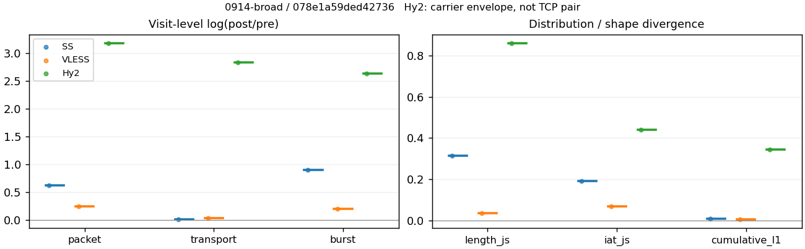
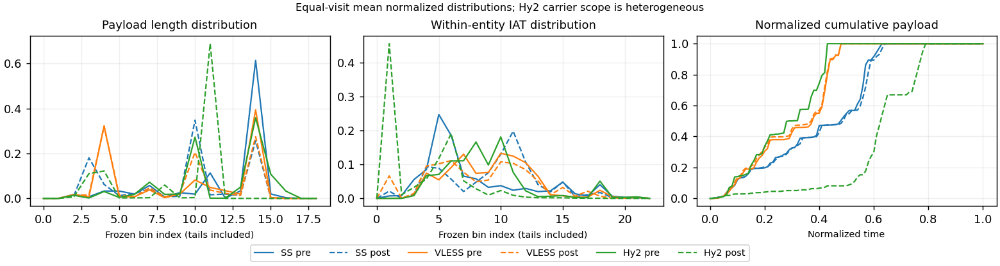

# 0914-broad · 条目 063 · speed.cloudflare.com

目标：https://speed.cloudflare.com/

活动标签：speed.cloudflare.com::page_load。选定访问 3 次。

[返回总索引](../../README.md) · [统计口径](../../methods.md)

## 覆盖与资格（每次访问均保留）

| 部署 | 重复 | 主请求路由 | 活动状态 | 代理比较 | DIRECT pre | 请求 proxy/direct/unresolved | 错误 |
| --- | --- | --- | --- | --- | --- | --- | --- |
| Hy2 | 1 | proxy | passed | 1 | 0 | 77/0/0 | [] |
| SS | 1 | proxy | passed | 1 | 0 | 74/0/0 | [] |
| VLESS | 1 | proxy | passed | 1 | 0 | 73/0/0 | [] |

主请求非 proxy 的统计仅解释为已索引的辅助代理连接或 DIRECT 观测，不代表目标业务经代理传输。播放确认与配对资格是两道不同的门。

图中散点为单次访问，短线为重复中位数；Hy2 是共享载体包络，不能与 TCP 配对作等范围因果对比。

形态图先逐访问归一化，再对访问等权平均；实线 pre，虚线 post。分箱序号及边界见 methods，不将分箱索引误解为长度或时间。

## 每次访问的关键观测

### SS

范围：`exclusive_page`。每格 pre → post；空值为不可观测/不适用。

| 重复 | 包数 | 载荷字节 | burst | TCP FR | IAT中位µs | length JS | IAT JS |
| --- | --- | --- | --- | --- | --- | --- | --- |
| 1 | 2223 → 4131 | 3.0491e+06 → 3.098e+06 | 1377 → 3375 | 195 → 197 | 31.691 → 793.89 | 0.31528 | 0.18976 |

完整标量统计：中位数 [min,max]；Δ 为重复内逐访问变换的中位数，MAD 未缩放。n 为可用变换数；DIRECT-only 的 nΔ=0 不代表 pre 不可用。

| scope | 特征 | pre | post | Δ | IQRΔ | MADΔ | nΔ |
| --- | --- | --- | --- | --- | --- | --- | --- |
| exclusive_page | active_span_sum_s_1000ms | 42.212 [42.212, 42.212] | 45.338 [45.338, 45.338] | 0.071452 | — | — | 1 |
| exclusive_page | active_span_sum_s_100ms | 7.4314 [7.4314, 7.4314] | 13.164 [13.164, 13.164] | 0.57178 | — | — | 1 |
| exclusive_page | active_span_sum_s_500ms | 33.796 [33.796, 33.796] | 39.497 [39.497, 39.497] | 0.15588 | — | — | 1 |
| exclusive_page | burst_bytes_iqr | 2896 [2896, 2896] | 1428 [1428, 1428] | -0.70706 | — | — | 1 |
| exclusive_page | burst_bytes_mad | 321 [321, 321] | 34 [34, 34] | -2.2451 | — | — | 1 |
| exclusive_page | burst_bytes_max | 20480 [20480, 20480] | 11424 [11424, 11424] | -0.58373 | — | — | 1 |
| exclusive_page | burst_bytes_mean | 2214.3 [2214.3, 2214.3] | 917.91 [917.91, 917.91] | -0.8806 | — | — | 1 |
| exclusive_page | burst_bytes_median | 321 [321, 321] | 34 [34, 34] | -2.2451 | — | — | 1 |
| exclusive_page | burst_bytes_min | 0 [0, 0] | 0 [0, 0] | — | — | — | 0 |
| exclusive_page | burst_bytes_p95 | 8688 [8688, 8688] | 2896 [2896, 2896] | -1.0986 | — | — | 1 |
| exclusive_page | burst_bytes_q25 | 0 [0, 0] | 0 [0, 0] | — | — | — | 0 |
| exclusive_page | burst_bytes_q75 | 2896 [2896, 2896] | 1428 [1428, 1428] | -0.70706 | — | — | 1 |
| exclusive_page | burst_bytes_std | 3404.6 [3404.6, 3404.6] | 1270.1 [1270.1, 1270.1] | -0.98602 | — | — | 1 |
| exclusive_page | burst_count | 1377 [1377, 1377] | 3375 [3375, 3375] | 0.89649 | — | — | 1 |
| exclusive_page | burst_duration_ms_iqr | 0.045606 [0.045606, 0.045606] | 0 [0, 0] | — | — | — | 0 |
| exclusive_page | burst_duration_ms_mad | 0 [0, 0] | 0 [0, 0] | — | — | — | 0 |
| exclusive_page | burst_duration_ms_max | 15001 [15001, 15001] | 15002 [15002, 15002] | 0.00012475 | — | — | 1 |
| exclusive_page | burst_duration_ms_mean | 72.628 [72.628, 72.628] | 29.96 [29.96, 29.96] | -0.88548 | — | — | 1 |
| exclusive_page | burst_duration_ms_median | 0 [0, 0] | 0 [0, 0] | — | — | — | 0 |
| exclusive_page | burst_duration_ms_min | 0 [0, 0] | 0 [0, 0] | — | — | — | 0 |
| exclusive_page | burst_duration_ms_p95 | 232.4 [232.4, 232.4] | 1.4907 [1.4907, 1.4907] | -5.0492 | — | — | 1 |
| exclusive_page | burst_duration_ms_q25 | 0 [0, 0] | 0 [0, 0] | — | — | — | 0 |
| exclusive_page | burst_duration_ms_q75 | 0.045606 [0.045606, 0.045606] | 0 [0, 0] | — | — | — | 0 |
| exclusive_page | burst_duration_ms_std | 736.21 [736.21, 736.21] | 531.82 [531.82, 531.82] | -0.32522 | — | — | 1 |
| exclusive_page | burst_packets_iqr | 1 [1, 1] | 0 [0, 0] | — | — | — | 0 |
| exclusive_page | burst_packets_mad | 0 [0, 0] | 0 [0, 0] | — | — | — | 0 |
| exclusive_page | burst_packets_max | 9 [9, 9] | 6 [6, 6] | -0.40547 | — | — | 1 |
| exclusive_page | burst_packets_mean | 1.6144 [1.6144, 1.6144] | 1.224 [1.224, 1.224] | -0.27683 | — | — | 1 |
| exclusive_page | burst_packets_median | 1 [1, 1] | 1 [1, 1] | 0 | — | — | 1 |
| exclusive_page | burst_packets_min | 1 [1, 1] | 1 [1, 1] | 0 | — | — | 1 |
| exclusive_page | burst_packets_p95 | 4 [4, 4] | 2 [2, 2] | -0.69315 | — | — | 1 |
| exclusive_page | burst_packets_q25 | 1 [1, 1] | 1 [1, 1] | 0 | — | — | 1 |
| exclusive_page | burst_packets_q75 | 2 [2, 2] | 1 [1, 1] | -0.69315 | — | — | 1 |
| exclusive_page | burst_packets_std | 1.0954 [1.0954, 1.0954] | 0.57159 [0.57159, 0.57159] | -0.65045 | — | — | 1 |
| exclusive_page | connection_span_concurrency_max | 8 [8, 8] | 8 [8, 8] | 0 | — | — | 1 |
| exclusive_page | cumulative_l1 | — | — | 0.0076207 | — | — | 1 |
| exclusive_page | cumulative_max | — | — | 0.14369 | — | — | 1 |
| exclusive_page | direction_entropy | 0.46019 [0.46019, 0.46019] | 0.36509 [0.36509, 0.36509] | -0.095099 | — | — | 1 |
| exclusive_page | down_burst_count | 681 [681, 681] | 1681 [1681, 1681] | 0.90358 | — | — | 1 |
| exclusive_page | down_ip_bytes | 3.0466e+06 [3.0466e+06, 3.0466e+06] | 3.131e+06 [3.131e+06, 3.131e+06] | 0.02732 | — | — | 1 |
| exclusive_page | down_packets | 1413 [1413, 1413] | 2251 [2251, 2251] | 0.46566 | — | — | 1 |
| exclusive_page | down_transport_bytes | 2.973e+06 [2.973e+06, 2.973e+06] | 3.0136e+06 [3.0136e+06, 3.0136e+06] | 0.013549 | — | — | 1 |
| exclusive_page | duration_s | 23.607 [23.607, 23.607] | 23.034 [23.034, 23.034] | -0.024606 | — | — | 1 |
| exclusive_page | entity_count | 15 [15, 15] | 15 [15, 15] | 0 | — | — | 1 |
| exclusive_page | fr_runs | 195 [195, 195] | 197 [197, 197] | 0.010204 | — | — | 1 |
| exclusive_page | fr_runs_per_packet | 0.14151 [0.14151, 0.14151] | 0.087556 [0.087556, 0.087556] | -0.053954 | — | — | 1 |
| exclusive_page | fr_switches | 180 [180, 180] | 182 [182, 182] | 0.01105 | — | — | 1 |
| exclusive_page | fr_switches_per_possible_transition | 0.13206 [0.13206, 0.13206] | 0.081432 [0.081432, 0.081432] | -0.05063 | — | — | 1 |
| exclusive_page | full_retransmission_fraction | 0.00089969 [0.00089969, 0.00089969] | 0.0031469 [0.0031469, 0.0031469] | 0.0022473 | — | — | 1 |
| exclusive_page | full_retransmission_packets | 2 [2, 2] | 13 [13, 13] | 1.8718 | — | — | 1 |
| exclusive_page | iat_count | 2208 [2208, 2208] | 4116 [4116, 4116] | 0.62279 | — | — | 1 |
| exclusive_page | iat_js | — | — | 0.18976 | — | — | 1 |
| exclusive_page | iat_ks | — | — | 0.37688 | — | — | 1 |
| exclusive_page | iat_median_us | 31.691 [31.691, 31.691] | 793.89 [793.89, 793.89] | 3.2209 | — | — | 1 |
| exclusive_page | iat_us_iqr | 508.56 [508.56, 508.56] | 2038.8 [2038.8, 2038.8] | 1.3886 | — | — | 1 |
| exclusive_page | iat_us_mad | 24.772 [24.772, 24.772] | 773.91 [773.91, 773.91] | 3.4417 | — | — | 1 |
| exclusive_page | iat_us_max | 1.5001e+07 [1.5001e+07, 1.5001e+07] | 1.5002e+07 [1.5002e+07, 1.5002e+07] | 9.8828e-05 | — | — | 1 |
| exclusive_page | iat_us_mean | 64346 [64346, 64346] | 31178 [31178, 31178] | -0.72457 | — | — | 1 |
| exclusive_page | iat_us_median | 31.691 [31.691, 31.691] | 793.89 [793.89, 793.89] | 3.2209 | — | — | 1 |
| exclusive_page | iat_us_min | 0.017 [0.017, 0.017] | 0.038 [0.038, 0.038] | 0.80437 | — | — | 1 |
| exclusive_page | iat_us_p95 | 2.1284e+05 [2.1284e+05, 2.1284e+05] | 35752 [35752, 35752] | -1.7839 | — | — | 1 |
| exclusive_page | iat_us_q25 | 13.604 [13.604, 13.604] | 28.5 [28.5, 28.5] | 0.73957 | — | — | 1 |
| exclusive_page | iat_us_q75 | 522.17 [522.17, 522.17] | 2067.3 [2067.3, 2067.3] | 1.376 | — | — | 1 |
| exclusive_page | iat_us_std | 7.3691e+05 [7.3691e+05, 7.3691e+05] | 4.845e+05 [4.845e+05, 4.845e+05] | -0.41936 | — | — | 1 |
| exclusive_page | iat_wasserstein_log1p_us | — | — | 1.5848 | — | — | 1 |
| exclusive_page | idle_gap_count_1000ms | 13 [13, 13] | 13 [13, 13] | 0 | — | — | 1 |
| exclusive_page | idle_gap_count_100ms | 131 [131, 131] | 137 [137, 137] | 0.044784 | — | — | 1 |
| exclusive_page | idle_gap_count_500ms | 27 [27, 27] | 22 [22, 22] | -0.20479 | — | — | 1 |
| exclusive_page | idle_gap_sum_s_1000ms | 99.864 [99.864, 99.864] | 82.989 [82.989, 82.989] | -0.1851 | — | — | 1 |
| exclusive_page | idle_gap_sum_s_100ms | 134.64 [134.64, 134.64] | 115.16 [115.16, 115.16] | -0.15629 | — | — | 1 |
| exclusive_page | idle_gap_sum_s_500ms | 108.28 [108.28, 108.28] | 88.83 [88.83, 88.83] | -0.19799 | — | — | 1 |
| exclusive_page | ip_bytes | 3.165e+06 [3.165e+06, 3.165e+06] | 3.3461e+06 [3.3461e+06, 3.3461e+06] | 0.055668 | — | — | 1 |
| exclusive_page | length_iqr | 1448 [1448, 1448] | 2706.5 [2706.5, 2706.5] | 0.62547 | — | — | 1 |
| exclusive_page | length_js | — | — | 0.31528 | — | — | 1 |
| exclusive_page | length_ks | — | — | 0.58739 | — | — | 1 |
| exclusive_page | length_mad | 0 [0, 0] | 1320 [1320, 1320] | — | — | — | 0 |
| exclusive_page | length_max | 8192 [8192, 8192] | 5712 [5712, 5712] | -0.36059 | — | — | 1 |
| exclusive_page | length_mean | 2212.7 [2212.7, 2212.7] | 1376.9 [1376.9, 1376.9] | -0.47441 | — | — | 1 |
| exclusive_page | length_median | 2896 [2896, 2896] | 1428 [1428, 1428] | -0.70706 | — | — | 1 |
| exclusive_page | length_min | 20 [20, 20] | 10 [10, 10] | -0.69315 | — | — | 1 |
| exclusive_page | length_p95 | 2896 [2896, 2896] | 2856 [2856, 2856] | -0.013908 | — | — | 1 |
| exclusive_page | length_q25 | 1448 [1448, 1448] | 109.5 [109.5, 109.5] | -2.582 | — | — | 1 |
| exclusive_page | length_q75 | 2896 [2896, 2896] | 2816 [2816, 2816] | -0.028013 | — | — | 1 |
| exclusive_page | length_std | 1088.5 [1088.5, 1088.5] | 1042.1 [1042.1, 1042.1] | -0.043565 | — | — | 1 |
| exclusive_page | length_wasserstein_bytes | — | — | 835.94 | — | — | 1 |
| exclusive_page | nonempty_entity_count | 15 [15, 15] | 15 [15, 15] | 0 | — | — | 1 |
| exclusive_page | nonempty_packets | 1378 [1378, 1378] | 2250 [2250, 2250] | 0.4903 | — | — | 1 |
| exclusive_page | offload_suspect_fraction | 0.41565 [0.41565, 0.41565] | 0.1588 [0.1588, 0.1588] | -0.25686 | — | — | 1 |
| exclusive_page | packet_count | 2223 [2223, 2223] | 4131 [4131, 4131] | 0.61966 | — | — | 1 |
| exclusive_page | rtt_median_ms | 0.066406 [0.066406, 0.066406] | 28.201 [28.201, 28.201] | 6.0513 | — | — | 1 |
| exclusive_page | rtt_sample_count | 814 [814, 814] | 701 [701, 701] | -0.14945 | — | — | 1 |
| exclusive_page | tcp_ack_count | 2204 [2204, 2204] | 4113 [4113, 4113] | 0.62388 | — | — | 1 |
| exclusive_page | tcp_fin_count | 28 [28, 28] | 30 [30, 30] | 0.068993 | — | — | 1 |
| exclusive_page | tcp_packet_count | 2223 [2223, 2223] | 4131 [4131, 4131] | 0.61966 | — | — | 1 |
| exclusive_page | tcp_rst_count | 4 [4, 4] | 0 [0, 0] | — | — | — | 0 |
| exclusive_page | tcp_syn_count | 30 [30, 30] | 34 [34, 34] | 0.12516 | — | — | 1 |
| exclusive_page | tcp_window_raw_median | 65535 [65535, 65535] | 140 [140, 140] | -6.1487 | — | — | 1 |
| exclusive_page | transition_entropy | 0.40387 [0.40387, 0.40387] | 0.29355 [0.29355, 0.29355] | -0.11032 | — | — | 1 |
| exclusive_page | transition_n_mm | 1147 [1147, 1147] | 1995 [1995, 1995] | 0.55349 | — | — | 1 |
| exclusive_page | transition_n_mp | 83 [83, 83] | 84 [84, 84] | 0.011976 | — | — | 1 |
| exclusive_page | transition_n_pm | 97 [97, 97] | 98 [98, 98] | 0.010257 | — | — | 1 |
| exclusive_page | transition_n_pp | 36 [36, 36] | 58 [58, 58] | 0.47692 | — | — | 1 |
| exclusive_page | transition_p_mm | 0.93252 [0.93252, 0.93252] | 0.9596 [0.9596, 0.9596] | 0.027076 | — | — | 1 |
| exclusive_page | transition_p_mp | 0.06748 [0.06748, 0.06748] | 0.040404 [0.040404, 0.040404] | -0.027076 | — | — | 1 |
| exclusive_page | transition_p_pm | 0.72932 [0.72932, 0.72932] | 0.62821 [0.62821, 0.62821] | -0.10112 | — | — | 1 |
| exclusive_page | transition_p_pp | 0.27068 [0.27068, 0.27068] | 0.37179 [0.37179, 0.37179] | 0.10112 | — | — | 1 |
| exclusive_page | transport_bytes | 3.0491e+06 [3.0491e+06, 3.0491e+06] | 3.098e+06 [3.098e+06, 3.098e+06] | 0.015885 | — | — | 1 |
| exclusive_page | up_burst_count | 696 [696, 696] | 1694 [1694, 1694] | 0.8895 | — | — | 1 |
| exclusive_page | up_byte_fraction | 0.024972 [0.024972, 0.024972] | 0.027246 [0.027246, 0.027246] | 0.0022747 | — | — | 1 |
| exclusive_page | up_ip_bytes | 1.1836e+05 [1.1836e+05, 1.1836e+05] | 2.1516e+05 [2.1516e+05, 2.1516e+05] | 0.59767 | — | — | 1 |
| exclusive_page | up_packets | 810 [810, 810] | 1880 [1880, 1880] | 0.84199 | — | — | 1 |
| exclusive_page | up_transport_bytes | 76142 [76142, 76142] | 84408 [84408, 84408] | 0.10306 | — | — | 1 |
| exclusive_page | zero_iat_count | 0 [0, 0] | 0 [0, 0] | — | — | — | 0 |
| exclusive_page | zero_iat_fraction | 0 [0, 0] | 0 [0, 0] | 0 | — | — | 1 |

### VLESS

范围：`exclusive_page`。每格 pre → post；空值为不可观测/不适用。

| 重复 | 包数 | 载荷字节 | burst | TCP FR | IAT中位µs | length JS | IAT JS |
| --- | --- | --- | --- | --- | --- | --- | --- |
| 1 | 3594 → 4599 | 3.1464e+06 → 3.2652e+06 | 2637 → 3207 | 204 → 234 | 465.2 → 145.65 | 0.034247 | 0.067431 |

完整标量统计：中位数 [min,max]；Δ 为重复内逐访问变换的中位数，MAD 未缩放。n 为可用变换数；DIRECT-only 的 nΔ=0 不代表 pre 不可用。

| scope | 特征 | pre | post | Δ | IQRΔ | MADΔ | nΔ |
| --- | --- | --- | --- | --- | --- | --- | --- |
| exclusive_page | active_span_sum_s_1000ms | 41.3 [41.3, 41.3] | 41.087 [41.087, 41.087] | -0.0051758 | — | — | 1 |
| exclusive_page | active_span_sum_s_100ms | 6.9527 [6.9527, 6.9527] | 13.668 [13.668, 13.668] | 0.6759 | — | — | 1 |
| exclusive_page | active_span_sum_s_500ms | 29.248 [29.248, 29.248] | 39.069 [39.069, 39.069] | 0.28952 | — | — | 1 |
| exclusive_page | burst_bytes_iqr | 2896 [2896, 2896] | 2824 [2824, 2824] | -0.025176 | — | — | 1 |
| exclusive_page | burst_bytes_mad | 72 [72, 72] | 72 [72, 72] | 0 | — | — | 1 |
| exclusive_page | burst_bytes_max | 14480 [14480, 14480] | 5792 [5792, 5792] | -0.91629 | — | — | 1 |
| exclusive_page | burst_bytes_mean | 1193.2 [1193.2, 1193.2] | 1018.1 [1018.1, 1018.1] | -0.15864 | — | — | 1 |
| exclusive_page | burst_bytes_median | 72 [72, 72] | 72 [72, 72] | 0 | — | — | 1 |
| exclusive_page | burst_bytes_min | 0 [0, 0] | 0 [0, 0] | — | — | — | 0 |
| exclusive_page | burst_bytes_p95 | 2896 [2896, 2896] | 2896 [2896, 2896] | 0 | — | — | 1 |
| exclusive_page | burst_bytes_q25 | 0 [0, 0] | 0 [0, 0] | — | — | — | 0 |
| exclusive_page | burst_bytes_q75 | 2896 [2896, 2896] | 2824 [2824, 2824] | -0.025176 | — | — | 1 |
| exclusive_page | burst_bytes_std | 1527.7 [1527.7, 1527.7] | 1259.8 [1259.8, 1259.8] | -0.19276 | — | — | 1 |
| exclusive_page | burst_count | 2637 [2637, 2637] | 3207 [3207, 3207] | 0.19569 | — | — | 1 |
| exclusive_page | burst_duration_ms_iqr | 0.54802 [0.54802, 0.54802] | 0.022046 [0.022046, 0.022046] | -3.2132 | — | — | 1 |
| exclusive_page | burst_duration_ms_mad | 0 [0, 0] | 0 [0, 0] | — | — | — | 0 |
| exclusive_page | burst_duration_ms_max | 14558 [14558, 14558] | 15209 [15209, 15209] | 0.04375 | — | — | 1 |
| exclusive_page | burst_duration_ms_mean | 35.125 [35.125, 35.125] | 46.937 [46.937, 46.937] | 0.28989 | — | — | 1 |
| exclusive_page | burst_duration_ms_median | 0 [0, 0] | 0 [0, 0] | — | — | — | 0 |
| exclusive_page | burst_duration_ms_min | 0 [0, 0] | 0 [0, 0] | — | — | — | 0 |
| exclusive_page | burst_duration_ms_p95 | 23.87 [23.87, 23.87] | 10.298 [10.298, 10.298] | -0.84065 | — | — | 1 |
| exclusive_page | burst_duration_ms_q25 | 0 [0, 0] | 0 [0, 0] | — | — | — | 0 |
| exclusive_page | burst_duration_ms_q75 | 0.54802 [0.54802, 0.54802] | 0.022046 [0.022046, 0.022046] | -3.2132 | — | — | 1 |
| exclusive_page | burst_duration_ms_std | 449.13 [449.13, 449.13] | 740.58 [740.58, 740.58] | 0.50013 | — | — | 1 |
| exclusive_page | burst_packets_iqr | 1 [1, 1] | 1 [1, 1] | 0 | — | — | 1 |
| exclusive_page | burst_packets_mad | 0 [0, 0] | 0 [0, 0] | — | — | — | 0 |
| exclusive_page | burst_packets_max | 6 [6, 6] | 7 [7, 7] | 0.15415 | — | — | 1 |
| exclusive_page | burst_packets_mean | 1.3629 [1.3629, 1.3629] | 1.4341 [1.4341, 1.4341] | 0.050879 | — | — | 1 |
| exclusive_page | burst_packets_median | 1 [1, 1] | 1 [1, 1] | 0 | — | — | 1 |
| exclusive_page | burst_packets_min | 1 [1, 1] | 1 [1, 1] | 0 | — | — | 1 |
| exclusive_page | burst_packets_p95 | 2 [2, 2] | 3 [3, 3] | 0.40547 | — | — | 1 |
| exclusive_page | burst_packets_q25 | 1 [1, 1] | 1 [1, 1] | 0 | — | — | 1 |
| exclusive_page | burst_packets_q75 | 2 [2, 2] | 2 [2, 2] | 0 | — | — | 1 |
| exclusive_page | burst_packets_std | 0.57626 [0.57626, 0.57626] | 0.74371 [0.74371, 0.74371] | 0.25509 | — | — | 1 |
| exclusive_page | connection_span_concurrency_max | 11 [11, 11] | 11 [11, 11] | 0 | — | — | 1 |
| exclusive_page | cumulative_l1 | — | — | 0.0066992 | — | — | 1 |
| exclusive_page | cumulative_max | — | — | 0.029806 | — | — | 1 |
| exclusive_page | direction_entropy | 0.3506 [0.3506, 0.3506] | 0.35198 [0.35198, 0.35198] | 0.0013765 | — | — | 1 |
| exclusive_page | down_burst_count | 1311 [1311, 1311] | 1596 [1596, 1596] | 0.19671 | — | — | 1 |
| exclusive_page | down_ip_bytes | 3.183e+06 [3.183e+06, 3.183e+06] | 3.2947e+06 [3.2947e+06, 3.2947e+06] | 0.034521 | — | — | 1 |
| exclusive_page | down_packets | 2158 [2158, 2158] | 2630 [2630, 2630] | 0.1978 | — | — | 1 |
| exclusive_page | down_transport_bytes | 3.0706e+06 [3.0706e+06, 3.0706e+06] | 3.1579e+06 [3.1579e+06, 3.1579e+06] | 0.028016 | — | — | 1 |
| exclusive_page | duration_s | 26.156 [26.156, 26.156] | 26.116 [26.116, 26.116] | -0.0015411 | — | — | 1 |
| exclusive_page | entity_count | 15 [15, 15] | 15 [15, 15] | 0 | — | — | 1 |
| exclusive_page | fr_runs | 204 [204, 204] | 234 [234, 234] | 0.1372 | — | — | 1 |
| exclusive_page | fr_runs_per_packet | 0.09609 [0.09609, 0.09609] | 0.090733 [0.090733, 0.090733] | -0.0053576 | — | — | 1 |
| exclusive_page | fr_switches | 189 [189, 189] | 219 [219, 219] | 0.14732 | — | — | 1 |
| exclusive_page | fr_switches_per_possible_transition | 0.089658 [0.089658, 0.089658] | 0.085413 [0.085413, 0.085413] | -0.004245 | — | — | 1 |
| exclusive_page | full_retransmission_fraction | 0.00027824 [0.00027824, 0.00027824] | 0 [0, 0] | -0.00027824 | — | — | 1 |
| exclusive_page | full_retransmission_packets | 1 [1, 1] | 0 [0, 0] | — | — | — | 0 |
| exclusive_page | iat_count | 3579 [3579, 3579] | 4584 [4584, 4584] | 0.24749 | — | — | 1 |
| exclusive_page | iat_js | — | — | 0.067431 | — | — | 1 |
| exclusive_page | iat_ks | — | — | 0.16088 | — | — | 1 |
| exclusive_page | iat_median_us | 465.2 [465.2, 465.2] | 145.65 [145.65, 145.65] | -1.1613 | — | — | 1 |
| exclusive_page | iat_us_iqr | 1582.2 [1582.2, 1582.2] | 1418.9 [1418.9, 1418.9] | -0.10892 | — | — | 1 |
| exclusive_page | iat_us_mad | 447.9 [447.9, 447.9] | 145.53 [145.53, 145.53] | -1.1242 | — | — | 1 |
| exclusive_page | iat_us_max | 1.5001e+07 [1.5001e+07, 1.5001e+07] | 1.5209e+07 [1.5209e+07, 1.5209e+07] | 0.013745 | — | — | 1 |
| exclusive_page | iat_us_mean | 52341 [52341, 52341] | 40779 [40779, 40779] | -0.24961 | — | — | 1 |
| exclusive_page | iat_us_median | 465.2 [465.2, 465.2] | 145.65 [145.65, 145.65] | -1.1613 | — | — | 1 |
| exclusive_page | iat_us_min | 0.376 [0.376, 0.376] | 0.032 [0.032, 0.032] | -2.4639 | — | — | 1 |
| exclusive_page | iat_us_p95 | 14398 [14398, 14398] | 43422 [43422, 43422] | 1.1039 | — | — | 1 |
| exclusive_page | iat_us_q25 | 54.566 [54.566, 54.566] | 16.963 [16.963, 16.963] | -1.1683 | — | — | 1 |
| exclusive_page | iat_us_q75 | 1636.8 [1636.8, 1636.8] | 1435.9 [1435.9, 1435.9] | -0.13094 | — | — | 1 |
| exclusive_page | iat_us_std | 7.2391e+05 [7.2391e+05, 7.2391e+05] | 6.4077e+05 [6.4077e+05, 6.4077e+05] | -0.12201 | — | — | 1 |
| exclusive_page | iat_wasserstein_log1p_us | — | — | 0.70092 | — | — | 1 |
| exclusive_page | idle_gap_count_1000ms | 15 [15, 15] | 15 [15, 15] | 0 | — | — | 1 |
| exclusive_page | idle_gap_count_100ms | 131 [131, 131] | 145 [145, 145] | 0.10154 | — | — | 1 |
| exclusive_page | idle_gap_count_500ms | 34 [34, 34] | 18 [18, 18] | -0.63599 | — | — | 1 |
| exclusive_page | idle_gap_sum_s_1000ms | 146.03 [146.03, 146.03] | 145.84 [145.84, 145.84] | -0.0012615 | — | — | 1 |
| exclusive_page | idle_gap_sum_s_100ms | 180.38 [180.38, 180.38] | 173.26 [173.26, 173.26] | -0.040228 | — | — | 1 |
| exclusive_page | idle_gap_sum_s_500ms | 158.08 [158.08, 158.08] | 147.86 [147.86, 147.86] | -0.066824 | — | — | 1 |
| exclusive_page | ip_bytes | 3.3332e+06 [3.3332e+06, 3.3332e+06] | 3.5079e+06 [3.5079e+06, 3.5079e+06] | 0.051088 | — | — | 1 |
| exclusive_page | length_iqr | 2752 [2752, 2752] | 2752 [2752, 2752] | 0 | — | — | 1 |
| exclusive_page | length_js | — | — | 0.034247 | — | — | 1 |
| exclusive_page | length_ks | — | — | 0.15273 | — | — | 1 |
| exclusive_page | length_mad | 1340 [1340, 1340] | 1340 [1340, 1340] | 0 | — | — | 1 |
| exclusive_page | length_max | 5792 [5792, 5792] | 2896 [2896, 2896] | -0.69315 | — | — | 1 |
| exclusive_page | length_mean | 1482.1 [1482.1, 1482.1] | 1266.1 [1266.1, 1266.1] | -0.15752 | — | — | 1 |
| exclusive_page | length_median | 1412 [1412, 1412] | 1412 [1412, 1412] | 0 | — | — | 1 |
| exclusive_page | length_min | 15 [15, 15] | 6 [6, 6] | -0.91629 | — | — | 1 |
| exclusive_page | length_p95 | 2896 [2896, 2896] | 2824 [2824, 2824] | -0.025176 | — | — | 1 |
| exclusive_page | length_q25 | 72 [72, 72] | 72 [72, 72] | 0 | — | — | 1 |
| exclusive_page | length_q75 | 2824 [2824, 2824] | 2824 [2824, 2824] | 0 | — | — | 1 |
| exclusive_page | length_std | 1234 [1234, 1234] | 1104.9 [1104.9, 1104.9] | -0.11058 | — | — | 1 |
| exclusive_page | length_wasserstein_bytes | — | — | 216.19 | — | — | 1 |
| exclusive_page | nonempty_entity_count | 15 [15, 15] | 15 [15, 15] | 0 | — | — | 1 |
| exclusive_page | nonempty_packets | 2123 [2123, 2123] | 2579 [2579, 2579] | 0.19457 | — | — | 1 |
| exclusive_page | offload_suspect_fraction | 0.26656 [0.26656, 0.26656] | 0.17395 [0.17395, 0.17395] | -0.092605 | — | — | 1 |
| exclusive_page | packet_count | 3594 [3594, 3594] | 4599 [4599, 4599] | 0.24657 | — | — | 1 |
| exclusive_page | rtt_median_ms | 0.28098 [0.28098, 0.28098] | 0.11619 [0.11619, 0.11619] | -0.88305 | — | — | 1 |
| exclusive_page | rtt_sample_count | 1409 [1409, 1409] | 1827 [1827, 1827] | 0.2598 | — | — | 1 |
| exclusive_page | tcp_ack_count | 3550 [3550, 3550] | 4580 [4580, 4580] | 0.25475 | — | — | 1 |
| exclusive_page | tcp_fin_count | 28 [28, 28] | 28 [28, 28] | 0 | — | — | 1 |
| exclusive_page | tcp_packet_count | 3594 [3594, 3594] | 4599 [4599, 4599] | 0.24657 | — | — | 1 |
| exclusive_page | tcp_rst_count | 29 [29, 29] | 4 [4, 4] | -1.981 | — | — | 1 |
| exclusive_page | tcp_syn_count | 30 [30, 30] | 30 [30, 30] | 0 | — | — | 1 |
| exclusive_page | tcp_window_raw_median | 65535 [65535, 65535] | 164 [164, 164] | -5.9905 | — | — | 1 |
| exclusive_page | transition_entropy | 0.29993 [0.29993, 0.29993] | 0.29725 [0.29725, 0.29725] | -0.0026788 | — | — | 1 |
| exclusive_page | transition_n_mm | 1881 [1881, 1881] | 2291 [2291, 2291] | 0.19718 | — | — | 1 |
| exclusive_page | transition_n_mp | 87 [87, 87] | 102 [102, 102] | 0.15906 | — | — | 1 |
| exclusive_page | transition_n_pm | 102 [102, 102] | 117 [117, 117] | 0.1372 | — | — | 1 |
| exclusive_page | transition_n_pp | 38 [38, 38] | 54 [54, 54] | 0.3514 | — | — | 1 |
| exclusive_page | transition_p_mm | 0.95579 [0.95579, 0.95579] | 0.95738 [0.95738, 0.95738] | 0.001583 | — | — | 1 |
| exclusive_page | transition_p_mp | 0.044207 [0.044207, 0.044207] | 0.042624 [0.042624, 0.042624] | -0.001583 | — | — | 1 |
| exclusive_page | transition_p_pm | 0.72857 [0.72857, 0.72857] | 0.68421 [0.68421, 0.68421] | -0.044361 | — | — | 1 |
| exclusive_page | transition_p_pp | 0.27143 [0.27143, 0.27143] | 0.31579 [0.31579, 0.31579] | 0.044361 | — | — | 1 |
| exclusive_page | transport_bytes | 3.1464e+06 [3.1464e+06, 3.1464e+06] | 3.2652e+06 [3.2652e+06, 3.2652e+06] | 0.037052 | — | — | 1 |
| exclusive_page | up_burst_count | 1326 [1326, 1326] | 1611 [1611, 1611] | 0.19469 | — | — | 1 |
| exclusive_page | up_byte_fraction | 0.024096 [0.024096, 0.024096] | 0.032875 [0.032875, 0.032875] | 0.008779 | — | — | 1 |
| exclusive_page | up_ip_bytes | 1.5027e+05 [1.5027e+05, 1.5027e+05] | 2.1319e+05 [2.1319e+05, 2.1319e+05] | 0.34972 | — | — | 1 |
| exclusive_page | up_packets | 1436 [1436, 1436] | 1969 [1969, 1969] | 0.31566 | — | — | 1 |
| exclusive_page | up_transport_bytes | 75816 [75816, 75816] | 1.0734e+05 [1.0734e+05, 1.0734e+05] | 0.34772 | — | — | 1 |
| exclusive_page | zero_iat_count | 0 [0, 0] | 0 [0, 0] | — | — | — | 0 |
| exclusive_page | zero_iat_fraction | 0 [0, 0] | 0 [0, 0] | 0 | — | — | 1 |

### Hy2

范围：`carrier_context_envelope`。每格 pre → post；空值为不可观测/不适用。

| 重复 | 包数 | 载荷字节 | burst | TCP FR | IAT中位µs | length JS | IAT JS |
| --- | --- | --- | --- | --- | --- | --- | --- |
| 1 | 1938 → 46295 | 2.9018e+06 → 4.9529e+07 | 1219 → 16877 | — | 175.44 → 4.937 | 0.85847 | 0.4403 |

完整标量统计：中位数 [min,max]；Δ 为重复内逐访问变换的中位数，MAD 未缩放。n 为可用变换数；DIRECT-only 的 nΔ=0 不代表 pre 不可用。

| scope | 特征 | pre | post | Δ | IQRΔ | MADΔ | nΔ |
| --- | --- | --- | --- | --- | --- | --- | --- |
| carrier_context_envelope | active_span_sum_s_1000ms | 32.042 [32.042, 32.042] | 17.225 [17.225, 17.225] | -0.6207 | — | — | 1 |
| carrier_context_envelope | active_span_sum_s_100ms | 1.9383 [1.9383, 1.9383] | 9.5686 [9.5686, 9.5686] | 1.5967 | — | — | 1 |
| carrier_context_envelope | active_span_sum_s_500ms | 28.66 [28.66, 28.66] | 16.6 [16.6, 16.6] | -0.54609 | — | — | 1 |
| carrier_context_envelope | burst_bytes_iqr | 4245 [4245, 4245] | 3638 [3638, 3638] | -0.15431 | — | — | 1 |
| carrier_context_envelope | burst_bytes_mad | 585 [585, 585] | 613 [613, 613] | 0.046753 | — | — | 1 |
| carrier_context_envelope | burst_bytes_max | 20480 [20480, 20480] | 2.4239e+05 [2.4239e+05, 2.4239e+05] | 2.4711 | — | — | 1 |
| carrier_context_envelope | burst_bytes_mean | 2380.4 [2380.4, 2380.4] | 2934.7 [2934.7, 2934.7] | 0.20932 | — | — | 1 |
| carrier_context_envelope | burst_bytes_median | 585 [585, 585] | 646 [646, 646] | 0.099188 | — | — | 1 |
| carrier_context_envelope | burst_bytes_min | 0 [0, 0] | 25 [25, 25] | — | — | — | 0 |
| carrier_context_envelope | burst_bytes_p95 | 9741.8 [9741.8, 9741.8] | 10932 [10932, 10932] | 0.11527 | — | — | 1 |
| carrier_context_envelope | burst_bytes_q25 | 0 [0, 0] | 89 [89, 89] | — | — | — | 0 |
| carrier_context_envelope | burst_bytes_q75 | 4245 [4245, 4245] | 3727 [3727, 3727] | -0.13014 | — | — | 1 |
| carrier_context_envelope | burst_bytes_std | 3533.2 [3533.2, 3533.2] | 5822 [5822, 5822] | 0.49943 | — | — | 1 |
| carrier_context_envelope | burst_count | 1219 [1219, 1219] | 16877 [16877, 16877] | 2.6279 | — | — | 1 |
| carrier_context_envelope | burst_duration_ms_iqr | 0.63202 [0.63202, 0.63202] | 0.023663 [0.023663, 0.023663] | -3.285 | — | — | 1 |
| carrier_context_envelope | burst_duration_ms_mad | 0 [0, 0] | 4.3e-05 [4.3e-05, 4.3e-05] | — | — | — | 0 |
| carrier_context_envelope | burst_duration_ms_max | 13032 [13032, 13032] | 263.66 [263.66, 263.66] | -3.9005 | — | — | 1 |
| carrier_context_envelope | burst_duration_ms_mean | 56.464 [56.464, 56.464] | 0.29368 [0.29368, 0.29368] | -5.2589 | — | — | 1 |
| carrier_context_envelope | burst_duration_ms_median | 0 [0, 0] | 4.3e-05 [4.3e-05, 4.3e-05] | — | — | — | 0 |
| carrier_context_envelope | burst_duration_ms_min | 0 [0, 0] | 0 [0, 0] | — | — | — | 0 |
| carrier_context_envelope | burst_duration_ms_p95 | 260.2 [260.2, 260.2] | 0.10224 [0.10224, 0.10224] | -7.8419 | — | — | 1 |
| carrier_context_envelope | burst_duration_ms_q25 | 0 [0, 0] | 0 [0, 0] | — | — | — | 0 |
| carrier_context_envelope | burst_duration_ms_q75 | 0.63202 [0.63202, 0.63202] | 0.023663 [0.023663, 0.023663] | -3.285 | — | — | 1 |
| carrier_context_envelope | burst_duration_ms_std | 556.52 [556.52, 556.52] | 5.2694 [5.2694, 5.2694] | -4.6598 | — | — | 1 |
| carrier_context_envelope | burst_packets_iqr | 1 [1, 1] | 2 [2, 2] | 0.69315 | — | — | 1 |
| carrier_context_envelope | burst_packets_mad | 0 [0, 0] | 1 [1, 1] | — | — | — | 0 |
| carrier_context_envelope | burst_packets_max | 7 [7, 7] | 174 [174, 174] | 3.2131 | — | — | 1 |
| carrier_context_envelope | burst_packets_mean | 1.5898 [1.5898, 1.5898] | 2.7431 [2.7431, 2.7431] | 0.54546 | — | — | 1 |
| carrier_context_envelope | burst_packets_median | 1 [1, 1] | 2 [2, 2] | 0.69315 | — | — | 1 |
| carrier_context_envelope | burst_packets_min | 1 [1, 1] | 1 [1, 1] | 0 | — | — | 1 |
| carrier_context_envelope | burst_packets_p95 | 3 [3, 3] | 8 [8, 8] | 0.98083 | — | — | 1 |
| carrier_context_envelope | burst_packets_q25 | 1 [1, 1] | 1 [1, 1] | 0 | — | — | 1 |
| carrier_context_envelope | burst_packets_q75 | 2 [2, 2] | 3 [3, 3] | 0.40547 | — | — | 1 |
| carrier_context_envelope | burst_packets_std | 0.76152 [0.76152, 0.76152] | 3.9911 [3.9911, 3.9911] | 1.6565 | — | — | 1 |
| carrier_context_envelope | connection_span_concurrency_max | 8 [8, 8] | 1 [1, 1] | -2.0794 | — | — | 1 |
| carrier_context_envelope | cumulative_l1 | — | — | 0.34286 | — | — | 1 |
| carrier_context_envelope | cumulative_max | — | — | 0.91875 | — | — | 1 |
| carrier_context_envelope | direction_entropy | 0.48463 [0.48463, 0.48463] | 0.7815 [0.7815, 0.7815] | 0.29687 | — | — | 1 |
| carrier_context_envelope | direction_run_analog_runs | 191 [191, 191] | 16877 [16877, 16877] | 4.4814 | — | — | 1 |
| carrier_context_envelope | direction_run_analog_runs_per_packet | 0.16173 [0.16173, 0.16173] | 0.36455 [0.36455, 0.36455] | 0.20283 | — | — | 1 |
| carrier_context_envelope | direction_run_analog_switches | 176 [176, 176] | 16876 [16876, 16876] | 4.5632 | — | — | 1 |
| carrier_context_envelope | direction_run_analog_switches_per_possible_transition | 0.15094 [0.15094, 0.15094] | 0.36454 [0.36454, 0.36454] | 0.2136 | — | — | 1 |
| carrier_context_envelope | down_burst_count | 602 [602, 602] | 8438 [8438, 8438] | 2.6402 | — | — | 1 |
| carrier_context_envelope | down_ip_bytes | 2.8891e+06 [2.8891e+06, 2.8891e+06] | 4.9693e+07 [4.9693e+07, 4.9693e+07] | 2.8449 | — | — | 1 |
| carrier_context_envelope | down_packets | 1228 [1228, 1228] | 35554 [35554, 35554] | 3.3657 | — | — | 1 |
| carrier_context_envelope | down_transport_bytes | 2.8251e+06 [2.8251e+06, 2.8251e+06] | 4.8698e+07 [4.8698e+07, 4.8698e+07] | 2.8471 | — | — | 1 |
| carrier_context_envelope | duration_s | 22.69 [22.69, 22.69] | 22.618 [22.618, 22.618] | -0.0031973 | — | — | 1 |
| carrier_context_envelope | entity_count | 15 [15, 15] | 1 [1, 1] | -2.7081 | — | — | 1 |
| carrier_context_envelope | full_retransmission_fraction | 0.000516 [0.000516, 0.000516] | — | — | — | — | 0 |
| carrier_context_envelope | full_retransmission_packets | 1 [1, 1] | — | — | — | — | 0 |
| carrier_context_envelope | iat_count | 1923 [1923, 1923] | 46294 [46294, 46294] | 3.1811 | — | — | 1 |
| carrier_context_envelope | iat_js | — | — | 0.4403 | — | — | 1 |
| carrier_context_envelope | iat_ks | — | — | 0.62108 | — | — | 1 |
| carrier_context_envelope | iat_median_us | 175.44 [175.44, 175.44] | 4.937 [4.937, 4.937] | -3.5706 | — | — | 1 |
| carrier_context_envelope | iat_us_iqr | 811.82 [811.82, 811.82] | 25.808 [25.808, 25.808] | -3.4486 | — | — | 1 |
| carrier_context_envelope | iat_us_mad | 162.31 [162.31, 162.31] | 4.901 [4.901, 4.901] | -3.5001 | — | — | 1 |
| carrier_context_envelope | iat_us_max | 1.5001e+07 [1.5001e+07, 1.5001e+07] | 4.2923e+06 [4.2923e+06, 4.2923e+06] | -1.2513 | — | — | 1 |
| carrier_context_envelope | iat_us_mean | 83984 [83984, 83984] | 488.57 [488.57, 488.57] | -5.1469 | — | — | 1 |
| carrier_context_envelope | iat_us_median | 175.44 [175.44, 175.44] | 4.937 [4.937, 4.937] | -3.5706 | — | — | 1 |
| carrier_context_envelope | iat_us_min | 3.258 [3.258, 3.258] | 0 [0, 0] | — | — | — | 0 |
| carrier_context_envelope | iat_us_p95 | 2.4735e+05 [2.4735e+05, 2.4735e+05] | 256.35 [256.35, 256.35] | -6.872 | — | — | 1 |
| carrier_context_envelope | iat_us_q25 | 47.814 [47.814, 47.814] | 0.044 [0.044, 0.044] | -6.9909 | — | — | 1 |
| carrier_context_envelope | iat_us_q75 | 859.64 [859.64, 859.64] | 25.852 [25.852, 25.852] | -3.5041 | — | — | 1 |
| carrier_context_envelope | iat_us_std | 9.4532e+05 [9.4532e+05, 9.4532e+05] | 21647 [21647, 21647] | -3.7766 | — | — | 1 |
| carrier_context_envelope | iat_wasserstein_log1p_us | — | — | 3.6582 | — | — | 1 |
| carrier_context_envelope | idle_gap_count_1000ms | 14 [14, 14] | 2 [2, 2] | -1.9459 | — | — | 1 |
| carrier_context_envelope | idle_gap_count_100ms | 122 [122, 122] | 41 [41, 41] | -1.0904 | — | — | 1 |
| carrier_context_envelope | idle_gap_count_500ms | 20 [20, 20] | 3 [3, 3] | -1.8971 | — | — | 1 |
| carrier_context_envelope | idle_gap_sum_s_1000ms | 129.46 [129.46, 129.46] | 5.3934 [5.3934, 5.3934] | -3.1782 | — | — | 1 |
| carrier_context_envelope | idle_gap_sum_s_100ms | 159.56 [159.56, 159.56] | 13.049 [13.049, 13.049] | -2.5037 | — | — | 1 |
| carrier_context_envelope | idle_gap_sum_s_500ms | 132.84 [132.84, 132.84] | 6.018 [6.018, 6.018] | -3.0944 | — | — | 1 |
| carrier_context_envelope | ip_bytes | 3.0028e+06 [3.0028e+06, 3.0028e+06] | 5.0825e+07 [5.0825e+07, 5.0825e+07] | 2.8288 | — | — | 1 |
| carrier_context_envelope | length_iqr | 1415 [1415, 1415] | 596 [596, 596] | -0.86464 | — | — | 1 |
| carrier_context_envelope | length_js | — | — | 0.85847 | — | — | 1 |
| carrier_context_envelope | length_ks | — | — | 0.55038 | — | — | 1 |
| carrier_context_envelope | length_mad | 791 [791, 791] | 0 [0, 0] | — | — | — | 0 |
| carrier_context_envelope | length_max | 8920 [8920, 8920] | 1441 [1441, 1441] | -1.823 | — | — | 1 |
| carrier_context_envelope | length_mean | 2457 [2457, 2457] | 1069.8 [1069.8, 1069.8] | -0.83143 | — | — | 1 |
| carrier_context_envelope | length_median | 2039 [2039, 2039] | 1441 [1441, 1441] | -0.34712 | — | — | 1 |
| carrier_context_envelope | length_min | 12 [12, 12] | 22 [22, 22] | 0.60614 | — | — | 1 |
| carrier_context_envelope | length_p95 | 6479 [6479, 6479] | 1441 [1441, 1441] | -1.5032 | — | — | 1 |
| carrier_context_envelope | length_q25 | 1415 [1415, 1415] | 845 [845, 845] | -0.51555 | — | — | 1 |
| carrier_context_envelope | length_q75 | 2830 [2830, 2830] | 1441 [1441, 1441] | -0.67494 | — | — | 1 |
| carrier_context_envelope | length_std | 1867.9 [1867.9, 1867.9] | 584.61 [584.61, 584.61] | -1.1616 | — | — | 1 |
| carrier_context_envelope | length_wasserstein_bytes | — | — | 1394.2 | — | — | 1 |
| carrier_context_envelope | nonempty_entity_count | 15 [15, 15] | 1 [1, 1] | -2.7081 | — | — | 1 |
| carrier_context_envelope | nonempty_packets | 1181 [1181, 1181] | 46295 [46295, 46295] | 3.6687 | — | — | 1 |
| carrier_context_envelope | offload_suspect_fraction | 0.3354 [0.3354, 0.3354] | 0 [0, 0] | -0.3354 | — | — | 1 |
| carrier_context_envelope | packet_count | 1938 [1938, 1938] | 46295 [46295, 46295] | 3.1734 | — | — | 1 |
| carrier_context_envelope | rtt_median_ms | 0.20939 [0.20939, 0.20939] | — | — | — | — | 0 |
| carrier_context_envelope | rtt_sample_count | 723 [723, 723] | 0 [0, 0] | — | — | — | 0 |
| carrier_context_envelope | tcp_ack_count | 1923 [1923, 1923] | — | — | — | — | 0 |
| carrier_context_envelope | tcp_fin_count | 30 [30, 30] | — | — | — | — | 0 |
| carrier_context_envelope | tcp_packet_count | 1938 [1938, 1938] | 0 [0, 0] | — | — | — | 0 |
| carrier_context_envelope | tcp_rst_count | 0 [0, 0] | — | — | — | — | 0 |
| carrier_context_envelope | tcp_syn_count | 30 [30, 30] | — | — | — | — | 0 |
| carrier_context_envelope | tcp_window_raw_median | 65535 [65535, 65535] | — | — | — | — | 0 |
| carrier_context_envelope | transition_entropy | 0.43397 [0.43397, 0.43397] | 0.78109 [0.78109, 0.78109] | 0.34712 | — | — | 1 |
| carrier_context_envelope | transition_n_mm | 962 [962, 962] | 27116 [27116, 27116] | 3.3389 | — | — | 1 |
| carrier_context_envelope | transition_n_mp | 81 [81, 81] | 8438 [8438, 8438] | 4.6461 | — | — | 1 |
| carrier_context_envelope | transition_n_pm | 95 [95, 95] | 8438 [8438, 8438] | 4.4866 | — | — | 1 |
| carrier_context_envelope | transition_n_pp | 28 [28, 28] | 2302 [2302, 2302] | 4.4093 | — | — | 1 |
| carrier_context_envelope | transition_p_mm | 0.92234 [0.92234, 0.92234] | 0.76267 [0.76267, 0.76267] | -0.15967 | — | — | 1 |
| carrier_context_envelope | transition_p_mp | 0.077661 [0.077661, 0.077661] | 0.23733 [0.23733, 0.23733] | 0.15967 | — | — | 1 |
| carrier_context_envelope | transition_p_pm | 0.77236 [0.77236, 0.77236] | 0.78566 [0.78566, 0.78566] | 0.013303 | — | — | 1 |
| carrier_context_envelope | transition_p_pp | 0.22764 [0.22764, 0.22764] | 0.21434 [0.21434, 0.21434] | -0.013303 | — | — | 1 |
| carrier_context_envelope | transport_bytes | 2.9018e+06 [2.9018e+06, 2.9018e+06] | 4.9529e+07 [4.9529e+07, 4.9529e+07] | 2.8372 | — | — | 1 |
| carrier_context_envelope | up_burst_count | 617 [617, 617] | 8439 [8439, 8439] | 2.6158 | — | — | 1 |
| carrier_context_envelope | up_byte_fraction | 0.026403 [0.026403, 0.026403] | 0.016774 [0.016774, 0.016774] | -0.0096292 | — | — | 1 |
| carrier_context_envelope | up_ip_bytes | 1.1367e+05 [1.1367e+05, 1.1367e+05] | 1.1315e+06 [1.1315e+06, 1.1315e+06] | 2.2981 | — | — | 1 |
| carrier_context_envelope | up_packets | 710 [710, 710] | 10741 [10741, 10741] | 2.7166 | — | — | 1 |
| carrier_context_envelope | up_transport_bytes | 76615 [76615, 76615] | 8.3078e+05 [8.3078e+05, 8.3078e+05] | 2.3836 | — | — | 1 |
| carrier_context_envelope | zero_iat_count | 0 [0, 0] | 1 [1, 1] | — | — | — | 0 |
| carrier_context_envelope | zero_iat_fraction | 0 [0, 0] | 2.1601e-05 [2.1601e-05, 2.1601e-05] | 2.1601e-05 | — | — | 1 |

## 不同部署对比

以下是各部署自身重复中位数的差异，不按重复编号强行配对。跨 TCP/Hy2 的行标记异质观测范围。

| 视角 | 特征 | 部署A | 部署B | A中位 | B中位 | B−A | 比较口径 |
| --- | --- | --- | --- | --- | --- | --- | --- |
| pre | burst_count | SS | VLESS | 1377 | 2637 | 1260 | same_scope_unpaired_visits |
| pre | burst_count | SS | Hy2 | 1377 | 1219 | -158 | heterogeneous_scope_descriptive_only |
| pre | burst_count | VLESS | Hy2 | 2637 | 1219 | -1418 | heterogeneous_scope_descriptive_only |
| pre | connection_span_concurrency_max | SS | VLESS | 8 | 11 | 3 | same_scope_unpaired_visits |
| pre | connection_span_concurrency_max | SS | Hy2 | 8 | 8 | 0 | heterogeneous_scope_descriptive_only |
| pre | connection_span_concurrency_max | VLESS | Hy2 | 11 | 8 | -3 | heterogeneous_scope_descriptive_only |
| pre | direction_entropy | SS | VLESS | 0.46019 | 0.3506 | -0.10959 | same_scope_unpaired_visits |
| pre | direction_entropy | SS | Hy2 | 0.46019 | 0.48463 | 0.024442 | heterogeneous_scope_descriptive_only |
| pre | direction_entropy | VLESS | Hy2 | 0.3506 | 0.48463 | 0.13403 | heterogeneous_scope_descriptive_only |
| pre | down_transport_bytes | SS | VLESS | 2.973e+06 | 3.0706e+06 | 97617 | same_scope_unpaired_visits |
| pre | down_transport_bytes | SS | Hy2 | 2.973e+06 | 2.8251e+06 | -1.4786e+05 | heterogeneous_scope_descriptive_only |
| pre | down_transport_bytes | VLESS | Hy2 | 3.0706e+06 | 2.8251e+06 | -2.4548e+05 | heterogeneous_scope_descriptive_only |
| pre | duration_s | SS | VLESS | 23.607 | 26.156 | 2.549 | same_scope_unpaired_visits |
| pre | duration_s | SS | Hy2 | 23.607 | 22.69 | -0.91695 | heterogeneous_scope_descriptive_only |
| pre | duration_s | VLESS | Hy2 | 26.156 | 22.69 | -3.466 | heterogeneous_scope_descriptive_only |
| pre | entity_count | SS | VLESS | 15 | 15 | 0 | same_scope_unpaired_visits |
| pre | entity_count | SS | Hy2 | 15 | 15 | 0 | heterogeneous_scope_descriptive_only |
| pre | entity_count | VLESS | Hy2 | 15 | 15 | 0 | heterogeneous_scope_descriptive_only |
| pre | fr_runs | SS | VLESS | 195 | 204 | 9 | same_scope_unpaired_visits |
| pre | fr_runs_per_packet | SS | VLESS | 0.14151 | 0.09609 | -0.045419 | same_scope_unpaired_visits |
| pre | fr_switches | SS | VLESS | 180 | 189 | 9 | same_scope_unpaired_visits |
| pre | fr_switches_per_possible_transition | SS | VLESS | 0.13206 | 0.089658 | -0.042403 | same_scope_unpaired_visits |
| pre | full_retransmission_fraction | SS | VLESS | 0.00089969 | 0.00027824 | -0.00062144 | same_scope_unpaired_visits |
| pre | full_retransmission_fraction | SS | Hy2 | 0.00089969 | 0.000516 | -0.00038369 | heterogeneous_scope_descriptive_only |
| pre | full_retransmission_fraction | VLESS | Hy2 | 0.00027824 | 0.000516 | 0.00023775 | heterogeneous_scope_descriptive_only |
| pre | iat_median_us | SS | VLESS | 31.691 | 465.2 | 433.51 | same_scope_unpaired_visits |
| pre | iat_median_us | SS | Hy2 | 31.691 | 175.44 | 143.75 | heterogeneous_scope_descriptive_only |
| pre | iat_median_us | VLESS | Hy2 | 465.2 | 175.44 | -289.75 | heterogeneous_scope_descriptive_only |
| pre | iat_us_p95 | SS | VLESS | 2.1284e+05 | 14398 | -1.9844e+05 | same_scope_unpaired_visits |
| pre | iat_us_p95 | SS | Hy2 | 2.1284e+05 | 2.4735e+05 | 34512 | heterogeneous_scope_descriptive_only |
| pre | iat_us_p95 | VLESS | Hy2 | 14398 | 2.4735e+05 | 2.3295e+05 | heterogeneous_scope_descriptive_only |
| pre | ip_bytes | SS | VLESS | 3.165e+06 | 3.3332e+06 | 1.6827e+05 | same_scope_unpaired_visits |
| pre | ip_bytes | SS | Hy2 | 3.165e+06 | 3.0028e+06 | -1.6217e+05 | heterogeneous_scope_descriptive_only |
| pre | ip_bytes | VLESS | Hy2 | 3.3332e+06 | 3.0028e+06 | -3.3044e+05 | heterogeneous_scope_descriptive_only |
| pre | length_median | SS | VLESS | 2896 | 1412 | -1484 | same_scope_unpaired_visits |
| pre | length_median | SS | Hy2 | 2896 | 2039 | -857 | heterogeneous_scope_descriptive_only |
| pre | length_median | VLESS | Hy2 | 1412 | 2039 | 627 | heterogeneous_scope_descriptive_only |
| pre | length_p95 | SS | VLESS | 2896 | 2896 | 0 | same_scope_unpaired_visits |
| pre | length_p95 | SS | Hy2 | 2896 | 6479 | 3583 | heterogeneous_scope_descriptive_only |
| pre | length_p95 | VLESS | Hy2 | 2896 | 6479 | 3583 | heterogeneous_scope_descriptive_only |
| pre | nonempty_packets | SS | VLESS | 1378 | 2123 | 745 | same_scope_unpaired_visits |
| pre | nonempty_packets | SS | Hy2 | 1378 | 1181 | -197 | heterogeneous_scope_descriptive_only |
| pre | nonempty_packets | VLESS | Hy2 | 2123 | 1181 | -942 | heterogeneous_scope_descriptive_only |
| pre | offload_suspect_fraction | SS | VLESS | 0.41565 | 0.26656 | -0.1491 | same_scope_unpaired_visits |
| pre | offload_suspect_fraction | SS | Hy2 | 0.41565 | 0.3354 | -0.080257 | heterogeneous_scope_descriptive_only |
| pre | offload_suspect_fraction | VLESS | Hy2 | 0.26656 | 0.3354 | 0.068842 | heterogeneous_scope_descriptive_only |
| pre | packet_count | SS | VLESS | 2223 | 3594 | 1371 | same_scope_unpaired_visits |
| pre | packet_count | SS | Hy2 | 2223 | 1938 | -285 | heterogeneous_scope_descriptive_only |
| pre | packet_count | VLESS | Hy2 | 3594 | 1938 | -1656 | heterogeneous_scope_descriptive_only |
| pre | rtt_median_ms | SS | VLESS | 0.066406 | 0.28098 | 0.21458 | same_scope_unpaired_visits |
| pre | rtt_median_ms | SS | Hy2 | 0.066406 | 0.20939 | 0.14299 | heterogeneous_scope_descriptive_only |
| pre | rtt_median_ms | VLESS | Hy2 | 0.28098 | 0.20939 | -0.071593 | heterogeneous_scope_descriptive_only |
| pre | transition_entropy | SS | VLESS | 0.40387 | 0.29993 | -0.10394 | same_scope_unpaired_visits |
| pre | transition_entropy | SS | Hy2 | 0.40387 | 0.43397 | 0.030098 | heterogeneous_scope_descriptive_only |
| pre | transition_entropy | VLESS | Hy2 | 0.29993 | 0.43397 | 0.13404 | heterogeneous_scope_descriptive_only |
| pre | transport_bytes | SS | VLESS | 3.0491e+06 | 3.1464e+06 | 97291 | same_scope_unpaired_visits |
| pre | transport_bytes | SS | Hy2 | 3.0491e+06 | 2.9018e+06 | -1.4739e+05 | heterogeneous_scope_descriptive_only |
| pre | transport_bytes | VLESS | Hy2 | 3.1464e+06 | 2.9018e+06 | -2.4468e+05 | heterogeneous_scope_descriptive_only |
| pre | up_byte_fraction | SS | VLESS | 0.024972 | 0.024096 | -0.00087576 | same_scope_unpaired_visits |
| pre | up_byte_fraction | SS | Hy2 | 0.024972 | 0.026403 | 0.0014314 | heterogeneous_scope_descriptive_only |
| pre | up_byte_fraction | VLESS | Hy2 | 0.024096 | 0.026403 | 0.0023072 | heterogeneous_scope_descriptive_only |
| pre | up_transport_bytes | SS | VLESS | 76142 | 75816 | -326 | same_scope_unpaired_visits |
| pre | up_transport_bytes | SS | Hy2 | 76142 | 76615 | 473 | heterogeneous_scope_descriptive_only |
| pre | up_transport_bytes | VLESS | Hy2 | 75816 | 76615 | 799 | heterogeneous_scope_descriptive_only |
| post | burst_count | SS | VLESS | 3375 | 3207 | -168 | same_scope_unpaired_visits |
| post | burst_count | SS | Hy2 | 3375 | 16877 | 13502 | heterogeneous_scope_descriptive_only |
| post | burst_count | VLESS | Hy2 | 3207 | 16877 | 13670 | heterogeneous_scope_descriptive_only |
| post | connection_span_concurrency_max | SS | VLESS | 8 | 11 | 3 | same_scope_unpaired_visits |
| post | connection_span_concurrency_max | SS | Hy2 | 8 | 1 | -7 | heterogeneous_scope_descriptive_only |
| post | connection_span_concurrency_max | VLESS | Hy2 | 11 | 1 | -10 | heterogeneous_scope_descriptive_only |
| post | direction_entropy | SS | VLESS | 0.36509 | 0.35198 | -0.013114 | same_scope_unpaired_visits |
| post | direction_entropy | SS | Hy2 | 0.36509 | 0.7815 | 0.41641 | heterogeneous_scope_descriptive_only |
| post | direction_entropy | VLESS | Hy2 | 0.35198 | 0.7815 | 0.42952 | heterogeneous_scope_descriptive_only |
| post | down_transport_bytes | SS | VLESS | 3.0136e+06 | 3.1579e+06 | 1.443e+05 | same_scope_unpaired_visits |
| post | down_transport_bytes | SS | Hy2 | 3.0136e+06 | 4.8698e+07 | 4.5684e+07 | heterogeneous_scope_descriptive_only |
| post | down_transport_bytes | VLESS | Hy2 | 3.1579e+06 | 4.8698e+07 | 4.554e+07 | heterogeneous_scope_descriptive_only |
| post | duration_s | SS | VLESS | 23.034 | 26.116 | 3.0826 | same_scope_unpaired_visits |
| post | duration_s | SS | Hy2 | 23.034 | 22.618 | -0.41559 | heterogeneous_scope_descriptive_only |
| post | duration_s | VLESS | Hy2 | 26.116 | 22.618 | -3.4981 | heterogeneous_scope_descriptive_only |
| post | entity_count | SS | VLESS | 15 | 15 | 0 | same_scope_unpaired_visits |
| post | entity_count | SS | Hy2 | 15 | 1 | -14 | heterogeneous_scope_descriptive_only |
| post | entity_count | VLESS | Hy2 | 15 | 1 | -14 | heterogeneous_scope_descriptive_only |
| post | fr_runs | SS | VLESS | 197 | 234 | 37 | same_scope_unpaired_visits |
| post | fr_runs_per_packet | SS | VLESS | 0.087556 | 0.090733 | 0.0031773 | same_scope_unpaired_visits |
| post | fr_switches | SS | VLESS | 182 | 219 | 37 | same_scope_unpaired_visits |
| post | fr_switches_per_possible_transition | SS | VLESS | 0.081432 | 0.085413 | 0.0039816 | same_scope_unpaired_visits |
| post | full_retransmission_fraction | SS | VLESS | 0.0031469 | 0 | -0.0031469 | same_scope_unpaired_visits |
| post | iat_median_us | SS | VLESS | 793.89 | 145.65 | -648.25 | same_scope_unpaired_visits |
| post | iat_median_us | SS | Hy2 | 793.89 | 4.937 | -788.96 | heterogeneous_scope_descriptive_only |
| post | iat_median_us | VLESS | Hy2 | 145.65 | 4.937 | -140.71 | heterogeneous_scope_descriptive_only |
| post | iat_us_p95 | SS | VLESS | 35752 | 43422 | 7670 | same_scope_unpaired_visits |
| post | iat_us_p95 | SS | Hy2 | 35752 | 256.35 | -35496 | heterogeneous_scope_descriptive_only |
| post | iat_us_p95 | VLESS | Hy2 | 43422 | 256.35 | -43166 | heterogeneous_scope_descriptive_only |
| post | ip_bytes | SS | VLESS | 3.3461e+06 | 3.5079e+06 | 1.618e+05 | same_scope_unpaired_visits |
| post | ip_bytes | SS | Hy2 | 3.3461e+06 | 5.0825e+07 | 4.7479e+07 | heterogeneous_scope_descriptive_only |
| post | ip_bytes | VLESS | Hy2 | 3.5079e+06 | 5.0825e+07 | 4.7317e+07 | heterogeneous_scope_descriptive_only |
| post | length_median | SS | VLESS | 1428 | 1412 | -16 | same_scope_unpaired_visits |
| post | length_median | SS | Hy2 | 1428 | 1441 | 13 | heterogeneous_scope_descriptive_only |
| post | length_median | VLESS | Hy2 | 1412 | 1441 | 29 | heterogeneous_scope_descriptive_only |
| post | length_p95 | SS | VLESS | 2856 | 2824 | -32 | same_scope_unpaired_visits |
| post | length_p95 | SS | Hy2 | 2856 | 1441 | -1415 | heterogeneous_scope_descriptive_only |
| post | length_p95 | VLESS | Hy2 | 2824 | 1441 | -1383 | heterogeneous_scope_descriptive_only |
| post | nonempty_packets | SS | VLESS | 2250 | 2579 | 329 | same_scope_unpaired_visits |
| post | nonempty_packets | SS | Hy2 | 2250 | 46295 | 44045 | heterogeneous_scope_descriptive_only |
| post | nonempty_packets | VLESS | Hy2 | 2579 | 46295 | 43716 | heterogeneous_scope_descriptive_only |
| post | offload_suspect_fraction | SS | VLESS | 0.1588 | 0.17395 | 0.015152 | same_scope_unpaired_visits |
| post | offload_suspect_fraction | SS | Hy2 | 0.1588 | 0 | -0.1588 | heterogeneous_scope_descriptive_only |
| post | offload_suspect_fraction | VLESS | Hy2 | 0.17395 | 0 | -0.17395 | heterogeneous_scope_descriptive_only |
| post | packet_count | SS | VLESS | 4131 | 4599 | 468 | same_scope_unpaired_visits |
| post | packet_count | SS | Hy2 | 4131 | 46295 | 42164 | heterogeneous_scope_descriptive_only |
| post | packet_count | VLESS | Hy2 | 4599 | 46295 | 41696 | heterogeneous_scope_descriptive_only |
| post | rtt_median_ms | SS | VLESS | 28.201 | 0.11619 | -28.085 | same_scope_unpaired_visits |
| post | transition_entropy | SS | VLESS | 0.29355 | 0.29725 | 0.003699 | same_scope_unpaired_visits |
| post | transition_entropy | SS | Hy2 | 0.29355 | 0.78109 | 0.48754 | heterogeneous_scope_descriptive_only |
| post | transition_entropy | VLESS | Hy2 | 0.29725 | 0.78109 | 0.48384 | heterogeneous_scope_descriptive_only |
| post | transport_bytes | SS | VLESS | 3.098e+06 | 3.2652e+06 | 1.6724e+05 | same_scope_unpaired_visits |
| post | transport_bytes | SS | Hy2 | 3.098e+06 | 4.9529e+07 | 4.6431e+07 | heterogeneous_scope_descriptive_only |
| post | transport_bytes | VLESS | Hy2 | 3.2652e+06 | 4.9529e+07 | 4.6263e+07 | heterogeneous_scope_descriptive_only |
| post | up_byte_fraction | SS | VLESS | 0.027246 | 0.032875 | 0.0056286 | same_scope_unpaired_visits |
| post | up_byte_fraction | SS | Hy2 | 0.027246 | 0.016774 | -0.010472 | heterogeneous_scope_descriptive_only |
| post | up_byte_fraction | VLESS | Hy2 | 0.032875 | 0.016774 | -0.016101 | heterogeneous_scope_descriptive_only |
| post | up_transport_bytes | SS | VLESS | 84408 | 1.0734e+05 | 22935 | same_scope_unpaired_visits |
| post | up_transport_bytes | SS | Hy2 | 84408 | 8.3078e+05 | 7.4638e+05 | heterogeneous_scope_descriptive_only |
| post | up_transport_bytes | VLESS | Hy2 | 1.0734e+05 | 8.3078e+05 | 7.2344e+05 | heterogeneous_scope_descriptive_only |
| transformation | burst_count | SS | VLESS | 0.89649 | 0.19569 | -0.70079 | same_scope_unpaired_visits |
| transformation | burst_count | SS | Hy2 | 0.89649 | 2.6279 | 1.7314 | heterogeneous_scope_descriptive_only |
| transformation | burst_count | VLESS | Hy2 | 0.19569 | 2.6279 | 2.4322 | heterogeneous_scope_descriptive_only |
| transformation | connection_span_concurrency_max | SS | VLESS | 0 | 0 | 0 | same_scope_unpaired_visits |
| transformation | connection_span_concurrency_max | SS | Hy2 | 0 | -2.0794 | -2.0794 | heterogeneous_scope_descriptive_only |
| transformation | connection_span_concurrency_max | VLESS | Hy2 | 0 | -2.0794 | -2.0794 | heterogeneous_scope_descriptive_only |
| transformation | direction_entropy | SS | VLESS | -0.095099 | 0.0013765 | 0.096475 | same_scope_unpaired_visits |
| transformation | direction_entropy | SS | Hy2 | -0.095099 | 0.29687 | 0.39197 | heterogeneous_scope_descriptive_only |
| transformation | direction_entropy | VLESS | Hy2 | 0.0013765 | 0.29687 | 0.29549 | heterogeneous_scope_descriptive_only |
| transformation | down_transport_bytes | SS | VLESS | 0.013549 | 0.028016 | 0.014467 | same_scope_unpaired_visits |
| transformation | down_transport_bytes | SS | Hy2 | 0.013549 | 2.8471 | 2.8335 | heterogeneous_scope_descriptive_only |
| transformation | down_transport_bytes | VLESS | Hy2 | 0.028016 | 2.8471 | 2.8191 | heterogeneous_scope_descriptive_only |
| transformation | duration_s | SS | VLESS | -0.024606 | -0.0015411 | 0.023065 | same_scope_unpaired_visits |
| transformation | duration_s | SS | Hy2 | -0.024606 | -0.0031973 | 0.021409 | heterogeneous_scope_descriptive_only |
| transformation | duration_s | VLESS | Hy2 | -0.0015411 | -0.0031973 | -0.0016562 | heterogeneous_scope_descriptive_only |
| transformation | entity_count | SS | VLESS | 0 | 0 | 0 | same_scope_unpaired_visits |
| transformation | entity_count | SS | Hy2 | 0 | -2.7081 | -2.7081 | heterogeneous_scope_descriptive_only |
| transformation | entity_count | VLESS | Hy2 | 0 | -2.7081 | -2.7081 | heterogeneous_scope_descriptive_only |
| transformation | fr_runs | SS | VLESS | 0.010204 | 0.1372 | 0.127 | same_scope_unpaired_visits |
| transformation | fr_runs_per_packet | SS | VLESS | -0.053954 | -0.0053576 | 0.048596 | same_scope_unpaired_visits |
| transformation | fr_switches | SS | VLESS | 0.01105 | 0.14732 | 0.13627 | same_scope_unpaired_visits |
| transformation | fr_switches_per_possible_transition | SS | VLESS | -0.05063 | -0.004245 | 0.046385 | same_scope_unpaired_visits |
| transformation | full_retransmission_fraction | SS | VLESS | 0.0022473 | -0.00027824 | -0.0025255 | same_scope_unpaired_visits |
| transformation | iat_median_us | SS | VLESS | 3.2209 | -1.1613 | -4.3822 | same_scope_unpaired_visits |
| transformation | iat_median_us | SS | Hy2 | 3.2209 | -3.5706 | -6.7915 | heterogeneous_scope_descriptive_only |
| transformation | iat_median_us | VLESS | Hy2 | -1.1613 | -3.5706 | -2.4093 | heterogeneous_scope_descriptive_only |
| transformation | iat_us_p95 | SS | VLESS | -1.7839 | 1.1039 | 2.8878 | same_scope_unpaired_visits |
| transformation | iat_us_p95 | SS | Hy2 | -1.7839 | -6.872 | -5.0881 | heterogeneous_scope_descriptive_only |
| transformation | iat_us_p95 | VLESS | Hy2 | 1.1039 | -6.872 | -7.9759 | heterogeneous_scope_descriptive_only |
| transformation | ip_bytes | SS | VLESS | 0.055668 | 0.051088 | -0.0045796 | same_scope_unpaired_visits |
| transformation | ip_bytes | SS | Hy2 | 0.055668 | 2.8288 | 2.7732 | heterogeneous_scope_descriptive_only |
| transformation | ip_bytes | VLESS | Hy2 | 0.051088 | 2.8288 | 2.7778 | heterogeneous_scope_descriptive_only |
| transformation | length_median | SS | VLESS | -0.70706 | 0 | 0.70706 | same_scope_unpaired_visits |
| transformation | length_median | SS | Hy2 | -0.70706 | -0.34712 | 0.35993 | heterogeneous_scope_descriptive_only |
| transformation | length_median | VLESS | Hy2 | 0 | -0.34712 | -0.34712 | heterogeneous_scope_descriptive_only |
| transformation | length_p95 | SS | VLESS | -0.013908 | -0.025176 | -0.011268 | same_scope_unpaired_visits |
| transformation | length_p95 | SS | Hy2 | -0.013908 | -1.5032 | -1.4893 | heterogeneous_scope_descriptive_only |
| transformation | length_p95 | VLESS | Hy2 | -0.025176 | -1.5032 | -1.4781 | heterogeneous_scope_descriptive_only |
| transformation | nonempty_packets | SS | VLESS | 0.4903 | 0.19457 | -0.29573 | same_scope_unpaired_visits |
| transformation | nonempty_packets | SS | Hy2 | 0.4903 | 3.6687 | 3.1784 | heterogeneous_scope_descriptive_only |
| transformation | nonempty_packets | VLESS | Hy2 | 0.19457 | 3.6687 | 3.4741 | heterogeneous_scope_descriptive_only |
| transformation | offload_suspect_fraction | SS | VLESS | -0.25686 | -0.092605 | 0.16425 | same_scope_unpaired_visits |
| transformation | offload_suspect_fraction | SS | Hy2 | -0.25686 | -0.3354 | -0.078542 | heterogeneous_scope_descriptive_only |
| transformation | offload_suspect_fraction | VLESS | Hy2 | -0.092605 | -0.3354 | -0.24279 | heterogeneous_scope_descriptive_only |
| transformation | packet_count | SS | VLESS | 0.61966 | 0.24657 | -0.37309 | same_scope_unpaired_visits |
| transformation | packet_count | SS | Hy2 | 0.61966 | 3.1734 | 2.5537 | heterogeneous_scope_descriptive_only |
| transformation | packet_count | VLESS | Hy2 | 0.24657 | 3.1734 | 2.9268 | heterogeneous_scope_descriptive_only |
| transformation | rtt_median_ms | SS | VLESS | 6.0513 | -0.88305 | -6.9344 | same_scope_unpaired_visits |
| transformation | transition_entropy | SS | VLESS | -0.11032 | -0.0026788 | 0.10764 | same_scope_unpaired_visits |
| transformation | transition_entropy | SS | Hy2 | -0.11032 | 0.34712 | 0.45744 | heterogeneous_scope_descriptive_only |
| transformation | transition_entropy | VLESS | Hy2 | -0.0026788 | 0.34712 | 0.3498 | heterogeneous_scope_descriptive_only |
| transformation | transport_bytes | SS | VLESS | 0.015885 | 0.037052 | 0.021167 | same_scope_unpaired_visits |
| transformation | transport_bytes | SS | Hy2 | 0.015885 | 2.8372 | 2.8214 | heterogeneous_scope_descriptive_only |
| transformation | transport_bytes | VLESS | Hy2 | 0.037052 | 2.8372 | 2.8002 | heterogeneous_scope_descriptive_only |
| transformation | up_byte_fraction | SS | VLESS | 0.0022747 | 0.008779 | 0.0065043 | same_scope_unpaired_visits |
| transformation | up_byte_fraction | SS | Hy2 | 0.0022747 | -0.0096292 | -0.011904 | heterogeneous_scope_descriptive_only |
| transformation | up_byte_fraction | VLESS | Hy2 | 0.008779 | -0.0096292 | -0.018408 | heterogeneous_scope_descriptive_only |
| transformation | up_transport_bytes | SS | VLESS | 0.10306 | 0.34772 | 0.24466 | same_scope_unpaired_visits |
| transformation | up_transport_bytes | SS | Hy2 | 0.10306 | 2.3836 | 2.2805 | heterogeneous_scope_descriptive_only |
| transformation | up_transport_bytes | VLESS | Hy2 | 0.34772 | 2.3836 | 2.0359 | heterogeneous_scope_descriptive_only |
| transformation | length_js | SS | VLESS | 0.31528 | 0.034247 | -0.28103 | same_scope_unpaired_visits |
| transformation | length_js | SS | Hy2 | 0.31528 | 0.85847 | 0.54319 | heterogeneous_scope_descriptive_only |
| transformation | length_js | VLESS | Hy2 | 0.034247 | 0.85847 | 0.82422 | heterogeneous_scope_descriptive_only |
| transformation | length_ks | SS | VLESS | 0.58739 | 0.15273 | -0.43466 | same_scope_unpaired_visits |
| transformation | length_ks | SS | Hy2 | 0.58739 | 0.55038 | -0.037011 | heterogeneous_scope_descriptive_only |
| transformation | length_ks | VLESS | Hy2 | 0.15273 | 0.55038 | 0.39765 | heterogeneous_scope_descriptive_only |
| transformation | length_wasserstein_bytes | SS | VLESS | 835.94 | 216.19 | -619.75 | same_scope_unpaired_visits |
| transformation | length_wasserstein_bytes | SS | Hy2 | 835.94 | 1394.2 | 558.3 | heterogeneous_scope_descriptive_only |
| transformation | length_wasserstein_bytes | VLESS | Hy2 | 216.19 | 1394.2 | 1178 | heterogeneous_scope_descriptive_only |
| transformation | iat_js | SS | VLESS | 0.18976 | 0.067431 | -0.12232 | same_scope_unpaired_visits |
| transformation | iat_js | SS | Hy2 | 0.18976 | 0.4403 | 0.25054 | heterogeneous_scope_descriptive_only |
| transformation | iat_js | VLESS | Hy2 | 0.067431 | 0.4403 | 0.37287 | heterogeneous_scope_descriptive_only |
| transformation | iat_ks | SS | VLESS | 0.37688 | 0.16088 | -0.21601 | same_scope_unpaired_visits |
| transformation | iat_ks | SS | Hy2 | 0.37688 | 0.62108 | 0.24419 | heterogeneous_scope_descriptive_only |
| transformation | iat_ks | VLESS | Hy2 | 0.16088 | 0.62108 | 0.4602 | heterogeneous_scope_descriptive_only |
| transformation | iat_wasserstein_log1p_us | SS | VLESS | 1.5848 | 0.70092 | -0.88384 | same_scope_unpaired_visits |
| transformation | iat_wasserstein_log1p_us | SS | Hy2 | 1.5848 | 3.6582 | 2.0735 | heterogeneous_scope_descriptive_only |
| transformation | iat_wasserstein_log1p_us | VLESS | Hy2 | 0.70092 | 3.6582 | 2.9573 | heterogeneous_scope_descriptive_only |
| transformation | cumulative_l1 | SS | VLESS | 0.0076207 | 0.0066992 | -0.00092153 | same_scope_unpaired_visits |
| transformation | cumulative_l1 | SS | Hy2 | 0.0076207 | 0.34286 | 0.33524 | heterogeneous_scope_descriptive_only |
| transformation | cumulative_l1 | VLESS | Hy2 | 0.0066992 | 0.34286 | 0.33616 | heterogeneous_scope_descriptive_only |

## 可复核的访问标识

| 部署 | 重复 | session_id |
| --- | --- | --- |
| SS | 1 | 9812df87-1ca5-490e-9956-45b4fe6f8534 |
| VLESS | 1 | d6445a52-5e6e-4cf6-aabe-f2cf140c2029 |
| Hy2 | 1 | 33b4af4b-3413-4b5e-a9a3-fbe97bccde6f |

全量三种 packet selection、Hy2 full 范围、Q25/Q75、直方图与曲线见机器可读产物；本页只显示 observed 主范围。
