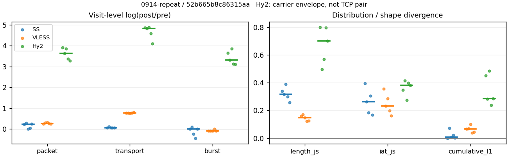
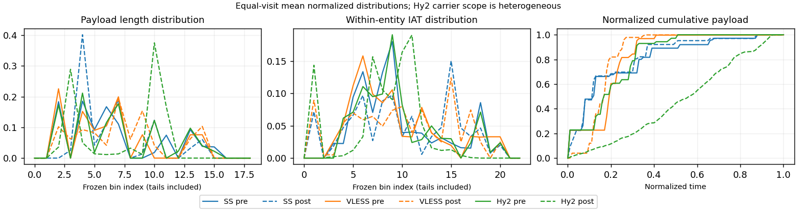

# 0914-repeat · 条目 000 · example.com

目标：https://example.com/

活动标签：example.com::page_load。选定访问 15 次。

[返回总索引](../../README.md) · [统计口径](../../methods.md)

## 覆盖与资格（每次访问均保留）

| 部署 | 重复 | 主请求路由 | 活动状态 | 代理比较 | DIRECT pre | 请求 proxy/direct/unresolved | 错误 |
| --- | --- | --- | --- | --- | --- | --- | --- |
| Hy2 | 1 | proxy | passed | 1 | 0 | 1/0/0 | [] |
| Hy2 | 2 | proxy | passed | 1 | 0 | 1/0/0 | [] |
| Hy2 | 3 | proxy | passed | 1 | 0 | 1/0/0 | [] |
| Hy2 | 4 | proxy | passed | 1 | 0 | 1/0/0 | [] |
| Hy2 | 5 | proxy | passed | 1 | 0 | 1/0/0 | [] |
| SS | 1 | proxy | passed | 1 | 0 | 1/0/0 | [] |
| SS | 2 | proxy | passed | 1 | 0 | 1/0/0 | [] |
| SS | 3 | proxy | passed | 1 | 0 | 1/0/0 | [] |
| SS | 4 | proxy | passed | 1 | 0 | 1/0/0 | [] |
| SS | 5 | proxy | passed | 1 | 0 | 1/0/0 | [] |
| VLESS | 1 | proxy | passed | 1 | 0 | 1/0/0 | [] |
| VLESS | 2 | proxy | passed | 1 | 0 | 1/0/0 | [] |
| VLESS | 3 | proxy | passed | 1 | 0 | 1/0/0 | [] |
| VLESS | 4 | proxy | passed | 1 | 0 | 1/0/0 | [] |
| VLESS | 5 | proxy | passed | 1 | 0 | 1/0/0 | [] |

主请求非 proxy 的统计仅解释为已索引的辅助代理连接或 DIRECT 观测，不代表目标业务经代理传输。播放确认与配对资格是两道不同的门。

图中散点为单次访问，短线为重复中位数；Hy2 是共享载体包络，不能与 TCP 配对作等范围因果对比。

形态图先逐访问归一化，再对访问等权平均；实线 pre，虚线 post。分箱序号及边界见 methods，不将分箱索引误解为长度或时间。

## 每次访问的关键观测

### SS

范围：`exclusive_page`。每格 pre → post；空值为不可观测/不适用。

| 重复 | 包数 | 载荷字节 | burst | TCP FR | IAT中位µs | length JS | IAT JS |
| --- | --- | --- | --- | --- | --- | --- | --- |
| 1 | 27 → 34 | 7794 → 8281 | 17 → 17 | 6 → 6 | 122.2 → 259.95 | 0.33978 | 0.39575 |
| 2 | 27 → 36 | 7823 → 8772 | 19 → 21 | 6 → 7 | 332.72 → 1014.6 | 0.31481 | 0.2633 |
| 3 | 28 → 28 | 7759 → 8246 | 19 → 15 | 6 → 6 | 197.38 → 407.05 | 0.38845 | 0.18304 |
| 4 | 26 → 27 | 7759 → 8246 | 17 → 11 | 6 → 6 | 265.37 → 951.5 | 0.29923 | 0.30546 |
| 5 | 25 → 32 | 7769 → 8222 | 15 → 15 | 5 → 5 | 244.19 → 817.38 | 0.25682 | 0.16771 |

完整标量统计：中位数 [min,max]；Δ 为重复内逐访问变换的中位数，MAD 未缩放。n 为可用变换数；DIRECT-only 的 nΔ=0 不代表 pre 不可用。

| scope | 特征 | pre | post | Δ | IQRΔ | MADΔ | nΔ |
| --- | --- | --- | --- | --- | --- | --- | --- |
| exclusive_page | active_span_sum_s_1000ms | 0.99061 [0.6678, 1.2321] | 0.95213 [0.69384, 1.191] | -0.0031353 | 0.069215 | 0.036483 | 5 |
| exclusive_page | active_span_sum_s_100ms | 0.09179 [0.032713, 0.15796] | 0.2746 [0.22782, 0.32039] | 1.0958 | 1.1342 | 0.38856 | 5 |
| exclusive_page | active_span_sum_s_500ms | 0.79345 [0.64449, 1.0047] | 0.82193 [0.68197, 1.0016] | 0.035261 | 0.041388 | 0.02127 | 5 |
| exclusive_page | burst_bytes_iqr | 512 [339, 823.5] | 650.5 [611, 712.5] | 0.20651 | 0.16683 | 0.12395 | 5 |
| exclusive_page | burst_bytes_mad | 31 [0, 31] | 32 [0, 65] | 0.7404 | 0.35433 | 0 | 3 |
| exclusive_page | burst_bytes_max | 2820 [1791, 4096] | 2856 [1906, 4368] | 0.041673 | 0.42282 | 0.3959 | 5 |
| exclusive_page | burst_bytes_mean | 456.41 [408.37, 517.93] | 548.13 [417.71, 749.64] | 0.06061 | 0.24059 | 0.046196 | 5 |
| exclusive_page | burst_bytes_median | 31 [0, 31] | 32 [0, 65] | 0.7404 | 0.35433 | 0 | 3 |
| exclusive_page | burst_bytes_min | 0 [0, 0] | 0 [0, 0] | — | — | — | 0 |
| exclusive_page | burst_bytes_p95 | 1963.9 [1482.3, 2226.4] | 2146.2 [1514, 3105] | 0.054566 | 0.067606 | 0.0342 | 5 |
| exclusive_page | burst_bytes_q25 | 0 [0, 0] | 0 [0, 0] | — | — | — | 0 |
| exclusive_page | burst_bytes_q75 | 512 [339, 823.5] | 650.5 [611, 712.5] | 0.20651 | 0.16683 | 0.12395 | 5 |
| exclusive_page | burst_bytes_std | 840.27 [602.96, 1005.1] | 836.01 [608.63, 1265.3] | 0.0093454 | 0.15385 | 0.14714 | 5 |
| exclusive_page | burst_count | 17 [15, 19] | 15 [11, 21] | 0 | 0.23639 | 0.10008 | 5 |
| exclusive_page | burst_duration_ms_iqr | 8.705 [5.7228, 9.6288] | 9.7444 [1.2514, 96.544] | 0.11279 | 2.4745 | 1.8516 | 5 |
| exclusive_page | burst_duration_ms_mad | 0 [0, 0] | 0 [0, 5.0517] | — | — | — | 0 |
| exclusive_page | burst_duration_ms_max | 587.63 [383.78, 4181.1] | 321.76 [205.12, 2041.9] | -0.18522 | 0.5842 | 0.18536 | 5 |
| exclusive_page | burst_duration_ms_mean | 72.283 [38.238, 285.15] | 36.144 [22.377, 186.63] | -0.32139 | 0.71148 | 0.49706 | 5 |
| exclusive_page | burst_duration_ms_median | 0 [0, 0] | 0 [0, 5.0517] | — | — | — | 0 |
| exclusive_page | burst_duration_ms_min | 0 [0, 0] | 0 [0, 0] | — | — | — | 0 |
| exclusive_page | burst_duration_ms_p95 | 440.03 [217.97, 1115.7] | 223.67 [174.2, 816.88] | -0.22417 | 0.22346 | 0.18748 | 5 |
| exclusive_page | burst_duration_ms_q25 | 0 [0, 0] | 0 [0, 0] | — | — | — | 0 |
| exclusive_page | burst_duration_ms_q75 | 8.705 [5.7228, 9.6288] | 9.7444 [1.2514, 96.544] | 0.11279 | 2.4745 | 1.8516 | 5 |
| exclusive_page | burst_duration_ms_std | 164.91 [95.354, 978.39] | 88.537 [56.043, 505.36] | -0.222 | 0.57663 | 0.30947 | 5 |
| exclusive_page | burst_packets_iqr | 1 [1, 1] | 1.5 [1, 2.5] | 0.40547 | 0.69315 | 0.40547 | 5 |
| exclusive_page | burst_packets_mad | 0 [0, 0] | 0 [0, 1] | — | — | — | 0 |
| exclusive_page | burst_packets_max | 3 [3, 5] | 5 [4, 5] | 0.28768 | 0.064539 | 0.064539 | 5 |
| exclusive_page | burst_packets_mean | 1.5294 [1.4211, 1.6667] | 2 [1.7143, 2.4545] | 0.23639 | 0.016336 | 0.010471 | 5 |
| exclusive_page | burst_packets_median | 1 [1, 1] | 1 [1, 2] | 0 | 0.69315 | 0 | 5 |
| exclusive_page | burst_packets_min | 1 [1, 1] | 1 [1, 1] | 0 | 0 | 0 | 5 |
| exclusive_page | burst_packets_p95 | 2.4 [2.1, 3] | 4.2 [4, 4.5] | 0.62861 | 0.25045 | 0.015748 | 5 |
| exclusive_page | burst_packets_q25 | 1 [1, 1] | 1 [1, 1] | 0 | 0 | 0 | 5 |
| exclusive_page | burst_packets_q75 | 2 [2, 2] | 2.5 [2, 3.5] | 0.22314 | 0.40547 | 0.22314 | 5 |
| exclusive_page | burst_packets_std | 0.69102 [0.59079, 1.0111] | 1.3284 [1.0302, 1.3727] | 0.57046 | 0.046112 | 0.031659 | 5 |
| exclusive_page | connection_span_concurrency_max | 1 [1, 1] | 1 [1, 1] | 0 | 0 | 0 | 5 |
| exclusive_page | cumulative_l1 | — | — | 0.0084521 | 0.019999 | 0.0079291 | 5 |
| exclusive_page | cumulative_max | — | — | 0.53051 | 0.35907 | 0.011885 | 5 |
| exclusive_page | direction_entropy | 0.99403 [0.99403, 1] | 0.99573 [0.97987, 0.9975] | 0.0016972 | 0.007034 | 0.0017751 | 5 |
| exclusive_page | down_burst_count | 8 [7, 9] | 7 [5, 10] | 0 | 0.25131 | 0.10536 | 5 |
| exclusive_page | down_ip_bytes | 6084 [6010, 6087] | 6316 [6268, 6500] | 0.049661 | 0.032616 | 0.016478 | 5 |
| exclusive_page | down_packets | 14 [13, 14] | 15 [13, 17] | 0.1431 | 0.26826 | 0.051055 | 5 |
| exclusive_page | down_transport_bytes | 5348 [5326, 5351] | 5584 [5528, 5587] | 0.043183 | 2.3695e-05 | 0 | 5 |
| exclusive_page | duration_s | 3.0463 [0.99061, 5.7526] | 3.0435 [0.95213, 5.7498] | -0.00093564 | 0.033469 | 0.00071298 | 5 |
| exclusive_page | entity_count | 1 [1, 1] | 1 [1, 1] | 0 | 0 | 0 | 5 |
| exclusive_page | fr_runs | 6 [5, 6] | 6 [5, 7] | 0 | 0 | 0 | 5 |
| exclusive_page | fr_runs_per_packet | 0.54545 [0.5, 0.54545] | 0.41176 [0.38462, 0.5] | -0.11538 | 0.049774 | 0.03007 | 5 |
| exclusive_page | fr_switches | 5 [4, 5] | 5 [4, 6] | 0 | 0 | 0 | 5 |
| exclusive_page | fr_switches_per_possible_transition | 0.5 [0.44444, 0.5] | 0.375 [0.33333, 0.45455] | -0.11111 | 0.041667 | 0.027778 | 5 |
| exclusive_page | full_retransmission_fraction | 0 [0, 0] | 0 [0, 0.055556] | 0 | 0 | 0 | 5 |
| exclusive_page | full_retransmission_packets | 0 [0, 0] | 0 [0, 2] | — | — | — | 0 |
| exclusive_page | iat_count | 26 [24, 27] | 31 [26, 35] | 0.23841 | 0.21671 | 0.058841 | 5 |
| exclusive_page | iat_js | — | — | 0.2633 | 0.12242 | 0.080258 | 5 |
| exclusive_page | iat_ks | — | — | 0.18901 | 0.049081 | 0.010248 | 5 |
| exclusive_page | iat_median_us | 244.19 [122.2, 332.72] | 817.38 [259.95, 1014.6] | 1.1149 | 0.45333 | 0.16198 | 5 |
| exclusive_page | iat_us_iqr | 3940.1 [953.14, 9593.5] | 31685 [18825, 36267] | 1.9172 | 0.10243 | 0.089408 | 5 |
| exclusive_page | iat_us_mad | 218.86 [112.31, 307.58] | 809.58 [259.81, 997.19] | 1.1762 | 0.46941 | 0.16195 | 5 |
| exclusive_page | iat_us_max | 2.0416e+06 [3.8378e+05, 4.9592e+06] | 2.0419e+06 [2.6017e+05, 4.9279e+06] | -0.0065073 | 0.1373 | 0.0066524 | 5 |
| exclusive_page | iat_us_mean | 1.1283e+05 [38101, 2.3969e+05] | 1.1272e+05 [27204, 1.8548e+05] | -0.23863 | 0.18324 | 0.098237 | 5 |
| exclusive_page | iat_us_median | 244.19 [122.2, 332.72] | 817.38 [259.95, 1014.6] | 1.1149 | 0.45333 | 0.16198 | 5 |
| exclusive_page | iat_us_min | 4.813 [3.125, 15.152] | 0.308 [0.055, 0.438] | -3.5437 | 1.1177 | 0.697 | 5 |
| exclusive_page | iat_us_p95 | 3.5679e+05 [2.4507e+05, 3.6638e+05] | 2.5077e+05 [1.8217e+05, 2.826e+05] | -0.35161 | 0.082257 | 0.027547 | 5 |
| exclusive_page | iat_us_q25 | 41.288 [35.378, 91.835] | 42.067 [7.481, 75.359] | -0.48035 | 0.6579 | 0.3575 | 5 |
| exclusive_page | iat_us_q75 | 4032 [1038.3, 9628.8] | 31710 [18832, 36314] | 1.8957 | 0.096314 | 0.075203 | 5 |
| exclusive_page | iat_us_std | 3.9056e+05 [94158, 9.882e+05] | 3.8602e+05 [59835, 8.682e+05] | -0.12946 | 0.10706 | 0.099464 | 5 |
| exclusive_page | iat_wasserstein_log1p_us | — | — | 1.0863 | 0.40189 | 0.20131 | 5 |
| exclusive_page | idle_gap_count_1000ms | 1 [0, 1] | 1 [0, 1] | 0 | 0 | 0 | 3 |
| exclusive_page | idle_gap_count_100ms | 3 [3, 4] | 3 [3, 4] | 0 | 0 | 0 | 5 |
| exclusive_page | idle_gap_count_500ms | 1 [0, 1] | 1 [0, 1] | 0 | 0 | 0 | 4 |
| exclusive_page | idle_gap_sum_s_1000ms | 2.0416 [0, 4.9592] | 2.0419 [0, 4.9279] | -0.0063252 | 0.0033262 | 0.00018212 | 3 |
| exclusive_page | idle_gap_sum_s_100ms | 2.9545 [0.9579, 5.5947] | 2.7689 [0.63762, 5.4294] | -0.064899 | 0.18822 | 0.036874 | 5 |
| exclusive_page | idle_gap_sum_s_500ms | 2.0416 [0, 4.9592] | 2.0419 [0, 4.9279] | -0.0064162 | 0.036078 | 0.0033262 | 4 |
| exclusive_page | ip_bytes | 9214 [9085, 9243] | 9938 [9666, 10684] | 0.08834 | 0.032364 | 0.030962 | 5 |
| exclusive_page | length_iqr | 902 [426.5, 1332] | 465 [449, 717] | -0.22954 | 0.89318 | 0.28095 | 5 |
| exclusive_page | length_js | — | — | 0.31481 | 0.040548 | 0.024973 | 5 |
| exclusive_page | length_ks | — | — | 0.27273 | 0.04965 | 0.04965 | 5 |
| exclusive_page | length_mad | 316 [141, 481] | 267 [158, 342.5] | 0.080529 | 0.40701 | 0.38077 | 5 |
| exclusive_page | length_max | 2820 [1791, 4096] | 2856 [1428, 2856] | -0.2265 | 0.37327 | 0.13409 | 5 |
| exclusive_page | length_mean | 708.55 [705.36, 776.9] | 632.46 [516, 687.17] | -0.20569 | 0.14337 | 0.099513 | 5 |
| exclusive_page | length_median | 380 [172, 512] | 365 [207, 432] | 0.12825 | 0.36289 | 0.31172 | 5 |
| exclusive_page | length_min | 31 [31, 31] | 65 [32, 65] | 0.7404 | 0.48551 | 0 | 5 |
| exclusive_page | length_p95 | 2342.5 [1619.5, 2927.5] | 1999.2 [1428, 2116.8] | -0.15849 | 0.22518 | 0.087078 | 5 |
| exclusive_page | length_q25 | 78 [47.5, 108.25] | 89.5 [81, 98] | 0.13753 | 0.14618 | 0.099789 | 5 |
| exclusive_page | length_q75 | 980 [504.5, 1410] | 555 [538.5, 810.75] | -0.18959 | 0.84978 | 0.25976 | 5 |
| exclusive_page | length_std | 883.66 [641.87, 1171.5] | 784.93 [537.14, 812.05] | -0.17812 | 0.26545 | 0.11368 | 5 |
| exclusive_page | length_wasserstein_bytes | — | — | 205.17 | 58.039 | 31.255 | 5 |
| exclusive_page | nonempty_entity_count | 1 [1, 1] | 1 [1, 1] | 0 | 0 | 0 | 5 |
| exclusive_page | nonempty_packets | 11 [10, 11] | 13 [12, 17] | 0.26236 | 0.1431 | 0.09531 | 5 |
| exclusive_page | offload_suspect_fraction | 0.074074 [0.037037, 0.08] | 0.03125 [0, 0.074074] | -0.037037 | 0.041813 | 0.011713 | 5 |
| exclusive_page | packet_count | 27 [25, 28] | 32 [27, 36] | 0.23052 | 0.20912 | 0.057158 | 5 |
| exclusive_page | rtt_median_ms | 0.14954 [0.072218, 0.19445] | 34.62 [2.9956, 37.874] | 5.4854 | 0.22036 | 0.21355 | 5 |
| exclusive_page | rtt_sample_count | 14 [12, 15] | 14 [13, 17] | 0.080043 | 0.20252 | 0.14904 | 5 |
| exclusive_page | tcp_ack_count | 26 [24, 27] | 31 [26, 35] | 0.23841 | 0.21671 | 0.058841 | 5 |
| exclusive_page | tcp_fin_count | 2 [2, 2] | 2 [2, 2] | 0 | 0 | 0 | 5 |
| exclusive_page | tcp_packet_count | 27 [25, 28] | 32 [27, 36] | 0.23052 | 0.20912 | 0.057158 | 5 |
| exclusive_page | tcp_rst_count | 0 [0, 0] | 0 [0, 0] | — | — | — | 0 |
| exclusive_page | tcp_syn_count | 2 [2, 2] | 2 [2, 2] | 0 | 0 | 0 | 5 |
| exclusive_page | tcp_window_raw_median | 64882 [63801, 65130] | 105 [103, 131] | -6.4191 | 0.20972 | 0.026463 | 5 |
| exclusive_page | transition_entropy | 0.97095 [0.97095, 0.98386] | 0.95443 [0.9183, 0.9906] | -0.016517 | 0.055105 | 0.03026 | 5 |
| exclusive_page | transition_n_mm | 3 [3, 3] | 4 [2, 5] | 0.28768 | 0.51083 | 0.22314 | 5 |
| exclusive_page | transition_n_mp | 2 [2, 2] | 2 [2, 3] | 0 | 0 | 0 | 5 |
| exclusive_page | transition_n_pm | 3 [2, 3] | 3 [2, 3] | 0 | 0 | 0 | 5 |
| exclusive_page | transition_n_pp | 2 [2, 2] | 4 [4, 5] | 0.69315 | 0 | 0 | 5 |
| exclusive_page | transition_p_mm | 0.6 [0.6, 0.6] | 0.625 [0.5, 0.71429] | 0.025 | 0.066667 | 0.041667 | 5 |
| exclusive_page | transition_p_mp | 0.4 [0.4, 0.4] | 0.375 [0.28571, 0.5] | -0.025 | 0.066667 | 0.041667 | 5 |
| exclusive_page | transition_p_pm | 0.6 [0.5, 0.6] | 0.42857 [0.33333, 0.42857] | -0.17143 | 0 | 0 | 5 |
| exclusive_page | transition_p_pp | 0.4 [0.4, 0.5] | 0.57143 [0.57143, 0.66667] | 0.17143 | 0 | 0 | 5 |
| exclusive_page | transport_bytes | 7769 [7759, 7823] | 8246 [8222, 8772] | 0.060875 | 0.00026525 | 0.00026525 | 5 |
| exclusive_page | up_burst_count | 9 [8, 10] | 8 [6, 11] | 0 | 0.22314 | 0.09531 | 5 |
| exclusive_page | up_byte_fraction | 0.31345 [0.31074, 0.31637] | 0.32532 [0.32282, 0.36343] | 0.012087 | 0.0011154 | 0.00021048 | 5 |
| exclusive_page | up_ip_bytes | 3127 [3043, 3159] | 3586 [3398, 4184] | 0.13696 | 0.053378 | 0.026758 | 5 |
| exclusive_page | up_packets | 13 [12, 14] | 17 [14, 19] | 0.26826 | 0.19416 | 0.11123 | 5 |
| exclusive_page | up_transport_bytes | 2443 [2411, 2475] | 2694 [2662, 3188] | 0.099036 | 0.0012358 | 0.0012358 | 5 |
| exclusive_page | zero_iat_count | 0 [0, 0] | 0 [0, 0] | — | — | — | 0 |
| exclusive_page | zero_iat_fraction | 0 [0, 0] | 0 [0, 0] | 0 | 0 | 0 | 5 |

### VLESS

范围：`exclusive_page`。每格 pre → post；空值为不可观测/不适用。

| 重复 | 包数 | 载荷字节 | burst | TCP FR | IAT中位µs | length JS | IAT JS |
| --- | --- | --- | --- | --- | --- | --- | --- |
| 1 | 31 → 40 | 7879 → 16883 | 23 → 21 | 6 → 8 | 93.61 → 526.99 | 0.15845 | 0.35579 |
| 2 | 32 → 43 | 7815 → 16765 | 23 → 21 | 6 → 8 | 131.4 → 571.48 | 0.1708 | 0.23278 |
| 3 | 31 → 43 | 7879 → 16737 | 23 → 21 | 6 → 8 | 204.74 → 807.55 | 0.1468 | 0.28442 |
| 4 | 30 → 39 | 7762 → 16757 | 21 → 21 | 6 → 8 | 230.59 → 717.44 | 0.12215 | 0.19903 |
| 5 | 33 → 42 | 7782 → 17319 | 23 → 21 | 6 → 8 | 215.3 → 830.79 | 0.12522 | 0.16272 |

完整标量统计：中位数 [min,max]；Δ 为重复内逐访问变换的中位数，MAD 未缩放。n 为可用变换数；DIRECT-only 的 nΔ=0 不代表 pre 不可用。

| scope | 特征 | pre | post | Δ | IQRΔ | MADΔ | nΔ |
| --- | --- | --- | --- | --- | --- | --- | --- |
| exclusive_page | active_span_sum_s_1000ms | 1.232 [1.1046, 1.2936] | 1.0693 [1.0438, 1.0817] | -0.16394 | 0.12636 | 0.028651 | 5 |
| exclusive_page | active_span_sum_s_100ms | 0.066692 [0.017636, 0.088197] | 0.32856 [0.31095, 0.34539] | 1.6168 | 0.7805 | 0.30161 | 5 |
| exclusive_page | active_span_sum_s_500ms | 0.46857 [0.41941, 0.48667] | 1.0693 [1.0438, 1.0817] | 0.83067 | 0.087717 | 0.043491 | 5 |
| exclusive_page | burst_bytes_iqr | 504.5 [446, 537] | 1545 [1305, 1891] | 1.1062 | 0.22563 | 0.15579 | 5 |
| exclusive_page | burst_bytes_mad | 24 [24, 24] | 53 [31, 188] | 0.79224 | 0 | 0 | 5 |
| exclusive_page | burst_bytes_max | 2372 [2372, 2372] | 3065 [2824, 4435] | 0.25631 | 0.022901 | 0.022901 | 5 |
| exclusive_page | burst_bytes_mean | 342.57 [338.35, 369.62] | 798.33 [797, 824.71] | 0.85308 | 0.0098276 | 0.0086854 | 5 |
| exclusive_page | burst_bytes_median | 24 [24, 24] | 53 [31, 188] | 0.79224 | 0 | 0 | 5 |
| exclusive_page | burst_bytes_min | 0 [0, 0] | 0 [0, 0] | — | — | — | 0 |
| exclusive_page | burst_bytes_p95 | 1727 [1670.6, 1757] | 2824 [2431, 2897] | 0.47455 | 0.017222 | 0.017222 | 5 |
| exclusive_page | burst_bytes_q25 | 0 [0, 0] | 0 [0, 0] | — | — | — | 0 |
| exclusive_page | burst_bytes_q75 | 504.5 [446, 537] | 1545 [1305, 1891] | 1.1062 | 0.22563 | 0.15579 | 5 |
| exclusive_page | burst_bytes_std | 618.32 [609.93, 630.55] | 992.06 [957.53, 1171.5] | 0.47277 | 0.14204 | 0.021767 | 5 |
| exclusive_page | burst_count | 23 [21, 23] | 21 [21, 21] | -0.090972 | 0 | 0 | 5 |
| exclusive_page | burst_duration_ms_iqr | 4.5962 [2.9952, 15.717] | 2.356 [1.2504, 35.84] | -0.24006 | 2.1007 | 1.5933 | 5 |
| exclusive_page | burst_duration_ms_mad | 0 [0, 0] | 0.000124 [0, 0.21504] | — | — | — | 0 |
| exclusive_page | burst_duration_ms_max | 2441.2 [1314.4, 3294.2] | 316.97 [315.33, 2441.3] | -1.4275 | 2.0537 | 0.91365 | 5 |
| exclusive_page | burst_duration_ms_mean | 152.96 [110.36, 199.25] | 36.06 [35.737, 154.72] | -1.1186 | 1.5054 | 0.59384 | 5 |
| exclusive_page | burst_duration_ms_median | 0 [0, 0] | 0.000124 [0, 0.21504] | — | — | — | 0 |
| exclusive_page | burst_duration_ms_min | 0 [0, 0] | 0 [0, 0] | — | — | — | 0 |
| exclusive_page | burst_duration_ms_p95 | 738.63 [602, 806.9] | 159.98 [156.92, 315.4] | -1.3524 | 0.69026 | 0.28503 | 5 |
| exclusive_page | burst_duration_ms_q25 | 0 [0, 0] | 0 [0, 0] | — | — | — | 0 |
| exclusive_page | burst_duration_ms_q75 | 4.5962 [2.9952, 15.717] | 2.356 [1.2504, 35.84] | -0.24006 | 2.1007 | 1.5933 | 5 |
| exclusive_page | burst_duration_ms_std | 507.26 [307.72, 684.74] | 80.515 [80.134, 517.39] | -1.3455 | 1.8841 | 0.79703 | 5 |
| exclusive_page | burst_packets_iqr | 1 [1, 1] | 1 [1, 2] | 0 | 0 | 0 | 5 |
| exclusive_page | burst_packets_mad | 0 [0, 0] | 1 [0, 1] | — | — | — | 0 |
| exclusive_page | burst_packets_max | 3 [3, 3] | 5 [5, 6] | 0.51083 | 0.18232 | 0 | 5 |
| exclusive_page | burst_packets_mean | 1.3913 [1.3478, 1.4348] | 2 [1.8571, 2.0476] | 0.34586 | 0.054302 | 0.040572 | 5 |
| exclusive_page | burst_packets_median | 1 [1, 1] | 2 [1, 2] | 0.69315 | 0.69315 | 0 | 5 |
| exclusive_page | burst_packets_min | 1 [1, 1] | 1 [1, 1] | 0 | 0 | 0 | 5 |
| exclusive_page | burst_packets_p95 | 2 [2, 2.9] | 4 [4, 5] | 0.69315 | 0 | 0 | 5 |
| exclusive_page | burst_packets_q25 | 1 [1, 1] | 1 [1, 1] | 0 | 0 | 0 | 5 |
| exclusive_page | burst_packets_q75 | 2 [2, 2] | 2 [2, 3] | 0 | 0 | 0 | 5 |
| exclusive_page | burst_packets_std | 0.57021 [0.56018, 0.64781] | 1.2141 [1.1508, 1.3965] | 0.72698 | 0.035782 | 0.028734 | 5 |
| exclusive_page | connection_span_concurrency_max | 1 [1, 1] | 1 [1, 1] | 0 | 0 | 0 | 5 |
| exclusive_page | cumulative_l1 | — | — | 0.06723 | 0.027069 | 0.023848 | 5 |
| exclusive_page | cumulative_max | — | — | 0.66057 | 0.010454 | 0.0049857 | 5 |
| exclusive_page | direction_entropy | 0.96124 [0.94029, 0.97987] | 0.97095 [0.93407, 0.99108] | 0.009714 | 0.017425 | 0.015932 | 5 |
| exclusive_page | down_burst_count | 11 [10, 11] | 10 [10, 10] | -0.09531 | 0 | 0 | 5 |
| exclusive_page | down_ip_bytes | 6212 [6139, 6263] | 13614 [13492, 13999] | 0.78835 | 0.0091732 | 0.0054341 | 5 |
| exclusive_page | down_packets | 16 [15, 17] | 23 [21, 24] | 0.33647 | 0.044452 | 0.026433 | 5 |
| exclusive_page | down_transport_bytes | 5372 [5351, 5372] | 12461 [12340, 12795] | 0.8414 | 0.01358 | 0.0083001 | 5 |
| exclusive_page | duration_s | 3.5632 [2.5463, 4.5879] | 3.523 [2.3287, 4.3234] | -0.056134 | 0.04715 | 0.033198 | 5 |
| exclusive_page | entity_count | 1 [1, 1] | 1 [1, 1] | 0 | 0 | 0 | 5 |
| exclusive_page | fr_runs | 6 [6, 6] | 8 [8, 8] | 0.28768 | 0 | 0 | 5 |
| exclusive_page | fr_runs_per_packet | 0.46154 [0.42857, 0.5] | 0.4 [0.4, 0.44444] | -0.040486 | 0.026984 | 0.011914 | 5 |
| exclusive_page | fr_switches | 5 [5, 5] | 7 [7, 7] | 0.33647 | 0 | 0 | 5 |
| exclusive_page | fr_switches_per_possible_transition | 0.41667 [0.38462, 0.45455] | 0.36842 [0.36842, 0.41176] | -0.027778 | 0.026586 | 0.011583 | 5 |
| exclusive_page | full_retransmission_fraction | 0 [0, 0] | 0 [0, 0] | 0 | 0 | 0 | 5 |
| exclusive_page | full_retransmission_packets | 0 [0, 0] | 0 [0, 0] | — | — | — | 0 |
| exclusive_page | iat_count | 30 [29, 32] | 41 [38, 42] | 0.27029 | 0.041318 | 0.022454 | 5 |
| exclusive_page | iat_js | — | — | 0.23278 | 0.085382 | 0.051633 | 5 |
| exclusive_page | iat_ks | — | — | 0.2 | 0.019122 | 0.010366 | 5 |
| exclusive_page | iat_median_us | 204.74 [93.61, 230.59] | 717.44 [526.99, 830.79] | 1.3723 | 0.11966 | 0.097731 | 5 |
| exclusive_page | iat_us_iqr | 3636.2 [1755.2, 5080.8] | 29311 [26602, 40799] | 2.087 | 0.72101 | 0.15455 | 5 |
| exclusive_page | iat_us_mad | 185.63 [84.075, 219.67] | 716.71 [526.82, 827.53] | 1.4701 | 0.09196 | 0.052946 | 5 |
| exclusive_page | iat_us_max | 2.4412e+06 [1.3144e+06, 3.2942e+06] | 2.4413e+06 [1.2849e+06, 3.2564e+06] | 2.853e-05 | 0.011603 | 0.006855 | 5 |
| exclusive_page | iat_us_mean | 1.1316e+05 [84878, 1.5293e+05] | 85927 [55446, 1.1086e+05] | -0.32173 | 0.084367 | 0.04628 | 5 |
| exclusive_page | iat_us_median | 204.74 [93.61, 230.59] | 717.44 [526.99, 830.79] | 1.3723 | 0.11966 | 0.097731 | 5 |
| exclusive_page | iat_us_min | 4.944 [2.788, 10.051] | 0.072 [0.037, 0.193] | -3.8181 | 0.35717 | 0.30834 | 5 |
| exclusive_page | iat_us_p95 | 5.0003e+05 [4.0131e+05, 5.7129e+05] | 1.5538e+05 [1.5369e+05, 1.798e+05] | -1.1688 | 0.24729 | 0.074661 | 5 |
| exclusive_page | iat_us_q25 | 30.1 [18.974, 40.98] | 28.496 [25.034, 60.974] | 0.098198 | 0.23642 | 0.16314 | 5 |
| exclusive_page | iat_us_q75 | 3677.2 [1789.8, 5110.9] | 29372 [26640, 40824] | 2.0779 | 0.70811 | 0.15101 | 5 |
| exclusive_page | iat_us_std | 4.3519e+05 [2.7336e+05, 6.054e+05] | 3.7718e+05 [2.0086e+05, 5.14e+05] | -0.16367 | 0.048308 | 0.020613 | 5 |
| exclusive_page | iat_wasserstein_log1p_us | — | — | 1.1799 | 0.24669 | 0.14125 | 5 |
| exclusive_page | idle_gap_count_1000ms | 1 [1, 1] | 1 [1, 1] | 0 | 0 | 0 | 5 |
| exclusive_page | idle_gap_count_100ms | 4 [4, 4] | 5 [5, 5] | 0.22314 | 0 | 0 | 5 |
| exclusive_page | idle_gap_count_500ms | 2 [2, 2] | 1 [1, 1] | -0.69315 | 0 | 0 | 5 |
| exclusive_page | idle_gap_sum_s_1000ms | 2.4412 [1.3144, 3.2942] | 2.4413 [1.2849, 3.2564] | 2.853e-05 | 0.011603 | 0.006855 | 5 |
| exclusive_page | idle_gap_sum_s_100ms | 3.475 [2.5122, 4.5702] | 3.1776 [2.0178, 3.9997] | -0.13333 | 0.051775 | 0.041378 | 5 |
| exclusive_page | idle_gap_sum_s_500ms | 3.0765 [2.1233, 4.1685] | 2.4413 [1.2849, 3.2564] | -0.24692 | 0.069749 | 0.029578 | 5 |
| exclusive_page | ip_bytes | 9483 [9314, 9490] | 19013 [18825, 19543] | 0.69899 | 0.0080449 | 0.0038939 | 5 |
| exclusive_page | length_iqr | 497 [477.75, 626.5] | 1086.5 [988, 1176.5] | 0.7266 | 0.074497 | 0.055532 | 5 |
| exclusive_page | length_js | — | — | 0.1468 | 0.033224 | 0.02158 | 5 |
| exclusive_page | length_ks | — | — | 0.31923 | 0.042623 | 0.028947 | 5 |
| exclusive_page | length_mad | 431 [240.5, 433] | 535.5 [504.5, 547] | 0.23834 | 0.41207 | 0.028683 | 5 |
| exclusive_page | length_max | 2372 [2372, 2372] | 2824 [2824, 2824] | 0.17442 | 0 | 0 | 5 |
| exclusive_page | length_mean | 606.08 [555.86, 646.83] | 865.95 [836.85, 930.94] | 0.38262 | 0.042463 | 0.023957 | 5 |
| exclusive_page | length_median | 497 [276, 509] | 672 [577.5, 703.5] | 0.34534 | 0.2459 | 0.094684 | 5 |
| exclusive_page | length_min | 24 [24, 24] | 24 [24, 24] | 0 | 0 | 0 | 5 |
| exclusive_page | length_p95 | 2017.2 [1952.7, 2042.6] | 2824 [2048.8, 2824] | 0.32393 | 0.013191 | 0.012488 | 5 |
| exclusive_page | length_q25 | 64 [39.25, 85] | 121.5 [101.5, 220] | 0.73913 | 0.30908 | 0.21098 | 5 |
| exclusive_page | length_q75 | 561 [548.75, 711.5] | 1208 [1112, 1354.2] | 0.767 | 0.10488 | 0.078408 | 5 |
| exclusive_page | length_std | 713.34 [694.27, 717.04] | 850.82 [705.73, 892.73] | 0.17107 | 0.057948 | 0.031887 | 5 |
| exclusive_page | length_wasserstein_bytes | — | — | 284.11 | 27.591 | 25.982 | 5 |
| exclusive_page | nonempty_entity_count | 1 [1, 1] | 1 [1, 1] | 0 | 0 | 0 | 5 |
| exclusive_page | nonempty_packets | 13 [12, 14] | 20 [18, 20] | 0.37949 | 0.04879 | 0.022815 | 5 |
| exclusive_page | offload_suspect_fraction | 0.064516 [0.060606, 0.066667] | 0.075 [0.046512, 0.10256] | 0.010484 | 0.029381 | 0.024148 | 5 |
| exclusive_page | packet_count | 31 [30, 33] | 42 [39, 43] | 0.26236 | 0.040572 | 0.021202 | 5 |
| exclusive_page | rtt_median_ms | 0.13883 [0.042958, 0.19687] | 40.52 [17.401, 42.953] | 5.4634 | 0.71829 | 0.62852 | 5 |
| exclusive_page | rtt_sample_count | 14 [14, 15] | 19 [18, 19] | 0.30538 | 0.054067 | 0 | 5 |
| exclusive_page | tcp_ack_count | 28 [27, 30] | 41 [38, 42] | 0.34175 | 0.039017 | 0.028624 | 5 |
| exclusive_page | tcp_fin_count | 2 [2, 2] | 2 [2, 2] | 0 | 0 | 0 | 5 |
| exclusive_page | tcp_packet_count | 31 [30, 33] | 42 [39, 43] | 0.26236 | 0.040572 | 0.021202 | 5 |
| exclusive_page | tcp_rst_count | 2 [2, 2] | 0 [0, 0] | — | — | — | 0 |
| exclusive_page | tcp_syn_count | 2 [2, 2] | 2 [2, 2] | 0 | 0 | 0 | 5 |
| exclusive_page | tcp_window_raw_median | 64882 [63801, 64882] | 131 [131, 131] | -6.2051 | 0.016801 | 0 | 5 |
| exclusive_page | transition_entropy | 0.90805 [0.87269, 0.94223] | 0.91047 [0.87536, 0.95674] | 0.0026744 | 0.012098 | 0.010976 | 5 |
| exclusive_page | transition_n_mm | 5 [4, 6] | 8 [6, 9] | 0.40547 | 0.064539 | 0.064539 | 5 |
| exclusive_page | transition_n_mp | 2 [2, 2] | 3 [3, 3] | 0.40547 | 0 | 0 | 5 |
| exclusive_page | transition_n_pm | 3 [3, 3] | 4 [4, 4] | 0.28768 | 0 | 0 | 5 |
| exclusive_page | transition_n_pp | 2 [2, 2] | 4 [3, 4] | 0.69315 | 0.28768 | 0 | 5 |
| exclusive_page | transition_p_mm | 0.71429 [0.66667, 0.75] | 0.72727 [0.66667, 0.75] | 0 | 0.012987 | 0.012987 | 5 |
| exclusive_page | transition_p_mp | 0.28571 [0.25, 0.33333] | 0.27273 [0.25, 0.33333] | 0 | 0.012987 | 0.012987 | 5 |
| exclusive_page | transition_p_pm | 0.6 [0.6, 0.6] | 0.5 [0.5, 0.57143] | -0.1 | 0.071429 | 0 | 5 |
| exclusive_page | transition_p_pp | 0.4 [0.4, 0.4] | 0.5 [0.42857, 0.5] | 0.1 | 0.071429 | 0 | 5 |
| exclusive_page | transport_bytes | 7815 [7762, 7879] | 16765 [16737, 17319] | 0.76325 | 0.0074698 | 0.0063276 | 5 |
| exclusive_page | up_burst_count | 12 [11, 12] | 11 [11, 11] | -0.087011 | 0 | 0 | 5 |
| exclusive_page | up_byte_fraction | 0.3126 [0.30982, 0.31819] | 0.26122 [0.25536, 0.26909] | -0.05526 | 0.0067783 | 0.0012918 | 5 |
| exclusive_page | up_ip_bytes | 3259 [3175, 3271] | 5399 [5247, 5544] | 0.50275 | 0.019301 | 0.0016359 | 5 |
| exclusive_page | up_packets | 15 [15, 16] | 19 [18, 20] | 0.18232 | 0.040822 | 0.010471 | 5 |
| exclusive_page | up_transport_bytes | 2443 [2411, 2507] | 4379 [4279, 4543] | 0.57368 | 0.028183 | 0.015944 | 5 |
| exclusive_page | zero_iat_count | 0 [0, 0] | 0 [0, 0] | — | — | — | 0 |
| exclusive_page | zero_iat_fraction | 0 [0, 0] | 0 [0, 0] | 0 | 0 | 0 | 5 |

### Hy2

范围：`carrier_context_envelope`。每格 pre → post；空值为不可观测/不适用。

| 重复 | 包数 | 载荷字节 | burst | TCP FR | IAT中位µs | length JS | IAT JS |
| --- | --- | --- | --- | --- | --- | --- | --- |
| 1 | 24 → 1191 | 7856 → 1.0146e+06 | 17 → 653 | — | 321.56 → 147.92 | 0.79784 | 0.34575 |
| 2 | 30 → 1128 | 7760 → 9.621e+05 | 23 → 634 | — | 277.31 → 246.86 | 0.49483 | 0.41567 |
| 3 | 26 → 1231 | 7762 → 1.0195e+06 | 15 → 715 | — | 190.96 → 576.84 | 0.56991 | 0.27524 |
| 4 | 28 → 821 | 7856 → 7.6824e+05 | 21 → 476 | — | 202.67 → 231.99 | 0.7971 | 0.39799 |
| 5 | 23 → 606 | 7857 → 4.7557e+05 | 15 → 337 | — | 180.04 → 456.55 | 0.7009 | 0.38085 |

完整标量统计：中位数 [min,max]；Δ 为重复内逐访问变换的中位数，MAD 未缩放。n 为可用变换数；DIRECT-only 的 nΔ=0 不代表 pre 不可用。

| scope | 特征 | pre | post | Δ | IQRΔ | MADΔ | nΔ |
| --- | --- | --- | --- | --- | --- | --- | --- |
| carrier_context_envelope | active_span_sum_s_1000ms | 0.89595 [0.5162, 1.0812] | 1.7621 [1.0284, 2.1796] | 0.889 | 1.1453 | 0.51366 | 5 |
| carrier_context_envelope | active_span_sum_s_100ms | 0.061436 [0.01404, 0.12896] | 1.7621 [0.9732, 1.9818] | 3.2287 | 1.367 | 0.53697 | 5 |
| carrier_context_envelope | active_span_sum_s_500ms | 0.56067 [0.51427, 1.0427] | 1.7621 [1.0284, 2.1796] | 0.889 | 0.40216 | 0.25612 | 5 |
| carrier_context_envelope | burst_bytes_iqr | 538 [504.5, 580] | 2824 [2819, 2845] | 1.6655 | 0.064376 | 0.05511 | 5 |
| carrier_context_envelope | burst_bytes_mad | 31 [17, 31] | 578.5 [188, 830.5] | 2.9265 | 1.0506 | 0.96236 | 5 |
| carrier_context_envelope | burst_bytes_max | 2770 [1727, 4268] | 13974 [12870, 16696] | 1.7963 | 0.59436 | 0.29987 | 5 |
| carrier_context_envelope | burst_bytes_mean | 462.12 [337.39, 523.8] | 1517.5 [1411.2, 1614] | 1.2126 | 0.44837 | 0.22149 | 5 |
| carrier_context_envelope | burst_bytes_median | 31 [17, 31] | 612.5 [215, 863.5] | 2.9836 | 0.95648 | 0.94109 | 5 |
| carrier_context_envelope | burst_bytes_min | 0 [0, 0] | 25 [22, 33] | — | — | — | 0 |
| carrier_context_envelope | burst_bytes_p95 | 2012.4 [1405.6, 2556.5] | 4290 [2930.2, 4323] | 0.75696 | 0.59776 | 0.35845 | 5 |
| carrier_context_envelope | burst_bytes_q25 | 0 [0, 0] | 36 [34, 41] | — | — | — | 0 |
| carrier_context_envelope | burst_bytes_q75 | 538 [504.5, 580] | 2860 [2860, 2882] | 1.6784 | 0.066148 | 0.056628 | 5 |
| carrier_context_envelope | burst_bytes_std | 784.13 [554.37, 1103.7] | 1768.5 [1612.3, 1947.6] | 0.90975 | 0.46853 | 0.23805 | 5 |
| carrier_context_envelope | burst_count | 17 [15, 23] | 634 [337, 715] | 3.3166 | 0.52747 | 0.20452 | 5 |
| carrier_context_envelope | burst_duration_ms_iqr | 5.343 [0.36289, 12.65] | 0.88571 [0.86515, 1.0696] | -1.6805 | 2.6402 | 0.78995 | 5 |
| carrier_context_envelope | burst_duration_ms_mad | 0 [0, 0.072695] | 4.7e-05 [0, 6.4e-05] | -7.0832 | — | — | 1 |
| carrier_context_envelope | burst_duration_ms_max | 1202 [473.36, 1585.2] | 66.729 [32.729, 107.46] | -2.852 | 0.46261 | 0.17083 | 5 |
| carrier_context_envelope | burst_duration_ms_mean | 82.897 [47.27, 139.87] | 0.99131 [0.93329, 1.3795] | -4.334 | 0.58911 | 0.35095 | 5 |
| carrier_context_envelope | burst_duration_ms_median | 0 [0, 0.072695] | 4.7e-05 [0, 6.4e-05] | -7.0832 | — | — | 1 |
| carrier_context_envelope | burst_duration_ms_min | 0 [0, 0] | 0 [0, 0] | — | — | — | 0 |
| carrier_context_envelope | burst_duration_ms_p95 | 388.27 [325.15, 655.01] | 2.5285 [2.2742, 2.6953] | -5.0341 | 0.14067 | 0.071408 | 5 |
| carrier_context_envelope | burst_duration_ms_q25 | 0 [0, 0] | 0 [0, 0] | — | — | — | 0 |
| carrier_context_envelope | burst_duration_ms_q75 | 5.343 [0.36289, 12.65] | 0.88571 [0.86515, 1.0696] | -1.6805 | 2.6402 | 0.78995 | 5 |
| carrier_context_envelope | burst_duration_ms_std | 271.44 [122.73, 394.81] | 4.9373 [3.008, 8.1057] | -3.9642 | 0.78804 | 0.40961 | 5 |
| carrier_context_envelope | burst_packets_iqr | 1 [1, 1] | 1 [1, 1] | 0 | 0 | 0 | 5 |
| carrier_context_envelope | burst_packets_mad | 0 [0, 1] | 1 [0, 1] | 0 | — | — | 1 |
| carrier_context_envelope | burst_packets_max | 2 [2, 4] | 12 [10, 20] | 1.7918 | 0.40547 | 0.40547 | 5 |
| carrier_context_envelope | burst_packets_mean | 1.4118 [1.3043, 1.7333] | 1.7792 [1.7217, 1.8239] | 0.25613 | 0.09807 | 0.054318 | 5 |
| carrier_context_envelope | burst_packets_median | 1 [1, 2] | 2 [1, 2] | 0.69315 | 0.69315 | 0 | 5 |
| carrier_context_envelope | burst_packets_min | 1 [1, 1] | 1 [1, 1] | 0 | 0 | 0 | 5 |
| carrier_context_envelope | burst_packets_p95 | 2 [2, 3.3] | 3 [3, 4] | 0.40547 | 0.12516 | 0.12516 | 5 |
| carrier_context_envelope | burst_packets_q25 | 1 [1, 1] | 1 [1, 1] | 0 | 0 | 0 | 5 |
| carrier_context_envelope | burst_packets_q75 | 2 [2, 2] | 2 [2, 2] | 0 | 0 | 0 | 5 |
| carrier_context_envelope | burst_packets_std | 0.49215 [0.46013, 0.85375] | 1.2037 [1.0952, 1.3333] | 0.84298 | 0.33031 | 0.1767 | 5 |
| carrier_context_envelope | connection_span_concurrency_max | 1 [1, 1] | 1 [1, 1] | 0 | 0 | 0 | 5 |
| carrier_context_envelope | cumulative_l1 | — | — | 0.28419 | 0.16755 | 0.046277 | 5 |
| carrier_context_envelope | cumulative_max | — | — | 0.70162 | 0.25021 | 0.11904 | 5 |
| carrier_context_envelope | direction_entropy | 0.99108 [0.97987, 0.99403] | 0.92774 [0.91625, 0.94911] | -0.052128 | 0.024355 | 0.010166 | 5 |
| carrier_context_envelope | direction_run_analog_runs | 6 [6, 6] | 634 [337, 715] | 4.6603 | 0.31616 | 0.12023 | 5 |
| carrier_context_envelope | direction_run_analog_runs_per_packet | 0.54545 [0.5, 0.66667] | 0.56206 [0.54828, 0.58083] | 0.034326 | 0.14594 | 0.027731 | 5 |
| carrier_context_envelope | direction_run_analog_switches | 5 [5, 5] | 633 [336, 714] | 4.841 | 0.31673 | 0.12041 | 5 |
| carrier_context_envelope | direction_run_analog_switches_per_possible_transition | 0.5 [0.45455, 0.625] | 0.56167 [0.5479, 0.58049] | 0.079268 | 0.15012 | 0.027854 | 5 |
| carrier_context_envelope | down_burst_count | 8 [7, 11] | 317 [168, 357] | 3.361 | 0.5294 | 0.19132 | 5 |
| carrier_context_envelope | down_ip_bytes | 6085 [5981, 6137] | 9.4907e+05 [4.6096e+05, 1.0009e+06] | 5.0411 | 0.26476 | 0.078882 | 5 |
| carrier_context_envelope | down_packets | 14 [12, 15] | 741 [383, 796] | 3.9 | 0.35886 | 0.23091 | 5 |
| carrier_context_envelope | down_transport_bytes | 5349 [5349, 5351] | 9.2832e+05 [4.5024e+05, 9.7857e+05] | 5.1565 | 0.26268 | 0.052717 | 5 |
| carrier_context_envelope | duration_s | 1.7627 [1.0427, 2.186] | 1.7621 [1.0284, 2.1796] | -0.0011851 | 0.002624 | 0.0010201 | 5 |
| carrier_context_envelope | entity_count | 1 [1, 1] | 1 [1, 1] | 0 | 0 | 0 | 5 |
| carrier_context_envelope | full_retransmission_fraction | 0 [0, 0] | — | — | — | — | 0 |
| carrier_context_envelope | full_retransmission_packets | 0 [0, 0] | — | — | — | — | 0 |
| carrier_context_envelope | iat_count | 25 [22, 29] | 1127 [605, 1230] | 3.66 | 0.48243 | 0.24655 | 5 |
| carrier_context_envelope | iat_js | — | — | 0.38085 | 0.052244 | 0.034826 | 5 |
| carrier_context_envelope | iat_ks | — | — | 0.2438 | 0.01501 | 0.011407 | 5 |
| carrier_context_envelope | iat_median_us | 202.67 [180.04, 321.56] | 246.86 [147.92, 576.84] | 0.13511 | 1.0469 | 0.79544 | 5 |
| carrier_context_envelope | iat_us_iqr | 2919 [580.32, 15313] | 975.16 [910.48, 1153.8] | -1.165 | 1.4778 | 1.446 | 5 |
| carrier_context_envelope | iat_us_mad | 196.13 [163.09, 308.9] | 246.76 [147.84, 514.3] | 0.16749 | 1.0595 | 0.83015 | 5 |
| carrier_context_envelope | iat_us_max | 1.202e+06 [4.7336e+05, 1.5852e+06] | 1.0785e+05 [65336, 1.607e+05] | -2.0829 | 0.62509 | 0.42339 | 5 |
| carrier_context_envelope | iat_us_mean | 75381 [38617, 84054] | 1706.4 [1254.1, 1934] | -3.663 | 0.46983 | 0.23573 | 5 |
| carrier_context_envelope | iat_us_median | 202.67 [180.04, 321.56] | 246.86 [147.92, 576.84] | 0.13511 | 1.0469 | 0.79544 | 5 |
| carrier_context_envelope | iat_us_min | 6.785 [5.459, 11.386] | 0.035 [0.031, 0.037] | -5.2424 | 0.086913 | 0.056035 | 5 |
| carrier_context_envelope | iat_us_p95 | 2.8242e+05 [2.5103e+05, 3.1243e+05] | 4315.2 [3150.7, 5055.5] | -4.1079 | 0.2652 | 0.2028 | 5 |
| carrier_context_envelope | iat_us_q25 | 52.24 [32.975, 152.42] | 77.406 [54.255, 83.717] | 0.34703 | 0.47848 | 0.35392 | 5 |
| carrier_context_envelope | iat_us_q75 | 2952 [632.56, 15361] | 1029.4 [987.88, 1231.4] | -1.0947 | 1.449 | 1.3548 | 5 |
| carrier_context_envelope | iat_us_std | 2.4363e+05 [1.0965e+05, 3.1337e+05] | 6841 [4376.1, 8750.6] | -3.3265 | 0.58095 | 0.34944 | 5 |
| carrier_context_envelope | iat_wasserstein_log1p_us | — | — | 1.4138 | 0.21318 | 0.11138 | 5 |
| carrier_context_envelope | idle_gap_count_1000ms | 1 [0, 1] | 0 [0, 0] | — | — | — | 0 |
| carrier_context_envelope | idle_gap_count_100ms | 3 [3, 4] | 1 [0, 2] | -1.0986 | 0.20273 | 0 | 3 |
| carrier_context_envelope | idle_gap_count_500ms | 1 [0, 1] | 0 [0, 0] | — | — | — | 0 |
| carrier_context_envelope | idle_gap_sum_s_1000ms | 1.202 [0, 1.5852] | 0 [0, 0] | — | — | — | 0 |
| carrier_context_envelope | idle_gap_sum_s_100ms | 1.6929 [0.98122, 2.0712] | 0.10785 [0, 0.27651] | -2.292 | 0.43302 | 0.28523 | 3 |
| carrier_context_envelope | idle_gap_sum_s_500ms | 1.202 [0, 1.5852] | 0 [0, 0] | — | — | — | 0 |
| carrier_context_envelope | ip_bytes | 9130 [9069, 9336] | 9.9368e+05 [4.9254e+05, 1.0539e+06] | 4.6675 | 0.30351 | 0.081179 | 5 |
| carrier_context_envelope | length_iqr | 1331.2 [475, 1405] | 1392 [1383, 1396] | 0.038137 | 0.44531 | 0.047432 | 5 |
| carrier_context_envelope | length_js | — | — | 0.7009 | 0.22719 | 0.09694 | 5 |
| carrier_context_envelope | length_ks | — | — | 0.33333 | 0.11611 | 0.0027503 | 5 |
| carrier_context_envelope | length_mad | 457 [316, 507] | 32 [0, 454.5] | -2.4745 | 1.0685 | 0.41439 | 4 |
| carrier_context_envelope | length_max | 2770 [1727, 4268] | 1441 [1441, 1441] | -0.65351 | 0.46285 | 0.41836 | 5 |
| carrier_context_envelope | length_mean | 714.18 [646.67, 873] | 851.86 [784.77, 935.74] | 0.16011 | 0.29459 | 0.11673 | 5 |
| carrier_context_envelope | length_median | 504.5 [380, 539] | 1409 [975.5, 1441] | 0.98523 | 0.066148 | 0.041834 | 5 |
| carrier_context_envelope | length_min | 31 [17, 31] | 22 [22, 25] | -0.34294 | 0 | 0 | 5 |
| carrier_context_envelope | length_p95 | 2311.5 [1550.4, 3290] | 1441 [1430, 1441] | -0.47256 | 0.39703 | 0.35547 | 5 |
| carrier_context_envelope | length_q25 | 78 [64, 92] | 38 [34, 58] | -0.63252 | 0.4254 | 0.25168 | 5 |
| carrier_context_envelope | length_q75 | 1396 [539, 1497] | 1430 [1430, 1441] | 0.024063 | 0.40063 | 0.069852 | 5 |
| carrier_context_envelope | length_std | 877.4 [623.73, 1312.1] | 659.4 [656.25, 662.94] | -0.28563 | 0.32189 | 0.30235 | 5 |
| carrier_context_envelope | length_wasserstein_bytes | — | — | 440.57 | 159.63 | 145.11 | 5 |
| carrier_context_envelope | nonempty_entity_count | 1 [1, 1] | 1 [1, 1] | 0 | 0 | 0 | 5 |
| carrier_context_envelope | nonempty_packets | 11 [9, 12] | 1128 [606, 1231] | 4.5433 | 0.40506 | 0.23067 | 5 |
| carrier_context_envelope | offload_suspect_fraction | 0.076923 [0.033333, 0.125] | 0 [0, 0] | -0.076923 | 0.051242 | 0.041209 | 5 |
| carrier_context_envelope | packet_count | 26 [23, 30] | 1128 [606, 1231] | 3.627 | 0.47917 | 0.24869 | 5 |
| carrier_context_envelope | rtt_median_ms | 0.14314 [0.045234, 0.20973] | — | — | — | — | 0 |
| carrier_context_envelope | rtt_sample_count | 13 [12, 16] | 0 [0, 0] | — | — | — | 0 |
| carrier_context_envelope | tcp_ack_count | 25 [22, 29] | — | — | — | — | 0 |
| carrier_context_envelope | tcp_fin_count | 2 [2, 2] | — | — | — | — | 0 |
| carrier_context_envelope | tcp_packet_count | 26 [23, 30] | 0 [0, 0] | — | — | — | 0 |
| carrier_context_envelope | tcp_rst_count | 0 [0, 0] | — | — | — | — | 0 |
| carrier_context_envelope | tcp_syn_count | 2 [2, 2] | — | — | — | — | 0 |
| carrier_context_envelope | tcp_window_raw_median | 63801 [63801, 65130] | — | — | — | — | 0 |
| carrier_context_envelope | transition_entropy | 0.95121 [0.94223, 0.97095] | 0.88151 [0.84102, 0.91986] | -0.078155 | 0.017743 | 0.017433 | 5 |
| carrier_context_envelope | transition_n_mm | 3 [1, 4] | 424 [215, 470] | 4.9628 | 0.7072 | 0.32166 | 5 |
| carrier_context_envelope | transition_n_mp | 2 [2, 2] | 317 [168, 357] | 5.0658 | 0.31463 | 0.11883 | 5 |
| carrier_context_envelope | transition_n_pm | 3 [3, 3] | 316 [168, 357] | 4.6571 | 0.31884 | 0.12199 | 5 |
| carrier_context_envelope | transition_n_pp | 2 [2, 2] | 68 [34, 87] | 3.5264 | 0.25951 | 0.23052 | 5 |
| carrier_context_envelope | transition_p_mm | 0.6 [0.33333, 0.66667] | 0.56648 [0.5458, 0.59045] | -0.033515 | 0.28222 | 0.060951 | 5 |
| carrier_context_envelope | transition_p_mp | 0.4 [0.33333, 0.66667] | 0.43352 [0.40955, 0.4542] | 0.033515 | 0.28222 | 0.060951 | 5 |
| carrier_context_envelope | transition_p_pm | 0.6 [0.6, 0.6] | 0.81865 [0.75676, 0.87454] | 0.21865 | 0.023357 | 0.014599 | 5 |
| carrier_context_envelope | transition_p_pp | 0.4 [0.4, 0.4] | 0.18135 [0.12546, 0.24324] | -0.21865 | 0.023357 | 0.014599 | 5 |
| carrier_context_envelope | transport_bytes | 7856 [7760, 7857] | 9.621e+05 [4.7557e+05, 1.0195e+06] | 4.8201 | 0.2781 | 0.057659 | 5 |
| carrier_context_envelope | up_burst_count | 9 [8, 12] | 317 [169, 358] | 3.274 | 0.51836 | 0.22354 | 5 |
| carrier_context_envelope | up_byte_fraction | 0.31908 [0.31062, 0.31912] | 0.035474 [0.030459, 0.05326] | -0.27558 | 0.017826 | 0.0097649 | 5 |
| carrier_context_envelope | up_ip_bytes | 3139 [3043, 3243] | 44618 [31016, 62962] | 2.6353 | 0.38223 | 0.3102 | 5 |
| carrier_context_envelope | up_packets | 12 [11, 15] | 387 [223, 445] | 3.2504 | 0.4847 | 0.2436 | 5 |
| carrier_context_envelope | up_transport_bytes | 2507 [2411, 2507] | 33782 [23400, 50502] | 2.6399 | 0.35132 | 0.32702 | 5 |
| carrier_context_envelope | zero_iat_count | 0 [0, 0] | 0 [0, 0] | — | — | — | 0 |
| carrier_context_envelope | zero_iat_fraction | 0 [0, 0] | 0 [0, 0] | 0 | 0 | 0 | 5 |

## 不同部署对比

以下是各部署自身重复中位数的差异，不按重复编号强行配对。跨 TCP/Hy2 的行标记异质观测范围。

| 视角 | 特征 | 部署A | 部署B | A中位 | B中位 | B−A | 比较口径 |
| --- | --- | --- | --- | --- | --- | --- | --- |
| pre | burst_count | VLESS | Hy2 | 23 | 17 | -6 | heterogeneous_scope_descriptive_only |
| pre | burst_count | VLESS | SS | 23 | 17 | -6 | same_scope_unpaired_visits |
| pre | burst_count | Hy2 | SS | 17 | 17 | 0 | heterogeneous_scope_descriptive_only |
| pre | connection_span_concurrency_max | VLESS | Hy2 | 1 | 1 | 0 | heterogeneous_scope_descriptive_only |
| pre | connection_span_concurrency_max | VLESS | SS | 1 | 1 | 0 | same_scope_unpaired_visits |
| pre | connection_span_concurrency_max | Hy2 | SS | 1 | 1 | 0 | heterogeneous_scope_descriptive_only |
| pre | direction_entropy | VLESS | Hy2 | 0.96124 | 0.99108 | 0.029839 | heterogeneous_scope_descriptive_only |
| pre | direction_entropy | VLESS | SS | 0.96124 | 0.99403 | 0.032794 | same_scope_unpaired_visits |
| pre | direction_entropy | Hy2 | SS | 0.99108 | 0.99403 | 0.0029542 | heterogeneous_scope_descriptive_only |
| pre | down_transport_bytes | VLESS | Hy2 | 5372 | 5349 | -23 | heterogeneous_scope_descriptive_only |
| pre | down_transport_bytes | VLESS | SS | 5372 | 5348 | -24 | same_scope_unpaired_visits |
| pre | down_transport_bytes | Hy2 | SS | 5349 | 5348 | -1 | heterogeneous_scope_descriptive_only |
| pre | duration_s | VLESS | Hy2 | 3.5632 | 1.7627 | -1.8005 | heterogeneous_scope_descriptive_only |
| pre | duration_s | VLESS | SS | 3.5632 | 3.0463 | -0.51684 | same_scope_unpaired_visits |
| pre | duration_s | Hy2 | SS | 1.7627 | 3.0463 | 1.2837 | heterogeneous_scope_descriptive_only |
| pre | entity_count | VLESS | Hy2 | 1 | 1 | 0 | heterogeneous_scope_descriptive_only |
| pre | entity_count | VLESS | SS | 1 | 1 | 0 | same_scope_unpaired_visits |
| pre | entity_count | Hy2 | SS | 1 | 1 | 0 | heterogeneous_scope_descriptive_only |
| pre | fr_runs | VLESS | SS | 6 | 6 | 0 | same_scope_unpaired_visits |
| pre | fr_runs_per_packet | VLESS | SS | 0.46154 | 0.54545 | 0.083916 | same_scope_unpaired_visits |
| pre | fr_switches | VLESS | SS | 5 | 5 | 0 | same_scope_unpaired_visits |
| pre | fr_switches_per_possible_transition | VLESS | SS | 0.41667 | 0.5 | 0.083333 | same_scope_unpaired_visits |
| pre | full_retransmission_fraction | VLESS | Hy2 | 0 | 0 | 0 | heterogeneous_scope_descriptive_only |
| pre | full_retransmission_fraction | VLESS | SS | 0 | 0 | 0 | same_scope_unpaired_visits |
| pre | full_retransmission_fraction | Hy2 | SS | 0 | 0 | 0 | heterogeneous_scope_descriptive_only |
| pre | iat_median_us | VLESS | Hy2 | 204.74 | 202.67 | -2.065 | heterogeneous_scope_descriptive_only |
| pre | iat_median_us | VLESS | SS | 204.74 | 244.19 | 39.454 | same_scope_unpaired_visits |
| pre | iat_median_us | Hy2 | SS | 202.67 | 244.19 | 41.519 | heterogeneous_scope_descriptive_only |
| pre | iat_us_p95 | VLESS | Hy2 | 5.0003e+05 | 2.8242e+05 | -2.1761e+05 | heterogeneous_scope_descriptive_only |
| pre | iat_us_p95 | VLESS | SS | 5.0003e+05 | 3.5679e+05 | -1.4324e+05 | same_scope_unpaired_visits |
| pre | iat_us_p95 | Hy2 | SS | 2.8242e+05 | 3.5679e+05 | 74367 | heterogeneous_scope_descriptive_only |
| pre | ip_bytes | VLESS | Hy2 | 9483 | 9130 | -353 | heterogeneous_scope_descriptive_only |
| pre | ip_bytes | VLESS | SS | 9483 | 9214 | -269 | same_scope_unpaired_visits |
| pre | ip_bytes | Hy2 | SS | 9130 | 9214 | 84 | heterogeneous_scope_descriptive_only |
| pre | length_median | VLESS | Hy2 | 497 | 504.5 | 7.5 | heterogeneous_scope_descriptive_only |
| pre | length_median | VLESS | SS | 497 | 380 | -117 | same_scope_unpaired_visits |
| pre | length_median | Hy2 | SS | 504.5 | 380 | -124.5 | heterogeneous_scope_descriptive_only |
| pre | length_p95 | VLESS | Hy2 | 2017.2 | 2311.5 | 294.25 | heterogeneous_scope_descriptive_only |
| pre | length_p95 | VLESS | SS | 2017.2 | 2342.5 | 325.3 | same_scope_unpaired_visits |
| pre | length_p95 | Hy2 | SS | 2311.5 | 2342.5 | 31.05 | heterogeneous_scope_descriptive_only |
| pre | nonempty_packets | VLESS | Hy2 | 13 | 11 | -2 | heterogeneous_scope_descriptive_only |
| pre | nonempty_packets | VLESS | SS | 13 | 11 | -2 | same_scope_unpaired_visits |
| pre | nonempty_packets | Hy2 | SS | 11 | 11 | 0 | heterogeneous_scope_descriptive_only |
| pre | offload_suspect_fraction | VLESS | Hy2 | 0.064516 | 0.076923 | 0.012407 | heterogeneous_scope_descriptive_only |
| pre | offload_suspect_fraction | VLESS | SS | 0.064516 | 0.074074 | 0.0095579 | same_scope_unpaired_visits |
| pre | offload_suspect_fraction | Hy2 | SS | 0.076923 | 0.074074 | -0.002849 | heterogeneous_scope_descriptive_only |
| pre | packet_count | VLESS | Hy2 | 31 | 26 | -5 | heterogeneous_scope_descriptive_only |
| pre | packet_count | VLESS | SS | 31 | 27 | -4 | same_scope_unpaired_visits |
| pre | packet_count | Hy2 | SS | 26 | 27 | 1 | heterogeneous_scope_descriptive_only |
| pre | rtt_median_ms | VLESS | Hy2 | 0.13883 | 0.14314 | 0.0043155 | heterogeneous_scope_descriptive_only |
| pre | rtt_median_ms | VLESS | SS | 0.13883 | 0.14954 | 0.010715 | same_scope_unpaired_visits |
| pre | rtt_median_ms | Hy2 | SS | 0.14314 | 0.14954 | 0.0063995 | heterogeneous_scope_descriptive_only |
| pre | transition_entropy | VLESS | Hy2 | 0.90805 | 0.95121 | 0.043155 | heterogeneous_scope_descriptive_only |
| pre | transition_entropy | VLESS | SS | 0.90805 | 0.97095 | 0.062901 | same_scope_unpaired_visits |
| pre | transition_entropy | Hy2 | SS | 0.95121 | 0.97095 | 0.019746 | heterogeneous_scope_descriptive_only |
| pre | transport_bytes | VLESS | Hy2 | 7815 | 7856 | 41 | heterogeneous_scope_descriptive_only |
| pre | transport_bytes | VLESS | SS | 7815 | 7769 | -46 | same_scope_unpaired_visits |
| pre | transport_bytes | Hy2 | SS | 7856 | 7769 | -87 | heterogeneous_scope_descriptive_only |
| pre | up_byte_fraction | VLESS | Hy2 | 0.3126 | 0.31908 | 0.0064746 | heterogeneous_scope_descriptive_only |
| pre | up_byte_fraction | VLESS | SS | 0.3126 | 0.31345 | 0.00084227 | same_scope_unpaired_visits |
| pre | up_byte_fraction | Hy2 | SS | 0.31908 | 0.31345 | -0.0056323 | heterogeneous_scope_descriptive_only |
| pre | up_transport_bytes | VLESS | Hy2 | 2443 | 2507 | 64 | heterogeneous_scope_descriptive_only |
| pre | up_transport_bytes | VLESS | SS | 2443 | 2443 | 0 | same_scope_unpaired_visits |
| pre | up_transport_bytes | Hy2 | SS | 2507 | 2443 | -64 | heterogeneous_scope_descriptive_only |
| post | burst_count | VLESS | Hy2 | 21 | 634 | 613 | heterogeneous_scope_descriptive_only |
| post | burst_count | VLESS | SS | 21 | 15 | -6 | same_scope_unpaired_visits |
| post | burst_count | Hy2 | SS | 634 | 15 | -619 | heterogeneous_scope_descriptive_only |
| post | connection_span_concurrency_max | VLESS | Hy2 | 1 | 1 | 0 | heterogeneous_scope_descriptive_only |
| post | connection_span_concurrency_max | VLESS | SS | 1 | 1 | 0 | same_scope_unpaired_visits |
| post | connection_span_concurrency_max | Hy2 | SS | 1 | 1 | 0 | heterogeneous_scope_descriptive_only |
| post | direction_entropy | VLESS | Hy2 | 0.97095 | 0.92774 | -0.04321 | heterogeneous_scope_descriptive_only |
| post | direction_entropy | VLESS | SS | 0.97095 | 0.99573 | 0.024777 | same_scope_unpaired_visits |
| post | direction_entropy | Hy2 | SS | 0.92774 | 0.99573 | 0.067987 | heterogeneous_scope_descriptive_only |
| post | down_transport_bytes | VLESS | Hy2 | 12461 | 9.2832e+05 | 9.1586e+05 | heterogeneous_scope_descriptive_only |
| post | down_transport_bytes | VLESS | SS | 12461 | 5584 | -6877 | same_scope_unpaired_visits |
| post | down_transport_bytes | Hy2 | SS | 9.2832e+05 | 5584 | -9.2273e+05 | heterogeneous_scope_descriptive_only |
| post | duration_s | VLESS | Hy2 | 3.523 | 1.7621 | -1.761 | heterogeneous_scope_descriptive_only |
| post | duration_s | VLESS | SS | 3.523 | 3.0435 | -0.47955 | same_scope_unpaired_visits |
| post | duration_s | Hy2 | SS | 1.7621 | 3.0435 | 1.2814 | heterogeneous_scope_descriptive_only |
| post | entity_count | VLESS | Hy2 | 1 | 1 | 0 | heterogeneous_scope_descriptive_only |
| post | entity_count | VLESS | SS | 1 | 1 | 0 | same_scope_unpaired_visits |
| post | entity_count | Hy2 | SS | 1 | 1 | 0 | heterogeneous_scope_descriptive_only |
| post | fr_runs | VLESS | SS | 8 | 6 | -2 | same_scope_unpaired_visits |
| post | fr_runs_per_packet | VLESS | SS | 0.4 | 0.41176 | 0.011765 | same_scope_unpaired_visits |
| post | fr_switches | VLESS | SS | 7 | 5 | -2 | same_scope_unpaired_visits |
| post | fr_switches_per_possible_transition | VLESS | SS | 0.36842 | 0.375 | 0.0065789 | same_scope_unpaired_visits |
| post | full_retransmission_fraction | VLESS | SS | 0 | 0 | 0 | same_scope_unpaired_visits |
| post | iat_median_us | VLESS | Hy2 | 717.44 | 246.86 | -470.58 | heterogeneous_scope_descriptive_only |
| post | iat_median_us | VLESS | SS | 717.44 | 817.38 | 99.938 | same_scope_unpaired_visits |
| post | iat_median_us | Hy2 | SS | 246.86 | 817.38 | 570.52 | heterogeneous_scope_descriptive_only |
| post | iat_us_p95 | VLESS | Hy2 | 1.5538e+05 | 4315.2 | -1.5107e+05 | heterogeneous_scope_descriptive_only |
| post | iat_us_p95 | VLESS | SS | 1.5538e+05 | 2.5077e+05 | 95386 | same_scope_unpaired_visits |
| post | iat_us_p95 | Hy2 | SS | 4315.2 | 2.5077e+05 | 2.4645e+05 | heterogeneous_scope_descriptive_only |
| post | ip_bytes | VLESS | Hy2 | 19013 | 9.9368e+05 | 9.7467e+05 | heterogeneous_scope_descriptive_only |
| post | ip_bytes | VLESS | SS | 19013 | 9938 | -9075 | same_scope_unpaired_visits |
| post | ip_bytes | Hy2 | SS | 9.9368e+05 | 9938 | -9.8375e+05 | heterogeneous_scope_descriptive_only |
| post | length_median | VLESS | Hy2 | 672 | 1409 | 737 | heterogeneous_scope_descriptive_only |
| post | length_median | VLESS | SS | 672 | 365 | -307 | same_scope_unpaired_visits |
| post | length_median | Hy2 | SS | 1409 | 365 | -1044 | heterogeneous_scope_descriptive_only |
| post | length_p95 | VLESS | Hy2 | 2824 | 1441 | -1383 | heterogeneous_scope_descriptive_only |
| post | length_p95 | VLESS | SS | 2824 | 1999.2 | -824.8 | same_scope_unpaired_visits |
| post | length_p95 | Hy2 | SS | 1441 | 1999.2 | 558.2 | heterogeneous_scope_descriptive_only |
| post | nonempty_packets | VLESS | Hy2 | 20 | 1128 | 1108 | heterogeneous_scope_descriptive_only |
| post | nonempty_packets | VLESS | SS | 20 | 13 | -7 | same_scope_unpaired_visits |
| post | nonempty_packets | Hy2 | SS | 1128 | 13 | -1115 | heterogeneous_scope_descriptive_only |
| post | offload_suspect_fraction | VLESS | Hy2 | 0.075 | 0 | -0.075 | heterogeneous_scope_descriptive_only |
| post | offload_suspect_fraction | VLESS | SS | 0.075 | 0.03125 | -0.04375 | same_scope_unpaired_visits |
| post | offload_suspect_fraction | Hy2 | SS | 0 | 0.03125 | 0.03125 | heterogeneous_scope_descriptive_only |
| post | packet_count | VLESS | Hy2 | 42 | 1128 | 1086 | heterogeneous_scope_descriptive_only |
| post | packet_count | VLESS | SS | 42 | 32 | -10 | same_scope_unpaired_visits |
| post | packet_count | Hy2 | SS | 1128 | 32 | -1096 | heterogeneous_scope_descriptive_only |
| post | rtt_median_ms | VLESS | SS | 40.52 | 34.62 | -5.9 | same_scope_unpaired_visits |
| post | transition_entropy | VLESS | Hy2 | 0.91047 | 0.88151 | -0.028958 | heterogeneous_scope_descriptive_only |
| post | transition_entropy | VLESS | SS | 0.91047 | 0.95443 | 0.043968 | same_scope_unpaired_visits |
| post | transition_entropy | Hy2 | SS | 0.88151 | 0.95443 | 0.072926 | heterogeneous_scope_descriptive_only |
| post | transport_bytes | VLESS | Hy2 | 16765 | 9.621e+05 | 9.4534e+05 | heterogeneous_scope_descriptive_only |
| post | transport_bytes | VLESS | SS | 16765 | 8246 | -8519 | same_scope_unpaired_visits |
| post | transport_bytes | Hy2 | SS | 9.621e+05 | 8246 | -9.5385e+05 | heterogeneous_scope_descriptive_only |
| post | up_byte_fraction | VLESS | Hy2 | 0.26122 | 0.035474 | -0.22574 | heterogeneous_scope_descriptive_only |
| post | up_byte_fraction | VLESS | SS | 0.26122 | 0.32532 | 0.064107 | same_scope_unpaired_visits |
| post | up_byte_fraction | Hy2 | SS | 0.035474 | 0.32532 | 0.28985 | heterogeneous_scope_descriptive_only |
| post | up_transport_bytes | VLESS | Hy2 | 4379 | 33782 | 29403 | heterogeneous_scope_descriptive_only |
| post | up_transport_bytes | VLESS | SS | 4379 | 2694 | -1685 | same_scope_unpaired_visits |
| post | up_transport_bytes | Hy2 | SS | 33782 | 2694 | -31088 | heterogeneous_scope_descriptive_only |
| transformation | burst_count | VLESS | Hy2 | -0.090972 | 3.3166 | 3.4075 | heterogeneous_scope_descriptive_only |
| transformation | burst_count | VLESS | SS | -0.090972 | 0 | 0.090972 | same_scope_unpaired_visits |
| transformation | burst_count | Hy2 | SS | 3.3166 | 0 | -3.3166 | heterogeneous_scope_descriptive_only |
| transformation | connection_span_concurrency_max | VLESS | Hy2 | 0 | 0 | 0 | heterogeneous_scope_descriptive_only |
| transformation | connection_span_concurrency_max | VLESS | SS | 0 | 0 | 0 | same_scope_unpaired_visits |
| transformation | connection_span_concurrency_max | Hy2 | SS | 0 | 0 | 0 | heterogeneous_scope_descriptive_only |
| transformation | direction_entropy | VLESS | Hy2 | 0.009714 | -0.052128 | -0.061842 | heterogeneous_scope_descriptive_only |
| transformation | direction_entropy | VLESS | SS | 0.009714 | 0.0016972 | -0.0080167 | same_scope_unpaired_visits |
| transformation | direction_entropy | Hy2 | SS | -0.052128 | 0.0016972 | 0.053826 | heterogeneous_scope_descriptive_only |
| transformation | down_transport_bytes | VLESS | Hy2 | 0.8414 | 5.1565 | 4.3151 | heterogeneous_scope_descriptive_only |
| transformation | down_transport_bytes | VLESS | SS | 0.8414 | 0.043183 | -0.79822 | same_scope_unpaired_visits |
| transformation | down_transport_bytes | Hy2 | SS | 5.1565 | 0.043183 | -5.1133 | heterogeneous_scope_descriptive_only |
| transformation | duration_s | VLESS | Hy2 | -0.056134 | -0.0011851 | 0.054949 | heterogeneous_scope_descriptive_only |
| transformation | duration_s | VLESS | SS | -0.056134 | -0.00093564 | 0.055198 | same_scope_unpaired_visits |
| transformation | duration_s | Hy2 | SS | -0.0011851 | -0.00093564 | 0.00024946 | heterogeneous_scope_descriptive_only |
| transformation | entity_count | VLESS | Hy2 | 0 | 0 | 0 | heterogeneous_scope_descriptive_only |
| transformation | entity_count | VLESS | SS | 0 | 0 | 0 | same_scope_unpaired_visits |
| transformation | entity_count | Hy2 | SS | 0 | 0 | 0 | heterogeneous_scope_descriptive_only |
| transformation | fr_runs | VLESS | SS | 0.28768 | 0 | -0.28768 | same_scope_unpaired_visits |
| transformation | fr_runs_per_packet | VLESS | SS | -0.040486 | -0.11538 | -0.074899 | same_scope_unpaired_visits |
| transformation | fr_switches | VLESS | SS | 0.33647 | 0 | -0.33647 | same_scope_unpaired_visits |
| transformation | fr_switches_per_possible_transition | VLESS | SS | -0.027778 | -0.11111 | -0.083333 | same_scope_unpaired_visits |
| transformation | full_retransmission_fraction | VLESS | SS | 0 | 0 | 0 | same_scope_unpaired_visits |
| transformation | iat_median_us | VLESS | Hy2 | 1.3723 | 0.13511 | -1.2372 | heterogeneous_scope_descriptive_only |
| transformation | iat_median_us | VLESS | SS | 1.3723 | 1.1149 | -0.25734 | same_scope_unpaired_visits |
| transformation | iat_median_us | Hy2 | SS | 0.13511 | 1.1149 | 0.97983 | heterogeneous_scope_descriptive_only |
| transformation | iat_us_p95 | VLESS | Hy2 | -1.1688 | -4.1079 | -2.9391 | heterogeneous_scope_descriptive_only |
| transformation | iat_us_p95 | VLESS | SS | -1.1688 | -0.35161 | 0.81718 | same_scope_unpaired_visits |
| transformation | iat_us_p95 | Hy2 | SS | -4.1079 | -0.35161 | 3.7563 | heterogeneous_scope_descriptive_only |
| transformation | ip_bytes | VLESS | Hy2 | 0.69899 | 4.6675 | 3.9686 | heterogeneous_scope_descriptive_only |
| transformation | ip_bytes | VLESS | SS | 0.69899 | 0.08834 | -0.61065 | same_scope_unpaired_visits |
| transformation | ip_bytes | Hy2 | SS | 4.6675 | 0.08834 | -4.5792 | heterogeneous_scope_descriptive_only |
| transformation | length_median | VLESS | Hy2 | 0.34534 | 0.98523 | 0.63989 | heterogeneous_scope_descriptive_only |
| transformation | length_median | VLESS | SS | 0.34534 | 0.12825 | -0.21709 | same_scope_unpaired_visits |
| transformation | length_median | Hy2 | SS | 0.98523 | 0.12825 | -0.85698 | heterogeneous_scope_descriptive_only |
| transformation | length_p95 | VLESS | Hy2 | 0.32393 | -0.47256 | -0.79649 | heterogeneous_scope_descriptive_only |
| transformation | length_p95 | VLESS | SS | 0.32393 | -0.15849 | -0.48242 | same_scope_unpaired_visits |
| transformation | length_p95 | Hy2 | SS | -0.47256 | -0.15849 | 0.31407 | heterogeneous_scope_descriptive_only |
| transformation | nonempty_packets | VLESS | Hy2 | 0.37949 | 4.5433 | 4.1638 | heterogeneous_scope_descriptive_only |
| transformation | nonempty_packets | VLESS | SS | 0.37949 | 0.26236 | -0.11713 | same_scope_unpaired_visits |
| transformation | nonempty_packets | Hy2 | SS | 4.5433 | 0.26236 | -4.2809 | heterogeneous_scope_descriptive_only |
| transformation | offload_suspect_fraction | VLESS | Hy2 | 0.010484 | -0.076923 | -0.087407 | heterogeneous_scope_descriptive_only |
| transformation | offload_suspect_fraction | VLESS | SS | 0.010484 | -0.037037 | -0.047521 | same_scope_unpaired_visits |
| transformation | offload_suspect_fraction | Hy2 | SS | -0.076923 | -0.037037 | 0.039886 | heterogeneous_scope_descriptive_only |
| transformation | packet_count | VLESS | Hy2 | 0.26236 | 3.627 | 3.3646 | heterogeneous_scope_descriptive_only |
| transformation | packet_count | VLESS | SS | 0.26236 | 0.23052 | -0.031841 | same_scope_unpaired_visits |
| transformation | packet_count | Hy2 | SS | 3.627 | 0.23052 | -3.3965 | heterogeneous_scope_descriptive_only |
| transformation | rtt_median_ms | VLESS | SS | 5.4634 | 5.4854 | 0.022004 | same_scope_unpaired_visits |
| transformation | transition_entropy | VLESS | Hy2 | 0.0026744 | -0.078155 | -0.080829 | heterogeneous_scope_descriptive_only |
| transformation | transition_entropy | VLESS | SS | 0.0026744 | -0.016517 | -0.019191 | same_scope_unpaired_visits |
| transformation | transition_entropy | Hy2 | SS | -0.078155 | -0.016517 | 0.061638 | heterogeneous_scope_descriptive_only |
| transformation | transport_bytes | VLESS | Hy2 | 0.76325 | 4.8201 | 4.0569 | heterogeneous_scope_descriptive_only |
| transformation | transport_bytes | VLESS | SS | 0.76325 | 0.060875 | -0.70237 | same_scope_unpaired_visits |
| transformation | transport_bytes | Hy2 | SS | 4.8201 | 0.060875 | -4.7593 | heterogeneous_scope_descriptive_only |
| transformation | up_byte_fraction | VLESS | Hy2 | -0.05526 | -0.27558 | -0.22032 | heterogeneous_scope_descriptive_only |
| transformation | up_byte_fraction | VLESS | SS | -0.05526 | 0.012087 | 0.067347 | same_scope_unpaired_visits |
| transformation | up_byte_fraction | Hy2 | SS | -0.27558 | 0.012087 | 0.28767 | heterogeneous_scope_descriptive_only |
| transformation | up_transport_bytes | VLESS | Hy2 | 0.57368 | 2.6399 | 2.0662 | heterogeneous_scope_descriptive_only |
| transformation | up_transport_bytes | VLESS | SS | 0.57368 | 0.099036 | -0.47464 | same_scope_unpaired_visits |
| transformation | up_transport_bytes | Hy2 | SS | 2.6399 | 0.099036 | -2.5409 | heterogeneous_scope_descriptive_only |
| transformation | length_js | VLESS | Hy2 | 0.1468 | 0.7009 | 0.5541 | heterogeneous_scope_descriptive_only |
| transformation | length_js | VLESS | SS | 0.1468 | 0.31481 | 0.168 | same_scope_unpaired_visits |
| transformation | length_js | Hy2 | SS | 0.7009 | 0.31481 | -0.3861 | heterogeneous_scope_descriptive_only |
| transformation | length_ks | VLESS | Hy2 | 0.31923 | 0.33333 | 0.014103 | heterogeneous_scope_descriptive_only |
| transformation | length_ks | VLESS | SS | 0.31923 | 0.27273 | -0.046503 | same_scope_unpaired_visits |
| transformation | length_ks | Hy2 | SS | 0.33333 | 0.27273 | -0.060606 | heterogeneous_scope_descriptive_only |
| transformation | length_wasserstein_bytes | VLESS | Hy2 | 284.11 | 440.57 | 156.46 | heterogeneous_scope_descriptive_only |
| transformation | length_wasserstein_bytes | VLESS | SS | 284.11 | 205.17 | -78.94 | same_scope_unpaired_visits |
| transformation | length_wasserstein_bytes | Hy2 | SS | 440.57 | 205.17 | -235.4 | heterogeneous_scope_descriptive_only |
| transformation | iat_js | VLESS | Hy2 | 0.23278 | 0.38085 | 0.14806 | heterogeneous_scope_descriptive_only |
| transformation | iat_js | VLESS | SS | 0.23278 | 0.2633 | 0.030513 | same_scope_unpaired_visits |
| transformation | iat_js | Hy2 | SS | 0.38085 | 0.2633 | -0.11755 | heterogeneous_scope_descriptive_only |
| transformation | iat_ks | VLESS | Hy2 | 0.2 | 0.2438 | 0.043802 | heterogeneous_scope_descriptive_only |
| transformation | iat_ks | VLESS | SS | 0.2 | 0.18901 | -0.010989 | same_scope_unpaired_visits |
| transformation | iat_ks | Hy2 | SS | 0.2438 | 0.18901 | -0.054791 | heterogeneous_scope_descriptive_only |
| transformation | iat_wasserstein_log1p_us | VLESS | Hy2 | 1.1799 | 1.4138 | 0.23383 | heterogeneous_scope_descriptive_only |
| transformation | iat_wasserstein_log1p_us | VLESS | SS | 1.1799 | 1.0863 | -0.093626 | same_scope_unpaired_visits |
| transformation | iat_wasserstein_log1p_us | Hy2 | SS | 1.4138 | 1.0863 | -0.32745 | heterogeneous_scope_descriptive_only |
| transformation | cumulative_l1 | VLESS | Hy2 | 0.06723 | 0.28419 | 0.21696 | heterogeneous_scope_descriptive_only |
| transformation | cumulative_l1 | VLESS | SS | 0.06723 | 0.0084521 | -0.058778 | same_scope_unpaired_visits |
| transformation | cumulative_l1 | Hy2 | SS | 0.28419 | 0.0084521 | -0.27574 | heterogeneous_scope_descriptive_only |

## 可复核的访问标识

| 部署 | 重复 | session_id |
| --- | --- | --- |
| VLESS | 1 | 2c8e8364-7bac-4235-b660-4e2eb8c206d8 |
| Hy2 | 1 | e136e248-99cb-4867-ba06-11a7c63fa40a |
| SS | 1 | 312f0f8f-9353-4cdc-b9c5-90bd2f697720 |
| Hy2 | 2 | 27db2a4a-53cc-4ba1-93ca-5a7a417f36c8 |
| SS | 2 | f15fd067-26a2-4f37-bc3a-7b3fbcfaee03 |
| VLESS | 2 | ee0fbae3-e771-47ba-a311-598c54c9a09f |
| SS | 3 | ef20590a-ce43-4358-bd01-031a8b4eae1f |
| VLESS | 3 | 725219b9-9fb0-4248-b3b0-a892593ce52b |
| Hy2 | 3 | 817711fd-37db-4f28-8792-26f59bf52868 |
| VLESS | 4 | c9b3a909-5166-4cff-a778-986b9909c253 |
| Hy2 | 4 | 8ea65778-779b-4c6d-8091-11f57660fa15 |
| SS | 4 | 9eca3671-0aa7-4748-9cfa-53c803e58cd6 |
| Hy2 | 5 | 43c26350-e197-44e4-9e60-8267a112d14e |
| SS | 5 | af12a1b3-7d01-4bd4-b4ee-28d7e88023eb |
| VLESS | 5 | e16316e4-cdec-4716-b6c6-5a2daf393de7 |

全量三种 packet selection、Hy2 full 范围、Q25/Q75、直方图与曲线见机器可读产物；本页只显示 observed 主范围。
