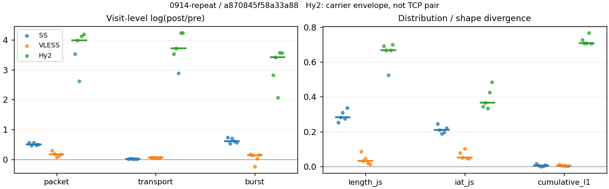
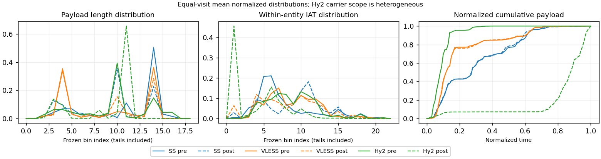

# 0914-repeat · 条目 001 · wikipedia.org

目标：https://en.wikipedia.org/wiki/Computer_network

活动标签：wikipedia.org::page_load。选定访问 15 次。

[返回总索引](../../README.md) · [统计口径](../../methods.md)

## 覆盖与资格（每次访问均保留）

| 部署 | 重复 | 主请求路由 | 活动状态 | 代理比较 | DIRECT pre | 请求 proxy/direct/unresolved | 错误 |
| --- | --- | --- | --- | --- | --- | --- | --- |
| Hy2 | 1 | proxy | passed | 1 | 0 | 33/0/0 | [] |
| Hy2 | 2 | proxy | passed | 1 | 0 | 33/0/0 | [] |
| Hy2 | 3 | proxy | passed | 1 | 0 | 33/0/0 | [] |
| Hy2 | 4 | proxy | passed | 1 | 0 | 33/0/0 | [] |
| Hy2 | 5 | proxy | passed | 1 | 0 | 35/0/0 | [] |
| SS | 1 | proxy | passed | 1 | 0 | 33/0/0 | [] |
| SS | 2 | proxy | passed | 1 | 0 | 33/0/0 | [] |
| SS | 3 | proxy | passed | 1 | 0 | 33/0/0 | [] |
| SS | 4 | proxy | passed | 1 | 0 | 33/0/0 | [] |
| SS | 5 | proxy | passed | 1 | 0 | 33/0/0 | [] |
| VLESS | 1 | proxy | passed | 1 | 0 | 33/0/0 | [] |
| VLESS | 2 | proxy | passed | 1 | 0 | 33/0/0 | [] |
| VLESS | 3 | proxy | passed | 1 | 0 | 33/0/0 | [] |
| VLESS | 4 | proxy | passed | 1 | 0 | 33/0/0 | [] |
| VLESS | 5 | proxy | passed | 1 | 0 | 33/0/0 | [] |

主请求非 proxy 的统计仅解释为已索引的辅助代理连接或 DIRECT 观测，不代表目标业务经代理传输。播放确认与配对资格是两道不同的门。

图中散点为单次访问，短线为重复中位数；Hy2 是共享载体包络，不能与 TCP 配对作等范围因果对比。

形态图先逐访问归一化，再对访问等权平均；实线 pre，虚线 post。分箱序号及边界见 methods，不将分箱索引误解为长度或时间。

## 每次访问的关键观测

### SS

范围：`exclusive_page`。每格 pre → post；空值为不可观测/不适用。

| 重复 | 包数 | 载荷字节 | burst | TCP FR | IAT中位µs | length JS | IAT JS |
| --- | --- | --- | --- | --- | --- | --- | --- |
| 1 | 497 → 875 | 6.2579e+05 → 6.3707e+05 | 304 → 632 | 33 → 37 | 36.746 → 545.9 | 0.2526 | 0.24448 |
| 2 | 533 → 855 | 5.9844e+05 → 6.1461e+05 | 376 → 644 | 35 → 35 | 51.038 → 706.99 | 0.28297 | 0.20927 |
| 3 | 485 → 855 | 6.3579e+05 → 6.4447e+05 | 327 → 667 | 40 → 45 | 48.9 → 784.49 | 0.30959 | 0.18914 |
| 4 | 587 → 957 | 6.4202e+05 → 6.5508e+05 | 403 → 745 | 47 → 48 | 36.843 → 800.95 | 0.27343 | 0.19543 |
| 5 | 572 → 939 | 6.1962e+05 → 6.2996e+05 | 427 → 755 | 38 → 38 | 28.186 → 1010.4 | 0.33662 | 0.22032 |

完整标量统计：中位数 [min,max]；Δ 为重复内逐访问变换的中位数，MAD 未缩放。n 为可用变换数；DIRECT-only 的 nΔ=0 不代表 pre 不可用。

| scope | 特征 | pre | post | Δ | IQRΔ | MADΔ | nΔ |
| --- | --- | --- | --- | --- | --- | --- | --- |
| exclusive_page | active_span_sum_s_1000ms | 8.0864 [6.8253, 10.004] | 8.9993 [7.597, 10.728] | 0.081059 | 0.036889 | 0.025714 | 5 |
| exclusive_page | active_span_sum_s_100ms | 1.899 [1.7109, 2.1849] | 3.4461 [3.0368, 3.845] | 0.59197 | 0.1395 | 0.084398 | 5 |
| exclusive_page | active_span_sum_s_500ms | 5.3473 [5.0607, 7.9071] | 7.5866 [5.5485, 9.4595] | 0.17925 | 0.22535 | 0.14233 | 5 |
| exclusive_page | burst_bytes_iqr | 2896 [2896, 2896] | 1448 [1428, 1468] | -0.69315 | 0.027626 | 0.013718 | 5 |
| exclusive_page | burst_bytes_mad | 42 [31, 58] | 34 [34, 34] | -0.21131 | 0.37268 | 0.30368 | 5 |
| exclusive_page | burst_bytes_max | 20480 [14480, 20480] | 7140 [5712, 8568] | -0.9302 | 0.18232 | 0.058785 | 5 |
| exclusive_page | burst_bytes_mean | 1593.1 [1451.1, 2058.5] | 954.36 [834.39, 1008] | -0.59431 | 0.14589 | 0.082867 | 5 |
| exclusive_page | burst_bytes_median | 42 [31, 58] | 34 [34, 34] | -0.21131 | 0.37268 | 0.30368 | 5 |
| exclusive_page | burst_bytes_min | 0 [0, 0] | 0 [0, 0] | — | — | — | 0 |
| exclusive_page | burst_bytes_p95 | 6137.5 [5792, 8864.8] | 2856 [2856, 3167.4] | -0.72788 | 0.32212 | 0.020822 | 5 |
| exclusive_page | burst_bytes_q25 | 0 [0, 0] | 0 [0, 0] | — | — | — | 0 |
| exclusive_page | burst_bytes_q75 | 2896 [2896, 2896] | 1448 [1428, 1468] | -0.69315 | 0.027626 | 0.013718 | 5 |
| exclusive_page | burst_bytes_std | 3135.9 [2283.8, 3833.4] | 1270.8 [1090.8, 1466.2] | -0.86575 | 0.17021 | 0.095335 | 5 |
| exclusive_page | burst_count | 376 [304, 427] | 667 [632, 755] | 0.61445 | 0.1429 | 0.076338 | 5 |
| exclusive_page | burst_duration_ms_iqr | 0.029271 [0, 0.038049] | 0 [0, 0.00010375] | -5.6424 | — | — | 1 |
| exclusive_page | burst_duration_ms_mad | 0 [0, 0] | 0 [0, 0] | — | — | — | 0 |
| exclusive_page | burst_duration_ms_max | 10686 [1027.9, 11994] | 10687 [1273.6, 11995] | 9.769e-05 | 0.00037493 | 7.0909e-05 | 5 |
| exclusive_page | burst_duration_ms_mean | 58.942 [20.49, 89.217] | 25.983 [7.3678, 27.724] | -1.0228 | 0.26717 | 0.2108 | 5 |
| exclusive_page | burst_duration_ms_median | 0 [0, 0] | 0 [0, 0] | — | — | — | 0 |
| exclusive_page | burst_duration_ms_min | 0 [0, 0] | 0 [0, 0] | — | — | — | 0 |
| exclusive_page | burst_duration_ms_p95 | 94.536 [91.223, 215.37] | 2.6228 [1.074, 10.856] | -3.5491 | 0.72968 | 0.56141 | 5 |
| exclusive_page | burst_duration_ms_q25 | 0 [0, 0] | 0 [0, 0] | — | — | — | 0 |
| exclusive_page | burst_duration_ms_q75 | 0.029271 [0, 0.038049] | 0 [0, 0.00010375] | -5.6424 | — | — | 1 |
| exclusive_page | burst_duration_ms_std | 556.58 [103.2, 838.66] | 402.51 [68.752, 484.71] | -0.40615 | 0.11295 | 0.07555 | 5 |
| exclusive_page | burst_packets_iqr | 1 [0, 1] | 0 [0, 1] | 0 | — | — | 1 |
| exclusive_page | burst_packets_mad | 0 [0, 0] | 0 [0, 0] | — | — | — | 0 |
| exclusive_page | burst_packets_max | 10 [8, 12] | 7 [6, 9] | -0.28768 | 0.22884 | 0.1643 | 5 |
| exclusive_page | burst_packets_mean | 1.4566 [1.3396, 1.6349] | 1.2846 [1.2437, 1.3845] | -0.12567 | 0.07162 | 0.040559 | 5 |
| exclusive_page | burst_packets_median | 1 [1, 1] | 1 [1, 1] | 0 | 0 | 0 | 5 |
| exclusive_page | burst_packets_min | 1 [1, 1] | 1 [1, 1] | 0 | 0 | 0 | 5 |
| exclusive_page | burst_packets_p95 | 3 [3, 4] | 3 [2, 3] | 0 | 0.28768 | 0 | 5 |
| exclusive_page | burst_packets_q25 | 1 [1, 1] | 1 [1, 1] | 0 | 0 | 0 | 5 |
| exclusive_page | burst_packets_q75 | 2 [1, 2] | 1 [1, 2] | 0 | 0.69315 | 0 | 5 |
| exclusive_page | burst_packets_std | 1.0222 [0.82944, 1.4538] | 0.77171 [0.7451, 0.81128] | -0.29668 | 0.21303 | 0.16873 | 5 |
| exclusive_page | connection_span_concurrency_max | 3 [3, 4] | 3 [3, 4] | 0 | 0 | 0 | 5 |
| exclusive_page | cumulative_l1 | — | — | 0.0044276 | 0.0059571 | 0.0029372 | 5 |
| exclusive_page | cumulative_max | — | — | 0.058449 | 0.042479 | 0.021642 | 5 |
| exclusive_page | direction_entropy | 0.707 [0.66397, 0.79815] | 0.55342 [0.53027, 0.58562] | -0.17006 | 0.094055 | 0.048676 | 5 |
| exclusive_page | down_burst_count | 185 [150, 211] | 331 [314, 375] | 0.62253 | 0.14565 | 0.077694 | 5 |
| exclusive_page | down_ip_bytes | 6.2491e+05 [5.9599e+05, 6.3566e+05] | 6.4266e+05 [6.1569e+05, 6.5244e+05] | 0.026062 | 0.0022075 | 0.001953 | 5 |
| exclusive_page | down_packets | 315 [278, 342] | 483 [453, 495] | 0.42427 | 0.095804 | 0.050184 | 5 |
| exclusive_page | down_transport_bytes | 6.0886e+05 [5.7956e+05, 6.1782e+05] | 6.1684e+05 [5.9168e+05, 6.2674e+05] | 0.013025 | 0.0020743 | 0.0013229 | 5 |
| exclusive_page | duration_s | 17.89 [4.1386, 18.929] | 17.889 [4.1381, 18.928] | -8.6085e-05 | 8.3172e-05 | 4.9542e-05 | 5 |
| exclusive_page | entity_count | 5 [4, 7] | 5 [4, 7] | 0 | 0 | 0 | 5 |
| exclusive_page | fr_runs | 38 [33, 47] | 38 [35, 48] | 0.021053 | 0.11441 | 0.021053 | 5 |
| exclusive_page | fr_runs_per_packet | 0.12141 [0.10611, 0.1444] | 0.077236 [0.072978, 0.098039] | -0.04417 | 0.0059449 | 0.0021951 | 5 |
| exclusive_page | fr_switches | 33 [29, 40] | 33 [29, 41] | 0.024693 | 0.12921 | 0.024693 | 5 |
| exclusive_page | fr_switches_per_possible_transition | 0.10714 [0.094463, 0.12868] | 0.067762 [0.064018, 0.088106] | -0.039381 | 0.0060018 | 0.0011897 | 5 |
| exclusive_page | full_retransmission_fraction | 0.0017483 [0, 0.0037523] | 0.005848 [0.0045714, 0.0081871] | 0.0044348 | 0.00078533 | 0.00064869 | 5 |
| exclusive_page | full_retransmission_packets | 1 [0, 2] | 5 [4, 7] | 1.6094 | 0.17834 | 0 | 3 |
| exclusive_page | iat_count | 527 [480, 580] | 871 [849, 950] | 0.49912 | 0.075699 | 0.022258 | 5 |
| exclusive_page | iat_js | — | — | 0.20927 | 0.024892 | 0.013842 | 5 |
| exclusive_page | iat_ks | — | — | 0.38427 | 0.041254 | 0.023292 | 5 |
| exclusive_page | iat_median_us | 36.843 [28.186, 51.038] | 784.49 [545.9, 1010.4] | 2.7753 | 0.38073 | 0.14682 | 5 |
| exclusive_page | iat_us_iqr | 319.05 [129.32, 371.89] | 1696.9 [1038.7, 3623.5] | 2.0835 | 0.34415 | 0.23145 | 5 |
| exclusive_page | iat_us_mad | 29.44 [23.001, 40.278] | 753.81 [505.32, 999.98] | 2.9293 | 0.36231 | 0.050543 | 5 |
| exclusive_page | iat_us_max | 1.0686e+07 [1.0279e+06, 1.1994e+07] | 1.0687e+07 [1.0281e+06, 1.1995e+07] | 9.769e-05 | 0.0001656 | 7.0909e-05 | 5 |
| exclusive_page | iat_us_mean | 61359 [17500, 64282] | 36295 [9902.5, 38146] | -0.49935 | 0.075844 | 0.02235 | 5 |
| exclusive_page | iat_us_median | 36.843 [28.186, 51.038] | 784.49 [545.9, 1010.4] | 2.7753 | 0.38073 | 0.14682 | 5 |
| exclusive_page | iat_us_min | 0.232 [0.046, 0.975] | 0.037 [0.036, 0.041] | -1.8632 | 1.5996 | 0.93768 | 5 |
| exclusive_page | iat_us_p95 | 85803 [58803, 1.3418e+05] | 36375 [33025, 38631] | -0.80296 | 0.20461 | 0.1505 | 5 |
| exclusive_page | iat_us_q25 | 14.486 [12.38, 18.218] | 32.346 [17.828, 55.213] | 0.57411 | 0.50237 | 0.27597 | 5 |
| exclusive_page | iat_us_q75 | 333.54 [142.82, 388.1] | 1729.3 [1093.9, 3641.3] | 2.036 | 0.29577 | 0.19465 | 5 |
| exclusive_page | iat_us_std | 6.0357e+05 [88062, 6.9337e+05] | 4.6869e+05 [58745, 5.0869e+05] | -0.30459 | 0.056801 | 0.051674 | 5 |
| exclusive_page | iat_wasserstein_log1p_us | — | — | 1.5052 | 0.064315 | 0.038044 | 5 |
| exclusive_page | idle_gap_count_1000ms | 4 [1, 6] | 4 [1, 6] | 0 | 0 | 0 | 5 |
| exclusive_page | idle_gap_count_100ms | 21 [18, 31] | 23 [17, 31] | 0 | 0.040822 | 0.040822 | 5 |
| exclusive_page | idle_gap_count_500ms | 7 [4, 9] | 6 [4, 8] | -0.11778 | 0.15415 | 0.11778 | 5 |
| exclusive_page | idle_gap_sum_s_1000ms | 22.769 [1.0279, 26.239] | 21.853 [1.0281, 25.51] | -0.041048 | 0.06109 | 0.041245 | 5 |
| exclusive_page | idle_gap_sum_s_100ms | 28.918 [6.9166, 34.344] | 27.814 [5.5326, 32.393] | -0.058475 | 0.047651 | 0.019564 | 5 |
| exclusive_page | idle_gap_sum_s_500ms | 25.795 [3.2801, 28.336] | 23.264 [3.0766, 26.779] | -0.09052 | 0.033395 | 0.012729 | 5 |
| exclusive_page | ip_bytes | 6.517e+05 [6.2627e+05, 6.7266e+05] | 6.8946e+05 [6.6531e+05, 7.12e+05] | 0.05633 | 0.002004 | 0.0014916 | 5 |
| exclusive_page | length_iqr | 2265.5 [1656, 2393.5] | 1287 [1272.8, 1383.5] | -0.51547 | 0.21383 | 0.094957 | 5 |
| exclusive_page | length_js | — | — | 0.28297 | 0.036152 | 0.026615 | 5 |
| exclusive_page | length_ks | — | — | 0.51836 | 0.012334 | 0.0067333 | 5 |
| exclusive_page | length_mad | 208 [0, 1240] | 1088 [990, 1283] | 0.03409 | 0.92347 | 0.22646 | 3 |
| exclusive_page | length_max | 7736 [4096, 8920] | 2896 [2856, 4212] | -0.99646 | 0.66757 | 0.1285 | 5 |
| exclusive_page | length_mean | 1988.2 [1963.4, 2295.3] | 1334.2 [1256.6, 1404.1] | -0.43573 | 0.075579 | 0.040454 | 5 |
| exclusive_page | length_median | 2896 [2688, 2896] | 1428 [1428, 1428] | -0.70706 | 0 | 0 | 5 |
| exclusive_page | length_min | 31 [31, 31] | 20 [5, 20] | -0.43825 | 0 | 0 | 5 |
| exclusive_page | length_p95 | 2896 [2896, 8192] | 2856 [2856, 2856] | -0.013908 | 0.34668 | 0 | 5 |
| exclusive_page | length_q25 | 630.5 [502.5, 1240] | 184 [98.5, 428.5] | -1.6295 | 0.61829 | 0.34472 | 5 |
| exclusive_page | length_q75 | 2896 [2896, 2896] | 1482 [1428, 1707] | -0.66994 | 0.03644 | 0.03644 | 5 |
| exclusive_page | length_std | 1193.9 [1138.6, 1979.4] | 1000.4 [972.17, 1027.4] | -0.20542 | 0.25919 | 0.076059 | 5 |
| exclusive_page | length_wasserstein_bytes | — | — | 699.22 | 106.49 | 56.462 | 5 |
| exclusive_page | nonempty_entity_count | 5 [4, 7] | 5 [4, 7] | 0 | 0 | 0 | 5 |
| exclusive_page | nonempty_packets | 311 [277, 327] | 491 [459, 507] | 0.45228 | 0.066778 | 0.036443 | 5 |
| exclusive_page | offload_suspect_fraction | 0.33814 [0.32343, 0.34809] | 0.15205 [0.11821, 0.16] | -0.18809 | 0.013552 | 0.0043004 | 5 |
| exclusive_page | packet_count | 533 [485, 587] | 875 [855, 957] | 0.49568 | 0.076855 | 0.023096 | 5 |
| exclusive_page | rtt_median_ms | 0.053466 [0.041664, 0.066584] | 32.627 [27.491, 32.765] | 6.2426 | 0.30719 | 0.048148 | 5 |
| exclusive_page | rtt_sample_count | 215 [177, 244] | 164 [128, 194] | -0.32412 | 0.11027 | 0.061061 | 5 |
| exclusive_page | tcp_ack_count | 527 [480, 580] | 871 [849, 949] | 0.49805 | 0.076752 | 0.021187 | 5 |
| exclusive_page | tcp_fin_count | 10 [8, 14] | 10 [9, 14] | 0 | 0 | 0 | 5 |
| exclusive_page | tcp_packet_count | 533 [485, 587] | 875 [855, 957] | 0.49568 | 0.076855 | 0.023096 | 5 |
| exclusive_page | tcp_rst_count | 0 [0, 0] | 0 [0, 0] | — | — | — | 0 |
| exclusive_page | tcp_syn_count | 10 [8, 14] | 12 [8, 16] | 0.09531 | 0.13353 | 0.087011 | 5 |
| exclusive_page | tcp_window_raw_median | 65535 [65504, 65535] | 137 [135, 149] | -6.1704 | 0.035895 | 0.014706 | 5 |
| exclusive_page | transition_entropy | 0.43405 [0.39275, 0.50125] | 0.29908 [0.2829, 0.35897] | -0.1173 | 0.019517 | 0.0074405 | 5 |
| exclusive_page | transition_n_mm | 232 [190, 241] | 399 [375, 428] | 0.56628 | 0.12124 | 0.062116 | 5 |
| exclusive_page | transition_n_mp | 15 [12, 17] | 15 [12, 18] | 0.057158 | 0.1431 | 0.057158 | 5 |
| exclusive_page | transition_n_pm | 18 [16, 23] | 18 [17, 23] | 0 | 0.09531 | 0 | 5 |
| exclusive_page | transition_n_pp | 40 [34, 49] | 41 [39, 44] | 0 | 0.27478 | 0.15415 | 5 |
| exclusive_page | transition_p_mm | 0.94 [0.92683, 0.95082] | 0.96503 [0.9542, 0.96962] | 0.022726 | 0.005176 | 0.002867 | 5 |
| exclusive_page | transition_p_mp | 0.06 [0.04918, 0.073171] | 0.034965 [0.03038, 0.045802] | -0.022726 | 0.005176 | 0.002867 | 5 |
| exclusive_page | transition_p_pm | 0.31034 [0.24615, 0.37097] | 0.31034 [0.2931, 0.36066] | 0 | 0.08153 | 0.04023 | 5 |
| exclusive_page | transition_p_pp | 0.68966 [0.62903, 0.75385] | 0.68966 [0.63934, 0.7069] | 0 | 0.08153 | 0.04023 | 5 |
| exclusive_page | transport_bytes | 6.2579e+05 [5.9844e+05, 6.4202e+05] | 6.3707e+05 [6.1461e+05, 6.5508e+05] | 0.017865 | 0.0035897 | 0.0022718 | 5 |
| exclusive_page | up_burst_count | 191 [154, 216] | 336 [318, 380] | 0.60658 | 0.14023 | 0.075027 | 5 |
| exclusive_page | up_byte_fraction | 0.030935 [0.027062, 0.037697] | 0.034777 [0.031759, 0.043251] | 0.0046976 | 0.0014149 | 0.00085489 | 5 |
| exclusive_page | up_ip_bytes | 30484 [26795, 36998] | 49929 [46805, 59557] | 0.4937 | 0.0073213 | 0.0070258 | 5 |
| exclusive_page | up_packets | 218 [189, 256] | 402 [380, 465] | 0.64078 | 0.069343 | 0.046388 | 5 |
| exclusive_page | up_transport_bytes | 18879 [16935, 24202] | 22413 [20233, 28333] | 0.15759 | 0.028907 | 0.020341 | 5 |
| exclusive_page | zero_iat_count | 0 [0, 0] | 0 [0, 0] | — | — | — | 0 |
| exclusive_page | zero_iat_fraction | 0 [0, 0] | 0 [0, 0] | 0 | 0 | 0 | 5 |

### VLESS

范围：`exclusive_page`。每格 pre → post；空值为不可观测/不适用。

| 重复 | 包数 | 载荷字节 | burst | TCP FR | IAT中位µs | length JS | IAT JS |
| --- | --- | --- | --- | --- | --- | --- | --- |
| 1 | 806 → 1085 | 6.1858e+05 → 6.5782e+05 | 601 → 713 | 45 → 56 | 372.14 → 126.14 | 0.085408 | 0.07787 |
| 2 | 862 → 1039 | 6.3065e+05 → 6.7022e+05 | 675 → 771 | 48 → 56 | 133.85 → 110.47 | 0.03192 | 0.050607 |
| 3 | 916 → 986 | 6.3067e+05 → 6.7129e+05 | 773 → 615 | 50 → 60 | 139.37 → 232.05 | 0.045933 | 0.10167 |
| 4 | 783 → 879 | 6.0857e+05 → 6.4115e+05 | 606 → 626 | 41 → 50 | 208.78 → 253.84 | 0.018857 | 0.04939 |
| 5 | 866 → 1028 | 6.2771e+05 → 6.6746e+05 | 693 → 813 | 36 → 46 | 309.1 → 235.53 | 0.012963 | 0.045622 |

完整标量统计：中位数 [min,max]；Δ 为重复内逐访问变换的中位数，MAD 未缩放。n 为可用变换数；DIRECT-only 的 nΔ=0 不代表 pre 不可用。

| scope | 特征 | pre | post | Δ | IQRΔ | MADΔ | nΔ |
| --- | --- | --- | --- | --- | --- | --- | --- |
| exclusive_page | active_span_sum_s_1000ms | 7.5314 [6.5817, 9.0803] | 8.8173 [7.1543, 9.003] | -0.015854 | 0.10187 | 0.0078711 | 5 |
| exclusive_page | active_span_sum_s_100ms | 1.4094 [1.3595, 1.7089] | 2.9863 [2.6464, 3.374] | 0.68027 | 0.038524 | 0.021862 | 5 |
| exclusive_page | active_span_sum_s_500ms | 4.0183 [3.886, 4.9418] | 7.1903 [6.4682, 7.9864] | 0.52783 | 0.067864 | 0.047818 | 5 |
| exclusive_page | burst_bytes_iqr | 2824 [1733, 2824] | 1916.5 [1556, 2824] | -0.21049 | 0.52354 | 0.31305 | 5 |
| exclusive_page | burst_bytes_mad | 35 [31, 64] | 72 [72, 72] | 0.72132 | 0.50509 | 0.12136 | 5 |
| exclusive_page | burst_bytes_max | 7204 [5720, 8616] | 5792 [4096, 6075] | -0.34647 | 0.22669 | 0.17601 | 5 |
| exclusive_page | burst_bytes_mean | 934.3 [815.87, 1029.3] | 922.61 [820.99, 1091.5] | -0.072127 | 0.11797 | 0.037261 | 5 |
| exclusive_page | burst_bytes_median | 35 [31, 64] | 72 [72, 72] | 0.72132 | 0.50509 | 0.12136 | 5 |
| exclusive_page | burst_bytes_min | 0 [0, 0] | 0 [0, 0] | — | — | — | 0 |
| exclusive_page | burst_bytes_p95 | 2896 [2896, 4096] | 2896 [2896, 2896] | 0 | 0 | 0 | 5 |
| exclusive_page | burst_bytes_q25 | 0 [0, 0] | 0 [0, 0] | — | — | — | 0 |
| exclusive_page | burst_bytes_q75 | 2824 [1733, 2824] | 1916.5 [1556, 2824] | -0.21049 | 0.52354 | 0.31305 | 5 |
| exclusive_page | burst_bytes_std | 1340.3 [1234.8, 1500.9] | 1238.6 [1180.8, 1336.9] | -0.078078 | 0.034461 | 0.033606 | 5 |
| exclusive_page | burst_count | 675 [601, 773] | 713 [615, 813] | 0.13298 | 0.12723 | 0.037911 | 5 |
| exclusive_page | burst_duration_ms_iqr | 0 [0, 0.16872] | 0.005451 [0, 0.87661] | -2.0513 | 0.89878 | 0.89878 | 2 |
| exclusive_page | burst_duration_ms_mad | 0 [0, 0] | 0 [0, 0] | — | — | — | 0 |
| exclusive_page | burst_duration_ms_max | 12046 [1460.6, 12591] | 12046 [1460.8, 12591] | 0.00012676 | 0.0034455 | 0.0001029 | 5 |
| exclusive_page | burst_duration_ms_mean | 31.099 [14.97, 34.047] | 25.516 [10.679, 31.088] | -0.28845 | 0.18344 | 0.059994 | 5 |
| exclusive_page | burst_duration_ms_median | 0 [0, 0] | 0 [0, 0] | — | — | — | 0 |
| exclusive_page | burst_duration_ms_min | 0 [0, 0] | 0 [0, 0] | — | — | — | 0 |
| exclusive_page | burst_duration_ms_p95 | 8.233 [4.2816, 9.6992] | 9.6127 [8.465, 10.378] | 0.027794 | 0.33182 | 0.060172 | 5 |
| exclusive_page | burst_duration_ms_q25 | 0 [0, 0] | 0 [0, 0] | — | — | — | 0 |
| exclusive_page | burst_duration_ms_q75 | 0 [0, 0.16872] | 0.005451 [0, 0.87661] | -2.0513 | 0.89878 | 0.89878 | 2 |
| exclusive_page | burst_duration_ms_std | 453.19 [94.564, 497.03] | 458.1 [72.832, 495.87] | -0.075446 | 0.074482 | 0.046511 | 5 |
| exclusive_page | burst_packets_iqr | 0 [0, 1] | 1 [0, 1] | 0 | 0 | 0 | 2 |
| exclusive_page | burst_packets_mad | 0 [0, 0] | 0 [0, 0] | — | — | — | 0 |
| exclusive_page | burst_packets_max | 9 [4, 9] | 7 [6, 8] | -0.11778 | 0.81093 | 0.28768 | 5 |
| exclusive_page | burst_packets_mean | 1.277 [1.185, 1.3411] | 1.4042 [1.2645, 1.6033] | 0.083182 | 0.072582 | 0.043183 | 5 |
| exclusive_page | burst_packets_median | 1 [1, 1] | 1 [1, 1] | 0 | 0 | 0 | 5 |
| exclusive_page | burst_packets_min | 1 [1, 1] | 1 [1, 1] | 0 | 0 | 0 | 5 |
| exclusive_page | burst_packets_p95 | 2 [2, 2] | 3 [3, 3] | 0.40547 | 0 | 0 | 5 |
| exclusive_page | burst_packets_q25 | 1 [1, 1] | 1 [1, 1] | 0 | 0 | 0 | 5 |
| exclusive_page | burst_packets_q75 | 1 [1, 2] | 2 [1, 2] | 0 | 0 | 0 | 5 |
| exclusive_page | burst_packets_std | 0.52662 [0.4772, 0.64377] | 0.88278 [0.81396, 0.92586] | 0.51661 | 0.1997 | 0.056654 | 5 |
| exclusive_page | connection_span_concurrency_max | 3 [3, 4] | 3 [3, 4] | 0 | 0 | 0 | 5 |
| exclusive_page | cumulative_l1 | — | — | 0.0063482 | 0.0029948 | 0.0026722 | 5 |
| exclusive_page | cumulative_max | — | — | 0.035578 | 0.066568 | 0.013399 | 5 |
| exclusive_page | direction_entropy | 0.56235 [0.50741, 0.58368] | 0.4873 [0.48049, 0.51657] | -0.045783 | 0.033859 | 0.025673 | 5 |
| exclusive_page | down_burst_count | 335 [298, 384] | 354 [305, 404] | 0.1339 | 0.12809 | 0.038299 | 5 |
| exclusive_page | down_ip_bytes | 6.3394e+05 [6.1567e+05, 6.365e+05] | 6.6675e+05 [6.425e+05, 6.718e+05] | 0.050713 | 0.0035118 | 0.0032661 | 5 |
| exclusive_page | down_packets | 484 [447, 490] | 553 [498, 602] | 0.13327 | 0.060581 | 0.03535 | 5 |
| exclusive_page | down_transport_bytes | 6.0847e+05 [5.924e+05, 6.1098e+05] | 6.3868e+05 [6.1657e+05, 6.416e+05] | 0.04785 | 0.001298 | 0.00068546 | 5 |
| exclusive_page | duration_s | 18.349 [4.5837, 19.963] | 18.31 [4.554, 19.936] | -0.0021271 | 0.00071983 | 0.0005904 | 5 |
| exclusive_page | entity_count | 5 [4, 5] | 5 [4, 5] | 0 | 0 | 0 | 5 |
| exclusive_page | fr_runs | 45 [36, 50] | 56 [46, 60] | 0.19845 | 0.036368 | 0.020238 | 5 |
| exclusive_page | fr_runs_per_packet | 0.096774 [0.075, 0.10204] | 0.10163 [0.086957, 0.10508] | 0.003038 | 0.0069498 | 0.0052176 | 5 |
| exclusive_page | fr_switches | 40 [31, 45] | 51 [41, 55] | 0.21772 | 0.042275 | 0.025223 | 5 |
| exclusive_page | fr_switches_per_possible_transition | 0.086957 [0.065263, 0.092784] | 0.094262 [0.078244, 0.097173] | 0.0043896 | 0.006636 | 0.0044637 | 5 |
| exclusive_page | full_retransmission_fraction | 0 [0, 0.0011601] | 0 [0, 0] | 0 | 0.0010917 | 0 | 5 |
| exclusive_page | full_retransmission_packets | 0 [0, 1] | 0 [0, 0] | — | — | — | 0 |
| exclusive_page | iat_count | 857 [779, 911] | 1023 [875, 1080] | 0.1724 | 0.071539 | 0.056187 | 5 |
| exclusive_page | iat_js | — | — | 0.050607 | 0.028479 | 0.0049856 | 5 |
| exclusive_page | iat_ks | — | — | 0.13514 | 0.072515 | 0.033334 | 5 |
| exclusive_page | iat_median_us | 208.78 [133.85, 372.14] | 232.05 [110.47, 253.84] | -0.19196 | 0.46725 | 0.3874 | 5 |
| exclusive_page | iat_us_iqr | 1161.8 [1033.4, 2241.1] | 1252.8 [1201.6, 2262.5] | 0.044118 | 0.13505 | 0.10044 | 5 |
| exclusive_page | iat_us_mad | 201.42 [127.29, 362.7] | 230.06 [110.31, 247.95] | -0.14323 | 0.47478 | 0.35106 | 5 |
| exclusive_page | iat_us_max | 1.2046e+07 [1.4606e+06, 1.2821e+07] | 1.2046e+07 [1.4608e+06, 1.2777e+07] | 2.3866e-05 | 0.0033953 | 0.0032924 | 5 |
| exclusive_page | iat_us_mean | 26391 [13036, 42968] | 23106 [9516.7, 38172] | -0.17709 | 0.070097 | 0.055532 | 5 |
| exclusive_page | iat_us_median | 208.78 [133.85, 372.14] | 232.05 [110.47, 253.84] | -0.19196 | 0.46725 | 0.3874 | 5 |
| exclusive_page | iat_us_min | 1.617 [0.427, 1.853] | 0.037 [0.036, 0.037] | -3.7774 | 1.1405 | 0.13623 | 5 |
| exclusive_page | iat_us_p95 | 10120 [9774.3, 10320] | 41899 [38236, 42223] | 1.4261 | 0.027588 | 0.022237 | 5 |
| exclusive_page | iat_us_q25 | 41.529 [32.009, 45.393] | 13.842 [9.903, 26.767] | -0.89408 | 0.5183 | 0.36591 | 5 |
| exclusive_page | iat_us_q75 | 1193.8 [1072.7, 2286.5] | 1271.3 [1211.5, 2289.2] | 0.028275 | 0.11709 | 0.090029 | 5 |
| exclusive_page | iat_us_std | 4.3854e+05 [82396, 6.1897e+05] | 4.0993e+05 [59512, 5.6136e+05] | -0.088849 | 0.03024 | 0.021386 | 5 |
| exclusive_page | iat_wasserstein_log1p_us | — | — | 0.47339 | 0.2351 | 0.13994 | 5 |
| exclusive_page | idle_gap_count_1000ms | 4 [1, 5] | 4 [1, 4] | 0 | 0 | 0 | 5 |
| exclusive_page | idle_gap_count_100ms | 23 [19, 24] | 28 [24, 30] | 0.19671 | 0.044373 | 0.036368 | 5 |
| exclusive_page | idle_gap_count_500ms | 9 [6, 11] | 4 [2, 6] | -0.69315 | 0.20479 | 0.11778 | 5 |
| exclusive_page | idle_gap_sum_s_1000ms | 15.191 [1.4606, 30.1] | 15.261 [1.4608, 28.444] | -2.0715e-05 | 0.050942 | 0.004638 | 5 |
| exclusive_page | idle_gap_sum_s_100ms | 21.127 [8.7331, 36.174] | 19.533 [6.904, 34.596] | -0.07641 | 0.027234 | 0.025236 | 5 |
| exclusive_page | idle_gap_sum_s_500ms | 18.384 [5.5002, 33.566] | 15.261 [2.2916, 30.289] | -0.17872 | 0.079417 | 0.071982 | 5 |
| exclusive_page | ip_bytes | 6.727e+05 [6.4928e+05, 6.7828e+05] | 7.2122e+05 [6.8714e+05, 7.2489e+05] | 0.069633 | 0.0063086 | 0.0052925 | 5 |
| exclusive_page | length_iqr | 2752 [2752, 2752] | 2752 [1340, 2752] | 0 | 0.29498 | 0 | 5 |
| exclusive_page | length_js | — | — | 0.03192 | 0.027076 | 0.014013 | 5 |
| exclusive_page | length_ks | — | — | 0.10274 | 0.078102 | 0.04913 | 5 |
| exclusive_page | length_mad | 1128 [1085.5, 1340] | 1136 [1041, 1340] | 0 | 0.05398 | 0.046913 | 5 |
| exclusive_page | length_max | 5792 [2896, 5792] | 2896 [2896, 2896] | -0.69315 | 0.69315 | 0 | 5 |
| exclusive_page | length_mean | 1319.4 [1287.1, 1370.7] | 1229.8 [1111.2, 1303.2] | -0.070326 | 0.040059 | 0.020239 | 5 |
| exclusive_page | length_median | 1200 [1157.5, 1412] | 1208 [1113, 1412] | 0 | 0.050588 | 0.043944 | 5 |
| exclusive_page | length_min | 24 [24, 24] | 24 [6, 24] | 0 | 0.34484 | 0 | 5 |
| exclusive_page | length_p95 | 2824 [2824, 2896] | 2824 [2824, 2824] | 0 | 0 | 0 | 5 |
| exclusive_page | length_q25 | 72 [72, 72] | 72 [72, 72] | 0 | 0 | 0 | 5 |
| exclusive_page | length_q75 | 2824 [2824, 2824] | 2824 [1412, 2824] | 0 | 0.28627 | 0 | 5 |
| exclusive_page | length_std | 1237.1 [1218.1, 1312.4] | 1145.7 [1023.9, 1213.1] | -0.078699 | 0.034125 | 0.031353 | 5 |
| exclusive_page | length_wasserstein_bytes | — | — | 119.48 | 77.357 | 46.103 | 5 |
| exclusive_page | nonempty_entity_count | 5 [4, 5] | 5 [4, 5] | 0 | 0 | 0 | 5 |
| exclusive_page | nonempty_packets | 478 [444, 490] | 545 [492, 592] | 0.13118 | 0.05033 | 0.028521 | 5 |
| exclusive_page | offload_suspect_fraction | 0.23202 [0.21288, 0.23883] | 0.16651 [0.11613, 0.20592] | -0.053653 | 0.026256 | 0.014396 | 5 |
| exclusive_page | packet_count | 862 [783, 916] | 1028 [879, 1085] | 0.17149 | 0.071107 | 0.055833 | 5 |
| exclusive_page | rtt_median_ms | 0.077727 [0.055306, 0.16219] | 0.086208 [0.043289, 0.97117] | 0.00291 | 0.62934 | 0.49216 | 5 |
| exclusive_page | rtt_sample_count | 362 [324, 411] | 421 [372, 477] | 0.23304 | 0.13601 | 0.037323 | 5 |
| exclusive_page | tcp_ack_count | 847 [773, 902] | 1023 [875, 1080] | 0.18408 | 0.075545 | 0.060138 | 5 |
| exclusive_page | tcp_fin_count | 10 [8, 10] | 10 [8, 10] | 0 | 0 | 0 | 5 |
| exclusive_page | tcp_packet_count | 862 [783, 916] | 1028 [879, 1085] | 0.17149 | 0.071107 | 0.055833 | 5 |
| exclusive_page | tcp_rst_count | 9 [6, 10] | 0 [0, 0] | — | — | — | 0 |
| exclusive_page | tcp_syn_count | 10 [8, 10] | 10 [8, 10] | 0 | 0 | 0 | 5 |
| exclusive_page | tcp_window_raw_median | 65535 [65504, 65535] | 166 [152, 190] | -5.9784 | 0.14272 | 0.086982 | 5 |
| exclusive_page | transition_entropy | 0.35881 [0.28058, 0.36801] | 0.35349 [0.31446, 0.36188] | -0.00041266 | 0.019114 | 0.012926 | 5 |
| exclusive_page | transition_n_mm | 391 [372, 408] | 454 [416, 502] | 0.14939 | 0.07053 | 0.037598 | 5 |
| exclusive_page | transition_n_mp | 18 [13, 20] | 23 [18, 25] | 0.22314 | 0.033813 | 0.021979 | 5 |
| exclusive_page | transition_n_pm | 22 [18, 25] | 28 [23, 30] | 0.22314 | 0.058841 | 0.021979 | 5 |
| exclusive_page | transition_n_pp | 39 [31, 42] | 33 [26, 35] | -0.17589 | 0.1031 | 0.067677 | 5 |
| exclusive_page | transition_p_mm | 0.95455 [0.95238, 0.96912] | 0.95195 [0.9505, 0.96154] | -0.0018859 | 0.0024766 | 0.0024672 | 5 |
| exclusive_page | transition_p_mp | 0.045455 [0.030879, 0.047619] | 0.048055 [0.038462, 0.049505] | 0.0018859 | 0.0024766 | 0.0024672 | 5 |
| exclusive_page | transition_p_pm | 0.38095 [0.33333, 0.39216] | 0.45161 [0.41071, 0.4918] | 0.098039 | 0.029807 | 0.0098237 | 5 |
| exclusive_page | transition_p_pp | 0.61905 [0.60784, 0.66667] | 0.54839 [0.5082, 0.58929] | -0.098039 | 0.029807 | 0.0098237 | 5 |
| exclusive_page | transport_bytes | 6.2771e+05 [6.0857e+05, 6.3067e+05] | 6.6746e+05 [6.4115e+05, 6.7129e+05] | 0.061404 | 0.00064933 | 0.00055507 | 5 |
| exclusive_page | up_burst_count | 340 [303, 389] | 359 [310, 409] | 0.13206 | 0.12638 | 0.03753 | 5 |
| exclusive_page | up_byte_fraction | 0.030657 [0.02658, 0.03122] | 0.043121 [0.038339, 0.044387] | 0.013005 | 0.00068842 | 0.00016208 | 5 |
| exclusive_page | up_ip_bytes | 38768 [33608, 41782] | 54466 [44641, 55629] | 0.33998 | 0.064177 | 0.056093 | 5 |
| exclusive_page | up_packets | 377 [336, 426] | 483 [381, 489] | 0.25131 | 0.13443 | 0.09682 | 5 |
| exclusive_page | up_transport_bytes | 19244 [16176, 19689] | 28782 [24581, 29749] | 0.41274 | 0.0077447 | 0.0057097 | 5 |
| exclusive_page | zero_iat_count | 0 [0, 0] | 0 [0, 0] | — | — | — | 0 |
| exclusive_page | zero_iat_fraction | 0 [0, 0] | 0 [0, 0] | 0 | 0 | 0 | 5 |

### Hy2

范围：`carrier_context_envelope`。每格 pre → post；空值为不可观测/不适用。

| 重复 | 包数 | 载荷字节 | burst | TCP FR | IAT中位µs | length JS | IAT JS |
| --- | --- | --- | --- | --- | --- | --- | --- |
| 1 | 580 → 19643 | 6.1727e+05 → 2.0997e+07 | 415 → 7014 | — | 138.23 → 9.797 | 0.68996 | 0.34548 |
| 2 | 441 → 23740 | 6.252e+05 → 2.5678e+07 | 291 → 8839 | — | 143.87 → 11.213 | 0.6671 | 0.36603 |
| 3 | 765 → 10517 | 6.2066e+05 → 1.109e+07 | 507 → 4012 | — | 433.2 → 18.349 | 0.52467 | 0.33376 |
| 4 | 674 → 41514 | 6.3566e+05 → 4.3633e+07 | 448 → 15955 | — | 177.91 → 5.835 | 0.66627 | 0.42572 |
| 5 | 620 → 40710 | 6.4156e+05 → 4.4115e+07 | 401 → 14194 | — | 250.59 → 3.404 | 0.69983 | 0.48476 |

完整标量统计：中位数 [min,max]；Δ 为重复内逐访问变换的中位数，MAD 未缩放。n 为可用变换数；DIRECT-only 的 nΔ=0 不代表 pre 不可用。

| scope | 特征 | pre | post | Δ | IQRΔ | MADΔ | nΔ |
| --- | --- | --- | --- | --- | --- | --- | --- |
| carrier_context_envelope | active_span_sum_s_1000ms | 4.9334 [4.544, 7.0472] | 11.721 [9.8559, 12.442] | 0.85586 | 0.10355 | 0.026775 | 5 |
| carrier_context_envelope | active_span_sum_s_100ms | 0.89961 [0.77218, 1.2373] | 5.8524 [5.0611, 7.0949] | 1.9421 | 0.5166 | 0.21077 | 5 |
| carrier_context_envelope | active_span_sum_s_500ms | 4.1972 [3.7527, 6.2443] | 9.9873 [9.7513, 11.718] | 0.9138 | 0.28422 | 0.11293 | 5 |
| carrier_context_envelope | burst_bytes_iqr | 2801 [1957, 2830] | 4223 [3630, 4286] | 0.41623 | 0.18225 | 0.0056594 | 5 |
| carrier_context_envelope | burst_bytes_mad | 64 [31, 64] | 325 [160, 619] | 1.7297 | 0.14404 | 0.0885 | 5 |
| carrier_context_envelope | burst_bytes_max | 20480 [11424, 27828] | 1.4738e+05 [43479, 2.5074e+05] | 1.8752 | 0.12125 | 0.098417 | 5 |
| carrier_context_envelope | burst_bytes_mean | 1487.4 [1224.2, 2148.5] | 2905.1 [2734.7, 3108] | 0.66404 | 0.0433 | 0.035423 | 5 |
| carrier_context_envelope | burst_bytes_median | 64 [31, 64] | 358 [193, 652] | 1.8682 | 0.05161 | 0.039487 | 5 |
| carrier_context_envelope | burst_bytes_min | 0 [0, 0] | 22 [22, 22] | — | — | — | 0 |
| carrier_context_envelope | burst_bytes_p95 | 5712 [4148.3, 12382] | 10932 [9491, 10939] | 0.64913 | 0.14199 | 0.14135 | 5 |
| carrier_context_envelope | burst_bytes_q25 | 0 [0, 0] | 78.5 [37, 100] | — | — | — | 0 |
| carrier_context_envelope | burst_bytes_q75 | 2801 [1957, 2830] | 4290 [3727, 4323] | 0.43397 | 0.1902 | 0.0103 | 5 |
| carrier_context_envelope | burst_bytes_std | 2571.2 [1740.1, 4416.6] | 4504.5 [3931.9, 6679] | 0.70141 | 0.22901 | 0.11377 | 5 |
| carrier_context_envelope | burst_count | 415 [291, 507] | 8839 [4012, 15955] | 3.4136 | 0.73923 | 0.15913 | 5 |
| carrier_context_envelope | burst_duration_ms_iqr | 0.74477 [0.11164, 1.1039] | 0.024439 [0.023167, 0.03518] | -3.2666 | 0.33159 | 0.20371 | 5 |
| carrier_context_envelope | burst_duration_ms_mad | 0 [0, 0] | 6.3e-05 [4.4e-05, 8.4e-05] | — | — | — | 0 |
| carrier_context_envelope | burst_duration_ms_max | 12186 [9662.8, 14568] | 2890.5 [208.1, 3116.7] | -1.5421 | 0.4669 | 0.29937 | 5 |
| carrier_context_envelope | burst_duration_ms_mean | 70.238 [46.583, 196.6] | 0.5956 [0.38747, 1.2557] | -5.0144 | 0.68089 | 0.43651 | 5 |
| carrier_context_envelope | burst_duration_ms_median | 0 [0, 0] | 6.3e-05 [4.4e-05, 8.4e-05] | — | — | — | 0 |
| carrier_context_envelope | burst_duration_ms_min | 0 [0, 0] | 0 [0, 0] | — | — | — | 0 |
| carrier_context_envelope | burst_duration_ms_p95 | 28.468 [5.47, 251.2] | 0.62566 [0.079933, 1.0295] | -5.6031 | 4.0114 | 1.986 | 5 |
| carrier_context_envelope | burst_duration_ms_q25 | 0 [0, 0] | 0 [0, 0] | — | — | — | 0 |
| carrier_context_envelope | burst_duration_ms_q75 | 0.74477 [0.11164, 1.1039] | 0.024439 [0.023167, 0.03518] | -3.2666 | 0.33159 | 0.20371 | 5 |
| carrier_context_envelope | burst_duration_ms_std | 851.53 [588.84, 1504.7] | 25.088 [5.1248, 46.077] | -3.5247 | 0.47189 | 0.26509 | 5 |
| carrier_context_envelope | burst_packets_iqr | 1 [1, 1] | 2 [2, 2] | 0.69315 | 0 | 0 | 5 |
| carrier_context_envelope | burst_packets_mad | 0 [0, 0] | 1 [1, 1] | — | — | — | 0 |
| carrier_context_envelope | burst_packets_max | 9 [4, 11] | 106 [31, 186] | 2.9232 | 0.68937 | 0.35398 | 5 |
| carrier_context_envelope | burst_packets_mean | 1.5089 [1.3976, 1.5461] | 2.6858 [2.6019, 2.8681] | 0.57227 | 0.065558 | 0.024444 | 5 |
| carrier_context_envelope | burst_packets_median | 1 [1, 1] | 2 [2, 2] | 0.69315 | 0 | 0 | 5 |
| carrier_context_envelope | burst_packets_min | 1 [1, 1] | 1 [1, 1] | 0 | 0 | 0 | 5 |
| carrier_context_envelope | burst_packets_p95 | 3 [2, 3] | 8 [7, 8] | 0.98083 | 0 | 0 | 5 |
| carrier_context_envelope | burst_packets_q25 | 1 [1, 1] | 1 [1, 1] | 0 | 0 | 0 | 5 |
| carrier_context_envelope | burst_packets_q75 | 2 [2, 2] | 3 [3, 3] | 0.40547 | 0 | 0 | 5 |
| carrier_context_envelope | burst_packets_std | 0.82914 [0.59597, 0.86118] | 2.9904 [2.5134, 4.6441] | 1.3801 | 0.45131 | 0.27415 | 5 |
| carrier_context_envelope | connection_span_concurrency_max | 3 [3, 4] | 1 [1, 1] | -1.0986 | 0.28768 | 0 | 5 |
| carrier_context_envelope | cumulative_l1 | — | — | 0.70832 | 0.020384 | 0.0034553 | 5 |
| carrier_context_envelope | cumulative_max | — | — | 0.93726 | 0.035674 | 0.022266 | 5 |
| carrier_context_envelope | direction_entropy | 0.68106 [0.54731, 0.82065] | 0.76951 [0.75949, 0.80556] | 0.09859 | 0.046894 | 0.025906 | 5 |
| carrier_context_envelope | direction_run_analog_runs | 50 [37, 58] | 8839 [4012, 15955] | 5.2583 | 0.37234 | 0.3588 | 5 |
| carrier_context_envelope | direction_run_analog_runs_per_packet | 0.13123 [0.10921, 0.184] | 0.37233 [0.34866, 0.38433] | 0.23896 | 0.029527 | 0.021537 | 5 |
| carrier_context_envelope | direction_run_analog_switches | 45 [32, 52] | 8838 [4011, 15954] | 5.3898 | 0.35298 | 0.33644 | 5 |
| carrier_context_envelope | direction_run_analog_switches_per_possible_transition | 0.11968 [0.096677, 0.16735] | 0.3723 [0.34865, 0.38431] | 0.252 | 0.0314 | 0.023033 | 5 |
| carrier_context_envelope | down_burst_count | 205 [143, 251] | 4419 [2006, 7977] | 3.4308 | 0.73965 | 0.15533 | 5 |
| carrier_context_envelope | down_ip_bytes | 6.2643e+05 [6.16e+05, 6.4062e+05] | 2.5778e+07 [1.1132e+07, 4.4229e+07] | 3.7291 | 0.69481 | 0.50359 | 5 |
| carrier_context_envelope | down_packets | 381 [260, 472] | 18526 [8059, 31543] | 4.2662 | 0.54945 | 0.15006 | 5 |
| carrier_context_envelope | down_transport_bytes | 6.0548e+05 [5.9828e+05, 6.2077e+05] | 2.5259e+07 [1.0906e+07, 4.3346e+07] | 3.7309 | 0.69933 | 0.51503 | 5 |
| carrier_context_envelope | duration_s | 16.248 [13.876, 16.87] | 16.23 [13.875, 16.869] | -0.00035202 | 0.00034638 | 0.00026651 | 5 |
| carrier_context_envelope | entity_count | 5 [5, 6] | 1 [1, 1] | -1.6094 | 0 | 0 | 5 |
| carrier_context_envelope | full_retransmission_fraction | 0.0017241 [0, 0.0032258] | — | — | — | — | 0 |
| carrier_context_envelope | full_retransmission_packets | 1 [0, 2] | — | — | — | — | 0 |
| carrier_context_envelope | iat_count | 615 [436, 760] | 23739 [10516, 41513] | 3.9972 | 0.59842 | 0.19535 | 5 |
| carrier_context_envelope | iat_js | — | — | 0.36603 | 0.080244 | 0.032272 | 5 |
| carrier_context_envelope | iat_ks | — | — | 0.47586 | 0.16837 | 0.031067 | 5 |
| carrier_context_envelope | iat_median_us | 177.91 [138.23, 433.2] | 9.797 [3.404, 18.349] | -3.1617 | 0.7706 | 0.51483 | 5 |
| carrier_context_envelope | iat_us_iqr | 974.47 [914.95, 1946.6] | 56.659 [23.653, 101.62] | -2.9672 | 0.77546 | 0.63508 | 5 |
| carrier_context_envelope | iat_us_mad | 169.15 [126.67, 418.87] | 9.76 [3.368, 18.311] | -3.1301 | 0.80992 | 0.56677 | 5 |
| carrier_context_envelope | iat_us_max | 1.2186e+07 [9.6628e+06, 1.4568e+07] | 2.8905e+06 [2.2049e+06, 4.4268e+06] | -1.2427 | 0.45439 | 0.21243 | 5 |
| carrier_context_envelope | iat_us_mean | 47305 [32597, 1.3399e+05] | 687.94 [390.97, 1319.4] | -4.6582 | 0.19192 | 0.11252 | 5 |
| carrier_context_envelope | iat_us_median | 177.91 [138.23, 433.2] | 9.797 [3.404, 18.349] | -3.1617 | 0.7706 | 0.51483 | 5 |
| carrier_context_envelope | iat_us_min | 1.35 [0.077, 3.235] | 0.008 [0, 0.03] | -4.3883 | 0.92988 | 0.58159 | 3 |
| carrier_context_envelope | iat_us_p95 | 24797 [9286.8, 81527] | 895.49 [150.19, 1133.9] | -4.4053 | 2.3514 | 0.70128 | 5 |
| carrier_context_envelope | iat_us_q25 | 42.87 [42.156, 51.094] | 0.058 [0.044, 0.077] | -6.5973 | 0.41425 | 0.13779 | 5 |
| carrier_context_envelope | iat_us_q75 | 1024 [957.82, 1997.7] | 56.717 [23.699, 101.7] | -2.9906 | 0.77704 | 0.65578 | 5 |
| carrier_context_envelope | iat_us_std | 6.8837e+05 [4.815e+05, 1.2326e+06] | 21185 [16856, 32328] | -3.4737 | 0.45443 | 0.23593 | 5 |
| carrier_context_envelope | iat_wasserstein_log1p_us | — | — | 3.1488 | 0.47948 | 0.32023 | 5 |
| carrier_context_envelope | idle_gap_count_1000ms | 3 [2, 5] | 2 [1, 3] | -0.91629 | 1.0986 | 0.18232 | 5 |
| carrier_context_envelope | idle_gap_count_100ms | 18 [16, 26] | 25 [19, 33] | 0.23841 | 0.15665 | 0.090093 | 5 |
| carrier_context_envelope | idle_gap_count_500ms | 4 [2, 7] | 3 [1, 6] | -0.69315 | 0.8473 | 0.69315 | 5 |
| carrier_context_envelope | idle_gap_sum_s_1000ms | 24.159 [20.23, 53.132] | 4.3674 [2.8905, 5.1484] | -1.9457 | 0.51579 | 0.39976 | 5 |
| carrier_context_envelope | idle_gap_sum_s_100ms | 27.855 [23.654, 57.595] | 9.2362 [8.0094, 11.431] | -0.98727 | 0.62247 | 0.096587 | 5 |
| carrier_context_envelope | idle_gap_sum_s_500ms | 24.159 [20.769, 54.222] | 4.6129 [3.8872, 7.1181] | -1.6758 | 0.64181 | 0.41009 | 5 |
| carrier_context_envelope | ip_bytes | 6.6053e+05 [6.4752e+05, 6.739e+05] | 2.6343e+07 [1.1384e+07, 4.5255e+07] | 3.7047 | 0.69648 | 0.4966 | 5 |
| carrier_context_envelope | length_iqr | 1494.5 [279.5, 2305.2] | 596 [596, 1340] | -0.29936 | 1.1309 | 0.94062 | 5 |
| carrier_context_envelope | length_js | — | — | 0.6671 | 0.023687 | 0.022863 | 5 |
| carrier_context_envelope | length_ks | — | — | 0.38876 | 0.083487 | 0.020758 | 5 |
| carrier_context_envelope | length_mad | 883 [0, 1265] | 0 [0, 0] | — | — | — | 0 |
| carrier_context_envelope | length_max | 8920 [8920, 8920] | 1441 [1441, 1441] | -1.823 | 0 | 0 | 5 |
| carrier_context_envelope | length_mean | 1683.9 [1329, 2500.8] | 1068.9 [1051, 1083.6] | -0.44078 | 0.12559 | 0.10074 | 5 |
| carrier_context_envelope | length_median | 1404 [1404, 1415] | 1441 [1441, 1441] | 0.026012 | 0 | 0 | 5 |
| carrier_context_envelope | length_min | 22 [13, 31] | 22 [22, 22] | 0 | 0.087011 | 0.087011 | 5 |
| carrier_context_envelope | length_p95 | 4895.5 [2808, 8920] | 1441 [1441, 1441] | -1.223 | 0.41383 | 0.27126 | 5 |
| carrier_context_envelope | length_q25 | 600 [303, 1124.5] | 845 [101, 845] | 0.092297 | 1.441 | 0.38412 | 5 |
| carrier_context_envelope | length_q75 | 1797.5 [1404, 2830] | 1441 [1441, 1441] | -0.22106 | 0.70095 | 0.24707 | 5 |
| carrier_context_envelope | length_std | 1702.3 [1000.5, 2875.7] | 592.07 [574.81, 596.56] | -1.0561 | 0.15329 | 0.12545 | 5 |
| carrier_context_envelope | length_wasserstein_bytes | — | — | 675.94 | 172.95 | 111.48 | 5 |
| carrier_context_envelope | nonempty_entity_count | 5 [5, 6] | 1 [1, 1] | -1.6094 | 0 | 0 | 5 |
| carrier_context_envelope | nonempty_packets | 381 [250, 467] | 23740 [10517, 41514] | 4.5535 | 0.57646 | 0.11797 | 5 |
| carrier_context_envelope | offload_suspect_fraction | 0.16766 [0.078431, 0.22069] | 0 [0, 0] | -0.16766 | 0.065068 | 0.040961 | 5 |
| carrier_context_envelope | packet_count | 620 [441, 765] | 23740 [10517, 41514] | 3.9859 | 0.59811 | 0.19864 | 5 |
| carrier_context_envelope | rtt_median_ms | 0.15043 [0.12818, 0.5416] | — | — | — | — | 0 |
| carrier_context_envelope | rtt_sample_count | 235 [181, 289] | 0 [0, 0] | — | — | — | 0 |
| carrier_context_envelope | tcp_ack_count | 615 [436, 760] | — | — | — | — | 0 |
| carrier_context_envelope | tcp_fin_count | 10 [10, 12] | — | — | — | — | 0 |
| carrier_context_envelope | tcp_packet_count | 620 [441, 765] | 0 [0, 0] | — | — | — | 0 |
| carrier_context_envelope | tcp_rst_count | 0 [0, 0] | — | — | — | — | 0 |
| carrier_context_envelope | tcp_syn_count | 10 [10, 12] | — | — | — | — | 0 |
| carrier_context_envelope | tcp_window_raw_median | 65535 [65535, 65535] | — | — | — | — | 0 |
| carrier_context_envelope | transition_entropy | 0.45411 [0.38156, 0.5913] | 0.76952 [0.75372, 0.80464] | 0.32257 | 0.044577 | 0.03742 | 5 |
| carrier_context_envelope | transition_n_mm | 289 [163, 383] | 14107 [6053, 24446] | 4.3594 | 0.61059 | 0.10126 | 5 |
| carrier_context_envelope | transition_n_mp | 20 [14, 23] | 4419 [2006, 7977] | 5.5235 | 0.34553 | 0.32536 | 5 |
| carrier_context_envelope | transition_n_pm | 25 [18, 29] | 4419 [2005, 7977] | 5.2719 | 0.35885 | 0.34516 | 5 |
| carrier_context_envelope | transition_n_pp | 42 [33, 43] | 824 [452, 2252] | 2.9765 | 0.93412 | 0.35933 | 5 |
| carrier_context_envelope | transition_p_mm | 0.93528 [0.90055, 0.94834] | 0.76147 [0.74501, 0.77501] | -0.17738 | 0.023066 | 0.017106 | 5 |
| carrier_context_envelope | transition_p_mp | 0.064725 [0.051661, 0.099448] | 0.23853 [0.22499, 0.25499] | 0.17738 | 0.023066 | 0.017106 | 5 |
| carrier_context_envelope | transition_p_pm | 0.37313 [0.3, 0.43103] | 0.8097 [0.77417, 0.84769] | 0.40103 | 0.10331 | 0.023967 | 5 |
| carrier_context_envelope | transition_p_pp | 0.62687 [0.56897, 0.7] | 0.1903 [0.15231, 0.22583] | -0.40103 | 0.10331 | 0.023967 | 5 |
| carrier_context_envelope | transport_bytes | 6.252e+05 [6.1727e+05, 6.4156e+05] | 2.5678e+07 [1.109e+07, 4.4115e+07] | 3.7153 | 0.70205 | 0.51357 | 5 |
| carrier_context_envelope | up_burst_count | 210 [148, 256] | 4420 [2006, 7978] | 3.3967 | 0.73881 | 0.16281 | 5 |
| carrier_context_envelope | up_byte_fraction | 0.03155 [0.030313, 0.034967] | 0.016538 [0.011414, 0.018369] | -0.015216 | 0.0016289 | 0.0013815 | 5 |
| carrier_context_envelope | up_ip_bytes | 33283 [29177, 36495] | 5.654e+05 [2.5223e+05, 1.0879e+06] | 2.9642 | 0.95695 | 0.46417 | 5 |
| carrier_context_envelope | up_packets | 240 [181, 293] | 5214 [2458, 10230] | 3.3606 | 0.73069 | 0.2863 | 5 |
| carrier_context_envelope | up_transport_bytes | 19725 [18814, 22227] | 4.1941e+05 [1.834e+05, 8.0148e+05] | 3.057 | 1.05 | 0.52818 | 5 |
| carrier_context_envelope | zero_iat_count | 0 [0, 0] | 0 [0, 4] | — | — | — | 0 |
| carrier_context_envelope | zero_iat_fraction | 0 [0, 0] | 0 [0, 9.6355e-05] | 0 | 2.4565e-05 | 0 | 5 |

## 不同部署对比

以下是各部署自身重复中位数的差异，不按重复编号强行配对。跨 TCP/Hy2 的行标记异质观测范围。

| 视角 | 特征 | 部署A | 部署B | A中位 | B中位 | B−A | 比较口径 |
| --- | --- | --- | --- | --- | --- | --- | --- |
| pre | burst_count | VLESS | Hy2 | 675 | 415 | -260 | heterogeneous_scope_descriptive_only |
| pre | burst_count | VLESS | SS | 675 | 376 | -299 | same_scope_unpaired_visits |
| pre | burst_count | Hy2 | SS | 415 | 376 | -39 | heterogeneous_scope_descriptive_only |
| pre | connection_span_concurrency_max | VLESS | Hy2 | 3 | 3 | 0 | heterogeneous_scope_descriptive_only |
| pre | connection_span_concurrency_max | VLESS | SS | 3 | 3 | 0 | same_scope_unpaired_visits |
| pre | connection_span_concurrency_max | Hy2 | SS | 3 | 3 | 0 | heterogeneous_scope_descriptive_only |
| pre | direction_entropy | VLESS | Hy2 | 0.56235 | 0.68106 | 0.11871 | heterogeneous_scope_descriptive_only |
| pre | direction_entropy | VLESS | SS | 0.56235 | 0.707 | 0.14465 | same_scope_unpaired_visits |
| pre | direction_entropy | Hy2 | SS | 0.68106 | 0.707 | 0.025941 | heterogeneous_scope_descriptive_only |
| pre | down_transport_bytes | VLESS | Hy2 | 6.0847e+05 | 6.0548e+05 | -2988 | heterogeneous_scope_descriptive_only |
| pre | down_transport_bytes | VLESS | SS | 6.0847e+05 | 6.0886e+05 | 391 | same_scope_unpaired_visits |
| pre | down_transport_bytes | Hy2 | SS | 6.0548e+05 | 6.0886e+05 | 3379 | heterogeneous_scope_descriptive_only |
| pre | duration_s | VLESS | Hy2 | 18.349 | 16.248 | -2.1012 | heterogeneous_scope_descriptive_only |
| pre | duration_s | VLESS | SS | 18.349 | 17.89 | -0.45912 | same_scope_unpaired_visits |
| pre | duration_s | Hy2 | SS | 16.248 | 17.89 | 1.6421 | heterogeneous_scope_descriptive_only |
| pre | entity_count | VLESS | Hy2 | 5 | 5 | 0 | heterogeneous_scope_descriptive_only |
| pre | entity_count | VLESS | SS | 5 | 5 | 0 | same_scope_unpaired_visits |
| pre | entity_count | Hy2 | SS | 5 | 5 | 0 | heterogeneous_scope_descriptive_only |
| pre | fr_runs | VLESS | SS | 45 | 38 | -7 | same_scope_unpaired_visits |
| pre | fr_runs_per_packet | VLESS | SS | 0.096774 | 0.12141 | 0.024632 | same_scope_unpaired_visits |
| pre | fr_switches | VLESS | SS | 40 | 33 | -7 | same_scope_unpaired_visits |
| pre | fr_switches_per_possible_transition | VLESS | SS | 0.086957 | 0.10714 | 0.020186 | same_scope_unpaired_visits |
| pre | full_retransmission_fraction | VLESS | Hy2 | 0 | 0.0017241 | 0.0017241 | heterogeneous_scope_descriptive_only |
| pre | full_retransmission_fraction | VLESS | SS | 0 | 0.0017483 | 0.0017483 | same_scope_unpaired_visits |
| pre | full_retransmission_fraction | Hy2 | SS | 0.0017241 | 0.0017483 | 2.4114e-05 | heterogeneous_scope_descriptive_only |
| pre | iat_median_us | VLESS | Hy2 | 208.78 | 177.91 | -30.861 | heterogeneous_scope_descriptive_only |
| pre | iat_median_us | VLESS | SS | 208.78 | 36.843 | -171.93 | same_scope_unpaired_visits |
| pre | iat_median_us | Hy2 | SS | 177.91 | 36.843 | -141.07 | heterogeneous_scope_descriptive_only |
| pre | iat_us_p95 | VLESS | Hy2 | 10120 | 24797 | 14677 | heterogeneous_scope_descriptive_only |
| pre | iat_us_p95 | VLESS | SS | 10120 | 85803 | 75683 | same_scope_unpaired_visits |
| pre | iat_us_p95 | Hy2 | SS | 24797 | 85803 | 61006 | heterogeneous_scope_descriptive_only |
| pre | ip_bytes | VLESS | Hy2 | 6.727e+05 | 6.6053e+05 | -12171 | heterogeneous_scope_descriptive_only |
| pre | ip_bytes | VLESS | SS | 6.727e+05 | 6.517e+05 | -21002 | same_scope_unpaired_visits |
| pre | ip_bytes | Hy2 | SS | 6.6053e+05 | 6.517e+05 | -8831 | heterogeneous_scope_descriptive_only |
| pre | length_median | VLESS | Hy2 | 1200 | 1404 | 204 | heterogeneous_scope_descriptive_only |
| pre | length_median | VLESS | SS | 1200 | 2896 | 1696 | same_scope_unpaired_visits |
| pre | length_median | Hy2 | SS | 1404 | 2896 | 1492 | heterogeneous_scope_descriptive_only |
| pre | length_p95 | VLESS | Hy2 | 2824 | 4895.5 | 2071.5 | heterogeneous_scope_descriptive_only |
| pre | length_p95 | VLESS | SS | 2824 | 2896 | 72 | same_scope_unpaired_visits |
| pre | length_p95 | Hy2 | SS | 4895.5 | 2896 | -1999.5 | heterogeneous_scope_descriptive_only |
| pre | nonempty_packets | VLESS | Hy2 | 478 | 381 | -97 | heterogeneous_scope_descriptive_only |
| pre | nonempty_packets | VLESS | SS | 478 | 311 | -167 | same_scope_unpaired_visits |
| pre | nonempty_packets | Hy2 | SS | 381 | 311 | -70 | heterogeneous_scope_descriptive_only |
| pre | offload_suspect_fraction | VLESS | Hy2 | 0.23202 | 0.16766 | -0.064363 | heterogeneous_scope_descriptive_only |
| pre | offload_suspect_fraction | VLESS | SS | 0.23202 | 0.33814 | 0.10613 | same_scope_unpaired_visits |
| pre | offload_suspect_fraction | Hy2 | SS | 0.16766 | 0.33814 | 0.17049 | heterogeneous_scope_descriptive_only |
| pre | packet_count | VLESS | Hy2 | 862 | 620 | -242 | heterogeneous_scope_descriptive_only |
| pre | packet_count | VLESS | SS | 862 | 533 | -329 | same_scope_unpaired_visits |
| pre | packet_count | Hy2 | SS | 620 | 533 | -87 | heterogeneous_scope_descriptive_only |
| pre | rtt_median_ms | VLESS | Hy2 | 0.077727 | 0.15043 | 0.072704 | heterogeneous_scope_descriptive_only |
| pre | rtt_median_ms | VLESS | SS | 0.077727 | 0.053466 | -0.024261 | same_scope_unpaired_visits |
| pre | rtt_median_ms | Hy2 | SS | 0.15043 | 0.053466 | -0.096964 | heterogeneous_scope_descriptive_only |
| pre | transition_entropy | VLESS | Hy2 | 0.35881 | 0.45411 | 0.095294 | heterogeneous_scope_descriptive_only |
| pre | transition_entropy | VLESS | SS | 0.35881 | 0.43405 | 0.07524 | same_scope_unpaired_visits |
| pre | transition_entropy | Hy2 | SS | 0.45411 | 0.43405 | -0.020054 | heterogeneous_scope_descriptive_only |
| pre | transport_bytes | VLESS | Hy2 | 6.2771e+05 | 6.252e+05 | -2507 | heterogeneous_scope_descriptive_only |
| pre | transport_bytes | VLESS | SS | 6.2771e+05 | 6.2579e+05 | -1918 | same_scope_unpaired_visits |
| pre | transport_bytes | Hy2 | SS | 6.252e+05 | 6.2579e+05 | 589 | heterogeneous_scope_descriptive_only |
| pre | up_byte_fraction | VLESS | Hy2 | 0.030657 | 0.03155 | 0.00089228 | heterogeneous_scope_descriptive_only |
| pre | up_byte_fraction | VLESS | SS | 0.030657 | 0.030935 | 0.00027713 | same_scope_unpaired_visits |
| pre | up_byte_fraction | Hy2 | SS | 0.03155 | 0.030935 | -0.00061515 | heterogeneous_scope_descriptive_only |
| pre | up_transport_bytes | VLESS | Hy2 | 19244 | 19725 | 481 | heterogeneous_scope_descriptive_only |
| pre | up_transport_bytes | VLESS | SS | 19244 | 18879 | -365 | same_scope_unpaired_visits |
| pre | up_transport_bytes | Hy2 | SS | 19725 | 18879 | -846 | heterogeneous_scope_descriptive_only |
| post | burst_count | VLESS | Hy2 | 713 | 8839 | 8126 | heterogeneous_scope_descriptive_only |
| post | burst_count | VLESS | SS | 713 | 667 | -46 | same_scope_unpaired_visits |
| post | burst_count | Hy2 | SS | 8839 | 667 | -8172 | heterogeneous_scope_descriptive_only |
| post | connection_span_concurrency_max | VLESS | Hy2 | 3 | 1 | -2 | heterogeneous_scope_descriptive_only |
| post | connection_span_concurrency_max | VLESS | SS | 3 | 3 | 0 | same_scope_unpaired_visits |
| post | connection_span_concurrency_max | Hy2 | SS | 1 | 3 | 2 | heterogeneous_scope_descriptive_only |
| post | direction_entropy | VLESS | Hy2 | 0.4873 | 0.76951 | 0.28221 | heterogeneous_scope_descriptive_only |
| post | direction_entropy | VLESS | SS | 0.4873 | 0.55342 | 0.06612 | same_scope_unpaired_visits |
| post | direction_entropy | Hy2 | SS | 0.76951 | 0.55342 | -0.21609 | heterogeneous_scope_descriptive_only |
| post | down_transport_bytes | VLESS | Hy2 | 6.3868e+05 | 2.5259e+07 | 2.462e+07 | heterogeneous_scope_descriptive_only |
| post | down_transport_bytes | VLESS | SS | 6.3868e+05 | 6.1684e+05 | -21841 | same_scope_unpaired_visits |
| post | down_transport_bytes | Hy2 | SS | 2.5259e+07 | 6.1684e+05 | -2.4642e+07 | heterogeneous_scope_descriptive_only |
| post | duration_s | VLESS | Hy2 | 18.31 | 16.23 | -2.0797 | heterogeneous_scope_descriptive_only |
| post | duration_s | VLESS | SS | 18.31 | 17.889 | -0.42167 | same_scope_unpaired_visits |
| post | duration_s | Hy2 | SS | 16.23 | 17.889 | 1.658 | heterogeneous_scope_descriptive_only |
| post | entity_count | VLESS | Hy2 | 5 | 1 | -4 | heterogeneous_scope_descriptive_only |
| post | entity_count | VLESS | SS | 5 | 5 | 0 | same_scope_unpaired_visits |
| post | entity_count | Hy2 | SS | 1 | 5 | 4 | heterogeneous_scope_descriptive_only |
| post | fr_runs | VLESS | SS | 56 | 38 | -18 | same_scope_unpaired_visits |
| post | fr_runs_per_packet | VLESS | SS | 0.10163 | 0.077236 | -0.02439 | same_scope_unpaired_visits |
| post | fr_switches | VLESS | SS | 51 | 33 | -18 | same_scope_unpaired_visits |
| post | fr_switches_per_possible_transition | VLESS | SS | 0.094262 | 0.067762 | -0.0265 | same_scope_unpaired_visits |
| post | full_retransmission_fraction | VLESS | SS | 0 | 0.005848 | 0.005848 | same_scope_unpaired_visits |
| post | iat_median_us | VLESS | Hy2 | 232.05 | 9.797 | -222.25 | heterogeneous_scope_descriptive_only |
| post | iat_median_us | VLESS | SS | 232.05 | 784.49 | 552.44 | same_scope_unpaired_visits |
| post | iat_median_us | Hy2 | SS | 9.797 | 784.49 | 774.69 | heterogeneous_scope_descriptive_only |
| post | iat_us_p95 | VLESS | Hy2 | 41899 | 895.49 | -41004 | heterogeneous_scope_descriptive_only |
| post | iat_us_p95 | VLESS | SS | 41899 | 36375 | -5523.9 | same_scope_unpaired_visits |
| post | iat_us_p95 | Hy2 | SS | 895.49 | 36375 | 35480 | heterogeneous_scope_descriptive_only |
| post | ip_bytes | VLESS | Hy2 | 7.2122e+05 | 2.6343e+07 | 2.5622e+07 | heterogeneous_scope_descriptive_only |
| post | ip_bytes | VLESS | SS | 7.2122e+05 | 6.8946e+05 | -31750 | same_scope_unpaired_visits |
| post | ip_bytes | Hy2 | SS | 2.6343e+07 | 6.8946e+05 | -2.5654e+07 | heterogeneous_scope_descriptive_only |
| post | length_median | VLESS | Hy2 | 1208 | 1441 | 233 | heterogeneous_scope_descriptive_only |
| post | length_median | VLESS | SS | 1208 | 1428 | 220 | same_scope_unpaired_visits |
| post | length_median | Hy2 | SS | 1441 | 1428 | -13 | heterogeneous_scope_descriptive_only |
| post | length_p95 | VLESS | Hy2 | 2824 | 1441 | -1383 | heterogeneous_scope_descriptive_only |
| post | length_p95 | VLESS | SS | 2824 | 2856 | 32 | same_scope_unpaired_visits |
| post | length_p95 | Hy2 | SS | 1441 | 2856 | 1415 | heterogeneous_scope_descriptive_only |
| post | nonempty_packets | VLESS | Hy2 | 545 | 23740 | 23195 | heterogeneous_scope_descriptive_only |
| post | nonempty_packets | VLESS | SS | 545 | 491 | -54 | same_scope_unpaired_visits |
| post | nonempty_packets | Hy2 | SS | 23740 | 491 | -23249 | heterogeneous_scope_descriptive_only |
| post | offload_suspect_fraction | VLESS | Hy2 | 0.16651 | 0 | -0.16651 | heterogeneous_scope_descriptive_only |
| post | offload_suspect_fraction | VLESS | SS | 0.16651 | 0.15205 | -0.014459 | same_scope_unpaired_visits |
| post | offload_suspect_fraction | Hy2 | SS | 0 | 0.15205 | 0.15205 | heterogeneous_scope_descriptive_only |
| post | packet_count | VLESS | Hy2 | 1028 | 23740 | 22712 | heterogeneous_scope_descriptive_only |
| post | packet_count | VLESS | SS | 1028 | 875 | -153 | same_scope_unpaired_visits |
| post | packet_count | Hy2 | SS | 23740 | 875 | -22865 | heterogeneous_scope_descriptive_only |
| post | rtt_median_ms | VLESS | SS | 0.086208 | 32.627 | 32.541 | same_scope_unpaired_visits |
| post | transition_entropy | VLESS | Hy2 | 0.35349 | 0.76952 | 0.41603 | heterogeneous_scope_descriptive_only |
| post | transition_entropy | VLESS | SS | 0.35349 | 0.29908 | -0.05441 | same_scope_unpaired_visits |
| post | transition_entropy | Hy2 | SS | 0.76952 | 0.29908 | -0.47044 | heterogeneous_scope_descriptive_only |
| post | transport_bytes | VLESS | Hy2 | 6.6746e+05 | 2.5678e+07 | 2.5011e+07 | heterogeneous_scope_descriptive_only |
| post | transport_bytes | VLESS | SS | 6.6746e+05 | 6.3707e+05 | -30390 | same_scope_unpaired_visits |
| post | transport_bytes | Hy2 | SS | 2.5678e+07 | 6.3707e+05 | -2.5041e+07 | heterogeneous_scope_descriptive_only |
| post | up_byte_fraction | VLESS | Hy2 | 0.043121 | 0.016538 | -0.026583 | heterogeneous_scope_descriptive_only |
| post | up_byte_fraction | VLESS | SS | 0.043121 | 0.034777 | -0.0083442 | same_scope_unpaired_visits |
| post | up_byte_fraction | Hy2 | SS | 0.016538 | 0.034777 | 0.018239 | heterogeneous_scope_descriptive_only |
| post | up_transport_bytes | VLESS | Hy2 | 28782 | 4.1941e+05 | 3.9063e+05 | heterogeneous_scope_descriptive_only |
| post | up_transport_bytes | VLESS | SS | 28782 | 22413 | -6369 | same_scope_unpaired_visits |
| post | up_transport_bytes | Hy2 | SS | 4.1941e+05 | 22413 | -3.97e+05 | heterogeneous_scope_descriptive_only |
| transformation | burst_count | VLESS | Hy2 | 0.13298 | 3.4136 | 3.2806 | heterogeneous_scope_descriptive_only |
| transformation | burst_count | VLESS | SS | 0.13298 | 0.61445 | 0.48147 | same_scope_unpaired_visits |
| transformation | burst_count | Hy2 | SS | 3.4136 | 0.61445 | -2.7992 | heterogeneous_scope_descriptive_only |
| transformation | connection_span_concurrency_max | VLESS | Hy2 | 0 | -1.0986 | -1.0986 | heterogeneous_scope_descriptive_only |
| transformation | connection_span_concurrency_max | VLESS | SS | 0 | 0 | 0 | same_scope_unpaired_visits |
| transformation | connection_span_concurrency_max | Hy2 | SS | -1.0986 | 0 | 1.0986 | heterogeneous_scope_descriptive_only |
| transformation | direction_entropy | VLESS | Hy2 | -0.045783 | 0.09859 | 0.14437 | heterogeneous_scope_descriptive_only |
| transformation | direction_entropy | VLESS | SS | -0.045783 | -0.17006 | -0.12427 | same_scope_unpaired_visits |
| transformation | direction_entropy | Hy2 | SS | 0.09859 | -0.17006 | -0.26865 | heterogeneous_scope_descriptive_only |
| transformation | down_transport_bytes | VLESS | Hy2 | 0.04785 | 3.7309 | 3.6831 | heterogeneous_scope_descriptive_only |
| transformation | down_transport_bytes | VLESS | SS | 0.04785 | 0.013025 | -0.034825 | same_scope_unpaired_visits |
| transformation | down_transport_bytes | Hy2 | SS | 3.7309 | 0.013025 | -3.7179 | heterogeneous_scope_descriptive_only |
| transformation | duration_s | VLESS | Hy2 | -0.0021271 | -0.00035202 | 0.0017751 | heterogeneous_scope_descriptive_only |
| transformation | duration_s | VLESS | SS | -0.0021271 | -8.6085e-05 | 0.002041 | same_scope_unpaired_visits |
| transformation | duration_s | Hy2 | SS | -0.00035202 | -8.6085e-05 | 0.00026593 | heterogeneous_scope_descriptive_only |
| transformation | entity_count | VLESS | Hy2 | 0 | -1.6094 | -1.6094 | heterogeneous_scope_descriptive_only |
| transformation | entity_count | VLESS | SS | 0 | 0 | 0 | same_scope_unpaired_visits |
| transformation | entity_count | Hy2 | SS | -1.6094 | 0 | 1.6094 | heterogeneous_scope_descriptive_only |
| transformation | fr_runs | VLESS | SS | 0.19845 | 0.021053 | -0.1774 | same_scope_unpaired_visits |
| transformation | fr_runs_per_packet | VLESS | SS | 0.003038 | -0.04417 | -0.047208 | same_scope_unpaired_visits |
| transformation | fr_switches | VLESS | SS | 0.21772 | 0.024693 | -0.19303 | same_scope_unpaired_visits |
| transformation | fr_switches_per_possible_transition | VLESS | SS | 0.0043896 | -0.039381 | -0.043771 | same_scope_unpaired_visits |
| transformation | full_retransmission_fraction | VLESS | SS | 0 | 0.0044348 | 0.0044348 | same_scope_unpaired_visits |
| transformation | iat_median_us | VLESS | Hy2 | -0.19196 | -3.1617 | -2.9697 | heterogeneous_scope_descriptive_only |
| transformation | iat_median_us | VLESS | SS | -0.19196 | 2.7753 | 2.9672 | same_scope_unpaired_visits |
| transformation | iat_median_us | Hy2 | SS | -3.1617 | 2.7753 | 5.9369 | heterogeneous_scope_descriptive_only |
| transformation | iat_us_p95 | VLESS | Hy2 | 1.4261 | -4.4053 | -5.8314 | heterogeneous_scope_descriptive_only |
| transformation | iat_us_p95 | VLESS | SS | 1.4261 | -0.80296 | -2.229 | same_scope_unpaired_visits |
| transformation | iat_us_p95 | Hy2 | SS | -4.4053 | -0.80296 | 3.6023 | heterogeneous_scope_descriptive_only |
| transformation | ip_bytes | VLESS | Hy2 | 0.069633 | 3.7047 | 3.6351 | heterogeneous_scope_descriptive_only |
| transformation | ip_bytes | VLESS | SS | 0.069633 | 0.05633 | -0.013303 | same_scope_unpaired_visits |
| transformation | ip_bytes | Hy2 | SS | 3.7047 | 0.05633 | -3.6484 | heterogeneous_scope_descriptive_only |
| transformation | length_median | VLESS | Hy2 | 0 | 0.026012 | 0.026012 | heterogeneous_scope_descriptive_only |
| transformation | length_median | VLESS | SS | 0 | -0.70706 | -0.70706 | same_scope_unpaired_visits |
| transformation | length_median | Hy2 | SS | 0.026012 | -0.70706 | -0.73307 | heterogeneous_scope_descriptive_only |
| transformation | length_p95 | VLESS | Hy2 | 0 | -1.223 | -1.223 | heterogeneous_scope_descriptive_only |
| transformation | length_p95 | VLESS | SS | 0 | -0.013908 | -0.013908 | same_scope_unpaired_visits |
| transformation | length_p95 | Hy2 | SS | -1.223 | -0.013908 | 1.2091 | heterogeneous_scope_descriptive_only |
| transformation | nonempty_packets | VLESS | Hy2 | 0.13118 | 4.5535 | 4.4223 | heterogeneous_scope_descriptive_only |
| transformation | nonempty_packets | VLESS | SS | 0.13118 | 0.45228 | 0.3211 | same_scope_unpaired_visits |
| transformation | nonempty_packets | Hy2 | SS | 4.5535 | 0.45228 | -4.1012 | heterogeneous_scope_descriptive_only |
| transformation | offload_suspect_fraction | VLESS | Hy2 | -0.053653 | -0.16766 | -0.114 | heterogeneous_scope_descriptive_only |
| transformation | offload_suspect_fraction | VLESS | SS | -0.053653 | -0.18809 | -0.13444 | same_scope_unpaired_visits |
| transformation | offload_suspect_fraction | Hy2 | SS | -0.16766 | -0.18809 | -0.020433 | heterogeneous_scope_descriptive_only |
| transformation | packet_count | VLESS | Hy2 | 0.17149 | 3.9859 | 3.8144 | heterogeneous_scope_descriptive_only |
| transformation | packet_count | VLESS | SS | 0.17149 | 0.49568 | 0.32419 | same_scope_unpaired_visits |
| transformation | packet_count | Hy2 | SS | 3.9859 | 0.49568 | -3.4902 | heterogeneous_scope_descriptive_only |
| transformation | rtt_median_ms | VLESS | SS | 0.00291 | 6.2426 | 6.2397 | same_scope_unpaired_visits |
| transformation | transition_entropy | VLESS | Hy2 | -0.00041266 | 0.32257 | 0.32298 | heterogeneous_scope_descriptive_only |
| transformation | transition_entropy | VLESS | SS | -0.00041266 | -0.1173 | -0.11688 | same_scope_unpaired_visits |
| transformation | transition_entropy | Hy2 | SS | 0.32257 | -0.1173 | -0.43987 | heterogeneous_scope_descriptive_only |
| transformation | transport_bytes | VLESS | Hy2 | 0.061404 | 3.7153 | 3.6539 | heterogeneous_scope_descriptive_only |
| transformation | transport_bytes | VLESS | SS | 0.061404 | 0.017865 | -0.043539 | same_scope_unpaired_visits |
| transformation | transport_bytes | Hy2 | SS | 3.7153 | 0.017865 | -3.6975 | heterogeneous_scope_descriptive_only |
| transformation | up_byte_fraction | VLESS | Hy2 | 0.013005 | -0.015216 | -0.028221 | heterogeneous_scope_descriptive_only |
| transformation | up_byte_fraction | VLESS | SS | 0.013005 | 0.0046976 | -0.0083073 | same_scope_unpaired_visits |
| transformation | up_byte_fraction | Hy2 | SS | -0.015216 | 0.0046976 | 0.019914 | heterogeneous_scope_descriptive_only |
| transformation | up_transport_bytes | VLESS | Hy2 | 0.41274 | 3.057 | 2.6442 | heterogeneous_scope_descriptive_only |
| transformation | up_transport_bytes | VLESS | SS | 0.41274 | 0.15759 | -0.25514 | same_scope_unpaired_visits |
| transformation | up_transport_bytes | Hy2 | SS | 3.057 | 0.15759 | -2.8994 | heterogeneous_scope_descriptive_only |
| transformation | length_js | VLESS | Hy2 | 0.03192 | 0.6671 | 0.63518 | heterogeneous_scope_descriptive_only |
| transformation | length_js | VLESS | SS | 0.03192 | 0.28297 | 0.25105 | same_scope_unpaired_visits |
| transformation | length_js | Hy2 | SS | 0.6671 | 0.28297 | -0.38413 | heterogeneous_scope_descriptive_only |
| transformation | length_ks | VLESS | Hy2 | 0.10274 | 0.38876 | 0.28601 | heterogeneous_scope_descriptive_only |
| transformation | length_ks | VLESS | SS | 0.10274 | 0.51836 | 0.41562 | same_scope_unpaired_visits |
| transformation | length_ks | Hy2 | SS | 0.38876 | 0.51836 | 0.1296 | heterogeneous_scope_descriptive_only |
| transformation | length_wasserstein_bytes | VLESS | Hy2 | 119.48 | 675.94 | 556.47 | heterogeneous_scope_descriptive_only |
| transformation | length_wasserstein_bytes | VLESS | SS | 119.48 | 699.22 | 579.74 | same_scope_unpaired_visits |
| transformation | length_wasserstein_bytes | Hy2 | SS | 675.94 | 699.22 | 23.277 | heterogeneous_scope_descriptive_only |
| transformation | iat_js | VLESS | Hy2 | 0.050607 | 0.36603 | 0.31542 | heterogeneous_scope_descriptive_only |
| transformation | iat_js | VLESS | SS | 0.050607 | 0.20927 | 0.15866 | same_scope_unpaired_visits |
| transformation | iat_js | Hy2 | SS | 0.36603 | 0.20927 | -0.15676 | heterogeneous_scope_descriptive_only |
| transformation | iat_ks | VLESS | Hy2 | 0.13514 | 0.47586 | 0.34072 | heterogeneous_scope_descriptive_only |
| transformation | iat_ks | VLESS | SS | 0.13514 | 0.38427 | 0.24913 | same_scope_unpaired_visits |
| transformation | iat_ks | Hy2 | SS | 0.47586 | 0.38427 | -0.091593 | heterogeneous_scope_descriptive_only |
| transformation | iat_wasserstein_log1p_us | VLESS | Hy2 | 0.47339 | 3.1488 | 2.6754 | heterogeneous_scope_descriptive_only |
| transformation | iat_wasserstein_log1p_us | VLESS | SS | 0.47339 | 1.5052 | 1.0319 | same_scope_unpaired_visits |
| transformation | iat_wasserstein_log1p_us | Hy2 | SS | 3.1488 | 1.5052 | -1.6436 | heterogeneous_scope_descriptive_only |
| transformation | cumulative_l1 | VLESS | Hy2 | 0.0063482 | 0.70832 | 0.70197 | heterogeneous_scope_descriptive_only |
| transformation | cumulative_l1 | VLESS | SS | 0.0063482 | 0.0044276 | -0.0019207 | same_scope_unpaired_visits |
| transformation | cumulative_l1 | Hy2 | SS | 0.70832 | 0.0044276 | -0.70389 | heterogeneous_scope_descriptive_only |

## 可复核的访问标识

| 部署 | 重复 | session_id |
| --- | --- | --- |
| VLESS | 1 | 0b6004f1-47b0-4551-a8cc-0954545e9596 |
| Hy2 | 1 | beb8dd30-eecb-4883-b6d4-6254f0d664e4 |
| SS | 1 | dbec30dc-180e-4da9-aed5-24a93fc8f0ff |
| Hy2 | 2 | 7d2d6d2d-1172-458b-8953-3214e8b1a71b |
| SS | 2 | 5d8c6db2-7a68-4090-b530-1855359edfd2 |
| VLESS | 2 | f4a4a3c1-dc4a-42fe-bcdf-4e13ff7467db |
| SS | 3 | 74619245-3acf-41e7-a920-dbd1c4a1671d |
| VLESS | 3 | d4458020-9c93-454a-b887-885314d17988 |
| Hy2 | 3 | 07b8021f-8e66-4850-ac89-ad7ac1e8de62 |
| VLESS | 4 | ad632c0c-ee83-43ad-9a95-b9d4ed9f9256 |
| Hy2 | 4 | e8cba69d-a1c2-4113-8564-85ceb85a081a |
| SS | 4 | 73ff424a-eb5a-453a-a65f-563fecd7dbd4 |
| Hy2 | 5 | 838f4190-ec0c-4fe5-9245-3e3f0de2f2fc |
| SS | 5 | d35a9652-ac23-48d1-af85-8800fb9d21c8 |
| VLESS | 5 | cedd3126-b980-4c2e-88a7-2a13aee0c470 |

全量三种 packet selection、Hy2 full 范围、Q25/Q75、直方图与曲线见机器可读产物；本页只显示 observed 主范围。
