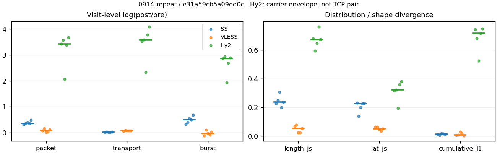
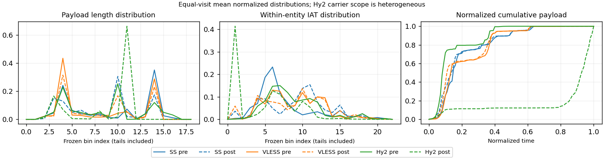

# 0914-repeat · 条目 002 · developer.mozilla.org

目标：https://developer.mozilla.org/en-US/docs/Web/HTTP

活动标签：developer.mozilla.org::page_load。选定访问 15 次。

[返回总索引](../../README.md) · [统计口径](../../methods.md)

## 覆盖与资格（每次访问均保留）

| 部署 | 重复 | 主请求路由 | 活动状态 | 代理比较 | DIRECT pre | 请求 proxy/direct/unresolved | 错误 |
| --- | --- | --- | --- | --- | --- | --- | --- |
| Hy2 | 1 | proxy | passed | 1 | 0 | 74/0/0 | [] |
| Hy2 | 2 | proxy | passed | 1 | 0 | 74/0/0 | [] |
| Hy2 | 3 | proxy | passed | 1 | 0 | 74/0/0 | [] |
| Hy2 | 4 | proxy | passed | 1 | 0 | 74/0/0 | [] |
| Hy2 | 5 | proxy | passed | 1 | 0 | 74/0/0 | [] |
| SS | 1 | proxy | passed | 1 | 0 | 74/0/0 | [] |
| SS | 2 | proxy | passed | 1 | 0 | 74/0/0 | [] |
| SS | 3 | proxy | passed | 1 | 0 | 74/0/0 | [] |
| SS | 4 | proxy | passed | 1 | 0 | 74/0/0 | [] |
| SS | 5 | proxy | passed | 1 | 0 | 74/0/0 | [] |
| VLESS | 1 | proxy | passed | 1 | 0 | 74/0/0 | [] |
| VLESS | 2 | proxy | passed | 1 | 0 | 74/0/0 | [] |
| VLESS | 3 | proxy | passed | 1 | 0 | 74/0/0 | [] |
| VLESS | 4 | proxy | passed | 1 | 0 | 74/0/0 | [] |
| VLESS | 5 | proxy | passed | 1 | 0 | 74/0/0 | [] |

主请求非 proxy 的统计仅解释为已索引的辅助代理连接或 DIRECT 观测，不代表目标业务经代理传输。播放确认与配对资格是两道不同的门。

图中散点为单次访问，短线为重复中位数；Hy2 是共享载体包络，不能与 TCP 配对作等范围因果对比。

形态图先逐访问归一化，再对访问等权平均；实线 pre，虚线 post。分箱序号及边界见 methods，不将分箱索引误解为长度或时间。

## 每次访问的关键观测

### SS

范围：`exclusive_page`。每格 pre → post；空值为不可观测/不适用。

| 重复 | 包数 | 载荷字节 | burst | TCP FR | IAT中位µs | length JS | IAT JS |
| --- | --- | --- | --- | --- | --- | --- | --- |
| 1 | 520 → 709 | 4.5361e+05 → 4.603e+05 | 362 → 498 | 47 → 47 | 38.377 → 756.7 | 0.22796 | 0.23359 |
| 2 | 516 → 736 | 4.715e+05 → 4.8754e+05 | 367 → 549 | 46 → 55 | 44.97 → 573.7 | 0.25176 | 0.14062 |
| 3 | 511 → 757 | 4.4511e+05 → 4.5058e+05 | 328 → 568 | 44 → 44 | 40.024 → 715.64 | 0.30648 | 0.1997 |
| 4 | 526 → 753 | 4.455e+05 → 4.532e+05 | 320 → 532 | 48 → 56 | 36.207 → 750.91 | 0.19969 | 0.22625 |
| 5 | 514 → 843 | 4.5078e+05 → 4.62e+05 | 310 → 612 | 51 → 55 | 42.223 → 549.15 | 0.23712 | 0.22928 |

完整标量统计：中位数 [min,max]；Δ 为重复内逐访问变换的中位数，MAD 未缩放。n 为可用变换数；DIRECT-only 的 nΔ=0 不代表 pre 不可用。

| scope | 特征 | pre | post | Δ | IQRΔ | MADΔ | nΔ |
| --- | --- | --- | --- | --- | --- | --- | --- |
| exclusive_page | active_span_sum_s_1000ms | 8.2099 [6.7223, 9.0614] | 10.147 [7.8535, 10.314] | 0.15553 | 0.11495 | 0.072534 | 5 |
| exclusive_page | active_span_sum_s_100ms | 1.6234 [1.2047, 1.8734] | 3.2973 [2.8126, 3.5129] | 0.70856 | 0.13271 | 0.072202 | 5 |
| exclusive_page | active_span_sum_s_500ms | 6.2656 [5.2251, 7.3261] | 8.221 [7.1325, 8.7873] | 0.22198 | 0.087278 | 0.06908 | 5 |
| exclusive_page | burst_bytes_iqr | 1448 [1448, 1742.5] | 1428 [1428, 1448] | -0.013908 | 0.0036191 | 0.0036191 | 5 |
| exclusive_page | burst_bytes_mad | 64 [35, 71] | 37 [34, 47] | -0.41253 | 0.41736 | 0.21999 | 5 |
| exclusive_page | burst_bytes_max | 20480 [18824, 23168] | 5792 [4546, 8568] | -1.263 | 0.42905 | 0.30469 | 5 |
| exclusive_page | burst_bytes_mean | 1357 [1253.1, 1454.1] | 851.89 [754.9, 924.3] | -0.49117 | 0.16759 | 0.12187 | 5 |
| exclusive_page | burst_bytes_median | 64 [35, 71] | 37 [34, 47] | -0.41253 | 0.41736 | 0.21999 | 5 |
| exclusive_page | burst_bytes_min | 0 [0, 0] | 0 [0, 0] | — | — | — | 0 |
| exclusive_page | burst_bytes_p95 | 6574.6 [5792, 7680] | 2910 [2856, 3008.7] | -0.81988 | 0.19289 | 0.13841 | 5 |
| exclusive_page | burst_bytes_q25 | 0 [0, 0] | 0 [0, 0] | — | — | — | 0 |
| exclusive_page | burst_bytes_q75 | 1448 [1448, 1742.5] | 1428 [1428, 1448] | -0.013908 | 0.0036191 | 0.0036191 | 5 |
| exclusive_page | burst_bytes_std | 2966 [2756.6, 3357.8] | 1244.7 [1056.6, 1362.5] | -0.94783 | 0.17002 | 0.08434 | 5 |
| exclusive_page | burst_count | 328 [310, 367] | 549 [498, 612] | 0.50832 | 0.14637 | 0.10559 | 5 |
| exclusive_page | burst_duration_ms_iqr | 0.047012 [0.030801, 0.083882] | 0 [0, 0.00011675] | -5.9415 | 0.36623 | 0.36623 | 2 |
| exclusive_page | burst_duration_ms_mad | 0 [0, 0] | 0 [0, 0] | — | — | — | 0 |
| exclusive_page | burst_duration_ms_max | 8579.1 [1867.4, 12633] | 8537.6 [1862.5, 12623] | -0.00078632 | 0.0026383 | 0.00092289 | 5 |
| exclusive_page | burst_duration_ms_mean | 74.261 [44.003, 104.24] | 42.676 [22.803, 65.063] | -0.55394 | 0.12199 | 0.082625 | 5 |
| exclusive_page | burst_duration_ms_median | 0 [0, 0] | 0 [0, 0] | — | — | — | 0 |
| exclusive_page | burst_duration_ms_min | 0 [0, 0] | 0 [0, 0] | — | — | — | 0 |
| exclusive_page | burst_duration_ms_p95 | 203.3 [166.94, 250.16] | 18.849 [1.7951, 49.797] | -2.3782 | 0.55546 | 0.46475 | 5 |
| exclusive_page | burst_duration_ms_q25 | 0 [0, 0] | 0 [0, 0] | — | — | — | 0 |
| exclusive_page | burst_duration_ms_q75 | 0.047012 [0.030801, 0.083882] | 0 [0, 0.00011675] | -5.9415 | 0.36623 | 0.36623 | 2 |
| exclusive_page | burst_duration_ms_std | 598.11 [209.14, 895.65] | 464.35 [151.48, 730.02] | -0.25312 | 0.11808 | 0.069425 | 5 |
| exclusive_page | burst_packets_iqr | 1 [1, 1] | 0 [0, 1] | 0 | 0 | 0 | 2 |
| exclusive_page | burst_packets_mad | 0 [0, 0] | 0 [0, 0] | — | — | — | 0 |
| exclusive_page | burst_packets_max | 9 [9, 14] | 10 [8, 11] | 0 | 0.22314 | 0.11778 | 5 |
| exclusive_page | burst_packets_mean | 1.5579 [1.406, 1.6581] | 1.3775 [1.3327, 1.4237] | -0.14956 | 0.1085 | 0.035858 | 5 |
| exclusive_page | burst_packets_median | 1 [1, 1] | 1 [1, 1] | 0 | 0 | 0 | 5 |
| exclusive_page | burst_packets_min | 1 [1, 1] | 1 [1, 1] | 0 | 0 | 0 | 5 |
| exclusive_page | burst_packets_p95 | 3 [3, 4] | 3 [3, 3.15] | 0 | 0.28768 | 0.04879 | 5 |
| exclusive_page | burst_packets_q25 | 1 [1, 1] | 1 [1, 1] | 0 | 0 | 0 | 5 |
| exclusive_page | burst_packets_q75 | 2 [2, 2] | 1 [1, 2] | -0.69315 | 0.69315 | 0 | 5 |
| exclusive_page | burst_packets_std | 1.1553 [0.82618, 1.4355] | 0.8919 [0.8464, 0.90247] | -0.25367 | 0.16223 | 0.13604 | 5 |
| exclusive_page | connection_span_concurrency_max | 3 [3, 3] | 3 [3, 3] | 0 | 0 | 0 | 5 |
| exclusive_page | cumulative_l1 | — | — | 0.013711 | 0.0058751 | 0.0039868 | 5 |
| exclusive_page | cumulative_max | — | — | 0.31422 | 0.06164 | 0.057783 | 5 |
| exclusive_page | direction_entropy | 0.94566 [0.93275, 0.96573] | 0.70364 [0.64841, 0.74038] | -0.24983 | 0.034142 | 0.019261 | 5 |
| exclusive_page | down_burst_count | 162 [153, 181] | 272 [246, 304] | 0.51335 | 0.14701 | 0.10605 | 5 |
| exclusive_page | down_ip_bytes | 4.4029e+05 [4.3715e+05, 4.6009e+05] | 4.4542e+05 [4.4395e+05, 4.7627e+05] | 0.018193 | 0.011873 | 0.0098579 | 5 |
| exclusive_page | down_packets | 285 [271, 305] | 391 [371, 460] | 0.31622 | 0.048051 | 0.034906 | 5 |
| exclusive_page | down_transport_bytes | 4.253e+05 [4.223e+05, 4.4596e+05] | 4.248e+05 [4.2441e+05, 4.5594e+05] | 0.0058507 | 0.0030051 | 0.0028675 | 5 |
| exclusive_page | duration_s | 15.023 [10.473, 18.284] | 14.761 [10.314, 18.281] | -0.010919 | 0.0058962 | 0.0044444 | 5 |
| exclusive_page | entity_count | 5 [4, 6] | 5 [4, 6] | 0 | 0 | 0 | 5 |
| exclusive_page | fr_runs | 47 [44, 51] | 55 [44, 56] | 0.075508 | 0.15415 | 0.075508 | 5 |
| exclusive_page | fr_runs_per_packet | 0.16263 [0.14332, 0.16558] | 0.12304 [0.10973, 0.13716] | -0.033597 | 0.013049 | 0.0070528 | 5 |
| exclusive_page | fr_switches | 41 [40, 46] | 50 [40, 52] | 0.083382 | 0.16705 | 0.083382 | 5 |
| exclusive_page | fr_switches_per_possible_transition | 0.14488 [0.13201, 0.15182] | 0.10904 [0.10076, 0.12626] | -0.031258 | 0.013546 | 0.0089694 | 5 |
| exclusive_page | full_retransmission_fraction | 0.0057034 [0, 0.0058708] | 0.0083037 [0.006605, 0.014946] | 0.0063582 | 0.005988 | 0.0054215 | 5 |
| exclusive_page | full_retransmission_packets | 3 [0, 3] | 7 [5, 11] | 0.80472 | 0.79961 | 0.29389 | 4 |
| exclusive_page | iat_count | 511 [507, 522] | 749 [703, 838] | 0.36107 | 0.03751 | 0.034483 | 5 |
| exclusive_page | iat_js | — | — | 0.22625 | 0.029583 | 0.0073376 | 5 |
| exclusive_page | iat_ks | — | — | 0.39679 | 0.059144 | 0.026115 | 5 |
| exclusive_page | iat_median_us | 40.024 [36.207, 44.97] | 715.64 [549.15, 756.7] | 2.8837 | 0.41611 | 0.14831 | 5 |
| exclusive_page | iat_us_iqr | 231.92 [202.12, 281.63] | 2395.7 [1457.5, 3119.6] | 2.295 | 0.2612 | 0.17758 | 5 |
| exclusive_page | iat_us_mad | 31.674 [28.215, 36.095] | 704.77 [534.67, 739.4] | 3.0909 | 0.34816 | 0.17032 | 5 |
| exclusive_page | iat_us_max | 8.6146e+06 [1.8674e+06, 1.2633e+07] | 8.5763e+06 [1.8625e+06, 1.2623e+07] | -0.00078632 | 0.0026383 | 0.00092289 | 5 |
| exclusive_page | iat_us_mean | 56265 [36557, 82940] | 37867 [24398, 57835] | -0.37059 | 0.043842 | 0.033783 | 5 |
| exclusive_page | iat_us_median | 40.024 [36.207, 44.97] | 715.64 [549.15, 756.7] | 2.8837 | 0.41611 | 0.14831 | 5 |
| exclusive_page | iat_us_min | 0.041 [0.004, 0.672] | 0.039 [0.034, 0.046] | 0.024098 | 1.8351 | 1.8066 | 5 |
| exclusive_page | iat_us_p95 | 96329 [92670, 2.0044e+05] | 49888 [41875, 69883] | -0.79873 | 0.20473 | 0.17039 | 5 |
| exclusive_page | iat_us_q25 | 15.572 [14.01, 18.105] | 23.61 [17.832, 35.376] | 0.40941 | 0.29768 | 0.15374 | 5 |
| exclusive_page | iat_us_q75 | 247.13 [216.13, 299.17] | 2420.3 [1481.1, 3154.9] | 2.2413 | 0.2579 | 0.1744 | 5 |
| exclusive_page | iat_us_std | 5.4911e+05 [1.8354e+05, 7.6483e+05] | 4.2486e+05 [1.3485e+05, 6.367e+05] | -0.18816 | 0.07318 | 0.030014 | 5 |
| exclusive_page | iat_wasserstein_log1p_us | — | — | 1.3505 | 0.31456 | 0.06162 | 5 |
| exclusive_page | idle_gap_count_1000ms | 6 [3, 7] | 5 [3, 6] | -0.18232 | 0.028171 | 0.028171 | 5 |
| exclusive_page | idle_gap_count_100ms | 25 [24, 31] | 28 [24, 33] | 0.06252 | 0.06252 | 0.050808 | 5 |
| exclusive_page | idle_gap_count_500ms | 9 [5, 11] | 7 [3, 9] | -0.28768 | 0.156 | 0.087011 | 5 |
| exclusive_page | idle_gap_sum_s_1000ms | 21.916 [10.324, 34.626] | 20.699 [8.0586, 31.963] | -0.071827 | 0.022851 | 0.014663 | 5 |
| exclusive_page | idle_gap_sum_s_100ms | 27.429 [17.106, 40.614] | 25.55 [15.254, 38.896] | -0.067382 | 0.0041751 | 0.0035881 | 5 |
| exclusive_page | idle_gap_sum_s_500ms | 22.926 [11.367, 37.157] | 21.42 [9.5842, 34.473] | -0.074987 | 0.044943 | 0.02569 | 5 |
| exclusive_page | ip_bytes | 4.776e+05 [4.7178e+05, 4.9842e+05] | 5.0195e+05 [4.9574e+05, 5.3116e+05] | 0.052977 | 0.014107 | 0.0098906 | 5 |
| exclusive_page | length_iqr | 2804 [2802, 2806] | 1323.5 [1281, 1376] | -0.75005 | 0.056839 | 0.028695 | 5 |
| exclusive_page | length_js | — | — | 0.23712 | 0.023808 | 0.014644 | 5 |
| exclusive_page | length_ks | — | — | 0.35694 | 0.0142 | 0.0084026 | 5 |
| exclusive_page | length_mad | 1316 [934, 1365] | 1098 [635.5, 1302] | -0.21766 | 0.20109 | 0.12219 | 5 |
| exclusive_page | length_max | 8192 [4096, 8920] | 2856 [2856, 2930] | -1.0282 | 0.1389 | 0.09681 | 5 |
| exclusive_page | length_mean | 1463.6 [1405.4, 1678] | 1123.6 [958.5, 1215.8] | -0.27368 | 0.057813 | 0.018783 | 5 |
| exclusive_page | length_median | 1400 [1005, 1448] | 1428 [669.5, 1428] | -0.013908 | 0.033361 | 0.033361 | 5 |
| exclusive_page | length_min | 31 [20, 31] | 20 [16, 20] | -0.43825 | 0 | 0 | 5 |
| exclusive_page | length_p95 | 2896 [2896, 4096] | 2856 [2856, 2856] | -0.013908 | 0.34668 | 0 | 5 |
| exclusive_page | length_q25 | 92 [90, 94] | 106 [65, 167] | 0.16363 | 0.30491 | 0.24717 | 5 |
| exclusive_page | length_q75 | 2896 [2896, 2896] | 1428 [1428, 1482] | -0.70706 | 0.013908 | 0 | 5 |
| exclusive_page | length_std | 1379.7 [1233.5, 1855.6] | 965.68 [923.76, 1054.5] | -0.35676 | 0.12166 | 0.10213 | 5 |
| exclusive_page | length_wasserstein_bytes | — | — | 492.6 | 66.146 | 53.594 | 5 |
| exclusive_page | nonempty_entity_count | 5 [4, 6] | 5 [4, 6] | 0 | 0 | 0 | 5 |
| exclusive_page | nonempty_packets | 307 [281, 317] | 401 [382, 482] | 0.29083 | 0.076613 | 0.023718 | 5 |
| exclusive_page | offload_suspect_fraction | 0.24715 [0.23256, 0.26419] | 0.10913 [0.089828, 0.13681] | -0.14223 | 0.034867 | 0.032125 | 5 |
| exclusive_page | packet_count | 516 [511, 526] | 753 [709, 843] | 0.35876 | 0.03787 | 0.03423 | 5 |
| exclusive_page | rtt_median_ms | 0.068218 [0.053646, 0.079382] | 32.523 [27.663, 33.183] | 6.0959 | 0.26448 | 0.090694 | 5 |
| exclusive_page | rtt_sample_count | 202 [198, 225] | 141 [136, 168] | -0.37561 | 0.05938 | 0.043276 | 5 |
| exclusive_page | tcp_ack_count | 511 [507, 522] | 749 [703, 838] | 0.36107 | 0.034851 | 0.031823 | 5 |
| exclusive_page | tcp_fin_count | 9 [8, 12] | 9 [8, 12] | 0 | 0.09531 | 0 | 5 |
| exclusive_page | tcp_packet_count | 516 [511, 526] | 753 [709, 843] | 0.35876 | 0.03787 | 0.03423 | 5 |
| exclusive_page | tcp_rst_count | 0 [0, 0] | 0 [0, 0] | — | — | — | 0 |
| exclusive_page | tcp_syn_count | 10 [8, 12] | 10 [8, 12] | 0 | 0 | 0 | 5 |
| exclusive_page | tcp_window_raw_median | 65471 [65284, 65498] | 144 [135, 145] | -6.12 | 0.020907 | 0.010185 | 5 |
| exclusive_page | transition_entropy | 0.58262 [0.54513, 0.59751] | 0.44338 [0.41159, 0.48407] | -0.13354 | 0.030671 | 0.024964 | 5 |
| exclusive_page | transition_n_mm | 171 [148, 182] | 309 [279, 375] | 0.59426 | 0.13821 | 0.045693 | 5 |
| exclusive_page | transition_n_mp | 18 [18, 21] | 23 [18, 24] | 0.090972 | 0.18232 | 0.090972 | 5 |
| exclusive_page | transition_n_pm | 23 [22, 25] | 27 [22, 28] | 0.076961 | 0.15415 | 0.076961 | 5 |
| exclusive_page | transition_n_pp | 87 [85, 88] | 52 [48, 56] | -0.5031 | 0.038466 | 0.030979 | 5 |
| exclusive_page | transition_p_mm | 0.89535 [0.89062, 0.90816] | 0.93939 [0.92767, 0.94495] | 0.036791 | 0.0079384 | 0.0072542 | 5 |
| exclusive_page | transition_p_mp | 0.10465 [0.091837, 0.10938] | 0.060606 [0.055046, 0.072327] | -0.036791 | 0.0079384 | 0.0072542 | 5 |
| exclusive_page | transition_p_pm | 0.20909 [0.20561, 0.22523] | 0.34177 [0.29114, 0.34615] | 0.11655 | 0.020785 | 0.012916 | 5 |
| exclusive_page | transition_p_pp | 0.79091 [0.77477, 0.79439] | 0.65823 [0.65385, 0.70886] | -0.11655 | 0.020785 | 0.012916 | 5 |
| exclusive_page | transport_bytes | 4.5078e+05 [4.4511e+05, 4.715e+05] | 4.603e+05 [4.5058e+05, 4.8754e+05] | 0.017152 | 0.0099473 | 0.0049354 | 5 |
| exclusive_page | up_burst_count | 166 [157, 186] | 277 [252, 308] | 0.50339 | 0.14573 | 0.10512 | 5 |
| exclusive_page | up_byte_fraction | 0.054188 [0.051241, 0.060882] | 0.064807 [0.057262, 0.077982] | 0.010784 | 0.0042312 | 0.0040669 | 5 |
| exclusive_page | up_ip_bytes | 37077 [34628, 40493] | 54892 [50557, 59300] | 0.37844 | 0.069715 | 0.019304 | 5 |
| exclusive_page | up_packets | 226 [221, 246] | 358 [338, 383] | 0.4821 | 0.12284 | 0.063259 | 5 |
| exclusive_page | up_transport_bytes | 25481 [22808, 27617] | 31596 [25801, 35895] | 0.21239 | 0.051853 | 0.045454 | 5 |
| exclusive_page | zero_iat_count | 0 [0, 0] | 0 [0, 0] | — | — | — | 0 |
| exclusive_page | zero_iat_fraction | 0 [0, 0] | 0 [0, 0] | 0 | 0 | 0 | 5 |

### VLESS

范围：`exclusive_page`。每格 pre → post；空值为不可观测/不适用。

| 重复 | 包数 | 载荷字节 | burst | TCP FR | IAT中位µs | length JS | IAT JS |
| --- | --- | --- | --- | --- | --- | --- | --- |
| 1 | 679 → 727 | 4.394e+05 → 4.6341e+05 | 469 → 420 | 50 → 60 | 152.49 → 436.55 | 0.069492 | 0.064864 |
| 2 | 662 → 785 | 4.381e+05 → 4.7958e+05 | 453 → 502 | 42 → 50 | 262.53 → 393.58 | 0.079287 | 0.06523 |
| 3 | 660 → 671 | 4.3463e+05 → 4.6763e+05 | 434 → 422 | 52 → 64 | 224.7 → 556.9 | 0.025811 | 0.046168 |
| 4 | 668 → 690 | 4.3533e+05 → 4.6874e+05 | 464 → 428 | 58 → 66 | 205.51 → 546.39 | 0.024134 | 0.036846 |
| 5 | 656 → 742 | 4.3356e+05 → 4.6705e+05 | 430 → 446 | 42 → 50 | 225.93 → 410.05 | 0.05391 | 0.052972 |

完整标量统计：中位数 [min,max]；Δ 为重复内逐访问变换的中位数，MAD 未缩放。n 为可用变换数；DIRECT-only 的 nΔ=0 不代表 pre 不可用。

| scope | 特征 | pre | post | Δ | IQRΔ | MADΔ | nΔ |
| --- | --- | --- | --- | --- | --- | --- | --- |
| exclusive_page | active_span_sum_s_1000ms | 7.7929 [7.1511, 9.1896] | 7.5091 [6.8665, 8.8116] | -0.042012 | 0.020434 | 0.019026 | 5 |
| exclusive_page | active_span_sum_s_100ms | 1.3566 [1.0925, 1.3965] | 2.753 [2.3199, 3.0135] | 0.74622 | 0.0543 | 0.022943 | 5 |
| exclusive_page | active_span_sum_s_500ms | 4.1017 [3.695, 4.6591] | 6.6623 [5.5352, 7.8355] | 0.46813 | 0.05259 | 0.051707 | 5 |
| exclusive_page | burst_bytes_iqr | 2789.5 [1848.5, 2824] | 2824 [2000.5, 2824] | 0 | 0.39455 | 0.33209 | 5 |
| exclusive_page | burst_bytes_mad | 64 [31, 72] | 120.5 [39, 176] | 0.53604 | 0.66424 | 0.35778 | 5 |
| exclusive_page | burst_bytes_max | 5864 [5720, 20600] | 4895 [3843, 6482] | -0.41022 | 1.1441 | 0.51042 | 5 |
| exclusive_page | burst_bytes_mean | 967.1 [936.88, 1008.3] | 1095.2 [955.34, 1108.1] | 0.10123 | 0.11682 | 0.062318 | 5 |
| exclusive_page | burst_bytes_median | 64 [31, 72] | 120.5 [39, 176] | 0.53604 | 0.66424 | 0.35778 | 5 |
| exclusive_page | burst_bytes_min | 0 [0, 0] | 0 [0, 0] | — | — | — | 0 |
| exclusive_page | burst_bytes_p95 | 2896 [2896, 2968] | 2896 [2896, 2896] | 0 | 0 | 0 | 5 |
| exclusive_page | burst_bytes_q25 | 0 [0, 0] | 0 [0, 0] | — | — | — | 0 |
| exclusive_page | burst_bytes_q75 | 2789.5 [1848.5, 2824] | 2824 [2000.5, 2824] | 0 | 0.39455 | 0.33209 | 5 |
| exclusive_page | burst_bytes_std | 1401.8 [1385.2, 1812.6] | 1266.3 [1200.6, 1295.1] | -0.13013 | 0.15774 | 0.050941 | 5 |
| exclusive_page | burst_count | 453 [430, 469] | 428 [420, 502] | -0.028039 | 0.1173 | 0.064573 | 5 |
| exclusive_page | burst_duration_ms_iqr | 0.84904 [0.6222, 1.0997] | 2.1167 [0.32952, 2.6457] | 1.0227 | 0.30106 | 0.18718 | 5 |
| exclusive_page | burst_duration_ms_mad | 0 [0, 0] | 0 [0, 0] | — | — | — | 0 |
| exclusive_page | burst_duration_ms_max | 7535.5 [1600.5, 8864.6] | 7535.7 [770.32, 8864.9] | 2.1712e-05 | 1.816e-05 | 1.5984e-05 | 5 |
| exclusive_page | burst_duration_ms_mean | 37.419 [15.814, 44.262] | 31.74 [11.667, 36.69] | -0.17979 | 0.05119 | 0.04336 | 5 |
| exclusive_page | burst_duration_ms_median | 0 [0, 0] | 0 [0, 0] | — | — | — | 0 |
| exclusive_page | burst_duration_ms_min | 0 [0, 0] | 0 [0, 0] | — | — | — | 0 |
| exclusive_page | burst_duration_ms_p95 | 11.291 [7.5453, 26.437] | 55.208 [30.107, 111.2] | 1.4365 | 0.21589 | 0.16316 | 5 |
| exclusive_page | burst_duration_ms_q25 | 0 [0, 0] | 0 [0, 0] | — | — | — | 0 |
| exclusive_page | burst_duration_ms_q75 | 0.84904 [0.6222, 1.0997] | 2.1167 [0.32952, 2.6457] | 1.0227 | 0.30106 | 0.18718 | 5 |
| exclusive_page | burst_duration_ms_std | 378.59 [106.66, 437.01] | 372.31 [59.435, 421.92] | -0.031196 | 0.046531 | 0.032068 | 5 |
| exclusive_page | burst_packets_iqr | 1 [1, 1] | 1 [1, 1] | 0 | 0 | 0 | 5 |
| exclusive_page | burst_packets_mad | 0 [0, 0] | 0 [0, 0] | — | — | — | 0 |
| exclusive_page | burst_packets_max | 10 [8, 16] | 7 [7, 9] | -0.35667 | 0.28768 | 0.18232 | 5 |
| exclusive_page | burst_packets_mean | 1.4614 [1.4397, 1.5256] | 1.6121 [1.5637, 1.731] | 0.086655 | 0.045455 | 0.02651 | 5 |
| exclusive_page | burst_packets_median | 1 [1, 1] | 1 [1, 1] | 0 | 0 | 0 | 5 |
| exclusive_page | burst_packets_min | 1 [1, 1] | 1 [1, 1] | 0 | 0 | 0 | 5 |
| exclusive_page | burst_packets_p95 | 2 [2, 3] | 3.95 [3, 4] | 0.68057 | 0.67662 | 0.012579 | 5 |
| exclusive_page | burst_packets_q25 | 1 [1, 1] | 1 [1, 1] | 0 | 0 | 0 | 5 |
| exclusive_page | burst_packets_q75 | 2 [2, 2] | 2 [2, 2] | 0 | 0 | 0 | 5 |
| exclusive_page | burst_packets_std | 0.76423 [0.70932, 1.0557] | 0.96498 [0.93899, 1.1069] | 0.2326 | 0.12379 | 0.12314 | 5 |
| exclusive_page | connection_span_concurrency_max | 3 [3, 4] | 3 [3, 3] | 0 | 0 | 0 | 5 |
| exclusive_page | cumulative_l1 | — | — | 0.0082402 | 0.012302 | 0.0031554 | 5 |
| exclusive_page | cumulative_max | — | — | 0.12898 | 0.32015 | 0.078588 | 5 |
| exclusive_page | direction_entropy | 0.79504 [0.78563, 0.8244] | 0.63213 [0.56058, 0.66491] | -0.18422 | 0.014806 | 0.0097387 | 5 |
| exclusive_page | down_burst_count | 224 [213, 233] | 212 [209, 249] | -0.028304 | 0.11836 | 0.065174 | 5 |
| exclusive_page | down_ip_bytes | 4.3691e+05 [4.3542e+05, 4.3946e+05] | 4.6244e+05 [4.5928e+05, 4.7224e+05] | 0.057291 | 0.003549 | 0.003041 | 5 |
| exclusive_page | down_packets | 393 [380, 397] | 425 [391, 441] | 0.073203 | 0.066689 | 0.049916 | 5 |
| exclusive_page | down_transport_bytes | 4.1624e+05 [4.1553e+05, 4.189e+05] | 4.408e+05 [4.3716e+05, 4.4928e+05] | 0.058892 | 7.6578e-05 | 4.034e-05 | 5 |
| exclusive_page | duration_s | 14.603 [3.9139, 17.136] | 14.066 [3.8924, 16.996] | -0.0081696 | 0.01774 | 0.0052513 | 5 |
| exclusive_page | entity_count | 4 [3, 5] | 4 [3, 5] | 0 | 0 | 0 | 5 |
| exclusive_page | fr_runs | 50 [42, 58] | 60 [50, 66] | 0.17435 | 0.0079682 | 0.0079682 | 5 |
| exclusive_page | fr_runs_per_packet | 0.12077 [0.10474, 0.145] | 0.1373 [0.1171, 0.16162] | 0.015976 | 0.004169 | 0.0036177 | 5 |
| exclusive_page | fr_switches | 47 [37, 54] | 57 [45, 62] | 0.1929 | 0.0046893 | 0.0028409 | 5 |
| exclusive_page | fr_switches_per_possible_transition | 0.11436 [0.094629, 0.13636] | 0.13134 [0.10664, 0.15306] | 0.016346 | 0.003952 | 0.0033166 | 5 |
| exclusive_page | full_retransmission_fraction | 0 [0, 0.0015244] | 0 [0, 0.0025478] | 0 | 0.001497 | 0.001497 | 5 |
| exclusive_page | full_retransmission_packets | 0 [0, 1] | 0 [0, 2] | — | — | — | 0 |
| exclusive_page | iat_count | 657 [652, 676] | 724 [667, 780] | 0.068598 | 0.091304 | 0.051969 | 5 |
| exclusive_page | iat_js | — | — | 0.052972 | 0.018696 | 0.011892 | 5 |
| exclusive_page | iat_ks | — | — | 0.10225 | 0.016788 | 0.012653 | 5 |
| exclusive_page | iat_median_us | 224.7 [152.49, 262.53] | 436.55 [393.58, 556.9] | 0.9076 | 0.38175 | 0.1442 | 5 |
| exclusive_page | iat_us_iqr | 2172 [1354.8, 2482.3] | 2755.7 [1686, 3079.4] | 0.21871 | 0.016153 | 0.012993 | 5 |
| exclusive_page | iat_us_mad | 217.53 [146.78, 255.55] | 428.82 [386.99, 546.59] | 0.92135 | 0.37917 | 0.15077 | 5 |
| exclusive_page | iat_us_max | 7.5355e+06 [1.6005e+06, 8.8646e+06] | 7.5357e+06 [1.5671e+06, 8.8649e+06] | 2.1712e-05 | 1.816e-05 | 1.5984e-05 | 5 |
| exclusive_page | iat_us_mean | 27293 [12946, 33235] | 25192 [11649, 27404] | -0.1056 | 0.072511 | 0.03558 | 5 |
| exclusive_page | iat_us_median | 224.7 [152.49, 262.53] | 436.55 [393.58, 556.9] | 0.9076 | 0.38175 | 0.1442 | 5 |
| exclusive_page | iat_us_min | 0.466 [0.135, 3.058] | 0.037 [0.036, 0.041] | -2.5607 | 0.42298 | 0.22867 | 5 |
| exclusive_page | iat_us_p95 | 13359 [9468.9, 24063] | 46511 [41918, 49160] | 1.2475 | 0.567 | 0.24017 | 5 |
| exclusive_page | iat_us_q25 | 34.274 [32.216, 38.72] | 16.114 [14.398, 42.82] | -0.80535 | 0.44648 | 0.071336 | 5 |
| exclusive_page | iat_us_q75 | 2207.2 [1388.8, 2521] | 2798.5 [1701.1, 3095.5] | 0.20529 | 0.017507 | 0.015024 | 5 |
| exclusive_page | iat_us_std | 3.0848e+05 [90121, 3.6407e+05] | 2.995e+05 [74754, 3.3717e+05] | -0.075863 | 0.068272 | 0.045006 | 5 |
| exclusive_page | iat_wasserstein_log1p_us | — | — | 0.47578 | 0.039065 | 0.019111 | 5 |
| exclusive_page | idle_gap_count_1000ms | 3 [1, 4] | 2 [1, 4] | 0 | 0 | 0 | 5 |
| exclusive_page | idle_gap_count_100ms | 22 [19, 24] | 26 [20, 29] | 0.13353 | 0.044452 | 0.033523 | 5 |
| exclusive_page | idle_gap_count_500ms | 8 [6, 10] | 4 [3, 5] | -0.69315 | 0.11778 | 0 | 5 |
| exclusive_page | idle_gap_sum_s_1000ms | 9.9394 [1.6005, 12.646] | 9.8998 [1.5671, 12.564] | -0.0065393 | 0.017043 | 0.010224 | 5 |
| exclusive_page | idle_gap_sum_s_100ms | 16.754 [7.659, 20.439] | 14.656 [6.1138, 18.362] | -0.13378 | 0.024852 | 0.020327 | 5 |
| exclusive_page | idle_gap_sum_s_500ms | 13.951 [5.0565, 17.176] | 10.747 [2.8985, 13.54] | -0.26095 | 0.023456 | 0.018148 | 5 |
| exclusive_page | ip_bytes | 4.7004e+05 [4.6765e+05, 4.7468e+05] | 5.0492e+05 [5.018e+05, 5.2107e+05] | 0.071576 | 0.0093911 | 0.0076892 | 5 |
| exclusive_page | length_iqr | 2752 [2300, 2752] | 1376 [1340, 2752] | -0.51373 | 0.69315 | 0.20593 | 5 |
| exclusive_page | length_js | — | — | 0.05391 | 0.043681 | 0.025377 | 5 |
| exclusive_page | length_ks | — | — | 0.13389 | 0.0087925 | 0.0050641 | 5 |
| exclusive_page | length_mad | 130 [102.5, 272] | 851 [657, 1136] | 1.8789 | 0.12566 | 0.096209 | 5 |
| exclusive_page | length_max | 2896 [2896, 4895] | 2824 [2824, 2896] | -0.025176 | 0 | 0 | 5 |
| exclusive_page | length_mean | 1081.2 [1061.3, 1106.3] | 1123.1 [1060.4, 1180.9] | 0.015103 | 0.037659 | 0.015968 | 5 |
| exclusive_page | length_median | 161 [138.5, 308] | 923 [729, 1216] | 1.7462 | 0.16507 | 0.054682 | 5 |
| exclusive_page | length_min | 24 [24, 24] | 24 [24, 24] | 0 | 0 | 0 | 5 |
| exclusive_page | length_p95 | 2824 [2824, 2824] | 2824 [2824, 2824] | 0 | 0 | 0 | 5 |
| exclusive_page | length_q25 | 72 [72, 72] | 72 [72, 72] | 0 | 0 | 0 | 5 |
| exclusive_page | length_q75 | 2824 [2372, 2824] | 1448 [1412, 2824] | -0.49355 | 0.66797 | 0.1996 | 5 |
| exclusive_page | length_std | 1198.9 [1159.1, 1210] | 1052.7 [990.87, 1147.6] | -0.13008 | 0.095471 | 0.026769 | 5 |
| exclusive_page | length_wasserstein_bytes | — | — | 241.96 | 121.55 | 16.276 | 5 |
| exclusive_page | nonempty_entity_count | 4 [3, 5] | 4 [3, 5] | 0 | 0 | 0 | 5 |
| exclusive_page | nonempty_packets | 401 [396, 414] | 427 [396, 437] | 0.054067 | 0.03813 | 0.021303 | 5 |
| exclusive_page | offload_suspect_fraction | 0.19033 [0.17683, 0.19293] | 0.1293 [0.1159, 0.17735] | -0.060926 | 0.048875 | 0.0045653 | 5 |
| exclusive_page | packet_count | 662 [656, 679] | 727 [671, 785] | 0.068305 | 0.090785 | 0.051776 | 5 |
| exclusive_page | rtt_median_ms | 0.29179 [0.1509, 0.60112] | 2.2384 [0.35801, 2.9617] | 2.0375 | 0.79677 | 0.44727 | 5 |
| exclusive_page | rtt_sample_count | 249 [242, 262] | 286 [272, 321] | 0.10047 | 0.071744 | 0.037603 | 5 |
| exclusive_page | tcp_ack_count | 648 [644, 670] | 723 [667, 779] | 0.076132 | 0.091528 | 0.047232 | 5 |
| exclusive_page | tcp_fin_count | 8 [6, 10] | 8 [6, 11] | 0 | 0 | 0 | 5 |
| exclusive_page | tcp_packet_count | 662 [656, 679] | 727 [671, 785] | 0.068305 | 0.090785 | 0.051776 | 5 |
| exclusive_page | tcp_rst_count | 8 [6, 10] | 0 [0, 1] | -2.0472 | 0.25541 | 0.25541 | 2 |
| exclusive_page | tcp_syn_count | 8 [6, 10] | 8 [6, 10] | 0 | 0 | 0 | 5 |
| exclusive_page | tcp_window_raw_median | 65535 [65535, 65535] | 159 [156, 169] | -6.0214 | 0.061748 | 0.019048 | 5 |
| exclusive_page | transition_entropy | 0.48134 [0.4141, 0.52776] | 0.48031 [0.39683, 0.52485] | -0.0029068 | 0.0041519 | 0.0022757 | 5 |
| exclusive_page | transition_n_mm | 281 [275, 286] | 336 [301, 346] | 0.1752 | 0.069077 | 0.03288 | 5 |
| exclusive_page | transition_n_mp | 22 [16, 25] | 27 [20, 29] | 0.21131 | 0.018349 | 0.011834 | 5 |
| exclusive_page | transition_n_pm | 25 [21, 29] | 30 [25, 33] | 0.17435 | 0.0079682 | 0.0079682 | 5 |
| exclusive_page | transition_n_pp | 73 [67, 82] | 36 [31, 41] | -0.70694 | 0.16333 | 0.13983 | 5 |
| exclusive_page | transition_p_mm | 0.92763 [0.91667, 0.94613] | 0.92562 [0.91343, 0.94536] | -0.0020117 | 0.0013284 | 0.0012221 | 5 |
| exclusive_page | transition_p_mp | 0.072368 [0.053872, 0.083333] | 0.07438 [0.054645, 0.086567] | 0.0020117 | 0.0013284 | 0.0012221 | 5 |
| exclusive_page | transition_p_pm | 0.23364 [0.2234, 0.30208] | 0.44643 [0.40984, 0.50794] | 0.18889 | 0.036593 | 0.026185 | 5 |
| exclusive_page | transition_p_pp | 0.76636 [0.69792, 0.7766] | 0.55357 [0.49206, 0.59016] | -0.18889 | 0.036593 | 0.026185 | 5 |
| exclusive_page | transport_bytes | 4.3533e+05 [4.3356e+05, 4.394e+05] | 4.6763e+05 [4.6341e+05, 4.7958e+05] | 0.073942 | 0.0012199 | 0.00074926 | 5 |
| exclusive_page | up_burst_count | 229 [217, 236] | 216 [211, 253] | -0.02778 | 0.11625 | 0.063983 | 5 |
| exclusive_page | up_byte_fraction | 0.043952 [0.041399, 0.046702] | 0.057528 [0.056197, 0.063191] | 0.014245 | 0.0012225 | 0.00066946 | 5 |
| exclusive_page | up_ip_bytes | 33495 [31573, 35220] | 42514 [41758, 48833] | 0.24861 | 0.089124 | 0.060388 | 5 |
| exclusive_page | up_packets | 278 [263, 284] | 302 [280, 344] | 0.061453 | 0.11001 | 0.054284 | 5 |
| exclusive_page | up_transport_bytes | 19103 [17949, 20500] | 26902 [26246, 30305] | 0.35526 | 0.037662 | 0.024758 | 5 |
| exclusive_page | zero_iat_count | 0 [0, 0] | 0 [0, 0] | — | — | — | 0 |
| exclusive_page | zero_iat_fraction | 0 [0, 0] | 0 [0, 0] | 0 | 0 | 0 | 5 |

### Hy2

范围：`carrier_context_envelope`。每格 pre → post；空值为不可观测/不适用。

| 重复 | 包数 | 载荷字节 | burst | TCP FR | IAT中位µs | length JS | IAT JS |
| --- | --- | --- | --- | --- | --- | --- | --- |
| 1 | 455 → 14086 | 4.3579e+05 → 1.5038e+07 | 294 → 5195 | — | 106.18 → 14.733 | 0.67879 | 0.3171 |
| 2 | 450 → 16204 | 4.8112e+05 → 1.7378e+07 | 301 → 5745 | — | 98.055 → 7.892 | 0.59345 | 0.3235 |
| 3 | 628 → 5012 | 4.3795e+05 → 4.5316e+06 | 417 → 2912 | — | 190.09 → 196.03 | 0.64924 | 0.19648 |
| 4 | 614 → 18182 | 4.4782e+05 → 1.9869e+07 | 403 → 5928 | — | 152.19 → 7.101 | 0.76159 | 0.36039 |
| 5 | 614 → 24321 | 4.5267e+05 → 2.7088e+07 | 405 → 7368 | — | 121.77 → 1.218 | 0.67552 | 0.38256 |

完整标量统计：中位数 [min,max]；Δ 为重复内逐访问变换的中位数，MAD 未缩放。n 为可用变换数；DIRECT-only 的 nΔ=0 不代表 pre 不可用。

| scope | 特征 | pre | post | Δ | IQRΔ | MADΔ | nΔ |
| --- | --- | --- | --- | --- | --- | --- | --- |
| carrier_context_envelope | active_span_sum_s_1000ms | 7.8992 [6.4837, 10.052] | 10.217 [9.0472, 10.826] | 0.27326 | 0.029358 | 0.015973 | 5 |
| carrier_context_envelope | active_span_sum_s_100ms | 1.0402 [0.74313, 1.2715] | 5.4757 [4.887, 6.2875] | 1.5471 | 0.43704 | 0.189 | 5 |
| carrier_context_envelope | active_span_sum_s_500ms | 5.7124 [4.9652, 6.2584] | 8.8041 [8.2512, 10.248] | 0.4767 | 0.12544 | 0.058936 | 5 |
| carrier_context_envelope | burst_bytes_iqr | 1404 [539, 1687.5] | 4230 [2846, 5133] | 1.2964 | 0.76127 | 0.39771 | 5 |
| carrier_context_envelope | burst_bytes_mad | 64 [39, 72] | 285 [250, 371.5] | 1.5552 | 0.35467 | 0.19264 | 5 |
| carrier_context_envelope | burst_bytes_max | 20480 [13201, 21168] | 1.3502e+05 [21615, 1.7194e+05] | 1.8529 | 1.1546 | 0.27482 | 5 |
| carrier_context_envelope | burst_bytes_mean | 1117.7 [1050.2, 1598.4] | 3024.9 [1556.2, 3676.4] | 0.66929 | 0.46614 | 0.27608 | 5 |
| carrier_context_envelope | burst_bytes_median | 64 [39, 72] | 318 [283, 404.5] | 1.6476 | 0.33021 | 0.16103 | 5 |
| carrier_context_envelope | burst_bytes_min | 0 [0, 0] | 22 [22, 22] | — | — | — | 0 |
| carrier_context_envelope | burst_bytes_p95 | 4714.4 [4212, 10363] | 12373 [4323, 12373] | 0.2034 | 0.8925 | 0.29007 | 5 |
| carrier_context_envelope | burst_bytes_q25 | 0 [0, 0] | 36 [34, 93] | — | — | — | 0 |
| carrier_context_envelope | burst_bytes_q75 | 1404 [539, 1687.5] | 4323 [2882, 5168] | 1.3032 | 0.76334 | 0.40088 | 5 |
| carrier_context_envelope | burst_bytes_std | 2691.4 [1948.5, 4111.6] | 4844.6 [1778, 8479.9] | 0.25367 | 0.91643 | 0.34525 | 5 |
| carrier_context_envelope | burst_count | 403 [294, 417] | 5745 [2912, 7368] | 2.8719 | 0.21251 | 0.077103 | 5 |
| carrier_context_envelope | burst_duration_ms_iqr | 0.10817 [0.066719, 0.96113] | 0.033049 [0.027163, 0.72562] | -0.82078 | 0.5753 | 0.53969 | 5 |
| carrier_context_envelope | burst_duration_ms_mad | 0 [0, 0] | 5.8e-05 [0, 8.35e-05] | — | — | — | 0 |
| carrier_context_envelope | burst_duration_ms_max | 7739.5 [7427.7, 10475] | 2081.2 [392.63, 2433.3] | -1.2724 | 0.11566 | 0.09072 | 5 |
| carrier_context_envelope | burst_duration_ms_mean | 53.269 [52.686, 71.626] | 0.82942 [0.54707, 1.9136] | -4.2942 | 0.48136 | 0.31704 | 5 |
| carrier_context_envelope | burst_duration_ms_median | 0 [0, 0] | 5.8e-05 [0, 8.35e-05] | — | — | — | 0 |
| carrier_context_envelope | burst_duration_ms_min | 0 [0, 0] | 0 [0, 0] | — | — | — | 0 |
| carrier_context_envelope | burst_duration_ms_p95 | 167.59 [36.902, 202.26] | 0.88807 [0.40172, 1.5661] | -5.4283 | 1.1345 | 0.60525 | 5 |
| carrier_context_envelope | burst_duration_ms_q25 | 0 [0, 0] | 0 [0, 0] | — | — | — | 0 |
| carrier_context_envelope | burst_duration_ms_q75 | 0.10817 [0.066719, 0.96113] | 0.033049 [0.027163, 0.72562] | -0.82078 | 0.5753 | 0.53969 | 5 |
| carrier_context_envelope | burst_duration_ms_std | 544.9 [518.04, 614.65] | 29.66 [9.3043, 47.652] | -2.8886 | 0.24687 | 0.21592 | 5 |
| carrier_context_envelope | burst_packets_iqr | 1 [1, 1] | 2 [1, 3] | 0.69315 | 0.40547 | 0.40547 | 5 |
| carrier_context_envelope | burst_packets_mad | 0 [0, 0] | 1 [0, 1] | — | — | — | 0 |
| carrier_context_envelope | burst_packets_max | 8 [6, 15] | 97 [33, 125] | 2.1203 | 0.67274 | 0.41552 | 5 |
| carrier_context_envelope | burst_packets_mean | 1.516 [1.495, 1.5476] | 2.8205 [1.7212, 3.3009] | 0.63479 | 0.13892 | 0.074024 | 5 |
| carrier_context_envelope | burst_packets_median | 1 [1, 1] | 2 [1, 2] | 0.69315 | 0 | 0 | 5 |
| carrier_context_envelope | burst_packets_min | 1 [1, 1] | 1 [1, 1] | 0 | 0 | 0 | 5 |
| carrier_context_envelope | burst_packets_p95 | 3 [3, 3] | 9 [3, 9] | 1.0986 | 0.11778 | 0 | 5 |
| carrier_context_envelope | burst_packets_q25 | 1 [1, 1] | 1 [1, 1] | 0 | 0 | 0 | 5 |
| carrier_context_envelope | burst_packets_q75 | 2 [2, 2] | 3 [2, 4] | 0.40547 | 0.28768 | 0.28768 | 5 |
| carrier_context_envelope | burst_packets_std | 0.97688 [0.74305, 1.13] | 3.3148 [1.2408, 5.9296] | 1.2038 | 0.52796 | 0.45394 | 5 |
| carrier_context_envelope | connection_span_concurrency_max | 3 [3, 3] | 1 [1, 1] | -1.0986 | 0 | 0 | 5 |
| carrier_context_envelope | cumulative_l1 | — | — | 0.71616 | 0.060629 | 0.032026 | 5 |
| carrier_context_envelope | cumulative_max | — | — | 0.92482 | 0.0081638 | 0.0079854 | 5 |
| carrier_context_envelope | direction_entropy | 0.90267 [0.8878, 0.99177] | 0.76766 [0.70932, 0.91836] | -0.19335 | 0.04967 | 0.030756 | 5 |
| carrier_context_envelope | direction_run_analog_runs | 63 [45, 72] | 5745 [2912, 7368] | 4.6854 | 0.33801 | 0.09949 | 5 |
| carrier_context_envelope | direction_run_analog_runs_per_packet | 0.18972 [0.17027, 0.19945] | 0.35454 [0.30295, 0.58101] | 0.16482 | 0.071761 | 0.038228 | 5 |
| carrier_context_envelope | direction_run_analog_switches | 58 [41, 67] | 5744 [2911, 7367] | 4.7616 | 0.35911 | 0.13308 | 5 |
| carrier_context_envelope | direction_run_analog_switches_per_possible_transition | 0.17339 [0.15769, 0.1882] | 0.3545 [0.30292, 0.58092] | 0.18112 | 0.073271 | 0.043318 | 5 |
| carrier_context_envelope | down_burst_count | 199 [145, 206] | 2872 [1456, 3684] | 2.8854 | 0.21245 | 0.080173 | 5 |
| carrier_context_envelope | down_ip_bytes | 4.4093e+05 [4.2589e+05, 4.681e+05] | 1.7396e+07 [4.4908e+06, 2.7374e+07] | 3.6153 | 0.24817 | 0.20317 | 5 |
| carrier_context_envelope | down_packets | 351 [240, 372] | 12572 [3341, 19608] | 3.7606 | 0.27012 | 0.19803 | 5 |
| carrier_context_envelope | down_transport_bytes | 4.2211e+05 [4.1213e+05, 4.5558e+05] | 1.7044e+07 [4.3972e+06, 2.6825e+07] | 3.622 | 0.26027 | 0.21977 | 5 |
| carrier_context_envelope | duration_s | 13.963 [13.703, 14.07] | 13.947 [13.692, 14.062] | -0.0008021 | 0.00059337 | 0.00034849 | 5 |
| carrier_context_envelope | entity_count | 5 [4, 5] | 1 [1, 1] | -1.6094 | 0 | 0 | 5 |
| carrier_context_envelope | full_retransmission_fraction | 0.0032573 [0, 0.0066667] | — | — | — | — | 0 |
| carrier_context_envelope | full_retransmission_packets | 2 [0, 3] | — | — | — | — | 0 |
| carrier_context_envelope | iat_count | 609 [445, 623] | 16203 [5011, 24320] | 3.4414 | 0.19856 | 0.15348 | 5 |
| carrier_context_envelope | iat_js | — | — | 0.3235 | 0.043288 | 0.036885 | 5 |
| carrier_context_envelope | iat_ks | — | — | 0.47125 | 0.05049 | 0.033463 | 5 |
| carrier_context_envelope | iat_median_us | 121.77 [98.055, 190.09] | 7.892 [1.218, 196.03] | -2.5197 | 1.0898 | 0.54522 | 5 |
| carrier_context_envelope | iat_us_iqr | 992.76 [611.04, 1645.5] | 60.081 [29.808, 903.01] | -2.3752 | 1.484 | 1.0396 | 5 |
| carrier_context_envelope | iat_us_mad | 112.88 [84.32, 182.18] | 7.855 [1.185, 195.93] | -2.3735 | 1.1341 | 0.60947 | 5 |
| carrier_context_envelope | iat_us_max | 7.7395e+06 [7.4277e+06, 1.0532e+07] | 2.3425e+06 [1.9005e+06, 3.5447e+06] | -1.2475 | 0.1153 | 0.09036 | 5 |
| carrier_context_envelope | iat_us_mean | 40487 [37483, 60955] | 846.07 [574.22, 2732.3] | -4.0952 | 0.16205 | 0.089208 | 5 |
| carrier_context_envelope | iat_us_median | 121.77 [98.055, 190.09] | 7.892 [1.218, 196.03] | -2.5197 | 1.0898 | 0.54522 | 5 |
| carrier_context_envelope | iat_us_min | 0.865 [0.004, 1.394] | 0.004 [0.001, 0.035] | -4.5319 | 1.6848 | 1.3245 | 5 |
| carrier_context_envelope | iat_us_p95 | 41682 [40713, 1.7243e+05] | 877.51 [612.83, 2012] | -4.2197 | 0.49016 | 0.34399 | 5 |
| carrier_context_envelope | iat_us_q25 | 33.032 [30.014, 52.846] | 0.059 [0.048, 64.09] | -6.2319 | 0.29374 | 0.29272 | 5 |
| carrier_context_envelope | iat_us_q75 | 1025.5 [644.07, 1695.8] | 60.139 [29.856, 967.1] | -2.4197 | 1.4611 | 1.0242 | 5 |
| carrier_context_envelope | iat_us_std | 4.4667e+05 [4.2511e+05, 7.0047e+05] | 20313 [19929, 42185] | -3.0602 | 0.032492 | 0.021866 | 5 |
| carrier_context_envelope | iat_wasserstein_log1p_us | — | — | 2.9826 | 0.77125 | 0.42522 | 5 |
| carrier_context_envelope | idle_gap_count_1000ms | 2 [2, 2] | 2 [2, 2] | 0 | 0 | 0 | 5 |
| carrier_context_envelope | idle_gap_count_100ms | 25 [21, 27] | 24 [19, 26] | 0 | 0.10008 | 0.087011 | 5 |
| carrier_context_envelope | idle_gap_count_500ms | 5 [4, 7] | 3 [3, 5] | -0.28768 | 0.51083 | 0.28768 | 5 |
| carrier_context_envelope | idle_gap_sum_s_1000ms | 15.06 [14.555, 21.007] | 3.5486 [2.9804, 4.9001] | -1.4829 | 0.051326 | 0.027309 | 5 |
| carrier_context_envelope | idle_gap_sum_s_100ms | 22.081 [21.867, 26.734] | 8.4715 [7.4215, 9.078] | -1.0346 | 0.15459 | 0.10861 | 5 |
| carrier_context_envelope | idle_gap_sum_s_500ms | 17.672 [16.466, 22.525] | 4.9048 [3.8135, 5.7137] | -1.3585 | 0.20541 | 0.14739 | 5 |
| carrier_context_envelope | ip_bytes | 4.7984e+05 [4.5954e+05, 5.0464e+05] | 1.7832e+07 [4.672e+06, 2.7769e+07] | 3.5649 | 0.23475 | 0.18385 | 5 |
| carrier_context_envelope | length_iqr | 1309 [1302.8, 2724] | 596 [596, 1383] | -0.78678 | 0.66808 | 0.66732 | 5 |
| carrier_context_envelope | length_js | — | — | 0.67552 | 0.02955 | 0.026277 | 5 |
| carrier_context_envelope | length_ks | — | — | 0.40225 | 0.15845 | 0.051844 | 5 |
| carrier_context_envelope | length_mad | 776 [422, 821.5] | 0 [0, 0] | — | — | — | 0 |
| carrier_context_envelope | length_max | 8920 [8496, 8920] | 1441 [1441, 1441] | -1.823 | 0 | 0 | 5 |
| carrier_context_envelope | length_mean | 1264.4 [1183.7, 1901.7] | 1072.5 [904.16, 1113.8] | -0.26936 | 0.30894 | 0.14256 | 5 |
| carrier_context_envelope | length_median | 1397 [461, 1415] | 1441 [1441, 1441] | 0.03101 | 0.75284 | 0.012802 | 5 |
| carrier_context_envelope | length_min | 31 [27, 31] | 22 [22, 22] | -0.34294 | 0 | 0 | 5 |
| carrier_context_envelope | length_p95 | 3609 [2830, 8920] | 1441 [1441, 1441] | -0.91811 | 0.96887 | 0.24317 | 5 |
| carrier_context_envelope | length_q25 | 95 [84, 112.25] | 845 [58, 845] | 2.1855 | 0.18701 | 0.11895 | 5 |
| carrier_context_envelope | length_q75 | 1415 [1404, 2808] | 1441 [1441, 1441] | 0.018208 | 0.62365 | 0.0078042 | 5 |
| carrier_context_envelope | length_std | 1418.7 [1194.6, 2716.6] | 579.56 [562.74, 653.76] | -0.92466 | 0.58442 | 0.32185 | 5 |
| carrier_context_envelope | length_wasserstein_bytes | — | — | 590.71 | 722.75 | 275.12 | 5 |
| carrier_context_envelope | nonempty_entity_count | 5 [4, 5] | 1 [1, 1] | -1.6094 | 0 | 0 | 5 |
| carrier_context_envelope | nonempty_packets | 358 [253, 370] | 16204 [5012, 24321] | 3.977 | 0.24031 | 0.18264 | 5 |
| carrier_context_envelope | offload_suspect_fraction | 0.10912 [0.10191, 0.19111] | 0 [0, 0] | -0.10912 | 0.079321 | 0.0072097 | 5 |
| carrier_context_envelope | packet_count | 614 [450, 628] | 16204 [5012, 24321] | 3.4326 | 0.19557 | 0.15113 | 5 |
| carrier_context_envelope | rtt_median_ms | 0.099098 [0.082277, 0.14556] | — | — | — | — | 0 |
| carrier_context_envelope | rtt_sample_count | 252 [183, 255] | 0 [0, 0] | — | — | — | 0 |
| carrier_context_envelope | tcp_ack_count | 609 [445, 623] | — | — | — | — | 0 |
| carrier_context_envelope | tcp_fin_count | 10 [8, 10] | — | — | — | — | 0 |
| carrier_context_envelope | tcp_packet_count | 614 [450, 628] | 0 [0, 0] | — | — | — | 0 |
| carrier_context_envelope | tcp_rst_count | 0 [0, 1] | — | — | — | — | 0 |
| carrier_context_envelope | tcp_syn_count | 10 [8, 10] | — | — | — | — | 0 |
| carrier_context_envelope | tcp_window_raw_median | 65496 [65362, 65535] | — | — | — | — | 0 |
| carrier_context_envelope | transition_entropy | 0.64492 [0.60074, 0.66516] | 0.76686 [0.70868, 0.8434] | 0.10829 | 0.076253 | 0.039399 | 5 |
| carrier_context_envelope | transition_n_mm | 210 [116, 226] | 9700 [1885, 15924] | 4.151 | 0.34228 | 0.1775 | 5 |
| carrier_context_envelope | transition_n_mp | 27 [19, 32] | 2872 [1456, 3684] | 4.8445 | 0.38911 | 0.17387 | 5 |
| carrier_context_envelope | transition_n_pm | 31 [22, 35] | 2872 [1455, 3683] | 4.6851 | 0.33246 | 0.099588 | 5 |
| carrier_context_envelope | transition_n_pp | 81 [76, 89] | 759 [215, 1029] | 2.1434 | 0.46013 | 0.26982 | 5 |
| carrier_context_envelope | transition_p_mm | 0.87333 [0.85926, 0.89328] | 0.77156 [0.5642, 0.81212] | -0.087703 | 0.036527 | 0.02116 | 5 |
| carrier_context_envelope | transition_p_mp | 0.12667 [0.10672, 0.14074] | 0.22844 [0.18788, 0.4358] | 0.087703 | 0.036527 | 0.02116 | 5 |
| carrier_context_envelope | transition_p_pm | 0.27679 [0.2, 0.31532] | 0.79097 [0.78162, 0.87126] | 0.57858 | 0.1111 | 0.040666 | 5 |
| carrier_context_envelope | transition_p_pp | 0.72321 [0.68468, 0.8] | 0.20903 [0.12874, 0.21838] | -0.57858 | 0.1111 | 0.040666 | 5 |
| carrier_context_envelope | transport_bytes | 4.4782e+05 [4.3579e+05, 4.8112e+05] | 1.7378e+07 [4.5316e+06, 2.7088e+07] | 3.5868 | 0.25134 | 0.20567 | 5 |
| carrier_context_envelope | up_burst_count | 204 [149, 211] | 2873 [1456, 3684] | 2.8586 | 0.21257 | 0.074123 | 5 |
| carrier_context_envelope | up_byte_fraction | 0.056732 [0.053086, 0.058963] | 0.014144 [0.0097291, 0.029661] | -0.038951 | 0.013139 | 0.0080524 | 5 |
| carrier_context_envelope | up_ip_bytes | 38918 [33646, 39421] | 3.0148e+05 [1.812e+05, 4.3573e+05] | 2.1928 | 0.26213 | 0.14906 | 5 |
| carrier_context_envelope | up_packets | 253 [201, 263] | 3632 [1671, 4713] | 2.7585 | 0.15484 | 0.091934 | 5 |
| carrier_context_envelope | up_transport_bytes | 25681 [23138, 25823] | 2.1269e+05 [1.3442e+05, 3.3403e+05] | 2.2184 | 0.29988 | 0.18978 | 5 |
| carrier_context_envelope | zero_iat_count | 0 [0, 0] | 0 [0, 0] | — | — | — | 0 |
| carrier_context_envelope | zero_iat_fraction | 0 [0, 0] | 0 [0, 0] | 0 | 0 | 0 | 5 |

## 不同部署对比

以下是各部署自身重复中位数的差异，不按重复编号强行配对。跨 TCP/Hy2 的行标记异质观测范围。

| 视角 | 特征 | 部署A | 部署B | A中位 | B中位 | B−A | 比较口径 |
| --- | --- | --- | --- | --- | --- | --- | --- |
| pre | burst_count | VLESS | Hy2 | 453 | 403 | -50 | heterogeneous_scope_descriptive_only |
| pre | burst_count | VLESS | SS | 453 | 328 | -125 | same_scope_unpaired_visits |
| pre | burst_count | Hy2 | SS | 403 | 328 | -75 | heterogeneous_scope_descriptive_only |
| pre | connection_span_concurrency_max | VLESS | Hy2 | 3 | 3 | 0 | heterogeneous_scope_descriptive_only |
| pre | connection_span_concurrency_max | VLESS | SS | 3 | 3 | 0 | same_scope_unpaired_visits |
| pre | connection_span_concurrency_max | Hy2 | SS | 3 | 3 | 0 | heterogeneous_scope_descriptive_only |
| pre | direction_entropy | VLESS | Hy2 | 0.79504 | 0.90267 | 0.10763 | heterogeneous_scope_descriptive_only |
| pre | direction_entropy | VLESS | SS | 0.79504 | 0.94566 | 0.15062 | same_scope_unpaired_visits |
| pre | direction_entropy | Hy2 | SS | 0.90267 | 0.94566 | 0.042988 | heterogeneous_scope_descriptive_only |
| pre | down_transport_bytes | VLESS | Hy2 | 4.1624e+05 | 4.2211e+05 | 5876 | heterogeneous_scope_descriptive_only |
| pre | down_transport_bytes | VLESS | SS | 4.1624e+05 | 4.253e+05 | 9058 | same_scope_unpaired_visits |
| pre | down_transport_bytes | Hy2 | SS | 4.2211e+05 | 4.253e+05 | 3182 | heterogeneous_scope_descriptive_only |
| pre | duration_s | VLESS | Hy2 | 14.603 | 13.963 | -0.63993 | heterogeneous_scope_descriptive_only |
| pre | duration_s | VLESS | SS | 14.603 | 15.023 | 0.41977 | same_scope_unpaired_visits |
| pre | duration_s | Hy2 | SS | 13.963 | 15.023 | 1.0597 | heterogeneous_scope_descriptive_only |
| pre | entity_count | VLESS | Hy2 | 4 | 5 | 1 | heterogeneous_scope_descriptive_only |
| pre | entity_count | VLESS | SS | 4 | 5 | 1 | same_scope_unpaired_visits |
| pre | entity_count | Hy2 | SS | 5 | 5 | 0 | heterogeneous_scope_descriptive_only |
| pre | fr_runs | VLESS | SS | 50 | 47 | -3 | same_scope_unpaired_visits |
| pre | fr_runs_per_packet | VLESS | SS | 0.12077 | 0.16263 | 0.041857 | same_scope_unpaired_visits |
| pre | fr_switches | VLESS | SS | 47 | 41 | -6 | same_scope_unpaired_visits |
| pre | fr_switches_per_possible_transition | VLESS | SS | 0.11436 | 0.14488 | 0.030521 | same_scope_unpaired_visits |
| pre | full_retransmission_fraction | VLESS | Hy2 | 0 | 0.0032573 | 0.0032573 | heterogeneous_scope_descriptive_only |
| pre | full_retransmission_fraction | VLESS | SS | 0 | 0.0057034 | 0.0057034 | same_scope_unpaired_visits |
| pre | full_retransmission_fraction | Hy2 | SS | 0.0032573 | 0.0057034 | 0.0024461 | heterogeneous_scope_descriptive_only |
| pre | iat_median_us | VLESS | Hy2 | 224.7 | 121.77 | -102.94 | heterogeneous_scope_descriptive_only |
| pre | iat_median_us | VLESS | SS | 224.7 | 40.024 | -184.68 | same_scope_unpaired_visits |
| pre | iat_median_us | Hy2 | SS | 121.77 | 40.024 | -81.745 | heterogeneous_scope_descriptive_only |
| pre | iat_us_p95 | VLESS | Hy2 | 13359 | 41682 | 28323 | heterogeneous_scope_descriptive_only |
| pre | iat_us_p95 | VLESS | SS | 13359 | 96329 | 82970 | same_scope_unpaired_visits |
| pre | iat_us_p95 | Hy2 | SS | 41682 | 96329 | 54647 | heterogeneous_scope_descriptive_only |
| pre | ip_bytes | VLESS | Hy2 | 4.7004e+05 | 4.7984e+05 | 9802 | heterogeneous_scope_descriptive_only |
| pre | ip_bytes | VLESS | SS | 4.7004e+05 | 4.776e+05 | 7555 | same_scope_unpaired_visits |
| pre | ip_bytes | Hy2 | SS | 4.7984e+05 | 4.776e+05 | -2247 | heterogeneous_scope_descriptive_only |
| pre | length_median | VLESS | Hy2 | 161 | 1397 | 1236 | heterogeneous_scope_descriptive_only |
| pre | length_median | VLESS | SS | 161 | 1400 | 1239 | same_scope_unpaired_visits |
| pre | length_median | Hy2 | SS | 1397 | 1400 | 3 | heterogeneous_scope_descriptive_only |
| pre | length_p95 | VLESS | Hy2 | 2824 | 3609 | 785.05 | heterogeneous_scope_descriptive_only |
| pre | length_p95 | VLESS | SS | 2824 | 2896 | 72 | same_scope_unpaired_visits |
| pre | length_p95 | Hy2 | SS | 3609 | 2896 | -713.05 | heterogeneous_scope_descriptive_only |
| pre | nonempty_packets | VLESS | Hy2 | 401 | 358 | -43 | heterogeneous_scope_descriptive_only |
| pre | nonempty_packets | VLESS | SS | 401 | 307 | -94 | same_scope_unpaired_visits |
| pre | nonempty_packets | Hy2 | SS | 358 | 307 | -51 | heterogeneous_scope_descriptive_only |
| pre | offload_suspect_fraction | VLESS | Hy2 | 0.19033 | 0.10912 | -0.081212 | heterogeneous_scope_descriptive_only |
| pre | offload_suspect_fraction | VLESS | SS | 0.19033 | 0.24715 | 0.056816 | same_scope_unpaired_visits |
| pre | offload_suspect_fraction | Hy2 | SS | 0.10912 | 0.24715 | 0.13803 | heterogeneous_scope_descriptive_only |
| pre | packet_count | VLESS | Hy2 | 662 | 614 | -48 | heterogeneous_scope_descriptive_only |
| pre | packet_count | VLESS | SS | 662 | 516 | -146 | same_scope_unpaired_visits |
| pre | packet_count | Hy2 | SS | 614 | 516 | -98 | heterogeneous_scope_descriptive_only |
| pre | rtt_median_ms | VLESS | Hy2 | 0.29179 | 0.099098 | -0.1927 | heterogeneous_scope_descriptive_only |
| pre | rtt_median_ms | VLESS | SS | 0.29179 | 0.068218 | -0.22358 | same_scope_unpaired_visits |
| pre | rtt_median_ms | Hy2 | SS | 0.099098 | 0.068218 | -0.03088 | heterogeneous_scope_descriptive_only |
| pre | transition_entropy | VLESS | Hy2 | 0.48134 | 0.64492 | 0.16358 | heterogeneous_scope_descriptive_only |
| pre | transition_entropy | VLESS | SS | 0.48134 | 0.58262 | 0.10128 | same_scope_unpaired_visits |
| pre | transition_entropy | Hy2 | SS | 0.64492 | 0.58262 | -0.062295 | heterogeneous_scope_descriptive_only |
| pre | transport_bytes | VLESS | Hy2 | 4.3533e+05 | 4.4782e+05 | 12498 | heterogeneous_scope_descriptive_only |
| pre | transport_bytes | VLESS | SS | 4.3533e+05 | 4.5078e+05 | 15451 | same_scope_unpaired_visits |
| pre | transport_bytes | Hy2 | SS | 4.4782e+05 | 4.5078e+05 | 2953 | heterogeneous_scope_descriptive_only |
| pre | up_byte_fraction | VLESS | Hy2 | 0.043952 | 0.056732 | 0.01278 | heterogeneous_scope_descriptive_only |
| pre | up_byte_fraction | VLESS | SS | 0.043952 | 0.054188 | 0.010236 | same_scope_unpaired_visits |
| pre | up_byte_fraction | Hy2 | SS | 0.056732 | 0.054188 | -0.002544 | heterogeneous_scope_descriptive_only |
| pre | up_transport_bytes | VLESS | Hy2 | 19103 | 25681 | 6578 | heterogeneous_scope_descriptive_only |
| pre | up_transport_bytes | VLESS | SS | 19103 | 25481 | 6378 | same_scope_unpaired_visits |
| pre | up_transport_bytes | Hy2 | SS | 25681 | 25481 | -200 | heterogeneous_scope_descriptive_only |
| post | burst_count | VLESS | Hy2 | 428 | 5745 | 5317 | heterogeneous_scope_descriptive_only |
| post | burst_count | VLESS | SS | 428 | 549 | 121 | same_scope_unpaired_visits |
| post | burst_count | Hy2 | SS | 5745 | 549 | -5196 | heterogeneous_scope_descriptive_only |
| post | connection_span_concurrency_max | VLESS | Hy2 | 3 | 1 | -2 | heterogeneous_scope_descriptive_only |
| post | connection_span_concurrency_max | VLESS | SS | 3 | 3 | 0 | same_scope_unpaired_visits |
| post | connection_span_concurrency_max | Hy2 | SS | 1 | 3 | 2 | heterogeneous_scope_descriptive_only |
| post | direction_entropy | VLESS | Hy2 | 0.63213 | 0.76766 | 0.13553 | heterogeneous_scope_descriptive_only |
| post | direction_entropy | VLESS | SS | 0.63213 | 0.70364 | 0.071507 | same_scope_unpaired_visits |
| post | direction_entropy | Hy2 | SS | 0.76766 | 0.70364 | -0.064022 | heterogeneous_scope_descriptive_only |
| post | down_transport_bytes | VLESS | Hy2 | 4.408e+05 | 1.7044e+07 | 1.6603e+07 | heterogeneous_scope_descriptive_only |
| post | down_transport_bytes | VLESS | SS | 4.408e+05 | 4.248e+05 | -15998 | same_scope_unpaired_visits |
| post | down_transport_bytes | Hy2 | SS | 1.7044e+07 | 4.248e+05 | -1.6619e+07 | heterogeneous_scope_descriptive_only |
| post | duration_s | VLESS | Hy2 | 14.066 | 13.947 | -0.11873 | heterogeneous_scope_descriptive_only |
| post | duration_s | VLESS | SS | 14.066 | 14.761 | 0.69519 | same_scope_unpaired_visits |
| post | duration_s | Hy2 | SS | 13.947 | 14.761 | 0.81392 | heterogeneous_scope_descriptive_only |
| post | entity_count | VLESS | Hy2 | 4 | 1 | -3 | heterogeneous_scope_descriptive_only |
| post | entity_count | VLESS | SS | 4 | 5 | 1 | same_scope_unpaired_visits |
| post | entity_count | Hy2 | SS | 1 | 5 | 4 | heterogeneous_scope_descriptive_only |
| post | fr_runs | VLESS | SS | 60 | 55 | -5 | same_scope_unpaired_visits |
| post | fr_runs_per_packet | VLESS | SS | 0.1373 | 0.12304 | -0.014263 | same_scope_unpaired_visits |
| post | fr_switches | VLESS | SS | 57 | 50 | -7 | same_scope_unpaired_visits |
| post | fr_switches_per_possible_transition | VLESS | SS | 0.13134 | 0.10904 | -0.022294 | same_scope_unpaired_visits |
| post | full_retransmission_fraction | VLESS | SS | 0 | 0.0083037 | 0.0083037 | same_scope_unpaired_visits |
| post | iat_median_us | VLESS | Hy2 | 436.55 | 7.892 | -428.66 | heterogeneous_scope_descriptive_only |
| post | iat_median_us | VLESS | SS | 436.55 | 715.64 | 279.09 | same_scope_unpaired_visits |
| post | iat_median_us | Hy2 | SS | 7.892 | 715.64 | 707.75 | heterogeneous_scope_descriptive_only |
| post | iat_us_p95 | VLESS | Hy2 | 46511 | 877.51 | -45633 | heterogeneous_scope_descriptive_only |
| post | iat_us_p95 | VLESS | SS | 46511 | 49888 | 3376.6 | same_scope_unpaired_visits |
| post | iat_us_p95 | Hy2 | SS | 877.51 | 49888 | 49010 | heterogeneous_scope_descriptive_only |
| post | ip_bytes | VLESS | Hy2 | 5.0492e+05 | 1.7832e+07 | 1.7327e+07 | heterogeneous_scope_descriptive_only |
| post | ip_bytes | VLESS | SS | 5.0492e+05 | 5.0195e+05 | -2966 | same_scope_unpaired_visits |
| post | ip_bytes | Hy2 | SS | 1.7832e+07 | 5.0195e+05 | -1.733e+07 | heterogeneous_scope_descriptive_only |
| post | length_median | VLESS | Hy2 | 923 | 1441 | 518 | heterogeneous_scope_descriptive_only |
| post | length_median | VLESS | SS | 923 | 1428 | 505 | same_scope_unpaired_visits |
| post | length_median | Hy2 | SS | 1441 | 1428 | -13 | heterogeneous_scope_descriptive_only |
| post | length_p95 | VLESS | Hy2 | 2824 | 1441 | -1383 | heterogeneous_scope_descriptive_only |
| post | length_p95 | VLESS | SS | 2824 | 2856 | 32 | same_scope_unpaired_visits |
| post | length_p95 | Hy2 | SS | 1441 | 2856 | 1415 | heterogeneous_scope_descriptive_only |
| post | nonempty_packets | VLESS | Hy2 | 427 | 16204 | 15777 | heterogeneous_scope_descriptive_only |
| post | nonempty_packets | VLESS | SS | 427 | 401 | -26 | same_scope_unpaired_visits |
| post | nonempty_packets | Hy2 | SS | 16204 | 401 | -15803 | heterogeneous_scope_descriptive_only |
| post | offload_suspect_fraction | VLESS | Hy2 | 0.1293 | 0 | -0.1293 | heterogeneous_scope_descriptive_only |
| post | offload_suspect_fraction | VLESS | SS | 0.1293 | 0.10913 | -0.020164 | same_scope_unpaired_visits |
| post | offload_suspect_fraction | Hy2 | SS | 0 | 0.10913 | 0.10913 | heterogeneous_scope_descriptive_only |
| post | packet_count | VLESS | Hy2 | 727 | 16204 | 15477 | heterogeneous_scope_descriptive_only |
| post | packet_count | VLESS | SS | 727 | 753 | 26 | same_scope_unpaired_visits |
| post | packet_count | Hy2 | SS | 16204 | 753 | -15451 | heterogeneous_scope_descriptive_only |
| post | rtt_median_ms | VLESS | SS | 2.2384 | 32.523 | 30.285 | same_scope_unpaired_visits |
| post | transition_entropy | VLESS | Hy2 | 0.48031 | 0.76686 | 0.28655 | heterogeneous_scope_descriptive_only |
| post | transition_entropy | VLESS | SS | 0.48031 | 0.44338 | -0.036933 | same_scope_unpaired_visits |
| post | transition_entropy | Hy2 | SS | 0.76686 | 0.44338 | -0.32348 | heterogeneous_scope_descriptive_only |
| post | transport_bytes | VLESS | Hy2 | 4.6763e+05 | 1.7378e+07 | 1.691e+07 | heterogeneous_scope_descriptive_only |
| post | transport_bytes | VLESS | SS | 4.6763e+05 | 4.603e+05 | -7333 | same_scope_unpaired_visits |
| post | transport_bytes | Hy2 | SS | 1.7378e+07 | 4.603e+05 | -1.6918e+07 | heterogeneous_scope_descriptive_only |
| post | up_byte_fraction | VLESS | Hy2 | 0.057528 | 0.014144 | -0.043384 | heterogeneous_scope_descriptive_only |
| post | up_byte_fraction | VLESS | SS | 0.057528 | 0.064807 | 0.0072795 | same_scope_unpaired_visits |
| post | up_byte_fraction | Hy2 | SS | 0.014144 | 0.064807 | 0.050664 | heterogeneous_scope_descriptive_only |
| post | up_transport_bytes | VLESS | Hy2 | 26902 | 2.1269e+05 | 1.8579e+05 | heterogeneous_scope_descriptive_only |
| post | up_transport_bytes | VLESS | SS | 26902 | 31596 | 4694 | same_scope_unpaired_visits |
| post | up_transport_bytes | Hy2 | SS | 2.1269e+05 | 31596 | -1.811e+05 | heterogeneous_scope_descriptive_only |
| transformation | burst_count | VLESS | Hy2 | -0.028039 | 2.8719 | 2.8999 | heterogeneous_scope_descriptive_only |
| transformation | burst_count | VLESS | SS | -0.028039 | 0.50832 | 0.53636 | same_scope_unpaired_visits |
| transformation | burst_count | Hy2 | SS | 2.8719 | 0.50832 | -2.3635 | heterogeneous_scope_descriptive_only |
| transformation | connection_span_concurrency_max | VLESS | Hy2 | 0 | -1.0986 | -1.0986 | heterogeneous_scope_descriptive_only |
| transformation | connection_span_concurrency_max | VLESS | SS | 0 | 0 | 0 | same_scope_unpaired_visits |
| transformation | connection_span_concurrency_max | Hy2 | SS | -1.0986 | 0 | 1.0986 | heterogeneous_scope_descriptive_only |
| transformation | direction_entropy | VLESS | Hy2 | -0.18422 | -0.19335 | -0.0091382 | heterogeneous_scope_descriptive_only |
| transformation | direction_entropy | VLESS | SS | -0.18422 | -0.24983 | -0.065617 | same_scope_unpaired_visits |
| transformation | direction_entropy | Hy2 | SS | -0.19335 | -0.24983 | -0.056479 | heterogeneous_scope_descriptive_only |
| transformation | down_transport_bytes | VLESS | Hy2 | 0.058892 | 3.622 | 3.5631 | heterogeneous_scope_descriptive_only |
| transformation | down_transport_bytes | VLESS | SS | 0.058892 | 0.0058507 | -0.053041 | same_scope_unpaired_visits |
| transformation | down_transport_bytes | Hy2 | SS | 3.622 | 0.0058507 | -3.6161 | heterogeneous_scope_descriptive_only |
| transformation | duration_s | VLESS | Hy2 | -0.0081696 | -0.0008021 | 0.0073675 | heterogeneous_scope_descriptive_only |
| transformation | duration_s | VLESS | SS | -0.0081696 | -0.010919 | -0.002749 | same_scope_unpaired_visits |
| transformation | duration_s | Hy2 | SS | -0.0008021 | -0.010919 | -0.010116 | heterogeneous_scope_descriptive_only |
| transformation | entity_count | VLESS | Hy2 | 0 | -1.6094 | -1.6094 | heterogeneous_scope_descriptive_only |
| transformation | entity_count | VLESS | SS | 0 | 0 | 0 | same_scope_unpaired_visits |
| transformation | entity_count | Hy2 | SS | -1.6094 | 0 | 1.6094 | heterogeneous_scope_descriptive_only |
| transformation | fr_runs | VLESS | SS | 0.17435 | 0.075508 | -0.098846 | same_scope_unpaired_visits |
| transformation | fr_runs_per_packet | VLESS | SS | 0.015976 | -0.033597 | -0.049572 | same_scope_unpaired_visits |
| transformation | fr_switches | VLESS | SS | 0.1929 | 0.083382 | -0.10952 | same_scope_unpaired_visits |
| transformation | fr_switches_per_possible_transition | VLESS | SS | 0.016346 | -0.031258 | -0.047603 | same_scope_unpaired_visits |
| transformation | full_retransmission_fraction | VLESS | SS | 0 | 0.0063582 | 0.0063582 | same_scope_unpaired_visits |
| transformation | iat_median_us | VLESS | Hy2 | 0.9076 | -2.5197 | -3.4273 | heterogeneous_scope_descriptive_only |
| transformation | iat_median_us | VLESS | SS | 0.9076 | 2.8837 | 1.9761 | same_scope_unpaired_visits |
| transformation | iat_median_us | Hy2 | SS | -2.5197 | 2.8837 | 5.4034 | heterogeneous_scope_descriptive_only |
| transformation | iat_us_p95 | VLESS | Hy2 | 1.2475 | -4.2197 | -5.4673 | heterogeneous_scope_descriptive_only |
| transformation | iat_us_p95 | VLESS | SS | 1.2475 | -0.79873 | -2.0463 | same_scope_unpaired_visits |
| transformation | iat_us_p95 | Hy2 | SS | -4.2197 | -0.79873 | 3.421 | heterogeneous_scope_descriptive_only |
| transformation | ip_bytes | VLESS | Hy2 | 0.071576 | 3.5649 | 3.4933 | heterogeneous_scope_descriptive_only |
| transformation | ip_bytes | VLESS | SS | 0.071576 | 0.052977 | -0.018599 | same_scope_unpaired_visits |
| transformation | ip_bytes | Hy2 | SS | 3.5649 | 0.052977 | -3.5119 | heterogeneous_scope_descriptive_only |
| transformation | length_median | VLESS | Hy2 | 1.7462 | 0.03101 | -1.7152 | heterogeneous_scope_descriptive_only |
| transformation | length_median | VLESS | SS | 1.7462 | -0.013908 | -1.7601 | same_scope_unpaired_visits |
| transformation | length_median | Hy2 | SS | 0.03101 | -0.013908 | -0.044919 | heterogeneous_scope_descriptive_only |
| transformation | length_p95 | VLESS | Hy2 | 0 | -0.91811 | -0.91811 | heterogeneous_scope_descriptive_only |
| transformation | length_p95 | VLESS | SS | 0 | -0.013908 | -0.013908 | same_scope_unpaired_visits |
| transformation | length_p95 | Hy2 | SS | -0.91811 | -0.013908 | 0.9042 | heterogeneous_scope_descriptive_only |
| transformation | nonempty_packets | VLESS | Hy2 | 0.054067 | 3.977 | 3.9229 | heterogeneous_scope_descriptive_only |
| transformation | nonempty_packets | VLESS | SS | 0.054067 | 0.29083 | 0.23676 | same_scope_unpaired_visits |
| transformation | nonempty_packets | Hy2 | SS | 3.977 | 0.29083 | -3.6862 | heterogeneous_scope_descriptive_only |
| transformation | offload_suspect_fraction | VLESS | Hy2 | -0.060926 | -0.10912 | -0.048194 | heterogeneous_scope_descriptive_only |
| transformation | offload_suspect_fraction | VLESS | SS | -0.060926 | -0.14223 | -0.081308 | same_scope_unpaired_visits |
| transformation | offload_suspect_fraction | Hy2 | SS | -0.10912 | -0.14223 | -0.033114 | heterogeneous_scope_descriptive_only |
| transformation | packet_count | VLESS | Hy2 | 0.068305 | 3.4326 | 3.3643 | heterogeneous_scope_descriptive_only |
| transformation | packet_count | VLESS | SS | 0.068305 | 0.35876 | 0.29046 | same_scope_unpaired_visits |
| transformation | packet_count | Hy2 | SS | 3.4326 | 0.35876 | -3.0739 | heterogeneous_scope_descriptive_only |
| transformation | rtt_median_ms | VLESS | SS | 2.0375 | 6.0959 | 4.0584 | same_scope_unpaired_visits |
| transformation | transition_entropy | VLESS | Hy2 | -0.0029068 | 0.10829 | 0.11119 | heterogeneous_scope_descriptive_only |
| transformation | transition_entropy | VLESS | SS | -0.0029068 | -0.13354 | -0.13063 | same_scope_unpaired_visits |
| transformation | transition_entropy | Hy2 | SS | 0.10829 | -0.13354 | -0.24183 | heterogeneous_scope_descriptive_only |
| transformation | transport_bytes | VLESS | Hy2 | 0.073942 | 3.5868 | 3.5129 | heterogeneous_scope_descriptive_only |
| transformation | transport_bytes | VLESS | SS | 0.073942 | 0.017152 | -0.056791 | same_scope_unpaired_visits |
| transformation | transport_bytes | Hy2 | SS | 3.5868 | 0.017152 | -3.5697 | heterogeneous_scope_descriptive_only |
| transformation | up_byte_fraction | VLESS | Hy2 | 0.014245 | -0.038951 | -0.053196 | heterogeneous_scope_descriptive_only |
| transformation | up_byte_fraction | VLESS | SS | 0.014245 | 0.010784 | -0.0034614 | same_scope_unpaired_visits |
| transformation | up_byte_fraction | Hy2 | SS | -0.038951 | 0.010784 | 0.049734 | heterogeneous_scope_descriptive_only |
| transformation | up_transport_bytes | VLESS | Hy2 | 0.35526 | 2.2184 | 1.8631 | heterogeneous_scope_descriptive_only |
| transformation | up_transport_bytes | VLESS | SS | 0.35526 | 0.21239 | -0.14287 | same_scope_unpaired_visits |
| transformation | up_transport_bytes | Hy2 | SS | 2.2184 | 0.21239 | -2.006 | heterogeneous_scope_descriptive_only |
| transformation | length_js | VLESS | Hy2 | 0.05391 | 0.67552 | 0.62161 | heterogeneous_scope_descriptive_only |
| transformation | length_js | VLESS | SS | 0.05391 | 0.23712 | 0.18321 | same_scope_unpaired_visits |
| transformation | length_js | Hy2 | SS | 0.67552 | 0.23712 | -0.4384 | heterogeneous_scope_descriptive_only |
| transformation | length_ks | VLESS | Hy2 | 0.13389 | 0.40225 | 0.26836 | heterogeneous_scope_descriptive_only |
| transformation | length_ks | VLESS | SS | 0.13389 | 0.35694 | 0.22305 | same_scope_unpaired_visits |
| transformation | length_ks | Hy2 | SS | 0.40225 | 0.35694 | -0.04531 | heterogeneous_scope_descriptive_only |
| transformation | length_wasserstein_bytes | VLESS | Hy2 | 241.96 | 590.71 | 348.75 | heterogeneous_scope_descriptive_only |
| transformation | length_wasserstein_bytes | VLESS | SS | 241.96 | 492.6 | 250.64 | same_scope_unpaired_visits |
| transformation | length_wasserstein_bytes | Hy2 | SS | 590.71 | 492.6 | -98.109 | heterogeneous_scope_descriptive_only |
| transformation | iat_js | VLESS | Hy2 | 0.052972 | 0.3235 | 0.27053 | heterogeneous_scope_descriptive_only |
| transformation | iat_js | VLESS | SS | 0.052972 | 0.22625 | 0.17328 | same_scope_unpaired_visits |
| transformation | iat_js | Hy2 | SS | 0.3235 | 0.22625 | -0.09725 | heterogeneous_scope_descriptive_only |
| transformation | iat_ks | VLESS | Hy2 | 0.10225 | 0.47125 | 0.369 | heterogeneous_scope_descriptive_only |
| transformation | iat_ks | VLESS | SS | 0.10225 | 0.39679 | 0.29454 | same_scope_unpaired_visits |
| transformation | iat_ks | Hy2 | SS | 0.47125 | 0.39679 | -0.074464 | heterogeneous_scope_descriptive_only |
| transformation | iat_wasserstein_log1p_us | VLESS | Hy2 | 0.47578 | 2.9826 | 2.5068 | heterogeneous_scope_descriptive_only |
| transformation | iat_wasserstein_log1p_us | VLESS | SS | 0.47578 | 1.3505 | 0.87473 | same_scope_unpaired_visits |
| transformation | iat_wasserstein_log1p_us | Hy2 | SS | 2.9826 | 1.3505 | -1.6321 | heterogeneous_scope_descriptive_only |
| transformation | cumulative_l1 | VLESS | Hy2 | 0.0082402 | 0.71616 | 0.70792 | heterogeneous_scope_descriptive_only |
| transformation | cumulative_l1 | VLESS | SS | 0.0082402 | 0.013711 | 0.0054708 | same_scope_unpaired_visits |
| transformation | cumulative_l1 | Hy2 | SS | 0.71616 | 0.013711 | -0.70245 | heterogeneous_scope_descriptive_only |

## 可复核的访问标识

| 部署 | 重复 | session_id |
| --- | --- | --- |
| VLESS | 1 | 9ab6834d-e13a-46b0-8e61-4467b7127d46 |
| Hy2 | 1 | a0605fe5-4677-4a1c-931e-b58dc8102182 |
| SS | 1 | d9f743ac-45fd-4831-8bf6-5c0703193ddc |
| Hy2 | 2 | 4cccf561-b2db-4851-b5f5-5613014d9eb2 |
| SS | 2 | 6341b4ab-4b6a-4476-b007-c187f9aaac5b |
| VLESS | 2 | bcc0da50-0a19-4ca4-8fb7-4fef051d1e20 |
| SS | 3 | bd1210e5-5170-41ac-ae31-6382c75b290f |
| VLESS | 3 | 48883dba-b2f7-4582-9e8d-184d31226ff1 |
| Hy2 | 3 | 0e6eccdd-373d-4918-ada9-af85fe59871f |
| VLESS | 4 | 24f71af4-20a6-4aa9-b7e3-8070439c09e1 |
| Hy2 | 4 | 95e30adc-4459-4024-8841-ab0ae4700d3d |
| SS | 4 | ad5552fb-3f4c-47c7-afb5-cd17000ae769 |
| Hy2 | 5 | 06b141b0-1906-45b6-ba53-8ae2177b52f0 |
| SS | 5 | 231aee20-48ba-4a6b-8a38-dd5c34e9278f |
| VLESS | 5 | 7234ac31-cf92-46ee-8b08-1db593e0d8b9 |

全量三种 packet selection、Hy2 full 范围、Q25/Q75、直方图与曲线见机器可读产物；本页只显示 observed 主范围。
