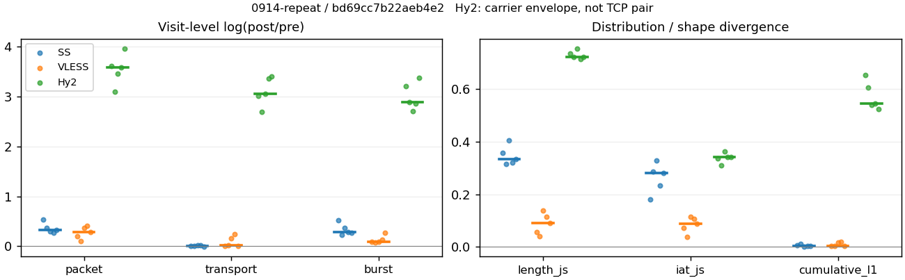
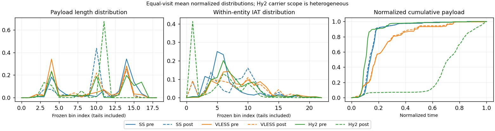

# 0914-repeat · 条目 003 · github.com

目标：https://github.com/RakuLomis/TrafficTracer

活动标签：github.com::page_load。选定访问 15 次。

[返回总索引](../../README.md) · [统计口径](../../methods.md)

## 覆盖与资格（每次访问均保留）

| 部署 | 重复 | 主请求路由 | 活动状态 | 代理比较 | DIRECT pre | 请求 proxy/direct/unresolved | 错误 |
| --- | --- | --- | --- | --- | --- | --- | --- |
| Hy2 | 1 | proxy | passed | 1 | 0 | 164/0/0 | [] |
| Hy2 | 2 | proxy | passed | 1 | 0 | 149/0/0 | [] |
| Hy2 | 3 | proxy | passed | 1 | 0 | 164/0/0 | [] |
| Hy2 | 4 | proxy | degraded | 1 | 0 | 163/0/0 | [] |
| Hy2 | 5 | proxy | degraded | 1 | 0 | 163/0/0 | [] |
| SS | 1 | proxy | passed | 1 | 0 | 164/0/0 | [] |
| SS | 2 | proxy | passed | 1 | 0 | 155/0/0 | [] |
| SS | 3 | proxy | passed | 1 | 0 | 164/0/0 | [] |
| SS | 4 | proxy | passed | 1 | 0 | 164/0/0 | [] |
| SS | 5 | proxy | passed | 1 | 0 | 164/0/0 | [] |
| VLESS | 1 | proxy | passed | 1 | 0 | 163/0/0 | [] |
| VLESS | 2 | proxy | passed | 1 | 0 | 165/0/0 | [] |
| VLESS | 3 | proxy | passed | 1 | 0 | 165/0/0 | [] |
| VLESS | 4 | proxy | passed | 1 | 0 | 164/0/0 | [] |
| VLESS | 5 | proxy | passed | 1 | 0 | 165/0/0 | [] |

主请求非 proxy 的统计仅解释为已索引的辅助代理连接或 DIRECT 观测，不代表目标业务经代理传输。播放确认与配对资格是两道不同的门。

图中散点为单次访问，短线为重复中位数；Hy2 是共享载体包络，不能与 TCP 配对作等范围因果对比。

形态图先逐访问归一化，再对访问等权平均；实线 pre，虚线 post。分箱序号及边界见 methods，不将分箱索引误解为长度或时间。

## 每次访问的关键观测

### SS

范围：`exclusive_page`。每格 pre → post；空值为不可观测/不适用。

| 重复 | 包数 | 载荷字节 | burst | TCP FR | IAT中位µs | length JS | IAT JS |
| --- | --- | --- | --- | --- | --- | --- | --- |
| 1 | 1336 → 2295 | 2.289e+06 → 2.293e+06 | 842 → 1418 | 75 → 77 | 37.779 → 132.27 | 0.35823 | 0.18112 |
| 2 | 1472 → 2118 | 1.6762e+06 → 1.6775e+06 | 1086 → 1362 | 57 → 57 | 23.447 → 248.77 | 0.31502 | 0.28582 |
| 3 | 3029 → 4084 | 4.2157e+06 → 4.3235e+06 | 2095 → 3017 | 105 → 117 | 16.336 → 397.19 | 0.40599 | 0.32841 |
| 4 | 1709 → 2231 | 2.245e+06 → 2.3022e+06 | 1127 → 1509 | 87 → 91 | 17.921 → 139.73 | 0.31977 | 0.23429 |
| 5 | 1721 → 2374 | 2.2598e+06 → 2.2584e+06 | 1182 → 1546 | 77 → 87 | 17.929 → 179.89 | 0.33436 | 0.2807 |

完整标量统计：中位数 [min,max]；Δ 为重复内逐访问变换的中位数，MAD 未缩放。n 为可用变换数；DIRECT-only 的 nΔ=0 不代表 pre 不可用。

| scope | 特征 | pre | post | Δ | IQRΔ | MADΔ | nΔ |
| --- | --- | --- | --- | --- | --- | --- | --- |
| exclusive_page | active_span_sum_s_1000ms | 14.05 [11.433, 15.663] | 15.201 [12.641, 18.217] | 0.10045 | 0.0484 | 0.026682 | 5 |
| exclusive_page | active_span_sum_s_100ms | 2.6632 [2.4656, 4.3772] | 5.2452 [4.5689, 6.2053] | 0.66682 | 0.086195 | 0.078381 | 5 |
| exclusive_page | active_span_sum_s_500ms | 10.767 [8.9268, 12.002] | 13.188 [11.626, 14.385] | 0.18115 | 0.071734 | 0.050696 | 5 |
| exclusive_page | burst_bytes_iqr | 2896 [2896, 2896] | 2856 [1710, 2856] | -0.013908 | 0 | 0 | 5 |
| exclusive_page | burst_bytes_mad | 64 [31, 71] | 34 [34, 40] | -0.49899 | 0.089612 | 0.060625 | 5 |
| exclusive_page | burst_bytes_max | 26896 [23943, 32975] | 15708 [14280, 19992] | -0.48574 | 0.16931 | 0.11725 | 5 |
| exclusive_page | burst_bytes_mean | 1992 [1543.5, 2718.5] | 1460.8 [1231.6, 1617.1] | -0.26909 | 0.072751 | 0.043396 | 5 |
| exclusive_page | burst_bytes_median | 64 [31, 71] | 34 [34, 40] | -0.49899 | 0.089612 | 0.060625 | 5 |
| exclusive_page | burst_bytes_min | 0 [0, 0] | 0 [0, 0] | — | — | — | 0 |
| exclusive_page | burst_bytes_p95 | 8920 [5792, 20480] | 5712 [5660.6, 7140] | -0.44573 | 0.037247 | 0.034553 | 5 |
| exclusive_page | burst_bytes_q25 | 0 [0, 0] | 0 [0, 0] | — | — | — | 0 |
| exclusive_page | burst_bytes_q75 | 2896 [2896, 2896] | 2856 [1710, 2856] | -0.013908 | 0 | 0 | 5 |
| exclusive_page | burst_bytes_std | 3978.3 [3410, 5542.2] | 2313.9 [2003.3, 2689.6] | -0.55124 | 0.15703 | 0.10059 | 5 |
| exclusive_page | burst_count | 1127 [842, 2095] | 1509 [1362, 3017] | 0.29189 | 0.096246 | 0.065435 | 5 |
| exclusive_page | burst_duration_ms_iqr | 0 [0, 0.044419] | 0.00454 [0.000104, 0.0081515] | -1.994 | — | — | 1 |
| exclusive_page | burst_duration_ms_mad | 0 [0, 0] | 0 [0, 0] | — | — | — | 0 |
| exclusive_page | burst_duration_ms_max | 13629 [5051, 14798] | 13590 [5051.2, 14996] | 4.1555e-05 | 3.7197e-05 | 2.1726e-05 | 5 |
| exclusive_page | burst_duration_ms_mean | 31.864 [18.71, 74.752] | 33.84 [12.175, 48.266] | -0.42972 | 0.080054 | 0.072325 | 5 |
| exclusive_page | burst_duration_ms_median | 0 [0, 0] | 0 [0, 0] | — | — | — | 0 |
| exclusive_page | burst_duration_ms_min | 0 [0, 0] | 0 [0, 0] | — | — | — | 0 |
| exclusive_page | burst_duration_ms_p95 | 6.5112 [2.2499, 24.893] | 1.0159 [0.94944, 1.0293] | -1.8578 | 1.5871 | 0.99499 | 5 |
| exclusive_page | burst_duration_ms_q25 | 0 [0, 0] | 0 [0, 0] | — | — | — | 0 |
| exclusive_page | burst_duration_ms_q75 | 0 [0, 0.044419] | 0.00454 [0.000104, 0.0081515] | -1.994 | — | — | 1 |
| exclusive_page | burst_duration_ms_std | 490.96 [225.75, 819.1] | 596 [186.39, 710.16] | -0.1644 | 0.04887 | 0.02719 | 5 |
| exclusive_page | burst_packets_iqr | 0 [0, 1] | 1 [1, 1] | 0 | — | — | 1 |
| exclusive_page | burst_packets_mad | 0 [0, 0] | 0 [0, 0] | — | — | — | 0 |
| exclusive_page | burst_packets_max | 11 [10, 12] | 13 [11, 14] | 0.15415 | 0.26236 | 0.15415 | 5 |
| exclusive_page | burst_packets_mean | 1.456 [1.3554, 1.5867] | 1.5356 [1.3537, 1.6185] | 0.01983 | 0.078554 | 0.045177 | 5 |
| exclusive_page | burst_packets_median | 1 [1, 1] | 1 [1, 1] | 0 | 0 | 0 | 5 |
| exclusive_page | burst_packets_min | 1 [1, 1] | 1 [1, 1] | 0 | 0 | 0 | 5 |
| exclusive_page | burst_packets_p95 | 4 [2, 4] | 3 [3, 4] | -0.28768 | 0.28768 | 0 | 5 |
| exclusive_page | burst_packets_q25 | 1 [1, 1] | 1 [1, 1] | 0 | 0 | 0 | 5 |
| exclusive_page | burst_packets_q75 | 1 [1, 2] | 2 [2, 2] | 0.69315 | 0 | 0 | 5 |
| exclusive_page | burst_packets_std | 1.2359 [1.2146, 1.3765] | 1.05 [0.82061, 1.1896] | -0.22288 | 0.19113 | 0.11253 | 5 |
| exclusive_page | connection_span_concurrency_max | 6 [4, 6] | 6 [4, 6] | 0 | 0 | 0 | 5 |
| exclusive_page | cumulative_l1 | — | — | 0.0046608 | 0.0036103 | 0.0018539 | 5 |
| exclusive_page | cumulative_max | — | — | 0.24881 | 0.18809 | 0.12534 | 5 |
| exclusive_page | direction_entropy | 0.7246 [0.67682, 0.81128] | 0.49623 [0.38692, 0.5393] | -0.254 | 0.050302 | 0.035904 | 5 |
| exclusive_page | down_burst_count | 559 [417, 1043] | 750 [677, 1504] | 0.29392 | 0.095961 | 0.065968 | 5 |
| exclusive_page | down_ip_bytes | 2.222e+06 [1.6219e+06, 4.2007e+06] | 2.2645e+06 [1.6369e+06, 4.325e+06] | 0.010011 | 0.016904 | 0.0040011 | 5 |
| exclusive_page | down_packets | 1019 [817, 1806] | 1356 [1258, 2366] | 0.33885 | 0.13023 | 0.068766 | 5 |
| exclusive_page | down_transport_bytes | 2.169e+06 [1.578e+06, 4.1067e+06] | 2.1933e+06 [1.5713e+06, 4.2e+06] | -0.0027701 | 0.024631 | 0.0014448 | 5 |
| exclusive_page | duration_s | 21.912 [19.266, 23.462] | 21.912 [19.266, 23.461] | -2.7475e-05 | 1.0565e-05 | 7.0161e-06 | 5 |
| exclusive_page | entity_count | 8 [8, 9] | 8 [8, 9] | 0 | 0 | 0 | 5 |
| exclusive_page | fr_runs | 77 [57, 105] | 87 [57, 117] | 0.044951 | 0.081896 | 0.044951 | 5 |
| exclusive_page | fr_runs_per_packet | 0.073826 [0.05612, 0.090144] | 0.054843 [0.044289, 0.068939] | -0.014474 | 0.0085742 | 0.0065023 | 5 |
| exclusive_page | fr_switches | 69 [49, 96] | 79 [49, 108] | 0.05001 | 0.088369 | 0.05001 | 5 |
| exclusive_page | fr_switches_per_possible_transition | 0.066667 [0.051557, 0.081311] | 0.049427 [0.038311, 0.062548] | -0.012888 | 0.0076621 | 0.0059397 | 5 |
| exclusive_page | full_retransmission_fraction | 0.0092969 [0.0064365, 0.013473] | 0.013508 [0.0021061, 0.01524] | 3.4571e-05 | 0.012172 | 0.0064034 | 5 |
| exclusive_page | full_retransmission_packets | 16 [11, 25] | 31 [5, 60] | 0.54362 | 1.4351 | 0.58485 | 5 |
| exclusive_page | iat_count | 1700 [1328, 3020] | 2287 [2110, 4075] | 0.32295 | 0.065902 | 0.042561 | 5 |
| exclusive_page | iat_js | — | — | 0.2807 | 0.051531 | 0.046407 | 5 |
| exclusive_page | iat_ks | — | — | 0.40954 | 0.094406 | 0.062224 | 5 |
| exclusive_page | iat_median_us | 17.929 [16.336, 37.779] | 179.89 [132.27, 397.19] | 2.3059 | 0.30801 | 0.25216 | 5 |
| exclusive_page | iat_us_iqr | 45.003 [30.109, 124.33] | 879.28 [817.02, 1008.3] | 2.9936 | 0.14598 | 0.11568 | 5 |
| exclusive_page | iat_us_mad | 13.705 [11.269, 28.267] | 179.22 [132.07, 387.26] | 2.5709 | 0.35211 | 0.21786 | 5 |
| exclusive_page | iat_us_max | 1.3629e+07 [5.051e+06, 1.5e+07] | 1.359e+07 [5.0512e+06, 1.4996e+07] | 1.9829e-05 | 0.00032949 | 3.7197e-05 | 5 |
| exclusive_page | iat_us_mean | 54335 [14676, 58005] | 38046 [11048, 44376] | -0.32301 | 0.072389 | 0.039023 | 5 |
| exclusive_page | iat_us_median | 17.929 [16.336, 37.779] | 179.89 [132.27, 397.19] | 2.3059 | 0.30801 | 0.25216 | 5 |
| exclusive_page | iat_us_min | 0.106 [0.034, 0.183] | 0.034 [0.03, 0.039] | -1.2622 | 0.38833 | 0.21103 | 5 |
| exclusive_page | iat_us_p95 | 19813 [7073.8, 40550] | 28422 [5855.7, 31485] | 0.08733 | 0.62606 | 0.34975 | 5 |
| exclusive_page | iat_us_q25 | 10.306 [8.996, 16.042] | 8.8182 [7.78, 11.389] | -0.1559 | 0.31948 | 0.16686 | 5 |
| exclusive_page | iat_us_q75 | 54.733 [39.105, 140.37] | 888.1 [825.7, 1018.2] | 2.7934 | 0.15714 | 0.12987 | 5 |
| exclusive_page | iat_us_std | 7.1114e+05 [1.8918e+05, 7.3783e+05] | 5.9977e+05 [1.6141e+05, 6.256e+05] | -0.16499 | 0.028147 | 0.021903 | 5 |
| exclusive_page | iat_wasserstein_log1p_us | — | — | 1.4505 | 0.18788 | 0.12124 | 5 |
| exclusive_page | idle_gap_count_1000ms | 10 [6, 12] | 10 [5, 11] | 0 | 0.087011 | 0 | 5 |
| exclusive_page | idle_gap_count_100ms | 41 [37, 47] | 46 [39, 51] | 0.067441 | 0.029034 | 0.014798 | 5 |
| exclusive_page | idle_gap_count_500ms | 13 [11, 18] | 12 [11, 16] | -0.11778 | 0.087011 | 0.049271 | 5 |
| exclusive_page | idle_gap_sum_s_1000ms | 68.113 [17.297, 82.946] | 67.636 [14.159, 80.998] | -0.015064 | 0.018959 | 0.010929 | 5 |
| exclusive_page | idle_gap_sum_s_100ms | 76.883 [29.713, 96.143] | 75.089 [27.131, 93.116] | -0.028693 | 0.0083787 | 0.0050805 | 5 |
| exclusive_page | idle_gap_sum_s_500ms | 68.779 [23.458, 87.204] | 68.372 [19.188, 84.644] | -0.0298 | 0.03635 | 0.023748 | 5 |
| exclusive_page | ip_bytes | 2.3496e+06 [1.7531e+06, 4.3737e+06] | 2.431e+06 [1.804e+06, 4.5755e+06] | 0.030153 | 0.014741 | 0.0086132 | 5 |
| exclusive_page | length_iqr | 2648 [2648, 3919] | 1428 [1268.5, 1585] | -0.61753 | 0.11844 | 0.10431 | 5 |
| exclusive_page | length_js | — | — | 0.33436 | 0.03846 | 0.019335 | 5 |
| exclusive_page | length_ks | — | — | 0.45335 | 0.034835 | 0.017674 | 5 |
| exclusive_page | length_mad | 1328 [1106, 1792] | 488 [12, 1126] | -1.3008 | 2.1179 | 1.2043 | 5 |
| exclusive_page | length_max | 8948 [8948, 8948] | 9996 [7140, 11424] | 0.11075 | 0.15415 | 0.13353 | 5 |
| exclusive_page | length_mean | 2166.6 [1972, 2751.1] | 1633.2 [1303.4, 1779.2] | -0.33627 | 0.17789 | 0.10009 | 5 |
| exclusive_page | length_median | 2688 [1944, 2780] | 1428 [1428, 1428] | -0.63252 | 0.26028 | 0.033654 | 5 |
| exclusive_page | length_min | 31 [8, 31] | 20 [12, 20] | -0.43825 | 1.6422 | 0.51083 | 5 |
| exclusive_page | length_p95 | 5699.2 [4096, 8192] | 2856 [2856, 2856] | -0.6909 | 0.036572 | 0.02042 | 5 |
| exclusive_page | length_q25 | 248 [177, 248] | 1428 [233.5, 1428] | 1.7506 | 0.11647 | 0.11647 | 5 |
| exclusive_page | length_q75 | 2896 [2896, 4096] | 2856 [1502, 2856] | -0.013908 | 0.34668 | 0 | 5 |
| exclusive_page | length_std | 1908.5 [1502.1, 2614.6] | 1145.7 [1004.9, 1220.7] | -0.49241 | 0.1812 | 0.12011 | 5 |
| exclusive_page | length_wasserstein_bytes | — | — | 828.04 | 91.132 | 73.684 | 5 |
| exclusive_page | nonempty_entity_count | 8 [8, 9] | 8 [8, 9] | 0 | 0 | 0 | 5 |
| exclusive_page | nonempty_packets | 1043 [832, 1871] | 1404 [1287, 2430] | 0.33565 | 0.15341 | 0.079183 | 5 |
| exclusive_page | offload_suspect_fraction | 0.34689 [0.33967, 0.36217] | 0.19208 [0.17186, 0.20837] | -0.15481 | 0.014022 | 0.007211 | 5 |
| exclusive_page | packet_count | 1709 [1336, 3029] | 2295 [2118, 4084] | 0.32167 | 0.065006 | 0.042179 | 5 |
| exclusive_page | rtt_median_ms | 0.017663 [0.011405, 0.065475] | 33.718 [27.867, 34.024] | 7.4171 | 0.29062 | 0.23724 | 5 |
| exclusive_page | rtt_sample_count | 648 [481, 1130] | 270 [233, 392] | -0.89382 | 0.060023 | 0.045384 | 5 |
| exclusive_page | tcp_ack_count | 1700 [1328, 3020] | 2285 [2110, 4074] | 0.32295 | 0.066147 | 0.042561 | 5 |
| exclusive_page | tcp_fin_count | 16 [16, 18] | 19 [16, 20] | 0.10536 | 0.17185 | 0.10536 | 5 |
| exclusive_page | tcp_packet_count | 1709 [1336, 3029] | 2295 [2118, 4084] | 0.32167 | 0.065006 | 0.042179 | 5 |
| exclusive_page | tcp_rst_count | 0 [0, 0] | 0 [0, 0] | — | — | — | 0 |
| exclusive_page | tcp_syn_count | 16 [16, 18] | 18 [16, 19] | 0.054067 | 0.054067 | 0.054067 | 5 |
| exclusive_page | tcp_window_raw_median | 65535 [65535, 65535] | 155 [150, 168] | -6.0469 | 0.093526 | 0.03279 | 5 |
| exclusive_page | transition_entropy | 0.32168 [0.26634, 0.3802] | 0.23852 [0.19685, 0.28528] | -0.070846 | 0.029789 | 0.015334 | 5 |
| exclusive_page | transition_n_mm | 790 [587, 1485] | 1212 [1112, 2188] | 0.46624 | 0.16182 | 0.083154 | 5 |
| exclusive_page | transition_n_mp | 31 [21, 44] | 36 [21, 50] | 0.05557 | 0.095044 | 0.05557 | 5 |
| exclusive_page | transition_n_pm | 38 [28, 52] | 43 [28, 58] | 0.045462 | 0.082531 | 0.045462 | 5 |
| exclusive_page | transition_n_pp | 168 [147, 281] | 115 [100, 125] | -0.39087 | 0.16898 | 0.10996 | 5 |
| exclusive_page | transition_p_mm | 0.96261 [0.95138, 0.97122] | 0.97506 [0.9678, 0.98158] | 0.010222 | 0.0031917 | 0.0028409 | 5 |
| exclusive_page | transition_p_mp | 0.037394 [0.028777, 0.048622] | 0.02494 [0.018421, 0.032202] | -0.010222 | 0.0031917 | 0.0028409 | 5 |
| exclusive_page | transition_p_pm | 0.17874 [0.15616, 0.20574] | 0.27778 [0.20144, 0.31694] | 0.072036 | 0.046611 | 0.030597 | 5 |
| exclusive_page | transition_p_pp | 0.82126 [0.79426, 0.84384] | 0.72222 [0.68306, 0.79856] | -0.072036 | 0.046611 | 0.030597 | 5 |
| exclusive_page | transport_bytes | 2.2598e+06 [1.6762e+06, 4.2157e+06] | 2.293e+06 [1.6775e+06, 4.3235e+06] | 0.0017748 | 0.024406 | 0.0023989 | 5 |
| exclusive_page | up_burst_count | 568 [425, 1052] | 759 [685, 1513] | 0.28988 | 0.096522 | 0.06491 | 5 |
| exclusive_page | up_byte_fraction | 0.039147 [0.025865, 0.058604] | 0.043148 [0.028556, 0.063277] | 0.0040785 | 0.0014024 | 0.00059467 | 5 |
| exclusive_page | up_ip_bytes | 1.2759e+05 [1.1687e+05, 1.7301e+05] | 1.6652e+05 [1.6362e+05, 2.505e+05] | 0.32034 | 0.094773 | 0.049791 | 5 |
| exclusive_page | up_packets | 687 [519, 1223] | 944 [860, 1718] | 0.33985 | 0.031129 | 0.027053 | 5 |
| exclusive_page | up_transport_bytes | 90828 [82848, 1.0904e+05] | 99756 [94349, 1.2346e+05] | 0.1073 | 0.04673 | 0.022688 | 5 |
| exclusive_page | zero_iat_count | 0 [0, 0] | 0 [0, 0] | — | — | — | 0 |
| exclusive_page | zero_iat_fraction | 0 [0, 0] | 0 [0, 0] | 0 | 0 | 0 | 5 |

### VLESS

范围：`exclusive_page`。每格 pre → post；空值为不可观测/不适用。

| 重复 | 包数 | 载荷字节 | burst | TCP FR | IAT中位µs | length JS | IAT JS |
| --- | --- | --- | --- | --- | --- | --- | --- |
| 1 | 1775 → 2157 | 1.9526e+06 → 1.9687e+06 | 1282 → 1403 | 66 → 74 | 100.63 → 77.438 | 0.056807 | 0.073026 |
| 2 | 2178 → 2417 | 1.7166e+06 → 1.7434e+06 | 1856 → 2010 | 52 → 60 | 70.889 → 68.417 | 0.041121 | 0.037051 |
| 3 | 441 → 642 | 3.1708e+05 → 3.7373e+05 | 303 → 333 | 49 → 64 | 177.64 → 387.93 | 0.13855 | 0.11416 |
| 4 | 337 → 510 | 2.3358e+05 → 2.9716e+05 | 232 → 264 | 41 → 58 | 166.26 → 402.9 | 0.11341 | 0.10581 |
| 5 | 1678 → 2240 | 2.1927e+06 → 2.2217e+06 | 1074 → 1405 | 84 → 98 | 150.26 → 95.868 | 0.089737 | 0.088224 |

完整标量统计：中位数 [min,max]；Δ 为重复内逐访问变换的中位数，MAD 未缩放。n 为可用变换数；DIRECT-only 的 nΔ=0 不代表 pre 不可用。

| scope | 特征 | pre | post | Δ | IQRΔ | MADΔ | nΔ |
| --- | --- | --- | --- | --- | --- | --- | --- |
| exclusive_page | active_span_sum_s_1000ms | 9.9936 [6.8211, 11.787] | 9.944 [8.1236, 12.029] | 0.037436 | 0.054321 | 0.037168 | 5 |
| exclusive_page | active_span_sum_s_100ms | 1.6217 [0.8708, 2.6753] | 3.9461 [3.2273, 4.304] | 0.76806 | 0.47627 | 0.34244 | 5 |
| exclusive_page | active_span_sum_s_500ms | 5.7951 [3.955, 6.4764] | 9.2739 [7.2832, 10.314] | 0.57651 | 0.098695 | 0.064624 | 5 |
| exclusive_page | burst_bytes_iqr | 1557 [1484, 2896] | 1989.2 [1484, 2824] | 0 | 0.21268 | 0.025176 | 5 |
| exclusive_page | burst_bytes_mad | 42 [24, 72] | 48 [36, 72] | 0.013986 | 0.69315 | 0.16814 | 5 |
| exclusive_page | burst_bytes_max | 22626 [16499, 29490] | 17852 [12801, 29104] | -0.23698 | 0.13304 | 0.10386 | 5 |
| exclusive_page | burst_bytes_mean | 1046.5 [924.87, 2041.6] | 1125.6 [867.38, 1581.3] | -0.064177 | 0.15199 | 0.13415 | 5 |
| exclusive_page | burst_bytes_median | 42 [24, 72] | 48 [36, 72] | 0.013986 | 0.69315 | 0.16814 | 5 |
| exclusive_page | burst_bytes_min | 0 [0, 0] | 0 [0, 0] | — | — | — | 0 |
| exclusive_page | burst_bytes_p95 | 2896 [2896, 8920] | 2896 [2896, 5648] | 0 | 0.32066 | 0 | 5 |
| exclusive_page | burst_bytes_q25 | 0 [0, 0] | 0 [0, 0] | — | — | — | 0 |
| exclusive_page | burst_bytes_q75 | 1557 [1484, 2896] | 1989.2 [1484, 2824] | 0 | 0.21268 | 0.025176 | 5 |
| exclusive_page | burst_bytes_std | 2390.2 [1554, 3929.7] | 1941.8 [1287.3, 2442.8] | -0.26005 | 0.16296 | 0.071785 | 5 |
| exclusive_page | burst_count | 1074 [232, 1856] | 1403 [264, 2010] | 0.09441 | 0.03902 | 0.014699 | 5 |
| exclusive_page | burst_duration_ms_iqr | 0.5113 [0, 1.7102] | 0.010527 [0, 6.1545] | 0.22519 | 2.6533 | 1.0554 | 3 |
| exclusive_page | burst_duration_ms_mad | 0 [0, 0] | 0 [0, 0] | — | — | — | 0 |
| exclusive_page | burst_duration_ms_max | 14221 [9234.3, 14512] | 14224 [9240.6, 14553] | 0.00018658 | 0.00066213 | 0.00050163 | 5 |
| exclusive_page | burst_duration_ms_mean | 47.819 [13.167, 221.25] | 23.08 [11.486, 158.52] | -0.33343 | 0.18592 | 0.16309 | 5 |
| exclusive_page | burst_duration_ms_median | 0 [0, 0] | 0 [0, 0] | — | — | — | 0 |
| exclusive_page | burst_duration_ms_min | 0 [0, 0] | 0 [0, 0] | — | — | — | 0 |
| exclusive_page | burst_duration_ms_p95 | 8.7552 [1.3805, 578.01] | 8.7437 [1.1098, 296.88] | -0.21831 | 0.66497 | 0.34161 | 5 |
| exclusive_page | burst_duration_ms_q25 | 0 [0, 0] | 0 [0, 0] | — | — | — | 0 |
| exclusive_page | burst_duration_ms_q75 | 0.5113 [0, 1.7102] | 0.010527 [0, 6.1545] | 0.22519 | 2.6533 | 1.0554 | 3 |
| exclusive_page | burst_duration_ms_std | 645.53 [277.91, 1403.2] | 425.96 [265.07, 1141.8] | -0.20331 | 0.2105 | 0.14772 | 5 |
| exclusive_page | burst_packets_iqr | 1 [0, 1] | 1 [0, 1] | 0 | 0 | 0 | 3 |
| exclusive_page | burst_packets_mad | 0 [0, 0] | 0 [0, 0] | — | — | — | 0 |
| exclusive_page | burst_packets_max | 5 [4, 14] | 12 [11, 13] | 0.78846 | 0.74924 | 0.3902 | 5 |
| exclusive_page | burst_packets_mean | 1.4526 [1.1735, 1.5624] | 1.5943 [1.2025, 1.9318] | 0.10473 | 0.25672 | 0.084501 | 5 |
| exclusive_page | burst_packets_median | 1 [1, 1] | 1 [1, 1] | 0 | 0 | 0 | 5 |
| exclusive_page | burst_packets_min | 1 [1, 1] | 1 [1, 1] | 0 | 0 | 0 | 5 |
| exclusive_page | burst_packets_p95 | 2 [2, 3] | 4 [2, 5] | 0.28768 | 0.91629 | 0.28768 | 5 |
| exclusive_page | burst_packets_q25 | 1 [1, 1] | 1 [1, 1] | 0 | 0 | 0 | 5 |
| exclusive_page | burst_packets_q75 | 2 [1, 2] | 2 [1, 2] | 0 | 0 | 0 | 5 |
| exclusive_page | burst_packets_std | 0.62794 [0.43927, 0.98563] | 1.228 [0.72021, 1.6999] | 0.49442 | 0.53273 | 0.34361 | 5 |
| exclusive_page | connection_span_concurrency_max | 4 [2, 5] | 4 [2, 5] | 0 | 0 | 0 | 5 |
| exclusive_page | cumulative_l1 | — | — | 0.004824 | 0.014192 | 0.0021356 | 5 |
| exclusive_page | cumulative_max | — | — | 0.062103 | 0.025728 | 0.022381 | 5 |
| exclusive_page | direction_entropy | 0.67131 [0.54356, 0.88077] | 0.49631 [0.36035, 0.96741] | -0.175 | 0.26984 | 0.024784 | 5 |
| exclusive_page | down_burst_count | 534 [113, 926] | 700 [129, 1003] | 0.096538 | 0.041249 | 0.016661 | 5 |
| exclusive_page | down_ip_bytes | 1.7101e+06 [1.6236e+05, 2.1341e+06] | 1.735e+06 [2.1616e+05, 2.1659e+06] | 0.014799 | 0.18464 | 0.0038663 | 5 |
| exclusive_page | down_packets | 1027 [184, 1162] | 1271 [267, 1321] | 0.25175 | 0.095933 | 0.056916 | 5 |
| exclusive_page | down_transport_bytes | 1.6496e+06 [1.5274e+05, 2.0807e+06] | 1.6684e+06 [2.0222e+05, 2.0972e+06] | 0.011331 | 0.18526 | 0.0062562 | 5 |
| exclusive_page | duration_s | 20.933 [20.107, 25.481] | 20.925 [20.082, 25.441] | -0.0015667 | 0.00044765 | 0.00029326 | 5 |
| exclusive_page | entity_count | 6 [4, 7] | 6 [4, 7] | 0 | 0 | 0 | 5 |
| exclusive_page | fr_runs | 52 [41, 84] | 64 [58, 98] | 0.15415 | 0.12396 | 0.03974 | 5 |
| exclusive_page | fr_runs_per_packet | 0.078652 [0.043624, 0.23295] | 0.072539 [0.046189, 0.21642] | -0.0061128 | 0.012834 | 0.008678 | 5 |
| exclusive_page | fr_switches | 48 [35, 78] | 57 [52, 92] | 0.16508 | 0.15123 | 0.043719 | 5 |
| exclusive_page | fr_switches_per_possible_transition | 0.073446 [0.040404, 0.20588] | 0.068401 [0.043243, 0.19847] | -0.0050448 | 0.004263 | 0.0023642 | 5 |
| exclusive_page | full_retransmission_fraction | 0.0018365 [0, 0.0050704] | 0 [0, 0.00041374] | -0.0014228 | 0.0041716 | 0.0014228 | 5 |
| exclusive_page | full_retransmission_packets | 4 [0, 9] | 0 [0, 1] | -1.3863 | — | — | 1 |
| exclusive_page | iat_count | 1672 [331, 2174] | 2153 [504, 2413] | 0.28977 | 0.18526 | 0.094455 | 5 |
| exclusive_page | iat_js | — | — | 0.088224 | 0.032787 | 0.01759 | 5 |
| exclusive_page | iat_ks | — | — | 0.13348 | 0.056601 | 0.034082 | 5 |
| exclusive_page | iat_median_us | 150.26 [70.889, 177.64] | 95.868 [68.417, 402.9] | -0.035494 | 1.043 | 0.41391 | 5 |
| exclusive_page | iat_us_iqr | 1858.6 [666.49, 4486.8] | 1949.9 [686.54, 8139.5] | 0.047947 | 0.30011 | 0.14694 | 5 |
| exclusive_page | iat_us_mad | 144.83 [60.522, 171.09] | 95.822 [61.631, 400.83] | 0.018166 | 0.99888 | 0.43124 | 5 |
| exclusive_page | iat_us_max | 1.4221e+07 [1.0157e+07, 1.4512e+07] | 1.4224e+07 [1.0157e+07, 1.4553e+07] | 2.6076e-05 | 0.0029912 | 0.0027501 | 5 |
| exclusive_page | iat_us_mean | 38346 [19752, 1.9381e+05] | 28624 [17277, 1.4e+05] | -0.2924 | 0.12824 | 0.090661 | 5 |
| exclusive_page | iat_us_median | 150.26 [70.889, 177.64] | 95.868 [68.417, 402.9] | -0.035494 | 1.043 | 0.41391 | 5 |
| exclusive_page | iat_us_min | 0.572 [0.133, 2.469] | 0.036 [0.03, 0.041] | -2.9479 | 1.3361 | 0.71812 | 5 |
| exclusive_page | iat_us_p95 | 8551.9 [4121.2, 2.3586e+05] | 9895.8 [5955.4, 1.5342e+05] | 0.14595 | 0.7831 | 0.42771 | 5 |
| exclusive_page | iat_us_q25 | 31.611 [31.037, 34.666] | 11.151 [8.3225, 19.337] | -1.042 | 0.015818 | 0.01016 | 5 |
| exclusive_page | iat_us_q75 | 1891.3 [697.53, 4521.4] | 1969.2 [697.6, 8150.7] | 0.040353 | 0.3239 | 0.16569 | 5 |
| exclusive_page | iat_us_std | 5.5972e+05 [3.6486e+05, 1.349e+06] | 4.8259e+05 [3.2802e+05, 1.123e+06] | -0.14826 | 0.076877 | 0.041827 | 5 |
| exclusive_page | iat_wasserstein_log1p_us | — | — | 0.68303 | 0.11003 | 0.04903 | 5 |
| exclusive_page | idle_gap_count_1000ms | 7 [4, 10] | 8 [4, 10] | 0 | 0 | 0 | 5 |
| exclusive_page | idle_gap_count_100ms | 29 [21, 38] | 38 [27, 45] | 0.17185 | 0.082238 | 0.012786 | 5 |
| exclusive_page | idle_gap_count_500ms | 14 [10, 17] | 8 [6, 11] | -0.51083 | 0.1243 | 0.04879 | 5 |
| exclusive_page | idle_gap_sum_s_1000ms | 54.121 [30.441, 68.716] | 54.003 [29.075, 68.109] | -0.0088743 | 0.0094832 | 0.0066797 | 5 |
| exclusive_page | idle_gap_sum_s_100ms | 62.118 [35.64, 78.302] | 59.643 [33.794, 75.327] | -0.038984 | 0.0019268 | 0.001684 | 5 |
| exclusive_page | idle_gap_sum_s_500ms | 58.155 [33.307, 73.675] | 54.003 [29.915, 68.959] | -0.071694 | 0.0079231 | 0.0055412 | 5 |
| exclusive_page | ip_bytes | 1.8298e+06 [2.5108e+05, 2.28e+06] | 1.8706e+06 [3.2398e+05, 2.3396e+06] | 0.025836 | 0.15916 | 0.0078009 | 5 |
| exclusive_page | length_iqr | 2747 [1869.8, 2752] | 2716 [1324.8, 2752] | -0.011349 | 0.34385 | 0.011349 | 5 |
| exclusive_page | length_js | — | — | 0.089737 | 0.0566 | 0.032929 | 5 |
| exclusive_page | length_ks | — | — | 0.1243 | 0.052809 | 0.029017 | 5 |
| exclusive_page | length_mad | 1376 [496, 1406] | 1340 [740.5, 1340] | -0.026511 | 0.37617 | 0.021568 | 5 |
| exclusive_page | length_max | 8948 [8948, 8948] | 4236 [2824, 8472] | -0.74781 | 0.94147 | 0.40547 | 5 |
| exclusive_page | length_mean | 1440.1 [1327.1, 2053.1] | 1342.1 [1099.2, 1644.5] | -0.17975 | 0.027775 | 0.01675 | 5 |
| exclusive_page | length_median | 1448 [520, 1484] | 1412 [1204, 1412] | -0.025176 | 0.80654 | 0.024558 | 5 |
| exclusive_page | length_min | 24 [18, 24] | 24 [5, 24] | 0 | 0.69315 | 0 | 5 |
| exclusive_page | length_p95 | 3570 [2896, 8192] | 2824 [2824, 2896] | -0.23441 | 0.65741 | 0.20924 | 5 |
| exclusive_page | length_q25 | 72 [72, 77] | 79 [72, 108] | 0.025642 | 0.19211 | 0.025642 | 5 |
| exclusive_page | length_q75 | 2824 [1941.8, 2824] | 2824 [1412, 2824] | 0 | 0.31858 | 0 | 5 |
| exclusive_page | length_std | 1805.5 [1373.4, 2270.2] | 1121.9 [930.89, 1323.9] | -0.53931 | 0.19947 | 0.11136 | 5 |
| exclusive_page | length_wasserstein_bytes | — | — | 504.6 | 75.791 | 68.228 | 5 |
| exclusive_page | nonempty_entity_count | 6 [4, 7] | 6 [4, 7] | 0 | 0 | 0 | 5 |
| exclusive_page | nonempty_packets | 1068 [176, 1192] | 1289 [268, 1351] | 0.23506 | 0.18398 | 0.12583 | 5 |
| exclusive_page | offload_suspect_fraction | 0.21947 [0.16553, 0.32241] | 0.16798 [0.099688, 0.2558] | -0.063257 | 0.0041267 | 0.0025873 | 5 |
| exclusive_page | packet_count | 1678 [337, 2178] | 2157 [510, 2417] | 0.28887 | 0.18063 | 0.093955 | 5 |
| exclusive_page | rtt_median_ms | 0.13514 [0.056067, 0.44439] | 0.13161 [0.0472, 9.2441] | 0.68039 | 4.1223 | 1.8972 | 5 |
| exclusive_page | rtt_sample_count | 590 [136, 975] | 825 [212, 1055] | 0.33526 | 0.23326 | 0.10867 | 5 |
| exclusive_page | tcp_ack_count | 1661 [321, 2166] | 2152 [501, 2413] | 0.29593 | 0.20981 | 0.11269 | 5 |
| exclusive_page | tcp_fin_count | 11 [7, 14] | 12 [8, 14] | 0.087011 | 0.13353 | 0.067139 | 5 |
| exclusive_page | tcp_packet_count | 1678 [337, 2178] | 2157 [510, 2417] | 0.28887 | 0.18063 | 0.093955 | 5 |
| exclusive_page | tcp_rst_count | 10 [7, 12] | 1 [0, 2] | -1.9459 | 0.39423 | 0.33647 | 3 |
| exclusive_page | tcp_syn_count | 12 [8, 14] | 12 [8, 14] | 0 | 0 | 0 | 5 |
| exclusive_page | tcp_window_raw_median | 65535 [65471, 65535] | 210 [137, 240] | -5.7432 | 0.45894 | 0.13353 | 5 |
| exclusive_page | transition_entropy | 0.33953 [0.21319, 0.66261] | 0.29911 [0.20315, 0.696] | -0.010036 | 0.046886 | 0.027113 | 5 |
| exclusive_page | transition_n_mm | 838 [107, 1017] | 1152 [139, 1180] | 0.25579 | 0.058417 | 0.05256 | 5 |
| exclusive_page | transition_n_mp | 22 [15, 36] | 26 [23, 43] | 0.17768 | 0.16145 | 0.048469 | 5 |
| exclusive_page | transition_n_pm | 26 [20, 42] | 32 [29, 49] | 0.15415 | 0.14458 | 0.03974 | 5 |
| exclusive_page | transition_n_pp | 122 [28, 146] | 71 [59, 102] | -0.39864 | 1.4572 | 0.33601 | 5 |
| exclusive_page | transition_p_mm | 0.95881 [0.87705, 0.97883] | 0.96411 [0.85802, 0.97844] | -0.00038467 | 0.016768 | 0.0056814 | 5 |
| exclusive_page | transition_p_mp | 0.04119 [0.021174, 0.12295] | 0.035893 [0.021559, 0.14198] | 0.00038467 | 0.016768 | 0.0056814 | 5 |
| exclusive_page | transition_p_pm | 0.2234 [0.1745, 0.41667] | 0.33333 [0.23881, 0.37] | 0.10993 | 0.26115 | 0.052653 | 5 |
| exclusive_page | transition_p_pp | 0.7766 [0.58333, 0.8255] | 0.66667 [0.63, 0.76119] | -0.10993 | 0.26115 | 0.052653 | 5 |
| exclusive_page | transport_bytes | 1.7166e+06 [2.3358e+05, 2.1927e+06] | 1.7434e+06 [2.9716e+05, 2.2217e+06] | 0.015534 | 0.15123 | 0.0073514 | 5 |
| exclusive_page | up_burst_count | 540 [119, 930] | 703 [135, 1007] | 0.092373 | 0.036939 | 0.012827 | 5 |
| exclusive_page | up_byte_fraction | 0.051078 [0.037096, 0.3574] | 0.056038 [0.040084, 0.33863] | 0.0029882 | 0.022798 | 0.0019717 | 5 |
| exclusive_page | up_ip_bytes | 1.1978e+05 [88722, 1.4585e+05] | 1.3557e+05 [1.0782e+05, 1.737e+05] | 0.14896 | 0.039834 | 0.025108 | 5 |
| exclusive_page | up_packets | 651 [153, 1016] | 886 [243, 1136] | 0.34478 | 0.26758 | 0.12586 | 5 |
| exclusive_page | up_transport_bytes | 80838 [66963, 1.1332e+05] | 94940 [75039, 1.2656e+05] | 0.11045 | 0.0080341 | 0.0046152 | 5 |
| exclusive_page | zero_iat_count | 0 [0, 0] | 0 [0, 0] | — | — | — | 0 |
| exclusive_page | zero_iat_fraction | 0 [0, 0] | 0 [0, 0] | 0 | 0 | 0 | 5 |

### Hy2

范围：`carrier_context_envelope`。每格 pre → post；空值为不可观测/不适用。

| 重复 | 包数 | 载荷字节 | burst | TCP FR | IAT中位µs | length JS | IAT JS |
| --- | --- | --- | --- | --- | --- | --- | --- |
| 1 | 1157 → 42973 | 2.2552e+06 → 4.5613e+07 | 745 → 18372 | — | 62.519 → 24.609 | 0.73581 | 0.33515 |
| 2 | 1078 → 23986 | 1.5501e+06 → 2.2962e+07 | 813 → 14709 | — | 67.937 → 215.64 | 0.72027 | 0.30972 |
| 3 | 1335 → 42730 | 2.2593e+06 → 4.7783e+07 | 920 → 13751 | — | 54.82 → 0.395 | 0.75221 | 0.36328 |
| 4 | 1225 → 44298 | 1.6281e+06 → 4.7272e+07 | 922 → 16029 | — | 69.01 → 5.029 | 0.71406 | 0.34052 |
| 5 | 876 → 45786 | 1.6456e+06 → 4.9158e+07 | 550 → 16114 | — | 69.74 → 3.808 | 0.72004 | 0.3426 |

完整标量统计：中位数 [min,max]；Δ 为重复内逐访问变换的中位数，MAD 未缩放。n 为可用变换数；DIRECT-only 的 nΔ=0 不代表 pre 不可用。

| scope | 特征 | pre | post | Δ | IQRΔ | MADΔ | nΔ |
| --- | --- | --- | --- | --- | --- | --- | --- |
| carrier_context_envelope | active_span_sum_s_1000ms | 8.307 [6.3595, 9.1188] | 14.784 [12.293, 21.462] | 0.60458 | 0.079409 | 0.02816 | 5 |
| carrier_context_envelope | active_span_sum_s_100ms | 1.2272 [0.86783, 1.4727] | 10.103 [7.0241, 15.826] | 2.0966 | 0.12964 | 0.12414 | 5 |
| carrier_context_envelope | active_span_sum_s_500ms | 6.8175 [6.3269, 8.5789] | 14.226 [11.746, 19.937] | 0.68461 | 0.13862 | 0.070798 | 5 |
| carrier_context_envelope | burst_bytes_iqr | 2800.5 [1415, 2830] | 4227 [2813, 5698] | 0.60121 | 0.12544 | 0.089111 | 5 |
| carrier_context_envelope | burst_bytes_mad | 48 [43.5, 77] | 382 [248, 456] | 1.8238 | 0.29553 | 0.25041 | 5 |
| carrier_context_envelope | burst_bytes_max | 32944 [23012, 34577] | 1.7585e+05 [21019, 2.3952e+05] | 1.6748 | 1.2259 | 0.6678 | 5 |
| carrier_context_envelope | burst_bytes_mean | 2455.8 [1765.8, 3027.1] | 2949.1 [1561.1, 3474.8] | 0.019432 | 0.54535 | 0.21942 | 5 |
| carrier_context_envelope | burst_bytes_median | 48 [43.5, 77] | 415 [281, 489] | 1.9393 | 0.30852 | 0.21776 | 5 |
| carrier_context_envelope | burst_bytes_min | 0 [0, 0] | 22 [22, 22] | — | — | — | 0 |
| carrier_context_envelope | burst_bytes_p95 | 11616 [7343.3, 20480] | 10932 [4323, 13814] | -0.62775 | 1.1201 | 0.36071 | 5 |
| carrier_context_envelope | burst_bytes_q25 | 0 [0, 0] | 66 [59, 96] | — | — | — | 0 |
| carrier_context_envelope | burst_bytes_q75 | 2800.5 [1415, 2830] | 4323 [2882, 5764] | 0.61269 | 0.12402 | 0.098667 | 5 |
| carrier_context_envelope | burst_bytes_std | 4819.1 [3725.5, 6019.5] | 5221.8 [1658.8, 6456.6] | 0.074877 | 0.72723 | 0.26276 | 5 |
| carrier_context_envelope | burst_count | 813 [550, 922] | 16029 [13751, 18372] | 2.8955 | 0.34959 | 0.19099 | 5 |
| carrier_context_envelope | burst_duration_ms_iqr | 0.040074 [0, 0.051118] | 0.024342 [0.000413, 0.38919] | -0.6031 | 2.3119 | 0.40852 | 3 |
| carrier_context_envelope | burst_duration_ms_mad | 0 [0, 0] | 4.3e-05 [0, 0.000101] | — | — | — | 0 |
| carrier_context_envelope | burst_duration_ms_max | 14901 [10763, 15000] | 1133.2 [306.3, 2667.6] | -2.5831 | 0.94203 | 0.70197 | 5 |
| carrier_context_envelope | burst_duration_ms_mean | 51.479 [47.203, 88.501] | 0.50337 [0.27581, 0.59946] | -5.1679 | 0.68144 | 0.60317 | 5 |
| carrier_context_envelope | burst_duration_ms_median | 0 [0, 0] | 4.3e-05 [0, 0.000101] | — | — | — | 0 |
| carrier_context_envelope | burst_duration_ms_min | 0 [0, 0] | 0 [0, 0] | — | — | — | 0 |
| carrier_context_envelope | burst_duration_ms_p95 | 7.5622 [1.5465, 24.972] | 0.45731 [0.082813, 1.3717] | -2.8911 | 0.51589 | 0.48864 | 5 |
| carrier_context_envelope | burst_duration_ms_q25 | 0 [0, 0] | 0 [0, 0] | — | — | — | 0 |
| carrier_context_envelope | burst_duration_ms_q75 | 0.040074 [0, 0.051118] | 0.024342 [0.000413, 0.38919] | -0.6031 | 2.3119 | 0.40852 | 3 |
| carrier_context_envelope | burst_duration_ms_std | 754.93 [556.16, 1011.8] | 10.759 [5.9082, 27.122] | -4.2508 | 0.40094 | 0.29387 | 5 |
| carrier_context_envelope | burst_packets_iqr | 1 [0, 1] | 3 [1, 3] | 1.0986 | 0.20273 | 0 | 3 |
| carrier_context_envelope | burst_packets_mad | 0 [0, 0] | 1 [0, 1] | — | — | — | 0 |
| carrier_context_envelope | burst_packets_max | 11 [8, 16] | 126 [62, 172] | 2.4384 | 0.61066 | 0.39069 | 5 |
| carrier_context_envelope | burst_packets_mean | 1.4511 [1.326, 1.5927] | 2.7636 [1.6307, 3.1074] | 0.57884 | 0.32285 | 0.1693 | 5 |
| carrier_context_envelope | burst_packets_median | 1 [1, 1] | 2 [1, 2] | 0.69315 | 0 | 0 | 5 |
| carrier_context_envelope | burst_packets_min | 1 [1, 1] | 1 [1, 1] | 0 | 0 | 0 | 5 |
| carrier_context_envelope | burst_packets_p95 | 3 [2, 3] | 8 [3, 10] | 0.98083 | 0.35667 | 0.22314 | 5 |
| carrier_context_envelope | burst_packets_q25 | 1 [1, 1] | 1 [1, 1] | 0 | 0 | 0 | 5 |
| carrier_context_envelope | burst_packets_q75 | 2 [1, 2] | 4 [2, 4] | 0.69315 | 0 | 0 | 5 |
| carrier_context_envelope | burst_packets_std | 0.99316 [0.91093, 1.0539] | 3.5336 [1.0107, 4.4809] | 1.2233 | 0.47388 | 0.27222 | 5 |
| carrier_context_envelope | connection_span_concurrency_max | 4 [3, 6] | 1 [1, 1] | -1.3863 | 0.40547 | 0.28768 | 5 |
| carrier_context_envelope | cumulative_l1 | — | — | 0.54484 | 0.064922 | 0.020372 | 5 |
| carrier_context_envelope | cumulative_max | — | — | 0.91227 | 0.007524 | 0.0052819 | 5 |
| carrier_context_envelope | direction_entropy | 0.84939 [0.79344, 0.898] | 0.78827 [0.71822, 0.90198] | -0.072764 | 0.11406 | 0.058408 | 5 |
| carrier_context_envelope | direction_run_analog_runs | 54 [44, 93] | 16029 [13751, 18372] | 5.6985 | 0.28178 | 0.11357 | 5 |
| carrier_context_envelope | direction_run_analog_runs_per_packet | 0.099815 [0.071429, 0.11757] | 0.36184 [0.32181, 0.61323] | 0.28829 | 0.06537 | 0.036168 | 5 |
| carrier_context_envelope | direction_run_analog_switches | 48 [39, 85] | 16028 [13750, 18371] | 5.8162 | 0.31159 | 0.1164 | 5 |
| carrier_context_envelope | direction_run_analog_switches_per_possible_transition | 0.08972 [0.06383, 0.10856] | 0.36183 [0.3218, 0.61322] | 0.29621 | 0.064037 | 0.034002 | 5 |
| carrier_context_envelope | down_burst_count | 404 [272, 458] | 8014 [6875, 9186] | 2.9016 | 0.35256 | 0.18843 | 5 |
| carrier_context_envelope | down_ip_bytes | 1.5899e+06 [1.5572e+06, 2.2067e+06] | 4.7438e+07 [2.2892e+07, 4.9281e+07] | 3.0809 | 0.36732 | 0.31862 | 5 |
| carrier_context_envelope | down_packets | 676 [513, 766] | 33845 [16363, 35235] | 3.8773 | 0.10681 | 0.076645 | 5 |
| carrier_context_envelope | down_transport_bytes | 1.5632e+06 [1.5256e+06, 2.168e+06] | 4.6491e+07 [2.2434e+07, 4.8295e+07] | 3.079 | 0.37385 | 0.32297 | 5 |
| carrier_context_envelope | duration_s | 20.571 [18.51, 22.578] | 20.563 [18.509, 22.562] | -0.00019848 | 0.00031917 | 0.00018728 | 5 |
| carrier_context_envelope | entity_count | 6 [5, 8] | 1 [1, 1] | -1.7918 | 0.15415 | 0.15415 | 5 |
| carrier_context_envelope | full_retransmission_fraction | 0.0057078 [0.0040816, 0.0082397] | — | — | — | — | 0 |
| carrier_context_envelope | full_retransmission_packets | 5 [5, 11] | — | — | — | — | 0 |
| carrier_context_envelope | iat_count | 1150 [870, 1327] | 42972 [23985, 45785] | 3.5929 | 0.14883 | 0.12093 | 5 |
| carrier_context_envelope | iat_js | — | — | 0.34052 | 0.0074544 | 0.0053702 | 5 |
| carrier_context_envelope | iat_ks | — | — | 0.51074 | 0.078887 | 0.0044353 | 5 |
| carrier_context_envelope | iat_median_us | 67.937 [54.82, 69.74] | 5.029 [0.395, 215.64] | -2.619 | 1.9753 | 1.6867 | 5 |
| carrier_context_envelope | iat_us_iqr | 386.69 [328.91, 1193.1] | 63.182 [23.371, 861.79] | -1.6497 | 1.4589 | 1.1564 | 5 |
| carrier_context_envelope | iat_us_mad | 59.398 [47.764, 59.636] | 4.992 [0.36, 215.51] | -2.4764 | 1.9983 | 1.7149 | 5 |
| carrier_context_envelope | iat_us_max | 1.4944e+07 [1.4622e+07, 1.5001e+07] | 2.5596e+06 [1.0995e+06, 3.7251e+06] | -1.7427 | 0.55349 | 0.35633 | 5 |
| carrier_context_envelope | iat_us_mean | 71324 [53878, 78476] | 449.11 [430.72, 940.67] | -4.9873 | 0.30077 | 0.17595 | 5 |
| carrier_context_envelope | iat_us_median | 67.937 [54.82, 69.74] | 5.029 [0.395, 215.64] | -2.619 | 1.9753 | 1.6867 | 5 |
| carrier_context_envelope | iat_us_min | 0.193 [0.071, 0.395] | 0.002 [0, 0.032] | -4.9354 | 1.121 | 0.19121 | 4 |
| carrier_context_envelope | iat_us_p95 | 10720 [2349.8, 26939] | 904.95 [142.65, 1759.4] | -2.558 | 0.6815 | 0.58133 | 5 |
| carrier_context_envelope | iat_us_q25 | 21.42 [13.838, 27.966] | 0.054 [0.045, 64.183] | -5.7977 | 0.48434 | 0.2515 | 5 |
| carrier_context_envelope | iat_us_q75 | 405.41 [342.74, 1221.1] | 63.236 [23.416, 925.97] | -1.6901 | 1.4494 | 1.1614 | 5 |
| carrier_context_envelope | iat_us_std | 8.6099e+05 [7.0103e+05, 9.1418e+05] | 17650 [11647, 18643] | -3.9162 | 0.075859 | 0.054553 | 5 |
| carrier_context_envelope | iat_wasserstein_log1p_us | — | — | 2.3644 | 0.74436 | 0.45726 | 5 |
| carrier_context_envelope | idle_gap_count_1000ms | 8 [5, 10] | 2 [1, 5] | -1.6094 | 0.69315 | 0.33647 | 5 |
| carrier_context_envelope | idle_gap_count_100ms | 34 [30, 38] | 27 [19, 41] | -0.2036 | 0.12516 | 0.098238 | 5 |
| carrier_context_envelope | idle_gap_count_500ms | 10 [8, 11] | 3 [2, 5] | -0.98083 | 0.60614 | 0.28768 | 5 |
| carrier_context_envelope | idle_gap_sum_s_1000ms | 60.755 [49.9, 86.658] | 4.353 [1.0995, 7.1768] | -2.9851 | 0.84945 | 0.8301 | 5 |
| carrier_context_envelope | idle_gap_sum_s_100ms | 67.407 [57.405, 94.304] | 10.942 [6.7358, 13.539] | -2.1427 | 0.47211 | 0.27502 | 5 |
| carrier_context_envelope | idle_gap_sum_s_500ms | 61.947 [51.841, 87.198] | 5.1958 [2.6253, 7.7236] | -2.8203 | 0.69975 | 0.16264 | 5 |
| carrier_context_envelope | ip_bytes | 1.6919e+06 [1.6063e+06, 2.329e+06] | 4.8512e+07 [2.3634e+07, 5.044e+07] | 3.046 | 0.34937 | 0.30998 | 5 |
| carrier_context_envelope | length_iqr | 3989.5 [2182.2, 5567.8] | 596 [596, 1358] | -1.9012 | 0.67326 | 0.20985 | 5 |
| carrier_context_envelope | length_js | — | — | 0.72027 | 0.015768 | 0.0062073 | 5 |
| carrier_context_envelope | length_ks | — | — | 0.50778 | 0.051736 | 0.039356 | 5 |
| carrier_context_envelope | length_mad | 1337 [1200, 2147] | 0 [0, 0] | — | — | — | 0 |
| carrier_context_envelope | length_max | 8948 [8920, 8948] | 1441 [1441, 1441] | -1.8261 | 0 | 0 | 5 |
| carrier_context_envelope | length_mean | 2856.3 [2302.8, 3141] | 1067.1 [957.31, 1118.2] | -0.96648 | 0.1036 | 0.074877 | 5 |
| carrier_context_envelope | length_median | 1608 [1415, 2234] | 1441 [1441, 1441] | -0.10965 | 0.21648 | 0.12786 | 5 |
| carrier_context_envelope | length_min | 31 [16, 31] | 22 [22, 22] | -0.34294 | 0 | 0 | 5 |
| carrier_context_envelope | length_p95 | 8920 [7962.1, 8920] | 1441 [1441, 1441] | -1.823 | 0 | 0 | 5 |
| carrier_context_envelope | length_q25 | 106.5 [92, 511.5] | 845 [83, 845] | 2.0323 | 1.5692 | 0.18527 | 5 |
| carrier_context_envelope | length_q75 | 4096 [2640, 5660] | 1441 [1441, 1441] | -1.0447 | 0.57956 | 0.32341 | 5 |
| carrier_context_envelope | length_std | 3113.1 [2212.7, 3246] | 588.23 [556.34, 637.55] | -1.6831 | 0.17471 | 0.038873 | 5 |
| carrier_context_envelope | length_wasserstein_bytes | — | — | 1971.3 | 591.26 | 262.87 | 5 |
| carrier_context_envelope | nonempty_entity_count | 6 [5, 8] | 1 [1, 1] | -1.7918 | 0.15415 | 0.15415 | 5 |
| carrier_context_envelope | nonempty_packets | 707 [541, 791] | 42973 [23986, 45786] | 4.0919 | 0.14831 | 0.1025 | 5 |
| carrier_context_envelope | offload_suspect_fraction | 0.29306 [0.17718, 0.3379] | 0 [0, 0] | -0.29306 | 0.045232 | 0.029324 | 5 |
| carrier_context_envelope | packet_count | 1157 [876, 1335] | 42973 [23986, 45786] | 3.588 | 0.14877 | 0.12203 | 5 |
| carrier_context_envelope | rtt_median_ms | 0.061817 [0.048362, 0.10814] | — | — | — | — | 0 |
| carrier_context_envelope | rtt_sample_count | 446 [321, 536] | 0 [0, 0] | — | — | — | 0 |
| carrier_context_envelope | tcp_ack_count | 1150 [870, 1327] | — | — | — | — | 0 |
| carrier_context_envelope | tcp_fin_count | 12 [10, 16] | — | — | — | — | 0 |
| carrier_context_envelope | tcp_packet_count | 1157 [876, 1335] | 0 [0, 0] | — | — | — | 0 |
| carrier_context_envelope | tcp_rst_count | 0 [0, 0] | — | — | — | — | 0 |
| carrier_context_envelope | tcp_syn_count | 12 [10, 16] | — | — | — | — | 0 |
| carrier_context_envelope | tcp_window_raw_median | 65535 [65535, 65535] | — | — | — | — | 0 |
| carrier_context_envelope | transition_entropy | 0.41968 [0.32213, 0.46809] | 0.7718 [0.71806, 0.78824] | 0.35907 | 0.10356 | 0.065779 | 5 |
| carrier_context_envelope | transition_n_mm | 471 [345, 527] | 25831 [9009, 27388] | 3.9191 | 0.042466 | 0.031605 | 5 |
| carrier_context_envelope | transition_n_mp | 22 [18, 39] | 8014 [6875, 9186] | 5.9033 | 0.31549 | 0.10937 | 5 |
| carrier_context_envelope | transition_n_pm | 26 [21, 46] | 8014 [6875, 9185] | 5.7361 | 0.3083 | 0.1224 | 5 |
| carrier_context_envelope | transition_n_pp | 142 [126, 171] | 1591 [268, 2494] | 2.2305 | 0.92741 | 0.61265 | 5 |
| carrier_context_envelope | transition_p_mm | 0.94005 [0.9311, 0.96121] | 0.76321 [0.55057, 0.79935] | -0.19746 | 0.047187 | 0.02874 | 5 |
| carrier_context_envelope | transition_p_mp | 0.059946 [0.038793, 0.068905] | 0.23679 [0.20065, 0.44943] | 0.19746 | 0.047187 | 0.02874 | 5 |
| carrier_context_envelope | transition_p_pm | 0.15476 [0.14286, 0.21198] | 0.81207 [0.7636, 0.96484] | 0.61704 | 0.092256 | 0.016952 | 5 |
| carrier_context_envelope | transition_p_pp | 0.84524 [0.78802, 0.85714] | 0.18793 [0.035161, 0.2364] | -0.61704 | 0.092256 | 0.016952 | 5 |
| carrier_context_envelope | transport_bytes | 1.6456e+06 [1.5501e+06, 2.2593e+06] | 4.7272e+07 [2.2962e+07, 4.9158e+07] | 3.0516 | 0.36155 | 0.31691 | 5 |
| carrier_context_envelope | up_burst_count | 409 [278, 464] | 8015 [6876, 9186] | 2.8894 | 0.34666 | 0.19351 | 5 |
| carrier_context_envelope | up_byte_fraction | 0.040933 [0.015858, 0.050073] | 0.01755 [0.014296, 0.023013] | -0.026638 | 0.011797 | 0.0058856 | 5 |
| carrier_context_envelope | up_ip_bytes | 1.0804e+05 [49174, 1.2226e+05] | 1.0738e+06 [7.4187e+05, 1.1581e+06] | 2.2965 | 0.14121 | 0.13922 | 5 |
| carrier_context_envelope | up_packets | 481 [363, 569] | 10327 [7623, 10551] | 2.9539 | 0.28258 | 0.16979 | 5 |
| carrier_context_envelope | up_transport_bytes | 82398 [24582, 92481] | 7.8115e+05 [5.2843e+05, 8.6271e+05] | 2.2838 | 0.10072 | 0.064708 | 5 |
| carrier_context_envelope | zero_iat_count | 0 [0, 0] | 0 [0, 1] | — | — | — | 0 |
| carrier_context_envelope | zero_iat_fraction | 0 [0, 0] | 0 [0, 2.1841e-05] | 0 | 0 | 0 | 5 |

## 不同部署对比

以下是各部署自身重复中位数的差异，不按重复编号强行配对。跨 TCP/Hy2 的行标记异质观测范围。

| 视角 | 特征 | 部署A | 部署B | A中位 | B中位 | B−A | 比较口径 |
| --- | --- | --- | --- | --- | --- | --- | --- |
| pre | burst_count | VLESS | Hy2 | 1074 | 813 | -261 | heterogeneous_scope_descriptive_only |
| pre | burst_count | VLESS | SS | 1074 | 1127 | 53 | same_scope_unpaired_visits |
| pre | burst_count | Hy2 | SS | 813 | 1127 | 314 | heterogeneous_scope_descriptive_only |
| pre | connection_span_concurrency_max | VLESS | Hy2 | 4 | 4 | 0 | heterogeneous_scope_descriptive_only |
| pre | connection_span_concurrency_max | VLESS | SS | 4 | 6 | 2 | same_scope_unpaired_visits |
| pre | connection_span_concurrency_max | Hy2 | SS | 4 | 6 | 2 | heterogeneous_scope_descriptive_only |
| pre | direction_entropy | VLESS | Hy2 | 0.67131 | 0.84939 | 0.17807 | heterogeneous_scope_descriptive_only |
| pre | direction_entropy | VLESS | SS | 0.67131 | 0.7246 | 0.05329 | same_scope_unpaired_visits |
| pre | direction_entropy | Hy2 | SS | 0.84939 | 0.7246 | -0.12478 | heterogeneous_scope_descriptive_only |
| pre | down_transport_bytes | VLESS | Hy2 | 1.6496e+06 | 1.5632e+06 | -86446 | heterogeneous_scope_descriptive_only |
| pre | down_transport_bytes | VLESS | SS | 1.6496e+06 | 2.169e+06 | 5.1937e+05 | same_scope_unpaired_visits |
| pre | down_transport_bytes | Hy2 | SS | 1.5632e+06 | 2.169e+06 | 6.0582e+05 | heterogeneous_scope_descriptive_only |
| pre | duration_s | VLESS | Hy2 | 20.933 | 20.571 | -0.36202 | heterogeneous_scope_descriptive_only |
| pre | duration_s | VLESS | SS | 20.933 | 21.912 | 0.97977 | same_scope_unpaired_visits |
| pre | duration_s | Hy2 | SS | 20.571 | 21.912 | 1.3418 | heterogeneous_scope_descriptive_only |
| pre | entity_count | VLESS | Hy2 | 6 | 6 | 0 | heterogeneous_scope_descriptive_only |
| pre | entity_count | VLESS | SS | 6 | 8 | 2 | same_scope_unpaired_visits |
| pre | entity_count | Hy2 | SS | 6 | 8 | 2 | heterogeneous_scope_descriptive_only |
| pre | fr_runs | VLESS | SS | 52 | 77 | 25 | same_scope_unpaired_visits |
| pre | fr_runs_per_packet | VLESS | SS | 0.078652 | 0.073826 | -0.0048262 | same_scope_unpaired_visits |
| pre | fr_switches | VLESS | SS | 48 | 69 | 21 | same_scope_unpaired_visits |
| pre | fr_switches_per_possible_transition | VLESS | SS | 0.073446 | 0.066667 | -0.0067797 | same_scope_unpaired_visits |
| pre | full_retransmission_fraction | VLESS | Hy2 | 0.0018365 | 0.0057078 | 0.0038712 | heterogeneous_scope_descriptive_only |
| pre | full_retransmission_fraction | VLESS | SS | 0.0018365 | 0.0092969 | 0.0074604 | same_scope_unpaired_visits |
| pre | full_retransmission_fraction | Hy2 | SS | 0.0057078 | 0.0092969 | 0.0035892 | heterogeneous_scope_descriptive_only |
| pre | iat_median_us | VLESS | Hy2 | 150.26 | 67.937 | -82.325 | heterogeneous_scope_descriptive_only |
| pre | iat_median_us | VLESS | SS | 150.26 | 17.929 | -132.33 | same_scope_unpaired_visits |
| pre | iat_median_us | Hy2 | SS | 67.937 | 17.929 | -50.008 | heterogeneous_scope_descriptive_only |
| pre | iat_us_p95 | VLESS | Hy2 | 8551.9 | 10720 | 2167.8 | heterogeneous_scope_descriptive_only |
| pre | iat_us_p95 | VLESS | SS | 8551.9 | 19813 | 11261 | same_scope_unpaired_visits |
| pre | iat_us_p95 | Hy2 | SS | 10720 | 19813 | 9093.3 | heterogeneous_scope_descriptive_only |
| pre | ip_bytes | VLESS | Hy2 | 1.8298e+06 | 1.6919e+06 | -1.379e+05 | heterogeneous_scope_descriptive_only |
| pre | ip_bytes | VLESS | SS | 1.8298e+06 | 2.3496e+06 | 5.1978e+05 | same_scope_unpaired_visits |
| pre | ip_bytes | Hy2 | SS | 1.6919e+06 | 2.3496e+06 | 6.5768e+05 | heterogeneous_scope_descriptive_only |
| pre | length_median | VLESS | Hy2 | 1448 | 1608 | 160 | heterogeneous_scope_descriptive_only |
| pre | length_median | VLESS | SS | 1448 | 2688 | 1240 | same_scope_unpaired_visits |
| pre | length_median | Hy2 | SS | 1608 | 2688 | 1080 | heterogeneous_scope_descriptive_only |
| pre | length_p95 | VLESS | Hy2 | 3570 | 8920 | 5350 | heterogeneous_scope_descriptive_only |
| pre | length_p95 | VLESS | SS | 3570 | 5699.2 | 2129.2 | same_scope_unpaired_visits |
| pre | length_p95 | Hy2 | SS | 8920 | 5699.2 | -3220.8 | heterogeneous_scope_descriptive_only |
| pre | nonempty_packets | VLESS | Hy2 | 1068 | 707 | -361 | heterogeneous_scope_descriptive_only |
| pre | nonempty_packets | VLESS | SS | 1068 | 1043 | -25 | same_scope_unpaired_visits |
| pre | nonempty_packets | Hy2 | SS | 707 | 1043 | 336 | heterogeneous_scope_descriptive_only |
| pre | offload_suspect_fraction | VLESS | Hy2 | 0.21947 | 0.29306 | 0.073594 | heterogeneous_scope_descriptive_only |
| pre | offload_suspect_fraction | VLESS | SS | 0.21947 | 0.34689 | 0.12742 | same_scope_unpaired_visits |
| pre | offload_suspect_fraction | Hy2 | SS | 0.29306 | 0.34689 | 0.05383 | heterogeneous_scope_descriptive_only |
| pre | packet_count | VLESS | Hy2 | 1678 | 1157 | -521 | heterogeneous_scope_descriptive_only |
| pre | packet_count | VLESS | SS | 1678 | 1709 | 31 | same_scope_unpaired_visits |
| pre | packet_count | Hy2 | SS | 1157 | 1709 | 552 | heterogeneous_scope_descriptive_only |
| pre | rtt_median_ms | VLESS | Hy2 | 0.13514 | 0.061817 | -0.073327 | heterogeneous_scope_descriptive_only |
| pre | rtt_median_ms | VLESS | SS | 0.13514 | 0.017663 | -0.11748 | same_scope_unpaired_visits |
| pre | rtt_median_ms | Hy2 | SS | 0.061817 | 0.017663 | -0.044154 | heterogeneous_scope_descriptive_only |
| pre | transition_entropy | VLESS | Hy2 | 0.33953 | 0.41968 | 0.080147 | heterogeneous_scope_descriptive_only |
| pre | transition_entropy | VLESS | SS | 0.33953 | 0.32168 | -0.01785 | same_scope_unpaired_visits |
| pre | transition_entropy | Hy2 | SS | 0.41968 | 0.32168 | -0.097998 | heterogeneous_scope_descriptive_only |
| pre | transport_bytes | VLESS | Hy2 | 1.7166e+06 | 1.6456e+06 | -71011 | heterogeneous_scope_descriptive_only |
| pre | transport_bytes | VLESS | SS | 1.7166e+06 | 2.2598e+06 | 5.4324e+05 | same_scope_unpaired_visits |
| pre | transport_bytes | Hy2 | SS | 1.6456e+06 | 2.2598e+06 | 6.1425e+05 | heterogeneous_scope_descriptive_only |
| pre | up_byte_fraction | VLESS | Hy2 | 0.051078 | 0.040933 | -0.010144 | heterogeneous_scope_descriptive_only |
| pre | up_byte_fraction | VLESS | SS | 0.051078 | 0.039147 | -0.011931 | same_scope_unpaired_visits |
| pre | up_byte_fraction | Hy2 | SS | 0.040933 | 0.039147 | -0.0017863 | heterogeneous_scope_descriptive_only |
| pre | up_transport_bytes | VLESS | Hy2 | 80838 | 82398 | 1560 | heterogeneous_scope_descriptive_only |
| pre | up_transport_bytes | VLESS | SS | 80838 | 90828 | 9990 | same_scope_unpaired_visits |
| pre | up_transport_bytes | Hy2 | SS | 82398 | 90828 | 8430 | heterogeneous_scope_descriptive_only |
| post | burst_count | VLESS | Hy2 | 1403 | 16029 | 14626 | heterogeneous_scope_descriptive_only |
| post | burst_count | VLESS | SS | 1403 | 1509 | 106 | same_scope_unpaired_visits |
| post | burst_count | Hy2 | SS | 16029 | 1509 | -14520 | heterogeneous_scope_descriptive_only |
| post | connection_span_concurrency_max | VLESS | Hy2 | 4 | 1 | -3 | heterogeneous_scope_descriptive_only |
| post | connection_span_concurrency_max | VLESS | SS | 4 | 6 | 2 | same_scope_unpaired_visits |
| post | connection_span_concurrency_max | Hy2 | SS | 1 | 6 | 5 | heterogeneous_scope_descriptive_only |
| post | direction_entropy | VLESS | Hy2 | 0.49631 | 0.78827 | 0.29196 | heterogeneous_scope_descriptive_only |
| post | direction_entropy | VLESS | SS | 0.49631 | 0.49623 | -8.5507e-05 | same_scope_unpaired_visits |
| post | direction_entropy | Hy2 | SS | 0.78827 | 0.49623 | -0.29205 | heterogeneous_scope_descriptive_only |
| post | down_transport_bytes | VLESS | Hy2 | 1.6684e+06 | 4.6491e+07 | 4.4822e+07 | heterogeneous_scope_descriptive_only |
| post | down_transport_bytes | VLESS | SS | 1.6684e+06 | 2.1933e+06 | 5.2487e+05 | same_scope_unpaired_visits |
| post | down_transport_bytes | Hy2 | SS | 4.6491e+07 | 2.1933e+06 | -4.4297e+07 | heterogeneous_scope_descriptive_only |
| post | duration_s | VLESS | Hy2 | 20.925 | 20.563 | -0.36226 | heterogeneous_scope_descriptive_only |
| post | duration_s | VLESS | SS | 20.925 | 21.912 | 0.98701 | same_scope_unpaired_visits |
| post | duration_s | Hy2 | SS | 20.563 | 21.912 | 1.3493 | heterogeneous_scope_descriptive_only |
| post | entity_count | VLESS | Hy2 | 6 | 1 | -5 | heterogeneous_scope_descriptive_only |
| post | entity_count | VLESS | SS | 6 | 8 | 2 | same_scope_unpaired_visits |
| post | entity_count | Hy2 | SS | 1 | 8 | 7 | heterogeneous_scope_descriptive_only |
| post | fr_runs | VLESS | SS | 64 | 87 | 23 | same_scope_unpaired_visits |
| post | fr_runs_per_packet | VLESS | SS | 0.072539 | 0.054843 | -0.017696 | same_scope_unpaired_visits |
| post | fr_switches | VLESS | SS | 57 | 79 | 22 | same_scope_unpaired_visits |
| post | fr_switches_per_possible_transition | VLESS | SS | 0.068401 | 0.049427 | -0.018975 | same_scope_unpaired_visits |
| post | full_retransmission_fraction | VLESS | SS | 0 | 0.013508 | 0.013508 | same_scope_unpaired_visits |
| post | iat_median_us | VLESS | Hy2 | 95.868 | 5.029 | -90.839 | heterogeneous_scope_descriptive_only |
| post | iat_median_us | VLESS | SS | 95.868 | 179.89 | 84.017 | same_scope_unpaired_visits |
| post | iat_median_us | Hy2 | SS | 5.029 | 179.89 | 174.86 | heterogeneous_scope_descriptive_only |
| post | iat_us_p95 | VLESS | Hy2 | 9895.8 | 904.95 | -8990.8 | heterogeneous_scope_descriptive_only |
| post | iat_us_p95 | VLESS | SS | 9895.8 | 28422 | 18526 | same_scope_unpaired_visits |
| post | iat_us_p95 | Hy2 | SS | 904.95 | 28422 | 27517 | heterogeneous_scope_descriptive_only |
| post | ip_bytes | VLESS | Hy2 | 1.8706e+06 | 4.8512e+07 | 4.6641e+07 | heterogeneous_scope_descriptive_only |
| post | ip_bytes | VLESS | SS | 1.8706e+06 | 2.431e+06 | 5.6036e+05 | same_scope_unpaired_visits |
| post | ip_bytes | Hy2 | SS | 4.8512e+07 | 2.431e+06 | -4.6081e+07 | heterogeneous_scope_descriptive_only |
| post | length_median | VLESS | Hy2 | 1412 | 1441 | 29 | heterogeneous_scope_descriptive_only |
| post | length_median | VLESS | SS | 1412 | 1428 | 16 | same_scope_unpaired_visits |
| post | length_median | Hy2 | SS | 1441 | 1428 | -13 | heterogeneous_scope_descriptive_only |
| post | length_p95 | VLESS | Hy2 | 2824 | 1441 | -1383 | heterogeneous_scope_descriptive_only |
| post | length_p95 | VLESS | SS | 2824 | 2856 | 32 | same_scope_unpaired_visits |
| post | length_p95 | Hy2 | SS | 1441 | 2856 | 1415 | heterogeneous_scope_descriptive_only |
| post | nonempty_packets | VLESS | Hy2 | 1289 | 42973 | 41684 | heterogeneous_scope_descriptive_only |
| post | nonempty_packets | VLESS | SS | 1289 | 1404 | 115 | same_scope_unpaired_visits |
| post | nonempty_packets | Hy2 | SS | 42973 | 1404 | -41569 | heterogeneous_scope_descriptive_only |
| post | offload_suspect_fraction | VLESS | Hy2 | 0.16798 | 0 | -0.16798 | heterogeneous_scope_descriptive_only |
| post | offload_suspect_fraction | VLESS | SS | 0.16798 | 0.19208 | 0.024104 | same_scope_unpaired_visits |
| post | offload_suspect_fraction | Hy2 | SS | 0 | 0.19208 | 0.19208 | heterogeneous_scope_descriptive_only |
| post | packet_count | VLESS | Hy2 | 2157 | 42973 | 40816 | heterogeneous_scope_descriptive_only |
| post | packet_count | VLESS | SS | 2157 | 2295 | 138 | same_scope_unpaired_visits |
| post | packet_count | Hy2 | SS | 42973 | 2295 | -40678 | heterogeneous_scope_descriptive_only |
| post | rtt_median_ms | VLESS | SS | 0.13161 | 33.718 | 33.586 | same_scope_unpaired_visits |
| post | transition_entropy | VLESS | Hy2 | 0.29911 | 0.7718 | 0.47269 | heterogeneous_scope_descriptive_only |
| post | transition_entropy | VLESS | SS | 0.29911 | 0.23852 | -0.060589 | same_scope_unpaired_visits |
| post | transition_entropy | Hy2 | SS | 0.7718 | 0.23852 | -0.53328 | heterogeneous_scope_descriptive_only |
| post | transport_bytes | VLESS | Hy2 | 1.7434e+06 | 4.7272e+07 | 4.5528e+07 | heterogeneous_scope_descriptive_only |
| post | transport_bytes | VLESS | SS | 1.7434e+06 | 2.293e+06 | 5.4958e+05 | same_scope_unpaired_visits |
| post | transport_bytes | Hy2 | SS | 4.7272e+07 | 2.293e+06 | -4.4979e+07 | heterogeneous_scope_descriptive_only |
| post | up_byte_fraction | VLESS | Hy2 | 0.056038 | 0.01755 | -0.038488 | heterogeneous_scope_descriptive_only |
| post | up_byte_fraction | VLESS | SS | 0.056038 | 0.043148 | -0.01289 | same_scope_unpaired_visits |
| post | up_byte_fraction | Hy2 | SS | 0.01755 | 0.043148 | 0.025598 | heterogeneous_scope_descriptive_only |
| post | up_transport_bytes | VLESS | Hy2 | 94940 | 7.8115e+05 | 6.8621e+05 | heterogeneous_scope_descriptive_only |
| post | up_transport_bytes | VLESS | SS | 94940 | 99756 | 4816 | same_scope_unpaired_visits |
| post | up_transport_bytes | Hy2 | SS | 7.8115e+05 | 99756 | -6.8139e+05 | heterogeneous_scope_descriptive_only |
| transformation | burst_count | VLESS | Hy2 | 0.09441 | 2.8955 | 2.8011 | heterogeneous_scope_descriptive_only |
| transformation | burst_count | VLESS | SS | 0.09441 | 0.29189 | 0.19748 | same_scope_unpaired_visits |
| transformation | burst_count | Hy2 | SS | 2.8955 | 0.29189 | -2.6036 | heterogeneous_scope_descriptive_only |
| transformation | connection_span_concurrency_max | VLESS | Hy2 | 0 | -1.3863 | -1.3863 | heterogeneous_scope_descriptive_only |
| transformation | connection_span_concurrency_max | VLESS | SS | 0 | 0 | 0 | same_scope_unpaired_visits |
| transformation | connection_span_concurrency_max | Hy2 | SS | -1.3863 | 0 | 1.3863 | heterogeneous_scope_descriptive_only |
| transformation | direction_entropy | VLESS | Hy2 | -0.175 | -0.072764 | 0.10224 | heterogeneous_scope_descriptive_only |
| transformation | direction_entropy | VLESS | SS | -0.175 | -0.254 | -0.078992 | same_scope_unpaired_visits |
| transformation | direction_entropy | Hy2 | SS | -0.072764 | -0.254 | -0.18123 | heterogeneous_scope_descriptive_only |
| transformation | down_transport_bytes | VLESS | Hy2 | 0.011331 | 3.079 | 3.0677 | heterogeneous_scope_descriptive_only |
| transformation | down_transport_bytes | VLESS | SS | 0.011331 | -0.0027701 | -0.014101 | same_scope_unpaired_visits |
| transformation | down_transport_bytes | Hy2 | SS | 3.079 | -0.0027701 | -3.0818 | heterogeneous_scope_descriptive_only |
| transformation | duration_s | VLESS | Hy2 | -0.0015667 | -0.00019848 | 0.0013682 | heterogeneous_scope_descriptive_only |
| transformation | duration_s | VLESS | SS | -0.0015667 | -2.7475e-05 | 0.0015392 | same_scope_unpaired_visits |
| transformation | duration_s | Hy2 | SS | -0.00019848 | -2.7475e-05 | 0.000171 | heterogeneous_scope_descriptive_only |
| transformation | entity_count | VLESS | Hy2 | 0 | -1.7918 | -1.7918 | heterogeneous_scope_descriptive_only |
| transformation | entity_count | VLESS | SS | 0 | 0 | 0 | same_scope_unpaired_visits |
| transformation | entity_count | Hy2 | SS | -1.7918 | 0 | 1.7918 | heterogeneous_scope_descriptive_only |
| transformation | fr_runs | VLESS | SS | 0.15415 | 0.044951 | -0.1092 | same_scope_unpaired_visits |
| transformation | fr_runs_per_packet | VLESS | SS | -0.0061128 | -0.014474 | -0.008361 | same_scope_unpaired_visits |
| transformation | fr_switches | VLESS | SS | 0.16508 | 0.05001 | -0.11507 | same_scope_unpaired_visits |
| transformation | fr_switches_per_possible_transition | VLESS | SS | -0.0050448 | -0.012888 | -0.0078427 | same_scope_unpaired_visits |
| transformation | full_retransmission_fraction | VLESS | SS | -0.0014228 | 3.4571e-05 | 0.0014574 | same_scope_unpaired_visits |
| transformation | iat_median_us | VLESS | Hy2 | -0.035494 | -2.619 | -2.5835 | heterogeneous_scope_descriptive_only |
| transformation | iat_median_us | VLESS | SS | -0.035494 | 2.3059 | 2.3414 | same_scope_unpaired_visits |
| transformation | iat_median_us | Hy2 | SS | -2.619 | 2.3059 | 4.9249 | heterogeneous_scope_descriptive_only |
| transformation | iat_us_p95 | VLESS | Hy2 | 0.14595 | -2.558 | -2.704 | heterogeneous_scope_descriptive_only |
| transformation | iat_us_p95 | VLESS | SS | 0.14595 | 0.08733 | -0.058619 | same_scope_unpaired_visits |
| transformation | iat_us_p95 | Hy2 | SS | -2.558 | 0.08733 | 2.6454 | heterogeneous_scope_descriptive_only |
| transformation | ip_bytes | VLESS | Hy2 | 0.025836 | 3.046 | 3.0201 | heterogeneous_scope_descriptive_only |
| transformation | ip_bytes | VLESS | SS | 0.025836 | 0.030153 | 0.0043169 | same_scope_unpaired_visits |
| transformation | ip_bytes | Hy2 | SS | 3.046 | 0.030153 | -3.0158 | heterogeneous_scope_descriptive_only |
| transformation | length_median | VLESS | Hy2 | -0.025176 | -0.10965 | -0.084478 | heterogeneous_scope_descriptive_only |
| transformation | length_median | VLESS | SS | -0.025176 | -0.63252 | -0.60735 | same_scope_unpaired_visits |
| transformation | length_median | Hy2 | SS | -0.10965 | -0.63252 | -0.52287 | heterogeneous_scope_descriptive_only |
| transformation | length_p95 | VLESS | Hy2 | -0.23441 | -1.823 | -1.5885 | heterogeneous_scope_descriptive_only |
| transformation | length_p95 | VLESS | SS | -0.23441 | -0.6909 | -0.45649 | same_scope_unpaired_visits |
| transformation | length_p95 | Hy2 | SS | -1.823 | -0.6909 | 1.1321 | heterogeneous_scope_descriptive_only |
| transformation | nonempty_packets | VLESS | Hy2 | 0.23506 | 4.0919 | 3.8568 | heterogeneous_scope_descriptive_only |
| transformation | nonempty_packets | VLESS | SS | 0.23506 | 0.33565 | 0.10059 | same_scope_unpaired_visits |
| transformation | nonempty_packets | Hy2 | SS | 4.0919 | 0.33565 | -3.7562 | heterogeneous_scope_descriptive_only |
| transformation | offload_suspect_fraction | VLESS | Hy2 | -0.063257 | -0.29306 | -0.2298 | heterogeneous_scope_descriptive_only |
| transformation | offload_suspect_fraction | VLESS | SS | -0.063257 | -0.15481 | -0.091553 | same_scope_unpaired_visits |
| transformation | offload_suspect_fraction | Hy2 | SS | -0.29306 | -0.15481 | 0.13825 | heterogeneous_scope_descriptive_only |
| transformation | packet_count | VLESS | Hy2 | 0.28887 | 3.588 | 3.2991 | heterogeneous_scope_descriptive_only |
| transformation | packet_count | VLESS | SS | 0.28887 | 0.32167 | 0.032798 | same_scope_unpaired_visits |
| transformation | packet_count | Hy2 | SS | 3.588 | 0.32167 | -3.2663 | heterogeneous_scope_descriptive_only |
| transformation | rtt_median_ms | VLESS | SS | 0.68039 | 7.4171 | 6.7367 | same_scope_unpaired_visits |
| transformation | transition_entropy | VLESS | Hy2 | -0.010036 | 0.35907 | 0.36911 | heterogeneous_scope_descriptive_only |
| transformation | transition_entropy | VLESS | SS | -0.010036 | -0.070846 | -0.06081 | same_scope_unpaired_visits |
| transformation | transition_entropy | Hy2 | SS | 0.35907 | -0.070846 | -0.42992 | heterogeneous_scope_descriptive_only |
| transformation | transport_bytes | VLESS | Hy2 | 0.015534 | 3.0516 | 3.0361 | heterogeneous_scope_descriptive_only |
| transformation | transport_bytes | VLESS | SS | 0.015534 | 0.0017748 | -0.01376 | same_scope_unpaired_visits |
| transformation | transport_bytes | Hy2 | SS | 3.0516 | 0.0017748 | -3.0498 | heterogeneous_scope_descriptive_only |
| transformation | up_byte_fraction | VLESS | Hy2 | 0.0029882 | -0.026638 | -0.029626 | heterogeneous_scope_descriptive_only |
| transformation | up_byte_fraction | VLESS | SS | 0.0029882 | 0.0040785 | 0.0010903 | same_scope_unpaired_visits |
| transformation | up_byte_fraction | Hy2 | SS | -0.026638 | 0.0040785 | 0.030716 | heterogeneous_scope_descriptive_only |
| transformation | up_transport_bytes | VLESS | Hy2 | 0.11045 | 2.2838 | 2.1734 | heterogeneous_scope_descriptive_only |
| transformation | up_transport_bytes | VLESS | SS | 0.11045 | 0.1073 | -0.0031439 | same_scope_unpaired_visits |
| transformation | up_transport_bytes | Hy2 | SS | 2.2838 | 0.1073 | -2.1765 | heterogeneous_scope_descriptive_only |
| transformation | length_js | VLESS | Hy2 | 0.089737 | 0.72027 | 0.63053 | heterogeneous_scope_descriptive_only |
| transformation | length_js | VLESS | SS | 0.089737 | 0.33436 | 0.24462 | same_scope_unpaired_visits |
| transformation | length_js | Hy2 | SS | 0.72027 | 0.33436 | -0.38591 | heterogeneous_scope_descriptive_only |
| transformation | length_ks | VLESS | Hy2 | 0.1243 | 0.50778 | 0.38348 | heterogeneous_scope_descriptive_only |
| transformation | length_ks | VLESS | SS | 0.1243 | 0.45335 | 0.32905 | same_scope_unpaired_visits |
| transformation | length_ks | Hy2 | SS | 0.50778 | 0.45335 | -0.054432 | heterogeneous_scope_descriptive_only |
| transformation | length_wasserstein_bytes | VLESS | Hy2 | 504.6 | 1971.3 | 1466.7 | heterogeneous_scope_descriptive_only |
| transformation | length_wasserstein_bytes | VLESS | SS | 504.6 | 828.04 | 323.44 | same_scope_unpaired_visits |
| transformation | length_wasserstein_bytes | Hy2 | SS | 1971.3 | 828.04 | -1143.3 | heterogeneous_scope_descriptive_only |
| transformation | iat_js | VLESS | Hy2 | 0.088224 | 0.34052 | 0.25229 | heterogeneous_scope_descriptive_only |
| transformation | iat_js | VLESS | SS | 0.088224 | 0.2807 | 0.19248 | same_scope_unpaired_visits |
| transformation | iat_js | Hy2 | SS | 0.34052 | 0.2807 | -0.059816 | heterogeneous_scope_descriptive_only |
| transformation | iat_ks | VLESS | Hy2 | 0.13348 | 0.51074 | 0.37727 | heterogeneous_scope_descriptive_only |
| transformation | iat_ks | VLESS | SS | 0.13348 | 0.40954 | 0.27606 | same_scope_unpaired_visits |
| transformation | iat_ks | Hy2 | SS | 0.51074 | 0.40954 | -0.1012 | heterogeneous_scope_descriptive_only |
| transformation | iat_wasserstein_log1p_us | VLESS | Hy2 | 0.68303 | 2.3644 | 1.6814 | heterogeneous_scope_descriptive_only |
| transformation | iat_wasserstein_log1p_us | VLESS | SS | 0.68303 | 1.4505 | 0.76742 | same_scope_unpaired_visits |
| transformation | iat_wasserstein_log1p_us | Hy2 | SS | 2.3644 | 1.4505 | -0.91394 | heterogeneous_scope_descriptive_only |
| transformation | cumulative_l1 | VLESS | Hy2 | 0.004824 | 0.54484 | 0.54002 | heterogeneous_scope_descriptive_only |
| transformation | cumulative_l1 | VLESS | SS | 0.004824 | 0.0046608 | -0.00016323 | same_scope_unpaired_visits |
| transformation | cumulative_l1 | Hy2 | SS | 0.54484 | 0.0046608 | -0.54018 | heterogeneous_scope_descriptive_only |

## 可复核的访问标识

| 部署 | 重复 | session_id |
| --- | --- | --- |
| VLESS | 1 | 4e5ca09c-de5e-4c29-ac5e-fd56429a0581 |
| Hy2 | 1 | 1880759b-28c5-4668-ad45-0c8e4b72b1e4 |
| SS | 1 | a96d7e3d-0740-40f6-8cb2-fae45fff43b2 |
| Hy2 | 2 | 61616ffb-e948-4326-9110-416e9179d1fc |
| SS | 2 | 1f916e3b-856e-487b-b4ed-334e6fc7e120 |
| VLESS | 2 | e6ab29fd-6750-4dfe-a267-5b341a5a1e5e |
| SS | 3 | cebe5125-d777-4e4a-abf3-c57d695d3401 |
| VLESS | 3 | 5445087f-266c-49dd-a0a0-5b90831de2f7 |
| Hy2 | 3 | a70ef3fb-cee9-497b-9c32-7e0831001dcb |
| VLESS | 4 | c6ff7cb2-f9b9-4355-aca5-c178802bd985 |
| Hy2 | 4 | 43099f29-01d4-42b1-95d1-478d27a9033b |
| SS | 4 | 3f0a7406-4a60-44e3-8518-f8d528495247 |
| Hy2 | 5 | c7c24927-3109-4992-bd48-2dd350db2ec4 |
| SS | 5 | be7d5f16-2b1d-4a48-943e-224ceaffd2ea |
| VLESS | 5 | f00a5c3c-7c78-4425-b2e1-f342689953e9 |

全量三种 packet selection、Hy2 full 范围、Q25/Q75、直方图与曲线见机器可读产物；本页只显示 observed 主范围。
