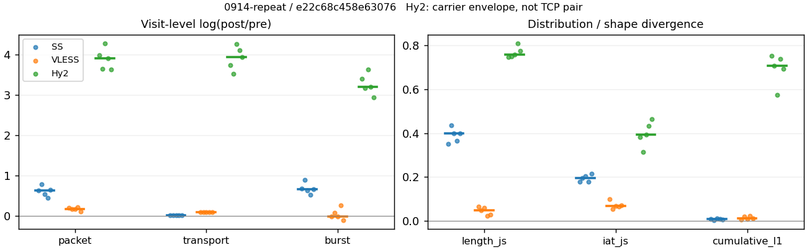
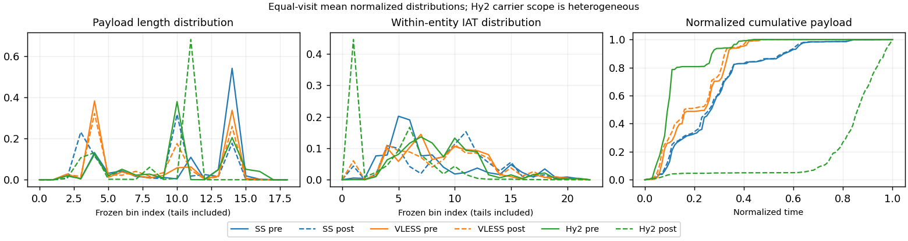

# 0914-repeat · 条目 004 · arxiv.org

目标：https://arxiv.org/abs/1706.03762

活动标签：arxiv.org::page_load。选定访问 15 次。

[返回总索引](../../README.md) · [统计口径](../../methods.md)

## 覆盖与资格（每次访问均保留）

| 部署 | 重复 | 主请求路由 | 活动状态 | 代理比较 | DIRECT pre | 请求 proxy/direct/unresolved | 错误 |
| --- | --- | --- | --- | --- | --- | --- | --- |
| Hy2 | 1 | proxy | passed | 1 | 0 | 35/0/0 | [] |
| Hy2 | 2 | proxy | passed | 1 | 0 | 35/0/0 | [] |
| Hy2 | 3 | proxy | passed | 1 | 0 | 35/0/0 | [] |
| Hy2 | 4 | proxy | passed | 1 | 0 | 35/0/0 | [] |
| Hy2 | 5 | proxy | passed | 1 | 0 | 35/0/0 | [] |
| SS | 1 | proxy | passed | 1 | 0 | 35/0/0 | [] |
| SS | 2 | proxy | passed | 1 | 0 | 35/0/0 | [] |
| SS | 3 | proxy | passed | 1 | 0 | 35/0/0 | [] |
| SS | 4 | proxy | passed | 1 | 0 | 35/0/0 | [] |
| SS | 5 | proxy | passed | 1 | 0 | 35/0/0 | [] |
| VLESS | 1 | proxy | passed | 1 | 0 | 35/0/0 | [] |
| VLESS | 2 | proxy | passed | 1 | 0 | 35/0/0 | [] |
| VLESS | 3 | proxy | passed | 1 | 0 | 35/0/0 | [] |
| VLESS | 4 | proxy | passed | 1 | 0 | 35/0/0 | [] |
| VLESS | 5 | proxy | passed | 1 | 0 | 35/0/0 | [] |

主请求非 proxy 的统计仅解释为已索引的辅助代理连接或 DIRECT 观测，不代表目标业务经代理传输。播放确认与配对资格是两道不同的门。

图中散点为单次访问，短线为重复中位数；Hy2 是共享载体包络，不能与 TCP 配对作等范围因果对比。

形态图先逐访问归一化，再对访问等权平均；实线 pre，虚线 post。分箱序号及边界见 methods，不将分箱索引误解为长度或时间。

## 每次访问的关键观测

### SS

范围：`exclusive_page`。每格 pre → post；空值为不可观测/不适用。

| 重复 | 包数 | 载荷字节 | burst | TCP FR | IAT中位µs | length JS | IAT JS |
| --- | --- | --- | --- | --- | --- | --- | --- |
| 1 | 623 → 1175 | 6.6471e+05 → 6.8288e+05 | 430 → 848 | 64 → 66 | 30.828 → 486.52 | 0.34939 | 0.17686 |
| 2 | 567 → 1250 | 6.6305e+05 → 6.7578e+05 | 378 → 928 | 59 → 59 | 46.674 → 594.24 | 0.43544 | 0.19586 |
| 3 | 598 → 1023 | 6.646e+05 → 6.7611e+05 | 438 → 826 | 53 → 57 | 31.769 → 940.77 | 0.39999 | 0.20493 |
| 4 | 648 → 1015 | 6.7558e+05 → 6.8713e+05 | 458 → 781 | 60 → 62 | 39.246 → 693.61 | 0.36355 | 0.17821 |
| 5 | 619 → 1188 | 6.649e+05 → 6.7599e+05 | 435 → 849 | 60 → 62 | 30.203 → 525.68 | 0.3986 | 0.21366 |

完整标量统计：中位数 [min,max]；Δ 为重复内逐访问变换的中位数，MAD 未缩放。n 为可用变换数；DIRECT-only 的 nΔ=0 不代表 pre 不可用。

| scope | 特征 | pre | post | Δ | IQRΔ | MADΔ | nΔ |
| --- | --- | --- | --- | --- | --- | --- | --- |
| exclusive_page | active_span_sum_s_1000ms | 11.208 [10.888, 12.639] | 12.561 [12.073, 13.441] | 0.1021 | 0.034864 | 0.027762 | 5 |
| exclusive_page | active_span_sum_s_100ms | 2.2901 [1.997, 3.4494] | 4.4121 [3.8534, 5.0145] | 0.56272 | 0.034364 | 0.031807 | 5 |
| exclusive_page | active_span_sum_s_500ms | 8.9373 [8.3639, 11.587] | 11.414 [10.707, 11.949] | 0.24462 | 0.11665 | 0.099573 | 5 |
| exclusive_page | burst_bytes_iqr | 2896 [2896, 2896] | 1428 [1428, 1428] | -0.70706 | 0 | 0 | 5 |
| exclusive_page | burst_bytes_mad | 64 [31, 64] | 34 [34, 34] | -0.63252 | 0 | 0 | 5 |
| exclusive_page | burst_bytes_max | 20480 [11584, 20480] | 7214 [5826, 12302] | -0.87141 | 0.35613 | 0.18232 | 5 |
| exclusive_page | burst_bytes_mean | 1528.5 [1475.1, 1754.1] | 805.29 [728.21, 879.81] | -0.65212 | 0.034959 | 0.034907 | 5 |
| exclusive_page | burst_bytes_median | 64 [31, 64] | 34 [34, 34] | -0.63252 | 0 | 0 | 5 |
| exclusive_page | burst_bytes_min | 0 [0, 0] | 0 [0, 0] | — | — | — | 0 |
| exclusive_page | burst_bytes_p95 | 5792 [5792, 8511.2] | 2896 [2856, 2930] | -0.69315 | 0.042885 | 0.011672 | 5 |
| exclusive_page | burst_bytes_q25 | 0 [0, 0] | 0 [0, 0] | — | — | — | 0 |
| exclusive_page | burst_bytes_q75 | 2896 [2896, 2896] | 1428 [1428, 1428] | -0.70706 | 0 | 0 | 5 |
| exclusive_page | burst_bytes_std | 2642.8 [2363.4, 2937.1] | 1205.7 [1051.1, 1377.4] | -0.78478 | 0.090603 | 0.06512 | 5 |
| exclusive_page | burst_count | 435 [378, 458] | 848 [781, 928] | 0.66871 | 0.04472 | 0.034337 | 5 |
| exclusive_page | burst_duration_ms_iqr | 0.019172 [0.015046, 0.048802] | 0 [0, 0.00010425] | -5.6864 | — | — | 1 |
| exclusive_page | burst_duration_ms_mad | 0 [0, 0] | 0 [0, 0] | — | — | — | 0 |
| exclusive_page | burst_duration_ms_max | 9126.9 [7217, 13104] | 9127.5 [7217.3, 13105] | 3.8088e-05 | 3.7394e-05 | 1.9409e-05 | 5 |
| exclusive_page | burst_duration_ms_mean | 76.859 [45.555, 102.14] | 35.851 [21.917, 41.006] | -0.75799 | 0.02407 | 0.019536 | 5 |
| exclusive_page | burst_duration_ms_median | 0 [0, 0] | 0 [0, 0] | — | — | — | 0 |
| exclusive_page | burst_duration_ms_min | 0 [0, 0] | 0 [0, 0] | — | — | — | 0 |
| exclusive_page | burst_duration_ms_p95 | 213.85 [202.97, 242.39] | 5.4261 [3.0473, 12.5] | -3.6219 | 0.91017 | 0.65007 | 5 |
| exclusive_page | burst_duration_ms_q25 | 0 [0, 0] | 0 [0, 0] | — | — | — | 0 |
| exclusive_page | burst_duration_ms_q75 | 0.019172 [0.015046, 0.048802] | 0 [0, 0.00010425] | -5.6864 | — | — | 1 |
| exclusive_page | burst_duration_ms_std | 527.87 [439.18, 924.03] | 383.88 [332.57, 588.4] | -0.32298 | 0.018099 | 0.013634 | 5 |
| exclusive_page | burst_packets_iqr | 1 [1, 1] | 0 [0, 1] | 0 | — | — | 1 |
| exclusive_page | burst_packets_mad | 0 [0, 0] | 0 [0, 0] | — | — | — | 0 |
| exclusive_page | burst_packets_max | 8 [5, 10] | 8 [7, 11] | 0 | 0.20067 | 0.20067 | 5 |
| exclusive_page | burst_packets_mean | 1.423 [1.3653, 1.5] | 1.347 [1.2385, 1.3993] | -0.084953 | 0.052853 | 0.022645 | 5 |
| exclusive_page | burst_packets_median | 1 [1, 1] | 1 [1, 1] | 0 | 0 | 0 | 5 |
| exclusive_page | burst_packets_min | 1 [1, 1] | 1 [1, 1] | 0 | 0 | 0 | 5 |
| exclusive_page | burst_packets_p95 | 3 [3, 3] | 3 [2, 3] | 0 | 0 | 0 | 5 |
| exclusive_page | burst_packets_q25 | 1 [1, 1] | 1 [1, 1] | 0 | 0 | 0 | 5 |
| exclusive_page | burst_packets_q75 | 2 [2, 2] | 1 [1, 2] | -0.69315 | 0 | 0 | 5 |
| exclusive_page | burst_packets_std | 0.91468 [0.71442, 0.96391] | 0.78975 [0.70968, 0.91554] | -0.11299 | 0.13734 | 0.075844 | 5 |
| exclusive_page | connection_span_concurrency_max | 5 [5, 6] | 5 [5, 6] | 0 | 0 | 0 | 5 |
| exclusive_page | cumulative_l1 | — | — | 0.0073163 | 0.003509 | 0.0017745 | 5 |
| exclusive_page | cumulative_max | — | — | 0.10561 | 0.035861 | 0.0041465 | 5 |
| exclusive_page | direction_entropy | 0.71068 [0.67672, 0.72761] | 0.51816 [0.47648, 0.61193] | -0.15856 | 0.067361 | 0.042888 | 5 |
| exclusive_page | down_burst_count | 214 [186, 225] | 421 [386, 461] | 0.67666 | 0.045168 | 0.035778 | 5 |
| exclusive_page | down_ip_bytes | 6.6406e+05 [6.6048e+05, 6.6975e+05] | 6.8722e+05 [6.8206e+05, 6.8874e+05] | 0.036204 | 0.010746 | 0.0034842 | 5 |
| exclusive_page | down_packets | 358 [335, 369] | 652 [525, 685] | 0.57468 | 0.18194 | 0.12541 | 5 |
| exclusive_page | down_transport_bytes | 6.4492e+05 [6.4274e+05, 6.5049e+05] | 6.5467e+05 [6.5151e+05, 6.571e+05] | 0.012438 | 0.002163 | 0.0011053 | 5 |
| exclusive_page | duration_s | 17.588 [9.732, 19.302] | 17.493 [9.591, 19.3] | -0.0054063 | 0.003627 | 0.0024337 | 5 |
| exclusive_page | entity_count | 7 [6, 9] | 7 [6, 9] | 0 | 0 | 0 | 5 |
| exclusive_page | fr_runs | 60 [53, 64] | 62 [57, 66] | 0.03279 | 0.0020182 | 0.0020182 | 5 |
| exclusive_page | fr_runs_per_packet | 0.17595 [0.16358, 0.18266] | 0.099548 [0.085384, 0.11546] | -0.081756 | 0.026728 | 0.015523 | 5 |
| exclusive_page | fr_switches | 52 [47, 57] | 53 [51, 59] | 0.037041 | 0.0039801 | 0.0025551 | 5 |
| exclusive_page | fr_switches_per_possible_transition | 0.15868 [0.1478, 0.16474] | 0.089939 [0.076023, 0.10038] | -0.074801 | 0.024652 | 0.013733 | 5 |
| exclusive_page | full_retransmission_fraction | 0.0016155 [0, 0.0033445] | 0.008867 [0.0016835, 0.01173] | 0.0057806 | 0.0043857 | 0.0026051 | 5 |
| exclusive_page | full_retransmission_packets | 1 [0, 2] | 9 [2, 12] | 1.5041 | 0.54931 | 0.28768 | 3 |
| exclusive_page | iat_count | 612 [560, 639] | 1168 [1006, 1243] | 0.6398 | 0.11628 | 0.098695 | 5 |
| exclusive_page | iat_js | — | — | 0.19586 | 0.026718 | 0.017647 | 5 |
| exclusive_page | iat_ks | — | — | 0.33016 | 0.010618 | 0.0055896 | 5 |
| exclusive_page | iat_median_us | 31.769 [30.203, 46.674] | 594.24 [486.52, 940.77] | 2.8568 | 0.1132 | 0.097925 | 5 |
| exclusive_page | iat_us_iqr | 442.88 [307.74, 1238.5] | 2132.3 [1569.4, 5900.3] | 1.5717 | 0.34587 | 0.18278 | 5 |
| exclusive_page | iat_us_mad | 26.399 [26.04, 40.311] | 583.9 [477.8, 931.8] | 2.9904 | 0.11414 | 0.089486 | 5 |
| exclusive_page | iat_us_max | 9.1269e+06 [7.217e+06, 1.3104e+07] | 9.1275e+06 [7.2173e+06, 1.3105e+07] | 3.8088e-05 | 3.7394e-05 | 1.9409e-05 | 5 |
| exclusive_page | iat_us_mean | 67630 [37099, 94087] | 35354 [23460, 42439] | -0.64862 | 0.10819 | 0.093867 | 5 |
| exclusive_page | iat_us_median | 31.769 [30.203, 46.674] | 594.24 [486.52, 940.77] | 2.8568 | 0.1132 | 0.097925 | 5 |
| exclusive_page | iat_us_min | 0.282 [0.154, 0.638] | 0.038 [0.034, 0.045] | -1.8577 | 0.87337 | 0.45835 | 5 |
| exclusive_page | iat_us_p95 | 2.0199e+05 [1.8706e+05, 2.1186e+05] | 40086 [34498, 48620] | -1.6005 | 0.083514 | 0.058915 | 5 |
| exclusive_page | iat_us_q25 | 13.04 [12.853, 15.85] | 14.36 [13.356, 25.08] | 0.11073 | 0.46567 | 0.20945 | 5 |
| exclusive_page | iat_us_q75 | 458.17 [320.71, 1254.4] | 2157.4 [1591.4, 5914.7] | 1.5494 | 0.33107 | 0.17939 | 5 |
| exclusive_page | iat_us_std | 5.2846e+05 [3.7281e+05, 8.379e+05] | 4.0073e+05 [2.9437e+05, 5.6242e+05] | -0.3314 | 0.063653 | 0.054722 | 5 |
| exclusive_page | iat_wasserstein_log1p_us | — | — | 1.3573 | 0.040749 | 0.036236 | 5 |
| exclusive_page | idle_gap_count_1000ms | 8 [3, 12] | 8 [2, 11] | -0.087011 | 0.22314 | 0.087011 | 5 |
| exclusive_page | idle_gap_count_100ms | 35 [32, 43] | 36 [35, 43] | 0.028171 | 0.10008 | 0.028171 | 5 |
| exclusive_page | idle_gap_count_500ms | 12 [4, 16] | 9 [4, 14] | -0.15415 | 0.15415 | 0.13353 | 5 |
| exclusive_page | idle_gap_sum_s_1000ms | 30.065 [11.57, 41.481] | 27.966 [10.16, 40.68] | -0.057781 | 0.067205 | 0.038276 | 5 |
| exclusive_page | idle_gap_sum_s_100ms | 39.255 [21.193, 50.499] | 36.686 [19.188, 48.899] | -0.056165 | 0.024369 | 0.021868 | 5 |
| exclusive_page | idle_gap_sum_s_500ms | 33.074 [12.119, 43.751] | 30.311 [11.652, 41.338] | -0.056737 | 0.030923 | 0.017433 | 5 |
| exclusive_page | ip_bytes | 6.9721e+05 [6.9265e+05, 7.0944e+05] | 7.4658e+05 [7.3565e+05, 7.516e+05] | 0.068385 | 0.01944 | 0.011476 | 5 |
| exclusive_page | length_iqr | 2203 [1903.2, 2356.8] | 1388 [1251.8, 1408] | -0.44765 | 0.04475 | 0.028629 | 5 |
| exclusive_page | length_js | — | — | 0.3986 | 0.036434 | 0.035043 | 5 |
| exclusive_page | length_ks | — | — | 0.51458 | 0.045534 | 0.033815 | 5 |
| exclusive_page | length_mad | 16 [0, 700] | 617 [44, 1269] | 0.81842 | 1.5287 | 0.22352 | 3 |
| exclusive_page | length_max | 6000 [4096, 8920] | 2896 [2856, 5712] | -0.74234 | 0.77751 | 0.38263 | 5 |
| exclusive_page | length_mean | 1949.8 [1883, 2052.8] | 1030 [977.97, 1279.6] | -0.60333 | 0.17858 | 0.1171 | 5 |
| exclusive_page | length_median | 2896 [2196, 2896] | 1355 [650, 1428] | -0.70706 | 0.78552 | 0.22422 | 5 |
| exclusive_page | length_min | 16 [5, 16] | 20 [20, 20] | 0.22314 | 0 | 0 | 5 |
| exclusive_page | length_p95 | 2896 [2896, 2896] | 2856 [2856, 2856] | -0.013908 | 0 | 0 | 5 |
| exclusive_page | length_q25 | 693 [539.25, 992.75] | 40 [40, 176.25] | -2.8464 | 1.1236 | 0.13679 | 5 |
| exclusive_page | length_q75 | 2896 [2896, 2896] | 1428 [1428, 1482] | -0.70706 | 0.013908 | 0 | 5 |
| exclusive_page | length_std | 1212.3 [1169.2, 1337.1] | 1005.8 [918.25, 1052.2] | -0.17786 | 0.13403 | 0.065196 | 5 |
| exclusive_page | length_wasserstein_bytes | — | — | 853.22 | 161.8 | 98.605 | 5 |
| exclusive_page | nonempty_entity_count | 7 [6, 9] | 7 [6, 9] | 0 | 0 | 0 | 5 |
| exclusive_page | nonempty_packets | 341 [323, 353] | 663 [536, 691] | 0.63031 | 0.17796 | 0.12692 | 5 |
| exclusive_page | offload_suspect_fraction | 0.33441 [0.31461, 0.36861] | 0.12681 [0.091887, 0.13793] | -0.20478 | 0.069608 | 0.018638 | 5 |
| exclusive_page | packet_count | 619 [567, 648] | 1175 [1015, 1250] | 0.63448 | 0.11502 | 0.097573 | 5 |
| exclusive_page | rtt_median_ms | 0.047307 [0.040939, 0.074066] | 31.933 [28.511, 33.55] | 6.4596 | 0.2286 | 0.17038 | 5 |
| exclusive_page | rtt_sample_count | 260 [233, 280] | 218 [202, 227] | -0.24219 | 0.10999 | 0.010222 | 5 |
| exclusive_page | tcp_ack_count | 612 [560, 639] | 1166 [1005, 1243] | 0.63809 | 0.11543 | 0.096982 | 5 |
| exclusive_page | tcp_fin_count | 13 [12, 17] | 14 [12, 18] | 0.057158 | 0.074108 | 0.01695 | 5 |
| exclusive_page | tcp_packet_count | 619 [567, 648] | 1175 [1015, 1250] | 0.63448 | 0.11502 | 0.097573 | 5 |
| exclusive_page | tcp_rst_count | 0 [0, 0] | 0 [0, 0] | — | — | — | 0 |
| exclusive_page | tcp_syn_count | 14 [12, 18] | 15 [12, 19] | 0.054067 | 0.068993 | 0.054067 | 5 |
| exclusive_page | tcp_window_raw_median | 65535 [65504, 65535] | 135 [134, 137] | -6.1851 | 0.014706 | 0.0069618 | 5 |
| exclusive_page | transition_entropy | 0.52837 [0.52079, 0.55034] | 0.34896 [0.31111, 0.39127] | -0.18553 | 0.063937 | 0.041548 | 5 |
| exclusive_page | transition_n_mm | 248 [230, 258] | 553 [426, 587] | 0.7624 | 0.21885 | 0.14205 | 5 |
| exclusive_page | transition_n_mp | 23 [21, 25] | 23 [23, 26] | 0.04256 | 0.005231 | 0.0033389 | 5 |
| exclusive_page | transition_n_pm | 29 [26, 32] | 30 [28, 33] | 0.03279 | 0.0031299 | 0.0020182 | 5 |
| exclusive_page | transition_n_pp | 34 [31, 40] | 44 [38, 49] | 0.20294 | 0.12615 | 0.061862 | 5 |
| exclusive_page | transition_p_mm | 0.91513 [0.90909, 0.91912] | 0.95509 [0.94878, 0.9623] | 0.043434 | 0.012706 | 0.00977 | 5 |
| exclusive_page | transition_p_mp | 0.084871 [0.080882, 0.090909] | 0.044905 [0.037705, 0.051225] | -0.043434 | 0.012706 | 0.00977 | 5 |
| exclusive_page | transition_p_pm | 0.46032 [0.41935, 0.50794] | 0.4 [0.37975, 0.44928] | -0.040543 | 0.04151 | 0.021188 | 5 |
| exclusive_page | transition_p_pp | 0.53968 [0.49206, 0.58065] | 0.6 [0.55072, 0.62025] | 0.040543 | 0.04151 | 0.021188 | 5 |
| exclusive_page | transport_bytes | 6.6471e+05 [6.6305e+05, 6.7558e+05] | 6.7611e+05 [6.7578e+05, 6.8713e+05] | 0.017164 | 0.002046 | 0.0006213 | 5 |
| exclusive_page | up_burst_count | 221 [192, 233] | 427 [395, 467] | 0.66096 | 0.044281 | 0.032953 | 5 |
| exclusive_page | up_byte_fraction | 0.03011 [0.026097, 0.037136] | 0.035919 [0.031714, 0.043715] | 0.005617 | 0.0012947 | 0.00096215 | 5 |
| exclusive_page | up_ip_bytes | 33154 [31092, 39692] | 61794 [53586, 63017] | 0.55347 | 0.095314 | 0.086183 | 5 |
| exclusive_page | up_packets | 261 [227, 279] | 515 [485, 565] | 0.67965 | 0.075958 | 0.0412 | 5 |
| exclusive_page | up_transport_bytes | 20020 [17344, 25088] | 24273 [21442, 30038] | 0.18007 | 0.033952 | 0.032031 | 5 |
| exclusive_page | zero_iat_count | 0 [0, 0] | 0 [0, 0] | — | — | — | 0 |
| exclusive_page | zero_iat_fraction | 0 [0, 0] | 0 [0, 0] | 0 | 0 | 0 | 5 |

### VLESS

范围：`exclusive_page`。每格 pre → post；空值为不可观测/不适用。

| 重复 | 包数 | 载荷字节 | burst | TCP FR | IAT中位µs | length JS | IAT JS |
| --- | --- | --- | --- | --- | --- | --- | --- |
| 1 | 892 → 1093 | 6.605e+05 → 7.2325e+05 | 677 → 665 | 66 → 78 | 315.42 → 371.87 | 0.065372 | 0.097789 |
| 2 | 940 → 1124 | 6.6124e+05 → 7.2362e+05 | 701 → 760 | 64 → 78 | 391.97 → 396.27 | 0.04895 | 0.052422 |
| 3 | 906 → 1085 | 6.6096e+05 → 7.2439e+05 | 750 → 746 | 64 → 78 | 165.27 → 214.49 | 0.060049 | 0.068178 |
| 4 | 916 → 1136 | 6.6168e+05 → 7.2388e+05 | 653 → 853 | 64 → 78 | 463.7 → 404.98 | 0.021452 | 0.064297 |
| 5 | 993 → 1107 | 6.5108e+05 → 7.1207e+05 | 843 → 766 | 61 → 76 | 147.3 → 221.18 | 0.027069 | 0.071333 |

完整标量统计：中位数 [min,max]；Δ 为重复内逐访问变换的中位数，MAD 未缩放。n 为可用变换数；DIRECT-only 的 nΔ=0 不代表 pre 不可用。

| scope | 特征 | pre | post | Δ | IQRΔ | MADΔ | nΔ |
| --- | --- | --- | --- | --- | --- | --- | --- |
| exclusive_page | active_span_sum_s_1000ms | 13.236 [10.795, 14.079] | 12.326 [10.572, 13.794] | -0.020888 | 0.052648 | 0.032299 | 5 |
| exclusive_page | active_span_sum_s_100ms | 1.7732 [1.6102, 1.9475] | 4.1159 [3.97, 4.4265] | 0.82105 | 0.063924 | 0.050705 | 5 |
| exclusive_page | active_span_sum_s_500ms | 6.0939 [5.7425, 6.9107] | 10.419 [9.9473, 11.251] | 0.5242 | 0.032328 | 0.017487 | 5 |
| exclusive_page | burst_bytes_iqr | 2372 [1448, 2824] | 2045 [1522.2, 2824] | 0.050006 | 0.32222 | 0.1978 | 5 |
| exclusive_page | burst_bytes_mad | 64 [36, 64] | 72 [72, 72] | 0.11778 | 0 | 0 | 5 |
| exclusive_page | burst_bytes_max | 5792 [4272, 19768] | 5720 [4832, 8616] | -0.012509 | 0.034675 | 0.022166 | 5 |
| exclusive_page | burst_bytes_mean | 943.28 [772.33, 1013.3] | 952.13 [848.62, 1087.6] | 0.096971 | 0.099287 | 0.087629 | 5 |
| exclusive_page | burst_bytes_median | 64 [36, 64] | 72 [72, 72] | 0.11778 | 0 | 0 | 5 |
| exclusive_page | burst_bytes_min | 0 [0, 0] | 0 [0, 0] | — | — | — | 0 |
| exclusive_page | burst_bytes_p95 | 2896 [2896, 2968] | 2896 [2896, 2896] | 0 | 0 | 0 | 5 |
| exclusive_page | burst_bytes_q25 | 0 [0, 0] | 0 [0, 0] | — | — | — | 0 |
| exclusive_page | burst_bytes_q75 | 2372 [1448, 2824] | 2045 [1522.2, 2824] | 0.050006 | 0.32222 | 0.1978 | 5 |
| exclusive_page | burst_bytes_std | 1371.4 [1197.4, 1480.8] | 1235.8 [1199, 1328.6] | -0.10844 | 0.05314 | 0.027206 | 5 |
| exclusive_page | burst_count | 701 [653, 843] | 760 [665, 853] | -0.0053476 | 0.098695 | 0.086158 | 5 |
| exclusive_page | burst_duration_ms_iqr | 0.3977 [0, 0.93381] | 0.006638 [0, 1.2585] | -0.11624 | 1.2682 | 1.2682 | 2 |
| exclusive_page | burst_duration_ms_mad | 0 [0, 0] | 0 [0, 0] | — | — | — | 0 |
| exclusive_page | burst_duration_ms_max | 12113 [11629, 12390] | 11994 [9714.9, 12390] | -0.0033524 | 0.00013338 | 8.7981e-05 | 5 |
| exclusive_page | burst_duration_ms_mean | 56.387 [48.939, 61.16] | 43.236 [29.384, 51.659] | -0.26556 | 0.26067 | 0.16393 | 5 |
| exclusive_page | burst_duration_ms_median | 0 [0, 0] | 0 [0, 0] | — | — | — | 0 |
| exclusive_page | burst_duration_ms_min | 0 [0, 0] | 0 [0, 0] | — | — | — | 0 |
| exclusive_page | burst_duration_ms_p95 | 191.98 [9.8728, 196.17] | 109 [12.313, 114.46] | -0.52991 | 0.20578 | 0.14808 | 5 |
| exclusive_page | burst_duration_ms_q25 | 0 [0, 0] | 0 [0, 0] | — | — | — | 0 |
| exclusive_page | burst_duration_ms_q75 | 0.3977 [0, 0.93381] | 0.006638 [0, 1.2585] | -0.11624 | 1.2682 | 1.2682 | 2 |
| exclusive_page | burst_duration_ms_std | 605.46 [537.96, 620.64] | 554.07 [382.37, 604.45] | -0.055458 | 0.12585 | 0.084964 | 5 |
| exclusive_page | burst_packets_iqr | 1 [0, 1] | 1 [0, 1] | 0 | 0 | 0 | 2 |
| exclusive_page | burst_packets_mad | 0 [0, 0] | 0 [0, 0] | — | — | — | 0 |
| exclusive_page | burst_packets_max | 4 [3, 5] | 7 [7, 9] | 0.55962 | 0.13353 | 0.13353 | 5 |
| exclusive_page | burst_packets_mean | 1.3176 [1.1779, 1.4028] | 1.4544 [1.3318, 1.6436] | 0.18564 | 0.1065 | 0.035456 | 5 |
| exclusive_page | burst_packets_median | 1 [1, 1] | 1 [1, 1] | 0 | 0 | 0 | 5 |
| exclusive_page | burst_packets_min | 1 [1, 1] | 1 [1, 1] | 0 | 0 | 0 | 5 |
| exclusive_page | burst_packets_p95 | 2 [2, 2] | 3 [3, 3] | 0.40547 | 0 | 0 | 5 |
| exclusive_page | burst_packets_q25 | 1 [1, 1] | 1 [1, 1] | 0 | 0 | 0 | 5 |
| exclusive_page | burst_packets_q75 | 2 [1, 2] | 2 [1, 2] | 0 | 0.69315 | 0.69315 | 5 |
| exclusive_page | burst_packets_std | 0.51092 [0.41518, 0.5493] | 0.87023 [0.76799, 0.9722] | 0.64335 | 0.21778 | 0.14207 | 5 |
| exclusive_page | connection_span_concurrency_max | 5 [5, 7] | 5 [5, 7] | 0 | 0 | 0 | 5 |
| exclusive_page | cumulative_l1 | — | — | 0.011903 | 0.012711 | 0.0071983 | 5 |
| exclusive_page | cumulative_max | — | — | 0.16815 | 0.15883 | 0.094372 | 5 |
| exclusive_page | direction_entropy | 0.52421 [0.52097, 0.57591] | 0.53051 [0.51923, 0.56496] | -0.0042892 | 0.020498 | 0.013834 | 5 |
| exclusive_page | down_burst_count | 347 [323, 418] | 377 [329, 423] | -0.0053908 | 0.10099 | 0.088311 | 5 |
| exclusive_page | down_ip_bytes | 6.6733e+05 [6.5938e+05, 6.7051e+05] | 7.2213e+05 [7.1004e+05, 7.2298e+05] | 0.076007 | 0.0043971 | 0.001989 | 5 |
| exclusive_page | down_packets | 534 [490, 555] | 614 [597, 639] | 0.1347 | 0.06398 | 0.033674 | 5 |
| exclusive_page | down_transport_bytes | 6.4074e+05 [6.3156e+05, 6.416e+05] | 6.8961e+05 [6.7821e+05, 6.9014e+05] | 0.072968 | 0.00043375 | 0.00040414 | 5 |
| exclusive_page | duration_s | 18.408 [15.852, 19.028] | 18.331 [15.81, 18.74] | -0.0081323 | 0.012566 | 0.0059749 | 5 |
| exclusive_page | entity_count | 7 [7, 7] | 7 [7, 7] | 0 | 0 | 0 | 5 |
| exclusive_page | fr_runs | 64 [61, 66] | 78 [76, 78] | 0.19783 | 0 | 0 | 5 |
| exclusive_page | fr_runs_per_packet | 0.11985 [0.11822, 0.13474] | 0.12752 [0.12581, 0.13448] | 0.0063634 | 0.0095538 | 0.0051123 | 5 |
| exclusive_page | fr_switches | 57 [54, 59] | 71 [69, 71] | 0.21963 | 0 | 0 | 5 |
| exclusive_page | fr_switches_per_possible_transition | 0.10816 [0.10609, 0.12179] | 0.11715 [0.11582, 0.12391] | 0.0080436 | 0.008943 | 0.0047472 | 5 |
| exclusive_page | full_retransmission_fraction | 0 [0, 0.001007] | 0 [0, 0.0018433] | 0 | 0 | 0 | 5 |
| exclusive_page | full_retransmission_packets | 0 [0, 1] | 0 [0, 2] | — | — | — | 0 |
| exclusive_page | iat_count | 909 [885, 986] | 1100 [1078, 1129] | 0.18158 | 0.024672 | 0.023089 | 5 |
| exclusive_page | iat_js | — | — | 0.068178 | 0.0070355 | 0.0038802 | 5 |
| exclusive_page | iat_ks | — | — | 0.1183 | 0.056382 | 0.033765 | 5 |
| exclusive_page | iat_median_us | 315.42 [147.3, 463.7] | 371.87 [214.49, 404.98] | 0.16465 | 0.24976 | 0.15375 | 5 |
| exclusive_page | iat_us_iqr | 1437.9 [1362.9, 2969.9] | 1808.1 [1563.1, 3109.8] | 0.10031 | 0.080341 | 0.054256 | 5 |
| exclusive_page | iat_us_mad | 305.97 [140.2, 455.13] | 366 [214.3, 394.75] | 0.17915 | 0.28589 | 0.16373 | 5 |
| exclusive_page | iat_us_max | 1.2113e+07 [1.1629e+07, 1.239e+07] | 1.2073e+07 [1.1589e+07, 1.239e+07] | -0.0033456 | 4.5398e-05 | 3.8666e-05 | 5 |
| exclusive_page | iat_us_mean | 43790 [40994, 52940] | 35556 [32533, 43183] | -0.20829 | 0.027457 | 0.022882 | 5 |
| exclusive_page | iat_us_median | 315.42 [147.3, 463.7] | 371.87 [214.49, 404.98] | 0.16465 | 0.24976 | 0.15375 | 5 |
| exclusive_page | iat_us_min | 0.61 [0.309, 3.152] | 0.037 [0.036, 0.038] | -2.7759 | 1.6669 | 0.65345 | 5 |
| exclusive_page | iat_us_p95 | 24083 [12555, 41152] | 49475 [45395, 87591] | 0.75542 | 0.51486 | 0.4794 | 5 |
| exclusive_page | iat_us_q25 | 43.918 [36.409, 45.987] | 12.93 [10.979, 31.458] | -1.1511 | 0.18447 | 0.18137 | 5 |
| exclusive_page | iat_us_q75 | 1478.9 [1399.3, 3013.8] | 1819.7 [1574.1, 3141.3] | 0.089088 | 0.083879 | 0.047653 | 5 |
| exclusive_page | iat_us_std | 5.2664e+05 [4.9765e+05, 5.6395e+05] | 4.7405e+05 [4.6709e+05, 5.1113e+05] | -0.098334 | 0.01242 | 0.012144 | 5 |
| exclusive_page | iat_wasserstein_log1p_us | — | — | 0.53117 | 0.17956 | 0.12321 | 5 |
| exclusive_page | idle_gap_count_1000ms | 6 [3, 9] | 6 [3, 8] | -0.11778 | 0.13353 | 0.064539 | 5 |
| exclusive_page | idle_gap_count_100ms | 37 [36, 41] | 43 [42, 49] | 0.15415 | 0.027966 | 0.0038685 | 5 |
| exclusive_page | idle_gap_count_500ms | 16 [12, 16] | 9 [5, 9] | -0.57536 | 0.053245 | 0 | 5 |
| exclusive_page | idle_gap_sum_s_1000ms | 26.777 [23.044, 35.852] | 26.846 [23.005, 34.676] | -0.031406 | 0.031673 | 0.011281 | 5 |
| exclusive_page | idle_gap_sum_s_100ms | 38.951 [34.67, 45.833] | 35.6 [31.361, 42.311] | -0.089946 | 0.012534 | 0.0099951 | 5 |
| exclusive_page | idle_gap_sum_s_500ms | 34.762 [29.369, 40.814] | 29.423 [24.189, 35.299] | -0.16675 | 0.023561 | 0.014873 | 5 |
| exclusive_page | ip_bytes | 7.0804e+05 [7.0269e+05, 7.1007e+05] | 7.8185e+05 [7.7018e+05, 7.8343e+05] | 0.09916 | 0.0020116 | 0.0007407 | 5 |
| exclusive_page | length_iqr | 2752 [2752, 2752] | 2210 [1412, 2752] | -0.21934 | 0.66661 | 0.21934 | 5 |
| exclusive_page | length_js | — | — | 0.04895 | 0.032981 | 0.016422 | 5 |
| exclusive_page | length_ks | — | — | 0.10667 | 0.053983 | 0.03217 | 5 |
| exclusive_page | length_mad | 1091 [530, 1340] | 1136 [956.5, 1326] | 0.19507 | 0.55351 | 0.21087 | 5 |
| exclusive_page | length_max | 5720 [3343, 8920] | 2896 [2824, 5648] | -0.70581 | 0.24882 | 0.24882 | 5 |
| exclusive_page | length_mean | 1261.8 [1229.9, 1391.5] | 1194.8 [1166.5, 1248.9] | -0.05594 | 0.053509 | 0.040043 | 5 |
| exclusive_page | length_median | 1163 [561, 1412] | 1208 [1028.5, 1412] | 0.18404 | 0.57149 | 0.18404 | 5 |
| exclusive_page | length_min | 24 [24, 24] | 24 [7, 24] | 0 | 1.2321 | 0 | 5 |
| exclusive_page | length_p95 | 2824 [2824, 2896] | 2824 [2824, 2824] | 0 | 0 | 0 | 5 |
| exclusive_page | length_q25 | 72 [72, 72] | 72 [72, 72] | 0 | 0 | 0 | 5 |
| exclusive_page | length_q75 | 2824 [2824, 2824] | 2282 [1484, 2824] | -0.2131 | 0.64274 | 0.2131 | 5 |
| exclusive_page | length_std | 1251.5 [1222.2, 1349.2] | 1099.2 [1050.2, 1157.7] | -0.12982 | 0.13904 | 0.063415 | 5 |
| exclusive_page | length_wasserstein_bytes | — | — | 197.03 | 131.84 | 62.961 | 5 |
| exclusive_page | nonempty_entity_count | 7 [7, 7] | 7 [7, 7] | 0 | 0 | 0 | 5 |
| exclusive_page | nonempty_packets | 516 [475, 538] | 598 [580, 620] | 0.14609 | 0.055579 | 0.04036 | 5 |
| exclusive_page | offload_suspect_fraction | 0.20638 [0.18874, 0.21973] | 0.14769 [0.13456, 0.16461] | -0.05418 | 0.013702 | 0.0091852 | 5 |
| exclusive_page | packet_count | 916 [892, 993] | 1107 [1085, 1136] | 0.1803 | 0.024446 | 0.022919 | 5 |
| exclusive_page | rtt_median_ms | 0.1208 [0.056391, 0.51849] | 0.083416 [0.051984, 1.0822] | 0.013142 | 1.4338 | 1.0504 | 5 |
| exclusive_page | rtt_sample_count | 385 [357, 453] | 462 [429, 510] | 0.14795 | 0.084569 | 0.050202 | 5 |
| exclusive_page | tcp_ack_count | 896 [871, 974] | 1100 [1078, 1129] | 0.19502 | 0.027482 | 0.025597 | 5 |
| exclusive_page | tcp_fin_count | 13 [13, 14] | 14 [13, 14] | 0 | 0.074108 | 0 | 5 |
| exclusive_page | tcp_packet_count | 916 [892, 993] | 1107 [1085, 1136] | 0.1803 | 0.024446 | 0.022919 | 5 |
| exclusive_page | tcp_rst_count | 13 [12, 14] | 0 [0, 1] | -2.5649 | — | — | 1 |
| exclusive_page | tcp_syn_count | 14 [14, 14] | 14 [14, 14] | 0 | 0 | 0 | 5 |
| exclusive_page | tcp_window_raw_median | 65535 [65471, 65535] | 152 [143, 152] | -6.0665 | 0.00047314 | 0.00047314 | 5 |
| exclusive_page | transition_entropy | 0.386 [0.38329, 0.42774] | 0.41452 [0.40389, 0.4331] | 0.017899 | 0.025466 | 0.01293 | 5 |
| exclusive_page | transition_n_mm | 425 [378, 443] | 487 [464, 508] | 0.14401 | 0.079135 | 0.049317 | 5 |
| exclusive_page | transition_n_mp | 25 [24, 26] | 32 [31, 32] | 0.24686 | 0 | 0 | 5 |
| exclusive_page | transition_n_pm | 32 [30, 33] | 39 [38, 39] | 0.19783 | 0 | 0 | 5 |
| exclusive_page | transition_n_pp | 31 [30, 33] | 34 [33, 38] | 0.12516 | 0.078558 | 0.062643 | 5 |
| exclusive_page | transition_p_mm | 0.94612 [0.93797, 0.94658] | 0.93957 [0.93548, 0.94074] | -0.0054899 | 0.0044953 | 0.0027483 | 5 |
| exclusive_page | transition_p_mp | 0.053879 [0.053419, 0.062035] | 0.060429 [0.059259, 0.064516] | 0.0054899 | 0.0044953 | 0.0027483 | 5 |
| exclusive_page | transition_p_pm | 0.50794 [0.49231, 0.52381] | 0.53425 [0.5, 0.54167] | 0.014186 | 0.023293 | 0.014186 | 5 |
| exclusive_page | transition_p_pp | 0.49206 [0.47619, 0.50769] | 0.46575 [0.45833, 0.5] | -0.014186 | 0.023293 | 0.014186 | 5 |
| exclusive_page | transport_bytes | 6.6096e+05 [6.5108e+05, 6.6168e+05] | 7.2362e+05 [7.1207e+05, 7.2439e+05] | 0.090153 | 0.00090956 | 0.00059216 | 5 |
| exclusive_page | up_burst_count | 354 [330, 425] | 383 [336, 430] | -0.0053051 | 0.096438 | 0.084043 | 5 |
| exclusive_page | up_byte_fraction | 0.030353 [0.029975, 0.030599] | 0.047538 [0.046365, 0.048002] | 0.017083 | 0.0011566 | 0.00049061 | 5 |
| exclusive_page | up_ip_bytes | 40012 [38756, 43308] | 60138 [58946, 61304] | 0.40022 | 0.020459 | 0.019404 | 5 |
| exclusive_page | up_packets | 387 [361, 459] | 492 [454, 522] | 0.19117 | 0.080424 | 0.048883 | 5 |
| exclusive_page | up_transport_bytes | 20084 [19516, 20225] | 33858 [33551, 34772] | 0.53602 | 0.02337 | 0.014923 | 5 |
| exclusive_page | zero_iat_count | 0 [0, 0] | 0 [0, 0] | — | — | — | 0 |
| exclusive_page | zero_iat_fraction | 0 [0, 0] | 0 [0, 0] | 0 | 0 | 0 | 5 |

### Hy2

范围：`carrier_context_envelope`。每格 pre → post；空值为不可观测/不适用。

| 重复 | 包数 | 载荷字节 | burst | TCP FR | IAT中位µs | length JS | IAT JS |
| --- | --- | --- | --- | --- | --- | --- | --- |
| 1 | 475 → 25722 | 6.5131e+05 → 2.7293e+07 | 316 → 9456 | — | 144.39 → 6.401 | 0.74817 | 0.38249 |
| 2 | 554 → 21224 | 6.4945e+05 → 2.2009e+07 | 401 → 9621 | — | 143.04 → 41.542 | 0.7492 | 0.31371 |
| 3 | 613 → 43946 | 6.5373e+05 → 4.656e+07 | 437 → 16552 | — | 158.01 → 5.633 | 0.75868 | 0.39458 |
| 4 | 751 → 37656 | 6.6547e+05 → 4.0755e+07 | 526 → 12978 | — | 169.25 → 4.301 | 0.80859 | 0.43219 |
| 5 | 833 → 31625 | 6.6297e+05 → 3.3802e+07 | 609 → 11496 | — | 527.49 → 5.3135 | 0.77642 | 0.46526 |

完整标量统计：中位数 [min,max]；Δ 为重复内逐访问变换的中位数，MAD 未缩放。n 为可用变换数；DIRECT-only 的 nΔ=0 不代表 pre 不可用。

| scope | 特征 | pre | post | Δ | IQRΔ | MADΔ | nΔ |
| --- | --- | --- | --- | --- | --- | --- | --- |
| carrier_context_envelope | active_span_sum_s_1000ms | 8.1102 [5.6403, 8.3205] | 12.989 [7.9762, 16.997] | 0.44598 | 0.16808 | 0.098877 | 5 |
| carrier_context_envelope | active_span_sum_s_100ms | 1.0134 [0.64323, 1.334] | 6.5616 [4.7467, 8.9945] | 1.9987 | 0.15099 | 0.13077 | 5 |
| carrier_context_envelope | active_span_sum_s_500ms | 6.8737 [4.8335, 7.6087] | 10.794 [7.1939, 14.621] | 0.50663 | 0.058605 | 0.055292 | 5 |
| carrier_context_envelope | burst_bytes_iqr | 2032.2 [1610, 2830] | 4240 [2789, 5111] | 0.82438 | 0.51796 | 0.14748 | 5 |
| carrier_context_envelope | burst_bytes_mad | 64 [47.5, 64] | 276 [223, 371.5] | 1.4615 | 0.28768 | 0.21323 | 5 |
| carrier_context_envelope | burst_bytes_max | 20480 [14658, 23161] | 1.6552e+05 [39843, 1.8882e+05] | 2.0983 | 0.50245 | 0.33484 | 5 |
| carrier_context_envelope | burst_bytes_mean | 1495.9 [1088.6, 2061.1] | 2886.3 [2287.5, 3140.3] | 0.63149 | 0.5638 | 0.28617 | 5 |
| carrier_context_envelope | burst_bytes_median | 64 [47.5, 64] | 309 [256, 404.5] | 1.5745 | 0.26008 | 0.18816 | 5 |
| carrier_context_envelope | burst_bytes_min | 0 [0, 0] | 22 [22, 26] | — | — | — | 0 |
| carrier_context_envelope | burst_bytes_p95 | 6598.2 [2830, 10377] | 10932 [8057, 10932] | 0.5049 | 0.72895 | 0.45279 | 5 |
| carrier_context_envelope | burst_bytes_q25 | 0 [0, 0] | 83 [57, 95] | — | — | — | 0 |
| carrier_context_envelope | burst_bytes_q75 | 2032.2 [1610, 2830] | 4323 [2882, 5168] | 0.8466 | 0.50967 | 0.14111 | 5 |
| carrier_context_envelope | burst_bytes_std | 2687.2 [1847.4, 3862.2] | 4612.3 [2999.1, 6031.4] | 0.50508 | 0.89174 | 0.48914 | 5 |
| carrier_context_envelope | burst_count | 437 [316, 609] | 11496 [9456, 16552] | 3.2057 | 0.22092 | 0.19295 | 5 |
| carrier_context_envelope | burst_duration_ms_iqr | 0.15222 [0.11169, 0.82503] | 0.024257 [0.000761, 0.025254] | -2.7966 | 1.6857 | 0.95998 | 5 |
| carrier_context_envelope | burst_duration_ms_mad | 0 [0, 0] | 4.4e-05 [4e-05, 4.9e-05] | — | — | — | 0 |
| carrier_context_envelope | burst_duration_ms_max | 11924 [11544, 13350] | 2164.3 [1282, 3599.6] | -1.7021 | 0.055571 | 0.046626 | 5 |
| carrier_context_envelope | burst_duration_ms_mean | 73.806 [54.154, 130.23] | 0.54851 [0.37079, 0.69227] | -4.6825 | 0.60999 | 0.090157 | 5 |
| carrier_context_envelope | burst_duration_ms_median | 0 [0, 0] | 4.4e-05 [4e-05, 4.9e-05] | — | — | — | 0 |
| carrier_context_envelope | burst_duration_ms_min | 0 [0, 0] | 0 [0, 0] | — | — | — | 0 |
| carrier_context_envelope | burst_duration_ms_p95 | 187.28 [8.0152, 192.72] | 0.15256 [0.1288, 0.82558] | -6.7572 | 1.6644 | 0.52496 | 5 |
| carrier_context_envelope | burst_duration_ms_q25 | 0 [0, 0] | 0 [0, 0] | — | — | — | 0 |
| carrier_context_envelope | burst_duration_ms_q75 | 0.15222 [0.11169, 0.82503] | 0.024257 [0.000761, 0.025254] | -2.7966 | 1.6857 | 0.95998 | 5 |
| carrier_context_envelope | burst_duration_ms_std | 770.31 [639.23, 1135.3] | 24.061 [14.247, 38.06] | -3.3955 | 0.032915 | 0.018004 | 5 |
| carrier_context_envelope | burst_packets_iqr | 1 [1, 1] | 2 [1, 3] | 0.69315 | 0 | 0 | 5 |
| carrier_context_envelope | burst_packets_mad | 0 [0, 0] | 1 [1, 1] | — | — | — | 0 |
| carrier_context_envelope | burst_packets_max | 9 [7, 10] | 126 [30, 136] | 2.6101 | 0.39768 | 0.2803 | 5 |
| carrier_context_envelope | burst_packets_mean | 1.4027 [1.3678, 1.5032] | 2.7202 [2.206, 2.9015] | 0.63802 | 0.10561 | 0.06071 | 5 |
| carrier_context_envelope | burst_packets_median | 1 [1, 1] | 2 [2, 2] | 0.69315 | 0 | 0 | 5 |
| carrier_context_envelope | burst_packets_min | 1 [1, 1] | 1 [1, 1] | 0 | 0 | 0 | 5 |
| carrier_context_envelope | burst_packets_p95 | 2 [2, 3] | 8 [6, 8] | 1.3863 | 0.28768 | 0 | 5 |
| carrier_context_envelope | burst_packets_q25 | 1 [1, 1] | 1 [1, 1] | 0 | 0 | 0 | 5 |
| carrier_context_envelope | burst_packets_q75 | 2 [2, 2] | 3 [2, 4] | 0.40547 | 0 | 0 | 5 |
| carrier_context_envelope | burst_packets_std | 0.69045 [0.63764, 1.0173] | 3.0743 [1.8551, 4.1043] | 1.3327 | 0.67281 | 0.26961 | 5 |
| carrier_context_envelope | connection_span_concurrency_max | 5 [4, 5] | 1 [1, 1] | -1.6094 | 0 | 0 | 5 |
| carrier_context_envelope | cumulative_l1 | — | — | 0.70741 | 0.04494 | 0.030025 | 5 |
| carrier_context_envelope | cumulative_max | — | — | 0.95518 | 0.0079964 | 0.005541 | 5 |
| carrier_context_envelope | direction_entropy | 0.66572 [0.57744, 0.74809] | 0.78579 [0.76464, 0.82128] | 0.12966 | 0.046977 | 0.040959 | 5 |
| carrier_context_envelope | direction_run_analog_runs | 57 [50, 60] | 11496 [9456, 16552] | 5.2554 | 0.16819 | 0.12676 | 5 |
| carrier_context_envelope | direction_run_analog_runs_per_packet | 0.16176 [0.12685, 0.19192] | 0.36762 [0.34465, 0.45331] | 0.21488 | 0.026584 | 0.021781 | 5 |
| carrier_context_envelope | direction_run_analog_switches | 50 [44, 53] | 11495 [9455, 16551] | 5.3794 | 0.1888 | 0.1198 | 5 |
| carrier_context_envelope | direction_run_analog_switches_per_possible_transition | 0.14414 [0.11373, 0.17241] | 0.3676 [0.34463, 0.45328] | 0.23249 | 0.02333 | 0.01727 | 5 |
| carrier_context_envelope | down_burst_count | 215 [155, 301] | 5748 [4728, 8276] | 3.221 | 0.22258 | 0.1968 | 5 |
| carrier_context_envelope | down_ip_bytes | 6.5275e+05 [6.4633e+05, 6.6815e+05] | 3.3978e+07 [2.1976e+07, 4.6609e+07] | 3.9289 | 0.37815 | 0.19142 | 5 |
| carrier_context_envelope | down_packets | 354 [273, 485] | 24273 [15782, 33390] | 4.1821 | 0.35797 | 0.26165 | 5 |
| carrier_context_envelope | down_transport_bytes | 6.3434e+05 [6.3e+05, 6.43e+05] | 3.3298e+07 [2.1534e+07, 4.5674e+07] | 3.9473 | 0.39172 | 0.20323 | 5 |
| carrier_context_envelope | duration_s | 16.521 [14.142, 18.284] | 16.518 [14.141, 18.277] | -0.00020658 | 0.0003038 | 0.00017851 | 5 |
| carrier_context_envelope | entity_count | 7 [6, 8] | 1 [1, 1] | -1.9459 | 0 | 0 | 5 |
| carrier_context_envelope | full_retransmission_fraction | 0.0013316 [0, 0.0042105] | — | — | — | — | 0 |
| carrier_context_envelope | full_retransmission_packets | 1 [0, 2] | — | — | — | — | 0 |
| carrier_context_envelope | iat_count | 606 [469, 826] | 31624 [21223, 43945] | 3.9255 | 0.34607 | 0.26713 | 5 |
| carrier_context_envelope | iat_js | — | — | 0.39458 | 0.0497 | 0.037609 | 5 |
| carrier_context_envelope | iat_ks | — | — | 0.56518 | 0.032356 | 0.03199 | 5 |
| carrier_context_envelope | iat_median_us | 158.01 [143.04, 527.49] | 5.633 [4.301, 41.542] | -3.334 | 0.55644 | 0.33849 | 5 |
| carrier_context_envelope | iat_us_iqr | 995.32 [840.83, 1883.1] | 27.109 [26.657, 137.68] | -3.6032 | 0.4074 | 0.20893 | 5 |
| carrier_context_envelope | iat_us_mad | 149.27 [131.69, 499.91] | 5.596 [4.265, 41.493] | -3.2837 | 0.60591 | 0.35197 | 5 |
| carrier_context_envelope | iat_us_max | 1.1924e+07 [1.1544e+07, 1.335e+07] | 2.1643e+06 [1.2802e+06, 3.5996e+06] | -1.7021 | 0.055572 | 0.046625 | 5 |
| carrier_context_envelope | iat_us_mean | 56898 [40916, 1.165e+05] | 527.16 [415.9, 777.55] | -4.5355 | 0.91068 | 0.24266 | 5 |
| carrier_context_envelope | iat_us_median | 158.01 [143.04, 527.49] | 5.633 [4.301, 41.542] | -3.334 | 0.55644 | 0.33849 | 5 |
| carrier_context_envelope | iat_us_min | 2.421 [0.106, 2.848] | 0.002 [0.001, 0.03] | -6.4056 | 3.0183 | 1.5057 | 5 |
| carrier_context_envelope | iat_us_p95 | 1.407e+05 [10925, 1.7746e+05] | 529.83 [449.25, 982.8] | -5.1133 | 1.3782 | 0.64762 | 5 |
| carrier_context_envelope | iat_us_q25 | 40.27 [33.685, 56.091] | 0.047 [0.046, 0.11] | -6.6981 | 0.27827 | 0.17637 | 5 |
| carrier_context_envelope | iat_us_q75 | 1040.8 [878.94, 1939.1] | 27.156 [26.704, 137.79] | -3.6461 | 0.39033 | 0.19876 | 5 |
| carrier_context_envelope | iat_us_std | 6.6067e+05 [5.49e+05, 1.1074e+06] | 18177 [10480, 26006] | -3.5608 | 0.19572 | 0.15222 | 5 |
| carrier_context_envelope | iat_wasserstein_log1p_us | — | — | 3.5711 | 0.22988 | 0.14718 | 5 |
| carrier_context_envelope | idle_gap_count_1000ms | 5 [3, 7] | 2 [1, 3] | -0.51083 | 0.58779 | 0.10536 | 5 |
| carrier_context_envelope | idle_gap_count_100ms | 28 [26, 34] | 30 [19, 39] | 0.068993 | 0.063349 | 0.033902 | 5 |
| carrier_context_envelope | idle_gap_count_500ms | 6 [5, 7] | 5 [4, 5] | -0.33647 | 0.40547 | 0.22314 | 5 |
| carrier_context_envelope | idle_gap_sum_s_1000ms | 26.087 [22.085, 49] | 3.5287 [1.2802, 6.1651] | -2.0729 | 0.52545 | 0.28649 | 5 |
| carrier_context_envelope | idle_gap_sum_s_100ms | 32.863 [29.387, 53.997] | 9.461 [9.2823, 10.778] | -1.1603 | 0.53145 | 0.077939 | 5 |
| carrier_context_envelope | idle_gap_sum_s_500ms | 27.949 [23.527, 49.807] | 5.7235 [3.6559, 6.9473] | -1.586 | 0.48003 | 0.17248 | 5 |
| carrier_context_envelope | ip_bytes | 6.8574e+05 [6.7613e+05, 7.0641e+05] | 3.4687e+07 [2.2603e+07, 4.7791e+07] | 3.8939 | 0.3591 | 0.18921 | 5 |
| carrier_context_envelope | length_iqr | 1869 [450.5, 2365] | 936 [596, 1344] | -0.39211 | 0.66561 | 0.53481 | 5 |
| carrier_context_envelope | length_js | — | — | 0.75868 | 0.027223 | 0.010509 | 5 |
| carrier_context_envelope | length_ks | — | — | 0.4609 | 0.058563 | 0.052209 | 5 |
| carrier_context_envelope | length_mad | 897.5 [11, 1322] | 0 [0, 0] | — | — | — | 0 |
| carrier_context_envelope | length_max | 8920 [8920, 8920] | 1441 [1441, 1441] | -1.823 | 0 | 0 | 5 |
| carrier_context_envelope | length_mean | 1922.7 [1401.6, 2439.4] | 1061.1 [1037, 1082.3] | -0.59595 | 0.39079 | 0.2365 | 5 |
| carrier_context_envelope | length_median | 1415 [1415, 1555] | 1441 [1441, 1441] | 0.018208 | 0.0014124 | 0 | 5 |
| carrier_context_envelope | length_min | 31 [24, 31] | 22 [22, 22] | -0.34294 | 0 | 0 | 5 |
| carrier_context_envelope | length_p95 | 6109.7 [2830, 8920] | 1441 [1441, 1441] | -1.4445 | 1.1466 | 0.37843 | 5 |
| carrier_context_envelope | length_q25 | 917 [465, 966.5] | 505 [97, 845] | -0.13434 | 1.5889 | 0.21687 | 5 |
| carrier_context_envelope | length_q75 | 2816.5 [1415, 2830] | 1441 [1441, 1441] | -0.67016 | 0.69173 | 0.0047817 | 5 |
| carrier_context_envelope | length_std | 1880.9 [1174.6, 2417.1] | 587.78 [580.83, 599.55] | -1.1632 | 0.47388 | 0.24988 | 5 |
| carrier_context_envelope | length_wasserstein_bytes | — | — | 881.53 | 674.99 | 395.92 | 5 |
| carrier_context_envelope | nonempty_entity_count | 7 [6, 8] | 1 [1, 1] | -1.9459 | 0 | 0 | 5 |
| carrier_context_envelope | nonempty_packets | 340 [267, 473] | 31625 [21224, 43946] | 4.4701 | 0.2987 | 0.20098 | 5 |
| carrier_context_envelope | offload_suspect_fraction | 0.20881 [0.079232, 0.28842] | 0 [0, 0] | -0.20881 | 0.1052 | 0.070327 | 5 |
| carrier_context_envelope | packet_count | 613 [475, 833] | 31625 [21224, 43946] | 3.9148 | 0.34606 | 0.26912 | 5 |
| carrier_context_envelope | rtt_median_ms | 0.10608 [0.090701, 0.15275] | — | — | — | — | 0 |
| carrier_context_envelope | rtt_sample_count | 257 [193, 350] | 0 [0, 0] | — | — | — | 0 |
| carrier_context_envelope | tcp_ack_count | 606 [469, 826] | — | — | — | — | 0 |
| carrier_context_envelope | tcp_fin_count | 14 [12, 16] | — | — | — | — | 0 |
| carrier_context_envelope | tcp_packet_count | 613 [475, 833] | 0 [0, 0] | — | — | — | 0 |
| carrier_context_envelope | tcp_rst_count | 0 [0, 0] | — | — | — | — | 0 |
| carrier_context_envelope | tcp_syn_count | 14 [12, 16] | — | — | — | — | 0 |
| carrier_context_envelope | tcp_window_raw_median | 65535 [65504, 65535] | — | — | — | — | 0 |
| carrier_context_envelope | transition_entropy | 0.49502 [0.41155, 0.57108] | 0.78538 [0.76464, 0.79464] | 0.29963 | 0.1092 | 0.070879 | 5 |
| carrier_context_envelope | transition_n_mm | 254 [186, 378] | 18525 [10972, 25114] | 4.2229 | 0.42196 | 0.25737 | 5 |
| carrier_context_envelope | transition_n_mp | 21 [20, 23] | 5748 [4728, 8276] | 5.5211 | 0.26782 | 0.1337 | 5 |
| carrier_context_envelope | transition_n_pm | 28 [24, 30] | 5747 [4727, 8275] | 5.283 | 0.15518 | 0.12742 | 5 |
| carrier_context_envelope | transition_n_pp | 32 [31, 39] | 1604 [631, 2280] | 3.8249 | 0.14051 | 0.085703 | 5 |
| carrier_context_envelope | transition_p_mm | 0.92364 [0.90291, 0.94264] | 0.75988 [0.69522, 0.77837] | -0.1715 | 0.016978 | 0.0090235 | 5 |
| carrier_context_envelope | transition_p_mp | 0.076364 [0.057357, 0.097087] | 0.24012 [0.22163, 0.30478] | 0.1715 | 0.016978 | 0.0090235 | 5 |
| carrier_context_envelope | transition_p_pm | 0.46154 [0.42647, 0.46667] | 0.78378 [0.77459, 0.88403] | 0.34742 | 0.027864 | 0.02716 | 5 |
| carrier_context_envelope | transition_p_pp | 0.53846 [0.53333, 0.57353] | 0.21622 [0.11597, 0.22541] | -0.34742 | 0.027864 | 0.02716 | 5 |
| carrier_context_envelope | transport_bytes | 6.5373e+05 [6.4945e+05, 6.6547e+05] | 3.3802e+07 [2.2009e+07, 4.656e+07] | 3.9315 | 0.37943 | 0.19614 | 5 |
| carrier_context_envelope | up_burst_count | 222 [161, 308] | 5748 [4728, 8276] | 3.1906 | 0.21931 | 0.18924 | 5 |
| carrier_context_envelope | up_byte_fraction | 0.02995 [0.026051, 0.033764] | 0.017575 [0.013302, 0.021545] | -0.010703 | 0.0069266 | 0.0022981 | 5 |
| carrier_context_envelope | up_ip_bytes | 32984 [27543, 38353] | 7.0963e+05 [6.2654e+05, 1.1815e+06] | 3.0082 | 0.18575 | 0.08775 | 5 |
| carrier_context_envelope | up_packets | 259 [202, 348] | 7352 [5442, 10556] | 3.3162 | 0.27946 | 0.19911 | 5 |
| carrier_context_envelope | up_transport_bytes | 19451 [16967, 22469] | 5.0377e+05 [4.7417e+05, 8.8594e+05] | 3.2218 | 0.14816 | 0.038452 | 5 |
| carrier_context_envelope | zero_iat_count | 0 [0, 0] | 0 [0, 0] | — | — | — | 0 |
| carrier_context_envelope | zero_iat_fraction | 0 [0, 0] | 0 [0, 0] | 0 | 0 | 0 | 5 |

## 不同部署对比

以下是各部署自身重复中位数的差异，不按重复编号强行配对。跨 TCP/Hy2 的行标记异质观测范围。

| 视角 | 特征 | 部署A | 部署B | A中位 | B中位 | B−A | 比较口径 |
| --- | --- | --- | --- | --- | --- | --- | --- |
| pre | burst_count | VLESS | Hy2 | 701 | 437 | -264 | heterogeneous_scope_descriptive_only |
| pre | burst_count | VLESS | SS | 701 | 435 | -266 | same_scope_unpaired_visits |
| pre | burst_count | Hy2 | SS | 437 | 435 | -2 | heterogeneous_scope_descriptive_only |
| pre | connection_span_concurrency_max | VLESS | Hy2 | 5 | 5 | 0 | heterogeneous_scope_descriptive_only |
| pre | connection_span_concurrency_max | VLESS | SS | 5 | 5 | 0 | same_scope_unpaired_visits |
| pre | connection_span_concurrency_max | Hy2 | SS | 5 | 5 | 0 | heterogeneous_scope_descriptive_only |
| pre | direction_entropy | VLESS | Hy2 | 0.52421 | 0.66572 | 0.1415 | heterogeneous_scope_descriptive_only |
| pre | direction_entropy | VLESS | SS | 0.52421 | 0.71068 | 0.18646 | same_scope_unpaired_visits |
| pre | direction_entropy | Hy2 | SS | 0.66572 | 0.71068 | 0.044962 | heterogeneous_scope_descriptive_only |
| pre | down_transport_bytes | VLESS | Hy2 | 6.4074e+05 | 6.3434e+05 | -6397 | heterogeneous_scope_descriptive_only |
| pre | down_transport_bytes | VLESS | SS | 6.4074e+05 | 6.4492e+05 | 4183 | same_scope_unpaired_visits |
| pre | down_transport_bytes | Hy2 | SS | 6.3434e+05 | 6.4492e+05 | 10580 | heterogeneous_scope_descriptive_only |
| pre | duration_s | VLESS | Hy2 | 18.408 | 16.521 | -1.8871 | heterogeneous_scope_descriptive_only |
| pre | duration_s | VLESS | SS | 18.408 | 17.588 | -0.82025 | same_scope_unpaired_visits |
| pre | duration_s | Hy2 | SS | 16.521 | 17.588 | 1.0669 | heterogeneous_scope_descriptive_only |
| pre | entity_count | VLESS | Hy2 | 7 | 7 | 0 | heterogeneous_scope_descriptive_only |
| pre | entity_count | VLESS | SS | 7 | 7 | 0 | same_scope_unpaired_visits |
| pre | entity_count | Hy2 | SS | 7 | 7 | 0 | heterogeneous_scope_descriptive_only |
| pre | fr_runs | VLESS | SS | 64 | 60 | -4 | same_scope_unpaired_visits |
| pre | fr_runs_per_packet | VLESS | SS | 0.11985 | 0.17595 | 0.056103 | same_scope_unpaired_visits |
| pre | fr_switches | VLESS | SS | 57 | 52 | -5 | same_scope_unpaired_visits |
| pre | fr_switches_per_possible_transition | VLESS | SS | 0.10816 | 0.15868 | 0.050523 | same_scope_unpaired_visits |
| pre | full_retransmission_fraction | VLESS | Hy2 | 0 | 0.0013316 | 0.0013316 | heterogeneous_scope_descriptive_only |
| pre | full_retransmission_fraction | VLESS | SS | 0 | 0.0016155 | 0.0016155 | same_scope_unpaired_visits |
| pre | full_retransmission_fraction | Hy2 | SS | 0.0013316 | 0.0016155 | 0.00028395 | heterogeneous_scope_descriptive_only |
| pre | iat_median_us | VLESS | Hy2 | 315.42 | 158.01 | -157.41 | heterogeneous_scope_descriptive_only |
| pre | iat_median_us | VLESS | SS | 315.42 | 31.769 | -283.65 | same_scope_unpaired_visits |
| pre | iat_median_us | Hy2 | SS | 158.01 | 31.769 | -126.24 | heterogeneous_scope_descriptive_only |
| pre | iat_us_p95 | VLESS | Hy2 | 24083 | 1.407e+05 | 1.1662e+05 | heterogeneous_scope_descriptive_only |
| pre | iat_us_p95 | VLESS | SS | 24083 | 2.0199e+05 | 1.7791e+05 | same_scope_unpaired_visits |
| pre | iat_us_p95 | Hy2 | SS | 1.407e+05 | 2.0199e+05 | 61290 | heterogeneous_scope_descriptive_only |
| pre | ip_bytes | VLESS | Hy2 | 7.0804e+05 | 6.8574e+05 | -22307 | heterogeneous_scope_descriptive_only |
| pre | ip_bytes | VLESS | SS | 7.0804e+05 | 6.9721e+05 | -10835 | same_scope_unpaired_visits |
| pre | ip_bytes | Hy2 | SS | 6.8574e+05 | 6.9721e+05 | 11472 | heterogeneous_scope_descriptive_only |
| pre | length_median | VLESS | Hy2 | 1163 | 1415 | 252 | heterogeneous_scope_descriptive_only |
| pre | length_median | VLESS | SS | 1163 | 2896 | 1733 | same_scope_unpaired_visits |
| pre | length_median | Hy2 | SS | 1415 | 2896 | 1481 | heterogeneous_scope_descriptive_only |
| pre | length_p95 | VLESS | Hy2 | 2824 | 6109.7 | 3285.7 | heterogeneous_scope_descriptive_only |
| pre | length_p95 | VLESS | SS | 2824 | 2896 | 72 | same_scope_unpaired_visits |
| pre | length_p95 | Hy2 | SS | 6109.7 | 2896 | -3213.7 | heterogeneous_scope_descriptive_only |
| pre | nonempty_packets | VLESS | Hy2 | 516 | 340 | -176 | heterogeneous_scope_descriptive_only |
| pre | nonempty_packets | VLESS | SS | 516 | 341 | -175 | same_scope_unpaired_visits |
| pre | nonempty_packets | Hy2 | SS | 340 | 341 | 1 | heterogeneous_scope_descriptive_only |
| pre | offload_suspect_fraction | VLESS | Hy2 | 0.20638 | 0.20881 | 0.0024262 | heterogeneous_scope_descriptive_only |
| pre | offload_suspect_fraction | VLESS | SS | 0.20638 | 0.33441 | 0.12803 | same_scope_unpaired_visits |
| pre | offload_suspect_fraction | Hy2 | SS | 0.20881 | 0.33441 | 0.1256 | heterogeneous_scope_descriptive_only |
| pre | packet_count | VLESS | Hy2 | 916 | 613 | -303 | heterogeneous_scope_descriptive_only |
| pre | packet_count | VLESS | SS | 916 | 619 | -297 | same_scope_unpaired_visits |
| pre | packet_count | Hy2 | SS | 613 | 619 | 6 | heterogeneous_scope_descriptive_only |
| pre | rtt_median_ms | VLESS | Hy2 | 0.1208 | 0.10608 | -0.014725 | heterogeneous_scope_descriptive_only |
| pre | rtt_median_ms | VLESS | SS | 0.1208 | 0.047307 | -0.073496 | same_scope_unpaired_visits |
| pre | rtt_median_ms | Hy2 | SS | 0.10608 | 0.047307 | -0.058772 | heterogeneous_scope_descriptive_only |
| pre | transition_entropy | VLESS | Hy2 | 0.386 | 0.49502 | 0.10902 | heterogeneous_scope_descriptive_only |
| pre | transition_entropy | VLESS | SS | 0.386 | 0.52837 | 0.14238 | same_scope_unpaired_visits |
| pre | transition_entropy | Hy2 | SS | 0.49502 | 0.52837 | 0.033357 | heterogeneous_scope_descriptive_only |
| pre | transport_bytes | VLESS | Hy2 | 6.6096e+05 | 6.5373e+05 | -7239 | heterogeneous_scope_descriptive_only |
| pre | transport_bytes | VLESS | SS | 6.6096e+05 | 6.6471e+05 | 3744 | same_scope_unpaired_visits |
| pre | transport_bytes | Hy2 | SS | 6.5373e+05 | 6.6471e+05 | 10983 | heterogeneous_scope_descriptive_only |
| pre | up_byte_fraction | VLESS | Hy2 | 0.030353 | 0.02995 | -0.00040294 | heterogeneous_scope_descriptive_only |
| pre | up_byte_fraction | VLESS | SS | 0.030353 | 0.03011 | -0.00024311 | same_scope_unpaired_visits |
| pre | up_byte_fraction | Hy2 | SS | 0.02995 | 0.03011 | 0.00015983 | heterogeneous_scope_descriptive_only |
| pre | up_transport_bytes | VLESS | Hy2 | 20084 | 19451 | -633 | heterogeneous_scope_descriptive_only |
| pre | up_transport_bytes | VLESS | SS | 20084 | 20020 | -64 | same_scope_unpaired_visits |
| pre | up_transport_bytes | Hy2 | SS | 19451 | 20020 | 569 | heterogeneous_scope_descriptive_only |
| post | burst_count | VLESS | Hy2 | 760 | 11496 | 10736 | heterogeneous_scope_descriptive_only |
| post | burst_count | VLESS | SS | 760 | 848 | 88 | same_scope_unpaired_visits |
| post | burst_count | Hy2 | SS | 11496 | 848 | -10648 | heterogeneous_scope_descriptive_only |
| post | connection_span_concurrency_max | VLESS | Hy2 | 5 | 1 | -4 | heterogeneous_scope_descriptive_only |
| post | connection_span_concurrency_max | VLESS | SS | 5 | 5 | 0 | same_scope_unpaired_visits |
| post | connection_span_concurrency_max | Hy2 | SS | 1 | 5 | 4 | heterogeneous_scope_descriptive_only |
| post | direction_entropy | VLESS | Hy2 | 0.53051 | 0.78579 | 0.25527 | heterogeneous_scope_descriptive_only |
| post | direction_entropy | VLESS | SS | 0.53051 | 0.51816 | -0.012354 | same_scope_unpaired_visits |
| post | direction_entropy | Hy2 | SS | 0.78579 | 0.51816 | -0.26763 | heterogeneous_scope_descriptive_only |
| post | down_transport_bytes | VLESS | Hy2 | 6.8961e+05 | 3.3298e+07 | 3.2608e+07 | heterogeneous_scope_descriptive_only |
| post | down_transport_bytes | VLESS | SS | 6.8961e+05 | 6.5467e+05 | -34948 | same_scope_unpaired_visits |
| post | down_transport_bytes | Hy2 | SS | 3.3298e+07 | 6.5467e+05 | -3.2643e+07 | heterogeneous_scope_descriptive_only |
| post | duration_s | VLESS | Hy2 | 18.331 | 16.518 | -1.8127 | heterogeneous_scope_descriptive_only |
| post | duration_s | VLESS | SS | 18.331 | 17.493 | -0.83725 | same_scope_unpaired_visits |
| post | duration_s | Hy2 | SS | 16.518 | 17.493 | 0.97544 | heterogeneous_scope_descriptive_only |
| post | entity_count | VLESS | Hy2 | 7 | 1 | -6 | heterogeneous_scope_descriptive_only |
| post | entity_count | VLESS | SS | 7 | 7 | 0 | same_scope_unpaired_visits |
| post | entity_count | Hy2 | SS | 1 | 7 | 6 | heterogeneous_scope_descriptive_only |
| post | fr_runs | VLESS | SS | 78 | 62 | -16 | same_scope_unpaired_visits |
| post | fr_runs_per_packet | VLESS | SS | 0.12752 | 0.099548 | -0.027969 | same_scope_unpaired_visits |
| post | fr_switches | VLESS | SS | 71 | 53 | -18 | same_scope_unpaired_visits |
| post | fr_switches_per_possible_transition | VLESS | SS | 0.11715 | 0.089939 | -0.027209 | same_scope_unpaired_visits |
| post | full_retransmission_fraction | VLESS | SS | 0 | 0.008867 | 0.008867 | same_scope_unpaired_visits |
| post | iat_median_us | VLESS | Hy2 | 371.87 | 5.633 | -366.24 | heterogeneous_scope_descriptive_only |
| post | iat_median_us | VLESS | SS | 371.87 | 594.24 | 222.37 | same_scope_unpaired_visits |
| post | iat_median_us | Hy2 | SS | 5.633 | 594.24 | 588.6 | heterogeneous_scope_descriptive_only |
| post | iat_us_p95 | VLESS | Hy2 | 49475 | 529.83 | -48945 | heterogeneous_scope_descriptive_only |
| post | iat_us_p95 | VLESS | SS | 49475 | 40086 | -9389.1 | same_scope_unpaired_visits |
| post | iat_us_p95 | Hy2 | SS | 529.83 | 40086 | 39556 | heterogeneous_scope_descriptive_only |
| post | ip_bytes | VLESS | Hy2 | 7.8185e+05 | 3.4687e+07 | 3.3905e+07 | heterogeneous_scope_descriptive_only |
| post | ip_bytes | VLESS | SS | 7.8185e+05 | 7.4658e+05 | -35273 | same_scope_unpaired_visits |
| post | ip_bytes | Hy2 | SS | 3.4687e+07 | 7.4658e+05 | -3.3941e+07 | heterogeneous_scope_descriptive_only |
| post | length_median | VLESS | Hy2 | 1208 | 1441 | 233 | heterogeneous_scope_descriptive_only |
| post | length_median | VLESS | SS | 1208 | 1355 | 147 | same_scope_unpaired_visits |
| post | length_median | Hy2 | SS | 1441 | 1355 | -86 | heterogeneous_scope_descriptive_only |
| post | length_p95 | VLESS | Hy2 | 2824 | 1441 | -1383 | heterogeneous_scope_descriptive_only |
| post | length_p95 | VLESS | SS | 2824 | 2856 | 32 | same_scope_unpaired_visits |
| post | length_p95 | Hy2 | SS | 1441 | 2856 | 1415 | heterogeneous_scope_descriptive_only |
| post | nonempty_packets | VLESS | Hy2 | 598 | 31625 | 31027 | heterogeneous_scope_descriptive_only |
| post | nonempty_packets | VLESS | SS | 598 | 663 | 65 | same_scope_unpaired_visits |
| post | nonempty_packets | Hy2 | SS | 31625 | 663 | -30962 | heterogeneous_scope_descriptive_only |
| post | offload_suspect_fraction | VLESS | Hy2 | 0.14769 | 0 | -0.14769 | heterogeneous_scope_descriptive_only |
| post | offload_suspect_fraction | VLESS | SS | 0.14769 | 0.12681 | -0.020878 | same_scope_unpaired_visits |
| post | offload_suspect_fraction | Hy2 | SS | 0 | 0.12681 | 0.12681 | heterogeneous_scope_descriptive_only |
| post | packet_count | VLESS | Hy2 | 1107 | 31625 | 30518 | heterogeneous_scope_descriptive_only |
| post | packet_count | VLESS | SS | 1107 | 1175 | 68 | same_scope_unpaired_visits |
| post | packet_count | Hy2 | SS | 31625 | 1175 | -30450 | heterogeneous_scope_descriptive_only |
| post | rtt_median_ms | VLESS | SS | 0.083416 | 31.933 | 31.85 | same_scope_unpaired_visits |
| post | transition_entropy | VLESS | Hy2 | 0.41452 | 0.78538 | 0.37087 | heterogeneous_scope_descriptive_only |
| post | transition_entropy | VLESS | SS | 0.41452 | 0.34896 | -0.065554 | same_scope_unpaired_visits |
| post | transition_entropy | Hy2 | SS | 0.78538 | 0.34896 | -0.43642 | heterogeneous_scope_descriptive_only |
| post | transport_bytes | VLESS | Hy2 | 7.2362e+05 | 3.3802e+07 | 3.3078e+07 | heterogeneous_scope_descriptive_only |
| post | transport_bytes | VLESS | SS | 7.2362e+05 | 6.7611e+05 | -47512 | same_scope_unpaired_visits |
| post | transport_bytes | Hy2 | SS | 3.3802e+07 | 6.7611e+05 | -3.3126e+07 | heterogeneous_scope_descriptive_only |
| post | up_byte_fraction | VLESS | Hy2 | 0.047538 | 0.017575 | -0.029964 | heterogeneous_scope_descriptive_only |
| post | up_byte_fraction | VLESS | SS | 0.047538 | 0.035919 | -0.01162 | same_scope_unpaired_visits |
| post | up_byte_fraction | Hy2 | SS | 0.017575 | 0.035919 | 0.018344 | heterogeneous_scope_descriptive_only |
| post | up_transport_bytes | VLESS | Hy2 | 33858 | 5.0377e+05 | 4.6992e+05 | heterogeneous_scope_descriptive_only |
| post | up_transport_bytes | VLESS | SS | 33858 | 24273 | -9585 | same_scope_unpaired_visits |
| post | up_transport_bytes | Hy2 | SS | 5.0377e+05 | 24273 | -4.795e+05 | heterogeneous_scope_descriptive_only |
| transformation | burst_count | VLESS | Hy2 | -0.0053476 | 3.2057 | 3.2111 | heterogeneous_scope_descriptive_only |
| transformation | burst_count | VLESS | SS | -0.0053476 | 0.66871 | 0.67406 | same_scope_unpaired_visits |
| transformation | burst_count | Hy2 | SS | 3.2057 | 0.66871 | -2.537 | heterogeneous_scope_descriptive_only |
| transformation | connection_span_concurrency_max | VLESS | Hy2 | 0 | -1.6094 | -1.6094 | heterogeneous_scope_descriptive_only |
| transformation | connection_span_concurrency_max | VLESS | SS | 0 | 0 | 0 | same_scope_unpaired_visits |
| transformation | connection_span_concurrency_max | Hy2 | SS | -1.6094 | 0 | 1.6094 | heterogeneous_scope_descriptive_only |
| transformation | direction_entropy | VLESS | Hy2 | -0.0042892 | 0.12966 | 0.13395 | heterogeneous_scope_descriptive_only |
| transformation | direction_entropy | VLESS | SS | -0.0042892 | -0.15856 | -0.15427 | same_scope_unpaired_visits |
| transformation | direction_entropy | Hy2 | SS | 0.12966 | -0.15856 | -0.28822 | heterogeneous_scope_descriptive_only |
| transformation | down_transport_bytes | VLESS | Hy2 | 0.072968 | 3.9473 | 3.8743 | heterogeneous_scope_descriptive_only |
| transformation | down_transport_bytes | VLESS | SS | 0.072968 | 0.012438 | -0.06053 | same_scope_unpaired_visits |
| transformation | down_transport_bytes | Hy2 | SS | 3.9473 | 0.012438 | -3.9349 | heterogeneous_scope_descriptive_only |
| transformation | duration_s | VLESS | Hy2 | -0.0081323 | -0.00020658 | 0.0079257 | heterogeneous_scope_descriptive_only |
| transformation | duration_s | VLESS | SS | -0.0081323 | -0.0054063 | 0.002726 | same_scope_unpaired_visits |
| transformation | duration_s | Hy2 | SS | -0.00020658 | -0.0054063 | -0.0051997 | heterogeneous_scope_descriptive_only |
| transformation | entity_count | VLESS | Hy2 | 0 | -1.9459 | -1.9459 | heterogeneous_scope_descriptive_only |
| transformation | entity_count | VLESS | SS | 0 | 0 | 0 | same_scope_unpaired_visits |
| transformation | entity_count | Hy2 | SS | -1.9459 | 0 | 1.9459 | heterogeneous_scope_descriptive_only |
| transformation | fr_runs | VLESS | SS | 0.19783 | 0.03279 | -0.16504 | same_scope_unpaired_visits |
| transformation | fr_runs_per_packet | VLESS | SS | 0.0063634 | -0.081756 | -0.088119 | same_scope_unpaired_visits |
| transformation | fr_switches | VLESS | SS | 0.21963 | 0.037041 | -0.18259 | same_scope_unpaired_visits |
| transformation | fr_switches_per_possible_transition | VLESS | SS | 0.0080436 | -0.074801 | -0.082844 | same_scope_unpaired_visits |
| transformation | full_retransmission_fraction | VLESS | SS | 0 | 0.0057806 | 0.0057806 | same_scope_unpaired_visits |
| transformation | iat_median_us | VLESS | Hy2 | 0.16465 | -3.334 | -3.4987 | heterogeneous_scope_descriptive_only |
| transformation | iat_median_us | VLESS | SS | 0.16465 | 2.8568 | 2.6921 | same_scope_unpaired_visits |
| transformation | iat_median_us | Hy2 | SS | -3.334 | 2.8568 | 6.1908 | heterogeneous_scope_descriptive_only |
| transformation | iat_us_p95 | VLESS | Hy2 | 0.75542 | -5.1133 | -5.8687 | heterogeneous_scope_descriptive_only |
| transformation | iat_us_p95 | VLESS | SS | 0.75542 | -1.6005 | -2.3559 | same_scope_unpaired_visits |
| transformation | iat_us_p95 | Hy2 | SS | -5.1133 | -1.6005 | 3.5128 | heterogeneous_scope_descriptive_only |
| transformation | ip_bytes | VLESS | Hy2 | 0.09916 | 3.8939 | 3.7948 | heterogeneous_scope_descriptive_only |
| transformation | ip_bytes | VLESS | SS | 0.09916 | 0.068385 | -0.030775 | same_scope_unpaired_visits |
| transformation | ip_bytes | Hy2 | SS | 3.8939 | 0.068385 | -3.8255 | heterogeneous_scope_descriptive_only |
| transformation | length_median | VLESS | Hy2 | 0.18404 | 0.018208 | -0.16583 | heterogeneous_scope_descriptive_only |
| transformation | length_median | VLESS | SS | 0.18404 | -0.70706 | -0.8911 | same_scope_unpaired_visits |
| transformation | length_median | Hy2 | SS | 0.018208 | -0.70706 | -0.72526 | heterogeneous_scope_descriptive_only |
| transformation | length_p95 | VLESS | Hy2 | 0 | -1.4445 | -1.4445 | heterogeneous_scope_descriptive_only |
| transformation | length_p95 | VLESS | SS | 0 | -0.013908 | -0.013908 | same_scope_unpaired_visits |
| transformation | length_p95 | Hy2 | SS | -1.4445 | -0.013908 | 1.4306 | heterogeneous_scope_descriptive_only |
| transformation | nonempty_packets | VLESS | Hy2 | 0.14609 | 4.4701 | 4.324 | heterogeneous_scope_descriptive_only |
| transformation | nonempty_packets | VLESS | SS | 0.14609 | 0.63031 | 0.48421 | same_scope_unpaired_visits |
| transformation | nonempty_packets | Hy2 | SS | 4.4701 | 0.63031 | -3.8398 | heterogeneous_scope_descriptive_only |
| transformation | offload_suspect_fraction | VLESS | Hy2 | -0.05418 | -0.20881 | -0.15463 | heterogeneous_scope_descriptive_only |
| transformation | offload_suspect_fraction | VLESS | SS | -0.05418 | -0.20478 | -0.1506 | same_scope_unpaired_visits |
| transformation | offload_suspect_fraction | Hy2 | SS | -0.20881 | -0.20478 | 0.0040284 | heterogeneous_scope_descriptive_only |
| transformation | packet_count | VLESS | Hy2 | 0.1803 | 3.9148 | 3.7345 | heterogeneous_scope_descriptive_only |
| transformation | packet_count | VLESS | SS | 0.1803 | 0.63448 | 0.45418 | same_scope_unpaired_visits |
| transformation | packet_count | Hy2 | SS | 3.9148 | 0.63448 | -3.2804 | heterogeneous_scope_descriptive_only |
| transformation | rtt_median_ms | VLESS | SS | 0.013142 | 6.4596 | 6.4465 | same_scope_unpaired_visits |
| transformation | transition_entropy | VLESS | Hy2 | 0.017899 | 0.29963 | 0.28173 | heterogeneous_scope_descriptive_only |
| transformation | transition_entropy | VLESS | SS | 0.017899 | -0.18553 | -0.20343 | same_scope_unpaired_visits |
| transformation | transition_entropy | Hy2 | SS | 0.29963 | -0.18553 | -0.48516 | heterogeneous_scope_descriptive_only |
| transformation | transport_bytes | VLESS | Hy2 | 0.090153 | 3.9315 | 3.8414 | heterogeneous_scope_descriptive_only |
| transformation | transport_bytes | VLESS | SS | 0.090153 | 0.017164 | -0.072988 | same_scope_unpaired_visits |
| transformation | transport_bytes | Hy2 | SS | 3.9315 | 0.017164 | -3.9144 | heterogeneous_scope_descriptive_only |
| transformation | up_byte_fraction | VLESS | Hy2 | 0.017083 | -0.010703 | -0.027786 | heterogeneous_scope_descriptive_only |
| transformation | up_byte_fraction | VLESS | SS | 0.017083 | 0.005617 | -0.011466 | same_scope_unpaired_visits |
| transformation | up_byte_fraction | Hy2 | SS | -0.010703 | 0.005617 | 0.01632 | heterogeneous_scope_descriptive_only |
| transformation | up_transport_bytes | VLESS | Hy2 | 0.53602 | 3.2218 | 2.6858 | heterogeneous_scope_descriptive_only |
| transformation | up_transport_bytes | VLESS | SS | 0.53602 | 0.18007 | -0.35594 | same_scope_unpaired_visits |
| transformation | up_transport_bytes | Hy2 | SS | 3.2218 | 0.18007 | -3.0417 | heterogeneous_scope_descriptive_only |
| transformation | length_js | VLESS | Hy2 | 0.04895 | 0.75868 | 0.70973 | heterogeneous_scope_descriptive_only |
| transformation | length_js | VLESS | SS | 0.04895 | 0.3986 | 0.34965 | same_scope_unpaired_visits |
| transformation | length_js | Hy2 | SS | 0.75868 | 0.3986 | -0.36009 | heterogeneous_scope_descriptive_only |
| transformation | length_ks | VLESS | Hy2 | 0.10667 | 0.4609 | 0.35423 | heterogeneous_scope_descriptive_only |
| transformation | length_ks | VLESS | SS | 0.10667 | 0.51458 | 0.40791 | same_scope_unpaired_visits |
| transformation | length_ks | Hy2 | SS | 0.4609 | 0.51458 | 0.053676 | heterogeneous_scope_descriptive_only |
| transformation | length_wasserstein_bytes | VLESS | Hy2 | 197.03 | 881.53 | 684.5 | heterogeneous_scope_descriptive_only |
| transformation | length_wasserstein_bytes | VLESS | SS | 197.03 | 853.22 | 656.19 | same_scope_unpaired_visits |
| transformation | length_wasserstein_bytes | Hy2 | SS | 881.53 | 853.22 | -28.307 | heterogeneous_scope_descriptive_only |
| transformation | iat_js | VLESS | Hy2 | 0.068178 | 0.39458 | 0.3264 | heterogeneous_scope_descriptive_only |
| transformation | iat_js | VLESS | SS | 0.068178 | 0.19586 | 0.12768 | same_scope_unpaired_visits |
| transformation | iat_js | Hy2 | SS | 0.39458 | 0.19586 | -0.19872 | heterogeneous_scope_descriptive_only |
| transformation | iat_ks | VLESS | Hy2 | 0.1183 | 0.56518 | 0.44688 | heterogeneous_scope_descriptive_only |
| transformation | iat_ks | VLESS | SS | 0.1183 | 0.33016 | 0.21186 | same_scope_unpaired_visits |
| transformation | iat_ks | Hy2 | SS | 0.56518 | 0.33016 | -0.23502 | heterogeneous_scope_descriptive_only |
| transformation | iat_wasserstein_log1p_us | VLESS | Hy2 | 0.53117 | 3.5711 | 3.0399 | heterogeneous_scope_descriptive_only |
| transformation | iat_wasserstein_log1p_us | VLESS | SS | 0.53117 | 1.3573 | 0.82616 | same_scope_unpaired_visits |
| transformation | iat_wasserstein_log1p_us | Hy2 | SS | 3.5711 | 1.3573 | -2.2137 | heterogeneous_scope_descriptive_only |
| transformation | cumulative_l1 | VLESS | Hy2 | 0.011903 | 0.70741 | 0.69551 | heterogeneous_scope_descriptive_only |
| transformation | cumulative_l1 | VLESS | SS | 0.011903 | 0.0073163 | -0.0045864 | same_scope_unpaired_visits |
| transformation | cumulative_l1 | Hy2 | SS | 0.70741 | 0.0073163 | -0.70009 | heterogeneous_scope_descriptive_only |

## 可复核的访问标识

| 部署 | 重复 | session_id |
| --- | --- | --- |
| VLESS | 1 | 3c65eca1-4e28-4cd7-8588-24075f2afd38 |
| Hy2 | 1 | 6043c638-1bfc-475a-b629-0c60625610f2 |
| SS | 1 | 26a28593-f757-4f3f-9480-270dea93745c |
| Hy2 | 2 | f6f2d0d4-9949-4cc9-b775-d4125a2d3942 |
| SS | 2 | f40a485b-7533-4269-bd17-8e314840ebb1 |
| VLESS | 2 | d4c2e098-94e6-40a1-8479-e445de5e4334 |
| SS | 3 | 3bc8a4c3-5814-436f-b5cc-574949de7bc1 |
| VLESS | 3 | 49de0482-551b-40d7-9174-c2678f9396bc |
| Hy2 | 3 | d6582889-8633-4eb0-a0b0-689199ee511a |
| VLESS | 4 | 93375c1c-7cf4-4291-84ca-577a8157ce14 |
| Hy2 | 4 | 75c3f589-0821-4757-8aaa-8f1eb295ecc0 |
| SS | 4 | 430dce5c-dfc0-4a30-96dd-aca0b3eb5859 |
| Hy2 | 5 | 62d4ea4b-3584-41a7-82b3-d13d2eb9dea0 |
| SS | 5 | 19f07f88-de69-4c4f-a713-c9224efa6ee0 |
| VLESS | 5 | 9581ecde-1459-4ba7-ac10-6c9a7794600b |

全量三种 packet selection、Hy2 full 范围、Q25/Q75、直方图与曲线见机器可读产物；本页只显示 observed 主范围。
