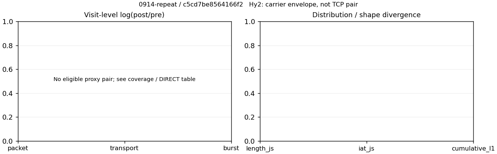

# 0914-repeat · 条目 005 · baidu.com

目标：https://www.baidu.com/s?wd=network%20traffic%20analysis

活动标签：baidu.com::page_load。选定访问 15 次。

[返回总索引](../../README.md) · [统计口径](../../methods.md)

## 覆盖与资格（每次访问均保留）

| 部署 | 重复 | 主请求路由 | 活动状态 | 代理比较 | DIRECT pre | 请求 proxy/direct/unresolved | 错误 |
| --- | --- | --- | --- | --- | --- | --- | --- |
| Hy2 | 1 | direct | passed | 0 | 1 | 0/99/0 | [] |
| Hy2 | 2 | direct | passed | 0 | 1 | 0/107/0 | [] |
| Hy2 | 3 | direct | passed | 0 | 1 | 0/98/0 | [] |
| Hy2 | 4 | direct | passed | 0 | 1 | 0/100/0 | [] |
| Hy2 | 5 | direct | passed | 0 | 1 | 0/99/0 | [] |
| SS | 1 | direct | passed | 0 | 1 | 0/103/0 | [] |
| SS | 2 | direct | passed | 0 | 1 | 0/108/0 | [] |
| SS | 3 | direct | passed | 0 | 1 | 0/99/0 | [] |
| SS | 4 | direct | passed | 0 | 1 | 0/101/0 | [] |
| SS | 5 | direct | passed | 0 | 1 | 0/102/0 | [] |
| VLESS | 1 | direct | passed | 0 | 1 | 0/99/0 | [] |
| VLESS | 2 | direct | passed | 0 | 1 | 0/106/0 | [] |
| VLESS | 3 | direct | passed | 0 | 1 | 0/106/0 | [] |
| VLESS | 4 | direct | passed | 0 | 1 | 0/99/0 | [] |
| VLESS | 5 | direct | passed | 0 | 1 | 0/102/0 | [] |

主请求非 proxy 的统计仅解释为已索引的辅助代理连接或 DIRECT 观测，不代表目标业务经代理传输。播放确认与配对资格是两道不同的门。

图中散点为单次访问，短线为重复中位数；Hy2 是共享载体包络，不能与 TCP 配对作等范围因果对比。

形态图先逐访问归一化，再对访问等权平均；实线 pre，虚线 post。分箱序号及边界见 methods，不将分箱索引误解为长度或时间。

## 每次访问的关键观测

### SS

范围：`direct_pre_only`。每格 pre → post；空值为不可观测/不适用。

| 重复 | 包数 | 载荷字节 | burst | TCP FR | IAT中位µs | length JS | IAT JS |
| --- | --- | --- | --- | --- | --- | --- | --- |
| 1 | 1697 → — | 2.3096e+06 → — | 1162 → — | 199 → — | 182.88 → — | — | — |
| 2 | 1865 → — | 2.6813e+06 → — | 1230 → — | 218 → — | 177.49 → — | — | — |
| 3 | 1581 → — | 2.4483e+06 → — | 1021 → — | 176 → — | 150.22 → — | — | — |
| 4 | 1692 → — | 2.5993e+06 → — | 1109 → — | 191 → — | 146.71 → — | — | — |
| 5 | 1844 → — | 2.5946e+06 → — | 1241 → — | 200 → — | 145.74 → — | — | — |

完整标量统计：中位数 [min,max]；Δ 为重复内逐访问变换的中位数，MAD 未缩放。n 为可用变换数；DIRECT-only 的 nΔ=0 不代表 pre 不可用。

| scope | 特征 | pre | post | Δ | IQRΔ | MADΔ | nΔ |
| --- | --- | --- | --- | --- | --- | --- | --- |
| direct_pre_only | active_span_sum_s_1000ms | 10.803 [8.6219, 12.401] | — | — | — | — | 0 |
| direct_pre_only | active_span_sum_s_100ms | 4.4729 [4.0904, 5.4901] | — | — | — | — | 0 |
| direct_pre_only | active_span_sum_s_500ms | 8.9805 [7.7858, 9.8793] | — | — | — | — | 0 |
| direct_pre_only | burst_bytes_iqr | 2824 [2640, 2824] | — | — | — | — | 0 |
| direct_pre_only | burst_bytes_mad | 31 [31, 31] | — | — | — | — | 0 |
| direct_pre_only | burst_bytes_max | 26840 [22616, 28672] | — | — | — | — | 0 |
| direct_pre_only | burst_bytes_mean | 2179.9 [1987.6, 2397.9] | — | — | — | — | 0 |
| direct_pre_only | burst_bytes_median | 31 [31, 31] | — | — | — | — | 0 |
| direct_pre_only | burst_bytes_min | 0 [0, 0] | — | — | — | — | 0 |
| direct_pre_only | burst_bytes_p95 | 11296 [9073.9, 15442] | — | — | — | — | 0 |
| direct_pre_only | burst_bytes_q25 | 0 [0, 0] | — | — | — | — | 0 |
| direct_pre_only | burst_bytes_q75 | 2824 [2640, 2824] | — | — | — | — | 0 |
| direct_pre_only | burst_bytes_std | 4003.8 [3977.3, 4878.8] | — | — | — | — | 0 |
| direct_pre_only | burst_count | 1162 [1021, 1241] | — | — | — | — | 0 |
| direct_pre_only | burst_duration_ms_iqr | 0.73422 [0.62068, 0.80443] | — | — | — | — | 0 |
| direct_pre_only | burst_duration_ms_mad | 0 [0, 0] | — | — | — | — | 0 |
| direct_pre_only | burst_duration_ms_max | 11234 [3134, 14908] | — | — | — | — | 0 |
| direct_pre_only | burst_duration_ms_mean | 89.175 [36.3, 108.53] | — | — | — | — | 0 |
| direct_pre_only | burst_duration_ms_median | 0 [0, 0] | — | — | — | — | 0 |
| direct_pre_only | burst_duration_ms_min | 0 [0, 0] | — | — | — | — | 0 |
| direct_pre_only | burst_duration_ms_p95 | 52.566 [35.26, 87.789] | — | — | — | — | 0 |
| direct_pre_only | burst_duration_ms_q25 | 0 [0, 0] | — | — | — | — | 0 |
| direct_pre_only | burst_duration_ms_q75 | 0.73422 [0.62068, 0.80443] | — | — | — | — | 0 |
| direct_pre_only | burst_duration_ms_std | 620.14 [265.81, 927.86] | — | — | — | — | 0 |
| direct_pre_only | burst_packets_iqr | 1 [1, 1] | — | — | — | — | 0 |
| direct_pre_only | burst_packets_mad | 0 [0, 0] | — | — | — | — | 0 |
| direct_pre_only | burst_packets_max | 8 [6, 10] | — | — | — | — | 0 |
| direct_pre_only | burst_packets_mean | 1.5163 [1.4604, 1.5485] | — | — | — | — | 0 |
| direct_pre_only | burst_packets_median | 1 [1, 1] | — | — | — | — | 0 |
| direct_pre_only | burst_packets_min | 1 [1, 1] | — | — | — | — | 0 |
| direct_pre_only | burst_packets_p95 | 3 [3, 3] | — | — | — | — | 0 |
| direct_pre_only | burst_packets_q25 | 1 [1, 1] | — | — | — | — | 0 |
| direct_pre_only | burst_packets_q75 | 2 [2, 2] | — | — | — | — | 0 |
| direct_pre_only | burst_packets_std | 0.81188 [0.75859, 0.85413] | — | — | — | — | 0 |
| direct_pre_only | connection_span_concurrency_max | 22 [17, 23] | — | — | — | — | 0 |
| direct_pre_only | direction_entropy | 0.71206 [0.70135, 0.72944] | — | — | — | — | 0 |
| direct_pre_only | down_burst_count | 565 [496, 604] | — | — | — | — | 0 |
| direct_pre_only | down_ip_bytes | 2.5055e+06 [2.2231e+06, 2.587e+06] | — | — | — | — | 0 |
| direct_pre_only | down_packets | 977 [926, 1085] | — | — | — | — | 0 |
| direct_pre_only | down_transport_bytes | 2.4498e+06 [2.1722e+06, 2.5303e+06] | — | — | — | — | 0 |
| direct_pre_only | duration_s | 19.274 [4.281, 33.281] | — | — | — | — | 0 |
| direct_pre_only | entity_count | 33 [29, 34] | — | — | — | — | 0 |
| direct_pre_only | fr_runs | 199 [176, 218] | — | — | — | — | 0 |
| direct_pre_only | fr_runs_per_packet | 0.21269 [0.20441, 0.22235] | — | — | — | — | 0 |
| direct_pre_only | fr_switches | 167 [147, 184] | — | — | — | — | 0 |
| direct_pre_only | fr_switches_per_possible_transition | 0.18266 [0.17668, 0.19351] | — | — | — | — | 0 |
| direct_pre_only | full_retransmission_fraction | 0.0043384 [0.0032172, 0.0069576] | — | — | — | — | 0 |
| direct_pre_only | full_retransmission_packets | 8 [6, 11] | — | — | — | — | 0 |
| direct_pre_only | iat_count | 1665 [1552, 1831] | — | — | — | — | 0 |
| direct_pre_only | iat_median_us | 150.22 [145.74, 182.88] | — | — | — | — | 0 |
| direct_pre_only | iat_us_iqr | 853.15 [813.4, 899.96] | — | — | — | — | 0 |
| direct_pre_only | iat_us_mad | 141.14 [139.45, 175.17] | — | — | — | — | 0 |
| direct_pre_only | iat_us_max | 1.1234e+07 [3.134e+06, 1.5001e+07] | — | — | — | — | 0 |
| direct_pre_only | iat_us_mean | 62532 [26599, 1.3701e+05] | — | — | — | — | 0 |
| direct_pre_only | iat_us_median | 150.22 [145.74, 182.88] | — | — | — | — | 0 |
| direct_pre_only | iat_us_min | 0.904 [0.133, 1.308] | — | — | — | — | 0 |
| direct_pre_only | iat_us_p95 | 37722 [32600, 39992] | — | — | — | — | 0 |
| direct_pre_only | iat_us_q25 | 31.414 [23.561, 35.891] | — | — | — | — | 0 |
| direct_pre_only | iat_us_q75 | 876.71 [849.29, 933.65] | — | — | — | — | 0 |
| direct_pre_only | iat_us_std | 5.1161e+05 [2.2312e+05, 1.3021e+06] | — | — | — | — | 0 |
| direct_pre_only | idle_gap_count_1000ms | 28 [13, 30] | — | — | — | — | 0 |
| direct_pre_only | idle_gap_count_100ms | 50 [37, 60] | — | — | — | — | 0 |
| direct_pre_only | idle_gap_count_500ms | 29 [18, 32] | — | — | — | — | 0 |
| direct_pre_only | idle_gap_sum_s_1000ms | 103.69 [31.886, 237.45] | — | — | — | — | 0 |
| direct_pre_only | idle_gap_sum_s_100ms | 109.01 [38.982, 243.66] | — | — | — | — | 0 |
| direct_pre_only | idle_gap_sum_s_500ms | 105.52 [35.053, 238.25] | — | — | — | — | 0 |
| direct_pre_only | ip_bytes | 2.6875e+06 [2.398e+06, 2.7785e+06] | — | — | — | — | 0 |
| direct_pre_only | length_iqr | 2152 [1921, 3521.8] | — | — | — | — | 0 |
| direct_pre_only | length_mad | 1412 [1234, 1596] | — | — | — | — | 0 |
| direct_pre_only | length_max | 8948 [8948, 8948] | — | — | — | — | 0 |
| direct_pre_only | length_mean | 2665.3 [2580.6, 2894.5] | — | — | — | — | 0 |
| direct_pre_only | length_median | 2640 [2472, 2824] | — | — | — | — | 0 |
| direct_pre_only | length_min | 12 [8, 31] | — | — | — | — | 0 |
| direct_pre_only | length_p95 | 8920 [8472, 8920] | — | — | — | — | 0 |
| direct_pre_only | length_q25 | 672 [574.25, 964] | — | — | — | — | 0 |
| direct_pre_only | length_q75 | 2916 [2824, 4096] | — | — | — | — | 0 |
| direct_pre_only | length_std | 2399 [2295.9, 2721.2] | — | — | — | — | 0 |
| direct_pre_only | nonempty_entity_count | 33 [29, 34] | — | — | — | — | 0 |
| direct_pre_only | nonempty_packets | 898 [861, 1006] | — | — | — | — | 0 |
| direct_pre_only | offload_suspect_fraction | 0.32755 [0.31232, 0.3437] | — | — | — | — | 0 |
| direct_pre_only | packet_count | 1697 [1581, 1865] | — | — | — | — | 0 |
| direct_pre_only | rtt_median_ms | 0.10407 [0.09834, 0.11073] | — | — | — | — | 0 |
| direct_pre_only | rtt_sample_count | 689 [611, 745] | — | — | — | — | 0 |
| direct_pre_only | tcp_ack_count | 1629 [1522, 1799] | — | — | — | — | 0 |
| direct_pre_only | tcp_fin_count | 62 [52, 63] | — | — | — | — | 0 |
| direct_pre_only | tcp_packet_count | 1697 [1581, 1865] | — | — | — | — | 0 |
| direct_pre_only | tcp_rst_count | 32 [30, 37] | — | — | — | — | 0 |
| direct_pre_only | tcp_syn_count | 66 [58, 68] | — | — | — | — | 0 |
| direct_pre_only | tcp_window_raw_median | 65535 [65535, 65535] | — | — | — | — | 0 |
| direct_pre_only | transition_entropy | 0.56062 [0.546, 0.57184] | — | — | — | — | 0 |
| direct_pre_only | transition_n_mm | 626 [605, 695] | — | — | — | — | 0 |
| direct_pre_only | transition_n_mp | 67 [59, 75] | — | — | — | — | 0 |
| direct_pre_only | transition_n_pm | 99 [88, 109] | — | — | — | — | 0 |
| direct_pre_only | transition_n_pp | 87 [70, 93] | — | — | — | — | 0 |
| direct_pre_only | transition_p_mm | 0.90776 [0.90202, 0.91126] | — | — | — | — | 0 |
| direct_pre_only | transition_p_mp | 0.09224 [0.088742, 0.097983] | — | — | — | — | 0 |
| direct_pre_only | transition_p_pm | 0.52632 [0.52198, 0.5858] | — | — | — | — | 0 |
| direct_pre_only | transition_p_pp | 0.47368 [0.4142, 0.47802] | — | — | — | — | 0 |
| direct_pre_only | transport_bytes | 2.5946e+06 [2.3096e+06, 2.6813e+06] | — | — | — | — | 0 |
| direct_pre_only | up_burst_count | 597 [525, 637] | — | — | — | — | 0 |
| direct_pre_only | up_byte_fraction | 0.055795 [0.052342, 0.059522] | — | — | — | — | 0 |
| direct_pre_only | up_ip_bytes | 1.789e+05 [1.6221e+05, 1.9153e+05] | — | — | — | — | 0 |
| direct_pre_only | up_packets | 723 [655, 780] | — | — | — | — | 0 |
| direct_pre_only | up_transport_bytes | 1.4176e+05 [1.2815e+05, 1.5101e+05] | — | — | — | — | 0 |
| direct_pre_only | zero_iat_count | 0 [0, 0] | — | — | — | — | 0 |
| direct_pre_only | zero_iat_fraction | 0 [0, 0] | — | — | — | — | 0 |

### VLESS

范围：`direct_pre_only`。每格 pre → post；空值为不可观测/不适用。

| 重复 | 包数 | 载荷字节 | burst | TCP FR | IAT中位µs | length JS | IAT JS |
| --- | --- | --- | --- | --- | --- | --- | --- |
| 1 | 1546 → — | 2.4529e+06 → — | 1030 → — | 181 → — | 143.6 → — | — | — |
| 2 | 1880 → — | 2.4778e+06 → — | 1242 → — | 199 → — | 215.45 → — | — | — |
| 3 | 2030 → — | 2.4108e+06 → — | 1517 → — | 208 → — | 157.03 → — | — | — |
| 4 | 1481 → — | 1.9708e+06 → — | 1027 → — | 173 → — | 154.9 → — | — | — |
| 5 | 1576 → — | 2.5155e+06 → — | 1065 → — | 190 → — | 110.2 → — | — | — |

完整标量统计：中位数 [min,max]；Δ 为重复内逐访问变换的中位数，MAD 未缩放。n 为可用变换数；DIRECT-only 的 nΔ=0 不代表 pre 不可用。

| scope | 特征 | pre | post | Δ | IQRΔ | MADΔ | nΔ |
| --- | --- | --- | --- | --- | --- | --- | --- |
| direct_pre_only | active_span_sum_s_1000ms | 12.925 [10.753, 15.073] | — | — | — | — | 0 |
| direct_pre_only | active_span_sum_s_100ms | 5.044 [4.7858, 5.2187] | — | — | — | — | 0 |
| direct_pre_only | active_span_sum_s_500ms | 9.3213 [7.7568, 10.142] | — | — | — | — | 0 |
| direct_pre_only | burst_bytes_iqr | 2326 [2202.5, 2824] | — | — | — | — | 0 |
| direct_pre_only | burst_bytes_mad | 31 [31, 31] | — | — | — | — | 0 |
| direct_pre_only | burst_bytes_max | 28000 [21192, 29216] | — | — | — | — | 0 |
| direct_pre_only | burst_bytes_mean | 1995 [1589.2, 2381.4] | — | — | — | — | 0 |
| direct_pre_only | burst_bytes_median | 31 [31, 31] | — | — | — | — | 0 |
| direct_pre_only | burst_bytes_min | 0 [0, 0] | — | — | — | — | 0 |
| direct_pre_only | burst_bytes_p95 | 9490 [5648, 15532] | — | — | — | — | 0 |
| direct_pre_only | burst_bytes_q25 | 0 [0, 0] | — | — | — | — | 0 |
| direct_pre_only | burst_bytes_q75 | 2326 [2202.5, 2824] | — | — | — | — | 0 |
| direct_pre_only | burst_bytes_std | 3867.2 [2795.9, 4834.3] | — | — | — | — | 0 |
| direct_pre_only | burst_count | 1065 [1027, 1517] | — | — | — | — | 0 |
| direct_pre_only | burst_duration_ms_iqr | 0.55411 [0.060397, 0.83074] | — | — | — | — | 0 |
| direct_pre_only | burst_duration_ms_mad | 0 [0, 0] | — | — | — | — | 0 |
| direct_pre_only | burst_duration_ms_max | 11037 [2402.9, 11668] | — | — | — | — | 0 |
| direct_pre_only | burst_duration_ms_mean | 51.883 [41.47, 73.705] | — | — | — | — | 0 |
| direct_pre_only | burst_duration_ms_median | 0 [0, 0] | — | — | — | — | 0 |
| direct_pre_only | burst_duration_ms_min | 0 [0, 0] | — | — | — | — | 0 |
| direct_pre_only | burst_duration_ms_p95 | 70.539 [33.202, 77.18] | — | — | — | — | 0 |
| direct_pre_only | burst_duration_ms_q25 | 0 [0, 0] | — | — | — | — | 0 |
| direct_pre_only | burst_duration_ms_q75 | 0.55411 [0.060397, 0.83074] | — | — | — | — | 0 |
| direct_pre_only | burst_duration_ms_std | 460.26 [250.36, 570.24] | — | — | — | — | 0 |
| direct_pre_only | burst_packets_iqr | 1 [1, 1] | — | — | — | — | 0 |
| direct_pre_only | burst_packets_mad | 0 [0, 0] | — | — | — | — | 0 |
| direct_pre_only | burst_packets_max | 8 [6, 9] | — | — | — | — | 0 |
| direct_pre_only | burst_packets_mean | 1.4798 [1.3382, 1.5137] | — | — | — | — | 0 |
| direct_pre_only | burst_packets_median | 1 [1, 1] | — | — | — | — | 0 |
| direct_pre_only | burst_packets_min | 1 [1, 1] | — | — | — | — | 0 |
| direct_pre_only | burst_packets_p95 | 3 [2, 3] | — | — | — | — | 0 |
| direct_pre_only | burst_packets_q25 | 1 [1, 1] | — | — | — | — | 0 |
| direct_pre_only | burst_packets_q75 | 2 [2, 2] | — | — | — | — | 0 |
| direct_pre_only | burst_packets_std | 0.80863 [0.63179, 0.8546] | — | — | — | — | 0 |
| direct_pre_only | connection_span_concurrency_max | 16 [11, 23] | — | — | — | — | 0 |
| direct_pre_only | direction_entropy | 0.73779 [0.70342, 0.76098] | — | — | — | — | 0 |
| direct_pre_only | down_burst_count | 516 [498, 743] | — | — | — | — | 0 |
| direct_pre_only | down_ip_bytes | 2.3705e+06 [1.8828e+06, 2.42e+06] | — | — | — | — | 0 |
| direct_pre_only | down_packets | 892 [832, 1121] | — | — | — | — | 0 |
| direct_pre_only | down_transport_bytes | 2.3242e+06 [1.8393e+06, 2.3733e+06] | — | — | — | — | 0 |
| direct_pre_only | duration_s | 30.297 [4.4198, 36.364] | — | — | — | — | 0 |
| direct_pre_only | entity_count | 31 [30, 34] | — | — | — | — | 0 |
| direct_pre_only | fr_runs | 190 [173, 208] | — | — | — | — | 0 |
| direct_pre_only | fr_runs_per_packet | 0.22154 [0.19567, 0.23399] | — | — | — | — | 0 |
| direct_pre_only | fr_switches | 157 [142, 177] | — | — | — | — | 0 |
| direct_pre_only | fr_switches_per_possible_transition | 0.19187 [0.16785, 0.20154] | — | — | — | — | 0 |
| direct_pre_only | full_retransmission_fraction | 0.0054018 [0.00098522, 0.011421] | — | — | — | — | 0 |
| direct_pre_only | full_retransmission_packets | 8 [2, 18] | — | — | — | — | 0 |
| direct_pre_only | iat_count | 1543 [1450, 1999] | — | — | — | — | 0 |
| direct_pre_only | iat_median_us | 154.9 [110.2, 215.45] | — | — | — | — | 0 |
| direct_pre_only | iat_us_iqr | 912.31 [797.24, 996.12] | — | — | — | — | 0 |
| direct_pre_only | iat_us_mad | 147.71 [102.62, 208.36] | — | — | — | — | 0 |
| direct_pre_only | iat_us_max | 1.5001e+07 [2.448e+06, 1.5002e+07] | — | — | — | — | 0 |
| direct_pre_only | iat_us_mean | 96562 [31458, 1.1254e+05] | — | — | — | — | 0 |
| direct_pre_only | iat_us_median | 154.9 [110.2, 215.45] | — | — | — | — | 0 |
| direct_pre_only | iat_us_min | 0.789 [0.011, 2.171] | — | — | — | — | 0 |
| direct_pre_only | iat_us_p95 | 37288 [33081, 41906] | — | — | — | — | 0 |
| direct_pre_only | iat_us_q25 | 25.626 [17.291, 35.687] | — | — | — | — | 0 |
| direct_pre_only | iat_us_q75 | 935.85 [826.86, 1021.7] | — | — | — | — | 0 |
| direct_pre_only | iat_us_std | 9.8058e+05 [2.1888e+05, 1.1102e+06] | — | — | — | — | 0 |
| direct_pre_only | idle_gap_count_1000ms | 23 [19, 31] | — | — | — | — | 0 |
| direct_pre_only | idle_gap_count_100ms | 49 [40, 56] | — | — | — | — | 0 |
| direct_pre_only | idle_gap_count_500ms | 26 [24, 36] | — | — | — | — | 0 |
| direct_pre_only | idle_gap_sum_s_1000ms | 150.26 [35.607, 179.82] | — | — | — | — | 0 |
| direct_pre_only | idle_gap_sum_s_100ms | 158.4 [42.646, 187.87] | — | — | — | — | 0 |
| direct_pre_only | idle_gap_sum_s_500ms | 153.11 [39.933, 182.88] | — | — | — | — | 0 |
| direct_pre_only | ip_bytes | 2.5335e+06 [2.048e+06, 2.5977e+06] | — | — | — | — | 0 |
| direct_pre_only | length_iqr | 2242.5 [1758, 4411.5] | — | — | — | — | 0 |
| direct_pre_only | length_mad | 1360.5 [1018, 2075] | — | — | — | — | 0 |
| direct_pre_only | length_max | 8948 [8948, 8948] | — | — | — | — | 0 |
| direct_pre_only | length_mean | 2634.8 [2324.7, 3097.9] | — | — | — | — | 0 |
| direct_pre_only | length_median | 2824 [2502, 2824] | — | — | — | — | 0 |
| direct_pre_only | length_min | 30 [19, 31] | — | — | — | — | 0 |
| direct_pre_only | length_p95 | 8920 [5648, 8920] | — | — | — | — | 0 |
| direct_pre_only | length_q25 | 637.5 [509, 1066] | — | — | — | — | 0 |
| direct_pre_only | length_q75 | 2880 [2824, 4920.5] | — | — | — | — | 0 |
| direct_pre_only | length_std | 2442.7 [1829.7, 2971.8] | — | — | — | — | 0 |
| direct_pre_only | nonempty_entity_count | 31 [30, 34] | — | — | — | — | 0 |
| direct_pre_only | nonempty_packets | 817 [748, 1037] | — | — | — | — | 0 |
| direct_pre_only | offload_suspect_fraction | 0.32709 [0.31726, 0.34734] | — | — | — | — | 0 |
| direct_pre_only | packet_count | 1576 [1481, 2030] | — | — | — | — | 0 |
| direct_pre_only | rtt_median_ms | 0.090911 [0.064743, 0.13042] | — | — | — | — | 0 |
| direct_pre_only | rtt_sample_count | 637 [604, 877] | — | — | — | — | 0 |
| direct_pre_only | tcp_ack_count | 1504 [1417, 1970] | — | — | — | — | 0 |
| direct_pre_only | tcp_fin_count | 61 [56, 63] | — | — | — | — | 0 |
| direct_pre_only | tcp_packet_count | 1576 [1481, 2030] | — | — | — | — | 0 |
| direct_pre_only | tcp_rst_count | 33 [29, 39] | — | — | — | — | 0 |
| direct_pre_only | tcp_syn_count | 62 [60, 68] | — | — | — | — | 0 |
| direct_pre_only | tcp_window_raw_median | 65535 [65535, 65535] | — | — | — | — | 0 |
| direct_pre_only | transition_entropy | 0.57913 [0.53296, 0.59845] | — | — | — | — | 0 |
| direct_pre_only | transition_n_mm | 557 [504, 736] | — | — | — | — | 0 |
| direct_pre_only | transition_n_mp | 62 [56, 74] | — | — | — | — | 0 |
| direct_pre_only | transition_n_pm | 95 [86, 103] | — | — | — | — | 0 |
| direct_pre_only | transition_n_pp | 84 [71, 95] | — | — | — | — | 0 |
| direct_pre_only | transition_p_mm | 0.90129 [0.89667, 0.91519] | — | — | — | — | 0 |
| direct_pre_only | transition_p_mp | 0.098706 [0.08481, 0.10333] | — | — | — | — | 0 |
| direct_pre_only | transition_p_pm | 0.53073 [0.50777, 0.54777] | — | — | — | — | 0 |
| direct_pre_only | transition_p_pp | 0.46927 [0.45223, 0.49223] | — | — | — | — | 0 |
| direct_pre_only | transport_bytes | 2.4529e+06 [1.9708e+06, 2.5155e+06] | — | — | — | — | 0 |
| direct_pre_only | up_burst_count | 549 [529, 774] | — | — | — | — | 0 |
| direct_pre_only | up_byte_fraction | 0.058684 [0.052448, 0.066736] | — | — | — | — | 0 |
| direct_pre_only | up_ip_bytes | 1.7774e+05 [1.6303e+05, 1.8866e+05] | — | — | — | — | 0 |
| direct_pre_only | up_packets | 684 [649, 909] | — | — | — | — | 0 |
| direct_pre_only | up_transport_bytes | 1.4147e+05 [1.2865e+05, 1.4555e+05] | — | — | — | — | 0 |
| direct_pre_only | zero_iat_count | 0 [0, 0] | — | — | — | — | 0 |
| direct_pre_only | zero_iat_fraction | 0 [0, 0] | — | — | — | — | 0 |

### Hy2

范围：`direct_pre_only`。每格 pre → post；空值为不可观测/不适用。

| 重复 | 包数 | 载荷字节 | burst | TCP FR | IAT中位µs | length JS | IAT JS |
| --- | --- | --- | --- | --- | --- | --- | --- |
| 1 | 1618 → — | 2.4415e+06 → — | 1065 → — | 187 → — | 139.31 → — | — | — |
| 2 | 1935 → — | 2.6369e+06 → — | 1224 → — | 223 → — | 168.88 → — | — | — |
| 3 | 1571 → — | 2.4874e+06 → — | 1061 → — | 192 → — | 101.6 → — | — | — |
| 4 | 1813 → — | 2.5721e+06 → — | 1196 → — | 205 → — | 176.23 → — | — | — |
| 5 | 1716 → — | 2.4512e+06 → — | 1177 → — | 189 → — | 129.93 → — | — | — |

完整标量统计：中位数 [min,max]；Δ 为重复内逐访问变换的中位数，MAD 未缩放。n 为可用变换数；DIRECT-only 的 nΔ=0 不代表 pre 不可用。

| scope | 特征 | pre | post | Δ | IQRΔ | MADΔ | nΔ |
| --- | --- | --- | --- | --- | --- | --- | --- |
| direct_pre_only | active_span_sum_s_1000ms | 15.293 [12.656, 19.057] | — | — | — | — | 0 |
| direct_pre_only | active_span_sum_s_100ms | 5.2421 [4.7023, 5.7055] | — | — | — | — | 0 |
| direct_pre_only | active_span_sum_s_500ms | 9.2503 [8.0428, 11.577] | — | — | — | — | 0 |
| direct_pre_only | burst_bytes_iqr | 2640 [2293, 2880] | — | — | — | — | 0 |
| direct_pre_only | burst_bytes_mad | 31 [0, 31] | — | — | — | — | 0 |
| direct_pre_only | burst_bytes_max | 24968 [23044, 28672] | — | — | — | — | 0 |
| direct_pre_only | burst_bytes_mean | 2154.3 [2082.6, 2344.4] | — | — | — | — | 0 |
| direct_pre_only | burst_bytes_median | 31 [0, 31] | — | — | — | — | 0 |
| direct_pre_only | burst_bytes_min | 0 [0, 0] | — | — | — | — | 0 |
| direct_pre_only | burst_bytes_p95 | 12716 [9884, 14120] | — | — | — | — | 0 |
| direct_pre_only | burst_bytes_q25 | 0 [0, 0] | — | — | — | — | 0 |
| direct_pre_only | burst_bytes_q75 | 2640 [2293, 2880] | — | — | — | — | 0 |
| direct_pre_only | burst_bytes_std | 4481.8 [3913.7, 4719] | — | — | — | — | 0 |
| direct_pre_only | burst_count | 1177 [1061, 1224] | — | — | — | — | 0 |
| direct_pre_only | burst_duration_ms_iqr | 0.56305 [0.35052, 0.80433] | — | — | — | — | 0 |
| direct_pre_only | burst_duration_ms_mad | 0 [0, 0] | — | — | — | — | 0 |
| direct_pre_only | burst_duration_ms_max | 14669 [11514, 15001] | — | — | — | — | 0 |
| direct_pre_only | burst_duration_ms_mean | 36.858 [25.78, 86.672] | — | — | — | — | 0 |
| direct_pre_only | burst_duration_ms_median | 0 [0, 0] | — | — | — | — | 0 |
| direct_pre_only | burst_duration_ms_min | 0 [0, 0] | — | — | — | — | 0 |
| direct_pre_only | burst_duration_ms_p95 | 53.472 [39.073, 55.508] | — | — | — | — | 0 |
| direct_pre_only | burst_duration_ms_q25 | 0 [0, 0] | — | — | — | — | 0 |
| direct_pre_only | burst_duration_ms_q75 | 0.56305 [0.35052, 0.80433] | — | — | — | — | 0 |
| direct_pre_only | burst_duration_ms_std | 466.58 [346.85, 788.92] | — | — | — | — | 0 |
| direct_pre_only | burst_packets_iqr | 1 [1, 1] | — | — | — | — | 0 |
| direct_pre_only | burst_packets_mad | 0 [0, 0] | — | — | — | — | 0 |
| direct_pre_only | burst_packets_max | 8 [7, 9] | — | — | — | — | 0 |
| direct_pre_only | burst_packets_mean | 1.5159 [1.4579, 1.5809] | — | — | — | — | 0 |
| direct_pre_only | burst_packets_median | 1 [1, 1] | — | — | — | — | 0 |
| direct_pre_only | burst_packets_min | 1 [1, 1] | — | — | — | — | 0 |
| direct_pre_only | burst_packets_p95 | 3 [3, 3] | — | — | — | — | 0 |
| direct_pre_only | burst_packets_q25 | 1 [1, 1] | — | — | — | — | 0 |
| direct_pre_only | burst_packets_q75 | 2 [2, 2] | — | — | — | — | 0 |
| direct_pre_only | burst_packets_std | 0.84022 [0.8172, 0.8754] | — | — | — | — | 0 |
| direct_pre_only | connection_span_concurrency_max | 23 [17, 23] | — | — | — | — | 0 |
| direct_pre_only | direction_entropy | 0.72147 [0.68973, 0.74895] | — | — | — | — | 0 |
| direct_pre_only | down_burst_count | 571 [516, 596] | — | — | — | — | 0 |
| direct_pre_only | down_ip_bytes | 2.4056e+06 [2.3607e+06, 2.5478e+06] | — | — | — | — | 0 |
| direct_pre_only | down_packets | 982 [900, 1157] | — | — | — | — | 0 |
| direct_pre_only | down_transport_bytes | 2.3586e+06 [2.3113e+06, 2.4873e+06] | — | — | — | — | 0 |
| direct_pre_only | duration_s | 19.501 [17.103, 32.739] | — | — | — | — | 0 |
| direct_pre_only | entity_count | 32 [29, 35] | — | — | — | — | 0 |
| direct_pre_only | fr_runs | 192 [187, 223] | — | — | — | — | 0 |
| direct_pre_only | fr_runs_per_packet | 0.21371 [0.2088, 0.23077] | — | — | — | — | 0 |
| direct_pre_only | fr_switches | 163 [154, 191] | — | — | — | — | 0 |
| direct_pre_only | fr_switches_per_possible_transition | 0.18463 [0.18203, 0.20299] | — | — | — | — | 0 |
| direct_pre_only | full_retransmission_fraction | 0.0037083 [0.0010336, 0.0075758] | — | — | — | — | 0 |
| direct_pre_only | full_retransmission_packets | 6 [2, 13] | — | — | — | — | 0 |
| direct_pre_only | iat_count | 1681 [1542, 1903] | — | — | — | — | 0 |
| direct_pre_only | iat_median_us | 139.31 [101.6, 176.23] | — | — | — | — | 0 |
| direct_pre_only | iat_us_iqr | 878.22 [779.9, 901.87] | — | — | — | — | 0 |
| direct_pre_only | iat_us_mad | 129.7 [94.373, 168.89] | — | — | — | — | 0 |
| direct_pre_only | iat_us_max | 1.5001e+07 [1.1514e+07, 1.5003e+07] | — | — | — | — | 0 |
| direct_pre_only | iat_us_mean | 73006 [21560, 1.6706e+05] | — | — | — | — | 0 |
| direct_pre_only | iat_us_median | 139.31 [101.6, 176.23] | — | — | — | — | 0 |
| direct_pre_only | iat_us_min | 0.182 [0.066, 1.769] | — | — | — | — | 0 |
| direct_pre_only | iat_us_p95 | 40275 [31561, 40539] | — | — | — | — | 0 |
| direct_pre_only | iat_us_q25 | 33.623 [19.207, 36.865] | — | — | — | — | 0 |
| direct_pre_only | iat_us_q75 | 911.85 [813.72, 938.74] | — | — | — | — | 0 |
| direct_pre_only | iat_us_std | 9.3967e+05 [3.0523e+05, 1.41e+06] | — | — | — | — | 0 |
| direct_pre_only | idle_gap_count_1000ms | 12 [3, 35] | — | — | — | — | 0 |
| direct_pre_only | idle_gap_count_100ms | 44 [39, 57] | — | — | — | — | 0 |
| direct_pre_only | idle_gap_count_500ms | 24 [14, 42] | — | — | — | — | 0 |
| direct_pre_only | idle_gap_sum_s_1000ms | 104 [14.189, 305.26] | — | — | — | — | 0 |
| direct_pre_only | idle_gap_sum_s_100ms | 117.36 [28.543, 313.19] | — | — | — | — | 0 |
| direct_pre_only | idle_gap_sum_s_500ms | 113.52 [22.416, 309.88] | — | — | — | — | 0 |
| direct_pre_only | ip_bytes | 2.5693e+06 [2.5258e+06, 2.7377e+06] | — | — | — | — | 0 |
| direct_pre_only | length_iqr | 2069 [1860, 3506] | — | — | — | — | 0 |
| direct_pre_only | length_mad | 1432 [1393, 1840] | — | — | — | — | 0 |
| direct_pre_only | length_max | 8948 [8948, 8948] | — | — | — | — | 0 |
| direct_pre_only | length_mean | 2782.3 [2469, 2989.6] | — | — | — | — | 0 |
| direct_pre_only | length_median | 2648 [2640, 2824] | — | — | — | — | 0 |
| direct_pre_only | length_min | 31 [9, 31] | — | — | — | — | 0 |
| direct_pre_only | length_p95 | 8920 [7060, 8920] | — | — | — | — | 0 |
| direct_pre_only | length_q25 | 847 [590, 964] | — | — | — | — | 0 |
| direct_pre_only | length_q75 | 2916 [2824, 4096] | — | — | — | — | 0 |
| direct_pre_only | length_std | 2570.3 [2035.4, 2833.6] | — | — | — | — | 0 |
| direct_pre_only | nonempty_entity_count | 32 [29, 35] | — | — | — | — | 0 |
| direct_pre_only | nonempty_packets | 881 [832, 1068] | — | — | — | — | 0 |
| direct_pre_only | offload_suspect_fraction | 0.33807 [0.32051, 0.35401] | — | — | — | — | 0 |
| direct_pre_only | packet_count | 1716 [1571, 1935] | — | — | — | — | 0 |
| direct_pre_only | rtt_median_ms | 0.10379 [0.067458, 0.12713] | — | — | — | — | 0 |
| direct_pre_only | rtt_sample_count | 684 [640, 731] | — | — | — | — | 0 |
| direct_pre_only | tcp_ack_count | 1638 [1514, 1873] | — | — | — | — | 0 |
| direct_pre_only | tcp_fin_count | 59 [54, 67] | — | — | — | — | 0 |
| direct_pre_only | tcp_packet_count | 1716 [1571, 1935] | — | — | — | — | 0 |
| direct_pre_only | tcp_rst_count | 29 [26, 43] | — | — | — | — | 0 |
| direct_pre_only | tcp_syn_count | 64 [58, 70] | — | — | — | — | 0 |
| direct_pre_only | tcp_window_raw_median | 65535 [65535, 65535] | — | — | — | — | 0 |
| direct_pre_only | transition_entropy | 0.56524 [0.55067, 0.60486] | — | — | — | — | 0 |
| direct_pre_only | transition_n_mm | 611 [559, 760] | — | — | — | — | 0 |
| direct_pre_only | transition_n_mp | 68 [60, 80] | — | — | — | — | 0 |
| direct_pre_only | transition_n_pm | 95 [93, 111] | — | — | — | — | 0 |
| direct_pre_only | transition_n_pp | 83 [81, 90] | — | — | — | — | 0 |
| direct_pre_only | transition_p_mm | 0.9047 [0.89155, 0.91058] | — | — | — | — | 0 |
| direct_pre_only | transition_p_mp | 0.095302 [0.089419, 0.10845] | — | — | — | — | 0 |
| direct_pre_only | transition_p_pm | 0.53714 [0.52841, 0.56633] | — | — | — | — | 0 |
| direct_pre_only | transition_p_pp | 0.46286 [0.43367, 0.47159] | — | — | — | — | 0 |
| direct_pre_only | transport_bytes | 2.4874e+06 [2.4415e+06, 2.6369e+06] | — | — | — | — | 0 |
| direct_pre_only | up_burst_count | 606 [545, 628] | — | — | — | — | 0 |
| direct_pre_only | up_byte_fraction | 0.054891 [0.051789, 0.056741] | — | — | — | — | 0 |
| direct_pre_only | up_ip_bytes | 1.7717e+05 [1.6374e+05, 1.8994e+05] | — | — | — | — | 0 |
| direct_pre_only | up_packets | 734 [671, 778] | — | — | — | — | 0 |
| direct_pre_only | up_transport_bytes | 1.3908e+05 [1.2882e+05, 1.4956e+05] | — | — | — | — | 0 |
| direct_pre_only | zero_iat_count | 0 [0, 0] | — | — | — | — | 0 |
| direct_pre_only | zero_iat_fraction | 0 [0, 0] | — | — | — | — | 0 |

## 不同部署对比

以下是各部署自身重复中位数的差异，不按重复编号强行配对。跨 TCP/Hy2 的行标记异质观测范围。

| 视角 | 特征 | 部署A | 部署B | A中位 | B中位 | B−A | 比较口径 |
| --- | --- | --- | --- | --- | --- | --- | --- |
| pre | burst_count | VLESS | Hy2 | 1065 | 1177 | 112 | same_scope_unpaired_visits |
| pre | burst_count | VLESS | SS | 1065 | 1162 | 97 | same_scope_unpaired_visits |
| pre | burst_count | Hy2 | SS | 1177 | 1162 | -15 | same_scope_unpaired_visits |
| pre | connection_span_concurrency_max | VLESS | Hy2 | 16 | 23 | 7 | same_scope_unpaired_visits |
| pre | connection_span_concurrency_max | VLESS | SS | 16 | 22 | 6 | same_scope_unpaired_visits |
| pre | connection_span_concurrency_max | Hy2 | SS | 23 | 22 | -1 | same_scope_unpaired_visits |
| pre | direction_entropy | VLESS | Hy2 | 0.73779 | 0.72147 | -0.01632 | same_scope_unpaired_visits |
| pre | direction_entropy | VLESS | SS | 0.73779 | 0.71206 | -0.025729 | same_scope_unpaired_visits |
| pre | direction_entropy | Hy2 | SS | 0.72147 | 0.71206 | -0.0094098 | same_scope_unpaired_visits |
| pre | down_transport_bytes | VLESS | Hy2 | 2.3242e+06 | 2.3586e+06 | 34315 | same_scope_unpaired_visits |
| pre | down_transport_bytes | VLESS | SS | 2.3242e+06 | 2.4498e+06 | 1.2558e+05 | same_scope_unpaired_visits |
| pre | down_transport_bytes | Hy2 | SS | 2.3586e+06 | 2.4498e+06 | 91268 | same_scope_unpaired_visits |
| pre | duration_s | VLESS | Hy2 | 30.297 | 19.501 | -10.796 | same_scope_unpaired_visits |
| pre | duration_s | VLESS | SS | 30.297 | 19.274 | -11.024 | same_scope_unpaired_visits |
| pre | duration_s | Hy2 | SS | 19.501 | 19.274 | -0.22722 | same_scope_unpaired_visits |
| pre | entity_count | VLESS | Hy2 | 31 | 32 | 1 | same_scope_unpaired_visits |
| pre | entity_count | VLESS | SS | 31 | 33 | 2 | same_scope_unpaired_visits |
| pre | entity_count | Hy2 | SS | 32 | 33 | 1 | same_scope_unpaired_visits |
| pre | fr_runs | VLESS | Hy2 | 190 | 192 | 2 | same_scope_unpaired_visits |
| pre | fr_runs | VLESS | SS | 190 | 199 | 9 | same_scope_unpaired_visits |
| pre | fr_runs | Hy2 | SS | 192 | 199 | 7 | same_scope_unpaired_visits |
| pre | fr_runs_per_packet | VLESS | Hy2 | 0.22154 | 0.21371 | -0.0078279 | same_scope_unpaired_visits |
| pre | fr_runs_per_packet | VLESS | SS | 0.22154 | 0.21269 | -0.0088474 | same_scope_unpaired_visits |
| pre | fr_runs_per_packet | Hy2 | SS | 0.21371 | 0.21269 | -0.0010194 | same_scope_unpaired_visits |
| pre | fr_switches | VLESS | Hy2 | 157 | 163 | 6 | same_scope_unpaired_visits |
| pre | fr_switches | VLESS | SS | 157 | 167 | 10 | same_scope_unpaired_visits |
| pre | fr_switches | Hy2 | SS | 163 | 167 | 4 | same_scope_unpaired_visits |
| pre | fr_switches_per_possible_transition | VLESS | Hy2 | 0.19187 | 0.18463 | -0.007236 | same_scope_unpaired_visits |
| pre | fr_switches_per_possible_transition | VLESS | SS | 0.19187 | 0.18266 | -0.0092089 | same_scope_unpaired_visits |
| pre | fr_switches_per_possible_transition | Hy2 | SS | 0.18463 | 0.18266 | -0.0019728 | same_scope_unpaired_visits |
| pre | full_retransmission_fraction | VLESS | Hy2 | 0.0054018 | 0.0037083 | -0.0016935 | same_scope_unpaired_visits |
| pre | full_retransmission_fraction | VLESS | SS | 0.0054018 | 0.0043384 | -0.0010634 | same_scope_unpaired_visits |
| pre | full_retransmission_fraction | Hy2 | SS | 0.0037083 | 0.0043384 | 0.00063011 | same_scope_unpaired_visits |
| pre | iat_median_us | VLESS | Hy2 | 154.9 | 139.31 | -15.593 | same_scope_unpaired_visits |
| pre | iat_median_us | VLESS | SS | 154.9 | 150.22 | -4.681 | same_scope_unpaired_visits |
| pre | iat_median_us | Hy2 | SS | 139.31 | 150.22 | 10.912 | same_scope_unpaired_visits |
| pre | iat_us_p95 | VLESS | Hy2 | 37288 | 40275 | 2986.8 | same_scope_unpaired_visits |
| pre | iat_us_p95 | VLESS | SS | 37288 | 37722 | 433.95 | same_scope_unpaired_visits |
| pre | iat_us_p95 | Hy2 | SS | 40275 | 37722 | -2552.9 | same_scope_unpaired_visits |
| pre | ip_bytes | VLESS | Hy2 | 2.5335e+06 | 2.5693e+06 | 35792 | same_scope_unpaired_visits |
| pre | ip_bytes | VLESS | SS | 2.5335e+06 | 2.6875e+06 | 1.5395e+05 | same_scope_unpaired_visits |
| pre | ip_bytes | Hy2 | SS | 2.5693e+06 | 2.6875e+06 | 1.1816e+05 | same_scope_unpaired_visits |
| pre | length_median | VLESS | Hy2 | 2824 | 2648 | -176 | same_scope_unpaired_visits |
| pre | length_median | VLESS | SS | 2824 | 2640 | -184 | same_scope_unpaired_visits |
| pre | length_median | Hy2 | SS | 2648 | 2640 | -8 | same_scope_unpaired_visits |
| pre | length_p95 | VLESS | Hy2 | 8920 | 8920 | 0 | same_scope_unpaired_visits |
| pre | length_p95 | VLESS | SS | 8920 | 8920 | 0 | same_scope_unpaired_visits |
| pre | length_p95 | Hy2 | SS | 8920 | 8920 | 0 | same_scope_unpaired_visits |
| pre | nonempty_packets | VLESS | Hy2 | 817 | 881 | 64 | same_scope_unpaired_visits |
| pre | nonempty_packets | VLESS | SS | 817 | 898 | 81 | same_scope_unpaired_visits |
| pre | nonempty_packets | Hy2 | SS | 881 | 898 | 17 | same_scope_unpaired_visits |
| pre | offload_suspect_fraction | VLESS | Hy2 | 0.32709 | 0.33807 | 0.010978 | same_scope_unpaired_visits |
| pre | offload_suspect_fraction | VLESS | SS | 0.32709 | 0.32755 | 0.00045521 | same_scope_unpaired_visits |
| pre | offload_suspect_fraction | Hy2 | SS | 0.33807 | 0.32755 | -0.010523 | same_scope_unpaired_visits |
| pre | packet_count | VLESS | Hy2 | 1576 | 1716 | 140 | same_scope_unpaired_visits |
| pre | packet_count | VLESS | SS | 1576 | 1697 | 121 | same_scope_unpaired_visits |
| pre | packet_count | Hy2 | SS | 1716 | 1697 | -19 | same_scope_unpaired_visits |
| pre | rtt_median_ms | VLESS | Hy2 | 0.090911 | 0.10379 | 0.012876 | same_scope_unpaired_visits |
| pre | rtt_median_ms | VLESS | SS | 0.090911 | 0.10407 | 0.013157 | same_scope_unpaired_visits |
| pre | rtt_median_ms | Hy2 | SS | 0.10379 | 0.10407 | 0.000281 | same_scope_unpaired_visits |
| pre | transition_entropy | VLESS | Hy2 | 0.57913 | 0.56524 | -0.013891 | same_scope_unpaired_visits |
| pre | transition_entropy | VLESS | SS | 0.57913 | 0.56062 | -0.018518 | same_scope_unpaired_visits |
| pre | transition_entropy | Hy2 | SS | 0.56524 | 0.56062 | -0.004627 | same_scope_unpaired_visits |
| pre | transport_bytes | VLESS | Hy2 | 2.4529e+06 | 2.4874e+06 | 34484 | same_scope_unpaired_visits |
| pre | transport_bytes | VLESS | SS | 2.4529e+06 | 2.5946e+06 | 1.417e+05 | same_scope_unpaired_visits |
| pre | transport_bytes | Hy2 | SS | 2.4874e+06 | 2.5946e+06 | 1.0721e+05 | same_scope_unpaired_visits |
| pre | up_byte_fraction | VLESS | Hy2 | 0.058684 | 0.054891 | -0.0037928 | same_scope_unpaired_visits |
| pre | up_byte_fraction | VLESS | SS | 0.058684 | 0.055795 | -0.002889 | same_scope_unpaired_visits |
| pre | up_byte_fraction | Hy2 | SS | 0.054891 | 0.055795 | 0.0009038 | same_scope_unpaired_visits |
| pre | up_transport_bytes | VLESS | Hy2 | 1.4147e+05 | 1.3908e+05 | -2391 | same_scope_unpaired_visits |
| pre | up_transport_bytes | VLESS | SS | 1.4147e+05 | 1.4176e+05 | 291 | same_scope_unpaired_visits |
| pre | up_transport_bytes | Hy2 | SS | 1.3908e+05 | 1.4176e+05 | 2682 | same_scope_unpaired_visits |

## 可复核的访问标识

| 部署 | 重复 | session_id |
| --- | --- | --- |
| VLESS | 1 | 5cd069c4-9cfc-41bb-a2c1-375e041320ee |
| Hy2 | 1 | 45cbf10f-a3d5-4927-80ff-78b2e8a84ae4 |
| SS | 1 | c61a1331-9367-4dcb-bd41-412103f54eb0 |
| Hy2 | 2 | 66566c11-bd9c-4378-90b2-c3938abfbd0a |
| SS | 2 | ff847410-3c90-470d-998b-f4eb971ceb88 |
| VLESS | 2 | 62c0a51d-0b2a-44bc-9b54-a945ca40da5b |
| SS | 3 | 2030f310-2dea-46d3-802e-6b46bad076ca |
| VLESS | 3 | cdf5fc7b-7bc0-4c0b-be1d-5e2195a1df69 |
| Hy2 | 3 | 6c1a6366-cadf-4811-be89-56465e957324 |
| VLESS | 4 | 0c628eb3-90d2-4892-99d9-fa77b604a607 |
| Hy2 | 4 | dac871ba-7c78-4ccd-9cc1-ce53f486846a |
| SS | 4 | a8bd5dcc-1ab7-4797-b41c-dc25c810f993 |
| Hy2 | 5 | cad8c4fa-2238-46d7-865f-18d9e8144d6b |
| SS | 5 | b4fda62d-b586-41bc-b05e-5e95eed9f134 |
| VLESS | 5 | 0ed96df1-a9d8-4f28-888e-181f25873b2f |

全量三种 packet selection、Hy2 full 范围、Q25/Q75、直方图与曲线见机器可读产物；本页只显示 observed 主范围。
