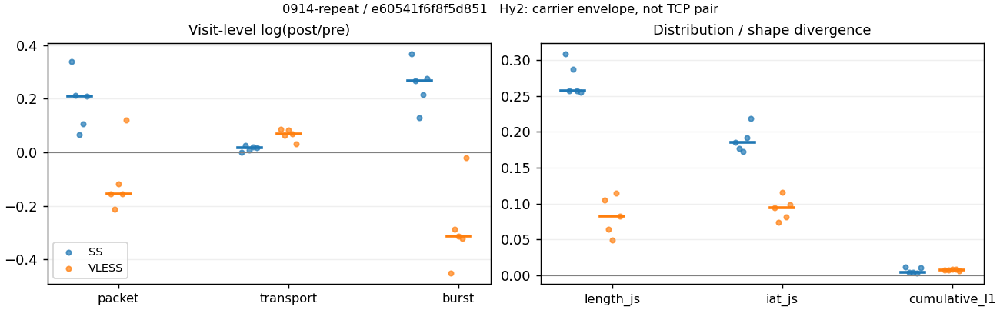
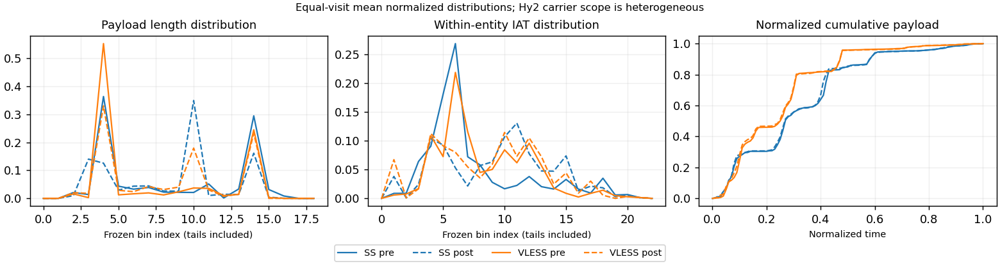

# 0914-repeat · 条目 006 · bing.com

目标：https://www.bing.com/search?q=network%20traffic%20analysis

活动标签：bing.com::page_load。选定访问 15 次。

[返回总索引](../../README.md) · [统计口径](../../methods.md)

## 覆盖与资格（每次访问均保留）

| 部署 | 重复 | 主请求路由 | 活动状态 | 代理比较 | DIRECT pre | 请求 proxy/direct/unresolved | 错误 |
| --- | --- | --- | --- | --- | --- | --- | --- |
| Hy2 | 1 | direct | passed | 0 | 1 | 0/682/0 | [] |
| Hy2 | 2 | direct | passed | 0 | 1 | 0/697/0 | [] |
| Hy2 | 3 | direct | passed | 0 | 1 | 0/608/0 | [] |
| Hy2 | 4 | direct | passed | 0 | 1 | 0/744/0 | [] |
| Hy2 | 5 | direct | passed | 0 | 1 | 0/625/0 | [] |
| SS | 1 | proxy | passed | 1 | 0 | 230/0/0 | [] |
| SS | 2 | proxy | passed | 1 | 0 | 245/0/0 | [] |
| SS | 3 | proxy | passed | 1 | 0 | 248/0/1 | [] |
| SS | 4 | proxy | passed | 1 | 0 | 233/0/0 | [] |
| SS | 5 | proxy | passed | 1 | 0 | 283/0/0 | [] |
| VLESS | 1 | proxy | passed | 1 | 0 | 246/0/0 | [] |
| VLESS | 2 | proxy | passed | 1 | 0 | 236/0/0 | [] |
| VLESS | 3 | proxy | passed | 1 | 0 | 310/0/0 | [] |
| VLESS | 4 | proxy | passed | 1 | 0 | 237/0/0 | [] |
| VLESS | 5 | proxy | passed | 1 | 0 | 240/0/0 | [] |

主请求非 proxy 的统计仅解释为已索引的辅助代理连接或 DIRECT 观测，不代表目标业务经代理传输。播放确认与配对资格是两道不同的门。

图中散点为单次访问，短线为重复中位数；Hy2 是共享载体包络，不能与 TCP 配对作等范围因果对比。

形态图先逐访问归一化，再对访问等权平均；实线 pre，虚线 post。分箱序号及边界见 methods，不将分箱索引误解为长度或时间。

## 每次访问的关键观测

### SS

范围：`exclusive_page`。每格 pre → post；空值为不可观测/不适用。

| 重复 | 包数 | 载荷字节 | burst | TCP FR | IAT中位µs | length JS | IAT JS |
| --- | --- | --- | --- | --- | --- | --- | --- |
| 1 | 1322 → 1854 | 1.3061e+06 → 1.3078e+06 | 951 → 1373 | 131 → 134 | 35.324 → 701.91 | 0.30846 | 0.18509 |
| 2 | 1025 → 1269 | 6.8756e+05 → 7.0585e+05 | 688 → 898 | 113 → 117 | 34.391 → 676.98 | 0.25748 | 0.17709 |
| 3 | 973 → 1040 | 6.1886e+05 → 6.2491e+05 | 697 → 793 | 116 → 124 | 34.802 → 1027.3 | 0.28726 | 0.17285 |
| 4 | 830 → 923 | 5.3063e+05 → 5.4108e+05 | 562 → 697 | 75 → 77 | 34.288 → 749.84 | 0.2572 | 0.19189 |
| 5 | 1944 → 2400 | 1.7784e+06 → 1.8112e+06 | 1265 → 1667 | 184 → 188 | 28.242 → 346.58 | 0.25535 | 0.21817 |

完整标量统计：中位数 [min,max]；Δ 为重复内逐访问变换的中位数，MAD 未缩放。n 为可用变换数；DIRECT-only 的 nΔ=0 不代表 pre 不可用。

| scope | 特征 | pre | post | Δ | IQRΔ | MADΔ | nΔ |
| --- | --- | --- | --- | --- | --- | --- | --- |
| exclusive_page | active_span_sum_s_1000ms | 20.947 [12.516, 29.613] | 21.59 [13.78, 31.925] | 0.048664 | 0.04494 | 0.022816 | 5 |
| exclusive_page | active_span_sum_s_100ms | 3.0225 [2.1987, 5.1753] | 6.6478 [4.2906, 9.7415] | 0.66855 | 0.093904 | 0.036057 | 5 |
| exclusive_page | active_span_sum_s_500ms | 15.964 [9.8295, 24.329] | 18.239 [11.979, 27.87] | 0.15027 | 0.051123 | 0.017043 | 5 |
| exclusive_page | burst_bytes_iqr | 916 [851, 2069] | 1428 [1428, 1462] | 0.44401 | 0.5019 | 0.073604 | 5 |
| exclusive_page | burst_bytes_mad | 85 [84, 85] | 40 [34, 117] | -0.74194 | 0.011834 | 0.011834 | 5 |
| exclusive_page | burst_bytes_max | 20594 [14480, 24576] | 8568 [5293, 21420] | -0.87141 | 0.46347 | 0.19603 | 5 |
| exclusive_page | burst_bytes_mean | 999.37 [887.89, 1405.9] | 788.03 [776.3, 1086.5] | -0.24013 | 0.061951 | 0.044357 | 5 |
| exclusive_page | burst_bytes_median | 85 [84, 85] | 40 [34, 117] | -0.74194 | 0.011834 | 0.011834 | 5 |
| exclusive_page | burst_bytes_min | 0 [0, 0] | 0 [0, 0] | — | — | — | 0 |
| exclusive_page | burst_bytes_p95 | 4439.6 [3520.4, 6863] | 2896 [2856, 4284] | -0.39916 | 0.13955 | 0.09757 | 5 |
| exclusive_page | burst_bytes_q25 | 0 [0, 0] | 0 [0, 0] | — | — | — | 0 |
| exclusive_page | burst_bytes_q75 | 916 [851, 2069] | 1428 [1428, 1462] | 0.44401 | 0.5019 | 0.073604 | 5 |
| exclusive_page | burst_bytes_std | 2413.6 [1790.9, 2864.6] | 1238.9 [1023, 1815.5] | -0.66691 | 0.14257 | 0.045711 | 5 |
| exclusive_page | burst_count | 697 [562, 1265] | 898 [697, 1667] | 0.26638 | 0.06067 | 0.051098 | 5 |
| exclusive_page | burst_duration_ms_iqr | 0.035869 [0.015917, 0.037915] | 0 [0, 0.0001855] | -5.4725 | 0.17468 | 0.17468 | 2 |
| exclusive_page | burst_duration_ms_mad | 0 [0, 0] | 0 [0, 0] | — | — | — | 0 |
| exclusive_page | burst_duration_ms_max | 8146.6 [4022.5, 11798] | 8147.1 [4064.8, 15004] | 0.00010904 | 0.010383 | 8.784e-05 | 5 |
| exclusive_page | burst_duration_ms_mean | 57.093 [40.5, 61.579] | 35.442 [34.784, 47.14] | -0.24435 | 0.28633 | 0.10943 | 5 |
| exclusive_page | burst_duration_ms_median | 0 [0, 0] | 0 [0, 0] | — | — | — | 0 |
| exclusive_page | burst_duration_ms_min | 0 [0, 0] | 0 [0, 0] | — | — | — | 0 |
| exclusive_page | burst_duration_ms_p95 | 206.82 [201.52, 241.18] | 103.99 [20.74, 167.47] | -0.68757 | 1.4974 | 0.47641 | 5 |
| exclusive_page | burst_duration_ms_q25 | 0 [0, 0] | 0 [0, 0] | — | — | — | 0 |
| exclusive_page | burst_duration_ms_q75 | 0.035869 [0.015917, 0.037915] | 0 [0, 0.0001855] | -5.4725 | 0.17468 | 0.17468 | 2 |
| exclusive_page | burst_duration_ms_std | 377.76 [317.67, 553.77] | 438.26 [290.82, 491.96] | -0.088317 | 0.26531 | 0.14562 | 5 |
| exclusive_page | burst_packets_iqr | 1 [1, 1] | 0 [0, 1] | 0 | 0 | 0 | 2 |
| exclusive_page | burst_packets_mad | 0 [0, 0] | 0 [0, 0] | — | — | — | 0 |
| exclusive_page | burst_packets_max | 9 [6, 11] | 11 [9, 12] | 0.20067 | 0.19237 | 0.10536 | 5 |
| exclusive_page | burst_packets_mean | 1.4769 [1.3901, 1.5368] | 1.3503 [1.3115, 1.4397] | -0.062446 | 0.012388 | 0.0096012 | 5 |
| exclusive_page | burst_packets_median | 1 [1, 1] | 1 [1, 1] | 0 | 0 | 0 | 5 |
| exclusive_page | burst_packets_min | 1 [1, 1] | 1 [1, 1] | 0 | 0 | 0 | 5 |
| exclusive_page | burst_packets_p95 | 3 [3, 3] | 3 [3, 3] | 0 | 0 | 0 | 5 |
| exclusive_page | burst_packets_q25 | 1 [1, 1] | 1 [1, 1] | 0 | 0 | 0 | 5 |
| exclusive_page | burst_packets_q75 | 2 [2, 2] | 1 [1, 2] | -0.69315 | 0.69315 | 0 | 5 |
| exclusive_page | burst_packets_std | 0.96744 [0.69297, 1.1007] | 0.88711 [0.78932, 0.9751] | -0.031142 | 0.097396 | 0.057288 | 5 |
| exclusive_page | connection_span_concurrency_max | 4 [3, 6] | 4 [3, 6] | 0 | 0 | 0 | 5 |
| exclusive_page | cumulative_l1 | — | — | 0.0046771 | 0.0061246 | 0.0010419 | 5 |
| exclusive_page | cumulative_max | — | — | 0.08643 | 0.040975 | 0.029021 | 5 |
| exclusive_page | direction_entropy | 0.99909 [0.86264, 0.99985] | 0.71149 [0.57141, 0.77463] | -0.28776 | 0.038129 | 0.034662 | 5 |
| exclusive_page | down_burst_count | 346 [278, 628] | 445 [346, 829] | 0.26913 | 0.058862 | 0.050311 | 5 |
| exclusive_page | down_ip_bytes | 6.6324e+05 [5.106e+05, 1.7754e+06] | 6.7701e+05 [5.1543e+05, 1.8045e+06] | 0.0094267 | 0.011034 | 0.006847 | 5 |
| exclusive_page | down_packets | 544 [440, 1109] | 665 [463, 1322] | 0.17569 | 0.14324 | 0.11809 | 5 |
| exclusive_page | down_transport_bytes | 6.3489e+05 [4.8767e+05, 1.7176e+06] | 6.423e+05 [4.9128e+05, 1.7356e+06] | 0.0073875 | 0.017321 | 0.0042287 | 5 |
| exclusive_page | duration_s | 20.454 [17.707, 20.729] | 20.453 [17.792, 21.176] | 0.0038057 | 0.0048402 | 0.0038407 | 5 |
| exclusive_page | entity_count | 8 [5, 9] | 8 [5, 9] | 0 | 0 | 0 | 5 |
| exclusive_page | fr_runs | 116 [75, 184] | 124 [77, 188] | 0.026317 | 0.012144 | 0.0048111 | 5 |
| exclusive_page | fr_runs_per_packet | 0.17679 [0.15658, 0.20939] | 0.15876 [0.12997, 0.21754] | -0.017881 | 0.025766 | 0.020068 | 5 |
| exclusive_page | fr_switches | 111 [69, 175] | 119 [71, 179] | 0.028573 | 0.013095 | 0.0059735 | 5 |
| exclusive_page | fr_switches_per_possible_transition | 0.16667 [0.14588, 0.20219] | 0.14823 [0.12231, 0.21062] | -0.017129 | 0.02448 | 0.019477 | 5 |
| exclusive_page | full_retransmission_fraction | 0.0048193 [0.0029268, 0.0071942] | 0.0070119 [0.0054171, 0.0125] | 0.0017181 | 0.0043453 | 0.0011203 | 5 |
| exclusive_page | full_retransmission_packets | 7 [3, 8] | 13 [5, 14] | 0.55962 | 0.13353 | 0.074108 | 5 |
| exclusive_page | iat_count | 1017 [824, 1935] | 1261 [917, 2391] | 0.2116 | 0.10811 | 0.10467 | 5 |
| exclusive_page | iat_js | — | — | 0.18509 | 0.014799 | 0.0080028 | 5 |
| exclusive_page | iat_ks | — | — | 0.36671 | 0.010162 | 0.0070408 | 5 |
| exclusive_page | iat_median_us | 34.391 [28.242, 35.324] | 701.91 [346.58, 1027.3] | 2.9892 | 0.10522 | 0.095837 | 5 |
| exclusive_page | iat_us_iqr | 220.16 [103.68, 532.02] | 3627.4 [1663.3, 10492] | 2.8019 | 0.20649 | 0.17973 | 5 |
| exclusive_page | iat_us_mad | 25.49 [20.161, 28.183] | 690 [343.92, 1019.2] | 3.2628 | 0.20616 | 0.14131 | 5 |
| exclusive_page | iat_us_max | 8.1466e+06 [4.0224e+06, 1.5e+07] | 8.1471e+06 [4.0648e+06, 1.5004e+07] | 0.00010904 | 0.00019653 | 7.9313e-05 | 5 |
| exclusive_page | iat_us_mean | 44413 [38776, 52504] | 37408 [31682, 46556] | -0.20205 | 0.10823 | 0.095015 | 5 |
| exclusive_page | iat_us_median | 34.391 [28.242, 35.324] | 701.91 [346.58, 1027.3] | 2.9892 | 0.10522 | 0.095837 | 5 |
| exclusive_page | iat_us_min | 0.046 [0.02, 0.167] | 0.036 [0.035, 0.04] | -0.27329 | 1.0961 | 0.88848 | 5 |
| exclusive_page | iat_us_p95 | 1.5746e+05 [1.2278e+05, 2.0516e+05] | 87693 [60704, 1.6606e+05] | -0.58349 | 0.64432 | 0.36969 | 5 |
| exclusive_page | iat_us_q25 | 14.538 [12.535, 15.228] | 20.932 [10.396, 24.012] | 0.4027 | 0.10529 | 0.084561 | 5 |
| exclusive_page | iat_us_q75 | 235.38 [116.22, 546.56] | 3648.4 [1673.6, 10514] | 2.7408 | 0.2895 | 0.21597 | 5 |
| exclusive_page | iat_us_std | 4.4398e+05 [2.727e+05, 4.831e+05] | 3.943e+05 [2.5263e+05, 4.1327e+05] | -0.10918 | 0.05902 | 0.032149 | 5 |
| exclusive_page | iat_wasserstein_log1p_us | — | — | 1.5581 | 0.13563 | 0.097446 | 5 |
| exclusive_page | idle_gap_count_1000ms | 9 [7, 12] | 9 [7, 11] | 0 | 0 | 0 | 5 |
| exclusive_page | idle_gap_count_100ms | 69 [42, 102] | 67 [46, 106] | 0.038466 | 0.079845 | 0.052505 | 5 |
| exclusive_page | idle_gap_count_500ms | 15 [13, 20] | 14 [10, 16] | -0.18232 | 0.1431 | 0.10228 | 5 |
| exclusive_page | idle_gap_sum_s_1000ms | 30.18 [22.045, 45.419] | 28.912 [21.476, 44.232] | -0.026188 | 0.011183 | 0.0021253 | 5 |
| exclusive_page | idle_gap_sum_s_100ms | 40.498 [39.045, 70.846] | 38.402 [35.907, 67.613] | -0.072947 | 0.030625 | 0.019802 | 5 |
| exclusive_page | idle_gap_sum_s_500ms | 32.867 [26.677, 50.703] | 30.713 [23.559, 47.883] | -0.067766 | 0.025519 | 0.010537 | 5 |
| exclusive_page | ip_bytes | 7.41e+05 [5.7394e+05, 1.8797e+06] | 7.7933e+05 [5.9523e+05, 1.9544e+06] | 0.036427 | 0.0094585 | 0.0069493 | 5 |
| exclusive_page | length_iqr | 2801 [2655, 2810] | 1306 [1295.2, 1363] | -0.75728 | 0.042407 | 0.0098643 | 5 |
| exclusive_page | length_js | — | — | 0.25748 | 0.030066 | 0.0021301 | 5 |
| exclusive_page | length_ks | — | — | 0.33438 | 0.058962 | 0.026114 | 5 |
| exclusive_page | length_mad | 318 [204, 1363] | 900 [620.5, 1059] | 0.98318 | 1.364 | 0.45828 | 5 |
| exclusive_page | length_max | 4096 [4096, 8920] | 2856 [2856, 11424] | -0.36059 | 0.13801 | 0.13801 | 5 |
| exclusive_page | length_mean | 1163.4 [1107.8, 1762.7] | 1115.6 [1011.2, 1337.6] | -0.12442 | 0.12142 | 0.10568 | 5 |
| exclusive_page | length_median | 379 [278, 1448] | 1428 [969, 1428] | 0.93873 | 1.5642 | 0.69768 | 5 |
| exclusive_page | length_min | 31 [24, 31] | 20 [10, 20] | -0.43825 | 0.43721 | 0 | 5 |
| exclusive_page | length_p95 | 2896 [2896, 4344] | 2856 [2856, 2856] | -0.013908 | 0.34668 | 0 | 5 |
| exclusive_page | length_q25 | 92 [86, 95] | 126 [65, 132.75] | 0.3098 | 0.032261 | 0.027572 | 5 |
| exclusive_page | length_q75 | 2896 [2747, 2896] | 1428 [1428, 1443] | -0.69873 | 0.010449 | 0.0083218 | 5 |
| exclusive_page | length_std | 1293.3 [1214.5, 1923.8] | 972.03 [847.59, 1223.1] | -0.26655 | 0.17946 | 0.15603 | 5 |
| exclusive_page | length_wasserstein_bytes | — | — | 478.76 | 120.96 | 78.095 | 5 |
| exclusive_page | nonempty_entity_count | 8 [5, 9] | 8 [5, 9] | 0 | 0 | 0 | 5 |
| exclusive_page | nonempty_packets | 591 [479, 1174] | 698 [485, 1354] | 0.14265 | 0.13793 | 0.11417 | 5 |
| exclusive_page | offload_suspect_fraction | 0.1961 [0.1778, 0.26286] | 0.11032 [0.069231, 0.13458] | -0.10857 | 0.036514 | 0.019707 | 5 |
| exclusive_page | packet_count | 1025 [830, 1944] | 1269 [923, 2400] | 0.21072 | 0.10733 | 0.10452 | 5 |
| exclusive_page | rtt_median_ms | 0.054695 [0.042661, 0.061884] | 32.343 [28.437, 32.925] | 6.3084 | 0.1002 | 0.049531 | 5 |
| exclusive_page | rtt_sample_count | 430 [344, 762] | 281 [204, 424] | -0.44965 | 0.097091 | 0.07287 | 5 |
| exclusive_page | tcp_ack_count | 1015 [824, 1933] | 1261 [914, 2391] | 0.21264 | 0.11336 | 0.10898 | 5 |
| exclusive_page | tcp_fin_count | 16 [9, 18] | 16 [10, 20] | 0.057158 | 0.10536 | 0.048202 | 5 |
| exclusive_page | tcp_packet_count | 1025 [830, 1944] | 1269 [923, 2400] | 0.21072 | 0.10733 | 0.10452 | 5 |
| exclusive_page | tcp_rst_count | 1 [0, 2] | 0 [0, 1] | — | — | — | 0 |
| exclusive_page | tcp_syn_count | 16 [10, 18] | 16 [12, 18] | 0 | 0.15415 | 0 | 5 |
| exclusive_page | tcp_window_raw_median | 65353 [65266, 65500] | 135 [132, 143] | -6.1823 | 0.018285 | 0.016038 | 5 |
| exclusive_page | transition_entropy | 0.6358 [0.57799, 0.72581] | 0.53986 [0.45067, 0.66109] | -0.1158 | 0.065353 | 0.051084 | 5 |
| exclusive_page | transition_n_mm | 249 [211, 747] | 504 [344, 1077] | 0.52772 | 0.21634 | 0.16185 | 5 |
| exclusive_page | transition_n_mp | 53 [32, 83] | 57 [33, 85] | 0.034486 | 0.0092337 | 0.0055192 | 5 |
| exclusive_page | transition_n_pm | 58 [37, 92] | 62 [38, 94] | 0.026668 | 0.013585 | 0.0084231 | 5 |
| exclusive_page | transition_n_pp | 215 [193, 243] | 77 [64, 89] | -1.0899 | 0.099382 | 0.061214 | 5 |
| exclusive_page | transition_p_mm | 0.86831 [0.80797, 0.9] | 0.91247 [0.86897, 0.93226] | 0.057536 | 0.01684 | 0.013382 | 5 |
| exclusive_page | transition_p_mp | 0.13169 [0.1, 0.19203] | 0.087533 [0.067738, 0.13103] | -0.057536 | 0.01684 | 0.013382 | 5 |
| exclusive_page | transition_p_pm | 0.21245 [0.16087, 0.27463] | 0.43709 [0.37255, 0.51366] | 0.23314 | 0.027355 | 0.021459 | 5 |
| exclusive_page | transition_p_pp | 0.78755 [0.72537, 0.83913] | 0.56291 [0.48634, 0.62745] | -0.23314 | 0.027355 | 0.021459 | 5 |
| exclusive_page | transport_bytes | 6.8756e+05 [5.3063e+05, 1.7784e+06] | 7.0585e+05 [5.4108e+05, 1.8112e+06] | 0.018225 | 0.009774 | 0.0080216 | 5 |
| exclusive_page | up_burst_count | 351 [284, 637] | 453 [351, 838] | 0.26369 | 0.062436 | 0.051878 | 5 |
| exclusive_page | up_byte_fraction | 0.066881 [0.034202, 0.080969] | 0.082373 [0.041717, 0.092039] | 0.01107 | 0.0055803 | 0.0032392 | 5 |
| exclusive_page | up_ip_bytes | 77766 [63341, 1.0439e+05] | 1.0232e+05 [79797, 1.499e+05] | 0.27441 | 0.1001 | 0.048844 | 5 |
| exclusive_page | up_packets | 481 [390, 835] | 604 [460, 1078] | 0.22771 | 0.090351 | 0.062627 | 5 |
| exclusive_page | up_transport_bytes | 52678 [41390, 60827] | 63545 [49801, 75556] | 0.18755 | 0.046855 | 0.02929 | 5 |
| exclusive_page | zero_iat_count | 0 [0, 0] | 0 [0, 0] | — | — | — | 0 |
| exclusive_page | zero_iat_fraction | 0 [0, 0] | 0 [0, 0] | 0 | 0 | 0 | 5 |

### VLESS

范围：`exclusive_page`。每格 pre → post；空值为不可观测/不适用。

| 重复 | 包数 | 载荷字节 | burst | TCP FR | IAT中位µs | length JS | IAT JS |
| --- | --- | --- | --- | --- | --- | --- | --- |
| 1 | 1078 → 922 | 5.1429e+05 → 5.5994e+05 | 806 → 514 | 74 → 86 | 69.773 → 542.18 | 0.10466 | 0.094434 |
| 2 | 961 → 776 | 4.9292e+05 → 5.2552e+05 | 682 → 512 | 56 → 60 | 53.544 → 530 | 0.064107 | 0.074142 |
| 3 | 1395 → 1241 | 6.5303e+05 → 7.1034e+05 | 1025 → 749 | 200 → 214 | 133.86 → 903.41 | 0.048914 | 0.11534 |
| 4 | 918 → 785 | 4.6901e+05 → 5.0187e+05 | 630 → 456 | 36 → 44 | 48.989 → 444.56 | 0.11497 | 0.081373 |
| 5 | 2087 → 2353 | 1.5578e+06 → 1.6059e+06 | 1716 → 1682 | 52 → 64 | 70.57 → 55.035 | 0.082727 | 0.098462 |

完整标量统计：中位数 [min,max]；Δ 为重复内逐访问变换的中位数，MAD 未缩放。n 为可用变换数；DIRECT-only 的 nΔ=0 不代表 pre 不可用。

| scope | 特征 | pre | post | Δ | IQRΔ | MADΔ | nΔ |
| --- | --- | --- | --- | --- | --- | --- | --- |
| exclusive_page | active_span_sum_s_1000ms | 9.8909 [5.9513, 24.524] | 9.3745 [5.6471, 24.282] | -0.041148 | 0.02634 | 0.015023 | 5 |
| exclusive_page | active_span_sum_s_100ms | 1.9528 [1.4984, 2.8509] | 3.8801 [2.5165, 8.3376] | 0.66842 | 0.1991 | 0.18091 | 5 |
| exclusive_page | active_span_sum_s_500ms | 5.3818 [3.348, 20.053] | 9.3745 [5.6471, 24.282] | 0.45702 | 0.076652 | 0.065757 | 5 |
| exclusive_page | burst_bytes_iqr | 1163 [336, 1728] | 2824 [1568.8, 2824] | 0.88715 | 0.29877 | 0.29877 | 5 |
| exclusive_page | burst_bytes_mad | 72 [31, 80] | 72 [72, 86] | 0.17768 | 0.53974 | 0.17768 | 5 |
| exclusive_page | burst_bytes_max | 6486 [4344, 8688] | 6636 [5816, 7589] | 0.022863 | 0.4551 | 0.3307 | 5 |
| exclusive_page | burst_bytes_mean | 722.76 [637.11, 907.8] | 1026.4 [948.38, 1100.6] | 0.39094 | 0.047071 | 0.040184 | 5 |
| exclusive_page | burst_bytes_median | 72 [31, 80] | 72 [72, 86] | 0.17768 | 0.53974 | 0.17768 | 5 |
| exclusive_page | burst_bytes_min | 0 [0, 0] | 0 [0, 0] | — | — | — | 0 |
| exclusive_page | burst_bytes_p95 | 2896 [2896, 2896] | 2896 [2896, 2896] | 0 | 0 | 0 | 5 |
| exclusive_page | burst_bytes_q25 | 0 [0, 0] | 0 [0, 0] | — | — | — | 0 |
| exclusive_page | burst_bytes_q75 | 1163 [336, 1728] | 2824 [1568.8, 2824] | 0.88715 | 0.29877 | 0.29877 | 5 |
| exclusive_page | burst_bytes_std | 1166.2 [1069.7, 1327.4] | 1291.8 [1182.2, 1349.4] | 0.10003 | 0.013788 | 0.0099897 | 5 |
| exclusive_page | burst_count | 806 [630, 1716] | 514 [456, 1682] | -0.31371 | 0.036522 | 0.027004 | 5 |
| exclusive_page | burst_duration_ms_iqr | 0.049089 [0, 0.3828] | 2.7713 [0.000116, 4.2803] | 3.4712 | 2.184 | 1.1299 | 4 |
| exclusive_page | burst_duration_ms_mad | 0 [0, 0] | 0 [0, 0.000115] | — | — | — | 0 |
| exclusive_page | burst_duration_ms_max | 13924 [12109, 14828] | 13967 [12109, 15062] | 0.0028019 | 0.0029928 | 0.0027457 | 5 |
| exclusive_page | burst_duration_ms_mean | 40.997 [22.145, 51.714] | 50.867 [30.386, 65.837] | 0.28242 | 0.098637 | 0.06468 | 5 |
| exclusive_page | burst_duration_ms_median | 0 [0, 0] | 0 [0, 0.000115] | — | — | — | 0 |
| exclusive_page | burst_duration_ms_min | 0 [0, 0] | 0 [0, 0] | — | — | — | 0 |
| exclusive_page | burst_duration_ms_p95 | 9.6772 [5.6932, 204.75] | 28.739 [8.9286, 158.38] | 1.0657 | 0.65819 | 0.61575 | 5 |
| exclusive_page | burst_duration_ms_q25 | 0 [0, 0] | 0 [0, 0] | — | — | — | 0 |
| exclusive_page | burst_duration_ms_q75 | 0.049089 [0, 0.3828] | 2.7713 [0.000116, 4.2803] | 3.4712 | 2.184 | 1.1299 | 4 |
| exclusive_page | burst_duration_ms_std | 518.18 [453.98, 590.76] | 590.12 [585.88, 731.07] | 0.16108 | 0.067725 | 0.038283 | 5 |
| exclusive_page | burst_packets_iqr | 1 [0, 1] | 1 [1, 1] | 0 | 0 | 0 | 4 |
| exclusive_page | burst_packets_mad | 0 [0, 0] | 0 [0, 1] | — | — | — | 0 |
| exclusive_page | burst_packets_max | 5 [4, 6] | 13 [12, 13] | 0.87547 | 0.080043 | 0.080043 | 5 |
| exclusive_page | burst_packets_mean | 1.361 [1.2162, 1.4571] | 1.6569 [1.3989, 1.7938] | 0.16671 | 0.056756 | 0.030019 | 5 |
| exclusive_page | burst_packets_median | 1 [1, 1] | 1 [1, 2] | 0 | 0 | 0 | 5 |
| exclusive_page | burst_packets_min | 1 [1, 1] | 1 [1, 1] | 0 | 0 | 0 | 5 |
| exclusive_page | burst_packets_p95 | 2 [2, 3] | 3 [3, 4] | 0.40547 | 0 | 0 | 5 |
| exclusive_page | burst_packets_q25 | 1 [1, 1] | 1 [1, 1] | 0 | 0 | 0 | 5 |
| exclusive_page | burst_packets_q75 | 2 [1, 2] | 2 [2, 2] | 0 | 0 | 0 | 5 |
| exclusive_page | burst_packets_std | 0.62191 [0.47354, 0.63618] | 1.1743 [0.88161, 1.3192] | 0.64557 | 0.023999 | 0.014042 | 5 |
| exclusive_page | connection_span_concurrency_max | 3 [3, 4] | 3 [3, 4] | 0 | 0 | 0 | 5 |
| exclusive_page | cumulative_l1 | — | — | 0.0079017 | 0.00052967 | 0.00014356 | 5 |
| exclusive_page | cumulative_max | — | — | 0.052614 | 0.01348 | 0.0075498 | 5 |
| exclusive_page | direction_entropy | 0.97661 [0.73284, 0.98322] | 0.65707 [0.34815, 0.80957] | -0.31878 | 0.075101 | 0.051133 | 5 |
| exclusive_page | down_burst_count | 400 [313, 855] | 254 [226, 838] | -0.31625 | 0.037002 | 0.02758 | 5 |
| exclusive_page | down_ip_bytes | 5.037e+05 [4.6389e+05, 1.578e+06] | 5.3638e+05 [4.8633e+05, 1.6228e+06] | 0.047247 | 0.021124 | 0.015613 | 5 |
| exclusive_page | down_packets | 560 [500, 1106] | 535 [441, 1283] | -0.04567 | 0.057959 | 0.057471 | 5 |
| exclusive_page | down_transport_bytes | 4.7453e+05 [4.3785e+05, 1.5204e+06] | 5.0851e+05 [4.6284e+05, 1.5561e+06] | 0.055507 | 0.016261 | 0.013651 | 5 |
| exclusive_page | duration_s | 21.437 [18.757, 21.763] | 21.393 [18.739, 21.747] | -0.0015697 | 0.0010909 | 0.00060066 | 5 |
| exclusive_page | entity_count | 6 [4, 7] | 6 [4, 7] | 0 | 0 | 0 | 5 |
| exclusive_page | fr_runs | 56 [36, 200] | 64 [44, 214] | 0.15028 | 0.13168 | 0.057357 | 5 |
| exclusive_page | fr_runs_per_packet | 0.098246 [0.044905, 0.25157] | 0.13761 [0.050354, 0.30615] | 0.039369 | 0.0073269 | 0.0066484 | 5 |
| exclusive_page | fr_switches | 52 [32, 193] | 58 [40, 207] | 0.16252 | 0.14904 | 0.069283 | 5 |
| exclusive_page | fr_switches_per_possible_transition | 0.091873 [0.039931, 0.24492] | 0.12963 [0.04585, 0.29913] | 0.037757 | 0.007779 | 0.0062997 | 5 |
| exclusive_page | full_retransmission_fraction | 0 [0, 0.0027829] | 0 [0, 0] | 0 | 0.00047916 | 0 | 5 |
| exclusive_page | full_retransmission_packets | 0 [0, 3] | 0 [0, 0] | — | — | — | 0 |
| exclusive_page | iat_count | 1072 [914, 2081] | 916 [772, 2347] | -0.15726 | 0.039662 | 0.039652 | 5 |
| exclusive_page | iat_js | — | — | 0.094434 | 0.01709 | 0.013061 | 5 |
| exclusive_page | iat_ks | — | — | 0.17776 | 0.03542 | 0.017919 | 5 |
| exclusive_page | iat_median_us | 69.773 [48.989, 133.86] | 530 [55.035, 903.41] | 2.0504 | 0.2961 | 0.15514 | 5 |
| exclusive_page | iat_us_iqr | 1221.4 [833.45, 2735.1] | 3074.3 [829.38, 8251.7] | 0.9344 | 0.20315 | 0.13338 | 5 |
| exclusive_page | iat_us_mad | 60.484 [42.297, 127.28] | 521.83 [54.877, 897.12] | 2.1284 | 0.38363 | 0.20795 | 5 |
| exclusive_page | iat_us_max | 1.3924e+07 [1.2109e+07, 1.5001e+07] | 1.3966e+07 [1.2109e+07, 1.5062e+07] | 0.0028019 | 0.0029594 | 0.0012506 | 5 |
| exclusive_page | iat_us_mean | 30573 [26418, 39865] | 37647 [23357, 44713] | 0.15005 | 0.036755 | 0.035283 | 5 |
| exclusive_page | iat_us_median | 69.773 [48.989, 133.86] | 530 [55.035, 903.41] | 2.0504 | 0.2961 | 0.15514 | 5 |
| exclusive_page | iat_us_min | 0.167 [0.035, 0.267] | 0.037 [0.036, 0.038] | -1.5071 | 1.7043 | 0.46925 | 5 |
| exclusive_page | iat_us_p95 | 9939.7 [8561.9, 2.0414e+05] | 44928 [9714.8, 1.5728e+05] | 1.4154 | 1.3822 | 0.21345 | 5 |
| exclusive_page | iat_us_q25 | 24.133 [18.032, 32.62] | 14.921 [9.159, 43.044] | -0.48081 | 0.4158 | 0.39167 | 5 |
| exclusive_page | iat_us_q75 | 1239.4 [866.07, 2767.2] | 3089.2 [838.54, 8294.8] | 0.92504 | 0.20177 | 0.13651 | 5 |
| exclusive_page | iat_us_std | 4.9074e+05 [4.3583e+05, 5.271e+05] | 4.9657e+05 [4.6053e+05, 5.4855e+05] | 0.075122 | 0.023374 | 0.019985 | 5 |
| exclusive_page | iat_wasserstein_log1p_us | — | — | 0.91039 | 0.069526 | 0.054024 | 5 |
| exclusive_page | idle_gap_count_1000ms | 5 [4, 7] | 5 [4, 7] | 0 | 0 | 0 | 5 |
| exclusive_page | idle_gap_count_100ms | 28 [17, 100] | 34 [22, 104] | 0.14518 | 0.071554 | 0.048974 | 5 |
| exclusive_page | idle_gap_count_500ms | 10 [8, 14] | 5 [4, 7] | -0.69315 | 0.080043 | 0.080043 | 5 |
| exclusive_page | idle_gap_sum_s_1000ms | 27.204 [19.208, 44.3] | 27.247 [19.332, 45.444] | 0.0034559 | 0.0036393 | 0.0018912 | 5 |
| exclusive_page | idle_gap_sum_s_100ms | 35.142 [23.573, 52.522] | 33.003 [22.463, 50.823] | -0.060129 | 0.014587 | 0.011894 | 5 |
| exclusive_page | idle_gap_sum_s_500ms | 30.994 [21.812, 49.595] | 27.247 [19.332, 45.444] | -0.12069 | 0.022585 | 0.012062 | 5 |
| exclusive_page | ip_bytes | 5.7033e+05 [5.1672e+05, 1.6663e+06] | 6.0871e+05 [5.4327e+05, 1.7309e+06] | 0.050111 | 0.023259 | 0.012043 | 5 |
| exclusive_page | length_iqr | 1600.8 [1327, 2739] | 1376 [1340, 2752] | -0.017019 | 0.17696 | 0.13427 | 5 |
| exclusive_page | length_js | — | — | 0.082727 | 0.040557 | 0.021936 | 5 |
| exclusive_page | length_ks | — | — | 0.23708 | 0.037891 | 0.033576 | 5 |
| exclusive_page | length_mad | 22 [22, 1340] | 872 [735, 1340] | 3.5573 | 0.17092 | 0.12245 | 5 |
| exclusive_page | length_max | 5720 [2896, 5792] | 2824 [2824, 4344] | -0.54371 | 0.41813 | 0.17462 | 5 |
| exclusive_page | length_mean | 858.99 [821.43, 1345.2] | 1125.3 [1016.2, 1263.5] | 0.21882 | 0.057204 | 0.051196 | 5 |
| exclusive_page | length_median | 94 [94, 1412] | 944 [820, 1412] | 2.1943 | 0.14082 | 0.11257 | 5 |
| exclusive_page | length_min | 24 [23, 24] | 24 [10, 24] | 0 | 0 | 0 | 5 |
| exclusive_page | length_p95 | 2824 [2824, 2896] | 2824 [2824, 2824] | 0 | 0 | 0 | 5 |
| exclusive_page | length_q25 | 85 [81, 85] | 72 [72, 84] | -0.15415 | 0.048202 | 0.011834 | 5 |
| exclusive_page | length_q75 | 1681.8 [1412, 2824] | 1448 [1412, 2824] | -0.025176 | 0.1731 | 0.12448 | 5 |
| exclusive_page | length_std | 1144.2 [1044.8, 1252.8] | 1068.8 [996.92, 1172.8] | -0.079116 | 0.060377 | 0.032227 | 5 |
| exclusive_page | length_wasserstein_bytes | — | — | 292.62 | 39.924 | 31.962 | 5 |
| exclusive_page | nonempty_entity_count | 6 [4, 7] | 6 [4, 7] | 0 | 0 | 0 | 5 |
| exclusive_page | nonempty_packets | 607 [546, 1158] | 531 [436, 1271] | -0.13377 | 0.073609 | 0.068533 | 5 |
| exclusive_page | offload_suspect_fraction | 0.14984 [0.11756, 0.22712] | 0.14013 [0.11604, 0.18686] | -0.011289 | 0.012748 | 0.0097615 | 5 |
| exclusive_page | packet_count | 1078 [918, 2087] | 922 [776, 2353] | -0.15632 | 0.039537 | 0.039341 | 5 |
| exclusive_page | rtt_median_ms | 0.091065 [0.05592, 0.10395] | 3.1871 [0.049341, 4.0186] | 3.5496 | 0.27007 | 0.1649 | 5 |
| exclusive_page | rtt_sample_count | 453 [356, 904] | 364 [311, 931] | -0.14261 | 0.016412 | 0.0089358 | 5 |
| exclusive_page | tcp_ack_count | 1060 [906, 2070] | 916 [772, 2347] | -0.14601 | 0.040271 | 0.037815 | 5 |
| exclusive_page | tcp_fin_count | 11 [7, 13] | 12 [8, 14] | 0.074108 | 0.087011 | 0.059423 | 5 |
| exclusive_page | tcp_packet_count | 1078 [918, 2087] | 922 [776, 2353] | -0.15632 | 0.039537 | 0.039341 | 5 |
| exclusive_page | tcp_rst_count | 11 [7, 13] | 0 [0, 0] | — | — | — | 0 |
| exclusive_page | tcp_syn_count | 12 [8, 14] | 12 [8, 14] | 0 | 0 | 0 | 5 |
| exclusive_page | tcp_window_raw_median | 65364 [65278, 65450] | 162 [153, 204] | -6.0001 | 0.24891 | 0.058481 | 5 |
| exclusive_page | transition_entropy | 0.43793 [0.22331, 0.79537] | 0.47815 [0.20561, 0.77161] | 0.024702 | 0.057916 | 0.029508 | 5 |
| exclusive_page | transition_n_mm | 321 [300, 894] | 392 [332, 1156] | 0.17395 | 0.044872 | 0.025867 | 5 |
| exclusive_page | transition_n_mp | 24 [14, 93] | 26 [18, 100] | 0.17693 | 0.17127 | 0.085434 | 5 |
| exclusive_page | transition_n_pm | 28 [18, 100] | 32 [22, 107] | 0.15028 | 0.13168 | 0.057357 | 5 |
| exclusive_page | transition_n_pp | 212 [205, 237] | 51 [44, 67] | -1.4248 | 0.15253 | 0.11406 | 5 |
| exclusive_page | transition_p_mm | 0.92793 [0.79379, 0.97812] | 0.92737 [0.80695, 0.978] | -0.00011478 | 0.0023747 | 0.0019359 | 5 |
| exclusive_page | transition_p_mp | 0.072072 [0.021882, 0.20621] | 0.072626 [0.021997, 0.19305] | 0.00011478 | 0.0023747 | 0.0019359 | 5 |
| exclusive_page | transition_p_pm | 0.12017 [0.078947, 0.29674] | 0.40541 [0.32836, 0.61494] | 0.28523 | 0.023024 | 0.014089 | 5 |
| exclusive_page | transition_p_pp | 0.87983 [0.70326, 0.92105] | 0.59459 [0.38506, 0.67164] | -0.28523 | 0.023024 | 0.014089 | 5 |
| exclusive_page | transport_bytes | 5.1429e+05 [4.6901e+05, 1.5578e+06] | 5.5994e+05 [5.0187e+05, 1.6059e+06] | 0.067711 | 0.020067 | 0.016405 | 5 |
| exclusive_page | up_burst_count | 406 [317, 861] | 260 [230, 844] | -0.31121 | 0.036052 | 0.026442 | 5 |
| exclusive_page | up_byte_fraction | 0.06889 [0.023965, 0.077296] | 0.079216 [0.031003, 0.091842] | 0.011324 | 0.0022976 | 0.0013001 | 5 |
| exclusive_page | up_ip_bytes | 66628 [52829, 88273] | 72330 [56939, 1.0809e+05] | 0.082114 | 0.013457 | 0.0071938 | 5 |
| exclusive_page | up_packets | 518 [418, 981] | 387 [334, 1070] | -0.22434 | 0.063679 | 0.046028 | 5 |
| exclusive_page | up_transport_bytes | 37333 [31157, 49791] | 49786 [39023, 63128] | 0.23733 | 0.032371 | 0.020154 | 5 |
| exclusive_page | zero_iat_count | 0 [0, 0] | 0 [0, 0] | — | — | — | 0 |
| exclusive_page | zero_iat_fraction | 0 [0, 0] | 0 [0, 0] | 0 | 0 | 0 | 5 |

### Hy2

范围：`direct_pre_only`。每格 pre → post；空值为不可观测/不适用。

| 重复 | 包数 | 载荷字节 | burst | TCP FR | IAT中位µs | length JS | IAT JS |
| --- | --- | --- | --- | --- | --- | --- | --- |
| 1 | 2059 → — | 2.2625e+06 → — | 1323 → — | 497 → — | 105.47 → — | — | — |
| 2 | 2284 → — | 1.4998e+06 → — | 1433 → — | 532 → — | 91.429 → — | — | — |
| 3 | 1430 → — | 1.0003e+06 → — | 896 → — | 381 → — | 113.14 → — | — | — |
| 4 | 1949 → — | 1.2546e+06 → — | 1232 → — | 501 → — | 116.98 → — | — | — |
| 5 | 1536 → — | 1.0452e+06 → — | 944 → — | 413 → — | 114.89 → — | — | — |

完整标量统计：中位数 [min,max]；Δ 为重复内逐访问变换的中位数，MAD 未缩放。n 为可用变换数；DIRECT-only 的 nΔ=0 不代表 pre 不可用。

| scope | 特征 | pre | post | Δ | IQRΔ | MADΔ | nΔ |
| --- | --- | --- | --- | --- | --- | --- | --- |
| direct_pre_only | active_span_sum_s_1000ms | 15.735 [9.7506, 17.758] | — | — | — | — | 0 |
| direct_pre_only | active_span_sum_s_100ms | 9.033 [6.7085, 9.6327] | — | — | — | — | 0 |
| direct_pre_only | active_span_sum_s_500ms | 12.949 [9.7506, 13.802] | — | — | — | — | 0 |
| direct_pre_only | burst_bytes_iqr | 866 [775, 1125.5] | — | — | — | — | 0 |
| direct_pre_only | burst_bytes_mad | 115 [114, 115] | — | — | — | — | 0 |
| direct_pre_only | burst_bytes_max | 24101 [21907, 27927] | — | — | — | — | 0 |
| direct_pre_only | burst_bytes_mean | 1107.2 [1018.3, 1710.1] | — | — | — | — | 0 |
| direct_pre_only | burst_bytes_median | 115 [114, 115] | — | — | — | — | 0 |
| direct_pre_only | burst_bytes_min | 0 [0, 0] | — | — | — | — | 0 |
| direct_pre_only | burst_bytes_p95 | 6407.8 [5524.6, 8956] | — | — | — | — | 0 |
| direct_pre_only | burst_bytes_q25 | 0 [0, 0] | — | — | — | — | 0 |
| direct_pre_only | burst_bytes_q75 | 866 [775, 1125.5] | — | — | — | — | 0 |
| direct_pre_only | burst_bytes_std | 2791.8 [2541.5, 3963.9] | — | — | — | — | 0 |
| direct_pre_only | burst_count | 1232 [896, 1433] | — | — | — | — | 0 |
| direct_pre_only | burst_duration_ms_iqr | 5.0726 [2.8482, 7.4501] | — | — | — | — | 0 |
| direct_pre_only | burst_duration_ms_mad | 0 [0, 0] | — | — | — | — | 0 |
| direct_pre_only | burst_duration_ms_max | 10088 [7385.5, 11983] | — | — | — | — | 0 |
| direct_pre_only | burst_duration_ms_mean | 47.223 [37.865, 60.286] | — | — | — | — | 0 |
| direct_pre_only | burst_duration_ms_median | 0 [0, 0] | — | — | — | — | 0 |
| direct_pre_only | burst_duration_ms_min | 0 [0, 0] | — | — | — | — | 0 |
| direct_pre_only | burst_duration_ms_p95 | 26.804 [26.07, 29.545] | — | — | — | — | 0 |
| direct_pre_only | burst_duration_ms_q25 | 0 [0, 0] | — | — | — | — | 0 |
| direct_pre_only | burst_duration_ms_q75 | 5.0726 [2.8482, 7.4501] | — | — | — | — | 0 |
| direct_pre_only | burst_duration_ms_std | 469.97 [419.59, 562.07] | — | — | — | — | 0 |
| direct_pre_only | burst_packets_iqr | 1 [1, 1] | — | — | — | — | 0 |
| direct_pre_only | burst_packets_mad | 0 [0, 0] | — | — | — | — | 0 |
| direct_pre_only | burst_packets_max | 14 [11, 19] | — | — | — | — | 0 |
| direct_pre_only | burst_packets_mean | 1.5939 [1.5563, 1.6271] | — | — | — | — | 0 |
| direct_pre_only | burst_packets_median | 1 [1, 1] | — | — | — | — | 0 |
| direct_pre_only | burst_packets_min | 1 [1, 1] | — | — | — | — | 0 |
| direct_pre_only | burst_packets_p95 | 3 [3, 3] | — | — | — | — | 0 |
| direct_pre_only | burst_packets_q25 | 1 [1, 1] | — | — | — | — | 0 |
| direct_pre_only | burst_packets_q75 | 2 [2, 2] | — | — | — | — | 0 |
| direct_pre_only | burst_packets_std | 1.0263 [0.93269, 1.0954] | — | — | — | — | 0 |
| direct_pre_only | connection_span_concurrency_max | 5 [5, 6] | — | — | — | — | 0 |
| direct_pre_only | direction_entropy | 0.99886 [0.98631, 1] | — | — | — | — | 0 |
| direct_pre_only | down_burst_count | 611 [443, 711] | — | — | — | — | 0 |
| direct_pre_only | down_ip_bytes | 1.1434e+06 [9.1668e+05, 2.1456e+06] | — | — | — | — | 0 |
| direct_pre_only | down_packets | 1102 [797, 1265] | — | — | — | — | 0 |
| direct_pre_only | down_transport_bytes | 1.086e+06 [8.7515e+05, 2.084e+06] | — | — | — | — | 0 |
| direct_pre_only | duration_s | 16.963 [16.756, 18.112] | — | — | — | — | 0 |
| direct_pre_only | entity_count | 10 [10, 11] | — | — | — | — | 0 |
| direct_pre_only | fr_runs | 497 [381, 532] | — | — | — | — | 0 |
| direct_pre_only | fr_runs_per_packet | 0.43115 [0.38889, 0.45087] | — | — | — | — | 0 |
| direct_pre_only | fr_switches | 486 [371, 521] | — | — | — | — | 0 |
| direct_pre_only | fr_switches_per_possible_transition | 0.42622 [0.38394, 0.44481] | — | — | — | — | 0 |
| direct_pre_only | full_retransmission_fraction | 0.0041958 [0.0033997, 0.0061296] | — | — | — | — | 0 |
| direct_pre_only | full_retransmission_packets | 7 [6, 14] | — | — | — | — | 0 |
| direct_pre_only | iat_count | 1939 [1420, 2273] | — | — | — | — | 0 |
| direct_pre_only | iat_median_us | 113.14 [91.429, 116.98] | — | — | — | — | 0 |
| direct_pre_only | iat_us_iqr | 3646.4 [3338.2, 3733.1] | — | — | — | — | 0 |
| direct_pre_only | iat_us_mad | 102.11 [80.053, 104.33] | — | — | — | — | 0 |
| direct_pre_only | iat_us_max | 1.0088e+07 [8.827e+06, 1.1983e+07] | — | — | — | — | 0 |
| direct_pre_only | iat_us_mean | 39702 [31292, 50346] | — | — | — | — | 0 |
| direct_pre_only | iat_us_median | 113.14 [91.429, 116.98] | — | — | — | — | 0 |
| direct_pre_only | iat_us_min | 0.063 [0.012, 0.487] | — | — | — | — | 0 |
| direct_pre_only | iat_us_p95 | 25672 [25556, 28454] | — | — | — | — | 0 |
| direct_pre_only | iat_us_q25 | 30.81 [26.915, 31.393] | — | — | — | — | 0 |
| direct_pre_only | iat_us_q75 | 3677.2 [3366.4, 3764.1] | — | — | — | — | 0 |
| direct_pre_only | iat_us_std | 4.5998e+05 [3.8845e+05, 5.1127e+05] | — | — | — | — | 0 |
| direct_pre_only | idle_gap_count_1000ms | 15 [10, 18] | — | — | — | — | 0 |
| direct_pre_only | idle_gap_count_100ms | 32 [31, 36] | — | — | — | — | 0 |
| direct_pre_only | idle_gap_count_500ms | 18 [15, 20] | — | — | — | — | 0 |
| direct_pre_only | idle_gap_sum_s_1000ms | 61.248 [54.48, 61.967] | — | — | — | — | 0 |
| direct_pre_only | idle_gap_sum_s_100ms | 66.939 [61.494, 67.95] | — | — | — | — | 0 |
| direct_pre_only | idle_gap_sum_s_500ms | 63.169 [58.072, 64.034] | — | — | — | — | 0 |
| direct_pre_only | ip_bytes | 1.3562e+06 [1.0748e+06, 2.3698e+06] | — | — | — | — | 0 |
| direct_pre_only | length_iqr | 1197.2 [1115, 2445] | — | — | — | — | 0 |
| direct_pre_only | length_mad | 247.5 [112, 584.5] | — | — | — | — | 0 |
| direct_pre_only | length_max | 8948 [8948, 8948] | — | — | — | — | 0 |
| direct_pre_only | length_mean | 1141.1 [1079.7, 1830.5] | — | — | — | — | 0 |
| direct_pre_only | length_median | 346.5 [150, 696.5] | — | — | — | — | 0 |
| direct_pre_only | length_min | 31 [3, 31] | — | — | — | — | 0 |
| direct_pre_only | length_p95 | 5572.5 [4316.1, 8920] | — | — | — | — | 0 |
| direct_pre_only | length_q25 | 115 [111, 115] | — | — | — | — | 0 |
| direct_pre_only | length_q75 | 1312.2 [1226, 2560] | — | — | — | — | 0 |
| direct_pre_only | length_std | 1867.9 [1657.2, 2599.7] | — | — | — | — | 0 |
| direct_pre_only | nonempty_entity_count | 10 [10, 11] | — | — | — | — | 0 |
| direct_pre_only | nonempty_packets | 1162 [854, 1368] | — | — | — | — | 0 |
| direct_pre_only | offload_suspect_fraction | 0.13443 [0.12303, 0.19961] | — | — | — | — | 0 |
| direct_pre_only | packet_count | 1949 [1430, 2284] | — | — | — | — | 0 |
| direct_pre_only | rtt_median_ms | 0.11495 [0.10602, 0.11848] | — | — | — | — | 0 |
| direct_pre_only | rtt_sample_count | 908 [659, 1041] | — | — | — | — | 0 |
| direct_pre_only | tcp_ack_count | 1937 [1419, 2272] | — | — | — | — | 0 |
| direct_pre_only | tcp_fin_count | 20 [19, 21] | — | — | — | — | 0 |
| direct_pre_only | tcp_packet_count | 1949 [1430, 2284] | — | — | — | — | 0 |
| direct_pre_only | tcp_rst_count | 1 [1, 2] | — | — | — | — | 0 |
| direct_pre_only | tcp_syn_count | 20 [20, 22] | — | — | — | — | 0 |
| direct_pre_only | tcp_window_raw_median | 65419 [65392, 65422] | — | — | — | — | 0 |
| direct_pre_only | transition_entropy | 0.98419 [0.95799, 0.99104] | — | — | — | — | 0 |
| direct_pre_only | transition_n_mm | 331 [221, 456] | — | — | — | — | 0 |
| direct_pre_only | transition_n_mp | 239 [182, 256] | — | — | — | — | 0 |
| direct_pre_only | transition_n_pm | 247 [189, 265] | — | — | — | — | 0 |
| direct_pre_only | transition_n_pp | 283 [252, 475] | — | — | — | — | 0 |
| direct_pre_only | transition_p_mm | 0.57766 [0.54773, 0.65612] | — | — | — | — | 0 |
| direct_pre_only | transition_p_mp | 0.42234 [0.34388, 0.45227] | — | — | — | — | 0 |
| direct_pre_only | transition_p_pm | 0.43005 [0.35811, 0.46604] | — | — | — | — | 0 |
| direct_pre_only | transition_p_pp | 0.56995 [0.53396, 0.64189] | — | — | — | — | 0 |
| direct_pre_only | transport_bytes | 1.2546e+06 [1.0003e+06, 2.2625e+06] | — | — | — | — | 0 |
| direct_pre_only | up_burst_count | 621 [453, 722] | — | — | — | — | 0 |
| direct_pre_only | up_byte_fraction | 0.12508 [0.078891, 0.13462] | — | — | — | — | 0 |
| direct_pre_only | up_ip_bytes | 2.1277e+05 [1.5817e+05, 2.3689e+05] | — | — | — | — | 0 |
| direct_pre_only | up_packets | 847 [633, 1019] | — | — | — | — | 0 |
| direct_pre_only | up_transport_bytes | 1.6857e+05 [1.2512e+05, 1.8367e+05] | — | — | — | — | 0 |
| direct_pre_only | zero_iat_count | 0 [0, 0] | — | — | — | — | 0 |
| direct_pre_only | zero_iat_fraction | 0 [0, 0] | — | — | — | — | 0 |

## 不同部署对比

以下是各部署自身重复中位数的差异，不按重复编号强行配对。跨 TCP/Hy2 的行标记异质观测范围。

| 视角 | 特征 | 部署A | 部署B | A中位 | B中位 | B−A | 比较口径 |
| --- | --- | --- | --- | --- | --- | --- | --- |
| pre | burst_count | VLESS | SS | 806 | 697 | -109 | same_scope_unpaired_visits |
| pre | connection_span_concurrency_max | VLESS | SS | 3 | 4 | 1 | same_scope_unpaired_visits |
| pre | direction_entropy | VLESS | SS | 0.97661 | 0.99909 | 0.022478 | same_scope_unpaired_visits |
| pre | down_transport_bytes | VLESS | SS | 4.7453e+05 | 6.3489e+05 | 1.6035e+05 | same_scope_unpaired_visits |
| pre | duration_s | VLESS | SS | 21.437 | 20.454 | -0.9831 | same_scope_unpaired_visits |
| pre | entity_count | VLESS | SS | 6 | 8 | 2 | same_scope_unpaired_visits |
| pre | fr_runs | VLESS | SS | 56 | 116 | 60 | same_scope_unpaired_visits |
| pre | fr_runs_per_packet | VLESS | SS | 0.098246 | 0.17679 | 0.078543 | same_scope_unpaired_visits |
| pre | fr_switches | VLESS | SS | 52 | 111 | 59 | same_scope_unpaired_visits |
| pre | fr_switches_per_possible_transition | VLESS | SS | 0.091873 | 0.16667 | 0.074794 | same_scope_unpaired_visits |
| pre | full_retransmission_fraction | VLESS | SS | 0 | 0.0048193 | 0.0048193 | same_scope_unpaired_visits |
| pre | iat_median_us | VLESS | SS | 69.773 | 34.391 | -35.382 | same_scope_unpaired_visits |
| pre | iat_us_p95 | VLESS | SS | 9939.7 | 1.5746e+05 | 1.4752e+05 | same_scope_unpaired_visits |
| pre | ip_bytes | VLESS | SS | 5.7033e+05 | 7.41e+05 | 1.7067e+05 | same_scope_unpaired_visits |
| pre | length_median | VLESS | SS | 94 | 379 | 285 | same_scope_unpaired_visits |
| pre | length_p95 | VLESS | SS | 2824 | 2896 | 72 | same_scope_unpaired_visits |
| pre | nonempty_packets | VLESS | SS | 607 | 591 | -16 | same_scope_unpaired_visits |
| pre | offload_suspect_fraction | VLESS | SS | 0.14984 | 0.1961 | 0.046254 | same_scope_unpaired_visits |
| pre | packet_count | VLESS | SS | 1078 | 1025 | -53 | same_scope_unpaired_visits |
| pre | rtt_median_ms | VLESS | SS | 0.091065 | 0.054695 | -0.03637 | same_scope_unpaired_visits |
| pre | transition_entropy | VLESS | SS | 0.43793 | 0.6358 | 0.19787 | same_scope_unpaired_visits |
| pre | transport_bytes | VLESS | SS | 5.1429e+05 | 6.8756e+05 | 1.7328e+05 | same_scope_unpaired_visits |
| pre | up_byte_fraction | VLESS | SS | 0.06889 | 0.066881 | -0.0020085 | same_scope_unpaired_visits |
| pre | up_transport_bytes | VLESS | SS | 37333 | 52678 | 15345 | same_scope_unpaired_visits |
| post | burst_count | VLESS | SS | 514 | 898 | 384 | same_scope_unpaired_visits |
| post | connection_span_concurrency_max | VLESS | SS | 3 | 4 | 1 | same_scope_unpaired_visits |
| post | direction_entropy | VLESS | SS | 0.65707 | 0.71149 | 0.054417 | same_scope_unpaired_visits |
| post | down_transport_bytes | VLESS | SS | 5.0851e+05 | 6.423e+05 | 1.3379e+05 | same_scope_unpaired_visits |
| post | duration_s | VLESS | SS | 21.393 | 20.453 | -0.9404 | same_scope_unpaired_visits |
| post | entity_count | VLESS | SS | 6 | 8 | 2 | same_scope_unpaired_visits |
| post | fr_runs | VLESS | SS | 64 | 124 | 60 | same_scope_unpaired_visits |
| post | fr_runs_per_packet | VLESS | SS | 0.13761 | 0.15876 | 0.021148 | same_scope_unpaired_visits |
| post | fr_switches | VLESS | SS | 58 | 119 | 61 | same_scope_unpaired_visits |
| post | fr_switches_per_possible_transition | VLESS | SS | 0.12963 | 0.14823 | 0.018596 | same_scope_unpaired_visits |
| post | full_retransmission_fraction | VLESS | SS | 0 | 0.0070119 | 0.0070119 | same_scope_unpaired_visits |
| post | iat_median_us | VLESS | SS | 530 | 701.91 | 171.91 | same_scope_unpaired_visits |
| post | iat_us_p95 | VLESS | SS | 44928 | 87693 | 42765 | same_scope_unpaired_visits |
| post | ip_bytes | VLESS | SS | 6.0871e+05 | 7.7933e+05 | 1.7062e+05 | same_scope_unpaired_visits |
| post | length_median | VLESS | SS | 944 | 1428 | 484 | same_scope_unpaired_visits |
| post | length_p95 | VLESS | SS | 2824 | 2856 | 32 | same_scope_unpaired_visits |
| post | nonempty_packets | VLESS | SS | 531 | 698 | 167 | same_scope_unpaired_visits |
| post | offload_suspect_fraction | VLESS | SS | 0.14013 | 0.11032 | -0.029804 | same_scope_unpaired_visits |
| post | packet_count | VLESS | SS | 922 | 1269 | 347 | same_scope_unpaired_visits |
| post | rtt_median_ms | VLESS | SS | 3.1871 | 32.343 | 29.156 | same_scope_unpaired_visits |
| post | transition_entropy | VLESS | SS | 0.47815 | 0.53986 | 0.061709 | same_scope_unpaired_visits |
| post | transport_bytes | VLESS | SS | 5.5994e+05 | 7.0585e+05 | 1.4591e+05 | same_scope_unpaired_visits |
| post | up_byte_fraction | VLESS | SS | 0.079216 | 0.082373 | 0.003157 | same_scope_unpaired_visits |
| post | up_transport_bytes | VLESS | SS | 49786 | 63545 | 13759 | same_scope_unpaired_visits |
| transformation | burst_count | VLESS | SS | -0.31371 | 0.26638 | 0.58009 | same_scope_unpaired_visits |
| transformation | connection_span_concurrency_max | VLESS | SS | 0 | 0 | 0 | same_scope_unpaired_visits |
| transformation | direction_entropy | VLESS | SS | -0.31878 | -0.28776 | 0.031014 | same_scope_unpaired_visits |
| transformation | down_transport_bytes | VLESS | SS | 0.055507 | 0.0073875 | -0.048119 | same_scope_unpaired_visits |
| transformation | duration_s | VLESS | SS | -0.0015697 | 0.0038057 | 0.0053754 | same_scope_unpaired_visits |
| transformation | entity_count | VLESS | SS | 0 | 0 | 0 | same_scope_unpaired_visits |
| transformation | fr_runs | VLESS | SS | 0.15028 | 0.026317 | -0.12396 | same_scope_unpaired_visits |
| transformation | fr_runs_per_packet | VLESS | SS | 0.039369 | -0.017881 | -0.05725 | same_scope_unpaired_visits |
| transformation | fr_switches | VLESS | SS | 0.16252 | 0.028573 | -0.13395 | same_scope_unpaired_visits |
| transformation | fr_switches_per_possible_transition | VLESS | SS | 0.037757 | -0.017129 | -0.054886 | same_scope_unpaired_visits |
| transformation | full_retransmission_fraction | VLESS | SS | 0 | 0.0017181 | 0.0017181 | same_scope_unpaired_visits |
| transformation | iat_median_us | VLESS | SS | 2.0504 | 2.9892 | 0.93889 | same_scope_unpaired_visits |
| transformation | iat_us_p95 | VLESS | SS | 1.4154 | -0.58349 | -1.9989 | same_scope_unpaired_visits |
| transformation | ip_bytes | VLESS | SS | 0.050111 | 0.036427 | -0.013685 | same_scope_unpaired_visits |
| transformation | length_median | VLESS | SS | 2.1943 | 0.93873 | -1.2555 | same_scope_unpaired_visits |
| transformation | length_p95 | VLESS | SS | 0 | -0.013908 | -0.013908 | same_scope_unpaired_visits |
| transformation | nonempty_packets | VLESS | SS | -0.13377 | 0.14265 | 0.27641 | same_scope_unpaired_visits |
| transformation | offload_suspect_fraction | VLESS | SS | -0.011289 | -0.10857 | -0.097281 | same_scope_unpaired_visits |
| transformation | packet_count | VLESS | SS | -0.15632 | 0.21072 | 0.36704 | same_scope_unpaired_visits |
| transformation | rtt_median_ms | VLESS | SS | 3.5496 | 6.3084 | 2.7588 | same_scope_unpaired_visits |
| transformation | transition_entropy | VLESS | SS | 0.024702 | -0.1158 | -0.14051 | same_scope_unpaired_visits |
| transformation | transport_bytes | VLESS | SS | 0.067711 | 0.018225 | -0.049486 | same_scope_unpaired_visits |
| transformation | up_byte_fraction | VLESS | SS | 0.011324 | 0.01107 | -0.0002544 | same_scope_unpaired_visits |
| transformation | up_transport_bytes | VLESS | SS | 0.23733 | 0.18755 | -0.04978 | same_scope_unpaired_visits |
| transformation | length_js | VLESS | SS | 0.082727 | 0.25748 | 0.17476 | same_scope_unpaired_visits |
| transformation | length_ks | VLESS | SS | 0.23708 | 0.33438 | 0.097295 | same_scope_unpaired_visits |
| transformation | length_wasserstein_bytes | VLESS | SS | 292.62 | 478.76 | 186.14 | same_scope_unpaired_visits |
| transformation | iat_js | VLESS | SS | 0.094434 | 0.18509 | 0.090661 | same_scope_unpaired_visits |
| transformation | iat_ks | VLESS | SS | 0.17776 | 0.36671 | 0.18895 | same_scope_unpaired_visits |
| transformation | iat_wasserstein_log1p_us | VLESS | SS | 0.91039 | 1.5581 | 0.64766 | same_scope_unpaired_visits |
| transformation | cumulative_l1 | VLESS | SS | 0.0079017 | 0.0046771 | -0.0032245 | same_scope_unpaired_visits |

## 可复核的访问标识

| 部署 | 重复 | session_id |
| --- | --- | --- |
| VLESS | 1 | 899ef5c3-f670-417e-9592-19974fa68e13 |
| Hy2 | 1 | fc4e3e23-17ba-47c1-b2cb-c6e4c5561ace |
| SS | 1 | 8e1e1a47-94fb-4c63-90bd-f9af3d968b7d |
| Hy2 | 2 | 10da972f-fab2-45a5-b8a3-028130492394 |
| SS | 2 | 9e1e9227-e323-4fc7-918f-3e06aee1c472 |
| VLESS | 2 | d5be8c7d-ed46-4d83-9bf5-910bec0aca08 |
| SS | 3 | c115c82d-49e5-42e3-86a2-7f46441e5b23 |
| VLESS | 3 | 58d67733-cf3d-4ece-b226-d8c550777a0a |
| Hy2 | 3 | bd85e27d-de60-42ee-835b-c3fe06ce9bc3 |
| VLESS | 4 | b515c00e-7e3e-43a1-bb44-7e08aba06880 |
| Hy2 | 4 | 758a9b73-31cd-4645-a211-09e06995ce3e |
| SS | 4 | 0c3300c8-1cd5-4abb-af16-2f8a8f7219bd |
| Hy2 | 5 | 43fc2951-be12-4307-8d1c-b80ea5fdcbe7 |
| SS | 5 | 4b806141-1623-4123-b1a6-6c95527f607f |
| VLESS | 5 | b9fea65d-e13a-499d-8a4f-5c79a9ba1d19 |

全量三种 packet selection、Hy2 full 范围、Q25/Q75、直方图与曲线见机器可读产物；本页只显示 observed 主范围。
