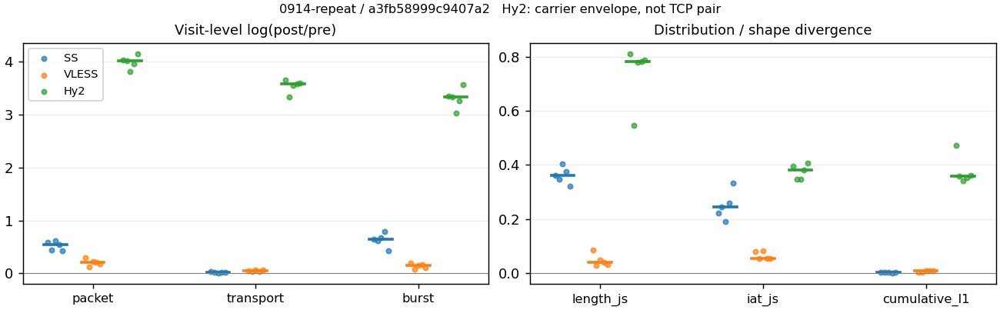
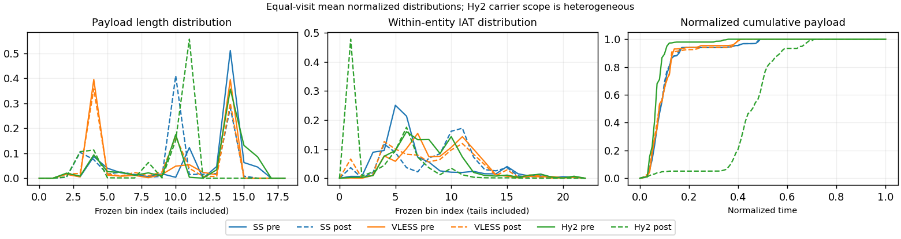

# 0914-repeat · 条目 007 · openstreetmap.org

目标：https://www.openstreetmap.org/#map=13/32.0603/118.7969

活动标签：openstreetmap.org::page_load。选定访问 15 次。

[返回总索引](../../README.md) · [统计口径](../../methods.md)

## 覆盖与资格（每次访问均保留）

| 部署 | 重复 | 主请求路由 | 活动状态 | 代理比较 | DIRECT pre | 请求 proxy/direct/unresolved | 错误 |
| --- | --- | --- | --- | --- | --- | --- | --- |
| Hy2 | 1 | proxy | passed | 1 | 0 | 36/0/0 | [] |
| Hy2 | 2 | proxy | passed | 1 | 0 | 40/0/0 | [] |
| Hy2 | 3 | proxy | passed | 1 | 0 | 40/0/0 | [] |
| Hy2 | 4 | proxy | passed | 1 | 0 | 40/0/0 | [] |
| Hy2 | 5 | proxy | passed | 1 | 0 | 40/0/0 | [] |
| SS | 1 | proxy | passed | 1 | 0 | 37/0/0 | [] |
| SS | 2 | proxy | passed | 1 | 0 | 40/0/0 | [] |
| SS | 3 | proxy | passed | 1 | 0 | 40/0/0 | [] |
| SS | 4 | proxy | passed | 1 | 0 | 40/0/0 | [] |
| SS | 5 | proxy | passed | 1 | 0 | 40/0/0 | [] |
| VLESS | 1 | proxy | passed | 1 | 0 | 36/0/0 | [] |
| VLESS | 2 | proxy | passed | 1 | 0 | 40/0/0 | [] |
| VLESS | 3 | proxy | passed | 1 | 0 | 40/0/0 | [] |
| VLESS | 4 | proxy | passed | 1 | 0 | 40/0/0 | [] |
| VLESS | 5 | proxy | passed | 1 | 0 | 40/0/0 | [] |

主请求非 proxy 的统计仅解释为已索引的辅助代理连接或 DIRECT 观测，不代表目标业务经代理传输。播放确认与配对资格是两道不同的门。

图中散点为单次访问，短线为重复中位数；Hy2 是共享载体包络，不能与 TCP 配对作等范围因果对比。

形态图先逐访问归一化，再对访问等权平均；实线 pre，虚线 post。分箱序号及边界见 methods，不将分箱索引误解为长度或时间。

## 每次访问的关键观测

### SS

范围：`exclusive_page`。每格 pre → post；空值为不可观测/不适用。

| 重复 | 包数 | 载荷字节 | burst | TCP FR | IAT中位µs | length JS | IAT JS |
| --- | --- | --- | --- | --- | --- | --- | --- |
| 1 | 890 → 1601 | 1.3794e+06 → 1.4219e+06 | 634 → 1217 | 48 → 48 | 19.483 → 491.45 | 0.36157 | 0.22337 |
| 2 | 951 → 1478 | 1.3338e+06 → 1.3541e+06 | 638 → 1176 | 40 → 40 | 26.436 → 663.8 | 0.34721 | 0.24582 |
| 3 | 805 → 1495 | 1.3416e+06 → 1.3577e+06 | 593 → 1171 | 44 → 50 | 33.602 → 587.57 | 0.40408 | 0.19202 |
| 4 | 968 → 1666 | 1.3374e+06 → 1.3596e+06 | 597 → 1315 | 44 → 44 | 27.47 → 700.58 | 0.37428 | 0.25866 |
| 5 | 1085 → 1673 | 1.3447e+06 → 1.3632e+06 | 779 → 1201 | 44 → 44 | 17.446 → 478.67 | 0.32153 | 0.33175 |

完整标量统计：中位数 [min,max]；Δ 为重复内逐访问变换的中位数，MAD 未缩放。n 为可用变换数；DIRECT-only 的 nΔ=0 不代表 pre 不可用。

| scope | 特征 | pre | post | Δ | IQRΔ | MADΔ | nΔ |
| --- | --- | --- | --- | --- | --- | --- | --- |
| exclusive_page | active_span_sum_s_1000ms | 10.361 [7.738, 11.108] | 11.13 [8.5295, 12.561] | 0.097379 | 0.13309 | 0.086361 | 5 |
| exclusive_page | active_span_sum_s_100ms | 2.8471 [2.3939, 3.3725] | 4.4361 [4.326, 5.1551] | 0.47919 | 0.14471 | 0.054852 | 5 |
| exclusive_page | active_span_sum_s_500ms | 8.2114 [7.2224, 9.0811] | 9.5025 [8.5295, 9.917] | 0.14281 | 0.01997 | 0.013168 | 5 |
| exclusive_page | burst_bytes_iqr | 2896 [2896, 2896] | 1576 [1448, 1774.2] | -0.60844 | 0.087798 | 0.061497 | 5 |
| exclusive_page | burst_bytes_mad | 31 [31, 31] | 34 [34, 34] | 0.092373 | 0 | 0 | 5 |
| exclusive_page | burst_bytes_max | 20480 [20480, 20688] | 11424 [9996, 13052] | -0.58373 | 0.029866 | 0.019761 | 5 |
| exclusive_page | burst_bytes_mean | 2175.7 [1726.1, 2262.3] | 1151.4 [1033.9, 1168.3] | -0.6218 | 0.071999 | 0.046657 | 5 |
| exclusive_page | burst_bytes_median | 31 [31, 31] | 34 [34, 34] | 0.092373 | 0 | 0 | 5 |
| exclusive_page | burst_bytes_min | 0 [0, 0] | 0 [0, 0] | — | — | — | 0 |
| exclusive_page | burst_bytes_p95 | 8688 [8688, 11584] | 4284 [4284, 4358] | -0.70706 | 0.2788 | 0.017126 | 5 |
| exclusive_page | burst_bytes_q25 | 0 [0, 0] | 0 [0, 0] | — | — | — | 0 |
| exclusive_page | burst_bytes_q75 | 2896 [2896, 2896] | 1576 [1448, 1774.2] | -0.60844 | 0.087798 | 0.061497 | 5 |
| exclusive_page | burst_bytes_std | 3654.3 [3252.6, 4253.8] | 1634 [1451.4, 1739.9] | -0.76835 | 0.21585 | 0.0981 | 5 |
| exclusive_page | burst_count | 634 [593, 779] | 1201 [1171, 1315] | 0.6521 | 0.068883 | 0.040559 | 5 |
| exclusive_page | burst_duration_ms_iqr | 0.013233 [0, 0.031976] | 0 [0, 0.000103] | — | — | — | 0 |
| exclusive_page | burst_duration_ms_mad | 0 [0, 0] | 0 [0, 0] | — | — | — | 0 |
| exclusive_page | burst_duration_ms_max | 6946.5 [6870.2, 15001] | 15038 [15009, 21891] | 0.77377 | 0.040902 | 0.033213 | 5 |
| exclusive_page | burst_duration_ms_mean | 32.229 [30.941, 62.546] | 24.766 [22.763, 41.432] | -0.34774 | 0.22646 | 0.124 | 5 |
| exclusive_page | burst_duration_ms_median | 0 [0, 0] | 0 [0, 0] | — | — | — | 0 |
| exclusive_page | burst_duration_ms_min | 0 [0, 0] | 0 [0, 0] | — | — | — | 0 |
| exclusive_page | burst_duration_ms_p95 | 26.646 [2.1091, 32.032] | 0.95367 [0.90892, 1.0025] | -3.2801 | 1.2012 | 0.28212 | 5 |
| exclusive_page | burst_duration_ms_q25 | 0 [0, 0] | 0 [0, 0] | — | — | — | 0 |
| exclusive_page | burst_duration_ms_q75 | 0.013233 [0, 0.031976] | 0 [0, 0.000103] | — | — | — | 0 |
| exclusive_page | burst_duration_ms_std | 340.61 [316.25, 687.82] | 472.32 [448.88, 783.5] | 0.33439 | 0.25179 | 0.18505 | 5 |
| exclusive_page | burst_packets_iqr | 1 [0, 1] | 0 [0, 1] | — | — | — | 0 |
| exclusive_page | burst_packets_mad | 0 [0, 0] | 0 [0, 0] | — | — | — | 0 |
| exclusive_page | burst_packets_max | 9 [8, 11] | 9 [8, 10] | -0.10536 | 0.11778 | 0.09531 | 5 |
| exclusive_page | burst_packets_mean | 1.4038 [1.3575, 1.6214] | 1.2767 [1.2568, 1.393] | -0.064933 | 0.10923 | 0.065073 | 5 |
| exclusive_page | burst_packets_median | 1 [1, 1] | 1 [1, 1] | 0 | 0 | 0 | 5 |
| exclusive_page | burst_packets_min | 1 [1, 1] | 1 [1, 1] | 0 | 0 | 0 | 5 |
| exclusive_page | burst_packets_p95 | 3 [3, 4] | 3 [2, 3] | -0.28768 | 0.40547 | 0.11778 | 5 |
| exclusive_page | burst_packets_q25 | 1 [1, 1] | 1 [1, 1] | 0 | 0 | 0 | 5 |
| exclusive_page | burst_packets_q75 | 2 [1, 2] | 1 [1, 2] | -0.69315 | 0.69315 | 0 | 5 |
| exclusive_page | burst_packets_std | 1.091 [0.86523, 1.1637] | 0.71022 [0.64974, 0.82856] | -0.41855 | 0.12618 | 0.07522 | 5 |
| exclusive_page | connection_span_concurrency_max | 4 [4, 4] | 4 [4, 4] | 0 | 0 | 0 | 5 |
| exclusive_page | cumulative_l1 | — | — | 0.0030474 | 0.000954 | 0.00073616 | 5 |
| exclusive_page | cumulative_max | — | — | 0.095753 | 0.010846 | 0.006333 | 5 |
| exclusive_page | direction_entropy | 0.50705 [0.49691, 0.61395] | 0.36921 [0.34052, 0.40678] | -0.15638 | 0.032231 | 0.016603 | 5 |
| exclusive_page | down_burst_count | 314 [293, 386] | 597 [582, 654] | 0.65749 | 0.070428 | 0.041617 | 5 |
| exclusive_page | down_ip_bytes | 1.348e+06 [1.3433e+06, 1.3866e+06] | 1.3809e+06 [1.3732e+06, 1.4452e+06] | 0.023682 | 0.0018398 | 0.0014511 | 5 |
| exclusive_page | down_packets | 598 [462, 650] | 916 [808, 982] | 0.41262 | 0.17997 | 0.11165 | 5 |
| exclusive_page | down_transport_bytes | 1.3192e+06 [1.314e+06, 1.359e+06] | 1.3331e+06 [1.3306e+06, 1.3974e+06] | 0.012922 | 0.0022399 | 0.0014817 | 5 |
| exclusive_page | duration_s | 37.653 [34.96, 40.03] | 37.653 [34.96, 40.028] | -2.262e-05 | 2.81e-05 | 3.1852e-06 | 5 |
| exclusive_page | entity_count | 7 [6, 7] | 7 [6, 7] | 0 | 0 | 0 | 5 |
| exclusive_page | fr_runs | 44 [40, 48] | 44 [40, 50] | 0 | 0 | 0 | 5 |
| exclusive_page | fr_runs_per_packet | 0.071661 [0.068493, 0.096703] | 0.049505 [0.044944, 0.06068] | -0.024566 | 0.012555 | 0.0055782 | 5 |
| exclusive_page | fr_switches | 37 [34, 42] | 37 [34, 43] | 0 | 0 | 0 | 5 |
| exclusive_page | fr_switches_per_possible_transition | 0.060956 [0.058824, 0.082677] | 0.042394 [0.038066, 0.052632] | -0.02104 | 0.009841 | 0.0046101 | 5 |
| exclusive_page | full_retransmission_fraction | 0.00092166 [0, 0.0037267] | 0.0033829 [0.0017932, 0.0073579] | 0.0032487 | 0.0015822 | 0.00038248 | 5 |
| exclusive_page | full_retransmission_packets | 1 [0, 3] | 5 [3, 11] | 1.2993 | 0.42365 | 0.20067 | 3 |
| exclusive_page | iat_count | 945 [798, 1078] | 1595 [1472, 1666] | 0.546 | 0.14698 | 0.077084 | 5 |
| exclusive_page | iat_js | — | — | 0.24582 | 0.035282 | 0.022443 | 5 |
| exclusive_page | iat_ks | — | — | 0.42143 | 0.012517 | 0.0090789 | 5 |
| exclusive_page | iat_median_us | 26.436 [17.446, 33.602] | 587.57 [478.67, 700.58] | 3.2278 | 0.015567 | 0.011028 | 5 |
| exclusive_page | iat_us_iqr | 107.03 [38.826, 204.06] | 1096.2 [1013.9, 2689.7] | 2.3484 | 0.94022 | 0.66724 | 5 |
| exclusive_page | iat_us_mad | 19.187 [11.956, 26.099] | 568.17 [469.08, 689.1] | 3.5182 | 0.098717 | 0.058732 | 5 |
| exclusive_page | iat_us_max | 1.5001e+07 [1.5001e+07, 1.5001e+07] | 1.5038e+07 [1.5009e+07, 1.5263e+07] | 0.0024329 | 0.001693 | 0.0014664 | 5 |
| exclusive_page | iat_us_mean | 59022 [47376, 82071] | 31648 [30371, 47660] | -0.5461 | 0.17991 | 0.10277 | 5 |
| exclusive_page | iat_us_median | 26.436 [17.446, 33.602] | 587.57 [478.67, 700.58] | 3.2278 | 0.015567 | 0.011028 | 5 |
| exclusive_page | iat_us_min | 0.168 [0.019, 0.402] | 0.037 [0.036, 0.038] | -1.513 | 1.945 | 0.84582 | 5 |
| exclusive_page | iat_us_p95 | 49337 [40480, 57987] | 29947 [24168, 37039] | -0.44825 | 0.10028 | 0.06753 | 5 |
| exclusive_page | iat_us_q25 | 12.727 [10.134, 13.662] | 17.925 [15.925, 19.515] | 0.28812 | 0.30938 | 0.063975 | 5 |
| exclusive_page | iat_us_q75 | 120.69 [48.961, 217.06] | 1113.5 [1033, 2707.6] | 2.2622 | 0.86594 | 0.62714 | 5 |
| exclusive_page | iat_us_std | 6.3464e+05 [5.7942e+05, 9.192e+05] | 4.6077e+05 [4.512e+05, 6.917e+05] | -0.27367 | 0.090318 | 0.046483 | 5 |
| exclusive_page | iat_wasserstein_log1p_us | — | — | 1.6368 | 0.1744 | 0.099509 | 5 |
| exclusive_page | idle_gap_count_1000ms | 9 [7, 10] | 8 [7, 9] | 0 | 0.10536 | 0 | 5 |
| exclusive_page | idle_gap_count_100ms | 32 [30, 33] | 30 [27, 34] | 0 | 0.094391 | 0.030772 | 5 |
| exclusive_page | idle_gap_count_500ms | 11 [10, 13] | 11 [9, 12] | 0 | 0.16705 | 0.087011 | 5 |
| exclusive_page | idle_gap_sum_s_1000ms | 39.283 [34.318, 69.047] | 39.255 [32.204, 68.502] | -0.063593 | 0.061351 | 0.055659 | 5 |
| exclusive_page | idle_gap_sum_s_100ms | 47.018 [41.873, 76.727] | 45.23 [40.328, 75.071] | -0.038764 | 0.013364 | 0.012195 | 5 |
| exclusive_page | idle_gap_sum_s_500ms | 41.309 [36.059, 71.363] | 40.883 [34.847, 70.12] | -0.034188 | 0.017309 | 0.016624 | 5 |
| exclusive_page | ip_bytes | 1.3878e+06 [1.3834e+06, 1.4258e+06] | 1.461e+06 [1.4439e+06, 1.5183e+06] | 0.04574 | 0.0073045 | 0.0029181 | 5 |
| exclusive_page | length_iqr | 1448 [1448, 1448] | 1759.5 [1428, 2249] | 0.19485 | 0.43355 | 0.20875 | 5 |
| exclusive_page | length_js | — | — | 0.36157 | 0.027068 | 0.01436 | 5 |
| exclusive_page | length_ks | — | — | 0.57635 | 0.037293 | 0.027179 | 5 |
| exclusive_page | length_mad | 0 [0, 1448] | 913 [562, 1274] | -0.53998 | 0.40645 | 0.40645 | 2 |
| exclusive_page | length_max | 8192 [4096, 8920] | 5712 [5712, 8568] | 0.044876 | 0.55514 | 0.28768 | 5 |
| exclusive_page | length_mean | 2284 [2124.3, 2948.5] | 1550.5 [1392.5, 1675.9] | -0.42235 | 0.16826 | 0.11277 | 5 |
| exclusive_page | length_median | 2896 [2896, 2896] | 1428 [1428, 1428] | -0.70706 | 0 | 0 | 5 |
| exclusive_page | length_min | 24 [8, 24] | 20 [17, 20] | -0.18232 | 0.28768 | 0 | 5 |
| exclusive_page | length_p95 | 4096 [2896, 8192] | 2856 [2856, 2856] | -0.36059 | 1.0398 | 0.34668 | 5 |
| exclusive_page | length_q25 | 1448 [1448, 1448] | 653 [126, 1428] | -0.79636 | 0.8555 | 0.78245 | 5 |
| exclusive_page | length_q75 | 2896 [2896, 2896] | 2856 [1885.5, 2856] | -0.013908 | 0 | 0 | 5 |
| exclusive_page | length_std | 1343.4 [1058.7, 2461.2] | 1040.1 [976.51, 1081] | -0.28202 | 0.61206 | 0.26432 | 5 |
| exclusive_page | length_wasserstein_bytes | — | — | 739.36 | 425.81 | 130.1 | 5 |
| exclusive_page | nonempty_entity_count | 7 [6, 7] | 7 [6, 7] | 0 | 0 | 0 | 5 |
| exclusive_page | nonempty_packets | 584 [455, 633] | 913 [808, 979] | 0.43606 | 0.18214 | 0.1114 | 5 |
| exclusive_page | offload_suspect_fraction | 0.38802 [0.36292, 0.43388] | 0.19051 [0.15606, 0.19366] | -0.19435 | 0.043566 | 0.021939 | 5 |
| exclusive_page | packet_count | 951 [805, 1085] | 1601 [1478, 1673] | 0.54295 | 0.14623 | 0.07609 | 5 |
| exclusive_page | rtt_median_ms | 0.031557 [0.014401, 0.064305] | 32.983 [32.652, 36.786] | 6.9419 | 0.73281 | 0.40783 | 5 |
| exclusive_page | rtt_sample_count | 352 [334, 429] | 231 [187, 239] | -0.41815 | 0.043794 | 0.040731 | 5 |
| exclusive_page | tcp_ack_count | 945 [798, 1078] | 1593 [1469, 1666] | 0.54808 | 0.15116 | 0.074328 | 5 |
| exclusive_page | tcp_fin_count | 14 [11, 14] | 14 [10, 15] | 0 | 0 | 0 | 5 |
| exclusive_page | tcp_packet_count | 951 [805, 1085] | 1601 [1478, 1673] | 0.54295 | 0.14623 | 0.07609 | 5 |
| exclusive_page | tcp_rst_count | 0 [0, 3] | 0 [0, 1] | -1.0986 | — | — | 1 |
| exclusive_page | tcp_syn_count | 14 [12, 14] | 14 [14, 15] | 0.068993 | 0.15415 | 0.068993 | 5 |
| exclusive_page | tcp_window_raw_median | 65535 [65535, 65535] | 143 [142, 145] | -6.1275 | 0.0070176 | 0.0070176 | 5 |
| exclusive_page | transition_entropy | 0.26544 [0.2586, 0.34243] | 0.19432 [0.17333, 0.22811] | -0.085263 | 0.034344 | 0.019139 | 5 |
| exclusive_page | transition_n_mm | 499 [364, 542] | 827 [727, 895] | 0.50156 | 0.20635 | 0.12524 | 5 |
| exclusive_page | transition_n_mp | 15 [14, 18] | 15 [14, 18] | 0 | 0 | 0 | 5 |
| exclusive_page | transition_n_pm | 22 [20, 24] | 22 [20, 25] | 0 | 0 | 0 | 5 |
| exclusive_page | transition_n_pp | 47 [40, 47] | 41 [40, 42] | -0.11248 | 0.019388 | 0.019388 | 5 |
| exclusive_page | transition_p_mm | 0.97212 [0.95946, 0.97307] | 0.98111 [0.976, 0.98352] | 0.010446 | 0.0055115 | 0.0020494 | 5 |
| exclusive_page | transition_p_mp | 0.027881 [0.02693, 0.040541] | 0.018893 [0.016484, 0.024] | -0.010446 | 0.0055115 | 0.0020494 | 5 |
| exclusive_page | transition_p_pm | 0.31884 [0.30769, 0.375] | 0.35484 [0.32787, 0.37313] | 0.024909 | 0.015822 | 0.011089 | 5 |
| exclusive_page | transition_p_pp | 0.68116 [0.625, 0.69231] | 0.64516 [0.62687, 0.67213] | -0.024909 | 0.015822 | 0.011089 | 5 |
| exclusive_page | transport_bytes | 1.3416e+06 [1.3338e+06, 1.3794e+06] | 1.3596e+06 [1.3541e+06, 1.4219e+06] | 0.015083 | 0.0027008 | 0.0013683 | 5 |
| exclusive_page | up_burst_count | 320 [300, 393] | 604 [589, 661] | 0.64678 | 0.067379 | 0.039511 | 5 |
| exclusive_page | up_byte_fraction | 0.016431 [0.014772, 0.016743] | 0.018665 [0.017012, 0.019949] | 0.0024033 | 0.00045138 | 0.00027771 | 5 |
| exclusive_page | up_ip_bytes | 39793 [38260, 44782] | 74865 [70740, 80146] | 0.61916 | 0.010178 | 0.0056228 | 5 |
| exclusive_page | up_packets | 353 [334, 435] | 685 [670, 749] | 0.64081 | 0.034959 | 0.03469 | 5 |
| exclusive_page | up_transport_bytes | 22094 [19856, 22393] | 25444 [23036, 27085] | 0.16515 | 0.032485 | 0.016594 | 5 |
| exclusive_page | zero_iat_count | 0 [0, 0] | 0 [0, 0] | — | — | — | 0 |
| exclusive_page | zero_iat_fraction | 0 [0, 0] | 0 [0, 0] | 0 | 0 | 0 | 5 |

### VLESS

范围：`exclusive_page`。每格 pre → post；空值为不可观测/不适用。

| 重复 | 包数 | 载荷字节 | burst | TCP FR | IAT中位µs | length JS | IAT JS |
| --- | --- | --- | --- | --- | --- | --- | --- |
| 1 | 689 → 930 | 5.8769e+05 → 6.2102e+05 | 462 → 563 | 27 → 36 | 397.24 → 117.09 | 0.085663 | 0.079211 |
| 2 | 1465 → 1663 | 1.1759e+06 → 1.2152e+06 | 1179 → 1268 | 32 → 42 | 126.92 → 101.13 | 0.028377 | 0.053674 |
| 3 | 708 → 890 | 5.9314e+05 → 6.3445e+05 | 481 → 556 | 31 → 42 | 435.71 → 261.26 | 0.049161 | 0.083391 |
| 4 | 1318 → 1621 | 1.174e+06 → 1.2163e+06 | 897 → 1053 | 32 → 42 | 341.42 → 126.91 | 0.040816 | 0.05391 |
| 5 | 718 → 858 | 5.9318e+05 → 6.3413e+05 | 481 → 539 | 29 → 40 | 366.51 → 307.24 | 0.031406 | 0.054043 |

完整标量统计：中位数 [min,max]；Δ 为重复内逐访问变换的中位数，MAD 未缩放。n 为可用变换数；DIRECT-only 的 nΔ=0 不代表 pre 不可用。

| scope | 特征 | pre | post | Δ | IQRΔ | MADΔ | nΔ |
| --- | --- | --- | --- | --- | --- | --- | --- |
| exclusive_page | active_span_sum_s_1000ms | 7.3515 [6.4005, 9.2469] | 7.9632 [7.0208, 9.1826] | -0.0068543 | 0.0869 | 0.004619 | 5 |
| exclusive_page | active_span_sum_s_100ms | 1.2363 [1.1859, 1.9856] | 2.5841 [2.2983, 3.537] | 0.62943 | 0.1363 | 0.052058 | 5 |
| exclusive_page | active_span_sum_s_500ms | 3.8408 [3.4473, 4.3979] | 7.1914 [6.5394, 7.9632] | 0.66738 | 0.10737 | 0.043915 | 5 |
| exclusive_page | burst_bytes_iqr | 2896 [2824, 2896] | 2824 [2824, 2896] | -0.025176 | 0.025176 | 0 | 5 |
| exclusive_page | burst_bytes_mad | 24 [0, 24] | 36 [31, 70] | 0.60355 | 0.50075 | 0.27285 | 4 |
| exclusive_page | burst_bytes_max | 5792 [5792, 8688] | 4832 [4617, 4832] | -0.22673 | 0.22314 | 0.045515 | 5 |
| exclusive_page | burst_bytes_mean | 1233.2 [997.4, 1308.9] | 1141.1 [958.39, 1176.5] | -0.077575 | 0.077924 | 0.03767 | 5 |
| exclusive_page | burst_bytes_median | 24 [0, 24] | 36 [31, 70] | 0.60355 | 0.50075 | 0.27285 | 4 |
| exclusive_page | burst_bytes_min | 0 [0, 0] | 0 [0, 0] | — | — | — | 0 |
| exclusive_page | burst_bytes_p95 | 2968 [2896, 4308] | 2896 [2896, 2896] | -0.024558 | 0.024558 | 0.024558 | 5 |
| exclusive_page | burst_bytes_q25 | 0 [0, 0] | 0 [0, 0] | — | — | — | 0 |
| exclusive_page | burst_bytes_q75 | 2896 [2824, 2896] | 2824 [2824, 2896] | -0.025176 | 0.025176 | 0 | 5 |
| exclusive_page | burst_bytes_std | 1522.3 [1420.6, 1627.5] | 1287.9 [1248.6, 1334.8] | -0.17928 | 0.070838 | 0.051954 | 5 |
| exclusive_page | burst_count | 481 [462, 1179] | 563 [539, 1268] | 0.1449 | 0.046494 | 0.031053 | 5 |
| exclusive_page | burst_duration_ms_iqr | 0.70067 [0, 1.0164] | 1.3803 [0, 1.5657] | 0.53615 | 0.34476 | 0.17026 | 4 |
| exclusive_page | burst_duration_ms_mad | 0 [0, 0] | 0 [0, 0] | — | — | — | 0 |
| exclusive_page | burst_duration_ms_max | 7560.6 [3955.6, 15001] | 15026 [15000, 15051] | 0.6885 | 0.82914 | 0.64615 | 5 |
| exclusive_page | burst_duration_ms_mean | 30.724 [24.333, 34.793] | 38.168 [17.64, 48.903] | 0.21694 | 0.31433 | 0.2251 | 5 |
| exclusive_page | burst_duration_ms_median | 0 [0, 0] | 0 [0, 0] | — | — | — | 0 |
| exclusive_page | burst_duration_ms_min | 0 [0, 0] | 0 [0, 0] | — | — | — | 0 |
| exclusive_page | burst_duration_ms_p95 | 9.1037 [7.0842, 9.7623] | 9.8699 [8.8687, 10.387] | 0.11305 | 0.074197 | 0.069669 | 5 |
| exclusive_page | burst_duration_ms_q25 | 0 [0, 0] | 0 [0, 0] | — | — | — | 0 |
| exclusive_page | burst_duration_ms_q75 | 0.70067 [0, 1.0164] | 1.3803 [0, 1.5657] | 0.53615 | 0.34476 | 0.17026 | 4 |
| exclusive_page | burst_duration_ms_std | 357.62 [204.62, 552] | 641.51 [426.96, 688.57] | 0.65514 | 0.50145 | 0.45642 | 5 |
| exclusive_page | burst_packets_iqr | 1 [0, 1] | 1 [0, 1] | 0 | 0 | 0 | 4 |
| exclusive_page | burst_packets_mad | 0 [0, 0] | 0 [0, 0] | — | — | — | 0 |
| exclusive_page | burst_packets_max | 4 [3, 4] | 7 [7, 9] | 0.81093 | 0.28768 | 0.036368 | 5 |
| exclusive_page | burst_packets_mean | 1.4719 [1.2426, 1.4927] | 1.5918 [1.3115, 1.6519] | 0.064286 | 0.029883 | 0.017701 | 5 |
| exclusive_page | burst_packets_median | 1 [1, 1] | 1 [1, 1] | 0 | 0 | 0 | 5 |
| exclusive_page | burst_packets_min | 1 [1, 1] | 1 [1, 1] | 0 | 0 | 0 | 5 |
| exclusive_page | burst_packets_p95 | 2 [2, 2] | 3 [2, 3] | 0.40547 | 0 | 0 | 5 |
| exclusive_page | burst_packets_q25 | 1 [1, 1] | 1 [1, 1] | 0 | 0 | 0 | 5 |
| exclusive_page | burst_packets_q75 | 2 [1, 2] | 2 [1, 2] | 0 | 0 | 0 | 5 |
| exclusive_page | burst_packets_std | 0.55725 [0.48087, 0.56926] | 0.88981 [0.75352, 0.96276] | 0.46799 | 0.061816 | 0.042984 | 5 |
| exclusive_page | connection_span_concurrency_max | 3 [3, 4] | 3 [3, 3] | 0 | 0 | 0 | 5 |
| exclusive_page | cumulative_l1 | — | — | 0.0080028 | 0.0039148 | 0.0016055 | 5 |
| exclusive_page | cumulative_max | — | — | 0.060816 | 0.028495 | 0.014605 | 5 |
| exclusive_page | direction_entropy | 0.3581 [0.35122, 0.38933] | 0.35048 [0.28947, 0.43055] | -0.0076122 | 0.081716 | 0.042794 | 5 |
| exclusive_page | down_burst_count | 238 [229, 587] | 280 [268, 632] | 0.14813 | 0.044363 | 0.029414 | 5 |
| exclusive_page | down_ip_bytes | 6.021e+05 [5.9822e+05, 1.2032e+06] | 6.3756e+05 [6.2935e+05, 1.2413e+06] | 0.050734 | 0.023366 | 0.006799 | 5 |
| exclusive_page | down_packets | 453 [436, 847] | 545 [522, 984] | 0.14993 | 0.022866 | 0.014717 | 5 |
| exclusive_page | down_transport_bytes | 5.7863e+05 [5.7552e+05, 1.1595e+06] | 6.1011e+05 [6.0098e+05, 1.1901e+06] | 0.043296 | 0.024462 | 0.0096884 | 5 |
| exclusive_page | duration_s | 36.672 [25.438, 37.203] | 36.44 [25.409, 37.164] | -0.0011471 | 0.00010663 | 8.4792e-05 | 5 |
| exclusive_page | entity_count | 5 [4, 5] | 5 [4, 5] | 0 | 0 | 0 | 5 |
| exclusive_page | fr_runs | 31 [27, 32] | 42 [36, 42] | 0.28768 | 0.031749 | 0.015748 | 5 |
| exclusive_page | fr_runs_per_packet | 0.063232 [0.038462, 0.071759] | 0.067797 [0.043478, 0.082353] | 0.00734 | 0.0056232 | 0.0027752 | 5 |
| exclusive_page | fr_switches | 26 [23, 27] | 37 [32, 37] | 0.33024 | 0.03774 | 0.015161 | 5 |
| exclusive_page | fr_switches_per_possible_transition | 0.054374 [0.032648, 0.06089] | 0.060721 [0.038502, 0.073267] | 0.007922 | 0.0060299 | 0.0021081 | 5 |
| exclusive_page | full_retransmission_fraction | 0 [0, 0.00068259] | 0 [0, 0] | 0 | 0 | 0 | 5 |
| exclusive_page | full_retransmission_packets | 0 [0, 1] | 0 [0, 0] | — | — | — | 0 |
| exclusive_page | iat_count | 713 [685, 1460] | 926 [853, 1658] | 0.20764 | 0.050953 | 0.028361 | 5 |
| exclusive_page | iat_js | — | — | 0.054043 | 0.025301 | 0.00036906 | 5 |
| exclusive_page | iat_ks | — | — | 0.15695 | 0.04877 | 0.0326 | 5 |
| exclusive_page | iat_median_us | 366.51 [126.92, 435.71] | 126.91 [101.13, 307.24] | -0.51144 | 0.76245 | 0.33503 | 5 |
| exclusive_page | iat_us_iqr | 1432.8 [1234.3, 1539.4] | 1366.9 [1258.7, 1523.5] | 0.019528 | 0.11526 | 0.023401 | 5 |
| exclusive_page | iat_us_mad | 356.04 [118.63, 419.87] | 126.8 [96.031, 301.27] | -0.47517 | 0.74805 | 0.30813 | 5 |
| exclusive_page | iat_us_max | 1.5001e+07 [1.5001e+07, 1.5001e+07] | 1.505e+07 [1.5e+07, 1.5193e+07] | 0.003251 | 0.0016918 | 0.0015978 | 5 |
| exclusive_page | iat_us_mean | 50965 [36066, 66906] | 39924 [22417, 48453] | -0.30368 | 0.15366 | 0.094146 | 5 |
| exclusive_page | iat_us_median | 366.51 [126.92, 435.71] | 126.91 [101.13, 307.24] | -0.51144 | 0.76245 | 0.33503 | 5 |
| exclusive_page | iat_us_min | 0.53 [0.093, 2.751] | 0.037 [0.035, 0.038] | -2.7175 | 2.8455 | 1.4602 | 5 |
| exclusive_page | iat_us_p95 | 9807.6 [9326.7, 10146] | 39798 [9783.2, 42505] | 1.3781 | 1.3768 | 0.088393 | 5 |
| exclusive_page | iat_us_q25 | 51.336 [44.758, 52.189] | 14.596 [9.0425, 17.736] | -1.1731 | 0.38975 | 0.096739 | 5 |
| exclusive_page | iat_us_q75 | 1482.4 [1285.7, 1584.2] | 1375.9 [1276.1, 1535.5] | -0.0074618 | 0.10986 | 0.026466 | 5 |
| exclusive_page | iat_us_std | 6.5374e+05 [6.0202e+05, 8.7228e+05] | 5.8089e+05 [4.2673e+05, 6.9372e+05] | -0.15213 | 0.11088 | 0.061205 | 5 |
| exclusive_page | iat_wasserstein_log1p_us | — | — | 0.58941 | 0.23024 | 0.11655 | 5 |
| exclusive_page | idle_gap_count_1000ms | 5 [3, 8] | 4 [3, 7] | -0.13353 | 0.22314 | 0.13353 | 5 |
| exclusive_page | idle_gap_count_100ms | 19 [19, 24] | 26 [24, 30] | 0.23361 | 0.090514 | 0.02882 | 5 |
| exclusive_page | idle_gap_count_500ms | 10 [9, 15] | 5 [4, 9] | -0.69315 | 0.22314 | 0.11778 | 5 |
| exclusive_page | idle_gap_sum_s_1000ms | 34.155 [23.957, 78.6] | 29.203 [23.942, 63.45] | -0.038674 | 0.21347 | 0.038205 | 5 |
| exclusive_page | idle_gap_sum_s_100ms | 40.193 [30.885, 85.862] | 33.79 [29.74, 69.095] | -0.056234 | 0.17947 | 0.020793 | 5 |
| exclusive_page | idle_gap_sum_s_500ms | 37.862 [28.269, 83.819] | 29.203 [25.499, 64.782] | -0.13431 | 0.15413 | 0.031177 | 5 |
| exclusive_page | ip_bytes | 6.3055e+05 [6.2352e+05, 1.2521e+06] | 6.8138e+05 [6.7048e+05, 1.3025e+06] | 0.072604 | 0.027594 | 0.0058811 | 5 |
| exclusive_page | length_iqr | 2752 [2752, 2752] | 2752 [1376, 2752] | 0 | 0 | 0 | 5 |
| exclusive_page | length_js | — | — | 0.040816 | 0.017756 | 0.0094103 | 5 |
| exclusive_page | length_ks | — | — | 0.13227 | 0.050044 | 0.042777 | 5 |
| exclusive_page | length_mad | 1340 [1128, 1340] | 1340 [1128, 1340] | 0 | 0 | 0 | 5 |
| exclusive_page | length_max | 2896 [2896, 4344] | 2896 [2896, 2896] | 0 | 0 | 0 | 5 |
| exclusive_page | length_mean | 1376.3 [1342, 1413.4] | 1259.1 [1169.5, 1325.2] | -0.098659 | 0.050804 | 0.034254 | 5 |
| exclusive_page | length_median | 1412 [1200, 1412] | 1412 [1200, 1412] | 0 | 0 | 0 | 5 |
| exclusive_page | length_min | 24 [1, 24] | 24 [1, 24] | 0 | 0 | 0 | 5 |
| exclusive_page | length_p95 | 2824 [2824, 2896] | 2824 [2824, 2824] | 0 | 0.025176 | 0 | 5 |
| exclusive_page | length_q25 | 72 [72, 72] | 72 [72, 72] | 0 | 0 | 0 | 5 |
| exclusive_page | length_q75 | 2824 [2824, 2824] | 2824 [1448, 2824] | 0 | 0 | 0 | 5 |
| exclusive_page | length_std | 1261.9 [1213.4, 1281.6] | 1151.3 [1045.6, 1225.6] | -0.076019 | 0.042481 | 0.026507 | 5 |
| exclusive_page | length_wasserstein_bytes | — | — | 145.96 | 66.505 | 40.557 | 5 |
| exclusive_page | nonempty_entity_count | 5 [4, 5] | 5 [4, 5] | 0 | 0 | 0 | 5 |
| exclusive_page | nonempty_packets | 442 [427, 832] | 531 [503, 966] | 0.15053 | 0.036705 | 0.021254 | 5 |
| exclusive_page | offload_suspect_fraction | 0.26125 [0.25706, 0.27693] | 0.18507 [0.13978, 0.20385] | -0.079534 | 0.029326 | 0.016996 | 5 |
| exclusive_page | packet_count | 718 [689, 1465] | 930 [858, 1663] | 0.20693 | 0.050643 | 0.028793 | 5 |
| exclusive_page | rtt_median_ms | 0.61642 [0.068498, 0.72878] | 1.3217 [0.052925, 1.7883] | 0.67395 | 0.20866 | 0.13002 | 5 |
| exclusive_page | rtt_sample_count | 259 [246, 610] | 358 [327, 707] | 0.2675 | 0.067264 | 0.034369 | 5 |
| exclusive_page | tcp_ack_count | 709 [680, 1451] | 926 [853, 1658] | 0.21452 | 0.056772 | 0.029613 | 5 |
| exclusive_page | tcp_fin_count | 10 [7, 10] | 10 [8, 10] | 0 | 0.13353 | 0 | 5 |
| exclusive_page | tcp_packet_count | 718 [689, 1465] | 930 [858, 1663] | 0.20693 | 0.050643 | 0.028793 | 5 |
| exclusive_page | tcp_rst_count | 8 [5, 9] | 0 [0, 0] | — | — | — | 0 |
| exclusive_page | tcp_syn_count | 10 [8, 10] | 10 [8, 10] | 0 | 0 | 0 | 5 |
| exclusive_page | tcp_window_raw_median | 65535 [65535, 65535] | 171 [166, 175] | -5.9487 | 0.047068 | 0.023122 | 5 |
| exclusive_page | transition_entropy | 0.22501 [0.15848, 0.24446] | 0.24057 [0.17116, 0.28725] | 0.020462 | 0.027224 | 0.0079522 | 5 |
| exclusive_page | transition_n_mm | 395 [384, 761] | 478 [441, 896] | 0.14518 | 0.054463 | 0.035023 | 5 |
| exclusive_page | transition_n_mp | 11 [10, 11] | 16 [14, 16] | 0.37469 | 0 | 0 | 5 |
| exclusive_page | transition_n_pm | 15 [13, 16] | 21 [18, 21] | 0.32542 | 0.064539 | 0.031253 | 5 |
| exclusive_page | transition_n_pp | 18 [15, 39] | 24 [17, 28] | 0.12516 | 0.53203 | 0.21968 | 5 |
| exclusive_page | transition_p_mm | 0.97531 [0.97215, 0.98575] | 0.97154 [0.96522, 0.98246] | -0.0042913 | 0.0036578 | 0.0011524 | 5 |
| exclusive_page | transition_p_mp | 0.024691 [0.014249, 0.027848] | 0.028455 [0.017544, 0.034783] | 0.0042913 | 0.0036578 | 0.0011524 | 5 |
| exclusive_page | transition_p_pm | 0.4375 [0.29091, 0.46875] | 0.46667 [0.42857, 0.51429] | 0.05 | 0.098972 | 0.052083 | 5 |
| exclusive_page | transition_p_pp | 0.5625 [0.53125, 0.70909] | 0.53333 [0.48571, 0.57143] | -0.05 | 0.098972 | 0.052083 | 5 |
| exclusive_page | transport_bytes | 5.9318e+05 [5.8769e+05, 1.1759e+06] | 6.3445e+05 [6.2102e+05, 1.2163e+06] | 0.055164 | 0.03143 | 0.012162 | 5 |
| exclusive_page | up_burst_count | 243 [233, 592] | 283 [271, 636] | 0.14173 | 0.048572 | 0.032671 | 5 |
| exclusive_page | up_byte_fraction | 0.020712 [0.014019, 0.024736] | 0.032265 [0.021291, 0.038743] | 0.011553 | 0.0065257 | 0.0024537 | 5 |
| exclusive_page | up_ip_bytes | 28445 [25300, 48930] | 43820 [41121, 64581] | 0.39842 | 0.057803 | 0.048323 | 5 |
| exclusive_page | up_packets | 265 [253, 625] | 385 [336, 730] | 0.30191 | 0.092501 | 0.06453 | 5 |
| exclusive_page | up_transport_bytes | 14673 [12172, 16580] | 24568 [20037, 26134] | 0.49844 | 0.060396 | 0.018427 | 5 |
| exclusive_page | zero_iat_count | 0 [0, 0] | 0 [0, 0] | — | — | — | 0 |
| exclusive_page | zero_iat_fraction | 0 [0, 0] | 0 [0, 0] | 0 | 0 | 0 | 5 |

### Hy2

范围：`carrier_context_envelope`。每格 pre → post；空值为不可观测/不适用。

| 重复 | 包数 | 载荷字节 | burst | TCP FR | IAT中位µs | length JS | IAT JS |
| --- | --- | --- | --- | --- | --- | --- | --- |
| 1 | 775 → 43608 | 1.2127e+06 → 4.6717e+07 | 555 → 15798 | — | 104.38 → 4.696 | 0.80913 | 0.3946 |
| 2 | 764 → 42550 | 1.6773e+06 → 4.7504e+07 | 496 → 14008 | — | 100.12 → 0.412 | 0.54467 | 0.34852 |
| 3 | 952 → 43015 | 1.3415e+06 → 4.6964e+07 | 715 → 14785 | — | 115.6 → 5.2475 | 0.77988 | 0.34718 |
| 4 | 830 → 43610 | 1.3339e+06 → 4.7995e+07 | 538 → 14175 | — | 108.52 → 3.186 | 0.7809 | 0.38105 |
| 5 | 722 → 45716 | 1.3332e+06 → 4.9056e+07 | 460 → 16305 | — | 117.01 → 4.093 | 0.78637 | 0.40799 |

完整标量统计：中位数 [min,max]；Δ 为重复内逐访问变换的中位数，MAD 未缩放。n 为可用变换数；DIRECT-only 的 nΔ=0 不代表 pre 不可用。

| scope | 特征 | pre | post | Δ | IQRΔ | MADΔ | nΔ |
| --- | --- | --- | --- | --- | --- | --- | --- |
| carrier_context_envelope | active_span_sum_s_1000ms | 6.8455 [6.1244, 8.9741] | 12.899 [12.309, 14.818] | 0.62128 | 0.19659 | 0.11981 | 5 |
| carrier_context_envelope | active_span_sum_s_100ms | 0.94565 [0.54325, 1.1522] | 7.5085 [6.3622, 10.78] | 2.236 | 0.2082 | 0.16405 | 5 |
| carrier_context_envelope | active_span_sum_s_500ms | 5.1898 [5.0113, 5.7719] | 11.958 [11.426, 14.818] | 0.86873 | 0.074345 | 0.062418 | 5 |
| carrier_context_envelope | burst_bytes_iqr | 4242 [2834, 4450] | 5100 [4247, 5712] | 0.17799 | 0.16458 | 0.12664 | 5 |
| carrier_context_envelope | burst_bytes_mad | 31 [27.5, 31] | 268 [256, 287] | 2.157 | 0.020658 | 0.016934 | 5 |
| carrier_context_envelope | burst_bytes_max | 20480 [20480, 20927] | 1.045e+05 [80454, 2.1128e+05] | 1.6297 | 0.25861 | 0.20529 | 5 |
| carrier_context_envelope | burst_bytes_mean | 2479.3 [1876.2, 3381.7] | 3176.5 [2957.2, 3391.2] | 0.30257 | 0.27422 | 0.22396 | 5 |
| carrier_context_envelope | burst_bytes_median | 31 [27.5, 31] | 301 [289, 320] | 2.2731 | 0.01838 | 0.015063 | 5 |
| carrier_context_envelope | burst_bytes_min | 0 [0, 0] | 22 [22, 25] | — | — | — | 0 |
| carrier_context_envelope | burst_bytes_p95 | 10724 [7075, 18663] | 12373 [10932, 13826] | 0.1436 | 0.54839 | 0.41535 | 5 |
| carrier_context_envelope | burst_bytes_q25 | 0 [0, 0] | 76 [52, 97] | — | — | — | 0 |
| carrier_context_envelope | burst_bytes_q75 | 4242 [2834, 4450] | 5168 [4323, 5764] | 0.19674 | 0.15487 | 0.11695 | 5 |
| carrier_context_envelope | burst_bytes_std | 4058.9 [2949.2, 5841] | 5003.5 [4604.3, 5358.4] | 0.22344 | 0.30147 | 0.15234 | 5 |
| carrier_context_envelope | burst_count | 538 [460, 715] | 14785 [14008, 16305] | 3.3408 | 0.077294 | 0.069431 | 5 |
| carrier_context_envelope | burst_duration_ms_iqr | 0.14768 [0.07078, 0.4259] | 0.027061 [0.023974, 0.028741] | -1.7906 | 0.22989 | 0.22504 | 5 |
| carrier_context_envelope | burst_duration_ms_mad | 0 [0, 0] | 6e-05 [4.4e-05, 8.7e-05] | — | — | — | 0 |
| carrier_context_envelope | burst_duration_ms_max | 15001 [6870.4, 15001] | 4620.7 [4188.9, 9974.2] | -0.4948 | 0.70996 | 0.68278 | 5 |
| carrier_context_envelope | burst_duration_ms_mean | 53.734 [17.962, 76.238] | 0.68586 [0.56969, 1.2861] | -4.3571 | 0.059922 | 0.055864 | 5 |
| carrier_context_envelope | burst_duration_ms_median | 0 [0, 0] | 6e-05 [4.4e-05, 8.7e-05] | — | — | — | 0 |
| carrier_context_envelope | burst_duration_ms_min | 0 [0, 0] | 0 [0, 0] | — | — | — | 0 |
| carrier_context_envelope | burst_duration_ms_p95 | 8.332 [2.0885, 22.802] | 0.10822 [0.080443, 0.26062] | -4.2103 | 0.40557 | 0.27218 | 5 |
| carrier_context_envelope | burst_duration_ms_q25 | 0 [0, 0] | 0 [0, 0] | — | — | — | 0 |
| carrier_context_envelope | burst_duration_ms_q75 | 0.14768 [0.07078, 0.4259] | 0.027061 [0.023974, 0.028741] | -1.7906 | 0.22989 | 0.22504 | 5 |
| carrier_context_envelope | burst_duration_ms_std | 728.75 [267.3, 953.03] | 40.41 [34.371, 92.438] | -2.5458 | 0.40882 | 0.34645 | 5 |
| carrier_context_envelope | burst_packets_iqr | 1 [1, 1] | 3 [2, 3] | 1.0986 | 0 | 0 | 5 |
| carrier_context_envelope | burst_packets_mad | 0 [0, 0] | 1 [1, 1] | — | — | — | 0 |
| carrier_context_envelope | burst_packets_max | 6 [4, 9] | 77 [62, 153] | 2.7344 | 0.40547 | 0.098846 | 5 |
| carrier_context_envelope | burst_packets_mean | 1.5403 [1.3315, 1.5696] | 2.9094 [2.7603, 3.0765] | 0.68146 | 0.01118 | 0.0087771 | 5 |
| carrier_context_envelope | burst_packets_median | 1 [1, 1] | 2 [2, 2] | 0.69315 | 0 | 0 | 5 |
| carrier_context_envelope | burst_packets_min | 1 [1, 1] | 1 [1, 1] | 0 | 0 | 0 | 5 |
| carrier_context_envelope | burst_packets_p95 | 3 [2, 3] | 9 [8, 10] | 1.204 | 0.28768 | 0.18232 | 5 |
| carrier_context_envelope | burst_packets_q25 | 1 [1, 1] | 1 [1, 1] | 0 | 0 | 0 | 5 |
| carrier_context_envelope | burst_packets_q75 | 2 [2, 2] | 4 [3, 4] | 0.69315 | 0 | 0 | 5 |
| carrier_context_envelope | burst_packets_std | 0.74757 [0.60121, 1.0371] | 3.338 [3.0154, 3.618] | 1.449 | 0.177 | 0.16357 | 5 |
| carrier_context_envelope | connection_span_concurrency_max | 4 [3, 4] | 1 [1, 1] | -1.3863 | 0.28768 | 0 | 5 |
| carrier_context_envelope | cumulative_l1 | — | — | 0.35892 | 0.0060509 | 0.0050116 | 5 |
| carrier_context_envelope | cumulative_max | — | — | 0.94627 | 0.006234 | 0.0042419 | 5 |
| carrier_context_envelope | direction_entropy | 0.55 [0.5428, 0.60477] | 0.75084 [0.72287, 0.78334] | 0.19331 | 0.024424 | 0.016898 | 5 |
| carrier_context_envelope | direction_run_analog_runs | 43 [40, 45] | 14785 [14008, 16305] | 5.8216 | 0.14332 | 0.058371 | 5 |
| carrier_context_envelope | direction_run_analog_runs_per_packet | 0.087527 [0.081712, 0.096413] | 0.34372 [0.32504, 0.36227] | 0.26025 | 0.017363 | 0.0145 | 5 |
| carrier_context_envelope | direction_run_analog_switches | 37 [35, 38] | 14784 [14007, 16304] | 5.9756 | 0.12453 | 0.065919 | 5 |
| carrier_context_envelope | direction_run_analog_switches_per_possible_transition | 0.077434 [0.070866, 0.084091] | 0.3437 [0.32502, 0.36226] | 0.27255 | 0.018516 | 0.012271 | 5 |
| carrier_context_envelope | down_burst_count | 266 [227, 354] | 7392 [7004, 8152] | 3.353 | 0.075199 | 0.070457 | 5 |
| carrier_context_envelope | down_ip_bytes | 1.3414e+06 [1.22e+06, 1.6827e+06] | 4.7684e+07 [4.6931e+07, 4.9201e+07] | 3.5847 | 0.048246 | 0.02759 | 5 |
| carrier_context_envelope | down_packets | 483 [459, 554] | 34020 [33444, 35118] | 4.2547 | 0.099169 | 0.076113 | 5 |
| carrier_context_envelope | down_transport_bytes | 1.3139e+06 [1.1959e+06, 1.6575e+06] | 4.6731e+07 [4.5994e+07, 4.8218e+07] | 3.5853 | 0.044669 | 0.026709 | 5 |
| carrier_context_envelope | duration_s | 33.87 [23.365, 34.185] | 33.864 [23.364, 34.185] | -3.0802e-05 | 0.00018739 | 2.8478e-05 | 5 |
| carrier_context_envelope | entity_count | 6 [5, 7] | 1 [1, 1] | -1.7918 | 0 | 0 | 5 |
| carrier_context_envelope | full_retransmission_fraction | 0 [0, 0.001385] | — | — | — | — | 0 |
| carrier_context_envelope | full_retransmission_packets | 0 [0, 1] | — | — | — | — | 0 |
| carrier_context_envelope | iat_count | 770 [716, 945] | 43607 [42549, 45715] | 4.0277 | 0.067734 | 0.05888 | 5 |
| carrier_context_envelope | iat_js | — | — | 0.38105 | 0.046084 | 0.026943 | 5 |
| carrier_context_envelope | iat_ks | — | — | 0.52936 | 0.059556 | 0.034721 | 5 |
| carrier_context_envelope | iat_median_us | 108.52 [100.12, 117.01] | 4.093 [0.412, 5.2475] | -3.353 | 0.42689 | 0.25167 | 5 |
| carrier_context_envelope | iat_us_iqr | 722.43 [566.35, 871.22] | 28.085 [23.375, 65.094] | -3.1876 | 0.28349 | 0.17092 | 5 |
| carrier_context_envelope | iat_us_mad | 96.154 [86.96, 106.97] | 4.056 [0.378, 5.2115] | -3.2236 | 0.39687 | 0.20194 | 5 |
| carrier_context_envelope | iat_us_max | 1.5001e+07 [1.5001e+07, 1.5001e+07] | 9.3981e+06 [6.4336e+06, 1e+07] | -0.46762 | 0.37466 | 0.062091 | 5 |
| carrier_context_envelope | iat_us_mean | 1.0401e+05 [37547, 1.0676e+05] | 783.91 [535.79, 795.88] | -4.888 | 0.12734 | 0.11886 | 5 |
| carrier_context_envelope | iat_us_median | 108.52 [100.12, 117.01] | 4.093 [0.412, 5.2475] | -3.353 | 0.42689 | 0.25167 | 5 |
| carrier_context_envelope | iat_us_min | 0.184 [0.014, 0.836] | 0.001 [0.001, 0.004] | -5.2149 | 2.9082 | 1.5137 | 5 |
| carrier_context_envelope | iat_us_p95 | 16829 [7035.2, 40742] | 316.23 [129.94, 856.37] | -4.2423 | 0.8221 | 0.44216 | 5 |
| carrier_context_envelope | iat_us_q25 | 28.811 [22.236, 33.869] | 0.047 [0.044, 0.056] | -6.4823 | 0.050291 | 0.048311 | 5 |
| carrier_context_envelope | iat_us_q75 | 751.24 [595, 905.09] | 28.132 [23.421, 65.15] | -3.2349 | 0.28432 | 0.18126 | 5 |
| carrier_context_envelope | iat_us_std | 1.0793e+06 [5.6632e+05, 1.1191e+06] | 54424 [37375, 61492] | -3.0234 | 0.13068 | 0.072268 | 5 |
| carrier_context_envelope | iat_wasserstein_log1p_us | — | — | 3.2215 | 0.24438 | 0.10152 | 5 |
| carrier_context_envelope | idle_gap_count_1000ms | 7 [3, 8] | 4 [2, 6] | -0.40547 | 0.27193 | 0.15415 | 5 |
| carrier_context_envelope | idle_gap_count_100ms | 28 [27, 31] | 27 [17, 36] | -0.071459 | 0.27168 | 0.20499 | 5 |
| carrier_context_envelope | idle_gap_count_500ms | 9 [8, 11] | 4 [3, 7] | -0.69315 | 0.60614 | 0.31845 | 5 |
| carrier_context_envelope | idle_gap_sum_s_1000ms | 70.231 [27.21, 79.584] | 19.046 [10.622, 21.876] | -1.3073 | 0.033708 | 0.017838 | 5 |
| carrier_context_envelope | idle_gap_sum_s_100ms | 75.896 [34.521, 84.762] | 24.541 [17.002, 26.677] | -1.1561 | 0.14851 | 0.084193 | 5 |
| carrier_context_envelope | idle_gap_sum_s_500ms | 71.249 [30.471, 80.606] | 20.139 [11.406, 22.759] | -1.2646 | 0.088253 | 0.087164 | 5 |
| carrier_context_envelope | ip_bytes | 1.3771e+06 [1.2531e+06, 1.7171e+06] | 4.8696e+07 [4.7938e+07, 5.0336e+07] | 3.5762 | 0.058733 | 0.031632 | 5 |
| carrier_context_envelope | length_iqr | 1426 [1415, 5044.2] | 596 [524, 596] | -0.87239 | 0.69315 | 0.0077438 | 5 |
| carrier_context_envelope | length_js | — | — | 0.7809 | 0.0064868 | 0.0054655 | 5 |
| carrier_context_envelope | length_ks | — | — | 0.60506 | 0.053094 | 0.023878 | 5 |
| carrier_context_envelope | length_mad | 1236 [819, 2308] | 0 [0, 0] | — | — | — | 0 |
| carrier_context_envelope | length_max | 8920 [8920, 8920] | 1441 [1441, 1441] | -1.823 | 0 | 0 | 5 |
| carrier_context_envelope | length_mean | 2653.7 [2475.1, 3599.4] | 1091.8 [1071.3, 1116.4] | -0.90708 | 0.16666 | 0.088647 | 5 |
| carrier_context_envelope | length_median | 2640 [2234, 2830] | 1441 [1435, 1441] | -0.60544 | 0.11515 | 0.069421 | 5 |
| carrier_context_envelope | length_min | 24 [17, 31] | 22 [22, 22] | -0.087011 | 0.087011 | 0.087011 | 5 |
| carrier_context_envelope | length_p95 | 8541.4 [7075, 8920] | 1441 [1435, 1441] | -1.7796 | 0.077065 | 0.043371 | 5 |
| carrier_context_envelope | length_q25 | 1415 [1404, 1415] | 845 [845, 911] | -0.51555 | 0.0078042 | 0 | 5 |
| carrier_context_envelope | length_q75 | 2830 [2830, 6450.2] | 1441 [1435, 1441] | -0.67494 | 0.40547 | 0 | 5 |
| carrier_context_envelope | length_std | 2216.1 [2004.8, 3128.4] | 573.54 [548.89, 584.64] | -1.3605 | 0.15554 | 0.10904 | 5 |
| carrier_context_envelope | length_wasserstein_bytes | — | — | 1588 | 417.12 | 198.26 | 5 |
| carrier_context_envelope | nonempty_entity_count | 6 [5, 7] | 1 [1, 1] | -1.7918 | 0 | 0 | 5 |
| carrier_context_envelope | nonempty_packets | 466 [446, 542] | 43608 [42550, 45716] | 4.5142 | 0.11749 | 0.073431 | 5 |
| carrier_context_envelope | offload_suspect_fraction | 0.3747 [0.32458, 0.39889] | 0 [0, 0] | -0.3747 | 0.04161 | 0.024193 | 5 |
| carrier_context_envelope | packet_count | 775 [722, 952] | 43608 [42550, 45716] | 4.0199 | 0.068517 | 0.058251 | 5 |
| carrier_context_envelope | rtt_median_ms | 0.14116 [0.08459, 0.19978] | — | — | — | — | 0 |
| carrier_context_envelope | rtt_sample_count | 296 [258, 394] | 0 [0, 0] | — | — | — | 0 |
| carrier_context_envelope | tcp_ack_count | 768 [712, 945] | — | — | — | — | 0 |
| carrier_context_envelope | tcp_fin_count | 12 [9, 14] | — | — | — | — | 0 |
| carrier_context_envelope | tcp_packet_count | 775 [722, 952] | 0 [0, 0] | — | — | — | 0 |
| carrier_context_envelope | tcp_rst_count | 2 [0, 5] | — | — | — | — | 0 |
| carrier_context_envelope | tcp_syn_count | 12 [10, 14] | — | — | — | — | 0 |
| carrier_context_envelope | tcp_window_raw_median | 65535 [65535, 65535] | — | — | — | — | 0 |
| carrier_context_envelope | transition_entropy | 0.32144 [0.30223, 0.3509] | 0.75055 [0.72234, 0.78322] | 0.43842 | 0.016913 | 0.0087419 | 5 |
| carrier_context_envelope | transition_n_mm | 380 [359, 451] | 26966 [25545, 27377] | 4.208 | 0.11626 | 0.06657 | 5 |
| carrier_context_envelope | transition_n_mp | 16 [15, 16] | 7392 [7004, 8152] | 6.158 | 0.097865 | 0.075463 | 5 |
| carrier_context_envelope | transition_n_pm | 21 [20, 22] | 7392 [7003, 8152] | 5.8215 | 0.14438 | 0.058444 | 5 |
| carrier_context_envelope | transition_n_pp | 44 [37, 46] | 2058 [1526, 2445] | 3.8453 | 0.32169 | 0.17231 | 5 |
| carrier_context_envelope | transition_p_mm | 0.96203 [0.95733, 0.96614] | 0.7811 [0.76381, 0.79437] | -0.18464 | 0.01769 | 0.012863 | 5 |
| carrier_context_envelope | transition_p_mp | 0.037975 [0.03386, 0.042667] | 0.2189 [0.20563, 0.23619] | 0.18464 | 0.01769 | 0.012863 | 5 |
| carrier_context_envelope | transition_p_pm | 0.32353 [0.32308, 0.35088] | 0.77713 [0.76927, 0.82108] | 0.45188 | 0.029841 | 0.024156 | 5 |
| carrier_context_envelope | transition_p_pp | 0.67647 [0.64912, 0.67692] | 0.22287 [0.17892, 0.23073] | -0.45188 | 0.029841 | 0.024156 | 5 |
| carrier_context_envelope | transport_bytes | 1.3339e+06 [1.2127e+06, 1.6773e+06] | 4.7504e+07 [4.6717e+07, 4.9056e+07] | 3.583 | 0.049794 | 0.027391 | 5 |
| carrier_context_envelope | up_burst_count | 272 [233, 361] | 7393 [7004, 8153] | 3.3288 | 0.079345 | 0.068427 | 5 |
| carrier_context_envelope | up_byte_fraction | 0.014953 [0.011794, 0.016756] | 0.015473 [0.012735, 0.017084] | 0.0015764 | 0.0043764 | 0.0029054 | 5 |
| carrier_context_envelope | up_ip_bytes | 34419 [33053, 43230] | 1.0075e+06 [8.6728e+05, 1.1348e+06] | 3.3811 | 0.22647 | 0.13789 | 5 |
| carrier_context_envelope | up_packets | 302 [263, 398] | 9246 [8530, 10598] | 3.413 | 0.07617 | 0.073824 | 5 |
| carrier_context_envelope | up_transport_bytes | 19935 [16853, 22478] | 7.2286e+05 [6.1119e+05, 8.3805e+05] | 3.6657 | 0.31803 | 0.092983 | 5 |
| carrier_context_envelope | zero_iat_count | 0 [0, 0] | 0 [0, 0] | — | — | — | 0 |
| carrier_context_envelope | zero_iat_fraction | 0 [0, 0] | 0 [0, 0] | 0 | 0 | 0 | 5 |

## 不同部署对比

以下是各部署自身重复中位数的差异，不按重复编号强行配对。跨 TCP/Hy2 的行标记异质观测范围。

| 视角 | 特征 | 部署A | 部署B | A中位 | B中位 | B−A | 比较口径 |
| --- | --- | --- | --- | --- | --- | --- | --- |
| pre | burst_count | VLESS | Hy2 | 481 | 538 | 57 | heterogeneous_scope_descriptive_only |
| pre | burst_count | VLESS | SS | 481 | 634 | 153 | same_scope_unpaired_visits |
| pre | burst_count | Hy2 | SS | 538 | 634 | 96 | heterogeneous_scope_descriptive_only |
| pre | connection_span_concurrency_max | VLESS | Hy2 | 3 | 4 | 1 | heterogeneous_scope_descriptive_only |
| pre | connection_span_concurrency_max | VLESS | SS | 3 | 4 | 1 | same_scope_unpaired_visits |
| pre | connection_span_concurrency_max | Hy2 | SS | 4 | 4 | 0 | heterogeneous_scope_descriptive_only |
| pre | direction_entropy | VLESS | Hy2 | 0.3581 | 0.55 | 0.19191 | heterogeneous_scope_descriptive_only |
| pre | direction_entropy | VLESS | SS | 0.3581 | 0.50705 | 0.14895 | same_scope_unpaired_visits |
| pre | direction_entropy | Hy2 | SS | 0.55 | 0.50705 | -0.042957 | heterogeneous_scope_descriptive_only |
| pre | down_transport_bytes | VLESS | Hy2 | 5.7863e+05 | 1.3139e+06 | 7.3527e+05 | heterogeneous_scope_descriptive_only |
| pre | down_transport_bytes | VLESS | SS | 5.7863e+05 | 1.3192e+06 | 7.4055e+05 | same_scope_unpaired_visits |
| pre | down_transport_bytes | Hy2 | SS | 1.3139e+06 | 1.3192e+06 | 5279 | heterogeneous_scope_descriptive_only |
| pre | duration_s | VLESS | Hy2 | 36.672 | 33.87 | -2.802 | heterogeneous_scope_descriptive_only |
| pre | duration_s | VLESS | SS | 36.672 | 37.653 | 0.98086 | same_scope_unpaired_visits |
| pre | duration_s | Hy2 | SS | 33.87 | 37.653 | 3.7828 | heterogeneous_scope_descriptive_only |
| pre | entity_count | VLESS | Hy2 | 5 | 6 | 1 | heterogeneous_scope_descriptive_only |
| pre | entity_count | VLESS | SS | 5 | 7 | 2 | same_scope_unpaired_visits |
| pre | entity_count | Hy2 | SS | 6 | 7 | 1 | heterogeneous_scope_descriptive_only |
| pre | fr_runs | VLESS | SS | 31 | 44 | 13 | same_scope_unpaired_visits |
| pre | fr_runs_per_packet | VLESS | SS | 0.063232 | 0.071661 | 0.0084294 | same_scope_unpaired_visits |
| pre | fr_switches | VLESS | SS | 26 | 37 | 11 | same_scope_unpaired_visits |
| pre | fr_switches_per_possible_transition | VLESS | SS | 0.054374 | 0.060956 | 0.006582 | same_scope_unpaired_visits |
| pre | full_retransmission_fraction | VLESS | Hy2 | 0 | 0 | 0 | heterogeneous_scope_descriptive_only |
| pre | full_retransmission_fraction | VLESS | SS | 0 | 0.00092166 | 0.00092166 | same_scope_unpaired_visits |
| pre | full_retransmission_fraction | Hy2 | SS | 0 | 0.00092166 | 0.00092166 | heterogeneous_scope_descriptive_only |
| pre | iat_median_us | VLESS | Hy2 | 366.51 | 108.52 | -257.99 | heterogeneous_scope_descriptive_only |
| pre | iat_median_us | VLESS | SS | 366.51 | 26.436 | -340.08 | same_scope_unpaired_visits |
| pre | iat_median_us | Hy2 | SS | 108.52 | 26.436 | -82.087 | heterogeneous_scope_descriptive_only |
| pre | iat_us_p95 | VLESS | Hy2 | 9807.6 | 16829 | 7021.4 | heterogeneous_scope_descriptive_only |
| pre | iat_us_p95 | VLESS | SS | 9807.6 | 49337 | 39530 | same_scope_unpaired_visits |
| pre | iat_us_p95 | Hy2 | SS | 16829 | 49337 | 32509 | heterogeneous_scope_descriptive_only |
| pre | ip_bytes | VLESS | Hy2 | 6.3055e+05 | 1.3771e+06 | 7.4654e+05 | heterogeneous_scope_descriptive_only |
| pre | ip_bytes | VLESS | SS | 6.3055e+05 | 1.3878e+06 | 7.5729e+05 | same_scope_unpaired_visits |
| pre | ip_bytes | Hy2 | SS | 1.3771e+06 | 1.3878e+06 | 10759 | heterogeneous_scope_descriptive_only |
| pre | length_median | VLESS | Hy2 | 1412 | 2640 | 1228 | heterogeneous_scope_descriptive_only |
| pre | length_median | VLESS | SS | 1412 | 2896 | 1484 | same_scope_unpaired_visits |
| pre | length_median | Hy2 | SS | 2640 | 2896 | 256 | heterogeneous_scope_descriptive_only |
| pre | length_p95 | VLESS | Hy2 | 2824 | 8541.4 | 5717.4 | heterogeneous_scope_descriptive_only |
| pre | length_p95 | VLESS | SS | 2824 | 4096 | 1272 | same_scope_unpaired_visits |
| pre | length_p95 | Hy2 | SS | 8541.4 | 4096 | -4445.4 | heterogeneous_scope_descriptive_only |
| pre | nonempty_packets | VLESS | Hy2 | 442 | 466 | 24 | heterogeneous_scope_descriptive_only |
| pre | nonempty_packets | VLESS | SS | 442 | 584 | 142 | same_scope_unpaired_visits |
| pre | nonempty_packets | Hy2 | SS | 466 | 584 | 118 | heterogeneous_scope_descriptive_only |
| pre | offload_suspect_fraction | VLESS | Hy2 | 0.26125 | 0.3747 | 0.11345 | heterogeneous_scope_descriptive_only |
| pre | offload_suspect_fraction | VLESS | SS | 0.26125 | 0.38802 | 0.12677 | same_scope_unpaired_visits |
| pre | offload_suspect_fraction | Hy2 | SS | 0.3747 | 0.38802 | 0.01332 | heterogeneous_scope_descriptive_only |
| pre | packet_count | VLESS | Hy2 | 718 | 775 | 57 | heterogeneous_scope_descriptive_only |
| pre | packet_count | VLESS | SS | 718 | 951 | 233 | same_scope_unpaired_visits |
| pre | packet_count | Hy2 | SS | 775 | 951 | 176 | heterogeneous_scope_descriptive_only |
| pre | rtt_median_ms | VLESS | Hy2 | 0.61642 | 0.14116 | -0.47526 | heterogeneous_scope_descriptive_only |
| pre | rtt_median_ms | VLESS | SS | 0.61642 | 0.031557 | -0.58486 | same_scope_unpaired_visits |
| pre | rtt_median_ms | Hy2 | SS | 0.14116 | 0.031557 | -0.1096 | heterogeneous_scope_descriptive_only |
| pre | transition_entropy | VLESS | Hy2 | 0.22501 | 0.32144 | 0.096439 | heterogeneous_scope_descriptive_only |
| pre | transition_entropy | VLESS | SS | 0.22501 | 0.26544 | 0.04043 | same_scope_unpaired_visits |
| pre | transition_entropy | Hy2 | SS | 0.32144 | 0.26544 | -0.056009 | heterogeneous_scope_descriptive_only |
| pre | transport_bytes | VLESS | Hy2 | 5.9318e+05 | 1.3339e+06 | 7.407e+05 | heterogeneous_scope_descriptive_only |
| pre | transport_bytes | VLESS | SS | 5.9318e+05 | 1.3416e+06 | 7.4837e+05 | same_scope_unpaired_visits |
| pre | transport_bytes | Hy2 | SS | 1.3339e+06 | 1.3416e+06 | 7676 | heterogeneous_scope_descriptive_only |
| pre | up_byte_fraction | VLESS | Hy2 | 0.020712 | 0.014953 | -0.0057586 | heterogeneous_scope_descriptive_only |
| pre | up_byte_fraction | VLESS | SS | 0.020712 | 0.016431 | -0.0042807 | same_scope_unpaired_visits |
| pre | up_byte_fraction | Hy2 | SS | 0.014953 | 0.016431 | 0.0014779 | heterogeneous_scope_descriptive_only |
| pre | up_transport_bytes | VLESS | Hy2 | 14673 | 19935 | 5262 | heterogeneous_scope_descriptive_only |
| pre | up_transport_bytes | VLESS | SS | 14673 | 22094 | 7421 | same_scope_unpaired_visits |
| pre | up_transport_bytes | Hy2 | SS | 19935 | 22094 | 2159 | heterogeneous_scope_descriptive_only |
| post | burst_count | VLESS | Hy2 | 563 | 14785 | 14222 | heterogeneous_scope_descriptive_only |
| post | burst_count | VLESS | SS | 563 | 1201 | 638 | same_scope_unpaired_visits |
| post | burst_count | Hy2 | SS | 14785 | 1201 | -13584 | heterogeneous_scope_descriptive_only |
| post | connection_span_concurrency_max | VLESS | Hy2 | 3 | 1 | -2 | heterogeneous_scope_descriptive_only |
| post | connection_span_concurrency_max | VLESS | SS | 3 | 4 | 1 | same_scope_unpaired_visits |
| post | connection_span_concurrency_max | Hy2 | SS | 1 | 4 | 3 | heterogeneous_scope_descriptive_only |
| post | direction_entropy | VLESS | Hy2 | 0.35048 | 0.75084 | 0.40035 | heterogeneous_scope_descriptive_only |
| post | direction_entropy | VLESS | SS | 0.35048 | 0.36921 | 0.018727 | same_scope_unpaired_visits |
| post | direction_entropy | Hy2 | SS | 0.75084 | 0.36921 | -0.38162 | heterogeneous_scope_descriptive_only |
| post | down_transport_bytes | VLESS | Hy2 | 6.1011e+05 | 4.6731e+07 | 4.6121e+07 | heterogeneous_scope_descriptive_only |
| post | down_transport_bytes | VLESS | SS | 6.1011e+05 | 1.3331e+06 | 7.2303e+05 | same_scope_unpaired_visits |
| post | down_transport_bytes | Hy2 | SS | 4.6731e+07 | 1.3331e+06 | -4.5398e+07 | heterogeneous_scope_descriptive_only |
| post | duration_s | VLESS | Hy2 | 36.44 | 33.864 | -2.5758 | heterogeneous_scope_descriptive_only |
| post | duration_s | VLESS | SS | 36.44 | 37.653 | 1.2127 | same_scope_unpaired_visits |
| post | duration_s | Hy2 | SS | 33.864 | 37.653 | 3.7885 | heterogeneous_scope_descriptive_only |
| post | entity_count | VLESS | Hy2 | 5 | 1 | -4 | heterogeneous_scope_descriptive_only |
| post | entity_count | VLESS | SS | 5 | 7 | 2 | same_scope_unpaired_visits |
| post | entity_count | Hy2 | SS | 1 | 7 | 6 | heterogeneous_scope_descriptive_only |
| post | fr_runs | VLESS | SS | 42 | 44 | 2 | same_scope_unpaired_visits |
| post | fr_runs_per_packet | VLESS | SS | 0.067797 | 0.049505 | -0.018292 | same_scope_unpaired_visits |
| post | fr_switches | VLESS | SS | 37 | 37 | 0 | same_scope_unpaired_visits |
| post | fr_switches_per_possible_transition | VLESS | SS | 0.060721 | 0.042394 | -0.018327 | same_scope_unpaired_visits |
| post | full_retransmission_fraction | VLESS | SS | 0 | 0.0033829 | 0.0033829 | same_scope_unpaired_visits |
| post | iat_median_us | VLESS | Hy2 | 126.91 | 4.093 | -122.82 | heterogeneous_scope_descriptive_only |
| post | iat_median_us | VLESS | SS | 126.91 | 587.57 | 460.66 | same_scope_unpaired_visits |
| post | iat_median_us | Hy2 | SS | 4.093 | 587.57 | 583.48 | heterogeneous_scope_descriptive_only |
| post | iat_us_p95 | VLESS | Hy2 | 39798 | 316.23 | -39482 | heterogeneous_scope_descriptive_only |
| post | iat_us_p95 | VLESS | SS | 39798 | 29947 | -9850.7 | same_scope_unpaired_visits |
| post | iat_us_p95 | Hy2 | SS | 316.23 | 29947 | 29631 | heterogeneous_scope_descriptive_only |
| post | ip_bytes | VLESS | Hy2 | 6.8138e+05 | 4.8696e+07 | 4.8015e+07 | heterogeneous_scope_descriptive_only |
| post | ip_bytes | VLESS | SS | 6.8138e+05 | 1.461e+06 | 7.7966e+05 | same_scope_unpaired_visits |
| post | ip_bytes | Hy2 | SS | 4.8696e+07 | 1.461e+06 | -4.7235e+07 | heterogeneous_scope_descriptive_only |
| post | length_median | VLESS | Hy2 | 1412 | 1441 | 29 | heterogeneous_scope_descriptive_only |
| post | length_median | VLESS | SS | 1412 | 1428 | 16 | same_scope_unpaired_visits |
| post | length_median | Hy2 | SS | 1441 | 1428 | -13 | heterogeneous_scope_descriptive_only |
| post | length_p95 | VLESS | Hy2 | 2824 | 1441 | -1383 | heterogeneous_scope_descriptive_only |
| post | length_p95 | VLESS | SS | 2824 | 2856 | 32 | same_scope_unpaired_visits |
| post | length_p95 | Hy2 | SS | 1441 | 2856 | 1415 | heterogeneous_scope_descriptive_only |
| post | nonempty_packets | VLESS | Hy2 | 531 | 43608 | 43077 | heterogeneous_scope_descriptive_only |
| post | nonempty_packets | VLESS | SS | 531 | 913 | 382 | same_scope_unpaired_visits |
| post | nonempty_packets | Hy2 | SS | 43608 | 913 | -42695 | heterogeneous_scope_descriptive_only |
| post | offload_suspect_fraction | VLESS | Hy2 | 0.18507 | 0 | -0.18507 | heterogeneous_scope_descriptive_only |
| post | offload_suspect_fraction | VLESS | SS | 0.18507 | 0.19051 | 0.005435 | same_scope_unpaired_visits |
| post | offload_suspect_fraction | Hy2 | SS | 0 | 0.19051 | 0.19051 | heterogeneous_scope_descriptive_only |
| post | packet_count | VLESS | Hy2 | 930 | 43608 | 42678 | heterogeneous_scope_descriptive_only |
| post | packet_count | VLESS | SS | 930 | 1601 | 671 | same_scope_unpaired_visits |
| post | packet_count | Hy2 | SS | 43608 | 1601 | -42007 | heterogeneous_scope_descriptive_only |
| post | rtt_median_ms | VLESS | SS | 1.3217 | 32.983 | 31.662 | same_scope_unpaired_visits |
| post | transition_entropy | VLESS | Hy2 | 0.24057 | 0.75055 | 0.50998 | heterogeneous_scope_descriptive_only |
| post | transition_entropy | VLESS | SS | 0.24057 | 0.19432 | -0.046246 | same_scope_unpaired_visits |
| post | transition_entropy | Hy2 | SS | 0.75055 | 0.19432 | -0.55623 | heterogeneous_scope_descriptive_only |
| post | transport_bytes | VLESS | Hy2 | 6.3445e+05 | 4.7504e+07 | 4.687e+07 | heterogeneous_scope_descriptive_only |
| post | transport_bytes | VLESS | SS | 6.3445e+05 | 1.3596e+06 | 7.251e+05 | same_scope_unpaired_visits |
| post | transport_bytes | Hy2 | SS | 4.7504e+07 | 1.3596e+06 | -4.6145e+07 | heterogeneous_scope_descriptive_only |
| post | up_byte_fraction | VLESS | Hy2 | 0.032265 | 0.015473 | -0.016792 | heterogeneous_scope_descriptive_only |
| post | up_byte_fraction | VLESS | SS | 0.032265 | 0.018665 | -0.0136 | same_scope_unpaired_visits |
| post | up_byte_fraction | Hy2 | SS | 0.015473 | 0.018665 | 0.0031914 | heterogeneous_scope_descriptive_only |
| post | up_transport_bytes | VLESS | Hy2 | 24568 | 7.2286e+05 | 6.983e+05 | heterogeneous_scope_descriptive_only |
| post | up_transport_bytes | VLESS | SS | 24568 | 25444 | 876 | same_scope_unpaired_visits |
| post | up_transport_bytes | Hy2 | SS | 7.2286e+05 | 25444 | -6.9742e+05 | heterogeneous_scope_descriptive_only |
| transformation | burst_count | VLESS | Hy2 | 0.1449 | 3.3408 | 3.1959 | heterogeneous_scope_descriptive_only |
| transformation | burst_count | VLESS | SS | 0.1449 | 0.6521 | 0.50719 | same_scope_unpaired_visits |
| transformation | burst_count | Hy2 | SS | 3.3408 | 0.6521 | -2.6887 | heterogeneous_scope_descriptive_only |
| transformation | connection_span_concurrency_max | VLESS | Hy2 | 0 | -1.3863 | -1.3863 | heterogeneous_scope_descriptive_only |
| transformation | connection_span_concurrency_max | VLESS | SS | 0 | 0 | 0 | same_scope_unpaired_visits |
| transformation | connection_span_concurrency_max | Hy2 | SS | -1.3863 | 0 | 1.3863 | heterogeneous_scope_descriptive_only |
| transformation | direction_entropy | VLESS | Hy2 | -0.0076122 | 0.19331 | 0.20092 | heterogeneous_scope_descriptive_only |
| transformation | direction_entropy | VLESS | SS | -0.0076122 | -0.15638 | -0.14877 | same_scope_unpaired_visits |
| transformation | direction_entropy | Hy2 | SS | 0.19331 | -0.15638 | -0.34969 | heterogeneous_scope_descriptive_only |
| transformation | down_transport_bytes | VLESS | Hy2 | 0.043296 | 3.5853 | 3.542 | heterogeneous_scope_descriptive_only |
| transformation | down_transport_bytes | VLESS | SS | 0.043296 | 0.012922 | -0.030374 | same_scope_unpaired_visits |
| transformation | down_transport_bytes | Hy2 | SS | 3.5853 | 0.012922 | -3.5724 | heterogeneous_scope_descriptive_only |
| transformation | duration_s | VLESS | Hy2 | -0.0011471 | -3.0802e-05 | 0.0011163 | heterogeneous_scope_descriptive_only |
| transformation | duration_s | VLESS | SS | -0.0011471 | -2.262e-05 | 0.0011244 | same_scope_unpaired_visits |
| transformation | duration_s | Hy2 | SS | -3.0802e-05 | -2.262e-05 | 8.1818e-06 | heterogeneous_scope_descriptive_only |
| transformation | entity_count | VLESS | Hy2 | 0 | -1.7918 | -1.7918 | heterogeneous_scope_descriptive_only |
| transformation | entity_count | VLESS | SS | 0 | 0 | 0 | same_scope_unpaired_visits |
| transformation | entity_count | Hy2 | SS | -1.7918 | 0 | 1.7918 | heterogeneous_scope_descriptive_only |
| transformation | fr_runs | VLESS | SS | 0.28768 | 0 | -0.28768 | same_scope_unpaired_visits |
| transformation | fr_runs_per_packet | VLESS | SS | 0.00734 | -0.024566 | -0.031906 | same_scope_unpaired_visits |
| transformation | fr_switches | VLESS | SS | 0.33024 | 0 | -0.33024 | same_scope_unpaired_visits |
| transformation | fr_switches_per_possible_transition | VLESS | SS | 0.007922 | -0.02104 | -0.028962 | same_scope_unpaired_visits |
| transformation | full_retransmission_fraction | VLESS | SS | 0 | 0.0032487 | 0.0032487 | same_scope_unpaired_visits |
| transformation | iat_median_us | VLESS | Hy2 | -0.51144 | -3.353 | -2.8415 | heterogeneous_scope_descriptive_only |
| transformation | iat_median_us | VLESS | SS | -0.51144 | 3.2278 | 3.7392 | same_scope_unpaired_visits |
| transformation | iat_median_us | Hy2 | SS | -3.353 | 3.2278 | 6.5808 | heterogeneous_scope_descriptive_only |
| transformation | iat_us_p95 | VLESS | Hy2 | 1.3781 | -4.2423 | -5.6203 | heterogeneous_scope_descriptive_only |
| transformation | iat_us_p95 | VLESS | SS | 1.3781 | -0.44825 | -1.8263 | same_scope_unpaired_visits |
| transformation | iat_us_p95 | Hy2 | SS | -4.2423 | -0.44825 | 3.794 | heterogeneous_scope_descriptive_only |
| transformation | ip_bytes | VLESS | Hy2 | 0.072604 | 3.5762 | 3.5036 | heterogeneous_scope_descriptive_only |
| transformation | ip_bytes | VLESS | SS | 0.072604 | 0.04574 | -0.026864 | same_scope_unpaired_visits |
| transformation | ip_bytes | Hy2 | SS | 3.5762 | 0.04574 | -3.5305 | heterogeneous_scope_descriptive_only |
| transformation | length_median | VLESS | Hy2 | 0 | -0.60544 | -0.60544 | heterogeneous_scope_descriptive_only |
| transformation | length_median | VLESS | SS | 0 | -0.70706 | -0.70706 | same_scope_unpaired_visits |
| transformation | length_median | Hy2 | SS | -0.60544 | -0.70706 | -0.10161 | heterogeneous_scope_descriptive_only |
| transformation | length_p95 | VLESS | Hy2 | 0 | -1.7796 | -1.7796 | heterogeneous_scope_descriptive_only |
| transformation | length_p95 | VLESS | SS | 0 | -0.36059 | -0.36059 | same_scope_unpaired_visits |
| transformation | length_p95 | Hy2 | SS | -1.7796 | -0.36059 | 1.419 | heterogeneous_scope_descriptive_only |
| transformation | nonempty_packets | VLESS | Hy2 | 0.15053 | 4.5142 | 4.3637 | heterogeneous_scope_descriptive_only |
| transformation | nonempty_packets | VLESS | SS | 0.15053 | 0.43606 | 0.28553 | same_scope_unpaired_visits |
| transformation | nonempty_packets | Hy2 | SS | 4.5142 | 0.43606 | -4.0782 | heterogeneous_scope_descriptive_only |
| transformation | offload_suspect_fraction | VLESS | Hy2 | -0.079534 | -0.3747 | -0.29516 | heterogeneous_scope_descriptive_only |
| transformation | offload_suspect_fraction | VLESS | SS | -0.079534 | -0.19435 | -0.11482 | same_scope_unpaired_visits |
| transformation | offload_suspect_fraction | Hy2 | SS | -0.3747 | -0.19435 | 0.18034 | heterogeneous_scope_descriptive_only |
| transformation | packet_count | VLESS | Hy2 | 0.20693 | 4.0199 | 3.8129 | heterogeneous_scope_descriptive_only |
| transformation | packet_count | VLESS | SS | 0.20693 | 0.54295 | 0.33602 | same_scope_unpaired_visits |
| transformation | packet_count | Hy2 | SS | 4.0199 | 0.54295 | -3.4769 | heterogeneous_scope_descriptive_only |
| transformation | rtt_median_ms | VLESS | SS | 0.67395 | 6.9419 | 6.2679 | same_scope_unpaired_visits |
| transformation | transition_entropy | VLESS | Hy2 | 0.020462 | 0.43842 | 0.41795 | heterogeneous_scope_descriptive_only |
| transformation | transition_entropy | VLESS | SS | 0.020462 | -0.085263 | -0.10573 | same_scope_unpaired_visits |
| transformation | transition_entropy | Hy2 | SS | 0.43842 | -0.085263 | -0.52368 | heterogeneous_scope_descriptive_only |
| transformation | transport_bytes | VLESS | Hy2 | 0.055164 | 3.583 | 3.5278 | heterogeneous_scope_descriptive_only |
| transformation | transport_bytes | VLESS | SS | 0.055164 | 0.015083 | -0.040081 | same_scope_unpaired_visits |
| transformation | transport_bytes | Hy2 | SS | 3.583 | 0.015083 | -3.5679 | heterogeneous_scope_descriptive_only |
| transformation | up_byte_fraction | VLESS | Hy2 | 0.011553 | 0.0015764 | -0.0099766 | heterogeneous_scope_descriptive_only |
| transformation | up_byte_fraction | VLESS | SS | 0.011553 | 0.0024033 | -0.0091498 | same_scope_unpaired_visits |
| transformation | up_byte_fraction | Hy2 | SS | 0.0015764 | 0.0024033 | 0.00082686 | heterogeneous_scope_descriptive_only |
| transformation | up_transport_bytes | VLESS | Hy2 | 0.49844 | 3.6657 | 3.1673 | heterogeneous_scope_descriptive_only |
| transformation | up_transport_bytes | VLESS | SS | 0.49844 | 0.16515 | -0.3333 | same_scope_unpaired_visits |
| transformation | up_transport_bytes | Hy2 | SS | 3.6657 | 0.16515 | -3.5006 | heterogeneous_scope_descriptive_only |
| transformation | length_js | VLESS | Hy2 | 0.040816 | 0.7809 | 0.74008 | heterogeneous_scope_descriptive_only |
| transformation | length_js | VLESS | SS | 0.040816 | 0.36157 | 0.32076 | same_scope_unpaired_visits |
| transformation | length_js | Hy2 | SS | 0.7809 | 0.36157 | -0.41933 | heterogeneous_scope_descriptive_only |
| transformation | length_ks | VLESS | Hy2 | 0.13227 | 0.60506 | 0.47279 | heterogeneous_scope_descriptive_only |
| transformation | length_ks | VLESS | SS | 0.13227 | 0.57635 | 0.44408 | same_scope_unpaired_visits |
| transformation | length_ks | Hy2 | SS | 0.60506 | 0.57635 | -0.028709 | heterogeneous_scope_descriptive_only |
| transformation | length_wasserstein_bytes | VLESS | Hy2 | 145.96 | 1588 | 1442 | heterogeneous_scope_descriptive_only |
| transformation | length_wasserstein_bytes | VLESS | SS | 145.96 | 739.36 | 593.4 | same_scope_unpaired_visits |
| transformation | length_wasserstein_bytes | Hy2 | SS | 1588 | 739.36 | -848.61 | heterogeneous_scope_descriptive_only |
| transformation | iat_js | VLESS | Hy2 | 0.054043 | 0.38105 | 0.327 | heterogeneous_scope_descriptive_only |
| transformation | iat_js | VLESS | SS | 0.054043 | 0.24582 | 0.19177 | same_scope_unpaired_visits |
| transformation | iat_js | Hy2 | SS | 0.38105 | 0.24582 | -0.13523 | heterogeneous_scope_descriptive_only |
| transformation | iat_ks | VLESS | Hy2 | 0.15695 | 0.52936 | 0.37241 | heterogeneous_scope_descriptive_only |
| transformation | iat_ks | VLESS | SS | 0.15695 | 0.42143 | 0.26449 | same_scope_unpaired_visits |
| transformation | iat_ks | Hy2 | SS | 0.52936 | 0.42143 | -0.10792 | heterogeneous_scope_descriptive_only |
| transformation | iat_wasserstein_log1p_us | VLESS | Hy2 | 0.58941 | 3.2215 | 2.6321 | heterogeneous_scope_descriptive_only |
| transformation | iat_wasserstein_log1p_us | VLESS | SS | 0.58941 | 1.6368 | 1.0474 | same_scope_unpaired_visits |
| transformation | iat_wasserstein_log1p_us | Hy2 | SS | 3.2215 | 1.6368 | -1.5846 | heterogeneous_scope_descriptive_only |
| transformation | cumulative_l1 | VLESS | Hy2 | 0.0080028 | 0.35892 | 0.35092 | heterogeneous_scope_descriptive_only |
| transformation | cumulative_l1 | VLESS | SS | 0.0080028 | 0.0030474 | -0.0049553 | same_scope_unpaired_visits |
| transformation | cumulative_l1 | Hy2 | SS | 0.35892 | 0.0030474 | -0.35588 | heterogeneous_scope_descriptive_only |

## 可复核的访问标识

| 部署 | 重复 | session_id |
| --- | --- | --- |
| VLESS | 1 | bf0cea89-6a59-419c-bcec-f805ae6b7ffd |
| Hy2 | 1 | b4143226-4339-420d-be71-7bd4b2746eba |
| SS | 1 | 68b38868-b094-46b6-87fe-d08d721e64f9 |
| Hy2 | 2 | 061c6d06-d6f9-4764-81a9-2fa240fee286 |
| SS | 2 | c37688ea-f4c2-44be-b3f3-fd718f61346c |
| VLESS | 2 | b6096bdd-be3b-4d27-b7b0-8f872382697a |
| SS | 3 | 2895d99d-551c-46fa-b2cc-f8829268c439 |
| VLESS | 3 | 3ce4c3c3-14ad-4fd6-a7b0-22cdf5502d2d |
| Hy2 | 3 | cb01e757-8248-4524-8640-5e607a933396 |
| VLESS | 4 | 3ccbf1da-ae07-43ef-9310-c282820bbdec |
| Hy2 | 4 | 7c6915d1-898b-43fe-8866-50f512304008 |
| SS | 4 | b02a6c0c-50c7-4b25-bd2f-04079cc4f09d |
| Hy2 | 5 | e7ae1c2b-b325-4087-a408-d696eebe69d6 |
| SS | 5 | 3a0cae06-00ce-4e05-ae8c-e3702fe8a840 |
| VLESS | 5 | 8928db70-2e03-4afa-8ee8-4e291d4d56ff |

全量三种 packet selection、Hy2 full 范围、Q25/Q75、直方图与曲线见机器可读产物；本页只显示 observed 主范围。
