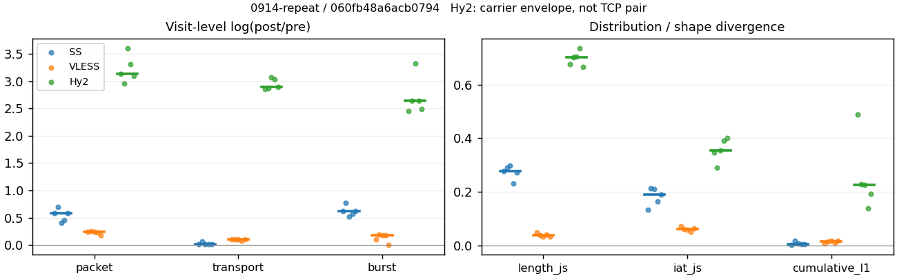
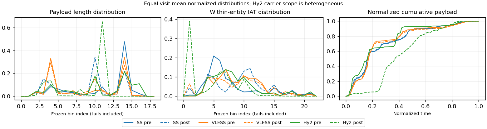

# 0914-repeat · 条目 008 · rottentomatoes.com

目标：https://www.rottentomatoes.com/m/interstellar_2014

活动标签：rottentomatoes.com::page_load。选定访问 15 次。

[返回总索引](../../README.md) · [统计口径](../../methods.md)

## 覆盖与资格（每次访问均保留）

| 部署 | 重复 | 主请求路由 | 活动状态 | 代理比较 | DIRECT pre | 请求 proxy/direct/unresolved | 错误 |
| --- | --- | --- | --- | --- | --- | --- | --- |
| Hy2 | 1 | proxy | passed | 1 | 1 | 119/3/1 | [] |
| Hy2 | 2 | proxy | passed | 1 | 1 | 117/4/1 | [] |
| Hy2 | 3 | proxy | passed | 1 | 1 | 67/2/0 | [] |
| Hy2 | 4 | proxy | passed | 1 | 1 | 71/2/1 | [] |
| Hy2 | 5 | proxy | passed | 1 | 1 | 115/3/2 | [] |
| SS | 1 | proxy | passed | 1 | 0 | 114/0/0 | [] |
| SS | 2 | proxy | passed | 1 | 0 | 47/0/0 | [] |
| SS | 3 | proxy | passed | 1 | 0 | 70/0/0 | [] |
| SS | 4 | proxy | passed | 1 | 0 | 111/0/2 | [] |
| SS | 5 | proxy | passed | 1 | 0 | 114/0/0 | [] |
| VLESS | 1 | proxy | passed | 1 | 0 | 135/0/0 | [] |
| VLESS | 2 | proxy | passed | 1 | 0 | 134/0/0 | [] |
| VLESS | 3 | proxy | passed | 1 | 0 | 134/0/0 | [] |
| VLESS | 4 | proxy | passed | 1 | 0 | 82/0/0 | [] |
| VLESS | 5 | proxy | passed | 1 | 0 | 134/0/0 | [] |

主请求非 proxy 的统计仅解释为已索引的辅助代理连接或 DIRECT 观测，不代表目标业务经代理传输。播放确认与配对资格是两道不同的门。

图中散点为单次访问，短线为重复中位数；Hy2 是共享载体包络，不能与 TCP 配对作等范围因果对比。

形态图先逐访问归一化，再对访问等权平均；实线 pre，虚线 post。分箱序号及边界见 methods，不将分箱索引误解为长度或时间。

## 每次访问的关键观测

### SS

范围：`exclusive_page`。每格 pre → post；空值为不可观测/不适用。

| 重复 | 包数 | 载荷字节 | burst | TCP FR | IAT中位µs | length JS | IAT JS |
| --- | --- | --- | --- | --- | --- | --- | --- |
| 1 | 2413 → 4317 | 2.7587e+06 → 2.8165e+06 | 1660 → 3110 | 240 → 243 | 43.818 → 451.81 | 0.27783 | 0.13203 |
| 2 | 1282 → 2579 | 1.636e+06 → 1.7488e+06 | 862 → 1873 | 125 → 126 | 39.289 → 632.62 | 0.28979 | 0.21264 |
| 3 | 1940 → 2927 | 2.3097e+06 → 2.3493e+06 | 1370 → 2292 | 114 → 114 | 26.16 → 664.31 | 0.29668 | 0.21075 |
| 4 | 2425 → 3827 | 2.7323e+06 → 2.7865e+06 | 1713 → 3040 | 230 → 236 | 42.879 → 756.85 | 0.2311 | 0.16495 |
| 5 | 2618 → 4682 | 2.7494e+06 → 2.8039e+06 | 1722 → 3206 | 253 → 258 | 30.606 → 400.02 | 0.27268 | 0.1891 |

完整标量统计：中位数 [min,max]；Δ 为重复内逐访问变换的中位数，MAD 未缩放。n 为可用变换数；DIRECT-only 的 nΔ=0 不代表 pre 不可用。

| scope | 特征 | pre | post | Δ | IQRΔ | MADΔ | nΔ |
| --- | --- | --- | --- | --- | --- | --- | --- |
| exclusive_page | active_span_sum_s_1000ms | 40.046 [22.078, 51.437] | 47.966 [27.396, 59.78] | 0.18046 | 0.054214 | 0.030141 | 5 |
| exclusive_page | active_span_sum_s_100ms | 8.7741 [5.202, 9.5865] | 16.25 [9.8915, 18.413] | 0.64264 | 0.028804 | 0.010065 | 5 |
| exclusive_page | active_span_sum_s_500ms | 33.124 [18.825, 36.262] | 41.083 [24.377, 48.051] | 0.25843 | 0.02628 | 0.023384 | 5 |
| exclusive_page | burst_bytes_iqr | 2896 [2896, 2896] | 1428 [1428, 1428] | -0.70706 | 0 | 0 | 5 |
| exclusive_page | burst_bytes_mad | 31 [31, 31] | 34 [27, 34] | 0.092373 | 0 | 0 | 5 |
| exclusive_page | burst_bytes_max | 20480 [20480, 20896] | 12852 [7140, 17136] | -0.48606 | 0.22314 | 0.12547 | 5 |
| exclusive_page | burst_bytes_mean | 1661.8 [1595.1, 1897.9] | 916.62 [874.56, 1025] | -0.60194 | 0.053067 | 0.047967 | 5 |
| exclusive_page | burst_bytes_median | 31 [31, 31] | 34 [27, 34] | 0.092373 | 0 | 0 | 5 |
| exclusive_page | burst_bytes_min | 0 [0, 0] | 0 [0, 0] | — | — | — | 0 |
| exclusive_page | burst_bytes_p95 | 8192 [7052.3, 8688] | 2964 [2856, 3131.9] | -1.0166 | 0.1735 | 0.058785 | 5 |
| exclusive_page | burst_bytes_q25 | 0 [0, 0] | 0 [0, 0] | — | — | — | 0 |
| exclusive_page | burst_bytes_q75 | 2896 [2896, 2896] | 1428 [1428, 1428] | -0.70706 | 0 | 0 | 5 |
| exclusive_page | burst_bytes_std | 3040.9 [2950, 3342.4] | 1436.6 [1237.8, 1486.7] | -0.76071 | 0.087543 | 0.062452 | 5 |
| exclusive_page | burst_count | 1660 [862, 1722] | 3040 [1873, 3206] | 0.62154 | 0.054194 | 0.047926 | 5 |
| exclusive_page | burst_duration_ms_iqr | 0.0429 [0.012312, 0.055387] | 0 [0, 0.000164] | -5.5668 | — | — | 1 |
| exclusive_page | burst_duration_ms_mad | 0 [0, 0] | 0 [0, 0] | — | — | — | 0 |
| exclusive_page | burst_duration_ms_max | 15001 [15000, 15001] | 27463 [21974, 37780] | 0.60473 | 0.21593 | 0.12357 | 5 |
| exclusive_page | burst_duration_ms_mean | 158 [141.66, 269.05] | 100.53 [91.077, 103.56] | -0.54292 | 0.16745 | 0.092982 | 5 |
| exclusive_page | burst_duration_ms_median | 0 [0, 0] | 0 [0, 0] | — | — | — | 0 |
| exclusive_page | burst_duration_ms_min | 0 [0, 0] | 0 [0, 0] | — | — | — | 0 |
| exclusive_page | burst_duration_ms_p95 | 279.61 [146.82, 354.24] | 19.092 [2.9653, 20.002] | -2.8656 | 0.31193 | 0.22807 | 5 |
| exclusive_page | burst_duration_ms_q25 | 0 [0, 0] | 0 [0, 0] | — | — | — | 0 |
| exclusive_page | burst_duration_ms_q75 | 0.0429 [0.012312, 0.055387] | 0 [0, 0.000164] | -5.5668 | — | — | 1 |
| exclusive_page | burst_duration_ms_std | 1119.1 [1100.5, 1553] | 1128.3 [1045, 1271.6] | -0.058563 | 0.24017 | 0.16758 | 5 |
| exclusive_page | burst_packets_iqr | 1 [1, 1] | 0 [0, 1] | 0 | — | — | 1 |
| exclusive_page | burst_packets_mad | 0 [0, 0] | 0 [0, 0] | — | — | — | 0 |
| exclusive_page | burst_packets_max | 9 [6, 11] | 8 [7, 11] | -0.11778 | 0.22314 | 0.11778 | 5 |
| exclusive_page | burst_packets_mean | 1.4536 [1.4156, 1.5203] | 1.3769 [1.2589, 1.4604] | -0.077061 | 0.057209 | 0.030946 | 5 |
| exclusive_page | burst_packets_median | 1 [1, 1] | 1 [1, 1] | 0 | 0 | 0 | 5 |
| exclusive_page | burst_packets_min | 1 [1, 1] | 1 [1, 1] | 0 | 0 | 0 | 5 |
| exclusive_page | burst_packets_p95 | 3 [3, 3] | 3 [3, 4] | 0 | 0 | 0 | 5 |
| exclusive_page | burst_packets_q25 | 1 [1, 1] | 1 [1, 1] | 0 | 0 | 0 | 5 |
| exclusive_page | burst_packets_q75 | 2 [2, 2] | 1 [1, 2] | -0.69315 | 0 | 0 | 5 |
| exclusive_page | burst_packets_std | 0.90095 [0.81699, 1.0679] | 0.79571 [0.69059, 0.92049] | -0.14854 | 0.1673 | 0.1017 | 5 |
| exclusive_page | connection_span_concurrency_max | 24 [10, 28] | 24 [10, 28] | 0 | 0 | 0 | 5 |
| exclusive_page | cumulative_l1 | — | — | 0.0032583 | 0.0034535 | 0.00058643 | 5 |
| exclusive_page | cumulative_max | — | — | 0.044033 | 0.0057666 | 0.0055745 | 5 |
| exclusive_page | direction_entropy | 0.6745 [0.54292, 0.71229] | 0.51316 [0.46187, 0.61308] | -0.14915 | 0.080284 | 0.017578 | 5 |
| exclusive_page | down_burst_count | 814 [422, 845] | 1506 [928, 1587] | 0.63026 | 0.055495 | 0.048832 | 5 |
| exclusive_page | down_ip_bytes | 2.7173e+06 [1.6217e+06, 2.7349e+06] | 2.7807e+06 [1.7617e+06, 2.832e+06] | 0.030686 | 0.011849 | 0.007653 | 5 |
| exclusive_page | down_packets | 1395 [751, 1576] | 1965 [1418, 2655] | 0.52155 | 0.18298 | 0.11404 | 5 |
| exclusive_page | down_transport_bytes | 2.6446e+06 [1.5825e+06, 2.6595e+06] | 2.678e+06 [1.6877e+06, 2.6939e+06] | 0.013601 | 0.0024201 | 0.0010334 | 5 |
| exclusive_page | duration_s | 46.859 [27.817, 48.493] | 46.857 [27.79, 48.461] | -0.000652 | 0.00093003 | 0.00058984 | 5 |
| exclusive_page | entity_count | 29 [16, 33] | 29 [16, 33] | 0 | 0 | 0 | 5 |
| exclusive_page | fr_runs | 230 [114, 253] | 236 [114, 258] | 0.012423 | 0.011602 | 0.0071476 | 5 |
| exclusive_page | fr_runs_per_packet | 0.17464 [0.10459, 0.18447] | 0.097764 [0.072843, 0.12022] | -0.072951 | 0.027179 | 0.017098 | 5 |
| exclusive_page | fr_switches | 201 [98, 221] | 207 [98, 226] | 0.014389 | 0.012983 | 0.0079836 | 5 |
| exclusive_page | fr_switches_per_possible_transition | 0.15606 [0.091248, 0.16325] | 0.08669 [0.063267, 0.10703] | -0.065724 | 0.024058 | 0.013768 | 5 |
| exclusive_page | full_retransmission_fraction | 0.00078003 [0.00038197, 0.0012433] | 0.0073672 [0.0038445, 0.010887] | 0.0065872 | 0.0040365 | 0.0021517 | 5 |
| exclusive_page | full_retransmission_packets | 1 [1, 3] | 19 [16, 47] | 2.8904 | 0.1929 | 0.13884 | 5 |
| exclusive_page | iat_count | 2380 [1263, 2586] | 3798 [2560, 4650] | 0.58675 | 0.12711 | 0.11976 | 5 |
| exclusive_page | iat_js | — | — | 0.1891 | 0.045793 | 0.023549 | 5 |
| exclusive_page | iat_ks | — | — | 0.33125 | 0.021353 | 0.016169 | 5 |
| exclusive_page | iat_median_us | 39.289 [26.16, 43.818] | 632.62 [400.02, 756.85] | 2.7789 | 0.30046 | 0.2086 | 5 |
| exclusive_page | iat_us_iqr | 394.41 [129.52, 660.08] | 1845.4 [1421.3, 2494.7] | 1.4911 | 0.57881 | 0.34733 | 5 |
| exclusive_page | iat_us_mad | 32.862 [19.274, 37.067] | 619.36 [393.67, 745.16] | 2.9364 | 0.27185 | 0.17848 | 5 |
| exclusive_page | iat_us_max | 1.5001e+07 [1.5001e+07, 1.5001e+07] | 1.5423e+07 [1.5118e+07, 1.5467e+07] | 0.02772 | 0.0212 | 0.0028576 | 5 |
| exclusive_page | iat_us_mean | 2.2137e+05 [2.0852e+05, 2.4748e+05] | 1.2458e+05 [1.1559e+05, 1.4287e+05] | -0.58945 | 0.12524 | 0.12471 | 5 |
| exclusive_page | iat_us_median | 39.289 [26.16, 43.818] | 632.62 [400.02, 756.85] | 2.7789 | 0.30046 | 0.2086 | 5 |
| exclusive_page | iat_us_min | 0.064 [0.006, 0.092] | 0.036 [0.034, 0.037] | -0.63252 | 1.5953 | 0.30575 | 5 |
| exclusive_page | iat_us_p95 | 2.7471e+05 [1.5938e+05, 2.8776e+05] | 68544 [44992, 1.2687e+05] | -1.159 | 0.25592 | 0.23578 | 5 |
| exclusive_page | iat_us_q25 | 13.728 [12.13, 15.142] | 16.441 [13.401, 19.985] | 0.21966 | 0.19359 | 0.1106 | 5 |
| exclusive_page | iat_us_q75 | 409.55 [141.65, 673.81] | 1865.4 [1434.7, 2512.8] | 1.4628 | 0.54172 | 0.33236 | 5 |
| exclusive_page | iat_us_std | 1.5596e+06 [1.4673e+06, 1.5891e+06] | 1.1566e+06 [1.0812e+06, 1.2867e+06] | -0.29203 | 0.070013 | 0.063075 | 5 |
| exclusive_page | iat_wasserstein_log1p_us | — | — | 1.2934 | 0.064131 | 0.061152 | 5 |
| exclusive_page | idle_gap_count_1000ms | 62 [38, 64] | 61 [36, 63] | -0.016261 | 0.032261 | 0.031749 | 5 |
| exclusive_page | idle_gap_count_100ms | 167 [96, 189] | 178 [106, 204] | 0.099091 | 0.03768 | 0.020532 | 5 |
| exclusive_page | idle_gap_count_500ms | 74 [43, 86] | 71 [40, 79] | -0.063716 | 0.014052 | 0.0086048 | 5 |
| exclusive_page | idle_gap_sum_s_1000ms | 478.98 [290.49, 499.18] | 468.48 [269.99, 489.53] | -0.02215 | 0.0048533 | 0.0026197 | 5 |
| exclusive_page | idle_gap_sum_s_100ms | 520.83 [307.37, 530.45] | 509.85 [287.5, 521.24] | -0.018125 | 0.0037824 | 0.0031757 | 5 |
| exclusive_page | idle_gap_sum_s_500ms | 494.15 [293.75, 506.1] | 481.44 [273.01, 496.41] | -0.02579 | 0.0046301 | 0.0043679 | 5 |
| exclusive_page | ip_bytes | 2.8589e+06 [1.7029e+06, 2.8861e+06] | 3.012e+06 [1.9017e+06, 3.0801e+06] | 0.062078 | 0.012902 | 0.0099075 | 5 |
| exclusive_page | length_iqr | 2337 [1731, 2479] | 1408 [1354, 2327] | -0.24977 | 0.45342 | 0.26692 | 5 |
| exclusive_page | length_js | — | — | 0.27783 | 0.017104 | 0.011959 | 5 |
| exclusive_page | length_ks | — | — | 0.49936 | 0.043437 | 0.041595 | 5 |
| exclusive_page | length_mad | 1113 [208, 1224] | 1268 [1018, 1314] | 0.15684 | 0.4424 | 0.3333 | 5 |
| exclusive_page | length_max | 8728 [4096, 8920] | 5712 [4284, 9996] | -0.42397 | 0.081525 | 0.059766 | 5 |
| exclusive_page | length_mean | 2119 [1855.2, 2353.9] | 1246.5 [1062.5, 1501.1] | -0.55741 | 0.19613 | 0.07833 | 5 |
| exclusive_page | length_median | 2896 [2400, 2896] | 1428 [1428, 1428] | -0.70706 | 0.0083218 | 0 | 5 |
| exclusive_page | length_min | 17 [16, 29] | 13 [6, 20] | -0.47 | 0.70704 | 0.37469 | 5 |
| exclusive_page | length_p95 | 4096 [3104, 5299.2] | 2856 [2856, 2856] | -0.36059 | 0 | 0 | 5 |
| exclusive_page | length_q25 | 559 [417, 1165] | 74 [74, 632] | -1.8052 | 1.4105 | 0.88331 | 5 |
| exclusive_page | length_q75 | 2896 [2896, 2896] | 1482 [1428, 2856] | -0.66994 | 0.62186 | 0.037118 | 5 |
| exclusive_page | length_std | 1679.5 [1238.6, 1839.1] | 1023.4 [997.46, 1054.1] | -0.47845 | 0.27596 | 0.078155 | 5 |
| exclusive_page | length_wasserstein_bytes | — | — | 799.27 | 247.45 | 128.9 | 5 |
| exclusive_page | nonempty_entity_count | 29 [16, 33] | 29 [16, 33] | 0 | 0 | 0 | 5 |
| exclusive_page | nonempty_packets | 1301 [695, 1482] | 1963 [1403, 2639] | 0.57701 | 0.19726 | 0.12545 | 5 |
| exclusive_page | offload_suspect_fraction | 0.31993 [0.30887, 0.35361] | 0.14308 [0.1211, 0.15887] | -0.1925 | 0.013331 | 0.0076389 | 5 |
| exclusive_page | packet_count | 2413 [1282, 2618] | 3827 [2579, 4682] | 0.58131 | 0.12544 | 0.11767 | 5 |
| exclusive_page | rtt_median_ms | 0.055575 [0.030553, 0.063262] | 29.442 [27.877, 32.369] | 6.2725 | 0.074906 | 0.041581 | 5 |
| exclusive_page | rtt_sample_count | 995 [521, 1031] | 812 [434, 850] | -0.18271 | 0.060392 | 0.024022 | 5 |
| exclusive_page | tcp_ack_count | 2380 [1262, 2584] | 3794 [2552, 4643] | 0.58568 | 0.1264 | 0.1185 | 5 |
| exclusive_page | tcp_fin_count | 58 [32, 65] | 61 [32, 69] | 0.031253 | 0.023763 | 0.019178 | 5 |
| exclusive_page | tcp_packet_count | 2413 [1282, 2618] | 3827 [2579, 4682] | 0.58131 | 0.12544 | 0.11767 | 5 |
| exclusive_page | tcp_rst_count | 0 [0, 2] | 0 [0, 1] | 0 | — | — | 1 |
| exclusive_page | tcp_syn_count | 58 [32, 66] | 62 [37, 77] | 0.14518 | 0.050354 | 0.023894 | 5 |
| exclusive_page | tcp_window_raw_median | 65535 [65535, 65535] | 137 [137, 141] | -6.1704 | 0 | 0 | 5 |
| exclusive_page | transition_entropy | 0.51352 [0.35283, 0.54403] | 0.34061 [0.26837, 0.41239] | -0.17291 | 0.068821 | 0.025295 | 5 |
| exclusive_page | transition_n_mm | 932 [512, 1096] | 1553 [1186, 2212] | 0.70223 | 0.25004 | 0.13779 | 5 |
| exclusive_page | transition_n_mp | 90 [42, 98] | 94 [42, 101] | 0.021979 | 0.0086468 | 0.0081741 | 5 |
| exclusive_page | transition_n_pm | 111 [56, 123] | 113 [56, 125] | 0.0086581 | 0.016129 | 0.0086581 | 5 |
| exclusive_page | transition_n_pp | 126 [58, 133] | 169 [91, 185] | 0.32277 | 0.12099 | 0.083224 | 5 |
| exclusive_page | transition_p_mm | 0.91792 [0.91016, 0.95532] | 0.95633 [0.94293, 0.96996] | 0.038411 | 0.014893 | 0.0050818 | 5 |
| exclusive_page | transition_p_mp | 0.082077 [0.044681, 0.089844] | 0.043666 [0.030043, 0.057073] | -0.038411 | 0.014893 | 0.0050818 | 5 |
| exclusive_page | transition_p_pm | 0.47131 [0.41791, 0.51261] | 0.39373 [0.37086, 0.42517] | -0.074626 | 0.030631 | 0.019328 | 5 |
| exclusive_page | transition_p_pp | 0.52869 [0.48739, 0.58209] | 0.60627 [0.57483, 0.62914] | 0.074626 | 0.030631 | 0.019328 | 5 |
| exclusive_page | transport_bytes | 2.7323e+06 [1.636e+06, 2.7587e+06] | 2.7865e+06 [1.7488e+06, 2.8165e+06] | 0.019634 | 0.0011676 | 0.0011266 | 5 |
| exclusive_page | up_burst_count | 846 [440, 877] | 1534 [945, 1619] | 0.61306 | 0.052956 | 0.047065 | 5 |
| exclusive_page | up_byte_fraction | 0.032662 [0.020903, 0.035963] | 0.038942 [0.024215, 0.043551] | 0.0041536 | 0.0035036 | 0.00189 | 5 |
| exclusive_page | up_ip_bytes | 1.4159e+05 [81198, 1.5218e+05] | 2.3138e+05 [1.3996e+05, 2.5179e+05] | 0.50348 | 0.013045 | 0.0079839 | 5 |
| exclusive_page | up_packets | 1013 [531, 1042] | 1862 [1161, 2027] | 0.6544 | 0.073323 | 0.062308 | 5 |
| exclusive_page | up_transport_bytes | 87783 [48281, 99209] | 1.0851e+05 [56888, 1.2266e+05] | 0.16405 | 0.07829 | 0.032905 | 5 |
| exclusive_page | zero_iat_count | 0 [0, 0] | 0 [0, 0] | — | — | — | 0 |
| exclusive_page | zero_iat_fraction | 0 [0, 0] | 0 [0, 0] | 0 | 0 | 0 | 5 |

### VLESS

范围：`exclusive_page`。每格 pre → post；空值为不可观测/不适用。

| 重复 | 包数 | 载荷字节 | burst | TCP FR | IAT中位µs | length JS | IAT JS |
| --- | --- | --- | --- | --- | --- | --- | --- |
| 1 | 4412 → 5590 | 3.3166e+06 → 3.681e+06 | 3290 → 3669 | 326 → 418 | 295.78 → 309.61 | 0.046586 | 0.069987 |
| 2 | 4468 → 5783 | 3.2507e+06 → 3.6192e+06 | 3389 → 4082 | 330 → 420 | 182.76 → 158.51 | 0.038625 | 0.061215 |
| 3 | 4370 → 5539 | 3.2448e+06 → 3.5979e+06 | 3005 → 3611 | 322 → 408 | 332.97 → 353.38 | 0.031512 | 0.059394 |
| 4 | 3275 → 4140 | 2.7887e+06 → 2.9993e+06 | 2474 → 2955 | 176 → 228 | 200.65 → 277.42 | 0.040336 | 0.049235 |
| 5 | 4638 → 5528 | 3.2515e+06 → 3.609e+06 | 3605 → 3636 | 322 → 412 | 170.72 → 365.84 | 0.033463 | 0.062593 |

完整标量统计：中位数 [min,max]；Δ 为重复内逐访问变换的中位数，MAD 未缩放。n 为可用变换数；DIRECT-only 的 nΔ=0 不代表 pre 不可用。

| scope | 特征 | pre | post | Δ | IQRΔ | MADΔ | nΔ |
| --- | --- | --- | --- | --- | --- | --- | --- |
| exclusive_page | active_span_sum_s_1000ms | 63.854 [40.202, 66.844] | 65.029 [40.591, 66.946] | 0.009627 | 0.012006 | 0.008605 | 5 |
| exclusive_page | active_span_sum_s_100ms | 8.4078 [6.5509, 8.6979] | 23.308 [15.296, 23.616] | 0.99883 | 0.0033483 | 0.0024253 | 5 |
| exclusive_page | active_span_sum_s_500ms | 31.227 [19.36, 32.971] | 58.56 [35.7, 60.741] | 0.61192 | 0.017793 | 0.011959 | 5 |
| exclusive_page | burst_bytes_iqr | 2372 [1783, 2896] | 2442 [1728.5, 2824] | -0.086509 | 0.31976 | 0.1186 | 5 |
| exclusive_page | burst_bytes_mad | 24 [24, 24] | 53 [31, 53] | 0.79224 | 0.14165 | 0 | 5 |
| exclusive_page | burst_bytes_max | 20480 [14360, 20480] | 13032 [5864, 14552] | -0.45204 | 0.19177 | 0.11159 | 5 |
| exclusive_page | burst_bytes_mean | 1008.1 [901.95, 1127.2] | 996.36 [886.62, 1015] | -0.07868 | 0.075632 | 0.026153 | 5 |
| exclusive_page | burst_bytes_median | 24 [24, 24] | 53 [31, 53] | 0.79224 | 0.14165 | 0 | 5 |
| exclusive_page | burst_bytes_min | 0 [0, 0] | 0 [0, 0] | — | — | — | 0 |
| exclusive_page | burst_bytes_p95 | 2896 [2896, 2968] | 2896 [2896, 2896] | 0 | 0.024558 | 0 | 5 |
| exclusive_page | burst_bytes_q25 | 0 [0, 0] | 0 [0, 0] | — | — | — | 0 |
| exclusive_page | burst_bytes_q75 | 2372 [1783, 2896] | 2442 [1728.5, 2824] | -0.086509 | 0.31976 | 0.1186 | 5 |
| exclusive_page | burst_bytes_std | 1557.9 [1423, 2022.3] | 1283.3 [1257, 1582.1] | -0.20208 | 0.017131 | 0.0091546 | 5 |
| exclusive_page | burst_count | 3290 [2474, 3605] | 3636 [2955, 4082] | 0.17766 | 0.074676 | 0.0083898 | 5 |
| exclusive_page | burst_duration_ms_iqr | 0.19793 [0.042303, 1.0224] | 0.039419 [0.00011975, 0.62224] | -2.4177 | 6.4108 | 4.4897 | 5 |
| exclusive_page | burst_duration_ms_mad | 0 [0, 0] | 0 [0, 0] | — | — | — | 0 |
| exclusive_page | burst_duration_ms_max | 15001 [15000, 15001] | 15175 [15054, 15406] | 0.011575 | 0.02237 | 0.007968 | 5 |
| exclusive_page | burst_duration_ms_mean | 114 [83.01, 162.42] | 82.487 [75.165, 107.85] | -0.32356 | 0.18868 | 0.10278 | 5 |
| exclusive_page | burst_duration_ms_median | 0 [0, 0] | 0 [0, 0] | — | — | — | 0 |
| exclusive_page | burst_duration_ms_min | 0 [0, 0] | 0 [0, 0] | — | — | — | 0 |
| exclusive_page | burst_duration_ms_p95 | 197.82 [17.001, 200.99] | 115.53 [10.723, 143.52] | -0.50233 | 0.073891 | 0.04148 | 5 |
| exclusive_page | burst_duration_ms_q25 | 0 [0, 0] | 0 [0, 0] | — | — | — | 0 |
| exclusive_page | burst_duration_ms_q75 | 0.19793 [0.042303, 1.0224] | 0.039419 [0.00011975, 0.62224] | -2.4177 | 6.4108 | 4.4897 | 5 |
| exclusive_page | burst_duration_ms_std | 972.72 [821.8, 1234.5] | 970.17 [853.96, 1107.9] | -0.071766 | 0.14809 | 0.087991 | 5 |
| exclusive_page | burst_packets_iqr | 1 [1, 1] | 1 [1, 1] | 0 | 0 | 0 | 5 |
| exclusive_page | burst_packets_mad | 0 [0, 0] | 0 [0, 0] | — | — | — | 0 |
| exclusive_page | burst_packets_max | 7 [5, 8] | 8 [7, 9] | 0.13353 | 0.15415 | 0.015748 | 5 |
| exclusive_page | burst_packets_mean | 1.3238 [1.2865, 1.4542] | 1.5204 [1.401, 1.5339] | 0.07193 | 0.070904 | 0.018586 | 5 |
| exclusive_page | burst_packets_median | 1 [1, 1] | 1 [1, 1] | 0 | 0 | 0 | 5 |
| exclusive_page | burst_packets_min | 1 [1, 1] | 1 [1, 1] | 0 | 0 | 0 | 5 |
| exclusive_page | burst_packets_p95 | 2 [2, 2] | 3 [3, 3] | 0.40547 | 0 | 0 | 5 |
| exclusive_page | burst_packets_q25 | 1 [1, 1] | 1 [1, 1] | 0 | 0 | 0 | 5 |
| exclusive_page | burst_packets_q75 | 2 [2, 2] | 2 [2, 2] | 0 | 0 | 0 | 5 |
| exclusive_page | burst_packets_std | 0.56018 [0.51415, 0.59363] | 0.90978 [0.82388, 0.93961] | 0.45468 | 0.038151 | 0.027483 | 5 |
| exclusive_page | connection_span_concurrency_max | 33 [16, 33] | 33 [16, 33] | 0 | 0 | 0 | 5 |
| exclusive_page | cumulative_l1 | — | — | 0.014913 | 0.0079607 | 0.0018981 | 5 |
| exclusive_page | cumulative_max | — | — | 0.061115 | 0.074432 | 0.0343 | 5 |
| exclusive_page | direction_entropy | 0.54608 [0.46934, 0.55594] | 0.55028 [0.45275, 0.55911] | 0.0019063 | 0.0088627 | 0.0048555 | 5 |
| exclusive_page | down_burst_count | 1624 [1225, 1782] | 1799 [1467, 2022] | 0.18028 | 0.075952 | 0.0085925 | 5 |
| exclusive_page | down_ip_bytes | 3.2646e+06 [2.8182e+06, 3.3254e+06] | 3.5721e+06 [3.0043e+06, 3.6363e+06] | 0.088815 | 0.001593 | 0.0010542 | 5 |
| exclusive_page | down_packets | 2562 [1901, 2650] | 3135 [2329, 3165] | 0.19607 | 0.017102 | 0.0069923 | 5 |
| exclusive_page | down_transport_bytes | 3.131e+06 [2.7192e+06, 3.1923e+06] | 3.4081e+06 [2.883e+06, 3.4744e+06] | 0.08444 | 0.0010528 | 0.00082436 | 5 |
| exclusive_page | duration_s | 46.929 [24.549, 50.1] | 46.711 [24.516, 49.662] | -0.0013449 | 0.0046187 | 0.0013536 | 5 |
| exclusive_page | entity_count | 41 [24, 42] | 41 [24, 42] | 0 | 0 | 0 | 5 |
| exclusive_page | fr_runs | 322 [176, 330] | 412 [228, 420] | 0.24647 | 0.007422 | 0.0053097 | 5 |
| exclusive_page | fr_runs_per_packet | 0.1287 [0.09628, 0.13519] | 0.13724 [0.1021, 0.14107] | 0.0064181 | 0.0020693 | 0.0011874 | 5 |
| exclusive_page | fr_switches | 281 [152, 289] | 371 [204, 379] | 0.27785 | 0.0095054 | 0.0067379 | 5 |
| exclusive_page | fr_switches_per_possible_transition | 0.11418 [0.084257, 0.12042] | 0.1253 [0.092349, 0.12872] | 0.0093452 | 0.0022736 | 0.0012529 | 5 |
| exclusive_page | full_retransmission_fraction | 0.00030534 [0, 0.00045331] | 0 [0, 0.00048309] | -0.00021561 | 0.00027471 | 0.00021561 | 5 |
| exclusive_page | full_retransmission_packets | 1 [0, 2] | 0 [0, 2] | 0 | 0.69315 | 0.69315 | 2 |
| exclusive_page | iat_count | 4370 [3251, 4597] | 5498 [4116, 5742] | 0.23867 | 0.0031286 | 0.0027553 | 5 |
| exclusive_page | iat_js | — | — | 0.061215 | 0.0031994 | 0.0018211 | 5 |
| exclusive_page | iat_ks | — | — | 0.094295 | 0.0078588 | 0.0065264 | 5 |
| exclusive_page | iat_median_us | 200.65 [170.72, 332.97] | 309.61 [158.51, 365.84] | 0.059485 | 0.27826 | 0.20187 | 5 |
| exclusive_page | iat_us_iqr | 1811.5 [1558.3, 1950] | 2209.9 [2088.2, 2518.6] | 0.26763 | 0.14433 | 0.1255 | 5 |
| exclusive_page | iat_us_mad | 194.57 [164.44, 324.84] | 305.62 [158.4, 359.58] | 0.067352 | 0.27325 | 0.17688 | 5 |
| exclusive_page | iat_us_max | 1.5001e+07 [1.5001e+07, 1.5002e+07] | 1.5406e+07 [1.5062e+07, 1.5471e+07] | 0.026641 | 0.0032027 | 0.0017232 | 5 |
| exclusive_page | iat_us_mean | 1.5238e+05 [1.365e+05, 1.9621e+05] | 1.263e+05 [1.0638e+05, 1.5311e+05] | -0.24801 | 0.0085512 | 0.0072412 | 5 |
| exclusive_page | iat_us_median | 200.65 [170.72, 332.97] | 309.61 [158.51, 365.84] | 0.059485 | 0.27826 | 0.20187 | 5 |
| exclusive_page | iat_us_min | 0.692 [0.085, 1.613] | 0.036 [0.031, 0.036] | -2.9561 | 1.7546 | 0.90837 | 5 |
| exclusive_page | iat_us_p95 | 1.395e+05 [40882, 1.9481e+05] | 88276 [59089, 94125] | -0.45757 | 0.59286 | 0.26983 | 5 |
| exclusive_page | iat_us_q25 | 39.216 [35.584, 43.776] | 17.141 [14.776, 17.985] | -0.88542 | 0.1039 | 0.052188 | 5 |
| exclusive_page | iat_us_q75 | 1851.7 [1595, 1985.6] | 2224.7 [2105.7, 2535.8] | 0.25137 | 0.14184 | 0.12285 | 5 |
| exclusive_page | iat_us_std | 1.2569e+06 [1.1857e+06, 1.545e+06] | 1.1508e+06 [1.0461e+06, 1.373e+06] | -0.11827 | 0.0010331 | 0.00077681 | 5 |
| exclusive_page | iat_wasserstein_log1p_us | — | — | 0.49842 | 0.078908 | 0.059225 | 5 |
| exclusive_page | idle_gap_count_1000ms | 71 [50, 84] | 65 [48, 78] | -0.084083 | 0.014185 | 0.0099458 | 5 |
| exclusive_page | idle_gap_count_100ms | 227 [141, 234] | 269 [165, 273] | 0.15719 | 0.0068387 | 0.0038038 | 5 |
| exclusive_page | idle_gap_count_500ms | 111 [78, 122] | 72 [54, 81] | -0.42634 | 0.023292 | 0.016771 | 5 |
| exclusive_page | idle_gap_sum_s_1000ms | 580.86 [529.66, 783.68] | 577.47 [523.39, 774.87] | -0.011298 | 0.0060551 | 0.001033 | 5 |
| exclusive_page | idle_gap_sum_s_100ms | 614.51 [587.81, 840.99] | 602.76 [566.57, 818.44] | -0.027175 | 0.0094363 | 0.0054308 | 5 |
| exclusive_page | idle_gap_sum_s_500ms | 601.7 [563.53, 818.17] | 582.36 [529.45, 783.26] | -0.046026 | 0.010248 | 0.0078297 | 5 |
| exclusive_page | ip_bytes | 3.4828e+06 [2.9588e+06, 3.5458e+06] | 3.8997e+06 [3.2178e+06, 3.9754e+06] | 0.11351 | 0.0040742 | 0.0032305 | 5 |
| exclusive_page | length_iqr | 2752 [2752, 2752] | 2752 [2752, 2752] | 0 | 0 | 0 | 5 |
| exclusive_page | length_js | — | — | 0.038625 | 0.0068733 | 0.0051623 | 5 |
| exclusive_page | length_ks | — | — | 0.10767 | 0.009047 | 0.0078494 | 5 |
| exclusive_page | length_mad | 1128 [1091, 1340] | 1136 [1128, 1340] | 0.0070672 | 0.015186 | 0.0081185 | 5 |
| exclusive_page | length_max | 8920 [8192, 8920] | 5792 [5792, 7060] | -0.43182 | 0.085138 | 0 | 5 |
| exclusive_page | length_mean | 1331.7 [1284.6, 1525.5] | 1210 [1193.7, 1343.2] | -0.095828 | 0.019885 | 0.017936 | 5 |
| exclusive_page | length_median | 1200 [1163, 1412] | 1208 [1200, 1412] | 0.0066445 | 0.014268 | 0.0076234 | 5 |
| exclusive_page | length_min | 16 [15, 16] | 13 [8, 21] | -0.20764 | 0.79851 | 0.42097 | 5 |
| exclusive_page | length_p95 | 2896 [2824, 2896] | 2824 [2824, 2896] | 0 | 0.025176 | 0 | 5 |
| exclusive_page | length_q25 | 72 [72, 72] | 72 [72, 72] | 0 | 0 | 0 | 5 |
| exclusive_page | length_q75 | 2824 [2824, 2824] | 2824 [2824, 2824] | 0 | 0 | 0 | 5 |
| exclusive_page | length_std | 1302.7 [1228.5, 1673.4] | 1118.8 [1110.8, 1256] | -0.15744 | 0.037637 | 0.02171 | 5 |
| exclusive_page | length_wasserstein_bytes | — | — | 181.27 | 52.945 | 34.976 | 5 |
| exclusive_page | nonempty_entity_count | 41 [24, 42] | 41 [24, 42] | 0 | 0 | 0 | 5 |
| exclusive_page | nonempty_packets | 2441 [1828, 2526] | 2991 [2233, 3014] | 0.20012 | 0.019833 | 0.0030765 | 5 |
| exclusive_page | offload_suspect_fraction | 0.2254 [0.20569, 0.23359] | 0.15869 [0.14819, 0.18068] | -0.063759 | 0.013796 | 0.003063 | 5 |
| exclusive_page | packet_count | 4412 [3275, 4638] | 5539 [4140, 5783] | 0.23665 | 0.0026731 | 0.0022733 | 5 |
| exclusive_page | rtt_median_ms | 0.10472 [0.079303, 0.48643] | 0.10805 [0.056188, 0.68985] | -0.13586 | 0.91438 | 0.48524 | 5 |
| exclusive_page | rtt_sample_count | 1778 [1303, 1940] | 2262 [1654, 2501] | 0.26909 | 0.071664 | 0.041101 | 5 |
| exclusive_page | tcp_ack_count | 4294 [3208, 4526] | 5497 [4115, 5735] | 0.25586 | 0.0071166 | 0.0068671 | 5 |
| exclusive_page | tcp_fin_count | 80 [47, 82] | 82 [48, 84] | 0.024693 | 0.01227 | 0.0036392 | 5 |
| exclusive_page | tcp_packet_count | 4412 [3275, 4638] | 5539 [4140, 5783] | 0.23665 | 0.0026731 | 0.0022733 | 5 |
| exclusive_page | tcp_rst_count | 74 [43, 76] | 2 [1, 6] | -3.6376 | 0.19167 | 0.12361 | 5 |
| exclusive_page | tcp_syn_count | 82 [48, 84] | 82 [48, 84] | 0 | 0 | 0 | 5 |
| exclusive_page | tcp_window_raw_median | 65535 [65535, 65535] | 152 [152, 153] | -6.0665 | 0.0065574 | 0 | 5 |
| exclusive_page | transition_entropy | 0.39916 [0.31691, 0.41409] | 0.42653 [0.3352, 0.43589] | 0.02591 | 0.0074179 | 0.0032214 | 5 |
| exclusive_page | transition_n_mm | 1960 [1557, 2053] | 2397 [1907, 2426] | 0.19533 | 0.025224 | 0.0074368 | 5 |
| exclusive_page | transition_n_mp | 120 [64, 124] | 165 [90, 169] | 0.31845 | 0.012586 | 0.0088366 | 5 |
| exclusive_page | transition_n_pm | 161 [88, 165] | 206 [114, 210] | 0.24647 | 0.007422 | 0.0053097 | 5 |
| exclusive_page | transition_n_pp | 151 [95, 154] | 174 [98, 180] | 0.14178 | 0.053574 | 0.033902 | 5 |
| exclusive_page | transition_p_mm | 0.94408 [0.9405, 0.96052] | 0.93607 [0.9341, 0.95493] | -0.0073931 | 0.0013752 | 0.00061765 | 5 |
| exclusive_page | transition_p_mp | 0.055918 [0.039482, 0.059501] | 0.063929 [0.045068, 0.065904] | 0.0073931 | 0.0013752 | 0.00061765 | 5 |
| exclusive_page | transition_p_pm | 0.51603 [0.48087, 0.52412] | 0.54005 [0.53125, 0.54688] | 0.024723 | 0.015058 | 0.0087872 | 5 |
| exclusive_page | transition_p_pp | 0.48397 [0.47588, 0.51913] | 0.45995 [0.45312, 0.46875] | -0.024723 | 0.015058 | 0.0087872 | 5 |
| exclusive_page | transport_bytes | 3.2507e+06 [2.7887e+06, 3.3166e+06] | 3.609e+06 [2.9993e+06, 3.681e+06] | 0.10425 | 0.0010078 | 0.00095649 | 5 |
| exclusive_page | up_burst_count | 1666 [1249, 1823] | 1837 [1488, 2060] | 0.17509 | 0.07343 | 0.0082032 | 5 |
| exclusive_page | up_byte_fraction | 0.036816 [0.024914, 0.037475] | 0.055806 [0.03878, 0.056135] | 0.018759 | 0.00027887 | 0.0001796 | 5 |
| exclusive_page | up_ip_bytes | 2.1824e+05 [1.4061e+05, 2.2398e+05] | 3.2758e+05 [2.1346e+05, 3.4385e+05] | 0.43095 | 0.03013 | 0.016601 | 5 |
| exclusive_page | up_packets | 1859 [1374, 2021] | 2380 [1811, 2648] | 0.28983 | 0.046099 | 0.032421 | 5 |
| exclusive_page | up_transport_bytes | 1.1968e+05 [69476, 1.2429e+05] | 2.0088e+05 [1.1632e+05, 2.0664e+05] | 0.51532 | 0.0072124 | 0.0048845 | 5 |
| exclusive_page | zero_iat_count | 0 [0, 0] | 0 [0, 0] | — | — | — | 0 |
| exclusive_page | zero_iat_fraction | 0 [0, 0] | 0 [0, 0] | 0 | 0 | 0 | 5 |

### Hy2

范围：`carrier_context_envelope`。每格 pre → post；空值为不可观测/不适用。

| 重复 | 包数 | 载荷字节 | burst | TCP FR | IAT中位µs | length JS | IAT JS |
| --- | --- | --- | --- | --- | --- | --- | --- |
| 1 | 1989 → 45498 | 2.7984e+06 → 4.87e+07 | 1359 → 15889 | — | 108.72 → 9.893 | 0.6757 | 0.34687 |
| 2 | 2568 → 49544 | 2.7691e+06 → 4.886e+07 | 1946 → 27463 | — | 122.56 → 84.793 | 0.70376 | 0.29097 |
| 3 | 1328 → 48582 | 2.2383e+06 → 4.8195e+07 | 989 → 27521 | — | 85.031 → 86.627 | 0.70405 | 0.35448 |
| 4 | 1637 → 45166 | 2.3075e+06 → 4.7783e+07 | 1151 → 16166 | — | 120.08 → 4.758 | 0.73523 | 0.38953 |
| 5 | 2156 → 47800 | 2.7459e+06 → 4.9683e+07 | 1424 → 17301 | — | 116.82 → 5.263 | 0.66629 | 0.39972 |

范围：`direct_pre_only`。每格 pre → post；空值为不可观测/不适用。

| 重复 | 包数 | 载荷字节 | burst | TCP FR | IAT中位µs | length JS | IAT JS |
| --- | --- | --- | --- | --- | --- | --- | --- |
| 1 | 199 → — | 3.0419e+05 → — | 134 → — | 16 → — | 153.45 → — | — | — |
| 2 | 218 → — | 3.0952e+05 → — | 133 → — | 29 → — | 156.55 → — | — | — |
| 3 | 155 → — | 2.6922e+05 → — | 95 → — | 11 → — | 164.36 → — | — | — |
| 4 | 326 → — | 7.649e+05 → — | 199 → — | 11 → — | 51.613 → — | — | — |
| 5 | 180 → — | 3.0009e+05 → — | 112 → — | 18 → — | 124.75 → — | — | — |

完整标量统计：中位数 [min,max]；Δ 为重复内逐访问变换的中位数，MAD 未缩放。n 为可用变换数；DIRECT-only 的 nΔ=0 不代表 pre 不可用。

| scope | 特征 | pre | post | Δ | IQRΔ | MADΔ | nΔ |
| --- | --- | --- | --- | --- | --- | --- | --- |
| carrier_context_envelope | active_span_sum_s_1000ms | 27.402 [17.086, 41.379] | 24.167 [13.986, 34.277] | -0.12562 | 0.11065 | 0.074567 | 5 |
| carrier_context_envelope | active_span_sum_s_100ms | 2.7839 [2.0028, 3.5278] | 16.694 [8.1586, 26.589] | 1.7912 | 0.55648 | 0.3161 | 5 |
| carrier_context_envelope | active_span_sum_s_500ms | 21.503 [13.719, 28.473] | 21.185 [13.986, 32.678] | 0.019341 | 0.16206 | 0.12783 | 5 |
| carrier_context_envelope | burst_bytes_iqr | 2084 [1415, 2832] | 4225 [2809, 4255] | 0.54584 | 0.2793 | 0.14058 | 5 |
| carrier_context_envelope | burst_bytes_mad | 31 [0, 31] | 287 [232, 347] | 2.2255 | 0.045969 | 0.030877 | 3 |
| carrier_context_envelope | burst_bytes_max | 22190 [20480, 28672] | 54444 [22716, 2.1658e+05] | 0.85647 | 1.5842 | 1.0893 | 5 |
| carrier_context_envelope | burst_bytes_mean | 2004.7 [1423, 2263.2] | 2871.7 [1751.2, 3065] | 0.38824 | 0.17436 | 0.010021 | 5 |
| carrier_context_envelope | burst_bytes_median | 31 [0, 31] | 320 [265, 380] | 2.3343 | 0.04268 | 0.030772 | 3 |
| carrier_context_envelope | burst_bytes_min | 0 [0, 0] | 22 [22, 22] | — | — | — | 0 |
| carrier_context_envelope | burst_bytes_p95 | 10267 [8495.5, 12405] | 10932 [4323, 12373] | -0.0025588 | 0.55985 | 0.20596 | 5 |
| carrier_context_envelope | burst_bytes_q25 | 0 [0, 0] | 73 [68, 98] | — | — | — | 0 |
| carrier_context_envelope | burst_bytes_q75 | 2084 [1415, 2832] | 4323 [2882, 4323] | 0.56664 | 0.28839 | 0.14472 | 5 |
| carrier_context_envelope | burst_bytes_std | 3836.3 [2988.3, 4514.9] | 4238.8 [1981.2, 5975.4] | -0.053618 | 0.68013 | 0.36604 | 5 |
| carrier_context_envelope | burst_count | 1359 [989, 1946] | 17301 [15889, 27521] | 2.6423 | 0.14977 | 0.14498 | 5 |
| carrier_context_envelope | burst_duration_ms_iqr | 0.13988 [0.022335, 0.32089] | 0.024118 [0.000576, 0.029433] | -2.5881 | 1.9026 | 0.91493 | 5 |
| carrier_context_envelope | burst_duration_ms_mad | 0 [0, 0] | 4.4e-05 [0, 8.5e-05] | — | — | — | 0 |
| carrier_context_envelope | burst_duration_ms_max | 15000 [12596, 15001] | 1460.6 [157.46, 9975] | -2.3024 | 1.6899 | 1.0797 | 5 |
| carrier_context_envelope | burst_duration_ms_mean | 178.3 [135.4, 222.16] | 0.55839 [0.33229, 1.0626] | -5.8414 | 0.4875 | 0.39269 | 5 |
| carrier_context_envelope | burst_duration_ms_median | 0 [0, 0] | 4.4e-05 [0, 8.5e-05] | — | — | — | 0 |
| carrier_context_envelope | burst_duration_ms_min | 0 [0, 0] | 0 [0, 0] | — | — | — | 0 |
| carrier_context_envelope | burst_duration_ms_p95 | 211.85 [191.63, 236.02] | 0.68061 [0.12645, 1.1297] | -5.8487 | 2.0401 | 0.71505 | 5 |
| carrier_context_envelope | burst_duration_ms_q25 | 0 [0, 0] | 0 [0, 0] | — | — | — | 0 |
| carrier_context_envelope | burst_duration_ms_q75 | 0.13988 [0.022335, 0.32089] | 0.024118 [0.000576, 0.029433] | -2.5881 | 1.9026 | 0.91493 | 5 |
| carrier_context_envelope | burst_duration_ms_std | 1297 [1124.2, 1649.4] | 14.886 [4.2123, 80.5] | -4.5249 | 1.7293 | 0.92683 | 5 |
| carrier_context_envelope | burst_packets_iqr | 1 [1, 1] | 2 [1, 3] | 0.69315 | 0.69315 | 0.40547 | 5 |
| carrier_context_envelope | burst_packets_mad | 0 [0, 0] | 1 [0, 1] | — | — | — | 0 |
| carrier_context_envelope | burst_packets_max | 7 [4, 10] | 40 [29, 156] | 1.981 | 1.1542 | 0.67267 | 5 |
| carrier_context_envelope | burst_packets_mean | 1.4222 [1.3196, 1.514] | 2.7628 [1.7653, 2.8635] | 0.60148 | 0.35849 | 0.073724 | 5 |
| carrier_context_envelope | burst_packets_median | 1 [1, 1] | 2 [1, 2] | 0.69315 | 0.69315 | 0 | 5 |
| carrier_context_envelope | burst_packets_min | 1 [1, 1] | 1 [1, 1] | 0 | 0 | 0 | 5 |
| carrier_context_envelope | burst_packets_p95 | 3 [2, 3] | 8 [4, 9] | 0.98083 | 0.28768 | 0.11778 | 5 |
| carrier_context_envelope | burst_packets_q25 | 1 [1, 1] | 1 [1, 1] | 0 | 0 | 0 | 5 |
| carrier_context_envelope | burst_packets_q75 | 2 [2, 2] | 3 [2, 4] | 0.40547 | 0.40547 | 0.28768 | 5 |
| carrier_context_envelope | burst_packets_std | 0.71035 [0.61465, 0.77156] | 2.7443 [1.0911, 4.1503] | 1.3384 | 0.86108 | 0.42676 | 5 |
| carrier_context_envelope | connection_span_concurrency_max | 29 [11, 31] | 1 [1, 1] | -3.3673 | 0.79493 | 0.066691 | 5 |
| carrier_context_envelope | cumulative_l1 | — | — | 0.22544 | 0.036777 | 0.034266 | 5 |
| carrier_context_envelope | cumulative_max | — | — | 0.67657 | 0.18724 | 0.15742 | 5 |
| carrier_context_envelope | direction_entropy | 0.73762 [0.60805, 0.84786] | 0.7942 [0.76099, 0.87582] | 0.13476 | 0.14591 | 0.043727 | 5 |
| carrier_context_envelope | direction_run_analog_runs | 249 [108, 270] | 17301 [15889, 27521] | 4.6599 | 0.66211 | 0.41885 | 5 |
| carrier_context_envelope | direction_run_analog_runs_per_packet | 0.19593 [0.13172, 0.26471] | 0.36195 [0.34922, 0.56649] | 0.2262 | 0.20674 | 0.13218 | 5 |
| carrier_context_envelope | direction_run_analog_switches | 219 [93, 233] | 17300 [15888, 27520] | 4.7912 | 0.66725 | 0.42182 | 5 |
| carrier_context_envelope | direction_run_analog_switches_per_possible_transition | 0.17606 [0.11719, 0.23703] | 0.36193 [0.34921, 0.56648] | 0.24072 | 0.20609 | 0.12854 | 5 |
| carrier_context_envelope | down_burst_count | 661 [487, 957] | 8650 [7944, 13760] | 2.6554 | 0.14508 | 0.13687 | 5 |
| carrier_context_envelope | down_ip_bytes | 2.7201e+06 [2.2312e+06, 2.7479e+06] | 4.8691e+07 [4.8036e+07, 4.9767e+07] | 2.9067 | 0.1585 | 0.031494 | 5 |
| carrier_context_envelope | down_packets | 1132 [750, 1418] | 35035 [34222, 36352] | 3.4446 | 0.21433 | 0.12313 | 5 |
| carrier_context_envelope | down_transport_bytes | 2.6538e+06 [2.1921e+06, 2.6888e+06] | 4.771e+07 [4.7066e+07, 4.8749e+07] | 2.9107 | 0.1536 | 0.034169 | 5 |
| carrier_context_envelope | duration_s | 47.014 [22.075, 48.424] | 46.999 [22.074, 48.423] | -3.4609e-05 | 0.00017015 | 2.8694e-05 | 5 |
| carrier_context_envelope | entity_count | 30 [15, 37] | 1 [1, 1] | -3.4012 | 0.75769 | 0.20972 | 5 |
| carrier_context_envelope | full_retransmission_fraction | 0.0013915 [0.0011682, 0.0015083] | — | — | — | — | 0 |
| carrier_context_envelope | full_retransmission_packets | 3 [2, 3] | — | — | — | — | 0 |
| carrier_context_envelope | iat_count | 1952 [1313, 2536] | 47799 [45165, 49543] | 3.1488 | 0.2139 | 0.17654 | 5 |
| carrier_context_envelope | iat_js | — | — | 0.35448 | 0.042657 | 0.035047 | 5 |
| carrier_context_envelope | iat_ks | — | — | 0.46759 | 0.27935 | 0.12295 | 5 |
| carrier_context_envelope | iat_median_us | 116.82 [85.031, 122.56] | 9.893 [4.758, 86.627] | -2.397 | 2.7316 | 0.83133 | 5 |
| carrier_context_envelope | iat_us_iqr | 711.75 [648.82, 1045.2] | 66.551 [25.36, 566.72] | -2.2772 | 2.7139 | 1.0565 | 5 |
| carrier_context_envelope | iat_us_mad | 103.07 [77.275, 115.3] | 9.856 [4.721, 86.512] | -2.2879 | 2.6731 | 0.83321 | 5 |
| carrier_context_envelope | iat_us_max | 1.5001e+07 [1.5001e+07, 1.5001e+07] | 8.9898e+06 [3.0628e+06, 1.0001e+07] | -0.51204 | 0.84259 | 0.10656 | 5 |
| carrier_context_envelope | iat_us_mean | 3.2261e+05 [2.6745e+05, 3.7543e+05] | 968.56 [485.18, 1072.1] | -5.8584 | 0.089702 | 0.050006 | 5 |
| carrier_context_envelope | iat_us_median | 116.82 [85.031, 122.56] | 9.893 [4.758, 86.627] | -2.397 | 2.7316 | 0.83133 | 5 |
| carrier_context_envelope | iat_us_min | 0.301 [0.11, 0.565] | 0.01 [0.001, 0.03] | -3.4045 | 2.1703 | 1.0066 | 5 |
| carrier_context_envelope | iat_us_p95 | 2.0919e+05 [2.0406e+05, 2.2837e+05] | 914.1 [236.29, 1256.1] | -5.5208 | 1.4089 | 0.43037 | 5 |
| carrier_context_envelope | iat_us_q25 | 25.458 [14.68, 36.799] | 0.049 [0.045, 0.23] | -6.2012 | 1.5796 | 0.46192 | 5 |
| carrier_context_envelope | iat_us_q75 | 743.27 [673, 1059.9] | 66.6 [25.407, 566.89] | -2.313 | 2.7481 | 1.063 | 5 |
| carrier_context_envelope | iat_us_std | 1.9113e+06 [1.7957e+06, 2.2342e+06] | 47402 [14980, 72432] | -3.6969 | 0.60898 | 0.26793 | 5 |
| carrier_context_envelope | iat_wasserstein_log1p_us | — | — | 3.0722 | 1.8136 | 0.52022 | 5 |
| carrier_context_envelope | idle_gap_count_1000ms | 48 [32, 71] | 7 [1, 9] | -2.0794 | 0.33961 | 0.23733 | 5 |
| carrier_context_envelope | idle_gap_count_100ms | 156 [92, 194] | 40 [15, 60] | -1.1545 | 0.52816 | 0.24825 | 5 |
| carrier_context_envelope | idle_gap_count_500ms | 66 [36, 84] | 9 [1, 13] | -1.9741 | 0.46052 | 0.23497 | 5 |
| carrier_context_envelope | idle_gap_sum_s_1000ms | 591.86 [447.71, 701.05] | 21.057 [3.0628, 34.437] | -3.3931 | 0.95231 | 0.54891 | 5 |
| carrier_context_envelope | idle_gap_sum_s_100ms | 606.94 [463.66, 735.01] | 26.517 [5.3803, 40.265] | -3.0264 | 0.72252 | 0.31347 | 5 |
| carrier_context_envelope | idle_gap_sum_s_500ms | 595.23 [450.19, 710.33] | 21.872 [3.0628, 34.437] | -3.2755 | 0.87955 | 0.42573 | 5 |
| carrier_context_envelope | ip_bytes | 2.8585e+06 [2.3077e+06, 2.9032e+06] | 4.9974e+07 [4.9048e+07, 5.1022e+07] | 2.8819 | 0.16915 | 0.036008 | 5 |
| carrier_context_envelope | length_iqr | 2628.8 [1686.5, 4179] | 1336 [596, 1342] | -0.67683 | 0.64766 | 0.25096 | 5 |
| carrier_context_envelope | length_js | — | — | 0.70376 | 0.028343 | 0.028057 | 5 |
| carrier_context_envelope | length_ks | — | — | 0.50882 | 0.012303 | 0.010602 | 5 |
| carrier_context_envelope | length_mad | 1324.5 [750, 1364] | 0 [0, 0] | — | — | — | 0 |
| carrier_context_envelope | length_max | 8920 [8920, 8920] | 1441 [1441, 1441] | -1.823 | 0 | 0 | 5 |
| carrier_context_envelope | length_mean | 2532.9 [2086.7, 3188.5] | 1039.4 [986.2, 1070.4] | -0.87303 | 0.13868 | 0.070467 | 5 |
| carrier_context_envelope | length_median | 1478 [1415, 2165] | 1441 [1441, 1441] | -0.025353 | 0.036134 | 0.019763 | 5 |
| carrier_context_envelope | length_min | 7 [1, 19] | 22 [22, 22] | 1.1451 | 1.7047 | 0.99853 | 5 |
| carrier_context_envelope | length_p95 | 8920 [8490, 8920] | 1441 [1441, 1441] | -1.823 | 0.026353 | 0 | 5 |
| carrier_context_envelope | length_q25 | 457 [202.5, 1169.5] | 105 [99, 845] | -1.058 | 0.86663 | 0.47159 | 5 |
| carrier_context_envelope | length_q75 | 2856 [2511.5, 4973] | 1441 [1441, 1441] | -0.68408 | 0.3779 | 0.12854 | 5 |
| carrier_context_envelope | length_std | 2446 [2304.2, 3177.3] | 599.52 [580.21, 623.86] | -1.4031 | 0.26439 | 0.046066 | 5 |
| carrier_context_envelope | length_wasserstein_bytes | — | — | 1480.4 | 521.74 | 361.87 | 5 |
| carrier_context_envelope | nonempty_entity_count | 30 [15, 37] | 1 [1, 1] | -3.4012 | 0.75769 | 0.20972 | 5 |
| carrier_context_envelope | nonempty_packets | 1020 [702, 1327] | 47800 [45166, 49544] | 3.7979 | 0.20543 | 0.10569 | 5 |
| carrier_context_envelope | offload_suspect_fraction | 0.26732 [0.15849, 0.31399] | 0 [0, 0] | -0.26732 | 0.024935 | 0.01654 | 5 |
| carrier_context_envelope | packet_count | 1989 [1328, 2568] | 47800 [45166, 49544] | 3.13 | 0.21871 | 0.1703 | 5 |
| carrier_context_envelope | rtt_median_ms | 0.094098 [0.066107, 0.12268] | — | — | — | — | 0 |
| carrier_context_envelope | rtt_sample_count | 856 [558, 1134] | 0 [0, 0] | — | — | — | 0 |
| carrier_context_envelope | tcp_ack_count | 1952 [1313, 2536] | — | — | — | — | 0 |
| carrier_context_envelope | tcp_fin_count | 60 [30, 74] | — | — | — | — | 0 |
| carrier_context_envelope | tcp_packet_count | 1989 [1328, 2568] | 0 [0, 0] | — | — | — | 0 |
| carrier_context_envelope | tcp_rst_count | 0 [0, 0] | — | — | — | — | 0 |
| carrier_context_envelope | tcp_syn_count | 60 [30, 74] | — | — | — | — | 0 |
| carrier_context_envelope | tcp_window_raw_median | 65535 [65496, 65535] | — | — | — | — | 0 |
| carrier_context_envelope | transition_entropy | 0.58003 [0.42535, 0.70551] | 0.77138 [0.75874, 0.79415] | 0.19135 | 0.086889 | 0.080702 | 5 |
| carrier_context_envelope | transition_n_mm | 715 [517, 928] | 26575 [20462, 27702] | 3.6154 | 0.13238 | 0.069545 | 5 |
| carrier_context_envelope | transition_n_mp | 98 [40, 105] | 8650 [7944, 13760] | 4.8735 | 0.71051 | 0.3931 | 5 |
| carrier_context_envelope | transition_n_pm | 121 [53, 131] | 8650 [7944, 13760] | 4.7152 | 0.63353 | 0.4457 | 5 |
| carrier_context_envelope | transition_n_pp | 136 [76, 141] | 2085 [599, 2797] | 2.6938 | 0.97219 | 0.64231 | 5 |
| carrier_context_envelope | transition_p_mm | 0.89835 [0.85654, 0.94079] | 0.76205 [0.59792, 0.77602] | -0.17401 | 0.16158 | 0.093495 | 5 |
| carrier_context_envelope | transition_p_mp | 0.10165 [0.059211, 0.14346] | 0.23795 [0.22398, 0.40208] | 0.17401 | 0.16158 | 0.093495 | 5 |
| carrier_context_envelope | transition_p_pm | 0.46947 [0.40769, 0.48162] | 0.7921 [0.75566, 0.95828] | 0.32803 | 0.16649 | 0.043186 | 5 |
| carrier_context_envelope | transition_p_pp | 0.53053 [0.51838, 0.59231] | 0.2079 [0.041716, 0.24434] | -0.32803 | 0.16649 | 0.043186 | 5 |
| carrier_context_envelope | transport_bytes | 2.7459e+06 [2.2383e+06, 2.7984e+06] | 4.87e+07 [4.7783e+07, 4.9683e+07] | 2.8956 | 0.16008 | 0.038937 | 5 |
| carrier_context_envelope | up_burst_count | 698 [502, 989] | 8651 [7945, 13761] | 2.6293 | 0.15429 | 0.15283 | 5 |
| carrier_context_envelope | up_byte_fraction | 0.033533 [0.020122, 0.039182] | 0.019877 [0.015007, 0.023542] | -0.011337 | 0.0096137 | 0.0062211 | 5 |
| carrier_context_envelope | up_ip_bytes | 1.3838e+05 [76466, 1.5667e+05] | 1.2548e+06 [1.0113e+06, 1.5565e+06] | 2.296 | 0.32171 | 0.20655 | 5 |
| carrier_context_envelope | up_packets | 857 [578, 1150] | 11448 [10030, 14509] | 2.56 | 0.23416 | 0.10008 | 5 |
| carrier_context_envelope | up_transport_bytes | 92079 [46266, 1.0965e+05] | 9.6799e+05 [7.1706e+05, 1.1503e+06] | 2.4774 | 0.4201 | 0.25984 | 5 |
| carrier_context_envelope | zero_iat_count | 0 [0, 0] | 0 [0, 0] | — | — | — | 0 |
| carrier_context_envelope | zero_iat_fraction | 0 [0, 0] | 0 [0, 0] | 0 | 0 | 0 | 5 |
| direct_pre_only | active_span_sum_s_1000ms | 1.0243 [0.57049, 1.2106] | — | — | — | — | 0 |
| direct_pre_only | active_span_sum_s_100ms | 0.30994 [0.16403, 0.53211] | — | — | — | — | 0 |
| direct_pre_only | active_span_sum_s_500ms | 0.66477 [0.44621, 1.0974] | — | — | — | — | 0 |
| direct_pre_only | burst_bytes_iqr | 5600 [3320, 5600] | — | — | — | — | 0 |
| direct_pre_only | burst_bytes_mad | 37 [35, 39] | — | — | — | — | 0 |
| direct_pre_only | burst_bytes_max | 20480 [11200, 20480] | — | — | — | — | 0 |
| direct_pre_only | burst_bytes_mean | 2679.4 [2270.1, 3843.7] | — | — | — | — | 0 |
| direct_pre_only | burst_bytes_median | 37 [35, 39] | — | — | — | — | 0 |
| direct_pre_only | burst_bytes_min | 0 [0, 0] | — | — | — | — | 0 |
| direct_pre_only | burst_bytes_p95 | 11200 [8400, 14000] | — | — | — | — | 0 |
| direct_pre_only | burst_bytes_q25 | 0 [0, 0] | — | — | — | — | 0 |
| direct_pre_only | burst_bytes_q75 | 5600 [3320, 5600] | — | — | — | — | 0 |
| direct_pre_only | burst_bytes_std | 4254.2 [3062.3, 5255.4] | — | — | — | — | 0 |
| direct_pre_only | burst_count | 133 [95, 199] | — | — | — | — | 0 |
| direct_pre_only | burst_duration_ms_iqr | 0.46354 [0.11104, 1.0649] | — | — | — | — | 0 |
| direct_pre_only | burst_duration_ms_mad | 0 [0, 0] | — | — | — | — | 0 |
| direct_pre_only | burst_duration_ms_max | 15000 [15000, 15001] | — | — | — | — | 0 |
| direct_pre_only | burst_duration_ms_mean | 248.83 [81.293, 319.25] | — | — | — | — | 0 |
| direct_pre_only | burst_duration_ms_median | 0 [0, 0] | — | — | — | — | 0 |
| direct_pre_only | burst_duration_ms_min | 0 [0, 0] | — | — | — | — | 0 |
| direct_pre_only | burst_duration_ms_p95 | 44.872 [0.90433, 69.008] | — | — | — | — | 0 |
| direct_pre_only | burst_duration_ms_q25 | 0 [0, 0] | — | — | — | — | 0 |
| direct_pre_only | burst_duration_ms_q75 | 0.46354 [0.11104, 1.0649] | — | — | — | — | 0 |
| direct_pre_only | burst_duration_ms_std | 1817.7 [1061.8, 2133.4] | — | — | — | — | 0 |
| direct_pre_only | burst_packets_iqr | 1 [1, 1] | — | — | — | — | 0 |
| direct_pre_only | burst_packets_mad | 0 [0, 0] | — | — | — | — | 0 |
| direct_pre_only | burst_packets_max | 6 [3, 7] | — | — | — | — | 0 |
| direct_pre_only | burst_packets_mean | 1.6316 [1.4851, 1.6391] | — | — | — | — | 0 |
| direct_pre_only | burst_packets_median | 1 [1, 1] | — | — | — | — | 0 |
| direct_pre_only | burst_packets_min | 1 [1, 1] | — | — | — | — | 0 |
| direct_pre_only | burst_packets_p95 | 3 [2, 3] | — | — | — | — | 0 |
| direct_pre_only | burst_packets_q25 | 1 [1, 1] | — | — | — | — | 0 |
| direct_pre_only | burst_packets_q75 | 2 [2, 2] | — | — | — | — | 0 |
| direct_pre_only | burst_packets_std | 0.85937 [0.58252, 0.90673] | — | — | — | — | 0 |
| direct_pre_only | connection_span_concurrency_max | 2 [1, 3] | — | — | — | — | 0 |
| direct_pre_only | direction_entropy | 0.53738 [0.27139, 0.76885] | — | — | — | — | 0 |
| direct_pre_only | down_burst_count | 65 [47, 99] | — | — | — | — | 0 |
| direct_pre_only | down_ip_bytes | 3.0518e+05 [2.7164e+05, 7.7352e+05] | — | — | — | — | 0 |
| direct_pre_only | down_packets | 122 [101, 219] | — | — | — | — | 0 |
| direct_pre_only | down_transport_bytes | 2.9882e+05 [2.6638e+05, 7.6212e+05] | — | — | — | — | 0 |
| direct_pre_only | duration_s | 40.499 [19.158, 42.989] | — | — | — | — | 0 |
| direct_pre_only | entity_count | 2 [1, 3] | — | — | — | — | 0 |
| direct_pre_only | fr_runs | 16 [11, 29] | — | — | — | — | 0 |
| direct_pre_only | fr_runs_per_packet | 0.14035 [0.051163, 0.22481] | — | — | — | — | 0 |
| direct_pre_only | fr_switches | 14 [10, 26] | — | — | — | — | 0 |
| direct_pre_only | fr_switches_per_possible_transition | 0.125 [0.046729, 0.20635] | — | — | — | — | 0 |
| direct_pre_only | full_retransmission_fraction | 0 [0, 0.0064516] | — | — | — | — | 0 |
| direct_pre_only | full_retransmission_packets | 0 [0, 1] | — | — | — | — | 0 |
| direct_pre_only | iat_count | 197 [154, 325] | — | — | — | — | 0 |
| direct_pre_only | iat_median_us | 153.45 [51.613, 164.36] | — | — | — | — | 0 |
| direct_pre_only | iat_us_iqr | 609.03 [126.5, 1195.5] | — | — | — | — | 0 |
| direct_pre_only | iat_us_mad | 137.47 [39.951, 154.02] | — | — | — | — | 0 |
| direct_pre_only | iat_us_max | 1.5e+07 [1.5e+07, 1.5001e+07] | — | — | — | — | 0 |
| direct_pre_only | iat_us_mean | 2.7295e+05 [1.3227e+05, 2.8717e+05] | — | — | — | — | 0 |
| direct_pre_only | iat_us_median | 153.45 [51.613, 164.36] | — | — | — | — | 0 |
| direct_pre_only | iat_us_min | 1.961 [0.727, 5.671] | — | — | — | — | 0 |
| direct_pre_only | iat_us_p95 | 26303 [1164.3, 47753] | — | — | — | — | 0 |
| direct_pre_only | iat_us_q25 | 47.251 [17.584, 58.99] | — | — | — | — | 0 |
| direct_pre_only | iat_us_q75 | 656.28 [144.08, 1243.4] | — | — | — | — | 0 |
| direct_pre_only | iat_us_std | 1.7544e+06 [1.3402e+06, 1.9173e+06] | — | — | — | — | 0 |
| direct_pre_only | idle_gap_count_1000ms | 4 [3, 6] | — | — | — | — | 0 |
| direct_pre_only | idle_gap_count_100ms | 5 [4, 8] | — | — | — | — | 0 |
| direct_pre_only | idle_gap_count_500ms | 4 [3, 6] | — | — | — | — | 0 |
| direct_pre_only | idle_gap_sum_s_1000ms | 41.778 [36.691, 60.644] | — | — | — | — | 0 |
| direct_pre_only | idle_gap_sum_s_100ms | 42.825 [37.261, 61.209] | — | — | — | — | 0 |
| direct_pre_only | idle_gap_sum_s_500ms | 42.543 [36.691, 60.644] | — | — | — | — | 0 |
| direct_pre_only | ip_bytes | 3.1458e+05 [2.7731e+05, 7.8187e+05] | — | — | — | — | 0 |
| direct_pre_only | length_iqr | 1400 [0, 2008] | — | — | — | — | 0 |
| direct_pre_only | length_mad | 0 [0, 1400] | — | — | — | — | 0 |
| direct_pre_only | length_max | 8920 [8920, 8920] | — | — | — | — | 0 |
| direct_pre_only | length_mean | 2747.2 [2399.4, 3557.7] | — | — | — | — | 0 |
| direct_pre_only | length_median | 2800 [2800, 2800] | — | — | — | — | 0 |
| direct_pre_only | length_min | 31 [31, 31] | — | — | — | — | 0 |
| direct_pre_only | length_p95 | 6128 [5600, 8920] | — | — | — | — | 0 |
| direct_pre_only | length_q25 | 1786 [792, 2800] | — | — | — | — | 0 |
| direct_pre_only | length_q75 | 2800 [2800, 4200] | — | — | — | — | 0 |
| direct_pre_only | length_std | 2057.3 [1528, 2254.2] | — | — | — | — | 0 |
| direct_pre_only | nonempty_entity_count | 2 [1, 3] | — | — | — | — | 0 |
| direct_pre_only | nonempty_packets | 114 [98, 215] | — | — | — | — | 0 |
| direct_pre_only | offload_suspect_fraction | 0.43719 [0.33486, 0.56748] | — | — | — | — | 0 |
| direct_pre_only | packet_count | 199 [155, 326] | — | — | — | — | 0 |
| direct_pre_only | rtt_median_ms | 0.17708 [0.12409, 0.2361] | — | — | — | — | 0 |
| direct_pre_only | rtt_sample_count | 76 [53, 105] | — | — | — | — | 0 |
| direct_pre_only | tcp_ack_count | 197 [154, 325] | — | — | — | — | 0 |
| direct_pre_only | tcp_fin_count | 4 [2, 6] | — | — | — | — | 0 |
| direct_pre_only | tcp_packet_count | 199 [155, 326] | — | — | — | — | 0 |
| direct_pre_only | tcp_rst_count | 0 [0, 0] | — | — | — | — | 0 |
| direct_pre_only | tcp_syn_count | 4 [2, 6] | — | — | — | — | 0 |
| direct_pre_only | tcp_window_raw_median | 65535 [65535, 65535] | — | — | — | — | 0 |
| direct_pre_only | transition_entropy | 0.4317 [0.20015, 0.64876] | — | — | — | — | 0 |
| direct_pre_only | transition_n_mm | 87 [83, 200] | — | — | — | — | 0 |
| direct_pre_only | transition_n_mp | 7 [5, 13] | — | — | — | — | 0 |
| direct_pre_only | transition_n_pm | 7 [5, 13] | — | — | — | — | 0 |
| direct_pre_only | transition_n_pp | 5 [4, 13] | — | — | — | — | 0 |
| direct_pre_only | transition_p_mm | 0.93 [0.87, 0.97561] | — | — | — | — | 0 |
| direct_pre_only | transition_p_mp | 0.07 [0.02439, 0.13] | — | — | — | — | 0 |
| direct_pre_only | transition_p_pm | 0.55556 [0.5, 0.58333] | — | — | — | — | 0 |
| direct_pre_only | transition_p_pp | 0.44444 [0.41667, 0.5] | — | — | — | — | 0 |
| direct_pre_only | transport_bytes | 3.0419e+05 [2.6922e+05, 7.649e+05] | — | — | — | — | 0 |
| direct_pre_only | up_burst_count | 68 [48, 100] | — | — | — | — | 0 |
| direct_pre_only | up_byte_fraction | 0.017644 [0.0036253, 0.028553] | — | — | — | — | 0 |
| direct_pre_only | up_ip_bytes | 8879 [5675, 13178] | — | — | — | — | 0 |
| direct_pre_only | up_packets | 77 [54, 107] | — | — | — | — | 0 |
| direct_pre_only | up_transport_bytes | 5367 [2773, 8838] | — | — | — | — | 0 |
| direct_pre_only | zero_iat_count | 0 [0, 0] | — | — | — | — | 0 |
| direct_pre_only | zero_iat_fraction | 0 [0, 0] | — | — | — | — | 0 |

## 不同部署对比

以下是各部署自身重复中位数的差异，不按重复编号强行配对。跨 TCP/Hy2 的行标记异质观测范围。

| 视角 | 特征 | 部署A | 部署B | A中位 | B中位 | B−A | 比较口径 |
| --- | --- | --- | --- | --- | --- | --- | --- |
| pre | burst_count | VLESS | Hy2 | 3290 | 1359 | -1931 | heterogeneous_scope_descriptive_only |
| pre | burst_count | VLESS | SS | 3290 | 1660 | -1630 | same_scope_unpaired_visits |
| pre | burst_count | Hy2 | SS | 1359 | 1660 | 301 | heterogeneous_scope_descriptive_only |
| pre | connection_span_concurrency_max | VLESS | Hy2 | 33 | 29 | -4 | heterogeneous_scope_descriptive_only |
| pre | connection_span_concurrency_max | VLESS | SS | 33 | 24 | -9 | same_scope_unpaired_visits |
| pre | connection_span_concurrency_max | Hy2 | SS | 29 | 24 | -5 | heterogeneous_scope_descriptive_only |
| pre | direction_entropy | VLESS | Hy2 | 0.54608 | 0.73762 | 0.19154 | heterogeneous_scope_descriptive_only |
| pre | direction_entropy | VLESS | SS | 0.54608 | 0.6745 | 0.12841 | same_scope_unpaired_visits |
| pre | direction_entropy | Hy2 | SS | 0.73762 | 0.6745 | -0.063124 | heterogeneous_scope_descriptive_only |
| pre | down_transport_bytes | VLESS | Hy2 | 3.131e+06 | 2.6538e+06 | -4.7722e+05 | heterogeneous_scope_descriptive_only |
| pre | down_transport_bytes | VLESS | SS | 3.131e+06 | 2.6446e+06 | -4.8647e+05 | same_scope_unpaired_visits |
| pre | down_transport_bytes | Hy2 | SS | 2.6538e+06 | 2.6446e+06 | -9251 | heterogeneous_scope_descriptive_only |
| pre | duration_s | VLESS | Hy2 | 46.929 | 47.014 | 0.084036 | heterogeneous_scope_descriptive_only |
| pre | duration_s | VLESS | SS | 46.929 | 46.859 | -0.070092 | same_scope_unpaired_visits |
| pre | duration_s | Hy2 | SS | 47.014 | 46.859 | -0.15413 | heterogeneous_scope_descriptive_only |
| pre | entity_count | VLESS | Hy2 | 41 | 30 | -11 | heterogeneous_scope_descriptive_only |
| pre | entity_count | VLESS | SS | 41 | 29 | -12 | same_scope_unpaired_visits |
| pre | entity_count | Hy2 | SS | 30 | 29 | -1 | heterogeneous_scope_descriptive_only |
| pre | fr_runs | VLESS | SS | 322 | 230 | -92 | same_scope_unpaired_visits |
| pre | fr_runs_per_packet | VLESS | SS | 0.1287 | 0.17464 | 0.045942 | same_scope_unpaired_visits |
| pre | fr_switches | VLESS | SS | 281 | 201 | -80 | same_scope_unpaired_visits |
| pre | fr_switches_per_possible_transition | VLESS | SS | 0.11418 | 0.15606 | 0.041875 | same_scope_unpaired_visits |
| pre | full_retransmission_fraction | VLESS | Hy2 | 0.00030534 | 0.0013915 | 0.0010861 | heterogeneous_scope_descriptive_only |
| pre | full_retransmission_fraction | VLESS | SS | 0.00030534 | 0.00078003 | 0.00047469 | same_scope_unpaired_visits |
| pre | full_retransmission_fraction | Hy2 | SS | 0.0013915 | 0.00078003 | -0.00061143 | heterogeneous_scope_descriptive_only |
| pre | iat_median_us | VLESS | Hy2 | 200.65 | 116.82 | -83.828 | heterogeneous_scope_descriptive_only |
| pre | iat_median_us | VLESS | SS | 200.65 | 39.289 | -161.36 | same_scope_unpaired_visits |
| pre | iat_median_us | Hy2 | SS | 116.82 | 39.289 | -77.532 | heterogeneous_scope_descriptive_only |
| pre | iat_us_p95 | VLESS | Hy2 | 1.395e+05 | 2.0919e+05 | 69690 | heterogeneous_scope_descriptive_only |
| pre | iat_us_p95 | VLESS | SS | 1.395e+05 | 2.7471e+05 | 1.3522e+05 | same_scope_unpaired_visits |
| pre | iat_us_p95 | Hy2 | SS | 2.0919e+05 | 2.7471e+05 | 65528 | heterogeneous_scope_descriptive_only |
| pre | ip_bytes | VLESS | Hy2 | 3.4828e+06 | 2.8585e+06 | -6.243e+05 | heterogeneous_scope_descriptive_only |
| pre | ip_bytes | VLESS | SS | 3.4828e+06 | 2.8589e+06 | -6.239e+05 | same_scope_unpaired_visits |
| pre | ip_bytes | Hy2 | SS | 2.8585e+06 | 2.8589e+06 | 401 | heterogeneous_scope_descriptive_only |
| pre | length_median | VLESS | Hy2 | 1200 | 1478 | 278 | heterogeneous_scope_descriptive_only |
| pre | length_median | VLESS | SS | 1200 | 2896 | 1696 | same_scope_unpaired_visits |
| pre | length_median | Hy2 | SS | 1478 | 2896 | 1418 | heterogeneous_scope_descriptive_only |
| pre | length_p95 | VLESS | Hy2 | 2896 | 8920 | 6024 | heterogeneous_scope_descriptive_only |
| pre | length_p95 | VLESS | SS | 2896 | 4096 | 1200 | same_scope_unpaired_visits |
| pre | length_p95 | Hy2 | SS | 8920 | 4096 | -4824 | heterogeneous_scope_descriptive_only |
| pre | nonempty_packets | VLESS | Hy2 | 2441 | 1020 | -1421 | heterogeneous_scope_descriptive_only |
| pre | nonempty_packets | VLESS | SS | 2441 | 1301 | -1140 | same_scope_unpaired_visits |
| pre | nonempty_packets | Hy2 | SS | 1020 | 1301 | 281 | heterogeneous_scope_descriptive_only |
| pre | offload_suspect_fraction | VLESS | Hy2 | 0.2254 | 0.26732 | 0.041919 | heterogeneous_scope_descriptive_only |
| pre | offload_suspect_fraction | VLESS | SS | 0.2254 | 0.31993 | 0.094533 | same_scope_unpaired_visits |
| pre | offload_suspect_fraction | Hy2 | SS | 0.26732 | 0.31993 | 0.052614 | heterogeneous_scope_descriptive_only |
| pre | packet_count | VLESS | Hy2 | 4412 | 1989 | -2423 | heterogeneous_scope_descriptive_only |
| pre | packet_count | VLESS | SS | 4412 | 2413 | -1999 | same_scope_unpaired_visits |
| pre | packet_count | Hy2 | SS | 1989 | 2413 | 424 | heterogeneous_scope_descriptive_only |
| pre | rtt_median_ms | VLESS | Hy2 | 0.10472 | 0.094098 | -0.010624 | heterogeneous_scope_descriptive_only |
| pre | rtt_median_ms | VLESS | SS | 0.10472 | 0.055575 | -0.049147 | same_scope_unpaired_visits |
| pre | rtt_median_ms | Hy2 | SS | 0.094098 | 0.055575 | -0.038523 | heterogeneous_scope_descriptive_only |
| pre | transition_entropy | VLESS | Hy2 | 0.39916 | 0.58003 | 0.18086 | heterogeneous_scope_descriptive_only |
| pre | transition_entropy | VLESS | SS | 0.39916 | 0.51352 | 0.11436 | same_scope_unpaired_visits |
| pre | transition_entropy | Hy2 | SS | 0.58003 | 0.51352 | -0.066503 | heterogeneous_scope_descriptive_only |
| pre | transport_bytes | VLESS | Hy2 | 3.2507e+06 | 2.7459e+06 | -5.0482e+05 | heterogeneous_scope_descriptive_only |
| pre | transport_bytes | VLESS | SS | 3.2507e+06 | 2.7323e+06 | -5.1836e+05 | same_scope_unpaired_visits |
| pre | transport_bytes | Hy2 | SS | 2.7459e+06 | 2.7323e+06 | -13547 | heterogeneous_scope_descriptive_only |
| pre | up_byte_fraction | VLESS | Hy2 | 0.036816 | 0.033533 | -0.0032826 | heterogeneous_scope_descriptive_only |
| pre | up_byte_fraction | VLESS | SS | 0.036816 | 0.032662 | -0.0041536 | same_scope_unpaired_visits |
| pre | up_byte_fraction | Hy2 | SS | 0.033533 | 0.032662 | -0.00087097 | heterogeneous_scope_descriptive_only |
| pre | up_transport_bytes | VLESS | Hy2 | 1.1968e+05 | 92079 | -27599 | heterogeneous_scope_descriptive_only |
| pre | up_transport_bytes | VLESS | SS | 1.1968e+05 | 87783 | -31895 | same_scope_unpaired_visits |
| pre | up_transport_bytes | Hy2 | SS | 92079 | 87783 | -4296 | heterogeneous_scope_descriptive_only |
| post | burst_count | VLESS | Hy2 | 3636 | 17301 | 13665 | heterogeneous_scope_descriptive_only |
| post | burst_count | VLESS | SS | 3636 | 3040 | -596 | same_scope_unpaired_visits |
| post | burst_count | Hy2 | SS | 17301 | 3040 | -14261 | heterogeneous_scope_descriptive_only |
| post | connection_span_concurrency_max | VLESS | Hy2 | 33 | 1 | -32 | heterogeneous_scope_descriptive_only |
| post | connection_span_concurrency_max | VLESS | SS | 33 | 24 | -9 | same_scope_unpaired_visits |
| post | connection_span_concurrency_max | Hy2 | SS | 1 | 24 | 23 | heterogeneous_scope_descriptive_only |
| post | direction_entropy | VLESS | Hy2 | 0.55028 | 0.7942 | 0.24392 | heterogeneous_scope_descriptive_only |
| post | direction_entropy | VLESS | SS | 0.55028 | 0.51316 | -0.037123 | same_scope_unpaired_visits |
| post | direction_entropy | Hy2 | SS | 0.7942 | 0.51316 | -0.28105 | heterogeneous_scope_descriptive_only |
| post | down_transport_bytes | VLESS | Hy2 | 3.4081e+06 | 4.771e+07 | 4.4302e+07 | heterogeneous_scope_descriptive_only |
| post | down_transport_bytes | VLESS | SS | 3.4081e+06 | 2.678e+06 | -7.3007e+05 | same_scope_unpaired_visits |
| post | down_transport_bytes | Hy2 | SS | 4.771e+07 | 2.678e+06 | -4.5032e+07 | heterogeneous_scope_descriptive_only |
| post | duration_s | VLESS | Hy2 | 46.711 | 46.999 | 0.28783 | heterogeneous_scope_descriptive_only |
| post | duration_s | VLESS | SS | 46.711 | 46.857 | 0.14563 | same_scope_unpaired_visits |
| post | duration_s | Hy2 | SS | 46.999 | 46.857 | -0.1422 | heterogeneous_scope_descriptive_only |
| post | entity_count | VLESS | Hy2 | 41 | 1 | -40 | heterogeneous_scope_descriptive_only |
| post | entity_count | VLESS | SS | 41 | 29 | -12 | same_scope_unpaired_visits |
| post | entity_count | Hy2 | SS | 1 | 29 | 28 | heterogeneous_scope_descriptive_only |
| post | fr_runs | VLESS | SS | 412 | 236 | -176 | same_scope_unpaired_visits |
| post | fr_runs_per_packet | VLESS | SS | 0.13724 | 0.097764 | -0.039478 | same_scope_unpaired_visits |
| post | fr_switches | VLESS | SS | 371 | 207 | -164 | same_scope_unpaired_visits |
| post | fr_switches_per_possible_transition | VLESS | SS | 0.1253 | 0.08669 | -0.038606 | same_scope_unpaired_visits |
| post | full_retransmission_fraction | VLESS | SS | 0 | 0.0073672 | 0.0073672 | same_scope_unpaired_visits |
| post | iat_median_us | VLESS | Hy2 | 309.61 | 9.893 | -299.72 | heterogeneous_scope_descriptive_only |
| post | iat_median_us | VLESS | SS | 309.61 | 632.62 | 323.01 | same_scope_unpaired_visits |
| post | iat_median_us | Hy2 | SS | 9.893 | 632.62 | 622.73 | heterogeneous_scope_descriptive_only |
| post | iat_us_p95 | VLESS | Hy2 | 88276 | 914.1 | -87362 | heterogeneous_scope_descriptive_only |
| post | iat_us_p95 | VLESS | SS | 88276 | 68544 | -19732 | same_scope_unpaired_visits |
| post | iat_us_p95 | Hy2 | SS | 914.1 | 68544 | 67630 | heterogeneous_scope_descriptive_only |
| post | ip_bytes | VLESS | Hy2 | 3.8997e+06 | 4.9974e+07 | 4.6074e+07 | heterogeneous_scope_descriptive_only |
| post | ip_bytes | VLESS | SS | 3.8997e+06 | 3.012e+06 | -8.8765e+05 | same_scope_unpaired_visits |
| post | ip_bytes | Hy2 | SS | 4.9974e+07 | 3.012e+06 | -4.6962e+07 | heterogeneous_scope_descriptive_only |
| post | length_median | VLESS | Hy2 | 1208 | 1441 | 233 | heterogeneous_scope_descriptive_only |
| post | length_median | VLESS | SS | 1208 | 1428 | 220 | same_scope_unpaired_visits |
| post | length_median | Hy2 | SS | 1441 | 1428 | -13 | heterogeneous_scope_descriptive_only |
| post | length_p95 | VLESS | Hy2 | 2824 | 1441 | -1383 | heterogeneous_scope_descriptive_only |
| post | length_p95 | VLESS | SS | 2824 | 2856 | 32 | same_scope_unpaired_visits |
| post | length_p95 | Hy2 | SS | 1441 | 2856 | 1415 | heterogeneous_scope_descriptive_only |
| post | nonempty_packets | VLESS | Hy2 | 2991 | 47800 | 44809 | heterogeneous_scope_descriptive_only |
| post | nonempty_packets | VLESS | SS | 2991 | 1963 | -1028 | same_scope_unpaired_visits |
| post | nonempty_packets | Hy2 | SS | 47800 | 1963 | -45837 | heterogeneous_scope_descriptive_only |
| post | offload_suspect_fraction | VLESS | Hy2 | 0.15869 | 0 | -0.15869 | heterogeneous_scope_descriptive_only |
| post | offload_suspect_fraction | VLESS | SS | 0.15869 | 0.14308 | -0.015614 | same_scope_unpaired_visits |
| post | offload_suspect_fraction | Hy2 | SS | 0 | 0.14308 | 0.14308 | heterogeneous_scope_descriptive_only |
| post | packet_count | VLESS | Hy2 | 5539 | 47800 | 42261 | heterogeneous_scope_descriptive_only |
| post | packet_count | VLESS | SS | 5539 | 3827 | -1712 | same_scope_unpaired_visits |
| post | packet_count | Hy2 | SS | 47800 | 3827 | -43973 | heterogeneous_scope_descriptive_only |
| post | rtt_median_ms | VLESS | SS | 0.10805 | 29.442 | 29.334 | same_scope_unpaired_visits |
| post | transition_entropy | VLESS | Hy2 | 0.42653 | 0.77138 | 0.34485 | heterogeneous_scope_descriptive_only |
| post | transition_entropy | VLESS | SS | 0.42653 | 0.34061 | -0.085917 | same_scope_unpaired_visits |
| post | transition_entropy | Hy2 | SS | 0.77138 | 0.34061 | -0.43077 | heterogeneous_scope_descriptive_only |
| post | transport_bytes | VLESS | Hy2 | 3.609e+06 | 4.87e+07 | 4.5091e+07 | heterogeneous_scope_descriptive_only |
| post | transport_bytes | VLESS | SS | 3.609e+06 | 2.7865e+06 | -8.2243e+05 | same_scope_unpaired_visits |
| post | transport_bytes | Hy2 | SS | 4.87e+07 | 2.7865e+06 | -4.5914e+07 | heterogeneous_scope_descriptive_only |
| post | up_byte_fraction | VLESS | Hy2 | 0.055806 | 0.019877 | -0.03593 | heterogeneous_scope_descriptive_only |
| post | up_byte_fraction | VLESS | SS | 0.055806 | 0.038942 | -0.016864 | same_scope_unpaired_visits |
| post | up_byte_fraction | Hy2 | SS | 0.019877 | 0.038942 | 0.019066 | heterogeneous_scope_descriptive_only |
| post | up_transport_bytes | VLESS | Hy2 | 2.0088e+05 | 9.6799e+05 | 7.6711e+05 | heterogeneous_scope_descriptive_only |
| post | up_transport_bytes | VLESS | SS | 2.0088e+05 | 1.0851e+05 | -92363 | same_scope_unpaired_visits |
| post | up_transport_bytes | Hy2 | SS | 9.6799e+05 | 1.0851e+05 | -8.5948e+05 | heterogeneous_scope_descriptive_only |
| transformation | burst_count | VLESS | Hy2 | 0.17766 | 2.6423 | 2.4646 | heterogeneous_scope_descriptive_only |
| transformation | burst_count | VLESS | SS | 0.17766 | 0.62154 | 0.44388 | same_scope_unpaired_visits |
| transformation | burst_count | Hy2 | SS | 2.6423 | 0.62154 | -2.0207 | heterogeneous_scope_descriptive_only |
| transformation | connection_span_concurrency_max | VLESS | Hy2 | 0 | -3.3673 | -3.3673 | heterogeneous_scope_descriptive_only |
| transformation | connection_span_concurrency_max | VLESS | SS | 0 | 0 | 0 | same_scope_unpaired_visits |
| transformation | connection_span_concurrency_max | Hy2 | SS | -3.3673 | 0 | 3.3673 | heterogeneous_scope_descriptive_only |
| transformation | direction_entropy | VLESS | Hy2 | 0.0019063 | 0.13476 | 0.13285 | heterogeneous_scope_descriptive_only |
| transformation | direction_entropy | VLESS | SS | 0.0019063 | -0.14915 | -0.15105 | same_scope_unpaired_visits |
| transformation | direction_entropy | Hy2 | SS | 0.13476 | -0.14915 | -0.2839 | heterogeneous_scope_descriptive_only |
| transformation | down_transport_bytes | VLESS | Hy2 | 0.08444 | 2.9107 | 2.8262 | heterogeneous_scope_descriptive_only |
| transformation | down_transport_bytes | VLESS | SS | 0.08444 | 0.013601 | -0.070838 | same_scope_unpaired_visits |
| transformation | down_transport_bytes | Hy2 | SS | 2.9107 | 0.013601 | -2.8971 | heterogeneous_scope_descriptive_only |
| transformation | duration_s | VLESS | Hy2 | -0.0013449 | -3.4609e-05 | 0.0013103 | heterogeneous_scope_descriptive_only |
| transformation | duration_s | VLESS | SS | -0.0013449 | -0.000652 | 0.00069288 | same_scope_unpaired_visits |
| transformation | duration_s | Hy2 | SS | -3.4609e-05 | -0.000652 | -0.00061739 | heterogeneous_scope_descriptive_only |
| transformation | entity_count | VLESS | Hy2 | 0 | -3.4012 | -3.4012 | heterogeneous_scope_descriptive_only |
| transformation | entity_count | VLESS | SS | 0 | 0 | 0 | same_scope_unpaired_visits |
| transformation | entity_count | Hy2 | SS | -3.4012 | 0 | 3.4012 | heterogeneous_scope_descriptive_only |
| transformation | fr_runs | VLESS | SS | 0.24647 | 0.012423 | -0.23405 | same_scope_unpaired_visits |
| transformation | fr_runs_per_packet | VLESS | SS | 0.0064181 | -0.072951 | -0.079369 | same_scope_unpaired_visits |
| transformation | fr_switches | VLESS | SS | 0.27785 | 0.014389 | -0.26346 | same_scope_unpaired_visits |
| transformation | fr_switches_per_possible_transition | VLESS | SS | 0.0093452 | -0.065724 | -0.075069 | same_scope_unpaired_visits |
| transformation | full_retransmission_fraction | VLESS | SS | -0.00021561 | 0.0065872 | 0.0068028 | same_scope_unpaired_visits |
| transformation | iat_median_us | VLESS | Hy2 | 0.059485 | -2.397 | -2.4565 | heterogeneous_scope_descriptive_only |
| transformation | iat_median_us | VLESS | SS | 0.059485 | 2.7789 | 2.7194 | same_scope_unpaired_visits |
| transformation | iat_median_us | Hy2 | SS | -2.397 | 2.7789 | 5.1759 | heterogeneous_scope_descriptive_only |
| transformation | iat_us_p95 | VLESS | Hy2 | -0.45757 | -5.5208 | -5.0632 | heterogeneous_scope_descriptive_only |
| transformation | iat_us_p95 | VLESS | SS | -0.45757 | -1.159 | -0.7014 | same_scope_unpaired_visits |
| transformation | iat_us_p95 | Hy2 | SS | -5.5208 | -1.159 | 4.3618 | heterogeneous_scope_descriptive_only |
| transformation | ip_bytes | VLESS | Hy2 | 0.11351 | 2.8819 | 2.7684 | heterogeneous_scope_descriptive_only |
| transformation | ip_bytes | VLESS | SS | 0.11351 | 0.062078 | -0.051428 | same_scope_unpaired_visits |
| transformation | ip_bytes | Hy2 | SS | 2.8819 | 0.062078 | -2.8199 | heterogeneous_scope_descriptive_only |
| transformation | length_median | VLESS | Hy2 | 0.0066445 | -0.025353 | -0.031997 | heterogeneous_scope_descriptive_only |
| transformation | length_median | VLESS | SS | 0.0066445 | -0.70706 | -0.7137 | same_scope_unpaired_visits |
| transformation | length_median | Hy2 | SS | -0.025353 | -0.70706 | -0.6817 | heterogeneous_scope_descriptive_only |
| transformation | length_p95 | VLESS | Hy2 | 0 | -1.823 | -1.823 | heterogeneous_scope_descriptive_only |
| transformation | length_p95 | VLESS | SS | 0 | -0.36059 | -0.36059 | same_scope_unpaired_visits |
| transformation | length_p95 | Hy2 | SS | -1.823 | -0.36059 | 1.4624 | heterogeneous_scope_descriptive_only |
| transformation | nonempty_packets | VLESS | Hy2 | 0.20012 | 3.7979 | 3.5977 | heterogeneous_scope_descriptive_only |
| transformation | nonempty_packets | VLESS | SS | 0.20012 | 0.57701 | 0.37688 | same_scope_unpaired_visits |
| transformation | nonempty_packets | Hy2 | SS | 3.7979 | 0.57701 | -3.2209 | heterogeneous_scope_descriptive_only |
| transformation | offload_suspect_fraction | VLESS | Hy2 | -0.063759 | -0.26732 | -0.20356 | heterogeneous_scope_descriptive_only |
| transformation | offload_suspect_fraction | VLESS | SS | -0.063759 | -0.1925 | -0.12874 | same_scope_unpaired_visits |
| transformation | offload_suspect_fraction | Hy2 | SS | -0.26732 | -0.1925 | 0.074823 | heterogeneous_scope_descriptive_only |
| transformation | packet_count | VLESS | Hy2 | 0.23665 | 3.13 | 2.8934 | heterogeneous_scope_descriptive_only |
| transformation | packet_count | VLESS | SS | 0.23665 | 0.58131 | 0.34466 | same_scope_unpaired_visits |
| transformation | packet_count | Hy2 | SS | 3.13 | 0.58131 | -2.5487 | heterogeneous_scope_descriptive_only |
| transformation | rtt_median_ms | VLESS | SS | -0.13586 | 6.2725 | 6.4083 | same_scope_unpaired_visits |
| transformation | transition_entropy | VLESS | Hy2 | 0.02591 | 0.19135 | 0.16544 | heterogeneous_scope_descriptive_only |
| transformation | transition_entropy | VLESS | SS | 0.02591 | -0.17291 | -0.19882 | same_scope_unpaired_visits |
| transformation | transition_entropy | Hy2 | SS | 0.19135 | -0.17291 | -0.36427 | heterogeneous_scope_descriptive_only |
| transformation | transport_bytes | VLESS | Hy2 | 0.10425 | 2.8956 | 2.7913 | heterogeneous_scope_descriptive_only |
| transformation | transport_bytes | VLESS | SS | 0.10425 | 0.019634 | -0.084611 | same_scope_unpaired_visits |
| transformation | transport_bytes | Hy2 | SS | 2.8956 | 0.019634 | -2.8759 | heterogeneous_scope_descriptive_only |
| transformation | up_byte_fraction | VLESS | Hy2 | 0.018759 | -0.011337 | -0.030096 | heterogeneous_scope_descriptive_only |
| transformation | up_byte_fraction | VLESS | SS | 0.018759 | 0.0041536 | -0.014606 | same_scope_unpaired_visits |
| transformation | up_byte_fraction | Hy2 | SS | -0.011337 | 0.0041536 | 0.01549 | heterogeneous_scope_descriptive_only |
| transformation | up_transport_bytes | VLESS | Hy2 | 0.51532 | 2.4774 | 1.962 | heterogeneous_scope_descriptive_only |
| transformation | up_transport_bytes | VLESS | SS | 0.51532 | 0.16405 | -0.35127 | same_scope_unpaired_visits |
| transformation | up_transport_bytes | Hy2 | SS | 2.4774 | 0.16405 | -2.3133 | heterogeneous_scope_descriptive_only |
| transformation | length_js | VLESS | Hy2 | 0.038625 | 0.70376 | 0.66514 | heterogeneous_scope_descriptive_only |
| transformation | length_js | VLESS | SS | 0.038625 | 0.27783 | 0.2392 | same_scope_unpaired_visits |
| transformation | length_js | Hy2 | SS | 0.70376 | 0.27783 | -0.42593 | heterogeneous_scope_descriptive_only |
| transformation | length_ks | VLESS | Hy2 | 0.10767 | 0.50882 | 0.40116 | heterogeneous_scope_descriptive_only |
| transformation | length_ks | VLESS | SS | 0.10767 | 0.49936 | 0.39169 | same_scope_unpaired_visits |
| transformation | length_ks | Hy2 | SS | 0.50882 | 0.49936 | -0.0094627 | heterogeneous_scope_descriptive_only |
| transformation | length_wasserstein_bytes | VLESS | Hy2 | 181.27 | 1480.4 | 1299.1 | heterogeneous_scope_descriptive_only |
| transformation | length_wasserstein_bytes | VLESS | SS | 181.27 | 799.27 | 618 | same_scope_unpaired_visits |
| transformation | length_wasserstein_bytes | Hy2 | SS | 1480.4 | 799.27 | -681.14 | heterogeneous_scope_descriptive_only |
| transformation | iat_js | VLESS | Hy2 | 0.061215 | 0.35448 | 0.29327 | heterogeneous_scope_descriptive_only |
| transformation | iat_js | VLESS | SS | 0.061215 | 0.1891 | 0.12788 | same_scope_unpaired_visits |
| transformation | iat_js | Hy2 | SS | 0.35448 | 0.1891 | -0.16539 | heterogeneous_scope_descriptive_only |
| transformation | iat_ks | VLESS | Hy2 | 0.094295 | 0.46759 | 0.3733 | heterogeneous_scope_descriptive_only |
| transformation | iat_ks | VLESS | SS | 0.094295 | 0.33125 | 0.23696 | same_scope_unpaired_visits |
| transformation | iat_ks | Hy2 | SS | 0.46759 | 0.33125 | -0.13634 | heterogeneous_scope_descriptive_only |
| transformation | iat_wasserstein_log1p_us | VLESS | Hy2 | 0.49842 | 3.0722 | 2.5738 | heterogeneous_scope_descriptive_only |
| transformation | iat_wasserstein_log1p_us | VLESS | SS | 0.49842 | 1.2934 | 0.79502 | same_scope_unpaired_visits |
| transformation | iat_wasserstein_log1p_us | Hy2 | SS | 3.0722 | 1.2934 | -1.7787 | heterogeneous_scope_descriptive_only |
| transformation | cumulative_l1 | VLESS | Hy2 | 0.014913 | 0.22544 | 0.21053 | heterogeneous_scope_descriptive_only |
| transformation | cumulative_l1 | VLESS | SS | 0.014913 | 0.0032583 | -0.011654 | same_scope_unpaired_visits |
| transformation | cumulative_l1 | Hy2 | SS | 0.22544 | 0.0032583 | -0.22218 | heterogeneous_scope_descriptive_only |

## 可复核的访问标识

| 部署 | 重复 | session_id |
| --- | --- | --- |
| VLESS | 1 | 5e8fc870-ed2c-4f2a-b377-d080481606bd |
| Hy2 | 1 | 710fe154-76b7-49df-a18f-ec0d0134b20c |
| SS | 1 | 7e990ed0-6eab-45d0-949f-3bd344fe6ad4 |
| Hy2 | 2 | 1cbe5417-9e24-4150-a196-1e432f1ef5dd |
| SS | 2 | 55469788-55ab-42eb-b903-1c03ac01cfca |
| VLESS | 2 | 3d3b2e8d-d9fe-430f-b35c-75e0ffb487b7 |
| SS | 3 | f93a4f5f-7eb5-4102-b23d-81fce171bbb0 |
| VLESS | 3 | 0c1fcf07-51d5-48d6-849d-bde758bb0f3d |
| Hy2 | 3 | 2c2364ba-2e80-48d5-87e3-ee97535424fb |
| VLESS | 4 | 6515d856-b125-4867-85dc-baf657a57391 |
| Hy2 | 4 | 24d9da2e-956a-4a8b-95a9-b95a7fe3cd27 |
| SS | 4 | 0830476a-e42e-4116-97b9-3c3913af0c3f |
| Hy2 | 5 | 861733ed-a9ad-4c54-99df-d2d047a186c1 |
| SS | 5 | 3ae4f62d-87f0-4359-a4c9-33999f60b0fd |
| VLESS | 5 | d8bc3a59-55df-4979-92ab-edc851f80a6d |

全量三种 packet selection、Hy2 full 范围、Q25/Q75、直方图与曲线见机器可读产物；本页只显示 observed 主范围。
