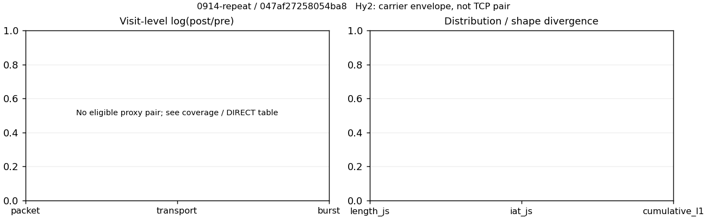

# 0914-repeat · 条目 009 · zhihu.com

目标：https://www.zhihu.com/question/23646318

活动标签：zhihu.com::page_load。选定访问 15 次。

[返回总索引](../../README.md) · [统计口径](../../methods.md)

## 覆盖与资格（每次访问均保留）

| 部署 | 重复 | 主请求路由 | 活动状态 | 代理比较 | DIRECT pre | 请求 proxy/direct/unresolved | 错误 |
| --- | --- | --- | --- | --- | --- | --- | --- |
| Hy2 | 1 | direct | passed | 0 | 1 | 0/206/1 | [] |
| Hy2 | 2 | direct | passed | 0 | 1 | 0/180/1 | [] |
| Hy2 | 3 | direct | passed | 0 | 1 | 0/180/1 | [] |
| Hy2 | 4 | direct | passed | 0 | 1 | 0/182/1 | [] |
| Hy2 | 5 | direct | passed | 0 | 1 | 0/175/0 | [] |
| SS | 1 | direct | passed | 0 | 1 | 0/220/0 | [] |
| SS | 2 | direct | passed | 0 | 1 | 0/175/1 | [] |
| SS | 3 | direct | passed | 0 | 1 | 0/177/0 | [] |
| SS | 4 | direct | passed | 0 | 1 | 0/197/0 | [] |
| SS | 5 | direct | passed | 0 | 1 | 0/180/1 | [] |
| VLESS | 1 | direct | passed | 0 | 1 | 0/220/0 | [] |
| VLESS | 2 | direct | passed | 0 | 1 | 0/178/1 | [] |
| VLESS | 3 | direct | passed | 0 | 1 | 0/181/1 | [] |
| VLESS | 4 | direct | passed | 0 | 1 | 0/176/1 | [] |
| VLESS | 5 | direct | passed | 0 | 1 | 0/175/1 | [] |

主请求非 proxy 的统计仅解释为已索引的辅助代理连接或 DIRECT 观测，不代表目标业务经代理传输。播放确认与配对资格是两道不同的门。

图中散点为单次访问，短线为重复中位数；Hy2 是共享载体包络，不能与 TCP 配对作等范围因果对比。

形态图先逐访问归一化，再对访问等权平均；实线 pre，虚线 post。分箱序号及边界见 methods，不将分箱索引误解为长度或时间。

## 每次访问的关键观测

### SS

范围：`direct_pre_only`。每格 pre → post；空值为不可观测/不适用。

| 重复 | 包数 | 载荷字节 | burst | TCP FR | IAT中位µs | length JS | IAT JS |
| --- | --- | --- | --- | --- | --- | --- | --- |
| 1 | 2077 → — | 5.1307e+06 → — | 1267 → — | 167 → — | 79.896 → — | — | — |
| 2 | 2483 → — | 5.3553e+06 → — | 1651 → — | 205 → — | 74.787 → — | — | — |
| 3 | 2312 → — | 5.2948e+06 → — | 1495 → — | 218 → — | 57.731 → — | — | — |
| 4 | 2651 → — | 5.4358e+06 → — | 1744 → — | 270 → — | 69.598 → — | — | — |
| 5 | 2488 → — | 5.4244e+06 → — | 1618 → — | 216 → — | 66.803 → — | — | — |

完整标量统计：中位数 [min,max]；Δ 为重复内逐访问变换的中位数，MAD 未缩放。n 为可用变换数；DIRECT-only 的 nΔ=0 不代表 pre 不可用。

| scope | 特征 | pre | post | Δ | IQRΔ | MADΔ | nΔ |
| --- | --- | --- | --- | --- | --- | --- | --- |
| direct_pre_only | active_span_sum_s_1000ms | 13.92 [10.116, 18.642] | — | — | — | — | 0 |
| direct_pre_only | active_span_sum_s_100ms | 4.5713 [3.8215, 6.9808] | — | — | — | — | 0 |
| direct_pre_only | active_span_sum_s_500ms | 9.1917 [8.9135, 13.049] | — | — | — | — | 0 |
| direct_pre_only | burst_bytes_iqr | 4064.8 [2856, 4320] | — | — | — | — | 0 |
| direct_pre_only | burst_bytes_mad | 80 [31, 80] | — | — | — | — | 0 |
| direct_pre_only | burst_bytes_max | 28672 [27944, 29400] | — | — | — | — | 0 |
| direct_pre_only | burst_bytes_mean | 3352.6 [3116.9, 4049.5] | — | — | — | — | 0 |
| direct_pre_only | burst_bytes_median | 80 [31, 80] | — | — | — | — | 0 |
| direct_pre_only | burst_bytes_min | 0 [0, 0] | — | — | — | — | 0 |
| direct_pre_only | burst_bytes_p95 | 20480 [20480, 20480] | — | — | — | — | 0 |
| direct_pre_only | burst_bytes_q25 | 0 [0, 0] | — | — | — | — | 0 |
| direct_pre_only | burst_bytes_q75 | 4064.8 [2856, 4320] | — | — | — | — | 0 |
| direct_pre_only | burst_bytes_std | 6120.3 [6002.4, 7112.5] | — | — | — | — | 0 |
| direct_pre_only | burst_count | 1618 [1267, 1744] | — | — | — | — | 0 |
| direct_pre_only | burst_duration_ms_iqr | 0.061254 [0.048613, 0.07617] | — | — | — | — | 0 |
| direct_pre_only | burst_duration_ms_mad | 0 [0, 0] | — | — | — | — | 0 |
| direct_pre_only | burst_duration_ms_max | 14833 [12305, 15001] | — | — | — | — | 0 |
| direct_pre_only | burst_duration_ms_mean | 112.36 [77.731, 161.73] | — | — | — | — | 0 |
| direct_pre_only | burst_duration_ms_median | 0 [0, 0] | — | — | — | — | 0 |
| direct_pre_only | burst_duration_ms_min | 0 [0, 0] | — | — | — | — | 0 |
| direct_pre_only | burst_duration_ms_p95 | 36.055 [27.876, 52.286] | — | — | — | — | 0 |
| direct_pre_only | burst_duration_ms_q25 | 0 [0, 0] | — | — | — | — | 0 |
| direct_pre_only | burst_duration_ms_q75 | 0.061254 [0.048613, 0.07617] | — | — | — | — | 0 |
| direct_pre_only | burst_duration_ms_std | 985.93 [577.13, 1298.4] | — | — | — | — | 0 |
| direct_pre_only | burst_packets_iqr | 1 [1, 1] | — | — | — | — | 0 |
| direct_pre_only | burst_packets_mad | 0 [0, 0] | — | — | — | — | 0 |
| direct_pre_only | burst_packets_max | 10 [7, 11] | — | — | — | — | 0 |
| direct_pre_only | burst_packets_mean | 1.5377 [1.5039, 1.6393] | — | — | — | — | 0 |
| direct_pre_only | burst_packets_median | 1 [1, 1] | — | — | — | — | 0 |
| direct_pre_only | burst_packets_min | 1 [1, 1] | — | — | — | — | 0 |
| direct_pre_only | burst_packets_p95 | 3 [3, 3] | — | — | — | — | 0 |
| direct_pre_only | burst_packets_q25 | 1 [1, 1] | — | — | — | — | 0 |
| direct_pre_only | burst_packets_q75 | 2 [2, 2] | — | — | — | — | 0 |
| direct_pre_only | burst_packets_std | 0.93688 [0.83122, 0.95396] | — | — | — | — | 0 |
| direct_pre_only | connection_span_concurrency_max | 22 [16, 23] | — | — | — | — | 0 |
| direct_pre_only | direction_entropy | 0.67506 [0.65665, 0.74791] | — | — | — | — | 0 |
| direct_pre_only | down_burst_count | 795 [622, 858] | — | — | — | — | 0 |
| direct_pre_only | down_ip_bytes | 5.3374e+06 [5.115e+06, 5.4051e+06] | — | — | — | — | 0 |
| direct_pre_only | down_packets | 1485 [1287, 1545] | — | — | — | — | 0 |
| direct_pre_only | down_transport_bytes | 5.2599e+06 [5.0479e+06, 5.3267e+06] | — | — | — | — | 0 |
| direct_pre_only | duration_s | 19.048 [17.954, 26.685] | — | — | — | — | 0 |
| direct_pre_only | entity_count | 27 [24, 28] | — | — | — | — | 0 |
| direct_pre_only | fr_runs | 216 [167, 270] | — | — | — | — | 0 |
| direct_pre_only | fr_runs_per_packet | 0.14764 [0.13544, 0.17893] | — | — | — | — | 0 |
| direct_pre_only | fr_switches | 188 [143, 242] | — | — | — | — | 0 |
| direct_pre_only | fr_switches_per_possible_transition | 0.13101 [0.11828, 0.1634] | — | — | — | — | 0 |
| direct_pre_only | full_retransmission_fraction | 0.0090532 [0.0075893, 0.013481] | — | — | — | — | 0 |
| direct_pre_only | full_retransmission_packets | 23 [17, 28] | — | — | — | — | 0 |
| direct_pre_only | iat_count | 2456 [2053, 2623] | — | — | — | — | 0 |
| direct_pre_only | iat_median_us | 69.598 [57.731, 79.896] | — | — | — | — | 0 |
| direct_pre_only | iat_us_iqr | 468.83 [340.87, 580.53] | — | — | — | — | 0 |
| direct_pre_only | iat_us_mad | 62.265 [51.244, 70.789] | — | — | — | — | 0 |
| direct_pre_only | iat_us_max | 1.4833e+07 [1.2305e+07, 1.5002e+07] | — | — | — | — | 0 |
| direct_pre_only | iat_us_mean | 1.1982e+05 [80370, 1.8085e+05] | — | — | — | — | 0 |
| direct_pre_only | iat_us_median | 69.598 [57.731, 79.896] | — | — | — | — | 0 |
| direct_pre_only | iat_us_min | 0.225 [0.089, 0.37] | — | — | — | — | 0 |
| direct_pre_only | iat_us_p95 | 29687 [21756, 41396] | — | — | — | — | 0 |
| direct_pre_only | iat_us_q25 | 13.265 [13.024, 16.265] | — | — | — | — | 0 |
| direct_pre_only | iat_us_q75 | 482.09 [353.89, 594.63] | — | — | — | — | 0 |
| direct_pre_only | iat_us_std | 1.1078e+06 [8.3019e+05, 1.5383e+06] | — | — | — | — | 0 |
| direct_pre_only | idle_gap_count_1000ms | 35 [24, 51] | — | — | — | — | 0 |
| direct_pre_only | idle_gap_count_100ms | 63 [52, 81] | — | — | — | — | 0 |
| direct_pre_only | idle_gap_count_500ms | 39 [32, 58] | — | — | — | — | 0 |
| direct_pre_only | idle_gap_sum_s_1000ms | 263.9 [183.27, 360.15] | — | — | — | — | 0 |
| direct_pre_only | idle_gap_sum_s_100ms | 269.45 [193.21, 367.47] | — | — | — | — | 0 |
| direct_pre_only | idle_gap_sum_s_500ms | 265.11 [188.52, 362.21] | — | — | — | — | 0 |
| direct_pre_only | ip_bytes | 5.485e+06 [5.2394e+06, 5.5744e+06] | — | — | — | — | 0 |
| direct_pre_only | length_iqr | 6874 [6446.5, 7431] | — | — | — | — | 0 |
| direct_pre_only | length_mad | 2583 [2493, 2763] | — | — | — | — | 0 |
| direct_pre_only | length_max | 8920 [8920, 8920] | — | — | — | — | 0 |
| direct_pre_only | length_mean | 3739.7 [3602.3, 4161.2] | — | — | — | — | 0 |
| direct_pre_only | length_median | 2856 [2640, 2880] | — | — | — | — | 0 |
| direct_pre_only | length_min | 23 [16, 31] | — | — | — | — | 0 |
| direct_pre_only | length_p95 | 8920 [8920, 8920] | — | — | — | — | 0 |
| direct_pre_only | length_q25 | 590 [295, 761] | — | — | — | — | 0 |
| direct_pre_only | length_q75 | 7464 [7008, 8192] | — | — | — | — | 0 |
| direct_pre_only | length_std | 3314 [3294.3, 3415.6] | — | — | — | — | 0 |
| direct_pre_only | nonempty_entity_count | 27 [24, 28] | — | — | — | — | 0 |
| direct_pre_only | nonempty_packets | 1432 [1233, 1509] | — | — | — | — | 0 |
| direct_pre_only | offload_suspect_fraction | 0.38384 [0.35232, 0.41261] | — | — | — | — | 0 |
| direct_pre_only | packet_count | 2483 [2077, 2651] | — | — | — | — | 0 |
| direct_pre_only | rtt_median_ms | 0.084351 [0.072039, 0.11888] | — | — | — | — | 0 |
| direct_pre_only | rtt_sample_count | 954 [734, 1047] | — | — | — | — | 0 |
| direct_pre_only | tcp_ack_count | 2452 [2051, 2619] | — | — | — | — | 0 |
| direct_pre_only | tcp_fin_count | 53 [46, 56] | — | — | — | — | 0 |
| direct_pre_only | tcp_packet_count | 2483 [2077, 2651] | — | — | — | — | 0 |
| direct_pre_only | tcp_rst_count | 4 [3, 5] | — | — | — | — | 0 |
| direct_pre_only | tcp_syn_count | 54 [48, 56] | — | — | — | — | 0 |
| direct_pre_only | tcp_window_raw_median | 65535 [65535, 65535] | — | — | — | — | 0 |
| direct_pre_only | transition_entropy | 0.47251 [0.44151, 0.56195] | — | — | — | — | 0 |
| direct_pre_only | transition_n_mm | 1053 [934, 1096] | — | — | — | — | 0 |
| direct_pre_only | transition_n_mp | 81 [60, 108] | — | — | — | — | 0 |
| direct_pre_only | transition_n_pm | 107 [83, 134] | — | — | — | — | 0 |
| direct_pre_only | transition_n_pp | 151 [126, 186] | — | — | — | — | 0 |
| direct_pre_only | transition_p_mm | 0.93118 [0.90698, 0.93964] | — | — | — | — | 0 |
| direct_pre_only | transition_p_mp | 0.068819 [0.060362, 0.093023] | — | — | — | — | 0 |
| direct_pre_only | transition_p_pm | 0.41473 [0.38605, 0.46154] | — | — | — | — | 0 |
| direct_pre_only | transition_p_pp | 0.58527 [0.53846, 0.61395] | — | — | — | — | 0 |
| direct_pre_only | transport_bytes | 5.3553e+06 [5.1307e+06, 5.4358e+06] | — | — | — | — | 0 |
| direct_pre_only | up_burst_count | 823 [645, 886] | — | — | — | — | 0 |
| direct_pre_only | up_byte_fraction | 0.017801 [0.016146, 0.022235] | — | — | — | — | 0 |
| direct_pre_only | up_ip_bytes | 1.4766e+05 [1.2442e+05, 1.7884e+05] | — | — | — | — | 0 |
| direct_pre_only | up_packets | 985 [790, 1106] | — | — | — | — | 0 |
| direct_pre_only | up_transport_bytes | 95328 [82839, 1.2087e+05] | — | — | — | — | 0 |
| direct_pre_only | zero_iat_count | 0 [0, 0] | — | — | — | — | 0 |
| direct_pre_only | zero_iat_fraction | 0 [0, 0] | — | — | — | — | 0 |

### VLESS

范围：`direct_pre_only`。每格 pre → post；空值为不可观测/不适用。

| 重复 | 包数 | 载荷字节 | burst | TCP FR | IAT中位µs | length JS | IAT JS |
| --- | --- | --- | --- | --- | --- | --- | --- |
| 1 | 2675 → — | 5.4124e+06 → — | 1795 → — | 318 → — | 78.74 → — | — | — |
| 2 | 2325 → — | 5.3376e+06 → — | 1500 → — | 201 → — | 62.451 → — | — | — |
| 3 | 2188 → — | 5.3343e+06 → — | 1442 → — | 184 → — | 47.06 → — | — | — |
| 4 | 2336 → — | 5.2855e+06 → — | 1534 → — | 198 → — | 56.112 → — | — | — |
| 5 | 2106 → — | 5.2721e+06 → — | 1319 → — | 178 → — | 60.923 → — | — | — |

完整标量统计：中位数 [min,max]；Δ 为重复内逐访问变换的中位数，MAD 未缩放。n 为可用变换数；DIRECT-only 的 nΔ=0 不代表 pre 不可用。

| scope | 特征 | pre | post | Δ | IQRΔ | MADΔ | nΔ |
| --- | --- | --- | --- | --- | --- | --- | --- |
| direct_pre_only | active_span_sum_s_1000ms | 11.373 [9.0478, 32.365] | — | — | — | — | 0 |
| direct_pre_only | active_span_sum_s_100ms | 4.1782 [3.3088, 10.097] | — | — | — | — | 0 |
| direct_pre_only | active_span_sum_s_500ms | 7.7567 [7.2902, 21.619] | — | — | — | — | 0 |
| direct_pre_only | burst_bytes_iqr | 3512.5 [2856, 4524] | — | — | — | — | 0 |
| direct_pre_only | burst_bytes_mad | 64 [31, 88] | — | — | — | — | 0 |
| direct_pre_only | burst_bytes_max | 28672 [28596, 29400] | — | — | — | — | 0 |
| direct_pre_only | burst_bytes_mean | 3558.4 [3015.2, 3997] | — | — | — | — | 0 |
| direct_pre_only | burst_bytes_median | 64 [31, 88] | — | — | — | — | 0 |
| direct_pre_only | burst_bytes_min | 0 [0, 0] | — | — | — | — | 0 |
| direct_pre_only | burst_bytes_p95 | 20480 [20480, 20480] | — | — | — | — | 0 |
| direct_pre_only | burst_bytes_q25 | 0 [0, 0] | — | — | — | — | 0 |
| direct_pre_only | burst_bytes_q75 | 3512.5 [2856, 4524] | — | — | — | — | 0 |
| direct_pre_only | burst_bytes_std | 6360.5 [5712.6, 6955.1] | — | — | — | — | 0 |
| direct_pre_only | burst_count | 1500 [1319, 1795] | — | — | — | — | 0 |
| direct_pre_only | burst_duration_ms_iqr | 0.06004 [0.040619, 0.070189] | — | — | — | — | 0 |
| direct_pre_only | burst_duration_ms_mad | 0 [0, 0] | — | — | — | — | 0 |
| direct_pre_only | burst_duration_ms_max | 14217 [1931.4, 14296] | — | — | — | — | 0 |
| direct_pre_only | burst_duration_ms_mean | 147.19 [30.093, 163.28] | — | — | — | — | 0 |
| direct_pre_only | burst_duration_ms_median | 0 [0, 0] | — | — | — | — | 0 |
| direct_pre_only | burst_duration_ms_min | 0 [0, 0] | — | — | — | — | 0 |
| direct_pre_only | burst_duration_ms_p95 | 38.033 [28.574, 69.035] | — | — | — | — | 0 |
| direct_pre_only | burst_duration_ms_q25 | 0 [0, 0] | — | — | — | — | 0 |
| direct_pre_only | burst_duration_ms_q75 | 0.06004 [0.040619, 0.070189] | — | — | — | — | 0 |
| direct_pre_only | burst_duration_ms_std | 1201.9 [165.26, 1265] | — | — | — | — | 0 |
| direct_pre_only | burst_packets_iqr | 1 [1, 1] | — | — | — | — | 0 |
| direct_pre_only | burst_packets_mad | 0 [0, 0] | — | — | — | — | 0 |
| direct_pre_only | burst_packets_max | 8 [7, 8] | — | — | — | — | 0 |
| direct_pre_only | burst_packets_mean | 1.5228 [1.4903, 1.5967] | — | — | — | — | 0 |
| direct_pre_only | burst_packets_median | 1 [1, 1] | — | — | — | — | 0 |
| direct_pre_only | burst_packets_min | 1 [1, 1] | — | — | — | — | 0 |
| direct_pre_only | burst_packets_p95 | 3 [3, 3] | — | — | — | — | 0 |
| direct_pre_only | burst_packets_q25 | 1 [1, 1] | — | — | — | — | 0 |
| direct_pre_only | burst_packets_q75 | 2 [2, 2] | — | — | — | — | 0 |
| direct_pre_only | burst_packets_std | 0.86381 [0.8103, 0.92617] | — | — | — | — | 0 |
| direct_pre_only | connection_span_concurrency_max | 21 [18, 22] | — | — | — | — | 0 |
| direct_pre_only | direction_entropy | 0.68798 [0.66326, 0.79369] | — | — | — | — | 0 |
| direct_pre_only | down_burst_count | 735 [647, 883] | — | — | — | — | 0 |
| direct_pre_only | down_ip_bytes | 5.3094e+06 [5.2552e+06, 5.3599e+06] | — | — | — | — | 0 |
| direct_pre_only | down_packets | 1392 [1287, 1520] | — | — | — | — | 0 |
| direct_pre_only | down_transport_bytes | 5.2368e+06 [5.1841e+06, 5.2806e+06] | — | — | — | — | 0 |
| direct_pre_only | duration_s | 18.57 [18.276, 21.253] | — | — | — | — | 0 |
| direct_pre_only | entity_count | 29 [24, 30] | — | — | — | — | 0 |
| direct_pre_only | fr_runs | 198 [178, 318] | — | — | — | — | 0 |
| direct_pre_only | fr_runs_per_packet | 0.14721 [0.14274, 0.21486] | — | — | — | — | 0 |
| direct_pre_only | fr_switches | 168 [153, 289] | — | — | — | — | 0 |
| direct_pre_only | fr_switches_per_possible_transition | 0.12841 [0.1252, 0.19917] | — | — | — | — | 0 |
| direct_pre_only | full_retransmission_fraction | 0.0089897 [0.0073126, 0.012043] | — | — | — | — | 0 |
| direct_pre_only | full_retransmission_packets | 24 [16, 28] | — | — | — | — | 0 |
| direct_pre_only | iat_count | 2295 [2081, 2646] | — | — | — | — | 0 |
| direct_pre_only | iat_median_us | 60.923 [47.06, 78.74] | — | — | — | — | 0 |
| direct_pre_only | iat_us_iqr | 326.83 [203.15, 668.97] | — | — | — | — | 0 |
| direct_pre_only | iat_us_mad | 52.896 [40.542, 71.96] | — | — | — | — | 0 |
| direct_pre_only | iat_us_max | 1.4228e+07 [1.2291e+07, 1.5001e+07] | — | — | — | — | 0 |
| direct_pre_only | iat_us_mean | 1.1279e+05 [63377, 1.1639e+05] | — | — | — | — | 0 |
| direct_pre_only | iat_us_median | 60.923 [47.06, 78.74] | — | — | — | — | 0 |
| direct_pre_only | iat_us_min | 0.408 [0.237, 0.602] | — | — | — | — | 0 |
| direct_pre_only | iat_us_p95 | 26657 [14845, 56970] | — | — | — | — | 0 |
| direct_pre_only | iat_us_q25 | 13.653 [11.225, 14.182] | — | — | — | — | 0 |
| direct_pre_only | iat_us_q75 | 339.72 [214.37, 682.91] | — | — | — | — | 0 |
| direct_pre_only | iat_us_std | 1.0476e+06 [7.8362e+05, 1.0793e+06] | — | — | — | — | 0 |
| direct_pre_only | idle_gap_count_1000ms | 29 [26, 31] | — | — | — | — | 0 |
| direct_pre_only | idle_gap_count_100ms | 54 [45, 86] | — | — | — | — | 0 |
| direct_pre_only | idle_gap_count_500ms | 33 [29, 42] | — | — | — | — | 0 |
| direct_pre_only | idle_gap_sum_s_1000ms | 238.92 [135.33, 254.42] | — | — | — | — | 0 |
| direct_pre_only | idle_gap_sum_s_100ms | 246.66 [157.6, 262.37] | — | — | — | — | 0 |
| direct_pre_only | idle_gap_sum_s_500ms | 242.54 [146.08, 257.01] | — | — | — | — | 0 |
| direct_pre_only | ip_bytes | 5.4486e+06 [5.3822e+06, 5.5522e+06] | — | — | — | — | 0 |
| direct_pre_only | length_iqr | 7481.8 [6900, 7751] | — | — | — | — | 0 |
| direct_pre_only | length_mad | 2729.5 [2506.5, 2788] | — | — | — | — | 0 |
| direct_pre_only | length_max | 8920 [8920, 8920] | — | — | — | — | 0 |
| direct_pre_only | length_mean | 3971.4 [3657, 4227.8] | — | — | — | — | 0 |
| direct_pre_only | length_median | 2880 [2640, 2909] | — | — | — | — | 0 |
| direct_pre_only | length_min | 31 [14, 31] | — | — | — | — | 0 |
| direct_pre_only | length_p95 | 8920 [8920, 8920] | — | — | — | — | 0 |
| direct_pre_only | length_q25 | 728 [257.5, 929.5] | — | — | — | — | 0 |
| direct_pre_only | length_q75 | 8192 [7575.2, 8568] | — | — | — | — | 0 |
| direct_pre_only | length_std | 3431.3 [3339.8, 3480.7] | — | — | — | — | 0 |
| direct_pre_only | nonempty_entity_count | 29 [24, 30] | — | — | — | — | 0 |
| direct_pre_only | nonempty_packets | 1344 [1247, 1480] | — | — | — | — | 0 |
| direct_pre_only | offload_suspect_fraction | 0.39742 [0.33421, 0.41595] | — | — | — | — | 0 |
| direct_pre_only | packet_count | 2325 [2106, 2675] | — | — | — | — | 0 |
| direct_pre_only | rtt_median_ms | 0.076482 [0.058933, 0.084416] | — | — | — | — | 0 |
| direct_pre_only | rtt_sample_count | 898 [787, 1104] | — | — | — | — | 0 |
| direct_pre_only | tcp_ack_count | 2292 [2078, 2642] | — | — | — | — | 0 |
| direct_pre_only | tcp_fin_count | 58 [47, 59] | — | — | — | — | 0 |
| direct_pre_only | tcp_packet_count | 2325 [2106, 2675] | — | — | — | — | 0 |
| direct_pre_only | tcp_rst_count | 4 [3, 5] | — | — | — | — | 0 |
| direct_pre_only | tcp_syn_count | 58 [48, 60] | — | — | — | — | 0 |
| direct_pre_only | tcp_window_raw_median | 65535 [65504, 65535] | — | — | — | — | 0 |
| direct_pre_only | transition_entropy | 0.46455 [0.4557, 0.63995] | — | — | — | — | 0 |
| direct_pre_only | transition_n_mm | 968 [943, 1000] | — | — | — | — | 0 |
| direct_pre_only | transition_n_mp | 70 [65, 131] | — | — | — | — | 0 |
| direct_pre_only | transition_n_pm | 98 [88, 158] | — | — | — | — | 0 |
| direct_pre_only | transition_n_pp | 147 [126, 194] | — | — | — | — | 0 |
| direct_pre_only | transition_p_mm | 0.9334 [0.8808, 0.93552] | — | — | — | — | 0 |
| direct_pre_only | transition_p_mp | 0.066604 [0.064484, 0.1192] | — | — | — | — | 0 |
| direct_pre_only | transition_p_pm | 0.41121 [0.4, 0.44886] | — | — | — | — | 0 |
| direct_pre_only | transition_p_pp | 0.58879 [0.55114, 0.6] | — | — | — | — | 0 |
| direct_pre_only | transport_bytes | 5.3343e+06 [5.2721e+06, 5.4124e+06] | — | — | — | — | 0 |
| direct_pre_only | up_burst_count | 765 [672, 912] | — | — | — | — | 0 |
| direct_pre_only | up_byte_fraction | 0.01889 [0.01562, 0.02435] | — | — | — | — | 0 |
| direct_pre_only | up_ip_bytes | 1.4983e+05 [1.2702e+05, 1.9232e+05] | — | — | — | — | 0 |
| direct_pre_only | up_packets | 932 [819, 1155] | — | — | — | — | 0 |
| direct_pre_only | up_transport_bytes | 1.0083e+05 [83323, 1.3179e+05] | — | — | — | — | 0 |
| direct_pre_only | zero_iat_count | 0 [0, 0] | — | — | — | — | 0 |
| direct_pre_only | zero_iat_fraction | 0 [0, 0] | — | — | — | — | 0 |

### Hy2

范围：`direct_pre_only`。每格 pre → post；空值为不可观测/不适用。

| 重复 | 包数 | 载荷字节 | burst | TCP FR | IAT中位µs | length JS | IAT JS |
| --- | --- | --- | --- | --- | --- | --- | --- |
| 1 | 2754 → — | 5.3412e+06 → — | 1885 → — | 276 → — | 61.867 → — | — | — |
| 2 | 2396 → — | 5.3031e+06 → — | 1630 → — | 231 → — | 55.588 → — | — | — |
| 3 | 2457 → — | 5.3836e+06 → — | 1666 → — | 210 → — | 55.453 → — | — | — |
| 4 | 2427 → — | 5.4135e+06 → — | 1577 → — | 209 → — | 62.656 → — | — | — |
| 5 | 2395 → — | 5.2609e+06 → — | 1684 → — | 172 → — | 43.407 → — | — | — |

完整标量统计：中位数 [min,max]；Δ 为重复内逐访问变换的中位数，MAD 未缩放。n 为可用变换数；DIRECT-only 的 nΔ=0 不代表 pre 不可用。

| scope | 特征 | pre | post | Δ | IQRΔ | MADΔ | nΔ |
| --- | --- | --- | --- | --- | --- | --- | --- |
| direct_pre_only | active_span_sum_s_1000ms | 15.037 [10.167, 23.1] | — | — | — | — | 0 |
| direct_pre_only | active_span_sum_s_100ms | 4.4502 [3.8061, 8.0299] | — | — | — | — | 0 |
| direct_pre_only | active_span_sum_s_500ms | 9.7772 [7.9116, 14.63] | — | — | — | — | 0 |
| direct_pre_only | burst_bytes_iqr | 3863 [2880, 4096] | — | — | — | — | 0 |
| direct_pre_only | burst_bytes_mad | 80 [31, 81] | — | — | — | — | 0 |
| direct_pre_only | burst_bytes_max | 28672 [28194, 28672] | — | — | — | — | 0 |
| direct_pre_only | burst_bytes_mean | 3231.5 [2833.5, 3432.8] | — | — | — | — | 0 |
| direct_pre_only | burst_bytes_median | 80 [31, 81] | — | — | — | — | 0 |
| direct_pre_only | burst_bytes_min | 0 [0, 0] | — | — | — | — | 0 |
| direct_pre_only | burst_bytes_p95 | 20480 [17286, 20480] | — | — | — | — | 0 |
| direct_pre_only | burst_bytes_q25 | 0 [0, 0] | — | — | — | — | 0 |
| direct_pre_only | burst_bytes_q75 | 3863 [2880, 4096] | — | — | — | — | 0 |
| direct_pre_only | burst_bytes_std | 5755.3 [5302.6, 6162.2] | — | — | — | — | 0 |
| direct_pre_only | burst_count | 1666 [1577, 1885] | — | — | — | — | 0 |
| direct_pre_only | burst_duration_ms_iqr | 0.037313 [0.019783, 0.054675] | — | — | — | — | 0 |
| direct_pre_only | burst_duration_ms_mad | 0 [0, 0] | — | — | — | — | 0 |
| direct_pre_only | burst_duration_ms_max | 14292 [13702, 15001] | — | — | — | — | 0 |
| direct_pre_only | burst_duration_ms_mean | 137.4 [94.147, 143.98] | — | — | — | — | 0 |
| direct_pre_only | burst_duration_ms_median | 0 [0, 0] | — | — | — | — | 0 |
| direct_pre_only | burst_duration_ms_min | 0 [0, 0] | — | — | — | — | 0 |
| direct_pre_only | burst_duration_ms_p95 | 26.869 [25.796, 49.684] | — | — | — | — | 0 |
| direct_pre_only | burst_duration_ms_q25 | 0 [0, 0] | — | — | — | — | 0 |
| direct_pre_only | burst_duration_ms_q75 | 0.037313 [0.019783, 0.054675] | — | — | — | — | 0 |
| direct_pre_only | burst_duration_ms_std | 1154.1 [829.66, 1172.2] | — | — | — | — | 0 |
| direct_pre_only | burst_packets_iqr | 1 [1, 1] | — | — | — | — | 0 |
| direct_pre_only | burst_packets_mad | 0 [0, 0] | — | — | — | — | 0 |
| direct_pre_only | burst_packets_max | 9 [7, 10] | — | — | — | — | 0 |
| direct_pre_only | burst_packets_mean | 1.4699 [1.4222, 1.539] | — | — | — | — | 0 |
| direct_pre_only | burst_packets_median | 1 [1, 1] | — | — | — | — | 0 |
| direct_pre_only | burst_packets_min | 1 [1, 1] | — | — | — | — | 0 |
| direct_pre_only | burst_packets_p95 | 3 [3, 3] | — | — | — | — | 0 |
| direct_pre_only | burst_packets_q25 | 1 [1, 1] | — | — | — | — | 0 |
| direct_pre_only | burst_packets_q75 | 2 [2, 2] | — | — | — | — | 0 |
| direct_pre_only | burst_packets_std | 0.86665 [0.819, 0.89306] | — | — | — | — | 0 |
| direct_pre_only | connection_span_concurrency_max | 21 [20, 23] | — | — | — | — | 0 |
| direct_pre_only | direction_entropy | 0.67082 [0.61485, 0.72754] | — | — | — | — | 0 |
| direct_pre_only | down_burst_count | 820 [775, 929] | — | — | — | — | 0 |
| direct_pre_only | down_ip_bytes | 5.3124e+06 [5.2596e+06, 5.3992e+06] | — | — | — | — | 0 |
| direct_pre_only | down_packets | 1461 [1396, 1588] | — | — | — | — | 0 |
| direct_pre_only | down_transport_bytes | 5.2296e+06 [5.1868e+06, 5.3229e+06] | — | — | — | — | 0 |
| direct_pre_only | duration_s | 18.032 [15.687, 27.06] | — | — | — | — | 0 |
| direct_pre_only | entity_count | 26 [24, 27] | — | — | — | — | 0 |
| direct_pre_only | fr_runs | 210 [172, 276] | — | — | — | — | 0 |
| direct_pre_only | fr_runs_per_packet | 0.14841 [0.12817, 0.17715] | — | — | — | — | 0 |
| direct_pre_only | fr_switches | 184 [148, 249] | — | — | — | — | 0 |
| direct_pre_only | fr_switches_per_possible_transition | 0.13247 [0.11229, 0.16264] | — | — | — | — | 0 |
| direct_pre_only | full_retransmission_fraction | 0.0057684 [0.005428, 0.010818] | — | — | — | — | 0 |
| direct_pre_only | full_retransmission_packets | 15 [13, 25] | — | — | — | — | 0 |
| direct_pre_only | iat_count | 2400 [2371, 2727] | — | — | — | — | 0 |
| direct_pre_only | iat_median_us | 55.588 [43.407, 62.656] | — | — | — | — | 0 |
| direct_pre_only | iat_us_iqr | 306.96 [186.32, 390.4] | — | — | — | — | 0 |
| direct_pre_only | iat_us_mad | 49.385 [37.712, 55.367] | — | — | — | — | 0 |
| direct_pre_only | iat_us_max | 1.4292e+07 [1.3702e+07, 1.5001e+07] | — | — | — | — | 0 |
| direct_pre_only | iat_us_mean | 1.0896e+05 [1.0542e+05, 1.7906e+05] | — | — | — | — | 0 |
| direct_pre_only | iat_us_median | 55.588 [43.407, 62.656] | — | — | — | — | 0 |
| direct_pre_only | iat_us_min | 0.084 [0.036, 0.562] | — | — | — | — | 0 |
| direct_pre_only | iat_us_p95 | 24486 [23338, 41744] | — | — | — | — | 0 |
| direct_pre_only | iat_us_q25 | 12.442 [10.582, 13.258] | — | — | — | — | 0 |
| direct_pre_only | iat_us_q75 | 319.42 [196.9, 402.84] | — | — | — | — | 0 |
| direct_pre_only | iat_us_std | 1.0193e+06 [1.0132e+06, 1.4556e+06] | — | — | — | — | 0 |
| direct_pre_only | idle_gap_count_1000ms | 31 [30, 47] | — | — | — | — | 0 |
| direct_pre_only | idle_gap_count_100ms | 59 [53, 76] | — | — | — | — | 0 |
| direct_pre_only | idle_gap_count_500ms | 38 [36, 50] | — | — | — | — | 0 |
| direct_pre_only | idle_gap_sum_s_1000ms | 258.25 [243.22, 414.37] | — | — | — | — | 0 |
| direct_pre_only | idle_gap_sum_s_100ms | 268.1 [254.29, 420.74] | — | — | — | — | 0 |
| direct_pre_only | idle_gap_sum_s_500ms | 263.4 [248.69, 416.63] | — | — | — | — | 0 |
| direct_pre_only | ip_bytes | 5.485e+06 [5.3859e+06, 5.5403e+06] | — | — | — | — | 0 |
| direct_pre_only | length_iqr | 6667 [5403.2, 7133] | — | — | — | — | 0 |
| direct_pre_only | length_mad | 2590.5 [2496, 2602] | — | — | — | — | 0 |
| direct_pre_only | length_max | 8920 [8920, 8920] | — | — | — | — | 0 |
| direct_pre_only | length_mean | 3804.7 [3428.3, 3920.2] | — | — | — | — | 0 |
| direct_pre_only | length_median | 2856 [2698.5, 2856] | — | — | — | — | 0 |
| direct_pre_only | length_min | 31 [2, 31] | — | — | — | — | 0 |
| direct_pre_only | length_p95 | 8920 [8920, 8920] | — | — | — | — | 0 |
| direct_pre_only | length_q25 | 554.5 [308.75, 1084.2] | — | — | — | — | 0 |
| direct_pre_only | length_q75 | 7243 [5712, 7763] | — | — | — | — | 0 |
| direct_pre_only | length_std | 3307.2 [3211.4, 3362.4] | — | — | — | — | 0 |
| direct_pre_only | nonempty_entity_count | 26 [24, 27] | — | — | — | — | 0 |
| direct_pre_only | nonempty_packets | 1415 [1342, 1558] | — | — | — | — | 0 |
| direct_pre_only | offload_suspect_fraction | 0.38665 [0.34532, 0.39833] | — | — | — | — | 0 |
| direct_pre_only | packet_count | 2427 [2395, 2754] | — | — | — | — | 0 |
| direct_pre_only | rtt_median_ms | 0.064833 [0.038279, 0.077859] | — | — | — | — | 0 |
| direct_pre_only | rtt_sample_count | 945 [912, 1124] | — | — | — | — | 0 |
| direct_pre_only | tcp_ack_count | 2395 [2286, 2724] | — | — | — | — | 0 |
| direct_pre_only | tcp_fin_count | 50 [45, 52] | — | — | — | — | 0 |
| direct_pre_only | tcp_packet_count | 2427 [2311, 2754] | — | — | — | — | 0 |
| direct_pre_only | tcp_rst_count | 6 [3, 6] | — | — | — | — | 0 |
| direct_pre_only | tcp_syn_count | 52 [46, 54] | — | — | — | — | 0 |
| direct_pre_only | tcp_window_raw_median | 65535 [65535, 65535] | — | — | — | — | 0 |
| direct_pre_only | transition_entropy | 0.47464 [0.41567, 0.555] | — | — | — | — | 0 |
| direct_pre_only | transition_n_mm | 1060 [1053, 1105] | — | — | — | — | 0 |
| direct_pre_only | transition_n_mp | 80 [63, 112] | — | — | — | — | 0 |
| direct_pre_only | transition_n_pm | 104 [85, 137] | — | — | — | — | 0 |
| direct_pre_only | transition_n_pp | 141 [117, 177] | — | — | — | — | 0 |
| direct_pre_only | transition_p_mm | 0.93007 [0.90797, 0.94355] | — | — | — | — | 0 |
| direct_pre_only | transition_p_mp | 0.06993 [0.056452, 0.09203] | — | — | — | — | 0 |
| direct_pre_only | transition_p_pm | 0.42449 [0.41365, 0.46154] | — | — | — | — | 0 |
| direct_pre_only | transition_p_pp | 0.57551 [0.53846, 0.58635] | — | — | — | — | 0 |
| direct_pre_only | transport_bytes | 5.3412e+06 [5.2609e+06, 5.4135e+06] | — | — | — | — | 0 |
| direct_pre_only | up_burst_count | 846 [802, 956] | — | — | — | — | 0 |
| direct_pre_only | up_byte_fraction | 0.016743 [0.014089, 0.020889] | — | — | — | — | 0 |
| direct_pre_only | up_ip_bytes | 1.4104e+05 [1.2636e+05, 1.7256e+05] | — | — | — | — | 0 |
| direct_pre_only | up_packets | 996 [963, 1166] | — | — | — | — | 0 |
| direct_pre_only | up_transport_bytes | 90639 [74120, 1.1157e+05] | — | — | — | — | 0 |
| direct_pre_only | zero_iat_count | 0 [0, 0] | — | — | — | — | 0 |
| direct_pre_only | zero_iat_fraction | 0 [0, 0] | — | — | — | — | 0 |

## 不同部署对比

以下是各部署自身重复中位数的差异，不按重复编号强行配对。跨 TCP/Hy2 的行标记异质观测范围。

| 视角 | 特征 | 部署A | 部署B | A中位 | B中位 | B−A | 比较口径 |
| --- | --- | --- | --- | --- | --- | --- | --- |
| pre | burst_count | VLESS | Hy2 | 1500 | 1666 | 166 | same_scope_unpaired_visits |
| pre | burst_count | VLESS | SS | 1500 | 1618 | 118 | same_scope_unpaired_visits |
| pre | burst_count | Hy2 | SS | 1666 | 1618 | -48 | same_scope_unpaired_visits |
| pre | connection_span_concurrency_max | VLESS | Hy2 | 21 | 21 | 0 | same_scope_unpaired_visits |
| pre | connection_span_concurrency_max | VLESS | SS | 21 | 22 | 1 | same_scope_unpaired_visits |
| pre | connection_span_concurrency_max | Hy2 | SS | 21 | 22 | 1 | same_scope_unpaired_visits |
| pre | direction_entropy | VLESS | Hy2 | 0.68798 | 0.67082 | -0.017161 | same_scope_unpaired_visits |
| pre | direction_entropy | VLESS | SS | 0.68798 | 0.67506 | -0.012925 | same_scope_unpaired_visits |
| pre | direction_entropy | Hy2 | SS | 0.67082 | 0.67506 | 0.0042355 | same_scope_unpaired_visits |
| pre | down_transport_bytes | VLESS | Hy2 | 5.2368e+06 | 5.2296e+06 | -7103 | same_scope_unpaired_visits |
| pre | down_transport_bytes | VLESS | SS | 5.2368e+06 | 5.2599e+06 | 23174 | same_scope_unpaired_visits |
| pre | down_transport_bytes | Hy2 | SS | 5.2296e+06 | 5.2599e+06 | 30277 | same_scope_unpaired_visits |
| pre | duration_s | VLESS | Hy2 | 18.57 | 18.032 | -0.53801 | same_scope_unpaired_visits |
| pre | duration_s | VLESS | SS | 18.57 | 19.048 | 0.47878 | same_scope_unpaired_visits |
| pre | duration_s | Hy2 | SS | 18.032 | 19.048 | 1.0168 | same_scope_unpaired_visits |
| pre | entity_count | VLESS | Hy2 | 29 | 26 | -3 | same_scope_unpaired_visits |
| pre | entity_count | VLESS | SS | 29 | 27 | -2 | same_scope_unpaired_visits |
| pre | entity_count | Hy2 | SS | 26 | 27 | 1 | same_scope_unpaired_visits |
| pre | fr_runs | VLESS | Hy2 | 198 | 210 | 12 | same_scope_unpaired_visits |
| pre | fr_runs | VLESS | SS | 198 | 216 | 18 | same_scope_unpaired_visits |
| pre | fr_runs | Hy2 | SS | 210 | 216 | 6 | same_scope_unpaired_visits |
| pre | fr_runs_per_packet | VLESS | Hy2 | 0.14721 | 0.14841 | 0.001198 | same_scope_unpaired_visits |
| pre | fr_runs_per_packet | VLESS | SS | 0.14721 | 0.14764 | 0.00042994 | same_scope_unpaired_visits |
| pre | fr_runs_per_packet | Hy2 | SS | 0.14841 | 0.14764 | -0.00076806 | same_scope_unpaired_visits |
| pre | fr_switches | VLESS | Hy2 | 168 | 184 | 16 | same_scope_unpaired_visits |
| pre | fr_switches | VLESS | SS | 168 | 188 | 20 | same_scope_unpaired_visits |
| pre | fr_switches | Hy2 | SS | 184 | 188 | 4 | same_scope_unpaired_visits |
| pre | fr_switches_per_possible_transition | VLESS | Hy2 | 0.12841 | 0.13247 | 0.0040585 | same_scope_unpaired_visits |
| pre | fr_switches_per_possible_transition | VLESS | SS | 0.12841 | 0.13101 | 0.0025995 | same_scope_unpaired_visits |
| pre | fr_switches_per_possible_transition | Hy2 | SS | 0.13247 | 0.13101 | -0.0014589 | same_scope_unpaired_visits |
| pre | full_retransmission_fraction | VLESS | Hy2 | 0.0089897 | 0.0057684 | -0.0032213 | same_scope_unpaired_visits |
| pre | full_retransmission_fraction | VLESS | SS | 0.0089897 | 0.0090532 | 6.3461e-05 | same_scope_unpaired_visits |
| pre | full_retransmission_fraction | Hy2 | SS | 0.0057684 | 0.0090532 | 0.0032847 | same_scope_unpaired_visits |
| pre | iat_median_us | VLESS | Hy2 | 60.923 | 55.588 | -5.3355 | same_scope_unpaired_visits |
| pre | iat_median_us | VLESS | SS | 60.923 | 69.598 | 8.675 | same_scope_unpaired_visits |
| pre | iat_median_us | Hy2 | SS | 55.588 | 69.598 | 14.01 | same_scope_unpaired_visits |
| pre | iat_us_p95 | VLESS | Hy2 | 26657 | 24486 | -2170.4 | same_scope_unpaired_visits |
| pre | iat_us_p95 | VLESS | SS | 26657 | 29687 | 3030 | same_scope_unpaired_visits |
| pre | iat_us_p95 | Hy2 | SS | 24486 | 29687 | 5200.4 | same_scope_unpaired_visits |
| pre | ip_bytes | VLESS | Hy2 | 5.4486e+06 | 5.485e+06 | 36438 | same_scope_unpaired_visits |
| pre | ip_bytes | VLESS | SS | 5.4486e+06 | 5.485e+06 | 36450 | same_scope_unpaired_visits |
| pre | ip_bytes | Hy2 | SS | 5.485e+06 | 5.485e+06 | 12 | same_scope_unpaired_visits |
| pre | length_median | VLESS | Hy2 | 2880 | 2856 | -24 | same_scope_unpaired_visits |
| pre | length_median | VLESS | SS | 2880 | 2856 | -24 | same_scope_unpaired_visits |
| pre | length_median | Hy2 | SS | 2856 | 2856 | 0 | same_scope_unpaired_visits |
| pre | length_p95 | VLESS | Hy2 | 8920 | 8920 | 0 | same_scope_unpaired_visits |
| pre | length_p95 | VLESS | SS | 8920 | 8920 | 0 | same_scope_unpaired_visits |
| pre | length_p95 | Hy2 | SS | 8920 | 8920 | 0 | same_scope_unpaired_visits |
| pre | nonempty_packets | VLESS | Hy2 | 1344 | 1415 | 71 | same_scope_unpaired_visits |
| pre | nonempty_packets | VLESS | SS | 1344 | 1432 | 88 | same_scope_unpaired_visits |
| pre | nonempty_packets | Hy2 | SS | 1415 | 1432 | 17 | same_scope_unpaired_visits |
| pre | offload_suspect_fraction | VLESS | Hy2 | 0.39742 | 0.38665 | -0.010769 | same_scope_unpaired_visits |
| pre | offload_suspect_fraction | VLESS | SS | 0.39742 | 0.38384 | -0.013577 | same_scope_unpaired_visits |
| pre | offload_suspect_fraction | Hy2 | SS | 0.38665 | 0.38384 | -0.0028079 | same_scope_unpaired_visits |
| pre | packet_count | VLESS | Hy2 | 2325 | 2427 | 102 | same_scope_unpaired_visits |
| pre | packet_count | VLESS | SS | 2325 | 2483 | 158 | same_scope_unpaired_visits |
| pre | packet_count | Hy2 | SS | 2427 | 2483 | 56 | same_scope_unpaired_visits |
| pre | rtt_median_ms | VLESS | Hy2 | 0.076482 | 0.064833 | -0.01165 | same_scope_unpaired_visits |
| pre | rtt_median_ms | VLESS | SS | 0.076482 | 0.084351 | 0.0078685 | same_scope_unpaired_visits |
| pre | rtt_median_ms | Hy2 | SS | 0.064833 | 0.084351 | 0.019518 | same_scope_unpaired_visits |
| pre | transition_entropy | VLESS | Hy2 | 0.46455 | 0.47464 | 0.010089 | same_scope_unpaired_visits |
| pre | transition_entropy | VLESS | SS | 0.46455 | 0.47251 | 0.0079581 | same_scope_unpaired_visits |
| pre | transition_entropy | Hy2 | SS | 0.47464 | 0.47251 | -0.002131 | same_scope_unpaired_visits |
| pre | transport_bytes | VLESS | Hy2 | 5.3343e+06 | 5.3412e+06 | 6958 | same_scope_unpaired_visits |
| pre | transport_bytes | VLESS | SS | 5.3343e+06 | 5.3553e+06 | 20990 | same_scope_unpaired_visits |
| pre | transport_bytes | Hy2 | SS | 5.3412e+06 | 5.3553e+06 | 14032 | same_scope_unpaired_visits |
| pre | up_byte_fraction | VLESS | Hy2 | 0.01889 | 0.016743 | -0.0021469 | same_scope_unpaired_visits |
| pre | up_byte_fraction | VLESS | SS | 0.01889 | 0.017801 | -0.0010892 | same_scope_unpaired_visits |
| pre | up_byte_fraction | Hy2 | SS | 0.016743 | 0.017801 | 0.0010577 | same_scope_unpaired_visits |
| pre | up_transport_bytes | VLESS | Hy2 | 1.0083e+05 | 90639 | -10188 | same_scope_unpaired_visits |
| pre | up_transport_bytes | VLESS | SS | 1.0083e+05 | 95328 | -5499 | same_scope_unpaired_visits |
| pre | up_transport_bytes | Hy2 | SS | 90639 | 95328 | 4689 | same_scope_unpaired_visits |

## 可复核的访问标识

| 部署 | 重复 | session_id |
| --- | --- | --- |
| VLESS | 1 | d9e7d5ef-7755-4dfe-9175-bf5744c62aa0 |
| Hy2 | 1 | ae384644-b308-4133-be75-4ce6e3bfe3a8 |
| SS | 1 | 101ca811-fbc7-4e7b-8022-1a4bad2cdee4 |
| Hy2 | 2 | 70912504-ed88-442b-821c-d8a828721323 |
| SS | 2 | c9d0d9a5-9062-4315-9cc5-33190fabb460 |
| VLESS | 2 | 0963f573-00f0-41e6-8140-01d80b871a35 |
| SS | 3 | d7b13cec-4256-41ef-8c78-a1b21b483a02 |
| VLESS | 3 | f9875267-ab8a-4bda-b8c6-19e5f3445a07 |
| Hy2 | 3 | f526d0ab-b24e-47d8-b000-32ef597ec087 |
| VLESS | 4 | aa212c3b-767c-4873-9658-8aa5f0c5eab3 |
| Hy2 | 4 | 1576a431-ce12-425c-9dd2-7a510110e005 |
| SS | 4 | 951d314a-1cd3-4307-bc2d-8498e89a24e0 |
| Hy2 | 5 | 94b55b68-69f1-4a32-be8a-22e975f0d747 |
| SS | 5 | 7a3c0a85-b43f-4c18-9fce-5067f302a7cd |
| VLESS | 5 | ad233453-b90b-48ca-94d6-c7b02e93ca9c |

全量三种 packet selection、Hy2 full 范围、Q25/Q75、直方图与曲线见机器可读产物；本页只显示 observed 主范围。
