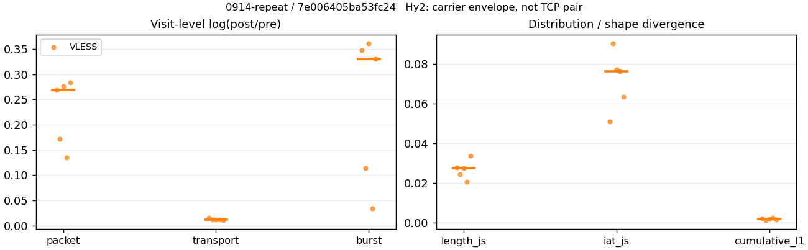
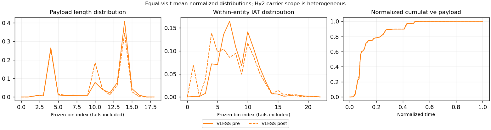

# 0914-repeat · 条目 010 · apple.com

目标：https://www.apple.com/iphone/

活动标签：apple.com::page_load。选定访问 15 次。

[返回总索引](../../README.md) · [统计口径](../../methods.md)

## 覆盖与资格（每次访问均保留）

| 部署 | 重复 | 主请求路由 | 活动状态 | 代理比较 | DIRECT pre | 请求 proxy/direct/unresolved | 错误 |
| --- | --- | --- | --- | --- | --- | --- | --- |
| Hy2 | 1 | direct | passed | 0 | 1 | 0/60/0 | [] |
| Hy2 | 2 | direct | passed | 0 | 1 | 0/55/0 | [] |
| Hy2 | 3 | direct | passed | 0 | 1 | 0/56/0 | [] |
| Hy2 | 4 | direct | passed | 0 | 1 | 0/55/0 | [] |
| Hy2 | 5 | direct | passed | 0 | 1 | 0/59/0 | [] |
| SS | 1 | direct | passed | 0 | 1 | 0/56/0 | [] |
| SS | 2 | direct | passed | 0 | 1 | 0/55/0 | [] |
| SS | 3 | direct | passed | 0 | 1 | 0/59/0 | [] |
| SS | 4 | direct | passed | 0 | 1 | 0/56/0 | [] |
| SS | 5 | direct | passed | 0 | 1 | 0/55/0 | [] |
| VLESS | 1 | proxy | passed | 1 | 0 | 57/0/0 | [] |
| VLESS | 2 | proxy | passed | 1 | 0 | 56/0/0 | [] |
| VLESS | 3 | proxy | passed | 1 | 0 | 56/0/0 | [] |
| VLESS | 4 | proxy | passed | 1 | 0 | 56/0/0 | [] |
| VLESS | 5 | proxy | passed | 1 | 0 | 56/0/0 | [] |

主请求非 proxy 的统计仅解释为已索引的辅助代理连接或 DIRECT 观测，不代表目标业务经代理传输。播放确认与配对资格是两道不同的门。

图中散点为单次访问，短线为重复中位数；Hy2 是共享载体包络，不能与 TCP 配对作等范围因果对比。

形态图先逐访问归一化，再对访问等权平均；实线 pre，虚线 post。分箱序号及边界见 methods，不将分箱索引误解为长度或时间。

## 每次访问的关键观测

### SS

范围：`direct_pre_only`。每格 pre → post；空值为不可观测/不适用。

| 重复 | 包数 | 载荷字节 | burst | TCP FR | IAT中位µs | length JS | IAT JS |
| --- | --- | --- | --- | --- | --- | --- | --- |
| 1 | 776 → — | 2.2256e+06 → — | 495 → — | 43 → — | 43.823 → — | — | — |
| 2 | 785 → — | 2.2179e+06 → — | 517 → — | 43 → — | 39.605 → — | — | — |
| 3 | 876 → — | 2.3234e+06 → — | 526 → — | 57 → — | 50.376 → — | — | — |
| 4 | 954 → — | 2.3024e+06 → — | 568 → — | 58 → — | 74.791 → — | — | — |
| 5 | 776 → — | 2.2174e+06 → — | 454 → — | 52 → — | 49.069 → — | — | — |

完整标量统计：中位数 [min,max]；Δ 为重复内逐访问变换的中位数，MAD 未缩放。n 为可用变换数；DIRECT-only 的 nΔ=0 不代表 pre 不可用。

| scope | 特征 | pre | post | Δ | IQRΔ | MADΔ | nΔ |
| --- | --- | --- | --- | --- | --- | --- | --- |
| direct_pre_only | active_span_sum_s_1000ms | 4.069 [3.3463, 5.0365] | — | — | — | — | 0 |
| direct_pre_only | active_span_sum_s_100ms | 1.6682 [1.564, 2.2038] | — | — | — | — | 0 |
| direct_pre_only | active_span_sum_s_500ms | 3.513 [3.3463, 4.069] | — | — | — | — | 0 |
| direct_pre_only | burst_bytes_iqr | 7486 [7231.5, 8920] | — | — | — | — | 0 |
| direct_pre_only | burst_bytes_mad | 91.5 [76, 92] | — | — | — | — | 0 |
| direct_pre_only | burst_bytes_max | 26880 [20480, 28672] | — | — | — | — | 0 |
| direct_pre_only | burst_bytes_mean | 4417 [4053.6, 4884.1] | — | — | — | — | 0 |
| direct_pre_only | burst_bytes_median | 91.5 [76, 92] | — | — | — | — | 0 |
| direct_pre_only | burst_bytes_min | 0 [0, 0] | — | — | — | — | 0 |
| direct_pre_only | burst_bytes_p95 | 20480 [20368, 20480] | — | — | — | — | 0 |
| direct_pre_only | burst_bytes_q25 | 0 [0, 0] | — | — | — | — | 0 |
| direct_pre_only | burst_bytes_q75 | 7486 [7231.5, 8920] | — | — | — | — | 0 |
| direct_pre_only | burst_bytes_std | 6689.5 [6196.2, 7307.9] | — | — | — | — | 0 |
| direct_pre_only | burst_count | 517 [454, 568] | — | — | — | — | 0 |
| direct_pre_only | burst_duration_ms_iqr | 0.057728 [0.029912, 0.21458] | — | — | — | — | 0 |
| direct_pre_only | burst_duration_ms_mad | 0 [0, 0] | — | — | — | — | 0 |
| direct_pre_only | burst_duration_ms_max | 8651.6 [6229.4, 11639] | — | — | — | — | 0 |
| direct_pre_only | burst_duration_ms_mean | 31.513 [19.948, 36.438] | — | — | — | — | 0 |
| direct_pre_only | burst_duration_ms_median | 0 [0, 0] | — | — | — | — | 0 |
| direct_pre_only | burst_duration_ms_min | 0 [0, 0] | — | — | — | — | 0 |
| direct_pre_only | burst_duration_ms_p95 | 16.649 [9.9303, 23.847] | — | — | — | — | 0 |
| direct_pre_only | burst_duration_ms_q25 | 0 [0, 0] | — | — | — | — | 0 |
| direct_pre_only | burst_duration_ms_q75 | 0.057728 [0.029912, 0.21458] | — | — | — | — | 0 |
| direct_pre_only | burst_duration_ms_std | 402.61 [283.89, 524.82] | — | — | — | — | 0 |
| direct_pre_only | burst_packets_iqr | 1 [1, 1] | — | — | — | — | 0 |
| direct_pre_only | burst_packets_mad | 0 [0, 0] | — | — | — | — | 0 |
| direct_pre_only | burst_packets_max | 7 [6, 9] | — | — | — | — | 0 |
| direct_pre_only | burst_packets_mean | 1.6654 [1.5184, 1.7093] | — | — | — | — | 0 |
| direct_pre_only | burst_packets_median | 1 [1, 1] | — | — | — | — | 0 |
| direct_pre_only | burst_packets_min | 1 [1, 1] | — | — | — | — | 0 |
| direct_pre_only | burst_packets_p95 | 3 [3, 4] | — | — | — | — | 0 |
| direct_pre_only | burst_packets_q25 | 1 [1, 1] | — | — | — | — | 0 |
| direct_pre_only | burst_packets_q75 | 2 [2, 2] | — | — | — | — | 0 |
| direct_pre_only | burst_packets_std | 0.9504 [0.94355, 1.0841] | — | — | — | — | 0 |
| direct_pre_only | connection_span_concurrency_max | 2 [2, 4] | — | — | — | — | 0 |
| direct_pre_only | direction_entropy | 0.58413 [0.56269, 0.58793] | — | — | — | — | 0 |
| direct_pre_only | down_burst_count | 257 [225, 281] | — | — | — | — | 0 |
| direct_pre_only | down_ip_bytes | 2.2347e+06 [2.2249e+06, 2.334e+06] | — | — | — | — | 0 |
| direct_pre_only | down_packets | 507 [486, 617] | — | — | — | — | 0 |
| direct_pre_only | down_transport_bytes | 2.2094e+06 [2.1985e+06, 2.3044e+06] | — | — | — | — | 0 |
| direct_pre_only | duration_s | 22.325 [19.807, 22.956] | — | — | — | — | 0 |
| direct_pre_only | entity_count | 4 [3, 6] | — | — | — | — | 0 |
| direct_pre_only | fr_runs | 52 [43, 58] | — | — | — | — | 0 |
| direct_pre_only | fr_runs_per_packet | 0.094463 [0.086869, 0.10277] | — | — | — | — | 0 |
| direct_pre_only | fr_switches | 48 [40, 53] | — | — | — | — | 0 |
| direct_pre_only | fr_switches_per_possible_transition | 0.085526 [0.081301, 0.095618] | — | — | — | — | 0 |
| direct_pre_only | full_retransmission_fraction | 0.0038217 [0, 0.0051546] | — | — | — | — | 0 |
| direct_pre_only | full_retransmission_packets | 3 [0, 4] | — | — | — | — | 0 |
| direct_pre_only | iat_count | 782 [772, 948] | — | — | — | — | 0 |
| direct_pre_only | iat_median_us | 49.069 [39.605, 74.791] | — | — | — | — | 0 |
| direct_pre_only | iat_us_iqr | 196.08 [133.44, 473.3] | — | — | — | — | 0 |
| direct_pre_only | iat_us_mad | 39.966 [32.943, 64.487] | — | — | — | — | 0 |
| direct_pre_only | iat_us_max | 9.6506e+06 [6.2294e+06, 1.5001e+07] | — | — | — | — | 0 |
| direct_pre_only | iat_us_mean | 22509 [19288, 51208] | — | — | — | — | 0 |
| direct_pre_only | iat_us_median | 49.069 [39.605, 74.791] | — | — | — | — | 0 |
| direct_pre_only | iat_us_min | 0.324 [0.101, 0.518] | — | — | — | — | 0 |
| direct_pre_only | iat_us_p95 | 16227 [13224, 25037] | — | — | — | — | 0 |
| direct_pre_only | iat_us_q25 | 15.687 [12.234, 20.934] | — | — | — | — | 0 |
| direct_pre_only | iat_us_q75 | 213.91 [145.67, 494.23] | — | — | — | — | 0 |
| direct_pre_only | iat_us_std | 3.7388e+05 [2.6569e+05, 7.1563e+05] | — | — | — | — | 0 |
| direct_pre_only | idle_gap_count_1000ms | 3 [2, 5] | — | — | — | — | 0 |
| direct_pre_only | idle_gap_count_100ms | 14 [11, 17] | — | — | — | — | 0 |
| direct_pre_only | idle_gap_count_500ms | 4 [3, 7] | — | — | — | — | 0 |
| direct_pre_only | idle_gap_sum_s_1000ms | 13.443 [10.047, 39.617] | — | — | — | — | 0 |
| direct_pre_only | idle_gap_sum_s_100ms | 15.709 [13.319, 42.6] | — | — | — | — | 0 |
| direct_pre_only | idle_gap_sum_s_500ms | 14.022 [11.397, 41.033] | — | — | — | — | 0 |
| direct_pre_only | ip_bytes | 2.266e+06 [2.2578e+06, 2.369e+06] | — | — | — | — | 0 |
| direct_pre_only | length_iqr | 6592 [4320, 7259] | — | — | — | — | 0 |
| direct_pre_only | length_mad | 3048 [2341.5, 3089] | — | — | — | — | 0 |
| direct_pre_only | length_max | 8920 [8920, 8920] | — | — | — | — | 0 |
| direct_pre_only | length_mean | 4382.1 [3749.9, 4514.3] | — | — | — | — | 0 |
| direct_pre_only | length_median | 3368 [2880, 3368] | — | — | — | — | 0 |
| direct_pre_only | length_min | 31 [25, 31] | — | — | — | — | 0 |
| direct_pre_only | length_p95 | 8920 [8920, 8920] | — | — | — | — | 0 |
| direct_pre_only | length_q25 | 1440 [1201.5, 1600] | — | — | — | — | 0 |
| direct_pre_only | length_q75 | 8192 [5760, 8640] | — | — | — | — | 0 |
| direct_pre_only | length_std | 3279.3 [2879.8, 3373.7] | — | — | — | — | 0 |
| direct_pre_only | nonempty_entity_count | 4 [3, 6] | — | — | — | — | 0 |
| direct_pre_only | nonempty_packets | 506 [493, 614] | — | — | — | — | 0 |
| direct_pre_only | offload_suspect_fraction | 0.47294 [0.46778, 0.47831] | — | — | — | — | 0 |
| direct_pre_only | packet_count | 785 [776, 954] | — | — | — | — | 0 |
| direct_pre_only | rtt_median_ms | 0.10145 [0.067642, 0.16886] | — | — | — | — | 0 |
| direct_pre_only | rtt_sample_count | 287 [263, 327] | — | — | — | — | 0 |
| direct_pre_only | tcp_ack_count | 782 [772, 948] | — | — | — | — | 0 |
| direct_pre_only | tcp_fin_count | 8 [6, 12] | — | — | — | — | 0 |
| direct_pre_only | tcp_packet_count | 785 [776, 954] | — | — | — | — | 0 |
| direct_pre_only | tcp_rst_count | 0 [0, 0] | — | — | — | — | 0 |
| direct_pre_only | tcp_syn_count | 8 [6, 12] | — | — | — | — | 0 |
| direct_pre_only | tcp_window_raw_median | 65535 [65535, 65535] | — | — | — | — | 0 |
| direct_pre_only | transition_entropy | 0.35187 [0.34965, 0.38372] | — | — | — | — | 0 |
| direct_pre_only | transition_n_mm | 409 [403, 504] | — | — | — | — | 0 |
| direct_pre_only | transition_n_mp | 22 [19, 25] | — | — | — | — | 0 |
| direct_pre_only | transition_n_pm | 26 [21, 29] | — | — | — | — | 0 |
| direct_pre_only | transition_n_pp | 48 [45, 52] | — | — | — | — | 0 |
| direct_pre_only | transition_p_mm | 0.95498 [0.94877, 0.95636] | — | — | — | — | 0 |
| direct_pre_only | transition_p_mp | 0.045024 [0.043643, 0.05123] | — | — | — | — | 0 |
| direct_pre_only | transition_p_pm | 0.35802 [0.30435, 0.36842] | — | — | — | — | 0 |
| direct_pre_only | transition_p_pp | 0.64198 [0.63158, 0.69565] | — | — | — | — | 0 |
| direct_pre_only | transport_bytes | 2.2256e+06 [2.2174e+06, 2.3234e+06] | — | — | — | — | 0 |
| direct_pre_only | up_burst_count | 260 [229, 287] | — | — | — | — | 0 |
| direct_pre_only | up_byte_fraction | 0.0081761 [0.0072584, 0.010456] | — | — | — | — | 0 |
| direct_pre_only | up_ip_bytes | 32966 [31306, 41658] | — | — | — | — | 0 |
| direct_pre_only | up_packets | 296 [269, 337] | — | — | — | — | 0 |
| direct_pre_only | up_transport_bytes | 18910 [16154, 24074] | — | — | — | — | 0 |
| direct_pre_only | zero_iat_count | 0 [0, 0] | — | — | — | — | 0 |
| direct_pre_only | zero_iat_fraction | 0 [0, 0] | — | — | — | — | 0 |

### VLESS

范围：`exclusive_page`。每格 pre → post；空值为不可观测/不适用。

| 重复 | 包数 | 载荷字节 | burst | TCP FR | IAT中位µs | length JS | IAT JS |
| --- | --- | --- | --- | --- | --- | --- | --- |
| 1 | 1791 → 2342 | 2.0744e+06 → 2.1061e+06 | 1322 → 1872 | 46 → 54 | 121.5 → 52.864 | 0.027835 | 0.050919 |
| 2 | 1958 → 2326 | 2.0649e+06 → 2.0892e+06 | 1495 → 1675 | 42 → 48 | 127.64 → 86.259 | 0.024451 | 0.0903 |
| 3 | 1770 → 2332 | 2.0647e+06 → 2.0888e+06 | 1161 → 1665 | 44 → 52 | 163.3 → 70.156 | 0.027671 | 0.077398 |
| 4 | 2114 → 2418 | 2.0645e+06 → 2.089e+06 | 1733 → 1794 | 40 → 46 | 112.76 → 90.191 | 0.020688 | 0.076296 |
| 5 | 1600 → 2125 | 2.0479e+06 → 2.0711e+06 | 1159 → 1613 | 40 → 48 | 129.19 → 65.746 | 0.033728 | 0.063386 |

完整标量统计：中位数 [min,max]；Δ 为重复内逐访问变换的中位数，MAD 未缩放。n 为可用变换数；DIRECT-only 的 nΔ=0 不代表 pre 不可用。

| scope | 特征 | pre | post | Δ | IQRΔ | MADΔ | nΔ |
| --- | --- | --- | --- | --- | --- | --- | --- |
| exclusive_page | active_span_sum_s_1000ms | 8.1481 [7.0638, 10.759] | 8.1511 [7.0824, 10.738] | 0.0026298 | 0.0045366 | 0.0022805 | 5 |
| exclusive_page | active_span_sum_s_100ms | 2.1597 [1.8016, 2.2633] | 3.5682 [3.1858, 3.7558] | 0.50647 | 0.027505 | 0.0047424 | 5 |
| exclusive_page | active_span_sum_s_500ms | 5.06 [4.9215, 5.3981] | 7.2207 [6.9763, 7.5372] | 0.32557 | 0.011029 | 0.0019559 | 5 |
| exclusive_page | burst_bytes_iqr | 2896 [2824, 2896] | 2824 [2824, 2824] | -0.025176 | 0 | 0 | 5 |
| exclusive_page | burst_bytes_mad | 72 [39, 72] | 72 [65.5, 72] | 0 | 0 | 0 | 5 |
| exclusive_page | burst_bytes_max | 20480 [11584, 20480] | 11584 [8688, 12812] | -0.55747 | 0.10076 | 0.03753 | 5 |
| exclusive_page | burst_bytes_mean | 1569.1 [1191.3, 1778.3] | 1247.3 [1125.1, 1284] | -0.31927 | 0.23065 | 0.029665 | 5 |
| exclusive_page | burst_bytes_median | 72 [39, 72] | 72 [65.5, 72] | 0 | 0 | 0 | 5 |
| exclusive_page | burst_bytes_min | 0 [0, 0] | 0 [0, 0] | — | — | — | 0 |
| exclusive_page | burst_bytes_p95 | 5792 [4286.4, 7060] | 2934.4 [2896, 4236] | -0.51083 | 0.27004 | 0.11871 | 5 |
| exclusive_page | burst_bytes_q25 | 0 [0, 0] | 0 [0, 0] | — | — | — | 0 |
| exclusive_page | burst_bytes_q75 | 2896 [2824, 2896] | 2824 [2824, 2824] | -0.025176 | 0 | 0 | 5 |
| exclusive_page | burst_bytes_std | 2419.3 [1607.7, 2647.3] | 1469.8 [1327.1, 1805.2] | -0.37666 | 0.11718 | 0.11097 | 5 |
| exclusive_page | burst_count | 1322 [1159, 1733] | 1675 [1613, 1872] | 0.33054 | 0.23417 | 0.030005 | 5 |
| exclusive_page | burst_duration_ms_iqr | 0.13035 [0, 0.55063] | 0.0001085 [0, 0.000191] | -7.0582 | 0.90835 | 0.90835 | 2 |
| exclusive_page | burst_duration_ms_mad | 0 [0, 0] | 0 [0, 0] | — | — | — | 0 |
| exclusive_page | burst_duration_ms_max | 14605 [5705.3, 14753] | 15237 [672.26, 15426] | 0.047922 | 0.021672 | 0.012979 | 5 |
| exclusive_page | burst_duration_ms_mean | 19.176 [9.5464, 24.736] | 23.949 [2.7946, 25.002] | 0.042352 | 0.29766 | 0.22295 | 5 |
| exclusive_page | burst_duration_ms_median | 0 [0, 0] | 0 [0, 0] | — | — | — | 0 |
| exclusive_page | burst_duration_ms_min | 0 [0, 0] | 0 [0, 0] | — | — | — | 0 |
| exclusive_page | burst_duration_ms_p95 | 4.8314 [1.9652, 4.9298] | 4.8427 [1.8963, 5.2559] | 0.07254 | 1.0864 | 0.62989 | 5 |
| exclusive_page | burst_duration_ms_q25 | 0 [0, 0] | 0 [0, 0] | — | — | — | 0 |
| exclusive_page | burst_duration_ms_q75 | 0.13035 [0, 0.55063] | 0.0001085 [0, 0.000191] | -7.0582 | 0.90835 | 0.90835 | 2 |
| exclusive_page | burst_duration_ms_std | 384.97 [162.96, 453.04] | 515.79 [25.981, 537.66] | 0.17124 | 0.13 | 0.1213 | 5 |
| exclusive_page | burst_packets_iqr | 1 [0, 1] | 1 [0, 1] | 0 | 0 | 0 | 2 |
| exclusive_page | burst_packets_mad | 0 [0, 0] | 0 [0, 0] | — | — | — | 0 |
| exclusive_page | burst_packets_max | 7 [5, 9] | 10 [9, 11] | 0.45199 | 0.31015 | 0.24116 | 5 |
| exclusive_page | burst_packets_mean | 1.3548 [1.2198, 1.5245] | 1.3478 [1.2511, 1.4006] | -0.04677 | 0.13817 | 0.038027 | 5 |
| exclusive_page | burst_packets_median | 1 [1, 1] | 1 [1, 1] | 0 | 0 | 0 | 5 |
| exclusive_page | burst_packets_min | 1 [1, 1] | 1 [1, 1] | 0 | 0 | 0 | 5 |
| exclusive_page | burst_packets_p95 | 2 [2, 2] | 2 [2, 3] | 0 | 0.40547 | 0 | 5 |
| exclusive_page | burst_packets_q25 | 1 [1, 1] | 1 [1, 1] | 0 | 0 | 0 | 5 |
| exclusive_page | burst_packets_q75 | 2 [1, 2] | 2 [1, 2] | 0 | 0.69315 | 0.69315 | 5 |
| exclusive_page | burst_packets_std | 0.58541 [0.49185, 0.652] | 0.73757 [0.68221, 0.7505] | 0.21668 | 0.043567 | 0.029212 | 5 |
| exclusive_page | connection_span_concurrency_max | 2 [2, 2] | 2 [2, 2] | 0 | 0 | 0 | 5 |
| exclusive_page | cumulative_l1 | — | — | 0.0018783 | 0.00062606 | 0.00034971 | 5 |
| exclusive_page | cumulative_max | — | — | 0.030146 | 0.047191 | 0.0097757 | 5 |
| exclusive_page | direction_entropy | 0.34131 [0.3214, 0.37473] | 0.26091 [0.24477, 0.27885] | -0.090645 | 0.027045 | 0.0059046 | 5 |
| exclusive_page | down_burst_count | 659 [578, 865] | 836 [805, 934] | 0.33127 | 0.23485 | 0.030059 | 5 |
| exclusive_page | down_ip_bytes | 2.1101e+06 [2.0832e+06, 2.1118e+06] | 2.1371e+06 [2.1101e+06, 2.1455e+06] | 0.012861 | 0.00047938 | 0.00031288 | 5 |
| exclusive_page | down_packets | 1146 [981, 1211] | 1333 [1164, 1364] | 0.15115 | 0.027397 | 0.019891 | 5 |
| exclusive_page | down_transport_bytes | 2.0488e+06 [2.0321e+06, 2.055e+06] | 2.0675e+06 [2.0496e+06, 2.0791e+06] | 0.0089816 | 0.00020675 | 0.00011454 | 5 |
| exclusive_page | duration_s | 28.165 [22.532, 32.252] | 28.132 [22.516, 32.251] | -0.0011553 | 0.00072335 | 0.00030308 | 5 |
| exclusive_page | entity_count | 3 [3, 4] | 3 [3, 4] | 0 | 0 | 0 | 5 |
| exclusive_page | fr_runs | 42 [40, 46] | 48 [46, 54] | 0.16034 | 0.027292 | 0.020581 | 5 |
| exclusive_page | fr_runs_per_packet | 0.038294 [0.032949, 0.042202] | 0.039039 [0.03365, 0.042453] | 0.00056895 | 0.0004504 | 0.00017592 | 5 |
| exclusive_page | fr_switches | 39 [37, 42] | 45 [43, 50] | 0.17435 | 0.027966 | 0.021391 | 5 |
| exclusive_page | fr_switches_per_possible_transition | 0.035777 [0.030553, 0.038674] | 0.03687 [0.031525, 0.039432] | 0.00097166 | 0.00026965 | 0.00012155 | 5 |
| exclusive_page | full_retransmission_fraction | 0 [0, 0.000625] | 0 [0, 0.00047059] | 0 | 0.00015441 | 0 | 5 |
| exclusive_page | full_retransmission_packets | 0 [0, 1] | 0 [0, 1] | 0 | — | — | 1 |
| exclusive_page | iat_count | 1787 [1597, 2111] | 2329 [2122, 2415] | 0.26876 | 0.10369 | 0.015475 | 5 |
| exclusive_page | iat_js | — | — | 0.076296 | 0.014012 | 0.01291 | 5 |
| exclusive_page | iat_ks | — | — | 0.19048 | 0.037402 | 0.02074 | 5 |
| exclusive_page | iat_median_us | 127.64 [112.76, 163.3] | 70.156 [52.864, 90.191] | -0.67548 | 0.44036 | 0.16938 | 5 |
| exclusive_page | iat_us_iqr | 863.95 [796.01, 963.44] | 799.51 [750.13, 845.83] | -0.11795 | 0.11423 | 0.061698 | 5 |
| exclusive_page | iat_us_mad | 116 [99.263, 155.68] | 69.252 [48.57, 84.787] | -0.65545 | 0.46216 | 0.17643 | 5 |
| exclusive_page | iat_us_max | 1.5001e+07 [5.7053e+06, 1.5001e+07] | 1.5237e+07 [5.6823e+06, 1.5426e+07] | 0.01567 | 0.027141 | 0.012283 | 5 |
| exclusive_page | iat_us_mean | 26453 [10183, 33214] | 21616 [7754.2, 24959] | -0.27248 | 0.10385 | 0.013282 | 5 |
| exclusive_page | iat_us_median | 127.64 [112.76, 163.3] | 70.156 [52.864, 90.191] | -0.67548 | 0.44036 | 0.16938 | 5 |
| exclusive_page | iat_us_min | 0.319 [0.195, 1.795] | 0.036 [0.035, 0.037] | -2.1817 | 1.5539 | 0.46402 | 5 |
| exclusive_page | iat_us_p95 | 6109.1 [5269.8, 6198.5] | 7196 [5720.2, 7909.7] | 0.19086 | 0.055649 | 0.028529 | 5 |
| exclusive_page | iat_us_q25 | 43.107 [33.614, 45.447] | 9.3442 [8.527, 14.248] | -1.4768 | 0.22268 | 0.1331 | 5 |
| exclusive_page | iat_us_q75 | 907.6 [841.46, 1006.5] | 809.88 [759.47, 854.56] | -0.13808 | 0.10889 | 0.070013 | 5 |
| exclusive_page | iat_us_std | 5.0726e+05 [1.7372e+05, 5.7203e+05] | 4.6721e+05 [1.4899e+05, 5.0083e+05] | -0.13284 | 0.046177 | 0.020764 | 5 |
| exclusive_page | iat_wasserstein_log1p_us | — | — | 0.71989 | 0.095247 | 0.047851 | 5 |
| exclusive_page | idle_gap_count_1000ms | 6 [2, 7] | 6 [2, 7] | 0 | 0 | 0 | 5 |
| exclusive_page | idle_gap_count_100ms | 24 [20, 26] | 26 [24, 29] | 0.080043 | 0.032238 | 0.029157 | 5 |
| exclusive_page | idle_gap_count_500ms | 10 [7, 12] | 7 [3, 9] | -0.35667 | 0.038221 | 0.038221 | 5 |
| exclusive_page | idle_gap_sum_s_1000ms | 43.205 [10.049, 47.143] | 42.359 [9.9781, 47.067] | -0.0021691 | 0.0054352 | 0.0010127 | 5 |
| exclusive_page | idle_gap_sum_s_100ms | 48.258 [15.934, 53.688] | 46.776 [14.373, 52.24] | -0.031195 | 0.0051789 | 0.002995 | 5 |
| exclusive_page | idle_gap_sum_s_500ms | 45.194 [13.275, 50.803] | 43.122 [10.592, 48.832] | -0.046916 | 0.0046302 | 0.0025434 | 5 |
| exclusive_page | ip_bytes | 2.1667e+06 [2.131e+06, 2.1745e+06] | 2.2115e+06 [2.183e+06, 2.2289e+06] | 0.02407 | 0.0046046 | 0.0036094 | 5 |
| exclusive_page | length_iqr | 2716 [2713, 2752] | 2716 [2709, 2752] | 0 | 0 | 0 | 5 |
| exclusive_page | length_js | — | — | 0.027671 | 0.0033842 | 0.00322 | 5 |
| exclusive_page | length_ks | — | — | 0.12257 | 0.009875 | 0.0062449 | 5 |
| exclusive_page | length_mad | 1304 [805, 1304] | 1340 [1340, 1376] | 0.053744 | 0.026511 | 0.026511 | 5 |
| exclusive_page | length_max | 8920 [8688, 8920] | 8688 [4344, 11296] | -0.026353 | 0.21294 | 0.15415 | 5 |
| exclusive_page | length_mean | 1796.9 [1700.6, 2087.5] | 1568.1 [1528.1, 1783.9] | -0.13618 | 0.019174 | 0.016142 | 5 |
| exclusive_page | length_median | 1520 [1520, 2019] | 1412 [1412, 1448] | -0.073703 | 0.025176 | 0.025176 | 5 |
| exclusive_page | length_min | 24 [24, 24] | 16 [10, 24] | -0.40547 | 0.40547 | 0.40547 | 5 |
| exclusive_page | length_p95 | 2932 [2896, 7060] | 2896 [2896, 4236] | -0.012354 | 0.49847 | 0.012354 | 5 |
| exclusive_page | length_q25 | 108 [72, 111] | 108 [72, 115] | 0 | 0 | 0 | 5 |
| exclusive_page | length_q75 | 2824 [2824, 2824] | 2824 [2824, 2824] | 0 | 0 | 0 | 5 |
| exclusive_page | length_std | 1433.7 [1272.4, 1943] | 1216.7 [1142.5, 1567.3] | -0.18449 | 0.10721 | 0.068068 | 5 |
| exclusive_page | length_wasserstein_bytes | — | — | 228.92 | 93.709 | 56.26 | 5 |
| exclusive_page | nonempty_entity_count | 3 [3, 4] | 3 [3, 4] | 0 | 0 | 0 | 5 |
| exclusive_page | nonempty_packets | 1149 [981, 1214] | 1332 [1161, 1367] | 0.14779 | 0.022696 | 0.016073 | 5 |
| exclusive_page | offload_suspect_fraction | 0.32942 [0.32498, 0.37571] | 0.256 [0.22588, 0.26268] | -0.087164 | 0.020104 | 0.012579 | 5 |
| exclusive_page | packet_count | 1791 [1600, 2114] | 2332 [2125, 2418] | 0.26823 | 0.10352 | 0.015537 | 5 |
| exclusive_page | rtt_median_ms | 0.14045 [0.064053, 0.50106] | 0.044837 [0.029193, 0.047375] | -1.1205 | 0.82301 | 0.51622 | 5 |
| exclusive_page | rtt_sample_count | 688 [603, 889] | 937 [885, 1024] | 0.38367 | 0.21904 | 0.052133 | 5 |
| exclusive_page | tcp_ack_count | 1780 [1591, 2106] | 2329 [2122, 2414] | 0.27268 | 0.10401 | 0.015314 | 5 |
| exclusive_page | tcp_fin_count | 6 [5, 7] | 6 [6, 8] | 0 | 0.13353 | 0 | 5 |
| exclusive_page | tcp_packet_count | 1791 [1600, 2114] | 2332 [2125, 2418] | 0.26823 | 0.10352 | 0.015537 | 5 |
| exclusive_page | tcp_rst_count | 6 [5, 7] | 0 [0, 1] | -1.6094 | — | — | 1 |
| exclusive_page | tcp_syn_count | 6 [6, 8] | 6 [6, 8] | 0 | 0 | 0 | 5 |
| exclusive_page | tcp_window_raw_median | 65535 [65535, 65535] | 187 [182, 201] | -5.8592 | 0.03714 | 0.026387 | 5 |
| exclusive_page | transition_entropy | 0.17643 [0.15556, 0.18719] | 0.16558 [0.1511, 0.17717] | -0.0096711 | 0.0029629 | 0.0011801 | 5 |
| exclusive_page | transition_n_mm | 1054 [890, 1123] | 1252 [1081, 1285] | 0.17215 | 0.029406 | 0.022271 | 5 |
| exclusive_page | transition_n_mp | 18 [17, 19] | 21 [20, 23] | 0.19106 | 0.028536 | 0.020254 | 5 |
| exclusive_page | transition_n_pm | 21 [20, 23] | 24 [23, 27] | 0.16034 | 0.027292 | 0.020581 | 5 |
| exclusive_page | transition_n_pp | 51 [50, 53] | 33 [28, 36] | -0.46609 | 0.11711 | 0.10941 | 5 |
| exclusive_page | transition_p_mm | 0.98229 [0.98119, 0.98509] | 0.98196 [0.98094, 0.98467] | -0.00031315 | 0.000104 | 8.5298e-05 | 5 |
| exclusive_page | transition_p_mp | 0.017707 [0.014912, 0.018812] | 0.018039 [0.015326, 0.019056] | 0.00031315 | 0.000104 | 8.5298e-05 | 5 |
| exclusive_page | transition_p_pm | 0.29577 [0.28169, 0.30263] | 0.42857 [0.38983, 0.48148] | 0.14688 | 0.036363 | 0.03323 | 5 |
| exclusive_page | transition_p_pp | 0.70423 [0.69737, 0.71831] | 0.57143 [0.51852, 0.61017] | -0.14688 | 0.036363 | 0.03323 | 5 |
| exclusive_page | transport_bytes | 2.0647e+06 [2.0479e+06, 2.0744e+06] | 2.089e+06 [2.0711e+06, 2.1061e+06] | 0.011681 | 0.00015818 | 8.8713e-05 | 5 |
| exclusive_page | up_burst_count | 663 [581, 868] | 839 [808, 938] | 0.32981 | 0.2335 | 0.029952 | 5 |
| exclusive_page | up_byte_fraction | 0.0076749 [0.0076052, 0.0093354] | 0.010372 [0.01028, 0.012829] | 0.0026972 | 2.2578e-05 | 2.2187e-05 | 5 |
| exclusive_page | up_ip_bytes | 55829 [47869, 62679] | 75069 [72822, 83407] | 0.40144 | 0.14638 | 0.038606 | 5 |
| exclusive_page | up_packets | 702 [619, 903] | 999 [961, 1066] | 0.41774 | 0.20938 | 0.052869 | 5 |
| exclusive_page | up_transport_bytes | 15759 [15704, 19365] | 21482 [21477, 27019] | 0.31247 | 0.0019093 | 0.0013146 | 5 |
| exclusive_page | zero_iat_count | 0 [0, 0] | 0 [0, 0] | — | — | — | 0 |
| exclusive_page | zero_iat_fraction | 0 [0, 0] | 0 [0, 0] | 0 | 0 | 0 | 5 |

### Hy2

范围：`direct_pre_only`。每格 pre → post；空值为不可观测/不适用。

| 重复 | 包数 | 载荷字节 | burst | TCP FR | IAT中位µs | length JS | IAT JS |
| --- | --- | --- | --- | --- | --- | --- | --- |
| 1 | 879 → — | 2.3373e+06 → — | 572 → — | 59 → — | 43.816 → — | — | — |
| 2 | 779 → — | 2.2027e+06 → — | 485 → — | 42 → — | 50.471 → — | — | — |
| 3 | 838 → — | 2.2362e+06 → — | 591 → — | 45 → — | 39.363 → — | — | — |
| 4 | 799 → — | 2.2484e+06 → — | 507 → — | 52 → — | 54.422 → — | — | — |
| 5 | 872 → — | 2.3271e+06 → — | 540 → — | 56 → — | 53.724 → — | — | — |

完整标量统计：中位数 [min,max]；Δ 为重复内逐访问变换的中位数，MAD 未缩放。n 为可用变换数；DIRECT-only 的 nΔ=0 不代表 pre 不可用。

| scope | 特征 | pre | post | Δ | IQRΔ | MADΔ | nΔ |
| --- | --- | --- | --- | --- | --- | --- | --- |
| direct_pre_only | active_span_sum_s_1000ms | 5.2105 [3.9816, 5.396] | — | — | — | — | 0 |
| direct_pre_only | active_span_sum_s_100ms | 1.7745 [1.3954, 1.9507] | — | — | — | — | 0 |
| direct_pre_only | active_span_sum_s_500ms | 4.3434 [3.0882, 5.396] | — | — | — | — | 0 |
| direct_pre_only | burst_bytes_iqr | 7486 [5760, 8640] | — | — | — | — | 0 |
| direct_pre_only | burst_bytes_mad | 90 [80, 92] | — | — | — | — | 0 |
| direct_pre_only | burst_bytes_max | 23894 [20480, 29327] | — | — | — | — | 0 |
| direct_pre_only | burst_bytes_mean | 4309.5 [3783.7, 4541.7] | — | — | — | — | 0 |
| direct_pre_only | burst_bytes_median | 90 [80, 92] | — | — | — | — | 0 |
| direct_pre_only | burst_bytes_min | 0 [0, 0] | — | — | — | — | 0 |
| direct_pre_only | burst_bytes_p95 | 20480 [20480, 20480] | — | — | — | — | 0 |
| direct_pre_only | burst_bytes_q25 | 0 [0, 0] | — | — | — | — | 0 |
| direct_pre_only | burst_bytes_q75 | 7486 [5760, 8640] | — | — | — | — | 0 |
| direct_pre_only | burst_bytes_std | 6547.3 [6089.8, 7119.7] | — | — | — | — | 0 |
| direct_pre_only | burst_count | 540 [485, 591] | — | — | — | — | 0 |
| direct_pre_only | burst_duration_ms_iqr | 0.043311 [0, 0.055699] | — | — | — | — | 0 |
| direct_pre_only | burst_duration_ms_mad | 0 [0, 0] | — | — | — | — | 0 |
| direct_pre_only | burst_duration_ms_max | 7508.7 [3489.9, 9507.3] | — | — | — | — | 0 |
| direct_pre_only | burst_duration_ms_mean | 19.737 [15.281, 34.343] | — | — | — | — | 0 |
| direct_pre_only | burst_duration_ms_median | 0 [0, 0] | — | — | — | — | 0 |
| direct_pre_only | burst_duration_ms_min | 0 [0, 0] | — | — | — | — | 0 |
| direct_pre_only | burst_duration_ms_p95 | 13.416 [10.242, 18.728] | — | — | — | — | 0 |
| direct_pre_only | burst_duration_ms_q25 | 0 [0, 0] | — | — | — | — | 0 |
| direct_pre_only | burst_duration_ms_q75 | 0.043311 [0, 0.055699] | — | — | — | — | 0 |
| direct_pre_only | burst_duration_ms_std | 313.29 [164.84, 451.43] | — | — | — | — | 0 |
| direct_pre_only | burst_packets_iqr | 1 [0, 1] | — | — | — | — | 0 |
| direct_pre_only | burst_packets_mad | 0 [0, 0] | — | — | — | — | 0 |
| direct_pre_only | burst_packets_max | 6 [6, 11] | — | — | — | — | 0 |
| direct_pre_only | burst_packets_mean | 1.5759 [1.4179, 1.6148] | — | — | — | — | 0 |
| direct_pre_only | burst_packets_median | 1 [1, 1] | — | — | — | — | 0 |
| direct_pre_only | burst_packets_min | 1 [1, 1] | — | — | — | — | 0 |
| direct_pre_only | burst_packets_p95 | 3 [3, 4] | — | — | — | — | 0 |
| direct_pre_only | burst_packets_q25 | 1 [1, 1] | — | — | — | — | 0 |
| direct_pre_only | burst_packets_q75 | 2 [1, 2] | — | — | — | — | 0 |
| direct_pre_only | burst_packets_std | 0.91882 [0.85916, 0.96728] | — | — | — | — | 0 |
| direct_pre_only | connection_span_concurrency_max | 2 [2, 3] | — | — | — | — | 0 |
| direct_pre_only | direction_entropy | 0.5768 [0.56941, 0.61514] | — | — | — | — | 0 |
| direct_pre_only | down_burst_count | 268 [241, 294] | — | — | — | — | 0 |
| direct_pre_only | down_ip_bytes | 2.2527e+06 [2.213e+06, 2.3458e+06] | — | — | — | — | 0 |
| direct_pre_only | down_packets | 504 [498, 561] | — | — | — | — | 0 |
| direct_pre_only | down_transport_bytes | 2.2268e+06 [2.1868e+06, 2.3176e+06] | — | — | — | — | 0 |
| direct_pre_only | duration_s | 22.81 [20.295, 23.357] | — | — | — | — | 0 |
| direct_pre_only | entity_count | 4 [3, 5] | — | — | — | — | 0 |
| direct_pre_only | fr_runs | 52 [42, 59] | — | — | — | — | 0 |
| direct_pre_only | fr_runs_per_packet | 0.10036 [0.083499, 0.10886] | — | — | — | — | 0 |
| direct_pre_only | fr_switches | 47 [39, 55] | — | — | — | — | 0 |
| direct_pre_only | fr_switches_per_possible_transition | 0.093863 [0.078, 0.10223] | — | — | — | — | 0 |
| direct_pre_only | full_retransmission_fraction | 0.0025674 [0, 0.012516] | — | — | — | — | 0 |
| direct_pre_only | full_retransmission_packets | 2 [0, 10] | — | — | — | — | 0 |
| direct_pre_only | iat_count | 835 [776, 875] | — | — | — | — | 0 |
| direct_pre_only | iat_median_us | 50.471 [39.363, 54.422] | — | — | — | — | 0 |
| direct_pre_only | iat_us_iqr | 152.51 [143.29, 192.26] | — | — | — | — | 0 |
| direct_pre_only | iat_us_mad | 40.891 [33.066, 44.57] | — | — | — | — | 0 |
| direct_pre_only | iat_us_max | 1.5001e+07 [7.5087e+06, 1.5001e+07] | — | — | — | — | 0 |
| direct_pre_only | iat_us_mean | 28866 [20778, 39142] | — | — | — | — | 0 |
| direct_pre_only | iat_us_median | 50.471 [39.363, 54.422] | — | — | — | — | 0 |
| direct_pre_only | iat_us_min | 0.668 [0.208, 2.021] | — | — | — | — | 0 |
| direct_pre_only | iat_us_p95 | 19294 [12414, 27665] | — | — | — | — | 0 |
| direct_pre_only | iat_us_q25 | 15.591 [10.734, 16.36] | — | — | — | — | 0 |
| direct_pre_only | iat_us_q75 | 168.06 [154.03, 208.18] | — | — | — | — | 0 |
| direct_pre_only | iat_us_std | 5.2525e+05 [3.1247e+05, 6.1856e+05] | — | — | — | — | 0 |
| direct_pre_only | idle_gap_count_1000ms | 3 [2, 4] | — | — | — | — | 0 |
| direct_pre_only | idle_gap_count_100ms | 14 [12, 18] | — | — | — | — | 0 |
| direct_pre_only | idle_gap_count_500ms | 4 [3, 5] | — | — | — | — | 0 |
| direct_pre_only | idle_gap_sum_s_1000ms | 19.845 [12.115, 27.057] | — | — | — | — | 0 |
| direct_pre_only | idle_gap_sum_s_100ms | 23.192 [15.949, 30.502] | — | — | — | — | 0 |
| direct_pre_only | idle_gap_sum_s_500ms | 19.845 [13.917, 27.057] | — | — | — | — | 0 |
| direct_pre_only | ip_bytes | 2.2901e+06 [2.2433e+06, 2.3831e+06] | — | — | — | — | 0 |
| direct_pre_only | length_iqr | 6627 [5976.5, 7274] | — | — | — | — | 0 |
| direct_pre_only | length_mad | 2740 [2577, 3233] | — | — | — | — | 0 |
| direct_pre_only | length_max | 8920 [8920, 8920] | — | — | — | — | 0 |
| direct_pre_only | length_mean | 4379.2 [4170.5, 4560.6] | — | — | — | — | 0 |
| direct_pre_only | length_median | 3368 [2880, 3368] | — | — | — | — | 0 |
| direct_pre_only | length_min | 31 [6, 31] | — | — | — | — | 0 |
| direct_pre_only | length_p95 | 8920 [8920, 8920] | — | — | — | — | 0 |
| direct_pre_only | length_q25 | 1520 [1444, 1724.5] | — | — | — | — | 0 |
| direct_pre_only | length_q75 | 8192 [7420.5, 8761] | — | — | — | — | 0 |
| direct_pre_only | length_std | 3274.1 [3146.4, 3369.1] | — | — | — | — | 0 |
| direct_pre_only | nonempty_entity_count | 4 [3, 5] | — | — | — | — | 0 |
| direct_pre_only | nonempty_packets | 503 [493, 558] | — | — | — | — | 0 |
| direct_pre_only | offload_suspect_fraction | 0.46985 [0.45346, 0.48652] | — | — | — | — | 0 |
| direct_pre_only | packet_count | 838 [779, 879] | — | — | — | — | 0 |
| direct_pre_only | rtt_median_ms | 0.07791 [0.023123, 0.10431] | — | — | — | — | 0 |
| direct_pre_only | rtt_sample_count | 309 [272, 328] | — | — | — | — | 0 |
| direct_pre_only | tcp_ack_count | 835 [776, 875] | — | — | — | — | 0 |
| direct_pre_only | tcp_fin_count | 8 [6, 10] | — | — | — | — | 0 |
| direct_pre_only | tcp_packet_count | 838 [779, 879] | — | — | — | — | 0 |
| direct_pre_only | tcp_rst_count | 0 [0, 0] | — | — | — | — | 0 |
| direct_pre_only | tcp_syn_count | 8 [6, 10] | — | — | — | — | 0 |
| direct_pre_only | tcp_window_raw_median | 65535 [65535, 65535] | — | — | — | — | 0 |
| direct_pre_only | transition_entropy | 0.37705 [0.33812, 0.40606] | — | — | — | — | 0 |
| direct_pre_only | transition_n_mm | 413 [392, 455] | — | — | — | — | 0 |
| direct_pre_only | transition_n_mp | 21 [18, 26] | — | — | — | — | 0 |
| direct_pre_only | transition_n_pm | 26 [21, 29] | — | — | — | — | 0 |
| direct_pre_only | transition_n_pp | 48 [46, 49] | — | — | — | — | 0 |
| direct_pre_only | transition_p_mm | 0.9499 [0.94348, 0.95824] | — | — | — | — | 0 |
| direct_pre_only | transition_p_mp | 0.050104 [0.041763, 0.056522] | — | — | — | — | 0 |
| direct_pre_only | transition_p_pm | 0.34667 [0.30435, 0.37333] | — | — | — | — | 0 |
| direct_pre_only | transition_p_pp | 0.65333 [0.62667, 0.69565] | — | — | — | — | 0 |
| direct_pre_only | transport_bytes | 2.2484e+06 [2.2027e+06, 2.3373e+06] | — | — | — | — | 0 |
| direct_pre_only | up_burst_count | 272 [244, 297] | — | — | — | — | 0 |
| direct_pre_only | up_byte_fraction | 0.0075243 [0.0072152, 0.0096003] | — | — | — | — | 0 |
| direct_pre_only | up_ip_bytes | 33936 [30345, 37397] | — | — | — | — | 0 |
| direct_pre_only | up_packets | 311 [277, 337] | — | — | — | — | 0 |
| direct_pre_only | up_transport_bytes | 17510 [15893, 21585] | — | — | — | — | 0 |
| direct_pre_only | zero_iat_count | 0 [0, 0] | — | — | — | — | 0 |
| direct_pre_only | zero_iat_fraction | 0 [0, 0] | — | — | — | — | 0 |

## 不同部署对比

以下是各部署自身重复中位数的差异，不按重复编号强行配对。跨 TCP/Hy2 的行标记异质观测范围。

| 视角 | 特征 | 部署A | 部署B | A中位 | B中位 | B−A | 比较口径 |
| --- | --- | --- | --- | --- | --- | --- | --- |
| pre | burst_count | Hy2 | SS | 540 | 517 | -23 | same_scope_unpaired_visits |
| pre | connection_span_concurrency_max | Hy2 | SS | 2 | 2 | 0 | same_scope_unpaired_visits |
| pre | direction_entropy | Hy2 | SS | 0.5768 | 0.58413 | 0.0073351 | same_scope_unpaired_visits |
| pre | down_transport_bytes | Hy2 | SS | 2.2268e+06 | 2.2094e+06 | -17374 | same_scope_unpaired_visits |
| pre | duration_s | Hy2 | SS | 22.81 | 22.325 | -0.48504 | same_scope_unpaired_visits |
| pre | entity_count | Hy2 | SS | 4 | 4 | 0 | same_scope_unpaired_visits |
| pre | fr_runs | Hy2 | SS | 52 | 52 | 0 | same_scope_unpaired_visits |
| pre | fr_runs_per_packet | Hy2 | SS | 0.10036 | 0.094463 | -0.0058959 | same_scope_unpaired_visits |
| pre | fr_switches | Hy2 | SS | 47 | 48 | 1 | same_scope_unpaired_visits |
| pre | fr_switches_per_possible_transition | Hy2 | SS | 0.093863 | 0.085526 | -0.0083365 | same_scope_unpaired_visits |
| pre | full_retransmission_fraction | Hy2 | SS | 0.0025674 | 0.0038217 | 0.0012543 | same_scope_unpaired_visits |
| pre | iat_median_us | Hy2 | SS | 50.471 | 49.069 | -1.4025 | same_scope_unpaired_visits |
| pre | iat_us_p95 | Hy2 | SS | 19294 | 16227 | -3066.4 | same_scope_unpaired_visits |
| pre | ip_bytes | Hy2 | SS | 2.2901e+06 | 2.266e+06 | -24105 | same_scope_unpaired_visits |
| pre | length_median | Hy2 | SS | 3368 | 3368 | 0 | same_scope_unpaired_visits |
| pre | length_p95 | Hy2 | SS | 8920 | 8920 | 0 | same_scope_unpaired_visits |
| pre | nonempty_packets | Hy2 | SS | 503 | 506 | 3 | same_scope_unpaired_visits |
| pre | offload_suspect_fraction | Hy2 | SS | 0.46985 | 0.47294 | 0.003086 | same_scope_unpaired_visits |
| pre | packet_count | Hy2 | SS | 838 | 785 | -53 | same_scope_unpaired_visits |
| pre | rtt_median_ms | Hy2 | SS | 0.07791 | 0.10145 | 0.023544 | same_scope_unpaired_visits |
| pre | transition_entropy | Hy2 | SS | 0.37705 | 0.35187 | -0.025177 | same_scope_unpaired_visits |
| pre | transport_bytes | Hy2 | SS | 2.2484e+06 | 2.2256e+06 | -22805 | same_scope_unpaired_visits |
| pre | up_byte_fraction | Hy2 | SS | 0.0075243 | 0.0081761 | 0.00065178 | same_scope_unpaired_visits |
| pre | up_transport_bytes | Hy2 | SS | 17510 | 18910 | 1400 | same_scope_unpaired_visits |

## 可复核的访问标识

| 部署 | 重复 | session_id |
| --- | --- | --- |
| VLESS | 1 | c6901b9b-a912-4068-b2a3-693775fa9e0d |
| Hy2 | 1 | bc8c88f9-7ff5-4e7e-9a81-3c4de38f61e0 |
| SS | 1 | db66ac0a-17ff-4b64-877a-b696aeb29beb |
| Hy2 | 2 | 4c82b1af-2825-42b1-a490-6a238d6dd024 |
| SS | 2 | 383692d3-b971-4565-bb9e-11009266df10 |
| VLESS | 2 | a59f19b4-b0b0-4c0d-aabd-31dffd01d626 |
| SS | 3 | a981d3be-2db1-4567-b14c-b7873a6a4bd5 |
| VLESS | 3 | f896a956-3a27-4b05-b0db-58c97df54152 |
| Hy2 | 3 | aabd0579-5d9e-41c9-ba16-3df7ed55f03a |
| VLESS | 4 | e433a94d-d10f-49b1-9587-a640c65f885a |
| Hy2 | 4 | 2fad1bb3-0531-4df3-a582-f110a7b48275 |
| SS | 4 | 09729a09-ae32-43c5-b55a-bb6511f82302 |
| Hy2 | 5 | 28e77c4b-5c3c-4e73-a797-d036b7eff8ac |
| SS | 5 | 5eb42edf-8a1f-477d-b73e-277d8029907b |
| VLESS | 5 | 2e35a0c4-da1b-403b-b710-1863d1cbbe8b |

全量三种 packet selection、Hy2 full 范围、Q25/Q75、直方图与曲线见机器可读产物；本页只显示 observed 主范围。
