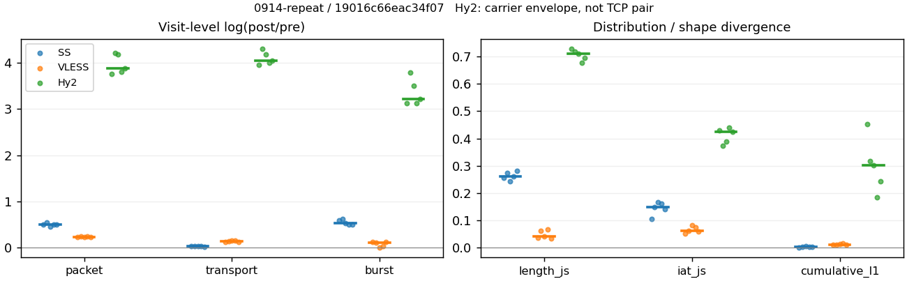
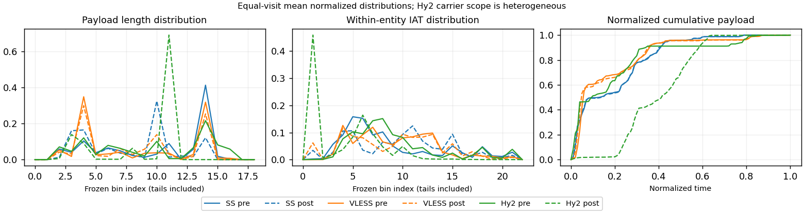

# 0914-repeat · 条目 011 · weather.com

目标：https://weather.com/zh-CN/cn/jiangsu/city/nanjing/today

活动标签：weather.com::page_load。选定访问 15 次。

[返回总索引](../../README.md) · [统计口径](../../methods.md)

## 覆盖与资格（每次访问均保留）

| 部署 | 重复 | 主请求路由 | 活动状态 | 代理比较 | DIRECT pre | 请求 proxy/direct/unresolved | 错误 |
| --- | --- | --- | --- | --- | --- | --- | --- |
| Hy2 | 1 | direct | passed | 1 | 1 | 33/106/1 | [] |
| Hy2 | 2 | direct | passed | 1 | 1 | 20/88/2 | [] |
| Hy2 | 3 | direct | passed | 1 | 1 | 22/85/0 | [] |
| Hy2 | 4 | direct | passed | 1 | 1 | 35/103/1 | [] |
| Hy2 | 5 | direct | passed | 1 | 1 | 34/103/2 | [] |
| SS | 1 | direct | passed | 1 | 1 | 25/102/0 | [] |
| SS | 2 | direct | passed | 1 | 1 | 25/101/0 | [] |
| SS | 3 | direct | passed | 1 | 1 | 23/95/0 | [] |
| SS | 4 | direct | passed | 1 | 1 | 25/100/0 | [] |
| SS | 5 | direct | passed | 1 | 1 | 25/103/0 | [] |
| VLESS | 1 | direct | passed | 1 | 1 | 41/102/0 | [] |
| VLESS | 2 | direct | passed | 1 | 1 | 31/94/0 | [] |
| VLESS | 3 | direct | passed | 1 | 1 | 42/100/0 | [] |
| VLESS | 4 | direct | passed | 1 | 1 | 41/102/0 | [] |
| VLESS | 5 | direct | passed | 1 | 1 | 28/88/0 | [] |

主请求非 proxy 的统计仅解释为已索引的辅助代理连接或 DIRECT 观测，不代表目标业务经代理传输。播放确认与配对资格是两道不同的门。

图中散点为单次访问，短线为重复中位数；Hy2 是共享载体包络，不能与 TCP 配对作等范围因果对比。

形态图先逐访问归一化，再对访问等权平均；实线 pre，虚线 post。分箱序号及边界见 methods，不将分箱索引误解为长度或时间。

## 每次访问的关键观测

### SS

范围：`exclusive_page`。每格 pre → post；空值为不可观测/不适用。

| 重复 | 包数 | 载荷字节 | burst | TCP FR | IAT中位µs | length JS | IAT JS |
| --- | --- | --- | --- | --- | --- | --- | --- |
| 1 | 864 → 1424 | 7.304e+05 → 7.4999e+05 | 594 → 1067 | 130 → 134 | 93.776 → 753.69 | 0.25689 | 0.10489 |
| 2 | 909 → 1561 | 7.4983e+05 → 7.7026e+05 | 624 → 1159 | 130 → 132 | 69.289 → 762.77 | 0.27474 | 0.14776 |
| 3 | 786 → 1248 | 6.1181e+05 → 6.3136e+05 | 558 → 947 | 104 → 106 | 61.178 → 979.68 | 0.24235 | 0.16705 |
| 4 | 952 → 1569 | 7.4002e+05 → 7.6224e+05 | 697 → 1143 | 127 → 129 | 60.6 → 654.45 | 0.26146 | 0.16061 |
| 5 | 889 → 1469 | 6.8572e+05 → 7.0336e+05 | 638 → 1051 | 123 → 123 | 64.815 → 632.89 | 0.28223 | 0.14091 |

范围：`direct_pre_only`。每格 pre → post；空值为不可观测/不适用。

| 重复 | 包数 | 载荷字节 | burst | TCP FR | IAT中位µs | length JS | IAT JS |
| --- | --- | --- | --- | --- | --- | --- | --- |
| 1 | 892 → — | 1.3787e+06 → — | 667 → — | 92 → — | 64.876 → — | — | — |
| 2 | 990 → — | 1.3278e+06 → — | 725 → — | 80 → — | 75.044 → — | — | — |
| 3 | 842 → — | 1.3278e+06 → — | 671 → — | 75 → — | 43.291 → — | — | — |
| 4 | 782 → — | 1.3239e+06 → — | 585 → — | 78 → — | 49.352 → — | — | — |
| 5 | 1295 → — | 1.3289e+06 → — | 885 → — | 77 → — | 261.26 → — | — | — |

完整标量统计：中位数 [min,max]；Δ 为重复内逐访问变换的中位数，MAD 未缩放。n 为可用变换数；DIRECT-only 的 nΔ=0 不代表 pre 不可用。

| scope | 特征 | pre | post | Δ | IQRΔ | MADΔ | nΔ |
| --- | --- | --- | --- | --- | --- | --- | --- |
| direct_pre_only | active_span_sum_s_1000ms | 21.87 [14.136, 30.876] | — | — | — | — | 0 |
| direct_pre_only | active_span_sum_s_100ms | 2.7674 [1.4579, 2.9329] | — | — | — | — | 0 |
| direct_pre_only | active_span_sum_s_500ms | 13.625 [9.9314, 16.708] | — | — | — | — | 0 |
| direct_pre_only | burst_bytes_iqr | 2256 [1428, 2856] | — | — | — | — | 0 |
| direct_pre_only | burst_bytes_mad | 35 [35, 35] | — | — | — | — | 0 |
| direct_pre_only | burst_bytes_max | 20480 [10908, 26032] | — | — | — | — | 0 |
| direct_pre_only | burst_bytes_mean | 1978.9 [1501.6, 2263.1] | — | — | — | — | 0 |
| direct_pre_only | burst_bytes_median | 35 [35, 35] | — | — | — | — | 0 |
| direct_pre_only | burst_bytes_min | 0 [0, 0] | — | — | — | — | 0 |
| direct_pre_only | burst_bytes_p95 | 8920 [5712, 12288] | — | — | — | — | 0 |
| direct_pre_only | burst_bytes_q25 | 0 [0, 0] | — | — | — | — | 0 |
| direct_pre_only | burst_bytes_q75 | 2256 [1428, 2856] | — | — | — | — | 0 |
| direct_pre_only | burst_bytes_std | 4061.7 [2140.3, 4561] | — | — | — | — | 0 |
| direct_pre_only | burst_count | 671 [585, 885] | — | — | — | — | 0 |
| direct_pre_only | burst_duration_ms_iqr | 0.012828 [0, 1.2366] | — | — | — | — | 0 |
| direct_pre_only | burst_duration_ms_mad | 0 [0, 0] | — | — | — | — | 0 |
| direct_pre_only | burst_duration_ms_max | 15001 [10019, 15001] | — | — | — | — | 0 |
| direct_pre_only | burst_duration_ms_mean | 129.44 [47.868, 237.81] | — | — | — | — | 0 |
| direct_pre_only | burst_duration_ms_median | 0 [0, 0] | — | — | — | — | 0 |
| direct_pre_only | burst_duration_ms_min | 0 [0, 0] | — | — | — | — | 0 |
| direct_pre_only | burst_duration_ms_p95 | 304.86 [20.548, 343.11] | — | — | — | — | 0 |
| direct_pre_only | burst_duration_ms_q25 | 0 [0, 0] | — | — | — | — | 0 |
| direct_pre_only | burst_duration_ms_q75 | 0.012828 [0, 1.2366] | — | — | — | — | 0 |
| direct_pre_only | burst_duration_ms_std | 1000.4 [477.58, 1563.5] | — | — | — | — | 0 |
| direct_pre_only | burst_packets_iqr | 1 [0, 1] | — | — | — | — | 0 |
| direct_pre_only | burst_packets_mad | 0 [0, 0] | — | — | — | — | 0 |
| direct_pre_only | burst_packets_max | 5 [4, 6] | — | — | — | — | 0 |
| direct_pre_only | burst_packets_mean | 1.3373 [1.2548, 1.4633] | — | — | — | — | 0 |
| direct_pre_only | burst_packets_median | 1 [1, 1] | — | — | — | — | 0 |
| direct_pre_only | burst_packets_min | 1 [1, 1] | — | — | — | — | 0 |
| direct_pre_only | burst_packets_p95 | 3 [2, 3] | — | — | — | — | 0 |
| direct_pre_only | burst_packets_q25 | 1 [1, 1] | — | — | — | — | 0 |
| direct_pre_only | burst_packets_q75 | 2 [1, 2] | — | — | — | — | 0 |
| direct_pre_only | burst_packets_std | 0.63753 [0.57445, 0.66451] | — | — | — | — | 0 |
| direct_pre_only | connection_span_concurrency_max | 5 [5, 6] | — | — | — | — | 0 |
| direct_pre_only | direction_entropy | 0.89683 [0.70361, 0.93567] | — | — | — | — | 0 |
| direct_pre_only | down_burst_count | 334 [289, 439] | — | — | — | — | 0 |
| direct_pre_only | down_ip_bytes | 1.3139e+06 [1.2946e+06, 1.3474e+06] | — | — | — | — | 0 |
| direct_pre_only | down_packets | 470 [405, 768] | — | — | — | — | 0 |
| direct_pre_only | down_transport_bytes | 1.2783e+06 [1.2735e+06, 1.3229e+06] | — | — | — | — | 0 |
| direct_pre_only | duration_s | 45.983 [28.967, 52.283] | — | — | — | — | 0 |
| direct_pre_only | entity_count | 7 [6, 9] | — | — | — | — | 0 |
| direct_pre_only | fr_runs | 78 [75, 92] | — | — | — | — | 0 |
| direct_pre_only | fr_runs_per_packet | 0.16779 [0.098718, 0.1945] | — | — | — | — | 0 |
| direct_pre_only | fr_switches | 71 [69, 83] | — | — | — | — | 0 |
| direct_pre_only | fr_switches_per_possible_transition | 0.15646 [0.089378, 0.17888] | — | — | — | — | 0 |
| direct_pre_only | full_retransmission_fraction | 0.0020202 [0, 0.0056054] | — | — | — | — | 0 |
| direct_pre_only | full_retransmission_packets | 2 [0, 5] | — | — | — | — | 0 |
| direct_pre_only | iat_count | 883 [775, 1287] | — | — | — | — | 0 |
| direct_pre_only | iat_median_us | 64.876 [43.291, 261.26] | — | — | — | — | 0 |
| direct_pre_only | iat_us_iqr | 2415.8 [453.59, 4109.5] | — | — | — | — | 0 |
| direct_pre_only | iat_us_mad | 57.206 [38.525, 251.85] | — | — | — | — | 0 |
| direct_pre_only | iat_us_max | 1.5001e+07 [1.5001e+07, 1.5001e+07] | — | — | — | — | 0 |
| direct_pre_only | iat_us_mean | 2.0822e+05 [83242, 2.7793e+05] | — | — | — | — | 0 |
| direct_pre_only | iat_us_median | 64.876 [43.291, 261.26] | — | — | — | — | 0 |
| direct_pre_only | iat_us_min | 0.5 [0.078, 1.225] | — | — | — | — | 0 |
| direct_pre_only | iat_us_p95 | 3.563e+05 [40939, 6.3471e+05] | — | — | — | — | 0 |
| direct_pre_only | iat_us_q25 | 13.688 [11.691, 51.703] | — | — | — | — | 0 |
| direct_pre_only | iat_us_q75 | 2467.5 [465.32, 4130.8] | — | — | — | — | 0 |
| direct_pre_only | iat_us_std | 1.4089e+06 [8.2012e+05, 1.7088e+06] | — | — | — | — | 0 |
| direct_pre_only | idle_gap_count_1000ms | 21 [16, 27] | — | — | — | — | 0 |
| direct_pre_only | idle_gap_count_100ms | 73 [54, 103] | — | — | — | — | 0 |
| direct_pre_only | idle_gap_count_500ms | 33 [22, 49] | — | — | — | — | 0 |
| direct_pre_only | idle_gap_sum_s_1000ms | 159.51 [92.997, 196.79] | — | — | — | — | 0 |
| direct_pre_only | idle_gap_sum_s_100ms | 180.92 [104.23, 213.94] | — | — | — | — | 0 |
| direct_pre_only | idle_gap_sum_s_500ms | 167.75 [97.202, 203.65] | — | — | — | — | 0 |
| direct_pre_only | ip_bytes | 1.3793e+06 [1.3645e+06, 1.4251e+06] | — | — | — | — | 0 |
| direct_pre_only | length_iqr | 4139.5 [1847, 7023] | — | — | — | — | 0 |
| direct_pre_only | length_mad | 1316 [1314, 1336] | — | — | — | — | 0 |
| direct_pre_only | length_max | 8920 [8920, 8920] | — | — | — | — | 0 |
| direct_pre_only | length_mean | 2914.7 [1703.7, 3190.1] | — | — | — | — | 0 |
| direct_pre_only | length_median | 1428 [1428, 1428] | — | — | — | — | 0 |
| direct_pre_only | length_min | 24 [24, 24] | — | — | — | — | 0 |
| direct_pre_only | length_p95 | 8920 [2856, 8920] | — | — | — | — | 0 |
| direct_pre_only | length_q25 | 138.5 [117, 1009] | — | — | — | — | 0 |
| direct_pre_only | length_q75 | 4272 [2856, 7140] | — | — | — | — | 0 |
| direct_pre_only | length_std | 3299.7 [1162.3, 3477.1] | — | — | — | — | 0 |
| direct_pre_only | nonempty_entity_count | 7 [6, 9] | — | — | — | — | 0 |
| direct_pre_only | nonempty_packets | 473 [415, 780] | — | — | — | — | 0 |
| direct_pre_only | offload_suspect_fraction | 0.23939 [0.23784, 0.26343] | — | — | — | — | 0 |
| direct_pre_only | packet_count | 892 [782, 1295] | — | — | — | — | 0 |
| direct_pre_only | rtt_median_ms | 0.057236 [0.026949, 0.43139] | — | — | — | — | 0 |
| direct_pre_only | rtt_sample_count | 379 [332, 487] | — | — | — | — | 0 |
| direct_pre_only | tcp_ack_count | 868 [763, 1276] | — | — | — | — | 0 |
| direct_pre_only | tcp_fin_count | 12 [9, 15] | — | — | — | — | 0 |
| direct_pre_only | tcp_packet_count | 892 [782, 1295] | — | — | — | — | 0 |
| direct_pre_only | tcp_rst_count | 12 [6, 15] | — | — | — | — | 0 |
| direct_pre_only | tcp_syn_count | 14 [12, 18] | — | — | — | — | 0 |
| direct_pre_only | tcp_window_raw_median | 65363 [65078, 65535] | — | — | — | — | 0 |
| direct_pre_only | transition_entropy | 0.5974 [0.38794, 0.6451] | — | — | — | — | 0 |
| direct_pre_only | transition_n_mm | 272 [230, 593] | — | — | — | — | 0 |
| direct_pre_only | transition_n_mp | 32 [31, 37] | — | — | — | — | 0 |
| direct_pre_only | transition_n_pm | 39 [37, 46] | — | — | — | — | 0 |
| direct_pre_only | transition_n_pp | 107 [102, 110] | — | — | — | — | 0 |
| direct_pre_only | transition_p_mm | 0.89404 [0.87786, 0.95032] | — | — | — | — | 0 |
| direct_pre_only | transition_p_mp | 0.10596 [0.049679, 0.12214] | — | — | — | — | 0 |
| direct_pre_only | transition_p_pm | 0.26712 [0.25676, 0.29677] | — | — | — | — | 0 |
| direct_pre_only | transition_p_pp | 0.73288 [0.70323, 0.74324] | — | — | — | — | 0 |
| direct_pre_only | transport_bytes | 1.3278e+06 [1.3239e+06, 1.3787e+06] | — | — | — | — | 0 |
| direct_pre_only | up_burst_count | 338 [296, 446] | — | — | — | — | 0 |
| direct_pre_only | up_byte_fraction | 0.038073 [0.027351, 0.040429] | — | — | — | — | 0 |
| direct_pre_only | up_ip_bytes | 72505 [57770, 80817] | — | — | — | — | 0 |
| direct_pre_only | up_packets | 422 [377, 527] | — | — | — | — | 0 |
| direct_pre_only | up_transport_bytes | 50405 [36318, 55737] | — | — | — | — | 0 |
| direct_pre_only | zero_iat_count | 0 [0, 0] | — | — | — | — | 0 |
| direct_pre_only | zero_iat_fraction | 0 [0, 0] | — | — | — | — | 0 |
| exclusive_page | active_span_sum_s_1000ms | 25.328 [21.953, 30.283] | 29.531 [25.235, 32.937] | 0.13811 | 0.019267 | 0.015421 | 5 |
| exclusive_page | active_span_sum_s_100ms | 3.8619 [2.9383, 4.4481] | 8.1699 [7.962, 8.7585] | 0.78467 | 0.15211 | 0.1179 | 5 |
| exclusive_page | active_span_sum_s_500ms | 17.844 [14.59, 19.709] | 21.451 [20.693, 24.969] | 0.31309 | 0.089905 | 0.036337 | 5 |
| exclusive_page | burst_bytes_iqr | 1756 [1448, 1807] | 1428 [1428, 1428] | -0.20676 | 0.021829 | 0.015259 | 5 |
| exclusive_page | burst_bytes_mad | 31 [31, 31] | 20 [0, 34] | -0.17294 | 0.70392 | 0.26531 | 4 |
| exclusive_page | burst_bytes_max | 15928 [11584, 19394] | 5712 [5712, 7140] | -0.99925 | 0.09531 | 0.069052 | 5 |
| exclusive_page | burst_bytes_mean | 1096.4 [1061.7, 1229.6] | 666.87 [664.59, 702.9] | -0.49748 | 0.085494 | 0.032435 | 5 |
| exclusive_page | burst_bytes_median | 31 [31, 31] | 20 [0, 34] | -0.17294 | 0.70392 | 0.26531 | 4 |
| exclusive_page | burst_bytes_min | 0 [0, 0] | 0 [0, 0] | — | — | — | 0 |
| exclusive_page | burst_bytes_p95 | 5792 [4344, 5792] | 2856 [2856, 2856] | -0.70706 | 0.28768 | 0 | 5 |
| exclusive_page | burst_bytes_q25 | 0 [0, 0] | 0 [0, 0] | — | — | — | 0 |
| exclusive_page | burst_bytes_q75 | 1756 [1448, 1807] | 1428 [1428, 1428] | -0.20676 | 0.021829 | 0.015259 | 5 |
| exclusive_page | burst_bytes_std | 2073.4 [1814.4, 2336.5] | 1016.6 [966.13, 1030.6] | -0.71276 | 0.070603 | 0.038385 | 5 |
| exclusive_page | burst_count | 624 [558, 697] | 1067 [947, 1159] | 0.52894 | 0.086568 | 0.034314 | 5 |
| exclusive_page | burst_duration_ms_iqr | 0.093568 [0.048798, 0.47772] | 0 [0, 0] | — | — | — | 0 |
| exclusive_page | burst_duration_ms_mad | 0 [0, 0] | 0 [0, 0] | — | — | — | 0 |
| exclusive_page | burst_duration_ms_max | 15001 [15001, 15001] | 16806 [15045, 30245] | 0.11365 | 0.56718 | 0.11074 | 5 |
| exclusive_page | burst_duration_ms_mean | 282.53 [214.82, 496.82] | 120.88 [105.74, 169.53] | -0.81095 | 0.34091 | 0.10211 | 5 |
| exclusive_page | burst_duration_ms_median | 0 [0, 0] | 0 [0, 0] | — | — | — | 0 |
| exclusive_page | burst_duration_ms_min | 0 [0, 0] | 0 [0, 0] | — | — | — | 0 |
| exclusive_page | burst_duration_ms_p95 | 410.27 [371.94, 714.67] | 170.14 [130.26, 174.34] | -1.1473 | 0.40138 | 0.26354 | 5 |
| exclusive_page | burst_duration_ms_q25 | 0 [0, 0] | 0 [0, 0] | — | — | — | 0 |
| exclusive_page | burst_duration_ms_q75 | 0.093568 [0.048798, 0.47772] | 0 [0, 0] | — | — | — | 0 |
| exclusive_page | burst_duration_ms_std | 1638.9 [1472.4, 2412.7] | 1201.5 [1121.1, 1564.6] | -0.36795 | 0.18334 | 0.11817 | 5 |
| exclusive_page | burst_packets_iqr | 1 [1, 1] | 0 [0, 0] | — | — | — | 0 |
| exclusive_page | burst_packets_mad | 0 [0, 0] | 0 [0, 0] | — | — | — | 0 |
| exclusive_page | burst_packets_max | 6 [5, 8] | 6 [5, 7] | 0 | 0.18232 | 0.18232 | 5 |
| exclusive_page | burst_packets_mean | 1.4086 [1.3659, 1.4567] | 1.3469 [1.3178, 1.3977] | -0.066599 | 0.081507 | 0.019475 | 5 |
| exclusive_page | burst_packets_median | 1 [1, 1] | 1 [1, 1] | 0 | 0 | 0 | 5 |
| exclusive_page | burst_packets_min | 1 [1, 1] | 1 [1, 1] | 0 | 0 | 0 | 5 |
| exclusive_page | burst_packets_p95 | 3 [2.2, 3] | 3 [3, 4] | 0 | 0.28768 | 0 | 5 |
| exclusive_page | burst_packets_q25 | 1 [1, 1] | 1 [1, 1] | 0 | 0 | 0 | 5 |
| exclusive_page | burst_packets_q75 | 2 [2, 2] | 1 [1, 1] | -0.69315 | 0 | 0 | 5 |
| exclusive_page | burst_packets_std | 0.73426 [0.67938, 0.77337] | 0.76813 [0.75745, 0.82754] | 0.0311 | 0.1184 | 0.0379 | 5 |
| exclusive_page | connection_span_concurrency_max | 12 [12, 13] | 12 [12, 13] | 0 | 0 | 0 | 5 |
| exclusive_page | cumulative_l1 | — | — | 0.0026136 | 0.0010977 | 0.00066188 | 5 |
| exclusive_page | cumulative_max | — | — | 0.045129 | 0.024413 | 0.014654 | 5 |
| exclusive_page | direction_entropy | 0.81128 [0.79905, 0.83429] | 0.70799 [0.69003, 0.76757] | -0.09339 | 0.031962 | 0.015632 | 5 |
| exclusive_page | down_burst_count | 303 [273, 340] | 525 [468, 571] | 0.539 | 0.088967 | 0.034662 | 5 |
| exclusive_page | down_ip_bytes | 7.0572e+05 [5.9482e+05, 7.2665e+05] | 7.2812e+05 [6.1594e+05, 7.5408e+05] | 0.037054 | 0.0024373 | 0.0021355 | 5 |
| exclusive_page | down_packets | 488 [426, 518] | 777 [622, 811] | 0.44829 | 0.056601 | 0.016832 | 5 |
| exclusive_page | down_transport_bytes | 6.8072e+05 [5.7255e+05, 7.0009e+05] | 6.9065e+05 [5.8338e+05, 7.1211e+05] | 0.017142 | 0.00075651 | 0.00063535 | 5 |
| exclusive_page | duration_s | 44.122 [27.976, 51.222] | 44.107 [27.975, 51.212] | -0.00020443 | 0.0001275 | 0.00011523 | 5 |
| exclusive_page | entity_count | 18 [14, 18] | 18 [14, 18] | 0 | 0 | 0 | 5 |
| exclusive_page | fr_runs | 127 [104, 130] | 129 [106, 134] | 0.015625 | 0.0037807 | 0.0034229 | 5 |
| exclusive_page | fr_runs_per_packet | 0.28671 [0.2766, 0.31325] | 0.16858 [0.16335, 0.18768] | -0.12337 | 0.0053752 | 0.0031639 | 5 |
| exclusive_page | fr_switches | 109 [90, 112] | 111 [92, 116] | 0.018182 | 0.0042793 | 0.0037966 | 5 |
| exclusive_page | fr_switches_per_possible_transition | 0.25547 [0.24862, 0.28212] | 0.14902 [0.14286, 0.16667] | -0.11262 | 0.0057133 | 0.0028814 | 5 |
| exclusive_page | full_retransmission_fraction | 0 [0, 0.0011574] | 0.01211 [0.0040844, 0.018961] | 0.01211 | 0.0104 | 0.0055186 | 5 |
| exclusive_page | full_retransmission_packets | 0 [0, 1] | 19 [6, 27] | 2.9304 | 0.36544 | 0.36544 | 2 |
| exclusive_page | iat_count | 871 [772, 934] | 1451 [1234, 1551] | 0.50798 | 0.0031876 | 0.0023816 | 5 |
| exclusive_page | iat_js | — | — | 0.14776 | 0.0197 | 0.01285 | 5 |
| exclusive_page | iat_ks | — | — | 0.27408 | 0.020669 | 0.015485 | 5 |
| exclusive_page | iat_median_us | 64.815 [60.6, 93.776] | 753.69 [632.89, 979.68] | 2.3795 | 0.1199 | 0.10072 | 5 |
| exclusive_page | iat_us_iqr | 1786.6 [863.54, 2955.7] | 5548.1 [5155.5, 10100] | 1.1007 | 0.055498 | 0.032425 | 5 |
| exclusive_page | iat_us_mad | 57.331 [53.712, 84.216] | 742.98 [624.22, 970.95] | 2.4846 | 0.1238 | 0.096975 | 5 |
| exclusive_page | iat_us_max | 1.5001e+07 [1.5001e+07, 1.5003e+07] | 1.5417e+07 [1.5045e+07, 1.5453e+07] | 0.027353 | 0.025864 | 0.0023025 | 5 |
| exclusive_page | iat_us_mean | 4.2383e+05 [2.731e+05, 5.6972e+05] | 2.3506e+05 [1.5332e+05, 3.4399e+05] | -0.55215 | 0.069529 | 0.037328 | 5 |
| exclusive_page | iat_us_median | 64.815 [60.6, 93.776] | 753.69 [632.89, 979.68] | 2.3795 | 0.1199 | 0.10072 | 5 |
| exclusive_page | iat_us_min | 0.139 [0.026, 0.219] | 0.037 [0.037, 0.049] | -1.0427 | 1.4462 | 0.7355 | 5 |
| exclusive_page | iat_us_p95 | 5.6079e+05 [3.8047e+05, 9.8323e+05] | 2.3687e+05 [1.7215e+05, 2.7481e+05] | -0.85444 | 0.37044 | 0.081635 | 5 |
| exclusive_page | iat_us_q25 | 15.181 [13.81, 17.279] | 15.45 [12.585, 23.373] | 0.017564 | 0.17326 | 0.11043 | 5 |
| exclusive_page | iat_us_q75 | 1801.1 [879.22, 2973] | 5562.1 [5170.9, 10118] | 1.0949 | 0.055188 | 0.032679 | 5 |
| exclusive_page | iat_us_std | 2.3042e+06 [1.7468e+06, 2.6487e+06] | 1.7321e+06 [1.291e+06, 2.067e+06] | -0.27973 | 0.037434 | 0.022618 | 5 |
| exclusive_page | iat_wasserstein_log1p_us | — | — | 1.145 | 0.046224 | 0.036878 | 5 |
| exclusive_page | idle_gap_count_1000ms | 31 [27, 42] | 30 [25, 45] | -0.03279 | 0.12825 | 0.076409 | 5 |
| exclusive_page | idle_gap_count_100ms | 93 [87, 101] | 102 [92, 110] | 0.11653 | 0.074959 | 0.019598 | 5 |
| exclusive_page | idle_gap_count_500ms | 45 [38, 50] | 39 [37, 51] | -0.04256 | 0.11643 | 0.062362 | 5 |
| exclusive_page | idle_gap_sum_s_1000ms | 347.35 [212.54, 417.84] | 331.9 [192.94, 408.17] | -0.045505 | 0.017021 | 0.017002 | 5 |
| exclusive_page | idle_gap_sum_s_100ms | 373.77 [233.65, 436.88] | 353.94 [214.51, 425.73] | -0.054507 | 0.010893 | 0.0067514 | 5 |
| exclusive_page | idle_gap_sum_s_500ms | 357.92 [220.03, 425.23] | 337.73 [201.42, 412.94] | -0.058066 | 0.016663 | 0.010319 | 5 |
| exclusive_page | ip_bytes | 7.7562e+05 [6.5289e+05, 7.9738e+05] | 8.3079e+05 [7.0344e+05, 8.5991e+05] | 0.074574 | 0.0030202 | 0.0018539 | 5 |
| exclusive_page | length_iqr | 2559 [2514.5, 2637] | 1354 [1330, 1355] | -0.6505 | 0.014753 | 0.013847 | 5 |
| exclusive_page | length_js | — | — | 0.26146 | 0.017852 | 0.013282 | 5 |
| exclusive_page | length_ks | — | — | 0.42488 | 0.023314 | 0.0021103 | 5 |
| exclusive_page | length_mad | 1384 [1130, 1384] | 764 [647, 1049] | -0.39665 | 0.26568 | 0.16007 | 5 |
| exclusive_page | length_max | 4096 [4096, 8920] | 2856 [2856, 2856] | -0.36059 | 0 | 0 | 5 |
| exclusive_page | length_mean | 1655.5 [1598.4, 1760] | 983.73 [934.07, 1050.4] | -0.53609 | 0.021078 | 0.01338 | 5 |
| exclusive_page | length_median | 1448 [1448, 1766] | 1086 [986, 1428] | -0.35333 | 0.17924 | 0.13289 | 5 |
| exclusive_page | length_min | 31 [20, 31] | 10 [6, 20] | -1.1314 | 0.33647 | 0.072571 | 5 |
| exclusive_page | length_p95 | 2896 [2896, 3704.8] | 2856 [2856, 2856] | -0.013908 | 0 | 0 | 5 |
| exclusive_page | length_q25 | 337 [259, 381.5] | 74 [73, 98] | -1.2902 | 0.25742 | 0.037412 | 5 |
| exclusive_page | length_q75 | 2896 [2896, 2896] | 1428 [1428, 1428] | -0.70706 | 0 | 0 | 5 |
| exclusive_page | length_std | 1206.2 [1204.2, 1467.1] | 909.5 [855.89, 961.38] | -0.32466 | 0.059111 | 0.041609 | 5 |
| exclusive_page | length_wasserstein_bytes | — | — | 687.23 | 45.402 | 22.86 | 5 |
| exclusive_page | nonempty_entity_count | 18 [14, 18] | 18 [14, 18] | 0 | 0 | 0 | 5 |
| exclusive_page | nonempty_packets | 429 [376, 447] | 753 [612, 787] | 0.56261 | 0.023065 | 0.01375 | 5 |
| exclusive_page | offload_suspect_fraction | 0.2306 [0.22392, 0.25303] | 0.076874 [0.060585, 0.094101] | -0.15378 | 0.023371 | 0.016226 | 5 |
| exclusive_page | packet_count | 889 [786, 952] | 1469 [1248, 1569] | 0.49965 | 0.0026112 | 0.0025876 | 5 |
| exclusive_page | rtt_median_ms | 0.058631 [0.05204, 0.071408] | 31.782 [27.418, 33.378] | 6.3444 | 0.25783 | 0.091926 | 5 |
| exclusive_page | rtt_sample_count | 390 [343, 427] | 386 [293, 394] | -0.064372 | 0.072711 | 0.05665 | 5 |
| exclusive_page | tcp_ack_count | 870 [771, 934] | 1449 [1229, 1545] | 0.50846 | 0.006833 | 0.0051532 | 5 |
| exclusive_page | tcp_fin_count | 36 [26, 36] | 36 [28, 43] | 0.054067 | 0.074108 | 0.054067 | 5 |
| exclusive_page | tcp_packet_count | 889 [786, 952] | 1469 [1248, 1569] | 0.49965 | 0.0026112 | 0.0025876 | 5 |
| exclusive_page | tcp_rst_count | 1 [0, 1] | 0 [0, 1] | 0 | 0 | 0 | 2 |
| exclusive_page | tcp_syn_count | 36 [28, 36] | 37 [33, 43] | 0.054067 | 0.1369 | 0.026668 | 5 |
| exclusive_page | tcp_window_raw_median | 65471 [65425, 65484] | 132 [131, 132] | -6.2066 | 0.00019854 | 0.00015275 | 5 |
| exclusive_page | transition_entropy | 0.70434 [0.69474, 0.74334] | 0.52084 [0.50166, 0.57391] | -0.18511 | 0.02365 | 0.0088601 | 5 |
| exclusive_page | transition_n_mm | 267 [234, 278] | 556 [436, 574] | 0.72501 | 0.034244 | 0.025732 | 5 |
| exclusive_page | transition_n_mp | 49 [42, 51] | 50 [43, 53] | 0.020203 | 0.0041124 | 0.0033278 | 5 |
| exclusive_page | transition_n_pm | 60 [48, 61] | 61 [49, 63] | 0.016529 | 0.0043588 | 0.00409 | 5 |
| exclusive_page | transition_n_pp | 41 [38, 42] | 80 [70, 89] | 0.66845 | 0.052644 | 0.027951 | 5 |
| exclusive_page | transition_p_mm | 0.84783 [0.82712, 0.85032] | 0.91653 [0.90257, 0.92206] | 0.071738 | 0.005736 | 0.003717 | 5 |
| exclusive_page | transition_p_mp | 0.15217 [0.14968, 0.17288] | 0.083467 [0.077944, 0.097426] | -0.071738 | 0.005736 | 0.003717 | 5 |
| exclusive_page | transition_p_pm | 0.59794 [0.55814, 0.59804] | 0.42069 [0.41176, 0.43939] | -0.16142 | 0.0090014 | 0.0061261 | 5 |
| exclusive_page | transition_p_pp | 0.40206 [0.40196, 0.44186] | 0.57931 [0.56061, 0.58824] | 0.16142 | 0.0090014 | 0.0061261 | 5 |
| exclusive_page | transport_bytes | 7.304e+05 [6.1181e+05, 7.4983e+05] | 7.4999e+05 [6.3136e+05, 7.7026e+05] | 0.02689 | 0.0031223 | 0.0015045 | 5 |
| exclusive_page | up_burst_count | 321 [285, 357] | 542 [479, 588] | 0.51921 | 0.084299 | 0.033919 | 5 |
| exclusive_page | up_byte_fraction | 0.067266 [0.064164, 0.071166] | 0.078205 [0.0755, 0.079118] | 0.011093 | 0.0023623 | 0.00074206 | 5 |
| exclusive_page | up_ip_bytes | 69902 [58076, 72490] | 1.0267e+05 [87503, 1.0793e+05] | 0.39807 | 0.018429 | 0.011849 | 5 |
| exclusive_page | up_packets | 401 [360, 434] | 710 [626, 758] | 0.55764 | 0.056181 | 0.012014 | 5 |
| exclusive_page | up_transport_bytes | 49686 [39256, 49778] | 58155 [47983, 60062] | 0.17753 | 0.031442 | 0.021164 | 5 |
| exclusive_page | zero_iat_count | 0 [0, 0] | 0 [0, 0] | — | — | — | 0 |
| exclusive_page | zero_iat_fraction | 0 [0, 0] | 0 [0, 0] | 0 | 0 | 0 | 5 |

### VLESS

范围：`exclusive_page`。每格 pre → post；空值为不可观测/不适用。

| 重复 | 包数 | 载荷字节 | burst | TCP FR | IAT中位µs | length JS | IAT JS |
| --- | --- | --- | --- | --- | --- | --- | --- |
| 1 | 2158 → 2717 | 1.4485e+06 → 1.6477e+06 | 1637 → 1861 | 176 → 226 | 362.5 → 449.48 | 0.03532 | 0.052691 |
| 2 | 1757 → 2260 | 1.1968e+06 → 1.3731e+06 | 1352 → 1498 | 144 → 188 | 353.86 → 516.51 | 0.063054 | 0.060835 |
| 3 | 1942 → 2435 | 1.2421e+06 → 1.4422e+06 | 1553 → 1570 | 171 → 222 | 183.73 → 539.74 | 0.041027 | 0.082261 |
| 4 | 1878 → 2399 | 1.2325e+06 → 1.4321e+06 | 1415 → 1459 | 172 → 222 | 312.74 → 569.92 | 0.067003 | 0.073592 |
| 5 | 1708 → 2162 | 1.1844e+06 → 1.3493e+06 | 1325 → 1505 | 137 → 178 | 315.78 → 535.27 | 0.034405 | 0.058421 |

范围：`direct_pre_only`。每格 pre → post；空值为不可观测/不适用。

| 重复 | 包数 | 载荷字节 | burst | TCP FR | IAT中位µs | length JS | IAT JS |
| --- | --- | --- | --- | --- | --- | --- | --- |
| 1 | 1169 → — | 1.3566e+06 → — | 876 → — | 84 → — | 653.05 → — | — | — |
| 2 | 1104 → — | 1.3405e+06 → — | 796 → — | 68 → — | 470.31 → — | — | — |
| 3 | 1174 → — | 1.3497e+06 → — | 859 → — | 82 → — | 250.85 → — | — | — |
| 4 | 1098 → — | 1.3659e+06 → — | 738 → — | 80 → — | 603.93 → — | — | — |
| 5 | 1038 → — | 1.3311e+06 → — | 708 → — | 64 → — | 502.46 → — | — | — |

完整标量统计：中位数 [min,max]；Δ 为重复内逐访问变换的中位数，MAD 未缩放。n 为可用变换数；DIRECT-only 的 nΔ=0 不代表 pre 不可用。

| scope | 特征 | pre | post | Δ | IQRΔ | MADΔ | nΔ |
| --- | --- | --- | --- | --- | --- | --- | --- |
| direct_pre_only | active_span_sum_s_1000ms | 17.639 [14.657, 23.648] | — | — | — | — | 0 |
| direct_pre_only | active_span_sum_s_100ms | 2.4362 [2.1595, 3.8384] | — | — | — | — | 0 |
| direct_pre_only | active_span_sum_s_500ms | 11.043 [8.8445, 14.135] | — | — | — | — | 0 |
| direct_pre_only | burst_bytes_iqr | 2856 [2856, 5712] | — | — | — | — | 0 |
| direct_pre_only | burst_bytes_mad | 31 [27.5, 36.5] | — | — | — | — | 0 |
| direct_pre_only | burst_bytes_max | 13947 [10278, 17569] | — | — | — | — | 0 |
| direct_pre_only | burst_bytes_mean | 1684.1 [1548.6, 1880.1] | — | — | — | — | 0 |
| direct_pre_only | burst_bytes_median | 31 [27.5, 36.5] | — | — | — | — | 0 |
| direct_pre_only | burst_bytes_min | 0 [0, 0] | — | — | — | — | 0 |
| direct_pre_only | burst_bytes_p95 | 5712 [5712, 5712] | — | — | — | — | 0 |
| direct_pre_only | burst_bytes_q25 | 0 [0, 0] | — | — | — | — | 0 |
| direct_pre_only | burst_bytes_q75 | 2856 [2856, 5712] | — | — | — | — | 0 |
| direct_pre_only | burst_bytes_std | 2406.9 [2176.1, 2655.8] | — | — | — | — | 0 |
| direct_pre_only | burst_count | 796 [708, 876] | — | — | — | — | 0 |
| direct_pre_only | burst_duration_ms_iqr | 1.3893 [0.1705, 1.6608] | — | — | — | — | 0 |
| direct_pre_only | burst_duration_ms_mad | 0 [0, 0] | — | — | — | — | 0 |
| direct_pre_only | burst_duration_ms_max | 15000 [9737.3, 15001] | — | — | — | — | 0 |
| direct_pre_only | burst_duration_ms_mean | 101.1 [58.901, 135.89] | — | — | — | — | 0 |
| direct_pre_only | burst_duration_ms_median | 0 [0, 0] | — | — | — | — | 0 |
| direct_pre_only | burst_duration_ms_min | 0 [0, 0] | — | — | — | — | 0 |
| direct_pre_only | burst_duration_ms_p95 | 118.01 [58.631, 203.32] | — | — | — | — | 0 |
| direct_pre_only | burst_duration_ms_q25 | 0 [0, 0] | — | — | — | — | 0 |
| direct_pre_only | burst_duration_ms_q75 | 1.3893 [0.1705, 1.6608] | — | — | — | — | 0 |
| direct_pre_only | burst_duration_ms_std | 928.81 [541.99, 1145.5] | — | — | — | — | 0 |
| direct_pre_only | burst_packets_iqr | 1 [1, 1] | — | — | — | — | 0 |
| direct_pre_only | burst_packets_mad | 0 [0, 0] | — | — | — | — | 0 |
| direct_pre_only | burst_packets_max | 5 [4, 10] | — | — | — | — | 0 |
| direct_pre_only | burst_packets_mean | 1.3869 [1.3345, 1.4878] | — | — | — | — | 0 |
| direct_pre_only | burst_packets_median | 1 [1, 1] | — | — | — | — | 0 |
| direct_pre_only | burst_packets_min | 1 [1, 1] | — | — | — | — | 0 |
| direct_pre_only | burst_packets_p95 | 2 [2, 2] | — | — | — | — | 0 |
| direct_pre_only | burst_packets_q25 | 1 [1, 1] | — | — | — | — | 0 |
| direct_pre_only | burst_packets_q75 | 2 [2, 2] | — | — | — | — | 0 |
| direct_pre_only | burst_packets_std | 0.61197 [0.55232, 0.62391] | — | — | — | — | 0 |
| direct_pre_only | connection_span_concurrency_max | 6 [5, 6] | — | — | — | — | 0 |
| direct_pre_only | direction_entropy | 0.74899 [0.72323, 0.78159] | — | — | — | — | 0 |
| direct_pre_only | down_burst_count | 394 [350, 434] | — | — | — | — | 0 |
| direct_pre_only | down_ip_bytes | 1.3338e+06 [1.3221e+06, 1.3429e+06] | — | — | — | — | 0 |
| direct_pre_only | down_packets | 644 [611, 659] | — | — | — | — | 0 |
| direct_pre_only | down_transport_bytes | 1.2994e+06 [1.2902e+06, 1.3094e+06] | — | — | — | — | 0 |
| direct_pre_only | duration_s | 35.636 [26.752, 54.517] | — | — | — | — | 0 |
| direct_pre_only | entity_count | 8 [8, 9] | — | — | — | — | 0 |
| direct_pre_only | fr_runs | 80 [64, 84] | — | — | — | — | 0 |
| direct_pre_only | fr_runs_per_packet | 0.12195 [0.1044, 0.12747] | — | — | — | — | 0 |
| direct_pre_only | fr_switches | 72 [56, 76] | — | — | — | — | 0 |
| direct_pre_only | fr_switches_per_possible_transition | 0.11111 [0.092562, 0.11674] | — | — | — | — | 0 |
| direct_pre_only | full_retransmission_fraction | 0 [0, 0] | — | — | — | — | 0 |
| direct_pre_only | full_retransmission_packets | 0 [0, 0] | — | — | — | — | 0 |
| direct_pre_only | iat_count | 1096 [1030, 1165] | — | — | — | — | 0 |
| direct_pre_only | iat_median_us | 502.46 [250.85, 653.05] | — | — | — | — | 0 |
| direct_pre_only | iat_us_iqr | 2577.4 [2000, 4765.4] | — | — | — | — | 0 |
| direct_pre_only | iat_us_mad | 494.53 [245.03, 644.1] | — | — | — | — | 0 |
| direct_pre_only | iat_us_max | 1.5001e+07 [1.5001e+07, 1.5001e+07] | — | — | — | — | 0 |
| direct_pre_only | iat_us_mean | 1.4595e+05 [98411, 2.2815e+05] | — | — | — | — | 0 |
| direct_pre_only | iat_us_median | 502.46 [250.85, 653.05] | — | — | — | — | 0 |
| direct_pre_only | iat_us_min | 0.494 [0.096, 0.885] | — | — | — | — | 0 |
| direct_pre_only | iat_us_p95 | 1.1138e+05 [41419, 2.2158e+05] | — | — | — | — | 0 |
| direct_pre_only | iat_us_q25 | 44.05 [37.373, 52.676] | — | — | — | — | 0 |
| direct_pre_only | iat_us_q75 | 2614.7 [2052.7, 4809.4] | — | — | — | — | 0 |
| direct_pre_only | iat_us_std | 1.271e+06 [8.6218e+05, 1.6243e+06] | — | — | — | — | 0 |
| direct_pre_only | idle_gap_count_1000ms | 14 [13, 27] | — | — | — | — | 0 |
| direct_pre_only | idle_gap_count_100ms | 60 [50, 74] | — | — | — | — | 0 |
| direct_pre_only | idle_gap_count_500ms | 24 [22, 37] | — | — | — | — | 0 |
| direct_pre_only | idle_gap_sum_s_1000ms | 137.1 [90.607, 247.76] | — | — | — | — | 0 |
| direct_pre_only | idle_gap_sum_s_100ms | 152.58 [110.42, 262.27] | — | — | — | — | 0 |
| direct_pre_only | idle_gap_sum_s_500ms | 143.7 [100.12, 253.9] | — | — | — | — | 0 |
| direct_pre_only | ip_bytes | 1.4107e+06 [1.385e+06, 1.4229e+06] | — | — | — | — | 0 |
| direct_pre_only | length_iqr | 2080 [1514, 2413] | — | — | — | — | 0 |
| direct_pre_only | length_mad | 0 [0, 0] | — | — | — | — | 0 |
| direct_pre_only | length_max | 8920 [8920, 8948] | — | — | — | — | 0 |
| direct_pre_only | length_mean | 2082.2 [2058.6, 2171.4] | — | — | — | — | 0 |
| direct_pre_only | length_median | 2856 [2856, 2856] | — | — | — | — | 0 |
| direct_pre_only | length_min | 24 [24, 24] | — | — | — | — | 0 |
| direct_pre_only | length_p95 | 2856 [2856, 2856] | — | — | — | — | 0 |
| direct_pre_only | length_q25 | 776 [443, 1342] | — | — | — | — | 0 |
| direct_pre_only | length_q75 | 2856 [2856, 2856] | — | — | — | — | 0 |
| direct_pre_only | length_std | 1277.5 [1257.3, 1341.3] | — | — | — | — | 0 |
| direct_pre_only | nonempty_entity_count | 8 [8, 9] | — | — | — | — | 0 |
| direct_pre_only | nonempty_packets | 655 [613, 659] | — | — | — | — | 0 |
| direct_pre_only | offload_suspect_fraction | 0.39493 [0.37649, 0.41618] | — | — | — | — | 0 |
| direct_pre_only | packet_count | 1104 [1038, 1174] | — | — | — | — | 0 |
| direct_pre_only | rtt_median_ms | 0.22698 [0.12503, 1.0822] | — | — | — | — | 0 |
| direct_pre_only | rtt_sample_count | 432 [382, 479] | — | — | — | — | 0 |
| direct_pre_only | tcp_ack_count | 1082 [1015, 1147] | — | — | — | — | 0 |
| direct_pre_only | tcp_fin_count | 15 [14, 18] | — | — | — | — | 0 |
| direct_pre_only | tcp_packet_count | 1104 [1038, 1174] | — | — | — | — | 0 |
| direct_pre_only | tcp_rst_count | 15 [14, 18] | — | — | — | — | 0 |
| direct_pre_only | tcp_syn_count | 16 [16, 18] | — | — | — | — | 0 |
| direct_pre_only | tcp_window_raw_median | 65535 [65535, 65535] | — | — | — | — | 0 |
| direct_pre_only | transition_entropy | 0.45647 [0.3956, 0.46714] | — | — | — | — | 0 |
| direct_pre_only | transition_n_mm | 469 [458, 476] | — | — | — | — | 0 |
| direct_pre_only | transition_n_mp | 32 [24, 34] | — | — | — | — | 0 |
| direct_pre_only | transition_n_pm | 40 [32, 42] | — | — | — | — | 0 |
| direct_pre_only | transition_n_pp | 99 [91, 111] | — | — | — | — | 0 |
| direct_pre_only | transition_p_mm | 0.93613 [0.93333, 0.95021] | — | — | — | — | 0 |
| direct_pre_only | transition_p_mp | 0.063872 [0.049793, 0.066667] | — | — | — | — | 0 |
| direct_pre_only | transition_p_pm | 0.26974 [0.26016, 0.29787] | — | — | — | — | 0 |
| direct_pre_only | transition_p_pp | 0.73026 [0.70213, 0.73984] | — | — | — | — | 0 |
| direct_pre_only | transport_bytes | 1.3497e+06 [1.3311e+06, 1.3659e+06] | — | — | — | — | 0 |
| direct_pre_only | up_burst_count | 402 [358, 442] | — | — | — | — | 0 |
| direct_pre_only | up_byte_fraction | 0.037281 [0.030685, 0.041375] | — | — | — | — | 0 |
| direct_pre_only | up_ip_bytes | 76956 [62932, 81450] | — | — | — | — | 0 |
| direct_pre_only | up_packets | 465 [427, 525] | — | — | — | — | 0 |
| direct_pre_only | up_transport_bytes | 50320 [40844, 56515] | — | — | — | — | 0 |
| direct_pre_only | zero_iat_count | 0 [0, 0] | — | — | — | — | 0 |
| direct_pre_only | zero_iat_fraction | 0 [0, 0] | — | — | — | — | 0 |
| exclusive_page | active_span_sum_s_1000ms | 31.805 [28.664, 38.121] | 31.915 [28.885, 38.17] | 0.0076964 | 0.0072972 | 0.0042396 | 5 |
| exclusive_page | active_span_sum_s_100ms | 4.6499 [4.4012, 4.8982] | 12.264 [10.619, 12.844] | 0.96398 | 0.086716 | 0.024307 | 5 |
| exclusive_page | active_span_sum_s_500ms | 16.694 [14.645, 17.876] | 31.845 [27.003, 33.302] | 0.61187 | 0.020239 | 0.0053484 | 5 |
| exclusive_page | burst_bytes_iqr | 1768 [1448, 1832] | 2008 [1936, 2439] | 0.12715 | 0.2018 | 0.036374 | 5 |
| exclusive_page | burst_bytes_mad | 24 [24, 24] | 53 [39, 60] | 0.79224 | 0.30673 | 0.12405 | 5 |
| exclusive_page | burst_bytes_max | 12288 [12288, 12288] | 4832 [4832, 5648] | -0.93336 | 0 | 0 | 5 |
| exclusive_page | burst_bytes_mean | 884.85 [799.8, 893.87] | 916.6 [885.39, 981.54] | 0.034883 | 0.11641 | 0.034282 | 5 |
| exclusive_page | burst_bytes_median | 24 [24, 24] | 53 [39, 60] | 0.79224 | 0.30673 | 0.12405 | 5 |
| exclusive_page | burst_bytes_min | 0 [0, 0] | 0 [0, 0] | — | — | — | 0 |
| exclusive_page | burst_bytes_p95 | 2896 [2896, 2896] | 2896 [2896, 2896] | 0 | 0 | 0 | 5 |
| exclusive_page | burst_bytes_q25 | 0 [0, 0] | 0 [0, 0] | — | — | — | 0 |
| exclusive_page | burst_bytes_q75 | 1768 [1448, 1832] | 2008 [1936, 2439] | 0.12715 | 0.2018 | 0.036374 | 5 |
| exclusive_page | burst_bytes_std | 1394.3 [1363.4, 1433.7] | 1240.3 [1211.4, 1250.6] | -0.13928 | 0.036184 | 0.011723 | 5 |
| exclusive_page | burst_count | 1415 [1325, 1637] | 1505 [1459, 1861] | 0.10255 | 0.096759 | 0.025703 | 5 |
| exclusive_page | burst_duration_ms_iqr | 0.37875 [0, 0.59955] | 0.32674 [0.00592, 3.1925] | -1.5925 | 3.5174 | 1.7903 | 4 |
| exclusive_page | burst_duration_ms_mad | 0 [0, 0] | 0 [0, 0] | — | — | — | 0 |
| exclusive_page | burst_duration_ms_max | 15001 [15000, 15001] | 15051 [15049, 15060] | 0.0032947 | 0.00068034 | 6.2674e-05 | 5 |
| exclusive_page | burst_duration_ms_mean | 96.258 [70.738, 125.28] | 93.166 [83.795, 102.83] | -0.13866 | 0.43189 | 0.09757 | 5 |
| exclusive_page | burst_duration_ms_median | 0 [0, 0] | 0 [0, 0] | — | — | — | 0 |
| exclusive_page | burst_duration_ms_min | 0 [0, 0] | 0 [0, 0] | — | — | — | 0 |
| exclusive_page | burst_duration_ms_p95 | 198.04 [197.85, 199.54] | 154.69 [153.39, 158.48] | -0.24675 | 0.019382 | 0.0077557 | 5 |
| exclusive_page | burst_duration_ms_q25 | 0 [0, 0] | 0 [0, 0] | — | — | — | 0 |
| exclusive_page | burst_duration_ms_q75 | 0.37875 [0, 0.59955] | 0.32674 [0.00592, 3.1925] | -1.5925 | 3.5174 | 1.7903 | 4 |
| exclusive_page | burst_duration_ms_std | 857.96 [605.43, 1071] | 1048 [1005.3, 1095.2] | 0.17498 | 0.36403 | 0.23833 | 5 |
| exclusive_page | burst_packets_iqr | 1 [0, 1] | 1 [1, 1] | 0 | 0 | 0 | 4 |
| exclusive_page | burst_packets_mad | 0 [0, 0] | 0 [0, 0] | — | — | — | 0 |
| exclusive_page | burst_packets_max | 4 [4, 5] | 8 [7, 9] | 0.69315 | 0 | 0 | 5 |
| exclusive_page | burst_packets_mean | 1.2996 [1.2505, 1.3272] | 1.5087 [1.4365, 1.6443] | 0.14921 | 0.10589 | 0.047113 | 5 |
| exclusive_page | burst_packets_median | 1 [1, 1] | 1 [1, 1] | 0 | 0 | 0 | 5 |
| exclusive_page | burst_packets_min | 1 [1, 1] | 1 [1, 1] | 0 | 0 | 0 | 5 |
| exclusive_page | burst_packets_p95 | 2 [2, 2] | 3 [3, 4] | 0.40547 | 0 | 0 | 5 |
| exclusive_page | burst_packets_q25 | 1 [1, 1] | 1 [1, 1] | 0 | 0 | 0 | 5 |
| exclusive_page | burst_packets_q75 | 2 [1, 2] | 2 [2, 2] | 0 | 0 | 0 | 5 |
| exclusive_page | burst_packets_std | 0.51722 [0.49045, 0.53664] | 0.95506 [0.89126, 1.0168] | 0.61331 | 0.054278 | 0.028527 | 5 |
| exclusive_page | connection_span_concurrency_max | 13 [10, 15] | 13 [10, 15] | 0 | 0 | 0 | 5 |
| exclusive_page | cumulative_l1 | — | — | 0.011721 | 0.002972 | 0.0020373 | 5 |
| exclusive_page | cumulative_max | — | — | 0.23516 | 0.0098766 | 0.0085661 | 5 |
| exclusive_page | direction_entropy | 0.55109 [0.53533, 0.60566] | 0.57353 [0.56379, 0.61745] | 0.022446 | 0.010369 | 0.0060104 | 5 |
| exclusive_page | down_burst_count | 696 [653, 807] | 744 [719, 920] | 0.10536 | 0.097952 | 0.025689 | 5 |
| exclusive_page | down_ip_bytes | 1.2189e+06 [1.1842e+06, 1.44e+06] | 1.3879e+06 [1.3238e+06, 1.6082e+06] | 0.1185 | 0.01805 | 0.0080765 | 5 |
| exclusive_page | down_packets | 1060 [961, 1229] | 1356 [1202, 1507] | 0.24231 | 0.018736 | 0.0083718 | 5 |
| exclusive_page | down_transport_bytes | 1.1636e+06 [1.1341e+06, 1.376e+06] | 1.3169e+06 [1.2612e+06, 1.5296e+06] | 0.11255 | 0.017504 | 0.0066752 | 5 |
| exclusive_page | duration_s | 33.876 [25.435, 52.925] | 33.632 [25.18, 52.704] | -0.0072221 | 0.00050768 | 0.00044656 | 5 |
| exclusive_page | entity_count | 23 [19, 23] | 23 [19, 23] | 0 | 0 | 0 | 5 |
| exclusive_page | fr_runs | 171 [137, 176] | 222 [178, 226] | 0.26101 | 0.0066197 | 0.0056148 | 5 |
| exclusive_page | fr_runs_per_packet | 0.15568 [0.15186, 0.17356] | 0.15865 [0.15808, 0.17425] | 0.0029741 | 0.004851 | 0.0022819 | 5 |
| exclusive_page | fr_switches | 148 [118, 153] | 199 [159, 203] | 0.29609 | 0.0088611 | 0.006734 | 5 |
| exclusive_page | fr_switches_per_possible_transition | 0.13702 [0.13379, 0.15393] | 0.14459 [0.14363, 0.15907] | 0.0071894 | 0.0041397 | 0.0020423 | 5 |
| exclusive_page | full_retransmission_fraction | 0 [0, 0.00051493] | 0 [0, 0] | 0 | 0 | 0 | 5 |
| exclusive_page | full_retransmission_packets | 0 [0, 1] | 0 [0, 0] | — | — | — | 0 |
| exclusive_page | iat_count | 1855 [1689, 2135] | 2376 [2143, 2694] | 0.23807 | 0.014973 | 0.009418 | 5 |
| exclusive_page | iat_js | — | — | 0.060835 | 0.015172 | 0.0081443 | 5 |
| exclusive_page | iat_ks | — | — | 0.074881 | 0.025149 | 0.019864 | 5 |
| exclusive_page | iat_median_us | 315.78 [183.73, 362.5] | 535.27 [449.48, 569.92] | 0.52772 | 0.22194 | 0.14954 | 5 |
| exclusive_page | iat_us_iqr | 3648.5 [3291.7, 3807.5] | 4707 [4077.4, 5205.3] | 0.24505 | 0.076612 | 0.030997 | 5 |
| exclusive_page | iat_us_mad | 309.18 [178.16, 354.23] | 528.49 [441.86, 563.74] | 0.53608 | 0.22395 | 0.14835 | 5 |
| exclusive_page | iat_us_max | 1.5001e+07 [1.5001e+07, 1.5003e+07] | 1.506e+07 [1.5049e+07, 1.5374e+07] | 0.0039171 | 0.00086775 | 0.00066245 | 5 |
| exclusive_page | iat_us_mean | 1.5075e+05 [1.2373e+05, 2.0091e+05] | 1.1604e+05 [96529, 1.5816e+05] | -0.25402 | 0.013359 | 0.0076363 | 5 |
| exclusive_page | iat_us_median | 315.78 [183.73, 362.5] | 535.27 [449.48, 569.92] | 0.52772 | 0.22194 | 0.14954 | 5 |
| exclusive_page | iat_us_min | 2.64 [1.35, 2.738] | 0.035 [0.031, 0.035] | -4.3247 | 0.32751 | 0.1563 | 5 |
| exclusive_page | iat_us_p95 | 1.9551e+05 [1.9497e+05, 1.9904e+05] | 1.102e+05 [99412, 1.1545e+05] | -0.57328 | 0.035029 | 0.02405 | 5 |
| exclusive_page | iat_us_q25 | 33.047 [26.751, 37.023] | 13.329 [11.972, 21.472] | -0.79423 | 0.34575 | 0.22117 | 5 |
| exclusive_page | iat_us_q75 | 3677.1 [3325.7, 3840.6] | 4719 [4098.9, 5217.3] | 0.24038 | 0.074873 | 0.031356 | 5 |
| exclusive_page | iat_us_std | 1.2524e+06 [1.12e+06, 1.5089e+06] | 1.1053e+06 [9.9583e+05, 1.3458e+06] | -0.1211 | 0.0074635 | 0.0039027 | 5 |
| exclusive_page | iat_wasserstein_log1p_us | — | — | 0.49332 | 0.11973 | 0.092722 | 5 |
| exclusive_page | idle_gap_count_1000ms | 29 [22, 40] | 26 [19, 37] | -0.12136 | 0.018634 | 0.012162 | 5 |
| exclusive_page | idle_gap_count_100ms | 116 [93, 119] | 139 [112, 142] | 0.17808 | 0.0041802 | 0.0028085 | 5 |
| exclusive_page | idle_gap_count_500ms | 56 [43, 60] | 33 [23, 37] | -0.52884 | 0.026377 | 0.019722 | 5 |
| exclusive_page | idle_gap_sum_s_1000ms | 241.51 [207.36, 354.05] | 237.54 [203.47, 349.64] | -0.016582 | 0.0035245 | 0.0023823 | 5 |
| exclusive_page | idle_gap_sum_s_100ms | 274.99 [234.77, 380.95] | 263.45 [224.76, 369.12] | -0.042858 | 0.0060125 | 0.0048173 | 5 |
| exclusive_page | idle_gap_sum_s_500ms | 261.76 [224.52, 368.86] | 242.93 [208.38, 349.64] | -0.074617 | 0.011796 | 0.0087681 | 5 |
| exclusive_page | ip_bytes | 1.3301e+06 [1.2731e+06, 1.5606e+06] | 1.5587e+06 [1.4628e+06, 1.7907e+06] | 0.14713 | 0.017511 | 0.0092409 | 5 |
| exclusive_page | length_iqr | 2752 [2752, 2752] | 1936 [1376, 2752] | -0.3517 | 0.32661 | 0.28871 | 5 |
| exclusive_page | length_js | — | — | 0.041027 | 0.027734 | 0.006622 | 5 |
| exclusive_page | length_ks | — | — | 0.09917 | 0.028901 | 0.022057 | 5 |
| exclusive_page | length_mad | 544 [530, 586.5] | 931 [731, 1078] | 0.53915 | 0.26079 | 0.13744 | 5 |
| exclusive_page | length_max | 8920 [8920, 8920] | 2824 [2824, 2824] | -1.1501 | 0 | 0 | 5 |
| exclusive_page | length_mean | 1257.2 [1243.7, 1314.5] | 1154.7 [1124.1, 1198.3] | -0.10116 | 0.012319 | 0.0086284 | 5 |
| exclusive_page | length_median | 575 [561, 619.5] | 1003 [803, 1150] | 0.55812 | 0.24715 | 0.12809 | 5 |
| exclusive_page | length_min | 24 [24, 24] | 8 [6, 24] | -1.0986 | 0.8473 | 0.28768 | 5 |
| exclusive_page | length_p95 | 2824 [2824, 2824] | 2824 [2824, 2824] | 0 | 0 | 0 | 5 |
| exclusive_page | length_q25 | 72 [72, 72] | 72 [72, 72] | 0 | 0 | 0 | 5 |
| exclusive_page | length_q75 | 2824 [2824, 2824] | 2008 [1448, 2824] | -0.34102 | 0.3162 | 0.27968 | 5 |
| exclusive_page | length_std | 1399.8 [1374.3, 1467.6] | 1088 [1062.4, 1155.2] | -0.25195 | 0.032495 | 0.019893 | 5 |
| exclusive_page | length_wasserstein_bytes | — | — | 201.52 | 73.207 | 14.374 | 5 |
| exclusive_page | nonempty_entity_count | 23 [19, 23] | 23 [19, 23] | 0 | 0 | 0 | 5 |
| exclusive_page | nonempty_packets | 988 [901, 1159] | 1274 [1126, 1427] | 0.2477 | 0.028281 | 0.0065298 | 5 |
| exclusive_page | offload_suspect_fraction | 0.19223 [0.17456, 0.20258] | 0.13761 [0.13214, 0.16559] | -0.046913 | 0.020277 | 0.0099248 | 5 |
| exclusive_page | packet_count | 1878 [1708, 2158] | 2399 [2162, 2717] | 0.23571 | 0.014498 | 0.009134 | 5 |
| exclusive_page | rtt_median_ms | 0.094283 [0.066622, 0.1156] | 0.17531 [0.064227, 3.3114] | 0.62028 | 1.9269 | 0.8784 | 5 |
| exclusive_page | rtt_sample_count | 775 [716, 886] | 994 [936, 1157] | 0.24887 | 0.018435 | 0.017995 | 5 |
| exclusive_page | tcp_ack_count | 1814 [1657, 2093] | 2376 [2143, 2694] | 0.2572 | 0.017455 | 0.0085452 | 5 |
| exclusive_page | tcp_fin_count | 44 [36, 46] | 46 [38, 46] | 0.025318 | 0.022473 | 0.019134 | 5 |
| exclusive_page | tcp_packet_count | 1878 [1708, 2158] | 2399 [2162, 2717] | 0.23571 | 0.014498 | 0.009134 | 5 |
| exclusive_page | tcp_rst_count | 38 [32, 42] | 0 [0, 0] | — | — | — | 0 |
| exclusive_page | tcp_syn_count | 46 [38, 46] | 46 [38, 46] | 0 | 0 | 0 | 5 |
| exclusive_page | tcp_window_raw_median | 65535 [65504, 65535] | 152 [151, 152] | -6.0665 | 0.0066007 | 0.00047314 | 5 |
| exclusive_page | transition_entropy | 0.43131 [0.42109, 0.47994] | 0.46472 [0.45739, 0.50303] | 0.030025 | 0.0050161 | 0.0033877 | 5 |
| exclusive_page | transition_n_mm | 758 [723, 923] | 968 [888, 1120] | 0.23853 | 0.033723 | 0.008078 | 5 |
| exclusive_page | transition_n_mp | 63 [50, 65] | 88 [70, 90] | 0.3342 | 0.0022701 | 0.0022701 | 5 |
| exclusive_page | transition_n_pm | 85 [68, 88] | 111 [89, 113] | 0.26663 | 0.011696 | 0.0025 | 5 |
| exclusive_page | transition_n_pp | 55 [41, 61] | 81 [60, 84] | 0.33024 | 0.080668 | 0.034396 | 5 |
| exclusive_page | transition_p_mm | 0.93393 [0.92326, 0.93532] | 0.92562 [0.91667, 0.92693] | -0.0074119 | 0.0014161 | 0.00097179 | 5 |
| exclusive_page | transition_p_mp | 0.066074 [0.064683, 0.076736] | 0.07438 [0.073069, 0.083333] | 0.0074119 | 0.0014161 | 0.00097179 | 5 |
| exclusive_page | transition_p_pm | 0.60714 [0.58503, 0.62385] | 0.58247 [0.56923, 0.59732] | -0.015233 | 0.014417 | 0.0053283 | 5 |
| exclusive_page | transition_p_pp | 0.39286 [0.37615, 0.41497] | 0.41753 [0.40268, 0.43077] | 0.015233 | 0.014417 | 0.0053283 | 5 |
| exclusive_page | transport_bytes | 1.2325e+06 [1.1844e+06, 1.4485e+06] | 1.4321e+06 [1.3493e+06, 1.6477e+06] | 0.13743 | 0.018993 | 0.0085792 | 5 |
| exclusive_page | up_burst_count | 719 [672, 830] | 761 [740, 941] | 0.099806 | 0.095586 | 0.025712 | 5 |
| exclusive_page | up_byte_fraction | 0.050089 [0.042446, 0.056887] | 0.071663 [0.065328, 0.080669] | 0.02347 | 0.0008996 | 0.00058797 | 5 |
| exclusive_page | up_ip_bytes | 1.1113e+05 [88884, 1.2054e+05] | 1.7084e+05 [1.3892e+05, 1.825e+05] | 0.43006 | 0.031776 | 0.016488 | 5 |
| exclusive_page | up_packets | 818 [747, 929] | 1037 [960, 1210] | 0.25087 | 0.026647 | 0.013399 | 5 |
| exclusive_page | up_transport_bytes | 68900 [50272, 72554] | 1.1519e+05 [88149, 1.1808e+05] | 0.51396 | 0.06007 | 0.026939 | 5 |
| exclusive_page | zero_iat_count | 0 [0, 0] | 0 [0, 0] | — | — | — | 0 |
| exclusive_page | zero_iat_fraction | 0 [0, 0] | 0 [0, 0] | 0 | 0 | 0 | 5 |

### Hy2

范围：`carrier_context_envelope`。每格 pre → post；空值为不可观测/不适用。

| 重复 | 包数 | 载荷字节 | burst | TCP FR | IAT中位µs | length JS | IAT JS |
| --- | --- | --- | --- | --- | --- | --- | --- |
| 1 | 980 → 42234 | 8.775e+05 → 4.5751e+07 | 622 → 14100 | — | 166.33 → 5.249 | 0.72734 | 0.42967 |
| 2 | 666 → 44592 | 6.3256e+05 → 4.6413e+07 | 479 → 21116 | — | 128.06 → 41.83 | 0.71721 | 0.37283 |
| 3 | 634 → 41405 | 6.958e+05 → 4.5313e+07 | 428 → 14226 | — | 136.11 → 5.329 | 0.71013 | 0.38936 |
| 4 | 959 → 42919 | 8.4013e+05 → 4.5734e+07 | 660 → 14932 | — | 127.79 → 3.922 | 0.67601 | 0.43844 |
| 5 | 908 → 44037 | 8.3074e+05 → 4.7552e+07 | 594 → 14892 | — | 124.49 → 5.1565 | 0.69596 | 0.42396 |

范围：`direct_pre_only`。每格 pre → post；空值为不可观测/不适用。

| 重复 | 包数 | 载荷字节 | burst | TCP FR | IAT中位µs | length JS | IAT JS |
| --- | --- | --- | --- | --- | --- | --- | --- |
| 1 | 1291 → — | 1.6712e+06 → — | 1021 → — | 97 → — | 149.05 → — | — | — |
| 2 | 1057 → — | 1.5948e+06 → — | 737 → — | 79 → — | 141.17 → — | — | — |
| 3 | 1272 → — | 1.5752e+06 → — | 1012 → — | 70 → — | 185.05 → — | — | — |
| 4 | 1005 → — | 1.6546e+06 → — | 753 → — | 90 → — | 63.278 → — | — | — |
| 5 | 1257 → — | 2.1711e+06 → — | 897 → — | 101 → — | 75.902 → — | — | — |

完整标量统计：中位数 [min,max]；Δ 为重复内逐访问变换的中位数，MAD 未缩放。n 为可用变换数；DIRECT-only 的 nΔ=0 不代表 pre 不可用。

| scope | 特征 | pre | post | Δ | IQRΔ | MADΔ | nΔ |
| --- | --- | --- | --- | --- | --- | --- | --- |
| carrier_context_envelope | active_span_sum_s_1000ms | 18.807 [12.165, 19.616] | 17.93 [13.137, 20.199] | 0.029881 | 0.12428 | 0.077294 | 5 |
| carrier_context_envelope | active_span_sum_s_100ms | 1.3096 [0.85521, 1.4538] | 9.3777 [7.2259, 13.084] | 1.9568 | 0.46989 | 0.24884 | 5 |
| carrier_context_envelope | active_span_sum_s_500ms | 14.879 [9.957, 17.097] | 15.397 [12.177, 17.476] | 0.076869 | 0.21196 | 0.12792 | 5 |
| carrier_context_envelope | burst_bytes_iqr | 1281.8 [996.25, 1417] | 5068 [2814, 5137] | 1.3198 | 0.23437 | 0.12079 | 5 |
| carrier_context_envelope | burst_bytes_mad | 31 [0, 31] | 271.5 [264, 447.5] | 2.1727 | 0.17459 | 0.011112 | 4 |
| carrier_context_envelope | burst_bytes_max | 21746 [20009, 28672] | 1.7273e+05 [64265, 3.6155e+05] | 2.1323 | 1.147 | 0.61741 | 5 |
| carrier_context_envelope | burst_bytes_mean | 1398.6 [1272.9, 1625.7] | 3185.2 [2198, 3244.8] | 0.82555 | 0.16033 | 0.052473 | 5 |
| carrier_context_envelope | burst_bytes_median | 31 [0, 31] | 304.5 [297, 480.5] | 2.2871 | 0.17363 | 0.0082374 | 4 |
| carrier_context_envelope | burst_bytes_min | 0 [0, 0] | 22 [22, 22] | — | — | — | 0 |
| carrier_context_envelope | burst_bytes_p95 | 8678.5 [6503, 10456] | 11528 [8050, 12373] | 0.16834 | 0.18902 | 0.14318 | 5 |
| carrier_context_envelope | burst_bytes_q25 | 0 [0, 0] | 68 [38, 100] | — | — | — | 0 |
| carrier_context_envelope | burst_bytes_q75 | 1281.8 [996.25, 1417] | 5168 [2882, 5175] | 1.3272 | 0.23724 | 0.13296 | 5 |
| carrier_context_envelope | burst_bytes_std | 3041 [2768.3, 3796.4] | 5193.9 [2794.3, 7580.7] | 0.5353 | 0.36862 | 0.36722 | 5 |
| carrier_context_envelope | burst_count | 594 [428, 660] | 14892 [14100, 21116] | 3.2217 | 0.38271 | 0.10268 | 5 |
| carrier_context_envelope | burst_duration_ms_iqr | 0.64675 [0.37735, 0.98669] | 0.026726 [0.00024, 0.027907] | -3.4314 | 0.38647 | 0.24505 | 5 |
| carrier_context_envelope | burst_duration_ms_mad | 0 [0, 0] | 6.2e-05 [3.8e-05, 7.7e-05] | — | — | — | 0 |
| carrier_context_envelope | burst_duration_ms_max | 15001 [15001, 15001] | 6424.3 [1031.5, 8018.3] | -0.84804 | 0.86126 | 0.22167 | 5 |
| carrier_context_envelope | burst_duration_ms_mean | 368.64 [293.63, 447.4] | 1.0584 [0.35649, 1.7624] | -6.0467 | 0.70403 | 0.60077 | 5 |
| carrier_context_envelope | burst_duration_ms_median | 0 [0, 0] | 6.2e-05 [3.8e-05, 7.7e-05] | — | — | — | 0 |
| carrier_context_envelope | burst_duration_ms_min | 0 [0, 0] | 0 [0, 0] | — | — | — | 0 |
| carrier_context_envelope | burst_duration_ms_p95 | 424.5 [383.01, 505.58] | 0.11139 [0.08167, 0.78595] | -8.1775 | 1.1654 | 0.27564 | 5 |
| carrier_context_envelope | burst_duration_ms_q25 | 0 [0, 0] | 0 [0, 0] | — | — | — | 0 |
| carrier_context_envelope | burst_duration_ms_q75 | 0.64675 [0.37735, 0.98669] | 0.026726 [0.00024, 0.027907] | -3.4314 | 0.38647 | 0.24505 | 5 |
| carrier_context_envelope | burst_duration_ms_std | 1919 [1633.1, 2323.7] | 60.506 [10.225, 74.195] | -3.6482 | 0.96457 | 0.39532 | 5 |
| carrier_context_envelope | burst_packets_iqr | 1 [1, 1] | 3 [1, 3] | 1.0986 | 0 | 0 | 5 |
| carrier_context_envelope | burst_packets_mad | 0 [0, 0] | 1 [1, 1] | — | — | — | 0 |
| carrier_context_envelope | burst_packets_max | 6 [4, 8] | 124 [46, 274] | 2.9832 | 0.25593 | 0.21056 | 5 |
| carrier_context_envelope | burst_packets_mean | 1.4813 [1.3904, 1.5756] | 2.9105 [2.1118, 2.9953] | 0.65984 | 0.032966 | 0.017403 | 5 |
| carrier_context_envelope | burst_packets_median | 1 [1, 1] | 2 [2, 2] | 0.69315 | 0 | 0 | 5 |
| carrier_context_envelope | burst_packets_min | 1 [1, 1] | 1 [1, 1] | 0 | 0 | 0 | 5 |
| carrier_context_envelope | burst_packets_p95 | 3 [2, 3] | 8 [6, 9] | 0.98083 | 0.11778 | 0 | 5 |
| carrier_context_envelope | burst_packets_q25 | 1 [1, 1] | 1 [1, 1] | 0 | 0 | 0 | 5 |
| carrier_context_envelope | burst_packets_q75 | 2 [2, 2] | 4 [2, 4] | 0.69315 | 0 | 0 | 5 |
| carrier_context_envelope | burst_packets_std | 0.67143 [0.57067, 0.78283] | 3.452 [1.7098, 5.3569] | 1.5297 | 0.065035 | 0.039009 | 5 |
| carrier_context_envelope | connection_span_concurrency_max | 16 [12, 19] | 1 [1, 1] | -2.7726 | 0.12516 | 0.064539 | 5 |
| carrier_context_envelope | cumulative_l1 | — | — | 0.30079 | 0.074121 | 0.056433 | 5 |
| carrier_context_envelope | cumulative_max | — | — | 0.94301 | 0.29946 | 0.035237 | 5 |
| carrier_context_envelope | direction_entropy | 0.89226 [0.87261, 0.91906] | 0.75995 [0.74465, 0.8217] | -0.11768 | 0.038854 | 0.031235 | 5 |
| carrier_context_envelope | direction_run_analog_runs | 155 [105, 166] | 14892 [14100, 21116] | 4.5678 | 0.37489 | 0.11377 | 5 |
| carrier_context_envelope | direction_run_analog_runs_per_packet | 0.35354 [0.33607, 0.37986] | 0.34358 [0.33385, 0.47354] | -0.0022113 | 0.040279 | 0.030069 | 5 |
| carrier_context_envelope | direction_run_analog_switches | 135 [88, 144] | 14891 [14099, 21115] | 4.7059 | 0.39146 | 0.10789 | 5 |
| carrier_context_envelope | direction_run_analog_switches_per_possible_transition | 0.31429 [0.30472, 0.34699] | 0.34357 [0.33384, 0.47353] | 0.029117 | 0.034113 | 0.024968 | 5 |
| carrier_context_envelope | down_burst_count | 286 [206, 320] | 7446 [7050, 10558] | 3.2594 | 0.3848 | 0.10965 | 5 |
| carrier_context_envelope | down_ip_bytes | 7.8552e+05 [6.0761e+05, 8.3698e+05] | 4.6111e+07 [4.5585e+07, 4.7903e+07] | 4.1106 | 0.17166 | 0.10158 | 5 |
| carrier_context_envelope | down_packets | 508 [355, 560] | 33063 [32641, 34354] | 4.214 | 0.38394 | 0.13576 | 5 |
| carrier_context_envelope | down_transport_bytes | 7.5893e+05 [5.8891e+05, 8.0769e+05] | 4.5185e+07 [4.4671e+07, 4.6941e+07] | 4.1247 | 0.16488 | 0.10024 | 5 |
| carrier_context_envelope | duration_s | 32.909 [23.143, 53.188] | 32.907 [23.136, 53.187] | -5.8072e-05 | 0.00013997 | 3.9375e-05 | 5 |
| carrier_context_envelope | entity_count | 20 [16, 22] | 1 [1, 1] | -2.9957 | 0.25783 | 0.09531 | 5 |
| carrier_context_envelope | full_retransmission_fraction | 0.0010428 [0, 0.0015773] | — | — | — | — | 0 |
| carrier_context_envelope | full_retransmission_packets | 1 [0, 1] | — | — | — | — | 0 |
| carrier_context_envelope | iat_count | 886 [618, 958] | 42918 [41404, 44591] | 3.906 | 0.38241 | 0.11994 | 5 |
| carrier_context_envelope | iat_js | — | — | 0.42396 | 0.04031 | 0.01448 | 5 |
| carrier_context_envelope | iat_ks | — | — | 0.58576 | 0.090299 | 0.023672 | 5 |
| carrier_context_envelope | iat_median_us | 128.06 [124.49, 166.33] | 5.249 [3.922, 41.83] | -3.2403 | 0.27194 | 0.21561 | 5 |
| carrier_context_envelope | iat_us_iqr | 895.22 [795.71, 1238.3] | 31.23 [23.679, 112.94] | -3.3557 | 0.28081 | 0.24403 | 5 |
| carrier_context_envelope | iat_us_mad | 119.05 [109.81, 152.52] | 5.213 [3.886, 41.78] | -3.1467 | 0.31047 | 0.22948 | 5 |
| carrier_context_envelope | iat_us_max | 1.5001e+07 [1.5001e+07, 1.5006e+07] | 7.6781e+06 [5.4838e+06, 9.4109e+06] | -0.66976 | 0.17587 | 0.13252 | 5 |
| carrier_context_envelope | iat_us_mean | 5.7033e+05 [3.5636e+05, 6.1126e+05] | 794.79 [547.83, 1207.8] | -6.3234 | 0.25818 | 0.15431 | 5 |
| carrier_context_envelope | iat_us_median | 128.06 [124.49, 166.33] | 5.249 [3.922, 41.83] | -3.2403 | 0.27194 | 0.21561 | 5 |
| carrier_context_envelope | iat_us_min | 1.924 [0.167, 4.708] | 0.001 [0, 0.003] | -6.6911 | 1.1048 | 0.54234 | 4 |
| carrier_context_envelope | iat_us_p95 | 5.0431e+05 [3.957e+05, 1.7669e+06] | 611.8 [142.41, 963.38] | -7.4667 | 1.1733 | 0.99467 | 5 |
| carrier_context_envelope | iat_us_q25 | 38.791 [22.738, 53.963] | 0.05 [0.045, 0.103] | -6.6339 | 0.092047 | 0.072059 | 5 |
| carrier_context_envelope | iat_us_q75 | 949.18 [835.25, 1277.1] | 31.275 [23.725, 113.04] | -3.4128 | 0.29744 | 0.22188 | 5 |
| carrier_context_envelope | iat_us_std | 2.61e+06 [2.0108e+06, 2.7092e+06] | 51236 [35388, 74419] | -3.9612 | 0.17446 | 0.07877 | 5 |
| carrier_context_envelope | iat_wasserstein_log1p_us | — | — | 3.8958 | 0.10748 | 0.061187 | 5 |
| carrier_context_envelope | idle_gap_count_1000ms | 35 [23, 47] | 5 [3, 10] | -1.8871 | 0.37187 | 0.22206 | 5 |
| carrier_context_envelope | idle_gap_count_100ms | 95 [65, 114] | 26 [24, 61] | -0.91629 | 0.52735 | 0.29097 | 5 |
| carrier_context_envelope | idle_gap_count_500ms | 38 [33, 52] | 5 [4, 14] | -1.8871 | 0.63599 | 0.36422 | 5 |
| carrier_context_envelope | idle_gap_sum_s_1000ms | 365.6 [241.1, 527.02] | 19.77 [9.9704, 32.988] | -2.8642 | 0.084578 | 0.053168 | 5 |
| carrier_context_envelope | idle_gap_sum_s_100ms | 376.91 [255.75, 545.33] | 22.973 [13.92, 43.809] | -2.6213 | 0.24571 | 0.1764 | 5 |
| carrier_context_envelope | idle_gap_sum_s_500ms | 365.6 [247.09, 530.43] | 19.77 [10.959, 35.711] | -2.8469 | 0.17953 | 0.10912 | 5 |
| carrier_context_envelope | ip_bytes | 8.7832e+05 [6.6747e+05, 9.2881e+05] | 4.6936e+07 [4.6472e+07, 4.8785e+07] | 4.0172 | 0.18994 | 0.094568 | 5 |
| carrier_context_envelope | length_iqr | 2647.2 [2571, 2704] | 596 [596, 1339] | -1.4687 | 0.032383 | 0.022346 | 5 |
| carrier_context_envelope | length_js | — | — | 0.71013 | 0.021248 | 0.01417 | 5 |
| carrier_context_envelope | length_ks | — | — | 0.42792 | 0.024256 | 0.01783 | 5 |
| carrier_context_envelope | length_mad | 1323 [1188, 1358.5] | 0 [0, 0] | — | — | — | 0 |
| carrier_context_envelope | length_max | 8920 [8920, 8920] | 1441 [1441, 1441] | -1.823 | 0 | 0 | 5 |
| carrier_context_envelope | length_mean | 1901 [1798.1, 2399.3] | 1079.8 [1040.8, 1094.4] | -0.5656 | 0.16849 | 0.058836 | 5 |
| carrier_context_envelope | length_median | 1415 [1266, 1431.5] | 1441 [1441, 1441] | 0.018208 | 0.0014124 | 0.0014124 | 5 |
| carrier_context_envelope | length_min | 31 [7, 31] | 22 [22, 22] | -0.34294 | 0.13815 | 0 | 5 |
| carrier_context_envelope | length_p95 | 7800 [6474.8, 8920] | 1441 [1441, 1441] | -1.6888 | 0.23943 | 0.13417 | 5 |
| carrier_context_envelope | length_q25 | 182.75 [123, 259] | 845 [102, 845] | 1.5312 | 0.3868 | 0.29416 | 5 |
| carrier_context_envelope | length_q75 | 2830 [2827, 2834] | 1441 [1441, 1441] | -0.67494 | 0 | 0 | 5 |
| carrier_context_envelope | length_std | 2261.9 [2027.5, 2712.6] | 582.27 [570.73, 600.71] | -1.357 | 0.13568 | 0.073303 | 5 |
| carrier_context_envelope | length_wasserstein_bytes | — | — | 1224.5 | 192.32 | 120.39 | 5 |
| carrier_context_envelope | nonempty_entity_count | 20 [16, 22] | 1 [1, 1] | -2.9957 | 0.25783 | 0.09531 | 5 |
| carrier_context_envelope | nonempty_packets | 437 [290, 488] | 42919 [41405, 44592] | 4.6129 | 0.4167 | 0.15219 | 5 |
| carrier_context_envelope | offload_suspect_fraction | 0.19499 [0.19369, 0.22397] | 0 [0, 0] | -0.19499 | 0.01207 | 0.0013011 | 5 |
| carrier_context_envelope | packet_count | 908 [634, 980] | 42919 [41405, 44592] | 3.8815 | 0.37793 | 0.11811 | 5 |
| carrier_context_envelope | rtt_median_ms | 0.10464 [0.074669, 0.1356] | — | — | — | — | 0 |
| carrier_context_envelope | rtt_sample_count | 399 [279, 417] | 0 [0, 0] | — | — | — | 0 |
| carrier_context_envelope | tcp_ack_count | 886 [618, 958] | — | — | — | — | 0 |
| carrier_context_envelope | tcp_fin_count | 40 [32, 44] | — | — | — | — | 0 |
| carrier_context_envelope | tcp_packet_count | 908 [634, 980] | 0 [0, 0] | — | — | — | 0 |
| carrier_context_envelope | tcp_rst_count | 0 [0, 0] | — | — | — | — | 0 |
| carrier_context_envelope | tcp_syn_count | 40 [32, 44] | — | — | — | — | 0 |
| carrier_context_envelope | tcp_window_raw_median | 65471 [65379, 65496] | — | — | — | — | 0 |
| carrier_context_envelope | transition_entropy | 0.81049 [0.78734, 0.8532] | 0.75982 [0.74402, 0.78176] | -0.033123 | 0.046652 | 0.017873 | 5 |
| carrier_context_envelope | transition_n_mm | 213 [148, 267] | 25528 [22588, 26908] | 4.8389 | 0.29749 | 0.18638 | 5 |
| carrier_context_envelope | transition_n_mp | 63 [39, 66] | 7446 [7050, 10558] | 4.775 | 0.43033 | 0.07308 | 5 |
| carrier_context_envelope | transition_n_pm | 72 [49, 78] | 7445 [7049, 10557] | 4.6413 | 0.35971 | 0.13738 | 5 |
| carrier_context_envelope | transition_n_pp | 57 [32, 58] | 2121 [888, 2509] | 3.6524 | 0.1506 | 0.11475 | 5 |
| carrier_context_envelope | transition_p_mm | 0.79412 [0.76344, 0.80665] | 0.78208 [0.68147, 0.78677] | -0.019876 | 0.01976 | 0.018891 | 5 |
| carrier_context_envelope | transition_p_mp | 0.20588 [0.19335, 0.23656] | 0.21792 [0.21323, 0.31853] | 0.019876 | 0.01976 | 0.018891 | 5 |
| carrier_context_envelope | transition_p_pm | 0.57778 [0.55385, 0.61176] | 0.76895 [0.74845, 0.92241] | 0.19542 | 0.0052297 | 0.0044062 | 5 |
| carrier_context_envelope | transition_p_pp | 0.42222 [0.38824, 0.44615] | 0.23105 [0.077588, 0.25155] | -0.19542 | 0.0052297 | 0.0044062 | 5 |
| carrier_context_envelope | transport_bytes | 8.3074e+05 [6.3256e+05, 8.775e+05] | 4.5751e+07 [4.5313e+07, 4.7552e+07] | 4.0473 | 0.17924 | 0.093351 | 5 |
| carrier_context_envelope | up_burst_count | 308 [222, 340] | 7446 [7050, 10558] | 3.1853 | 0.37783 | 0.099101 | 5 |
| carrier_context_envelope | up_byte_fraction | 0.078981 [0.061018, 0.086449] | 0.014161 [0.012365, 0.019029] | -0.059951 | 0.016218 | 0.0089826 | 5 |
| carrier_context_envelope | up_ip_bytes | 89042 [57104, 92805] | 8.8705e+05 [8.225e+05, 1.158e+06] | 2.5581 | 0.49166 | 0.30669 | 5 |
| carrier_context_envelope | up_packets | 400 [279, 433] | 9683 [8764, 11446] | 3.1867 | 0.3101 | 0.10312 | 5 |
| carrier_context_envelope | up_transport_bytes | 66354 [42456, 71817] | 6.4166e+05 [5.6571e+05, 8.7029e+05] | 2.5738 | 0.57528 | 0.38025 | 5 |
| carrier_context_envelope | zero_iat_count | 0 [0, 0] | 0 [0, 1] | — | — | — | 0 |
| carrier_context_envelope | zero_iat_fraction | 0 [0, 0] | 0 [0, 2.4152e-05] | 0 | 0 | 0 | 5 |
| direct_pre_only | active_span_sum_s_1000ms | 16.835 [11.933, 24.455] | — | — | — | — | 0 |
| direct_pre_only | active_span_sum_s_100ms | 2.6285 [2.0074, 3.2652] | — | — | — | — | 0 |
| direct_pre_only | active_span_sum_s_500ms | 13.531 [9.2698, 16.957] | — | — | — | — | 0 |
| direct_pre_only | burst_bytes_iqr | 2856 [2640, 3368] | — | — | — | — | 0 |
| direct_pre_only | burst_bytes_mad | 35 [31, 35] | — | — | — | — | 0 |
| direct_pre_only | burst_bytes_max | 21536 [14280, 28672] | — | — | — | — | 0 |
| direct_pre_only | burst_bytes_mean | 2164 [1556.5, 2420.4] | — | — | — | — | 0 |
| direct_pre_only | burst_bytes_median | 35 [31, 35] | — | — | — | — | 0 |
| direct_pre_only | burst_bytes_min | 0 [0, 0] | — | — | — | — | 0 |
| direct_pre_only | burst_bytes_p95 | 8920 [5712, 11231] | — | — | — | — | 0 |
| direct_pre_only | burst_bytes_q25 | 0 [0, 0] | — | — | — | — | 0 |
| direct_pre_only | burst_bytes_q75 | 2856 [2640, 3368] | — | — | — | — | 0 |
| direct_pre_only | burst_bytes_std | 3867.4 [2231.2, 4437.9] | — | — | — | — | 0 |
| direct_pre_only | burst_count | 897 [737, 1021] | — | — | — | — | 0 |
| direct_pre_only | burst_duration_ms_iqr | 0.021206 [0, 0.98046] | — | — | — | — | 0 |
| direct_pre_only | burst_duration_ms_mad | 0 [0, 0] | — | — | — | — | 0 |
| direct_pre_only | burst_duration_ms_max | 15001 [15001, 15001] | — | — | — | — | 0 |
| direct_pre_only | burst_duration_ms_mean | 139.32 [93.904, 230.22] | — | — | — | — | 0 |
| direct_pre_only | burst_duration_ms_median | 0 [0, 0] | — | — | — | — | 0 |
| direct_pre_only | burst_duration_ms_min | 0 [0, 0] | — | — | — | — | 0 |
| direct_pre_only | burst_duration_ms_p95 | 123.26 [13.352, 212.98] | — | — | — | — | 0 |
| direct_pre_only | burst_duration_ms_q25 | 0 [0, 0] | — | — | — | — | 0 |
| direct_pre_only | burst_duration_ms_q75 | 0.021206 [0, 0.98046] | — | — | — | — | 0 |
| direct_pre_only | burst_duration_ms_std | 1170.9 [888.35, 1619.3] | — | — | — | — | 0 |
| direct_pre_only | burst_packets_iqr | 1 [0, 1] | — | — | — | — | 0 |
| direct_pre_only | burst_packets_mad | 0 [0, 0] | — | — | — | — | 0 |
| direct_pre_only | burst_packets_max | 5 [5, 15] | — | — | — | — | 0 |
| direct_pre_only | burst_packets_mean | 1.3347 [1.2569, 1.4342] | — | — | — | — | 0 |
| direct_pre_only | burst_packets_median | 1 [1, 1] | — | — | — | — | 0 |
| direct_pre_only | burst_packets_min | 1 [1, 1] | — | — | — | — | 0 |
| direct_pre_only | burst_packets_p95 | 2.2 [2, 3] | — | — | — | — | 0 |
| direct_pre_only | burst_packets_q25 | 1 [1, 1] | — | — | — | — | 0 |
| direct_pre_only | burst_packets_q75 | 2 [1, 2] | — | — | — | — | 0 |
| direct_pre_only | burst_packets_std | 0.62236 [0.54192, 0.72631] | — | — | — | — | 0 |
| direct_pre_only | connection_span_concurrency_max | 8 [6, 8] | — | — | — | — | 0 |
| direct_pre_only | direction_entropy | 0.79232 [0.6809, 0.89117] | — | — | — | — | 0 |
| direct_pre_only | down_burst_count | 443 [364, 506] | — | — | — | — | 0 |
| direct_pre_only | down_ip_bytes | 1.6326e+06 [1.5752e+06, 2.1458e+06] | — | — | — | — | 0 |
| direct_pre_only | down_packets | 682 [548, 714] | — | — | — | — | 0 |
| direct_pre_only | down_transport_bytes | 1.604e+06 [1.5386e+06, 2.1086e+06] | — | — | — | — | 0 |
| direct_pre_only | duration_s | 34.129 [24.624, 54.39] | — | — | — | — | 0 |
| direct_pre_only | entity_count | 9 [7, 11] | — | — | — | — | 0 |
| direct_pre_only | fr_runs | 90 [70, 101] | — | — | — | — | 0 |
| direct_pre_only | fr_runs_per_packet | 0.14099 [0.10101, 0.16917] | — | — | — | — | 0 |
| direct_pre_only | fr_switches | 81 [63, 90] | — | — | — | — | 0 |
| direct_pre_only | fr_switches_per_possible_transition | 0.12703 [0.091837, 0.15488] | — | — | — | — | 0 |
| direct_pre_only | full_retransmission_fraction | 0.00094607 [0.00077459, 0.0029851] | — | — | — | — | 0 |
| direct_pre_only | full_retransmission_packets | 1 [1, 3] | — | — | — | — | 0 |
| direct_pre_only | iat_count | 1246 [996, 1280] | — | — | — | — | 0 |
| direct_pre_only | iat_median_us | 141.17 [63.278, 185.05] | — | — | — | — | 0 |
| direct_pre_only | iat_us_iqr | 1086.1 [854.2, 2458.3] | — | — | — | — | 0 |
| direct_pre_only | iat_us_mad | 133.32 [56.681, 177.61] | — | — | — | — | 0 |
| direct_pre_only | iat_us_max | 1.5001e+07 [1.5001e+07, 1.5001e+07] | — | — | — | — | 0 |
| direct_pre_only | iat_us_mean | 1.3743e+05 [1.3638e+05, 3.4942e+05] | — | — | — | — | 0 |
| direct_pre_only | iat_us_median | 141.17 [63.278, 185.05] | — | — | — | — | 0 |
| direct_pre_only | iat_us_min | 0.13 [0.057, 0.535] | — | — | — | — | 0 |
| direct_pre_only | iat_us_p95 | 1.3716e+05 [40762, 3.9091e+05] | — | — | — | — | 0 |
| direct_pre_only | iat_us_q25 | 32.847 [15.99, 52.472] | — | — | — | — | 0 |
| direct_pre_only | iat_us_q75 | 1124.4 [871.19, 2510.8] | — | — | — | — | 0 |
| direct_pre_only | iat_us_std | 1.222e+06 [1.1423e+06, 2.0231e+06] | — | — | — | — | 0 |
| direct_pre_only | idle_gap_count_1000ms | 21 [15, 31] | — | — | — | — | 0 |
| direct_pre_only | idle_gap_count_100ms | 71 [49, 94] | — | — | — | — | 0 |
| direct_pre_only | idle_gap_count_500ms | 26 [22, 40] | — | — | — | — | 0 |
| direct_pre_only | idle_gap_sum_s_1000ms | 161.91 [126.52, 323.56] | — | — | — | — | 0 |
| direct_pre_only | idle_gap_sum_s_100ms | 171.51 [141.35, 345.77] | — | — | — | — | 0 |
| direct_pre_only | idle_gap_sum_s_500ms | 164.57 [133.82, 331.06] | — | — | — | — | 0 |
| direct_pre_only | ip_bytes | 1.7069e+06 [1.6413e+06, 2.2365e+06] | — | — | — | — | 0 |
| direct_pre_only | length_iqr | 2342.8 [1432, 5040] | — | — | — | — | 0 |
| direct_pre_only | length_mad | 770.5 [0, 2371.5] | — | — | — | — | 0 |
| direct_pre_only | length_max | 8920 [8920, 8948] | — | — | — | — | 0 |
| direct_pre_only | length_mean | 2618.8 [2273, 3110.1] | — | — | — | — | 0 |
| direct_pre_only | length_median | 2856 [2504, 2856] | — | — | — | — | 0 |
| direct_pre_only | length_min | 24 [24, 24] | — | — | — | — | 0 |
| direct_pre_only | length_p95 | 8920 [2856, 8920] | — | — | — | — | 0 |
| direct_pre_only | length_q25 | 513.25 [148, 1424] | — | — | — | — | 0 |
| direct_pre_only | length_q75 | 2856 [2856, 5188] | — | — | — | — | 0 |
| direct_pre_only | length_std | 2245.9 [1338.9, 3230.8] | — | — | — | — | 0 |
| direct_pre_only | nonempty_entity_count | 9 [7, 11] | — | — | — | — | 0 |
| direct_pre_only | nonempty_packets | 688 [532, 708] | — | — | — | — | 0 |
| direct_pre_only | offload_suspect_fraction | 0.34606 [0.29751, 0.3923] | — | — | — | — | 0 |
| direct_pre_only | packet_count | 1257 [1005, 1291] | — | — | — | — | 0 |
| direct_pre_only | rtt_median_ms | 0.077335 [0.067902, 0.16837] | — | — | — | — | 0 |
| direct_pre_only | rtt_sample_count | 497 [415, 570] | — | — | — | — | 0 |
| direct_pre_only | tcp_ack_count | 1233 [982, 1271] | — | — | — | — | 0 |
| direct_pre_only | tcp_fin_count | 17 [13, 19] | — | — | — | — | 0 |
| direct_pre_only | tcp_packet_count | 1257 [1005, 1291] | — | — | — | — | 0 |
| direct_pre_only | tcp_rst_count | 9 [8, 14] | — | — | — | — | 0 |
| direct_pre_only | tcp_syn_count | 18 [14, 22] | — | — | — | — | 0 |
| direct_pre_only | tcp_window_raw_median | 65535 [65421, 65535] | — | — | — | — | 0 |
| direct_pre_only | transition_entropy | 0.50399 [0.39278, 0.5905] | — | — | — | — | 0 |
| direct_pre_only | transition_n_mm | 478 [324, 534] | — | — | — | — | 0 |
| direct_pre_only | transition_n_mp | 37 [29, 41] | — | — | — | — | 0 |
| direct_pre_only | transition_n_pm | 44 [34, 49] | — | — | — | — | 0 |
| direct_pre_only | transition_n_pp | 113 [89, 127] | — | — | — | — | 0 |
| direct_pre_only | transition_p_mm | 0.92278 [0.89751, 0.94849] | — | — | — | — | 0 |
| direct_pre_only | transition_p_mp | 0.07722 [0.05151, 0.10249] | — | — | — | — | 0 |
| direct_pre_only | transition_p_pm | 0.27841 [0.2716, 0.28931] | — | — | — | — | 0 |
| direct_pre_only | transition_p_pp | 0.72159 [0.71069, 0.7284] | — | — | — | — | 0 |
| direct_pre_only | transport_bytes | 1.6546e+06 [1.5752e+06, 2.1711e+06] | — | — | — | — | 0 |
| direct_pre_only | up_burst_count | 454 [373, 515] | — | — | — | — | 0 |
| direct_pre_only | up_byte_fraction | 0.028758 [0.023226, 0.039779] | — | — | — | — | 0 |
| direct_pre_only | up_ip_bytes | 74260 [64905, 98138] | — | — | — | — | 0 |
| direct_pre_only | up_packets | 543 [432, 609] | — | — | — | — | 0 |
| direct_pre_only | up_transport_bytes | 50556 [36585, 66478] | — | — | — | — | 0 |
| direct_pre_only | zero_iat_count | 0 [0, 0] | — | — | — | — | 0 |
| direct_pre_only | zero_iat_fraction | 0 [0, 0] | — | — | — | — | 0 |

## 不同部署对比

以下是各部署自身重复中位数的差异，不按重复编号强行配对。跨 TCP/Hy2 的行标记异质观测范围。

| 视角 | 特征 | 部署A | 部署B | A中位 | B中位 | B−A | 比较口径 |
| --- | --- | --- | --- | --- | --- | --- | --- |
| pre | burst_count | VLESS | Hy2 | 1415 | 594 | -821 | heterogeneous_scope_descriptive_only |
| pre | burst_count | VLESS | SS | 1415 | 624 | -791 | same_scope_unpaired_visits |
| pre | burst_count | VLESS | Hy2 | 796 | 897 | 101 | same_scope_unpaired_visits |
| pre | burst_count | VLESS | SS | 796 | 671 | -125 | same_scope_unpaired_visits |
| pre | burst_count | Hy2 | SS | 594 | 624 | 30 | heterogeneous_scope_descriptive_only |
| pre | burst_count | Hy2 | SS | 897 | 671 | -226 | same_scope_unpaired_visits |
| pre | connection_span_concurrency_max | VLESS | Hy2 | 13 | 16 | 3 | heterogeneous_scope_descriptive_only |
| pre | connection_span_concurrency_max | VLESS | SS | 13 | 12 | -1 | same_scope_unpaired_visits |
| pre | connection_span_concurrency_max | VLESS | Hy2 | 6 | 8 | 2 | same_scope_unpaired_visits |
| pre | connection_span_concurrency_max | VLESS | SS | 6 | 5 | -1 | same_scope_unpaired_visits |
| pre | connection_span_concurrency_max | Hy2 | SS | 16 | 12 | -4 | heterogeneous_scope_descriptive_only |
| pre | connection_span_concurrency_max | Hy2 | SS | 8 | 5 | -3 | same_scope_unpaired_visits |
| pre | direction_entropy | VLESS | Hy2 | 0.55109 | 0.89226 | 0.34117 | heterogeneous_scope_descriptive_only |
| pre | direction_entropy | VLESS | SS | 0.55109 | 0.81128 | 0.26019 | same_scope_unpaired_visits |
| pre | direction_entropy | VLESS | Hy2 | 0.74899 | 0.79232 | 0.043337 | same_scope_unpaired_visits |
| pre | direction_entropy | VLESS | SS | 0.74899 | 0.89683 | 0.14785 | same_scope_unpaired_visits |
| pre | direction_entropy | Hy2 | SS | 0.89226 | 0.81128 | -0.080982 | heterogeneous_scope_descriptive_only |
| pre | direction_entropy | Hy2 | SS | 0.79232 | 0.89683 | 0.10451 | same_scope_unpaired_visits |
| pre | down_transport_bytes | VLESS | Hy2 | 1.1636e+06 | 7.5893e+05 | -4.047e+05 | heterogeneous_scope_descriptive_only |
| pre | down_transport_bytes | VLESS | SS | 1.1636e+06 | 6.8072e+05 | -4.8291e+05 | same_scope_unpaired_visits |
| pre | down_transport_bytes | VLESS | Hy2 | 1.2994e+06 | 1.604e+06 | 3.0462e+05 | same_scope_unpaired_visits |
| pre | down_transport_bytes | VLESS | SS | 1.2994e+06 | 1.2783e+06 | -21104 | same_scope_unpaired_visits |
| pre | down_transport_bytes | Hy2 | SS | 7.5893e+05 | 6.8072e+05 | -78208 | heterogeneous_scope_descriptive_only |
| pre | down_transport_bytes | Hy2 | SS | 1.604e+06 | 1.2783e+06 | -3.2572e+05 | same_scope_unpaired_visits |
| pre | duration_s | VLESS | Hy2 | 33.876 | 32.909 | -0.96684 | heterogeneous_scope_descriptive_only |
| pre | duration_s | VLESS | SS | 33.876 | 44.122 | 10.245 | same_scope_unpaired_visits |
| pre | duration_s | VLESS | Hy2 | 35.636 | 34.129 | -1.5067 | same_scope_unpaired_visits |
| pre | duration_s | VLESS | SS | 35.636 | 45.983 | 10.347 | same_scope_unpaired_visits |
| pre | duration_s | Hy2 | SS | 32.909 | 44.122 | 11.212 | heterogeneous_scope_descriptive_only |
| pre | duration_s | Hy2 | SS | 34.129 | 45.983 | 11.854 | same_scope_unpaired_visits |
| pre | entity_count | VLESS | Hy2 | 23 | 20 | -3 | heterogeneous_scope_descriptive_only |
| pre | entity_count | VLESS | SS | 23 | 18 | -5 | same_scope_unpaired_visits |
| pre | entity_count | VLESS | Hy2 | 8 | 9 | 1 | same_scope_unpaired_visits |
| pre | entity_count | VLESS | SS | 8 | 7 | -1 | same_scope_unpaired_visits |
| pre | entity_count | Hy2 | SS | 20 | 18 | -2 | heterogeneous_scope_descriptive_only |
| pre | entity_count | Hy2 | SS | 9 | 7 | -2 | same_scope_unpaired_visits |
| pre | fr_runs | VLESS | SS | 171 | 127 | -44 | same_scope_unpaired_visits |
| pre | fr_runs | VLESS | Hy2 | 80 | 90 | 10 | same_scope_unpaired_visits |
| pre | fr_runs | VLESS | SS | 80 | 78 | -2 | same_scope_unpaired_visits |
| pre | fr_runs | Hy2 | SS | 90 | 78 | -12 | same_scope_unpaired_visits |
| pre | fr_runs_per_packet | VLESS | SS | 0.15568 | 0.28671 | 0.13104 | same_scope_unpaired_visits |
| pre | fr_runs_per_packet | VLESS | Hy2 | 0.12195 | 0.14099 | 0.019037 | same_scope_unpaired_visits |
| pre | fr_runs_per_packet | VLESS | SS | 0.12195 | 0.16779 | 0.045834 | same_scope_unpaired_visits |
| pre | fr_runs_per_packet | Hy2 | SS | 0.14099 | 0.16779 | 0.026797 | same_scope_unpaired_visits |
| pre | fr_switches | VLESS | SS | 148 | 109 | -39 | same_scope_unpaired_visits |
| pre | fr_switches | VLESS | Hy2 | 72 | 81 | 9 | same_scope_unpaired_visits |
| pre | fr_switches | VLESS | SS | 72 | 71 | -1 | same_scope_unpaired_visits |
| pre | fr_switches | Hy2 | SS | 81 | 71 | -10 | same_scope_unpaired_visits |
| pre | fr_switches_per_possible_transition | VLESS | SS | 0.13702 | 0.25547 | 0.11846 | same_scope_unpaired_visits |
| pre | fr_switches_per_possible_transition | VLESS | Hy2 | 0.11111 | 0.12703 | 0.01592 | same_scope_unpaired_visits |
| pre | fr_switches_per_possible_transition | VLESS | SS | 0.11111 | 0.15646 | 0.045351 | same_scope_unpaired_visits |
| pre | fr_switches_per_possible_transition | Hy2 | SS | 0.12703 | 0.15646 | 0.029432 | same_scope_unpaired_visits |
| pre | full_retransmission_fraction | VLESS | Hy2 | 0 | 0.0010428 | 0.0010428 | heterogeneous_scope_descriptive_only |
| pre | full_retransmission_fraction | VLESS | SS | 0 | 0 | 0 | same_scope_unpaired_visits |
| pre | full_retransmission_fraction | VLESS | Hy2 | 0 | 0.00094607 | 0.00094607 | same_scope_unpaired_visits |
| pre | full_retransmission_fraction | VLESS | SS | 0 | 0.0020202 | 0.0020202 | same_scope_unpaired_visits |
| pre | full_retransmission_fraction | Hy2 | SS | 0.0010428 | 0 | -0.0010428 | heterogeneous_scope_descriptive_only |
| pre | full_retransmission_fraction | Hy2 | SS | 0.00094607 | 0.0020202 | 0.0010741 | same_scope_unpaired_visits |
| pre | iat_median_us | VLESS | Hy2 | 315.78 | 128.06 | -187.72 | heterogeneous_scope_descriptive_only |
| pre | iat_median_us | VLESS | SS | 315.78 | 64.815 | -250.96 | same_scope_unpaired_visits |
| pre | iat_median_us | VLESS | Hy2 | 502.46 | 141.17 | -361.29 | same_scope_unpaired_visits |
| pre | iat_median_us | VLESS | SS | 502.46 | 64.876 | -437.58 | same_scope_unpaired_visits |
| pre | iat_median_us | Hy2 | SS | 128.06 | 64.815 | -63.245 | heterogeneous_scope_descriptive_only |
| pre | iat_median_us | Hy2 | SS | 141.17 | 64.876 | -76.292 | same_scope_unpaired_visits |
| pre | iat_us_p95 | VLESS | Hy2 | 1.9551e+05 | 5.0431e+05 | 3.088e+05 | heterogeneous_scope_descriptive_only |
| pre | iat_us_p95 | VLESS | SS | 1.9551e+05 | 5.6079e+05 | 3.6528e+05 | same_scope_unpaired_visits |
| pre | iat_us_p95 | VLESS | Hy2 | 1.1138e+05 | 1.3716e+05 | 25785 | same_scope_unpaired_visits |
| pre | iat_us_p95 | VLESS | SS | 1.1138e+05 | 3.563e+05 | 2.4492e+05 | same_scope_unpaired_visits |
| pre | iat_us_p95 | Hy2 | SS | 5.0431e+05 | 5.6079e+05 | 56479 | heterogeneous_scope_descriptive_only |
| pre | iat_us_p95 | Hy2 | SS | 1.3716e+05 | 3.563e+05 | 2.1914e+05 | same_scope_unpaired_visits |
| pre | ip_bytes | VLESS | Hy2 | 1.3301e+06 | 8.7832e+05 | -4.5174e+05 | heterogeneous_scope_descriptive_only |
| pre | ip_bytes | VLESS | SS | 1.3301e+06 | 7.7562e+05 | -5.5444e+05 | same_scope_unpaired_visits |
| pre | ip_bytes | VLESS | Hy2 | 1.4107e+06 | 1.7069e+06 | 2.9615e+05 | same_scope_unpaired_visits |
| pre | ip_bytes | VLESS | SS | 1.4107e+06 | 1.3793e+06 | -31447 | same_scope_unpaired_visits |
| pre | ip_bytes | Hy2 | SS | 8.7832e+05 | 7.7562e+05 | -1.027e+05 | heterogeneous_scope_descriptive_only |
| pre | ip_bytes | Hy2 | SS | 1.7069e+06 | 1.3793e+06 | -3.276e+05 | same_scope_unpaired_visits |
| pre | length_median | VLESS | Hy2 | 575 | 1415 | 840 | heterogeneous_scope_descriptive_only |
| pre | length_median | VLESS | SS | 575 | 1448 | 873 | same_scope_unpaired_visits |
| pre | length_median | VLESS | Hy2 | 2856 | 2856 | 0 | same_scope_unpaired_visits |
| pre | length_median | VLESS | SS | 2856 | 1428 | -1428 | same_scope_unpaired_visits |
| pre | length_median | Hy2 | SS | 1415 | 1448 | 33 | heterogeneous_scope_descriptive_only |
| pre | length_median | Hy2 | SS | 2856 | 1428 | -1428 | same_scope_unpaired_visits |
| pre | length_p95 | VLESS | Hy2 | 2824 | 7800 | 4976 | heterogeneous_scope_descriptive_only |
| pre | length_p95 | VLESS | SS | 2824 | 2896 | 72 | same_scope_unpaired_visits |
| pre | length_p95 | VLESS | Hy2 | 2856 | 8920 | 6064 | same_scope_unpaired_visits |
| pre | length_p95 | VLESS | SS | 2856 | 8920 | 6064 | same_scope_unpaired_visits |
| pre | length_p95 | Hy2 | SS | 7800 | 2896 | -4904 | heterogeneous_scope_descriptive_only |
| pre | length_p95 | Hy2 | SS | 8920 | 8920 | 0 | same_scope_unpaired_visits |
| pre | nonempty_packets | VLESS | Hy2 | 988 | 437 | -551 | heterogeneous_scope_descriptive_only |
| pre | nonempty_packets | VLESS | SS | 988 | 429 | -559 | same_scope_unpaired_visits |
| pre | nonempty_packets | VLESS | Hy2 | 655 | 688 | 33 | same_scope_unpaired_visits |
| pre | nonempty_packets | VLESS | SS | 655 | 473 | -182 | same_scope_unpaired_visits |
| pre | nonempty_packets | Hy2 | SS | 437 | 429 | -8 | heterogeneous_scope_descriptive_only |
| pre | nonempty_packets | Hy2 | SS | 688 | 473 | -215 | same_scope_unpaired_visits |
| pre | offload_suspect_fraction | VLESS | Hy2 | 0.19223 | 0.19499 | 0.002769 | heterogeneous_scope_descriptive_only |
| pre | offload_suspect_fraction | VLESS | SS | 0.19223 | 0.2306 | 0.03837 | same_scope_unpaired_visits |
| pre | offload_suspect_fraction | VLESS | Hy2 | 0.39493 | 0.34606 | -0.048865 | same_scope_unpaired_visits |
| pre | offload_suspect_fraction | VLESS | SS | 0.39493 | 0.23939 | -0.15553 | same_scope_unpaired_visits |
| pre | offload_suspect_fraction | Hy2 | SS | 0.19499 | 0.2306 | 0.035601 | heterogeneous_scope_descriptive_only |
| pre | offload_suspect_fraction | Hy2 | SS | 0.34606 | 0.23939 | -0.10667 | same_scope_unpaired_visits |
| pre | packet_count | VLESS | Hy2 | 1878 | 908 | -970 | heterogeneous_scope_descriptive_only |
| pre | packet_count | VLESS | SS | 1878 | 889 | -989 | same_scope_unpaired_visits |
| pre | packet_count | VLESS | Hy2 | 1104 | 1257 | 153 | same_scope_unpaired_visits |
| pre | packet_count | VLESS | SS | 1104 | 892 | -212 | same_scope_unpaired_visits |
| pre | packet_count | Hy2 | SS | 908 | 889 | -19 | heterogeneous_scope_descriptive_only |
| pre | packet_count | Hy2 | SS | 1257 | 892 | -365 | same_scope_unpaired_visits |
| pre | rtt_median_ms | VLESS | Hy2 | 0.094283 | 0.10464 | 0.01036 | heterogeneous_scope_descriptive_only |
| pre | rtt_median_ms | VLESS | SS | 0.094283 | 0.058631 | -0.035652 | same_scope_unpaired_visits |
| pre | rtt_median_ms | VLESS | Hy2 | 0.22698 | 0.077335 | -0.14965 | same_scope_unpaired_visits |
| pre | rtt_median_ms | VLESS | SS | 0.22698 | 0.057236 | -0.16975 | same_scope_unpaired_visits |
| pre | rtt_median_ms | Hy2 | SS | 0.10464 | 0.058631 | -0.046012 | heterogeneous_scope_descriptive_only |
| pre | rtt_median_ms | Hy2 | SS | 0.077335 | 0.057236 | -0.020098 | same_scope_unpaired_visits |
| pre | transition_entropy | VLESS | Hy2 | 0.43131 | 0.81049 | 0.37918 | heterogeneous_scope_descriptive_only |
| pre | transition_entropy | VLESS | SS | 0.43131 | 0.70434 | 0.27303 | same_scope_unpaired_visits |
| pre | transition_entropy | VLESS | Hy2 | 0.45647 | 0.50399 | 0.047515 | same_scope_unpaired_visits |
| pre | transition_entropy | VLESS | SS | 0.45647 | 0.5974 | 0.14093 | same_scope_unpaired_visits |
| pre | transition_entropy | Hy2 | SS | 0.81049 | 0.70434 | -0.10615 | heterogeneous_scope_descriptive_only |
| pre | transition_entropy | Hy2 | SS | 0.50399 | 0.5974 | 0.093413 | same_scope_unpaired_visits |
| pre | transport_bytes | VLESS | Hy2 | 1.2325e+06 | 8.3074e+05 | -4.0179e+05 | heterogeneous_scope_descriptive_only |
| pre | transport_bytes | VLESS | SS | 1.2325e+06 | 7.304e+05 | -5.0213e+05 | same_scope_unpaired_visits |
| pre | transport_bytes | VLESS | Hy2 | 1.3497e+06 | 1.6546e+06 | 3.0486e+05 | same_scope_unpaired_visits |
| pre | transport_bytes | VLESS | SS | 1.3497e+06 | 1.3278e+06 | -21897 | same_scope_unpaired_visits |
| pre | transport_bytes | Hy2 | SS | 8.3074e+05 | 7.304e+05 | -1.0034e+05 | heterogeneous_scope_descriptive_only |
| pre | transport_bytes | Hy2 | SS | 1.6546e+06 | 1.3278e+06 | -3.2675e+05 | same_scope_unpaired_visits |
| pre | up_byte_fraction | VLESS | Hy2 | 0.050089 | 0.078981 | 0.028892 | heterogeneous_scope_descriptive_only |
| pre | up_byte_fraction | VLESS | SS | 0.050089 | 0.067266 | 0.017177 | same_scope_unpaired_visits |
| pre | up_byte_fraction | VLESS | Hy2 | 0.037281 | 0.028758 | -0.0085233 | same_scope_unpaired_visits |
| pre | up_byte_fraction | VLESS | SS | 0.037281 | 0.038073 | 0.00079221 | same_scope_unpaired_visits |
| pre | up_byte_fraction | Hy2 | SS | 0.078981 | 0.067266 | -0.011715 | heterogeneous_scope_descriptive_only |
| pre | up_byte_fraction | Hy2 | SS | 0.028758 | 0.038073 | 0.0093156 | same_scope_unpaired_visits |
| pre | up_transport_bytes | VLESS | Hy2 | 68900 | 66354 | -2546 | heterogeneous_scope_descriptive_only |
| pre | up_transport_bytes | VLESS | SS | 68900 | 49686 | -19214 | same_scope_unpaired_visits |
| pre | up_transport_bytes | VLESS | Hy2 | 50320 | 50556 | 236 | same_scope_unpaired_visits |
| pre | up_transport_bytes | VLESS | SS | 50320 | 50405 | 85 | same_scope_unpaired_visits |
| pre | up_transport_bytes | Hy2 | SS | 66354 | 49686 | -16668 | heterogeneous_scope_descriptive_only |
| pre | up_transport_bytes | Hy2 | SS | 50556 | 50405 | -151 | same_scope_unpaired_visits |
| post | burst_count | VLESS | Hy2 | 1505 | 14892 | 13387 | heterogeneous_scope_descriptive_only |
| post | burst_count | VLESS | SS | 1505 | 1067 | -438 | same_scope_unpaired_visits |
| post | burst_count | Hy2 | SS | 14892 | 1067 | -13825 | heterogeneous_scope_descriptive_only |
| post | connection_span_concurrency_max | VLESS | Hy2 | 13 | 1 | -12 | heterogeneous_scope_descriptive_only |
| post | connection_span_concurrency_max | VLESS | SS | 13 | 12 | -1 | same_scope_unpaired_visits |
| post | connection_span_concurrency_max | Hy2 | SS | 1 | 12 | 11 | heterogeneous_scope_descriptive_only |
| post | direction_entropy | VLESS | Hy2 | 0.57353 | 0.75995 | 0.18642 | heterogeneous_scope_descriptive_only |
| post | direction_entropy | VLESS | SS | 0.57353 | 0.70799 | 0.13446 | same_scope_unpaired_visits |
| post | direction_entropy | Hy2 | SS | 0.75995 | 0.70799 | -0.051963 | heterogeneous_scope_descriptive_only |
| post | down_transport_bytes | VLESS | Hy2 | 1.3169e+06 | 4.5185e+07 | 4.3869e+07 | heterogeneous_scope_descriptive_only |
| post | down_transport_bytes | VLESS | SS | 1.3169e+06 | 6.9065e+05 | -6.2622e+05 | same_scope_unpaired_visits |
| post | down_transport_bytes | Hy2 | SS | 4.5185e+07 | 6.9065e+05 | -4.4495e+07 | heterogeneous_scope_descriptive_only |
| post | duration_s | VLESS | Hy2 | 33.632 | 32.907 | -0.72498 | heterogeneous_scope_descriptive_only |
| post | duration_s | VLESS | SS | 33.632 | 44.107 | 10.475 | same_scope_unpaired_visits |
| post | duration_s | Hy2 | SS | 32.907 | 44.107 | 11.2 | heterogeneous_scope_descriptive_only |
| post | entity_count | VLESS | Hy2 | 23 | 1 | -22 | heterogeneous_scope_descriptive_only |
| post | entity_count | VLESS | SS | 23 | 18 | -5 | same_scope_unpaired_visits |
| post | entity_count | Hy2 | SS | 1 | 18 | 17 | heterogeneous_scope_descriptive_only |
| post | fr_runs | VLESS | SS | 222 | 129 | -93 | same_scope_unpaired_visits |
| post | fr_runs_per_packet | VLESS | SS | 0.15865 | 0.16858 | 0.0099326 | same_scope_unpaired_visits |
| post | fr_switches | VLESS | SS | 199 | 111 | -88 | same_scope_unpaired_visits |
| post | fr_switches_per_possible_transition | VLESS | SS | 0.14459 | 0.14902 | 0.0044327 | same_scope_unpaired_visits |
| post | full_retransmission_fraction | VLESS | SS | 0 | 0.01211 | 0.01211 | same_scope_unpaired_visits |
| post | iat_median_us | VLESS | Hy2 | 535.27 | 5.249 | -530.02 | heterogeneous_scope_descriptive_only |
| post | iat_median_us | VLESS | SS | 535.27 | 753.69 | 218.42 | same_scope_unpaired_visits |
| post | iat_median_us | Hy2 | SS | 5.249 | 753.69 | 748.44 | heterogeneous_scope_descriptive_only |
| post | iat_us_p95 | VLESS | Hy2 | 1.102e+05 | 611.8 | -1.0959e+05 | heterogeneous_scope_descriptive_only |
| post | iat_us_p95 | VLESS | SS | 1.102e+05 | 2.3687e+05 | 1.2667e+05 | same_scope_unpaired_visits |
| post | iat_us_p95 | Hy2 | SS | 611.8 | 2.3687e+05 | 2.3626e+05 | heterogeneous_scope_descriptive_only |
| post | ip_bytes | VLESS | Hy2 | 1.5587e+06 | 4.6936e+07 | 4.5377e+07 | heterogeneous_scope_descriptive_only |
| post | ip_bytes | VLESS | SS | 1.5587e+06 | 8.3079e+05 | -7.2793e+05 | same_scope_unpaired_visits |
| post | ip_bytes | Hy2 | SS | 4.6936e+07 | 8.3079e+05 | -4.6105e+07 | heterogeneous_scope_descriptive_only |
| post | length_median | VLESS | Hy2 | 1003 | 1441 | 438 | heterogeneous_scope_descriptive_only |
| post | length_median | VLESS | SS | 1003 | 1086 | 83 | same_scope_unpaired_visits |
| post | length_median | Hy2 | SS | 1441 | 1086 | -355 | heterogeneous_scope_descriptive_only |
| post | length_p95 | VLESS | Hy2 | 2824 | 1441 | -1383 | heterogeneous_scope_descriptive_only |
| post | length_p95 | VLESS | SS | 2824 | 2856 | 32 | same_scope_unpaired_visits |
| post | length_p95 | Hy2 | SS | 1441 | 2856 | 1415 | heterogeneous_scope_descriptive_only |
| post | nonempty_packets | VLESS | Hy2 | 1274 | 42919 | 41645 | heterogeneous_scope_descriptive_only |
| post | nonempty_packets | VLESS | SS | 1274 | 753 | -521 | same_scope_unpaired_visits |
| post | nonempty_packets | Hy2 | SS | 42919 | 753 | -42166 | heterogeneous_scope_descriptive_only |
| post | offload_suspect_fraction | VLESS | Hy2 | 0.13761 | 0 | -0.13761 | heterogeneous_scope_descriptive_only |
| post | offload_suspect_fraction | VLESS | SS | 0.13761 | 0.076874 | -0.060737 | same_scope_unpaired_visits |
| post | offload_suspect_fraction | Hy2 | SS | 0 | 0.076874 | 0.076874 | heterogeneous_scope_descriptive_only |
| post | packet_count | VLESS | Hy2 | 2399 | 42919 | 40520 | heterogeneous_scope_descriptive_only |
| post | packet_count | VLESS | SS | 2399 | 1469 | -930 | same_scope_unpaired_visits |
| post | packet_count | Hy2 | SS | 42919 | 1469 | -41450 | heterogeneous_scope_descriptive_only |
| post | rtt_median_ms | VLESS | SS | 0.17531 | 31.782 | 31.607 | same_scope_unpaired_visits |
| post | transition_entropy | VLESS | Hy2 | 0.46472 | 0.75982 | 0.2951 | heterogeneous_scope_descriptive_only |
| post | transition_entropy | VLESS | SS | 0.46472 | 0.52084 | 0.056123 | same_scope_unpaired_visits |
| post | transition_entropy | Hy2 | SS | 0.75982 | 0.52084 | -0.23897 | heterogeneous_scope_descriptive_only |
| post | transport_bytes | VLESS | Hy2 | 1.4321e+06 | 4.5751e+07 | 4.4319e+07 | heterogeneous_scope_descriptive_only |
| post | transport_bytes | VLESS | SS | 1.4321e+06 | 7.4999e+05 | -6.8208e+05 | same_scope_unpaired_visits |
| post | transport_bytes | Hy2 | SS | 4.5751e+07 | 7.4999e+05 | -4.5001e+07 | heterogeneous_scope_descriptive_only |
| post | up_byte_fraction | VLESS | Hy2 | 0.071663 | 0.014161 | -0.057502 | heterogeneous_scope_descriptive_only |
| post | up_byte_fraction | VLESS | SS | 0.071663 | 0.078205 | 0.0065424 | same_scope_unpaired_visits |
| post | up_byte_fraction | Hy2 | SS | 0.014161 | 0.078205 | 0.064044 | heterogeneous_scope_descriptive_only |
| post | up_transport_bytes | VLESS | Hy2 | 1.1519e+05 | 6.4166e+05 | 5.2646e+05 | heterogeneous_scope_descriptive_only |
| post | up_transport_bytes | VLESS | SS | 1.1519e+05 | 58155 | -57039 | same_scope_unpaired_visits |
| post | up_transport_bytes | Hy2 | SS | 6.4166e+05 | 58155 | -5.835e+05 | heterogeneous_scope_descriptive_only |
| transformation | burst_count | VLESS | Hy2 | 0.10255 | 3.2217 | 3.1192 | heterogeneous_scope_descriptive_only |
| transformation | burst_count | VLESS | SS | 0.10255 | 0.52894 | 0.42639 | same_scope_unpaired_visits |
| transformation | burst_count | Hy2 | SS | 3.2217 | 0.52894 | -2.6928 | heterogeneous_scope_descriptive_only |
| transformation | connection_span_concurrency_max | VLESS | Hy2 | 0 | -2.7726 | -2.7726 | heterogeneous_scope_descriptive_only |
| transformation | connection_span_concurrency_max | VLESS | SS | 0 | 0 | 0 | same_scope_unpaired_visits |
| transformation | connection_span_concurrency_max | Hy2 | SS | -2.7726 | 0 | 2.7726 | heterogeneous_scope_descriptive_only |
| transformation | direction_entropy | VLESS | Hy2 | 0.022446 | -0.11768 | -0.14013 | heterogeneous_scope_descriptive_only |
| transformation | direction_entropy | VLESS | SS | 0.022446 | -0.09339 | -0.11584 | same_scope_unpaired_visits |
| transformation | direction_entropy | Hy2 | SS | -0.11768 | -0.09339 | 0.024293 | heterogeneous_scope_descriptive_only |
| transformation | down_transport_bytes | VLESS | Hy2 | 0.11255 | 4.1247 | 4.0122 | heterogeneous_scope_descriptive_only |
| transformation | down_transport_bytes | VLESS | SS | 0.11255 | 0.017142 | -0.095409 | same_scope_unpaired_visits |
| transformation | down_transport_bytes | Hy2 | SS | 4.1247 | 0.017142 | -4.1076 | heterogeneous_scope_descriptive_only |
| transformation | duration_s | VLESS | Hy2 | -0.0072221 | -5.8072e-05 | 0.0071641 | heterogeneous_scope_descriptive_only |
| transformation | duration_s | VLESS | SS | -0.0072221 | -0.00020443 | 0.0070177 | same_scope_unpaired_visits |
| transformation | duration_s | Hy2 | SS | -5.8072e-05 | -0.00020443 | -0.00014636 | heterogeneous_scope_descriptive_only |
| transformation | entity_count | VLESS | Hy2 | 0 | -2.9957 | -2.9957 | heterogeneous_scope_descriptive_only |
| transformation | entity_count | VLESS | SS | 0 | 0 | 0 | same_scope_unpaired_visits |
| transformation | entity_count | Hy2 | SS | -2.9957 | 0 | 2.9957 | heterogeneous_scope_descriptive_only |
| transformation | fr_runs | VLESS | SS | 0.26101 | 0.015625 | -0.24539 | same_scope_unpaired_visits |
| transformation | fr_runs_per_packet | VLESS | SS | 0.0029741 | -0.12337 | -0.12634 | same_scope_unpaired_visits |
| transformation | fr_switches | VLESS | SS | 0.29609 | 0.018182 | -0.27791 | same_scope_unpaired_visits |
| transformation | fr_switches_per_possible_transition | VLESS | SS | 0.0071894 | -0.11262 | -0.11981 | same_scope_unpaired_visits |
| transformation | full_retransmission_fraction | VLESS | SS | 0 | 0.01211 | 0.01211 | same_scope_unpaired_visits |
| transformation | iat_median_us | VLESS | Hy2 | 0.52772 | -3.2403 | -3.768 | heterogeneous_scope_descriptive_only |
| transformation | iat_median_us | VLESS | SS | 0.52772 | 2.3795 | 1.8518 | same_scope_unpaired_visits |
| transformation | iat_median_us | Hy2 | SS | -3.2403 | 2.3795 | 5.6198 | heterogeneous_scope_descriptive_only |
| transformation | iat_us_p95 | VLESS | Hy2 | -0.57328 | -7.4667 | -6.8934 | heterogeneous_scope_descriptive_only |
| transformation | iat_us_p95 | VLESS | SS | -0.57328 | -0.85444 | -0.28115 | same_scope_unpaired_visits |
| transformation | iat_us_p95 | Hy2 | SS | -7.4667 | -0.85444 | 6.6122 | heterogeneous_scope_descriptive_only |
| transformation | ip_bytes | VLESS | Hy2 | 0.14713 | 4.0172 | 3.87 | heterogeneous_scope_descriptive_only |
| transformation | ip_bytes | VLESS | SS | 0.14713 | 0.074574 | -0.072554 | same_scope_unpaired_visits |
| transformation | ip_bytes | Hy2 | SS | 4.0172 | 0.074574 | -3.9426 | heterogeneous_scope_descriptive_only |
| transformation | length_median | VLESS | Hy2 | 0.55812 | 0.018208 | -0.53991 | heterogeneous_scope_descriptive_only |
| transformation | length_median | VLESS | SS | 0.55812 | -0.35333 | -0.91145 | same_scope_unpaired_visits |
| transformation | length_median | Hy2 | SS | 0.018208 | -0.35333 | -0.37153 | heterogeneous_scope_descriptive_only |
| transformation | length_p95 | VLESS | Hy2 | 0 | -1.6888 | -1.6888 | heterogeneous_scope_descriptive_only |
| transformation | length_p95 | VLESS | SS | 0 | -0.013908 | -0.013908 | same_scope_unpaired_visits |
| transformation | length_p95 | Hy2 | SS | -1.6888 | -0.013908 | 1.6749 | heterogeneous_scope_descriptive_only |
| transformation | nonempty_packets | VLESS | Hy2 | 0.2477 | 4.6129 | 4.3651 | heterogeneous_scope_descriptive_only |
| transformation | nonempty_packets | VLESS | SS | 0.2477 | 0.56261 | 0.3149 | same_scope_unpaired_visits |
| transformation | nonempty_packets | Hy2 | SS | 4.6129 | 0.56261 | -4.0502 | heterogeneous_scope_descriptive_only |
| transformation | offload_suspect_fraction | VLESS | Hy2 | -0.046913 | -0.19499 | -0.14808 | heterogeneous_scope_descriptive_only |
| transformation | offload_suspect_fraction | VLESS | SS | -0.046913 | -0.15378 | -0.10687 | same_scope_unpaired_visits |
| transformation | offload_suspect_fraction | Hy2 | SS | -0.19499 | -0.15378 | 0.04121 | heterogeneous_scope_descriptive_only |
| transformation | packet_count | VLESS | Hy2 | 0.23571 | 3.8815 | 3.6458 | heterogeneous_scope_descriptive_only |
| transformation | packet_count | VLESS | SS | 0.23571 | 0.49965 | 0.26394 | same_scope_unpaired_visits |
| transformation | packet_count | Hy2 | SS | 3.8815 | 0.49965 | -3.3819 | heterogeneous_scope_descriptive_only |
| transformation | rtt_median_ms | VLESS | SS | 0.62028 | 6.3444 | 5.7241 | same_scope_unpaired_visits |
| transformation | transition_entropy | VLESS | Hy2 | 0.030025 | -0.033123 | -0.063148 | heterogeneous_scope_descriptive_only |
| transformation | transition_entropy | VLESS | SS | 0.030025 | -0.18511 | -0.21514 | same_scope_unpaired_visits |
| transformation | transition_entropy | Hy2 | SS | -0.033123 | -0.18511 | -0.15199 | heterogeneous_scope_descriptive_only |
| transformation | transport_bytes | VLESS | Hy2 | 0.13743 | 4.0473 | 3.9098 | heterogeneous_scope_descriptive_only |
| transformation | transport_bytes | VLESS | SS | 0.13743 | 0.02689 | -0.11054 | same_scope_unpaired_visits |
| transformation | transport_bytes | Hy2 | SS | 4.0473 | 0.02689 | -4.0204 | heterogeneous_scope_descriptive_only |
| transformation | up_byte_fraction | VLESS | Hy2 | 0.02347 | -0.059951 | -0.083421 | heterogeneous_scope_descriptive_only |
| transformation | up_byte_fraction | VLESS | SS | 0.02347 | 0.011093 | -0.012377 | same_scope_unpaired_visits |
| transformation | up_byte_fraction | Hy2 | SS | -0.059951 | 0.011093 | 0.071044 | heterogeneous_scope_descriptive_only |
| transformation | up_transport_bytes | VLESS | Hy2 | 0.51396 | 2.5738 | 2.0599 | heterogeneous_scope_descriptive_only |
| transformation | up_transport_bytes | VLESS | SS | 0.51396 | 0.17753 | -0.33643 | same_scope_unpaired_visits |
| transformation | up_transport_bytes | Hy2 | SS | 2.5738 | 0.17753 | -2.3963 | heterogeneous_scope_descriptive_only |
| transformation | length_js | VLESS | Hy2 | 0.041027 | 0.71013 | 0.66911 | heterogeneous_scope_descriptive_only |
| transformation | length_js | VLESS | SS | 0.041027 | 0.26146 | 0.22043 | same_scope_unpaired_visits |
| transformation | length_js | Hy2 | SS | 0.71013 | 0.26146 | -0.44868 | heterogeneous_scope_descriptive_only |
| transformation | length_ks | VLESS | Hy2 | 0.09917 | 0.42792 | 0.32875 | heterogeneous_scope_descriptive_only |
| transformation | length_ks | VLESS | SS | 0.09917 | 0.42488 | 0.32571 | same_scope_unpaired_visits |
| transformation | length_ks | Hy2 | SS | 0.42792 | 0.42488 | -0.0030366 | heterogeneous_scope_descriptive_only |
| transformation | length_wasserstein_bytes | VLESS | Hy2 | 201.52 | 1224.5 | 1022.9 | heterogeneous_scope_descriptive_only |
| transformation | length_wasserstein_bytes | VLESS | SS | 201.52 | 687.23 | 485.7 | same_scope_unpaired_visits |
| transformation | length_wasserstein_bytes | Hy2 | SS | 1224.5 | 687.23 | -537.22 | heterogeneous_scope_descriptive_only |
| transformation | iat_js | VLESS | Hy2 | 0.060835 | 0.42396 | 0.36313 | heterogeneous_scope_descriptive_only |
| transformation | iat_js | VLESS | SS | 0.060835 | 0.14776 | 0.086921 | same_scope_unpaired_visits |
| transformation | iat_js | Hy2 | SS | 0.42396 | 0.14776 | -0.27621 | heterogeneous_scope_descriptive_only |
| transformation | iat_ks | VLESS | Hy2 | 0.074881 | 0.58576 | 0.51088 | heterogeneous_scope_descriptive_only |
| transformation | iat_ks | VLESS | SS | 0.074881 | 0.27408 | 0.1992 | same_scope_unpaired_visits |
| transformation | iat_ks | Hy2 | SS | 0.58576 | 0.27408 | -0.31167 | heterogeneous_scope_descriptive_only |
| transformation | iat_wasserstein_log1p_us | VLESS | Hy2 | 0.49332 | 3.8958 | 3.4025 | heterogeneous_scope_descriptive_only |
| transformation | iat_wasserstein_log1p_us | VLESS | SS | 0.49332 | 1.145 | 0.65165 | same_scope_unpaired_visits |
| transformation | iat_wasserstein_log1p_us | Hy2 | SS | 3.8958 | 1.145 | -2.7508 | heterogeneous_scope_descriptive_only |
| transformation | cumulative_l1 | VLESS | Hy2 | 0.011721 | 0.30079 | 0.28907 | heterogeneous_scope_descriptive_only |
| transformation | cumulative_l1 | VLESS | SS | 0.011721 | 0.0026136 | -0.0091071 | same_scope_unpaired_visits |
| transformation | cumulative_l1 | Hy2 | SS | 0.30079 | 0.0026136 | -0.29817 | heterogeneous_scope_descriptive_only |

## 可复核的访问标识

| 部署 | 重复 | session_id |
| --- | --- | --- |
| VLESS | 1 | 4d81df77-7acb-4dbd-a860-83c6b1e8b16e |
| Hy2 | 1 | a8a1c50a-04e2-461b-9e43-1d9665920c71 |
| SS | 1 | 4475ee88-28da-4951-844c-f5ff88a4a621 |
| Hy2 | 2 | 5ff96935-80b5-4239-98e1-684908177fcf |
| SS | 2 | 302f741d-1b47-4418-b535-b64c07f895bc |
| VLESS | 2 | e73a189d-4ca9-4abd-bffc-5a1d1c4c1158 |
| SS | 3 | 2d47b273-1603-4d66-89b1-fb72821647ae |
| VLESS | 3 | 4f9bbe97-bf79-43ab-99c5-8386ef4e6171 |
| Hy2 | 3 | 39ab8fdf-80b8-48b2-b285-817fee22430b |
| VLESS | 4 | 0b97ecf3-3815-4824-aed6-d3aff025be27 |
| Hy2 | 4 | 5bed8165-9408-4f81-a14e-337a1386a8f9 |
| SS | 4 | 825cc4ae-8aa4-4bc1-aa60-0565a2e47c8b |
| Hy2 | 5 | b27ad47d-0762-4f95-8478-a35f3780a4b3 |
| SS | 5 | 1bc1fe79-ef92-4fe9-bc09-ef0d5412eeb6 |
| VLESS | 5 | da55c554-f9c8-4399-adae-ae9cf363d144 |

全量三种 packet selection、Hy2 full 范围、Q25/Q75、直方图与曲线见机器可读产物；本页只显示 observed 主范围。
