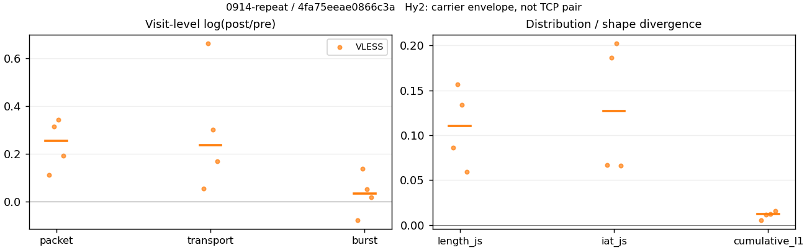
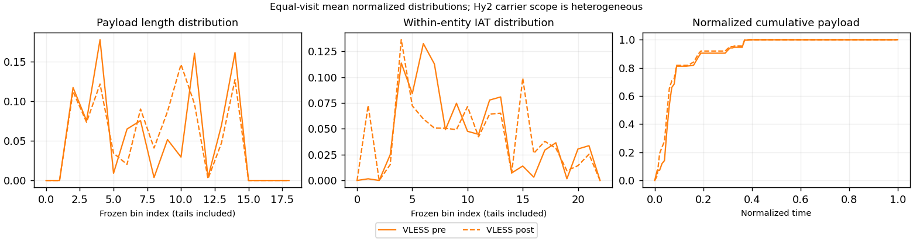

# 0914-repeat · 条目 012 · bilibili.com

目标：https://www.bilibili.com/video/BV1hu4m1P7Mu/

活动标签：bilibili.com::video_playback。选定访问 15 次。

[返回总索引](../../README.md) · [统计口径](../../methods.md)

## 覆盖与资格（每次访问均保留）

| 部署 | 重复 | 主请求路由 | 活动状态 | 代理比较 | DIRECT pre | 请求 proxy/direct/unresolved | 错误 |
| --- | --- | --- | --- | --- | --- | --- | --- |
| Hy2 | 1 | direct | passed | 0 | 1 | 0/304/0 | [] |
| Hy2 | 2 | direct | passed | 0 | 1 | 0/287/0 | [] |
| Hy2 | 3 | direct | passed | 0 | 1 | 0/302/0 | [] |
| Hy2 | 4 | direct | passed | 0 | 1 | 0/284/0 | [] |
| Hy2 | 5 | direct | passed | 0 | 1 | 0/293/0 | [] |
| SS | 1 | direct | passed | 0 | 1 | 0/300/0 | [] |
| SS | 2 | direct | passed | 0 | 1 | 0/301/7 | [] |
| SS | 3 | direct | passed | 0 | 1 | 0/264/0 | [] |
| SS | 4 | direct | passed | 0 | 1 | 0/271/0 | [] |
| SS | 5 | direct | passed | 0 | 1 | 0/258/0 | [] |
| VLESS | 1 | direct | passed | 1 | 1 | 64/249/1 | [] |
| VLESS | 2 | direct | passed | 1 | 1 | 1/299/0 | [] |
| VLESS | 3 | direct | passed | 1 | 1 | 2/292/0 | [] |
| VLESS | 4 | direct | passed | 1 | 1 | 35/195/0 | [] |
| VLESS | 5 | direct | passed | 0 | 1 | 0/300/0 | [] |

主请求非 proxy 的统计仅解释为已索引的辅助代理连接或 DIRECT 观测，不代表目标业务经代理传输。播放确认与配对资格是两道不同的门。

图中散点为单次访问，短线为重复中位数；Hy2 是共享载体包络，不能与 TCP 配对作等范围因果对比。

形态图先逐访问归一化，再对访问等权平均；实线 pre，虚线 post。分箱序号及边界见 methods，不将分箱索引误解为长度或时间。

## 每次访问的关键观测

### SS

范围：`direct_pre_only`。每格 pre → post；空值为不可观测/不适用。

| 重复 | 包数 | 载荷字节 | burst | TCP FR | IAT中位µs | length JS | IAT JS |
| --- | --- | --- | --- | --- | --- | --- | --- |
| 1 | 4566 → — | 1.0191e+07 → — | 2910 → — | 485 → — | 63.823 → — | — | — |
| 2 | 3787 → — | 8.0215e+06 → — | 2472 → — | 410 → — | 58.781 → — | — | — |
| 3 | 2034 → — | 2.4976e+06 → — | 1334 → — | 297 → — | 105.31 → — | — | — |
| 4 | 3805 → — | 8.4701e+06 → — | 2463 → — | 359 → — | 66.386 → — | — | — |
| 5 | 4013 → — | 8.2642e+06 → — | 2545 → — | 419 → — | 70.657 → — | — | — |

完整标量统计：中位数 [min,max]；Δ 为重复内逐访问变换的中位数，MAD 未缩放。n 为可用变换数；DIRECT-only 的 nΔ=0 不代表 pre 不可用。

| scope | 特征 | pre | post | Δ | IQRΔ | MADΔ | nΔ |
| --- | --- | --- | --- | --- | --- | --- | --- |
| direct_pre_only | active_span_sum_s_1000ms | 27.653 [15.469, 39.845] | — | — | — | — | 0 |
| direct_pre_only | active_span_sum_s_100ms | 9.3584 [7.81, 11.945] | — | — | — | — | 0 |
| direct_pre_only | active_span_sum_s_500ms | 18.313 [14.338, 26.043] | — | — | — | — | 0 |
| direct_pre_only | burst_bytes_iqr | 2880 [1801.5, 4284] | — | — | — | — | 0 |
| direct_pre_only | burst_bytes_mad | 86 [31, 92] | — | — | — | — | 0 |
| direct_pre_only | burst_bytes_max | 28672 [21863, 29400] | — | — | — | — | 0 |
| direct_pre_only | burst_bytes_mean | 3247.2 [1872.3, 3501.9] | — | — | — | — | 0 |
| direct_pre_only | burst_bytes_median | 86 [31, 92] | — | — | — | — | 0 |
| direct_pre_only | burst_bytes_min | 0 [0, 0] | — | — | — | — | 0 |
| direct_pre_only | burst_bytes_p95 | 20480 [9884, 20480] | — | — | — | — | 0 |
| direct_pre_only | burst_bytes_q25 | 0 [0, 0] | — | — | — | — | 0 |
| direct_pre_only | burst_bytes_q75 | 2880 [1801.5, 4284] | — | — | — | — | 0 |
| direct_pre_only | burst_bytes_std | 5997.2 [3808.2, 6118.8] | — | — | — | — | 0 |
| direct_pre_only | burst_count | 2472 [1334, 2910] | — | — | — | — | 0 |
| direct_pre_only | burst_duration_ms_iqr | 0.066685 [0.050633, 0.56699] | — | — | — | — | 0 |
| direct_pre_only | burst_duration_ms_mad | 0 [0, 0] | — | — | — | — | 0 |
| direct_pre_only | burst_duration_ms_max | 14836 [7845.3, 15001] | — | — | — | — | 0 |
| direct_pre_only | burst_duration_ms_mean | 111.81 [62.143, 190.2] | — | — | — | — | 0 |
| direct_pre_only | burst_duration_ms_median | 0 [0, 0] | — | — | — | — | 0 |
| direct_pre_only | burst_duration_ms_min | 0 [0, 0] | — | — | — | — | 0 |
| direct_pre_only | burst_duration_ms_p95 | 64.655 [40.983, 156.27] | — | — | — | — | 0 |
| direct_pre_only | burst_duration_ms_q25 | 0 [0, 0] | — | — | — | — | 0 |
| direct_pre_only | burst_duration_ms_q75 | 0.066685 [0.050633, 0.56699] | — | — | — | — | 0 |
| direct_pre_only | burst_duration_ms_std | 868.68 [499.09, 1332.3] | — | — | — | — | 0 |
| direct_pre_only | burst_packets_iqr | 1 [1, 1] | — | — | — | — | 0 |
| direct_pre_only | burst_packets_mad | 0 [0, 0] | — | — | — | — | 0 |
| direct_pre_only | burst_packets_max | 8 [7, 8] | — | — | — | — | 0 |
| direct_pre_only | burst_packets_mean | 1.5449 [1.5247, 1.5768] | — | — | — | — | 0 |
| direct_pre_only | burst_packets_median | 1 [1, 1] | — | — | — | — | 0 |
| direct_pre_only | burst_packets_min | 1 [1, 1] | — | — | — | — | 0 |
| direct_pre_only | burst_packets_p95 | 3 [3, 3] | — | — | — | — | 0 |
| direct_pre_only | burst_packets_q25 | 1 [1, 1] | — | — | — | — | 0 |
| direct_pre_only | burst_packets_q75 | 2 [2, 2] | — | — | — | — | 0 |
| direct_pre_only | burst_packets_std | 0.89224 [0.81803, 0.94759] | — | — | — | — | 0 |
| direct_pre_only | connection_span_concurrency_max | 16 [15, 26] | — | — | — | — | 0 |
| direct_pre_only | direction_entropy | 0.69024 [0.65611, 0.87318] | — | — | — | — | 0 |
| direct_pre_only | down_burst_count | 1223 [656, 1436] | — | — | — | — | 0 |
| direct_pre_only | down_ip_bytes | 8.1386e+06 [2.363e+06, 1.0049e+07] | — | — | — | — | 0 |
| direct_pre_only | down_packets | 2280 [1125, 2775] | — | — | — | — | 0 |
| direct_pre_only | down_transport_bytes | 8.0112e+06 [2.3043e+06, 9.9045e+06] | — | — | — | — | 0 |
| direct_pre_only | duration_s | 48.972 [46.571, 78.08] | — | — | — | — | 0 |
| direct_pre_only | entity_count | 26 [22, 38] | — | — | — | — | 0 |
| direct_pre_only | fr_runs | 410 [297, 485] | — | — | — | — | 0 |
| direct_pre_only | fr_runs_per_packet | 0.18225 [0.15787, 0.26494] | — | — | — | — | 0 |
| direct_pre_only | fr_switches | 384 [275, 447] | — | — | — | — | 0 |
| direct_pre_only | fr_switches_per_possible_transition | 0.16961 [0.14851, 0.25023] | — | — | — | — | 0 |
| direct_pre_only | full_retransmission_fraction | 0.0039422 [0.0014749, 0.0063075] | — | — | — | — | 0 |
| direct_pre_only | full_retransmission_packets | 18 [3, 24] | — | — | — | — | 0 |
| direct_pre_only | iat_count | 3780 [2012, 4528] | — | — | — | — | 0 |
| direct_pre_only | iat_median_us | 66.386 [58.781, 105.31] | — | — | — | — | 0 |
| direct_pre_only | iat_us_iqr | 459.98 [421, 884.19] | — | — | — | — | 0 |
| direct_pre_only | iat_us_mad | 58.618 [51.395, 96.707] | — | — | — | — | 0 |
| direct_pre_only | iat_us_max | 1.5001e+07 [1.4836e+07, 1.5001e+07] | — | — | — | — | 0 |
| direct_pre_only | iat_us_mean | 1.4295e+05 [51982, 3.9457e+05] | — | — | — | — | 0 |
| direct_pre_only | iat_us_median | 66.386 [58.781, 105.31] | — | — | — | — | 0 |
| direct_pre_only | iat_us_min | 0.097 [0.024, 0.366] | — | — | — | — | 0 |
| direct_pre_only | iat_us_p95 | 41536 [33887, 70448] | — | — | — | — | 0 |
| direct_pre_only | iat_us_q25 | 14.98 [13.886, 25.338] | — | — | — | — | 0 |
| direct_pre_only | iat_us_q75 | 474.95 [434.89, 909.53] | — | — | — | — | 0 |
| direct_pre_only | iat_us_std | 1.0461e+06 [5.3858e+05, 2.2597e+06] | — | — | — | — | 0 |
| direct_pre_only | idle_gap_count_1000ms | 51 [42, 133] | — | — | — | — | 0 |
| direct_pre_only | idle_gap_count_100ms | 116 [84, 185] | — | — | — | — | 0 |
| direct_pre_only | idle_gap_count_500ms | 63 [53, 147] | — | — | — | — | 0 |
| direct_pre_only | idle_gap_sum_s_1000ms | 272.16 [170.61, 1542] | — | — | — | — | 0 |
| direct_pre_only | idle_gap_sum_s_100ms | 279.81 [187.64, 1559.9] | — | — | — | — | 0 |
| direct_pre_only | idle_gap_sum_s_500ms | 273.29 [180.07, 1551.3] | — | — | — | — | 0 |
| direct_pre_only | ip_bytes | 8.4737e+06 [2.6037e+06, 1.0429e+07] | — | — | — | — | 0 |
| direct_pre_only | length_iqr | 5437 [2673, 6423] | — | — | — | — | 0 |
| direct_pre_only | length_mad | 2368 [1286, 2542] | — | — | — | — | 0 |
| direct_pre_only | length_max | 8948 [8948, 8948] | — | — | — | — | 0 |
| direct_pre_only | length_mean | 3621.5 [2228, 3750.7] | — | — | — | — | 0 |
| direct_pre_only | length_median | 2824 [1374, 2856] | — | — | — | — | 0 |
| direct_pre_only | length_min | 12 [6, 31] | — | — | — | — | 0 |
| direct_pre_only | length_p95 | 8920 [8568, 8920] | — | — | — | — | 0 |
| direct_pre_only | length_q25 | 637 [207, 807] | — | — | — | — | 0 |
| direct_pre_only | length_q75 | 6244 [2880, 7060] | — | — | — | — | 0 |
| direct_pre_only | length_std | 3182 [2509.3, 3273.5] | — | — | — | — | 0 |
| direct_pre_only | nonempty_entity_count | 26 [22, 38] | — | — | — | — | 0 |
| direct_pre_only | nonempty_packets | 2274 [1121, 2717] | — | — | — | — | 0 |
| direct_pre_only | offload_suspect_fraction | 0.36889 [0.25762, 0.39926] | — | — | — | — | 0 |
| direct_pre_only | packet_count | 3805 [2034, 4566] | — | — | — | — | 0 |
| direct_pre_only | rtt_median_ms | 0.078548 [0.077234, 0.089626] | — | — | — | — | 0 |
| direct_pre_only | rtt_sample_count | 1462 [854, 1770] | — | — | — | — | 0 |
| direct_pre_only | tcp_ack_count | 3780 [2010, 4527] | — | — | — | — | 0 |
| direct_pre_only | tcp_fin_count | 51 [42, 75] | — | — | — | — | 0 |
| direct_pre_only | tcp_packet_count | 3805 [2034, 4566] | — | — | — | — | 0 |
| direct_pre_only | tcp_rst_count | 2 [0, 3] | — | — | — | — | 0 |
| direct_pre_only | tcp_syn_count | 52 [44, 76] | — | — | — | — | 0 |
| direct_pre_only | tcp_window_raw_median | 65535 [65455, 65535] | — | — | — | — | 0 |
| direct_pre_only | transition_entropy | 0.5437 [0.524, 0.75001] | — | — | — | — | 0 |
| direct_pre_only | transition_n_mm | 1675 [645, 2015] | — | — | — | — | 0 |
| direct_pre_only | transition_n_mp | 176 [128, 205] | — | — | — | — | 0 |
| direct_pre_only | transition_n_pm | 204 [147, 242] | — | — | — | — | 0 |
| direct_pre_only | transition_n_pp | 217 [179, 240] | — | — | — | — | 0 |
| direct_pre_only | transition_p_mm | 0.90608 [0.83441, 0.9153] | — | — | — | — | 0 |
| direct_pre_only | transition_p_mp | 0.093917 [0.084699, 0.16559] | — | — | — | — | 0 |
| direct_pre_only | transition_p_pm | 0.47005 [0.42721, 0.53333] | — | — | — | — | 0 |
| direct_pre_only | transition_p_pp | 0.52995 [0.46667, 0.57279] | — | — | — | — | 0 |
| direct_pre_only | transport_bytes | 8.2642e+06 [2.4976e+06, 1.0191e+07] | — | — | — | — | 0 |
| direct_pre_only | up_burst_count | 1249 [678, 1474] | — | — | — | — | 0 |
| direct_pre_only | up_byte_fraction | 0.030615 [0.025422, 0.077383] | — | — | — | — | 0 |
| direct_pre_only | up_ip_bytes | 3.3503e+05 [2.4073e+05, 3.7971e+05] | — | — | — | — | 0 |
| direct_pre_only | up_packets | 1542 [909, 1791] | — | — | — | — | 0 |
| direct_pre_only | up_transport_bytes | 2.5301e+05 [1.9327e+05, 2.8607e+05] | — | — | — | — | 0 |
| direct_pre_only | zero_iat_count | 0 [0, 0] | — | — | — | — | 0 |
| direct_pre_only | zero_iat_fraction | 0 [0, 0] | — | — | — | — | 0 |

### VLESS

范围：`exclusive_page`。每格 pre → post；空值为不可观测/不适用。

| 重复 | 包数 | 载荷字节 | burst | TCP FR | IAT中位µs | length JS | IAT JS |
| --- | --- | --- | --- | --- | --- | --- | --- |
| 1 | 1002 → 1120 | 6.3178e+05 → 6.6661e+05 | 868 → 804 | 30 → 38 | 130.8 → 150.43 | 0.086346 | 0.066775 |
| 2 | 38 → 52 | 9752 → 18886 | 27 → 31 | 6 → 8 | 73.581 → 625.45 | 0.15705 | 0.18676 |
| 3 | 49 → 69 | 22027 → 29759 | 37 → 39 | 6 → 8 | 296.54 → 503.59 | 0.13387 | 0.20214 |
| 4 | 452 → 548 | 2.3796e+05 → 2.8197e+05 | 347 → 353 | 48 → 58 | 176.51 → 632.64 | 0.059395 | 0.066326 |
| 5 | — | — | — | — | — | — | — |

范围：`direct_pre_only`。每格 pre → post；空值为不可观测/不适用。

| 重复 | 包数 | 载荷字节 | burst | TCP FR | IAT中位µs | length JS | IAT JS |
| --- | --- | --- | --- | --- | --- | --- | --- |
| 1 | 3649 → — | 8.2877e+06 → — | 2407 → — | 384 → — | 53.841 → — | — | — |
| 2 | 4159 → — | 9.1789e+06 → — | 2664 → — | 476 → — | 61.419 → — | — | — |
| 3 | 3759 → — | 8.3194e+06 → — | 2377 → — | 481 → — | 57.873 → — | — | — |
| 4 | 2750 → — | 6.1244e+06 → — | 1717 → — | 255 → — | 70.643 → — | — | — |
| 5 | 4359 → — | 1.0018e+07 → — | 2699 → — | 408 → — | 55.829 → — | — | — |

完整标量统计：中位数 [min,max]；Δ 为重复内逐访问变换的中位数，MAD 未缩放。n 为可用变换数；DIRECT-only 的 nΔ=0 不代表 pre 不可用。

| scope | 特征 | pre | post | Δ | IQRΔ | MADΔ | nΔ |
| --- | --- | --- | --- | --- | --- | --- | --- |
| direct_pre_only | active_span_sum_s_1000ms | 28.299 [10.771, 34.768] | — | — | — | — | 0 |
| direct_pre_only | active_span_sum_s_100ms | 9.6729 [6.477, 10.645] | — | — | — | — | 0 |
| direct_pre_only | active_span_sum_s_500ms | 18.544 [9.8921, 21.937] | — | — | — | — | 0 |
| direct_pre_only | burst_bytes_iqr | 4187 [2880, 4761.5] | — | — | — | — | 0 |
| direct_pre_only | burst_bytes_mad | 82.5 [35, 92] | — | — | — | — | 0 |
| direct_pre_only | burst_bytes_max | 28672 [28400, 29400] | — | — | — | — | 0 |
| direct_pre_only | burst_bytes_mean | 3500 [3443.2, 3711.8] | — | — | — | — | 0 |
| direct_pre_only | burst_bytes_median | 82.5 [35, 92] | — | — | — | — | 0 |
| direct_pre_only | burst_bytes_min | 0 [0, 0] | — | — | — | — | 0 |
| direct_pre_only | burst_bytes_p95 | 20480 [20480, 20480] | — | — | — | — | 0 |
| direct_pre_only | burst_bytes_q25 | 0 [0, 0] | — | — | — | — | 0 |
| direct_pre_only | burst_bytes_q75 | 4187 [2880, 4761.5] | — | — | — | — | 0 |
| direct_pre_only | burst_bytes_std | 6082.6 [5928.2, 6463.8] | — | — | — | — | 0 |
| direct_pre_only | burst_count | 2407 [1717, 2699] | — | — | — | — | 0 |
| direct_pre_only | burst_duration_ms_iqr | 0.065249 [0.052711, 0.1121] | — | — | — | — | 0 |
| direct_pre_only | burst_duration_ms_mad | 0 [0, 0] | — | — | — | — | 0 |
| direct_pre_only | burst_duration_ms_max | 13072 [11384, 15001] | — | — | — | — | 0 |
| direct_pre_only | burst_duration_ms_mean | 93.137 [66.429, 114.65] | — | — | — | — | 0 |
| direct_pre_only | burst_duration_ms_median | 0 [0, 0] | — | — | — | — | 0 |
| direct_pre_only | burst_duration_ms_min | 0 [0, 0] | — | — | — | — | 0 |
| direct_pre_only | burst_duration_ms_p95 | 57.626 [35.777, 67.749] | — | — | — | — | 0 |
| direct_pre_only | burst_duration_ms_q25 | 0 [0, 0] | — | — | — | — | 0 |
| direct_pre_only | burst_duration_ms_q75 | 0.065249 [0.052711, 0.1121] | — | — | — | — | 0 |
| direct_pre_only | burst_duration_ms_std | 680 [578.77, 979.84] | — | — | — | — | 0 |
| direct_pre_only | burst_packets_iqr | 1 [1, 1] | — | — | — | — | 0 |
| direct_pre_only | burst_packets_mad | 0 [0, 0] | — | — | — | — | 0 |
| direct_pre_only | burst_packets_max | 8 [7, 10] | — | — | — | — | 0 |
| direct_pre_only | burst_packets_mean | 1.5814 [1.516, 1.615] | — | — | — | — | 0 |
| direct_pre_only | burst_packets_median | 1 [1, 1] | — | — | — | — | 0 |
| direct_pre_only | burst_packets_min | 1 [1, 1] | — | — | — | — | 0 |
| direct_pre_only | burst_packets_p95 | 3 [3, 3] | — | — | — | — | 0 |
| direct_pre_only | burst_packets_q25 | 1 [1, 1] | — | — | — | — | 0 |
| direct_pre_only | burst_packets_q75 | 2 [2, 2] | — | — | — | — | 0 |
| direct_pre_only | burst_packets_std | 0.88871 [0.87459, 0.97068] | — | — | — | — | 0 |
| direct_pre_only | connection_span_concurrency_max | 15 [11, 19] | — | — | — | — | 0 |
| direct_pre_only | direction_entropy | 0.6761 [0.66135, 0.70288] | — | — | — | — | 0 |
| direct_pre_only | down_burst_count | 1190 [848, 1336] | — | — | — | — | 0 |
| direct_pre_only | down_ip_bytes | 8.1718e+06 [6.0347e+06, 9.9276e+06] | — | — | — | — | 0 |
| direct_pre_only | down_packets | 2261 [1707, 2692] | — | — | — | — | 0 |
| direct_pre_only | down_transport_bytes | 8.054e+06 [5.9458e+06, 9.7874e+06] | — | — | — | — | 0 |
| direct_pre_only | duration_s | 49.132 [48.789, 71.363] | — | — | — | — | 0 |
| direct_pre_only | entity_count | 27 [23, 34] | — | — | — | — | 0 |
| direct_pre_only | fr_runs | 408 [255, 481] | — | — | — | — | 0 |
| direct_pre_only | fr_runs_per_packet | 0.1802 [0.15287, 0.21994] | — | — | — | — | 0 |
| direct_pre_only | fr_switches | 381 [232, 448] | — | — | — | — | 0 |
| direct_pre_only | fr_switches_per_possible_transition | 0.16968 [0.14251, 0.20799] | — | — | — | — | 0 |
| direct_pre_only | full_retransmission_fraction | 0.0031923 [0.0027529, 0.0052069] | — | — | — | — | 0 |
| direct_pre_only | full_retransmission_packets | 12 [12, 19] | — | — | — | — | 0 |
| direct_pre_only | iat_count | 3726 [2727, 4332] | — | — | — | — | 0 |
| direct_pre_only | iat_median_us | 57.873 [53.841, 70.643] | — | — | — | — | 0 |
| direct_pre_only | iat_us_iqr | 386.19 [225.38, 408.28] | — | — | — | — | 0 |
| direct_pre_only | iat_us_mad | 50.645 [47.245, 61.853] | — | — | — | — | 0 |
| direct_pre_only | iat_us_max | 1.5001e+07 [1.5001e+07, 1.5002e+07] | — | — | — | — | 0 |
| direct_pre_only | iat_us_mean | 1.7777e+05 [1.1276e+05, 2.4048e+05] | — | — | — | — | 0 |
| direct_pre_only | iat_us_median | 57.873 [53.841, 70.643] | — | — | — | — | 0 |
| direct_pre_only | iat_us_min | 0.073 [0.045, 0.557] | — | — | — | — | 0 |
| direct_pre_only | iat_us_p95 | 41009 [35514, 53192] | — | — | — | — | 0 |
| direct_pre_only | iat_us_q25 | 14.389 [13.089, 15.521] | — | — | — | — | 0 |
| direct_pre_only | iat_us_q75 | 400.72 [239.77, 422.36] | — | — | — | — | 0 |
| direct_pre_only | iat_us_std | 1.4062e+06 [1.0422e+06, 1.7487e+06] | — | — | — | — | 0 |
| direct_pre_only | idle_gap_count_1000ms | 77 [52, 82] | — | — | — | — | 0 |
| direct_pre_only | idle_gap_count_100ms | 125 [83, 137] | — | — | — | — | 0 |
| direct_pre_only | idle_gap_count_500ms | 87 [70, 94] | — | — | — | — | 0 |
| direct_pre_only | idle_gap_sum_s_1000ms | 640.85 [373.66, 723.15] | — | — | — | — | 0 |
| direct_pre_only | idle_gap_sum_s_100ms | 652.7 [397.79, 743.22] | — | — | — | — | 0 |
| direct_pre_only | idle_gap_sum_s_500ms | 645.88 [386.49, 732.68] | — | — | — | — | 0 |
| direct_pre_only | ip_bytes | 8.5155e+06 [6.2678e+06, 1.0245e+07] | — | — | — | — | 0 |
| direct_pre_only | length_iqr | 6412 [5995, 6672.5] | — | — | — | — | 0 |
| direct_pre_only | length_mad | 2400.5 [2368, 2499] | — | — | — | — | 0 |
| direct_pre_only | length_max | 8948 [8948, 8948] | — | — | — | — | 0 |
| direct_pre_only | length_mean | 3777.3 [3709.5, 3889.1] | — | — | — | — | 0 |
| direct_pre_only | length_median | 2856 [2856, 2856] | — | — | — | — | 0 |
| direct_pre_only | length_min | 24 [6, 31] | — | — | — | — | 0 |
| direct_pre_only | length_p95 | 8920 [8920, 8920] | — | — | — | — | 0 |
| direct_pre_only | length_q25 | 728 [666, 741] | — | — | — | — | 0 |
| direct_pre_only | length_q75 | 7140 [6736, 7384.5] | — | — | — | — | 0 |
| direct_pre_only | length_std | 3265.2 [3186.9, 3297.2] | — | — | — | — | 0 |
| direct_pre_only | nonempty_entity_count | 27 [23, 34] | — | — | — | — | 0 |
| direct_pre_only | nonempty_packets | 2187 [1651, 2669] | — | — | — | — | 0 |
| direct_pre_only | offload_suspect_fraction | 0.39381 [0.38388, 0.4173] | — | — | — | — | 0 |
| direct_pre_only | packet_count | 3759 [2750, 4359] | — | — | — | — | 0 |
| direct_pre_only | rtt_median_ms | 0.07532 [0.064999, 0.10032] | — | — | — | — | 0 |
| direct_pre_only | rtt_sample_count | 1451 [984, 1594] | — | — | — | — | 0 |
| direct_pre_only | tcp_ack_count | 3722 [2724, 4331] | — | — | — | — | 0 |
| direct_pre_only | tcp_fin_count | 53 [43, 65] | — | — | — | — | 0 |
| direct_pre_only | tcp_packet_count | 3759 [2750, 4359] | — | — | — | — | 0 |
| direct_pre_only | tcp_rst_count | 3 [1, 4] | — | — | — | — | 0 |
| direct_pre_only | tcp_syn_count | 54 [46, 68] | — | — | — | — | 0 |
| direct_pre_only | tcp_window_raw_median | 65535 [65535, 65535] | — | — | — | — | 0 |
| direct_pre_only | transition_entropy | 0.55547 [0.50377, 0.61676] | — | — | — | — | 0 |
| direct_pre_only | transition_n_mm | 1560 [1233, 2008] | — | — | — | — | 0 |
| direct_pre_only | transition_n_mp | 178 [106, 209] | — | — | — | — | 0 |
| direct_pre_only | transition_n_pm | 203 [126, 239] | — | — | — | — | 0 |
| direct_pre_only | transition_n_pp | 187 [163, 253] | — | — | — | — | 0 |
| direct_pre_only | transition_p_mm | 0.9033 [0.87989, 0.92084] | — | — | — | — | 0 |
| direct_pre_only | transition_p_mp | 0.096699 [0.079164, 0.12011] | — | — | — | — | 0 |
| direct_pre_only | transition_p_pm | 0.50398 [0.43599, 0.57729] | — | — | — | — | 0 |
| direct_pre_only | transition_p_pp | 0.49602 [0.42271, 0.56401] | — | — | — | — | 0 |
| direct_pre_only | transport_bytes | 8.3194e+06 [6.1244e+06, 1.0018e+07] | — | — | — | — | 0 |
| direct_pre_only | up_burst_count | 1217 [869, 1363] | — | — | — | — | 0 |
| direct_pre_only | up_byte_fraction | 0.029162 [0.023039, 0.031902] | — | — | — | — | 0 |
| direct_pre_only | up_ip_bytes | 3.2034e+05 [2.3315e+05, 3.5116e+05] | — | — | — | — | 0 |
| direct_pre_only | up_packets | 1498 [1043, 1667] | — | — | — | — | 0 |
| direct_pre_only | up_transport_bytes | 2.4275e+05 [1.786e+05, 2.654e+05] | — | — | — | — | 0 |
| direct_pre_only | zero_iat_count | 0 [0, 0] | — | — | — | — | 0 |
| direct_pre_only | zero_iat_fraction | 0 [0, 0] | — | — | — | — | 0 |
| exclusive_page | active_span_sum_s_1000ms | 4.1888 [1.2489, 7.4182] | 8.0323 [1.976, 15.118] | 0.66337 | 0.17367 | 0.11641 | 4 |
| exclusive_page | active_span_sum_s_100ms | 0.68398 [0.044647, 2.0434] | 2.0088 [0.53474, 3.6746] | 1.624 | 1.4861 | 0.79964 | 4 |
| exclusive_page | active_span_sum_s_500ms | 3.4054 [1.2489, 6.0928] | 5.0688 [1.976, 9.8044] | 0.4587 | 0.044707 | 0.015717 | 4 |
| exclusive_page | burst_bytes_iqr | 996 [452, 1440] | 1440 [1022.5, 1440] | 0.41515 | 0.83257 | 0.40816 | 4 |
| exclusive_page | burst_bytes_mad | 0 [0, 24] | 17 [0, 31] | 0.25593 | — | — | 1 |
| exclusive_page | burst_bytes_max | 4292 [2372, 4320] | 3856 [2824, 5958] | 0.14321 | 0.22529 | 0.10474 | 4 |
| exclusive_page | burst_bytes_mean | 640.54 [361.19, 727.85] | 780.92 [609.23, 829.12] | 0.2004 | 0.16987 | 0.058977 | 4 |
| exclusive_page | burst_bytes_median | 0 [0, 24] | 17 [0, 31] | 0.25593 | — | — | 1 |
| exclusive_page | burst_bytes_min | 0 [0, 0] | 0 [0, 0] | — | — | — | 0 |
| exclusive_page | burst_bytes_p95 | 2880 [2017.4, 2880] | 2824 [2469, 2896] | -0.0070479 | 0.074292 | 0.012588 | 4 |
| exclusive_page | burst_bytes_q25 | 0 [0, 0] | 0 [0, 0] | — | — | — | 0 |
| exclusive_page | burst_bytes_q75 | 996 [452, 1440] | 1440 [1022.5, 1440] | 0.41515 | 0.83257 | 0.40816 | 4 |
| exclusive_page | burst_bytes_std | 1071 [673.67, 1127.6] | 996.08 [884.16, 1086.9] | -0.053578 | 0.11181 | 0.018891 | 4 |
| exclusive_page | burst_count | 192 [27, 868] | 196 [31, 804] | 0.034894 | 0.080311 | 0.060504 | 4 |
| exclusive_page | burst_duration_ms_iqr | 0.23015 [0, 1.9593] | 0.36192 [0.00018525, 0.69351] | 0.54936 | 1.0673 | 0.3595 | 3 |
| exclusive_page | burst_duration_ms_mad | 0 [0, 0] | 0 [0, 0.000104] | — | — | — | 0 |
| exclusive_page | burst_duration_ms_max | 3380 [1728.8, 14499] | 15038 [14979, 15063] | 1.558 | 1.088 | 0.48755 | 4 |
| exclusive_page | burst_duration_ms_mean | 164.81 [11.732, 272.13] | 310.47 [80.611, 530.87] | 0.90756 | 0.8253 | 0.54237 | 4 |
| exclusive_page | burst_duration_ms_median | 0 [0, 0] | 0 [0, 0.000104] | — | — | — | 0 |
| exclusive_page | burst_duration_ms_min | 0 [0, 0] | 0 [0, 0] | — | — | — | 0 |
| exclusive_page | burst_duration_ms_p95 | 466.73 [5.2062, 1227.8] | 250.97 [8.1515, 367.76] | -0.61102 | 1.1469 | 0.54173 | 4 |
| exclusive_page | burst_duration_ms_q25 | 0 [0, 0] | 0 [0, 0] | — | — | — | 0 |
| exclusive_page | burst_duration_ms_q75 | 0.23015 [0, 1.9593] | 0.36192 [0.00018525, 0.69351] | 0.54936 | 1.0673 | 0.3595 | 3 |
| exclusive_page | burst_duration_ms_std | 687.89 [118.83, 1304.6] | 1960.4 [1055.8, 2640] | 1.3419 | 0.90037 | 0.55334 | 4 |
| exclusive_page | burst_packets_iqr | 1 [0, 1] | 1 [1, 1] | 0 | 0 | 0 | 3 |
| exclusive_page | burst_packets_mad | 0 [0, 0] | 0 [0, 1] | — | — | — | 0 |
| exclusive_page | burst_packets_max | 3 [3, 6] | 5.5 [4, 7] | 0.39925 | 0.30211 | 0.17834 | 4 |
| exclusive_page | burst_packets_mean | 1.3135 [1.1544, 1.4074] | 1.6149 [1.393, 1.7692] | 0.18172 | 0.03786 | 0.0062366 | 4 |
| exclusive_page | burst_packets_median | 1 [1, 1] | 1 [1, 2] | 0 | 0.17329 | 0 | 4 |
| exclusive_page | burst_packets_min | 1 [1, 1] | 1 [1, 1] | 0 | 0 | 0 | 4 |
| exclusive_page | burst_packets_p95 | 2 [2, 3] | 4 [3, 4.5] | 0.54931 | 0.28768 | 0.14384 | 4 |
| exclusive_page | burst_packets_q25 | 1 [1, 1] | 1 [1, 1] | 0 | 0 | 0 | 4 |
| exclusive_page | burst_packets_q75 | 2 [1, 2] | 2 [2, 2] | 0 | 0.17329 | 0 | 4 |
| exclusive_page | burst_packets_std | 0.5314 [0.45955, 0.68092] | 0.94684 [0.81939, 1.1469] | 0.55553 | 0.058616 | 0.028476 | 4 |
| exclusive_page | connection_span_concurrency_max | 2 [1, 4] | 2 [1, 4] | 0 | 0 | 0 | 4 |
| exclusive_page | cumulative_l1 | — | — | 0.011913 | 0.0029813 | 0.0019186 | 4 |
| exclusive_page | cumulative_max | — | — | 0.18342 | 0.040984 | 0.023087 | 4 |
| exclusive_page | direction_entropy | 0.83262 [0.62157, 0.9183] | 0.81479 [0.39909, 0.9183] | -0.029725 | 0.10616 | 0.041618 | 4 |
| exclusive_page | down_burst_count | 94.5 [13, 432] | 96.5 [15, 400] | 0.035729 | 0.082522 | 0.062855 | 4 |
| exclusive_page | down_ip_bytes | 1.2804e+05 [8255, 6.4289e+05] | 1.4927e+05 [15714, 6.7455e+05] | 0.20206 | 0.23704 | 0.10637 | 4 |
| exclusive_page | down_packets | 134.5 [19, 525] | 165 [27, 615] | 0.24116 | 0.11807 | 0.064729 | 4 |
| exclusive_page | down_transport_bytes | 1.2102e+05 [7259, 6.1556e+05] | 1.4066e+05 [14302, 6.4254e+05] | 0.19965 | 0.24776 | 0.10803 | 4 |
| exclusive_page | duration_s | 43.318 [35.496, 70.93] | 43.238 [35.47, 70.909] | -0.0006653 | 0.00075907 | 0.00022613 | 4 |
| exclusive_page | entity_count | 2.5 [1, 5] | 2.5 [1, 5] | 0 | 0 | 0 | 4 |
| exclusive_page | fr_runs | 18 [6, 48] | 23 [8, 58] | 0.26204 | 0.06308 | 0.025647 | 4 |
| exclusive_page | fr_runs_per_packet | 0.24209 [0.058027, 0.4] | 0.23724 [0.063973, 0.38095] | -0.0048493 | 0.020969 | 0.010304 | 4 |
| exclusive_page | fr_switches | 15.5 [5, 43] | 20.5 [7, 53] | 0.30237 | 0.083001 | 0.034104 | 4 |
| exclusive_page | fr_switches_per_possible_transition | 0.21589 [0.050682, 0.35714] | 0.21743 [0.057627, 0.35] | 0.0010915 | 0.012523 | 0.0062946 | 4 |
| exclusive_page | full_retransmission_fraction | 0 [0, 0] | 0 [0, 0] | 0 | 0 | 0 | 4 |
| exclusive_page | full_retransmission_packets | 0 [0, 0] | 0 [0, 0] | — | — | — | 0 |
| exclusive_page | iat_count | 247.5 [37, 998] | 305.5 [51, 1116] | 0.25773 | 0.15391 | 0.076878 | 4 |
| exclusive_page | iat_js | — | — | 0.12677 | 0.12394 | 0.060215 | 4 |
| exclusive_page | iat_ks | — | — | 0.15468 | 0.037195 | 0.032658 | 4 |
| exclusive_page | iat_median_us | 153.66 [73.581, 296.54] | 564.52 [150.43, 632.64] | 0.90304 | 1.0603 | 0.56832 | 4 |
| exclusive_page | iat_us_iqr | 5030.9 [1808.8, 5481.9] | 24327 [2103.6, 47637] | 1.258 | 1.6165 | 0.87992 | 4 |
| exclusive_page | iat_us_mad | 147.6 [67.046, 288.69] | 564.41 [150.28, 629.27] | 0.92752 | 1.0661 | 0.5513 | 4 |
| exclusive_page | iat_us_max | 1.5001e+07 [1.5e+07, 1.5001e+07] | 1.535e+07 [1.5311e+07, 1.5442e+07] | 0.022987 | 0.0056355 | 0.0024073 | 4 |
| exclusive_page | iat_us_mean | 5.8051e+05 [1.9733e+05, 1.0107e+06] | 4.3419e+05 [1.7591e+05, 7.3285e+05] | -0.25834 | 0.15326 | 0.076934 | 4 |
| exclusive_page | iat_us_median | 153.66 [73.581, 296.54] | 564.52 [150.43, 632.64] | 0.90304 | 1.0603 | 0.56832 | 4 |
| exclusive_page | iat_us_min | 2.1225 [0.073, 4.165] | 0.0695 [0.037, 0.108] | -3.1474 | 1.3124 | 0.4701 | 4 |
| exclusive_page | iat_us_p95 | 1.3279e+06 [19516, 6.658e+06] | 6.8951e+05 [47198, 2.5403e+06] | -0.60052 | 0.60409 | 0.22898 | 4 |
| exclusive_page | iat_us_q25 | 27.758 [24.382, 32.737] | 12.232 [9.4312, 30.102] | -0.88472 | 0.37276 | 0.091094 | 4 |
| exclusive_page | iat_us_q75 | 5058.6 [1841.5, 5506.3] | 24338 [2115.6, 47667] | 1.2539 | 1.6182 | 0.87938 | 4 |
| exclusive_page | iat_us_std | 2.6276e+06 [1.6386e+06, 3.4328e+06] | 2.3074e+06 [1.565e+06, 2.9707e+06] | -0.12112 | 0.062383 | 0.028586 | 4 |
| exclusive_page | iat_wasserstein_log1p_us | — | — | 0.84399 | 0.47159 | 0.26056 | 4 |
| exclusive_page | idle_gap_count_1000ms | 11 [4, 21] | 8.5 [3, 16] | -0.27981 | 0.093167 | 0.026744 | 4 |
| exclusive_page | idle_gap_count_100ms | 21 [8, 40] | 25 [10, 51] | 0.20776 | 0.057475 | 0.025287 | 4 |
| exclusive_page | idle_gap_count_500ms | 12 [4, 23] | 11.5 [4, 23] | 0 | 0.012823 | 0 | 4 |
| exclusive_page | idle_gap_sum_s_1000ms | 108.57 [34.229, 189.82] | 103.82 [33.494, 183.16] | -0.039932 | 0.012876 | 0.0060595 | 4 |
| exclusive_page | idle_gap_sum_s_100ms | 112.22 [35.452, 194.89] | 110.85 [34.891, 192.64] | -0.012805 | 0.002175 | 0.00096405 | 4 |
| exclusive_page | idle_gap_sum_s_500ms | 109.24 [34.229, 191.39] | 106.93 [33.494, 188.18] | -0.021484 | 0.0015684 | 0.00024469 | 4 |
| exclusive_page | ip_bytes | 1.4299e+05 [11720, 6.8385e+05] | 1.7213e+05 [21606, 7.2606e+05] | 0.24049 | 0.23898 | 0.12398 | 4 |
| exclusive_page | length_iqr | 1433.6 [814.5, 1548] | 1342.6 [1111, 1368] | -0.062084 | 0.20175 | 0.063422 | 4 |
| exclusive_page | length_js | — | — | 0.11011 | 0.060057 | 0.035352 | 4 |
| exclusive_page | length_ks | — | — | 0.18937 | 0.057542 | 0.042165 | 4 |
| exclusive_page | length_mad | 990.25 [302, 1347] | 681.25 [579, 944] | -0.25002 | 0.45994 | 0.20573 | 4 |
| exclusive_page | length_max | 2852 [2372, 2896] | 2824 [2824, 2824] | -0.009818 | 0.064626 | 0.012588 | 4 |
| exclusive_page | length_mean | 1024.7 [650.13, 1222] | 1006.1 [899.33, 1122.2] | -0.019201 | 0.13673 | 0.044423 | 4 |
| exclusive_page | length_median | 1088.2 [333, 1440] | 1032.2 [702, 1412] | -0.03019 | 0.2204 | 0.026432 | 4 |
| exclusive_page | length_min | 24 [24, 24] | 24 [14, 24] | 0 | 0.13475 | 0 | 4 |
| exclusive_page | length_p95 | 2812.7 [2169.7, 2824] | 2824 [2824, 2824] | 0.0040175 | 0.071918 | 0.0040175 | 4 |
| exclusive_page | length_q25 | 79 [47.5, 88] | 83.375 [72, 123] | 0.051258 | 0.34933 | 0.14164 | 4 |
| exclusive_page | length_q75 | 1513.1 [862, 1635] | 1426 [1234, 1440] | -0.058183 | 0.20871 | 0.0635 | 4 |
| exclusive_page | length_std | 934.31 [779.76, 1050.5] | 876.24 [860.8, 928.42] | -0.064092 | 0.066995 | 0.033513 | 4 |
| exclusive_page | length_wasserstein_bytes | — | — | 119.52 | 86.833 | 30.346 | 4 |
| exclusive_page | nonempty_entity_count | 2.5 [1, 5] | 2.5 [1, 5] | 0 | 0 | 0 | 4 |
| exclusive_page | nonempty_packets | 124.5 [15, 517] | 149.5 [21, 594] | 0.25125 | 0.17885 | 0.088454 | 4 |
| exclusive_page | offload_suspect_fraction | 0.11211 [0.078947, 0.13872] | 0.08194 [0.076642, 0.090179] | -0.03031 | 0.019404 | 0.011708 | 4 |
| exclusive_page | packet_count | 250.5 [38, 1002] | 308.5 [52, 1120] | 0.25313 | 0.14854 | 0.074847 | 4 |
| exclusive_page | rtt_median_ms | 0.072191 [0.054673, 0.13718] | 1.4553 [0.068637, 5.8632] | 2.2787 | 3.1603 | 1.5531 | 4 |
| exclusive_page | rtt_sample_count | 104.5 [14, 437] | 130.5 [23, 429] | 0.29589 | 0.26654 | 0.14621 | 4 |
| exclusive_page | tcp_ack_count | 241.5 [35, 990] | 305.5 [51, 1116] | 0.29683 | 0.18724 | 0.086845 | 4 |
| exclusive_page | tcp_fin_count | 5 [2, 10] | 5 [2, 10] | 0 | 0 | 0 | 4 |
| exclusive_page | tcp_packet_count | 250.5 [38, 1002] | 308.5 [52, 1120] | 0.25313 | 0.14854 | 0.074847 | 4 |
| exclusive_page | tcp_rst_count | 5 [2, 10] | 0 [0, 0] | — | — | — | 0 |
| exclusive_page | tcp_syn_count | 5 [2, 10] | 5 [2, 10] | 0 | 0 | 0 | 4 |
| exclusive_page | tcp_window_raw_median | 65446 [63809, 65471] | 133.5 [131, 162] | -6.1823 | 0.062409 | 0.019038 | 4 |
| exclusive_page | transition_entropy | 0.66408 [0.25273, 0.83804] | 0.67056 [0.24535, 0.85141] | 0.002993 | 0.022885 | 0.010772 | 4 |
| exclusive_page | transition_n_mm | 79 [7, 422] | 99 [10, 528] | 0.27476 | 0.11111 | 0.0546 | 4 |
| exclusive_page | transition_n_mp | 6.5 [2, 19] | 9 [3, 24] | 0.35781 | 0.11445 | 0.047655 | 4 |
| exclusive_page | transition_n_pm | 9 [3, 24] | 11.5 [4, 29] | 0.26204 | 0.06308 | 0.025647 | 4 |
| exclusive_page | transition_n_pp | 18.5 [2, 65] | 16.5 [3, 30] | 0.14015 | 0.73622 | 0.31799 | 4 |
| exclusive_page | transition_p_mm | 0.87541 [0.77778, 0.9746] | 0.86975 [0.76923, 0.97238] | -0.0053836 | 0.0066777 | 0.0033768 | 4 |
| exclusive_page | transition_p_mp | 0.12459 [0.025404, 0.22222] | 0.13025 [0.027624, 0.23077] | 0.0053836 | 0.0066777 | 0.0033768 | 4 |
| exclusive_page | transition_p_pm | 0.4569 [0.1875, 0.6] | 0.46798 [0.40426, 0.57143] | 0.02458 | 0.14781 | 0.066644 | 4 |
| exclusive_page | transition_p_pp | 0.5431 [0.4, 0.8125] | 0.53202 [0.42857, 0.59574] | -0.02458 | 0.14781 | 0.066644 | 4 |
| exclusive_page | transport_bytes | 1.2999e+05 [9752, 6.3178e+05] | 1.5587e+05 [18886, 6.6661e+05] | 0.23529 | 0.25018 | 0.1236 | 4 |
| exclusive_page | up_burst_count | 97.5 [14, 436] | 99.5 [16, 404] | 0.034098 | 0.078233 | 0.058315 | 4 |
| exclusive_page | up_byte_fraction | 0.090078 [0.025667, 0.25564] | 0.12176 [0.036114, 0.24272] | 0.018753 | 0.024768 | 0.012934 | 4 |
| exclusive_page | up_ip_bytes | 14959 [3465, 40956] | 22862 [5892, 51506] | 0.46883 | 0.17082 | 0.066707 | 4 |
| exclusive_page | up_packets | 116 [19, 477] | 143.5 [25, 505] | 0.23233 | 0.15026 | 0.10762 | 4 |
| exclusive_page | up_transport_bytes | 8975 [2493, 16216] | 14329 [4515, 25888] | 0.54667 | 0.095159 | 0.045096 | 4 |
| exclusive_page | zero_iat_count | 0 [0, 0] | 0 [0, 0] | — | — | — | 0 |
| exclusive_page | zero_iat_fraction | 0 [0, 0] | 0 [0, 0] | 0 | 0 | 0 | 4 |

### Hy2

范围：`direct_pre_only`。每格 pre → post；空值为不可观测/不适用。

| 重复 | 包数 | 载荷字节 | burst | TCP FR | IAT中位µs | length JS | IAT JS |
| --- | --- | --- | --- | --- | --- | --- | --- |
| 1 | 3941 → — | 9.9054e+06 → — | 2532 → — | 311 → — | 52.133 → — | — | — |
| 2 | 4269 → — | 1.0184e+07 → — | 2736 → — | 384 → — | 56.984 → — | — | — |
| 3 | 4638 → — | 8.9845e+06 → — | 3007 → — | 489 → — | 81.915 → — | — | — |
| 4 | 3009 → — | 5.483e+06 → — | 1883 → — | 363 → — | 76.222 → — | — | — |
| 5 | 2114 → — | 2.1537e+06 → — | 1361 → — | 379 → — | 143.3 → — | — | — |

完整标量统计：中位数 [min,max]；Δ 为重复内逐访问变换的中位数，MAD 未缩放。n 为可用变换数；DIRECT-only 的 nΔ=0 不代表 pre 不可用。

| scope | 特征 | pre | post | Δ | IQRΔ | MADΔ | nΔ |
| --- | --- | --- | --- | --- | --- | --- | --- |
| direct_pre_only | active_span_sum_s_1000ms | 23.811 [21.725, 32.13] | — | — | — | — | 0 |
| direct_pre_only | active_span_sum_s_100ms | 8.5096 [6.8202, 11.834] | — | — | — | — | 0 |
| direct_pre_only | active_span_sum_s_500ms | 14.097 [11.93, 22.925] | — | — | — | — | 0 |
| direct_pre_only | burst_bytes_iqr | 3822.5 [1428, 5798.8] | — | — | — | — | 0 |
| direct_pre_only | burst_bytes_mad | 80 [35, 85.5] | — | — | — | — | 0 |
| direct_pre_only | burst_bytes_max | 25848 [21307, 29128] | — | — | — | — | 0 |
| direct_pre_only | burst_bytes_mean | 2987.9 [1582.5, 3912.1] | — | — | — | — | 0 |
| direct_pre_only | burst_bytes_median | 80 [35, 85.5] | — | — | — | — | 0 |
| direct_pre_only | burst_bytes_min | 0 [0, 0] | — | — | — | — | 0 |
| direct_pre_only | burst_bytes_p95 | 17839 [9884, 20480] | — | — | — | — | 0 |
| direct_pre_only | burst_bytes_q25 | 0 [0, 0] | — | — | — | — | 0 |
| direct_pre_only | burst_bytes_q75 | 3822.5 [1428, 5798.8] | — | — | — | — | 0 |
| direct_pre_only | burst_bytes_std | 5486.7 [3550.6, 6515.3] | — | — | — | — | 0 |
| direct_pre_only | burst_count | 2532 [1361, 3007] | — | — | — | — | 0 |
| direct_pre_only | burst_duration_ms_iqr | 0.13148 [0.042197, 1.8256] | — | — | — | — | 0 |
| direct_pre_only | burst_duration_ms_mad | 0 [0, 0] | — | — | — | — | 0 |
| direct_pre_only | burst_duration_ms_max | 15000 [11310, 15001] | — | — | — | — | 0 |
| direct_pre_only | burst_duration_ms_mean | 113.16 [98.63, 201.05] | — | — | — | — | 0 |
| direct_pre_only | burst_duration_ms_median | 0 [0, 0] | — | — | — | — | 0 |
| direct_pre_only | burst_duration_ms_min | 0 [0, 0] | — | — | — | — | 0 |
| direct_pre_only | burst_duration_ms_p95 | 58.221 [24.136, 191.94] | — | — | — | — | 0 |
| direct_pre_only | burst_duration_ms_q25 | 0 [0, 0] | — | — | — | — | 0 |
| direct_pre_only | burst_duration_ms_q75 | 0.13148 [0.042197, 1.8256] | — | — | — | — | 0 |
| direct_pre_only | burst_duration_ms_std | 1033.8 [861.69, 1313.1] | — | — | — | — | 0 |
| direct_pre_only | burst_packets_iqr | 1 [1, 1] | — | — | — | — | 0 |
| direct_pre_only | burst_packets_mad | 0 [0, 0] | — | — | — | — | 0 |
| direct_pre_only | burst_packets_max | 8 [6, 10] | — | — | — | — | 0 |
| direct_pre_only | burst_packets_mean | 1.5565 [1.5424, 1.598] | — | — | — | — | 0 |
| direct_pre_only | burst_packets_median | 1 [1, 1] | — | — | — | — | 0 |
| direct_pre_only | burst_packets_min | 1 [1, 1] | — | — | — | — | 0 |
| direct_pre_only | burst_packets_p95 | 3 [3, 3] | — | — | — | — | 0 |
| direct_pre_only | burst_packets_q25 | 1 [1, 1] | — | — | — | — | 0 |
| direct_pre_only | burst_packets_q75 | 2 [2, 2] | — | — | — | — | 0 |
| direct_pre_only | burst_packets_std | 0.93571 [0.8374, 0.97026] | — | — | — | — | 0 |
| direct_pre_only | connection_span_concurrency_max | 14 [13, 26] | — | — | — | — | 0 |
| direct_pre_only | direction_entropy | 0.64927 [0.56098, 0.91445] | — | — | — | — | 0 |
| direct_pre_only | down_burst_count | 1256 [666, 1486] | — | — | — | — | 0 |
| direct_pre_only | down_ip_bytes | 8.8613e+06 [1.9812e+06, 1.0089e+07] | — | — | — | — | 0 |
| direct_pre_only | down_packets | 2452 [1170, 2806] | — | — | — | — | 0 |
| direct_pre_only | down_transport_bytes | 8.7151e+06 [1.9201e+06, 9.9528e+06] | — | — | — | — | 0 |
| direct_pre_only | duration_s | 49.241 [46.847, 49.907] | — | — | — | — | 0 |
| direct_pre_only | entity_count | 26 [20, 35] | — | — | — | — | 0 |
| direct_pre_only | fr_runs | 379 [311, 489] | — | — | — | — | 0 |
| direct_pre_only | fr_runs_per_packet | 0.18064 [0.12841, 0.35992] | — | — | — | — | 0 |
| direct_pre_only | fr_switches | 350 [291, 454] | — | — | — | — | 0 |
| direct_pre_only | fr_switches_per_possible_transition | 0.16991 [0.12115, 0.3418] | — | — | — | — | 0 |
| direct_pre_only | full_retransmission_fraction | 0.0016617 [0.00047304, 0.0065589] | — | — | — | — | 0 |
| direct_pre_only | full_retransmission_packets | 7 [1, 28] | — | — | — | — | 0 |
| direct_pre_only | iat_count | 3921 [2085, 4603] | — | — | — | — | 0 |
| direct_pre_only | iat_median_us | 76.222 [52.133, 143.3] | — | — | — | — | 0 |
| direct_pre_only | iat_us_iqr | 573.62 [220.59, 2127.7] | — | — | — | — | 0 |
| direct_pre_only | iat_us_mad | 67.597 [45.183, 135.2] | — | — | — | — | 0 |
| direct_pre_only | iat_us_max | 1.5001e+07 [1.5001e+07, 1.5001e+07] | — | — | — | — | 0 |
| direct_pre_only | iat_us_mean | 2.0254e+05 [1.3452e+05, 5.8715e+05] | — | — | — | — | 0 |
| direct_pre_only | iat_us_median | 76.222 [52.133, 143.3] | — | — | — | — | 0 |
| direct_pre_only | iat_us_min | 0.062 [0.038, 1.063] | — | — | — | — | 0 |
| direct_pre_only | iat_us_p95 | 41278 [22592, 1.6105e+06] | — | — | — | — | 0 |
| direct_pre_only | iat_us_q25 | 17.64 [13.691, 29.396] | — | — | — | — | 0 |
| direct_pre_only | iat_us_q75 | 591.26 [234.3, 2157.1] | — | — | — | — | 0 |
| direct_pre_only | iat_us_std | 1.5573e+06 [1.2652e+06, 2.7178e+06] | — | — | — | — | 0 |
| direct_pre_only | idle_gap_count_1000ms | 61 [58, 118] | — | — | — | — | 0 |
| direct_pre_only | idle_gap_count_100ms | 110 [96, 169] | — | — | — | — | 0 |
| direct_pre_only | idle_gap_count_500ms | 70 [66, 142] | — | — | — | — | 0 |
| direct_pre_only | idle_gap_sum_s_1000ms | 608.09 [546.97, 1195.5] | — | — | — | — | 0 |
| direct_pre_only | idle_gap_sum_s_100ms | 623 [561.22, 1216.5] | — | — | — | — | 0 |
| direct_pre_only | idle_gap_sum_s_500ms | 615.72 [550.38, 1212.3] | — | — | — | — | 0 |
| direct_pre_only | ip_bytes | 9.2263e+06 [2.2641e+06, 1.0407e+07] | — | — | — | — | 0 |
| direct_pre_only | length_iqr | 4771 [2506, 6660.5] | — | — | — | — | 0 |
| direct_pre_only | length_mad | 2185 [1102, 2530] | — | — | — | — | 0 |
| direct_pre_only | length_max | 8948 [8948, 8948] | — | — | — | — | 0 |
| direct_pre_only | length_mean | 3319 [2045.3, 4089.8] | — | — | — | — | 0 |
| direct_pre_only | length_median | 2856 [1194, 2880] | — | — | — | — | 0 |
| direct_pre_only | length_min | 31 [9, 31] | — | — | — | — | 0 |
| direct_pre_only | length_p95 | 8920 [8562, 8920] | — | — | — | — | 0 |
| direct_pre_only | length_q25 | 781 [350, 1428] | — | — | — | — | 0 |
| direct_pre_only | length_q75 | 5552 [2856, 7464] | — | — | — | — | 0 |
| direct_pre_only | length_std | 3012.5 [2377.3, 3291] | — | — | — | — | 0 |
| direct_pre_only | nonempty_entity_count | 26 [20, 35] | — | — | — | — | 0 |
| direct_pre_only | nonempty_packets | 2422 [1053, 2707] | — | — | — | — | 0 |
| direct_pre_only | offload_suspect_fraction | 0.39069 [0.21996, 0.45318] | — | — | — | — | 0 |
| direct_pre_only | packet_count | 3941 [2114, 4638] | — | — | — | — | 0 |
| direct_pre_only | rtt_median_ms | 0.085182 [0.074173, 0.10405] | — | — | — | — | 0 |
| direct_pre_only | rtt_sample_count | 1426 [846, 1766] | — | — | — | — | 0 |
| direct_pre_only | tcp_ack_count | 3918 [2082, 4601] | — | — | — | — | 0 |
| direct_pre_only | tcp_fin_count | 52 [39, 68] | — | — | — | — | 0 |
| direct_pre_only | tcp_packet_count | 3941 [2114, 4638] | — | — | — | — | 0 |
| direct_pre_only | tcp_rst_count | 3 [0, 3] | — | — | — | — | 0 |
| direct_pre_only | tcp_syn_count | 52 [40, 70] | — | — | — | — | 0 |
| direct_pre_only | tcp_window_raw_median | 65535 [65455, 65535] | — | — | — | — | 0 |
| direct_pre_only | transition_entropy | 0.54084 [0.43388, 0.85984] | — | — | — | — | 0 |
| direct_pre_only | transition_n_mm | 1949 [518, 2020] | — | — | — | — | 0 |
| direct_pre_only | transition_n_mp | 162 [136, 211] | — | — | — | — | 0 |
| direct_pre_only | transition_n_pm | 188 [155, 243] | — | — | — | — | 0 |
| direct_pre_only | transition_n_pp | 198 [156, 236] | — | — | — | — | 0 |
| direct_pre_only | transition_p_mm | 0.90542 [0.76176, 0.93477] | — | — | — | — | 0 |
| direct_pre_only | transition_p_mp | 0.094576 [0.065228, 0.23824] | — | — | — | — | 0 |
| direct_pre_only | transition_p_pm | 0.48896 [0.44731, 0.55102] | — | — | — | — | 0 |
| direct_pre_only | transition_p_pp | 0.51104 [0.44898, 0.55269] | — | — | — | — | 0 |
| direct_pre_only | transport_bytes | 8.9845e+06 [2.1537e+06, 1.0184e+07] | — | — | — | — | 0 |
| direct_pre_only | up_burst_count | 1276 [695, 1521] | — | — | — | — | 0 |
| direct_pre_only | up_byte_fraction | 0.029994 [0.012071, 0.10849] | — | — | — | — | 0 |
| direct_pre_only | up_ip_bytes | 2.8545e+05 [1.9732e+05, 3.6508e+05] | — | — | — | — | 0 |
| direct_pre_only | up_packets | 1489 [944, 1832] | — | — | — | — | 0 |
| direct_pre_only | up_transport_bytes | 2.3143e+05 [1.1957e+05, 2.6948e+05] | — | — | — | — | 0 |
| direct_pre_only | zero_iat_count | 0 [0, 0] | — | — | — | — | 0 |
| direct_pre_only | zero_iat_fraction | 0 [0, 0] | — | — | — | — | 0 |

## 不同部署对比

以下是各部署自身重复中位数的差异，不按重复编号强行配对。跨 TCP/Hy2 的行标记异质观测范围。

| 视角 | 特征 | 部署A | 部署B | A中位 | B中位 | B−A | 比较口径 |
| --- | --- | --- | --- | --- | --- | --- | --- |
| pre | burst_count | VLESS | Hy2 | 2407 | 2532 | 125 | same_scope_unpaired_visits |
| pre | burst_count | VLESS | SS | 2407 | 2472 | 65 | same_scope_unpaired_visits |
| pre | burst_count | Hy2 | SS | 2532 | 2472 | -60 | same_scope_unpaired_visits |
| pre | connection_span_concurrency_max | VLESS | Hy2 | 15 | 14 | -1 | same_scope_unpaired_visits |
| pre | connection_span_concurrency_max | VLESS | SS | 15 | 16 | 1 | same_scope_unpaired_visits |
| pre | connection_span_concurrency_max | Hy2 | SS | 14 | 16 | 2 | same_scope_unpaired_visits |
| pre | direction_entropy | VLESS | Hy2 | 0.6761 | 0.64927 | -0.026828 | same_scope_unpaired_visits |
| pre | direction_entropy | VLESS | SS | 0.6761 | 0.69024 | 0.014144 | same_scope_unpaired_visits |
| pre | direction_entropy | Hy2 | SS | 0.64927 | 0.69024 | 0.040973 | same_scope_unpaired_visits |
| pre | down_transport_bytes | VLESS | Hy2 | 8.054e+06 | 8.7151e+06 | 6.6107e+05 | same_scope_unpaired_visits |
| pre | down_transport_bytes | VLESS | SS | 8.054e+06 | 8.0112e+06 | -42825 | same_scope_unpaired_visits |
| pre | down_transport_bytes | Hy2 | SS | 8.7151e+06 | 8.0112e+06 | -7.039e+05 | same_scope_unpaired_visits |
| pre | duration_s | VLESS | Hy2 | 49.132 | 49.241 | 0.10826 | same_scope_unpaired_visits |
| pre | duration_s | VLESS | SS | 49.132 | 48.972 | -0.1606 | same_scope_unpaired_visits |
| pre | duration_s | Hy2 | SS | 49.241 | 48.972 | -0.26885 | same_scope_unpaired_visits |
| pre | entity_count | VLESS | Hy2 | 27 | 26 | -1 | same_scope_unpaired_visits |
| pre | entity_count | VLESS | SS | 27 | 26 | -1 | same_scope_unpaired_visits |
| pre | entity_count | Hy2 | SS | 26 | 26 | 0 | same_scope_unpaired_visits |
| pre | fr_runs | VLESS | Hy2 | 408 | 379 | -29 | same_scope_unpaired_visits |
| pre | fr_runs | VLESS | SS | 408 | 410 | 2 | same_scope_unpaired_visits |
| pre | fr_runs | Hy2 | SS | 379 | 410 | 31 | same_scope_unpaired_visits |
| pre | fr_runs_per_packet | VLESS | Hy2 | 0.1802 | 0.18064 | 0.00044569 | same_scope_unpaired_visits |
| pre | fr_runs_per_packet | VLESS | SS | 0.1802 | 0.18225 | 0.0020561 | same_scope_unpaired_visits |
| pre | fr_runs_per_packet | Hy2 | SS | 0.18064 | 0.18225 | 0.0016104 | same_scope_unpaired_visits |
| pre | fr_switches | VLESS | Hy2 | 381 | 350 | -31 | same_scope_unpaired_visits |
| pre | fr_switches | VLESS | SS | 381 | 384 | 3 | same_scope_unpaired_visits |
| pre | fr_switches | Hy2 | SS | 350 | 384 | 34 | same_scope_unpaired_visits |
| pre | fr_switches_per_possible_transition | VLESS | Hy2 | 0.16968 | 0.16991 | 0.00023337 | same_scope_unpaired_visits |
| pre | fr_switches_per_possible_transition | VLESS | SS | 0.16968 | 0.16961 | -6.5499e-05 | same_scope_unpaired_visits |
| pre | fr_switches_per_possible_transition | Hy2 | SS | 0.16991 | 0.16961 | -0.00029887 | same_scope_unpaired_visits |
| pre | full_retransmission_fraction | VLESS | Hy2 | 0.0031923 | 0.0016617 | -0.0015307 | same_scope_unpaired_visits |
| pre | full_retransmission_fraction | VLESS | SS | 0.0031923 | 0.0039422 | 0.00074984 | same_scope_unpaired_visits |
| pre | full_retransmission_fraction | Hy2 | SS | 0.0016617 | 0.0039422 | 0.0022805 | same_scope_unpaired_visits |
| pre | iat_median_us | VLESS | Hy2 | 57.873 | 76.222 | 18.35 | same_scope_unpaired_visits |
| pre | iat_median_us | VLESS | SS | 57.873 | 66.386 | 8.5135 | same_scope_unpaired_visits |
| pre | iat_median_us | Hy2 | SS | 76.222 | 66.386 | -9.836 | same_scope_unpaired_visits |
| pre | iat_us_p95 | VLESS | Hy2 | 41009 | 41278 | 269.21 | same_scope_unpaired_visits |
| pre | iat_us_p95 | VLESS | SS | 41009 | 41536 | 527.48 | same_scope_unpaired_visits |
| pre | iat_us_p95 | Hy2 | SS | 41278 | 41536 | 258.27 | same_scope_unpaired_visits |
| pre | ip_bytes | VLESS | Hy2 | 8.5155e+06 | 9.2263e+06 | 7.1086e+05 | same_scope_unpaired_visits |
| pre | ip_bytes | VLESS | SS | 8.5155e+06 | 8.4737e+06 | -41820 | same_scope_unpaired_visits |
| pre | ip_bytes | Hy2 | SS | 9.2263e+06 | 8.4737e+06 | -7.5268e+05 | same_scope_unpaired_visits |
| pre | length_median | VLESS | Hy2 | 2856 | 2856 | 0 | same_scope_unpaired_visits |
| pre | length_median | VLESS | SS | 2856 | 2824 | -32 | same_scope_unpaired_visits |
| pre | length_median | Hy2 | SS | 2856 | 2824 | -32 | same_scope_unpaired_visits |
| pre | length_p95 | VLESS | Hy2 | 8920 | 8920 | 0 | same_scope_unpaired_visits |
| pre | length_p95 | VLESS | SS | 8920 | 8920 | 0 | same_scope_unpaired_visits |
| pre | length_p95 | Hy2 | SS | 8920 | 8920 | 0 | same_scope_unpaired_visits |
| pre | nonempty_packets | VLESS | Hy2 | 2187 | 2422 | 235 | same_scope_unpaired_visits |
| pre | nonempty_packets | VLESS | SS | 2187 | 2274 | 87 | same_scope_unpaired_visits |
| pre | nonempty_packets | Hy2 | SS | 2422 | 2274 | -148 | same_scope_unpaired_visits |
| pre | offload_suspect_fraction | VLESS | Hy2 | 0.39381 | 0.39069 | -0.0031209 | same_scope_unpaired_visits |
| pre | offload_suspect_fraction | VLESS | SS | 0.39381 | 0.36889 | -0.024913 | same_scope_unpaired_visits |
| pre | offload_suspect_fraction | Hy2 | SS | 0.39069 | 0.36889 | -0.021792 | same_scope_unpaired_visits |
| pre | packet_count | VLESS | Hy2 | 3759 | 3941 | 182 | same_scope_unpaired_visits |
| pre | packet_count | VLESS | SS | 3759 | 3805 | 46 | same_scope_unpaired_visits |
| pre | packet_count | Hy2 | SS | 3941 | 3805 | -136 | same_scope_unpaired_visits |
| pre | rtt_median_ms | VLESS | Hy2 | 0.07532 | 0.085182 | 0.009862 | same_scope_unpaired_visits |
| pre | rtt_median_ms | VLESS | SS | 0.07532 | 0.078548 | 0.003228 | same_scope_unpaired_visits |
| pre | rtt_median_ms | Hy2 | SS | 0.085182 | 0.078548 | -0.006634 | same_scope_unpaired_visits |
| pre | transition_entropy | VLESS | Hy2 | 0.55547 | 0.54084 | -0.014636 | same_scope_unpaired_visits |
| pre | transition_entropy | VLESS | SS | 0.55547 | 0.5437 | -0.011771 | same_scope_unpaired_visits |
| pre | transition_entropy | Hy2 | SS | 0.54084 | 0.5437 | 0.0028644 | same_scope_unpaired_visits |
| pre | transport_bytes | VLESS | Hy2 | 8.3194e+06 | 8.9845e+06 | 6.6515e+05 | same_scope_unpaired_visits |
| pre | transport_bytes | VLESS | SS | 8.3194e+06 | 8.2642e+06 | -55216 | same_scope_unpaired_visits |
| pre | transport_bytes | Hy2 | SS | 8.9845e+06 | 8.2642e+06 | -7.2037e+05 | same_scope_unpaired_visits |
| pre | up_byte_fraction | VLESS | Hy2 | 0.029162 | 0.029994 | 0.00083173 | same_scope_unpaired_visits |
| pre | up_byte_fraction | VLESS | SS | 0.029162 | 0.030615 | 0.0014532 | same_scope_unpaired_visits |
| pre | up_byte_fraction | Hy2 | SS | 0.029994 | 0.030615 | 0.00062144 | same_scope_unpaired_visits |
| pre | up_transport_bytes | VLESS | Hy2 | 2.4275e+05 | 2.3143e+05 | -11324 | same_scope_unpaired_visits |
| pre | up_transport_bytes | VLESS | SS | 2.4275e+05 | 2.5301e+05 | 10257 | same_scope_unpaired_visits |
| pre | up_transport_bytes | Hy2 | SS | 2.3143e+05 | 2.5301e+05 | 21581 | same_scope_unpaired_visits |

## 可复核的访问标识

| 部署 | 重复 | session_id |
| --- | --- | --- |
| VLESS | 1 | 9627799d-1d25-4ccc-bb2a-66519c351b0c |
| Hy2 | 1 | 0279a0d7-2bd5-4aa5-a7d7-0c50e6d065d6 |
| SS | 1 | ebc8dc61-6d09-4612-8f5e-ee166ff94fba |
| Hy2 | 2 | 43e4c231-db41-40e6-99b6-abd7c4960ff0 |
| SS | 2 | 88cf0355-a895-425d-bad1-0ecb9ba95313 |
| VLESS | 2 | 1a136546-b458-4b5b-bd28-83a802f5bbd4 |
| SS | 3 | 59844634-a5fe-49ee-8a4d-d89257b40b81 |
| VLESS | 3 | 7360e522-fb87-4bd4-a795-7d217f9b41ee |
| Hy2 | 3 | 1c0ac9dc-d120-4a47-8c27-a25412c6c65c |
| VLESS | 4 | 6e59a7bc-9cc7-423d-b9ba-f52dd1cf4651 |
| Hy2 | 4 | c1e507ba-5d07-4bc6-b420-ae28ee512b00 |
| SS | 4 | 8fba869d-8e80-4dbc-9627-3189dad28f5e |
| Hy2 | 5 | 11566e0a-9490-4bac-beb9-26bbce1f6cb8 |
| SS | 5 | d9a3309a-214b-4b21-bf3d-7ff1f40d1408 |
| VLESS | 5 | 0a7c74f1-3c3c-4624-9c81-ae7d83fef5f2 |

全量三种 packet selection、Hy2 full 范围、Q25/Q75、直方图与曲线见机器可读产物；本页只显示 observed 主范围。
