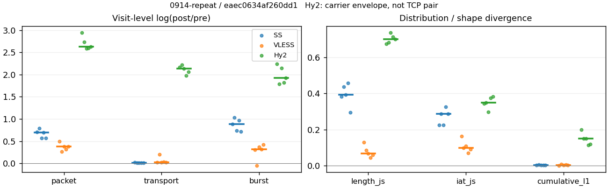
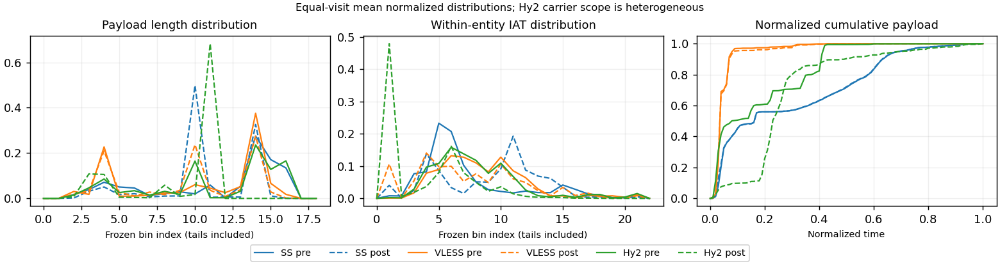

# 0914-repeat · 条目 013 · youtube.com

目标：https://www.youtube.com/watch?v=sAWK0mgrMp4

活动标签：youtube.com::video_playback。选定访问 15 次。

[返回总索引](../../README.md) · [统计口径](../../methods.md)

## 覆盖与资格（每次访问均保留）

| 部署 | 重复 | 主请求路由 | 活动状态 | 代理比较 | DIRECT pre | 请求 proxy/direct/unresolved | 错误 |
| --- | --- | --- | --- | --- | --- | --- | --- |
| Hy2 | 1 | proxy | passed | 1 | 1 | 214/1/0 | [] |
| Hy2 | 2 | proxy | passed | 1 | 1 | 216/1/0 | [] |
| Hy2 | 3 | proxy | passed | 1 | 1 | 212/1/0 | [] |
| Hy2 | 4 | proxy | passed | 1 | 1 | 212/1/0 | [] |
| Hy2 | 5 | proxy | passed | 1 | 1 | 211/1/0 | [] |
| SS | 1 | proxy | passed | 1 | 0 | 234/0/0 | [] |
| SS | 2 | proxy | passed | 1 | 0 | 221/0/0 | [] |
| SS | 3 | proxy | passed | 1 | 0 | 232/0/0 | [] |
| SS | 4 | proxy | passed | 1 | 0 | 225/0/0 | [] |
| SS | 5 | proxy | passed | 1 | 0 | 220/0/0 | [] |
| VLESS | 1 | proxy | passed | 1 | 0 | 227/0/0 | [] |
| VLESS | 2 | proxy | passed | 1 | 0 | 234/0/0 | [] |
| VLESS | 3 | proxy | passed | 1 | 0 | 238/0/0 | [] |
| VLESS | 4 | proxy | passed | 1 | 0 | 236/0/0 | [] |
| VLESS | 5 | proxy | passed | 1 | 0 | 228/0/0 | [] |

主请求非 proxy 的统计仅解释为已索引的辅助代理连接或 DIRECT 观测，不代表目标业务经代理传输。播放确认与配对资格是两道不同的门。

图中散点为单次访问，短线为重复中位数；Hy2 是共享载体包络，不能与 TCP 配对作等范围因果对比。

形态图先逐访问归一化，再对访问等权平均；实线 pre，虚线 post。分箱序号及边界见 methods，不将分箱索引误解为长度或时间。

## 每次访问的关键观测

### SS

范围：`exclusive_page`。每格 pre → post；空值为不可观测/不适用。

| 重复 | 包数 | 载荷字节 | burst | TCP FR | IAT中位µs | length JS | IAT JS |
| --- | --- | --- | --- | --- | --- | --- | --- |
| 1 | 4492 → 9105 | 9.0555e+06 → 9.2299e+06 | 2837 → 6849 | 244 → 254 | 28.224 → 429.15 | 0.38292 | 0.22571 |
| 2 | 6426 → 14179 | 1.3639e+07 → 1.3835e+07 | 4548 → 12694 | 296 → 305 | 31.021 → 1018.7 | 0.43708 | 0.28716 |
| 3 | 5229 → 9206 | 9.1264e+06 → 9.2318e+06 | 3581 → 7491 | 294 → 297 | 28.165 → 694.05 | 0.39314 | 0.22619 |
| 4 | 4473 → 9006 | 7.8558e+06 → 7.9393e+06 | 3089 → 8111 | 285 → 292 | 32.299 → 1053.4 | 0.459 | 0.32598 |
| 5 | 4525 → 7970 | 7.7648e+06 → 7.8461e+06 | 3015 → 6194 | 222 → 228 | 23.486 → 573.34 | 0.29445 | 0.28756 |

完整标量统计：中位数 [min,max]；Δ 为重复内逐访问变换的中位数，MAD 未缩放。n 为可用变换数；DIRECT-only 的 nΔ=0 不代表 pre 不可用。

| scope | 特征 | pre | post | Δ | IQRΔ | MADΔ | nΔ |
| --- | --- | --- | --- | --- | --- | --- | --- |
| exclusive_page | active_span_sum_s_1000ms | 63.709 [33.488, 74.394] | 67.074 [37.179, 89.159] | 0.10457 | 0.057384 | 0.0531 | 5 |
| exclusive_page | active_span_sum_s_100ms | 23.643 [11.783, 33.085] | 39.21 [18.328, 55.861] | 0.52377 | 0.064906 | 0.046994 | 5 |
| exclusive_page | active_span_sum_s_500ms | 50.227 [28.071, 66.488] | 60.206 [33.843, 78.811] | 0.18699 | 0.0276 | 0.016962 | 5 |
| exclusive_page | burst_bytes_iqr | 4096 [3144, 4344] | 2728 [1428, 2856] | -0.40106 | 0.69315 | 0.30498 | 5 |
| exclusive_page | burst_bytes_mad | 39 [39, 39] | 50 [34, 65] | 0.24846 | 0.48551 | 0.26236 | 5 |
| exclusive_page | burst_bytes_max | 22760 [20480, 26712] | 17568 [11763, 27132] | -0.15337 | 0.48158 | 0.32908 | 5 |
| exclusive_page | burst_bytes_mean | 2575.4 [2543.1, 3191.9] | 1232.4 [978.83, 1347.6] | -0.86228 | 0.22821 | 0.13569 | 5 |
| exclusive_page | burst_bytes_median | 39 [39, 39] | 50 [34, 65] | 0.24846 | 0.48551 | 0.26236 | 5 |
| exclusive_page | burst_bytes_min | 0 [0, 0] | 0 [0, 0] | — | — | — | 0 |
| exclusive_page | burst_bytes_p95 | 13455 [11584, 17376] | 4284 [2856, 4350] | -1.3849 | 0.25577 | 0.24048 | 5 |
| exclusive_page | burst_bytes_q25 | 0 [0, 0] | 0 [0, 0] | — | — | — | 0 |
| exclusive_page | burst_bytes_q75 | 4096 [3144, 4344] | 2728 [1428, 2856] | -0.40106 | 0.69315 | 0.30498 | 5 |
| exclusive_page | burst_bytes_std | 4534.9 [4218.6, 5493.2] | 1757.7 [1165.3, 2051.9] | -0.98472 | 0.36919 | 0.10437 | 5 |
| exclusive_page | burst_count | 3089 [2837, 4548] | 7491 [6194, 12694] | 0.88136 | 0.22731 | 0.1433 | 5 |
| exclusive_page | burst_duration_ms_iqr | 0.019724 [0.012971, 0.031109] | 0 [0, 0] | — | — | — | 0 |
| exclusive_page | burst_duration_ms_mad | 0 [0, 0] | 0 [0, 0] | — | — | — | 0 |
| exclusive_page | burst_duration_ms_max | 15001 [15001, 15001] | 30188 [15295, 30720] | 0.69932 | 0.20717 | 0.01747 | 5 |
| exclusive_page | burst_duration_ms_mean | 80.278 [65.958, 101.77] | 17.79 [7.8145, 26.086] | -1.4949 | 0.35393 | 0.21297 | 5 |
| exclusive_page | burst_duration_ms_median | 0 [0, 0] | 0 [0, 0] | — | — | — | 0 |
| exclusive_page | burst_duration_ms_min | 0 [0, 0] | 0 [0, 0] | — | — | — | 0 |
| exclusive_page | burst_duration_ms_p95 | 27.722 [6.4384, 37.648] | 0.87414 [0.27069, 0.9599] | -3.4567 | 0.36075 | 0.21246 | 5 |
| exclusive_page | burst_duration_ms_q25 | 0 [0, 0] | 0 [0, 0] | — | — | — | 0 |
| exclusive_page | burst_duration_ms_q75 | 0.019724 [0.012971, 0.031109] | 0 [0, 0] | — | — | — | 0 |
| exclusive_page | burst_duration_ms_std | 993.33 [815.81, 1112.9] | 548.37 [220.31, 628.55] | -0.5713 | 0.16766 | 0.02598 | 5 |
| exclusive_page | burst_packets_iqr | 1 [1, 1] | 0 [0, 0] | — | — | — | 0 |
| exclusive_page | burst_packets_mad | 0 [0, 0] | 0 [0, 0] | — | — | — | 0 |
| exclusive_page | burst_packets_max | 14 [12, 34] | 10 [9, 10] | -0.44183 | 0.67591 | 0.25951 | 5 |
| exclusive_page | burst_packets_mean | 1.4602 [1.4129, 1.5834] | 1.2289 [1.1103, 1.3294] | -0.17483 | 0.062607 | 0.020915 | 5 |
| exclusive_page | burst_packets_median | 1 [1, 1] | 1 [1, 1] | 0 | 0 | 0 | 5 |
| exclusive_page | burst_packets_min | 1 [1, 1] | 1 [1, 1] | 0 | 0 | 0 | 5 |
| exclusive_page | burst_packets_p95 | 3 [3, 4] | 3 [2, 3] | -0.28768 | 0.40547 | 0.11778 | 5 |
| exclusive_page | burst_packets_q25 | 1 [1, 1] | 1 [1, 1] | 0 | 0 | 0 | 5 |
| exclusive_page | burst_packets_q75 | 2 [2, 2] | 1 [1, 1] | -0.69315 | 0 | 0 | 5 |
| exclusive_page | burst_packets_std | 1.0993 [0.94884, 1.3365] | 0.66013 [0.48045, 0.74867] | -0.60027 | 0.1612 | 0.085072 | 5 |
| exclusive_page | connection_span_concurrency_max | 15 [12, 15] | 14 [12, 15] | 0 | 0 | 0 | 5 |
| exclusive_page | cumulative_l1 | — | — | 0.0012719 | 0.0016854 | 0.00016642 | 5 |
| exclusive_page | cumulative_max | — | — | 0.024298 | 0.027463 | 0.016165 | 5 |
| exclusive_page | direction_entropy | 0.55404 [0.48983, 0.61127] | 0.35816 [0.31754, 0.38976] | -0.20307 | 0.043587 | 0.018429 | 5 |
| exclusive_page | down_burst_count | 1535 [1408, 2260] | 3736 [3089, 6333] | 0.88571 | 0.22836 | 0.14469 | 5 |
| exclusive_page | down_ip_bytes | 9.0649e+06 [7.786e+06, 1.3648e+07] | 9.3219e+06 [7.9422e+06, 1.3998e+07] | 0.021193 | 0.0054786 | 0.0018839 | 5 |
| exclusive_page | down_packets | 2819 [2663, 3848] | 5023 [4527, 7330] | 0.54856 | 0.1364 | 0.070427 | 5 |
| exclusive_page | down_transport_bytes | 8.9182e+06 [7.6406e+06, 1.3448e+07] | 9.0603e+06 [7.7065e+06, 1.3617e+07] | 0.0091673 | 0.0038406 | 0.00057583 | 5 |
| exclusive_page | duration_s | 63.674 [60.966, 64.297] | 63.651 [60.966, 64.297] | -1.3567e-05 | 2.697e-06 | 1.9418e-06 | 5 |
| exclusive_page | entity_count | 21 [17, 28] | 21 [17, 28] | 0 | 0 | 0 | 5 |
| exclusive_page | fr_runs | 285 [222, 296] | 292 [228, 305] | 0.026668 | 0.0056877 | 0.0032841 | 5 |
| exclusive_page | fr_runs_per_packet | 0.087518 [0.077588, 0.10837] | 0.049803 [0.041283, 0.06258] | -0.036305 | 0.0049351 | 0.0030792 | 5 |
| exclusive_page | fr_switches | 265 [205, 273] | 272 [211, 277] | 0.028848 | 0.0069583 | 0.0041824 | 5 |
| exclusive_page | fr_switches_per_possible_transition | 0.080593 [0.070768, 0.10153] | 0.046262 [0.037636, 0.058545] | -0.033133 | 0.003965 | 0.0031299 | 5 |
| exclusive_page | full_retransmission_fraction | 0.0013387 [0.00066298, 0.002894] | 0.0046709 [0.0023318, 0.0092257] | 0.0033322 | 0.0025653 | 0.0014858 | 5 |
| exclusive_page | full_retransmission_packets | 7 [3, 13] | 43 [20, 84] | 1.8659 | 0.08183 | 0.050577 | 5 |
| exclusive_page | iat_count | 4508 [4453, 6398] | 9084 [7953, 14151] | 0.70209 | 0.14121 | 0.09171 | 5 |
| exclusive_page | iat_js | — | — | 0.28716 | 0.06137 | 0.038823 | 5 |
| exclusive_page | iat_ks | — | — | 0.38514 | 0.071053 | 0.047506 | 5 |
| exclusive_page | iat_median_us | 28.224 [23.486, 32.299] | 694.05 [429.15, 1053.4] | 3.2045 | 0.28963 | 0.28023 | 5 |
| exclusive_page | iat_us_iqr | 129.94 [88.948, 251.2] | 5342.4 [1017.1, 5782.9] | 3.093 | 0.74549 | 0.40871 | 5 |
| exclusive_page | iat_us_mad | 22.571 [17.612, 25.49] | 686.58 [421.82, 1043.5] | 3.4652 | 0.29703 | 0.24693 | 5 |
| exclusive_page | iat_us_max | 1.5001e+07 [1.5001e+07, 1.5001e+07] | 1.546e+07 [1.5454e+07, 1.5511e+07] | 0.030135 | 0.00058018 | 0.00032575 | 5 |
| exclusive_page | iat_us_mean | 1.436e+05 [86606, 1.7526e+05] | 76191 [39243, 86321] | -0.70211 | 0.068416 | 0.062336 | 5 |
| exclusive_page | iat_us_median | 28.224 [23.486, 32.299] | 694.05 [429.15, 1053.4] | 3.2045 | 0.28963 | 0.28023 | 5 |
| exclusive_page | iat_us_min | 0.011 [0.006, 0.056] | 0.032 [0.031, 0.036] | 1.0678 | 1.759 | 0.60614 | 5 |
| exclusive_page | iat_us_p95 | 86986 [40916, 1.072e+05] | 26121 [17921, 30950] | -1.1592 | 0.41675 | 0.3337 | 5 |
| exclusive_page | iat_us_q25 | 13.231 [11.821, 13.777] | 12.389 [10.646, 29.444] | -0.03501 | 0.14033 | 0.08192 | 5 |
| exclusive_page | iat_us_q75 | 142.72 [100.77, 264.88] | 5353 [1030.4, 5794.9] | 3.0452 | 0.7904 | 0.40502 | 5 |
| exclusive_page | iat_us_std | 1.3447e+06 [9.2415e+05, 1.4813e+06] | 9.7201e+05 [6.2074e+05, 1.0508e+06] | -0.34068 | 0.018811 | 0.016129 | 5 |
| exclusive_page | iat_wasserstein_log1p_us | — | — | 1.6963 | 0.17807 | 0.12395 | 5 |
| exclusive_page | idle_gap_count_1000ms | 65 [55, 70] | 64 [52, 66] | -0.04879 | 0.026237 | 0.01005 | 5 |
| exclusive_page | idle_gap_count_100ms | 213 [135, 250] | 155 [127, 176] | -0.23733 | 0.28846 | 0.17481 | 5 |
| exclusive_page | idle_gap_count_500ms | 80 [62, 84] | 75 [56, 79] | -0.10008 | 0.023821 | 0.013245 | 5 |
| exclusive_page | idle_gap_sum_s_1000ms | 634.33 [479.71, 745.2] | 628.64 [466.16, 739.06] | -0.0090064 | 0.020376 | 0.0041824 | 5 |
| exclusive_page | idle_gap_sum_s_100ms | 674.86 [521.02, 771.65] | 660.6 [499.46, 763.03] | -0.025388 | 0.020904 | 0.014154 | 5 |
| exclusive_page | idle_gap_sum_s_500ms | 648.27 [487.62, 752.09] | 638.61 [476.51, 744.74] | -0.015022 | 0.01203 | 0.0051941 | 5 |
| exclusive_page | ip_bytes | 9.2896e+06 [8.0004e+06, 1.3974e+07] | 9.7802e+06 [8.3318e+06, 1.4697e+07] | 0.047809 | 0.0099207 | 0.0045254 | 5 |
| exclusive_page | length_iqr | 3478 [3064, 4552] | 1428 [1428, 1428] | -0.89018 | 0.083382 | 0.048905 | 5 |
| exclusive_page | length_js | — | — | 0.39314 | 0.054161 | 0.043942 | 5 |
| exclusive_page | length_ks | — | — | 0.50337 | 0.026761 | 0.016548 | 5 |
| exclusive_page | length_mad | 1576 [1448, 1745.5] | 20 [0, 920] | -1.3015 | 1.965 | 0.76321 | 3 |
| exclusive_page | length_max | 8920 [8920, 8920] | 9996 [2856, 22848] | 0.11389 | 0.95551 | 0.61904 | 5 |
| exclusive_page | length_mean | 2987 [2795.1, 3575.1] | 1749.1 [1701.5, 1872.6] | -0.56274 | 0.12983 | 0.073618 | 5 |
| exclusive_page | length_median | 2896 [2688, 2896] | 1428 [1428, 1428] | -0.70706 | 0 | 0 | 5 |
| exclusive_page | length_min | 16 [6, 31] | 6 [6, 20] | -0.28768 | 1.8654 | 0.79851 | 5 |
| exclusive_page | length_p95 | 8192 [8192, 8920] | 2856 [2856, 2856] | -1.0537 | 0 | 0 | 5 |
| exclusive_page | length_q25 | 1032 [496, 1240] | 1428 [1428, 1428] | 0.32478 | 0.51277 | 0.18361 | 5 |
| exclusive_page | length_q75 | 4096 [4096, 5792] | 2856 [2856, 2856] | -0.36059 | 0.058785 | 0 | 5 |
| exclusive_page | length_std | 2740 [2431.7, 2923.3] | 991.45 [850.24, 1092.6] | -0.9196 | 0.26361 | 0.10989 | 5 |
| exclusive_page | length_wasserstein_bytes | — | — | 1671.7 | 255.51 | 249.11 | 5 |
| exclusive_page | nonempty_entity_count | 21 [17, 28] | 21 [17, 28] | 0 | 0 | 0 | 5 |
| exclusive_page | nonempty_packets | 2788 [2630, 3815] | 5082 [4578, 7388] | 0.57332 | 0.1385 | 0.073787 | 5 |
| exclusive_page | offload_suspect_fraction | 0.38745 [0.36553, 0.40289] | 0.20389 [0.15801, 0.20703] | -0.199 | 0.012399 | 0.0085193 | 5 |
| exclusive_page | packet_count | 4525 [4473, 6426] | 9105 [7970, 14179] | 0.69983 | 0.14046 | 0.091578 | 5 |
| exclusive_page | rtt_median_ms | 0.053418 [0.046208, 0.058777] | 32.518 [27.854, 34.682] | 6.4016 | 0.010272 | 0.0098274 | 5 |
| exclusive_page | rtt_sample_count | 1743 [1561, 2525] | 1405 [909, 2007] | -0.30734 | 0.31114 | 0.091772 | 5 |
| exclusive_page | tcp_ack_count | 4505 [4453, 6397] | 9081 [7948, 14143] | 0.70176 | 0.14106 | 0.091635 | 5 |
| exclusive_page | tcp_fin_count | 40 [34, 55] | 47 [32, 59] | 0.070204 | 0.18787 | 0.091064 | 5 |
| exclusive_page | tcp_packet_count | 4525 [4473, 6426] | 9105 [7970, 14179] | 0.69983 | 0.14046 | 0.091578 | 5 |
| exclusive_page | tcp_rst_count | 1 [0, 3] | 1 [0, 1] | -0.54931 | 0.54931 | 0.54931 | 2 |
| exclusive_page | tcp_syn_count | 42 [34, 56] | 45 [38, 68] | 0.090972 | 0.038905 | 0.020254 | 5 |
| exclusive_page | tcp_window_raw_median | 65535 [65535, 65535] | 166 [155, 168] | -5.9784 | 0.011976 | 0.011976 | 5 |
| exclusive_page | transition_entropy | 0.34294 [0.30556, 0.41004] | 0.21533 [0.18089, 0.25615] | -0.12467 | 0.023713 | 0.010762 | 5 |
| exclusive_page | transition_n_mm | 2312 [2098, 3269] | 4572 [4159, 6819] | 0.68693 | 0.14634 | 0.048766 | 5 |
| exclusive_page | transition_n_mp | 129 [100, 132] | 133 [103, 134] | 0.030537 | 0.00097792 | 0.00097792 | 5 |
| exclusive_page | transition_n_pm | 136 [105, 141] | 139 [108, 144] | 0.028171 | 0.011798 | 0.0063518 | 5 |
| exclusive_page | transition_n_pp | 247 [225, 250] | 204 [191, 264] | -0.15847 | 0.13646 | 0.10268 | 5 |
| exclusive_page | transition_p_mm | 0.95616 [0.94207, 0.96204] | 0.97583 [0.96909, 0.98087] | 0.019042 | 0.0023197 | 0.0016807 | 5 |
| exclusive_page | transition_p_mp | 0.043838 [0.037964, 0.057925] | 0.024167 [0.019131, 0.030909] | -0.019042 | 0.0023197 | 0.0016807 | 5 |
| exclusive_page | transition_p_pm | 0.35509 [0.29745, 0.38525] | 0.37931 [0.35294, 0.40525] | 0.044067 | 0.035402 | 0.019687 | 5 |
| exclusive_page | transition_p_pp | 0.64491 [0.61475, 0.70255] | 0.62069 [0.59475, 0.64706] | -0.044067 | 0.035402 | 0.019687 | 5 |
| exclusive_page | transport_bytes | 9.0555e+06 [7.7648e+06, 1.3639e+07] | 9.2299e+06 [7.8461e+06, 1.3835e+07] | 0.011473 | 0.0036873 | 0.0010664 | 5 |
| exclusive_page | up_burst_count | 1554 [1429, 2288] | 3755 [3105, 6361] | 0.87704 | 0.22628 | 0.14174 | 5 |
| exclusive_page | up_byte_fraction | 0.015997 [0.014006, 0.017266] | 0.017782 [0.015772, 0.019176] | 0.0017849 | 0.00014447 | 6.1036e-05 | 5 |
| exclusive_page | up_ip_bytes | 2.3001e+05 [2.1436e+05, 3.2538e+05] | 4.5779e+05 [3.8955e+05, 6.9899e+05] | 0.67584 | 0.090949 | 0.078505 | 5 |
| exclusive_page | up_packets | 1810 [1673, 2578] | 4183 [3443, 6849] | 0.83864 | 0.16952 | 0.12056 | 5 |
| exclusive_page | up_transport_bytes | 1.3733e+05 [1.2421e+05, 1.9102e+05] | 1.5588e+05 [1.3952e+05, 2.182e+05] | 0.12674 | 0.01682 | 0.010552 | 5 |
| exclusive_page | zero_iat_count | 0 [0, 0] | 0 [0, 0] | — | — | — | 0 |
| exclusive_page | zero_iat_fraction | 0 [0, 0] | 0 [0, 0] | 0 | 0 | 0 | 5 |

### VLESS

范围：`exclusive_page`。每格 pre → post；空值为不可观测/不适用。

| 重复 | 包数 | 载荷字节 | burst | TCP FR | IAT中位µs | length JS | IAT JS |
| --- | --- | --- | --- | --- | --- | --- | --- |
| 1 | 4119 → 6749 | 4.9731e+06 → 5.1029e+06 | 3156 → 4308 | 152 → 188 | 132.7 → 19.583 | 0.12832 | 0.16222 |
| 2 | 1105 → 1438 | 6.1281e+05 → 7.4851e+05 | 898 → 858 | 123 → 162 | 204.84 → 416.06 | 0.086251 | 0.097305 |
| 3 | 3790 → 5526 | 4.9186e+06 → 5.0498e+06 | 2600 → 3760 | 146 → 182 | 145.61 → 46.404 | 0.067274 | 0.10927 |
| 4 | 2854 → 3914 | 3.7744e+06 → 3.9021e+06 | 1951 → 2691 | 140 → 174 | 126.68 → 52.152 | 0.04384 | 0.070817 |
| 5 | 3906 → 5710 | 4.933e+06 → 5.0709e+06 | 2786 → 4244 | 148 → 184 | 129.84 → 46.206 | 0.059818 | 0.090259 |

完整标量统计：中位数 [min,max]；Δ 为重复内逐访问变换的中位数，MAD 未缩放。n 为可用变换数；DIRECT-only 的 nΔ=0 不代表 pre 不可用。

| scope | 特征 | pre | post | Δ | IQRΔ | MADΔ | nΔ |
| --- | --- | --- | --- | --- | --- | --- | --- |
| exclusive_page | active_span_sum_s_1000ms | 24.229 [22.654, 26.477] | 25.152 [22.34, 25.929] | -0.01392 | 0.02266 | 0.006995 | 5 |
| exclusive_page | active_span_sum_s_100ms | 3.7155 [1.9689, 4.242] | 10.549 [8.2327, 11.54] | 1.0744 | 0.10556 | 0.063289 | 5 |
| exclusive_page | active_span_sum_s_500ms | 11.567 [9.7844, 14.412] | 24.246 [21.75, 25.929] | 0.74015 | 0.090809 | 0.045459 | 5 |
| exclusive_page | burst_bytes_iqr | 2896 [1163, 2896] | 2824 [1799.5, 2824] | -0.025176 | 0.025176 | 0 | 5 |
| exclusive_page | burst_bytes_mad | 0 [0, 12] | 36 [31, 53] | 1.6821 | 0.58347 | 0.58347 | 2 |
| exclusive_page | burst_bytes_max | 24272 [4344, 25104] | 30300 [4832, 57892] | 0.22182 | 0.70807 | 0.59271 | 5 |
| exclusive_page | burst_bytes_mean | 1770.6 [682.42, 1934.6] | 1194.8 [872.39, 1450.1] | -0.28829 | 0.0572 | 0.054309 | 5 |
| exclusive_page | burst_bytes_median | 0 [0, 12] | 36 [31, 53] | 1.6821 | 0.58347 | 0.58347 | 2 |
| exclusive_page | burst_bytes_min | 0 [0, 0] | 0 [0, 0] | — | — | — | 0 |
| exclusive_page | burst_bytes_p95 | 7276 [2896, 8688] | 4236 [2896, 4416] | -0.54096 | 0.01488 | 0.0099448 | 5 |
| exclusive_page | burst_bytes_q25 | 0 [0, 0] | 0 [0, 0] | — | — | — | 0 |
| exclusive_page | burst_bytes_q75 | 2896 [1163, 2896] | 2824 [1799.5, 2824] | -0.025176 | 0.025176 | 0 | 5 |
| exclusive_page | burst_bytes_std | 2880.7 [1107.9, 3214.9] | 1847 [1177.3, 2575.6] | -0.36869 | 0.27462 | 0.14698 | 5 |
| exclusive_page | burst_count | 2600 [898, 3156] | 3760 [858, 4308] | 0.32157 | 0.057739 | 0.047337 | 5 |
| exclusive_page | burst_duration_ms_iqr | 0.17532 [0, 0.4318] | 0.000226 [0, 0.77854] | -4.7227 | 1.3369 | 0.41001 | 3 |
| exclusive_page | burst_duration_ms_mad | 0 [0, 0] | 0 [0, 0] | — | — | — | 0 |
| exclusive_page | burst_duration_ms_max | 15001 [15001, 15001] | 15012 [14998, 17888] | 0.00072726 | 0.0030425 | 0.00094899 | 5 |
| exclusive_page | burst_duration_ms_mean | 89.8 [50.89, 157.96] | 11.305 [9.7026, 64.272] | -1.9648 | 0.66102 | 0.24812 | 5 |
| exclusive_page | burst_duration_ms_median | 0 [0, 0] | 0 [0, 0] | — | — | — | 0 |
| exclusive_page | burst_duration_ms_min | 0 [0, 0] | 0 [0, 0] | — | — | — | 0 |
| exclusive_page | burst_duration_ms_p95 | 8.9338 [3.6999, 200.97] | 4.2315 [1.1892, 156.76] | -0.24845 | 0.73187 | 0.37074 | 5 |
| exclusive_page | burst_duration_ms_q25 | 0 [0, 0] | 0 [0, 0] | — | — | — | 0 |
| exclusive_page | burst_duration_ms_q75 | 0.17532 [0, 0.4318] | 0.000226 [0, 0.77854] | -4.7227 | 1.3369 | 0.41001 | 3 |
| exclusive_page | burst_duration_ms_std | 1030.8 [801.71, 1351.9] | 325.78 [250.9, 814.63] | -1.1679 | 0.45413 | 0.20359 | 5 |
| exclusive_page | burst_packets_iqr | 1 [0, 1] | 1 [0, 1] | 0 | 0 | 0 | 3 |
| exclusive_page | burst_packets_mad | 0 [0, 0] | 0 [0, 0] | — | — | — | 0 |
| exclusive_page | burst_packets_max | 6 [3, 11] | 9 [7, 23] | 0.8473 | 1.1815 | 0.49644 | 5 |
| exclusive_page | burst_packets_mean | 1.402 [1.2305, 1.4628] | 1.4697 [1.3454, 1.676] | 0.0081907 | 0.18835 | 0.049385 | 5 |
| exclusive_page | burst_packets_median | 1 [1, 1] | 1 [1, 1] | 0 | 0 | 0 | 5 |
| exclusive_page | burst_packets_min | 1 [1, 1] | 1 [1, 1] | 0 | 0 | 0 | 5 |
| exclusive_page | burst_packets_p95 | 2 [2, 2] | 3 [3, 4] | 0.40547 | 0 | 0 | 5 |
| exclusive_page | burst_packets_q25 | 1 [1, 1] | 1 [1, 1] | 0 | 0 | 0 | 5 |
| exclusive_page | burst_packets_q75 | 2 [1, 2] | 2 [1, 2] | 0 | 0 | 0 | 5 |
| exclusive_page | burst_packets_std | 0.60079 [0.46633, 0.66139] | 0.94607 [0.81682, 1.0977] | 0.45407 | 0.14455 | 0.13387 | 5 |
| exclusive_page | connection_span_concurrency_max | 11 [8, 11] | 11 [9, 11] | 0 | 0 | 0 | 5 |
| exclusive_page | cumulative_l1 | — | — | 0.0033409 | 0.0017909 | 0.0014269 | 5 |
| exclusive_page | cumulative_max | — | — | 0.04537 | 0.0037077 | 0.003242 | 5 |
| exclusive_page | direction_entropy | 0.3349 [0.31738, 0.67768] | 0.31281 [0.27625, 0.72358] | -0.0086411 | 0.0087131 | 0.0068136 | 5 |
| exclusive_page | down_burst_count | 1291 [441, 1569] | 1871 [422, 2146] | 0.32399 | 0.057889 | 0.047071 | 5 |
| exclusive_page | down_ip_bytes | 4.9821e+06 [5.9641e+05, 5.0373e+06] | 5.1157e+06 [7.0692e+05, 5.1978e+06] | 0.03008 | 0.00436 | 0.0030732 | 5 |
| exclusive_page | down_packets | 2402 [594, 2440] | 3132 [798, 3731] | 0.27617 | 0.038977 | 0.019915 | 5 |
| exclusive_page | down_transport_bytes | 4.8571e+06 [5.6539e+05, 4.9103e+06] | 4.9509e+06 [6.653e+05, 5.0037e+06] | 0.020318 | 0.0054958 | 0.0014756 | 5 |
| exclusive_page | duration_s | 62.521 [60.439, 62.86] | 62.477 [60.446, 62.826] | -0.00064045 | 0.00013252 | 6.0837e-05 | 5 |
| exclusive_page | entity_count | 18 [16, 18] | 18 [16, 18] | 0 | 0 | 0 | 5 |
| exclusive_page | fr_runs | 146 [123, 152] | 182 [162, 188] | 0.21772 | 0.0029872 | 0.0026766 | 5 |
| exclusive_page | fr_runs_per_packet | 0.064434 [0.062634, 0.23164] | 0.060288 [0.051465, 0.22283] | -0.0037534 | 0.0058993 | 0.0021531 | 5 |
| exclusive_page | fr_switches | 128 [107, 134] | 164 [146, 170] | 0.24445 | 0.0037747 | 0.0033828 | 5 |
| exclusive_page | fr_switches_per_possible_transition | 0.05724 [0.055339, 0.20777] | 0.054713 [0.046768, 0.20534] | -0.0019713 | 0.0011976 | 0.00074655 | 5 |
| exclusive_page | full_retransmission_fraction | 0.00097111 [0, 0.0010554] | 0 [0, 0] | -0.00097111 | 0.00079514 | 8.4299e-05 | 5 |
| exclusive_page | full_retransmission_packets | 3 [0, 4] | 0 [0, 0] | — | — | — | 0 |
| exclusive_page | iat_count | 3772 [1089, 4101] | 5508 [1422, 6731] | 0.3786 | 0.063707 | 0.061136 | 5 |
| exclusive_page | iat_js | — | — | 0.097305 | 0.019013 | 0.011968 | 5 |
| exclusive_page | iat_ks | — | — | 0.2338 | 0.097988 | 0.071171 | 5 |
| exclusive_page | iat_median_us | 132.7 [126.68, 204.84] | 46.404 [19.583, 416.06] | -1.0332 | 0.25606 | 0.14571 | 5 |
| exclusive_page | iat_us_iqr | 800.12 [739.82, 2884.5] | 660.8 [499.31, 3836.6] | -0.2046 | 0.15874 | 0.12361 | 5 |
| exclusive_page | iat_us_mad | 121.49 [117.97, 197.34] | 46.314 [19.537, 415.42] | -0.94785 | 0.25347 | 0.12964 | 5 |
| exclusive_page | iat_us_max | 1.5001e+07 [1.5001e+07, 1.5001e+07] | 1.543e+07 [1.5381e+07, 1.7888e+07] | 0.02818 | 0.0056076 | 0.0031292 | 5 |
| exclusive_page | iat_us_mean | 1.4525e+05 [1.2227e+05, 2.9027e+05] | 99091 [83621, 2.3503e+05] | -0.37991 | 0.063864 | 0.061322 | 5 |
| exclusive_page | iat_us_median | 132.7 [126.68, 204.84] | 46.404 [19.583, 416.06] | -1.0332 | 0.25606 | 0.14571 | 5 |
| exclusive_page | iat_us_min | 0.183 [0.042, 1.166] | 0.033 [0.03, 0.034] | -1.7438 | 1.1316 | 0.86112 | 5 |
| exclusive_page | iat_us_p95 | 9427.4 [9254.8, 2.0389e+05] | 14757 [9773, 1.5453e+05] | 0.32183 | 0.43058 | 0.28582 | 5 |
| exclusive_page | iat_us_q25 | 29.536 [24.966, 34.13] | 8.4172 [4.976, 11.739] | -1.2553 | 0.51994 | 0.28113 | 5 |
| exclusive_page | iat_us_q75 | 831.93 [764.78, 2912.2] | 668.15 [504.28, 3848.3] | -0.23478 | 0.16181 | 0.13376 | 5 |
| exclusive_page | iat_us_std | 1.3734e+06 [1.2479e+06, 1.8943e+06] | 1.1476e+06 [1.0441e+06, 1.7333e+06] | -0.1783 | 0.037513 | 0.036241 | 5 |
| exclusive_page | iat_wasserstein_log1p_us | — | — | 0.96209 | 0.28172 | 0.20494 | 5 |
| exclusive_page | idle_gap_count_1000ms | 43 [28, 47] | 40 [29, 45] | -0.043485 | 0.09531 | 0.051825 | 5 |
| exclusive_page | idle_gap_count_100ms | 102 [85, 111] | 116 [102, 122] | 0.11996 | 0.015944 | 0.0086581 | 5 |
| exclusive_page | idle_gap_count_500ms | 62 [47, 67] | 41 [30, 45] | -0.43825 | 0.047281 | 0.010695 | 5 |
| exclusive_page | idle_gap_sum_s_1000ms | 516.02 [293.45, 553.12] | 515.3 [311.88, 553.14] | -0.00048702 | 0.00142 | 0.00090234 | 5 |
| exclusive_page | idle_gap_sum_s_100ms | 536.75 [314.13, 575.36] | 529.58 [325.99, 567.53] | -0.0137 | 0.00071236 | 0.00046242 | 5 |
| exclusive_page | idle_gap_sum_s_500ms | 529.32 [306.32, 565.19] | 516.14 [312.47, 553.14] | -0.024541 | 0.0036657 | 0.0029922 | 5 |
| exclusive_page | ip_bytes | 5.1156e+06 [6.7019e+05, 5.1872e+06] | 5.3429e+06 [8.2453e+05, 5.465e+06] | 0.046533 | 0.0071571 | 0.0030636 | 5 |
| exclusive_page | length_iqr | 2351.5 [2263, 2752] | 2294 [1340, 2645] | -0.024756 | 0.41536 | 0.15253 | 5 |
| exclusive_page | length_js | — | — | 0.067274 | 0.026433 | 0.018977 | 5 |
| exclusive_page | length_ks | — | — | 0.18095 | 0.050292 | 0.027791 | 5 |
| exclusive_page | length_mad | 924 [765, 1268] | 1340 [874, 1376] | 0.23818 | 0.23851 | 0.13353 | 5 |
| exclusive_page | length_max | 8920 [4096, 8920] | 12708 [2824, 13032] | 0.35394 | 0.14296 | 0.025176 | 5 |
| exclusive_page | length_mean | 2108.1 [1154.1, 2197] | 1633.7 [1029.6, 1791.6] | -0.23722 | 0.051923 | 0.033253 | 5 |
| exclusive_page | length_median | 2063 [837, 2520] | 1412 [946, 1448] | -0.35398 | 0.42162 | 0.22527 | 5 |
| exclusive_page | length_min | 24 [4, 24] | 24 [2, 24] | 0 | 0.34484 | 0.34484 | 5 |
| exclusive_page | length_p95 | 5684 [2824, 6416.4] | 2968 [2824, 4236] | -0.61944 | 0.23453 | 0.098879 | 5 |
| exclusive_page | length_q25 | 472.5 [72, 561] | 179 [72, 530] | -0.16945 | 1.0197 | 0.28428 | 5 |
| exclusive_page | length_q75 | 2824 [2824, 2824] | 2824 [1412, 2824] | 0 | 0.52893 | 0 | 5 |
| exclusive_page | length_std | 1783.1 [1176.9, 1980.6] | 1303.1 [984.18, 1459.8] | -0.30506 | 0.04622 | 0.037656 | 5 |
| exclusive_page | length_wasserstein_bytes | — | — | 454.84 | 56.125 | 29.14 | 5 |
| exclusive_page | nonempty_entity_count | 18 [16, 18] | 18 [16, 18] | 0 | 0 | 0 | 5 |
| exclusive_page | nonempty_packets | 2331 [531, 2359] | 3052 [727, 3653] | 0.2822 | 0.049373 | 0.031967 | 5 |
| exclusive_page | offload_suspect_fraction | 0.34863 [0.1638, 0.36728] | 0.22522 [0.10014, 0.25498] | -0.13218 | 0.047428 | 0.038529 | 5 |
| exclusive_page | packet_count | 3790 [1105, 4119] | 5526 [1438, 6749] | 0.3771 | 0.063867 | 0.06126 | 5 |
| exclusive_page | rtt_median_ms | 0.18032 [0.063965, 0.26846] | 0.045012 [0.028299, 1.9356] | -1.4484 | 0.91829 | 0.40351 | 5 |
| exclusive_page | rtt_sample_count | 1339 [486, 1615] | 2135 [595, 2532] | 0.44967 | 0.034723 | 0.017854 | 5 |
| exclusive_page | tcp_ack_count | 3737 [1061, 4065] | 5508 [1418, 6729] | 0.38792 | 0.061406 | 0.059115 | 5 |
| exclusive_page | tcp_fin_count | 35 [30, 36] | 36 [34, 36] | 0.028171 | 0.032454 | 0.028171 | 5 |
| exclusive_page | tcp_packet_count | 3790 [1105, 4119] | 5526 [1438, 6749] | 0.3771 | 0.063867 | 0.06126 | 5 |
| exclusive_page | tcp_rst_count | 35 [28, 36] | 0 [0, 3] | -2.562 | 0.32839 | 0.32839 | 2 |
| exclusive_page | tcp_syn_count | 36 [32, 36] | 36 [34, 36] | 0 | 0 | 0 | 5 |
| exclusive_page | tcp_window_raw_median | 65535 [65496, 65535] | 190 [142, 194] | -5.8433 | 0.031918 | 0.020834 | 5 |
| exclusive_page | transition_entropy | 0.22743 [0.21769, 0.57751] | 0.21984 [0.19266, 0.61277] | -0.00055844 | 0.0079046 | 0.0045423 | 5 |
| exclusive_page | transition_n_mm | 2124 [375, 2137] | 2788 [500, 3385] | 0.28768 | 0.019655 | 0.018949 | 5 |
| exclusive_page | transition_n_mp | 55 [46, 58] | 73 [65, 76] | 0.27871 | 0.0049229 | 0.0044129 | 5 |
| exclusive_page | transition_n_pm | 73 [61, 76] | 91 [81, 94] | 0.21772 | 0.0029872 | 0.0026766 | 5 |
| exclusive_page | transition_n_pp | 61 [33, 70] | 75 [65, 80] | 0.20661 | 0.033448 | 0.032278 | 5 |
| exclusive_page | transition_p_mm | 0.97358 [0.89074, 0.97476] | 0.97414 [0.88496, 0.97804] | -0.00025019 | 0.0013871 | 0.0010078 | 5 |
| exclusive_page | transition_p_mp | 0.026424 [0.025241, 0.10926] | 0.025856 [0.021959, 0.11504] | 0.00025019 | 0.0013871 | 0.0010078 | 5 |
| exclusive_page | transition_p_pm | 0.54478 [0.52055, 0.64894] | 0.54819 [0.53488, 0.55479] | 0.002959 | 0.0086789 | 0.0082213 | 5 |
| exclusive_page | transition_p_pp | 0.45522 [0.35106, 0.47945] | 0.45181 [0.44521, 0.46512] | -0.002959 | 0.0086789 | 0.0082213 | 5 |
| exclusive_page | transport_bytes | 4.9186e+06 [6.1281e+05, 4.9731e+06] | 5.0498e+06 [7.4851e+05, 5.1029e+06] | 0.027573 | 0.0069723 | 0.0018041 | 5 |
| exclusive_page | up_burst_count | 1309 [457, 1587] | 1889 [436, 2162] | 0.31919 | 0.057596 | 0.047592 | 5 |
| exclusive_page | up_byte_fraction | 0.012632 [0.012512, 0.077384] | 0.019651 [0.019447, 0.11117] | 0.0071382 | 0.0014292 | 0.00032286 | 5 |
| exclusive_page | up_ip_bytes | 1.3351e+05 [73786, 1.4989e+05] | 2.2724e+05 [1.1761e+05, 2.672e+05] | 0.53185 | 0.045995 | 0.035746 | 5 |
| exclusive_page | up_packets | 1388 [511, 1679] | 2360 [640, 3018] | 0.5308 | 0.10198 | 0.055598 | 5 |
| exclusive_page | up_transport_bytes | 61562 [47422, 62819] | 98880 [83213, 99647] | 0.47896 | 0.019937 | 0.014838 | 5 |
| exclusive_page | zero_iat_count | 0 [0, 0] | 0 [0, 0] | — | — | — | 0 |
| exclusive_page | zero_iat_fraction | 0 [0, 0] | 0 [0, 0] | 0 | 0 | 0 | 5 |

### Hy2

范围：`carrier_context_envelope`。每格 pre → post；空值为不可观测/不适用。

| 重复 | 包数 | 载荷字节 | burst | TCP FR | IAT中位µs | length JS | IAT JS |
| --- | --- | --- | --- | --- | --- | --- | --- |
| 1 | 3422 → 64704 | 7.9259e+06 → 6.9353e+07 | 2317 → 21753 | — | 69.899 → 4.521 | 0.67474 | 0.3435 |
| 2 | 4224 → 64668 | 7.9217e+06 → 7.2853e+07 | 3075 → 18318 | — | 67.725 → 0.24 | 0.68398 | 0.34937 |
| 3 | 4892 → 64601 | 7.9501e+06 → 6.6978e+07 | 3371 → 28736 | — | 115.07 → 40.248 | 0.73726 | 0.29734 |
| 4 | 3879 → 52208 | 7.9757e+06 → 5.7857e+07 | 2469 → 15242 | — | 88.549 → 0.483 | 0.71433 | 0.37552 |
| 5 | 4188 → 57778 | 7.9854e+06 → 6.287e+07 | 2691 → 18454 | — | 84.011 → 2.513 | 0.7017 | 0.38295 |

范围：`direct_pre_only`。每格 pre → post；空值为不可观测/不适用。

| 重复 | 包数 | 载荷字节 | burst | TCP FR | IAT中位µs | length JS | IAT JS |
| --- | --- | --- | --- | --- | --- | --- | --- |
| 1 | 31 → — | 8638 → — | 23 → — | 7 → — | 176.24 → — | — | — |
| 2 | 31 → — | 8725 → — | 21 → — | 7 → — | 145.96 → — | — | — |
| 3 | 29 → — | 8659 → — | 21 → — | 7 → — | 215.02 → — | — | — |
| 4 | 29 → — | 8756 → — | 21 → — | 7 → — | 143.84 → — | — | — |
| 5 | 33 → — | 8703 → — | 25 → — | 7 → — | 155.92 → — | — | — |

完整标量统计：中位数 [min,max]；Δ 为重复内逐访问变换的中位数，MAD 未缩放。n 为可用变换数；DIRECT-only 的 nΔ=0 不代表 pre 不可用。

| scope | 特征 | pre | post | Δ | IQRΔ | MADΔ | nΔ |
| --- | --- | --- | --- | --- | --- | --- | --- |
| carrier_context_envelope | active_span_sum_s_1000ms | 29.482 [21.323, 32.249] | 30.433 [25.471, 38.259] | -0.0068009 | 0.37209 | 0.11256 | 5 |
| carrier_context_envelope | active_span_sum_s_100ms | 3.7901 [3.3429, 5.0212] | 18.629 [12.075, 20.522] | 1.419 | 0.028066 | 0.016908 | 5 |
| carrier_context_envelope | active_span_sum_s_500ms | 24.016 [20.61, 26.531] | 29.49 [23.075, 34.599] | 0.2093 | 0.25165 | 0.14898 | 5 |
| carrier_context_envelope | burst_bytes_iqr | 3172.5 [2808, 4245] | 5072 [2837, 5095] | 0.40961 | 0.49857 | 0.18617 | 5 |
| carrier_context_envelope | burst_bytes_mad | 39 [31, 39] | 323.5 [269, 601.5] | 2.1156 | 0.38347 | 0.18449 | 5 |
| carrier_context_envelope | burst_bytes_max | 23161 [20480, 27944] | 1.8858e+05 [65935, 3.0182e+05] | 2.1818 | 0.28143 | 0.27251 | 5 |
| carrier_context_envelope | burst_bytes_mean | 2967.4 [2358.4, 3420.7] | 3406.8 [2330.8, 3977.1] | 0.13808 | 0.17309 | 0.14984 | 5 |
| carrier_context_envelope | burst_bytes_median | 39 [31, 39] | 357.5 [303, 635.5] | 2.2156 | 0.36829 | 0.1654 | 5 |
| carrier_context_envelope | burst_bytes_min | 0 [0, 0] | 22 [22, 22] | — | — | — | 0 |
| carrier_context_envelope | burst_bytes_p95 | 16384 [10547, 20480] | 12383 [8646, 16696] | -0.19874 | 0.25635 | 0.22822 | 5 |
| carrier_context_envelope | burst_bytes_q25 | 0 [0, 0] | 73 [45, 96] | — | — | — | 0 |
| carrier_context_envelope | burst_bytes_q75 | 3172.5 [2808, 4245] | 5168 [2882, 5168] | 0.42817 | 0.50146 | 0.18185 | 5 |
| carrier_context_envelope | burst_bytes_std | 5437.4 [4129, 6135.7] | 7185.5 [3132.8, 9913] | 0.27877 | 0.60782 | 0.32045 | 5 |
| carrier_context_envelope | burst_count | 2691 [2317, 3371] | 18454 [15242, 28736] | 1.9254 | 0.3227 | 0.14079 | 5 |
| carrier_context_envelope | burst_duration_ms_iqr | 0.060712 [0.013, 0.13057] | 0.025993 [0.007944, 0.031328] | -0.86783 | 1.2234 | 0.68028 | 5 |
| carrier_context_envelope | burst_duration_ms_mad | 0 [0, 0] | 4.9e-05 [4.5e-05, 7.5e-05] | — | — | — | 0 |
| carrier_context_envelope | burst_duration_ms_max | 15001 [15001, 15001] | 5051.6 [4483.6, 5601.9] | -1.0884 | 0.15523 | 0.083299 | 5 |
| carrier_context_envelope | burst_duration_ms_mean | 104.57 [98.19, 150.59] | 1.567 [1.1043, 1.932] | -4.3357 | 0.21825 | 0.19799 | 5 |
| carrier_context_envelope | burst_duration_ms_median | 0 [0, 0] | 4.9e-05 [4.5e-05, 7.5e-05] | — | — | — | 0 |
| carrier_context_envelope | burst_duration_ms_min | 0 [0, 0] | 0 [0, 0] | — | — | — | 0 |
| carrier_context_envelope | burst_duration_ms_p95 | 8.4867 [4.7136, 47.943] | 0.33763 [0.15804, 0.77919] | -3.9834 | 2.071 | 1.2822 | 5 |
| carrier_context_envelope | burst_duration_ms_q25 | 0 [0, 0] | 0 [0, 0] | — | — | — | 0 |
| carrier_context_envelope | burst_duration_ms_q75 | 0.060712 [0.013, 0.13057] | 0.025993 [0.007944, 0.031328] | -0.86783 | 1.2234 | 0.68028 | 5 |
| carrier_context_envelope | burst_duration_ms_std | 1095.5 [1084.6, 1349.4] | 58.006 [51.901, 74.835] | -3.0209 | 0.29861 | 0.12595 | 5 |
| carrier_context_envelope | burst_packets_iqr | 1 [1, 1] | 3 [1, 3] | 1.0986 | 0 | 0 | 5 |
| carrier_context_envelope | burst_packets_mad | 0 [0, 0] | 1 [1, 1] | — | — | — | 0 |
| carrier_context_envelope | burst_packets_max | 11 [8, 30] | 135 [59, 217] | 2.3842 | 0.94446 | 0.41159 | 5 |
| carrier_context_envelope | burst_packets_mean | 1.4769 [1.3737, 1.5711] | 3.1309 [2.2481, 3.5303] | 0.70012 | 0.0804 | 0.079297 | 5 |
| carrier_context_envelope | burst_packets_median | 1 [1, 1] | 2 [2, 2] | 0.69315 | 0 | 0 | 5 |
| carrier_context_envelope | burst_packets_min | 1 [1, 1] | 1 [1, 1] | 0 | 0 | 0 | 5 |
| carrier_context_envelope | burst_packets_p95 | 3 [3, 3] | 9 [6, 12] | 1.0986 | 0.10536 | 0.10536 | 5 |
| carrier_context_envelope | burst_packets_q25 | 1 [1, 1] | 1 [1, 1] | 0 | 0 | 0 | 5 |
| carrier_context_envelope | burst_packets_q75 | 2 [2, 2] | 4 [2, 4] | 0.69315 | 0 | 0 | 5 |
| carrier_context_envelope | burst_packets_std | 0.83255 [0.73864, 1.2585] | 5.0015 [1.9897, 7.0003] | 1.4848 | 0.56782 | 0.46279 | 5 |
| carrier_context_envelope | connection_span_concurrency_max | 16 [14, 18] | 1 [1, 1] | -2.7726 | 0 | 0 | 5 |
| carrier_context_envelope | cumulative_l1 | — | — | 0.14958 | 0.031039 | 0.030234 | 5 |
| carrier_context_envelope | cumulative_max | — | — | 0.41213 | 0.0045545 | 0.0043454 | 5 |
| carrier_context_envelope | direction_entropy | 0.63106 [0.56324, 0.68915] | 0.74742 [0.69404, 0.81525] | 0.080636 | 0.073155 | 0.017656 | 5 |
| carrier_context_envelope | direction_run_analog_runs | 244 [238, 251] | 18454 [15242, 28736] | 4.3508 | 0.14697 | 0.13957 | 5 |
| carrier_context_envelope | direction_run_analog_runs_per_packet | 0.097064 [0.084172, 0.12212] | 0.31939 [0.28326, 0.44482] | 0.21407 | 0.039032 | 0.02507 | 5 |
| carrier_context_envelope | direction_run_analog_switches | 223 [219, 232] | 18453 [15241, 28735] | 4.4339 | 0.15378 | 0.14638 | 5 |
| carrier_context_envelope | direction_run_analog_switches_per_possible_transition | 0.090012 [0.078299, 0.1128] | 0.31938 [0.28325, 0.44481] | 0.22339 | 0.038578 | 0.027267 | 5 |
| carrier_context_envelope | down_burst_count | 1336 [1148, 1676] | 9227 [7621, 14368] | 1.9325 | 0.32063 | 0.14168 | 5 |
| carrier_context_envelope | down_ip_bytes | 7.9705e+06 [7.8957e+06, 7.9973e+06] | 6.708e+07 [5.8115e+07, 7.3234e+07] | 2.1296 | 0.10924 | 0.065836 | 5 |
| carrier_context_envelope | down_packets | 2457 [2071, 2983] | 48288 [41984, 52609] | 2.8469 | 0.22029 | 0.062646 | 5 |
| carrier_context_envelope | down_transport_bytes | 7.8196e+06 [7.7858e+06, 7.86e+06] | 6.5728e+07 [5.6939e+07, 7.1761e+07] | 2.1289 | 0.10556 | 0.068233 | 5 |
| carrier_context_envelope | duration_s | 62.841 [60.417, 63.218] | 62.835 [60.417, 63.217] | -1.633e-05 | 7.3803e-05 | 1.3652e-05 | 5 |
| carrier_context_envelope | entity_count | 19 [19, 21] | 1 [1, 1] | -2.9444 | 0 | 0 | 5 |
| carrier_context_envelope | full_retransmission_fraction | 0.0023202 [0.00081766, 0.0043834] | — | — | — | — | 0 |
| carrier_context_envelope | full_retransmission_packets | 9 [4, 15] | — | — | — | — | 0 |
| carrier_context_envelope | iat_count | 4169 [3401, 4873] | 64600 [52207, 64703] | 2.6289 | 0.12843 | 0.04441 | 5 |
| carrier_context_envelope | iat_js | — | — | 0.34937 | 0.032018 | 0.026154 | 5 |
| carrier_context_envelope | iat_ks | — | — | 0.51446 | 0.038593 | 0.0055649 | 5 |
| carrier_context_envelope | iat_median_us | 84.011 [67.725, 115.07] | 2.513 [0.24, 40.248] | -3.5095 | 2.473 | 1.7018 | 5 |
| carrier_context_envelope | iat_us_iqr | 496.01 [418.32, 843.72] | 27.914 [24.738, 145.35] | -2.8294 | 0.36701 | 0.2728 | 5 |
| carrier_context_envelope | iat_us_mad | 74.689 [57.773, 106.26] | 2.477 [0.204, 40.191] | -3.4063 | 2.5475 | 1.7614 | 5 |
| carrier_context_envelope | iat_us_max | 1.5001e+07 [1.5001e+07, 1.5002e+07] | 4.9158e+06 [4.4363e+06, 5.532e+06] | -1.1157 | 0.17606 | 0.099147 | 5 |
| carrier_context_envelope | iat_us_mean | 2.1744e+05 [1.4616e+05, 2.648e+05] | 972.69 [933.75, 1207.5] | -5.2919 | 0.11105 | 0.095368 | 5 |
| carrier_context_envelope | iat_us_median | 84.011 [67.725, 115.07] | 2.513 [0.24, 40.248] | -3.5095 | 2.473 | 1.7018 | 5 |
| carrier_context_envelope | iat_us_min | 0.157 [0.031, 0.218] | 0.001 [0, 0.008] | -3.434 | 1.699 | 1.6223 | 3 |
| carrier_context_envelope | iat_us_p95 | 35813 [8853.1, 1.7937e+05] | 584.7 [180.87, 962.79] | -4.7905 | 1.1638 | 0.66973 | 5 |
| carrier_context_envelope | iat_us_q25 | 21.294 [15.811, 28.912] | 0.072 [0.044, 0.134] | -5.715 | 0.22213 | 0.16926 | 5 |
| carrier_context_envelope | iat_us_q75 | 517.31 [440.17, 872.63] | 27.958 [24.783, 145.48] | -2.8607 | 0.35759 | 0.25544 | 5 |
| carrier_context_envelope | iat_us_std | 1.6582e+06 [1.3326e+06, 1.8276e+06] | 41753 [35537, 51966] | -3.6934 | 0.24213 | 0.086611 | 5 |
| carrier_context_envelope | iat_wasserstein_log1p_us | — | — | 2.9488 | 0.17145 | 0.11594 | 5 |
| carrier_context_envelope | idle_gap_count_1000ms | 78 [64, 82] | 11 [9, 14] | -1.9841 | 0.24049 | 0.22314 | 5 |
| carrier_context_envelope | idle_gap_count_100ms | 177 [157, 193] | 81 [64, 103] | -0.7817 | 0.30958 | 0.19391 | 5 |
| carrier_context_envelope | idle_gap_count_500ms | 79 [74, 90] | 14 [11, 17] | -1.8192 | 0.16545 | 0.15776 | 5 |
| carrier_context_envelope | idle_gap_sum_s_1000ms | 820.68 [681.62, 878.02] | 31.796 [24.443, 37.745] | -3.2664 | 0.16041 | 0.11961 | 5 |
| carrier_context_envelope | idle_gap_sum_s_100ms | 838.66 [707.24, 902.71] | 44.073 [41.766, 51.142] | -2.8708 | 0.082452 | 0.051884 | 5 |
| carrier_context_envelope | idle_gap_sum_s_500ms | 821.39 [688.24, 883.17] | 33.228 [28.103, 40.141] | -3.198 | 0.17986 | 0.10688 | 5 |
| carrier_context_envelope | ip_bytes | 8.1778e+06 [8.1043e+06, 8.2048e+06] | 6.8787e+07 [5.9318e+07, 7.4663e+07] | 2.1263 | 0.1107 | 0.064391 | 5 |
| carrier_context_envelope | length_iqr | 3426 [1415, 7196] | 596 [596, 1340] | -1.7489 | 0.43048 | 0.37904 | 5 |
| carrier_context_envelope | length_js | — | — | 0.7017 | 0.030348 | 0.017716 | 5 |
| carrier_context_envelope | length_ks | — | — | 0.58198 | 0.056949 | 0.039637 | 5 |
| carrier_context_envelope | length_mad | 1605 [1181, 2686.5] | 0 [0, 0] | — | — | — | 0 |
| carrier_context_envelope | length_max | 8920 [8920, 8920] | 1441 [1441, 1441] | -1.823 | 0 | 0 | 5 |
| carrier_context_envelope | length_mean | 3230.7 [2666, 3966.9] | 1088.1 [1036.8, 1126.6] | -1.0535 | 0.058731 | 0.040926 | 5 |
| carrier_context_envelope | length_median | 2441 [1649, 2808] | 1441 [1441, 1441] | -0.52707 | 0.33526 | 0.14006 | 5 |
| carrier_context_envelope | length_min | 12 [2, 31] | 22 [22, 22] | 0.60614 | 2.0149 | 0.94908 | 5 |
| carrier_context_envelope | length_p95 | 8920 [8920, 8920] | 1441 [1441, 1441] | -1.823 | 0 | 0 | 5 |
| carrier_context_envelope | length_q25 | 996 [646, 1415] | 845 [101, 845] | -0.16441 | 0.52266 | 0.327 | 5 |
| carrier_context_envelope | length_q75 | 4635.5 [2830, 8192] | 1441 [1441, 1441] | -1.1684 | 0.28609 | 0.19809 | 5 |
| carrier_context_envelope | length_std | 2970 [2488, 3451.9] | 572.05 [548.35, 598.31] | -1.6752 | 0.071255 | 0.043181 | 5 |
| carrier_context_envelope | length_wasserstein_bytes | — | — | 2112.1 | 266.72 | 142.94 | 5 |
| carrier_context_envelope | nonempty_entity_count | 19 [19, 21] | 1 [1, 1] | -2.9444 | 0 | 0 | 5 |
| carrier_context_envelope | nonempty_packets | 2452 [1998, 2982] | 64601 [52208, 64704] | 3.0992 | 0.19634 | 0.02354 | 5 |
| carrier_context_envelope | offload_suspect_fraction | 0.3428 [0.30805, 0.36295] | 0 [0, 0] | -0.3428 | 0.03001 | 0.01863 | 5 |
| carrier_context_envelope | packet_count | 4188 [3422, 4892] | 64601 [52208, 64704] | 2.6244 | 0.12883 | 0.043756 | 5 |
| carrier_context_envelope | rtt_median_ms | 0.10622 [0.058014, 0.14413] | — | — | — | — | 0 |
| carrier_context_envelope | rtt_sample_count | 1455 [1265, 1838] | 0 [0, 0] | — | — | — | 0 |
| carrier_context_envelope | tcp_ack_count | 4169 [3401, 4873] | — | — | — | — | 0 |
| carrier_context_envelope | tcp_fin_count | 38 [38, 42] | — | — | — | — | 0 |
| carrier_context_envelope | tcp_packet_count | 4188 [3422, 4892] | 0 [0, 0] | — | — | — | 0 |
| carrier_context_envelope | tcp_rst_count | 0 [0, 0] | — | — | — | — | 0 |
| carrier_context_envelope | tcp_syn_count | 38 [38, 42] | — | — | — | — | 0 |
| carrier_context_envelope | tcp_window_raw_median | 65535 [65535, 65535] | — | — | — | — | 0 |
| carrier_context_envelope | transition_entropy | 0.38494 [0.34115, 0.45257] | 0.74582 [0.69102, 0.78962] | 0.31088 | 0.072432 | 0.004799 | 5 |
| carrier_context_envelope | transition_n_mm | 1951 [1515, 2469] | 36237 [33920, 43450] | 2.8909 | 0.26082 | 0.21234 | 5 |
| carrier_context_envelope | transition_n_mp | 108 [106, 113] | 9227 [7621, 14368] | 4.4665 | 0.16252 | 0.14573 | 5 |
| carrier_context_envelope | transition_n_pm | 115 [112, 119] | 9226 [7620, 14367] | 4.4039 | 0.14699 | 0.1455 | 5 |
| carrier_context_envelope | transition_n_pp | 255 [239, 263] | 2900 [1945, 3494] | 2.4003 | 0.16266 | 0.093379 | 5 |
| carrier_context_envelope | transition_p_mm | 0.94801 [0.93346, 0.95624] | 0.79705 [0.70245, 0.8259] | -0.14954 | 0.029085 | 0.023461 | 5 |
| carrier_context_envelope | transition_p_mp | 0.051992 [0.043765, 0.066543] | 0.20295 [0.1741, 0.29755] | 0.14954 | 0.029085 | 0.023461 | 5 |
| carrier_context_envelope | transition_p_pm | 0.31234 [0.29867, 0.32486] | 0.75685 [0.74538, 0.88076] | 0.44222 | 0.028833 | 0.013062 | 5 |
| carrier_context_envelope | transition_p_pp | 0.68766 [0.67514, 0.70133] | 0.24315 [0.11924, 0.25462] | -0.44222 | 0.028833 | 0.013062 | 5 |
| carrier_context_envelope | transport_bytes | 7.9501e+06 [7.9217e+06, 7.9854e+06] | 6.6978e+07 [5.7857e+07, 7.2853e+07] | 2.1312 | 0.10562 | 0.067729 | 5 |
| carrier_context_envelope | up_burst_count | 1355 [1169, 1695] | 9227 [7621, 14368] | 1.9183 | 0.32475 | 0.13991 | 5 |
| carrier_context_envelope | up_byte_fraction | 0.01661 [0.015709, 0.017416] | 0.018459 [0.014985, 0.02022] | 0.0022531 | 0.0035065 | 0.00055083 | 5 |
| carrier_context_envelope | up_ip_bytes | 2.0864e+05 [2.0633e+05, 2.2993e+05] | 1.5053e+06 [1.2035e+06, 1.8047e+06] | 1.9873 | 0.16913 | 0.1518 | 5 |
| carrier_context_envelope | up_packets | 1550 [1351, 1909] | 12314 [10224, 16313] | 2.0725 | 0.18181 | 0.10891 | 5 |
| carrier_context_envelope | up_transport_bytes | 1.3248e+05 [1.2545e+05, 1.3804e+05] | 1.1605e+06 [9.1719e+05, 1.4023e+06] | 2.2247 | 0.17649 | 0.093626 | 5 |
| carrier_context_envelope | zero_iat_count | 0 [0, 0] | 0 [0, 1] | — | — | — | 0 |
| carrier_context_envelope | zero_iat_fraction | 0 [0, 0] | 0 [0, 1.9155e-05] | 0 | 1.5464e-05 | 0 | 5 |
| direct_pre_only | active_span_sum_s_1000ms | 0.3474 [0.33425, 1.1834] | — | — | — | — | 0 |
| direct_pre_only | active_span_sum_s_100ms | 0.055837 [0.054197, 0.096723] | — | — | — | — | 0 |
| direct_pre_only | active_span_sum_s_500ms | 0.34182 [0.33425, 0.4527] | — | — | — | — | 0 |
| direct_pre_only | burst_bytes_iqr | 577 [83, 578] | — | — | — | — | 0 |
| direct_pre_only | burst_bytes_mad | 0 [0, 0] | — | — | — | — | 0 |
| direct_pre_only | burst_bytes_max | 2866 [2800, 4266] | — | — | — | — | 0 |
| direct_pre_only | burst_bytes_mean | 412.33 [348.12, 416.95] | — | — | — | — | 0 |
| direct_pre_only | burst_bytes_median | 0 [0, 0] | — | — | — | — | 0 |
| direct_pre_only | burst_bytes_min | 0 [0, 0] | — | — | — | — | 0 |
| direct_pre_only | burst_bytes_p95 | 1738 [1664.7, 1834] | — | — | — | — | 0 |
| direct_pre_only | burst_bytes_q25 | 0 [0, 0] | — | — | — | — | 0 |
| direct_pre_only | burst_bytes_q75 | 577 [83, 578] | — | — | — | — | 0 |
| direct_pre_only | burst_bytes_std | 748.44 [704.9, 932.51] | — | — | — | — | 0 |
| direct_pre_only | burst_count | 21 [21, 25] | — | — | — | — | 0 |
| direct_pre_only | burst_duration_ms_iqr | 1.8632 [1.4972, 2.9714] | — | — | — | — | 0 |
| direct_pre_only | burst_duration_ms_mad | 0 [0, 0] | — | — | — | — | 0 |
| direct_pre_only | burst_duration_ms_max | 15000 [15000, 15001] | — | — | — | — | 0 |
| direct_pre_only | burst_duration_ms_mean | 1191.7 [656.41, 1382.4] | — | — | — | — | 0 |
| direct_pre_only | burst_duration_ms_median | 0 [0, 0] | — | — | — | — | 0 |
| direct_pre_only | burst_duration_ms_min | 0 [0, 0] | — | — | — | — | 0 |
| direct_pre_only | burst_duration_ms_p95 | 9679.8 [786.17, 13580] | — | — | — | — | 0 |
| direct_pre_only | burst_duration_ms_q25 | 0 [0, 0] | — | — | — | — | 0 |
| direct_pre_only | burst_duration_ms_q75 | 1.8632 [1.4972, 2.9714] | — | — | — | — | 0 |
| direct_pre_only | burst_duration_ms_std | 3709.7 [2935.8, 4194.2] | — | — | — | — | 0 |
| direct_pre_only | burst_packets_iqr | 1 [1, 1] | — | — | — | — | 0 |
| direct_pre_only | burst_packets_mad | 0 [0, 0] | — | — | — | — | 0 |
| direct_pre_only | burst_packets_max | 2 [2, 3] | — | — | — | — | 0 |
| direct_pre_only | burst_packets_mean | 1.381 [1.32, 1.4762] | — | — | — | — | 0 |
| direct_pre_only | burst_packets_median | 1 [1, 1] | — | — | — | — | 0 |
| direct_pre_only | burst_packets_min | 1 [1, 1] | — | — | — | — | 0 |
| direct_pre_only | burst_packets_p95 | 2 [2, 2] | — | — | — | — | 0 |
| direct_pre_only | burst_packets_q25 | 1 [1, 1] | — | — | — | — | 0 |
| direct_pre_only | burst_packets_q75 | 2 [2, 2] | — | — | — | — | 0 |
| direct_pre_only | burst_packets_std | 0.48562 [0.46648, 0.58709] | — | — | — | — | 0 |
| direct_pre_only | connection_span_concurrency_max | 1 [1, 1] | — | — | — | — | 0 |
| direct_pre_only | direction_entropy | 0.97095 [0.9183, 0.99403] | — | — | — | — | 0 |
| direct_pre_only | down_burst_count | 10 [10, 12] | — | — | — | — | 0 |
| direct_pre_only | down_ip_bytes | 6689 [6635, 6742] | — | — | — | — | 0 |
| direct_pre_only | down_packets | 16 [15, 17] | — | — | — | — | 0 |
| direct_pre_only | down_transport_bytes | 5849 [5847, 5850] | — | — | — | — | 0 |
| direct_pre_only | duration_s | 44.033 [40.029, 61.027] | — | — | — | — | 0 |
| direct_pre_only | entity_count | 1 [1, 1] | — | — | — | — | 0 |
| direct_pre_only | fr_runs | 7 [7, 7] | — | — | — | — | 0 |
| direct_pre_only | fr_runs_per_packet | 0.7 [0.63636, 0.77778] | — | — | — | — | 0 |
| direct_pre_only | fr_switches | 6 [6, 6] | — | — | — | — | 0 |
| direct_pre_only | fr_switches_per_possible_transition | 0.66667 [0.6, 0.75] | — | — | — | — | 0 |
| direct_pre_only | full_retransmission_fraction | 0 [0, 0] | — | — | — | — | 0 |
| direct_pre_only | full_retransmission_packets | 0 [0, 0] | — | — | — | — | 0 |
| direct_pre_only | iat_count | 30 [28, 32] | — | — | — | — | 0 |
| direct_pre_only | iat_median_us | 155.92 [143.84, 215.02] | — | — | — | — | 0 |
| direct_pre_only | iat_us_iqr | 1701.3 [1571.7, 7630.9] | — | — | — | — | 0 |
| direct_pre_only | iat_us_mad | 141.98 [128.63, 198.32] | — | — | — | — | 0 |
| direct_pre_only | iat_us_max | 1.5001e+07 [1.5001e+07, 1.5001e+07] | — | — | — | — | 0 |
| direct_pre_only | iat_us_mean | 1.5726e+06 [1.3675e+06, 1.9071e+06] | — | — | — | — | 0 |
| direct_pre_only | iat_us_median | 155.92 [143.84, 215.02] | — | — | — | — | 0 |
| direct_pre_only | iat_us_min | 6.539 [6.23, 11.265] | — | — | — | — | 0 |
| direct_pre_only | iat_us_p95 | 1.4503e+07 [1.3057e+07, 1.5e+07] | — | — | — | — | 0 |
| direct_pre_only | iat_us_q25 | 57.321 [44.629, 82.267] | — | — | — | — | 0 |
| direct_pre_only | iat_us_q75 | 1758.7 [1629.5, 7713.2] | — | — | — | — | 0 |
| direct_pre_only | iat_us_std | 4.4933e+06 [4.1155e+06, 4.9162e+06] | — | — | — | — | 0 |
| direct_pre_only | idle_gap_count_1000ms | 3 [3, 5] | — | — | — | — | 0 |
| direct_pre_only | idle_gap_count_100ms | 4 [4, 6] | — | — | — | — | 0 |
| direct_pre_only | idle_gap_count_500ms | 3 [3, 5] | — | — | — | — | 0 |
| direct_pre_only | idle_gap_sum_s_1000ms | 43.581 [39.682, 60.692] | — | — | — | — | 0 |
| direct_pre_only | idle_gap_sum_s_100ms | 43.937 [39.974, 60.972] | — | — | — | — | 0 |
| direct_pre_only | idle_gap_sum_s_500ms | 43.581 [39.682, 60.692] | — | — | — | — | 0 |
| direct_pre_only | ip_bytes | 10280 [10183, 10435] | — | — | — | — | 0 |
| direct_pre_only | length_iqr | 1222.8 [931, 1272.2] | — | — | — | — | 0 |
| direct_pre_only | length_mad | 640 [504, 651] | — | — | — | — | 0 |
| direct_pre_only | length_max | 2866 [2800, 4266] | — | — | — | — | 0 |
| direct_pre_only | length_mean | 870.3 [793.18, 959.78] | — | — | — | — | 0 |
| direct_pre_only | length_median | 696.5 [578, 707.5] | — | — | — | — | 0 |
| direct_pre_only | length_min | 31 [31, 31] | — | — | — | — | 0 |
| direct_pre_only | length_p95 | 2365.3 [2334, 3254.8] | — | — | — | — | 0 |
| direct_pre_only | length_q25 | 78.5 [56.5, 78.5] | — | — | — | — | 0 |
| direct_pre_only | length_q75 | 1301.2 [1005, 1350.8] | — | — | — | — | 0 |
| direct_pre_only | length_std | 880.49 [879.21, 1289] | — | — | — | — | 0 |
| direct_pre_only | nonempty_entity_count | 1 [1, 1] | — | — | — | — | 0 |
| direct_pre_only | nonempty_packets | 10 [9, 11] | — | — | — | — | 0 |
| direct_pre_only | offload_suspect_fraction | 0.064516 [0.060606, 0.10345] | — | — | — | — | 0 |
| direct_pre_only | packet_count | 31 [29, 33] | — | — | — | — | 0 |
| direct_pre_only | rtt_median_ms | 0.10715 [0.079663, 0.11706] | — | — | — | — | 0 |
| direct_pre_only | rtt_sample_count | 14 [13, 14] | — | — | — | — | 0 |
| direct_pre_only | tcp_ack_count | 30 [28, 32] | — | — | — | — | 0 |
| direct_pre_only | tcp_fin_count | 2 [2, 2] | — | — | — | — | 0 |
| direct_pre_only | tcp_packet_count | 31 [29, 33] | — | — | — | — | 0 |
| direct_pre_only | tcp_rst_count | 0 [0, 0] | — | — | — | — | 0 |
| direct_pre_only | tcp_syn_count | 2 [2, 2] | — | — | — | — | 0 |
| direct_pre_only | tcp_window_raw_median | 65369 [65369, 65369] | — | — | — | — | 0 |
| direct_pre_only | transition_entropy | 0.89999 [0.60684, 0.97095] | — | — | — | — | 0 |
| direct_pre_only | transition_n_mm | 1 [0, 2] | — | — | — | — | 0 |
| direct_pre_only | transition_n_mp | 3 [3, 3] | — | — | — | — | 0 |
| direct_pre_only | transition_n_pm | 3 [3, 3] | — | — | — | — | 0 |
| direct_pre_only | transition_n_pp | 2 [2, 2] | — | — | — | — | 0 |
| direct_pre_only | transition_p_mm | 0.25 [0, 0.4] | — | — | — | — | 0 |
| direct_pre_only | transition_p_mp | 0.75 [0.6, 1] | — | — | — | — | 0 |
| direct_pre_only | transition_p_pm | 0.6 [0.6, 0.6] | — | — | — | — | 0 |
| direct_pre_only | transition_p_pp | 0.4 [0.4, 0.4] | — | — | — | — | 0 |
| direct_pre_only | transport_bytes | 8703 [8638, 8756] | — | — | — | — | 0 |
| direct_pre_only | up_burst_count | 11 [11, 13] | — | — | — | — | 0 |
| direct_pre_only | up_byte_fraction | 0.32782 [0.32288, 0.33212] | — | — | — | — | 0 |
| direct_pre_only | up_ip_bytes | 3644 [3548, 3693] | — | — | — | — | 0 |
| direct_pre_only | up_packets | 15 [14, 16] | — | — | — | — | 0 |
| direct_pre_only | up_transport_bytes | 2853 [2789, 2908] | — | — | — | — | 0 |
| direct_pre_only | zero_iat_count | 0 [0, 0] | — | — | — | — | 0 |
| direct_pre_only | zero_iat_fraction | 0 [0, 0] | — | — | — | — | 0 |

## 不同部署对比

以下是各部署自身重复中位数的差异，不按重复编号强行配对。跨 TCP/Hy2 的行标记异质观测范围。

| 视角 | 特征 | 部署A | 部署B | A中位 | B中位 | B−A | 比较口径 |
| --- | --- | --- | --- | --- | --- | --- | --- |
| pre | burst_count | VLESS | Hy2 | 2600 | 2691 | 91 | heterogeneous_scope_descriptive_only |
| pre | burst_count | VLESS | SS | 2600 | 3089 | 489 | same_scope_unpaired_visits |
| pre | burst_count | Hy2 | SS | 2691 | 3089 | 398 | heterogeneous_scope_descriptive_only |
| pre | connection_span_concurrency_max | VLESS | Hy2 | 11 | 16 | 5 | heterogeneous_scope_descriptive_only |
| pre | connection_span_concurrency_max | VLESS | SS | 11 | 15 | 4 | same_scope_unpaired_visits |
| pre | connection_span_concurrency_max | Hy2 | SS | 16 | 15 | -1 | heterogeneous_scope_descriptive_only |
| pre | direction_entropy | VLESS | Hy2 | 0.3349 | 0.63106 | 0.29616 | heterogeneous_scope_descriptive_only |
| pre | direction_entropy | VLESS | SS | 0.3349 | 0.55404 | 0.21914 | same_scope_unpaired_visits |
| pre | direction_entropy | Hy2 | SS | 0.63106 | 0.55404 | -0.077016 | heterogeneous_scope_descriptive_only |
| pre | down_transport_bytes | VLESS | Hy2 | 4.8571e+06 | 7.8196e+06 | 2.9626e+06 | heterogeneous_scope_descriptive_only |
| pre | down_transport_bytes | VLESS | SS | 4.8571e+06 | 8.9182e+06 | 4.0611e+06 | same_scope_unpaired_visits |
| pre | down_transport_bytes | Hy2 | SS | 7.8196e+06 | 8.9182e+06 | 1.0985e+06 | heterogeneous_scope_descriptive_only |
| pre | duration_s | VLESS | Hy2 | 62.521 | 62.841 | 0.31975 | heterogeneous_scope_descriptive_only |
| pre | duration_s | VLESS | SS | 62.521 | 63.674 | 1.1528 | same_scope_unpaired_visits |
| pre | duration_s | Hy2 | SS | 62.841 | 63.674 | 0.83304 | heterogeneous_scope_descriptive_only |
| pre | entity_count | VLESS | Hy2 | 18 | 19 | 1 | heterogeneous_scope_descriptive_only |
| pre | entity_count | VLESS | SS | 18 | 21 | 3 | same_scope_unpaired_visits |
| pre | entity_count | Hy2 | SS | 19 | 21 | 2 | heterogeneous_scope_descriptive_only |
| pre | fr_runs | VLESS | SS | 146 | 285 | 139 | same_scope_unpaired_visits |
| pre | fr_runs_per_packet | VLESS | SS | 0.064434 | 0.087518 | 0.023084 | same_scope_unpaired_visits |
| pre | fr_switches | VLESS | SS | 128 | 265 | 137 | same_scope_unpaired_visits |
| pre | fr_switches_per_possible_transition | VLESS | SS | 0.05724 | 0.080593 | 0.023352 | same_scope_unpaired_visits |
| pre | full_retransmission_fraction | VLESS | Hy2 | 0.00097111 | 0.0023202 | 0.0013491 | heterogeneous_scope_descriptive_only |
| pre | full_retransmission_fraction | VLESS | SS | 0.00097111 | 0.0013387 | 0.00036758 | same_scope_unpaired_visits |
| pre | full_retransmission_fraction | Hy2 | SS | 0.0023202 | 0.0013387 | -0.0009815 | heterogeneous_scope_descriptive_only |
| pre | iat_median_us | VLESS | Hy2 | 132.7 | 84.011 | -48.688 | heterogeneous_scope_descriptive_only |
| pre | iat_median_us | VLESS | SS | 132.7 | 28.224 | -104.48 | same_scope_unpaired_visits |
| pre | iat_median_us | Hy2 | SS | 84.011 | 28.224 | -55.787 | heterogeneous_scope_descriptive_only |
| pre | iat_us_p95 | VLESS | Hy2 | 9427.4 | 35813 | 26386 | heterogeneous_scope_descriptive_only |
| pre | iat_us_p95 | VLESS | SS | 9427.4 | 86986 | 77558 | same_scope_unpaired_visits |
| pre | iat_us_p95 | Hy2 | SS | 35813 | 86986 | 51173 | heterogeneous_scope_descriptive_only |
| pre | ip_bytes | VLESS | Hy2 | 5.1156e+06 | 8.1778e+06 | 3.0622e+06 | heterogeneous_scope_descriptive_only |
| pre | ip_bytes | VLESS | SS | 5.1156e+06 | 9.2896e+06 | 4.1739e+06 | same_scope_unpaired_visits |
| pre | ip_bytes | Hy2 | SS | 8.1778e+06 | 9.2896e+06 | 1.1117e+06 | heterogeneous_scope_descriptive_only |
| pre | length_median | VLESS | Hy2 | 2063 | 2441 | 378 | heterogeneous_scope_descriptive_only |
| pre | length_median | VLESS | SS | 2063 | 2896 | 833 | same_scope_unpaired_visits |
| pre | length_median | Hy2 | SS | 2441 | 2896 | 455 | heterogeneous_scope_descriptive_only |
| pre | length_p95 | VLESS | Hy2 | 5684 | 8920 | 3236 | heterogeneous_scope_descriptive_only |
| pre | length_p95 | VLESS | SS | 5684 | 8192 | 2508 | same_scope_unpaired_visits |
| pre | length_p95 | Hy2 | SS | 8920 | 8192 | -728 | heterogeneous_scope_descriptive_only |
| pre | nonempty_packets | VLESS | Hy2 | 2331 | 2452 | 121 | heterogeneous_scope_descriptive_only |
| pre | nonempty_packets | VLESS | SS | 2331 | 2788 | 457 | same_scope_unpaired_visits |
| pre | nonempty_packets | Hy2 | SS | 2452 | 2788 | 336 | heterogeneous_scope_descriptive_only |
| pre | offload_suspect_fraction | VLESS | Hy2 | 0.34863 | 0.3428 | -0.0058305 | heterogeneous_scope_descriptive_only |
| pre | offload_suspect_fraction | VLESS | SS | 0.34863 | 0.38745 | 0.038821 | same_scope_unpaired_visits |
| pre | offload_suspect_fraction | Hy2 | SS | 0.3428 | 0.38745 | 0.044652 | heterogeneous_scope_descriptive_only |
| pre | packet_count | VLESS | Hy2 | 3790 | 4188 | 398 | heterogeneous_scope_descriptive_only |
| pre | packet_count | VLESS | SS | 3790 | 4525 | 735 | same_scope_unpaired_visits |
| pre | packet_count | Hy2 | SS | 4188 | 4525 | 337 | heterogeneous_scope_descriptive_only |
| pre | rtt_median_ms | VLESS | Hy2 | 0.18032 | 0.10622 | -0.074097 | heterogeneous_scope_descriptive_only |
| pre | rtt_median_ms | VLESS | SS | 0.18032 | 0.053418 | -0.1269 | same_scope_unpaired_visits |
| pre | rtt_median_ms | Hy2 | SS | 0.10622 | 0.053418 | -0.052803 | heterogeneous_scope_descriptive_only |
| pre | transition_entropy | VLESS | Hy2 | 0.22743 | 0.38494 | 0.15751 | heterogeneous_scope_descriptive_only |
| pre | transition_entropy | VLESS | SS | 0.22743 | 0.34294 | 0.11551 | same_scope_unpaired_visits |
| pre | transition_entropy | Hy2 | SS | 0.38494 | 0.34294 | -0.042006 | heterogeneous_scope_descriptive_only |
| pre | transport_bytes | VLESS | Hy2 | 4.9186e+06 | 7.9501e+06 | 3.0315e+06 | heterogeneous_scope_descriptive_only |
| pre | transport_bytes | VLESS | SS | 4.9186e+06 | 9.0555e+06 | 4.1369e+06 | same_scope_unpaired_visits |
| pre | transport_bytes | Hy2 | SS | 7.9501e+06 | 9.0555e+06 | 1.1054e+06 | heterogeneous_scope_descriptive_only |
| pre | up_byte_fraction | VLESS | Hy2 | 0.012632 | 0.01661 | 0.0039782 | heterogeneous_scope_descriptive_only |
| pre | up_byte_fraction | VLESS | SS | 0.012632 | 0.015997 | 0.0033652 | same_scope_unpaired_visits |
| pre | up_byte_fraction | Hy2 | SS | 0.01661 | 0.015997 | -0.00061306 | heterogeneous_scope_descriptive_only |
| pre | up_transport_bytes | VLESS | Hy2 | 61562 | 1.3248e+05 | 70915 | heterogeneous_scope_descriptive_only |
| pre | up_transport_bytes | VLESS | SS | 61562 | 1.3733e+05 | 75766 | same_scope_unpaired_visits |
| pre | up_transport_bytes | Hy2 | SS | 1.3248e+05 | 1.3733e+05 | 4851 | heterogeneous_scope_descriptive_only |
| post | burst_count | VLESS | Hy2 | 3760 | 18454 | 14694 | heterogeneous_scope_descriptive_only |
| post | burst_count | VLESS | SS | 3760 | 7491 | 3731 | same_scope_unpaired_visits |
| post | burst_count | Hy2 | SS | 18454 | 7491 | -10963 | heterogeneous_scope_descriptive_only |
| post | connection_span_concurrency_max | VLESS | Hy2 | 11 | 1 | -10 | heterogeneous_scope_descriptive_only |
| post | connection_span_concurrency_max | VLESS | SS | 11 | 14 | 3 | same_scope_unpaired_visits |
| post | connection_span_concurrency_max | Hy2 | SS | 1 | 14 | 13 | heterogeneous_scope_descriptive_only |
| post | direction_entropy | VLESS | Hy2 | 0.31281 | 0.74742 | 0.43461 | heterogeneous_scope_descriptive_only |
| post | direction_entropy | VLESS | SS | 0.31281 | 0.35816 | 0.045356 | same_scope_unpaired_visits |
| post | direction_entropy | Hy2 | SS | 0.74742 | 0.35816 | -0.38925 | heterogeneous_scope_descriptive_only |
| post | down_transport_bytes | VLESS | Hy2 | 4.9509e+06 | 6.5728e+07 | 6.0777e+07 | heterogeneous_scope_descriptive_only |
| post | down_transport_bytes | VLESS | SS | 4.9509e+06 | 9.0603e+06 | 4.1094e+06 | same_scope_unpaired_visits |
| post | down_transport_bytes | Hy2 | SS | 6.5728e+07 | 9.0603e+06 | -5.6668e+07 | heterogeneous_scope_descriptive_only |
| post | duration_s | VLESS | Hy2 | 62.477 | 62.835 | 0.35809 | heterogeneous_scope_descriptive_only |
| post | duration_s | VLESS | SS | 62.477 | 63.651 | 1.1736 | same_scope_unpaired_visits |
| post | duration_s | Hy2 | SS | 62.835 | 63.651 | 0.81553 | heterogeneous_scope_descriptive_only |
| post | entity_count | VLESS | Hy2 | 18 | 1 | -17 | heterogeneous_scope_descriptive_only |
| post | entity_count | VLESS | SS | 18 | 21 | 3 | same_scope_unpaired_visits |
| post | entity_count | Hy2 | SS | 1 | 21 | 20 | heterogeneous_scope_descriptive_only |
| post | fr_runs | VLESS | SS | 182 | 292 | 110 | same_scope_unpaired_visits |
| post | fr_runs_per_packet | VLESS | SS | 0.060288 | 0.049803 | -0.010485 | same_scope_unpaired_visits |
| post | fr_switches | VLESS | SS | 164 | 272 | 108 | same_scope_unpaired_visits |
| post | fr_switches_per_possible_transition | VLESS | SS | 0.054713 | 0.046262 | -0.0084515 | same_scope_unpaired_visits |
| post | full_retransmission_fraction | VLESS | SS | 0 | 0.0046709 | 0.0046709 | same_scope_unpaired_visits |
| post | iat_median_us | VLESS | Hy2 | 46.404 | 2.513 | -43.892 | heterogeneous_scope_descriptive_only |
| post | iat_median_us | VLESS | SS | 46.404 | 694.05 | 647.65 | same_scope_unpaired_visits |
| post | iat_median_us | Hy2 | SS | 2.513 | 694.05 | 691.54 | heterogeneous_scope_descriptive_only |
| post | iat_us_p95 | VLESS | Hy2 | 14757 | 584.7 | -14173 | heterogeneous_scope_descriptive_only |
| post | iat_us_p95 | VLESS | SS | 14757 | 26121 | 11364 | same_scope_unpaired_visits |
| post | iat_us_p95 | Hy2 | SS | 584.7 | 26121 | 25537 | heterogeneous_scope_descriptive_only |
| post | ip_bytes | VLESS | Hy2 | 5.3429e+06 | 6.8787e+07 | 6.3444e+07 | heterogeneous_scope_descriptive_only |
| post | ip_bytes | VLESS | SS | 5.3429e+06 | 9.7802e+06 | 4.4373e+06 | same_scope_unpaired_visits |
| post | ip_bytes | Hy2 | SS | 6.8787e+07 | 9.7802e+06 | -5.9007e+07 | heterogeneous_scope_descriptive_only |
| post | length_median | VLESS | Hy2 | 1412 | 1441 | 29 | heterogeneous_scope_descriptive_only |
| post | length_median | VLESS | SS | 1412 | 1428 | 16 | same_scope_unpaired_visits |
| post | length_median | Hy2 | SS | 1441 | 1428 | -13 | heterogeneous_scope_descriptive_only |
| post | length_p95 | VLESS | Hy2 | 2968 | 1441 | -1527 | heterogeneous_scope_descriptive_only |
| post | length_p95 | VLESS | SS | 2968 | 2856 | -112 | same_scope_unpaired_visits |
| post | length_p95 | Hy2 | SS | 1441 | 2856 | 1415 | heterogeneous_scope_descriptive_only |
| post | nonempty_packets | VLESS | Hy2 | 3052 | 64601 | 61549 | heterogeneous_scope_descriptive_only |
| post | nonempty_packets | VLESS | SS | 3052 | 5082 | 2030 | same_scope_unpaired_visits |
| post | nonempty_packets | Hy2 | SS | 64601 | 5082 | -59519 | heterogeneous_scope_descriptive_only |
| post | offload_suspect_fraction | VLESS | Hy2 | 0.22522 | 0 | -0.22522 | heterogeneous_scope_descriptive_only |
| post | offload_suspect_fraction | VLESS | SS | 0.22522 | 0.20389 | -0.021326 | same_scope_unpaired_visits |
| post | offload_suspect_fraction | Hy2 | SS | 0 | 0.20389 | 0.20389 | heterogeneous_scope_descriptive_only |
| post | packet_count | VLESS | Hy2 | 5526 | 64601 | 59075 | heterogeneous_scope_descriptive_only |
| post | packet_count | VLESS | SS | 5526 | 9105 | 3579 | same_scope_unpaired_visits |
| post | packet_count | Hy2 | SS | 64601 | 9105 | -55496 | heterogeneous_scope_descriptive_only |
| post | rtt_median_ms | VLESS | SS | 0.045012 | 32.518 | 32.473 | same_scope_unpaired_visits |
| post | transition_entropy | VLESS | Hy2 | 0.21984 | 0.74582 | 0.52599 | heterogeneous_scope_descriptive_only |
| post | transition_entropy | VLESS | SS | 0.21984 | 0.21533 | -0.0045043 | same_scope_unpaired_visits |
| post | transition_entropy | Hy2 | SS | 0.74582 | 0.21533 | -0.53049 | heterogeneous_scope_descriptive_only |
| post | transport_bytes | VLESS | Hy2 | 5.0498e+06 | 6.6978e+07 | 6.1928e+07 | heterogeneous_scope_descriptive_only |
| post | transport_bytes | VLESS | SS | 5.0498e+06 | 9.2299e+06 | 4.1801e+06 | same_scope_unpaired_visits |
| post | transport_bytes | Hy2 | SS | 6.6978e+07 | 9.2299e+06 | -5.7748e+07 | heterogeneous_scope_descriptive_only |
| post | up_byte_fraction | VLESS | Hy2 | 0.019651 | 0.018459 | -0.001192 | heterogeneous_scope_descriptive_only |
| post | up_byte_fraction | VLESS | SS | 0.019651 | 0.017782 | -0.0018688 | same_scope_unpaired_visits |
| post | up_byte_fraction | Hy2 | SS | 0.018459 | 0.017782 | -0.0006768 | heterogeneous_scope_descriptive_only |
| post | up_transport_bytes | VLESS | Hy2 | 98880 | 1.1605e+06 | 1.0616e+06 | heterogeneous_scope_descriptive_only |
| post | up_transport_bytes | VLESS | SS | 98880 | 1.5588e+05 | 57004 | same_scope_unpaired_visits |
| post | up_transport_bytes | Hy2 | SS | 1.1605e+06 | 1.5588e+05 | -1.0046e+06 | heterogeneous_scope_descriptive_only |
| transformation | burst_count | VLESS | Hy2 | 0.32157 | 1.9254 | 1.6038 | heterogeneous_scope_descriptive_only |
| transformation | burst_count | VLESS | SS | 0.32157 | 0.88136 | 0.55978 | same_scope_unpaired_visits |
| transformation | burst_count | Hy2 | SS | 1.9254 | 0.88136 | -1.044 | heterogeneous_scope_descriptive_only |
| transformation | connection_span_concurrency_max | VLESS | Hy2 | 0 | -2.7726 | -2.7726 | heterogeneous_scope_descriptive_only |
| transformation | connection_span_concurrency_max | VLESS | SS | 0 | 0 | 0 | same_scope_unpaired_visits |
| transformation | connection_span_concurrency_max | Hy2 | SS | -2.7726 | 0 | 2.7726 | heterogeneous_scope_descriptive_only |
| transformation | direction_entropy | VLESS | Hy2 | -0.0086411 | 0.080636 | 0.089277 | heterogeneous_scope_descriptive_only |
| transformation | direction_entropy | VLESS | SS | -0.0086411 | -0.20307 | -0.19443 | same_scope_unpaired_visits |
| transformation | direction_entropy | Hy2 | SS | 0.080636 | -0.20307 | -0.28371 | heterogeneous_scope_descriptive_only |
| transformation | down_transport_bytes | VLESS | Hy2 | 0.020318 | 2.1289 | 2.1086 | heterogeneous_scope_descriptive_only |
| transformation | down_transport_bytes | VLESS | SS | 0.020318 | 0.0091673 | -0.011151 | same_scope_unpaired_visits |
| transformation | down_transport_bytes | Hy2 | SS | 2.1289 | 0.0091673 | -2.1197 | heterogeneous_scope_descriptive_only |
| transformation | duration_s | VLESS | Hy2 | -0.00064045 | -1.633e-05 | 0.00062412 | heterogeneous_scope_descriptive_only |
| transformation | duration_s | VLESS | SS | -0.00064045 | -1.3567e-05 | 0.00062688 | same_scope_unpaired_visits |
| transformation | duration_s | Hy2 | SS | -1.633e-05 | -1.3567e-05 | 2.7635e-06 | heterogeneous_scope_descriptive_only |
| transformation | entity_count | VLESS | Hy2 | 0 | -2.9444 | -2.9444 | heterogeneous_scope_descriptive_only |
| transformation | entity_count | VLESS | SS | 0 | 0 | 0 | same_scope_unpaired_visits |
| transformation | entity_count | Hy2 | SS | -2.9444 | 0 | 2.9444 | heterogeneous_scope_descriptive_only |
| transformation | fr_runs | VLESS | SS | 0.21772 | 0.026668 | -0.19106 | same_scope_unpaired_visits |
| transformation | fr_runs_per_packet | VLESS | SS | -0.0037534 | -0.036305 | -0.032552 | same_scope_unpaired_visits |
| transformation | fr_switches | VLESS | SS | 0.24445 | 0.028848 | -0.21561 | same_scope_unpaired_visits |
| transformation | fr_switches_per_possible_transition | VLESS | SS | -0.0019713 | -0.033133 | -0.031161 | same_scope_unpaired_visits |
| transformation | full_retransmission_fraction | VLESS | SS | -0.00097111 | 0.0033322 | 0.0043033 | same_scope_unpaired_visits |
| transformation | iat_median_us | VLESS | Hy2 | -1.0332 | -3.5095 | -2.4763 | heterogeneous_scope_descriptive_only |
| transformation | iat_median_us | VLESS | SS | -1.0332 | 3.2045 | 4.2377 | same_scope_unpaired_visits |
| transformation | iat_median_us | Hy2 | SS | -3.5095 | 3.2045 | 6.7139 | heterogeneous_scope_descriptive_only |
| transformation | iat_us_p95 | VLESS | Hy2 | 0.32183 | -4.7905 | -5.1123 | heterogeneous_scope_descriptive_only |
| transformation | iat_us_p95 | VLESS | SS | 0.32183 | -1.1592 | -1.4811 | same_scope_unpaired_visits |
| transformation | iat_us_p95 | Hy2 | SS | -4.7905 | -1.1592 | 3.6312 | heterogeneous_scope_descriptive_only |
| transformation | ip_bytes | VLESS | Hy2 | 0.046533 | 2.1263 | 2.0798 | heterogeneous_scope_descriptive_only |
| transformation | ip_bytes | VLESS | SS | 0.046533 | 0.047809 | 0.0012758 | same_scope_unpaired_visits |
| transformation | ip_bytes | Hy2 | SS | 2.1263 | 0.047809 | -2.0785 | heterogeneous_scope_descriptive_only |
| transformation | length_median | VLESS | Hy2 | -0.35398 | -0.52707 | -0.17309 | heterogeneous_scope_descriptive_only |
| transformation | length_median | VLESS | SS | -0.35398 | -0.70706 | -0.35308 | same_scope_unpaired_visits |
| transformation | length_median | Hy2 | SS | -0.52707 | -0.70706 | -0.17999 | heterogeneous_scope_descriptive_only |
| transformation | length_p95 | VLESS | Hy2 | -0.61944 | -1.823 | -1.2035 | heterogeneous_scope_descriptive_only |
| transformation | length_p95 | VLESS | SS | -0.61944 | -1.0537 | -0.43429 | same_scope_unpaired_visits |
| transformation | length_p95 | Hy2 | SS | -1.823 | -1.0537 | 0.76922 | heterogeneous_scope_descriptive_only |
| transformation | nonempty_packets | VLESS | Hy2 | 0.2822 | 3.0992 | 2.817 | heterogeneous_scope_descriptive_only |
| transformation | nonempty_packets | VLESS | SS | 0.2822 | 0.57332 | 0.29112 | same_scope_unpaired_visits |
| transformation | nonempty_packets | Hy2 | SS | 3.0992 | 0.57332 | -2.5259 | heterogeneous_scope_descriptive_only |
| transformation | offload_suspect_fraction | VLESS | Hy2 | -0.13218 | -0.3428 | -0.21062 | heterogeneous_scope_descriptive_only |
| transformation | offload_suspect_fraction | VLESS | SS | -0.13218 | -0.199 | -0.066821 | same_scope_unpaired_visits |
| transformation | offload_suspect_fraction | Hy2 | SS | -0.3428 | -0.199 | 0.1438 | heterogeneous_scope_descriptive_only |
| transformation | packet_count | VLESS | Hy2 | 0.3771 | 2.6244 | 2.2473 | heterogeneous_scope_descriptive_only |
| transformation | packet_count | VLESS | SS | 0.3771 | 0.69983 | 0.32273 | same_scope_unpaired_visits |
| transformation | packet_count | Hy2 | SS | 2.6244 | 0.69983 | -1.9246 | heterogeneous_scope_descriptive_only |
| transformation | rtt_median_ms | VLESS | SS | -1.4484 | 6.4016 | 7.85 | same_scope_unpaired_visits |
| transformation | transition_entropy | VLESS | Hy2 | -0.00055844 | 0.31088 | 0.31143 | heterogeneous_scope_descriptive_only |
| transformation | transition_entropy | VLESS | SS | -0.00055844 | -0.12467 | -0.12411 | same_scope_unpaired_visits |
| transformation | transition_entropy | Hy2 | SS | 0.31088 | -0.12467 | -0.43554 | heterogeneous_scope_descriptive_only |
| transformation | transport_bytes | VLESS | Hy2 | 0.027573 | 2.1312 | 2.1036 | heterogeneous_scope_descriptive_only |
| transformation | transport_bytes | VLESS | SS | 0.027573 | 0.011473 | -0.0161 | same_scope_unpaired_visits |
| transformation | transport_bytes | Hy2 | SS | 2.1312 | 0.011473 | -2.1197 | heterogeneous_scope_descriptive_only |
| transformation | up_byte_fraction | VLESS | Hy2 | 0.0071382 | 0.0022531 | -0.0048852 | heterogeneous_scope_descriptive_only |
| transformation | up_byte_fraction | VLESS | SS | 0.0071382 | 0.0017849 | -0.0053533 | same_scope_unpaired_visits |
| transformation | up_byte_fraction | Hy2 | SS | 0.0022531 | 0.0017849 | -0.00046814 | heterogeneous_scope_descriptive_only |
| transformation | up_transport_bytes | VLESS | Hy2 | 0.47896 | 2.2247 | 1.7458 | heterogeneous_scope_descriptive_only |
| transformation | up_transport_bytes | VLESS | SS | 0.47896 | 0.12674 | -0.35222 | same_scope_unpaired_visits |
| transformation | up_transport_bytes | Hy2 | SS | 2.2247 | 0.12674 | -2.098 | heterogeneous_scope_descriptive_only |
| transformation | length_js | VLESS | Hy2 | 0.067274 | 0.7017 | 0.63442 | heterogeneous_scope_descriptive_only |
| transformation | length_js | VLESS | SS | 0.067274 | 0.39314 | 0.32586 | same_scope_unpaired_visits |
| transformation | length_js | Hy2 | SS | 0.7017 | 0.39314 | -0.30856 | heterogeneous_scope_descriptive_only |
| transformation | length_ks | VLESS | Hy2 | 0.18095 | 0.58198 | 0.40103 | heterogeneous_scope_descriptive_only |
| transformation | length_ks | VLESS | SS | 0.18095 | 0.50337 | 0.32242 | same_scope_unpaired_visits |
| transformation | length_ks | Hy2 | SS | 0.58198 | 0.50337 | -0.078615 | heterogeneous_scope_descriptive_only |
| transformation | length_wasserstein_bytes | VLESS | Hy2 | 454.84 | 2112.1 | 1657.2 | heterogeneous_scope_descriptive_only |
| transformation | length_wasserstein_bytes | VLESS | SS | 454.84 | 1671.7 | 1216.9 | same_scope_unpaired_visits |
| transformation | length_wasserstein_bytes | Hy2 | SS | 2112.1 | 1671.7 | -440.31 | heterogeneous_scope_descriptive_only |
| transformation | iat_js | VLESS | Hy2 | 0.097305 | 0.34937 | 0.25206 | heterogeneous_scope_descriptive_only |
| transformation | iat_js | VLESS | SS | 0.097305 | 0.28716 | 0.18985 | same_scope_unpaired_visits |
| transformation | iat_js | Hy2 | SS | 0.34937 | 0.28716 | -0.06221 | heterogeneous_scope_descriptive_only |
| transformation | iat_ks | VLESS | Hy2 | 0.2338 | 0.51446 | 0.28066 | heterogeneous_scope_descriptive_only |
| transformation | iat_ks | VLESS | SS | 0.2338 | 0.38514 | 0.15135 | same_scope_unpaired_visits |
| transformation | iat_ks | Hy2 | SS | 0.51446 | 0.38514 | -0.12932 | heterogeneous_scope_descriptive_only |
| transformation | iat_wasserstein_log1p_us | VLESS | Hy2 | 0.96209 | 2.9488 | 1.9867 | heterogeneous_scope_descriptive_only |
| transformation | iat_wasserstein_log1p_us | VLESS | SS | 0.96209 | 1.6963 | 0.73419 | same_scope_unpaired_visits |
| transformation | iat_wasserstein_log1p_us | Hy2 | SS | 2.9488 | 1.6963 | -1.2525 | heterogeneous_scope_descriptive_only |
| transformation | cumulative_l1 | VLESS | Hy2 | 0.0033409 | 0.14958 | 0.14624 | heterogeneous_scope_descriptive_only |
| transformation | cumulative_l1 | VLESS | SS | 0.0033409 | 0.0012719 | -0.002069 | same_scope_unpaired_visits |
| transformation | cumulative_l1 | Hy2 | SS | 0.14958 | 0.0012719 | -0.14831 | heterogeneous_scope_descriptive_only |

## 可复核的访问标识

| 部署 | 重复 | session_id |
| --- | --- | --- |
| VLESS | 1 | 54aa1f09-bf6b-47b2-95d2-912acc3c14af |
| Hy2 | 1 | 60ea8d14-2aa8-4c9d-b2a5-e8831971f275 |
| SS | 1 | ecd58908-5764-44db-a287-d493d9ecd691 |
| Hy2 | 2 | c15ff643-2522-4ce6-8dd6-868e9f058ba5 |
| SS | 2 | 3a57d06e-41fb-4afa-b7ff-95a32316e23f |
| VLESS | 2 | 216f89d8-39b6-4d3f-bd66-f44831aa148a |
| SS | 3 | 6c0bdd94-f720-4d64-8f6b-b9828fffc1a8 |
| VLESS | 3 | df261a67-e51e-4b00-b3f3-02a8e7c39a7f |
| Hy2 | 3 | f3e78b06-9424-4fd1-97e4-99a1ea5b11b0 |
| VLESS | 4 | 8e2bb623-e4fc-4066-ba7d-9bd1468db607 |
| Hy2 | 4 | c2f0732b-0e15-4c58-bfa8-727edbf231c6 |
| SS | 4 | ef8bb47e-4b2a-4fb7-893a-ae41ad6c8388 |
| Hy2 | 5 | 52f63b83-e13f-4add-957b-76b96978986a |
| SS | 5 | 6e560dbd-157b-4543-888d-80529343d1be |
| VLESS | 5 | 26bcf730-2b15-497b-b4de-4b654d26003e |

全量三种 packet selection、Hy2 full 范围、Q25/Q75、直方图与曲线见机器可读产物；本页只显示 observed 主范围。
