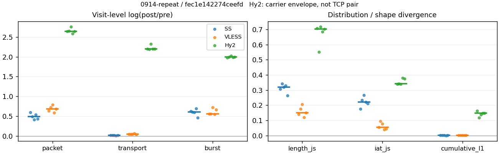
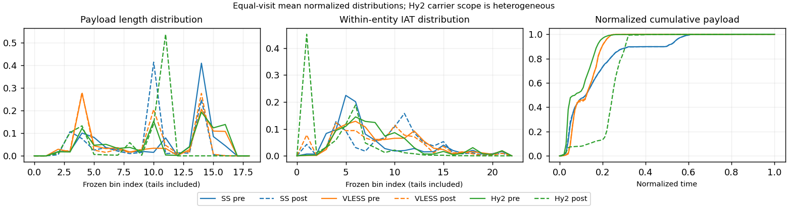

# 0914-repeat · 条目 014 · vimeo.com

目标：https://vimeo.com/513177164

活动标签：vimeo.com::page_load。选定访问 15 次。

[返回总索引](../../README.md) · [统计口径](../../methods.md)

## 覆盖与资格（每次访问均保留）

| 部署 | 重复 | 主请求路由 | 活动状态 | 代理比较 | DIRECT pre | 请求 proxy/direct/unresolved | 错误 |
| --- | --- | --- | --- | --- | --- | --- | --- |
| Hy2 | 1 | proxy | passed | 1 | 1 | 307/9/0 | [] |
| Hy2 | 2 | proxy | passed | 1 | 1 | 310/9/0 | [] |
| Hy2 | 3 | proxy | passed | 1 | 1 | 272/9/0 | [] |
| Hy2 | 4 | proxy | passed | 1 | 1 | 307/9/0 | [] |
| Hy2 | 5 | proxy | passed | 1 | 1 | 308/9/0 | [] |
| SS | 1 | proxy | passed | 1 | 0 | 288/0/0 | [] |
| SS | 2 | proxy | passed | 1 | 0 | 318/0/0 | [] |
| SS | 3 | proxy | passed | 1 | 0 | 279/0/0 | [] |
| SS | 4 | proxy | passed | 1 | 0 | 286/0/0 | [] |
| SS | 5 | proxy | passed | 1 | 0 | 286/0/0 | [] |
| VLESS | 1 | proxy | passed | 1 | 0 | 289/0/0 | [] |
| VLESS | 2 | proxy | passed | 1 | 0 | 285/0/0 | [] |
| VLESS | 3 | proxy | passed | 1 | 0 | 321/0/0 | [] |
| VLESS | 4 | proxy | passed | 1 | 0 | 285/0/0 | [] |
| VLESS | 5 | proxy | passed | 1 | 0 | 285/0/0 | [] |

主请求非 proxy 的统计仅解释为已索引的辅助代理连接或 DIRECT 观测，不代表目标业务经代理传输。播放确认与配对资格是两道不同的门。

图中散点为单次访问，短线为重复中位数；Hy2 是共享载体包络，不能与 TCP 配对作等范围因果对比。

形态图先逐访问归一化，再对访问等权平均；实线 pre，虚线 post。分箱序号及边界见 methods，不将分箱索引误解为长度或时间。

## 每次访问的关键观测

### SS

范围：`exclusive_page`。每格 pre → post；空值为不可观测/不适用。

| 重复 | 包数 | 载荷字节 | burst | TCP FR | IAT中位µs | length JS | IAT JS |
| --- | --- | --- | --- | --- | --- | --- | --- |
| 1 | 4322 → 7881 | 5.7266e+06 → 5.8281e+06 | 3088 → 5772 | 282 → 290 | 25.016 → 304.04 | 0.30603 | 0.17566 |
| 2 | 4787 → 7808 | 6.2718e+06 → 6.3694e+06 | 3348 → 6112 | 371 → 379 | 27.886 → 818.65 | 0.34142 | 0.23352 |
| 3 | 4662 → 7014 | 5.6415e+06 → 5.7248e+06 | 3171 → 5775 | 278 → 291 | 24.466 → 1018 | 0.31836 | 0.26632 |
| 4 | 4338 → 7460 | 5.6877e+06 → 5.7545e+06 | 3139 → 6261 | 339 → 345 | 36.974 → 1021.8 | 0.32877 | 0.2202 |
| 5 | 4852 → 7447 | 5.7138e+06 → 5.7909e+06 | 3342 → 5305 | 291 → 297 | 25.755 → 288.38 | 0.26498 | 0.21039 |

完整标量统计：中位数 [min,max]；Δ 为重复内逐访问变换的中位数，MAD 未缩放。n 为可用变换数；DIRECT-only 的 nΔ=0 不代表 pre 不可用。

| scope | 特征 | pre | post | Δ | IQRΔ | MADΔ | nΔ |
| --- | --- | --- | --- | --- | --- | --- | --- |
| exclusive_page | active_span_sum_s_1000ms | 69.208 [54.322, 90.095] | 74.45 [59.152, 90.513] | 0.073023 | 0.016599 | 0.0096951 | 5 |
| exclusive_page | active_span_sum_s_100ms | 14.773 [12.452, 20.089] | 26.626 [22.102, 37.735] | 0.62018 | 0.056629 | 0.046417 | 5 |
| exclusive_page | active_span_sum_s_500ms | 48.323 [40.127, 59.505] | 60.337 [49.649, 71.602] | 0.21292 | 0.011781 | 0.0091363 | 5 |
| exclusive_page | burst_bytes_iqr | 2896 [2896, 2896] | 1428 [1428, 1468] | -0.70706 | 0.026604 | 0 | 5 |
| exclusive_page | burst_bytes_mad | 31 [0, 38] | 34 [27, 34] | 0.092373 | 0.1018 | 0 | 3 |
| exclusive_page | burst_bytes_max | 23584 [22136, 25448] | 16417 [12834, 21950] | -0.43832 | 0.46865 | 0.14368 | 5 |
| exclusive_page | burst_bytes_mean | 1812 [1709.7, 1873.3] | 1009.7 [919.1, 1091.6] | -0.58645 | 0.02309 | 0.021472 | 5 |
| exclusive_page | burst_bytes_median | 31 [0, 38] | 34 [27, 34] | 0.092373 | 0.1018 | 0 | 3 |
| exclusive_page | burst_bytes_min | 0 [0, 0] | 0 [0, 0] | — | — | — | 0 |
| exclusive_page | burst_bytes_p95 | 8192 [7528, 8688] | 2856 [2856, 4284] | -1.0537 | 0.46425 | 0.058785 | 5 |
| exclusive_page | burst_bytes_q25 | 0 [0, 0] | 0 [0, 0] | — | — | — | 0 |
| exclusive_page | burst_bytes_q75 | 2896 [2896, 2896] | 1428 [1428, 1468] | -0.70706 | 0.026604 | 0 | 5 |
| exclusive_page | burst_bytes_std | 3406.8 [3337.4, 3556.1] | 1530 [1225.8, 1877.3] | -0.84339 | 0.078498 | 0.048084 | 5 |
| exclusive_page | burst_count | 3171 [3088, 3348] | 5775 [5305, 6261] | 0.60189 | 0.026004 | 0.023604 | 5 |
| exclusive_page | burst_duration_ms_iqr | 0.012892 [0, 0.020254] | 0 [0, 5.4e-05] | — | — | — | 0 |
| exclusive_page | burst_duration_ms_mad | 0 [0, 0] | 0 [0, 0] | — | — | — | 0 |
| exclusive_page | burst_duration_ms_max | 15001 [15001, 15001] | 45505 [30792, 54913] | 1.1097 | 0.011653 | 0.0077069 | 5 |
| exclusive_page | burst_duration_ms_mean | 106.86 [91.195, 141.92] | 81.422 [63.24, 96.886] | -0.27188 | 0.15656 | 0.13281 | 5 |
| exclusive_page | burst_duration_ms_median | 0 [0, 0] | 0 [0, 0] | — | — | — | 0 |
| exclusive_page | burst_duration_ms_min | 0 [0, 0] | 0 [0, 0] | — | — | — | 0 |
| exclusive_page | burst_duration_ms_p95 | 141.48 [93.464, 244.68] | 2.8929 [1.021, 3.9829] | -4.1179 | 1.1556 | 0.67307 | 5 |
| exclusive_page | burst_duration_ms_q25 | 0 [0, 0] | 0 [0, 0] | — | — | — | 0 |
| exclusive_page | burst_duration_ms_q75 | 0.012892 [0, 0.020254] | 0 [0, 5.4e-05] | — | — | — | 0 |
| exclusive_page | burst_duration_ms_std | 1029.7 [951.95, 1273.4] | 1232.5 [1122.6, 1354.5] | 0.15897 | 0.14519 | 0.099311 | 5 |
| exclusive_page | burst_packets_iqr | 1 [0, 1] | 0 [0, 1] | — | — | — | 0 |
| exclusive_page | burst_packets_mad | 0 [0, 0] | 0 [0, 0] | — | — | — | 0 |
| exclusive_page | burst_packets_max | 12 [11, 13] | 13 [12, 22] | 0.16705 | 0.51083 | 0.2471 | 5 |
| exclusive_page | burst_packets_mean | 1.4298 [1.382, 1.4702] | 1.2775 [1.1915, 1.4038] | -0.11265 | 0.11463 | 0.078382 | 5 |
| exclusive_page | burst_packets_median | 1 [1, 1] | 1 [1, 1] | 0 | 0 | 0 | 5 |
| exclusive_page | burst_packets_min | 1 [1, 1] | 1 [1, 1] | 0 | 0 | 0 | 5 |
| exclusive_page | burst_packets_p95 | 3 [3, 3] | 2 [2, 3] | -0.40547 | 0.40547 | 0 | 5 |
| exclusive_page | burst_packets_q25 | 1 [1, 1] | 1 [1, 1] | 0 | 0 | 0 | 5 |
| exclusive_page | burst_packets_q75 | 2 [1, 2] | 1 [1, 2] | -0.69315 | 0.69315 | 0 | 5 |
| exclusive_page | burst_packets_std | 1.0395 [0.82972, 1.2204] | 0.811 [0.67448, 0.92463] | -0.24824 | 0.096092 | 0.054459 | 5 |
| exclusive_page | connection_span_concurrency_max | 22 [22, 27] | 22 [21, 27] | 0 | 0.044452 | 0 | 5 |
| exclusive_page | cumulative_l1 | — | — | 0.0012131 | 0.0010427 | 0.00046537 | 5 |
| exclusive_page | cumulative_max | — | — | 0.021489 | 0.074307 | 0.012717 | 5 |
| exclusive_page | direction_entropy | 0.69961 [0.63046, 0.73164] | 0.48193 [0.43532, 0.72193] | -0.18147 | 0.071764 | 0.044924 | 5 |
| exclusive_page | down_burst_count | 1572 [1529, 1658] | 2875 [2639, 3117] | 0.60625 | 0.026342 | 0.023801 | 5 |
| exclusive_page | down_ip_bytes | 5.68e+06 [5.6261e+06, 5.6974e+06] | 5.8051e+06 [5.7321e+06, 5.8547e+06] | 0.02049 | 0.0026452 | 0.0017627 | 5 |
| exclusive_page | down_packets | 2736 [2474, 2894] | 3952 [3682, 4358] | 0.36958 | 0.073213 | 0.071354 | 5 |
| exclusive_page | down_transport_bytes | 5.5457e+06 [5.4813e+06, 5.5549e+06] | 5.5985e+06 [5.5401e+06, 5.6276e+06] | 0.0099791 | 0.0024633 | 0.0017766 | 5 |
| exclusive_page | duration_s | 71.899 [57.286, 77.957] | 71.898 [57.285, 77.956] | -8.7421e-06 | 2.4174e-07 | 2.1634e-07 | 5 |
| exclusive_page | entity_count | 28 [27, 32] | 28 [27, 32] | 0 | 0 | 0 | 5 |
| exclusive_page | fr_runs | 291 [278, 371] | 297 [290, 379] | 0.021334 | 0.007565 | 0.0037898 | 5 |
| exclusive_page | fr_runs_per_packet | 0.11721 [0.10243, 0.14286] | 0.078905 [0.066667, 0.091215] | -0.046754 | 0.018809 | 0.0075279 | 5 |
| exclusive_page | fr_switches | 263 [251, 339] | 269 [260, 347] | 0.023325 | 0.0086952 | 0.0042765 | 5 |
| exclusive_page | fr_switches_per_possible_transition | 0.10606 [0.093494, 0.13299] | 0.072111 [0.060185, 0.084162] | -0.043425 | 0.016843 | 0.0073538 | 5 |
| exclusive_page | full_retransmission_fraction | 0.0022979 [0.0020747, 0.0047403] | 0.005988 [0.0033571, 0.0071057] | 0.0034037 | 0.0022984 | 0.00070209 | 5 |
| exclusive_page | full_retransmission_packets | 11 [9, 23] | 42 [25, 56] | 1.2528 | 0.33647 | 0.18232 | 5 |
| exclusive_page | iat_count | 4635 [4292, 4824] | 7433 [6987, 7851] | 0.49185 | 0.11432 | 0.061405 | 5 |
| exclusive_page | iat_js | — | — | 0.2202 | 0.023129 | 0.013323 | 5 |
| exclusive_page | iat_ks | — | — | 0.36375 | 0.045883 | 0.02577 | 5 |
| exclusive_page | iat_median_us | 25.755 [24.466, 36.974] | 818.65 [288.38, 1021.8] | 3.3191 | 0.88189 | 0.40917 | 5 |
| exclusive_page | iat_us_iqr | 165.27 [106.4, 845.59] | 1942.2 [1104.6, 8327.2] | 2.34 | 0.13441 | 0.081617 | 5 |
| exclusive_page | iat_us_mad | 19.813 [17.52, 30.725] | 806.84 [284.92, 1013.3] | 3.4959 | 0.88795 | 0.55538 | 5 |
| exclusive_page | iat_us_max | 1.5001e+07 [1.5001e+07, 1.5002e+07] | 1.546e+07 [1.5451e+07, 1.5488e+07] | 0.030116 | 0.00072604 | 0.00045147 | 5 |
| exclusive_page | iat_us_mean | 2.862e+05 [1.8126e+05, 3.112e+05] | 1.6575e+05 [1.1352e+05, 1.9558e+05] | -0.49325 | 0.078203 | 0.028787 | 5 |
| exclusive_page | iat_us_median | 25.755 [24.466, 36.974] | 818.65 [288.38, 1021.8] | 3.3191 | 0.88189 | 0.40917 | 5 |
| exclusive_page | iat_us_min | 0.015 [0.005, 0.019] | 0.036 [0.032, 0.037] | 0.90287 | 0.53063 | 0.29196 | 5 |
| exclusive_page | iat_us_p95 | 2.0682e+05 [92351, 2.9699e+05] | 39258 [35855, 51396] | -1.6768 | 0.12069 | 0.077357 | 5 |
| exclusive_page | iat_us_q25 | 12.178 [11.901, 13.546] | 13.652 [10.22, 17.618] | 0.12014 | 0.33344 | 0.24324 | 5 |
| exclusive_page | iat_us_q75 | 177.17 [118.72, 859.13] | 1955.8 [1114.9, 8343.9] | 2.2734 | 0.12111 | 0.087437 | 5 |
| exclusive_page | iat_us_std | 1.8885e+06 [1.5011e+06, 2.0314e+06] | 1.4589e+06 [1.1919e+06, 1.6242e+06] | -0.23322 | 0.027476 | 0.0094902 | 5 |
| exclusive_page | iat_wasserstein_log1p_us | — | — | 1.6054 | 0.39058 | 0.29896 | 5 |
| exclusive_page | idle_gap_count_1000ms | 113 [87, 126] | 108 [86, 119] | -0.057158 | 0.023146 | 0.011902 | 5 |
| exclusive_page | idle_gap_count_100ms | 275 [220, 331] | 263 [221, 314] | -0.044617 | 0.052725 | 0.044617 | 5 |
| exclusive_page | idle_gap_count_500ms | 142 [109, 169] | 124 [100, 145] | -0.15316 | 0.031509 | 0.017619 | 5 |
| exclusive_page | idle_gap_sum_s_1000ms | 1161.6 [820.1, 1374.5] | 1155.1 [783.03, 1293] | -0.0059253 | 0.040635 | 0.0041016 | 5 |
| exclusive_page | idle_gap_sum_s_100ms | 1213.7 [861.97, 1427.3] | 1194.3 [820.08, 1346.2] | -0.016135 | 0.036842 | 0.0046263 | 5 |
| exclusive_page | idle_gap_sum_s_500ms | 1180.5 [834.29, 1397.5] | 1166.2 [792.54, 1306.8] | -0.012334 | 0.03919 | 0.0016425 | 5 |
| exclusive_page | ip_bytes | 5.952e+06 [5.8844e+06, 6.5213e+06] | 6.2362e+06 [6.1503e+06, 6.8354e+06] | 0.046774 | 0.0028477 | 0.0025873 | 5 |
| exclusive_page | length_iqr | 2410 [2316.2, 2501.8] | 1389 [442, 1456] | -0.5413 | 0.05903 | 0.029212 | 5 |
| exclusive_page | length_js | — | — | 0.31836 | 0.022747 | 0.012336 | 5 |
| exclusive_page | length_ks | — | — | 0.48746 | 0.020428 | 0.017101 | 5 |
| exclusive_page | length_mad | 1200 [1131, 1448] | 712.5 [233, 1266] | -0.5213 | 1.312 | 0.62453 | 5 |
| exclusive_page | length_max | 8920 [8688, 8948] | 8568 [4284, 18564] | -0.040262 | 0.98083 | 0.69315 | 5 |
| exclusive_page | length_mean | 2332.4 [2011.2, 2396.9] | 1477.4 [1339.8, 1552.3] | -0.4197 | 0.10611 | 0.064169 | 5 |
| exclusive_page | length_median | 2896 [2579, 2896] | 1428 [1428, 1428] | -0.70706 | 0.074533 | 0 | 5 |
| exclusive_page | length_min | 7 [6, 8] | 4 [3, 6] | -0.40547 | 0.27193 | 0.15415 | 5 |
| exclusive_page | length_p95 | 8192 [4096, 8192] | 2856 [2856, 2856] | -1.0537 | 0.69315 | 0 | 5 |
| exclusive_page | length_q25 | 486 [394.25, 579.75] | 1185.5 [114, 1416] | 0.82217 | 2.2428 | 0.44507 | 5 |
| exclusive_page | length_q75 | 2896 [2896, 2896] | 1627.5 [1502, 2856] | -0.57629 | 0.6294 | 0.080248 | 5 |
| exclusive_page | length_std | 2051.7 [1501.4, 2120] | 981.97 [940.6, 1216.5] | -0.63627 | 0.29696 | 0.17219 | 5 |
| exclusive_page | length_wasserstein_bytes | — | — | 1008.7 | 295.71 | 32.837 | 5 |
| exclusive_page | nonempty_entity_count | 28 [27, 32] | 28 [27, 32] | 0 | 0 | 0 | 5 |
| exclusive_page | nonempty_packets | 2678 [2373, 2841] | 4155 [3688, 4350] | 0.43514 | 0.10437 | 0.060396 | 5 |
| exclusive_page | offload_suspect_fraction | 0.33326 [0.31544, 0.33848] | 0.15303 [0.13673, 0.15872] | -0.18151 | 0.0090804 | 0.0031075 | 5 |
| exclusive_page | packet_count | 4662 [4322, 4852] | 7460 [7014, 7881] | 0.48924 | 0.11372 | 0.060825 | 5 |
| exclusive_page | rtt_median_ms | 0.039116 [0.025468, 0.051924] | 32.554 [31.344, 33.312] | 6.7335 | 0.34901 | 0.26929 | 5 |
| exclusive_page | rtt_sample_count | 1745 [1696, 1871] | 1088 [1071, 1365] | -0.45968 | 0.14113 | 0.078167 | 5 |
| exclusive_page | tcp_ack_count | 4630 [4292, 4822] | 7428 [6979, 7848] | 0.49159 | 0.11458 | 0.062081 | 5 |
| exclusive_page | tcp_fin_count | 56 [54, 64] | 56 [53, 66] | 0.030772 | 0.054386 | 0.04879 | 5 |
| exclusive_page | tcp_packet_count | 4662 [4322, 4852] | 7460 [7014, 7881] | 0.48924 | 0.11372 | 0.060825 | 5 |
| exclusive_page | tcp_rst_count | 0 [0, 5] | 0 [0, 2] | -0.80472 | 0.11157 | 0.11157 | 2 |
| exclusive_page | tcp_syn_count | 56 [54, 64] | 63 [59, 67] | 0.088553 | 0.05657 | 0.039763 | 5 |
| exclusive_page | tcp_window_raw_median | 65535 [65535, 65535] | 142 [142, 146] | -6.1345 | 0.013986 | 0 | 5 |
| exclusive_page | transition_entropy | 0.43267 [0.38834, 0.50275] | 0.30463 [0.26289, 0.37906] | -0.11282 | 0.058372 | 0.025272 | 5 |
| exclusive_page | transition_n_mm | 1956 [1736, 2250] | 3307 [3138, 3820] | 0.48735 | 0.17177 | 0.083467 | 5 |
| exclusive_page | transition_n_mp | 122 [116, 157] | 125 [120, 161] | 0.025159 | 0.0096089 | 0.0049559 | 5 |
| exclusive_page | transition_n_pm | 141 [135, 182] | 144 [140, 186] | 0.02174 | 0.0079341 | 0.0037215 | 5 |
| exclusive_page | transition_n_pp | 300 [288, 362] | 241 [234, 638] | -0.20764 | 0.014953 | 0.011346 | 5 |
| exclusive_page | transition_p_mm | 0.93993 [0.92193, 0.94857] | 0.96257 [0.9512, 0.96954] | 0.025499 | 0.011181 | 0.0070648 | 5 |
| exclusive_page | transition_p_mp | 0.060073 [0.051433, 0.078067] | 0.037432 [0.030457, 0.048803] | -0.025499 | 0.011181 | 0.0070648 | 5 |
| exclusive_page | transition_p_pm | 0.31973 [0.30562, 0.35637] | 0.37403 [0.22573, 0.40876] | 0.054298 | 0.0044634 | 0.002553 | 5 |
| exclusive_page | transition_p_pp | 0.68027 [0.64363, 0.69438] | 0.62597 [0.59124, 0.77427] | -0.054298 | 0.0044634 | 0.002553 | 5 |
| exclusive_page | transport_bytes | 5.7138e+06 [5.6415e+06, 6.2718e+06] | 5.7909e+06 [5.7248e+06, 6.3694e+06] | 0.014659 | 0.0020337 | 0.001252 | 5 |
| exclusive_page | up_burst_count | 1599 [1559, 1690] | 2901 [2666, 3144] | 0.5976 | 0.025679 | 0.023411 | 5 |
| exclusive_page | up_byte_fraction | 0.02943 [0.028392, 0.1143] | 0.032752 [0.032265, 0.12102] | 0.0036714 | 0.00051428 | 0.00031349 | 5 |
| exclusive_page | up_ip_bytes | 2.7045e+05 [2.5832e+05, 8.2392e+05] | 4.3004e+05 [4.1678e+05, 1.0303e+06] | 0.48167 | 0.056154 | 0.021765 | 5 |
| exclusive_page | up_packets | 1882 [1838, 2051] | 3523 [3259, 3856] | 0.6313 | 0.079397 | 0.031064 | 5 |
| exclusive_page | up_transport_bytes | 1.6816e+05 [1.6018e+05, 7.1688e+05] | 1.8966e+05 [1.8471e+05, 7.7084e+05] | 0.12034 | 0.010216 | 0.010098 | 5 |
| exclusive_page | zero_iat_count | 0 [0, 0] | 0 [0, 0] | — | — | — | 0 |
| exclusive_page | zero_iat_fraction | 0 [0, 0] | 0 [0, 0] | 0 | 0 | 0 | 5 |

### VLESS

范围：`exclusive_page`。每格 pre → post；空值为不可观测/不适用。

| 重复 | 包数 | 载荷字节 | burst | TCP FR | IAT中位µs | length JS | IAT JS |
| --- | --- | --- | --- | --- | --- | --- | --- |
| 1 | 3641 → 6902 | 5.1271e+06 → 5.3486e+06 | 2714 → 4750 | 255 → 324 | 137.57 → 126.96 | 0.14012 | 0.054948 |
| 2 | 3872 → 7969 | 5.478e+06 → 5.7087e+06 | 2965 → 5160 | 265 → 330 | 104.82 → 93.655 | 0.17605 | 0.094936 |
| 3 | 4015 → 8847 | 6.0552e+06 → 6.3405e+06 | 2927 → 5999 | 340 → 424 | 106.17 → 69.86 | 0.20571 | 0.078185 |
| 4 | 3107 → 5591 | 3.4955e+06 → 3.7256e+06 | 2321 → 4016 | 248 → 310 | 185.59 → 211.13 | 0.11922 | 0.040602 |
| 5 | 3725 → 7399 | 5.3052e+06 → 5.5012e+06 | 2755 → 5352 | 265 → 326 | 113.57 → 124.78 | 0.14999 | 0.046084 |

完整标量统计：中位数 [min,max]；Δ 为重复内逐访问变换的中位数，MAD 未缩放。n 为可用变换数；DIRECT-only 的 nΔ=0 不代表 pre 不可用。

| scope | 特征 | pre | post | Δ | IQRΔ | MADΔ | nΔ |
| --- | --- | --- | --- | --- | --- | --- | --- |
| exclusive_page | active_span_sum_s_1000ms | 55.724 [50.904, 84.686] | 57.763 [52.361, 86.34] | 0.028237 | 0.052196 | 0.043304 | 5 |
| exclusive_page | active_span_sum_s_100ms | 8.8758 [8.2, 9.6392] | 21.865 [20.43, 27.995] | 0.90157 | 0.10354 | 0.052727 | 5 |
| exclusive_page | active_span_sum_s_500ms | 30.403 [28.585, 45.686] | 51.635 [47.882, 72.524] | 0.50456 | 0.035178 | 0.023905 | 5 |
| exclusive_page | burst_bytes_iqr | 2069.8 [1795, 2632] | 2824 [2066.2, 2824] | 0.26122 | 0.24032 | 0.19081 | 5 |
| exclusive_page | burst_bytes_mad | 0 [0, 24] | 31 [31, 53] | 0.79224 | — | — | 1 |
| exclusive_page | burst_bytes_max | 23848 [20480, 25088] | 17376 [8688, 35300] | -0.31661 | 0.70977 | 0.41097 | 5 |
| exclusive_page | burst_bytes_mean | 1889.1 [1506, 2068.7] | 1056.9 [927.68, 1126] | -0.51743 | 0.11498 | 0.032873 | 5 |
| exclusive_page | burst_bytes_median | 0 [0, 24] | 31 [31, 53] | 0.79224 | — | — | 1 |
| exclusive_page | burst_bytes_min | 0 [0, 0] | 0 [0, 0] | — | — | — | 0 |
| exclusive_page | burst_bytes_p95 | 16384 [8920, 16384] | 2896 [2896, 2968] | -1.7087 | 0.012204 | 0.011925 | 5 |
| exclusive_page | burst_bytes_q25 | 0 [0, 0] | 0 [0, 0] | — | — | — | 0 |
| exclusive_page | burst_bytes_q75 | 2069.8 [1795, 2632] | 2824 [2066.2, 2824] | 0.26122 | 0.24032 | 0.19081 | 5 |
| exclusive_page | burst_bytes_std | 4110 [3265, 4427.5] | 1506.8 [1247.3, 1695.3] | -0.96232 | 0.039333 | 0.013878 | 5 |
| exclusive_page | burst_count | 2755 [2321, 2965] | 5160 [4016, 5999] | 0.55972 | 0.10999 | 0.011433 | 5 |
| exclusive_page | burst_duration_ms_iqr | 0.032371 [0.014576, 0.10934] | 0.00014 [0.00011325, 0.0076075] | -5.5647 | 4.8313 | 1.0959 | 5 |
| exclusive_page | burst_duration_ms_mad | 0 [0, 0] | 0 [0, 0] | — | — | — | 0 |
| exclusive_page | burst_duration_ms_max | 15001 [15001, 15001] | 15064 [15058, 15302] | 0.0041567 | 0.010106 | 0.00035623 | 5 |
| exclusive_page | burst_duration_ms_mean | 93.796 [75.238, 135.53] | 46.66 [40.651, 59.389] | -0.72093 | 0.11414 | 0.10412 | 5 |
| exclusive_page | burst_duration_ms_median | 0 [0, 0] | 0 [0, 0] | — | — | — | 0 |
| exclusive_page | burst_duration_ms_min | 0 [0, 0] | 0 [0, 0] | — | — | — | 0 |
| exclusive_page | burst_duration_ms_p95 | 194.07 [97.954, 225.57] | 9.7017 [9.2797, 10.756] | -2.9757 | 0.12709 | 0.064716 | 5 |
| exclusive_page | burst_duration_ms_q25 | 0 [0, 0] | 0 [0, 0] | — | — | — | 0 |
| exclusive_page | burst_duration_ms_q75 | 0.032371 [0.014576, 0.10934] | 0.00014 [0.00011325, 0.0076075] | -5.5647 | 4.8313 | 1.0959 | 5 |
| exclusive_page | burst_duration_ms_std | 1029 [907.58, 1199.4] | 757.66 [696.22, 856] | -0.33297 | 0.091143 | 0.051265 | 5 |
| exclusive_page | burst_packets_iqr | 1 [1, 1] | 1 [1, 1] | 0 | 0 | 0 | 5 |
| exclusive_page | burst_packets_mad | 0 [0, 0] | 0 [0, 0] | — | — | — | 0 |
| exclusive_page | burst_packets_max | 5 [5, 7] | 12 [8, 14] | 0.60614 | 0.49062 | 0.13613 | 5 |
| exclusive_page | burst_packets_mean | 1.3416 [1.3059, 1.3717] | 1.4531 [1.3825, 1.5444] | 0.072426 | 0.04062 | 0.033214 | 5 |
| exclusive_page | burst_packets_median | 1 [1, 1] | 1 [1, 1] | 0 | 0 | 0 | 5 |
| exclusive_page | burst_packets_min | 1 [1, 1] | 1 [1, 1] | 0 | 0 | 0 | 5 |
| exclusive_page | burst_packets_p95 | 2 [2, 2] | 3 [3, 3] | 0.40547 | 0 | 0 | 5 |
| exclusive_page | burst_packets_q25 | 1 [1, 1] | 1 [1, 1] | 0 | 0 | 0 | 5 |
| exclusive_page | burst_packets_q75 | 2 [2, 2] | 2 [2, 2] | 0 | 0 | 0 | 5 |
| exclusive_page | burst_packets_std | 0.57424 [0.55325, 0.62012] | 0.87215 [0.81466, 1.1416] | 0.37745 | 0.12657 | 0.026031 | 5 |
| exclusive_page | connection_span_concurrency_max | 22 [20, 26] | 22 [20, 26] | 0 | 0 | 0 | 5 |
| exclusive_page | cumulative_l1 | — | — | 0.0017389 | 0.00047297 | 0.0002494 | 5 |
| exclusive_page | cumulative_max | — | — | 0.015088 | 0.013267 | 0.0014051 | 5 |
| exclusive_page | direction_entropy | 0.72346 [0.65374, 0.77706] | 0.42863 [0.4076, 0.64426] | -0.28069 | 0.12474 | 0.035171 | 5 |
| exclusive_page | down_burst_count | 1364 [1147, 1469] | 2570 [1998, 2986] | 0.56545 | 0.11083 | 0.010452 | 5 |
| exclusive_page | down_ip_bytes | 5.2653e+06 [3.484e+06, 5.4834e+06] | 5.5097e+06 [3.7278e+06, 5.8238e+06] | 0.053331 | 0.010328 | 0.0069104 | 5 |
| exclusive_page | down_packets | 2124 [1771, 2230] | 4148 [3106, 4675] | 0.66933 | 0.091785 | 0.070902 | 5 |
| exclusive_page | down_transport_bytes | 5.1546e+06 [3.3917e+06, 5.3671e+06] | 5.2938e+06 [3.5661e+06, 5.5804e+06] | 0.03215 | 0.0069165 | 0.0055124 | 5 |
| exclusive_page | duration_s | 58.528 [55.99, 59.456] | 58.537 [55.98, 59.486] | 0.00015094 | 0.00049504 | 0.00032353 | 5 |
| exclusive_page | entity_count | 27 [27, 33] | 27 [27, 33] | 0 | 0 | 0 | 5 |
| exclusive_page | fr_runs | 265 [248, 340] | 326 [310, 424] | 0.22079 | 0.0037807 | 0.0023557 | 5 |
| exclusive_page | fr_runs_per_packet | 0.13054 [0.12728, 0.15697] | 0.084397 [0.074543, 0.10358] | -0.049809 | 0.0067361 | 0.003806 | 5 |
| exclusive_page | fr_switches | 238 [221, 307] | 299 [283, 391] | 0.24186 | 0.0058221 | 0.0054244 | 5 |
| exclusive_page | fr_switches_per_possible_transition | 0.11882 [0.11582, 0.14393] | 0.07767 [0.068864, 0.095415] | -0.044277 | 0.0068665 | 0.0041918 | 5 |
| exclusive_page | full_retransmission_fraction | 0.0017435 [0.00096556, 0.0024161] | 0 [0, 0.00028977] | -0.0016328 | 0.0007104 | 0.00059972 | 5 |
| exclusive_page | full_retransmission_packets | 7 [3, 9] | 0 [0, 2] | -1.2528 | — | — | 1 |
| exclusive_page | iat_count | 3698 [3080, 3982] | 7372 [5564, 8814] | 0.6899 | 0.082184 | 0.046689 | 5 |
| exclusive_page | iat_js | — | — | 0.054948 | 0.032101 | 0.014346 | 5 |
| exclusive_page | iat_ks | — | — | 0.10756 | 0.083438 | 0.048772 | 5 |
| exclusive_page | iat_median_us | 113.57 [104.82, 185.59] | 124.78 [69.86, 211.13] | -0.080262 | 0.2068 | 0.17443 | 5 |
| exclusive_page | iat_us_iqr | 2541.4 [2354.5, 2949.5] | 1188.1 [1092.1, 2035] | -0.73545 | 0.042232 | 0.024886 | 5 |
| exclusive_page | iat_us_mad | 107.59 [97.771, 180.4] | 124.52 [69.744, 211.02] | -0.028562 | 0.1898 | 0.17475 | 5 |
| exclusive_page | iat_us_max | 1.5001e+07 [1.5001e+07, 1.5002e+07] | 1.5449e+07 [1.5445e+07, 1.5453e+07] | 0.029384 | 0.00038759 | 0.00018341 | 5 |
| exclusive_page | iat_us_mean | 2.9853e+05 [2.6615e+05, 3.3772e+05] | 1.4847e+05 [1.3705e+05, 1.865e+05] | -0.6922 | 0.081629 | 0.046194 | 5 |
| exclusive_page | iat_us_median | 113.57 [104.82, 185.59] | 124.78 [69.86, 211.13] | -0.080262 | 0.2068 | 0.17443 | 5 |
| exclusive_page | iat_us_min | 0.123 [0.065, 0.563] | 0.032 [0.031, 0.034] | -1.3782 | 0.56722 | 0.37802 | 5 |
| exclusive_page | iat_us_p95 | 1.9816e+05 [1.9396e+05, 3.3857e+05] | 45589 [43097, 60871] | -1.4874 | 0.05023 | 0.032274 | 5 |
| exclusive_page | iat_us_q25 | 21.015 [18.161, 25.551] | 13.736 [8.1433, 15.731] | -0.62066 | 0.48367 | 0.33105 | 5 |
| exclusive_page | iat_us_q75 | 2559.6 [2377, 2970.5] | 1202.1 [1101, 2050.8] | -0.73424 | 0.035254 | 0.021535 | 5 |
| exclusive_page | iat_us_std | 1.9955e+06 [1.885e+06, 2.1243e+06] | 1.4066e+06 [1.3753e+06, 1.5999e+06] | -0.33146 | 0.038771 | 0.021308 | 5 |
| exclusive_page | iat_wasserstein_log1p_us | — | — | 0.55806 | 0.32595 | 0.16088 | 5 |
| exclusive_page | idle_gap_count_1000ms | 88 [79, 109] | 78 [73, 104] | -0.091567 | 0.045062 | 0.029061 | 5 |
| exclusive_page | idle_gap_count_100ms | 220 [208, 311] | 240 [226, 343] | 0.087011 | 0.010291 | 0.0062766 | 5 |
| exclusive_page | idle_gap_count_500ms | 123 [110, 165] | 89 [78, 123] | -0.33485 | 0.038353 | 0.008924 | 5 |
| exclusive_page | idle_gap_sum_s_1000ms | 1035.2 [910.7, 1217.3] | 1028.6 [906.56, 1222.3] | -0.0045644 | 0.0078156 | 0.0018123 | 5 |
| exclusive_page | idle_gap_sum_s_100ms | 1081.3 [952.85, 1292.7] | 1065.9 [938.49, 1280.7] | -0.014324 | 0.00090488 | 0.00086577 | 5 |
| exclusive_page | idle_gap_sum_s_500ms | 1061 [931.2, 1256.3] | 1036.8 [909.75, 1236.1] | -0.021759 | 0.0013611 | 0.0012763 | 5 |
| exclusive_page | ip_bytes | 5.4989e+06 [3.6571e+06, 6.264e+06] | 5.8898e+06 [4.0192e+06, 6.8073e+06] | 0.076607 | 0.011379 | 0.0065657 | 5 |
| exclusive_page | length_iqr | 2794 [2732, 3990] | 2752 [2752, 2752] | -0.015146 | 0.018719 | 0.015146 | 5 |
| exclusive_page | length_js | — | — | 0.14999 | 0.035926 | 0.026052 | 5 |
| exclusive_page | length_ks | — | — | 0.2337 | 0.010363 | 0.010174 | 5 |
| exclusive_page | length_mad | 1340 [1128, 1376] | 1340 [1319, 1340] | 0 | 0 | 0 | 5 |
| exclusive_page | length_max | 8920 [8920, 8948] | 7240 [2896, 25416] | -0.20867 | 0.67111 | 0.66797 | 5 |
| exclusive_page | length_mean | 2613.4 [2108.3, 2795.6] | 1341.6 [1244.8, 1393.2] | -0.65144 | 0.094319 | 0.061697 | 5 |
| exclusive_page | length_median | 1412 [1200, 1448] | 1412 [1391, 1412] | 0 | 0 | 0 | 5 |
| exclusive_page | length_min | 24 [23, 24] | 6 [1, 10] | -1.3437 | 1.2528 | 0.46827 | 5 |
| exclusive_page | length_p95 | 8920 [8920, 8920] | 2824 [2824, 2896] | -1.1501 | 0 | 0 | 5 |
| exclusive_page | length_q25 | 92 [72, 106] | 72 [72, 72] | -0.24512 | 0.010811 | 0.010811 | 5 |
| exclusive_page | length_q75 | 2887 [2824, 4096] | 2824 [2824, 2824] | -0.022064 | 0.025176 | 0.022064 | 5 |
| exclusive_page | length_std | 3097.5 [2654.4, 3174.2] | 1129.4 [1096.7, 1276] | -0.89062 | 0.14131 | 0.036066 | 5 |
| exclusive_page | length_wasserstein_bytes | — | — | 1377.6 | 142.48 | 92.361 | 5 |
| exclusive_page | nonempty_entity_count | 27 [27, 33] | 27 [27, 33] | 0 | 0 | 0 | 5 |
| exclusive_page | nonempty_packets | 2030 [1658, 2166] | 4038 [2993, 4726] | 0.68771 | 0.093288 | 0.066679 | 5 |
| exclusive_page | offload_suspect_fraction | 0.25074 [0.22144, 0.25355] | 0.16313 [0.15474, 0.19067] | -0.066524 | 0.023101 | 0.0067771 | 5 |
| exclusive_page | packet_count | 3725 [3107, 4015] | 7399 [5591, 8847] | 0.68628 | 0.082235 | 0.046725 | 5 |
| exclusive_page | rtt_median_ms | 0.07675 [0.064081, 0.089088] | 0.052341 [0.04709, 0.17878] | -0.38892 | 0.37439 | 0.14292 | 5 |
| exclusive_page | rtt_sample_count | 1440 [1218, 1588] | 3023 [2337, 3594] | 0.66472 | 0.089428 | 0.013058 | 5 |
| exclusive_page | tcp_ack_count | 3656 [3041, 3935] | 7371 [5563, 8798] | 0.70118 | 0.081394 | 0.046854 | 5 |
| exclusive_page | tcp_fin_count | 52 [51, 61] | 54 [54, 72] | 0.05506 | 0.019418 | 0.017319 | 5 |
| exclusive_page | tcp_packet_count | 3725 [3107, 4015] | 7399 [5591, 8847] | 0.68628 | 0.082235 | 0.046725 | 5 |
| exclusive_page | tcp_rst_count | 41 [39, 48] | 1 [1, 13] | -3.6889 | 0.05001 | 0.025318 | 5 |
| exclusive_page | tcp_syn_count | 54 [54, 66] | 54 [54, 72] | 0 | 0.0177 | 0 | 5 |
| exclusive_page | tcp_window_raw_median | 65535 [65535, 65535] | 161 [153, 175] | -6.0089 | 0.037504 | 0.025159 | 5 |
| exclusive_page | transition_entropy | 0.46597 [0.45242, 0.53514] | 0.30081 [0.27886, 0.36344] | -0.16909 | 0.020101 | 0.01049 | 5 |
| exclusive_page | transition_n_mm | 1488 [1256, 1532] | 3521 [2527, 3901] | 0.86131 | 0.095491 | 0.051773 | 5 |
| exclusive_page | transition_n_mp | 106 [98, 138] | 136 [128, 179] | 0.26381 | 0.0069307 | 0.0036825 | 5 |
| exclusive_page | transition_n_pm | 132 [123, 169] | 163 [155, 212] | 0.22669 | 0.0080972 | 0.0045532 | 5 |
| exclusive_page | transition_n_pp | 277 [154, 326] | 191 [156, 564] | -0.37174 | 0.38728 | 0.035739 | 5 |
| exclusive_page | transition_p_mm | 0.9335 [0.91575, 0.93667] | 0.96154 [0.95179, 0.96583] | 0.02931 | 0.0056765 | 0.0044407 | 5 |
| exclusive_page | transition_p_mp | 0.066499 [0.063331, 0.084249] | 0.038462 [0.034167, 0.048211] | -0.02931 | 0.0056765 | 0.0044407 | 5 |
| exclusive_page | transition_p_pm | 0.33867 [0.31655, 0.44404] | 0.46045 [0.2732, 0.49839] | 0.13771 | 0.086168 | 0.019033 | 5 |
| exclusive_page | transition_p_pp | 0.66133 [0.55596, 0.68345] | 0.53955 [0.50161, 0.7268] | -0.13771 | 0.086168 | 0.019033 | 5 |
| exclusive_page | transport_bytes | 5.3052e+06 [3.4955e+06, 6.0552e+06] | 5.5012e+06 [3.7256e+06, 6.3405e+06] | 0.04229 | 0.0047825 | 0.003751 | 5 |
| exclusive_page | up_burst_count | 1391 [1174, 1496] | 2590 [2018, 3013] | 0.55408 | 0.10917 | 0.012388 | 5 |
| exclusive_page | up_byte_fraction | 0.028377 [0.022994, 0.11363] | 0.037697 [0.032851, 0.11987] | 0.0093198 | 0.000949 | 0.00053698 | 5 |
| exclusive_page | up_ip_bytes | 2.3362e+05 [1.7308e+05, 7.8063e+05] | 3.8012e+05 [2.9146e+05, 9.8342e+05] | 0.49528 | 0.026732 | 0.018259 | 5 |
| exclusive_page | up_packets | 1601 [1336, 1785] | 3251 [2485, 4172] | 0.69139 | 0.080617 | 0.063674 | 5 |
| exclusive_page | up_transport_bytes | 1.5054e+05 [1.0383e+05, 6.8803e+05] | 2.0738e+05 [1.595e+05, 7.6004e+05] | 0.32027 | 0.07928 | 0.078757 | 5 |
| exclusive_page | zero_iat_count | 0 [0, 0] | 0 [0, 0] | — | — | — | 0 |
| exclusive_page | zero_iat_fraction | 0 [0, 0] | 0 [0, 0] | 0 | 0 | 0 | 5 |

### Hy2

范围：`carrier_context_envelope`。每格 pre → post；空值为不可观测/不适用。

| 重复 | 包数 | 载荷字节 | burst | TCP FR | IAT中位µs | length JS | IAT JS |
| --- | --- | --- | --- | --- | --- | --- | --- |
| 1 | 3468 → 49017 | 5.7737e+06 → 5.1873e+07 | 2360 → 17120 | — | 92.632 → 5.784 | 0.70692 | 0.34068 |
| 2 | 3480 → 49399 | 5.8253e+06 → 5.2118e+07 | 2396 → 17733 | — | 88.108 → 6.035 | 0.55117 | 0.34324 |
| 3 | 3055 → 48152 | 5.0254e+06 → 5.1205e+07 | 2185 → 16627 | — | 71.029 → 5.086 | 0.71668 | 0.33873 |
| 4 | 3822 → 50750 | 5.7861e+06 → 5.2397e+07 | 2634 → 19203 | — | 113.38 → 5.574 | 0.68394 | 0.38068 |
| 5 | 3541 → 50036 | 5.7992e+06 → 5.2514e+07 | 2416 → 17789 | — | 101.57 → 5.053 | 0.7034 | 0.37416 |

范围：`direct_pre_only`。每格 pre → post；空值为不可观测/不适用。

| 重复 | 包数 | 载荷字节 | burst | TCP FR | IAT中位µs | length JS | IAT JS |
| --- | --- | --- | --- | --- | --- | --- | --- |
| 1 | 302 → — | 4.6366e+05 → — | 201 → — | 32 → — | 113.54 → — | — | — |
| 2 | 305 → — | 4.6253e+05 → — | 189 → — | 32 → — | 131.83 → — | — | — |
| 3 | 315 → — | 4.6268e+05 → — | 213 → — | 32 → — | 142.83 → — | — | — |
| 4 | 288 → — | 4.6275e+05 → — | 187 → — | 32 → — | 131.65 → — | — | — |
| 5 | 286 → — | 4.6276e+05 → — | 181 → — | 32 → — | 109.36 → — | — | — |

完整标量统计：中位数 [min,max]；Δ 为重复内逐访问变换的中位数，MAD 未缩放。n 为可用变换数；DIRECT-only 的 nΔ=0 不代表 pre 不可用。

| scope | 特征 | pre | post | Δ | IQRΔ | MADΔ | nΔ |
| --- | --- | --- | --- | --- | --- | --- | --- |
| carrier_context_envelope | active_span_sum_s_1000ms | 61.976 [38.974, 74.227] | 20.822 [19.183, 25.015] | -1.0596 | 0.1876 | 0.15227 | 5 |
| carrier_context_envelope | active_span_sum_s_100ms | 4.5084 [3.5582, 5.2156] | 11.499 [11.356, 13.745] | 0.96324 | 0.046859 | 0.03458 | 5 |
| carrier_context_envelope | active_span_sum_s_500ms | 40.801 [29.028, 47.675] | 19.727 [18.378, 20.96] | -0.78959 | 0.20413 | 0.1235 | 5 |
| carrier_context_envelope | burst_bytes_iqr | 2819.5 [2005.8, 2830] | 4223 [2782, 4898] | 0.40422 | 0.0056701 | 0.0039539 | 5 |
| carrier_context_envelope | burst_bytes_mad | 36.5 [31, 39] | 332 [267, 504] | 2.3711 | 0.36189 | 0.21789 | 5 |
| carrier_context_envelope | burst_bytes_max | 28672 [26032, 28821] | 2.0175e+05 [1.6905e+05, 2.5205e+05] | 2.0477 | 0.25371 | 0.12603 | 5 |
| carrier_context_envelope | burst_bytes_mean | 2400.3 [2196.7, 2446.5] | 2952 [2728.6, 3079.6] | 0.2139 | 0.0099323 | 0.0070107 | 5 |
| carrier_context_envelope | burst_bytes_median | 36.5 [31, 39] | 365 [300, 538] | 2.4659 | 0.31519 | 0.19611 | 5 |
| carrier_context_envelope | burst_bytes_min | 0 [0, 0] | 22 [22, 22] | — | — | — | 0 |
| carrier_context_envelope | burst_bytes_p95 | 14547 [11327, 15857] | 10932 [8845.9, 10956] | -0.31249 | 0.086231 | 0.059409 | 5 |
| carrier_context_envelope | burst_bytes_q25 | 0 [0, 0] | 99 [63, 100] | — | — | — | 0 |
| carrier_context_envelope | burst_bytes_q75 | 2819.5 [2005.8, 2830] | 4323 [2882, 4961] | 0.42588 | 0.0037171 | 0.0022083 | 5 |
| carrier_context_envelope | burst_bytes_std | 4747.7 [4500.4, 4904.4] | 5298.4 [4876.2, 6265.2] | 0.077269 | 0.18223 | 0.0025596 | 5 |
| carrier_context_envelope | burst_count | 2396 [2185, 2634] | 17733 [16627, 19203] | 1.9965 | 0.015064 | 0.0099041 | 5 |
| carrier_context_envelope | burst_duration_ms_iqr | 0.043619 [0.037856, 0.076342] | 0.024691 [0.023183, 0.026148] | -0.59151 | 0.49452 | 0.21799 | 5 |
| carrier_context_envelope | burst_duration_ms_mad | 0 [0, 0] | 4.5e-05 [4.2e-05, 4.6e-05] | — | — | — | 0 |
| carrier_context_envelope | burst_duration_ms_max | 15001 [15000, 15001] | 9975.6 [5969, 10255] | -0.40798 | 0.086902 | 0.027654 | 5 |
| carrier_context_envelope | burst_duration_ms_mean | 115.16 [97.189, 129.02] | 1.2392 [0.97734, 2.3156] | -4.3893 | 0.28921 | 0.21028 | 5 |
| carrier_context_envelope | burst_duration_ms_median | 0 [0, 0] | 4.5e-05 [4.2e-05, 4.6e-05] | — | — | — | 0 |
| carrier_context_envelope | burst_duration_ms_min | 0 [0, 0] | 0 [0, 0] | — | — | — | 0 |
| carrier_context_envelope | burst_duration_ms_p95 | 225.83 [186.76, 278.77] | 0.14535 [0.099211, 0.31579] | -7.4533 | 0.46243 | 0.17227 | 5 |
| carrier_context_envelope | burst_duration_ms_q25 | 0 [0, 0] | 0 [0, 0] | — | — | — | 0 |
| carrier_context_envelope | burst_duration_ms_q75 | 0.043619 [0.037856, 0.076342] | 0.024691 [0.023183, 0.026148] | -0.59151 | 0.49452 | 0.21799 | 5 |
| carrier_context_envelope | burst_duration_ms_std | 1072.1 [1019.4, 1185] | 78.316 [51.135, 113.53] | -2.5662 | 0.36272 | 0.19871 | 5 |
| carrier_context_envelope | burst_packets_iqr | 1 [1, 1] | 2 [2, 3] | 0.69315 | 0 | 0 | 5 |
| carrier_context_envelope | burst_packets_mad | 0 [0, 0] | 1 [1, 1] | — | — | — | 0 |
| carrier_context_envelope | burst_packets_max | 10 [9, 14] | 150 [123, 188] | 2.7081 | 0.41714 | 0.21869 | 5 |
| carrier_context_envelope | burst_packets_mean | 1.4524 [1.3982, 1.4695] | 2.8127 [2.6428, 2.896] | 0.65187 | 0.015732 | 0.015137 | 5 |
| carrier_context_envelope | burst_packets_median | 1 [1, 1] | 2 [2, 2] | 0.69315 | 0 | 0 | 5 |
| carrier_context_envelope | burst_packets_min | 1 [1, 1] | 1 [1, 1] | 0 | 0 | 0 | 5 |
| carrier_context_envelope | burst_packets_p95 | 3 [3, 3] | 8 [7, 8] | 0.98083 | 0 | 0 | 5 |
| carrier_context_envelope | burst_packets_q25 | 1 [1, 1] | 1 [1, 1] | 0 | 0 | 0 | 5 |
| carrier_context_envelope | burst_packets_q75 | 2 [2, 2] | 3 [3, 4] | 0.40547 | 0 | 0 | 5 |
| carrier_context_envelope | burst_packets_std | 0.83268 [0.76825, 0.98704] | 3.6426 [3.3444, 4.3923] | 1.518 | 0.26784 | 0.14492 | 5 |
| carrier_context_envelope | connection_span_concurrency_max | 22 [19, 23] | 1 [1, 1] | -3.091 | 0 | 0 | 5 |
| carrier_context_envelope | cumulative_l1 | — | — | 0.14747 | 0.0091398 | 0.0089817 | 5 |
| carrier_context_envelope | cumulative_max | — | — | 0.8547 | 0.0097941 | 0.0052589 | 5 |
| carrier_context_envelope | direction_entropy | 0.81128 [0.76772, 0.84902] | 0.80244 [0.77368, 0.82541] | -0.019783 | 0.018575 | 0.012448 | 5 |
| carrier_context_envelope | direction_run_analog_runs | 319 [248, 338] | 17733 [16627, 19203] | 4.0082 | 0.10126 | 0.048073 | 5 |
| carrier_context_envelope | direction_run_analog_runs_per_packet | 0.16056 [0.14675, 0.17659] | 0.35552 [0.3453, 0.37838] | 0.19071 | 0.0098478 | 0.0078513 | 5 |
| carrier_context_envelope | direction_run_analog_switches | 291 [225, 310] | 17732 [16626, 19202] | 4.1025 | 0.10361 | 0.055943 | 5 |
| carrier_context_envelope | direction_run_analog_switches_per_possible_transition | 0.14825 [0.13497, 0.16437] | 0.35551 [0.34529, 0.37837] | 0.20265 | 0.0093076 | 0.0076676 | 5 |
| carrier_context_envelope | down_burst_count | 1184 [1081, 1303] | 8866 [8313, 9601] | 2.0081 | 0.016127 | 0.01087 | 5 |
| carrier_context_envelope | down_ip_bytes | 5.2012e+06 [4.9657e+06, 5.2113e+06] | 5.1526e+07 [5.1213e+07, 5.1906e+07] | 2.2944 | 0.0072766 | 0.0015255 | 5 |
| carrier_context_envelope | down_packets | 1963 [1724, 2190] | 37329 [37196, 37756] | 2.9453 | 0.027355 | 0.015268 | 5 |
| carrier_context_envelope | down_transport_bytes | 5.0966e+06 [4.8759e+06, 5.1002e+06] | 5.0481e+07 [5.0168e+07, 5.0849e+07] | 2.296 | 0.0079725 | 0.0037253 | 5 |
| carrier_context_envelope | duration_s | 55.133 [52.962, 57.558] | 55.119 [52.96, 57.54] | -0.00026035 | 0.00024873 | 4.2558e-05 | 5 |
| carrier_context_envelope | entity_count | 28 [23, 28] | 1 [1, 1] | -3.3322 | 0 | 0 | 5 |
| carrier_context_envelope | full_retransmission_fraction | 0.0048009 [0.0017301, 0.0062193] | — | — | — | — | 0 |
| carrier_context_envelope | full_retransmission_packets | 17 [6, 20] | — | — | — | — | 0 |
| carrier_context_envelope | iat_count | 3452 [3032, 3794] | 49398 [48151, 50749] | 2.6567 | 0.0047038 | 0.0042809 | 5 |
| carrier_context_envelope | iat_js | — | — | 0.34324 | 0.033474 | 0.004517 | 5 |
| carrier_context_envelope | iat_ks | — | — | 0.48219 | 0.083717 | 0.010644 | 5 |
| carrier_context_envelope | iat_median_us | 92.632 [71.029, 113.38] | 5.574 [5.053, 6.035] | -2.7735 | 0.31975 | 0.13694 | 5 |
| carrier_context_envelope | iat_us_iqr | 665.71 [511.82, 875.3] | 26.556 [24.44, 28.319] | -3.2949 | 0.24832 | 0.13616 | 5 |
| carrier_context_envelope | iat_us_mad | 84.065 [63.236, 103.97] | 5.537 [5.016, 5.998] | -2.6829 | 0.32022 | 0.15522 | 5 |
| carrier_context_envelope | iat_us_max | 1.5001e+07 [1.5001e+07, 1.5003e+07] | 1.0001e+07 [9.1454e+06, 1.0001e+07] | -0.40553 | 0.0001074 | 6.3322e-05 | 5 |
| carrier_context_envelope | iat_us_mean | 3.0447e+05 [2.8561e+05, 3.3037e+05] | 1095.5 [1080.5, 1164.8] | -5.6201 | 0.0642 | 0.03671 | 5 |
| carrier_context_envelope | iat_us_median | 92.632 [71.029, 113.38] | 5.574 [5.053, 6.035] | -2.7735 | 0.31975 | 0.13694 | 5 |
| carrier_context_envelope | iat_us_min | 0.098 [0.041, 0.429] | 0.001 [0.001, 0.001] | -4.585 | 1.4513 | 0.8714 | 5 |
| carrier_context_envelope | iat_us_p95 | 2.3221e+05 [2.1696e+05, 3.2549e+05] | 435.14 [310.11, 721.97] | -6.3664 | 0.22192 | 0.15462 | 5 |
| carrier_context_envelope | iat_us_q25 | 20.505 [15.2, 28.249] | 0.045 [0.045, 0.046] | -6.1199 | 0.25897 | 0.2388 | 5 |
| carrier_context_envelope | iat_us_q75 | 691.7 [527.02, 895.77] | 26.602 [24.485, 28.364] | -3.3313 | 0.24006 | 0.12122 | 5 |
| carrier_context_envelope | iat_us_std | 2.0361e+06 [1.9492e+06, 2.0753e+06] | 70712 [69233, 74345] | -3.3463 | 0.017527 | 0.0089392 | 5 |
| carrier_context_envelope | iat_wasserstein_log1p_us | — | — | 3.2807 | 0.094919 | 0.0879 | 5 |
| carrier_context_envelope | idle_gap_count_1000ms | 82 [71, 93] | 6 [5, 8] | -2.4709 | 0.1618 | 0.14364 | 5 |
| carrier_context_envelope | idle_gap_count_100ms | 263 [189, 281] | 50 [44, 60] | -1.5892 | 0.28555 | 0.17792 | 5 |
| carrier_context_envelope | idle_gap_count_500ms | 108 [86, 130] | 9 [6, 11] | -2.6027 | 0.20585 | 0.06762 | 5 |
| carrier_context_envelope | idle_gap_sum_s_1000ms | 1014.6 [884.18, 1066.2] | 34.297 [30.247, 37.958] | -3.3411 | 0.13264 | 0.091499 | 5 |
| carrier_context_envelope | idle_gap_sum_s_100ms | 1073.1 [919.6, 1135.2] | 43.62 [39.215, 46.185] | -3.2019 | 0.014091 | 0.0088669 | 5 |
| carrier_context_envelope | idle_gap_sum_s_500ms | 1031.2 [894.13, 1092.8] | 34.302 [33.234, 38.504] | -3.3457 | 0.081017 | 0.068766 | 5 |
| carrier_context_envelope | ip_bytes | 5.984e+06 [5.1849e+06, 6.007e+06] | 5.3501e+07 [5.2553e+07, 5.3915e+07] | 2.1963 | 0.0075622 | 0.0055119 | 5 |
| carrier_context_envelope | length_iqr | 3856 [2532, 4561.2] | 1213 [627, 1340] | -1.2737 | 0.25655 | 0.2057 | 5 |
| carrier_context_envelope | length_js | — | — | 0.7034 | 0.022985 | 0.013277 | 5 |
| carrier_context_envelope | length_ks | — | — | 0.50454 | 0.073083 | 0.040933 | 5 |
| carrier_context_envelope | length_mad | 1347 [1269, 1933] | 0 [0, 0] | — | — | — | 0 |
| carrier_context_envelope | length_max | 8948 [8920, 8948] | 1441 [1441, 1441] | -1.8261 | 0 | 0 | 5 |
| carrier_context_envelope | length_mean | 2973.6 [2680, 3043.5] | 1055 [1032.5, 1063.4] | -1.0283 | 0.01127 | 0.0072261 | 5 |
| carrier_context_envelope | length_median | 1452 [1415, 2294] | 1441 [1435, 1441] | -0.0076046 | 0.25637 | 0.025812 | 5 |
| carrier_context_envelope | length_min | 7 [2, 28] | 22 [22, 22] | 1.1451 | 1.9459 | 1.0986 | 5 |
| carrier_context_envelope | length_p95 | 8920 [8920, 8920] | 1441 [1435, 1441] | -1.823 | 0 | 0 | 5 |
| carrier_context_envelope | length_q25 | 486 [389, 687] | 222 [101, 814] | -0.701 | 0.61238 | 0.47357 | 5 |
| carrier_context_envelope | length_q75 | 4245 [3219, 5008.8] | 1441 [1435, 1441] | -1.0804 | 0.090265 | 0.090265 | 5 |
| carrier_context_envelope | length_std | 3010.8 [2792.8, 3121.7] | 589 [587.2, 601.48] | -1.6342 | 0.039004 | 0.030303 | 5 |
| carrier_context_envelope | length_wasserstein_bytes | — | — | 1973.2 | 97.244 | 76.046 | 5 |
| carrier_context_envelope | nonempty_entity_count | 28 [23, 28] | 1 [1, 1] | -3.3322 | 0 | 0 | 5 |
| carrier_context_envelope | nonempty_packets | 1937 [1690, 2159] | 49399 [48152, 50750] | 3.231 | 0.023107 | 0.019708 | 5 |
| carrier_context_envelope | offload_suspect_fraction | 0.28043 [0.24673, 0.30977] | 0 [0, 0] | -0.28043 | 0.035294 | 0.021779 | 5 |
| carrier_context_envelope | packet_count | 3480 [3055, 3822] | 49399 [48152, 50750] | 2.6486 | 0.0045643 | 0.0043088 | 5 |
| carrier_context_envelope | rtt_median_ms | 0.088062 [0.069971, 0.096555] | — | — | — | — | 0 |
| carrier_context_envelope | rtt_sample_count | 1369 [1216, 1472] | 0 [0, 0] | — | — | — | 0 |
| carrier_context_envelope | tcp_ack_count | 3452 [3032, 3794] | — | — | — | — | 0 |
| carrier_context_envelope | tcp_fin_count | 56 [46, 56] | — | — | — | — | 0 |
| carrier_context_envelope | tcp_packet_count | 3480 [3055, 3822] | 0 [0, 0] | — | — | — | 0 |
| carrier_context_envelope | tcp_rst_count | 0 [0, 0] | — | — | — | — | 0 |
| carrier_context_envelope | tcp_syn_count | 56 [46, 56] | — | — | — | — | 0 |
| carrier_context_envelope | tcp_window_raw_median | 65535 [65535, 65535] | — | — | — | — | 0 |
| carrier_context_envelope | transition_entropy | 0.55792 [0.51995, 0.60129] | 0.80185 [0.77343, 0.82523] | 0.23637 | 0.016991 | 0.01412 | 5 |
| carrier_context_envelope | transition_n_mm | 1291 [1165, 1518] | 28769 [27999, 28883] | 3.1039 | 0.069049 | 0.044772 | 5 |
| carrier_context_envelope | transition_n_mp | 134 [104, 144] | 8866 [8313, 9601] | 4.1873 | 0.1059 | 0.067155 | 5 |
| carrier_context_envelope | transition_n_pm | 157 [121, 166] | 8866 [8313, 9601] | 4.0243 | 0.10165 | 0.046309 | 5 |
| carrier_context_envelope | transition_n_pp | 330 [277, 355] | 3211 [2642, 3548] | 2.2553 | 0.093998 | 0.053054 | 5 |
| carrier_context_envelope | transition_p_mm | 0.90852 [0.89451, 0.91889] | 0.76443 [0.74465, 0.77651] | -0.14137 | 0.00371 | 0.0035398 | 5 |
| carrier_context_envelope | transition_p_mp | 0.091485 [0.081114, 0.10549] | 0.23557 [0.22349, 0.25535] | 0.14137 | 0.00371 | 0.0035398 | 5 |
| carrier_context_envelope | transition_p_pm | 0.31862 [0.30402, 0.3279] | 0.73235 [0.72433, 0.75883] | 0.4155 | 0.016424 | 0.013101 | 5 |
| carrier_context_envelope | transition_p_pp | 0.68138 [0.6721, 0.69598] | 0.26765 [0.24117, 0.27567] | -0.4155 | 0.016424 | 0.013101 | 5 |
| carrier_context_envelope | transport_bytes | 5.7861e+06 [5.0254e+06, 5.8253e+06] | 5.2118e+07 [5.1205e+07, 5.2514e+07] | 2.2034 | 0.0078987 | 0.0078705 | 5 |
| carrier_context_envelope | up_burst_count | 1212 [1104, 1331] | 8867 [8314, 9602] | 1.985 | 0.014024 | 0.0089596 | 5 |
| carrier_context_envelope | up_byte_fraction | 0.12116 [0.02976, 0.12448] | 0.031698 [0.016681, 0.033629] | -0.089185 | 0.004015 | 0.0037393 | 5 |
| carrier_context_envelope | up_ip_bytes | 7.8235e+05 [2.1917e+05, 8.0574e+05] | 2.0084e+06 [1.1609e+06, 2.1303e+06] | 0.95337 | 0.069325 | 0.056438 | 5 |
| carrier_context_envelope | up_packets | 1525 [1331, 1632] | 12078 [10956, 13150] | 2.086 | 0.027661 | 0.021979 | 5 |
| carrier_context_envelope | up_transport_bytes | 7.0262e+05 [1.4956e+05, 7.2514e+05] | 1.6646e+06 [8.5415e+05, 1.7621e+06] | 0.88345 | 0.076523 | 0.055578 | 5 |
| carrier_context_envelope | zero_iat_count | 0 [0, 0] | 0 [0, 0] | — | — | — | 0 |
| carrier_context_envelope | zero_iat_fraction | 0 [0, 0] | 0 [0, 0] | 0 | 0 | 0 | 5 |
| direct_pre_only | active_span_sum_s_1000ms | 3.9281 [3.409, 5.0278] | — | — | — | — | 0 |
| direct_pre_only | active_span_sum_s_100ms | 0.74835 [0.73021, 0.9222] | — | — | — | — | 0 |
| direct_pre_only | active_span_sum_s_500ms | 2.8789 [2.556, 3.8826] | — | — | — | — | 0 |
| direct_pre_only | burst_bytes_iqr | 3084.5 [2377, 4200] | — | — | — | — | 0 |
| direct_pre_only | burst_bytes_mad | 0 [0, 31] | — | — | — | — | 0 |
| direct_pre_only | burst_bytes_max | 20480 [20480, 20480] | — | — | — | — | 0 |
| direct_pre_only | burst_bytes_mean | 2447.2 [2172.2, 2556.7] | — | — | — | — | 0 |
| direct_pre_only | burst_bytes_median | 0 [0, 31] | — | — | — | — | 0 |
| direct_pre_only | burst_bytes_min | 0 [0, 0] | — | — | — | — | 0 |
| direct_pre_only | burst_bytes_p95 | 12189 [9800, 13120] | — | — | — | — | 0 |
| direct_pre_only | burst_bytes_q25 | 0 [0, 0] | — | — | — | — | 0 |
| direct_pre_only | burst_bytes_q75 | 3084.5 [2377, 4200] | — | — | — | — | 0 |
| direct_pre_only | burst_bytes_std | 4469 [3519, 4886.7] | — | — | — | — | 0 |
| direct_pre_only | burst_count | 189 [181, 213] | — | — | — | — | 0 |
| direct_pre_only | burst_duration_ms_iqr | 0.51054 [0.36422, 0.79253] | — | — | — | — | 0 |
| direct_pre_only | burst_duration_ms_mad | 0 [0, 0] | — | — | — | — | 0 |
| direct_pre_only | burst_duration_ms_max | 15001 [15000, 15001] | — | — | — | — | 0 |
| direct_pre_only | burst_duration_ms_mean | 187.48 [180.34, 260.8] | — | — | — | — | 0 |
| direct_pre_only | burst_duration_ms_median | 0 [0, 0] | — | — | — | — | 0 |
| direct_pre_only | burst_duration_ms_min | 0 [0, 0] | — | — | — | — | 0 |
| direct_pre_only | burst_duration_ms_p95 | 159.04 [149.07, 164.9] | — | — | — | — | 0 |
| direct_pre_only | burst_duration_ms_q25 | 0 [0, 0] | — | — | — | — | 0 |
| direct_pre_only | burst_duration_ms_q75 | 0.51054 [0.36422, 0.79253] | — | — | — | — | 0 |
| direct_pre_only | burst_duration_ms_std | 1544.3 [1462.7, 1874.1] | — | — | — | — | 0 |
| direct_pre_only | burst_packets_iqr | 1 [1, 1] | — | — | — | — | 0 |
| direct_pre_only | burst_packets_mad | 0 [0, 0] | — | — | — | — | 0 |
| direct_pre_only | burst_packets_max | 6 [4, 7] | — | — | — | — | 0 |
| direct_pre_only | burst_packets_mean | 1.5401 [1.4789, 1.6138] | — | — | — | — | 0 |
| direct_pre_only | burst_packets_median | 1 [1, 1] | — | — | — | — | 0 |
| direct_pre_only | burst_packets_min | 1 [1, 1] | — | — | — | — | 0 |
| direct_pre_only | burst_packets_p95 | 3 [2, 3] | — | — | — | — | 0 |
| direct_pre_only | burst_packets_q25 | 1 [1, 1] | — | — | — | — | 0 |
| direct_pre_only | burst_packets_q75 | 2 [2, 2] | — | — | — | — | 0 |
| direct_pre_only | burst_packets_std | 0.79253 [0.66838, 0.92864] | — | — | — | — | 0 |
| direct_pre_only | connection_span_concurrency_max | 3 [3, 3] | — | — | — | — | 0 |
| direct_pre_only | direction_entropy | 0.6308 [0.60625, 0.65502] | — | — | — | — | 0 |
| direct_pre_only | down_burst_count | 93 [89, 105] | — | — | — | — | 0 |
| direct_pre_only | down_ip_bytes | 4.6289e+05 [4.6204e+05, 4.6355e+05] | — | — | — | — | 0 |
| direct_pre_only | down_packets | 184 [175, 192] | — | — | — | — | 0 |
| direct_pre_only | down_transport_bytes | 4.5293e+05 [4.5291e+05, 4.5396e+05] | — | — | — | — | 0 |
| direct_pre_only | duration_s | 48.642 [48.256, 49.8] | — | — | — | — | 0 |
| direct_pre_only | entity_count | 3 [3, 3] | — | — | — | — | 0 |
| direct_pre_only | fr_runs | 32 [32, 32] | — | — | — | — | 0 |
| direct_pre_only | fr_runs_per_packet | 0.19512 [0.18286, 0.20779] | — | — | — | — | 0 |
| direct_pre_only | fr_switches | 29 [29, 29] | — | — | — | — | 0 |
| direct_pre_only | fr_switches_per_possible_transition | 0.18012 [0.1686, 0.19205] | — | — | — | — | 0 |
| direct_pre_only | full_retransmission_fraction | 0 [0, 0.0033113] | — | — | — | — | 0 |
| direct_pre_only | full_retransmission_packets | 0 [0, 1] | — | — | — | — | 0 |
| direct_pre_only | iat_count | 299 [283, 312] | — | — | — | — | 0 |
| direct_pre_only | iat_median_us | 131.65 [109.36, 142.83] | — | — | — | — | 0 |
| direct_pre_only | iat_us_iqr | 755 [614.03, 915.16] | — | — | — | — | 0 |
| direct_pre_only | iat_us_mad | 115.07 [94.48, 130.67] | — | — | — | — | 0 |
| direct_pre_only | iat_us_max | 1.5001e+07 [1.5001e+07, 1.5001e+07] | — | — | — | — | 0 |
| direct_pre_only | iat_us_mean | 4.9119e+05 [4.605e+05, 5.1147e+05] | — | — | — | — | 0 |
| direct_pre_only | iat_us_median | 131.65 [109.36, 142.83] | — | — | — | — | 0 |
| direct_pre_only | iat_us_min | 2.663 [0.407, 3.098] | — | — | — | — | 0 |
| direct_pre_only | iat_us_p95 | 3.2391e+05 [2.7181e+05, 4.9916e+05] | — | — | — | — | 0 |
| direct_pre_only | iat_us_q25 | 28.234 [24.288, 31.052] | — | — | — | — | 0 |
| direct_pre_only | iat_us_q75 | 779.28 [645.09, 943.39] | — | — | — | — | 0 |
| direct_pre_only | iat_us_std | 2.565e+06 [2.5139e+06, 2.6343e+06] | — | — | — | — | 0 |
| direct_pre_only | idle_gap_count_1000ms | 11 [11, 13] | — | — | — | — | 0 |
| direct_pre_only | idle_gap_count_100ms | 23 [21, 25] | — | — | — | — | 0 |
| direct_pre_only | idle_gap_count_500ms | 13 [11, 15] | — | — | — | — | 0 |
| direct_pre_only | idle_gap_sum_s_1000ms | 139.75 [139.49, 144.93] | — | — | — | — | 0 |
| direct_pre_only | idle_gap_sum_s_100ms | 143.77 [142.54, 147.61] | — | — | — | — | 0 |
| direct_pre_only | idle_gap_sum_s_500ms | 140.9 [139.54, 145.78] | — | — | — | — | 0 |
| direct_pre_only | ip_bytes | 4.7844e+05 [4.7768e+05, 4.7942e+05] | — | — | — | — | 0 |
| direct_pre_only | length_iqr | 1681.5 [1448.5, 3131] | — | — | — | — | 0 |
| direct_pre_only | length_mad | 1382 [1269, 1423] | — | — | — | — | 0 |
| direct_pre_only | length_max | 8920 [8920, 8920] | — | — | — | — | 0 |
| direct_pre_only | length_mean | 2827.2 [2643.9, 3004.9] | — | — | — | — | 0 |
| direct_pre_only | length_median | 2782 [2782, 2800] | — | — | — | — | 0 |
| direct_pre_only | length_min | 31 [31, 31] | — | — | — | — | 0 |
| direct_pre_only | length_p95 | 8378.9 [8081.2, 8920] | — | — | — | — | 0 |
| direct_pre_only | length_q25 | 1118.5 [1007, 1351.5] | — | — | — | — | 0 |
| direct_pre_only | length_q75 | 2800 [2800, 4138] | — | — | — | — | 0 |
| direct_pre_only | length_std | 2333.1 [2154.7, 2634] | — | — | — | — | 0 |
| direct_pre_only | nonempty_entity_count | 3 [3, 3] | — | — | — | — | 0 |
| direct_pre_only | nonempty_packets | 164 [154, 175] | — | — | — | — | 0 |
| direct_pre_only | offload_suspect_fraction | 0.34615 [0.33443, 0.37748] | — | — | — | — | 0 |
| direct_pre_only | packet_count | 302 [286, 315] | — | — | — | — | 0 |
| direct_pre_only | rtt_median_ms | 0.14326 [0.11394, 0.17324] | — | — | — | — | 0 |
| direct_pre_only | rtt_sample_count | 106 [103, 119] | — | — | — | — | 0 |
| direct_pre_only | tcp_ack_count | 299 [283, 312] | — | — | — | — | 0 |
| direct_pre_only | tcp_fin_count | 6 [6, 6] | — | — | — | — | 0 |
| direct_pre_only | tcp_packet_count | 302 [286, 315] | — | — | — | — | 0 |
| direct_pre_only | tcp_rst_count | 0 [0, 0] | — | — | — | — | 0 |
| direct_pre_only | tcp_syn_count | 6 [6, 6] | — | — | — | — | 0 |
| direct_pre_only | tcp_window_raw_median | 65535 [65535, 65535] | — | — | — | — | 0 |
| direct_pre_only | transition_entropy | 0.54723 [0.52178, 0.57276] | — | — | — | — | 0 |
| direct_pre_only | transition_n_mm | 123 [113, 134] | — | — | — | — | 0 |
| direct_pre_only | transition_n_mp | 14 [14, 14] | — | — | — | — | 0 |
| direct_pre_only | transition_n_pm | 15 [15, 15] | — | — | — | — | 0 |
| direct_pre_only | transition_n_pp | 9 [9, 9] | — | — | — | — | 0 |
| direct_pre_only | transition_p_mm | 0.89781 [0.88976, 0.90541] | — | — | — | — | 0 |
| direct_pre_only | transition_p_mp | 0.10219 [0.094595, 0.11024] | — | — | — | — | 0 |
| direct_pre_only | transition_p_pm | 0.625 [0.625, 0.625] | — | — | — | — | 0 |
| direct_pre_only | transition_p_pp | 0.375 [0.375, 0.375] | — | — | — | — | 0 |
| direct_pre_only | transport_bytes | 4.6275e+05 [4.6253e+05, 4.6366e+05] | — | — | — | — | 0 |
| direct_pre_only | up_burst_count | 96 [92, 108] | — | — | — | — | 0 |
| direct_pre_only | up_byte_fraction | 0.021116 [0.020747, 0.021253] | — | — | — | — | 0 |
| direct_pre_only | up_ip_bytes | 15735 [15548, 16190] | — | — | — | — | 0 |
| direct_pre_only | up_packets | 114 [110, 123] | — | — | — | — | 0 |
| direct_pre_only | up_transport_bytes | 9770 [9596, 9835] | — | — | — | — | 0 |
| direct_pre_only | zero_iat_count | 0 [0, 0] | — | — | — | — | 0 |
| direct_pre_only | zero_iat_fraction | 0 [0, 0] | — | — | — | — | 0 |

## 不同部署对比

以下是各部署自身重复中位数的差异，不按重复编号强行配对。跨 TCP/Hy2 的行标记异质观测范围。

| 视角 | 特征 | 部署A | 部署B | A中位 | B中位 | B−A | 比较口径 |
| --- | --- | --- | --- | --- | --- | --- | --- |
| pre | burst_count | VLESS | Hy2 | 2755 | 2396 | -359 | heterogeneous_scope_descriptive_only |
| pre | burst_count | VLESS | SS | 2755 | 3171 | 416 | same_scope_unpaired_visits |
| pre | burst_count | Hy2 | SS | 2396 | 3171 | 775 | heterogeneous_scope_descriptive_only |
| pre | connection_span_concurrency_max | VLESS | Hy2 | 22 | 22 | 0 | heterogeneous_scope_descriptive_only |
| pre | connection_span_concurrency_max | VLESS | SS | 22 | 22 | 0 | same_scope_unpaired_visits |
| pre | connection_span_concurrency_max | Hy2 | SS | 22 | 22 | 0 | heterogeneous_scope_descriptive_only |
| pre | direction_entropy | VLESS | Hy2 | 0.72346 | 0.81128 | 0.087816 | heterogeneous_scope_descriptive_only |
| pre | direction_entropy | VLESS | SS | 0.72346 | 0.69961 | -0.023855 | same_scope_unpaired_visits |
| pre | direction_entropy | Hy2 | SS | 0.81128 | 0.69961 | -0.11167 | heterogeneous_scope_descriptive_only |
| pre | down_transport_bytes | VLESS | Hy2 | 5.1546e+06 | 5.0966e+06 | -58069 | heterogeneous_scope_descriptive_only |
| pre | down_transport_bytes | VLESS | SS | 5.1546e+06 | 5.5457e+06 | 3.9102e+05 | same_scope_unpaired_visits |
| pre | down_transport_bytes | Hy2 | SS | 5.0966e+06 | 5.5457e+06 | 4.4908e+05 | heterogeneous_scope_descriptive_only |
| pre | duration_s | VLESS | Hy2 | 58.528 | 55.133 | -3.3954 | heterogeneous_scope_descriptive_only |
| pre | duration_s | VLESS | SS | 58.528 | 71.899 | 13.371 | same_scope_unpaired_visits |
| pre | duration_s | Hy2 | SS | 55.133 | 71.899 | 16.766 | heterogeneous_scope_descriptive_only |
| pre | entity_count | VLESS | Hy2 | 27 | 28 | 1 | heterogeneous_scope_descriptive_only |
| pre | entity_count | VLESS | SS | 27 | 28 | 1 | same_scope_unpaired_visits |
| pre | entity_count | Hy2 | SS | 28 | 28 | 0 | heterogeneous_scope_descriptive_only |
| pre | fr_runs | VLESS | SS | 265 | 291 | 26 | same_scope_unpaired_visits |
| pre | fr_runs_per_packet | VLESS | SS | 0.13054 | 0.11721 | -0.013335 | same_scope_unpaired_visits |
| pre | fr_switches | VLESS | SS | 238 | 263 | 25 | same_scope_unpaired_visits |
| pre | fr_switches_per_possible_transition | VLESS | SS | 0.11882 | 0.10606 | -0.012761 | same_scope_unpaired_visits |
| pre | full_retransmission_fraction | VLESS | Hy2 | 0.0017435 | 0.0048009 | 0.0030574 | heterogeneous_scope_descriptive_only |
| pre | full_retransmission_fraction | VLESS | SS | 0.0017435 | 0.0022979 | 0.00055443 | same_scope_unpaired_visits |
| pre | full_retransmission_fraction | Hy2 | SS | 0.0048009 | 0.0022979 | -0.002503 | heterogeneous_scope_descriptive_only |
| pre | iat_median_us | VLESS | Hy2 | 113.57 | 92.632 | -20.934 | heterogeneous_scope_descriptive_only |
| pre | iat_median_us | VLESS | SS | 113.57 | 25.755 | -87.812 | same_scope_unpaired_visits |
| pre | iat_median_us | Hy2 | SS | 92.632 | 25.755 | -66.878 | heterogeneous_scope_descriptive_only |
| pre | iat_us_p95 | VLESS | Hy2 | 1.9816e+05 | 2.3221e+05 | 34050 | heterogeneous_scope_descriptive_only |
| pre | iat_us_p95 | VLESS | SS | 1.9816e+05 | 2.0682e+05 | 8659.5 | same_scope_unpaired_visits |
| pre | iat_us_p95 | Hy2 | SS | 2.3221e+05 | 2.0682e+05 | -25390 | heterogeneous_scope_descriptive_only |
| pre | ip_bytes | VLESS | Hy2 | 5.4989e+06 | 5.984e+06 | 4.8506e+05 | heterogeneous_scope_descriptive_only |
| pre | ip_bytes | VLESS | SS | 5.4989e+06 | 5.952e+06 | 4.5308e+05 | same_scope_unpaired_visits |
| pre | ip_bytes | Hy2 | SS | 5.984e+06 | 5.952e+06 | -31977 | heterogeneous_scope_descriptive_only |
| pre | length_median | VLESS | Hy2 | 1412 | 1452 | 40 | heterogeneous_scope_descriptive_only |
| pre | length_median | VLESS | SS | 1412 | 2896 | 1484 | same_scope_unpaired_visits |
| pre | length_median | Hy2 | SS | 1452 | 2896 | 1444 | heterogeneous_scope_descriptive_only |
| pre | length_p95 | VLESS | Hy2 | 8920 | 8920 | 0 | heterogeneous_scope_descriptive_only |
| pre | length_p95 | VLESS | SS | 8920 | 8192 | -728 | same_scope_unpaired_visits |
| pre | length_p95 | Hy2 | SS | 8920 | 8192 | -728 | heterogeneous_scope_descriptive_only |
| pre | nonempty_packets | VLESS | Hy2 | 2030 | 1937 | -93 | heterogeneous_scope_descriptive_only |
| pre | nonempty_packets | VLESS | SS | 2030 | 2678 | 648 | same_scope_unpaired_visits |
| pre | nonempty_packets | Hy2 | SS | 1937 | 2678 | 741 | heterogeneous_scope_descriptive_only |
| pre | offload_suspect_fraction | VLESS | Hy2 | 0.25074 | 0.28043 | 0.029691 | heterogeneous_scope_descriptive_only |
| pre | offload_suspect_fraction | VLESS | SS | 0.25074 | 0.33326 | 0.082526 | same_scope_unpaired_visits |
| pre | offload_suspect_fraction | Hy2 | SS | 0.28043 | 0.33326 | 0.052835 | heterogeneous_scope_descriptive_only |
| pre | packet_count | VLESS | Hy2 | 3725 | 3480 | -245 | heterogeneous_scope_descriptive_only |
| pre | packet_count | VLESS | SS | 3725 | 4662 | 937 | same_scope_unpaired_visits |
| pre | packet_count | Hy2 | SS | 3480 | 4662 | 1182 | heterogeneous_scope_descriptive_only |
| pre | rtt_median_ms | VLESS | Hy2 | 0.07675 | 0.088062 | 0.011312 | heterogeneous_scope_descriptive_only |
| pre | rtt_median_ms | VLESS | SS | 0.07675 | 0.039116 | -0.037634 | same_scope_unpaired_visits |
| pre | rtt_median_ms | Hy2 | SS | 0.088062 | 0.039116 | -0.048946 | heterogeneous_scope_descriptive_only |
| pre | transition_entropy | VLESS | Hy2 | 0.46597 | 0.55792 | 0.091951 | heterogeneous_scope_descriptive_only |
| pre | transition_entropy | VLESS | SS | 0.46597 | 0.43267 | -0.033296 | same_scope_unpaired_visits |
| pre | transition_entropy | Hy2 | SS | 0.55792 | 0.43267 | -0.12525 | heterogeneous_scope_descriptive_only |
| pre | transport_bytes | VLESS | Hy2 | 5.3052e+06 | 5.7861e+06 | 4.8095e+05 | heterogeneous_scope_descriptive_only |
| pre | transport_bytes | VLESS | SS | 5.3052e+06 | 5.7138e+06 | 4.0863e+05 | same_scope_unpaired_visits |
| pre | transport_bytes | Hy2 | SS | 5.7861e+06 | 5.7138e+06 | -72323 | heterogeneous_scope_descriptive_only |
| pre | up_byte_fraction | VLESS | Hy2 | 0.028377 | 0.12116 | 0.092782 | heterogeneous_scope_descriptive_only |
| pre | up_byte_fraction | VLESS | SS | 0.028377 | 0.02943 | 0.0010531 | same_scope_unpaired_visits |
| pre | up_byte_fraction | Hy2 | SS | 0.12116 | 0.02943 | -0.091729 | heterogeneous_scope_descriptive_only |
| pre | up_transport_bytes | VLESS | Hy2 | 1.5054e+05 | 7.0262e+05 | 5.5208e+05 | heterogeneous_scope_descriptive_only |
| pre | up_transport_bytes | VLESS | SS | 1.5054e+05 | 1.6816e+05 | 17613 | same_scope_unpaired_visits |
| pre | up_transport_bytes | Hy2 | SS | 7.0262e+05 | 1.6816e+05 | -5.3447e+05 | heterogeneous_scope_descriptive_only |
| post | burst_count | VLESS | Hy2 | 5160 | 17733 | 12573 | heterogeneous_scope_descriptive_only |
| post | burst_count | VLESS | SS | 5160 | 5775 | 615 | same_scope_unpaired_visits |
| post | burst_count | Hy2 | SS | 17733 | 5775 | -11958 | heterogeneous_scope_descriptive_only |
| post | connection_span_concurrency_max | VLESS | Hy2 | 22 | 1 | -21 | heterogeneous_scope_descriptive_only |
| post | connection_span_concurrency_max | VLESS | SS | 22 | 22 | 0 | same_scope_unpaired_visits |
| post | connection_span_concurrency_max | Hy2 | SS | 1 | 22 | 21 | heterogeneous_scope_descriptive_only |
| post | direction_entropy | VLESS | Hy2 | 0.42863 | 0.80244 | 0.37381 | heterogeneous_scope_descriptive_only |
| post | direction_entropy | VLESS | SS | 0.42863 | 0.48193 | 0.053291 | same_scope_unpaired_visits |
| post | direction_entropy | Hy2 | SS | 0.80244 | 0.48193 | -0.32052 | heterogeneous_scope_descriptive_only |
| post | down_transport_bytes | VLESS | Hy2 | 5.2938e+06 | 5.0481e+07 | 4.5187e+07 | heterogeneous_scope_descriptive_only |
| post | down_transport_bytes | VLESS | SS | 5.2938e+06 | 5.5985e+06 | 3.0473e+05 | same_scope_unpaired_visits |
| post | down_transport_bytes | Hy2 | SS | 5.0481e+07 | 5.5985e+06 | -4.4882e+07 | heterogeneous_scope_descriptive_only |
| post | duration_s | VLESS | Hy2 | 58.537 | 55.119 | -3.4185 | heterogeneous_scope_descriptive_only |
| post | duration_s | VLESS | SS | 58.537 | 71.898 | 13.361 | same_scope_unpaired_visits |
| post | duration_s | Hy2 | SS | 55.119 | 71.898 | 16.78 | heterogeneous_scope_descriptive_only |
| post | entity_count | VLESS | Hy2 | 27 | 1 | -26 | heterogeneous_scope_descriptive_only |
| post | entity_count | VLESS | SS | 27 | 28 | 1 | same_scope_unpaired_visits |
| post | entity_count | Hy2 | SS | 1 | 28 | 27 | heterogeneous_scope_descriptive_only |
| post | fr_runs | VLESS | SS | 326 | 297 | -29 | same_scope_unpaired_visits |
| post | fr_runs_per_packet | VLESS | SS | 0.084397 | 0.078905 | -0.0054924 | same_scope_unpaired_visits |
| post | fr_switches | VLESS | SS | 299 | 269 | -30 | same_scope_unpaired_visits |
| post | fr_switches_per_possible_transition | VLESS | SS | 0.07767 | 0.072111 | -0.0055585 | same_scope_unpaired_visits |
| post | full_retransmission_fraction | VLESS | SS | 0 | 0.005988 | 0.005988 | same_scope_unpaired_visits |
| post | iat_median_us | VLESS | Hy2 | 124.78 | 5.574 | -119.21 | heterogeneous_scope_descriptive_only |
| post | iat_median_us | VLESS | SS | 124.78 | 818.65 | 693.87 | same_scope_unpaired_visits |
| post | iat_median_us | Hy2 | SS | 5.574 | 818.65 | 813.08 | heterogeneous_scope_descriptive_only |
| post | iat_us_p95 | VLESS | Hy2 | 45589 | 435.14 | -45154 | heterogeneous_scope_descriptive_only |
| post | iat_us_p95 | VLESS | SS | 45589 | 39258 | -6331 | same_scope_unpaired_visits |
| post | iat_us_p95 | Hy2 | SS | 435.14 | 39258 | 38823 | heterogeneous_scope_descriptive_only |
| post | ip_bytes | VLESS | Hy2 | 5.8898e+06 | 5.3501e+07 | 4.7612e+07 | heterogeneous_scope_descriptive_only |
| post | ip_bytes | VLESS | SS | 5.8898e+06 | 6.2362e+06 | 3.4639e+05 | same_scope_unpaired_visits |
| post | ip_bytes | Hy2 | SS | 5.3501e+07 | 6.2362e+06 | -4.7265e+07 | heterogeneous_scope_descriptive_only |
| post | length_median | VLESS | Hy2 | 1412 | 1441 | 29 | heterogeneous_scope_descriptive_only |
| post | length_median | VLESS | SS | 1412 | 1428 | 16 | same_scope_unpaired_visits |
| post | length_median | Hy2 | SS | 1441 | 1428 | -13 | heterogeneous_scope_descriptive_only |
| post | length_p95 | VLESS | Hy2 | 2824 | 1441 | -1383 | heterogeneous_scope_descriptive_only |
| post | length_p95 | VLESS | SS | 2824 | 2856 | 32 | same_scope_unpaired_visits |
| post | length_p95 | Hy2 | SS | 1441 | 2856 | 1415 | heterogeneous_scope_descriptive_only |
| post | nonempty_packets | VLESS | Hy2 | 4038 | 49399 | 45361 | heterogeneous_scope_descriptive_only |
| post | nonempty_packets | VLESS | SS | 4038 | 4155 | 117 | same_scope_unpaired_visits |
| post | nonempty_packets | Hy2 | SS | 49399 | 4155 | -45244 | heterogeneous_scope_descriptive_only |
| post | offload_suspect_fraction | VLESS | Hy2 | 0.16313 | 0 | -0.16313 | heterogeneous_scope_descriptive_only |
| post | offload_suspect_fraction | VLESS | SS | 0.16313 | 0.15303 | -0.010106 | same_scope_unpaired_visits |
| post | offload_suspect_fraction | Hy2 | SS | 0 | 0.15303 | 0.15303 | heterogeneous_scope_descriptive_only |
| post | packet_count | VLESS | Hy2 | 7399 | 49399 | 42000 | heterogeneous_scope_descriptive_only |
| post | packet_count | VLESS | SS | 7399 | 7460 | 61 | same_scope_unpaired_visits |
| post | packet_count | Hy2 | SS | 49399 | 7460 | -41939 | heterogeneous_scope_descriptive_only |
| post | rtt_median_ms | VLESS | SS | 0.052341 | 32.554 | 32.501 | same_scope_unpaired_visits |
| post | transition_entropy | VLESS | Hy2 | 0.30081 | 0.80185 | 0.50103 | heterogeneous_scope_descriptive_only |
| post | transition_entropy | VLESS | SS | 0.30081 | 0.30463 | 0.0038173 | same_scope_unpaired_visits |
| post | transition_entropy | Hy2 | SS | 0.80185 | 0.30463 | -0.49722 | heterogeneous_scope_descriptive_only |
| post | transport_bytes | VLESS | Hy2 | 5.5012e+06 | 5.2118e+07 | 4.6617e+07 | heterogeneous_scope_descriptive_only |
| post | transport_bytes | VLESS | SS | 5.5012e+06 | 5.7909e+06 | 2.8977e+05 | same_scope_unpaired_visits |
| post | transport_bytes | Hy2 | SS | 5.2118e+07 | 5.7909e+06 | -4.6327e+07 | heterogeneous_scope_descriptive_only |
| post | up_byte_fraction | VLESS | Hy2 | 0.037697 | 0.031698 | -0.0059986 | heterogeneous_scope_descriptive_only |
| post | up_byte_fraction | VLESS | SS | 0.037697 | 0.032752 | -0.0049452 | same_scope_unpaired_visits |
| post | up_byte_fraction | Hy2 | SS | 0.031698 | 0.032752 | 0.0010535 | heterogeneous_scope_descriptive_only |
| post | up_transport_bytes | VLESS | Hy2 | 2.0738e+05 | 1.6646e+06 | 1.4572e+06 | heterogeneous_scope_descriptive_only |
| post | up_transport_bytes | VLESS | SS | 2.0738e+05 | 1.8966e+05 | -17714 | same_scope_unpaired_visits |
| post | up_transport_bytes | Hy2 | SS | 1.6646e+06 | 1.8966e+05 | -1.4749e+06 | heterogeneous_scope_descriptive_only |
| transformation | burst_count | VLESS | Hy2 | 0.55972 | 1.9965 | 1.4367 | heterogeneous_scope_descriptive_only |
| transformation | burst_count | VLESS | SS | 0.55972 | 0.60189 | 0.04217 | same_scope_unpaired_visits |
| transformation | burst_count | Hy2 | SS | 1.9965 | 0.60189 | -1.3946 | heterogeneous_scope_descriptive_only |
| transformation | connection_span_concurrency_max | VLESS | Hy2 | 0 | -3.091 | -3.091 | heterogeneous_scope_descriptive_only |
| transformation | connection_span_concurrency_max | VLESS | SS | 0 | 0 | 0 | same_scope_unpaired_visits |
| transformation | connection_span_concurrency_max | Hy2 | SS | -3.091 | 0 | 3.091 | heterogeneous_scope_descriptive_only |
| transformation | direction_entropy | VLESS | Hy2 | -0.28069 | -0.019783 | 0.26091 | heterogeneous_scope_descriptive_only |
| transformation | direction_entropy | VLESS | SS | -0.28069 | -0.18147 | 0.099221 | same_scope_unpaired_visits |
| transformation | direction_entropy | Hy2 | SS | -0.019783 | -0.18147 | -0.16169 | heterogeneous_scope_descriptive_only |
| transformation | down_transport_bytes | VLESS | Hy2 | 0.03215 | 2.296 | 2.2638 | heterogeneous_scope_descriptive_only |
| transformation | down_transport_bytes | VLESS | SS | 0.03215 | 0.0099791 | -0.022171 | same_scope_unpaired_visits |
| transformation | down_transport_bytes | Hy2 | SS | 2.296 | 0.0099791 | -2.286 | heterogeneous_scope_descriptive_only |
| transformation | duration_s | VLESS | Hy2 | 0.00015094 | -0.00026035 | -0.00041129 | heterogeneous_scope_descriptive_only |
| transformation | duration_s | VLESS | SS | 0.00015094 | -8.7421e-06 | -0.00015968 | same_scope_unpaired_visits |
| transformation | duration_s | Hy2 | SS | -0.00026035 | -8.7421e-06 | 0.0002516 | heterogeneous_scope_descriptive_only |
| transformation | entity_count | VLESS | Hy2 | 0 | -3.3322 | -3.3322 | heterogeneous_scope_descriptive_only |
| transformation | entity_count | VLESS | SS | 0 | 0 | 0 | same_scope_unpaired_visits |
| transformation | entity_count | Hy2 | SS | -3.3322 | 0 | 3.3322 | heterogeneous_scope_descriptive_only |
| transformation | fr_runs | VLESS | SS | 0.22079 | 0.021334 | -0.19945 | same_scope_unpaired_visits |
| transformation | fr_runs_per_packet | VLESS | SS | -0.049809 | -0.046754 | 0.0030547 | same_scope_unpaired_visits |
| transformation | fr_switches | VLESS | SS | 0.24186 | 0.023325 | -0.21854 | same_scope_unpaired_visits |
| transformation | fr_switches_per_possible_transition | VLESS | SS | -0.044277 | -0.043425 | 0.00085128 | same_scope_unpaired_visits |
| transformation | full_retransmission_fraction | VLESS | SS | -0.0016328 | 0.0034037 | 0.0050365 | same_scope_unpaired_visits |
| transformation | iat_median_us | VLESS | Hy2 | -0.080262 | -2.7735 | -2.6933 | heterogeneous_scope_descriptive_only |
| transformation | iat_median_us | VLESS | SS | -0.080262 | 3.3191 | 3.3994 | same_scope_unpaired_visits |
| transformation | iat_median_us | Hy2 | SS | -2.7735 | 3.3191 | 6.0927 | heterogeneous_scope_descriptive_only |
| transformation | iat_us_p95 | VLESS | Hy2 | -1.4874 | -6.3664 | -4.8791 | heterogeneous_scope_descriptive_only |
| transformation | iat_us_p95 | VLESS | SS | -1.4874 | -1.6768 | -0.18939 | same_scope_unpaired_visits |
| transformation | iat_us_p95 | Hy2 | SS | -6.3664 | -1.6768 | 4.6897 | heterogeneous_scope_descriptive_only |
| transformation | ip_bytes | VLESS | Hy2 | 0.076607 | 2.1963 | 2.1197 | heterogeneous_scope_descriptive_only |
| transformation | ip_bytes | VLESS | SS | 0.076607 | 0.046774 | -0.029832 | same_scope_unpaired_visits |
| transformation | ip_bytes | Hy2 | SS | 2.1963 | 0.046774 | -2.1495 | heterogeneous_scope_descriptive_only |
| transformation | length_median | VLESS | Hy2 | 0 | -0.0076046 | -0.0076046 | heterogeneous_scope_descriptive_only |
| transformation | length_median | VLESS | SS | 0 | -0.70706 | -0.70706 | same_scope_unpaired_visits |
| transformation | length_median | Hy2 | SS | -0.0076046 | -0.70706 | -0.69945 | heterogeneous_scope_descriptive_only |
| transformation | length_p95 | VLESS | Hy2 | -1.1501 | -1.823 | -0.67282 | heterogeneous_scope_descriptive_only |
| transformation | length_p95 | VLESS | SS | -1.1501 | -1.0537 | 0.096406 | same_scope_unpaired_visits |
| transformation | length_p95 | Hy2 | SS | -1.823 | -1.0537 | 0.76922 | heterogeneous_scope_descriptive_only |
| transformation | nonempty_packets | VLESS | Hy2 | 0.68771 | 3.231 | 2.5433 | heterogeneous_scope_descriptive_only |
| transformation | nonempty_packets | VLESS | SS | 0.68771 | 0.43514 | -0.25257 | same_scope_unpaired_visits |
| transformation | nonempty_packets | Hy2 | SS | 3.231 | 0.43514 | -2.7959 | heterogeneous_scope_descriptive_only |
| transformation | offload_suspect_fraction | VLESS | Hy2 | -0.066524 | -0.28043 | -0.21391 | heterogeneous_scope_descriptive_only |
| transformation | offload_suspect_fraction | VLESS | SS | -0.066524 | -0.18151 | -0.11499 | same_scope_unpaired_visits |
| transformation | offload_suspect_fraction | Hy2 | SS | -0.28043 | -0.18151 | 0.09892 | heterogeneous_scope_descriptive_only |
| transformation | packet_count | VLESS | Hy2 | 0.68628 | 2.6486 | 1.9623 | heterogeneous_scope_descriptive_only |
| transformation | packet_count | VLESS | SS | 0.68628 | 0.48924 | -0.19703 | same_scope_unpaired_visits |
| transformation | packet_count | Hy2 | SS | 2.6486 | 0.48924 | -2.1593 | heterogeneous_scope_descriptive_only |
| transformation | rtt_median_ms | VLESS | SS | -0.38892 | 6.7335 | 7.1224 | same_scope_unpaired_visits |
| transformation | transition_entropy | VLESS | Hy2 | -0.16909 | 0.23637 | 0.40546 | heterogeneous_scope_descriptive_only |
| transformation | transition_entropy | VLESS | SS | -0.16909 | -0.11282 | 0.056277 | same_scope_unpaired_visits |
| transformation | transition_entropy | Hy2 | SS | 0.23637 | -0.11282 | -0.34918 | heterogeneous_scope_descriptive_only |
| transformation | transport_bytes | VLESS | Hy2 | 0.04229 | 2.2034 | 2.1611 | heterogeneous_scope_descriptive_only |
| transformation | transport_bytes | VLESS | SS | 0.04229 | 0.014659 | -0.027631 | same_scope_unpaired_visits |
| transformation | transport_bytes | Hy2 | SS | 2.2034 | 0.014659 | -2.1887 | heterogeneous_scope_descriptive_only |
| transformation | up_byte_fraction | VLESS | Hy2 | 0.0093198 | -0.089185 | -0.098505 | heterogeneous_scope_descriptive_only |
| transformation | up_byte_fraction | VLESS | SS | 0.0093198 | 0.0036714 | -0.0056483 | same_scope_unpaired_visits |
| transformation | up_byte_fraction | Hy2 | SS | -0.089185 | 0.0036714 | 0.092857 | heterogeneous_scope_descriptive_only |
| transformation | up_transport_bytes | VLESS | Hy2 | 0.32027 | 0.88345 | 0.56318 | heterogeneous_scope_descriptive_only |
| transformation | up_transport_bytes | VLESS | SS | 0.32027 | 0.12034 | -0.19993 | same_scope_unpaired_visits |
| transformation | up_transport_bytes | Hy2 | SS | 0.88345 | 0.12034 | -0.76311 | heterogeneous_scope_descriptive_only |
| transformation | length_js | VLESS | Hy2 | 0.14999 | 0.7034 | 0.55341 | heterogeneous_scope_descriptive_only |
| transformation | length_js | VLESS | SS | 0.14999 | 0.31836 | 0.16837 | same_scope_unpaired_visits |
| transformation | length_js | Hy2 | SS | 0.7034 | 0.31836 | -0.38504 | heterogeneous_scope_descriptive_only |
| transformation | length_ks | VLESS | Hy2 | 0.2337 | 0.50454 | 0.27084 | heterogeneous_scope_descriptive_only |
| transformation | length_ks | VLESS | SS | 0.2337 | 0.48746 | 0.25376 | same_scope_unpaired_visits |
| transformation | length_ks | Hy2 | SS | 0.50454 | 0.48746 | -0.017081 | heterogeneous_scope_descriptive_only |
| transformation | length_wasserstein_bytes | VLESS | Hy2 | 1377.6 | 1973.2 | 595.6 | heterogeneous_scope_descriptive_only |
| transformation | length_wasserstein_bytes | VLESS | SS | 1377.6 | 1008.7 | -368.89 | same_scope_unpaired_visits |
| transformation | length_wasserstein_bytes | Hy2 | SS | 1973.2 | 1008.7 | -964.49 | heterogeneous_scope_descriptive_only |
| transformation | iat_js | VLESS | Hy2 | 0.054948 | 0.34324 | 0.2883 | heterogeneous_scope_descriptive_only |
| transformation | iat_js | VLESS | SS | 0.054948 | 0.2202 | 0.16525 | same_scope_unpaired_visits |
| transformation | iat_js | Hy2 | SS | 0.34324 | 0.2202 | -0.12305 | heterogeneous_scope_descriptive_only |
| transformation | iat_ks | VLESS | Hy2 | 0.10756 | 0.48219 | 0.37463 | heterogeneous_scope_descriptive_only |
| transformation | iat_ks | VLESS | SS | 0.10756 | 0.36375 | 0.2562 | same_scope_unpaired_visits |
| transformation | iat_ks | Hy2 | SS | 0.48219 | 0.36375 | -0.11844 | heterogeneous_scope_descriptive_only |
| transformation | iat_wasserstein_log1p_us | VLESS | Hy2 | 0.55806 | 3.2807 | 2.7226 | heterogeneous_scope_descriptive_only |
| transformation | iat_wasserstein_log1p_us | VLESS | SS | 0.55806 | 1.6054 | 1.0474 | same_scope_unpaired_visits |
| transformation | iat_wasserstein_log1p_us | Hy2 | SS | 3.2807 | 1.6054 | -1.6752 | heterogeneous_scope_descriptive_only |
| transformation | cumulative_l1 | VLESS | Hy2 | 0.0017389 | 0.14747 | 0.14573 | heterogeneous_scope_descriptive_only |
| transformation | cumulative_l1 | VLESS | SS | 0.0017389 | 0.0012131 | -0.00052582 | same_scope_unpaired_visits |
| transformation | cumulative_l1 | Hy2 | SS | 0.14747 | 0.0012131 | -0.14626 | heterogeneous_scope_descriptive_only |

## 可复核的访问标识

| 部署 | 重复 | session_id |
| --- | --- | --- |
| VLESS | 1 | 61f589d3-1e4c-429d-8724-e612d35e8529 |
| Hy2 | 1 | aa83c78f-4fa1-4b0b-ba69-a1e324182d18 |
| SS | 1 | dfbd0949-acae-4b5e-945d-d10be796ba77 |
| Hy2 | 2 | 13f52b48-ed7f-4c50-a5d8-08f4886657f9 |
| SS | 2 | 9d387dda-e0ff-4ba2-b7a5-a00e6781ce87 |
| VLESS | 2 | 6f730718-3cc2-4f66-a5b0-6a4de3003cd2 |
| SS | 3 | f59b5ff1-6ba6-4529-8d2c-9074263160dd |
| VLESS | 3 | 404f2339-8abf-4ca5-b7a6-fa33d8979ae8 |
| Hy2 | 3 | 08f088c4-d1c6-4eb6-97a4-5102275ce330 |
| VLESS | 4 | 105289a2-0c19-43a0-ba28-8b6d2948c0ba |
| Hy2 | 4 | 22704040-21e1-4580-812b-3cbfccfad994 |
| SS | 4 | 8a6d08f5-5295-4b98-9d5f-94c7a70e1ac4 |
| Hy2 | 5 | cd1931f2-c158-4bf6-a23a-4a9cd8a2cc96 |
| SS | 5 | 7184385f-d879-4117-ae8e-7f13d3fbc214 |
| VLESS | 5 | 43a8858f-b297-460e-8a9d-6bc4d61f5a24 |

全量三种 packet selection、Hy2 full 范围、Q25/Q75、直方图与曲线见机器可读产物；本页只显示 observed 主范围。
