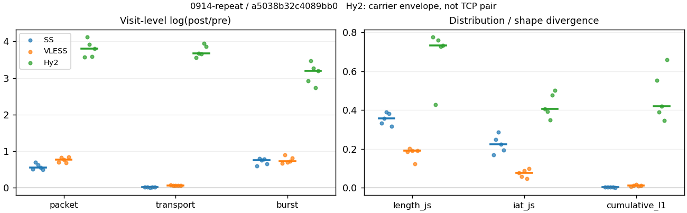
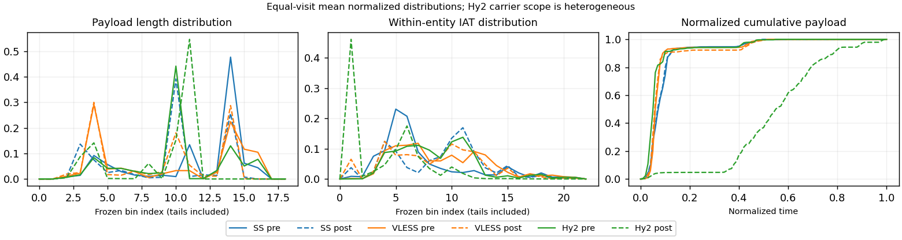

# 0914-repeat · 条目 015 · unsplash.com

目标：https://unsplash.com/

活动标签：unsplash.com::page_load。选定访问 15 次。

[返回总索引](../../README.md) · [统计口径](../../methods.md)

## 覆盖与资格（每次访问均保留）

| 部署 | 重复 | 主请求路由 | 活动状态 | 代理比较 | DIRECT pre | 请求 proxy/direct/unresolved | 错误 |
| --- | --- | --- | --- | --- | --- | --- | --- |
| Hy2 | 1 | proxy | passed | 1 | 0 | 53/0/0 | [] |
| Hy2 | 2 | proxy | passed | 1 | 0 | 51/0/0 | [] |
| Hy2 | 3 | proxy | passed | 1 | 0 | 52/0/0 | [] |
| Hy2 | 4 | proxy | passed | 1 | 0 | 52/0/0 | [] |
| Hy2 | 5 | proxy | passed | 1 | 0 | 52/0/0 | [] |
| SS | 1 | proxy | passed | 1 | 0 | 53/0/0 | [] |
| SS | 2 | proxy | passed | 1 | 0 | 35/0/0 | [] |
| SS | 3 | proxy | passed | 1 | 0 | 52/0/0 | [] |
| SS | 4 | proxy | passed | 1 | 0 | 53/0/0 | [] |
| SS | 5 | proxy | passed | 1 | 0 | 52/0/0 | [] |
| VLESS | 1 | proxy | passed | 1 | 0 | 53/0/0 | [] |
| VLESS | 2 | proxy | passed | 1 | 0 | 51/0/0 | [] |
| VLESS | 3 | proxy | passed | 1 | 0 | 53/0/0 | [] |
| VLESS | 4 | proxy | passed | 1 | 0 | 52/0/0 | [] |
| VLESS | 5 | proxy | passed | 1 | 0 | 52/0/0 | [] |

主请求非 proxy 的统计仅解释为已索引的辅助代理连接或 DIRECT 观测，不代表目标业务经代理传输。播放确认与配对资格是两道不同的门。

图中散点为单次访问，短线为重复中位数；Hy2 是共享载体包络，不能与 TCP 配对作等范围因果对比。

形态图先逐访问归一化，再对访问等权平均；实线 pre，虚线 post。分箱序号及边界见 methods，不将分箱索引误解为长度或时间。

## 每次访问的关键观测

### SS

范围：`exclusive_page`。每格 pre → post；空值为不可观测/不适用。

| 重复 | 包数 | 载荷字节 | burst | TCP FR | IAT中位µs | length JS | IAT JS |
| --- | --- | --- | --- | --- | --- | --- | --- |
| 1 | 992 → 1649 | 1.3738e+06 → 1.3946e+06 | 700 → 1276 | 64 → 64 | 40.438 → 532.64 | 0.33367 | 0.16895 |
| 2 | 874 → 1754 | 1.2719e+06 → 1.3012e+06 | 619 → 1376 | 43 → 45 | 24.495 → 594.57 | 0.35584 | 0.24703 |
| 3 | 977 → 1819 | 1.3932e+06 → 1.4116e+06 | 726 → 1538 | 64 → 64 | 31.07 → 1027.1 | 0.38974 | 0.28704 |
| 4 | 1121 → 1955 | 1.4005e+06 → 1.4237e+06 | 698 → 1528 | 64 → 64 | 23.221 → 469.53 | 0.38228 | 0.22505 |
| 5 | 1139 → 1878 | 1.4258e+06 → 1.4504e+06 | 716 → 1377 | 64 → 64 | 24.086 → 367.2 | 0.31566 | 0.19467 |

完整标量统计：中位数 [min,max]；Δ 为重复内逐访问变换的中位数，MAD 未缩放。n 为可用变换数；DIRECT-only 的 nΔ=0 不代表 pre 不可用。

| scope | 特征 | pre | post | Δ | IQRΔ | MADΔ | nΔ |
| --- | --- | --- | --- | --- | --- | --- | --- |
| exclusive_page | active_span_sum_s_1000ms | 15.871 [10.558, 18.122] | 16.538 [13.404, 18.491] | 0.060402 | 0.053331 | 0.040219 | 5 |
| exclusive_page | active_span_sum_s_100ms | 3.1592 [3.0022, 4.832] | 5.5115 [4.8902, 7.1015] | 0.57094 | 0.16446 | 0.036561 | 5 |
| exclusive_page | active_span_sum_s_500ms | 10.597 [7.6059, 12.394] | 13.567 [10.257, 14.619] | 0.18776 | 0.099609 | 0.060823 | 5 |
| exclusive_page | burst_bytes_iqr | 2896 [2896, 2896] | 1448 [1428, 1484.5] | -0.69315 | 0.02353 | 0.013908 | 5 |
| exclusive_page | burst_bytes_mad | 31 [31, 31] | 20 [15, 34] | -0.43825 | 0.53063 | 0.28768 | 5 |
| exclusive_page | burst_bytes_max | 20480 [20480, 23584] | 8568 [7140, 19992] | -0.87141 | 0.63401 | 0.32344 | 5 |
| exclusive_page | burst_bytes_mean | 1991.3 [1919, 2054.8] | 945.66 [917.84, 1092.9] | -0.73755 | 0.13014 | 0.038512 | 5 |
| exclusive_page | burst_bytes_median | 31 [31, 31] | 20 [15, 34] | -0.43825 | 0.53063 | 0.28768 | 5 |
| exclusive_page | burst_bytes_min | 0 [0, 0] | 0 [0, 0] | — | — | — | 0 |
| exclusive_page | burst_bytes_p95 | 8688 [8216.8, 8688] | 2964 [2856, 4284] | -1.0661 | 0.36835 | 0.032502 | 5 |
| exclusive_page | burst_bytes_q25 | 0 [0, 0] | 0 [0, 0] | — | — | — | 0 |
| exclusive_page | burst_bytes_q75 | 2896 [2896, 2896] | 1448 [1428, 1484.5] | -0.69315 | 0.02353 | 0.013908 | 5 |
| exclusive_page | burst_bytes_std | 3609.3 [3319.6, 3913.9] | 1338.1 [1164.1, 1724.4] | -0.94634 | 0.25965 | 0.12713 | 5 |
| exclusive_page | burst_count | 700 [619, 726] | 1377 [1276, 1538] | 0.75069 | 0.12951 | 0.048143 | 5 |
| exclusive_page | burst_duration_ms_iqr | 0.019621 [0, 0.029814] | 0 [0, 0] | — | — | — | 0 |
| exclusive_page | burst_duration_ms_mad | 0 [0, 0] | 0 [0, 0] | — | — | — | 0 |
| exclusive_page | burst_duration_ms_max | 6838 [3904.7, 15001] | 18248 [15059, 21965] | 1.1669 | 1.1698 | 0.41041 | 5 |
| exclusive_page | burst_duration_ms_mean | 57.502 [41.51, 97.745] | 58.169 [24.561, 71.821] | 0.17828 | 0.31196 | 0.15914 | 5 |
| exclusive_page | burst_duration_ms_median | 0 [0, 0] | 0 [0, 0] | — | — | — | 0 |
| exclusive_page | burst_duration_ms_min | 0 [0, 0] | 0 [0, 0] | — | — | — | 0 |
| exclusive_page | burst_duration_ms_p95 | 93.566 [39.868, 104.93] | 1.0058 [0.90959, 1.3193] | -4.4027 | 0.37388 | 0.23078 | 5 |
| exclusive_page | burst_duration_ms_q25 | 0 [0, 0] | 0 [0, 0] | — | — | — | 0 |
| exclusive_page | burst_duration_ms_q75 | 0.019621 [0, 0.029814] | 0 [0, 0] | — | — | — | 0 |
| exclusive_page | burst_duration_ms_std | 499.38 [286.91, 935.02] | 905.43 [451.03, 1041.6] | 0.73512 | 0.7001 | 0.37982 | 5 |
| exclusive_page | burst_packets_iqr | 1 [0, 1] | 0 [0, 0] | — | — | — | 0 |
| exclusive_page | burst_packets_mad | 0 [0, 0] | 0 [0, 0] | — | — | — | 0 |
| exclusive_page | burst_packets_max | 10 [8, 11] | 7 [7, 8] | -0.22314 | 0.028171 | 0.028171 | 5 |
| exclusive_page | burst_packets_mean | 1.4171 [1.3457, 1.606] | 1.2795 [1.1827, 1.3638] | -0.12913 | 0.051669 | 0.026876 | 5 |
| exclusive_page | burst_packets_median | 1 [1, 1] | 1 [1, 1] | 0 | 0 | 0 | 5 |
| exclusive_page | burst_packets_min | 1 [1, 1] | 1 [1, 1] | 0 | 0 | 0 | 5 |
| exclusive_page | burst_packets_p95 | 3 [3, 4] | 3 [2, 3] | -0.28768 | 0.11778 | 0.11778 | 5 |
| exclusive_page | burst_packets_q25 | 1 [1, 1] | 1 [1, 1] | 0 | 0 | 0 | 5 |
| exclusive_page | burst_packets_q75 | 2 [1, 2] | 1 [1, 1] | -0.69315 | 0 | 0 | 5 |
| exclusive_page | burst_packets_std | 0.9443 [0.76441, 1.4216] | 0.69104 [0.60215, 0.78785] | -0.26979 | 0.2585 | 0.046482 | 5 |
| exclusive_page | connection_span_concurrency_max | 5 [5, 7] | 5 [5, 6] | 0 | 0 | 0 | 5 |
| exclusive_page | cumulative_l1 | — | — | 0.002347 | 0.00096353 | 0.00056639 | 5 |
| exclusive_page | cumulative_max | — | — | 0.085365 | 0.042252 | 0.028285 | 5 |
| exclusive_page | direction_entropy | 0.58576 [0.54771, 0.68329] | 0.41684 [0.35598, 0.48418] | -0.18575 | 0.016192 | 0.010213 | 5 |
| exclusive_page | down_burst_count | 345 [306, 358] | 685 [633, 764] | 0.75803 | 0.12987 | 0.047799 | 5 |
| exclusive_page | down_ip_bytes | 1.3881e+06 [1.2782e+06, 1.4291e+06] | 1.4229e+06 [1.3265e+06, 1.4667e+06] | 0.025986 | 0.0014114 | 0.0012124 | 5 |
| exclusive_page | down_packets | 569 [524, 708] | 969 [890, 1054] | 0.44734 | 0.15038 | 0.05281 | 5 |
| exclusive_page | down_transport_bytes | 1.3597e+06 [1.2508e+06, 1.3923e+06] | 1.3738e+06 [1.276e+06, 1.4121e+06] | 0.013934 | 0.0030933 | 0.0028939 | 5 |
| exclusive_page | duration_s | 34.025 [27.044, 40.077] | 34.024 [27.042, 40.076] | -3.3333e-05 | 2.8578e-05 | 1.7496e-05 | 5 |
| exclusive_page | entity_count | 10 [7, 10] | 10 [7, 10] | 0 | 0 | 0 | 5 |
| exclusive_page | fr_runs | 64 [43, 64] | 64 [45, 64] | 0 | 0 | 0 | 5 |
| exclusive_page | fr_runs_per_packet | 0.092754 [0.08498, 0.12098] | 0.061244 [0.046632, 0.072153] | -0.038348 | 0.012069 | 0.0068385 | 5 |
| exclusive_page | fr_switches | 54 [36, 54] | 54 [38, 54] | 0 | 0 | 0 | 5 |
| exclusive_page | fr_switches_per_possible_transition | 0.079412 [0.072144, 0.10405] | 0.052174 [0.039666, 0.061574] | -0.032478 | 0.010636 | 0.0052405 | 5 |
| exclusive_page | full_retransmission_fraction | 0.0010235 [0.00087796, 0.0034325] | 0.0037274 [0.0032985, 0.0060643] | 0.0026885 | 0.00057443 | 0.00041353 | 5 |
| exclusive_page | full_retransmission_packets | 1 [1, 3] | 7 [6, 10] | 1.7918 | 0.33647 | 0.15415 | 5 |
| exclusive_page | iat_count | 982 [867, 1129] | 1809 [1639, 1945] | 0.56 | 0.11408 | 0.056465 | 5 |
| exclusive_page | iat_js | — | — | 0.22505 | 0.052365 | 0.030386 | 5 |
| exclusive_page | iat_ks | — | — | 0.37693 | 0.022926 | 0.012095 | 5 |
| exclusive_page | iat_median_us | 24.495 [23.221, 40.438] | 532.64 [367.2, 1027.1] | 3.0067 | 0.46511 | 0.28241 | 5 |
| exclusive_page | iat_us_iqr | 128.15 [108.18, 215.75] | 1241.1 [1075.2, 3331.3] | 2.2706 | 0.040502 | 0.025948 | 5 |
| exclusive_page | iat_us_mad | 17.91 [16.298, 31.611] | 517.18 [360.34, 1014.4] | 3.3458 | 0.46856 | 0.33133 | 5 |
| exclusive_page | iat_us_max | 1.5001e+07 [1.5001e+07, 1.5001e+07] | 1.5051e+07 [1.5023e+07, 1.5059e+07] | 0.0033227 | 0.00032301 | 0.00028087 | 5 |
| exclusive_page | iat_us_mean | 98117 [93758, 1.2539e+05] | 59241 [38222, 74973] | -0.56136 | 0.11711 | 0.056809 | 5 |
| exclusive_page | iat_us_median | 24.495 [23.221, 40.438] | 532.64 [367.2, 1027.1] | 3.0067 | 0.46511 | 0.28241 | 5 |
| exclusive_page | iat_us_min | 0.126 [0.022, 0.262] | 0.036 [0.036, 0.038] | -1.2528 | 0.72804 | 0.72055 | 5 |
| exclusive_page | iat_us_p95 | 90072 [67377, 1.0928e+05] | 33071 [31046, 36361] | -1.0051 | 0.16302 | 0.15619 | 5 |
| exclusive_page | iat_us_q25 | 12.383 [11.855, 14.403] | 12.82 [10.653, 80.262] | 0.054603 | 0.39561 | 0.20509 | 5 |
| exclusive_page | iat_us_q75 | 140 [120.32, 228.56] | 1252.8 [1088, 3411.5] | 2.1915 | 0.039167 | 0.028672 | 5 |
| exclusive_page | iat_us_std | 1.0232e+06 [9.414e+05, 1.1463e+06] | 7.9661e+05 [5.596e+05, 8.8887e+05] | -0.27983 | 0.056741 | 0.029526 | 5 |
| exclusive_page | iat_wasserstein_log1p_us | — | — | 1.4244 | 0.17698 | 0.11499 | 5 |
| exclusive_page | idle_gap_count_1000ms | 12 [12, 14] | 12 [9, 13] | 0 | 0.074108 | 0 | 5 |
| exclusive_page | idle_gap_count_100ms | 48 [31, 50] | 48 [34, 50] | 0 | 0 | 0 | 5 |
| exclusive_page | idle_gap_count_500ms | 18 [16, 21] | 16 [13, 18] | -0.15415 | 0.082476 | 0.036368 | 5 |
| exclusive_page | idle_gap_sum_s_1000ms | 93.934 [70.73, 106.77] | 92.995 [53.37, 106.34] | -0.011561 | 0.002348 | 0.0015154 | 5 |
| exclusive_page | idle_gap_sum_s_100ms | 107.22 [78.042, 120.13] | 104.39 [61.884, 117.37] | -0.024902 | 0.003502 | 0.0016294 | 5 |
| exclusive_page | idle_gap_sum_s_500ms | 100.18 [73.682, 112.72] | 97.269 [56.517, 109.31] | -0.030409 | 0.0056013 | 0.0052953 | 5 |
| exclusive_page | ip_bytes | 1.4442e+06 [1.3175e+06, 1.4852e+06] | 1.522e+06 [1.4082e+06, 1.5633e+06] | 0.052468 | 0.0046411 | 0.0034324 | 5 |
| exclusive_page | length_iqr | 1488.5 [1448, 1944] | 1538 [1333, 2729] | -0.030858 | 0.23591 | 0.079479 | 5 |
| exclusive_page | length_js | — | — | 0.35584 | 0.048604 | 0.026441 | 5 |
| exclusive_page | length_ks | — | — | 0.55286 | 0.039638 | 0.032952 | 5 |
| exclusive_page | length_mad | 284 [0, 1355] | 1292 [636, 1306] | 0.7815 | 2.0065 | 1.1357 | 4 |
| exclusive_page | length_max | 8920 [4096, 8920] | 5712 [2856, 7140] | -0.22258 | 0.53259 | 0.51083 | 5 |
| exclusive_page | length_mean | 2484.2 [2029.7, 2633.7] | 1387.9 [1348.4, 1572.2] | -0.45746 | 0.16422 | 0.059491 | 5 |
| exclusive_page | length_median | 2896 [2688, 2896] | 1428 [1428, 1428] | -0.70706 | 0 | 0 | 5 |
| exclusive_page | length_min | 20 [20, 31] | 19 [6, 20] | -0.43825 | 0.45953 | 0.25489 | 5 |
| exclusive_page | length_p95 | 4344 [2896, 8192] | 2856 [2856, 2856] | -0.41937 | 1.0398 | 0.40547 | 5 |
| exclusive_page | length_q25 | 1407.5 [952, 1448] | 149 [112, 1318] | -2.2456 | 1.7878 | 0.31382 | 5 |
| exclusive_page | length_q75 | 2896 [2896, 2896] | 2856 [1482, 2856] | -0.013908 | 0.63335 | 0 | 5 |
| exclusive_page | length_std | 1707.3 [1120.5, 2238.5] | 1044.1 [956.38, 1110.2] | -0.50229 | 0.55023 | 0.34812 | 5 |
| exclusive_page | length_wasserstein_bytes | — | — | 912.01 | 448.42 | 230.89 | 5 |
| exclusive_page | nonempty_entity_count | 10 [7, 10] | 10 [7, 10] | 0 | 0 | 0 | 5 |
| exclusive_page | nonempty_packets | 553 [506, 690] | 965 [887, 1045] | 0.47249 | 0.16087 | 0.057406 | 5 |
| exclusive_page | offload_suspect_fraction | 0.36664 [0.31149, 0.38787] | 0.15792 [0.13555, 0.19163] | -0.22443 | 0.041009 | 0.0066576 | 5 |
| exclusive_page | packet_count | 992 [874, 1139] | 1819 [1649, 1955] | 0.55617 | 0.11335 | 0.056112 | 5 |
| exclusive_page | rtt_median_ms | 0.044068 [0.034484, 0.049032] | 33.223 [28.413, 33.487] | 6.5566 | 0.15642 | 0.087765 | 5 |
| exclusive_page | rtt_sample_count | 405 [347, 415] | 287 [236, 295] | -0.35152 | 0.041394 | 0.021852 | 5 |
| exclusive_page | tcp_ack_count | 982 [866, 1129] | 1808 [1638, 1943] | 0.55897 | 0.11414 | 0.055437 | 5 |
| exclusive_page | tcp_fin_count | 20 [14, 20] | 21 [14, 22] | 0.04879 | 0 | 0 | 5 |
| exclusive_page | tcp_packet_count | 992 [874, 1139] | 1819 [1649, 1955] | 0.55617 | 0.11335 | 0.056112 | 5 |
| exclusive_page | tcp_rst_count | 0 [0, 1] | 0 [0, 1] | 0 | — | — | 1 |
| exclusive_page | tcp_syn_count | 20 [14, 20] | 21 [14, 22] | 0.04879 | 0.04879 | 0.04652 | 5 |
| exclusive_page | tcp_window_raw_median | 65535 [65535, 65535] | 140 [138, 142] | -6.1487 | 0.014185 | 0.014185 | 5 |
| exclusive_page | transition_entropy | 0.32924 [0.30468, 0.41019] | 0.22608 [0.18284, 0.26348] | -0.12185 | 0.028453 | 0.017474 | 5 |
| exclusive_page | transition_n_mm | 424 [401, 562] | 878 [762, 927] | 0.58621 | 0.21676 | 0.087921 | 5 |
| exclusive_page | transition_n_mp | 22 [15, 22] | 22 [16, 22] | 0 | 0 | 0 | 5 |
| exclusive_page | transition_n_pm | 32 [21, 32] | 32 [22, 32] | 0 | 0 | 0 | 5 |
| exclusive_page | transition_n_pp | 64 [42, 65] | 54 [42, 61] | -0.13353 | 0.10639 | 0.051872 | 5 |
| exclusive_page | transition_p_mm | 0.96226 [0.94799, 0.9656] | 0.97677 [0.97194, 0.9821] | 0.016507 | 0.0067126 | 0.0020666 | 5 |
| exclusive_page | transition_p_mp | 0.037736 [0.034404, 0.052009] | 0.023231 [0.017897, 0.028061] | -0.016507 | 0.0067126 | 0.0020666 | 5 |
| exclusive_page | transition_p_pm | 0.33333 [0.3299, 0.33333] | 0.36364 [0.34375, 0.37209] | 0.030303 | 0.024571 | 0.011893 | 5 |
| exclusive_page | transition_p_pp | 0.66667 [0.66667, 0.6701] | 0.63636 [0.62791, 0.65625] | -0.030303 | 0.024571 | 0.011893 | 5 |
| exclusive_page | transport_bytes | 1.3932e+06 [1.2719e+06, 1.4258e+06] | 1.4116e+06 [1.3012e+06, 1.4504e+06] | 0.016481 | 0.0020849 | 0.0014589 | 5 |
| exclusive_page | up_burst_count | 355 [313, 368] | 693 [643, 774] | 0.74349 | 0.12917 | 0.048448 | 5 |
| exclusive_page | up_byte_fraction | 0.023959 [0.016584, 0.024295] | 0.026442 [0.019382, 0.028173] | 0.0027983 | 0.00016047 | 0.00010153 | 5 |
| exclusive_page | up_ip_bytes | 55476 [39374, 56107] | 96598 [81701, 1.0176e+05] | 0.56907 | 0.069722 | 0.043946 | 5 |
| exclusive_page | up_packets | 423 [350, 434] | 832 [759, 901] | 0.70694 | 0.12927 | 0.073117 | 5 |
| exclusive_page | up_transport_bytes | 33447 [21094, 33554] | 37815 [25221, 39289] | 0.13366 | 0.042096 | 0.018561 | 5 |
| exclusive_page | zero_iat_count | 0 [0, 0] | 0 [0, 0] | — | — | — | 0 |
| exclusive_page | zero_iat_fraction | 0 [0, 0] | 0 [0, 0] | 0 | 0 | 0 | 5 |

### VLESS

范围：`exclusive_page`。每格 pre → post；空值为不可观测/不适用。

| 重复 | 包数 | 载荷字节 | burst | TCP FR | IAT中位µs | length JS | IAT JS |
| --- | --- | --- | --- | --- | --- | --- | --- |
| 1 | 715 → 1436 | 1.1246e+06 → 1.2109e+06 | 469 → 919 | 57 → 88 | 141.55 → 445.01 | 0.18623 | 0.076458 |
| 2 | 754 → 1735 | 1.1725e+06 → 1.258e+06 | 511 → 1259 | 53 → 84 | 159.33 → 140.27 | 0.20147 | 0.056384 |
| 3 | 913 → 1983 | 1.3016e+06 → 1.3915e+06 | 623 → 1253 | 62 → 92 | 193.12 → 136.43 | 0.18975 | 0.087782 |
| 4 | 1036 → 2046 | 1.3943e+06 → 1.4821e+06 | 701 → 1443 | 58 → 88 | 218.86 → 217.78 | 0.12197 | 0.045534 |
| 5 | 871 → 2025 | 1.2551e+06 → 1.344e+06 | 589 → 1338 | 60 → 90 | 145.29 → 136.26 | 0.19002 | 0.097988 |

完整标量统计：中位数 [min,max]；Δ 为重复内逐访问变换的中位数，MAD 未缩放。n 为可用变换数；DIRECT-only 的 nΔ=0 不代表 pre 不可用。

| scope | 特征 | pre | post | Δ | IQRΔ | MADΔ | nΔ |
| --- | --- | --- | --- | --- | --- | --- | --- |
| exclusive_page | active_span_sum_s_1000ms | 15.144 [13.433, 15.943] | 15.198 [13.696, 15.745] | 0.0034897 | 0.016418 | 0.015896 | 5 |
| exclusive_page | active_span_sum_s_100ms | 2.3952 [2.0719, 2.9106] | 5.6429 [4.8752, 6.0563] | 0.8162 | 0.083226 | 0.041839 | 5 |
| exclusive_page | active_span_sum_s_500ms | 7.0343 [5.8405, 7.4842] | 13.123 [11.992, 13.58] | 0.61758 | 0.0078268 | 0.0077565 | 5 |
| exclusive_page | burst_bytes_iqr | 2896 [2896, 2896] | 2824 [1964, 2824] | -0.025176 | 0 | 0 | 5 |
| exclusive_page | burst_bytes_mad | 31 [0, 31] | 36 [24, 60] | 0.2775 | 0.38699 | 0.25541 | 4 |
| exclusive_page | burst_bytes_max | 20480 [16384, 20480] | 4832 [4832, 9884] | -1.3353 | 0.22314 | 0.10884 | 5 |
| exclusive_page | burst_bytes_mean | 2130.9 [1989.1, 2397.9] | 1027.1 [999.19, 1317.6] | -0.66094 | 0.12011 | 0.06219 | 5 |
| exclusive_page | burst_bytes_median | 31 [0, 31] | 36 [24, 60] | 0.2775 | 0.38699 | 0.25541 | 4 |
| exclusive_page | burst_bytes_min | 0 [0, 0] | 0 [0, 0] | — | — | — | 0 |
| exclusive_page | burst_bytes_p95 | 16384 [16384, 16384] | 2896 [2896, 4236] | -1.733 | 0 | 0 | 5 |
| exclusive_page | burst_bytes_q25 | 0 [0, 0] | 0 [0, 0] | — | — | — | 0 |
| exclusive_page | burst_bytes_q75 | 2896 [2896, 2896] | 2824 [1964, 2824] | -0.025176 | 0 | 0 | 5 |
| exclusive_page | burst_bytes_std | 4402.4 [4152, 4875.1] | 1260 [1218.9, 1661.9] | -1.1925 | 0.10817 | 0.087681 | 5 |
| exclusive_page | burst_count | 589 [469, 701] | 1259 [919, 1443] | 0.72197 | 0.12176 | 0.049288 | 5 |
| exclusive_page | burst_duration_ms_iqr | 0.75578 [0.60355, 0.94044] | 0.20785 [0.0001065, 1.0182] | -1.5095 | 3.7897 | 1.8075 | 5 |
| exclusive_page | burst_duration_ms_mad | 0 [0, 0] | 0 [0, 0] | — | — | — | 0 |
| exclusive_page | burst_duration_ms_max | 4426.9 [2960, 5185.4] | 15035 [15007, 15049] | 1.2219 | 0.14983 | 0.084997 | 5 |
| exclusive_page | burst_duration_ms_mean | 48.799 [37.768, 71.009] | 43.205 [29.37, 50.845] | -0.12175 | 0.73351 | 0.32562 | 5 |
| exclusive_page | burst_duration_ms_median | 0 [0, 0] | 0 [0, 0] | — | — | — | 0 |
| exclusive_page | burst_duration_ms_min | 0 [0, 0] | 0 [0, 0] | — | — | — | 0 |
| exclusive_page | burst_duration_ms_p95 | 197.44 [191.48, 201.05] | 9.8694 [9.6181, 40.018] | -2.9702 | 0.038339 | 0.033517 | 5 |
| exclusive_page | burst_duration_ms_q25 | 0 [0, 0] | 0 [0, 0] | — | — | — | 0 |
| exclusive_page | burst_duration_ms_q75 | 0.75578 [0.60355, 0.94044] | 0.20785 [0.0001065, 1.0182] | -1.5095 | 3.7897 | 1.8075 | 5 |
| exclusive_page | burst_duration_ms_std | 308.24 [206.06, 449.04] | 713.18 [499.63, 791.5] | 0.94307 | 0.52943 | 0.33281 | 5 |
| exclusive_page | burst_packets_iqr | 1 [1, 1] | 1 [1, 1] | 0 | 0 | 0 | 5 |
| exclusive_page | burst_packets_mad | 0 [0, 0] | 0 [0, 0] | — | — | — | 0 |
| exclusive_page | burst_packets_max | 10 [4, 11] | 7 [7, 8] | -0.31845 | 0.69315 | 0.13353 | 5 |
| exclusive_page | burst_packets_mean | 1.4779 [1.4655, 1.5245] | 1.5135 [1.3781, 1.5826] | 0.023178 | 0.066103 | 0.053703 | 5 |
| exclusive_page | burst_packets_median | 1 [1, 1] | 1 [1, 1] | 0 | 0 | 0 | 5 |
| exclusive_page | burst_packets_min | 1 [1, 1] | 1 [1, 1] | 0 | 0 | 0 | 5 |
| exclusive_page | burst_packets_p95 | 2 [2, 3] | 3 [3, 3] | 0.40547 | 0.40547 | 0 | 5 |
| exclusive_page | burst_packets_q25 | 1 [1, 1] | 1 [1, 1] | 0 | 0 | 0 | 5 |
| exclusive_page | burst_packets_q75 | 2 [2, 2] | 2 [2, 2] | 0 | 0 | 0 | 5 |
| exclusive_page | burst_packets_std | 0.67399 [0.60773, 0.81165] | 0.87014 [0.78403, 0.89622] | 0.25471 | 0.15632 | 0.1022 | 5 |
| exclusive_page | connection_span_concurrency_max | 5 [5, 6] | 5 [5, 6] | 0 | 0 | 0 | 5 |
| exclusive_page | cumulative_l1 | — | — | 0.010141 | 0.0019071 | 0.0014581 | 5 |
| exclusive_page | cumulative_max | — | — | 0.13286 | 0.084145 | 0.05505 | 5 |
| exclusive_page | direction_entropy | 0.63831 [0.58802, 0.72678] | 0.40409 [0.39392, 0.48253] | -0.24347 | 0.012588 | 0.0060614 | 5 |
| exclusive_page | down_burst_count | 290 [230, 346] | 628 [458, 720] | 0.73281 | 0.12201 | 0.044023 | 5 |
| exclusive_page | down_ip_bytes | 1.2532e+06 [1.1163e+06, 1.3971e+06] | 1.3573e+06 [1.2077e+06, 1.4953e+06] | 0.078661 | 0.0029508 | 0.0011599 | 5 |
| exclusive_page | down_packets | 522 [413, 631] | 1163 [864, 1189] | 0.77276 | 0.064684 | 0.034635 | 5 |
| exclusive_page | down_transport_bytes | 1.226e+06 [1.0948e+06, 1.3642e+06] | 1.2967e+06 [1.1627e+06, 1.4334e+06] | 0.056064 | 0.0033541 | 0.0018932 | 5 |
| exclusive_page | duration_s | 34.901 [24.601, 35.611] | 34.807 [24.618, 35.608] | -9.0755e-05 | 0.0028083 | 0.00078819 | 5 |
| exclusive_page | entity_count | 9 [9, 9] | 9 [9, 9] | 0 | 0 | 0 | 5 |
| exclusive_page | fr_runs | 58 [53, 62] | 88 [84, 92] | 0.41689 | 0.02882 | 0.017392 | 5 |
| exclusive_page | fr_runs_per_packet | 0.11976 [0.095395, 0.13902] | 0.0812 [0.076256, 0.10552] | -0.035966 | 0.0029379 | 0.0024569 | 5 |
| exclusive_page | fr_switches | 49 [44, 53] | 79 [75, 83] | 0.47763 | 0.035623 | 0.020619 | 5 |
| exclusive_page | fr_switches_per_possible_transition | 0.10366 [0.081803, 0.1197] | 0.073843 [0.068996, 0.095758] | -0.025814 | 0.00453 | 0.0026587 | 5 |
| exclusive_page | full_retransmission_fraction | 0 [0, 0] | 0 [0, 0] | 0 | 0 | 0 | 5 |
| exclusive_page | full_retransmission_packets | 0 [0, 0] | 0 [0, 0] | — | — | — | 0 |
| exclusive_page | iat_count | 862 [706, 1027] | 1974 [1427, 2037] | 0.78099 | 0.13646 | 0.068627 | 5 |
| exclusive_page | iat_js | — | — | 0.076458 | 0.031399 | 0.020074 | 5 |
| exclusive_page | iat_ks | — | — | 0.12697 | 0.042345 | 0.03492 | 5 |
| exclusive_page | iat_median_us | 159.33 [141.55, 218.86] | 140.27 [136.26, 445.01] | -0.064185 | 0.12245 | 0.063217 | 5 |
| exclusive_page | iat_us_iqr | 3449.3 [2570.8, 3846.6] | 1401 [1247.9, 1942.5] | -0.901 | 0.13565 | 0.10954 | 5 |
| exclusive_page | iat_us_mad | 153.44 [134.08, 213.08] | 140.16 [136.16, 436.33] | -0.024783 | 0.11162 | 0.065694 | 5 |
| exclusive_page | iat_us_max | 1.5001e+07 [1.5001e+07, 1.5001e+07] | 1.5039e+07 [1.5023e+07, 1.5049e+07] | 0.0025077 | 0.0009187 | 0.0006652 | 5 |
| exclusive_page | iat_us_mean | 1.0551e+05 [92093, 1.3474e+05] | 45857 [42595, 66251] | -0.79595 | 0.14151 | 0.066959 | 5 |
| exclusive_page | iat_us_median | 159.33 [141.55, 218.86] | 140.27 [136.26, 445.01] | -0.064185 | 0.12245 | 0.063217 | 5 |
| exclusive_page | iat_us_min | 0.279 [0.044, 2.677] | 0.035 [0.032, 0.037] | -2.0759 | 2.6459 | 1.6505 | 5 |
| exclusive_page | iat_us_p95 | 1.5465e+05 [43821, 1.9546e+05] | 41560 [41127, 44226] | -1.3053 | 0.95149 | 0.18079 | 5 |
| exclusive_page | iat_us_q25 | 26.38 [22.751, 29.902] | 19.47 [7.949, 24.178] | -0.42905 | 0.70528 | 0.36033 | 5 |
| exclusive_page | iat_us_q75 | 3475.6 [2597.6, 3872.5] | 1424.4 [1255.9, 1962.6] | -0.90171 | 0.13015 | 0.098419 | 5 |
| exclusive_page | iat_us_std | 1.0427e+06 [9.6661e+05, 1.1808e+06] | 6.8597e+05 [6.8233e+05, 8.3154e+05] | -0.39007 | 0.067943 | 0.033948 | 5 |
| exclusive_page | iat_wasserstein_log1p_us | — | — | 0.5697 | 0.27699 | 0.15498 | 5 |
| exclusive_page | idle_gap_count_1000ms | 11 [9, 12] | 10 [8, 11] | -0.087011 | 0.0082988 | 0.0082988 | 5 |
| exclusive_page | idle_gap_count_100ms | 45 [40, 47] | 53 [49, 54] | 0.16363 | 0.047266 | 0.024793 | 5 |
| exclusive_page | idle_gap_count_500ms | 21 [20, 23] | 12 [11, 14] | -0.55962 | 0.1014 | 0.038221 | 5 |
| exclusive_page | idle_gap_sum_s_1000ms | 79.435 [69.407, 80.982] | 78.208 [68.338, 80.836] | -0.01557 | 0.00093579 | 0.0008884 | 5 |
| exclusive_page | idle_gap_sum_s_100ms | 91.669 [82.749, 93.056] | 87.355 [78.44, 89.16] | -0.048207 | 0.0088261 | 0.0052762 | 5 |
| exclusive_page | idle_gap_sum_s_500ms | 87.445 [77.866, 88.13] | 80.181 [70.503, 81.496] | -0.086723 | 0.0057703 | 0.0043122 | 5 |
| exclusive_page | ip_bytes | 1.3005e+06 [1.1619e+06, 1.4483e+06] | 1.4514e+06 [1.2892e+06, 1.5894e+06] | 0.10395 | 0.0035811 | 0.0032935 | 5 |
| exclusive_page | length_iqr | 2752 [2737, 4004] | 2752 [1376, 2752] | -0.36379 | 0.28729 | 0.27612 | 5 |
| exclusive_page | length_js | — | — | 0.18975 | 0.0037908 | 0.0035182 | 5 |
| exclusive_page | length_ks | — | — | 0.22649 | 0.051495 | 0.037342 | 5 |
| exclusive_page | length_mad | 1376 [1340, 1457] | 1340 [1340, 1340] | -0.026511 | 0 | 0 | 5 |
| exclusive_page | length_max | 8920 [8920, 8920] | 2896 [2896, 7060] | -1.125 | 0 | 0 | 5 |
| exclusive_page | length_mean | 2505.2 [2293.3, 2742.9] | 1284.3 [1187.3, 1451.9] | -0.69861 | 0.097156 | 0.048063 | 5 |
| exclusive_page | length_median | 1448 [1412, 1537.5] | 1412 [1412, 1412] | -0.025176 | 0 | 0 | 5 |
| exclusive_page | length_min | 24 [17, 24] | 5 [2, 18] | -1.5686 | 0.56798 | 0.34484 | 5 |
| exclusive_page | length_p95 | 8920 [8920, 8920] | 2824 [2824, 2824] | -1.1501 | 0 | 0 | 5 |
| exclusive_page | length_q25 | 87 [72, 92] | 72 [72, 72] | -0.18924 | 0.18924 | 0.05588 | 5 |
| exclusive_page | length_q75 | 2824 [2824, 4096] | 2824 [1448, 2824] | -0.3597 | 0.28652 | 0.27436 | 5 |
| exclusive_page | length_std | 2943 [2751.8, 3118.2] | 1147.2 [1033.8, 1198.1] | -0.99786 | 0.041878 | 0.04136 | 5 |
| exclusive_page | length_wasserstein_bytes | — | — | 1336.2 | 118.58 | 90.923 | 5 |
| exclusive_page | nonempty_entity_count | 9 [9, 9] | 9 [9, 9] | 0 | 0 | 0 | 5 |
| exclusive_page | nonempty_packets | 501 [410, 608] | 1132 [834, 1154] | 0.76542 | 0.093558 | 0.049711 | 5 |
| exclusive_page | offload_suspect_fraction | 0.27054 [0.25832, 0.28671] | 0.18329 [0.13778, 0.22075] | -0.093903 | 0.028688 | 0.020305 | 5 |
| exclusive_page | packet_count | 871 [715, 1036] | 1983 [1436, 2046] | 0.77563 | 0.13604 | 0.068053 | 5 |
| exclusive_page | rtt_median_ms | 0.15634 [0.11089, 0.20527] | 0.54935 [0.10387, 2.5647] | 1.2537 | 1.0539 | 0.63146 | 5 |
| exclusive_page | rtt_sample_count | 333 [272, 391] | 767 [476, 826] | 0.78455 | 0.11093 | 0.074261 | 5 |
| exclusive_page | tcp_ack_count | 856 [703, 1021] | 1974 [1427, 2037] | 0.78765 | 0.13759 | 0.068457 | 5 |
| exclusive_page | tcp_fin_count | 18 [17, 18] | 18 [18, 18] | 0 | 0 | 0 | 5 |
| exclusive_page | tcp_packet_count | 871 [715, 1036] | 1983 [1436, 2046] | 0.77563 | 0.13604 | 0.068053 | 5 |
| exclusive_page | tcp_rst_count | 6 [3, 6] | 0 [0, 1] | -1.7918 | — | — | 1 |
| exclusive_page | tcp_syn_count | 18 [18, 18] | 18 [18, 18] | 0 | 0 | 0 | 5 |
| exclusive_page | tcp_window_raw_median | 65535 [65535, 65535] | 162 [161, 171] | -6.0027 | 0.024391 | 0.006192 | 5 |
| exclusive_page | transition_entropy | 0.39968 [0.3359, 0.45833] | 0.28306 [0.27293, 0.35176] | -0.10988 | 0.0079618 | 0.0046465 | 5 |
| exclusive_page | transition_n_mm | 390 [299, 493] | 995 [703, 1019] | 0.88816 | 0.075818 | 0.04257 | 5 |
| exclusive_page | transition_n_mp | 20 [18, 22] | 35 [33, 37] | 0.55962 | 0.020619 | 0.020619 | 5 |
| exclusive_page | transition_n_pm | 29 [26, 31] | 44 [42, 46] | 0.41689 | 0.04652 | 0.02224 | 5 |
| exclusive_page | transition_n_pp | 54 [45, 57] | 43 [35, 47] | -0.22778 | 0.058411 | 0.02353 | 5 |
| exclusive_page | transition_p_mm | 0.94891 [0.9373, 0.96101] | 0.96429 [0.95257, 0.96679] | 0.015094 | 0.0014773 | 0.0010833 | 5 |
| exclusive_page | transition_p_mp | 0.051095 [0.038986, 0.062696] | 0.035714 [0.033207, 0.047425] | -0.015094 | 0.0014773 | 0.0010833 | 5 |
| exclusive_page | transition_p_pm | 0.36471 [0.33721, 0.37037] | 0.50575 [0.48352, 0.54545] | 0.15802 | 0.017977 | 0.011714 | 5 |
| exclusive_page | transition_p_pp | 0.63529 [0.62963, 0.66279] | 0.49425 [0.45455, 0.51648] | -0.15802 | 0.017977 | 0.011714 | 5 |
| exclusive_page | transport_bytes | 1.2551e+06 [1.1246e+06, 1.3943e+06] | 1.344e+06 [1.2109e+06, 1.4821e+06] | 0.068465 | 0.0035161 | 0.0018677 | 5 |
| exclusive_page | up_burst_count | 299 [239, 355] | 631 [461, 723] | 0.71129 | 0.12153 | 0.054357 | 5 |
| exclusive_page | up_byte_fraction | 0.023187 [0.021601, 0.026535] | 0.035266 [0.032876, 0.039829] | 0.012277 | 0.00037584 | 0.00023853 | 5 |
| exclusive_page | up_ip_bytes | 47250 [45053, 51180] | 93501 [81509, 94118] | 0.63652 | 0.034384 | 0.027324 | 5 |
| exclusive_page | up_packets | 349 [302, 405] | 820 [572, 860] | 0.77972 | 0.11041 | 0.080241 | 5 |
| exclusive_page | up_transport_bytes | 29841 [28701, 30120] | 48229 [46409, 49073] | 0.48102 | 0.0060718 | 0.00094615 | 5 |
| exclusive_page | zero_iat_count | 0 [0, 0] | 0 [0, 0] | — | — | — | 0 |
| exclusive_page | zero_iat_fraction | 0 [0, 0] | 0 [0, 0] | 0 | 0 | 0 | 5 |

### Hy2

范围：`carrier_context_envelope`。每格 pre → post；空值为不可观测/不适用。

| 重复 | 包数 | 载荷字节 | burst | TCP FR | IAT中位µs | length JS | IAT JS |
| --- | --- | --- | --- | --- | --- | --- | --- |
| 1 | 1210 → 43247 | 1.3592e+06 → 4.7493e+07 | 823 → 15194 | — | 346.92 → 7.8345 | 0.77549 | 0.40506 |
| 2 | 725 → 44357 | 1.2057e+06 → 4.7248e+07 | 504 → 16195 | — | 100.5 → 5.168 | 0.42792 | 0.39129 |
| 3 | 1005 → 50635 | 1.4142e+06 → 5.4943e+07 | 726 → 19097 | — | 152.43 → 15.297 | 0.75963 | 0.34882 |
| 4 | 1565 → 56723 | 1.1806e+06 → 6.097e+07 | 1296 → 20007 | — | 156.78 → 3.778 | 0.72862 | 0.47576 |
| 5 | 1156 → 51693 | 1.1729e+06 → 5.5392e+07 | 758 → 18525 | — | 309.4 → 3.964 | 0.73226 | 0.50106 |

完整标量统计：中位数 [min,max]；Δ 为重复内逐访问变换的中位数，MAD 未缩放。n 为可用变换数；DIRECT-only 的 nΔ=0 不代表 pre 不可用。

| scope | 特征 | pre | post | Δ | IQRΔ | MADΔ | nΔ |
| --- | --- | --- | --- | --- | --- | --- | --- |
| carrier_context_envelope | active_span_sum_s_1000ms | 10.663 [7.3925, 12.479] | 14.409 [12.554, 22.437] | 0.30105 | 0.44794 | 0.24705 | 5 |
| carrier_context_envelope | active_span_sum_s_100ms | 1.4452 [0.98065, 1.9243] | 7.2144 [6.0314, 13.22] | 1.6472 | 0.38035 | 0.22776 | 5 |
| carrier_context_envelope | active_span_sum_s_500ms | 7.3554 [6.5386, 10.166] | 13.172 [11.929, 20.195] | 0.60124 | 0.15673 | 0.085133 | 5 |
| carrier_context_envelope | burst_bytes_iqr | 2653.5 [1404, 2808] | 4214 [3651, 4228] | 0.43705 | 0.065621 | 0.036817 | 5 |
| carrier_context_envelope | burst_bytes_mad | 31 [15.5, 34.5] | 363 [264, 526] | 2.7796 | 0.22855 | 0.17327 | 5 |
| carrier_context_envelope | burst_bytes_max | 21768 [20480, 23120] | 1.6949e+05 [74088, 2.1329e+05] | 1.9921 | 0.92393 | 0.35111 | 5 |
| carrier_context_envelope | burst_bytes_mean | 1651.5 [910.92, 2392.3] | 2990.1 [2877.1, 3125.8] | 0.63797 | 0.2688 | 0.248 | 5 |
| carrier_context_envelope | burst_bytes_median | 31 [15.5, 34.5] | 396 [297, 559] | 2.8455 | 0.27306 | 0.21278 | 5 |
| carrier_context_envelope | burst_bytes_min | 0 [0, 0] | 22 [22, 22] | — | — | — | 0 |
| carrier_context_envelope | burst_bytes_p95 | 7079 [2808, 16975] | 10956 [10932, 12373] | 0.55838 | 0.39553 | 0.3019 | 5 |
| carrier_context_envelope | burst_bytes_q25 | 0 [0, 0] | 95 [76, 100] | — | — | — | 0 |
| carrier_context_envelope | burst_bytes_q75 | 2653.5 [1404, 2808] | 4305 [3727, 4323] | 0.45841 | 0.064256 | 0.034596 | 5 |
| carrier_context_envelope | burst_bytes_std | 3476.4 [1585.6, 4893] | 5259.9 [4118.9, 6365.7] | 0.21171 | 0.76266 | 0.13941 | 5 |
| carrier_context_envelope | burst_count | 758 [504, 1296] | 18525 [15194, 20007] | 3.1962 | 0.35404 | 0.27369 | 5 |
| carrier_context_envelope | burst_duration_ms_iqr | 0.039027 [0, 1.0324] | 0.024167 [0.023435, 0.036386] | -3.6595 | 1.612 | 0.04424 | 3 |
| carrier_context_envelope | burst_duration_ms_mad | 0 [0, 0] | 4.4e-05 [4.3e-05, 7.9e-05] | — | — | — | 0 |
| carrier_context_envelope | burst_duration_ms_max | 13653 [5015.1, 15001] | 3405.3 [351.66, 5460.3] | -1.4828 | 1.741 | 1.1748 | 5 |
| carrier_context_envelope | burst_duration_ms_mean | 49.703 [22.554, 92.055] | 0.59249 [0.26635, 0.94009] | -4.5842 | 0.42858 | 0.37842 | 5 |
| carrier_context_envelope | burst_duration_ms_median | 0 [0, 0] | 4.4e-05 [4.3e-05, 7.9e-05] | — | — | — | 0 |
| carrier_context_envelope | burst_duration_ms_min | 0 [0, 0] | 0 [0, 0] | — | — | — | 0 |
| carrier_context_envelope | burst_duration_ms_p95 | 16.305 [2.6763, 188.83] | 0.094861 [0.078732, 1.0884] | -4.0445 | 1.8313 | 0.58345 | 5 |
| carrier_context_envelope | burst_duration_ms_q25 | 0 [0, 0] | 0 [0, 0] | — | — | — | 0 |
| carrier_context_envelope | burst_duration_ms_q75 | 0.039027 [0, 1.0324] | 0.024167 [0.023435, 0.036386] | -3.6595 | 1.612 | 0.04424 | 3 |
| carrier_context_envelope | burst_duration_ms_std | 597.74 [245.58, 887] | 28.83 [5.0743, 56.134] | -3.0853 | 1.2561 | 0.93081 | 5 |
| carrier_context_envelope | burst_packets_iqr | 1 [0, 1] | 2 [2, 3] | 0.69315 | 0 | 0 | 3 |
| carrier_context_envelope | burst_packets_mad | 0 [0, 0] | 1 [1, 1] | — | — | — | 0 |
| carrier_context_envelope | burst_packets_max | 7 [5, 11] | 127 [55, 153] | 2.4463 | 0.68008 | 0.63168 | 5 |
| carrier_context_envelope | burst_packets_mean | 1.4385 [1.2076, 1.5251] | 2.7904 [2.6515, 2.8463] | 0.64992 | 0.016635 | 0.010689 | 5 |
| carrier_context_envelope | burst_packets_median | 1 [1, 1] | 2 [2, 2] | 0.69315 | 0 | 0 | 5 |
| carrier_context_envelope | burst_packets_min | 1 [1, 1] | 1 [1, 1] | 0 | 0 | 0 | 5 |
| carrier_context_envelope | burst_packets_p95 | 3 [2, 3] | 8 [8, 9] | 1.0986 | 0.40547 | 0.11778 | 5 |
| carrier_context_envelope | burst_packets_q25 | 1 [1, 1] | 1 [1, 1] | 0 | 0 | 0 | 5 |
| carrier_context_envelope | burst_packets_q75 | 2 [1, 2] | 3 [3, 4] | 0.40547 | 0.69315 | 0 | 5 |
| carrier_context_envelope | burst_packets_std | 0.69105 [0.54374, 0.96193] | 3.5583 [2.6481, 4.412] | 1.4051 | 0.47909 | 0.39248 | 5 |
| carrier_context_envelope | connection_span_concurrency_max | 5 [5, 6] | 1 [1, 1] | -1.6094 | 0 | 0 | 5 |
| carrier_context_envelope | cumulative_l1 | — | — | 0.41942 | 0.16535 | 0.071868 | 5 |
| carrier_context_envelope | cumulative_max | — | — | 0.87312 | 0.093048 | 0.023168 | 5 |
| carrier_context_envelope | direction_entropy | 0.58856 [0.47688, 0.7279] | 0.77852 [0.74946, 0.79189] | 0.1609 | 0.14776 | 0.082901 | 5 |
| carrier_context_envelope | direction_run_analog_runs | 64 [61, 68] | 18525 [15194, 20007] | 5.6829 | 0.18243 | 0.11006 | 5 |
| carrier_context_envelope | direction_run_analog_runs_per_packet | 0.095372 [0.072706, 0.1604] | 0.35837 [0.35133, 0.37715] | 0.2617 | 0.014637 | 0.0088987 | 5 |
| carrier_context_envelope | direction_run_analog_switches | 54 [51, 57] | 18524 [15193, 20006] | 5.8499 | 0.19158 | 0.12206 | 5 |
| carrier_context_envelope | direction_run_analog_switches_per_possible_transition | 0.081197 [0.06152, 0.13882] | 0.35835 [0.35132, 0.37714] | 0.27768 | 0.013782 | 0.0075612 | 5 |
| carrier_context_envelope | down_burst_count | 374 [247, 643] | 9262 [7597, 10003] | 3.2094 | 0.3544 | 0.28026 | 5 |
| carrier_context_envelope | down_ip_bytes | 1.1954e+06 [1.178e+06, 1.4105e+06] | 5.5197e+07 [4.7351e+07, 6.1057e+07] | 3.6791 | 0.18543 | 0.12386 | 5 |
| carrier_context_envelope | down_packets | 721 [416, 860] | 39306 [33795, 43660] | 4.0067 | 0.30449 | 0.17023 | 5 |
| carrier_context_envelope | down_transport_bytes | 1.1737e+06 [1.1404e+06, 1.3807e+06] | 5.4096e+07 [4.6405e+07, 5.9834e+07] | 3.6773 | 0.19645 | 0.11371 | 5 |
| carrier_context_envelope | duration_s | 30.2 [22.13, 34.655] | 30.185 [22.116, 34.638] | -0.00046991 | 0.00045134 | 0.00018507 | 5 |
| carrier_context_envelope | entity_count | 10 [10, 11] | 1 [1, 1] | -2.3026 | 0 | 0 | 5 |
| carrier_context_envelope | full_retransmission_fraction | 0.0019169 [0, 0.0082759] | — | — | — | — | 0 |
| carrier_context_envelope | full_retransmission_packets | 3 [0, 6] | — | — | — | — | 0 |
| carrier_context_envelope | iat_count | 1146 [715, 1555] | 50634 [43246, 56722] | 3.809 | 0.33295 | 0.21234 | 5 |
| carrier_context_envelope | iat_js | — | — | 0.40506 | 0.084465 | 0.056246 | 5 |
| carrier_context_envelope | iat_ks | — | — | 0.52745 | 0.16575 | 0.080868 | 5 |
| carrier_context_envelope | iat_median_us | 156.78 [100.5, 346.92] | 5.168 [3.778, 15.297] | -3.7257 | 0.82292 | 0.6317 | 5 |
| carrier_context_envelope | iat_us_iqr | 1076.4 [997.98, 1553] | 24.787 [22.755, 84.657] | -3.7623 | 0.68629 | 0.12315 | 5 |
| carrier_context_envelope | iat_us_mad | 149.73 [91.116, 339.46] | 5.131 [3.742, 15.259] | -3.6892 | 0.89671 | 0.65366 | 5 |
| carrier_context_envelope | iat_us_max | 1.5001e+07 [1.5001e+07, 1.5001e+07] | 5.4603e+06 [3.5332e+06, 7.1674e+06] | -1.0106 | 0.068152 | 0.038082 | 5 |
| carrier_context_envelope | iat_us_mean | 91993 [68006, 1.3372e+05] | 592.82 [427.84, 684.09] | -5.1555 | 0.20829 | 0.12517 | 5 |
| carrier_context_envelope | iat_us_median | 156.78 [100.5, 346.92] | 5.168 [3.778, 15.297] | -3.7257 | 0.82292 | 0.6317 | 5 |
| carrier_context_envelope | iat_us_min | 1.4 [0.861, 2.445] | 0.001 [0, 0.003] | -6.7581 | 0.23423 | 0.054906 | 3 |
| carrier_context_envelope | iat_us_p95 | 20670 [3733, 1.802e+05] | 185.02 [106.24, 1049.7] | -3.659 | 1.4643 | 0.49185 | 5 |
| carrier_context_envelope | iat_us_q25 | 39.078 [19.896, 44.258] | 0.047 [0.045, 0.053] | -6.7119 | 0.43265 | 0.13575 | 5 |
| carrier_context_envelope | iat_us_q75 | 1110.3 [1042.2, 1592.4] | 24.832 [22.8, 84.71] | -3.8036 | 0.69578 | 0.096317 | 5 |
| carrier_context_envelope | iat_us_std | 1.0105e+06 [8.7728e+05, 1.2211e+06] | 32163 [18935, 44572] | -3.4955 | 0.091808 | 0.06292 | 5 |
| carrier_context_envelope | iat_wasserstein_log1p_us | — | — | 3.476 | 0.2833 | 0.21247 | 5 |
| carrier_context_envelope | idle_gap_count_1000ms | 11 [10, 13] | 4 [2, 5] | -1.1787 | 0.19237 | 0.16705 | 5 |
| carrier_context_envelope | idle_gap_count_100ms | 43 [37, 53] | 40 [20, 45] | -0.11441 | 0.23378 | 0.167 | 5 |
| carrier_context_envelope | idle_gap_count_500ms | 15 [12, 17] | 6 [3, 7] | -0.82668 | 0.34831 | 0.13353 | 5 |
| carrier_context_envelope | idle_gap_sum_s_1000ms | 96.089 [84.948, 97.82] | 12.201 [4.9302, 21.072] | -2.079 | 0.61988 | 0.39551 | 5 |
| carrier_context_envelope | idle_gap_sum_s_100ms | 104.01 [94.353, 108.38] | 21.418 [12.954, 26.412] | -1.6101 | 0.48591 | 0.24648 | 5 |
| carrier_context_envelope | idle_gap_sum_s_500ms | 98.435 [88.256, 101.57] | 14.443 [7.9228, 21.697] | -1.9192 | 0.73394 | 0.39911 | 5 |
| carrier_context_envelope | ip_bytes | 1.2621e+06 [1.2332e+06, 1.4667e+06] | 5.6361e+07 [4.849e+07, 6.2558e+07] | 3.6633 | 0.18185 | 0.12987 | 5 |
| carrier_context_envelope | length_iqr | 298 [64, 3473.5] | 596 [524, 596] | 0.69315 | 2.6173 | 1.5382 | 5 |
| carrier_context_envelope | length_js | — | — | 0.73226 | 0.03101 | 0.027378 | 5 |
| carrier_context_envelope | length_ks | — | — | 0.49123 | 0.053301 | 0.039391 | 5 |
| carrier_context_envelope | length_mad | 19 [0, 1268] | 0 [0, 0] | — | — | — | 0 |
| carrier_context_envelope | length_max | 8920 [8920, 8920] | 1441 [1441, 1441] | -1.823 | 0 | 0 | 5 |
| carrier_context_envelope | length_mean | 1906.3 [1407.1, 3021.8] | 1074.9 [1065.2, 1098.2] | -0.55153 | 0.38521 | 0.2822 | 5 |
| carrier_context_envelope | length_median | 1411 [1404, 1415] | 1441 [1435, 1441] | 0.018208 | 0.0078042 | 0.0013416 | 5 |
| carrier_context_envelope | length_min | 31 [8, 31] | 22 [22, 22] | -0.34294 | 0.03279 | 0 | 5 |
| carrier_context_envelope | length_p95 | 8920 [2808, 8920] | 1441 [1435, 1441] | -1.823 | 0.69764 | 0.0041725 | 5 |
| carrier_context_envelope | length_q25 | 1117 [728, 1342] | 845 [845, 911] | -0.27907 | 0.41585 | 0.18351 | 5 |
| carrier_context_envelope | length_q75 | 1415 [1404, 4201.5] | 1441 [1435, 1441] | 0.018208 | 0.69953 | 0.0078042 | 5 |
| carrier_context_envelope | length_std | 2185.9 [1094.2, 3101.3] | 579.24 [566.51, 582.06] | -1.3503 | 0.57632 | 0.32273 | 5 |
| carrier_context_envelope | length_wasserstein_bytes | — | — | 835.63 | 798 | 460.74 | 5 |
| carrier_context_envelope | nonempty_entity_count | 10 [10, 11] | 1 [1, 1] | -2.3026 | 0 | 0 | 5 |
| carrier_context_envelope | nonempty_packets | 695 [399, 839] | 50635 [43247, 56723] | 4.3092 | 0.28539 | 0.18995 | 5 |
| carrier_context_envelope | offload_suspect_fraction | 0.14446 [0.061981, 0.27034] | 0 [0, 0] | -0.14446 | 0.11201 | 0.082483 | 5 |
| carrier_context_envelope | packet_count | 1156 [725, 1565] | 50635 [43247, 56723] | 3.8004 | 0.32936 | 0.21006 | 5 |
| carrier_context_envelope | rtt_median_ms | 0.08319 [0.06306, 0.61198] | — | — | — | — | 0 |
| carrier_context_envelope | rtt_sample_count | 426 [297, 692] | 0 [0, 0] | — | — | — | 0 |
| carrier_context_envelope | tcp_ack_count | 1146 [715, 1555] | — | — | — | — | 0 |
| carrier_context_envelope | tcp_fin_count | 20 [20, 22] | — | — | — | — | 0 |
| carrier_context_envelope | tcp_packet_count | 1156 [725, 1565] | 0 [0, 0] | — | — | — | 0 |
| carrier_context_envelope | tcp_rst_count | 0 [0, 0] | — | — | — | — | 0 |
| carrier_context_envelope | tcp_syn_count | 20 [20, 22] | — | — | — | — | 0 |
| carrier_context_envelope | tcp_window_raw_median | 65535 [65535, 65535] | — | — | — | — | 0 |
| carrier_context_envelope | transition_entropy | 0.33318 [0.26244, 0.50018] | 0.77848 [0.74805, 0.79183] | 0.41487 | 0.10966 | 0.056998 | 5 |
| carrier_context_envelope | transition_n_mm | 578 [287, 723] | 29758 [25698, 33657] | 3.9581 | 0.39186 | 0.1371 | 5 |
| carrier_context_envelope | transition_n_mp | 23 [21, 23] | 9262 [7597, 10003] | 6.0286 | 0.17888 | 0.13753 | 5 |
| carrier_context_envelope | transition_n_pm | 31 [29, 34] | 9262 [7596, 10003] | 5.6984 | 0.20112 | 0.11109 | 5 |
| carrier_context_envelope | transition_n_pp | 55 [48, 67] | 2464 [1667, 3059] | 3.9383 | 0.65368 | 0.08017 | 5 |
| carrier_context_envelope | transition_p_mm | 0.96173 [0.92581, 0.97177] | 0.76629 [0.75709, 0.77645] | -0.19237 | 0.011884 | 0.0070817 | 5 |
| carrier_context_envelope | transition_p_mp | 0.03827 [0.028226, 0.074194] | 0.23371 [0.22355, 0.24291] | 0.19237 | 0.011884 | 0.0070817 | 5 |
| carrier_context_envelope | transition_p_pm | 0.3494 [0.32653, 0.39241] | 0.76787 [0.76581, 0.84287] | 0.41847 | 0.070535 | 0.044185 | 5 |
| carrier_context_envelope | transition_p_pp | 0.6506 [0.60759, 0.67347] | 0.23213 [0.15713, 0.23419] | -0.41847 | 0.070535 | 0.044185 | 5 |
| carrier_context_envelope | transport_bytes | 1.2057e+06 [1.1729e+06, 1.4142e+06] | 5.4943e+07 [4.7248e+07, 6.097e+07] | 3.6683 | 0.19526 | 0.11468 | 5 |
| carrier_context_envelope | up_burst_count | 384 [257, 653] | 9263 [7597, 10004] | 3.1831 | 0.35369 | 0.26716 | 5 |
| carrier_context_envelope | up_byte_fraction | 0.026578 [0.0237, 0.027708] | 0.017846 [0.015423, 0.018628] | -0.0087072 | 0.00083805 | 0.00043075 | 5 |
| carrier_context_envelope | up_ip_bytes | 56165 [48236, 68895] | 1.1646e+06 [1.0633e+06, 1.5015e+06] | 3.0817 | 0.12991 | 0.080101 | 5 |
| carrier_context_envelope | up_packets | 435 [309, 705] | 11329 [9264, 13063] | 3.2621 | 0.35618 | 0.2696 | 5 |
| carrier_context_envelope | up_transport_bytes | 32498 [32016, 36126] | 8.474e+05 [8.0389e+05, 1.1358e+06] | 3.271 | 0.20956 | 0.16854 | 5 |
| carrier_context_envelope | zero_iat_count | 0 [0, 0] | 0 [0, 1] | — | — | — | 0 |
| carrier_context_envelope | zero_iat_fraction | 0 [0, 0] | 0 [0, 1.9345e-05] | 0 | 1.763e-05 | 0 | 5 |

## 不同部署对比

以下是各部署自身重复中位数的差异，不按重复编号强行配对。跨 TCP/Hy2 的行标记异质观测范围。

| 视角 | 特征 | 部署A | 部署B | A中位 | B中位 | B−A | 比较口径 |
| --- | --- | --- | --- | --- | --- | --- | --- |
| pre | burst_count | VLESS | Hy2 | 589 | 758 | 169 | heterogeneous_scope_descriptive_only |
| pre | burst_count | VLESS | SS | 589 | 700 | 111 | same_scope_unpaired_visits |
| pre | burst_count | Hy2 | SS | 758 | 700 | -58 | heterogeneous_scope_descriptive_only |
| pre | connection_span_concurrency_max | VLESS | Hy2 | 5 | 5 | 0 | heterogeneous_scope_descriptive_only |
| pre | connection_span_concurrency_max | VLESS | SS | 5 | 5 | 0 | same_scope_unpaired_visits |
| pre | connection_span_concurrency_max | Hy2 | SS | 5 | 5 | 0 | heterogeneous_scope_descriptive_only |
| pre | direction_entropy | VLESS | Hy2 | 0.63831 | 0.58856 | -0.049749 | heterogeneous_scope_descriptive_only |
| pre | direction_entropy | VLESS | SS | 0.63831 | 0.58576 | -0.052551 | same_scope_unpaired_visits |
| pre | direction_entropy | Hy2 | SS | 0.58856 | 0.58576 | -0.0028017 | heterogeneous_scope_descriptive_only |
| pre | down_transport_bytes | VLESS | Hy2 | 1.226e+06 | 1.1737e+06 | -52294 | heterogeneous_scope_descriptive_only |
| pre | down_transport_bytes | VLESS | SS | 1.226e+06 | 1.3597e+06 | 1.3372e+05 | same_scope_unpaired_visits |
| pre | down_transport_bytes | Hy2 | SS | 1.1737e+06 | 1.3597e+06 | 1.8601e+05 | heterogeneous_scope_descriptive_only |
| pre | duration_s | VLESS | Hy2 | 34.901 | 30.2 | -4.7017 | heterogeneous_scope_descriptive_only |
| pre | duration_s | VLESS | SS | 34.901 | 34.025 | -0.87606 | same_scope_unpaired_visits |
| pre | duration_s | Hy2 | SS | 30.2 | 34.025 | 3.8256 | heterogeneous_scope_descriptive_only |
| pre | entity_count | VLESS | Hy2 | 9 | 10 | 1 | heterogeneous_scope_descriptive_only |
| pre | entity_count | VLESS | SS | 9 | 10 | 1 | same_scope_unpaired_visits |
| pre | entity_count | Hy2 | SS | 10 | 10 | 0 | heterogeneous_scope_descriptive_only |
| pre | fr_runs | VLESS | SS | 58 | 64 | 6 | same_scope_unpaired_visits |
| pre | fr_runs_per_packet | VLESS | SS | 0.11976 | 0.092754 | -0.027007 | same_scope_unpaired_visits |
| pre | fr_switches | VLESS | SS | 49 | 54 | 5 | same_scope_unpaired_visits |
| pre | fr_switches_per_possible_transition | VLESS | SS | 0.10366 | 0.079412 | -0.024247 | same_scope_unpaired_visits |
| pre | full_retransmission_fraction | VLESS | Hy2 | 0 | 0.0019169 | 0.0019169 | heterogeneous_scope_descriptive_only |
| pre | full_retransmission_fraction | VLESS | SS | 0 | 0.0010235 | 0.0010235 | same_scope_unpaired_visits |
| pre | full_retransmission_fraction | Hy2 | SS | 0.0019169 | 0.0010235 | -0.00089339 | heterogeneous_scope_descriptive_only |
| pre | iat_median_us | VLESS | Hy2 | 159.33 | 156.78 | -2.549 | heterogeneous_scope_descriptive_only |
| pre | iat_median_us | VLESS | SS | 159.33 | 24.495 | -134.84 | same_scope_unpaired_visits |
| pre | iat_median_us | Hy2 | SS | 156.78 | 24.495 | -132.29 | heterogeneous_scope_descriptive_only |
| pre | iat_us_p95 | VLESS | Hy2 | 1.5465e+05 | 20670 | -1.3398e+05 | heterogeneous_scope_descriptive_only |
| pre | iat_us_p95 | VLESS | SS | 1.5465e+05 | 90072 | -64576 | same_scope_unpaired_visits |
| pre | iat_us_p95 | Hy2 | SS | 20670 | 90072 | 69402 | heterogeneous_scope_descriptive_only |
| pre | ip_bytes | VLESS | Hy2 | 1.3005e+06 | 1.2621e+06 | -38322 | heterogeneous_scope_descriptive_only |
| pre | ip_bytes | VLESS | SS | 1.3005e+06 | 1.4442e+06 | 1.4374e+05 | same_scope_unpaired_visits |
| pre | ip_bytes | Hy2 | SS | 1.2621e+06 | 1.4442e+06 | 1.8206e+05 | heterogeneous_scope_descriptive_only |
| pre | length_median | VLESS | Hy2 | 1448 | 1411 | -37 | heterogeneous_scope_descriptive_only |
| pre | length_median | VLESS | SS | 1448 | 2896 | 1448 | same_scope_unpaired_visits |
| pre | length_median | Hy2 | SS | 1411 | 2896 | 1485 | heterogeneous_scope_descriptive_only |
| pre | length_p95 | VLESS | Hy2 | 8920 | 8920 | 0 | heterogeneous_scope_descriptive_only |
| pre | length_p95 | VLESS | SS | 8920 | 4344 | -4576 | same_scope_unpaired_visits |
| pre | length_p95 | Hy2 | SS | 8920 | 4344 | -4576 | heterogeneous_scope_descriptive_only |
| pre | nonempty_packets | VLESS | Hy2 | 501 | 695 | 194 | heterogeneous_scope_descriptive_only |
| pre | nonempty_packets | VLESS | SS | 501 | 553 | 52 | same_scope_unpaired_visits |
| pre | nonempty_packets | Hy2 | SS | 695 | 553 | -142 | heterogeneous_scope_descriptive_only |
| pre | offload_suspect_fraction | VLESS | Hy2 | 0.27054 | 0.14446 | -0.12607 | heterogeneous_scope_descriptive_only |
| pre | offload_suspect_fraction | VLESS | SS | 0.27054 | 0.36664 | 0.0961 | same_scope_unpaired_visits |
| pre | offload_suspect_fraction | Hy2 | SS | 0.14446 | 0.36664 | 0.22217 | heterogeneous_scope_descriptive_only |
| pre | packet_count | VLESS | Hy2 | 871 | 1156 | 285 | heterogeneous_scope_descriptive_only |
| pre | packet_count | VLESS | SS | 871 | 992 | 121 | same_scope_unpaired_visits |
| pre | packet_count | Hy2 | SS | 1156 | 992 | -164 | heterogeneous_scope_descriptive_only |
| pre | rtt_median_ms | VLESS | Hy2 | 0.15634 | 0.08319 | -0.07315 | heterogeneous_scope_descriptive_only |
| pre | rtt_median_ms | VLESS | SS | 0.15634 | 0.044068 | -0.11227 | same_scope_unpaired_visits |
| pre | rtt_median_ms | Hy2 | SS | 0.08319 | 0.044068 | -0.039122 | heterogeneous_scope_descriptive_only |
| pre | transition_entropy | VLESS | Hy2 | 0.39968 | 0.33318 | -0.066496 | heterogeneous_scope_descriptive_only |
| pre | transition_entropy | VLESS | SS | 0.39968 | 0.32924 | -0.070434 | same_scope_unpaired_visits |
| pre | transition_entropy | Hy2 | SS | 0.33318 | 0.32924 | -0.0039382 | heterogeneous_scope_descriptive_only |
| pre | transport_bytes | VLESS | Hy2 | 1.2551e+06 | 1.2057e+06 | -49380 | heterogeneous_scope_descriptive_only |
| pre | transport_bytes | VLESS | SS | 1.2551e+06 | 1.3932e+06 | 1.3812e+05 | same_scope_unpaired_visits |
| pre | transport_bytes | Hy2 | SS | 1.2057e+06 | 1.3932e+06 | 1.875e+05 | heterogeneous_scope_descriptive_only |
| pre | up_byte_fraction | VLESS | Hy2 | 0.023187 | 0.026578 | 0.0033913 | heterogeneous_scope_descriptive_only |
| pre | up_byte_fraction | VLESS | SS | 0.023187 | 0.023959 | 0.00077185 | same_scope_unpaired_visits |
| pre | up_byte_fraction | Hy2 | SS | 0.026578 | 0.023959 | -0.0026195 | heterogeneous_scope_descriptive_only |
| pre | up_transport_bytes | VLESS | Hy2 | 29841 | 32498 | 2657 | heterogeneous_scope_descriptive_only |
| pre | up_transport_bytes | VLESS | SS | 29841 | 33447 | 3606 | same_scope_unpaired_visits |
| pre | up_transport_bytes | Hy2 | SS | 32498 | 33447 | 949 | heterogeneous_scope_descriptive_only |
| post | burst_count | VLESS | Hy2 | 1259 | 18525 | 17266 | heterogeneous_scope_descriptive_only |
| post | burst_count | VLESS | SS | 1259 | 1377 | 118 | same_scope_unpaired_visits |
| post | burst_count | Hy2 | SS | 18525 | 1377 | -17148 | heterogeneous_scope_descriptive_only |
| post | connection_span_concurrency_max | VLESS | Hy2 | 5 | 1 | -4 | heterogeneous_scope_descriptive_only |
| post | connection_span_concurrency_max | VLESS | SS | 5 | 5 | 0 | same_scope_unpaired_visits |
| post | connection_span_concurrency_max | Hy2 | SS | 1 | 5 | 4 | heterogeneous_scope_descriptive_only |
| post | direction_entropy | VLESS | Hy2 | 0.40409 | 0.77852 | 0.37443 | heterogeneous_scope_descriptive_only |
| post | direction_entropy | VLESS | SS | 0.40409 | 0.41684 | 0.012751 | same_scope_unpaired_visits |
| post | direction_entropy | Hy2 | SS | 0.77852 | 0.41684 | -0.36168 | heterogeneous_scope_descriptive_only |
| post | down_transport_bytes | VLESS | Hy2 | 1.2967e+06 | 5.4096e+07 | 5.2799e+07 | heterogeneous_scope_descriptive_only |
| post | down_transport_bytes | VLESS | SS | 1.2967e+06 | 1.3738e+06 | 77133 | same_scope_unpaired_visits |
| post | down_transport_bytes | Hy2 | SS | 5.4096e+07 | 1.3738e+06 | -5.2722e+07 | heterogeneous_scope_descriptive_only |
| post | duration_s | VLESS | Hy2 | 34.807 | 30.185 | -4.6214 | heterogeneous_scope_descriptive_only |
| post | duration_s | VLESS | SS | 34.807 | 34.024 | -0.78277 | same_scope_unpaired_visits |
| post | duration_s | Hy2 | SS | 30.185 | 34.024 | 3.8387 | heterogeneous_scope_descriptive_only |
| post | entity_count | VLESS | Hy2 | 9 | 1 | -8 | heterogeneous_scope_descriptive_only |
| post | entity_count | VLESS | SS | 9 | 10 | 1 | same_scope_unpaired_visits |
| post | entity_count | Hy2 | SS | 1 | 10 | 9 | heterogeneous_scope_descriptive_only |
| post | fr_runs | VLESS | SS | 88 | 64 | -24 | same_scope_unpaired_visits |
| post | fr_runs_per_packet | VLESS | SS | 0.0812 | 0.061244 | -0.019956 | same_scope_unpaired_visits |
| post | fr_switches | VLESS | SS | 79 | 54 | -25 | same_scope_unpaired_visits |
| post | fr_switches_per_possible_transition | VLESS | SS | 0.073843 | 0.052174 | -0.02167 | same_scope_unpaired_visits |
| post | full_retransmission_fraction | VLESS | SS | 0 | 0.0037274 | 0.0037274 | same_scope_unpaired_visits |
| post | iat_median_us | VLESS | Hy2 | 140.27 | 5.168 | -135.11 | heterogeneous_scope_descriptive_only |
| post | iat_median_us | VLESS | SS | 140.27 | 532.64 | 392.36 | same_scope_unpaired_visits |
| post | iat_median_us | Hy2 | SS | 5.168 | 532.64 | 527.47 | heterogeneous_scope_descriptive_only |
| post | iat_us_p95 | VLESS | Hy2 | 41560 | 185.02 | -41375 | heterogeneous_scope_descriptive_only |
| post | iat_us_p95 | VLESS | SS | 41560 | 33071 | -8488.4 | same_scope_unpaired_visits |
| post | iat_us_p95 | Hy2 | SS | 185.02 | 33071 | 32886 | heterogeneous_scope_descriptive_only |
| post | ip_bytes | VLESS | Hy2 | 1.4514e+06 | 5.6361e+07 | 5.491e+07 | heterogeneous_scope_descriptive_only |
| post | ip_bytes | VLESS | SS | 1.4514e+06 | 1.522e+06 | 70604 | same_scope_unpaired_visits |
| post | ip_bytes | Hy2 | SS | 5.6361e+07 | 1.522e+06 | -5.4839e+07 | heterogeneous_scope_descriptive_only |
| post | length_median | VLESS | Hy2 | 1412 | 1441 | 29 | heterogeneous_scope_descriptive_only |
| post | length_median | VLESS | SS | 1412 | 1428 | 16 | same_scope_unpaired_visits |
| post | length_median | Hy2 | SS | 1441 | 1428 | -13 | heterogeneous_scope_descriptive_only |
| post | length_p95 | VLESS | Hy2 | 2824 | 1441 | -1383 | heterogeneous_scope_descriptive_only |
| post | length_p95 | VLESS | SS | 2824 | 2856 | 32 | same_scope_unpaired_visits |
| post | length_p95 | Hy2 | SS | 1441 | 2856 | 1415 | heterogeneous_scope_descriptive_only |
| post | nonempty_packets | VLESS | Hy2 | 1132 | 50635 | 49503 | heterogeneous_scope_descriptive_only |
| post | nonempty_packets | VLESS | SS | 1132 | 965 | -167 | same_scope_unpaired_visits |
| post | nonempty_packets | Hy2 | SS | 50635 | 965 | -49670 | heterogeneous_scope_descriptive_only |
| post | offload_suspect_fraction | VLESS | Hy2 | 0.18329 | 0 | -0.18329 | heterogeneous_scope_descriptive_only |
| post | offload_suspect_fraction | VLESS | SS | 0.18329 | 0.15792 | -0.025361 | same_scope_unpaired_visits |
| post | offload_suspect_fraction | Hy2 | SS | 0 | 0.15792 | 0.15792 | heterogeneous_scope_descriptive_only |
| post | packet_count | VLESS | Hy2 | 1983 | 50635 | 48652 | heterogeneous_scope_descriptive_only |
| post | packet_count | VLESS | SS | 1983 | 1819 | -164 | same_scope_unpaired_visits |
| post | packet_count | Hy2 | SS | 50635 | 1819 | -48816 | heterogeneous_scope_descriptive_only |
| post | rtt_median_ms | VLESS | SS | 0.54935 | 33.223 | 32.674 | same_scope_unpaired_visits |
| post | transition_entropy | VLESS | Hy2 | 0.28306 | 0.77848 | 0.49543 | heterogeneous_scope_descriptive_only |
| post | transition_entropy | VLESS | SS | 0.28306 | 0.22608 | -0.056973 | same_scope_unpaired_visits |
| post | transition_entropy | Hy2 | SS | 0.77848 | 0.22608 | -0.5524 | heterogeneous_scope_descriptive_only |
| post | transport_bytes | VLESS | Hy2 | 1.344e+06 | 5.4943e+07 | 5.3599e+07 | heterogeneous_scope_descriptive_only |
| post | transport_bytes | VLESS | SS | 1.344e+06 | 1.4116e+06 | 67604 | same_scope_unpaired_visits |
| post | transport_bytes | Hy2 | SS | 5.4943e+07 | 1.4116e+06 | -5.3532e+07 | heterogeneous_scope_descriptive_only |
| post | up_byte_fraction | VLESS | Hy2 | 0.035266 | 0.017846 | -0.017419 | heterogeneous_scope_descriptive_only |
| post | up_byte_fraction | VLESS | SS | 0.035266 | 0.026442 | -0.0088235 | same_scope_unpaired_visits |
| post | up_byte_fraction | Hy2 | SS | 0.017846 | 0.026442 | 0.0085957 | heterogeneous_scope_descriptive_only |
| post | up_transport_bytes | VLESS | Hy2 | 48229 | 8.474e+05 | 7.9917e+05 | heterogeneous_scope_descriptive_only |
| post | up_transport_bytes | VLESS | SS | 48229 | 37815 | -10414 | same_scope_unpaired_visits |
| post | up_transport_bytes | Hy2 | SS | 8.474e+05 | 37815 | -8.0958e+05 | heterogeneous_scope_descriptive_only |
| transformation | burst_count | VLESS | Hy2 | 0.72197 | 3.1962 | 2.4742 | heterogeneous_scope_descriptive_only |
| transformation | burst_count | VLESS | SS | 0.72197 | 0.75069 | 0.028716 | same_scope_unpaired_visits |
| transformation | burst_count | Hy2 | SS | 3.1962 | 0.75069 | -2.4455 | heterogeneous_scope_descriptive_only |
| transformation | connection_span_concurrency_max | VLESS | Hy2 | 0 | -1.6094 | -1.6094 | heterogeneous_scope_descriptive_only |
| transformation | connection_span_concurrency_max | VLESS | SS | 0 | 0 | 0 | same_scope_unpaired_visits |
| transformation | connection_span_concurrency_max | Hy2 | SS | -1.6094 | 0 | 1.6094 | heterogeneous_scope_descriptive_only |
| transformation | direction_entropy | VLESS | Hy2 | -0.24347 | 0.1609 | 0.40437 | heterogeneous_scope_descriptive_only |
| transformation | direction_entropy | VLESS | SS | -0.24347 | -0.18575 | 0.057724 | same_scope_unpaired_visits |
| transformation | direction_entropy | Hy2 | SS | 0.1609 | -0.18575 | -0.34665 | heterogeneous_scope_descriptive_only |
| transformation | down_transport_bytes | VLESS | Hy2 | 0.056064 | 3.6773 | 3.6212 | heterogeneous_scope_descriptive_only |
| transformation | down_transport_bytes | VLESS | SS | 0.056064 | 0.013934 | -0.04213 | same_scope_unpaired_visits |
| transformation | down_transport_bytes | Hy2 | SS | 3.6773 | 0.013934 | -3.6633 | heterogeneous_scope_descriptive_only |
| transformation | duration_s | VLESS | Hy2 | -9.0755e-05 | -0.00046991 | -0.00037916 | heterogeneous_scope_descriptive_only |
| transformation | duration_s | VLESS | SS | -9.0755e-05 | -3.3333e-05 | 5.7422e-05 | same_scope_unpaired_visits |
| transformation | duration_s | Hy2 | SS | -0.00046991 | -3.3333e-05 | 0.00043658 | heterogeneous_scope_descriptive_only |
| transformation | entity_count | VLESS | Hy2 | 0 | -2.3026 | -2.3026 | heterogeneous_scope_descriptive_only |
| transformation | entity_count | VLESS | SS | 0 | 0 | 0 | same_scope_unpaired_visits |
| transformation | entity_count | Hy2 | SS | -2.3026 | 0 | 2.3026 | heterogeneous_scope_descriptive_only |
| transformation | fr_runs | VLESS | SS | 0.41689 | 0 | -0.41689 | same_scope_unpaired_visits |
| transformation | fr_runs_per_packet | VLESS | SS | -0.035966 | -0.038348 | -0.0023824 | same_scope_unpaired_visits |
| transformation | fr_switches | VLESS | SS | 0.47763 | 0 | -0.47763 | same_scope_unpaired_visits |
| transformation | fr_switches_per_possible_transition | VLESS | SS | -0.025814 | -0.032478 | -0.0066639 | same_scope_unpaired_visits |
| transformation | full_retransmission_fraction | VLESS | SS | 0 | 0.0026885 | 0.0026885 | same_scope_unpaired_visits |
| transformation | iat_median_us | VLESS | Hy2 | -0.064185 | -3.7257 | -3.6615 | heterogeneous_scope_descriptive_only |
| transformation | iat_median_us | VLESS | SS | -0.064185 | 3.0067 | 3.0709 | same_scope_unpaired_visits |
| transformation | iat_median_us | Hy2 | SS | -3.7257 | 3.0067 | 6.7324 | heterogeneous_scope_descriptive_only |
| transformation | iat_us_p95 | VLESS | Hy2 | -1.3053 | -3.659 | -2.3537 | heterogeneous_scope_descriptive_only |
| transformation | iat_us_p95 | VLESS | SS | -1.3053 | -1.0051 | 0.30013 | same_scope_unpaired_visits |
| transformation | iat_us_p95 | Hy2 | SS | -3.659 | -1.0051 | 2.6539 | heterogeneous_scope_descriptive_only |
| transformation | ip_bytes | VLESS | Hy2 | 0.10395 | 3.6633 | 3.5594 | heterogeneous_scope_descriptive_only |
| transformation | ip_bytes | VLESS | SS | 0.10395 | 0.052468 | -0.051486 | same_scope_unpaired_visits |
| transformation | ip_bytes | Hy2 | SS | 3.6633 | 0.052468 | -3.6109 | heterogeneous_scope_descriptive_only |
| transformation | length_median | VLESS | Hy2 | -0.025176 | 0.018208 | 0.043384 | heterogeneous_scope_descriptive_only |
| transformation | length_median | VLESS | SS | -0.025176 | -0.70706 | -0.68188 | same_scope_unpaired_visits |
| transformation | length_median | Hy2 | SS | 0.018208 | -0.70706 | -0.72526 | heterogeneous_scope_descriptive_only |
| transformation | length_p95 | VLESS | Hy2 | -1.1501 | -1.823 | -0.67282 | heterogeneous_scope_descriptive_only |
| transformation | length_p95 | VLESS | SS | -1.1501 | -0.41937 | 0.73077 | same_scope_unpaired_visits |
| transformation | length_p95 | Hy2 | SS | -1.823 | -0.41937 | 1.4036 | heterogeneous_scope_descriptive_only |
| transformation | nonempty_packets | VLESS | Hy2 | 0.76542 | 4.3092 | 3.5437 | heterogeneous_scope_descriptive_only |
| transformation | nonempty_packets | VLESS | SS | 0.76542 | 0.47249 | -0.29294 | same_scope_unpaired_visits |
| transformation | nonempty_packets | Hy2 | SS | 4.3092 | 0.47249 | -3.8367 | heterogeneous_scope_descriptive_only |
| transformation | offload_suspect_fraction | VLESS | Hy2 | -0.093903 | -0.14446 | -0.050561 | heterogeneous_scope_descriptive_only |
| transformation | offload_suspect_fraction | VLESS | SS | -0.093903 | -0.22443 | -0.13053 | same_scope_unpaired_visits |
| transformation | offload_suspect_fraction | Hy2 | SS | -0.14446 | -0.22443 | -0.079966 | heterogeneous_scope_descriptive_only |
| transformation | packet_count | VLESS | Hy2 | 0.77563 | 3.8004 | 3.0247 | heterogeneous_scope_descriptive_only |
| transformation | packet_count | VLESS | SS | 0.77563 | 0.55617 | -0.21946 | same_scope_unpaired_visits |
| transformation | packet_count | Hy2 | SS | 3.8004 | 0.55617 | -3.2442 | heterogeneous_scope_descriptive_only |
| transformation | rtt_median_ms | VLESS | SS | 1.2537 | 6.5566 | 5.303 | same_scope_unpaired_visits |
| transformation | transition_entropy | VLESS | Hy2 | -0.10988 | 0.41487 | 0.52475 | heterogeneous_scope_descriptive_only |
| transformation | transition_entropy | VLESS | SS | -0.10988 | -0.12185 | -0.011968 | same_scope_unpaired_visits |
| transformation | transition_entropy | Hy2 | SS | 0.41487 | -0.12185 | -0.53672 | heterogeneous_scope_descriptive_only |
| transformation | transport_bytes | VLESS | Hy2 | 0.068465 | 3.6683 | 3.5999 | heterogeneous_scope_descriptive_only |
| transformation | transport_bytes | VLESS | SS | 0.068465 | 0.016481 | -0.051983 | same_scope_unpaired_visits |
| transformation | transport_bytes | Hy2 | SS | 3.6683 | 0.016481 | -3.6519 | heterogeneous_scope_descriptive_only |
| transformation | up_byte_fraction | VLESS | Hy2 | 0.012277 | -0.0087072 | -0.020984 | heterogeneous_scope_descriptive_only |
| transformation | up_byte_fraction | VLESS | SS | 0.012277 | 0.0027983 | -0.0094785 | same_scope_unpaired_visits |
| transformation | up_byte_fraction | Hy2 | SS | -0.0087072 | 0.0027983 | 0.011506 | heterogeneous_scope_descriptive_only |
| transformation | up_transport_bytes | VLESS | Hy2 | 0.48102 | 3.271 | 2.79 | heterogeneous_scope_descriptive_only |
| transformation | up_transport_bytes | VLESS | SS | 0.48102 | 0.13366 | -0.34736 | same_scope_unpaired_visits |
| transformation | up_transport_bytes | Hy2 | SS | 3.271 | 0.13366 | -3.1373 | heterogeneous_scope_descriptive_only |
| transformation | length_js | VLESS | Hy2 | 0.18975 | 0.73226 | 0.5425 | heterogeneous_scope_descriptive_only |
| transformation | length_js | VLESS | SS | 0.18975 | 0.35584 | 0.16609 | same_scope_unpaired_visits |
| transformation | length_js | Hy2 | SS | 0.73226 | 0.35584 | -0.37642 | heterogeneous_scope_descriptive_only |
| transformation | length_ks | VLESS | Hy2 | 0.22649 | 0.49123 | 0.26474 | heterogeneous_scope_descriptive_only |
| transformation | length_ks | VLESS | SS | 0.22649 | 0.55286 | 0.32637 | same_scope_unpaired_visits |
| transformation | length_ks | Hy2 | SS | 0.49123 | 0.55286 | 0.061632 | heterogeneous_scope_descriptive_only |
| transformation | length_wasserstein_bytes | VLESS | Hy2 | 1336.2 | 835.63 | -500.62 | heterogeneous_scope_descriptive_only |
| transformation | length_wasserstein_bytes | VLESS | SS | 1336.2 | 912.01 | -424.24 | same_scope_unpaired_visits |
| transformation | length_wasserstein_bytes | Hy2 | SS | 835.63 | 912.01 | 76.379 | heterogeneous_scope_descriptive_only |
| transformation | iat_js | VLESS | Hy2 | 0.076458 | 0.40506 | 0.32861 | heterogeneous_scope_descriptive_only |
| transformation | iat_js | VLESS | SS | 0.076458 | 0.22505 | 0.1486 | same_scope_unpaired_visits |
| transformation | iat_js | Hy2 | SS | 0.40506 | 0.22505 | -0.18001 | heterogeneous_scope_descriptive_only |
| transformation | iat_ks | VLESS | Hy2 | 0.12697 | 0.52745 | 0.40048 | heterogeneous_scope_descriptive_only |
| transformation | iat_ks | VLESS | SS | 0.12697 | 0.37693 | 0.24996 | same_scope_unpaired_visits |
| transformation | iat_ks | Hy2 | SS | 0.52745 | 0.37693 | -0.15052 | heterogeneous_scope_descriptive_only |
| transformation | iat_wasserstein_log1p_us | VLESS | Hy2 | 0.5697 | 3.476 | 2.9063 | heterogeneous_scope_descriptive_only |
| transformation | iat_wasserstein_log1p_us | VLESS | SS | 0.5697 | 1.4244 | 0.85475 | same_scope_unpaired_visits |
| transformation | iat_wasserstein_log1p_us | Hy2 | SS | 3.476 | 1.4244 | -2.0516 | heterogeneous_scope_descriptive_only |
| transformation | cumulative_l1 | VLESS | Hy2 | 0.010141 | 0.41942 | 0.40928 | heterogeneous_scope_descriptive_only |
| transformation | cumulative_l1 | VLESS | SS | 0.010141 | 0.002347 | -0.007794 | same_scope_unpaired_visits |
| transformation | cumulative_l1 | Hy2 | SS | 0.41942 | 0.002347 | -0.41707 | heterogeneous_scope_descriptive_only |

## 可复核的访问标识

| 部署 | 重复 | session_id |
| --- | --- | --- |
| VLESS | 1 | 4fb9ed63-848a-4118-b468-5e0b91905e7f |
| Hy2 | 1 | 23235328-6fbe-4600-893a-dee1616b69f7 |
| SS | 1 | 2fea8e75-f2a2-4e8d-94f4-01a81b9ffcfd |
| Hy2 | 2 | 952d1561-ffd6-4ee0-8a9d-8ccac0bd23bf |
| SS | 2 | aed13bba-6258-47fe-9f17-f23d03415cc3 |
| VLESS | 2 | 68a03d8c-00fa-4844-b882-71632cd8de8e |
| SS | 3 | 3dc3b039-5f2e-48ea-843d-e3da2561792e |
| VLESS | 3 | 70db6108-0a03-475b-baa4-56dc07b095ee |
| Hy2 | 3 | 31fc3253-9ef1-4f55-97a3-4b2a74887576 |
| VLESS | 4 | 4f0ed6c7-0f63-4680-be37-f980d9c24020 |
| Hy2 | 4 | 335dd03a-0dc2-49b0-9dd7-ba68dabb2acc |
| SS | 4 | 0a9b0f70-3479-417d-a503-3808114457ce |
| Hy2 | 5 | ab5e487b-3e63-4b4b-b414-6185ad645172 |
| SS | 5 | 5456b4ee-6163-46df-aca6-f7dec5a3f3ec |
| VLESS | 5 | 4873861d-e315-47e6-9cc2-86d12f556bd9 |

全量三种 packet selection、Hy2 full 范围、Q25/Q75、直方图与曲线见机器可读产物；本页只显示 observed 主范围。
