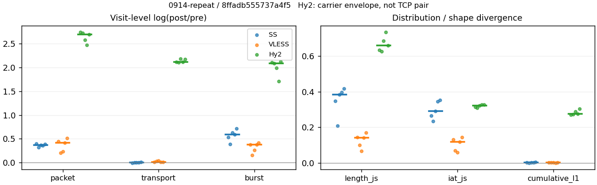
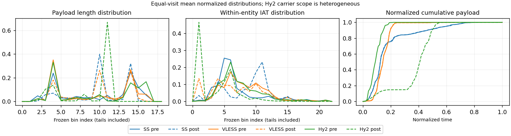

# 0914-repeat · 条目 016 · tradingview.com

目标：https://www.tradingview.com/chart/?symbol=NASDAQ%3AAAPL

活动标签：tradingview.com::page_load。选定访问 15 次。

[返回总索引](../../README.md) · [统计口径](../../methods.md)

## 覆盖与资格（每次访问均保留）

| 部署 | 重复 | 主请求路由 | 活动状态 | 代理比较 | DIRECT pre | 请求 proxy/direct/unresolved | 错误 |
| --- | --- | --- | --- | --- | --- | --- | --- |
| Hy2 | 1 | proxy | passed | 1 | 1 | 733/5/0 | [] |
| Hy2 | 2 | proxy | passed | 1 | 1 | 726/5/0 | [] |
| Hy2 | 3 | proxy | passed | 1 | 1 | 724/5/0 | [] |
| Hy2 | 4 | proxy | passed | 1 | 1 | 726/5/0 | [] |
| Hy2 | 5 | proxy | passed | 1 | 1 | 725/5/0 | [] |
| SS | 1 | proxy | passed | 1 | 0 | 739/0/0 | [] |
| SS | 2 | proxy | passed | 1 | 0 | 721/0/0 | [] |
| SS | 3 | proxy | passed | 1 | 0 | 726/0/0 | [] |
| SS | 4 | proxy | passed | 1 | 0 | 728/0/0 | [] |
| SS | 5 | proxy | passed | 1 | 0 | 728/0/0 | [] |
| VLESS | 1 | proxy | passed | 1 | 0 | 735/0/0 | [] |
| VLESS | 2 | proxy | passed | 1 | 0 | 731/0/0 | [] |
| VLESS | 3 | proxy | passed | 1 | 0 | 797/0/0 | [] |
| VLESS | 4 | proxy | passed | 1 | 0 | 778/0/0 | [] |
| VLESS | 5 | proxy | passed | 1 | 0 | 807/0/0 | [] |

主请求非 proxy 的统计仅解释为已索引的辅助代理连接或 DIRECT 观测，不代表目标业务经代理传输。播放确认与配对资格是两道不同的门。

图中散点为单次访问，短线为重复中位数；Hy2 是共享载体包络，不能与 TCP 配对作等范围因果对比。

形态图先逐访问归一化，再对访问等权平均；实线 pre，虚线 post。分箱序号及边界见 methods，不将分箱索引误解为长度或时间。

## 每次访问的关键观测

### SS

范围：`exclusive_page`。每格 pre → post；空值为不可观测/不适用。

| 重复 | 包数 | 载荷字节 | burst | TCP FR | IAT中位µs | length JS | IAT JS |
| --- | --- | --- | --- | --- | --- | --- | --- |
| 1 | 4792 → 7137 | 6.6688e+06 → 6.6264e+06 | 3192 → 5408 | 262 → 321 | 26.372 → 562.85 | 0.34852 | 0.26548 |
| 2 | 2106 → 2891 | 2.3866e+06 → 2.384e+06 | 1318 → 1947 | 128 → 148 | 24.739 → 282.08 | 0.20851 | 0.23412 |
| 3 | 4757 → 6878 | 6.5852e+06 → 6.6004e+06 | 2899 → 5438 | 201 → 248 | 24.816 → 608.95 | 0.38318 | 0.29136 |
| 4 | 4995 → 7119 | 6.5489e+06 → 6.5654e+06 | 3267 → 5867 | 207 → 223 | 25.806 → 947.5 | 0.39751 | 0.34515 |
| 5 | 4742 → 6956 | 6.5145e+06 → 6.5533e+06 | 2888 → 5882 | 215 → 290 | 24.369 → 923.48 | 0.41713 | 0.35207 |

完整标量统计：中位数 [min,max]；Δ 为重复内逐访问变换的中位数，MAD 未缩放。n 为可用变换数；DIRECT-only 的 nΔ=0 不代表 pre 不可用。

| scope | 特征 | pre | post | Δ | IQRΔ | MADΔ | nΔ |
| --- | --- | --- | --- | --- | --- | --- | --- |
| exclusive_page | active_span_sum_s_1000ms | 33.223 [23.516, 37.89] | 34.321 [25.149, 44.505] | 0.067138 | 0.065826 | 0.034645 | 5 |
| exclusive_page | active_span_sum_s_100ms | 9.4415 [4.6618, 11.287] | 15.386 [8.6601, 18.125] | 0.52168 | 0.1154 | 0.067398 | 5 |
| exclusive_page | active_span_sum_s_500ms | 26.249 [15.428, 27.958] | 31.1 [20.538, 36.721] | 0.21537 | 0.11606 | 0.058798 | 5 |
| exclusive_page | burst_bytes_iqr | 2122.8 [1696, 2167.2] | 2856 [1569, 2856] | 0.27596 | 0.37454 | 0.22015 | 5 |
| exclusive_page | burst_bytes_mad | 31 [31, 62.5] | 40 [34, 65] | 0.092373 | 0.053153 | 0.053153 | 5 |
| exclusive_page | burst_bytes_max | 28136 [24000, 28672] | 14280 [12852, 22848] | -0.62455 | 0.38002 | 0.17166 | 5 |
| exclusive_page | burst_bytes_mean | 2089.2 [1810.8, 2271.5] | 1213.8 [1114.1, 1225.3] | -0.58295 | 0.093123 | 0.049341 | 5 |
| exclusive_page | burst_bytes_median | 31 [31, 62.5] | 40 [34, 65] | 0.092373 | 0.053153 | 0.053153 | 5 |
| exclusive_page | burst_bytes_min | 0 [0, 0] | 0 [0, 0] | — | — | — | 0 |
| exclusive_page | burst_bytes_p95 | 11584 [9840.4, 15524] | 4284 [2856, 5712] | -1.2875 | 0.41361 | 0.32058 | 5 |
| exclusive_page | burst_bytes_q25 | 0 [0, 0] | 0 [0, 0] | — | — | — | 0 |
| exclusive_page | burst_bytes_q75 | 2122.8 [1696, 2167.2] | 2856 [1569, 2856] | 0.27596 | 0.37454 | 0.22015 | 5 |
| exclusive_page | burst_bytes_std | 4402.6 [4142.7, 4904.6] | 1606.8 [1362.2, 1993.3] | -1.0412 | 0.13242 | 0.074785 | 5 |
| exclusive_page | burst_count | 2899 [1318, 3267] | 5438 [1947, 5882] | 0.58547 | 0.10181 | 0.05824 | 5 |
| exclusive_page | burst_duration_ms_iqr | 0.02098 [0, 0.026096] | 0 [0, 0.0001435] | -5.0421 | — | — | 1 |
| exclusive_page | burst_duration_ms_mad | 0 [0, 0] | 0 [0, 0] | — | — | — | 0 |
| exclusive_page | burst_duration_ms_max | 15001 [5646.1, 15001] | 29295 [5646.3, 46110] | 0.66932 | 0.14591 | 0.11475 | 5 |
| exclusive_page | burst_duration_ms_mean | 54.49 [14.946, 138.97] | 38.688 [6.1395, 85.077] | -0.49072 | 0.46002 | 0.2408 | 5 |
| exclusive_page | burst_duration_ms_median | 0 [0, 0] | 0 [0, 0] | — | — | — | 0 |
| exclusive_page | burst_duration_ms_min | 0 [0, 0] | 0 [0, 0] | — | — | — | 0 |
| exclusive_page | burst_duration_ms_p95 | 9.737 [5.0589, 92.69] | 0.92586 [0.86568, 3.6307] | -2.353 | 0.53879 | 0.44734 | 5 |
| exclusive_page | burst_duration_ms_q25 | 0 [0, 0] | 0 [0, 0] | — | — | — | 0 |
| exclusive_page | burst_duration_ms_q75 | 0.02098 [0, 0.026096] | 0 [0, 0.0001435] | -5.0421 | — | — | 1 |
| exclusive_page | burst_duration_ms_std | 794.13 [171.03, 1309.4] | 769.35 [114.92, 1163.3] | -0.11829 | 0.1841 | 0.12144 | 5 |
| exclusive_page | burst_packets_iqr | 1 [0, 1] | 0 [0, 1] | 0 | — | — | 1 |
| exclusive_page | burst_packets_mad | 0 [0, 0] | 0 [0, 0] | — | — | — | 0 |
| exclusive_page | burst_packets_max | 23 [14, 32] | 11 [11, 13] | -0.59784 | 0.24039 | 0.21309 | 5 |
| exclusive_page | burst_packets_mean | 1.5979 [1.5013, 1.642] | 1.2648 [1.1826, 1.4848] | -0.23114 | 0.13145 | 0.097046 | 5 |
| exclusive_page | burst_packets_median | 1 [1, 1] | 1 [1, 1] | 0 | 0 | 0 | 5 |
| exclusive_page | burst_packets_min | 1 [1, 1] | 1 [1, 1] | 0 | 0 | 0 | 5 |
| exclusive_page | burst_packets_p95 | 4 [4, 4] | 2 [2, 4] | -0.69315 | 0.40547 | 0 | 5 |
| exclusive_page | burst_packets_q25 | 1 [1, 1] | 1 [1, 1] | 0 | 0 | 0 | 5 |
| exclusive_page | burst_packets_q75 | 2 [1, 2] | 1 [1, 2] | 0 | 0.69315 | 0 | 5 |
| exclusive_page | burst_packets_std | 1.4895 [1.3179, 1.833] | 0.73811 [0.62585, 0.98272] | -0.75763 | 0.23028 | 0.20048 | 5 |
| exclusive_page | connection_span_concurrency_max | 13 [9, 16] | 13 [8, 16] | 0 | 0 | 0 | 5 |
| exclusive_page | cumulative_l1 | — | — | 0.0015159 | 0.0017632 | 0.00049757 | 5 |
| exclusive_page | cumulative_max | — | — | 0.033596 | 0.0081325 | 0.0048389 | 5 |
| exclusive_page | direction_entropy | 0.83582 [0.77956, 0.86908] | 0.46967 [0.43755, 0.52286] | -0.37767 | 0.03242 | 0.017196 | 5 |
| exclusive_page | down_burst_count | 1441 [652, 1625] | 2711 [967, 2933] | 0.58779 | 0.10191 | 0.057715 | 5 |
| exclusive_page | down_ip_bytes | 6.5815e+06 [2.3961e+06, 6.6724e+06] | 6.6191e+06 [2.4004e+06, 6.668e+06] | 0.0048241 | 0.0039059 | 0.0030324 | 5 |
| exclusive_page | down_packets | 2865 [1278, 2932] | 3712 [1663, 3944] | 0.259 | 0.0055908 | 0.0043244 | 5 |
| exclusive_page | down_transport_bytes | 6.4289e+06 [2.3295e+06, 6.532e+06] | 6.4216e+06 [2.3137e+06, 6.4625e+06] | -0.0020306 | 0.0056686 | 0.0044768 | 5 |
| exclusive_page | duration_s | 57.764 [9.4252, 60.177] | 57.761 [9.4224, 59.821] | -3.8429e-05 | 0.00028244 | 0.000257 | 5 |
| exclusive_page | entity_count | 18 [14, 24] | 18 [14, 24] | 0 | 0 | 0 | 5 |
| exclusive_page | fr_runs | 207 [128, 262] | 248 [148, 321] | 0.2031 | 0.064942 | 0.057915 | 5 |
| exclusive_page | fr_runs_per_packet | 0.070399 [0.066468, 0.098842] | 0.076882 [0.057548, 0.087574] | -0.0094636 | 0.0094435 | 0.0018041 | 5 |
| exclusive_page | fr_switches | 188 [114, 238] | 230 [134, 297] | 0.22146 | 0.066952 | 0.05982 | 5 |
| exclusive_page | fr_switches_per_possible_transition | 0.065504 [0.060878, 0.088993] | 0.07295 [0.052905, 0.079952] | -0.0083332 | 0.0085147 | 0.00070749 | 5 |
| exclusive_page | full_retransmission_fraction | 0.0090393 [0.005272, 0.0099715] | 0.0040633 [0.0011501, 0.0072696] | -0.004122 | 0.0016463 | 0.0010685 | 5 |
| exclusive_page | full_retransmission_packets | 34 [21, 45] | 20 [8, 50] | -0.43937 | 0.76952 | 0.39058 | 5 |
| exclusive_page | iat_count | 4739 [2092, 4976] | 6940 [2877, 7113] | 0.36988 | 0.028754 | 0.014413 | 5 |
| exclusive_page | iat_js | — | — | 0.29136 | 0.079671 | 0.053785 | 5 |
| exclusive_page | iat_ks | — | — | 0.4635 | 0.077932 | 0.076691 | 5 |
| exclusive_page | iat_median_us | 24.816 [24.369, 26.372] | 608.95 [282.08, 947.5] | 3.2002 | 0.54251 | 0.40299 | 5 |
| exclusive_page | iat_us_iqr | 68.582 [63.515, 101.51] | 1031.4 [978.8, 1442.6] | 2.6583 | 0.16184 | 0.084976 | 5 |
| exclusive_page | iat_us_mad | 16.768 [15.696, 19.045] | 535.36 [277.06, 789.45] | 3.5295 | 0.30143 | 0.28441 | 5 |
| exclusive_page | iat_us_max | 1.5001e+07 [5.6461e+06, 1.5001e+07] | 1.5449e+07 [5.6463e+06, 1.5497e+07] | 0.029417 | 0.011701 | 0.003085 | 5 |
| exclusive_page | iat_us_mean | 1.2543e+05 [14251, 2.1984e+05] | 87963 [9702.4, 1.443e+05] | -0.38444 | 0.026608 | 0.013484 | 5 |
| exclusive_page | iat_us_median | 24.816 [24.369, 26.372] | 608.95 [282.08, 947.5] | 3.2002 | 0.54251 | 0.40299 | 5 |
| exclusive_page | iat_us_min | 0.031 [0.012, 0.199] | 0.035 [0.031, 0.037] | 0.092373 | 0.37729 | 0.28492 | 5 |
| exclusive_page | iat_us_p95 | 34164 [18164, 62801] | 22651 [7652.7, 39022] | -0.47586 | 0.251 | 0.1402 | 5 |
| exclusive_page | iat_us_q25 | 12.037 [11.779, 12.463] | 23.518 [10.977, 124.38] | 0.69147 | 1.942 | 0.81841 | 5 |
| exclusive_page | iat_us_q75 | 80.501 [75.552, 113.97] | 1049.2 [1027.9, 1548.5] | 2.5893 | 0.15718 | 0.12886 | 5 |
| exclusive_page | iat_us_std | 1.275e+06 [1.6738e+05, 1.7047e+06] | 1.0772e+06 [1.3412e+05, 1.3757e+06] | -0.20197 | 0.044937 | 0.019556 | 5 |
| exclusive_page | iat_wasserstein_log1p_us | — | — | 1.6873 | 0.41217 | 0.29661 | 5 |
| exclusive_page | idle_gap_count_1000ms | 43 [15, 60] | 41 [13, 54] | -0.047628 | 0.06762 | 0.057732 | 5 |
| exclusive_page | idle_gap_count_100ms | 128 [78, 140] | 120 [79, 139] | 0.012739 | 0.13148 | 0.074272 | 5 |
| exclusive_page | idle_gap_count_500ms | 56 [24, 70] | 51 [23, 61] | -0.093526 | 0.057275 | 0.029707 | 5 |
| exclusive_page | idle_gap_sum_s_1000ms | 436.39 [38.189, 656.48] | 391.6 [34.528, 654.39] | -0.014482 | 0.0976 | 0.011822 | 5 |
| exclusive_page | idle_gap_sum_s_100ms | 455.25 [57.908, 681.16] | 419.92 [53.892, 673.33] | -0.013428 | 0.060306 | 0.0028402 | 5 |
| exclusive_page | idle_gap_sum_s_500ms | 444.48 [44.37, 663.11] | 399.39 [41.835, 657.61] | -0.019488 | 0.04886 | 0.011164 | 5 |
| exclusive_page | ip_bytes | 6.8093e+06 [2.4965e+06, 6.9189e+06] | 7.0084e+06 [2.5564e+06, 7.0655e+06] | 0.028304 | 0.0051222 | 0.0046133 | 5 |
| exclusive_page | length_iqr | 2807 [2688, 2924] | 1428 [1349.8, 1428] | -0.67584 | 0.013037 | 0 | 5 |
| exclusive_page | length_js | — | — | 0.38318 | 0.048995 | 0.033944 | 5 |
| exclusive_page | length_ks | — | — | 0.37412 | 0.023091 | 0.0145 | 5 |
| exclusive_page | length_mad | 1361 [1153, 1361] | 923 [832, 1238] | -0.26245 | 0.27362 | 0.17702 | 5 |
| exclusive_page | length_max | 8920 [5792, 8920] | 7140 [7140, 11424] | -0.22258 | 0.47 | 0 | 5 |
| exclusive_page | length_mean | 2133.1 [1842.9, 2290.9] | 1694.3 [1410.7, 1737.4] | -0.22848 | 0.043104 | 0.02326 | 5 |
| exclusive_page | length_median | 1448 [1240, 1696] | 1428 [1428, 1428] | -0.013908 | 0 | 0 | 5 |
| exclusive_page | length_min | 18 [8, 31] | 10 [6, 18] | -0.52609 | 0.13815 | 0.061694 | 5 |
| exclusive_page | length_p95 | 8192 [4096, 8192] | 2856 [2856, 2856] | -1.0537 | 0 | 0 | 5 |
| exclusive_page | length_q25 | 89 [89, 208] | 1428 [380.25, 1428] | 2.7754 | 0 | 0 | 5 |
| exclusive_page | length_q75 | 2896 [2896, 3013] | 2856 [1730, 2856] | -0.013908 | 0.039606 | 0 | 5 |
| exclusive_page | length_std | 2389.4 [1503.3, 2530.3] | 1029.1 [973.44, 1039.9] | -0.89796 | 0.08166 | 0.011683 | 5 |
| exclusive_page | length_wasserstein_bytes | — | — | 1069.5 | 59.453 | 47.929 | 5 |
| exclusive_page | nonempty_entity_count | 18 [14, 24] | 18 [14, 24] | 0 | 0 | 0 | 5 |
| exclusive_page | nonempty_packets | 3024 [1295, 3089] | 3809 [1690, 4053] | 0.23079 | 0.03952 | 0.019633 | 5 |
| exclusive_page | offload_suspect_fraction | 0.29389 [0.27836, 0.33191] | 0.20317 [0.18367, 0.21248] | -0.10132 | 0.018283 | 0.013372 | 5 |
| exclusive_page | packet_count | 4757 [2106, 4995] | 6956 [2891, 7137] | 0.36871 | 0.028816 | 0.014435 | 5 |
| exclusive_page | rtt_median_ms | 0.046525 [0.037896, 0.052965] | 33.273 [33.06, 38.164] | 6.5876 | 0.19206 | 0.083327 | 5 |
| exclusive_page | rtt_sample_count | 1651 [727, 1799] | 810 [438, 879] | -0.73805 | 0.14273 | 0.047031 | 5 |
| exclusive_page | tcp_ack_count | 4739 [2089, 4976] | 6939 [2871, 7107] | 0.36944 | 0.028892 | 0.014635 | 5 |
| exclusive_page | tcp_fin_count | 36 [28, 46] | 33 [30, 48] | 0.04256 | 0.068993 | 0.037483 | 5 |
| exclusive_page | tcp_packet_count | 4757 [2106, 4995] | 6956 [2891, 7137] | 0.36871 | 0.028816 | 0.014435 | 5 |
| exclusive_page | tcp_rst_count | 0 [0, 3] | 1 [0, 1] | -0.89588 | 0.20273 | 0.20273 | 2 |
| exclusive_page | tcp_syn_count | 36 [28, 48] | 38 [33, 54] | 0.054067 | 0.06649 | 0.023296 | 5 |
| exclusive_page | tcp_window_raw_median | 65535 [65535, 65535] | 163 [155, 168] | -5.9966 | 0.04879 | 0.030214 | 5 |
| exclusive_page | transition_entropy | 0.33289 [0.31634, 0.40148] | 0.30909 [0.24466, 0.33364] | -0.067836 | 0.02906 | 0.016359 | 5 |
| exclusive_page | transition_n_mm | 2117 [935, 2167] | 3318 [1420, 3484] | 0.44936 | 0.037554 | 0.031497 | 5 |
| exclusive_page | transition_n_mp | 88 [53, 110] | 110 [63, 140] | 0.24116 | 0.07329 | 0.068319 | 5 |
| exclusive_page | transition_n_pm | 100 [61, 128] | 120 [71, 157] | 0.20422 | 0.060975 | 0.05241 | 5 |
| exclusive_page | transition_n_pp | 706 [232, 715] | 235 [122, 248] | -1.0666 | 0.052589 | 0.039279 | 5 |
| exclusive_page | transition_p_mm | 0.958 [0.94629, 0.96098] | 0.96137 [0.95752, 0.97267] | 0.011162 | 0.0047483 | 0.0039173 | 5 |
| exclusive_page | transition_p_mp | 0.042002 [0.039024, 0.053711] | 0.038631 [0.027327, 0.042481] | -0.011162 | 0.0047483 | 0.0039173 | 5 |
| exclusive_page | transition_p_pm | 0.13125 [0.1208, 0.20819] | 0.36788 [0.31487, 0.38765] | 0.20978 | 0.042922 | 0.02531 | 5 |
| exclusive_page | transition_p_pp | 0.86875 [0.79181, 0.8792] | 0.63212 [0.61235, 0.68513] | -0.20978 | 0.042922 | 0.02531 | 5 |
| exclusive_page | transport_bytes | 6.5489e+06 [2.3866e+06, 6.6688e+06] | 6.5654e+06 [2.384e+06, 6.6264e+06] | 0.0023104 | 0.0035845 | 0.0033761 | 5 |
| exclusive_page | up_burst_count | 1458 [666, 1642] | 2727 [980, 2949] | 0.58317 | 0.10171 | 0.058752 | 5 |
| exclusive_page | up_byte_fraction | 0.018315 [0.017062, 0.023911] | 0.021899 [0.020488, 0.029499] | 0.0042219 | 0.00067177 | 0.0006383 | 5 |
| exclusive_page | up_ip_bytes | 2.1493e+05 [1.0045e+05, 2.4645e+05] | 3.8268e+05 [1.56e+05, 3.9754e+05] | 0.53577 | 0.089348 | 0.057634 | 5 |
| exclusive_page | up_packets | 1892 [828, 2096] | 3193 [1228, 3325] | 0.47731 | 0.093904 | 0.056378 | 5 |
| exclusive_page | up_transport_bytes | 1.1588e+05 [57066, 1.3675e+05] | 1.4378e+05 [70327, 1.6386e+05] | 0.18892 | 0.027731 | 0.0080841 | 5 |
| exclusive_page | zero_iat_count | 0 [0, 0] | 0 [0, 0] | — | — | — | 0 |
| exclusive_page | zero_iat_fraction | 0 [0, 0] | 0 [0, 0] | 0 | 0 | 0 | 5 |

### VLESS

范围：`exclusive_page`。每格 pre → post；空值为不可观测/不适用。

| 重复 | 包数 | 载荷字节 | burst | TCP FR | IAT中位µs | length JS | IAT JS |
| --- | --- | --- | --- | --- | --- | --- | --- |
| 1 | 5565 → 8704 | 6.6091e+06 → 6.6669e+06 | 3803 → 5537 | 250 → 294 | 93.835 → 23.231 | 0.14515 | 0.13116 |
| 2 | 4430 → 5399 | 5.2569e+06 → 5.3817e+06 | 2730 → 3181 | 359 → 404 | 94.207 → 66.709 | 0.10115 | 0.069592 |
| 3 | 3775 → 4760 | 4.4115e+06 → 4.5591e+06 | 2348 → 3040 | 232 → 274 | 116.27 → 90.404 | 0.067796 | 0.058172 |
| 4 | 5321 → 8052 | 6.5257e+06 → 6.5838e+06 | 3351 → 4897 | 320 → 376 | 107.35 → 27.658 | 0.14158 | 0.11873 |
| 5 | 3620 → 6019 | 4.6481e+06 → 4.6978e+06 | 2292 → 3458 | 255 → 294 | 103.06 → 18.475 | 0.16892 | 0.14318 |

完整标量统计：中位数 [min,max]；Δ 为重复内逐访问变换的中位数，MAD 未缩放。n 为可用变换数；DIRECT-only 的 nΔ=0 不代表 pre 不可用。

| scope | 特征 | pre | post | Δ | IQRΔ | MADΔ | nΔ |
| --- | --- | --- | --- | --- | --- | --- | --- |
| exclusive_page | active_span_sum_s_1000ms | 31.59 [27.983, 36.273] | 31.111 [27.878, 36.168] | -0.0037664 | 0.012382 | 0.01152 | 5 |
| exclusive_page | active_span_sum_s_100ms | 4.3452 [4.0384, 6.7854] | 12.606 [11.605, 15.304] | 1.0081 | 0.18042 | 0.10357 | 5 |
| exclusive_page | active_span_sum_s_500ms | 15.845 [13.884, 20.005] | 30.131 [27.878, 35.429] | 0.60748 | 0.050207 | 0.035232 | 5 |
| exclusive_page | burst_bytes_iqr | 2824 [1782.5, 2896] | 2824 [2824, 2824] | 0 | 0.025176 | 0.025176 | 5 |
| exclusive_page | burst_bytes_mad | 64 [31, 72] | 72 [53, 72] | 0.11778 | 0.5363 | 0.11778 | 5 |
| exclusive_page | burst_bytes_max | 29280 [26180, 29400] | 25992 [23168, 69504] | -0.11912 | 1.0242 | 0.11911 | 5 |
| exclusive_page | burst_bytes_mean | 1925.6 [1737.9, 2028] | 1358.5 [1204.1, 1691.8] | -0.36695 | 0.14513 | 0.033679 | 5 |
| exclusive_page | burst_bytes_median | 64 [31, 72] | 72 [53, 72] | 0.11778 | 0.5363 | 0.11778 | 5 |
| exclusive_page | burst_bytes_min | 0 [0, 0] | 0 [0, 0] | — | — | — | 0 |
| exclusive_page | burst_bytes_p95 | 10154 [8920, 11571] | 4529.4 [4344, 5440] | -0.75377 | 0.12957 | 0.09404 | 5 |
| exclusive_page | burst_bytes_q25 | 0 [0, 0] | 0 [0, 0] | — | — | — | 0 |
| exclusive_page | burst_bytes_q75 | 2824 [1782.5, 2896] | 2824 [2824, 2824] | 0 | 0.025176 | 0.025176 | 5 |
| exclusive_page | burst_bytes_std | 4212.4 [3947.5, 4558.5] | 2146.3 [1903.9, 4028.1] | -0.75327 | 0.48992 | 0.017255 | 5 |
| exclusive_page | burst_count | 2730 [2292, 3803] | 3458 [3040, 5537] | 0.37566 | 0.12107 | 0.035603 | 5 |
| exclusive_page | burst_duration_ms_iqr | 0.14184 [0.043387, 0.41064] | 0.0055922 [0.000141, 0.010827] | -3.3533 | 0.79428 | 0.69496 | 5 |
| exclusive_page | burst_duration_ms_mad | 0 [0, 0] | 0 [0, 0] | — | — | — | 0 |
| exclusive_page | burst_duration_ms_max | 15001 [15001, 15001] | 15060 [15042, 15499] | 0.0038989 | 0.0083214 | 0.0011688 | 5 |
| exclusive_page | burst_duration_ms_mean | 78.211 [55.528, 117.12] | 23.202 [19.665, 44.193] | -1.1886 | 0.2889 | 0.17011 | 5 |
| exclusive_page | burst_duration_ms_median | 0 [0, 0] | 0 [0, 0] | — | — | — | 0 |
| exclusive_page | burst_duration_ms_min | 0 [0, 0] | 0 [0, 0] | — | — | — | 0 |
| exclusive_page | burst_duration_ms_p95 | 8.1024 [5.2544, 10.108] | 5.3806 [1.4362, 8.8936] | -0.33031 | 0.40506 | 0.23111 | 5 |
| exclusive_page | burst_duration_ms_q25 | 0 [0, 0] | 0 [0, 0] | — | — | — | 0 |
| exclusive_page | burst_duration_ms_q75 | 0.14184 [0.043387, 0.41064] | 0.0055922 [0.000141, 0.010827] | -3.3533 | 0.79428 | 0.69496 | 5 |
| exclusive_page | burst_duration_ms_std | 912.78 [773.67, 1183] | 517.13 [459.16, 724.73] | -0.63 | 0.1499 | 0.037147 | 5 |
| exclusive_page | burst_packets_iqr | 1 [1, 1] | 1 [1, 1] | 0 | 0 | 0 | 5 |
| exclusive_page | burst_packets_mad | 0 [0, 0] | 0 [0, 0] | — | — | — | 0 |
| exclusive_page | burst_packets_max | 14 [10, 20] | 18 [14, 25] | 0.25131 | 0.11333 | 0.085158 | 5 |
| exclusive_page | burst_packets_mean | 1.5879 [1.4633, 1.6227] | 1.6443 [1.5658, 1.7406] | 0.04492 | 0.036728 | 0.026703 | 5 |
| exclusive_page | burst_packets_median | 1 [1, 1] | 1 [1, 1] | 0 | 0 | 0 | 5 |
| exclusive_page | burst_packets_min | 1 [1, 1] | 1 [1, 1] | 0 | 0 | 0 | 5 |
| exclusive_page | burst_packets_p95 | 3 [3, 4] | 4 [4, 4] | 0.28768 | 0.28768 | 0 | 5 |
| exclusive_page | burst_packets_q25 | 1 [1, 1] | 1 [1, 1] | 0 | 0 | 0 | 5 |
| exclusive_page | burst_packets_q75 | 2 [2, 2] | 2 [2, 2] | 0 | 0 | 0 | 5 |
| exclusive_page | burst_packets_std | 1.0639 [0.971, 1.0757] | 1.2564 [1.1443, 1.6129] | 0.18692 | 0.028412 | 0.020956 | 5 |
| exclusive_page | connection_span_concurrency_max | 15 [14, 17] | 15 [14, 17] | 0 | 0 | 0 | 5 |
| exclusive_page | cumulative_l1 | — | — | 0.0023653 | 0.00022194 | 0.00020591 | 5 |
| exclusive_page | cumulative_max | — | — | 0.047346 | 0.047749 | 0.02439 | 5 |
| exclusive_page | direction_entropy | 0.79346 [0.76327, 0.84427] | 0.43383 [0.42319, 0.53905] | -0.35629 | 0.054403 | 0.028285 | 5 |
| exclusive_page | down_burst_count | 1354 [1137, 1890] | 1720 [1512, 2757] | 0.37757 | 0.11978 | 0.036365 | 5 |
| exclusive_page | down_ip_bytes | 5.274e+06 [4.4357e+06, 6.6425e+06] | 5.3871e+06 [4.5697e+06, 6.7371e+06] | 0.018159 | 0.007079 | 0.0040235 | 5 |
| exclusive_page | down_packets | 2605 [2154, 3209] | 3546 [2781, 4749] | 0.34939 | 0.18537 | 0.13434 | 5 |
| exclusive_page | down_transport_bytes | 5.1384e+06 [4.3176e+06, 6.4769e+06] | 5.219e+06 [4.425e+06, 6.4899e+06] | 0.002888 | 0.013058 | 0.00087085 | 5 |
| exclusive_page | duration_s | 35.531 [32.52, 57.347] | 35.535 [32.503, 57.303] | -0.00054552 | 0.00017624 | 0.00011821 | 5 |
| exclusive_page | entity_count | 21 [18, 23] | 21 [18, 23] | 0 | 0 | 0 | 5 |
| exclusive_page | fr_runs | 255 [232, 359] | 294 [274, 404] | 0.16127 | 0.019803 | 0.0051226 | 5 |
| exclusive_page | fr_runs_per_packet | 0.098347 [0.073573, 0.13036] | 0.083263 [0.061713, 0.1234] | -0.01186 | 0.0059604 | 0.0049005 | 5 |
| exclusive_page | fr_switches | 237 [212, 337] | 276 [254, 382] | 0.17167 | 0.024828 | 0.0090738 | 5 |
| exclusive_page | fr_switches_per_possible_transition | 0.090637 [0.067259, 0.12335] | 0.078565 [0.057161, 0.11747] | -0.010098 | 0.0055861 | 0.0042116 | 5 |
| exclusive_page | full_retransmission_fraction | 0.0071878 [0.0034437, 0.0099448] | 0 [0, 0] | -0.0071878 | 0.0024756 | 0.0017702 | 5 |
| exclusive_page | full_retransmission_packets | 36 [13, 42] | 0 [0, 0] | — | — | — | 0 |
| exclusive_page | iat_count | 4408 [3602, 5542] | 6001 [4740, 8681] | 0.4156 | 0.21583 | 0.094835 | 5 |
| exclusive_page | iat_js | — | — | 0.11873 | 0.06157 | 0.024446 | 5 |
| exclusive_page | iat_ks | — | — | 0.27885 | 0.14624 | 0.022975 | 5 |
| exclusive_page | iat_median_us | 103.06 [93.835, 116.27] | 27.658 [18.475, 90.404] | -1.3562 | 1.0509 | 0.36267 | 5 |
| exclusive_page | iat_us_iqr | 744.34 [730.95, 827.92] | 583.11 [490.89, 837.2] | -0.31557 | 0.3371 | 0.10071 | 5 |
| exclusive_page | iat_us_mad | 95.379 [84.823, 108.54] | 27.611 [18.434, 89.661] | -1.2756 | 1.0429 | 0.36806 | 5 |
| exclusive_page | iat_us_max | 1.5001e+07 [1.5001e+07, 1.5001e+07] | 1.5244e+07 [1.5127e+07, 1.5499e+07] | 0.01608 | 0.019599 | 0.0077335 | 5 |
| exclusive_page | iat_us_mean | 1.0887e+05 [76000, 2.0101e+05] | 89041 [50024, 1.2047e+05] | -0.41824 | 0.21649 | 0.093718 | 5 |
| exclusive_page | iat_us_median | 103.06 [93.835, 116.27] | 27.658 [18.475, 90.404] | -1.3562 | 1.0509 | 0.36267 | 5 |
| exclusive_page | iat_us_min | 0.052 [0.004, 0.139] | 0.031 [0.03, 0.032] | -0.51726 | 2.3574 | 0.95148 | 5 |
| exclusive_page | iat_us_p95 | 9172.5 [6753.2, 12806] | 35655 [9271.3, 40954] | 1.024 | 1.1576 | 0.48546 | 5 |
| exclusive_page | iat_us_q25 | 28.153 [23.099, 30.607] | 5.763 [4.597, 11.892] | -1.5862 | 0.64872 | 0.168 | 5 |
| exclusive_page | iat_us_q75 | 774.66 [756.61, 858.52] | 587.7 [496.14, 849.09] | -0.34247 | 0.33524 | 0.1031 | 5 |
| exclusive_page | iat_us_std | 1.1847e+06 [9.5704e+05, 1.6299e+06] | 1.0715e+06 [7.6433e+05, 1.2801e+06] | -0.20792 | 0.10801 | 0.033682 | 5 |
| exclusive_page | iat_wasserstein_log1p_us | — | — | 1.1119 | 0.60844 | 0.12006 | 5 |
| exclusive_page | idle_gap_count_1000ms | 35 [27, 65] | 35 [27, 57] | 0 | 0 | 0 | 5 |
| exclusive_page | idle_gap_count_100ms | 115 [103, 134] | 134 [117, 148] | 0.15291 | 0.039609 | 0.015991 | 5 |
| exclusive_page | idle_gap_count_500ms | 58 [49, 86] | 36 [28, 57] | -0.45199 | 0.071162 | 0.040689 | 5 |
| exclusive_page | idle_gap_sum_s_1000ms | 411.97 [371.11, 696.05] | 411.51 [370.88, 695.05] | -0.0014308 | 0.0016492 | 0.00081911 | 5 |
| exclusive_page | idle_gap_sum_s_100ms | 439.33 [397.19, 719.99] | 431.02 [388.15, 710.65] | -0.019968 | 0.0035561 | 0.0026818 | 5 |
| exclusive_page | idle_gap_sum_s_500ms | 427.73 [386.12, 710.14] | 413.56 [371.57, 695.05] | -0.033808 | 0.0047221 | 0.004601 | 5 |
| exclusive_page | ip_bytes | 5.4874e+06 [4.6078e+06, 6.8988e+06] | 5.6664e+06 [4.8105e+06, 7.1368e+06] | 0.033918 | 0.0060727 | 0.0024284 | 5 |
| exclusive_page | length_iqr | 2736 [2736, 2736] | 2583 [1232, 2644] | -0.057545 | 0.54938 | 0.023341 | 5 |
| exclusive_page | length_js | — | — | 0.14158 | 0.044001 | 0.027337 | 5 |
| exclusive_page | length_ks | — | — | 0.18585 | 0.021204 | 0.013024 | 5 |
| exclusive_page | length_mad | 1340 [1340, 1376] | 1196 [740, 1340] | -0.11369 | 0.14971 | 0.087176 | 5 |
| exclusive_page | length_max | 8920 [8920, 8920] | 9884 [7420, 16384] | 0.10262 | 0.4774 | 0.28674 | 5 |
| exclusive_page | length_mean | 1927.8 [1870.1, 2120.5] | 1429.1 [1330.4, 1644.1] | -0.29937 | 0.17969 | 0.14988 | 5 |
| exclusive_page | length_median | 1412 [1412, 1448] | 1412 [1412, 1412] | 0 | 0 | 0 | 5 |
| exclusive_page | length_min | 16 [2, 24] | 5 [2, 15] | -0.47 | 0.81093 | 0.40547 | 5 |
| exclusive_page | length_p95 | 8920 [7240, 8920] | 2896 [2824, 3040] | -1.0986 | 0.073703 | 0.051529 | 5 |
| exclusive_page | length_q25 | 88 [88, 88] | 216 [180, 266] | 0.89794 | 0.16423 | 0.10952 | 5 |
| exclusive_page | length_q75 | 2824 [2824, 2824] | 2824 [1448, 2824] | 0 | 0.46252 | 0 | 5 |
| exclusive_page | length_std | 2356.1 [2155, 2521.6] | 1135 [1054.1, 1452.3] | -0.71036 | 0.25985 | 0.16185 | 5 |
| exclusive_page | length_wasserstein_bytes | — | — | 813.14 | 236.95 | 179.64 | 5 |
| exclusive_page | nonempty_entity_count | 21 [18, 23] | 21 [18, 23] | 0 | 0 | 0 | 5 |
| exclusive_page | nonempty_packets | 2754 [2192, 3398] | 3531 [2773, 4764] | 0.30822 | 0.16494 | 0.13526 | 5 |
| exclusive_page | offload_suspect_fraction | 0.27541 [0.27098, 0.29272] | 0.17511 [0.14521, 0.24875] | -0.10772 | 0.069591 | 0.022486 | 5 |
| exclusive_page | packet_count | 4430 [3620, 5565] | 6019 [4760, 8704] | 0.41426 | 0.21544 | 0.094188 | 5 |
| exclusive_page | rtt_median_ms | 0.12318 [0.095242, 0.15066] | 0.085693 [0.042547, 0.17342] | -0.53258 | 0.71858 | 0.3864 | 5 |
| exclusive_page | rtt_sample_count | 1570 [1251, 2054] | 2034 [1852, 3282] | 0.39502 | 0.097342 | 0.05392 | 5 |
| exclusive_page | tcp_ack_count | 4370 [3568, 5500] | 6001 [4737, 8681] | 0.42204 | 0.21471 | 0.097883 | 5 |
| exclusive_page | tcp_fin_count | 42 [36, 44] | 42 [36, 46] | 0 | 0.025318 | 0 | 5 |
| exclusive_page | tcp_packet_count | 4430 [3620, 5565] | 6019 [4760, 8704] | 0.41426 | 0.21544 | 0.094188 | 5 |
| exclusive_page | tcp_rst_count | 35 [34, 42] | 0 [0, 3] | -2.4567 | — | — | 1 |
| exclusive_page | tcp_syn_count | 42 [36, 46] | 42 [36, 46] | 0 | 0 | 0 | 5 |
| exclusive_page | tcp_window_raw_median | 65535 [65535, 65535] | 254 [247, 254] | -5.553 | 0 | 0 | 5 |
| exclusive_page | transition_entropy | 0.40445 [0.33394, 0.50897] | 0.31135 [0.25268, 0.42202] | -0.086957 | 0.013638 | 0.0079425 | 5 |
| exclusive_page | transition_n_mm | 1827 [1541, 2431] | 3069 [2320, 4207] | 0.5023 | 0.16979 | 0.12364 | 5 |
| exclusive_page | transition_n_mp | 110 [97, 159] | 129 [117, 180] | 0.16923 | 0.028131 | 0.018229 | 5 |
| exclusive_page | transition_n_pm | 127 [115, 178] | 147 [137, 202] | 0.16212 | 0.027601 | 0.01293 | 5 |
| exclusive_page | transition_n_pp | 568 [396, 717] | 202 [168, 263] | -1.0029 | 0.1764 | 0.054305 | 5 |
| exclusive_page | transition_p_mm | 0.94507 [0.91994, 0.95973] | 0.95966 [0.9368, 0.97137] | 0.014938 | 0.0052205 | 0.0032999 | 5 |
| exclusive_page | transition_p_mp | 0.054928 [0.040268, 0.08006] | 0.040338 [0.028631, 0.063202] | -0.014938 | 0.0052205 | 0.0032999 | 5 |
| exclusive_page | transition_p_pm | 0.22073 [0.14846, 0.24283] | 0.45854 [0.35854, 0.5] | 0.22384 | 0.047478 | 0.013756 | 5 |
| exclusive_page | transition_p_pp | 0.77927 [0.75717, 0.85154] | 0.54146 [0.5, 0.64146] | -0.22384 | 0.047478 | 0.013756 | 5 |
| exclusive_page | transport_bytes | 5.2569e+06 [4.4115e+06, 6.6091e+06] | 5.3817e+06 [4.5591e+06, 6.6669e+06] | 0.010636 | 0.014613 | 0.0019241 | 5 |
| exclusive_page | up_burst_count | 1376 [1155, 1913] | 1738 [1528, 2780] | 0.37378 | 0.12233 | 0.034856 | 5 |
| exclusive_page | up_byte_fraction | 0.02001 [0.018378, 0.022544] | 0.027141 [0.02459, 0.030239] | 0.0075668 | 0.0011562 | 0.0005672 | 5 |
| exclusive_page | up_ip_bytes | 2.1342e+05 [1.6738e+05, 2.5632e+05] | 2.7926e+05 [2.4072e+05, 3.9977e+05] | 0.44445 | 0.11772 | 0.033478 | 5 |
| exclusive_page | up_packets | 1825 [1466, 2383] | 2473 [1979, 3955] | 0.50541 | 0.23481 | 0.017481 | 5 |
| exclusive_page | up_transport_bytes | 1.1851e+05 [90984, 1.3225e+05] | 1.619e+05 [1.275e+05, 1.77e+05] | 0.31712 | 0.037441 | 0.020343 | 5 |
| exclusive_page | zero_iat_count | 0 [0, 0] | 0 [0, 0] | — | — | — | 0 |
| exclusive_page | zero_iat_fraction | 0 [0, 0] | 0 [0, 0] | 0 | 0 | 0 | 5 |

### Hy2

范围：`carrier_context_envelope`。每格 pre → post；空值为不可观测/不适用。

| 重复 | 包数 | 载荷字节 | burst | TCP FR | IAT中位µs | length JS | IAT JS |
| --- | --- | --- | --- | --- | --- | --- | --- |
| 1 | 3212 → 49932 | 6.3704e+06 → 5.2911e+07 | 1954 → 16105 | — | 45.95 → 3.479 | 0.63271 | 0.31395 |
| 2 | 3277 → 50109 | 6.3971e+06 → 5.2664e+07 | 2120 → 17163 | — | 44.03 → 4.476 | 0.62513 | 0.30789 |
| 3 | 4097 → 54019 | 6.3012e+06 → 5.6308e+07 | 2634 → 19231 | — | 70.052 → 6.034 | 0.68428 | 0.32234 |
| 4 | 4122 → 49204 | 6.2371e+06 → 5.1844e+07 | 2943 → 16216 | — | 45.988 → 3.611 | 0.73335 | 0.32745 |
| 5 | 3635 → 54025 | 6.3375e+06 → 5.58e+07 | 2302 → 19410 | — | 54.538 → 5.142 | 0.66066 | 0.32754 |

范围：`direct_pre_only`。每格 pre → post；空值为不可观测/不适用。

| 重复 | 包数 | 载荷字节 | burst | TCP FR | IAT中位µs | length JS | IAT JS |
| --- | --- | --- | --- | --- | --- | --- | --- |
| 1 | 211 → — | 3.5424e+05 → — | 125 → — | 24 → — | 155.48 → — | — | — |
| 2 | 259 → — | 3.4846e+05 → — | 171 → — | 25 → — | 154.62 → — | — | — |
| 3 | 275 → — | 3.4851e+05 → — | 199 → — | 23 → — | 135.43 → — | — | — |
| 4 | 236 → — | 3.5093e+05 → — | 149 → — | 25 → — | 117 → — | — | — |
| 5 | 263 → — | 3.5122e+05 → — | 185 → — | 22 → — | 125.31 → — | — | — |

完整标量统计：中位数 [min,max]；Δ 为重复内逐访问变换的中位数，MAD 未缩放。n 为可用变换数；DIRECT-only 的 nΔ=0 不代表 pre 不可用。

| scope | 特征 | pre | post | Δ | IQRΔ | MADΔ | nΔ |
| --- | --- | --- | --- | --- | --- | --- | --- |
| carrier_context_envelope | active_span_sum_s_1000ms | 19.788 [16.278, 24.706] | 19.518 [17.537, 21.435] | 0.035263 | 0.060384 | 0.049023 | 5 |
| carrier_context_envelope | active_span_sum_s_100ms | 3.9443 [3.5834, 4.2386] | 10.149 [8.6685, 12.279] | 1.0004 | 0.27997 | 0.12078 | 5 |
| carrier_context_envelope | active_span_sum_s_500ms | 17.236 [14.039, 21.931] | 17.841 [15.014, 20.833] | 0.057454 | 0.061859 | 0.021072 | 5 |
| carrier_context_envelope | burst_bytes_iqr | 1743.5 [1353.2, 2800] | 4225 [3629, 4260] | 0.88512 | 0.20213 | 0.10132 | 5 |
| carrier_context_envelope | burst_bytes_mad | 39 [31, 71.5] | 283 [264, 367] | 1.9124 | 0.80597 | 0.39823 | 5 |
| carrier_context_envelope | burst_bytes_max | 29400 [28672, 29400] | 2.1419e+05 [1.923e+05, 3.4629e+05] | 1.9859 | 0.44625 | 0.1064 | 5 |
| carrier_context_envelope | burst_bytes_mean | 2753 [2119.3, 3260.2] | 3068.4 [2874.8, 3285.4] | 0.043286 | 0.18533 | 0.035579 | 5 |
| carrier_context_envelope | burst_bytes_median | 39 [31, 71.5] | 316 [297, 400] | 2.0302 | 0.77305 | 0.38083 | 5 |
| carrier_context_envelope | burst_bytes_min | 0 [0, 0] | 22 [22, 25] | — | — | — | 0 |
| carrier_context_envelope | burst_bytes_p95 | 20480 [8920, 20480] | 10932 [10932, 11528] | -0.57467 | 0.22827 | 0.053085 | 5 |
| carrier_context_envelope | burst_bytes_q25 | 0 [0, 0] | 98 [63, 98] | — | — | — | 0 |
| carrier_context_envelope | burst_bytes_q75 | 1743.5 [1353.2, 2800] | 4323 [3727, 4323] | 0.90806 | 0.2075 | 0.10504 | 5 |
| carrier_context_envelope | burst_bytes_std | 6100.1 [4187.8, 6576.7] | 6336.3 [5225.2, 6894.3] | 0.011603 | 0.050907 | 0.035552 | 5 |
| carrier_context_envelope | burst_count | 2302 [1954, 2943] | 17163 [16105, 19410] | 2.0913 | 0.12123 | 0.04067 | 5 |
| carrier_context_envelope | burst_duration_ms_iqr | 0.038731 [0, 0.047672] | 0.025132 [0.023901, 0.027172] | -0.50518 | 0.13156 | 0.060426 | 4 |
| carrier_context_envelope | burst_duration_ms_mad | 0 [0, 0] | 4.6e-05 [4.3e-05, 5e-05] | — | — | — | 0 |
| carrier_context_envelope | burst_duration_ms_max | 15001 [15001, 15001] | 3343.4 [251.87, 7217.4] | -1.5011 | 0.71984 | 0.69448 | 5 |
| carrier_context_envelope | burst_duration_ms_mean | 89.889 [78.971, 152.38] | 0.65832 [0.41704, 1.0762] | -5.1151 | 0.39608 | 0.33486 | 5 |
| carrier_context_envelope | burst_duration_ms_median | 0 [0, 0] | 4.6e-05 [4.3e-05, 5e-05] | — | — | — | 0 |
| carrier_context_envelope | burst_duration_ms_min | 0 [0, 0] | 0 [0, 0] | — | — | — | 0 |
| carrier_context_envelope | burst_duration_ms_p95 | 6.3953 [2.5328, 33.994] | 0.15013 [0.10257, 0.24627] | -3.9817 | 0.80545 | 0.6543 | 5 |
| carrier_context_envelope | burst_duration_ms_q25 | 0 [0, 0] | 0 [0, 0] | — | — | — | 0 |
| carrier_context_envelope | burst_duration_ms_q75 | 0.038731 [0, 0.047672] | 0.025132 [0.023901, 0.027172] | -0.50518 | 0.13156 | 0.060426 | 4 |
| carrier_context_envelope | burst_duration_ms_std | 1061.5 [995.32, 1320.2] | 30.44 [6.0482, 67.433] | -3.6633 | 0.61453 | 0.43854 | 5 |
| carrier_context_envelope | burst_packets_iqr | 1 [0, 1] | 3 [2, 3] | 0.89588 | 0.40547 | 0.20273 | 4 |
| carrier_context_envelope | burst_packets_mad | 0 [0, 0] | 1 [1, 1] | — | — | — | 0 |
| carrier_context_envelope | burst_packets_max | 15 [14, 19] | 163 [140, 249] | 2.3026 | 0.43409 | 0.28418 | 5 |
| carrier_context_envelope | burst_packets_mean | 1.5554 [1.4006, 1.6438] | 2.9196 [2.7834, 3.1004] | 0.63452 | 0.044872 | 0.043456 | 5 |
| carrier_context_envelope | burst_packets_median | 1 [1, 1] | 2 [2, 2] | 0.69315 | 0 | 0 | 5 |
| carrier_context_envelope | burst_packets_min | 1 [1, 1] | 1 [1, 1] | 0 | 0 | 0 | 5 |
| carrier_context_envelope | burst_packets_p95 | 4 [3, 4] | 8 [8, 9] | 0.69315 | 0.11778 | 0 | 5 |
| carrier_context_envelope | burst_packets_q25 | 1 [1, 1] | 1 [1, 1] | 0 | 0 | 0 | 5 |
| carrier_context_envelope | burst_packets_q75 | 2 [1, 2] | 4 [3, 4] | 0.69315 | 0.28768 | 0.28768 | 5 |
| carrier_context_envelope | burst_packets_std | 1.0809 [0.99232, 1.2228] | 4.431 [3.6062, 4.86] | 1.4189 | 0.10845 | 0.077449 | 5 |
| carrier_context_envelope | connection_span_concurrency_max | 14 [13, 17] | 1 [1, 1] | -2.6391 | 0 | 0 | 5 |
| carrier_context_envelope | cumulative_l1 | — | — | 0.27569 | 0.015002 | 0.0048803 | 5 |
| carrier_context_envelope | cumulative_max | — | — | 0.8548 | 0.0064693 | 0.0022783 | 5 |
| carrier_context_envelope | direction_entropy | 0.93764 [0.89568, 0.97295] | 0.77808 [0.75594, 0.79612] | -0.14152 | 0.052947 | 0.036656 | 5 |
| carrier_context_envelope | direction_run_analog_runs | 195 [150, 240] | 17163 [16105, 19410] | 4.6005 | 0.30434 | 0.082574 | 5 |
| carrier_context_envelope | direction_run_analog_runs_per_packet | 0.085979 [0.06105, 0.1194] | 0.34251 [0.32254, 0.35928] | 0.26852 | 0.040067 | 0.017032 | 5 |
| carrier_context_envelope | direction_run_analog_switches | 177 [135, 220] | 17162 [16104, 19409] | 4.6973 | 0.33323 | 0.091075 | 5 |
| carrier_context_envelope | direction_run_analog_switches_per_possible_transition | 0.078667 [0.055283, 0.11055] | 0.3425 [0.32253, 0.35927] | 0.27427 | 0.040212 | 0.017825 | 5 |
| carrier_context_envelope | down_burst_count | 1142 [967, 1464] | 8581 [8052, 9705] | 2.0989 | 0.12465 | 0.041003 | 5 |
| carrier_context_envelope | down_ip_bytes | 6.33e+06 [6.2453e+06, 6.3801e+06] | 5.2933e+07 [5.2142e+07, 5.6376e+07] | 2.1225 | 0.055539 | 0.012856 | 5 |
| carrier_context_envelope | down_packets | 2079 [1752, 2371] | 39062 [38185, 41191] | 2.9823 | 0.20676 | 0.12212 | 5 |
| carrier_context_envelope | down_transport_bytes | 6.2217e+06 [6.1302e+06, 6.286e+06] | 5.1839e+07 [5.1073e+07, 5.5222e+07] | 2.12 | 0.058065 | 0.016316 | 5 |
| carrier_context_envelope | duration_s | 33.253 [32.25, 34.503] | 33.253 [32.25, 34.486] | -1.4057e-05 | 0.00031734 | 6.1587e-06 | 5 |
| carrier_context_envelope | entity_count | 18 [15, 20] | 1 [1, 1] | -2.8904 | 0.11778 | 0.10536 | 5 |
| carrier_context_envelope | full_retransmission_fraction | 0.013205 [0.0080058, 0.018309] | — | — | — | — | 0 |
| carrier_context_envelope | full_retransmission_packets | 48 [33, 60] | — | — | — | — | 0 |
| carrier_context_envelope | iat_count | 3617 [3192, 4107] | 50108 [49203, 54024] | 2.7038 | 0.14868 | 0.046211 | 5 |
| carrier_context_envelope | iat_js | — | — | 0.32234 | 0.0135 | 0.0051983 | 5 |
| carrier_context_envelope | iat_ks | — | — | 0.48388 | 0.019792 | 0.011866 | 5 |
| carrier_context_envelope | iat_median_us | 45.988 [44.03, 70.052] | 4.476 [3.479, 6.034] | -2.4518 | 0.18294 | 0.092568 | 5 |
| carrier_context_envelope | iat_us_iqr | 276.42 [162.66, 396.56] | 26.549 [24.31, 27.511] | -2.3073 | 0.65567 | 0.36145 | 5 |
| carrier_context_envelope | iat_us_mad | 39.622 [35.415, 59.727] | 4.439 [3.443, 5.997] | -2.2985 | 0.18075 | 0.097065 | 5 |
| carrier_context_envelope | iat_us_max | 1.5001e+07 [1.5001e+07, 1.5001e+07] | 6.3054e+06 [3.5197e+06, 7.1847e+06] | -0.86672 | 0.5604 | 0.13054 | 5 |
| carrier_context_envelope | iat_us_mean | 1.1643e+05 [96139, 1.4421e+05] | 645.88 [612.33, 688.23] | -5.2478 | 0.22377 | 0.16066 | 5 |
| carrier_context_envelope | iat_us_median | 45.988 [44.03, 70.052] | 4.476 [3.479, 6.034] | -2.4518 | 0.18294 | 0.092568 | 5 |
| carrier_context_envelope | iat_us_min | 0.095 [0.003, 0.394] | 0 [0, 0] | — | — | — | 0 |
| carrier_context_envelope | iat_us_p95 | 7298.6 [4685.9, 25629] | 281.41 [164.8, 556.23] | -3.7875 | 0.4587 | 0.059967 | 5 |
| carrier_context_envelope | iat_us_q25 | 17.735 [13.29, 24.863] | 0.049 [0.046, 0.05] | -5.9121 | 0.37413 | 0.19332 | 5 |
| carrier_context_envelope | iat_us_q75 | 294.15 [177.89, 416.93] | 26.599 [24.356, 27.559] | -2.3678 | 0.64885 | 0.36086 | 5 |
| carrier_context_envelope | iat_us_std | 1.2642e+06 [1.1387e+06, 1.3506e+06] | 36408 [26954, 40183] | -3.5149 | 0.33525 | 0.10292 | 5 |
| carrier_context_envelope | iat_wasserstein_log1p_us | — | — | 2.7689 | 0.17985 | 0.073808 | 5 |
| carrier_context_envelope | idle_gap_count_1000ms | 29 [27, 36] | 4 [3, 7] | -2.0794 | 0.47446 | 0.11778 | 5 |
| carrier_context_envelope | idle_gap_count_100ms | 87 [83, 119] | 48 [43, 53] | -0.70471 | 0.17523 | 0.10412 | 5 |
| carrier_context_envelope | idle_gap_count_500ms | 32 [31, 40] | 7 [5, 10] | -1.4881 | 0.73732 | 0.32493 | 5 |
| carrier_context_envelope | idle_gap_sum_s_1000ms | 404.19 [372.29, 435.62] | 14.968 [10.815, 15.544] | -3.3244 | 0.12391 | 0.06622 | 5 |
| carrier_context_envelope | idle_gap_sum_s_100ms | 416.88 [388.42, 456.1] | 23.491 [19.971, 24.584] | -2.8421 | 0.098931 | 0.069945 | 5 |
| carrier_context_envelope | idle_gap_sum_s_500ms | 406.33 [374.4, 438.39] | 15.842 [11.416, 18.239] | -3.1767 | 0.12425 | 0.097178 | 5 |
| carrier_context_envelope | ip_bytes | 6.5273e+06 [6.4521e+06, 6.5685e+06] | 5.431e+07 [5.3222e+07, 5.782e+07] | 2.117 | 0.062457 | 0.0090842 | 5 |
| carrier_context_envelope | length_iqr | 4735 [2743, 7286] | 1303 [971, 1341] | -1.2616 | 0.50008 | 0.45972 | 5 |
| carrier_context_envelope | length_js | — | — | 0.66066 | 0.051577 | 0.027951 | 5 |
| carrier_context_envelope | length_ks | — | — | 0.47985 | 0.020001 | 0.010799 | 5 |
| carrier_context_envelope | length_mad | 1327 [1327, 1329] | 0 [0, 0] | — | — | — | 0 |
| carrier_context_envelope | length_max | 8920 [8920, 8920] | 1441 [1441, 1441] | -1.823 | 0 | 0 | 5 |
| carrier_context_envelope | length_mean | 2794.3 [2452.8, 3192.2] | 1051 [1032.9, 1059.7] | -0.99525 | 0.21626 | 0.11572 | 5 |
| carrier_context_envelope | length_median | 1415 [1415, 1416] | 1441 [1441, 1441] | 0.018208 | 0 | 0 | 5 |
| carrier_context_envelope | length_min | 31 [3, 31] | 22 [22, 22] | -0.34294 | 0.79493 | 0 | 5 |
| carrier_context_envelope | length_p95 | 8920 [8920, 8920] | 1441 [1441, 1441] | -1.823 | 0 | 0 | 5 |
| carrier_context_envelope | length_q25 | 89 [89, 89] | 138 [100, 470] | 0.43862 | 1.2158 | 0.32208 | 5 |
| carrier_context_envelope | length_q75 | 4824 [2832, 7375] | 1441 [1441, 1441] | -1.2083 | 0.69534 | 0.41619 | 5 |
| carrier_context_envelope | length_std | 3280 [2781.5, 3591.2] | 592.86 [583.26, 600.06] | -1.6986 | 0.22945 | 0.11906 | 5 |
| carrier_context_envelope | length_wasserstein_bytes | — | — | 2084.4 | 765.03 | 422.24 | 5 |
| carrier_context_envelope | nonempty_entity_count | 18 [15, 20] | 1 [1, 1] | -2.8904 | 0.11778 | 0.10536 | 5 |
| carrier_context_envelope | nonempty_packets | 2268 [2004, 2569] | 50109 [49204, 54025] | 3.1705 | 0.16671 | 0.048507 | 5 |
| carrier_context_envelope | offload_suspect_fraction | 0.29314 [0.27043, 0.30604] | 0 [0, 0] | -0.29314 | 0.017723 | 0.0098797 | 5 |
| carrier_context_envelope | packet_count | 3635 [3212, 4122] | 50109 [49204, 54025] | 2.6988 | 0.14819 | 0.04493 | 5 |
| carrier_context_envelope | rtt_median_ms | 0.088504 [0.039516, 0.10062] | — | — | — | — | 0 |
| carrier_context_envelope | rtt_sample_count | 1286 [1132, 1597] | 0 [0, 0] | — | — | — | 0 |
| carrier_context_envelope | tcp_ack_count | 3617 [3192, 4107] | — | — | — | — | 0 |
| carrier_context_envelope | tcp_fin_count | 36 [30, 40] | — | — | — | — | 0 |
| carrier_context_envelope | tcp_packet_count | 3635 [3212, 4122] | 0 [0, 0] | — | — | — | 0 |
| carrier_context_envelope | tcp_rst_count | 0 [0, 0] | — | — | — | — | 0 |
| carrier_context_envelope | tcp_syn_count | 36 [30, 40] | — | — | — | — | 0 |
| carrier_context_envelope | tcp_window_raw_median | 65436 [65369, 65535] | — | — | — | — | 0 |
| carrier_context_envelope | transition_entropy | 0.38938 [0.30041, 0.49598] | 0.77727 [0.75394, 0.79592] | 0.40654 | 0.15153 | 0.058477 | 5 |
| carrier_context_envelope | transition_n_mm | 1371 [1083, 1679] | 31010 [30001, 31576] | 3.1287 | 0.37262 | 0.18991 | 5 |
| carrier_context_envelope | transition_n_mp | 83 [63, 104] | 8581 [8052, 9705] | 4.7616 | 0.35016 | 0.095916 | 5 |
| carrier_context_envelope | transition_n_pm | 94 [72, 116] | 8581 [8052, 9704] | 4.637 | 0.31857 | 0.086818 | 5 |
| carrier_context_envelope | transition_n_pp | 702 [687, 715] | 2945 [2817, 3296] | 1.4497 | 0.0997 | 0.045755 | 5 |
| carrier_context_envelope | transition_p_mm | 0.94292 [0.91238, 0.96193] | 0.77759 [0.76343, 0.79387] | -0.17427 | 0.036975 | 0.016397 | 5 |
| carrier_context_envelope | transition_p_mp | 0.057084 [0.038066, 0.087616] | 0.22241 [0.20613, 0.23657] | 0.17427 | 0.036975 | 0.016397 | 5 |
| carrier_context_envelope | transition_p_pm | 0.11809 [0.091487, 0.14446] | 0.74449 [0.7358, 0.74959] | 0.62837 | 0.029855 | 0.015938 | 5 |
| carrier_context_envelope | transition_p_pp | 0.88191 [0.85554, 0.90851] | 0.25551 [0.25041, 0.2642] | -0.62837 | 0.029855 | 0.015938 | 5 |
| carrier_context_envelope | transport_bytes | 6.3375e+06 [6.2371e+06, 6.3971e+06] | 5.2911e+07 [5.1844e+07, 5.6308e+07] | 2.1177 | 0.058337 | 0.0096454 | 5 |
| carrier_context_envelope | up_burst_count | 1160 [987, 1479] | 8582 [8053, 9705] | 2.0839 | 0.11787 | 0.040342 | 5 |
| carrier_context_envelope | up_byte_fraction | 0.01826 [0.017141, 0.019423] | 0.019377 [0.014876, 0.021651] | 0.00095359 | 0.00026795 | 0.00016327 | 5 |
| carrier_context_envelope | up_ip_bytes | 2.004e+05 [1.8844e+05, 2.068e+05] | 1.4446e+06 [1.0798e+06, 1.463e+06] | 1.9482 | 0.063712 | 0.042872 | 5 |
| carrier_context_envelope | up_packets | 1556 [1460, 1911] | 11527 [10870, 13001] | 2.0076 | 0.052926 | 0.051179 | 5 |
| carrier_context_envelope | up_transport_bytes | 1.1545e+05 [1.0691e+05, 1.2373e+05] | 1.0812e+06 [7.7122e+05, 1.1402e+06] | 2.2347 | 0.081094 | 0.074927 | 5 |
| carrier_context_envelope | zero_iat_count | 0 [0, 0] | 2 [1, 3] | — | — | — | 0 |
| carrier_context_envelope | zero_iat_fraction | 0 [0, 0] | 3.9914e-05 [2.0324e-05, 5.5537e-05] | 3.9914e-05 | 3.0347e-06 | 2.8932e-06 | 5 |
| direct_pre_only | active_span_sum_s_1000ms | 1.9562 [1.391, 2.4069] | — | — | — | — | 0 |
| direct_pre_only | active_span_sum_s_100ms | 0.59099 [0.38024, 0.64589] | — | — | — | — | 0 |
| direct_pre_only | active_span_sum_s_500ms | 1.9562 [1.391, 2.4069] | — | — | — | — | 0 |
| direct_pre_only | burst_bytes_iqr | 2824 [1803, 4200] | — | — | — | — | 0 |
| direct_pre_only | burst_bytes_mad | 31 [31, 39] | — | — | — | — | 0 |
| direct_pre_only | burst_bytes_max | 20480 [13002, 25776] | — | — | — | — | 0 |
| direct_pre_only | burst_bytes_mean | 2037.8 [1751.3, 2833.9] | — | — | — | — | 0 |
| direct_pre_only | burst_bytes_median | 31 [31, 39] | — | — | — | — | 0 |
| direct_pre_only | burst_bytes_min | 0 [0, 0] | — | — | — | — | 0 |
| direct_pre_only | burst_bytes_p95 | 9412.8 [7185.1, 16819] | — | — | — | — | 0 |
| direct_pre_only | burst_bytes_q25 | 0 [0, 0] | — | — | — | — | 0 |
| direct_pre_only | burst_bytes_q75 | 2824 [1803, 4200] | — | — | — | — | 0 |
| direct_pre_only | burst_bytes_std | 3244.4 [2716.1, 5544.4] | — | — | — | — | 0 |
| direct_pre_only | burst_count | 171 [125, 199] | — | — | — | — | 0 |
| direct_pre_only | burst_duration_ms_iqr | 0.62816 [0.072277, 1.075] | — | — | — | — | 0 |
| direct_pre_only | burst_duration_ms_mad | 0 [0, 0] | — | — | — | — | 0 |
| direct_pre_only | burst_duration_ms_max | 15001 [15001, 15001] | — | — | — | — | 0 |
| direct_pre_only | burst_duration_ms_mean | 447.01 [362.24, 592.92] | — | — | — | — | 0 |
| direct_pre_only | burst_duration_ms_median | 0 [0, 0] | — | — | — | — | 0 |
| direct_pre_only | burst_duration_ms_min | 0 [0, 0] | — | — | — | — | 0 |
| direct_pre_only | burst_duration_ms_p95 | 170.56 [62.531, 258.01] | — | — | — | — | 0 |
| direct_pre_only | burst_duration_ms_q25 | 0 [0, 0] | — | — | — | — | 0 |
| direct_pre_only | burst_duration_ms_q75 | 0.62816 [0.072277, 1.075] | — | — | — | — | 0 |
| direct_pre_only | burst_duration_ms_std | 2489.4 [2262.5, 2859.2] | — | — | — | — | 0 |
| direct_pre_only | burst_packets_iqr | 1 [1, 1] | — | — | — | — | 0 |
| direct_pre_only | burst_packets_mad | 0 [0, 0] | — | — | — | — | 0 |
| direct_pre_only | burst_packets_max | 7 [4, 9] | — | — | — | — | 0 |
| direct_pre_only | burst_packets_mean | 1.5146 [1.3819, 1.688] | — | — | — | — | 0 |
| direct_pre_only | burst_packets_median | 1 [1, 1] | — | — | — | — | 0 |
| direct_pre_only | burst_packets_min | 1 [1, 1] | — | — | — | — | 0 |
| direct_pre_only | burst_packets_p95 | 3 [2, 4] | — | — | — | — | 0 |
| direct_pre_only | burst_packets_q25 | 1 [1, 1] | — | — | — | — | 0 |
| direct_pre_only | burst_packets_q75 | 2 [2, 2] | — | — | — | — | 0 |
| direct_pre_only | burst_packets_std | 0.80241 [0.61518, 1.1201] | — | — | — | — | 0 |
| direct_pre_only | connection_span_concurrency_max | 3 [3, 3] | — | — | — | — | 0 |
| direct_pre_only | direction_entropy | 0.62578 [0.60899, 0.68404] | — | — | — | — | 0 |
| direct_pre_only | down_burst_count | 84 [61, 98] | — | — | — | — | 0 |
| direct_pre_only | down_ip_bytes | 3.4986e+05 [3.4809e+05, 3.524e+05] | — | — | — | — | 0 |
| direct_pre_only | down_packets | 155 [131, 160] | — | — | — | — | 0 |
| direct_pre_only | down_transport_bytes | 3.423e+05 [3.3982e+05, 3.4557e+05] | — | — | — | — | 0 |
| direct_pre_only | duration_s | 30.477 [28.73, 31.288] | — | — | — | — | 0 |
| direct_pre_only | entity_count | 3 [3, 3] | — | — | — | — | 0 |
| direct_pre_only | fr_runs | 24 [22, 25] | — | — | — | — | 0 |
| direct_pre_only | fr_runs_per_packet | 0.17007 [0.15278, 0.19835] | — | — | — | — | 0 |
| direct_pre_only | fr_switches | 21 [19, 22] | — | — | — | — | 0 |
| direct_pre_only | fr_switches_per_possible_transition | 0.15278 [0.13475, 0.17797] | — | — | — | — | 0 |
| direct_pre_only | full_retransmission_fraction | 0.0042373 [0, 0.014218] | — | — | — | — | 0 |
| direct_pre_only | full_retransmission_packets | 1 [0, 3] | — | — | — | — | 0 |
| direct_pre_only | iat_count | 256 [208, 272] | — | — | — | — | 0 |
| direct_pre_only | iat_median_us | 135.43 [117, 155.48] | — | — | — | — | 0 |
| direct_pre_only | iat_us_iqr | 878.92 [603, 1261] | — | — | — | — | 0 |
| direct_pre_only | iat_us_mad | 123.92 [105.06, 140.57] | — | — | — | — | 0 |
| direct_pre_only | iat_us_max | 1.5001e+07 [1.5001e+07, 1.5001e+07] | — | — | — | — | 0 |
| direct_pre_only | iat_us_mean | 3.6061e+05 [3.2825e+05, 4.0457e+05] | — | — | — | — | 0 |
| direct_pre_only | iat_us_median | 135.43 [117, 155.48] | — | — | — | — | 0 |
| direct_pre_only | iat_us_min | 3.08 [2.694, 4.821] | — | — | — | — | 0 |
| direct_pre_only | iat_us_p95 | 49243 [45105, 76076] | — | — | — | — | 0 |
| direct_pre_only | iat_us_q25 | 45.339 [25.167, 52.471] | — | — | — | — | 0 |
| direct_pre_only | iat_us_q75 | 910.96 [628.16, 1308.5] | — | — | — | — | 0 |
| direct_pre_only | iat_us_std | 2.2661e+06 [2.1383e+06, 2.3179e+06] | — | — | — | — | 0 |
| direct_pre_only | idle_gap_count_1000ms | 6 [6, 6] | — | — | — | — | 0 |
| direct_pre_only | idle_gap_count_100ms | 10 [10, 12] | — | — | — | — | 0 |
| direct_pre_only | idle_gap_count_500ms | 6 [6, 6] | — | — | — | — | 0 |
| direct_pre_only | idle_gap_sum_s_1000ms | 87.253 [82.76, 89.909] | — | — | — | — | 0 |
| direct_pre_only | idle_gap_sum_s_100ms | 88.514 [83.771, 91.714] | — | — | — | — | 0 |
| direct_pre_only | idle_gap_sum_s_500ms | 87.253 [82.76, 89.909] | — | — | — | — | 0 |
| direct_pre_only | ip_bytes | 3.6326e+05 [3.6198e+05, 3.653e+05] | — | — | — | — | 0 |
| direct_pre_only | length_iqr | 1426.2 [1400, 3637] | — | — | — | — | 0 |
| direct_pre_only | length_mad | 1247.5 [71, 1822] | — | — | — | — | 0 |
| direct_pre_only | length_max | 8920 [8346, 8920] | — | — | — | — | 0 |
| direct_pre_only | length_mean | 2439 [2370.5, 2927.6] | — | — | — | — | 0 |
| direct_pre_only | length_median | 2800 [2486, 2824] | — | — | — | — | 0 |
| direct_pre_only | length_min | 31 [31, 31] | — | — | — | — | 0 |
| direct_pre_only | length_p95 | 5648 [5564, 8920] | — | — | — | — | 0 |
| direct_pre_only | length_q25 | 1397.8 [671, 1412] | — | — | — | — | 0 |
| direct_pre_only | length_q75 | 2824 [2800, 4308] | — | — | — | — | 0 |
| direct_pre_only | length_std | 1793.4 [1553.9, 2752] | — | — | — | — | 0 |
| direct_pre_only | nonempty_entity_count | 3 [3, 3] | — | — | — | — | 0 |
| direct_pre_only | nonempty_packets | 144 [121, 147] | — | — | — | — | 0 |
| direct_pre_only | offload_suspect_fraction | 0.34545 [0.32701, 0.37452] | — | — | — | — | 0 |
| direct_pre_only | packet_count | 259 [211, 275] | — | — | — | — | 0 |
| direct_pre_only | rtt_median_ms | 0.10775 [0.084675, 0.19272] | — | — | — | — | 0 |
| direct_pre_only | rtt_sample_count | 99 [76, 116] | — | — | — | — | 0 |
| direct_pre_only | tcp_ack_count | 256 [208, 272] | — | — | — | — | 0 |
| direct_pre_only | tcp_fin_count | 6 [6, 6] | — | — | — | — | 0 |
| direct_pre_only | tcp_packet_count | 259 [211, 275] | — | — | — | — | 0 |
| direct_pre_only | tcp_rst_count | 0 [0, 0] | — | — | — | — | 0 |
| direct_pre_only | tcp_syn_count | 6 [6, 6] | — | — | — | — | 0 |
| direct_pre_only | tcp_window_raw_median | 65535 [65535, 65535] | — | — | — | — | 0 |
| direct_pre_only | transition_entropy | 0.51001 [0.46971, 0.56312] | — | — | — | — | 0 |
| direct_pre_only | transition_n_mm | 112 [88, 115] | — | — | — | — | 0 |
| direct_pre_only | transition_n_mp | 10 [9, 11] | — | — | — | — | 0 |
| direct_pre_only | transition_n_pm | 11 [10, 11] | — | — | — | — | 0 |
| direct_pre_only | transition_n_pp | 9 [9, 10] | — | — | — | — | 0 |
| direct_pre_only | transition_p_mm | 0.91129 [0.89796, 0.92562] | — | — | — | — | 0 |
| direct_pre_only | transition_p_mp | 0.08871 [0.07438, 0.10204] | — | — | — | — | 0 |
| direct_pre_only | transition_p_pm | 0.55 [0.5, 0.55] | — | — | — | — | 0 |
| direct_pre_only | transition_p_pp | 0.45 [0.45, 0.5] | — | — | — | — | 0 |
| direct_pre_only | transport_bytes | 3.5093e+05 [3.4846e+05, 3.5424e+05] | — | — | — | — | 0 |
| direct_pre_only | up_burst_count | 87 [64, 101] | — | — | — | — | 0 |
| direct_pre_only | up_byte_fraction | 0.024595 [0.024196, 0.024809] | — | — | — | — | 0 |
| direct_pre_only | up_ip_bytes | 13817 [12896, 14779] | — | — | — | — | 0 |
| direct_pre_only | up_packets | 99 [80, 118] | — | — | — | — | 0 |
| direct_pre_only | up_transport_bytes | 8631 [8498, 8676] | — | — | — | — | 0 |
| direct_pre_only | zero_iat_count | 0 [0, 0] | — | — | — | — | 0 |
| direct_pre_only | zero_iat_fraction | 0 [0, 0] | — | — | — | — | 0 |

## 不同部署对比

以下是各部署自身重复中位数的差异，不按重复编号强行配对。跨 TCP/Hy2 的行标记异质观测范围。

| 视角 | 特征 | 部署A | 部署B | A中位 | B中位 | B−A | 比较口径 |
| --- | --- | --- | --- | --- | --- | --- | --- |
| pre | burst_count | VLESS | Hy2 | 2730 | 2302 | -428 | heterogeneous_scope_descriptive_only |
| pre | burst_count | VLESS | SS | 2730 | 2899 | 169 | same_scope_unpaired_visits |
| pre | burst_count | Hy2 | SS | 2302 | 2899 | 597 | heterogeneous_scope_descriptive_only |
| pre | connection_span_concurrency_max | VLESS | Hy2 | 15 | 14 | -1 | heterogeneous_scope_descriptive_only |
| pre | connection_span_concurrency_max | VLESS | SS | 15 | 13 | -2 | same_scope_unpaired_visits |
| pre | connection_span_concurrency_max | Hy2 | SS | 14 | 13 | -1 | heterogeneous_scope_descriptive_only |
| pre | direction_entropy | VLESS | Hy2 | 0.79346 | 0.93764 | 0.14418 | heterogeneous_scope_descriptive_only |
| pre | direction_entropy | VLESS | SS | 0.79346 | 0.83582 | 0.042362 | same_scope_unpaired_visits |
| pre | direction_entropy | Hy2 | SS | 0.93764 | 0.83582 | -0.10182 | heterogeneous_scope_descriptive_only |
| pre | down_transport_bytes | VLESS | Hy2 | 5.1384e+06 | 6.2217e+06 | 1.0833e+06 | heterogeneous_scope_descriptive_only |
| pre | down_transport_bytes | VLESS | SS | 5.1384e+06 | 6.4289e+06 | 1.2905e+06 | same_scope_unpaired_visits |
| pre | down_transport_bytes | Hy2 | SS | 6.2217e+06 | 6.4289e+06 | 2.0718e+05 | heterogeneous_scope_descriptive_only |
| pre | duration_s | VLESS | Hy2 | 35.531 | 33.253 | -2.2775 | heterogeneous_scope_descriptive_only |
| pre | duration_s | VLESS | SS | 35.531 | 57.764 | 22.233 | same_scope_unpaired_visits |
| pre | duration_s | Hy2 | SS | 33.253 | 57.764 | 24.51 | heterogeneous_scope_descriptive_only |
| pre | entity_count | VLESS | Hy2 | 21 | 18 | -3 | heterogeneous_scope_descriptive_only |
| pre | entity_count | VLESS | SS | 21 | 18 | -3 | same_scope_unpaired_visits |
| pre | entity_count | Hy2 | SS | 18 | 18 | 0 | heterogeneous_scope_descriptive_only |
| pre | fr_runs | VLESS | SS | 255 | 207 | -48 | same_scope_unpaired_visits |
| pre | fr_runs_per_packet | VLESS | SS | 0.098347 | 0.070399 | -0.027947 | same_scope_unpaired_visits |
| pre | fr_switches | VLESS | SS | 237 | 188 | -49 | same_scope_unpaired_visits |
| pre | fr_switches_per_possible_transition | VLESS | SS | 0.090637 | 0.065504 | -0.025133 | same_scope_unpaired_visits |
| pre | full_retransmission_fraction | VLESS | Hy2 | 0.0071878 | 0.013205 | 0.0060172 | heterogeneous_scope_descriptive_only |
| pre | full_retransmission_fraction | VLESS | SS | 0.0071878 | 0.0090393 | 0.0018515 | same_scope_unpaired_visits |
| pre | full_retransmission_fraction | Hy2 | SS | 0.013205 | 0.0090393 | -0.0041656 | heterogeneous_scope_descriptive_only |
| pre | iat_median_us | VLESS | Hy2 | 103.06 | 45.988 | -57.072 | heterogeneous_scope_descriptive_only |
| pre | iat_median_us | VLESS | SS | 103.06 | 24.816 | -78.243 | same_scope_unpaired_visits |
| pre | iat_median_us | Hy2 | SS | 45.988 | 24.816 | -21.172 | heterogeneous_scope_descriptive_only |
| pre | iat_us_p95 | VLESS | Hy2 | 9172.5 | 7298.6 | -1873.9 | heterogeneous_scope_descriptive_only |
| pre | iat_us_p95 | VLESS | SS | 9172.5 | 34164 | 24991 | same_scope_unpaired_visits |
| pre | iat_us_p95 | Hy2 | SS | 7298.6 | 34164 | 26865 | heterogeneous_scope_descriptive_only |
| pre | ip_bytes | VLESS | Hy2 | 5.4874e+06 | 6.5273e+06 | 1.0399e+06 | heterogeneous_scope_descriptive_only |
| pre | ip_bytes | VLESS | SS | 5.4874e+06 | 6.8093e+06 | 1.3219e+06 | same_scope_unpaired_visits |
| pre | ip_bytes | Hy2 | SS | 6.5273e+06 | 6.8093e+06 | 2.8198e+05 | heterogeneous_scope_descriptive_only |
| pre | length_median | VLESS | Hy2 | 1412 | 1415 | 3 | heterogeneous_scope_descriptive_only |
| pre | length_median | VLESS | SS | 1412 | 1448 | 36 | same_scope_unpaired_visits |
| pre | length_median | Hy2 | SS | 1415 | 1448 | 33 | heterogeneous_scope_descriptive_only |
| pre | length_p95 | VLESS | Hy2 | 8920 | 8920 | 0 | heterogeneous_scope_descriptive_only |
| pre | length_p95 | VLESS | SS | 8920 | 8192 | -728 | same_scope_unpaired_visits |
| pre | length_p95 | Hy2 | SS | 8920 | 8192 | -728 | heterogeneous_scope_descriptive_only |
| pre | nonempty_packets | VLESS | Hy2 | 2754 | 2268 | -486 | heterogeneous_scope_descriptive_only |
| pre | nonempty_packets | VLESS | SS | 2754 | 3024 | 270 | same_scope_unpaired_visits |
| pre | nonempty_packets | Hy2 | SS | 2268 | 3024 | 756 | heterogeneous_scope_descriptive_only |
| pre | offload_suspect_fraction | VLESS | Hy2 | 0.27541 | 0.29314 | 0.017727 | heterogeneous_scope_descriptive_only |
| pre | offload_suspect_fraction | VLESS | SS | 0.27541 | 0.29389 | 0.01848 | same_scope_unpaired_visits |
| pre | offload_suspect_fraction | Hy2 | SS | 0.29314 | 0.29389 | 0.00075257 | heterogeneous_scope_descriptive_only |
| pre | packet_count | VLESS | Hy2 | 4430 | 3635 | -795 | heterogeneous_scope_descriptive_only |
| pre | packet_count | VLESS | SS | 4430 | 4757 | 327 | same_scope_unpaired_visits |
| pre | packet_count | Hy2 | SS | 3635 | 4757 | 1122 | heterogeneous_scope_descriptive_only |
| pre | rtt_median_ms | VLESS | Hy2 | 0.12318 | 0.088504 | -0.034672 | heterogeneous_scope_descriptive_only |
| pre | rtt_median_ms | VLESS | SS | 0.12318 | 0.046525 | -0.076651 | same_scope_unpaired_visits |
| pre | rtt_median_ms | Hy2 | SS | 0.088504 | 0.046525 | -0.041979 | heterogeneous_scope_descriptive_only |
| pre | transition_entropy | VLESS | Hy2 | 0.40445 | 0.38938 | -0.015073 | heterogeneous_scope_descriptive_only |
| pre | transition_entropy | VLESS | SS | 0.40445 | 0.33289 | -0.071562 | same_scope_unpaired_visits |
| pre | transition_entropy | Hy2 | SS | 0.38938 | 0.33289 | -0.056489 | heterogeneous_scope_descriptive_only |
| pre | transport_bytes | VLESS | Hy2 | 5.2569e+06 | 6.3375e+06 | 1.0806e+06 | heterogeneous_scope_descriptive_only |
| pre | transport_bytes | VLESS | SS | 5.2569e+06 | 6.5489e+06 | 1.292e+06 | same_scope_unpaired_visits |
| pre | transport_bytes | Hy2 | SS | 6.3375e+06 | 6.5489e+06 | 2.1141e+05 | heterogeneous_scope_descriptive_only |
| pre | up_byte_fraction | VLESS | Hy2 | 0.02001 | 0.01826 | -0.0017503 | heterogeneous_scope_descriptive_only |
| pre | up_byte_fraction | VLESS | SS | 0.02001 | 0.018315 | -0.0016947 | same_scope_unpaired_visits |
| pre | up_byte_fraction | Hy2 | SS | 0.01826 | 0.018315 | 5.554e-05 | heterogeneous_scope_descriptive_only |
| pre | up_transport_bytes | VLESS | Hy2 | 1.1851e+05 | 1.1545e+05 | -3061 | heterogeneous_scope_descriptive_only |
| pre | up_transport_bytes | VLESS | SS | 1.1851e+05 | 1.1588e+05 | -2627 | same_scope_unpaired_visits |
| pre | up_transport_bytes | Hy2 | SS | 1.1545e+05 | 1.1588e+05 | 434 | heterogeneous_scope_descriptive_only |
| post | burst_count | VLESS | Hy2 | 3458 | 17163 | 13705 | heterogeneous_scope_descriptive_only |
| post | burst_count | VLESS | SS | 3458 | 5438 | 1980 | same_scope_unpaired_visits |
| post | burst_count | Hy2 | SS | 17163 | 5438 | -11725 | heterogeneous_scope_descriptive_only |
| post | connection_span_concurrency_max | VLESS | Hy2 | 15 | 1 | -14 | heterogeneous_scope_descriptive_only |
| post | connection_span_concurrency_max | VLESS | SS | 15 | 13 | -2 | same_scope_unpaired_visits |
| post | connection_span_concurrency_max | Hy2 | SS | 1 | 13 | 12 | heterogeneous_scope_descriptive_only |
| post | direction_entropy | VLESS | Hy2 | 0.43383 | 0.77808 | 0.34425 | heterogeneous_scope_descriptive_only |
| post | direction_entropy | VLESS | SS | 0.43383 | 0.46967 | 0.035841 | same_scope_unpaired_visits |
| post | direction_entropy | Hy2 | SS | 0.77808 | 0.46967 | -0.30841 | heterogeneous_scope_descriptive_only |
| post | down_transport_bytes | VLESS | Hy2 | 5.219e+06 | 5.1839e+07 | 4.662e+07 | heterogeneous_scope_descriptive_only |
| post | down_transport_bytes | VLESS | SS | 5.219e+06 | 6.4216e+06 | 1.2026e+06 | same_scope_unpaired_visits |
| post | down_transport_bytes | Hy2 | SS | 5.1839e+07 | 6.4216e+06 | -4.5417e+07 | heterogeneous_scope_descriptive_only |
| post | duration_s | VLESS | Hy2 | 35.535 | 33.253 | -2.2818 | heterogeneous_scope_descriptive_only |
| post | duration_s | VLESS | SS | 35.535 | 57.761 | 22.227 | same_scope_unpaired_visits |
| post | duration_s | Hy2 | SS | 33.253 | 57.761 | 24.509 | heterogeneous_scope_descriptive_only |
| post | entity_count | VLESS | Hy2 | 21 | 1 | -20 | heterogeneous_scope_descriptive_only |
| post | entity_count | VLESS | SS | 21 | 18 | -3 | same_scope_unpaired_visits |
| post | entity_count | Hy2 | SS | 1 | 18 | 17 | heterogeneous_scope_descriptive_only |
| post | fr_runs | VLESS | SS | 294 | 248 | -46 | same_scope_unpaired_visits |
| post | fr_runs_per_packet | VLESS | SS | 0.083263 | 0.076882 | -0.0063802 | same_scope_unpaired_visits |
| post | fr_switches | VLESS | SS | 276 | 230 | -46 | same_scope_unpaired_visits |
| post | fr_switches_per_possible_transition | VLESS | SS | 0.078565 | 0.07295 | -0.0056154 | same_scope_unpaired_visits |
| post | full_retransmission_fraction | VLESS | SS | 0 | 0.0040633 | 0.0040633 | same_scope_unpaired_visits |
| post | iat_median_us | VLESS | Hy2 | 27.658 | 4.476 | -23.182 | heterogeneous_scope_descriptive_only |
| post | iat_median_us | VLESS | SS | 27.658 | 608.95 | 581.29 | same_scope_unpaired_visits |
| post | iat_median_us | Hy2 | SS | 4.476 | 608.95 | 604.47 | heterogeneous_scope_descriptive_only |
| post | iat_us_p95 | VLESS | Hy2 | 35655 | 281.41 | -35373 | heterogeneous_scope_descriptive_only |
| post | iat_us_p95 | VLESS | SS | 35655 | 22651 | -13004 | same_scope_unpaired_visits |
| post | iat_us_p95 | Hy2 | SS | 281.41 | 22651 | 22369 | heterogeneous_scope_descriptive_only |
| post | ip_bytes | VLESS | Hy2 | 5.6664e+06 | 5.431e+07 | 4.8643e+07 | heterogeneous_scope_descriptive_only |
| post | ip_bytes | VLESS | SS | 5.6664e+06 | 7.0084e+06 | 1.342e+06 | same_scope_unpaired_visits |
| post | ip_bytes | Hy2 | SS | 5.431e+07 | 7.0084e+06 | -4.7301e+07 | heterogeneous_scope_descriptive_only |
| post | length_median | VLESS | Hy2 | 1412 | 1441 | 29 | heterogeneous_scope_descriptive_only |
| post | length_median | VLESS | SS | 1412 | 1428 | 16 | same_scope_unpaired_visits |
| post | length_median | Hy2 | SS | 1441 | 1428 | -13 | heterogeneous_scope_descriptive_only |
| post | length_p95 | VLESS | Hy2 | 2896 | 1441 | -1455 | heterogeneous_scope_descriptive_only |
| post | length_p95 | VLESS | SS | 2896 | 2856 | -40 | same_scope_unpaired_visits |
| post | length_p95 | Hy2 | SS | 1441 | 2856 | 1415 | heterogeneous_scope_descriptive_only |
| post | nonempty_packets | VLESS | Hy2 | 3531 | 50109 | 46578 | heterogeneous_scope_descriptive_only |
| post | nonempty_packets | VLESS | SS | 3531 | 3809 | 278 | same_scope_unpaired_visits |
| post | nonempty_packets | Hy2 | SS | 50109 | 3809 | -46300 | heterogeneous_scope_descriptive_only |
| post | offload_suspect_fraction | VLESS | Hy2 | 0.17511 | 0 | -0.17511 | heterogeneous_scope_descriptive_only |
| post | offload_suspect_fraction | VLESS | SS | 0.17511 | 0.20317 | 0.028055 | same_scope_unpaired_visits |
| post | offload_suspect_fraction | Hy2 | SS | 0 | 0.20317 | 0.20317 | heterogeneous_scope_descriptive_only |
| post | packet_count | VLESS | Hy2 | 6019 | 50109 | 44090 | heterogeneous_scope_descriptive_only |
| post | packet_count | VLESS | SS | 6019 | 6956 | 937 | same_scope_unpaired_visits |
| post | packet_count | Hy2 | SS | 50109 | 6956 | -43153 | heterogeneous_scope_descriptive_only |
| post | rtt_median_ms | VLESS | SS | 0.085693 | 33.273 | 33.188 | same_scope_unpaired_visits |
| post | transition_entropy | VLESS | Hy2 | 0.31135 | 0.77727 | 0.46592 | heterogeneous_scope_descriptive_only |
| post | transition_entropy | VLESS | SS | 0.31135 | 0.30909 | -0.0022642 | same_scope_unpaired_visits |
| post | transition_entropy | Hy2 | SS | 0.77727 | 0.30909 | -0.46819 | heterogeneous_scope_descriptive_only |
| post | transport_bytes | VLESS | Hy2 | 5.3817e+06 | 5.2911e+07 | 4.753e+07 | heterogeneous_scope_descriptive_only |
| post | transport_bytes | VLESS | SS | 5.3817e+06 | 6.5654e+06 | 1.1837e+06 | same_scope_unpaired_visits |
| post | transport_bytes | Hy2 | SS | 5.2911e+07 | 6.5654e+06 | -4.6346e+07 | heterogeneous_scope_descriptive_only |
| post | up_byte_fraction | VLESS | Hy2 | 0.027141 | 0.019377 | -0.0077645 | heterogeneous_scope_descriptive_only |
| post | up_byte_fraction | VLESS | SS | 0.027141 | 0.021899 | -0.0052422 | same_scope_unpaired_visits |
| post | up_byte_fraction | Hy2 | SS | 0.019377 | 0.021899 | 0.0025223 | heterogeneous_scope_descriptive_only |
| post | up_transport_bytes | VLESS | Hy2 | 1.619e+05 | 1.0812e+06 | 9.1932e+05 | heterogeneous_scope_descriptive_only |
| post | up_transport_bytes | VLESS | SS | 1.619e+05 | 1.4378e+05 | -18120 | same_scope_unpaired_visits |
| post | up_transport_bytes | Hy2 | SS | 1.0812e+06 | 1.4378e+05 | -9.3744e+05 | heterogeneous_scope_descriptive_only |
| transformation | burst_count | VLESS | Hy2 | 0.37566 | 2.0913 | 1.7157 | heterogeneous_scope_descriptive_only |
| transformation | burst_count | VLESS | SS | 0.37566 | 0.58547 | 0.20981 | same_scope_unpaired_visits |
| transformation | burst_count | Hy2 | SS | 2.0913 | 0.58547 | -1.5059 | heterogeneous_scope_descriptive_only |
| transformation | connection_span_concurrency_max | VLESS | Hy2 | 0 | -2.6391 | -2.6391 | heterogeneous_scope_descriptive_only |
| transformation | connection_span_concurrency_max | VLESS | SS | 0 | 0 | 0 | same_scope_unpaired_visits |
| transformation | connection_span_concurrency_max | Hy2 | SS | -2.6391 | 0 | 2.6391 | heterogeneous_scope_descriptive_only |
| transformation | direction_entropy | VLESS | Hy2 | -0.35629 | -0.14152 | 0.21477 | heterogeneous_scope_descriptive_only |
| transformation | direction_entropy | VLESS | SS | -0.35629 | -0.37767 | -0.021382 | same_scope_unpaired_visits |
| transformation | direction_entropy | Hy2 | SS | -0.14152 | -0.37767 | -0.23615 | heterogeneous_scope_descriptive_only |
| transformation | down_transport_bytes | VLESS | Hy2 | 0.002888 | 2.12 | 2.1171 | heterogeneous_scope_descriptive_only |
| transformation | down_transport_bytes | VLESS | SS | 0.002888 | -0.0020306 | -0.0049186 | same_scope_unpaired_visits |
| transformation | down_transport_bytes | Hy2 | SS | 2.12 | -0.0020306 | -2.1221 | heterogeneous_scope_descriptive_only |
| transformation | duration_s | VLESS | Hy2 | -0.00054552 | -1.4057e-05 | 0.00053146 | heterogeneous_scope_descriptive_only |
| transformation | duration_s | VLESS | SS | -0.00054552 | -3.8429e-05 | 0.00050709 | same_scope_unpaired_visits |
| transformation | duration_s | Hy2 | SS | -1.4057e-05 | -3.8429e-05 | -2.4373e-05 | heterogeneous_scope_descriptive_only |
| transformation | entity_count | VLESS | Hy2 | 0 | -2.8904 | -2.8904 | heterogeneous_scope_descriptive_only |
| transformation | entity_count | VLESS | SS | 0 | 0 | 0 | same_scope_unpaired_visits |
| transformation | entity_count | Hy2 | SS | -2.8904 | 0 | 2.8904 | heterogeneous_scope_descriptive_only |
| transformation | fr_runs | VLESS | SS | 0.16127 | 0.2031 | 0.041828 | same_scope_unpaired_visits |
| transformation | fr_runs_per_packet | VLESS | SS | -0.01186 | -0.0094636 | 0.0023963 | same_scope_unpaired_visits |
| transformation | fr_switches | VLESS | SS | 0.17167 | 0.22146 | 0.049787 | same_scope_unpaired_visits |
| transformation | fr_switches_per_possible_transition | VLESS | SS | -0.010098 | -0.0083332 | 0.0017651 | same_scope_unpaired_visits |
| transformation | full_retransmission_fraction | VLESS | SS | -0.0071878 | -0.004122 | 0.0030658 | same_scope_unpaired_visits |
| transformation | iat_median_us | VLESS | Hy2 | -1.3562 | -2.4518 | -1.0956 | heterogeneous_scope_descriptive_only |
| transformation | iat_median_us | VLESS | SS | -1.3562 | 3.2002 | 4.5565 | same_scope_unpaired_visits |
| transformation | iat_median_us | Hy2 | SS | -2.4518 | 3.2002 | 5.6521 | heterogeneous_scope_descriptive_only |
| transformation | iat_us_p95 | VLESS | Hy2 | 1.024 | -3.7875 | -4.8115 | heterogeneous_scope_descriptive_only |
| transformation | iat_us_p95 | VLESS | SS | 1.024 | -0.47586 | -1.4999 | same_scope_unpaired_visits |
| transformation | iat_us_p95 | Hy2 | SS | -3.7875 | -0.47586 | 3.3116 | heterogeneous_scope_descriptive_only |
| transformation | ip_bytes | VLESS | Hy2 | 0.033918 | 2.117 | 2.0831 | heterogeneous_scope_descriptive_only |
| transformation | ip_bytes | VLESS | SS | 0.033918 | 0.028304 | -0.0056143 | same_scope_unpaired_visits |
| transformation | ip_bytes | Hy2 | SS | 2.117 | 0.028304 | -2.0887 | heterogeneous_scope_descriptive_only |
| transformation | length_median | VLESS | Hy2 | 0 | 0.018208 | 0.018208 | heterogeneous_scope_descriptive_only |
| transformation | length_median | VLESS | SS | 0 | -0.013908 | -0.013908 | same_scope_unpaired_visits |
| transformation | length_median | Hy2 | SS | 0.018208 | -0.013908 | -0.032116 | heterogeneous_scope_descriptive_only |
| transformation | length_p95 | VLESS | Hy2 | -1.0986 | -1.823 | -0.72435 | heterogeneous_scope_descriptive_only |
| transformation | length_p95 | VLESS | SS | -1.0986 | -1.0537 | 0.044876 | same_scope_unpaired_visits |
| transformation | length_p95 | Hy2 | SS | -1.823 | -1.0537 | 0.76922 | heterogeneous_scope_descriptive_only |
| transformation | nonempty_packets | VLESS | Hy2 | 0.30822 | 3.1705 | 2.8623 | heterogeneous_scope_descriptive_only |
| transformation | nonempty_packets | VLESS | SS | 0.30822 | 0.23079 | -0.077437 | same_scope_unpaired_visits |
| transformation | nonempty_packets | Hy2 | SS | 3.1705 | 0.23079 | -2.9398 | heterogeneous_scope_descriptive_only |
| transformation | offload_suspect_fraction | VLESS | Hy2 | -0.10772 | -0.29314 | -0.18542 | heterogeneous_scope_descriptive_only |
| transformation | offload_suspect_fraction | VLESS | SS | -0.10772 | -0.10132 | 0.0064056 | same_scope_unpaired_visits |
| transformation | offload_suspect_fraction | Hy2 | SS | -0.29314 | -0.10132 | 0.19183 | heterogeneous_scope_descriptive_only |
| transformation | packet_count | VLESS | Hy2 | 0.41426 | 2.6988 | 2.2846 | heterogeneous_scope_descriptive_only |
| transformation | packet_count | VLESS | SS | 0.41426 | 0.36871 | -0.045549 | same_scope_unpaired_visits |
| transformation | packet_count | Hy2 | SS | 2.6988 | 0.36871 | -2.3301 | heterogeneous_scope_descriptive_only |
| transformation | rtt_median_ms | VLESS | SS | -0.53258 | 6.5876 | 7.1202 | same_scope_unpaired_visits |
| transformation | transition_entropy | VLESS | Hy2 | -0.086957 | 0.40654 | 0.4935 | heterogeneous_scope_descriptive_only |
| transformation | transition_entropy | VLESS | SS | -0.086957 | -0.067836 | 0.01912 | same_scope_unpaired_visits |
| transformation | transition_entropy | Hy2 | SS | 0.40654 | -0.067836 | -0.47438 | heterogeneous_scope_descriptive_only |
| transformation | transport_bytes | VLESS | Hy2 | 0.010636 | 2.1177 | 2.1071 | heterogeneous_scope_descriptive_only |
| transformation | transport_bytes | VLESS | SS | 0.010636 | 0.0023104 | -0.0083254 | same_scope_unpaired_visits |
| transformation | transport_bytes | Hy2 | SS | 2.1177 | 0.0023104 | -2.1154 | heterogeneous_scope_descriptive_only |
| transformation | up_byte_fraction | VLESS | Hy2 | 0.0075668 | 0.00095359 | -0.0066132 | heterogeneous_scope_descriptive_only |
| transformation | up_byte_fraction | VLESS | SS | 0.0075668 | 0.0042219 | -0.0033449 | same_scope_unpaired_visits |
| transformation | up_byte_fraction | Hy2 | SS | 0.00095359 | 0.0042219 | 0.0032683 | heterogeneous_scope_descriptive_only |
| transformation | up_transport_bytes | VLESS | Hy2 | 0.31712 | 2.2347 | 1.9175 | heterogeneous_scope_descriptive_only |
| transformation | up_transport_bytes | VLESS | SS | 0.31712 | 0.18892 | -0.12821 | same_scope_unpaired_visits |
| transformation | up_transport_bytes | Hy2 | SS | 2.2347 | 0.18892 | -2.0457 | heterogeneous_scope_descriptive_only |
| transformation | length_js | VLESS | Hy2 | 0.14158 | 0.66066 | 0.51907 | heterogeneous_scope_descriptive_only |
| transformation | length_js | VLESS | SS | 0.14158 | 0.38318 | 0.2416 | same_scope_unpaired_visits |
| transformation | length_js | Hy2 | SS | 0.66066 | 0.38318 | -0.27747 | heterogeneous_scope_descriptive_only |
| transformation | length_ks | VLESS | Hy2 | 0.18585 | 0.47985 | 0.294 | heterogeneous_scope_descriptive_only |
| transformation | length_ks | VLESS | SS | 0.18585 | 0.37412 | 0.18827 | same_scope_unpaired_visits |
| transformation | length_ks | Hy2 | SS | 0.47985 | 0.37412 | -0.10573 | heterogeneous_scope_descriptive_only |
| transformation | length_wasserstein_bytes | VLESS | Hy2 | 813.14 | 2084.4 | 1271.2 | heterogeneous_scope_descriptive_only |
| transformation | length_wasserstein_bytes | VLESS | SS | 813.14 | 1069.5 | 256.41 | same_scope_unpaired_visits |
| transformation | length_wasserstein_bytes | Hy2 | SS | 2084.4 | 1069.5 | -1014.8 | heterogeneous_scope_descriptive_only |
| transformation | iat_js | VLESS | Hy2 | 0.11873 | 0.32234 | 0.20361 | heterogeneous_scope_descriptive_only |
| transformation | iat_js | VLESS | SS | 0.11873 | 0.29136 | 0.17263 | same_scope_unpaired_visits |
| transformation | iat_js | Hy2 | SS | 0.32234 | 0.29136 | -0.030981 | heterogeneous_scope_descriptive_only |
| transformation | iat_ks | VLESS | Hy2 | 0.27885 | 0.48388 | 0.20504 | heterogeneous_scope_descriptive_only |
| transformation | iat_ks | VLESS | SS | 0.27885 | 0.4635 | 0.18466 | same_scope_unpaired_visits |
| transformation | iat_ks | Hy2 | SS | 0.48388 | 0.4635 | -0.020383 | heterogeneous_scope_descriptive_only |
| transformation | iat_wasserstein_log1p_us | VLESS | Hy2 | 1.1119 | 2.7689 | 1.657 | heterogeneous_scope_descriptive_only |
| transformation | iat_wasserstein_log1p_us | VLESS | SS | 1.1119 | 1.6873 | 0.57542 | same_scope_unpaired_visits |
| transformation | iat_wasserstein_log1p_us | Hy2 | SS | 2.7689 | 1.6873 | -1.0816 | heterogeneous_scope_descriptive_only |
| transformation | cumulative_l1 | VLESS | Hy2 | 0.0023653 | 0.27569 | 0.27333 | heterogeneous_scope_descriptive_only |
| transformation | cumulative_l1 | VLESS | SS | 0.0023653 | 0.0015159 | -0.00084945 | same_scope_unpaired_visits |
| transformation | cumulative_l1 | Hy2 | SS | 0.27569 | 0.0015159 | -0.27418 | heterogeneous_scope_descriptive_only |

## 可复核的访问标识

| 部署 | 重复 | session_id |
| --- | --- | --- |
| VLESS | 1 | 7ece8174-9535-4a6e-9da5-d53bcf44fa17 |
| Hy2 | 1 | b0e0e338-aa3d-4394-ba2d-c924b8fcb6d9 |
| SS | 1 | 4d455ccb-cca8-4b63-a224-8c7b7eaba206 |
| Hy2 | 2 | 4d674f97-1ad8-4da2-9972-d89fef3d609e |
| SS | 2 | 43fe7572-aa6f-45a2-8fa9-e32daf1b89c3 |
| VLESS | 2 | c85f0cf8-5e5c-4c90-9779-a4a3ab47ff57 |
| SS | 3 | ac009963-023b-4d2e-a80a-7c32fabf999a |
| VLESS | 3 | ee640af2-76fb-4fb2-bc89-ac6ace0571a0 |
| Hy2 | 3 | 8888d73f-db81-4978-ab56-8b17b95114f8 |
| VLESS | 4 | 2ef5144a-de8c-4222-8515-45a7551adf77 |
| Hy2 | 4 | c0de2f46-5b6f-4649-8af5-42d56984e1bc |
| SS | 4 | 09c32209-1862-4ff0-8547-e324e0989c94 |
| Hy2 | 5 | 90d2aa67-e8e2-42d3-930e-2ce5171114e7 |
| SS | 5 | 68538e66-98cf-4e64-8910-5c0fe28ae64d |
| VLESS | 5 | 4a014b14-cf1c-4c51-aac9-031c9aee4430 |

全量三种 packet selection、Hy2 full 范围、Q25/Q75、直方图与曲线见机器可读产物；本页只显示 observed 主范围。
