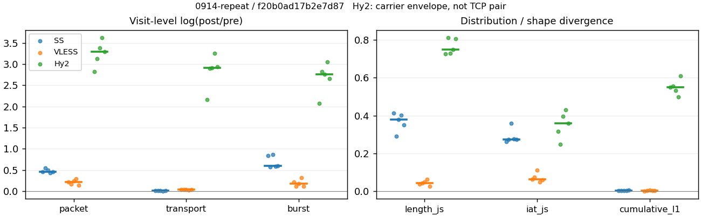
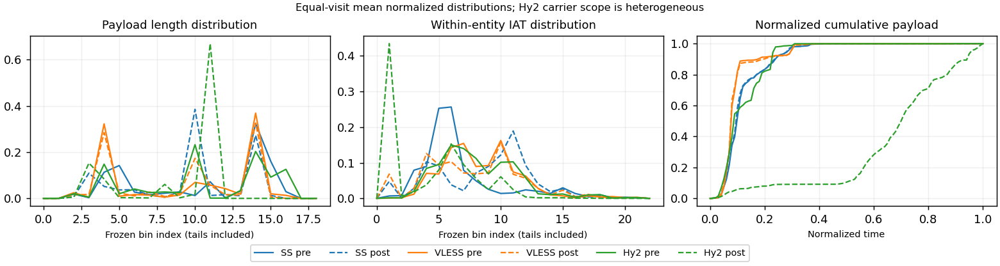

# 0914-repeat · 条目 017 · cloudflare.com

目标：https://www.cloudflare.com/

活动标签：cloudflare.com::page_load。选定访问 15 次。

[返回总索引](../../README.md) · [统计口径](../../methods.md)

## 覆盖与资格（每次访问均保留）

| 部署 | 重复 | 主请求路由 | 活动状态 | 代理比较 | DIRECT pre | 请求 proxy/direct/unresolved | 错误 |
| --- | --- | --- | --- | --- | --- | --- | --- |
| Hy2 | 1 | proxy | passed | 1 | 1 | 139/2/0 | [] |
| Hy2 | 2 | proxy | passed | 1 | 1 | 139/2/0 | [] |
| Hy2 | 3 | proxy | passed | 1 | 1 | 139/2/0 | [] |
| Hy2 | 4 | proxy | passed | 1 | 1 | 135/2/0 | [] |
| Hy2 | 5 | proxy | passed | 1 | 1 | 137/1/0 | [] |
| SS | 1 | proxy | passed | 1 | 0 | 137/0/0 | [] |
| SS | 2 | proxy | passed | 1 | 0 | 135/0/0 | [] |
| SS | 3 | proxy | passed | 1 | 0 | 135/0/0 | [] |
| SS | 4 | proxy | passed | 1 | 0 | 137/0/0 | [] |
| SS | 5 | proxy | passed | 1 | 0 | 135/0/0 | [] |
| VLESS | 1 | proxy | passed | 1 | 0 | 137/0/0 | [] |
| VLESS | 2 | proxy | passed | 1 | 0 | 135/0/0 | [] |
| VLESS | 3 | proxy | passed | 1 | 0 | 141/0/0 | [] |
| VLESS | 4 | proxy | passed | 1 | 0 | 141/0/0 | [] |
| VLESS | 5 | proxy | passed | 1 | 0 | 135/0/0 | [] |

主请求非 proxy 的统计仅解释为已索引的辅助代理连接或 DIRECT 观测，不代表目标业务经代理传输。播放确认与配对资格是两道不同的门。

图中散点为单次访问，短线为重复中位数；Hy2 是共享载体包络，不能与 TCP 配对作等范围因果对比。

形态图先逐访问归一化，再对访问等权平均；实线 pre，虚线 post。分箱序号及边界见 methods，不将分箱索引误解为长度或时间。

## 每次访问的关键观测

### SS

范围：`exclusive_page`。每格 pre → post；空值为不可观测/不适用。

| 重复 | 包数 | 载荷字节 | burst | TCP FR | IAT中位µs | length JS | IAT JS |
| --- | --- | --- | --- | --- | --- | --- | --- |
| 1 | 1551 → 2464 | 2.1401e+06 → 2.1717e+06 | 936 → 2164 | 85 → 95 | 29.771 → 1043.6 | 0.41338 | 0.2628 |
| 2 | 1874 → 3250 | 2.7391e+06 → 2.7578e+06 | 1247 → 2203 | 95 → 105 | 25 → 258.51 | 0.29094 | 0.27337 |
| 3 | 1496 → 2471 | 2.1239e+06 → 2.1492e+06 | 899 → 2134 | 78 → 82 | 22.966 → 1022.9 | 0.37979 | 0.35982 |
| 4 | 1789 → 2743 | 2.5546e+06 → 2.569e+06 | 1116 → 2006 | 75 → 81 | 21.014 → 366.24 | 0.40179 | 0.27565 |
| 5 | 2002 → 3178 | 2.5375e+06 → 2.5679e+06 | 1217 → 2209 | 78 → 78 | 26.126 → 157.3 | 0.35027 | 0.27204 |

完整标量统计：中位数 [min,max]；Δ 为重复内逐访问变换的中位数，MAD 未缩放。n 为可用变换数；DIRECT-only 的 nΔ=0 不代表 pre 不可用。

| scope | 特征 | pre | post | Δ | IQRΔ | MADΔ | nΔ |
| --- | --- | --- | --- | --- | --- | --- | --- |
| exclusive_page | active_span_sum_s_1000ms | 13.126 [8.7383, 16.859] | 14.041 [9.4046, 17.477] | 0.072997 | 0.0060833 | 0.0056055 | 5 |
| exclusive_page | active_span_sum_s_100ms | 4.1664 [3.6196, 5.2329] | 6.2799 [5.0248, 7.9804] | 0.42203 | 0.13465 | 0.11129 | 5 |
| exclusive_page | active_span_sum_s_500ms | 9.7485 [8.7383, 14.854] | 13.502 [9.4046, 16.017] | 0.09764 | 0.2323 | 0.024166 | 5 |
| exclusive_page | burst_bytes_iqr | 3287.5 [2896, 4096] | 1899.5 [1428, 2702] | -0.54854 | 0.29104 | 0.15852 | 5 |
| exclusive_page | burst_bytes_mad | 80 [64, 82] | 34 [34, 40] | -0.77111 | 0.099605 | 0.053269 | 5 |
| exclusive_page | burst_bytes_max | 23540 [20480, 23728] | 11424 [7140, 17136] | -0.72298 | 0.40269 | 0.28677 | 5 |
| exclusive_page | burst_bytes_mean | 2286.4 [2085.1, 2362.5] | 1162.5 [1003.5, 1280.7] | -0.58424 | 0.24267 | 0.021954 | 5 |
| exclusive_page | burst_bytes_median | 80 [64, 82] | 34 [34, 40] | -0.77111 | 0.099605 | 0.053269 | 5 |
| exclusive_page | burst_bytes_min | 0 [0, 0] | 0 [0, 0] | — | — | — | 0 |
| exclusive_page | burst_bytes_p95 | 10136 [8688, 11151] | 4324 [2856, 4774.8] | -0.83494 | 0.43549 | 0.23635 | 5 |
| exclusive_page | burst_bytes_q25 | 0 [0, 0] | 0 [0, 0] | — | — | — | 0 |
| exclusive_page | burst_bytes_q75 | 3287.5 [2896, 4096] | 1899.5 [1428, 2702] | -0.54854 | 0.29104 | 0.15852 | 5 |
| exclusive_page | burst_bytes_std | 4002.8 [3843.9, 4114.7] | 1787.2 [1205.7, 1918.4] | -0.80632 | 0.41493 | 0.11131 | 5 |
| exclusive_page | burst_count | 1116 [899, 1247] | 2164 [2006, 2209] | 0.59615 | 0.25171 | 0.027072 | 5 |
| exclusive_page | burst_duration_ms_iqr | 0.020781 [0, 0.03764] | 0.000103 [0, 0.0001965] | -5.0012 | 0.30588 | 0.30588 | 2 |
| exclusive_page | burst_duration_ms_mad | 0 [0, 0] | 0 [0, 0] | — | — | — | 0 |
| exclusive_page | burst_duration_ms_max | 15000 [13363, 15001] | 15408 [13547, 18419] | 0.1173 | 0.073225 | 0.069906 | 5 |
| exclusive_page | burst_duration_ms_mean | 34.441 [25.128, 55.692] | 19.353 [11.459, 22.206] | -0.57013 | 0.44651 | 0.30897 | 5 |
| exclusive_page | burst_duration_ms_median | 0 [0, 0] | 0 [0, 0] | — | — | — | 0 |
| exclusive_page | burst_duration_ms_min | 0 [0, 0] | 0 [0, 0] | — | — | — | 0 |
| exclusive_page | burst_duration_ms_p95 | 17.501 [7.5898, 31.541] | 0.93503 [0.64823, 0.99781] | -2.882 | 0.88876 | 0.70008 | 5 |
| exclusive_page | burst_duration_ms_q25 | 0 [0, 0] | 0 [0, 0] | — | — | — | 0 |
| exclusive_page | burst_duration_ms_q75 | 0.020781 [0, 0.03764] | 0.000103 [0, 0.0001965] | -5.0012 | 0.30588 | 0.30588 | 2 |
| exclusive_page | burst_duration_ms_std | 493.78 [394.66, 669.99] | 434.01 [297.89, 508.05] | 0.025588 | 0.44775 | 0.06944 | 5 |
| exclusive_page | burst_packets_iqr | 1 [0, 1] | 1 [0, 1] | 0 | 0 | 0 | 2 |
| exclusive_page | burst_packets_mad | 0 [0, 0] | 0 [0, 0] | — | — | — | 0 |
| exclusive_page | burst_packets_max | 12 [10, 13] | 10 [6, 11] | -0.18232 | 0.26236 | 0.18232 | 5 |
| exclusive_page | burst_packets_mean | 1.645 [1.5028, 1.6641] | 1.3674 [1.1386, 1.4753] | -0.159 | 0.2286 | 0.1405 | 5 |
| exclusive_page | burst_packets_median | 1 [1, 1] | 1 [1, 1] | 0 | 0 | 0 | 5 |
| exclusive_page | burst_packets_min | 1 [1, 1] | 1 [1, 1] | 0 | 0 | 0 | 5 |
| exclusive_page | burst_packets_p95 | 4 [4, 5] | 3 [2, 3] | -0.51083 | 0.40547 | 0.18232 | 5 |
| exclusive_page | burst_packets_q25 | 1 [1, 1] | 1 [1, 1] | 0 | 0 | 0 | 5 |
| exclusive_page | burst_packets_q75 | 2 [1, 2] | 2 [1, 2] | 0 | 0.69315 | 0.69315 | 5 |
| exclusive_page | burst_packets_std | 1.3698 [1.2612, 1.6013] | 0.72287 [0.55772, 0.90377] | -0.64891 | 0.14822 | 0.14152 | 5 |
| exclusive_page | connection_span_concurrency_max | 4 [4, 5] | 4 [4, 5] | 0 | 0 | 0 | 5 |
| exclusive_page | cumulative_l1 | — | — | 0.0036015 | 0.00095021 | 0.00085055 | 5 |
| exclusive_page | cumulative_max | — | — | 0.07468 | 0.11176 | 0.04153 | 5 |
| exclusive_page | direction_entropy | 0.64261 [0.49994, 0.68897] | 0.36316 [0.30349, 0.46801] | -0.22097 | 0.048103 | 0.024521 | 5 |
| exclusive_page | down_burst_count | 555 [447, 619] | 1078 [1000, 1101] | 0.59875 | 0.25419 | 0.026516 | 5 |
| exclusive_page | down_ip_bytes | 2.575e+06 [2.1401e+06, 2.753e+06] | 2.6199e+06 [2.1752e+06, 2.8068e+06] | 0.016272 | 0.0036287 | 0.0030729 | 5 |
| exclusive_page | down_packets | 1140 [953, 1303] | 1616 [1249, 1947] | 0.34805 | 0.055154 | 0.048372 | 5 |
| exclusive_page | down_transport_bytes | 2.5072e+06 [2.0905e+06, 2.6937e+06] | 2.5327e+06 [2.1079e+06, 2.7055e+06] | 0.0082932 | 0.0047215 | 0.0018388 | 5 |
| exclusive_page | duration_s | 25.71 [22.214, 27.11] | 25.707 [22.212, 27.108] | -8.2783e-05 | 9.1229e-06 | 6.5347e-06 | 5 |
| exclusive_page | entity_count | 7 [5, 9] | 7 [5, 9] | 0 | 0 | 0 | 5 |
| exclusive_page | fr_runs | 78 [75, 95] | 82 [78, 105] | 0.076961 | 0.050073 | 0.026951 | 5 |
| exclusive_page | fr_runs_per_packet | 0.079836 [0.059587, 0.085513] | 0.053084 [0.041357, 0.073988] | -0.017903 | 0.0024101 | 0.0020827 | 5 |
| exclusive_page | fr_switches | 73 [69, 86] | 77 [71, 96] | 0.083382 | 0.056655 | 0.030036 | 5 |
| exclusive_page | fr_switches_per_possible_transition | 0.074978 [0.054531, 0.078093] | 0.048756 [0.037786, 0.068182] | -0.016725 | 0.0023374 | 0.0023173 | 5 |
| exclusive_page | full_retransmission_fraction | 0.002997 [0.002579, 0.0055897] | 0.0040469 [0.00094399, 0.0056818] | -0.0012149 | 0.0029546 | 0.00083807 | 5 |
| exclusive_page | full_retransmission_packets | 6 [4, 10] | 10 [3, 14] | 0.18232 | 0.91629 | 0.73397 | 5 |
| exclusive_page | iat_count | 1783 [1491, 1995] | 2737 [2456, 3241] | 0.46481 | 0.039747 | 0.03624 | 5 |
| exclusive_page | iat_js | — | — | 0.27337 | 0.0036137 | 0.0022789 | 5 |
| exclusive_page | iat_ks | — | — | 0.45462 | 0.083758 | 0.060006 | 5 |
| exclusive_page | iat_median_us | 25 [21.014, 29.771] | 366.24 [157.3, 1043.6] | 2.8581 | 1.2208 | 0.69881 | 5 |
| exclusive_page | iat_us_iqr | 60.516 [50.813, 115.53] | 1010.1 [869.2, 3290.2] | 2.9862 | 0.17082 | 0.16797 | 5 |
| exclusive_page | iat_us_mad | 16.807 [14.634, 20.421] | 358.98 [155.3, 1028.7] | 3.1999 | 1.1705 | 0.64559 | 5 |
| exclusive_page | iat_us_max | 1.5001e+07 [1.4695e+07, 1.5001e+07] | 1.5026e+07 [1.4695e+07, 1.5057e+07] | 0.0017015 | 0.0021594 | 0.0010903 | 5 |
| exclusive_page | iat_us_mean | 35448 [29420, 41229] | 22298 [16926, 26424] | -0.46497 | 0.039676 | 0.036282 | 5 |
| exclusive_page | iat_us_median | 25 [21.014, 29.771] | 366.24 [157.3, 1043.6] | 2.8581 | 1.2208 | 0.69881 | 5 |
| exclusive_page | iat_us_min | 0.09 [0.02, 0.431] | 0.037 [0.035, 0.045] | -0.69315 | 0.40827 | 0.27065 | 5 |
| exclusive_page | iat_us_p95 | 40562 [13047, 41250] | 17413 [6422.7, 23646] | -0.6677 | 0.070407 | 0.041017 | 5 |
| exclusive_page | iat_us_q25 | 12.326 [11.966, 13.593] | 13.587 [8.064, 159.94] | 0.12704 | 0.88758 | 0.55418 | 5 |
| exclusive_page | iat_us_q75 | 72.523 [62.779, 129.13] | 1021 [877.26, 3320.3] | 2.7881 | 0.29204 | 0.14858 | 5 |
| exclusive_page | iat_us_std | 5.2279e+05 [4.7641e+05, 6.3259e+05] | 4.1195e+05 [3.5982e+05, 5.0776e+05] | -0.23828 | 0.020314 | 0.015676 | 5 |
| exclusive_page | iat_wasserstein_log1p_us | — | — | 1.6147 | 0.69533 | 0.27593 | 5 |
| exclusive_page | idle_gap_count_1000ms | 9 [5, 11] | 9 [6, 11] | 0 | 0 | 0 | 5 |
| exclusive_page | idle_gap_count_100ms | 38 [27, 54] | 37 [29, 45] | -0.05557 | 0.17411 | 0.12675 | 5 |
| exclusive_page | idle_gap_count_500ms | 12 [8, 15] | 11 [8, 14] | 0 | 0.31015 | 0.09531 | 5 |
| exclusive_page | idle_gap_sum_s_1000ms | 49.788 [33.413, 61.98] | 48.897 [32.798, 61.302] | -0.018064 | 0.0028439 | 0.002337 | 5 |
| exclusive_page | idle_gap_sum_s_100ms | 57.307 [45.039, 68.711] | 55.259 [42.283, 66.042] | -0.03962 | 0.026758 | 0.021305 | 5 |
| exclusive_page | idle_gap_sum_s_500ms | 51.724 [38.64, 62.951] | 50.718 [34.441, 61.302] | -0.029786 | 0.048241 | 0.018775 | 5 |
| exclusive_page | ip_bytes | 2.6418e+06 [2.2018e+06, 2.8368e+06] | 2.7382e+06 [2.3053e+06, 2.9544e+06] | 0.044388 | 0.0043187 | 0.0015313 | 5 |
| exclusive_page | length_iqr | 2706.5 [2513, 2856] | 1440 [1428, 2371.5] | -0.59627 | 0.065811 | 0.034744 | 5 |
| exclusive_page | length_js | — | — | 0.37979 | 0.051522 | 0.029519 | 5 |
| exclusive_page | length_ks | — | — | 0.46031 | 0.039415 | 0.020756 | 5 |
| exclusive_page | length_mad | 1448 [1189, 1628] | 999 [54, 1260] | -0.33389 | 0.092946 | 0.079196 | 5 |
| exclusive_page | length_max | 8920 [4155, 8920] | 7140 [2856, 7140] | -0.22258 | 1.3481 | 0.76398 | 5 |
| exclusive_page | length_mean | 2173.9 [1938.5, 2369.5] | 1570.3 [1361.6, 1691.3] | -0.34861 | 0.0612 | 0.056529 | 5 |
| exclusive_page | length_median | 2468 [1482, 2896] | 1428 [1428, 1428] | -0.54713 | 0.34692 | 0.15992 | 5 |
| exclusive_page | length_min | 31 [31, 31] | 12 [10, 13] | -0.94908 | 0.26236 | 0.080043 | 5 |
| exclusive_page | length_p95 | 5864.8 [4096, 8192] | 2856 [2856, 2856] | -0.71955 | 0.39373 | 0.30017 | 5 |
| exclusive_page | length_q25 | 248 [212, 383] | 1416 [135.25, 1428] | 1.316 | 1.239 | 0.43461 | 5 |
| exclusive_page | length_q75 | 2935 [2896, 3104] | 2856 [1746, 2856] | -0.08327 | 0.075351 | 0.061074 | 5 |
| exclusive_page | length_std | 1892.1 [1488.5, 2191.3] | 1087 [915.98, 1205.9] | -0.67367 | 0.33548 | 0.097295 | 5 |
| exclusive_page | length_wasserstein_bytes | — | — | 862.35 | 136.44 | 76.249 | 5 |
| exclusive_page | nonempty_entity_count | 7 [5, 9] | 7 [5, 9] | 0 | 0 | 0 | 5 |
| exclusive_page | nonempty_packets | 1148 [977, 1309] | 1636 [1284, 1978] | 0.35423 | 0.061269 | 0.050307 | 5 |
| exclusive_page | offload_suspect_fraction | 0.34312 [0.32108, 0.37283] | 0.17967 [0.16512, 0.19034] | -0.17265 | 0.026838 | 0.017168 | 5 |
| exclusive_page | packet_count | 1789 [1496, 2002] | 2743 [2464, 3250] | 0.46289 | 0.039723 | 0.035491 | 5 |
| exclusive_page | rtt_median_ms | 0.043909 [0.024766, 0.069956] | 33.718 [31.99, 37.106] | 6.6405 | 0.23323 | 0.1935 | 5 |
| exclusive_page | rtt_sample_count | 627 [515, 703] | 281 [258, 374] | -0.73825 | 0.16423 | 0.099881 | 5 |
| exclusive_page | tcp_ack_count | 1783 [1491, 1995] | 2736 [2454, 3238] | 0.46399 | 0.038846 | 0.035791 | 5 |
| exclusive_page | tcp_fin_count | 14 [10, 18] | 14 [10, 19] | 0 | 0 | 0 | 5 |
| exclusive_page | tcp_packet_count | 1789 [1496, 2002] | 2743 [2464, 3250] | 0.46289 | 0.039723 | 0.035491 | 5 |
| exclusive_page | tcp_rst_count | 0 [0, 0] | 0 [0, 1] | — | — | — | 0 |
| exclusive_page | tcp_syn_count | 14 [10, 18] | 15 [12, 22] | 0.11778 | 0.10228 | 0.04879 | 5 |
| exclusive_page | tcp_window_raw_median | 65535 [65535, 65535] | 152 [150, 155] | -6.0665 | 0.0065574 | 0.0065574 | 5 |
| exclusive_page | transition_entropy | 0.3381 [0.2576, 0.35654] | 0.21837 [0.17712, 0.29309] | -0.080484 | 0.014052 | 0.0077605 | 5 |
| exclusive_page | transition_n_mm | 920 [770, 1127] | 1493 [1110, 1789] | 0.43022 | 0.019875 | 0.012323 | 5 |
| exclusive_page | transition_n_mp | 35 [32, 39] | 37 [33, 44] | 0.089612 | 0.065058 | 0.034042 | 5 |
| exclusive_page | transition_n_pm | 38 [37, 47] | 40 [38, 52] | 0.077962 | 0.049803 | 0.026668 | 5 |
| exclusive_page | transition_n_pp | 126 [102, 141] | 68 [62, 84] | -0.51794 | 0.04777 | 0.020105 | 5 |
| exclusive_page | transition_p_mm | 0.95933 [0.95533, 0.97155] | 0.976 [0.96438, 0.98145] | 0.0098985 | 0.0037198 | 0.0009 | 5 |
| exclusive_page | transition_p_mp | 0.040667 [0.028448, 0.044665] | 0.024004 [0.01855, 0.035621] | -0.0098985 | 0.0037198 | 0.0009 | 5 |
| exclusive_page | transition_p_pm | 0.25 [0.22778, 0.26761] | 0.38 [0.368, 0.39216] | 0.13235 | 0.012693 | 0.0063831 | 5 |
| exclusive_page | transition_p_pp | 0.75 [0.73239, 0.77222] | 0.62 [0.60784, 0.632] | -0.13235 | 0.012693 | 0.0063831 | 5 |
| exclusive_page | transport_bytes | 2.5375e+06 [2.1239e+06, 2.7391e+06] | 2.5679e+06 [2.1492e+06, 2.7578e+06] | 0.011842 | 0.0051173 | 0.0028117 | 5 |
| exclusive_page | up_burst_count | 561 [452, 628] | 1086 [1006, 1108] | 0.59358 | 0.24926 | 0.027615 | 5 |
| exclusive_page | up_byte_fraction | 0.015731 [0.010796, 0.020526] | 0.018974 [0.013192, 0.02596] | 0.0023953 | 0.001105 | 0.00064021 | 5 |
| exclusive_page | up_ip_bytes | 66784 [61445, 83772] | 1.3378e+05 [1.1833e+05, 1.4758e+05] | 0.6553 | 0.054718 | 0.039447 | 5 |
| exclusive_page | up_packets | 648 [543, 734] | 1215 [1127, 1320] | 0.63574 | 0.15526 | 0.082312 | 5 |
| exclusive_page | up_transport_bytes | 33411 [27581, 45448] | 41302 [33890, 56377] | 0.20599 | 0.063017 | 0.043539 | 5 |
| exclusive_page | zero_iat_count | 0 [0, 0] | 0 [0, 0] | — | — | — | 0 |
| exclusive_page | zero_iat_fraction | 0 [0, 0] | 0 [0, 0] | 0 | 0 | 0 | 5 |

### VLESS

范围：`exclusive_page`。每格 pre → post；空值为不可观测/不适用。

| 重复 | 包数 | 载荷字节 | burst | TCP FR | IAT中位µs | length JS | IAT JS |
| --- | --- | --- | --- | --- | --- | --- | --- |
| 1 | 1468 → 1821 | 1.3825e+06 → 1.4316e+06 | 986 → 1222 | 58 → 72 | 161.16 → 105.03 | 0.038107 | 0.061849 |
| 2 | 1413 → 1667 | 1.2122e+06 → 1.2535e+06 | 1135 → 1280 | 54 → 70 | 125.78 → 77.578 | 0.04351 | 0.073264 |
| 3 | 1320 → 1690 | 1.2435e+06 → 1.2943e+06 | 975 → 1160 | 68 → 82 | 244.74 → 94.633 | 0.047591 | 0.11027 |
| 4 | 1638 → 2198 | 1.889e+06 → 1.9454e+06 | 1110 → 1520 | 92 → 116 | 120.44 → 257.96 | 0.062819 | 0.049596 |
| 5 | 1438 → 1656 | 1.2195e+06 → 1.2607e+06 | 1143 → 1279 | 48 → 58 | 108.44 → 83.918 | 0.025593 | 0.059971 |

完整标量统计：中位数 [min,max]；Δ 为重复内逐访问变换的中位数，MAD 未缩放。n 为可用变换数；DIRECT-only 的 nΔ=0 不代表 pre 不可用。

| scope | 特征 | pre | post | Δ | IQRΔ | MADΔ | nΔ |
| --- | --- | --- | --- | --- | --- | --- | --- |
| exclusive_page | active_span_sum_s_1000ms | 9.8932 [8.4628, 11.732] | 9.737 [8.454, 14.484] | -0.0010377 | 0.02515 | 0.01488 | 5 |
| exclusive_page | active_span_sum_s_100ms | 1.5075 [1.3521, 2.3827] | 3.7829 [2.9413, 5.3435] | 0.77724 | 0.091228 | 0.060833 | 5 |
| exclusive_page | active_span_sum_s_500ms | 4.4182 [3.6119, 7.6055] | 8.9267 [6.7765, 12.868] | 0.58306 | 0.10331 | 0.05715 | 5 |
| exclusive_page | burst_bytes_iqr | 2857.5 [2824, 2896] | 2824 [2824, 2824] | -0.011793 | 0.025176 | 0.011793 | 5 |
| exclusive_page | burst_bytes_mad | 31 [31, 35.5] | 72 [57, 72] | 0.84268 | 0.13555 | 0 | 5 |
| exclusive_page | burst_bytes_max | 20480 [14480, 20824] | 11512 [7240, 14120] | -0.59272 | 0.22445 | 0.12402 | 5 |
| exclusive_page | burst_bytes_mean | 1275.4 [1067, 1701.8] | 1115.8 [979.26, 1279.8] | -0.1337 | 0.092978 | 0.046949 | 5 |
| exclusive_page | burst_bytes_median | 31 [31, 35.5] | 72 [57, 72] | 0.84268 | 0.13555 | 0 | 5 |
| exclusive_page | burst_bytes_min | 0 [0, 0] | 0 [0, 0] | — | — | — | 0 |
| exclusive_page | burst_bytes_p95 | 4344 [2896, 8192] | 2896 [2896, 4236] | -0.40547 | 0.65091 | 0.25407 | 5 |
| exclusive_page | burst_bytes_q25 | 0 [0, 0] | 0 [0, 0] | — | — | — | 0 |
| exclusive_page | burst_bytes_q75 | 2857.5 [2824, 2896] | 2824 [2824, 2824] | -0.011793 | 0.025176 | 0.011793 | 5 |
| exclusive_page | burst_bytes_std | 2140.2 [1619, 3073.5] | 1392.7 [1290.5, 1733.2] | -0.42965 | 0.22311 | 0.11962 | 5 |
| exclusive_page | burst_count | 1110 [975, 1143] | 1279 [1160, 1520] | 0.17374 | 0.09436 | 0.05351 | 5 |
| exclusive_page | burst_duration_ms_iqr | 0.18307 [0, 0.4977] | 0.000191 [0, 0.096982] | -1.9587 | 2.615 | 0.32319 | 3 |
| exclusive_page | burst_duration_ms_mad | 0 [0, 0] | 0 [0, 0] | — | — | — | 0 |
| exclusive_page | burst_duration_ms_max | 15001 [14522, 15001] | 15024 [1094.9, 15046] | 0.0015186 | 0.0026899 | 0.0014909 | 5 |
| exclusive_page | burst_duration_ms_mean | 29.013 [26.463, 87.469] | 16.906 [6.717, 19.919] | -0.54008 | 1.1901 | 0.25599 | 5 |
| exclusive_page | burst_duration_ms_median | 0 [0, 0] | 0 [0, 0] | — | — | — | 0 |
| exclusive_page | burst_duration_ms_min | 0 [0, 0] | 0 [0, 0] | — | — | — | 0 |
| exclusive_page | burst_duration_ms_p95 | 5.3606 [2.9712, 8.6545] | 6.1136 [4.0929, 9.0102] | 0.11185 | 0.4055 | 0.31291 | 5 |
| exclusive_page | burst_duration_ms_q25 | 0 [0, 0] | 0 [0, 0] | — | — | — | 0 |
| exclusive_page | burst_duration_ms_q75 | 0.18307 [0, 0.4977] | 0.000191 [0, 0.096982] | -1.9587 | 2.615 | 0.32319 | 3 |
| exclusive_page | burst_duration_ms_std | 493.05 [469.46, 945.28] | 419.97 [50.444, 423.19] | -0.15343 | 0.74395 | 0.042031 | 5 |
| exclusive_page | burst_packets_iqr | 1 [0, 1] | 1 [0, 1] | 0 | 0 | 0 | 3 |
| exclusive_page | burst_packets_mad | 0 [0, 0] | 0 [0, 0] | — | — | — | 0 |
| exclusive_page | burst_packets_max | 9 [8, 12] | 9 [7, 12] | -0.10536 | 0.23889 | 0.18232 | 5 |
| exclusive_page | burst_packets_mean | 1.3538 [1.2449, 1.4888] | 1.4461 [1.2948, 1.4902] | 0.02873 | 0.044186 | 0.027833 | 5 |
| exclusive_page | burst_packets_median | 1 [1, 1] | 1 [1, 1] | 0 | 0 | 0 | 5 |
| exclusive_page | burst_packets_min | 1 [1, 1] | 1 [1, 1] | 0 | 0 | 0 | 5 |
| exclusive_page | burst_packets_p95 | 2 [2, 3] | 3 [3, 3] | 0.40547 | 0.40547 | 0 | 5 |
| exclusive_page | burst_packets_q25 | 1 [1, 1] | 1 [1, 1] | 0 | 0 | 0 | 5 |
| exclusive_page | burst_packets_q75 | 2 [1, 2] | 2 [1, 2] | 0 | 0 | 0 | 5 |
| exclusive_page | burst_packets_std | 0.75808 [0.5921, 0.88277] | 0.86814 [0.68579, 0.90162] | 0.024327 | 0.12577 | 0.072226 | 5 |
| exclusive_page | connection_span_concurrency_max | 4 [3, 6] | 4 [3, 6] | 0 | 0 | 0 | 5 |
| exclusive_page | cumulative_l1 | — | — | 0.0036738 | 0.001333 | 0.00082673 | 5 |
| exclusive_page | cumulative_max | — | — | 0.067216 | 0.037761 | 0.025277 | 5 |
| exclusive_page | direction_entropy | 0.51435 [0.45805, 0.62708] | 0.39411 [0.36947, 0.44402] | -0.09818 | 0.031662 | 0.010217 | 5 |
| exclusive_page | down_burst_count | 551 [484, 569] | 637 [577, 756] | 0.17576 | 0.094257 | 0.054245 | 5 |
| exclusive_page | down_ip_bytes | 1.2596e+06 [1.2355e+06, 1.9068e+06] | 1.3033e+06 [1.2706e+06, 1.9606e+06] | 0.028009 | 0.0024009 | 0.00067998 | 5 |
| exclusive_page | down_packets | 825 [784, 1001] | 944 [903, 1300] | 0.14223 | 0.067103 | 0.04349 | 5 |
| exclusive_page | down_transport_bytes | 1.2188e+06 [1.1937e+06, 1.8547e+06] | 1.2542e+06 [1.2236e+06, 1.8929e+06] | 0.024793 | 0.0013512 | 0.0012591 | 5 |
| exclusive_page | duration_s | 26.581 [19.545, 30.513] | 26.538 [19.508, 30.472] | -0.0013496 | 0.00032349 | 0.0002365 | 5 |
| exclusive_page | entity_count | 6 [5, 8] | 6 [5, 8] | 0 | 0 | 0 | 5 |
| exclusive_page | fr_runs | 58 [48, 92] | 72 [58, 116] | 0.21622 | 0.04256 | 0.026981 | 5 |
| exclusive_page | fr_runs_per_packet | 0.067754 [0.05868, 0.092] | 0.077778 [0.064302, 0.089645] | 0.0054079 | 0.0058362 | 0.0046158 | 5 |
| exclusive_page | fr_switches | 52 [43, 84] | 66 [53, 108] | 0.23841 | 0.042223 | 0.029319 | 5 |
| exclusive_page | fr_switches_per_possible_transition | 0.061869 [0.052891, 0.084677] | 0.072626 [0.059086, 0.083981] | 0.0061953 | 0.0049723 | 0.0045617 | 5 |
| exclusive_page | full_retransmission_fraction | 0.00069541 [0, 0.001221] | 0 [0, 0] | -0.00069541 | 7.6377e-05 | 6.2165e-05 | 5 |
| exclusive_page | full_retransmission_packets | 1 [0, 2] | 0 [0, 0] | — | — | — | 0 |
| exclusive_page | iat_count | 1433 [1313, 1630] | 1683 [1651, 2190] | 0.21628 | 0.082412 | 0.050429 | 5 |
| exclusive_page | iat_js | — | — | 0.061849 | 0.013293 | 0.011415 | 5 |
| exclusive_page | iat_ks | — | — | 0.17429 | 0.041282 | 0.037648 | 5 |
| exclusive_page | iat_median_us | 125.78 [108.44, 244.74] | 94.633 [77.578, 257.96] | -0.42811 | 0.22686 | 0.17174 | 5 |
| exclusive_page | iat_us_iqr | 722.58 [704.44, 1035.6] | 785.67 [755.48, 1064.3] | 0.051141 | 0.056408 | 0.032561 | 5 |
| exclusive_page | iat_us_mad | 117.2 [93.752, 230.34] | 94.572 [74.303, 252.46] | -0.40508 | 0.28164 | 0.23102 | 5 |
| exclusive_page | iat_us_max | 1.5001e+07 [1.4522e+07, 1.5001e+07] | 1.5042e+07 [1.4522e+07, 1.5052e+07] | 0.0027107 | 0.00087956 | 0.00058083 | 5 |
| exclusive_page | iat_us_mean | 35026 [19000, 88662] | 29724 [15187, 65759] | -0.22398 | 0.085875 | 0.056802 | 5 |
| exclusive_page | iat_us_median | 125.78 [108.44, 244.74] | 94.633 [77.578, 257.96] | -0.42811 | 0.22686 | 0.17174 | 5 |
| exclusive_page | iat_us_min | 0.707 [0.055, 1.678] | 0.035 [0.032, 0.037] | -3.0953 | 1.8733 | 0.71915 | 5 |
| exclusive_page | iat_us_p95 | 8901.1 [5538, 10098] | 13063 [9838.1, 38505] | 0.60591 | 1.0137 | 0.28995 | 5 |
| exclusive_page | iat_us_q25 | 42.813 [27.225, 45.274] | 14.191 [8.499, 16.615] | -1.1155 | 0.43478 | 0.35555 | 5 |
| exclusive_page | iat_us_q75 | 765.4 [744.44, 1062.9] | 795.5 [763.98, 1080.9] | 0.016836 | 0.037414 | 0.021743 | 5 |
| exclusive_page | iat_us_std | 5.9614e+05 [3.8575e+05, 1.01e+06] | 5.4935e+05 [3.4477e+05, 8.7053e+05] | -0.11231 | 0.04001 | 0.027387 | 5 |
| exclusive_page | iat_wasserstein_log1p_us | — | — | 0.64697 | 0.15323 | 0.13317 | 5 |
| exclusive_page | idle_gap_count_1000ms | 5 [3, 14] | 5 [3, 12] | 0 | 0 | 0 | 5 |
| exclusive_page | idle_gap_count_100ms | 29 [23, 46] | 34 [28, 53] | 0.15906 | 0.018634 | 0.010645 | 5 |
| exclusive_page | idle_gap_count_500ms | 12 [11, 20] | 7 [5, 14] | -0.539 | 0.04652 | 0.04652 | 5 |
| exclusive_page | idle_gap_sum_s_1000ms | 40.747 [16.881, 132.79] | 40.62 [16.882, 129.53] | -0.0034428 | 0.00081292 | 0.00069363 | 5 |
| exclusive_page | idle_gap_sum_s_100ms | 47.965 [25.766, 142.14] | 46.31 [23.686, 138.67] | -0.034662 | 0.0043824 | 0.0039382 | 5 |
| exclusive_page | idle_gap_sum_s_500ms | 45.582 [22.192, 136.91] | 42.297 [18.383, 131.14] | -0.07402 | 0.016073 | 0.015293 | 5 |
| exclusive_page | ip_bytes | 1.3121e+06 [1.2856e+06, 1.9741e+06] | 1.3834e+06 [1.3411e+06, 2.0648e+06] | 0.044911 | 0.0037127 | 0.0026975 | 5 |
| exclusive_page | length_iqr | 2752 [2744, 2752] | 2752 [2752, 2752] | 0 | 0.0018185 | 0 | 5 |
| exclusive_page | length_js | — | — | 0.04351 | 0.0094844 | 0.0054028 | 5 |
| exclusive_page | length_ks | — | — | 0.10067 | 0.02241 | 0.016736 | 5 |
| exclusive_page | length_mad | 1376 [1340, 1376] | 1340 [1340, 1340] | -0.026511 | 0 | 0 | 5 |
| exclusive_page | length_max | 8688 [7240, 8920] | 7060 [4344, 8472] | -0.23385 | 0.69315 | 0.23385 | 5 |
| exclusive_page | length_mean | 1520.9 [1490.9, 1889] | 1392.7 [1356.9, 1503.4] | -0.098809 | 0.061543 | 0.034292 | 5 |
| exclusive_page | length_median | 1448 [1412, 1448] | 1412 [1412, 1412] | -0.025176 | 0 | 0 | 5 |
| exclusive_page | length_min | 24 [2, 24] | 14 [2, 24] | 0 | 0.539 | 0 | 5 |
| exclusive_page | length_p95 | 2896 [2896, 8210] | 2896 [2824, 2896] | 0 | 0 | 0 | 5 |
| exclusive_page | length_q25 | 72 [72, 80] | 72 [72, 72] | 0 | 0.067139 | 0 | 5 |
| exclusive_page | length_q75 | 2824 [2824, 2824] | 2824 [2824, 2824] | 0 | 0 | 0 | 5 |
| exclusive_page | length_std | 1378.9 [1298.2, 2196.7] | 1166.6 [1151.6, 1197.6] | -0.17276 | 0.078306 | 0.059014 | 5 |
| exclusive_page | length_wasserstein_bytes | — | — | 186.25 | 99.128 | 53.341 | 5 |
| exclusive_page | nonempty_entity_count | 6 [5, 8] | 6 [5, 8] | 0 | 0 | 0 | 5 |
| exclusive_page | nonempty_packets | 818 [771, 1000] | 932 [900, 1294] | 0.13367 | 0.068104 | 0.035915 | 5 |
| exclusive_page | offload_suspect_fraction | 0.27228 [0.25939, 0.28678] | 0.20592 [0.18402, 0.22338] | -0.072386 | 0.027384 | 0.01859 | 5 |
| exclusive_page | packet_count | 1438 [1320, 1638] | 1690 [1656, 2198] | 0.21548 | 0.081786 | 0.050174 | 5 |
| exclusive_page | rtt_median_ms | 0.12453 [0.057637, 0.21207] | 0.041904 [0.029589, 0.48553] | -0.37587 | 0.534 | 0.32071 | 5 |
| exclusive_page | rtt_sample_count | 598 [517, 605] | 714 [698, 728] | 0.19671 | 0.12482 | 0.04516 | 5 |
| exclusive_page | tcp_ack_count | 1423 [1299, 1614] | 1682 [1651, 2190] | 0.22383 | 0.086012 | 0.051455 | 5 |
| exclusive_page | tcp_fin_count | 11 [10, 16] | 12 [10, 16] | 0 | 0 | 0 | 5 |
| exclusive_page | tcp_packet_count | 1438 [1320, 1638] | 1690 [1656, 2198] | 0.21548 | 0.081786 | 0.050174 | 5 |
| exclusive_page | tcp_rst_count | 11 [10, 16] | 0 [0, 1] | -2.4708 | 0.16824 | 0.16824 | 2 |
| exclusive_page | tcp_syn_count | 12 [10, 16] | 12 [10, 16] | 0 | 0 | 0 | 5 |
| exclusive_page | tcp_window_raw_median | 65535 [65535, 65535] | 234 [194, 245] | -5.635 | 0.056414 | 0.043675 | 5 |
| exclusive_page | transition_entropy | 0.27126 [0.24256, 0.36284] | 0.28152 [0.24585, 0.32119] | -0.0012109 | 0.019877 | 0.011469 | 5 |
| exclusive_page | transition_n_mm | 715 [641, 797] | 809 [799, 1121] | 0.17319 | 0.082592 | 0.049669 | 5 |
| exclusive_page | transition_n_mp | 23 [19, 38] | 30 [24, 50] | 0.2657 | 0.040822 | 0.032088 | 5 |
| exclusive_page | transition_n_pm | 29 [24, 46] | 36 [29, 58] | 0.21622 | 0.04256 | 0.026981 | 5 |
| exclusive_page | transition_n_pp | 62 [52, 111] | 45 [31, 57] | -0.51516 | 0.065271 | 0.063179 | 5 |
| exclusive_page | transition_p_mm | 0.96914 [0.95449, 0.97411] | 0.96381 [0.9573, 0.97119] | -0.0026637 | 0.0028207 | 0.0025585 | 5 |
| exclusive_page | transition_p_mp | 0.030856 [0.025886, 0.045509] | 0.036188 [0.028812, 0.042699] | 0.0026637 | 0.0028207 | 0.0025585 | 5 |
| exclusive_page | transition_p_pm | 0.3038 [0.27358, 0.35417] | 0.47674 [0.43902, 0.5303] | 0.16544 | 0.039203 | 0.023091 | 5 |
| exclusive_page | transition_p_pp | 0.6962 [0.64583, 0.72642] | 0.52326 [0.4697, 0.56098] | -0.16544 | 0.039203 | 0.023091 | 5 |
| exclusive_page | transport_bytes | 1.2435e+06 [1.2122e+06, 1.889e+06] | 1.2943e+06 [1.2535e+06, 1.9454e+06] | 0.033475 | 0.0016231 | 0.0013827 | 5 |
| exclusive_page | up_burst_count | 559 [491, 574] | 642 [583, 764] | 0.17174 | 0.094467 | 0.052791 | 5 |
| exclusive_page | up_byte_fraction | 0.01815 [0.015113, 0.02141] | 0.02696 [0.023392, 0.030988] | 0.0086029 | 0.00023067 | 0.00020729 | 5 |
| exclusive_page | up_ip_bytes | 52498 [50159, 67304] | 80025 [69112, 1.0417e+05] | 0.36405 | 0.081163 | 0.045109 | 5 |
| exclusive_page | up_packets | 611 [536, 637] | 764 [746, 898] | 0.32633 | 0.10712 | 0.017073 | 5 |
| exclusive_page | up_transport_bytes | 24726 [18431, 34284] | 40109 [29492, 52447] | 0.47009 | 0.056046 | 0.01366 | 5 |
| exclusive_page | zero_iat_count | 0 [0, 0] | 0 [0, 0] | — | — | — | 0 |
| exclusive_page | zero_iat_fraction | 0 [0, 0] | 0 [0, 0] | 0 | 0 | 0 | 5 |

### Hy2

范围：`carrier_context_envelope`。每格 pre → post；空值为不可观测/不适用。

| 重复 | 包数 | 载荷字节 | burst | TCP FR | IAT中位µs | length JS | IAT JS |
| --- | --- | --- | --- | --- | --- | --- | --- |
| 1 | 1286 → 21543 | 2.6474e+06 → 2.3028e+07 | 962 → 7693 | — | 53.46 → 8.1955 | 0.72633 | 0.31698 |
| 2 | 2151 → 49000 | 2.6478e+06 → 4.8435e+07 | 1644 → 27687 | — | 151.95 → 83.848 | 0.81045 | 0.24809 |
| 3 | 1541 → 45709 | 2.6833e+06 → 4.9564e+07 | 973 → 15346 | — | 123.49 → 3.2885 | 0.72852 | 0.3952 |
| 4 | 1311 → 49049 | 2.0162e+06 → 5.2244e+07 | 837 → 17684 | — | 119.95 → 4.5535 | 0.74995 | 0.43108 |
| 5 | 1393 → 37771 | 2.2084e+06 → 4.1492e+07 | 877 → 12471 | — | 110.74 → 2.0915 | 0.80426 | 0.35784 |

范围：`direct_pre_only`。每格 pre → post；空值为不可观测/不适用。

| 重复 | 包数 | 载荷字节 | burst | TCP FR | IAT中位µs | length JS | IAT JS |
| --- | --- | --- | --- | --- | --- | --- | --- |
| 1 | 53 → — | 16904 → — | 38 → — | 14 → — | 140.87 → — | — | — |
| 2 | 53 → — | 17021 → — | 34 → — | 14 → — | 161.68 → — | — | — |
| 3 | 55 → — | 17052 → — | 36 → — | 14 → — | 167.97 → — | — | — |
| 4 | 116 → — | 1.8538e+05 → — | 93 → — | 7 → — | 96.774 → — | — | — |
| 5 | 25 → — | 8582 → — | 17 → — | 7 → — | 118.88 → — | — | — |

完整标量统计：中位数 [min,max]；Δ 为重复内逐访问变换的中位数，MAD 未缩放。n 为可用变换数；DIRECT-only 的 nΔ=0 不代表 pre 不可用。

| scope | 特征 | pre | post | Δ | IQRΔ | MADΔ | nΔ |
| --- | --- | --- | --- | --- | --- | --- | --- |
| carrier_context_envelope | active_span_sum_s_1000ms | 9.6575 [7.9296, 10.86] | 15.412 [13.345, 21.415] | 0.55556 | 0.34207 | 0.17791 | 5 |
| carrier_context_envelope | active_span_sum_s_100ms | 2.0487 [1.6397, 2.1906] | 7.1807 [6.3338, 18.021] | 1.3514 | 0.024836 | 0.022944 | 5 |
| carrier_context_envelope | active_span_sum_s_500ms | 8.8696 [6.849, 9.6575] | 12.538 [11.703, 21.415] | 0.48838 | 0.13478 | 0.11627 | 5 |
| carrier_context_envelope | burst_bytes_iqr | 2681.2 [2234, 2812] | 4255 [2843, 5726] | 0.46181 | 0.19012 | 0.13496 | 5 |
| carrier_context_envelope | burst_bytes_mad | 71 [64, 80] | 409 [334, 553] | 1.7405 | 0.20257 | 0.097784 | 5 |
| carrier_context_envelope | burst_bytes_max | 28523 [27406, 29400] | 1.3645e+05 [23312, 4.246e+05] | 1.5652 | 0.74854 | 0.39592 | 5 |
| carrier_context_envelope | burst_bytes_mean | 2518.1 [1610.6, 2757.8] | 2993.4 [1749.4, 3327.1] | 0.15799 | 0.12007 | 0.073915 | 5 |
| carrier_context_envelope | burst_bytes_median | 71 [64, 80] | 442 [367, 587] | 1.8103 | 0.18595 | 0.081551 | 5 |
| carrier_context_envelope | burst_bytes_min | 0 [0, 0] | 22 [22, 22] | — | — | — | 0 |
| carrier_context_envelope | burst_bytes_p95 | 15662 [5660, 20480] | 10932 [4323, 12373] | -0.35888 | 0.13835 | 0.089403 | 5 |
| carrier_context_envelope | burst_bytes_q25 | 0 [0, 0] | 68 [38, 100] | — | — | — | 0 |
| carrier_context_envelope | burst_bytes_q75 | 2681.2 [2234, 2812] | 4323 [2882, 5764] | 0.47767 | 0.17996 | 0.13235 | 5 |
| carrier_context_envelope | burst_bytes_std | 5062.8 [3385.9, 5458] | 4664.9 [1929.7, 7496.3] | -0.099401 | 0.17859 | 0.12098 | 5 |
| carrier_context_envelope | burst_count | 962 [837, 1644] | 15346 [7693, 27687] | 2.7582 | 0.16918 | 0.10357 | 5 |
| carrier_context_envelope | burst_duration_ms_iqr | 0.19595 [0, 0.41291] | 0.024851 [0.00042, 0.030701] | -2.2176 | 0.26697 | 0.15264 | 3 |
| carrier_context_envelope | burst_duration_ms_mad | 0 [0, 0] | 4.8e-05 [0, 9e-05] | — | — | — | 0 |
| carrier_context_envelope | burst_duration_ms_max | 14929 [3592, 15001] | 2643.4 [278.94, 4472.2] | -1.7262 | 0.46532 | 0.45547 | 5 |
| carrier_context_envelope | burst_duration_ms_mean | 34.92 [17.144, 41.743] | 0.59749 [0.25339, 1.0246] | -4.0681 | 0.65372 | 0.36111 | 5 |
| carrier_context_envelope | burst_duration_ms_median | 0 [0, 0] | 4.8e-05 [0, 9e-05] | — | — | — | 0 |
| carrier_context_envelope | burst_duration_ms_min | 0 [0, 0] | 0 [0, 0] | — | — | — | 0 |
| carrier_context_envelope | burst_duration_ms_p95 | 6.8601 [2.4372, 8.9999] | 0.19627 [0.078794, 1.0009] | -3.4759 | 2.0424 | 1.036 | 5 |
| carrier_context_envelope | burst_duration_ms_q25 | 0 [0, 0] | 0 [0, 0] | — | — | — | 0 |
| carrier_context_envelope | burst_duration_ms_q75 | 0.19595 [0, 0.41291] | 0.024851 [0.00042, 0.030701] | -2.2176 | 0.26697 | 0.15264 | 3 |
| carrier_context_envelope | burst_duration_ms_std | 530.81 [174.27, 669.8] | 30.294 [3.8724, 48.028] | -2.8635 | 0.66585 | 0.43758 | 5 |
| carrier_context_envelope | burst_packets_iqr | 1 [0, 1] | 3 [1, 3] | 1.0986 | 0 | 0 | 3 |
| carrier_context_envelope | burst_packets_mad | 0 [0, 0] | 1 [0, 1] | — | — | — | 0 |
| carrier_context_envelope | burst_packets_max | 9 [6, 14] | 98 [29, 305] | 2.7932 | 0.90148 | 0.72988 | 5 |
| carrier_context_envelope | burst_packets_mean | 1.5663 [1.3084, 1.5884] | 2.8003 [1.7698, 3.0287] | 0.63164 | 0.07399 | 0.060199 | 5 |
| carrier_context_envelope | burst_packets_median | 1 [1, 1] | 2 [1, 2] | 0.69315 | 0 | 0 | 5 |
| carrier_context_envelope | burst_packets_min | 1 [1, 1] | 1 [1, 1] | 0 | 0 | 0 | 5 |
| carrier_context_envelope | burst_packets_p95 | 3 [3, 4] | 8 [3, 9] | 0.98083 | 0.1699 | 0 | 5 |
| carrier_context_envelope | burst_packets_q25 | 1 [1, 1] | 1 [1, 1] | 0 | 0 | 0 | 5 |
| carrier_context_envelope | burst_packets_q75 | 2 [1, 2] | 4 [2, 4] | 0.69315 | 0 | 0 | 5 |
| carrier_context_envelope | burst_packets_std | 0.92849 [0.70702, 1.0508] | 3.0534 [1.0493, 5.2435] | 1.35 | 0.38747 | 0.28334 | 5 |
| carrier_context_envelope | connection_span_concurrency_max | 4 [4, 4] | 1 [1, 1] | -1.3863 | 0 | 0 | 5 |
| carrier_context_envelope | cumulative_l1 | — | — | 0.54886 | 0.021519 | 0.016535 | 5 |
| carrier_context_envelope | cumulative_max | — | — | 0.92151 | 0.0029011 | 0.0023925 | 5 |
| carrier_context_envelope | direction_entropy | 0.72509 [0.60721, 0.81992] | 0.77379 [0.73501, 0.87543] | 0.032288 | 0.056879 | 0.034514 | 5 |
| carrier_context_envelope | direction_run_analog_runs | 78 [70, 97] | 15346 [7693, 27687] | 5.1827 | 0.35981 | 0.24104 | 5 |
| carrier_context_envelope | direction_run_analog_runs_per_packet | 0.095471 [0.07649, 0.10221] | 0.3571 [0.33017, 0.56504] | 0.25489 | 0.014167 | 0.010176 | 5 |
| carrier_context_envelope | direction_run_analog_switches | 71 [63, 90] | 15345 [7692, 27686] | 5.2879 | 0.37894 | 0.22973 | 5 |
| carrier_context_envelope | direction_run_analog_switches_per_possible_transition | 0.087654 [0.070502, 0.092308] | 0.35707 [0.33016, 0.56503] | 0.26489 | 0.014632 | 0.0079789 | 5 |
| carrier_context_envelope | down_burst_count | 477 [415, 818] | 7673 [3846, 13843] | 2.7654 | 0.16608 | 0.10286 | 5 |
| carrier_context_envelope | down_ip_bytes | 2.6401e+06 [2.0173e+06, 2.6933e+06] | 4.8487e+07 [2.311e+07, 5.2389e+07] | 2.9185 | 0.043884 | 0.024532 | 5 |
| carrier_context_envelope | down_packets | 873 [713, 1243] | 34532 [16640, 37467] | 3.5359 | 0.29617 | 0.21152 | 5 |
| carrier_context_envelope | down_transport_bytes | 2.6029e+06 [1.9749e+06, 2.6435e+06] | 4.752e+07 [2.2644e+07, 5.134e+07] | 2.9169 | 0.040066 | 0.026708 | 5 |
| carrier_context_envelope | duration_s | 22.363 [18.722, 24.988] | 22.362 [18.701, 24.986] | -6.8345e-05 | 0.00077884 | 6.0239e-05 | 5 |
| carrier_context_envelope | entity_count | 7 [7, 8] | 1 [1, 1] | -1.9459 | 0.13353 | 0 | 5 |
| carrier_context_envelope | full_retransmission_fraction | 0.01233 [0.0027894, 0.015256] | — | — | — | — | 0 |
| carrier_context_envelope | full_retransmission_packets | 19 [6, 20] | — | — | — | — | 0 |
| carrier_context_envelope | iat_count | 1386 [1278, 2143] | 45708 [21542, 49048] | 3.3051 | 0.2648 | 0.1755 | 5 |
| carrier_context_envelope | iat_js | — | — | 0.35784 | 0.07822 | 0.040859 | 5 |
| carrier_context_envelope | iat_ks | — | — | 0.49801 | 0.099408 | 0.064921 | 5 |
| carrier_context_envelope | iat_median_us | 119.95 [53.46, 151.95] | 4.5535 [2.0915, 83.848] | -3.2712 | 1.7504 | 0.69813 | 5 |
| carrier_context_envelope | iat_us_iqr | 868.52 [260.69, 1006] | 46.102 [23.177, 449.64] | -2.871 | 1.7849 | 0.71657 | 5 |
| carrier_context_envelope | iat_us_mad | 108.1 [46.145, 144.22] | 4.5165 [2.0585, 83.719] | -3.1753 | 1.8101 | 0.72042 | 5 |
| carrier_context_envelope | iat_us_max | 1.5001e+07 [1.4929e+07, 1.5001e+07] | 2.6434e+06 [2.2771e+06, 4.4722e+06] | -1.736 | 0.48739 | 0.14912 | 5 |
| carrier_context_envelope | iat_us_mean | 44339 [42329, 47125] | 509.94 [450.18, 868.14] | -4.4487 | 0.24996 | 0.13272 | 5 |
| carrier_context_envelope | iat_us_median | 119.95 [53.46, 151.95] | 4.5535 [2.0915, 83.848] | -3.2712 | 1.7504 | 0.69813 | 5 |
| carrier_context_envelope | iat_us_min | 0.094 [0.009, 0.289] | 0.002 [0, 0.03] | -2.9715 | 2.2163 | 1.5137 | 4 |
| carrier_context_envelope | iat_us_p95 | 10662 [2846.5, 25049] | 780.75 [132.75, 1153.3] | -3.3715 | 1.1671 | 0.72239 | 5 |
| carrier_context_envelope | iat_us_q25 | 32.262 [13.989, 39.525] | 0.047 [0.043, 0.321] | -6.4113 | 0.70588 | 0.30241 | 5 |
| carrier_context_envelope | iat_us_q75 | 899.5 [274.68, 1045.5] | 46.145 [23.221, 449.96] | -2.9056 | 1.7667 | 0.72239 | 5 |
| carrier_context_envelope | iat_us_std | 7.103e+05 [6.7658e+05, 7.3527e+05] | 21944 [12505, 31596] | -3.4968 | 0.51162 | 0.30209 | 5 |
| carrier_context_envelope | iat_wasserstein_log1p_us | — | — | 3.0245 | 0.9754 | 0.43165 | 5 |
| carrier_context_envelope | idle_gap_count_1000ms | 6 [3, 12] | 2 [2, 5] | -0.8473 | 0.69315 | 0.44183 | 5 |
| carrier_context_envelope | idle_gap_count_100ms | 37 [31, 45] | 35 [21, 40] | 0.077962 | 0.49997 | 0.043399 | 5 |
| carrier_context_envelope | idle_gap_count_500ms | 8 [5, 12] | 5 [2, 7] | -0.22314 | 0.45426 | 0.22314 | 5 |
| carrier_context_envelope | idle_gap_sum_s_1000ms | 53.524 [43.236, 83.798] | 5.3568 [3.5717, 9.7998] | -2.2137 | 0.39481 | 0.26941 | 5 |
| carrier_context_envelope | idle_gap_sum_s_100ms | 59.333 [52.194, 91.265] | 12.648 [6.9656, 17.516] | -1.5108 | 0.37682 | 0.20361 | 5 |
| carrier_context_envelope | idle_gap_sum_s_500ms | 54.604 [44.94, 83.798] | 6.9987 [3.5717, 11.609] | -1.8596 | 0.58017 | 0.33246 | 5 |
| carrier_context_envelope | ip_bytes | 2.7145e+06 [2.0847e+06, 2.7638e+06] | 4.9807e+07 [2.3631e+07, 5.3618e+07] | 2.9122 | 0.033032 | 0.019202 | 5 |
| carrier_context_envelope | length_iqr | 2318 [1423, 7832] | 596 [596, 1342] | -1.3582 | 0.084295 | 0.082355 | 5 |
| carrier_context_envelope | length_js | — | — | 0.74995 | 0.075744 | 0.023616 | 5 |
| carrier_context_envelope | length_ks | — | — | 0.41465 | 0.1172 | 0.021753 | 5 |
| carrier_context_envelope | length_mad | 1207 [991, 2137.5] | 0 [0, 0] | — | — | — | 0 |
| carrier_context_envelope | length_max | 8920 [8920, 8920] | 1441 [1441, 1441] | -1.823 | 0 | 0 | 5 |
| carrier_context_envelope | length_mean | 2501 [2131.9, 3656.7] | 1068.9 [988.46, 1098.5] | -0.8402 | 0.10152 | 0.071573 | 5 |
| carrier_context_envelope | length_median | 1415 [1404, 2233.5] | 1441 [1441, 1441] | 0.018208 | 0.24288 | 0.0078042 | 5 |
| carrier_context_envelope | length_min | 31 [4, 31] | 22 [22, 22] | -0.34294 | 0.38946 | 0 | 5 |
| carrier_context_envelope | length_p95 | 8920 [8721.5, 8920] | 1441 [1441, 1441] | -1.823 | 0 | 0 | 5 |
| carrier_context_envelope | length_q25 | 512 [360, 1407] | 845 [99, 845] | 0.50101 | 0.40251 | 0.35222 | 5 |
| carrier_context_envelope | length_q75 | 2830 [2830, 8192] | 1441 [1441, 1441] | -0.67494 | 0.022277 | 0 | 5 |
| carrier_context_envelope | length_std | 2707.9 [2032.3, 3524.2] | 585.44 [572.7, 626.98] | -1.5409 | 0.034035 | 0.023503 | 5 |
| carrier_context_envelope | length_wasserstein_bytes | — | — | 1506.8 | 225.83 | 161.71 | 5 |
| carrier_context_envelope | nonempty_entity_count | 7 [7, 8] | 1 [1, 1] | -1.9459 | 0.13353 | 0 | 5 |
| carrier_context_envelope | nonempty_packets | 883 [724, 1242] | 45709 [21543, 49049] | 3.756 | 0.16536 | 0.084487 | 5 |
| carrier_context_envelope | offload_suspect_fraction | 0.25556 [0.23942, 0.3303] | 0 [0, 0] | -0.25556 | 0.065413 | 0.01614 | 5 |
| carrier_context_envelope | packet_count | 1393 [1286, 2151] | 45709 [21543, 49049] | 3.3001 | 0.26398 | 0.17419 | 5 |
| carrier_context_envelope | rtt_median_ms | 0.15243 [0.051722, 0.17271] | — | — | — | — | 0 |
| carrier_context_envelope | rtt_sample_count | 547 [476, 889] | 0 [0, 0] | — | — | — | 0 |
| carrier_context_envelope | tcp_ack_count | 1386 [1278, 2143] | — | — | — | — | 0 |
| carrier_context_envelope | tcp_fin_count | 14 [14, 16] | — | — | — | — | 0 |
| carrier_context_envelope | tcp_packet_count | 1393 [1286, 2151] | 0 [0, 0] | — | — | — | 0 |
| carrier_context_envelope | tcp_rst_count | 0 [0, 0] | — | — | — | — | 0 |
| carrier_context_envelope | tcp_syn_count | 14 [14, 16] | — | — | — | — | 0 |
| carrier_context_envelope | tcp_window_raw_median | 65535 [65488, 65535] | — | — | — | — | 0 |
| carrier_context_envelope | transition_entropy | 0.39224 [0.32091, 0.41547] | 0.76036 [0.73493, 0.78856] | 0.39614 | 0.037915 | 0.037745 | 5 |
| carrier_context_envelope | transition_n_mm | 670 [503, 1010] | 23731 [12794, 28625] | 3.5673 | 0.38253 | 0.29785 | 5 |
| carrier_context_envelope | transition_n_mp | 32 [28, 42] | 7673 [3846, 13843] | 5.4057 | 0.41374 | 0.2158 | 5 |
| carrier_context_envelope | transition_n_pm | 39 [35, 48] | 7672 [3846, 13843] | 5.1826 | 0.34946 | 0.24101 | 5 |
| carrier_context_envelope | transition_n_pp | 139 [132, 147] | 1569 [624, 2740] | 2.3953 | 0.87951 | 0.45597 | 5 |
| carrier_context_envelope | transition_p_mm | 0.94937 [0.94371, 0.9619] | 0.76887 [0.59913, 0.79193] | -0.17484 | 0.017407 | 0.010517 | 5 |
| carrier_context_envelope | transition_p_mp | 0.050633 [0.038095, 0.056285] | 0.23113 [0.20807, 0.40087] | 0.17484 | 0.017407 | 0.010517 | 5 |
| carrier_context_envelope | transition_p_pm | 0.2191 [0.19663, 0.26667] | 0.78458 [0.76341, 0.95687] | 0.58786 | 0.058016 | 0.043552 | 5 |
| carrier_context_envelope | transition_p_pp | 0.7809 [0.73333, 0.80337] | 0.21542 [0.043133, 0.23659] | -0.58786 | 0.058016 | 0.043552 | 5 |
| carrier_context_envelope | transport_bytes | 2.6474e+06 [2.0162e+06, 2.6833e+06] | 4.8435e+07 [2.3028e+07, 5.2244e+07] | 2.9162 | 0.026776 | 0.017034 | 5 |
| carrier_context_envelope | up_burst_count | 485 [422, 826] | 7673 [3847, 13844] | 2.7511 | 0.17223 | 0.10427 | 5 |
| carrier_context_envelope | up_byte_fraction | 0.016808 [0.014859, 0.020446] | 0.016677 [0.0093241, 0.018877] | -0.00071448 | 0.0029987 | 0.0024153 | 5 |
| carrier_context_envelope | up_ip_bytes | 70560 [67414, 89815] | 9.7991e+05 [5.2132e+05, 1.3194e+06] | 2.6315 | 0.53772 | 0.27157 | 5 |
| carrier_context_envelope | up_packets | 573 [498, 908] | 9958 [4903, 14468] | 2.7685 | 0.12754 | 0.06778 | 5 |
| carrier_context_envelope | up_transport_bytes | 42463 [39873, 44498] | 7.0109e+05 [3.8404e+05, 9.1428e+05] | 2.8669 | 0.87779 | 0.22165 | 5 |
| carrier_context_envelope | zero_iat_count | 0 [0, 0] | 0 [0, 1] | — | — | — | 0 |
| carrier_context_envelope | zero_iat_fraction | 0 [0, 0] | 0 [0, 2.0388e-05] | 0 | 0 | 0 | 5 |
| direct_pre_only | active_span_sum_s_1000ms | 0.97721 [0.27775, 1.6365] | — | — | — | — | 0 |
| direct_pre_only | active_span_sum_s_100ms | 0.14196 [0.11715, 0.21399] | — | — | — | — | 0 |
| direct_pre_only | active_span_sum_s_500ms | 0.59994 [0.27775, 0.97721] | — | — | — | — | 0 |
| direct_pre_only | burst_bytes_iqr | 433.25 [420, 2800] | — | — | — | — | 0 |
| direct_pre_only | burst_bytes_mad | 31 [31, 31] | — | — | — | — | 0 |
| direct_pre_only | burst_bytes_max | 4641 [4640, 22864] | — | — | — | — | 0 |
| direct_pre_only | burst_bytes_mean | 500.62 [444.84, 1993.4] | — | — | — | — | 0 |
| direct_pre_only | burst_bytes_median | 31 [31, 31] | — | — | — | — | 0 |
| direct_pre_only | burst_bytes_min | 0 [0, 0] | — | — | — | — | 0 |
| direct_pre_only | burst_bytes_p95 | 2422.5 [1919.7, 7265.6] | — | — | — | — | 0 |
| direct_pre_only | burst_bytes_q25 | 0 [0, 0] | — | — | — | — | 0 |
| direct_pre_only | burst_bytes_q75 | 433.25 [420, 2800] | — | — | — | — | 0 |
| direct_pre_only | burst_bytes_std | 1093.7 [931.9, 3451.7] | — | — | — | — | 0 |
| direct_pre_only | burst_count | 36 [17, 93] | — | — | — | — | 0 |
| direct_pre_only | burst_duration_ms_iqr | 14.685 [0, 44.059] | — | — | — | — | 0 |
| direct_pre_only | burst_duration_ms_mad | 0 [0, 0.17021] | — | — | — | — | 0 |
| direct_pre_only | burst_duration_ms_max | 15001 [15000, 15001] | — | — | — | — | 0 |
| direct_pre_only | burst_duration_ms_mean | 937.91 [237.43, 1220.2] | — | — | — | — | 0 |
| direct_pre_only | burst_duration_ms_median | 0 [0, 0.17021] | — | — | — | — | 0 |
| direct_pre_only | burst_duration_ms_min | 0 [0, 0] | — | — | — | — | 0 |
| direct_pre_only | burst_duration_ms_p95 | 5723.5 [14.694, 8664.7] | — | — | — | — | 0 |
| direct_pre_only | burst_duration_ms_q25 | 0 [0, 0] | — | — | — | — | 0 |
| direct_pre_only | burst_duration_ms_q75 | 14.685 [0, 44.059] | — | — | — | — | 0 |
| direct_pre_only | burst_duration_ms_std | 3438.7 [1693.2, 3649.3] | — | — | — | — | 0 |
| direct_pre_only | burst_packets_iqr | 1 [0, 1] | — | — | — | — | 0 |
| direct_pre_only | burst_packets_mad | 0 [0, 0.5] | — | — | — | — | 0 |
| direct_pre_only | burst_packets_max | 3 [2, 10] | — | — | — | — | 0 |
| direct_pre_only | burst_packets_mean | 1.4706 [1.2473, 1.5588] | — | — | — | — | 0 |
| direct_pre_only | burst_packets_median | 1 [1, 1.5] | — | — | — | — | 0 |
| direct_pre_only | burst_packets_min | 1 [1, 1] | — | — | — | — | 0 |
| direct_pre_only | burst_packets_p95 | 2 [2, 2.35] | — | — | — | — | 0 |
| direct_pre_only | burst_packets_q25 | 1 [1, 1] | — | — | — | — | 0 |
| direct_pre_only | burst_packets_q75 | 2 [1, 2] | — | — | — | — | 0 |
| direct_pre_only | burst_packets_std | 0.60028 [0.48879, 0.99088] | — | — | — | — | 0 |
| direct_pre_only | connection_span_concurrency_max | 2 [1, 2] | — | — | — | — | 0 |
| direct_pre_only | direction_entropy | 0.93407 [0.46378, 0.95871] | — | — | — | — | 0 |
| direct_pre_only | down_burst_count | 17 [8, 46] | — | — | — | — | 0 |
| direct_pre_only | down_ip_bytes | 13255 [6825, 1.8625e+05] | — | — | — | — | 0 |
| direct_pre_only | down_packets | 27 [13, 65] | — | — | — | — | 0 |
| direct_pre_only | down_transport_bytes | 11833 [6141, 1.8286e+05] | — | — | — | — | 0 |
| direct_pre_only | duration_s | 20.745 [16.185, 22.122] | — | — | — | — | 0 |
| direct_pre_only | entity_count | 2 [1, 2] | — | — | — | — | 0 |
| direct_pre_only | fr_runs | 14 [7, 14] | — | — | — | — | 0 |
| direct_pre_only | fr_runs_per_packet | 0.66667 [0.11475, 0.77778] | — | — | — | — | 0 |
| direct_pre_only | fr_switches | 12 [6, 12] | — | — | — | — | 0 |
| direct_pre_only | fr_switches_per_possible_transition | 0.63158 [0.1, 0.75] | — | — | — | — | 0 |
| direct_pre_only | full_retransmission_fraction | 0 [0, 0.0086207] | — | — | — | — | 0 |
| direct_pre_only | full_retransmission_packets | 0 [0, 1] | — | — | — | — | 0 |
| direct_pre_only | iat_count | 51 [24, 115] | — | — | — | — | 0 |
| direct_pre_only | iat_median_us | 140.87 [96.774, 167.97] | — | — | — | — | 0 |
| direct_pre_only | iat_us_iqr | 2139.1 [714.7, 8979.5] | — | — | — | — | 0 |
| direct_pre_only | iat_us_mad | 129.74 [89.395, 156.56] | — | — | — | — | 0 |
| direct_pre_only | iat_us_max | 1.5001e+07 [1.5e+07, 1.5001e+07] | — | — | — | — | 0 |
| direct_pre_only | iat_us_mean | 6.3723e+05 [1.9237e+05, 8.6439e+05] | — | — | — | — | 0 |
| direct_pre_only | iat_us_median | 140.87 [96.774, 167.97] | — | — | — | — | 0 |
| direct_pre_only | iat_us_min | 6.538 [2.65, 7.554] | — | — | — | — | 0 |
| direct_pre_only | iat_us_p95 | 1.3804e+06 [10539, 4.4466e+06] | — | — | — | — | 0 |
| direct_pre_only | iat_us_q25 | 66.78 [16.663, 80.713] | — | — | — | — | 0 |
| direct_pre_only | iat_us_q75 | 2196.6 [731.36, 9060.2] | — | — | — | — | 0 |
| direct_pre_only | iat_us_std | 2.8677e+06 [1.5255e+06, 3.121e+06] | — | — | — | — | 0 |
| direct_pre_only | idle_gap_count_1000ms | 2 [2, 4] | — | — | — | — | 0 |
| direct_pre_only | idle_gap_count_100ms | 5 [3, 6] | — | — | — | — | 0 |
| direct_pre_only | idle_gap_count_500ms | 3 [2, 4] | — | — | — | — | 0 |
| direct_pre_only | idle_gap_sum_s_1000ms | 28.954 [20.145, 38.894] | — | — | — | — | 0 |
| direct_pre_only | idle_gap_sum_s_100ms | 30.406 [20.607, 39.657] | — | — | — | — | 0 |
| direct_pre_only | idle_gap_sum_s_500ms | 29.887 [20.145, 38.894] | — | — | — | — | 0 |
| direct_pre_only | ip_bytes | 19809 [9898, 1.9144e+05] | — | — | — | — | 0 |
| direct_pre_only | length_iqr | 935 [416, 938] | — | — | — | — | 0 |
| direct_pre_only | length_mad | 342 [61, 416] | — | — | — | — | 0 |
| direct_pre_only | length_max | 4641 [4640, 8920] | — | — | — | — | 0 |
| direct_pre_only | length_mean | 851.05 [804.95, 3039.1] | — | — | — | — | 0 |
| direct_pre_only | length_median | 381 [92, 2800] | — | — | — | — | 0 |
| direct_pre_only | length_min | 31 [31, 31] | — | — | — | — | 0 |
| direct_pre_only | length_p95 | 4200 [2791, 7000] | — | — | — | — | 0 |
| direct_pre_only | length_q25 | 71 [62, 2384] | — | — | — | — | 0 |
| direct_pre_only | length_q75 | 1009 [997, 2800] | — | — | — | — | 0 |
| direct_pre_only | length_std | 1316.3 [1132, 1937.6] | — | — | — | — | 0 |
| direct_pre_only | nonempty_entity_count | 2 [1, 2] | — | — | — | — | 0 |
| direct_pre_only | nonempty_packets | 21 [9, 61] | — | — | — | — | 0 |
| direct_pre_only | offload_suspect_fraction | 0.075472 [0.072727, 0.41379] | — | — | — | — | 0 |
| direct_pre_only | packet_count | 53 [25, 116] | — | — | — | — | 0 |
| direct_pre_only | rtt_median_ms | 0.084581 [0.020386, 0.10834] | — | — | — | — | 0 |
| direct_pre_only | rtt_sample_count | 27 [13, 51] | — | — | — | — | 0 |
| direct_pre_only | tcp_ack_count | 51 [24, 115] | — | — | — | — | 0 |
| direct_pre_only | tcp_fin_count | 4 [2, 4] | — | — | — | — | 0 |
| direct_pre_only | tcp_packet_count | 53 [25, 116] | — | — | — | — | 0 |
| direct_pre_only | tcp_rst_count | 0 [0, 0] | — | — | — | — | 0 |
| direct_pre_only | tcp_syn_count | 4 [2, 4] | — | — | — | — | 0 |
| direct_pre_only | tcp_window_raw_median | 64936 [64936, 65535] | — | — | — | — | 0 |
| direct_pre_only | transition_entropy | 0.83756 [0.36086, 0.91708] | — | — | — | — | 0 |
| direct_pre_only | transition_n_mm | 2 [0, 52] | — | — | — | — | 0 |
| direct_pre_only | transition_n_mp | 6 [3, 6] | — | — | — | — | 0 |
| direct_pre_only | transition_n_pm | 6 [3, 6] | — | — | — | — | 0 |
| direct_pre_only | transition_n_pp | 5 [2, 5] | — | — | — | — | 0 |
| direct_pre_only | transition_p_mm | 0.25 [0, 0.94545] | — | — | — | — | 0 |
| direct_pre_only | transition_p_mp | 0.75 [0.054545, 1] | — | — | — | — | 0 |
| direct_pre_only | transition_p_pm | 0.54545 [0.54545, 0.6] | — | — | — | — | 0 |
| direct_pre_only | transition_p_pp | 0.45455 [0.4, 0.45455] | — | — | — | — | 0 |
| direct_pre_only | transport_bytes | 17021 [8582, 1.8538e+05] | — | — | — | — | 0 |
| direct_pre_only | up_burst_count | 19 [9, 47] | — | — | — | — | 0 |
| direct_pre_only | up_byte_fraction | 0.30301 [0.013593, 0.30606] | — | — | — | — | 0 |
| direct_pre_only | up_ip_bytes | 6490 [3073, 6639] | — | — | — | — | 0 |
| direct_pre_only | up_packets | 26 [12, 51] | — | — | — | — | 0 |
| direct_pre_only | up_transport_bytes | 5122 [2441, 5219] | — | — | — | — | 0 |
| direct_pre_only | zero_iat_count | 0 [0, 0] | — | — | — | — | 0 |
| direct_pre_only | zero_iat_fraction | 0 [0, 0] | — | — | — | — | 0 |

## 不同部署对比

以下是各部署自身重复中位数的差异，不按重复编号强行配对。跨 TCP/Hy2 的行标记异质观测范围。

| 视角 | 特征 | 部署A | 部署B | A中位 | B中位 | B−A | 比较口径 |
| --- | --- | --- | --- | --- | --- | --- | --- |
| pre | burst_count | VLESS | Hy2 | 1110 | 962 | -148 | heterogeneous_scope_descriptive_only |
| pre | burst_count | VLESS | SS | 1110 | 1116 | 6 | same_scope_unpaired_visits |
| pre | burst_count | Hy2 | SS | 962 | 1116 | 154 | heterogeneous_scope_descriptive_only |
| pre | connection_span_concurrency_max | VLESS | Hy2 | 4 | 4 | 0 | heterogeneous_scope_descriptive_only |
| pre | connection_span_concurrency_max | VLESS | SS | 4 | 4 | 0 | same_scope_unpaired_visits |
| pre | connection_span_concurrency_max | Hy2 | SS | 4 | 4 | 0 | heterogeneous_scope_descriptive_only |
| pre | direction_entropy | VLESS | Hy2 | 0.51435 | 0.72509 | 0.21073 | heterogeneous_scope_descriptive_only |
| pre | direction_entropy | VLESS | SS | 0.51435 | 0.64261 | 0.12825 | same_scope_unpaired_visits |
| pre | direction_entropy | Hy2 | SS | 0.72509 | 0.64261 | -0.082483 | heterogeneous_scope_descriptive_only |
| pre | down_transport_bytes | VLESS | Hy2 | 1.2188e+06 | 2.6029e+06 | 1.3841e+06 | heterogeneous_scope_descriptive_only |
| pre | down_transport_bytes | VLESS | SS | 1.2188e+06 | 2.5072e+06 | 1.2884e+06 | same_scope_unpaired_visits |
| pre | down_transport_bytes | Hy2 | SS | 2.6029e+06 | 2.5072e+06 | -95731 | heterogeneous_scope_descriptive_only |
| pre | duration_s | VLESS | Hy2 | 26.581 | 22.363 | -4.2174 | heterogeneous_scope_descriptive_only |
| pre | duration_s | VLESS | SS | 26.581 | 25.71 | -0.87087 | same_scope_unpaired_visits |
| pre | duration_s | Hy2 | SS | 22.363 | 25.71 | 3.3466 | heterogeneous_scope_descriptive_only |
| pre | entity_count | VLESS | Hy2 | 6 | 7 | 1 | heterogeneous_scope_descriptive_only |
| pre | entity_count | VLESS | SS | 6 | 7 | 1 | same_scope_unpaired_visits |
| pre | entity_count | Hy2 | SS | 7 | 7 | 0 | heterogeneous_scope_descriptive_only |
| pre | fr_runs | VLESS | SS | 58 | 78 | 20 | same_scope_unpaired_visits |
| pre | fr_runs_per_packet | VLESS | SS | 0.067754 | 0.079836 | 0.012082 | same_scope_unpaired_visits |
| pre | fr_switches | VLESS | SS | 52 | 73 | 21 | same_scope_unpaired_visits |
| pre | fr_switches_per_possible_transition | VLESS | SS | 0.061869 | 0.074978 | 0.01311 | same_scope_unpaired_visits |
| pre | full_retransmission_fraction | VLESS | Hy2 | 0.00069541 | 0.01233 | 0.011634 | heterogeneous_scope_descriptive_only |
| pre | full_retransmission_fraction | VLESS | SS | 0.00069541 | 0.002997 | 0.0023016 | same_scope_unpaired_visits |
| pre | full_retransmission_fraction | Hy2 | SS | 0.01233 | 0.002997 | -0.0093327 | heterogeneous_scope_descriptive_only |
| pre | iat_median_us | VLESS | Hy2 | 125.78 | 119.95 | -5.8275 | heterogeneous_scope_descriptive_only |
| pre | iat_median_us | VLESS | SS | 125.78 | 25 | -100.78 | same_scope_unpaired_visits |
| pre | iat_median_us | Hy2 | SS | 119.95 | 25 | -94.95 | heterogeneous_scope_descriptive_only |
| pre | iat_us_p95 | VLESS | Hy2 | 8901.1 | 10662 | 1760.5 | heterogeneous_scope_descriptive_only |
| pre | iat_us_p95 | VLESS | SS | 8901.1 | 40562 | 31661 | same_scope_unpaired_visits |
| pre | iat_us_p95 | Hy2 | SS | 10662 | 40562 | 29900 | heterogeneous_scope_descriptive_only |
| pre | ip_bytes | VLESS | Hy2 | 1.3121e+06 | 2.7145e+06 | 1.4024e+06 | heterogeneous_scope_descriptive_only |
| pre | ip_bytes | VLESS | SS | 1.3121e+06 | 2.6418e+06 | 1.3297e+06 | same_scope_unpaired_visits |
| pre | ip_bytes | Hy2 | SS | 2.7145e+06 | 2.6418e+06 | -72729 | heterogeneous_scope_descriptive_only |
| pre | length_median | VLESS | Hy2 | 1448 | 1415 | -33 | heterogeneous_scope_descriptive_only |
| pre | length_median | VLESS | SS | 1448 | 2468 | 1020 | same_scope_unpaired_visits |
| pre | length_median | Hy2 | SS | 1415 | 2468 | 1053 | heterogeneous_scope_descriptive_only |
| pre | length_p95 | VLESS | Hy2 | 2896 | 8920 | 6024 | heterogeneous_scope_descriptive_only |
| pre | length_p95 | VLESS | SS | 2896 | 5864.8 | 2968.8 | same_scope_unpaired_visits |
| pre | length_p95 | Hy2 | SS | 8920 | 5864.8 | -3055.2 | heterogeneous_scope_descriptive_only |
| pre | nonempty_packets | VLESS | Hy2 | 818 | 883 | 65 | heterogeneous_scope_descriptive_only |
| pre | nonempty_packets | VLESS | SS | 818 | 1148 | 330 | same_scope_unpaired_visits |
| pre | nonempty_packets | Hy2 | SS | 883 | 1148 | 265 | heterogeneous_scope_descriptive_only |
| pre | offload_suspect_fraction | VLESS | Hy2 | 0.27228 | 0.25556 | -0.01672 | heterogeneous_scope_descriptive_only |
| pre | offload_suspect_fraction | VLESS | SS | 0.27228 | 0.34312 | 0.070833 | same_scope_unpaired_visits |
| pre | offload_suspect_fraction | Hy2 | SS | 0.25556 | 0.34312 | 0.087553 | heterogeneous_scope_descriptive_only |
| pre | packet_count | VLESS | Hy2 | 1438 | 1393 | -45 | heterogeneous_scope_descriptive_only |
| pre | packet_count | VLESS | SS | 1438 | 1789 | 351 | same_scope_unpaired_visits |
| pre | packet_count | Hy2 | SS | 1393 | 1789 | 396 | heterogeneous_scope_descriptive_only |
| pre | rtt_median_ms | VLESS | Hy2 | 0.12453 | 0.15243 | 0.027907 | heterogeneous_scope_descriptive_only |
| pre | rtt_median_ms | VLESS | SS | 0.12453 | 0.043909 | -0.080619 | same_scope_unpaired_visits |
| pre | rtt_median_ms | Hy2 | SS | 0.15243 | 0.043909 | -0.10853 | heterogeneous_scope_descriptive_only |
| pre | transition_entropy | VLESS | Hy2 | 0.27126 | 0.39224 | 0.12098 | heterogeneous_scope_descriptive_only |
| pre | transition_entropy | VLESS | SS | 0.27126 | 0.3381 | 0.066839 | same_scope_unpaired_visits |
| pre | transition_entropy | Hy2 | SS | 0.39224 | 0.3381 | -0.054137 | heterogeneous_scope_descriptive_only |
| pre | transport_bytes | VLESS | Hy2 | 1.2435e+06 | 2.6474e+06 | 1.4039e+06 | heterogeneous_scope_descriptive_only |
| pre | transport_bytes | VLESS | SS | 1.2435e+06 | 2.5375e+06 | 1.294e+06 | same_scope_unpaired_visits |
| pre | transport_bytes | Hy2 | SS | 2.6474e+06 | 2.5375e+06 | -1.0992e+05 | heterogeneous_scope_descriptive_only |
| pre | up_byte_fraction | VLESS | Hy2 | 0.01815 | 0.016808 | -0.0013418 | heterogeneous_scope_descriptive_only |
| pre | up_byte_fraction | VLESS | SS | 0.01815 | 0.015731 | -0.0024189 | same_scope_unpaired_visits |
| pre | up_byte_fraction | Hy2 | SS | 0.016808 | 0.015731 | -0.0010771 | heterogeneous_scope_descriptive_only |
| pre | up_transport_bytes | VLESS | Hy2 | 24726 | 42463 | 17737 | heterogeneous_scope_descriptive_only |
| pre | up_transport_bytes | VLESS | SS | 24726 | 33411 | 8685 | same_scope_unpaired_visits |
| pre | up_transport_bytes | Hy2 | SS | 42463 | 33411 | -9052 | heterogeneous_scope_descriptive_only |
| post | burst_count | VLESS | Hy2 | 1279 | 15346 | 14067 | heterogeneous_scope_descriptive_only |
| post | burst_count | VLESS | SS | 1279 | 2164 | 885 | same_scope_unpaired_visits |
| post | burst_count | Hy2 | SS | 15346 | 2164 | -13182 | heterogeneous_scope_descriptive_only |
| post | connection_span_concurrency_max | VLESS | Hy2 | 4 | 1 | -3 | heterogeneous_scope_descriptive_only |
| post | connection_span_concurrency_max | VLESS | SS | 4 | 4 | 0 | same_scope_unpaired_visits |
| post | connection_span_concurrency_max | Hy2 | SS | 1 | 4 | 3 | heterogeneous_scope_descriptive_only |
| post | direction_entropy | VLESS | Hy2 | 0.39411 | 0.77379 | 0.37968 | heterogeneous_scope_descriptive_only |
| post | direction_entropy | VLESS | SS | 0.39411 | 0.36316 | -0.030949 | same_scope_unpaired_visits |
| post | direction_entropy | Hy2 | SS | 0.77379 | 0.36316 | -0.41063 | heterogeneous_scope_descriptive_only |
| post | down_transport_bytes | VLESS | Hy2 | 1.2542e+06 | 4.752e+07 | 4.6266e+07 | heterogeneous_scope_descriptive_only |
| post | down_transport_bytes | VLESS | SS | 1.2542e+06 | 2.5327e+06 | 1.2785e+06 | same_scope_unpaired_visits |
| post | down_transport_bytes | Hy2 | SS | 4.752e+07 | 2.5327e+06 | -4.4988e+07 | heterogeneous_scope_descriptive_only |
| post | duration_s | VLESS | Hy2 | 26.538 | 22.362 | -4.1768 | heterogeneous_scope_descriptive_only |
| post | duration_s | VLESS | SS | 26.538 | 25.707 | -0.83108 | same_scope_unpaired_visits |
| post | duration_s | Hy2 | SS | 22.362 | 25.707 | 3.3457 | heterogeneous_scope_descriptive_only |
| post | entity_count | VLESS | Hy2 | 6 | 1 | -5 | heterogeneous_scope_descriptive_only |
| post | entity_count | VLESS | SS | 6 | 7 | 1 | same_scope_unpaired_visits |
| post | entity_count | Hy2 | SS | 1 | 7 | 6 | heterogeneous_scope_descriptive_only |
| post | fr_runs | VLESS | SS | 72 | 82 | 10 | same_scope_unpaired_visits |
| post | fr_runs_per_packet | VLESS | SS | 0.077778 | 0.053084 | -0.024694 | same_scope_unpaired_visits |
| post | fr_switches | VLESS | SS | 66 | 77 | 11 | same_scope_unpaired_visits |
| post | fr_switches_per_possible_transition | VLESS | SS | 0.072626 | 0.048756 | -0.02387 | same_scope_unpaired_visits |
| post | full_retransmission_fraction | VLESS | SS | 0 | 0.0040469 | 0.0040469 | same_scope_unpaired_visits |
| post | iat_median_us | VLESS | Hy2 | 94.633 | 4.5535 | -90.079 | heterogeneous_scope_descriptive_only |
| post | iat_median_us | VLESS | SS | 94.633 | 366.24 | 271.6 | same_scope_unpaired_visits |
| post | iat_median_us | Hy2 | SS | 4.5535 | 366.24 | 361.68 | heterogeneous_scope_descriptive_only |
| post | iat_us_p95 | VLESS | Hy2 | 13063 | 780.75 | -12282 | heterogeneous_scope_descriptive_only |
| post | iat_us_p95 | VLESS | SS | 13063 | 17413 | 4349.5 | same_scope_unpaired_visits |
| post | iat_us_p95 | Hy2 | SS | 780.75 | 17413 | 16632 | heterogeneous_scope_descriptive_only |
| post | ip_bytes | VLESS | Hy2 | 1.3834e+06 | 4.9807e+07 | 4.8423e+07 | heterogeneous_scope_descriptive_only |
| post | ip_bytes | VLESS | SS | 1.3834e+06 | 2.7382e+06 | 1.3548e+06 | same_scope_unpaired_visits |
| post | ip_bytes | Hy2 | SS | 4.9807e+07 | 2.7382e+06 | -4.7068e+07 | heterogeneous_scope_descriptive_only |
| post | length_median | VLESS | Hy2 | 1412 | 1441 | 29 | heterogeneous_scope_descriptive_only |
| post | length_median | VLESS | SS | 1412 | 1428 | 16 | same_scope_unpaired_visits |
| post | length_median | Hy2 | SS | 1441 | 1428 | -13 | heterogeneous_scope_descriptive_only |
| post | length_p95 | VLESS | Hy2 | 2896 | 1441 | -1455 | heterogeneous_scope_descriptive_only |
| post | length_p95 | VLESS | SS | 2896 | 2856 | -40 | same_scope_unpaired_visits |
| post | length_p95 | Hy2 | SS | 1441 | 2856 | 1415 | heterogeneous_scope_descriptive_only |
| post | nonempty_packets | VLESS | Hy2 | 932 | 45709 | 44777 | heterogeneous_scope_descriptive_only |
| post | nonempty_packets | VLESS | SS | 932 | 1636 | 704 | same_scope_unpaired_visits |
| post | nonempty_packets | Hy2 | SS | 45709 | 1636 | -44073 | heterogeneous_scope_descriptive_only |
| post | offload_suspect_fraction | VLESS | Hy2 | 0.20592 | 0 | -0.20592 | heterogeneous_scope_descriptive_only |
| post | offload_suspect_fraction | VLESS | SS | 0.20592 | 0.17967 | -0.026245 | same_scope_unpaired_visits |
| post | offload_suspect_fraction | Hy2 | SS | 0 | 0.17967 | 0.17967 | heterogeneous_scope_descriptive_only |
| post | packet_count | VLESS | Hy2 | 1690 | 45709 | 44019 | heterogeneous_scope_descriptive_only |
| post | packet_count | VLESS | SS | 1690 | 2743 | 1053 | same_scope_unpaired_visits |
| post | packet_count | Hy2 | SS | 45709 | 2743 | -42966 | heterogeneous_scope_descriptive_only |
| post | rtt_median_ms | VLESS | SS | 0.041904 | 33.718 | 33.676 | same_scope_unpaired_visits |
| post | transition_entropy | VLESS | Hy2 | 0.28152 | 0.76036 | 0.47884 | heterogeneous_scope_descriptive_only |
| post | transition_entropy | VLESS | SS | 0.28152 | 0.21837 | -0.063152 | same_scope_unpaired_visits |
| post | transition_entropy | Hy2 | SS | 0.76036 | 0.21837 | -0.54199 | heterogeneous_scope_descriptive_only |
| post | transport_bytes | VLESS | Hy2 | 1.2943e+06 | 4.8435e+07 | 4.714e+07 | heterogeneous_scope_descriptive_only |
| post | transport_bytes | VLESS | SS | 1.2943e+06 | 2.5679e+06 | 1.2736e+06 | same_scope_unpaired_visits |
| post | transport_bytes | Hy2 | SS | 4.8435e+07 | 2.5679e+06 | -4.5867e+07 | heterogeneous_scope_descriptive_only |
| post | up_byte_fraction | VLESS | Hy2 | 0.02696 | 0.016677 | -0.010283 | heterogeneous_scope_descriptive_only |
| post | up_byte_fraction | VLESS | SS | 0.02696 | 0.018974 | -0.0079864 | same_scope_unpaired_visits |
| post | up_byte_fraction | Hy2 | SS | 0.016677 | 0.018974 | 0.0022967 | heterogeneous_scope_descriptive_only |
| post | up_transport_bytes | VLESS | Hy2 | 40109 | 7.0109e+05 | 6.6098e+05 | heterogeneous_scope_descriptive_only |
| post | up_transport_bytes | VLESS | SS | 40109 | 41302 | 1193 | same_scope_unpaired_visits |
| post | up_transport_bytes | Hy2 | SS | 7.0109e+05 | 41302 | -6.5979e+05 | heterogeneous_scope_descriptive_only |
| transformation | burst_count | VLESS | Hy2 | 0.17374 | 2.7582 | 2.5845 | heterogeneous_scope_descriptive_only |
| transformation | burst_count | VLESS | SS | 0.17374 | 0.59615 | 0.42241 | same_scope_unpaired_visits |
| transformation | burst_count | Hy2 | SS | 2.7582 | 0.59615 | -2.1621 | heterogeneous_scope_descriptive_only |
| transformation | connection_span_concurrency_max | VLESS | Hy2 | 0 | -1.3863 | -1.3863 | heterogeneous_scope_descriptive_only |
| transformation | connection_span_concurrency_max | VLESS | SS | 0 | 0 | 0 | same_scope_unpaired_visits |
| transformation | connection_span_concurrency_max | Hy2 | SS | -1.3863 | 0 | 1.3863 | heterogeneous_scope_descriptive_only |
| transformation | direction_entropy | VLESS | Hy2 | -0.09818 | 0.032288 | 0.13047 | heterogeneous_scope_descriptive_only |
| transformation | direction_entropy | VLESS | SS | -0.09818 | -0.22097 | -0.12279 | same_scope_unpaired_visits |
| transformation | direction_entropy | Hy2 | SS | 0.032288 | -0.22097 | -0.25325 | heterogeneous_scope_descriptive_only |
| transformation | down_transport_bytes | VLESS | Hy2 | 0.024793 | 2.9169 | 2.8921 | heterogeneous_scope_descriptive_only |
| transformation | down_transport_bytes | VLESS | SS | 0.024793 | 0.0082932 | -0.0165 | same_scope_unpaired_visits |
| transformation | down_transport_bytes | Hy2 | SS | 2.9169 | 0.0082932 | -2.9086 | heterogeneous_scope_descriptive_only |
| transformation | duration_s | VLESS | Hy2 | -0.0013496 | -6.8345e-05 | 0.0012813 | heterogeneous_scope_descriptive_only |
| transformation | duration_s | VLESS | SS | -0.0013496 | -8.2783e-05 | 0.0012669 | same_scope_unpaired_visits |
| transformation | duration_s | Hy2 | SS | -6.8345e-05 | -8.2783e-05 | -1.4438e-05 | heterogeneous_scope_descriptive_only |
| transformation | entity_count | VLESS | Hy2 | 0 | -1.9459 | -1.9459 | heterogeneous_scope_descriptive_only |
| transformation | entity_count | VLESS | SS | 0 | 0 | 0 | same_scope_unpaired_visits |
| transformation | entity_count | Hy2 | SS | -1.9459 | 0 | 1.9459 | heterogeneous_scope_descriptive_only |
| transformation | fr_runs | VLESS | SS | 0.21622 | 0.076961 | -0.13926 | same_scope_unpaired_visits |
| transformation | fr_runs_per_packet | VLESS | SS | 0.0054079 | -0.017903 | -0.023311 | same_scope_unpaired_visits |
| transformation | fr_switches | VLESS | SS | 0.23841 | 0.083382 | -0.15503 | same_scope_unpaired_visits |
| transformation | fr_switches_per_possible_transition | VLESS | SS | 0.0061953 | -0.016725 | -0.022921 | same_scope_unpaired_visits |
| transformation | full_retransmission_fraction | VLESS | SS | -0.00069541 | -0.0012149 | -0.00051953 | same_scope_unpaired_visits |
| transformation | iat_median_us | VLESS | Hy2 | -0.42811 | -3.2712 | -2.8431 | heterogeneous_scope_descriptive_only |
| transformation | iat_median_us | VLESS | SS | -0.42811 | 2.8581 | 3.2862 | same_scope_unpaired_visits |
| transformation | iat_median_us | Hy2 | SS | -3.2712 | 2.8581 | 6.1293 | heterogeneous_scope_descriptive_only |
| transformation | iat_us_p95 | VLESS | Hy2 | 0.60591 | -3.3715 | -3.9774 | heterogeneous_scope_descriptive_only |
| transformation | iat_us_p95 | VLESS | SS | 0.60591 | -0.6677 | -1.2736 | same_scope_unpaired_visits |
| transformation | iat_us_p95 | Hy2 | SS | -3.3715 | -0.6677 | 2.7038 | heterogeneous_scope_descriptive_only |
| transformation | ip_bytes | VLESS | Hy2 | 0.044911 | 2.9122 | 2.8672 | heterogeneous_scope_descriptive_only |
| transformation | ip_bytes | VLESS | SS | 0.044911 | 0.044388 | -0.00052351 | same_scope_unpaired_visits |
| transformation | ip_bytes | Hy2 | SS | 2.9122 | 0.044388 | -2.8678 | heterogeneous_scope_descriptive_only |
| transformation | length_median | VLESS | Hy2 | -0.025176 | 0.018208 | 0.043384 | heterogeneous_scope_descriptive_only |
| transformation | length_median | VLESS | SS | -0.025176 | -0.54713 | -0.52196 | same_scope_unpaired_visits |
| transformation | length_median | Hy2 | SS | 0.018208 | -0.54713 | -0.56534 | heterogeneous_scope_descriptive_only |
| transformation | length_p95 | VLESS | Hy2 | 0 | -1.823 | -1.823 | heterogeneous_scope_descriptive_only |
| transformation | length_p95 | VLESS | SS | 0 | -0.71955 | -0.71955 | same_scope_unpaired_visits |
| transformation | length_p95 | Hy2 | SS | -1.823 | -0.71955 | 1.1034 | heterogeneous_scope_descriptive_only |
| transformation | nonempty_packets | VLESS | Hy2 | 0.13367 | 3.756 | 3.6223 | heterogeneous_scope_descriptive_only |
| transformation | nonempty_packets | VLESS | SS | 0.13367 | 0.35423 | 0.22057 | same_scope_unpaired_visits |
| transformation | nonempty_packets | Hy2 | SS | 3.756 | 0.35423 | -3.4017 | heterogeneous_scope_descriptive_only |
| transformation | offload_suspect_fraction | VLESS | Hy2 | -0.072386 | -0.25556 | -0.18318 | heterogeneous_scope_descriptive_only |
| transformation | offload_suspect_fraction | VLESS | SS | -0.072386 | -0.17265 | -0.10027 | same_scope_unpaired_visits |
| transformation | offload_suspect_fraction | Hy2 | SS | -0.25556 | -0.17265 | 0.082909 | heterogeneous_scope_descriptive_only |
| transformation | packet_count | VLESS | Hy2 | 0.21548 | 3.3001 | 3.0846 | heterogeneous_scope_descriptive_only |
| transformation | packet_count | VLESS | SS | 0.21548 | 0.46289 | 0.2474 | same_scope_unpaired_visits |
| transformation | packet_count | Hy2 | SS | 3.3001 | 0.46289 | -2.8372 | heterogeneous_scope_descriptive_only |
| transformation | rtt_median_ms | VLESS | SS | -0.37587 | 6.6405 | 7.0164 | same_scope_unpaired_visits |
| transformation | transition_entropy | VLESS | Hy2 | -0.0012109 | 0.39614 | 0.39735 | heterogeneous_scope_descriptive_only |
| transformation | transition_entropy | VLESS | SS | -0.0012109 | -0.080484 | -0.079273 | same_scope_unpaired_visits |
| transformation | transition_entropy | Hy2 | SS | 0.39614 | -0.080484 | -0.47663 | heterogeneous_scope_descriptive_only |
| transformation | transport_bytes | VLESS | Hy2 | 0.033475 | 2.9162 | 2.8827 | heterogeneous_scope_descriptive_only |
| transformation | transport_bytes | VLESS | SS | 0.033475 | 0.011842 | -0.021634 | same_scope_unpaired_visits |
| transformation | transport_bytes | Hy2 | SS | 2.9162 | 0.011842 | -2.9044 | heterogeneous_scope_descriptive_only |
| transformation | up_byte_fraction | VLESS | Hy2 | 0.0086029 | -0.00071448 | -0.0093174 | heterogeneous_scope_descriptive_only |
| transformation | up_byte_fraction | VLESS | SS | 0.0086029 | 0.0023953 | -0.0062076 | same_scope_unpaired_visits |
| transformation | up_byte_fraction | Hy2 | SS | -0.00071448 | 0.0023953 | 0.0031098 | heterogeneous_scope_descriptive_only |
| transformation | up_transport_bytes | VLESS | Hy2 | 0.47009 | 2.8669 | 2.3969 | heterogeneous_scope_descriptive_only |
| transformation | up_transport_bytes | VLESS | SS | 0.47009 | 0.20599 | -0.26409 | same_scope_unpaired_visits |
| transformation | up_transport_bytes | Hy2 | SS | 2.8669 | 0.20599 | -2.6609 | heterogeneous_scope_descriptive_only |
| transformation | length_js | VLESS | Hy2 | 0.04351 | 0.74995 | 0.70644 | heterogeneous_scope_descriptive_only |
| transformation | length_js | VLESS | SS | 0.04351 | 0.37979 | 0.33628 | same_scope_unpaired_visits |
| transformation | length_js | Hy2 | SS | 0.74995 | 0.37979 | -0.37016 | heterogeneous_scope_descriptive_only |
| transformation | length_ks | VLESS | Hy2 | 0.10067 | 0.41465 | 0.31398 | heterogeneous_scope_descriptive_only |
| transformation | length_ks | VLESS | SS | 0.10067 | 0.46031 | 0.35964 | same_scope_unpaired_visits |
| transformation | length_ks | Hy2 | SS | 0.41465 | 0.46031 | 0.045654 | heterogeneous_scope_descriptive_only |
| transformation | length_wasserstein_bytes | VLESS | Hy2 | 186.25 | 1506.8 | 1320.6 | heterogeneous_scope_descriptive_only |
| transformation | length_wasserstein_bytes | VLESS | SS | 186.25 | 862.35 | 676.11 | same_scope_unpaired_visits |
| transformation | length_wasserstein_bytes | Hy2 | SS | 1506.8 | 862.35 | -644.47 | heterogeneous_scope_descriptive_only |
| transformation | iat_js | VLESS | Hy2 | 0.061849 | 0.35784 | 0.29599 | heterogeneous_scope_descriptive_only |
| transformation | iat_js | VLESS | SS | 0.061849 | 0.27337 | 0.21152 | same_scope_unpaired_visits |
| transformation | iat_js | Hy2 | SS | 0.35784 | 0.27337 | -0.084463 | heterogeneous_scope_descriptive_only |
| transformation | iat_ks | VLESS | Hy2 | 0.17429 | 0.49801 | 0.32373 | heterogeneous_scope_descriptive_only |
| transformation | iat_ks | VLESS | SS | 0.17429 | 0.45462 | 0.28033 | same_scope_unpaired_visits |
| transformation | iat_ks | Hy2 | SS | 0.49801 | 0.45462 | -0.043395 | heterogeneous_scope_descriptive_only |
| transformation | iat_wasserstein_log1p_us | VLESS | Hy2 | 0.64697 | 3.0245 | 2.3776 | heterogeneous_scope_descriptive_only |
| transformation | iat_wasserstein_log1p_us | VLESS | SS | 0.64697 | 1.6147 | 0.96774 | same_scope_unpaired_visits |
| transformation | iat_wasserstein_log1p_us | Hy2 | SS | 3.0245 | 1.6147 | -1.4098 | heterogeneous_scope_descriptive_only |
| transformation | cumulative_l1 | VLESS | Hy2 | 0.0036738 | 0.54886 | 0.54519 | heterogeneous_scope_descriptive_only |
| transformation | cumulative_l1 | VLESS | SS | 0.0036738 | 0.0036015 | -7.2291e-05 | same_scope_unpaired_visits |
| transformation | cumulative_l1 | Hy2 | SS | 0.54886 | 0.0036015 | -0.54526 | heterogeneous_scope_descriptive_only |

## 可复核的访问标识

| 部署 | 重复 | session_id |
| --- | --- | --- |
| VLESS | 1 | 86ef4073-aeb9-41b9-a3e6-1aa0e4f4658c |
| Hy2 | 1 | df3608d1-17c4-4688-ab9d-5db1e284c4ff |
| SS | 1 | 98c45c01-79c8-4060-8d4f-2fe0fe5c748d |
| Hy2 | 2 | 2dce7eb1-6dba-4c79-b9c4-e0d75c4d5c6f |
| SS | 2 | 636b4719-4a74-4f2a-baba-58c93fc26dce |
| VLESS | 2 | 7418b970-75c5-42b5-a35b-15fee8637e0c |
| SS | 3 | d5a7e577-60ab-4fc4-8224-659793a5af5e |
| VLESS | 3 | 285edbe9-9e8d-48b2-a7c9-e8a206e16f24 |
| Hy2 | 3 | b5cb66ee-fcf3-43b0-9924-7573bc4f240d |
| VLESS | 4 | ba5e2dd5-8018-4af8-a1e0-cebfb6152eaf |
| Hy2 | 4 | 0d5a0e3b-f115-4c9c-8648-839bb2c78da0 |
| SS | 4 | 1196d262-ec24-4b7c-a126-7b3e45ce0994 |
| Hy2 | 5 | c66c188c-ddf3-4f01-b8d6-e1f7aa209cd6 |
| SS | 5 | 57e433d2-0d31-4bbf-be36-1f73ea73ee20 |
| VLESS | 5 | 746a2b9e-6f09-4226-bab3-2e53fcb361c9 |

全量三种 packet selection、Hy2 full 范围、Q25/Q75、直方图与曲线见机器可读产物；本页只显示 observed 主范围。
