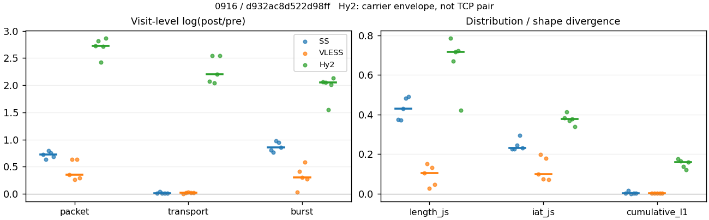
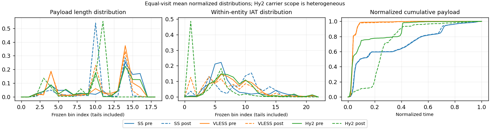

# 0916 · 条目 000 · youtube.com

目标：https://www.youtube.com/watch?v=sAWK0mgrMp4

活动标签：youtube.com::video_playback。选定访问 15 次。

[返回总索引](../../README.md) · [统计口径](../../methods.md)

## 覆盖与资格（每次访问均保留）

| 部署 | 重复 | 主请求路由 | 活动状态 | 代理比较 | DIRECT pre | 请求 proxy/direct/unresolved | 错误 |
| --- | --- | --- | --- | --- | --- | --- | --- |
| Hy2 | 1 | proxy | passed | 1 | 1 | 210/1/0 | [] |
| Hy2 | 2 | proxy | degraded | 1 | 1 | 185/1/0 | [] |
| Hy2 | 3 | proxy | passed | 1 | 1 | 217/1/0 | [] |
| Hy2 | 4 | proxy | passed | 1 | 1 | 218/1/0 | [] |
| Hy2 | 5 | proxy | degraded | 1 | 1 | 192/1/0 | [] |
| SS | 1 | proxy | passed | 1 | 0 | 238/0/0 | [] |
| SS | 2 | proxy | passed | 1 | 0 | 238/0/0 | [] |
| SS | 3 | proxy | passed | 1 | 0 | 225/0/0 | [] |
| SS | 4 | proxy | passed | 1 | 0 | 221/0/0 | [] |
| SS | 5 | proxy | passed | 1 | 0 | 214/0/0 | [] |
| VLESS | 1 | proxy | passed | 1 | 0 | 227/0/0 | [] |
| VLESS | 2 | proxy | passed | 1 | 0 | 234/0/0 | [] |
| VLESS | 3 | proxy | passed | 1 | 0 | 238/0/0 | [] |
| VLESS | 4 | proxy | passed | 1 | 0 | 229/0/0 | [] |
| VLESS | 5 | proxy | passed | 1 | 0 | 232/0/0 | [] |

主请求非 proxy 的统计仅解释为已索引的辅助代理连接或 DIRECT 观测，不代表目标业务经代理传输。播放确认与配对资格是两道不同的门。

图中散点为单次访问，短线为重复中位数；Hy2 是共享载体包络，不能与 TCP 配对作等范围因果对比。

形态图先逐访问归一化，再对访问等权平均；实线 pre，虚线 post。分箱序号及边界见 methods，不将分箱索引误解为长度或时间。

## 每次访问的关键观测

### SS

范围：`exclusive_page`。每格 pre → post；空值为不可观测/不适用。

| 重复 | 包数 | 载荷字节 | burst | TCP FR | IAT中位µs | length JS | IAT JS |
| --- | --- | --- | --- | --- | --- | --- | --- |
| 1 | 4233 → 8723 | 8.8925e+06 → 8.9673e+06 | 2804 → 6270 | 234 → 236 | 27.458 → 312.48 | 0.37448 | 0.22727 |
| 2 | 4234 → 7980 | 7.8488e+06 → 8.1844e+06 | 2632 → 5650 | 254 → 265 | 25.855 → 152.74 | 0.37329 | 0.22572 |
| 3 | 3473 → 7692 | 7.8847e+06 → 7.9431e+06 | 2318 → 6168 | 247 → 261 | 43.573 → 823.57 | 0.43151 | 0.24665 |
| 4 | 4316 → 9173 | 7.8276e+06 → 7.9103e+06 | 3090 → 7968 | 263 → 282 | 31.088 → 1019.7 | 0.48152 | 0.29537 |
| 5 | 4800 → 9565 | 8.1351e+06 → 8.2258e+06 | 3338 → 7872 | 280 → 294 | 46.532 → 865.36 | 0.49026 | 0.23038 |

完整标量统计：中位数 [min,max]；Δ 为重复内逐访问变换的中位数，MAD 未缩放。n 为可用变换数；DIRECT-only 的 nΔ=0 不代表 pre 不可用。

| scope | 特征 | pre | post | Δ | IQRΔ | MADΔ | nΔ |
| --- | --- | --- | --- | --- | --- | --- | --- |
| exclusive_page | active_span_sum_s_1000ms | 41.818 [35.188, 78.838] | 49.643 [41.543, 81] | 0.11076 | 0.065007 | 0.060776 | 5 |
| exclusive_page | active_span_sum_s_100ms | 14.441 [9.7396, 31.695] | 24.58 [17.533, 53.217] | 0.53189 | 0.12654 | 0.023316 | 5 |
| exclusive_page | active_span_sum_s_500ms | 35.091 [27.988, 65.557] | 43.478 [33.863, 72.946] | 0.19054 | 0.052795 | 0.029041 | 5 |
| exclusive_page | burst_bytes_iqr | 3577.8 [3377, 4136] | 2856 [1428, 2856] | -0.37031 | 0.50456 | 0.20274 | 5 |
| exclusive_page | burst_bytes_mad | 39 [39, 39] | 40 [34, 59.5] | 0.025318 | 0.22314 | 0.16252 | 5 |
| exclusive_page | burst_bytes_max | 23296 [20480, 28672] | 17598 [9295, 19992] | -0.4347 | 0.5512 | 0.22826 | 5 |
| exclusive_page | burst_bytes_mean | 2982.1 [2437.1, 3401.5] | 1287.8 [992.76, 1448.6] | -0.84685 | 0.1404 | 0.089906 | 5 |
| exclusive_page | burst_bytes_median | 39 [39, 39] | 40 [34, 59.5] | 0.025318 | 0.22314 | 0.16252 | 5 |
| exclusive_page | burst_bytes_min | 0 [0, 0] | 0 [0, 0] | — | — | — | 0 |
| exclusive_page | burst_bytes_p95 | 16384 [11062, 16460] | 4284 [2856, 5712] | -1.3414 | 0.29572 | 0.058785 | 5 |
| exclusive_page | burst_bytes_q25 | 0 [0, 0] | 0 [0, 0] | — | — | — | 0 |
| exclusive_page | burst_bytes_q75 | 3577.8 [3377, 4136] | 2856 [1428, 2856] | -0.37031 | 0.50456 | 0.20274 | 5 |
| exclusive_page | burst_bytes_std | 5346.5 [4034, 5794.5] | 1787 [1208.4, 2157.6] | -1.1212 | 0.20825 | 0.1289 | 5 |
| exclusive_page | burst_count | 2804 [2318, 3338] | 6270 [5650, 7968] | 0.85794 | 0.14253 | 0.089322 | 5 |
| exclusive_page | burst_duration_ms_iqr | 0.025226 [0.011489, 0.035977] | 0 [0, 0.00010375] | -5.7697 | 0.27608 | 0.27608 | 2 |
| exclusive_page | burst_duration_ms_mad | 0 [0, 0] | 0 [0, 0] | — | — | — | 0 |
| exclusive_page | burst_duration_ms_max | 15001 [15001, 15001] | 30416 [16115, 38878] | 0.70684 | 0.0074672 | 0.0068577 | 5 |
| exclusive_page | burst_duration_ms_mean | 91.862 [58.541, 176.06] | 22.133 [15.292, 34.989] | -1.4232 | 0.27339 | 0.19259 | 5 |
| exclusive_page | burst_duration_ms_median | 0 [0, 0] | 0 [0, 0] | — | — | — | 0 |
| exclusive_page | burst_duration_ms_min | 0 [0, 0] | 0 [0, 0] | — | — | — | 0 |
| exclusive_page | burst_duration_ms_p95 | 29.291 [27.31, 97.117] | 0.96013 [0.91526, 12.747] | -3.39 | 1.1488 | 1.1068 | 5 |
| exclusive_page | burst_duration_ms_q25 | 0 [0, 0] | 0 [0, 0] | — | — | — | 0 |
| exclusive_page | burst_duration_ms_q75 | 0.025226 [0.011489, 0.035977] | 0 [0, 0.00010375] | -5.7697 | 0.27608 | 0.27608 | 2 |
| exclusive_page | burst_duration_ms_std | 1038.8 [811.28, 1429] | 612.55 [363.61, 808.82] | -0.53305 | 0.040927 | 0.036106 | 5 |
| exclusive_page | burst_packets_iqr | 1 [1, 1] | 0 [0, 1] | 0 | 0 | 0 | 2 |
| exclusive_page | burst_packets_mad | 0 [0, 0] | 0 [0, 0] | — | — | — | 0 |
| exclusive_page | burst_packets_max | 21 [14, 40] | 11 [10, 14] | -0.69315 | 0.63063 | 0.34294 | 5 |
| exclusive_page | burst_packets_mean | 1.4983 [1.3968, 1.6087] | 1.2471 [1.1512, 1.4124] | -0.16845 | 0.053388 | 0.024881 | 5 |
| exclusive_page | burst_packets_median | 1 [1, 1] | 1 [1, 1] | 0 | 0 | 0 | 5 |
| exclusive_page | burst_packets_min | 1 [1, 1] | 1 [1, 1] | 0 | 0 | 0 | 5 |
| exclusive_page | burst_packets_p95 | 3 [3, 4] | 2 [2, 3] | -0.40547 | 0.11778 | 0 | 5 |
| exclusive_page | burst_packets_q25 | 1 [1, 1] | 1 [1, 1] | 0 | 0 | 0 | 5 |
| exclusive_page | burst_packets_q75 | 2 [2, 2] | 1 [1, 2] | -0.69315 | 0.69315 | 0 | 5 |
| exclusive_page | burst_packets_std | 1.1664 [0.94878, 1.2249] | 0.66887 [0.50954, 0.86189] | -0.51028 | 0.25698 | 0.14559 | 5 |
| exclusive_page | connection_span_concurrency_max | 13 [12, 17] | 13 [12, 17] | 0 | 0 | 0 | 5 |
| exclusive_page | cumulative_l1 | — | — | 0.002254 | 0.0020951 | 0.00093611 | 5 |
| exclusive_page | cumulative_max | — | — | 0.033601 | 0.027748 | 0.01406 | 5 |
| exclusive_page | direction_entropy | 0.61059 [0.57921, 0.67431] | 0.36292 [0.33277, 0.41217] | -0.24767 | 0.024213 | 0.019901 | 5 |
| exclusive_page | down_burst_count | 1391 [1150, 1657] | 3125 [2814, 3975] | 0.8621 | 0.14143 | 0.08874 | 5 |
| exclusive_page | down_ip_bytes | 7.8651e+06 [7.8257e+06, 8.8884e+06] | 8.2323e+06 [8.0144e+06, 9.0781e+06] | 0.023094 | 0.0031417 | 0.0019728 | 5 |
| exclusive_page | down_packets | 2618 [2074, 2857] | 4835 [4262, 5258] | 0.64924 | 0.075115 | 0.039266 | 5 |
| exclusive_page | down_transport_bytes | 7.7571e+06 [7.6857e+06, 8.7521e+06] | 7.9966e+06 [7.7623e+06, 8.8076e+06] | 0.0080757 | 0.0030182 | 0.0017565 | 5 |
| exclusive_page | duration_s | 63.513 [60.676, 64.148] | 64.017 [61.382, 64.828] | 0.0071373 | 0.011574 | 0.0071466 | 5 |
| exclusive_page | entity_count | 22 [18, 24] | 22 [18, 24] | 0 | 0 | 0 | 5 |
| exclusive_page | fr_runs | 254 [234, 280] | 265 [236, 294] | 0.04879 | 0.012737 | 0.0063946 | 5 |
| exclusive_page | fr_runs_per_packet | 0.098384 [0.090874, 0.11938] | 0.057563 [0.045385, 0.060712] | -0.045489 | 0.0048838 | 0.0025249 | 5 |
| exclusive_page | fr_switches | 231 [212, 256] | 243 [214, 270] | 0.053245 | 0.012819 | 0.0067245 | 5 |
| exclusive_page | fr_switches_per_possible_transition | 0.090716 [0.08304, 0.11165] | 0.053316 [0.041329, 0.056762] | -0.041711 | 0.0050635 | 0.0029417 | 5 |
| exclusive_page | full_retransmission_fraction | 0.0014397 [0.000625, 0.002598] | 0.0046877 [0.0015682, 0.019674] | 0.0035292 | 0.0029473 | 0.002586 | 5 |
| exclusive_page | full_retransmission_packets | 5 [3, 11] | 41 [15, 157] | 2.1041 | 0.54232 | 0.4947 | 5 |
| exclusive_page | iat_count | 4211 [3455, 4776] | 8701 [7674, 9541] | 0.72574 | 0.064279 | 0.033743 | 5 |
| exclusive_page | iat_js | — | — | 0.23038 | 0.019376 | 0.0046576 | 5 |
| exclusive_page | iat_ks | — | — | 0.3778 | 0.060846 | 0.045292 | 5 |
| exclusive_page | iat_median_us | 31.088 [25.855, 46.532] | 823.57 [152.74, 1019.7] | 2.923 | 0.50732 | 0.49111 | 5 |
| exclusive_page | iat_us_iqr | 169.55 [88.105, 945.55] | 3235 [892.09, 10007] | 2.3592 | 0.28114 | 0.22065 | 5 |
| exclusive_page | iat_us_mad | 23.467 [18.427, 36.992] | 812.69 [152.57, 1004.4] | 3.1412 | 0.43365 | 0.41606 | 5 |
| exclusive_page | iat_us_max | 1.5001e+07 [1.5001e+07, 1.5001e+07] | 1.5488e+07 [1.5424e+07, 1.5512e+07] | 0.031944 | 0.00077971 | 0.00042591 | 5 |
| exclusive_page | iat_us_mean | 1.3256e+05 [1.1386e+05, 2.3869e+05] | 68044 [48383, 1.0757e+05] | -0.77572 | 0.10517 | 0.080142 | 5 |
| exclusive_page | iat_us_median | 31.088 [25.855, 46.532] | 823.57 [152.74, 1019.7] | 2.923 | 0.50732 | 0.49111 | 5 |
| exclusive_page | iat_us_min | 0.065 [0.002, 0.14] | 0.032 [0.031, 0.038] | -0.5368 | 0.68057 | 0.36691 | 5 |
| exclusive_page | iat_us_p95 | 99160 [41302, 1.2964e+05] | 31225 [19349, 32023] | -1.1303 | 0.44229 | 0.28274 | 5 |
| exclusive_page | iat_us_q25 | 12.917 [12.792, 16.387] | 16.706 [7.436, 26.883] | 0.19479 | 0.17518 | 0.09418 | 5 |
| exclusive_page | iat_us_q75 | 182.36 [101.02, 960.46] | 3256.9 [907.63, 10023] | 2.2904 | 0.24203 | 0.18717 | 5 |
| exclusive_page | iat_us_std | 1.2341e+06 [1.1745e+06, 1.7045e+06] | 8.8587e+05 [7.6187e+05, 1.1338e+06] | -0.38758 | 0.066812 | 0.045232 | 5 |
| exclusive_page | iat_wasserstein_log1p_us | — | — | 1.4507 | 0.18679 | 0.097091 | 5 |
| exclusive_page | idle_gap_count_1000ms | 56 [47, 76] | 54 [41, 83] | -0.015748 | 0.036368 | 0.020619 | 5 |
| exclusive_page | idle_gap_count_100ms | 172 [138, 260] | 158 [126, 165] | -0.090972 | 0.45654 | 0.13629 | 5 |
| exclusive_page | idle_gap_count_500ms | 70 [60, 87] | 65 [51, 92] | -0.074108 | 0.10143 | 0.055104 | 5 |
| exclusive_page | idle_gap_sum_s_1000ms | 535.61 [442.29, 782.87] | 533.53 [379.44, 775.86] | -0.035171 | 0.030708 | 0.026176 | 5 |
| exclusive_page | idle_gap_sum_s_100ms | 582.75 [468.94, 810.25] | 561.31 [403.45, 800.92] | -0.037485 | 0.025714 | 0.02568 | 5 |
| exclusive_page | idle_gap_sum_s_500ms | 548.89 [451.49, 789.59] | 541.59 [387.12, 782.02] | -0.039048 | 0.027344 | 0.025648 | 5 |
| exclusive_page | ip_bytes | 8.0695e+06 [8.0524e+06, 9.113e+06] | 8.6739e+06 [8.4052e+06, 9.4957e+06] | 0.046752 | 0.0090922 | 0.0055093 | 5 |
| exclusive_page | length_iqr | 3634 [3227.5, 7722] | 1428 [0, 1428] | -0.93406 | 0.40993 | 0.066117 | 3 |
| exclusive_page | length_js | — | — | 0.43151 | 0.10703 | 0.05702 | 5 |
| exclusive_page | length_ks | — | — | 0.54019 | 0.037221 | 0.020253 | 5 |
| exclusive_page | length_mad | 1904 [1448, 2757] | 230.5 [0, 952] | -2.1115 | 0.90993 | 0.30918 | 3 |
| exclusive_page | length_max | 8920 [8920, 8920] | 9996 [4284, 12852] | 0.11389 | 0.69315 | 0.25131 | 5 |
| exclusive_page | length_mean | 3137.3 [2858.4, 3810.9] | 1724.5 [1550.6, 1847.7] | -0.66423 | 0.08279 | 0.052591 | 5 |
| exclusive_page | length_median | 2896 [2896, 2896] | 1428 [1428, 1428] | -0.70706 | 0 | 0 | 5 |
| exclusive_page | length_min | 13 [8, 31] | 6 [2, 6] | -1.6422 | 1.5841 | 1.0986 | 5 |
| exclusive_page | length_p95 | 8192 [8192, 8688] | 2856 [2856, 2856] | -1.0537 | 0 | 0 | 5 |
| exclusive_page | length_q25 | 561.5 [462, 1150.5] | 1428 [1428, 1428] | 0.93342 | 0.5409 | 0.19505 | 5 |
| exclusive_page | length_q75 | 4344 [4034.8, 8192] | 2856 [1428, 2856] | -1.0387 | 0.58759 | 0.073851 | 5 |
| exclusive_page | length_std | 2819.1 [2457.5, 3241.3] | 1013.9 [747.17, 1078.2] | -1.1622 | 0.17597 | 0.084931 | 5 |
| exclusive_page | length_wasserstein_bytes | — | — | 1866.3 | 235.02 | 206.88 | 5 |
| exclusive_page | nonempty_entity_count | 22 [18, 24] | 22 [18, 24] | 0 | 0 | 0 | 5 |
| exclusive_page | nonempty_packets | 2575 [2069, 2846] | 4899 [4299, 5305] | 0.67474 | 0.080074 | 0.052007 | 5 |
| exclusive_page | offload_suspect_fraction | 0.3775 [0.36029, 0.40019] | 0.20288 [0.10842, 0.21942] | -0.18077 | 0.050751 | 0.014656 | 5 |
| exclusive_page | packet_count | 4234 [3473, 4800] | 8723 [7692, 9565] | 0.72305 | 0.064441 | 0.033558 | 5 |
| exclusive_page | rtt_median_ms | 0.056642 [0.045818, 0.068846] | 33.403 [28.809, 35.729] | 6.3183 | 0.20637 | 0.13372 | 5 |
| exclusive_page | rtt_sample_count | 1562 [1311, 1859] | 1034 [803, 1771] | -0.31184 | 0.20462 | 0.13014 | 5 |
| exclusive_page | tcp_ack_count | 4210 [3455, 4775] | 8698 [7668, 9539] | 0.72634 | 0.064184 | 0.034349 | 5 |
| exclusive_page | tcp_fin_count | 44 [36, 47] | 49 [40, 51] | 0.10763 | 0.019803 | 0.017532 | 5 |
| exclusive_page | tcp_packet_count | 4234 [3473, 4800] | 8723 [7692, 9565] | 0.72305 | 0.064441 | 0.033558 | 5 |
| exclusive_page | tcp_rst_count | 1 [0, 4] | 1 [0, 2] | 0 | 0.69315 | 0.69315 | 3 |
| exclusive_page | tcp_syn_count | 44 [36, 48] | 45 [40, 55] | 0.051293 | 0.11333 | 0.02882 | 5 |
| exclusive_page | tcp_window_raw_median | 65535 [65535, 65535] | 168 [152, 168] | -5.9664 | 0.024098 | 0 | 5 |
| exclusive_page | transition_entropy | 0.37397 [0.35594, 0.44827] | 0.23799 [0.19479, 0.25267] | -0.16116 | 0.016121 | 0.01332 | 5 |
| exclusive_page | transition_n_mm | 2104 [1585, 2319] | 4425 [3838, 4813] | 0.79713 | 0.088321 | 0.066943 | 5 |
| exclusive_page | transition_n_mp | 112 [102, 122] | 119 [103, 129] | 0.055791 | 0.0079809 | 0.0048333 | 5 |
| exclusive_page | transition_n_pm | 120 [110, 134] | 125 [111, 141] | 0.05092 | 0.017286 | 0.010098 | 5 |
| exclusive_page | transition_n_pp | 238 [237, 273] | 198 [192, 238] | -0.2002 | 0.045033 | 0.020919 | 5 |
| exclusive_page | transition_p_mm | 0.95002 [0.934, 0.95376] | 0.97198 [0.96993, 0.97886] | 0.025101 | 0.0038812 | 0.0026572 | 5 |
| exclusive_page | transition_p_mp | 0.04998 [0.046238, 0.065999] | 0.028017 [0.021137, 0.030073] | -0.025101 | 0.0038812 | 0.0026572 | 5 |
| exclusive_page | transition_p_pm | 0.33051 [0.30534, 0.35171] | 0.38272 [0.34435, 0.41593] | 0.052208 | 0.017292 | 0.012016 | 5 |
| exclusive_page | transition_p_pp | 0.66949 [0.64829, 0.69466] | 0.61728 [0.58407, 0.65565] | -0.052208 | 0.017292 | 0.012016 | 5 |
| exclusive_page | transport_bytes | 7.8847e+06 [7.8276e+06, 8.8925e+06] | 8.1844e+06 [7.9103e+06, 8.9673e+06] | 0.010508 | 0.0027158 | 0.0021315 | 5 |
| exclusive_page | up_burst_count | 1413 [1168, 1681] | 3145 [2836, 3993] | 0.85382 | 0.14361 | 0.08989 | 5 |
| exclusive_page | up_byte_fraction | 0.016316 [0.015795, 0.020792] | 0.018705 [0.017817, 0.022944] | 0.002152 | 0.00036704 | 0.00023766 | 5 |
| exclusive_page | up_ip_bytes | 2.2466e+05 [2.0052e+05, 2.4384e+05] | 4.416e+05 [3.8792e+05, 4.5371e+05] | 0.61998 | 0.054799 | 0.026056 | 5 |
| exclusive_page | up_packets | 1615 [1399, 1943] | 3529 [3430, 4338] | 0.80711 | 0.089189 | 0.025432 | 5 |
| exclusive_page | up_transport_bytes | 1.4045e+05 [1.2756e+05, 1.6319e+05] | 1.5664e+05 [1.4783e+05, 1.8778e+05] | 0.14035 | 0.018317 | 0.0071036 | 5 |
| exclusive_page | zero_iat_count | 0 [0, 0] | 0 [0, 0] | — | — | — | 0 |
| exclusive_page | zero_iat_fraction | 0 [0, 0] | 0 [0, 0] | 0 | 0 | 0 | 5 |

### VLESS

范围：`exclusive_page`。每格 pre → post；空值为不可观测/不适用。

| 重复 | 包数 | 载荷字节 | burst | TCP FR | IAT中位µs | length JS | IAT JS |
| --- | --- | --- | --- | --- | --- | --- | --- |
| 1 | 3162 → 4482 | 6.464e+06 → 6.503e+06 | 2348 → 2429 | 140 → 172 | 73.269 → 94.553 | 0.10579 | 0.10002 |
| 2 | 3189 → 6038 | 4.8954e+06 → 5.0158e+06 | 2348 → 3551 | 143 → 180 | 92.259 → 11.264 | 0.15125 | 0.1978 |
| 3 | 2920 → 3815 | 3.8304e+06 → 3.9617e+06 | 1979 → 2673 | 150 → 182 | 117.38 → 61.346 | 0.02898 | 0.074847 |
| 4 | 3526 → 6652 | 4.8499e+06 → 4.9693e+06 | 2407 → 4299 | 127 → 162 | 141.7 → 10.797 | 0.13132 | 0.18036 |
| 5 | 3879 → 5223 | 4.9128e+06 → 5.0427e+06 | 2896 → 3812 | 148 → 184 | 123.23 → 56.024 | 0.046083 | 0.07129 |

完整标量统计：中位数 [min,max]；Δ 为重复内逐访问变换的中位数，MAD 未缩放。n 为可用变换数；DIRECT-only 的 nΔ=0 不代表 pre 不可用。

| scope | 特征 | pre | post | Δ | IQRΔ | MADΔ | nΔ |
| --- | --- | --- | --- | --- | --- | --- | --- |
| exclusive_page | active_span_sum_s_1000ms | 25.201 [22.221, 26.286] | 25.297 [23.73, 26.426] | 0.0037862 | 0.04526 | 0.018588 | 5 |
| exclusive_page | active_span_sum_s_100ms | 3.6325 [3.0526, 4.6068] | 10.825 [8.9854, 11.524] | 1.0752 | 0.12479 | 0.07932 | 5 |
| exclusive_page | active_span_sum_s_500ms | 12.384 [11.463, 12.989] | 24.795 [22.746, 25.801] | 0.68529 | 0.021305 | 0.013285 | 5 |
| exclusive_page | burst_bytes_iqr | 2896 [2896, 2896] | 2824 [2824, 2896] | -0.025176 | 0 | 0 | 5 |
| exclusive_page | burst_bytes_mad | 0 [0, 0] | 36 [31, 53] | — | — | — | 0 |
| exclusive_page | burst_bytes_max | 26032 [21120, 27928] | 26064 [10244, 48008] | 0.19168 | 0.74551 | 0.42036 | 5 |
| exclusive_page | burst_bytes_mean | 2014.9 [1696.4, 2753] | 1412.5 [1155.9, 2677.2] | -0.26691 | 0.14065 | 0.12246 | 5 |
| exclusive_page | burst_bytes_median | 0 [0, 0] | 36 [31, 53] | — | — | — | 0 |
| exclusive_page | burst_bytes_min | 0 [0, 0] | 0 [0, 0] | — | — | — | 0 |
| exclusive_page | burst_bytes_p95 | 8688 [8661, 11290] | 4671.8 [4236, 12273] | -0.6736 | 0.059586 | 0.044727 | 5 |
| exclusive_page | burst_bytes_q25 | 0 [0, 0] | 0 [0, 0] | — | — | — | 0 |
| exclusive_page | burst_bytes_q75 | 2896 [2896, 2896] | 2824 [2824, 2896] | -0.025176 | 0 | 0 | 5 |
| exclusive_page | burst_bytes_std | 3155.9 [2951.4, 4718.7] | 2021.9 [1552.2, 5776.7] | -0.4076 | 0.27231 | 0.24293 | 5 |
| exclusive_page | burst_count | 2348 [1979, 2896] | 3551 [2429, 4299] | 0.30061 | 0.13884 | 0.11306 | 5 |
| exclusive_page | burst_duration_ms_iqr | 0.064322 [0.021615, 0.43321] | 0.002952 [5.1e-05, 0.15562] | -4.364 | 4.562 | 2.7758 | 5 |
| exclusive_page | burst_duration_ms_mad | 0 [0, 0] | 0 [0, 0] | — | — | — | 0 |
| exclusive_page | burst_duration_ms_max | 15001 [15001, 15001] | 9332.9 [1240.1, 15044] | -0.47458 | 2.3047 | 0.4774 | 5 |
| exclusive_page | burst_duration_ms_mean | 70.669 [63.056, 130.59] | 7.5506 [4.0292, 32.277] | -2.1272 | 0.27975 | 0.17057 | 5 |
| exclusive_page | burst_duration_ms_median | 0 [0, 0] | 0 [0, 0] | — | — | — | 0 |
| exclusive_page | burst_duration_ms_min | 0 [0, 0] | 0 [0, 0] | — | — | — | 0 |
| exclusive_page | burst_duration_ms_p95 | 5.6225 [3.7694, 10.173] | 4.2829 [1.5673, 9.4891] | -0.080634 | 0.32045 | 0.1915 | 5 |
| exclusive_page | burst_duration_ms_q25 | 0 [0, 0] | 0 [0, 0] | — | — | — | 0 |
| exclusive_page | burst_duration_ms_q75 | 0.064322 [0.021615, 0.43321] | 0.002952 [5.1e-05, 0.15562] | -4.364 | 4.562 | 2.7758 | 5 |
| exclusive_page | burst_duration_ms_std | 909.03 [879.13, 1266.4] | 157.37 [37.547, 613.39] | -1.7538 | 1.6755 | 1.023 | 5 |
| exclusive_page | burst_packets_iqr | 1 [1, 1] | 1 [1, 1] | 0 | 0 | 0 | 5 |
| exclusive_page | burst_packets_mad | 0 [0, 0] | 0 [0, 0] | — | — | — | 0 |
| exclusive_page | burst_packets_max | 6 [5, 8] | 8 [7, 18] | 0.47 | 0.77319 | 0.47 | 5 |
| exclusive_page | burst_packets_mean | 1.3582 [1.3394, 1.4755] | 1.5473 [1.3701, 1.8452] | 0.054752 | 0.20203 | 0.088005 | 5 |
| exclusive_page | burst_packets_median | 1 [1, 1] | 1 [1, 1] | 0 | 0 | 0 | 5 |
| exclusive_page | burst_packets_min | 1 [1, 1] | 1 [1, 1] | 0 | 0 | 0 | 5 |
| exclusive_page | burst_packets_p95 | 2 [2, 3] | 3 [3, 5] | 0.40547 | 0.10536 | 0 | 5 |
| exclusive_page | burst_packets_q25 | 1 [1, 1] | 1 [1, 1] | 0 | 0 | 0 | 5 |
| exclusive_page | burst_packets_q75 | 2 [2, 2] | 2 [2, 2] | 0 | 0 | 0 | 5 |
| exclusive_page | burst_packets_std | 0.6286 [0.59676, 0.68253] | 0.85913 [0.80148, 1.7637] | 0.34406 | 0.21249 | 0.12405 | 5 |
| exclusive_page | connection_span_concurrency_max | 10 [9, 13] | 10 [9, 13] | 0 | 0 | 0 | 5 |
| exclusive_page | cumulative_l1 | — | — | 0.0031677 | 0.00047032 | 0.00041434 | 5 |
| exclusive_page | cumulative_max | — | — | 0.039655 | 0.031492 | 0.0094735 | 5 |
| exclusive_page | direction_entropy | 0.35404 [0.29484, 0.40506] | 0.29995 [0.2474, 0.39617] | -0.047442 | 0.056192 | 0.024523 | 5 |
| exclusive_page | down_burst_count | 1166 [981, 1439] | 1767 [1207, 2142] | 0.30286 | 0.14024 | 0.11371 | 5 |
| exclusive_page | down_ip_bytes | 4.936e+06 [3.8694e+06, 6.5103e+06] | 5.0969e+06 [3.9872e+06, 6.5752e+06] | 0.029982 | 0.0069459 | 0.0024155 | 5 |
| exclusive_page | down_packets | 1931 [1840, 2330] | 2983 [2205, 3647] | 0.45055 | 0.25421 | 0.11342 | 5 |
| exclusive_page | down_transport_bytes | 4.8354e+06 [3.7736e+06, 6.4113e+06] | 4.9219e+06 [3.8724e+06, 6.4199e+06] | 0.0181 | 0.0017433 | 0.0013653 | 5 |
| exclusive_page | duration_s | 62.758 [60.664, 63.163] | 62.747 [60.619, 63.145] | -0.00050974 | 0.00035512 | 0.00022585 | 5 |
| exclusive_page | entity_count | 17 [16, 18] | 17 [16, 18] | 0 | 0 | 0 | 5 |
| exclusive_page | fr_runs | 143 [127, 150] | 180 [162, 184] | 0.21772 | 0.02426 | 0.012389 | 5 |
| exclusive_page | fr_runs_per_packet | 0.076378 [0.058445, 0.085373] | 0.059066 [0.045315, 0.085849] | -0.01313 | 0.015836 | 0.0095291 | 5 |
| exclusive_page | fr_switches | 125 [110, 133] | 162 [145, 166] | 0.24445 | 0.029708 | 0.014879 | 5 |
| exclusive_page | fr_switches_per_possible_transition | 0.068046 [0.05102, 0.076437] | 0.053867 [0.040753, 0.078459] | -0.010267 | 0.014509 | 0.0085235 | 5 |
| exclusive_page | full_retransmission_fraction | 0.0007734 [0.00034247, 0.0085389] | 0 [0, 0] | -0.0007734 | 0.0010007 | 0.00043093 | 5 |
| exclusive_page | full_retransmission_packets | 3 [1, 27] | 0 [0, 0] | — | — | — | 0 |
| exclusive_page | iat_count | 3171 [2903, 3861] | 5205 [3798, 6635] | 0.35036 | 0.33833 | 0.081631 | 5 |
| exclusive_page | iat_js | — | — | 0.10002 | 0.10551 | 0.028733 | 5 |
| exclusive_page | iat_ks | — | — | 0.18257 | 0.21827 | 0.07729 | 5 |
| exclusive_page | iat_median_us | 117.38 [73.269, 141.7] | 56.024 [10.797, 94.553] | -0.78828 | 1.4542 | 1.0433 | 5 |
| exclusive_page | iat_us_iqr | 872.77 [792.71, 1064] | 778.75 [168.33, 952.39] | -0.11085 | 0.91474 | 0.093085 | 5 |
| exclusive_page | iat_us_mad | 104.83 [67.836, 133.3] | 55.589 [10.75, 94.347] | -0.68448 | 1.4608 | 1.0144 | 5 |
| exclusive_page | iat_us_max | 1.5001e+07 [1.5001e+07, 1.5001e+07] | 1.5448e+07 [1.5414e+07, 1.5501e+07] | 0.029338 | 0.0018045 | 0.0010749 | 5 |
| exclusive_page | iat_us_mean | 1.4685e+05 [1.12e+05, 2.3907e+05] | 1.0331e+05 [59181, 1.8259e+05] | -0.35163 | 0.33804 | 0.082103 | 5 |
| exclusive_page | iat_us_median | 117.38 [73.269, 141.7] | 56.024 [10.797, 94.553] | -0.78828 | 1.4542 | 1.0433 | 5 |
| exclusive_page | iat_us_min | 0.266 [0.06, 0.448] | 0.032 [0.031, 0.035] | -2.1495 | 0.97231 | 0.39994 | 5 |
| exclusive_page | iat_us_p95 | 10080 [8753.9, 14215] | 37335 [7135.4, 40607] | 1.0497 | 0.87134 | 0.32682 | 5 |
| exclusive_page | iat_us_q25 | 28.218 [12.424, 33.601] | 10.381 [3.0468, 19.294] | -1.1625 | 0.92078 | 0.75822 | 5 |
| exclusive_page | iat_us_q75 | 906.38 [820.93, 1076.5] | 789.13 [171.37, 971.69] | -0.1133 | 0.92146 | 0.073802 | 5 |
| exclusive_page | iat_us_std | 1.3714e+06 [1.1975e+06, 1.7866e+06] | 1.1608e+06 [8.7983e+05, 1.5812e+06] | -0.16673 | 0.17286 | 0.044579 | 5 |
| exclusive_page | iat_wasserstein_log1p_us | — | — | 0.7773 | 0.9572 | 0.39355 | 5 |
| exclusive_page | idle_gap_count_1000ms | 41 [34, 53] | 39 [32, 50] | -0.058269 | 0.010614 | 0.00491 | 5 |
| exclusive_page | idle_gap_count_100ms | 103 [91, 117] | 116 [106, 126] | 0.10354 | 0.023551 | 0.015321 | 5 |
| exclusive_page | idle_gap_count_500ms | 60 [51, 74] | 40 [33, 53] | -0.40547 | 0.031991 | 0.017392 | 5 |
| exclusive_page | idle_gap_sum_s_1000ms | 498.22 [370.79, 668.83] | 496.4 [368.93, 668.18] | -0.001271 | 0.0026857 | 0.00080839 | 5 |
| exclusive_page | idle_gap_sum_s_100ms | 519.83 [389.81, 690.98] | 511.3 [383.68, 683.68] | -0.015847 | 0.0017267 | 0.00069233 | 5 |
| exclusive_page | idle_gap_sum_s_500ms | 510.89 [381.55, 682.22] | 497.02 [369.92, 670.22] | -0.027526 | 0.0035138 | 0.0030471 | 5 |
| exclusive_page | ip_bytes | 5.0612e+06 [3.9821e+06, 6.6287e+06] | 5.3305e+06 [4.1618e+06, 6.7423e+06] | 0.04412 | 0.015173 | 0.0099775 | 5 |
| exclusive_page | length_iqr | 2680 [1733, 4772] | 2472 [1340, 2643] | -0.080789 | 0.2403 | 0.1764 | 5 |
| exclusive_page | length_js | — | — | 0.10579 | 0.085236 | 0.045462 | 5 |
| exclusive_page | length_ks | — | — | 0.24019 | 0.14635 | 0.079515 | 5 |
| exclusive_page | length_mad | 1376 [1304, 2096] | 1304 [926, 1376] | -0.079571 | 0.28857 | 0.079571 | 5 |
| exclusive_page | length_max | 8920 [8920, 8920] | 11584 [6780, 16944] | 0.26133 | 0.24424 | 0.12645 | 5 |
| exclusive_page | length_mean | 2231.9 [2178.6, 3526.5] | 1758.3 [1390, 2233.2] | -0.45688 | 0.25917 | 0.096987 | 5 |
| exclusive_page | length_median | 2824 [1520, 2824] | 1448 [1412, 2824] | -0.61944 | 0.59427 | 0.073703 | 5 |
| exclusive_page | length_min | 23 [8, 24] | 19 [8, 24] | 0 | 0.6131 | 0.6131 | 5 |
| exclusive_page | length_p95 | 7060 [5792, 8920] | 3148 [2824, 4714.8] | -0.63759 | 0.30658 | 0.2787 | 5 |
| exclusive_page | length_q25 | 563 [136, 1163] | 252 [180, 1412] | 0.28584 | 1.1855 | 0.60798 | 5 |
| exclusive_page | length_q75 | 2896 [2824, 5736] | 2824 [1520, 2824] | -0.025176 | 0.64462 | 0.025176 | 5 |
| exclusive_page | length_std | 1958.5 [1900.4, 3128.9] | 1422.6 [1041.5, 1845.3] | -0.52805 | 0.33455 | 0.21038 | 5 |
| exclusive_page | length_wasserstein_bytes | — | — | 842.09 | 695.15 | 411.79 | 5 |
| exclusive_page | nonempty_entity_count | 17 [16, 18] | 17 [16, 18] | 0 | 0 | 0 | 5 |
| exclusive_page | nonempty_packets | 1855 [1757, 2255] | 2912 [2120, 3575] | 0.46289 | 0.25739 | 0.11527 | 5 |
| exclusive_page | offload_suspect_fraction | 0.36093 [0.35086, 0.39311] | 0.25962 [0.14883, 0.3822] | -0.091243 | 0.095997 | 0.080333 | 5 |
| exclusive_page | packet_count | 3189 [2920, 3879] | 5223 [3815, 6652] | 0.34886 | 0.33726 | 0.081508 | 5 |
| exclusive_page | rtt_median_ms | 0.11536 [0.081587, 0.27175] | 0.0443 [0.04032, 0.1041] | -0.95709 | 0.77102 | 0.51875 | 5 |
| exclusive_page | rtt_sample_count | 1212 [1017, 1492] | 2170 [1151, 2380] | 0.42204 | 0.21198 | 0.16455 | 5 |
| exclusive_page | tcp_ack_count | 3139 [2869, 3826] | 5205 [3798, 6634] | 0.36026 | 0.33766 | 0.079753 | 5 |
| exclusive_page | tcp_fin_count | 34 [31, 35] | 34 [32, 36] | 0.031749 | 0.028988 | 0.02541 | 5 |
| exclusive_page | tcp_packet_count | 3189 [2920, 3879] | 5223 [3815, 6652] | 0.34886 | 0.33726 | 0.081508 | 5 |
| exclusive_page | tcp_rst_count | 32 [30, 35] | 0 [0, 1] | -3.4012 | — | — | 1 |
| exclusive_page | tcp_syn_count | 34 [32, 36] | 34 [32, 36] | 0 | 0 | 0 | 5 |
| exclusive_page | tcp_window_raw_median | 65535 [65535, 65535] | 187 [165, 197] | -5.8592 | 0.057759 | 0.047006 | 5 |
| exclusive_page | transition_entropy | 0.25417 [0.20109, 0.2881] | 0.21537 [0.16989, 0.29393] | -0.031206 | 0.046857 | 0.023828 | 5 |
| exclusive_page | transition_n_mm | 1660 [1540, 2043] | 2671 [1863, 3347] | 0.49203 | 0.27149 | 0.11793 | 5 |
| exclusive_page | transition_n_mp | 54 [47, 58] | 72 [64, 74] | 0.27871 | 0.028171 | 0.019202 | 5 |
| exclusive_page | transition_n_pm | 71 [63, 75] | 90 [81, 92] | 0.21772 | 0.031278 | 0.019406 | 5 |
| exclusive_page | transition_n_pp | 60 [49, 67] | 72 [66, 75] | 0.14518 | 0.15807 | 0.032387 | 5 |
| exclusive_page | transition_p_mm | 0.96849 [0.9637, 0.97701] | 0.97446 [0.9618, 0.98124] | 0.0042313 | 0.0073628 | 0.0042487 | 5 |
| exclusive_page | transition_p_mp | 0.031505 [0.022994, 0.036295] | 0.025538 [0.018763, 0.038203] | -0.0042313 | 0.0073628 | 0.0042487 | 5 |
| exclusive_page | transition_p_pm | 0.53846 [0.52817, 0.57724] | 0.55422 [0.54819, 0.55556] | 0.016377 | 0.029465 | 0.0036466 | 5 |
| exclusive_page | transition_p_pp | 0.46154 [0.42276, 0.47183] | 0.44578 [0.44444, 0.45181] | -0.016377 | 0.029465 | 0.0036466 | 5 |
| exclusive_page | transport_bytes | 4.8954e+06 [3.8304e+06, 6.464e+06] | 5.0158e+06 [3.9617e+06, 6.503e+06] | 0.024319 | 0.0018091 | 0.0017825 | 5 |
| exclusive_page | up_burst_count | 1183 [998, 1457] | 1784 [1222, 2157] | 0.2984 | 0.13747 | 0.11241 | 5 |
| exclusive_page | up_byte_fraction | 0.012259 [0.0081556, 0.014833] | 0.018728 [0.012774, 0.022541] | 0.006469 | 0.00039955 | 0.00034052 | 5 |
| exclusive_page | up_ip_bytes | 1.2268e+05 [1.1272e+05, 1.4462e+05] | 2.205e+05 [1.6715e+05, 2.5926e+05] | 0.43747 | 0.24534 | 0.092404 | 5 |
| exclusive_page | up_packets | 1261 [1080, 1549] | 2281 [1499, 3005] | 0.39927 | 0.35577 | 0.22638 | 5 |
| exclusive_page | up_transport_bytes | 56815 [52718, 64316] | 89300 [83069, 98936] | 0.45005 | 0.0041426 | 0.0021479 | 5 |
| exclusive_page | zero_iat_count | 0 [0, 0] | 0 [0, 0] | — | — | — | 0 |
| exclusive_page | zero_iat_fraction | 0 [0, 0] | 0 [0, 0] | 0 | 0 | 0 | 5 |

### Hy2

范围：`carrier_context_envelope`。每格 pre → post；空值为不可观测/不适用。

| 重复 | 包数 | 载荷字节 | burst | TCP FR | IAT中位µs | length JS | IAT JS |
| --- | --- | --- | --- | --- | --- | --- | --- |
| 1 | 3822 → 58518 | 7.9359e+06 → 6.2748e+07 | 2462 → 19424 | — | 106.66 → 4.464 | 0.78527 | 0.38304 |
| 2 | 2958 → 49573 | 4.2514e+06 → 5.4294e+07 | 1934 → 15124 | — | 114.43 → 1.9645 | 0.67152 | 0.41455 |
| 3 | 4957 → 56219 | 8.0226e+06 → 6.1955e+07 | 3561 → 16845 | — | 103.58 → 0.5445 | 0.71745 | 0.37079 |
| 4 | 4236 → 64254 | 7.8393e+06 → 7.0681e+07 | 2681 → 20066 | — | 88.131 → 1.688 | 0.72128 | 0.37835 |
| 5 | 2898 → 50798 | 4.275e+06 → 5.45e+07 | 2024 → 17085 | — | 86.416 → 6.12 | 0.42178 | 0.33814 |

范围：`direct_pre_only`。每格 pre → post；空值为不可观测/不适用。

| 重复 | 包数 | 载荷字节 | burst | TCP FR | IAT中位µs | length JS | IAT JS |
| --- | --- | --- | --- | --- | --- | --- | --- |
| 1 | 31 → — | 8616 → — | 23 → — | 5 → — | 184.07 → — | — | — |
| 2 | 33 → — | 8649 → — | 25 → — | 7 → — | 163.74 → — | — | — |
| 3 | 29 → — | 8757 → — | 21 → — | 7 → — | 200.65 → — | — | — |
| 4 | 31 → — | 8691 → — | 21 → — | 7 → — | 133.24 → — | — | — |
| 5 | 33 → — | 8701 → — | 25 → — | 7 → — | 189.2 → — | — | — |

完整标量统计：中位数 [min,max]；Δ 为重复内逐访问变换的中位数，MAD 未缩放。n 为可用变换数；DIRECT-only 的 nΔ=0 不代表 pre 不可用。

| scope | 特征 | pre | post | Δ | IQRΔ | MADΔ | nΔ |
| --- | --- | --- | --- | --- | --- | --- | --- |
| carrier_context_envelope | active_span_sum_s_1000ms | 26.788 [23.764, 36.921] | 33.421 [27.013, 36.057] | 0.11128 | 0.26081 | 0.14483 | 5 |
| carrier_context_envelope | active_span_sum_s_100ms | 3.6338 [1.9447, 6.497] | 13.319 [12.695, 17.114] | 1.2509 | 0.64059 | 0.28237 | 5 |
| carrier_context_envelope | active_span_sum_s_500ms | 21.878 [20.713, 29.439] | 30.326 [24.157, 34.175] | 0.14919 | 0.23069 | 0.050095 | 5 |
| carrier_context_envelope | burst_bytes_iqr | 2804.8 [1823.2, 4238] | 5105 [5070, 5149] | 0.59675 | 0.007483 | 0.004345 | 5 |
| carrier_context_envelope | burst_bytes_mad | 31 [0, 39] | 263 [254, 366] | 2.1033 | 0.16524 | 0.13572 | 3 |
| carrier_context_envelope | burst_bytes_max | 28672 [20480, 29400] | 1.9245e+05 [1.6197e+05, 2.3952e+05] | 2.0976 | 0.18829 | 0.14277 | 5 |
| carrier_context_envelope | burst_bytes_mean | 2252.9 [2112.1, 3223.4] | 3522.4 [3189.9, 3677.9] | 0.4123 | 0.30394 | 0.078179 | 5 |
| carrier_context_envelope | burst_bytes_median | 31 [0, 39] | 297 [287, 400] | 2.2255 | 0.14887 | 0.10241 | 3 |
| carrier_context_envelope | burst_bytes_min | 0 [0, 0] | 22 [22, 22] | — | — | — | 0 |
| carrier_context_envelope | burst_bytes_p95 | 15042 [12172, 20480] | 12865 [11480, 14410] | -0.18788 | 0.3256 | 0.24322 | 5 |
| carrier_context_envelope | burst_bytes_q25 | 0 [0, 0] | 67 [45, 98] | — | — | — | 0 |
| carrier_context_envelope | burst_bytes_q75 | 2804.8 [1823.2, 4238] | 5168 [5168, 5216] | 0.61117 | 0.011003 | 0.010022 | 5 |
| carrier_context_envelope | burst_bytes_std | 4701.7 [4261.7, 5900.4] | 7377.9 [4997.2, 8406.6] | 0.35613 | 0.52165 | 0.27808 | 5 |
| carrier_context_envelope | burst_count | 2462 [1934, 3561] | 17085 [15124, 20066] | 2.0567 | 0.052698 | 0.043856 | 5 |
| carrier_context_envelope | burst_duration_ms_iqr | 0.055267 [0.047616, 0.24516] | 0.026506 [0.025327, 0.028085] | -0.74404 | 1.0422 | 0.2161 | 5 |
| carrier_context_envelope | burst_duration_ms_mad | 0 [0, 0] | 5e-05 [4.5e-05, 6.6e-05] | — | — | — | 0 |
| carrier_context_envelope | burst_duration_ms_max | 15001 [15001, 15001] | 4352.9 [3758.6, 5187.6] | -1.2373 | 0.20333 | 0.14196 | 5 |
| carrier_context_envelope | burst_duration_ms_mean | 118.84 [97.836, 149.4] | 1.7631 [0.97639, 2.531] | -4.1727 | 0.3132 | 0.26689 | 5 |
| carrier_context_envelope | burst_duration_ms_median | 0 [0, 0] | 5e-05 [4.5e-05, 6.6e-05] | — | — | — | 0 |
| carrier_context_envelope | burst_duration_ms_min | 0 [0, 0] | 0 [0, 0] | — | — | — | 0 |
| carrier_context_envelope | burst_duration_ms_p95 | 36.405 [4.661, 198.8] | 0.21947 [0.11762, 0.40381] | -5.4423 | 1.5535 | 1.1358 | 5 |
| carrier_context_envelope | burst_duration_ms_q25 | 0 [0, 0] | 0 [0, 0] | — | — | — | 0 |
| carrier_context_envelope | burst_duration_ms_q75 | 0.055267 [0.047616, 0.24516] | 0.026506 [0.025327, 0.028085] | -0.74404 | 1.0422 | 0.2161 | 5 |
| carrier_context_envelope | burst_duration_ms_std | 1227.1 [1102.7, 1298] | 66.634 [36.835, 70.115] | -2.9184 | 0.18196 | 0.11205 | 5 |
| carrier_context_envelope | burst_packets_iqr | 1 [1, 1] | 3 [3, 3] | 1.0986 | 0 | 0 | 5 |
| carrier_context_envelope | burst_packets_mad | 0 [0, 0] | 1 [1, 1] | — | — | — | 0 |
| carrier_context_envelope | burst_packets_max | 19 [11, 28] | 138 [117, 172] | 2.0254 | 0.066867 | 0.035789 | 5 |
| carrier_context_envelope | burst_packets_mean | 1.5295 [1.392, 1.58] | 3.2021 [2.9733, 3.3374] | 0.73071 | 0.055853 | 0.031529 | 5 |
| carrier_context_envelope | burst_packets_median | 1 [1, 1] | 2 [2, 2] | 0.69315 | 0 | 0 | 5 |
| carrier_context_envelope | burst_packets_min | 1 [1, 1] | 1 [1, 1] | 0 | 0 | 0 | 5 |
| carrier_context_envelope | burst_packets_p95 | 3 [3, 3] | 10 [8, 11] | 1.204 | 0.10536 | 0.09531 | 5 |
| carrier_context_envelope | burst_packets_q25 | 1 [1, 1] | 1 [1, 1] | 0 | 0 | 0 | 5 |
| carrier_context_envelope | burst_packets_q75 | 2 [2, 2] | 4 [4, 4] | 0.69315 | 0 | 0 | 5 |
| carrier_context_envelope | burst_packets_std | 0.92966 [0.85644, 1.0666] | 5.1286 [3.3477, 5.8926] | 1.7078 | 0.3809 | 0.084 | 5 |
| carrier_context_envelope | connection_span_concurrency_max | 16 [14, 18] | 1 [1, 1] | -2.7726 | 0.19416 | 0.11778 | 5 |
| carrier_context_envelope | cumulative_l1 | — | — | 0.16131 | 0.026716 | 0.01489 | 5 |
| carrier_context_envelope | cumulative_max | — | — | 0.80651 | 0.39799 | 0.028215 | 5 |
| carrier_context_envelope | direction_entropy | 0.61792 [0.57381, 0.74349] | 0.73626 [0.71987, 0.76369] | 0.12814 | 0.10174 | 0.017917 | 5 |
| carrier_context_envelope | direction_run_analog_runs | 250 [228, 264] | 17085 [15124, 20066] | 4.2306 | 0.1494 | 0.10028 | 5 |
| carrier_context_envelope | direction_run_analog_runs_per_packet | 0.1003 [0.083333, 0.17377] | 0.31229 [0.29963, 0.33633] | 0.21199 | 0.053735 | 0.022341 | 5 |
| carrier_context_envelope | direction_run_analog_switches | 208 [196, 241] | 17084 [15123, 20065] | 4.4219 | 0.086834 | 0.076078 | 5 |
| carrier_context_envelope | direction_run_analog_switches_per_possible_transition | 0.092373 [0.077371, 0.14058] | 0.31228 [0.29962, 0.33632] | 0.21991 | 0.026511 | 0.022202 | 5 |
| carrier_context_envelope | down_burst_count | 1221 [940, 1771] | 8542 [7562, 10033] | 2.0737 | 0.063558 | 0.052239 | 5 |
| carrier_context_envelope | down_ip_bytes | 7.8338e+06 [4.2025e+06, 8.0405e+06] | 6.2297e+07 [5.4398e+07, 7.0807e+07] | 2.2015 | 0.48662 | 0.15407 | 5 |
| carrier_context_envelope | down_packets | 2399 [1661, 2952] | 45033 [39302, 50935] | 2.9447 | 0.15385 | 0.15274 | 5 |
| carrier_context_envelope | down_transport_bytes | 7.6943e+06 [4.1098e+06, 7.8868e+06] | 6.1036e+07 [5.3298e+07, 6.9381e+07] | 2.1991 | 0.4927 | 0.15285 | 5 |
| carrier_context_envelope | duration_s | 62.649 [60.343, 63.723] | 62.118 [52.588, 63.717] | -9.3773e-05 | 0.00018122 | 9.0763e-05 | 5 |
| carrier_context_envelope | entity_count | 23 [19, 58] | 1 [1, 1] | -3.1355 | 0.99325 | 0.19106 | 5 |
| carrier_context_envelope | full_retransmission_fraction | 0.0033807 [0.0011804, 0.003663] | — | — | — | — | 0 |
| carrier_context_envelope | full_retransmission_packets | 10 [5, 14] | — | — | — | — | 0 |
| carrier_context_envelope | iat_count | 3802 [2840, 4938] | 56218 [49572, 64253] | 2.7338 | 0.11268 | 0.10355 | 5 |
| carrier_context_envelope | iat_js | — | — | 0.37835 | 0.012248 | 0.0075573 | 5 |
| carrier_context_envelope | iat_ks | — | — | 0.52008 | 0.03662 | 0.035541 | 5 |
| carrier_context_envelope | iat_median_us | 103.58 [86.416, 114.43] | 1.9645 [0.5445, 6.12] | -3.9553 | 0.8911 | 0.78165 | 5 |
| carrier_context_envelope | iat_us_iqr | 645.28 [564.51, 779.64] | 25.646 [24.597, 34.758] | -3.1572 | 0.18715 | 0.12148 | 5 |
| carrier_context_envelope | iat_us_mad | 90.346 [76.846, 104.31] | 1.9295 [0.5125, 6.084] | -3.8485 | 0.94831 | 0.80667 | 5 |
| carrier_context_envelope | iat_us_max | 1.5001e+07 [1.5001e+07, 1.5007e+07] | 4.3529e+06 [3.6185e+06, 6.2502e+06] | -1.2373 | 0.32223 | 0.17543 | 5 |
| carrier_context_envelope | iat_us_mean | 1.9776e+05 [1.4828e+05, 2.5813e+05] | 1031.2 [935.42, 1263.7] | -5.0659 | 0.34537 | 0.1035 | 5 |
| carrier_context_envelope | iat_us_median | 103.58 [86.416, 114.43] | 1.9645 [0.5445, 6.12] | -3.9553 | 0.8911 | 0.78165 | 5 |
| carrier_context_envelope | iat_us_min | 0.12 [0.003, 0.297] | 0.001 [0, 0.002] | -2.7081 | 1.8444 | 1.6094 | 3 |
| carrier_context_envelope | iat_us_p95 | 33096 [23072, 1.8058e+05] | 211.63 [162.73, 785.03] | -5.2924 | 0.093102 | 0.089013 | 5 |
| carrier_context_envelope | iat_us_q25 | 28.257 [18.765, 30.336] | 0.047 [0.042, 0.052] | -6.3527 | 0.23938 | 0.19312 | 5 |
| carrier_context_envelope | iat_us_q75 | 664.05 [594.85, 807.9] | 25.688 [24.644, 34.804] | -3.1932 | 0.17393 | 0.12303 | 5 |
| carrier_context_envelope | iat_us_std | 1.6161e+06 [1.3287e+06, 1.8305e+06] | 39783 [32113, 48957] | -3.7043 | 0.030017 | 0.018393 | 5 |
| carrier_context_envelope | iat_wasserstein_log1p_us | — | — | 3.2536 | 0.12574 | 0.10107 | 5 |
| carrier_context_envelope | idle_gap_count_1000ms | 73 [38, 94] | 11 [6, 14] | -2.1163 | 1.0233 | 0.38244 | 5 |
| carrier_context_envelope | idle_gap_count_100ms | 170 [135, 177] | 100 [70, 113] | -0.57098 | 0.29424 | 0.2833 | 5 |
| carrier_context_envelope | idle_gap_count_500ms | 84 [45, 98] | 15 [8, 19] | -1.8769 | 0.86508 | 0.47446 | 5 |
| carrier_context_envelope | idle_gap_sum_s_1000ms | 695.29 [464.14, 954.61] | 30.164 [16.885, 33.33] | -3.3548 | 0.48875 | 0.36307 | 5 |
| carrier_context_envelope | idle_gap_sum_s_100ms | 725.71 [494.45, 977.25] | 47.024 [35.474, 51.022] | -2.892 | 0.57321 | 0.14213 | 5 |
| carrier_context_envelope | idle_gap_sum_s_500ms | 702.77 [468.05, 959.52] | 32.362 [18.412, 36.186] | -3.2778 | 0.457 | 0.36426 | 5 |
| carrier_context_envelope | ip_bytes | 8.06e+06 [4.4062e+06, 8.2808e+06] | 6.3529e+07 [5.5683e+07, 7.248e+07] | 2.1964 | 0.4676 | 0.15884 | 5 |
| carrier_context_envelope | length_iqr | 3211.5 [1646.2, 4886] | 596 [524, 596] | -1.6843 | 0.40504 | 0.2205 | 5 |
| carrier_context_envelope | length_js | — | — | 0.71745 | 0.049757 | 0.045928 | 5 |
| carrier_context_envelope | length_ks | — | — | 0.50306 | 0.091116 | 0.038732 | 5 |
| carrier_context_envelope | length_mad | 1349 [1266.5, 2299] | 0 [0, 0] | — | — | — | 0 |
| carrier_context_envelope | length_max | 8920 [8920, 8920] | 1441 [1441, 1441] | -1.823 | 0 | 0 | 5 |
| carrier_context_envelope | length_mean | 2846.2 [2614.7, 3397.2] | 1095.2 [1072.3, 1102] | -0.97564 | 0.089369 | 0.068935 | 5 |
| carrier_context_envelope | length_median | 1456 [1385, 2688] | 1441 [1435, 1441] | -0.010356 | 0.47049 | 0.04582 | 5 |
| carrier_context_envelope | length_min | 30 [1, 31] | 22 [22, 22] | -0.31015 | 1.1314 | 0.03279 | 5 |
| carrier_context_envelope | length_p95 | 8920 [8920, 8920] | 1441 [1435, 1441] | -1.823 | 0 | 0 | 5 |
| carrier_context_envelope | length_q25 | 792 [430.5, 1183.8] | 845 [845, 911] | 0.064775 | 0.13345 | 0.11046 | 5 |
| carrier_context_envelope | length_q75 | 3826.2 [2830, 5660] | 1441 [1435, 1441] | -0.98072 | 0.19569 | 0.13174 | 5 |
| carrier_context_envelope | length_std | 2808.2 [2651.7, 3088.1] | 568.06 [564.46, 587.99] | -1.6044 | 0.10344 | 0.054189 | 5 |
| carrier_context_envelope | length_wasserstein_bytes | — | — | 1848.4 | 252.52 | 210.96 | 5 |
| carrier_context_envelope | nonempty_entity_count | 23 [19, 58] | 1 [1, 1] | -3.1355 | 0.99325 | 0.19106 | 5 |
| carrier_context_envelope | nonempty_packets | 2336 [1502, 2940] | 56219 [49573, 64254] | 3.2209 | 0.22222 | 0.19643 | 5 |
| carrier_context_envelope | offload_suspect_fraction | 0.29837 [0.24914, 0.37493] | 0 [0, 0] | -0.29837 | 0.10005 | 0.049229 | 5 |
| carrier_context_envelope | packet_count | 3822 [2898, 4957] | 56219 [49573, 64254] | 2.7286 | 0.099708 | 0.090372 | 5 |
| carrier_context_envelope | rtt_median_ms | 0.10975 [0.06816, 0.13319] | — | — | — | — | 0 |
| carrier_context_envelope | rtt_sample_count | 1329 [1138, 1922] | 0 [0, 0] | — | — | — | 0 |
| carrier_context_envelope | tcp_ack_count | 3802 [2840, 4938] | — | — | — | — | 0 |
| carrier_context_envelope | tcp_fin_count | 46 [38, 116] | — | — | — | — | 0 |
| carrier_context_envelope | tcp_packet_count | 3822 [2898, 4957] | 0 [0, 0] | — | — | — | 0 |
| carrier_context_envelope | tcp_rst_count | 0 [0, 0] | — | — | — | — | 0 |
| carrier_context_envelope | tcp_syn_count | 46 [38, 116] | — | — | — | — | 0 |
| carrier_context_envelope | tcp_window_raw_median | 65535 [65535, 65535] | — | — | — | — | 0 |
| carrier_context_envelope | transition_entropy | 0.38412 [0.34109, 0.51317] | 0.73454 [0.71734, 0.76318] | 0.35042 | 0.11244 | 0.030745 | 5 |
| carrier_context_envelope | transition_n_mm | 1871 [1078, 2425] | 35832 [30982, 40902] | 2.9631 | 0.30472 | 0.24855 | 5 |
| carrier_context_envelope | transition_n_mp | 101 [94, 115] | 8542 [7562, 10033] | 4.4687 | 0.10081 | 0.081107 | 5 |
| carrier_context_envelope | transition_n_pm | 107 [102, 126] | 8542 [7561, 10032] | 4.3773 | 0.074136 | 0.071467 | 5 |
| carrier_context_envelope | transition_n_pp | 237 [154, 270] | 2763 [2709, 3286] | 2.622 | 0.26251 | 0.19664 | 5 |
| carrier_context_envelope | transition_p_mm | 0.94838 [0.91823, 0.95623] | 0.80302 [0.78388, 0.81298] | -0.14325 | 0.011011 | 0.0088986 | 5 |
| carrier_context_envelope | transition_p_mp | 0.051616 [0.04377, 0.081772] | 0.19698 [0.18702, 0.21612] | 0.14325 | 0.011011 | 0.0088986 | 5 |
| carrier_context_envelope | transition_p_pm | 0.33071 [0.2987, 0.39844] | 0.75297 [0.73622, 0.75774] | 0.42256 | 0.076065 | 0.031714 | 5 |
| carrier_context_envelope | transition_p_pp | 0.66929 [0.60156, 0.7013] | 0.24703 [0.24226, 0.26378] | -0.42256 | 0.076065 | 0.031714 | 5 |
| carrier_context_envelope | transport_bytes | 7.8393e+06 [4.2514e+06, 8.0226e+06] | 6.1955e+07 [5.4294e+07, 7.0681e+07] | 2.199 | 0.4777 | 0.15489 | 5 |
| carrier_context_envelope | up_burst_count | 1241 [994, 1790] | 8543 [7562, 10033] | 2.0292 | 0.05315 | 0.028291 | 5 |
| carrier_context_envelope | up_byte_fraction | 0.018492 [0.015646, 0.035272] | 0.018353 [0.013904, 0.018952] | -0.0021008 | 0.013223 | 0.0020024 | 5 |
| carrier_context_envelope | up_ip_bytes | 2.157e+05 [1.9849e+05, 2.403e+05] | 1.284e+06 [1.2315e+06, 1.673e+06] | 1.8329 | 0.012376 | 0.0081145 | 5 |
| carrier_context_envelope | up_packets | 1423 [1183, 2005] | 11274 [10271, 13319] | 2.1613 | 0.062737 | 0.048539 | 5 |
| carrier_context_envelope | up_transport_bytes | 1.4165e+05 [1.2416e+05, 1.5079e+05] | 9.9646e+05 [8.7244e+05, 1.3001e+06] | 1.9497 | 0.026614 | 0.025434 | 5 |
| carrier_context_envelope | zero_iat_count | 0 [0, 0] | 0 [0, 1] | — | — | — | 0 |
| carrier_context_envelope | zero_iat_fraction | 0 [0, 0] | 0 [0, 2.0173e-05] | 0 | 1.7089e-05 | 0 | 5 |
| direct_pre_only | active_span_sum_s_1000ms | 0.23433 [0.2128, 0.91899] | — | — | — | — | 0 |
| direct_pre_only | active_span_sum_s_100ms | 0.077924 [0.058838, 0.085221] | — | — | — | — | 0 |
| direct_pre_only | active_span_sum_s_500ms | 0.2204 [0.2128, 0.23953] | — | — | — | — | 0 |
| direct_pre_only | burst_bytes_iqr | 92 [83, 578] | — | — | — | — | 0 |
| direct_pre_only | burst_bytes_mad | 0 [0, 0] | — | — | — | — | 0 |
| direct_pre_only | burst_bytes_max | 2856 [2800, 2866] | — | — | — | — | 0 |
| direct_pre_only | burst_bytes_mean | 374.61 [345.96, 417] | — | — | — | — | 0 |
| direct_pre_only | burst_bytes_median | 0 [0, 0] | — | — | — | — | 0 |
| direct_pre_only | burst_bytes_min | 0 [0, 0] | — | — | — | — | 0 |
| direct_pre_only | burst_bytes_p95 | 1723.8 [1698.2, 1834] | — | — | — | — | 0 |
| direct_pre_only | burst_bytes_q25 | 0 [0, 0] | — | — | — | — | 0 |
| direct_pre_only | burst_bytes_q75 | 92 [83, 578] | — | — | — | — | 0 |
| direct_pre_only | burst_bytes_std | 742.71 [700.35, 754.31] | — | — | — | — | 0 |
| direct_pre_only | burst_count | 23 [21, 25] | — | — | — | — | 0 |
| direct_pre_only | burst_duration_ms_iqr | 1.903 [1.0446, 2.8213] | — | — | — | — | 0 |
| direct_pre_only | burst_duration_ms_mad | 0 [0, 0] | — | — | — | — | 0 |
| direct_pre_only | burst_duration_ms_max | 15000 [15000, 15001] | — | — | — | — | 0 |
| direct_pre_only | burst_duration_ms_mean | 794.07 [666.77, 1429.5] | — | — | — | — | 0 |
| direct_pre_only | burst_duration_ms_median | 0 [0, 0] | — | — | — | — | 0 |
| direct_pre_only | burst_duration_ms_min | 0 [0, 0] | — | — | — | — | 0 |
| direct_pre_only | burst_duration_ms_p95 | 2746.7 [1178, 14811] | — | — | — | — | 0 |
| direct_pre_only | burst_duration_ms_q25 | 0 [0, 0] | — | — | — | — | 0 |
| direct_pre_only | burst_duration_ms_q75 | 1.903 [1.0446, 2.8213] | — | — | — | — | 0 |
| direct_pre_only | burst_duration_ms_std | 3091 [2939.3, 4372.5] | — | — | — | — | 0 |
| direct_pre_only | burst_packets_iqr | 1 [1, 1] | — | — | — | — | 0 |
| direct_pre_only | burst_packets_mad | 0 [0, 0] | — | — | — | — | 0 |
| direct_pre_only | burst_packets_max | 2 [2, 3] | — | — | — | — | 0 |
| direct_pre_only | burst_packets_mean | 1.3478 [1.32, 1.4762] | — | — | — | — | 0 |
| direct_pre_only | burst_packets_median | 1 [1, 1] | — | — | — | — | 0 |
| direct_pre_only | burst_packets_min | 1 [1, 1] | — | — | — | — | 0 |
| direct_pre_only | burst_packets_p95 | 2 [2, 2] | — | — | — | — | 0 |
| direct_pre_only | burst_packets_q25 | 1 [1, 1] | — | — | — | — | 0 |
| direct_pre_only | burst_packets_q75 | 2 [2, 2] | — | — | — | — | 0 |
| direct_pre_only | burst_packets_std | 0.47628 [0.46648, 0.58709] | — | — | — | — | 0 |
| direct_pre_only | connection_span_concurrency_max | 1 [1, 1] | — | — | — | — | 0 |
| direct_pre_only | direction_entropy | 0.97095 [0.9183, 0.99403] | — | — | — | — | 0 |
| direct_pre_only | down_burst_count | 11 [10, 12] | — | — | — | — | 0 |
| direct_pre_only | down_ip_bytes | 6687 [6615, 6740] | — | — | — | — | 0 |
| direct_pre_only | down_packets | 16 [15, 17] | — | — | — | — | 0 |
| direct_pre_only | down_transport_bytes | 5847 [5827, 5849] | — | — | — | — | 0 |
| direct_pre_only | duration_s | 49.074 [42.041, 58.503] | — | — | — | — | 0 |
| direct_pre_only | entity_count | 1 [1, 1] | — | — | — | — | 0 |
| direct_pre_only | fr_runs | 7 [5, 7] | — | — | — | — | 0 |
| direct_pre_only | fr_runs_per_packet | 0.7 [0.55556, 0.7] | — | — | — | — | 0 |
| direct_pre_only | fr_switches | 6 [4, 6] | — | — | — | — | 0 |
| direct_pre_only | fr_switches_per_possible_transition | 0.66667 [0.5, 0.66667] | — | — | — | — | 0 |
| direct_pre_only | full_retransmission_fraction | 0 [0, 0] | — | — | — | — | 0 |
| direct_pre_only | full_retransmission_packets | 0 [0, 0] | — | — | — | — | 0 |
| direct_pre_only | iat_count | 30 [28, 32] | — | — | — | — | 0 |
| direct_pre_only | iat_median_us | 184.07 [133.24, 200.65] | — | — | — | — | 0 |
| direct_pre_only | iat_us_iqr | 10460 [1705.7, 27503] | — | — | — | — | 0 |
| direct_pre_only | iat_us_mad | 170.68 [118.99, 190.57] | — | — | — | — | 0 |
| direct_pre_only | iat_us_max | 1.5001e+07 [1.5e+07, 1.5001e+07] | — | — | — | — | 0 |
| direct_pre_only | iat_us_mean | 1.5336e+06 [1.5008e+06, 1.9501e+06] | — | — | — | — | 0 |
| direct_pre_only | iat_us_median | 184.07 [133.24, 200.65] | — | — | — | — | 0 |
| direct_pre_only | iat_us_min | 5.364 [3.438, 7.552] | — | — | — | — | 0 |
| direct_pre_only | iat_us_p95 | 1.5e+07 [1.3889e+07, 1.5e+07] | — | — | — | — | 0 |
| direct_pre_only | iat_us_q25 | 55.357 [22.472, 59.182] | — | — | — | — | 0 |
| direct_pre_only | iat_us_q75 | 10515 [1763.4, 27526] | — | — | — | — | 0 |
| direct_pre_only | iat_us_std | 4.367e+06 [4.3373e+06, 4.743e+06] | — | — | — | — | 0 |
| direct_pre_only | idle_gap_count_1000ms | 4 [3, 5] | — | — | — | — | 0 |
| direct_pre_only | idle_gap_count_100ms | 6 [4, 6] | — | — | — | — | 0 |
| direct_pre_only | idle_gap_count_500ms | 5 [3, 5] | — | — | — | — | 0 |
| direct_pre_only | idle_gap_sum_s_1000ms | 48.168 [41.825, 58.268] | — | — | — | — | 0 |
| direct_pre_only | idle_gap_sum_s_100ms | 48.996 [41.982, 58.417] | — | — | — | — | 0 |
| direct_pre_only | idle_gap_sum_s_500ms | 48.834 [41.825, 58.268] | — | — | — | — | 0 |
| direct_pre_only | ip_bytes | 10319 [10244, 10433] | — | — | — | — | 0 |
| direct_pre_only | length_iqr | 1223.2 [1163, 1486] | — | — | — | — | 0 |
| direct_pre_only | length_mad | 644.5 [538, 745] | — | — | — | — | 0 |
| direct_pre_only | length_max | 2856 [2800, 2866] | — | — | — | — | 0 |
| direct_pre_only | length_mean | 870.1 [790.09, 957.33] | — | — | — | — | 0 |
| direct_pre_only | length_median | 701 [577, 815] | — | — | — | — | 0 |
| direct_pre_only | length_min | 31 [31, 31] | — | — | — | — | 0 |
| direct_pre_only | length_p95 | 2381.7 [2285, 2408.8] | — | — | — | — | 0 |
| direct_pre_only | length_q25 | 78.5 [56.5, 78.5] | — | — | — | — | 0 |
| direct_pre_only | length_q75 | 1301.8 [1219.5, 1560] | — | — | — | — | 0 |
| direct_pre_only | length_std | 885.81 [866.22, 944.82] | — | — | — | — | 0 |
| direct_pre_only | nonempty_entity_count | 1 [1, 1] | — | — | — | — | 0 |
| direct_pre_only | nonempty_packets | 10 [9, 11] | — | — | — | — | 0 |
| direct_pre_only | offload_suspect_fraction | 0.068966 [0.060606, 0.096774] | — | — | — | — | 0 |
| direct_pre_only | packet_count | 31 [29, 33] | — | — | — | — | 0 |
| direct_pre_only | rtt_median_ms | 0.083049 [0.045616, 0.13829] | — | — | — | — | 0 |
| direct_pre_only | rtt_sample_count | 14 [12, 14] | — | — | — | — | 0 |
| direct_pre_only | tcp_ack_count | 30 [28, 32] | — | — | — | — | 0 |
| direct_pre_only | tcp_fin_count | 2 [2, 2] | — | — | — | — | 0 |
| direct_pre_only | tcp_packet_count | 31 [29, 33] | — | — | — | — | 0 |
| direct_pre_only | tcp_rst_count | 0 [0, 0] | — | — | — | — | 0 |
| direct_pre_only | tcp_syn_count | 2 [2, 2] | — | — | — | — | 0 |
| direct_pre_only | tcp_window_raw_median | 65369 [62720, 65369] | — | — | — | — | 0 |
| direct_pre_only | transition_entropy | 0.89999 [0.89999, 0.97095] | — | — | — | — | 0 |
| direct_pre_only | transition_n_mm | 1 [1, 2] | — | — | — | — | 0 |
| direct_pre_only | transition_n_mp | 3 [2, 3] | — | — | — | — | 0 |
| direct_pre_only | transition_n_pm | 3 [2, 3] | — | — | — | — | 0 |
| direct_pre_only | transition_n_pp | 2 [2, 3] | — | — | — | — | 0 |
| direct_pre_only | transition_p_mm | 0.25 [0.25, 0.4] | — | — | — | — | 0 |
| direct_pre_only | transition_p_mp | 0.75 [0.6, 0.75] | — | — | — | — | 0 |
| direct_pre_only | transition_p_pm | 0.6 [0.4, 0.6] | — | — | — | — | 0 |
| direct_pre_only | transition_p_pp | 0.4 [0.4, 0.6] | — | — | — | — | 0 |
| direct_pre_only | transport_bytes | 8691 [8616, 8757] | — | — | — | — | 0 |
| direct_pre_only | up_burst_count | 12 [11, 13] | — | — | — | — | 0 |
| direct_pre_only | up_byte_fraction | 0.32724 [0.3237, 0.33208] | — | — | — | — | 0 |
| direct_pre_only | up_ip_bytes | 3644 [3629, 3693] | — | — | — | — | 0 |
| direct_pre_only | up_packets | 16 [14, 16] | — | — | — | — | 0 |
| direct_pre_only | up_transport_bytes | 2844 [2789, 2908] | — | — | — | — | 0 |
| direct_pre_only | zero_iat_count | 0 [0, 0] | — | — | — | — | 0 |
| direct_pre_only | zero_iat_fraction | 0 [0, 0] | — | — | — | — | 0 |

## 不同部署对比

以下是各部署自身重复中位数的差异，不按重复编号强行配对。跨 TCP/Hy2 的行标记异质观测范围。

| 视角 | 特征 | 部署A | 部署B | A中位 | B中位 | B−A | 比较口径 |
| --- | --- | --- | --- | --- | --- | --- | --- |
| pre | burst_count | VLESS | SS | 2348 | 2804 | 456 | same_scope_unpaired_visits |
| pre | burst_count | VLESS | Hy2 | 2348 | 2462 | 114 | heterogeneous_scope_descriptive_only |
| pre | burst_count | SS | Hy2 | 2804 | 2462 | -342 | heterogeneous_scope_descriptive_only |
| pre | connection_span_concurrency_max | VLESS | SS | 10 | 13 | 3 | same_scope_unpaired_visits |
| pre | connection_span_concurrency_max | VLESS | Hy2 | 10 | 16 | 6 | heterogeneous_scope_descriptive_only |
| pre | connection_span_concurrency_max | SS | Hy2 | 13 | 16 | 3 | heterogeneous_scope_descriptive_only |
| pre | direction_entropy | VLESS | SS | 0.35404 | 0.61059 | 0.25655 | same_scope_unpaired_visits |
| pre | direction_entropy | VLESS | Hy2 | 0.35404 | 0.61792 | 0.26388 | heterogeneous_scope_descriptive_only |
| pre | direction_entropy | SS | Hy2 | 0.61059 | 0.61792 | 0.0073304 | heterogeneous_scope_descriptive_only |
| pre | down_transport_bytes | VLESS | SS | 4.8354e+06 | 7.7571e+06 | 2.9217e+06 | same_scope_unpaired_visits |
| pre | down_transport_bytes | VLESS | Hy2 | 4.8354e+06 | 7.6943e+06 | 2.8589e+06 | heterogeneous_scope_descriptive_only |
| pre | down_transport_bytes | SS | Hy2 | 7.7571e+06 | 7.6943e+06 | -62798 | heterogeneous_scope_descriptive_only |
| pre | duration_s | VLESS | SS | 62.758 | 63.513 | 0.7548 | same_scope_unpaired_visits |
| pre | duration_s | VLESS | Hy2 | 62.758 | 62.649 | -0.10893 | heterogeneous_scope_descriptive_only |
| pre | duration_s | SS | Hy2 | 63.513 | 62.649 | -0.86373 | heterogeneous_scope_descriptive_only |
| pre | entity_count | VLESS | SS | 17 | 22 | 5 | same_scope_unpaired_visits |
| pre | entity_count | VLESS | Hy2 | 17 | 23 | 6 | heterogeneous_scope_descriptive_only |
| pre | entity_count | SS | Hy2 | 22 | 23 | 1 | heterogeneous_scope_descriptive_only |
| pre | fr_runs | VLESS | SS | 143 | 254 | 111 | same_scope_unpaired_visits |
| pre | fr_runs_per_packet | VLESS | SS | 0.076378 | 0.098384 | 0.022006 | same_scope_unpaired_visits |
| pre | fr_switches | VLESS | SS | 125 | 231 | 106 | same_scope_unpaired_visits |
| pre | fr_switches_per_possible_transition | VLESS | SS | 0.068046 | 0.090716 | 0.02267 | same_scope_unpaired_visits |
| pre | full_retransmission_fraction | VLESS | SS | 0.0007734 | 0.0014397 | 0.00066628 | same_scope_unpaired_visits |
| pre | full_retransmission_fraction | VLESS | Hy2 | 0.0007734 | 0.0033807 | 0.0026073 | heterogeneous_scope_descriptive_only |
| pre | full_retransmission_fraction | SS | Hy2 | 0.0014397 | 0.0033807 | 0.001941 | heterogeneous_scope_descriptive_only |
| pre | iat_median_us | VLESS | SS | 117.38 | 31.088 | -86.29 | same_scope_unpaired_visits |
| pre | iat_median_us | VLESS | Hy2 | 117.38 | 103.58 | -13.799 | heterogeneous_scope_descriptive_only |
| pre | iat_median_us | SS | Hy2 | 31.088 | 103.58 | 72.492 | heterogeneous_scope_descriptive_only |
| pre | iat_us_p95 | VLESS | SS | 10080 | 99160 | 89080 | same_scope_unpaired_visits |
| pre | iat_us_p95 | VLESS | Hy2 | 10080 | 33096 | 23016 | heterogeneous_scope_descriptive_only |
| pre | iat_us_p95 | SS | Hy2 | 99160 | 33096 | -66064 | heterogeneous_scope_descriptive_only |
| pre | ip_bytes | VLESS | SS | 5.0612e+06 | 8.0695e+06 | 3.0083e+06 | same_scope_unpaired_visits |
| pre | ip_bytes | VLESS | Hy2 | 5.0612e+06 | 8.06e+06 | 2.9987e+06 | heterogeneous_scope_descriptive_only |
| pre | ip_bytes | SS | Hy2 | 8.0695e+06 | 8.06e+06 | -9539 | heterogeneous_scope_descriptive_only |
| pre | length_median | VLESS | SS | 2824 | 2896 | 72 | same_scope_unpaired_visits |
| pre | length_median | VLESS | Hy2 | 2824 | 1456 | -1368 | heterogeneous_scope_descriptive_only |
| pre | length_median | SS | Hy2 | 2896 | 1456 | -1440 | heterogeneous_scope_descriptive_only |
| pre | length_p95 | VLESS | SS | 7060 | 8192 | 1132 | same_scope_unpaired_visits |
| pre | length_p95 | VLESS | Hy2 | 7060 | 8920 | 1860 | heterogeneous_scope_descriptive_only |
| pre | length_p95 | SS | Hy2 | 8192 | 8920 | 728 | heterogeneous_scope_descriptive_only |
| pre | nonempty_packets | VLESS | SS | 1855 | 2575 | 720 | same_scope_unpaired_visits |
| pre | nonempty_packets | VLESS | Hy2 | 1855 | 2336 | 481 | heterogeneous_scope_descriptive_only |
| pre | nonempty_packets | SS | Hy2 | 2575 | 2336 | -239 | heterogeneous_scope_descriptive_only |
| pre | offload_suspect_fraction | VLESS | SS | 0.36093 | 0.3775 | 0.016572 | same_scope_unpaired_visits |
| pre | offload_suspect_fraction | VLESS | Hy2 | 0.36093 | 0.29837 | -0.062562 | heterogeneous_scope_descriptive_only |
| pre | offload_suspect_fraction | SS | Hy2 | 0.3775 | 0.29837 | -0.079134 | heterogeneous_scope_descriptive_only |
| pre | packet_count | VLESS | SS | 3189 | 4234 | 1045 | same_scope_unpaired_visits |
| pre | packet_count | VLESS | Hy2 | 3189 | 3822 | 633 | heterogeneous_scope_descriptive_only |
| pre | packet_count | SS | Hy2 | 4234 | 3822 | -412 | heterogeneous_scope_descriptive_only |
| pre | rtt_median_ms | VLESS | SS | 0.11536 | 0.056642 | -0.05872 | same_scope_unpaired_visits |
| pre | rtt_median_ms | VLESS | Hy2 | 0.11536 | 0.10975 | -0.005614 | heterogeneous_scope_descriptive_only |
| pre | rtt_median_ms | SS | Hy2 | 0.056642 | 0.10975 | 0.053106 | heterogeneous_scope_descriptive_only |
| pre | transition_entropy | VLESS | SS | 0.25417 | 0.37397 | 0.1198 | same_scope_unpaired_visits |
| pre | transition_entropy | VLESS | Hy2 | 0.25417 | 0.38412 | 0.12995 | heterogeneous_scope_descriptive_only |
| pre | transition_entropy | SS | Hy2 | 0.37397 | 0.38412 | 0.010148 | heterogeneous_scope_descriptive_only |
| pre | transport_bytes | VLESS | SS | 4.8954e+06 | 7.8847e+06 | 2.9892e+06 | same_scope_unpaired_visits |
| pre | transport_bytes | VLESS | Hy2 | 4.8954e+06 | 7.8393e+06 | 2.9438e+06 | heterogeneous_scope_descriptive_only |
| pre | transport_bytes | SS | Hy2 | 7.8847e+06 | 7.8393e+06 | -45398 | heterogeneous_scope_descriptive_only |
| pre | up_byte_fraction | VLESS | SS | 0.012259 | 0.016316 | 0.0040568 | same_scope_unpaired_visits |
| pre | up_byte_fraction | VLESS | Hy2 | 0.012259 | 0.018492 | 0.0062331 | heterogeneous_scope_descriptive_only |
| pre | up_byte_fraction | SS | Hy2 | 0.016316 | 0.018492 | 0.0021763 | heterogeneous_scope_descriptive_only |
| pre | up_transport_bytes | VLESS | SS | 56815 | 1.4045e+05 | 83639 | same_scope_unpaired_visits |
| pre | up_transport_bytes | VLESS | Hy2 | 56815 | 1.4165e+05 | 84833 | heterogeneous_scope_descriptive_only |
| pre | up_transport_bytes | SS | Hy2 | 1.4045e+05 | 1.4165e+05 | 1194 | heterogeneous_scope_descriptive_only |
| post | burst_count | VLESS | SS | 3551 | 6270 | 2719 | same_scope_unpaired_visits |
| post | burst_count | VLESS | Hy2 | 3551 | 17085 | 13534 | heterogeneous_scope_descriptive_only |
| post | burst_count | SS | Hy2 | 6270 | 17085 | 10815 | heterogeneous_scope_descriptive_only |
| post | connection_span_concurrency_max | VLESS | SS | 10 | 13 | 3 | same_scope_unpaired_visits |
| post | connection_span_concurrency_max | VLESS | Hy2 | 10 | 1 | -9 | heterogeneous_scope_descriptive_only |
| post | connection_span_concurrency_max | SS | Hy2 | 13 | 1 | -12 | heterogeneous_scope_descriptive_only |
| post | direction_entropy | VLESS | SS | 0.29995 | 0.36292 | 0.062969 | same_scope_unpaired_visits |
| post | direction_entropy | VLESS | Hy2 | 0.29995 | 0.73626 | 0.43631 | heterogeneous_scope_descriptive_only |
| post | direction_entropy | SS | Hy2 | 0.36292 | 0.73626 | 0.37334 | heterogeneous_scope_descriptive_only |
| post | down_transport_bytes | VLESS | SS | 4.9219e+06 | 7.9966e+06 | 3.0747e+06 | same_scope_unpaired_visits |
| post | down_transport_bytes | VLESS | Hy2 | 4.9219e+06 | 6.1036e+07 | 5.6114e+07 | heterogeneous_scope_descriptive_only |
| post | down_transport_bytes | SS | Hy2 | 7.9966e+06 | 6.1036e+07 | 5.304e+07 | heterogeneous_scope_descriptive_only |
| post | duration_s | VLESS | SS | 62.747 | 64.017 | 1.2702 | same_scope_unpaired_visits |
| post | duration_s | VLESS | Hy2 | 62.747 | 62.118 | -0.62882 | heterogeneous_scope_descriptive_only |
| post | duration_s | SS | Hy2 | 64.017 | 62.118 | -1.899 | heterogeneous_scope_descriptive_only |
| post | entity_count | VLESS | SS | 17 | 22 | 5 | same_scope_unpaired_visits |
| post | entity_count | VLESS | Hy2 | 17 | 1 | -16 | heterogeneous_scope_descriptive_only |
| post | entity_count | SS | Hy2 | 22 | 1 | -21 | heterogeneous_scope_descriptive_only |
| post | fr_runs | VLESS | SS | 180 | 265 | 85 | same_scope_unpaired_visits |
| post | fr_runs_per_packet | VLESS | SS | 0.059066 | 0.057563 | -0.0015032 | same_scope_unpaired_visits |
| post | fr_switches | VLESS | SS | 162 | 243 | 81 | same_scope_unpaired_visits |
| post | fr_switches_per_possible_transition | VLESS | SS | 0.053867 | 0.053316 | -0.0005517 | same_scope_unpaired_visits |
| post | full_retransmission_fraction | VLESS | SS | 0 | 0.0046877 | 0.0046877 | same_scope_unpaired_visits |
| post | iat_median_us | VLESS | SS | 56.024 | 823.57 | 767.54 | same_scope_unpaired_visits |
| post | iat_median_us | VLESS | Hy2 | 56.024 | 1.9645 | -54.059 | heterogeneous_scope_descriptive_only |
| post | iat_median_us | SS | Hy2 | 823.57 | 1.9645 | -821.6 | heterogeneous_scope_descriptive_only |
| post | iat_us_p95 | VLESS | SS | 37335 | 31225 | -6110.2 | same_scope_unpaired_visits |
| post | iat_us_p95 | VLESS | Hy2 | 37335 | 211.63 | -37124 | heterogeneous_scope_descriptive_only |
| post | iat_us_p95 | SS | Hy2 | 31225 | 211.63 | -31014 | heterogeneous_scope_descriptive_only |
| post | ip_bytes | VLESS | SS | 5.3305e+06 | 8.6739e+06 | 3.3434e+06 | same_scope_unpaired_visits |
| post | ip_bytes | VLESS | Hy2 | 5.3305e+06 | 6.3529e+07 | 5.8198e+07 | heterogeneous_scope_descriptive_only |
| post | ip_bytes | SS | Hy2 | 8.6739e+06 | 6.3529e+07 | 5.4855e+07 | heterogeneous_scope_descriptive_only |
| post | length_median | VLESS | SS | 1448 | 1428 | -20 | same_scope_unpaired_visits |
| post | length_median | VLESS | Hy2 | 1448 | 1441 | -7 | heterogeneous_scope_descriptive_only |
| post | length_median | SS | Hy2 | 1428 | 1441 | 13 | heterogeneous_scope_descriptive_only |
| post | length_p95 | VLESS | SS | 3148 | 2856 | -292 | same_scope_unpaired_visits |
| post | length_p95 | VLESS | Hy2 | 3148 | 1441 | -1707 | heterogeneous_scope_descriptive_only |
| post | length_p95 | SS | Hy2 | 2856 | 1441 | -1415 | heterogeneous_scope_descriptive_only |
| post | nonempty_packets | VLESS | SS | 2912 | 4899 | 1987 | same_scope_unpaired_visits |
| post | nonempty_packets | VLESS | Hy2 | 2912 | 56219 | 53307 | heterogeneous_scope_descriptive_only |
| post | nonempty_packets | SS | Hy2 | 4899 | 56219 | 51320 | heterogeneous_scope_descriptive_only |
| post | offload_suspect_fraction | VLESS | SS | 0.25962 | 0.20288 | -0.056739 | same_scope_unpaired_visits |
| post | offload_suspect_fraction | VLESS | Hy2 | 0.25962 | 0 | -0.25962 | heterogeneous_scope_descriptive_only |
| post | offload_suspect_fraction | SS | Hy2 | 0.20288 | 0 | -0.20288 | heterogeneous_scope_descriptive_only |
| post | packet_count | VLESS | SS | 5223 | 8723 | 3500 | same_scope_unpaired_visits |
| post | packet_count | VLESS | Hy2 | 5223 | 56219 | 50996 | heterogeneous_scope_descriptive_only |
| post | packet_count | SS | Hy2 | 8723 | 56219 | 47496 | heterogeneous_scope_descriptive_only |
| post | rtt_median_ms | VLESS | SS | 0.0443 | 33.403 | 33.359 | same_scope_unpaired_visits |
| post | transition_entropy | VLESS | SS | 0.21537 | 0.23799 | 0.022612 | same_scope_unpaired_visits |
| post | transition_entropy | VLESS | Hy2 | 0.21537 | 0.73454 | 0.51917 | heterogeneous_scope_descriptive_only |
| post | transition_entropy | SS | Hy2 | 0.23799 | 0.73454 | 0.49655 | heterogeneous_scope_descriptive_only |
| post | transport_bytes | VLESS | SS | 5.0158e+06 | 8.1844e+06 | 3.1686e+06 | same_scope_unpaired_visits |
| post | transport_bytes | VLESS | Hy2 | 5.0158e+06 | 6.1955e+07 | 5.6939e+07 | heterogeneous_scope_descriptive_only |
| post | transport_bytes | SS | Hy2 | 8.1844e+06 | 6.1955e+07 | 5.377e+07 | heterogeneous_scope_descriptive_only |
| post | up_byte_fraction | VLESS | SS | 0.018728 | 0.018705 | -2.2523e-05 | same_scope_unpaired_visits |
| post | up_byte_fraction | VLESS | Hy2 | 0.018728 | 0.018353 | -0.000375 | heterogeneous_scope_descriptive_only |
| post | up_byte_fraction | SS | Hy2 | 0.018705 | 0.018353 | -0.00035248 | heterogeneous_scope_descriptive_only |
| post | up_transport_bytes | VLESS | SS | 89300 | 1.5664e+05 | 67339 | same_scope_unpaired_visits |
| post | up_transport_bytes | VLESS | Hy2 | 89300 | 9.9646e+05 | 9.0716e+05 | heterogeneous_scope_descriptive_only |
| post | up_transport_bytes | SS | Hy2 | 1.5664e+05 | 9.9646e+05 | 8.3982e+05 | heterogeneous_scope_descriptive_only |
| transformation | burst_count | VLESS | SS | 0.30061 | 0.85794 | 0.55733 | same_scope_unpaired_visits |
| transformation | burst_count | VLESS | Hy2 | 0.30061 | 2.0567 | 1.7561 | heterogeneous_scope_descriptive_only |
| transformation | burst_count | SS | Hy2 | 0.85794 | 2.0567 | 1.1988 | heterogeneous_scope_descriptive_only |
| transformation | connection_span_concurrency_max | VLESS | SS | 0 | 0 | 0 | same_scope_unpaired_visits |
| transformation | connection_span_concurrency_max | VLESS | Hy2 | 0 | -2.7726 | -2.7726 | heterogeneous_scope_descriptive_only |
| transformation | connection_span_concurrency_max | SS | Hy2 | 0 | -2.7726 | -2.7726 | heterogeneous_scope_descriptive_only |
| transformation | direction_entropy | VLESS | SS | -0.047442 | -0.24767 | -0.20023 | same_scope_unpaired_visits |
| transformation | direction_entropy | VLESS | Hy2 | -0.047442 | 0.12814 | 0.17558 | heterogeneous_scope_descriptive_only |
| transformation | direction_entropy | SS | Hy2 | -0.24767 | 0.12814 | 0.37581 | heterogeneous_scope_descriptive_only |
| transformation | down_transport_bytes | VLESS | SS | 0.0181 | 0.0080757 | -0.010024 | same_scope_unpaired_visits |
| transformation | down_transport_bytes | VLESS | Hy2 | 0.0181 | 2.1991 | 2.181 | heterogeneous_scope_descriptive_only |
| transformation | down_transport_bytes | SS | Hy2 | 0.0080757 | 2.1991 | 2.1911 | heterogeneous_scope_descriptive_only |
| transformation | duration_s | VLESS | SS | -0.00050974 | 0.0071373 | 0.007647 | same_scope_unpaired_visits |
| transformation | duration_s | VLESS | Hy2 | -0.00050974 | -9.3773e-05 | 0.00041597 | heterogeneous_scope_descriptive_only |
| transformation | duration_s | SS | Hy2 | 0.0071373 | -9.3773e-05 | -0.0072311 | heterogeneous_scope_descriptive_only |
| transformation | entity_count | VLESS | SS | 0 | 0 | 0 | same_scope_unpaired_visits |
| transformation | entity_count | VLESS | Hy2 | 0 | -3.1355 | -3.1355 | heterogeneous_scope_descriptive_only |
| transformation | entity_count | SS | Hy2 | 0 | -3.1355 | -3.1355 | heterogeneous_scope_descriptive_only |
| transformation | fr_runs | VLESS | SS | 0.21772 | 0.04879 | -0.16893 | same_scope_unpaired_visits |
| transformation | fr_runs_per_packet | VLESS | SS | -0.01313 | -0.045489 | -0.032359 | same_scope_unpaired_visits |
| transformation | fr_switches | VLESS | SS | 0.24445 | 0.053245 | -0.19121 | same_scope_unpaired_visits |
| transformation | fr_switches_per_possible_transition | VLESS | SS | -0.010267 | -0.041711 | -0.031444 | same_scope_unpaired_visits |
| transformation | full_retransmission_fraction | VLESS | SS | -0.0007734 | 0.0035292 | 0.0043026 | same_scope_unpaired_visits |
| transformation | iat_median_us | VLESS | SS | -0.78828 | 2.923 | 3.7113 | same_scope_unpaired_visits |
| transformation | iat_median_us | VLESS | Hy2 | -0.78828 | -3.9553 | -3.167 | heterogeneous_scope_descriptive_only |
| transformation | iat_median_us | SS | Hy2 | 2.923 | -3.9553 | -6.8783 | heterogeneous_scope_descriptive_only |
| transformation | iat_us_p95 | VLESS | SS | 1.0497 | -1.1303 | -2.18 | same_scope_unpaired_visits |
| transformation | iat_us_p95 | VLESS | Hy2 | 1.0497 | -5.2924 | -6.3421 | heterogeneous_scope_descriptive_only |
| transformation | iat_us_p95 | SS | Hy2 | -1.1303 | -5.2924 | -4.1621 | heterogeneous_scope_descriptive_only |
| transformation | ip_bytes | VLESS | SS | 0.04412 | 0.046752 | 0.0026313 | same_scope_unpaired_visits |
| transformation | ip_bytes | VLESS | Hy2 | 0.04412 | 2.1964 | 2.1523 | heterogeneous_scope_descriptive_only |
| transformation | ip_bytes | SS | Hy2 | 0.046752 | 2.1964 | 2.1496 | heterogeneous_scope_descriptive_only |
| transformation | length_median | VLESS | SS | -0.61944 | -0.70706 | -0.087612 | same_scope_unpaired_visits |
| transformation | length_median | VLESS | Hy2 | -0.61944 | -0.010356 | 0.60909 | heterogeneous_scope_descriptive_only |
| transformation | length_median | SS | Hy2 | -0.70706 | -0.010356 | 0.6967 | heterogeneous_scope_descriptive_only |
| transformation | length_p95 | VLESS | SS | -0.63759 | -1.0537 | -0.41615 | same_scope_unpaired_visits |
| transformation | length_p95 | VLESS | Hy2 | -0.63759 | -1.823 | -1.1854 | heterogeneous_scope_descriptive_only |
| transformation | length_p95 | SS | Hy2 | -1.0537 | -1.823 | -0.76922 | heterogeneous_scope_descriptive_only |
| transformation | nonempty_packets | VLESS | SS | 0.46289 | 0.67474 | 0.21186 | same_scope_unpaired_visits |
| transformation | nonempty_packets | VLESS | Hy2 | 0.46289 | 3.2209 | 2.758 | heterogeneous_scope_descriptive_only |
| transformation | nonempty_packets | SS | Hy2 | 0.67474 | 3.2209 | 2.5462 | heterogeneous_scope_descriptive_only |
| transformation | offload_suspect_fraction | VLESS | SS | -0.091243 | -0.18077 | -0.089526 | same_scope_unpaired_visits |
| transformation | offload_suspect_fraction | VLESS | Hy2 | -0.091243 | -0.29837 | -0.20712 | heterogeneous_scope_descriptive_only |
| transformation | offload_suspect_fraction | SS | Hy2 | -0.18077 | -0.29837 | -0.1176 | heterogeneous_scope_descriptive_only |
| transformation | packet_count | VLESS | SS | 0.34886 | 0.72305 | 0.37419 | same_scope_unpaired_visits |
| transformation | packet_count | VLESS | Hy2 | 0.34886 | 2.7286 | 2.3797 | heterogeneous_scope_descriptive_only |
| transformation | packet_count | SS | Hy2 | 0.72305 | 2.7286 | 2.0055 | heterogeneous_scope_descriptive_only |
| transformation | rtt_median_ms | VLESS | SS | -0.95709 | 6.3183 | 7.2753 | same_scope_unpaired_visits |
| transformation | transition_entropy | VLESS | SS | -0.031206 | -0.16116 | -0.12995 | same_scope_unpaired_visits |
| transformation | transition_entropy | VLESS | Hy2 | -0.031206 | 0.35042 | 0.38163 | heterogeneous_scope_descriptive_only |
| transformation | transition_entropy | SS | Hy2 | -0.16116 | 0.35042 | 0.51158 | heterogeneous_scope_descriptive_only |
| transformation | transport_bytes | VLESS | SS | 0.024319 | 0.010508 | -0.013811 | same_scope_unpaired_visits |
| transformation | transport_bytes | VLESS | Hy2 | 0.024319 | 2.199 | 2.1747 | heterogeneous_scope_descriptive_only |
| transformation | transport_bytes | SS | Hy2 | 0.010508 | 2.199 | 2.1885 | heterogeneous_scope_descriptive_only |
| transformation | up_byte_fraction | VLESS | SS | 0.006469 | 0.002152 | -0.004317 | same_scope_unpaired_visits |
| transformation | up_byte_fraction | VLESS | Hy2 | 0.006469 | -0.0021008 | -0.0085698 | heterogeneous_scope_descriptive_only |
| transformation | up_byte_fraction | SS | Hy2 | 0.002152 | -0.0021008 | -0.0042528 | heterogeneous_scope_descriptive_only |
| transformation | up_transport_bytes | VLESS | SS | 0.45005 | 0.14035 | -0.3097 | same_scope_unpaired_visits |
| transformation | up_transport_bytes | VLESS | Hy2 | 0.45005 | 1.9497 | 1.4996 | heterogeneous_scope_descriptive_only |
| transformation | up_transport_bytes | SS | Hy2 | 0.14035 | 1.9497 | 1.8093 | heterogeneous_scope_descriptive_only |
| transformation | length_js | VLESS | SS | 0.10579 | 0.43151 | 0.32572 | same_scope_unpaired_visits |
| transformation | length_js | VLESS | Hy2 | 0.10579 | 0.71745 | 0.61166 | heterogeneous_scope_descriptive_only |
| transformation | length_js | SS | Hy2 | 0.43151 | 0.71745 | 0.28594 | heterogeneous_scope_descriptive_only |
| transformation | length_ks | VLESS | SS | 0.24019 | 0.54019 | 0.3 | same_scope_unpaired_visits |
| transformation | length_ks | VLESS | Hy2 | 0.24019 | 0.50306 | 0.26287 | heterogeneous_scope_descriptive_only |
| transformation | length_ks | SS | Hy2 | 0.54019 | 0.50306 | -0.037132 | heterogeneous_scope_descriptive_only |
| transformation | length_wasserstein_bytes | VLESS | SS | 842.09 | 1866.3 | 1024.2 | same_scope_unpaired_visits |
| transformation | length_wasserstein_bytes | VLESS | Hy2 | 842.09 | 1848.4 | 1006.3 | heterogeneous_scope_descriptive_only |
| transformation | length_wasserstein_bytes | SS | Hy2 | 1866.3 | 1848.4 | -17.919 | heterogeneous_scope_descriptive_only |
| transformation | iat_js | VLESS | SS | 0.10002 | 0.23038 | 0.13036 | same_scope_unpaired_visits |
| transformation | iat_js | VLESS | Hy2 | 0.10002 | 0.37835 | 0.27832 | heterogeneous_scope_descriptive_only |
| transformation | iat_js | SS | Hy2 | 0.23038 | 0.37835 | 0.14797 | heterogeneous_scope_descriptive_only |
| transformation | iat_ks | VLESS | SS | 0.18257 | 0.3778 | 0.19523 | same_scope_unpaired_visits |
| transformation | iat_ks | VLESS | Hy2 | 0.18257 | 0.52008 | 0.33752 | heterogeneous_scope_descriptive_only |
| transformation | iat_ks | SS | Hy2 | 0.3778 | 0.52008 | 0.14228 | heterogeneous_scope_descriptive_only |
| transformation | iat_wasserstein_log1p_us | VLESS | SS | 0.7773 | 1.4507 | 0.67338 | same_scope_unpaired_visits |
| transformation | iat_wasserstein_log1p_us | VLESS | Hy2 | 0.7773 | 3.2536 | 2.4763 | heterogeneous_scope_descriptive_only |
| transformation | iat_wasserstein_log1p_us | SS | Hy2 | 1.4507 | 3.2536 | 1.803 | heterogeneous_scope_descriptive_only |
| transformation | cumulative_l1 | VLESS | SS | 0.0031677 | 0.002254 | -0.0009137 | same_scope_unpaired_visits |
| transformation | cumulative_l1 | VLESS | Hy2 | 0.0031677 | 0.16131 | 0.15814 | heterogeneous_scope_descriptive_only |
| transformation | cumulative_l1 | SS | Hy2 | 0.002254 | 0.16131 | 0.15905 | heterogeneous_scope_descriptive_only |

## 可复核的访问标识

| 部署 | 重复 | session_id |
| --- | --- | --- |
| VLESS | 1 | 87626a0d-c5e9-4561-afab-744c89d47ad6 |
| SS | 1 | ca0a615c-a883-4e2c-a887-07ce689971d1 |
| Hy2 | 1 | 0f83b39a-eddc-4a29-84fd-7dc9a658bd52 |
| SS | 2 | 151fd71a-508a-4272-8e7a-292773ca23f3 |
| Hy2 | 2 | 500ff80c-ca13-4bfe-bcf2-3cf7fdb37f29 |
| VLESS | 2 | 4361f7d2-0a8e-4400-aca2-be12650b7d1e |
| Hy2 | 3 | 1b07afeb-0102-44a3-9d9d-7afe09a02aac |
| VLESS | 3 | fd33e06a-7fd9-4798-9e50-83191b0baec5 |
| SS | 3 | 3a44bbad-ea7f-4c6e-ac5e-770ac9d98a1a |
| SS | 4 | 8e931f79-1840-442a-bd88-913e19373de4 |
| Hy2 | 4 | 6c400789-47c3-4c75-bea6-cf948abb1594 |
| VLESS | 4 | e2dbca3d-bc05-4885-ad1c-949b12429131 |
| Hy2 | 5 | d0eeeb43-7640-490d-94cc-b60c400ec3c8 |
| VLESS | 5 | 934c28d6-2c68-444c-948a-90acaec939da |
| SS | 5 | f48f2499-2235-4896-ae6a-919f8fa4cc6a |

全量三种 packet selection、Hy2 full 范围、Q25/Q75、直方图与曲线见机器可读产物；本页只显示 observed 主范围。
