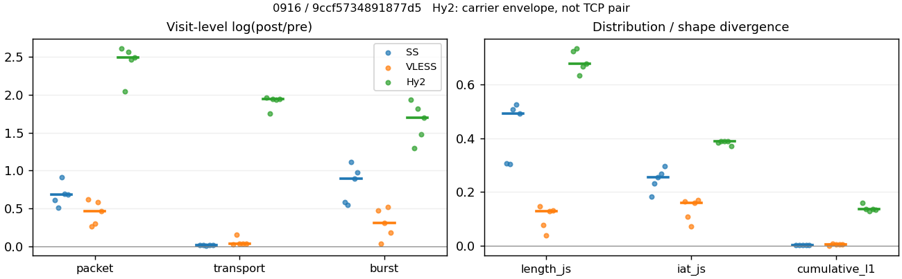
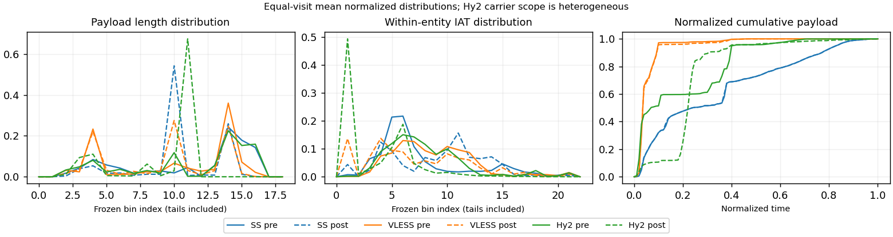

# 0916 · 条目 001 · youtube.com

目标：https://www.youtube.com/watch?v=aircAruvnKk

活动标签：youtube.com::video_playback。选定访问 15 次。

[返回总索引](../../README.md) · [统计口径](../../methods.md)

## 覆盖与资格（每次访问均保留）

| 部署 | 重复 | 主请求路由 | 活动状态 | 代理比较 | DIRECT pre | 请求 proxy/direct/unresolved | 错误 |
| --- | --- | --- | --- | --- | --- | --- | --- |
| Hy2 | 1 | proxy | passed | 1 | 1 | 215/1/0 | [] |
| Hy2 | 2 | proxy | passed | 1 | 1 | 416/1/0 | [] |
| Hy2 | 3 | proxy | passed | 1 | 1 | 224/1/0 | [] |
| Hy2 | 4 | proxy | passed | 1 | 1 | 233/1/0 | [] |
| Hy2 | 5 | proxy | passed | 1 | 1 | 233/1/0 | [] |
| SS | 1 | proxy | passed | 1 | 0 | 247/0/0 | [] |
| SS | 2 | proxy | passed | 1 | 0 | 242/0/0 | [] |
| SS | 3 | proxy | passed | 1 | 0 | 244/0/0 | [] |
| SS | 4 | proxy | passed | 1 | 0 | 240/0/0 | [] |
| SS | 5 | proxy | passed | 1 | 0 | 232/0/0 | [] |
| VLESS | 1 | proxy | passed | 1 | 0 | 243/0/0 | [] |
| VLESS | 2 | proxy | passed | 1 | 0 | 243/0/0 | [] |
| VLESS | 3 | proxy | passed | 1 | 0 | 255/0/0 | [] |
| VLESS | 4 | proxy | passed | 1 | 0 | 246/0/0 | [] |
| VLESS | 5 | proxy | passed | 1 | 0 | 245/0/0 | [] |

主请求非 proxy 的统计仅解释为已索引的辅助代理连接或 DIRECT 观测，不代表目标业务经代理传输。播放确认与配对资格是两道不同的门。

图中散点为单次访问，短线为重复中位数；Hy2 是共享载体包络，不能与 TCP 配对作等范围因果对比。

形态图先逐访问归一化，再对访问等权平均；实线 pre，虚线 post。分箱序号及边界见 methods，不将分箱索引误解为长度或时间。

## 每次访问的关键观测

### SS

范围：`exclusive_page`。每格 pre → post；空值为不可观测/不适用。

| 重复 | 包数 | 载荷字节 | burst | TCP FR | IAT中位µs | length JS | IAT JS |
| --- | --- | --- | --- | --- | --- | --- | --- |
| 1 | 4542 → 8395 | 8.7785e+06 → 8.9e+06 | 3056 → 5476 | 276 → 306 | 25.743 → 146.79 | 0.30659 | 0.18205 |
| 2 | 5617 → 9385 | 8.9344e+06 → 9.0514e+06 | 3492 → 6026 | 349 → 367 | 22.747 → 185.46 | 0.30377 | 0.23159 |
| 3 | 4636 → 11584 | 1.059e+07 → 1.0711e+07 | 3322 → 10124 | 328 → 336 | 59.639 → 1044.2 | 0.50601 | 0.2553 |
| 4 | 4961 → 9911 | 8.3186e+06 → 8.4512e+06 | 3492 → 8549 | 311 → 365 | 36.222 → 1018.8 | 0.52471 | 0.26644 |
| 5 | 4876 → 9638 | 8.2656e+06 → 8.3695e+06 | 3259 → 8669 | 292 → 304 | 34.136 → 1051.8 | 0.4916 | 0.29683 |

完整标量统计：中位数 [min,max]；Δ 为重复内逐访问变换的中位数，MAD 未缩放。n 为可用变换数；DIRECT-only 的 nΔ=0 不代表 pre 不可用。

| scope | 特征 | pre | post | Δ | IQRΔ | MADΔ | nΔ |
| --- | --- | --- | --- | --- | --- | --- | --- |
| exclusive_page | active_span_sum_s_1000ms | 67.092 [40.493, 91.382] | 77.267 [45.378, 102.95] | 0.13634 | 0.021972 | 0.0090249 | 5 |
| exclusive_page | active_span_sum_s_100ms | 24.651 [11.242, 32.725] | 50.296 [19.669, 52.904] | 0.70293 | 0.15371 | 0.045875 | 5 |
| exclusive_page | active_span_sum_s_500ms | 59.865 [30.707, 64.607] | 71.249 [37.849, 78.718] | 0.20911 | 0.053867 | 0.035011 | 5 |
| exclusive_page | burst_bytes_iqr | 3492 [2911.5, 5792] | 1428 [1428, 2856] | -0.741 | 0.85463 | 0.53995 | 5 |
| exclusive_page | burst_bytes_mad | 39 [39, 39] | 65 [34, 70] | 0.51083 | 0.70775 | 0.074108 | 5 |
| exclusive_page | burst_bytes_max | 23952 [20480, 28672] | 11424 [9836, 27132] | -0.58373 | 0.75313 | 0.30627 | 5 |
| exclusive_page | burst_bytes_mean | 2558.5 [2382.2, 3188] | 1058 [965.45, 1625.3] | -0.87953 | 0.39632 | 0.22347 | 5 |
| exclusive_page | burst_bytes_median | 39 [39, 39] | 65 [34, 70] | 0.51083 | 0.70775 | 0.074108 | 5 |
| exclusive_page | burst_bytes_min | 0 [0, 0] | 0 [0, 0] | — | — | — | 0 |
| exclusive_page | burst_bytes_p95 | 13032 [10136, 16384] | 2856 [2856, 7140] | -1.2667 | 0.56961 | 0.43608 | 5 |
| exclusive_page | burst_bytes_q25 | 0 [0, 0] | 0 [0, 0] | — | — | — | 0 |
| exclusive_page | burst_bytes_q75 | 3492 [2911.5, 5792] | 1428 [1428, 2856] | -0.741 | 0.85463 | 0.53995 | 5 |
| exclusive_page | burst_bytes_std | 4509.1 [4124, 5150.6] | 1240.4 [1160.4, 2638.8] | -1.2324 | 0.59937 | 0.14855 | 5 |
| exclusive_page | burst_count | 3322 [3056, 3492] | 8549 [5476, 10124] | 0.89534 | 0.39507 | 0.219 | 5 |
| exclusive_page | burst_duration_ms_iqr | 0.02525 [0.01533, 0.03328] | 0 [0, 0.03344] | -0.85236 | 0.85716 | 0.85716 | 2 |
| exclusive_page | burst_duration_ms_mad | 0 [0, 0] | 0 [0, 0] | — | — | — | 0 |
| exclusive_page | burst_duration_ms_max | 15001 [15001, 15001] | 30035 [15017, 35997] | 0.69425 | 0.68251 | 0.18104 | 5 |
| exclusive_page | burst_duration_ms_mean | 122.59 [66.813, 131.64] | 22.954 [18.666, 34.921] | -1.6148 | 0.40582 | 0.12848 | 5 |
| exclusive_page | burst_duration_ms_median | 0 [0, 0] | 0 [0, 0] | — | — | — | 0 |
| exclusive_page | burst_duration_ms_min | 0 [0, 0] | 0 [0, 0] | — | — | — | 0 |
| exclusive_page | burst_duration_ms_p95 | 54.544 [35.428, 93.909] | 1.0166 [0.61884, 9.4964] | -4.2893 | 0.8054 | 0.64743 | 5 |
| exclusive_page | burst_duration_ms_q25 | 0 [0, 0] | 0 [0, 0] | — | — | — | 0 |
| exclusive_page | burst_duration_ms_q75 | 0.02525 [0.01533, 0.03328] | 0 [0, 0.03344] | -0.85236 | 0.85716 | 0.85716 | 2 |
| exclusive_page | burst_duration_ms_std | 1145.4 [897.53, 1238] | 598.58 [360.42, 724.65] | -0.70348 | 0.19228 | 0.16911 | 5 |
| exclusive_page | burst_packets_iqr | 1 [1, 1] | 0 [0, 1] | 0 | 0 | 0 | 2 |
| exclusive_page | burst_packets_mad | 0 [0, 0] | 0 [0, 0] | — | — | — | 0 |
| exclusive_page | burst_packets_max | 20 [12, 33] | 11 [8, 11] | -0.91629 | 0.74841 | 0.18232 | 5 |
| exclusive_page | burst_packets_mean | 1.4863 [1.3955, 1.6085] | 1.1593 [1.1118, 1.5574] | -0.19857 | 0.17101 | 0.098376 | 5 |
| exclusive_page | burst_packets_median | 1 [1, 1] | 1 [1, 1] | 0 | 0 | 0 | 5 |
| exclusive_page | burst_packets_min | 1 [1, 1] | 1 [1, 1] | 0 | 0 | 0 | 5 |
| exclusive_page | burst_packets_p95 | 3 [3, 4] | 2 [2, 4] | -0.40547 | 0.40547 | 0 | 5 |
| exclusive_page | burst_packets_q25 | 1 [1, 1] | 1 [1, 1] | 0 | 0 | 0 | 5 |
| exclusive_page | burst_packets_q75 | 2 [2, 2] | 1 [1, 2] | -0.69315 | 0.69315 | 0 | 5 |
| exclusive_page | burst_packets_std | 1.0637 [1.0268, 1.2819] | 0.52622 [0.45626, 1.0009] | -0.66845 | 0.49642 | 0.154 | 5 |
| exclusive_page | connection_span_concurrency_max | 16 [13, 18] | 16 [13, 18] | 0 | 0 | 0 | 5 |
| exclusive_page | cumulative_l1 | — | — | 0.0018264 | 0.00034249 | 0.00031232 | 5 |
| exclusive_page | cumulative_max | — | — | 0.014716 | 0.083337 | 0.0078292 | 5 |
| exclusive_page | direction_entropy | 0.59668 [0.58548, 0.64988] | 0.39854 [0.36768, 0.41476] | -0.20645 | 0.027577 | 0.022553 | 5 |
| exclusive_page | down_burst_count | 1646 [1517, 1735] | 4262 [2727, 5047] | 0.89931 | 0.39614 | 0.22114 | 5 |
| exclusive_page | down_ip_bytes | 8.7661e+06 [8.2829e+06, 1.0489e+07] | 8.9845e+06 [8.4642e+06, 1.0736e+07] | 0.023319 | 0.0026392 | 0.0013472 | 5 |
| exclusive_page | down_packets | 2937 [2651, 3552] | 5224 [4939, 6056] | 0.57587 | 0.09948 | 0.063901 | 5 |
| exclusive_page | down_transport_bytes | 8.6214e+06 [8.1288e+06, 1.0351e+07] | 8.7171e+06 [8.2065e+06, 1.042e+07] | 0.0096711 | 0.0015164 | 0.0013645 | 5 |
| exclusive_page | duration_s | 62.922 [60.908, 64.1] | 62.921 [60.907, 64.099] | -1.789e-05 | 1.031e-05 | 6.0066e-06 | 5 |
| exclusive_page | entity_count | 22 [21, 30] | 22 [21, 30] | 0 | 0 | 0 | 5 |
| exclusive_page | fr_runs | 311 [276, 349] | 336 [304, 367] | 0.05029 | 0.06291 | 0.026192 | 5 |
| exclusive_page | fr_runs_per_packet | 0.10169 [0.098727, 0.12391] | 0.060582 [0.054821, 0.068803] | -0.038921 | 0.0035512 | 0.0033677 | 5 |
| exclusive_page | fr_switches | 285 [254, 327] | 306 [283, 345] | 0.053584 | 0.068312 | 0.027093 | 5 |
| exclusive_page | fr_switches_per_possible_transition | 0.094354 [0.09284, 0.11387] | 0.056634 [0.050172, 0.064217] | -0.036206 | 0.0035834 | 0.0027762 | 5 |
| exclusive_page | full_retransmission_fraction | 0.00086281 [0.00080629, 0.0028485] | 0.0058702 [0.0049014, 0.0080718] | 0.0047825 | 0.00081277 | 0.00058789 | 5 |
| exclusive_page | full_retransmission_packets | 4 [4, 16] | 54 [46, 80] | 2.6027 | 1.0006 | 0.39304 | 5 |
| exclusive_page | iat_count | 4855 [4520, 5595] | 9617 [8373, 11554] | 0.68352 | 0.078166 | 0.067023 | 5 |
| exclusive_page | iat_js | — | — | 0.2553 | 0.034845 | 0.023711 | 5 |
| exclusive_page | iat_ks | — | — | 0.37929 | 0.085288 | 0.065365 | 5 |
| exclusive_page | iat_median_us | 34.136 [22.747, 59.639] | 1018.8 [146.79, 1051.8] | 2.8627 | 1.2383 | 0.56517 | 5 |
| exclusive_page | iat_us_iqr | 346.45 [69.466, 4171.8] | 5880.1 [837.18, 9038.7] | 2.6173 | 1.1383 | 0.58374 | 5 |
| exclusive_page | iat_us_mad | 25.411 [16.142, 49.559] | 1008 [146.29, 1041.4] | 3.0406 | 1.1182 | 0.60052 | 5 |
| exclusive_page | iat_us_max | 1.5001e+07 [1.5001e+07, 1.5001e+07] | 1.5423e+07 [1.5336e+07, 1.5488e+07] | 0.02773 | 0.0068563 | 0.0037279 | 5 |
| exclusive_page | iat_us_mean | 1.4859e+05 [1.0166e+05, 1.9981e+05] | 86285 [40622, 1.079e+05] | -0.69323 | 0.085581 | 0.077098 | 5 |
| exclusive_page | iat_us_median | 34.136 [22.747, 59.639] | 1018.8 [146.79, 1051.8] | 2.8627 | 1.2383 | 0.56517 | 5 |
| exclusive_page | iat_us_min | 0.01 [0.004, 0.031] | 0.036 [0.032, 0.038] | 1.3083 | 1.4376 | 0.88889 | 5 |
| exclusive_page | iat_us_p95 | 1.0364e+05 [52258, 1.1686e+05] | 31139 [27617, 32791] | -1.2518 | 0.57445 | 0.07068 | 5 |
| exclusive_page | iat_us_q25 | 13.64 [12.408, 19.691] | 17.325 [9.103, 32.063] | -0.12798 | 0.55856 | 0.18447 | 5 |
| exclusive_page | iat_us_q75 | 360.33 [81.874, 4191.5] | 5897.5 [846.28, 9058] | 2.4635 | 1.2026 | 0.70205 | 5 |
| exclusive_page | iat_us_std | 1.3246e+06 [9.1962e+05, 1.5965e+06] | 1.0016e+06 [5.7899e+05, 1.1876e+06] | -0.34512 | 0.056431 | 0.049288 | 5 |
| exclusive_page | iat_wasserstein_log1p_us | — | — | 1.4445 | 0.40558 | 0.3293 | 5 |
| exclusive_page | idle_gap_count_1000ms | 76 [57, 85] | 75 [56, 87] | -0.0177 | 0.035545 | 0.031091 | 5 |
| exclusive_page | idle_gap_count_100ms | 241 [171, 279] | 189 [155, 216] | -0.20668 | 0.28042 | 0.16143 | 5 |
| exclusive_page | idle_gap_count_500ms | 96 [89, 99] | 89 [79, 97] | -0.075712 | 0.083755 | 0.043477 | 5 |
| exclusive_page | idle_gap_sum_s_1000ms | 777.94 [376.88, 862.66] | 752.53 [366.39, 858.11] | -0.015506 | 0.018219 | 0.010213 | 5 |
| exclusive_page | idle_gap_sum_s_100ms | 819.74 [435.54, 891.91] | 779.51 [417.1, 883.82] | -0.038167 | 0.027872 | 0.012946 | 5 |
| exclusive_page | idle_gap_sum_s_500ms | 785.17 [405.59, 872.45] | 758.55 [390.63, 865.64] | -0.017424 | 0.02001 | 0.0095866 | 5 |
| exclusive_page | ip_bytes | 9.0151e+06 [8.5195e+06, 1.0832e+07] | 9.4047e+06 [8.9533e+06, 1.1394e+07] | 0.049663 | 0.0082285 | 0.0031566 | 5 |
| exclusive_page | length_iqr | 3670.5 [3423.2, 6984] | 1428 [0, 1728] | -0.90918 | 0.25498 | 0.083698 | 4 |
| exclusive_page | length_js | — | — | 0.4916 | 0.19942 | 0.033106 | 5 |
| exclusive_page | length_ks | — | — | 0.48677 | 0.042137 | 0.026913 | 5 |
| exclusive_page | length_mad | 1881 [1680, 2687] | 0 [0, 999] | -0.87719 | 0.24439 | 0.24439 | 2 |
| exclusive_page | length_max | 8920 [8920, 8920] | 7140 [2856, 11424] | -0.22258 | 0.40547 | 0.22314 | 5 |
| exclusive_page | length_mean | 2881.4 [2527.4, 4000.9] | 1667.9 [1560.3, 1747.6] | -0.59262 | 0.10489 | 0.070491 | 5 |
| exclusive_page | length_median | 2896 [2175, 2896] | 1428 [1428, 1428] | -0.70706 | 0.20637 | 0 | 5 |
| exclusive_page | length_min | 20 [8, 31] | 6 [3, 10] | -1.204 | 0.6614 | 0.43825 | 5 |
| exclusive_page | length_p95 | 8192 [7856, 8192] | 2856 [2856, 2896] | -1.0537 | 0.013908 | 0 | 5 |
| exclusive_page | length_q25 | 557.5 [339, 1208] | 1428 [1128, 1428] | 0.94057 | 0.76336 | 0.2702 | 5 |
| exclusive_page | length_q75 | 4096 [4096, 8192] | 2856 [1428, 2856] | -0.41937 | 0.69315 | 0.058785 | 5 |
| exclusive_page | length_std | 2658 [2300.1, 3184.8] | 799.5 [757.82, 1225.6] | -1.1596 | 0.44262 | 0.22257 | 5 |
| exclusive_page | length_wasserstein_bytes | — | — | 1644.4 | 81.171 | 66.873 | 5 |
| exclusive_page | nonempty_entity_count | 22 [21, 30] | 22 [21, 30] | 0 | 0 | 0 | 5 |
| exclusive_page | nonempty_packets | 2887 [2647, 3535] | 5305 [5018, 6129] | 0.60843 | 0.10615 | 0.07381 | 5 |
| exclusive_page | offload_suspect_fraction | 0.36403 [0.35275, 0.39215] | 0.16152 [0.11492, 0.20881] | -0.22811 | 0.051512 | 0.0097211 | 5 |
| exclusive_page | packet_count | 4876 [4542, 5617] | 9638 [8395, 11584] | 0.68139 | 0.077769 | 0.06712 | 5 |
| exclusive_page | rtt_median_ms | 0.051486 [0.043816, 0.064307] | 33.221 [32.521, 35.838] | 6.4605 | 0.19314 | 0.14194 | 5 |
| exclusive_page | rtt_sample_count | 1923 [1685, 1965] | 1428 [906, 2050] | -0.24695 | 0.40126 | 0.3109 | 5 |
| exclusive_page | tcp_ack_count | 4854 [4520, 5595] | 9607 [8371, 11548] | 0.68269 | 0.078405 | 0.066428 | 5 |
| exclusive_page | tcp_fin_count | 44 [42, 58] | 47 [45, 67] | 0.068993 | 0.044336 | 0.0030349 | 5 |
| exclusive_page | tcp_packet_count | 4876 [4542, 5617] | 9638 [8395, 11584] | 0.68139 | 0.077769 | 0.06712 | 5 |
| exclusive_page | tcp_rst_count | 1 [0, 3] | 0 [0, 1] | 0 | — | — | 1 |
| exclusive_page | tcp_syn_count | 44 [42, 60] | 52 [46, 66] | 0.09531 | 0.043241 | 0.029352 | 5 |
| exclusive_page | tcp_window_raw_median | 65535 [65535, 65535] | 159 [152, 168] | -6.0214 | 0.0497 | 0.037041 | 5 |
| exclusive_page | transition_entropy | 0.38769 [0.38414, 0.44394] | 0.25023 [0.23133, 0.27485] | -0.13391 | 0.014833 | 0.011803 | 5 |
| exclusive_page | transition_n_mm | 2302 [2050, 2862] | 4698 [4498, 5485] | 0.71336 | 0.11873 | 0.080601 | 5 |
| exclusive_page | transition_n_mp | 139 [122, 161] | 146 [137, 170] | 0.054394 | 0.071835 | 0.026615 | 5 |
| exclusive_page | transition_n_pm | 146 [132, 166] | 160 [144, 175] | 0.052798 | 0.065071 | 0.02748 | 5 |
| exclusive_page | transition_n_pp | 269 [249, 324] | 242 [204, 308] | -0.12419 | 0.080979 | 0.057359 | 5 |
| exclusive_page | transition_p_mm | 0.94674 [0.93522, 0.94726] | 0.97002 [0.96587, 0.97407] | 0.022816 | 0.0013583 | 0.0013023 | 5 |
| exclusive_page | transition_p_mp | 0.053258 [0.052736, 0.064781] | 0.029976 [0.025928, 0.034128] | -0.022816 | 0.0013583 | 0.0013023 | 5 |
| exclusive_page | transition_p_pm | 0.34761 [0.33878, 0.36706] | 0.4 [0.34188, 0.4188] | 0.052393 | 0.034092 | 0.017237 | 5 |
| exclusive_page | transition_p_pp | 0.65239 [0.63294, 0.66122] | 0.6 [0.5812, 0.65812] | -0.052393 | 0.034092 | 0.017237 | 5 |
| exclusive_page | transport_bytes | 8.7785e+06 [8.2656e+06, 1.059e+07] | 8.9e+06 [8.3695e+06, 1.0711e+07] | 0.013009 | 0.0012594 | 0.00074365 | 5 |
| exclusive_page | up_burst_count | 1676 [1539, 1758] | 4287 [2749, 5077] | 0.89141 | 0.39399 | 0.2169 | 5 |
| exclusive_page | up_byte_fraction | 0.019054 [0.01655, 0.022656] | 0.023432 [0.019471, 0.027156] | 0.0032607 | 0.0014571 | 0.00059545 | 5 |
| exclusive_page | up_ip_bytes | 2.6397e+05 [2.3663e+05, 3.4344e+05] | 4.8914e+05 [4.2023e+05, 6.575e+05] | 0.64942 | 0.14582 | 0.076723 | 5 |
| exclusive_page | up_packets | 1985 [1763, 2065] | 4687 [3273, 5528] | 0.83972 | 0.27842 | 0.18449 | 5 |
| exclusive_page | up_transport_bytes | 1.585e+05 [1.3679e+05, 2.3993e+05] | 1.9803e+05 [1.6296e+05, 2.9088e+05] | 0.17503 | 0.039105 | 0.021585 | 5 |
| exclusive_page | zero_iat_count | 0 [0, 0] | 0 [0, 0] | — | — | — | 0 |
| exclusive_page | zero_iat_fraction | 0 [0, 0] | 0 [0, 0] | 0 | 0 | 0 | 5 |

### VLESS

范围：`exclusive_page`。每格 pre → post；空值为不可观测/不适用。

| 重复 | 包数 | 载荷字节 | burst | TCP FR | IAT中位µs | length JS | IAT JS |
| --- | --- | --- | --- | --- | --- | --- | --- |
| 1 | 3359 → 6254 | 4.7388e+06 → 4.8649e+06 | 2272 → 3662 | 166 → 202 | 360.62 → 17.545 | 0.14646 | 0.16504 |
| 2 | 1470 → 1921 | 9.1444e+05 → 1.067e+06 | 1114 → 1156 | 156 → 196 | 172.18 → 272.52 | 0.077465 | 0.10861 |
| 3 | 3703 → 4978 | 4.3837e+06 → 4.5345e+06 | 2612 → 3544 | 162 → 204 | 141.86 → 58.707 | 0.037058 | 0.072113 |
| 4 | 3616 → 6449 | 4.7185e+06 → 4.8747e+06 | 2441 → 4086 | 182 → 226 | 157.01 → 22.201 | 0.12844 | 0.15839 |
| 5 | 4106 → 6503 | 4.699e+06 → 4.8559e+06 | 3197 → 3822 | 176 → 218 | 120.75 → 18.63 | 0.1305 | 0.17051 |

完整标量统计：中位数 [min,max]；Δ 为重复内逐访问变换的中位数，MAD 未缩放。n 为可用变换数；DIRECT-only 的 nΔ=0 不代表 pre 不可用。

| scope | 特征 | pre | post | Δ | IQRΔ | MADΔ | nΔ |
| --- | --- | --- | --- | --- | --- | --- | --- |
| exclusive_page | active_span_sum_s_1000ms | 28.14 [26.89, 28.971] | 29.272 [28.172, 30.169] | 0.042125 | 0.0060224 | 0.0026933 | 5 |
| exclusive_page | active_span_sum_s_100ms | 4.1832 [2.7554, 4.9625] | 12.304 [10.727, 13.043] | 1.0788 | 0.12939 | 0.06859 | 5 |
| exclusive_page | active_span_sum_s_500ms | 14.225 [12.07, 17.303] | 29.272 [26.562, 30.169] | 0.72163 | 0.032128 | 0.027208 | 5 |
| exclusive_page | burst_bytes_iqr | 2896 [1267, 2896] | 2824 [1974.5, 2824] | -0.025176 | 0.025176 | 0 | 5 |
| exclusive_page | burst_bytes_mad | 0 [0, 0] | 31 [24, 53] | — | — | — | 0 |
| exclusive_page | burst_bytes_max | 20480 [8688, 24564] | 13057 [5864, 17448] | -0.39311 | 0.10344 | 0.057014 | 5 |
| exclusive_page | burst_bytes_mean | 1678.3 [820.86, 2085.8] | 1270.5 [923.01, 1328.5] | -0.27134 | 0.30538 | 0.17976 | 5 |
| exclusive_page | burst_bytes_median | 0 [0, 0] | 31 [24, 53] | — | — | — | 0 |
| exclusive_page | burst_bytes_min | 0 [0, 0] | 0 [0, 0] | — | — | — | 0 |
| exclusive_page | burst_bytes_p95 | 7240 [2896, 10080] | 4236 [2896, 4416] | -0.52754 | 0.39311 | 0.20233 | 5 |
| exclusive_page | burst_bytes_q25 | 0 [0, 0] | 0 [0, 0] | — | — | — | 0 |
| exclusive_page | burst_bytes_q75 | 2896 [1267, 2896] | 2824 [1974.5, 2824] | -0.025176 | 0.025176 | 0 | 5 |
| exclusive_page | burst_bytes_std | 2793.7 [1343.1, 3556.5] | 1703.7 [1262.7, 1771.3] | -0.49459 | 0.2888 | 0.20247 | 5 |
| exclusive_page | burst_count | 2441 [1114, 3197] | 3662 [1156, 4086] | 0.30514 | 0.29879 | 0.17221 | 5 |
| exclusive_page | burst_duration_ms_iqr | 0.40008 [0, 0.85183] | 0.0060412 [0.000115, 0.25609] | -5.0514 | 1.8982 | 1.2372 | 4 |
| exclusive_page | burst_duration_ms_mad | 0 [0, 0] | 0 [0, 0] | — | — | — | 0 |
| exclusive_page | burst_duration_ms_max | 15001 [15001, 15001] | 15003 [14998, 15062] | 0.00011665 | 0.00052131 | 0.00032654 | 5 |
| exclusive_page | burst_duration_ms_mean | 103.38 [66.378, 241.89] | 13.051 [9.9256, 31.959] | -2.024 | 0.27136 | 0.14761 | 5 |
| exclusive_page | burst_duration_ms_median | 0 [0, 0] | 0 [0, 0] | — | — | — | 0 |
| exclusive_page | burst_duration_ms_min | 0 [0, 0] | 0 [0, 0] | — | — | — | 0 |
| exclusive_page | burst_duration_ms_p95 | 9.998 [6.9885, 202.38] | 8.0063 [5.1915, 155.2] | -0.23166 | 0.17314 | 0.13936 | 5 |
| exclusive_page | burst_duration_ms_q25 | 0 [0, 0] | 0 [0, 0] | — | — | — | 0 |
| exclusive_page | burst_duration_ms_q75 | 0.40008 [0, 0.85183] | 0.0060412 [0.000115, 0.25609] | -5.0514 | 1.8982 | 1.2372 | 4 |
| exclusive_page | burst_duration_ms_std | 1112.4 [844.45, 1703.2] | 310 [252.37, 452.83] | -1.3248 | 0.14604 | 0.11698 | 5 |
| exclusive_page | burst_packets_iqr | 1 [0, 1] | 1 [1, 1] | 0 | 0 | 0 | 4 |
| exclusive_page | burst_packets_mad | 0 [0, 0] | 0 [0, 0] | — | — | — | 0 |
| exclusive_page | burst_packets_max | 7 [4, 9] | 8 [8, 9] | 0.13353 | 0.1699 | 0.15415 | 5 |
| exclusive_page | burst_packets_mean | 1.4177 [1.2843, 1.4814] | 1.6618 [1.4046, 1.7078] | 0.14423 | 0.16718 | 0.086346 | 5 |
| exclusive_page | burst_packets_median | 1 [1, 1] | 1 [1, 1] | 0 | 0 | 0 | 5 |
| exclusive_page | burst_packets_min | 1 [1, 1] | 1 [1, 1] | 0 | 0 | 0 | 5 |
| exclusive_page | burst_packets_p95 | 2 [2, 3] | 3 [3, 4] | 0.40547 | 0.11778 | 0.11778 | 5 |
| exclusive_page | burst_packets_q25 | 1 [1, 1] | 1 [1, 1] | 0 | 0 | 0 | 5 |
| exclusive_page | burst_packets_q75 | 2 [1, 2] | 2 [2, 2] | 0 | 0 | 0 | 5 |
| exclusive_page | burst_packets_std | 0.60664 [0.52259, 0.68528] | 0.99164 [0.82357, 1.1409] | 0.38409 | 0.12415 | 0.072124 | 5 |
| exclusive_page | connection_span_concurrency_max | 14 [11, 14] | 14 [11, 14] | 0 | 0 | 0 | 5 |
| exclusive_page | cumulative_l1 | — | — | 0.0041512 | 0.00023946 | 0.00013822 | 5 |
| exclusive_page | cumulative_max | — | — | 0.034571 | 0.029162 | 0.0092608 | 5 |
| exclusive_page | direction_entropy | 0.3867 [0.33971, 0.70875] | 0.32255 [0.30121, 0.66988] | -0.06203 | 0.025278 | 0.02316 | 5 |
| exclusive_page | down_burst_count | 1210 [547, 1588] | 1822 [568, 2033] | 0.30773 | 0.30047 | 0.17264 | 5 |
| exclusive_page | down_ip_bytes | 4.748e+06 [8.9437e+05, 4.7812e+06] | 4.9315e+06 [1.021e+06, 4.9473e+06] | 0.037455 | 0.0037693 | 0.0032975 | 5 |
| exclusive_page | down_packets | 2284 [820, 2384] | 3534 [1071, 3681] | 0.4344 | 0.18379 | 0.081338 | 5 |
| exclusive_page | down_transport_bytes | 4.6239e+06 [8.5157e+05, 4.6713e+06] | 4.74e+06 [9.6519e+05, 4.7634e+06] | 0.0248 | 0.001407 | 0.00088214 | 5 |
| exclusive_page | duration_s | 63.062 [60.552, 64.735] | 63.041 [60.528, 64.718] | -0.00033205 | 0.00015088 | 8.3441e-05 | 5 |
| exclusive_page | entity_count | 20 [18, 21] | 20 [18, 21] | 0 | 0 | 0 | 5 |
| exclusive_page | fr_runs | 166 [156, 182] | 204 [196, 226] | 0.21653 | 0.014248 | 0.01173 | 5 |
| exclusive_page | fr_runs_per_packet | 0.081412 [0.073039, 0.2111] | 0.064794 [0.058449, 0.20103] | -0.015946 | 0.0080895 | 0.005876 | 5 |
| exclusive_page | fr_switches | 148 [136, 161] | 184 [176, 205] | 0.24161 | 0.01805 | 0.016223 | 5 |
| exclusive_page | fr_switches_per_possible_transition | 0.073231 [0.064604, 0.18915] | 0.059129 [0.053519, 0.18429] | -0.012947 | 0.010104 | 0.0067647 | 5 |
| exclusive_page | full_retransmission_fraction | 0.00073064 [0, 0.0011908] | 0 [0, 0.00052056] | -0.00073064 | 0.00056609 | 0.00037556 | 5 |
| exclusive_page | full_retransmission_packets | 3 [0, 4] | 0 [0, 1] | — | — | — | 0 |
| exclusive_page | iat_count | 3595 [1450, 4085] | 6236 [1901, 6482] | 0.46171 | 0.28384 | 0.16236 | 5 |
| exclusive_page | iat_js | — | — | 0.15839 | 0.056423 | 0.012122 | 5 |
| exclusive_page | iat_ks | — | — | 0.3411 | 0.15819 | 0.0050958 | 5 |
| exclusive_page | iat_median_us | 157.01 [120.75, 360.62] | 22.201 [17.545, 272.52] | -1.869 | 1.0738 | 0.98668 | 5 |
| exclusive_page | iat_us_iqr | 1014.7 [799.19, 2514.1] | 783.67 [532.95, 4440.8] | -0.40518 | 0.48199 | 0.31736 | 5 |
| exclusive_page | iat_us_mad | 148.72 [108.8, 350.65] | 22.154 [17.497, 272.42] | -1.7682 | 1.0794 | 0.94354 | 5 |
| exclusive_page | iat_us_max | 1.5001e+07 [1.5001e+07, 1.5004e+07] | 1.5449e+07 [1.5403e+07, 1.5485e+07] | 0.029436 | 0.0017613 | 0.0014872 | 5 |
| exclusive_page | iat_us_mean | 1.732e+05 [1.4727e+05, 4.4094e+05] | 1.0924e+05 [84000, 3.3599e+05] | -0.46285 | 0.2705 | 0.16242 | 5 |
| exclusive_page | iat_us_median | 157.01 [120.75, 360.62] | 22.201 [17.545, 272.52] | -1.869 | 1.0738 | 0.98668 | 5 |
| exclusive_page | iat_us_min | 0.253 [0.008, 1.927] | 0.031 [0.027, 0.036] | -2.2376 | 1.8994 | 1.6314 | 5 |
| exclusive_page | iat_us_p95 | 9908.9 [9626.6, 5.1557e+05] | 36311 [15863, 1.5361e+05] | 1.1369 | 0.91513 | 0.32733 | 5 |
| exclusive_page | iat_us_q25 | 33.212 [29.924, 34.16] | 4.949 [4.0143, 11.21] | -1.8897 | 0.84224 | 0.2234 | 5 |
| exclusive_page | iat_us_q75 | 1048.6 [831.94, 2548.3] | 787.68 [537.9, 4452] | -0.43609 | 0.48715 | 0.31082 | 5 |
| exclusive_page | iat_us_std | 1.5011e+06 [1.3713e+06, 2.3842e+06] | 1.2033e+06 [1.0465e+06, 2.1087e+06] | -0.22116 | 0.14095 | 0.068386 | 5 |
| exclusive_page | iat_wasserstein_log1p_us | — | — | 1.408 | 0.7136 | 0.37972 | 5 |
| exclusive_page | idle_gap_count_1000ms | 51 [49, 60] | 48 [42, 57] | -0.063179 | 0.0083682 | 0.005814 | 5 |
| exclusive_page | idle_gap_count_100ms | 123 [114, 131] | 137 [130, 152] | 0.1493 | 0.038915 | 0.0070498 | 5 |
| exclusive_page | idle_gap_count_500ms | 73 [68, 82] | 50 [42, 57] | -0.38137 | 0.019911 | 0.01698 | 5 |
| exclusive_page | idle_gap_sum_s_1000ms | 612.47 [495.48, 679.38] | 610.54 [493.66, 684.45] | -0.0031682 | 0.00083396 | 0.00051999 | 5 |
| exclusive_page | idle_gap_sum_s_100ms | 636.61 [519.49, 703.33] | 627.98 [510.78, 701.71] | -0.013644 | 0.002785 | 0.0019118 | 5 |
| exclusive_page | idle_gap_sum_s_500ms | 627.29 [507.15, 693.29] | 612.15 [493.66, 684.45] | -0.024445 | 0.0038331 | 0.0025178 | 5 |
| exclusive_page | ip_bytes | 4.9065e+06 [9.9076e+05, 4.9134e+06] | 5.2023e+06 [1.1686e+06, 5.2241e+06] | 0.058001 | 0.0055931 | 0.0047233 | 5 |
| exclusive_page | length_iqr | 2752 [2257, 2804] | 1798 [1376, 2752] | -0.39533 | 0.093744 | 0.049046 | 5 |
| exclusive_page | length_js | — | — | 0.12844 | 0.053033 | 0.018025 | 5 |
| exclusive_page | length_ks | — | — | 0.26503 | 0.13408 | 0.054618 | 5 |
| exclusive_page | length_mad | 1340 [888, 1412] | 1268 [1054, 1340] | -0.027233 | 0.26025 | 0.080333 | 5 |
| exclusive_page | length_max | 8920 [5792, 8920] | 8688 [2896, 13032] | -0.026353 | 0.54114 | 0.38699 | 5 |
| exclusive_page | length_mean | 2049.3 [1237.4, 2324.1] | 1397.6 [1094.4, 1650.1] | -0.41405 | 0.25057 | 0.087346 | 5 |
| exclusive_page | length_median | 1549.5 [960, 2824] | 1412 [1126, 1412] | -0.092925 | 0.1961 | 0.15291 | 5 |
| exclusive_page | length_min | 22 [13, 24] | 14 [3, 22] | -0.13353 | 0.40547 | 0.13353 | 5 |
| exclusive_page | length_p95 | 5756 [2896, 7276] | 2824 [2824, 2968] | -0.71209 | 0.1037 | 0.068675 | 5 |
| exclusive_page | length_q25 | 92 [72, 567] | 108 [72, 179.75] | 0 | 0.40547 | 0.40547 | 5 |
| exclusive_page | length_q75 | 2824 [2824, 2896] | 1936 [1448, 2824] | -0.40271 | 0.25637 | 0.1481 | 5 |
| exclusive_page | length_std | 1795.4 [1218.2, 2215.9] | 1115.5 [1009.2, 1364.4] | -0.44779 | 0.40393 | 0.20631 | 5 |
| exclusive_page | length_wasserstein_bytes | — | — | 695.63 | 423.89 | 230.76 | 5 |
| exclusive_page | nonempty_entity_count | 20 [18, 21] | 20 [18, 21] | 0 | 0 | 0 | 5 |
| exclusive_page | nonempty_packets | 2194 [739, 2293] | 3456 [975, 3585] | 0.4469 | 0.18646 | 0.080755 | 5 |
| exclusive_page | offload_suspect_fraction | 0.32965 [0.18435, 0.34088] | 0.16002 [0.11244, 0.24548] | -0.16231 | 0.078077 | 0.016432 | 5 |
| exclusive_page | packet_count | 3616 [1470, 4106] | 6254 [1921, 6503] | 0.45981 | 0.28267 | 0.16176 | 5 |
| exclusive_page | rtt_median_ms | 0.18244 [0.065606, 0.63904] | 0.050111 [0.0464, 0.84285] | -1.3691 | 1.273 | 1.0699 | 5 |
| exclusive_page | rtt_sample_count | 1261 [595, 1655] | 2230 [786, 2359] | 0.40224 | 0.25738 | 0.12385 | 5 |
| exclusive_page | tcp_ack_count | 3556 [1413, 4046] | 6236 [1901, 6481] | 0.47115 | 0.28337 | 0.16343 | 5 |
| exclusive_page | tcp_fin_count | 39 [36, 39] | 40 [36, 44] | 0.074108 | 0.052644 | 0.04652 | 5 |
| exclusive_page | tcp_packet_count | 3616 [1470, 4106] | 6254 [1921, 6503] | 0.45981 | 0.28267 | 0.16176 | 5 |
| exclusive_page | tcp_rst_count | 39 [36, 39] | 1 [0, 5] | -3.6636 | 0.80472 | 0 | 3 |
| exclusive_page | tcp_syn_count | 40 [36, 42] | 40 [36, 44] | 0 | 0 | 0 | 5 |
| exclusive_page | tcp_window_raw_median | 65535 [65535, 65535] | 175 [142, 195] | -5.9256 | 0.068993 | 0.040822 | 5 |
| exclusive_page | transition_entropy | 0.2775 [0.24287, 0.57518] | 0.23303 [0.21564, 0.55998] | -0.040076 | 0.029269 | 0.024873 | 5 |
| exclusive_page | transition_n_mm | 1937 [518, 2039] | 3170 [706, 3274] | 0.47355 | 0.18295 | 0.097404 | 5 |
| exclusive_page | transition_n_mp | 65 [58, 70] | 83 [78, 92] | 0.27329 | 0.023201 | 0.022552 | 5 |
| exclusive_page | transition_n_pm | 83 [78, 91] | 102 [98, 113] | 0.21653 | 0.014248 | 0.01173 | 5 |
| exclusive_page | transition_n_pp | 75 [59, 82] | 87 [73, 93] | 0.17589 | 0.088228 | 0.059818 | 5 |
| exclusive_page | transition_p_mm | 0.96512 [0.89931, 0.97036] | 0.9718 [0.90051, 0.97449] | 0.005639 | 0.0054697 | 0.0038677 | 5 |
| exclusive_page | transition_p_mp | 0.034878 [0.02964, 0.10069] | 0.028204 [0.025515, 0.09949] | -0.005639 | 0.0054697 | 0.0038677 | 5 |
| exclusive_page | transition_p_pm | 0.54545 [0.50303, 0.57857] | 0.54595 [0.5396, 0.5731] | 0.0094835 | 0.024618 | 0.018161 | 5 |
| exclusive_page | transition_p_pp | 0.45455 [0.42143, 0.49697] | 0.45405 [0.4269, 0.4604] | -0.0094835 | 0.024618 | 0.018161 | 5 |
| exclusive_page | transport_bytes | 4.699e+06 [9.1444e+05, 4.7388e+06] | 4.8559e+06 [1.067e+06, 4.8747e+06] | 0.032844 | 0.0012372 | 0.0009603 | 5 |
| exclusive_page | up_burst_count | 1231 [567, 1609] | 1840 [588, 2053] | 0.30258 | 0.29713 | 0.17178 | 5 |
| exclusive_page | up_byte_fraction | 0.015983 [0.014246, 0.068757] | 0.024048 [0.020858, 0.095415] | 0.0079509 | 0.00024251 | 0.00017556 | 5 |
| exclusive_page | up_ip_bytes | 1.4414e+05 [96390, 1.6438e+05] | 2.5496e+05 [1.4756e+05, 2.7999e+05] | 0.51164 | 0.22186 | 0.085834 | 5 |
| exclusive_page | up_packets | 1332 [650, 1722] | 2720 [850, 2864] | 0.49396 | 0.3384 | 0.2257 | 5 |
| exclusive_page | up_transport_bytes | 75102 [62874, 75128] | 1.1376e+05 [1.0147e+05, 1.1723e+05] | 0.43382 | 0.02999 | 0.018874 | 5 |
| exclusive_page | zero_iat_count | 0 [0, 0] | 0 [0, 0] | — | — | — | 0 |
| exclusive_page | zero_iat_fraction | 0 [0, 0] | 0 [0, 0] | 0 | 0 | 0 | 5 |

### Hy2

范围：`carrier_context_envelope`。每格 pre → post；空值为不可观测/不适用。

| 重复 | 包数 | 载荷字节 | burst | TCP FR | IAT中位µs | length JS | IAT JS |
| --- | --- | --- | --- | --- | --- | --- | --- |
| 1 | 4037 → 54893 | 8.211e+06 → 5.8505e+07 | 2666 → 18428 | — | 86.968 → 3.835 | 0.72257 | 0.3841 |
| 2 | 7119 → 55115 | 1.0077e+07 → 5.8304e+07 | 4676 → 17075 | — | 85.148 → 3.041 | 0.73303 | 0.38832 |
| 3 | 4045 → 52911 | 8.3227e+06 → 5.8179e+07 | 2537 → 15643 | — | 97.588 → 1.374 | 0.63453 | 0.38962 |
| 4 | 4379 → 51345 | 8.3374e+06 → 5.8006e+07 | 3091 → 13520 | — | 69.851 → 0.175 | 0.66674 | 0.38748 |
| 5 | 4379 → 53068 | 8.3465e+06 → 5.8296e+07 | 2885 → 15820 | — | 80.898 → 1.4 | 0.67799 | 0.37164 |

范围：`direct_pre_only`。每格 pre → post；空值为不可观测/不适用。

| 重复 | 包数 | 载荷字节 | burst | TCP FR | IAT中位µs | length JS | IAT JS |
| --- | --- | --- | --- | --- | --- | --- | --- |
| 1 | 31 → — | 8647 → — | 21 → — | 5 → — | 253.04 → — | — | — |
| 2 | 37 → — | 8670 → — | 29 → — | 7 → — | 218.57 → — | — | — |
| 3 | 29 → — | 8736 → — | 21 → — | 7 → — | 152.73 → — | — | — |
| 4 | 31 → — | 8724 → — | 21 → — | 7 → — | 135.44 → — | — | — |
| 5 | 31 → — | 8661 → — | 21 → — | 7 → — | 169.88 → — | — | — |

完整标量统计：中位数 [min,max]；Δ 为重复内逐访问变换的中位数，MAD 未缩放。n 为可用变换数；DIRECT-only 的 nΔ=0 不代表 pre 不可用。

| scope | 特征 | pre | post | Δ | IQRΔ | MADΔ | nΔ |
| --- | --- | --- | --- | --- | --- | --- | --- |
| carrier_context_envelope | active_span_sum_s_1000ms | 31.921 [24.742, 96.218] | 33.994 [26.32, 38.785] | 0.061824 | 0.11463 | 0.070533 | 5 |
| carrier_context_envelope | active_span_sum_s_100ms | 4.1169 [3.8698, 4.2992] | 13.558 [11.447, 17.312] | 1.2082 | 0.080327 | 0.045943 | 5 |
| carrier_context_envelope | active_span_sum_s_500ms | 28.293 [21.532, 89.747] | 31.103 [24.503, 37.795] | 0.12925 | 0.049918 | 0.043889 | 5 |
| carrier_context_envelope | burst_bytes_iqr | 2830 [1797, 3649] | 4237 [3549, 5100] | 0.41492 | 0.18784 | 0.17555 | 5 |
| carrier_context_envelope | burst_bytes_mad | 39 [0, 39] | 266 [171, 272] | 1.9311 | 0.25501 | 0.024487 | 4 |
| carrier_context_envelope | burst_bytes_max | 28370 [20480, 28672] | 2.2181e+05 [1.7854e+05, 6.975e+05] | 2.2611 | 0.54647 | 0.3728 | 5 |
| carrier_context_envelope | burst_bytes_mean | 2893.1 [2155.1, 3280.5] | 3685 [3174.8, 4290.4] | 0.24194 | 0.33473 | 0.21159 | 5 |
| carrier_context_envelope | burst_bytes_median | 39 [0, 39] | 300 [205, 305] | 2.0485 | 0.24898 | 0.02007 | 4 |
| carrier_context_envelope | burst_bytes_min | 0 [0, 0] | 22 [22, 22] | — | — | — | 0 |
| carrier_context_envelope | burst_bytes_p95 | 14969 [12139, 20480] | 13814 [10932, 14394] | -0.23473 | 0.32704 | 0.168 | 5 |
| carrier_context_envelope | burst_bytes_q25 | 0 [0, 0] | 86 [68, 100] | — | — | — | 0 |
| carrier_context_envelope | burst_bytes_q75 | 2830 [1797, 3649] | 4323 [3634, 5168] | 0.42817 | 0.18634 | 0.18185 | 5 |
| carrier_context_envelope | burst_bytes_std | 4942.1 [4637, 5992.5] | 7885.8 [6950, 12961] | 0.49114 | 0.25002 | 0.2166 | 5 |
| carrier_context_envelope | burst_count | 2885 [2537, 4676] | 15820 [13520, 18428] | 1.7018 | 0.34337 | 0.22607 | 5 |
| carrier_context_envelope | burst_duration_ms_iqr | 0.11224 [0.031128, 0.32041] | 0.026926 [0.024631, 0.027299] | -1.4275 | 1.3152 | 0.896 | 5 |
| carrier_context_envelope | burst_duration_ms_mad | 0 [0, 0] | 4.6e-05 [4.3e-05, 5.1e-05] | — | — | — | 0 |
| carrier_context_envelope | burst_duration_ms_max | 15001 [15001, 15001] | 3781.7 [2982.2, 5056.1] | -1.378 | 0.28586 | 0.23593 | 5 |
| carrier_context_envelope | burst_duration_ms_mean | 123.08 [91.106, 184.1] | 1.34 [1.0385, 1.7438] | -4.5637 | 0.31431 | 0.30692 | 5 |
| carrier_context_envelope | burst_duration_ms_median | 0 [0, 0] | 4.6e-05 [4.3e-05, 5.1e-05] | — | — | — | 0 |
| carrier_context_envelope | burst_duration_ms_min | 0 [0, 0] | 0 [0, 0] | — | — | — | 0 |
| carrier_context_envelope | burst_duration_ms_p95 | 71.597 [12.914, 223.83] | 0.37001 [0.14131, 0.53277] | -5.2653 | 1.3057 | 0.75017 | 5 |
| carrier_context_envelope | burst_duration_ms_q25 | 0 [0, 0] | 0 [0, 0] | — | — | — | 0 |
| carrier_context_envelope | burst_duration_ms_q75 | 0.11224 [0.031128, 0.32041] | 0.026926 [0.024631, 0.027299] | -1.4275 | 1.3152 | 0.896 | 5 |
| carrier_context_envelope | burst_duration_ms_std | 1185.6 [967.63, 1486.5] | 46.975 [34.318, 57.62] | -3.1805 | 0.1267 | 0.09609 | 5 |
| carrier_context_envelope | burst_packets_iqr | 1 [1, 1] | 3 [3, 3] | 1.0986 | 0 | 0 | 5 |
| carrier_context_envelope | burst_packets_mad | 0 [0, 0] | 1 [1, 1] | — | — | — | 0 |
| carrier_context_envelope | burst_packets_max | 10 [7, 23] | 160 [136, 501] | 2.8779 | 0.20944 | 0.15287 | 5 |
| carrier_context_envelope | burst_packets_mean | 1.5179 [1.4167, 1.5944] | 3.3545 [2.9788, 3.7977] | 0.75209 | 0.041521 | 0.040915 | 5 |
| carrier_context_envelope | burst_packets_median | 1 [1, 1] | 2 [2, 2] | 0.69315 | 0 | 0 | 5 |
| carrier_context_envelope | burst_packets_min | 1 [1, 1] | 1 [1, 1] | 0 | 0 | 0 | 5 |
| carrier_context_envelope | burst_packets_p95 | 3 [3, 3] | 10 [8, 11] | 1.204 | 0 | 0 | 5 |
| carrier_context_envelope | burst_packets_q25 | 1 [1, 1] | 1 [1, 1] | 0 | 0 | 0 | 5 |
| carrier_context_envelope | burst_packets_q75 | 2 [2, 2] | 4 [4, 4] | 0.69315 | 0 | 0 | 5 |
| carrier_context_envelope | burst_packets_std | 0.92545 [0.72748, 0.9766] | 5.5301 [4.8251, 9.1847] | 1.9235 | 0.29955 | 0.19471 | 5 |
| carrier_context_envelope | connection_span_concurrency_max | 16 [16, 22] | 1 [1, 1] | -2.7726 | 0.17185 | 0 | 5 |
| carrier_context_envelope | cumulative_l1 | — | — | 0.13615 | 0.0035654 | 0.0026242 | 5 |
| carrier_context_envelope | cumulative_max | — | — | 0.4161 | 0.023275 | 0.0042282 | 5 |
| carrier_context_envelope | direction_entropy | 0.63748 [0.60415, 0.86691] | 0.72975 [0.67631, 0.7742] | 0.090971 | 0.068638 | 0.063015 | 5 |
| carrier_context_envelope | direction_run_analog_runs | 271 [234, 1096] | 15820 [13520, 18428] | 4.0414 | 0.16072 | 0.1316 | 5 |
| carrier_context_envelope | direction_run_analog_runs_per_packet | 0.10558 [0.096296, 0.36315] | 0.29811 [0.26332, 0.33571] | 0.19007 | 0.036268 | 0.032822 | 5 |
| carrier_context_envelope | direction_run_analog_switches | 248 [212, 797] | 15819 [13519, 18427] | 4.1356 | 0.13777 | 0.12906 | 5 |
| carrier_context_envelope | direction_run_analog_switches_per_possible_transition | 0.097233 [0.08804, 0.29312] | 0.29809 [0.2633, 0.3357] | 0.19683 | 0.035938 | 0.03076 | 5 |
| carrier_context_envelope | down_burst_count | 1430 [1259, 2189] | 7910 [6760, 9214] | 1.7105 | 0.3427 | 0.22666 | 5 |
| carrier_context_envelope | down_ip_bytes | 8.3224e+06 [8.2158e+06, 9.6474e+06] | 5.8288e+07 [5.7701e+07, 5.8451e+07] | 1.9472 | 0.0021216 | 0.0020419 | 5 |
| carrier_context_envelope | down_packets | 2596 [2509, 3890] | 42245 [42155, 42674] | 2.7882 | 0.047382 | 0.034662 | 5 |
| carrier_context_envelope | down_transport_bytes | 8.1891e+06 [8.0851e+06, 9.4427e+06] | 5.7106e+07 [5.6506e+07, 5.7264e+07] | 1.9431 | 0.0029561 | 0.0022915 | 5 |
| carrier_context_envelope | duration_s | 63.196 [60.415, 64.029] | 63.194 [60.414, 64.028] | -1.1908e-05 | 1.8167e-05 | 1.0136e-05 | 5 |
| carrier_context_envelope | entity_count | 25 [19, 299] | 1 [1, 1] | -3.2189 | 0.12783 | 0.12783 | 5 |
| carrier_context_envelope | full_retransmission_fraction | 0.0029687 [0.00084282, 0.0039555] | — | — | — | — | 0 |
| carrier_context_envelope | full_retransmission_packets | 13 [6, 16] | — | — | — | — | 0 |
| carrier_context_envelope | iat_count | 4354 [4015, 6820] | 53067 [51344, 55114] | 2.5005 | 0.10837 | 0.075359 | 5 |
| carrier_context_envelope | iat_js | — | — | 0.38748 | 0.004216 | 0.0021416 | 5 |
| carrier_context_envelope | iat_ks | — | — | 0.52656 | 0.01003 | 0.0083816 | 5 |
| carrier_context_envelope | iat_median_us | 85.148 [69.851, 97.588] | 1.4 [0.175, 3.835] | -4.0567 | 0.93082 | 0.72452 | 5 |
| carrier_context_envelope | iat_us_iqr | 484.18 [452.08, 706.75] | 25.259 [23.846, 26.034] | -2.9422 | 0.23987 | 0.020302 | 5 |
| carrier_context_envelope | iat_us_mad | 73.287 [62.644, 89.343] | 1.366 [0.14, 3.799] | -3.9734 | 0.99998 | 0.77284 | 5 |
| carrier_context_envelope | iat_us_max | 1.5001e+07 [1.5001e+07, 1.5001e+07] | 5.399e+06 [3.9544e+06, 7.8351e+06] | -1.0219 | 0.079592 | 0.065875 | 5 |
| carrier_context_envelope | iat_us_mean | 2.0013e+05 [1.141e+05, 2.6126e+05] | 1194.4 [1100.6, 1224.1] | -5.1112 | 0.13006 | 0.10124 | 5 |
| carrier_context_envelope | iat_us_median | 85.148 [69.851, 97.588] | 1.4 [0.175, 3.835] | -4.0567 | 0.93082 | 0.72452 | 5 |
| carrier_context_envelope | iat_us_min | 0.107 [0.027, 0.173] | 0.001 [0, 0.001] | -4.3309 | 0.97725 | 0.58215 | 4 |
| carrier_context_envelope | iat_us_p95 | 40967 [39470, 2.2122e+05] | 279.04 [175.6, 421.68] | -5.1452 | 0.50863 | 0.23392 | 5 |
| carrier_context_envelope | iat_us_q25 | 20.342 [16.758, 24.926] | 0.058 [0.043, 0.083] | -5.9579 | 0.3527 | 0.286 | 5 |
| carrier_context_envelope | iat_us_q75 | 500.94 [477.01, 729.19] | 25.308 [23.889, 26.116] | -2.9941 | 0.23052 | 0.040197 | 5 |
| carrier_context_envelope | iat_us_std | 1.5759e+06 [1.1363e+06, 1.8553e+06] | 43889 [38509, 51563] | -3.5809 | 0.12644 | 0.032001 | 5 |
| carrier_context_envelope | iat_wasserstein_log1p_us | — | — | 3.1313 | 0.11416 | 0.058461 | 5 |
| carrier_context_envelope | idle_gap_count_1000ms | 79 [63, 89] | 10 [9, 12] | -1.9339 | 0.31332 | 0.093384 | 5 |
| carrier_context_envelope | idle_gap_count_100ms | 189 [175, 446] | 113 [81, 134] | -0.57352 | 0.23503 | 0.067976 | 5 |
| carrier_context_envelope | idle_gap_count_500ms | 87 [74, 94] | 13 [11, 16] | -1.8718 | 0.040302 | 0.034368 | 5 |
| carrier_context_envelope | idle_gap_sum_s_1000ms | 835.72 [681.92, 1024.2] | 29.932 [25.134, 34.094] | -3.326 | 0.053691 | 0.025274 | 5 |
| carrier_context_envelope | idle_gap_sum_s_100ms | 867.27 [774.11, 1044.7] | 49.441 [46.608, 50.247] | -2.8504 | 0.024926 | 0.022947 | 5 |
| carrier_context_envelope | idle_gap_sum_s_500ms | 842.82 [688.39, 1027.4] | 32.925 [26.125, 35.912] | -3.2715 | 0.049913 | 0.028953 | 5 |
| carrier_context_envelope | ip_bytes | 8.5656e+06 [8.4213e+06, 1.0452e+07] | 5.9782e+07 [5.9443e+07, 6.0042e+07] | 1.9419 | 0.0073905 | 0.0046129 | 5 |
| carrier_context_envelope | length_iqr | 4668 [3650.5, 4888] | 596 [596, 806] | -2.0582 | 0.26874 | 0.046053 | 5 |
| carrier_context_envelope | length_js | — | — | 0.67799 | 0.055832 | 0.043464 | 5 |
| carrier_context_envelope | length_ks | — | — | 0.58395 | 0.081768 | 0.053496 | 5 |
| carrier_context_envelope | length_mad | 2115 [1578, 2254.5] | 0 [0, 0] | — | — | — | 0 |
| carrier_context_envelope | length_max | 8920 [8920, 8920] | 1441 [1441, 1441] | -1.823 | 0 | 0 | 5 |
| carrier_context_envelope | length_mean | 3290.9 [3140.2, 3379] | 1098.5 [1057.9, 1129.7] | -1.0963 | 0.088712 | 0.04595 | 5 |
| carrier_context_envelope | length_median | 2400 [1848, 2830] | 1441 [1441, 1441] | -0.51013 | 0.14516 | 0.073483 | 5 |
| carrier_context_envelope | length_min | 14 [10, 16] | 22 [22, 22] | 0.45199 | 0.24116 | 0.13353 | 5 |
| carrier_context_envelope | length_p95 | 8920 [8920, 8920] | 1441 [1441, 1441] | -1.823 | 0 | 0 | 5 |
| carrier_context_envelope | length_q25 | 895.75 [728, 988] | 845 [635, 845] | -0.15331 | 0.24153 | 0.19073 | 5 |
| carrier_context_envelope | length_q75 | 5552 [4638.5, 5653] | 1441 [1441, 1441] | -1.3488 | 0.12039 | 0.018028 | 5 |
| carrier_context_envelope | length_std | 3026.5 [2966, 3206.8] | 566.06 [545.51, 585.78] | -1.6601 | 0.081968 | 0.035498 | 5 |
| carrier_context_envelope | length_wasserstein_bytes | — | — | 2231.1 | 83.82 | 54.309 | 5 |
| carrier_context_envelope | nonempty_entity_count | 25 [19, 299] | 1 [1, 1] | -3.2189 | 0.12783 | 0.12783 | 5 |
| carrier_context_envelope | nonempty_packets | 2555 [2430, 3018] | 53068 [51345, 55115] | 3.0005 | 0.046787 | 0.040272 | 5 |
| carrier_context_envelope | offload_suspect_fraction | 0.33729 [0.28768, 0.38345] | 0 [0, 0] | -0.33729 | 0.011688 | 0.0084906 | 5 |
| carrier_context_envelope | packet_count | 4379 [4037, 7119] | 53068 [51345, 55115] | 2.4948 | 0.10938 | 0.076376 | 5 |
| carrier_context_envelope | rtt_median_ms | 0.097906 [0.068705, 0.15209] | — | — | — | — | 0 |
| carrier_context_envelope | rtt_sample_count | 1595 [1414, 3185] | 0 [0, 0] | — | — | — | 0 |
| carrier_context_envelope | tcp_ack_count | 4354 [4003, 6820] | — | — | — | — | 0 |
| carrier_context_envelope | tcp_fin_count | 50 [38, 599] | — | — | — | — | 0 |
| carrier_context_envelope | tcp_packet_count | 4379 [4037, 7119] | 0 [0, 0] | — | — | — | 0 |
| carrier_context_envelope | tcp_rst_count | 0 [0, 12] | — | — | — | — | 0 |
| carrier_context_envelope | tcp_syn_count | 50 [38, 598] | — | — | — | — | 0 |
| carrier_context_envelope | tcp_window_raw_median | 65535 [65505, 65535] | — | — | — | — | 0 |
| carrier_context_envelope | transition_entropy | 0.4039 [0.37364, 0.73219] | 0.72516 [0.66947, 0.77273] | 0.31413 | 0.060986 | 0.048566 | 5 |
| carrier_context_envelope | transition_n_mm | 1994 [1745, 2102] | 34334 [33173, 35431] | 2.846 | 0.045669 | 0.027447 | 5 |
| carrier_context_envelope | transition_n_mp | 121 [103, 395] | 7910 [6760, 9214] | 4.1688 | 0.12349 | 0.11217 | 5 |
| carrier_context_envelope | transition_n_pm | 129 [109, 402] | 7909 [6759, 9213] | 4.093 | 0.16156 | 0.13414 | 5 |
| carrier_context_envelope | transition_n_pp | 268 [177, 282] | 2934 [2394, 3903] | 2.3931 | 0.29461 | 0.25079 | 5 |
| carrier_context_envelope | transition_p_mm | 0.94479 [0.81542, 0.95012] | 0.81276 [0.78262, 0.83978] | -0.12832 | 0.027801 | 0.02331 | 5 |
| carrier_context_envelope | transition_p_mp | 0.055215 [0.049879, 0.18458] | 0.18724 [0.16022, 0.21738] | 0.12832 | 0.027801 | 0.02331 | 5 |
| carrier_context_envelope | transition_p_pm | 0.32152 [0.31387, 0.6943] | 0.73083 [0.68625, 0.73845] | 0.40887 | 0.013283 | 0.010086 | 5 |
| carrier_context_envelope | transition_p_pp | 0.67848 [0.3057, 0.68613] | 0.26917 [0.26155, 0.31375] | -0.40887 | 0.013283 | 0.010086 | 5 |
| carrier_context_envelope | transport_bytes | 8.3374e+06 [8.211e+06, 1.0077e+07] | 5.8296e+07 [5.8006e+07, 5.8505e+07] | 1.9437 | 0.0047396 | 0.0039026 | 5 |
| carrier_context_envelope | up_burst_count | 1455 [1278, 2487] | 7910 [6760, 9214] | 1.6931 | 0.34402 | 0.2255 | 5 |
| carrier_context_envelope | up_byte_fraction | 0.018757 [0.015333, 0.062978] | 0.019708 [0.015503, 0.03084] | -7.0915e-05 | 0.0069079 | 0.0037252 | 5 |
| carrier_context_envelope | up_ip_bytes | 2.4526e+05 [2.0553e+05, 8.0501e+05] | 1.4477e+06 [1.1556e+06, 2.1465e+06] | 1.7393 | 0.39205 | 0.20603 | 5 |
| carrier_context_envelope | up_packets | 1688 [1484, 3229] | 10823 [9154, 12506] | 1.8581 | 0.34483 | 0.22224 | 5 |
| carrier_context_envelope | up_transport_bytes | 1.5638e+05 [1.259e+05, 6.3465e+05] | 1.1466e+06 [8.9928e+05, 1.7981e+06] | 1.9399 | 0.40034 | 0.2097 | 5 |
| carrier_context_envelope | zero_iat_count | 0 [0, 0] | 0 [0, 1] | — | — | — | 0 |
| carrier_context_envelope | zero_iat_fraction | 0 [0, 0] | 0 [0, 1.8144e-05] | 0 | 0 | 0 | 5 |
| direct_pre_only | active_span_sum_s_1000ms | 0.22279 [0.20572, 0.27673] | — | — | — | — | 0 |
| direct_pre_only | active_span_sum_s_100ms | 0.079629 [0.060314, 0.16439] | — | — | — | — | 0 |
| direct_pre_only | active_span_sum_s_500ms | 0.22279 [0.20572, 0.27673] | — | — | — | — | 0 |
| direct_pre_only | burst_bytes_iqr | 577 [39, 609] | — | — | — | — | 0 |
| direct_pre_only | burst_bytes_mad | 0 [0, 0] | — | — | — | — | 0 |
| direct_pre_only | burst_bytes_max | 2856 [1770, 2856] | — | — | — | — | 0 |
| direct_pre_only | burst_bytes_mean | 412.43 [298.97, 416] | — | — | — | — | 0 |
| direct_pre_only | burst_bytes_median | 0 [0, 0] | — | — | — | — | 0 |
| direct_pre_only | burst_bytes_min | 0 [0, 0] | — | — | — | — | 0 |
| direct_pre_only | burst_bytes_p95 | 1770 [1400, 1834] | — | — | — | — | 0 |
| direct_pre_only | burst_bytes_q25 | 0 [0, 0] | — | — | — | — | 0 |
| direct_pre_only | burst_bytes_q75 | 577 [39, 609] | — | — | — | — | 0 |
| direct_pre_only | burst_bytes_std | 749.71 [538.62, 790.29] | — | — | — | — | 0 |
| direct_pre_only | burst_count | 21 [21, 29] | — | — | — | — | 0 |
| direct_pre_only | burst_duration_ms_iqr | 1.9219 [0.36445, 3.4491] | — | — | — | — | 0 |
| direct_pre_only | burst_duration_ms_mad | 0 [0, 0] | — | — | — | — | 0 |
| direct_pre_only | burst_duration_ms_max | 15001 [15000, 15001] | — | — | — | — | 0 |
| direct_pre_only | burst_duration_ms_mean | 1242.6 [583.15, 1337.2] | — | — | — | — | 0 |
| direct_pre_only | burst_duration_ms_median | 0 [0, 0] | — | — | — | — | 0 |
| direct_pre_only | burst_duration_ms_min | 0 [0, 0] | — | — | — | — | 0 |
| direct_pre_only | burst_duration_ms_p95 | 10886 [1086.9, 12856] | — | — | — | — | 0 |
| direct_pre_only | burst_duration_ms_q25 | 0 [0, 0] | — | — | — | — | 0 |
| direct_pre_only | burst_duration_ms_q75 | 1.9219 [0.36445, 3.4491] | — | — | — | — | 0 |
| direct_pre_only | burst_duration_ms_std | 3848.9 [2743, 4098.7] | — | — | — | — | 0 |
| direct_pre_only | burst_packets_iqr | 1 [1, 1] | — | — | — | — | 0 |
| direct_pre_only | burst_packets_mad | 0 [0, 0] | — | — | — | — | 0 |
| direct_pre_only | burst_packets_max | 3 [2, 4] | — | — | — | — | 0 |
| direct_pre_only | burst_packets_mean | 1.4762 [1.2759, 1.4762] | — | — | — | — | 0 |
| direct_pre_only | burst_packets_median | 1 [1, 1] | — | — | — | — | 0 |
| direct_pre_only | burst_packets_min | 1 [1, 1] | — | — | — | — | 0 |
| direct_pre_only | burst_packets_p95 | 2 [2, 3] | — | — | — | — | 0 |
| direct_pre_only | burst_packets_q25 | 1 [1, 1] | — | — | — | — | 0 |
| direct_pre_only | burst_packets_q75 | 2 [2, 2] | — | — | — | — | 0 |
| direct_pre_only | burst_packets_std | 0.58709 [0.44695, 0.79397] | — | — | — | — | 0 |
| direct_pre_only | connection_span_concurrency_max | 1 [1, 1] | — | — | — | — | 0 |
| direct_pre_only | direction_entropy | 0.99403 [0.9183, 1] | — | — | — | — | 0 |
| direct_pre_only | down_burst_count | 10 [10, 14] | — | — | — | — | 0 |
| direct_pre_only | down_ip_bytes | 6688 [6614, 6822] | — | — | — | — | 0 |
| direct_pre_only | down_packets | 16 [15, 19] | — | — | — | — | 0 |
| direct_pre_only | down_transport_bytes | 5828 [5826, 5849] | — | — | — | — | 0 |
| direct_pre_only | duration_s | 43.085 [41.099, 58.596] | — | — | — | — | 0 |
| direct_pre_only | entity_count | 1 [1, 1] | — | — | — | — | 0 |
| direct_pre_only | fr_runs | 7 [5, 7] | — | — | — | — | 0 |
| direct_pre_only | fr_runs_per_packet | 0.63636 [0.55556, 0.7] | — | — | — | — | 0 |
| direct_pre_only | fr_switches | 6 [4, 6] | — | — | — | — | 0 |
| direct_pre_only | fr_switches_per_possible_transition | 0.6 [0.5, 0.66667] | — | — | — | — | 0 |
| direct_pre_only | full_retransmission_fraction | 0 [0, 0] | — | — | — | — | 0 |
| direct_pre_only | full_retransmission_packets | 0 [0, 0] | — | — | — | — | 0 |
| direct_pre_only | iat_count | 30 [28, 36] | — | — | — | — | 0 |
| direct_pre_only | iat_median_us | 169.88 [135.44, 253.04] | — | — | — | — | 0 |
| direct_pre_only | iat_us_iqr | 3063.1 [1456.3, 26270] | — | — | — | — | 0 |
| direct_pre_only | iat_us_mad | 156.05 [118.69, 237.01] | — | — | — | — | 0 |
| direct_pre_only | iat_us_max | 1.5001e+07 [1.5001e+07, 1.5001e+07] | — | — | — | — | 0 |
| direct_pre_only | iat_us_mean | 1.4007e+06 [1.306e+06, 1.9532e+06] | — | — | — | — | 0 |
| direct_pre_only | iat_us_median | 169.88 [135.44, 253.04] | — | — | — | — | 0 |
| direct_pre_only | iat_us_min | 6.65 [4.46, 11.182] | — | — | — | — | 0 |
| direct_pre_only | iat_us_p95 | 1.425e+07 [1.3149e+07, 1.5001e+07] | — | — | — | — | 0 |
| direct_pre_only | iat_us_q25 | 49.248 [42.054, 55.811] | — | — | — | — | 0 |
| direct_pre_only | iat_us_q75 | 3112 [1498.3, 26320] | — | — | — | — | 0 |
| direct_pre_only | iat_us_std | 4.2062e+06 [4.1322e+06, 4.8166e+06] | — | — | — | — | 0 |
| direct_pre_only | idle_gap_count_1000ms | 3 [3, 5] | — | — | — | — | 0 |
| direct_pre_only | idle_gap_count_100ms | 4 [4, 6] | — | — | — | — | 0 |
| direct_pre_only | idle_gap_count_500ms | 3 [3, 5] | — | — | — | — | 0 |
| direct_pre_only | idle_gap_sum_s_1000ms | 42.859 [40.887, 58.373] | — | — | — | — | 0 |
| direct_pre_only | idle_gap_sum_s_100ms | 43.005 [40.997, 58.519] | — | — | — | — | 0 |
| direct_pre_only | idle_gap_sum_s_500ms | 42.859 [40.887, 58.373] | — | — | — | — | 0 |
| direct_pre_only | ip_bytes | 10289 [10260, 10610] | — | — | — | — | 0 |
| direct_pre_only | length_iqr | 1223.2 [1135, 1486] | — | — | — | — | 0 |
| direct_pre_only | length_mad | 656 [538, 745] | — | — | — | — | 0 |
| direct_pre_only | length_max | 2856 [1770, 2856] | — | — | — | — | 0 |
| direct_pre_only | length_mean | 793.09 [722.5, 960.78] | — | — | — | — | 0 |
| direct_pre_only | length_median | 712.5 [577, 815] | — | — | — | — | 0 |
| direct_pre_only | length_min | 31 [31, 31] | — | — | — | — | 0 |
| direct_pre_only | length_p95 | 2329 [1566.5, 2421.6] | — | — | — | — | 0 |
| direct_pre_only | length_q25 | 74 [56.5, 78.5] | — | — | — | — | 0 |
| direct_pre_only | length_q75 | 1301.8 [1191.5, 1560] | — | — | — | — | 0 |
| direct_pre_only | length_std | 877.64 [628.56, 947.75] | — | — | — | — | 0 |
| direct_pre_only | nonempty_entity_count | 1 [1, 1] | — | — | — | — | 0 |
| direct_pre_only | nonempty_packets | 11 [9, 12] | — | — | — | — | 0 |
| direct_pre_only | offload_suspect_fraction | 0.068966 [0.027027, 0.096774] | — | — | — | — | 0 |
| direct_pre_only | packet_count | 31 [29, 37] | — | — | — | — | 0 |
| direct_pre_only | rtt_median_ms | 0.0898 [0.069083, 0.10327] | — | — | — | — | 0 |
| direct_pre_only | rtt_sample_count | 14 [12, 16] | — | — | — | — | 0 |
| direct_pre_only | tcp_ack_count | 30 [28, 36] | — | — | — | — | 0 |
| direct_pre_only | tcp_fin_count | 2 [2, 2] | — | — | — | — | 0 |
| direct_pre_only | tcp_packet_count | 31 [29, 37] | — | — | — | — | 0 |
| direct_pre_only | tcp_rst_count | 0 [0, 0] | — | — | — | — | 0 |
| direct_pre_only | tcp_syn_count | 2 [2, 2] | — | — | — | — | 0 |
| direct_pre_only | tcp_window_raw_median | 65369 [62720, 65369] | — | — | — | — | 0 |
| direct_pre_only | transition_entropy | 0.97095 [0.89999, 0.9868] | — | — | — | — | 0 |
| direct_pre_only | transition_n_mm | 2 [1, 3] | — | — | — | — | 0 |
| direct_pre_only | transition_n_mp | 3 [2, 3] | — | — | — | — | 0 |
| direct_pre_only | transition_n_pm | 3 [2, 3] | — | — | — | — | 0 |
| direct_pre_only | transition_n_pp | 2 [2, 3] | — | — | — | — | 0 |
| direct_pre_only | transition_p_mm | 0.4 [0.25, 0.5] | — | — | — | — | 0 |
| direct_pre_only | transition_p_mp | 0.6 [0.5, 0.75] | — | — | — | — | 0 |
| direct_pre_only | transition_p_pm | 0.6 [0.4, 0.6] | — | — | — | — | 0 |
| direct_pre_only | transition_p_pp | 0.4 [0.4, 0.6] | — | — | — | — | 0 |
| direct_pre_only | transport_bytes | 8670 [8647, 8736] | — | — | — | — | 0 |
| direct_pre_only | up_burst_count | 11 [11, 15] | — | — | — | — | 0 |
| direct_pre_only | up_byte_fraction | 0.32803 [0.32467, 0.33288] | — | — | — | — | 0 |
| direct_pre_only | up_ip_bytes | 3661 [3600, 3788] | — | — | — | — | 0 |
| direct_pre_only | up_packets | 15 [14, 18] | — | — | — | — | 0 |
| direct_pre_only | up_transport_bytes | 2844 [2812, 2908] | — | — | — | — | 0 |
| direct_pre_only | zero_iat_count | 0 [0, 0] | — | — | — | — | 0 |
| direct_pre_only | zero_iat_fraction | 0 [0, 0] | — | — | — | — | 0 |

## 不同部署对比

以下是各部署自身重复中位数的差异，不按重复编号强行配对。跨 TCP/Hy2 的行标记异质观测范围。

| 视角 | 特征 | 部署A | 部署B | A中位 | B中位 | B−A | 比较口径 |
| --- | --- | --- | --- | --- | --- | --- | --- |
| pre | burst_count | VLESS | SS | 2441 | 3322 | 881 | same_scope_unpaired_visits |
| pre | burst_count | VLESS | Hy2 | 2441 | 2885 | 444 | heterogeneous_scope_descriptive_only |
| pre | burst_count | SS | Hy2 | 3322 | 2885 | -437 | heterogeneous_scope_descriptive_only |
| pre | connection_span_concurrency_max | VLESS | SS | 14 | 16 | 2 | same_scope_unpaired_visits |
| pre | connection_span_concurrency_max | VLESS | Hy2 | 14 | 16 | 2 | heterogeneous_scope_descriptive_only |
| pre | connection_span_concurrency_max | SS | Hy2 | 16 | 16 | 0 | heterogeneous_scope_descriptive_only |
| pre | direction_entropy | VLESS | SS | 0.3867 | 0.59668 | 0.20998 | same_scope_unpaired_visits |
| pre | direction_entropy | VLESS | Hy2 | 0.3867 | 0.63748 | 0.25078 | heterogeneous_scope_descriptive_only |
| pre | direction_entropy | SS | Hy2 | 0.59668 | 0.63748 | 0.040794 | heterogeneous_scope_descriptive_only |
| pre | down_transport_bytes | VLESS | SS | 4.6239e+06 | 8.6214e+06 | 3.9975e+06 | same_scope_unpaired_visits |
| pre | down_transport_bytes | VLESS | Hy2 | 4.6239e+06 | 8.1891e+06 | 3.5652e+06 | heterogeneous_scope_descriptive_only |
| pre | down_transport_bytes | SS | Hy2 | 8.6214e+06 | 8.1891e+06 | -4.3229e+05 | heterogeneous_scope_descriptive_only |
| pre | duration_s | VLESS | SS | 63.062 | 62.922 | -0.13931 | same_scope_unpaired_visits |
| pre | duration_s | VLESS | Hy2 | 63.062 | 63.196 | 0.13469 | heterogeneous_scope_descriptive_only |
| pre | duration_s | SS | Hy2 | 62.922 | 63.196 | 0.274 | heterogeneous_scope_descriptive_only |
| pre | entity_count | VLESS | SS | 20 | 22 | 2 | same_scope_unpaired_visits |
| pre | entity_count | VLESS | Hy2 | 20 | 25 | 5 | heterogeneous_scope_descriptive_only |
| pre | entity_count | SS | Hy2 | 22 | 25 | 3 | heterogeneous_scope_descriptive_only |
| pre | fr_runs | VLESS | SS | 166 | 311 | 145 | same_scope_unpaired_visits |
| pre | fr_runs_per_packet | VLESS | SS | 0.081412 | 0.10169 | 0.020282 | same_scope_unpaired_visits |
| pre | fr_switches | VLESS | SS | 148 | 285 | 137 | same_scope_unpaired_visits |
| pre | fr_switches_per_possible_transition | VLESS | SS | 0.073231 | 0.094354 | 0.021123 | same_scope_unpaired_visits |
| pre | full_retransmission_fraction | VLESS | SS | 0.00073064 | 0.00086281 | 0.00013217 | same_scope_unpaired_visits |
| pre | full_retransmission_fraction | VLESS | Hy2 | 0.00073064 | 0.0029687 | 0.0022381 | heterogeneous_scope_descriptive_only |
| pre | full_retransmission_fraction | SS | Hy2 | 0.00086281 | 0.0029687 | 0.0021059 | heterogeneous_scope_descriptive_only |
| pre | iat_median_us | VLESS | SS | 157.01 | 34.136 | -122.87 | same_scope_unpaired_visits |
| pre | iat_median_us | VLESS | Hy2 | 157.01 | 85.148 | -71.86 | heterogeneous_scope_descriptive_only |
| pre | iat_median_us | SS | Hy2 | 34.136 | 85.148 | 51.012 | heterogeneous_scope_descriptive_only |
| pre | iat_us_p95 | VLESS | SS | 9908.9 | 1.0364e+05 | 93732 | same_scope_unpaired_visits |
| pre | iat_us_p95 | VLESS | Hy2 | 9908.9 | 40967 | 31058 | heterogeneous_scope_descriptive_only |
| pre | iat_us_p95 | SS | Hy2 | 1.0364e+05 | 40967 | -62674 | heterogeneous_scope_descriptive_only |
| pre | ip_bytes | VLESS | SS | 4.9065e+06 | 9.0151e+06 | 4.1087e+06 | same_scope_unpaired_visits |
| pre | ip_bytes | VLESS | Hy2 | 4.9065e+06 | 8.5656e+06 | 3.6592e+06 | heterogeneous_scope_descriptive_only |
| pre | ip_bytes | SS | Hy2 | 9.0151e+06 | 8.5656e+06 | -4.4949e+05 | heterogeneous_scope_descriptive_only |
| pre | length_median | VLESS | SS | 1549.5 | 2896 | 1346.5 | same_scope_unpaired_visits |
| pre | length_median | VLESS | Hy2 | 1549.5 | 2400 | 850.5 | heterogeneous_scope_descriptive_only |
| pre | length_median | SS | Hy2 | 2896 | 2400 | -496 | heterogeneous_scope_descriptive_only |
| pre | length_p95 | VLESS | SS | 5756 | 8192 | 2436 | same_scope_unpaired_visits |
| pre | length_p95 | VLESS | Hy2 | 5756 | 8920 | 3164 | heterogeneous_scope_descriptive_only |
| pre | length_p95 | SS | Hy2 | 8192 | 8920 | 728 | heterogeneous_scope_descriptive_only |
| pre | nonempty_packets | VLESS | SS | 2194 | 2887 | 693 | same_scope_unpaired_visits |
| pre | nonempty_packets | VLESS | Hy2 | 2194 | 2555 | 361 | heterogeneous_scope_descriptive_only |
| pre | nonempty_packets | SS | Hy2 | 2887 | 2555 | -332 | heterogeneous_scope_descriptive_only |
| pre | offload_suspect_fraction | VLESS | SS | 0.32965 | 0.36403 | 0.034382 | same_scope_unpaired_visits |
| pre | offload_suspect_fraction | VLESS | Hy2 | 0.32965 | 0.33729 | 0.0076456 | heterogeneous_scope_descriptive_only |
| pre | offload_suspect_fraction | SS | Hy2 | 0.36403 | 0.33729 | -0.026736 | heterogeneous_scope_descriptive_only |
| pre | packet_count | VLESS | SS | 3616 | 4876 | 1260 | same_scope_unpaired_visits |
| pre | packet_count | VLESS | Hy2 | 3616 | 4379 | 763 | heterogeneous_scope_descriptive_only |
| pre | packet_count | SS | Hy2 | 4876 | 4379 | -497 | heterogeneous_scope_descriptive_only |
| pre | rtt_median_ms | VLESS | SS | 0.18244 | 0.051486 | -0.13095 | same_scope_unpaired_visits |
| pre | rtt_median_ms | VLESS | Hy2 | 0.18244 | 0.097906 | -0.084533 | heterogeneous_scope_descriptive_only |
| pre | rtt_median_ms | SS | Hy2 | 0.051486 | 0.097906 | 0.04642 | heterogeneous_scope_descriptive_only |
| pre | transition_entropy | VLESS | SS | 0.2775 | 0.38769 | 0.11019 | same_scope_unpaired_visits |
| pre | transition_entropy | VLESS | Hy2 | 0.2775 | 0.4039 | 0.12641 | heterogeneous_scope_descriptive_only |
| pre | transition_entropy | SS | Hy2 | 0.38769 | 0.4039 | 0.016217 | heterogeneous_scope_descriptive_only |
| pre | transport_bytes | VLESS | SS | 4.699e+06 | 8.7785e+06 | 4.0795e+06 | same_scope_unpaired_visits |
| pre | transport_bytes | VLESS | Hy2 | 4.699e+06 | 8.3374e+06 | 3.6384e+06 | heterogeneous_scope_descriptive_only |
| pre | transport_bytes | SS | Hy2 | 8.7785e+06 | 8.3374e+06 | -4.4107e+05 | heterogeneous_scope_descriptive_only |
| pre | up_byte_fraction | VLESS | SS | 0.015983 | 0.019054 | 0.0030714 | same_scope_unpaired_visits |
| pre | up_byte_fraction | VLESS | Hy2 | 0.015983 | 0.018757 | 0.0027743 | heterogeneous_scope_descriptive_only |
| pre | up_byte_fraction | SS | Hy2 | 0.019054 | 0.018757 | -0.00029715 | heterogeneous_scope_descriptive_only |
| pre | up_transport_bytes | VLESS | SS | 75102 | 1.585e+05 | 83402 | same_scope_unpaired_visits |
| pre | up_transport_bytes | VLESS | Hy2 | 75102 | 1.5638e+05 | 81282 | heterogeneous_scope_descriptive_only |
| pre | up_transport_bytes | SS | Hy2 | 1.585e+05 | 1.5638e+05 | -2120 | heterogeneous_scope_descriptive_only |
| post | burst_count | VLESS | SS | 3662 | 8549 | 4887 | same_scope_unpaired_visits |
| post | burst_count | VLESS | Hy2 | 3662 | 15820 | 12158 | heterogeneous_scope_descriptive_only |
| post | burst_count | SS | Hy2 | 8549 | 15820 | 7271 | heterogeneous_scope_descriptive_only |
| post | connection_span_concurrency_max | VLESS | SS | 14 | 16 | 2 | same_scope_unpaired_visits |
| post | connection_span_concurrency_max | VLESS | Hy2 | 14 | 1 | -13 | heterogeneous_scope_descriptive_only |
| post | connection_span_concurrency_max | SS | Hy2 | 16 | 1 | -15 | heterogeneous_scope_descriptive_only |
| post | direction_entropy | VLESS | SS | 0.32255 | 0.39854 | 0.075981 | same_scope_unpaired_visits |
| post | direction_entropy | VLESS | Hy2 | 0.32255 | 0.72975 | 0.4072 | heterogeneous_scope_descriptive_only |
| post | direction_entropy | SS | Hy2 | 0.39854 | 0.72975 | 0.33121 | heterogeneous_scope_descriptive_only |
| post | down_transport_bytes | VLESS | SS | 4.74e+06 | 8.7171e+06 | 3.9771e+06 | same_scope_unpaired_visits |
| post | down_transport_bytes | VLESS | Hy2 | 4.74e+06 | 5.7106e+07 | 5.2366e+07 | heterogeneous_scope_descriptive_only |
| post | down_transport_bytes | SS | Hy2 | 8.7171e+06 | 5.7106e+07 | 4.8389e+07 | heterogeneous_scope_descriptive_only |
| post | duration_s | VLESS | SS | 63.041 | 62.921 | -0.11977 | same_scope_unpaired_visits |
| post | duration_s | VLESS | Hy2 | 63.041 | 63.194 | 0.15384 | heterogeneous_scope_descriptive_only |
| post | duration_s | SS | Hy2 | 62.921 | 63.194 | 0.27361 | heterogeneous_scope_descriptive_only |
| post | entity_count | VLESS | SS | 20 | 22 | 2 | same_scope_unpaired_visits |
| post | entity_count | VLESS | Hy2 | 20 | 1 | -19 | heterogeneous_scope_descriptive_only |
| post | entity_count | SS | Hy2 | 22 | 1 | -21 | heterogeneous_scope_descriptive_only |
| post | fr_runs | VLESS | SS | 204 | 336 | 132 | same_scope_unpaired_visits |
| post | fr_runs_per_packet | VLESS | SS | 0.064794 | 0.060582 | -0.0042117 | same_scope_unpaired_visits |
| post | fr_switches | VLESS | SS | 184 | 306 | 122 | same_scope_unpaired_visits |
| post | fr_switches_per_possible_transition | VLESS | SS | 0.059129 | 0.056634 | -0.0024949 | same_scope_unpaired_visits |
| post | full_retransmission_fraction | VLESS | SS | 0 | 0.0058702 | 0.0058702 | same_scope_unpaired_visits |
| post | iat_median_us | VLESS | SS | 22.201 | 1018.8 | 996.55 | same_scope_unpaired_visits |
| post | iat_median_us | VLESS | Hy2 | 22.201 | 1.4 | -20.802 | heterogeneous_scope_descriptive_only |
| post | iat_median_us | SS | Hy2 | 1018.8 | 1.4 | -1017.4 | heterogeneous_scope_descriptive_only |
| post | iat_us_p95 | VLESS | SS | 36311 | 31139 | -5172.3 | same_scope_unpaired_visits |
| post | iat_us_p95 | VLESS | Hy2 | 36311 | 279.04 | -36032 | heterogeneous_scope_descriptive_only |
| post | iat_us_p95 | SS | Hy2 | 31139 | 279.04 | -30860 | heterogeneous_scope_descriptive_only |
| post | ip_bytes | VLESS | SS | 5.2023e+06 | 9.4047e+06 | 4.2024e+06 | same_scope_unpaired_visits |
| post | ip_bytes | VLESS | Hy2 | 5.2023e+06 | 5.9782e+07 | 5.458e+07 | heterogeneous_scope_descriptive_only |
| post | ip_bytes | SS | Hy2 | 9.4047e+06 | 5.9782e+07 | 5.0377e+07 | heterogeneous_scope_descriptive_only |
| post | length_median | VLESS | SS | 1412 | 1428 | 16 | same_scope_unpaired_visits |
| post | length_median | VLESS | Hy2 | 1412 | 1441 | 29 | heterogeneous_scope_descriptive_only |
| post | length_median | SS | Hy2 | 1428 | 1441 | 13 | heterogeneous_scope_descriptive_only |
| post | length_p95 | VLESS | SS | 2824 | 2856 | 32 | same_scope_unpaired_visits |
| post | length_p95 | VLESS | Hy2 | 2824 | 1441 | -1383 | heterogeneous_scope_descriptive_only |
| post | length_p95 | SS | Hy2 | 2856 | 1441 | -1415 | heterogeneous_scope_descriptive_only |
| post | nonempty_packets | VLESS | SS | 3456 | 5305 | 1849 | same_scope_unpaired_visits |
| post | nonempty_packets | VLESS | Hy2 | 3456 | 53068 | 49612 | heterogeneous_scope_descriptive_only |
| post | nonempty_packets | SS | Hy2 | 5305 | 53068 | 47763 | heterogeneous_scope_descriptive_only |
| post | offload_suspect_fraction | VLESS | SS | 0.16002 | 0.16152 | 0.0014911 | same_scope_unpaired_visits |
| post | offload_suspect_fraction | VLESS | Hy2 | 0.16002 | 0 | -0.16002 | heterogeneous_scope_descriptive_only |
| post | offload_suspect_fraction | SS | Hy2 | 0.16152 | 0 | -0.16152 | heterogeneous_scope_descriptive_only |
| post | packet_count | VLESS | SS | 6254 | 9638 | 3384 | same_scope_unpaired_visits |
| post | packet_count | VLESS | Hy2 | 6254 | 53068 | 46814 | heterogeneous_scope_descriptive_only |
| post | packet_count | SS | Hy2 | 9638 | 53068 | 43430 | heterogeneous_scope_descriptive_only |
| post | rtt_median_ms | VLESS | SS | 0.050111 | 33.221 | 33.171 | same_scope_unpaired_visits |
| post | transition_entropy | VLESS | SS | 0.23303 | 0.25023 | 0.017202 | same_scope_unpaired_visits |
| post | transition_entropy | VLESS | Hy2 | 0.23303 | 0.72516 | 0.49213 | heterogeneous_scope_descriptive_only |
| post | transition_entropy | SS | Hy2 | 0.25023 | 0.72516 | 0.47493 | heterogeneous_scope_descriptive_only |
| post | transport_bytes | VLESS | SS | 4.8559e+06 | 8.9e+06 | 4.0442e+06 | same_scope_unpaired_visits |
| post | transport_bytes | VLESS | Hy2 | 4.8559e+06 | 5.8296e+07 | 5.344e+07 | heterogeneous_scope_descriptive_only |
| post | transport_bytes | SS | Hy2 | 8.9e+06 | 5.8296e+07 | 4.9396e+07 | heterogeneous_scope_descriptive_only |
| post | up_byte_fraction | VLESS | SS | 0.024048 | 0.023432 | -0.00061636 | same_scope_unpaired_visits |
| post | up_byte_fraction | VLESS | Hy2 | 0.024048 | 0.019708 | -0.0043409 | heterogeneous_scope_descriptive_only |
| post | up_byte_fraction | SS | Hy2 | 0.023432 | 0.019708 | -0.0037246 | heterogeneous_scope_descriptive_only |
| post | up_transport_bytes | VLESS | SS | 1.1376e+05 | 1.9803e+05 | 84269 | same_scope_unpaired_visits |
| post | up_transport_bytes | VLESS | Hy2 | 1.1376e+05 | 1.1466e+06 | 1.0328e+06 | heterogeneous_scope_descriptive_only |
| post | up_transport_bytes | SS | Hy2 | 1.9803e+05 | 1.1466e+06 | 9.4852e+05 | heterogeneous_scope_descriptive_only |
| transformation | burst_count | VLESS | SS | 0.30514 | 0.89534 | 0.5902 | same_scope_unpaired_visits |
| transformation | burst_count | VLESS | Hy2 | 0.30514 | 1.7018 | 1.3966 | heterogeneous_scope_descriptive_only |
| transformation | burst_count | SS | Hy2 | 0.89534 | 1.7018 | 0.80641 | heterogeneous_scope_descriptive_only |
| transformation | connection_span_concurrency_max | VLESS | SS | 0 | 0 | 0 | same_scope_unpaired_visits |
| transformation | connection_span_concurrency_max | VLESS | Hy2 | 0 | -2.7726 | -2.7726 | heterogeneous_scope_descriptive_only |
| transformation | connection_span_concurrency_max | SS | Hy2 | 0 | -2.7726 | -2.7726 | heterogeneous_scope_descriptive_only |
| transformation | direction_entropy | VLESS | SS | -0.06203 | -0.20645 | -0.14442 | same_scope_unpaired_visits |
| transformation | direction_entropy | VLESS | Hy2 | -0.06203 | 0.090971 | 0.153 | heterogeneous_scope_descriptive_only |
| transformation | direction_entropy | SS | Hy2 | -0.20645 | 0.090971 | 0.29742 | heterogeneous_scope_descriptive_only |
| transformation | down_transport_bytes | VLESS | SS | 0.0248 | 0.0096711 | -0.015129 | same_scope_unpaired_visits |
| transformation | down_transport_bytes | VLESS | Hy2 | 0.0248 | 1.9431 | 1.9183 | heterogeneous_scope_descriptive_only |
| transformation | down_transport_bytes | SS | Hy2 | 0.0096711 | 1.9431 | 1.9334 | heterogeneous_scope_descriptive_only |
| transformation | duration_s | VLESS | SS | -0.00033205 | -1.789e-05 | 0.00031416 | same_scope_unpaired_visits |
| transformation | duration_s | VLESS | Hy2 | -0.00033205 | -1.1908e-05 | 0.00032014 | heterogeneous_scope_descriptive_only |
| transformation | duration_s | SS | Hy2 | -1.789e-05 | -1.1908e-05 | 5.9821e-06 | heterogeneous_scope_descriptive_only |
| transformation | entity_count | VLESS | SS | 0 | 0 | 0 | same_scope_unpaired_visits |
| transformation | entity_count | VLESS | Hy2 | 0 | -3.2189 | -3.2189 | heterogeneous_scope_descriptive_only |
| transformation | entity_count | SS | Hy2 | 0 | -3.2189 | -3.2189 | heterogeneous_scope_descriptive_only |
| transformation | fr_runs | VLESS | SS | 0.21653 | 0.05029 | -0.16624 | same_scope_unpaired_visits |
| transformation | fr_runs_per_packet | VLESS | SS | -0.015946 | -0.038921 | -0.022975 | same_scope_unpaired_visits |
| transformation | fr_switches | VLESS | SS | 0.24161 | 0.053584 | -0.18802 | same_scope_unpaired_visits |
| transformation | fr_switches_per_possible_transition | VLESS | SS | -0.012947 | -0.036206 | -0.023259 | same_scope_unpaired_visits |
| transformation | full_retransmission_fraction | VLESS | SS | -0.00073064 | 0.0047825 | 0.0055131 | same_scope_unpaired_visits |
| transformation | iat_median_us | VLESS | SS | -1.869 | 2.8627 | 4.7317 | same_scope_unpaired_visits |
| transformation | iat_median_us | VLESS | Hy2 | -1.869 | -4.0567 | -2.1877 | heterogeneous_scope_descriptive_only |
| transformation | iat_median_us | SS | Hy2 | 2.8627 | -4.0567 | -6.9195 | heterogeneous_scope_descriptive_only |
| transformation | iat_us_p95 | VLESS | SS | 1.1369 | -1.2518 | -2.3888 | same_scope_unpaired_visits |
| transformation | iat_us_p95 | VLESS | Hy2 | 1.1369 | -5.1452 | -6.2821 | heterogeneous_scope_descriptive_only |
| transformation | iat_us_p95 | SS | Hy2 | -1.2518 | -5.1452 | -3.8933 | heterogeneous_scope_descriptive_only |
| transformation | ip_bytes | VLESS | SS | 0.058001 | 0.049663 | -0.0083376 | same_scope_unpaired_visits |
| transformation | ip_bytes | VLESS | Hy2 | 0.058001 | 1.9419 | 1.8839 | heterogeneous_scope_descriptive_only |
| transformation | ip_bytes | SS | Hy2 | 0.049663 | 1.9419 | 1.8922 | heterogeneous_scope_descriptive_only |
| transformation | length_median | VLESS | SS | -0.092925 | -0.70706 | -0.61413 | same_scope_unpaired_visits |
| transformation | length_median | VLESS | Hy2 | -0.092925 | -0.51013 | -0.41721 | heterogeneous_scope_descriptive_only |
| transformation | length_median | SS | Hy2 | -0.70706 | -0.51013 | 0.19692 | heterogeneous_scope_descriptive_only |
| transformation | length_p95 | VLESS | SS | -0.71209 | -1.0537 | -0.34165 | same_scope_unpaired_visits |
| transformation | length_p95 | VLESS | Hy2 | -0.71209 | -1.823 | -1.1109 | heterogeneous_scope_descriptive_only |
| transformation | length_p95 | SS | Hy2 | -1.0537 | -1.823 | -0.76922 | heterogeneous_scope_descriptive_only |
| transformation | nonempty_packets | VLESS | SS | 0.4469 | 0.60843 | 0.16153 | same_scope_unpaired_visits |
| transformation | nonempty_packets | VLESS | Hy2 | 0.4469 | 3.0005 | 2.5536 | heterogeneous_scope_descriptive_only |
| transformation | nonempty_packets | SS | Hy2 | 0.60843 | 3.0005 | 2.3921 | heterogeneous_scope_descriptive_only |
| transformation | offload_suspect_fraction | VLESS | SS | -0.16231 | -0.22811 | -0.065801 | same_scope_unpaired_visits |
| transformation | offload_suspect_fraction | VLESS | Hy2 | -0.16231 | -0.33729 | -0.17498 | heterogeneous_scope_descriptive_only |
| transformation | offload_suspect_fraction | SS | Hy2 | -0.22811 | -0.33729 | -0.10918 | heterogeneous_scope_descriptive_only |
| transformation | packet_count | VLESS | SS | 0.45981 | 0.68139 | 0.22157 | same_scope_unpaired_visits |
| transformation | packet_count | VLESS | Hy2 | 0.45981 | 2.4948 | 2.0349 | heterogeneous_scope_descriptive_only |
| transformation | packet_count | SS | Hy2 | 0.68139 | 2.4948 | 1.8134 | heterogeneous_scope_descriptive_only |
| transformation | rtt_median_ms | VLESS | SS | -1.3691 | 6.4605 | 7.8297 | same_scope_unpaired_visits |
| transformation | transition_entropy | VLESS | SS | -0.040076 | -0.13391 | -0.093832 | same_scope_unpaired_visits |
| transformation | transition_entropy | VLESS | Hy2 | -0.040076 | 0.31413 | 0.35421 | heterogeneous_scope_descriptive_only |
| transformation | transition_entropy | SS | Hy2 | -0.13391 | 0.31413 | 0.44804 | heterogeneous_scope_descriptive_only |
| transformation | transport_bytes | VLESS | SS | 0.032844 | 0.013009 | -0.019834 | same_scope_unpaired_visits |
| transformation | transport_bytes | VLESS | Hy2 | 0.032844 | 1.9437 | 1.9108 | heterogeneous_scope_descriptive_only |
| transformation | transport_bytes | SS | Hy2 | 0.013009 | 1.9437 | 1.9307 | heterogeneous_scope_descriptive_only |
| transformation | up_byte_fraction | VLESS | SS | 0.0079509 | 0.0032607 | -0.0046902 | same_scope_unpaired_visits |
| transformation | up_byte_fraction | VLESS | Hy2 | 0.0079509 | -7.0915e-05 | -0.0080218 | heterogeneous_scope_descriptive_only |
| transformation | up_byte_fraction | SS | Hy2 | 0.0032607 | -7.0915e-05 | -0.0033316 | heterogeneous_scope_descriptive_only |
| transformation | up_transport_bytes | VLESS | SS | 0.43382 | 0.17503 | -0.25879 | same_scope_unpaired_visits |
| transformation | up_transport_bytes | VLESS | Hy2 | 0.43382 | 1.9399 | 1.5061 | heterogeneous_scope_descriptive_only |
| transformation | up_transport_bytes | SS | Hy2 | 0.17503 | 1.9399 | 1.7649 | heterogeneous_scope_descriptive_only |
| transformation | length_js | VLESS | SS | 0.12844 | 0.4916 | 0.36316 | same_scope_unpaired_visits |
| transformation | length_js | VLESS | Hy2 | 0.12844 | 0.67799 | 0.54956 | heterogeneous_scope_descriptive_only |
| transformation | length_js | SS | Hy2 | 0.4916 | 0.67799 | 0.18639 | heterogeneous_scope_descriptive_only |
| transformation | length_ks | VLESS | SS | 0.26503 | 0.48677 | 0.22175 | same_scope_unpaired_visits |
| transformation | length_ks | VLESS | Hy2 | 0.26503 | 0.58395 | 0.31892 | heterogeneous_scope_descriptive_only |
| transformation | length_ks | SS | Hy2 | 0.48677 | 0.58395 | 0.097179 | heterogeneous_scope_descriptive_only |
| transformation | length_wasserstein_bytes | VLESS | SS | 695.63 | 1644.4 | 948.73 | same_scope_unpaired_visits |
| transformation | length_wasserstein_bytes | VLESS | Hy2 | 695.63 | 2231.1 | 1535.4 | heterogeneous_scope_descriptive_only |
| transformation | length_wasserstein_bytes | SS | Hy2 | 1644.4 | 2231.1 | 586.69 | heterogeneous_scope_descriptive_only |
| transformation | iat_js | VLESS | SS | 0.15839 | 0.2553 | 0.09691 | same_scope_unpaired_visits |
| transformation | iat_js | VLESS | Hy2 | 0.15839 | 0.38748 | 0.22909 | heterogeneous_scope_descriptive_only |
| transformation | iat_js | SS | Hy2 | 0.2553 | 0.38748 | 0.13218 | heterogeneous_scope_descriptive_only |
| transformation | iat_ks | VLESS | SS | 0.3411 | 0.37929 | 0.038191 | same_scope_unpaired_visits |
| transformation | iat_ks | VLESS | Hy2 | 0.3411 | 0.52656 | 0.18546 | heterogeneous_scope_descriptive_only |
| transformation | iat_ks | SS | Hy2 | 0.37929 | 0.52656 | 0.14727 | heterogeneous_scope_descriptive_only |
| transformation | iat_wasserstein_log1p_us | VLESS | SS | 1.408 | 1.4445 | 0.03647 | same_scope_unpaired_visits |
| transformation | iat_wasserstein_log1p_us | VLESS | Hy2 | 1.408 | 3.1313 | 1.7233 | heterogeneous_scope_descriptive_only |
| transformation | iat_wasserstein_log1p_us | SS | Hy2 | 1.4445 | 3.1313 | 1.6868 | heterogeneous_scope_descriptive_only |
| transformation | cumulative_l1 | VLESS | SS | 0.0041512 | 0.0018264 | -0.0023247 | same_scope_unpaired_visits |
| transformation | cumulative_l1 | VLESS | Hy2 | 0.0041512 | 0.13615 | 0.13199 | heterogeneous_scope_descriptive_only |
| transformation | cumulative_l1 | SS | Hy2 | 0.0018264 | 0.13615 | 0.13432 | heterogeneous_scope_descriptive_only |

## 可复核的访问标识

| 部署 | 重复 | session_id |
| --- | --- | --- |
| VLESS | 1 | 6051086e-9dfa-483c-98b9-aaa0c07709dc |
| SS | 1 | 9048248d-34be-4f46-9b18-b0a76227c94e |
| Hy2 | 1 | f3f8b0cd-0783-40cc-a05e-23bd5e1f3bb7 |
| SS | 2 | 8282368b-6bd9-4ff3-9108-d0cfe2a5e05e |
| Hy2 | 2 | 8588d78f-c695-4c7b-9d71-9b8af08887ec |
| VLESS | 2 | 30a8e109-4f31-40f5-bf10-07142fca01c9 |
| Hy2 | 3 | 08446a4f-da0d-416c-898d-bc6a08cd4073 |
| VLESS | 3 | 0c86f2c0-0b82-496d-96aa-4a9b9ab11460 |
| SS | 3 | 3fc03024-e24b-45e2-8562-2933ec9d673b |
| SS | 4 | cdca60a6-f420-462b-baea-7a1e0a3838b4 |
| Hy2 | 4 | bf90ace2-0f72-4489-882e-e37ac5738a2d |
| VLESS | 4 | 3714ed6e-7707-4dd5-b45a-c620d37212eb |
| Hy2 | 5 | 3817021c-c711-4173-8e87-e56ba43c847d |
| VLESS | 5 | 2dfcaa0e-5e3f-431a-b603-0d2be27b6768 |
| SS | 5 | 74dc88c7-c621-44c8-8d4f-5a1c5c57cad0 |

全量三种 packet selection、Hy2 full 范围、Q25/Q75、直方图与曲线见机器可读产物；本页只显示 observed 主范围。
